# Авраменко Тестування програмного забезпечення 2017.pdf

МІНІСТЕРСТВО ОСВІТИ І НАУКИ УКРАЇНИ

Черкаський національний університет
імені Богдана Хмельницького

Авраменко А.С., Авраменко В.С. Косенюк Г.В.

# ТЕСТУВАННЯ ПРОГРАМНОГО ЗАБЕЗПЕЧЕННЯ

**Навчальний посібник**

Черкаси 2017

УДК 681.3.07  
А21  
ББК 32.973.26-018.2.75  

**Рецензенти:**  
*В.М. Рудницький*, доктор технічних наук, професор, завідувач кафедри інформаційної безпеки та комп'ютерної інженерії Черкаського державного технологічного університету;  
*В.І. Салапатов*, кандидат технічних наук, доцент кафедри програмного забезпечення автоматизованих систем Черкаського національного університету імені Богдана Хмельницького.  

*Рекомендовано до друку Вченою радою Черкаського національного університету імені Богдана Хмельницького (протокол № 6 від 28.03.2017 р.)*  

**Авраменко А.С., Авраменко В.С., Косенюк Г.В.**  
Тестування програмного забезпечення. Навчальний посібник. – Черкаси: ЧНУ імені Богдана Хмельницького, 2017. – 284 с.  

**ISBN 978-966-920-199-7**  

У посібнику розглядаються основні поняття в області тестування програмного забезпечення, критерії вибору тестів, оцінка відтестованості проекту. Значна увага приділяється модульному та інтеграційному тестуванню, інтеграційному тестуванню для об'єктно-орієнтованого програмування. Розглядаються питання автоматизації тестування тощо.  

Навчальний посібник призначений для студентів, які навчаються за спеціальностями «121 Інженерія програмного забезпечення», «122 Комп'ютерні науки та інформаційні технології» та іншими спорідненими спеціальностями.  

Може бути корисним усім, чия діяльність пов'язана з тестуванням програмного забезпечення.  

УДК 681.3.07  
ББК 32.973.26-018.2.75  

**ISBN 978-966-920-199-7**  
© ЧНУ ім. Б. Хмельницького, 2017  
© Авраменко А.С., 2017  
© Авраменко В.С., 2017  
© Косенюк Г.В., 2017  

2

ЗМІСТ

ВСТУП...................................................................................................................... 8  
1 ОСНОВНІ ПОНЯТТЯ ТЕСТУВАННЯ ................................................................ 11  
    1.1 Коротка історія розвитку тестування програмного забезпечення .......... 11  
    1.2 Що таке тестування програмного забезпечення? ....................................... 13  
        1.2.1 Поняття тестування ............................................................................. 13  
        1.2.2 Рівні тестування ................................................................................... 16  
        1.2.3 Види тестування .................................................................................. 17  
    1.3 Необхідність тестування ............................................................................... 19  
    1.4 Мета і задачі тестування ................................................................................ 20  
    1.5 Базова термінологія тестування ................................................................... 21  
        1.5.1 Помилка, баг, дефект ............................................................................ 21  
        1.5.2 Збій, відмова, аварія.............................................................................. 22  
        1.5.3 Тестування, верифікація і валідація ..................................................... 24  
        1.5.4 Тестові дані ........................................................................................... 26  
        1.5.5 Тестова ситуація ................................................................................... 27  
    1.6 Тестувальник і QA інженер ......................................................................... 27  
        1.6.1 Обов'язки тестувальника ..................................................................... 28  
        1.6.2 Цілі і завдання тестувальника .............................................................. 29  
        1.6.3 Обов'язки QA інженера ........................................................................ 29  
        1.6.4 Цілі і задачі тестувальника і QA інженера .......................................... 30  
    1.7 Життєвий цикл тестування програмного забезпечення ............................... 30  
        1.7.1 Моделі розробки ПЗ .............................................................................. 30  
        1.7.1.1 Класична або каскадна модель ........................................................ 31  
        1.7.1.2 Компонентні моделі ........................................................................... 35  
        1.7.1.3 Макетування (прототипування) ........................................................ 36  
        1.7.1.4 Ітеративні (інкрементні) моделі ........................................................ 37  
        1.7.1.5 Спіральна модель ............................................................................... 38  
        1.7.2 Життєвий цикл тестування ................................................................... 39  
    1.8 Вартість пошуку дефекту на різних стадіях розробки проекту ................. 40  
    1.9 Підходи до тестування .................................................................................. 43  
        1.9.1 Тестування вимог .................................................................................. 44  
        1.9.2 Ознайомлювальне тестування, тестування за сценарієм .................... 49  
        1.9.3 Ручне і автоматизоване тестування .................................................... 49  
        1.9.4 Чорний і білий ящик, сірий ящик ........................................................ 51  
        1.9.5 Тестування гілок ................................................................................... 53  
        1.9.6 Класи еквівалентності ........................................................................... 55  
        1.9.7 Позитивне і негативне тестування ........................................................ 57  
        1.9.8 Модульне тестування ........................................................................... 58  
        1.9.9 Інтеграційне тестування ....................................................................... 59  
        1.9.10 Тестування збірки ............................................................................... 60  
        1.9.11 Системне тестування ........................................................................... 61  
        1.9.12 Тестування продуктивності ............................................................... 63  
        1.9.13 Технологія MODEL CHECKING ...................................................... 65  
        1.9.14 Інструментальні засоби тестування .................................................. 71

1.10 Класифікація помилок ....................................................................... 72
   1.10.1 Програмні помилки ................................................................ 76
   1.10.2 Помилки функціональності .................................................... 76
   1.10.3 Помилки користувача інтерфейсу ........................................ 77
   1.10.4 Інші види помилок ................................................................ 79
1.11 Підходи до обґрунтування істинності формул і програм ................. 81
1.12 Поняття відладки і тестування .......................................................... 81
1.13 Питання організації тестування ........................................................ 84
1.14 Методи пошуку помилок і процедура тестування ............................ 85
1.15 Фази тестування, основні проблеми тестування .............................. 90
1.16 Тестове оточення ................................................................................ 93
   1.16.1 Драйвери і заглушки .............................................................. 94
   1.16.2 Тестування класів .................................................................. 95
Контрольні питання до розділу 1 .............................................................. 96
2 КРИТЕРІЇ ВИБОРУ ТЕСТІВ .................................................................... 97
   2.1 Типи тестових прикладів .................................................................... 97
       2.1.1 Допустимі дані ........................................................................ 97
       2.1.2 Граничні дані ............................................................................ 97
       2.1.3 Відсутність даних .................................................................... 98
       2.1.4 Повторне введення даних ........................................................ 98
       2.1.5 Невірні дані ............................................................................... 99
       2.1.6 Реініціалізація системи .......................................................... 100
       2.1.7 Стійкість системи .................................................................. 100
       2.1.8 Позаштатні стани середовища виконання ........................... 101
   2.2 Граничні умови .................................................................................. 101
   2.3 Вимоги до ідеального критерію тестування ..................................... 102
   2.4 Особливості застосування структурних і функціональних критеріїв .. 103
   2.5 Застосування методів стохастичного тестування ........................... 108
   2.6 Мутаційний критерій і техніка роботи з ним ................................ 110
Контрольні питання до розділу 2 ............................................................ 112
3 ОЦІНКА ВІДТЕСТОВАНОСТІ ПРОЕКТУ: МЕТРИКИ ТА МЕТОДИКИ
ІНТЕГРАЛЬНОЇ ОЦІНИ ............................................................................. 113
   3.1 Графові моделі проекту, метрики оцінки відтестованості проекту ..... 113
   3.2 Плоска та ієрархічна моделі проекту ................................................ 113
Контрольні питання до розділу 3 ............................................................ 122
4 МОДУЛЬНЕ ТА ІНТЕГРАЦІЙНЕ ТЕСТУВАННЯ .............................. 123
   4.1 Цілі і завдання модульного тестування .......................................... 123
   4.2 Принципи структурного тестування ................................................ 125
   4.3 Методи проектування тестових шляхів в структурному тестуванні ... 126
   4.4 Приклад модульного тестування .................................................... 127
   4.5 Модульне тестування та Test-Driven Development .......................... 129
   4.6 Інтеграційне тестування .................................................................... 135
   4.7 Методи інтеграційного тестування .................................................. 137
   4.8 Інтеграційне тестування для процедурного програмування ............ 140
Контрольні питання до розділу 4 ............................................................ 143

5 ІНТЕГРАЦІЙНЕ ТЕСТУВАННЯ ДЛЯ ОБ'ЄКТНО-ОРІЄНТОВАНОГО ПРОГРАМУВАННЯ ............................................................................................ 144
  5.1 Особливості інтеграційного тестування для ООП ........................................... 144
  5.2 Модель об'єктно-орієнтованої програми ........................................................ 146
  5.3 Оцінки складності тестування і методика тестування об'єктно-орієнтованої програми ................................................................................................ 148
  5.4 Приклад інтеграційного тестування .............................................................. 151
  Контрольні питання до розділу 5 ........................................................................... 153
6 СИСТЕМНЕ ТА РЕГРЕСИВНЕ ТЕСТУВАННЯ .................................................... 154
  6.1 Цілі і завдання системного тестування .......................................................... 154
  6.2 Види системного тестування ............................................................................ 155
    6.2.1 Функціональне тестування .......................................................................... 155
    6.2.2 Тестування продуктивності ......................................................................... 156
    6.2.3 Стресове тестування ..................................................................................... 157
    6.2.4 Тестування конфігурації ............................................................................. 157
    6.2.5 Тестування безпеки ....................................................................................... 158
    6.2.6 Тестування надійності і відновлення після збоїв ...................................... 158
    6.2.7 Тестування зручності використання ........................................................... 158
  6.3 Приклад системного тестування .................................................................... 158
  6.4 Регресивне тестування і комбінування різних рівнів тестування ......... 162
  Контрольні питання до розділу 6 ........................................................................... 170
7 АВТОМАТИЗАЦІЯ ТЕСТУВАННЯ ....................................................................... 171
  7.1 Структура тестового набору для автоматизованого прогону ....................... 171
  7.2 Генератори тестів ............................................................................................... 173
  7.3 Структура інструментальної системи автоматизації тестування ............. 174
  7.4 Порівняння витрат і ефективності різних методів тестування ................. 176
  7.5 Додатки автоматизованого тестування .......................................................... 177
  Контрольні питання до розділу 7 ........................................................................... 178
8 ДОКУМЕНТУВАННЯ ТА МЕТРИКИ ІНДУСТРІАЛЬНОГО ТЕСТУВАННЯ .............................................................................................................. 179
  8.1 Особливості документування тестових процедур для ручних і автоматизованих тестів ............................................................................................... 179
  8.2 Життєвий цикл дефекту .................................................................................... 183
  8.3 Метрики, що використовуються при тестуванні .......................................... 185
  Контрольні питання до розділу 8 ........................................................................... 188
9 РЕГРЕСИВНЕ ТЕСТУВАННЯ ................................................................................ 189
  9.1 Цілі, задачі і види регресивного тестування ................................................. 190
    9.1.1 Регресивне тестування ................................................................................... 191
    9.1.2 Мета й завдання регресивного тестування .................................................. 194
    9.1.3 Види регресивного тестування .................................................................... 196
  9.2 Необхідні і достатні умови застосування методів вибіркового регресивного тестування .............................................................................................. 199
  9.3 Класифікація методів вибіркового регресивного тестування ..................... 202
  9.4 Можливості повторного використання тестів ................................................ 204
  9.5 Різновиди методу відбору тестів ...................................................................... 207

9.6 Інтеграційне регресивне тестування і регресивне тестування об'єктно-орієнтованих програм ............................................................................................ 212
9.7 Метод оптимізації програми, методи впорядкування тестів ............................. 213
    9.7.1 Метод зменшення обсягу програми, що тестується ............................. 213
    9.7.2 Методи впорядкування тестів ............................................................. 215
    9.7.3 Доцільність відбору тестів ................................................................... 216
    9.7.4 Породження нових тестів .................................................................... 222
9.8 Методи регресивного тестування ....................................................................... 224
Контрольні питання до розділу 9 ............................................................................ 227
10 ТЕСТУВАННЯ ІНТЕРФЕЙСУ КОРИСТУВАЧА ................................................. 228
    10.1 Завдання і цілі тестування інтерфейсу користувача ....................................... 228
    10.2 Функціональне тестування інтерфейсу користувача .................................... 229
    10.3 Типи вимог до інтерфейсу користувача .......................................................... 229
        10.3.1 Вимоги до розміщення елементів управління на екранних формах ............................................................................................................. 230
        10.3.2 Вимоги до змісту та оформлення виведених повідомлень ............. 230
        10.3.3 Вимоги до форматів введення ............................................................ 231
        10.3.4 Вимоги до реакції системи на введення користувача ......................... 231
        10.3.5 Вимоги до часу відгуку на команди користувача .............................. 231
        10.3.6 Тестопридатність вимог до інтерфейсу користувача ........................ 231
    10.4 Тестування зручності використання інтерфейсу користувача .................... 232
Контрольні питання до розділу 10 .......................................................................... 234
11 ФОРМАЛЬНІ ІНСПЕКЦІЇ .................................................................................... 235
    11.1 Завдання і цілі проведення формальних інспекцій .......................................... 235
    11.2 Етапи формальної інспекції та ролі її учасників .......................................... 236
        11.2.1 Ініціалізація .......................................................................................... 236
        11.2.2 Планування .......................................................................................... 237
        11.2.3 Підготовка ........................................................................................... 238
        11.2.4 Обговорення ........................................................................................ 238
        11.2.5 Завершення .......................................................................................... 240
    11.3 Формальні інспекції програмного коду ......................................................... 240
        11.3.1 Особливості етапу перегляду коду, що інспектується ...................... 240
        11.3.2 Особливості етапу проведення зборів ................................................ 241
        11.3.3 Особливості етапу завершення і повторної інспекції ....................... 241
Контрольні питання до розділу 11 .......................................................................... 241
12 РУЧНЕ ТЕСТУВАННЯ КОДУ ПРОГРАМИ .................................................... 242
    12.1 Інспекції та наскрізні перегляди .................................................................... 242
    12.2 Інспекції початкового тексту ......................................................................... 244
    12.3 Перелік запитань для виявлення помилок при інспекції ................................ 246
    12.4 Наскрізні перегляди ....................................................................................... 251
    12.5 Оцінка за допомогою перегляду ................................................................... 252
Контрольні питання до розділу 12 .......................................................................... 253
13. МЕТОДИ РОЗРОБКИ СТІЙКОГО КОДУ ........................................................ 254
    13.1 Критичні точки і допущення .......................................................................... 254
    13.2 Обробка виняткових ситуацій ....................................................................... 256

13.3 Збір та обробка інформації про збої та відмови ................................. 258
Контрольні питання до розділу 13 ................................................................ 258
14 КУЛЬТУРА ПРОГРАМУВАННЯ ..................................................................... 259
14.1 Основні поняття культури програмування ............................................ 259
14.2 Характеристики якості програмного забезпечення ............................... 260
14.3 Стандарти та угоди ................................................................................ 261
14.4 Використання засобу контролю версій ................................................ 262
14.5 Простий код і рефакторинг .................................................................... 262
14.6 Управління ресурсами ........................................................................... 266
14.7 Оптимізація ............................................................................................ 266
14.8 Діалог з користувачем ............................................................................ 267
14.9 Система довідки .................................................................................... 267
14.10 Обробка помилок ................................................................................ 267
14.11 Юніт-тести ............................................................................................ 268
14.12 Субкультура .......................................................................................... 269
Контрольні питання до розділу 14 ................................................................ 269
15 АКСІОМИ ТЕСТУВАННЯ ................................................................................ 270
16 ТЕРМІНОЛОГІЧНИЙ СЛОВНИК ................................................................. 275
СПИСОК ВИКОРИСТАНОЇ ЛІТЕРАТУРИ ....................................................... 281


<!-- ВІДНОВЛЕНО ЛОКАЛЬНО (Стор. 8) -->
# **ВСТУП** 

Основним завданням останнього десятиріччя XX та початку XXI століття стало вдосконалення якості комп’ютерних сервісів, можливості яких повністю залежать від програмного забезпечення (ПЗ). Програмне забезпечення розробляють уже більше п’ятдесяти років і за цей період коло задач, які воно може розв’язувати, рівень їх складності та форми представлення отриманих результатів кардинально змінилися. 

Одночасно змінився і зріс масштаб цієї проблеми. Якщо у минулому ціна помилки неякісного ПЗ обмежувалась одним користувачем або невеликою групою, то зараз ці рамки суттєво розширилися. Проблеми, що колись зводились до повторного «проходження», наприклад, по звіту у ручному режимі, зараз можуть означати життя чи смерть цілої організації. 

Актуальність розробки якісного ПЗ підтверджується насамперед економічними чинниками. Як відомо, багато галузевих стандартів на «добре» комерційне ПЗ передбачають наявність виникнення близько **6** помилок на **1000** рядків коду при середньому показникові у 30 таких помилок. Можна стверджувати, що рівень помилок за останні 20 років практично не змінився, не дивлячись на застосування об’єктно-орієнтованої технології, автоматичних налагоджувачів, якісніших засобів тестування та суворіший контроль типів у таких сучасних мовах програмування, як Java, Ada та ін. 

Згідно з даними звіту Національного інституту зі стандартів та технології США [48] «об’єм економічних витрат внаслідок несправного ПЗ у США досягає мільярдів доларів на рік, що складає за деякими оцінками близько 1% національного валового внутрішнього продукту». 

Сучасні методи тестування програмного забезпечення не дозволяють однозначно і повністю виявити всі дефекти і встановити коректність функціонування програми, тому всі існуючі методи тестування діють у рамках формального процесу перевірки ПЗ, що досліджується або розробляється. 

Такий процес формальної перевірки може довести, що дефекти відсутні з точки зору використовуваного методу. Тобто, немає ніякої можливості точно встановити або гарантувати відсутність дефектів у програмному продукті з урахуванням людського фактора, присутнього на всіх етапах життєвого циклу ПЗ. 

Існує безліч (багато) підходів до розв’язання завдання тестування ПЗ, але ефективне тестування складних програмних продуктів – це процес найвищою мірою творчий, що не зводиться до слідування строгим і чітким процедурам або створення таких. 

Якість програмного продукту характеризується набором властивостей, які визначають, наскільки продукт «добрий»  з точки зору зацікавлених сторін, таких як замовник продукту, спонсор, кінцевий користувач, розробники і тестувальники продукту, інженери підтримки, співробітники відділів маркетингу, навчання і продажів. Кожний з учасників може мати 

8
<!-- КІНЕЦЬ ВІДНОВЛЕННЯ -->


різне уявлення про продукт і про те, наскільки він добрий або поганий, тобто про те, наскільки високою є якість продукту.

Таким чином, постановка задачі забезпечення якості продукту зводиться до задачі визначення зацікавлених осіб, їх критеріїв якості і потім знаходження оптимального рішення, що задовольняє цим критеріям. Тестування є одним із способів розробки якісного програмного продукту і входить до набору ефективних засобів сучасної системи забезпечення якості програмного продукту.

Тестування дозволяє зробити процес розробки програмного забезпечення прозорим і керованим для всіх учасників проекту. Розробникам тестування дає впевненість у правильному розумінні завдань, які ставить перед ними замовник. Менеджерам — розуміння еволюції проекту, проблемних місць в процесі розробки, а також інформацію для прийняття оперативних рішень щодо готовності проекту або його версії до продуктивної експлуатації, продажу тощо.

З технічної точки зору тестування полягає у виконанні додатку на деякій множині початкових даних і звіряці одджуваних результатів із заздалегідь відомими (еталонними) з метою встановлення відповідності різних властивостей і характеристик програмного продукту замовленим властивостям. Як одна з основних стадій процесу розробки програмного продукту (розробка додатку — розробка коду — тестування), тестування характеризується достатньо вагомим внеском до сумарної трудомісткості розробки продукту. Відома оцінка розподілу трудомісткості між фазами створення програмного продукту: 40%-20%-40%, з чого витікає, що найбільший ефект у зниженні трудомісткості може бути отриманий, перш за все, на стадіях розробки і тестування [1]. Тому основний внесок до автоматизації або генерації коду потрібно здійснювати саме на цих фазах. Хоча в сучасному індустріальному програмуванні автоматизація тестування є поширеною практикою, в той же час технологія верифікації вимог і специфікацій поки робить тільки свої перші кроки. Задачею найближчого майбутнього є рух у бік такого розподілу трудомісткості (60%-20%-20%), щоб сумарна ціна виявлення більшості дефектів прагнула мінімуму за рахунок виявлення переважного числа помилок на найраніших стадіях розробки програмного продукту [1].

Завданням курсу «Тестування ПЗ», що реалізується через лекційний матеріал і практичні заняття, є надання студентам знань з питань тестування програмних продуктів. Це тим важливіше, що в існуючих програмах підготовки професійних програмістів у вищих навчальних закладів не передбачений достатній об'єм лекційного матеріалу і практичних занять для розв'язання даної задачі. Тому пропонований посібник потрібно розглядати як додатковий матеріал для майбутніх розробників програмних продуктів.

Для освоєння курсу студенти повинні знати основи програмування на C/C++, основи теорії алгоритмів і автоматів, основи дискретної математики в об'ємі 1-2 курсу університету, а також засвоїти курс «Менеджмент інформаційно-технологічних проектів».

Курс відповідає вимогам спеціальностей орієнтованих на підготовку професійних програмістів.

Унаслідок вивчення курсу:

- формується розуміння умов застосування верифікації, валідації і тестування;
- формуються навички і прийоми тестування, вживані на різних фазах розробки якісного програмного продукту;
- оцінюються умови ефективного застосування інструментальних засобів в розробці якісного програмного забезпечення;
- формуються навички розробки тестових програм і тестових наборів в програмному проекті;
- формуються навички розробки проектної документації для етапу тестування;
- формуються навички планування і відстежування задач тестування;
- забезпечуються основи навчання проектної команди, що складається з розробників і тестувальників;
- формуються навички тестування програмного забезпечення проектів.

Посібник призначений як допоміжний матеріал для студентів при вивченні курсу, присвяченому розгляду способів розв'язання задачі контролю якості розробки програмного забезпечення з позицій тестування. В цій області разом з розв'язанням наукових і технічних проблем важлива роль належить проблемі підготовки кадрів, здатних вирішувати задачі тестування і автоматизації тестування в умовах виробництва програмного продукту.

Даний посібник розрахований на студентів спеціальностей «121 Інженерія програмного забезпечення», «122 Комп'ютерні науки та інформаційні технології», а також на студентів інших спеціальностей, бажаючих отримати знання і навички, необхідні для тестування програмних продуктів.

1 ОСНОВНІ ПОНЯТТЯ ТЕСТУВАННЯ

Тестування програмного забезпечення (англ. *Software Testing*) – техніка контролю якості, що перевіряє відповідність між реальною і очікуваною поведінкою програми завдяки кінцевому набору тестів, які обираються певним чином. Техніка тестування також включає як процес пошуку помилок або інших дефектів, так і випробування програмних складових з метою оцінки. Може оцінюватись:
- відповідність вимогам, якими керувалися проектувальники та розробники;
- правильна відповідь для усіх можливих вхідних даних;
- виконання функцій за прийнятний час;
- практичність;
- сумісність з програмним забезпеченням та операційними системами;
- відповідність задачам замовника.

Якість не є абсолютною, це суб'єктивне поняття. Тому тестування, як процес своєчасного виявлення помилок та дефектів, не може повністю забезпечити коректність програмного забезпечення. Воно тільки порівнює стан і поведінку продукту зі специфікацією. При цьому треба розрізняти тестування програмного забезпечення і забезпечення якості програмного забезпечення, до якого належать усі складові ділового процесу, а не тільки тестування.

Зазвичай, якість обмежується такими поняттями як коректність, надійність, практичність, безпечність, але може містити більше технічних вимог, котрі описані у стандарті **ISO 9126**. Склад та зміст супутньої документації процесу тестування визначається стандартом **IEEE 829–1998 Standard for Software Test Documentation**. Існує багато підходів до тестування програмного забезпечення, але ефективне тестування складних продуктів – це суті дослідницький та творчий процес.

## 1.1 Коротка історія розвитку тестування програмного забезпечення

Перші програмні системи розроблялися в рамках програм наукових досліджень або програм для потреб міністерств оборони. Тестування таких продуктів проводилося строго формалізовано із записом усіх тестових процедур, тестових даних, отриманих результатів. Тестування виділялося в окремий процес, який починався після завершення кодування, але, як правило, виконувалося тим же персоналом.

У 1960-х роках багато уваги приділялося «вичерпному» тестуванню, яке повинне проводитися з використанням усіх шляхів у коді або усіх можливих вхідних даних. Було відмічено, що в цих умовах повне тестування ПЗ неможливе, оскільки, по-перше, кількість можливих вхідних даних дуже велика, по-друге, існує безліч шляхів, по-третє, складно знайти проблеми в

архітектурі і специфікаціях. З цих причин «вичерпне» тестування було відхилене і визнане теоретично неможливим.

На початку 1970-х років тестування ПЗ визначалося як «процес, спрямований на демонстрацію коректності продукту» або як «діяльність з підтвердження правильності роботи ПЗ». У програмній інженерії, що зароджувалася, тестування ПЗ значилася як «доказ правильності». Хоча концепція була теоретично перспективною, на практиці вона вимагала багато часу і була недостатньо всеосяжною. Було вирішено, що доказ правильності – неефективний метод тестування ПЗ. Проте в деяких випадках демонстрація правильної роботи використовується і в наші дні, наприклад, приймально-здавальні випробування.

У другій половині 1970-х років тестування представлялося, як виконання програми з наміром знайти помилки, а не довести, що вона працює. Успішний тест – це тест, який виявляє раніше невідомі проблеми. Цей підхід прямо протилежний до попереднього.

Вказані два визначення є «парадоксом тестування», в основі якого лежать два протилежні твердження. З одного боку, тестування дозволяє переконатися, що продукт працює добре, а з іншого – виявляє помилки в ПЗ, показуючи, що продукт не працює. Друга мета тестування є продуктивнішою з точки зору поліпшення якості.

У 1980-х роках тестування розширилося таким поняттям як запобіганням дефектам. Проектування тестів – найефективніший з відомих методів запобігання помилок. В цей же час почали висловлюватися думки, що необхідна методологія тестування, зокрема, що тестування повинно включати перевірки впродовж усього циклу розроблення, при цьому це має бути керований процес.

У ході тестування треба перевірити не тільки зібрану програму, але й вимоги, код, архітектуру, самі тести. «Традиційне» тестування, яке існувало до початку 1980-х років, стосувалося тільки скомпільованої, готової системи (зараз це зазвичай називається системне тестування), але надалі тестування стали залучати в усі аспекти життєвого циклу розробки ПЗ. Це дозволяло раніше знаходити проблеми у вимогах та архітектурі й тим самим скорочувати терміни та бюджет розроблення ПЗ.

У середині 1980-х років з'явилися перші інструменти для автоматизованого тестування. Припускалося, що комп'ютер зможе виконати більше тестів, ніж людина, причому зробить це надійніше. Спочатку ці інструменти були вкрай простими й не мали можливості написання сценаріїв на скриптових мовах.

На початку 1990-х років у поняття «тестування» стали включати планування, проектування, створення, підтримку й виконання тестів та тестових оточень, а це означало перехід від тестування до забезпечення якості, що охоплює весь цикл розробки ПЗ. У цей час починають з'являтися різні програмні інструменти для підтримки процесу тестування: більш просунуті середовища для автоматизації з можливістю створення скриптів

і генерації звітів, системи управління тестами, ПЗ для проведення навантажувального тестування.

У середині 1990-х років з розвитком Інтернету й розробленням великої кількості веб-додатків особливої популярності стало набувати «гнучке тестування» (за аналогією з гнучкими методологіями програмування).

У 2000-х роках з'явилося ще ширше визначення тестування, коли в нього було додано поняття «оптимізація бізнес-технологій» (Business Technology Optimization — BTO). BTO направляє розвиток інформаційних технологій згідно з цілями бізнесу. Основний підхід полягає в оцінці та максимізації значущості всіх етапів життєвого циклу розроблення ПЗ для досягнення необхідного рівня якості, продуктивності, доступності.

## 1.2 Що таке тестування програмного забезпечення?

У вузькому розумінні **тестування** — це процес визначення відповідності об'єкта тестування заданим специфікаціям (характеристикам, функціям), який полягає в опрацюванні програмою послідовності різноманітних контрольних наборів тестів з відомими результатами. Тести підбираються так, щоб вони охопили найрізноманітніші типи можливих ситуацій. У контексті розробки, відповідно, тестування розуміється як процес визначення відповідності продукту початковим специфікаціям, які були задані технічним завданням.

### 1.2.1 Поняття тестування

Якщо розглядати тестування в широкому сенсі, то його можна характеризувати як процес експериментального аналізу функціональності деякої досліджуваної системи. При цьому постулюється, що всякий випадок тестування можна визначити як дослідження. Наприклад, тестування з метою виявлення структурних дефектів (дефектів конструкції) можна визначити, як дослідження системи на предмет наявності дефектів конструкції.

Усяке тестування має на увазі дві діючі особи: суб'єкт і об'єкт тестування. Суб'єктом тестування (тобто джерелом активності) виступає «тестувальник» (tester) — спеціально призначена особа, в обов'язки якої входить виконання тестування. Під об'єктом тестування розуміється досліджувана система. При цьому в ролі тестованої системи може виступати як весь продукт, так і окремі його модулі, складові частини.

При тестуванні програмного забезпечення, в загальному випадку, об'єктом тестування є версія розроблюваного програмного продукту. Зрозуміло, що під версією мається на увазі не тільки «фінальна» (кінцева) версія, а й проміжні версії, одержувані в ході розробки.

При проведенні тестування завжди має місце «зовнішній вплив» на систему з боку тестувальника, який також називають «тестовим впливом». Тестування полягає у здійсненні тестувальником спрямованого впливу на систему, що тестується, який передбачає отримання деякої очікуваної

реакції, яку називають «тестовою реакцією», поява якої має підтвердити відповідність системи конкретної окремо взятої специфікації. Отримання зворотньої (стосовно очікуваної) або неспецифічної реакції дозволяє говорити про невідповідність системи специфікації і приймати рішення про повернення програмного продукту на доопрацювання з метою усунення дефекту.

Як і в моделюванні, у тестуванні поняття системи є ключовим, оскільки наше уявлення про досліджуваний об'єкт є первинним стосовно експерименту. Іншими словами характер експерименту залежить від наших знань про структурний склад і характер зв'язків між компонентами тестованої системи.

Нагадаємо, що під системою розуміється деякий образ, що узагальнено або повно описує досліджуваний нами об'єкт. Таким чином, можна виділити два крайніх випадки: у першому — ми володіємо абсолютно повною інформацією про систему, що тестується; у другому — тестована система виступає в ролі «чорного ящика», тобто ми володіємо лише знанням про входи системи і можемо фіксувати одержувані виходи (результати внутрішньої активності системи).

Весь процес тестування можна умовно поділити на тестові завдання, кожне з яких полягає в дослідженні якоїсь окремої риси випробуваної системи. Тестове завдання, як правило, складається з опису мети завдання, перерахування та вказівки порядку тестових впливів і формалізованої фіксації тестової реакції, а так само з висновку про те, чи відповідає система, що тестується, специфікації.

При наявності вичерпної інформації про систему ми маємо можливість складати тестові завдання, ґрунтуючись на знанні про внутрішню логіку функціонування системи. Наприклад, знаючи, як вхідні дані перетворюються всередині системи, ми можемо подавати на входи системи некоректні дані з метою тестування її відмовостійкості. В описаному випадку, можливість формування некоректних даних залежить від знання про те, які дані очікуються системою.

У разі ж, коли ми володіємо неповною інформацією про систему, тестування змінює свою форму. Як правило, ми завжди маємо підстави що-небудь припускати про характер функціонування системи, що випробується. У таких умовах, тестові завдання будуть формуватися на основі наших припущень.

*Тест* — контрольна задача для перевірки коректності функціонування ПЗ. Основна ідея тестування — запустити ПЗ і спостерігати за його роботою та її наслідками. Якщо збій в роботі ПЗ відбувся, то аналізується звіт з метою виявлення місцезнаходження помилки, яка його викликала. «Вдалим» тестом є той, при якому виконання програми закінчилось з помилкою.

У контексті розробки тестування розуміється як процес визначення відповідності продукту початковим специфікаціям, які були задані технічним завданням. Тобто, тестування — це процес керованого експериментування з

продуктом за допомогою тестів з метою виявлення в ньому помилок та неточностей, що допущені розробниками ПЗ.

Тестування пронизує весь життєвий цикл ПЗ, починаючи від аналізу вимог, проектування і закінчуючи невизначено довгим етапом експлуатації. Ці роботи безпосередньо пов'язані із завданнями управління вимогами та змінами, адже метою тестування є можливість переконатися у відповідності програм заявленим вимогам.

Тестування – процес також ітераційний. Після виявлення і виправлення кожної помилки обов'язково слід повторити тести, щоб переконатися у працездатності програми. Більш того, для ідентифікації причини виявленої проблеми може бути потрібне проведення спеціального додаткового тестування. При цьому завжди потрібно пам'ятати фундаментальний висновок, зроблений професором Едсгером Дейкстрой у 1972 р.: «Тестування програм може служити доказом наявності помилок, але ніколи не доведе їх відсутність!» [49].

При тестуванні програмного забезпечення, в загальному випадку, об'єктом тестування є версія розроблюваного програмного продукту. Зрозуміло, що під версією мається на увазі не тільки «фінальна» (кінцева) версія, а й проміжні версії, що одержані в ході розробки.

Нагадаємо, що під системою розуміється деякий образ, який узагальнено або повно описує досліджуваний нами об'єкт. Таким чином, можна виділити два крайніх випадки: у першому випадку ми володіємо абсолютно повною інформацією про систему, що тестується; у другому – система, що тестується, виступає в ролі «чорного ящика», тобто ми володіємо лише знанням про входи системи і можемо фіксувати одержувані виходи (результати внутрішньої активності системи).

При наявності вичерпної інформації про систему ми маємо можливість складати тестові завдання, грунтуючись на знанні про внутрішню логіку функціонування системи. В описаному випадку, можливість формування некоректних даних залежить від знання про те, які дані очікуються системою.

Якщо ми володіємо неповною інформацією про будову системи, тестування змінює свою форму. Як правило, ми завжди маємо підстави що-небудь припускати про характер функціонування системи, що тестується. У таких умовах тестові завдання будуть формуватися на основі наших припущень.

У тих випадках, коли ми не володіємо жодною інформацією про систему, тестування приймає дослідний характер. У такому випадку наше завдання полягає в тому, щоб визначити, як виходи залежать від входів, або, іншими словами, як реакція системи залежить від зовнішніх впливів і, на підставі отриманої інформації визначити, чи відповідає система заданим специфікаціям.

### 1.2.2 Рівні тестування

Необхідно відзначити, що програмні продукти в силу різних причин мають модульну структуру і рівневу організацію, і, як правило, функціонують не відокремлено, а в рамках деякої інфраструктури (спільно з іншими додатками, програмними комплексами, а також в рамках програмних середовищ). Вищевказане призводить до виникнення різних рівнів тестування:

1. ***Компонентне або модульне тестування*** перевіряє функціональність і шукає дефекти в частинах програми, які доступні і можуть бути протестовані окремо в силу своєї автономності (модулі програми, об'єкти, функції і т.д.). Ознакою, що утворює даний рівень, є те, що тестування окремих модулів можна виконувати на ранніх етапах розробки, поки робота над іншими модулями триває. Один з найбільш ефективних підходів до компонентного (модульного) тестування — це підготовка автоматизованих тестів до початку основного кодування ПЗ. Це називається розробкою від тестування або підходом тестування спочатку.

2. ***Інтеграційне тестування*** призначено для перевірки зв'язків між компонентами програми, а також дослідження взаємодії додатку з середовищем, в рамках якого воно буде виконуватися.

3. ***Системне тестування*** направлено на дослідження функціональних і нефункціональних особливостей системи в цілому. При цьому виявляються дефекти, такі як невірне використання ресурсів системи, непередбачені комбінації даних рівня користувача, несумісність з оточенням, непередбачені сценарії використання, відсутня або невірна функціональність, незручність використання і т.д.

4. ***Приймальне тестування*** проводиться на фінальному етапі розробки та спрямовано на з'ясування того, чи відповідає система приймально/здавальним критеріям до вимог замовника. Приймальне тестування виконується відповідно до Плану приймальних робіт. Рішення про проведення приймального тестування приймається, коли: продукт досяг необхідного рівня якості та замовник ознайомлений з Планом приймальних робіт або іншим документом, де описаний набір дій, пов'язаних з проведенням приймального тестування, дата проведення, відповідальні і т.д.

Методи приймального тестування:
1. Тестування замовником самостійно. Це ризиковано в тому плані що у замовника може не бути творчих ресурсів, а завантаження по поточним завданням може розтягти процес приймання.
2. Тестування третьою стороною (аудит). Наймається спеціалізована компанія на тестування або підписується договір з конкурентом постачальника на надання послуг аудиту.
3. Спільне тестування за сценаріями із замовником. Постачальник допомагає готувати пакет матеріалів для приймального тестування, готує команду замовника до методичного приймального тестування, контролює хід приймального тестування і терміни його виконання.

Присутність інженера з тестування з боку виконавця допоможе краще зафіксувати розбіжності, зауваження та виявлені дефекти.

Фаза приймального тестування триває до тих пір, поки замовник не виносить рішення про відправлення програми на доопрацювання або реліз програми.

Незважаючи на те, що приймання знаходиться в кінці етапу (а в невеликих проектах і в кінці проекту) — готуватися до нього потрібно заздалегідь і перший прогін потрібно робити трохи раніше — щоб визначитися з повнотою і якістю робочого набору артефактів приймання, привчити до нього замовника, заздалегідь виявити можливі проблеми в приймальних тестах або в продукті.

### 1.2.3 Види тестування

Залежно від цілей тестування, виділяють три основних види тестування програмного забезпечення:

**1. Функціональні** види тестування пов'язані з дослідженням зовнішньої поведінки системи, тобто виконуваних нею функцій. До них належать:

- **функціональне тестування**, що спрямоване на перевірку коректності виконуваних системою функцій і може бути присутнім на всіх рівнях тестування;
- **тестування безпеки**, яке направлене на перевірку безпеки системи, а також оцінку цілісності підходу до захисту додатку від несанкціонованого доступу і захисту конфіденційних даних;
- **тестування взаємодії**, яке направлене на оцінку можливості додатка взаємодіяти із зовнішніми компонентами або системами, а також включає тестування сумісності та інтеграційне тестування.

**2. Нефункціональні** види тестування, які спрямовані на перевірку всіх нефункціональних особливостей системи. Сюди належать тести специфічних для програмних продуктів характеристик:

- **тестування встановлення**, яке направлене на перевірку процесу інсталяції системи, а також процесів настойки, вилучення і оновлення програмного забезпечення;
- **тестування зручності використання**, яке пов'язане з оцінкою ступенем зручності використання, а також зрозумілості та привабливості користувальницького інтерфейсу додатку;
- **тестування на відмову і відновлення**, яке пов'язане з оцінкою засобів забезпечення відмовостійкості та надійності системи;
- **конфігураційне тестування**, яке спрямоване на перевірку функціональності системи при всіх можливих конфігураціях програмного забезпечення і устаткування, що підтримується системою;
- **тестування продуктивності (навантаження)**, яке складається з таких методів тестування як:

a) *тестування навантаження*, що полягає в дослідженні реакції системи на функціонування в умовах навантаження (мається на увазі навантаження в межах норми);
b) *стресове тестування*, що передбачає дослідження поведінки системи при функціонуванні в умовах перевантаження (навантаження, яке перевищує штатне);
c) *тестування стабільності і надійності*, що спрямоване на вивчення поведінки системи в умовах нормального навантаження при тривалому функціонуванні;
d) *об'ємне тестування*, яке використовується для оцінки поведінки системи за умови збільшення обсягу даних, що обробляються додатком.

**3. Види тестування, які пов’язані із змінами:**
– *димове тестування*, яке спрямоване на оглядову перевірку всіх компонентів програми на предмет працездатності, а також на виявлення грубих дефектів, наявність яких можна визначити, так би мовити, «неозброєним оком». Поняття димове тестування пішло з інженерного середовища. При введенні в експлуатацію нового обладнання вважалося, що тестування пройшло вдало, якщо з установки не пішов дим. В області ж тестування програмного забезпечення, воно спрямоване на поверхневу перевірку всіх модулів програми на предмет працездатності та наявність критичних і блокуючих дефектів. За результатами димового тестування робиться висновок про те, приймається чи ні встановлена версія програмного забезпечення на тестування, експлуатацію або на постачання замовнику. Димові тести повинні виконуватися на всьому проекті від початку до кінця. Вони не повинні бути вичерпними і всебічними, але повинні містити перевірку всіх основних функцій. Димове тестування має бути досить глибоким, щоб, у разі вдалого його проходження, можна було назвати проект стабільним і таким, що може піддаватися більш глибшому тестуванню;
– *регресивне тестування* (від лат. regressio – рух назад) – збірна назва для всіх видів тестування програмного забезпечення, спрямованих на виявлення помилок у вже протестованих ділянках вихідного коду. Регресивне тестування в основному призначено для перевірки здійснених в системі змін, а також на підтвердження того, що функціональність, яка існувала до зміни, працює так же як і до змін. Регресивне тестування є невід’ємною частиною екстремального програмування. У цій методології проектна документація замінюється на розширюване, повторюване та автоматизоване тестування всього програмного пакету на кожній стадії процесу розробки програмного забезпечення;
– *тестування збірки*, яке направлене на перевірку відповідності версії програмного продукту, що випускається, критеріям якості, необхідним для початку тестування. За своєю метою є аналогом

димового тестування, спрямованого на приймання нової версії в подальше тестування або експлуатацію. Вглиб воно може проникати далі, в залежності від вимог до якості випущеної версії;
- *санітарне тестування* чи інакше — перевірка узгодженості/справності полягає в проведенні тесту достатнього для підтвердження того, що певна окремо взята функція працює відповідно до заявлених специфікацій;
- *альфа-тестування* — імітація реальної роботи з системою штатних розробників, або реальна робота з системою потенційних користувачів/замовників. Найчастіше альфа-тестування проводиться на ранній стадії розробки продукту, але в деяких випадках може застосовуватися для закінченого продукту в якості внутрішнього приймального тестування. Іноді альфа-тестування виконується з або з використанням оточення, яке допомагає швидко виявляти знайдені помилки;
- *бета-тестування* — у деяких випадках виконується поширення попередньою версією (іноді з обмеженнями по функціональності або часу роботи) для деякої більшої групи осіб з тим, щоб переконатися, що продукт містить досить мало помилок. Іноді бета-тестування виконується для того, щоб отримати зворотній зв'язок про продукт від його майбутніх користувачів.

## 1.3 Необхідність тестування

На сьогоднішній день, до програмних продуктів пред'являються досить високі вимоги в області якості, в силу великої конкуренції і широкого спектру пропозицій у багатьох сферах ринку програмного забезпечення.

Якість визначають за двома складовими: специфікацією виробника і специфікацією споживача. Специфікації виробника формують об'єктивні вимоги до програмного забезпечення, породжувані вільною конкуренцією. Іншими словами, висуваючи вимоги до кінцевого продукту, виробник виходить з того, що програмне забезпечення має бути конкурентоспроможним, але забезпечити до мінімально можливих витрат на розробку. Специфікації споживача виражають загальні очікування кінцевих користувачів щодо розроблюваного продукту. Відповідність обом описаним специфікаціям і розуміється якістю програмного забезпечення.

Очевидно, що не всі очікування можна виразити у формальному вигляді, а, отже, не завжди можливо виміряти, чи відповідає продукт очікуванням, чи ні. Тому прийнято говорити про вимірювані очікування, які знаходять вираження в специфікаціях — заздалегідь заданих формальних вимогах до кінцевого продукту.

Тестування дозволяє контролювати задані специфікації на всіх етапах розробки, і, отже, є частиною забезпечення якості кінцевого продукту.

Таким чином, тестування слід розглядати, як необхідний і обов'язковий етап розробки програмного забезпечення.

## 1.4 Мета і задачі тестування

Загальна мета тестування — виявлення дефектів програмного забезпечення, є однією з цілей забезпечення якості в рамках уніфікованого процесу розробки програмного забезпечення. Однак тестування не обмежується одним виявленням дефекту, воно також має контролювати виправлення виявленого недоліку. Таким чином, можна визначити такі цілі тестування програмного забезпечення:

- виявлення дефектів на різних етапах життєвого циклу додатку (у процесі розробки, під час супроводження тощо);
- перевірка того, чи був виявлений дефект успішно усунутий;
- з'ясування того, що зміни, пов'язані з усуненням виявленого дефекту, не привнесли нових дефектів в систему.

Виходячи з цілей, перед тестуванням ставляться такі завдання:
- виявлення дефектів моделі системи;
- виявлення дефектів кодування;
- виявлення помилок і недоліків взаємодії системи з оточенням, а також зовнішніми компонентами і системами;
- виявлення дефектів інтеграції програмного забезпечення;
- виявлення недоліків продуктивності системи;
- виявлення нестійкості програмного забезпечення до перевантажень;
- виявлення нестійкості програмного забезпечення до введення помилкових даних і відмови при збільшенні обсягів даних, що оброблюються;
- виявлення вразливостей в системі безпеки програми і можливостей несанкціонованого доступу до конфіденційних даних;
- контроль виправлення виявлених у процесі тестування дефектів;
- виявлення регресії системи в процесі розробки.

Тестування пронизує весь життєвий цикл ПЗ, починаючи від проектування і закінчуючи невизначено довгим етапом експлуатації, та безпосередньо пов'язане з управлінням вимогами і змінами, адже метою тестування якраз є можливість переконатися у відповідності програм заявленим вимогам [20].

Як було зазначено вище, тестування підтверджує, що ПЗ працює відповідно до специфікації. Вважають, що програма працює коректно, якщо вона задовольняє таким критеріям:
- отримавши коректні дані програма надає правильний результат;
- отримавши некоректні дані програма відхиляє їх;
- програма не «зависає» і не «вилітає», приймаючи як коректні, так і некоректні дані;
- програма функціонує нормально стільки часу скільки потрібно;
- програма працює без збоїв і виконує всі необхідні функції в повному обсязі.

## 1.5 Базова термінологія тестування

### 1.5.1 Помилка, баг, дефект

***Помилка (Error)*** — хибне значення величини на виході системи або підсистеми, що викликане несправностями або збоями, яке, в свою чергу, може викликати відмову.

З точки зору надійності ПЗ помилку можна розглядати, як упущення або неточність, що допущені проектувальниками ПЗ, програмістами, аналітиками та тестувальниками. Наприклад, проектувальник може неправильно зрозуміти завдання, а програміст — неправильно описати змінну тощо.

***Несправність, дефект (Fault)*** — визнана або передбачувана причина помилки; наслідок відмови деякої системи, що обслуговувала або обслуговує в даний момент часу розглянуту систему. Дефекти також часто називають «багами» (від англ. bugs — жучки). Цей термін раніше використовувався, якщо вплив дефекту на роботу програми був незначний. Якщо ж помилка пов'язана із специфікаціями або архітектурою програми, то використовували слово «дефект».

Тепер термін «баг» — це сучасний сленговий вираз, що означає помилку проектування або розробки, що відбувається під час виконання програми. Існує кілька версій історії про те, хто першим використовував вираз «баг» у тому сенсі, в якому воно зараз вживається IT-спільнотою.

Найбільш усталеною легендою про походження слова *баг* вважається історія про те, як в 1947 році вченими Гарвардського університету під час тестування обчислювальної машини Mark II був знайдений метелик, який застряг між контактами електромеханічного реле. Знайдена комаха була вклеена в технічний журнал з написом: «Перший фактичний випадку виявлення жука (бага)» (англ. «First actual case of bug being found») ). І саме цей вираз прийнято вважати першим вживанням слова *баг* стосовно до комп'ютерної техніки.

У тестуванні програмного забезпечення для позначення помилки прийнято користуватися терміном «дефект», однак сьогодні слово *баг* всюди використовується для позначення будь-якого роду помилок додатків на всіх етапах розробки.

Походження більшості помилок очевидно і, відповідно, їх виправлення не викликає складнощів. Але існують помилки, виявити які не так вже й просто (в силу різних причин). Виділяють такі «породи жуків», яких складно зловити:

1. **«Гейзінбаг»** (англ. heisenbug) — це програмна помилка, яка зникає або змінює свої характеристики при спробі її виявити. Як приклад гейзінбага можна навести помилки, які мають місце при звичайній компіляції, але пропадають в режимі налагодження (при компіляції за допомогою оптимізованого компілятора; іншими словами, при створенні дебаг-версії програми).

2. **«Борбаг»** (англ. bohrbug) — це така програмна помилка, поведінку якої визначено деякою кількістю певних (але, можливо, невідомих) умов. Баги такого типу не змінюють своєї поведінки і не зникають при спробі їх виявити, а також найчастіше зустрічаються серед складно-усунених. Однак вони можуть з'являтися тільки за певних умов (наприклад, якщо були введені деякі специфічні дані, або за певних налаштувань програми). Тому небезпека помилок даного типу полягає в тому, що вони можуть бути пропущені тестувальником, і про їх наявність стане відомо тільки через деякий час після початку експлуатації додатка кінцевим користувачем.

3. **«Шредінбаг»** (англ. schrodinbug) — це програмна помилка, яка ніяк не проявляється (або є невідомою), до тих пір, поки хто-небудь не виявить її, прочитавши вихідний код або використавши програми в незвичайних (не передбачених) умовах. Після виявлення шредінбага, як правило, незрозуміло, як програма функціонувала до цього моменту ((або просто здавалося, що вона функціонує).

4. **«Статистичний баг»** (англ. statistical bug ) — це така програмна помилка, яка може бути виявлена тільки при агрегації досить великої кількості результатів тестів. Іншими словами, окремі випробування (і навіть їх невелика кількість) не виявляють помилки — вона стає видна, тільки якщо розглядати велику кількість результатів одночасно. Даний тип помилок специфічний для програм, які виробляють випадковий або псевдовипадковий висновок. Прикладом може служити алгоритм випадковості, що виробляє нерівномірний висновок (тобто, більша частина вихідних значень зосереджена в якомусь окремому діапазоні). Дефект алгоритму буде не видно при малій кількості випробувань, але якщо провести достатню кількість випробувань і розглянути всі виходи разом, то помилковість алгоритму стане очевидна.

### 1.5.2 Збій, відмова, аварія

*Збій (Malfunction)* — перший прояв дефекту в роботі системи (прояв несправності, зазвичай в роботі устаткування). Збої мають невелику тривалість в часі і можуть бути усунені без тривалих процедур відновлення. Як правило, збій викликає або короткочасну псування даних користувача без припинення роботи всієї системи в цілому. Наслідки збою можуть бути істотними з точки зору користувача, особливо якщо дані є критично важливими, однак безперебійна робота системи не порушується.

*Відмова (Failure)* — це більш серйозний прояв дефекту в системі (або підсистеми), при якому вся система або її частина виходять з ладу, виходячи при цьому з працездатного стану, тобто стану в якому всі аспекти функціонування системи відповідають вимогам. Це така зміна робочих параметрів системи (стан), при якому знижується ефективність її функціонування нижче допустимого рівня, або повністю припиняється виконання функцій.

У разі відмови системи для її повернення до нормального функціонування потрібне втручання оператора. Для програмних систем причиною відмови може служити прихований дефект, що виявляються тільки з перебігом великого проміжку часу (переповнення внутрішнього лічильника часу, переповнення даних тощо).

Відмова може виникати внаслідок внутрішніх змін у системі (зміна параметрів всієї системи або її компонентів) або під впливом зовнішніх змін, по відношенню до системи, середовища. Відмова може бути раптовою або поступовою. При раптовій відмові характеристики системи змінюються стрибкоподібно, тоді як поступова відмова характеризується повільною, поступальною зміною параметрів системи, що створює труднощі в сенсі виявлення його причини.

Під час виконання програми або роботи всієї системи тестувальник, розробник або користувач можуть не отримати очікуваних результатів. У деяких випадках така поведінка — симптом помилки. Досвідчений розробник/тестувальник завжди зберігає базу даних помилок, з якими він стикався.

Некоректна поведінка може також означати неправильні значення вихідних даних, неправильний відгук пристрою або неправильне зображення на екрані. У процесі розробки відмови та баги зазвичай виявляються тестувальниками, а дефекти знаходяться і виправляються самими розробниками.

Несправність у коді не завжди веде до відмови. Насправді неправильна частина програми може функціонувати довгий час без прояву яких-небудь недоліків. Проте, за відповідних умов несправність може викликати відмову.

У сенсі допустимості відмов, всі системи можна розділити на дві групи:
- системи, які припускають можливість відмови при деяких передбачених умовах;
- системи, до яких пред'являються високі вимоги надійності, оскільки їх відмова може призвести до незворотних наслідків..

Наприклад, якщо відмовить текстовий редактор, то текст можна набрати заново, або відновити, але, якщо відмовить система навігації літака, то це може призвести до аварії. Звідси виникає поняття надійності, як властивості системи зберігати значення встановлених параметрів в заданих межах, що відповідають режимам і умовам функціонування.

У рамках забезпечення надійності застосовують ряд заходів, пов'язаних із забезпеченням відмовостійкості системи. Відмовостійкість визначається як властивість системи зберігати здатність коректно функціонувати після відмови.

*Аварія* — відмова системи, при якому система виходить з ладу таким чином, що відновлення її працездатного стану або неможливо, або займає значний час. У разі програмних систем можна уникнути виникнення аварійних ситуацій за допомогою повного дублювання системи як виконуваного програмного коду, так і даних.

Збої і відмови є причиною відмовних ситуацій, в яких працездатний стан системи порушується тимчасово. Аварії є причиною аварійних ситуацій, тобто ситуацій, в яких працездатний стан системи порушується назавжди або на тривалий термін.

### 1.5.3 Тестування, верифікація і валідація

Незважаючи на схожість, терміни «тестування», «верифікація» і «валідація» означають різні рівні перевірки коректності роботи програмної системи. Визначимо ці поняття (рис. 1.1).

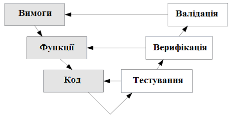

**Рисунок 1.1** – Тестування, верифікація і валідація

_Тестування програмного забезпечення_ — вид діяльності в процесі розробки, пов'язаний з виконанням процедур, спрямованих на виявлення (доказ наявності) помилок (невідповідностей, неповноти, двозначностей тощо) в поточному визначенні розроблюваної програмної системи. Процес тестування стосується в першу чергу перевірки коректності програмної реалізації системи, відповідності реалізації вимогам, тобто тестування — це кероване виконання програми з метою виявлення невідповідностей її поведінки та вимог.

_Верифікація_ (лат. *verus* — «істинний» і *facere* — «роблю») — постійно виконуваний аналітичний процес перевірки того, що розробка перебуває на правильному шляху: кожен етап розробки є коректним, необхідним (не зайвим) і задовольняє потреби наступного етапу. Проводиться на всіх етапах розробки. На кожному етапі слід переконуватися, що зробили саме те, що планували, і це відповідає загальній логіці розробки — _«Ми створюємо систему правильно»_.

_Валідація_ (англ. *Validation* — перевірка правильності) — процес перевірки того, що реалізована система задовольняє пред'явленим вимогам і працює так, як передбачалося — _«Ми створюємо правильну систему»_.

Якщо ще раз подивитися на ці три процеси з точки зору питання, на яке вони дають відповідь, то тестування відповідає на питання _«Як це зроблено?»_ або _«Чи відповідає поведінка розробленої програми вимогам?»_, верифікація — _«Що зроблено?»_ або _«Чи відповідає розроблена система вимогам?»_, а


<!-- ВІДНОВЛЕНО ЛОКАЛЬНО (Стор. 25) -->
валідація – « _Чи зроблено те, що потрібно?_ »  або « _Чи відповідає розроблена система очікуванням замовника?_ ». 

Верифікація та перевірка на валідність часто виконуються разом, але, як ми бачимо, мають різні визначення. Різниця в них важлива для тестування ПЗ. Верифікація – це підтвердження того, що продукт відповідає специфікаціям, а перевірка на валідність – вимогам користувача. Може здатися, що визначення вельми схожі, але на прикладі опису проблем орбітального телескопа «Хаббл»  видно різницю. 

У квітні 1990 року до космосу було запущено орбітальний телескоп «Хаббл», що використовував велике дзеркало для збільшення об’єктів, на які був націлений. Його конструкція вимагала неймовірної точності, а тестування було майже неможливим, оскільки він призначався для космосу і не міг бути встановлений на Землі. У зв’язку з цим, можна було лише перевірити на відповідність специфікаціям. Після проходження таких тестів, телескоп було запущено. 

На жаль, після введення його в експлуатацію виявилось, що зображення, які надсилались ним, є розфокусованими. Дослідження показало, що було виготовлено неправильне дзеркало. Тестування показало, що дзеркало пройшло верифікацію, але не пройшло перевірку на валідність. У 1993 році експедиція на космічному кораблі відремонтувала телескоп, встановивши коректуючу лінзу для відновлення фокусу. Хоча цей приклад не стосується ПЗ, верифікація та перевірка на валідність також успішно застосовуються і до тестування програм. Отже, сама верифікація не є достатньою. Лише повна перевірка дозволить уникнути проблем, з якими зіткнулися вчені у випадку з телескопом «Хаббл». 

А тепер давайте розглянемо ці два процеси докладніше. 

**_Верифікація_** – це процес оцінки системи/компоненту з метою визначити, чи задовольняють результати конкретної фази умовам, накладеним на початку цієї фази. 

Верифікація дозволяє переконатися в коректності переходів між фазами: 

1. Потреби користувачів. 

2. Функції продукту. 

3. Вимоги. 

4. Архітектура. 

5. Модель проектування. 

6. Реалізація. 

7. Планування тестів. Верифікувати слід: 

1. Описані функції системи дійсно відповідають потребам клієнта/користувачів. 

2. Варіанти використання та вимоги, створені на основі функцій, підтримують ці функції. 

3. Проектування, яке підтримує функціональну і нефункціональну поведінку системи. 

<!-- КІНЕЦЬ ВІДНОВЛЕННЯ -->


4. Програмний код відповідає цілям і результатам проектування.
5. Тести, які повністю покривають варіанти використання і вимоги.

Верифікація — більше ніж діяльність групи із забезпечення якості. Потрібно дослідити вимоги і переконатися, що вони повно і ненадлишково відповідають потребам користувачів (функціям) верхнього рівня (п. 2). Далі переконатися, що при проектуванні використовувалися саме ці вимоги, а технічний проект вийшов повним і ненадлишковим.

*Валідація* — це процес оцінки системи/компоненту під час або після закінчення процесу розробки з метою визначити, чи задовольняє вона/він заданим вимогам.

Для перевірки правильності проводяться приймально-здавальні випробування. Вони засновані на сценаріях тестування, які користувач погоджує, а потім виконує в середовищі використання системи. Стандарт IEEE 829-2008 (Standard for Software and System Test Documentation) містить зразки 8 документів, якими слід керуватися при плануванні, організації та проведенні тестування:
1. План тестування. Керівний документ, що відображає :
   - як проводитиметься тестування, включаючи конфігурації тестованої системи;
   - хто буде тестувати;
   - що буде тестуватися;
   - скільки часу займе тестування;
   - який рівень якості тестування необхідний.
2. Критерії успішності тестування.
3. Дані для тестування.
4. Сценарії тестування, включаючи передумови і кроки тестів.
5. Звіт про переходи між етапами тестування.
6. Протокол тестування.
7. Звіт про інциденти, включаючи очікуваний результат, фактичний результат, час, передбачувані причини інциденту і все, що може допомогти з розв'язанням ситуації. Інцидент — не обов'язково має на увазі помилку в системі: очікуваний результат міг бути невірним, перевірка могла проводитися невірно, вимога могла тлумачитися по-іншому.
8. Звіт про тестування.

### 1.5.4 Тестові дані

Усяке програмне забезпечення, так чи інакше, обробляє певні дані, можна визначити, як відомості про деяку подію, факт тощо, що представлені у формальному вигляді і підлягають подальшому аналізу. Аналіз і перетворення даних і являють собою основні завдання програмного забезпечення (важливо пам'ятати різницю між даними та інформацією, яку можна отримати на підставі даних).

Таким чином, для проведення тестування програмного забезпечення необхідні дані, які б симулювали реальний потік, оброблюваний програмою.

Існує два типи тестових даних: реальні та синтезовані. Реальні дані можна отримати двома способами: перший полягає в тому, щоб тестувати програмне забезпечення в реальних умовах що практично неможливо; другий — отримувати реальні дані у кінцевого користувача (що можливо досить рідко) або з існуючої системи (у цьому випадку можуть виникнути проблеми з конфіденційністю). Тому, найчастіше для тестування використовують синтезовані дані.

Основною умовою синтезу даних є їх правдоподібність. Синтезувати дані можна на підставі зразка (невеликої кількості реальних даних), статистичної інформації про те, які дані є типовими для конкретного тестового випадку, а також іншого набору умов, що обмежують спектр допустимих варіацій вхідних даних. На базі наявної інформації будується генератор тестових даних, який формує необхідний для тестування потік.

### 1.5.5 Тестова ситуація

Тестова ситуація — це базисне поняття тестування. Під тестовою ситуацією розуміється деякий певний стан системи, що тестується, якому відповідає строго певний набір її параметрів. Тестову ситуацію можна визначити також як сукупність зовнішніх і внутрішніх факторів, що дозволяють розрізнити умови виконання програми. Якщо один з параметрів змінюється — зміниться і тестова ситуація. Виходячи з цього, повний набір всіх можливих тестових ситуацій визначає тестове покриття.

### 1.6 Тестувальник і QA інженер

Якість — це складне і неоднозначне поняття, яке визначається багатьма умовами. З одного боку, якісний продукт — це продукт, який відповідає вимогам до ПЗ. Під вимогами звичайно розуміють вимоги замовника, які знаходять своє вираження в « специфікаціях продукту». З іншого боку, якісний продукт — це той, який виправдовує очікування користувачів, зазвичай відображених в «специфікаціях споживача». Але для забезпечення якості кінцевого продукту необхідно, щоб вимоги були вимірюваними, оскільки єдина об’єктивна форма контролю якості — це вимірювання продукту на відповідність специфікаціям.

В умовах високої конкуренції розробка програмних продуктів перестає бути стихійним процесом і переходить на промисловий рівень, де все підпорядковується технології виробництва, що забезпечує високий рівень якості кінцевого продукту. У контексті розробки програмного забезпечення вводиться поняття «уніфікованого процесу розробки» (далі, для позначення уніфікованого процесу розробки буде вживатися термін «процес» ), як гаранта якості. У рамках процесу, як один з напрямків діяльності,

сформується проблема управління якістю, яку умовно можна розділити на два основних напрямки: контроль якості та забезпечення якості.

Контроль якості ставить основний акцент на пошуку дефектів, які вже були внесені в продукт, а значить, носить характер реакції. Забезпечення ж якості приймає проактивний характер, маючи основною функцією запобігання появи нових дефектів.

Розглядаючи управління якістю як комплексний процес слід розуміти, що заходи щодо забезпечення якості повинні проводитися на всіх етапах життєвого циклу програмного забезпечення, тобто, проводитися постійно.

### 1.6.1 Обов'язки тестувальника

Як уже згадувалося, в рамках процесу розробки ПЗ передбачено суворий поділ праці. Так, моделюванням і дизайном займається архітектор, розробкою і реалізацією — програміст, а тестуванням — тестувальник. Виходячи з вищесказаного, в обов'язки тестувальника входить пошук дефектів розроблюваного програмного забезпечення, а також, частково, виявлення їх етимології (від грец. Етумос — істинний, правильний, вірний) з формальним зазначенням умов виникнення кожної помилки.

Всупереч поширеній помилці, тестувальник не займається пошуком шляхів усунення виявлених дефектів — це входить в обов'язки розробників. Тестувальник лише тільки зобов'язаний відправити програмне забезпечення на доопрацювання або виправлення, якщо дефект буде мати місце.

Тестувальник також бере участь у прийманні-здачі готового продукту, оскільки в процесі приймання необхідно провести перевірочне тестування для підтвердження того, що розроблене програмне забезпечення відповідає заявленим специфікаціям. Тому найчастіше **тестувальник** - це людина, що оцінює програмний продукт з точки зору користувача.

Існувала думка, що тестувальників вербують з числа програмістів, виходячи з того, що для якісного тестування програмного забезпечення необхідні знання про те, як воно розробляється. Ця думка, багато в чому, підкріплювалася популярністю об'єктно-орієнтованого тестування.

Дійсно, непогано, якщо тестувальник буде мати певний досвід розробки програмного забезпечення, проте — зовсім не обов'язково. Тестування та розробка — суть два різних процеси. А тестувальник зобов'язаний «перевіряти» роботу ПЗ по-іншому, ніж це робить програміст. Інакше він ризикує пропустити ті ж помилки, які були пропущені програмістами, оскільки програмісти схильні взаємодіяти з ПЗ так, як це було ними передбачено. А реальний користувач, на противагу програмістам, бажає поступати з програмним забезпеченням так «як йому подобається». Іншими словами, тестувальник повинен мислити інакше ніж програміст.

З одного боку тестувальник повинен відчувати користувача, тобто, припускати (бачити) можливі, неадекватні з погляду інтерфейсу, варіанти використання програмного забезпечення. З іншого боку, тестувальник повинен методично і повно перевіряти коректність функціонування всіх

модулів і компонентів програми. Системно і «прискіпливо» продумувати і перевіряти всі можливі тестові ситуації. Таким чином, розробник за своєю суттю – творець, тоді як тестувальник – дослідник.

### 1.6.2 Цілі і завдання тестувальника

Ми вже говорили про цілі і завдання тестування програмного забезпечення, як напрямки діяльності в рамках процесу. У загальному значенні тестувальник є особою, що реалізує ці цілі і завдання. Завдання тестувальника полягає в тому, щоб поставляти розробникам інформацію про відповідність продукту заданим специфікаціям. Головна діяльність тестувальників полягає в тому, що вони надають учасникам проекту з розробки ПЗ негативний зворотний зв’язок про якість програмного продукту.

### 1.6.3 Обов'язки QA інженера

Забезпечення якості займає в процесі розробки ПЗ не менш важливе місце, ніж контроль. Контроль дозволяє відшукувати дефекти і усувати їх, але куди ефективніше не допускати появи дефектів, ніж витрачати час і кошти на їх усунення. Саме розробка та впровадження превентивних заходів щодо недопущення появи дефектів і складає основне завдання забезпечення якості.

У рамках процесу розробки ПЗ має місце посада інженера з якості або **QA інженера** (Quality Assurance Engineer), завданням якого є вивчення процесу на предмет оптимізації з точки зору підвищення якості процесу, з одного боку, і продукту – з іншого. Тобто, *інженер з якості* – це той же тестувальник, тільки відповідальний за якість продукту протягом всього циклу розробки.

Інженери з якості (QA інженери ) складають групу SQE (Software Quality Engineering – Інженерія з якості програмного забезпечення). Група SQE має два основних напрямки діяльності:
- розробка процесів, яка передбачає постійну діяльність, спрямовану на пошук шляхів модернізації процесу з метою підвищення якості виробленої продукції;
- забезпечення якості ( Software Quality Assurance – SQA ), в основному складається в підтвердженні того, що розробка продукту відповідає визначеним на підприємстві процесам.

Можна сказати, що AQ інженер займається забезпеченням якості. Одна з його основних функцій – збір і аналіз метрики процесу (формальних показників якості процесу), прикладами яких можуть бути:
- кількість дефектів, знайдених після релізу;
- невідповідність запланованих термінів здачі проекту реальним термінам; показники продуктивності та якості праці.

На підставі зібраних даних інженер з якості може приймати рішення щодо зміни характеру процесу розробки для забезпечення якості.

### 1.6.4 Цілі і задачі тестувальника і QA інженера

Хоча основна мета тестувальників і QA інженерів одна — забезпечення якості кінцевого продукту — задачі їх діяльності (як можна судити з попереднього розділу) відрізняються. Але, при всіх відмінностях, їх діяльність нерозривно пов'язана, так як рішення QA інженера впливають на роботу тестувальника, оскільки визначають характер і форму останньої, а тестувальник, в свою чергу, забезпечує QA інженера даними, необхідними для подальшого удосконалення процесу.

QA інженер і тестувальник працюють на різних рівнях процесу розробки ПЗ, а також у різних зонах відповідальності. І важливо, щоб кожен виконував відведену йому роль, оскільки забезпечення якості неможливе як без ефективної організації, так і без здійснення кінцевого контролю.

Тобто, QA інженер відповідає за забезпечення якості, а тестувальник — за його контроль. В окремих аспектах цілі QA-інженера можуть приймати характер контролю, але завжди в QA-контексті.

### 1.7 Життєвий цикл тестування програмного забезпечення

Щоб краще розібратися в тому, як тестування співвідноситься з програмуванням і іншими видами проектної діяльності, для початку розглянемо самі основи — моделі розробки ПЗ, як частини життєвого циклу ПЗ. При цьому підкреслимо, що розробка ПЗ є лише частиною життєвого циклу ПЗ (ЖЦ ПЗ), і тут ми говоримо саме про розробку.

Матеріал цього розділу відноситься скоріше до дисципліни «управління проектами», тому тут розглянуто вкрай стисло: будь ласка, не сприймайте його як вичерпне керівництво — тут чи розглянута і сота частка відсотка відповідної предметної області.

Під моделлю ЖЦ ПЗ розуміється структура, що визначає послідовність виконання та взаємозв'язок процесів, дій, завдань, які виконуються протягом ЖЦ. Модель ЖЦ залежить від специфіки IC та специфіки умов, в яких остання створюється та функціонує.

#### 1.7.1 Моделі розробки ПЗ

Знати і розуміти моделі розробки ПЗ необхідно для того, щоб вже з перших днів роботи розуміти, що відбувається навколо, що, навіщо і чому ви робите. Чим повніше ви будете представляти картину того, що відбувається на проекті, тим ясніше вам буде видно ваш власний внесок у загальну справу і сенс того, чим ви займаєтеся.

Ще одна важлива річ, яку слід розуміти, полягає в тому, що ніяка модель не є догмою або універсальним рішенням. Немає ідеальної моделі. Є та, яка гірше або краще підходить для конкретного проекту, конкретної команди, конкретних умов.

Існують три основні стратегії розробки ПЗ:

1. **Одноразовий прохід** (водоспадна стратегія) — лінійна послідовність етапів конструювання.
2. **Інкрементна (чи ітеративна) стратегія**. На початку процесу визначаються усі призначені для користувача і системні вимоги, частина конструювання, що залишилася, виконується у вигляді послідовності версій (заплановане поліпшення продукту).
3. **Еволюційна стратегія**. Система також будується у вигляді послідовності версій, але на початку процесу визначені не усі вимоги. Вимоги уточнюються в результаті розробки версій.

Розглянемо коротко декілька моделей життєвого циклу ПЗ. Вони усі базуються на розглянутому скелеті і так чи інакше його включають.

### 1.7.1.1 Класична або каскадна модель

Найбільш широко відомою і вживаною довгий час залишалася класична або так звана **каскадна (70–85 р.р.)** або **водоспадна (waterfall)** модель життєвого циклу. Вона була уперше чітко сформульована в стандартах міністерства оборони США (автор Уїнстон Ройс, 1970).

Ця модель припускає послідовне виконання різних видів діяльності, починаючи з вироблення вимог і закінчуючи супроводом, з чітким визначенням меж між етапами, на яких набір документів, виробленою на попередній стадії, передається в якості вхідних даних для наступної.

Дуже часто класичний життєвий цикл називають каскадною або водоспадною моделлю, підкреслюючи, що розробка розглядається як послідовність етапів, причому перехід на наступний, ієрархічно нижній етап відбувається тільки після повного завершення робіт на поточному етапі (рис. 1.2).

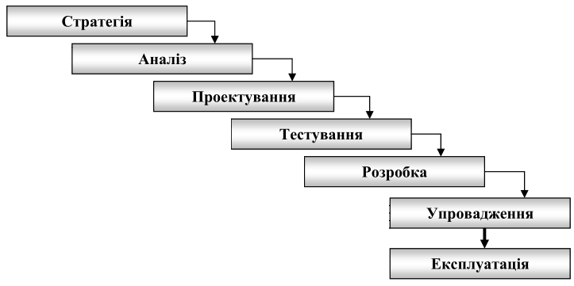

**Рисунок 1.2** — Каскадна модель ЖЦ ПЗ

Охарактеризуємо зміст основних етапів.

**Стратегія.** Визначення стратегії припускає обстеження системи. Основне завдання обстеження – оцінка реального об'єму проекту, його цілей і завдань, а також отримання визначень суті і функцій на високому рівні. На цьому етапі притягуються висококваліфіковані бізнес-аналітики, які мають постійний доступ до керівництва фірми; етап припускає тісну взаємодію з основними користувачами системи і бізнес-експертами. Основне завдання взаємодії – отримати якомога повнішу інформацію про систему (повне і однозначне розуміння вимог замовника) і передати дану інформацію у формалізованому вигляді системним аналітикам для подальшого проведення етапу аналізу.

Результатом етапу визначення стратегії є документ, де чітко сформульовано: що отримає замовник, якщо погодиться фінансувати проект; коли він отримає готовий продукт (графік виконання робіт); скільки це коштуватиме (для великих проектів повинен бути складений графік фінансування на різних етапах робіт).

Виконана на даному етапі робота дозволяє відповісти на питання, чи варто продовжувати даний проект і які вимоги замовника можуть бути задоволені за тих або інших умов. Може так статися, що проект продовжувати не має сенсу, наприклад через те, що ті або інші вимоги не можуть бути задоволені за якимось об'єктивними причинами. Якщо ухвалюється рішення про продовження проекту, то для проведення наступного етапу аналізу вже є уявлення про об'єм проекту і кошторис витрат.

**Аналіз.** Етап аналізу припускає докладне дослідження бізнес-процесів (вимог і функцій, визначених на етапі вибору стратегії) і інформації, необхідної для їх виконання (сутності, їх атрибутів і зв'язків (відносин)).

Вся інформація про систему, зібрана на етапі визначення стратегії, формалізується і уточнюється на етапі аналізу. Особливу увагу слід приділити повноті переданої інформації, аналізу інформації на предмет відсутності суперечностей, а також пошуку невживаною взагалі або інформації, що дублюється. Як правило, замовник не відразу формує вимоги до системи в цілому, а формулює вимоги до окремих її компонентів. Тому необхідно приділити увагу узгодженості цих компонентів. Фактично ці вимоги визначають повне завдання на розробку.

**Проєктування (моделювання).** Моделювання присвячене виконанню двох дій – аналізу вимог і проєктуванню. Результати цих дій моделі – зазвичай записуються на графічній мові моделювання, мові картинок.

Розгляд результатів аналізу – це процес передачі інформації від аналітиків проєктувальникам. На практиці це інтерактивний процес. У проєктувальників неминуче виникатимуть питання до аналітиків, і навпаки. Інформація про систему постійно уточнюватиметься. При розробці схеми бази даних може змінитися інформаційна модель, отримана на етапі аналізу, наприклад, тому, що наявне проєктне рішення нестабільне або поволі працює при реалізації його за допомогою вибраної СУБД або через інші причини.

Робота проектувальників бази даних в значній мірі залежить від якості інформаційної моделі. Інформаційна модель не повинна містити ніяких незрозумілих конструкцій, які не можна реалізувати в рамках вибраної СУБД. Слід зазначити, що інформаційна модель створюється для того, щоб на її основі можна було побудувати модель даних, тобто повинна враховувати особливості реалізації вибраної СУБД.

Побудова логічної і фізичної моделей даних є основною частиною проектування бази даних. Отримана в процесі аналізу інформаційна модель спочатку перетвориться в логічну, а потім у фізичну модель даних. Після цього для розробників інформаційної системи створюється пробна база даних. З нею починають працювати розробники коду. У ідеалі до моменту початку розробки модель даних повинна бути стійка. Проектування бази даних не може бути відірване від проектування модулів і додатків, оскільки бізнес-правила можуть створювати об'єкти в базі даних, наприклад серверні обмеження.

Головна мета проектування полягає у відображенні функцій, отриманих на етапі аналізу, в модулі інформаційної системи. Визначення модулів розкриваються в технічній специфікації програм. При проектуванні модулів визначають розмітку меню, вид вікон, гарячі клавіші і пов'язані з ними виклики.

**Тестування.** Проектування процесу тестування, як правило, слідує за процесом функціонального проектування і проектування схеми бази даних. На цьому етапі можна використовувати складні схеми тестування, а можна обмежитися і простими. Коли генерація модуля завершена, виконують автономний тест, який переслідує дві основні цілі:
- виявлення відмов модуля (жорстких збоїв);
- відповідність модуля специфікації (наявність всіх необхідних функцій, відсутність зайвих функцій).

Після того, як автономний тест пройшов успішно, група модулів, що згенерували, проходить тести зв'язків, які повинні відстежити взаємний вплив модулів.

Далі група модулів тестується на надійність роботи, тобто проходять, по-перше, тести імітації відмов системи, а по-друге, тести напрацювання на відмову. Перша група тестів показує, наскільки добре система відновлюється після збоїв програмного забезпечення, відмов апаратного забезпечення. Друга група тестів визначає ступінь стійкості системи при штатній роботі і дозволяє оцінити час безвідмовної роботи системи. У комплект тестів стійкості повинні входити тести, що імітують пікове навантаження на систему.

Потім весь комплект модулів проходить системний тест — тест внутрішнього приймання продукту, що показує рівень його якості. Сюди входять тести функціональності і тести надійності системи.

Останній тест інформаційної системи — приймально-здавальні випробування. Такий тест передбачає показ інформаційної системи

замовникові і повинен містити групу тестів, що моделюють реальні бізнес-процеси, щоб показати відповідність реалізації вимогам замовника.

**Реалізація (розробка, кодування).** На етапі розробки здійснюється тісна взаємодія проектувальників, розробників і груп тестерів. У разі інтенсивної розробки тестер фактично є членом групи розробки. Проектувальник на даному етапі виконує функції «ходячого довідника», оскільки постійно відповідає на питання розробників, що стосуються технічної специфікації. Найчастіше на етапі розробки міняються інтерфейси користувача. Це обумовлено у тому числі і тим, що модулі періодично демонструються замовникові. Істотно можуть мінятися і запити до даних. Взаємодія тестера і розробника без централізованої передачі частин проекту допустимо, але тільки у випадку, якщо необхідно терміново перевірити якусь правку. Дуже часто етап розробки і етап тестування взаємозв'язані і йдуть паралельно.

**Введення в дію (упровадження, розгортання)** — етап класичного життєвого циклу націлений на дві дії: постачання розробленого продукту замовникові і супровід процесу експлуатації цього продукту.

Згідно із статистичними даними, 65% супроводи пов'язано з удосконаленням ПО, 18% відводиться на адаптацію і 17% пов'язано з виправленням помилок.

**Експлуатація** перекриває процес тестування, система вводиться в експлуатацію не повністю, а поступово. Введення в експлуатацію проходить три фази:
- первинне завантаження інформації;
- накопичення інформації;
- вихід на проектну потужність.

Первинне завантаження інформації ініціює досить вузький круг помилок — в основному це проблеми розузгодження даних при завантаженні і власні помилки завантажувачів, тобто те, що не було відстежене на тестових даних. Подібні помилки повинні бути виправлені щонайшвидше.

В період накопичення інформації виявитися найбільша кількість помилок, допущених при створенні ПЗ. Як правило, це помилки, пов'язані з багатокористувальницьким доступом. Часто на етапі тестування таким помилкам не приділяється належної уваги — мабуть, із-за складності моделювання і дорожнечі засобів автоматизації процесу тестування системи в умовах багатокористувальницького доступу. Деякі помилки виправити буде складно, оскільки вони є помилками проектування. Жоден хороший проект від них не застрахований. Це означає, що про всяк випадок треба резервувати час на локалізацію і виправлення таких помилок.

Друга категорія виправлень пов'язана з тим, що користувача не влаштовує інтерфейс. Тут не завжди потрібно виконувати абсолютно всі побажання користувача, інакше процес введення в експлуатацію не кінчиться ніколи.

**Позитивні сторони** застосування каскадного підходу полягають в наступному:
- дає план і часовий графік по усіх етапах проекту, упорядковує хід конструювання;
- на кожному етапі формується закінчений набір проектної документації, що відповідає критеріям повноти і узгодженості;
- виконувані в логічній послідовності етапи робіт дозволяють планувати терміни завершення усіх робіт і відповідні витрати.

Каскадний підхід добре зарекомендував себе при побудові ПЗ, для якого на самому початку розробки можна досить точно і повно сформулювати усі вимоги з тим, щоб надати розробникам свободу реалізувати їх якнайкраще з технічної точки зору.

**Основними недоліками** каскадного підходу є:
- істотне запізнювання з отриманням результатів, оскільки реальні проекти часто вимагають відхилення від стандартної послідовності кроків;
- вимога повного закінчення фази-діяльності, закріплення результатів у вигляді детального початкового документу (технічного завдання, проектної специфікації);
- узгодження результатів з користувачами робиться тільки в точках, що плануються після завершення кожного етапу робіт;
- користувачі і замовник не можуть ознайомитися з варіантами системи під час розробки, і бачать результат тільки в самому кінці;
- вимоги до ПЗ «заморожені» у вигляді технічного завдання на увесь час її створення, тому користувачі можуть внести свої зауваження тільки після того, як робота над системою буде повністю завершена.

Незважаючи на наполегливі рекомендації компаній — експертів в області проектування і розробки ПЗ за допомогою новітніх технологій, багато компаній продовжують використати каскадну модель на практиці замість якого-небудь варіанту ітераційної моделі.

Головні причини, по яких *каскадна модель* зберігає свою популярність, наступні: звичка, розробка невеликих проектів, ілюзія зниження ризиків учасників проекту (замовника і виконавця), проблеми впровадження при використанні ітераційної моделі.

### 1.7.1.2 Компонентні моделі

У більшості програмних проектів застосовується повторне використання деяких програмних модулів (компонентів). Це зазвичай трапляється там, де розробники проекту знають про раніше створені програмні продукти, у складі яких є компоненти, що приблизно задовольняють вимогам компонентів, що розробляються.

Цей підхід заснований на наявності великої бази існуючих програмних компонент, які можна інтегрувати в створювану нову систему. Часто

такими компонентами є програмні продукти, що вільно продаються на ринку, які можна використати для виконання певних спеціальних функцій.

У цьому підході початковий етап специфікації вимог і етап атестації (тестування і введення в експлуатацію) такі ж, як і в інших моделях процесу створення ПЗ. А етапи, розташовані між ними, мають наступний сенс.

1. *Аналіз компонентів*. Маючи специфікацію вимог, на цьому етапі здійснюється пошук компонентів, які могли б задовольняти сформульованим вимогам.
2. *Модифікація вимог*. На цій стадії аналізуються вимоги з урахуванням інформації про компоненти, отриманої на попередньому етапі. Вимоги модифікуються так, щоб максимально використати можливості відібраних компонентів.
3. *Проектування системи*. На цьому етапі проектується структура системи або модифікується існуюча структура повторно використовуваної системи.
4. *Розробка і зборка системи*. Це етап безпосереднього створення системи. У рамках даного підходу зборка системи є швидше частиною розробки системи, чим окремим етапом.

Основні переваги описуваної моделі полягають в тому, що скорочується кількість компонентів, що безпосередньо розробляються, і зменшується загальна вартість створюваної системи.

### 1.7.1.3 Макетування (прототипування)

Досить часто замовник не може сформулювати детальні вимоги до введенню, обробці або виведенню даних для майбутнього програмного продукту. У цих випадках доцільно використати макетування.

Основна мета макетування: зняти невизначеності у вимогах замовника. Макетування (прототипування) — це процес створення моделі необхідного програмного продукту. Модель може приймати одну з трьох форм:

1) паперовий макет або макет на основі ПК (зображує або малює людино-машинний діалог);
2) працюючий макет (прототип, версія програми), що виконує деяку частини необхідних функцій;
3) існуюча програма (версія), характеристики якої потім мають бути поліпшені.

Як показано на рис. 1.3, макетування грунтується на багаторазовому повторенні ітерацій, в яких беруть участь замовник і розробник.


**Рисунок 1.3** – Макетування (прототипування)

### 1.7.1.4 Ітеративні (інкрементні) моделі

Ітеративна модель є класичним прикладом інкрементної стратегії розробки. Вона об'єднує елементи послідовної водоспадної моделі з ітераційним макетуванням. Кожна лінійна послідовність тут виробляє інкремент (версію) ПЗ, що поставляється.

Основний недолік каскадного підходу – відсутність гнучкості. Саме цей недолік долається каскадно-поворотним підходом, в якому дозволені повернення до попередніх стадій і перегляд або уточнення раніше прийнятих рішень. Каскадно-поворотний підхід відбиває ітеративний або ітераційний характер розробки ПЗ.

*Ітеративні моделі* припускають розбиття створюваної системи на набір кроків, які розробляються за допомогою декількох послідовних проходів усіх робіт або їх частини. При цьому велика частина або навіть повний цикл робіт проходить ся на нього, потім оцінюються результати і на наступній ітерації розробляється наступний, який може залежати від першого, або доопрацьовується перший з додаванням нових функцій.

В результаті на кожній ітерації можна аналізувати проміжні результати робіт і реакцію на них усіх зацікавлених осіб, включаючи користувачів, і вносити зміни, що коригують, на наступних ітераціях. Кожна ітерація може містити повний набір видів діяльності від аналізу вимог, до введення в експлуатацію чергової частини ПЗ. Каскадна модель з можливістю повернення на попередній крок стає ітеративною (рис. 1.4).

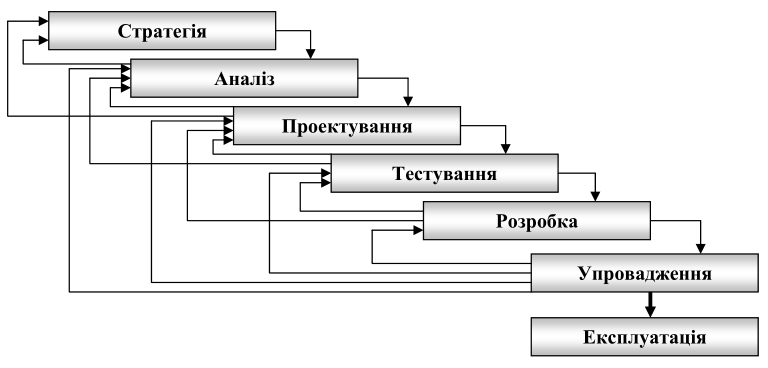

**Рисунок 1.4** – Можливий хід робіт по ітеративній каскадній моделі

Процес ітераційної розробки має цілий ряд переваг.

Замовникові немає необхідності чекати повного завершення розробки системи, щоб отримати про неї представлення. Компоненти, отримані на перших кроках розробки, задовольняють найбільш критичним вимогам (оскільки зазвичай мають найбільший пріоритет) і їх можна оцінити на самій ранній стадії створення системи.

1.7.1.5 Спіральна модель

Розвизком ідеї ітерацій є **спіральна модель життєвого циклу ПЗ**, запропонована Барри Бозмом в 1988 році з метою скоротити можливий ризик розробки.

Спіральна модель використовує поняття **прототипу** — програми, що реалізовує часткову функціональність створюваного програмного продукту. Створення прототипів здійснюється за декілка витків спіралі, кожен з яких складається з «аналізу ризику», «деякого процесу» і «верифікації».

Спіральна модель (рис. 1.5) — класичний приклад застосування еволюційної стратегії конструювання, була запропонована для подолання перерахованих проблем в попередніх моделях.


**Рисунок 1.5** — Спіральна модель ЖЦ ПЗ

Спіральна модель пропонує кожну ітерацію розпочинати з виділення цілей і планування чергової ітерації, і робить упор на початкові етапи ЖЦ: аналіз і проектування. На цих етапах реалізовані технічні рішення перевіряються шляхом створення *прототипів*. Кожен виток спіралі відповідає створенню фрагмента або версії ПЗ, на нім уточнюються цілі і характеристики проекту, визначається його якість і плануються роботи наступного витка спіралі. Таким чином поглиблюються і послідовно конкретизуються деталі проекту і в результаті вибирається обґрунтований варіант, який доводиться до реалізації.

Перевагами спіральної моделі є:
1. Неповне завершення робіт на кожному етапі дозволяє переходити на наступний етап, не чекаючи повного завершення роботи на поточному.
2. Кожен виток спіралі відповідає створенню фрагмента або версії ПЗ, на ньому уточнюються цілі і характеристики проекту.

3. Дозволяє явно враховувати ризик на кожному витку еволюції розробки.
4. Використовує моделювання для зменшення ризику і вдосконалення програмного виробу.

Серед проблем спірального циклу можна виділити наступні:
1. Визначення моменту переходу на наступний етап. Для її вирішення необхідно ввести тимчасові обмеження на кожного з етапів життєвого циклу.
2. Підвищені вимоги до замовника.
3. План складається на основі статистичних даних, отриманих в попередніх проектах, і особистого досвіду розробників.

У спіральній моделі немає фіксованих етапів, таких як розробка специфікації або проектування. Ця модель може включати будь-які інші моделі розробки систем на певному витку спіралі.

### 1.7.2 Життєвий цикл тестування

В етапах життєвого циклу розробки програмного продукту є етап, на якому виконується тестування частини або цілком усього продукту. Незалежно від того відповідно до якої методології ЖЦ ПЗ проводиться розробка, можна виділити загальні стадії (стани) та етапи, які притаманні кожній з методологій та є основою будь-якого процесу розробки. При цьому, тестування має свої цілі, завдання, роль, види, методи, критерії, свою методологію та технологію. На основі аналізу сучасних методологій і моделей якості, можна зробити висновок, що тестування має свій власний життєвий цикл – життєвий цикл тестування програм (ЖЦ ТП).

Для структуризації процесу тестування розглянемо основні етапи розробленого життєвого циклу тестування програмного забезпечення на базі каскадної моделі життєвого циклу розробки ПЗ.

**1. Аналіз вимог.** Для людини, що займається тестуванням програмного забезпечення, інформація про те, чого хоче клієнт, дуже важлива. Клієнтів буде більше, якщо вони отримуватимуть саме те, що хочуть. На фазі аналізу вимог тестувальник повинен отримати вимоги до тестованого продукту і сформувати з них «матрицю вимог», що дозволить в майбутньому стежити, щоб програма залишалася такою, якою хоче бачити клієнт.

**2. Аналіз дизайну проекту.** На етапі життєвого циклу тестувальники вирішуватимуть, який підхід до тестування буде використовуватися, рішення залежить від «матриці вимог», яка створилася на минулій фазі життєвого циклу. Наприклад, компанія розробляє продукт – відеоредактор, основними вимогами виявилися швидкість конвертації відео і дружній інтерфейс. На стадії аналізу дизайну проекту було прийнято рішення розробити автоматичний тест для вимірювання швидкості конвертації відео, і знайти людину, яка буде дивитися за тим, щоб інтерфейс був дружнім.

**3. Планування тестування** – це етап, на якому проводитися планування тестів. Тестувальники планують, як вони перевірятимуть вимоги, пред'явлені до продукту, як будуть підібрані тестові дані (відео матеріал, і

еталонний час роботи з ним). На цьому етапі проводиться розподіл завдань між тестувальниками.

4. **Розробка тестів.** Розробка тестів ведеться паралельно розробці програми. Як тільки розробляється частина програми, до неї розробляють тест, який забезпечить тестування цієї частини програми.

5. **Виконання тестів.** Виконання тестів проводитися постійно в процесі розробки продукту, для того щоб найраніше відстежити дефекти.

6. **Написання звітів.** Після виконання тестування тестувальники повинні написати звіти про знайдені дефекти і до тих частин програми, які працюють правильно. У будь-якому випадку повинна бути документація про всі частини продукту, не залежно від знайдених дефектів.

7. **Повторна перевірка дефектів.** Коли звіти були написані і передані розробникам, їх завдання виправити знайдені дефекти додатку. Після виправлення дефектів весь додаток повинен пройти повторну перевірку тестувальниками.

## 1.8 Вартість пошуку дефекту на різних стадіях розробки проекту

Метою тестування дефектів є виявлення в програмній системі прихованих дефектів до того, як вона буде здана замовникові. Тестування дефектів протилежно атестації, в ході якої перевіряється відповідність системи своїй специфікації.

Під час атестації система повинна коректно працювати з усіма заданими тестовими даними. При тестуванні дефектів запускається такий тест, який викликає некоректну роботу програми і, отже, виявляє дефект.

Загальна модель процесу тестування дефектів показана на рисунку 1.6.


**Рисунок 1.6** – Модель процесу тестування дефектів

Тестові сценарії – це специфікації вхідних тестових даних і очікуваних вихідних даних плюс опис процедури тестування. Тестові дані іноді генеруються автоматично. Автоматична генерація тестових сценаріїв неможлива, оскільки результати проведення тесту не завжди можна передбачити заздалегідь.

Чим далі по життєвому циклу йде проект, тим більше ресурсів необхідно затратити на пошук дефектів у продукті (рис. 1.7) [35].


**Рисунок 1.7** – Графік вартості пошуку дефекту на різних стадіях розробки проекту

Така ситуація виникає тому що при написанні малої частини продукту є мало дефектів, але практично їх всі знайти неможливо. Чим більше частин, з яких складається продукт, тим більше в ньому дефектів. Однак найбільшим джерелом дефектів, як правило, виступає «зв'язка» між частинами. Наприклад, програміст розробив частину додатку, який працює з базою даних, інший програміст розробив частину програми, яка займається математичними обчисленнями, в результаті може вийти ситуація, коли частина з математичними розрахунками надає неправильні дані для частини, яка працює з базою даних. Тому й виходить, що графік кількості знайдених дефектів зростає експоненціально.

Якщо постійно докладати зусилля до виправлення дефектів, то чимала кількість багів буде знайдена (рис. 1.8) [35].

Дефекти потрібно усувати в міру їх надходження, оскільки чим довше дефект знаходиться в невиправленому стані, тим дорожче потім обійдеться його виправлення. Наприклад, якщо був знайдений дефект у коді однієї з частин продукту, то таке виправлення обійдеться набагато дешевше, ніж виправлення помилки архітектури системи, коли всі програмісти будували свою логіку навколо розробленої неправильної архітектури. Проте найдорожче обходяться не знайдені дефекти на етапі збору вимог (рис. 1.9) [35].

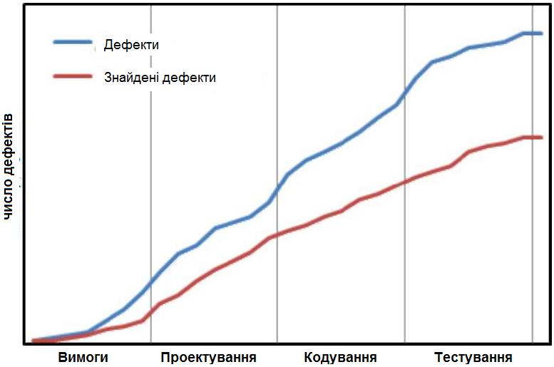

**Рисунок 1.8** – Графік пошуку дефекту на різних стадіях розробки проекту

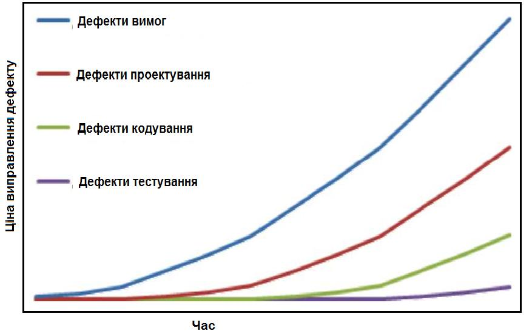

**Рисунок 1.9** – Графік ціни виправлення дефектів

Саме з перерахованих вище причин компанії, що займаються розробкою програмного забезпечення, так прискіпливо ставляться до пошуку дефектів і відбирають на вакансії тестувальників тільки кращих кандидатів.

## 1.9 Підходи до тестування

У контексті тестування програмного забезпечення набагато результативніше буде проводити пошук дефектів, які мають загальний характер. Наприклад, спочатку перевірити всі «вікна» додатка на «перевірку граничних умов», після чого протестувати додаток на всіх платформах, і так далі. Тому використовуються різні підходи до тестування програмного забезпечення, що дозволяє зробити пошук дефектів результативнішим.

Варто відзначити, що при тестуванні програмного забезпечення не обмежуються одним підходом, а одночасно використовують кілька підходів.

Існує кілька ознак, за якими прийнято робити класифікацію видів тестування. Зазвичай виділяють такі:

1. **За об'єктом тестування:**
   - функціональне тестування;
   - тестування продуктивності;
   - навантажувальне тестування;
   - стрес-тестування;
   - тестування стабільності;
   - тестування зручності використання;
   - тестування інтерфейсу користувача;
   - тестування безпеки;
   - тестування сумісності.

2. **За режимом тестування:**
   - ознайомлювальне тестування;
   - тестування за сценарієм.

3. **За ступенем автоматизації:**
   - ручне тестування;
   - автоматизоване тестування.

4. **За знанням системи:**
   - тестування чорного ящика;
   - тестування білого ящика.

5. **За часом проведення тестування:**
   - альфа-тестування;
   - тестування при прийманні;
   - тестування нової функціональності;
   - регресивне тестування;
   - тестування при здачі;
   - бета-тестування.

6. **За ознакою позитивності сценаріїв:**
   - позитивне тестування;
   - негативне тестування.

7. **За ступенем ізольованості компонентів:**
   - компонентне (модульне) тестування;

– інтеграційне тестування;
– тестування збірки;
– системне тестування.

**8. За ступенем підготовленості до тестування:**
– тестування за документацією;
– тестування вимог;
– інтуїтивне тестування.

Розглянемо деякі підходи (види) тестування детальніше.

### 1.9.1 Тестування вимог

Вимоги є відправною точкою для визначення того, що проєктна команда проектуватиме, реалізовуватиме і тестуватиме. Елементарна логіка говорить нам, що якщо у вимогах щось «не те», то і реалізоване буде «не те», тобто колосальна робота певної кількості людей буде виконана даремно.

Тестування вимог є необхідною і дуже важливою процедурою, яка надалі допоможе оптимізувати роботу команди і уникнути нерозумінь, а також дозволяє зрозуміти, чи можна в принципі виконати ці вимоги – з точки зору часу, ресурсів і бюджету.

Ще одним аргументом на користь тестування вимог є те, що, за різними оцінками, в них зароджується від $\frac{1}{2}$ до $\frac{3}{4}$ усіх проблем з програмним забезпеченням.

Зазвичай тестуються такі вимоги:
– вимоги, що описують функціональність проєкту;
– інтерфейс користувача;
– апаратний і програмний інтерфейси;
– критерії ефективності;
– критерії безпеки і коректності системи.

Оскільки більшість помилок тягнуться саме з вимог до ПЗ, то треба з цим якось боротися, тобто зробити так, щоб не було таких проблем:
– незрозумілість вимог;
– часта змінність;
– зміни, що вносяться в останню мить;
– невірне трактування вимог.

Із-за всього переліченого вище може статися таке:
– зрив терміну проєкту;
– буде зроблено не те і не так як треба;
– зміни не контролюються, і команда не знає, що робити.

Щоб уникнути усього цього слід зробити так, щоб вимоги були:
– завершеними;
– несуперечливими;
– коректними;
– недвозначними.

У процесі тестування вимог перевіряється їх відповідність певному набору властивостей.

**Завершеність.** Вимога повинна бути повною і закінченою з точки зору представлення в ній усієї необхідної інформації. Вимога повинна містити усю інформацію, необхідну для розробників, ніщо не пропущене з міркувань «це і так всім зрозуміло».

Типові проблеми із завершеністю:

1. Відсутні нефункціональні складові вимоги або посилання на відповідні нефункціональні вимоги. Наприклад, *«паролі повинні зберігатися в зашифрованому вигляді»* — який алгоритм шифрування?
2. Вказана лише частина деякого перерахування. Наприклад, *«експорт здійснюється у формати PDF, PNG тощо»*. — що ми повинні розуміти під «тощо»?
3. Приведені посилання неоднозначні. Наприклад, *«див. вище»* замість *«див. підрозділ 2.4»*.

**Атомарність, одиничність.** Вимога є атомарною, якщо її не можна розбити на окремі вимоги без втрати завершеності, і вона описує одну і тільки одну ситуацію.

Типові проблеми з атомарністю:

1. У одній вимозі, фактично, міститься декілька незалежних. Наприклад, *«кнопка «Restart» не повинна відображатися при зупиненому сервісі, вікно «Log» повинне вміщувати не менше 20-ти записів про останні дії користувача»* — тут навіщось в одній пропозиції описані абсолютно різні елементи інтерфейсу в абсолютно різних контекстах.
2. Вимога допускає різночитання в силу граматичних особливостей мови. Наприклад, *«якщо користувач підтверджує замовлення і редагує замовлення або відкладає замовлення, то повинен видаватися запит на оплату»* — тут описані три різні випадки, і цю вимогу варто розбити на три окремих щоб уникнути плутанини. Таке порушення атомарності часто спричиняє за собою виникнення суперечності.
3. У одній вимозі об'єднаний опис декількох незалежних ситуацій. Наприклад, *«коли користувач входить в систему, йому повинне відображатися вітання; коли користувач увійшов до системи, повинне відображатися ім'я користувача; коли користувач виходить з системи, повинне відображатися прощання»* — усі ці три ситуації заслуговують того, щоб бути описаними окремими і куди детальнішими вимогами.

**Несуперечність, послідовність.** Вимога не повинна містити внутрішніх протиріч і протиріч іншим вимогам і документам, вимоги мають бути зрозумілими.

Типові проблеми із несуперечністю:

1. Протиріччя усередині однієї вимоги. Наприклад, *«після успішного входу в систему користувача, що не має права входити в систему»*. — тоді як він успішно увійшов до системи, якщо не мав такого права?

2. Протиріччя між двома і більше вимогами, між таблицею і текстом, малюнком і текстом, вимогою і прототипом тощо. Наприклад, «Кнопка «Close» завжди має бути червоною» і «Кнопка «Close» завжди має бути синьою» – так все ж червоною чи синьою?
3. Використання невірної термінології або використання різних термінів для позначення одного і того ж об'єкту або явища. Наприклад, «у разі, якщо роздільна здатність вікна складає менше 800х600». — роздільна здатність є у екрану, а у вікна є розмір.

**Недвозначність.** Вимога описана без використання жаргону, неочевидних абревіатур і розпливчастих формулювань, і допускає тільки однозначне об'єктивне розуміння. Вимога атомарна в плані неможливості різного трактування окремих фраз.

Типові проблеми з недвозначністю:
1. Використання термінів або фраз, що допускають суб'єктивне тлумачення. Наприклад, «додаток повинен підтримувати передачу великих об'ємів даних» – наскільки «великих»?
2. Використання неочевидних або двозначних абревіатур без розшифровки.

**Здійсненність.** Вимога технологічно здійсненна і може бути реалізована у рамках бюджету і термінів розробки проекту.

Типові проблеми із здійсненністю:
1. Вимоги технічно не реалізуються на сучасному рівні розвитку технологій. Наприклад, «аналіз договорів повинен виконуватися із застосуванням штучного інтелекту, який виноситиме однозначне коректне заключення про міру вигоди від укладення договору».
2. Вимоги, що в принципі не реалізуються. Наприклад, «система пошуку повинна заздалегідь передбачати усі можливі варіанти пошукових запитів і кешувати їх результати».

**Обов'язковість, потрібність і актуальність.** Якщо вимога не є обов'язковою до реалізації, вона повинна бути просто виключена з набору вимог. Якщо вимога потрібна, але «не дуже важлива», для вказівки цього факту використовується вказівка пріоритету (див. «Упорядкованість за …»). Також мають бути виключені (або перероблені) вимоги, що втратили актуальність.

Типові проблеми з обов'язковістю і актуальністю:
1. Вимога була додана «про всяк випадок», хоча реальної потреби в ній не було і немає.
2. Вимозі виставлені невірні значення пріоритету за критеріями важливості і/або терміновості.
3. Вимога застаріла, але не було перероблена або видалена.

**Відстеженість.** Відстеження буває вертикальним і горизонтальним. Вертикальне відстеження дозволяє співвідносити між собою вимоги на

різних рівнях вимог. Горизонтальне відстеження дозволяє співвідносити вимогу з тест-планом, тест-кейсами, архітектурними рішеннями тощо. Для забезпечення відстеження часто використовуються спеціальні інструменти з управління вимогами і/або матриці відстеження.

Типові проблеми з відстеженстю:
1. Вимоги не пронумеровані, не структуровані, не мають змісту, не мають працюючих перехресних посилань.
2. При розробці вимог не були використані інструменти і техніка управління вимогами.
3. Набір вимог неповний, носить уривчастий характер з явними «пропусками».

**Модифікованість**. Ця властивість характеризує простоту внесення змін до окремих вимог і в набір вимог. Можна говорити про наявність модифікованості у тому випадку, коли при доопрацюванні вимог шукану інформацію легко знайти, а її зміна не призводить до порушення інших описаних в цьому переліку властивостей.

Типові проблеми модифікованістю:
1. Вимоги неатомарні (див. «Атомарність») і не відстежені (див. «Відстеженість»), а тому їх зміна з високою ймовірністю породжує суперечність (див. «Несуперечність»).
2. Вимоги від самого початку суперечливі (див. «Несуперечність»). У такій ситуації внесення змін (не пов'язаних з усуненням суперечності) тільки посилює ситуацію, збільшуючи суперечність і знижуючи відстеженість.
3. Вимоги представлені в незручній для обробки формі. Наприклад, не використані інструменти управління вимогами, і у результаті команді доводиться працювати з десятками величезних текстових документів.

**Упорядкованість за важливості, стабільності, терміновості**. Важливість характеризує залежність успіху проекту від успіху реалізації вимоги. Стабільність характеризує вірогідність того, що в осяжному майбутньому у вимогу не буде внесено ніяких змін. Терміновість визначає розподіл в часі зусиль проектної команди по реалізації тієї або іншої вимоги.

Типові проблеми з упорядкованістю полягають в її відсутності або невірній реалізації і призводять до показаних нижче наслідків.
1. Проблеми з упорядкованістю по важливості підвищують ризик невірного розподілу зусиль проектної команди, спрямування зусиль на другорядні завдання і ведуть до кінцевого провалу проекту із-за нездатності продукту виконувати ключові завдання з дотриманням ключових умов.
2. Проблеми з упорядкованістю по стабільності підвищують ризик виконання безглуздої роботи з удосконалення, реалізації і тестуванню вимог, які в найближчий час можуть зазнати кардинальних змін (аж до повної втрати актуальності).

3. Проблеми з упорядкованістю по стабільності підвищують ризик порушення бажаної замовником послідовності реалізації функціональності і введення цієї функціональності в експлуатацію.

**Коректність і верифікованість.** Фактично ці властивості витікають з дотримання усіх вище перелічених характеристик. Тобто, можна сказати, що вони не виконуються, якщо порушена хоч би одна з вище перелічених характеристик. На додаток можна відмітити, що верифікованість має на увазі спосіб однозначної перевірки «виконані вимоги або ні», можливість створення об'єктивного тест-кейсу (тест-кейсів), що однозначно показує, що вимога реалізована вірно і поведінка додатка в точності відповідає вимозі.

До типових проблем з коректністю можна віднести:
1. Друкарські помилки. Особливо небезпечні друкарські помилки в абревіатурах, що перетворюють одну осмислену абревіатуру на іншу також осмислену, але таку, що не має відношення до деякого контексту; такі друкарські помилки украй складно помітити.
2. Наявність неаргументованих вимог до дизайну і архітектури.
3. Погане оформлення тексту і супутньої графічної інформації, граматичні, пунктуаційні та інші помилки в тексті.
4. Невірний рівень деталізації. Наприклад, занадто глибока деталізація вимоги на рівні бізнес-вимог, або недостатня деталізація на рівні вимог до продукту.
5. Вимоги до користувача, а не до додатка. Наприклад, «*користувач має бути в змозі відправити повідомлення*» — на жаль, розробники не можуть впливати на стан користувача.

Тестування вимог, які відносяться до розряду нефункціонального тестування. Основні техніки такого тестування в контексті вимог такі:
1. **Взаємний перегляд.** Взаємний перегляд («рецензування») є однією з найбільш активно використовуваних технік тестування вимог і може бути представлений в одній з трьох наступних форм:
   - *швидкий перегляд* — автор показує свою роботу колегам, вони у свою чергу дають свої рекомендації, висловлюють свої питання і зауваження;
   - *технічний перегляд* — виконується групою фахівців;
   - *формальна інспекція* — притягується велика кількість фахівців, являє собою структурований, систематизований і документований підхід.
2. **Питання.** Наступною очевидною технікою тестування і підвищення якості вимог є використання технік виявлення вимог — задавання питань. Якщо виникають питання, то можна запитувати у представників замовника, досвідчених колег. Головне, щоб ваше запитання було сформульоване таким чином, щоб отримана відповідь дозволила поліпшити вимоги.
3. **Тест-кейси** (перевірка роботи системи, яку може виконати будь-яка людина команди). Хороша вимога має бути такою, щоб її можна легко

перевірити. Щоб це визначити необхідно використовувати повноцінні тест-кейси.
4. **Дослідження поведінки системи.** Ця техніка логічно випливає з попередньої (Тест-кейси), але відрізняється тим, що тут тестуванню піддається, як правило, не одна вимога, а цілий набір вимог. Необхідно змоделювати процес роботи користувача з системою, яка створена за тестуваними вимогами, після цього визначити неоднозначні варіанти визначення системи. Цей підхід складний, вимагає достатньої кваліфікації тестувальника, але здатний виявити нетривіальні недоробки, які майже неможливо помітити, тестуючи вимоги окремо.
5. **Малюнки** (графічне представлення). Щоб побачити загальну картину вимог цілком, дуже зручно використовувати малюнки, схеми, діаграми. На малюнку простіше побачити, що якісь елементи не стикуються, десь чогось бракує і так далі.
6. **Прототипування.** Прототипування часто є наслідком створення графічного представлення та аналізу поведінки системи. Зробивши прототип інтерфейсу користувача, легко оцінити застосування тих або інших призначених для користувача рішень.

### 1.9.2 Ознайомлювальне тестування, тестування за сценарієм

Ознайомлювальне (Exploratory) тестування — це тестування додатка у вільному для тестувальника режимі. Ознайомлювальне забезпечить початкову інформацію про те, чи можливо взагалі тестувати цей додаток. Якщо, наприклад, додаток не запускається, то продовжувати його тестування не є можливим. Ознайомлювальне тестування також проводиться для тих частин програми, які не залучені у сценаріях для тестування за сценарієм. Великим мінусом ознайомлювального тестування є те, що тестувальник повинен добре знати предметну область програми. Наприклад, тестувальник тестує математичну частину додатку, виконує операцію, але результат операції його не влаштовує, йому «здається», що він неправильний, але насправді він може бути правильним.

У тестуванні за сценарієм (Scripted) такої ситуації не виникне, оскільки сценарій забезпечується досить ясними тестовими даними. Наприклад, при тестуванні математичної частини програми тестувальник буде бачити тестові дані, інформацію про те, які дані потрібно передавати програмі для отримання певного результату, який теж описаний в тестових даних. Якщо результат роботи програми такий же, як описаний в тестових даних, значить, додаток працює правильно. Недоліком тестування за сценарієм є те, що не весь додаток покривається такими сценаріями.

### 1.9.3 Ручне і автоматизоване тестування

Ручне (Manual) тестування проводитися людиною, а автоматичне — машиною. Різниця між підходами очевидна, ручне тестування забезпечує

більше тестових звітів. Наприклад, тестувальник тестуючи частину додатку, може замітити, що поле для введення потрібної кількості даних не дуже велике. Однак тестувальник може допускати помилки при тестуванні. Коли ж комп'ютер тестує додаток, то помилки не допускаються, а додаток тестується набагато швидше, ніж людиною.

Автоматизоване (Automated) тестування програмного забезпечення — частина процесу тестування на етапі контролю якості в процесі розробки програмного забезпечення. Воно використовує програмні засоби для виконання тестів і перевірки результатів виконання, що допомагає скоротити час тестування і спростити його процес.

Перші спроби «автоматизації» з'явилися в епоху операційних систем DOS і CP/M. Тоді вони полягали у видачі додатком команд через командний рядок і аналізі результатів. Трохи пізніше додалися віддалені виклики через АРІ-функції для роботи в мережі. Вперше про автоматизоване тестування згадується в книзі Фредеріка Брукса «Міфічний людино-місяць», де йдеться про перспективи використання модульного тестування. Але по-справжньому автоматизація тестування стала розвиватися тільки з 1980-х років.

Як правило, автоматизоване тестування застосовується для постійного тестування якоїсь частини програми, адже після додавання і підгонки частини програми для загальної системи ця частина може перестати працювати, і автоматизоване тестування відразу ж вкаже на ту частину, яка працює неправильно. Автоматизоване тестування застосовується також, коли потрібно тестувати великий діапазон даних за одним і тим же алгоритмом.

Автоматизоване тестування незамінне, коли мова йде про перевірки на «міцність». Наприклад, якщо ви розробляєте сервер для онлайн гри і потрібно перевірити, як буде працювати сервер з 1000-ою підключених клієнтів, даний тест можливий, тільки якщо для цього підключити весь офіс компанії, або запустити автоматичний тест, який виконає 1000 підключень автоматично. У всіх випадках, де неможливо провести автоматизоване тестування, доводиться використовувати ручну працю тестувальників.

Однією з головних проблем автоматизованого тестування є його трудомісткість. Незважаючи на те, що воно дозволяє усунути частину рутинних операцій і прискорити виконання тестів, можуть витрачатися великі ресурси на оновлення самих тестів.

Автоматизовані тести не можуть повністю замінити ручне тестування. Автоматизація всіх випробувань — дуже дорогий процес, і тому автоматичне тестування є лише доповненням ручного тестування.

Для автоматизації тестування існує велика кількість додатків. Найпопулярніші з них:
- HP LoadRunner, HP QuickTest Professional, HP Quality Center;
- Segue SilkPerformer;
- IBM Rational FunctionalTester, IBM Rational PerformanceTester, IBM Rational TestStudio.

### 1.9.4 Чорний і білий ящик, сірий ящик

У термінології професіоналів тестування, фрази «тестування білого ящика» і «тестування чорного ящика» стосуються того, чи має розробник тестів доступ до вихідного коду ПЗ, що тестується, або ж тестування виконується через інтерфейс користувача або прикладний програмний інтерфейс, наданий модулем, що тестується.

Коли проводиться тестування **чорного ящика** (Black Box), то мається на увазі те, що тестувальник не має доступу до вихідного (початкового) коду програми. Тестування «білого ящика» (White Box) дозволяє тестувальнику використовувати ісходний код програми. На практиці іноді використовується термін «структурного тестування», що припускає створення тестів на основі структури системи та її реалізації, тестуванням методом «білого ящика», «скляного ящика» або «прозорого ящика», щоб відрізняти його від тестування методом «чорного ящика». Тестування «прозорого ящика», означає, що проводитиметься тестування з використанням вихідного коду програми.

При тестуванні «чорного ящика», тестувальник має доступ до ПЗ тільки через ті ж інтерфейси, що і замовник або користувач, або через зовнішні інтерфейси, що дозволяють іншому комп'ютеру або іншому процесу підключитися до системи для тестування. Тобто, система представляється як «чорний ящик», поведінку якого можна визначити тільки за допомогою вивчення його вхідних та відповідних вихідних даних. Наприклад, тестуючий модуль може віртуально натискати клавіші або кнопки миші в програмі, що тестується, за допомогою механізму взаємодії процесів, з упевненістю в тому, що все йде правильно, що ці події викликають той же відгук, що й реальні натискання клавіш і кнопок миші.

На рис. 1.10 показана модель системи, яка тестована методом чорного ящика. Цей метод також застосуємо до систем, які організовані у вигляді набору функцій або об'єктів. Тестувальник підставляє в компонент або систему вхідні дані і досліджує відповідні вихідні дані. Якщо вихідні дані не збігаються з передбаченими, значить під час тестування ПЗ успішно виявлена помилка (дефект) [28; 33].

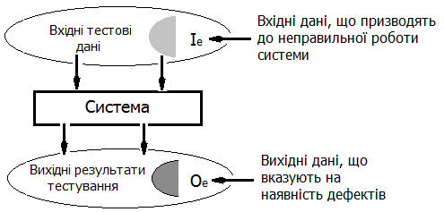

**Рисунок 1.10** – Модель системи тестування методом «чорного ящика»

На перший погляд може здатися, що немає сенсу в тестуванні «чорного ящика», якщо є можливість тестувати «білий ящик», однак це не так. Тестування «чорного ящика» відбувається тоді, коли необхідно підтвердити, що додаток відповідає заздалегідь висунутим вимогам, і відповідності документації. Перевагою тестування «чорного ящика» є те, що більша частина додатку за короткий час буде відтестована, адже не треба заглиблюватися в код, досить просто користуватися інтерфейсом, як замовник.

Тестування «білого ящика» (такий підхід іноді називають методом *структурного тестування*) передбачає активне використання початкового коду (рис. 1.11), наприклад, для створення unit-test (модульне тестування) пишеться спеціальний додаток, який використовує частину початкового коду продукту, для того щоб в автоматичному режимі проводити його тестування. Це типово для юніт-тестування (англ. unit testing), при якому тестуються тільки окремі частини системи. Воно забезпечує те, що компоненти конструкції (модулі) працездатні і стійкі, до певної міри.

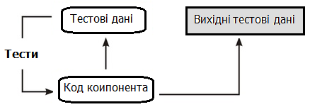

**Рисунок 1.11** – Модель системи тестування методом «білого ящика»

Як правило, тестування «білого ящика» застосовується до відносно невеликих програмних елементів, наприклад, до підпрограм або методів, асоційованим з об'єктами. Наприклад, з аналізу коду можна визначити, скільки контрольних тестів потрібно виконати для того, щоб у процесі тестування всі оператори виконалися, принаймні, один раз [28].

Бета-тестування в цілому обмежено технікою «чорного ящика» (хоча більша частина тестувальників зазвичай продовжує тестування «білого ящика» паралельно бета-тестуванню). Таким чином, термін «бета-тестування» може вказувати на стан програми (ближче до випуску ніж «альфа-тестування»), або може вказувати на деяку групу тестувальників і процес, що виконується цією групою. Отже, тестувальник може продовжувати роботу з тестування білого ящика, хоча ПЗ вже «в бета-стадії», але в цьому випадку він не є частиною «бета-тестування» (групи/процесу).

«**Сірий ящик**» (Grey Box) – поєднує елементи двох попередніх підходів. Аналізуючи методи і «білого», і «чорного» ящиків, можна прийти до висновку, що ми або маємо доступ до пристрою програми, або не маємо. Яким же може бути середній варіант? Тестування «сірим ящиком» і є тим самим середнім варіантом.

По суті, тестуючи «сірим ящиком» – ми тестуємо «чорним ящиком», але тільки при цьому ми знаємо внутрішню структуру і принцип роботи

програми. Знання про внутрішній устрій програми, дозволяють нам більш точно підбирати вхідні значення і перевіряти вихідні значення, тим самим покривати тестами ширшу область можливих дефектів.

Знаннями для тестувальника при тестуванні «сірим ящиком» служить не тільки особистий досвід роботи з додатками. Вся необхідна інформація про роботу і реалізацію кожного функціоналу міститься в документації (специфікація вимог і т.п.), до якої доступ має будь-який тестувальник.

Зважаючи на особливості методу «сірого ящика», можна переконатись, що він має ряд як переваг, так і недоліків. До **переваг** можна віднести:

1. Наявність в методі позитивних якостей і «чорного», і «білого» ящиків.
2. «Сірий ящик» заснований на функціональній специфікації і архітектурній побудові програми, а не на вихідному коді і двійкових файлах.
3. Тестувальник сам розробляє сценарії тестування, які перевіряють обробку типів даних, виключень тощо.

Незважаючи на всі переваги, перераховані вище, даний метод розмежовує тестування тестувальником і розробником. До **недоліків** методу «сірого ящика» можна віднести такі:

1. Оскільки тестувальник не має доступу до вихідного коду і двійкових файлів, то при тестуванні «сірим ящиком» можливо лише часткове покриття коду.
2. У розподілених додатках важче виявити баги. Але, при цьому, «сірий ящик» найкращим чином підходить для тестування Web-додатків, оскільки при чорному і білому ящиках складніше визначити проблеми, пов'язані з безперервним потоком даних. Web-додатки складаються з безлічі елементів як на програмному, так і апаратному рівні. Ці компоненти повинні бути перевірені в контексті розробки системи для оцінювання їх взаємодії і функціональності.

Сам принцип тестування «сірим ящиком» є нічим іншим, як розширеним тестуванням «чорним ящиком», однак наявність розуміння архітектури програми дозволяє піднести процес тестування на новий якісний рівень, що дозволяє віднести «сірий ящик» до окремого методу.

### 1.9.5 Тестування гілок

Метод тестування «білого ящика» (структурного тестування) — це метод, при якому перевіряються всі незалежно виконувані гілки компонента або програми. Якщо виконуються всі незалежні гілки, то і всі оператори повинні виконуватися, принаймні, один раз. Більш того, всі умовні оператори тестуються як з істинними, так і з помилковими значеннями умов. В об'єктно-орієнтованих системах тестування гілок використовується для тестування методів, асоційованих з об'єктами.

Кількість гілок у програмі зазвичай пропорційна її розміру. Після інтеграції програмних модулів в систему методи структурного тестування виявляються нездійсненними. Тому методи тестування гілок, як правило,

використовуються при тестуванні окремих програмних елементів і модулів [28, 33].

При тестуванні гілок не перевіряються всі можливі комбінації гілок програми. Крім самих тривіальних програмних компонентів без циклів, подібна повна перевірка компонента виявляється нереальною, оскільки в програмах з циклами існує нескінченне число можливих комбінацій гілок. У програмі можуть бути дефекти, які виявляються тільки при певних комбінаціях гілок, навіть якщо всі оператори програми протестовані (тобто виконалися) хоча б один раз.

Метод тестування гілок ґрунтується на графі потоків управління програми. Цей граф являє собою кісткову модель всіх гілок програми.

Граф потоків управління складається з вузлів, відповідних розгалуженню рішень, і дуг, що показують потік управління. Якщо в програмі немає операторів безумовного переходу, то створення графа – досить простий процес.

При побудові графа потоків всі послідовні оператори (оператори присвоєння, виклику процедур і вводу-виводу) можна проігнорувати. Кожне розгалуження операторів умовного переходу (if-then-else або case) представлено окремою гілкою, а цикли позначаються стрілками, кінці яких замкнуті на вузлі з умовою циклу. На рис. 1.12 показані цикли і розгалуження в графі потоків управління програми бінарного пошуку [28].

![Граф потоків управління бінарного пошуку, що складається з дев'яти пронумерованих вузлів у прямокутниках із заокругленими кутами та спрямованих стрілок між ними, які відображають логічні гілки виконання програми під час циклу та умовних переходів з умовами "bottom > top", "while bottom <= top", "if (elemArray [mid] == key)" та "if (elemArray [mid] < key)"](images/Avramenko_2017_SoftwareTesting/page_54_img_1.png)

**Рисунок 1.12** – Граф потоків управління бінарного пошуку

Мета структурного тестування – переконатися, що кожна незалежна гілка програми виконується хоча б один раз. Незалежна гілка програми – це гілка, яка проходить, принаймні, по одній новій дузі графа потоків. У термінах програми це означає її виконання при нових умовах. За допомогою

трасування в графі потоків управління програми бінарного пошуку можна виділити такі незалежні гілки [28]:
- 1, 2, 3, 8, 9;
- 1, 2, 3, 4, 6, 7, 2;
- 1, 2, 3, 4, 5, 7, 2;
- 1, 2, 3, 4, 6, 7, 2, 8, 9.

Якщо всі ці гілки виконуються, то можна бути впевненим у тому, що, по-перше, кожен оператор виконується принаймні один раз і, по-друге, кожна гілка виконується при умовах, що приймають як дійсні, так і помилкові значення.

Кількість незалежних гілок в програмі можна визначити, обчисливши цикломатичне число графа потоків управління програми [28; 33]. Цикломатичне число $C$ будь-якого пов'язаного графа $G$ обчислюється за формулою:

$$\mathbf{C (G) = кількість дуг - кількість вузлів + 2}$$

Для програм, що не містять операторів безумовного переходу, значення цикломатичного числа завжди більше кількості перевірених умов. У складених умовах, що містять більше одного логічного оператора, слід враховувати кожен логічний оператор. Наприклад, якщо в програмі шість операторів $if$ і один цикл $while$, то цикломатичне число дорівнює 8. Якщо один умовний вираз є складовим виразом з двома логічними операторами (об'єднаними операторами $and$ або $or$), то цикломатичне число буде дорівнювати 10. Цикломатичне число програми бінарного пошуку дорівнює 4.

Після визначення кількості незалежних гілок в програмі шляхом обчислення цикломатичного числа розробляються контрольні тести для перевірки кожної гілки. Мінімальна кількість тестів, що вимагається для перевірки всіх гілок програми, дорівнює цикломатичному числу [28; 33].

Проектування контрольних тестів для програми бінарного пошуку не викликає труднощів. Однак, якщо програми мають складну структуру розгалужень, важко передбачити, як буде виконуватися який-небудь окремий контрольний тест. У таких випадках використовується динамічний аналізатор програм для складання робочого профілю програми.

Динамічні аналізатори програм — це інструментальні засоби, які працюють спільно з компіляторами. Під час компілювання в згенерований код додаються додаткові інструкції, що підраховують, скільки разів виконується кожен оператор програми, щоб при виконанні окремих контрольних тестів побачити, які гілки в програмі виконувалися, а які ні. Також роздруковується робочий профіль програми, де видно неперевірені ділянки [28].

### 1.9.6 Класи еквівалентності

Даний підхід полягає в наступному: вхідні/вихідні дані розбиваються на класи еквівалентності за принципом, що програма поводить себе однаково

з кожним представником окремого класу. Таким чином, нема необхідності тестувати всі можливі вхідні дані, необхідно перевірити по окремо взятому представнику класу.

_Клас еквівалентності_ — це набір значень змінної, який вважається еквівалентним. Тестові еквівалентні, якщо:
1. Вони тестують одне і те ж.
2. Якщо один з них знаходить помилку, то й інші виявлять її.
3. Якщо один з них не знаходить помилку, то й інші не виявлять її.

_Еквівалентне розбиття_ — це розробка тестів методом «чорного ящика», в якому тестові сценарії створюються для перевірки елементів еквівалентної області. Як правило, тестові сценарії розробляються для покриття кожній області як мінімум один раз (рис. 1.13) [28].

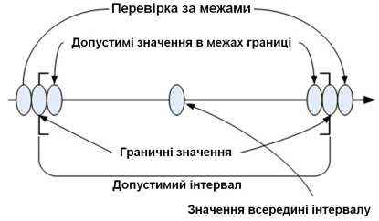

**Рисунок 1.13** — Еквівалентне розбиття

**Приклад 1.1.** Припустимо, ми тестуємо Інтернет-магазин, який продає зошити. У замовленні необхідно вказати кількість зошитів (максимум для замовлення — 1000 штук). Залежно від замовленої кількості зошитів змінюється їх вартість:
– $1-100$ — 10 грн. за зошит;
– $101-200$ — 9 грн. за зошит;
– $201-300$ — 8 грн. за зошит і т.д.

З кожною новою сотнею, ціна зошита зменшується на гривню.

Якщо тестувати «в лоб», то, щоб перевірити всі можливі варіанти обробки замовленої кількості зошитів, потрібно написати дуже багато тестів (згадуємо, що можна замовити аж 1000 штук), а потім ще все це і протестувати. Спробуємо застосувати розбиття на класи еквівалентності. Очевидно, що наші вхідні дані можна розділити на наступні класи еквівалентності:

1. Невалідне значення: $> 1000$ штук.
2. Невалідне значення: $\le 0$.
3. Валідне значення: від 1 до 100.
4. Валідне значення: від 101 до 200.
5. Валідне значення: від 201 до 300.

6. Валідне значення: від 301 до 400.
7. Валідне значення: від 401 до 500.
8. Валідне значення: від 501 до 600.
9. Валідне значення: від 601 до 700.
10. Валідне значення: від 701 до 800.
11. Валідне значення: від 801 до 900.
12. Валідне значення: від 901 до 1000.

На основі цих класів ми і складемо тестові сценарії. Отже, якщо взяти по одному представнику з кожного класу, то отримуємо 12 тестів.

### 1.9.7 Позитивне і негативне тестування

Дані підходи до тестування відрізняються тим, що при позитивному тестуванні тестувальник грає роль «правильного» користувача, який читає документацію і, виходячи з вказівок в документації, користується програмою. При позитивному тестуванні тестувальник працює з програмою, так як вона йому «говорить». Наприклад, якщо додаток вимагає від користувача пароль, розміром від 4 до 8 символів, то тестувальник введе пароль, який складатиметься з необхідної програмі кількості символів.

Негативне тестування змушує тестувальника тестувати програму навпаки, тестувальник повинен грати роль хакера, який намагається поламати програму, варто докласти всі можливі зусилля для перевірки програми в найнесприятливіших умовах, починаючи від неправильного використання і закінчуючи цілеспрямованим зломом.

Тестувальники часто незадоволені тим, що існує такий поділ і їм доводитися грати ролі, а не займатися результативним тестуванням. Проте варто розібратися в перевагах позитивного і негативного тестування. При позитивному тестуванні додаток тестується набагато швидше, і виправляються найважливіші дефекти. У підсумку виходить, що вся програма тестується швидше, але покриття такого тестування передбачає лише використання програми «по документації», а більшість користувачів не читають документацію до програми.

Для «поганих» користувачів передбачено негативне тестування для перевірки на дефекти всієї програми, навіть якщо йому будуть підносити неправильні дані. Наприклад, додаток вимагає ввести шлях до файлу на диску, а користувач вводить щось типу «Hello World». При неправильній обробці таких даних користувач побачить як програма примусово завершує свою роботу, а при правильній обробці таких даних він побачить інформацію про те, які дані необхідно передавати в це поле введення.

Як правило, компанії, які розробляють програмні продукти, в першу чергу проводять позитивне тестування, і тільки після завершення позитивного тестування проводять негативне тестування. Це пов'язано з тим, що програма як мінімум повинна адекватно працювати для «хороших» користувачів, а як максимум — відмінно працювати для «поганих» користувачів. Так як часто на негативне тестування не вистачає часу, то

швидко проводитися позитивне тестування для забезпечення мінімальної якості програми, адже краще мінімум, ніж нічого?

### 1.9.8 Модульне тестування

*Модульне (Компонентне) тестування* (Unit testing — тестування елемента, блока) — це метод тестування програмного забезпечення, який полягає в окремому (ізольованому) тестуванні кожного мінімально можливого для тестування компоненту програми. Модулем називають найменшу частину програми, яка може бути протестованою. У процедурному програмуванні модулем вважають окрему функцію або процедуру, модулі програм. В об'єктно-орієнтованому програмуванні — інтерфейс, об'єкт, клас. Модульні тести, або unit-тести, розробляються в процесі розробки програмістами та, іноді, тестувальниками білої скриньки.

Модульному тестуванню піддаються невеликі модулі (процедури, класи тощо). При тестуванні відносно невеликого модуля розміром 100-1000 рядків (операторів) є можливість перевірити, якщо не всі, то, принаймні, багато логічних гілок в реалізації, різні шляхи в графі залежності даних, граничні значення параметрів. Відповідно до цього будуються критерії тестового покриття (покриті всі оператори, всі логічні гілки, всі граничні точки тощо) [36]. Модульне тестування зазвичай виконується для кожного незалежного програмного модуля і є, мабуть, найбільш поширеним видом тестування, особливо для систем малих і середніх розмірів.

Тестування програмного забезпечення не може знайти всіх помилок у програмі. У більшості програм неможливо прорахувати кожен варіант виконання. Це також вірно і для модульного тестування — модульне тестування може визначити лише наявність помилок, а не їх відсутність. Крім того, модульне тестування, власне, повинне тестувати тільки модулі. Так що цей вид тестування не зможе знайти інтеграційні помилки та інші. Наприклад, помилки архітектури, проблеми з витримкою навантажень на ПЗ. Unit-тестування має проводитись разом з іншими видами тестування програмного забезпечення.

Один з найефективніших підходів до компонентного (модульного) тестування — це підготовка автоматизованих тестів до початку основного кодування (розробки) програмного забезпечення, як це робиться в екстремальному програмуванні. Це називається розробка від тестування (test-driven development) або підхід тестування спочатку (test first approach). При цьому підході створюються і інтегруються невеликі частини коду, навпроти яких запускаються тести, написані до початку кодування. Розробка ведеться доти поки всі тести не будуть успішно пройдені.

Модульне тестування може бути застосоване в інтеграційному тестуванні: тестування окремих модулів та сукупності цих модулів робить інтеграційне тестування легшим. Однак модульне тестування знизу вгору не є інтеграційним тестуванням. Інтеграція з зовнішніми модулями має включатися до інтеграційних тестів, а не до модульних.

**1.9.9 Інтеграційне тестування**

Перевірка коректності всіх модулів, на жаль, не гарантує коректності функціонування системи модулів. У літературі іноді розглядається «класична» модель неправильної організації тестування системи модулів, що часто називається методом «великого стрибка». Суть методу полягає в тому, щоб спочатку відтестувати кожен модуль окремо, потім об'єднати їх в систему і протестувати систему в цілому. Для великих систем це нереально. При такому підході буде витрачено дуже багато часу на локалізацію помилок, а якість тестування залишиться невисокою.

Альтернативою «великому стрибку» є **інтеграційне тестування**, коли система будується поетапно, групи модулів додаються поступово [36].

При інтеграційному тестуванні тестуються інтерфейси між компонентами, підсистемами. За наявності резерву часу на даній стадії тестування ведеться ітераційно, з поступовим підключенням наступних підсистем.

Рівні інтеграційного тестування:
1. *Компонентний інтеграційний рівень*. Перевіряється взаємодія між компонентами системи після проведення компонентного тестування.
2. *Системний інтеграційний рівень*. Перевіряється взаємодія між різними системами після проведення системного тестування.

Підходи до інтеграційного тестування:
1. *Знизу вгору*. Усі низькорівневі модулі, процедури або функції збираються воєдино і потім тестуються. Після чого збирається наступний рівень модулів для проведення інтеграційного тестування. Даний підхід вважається корисним, якщо всі або практично всі модулі розроблюваного рівня готові. Також даний підхід допомагає визначити за результатами тестування рівень готовності додатків.
2. *Зверху вниз*. У першу чергу тестуються компоненти верхнього рівня ієрархії об'єктів з використанням **заглушок** замість компонентів більш низького рівня, потім у міру готовності вони замінюються реальними активними компонентами.
3. *Великий вибух («Big Bang» Integration)*. Усі або практично усі розроблені модулі збираються разом у вигляді закінченої системи або її основної частини, і потім проводиться інтеграційне тестування. Такий підхід дуже хороший для збереження часу. Проте, якщо тест-кейси та їх результати записані не вірно, то сам процес інтеграції дуже ускладниться, що стане перепоною для команди тестування при досягненні основної мети інтеграційного тестування.

Застосування заглушок для заміни відсутніх компонентів, які викликаються елементом, при тестуванні можуть виконувати такі дії:
– повертаються до елементу, не виконуючи ніяких інших дій;
– відображають трасувальні повідомлення і іноді пропонують тестувальнику продовжити тестування;

- повертають постійне значення або пропонують тестувальнику самому ввести повертається значення;
- здійснюють спрощену реалізацію відсутньої компоненти;
- імітують виняткові або аварійні умови.

### 1.9.10 Тестування збірки

_Тестування збірки_ — тестування, яке спрямоване на визначення відповідності випущеної версії критеріям якості до початку тестування. За своїми цілями є аналогом _димового тестування_, спрямованого на приймання нової версії в подальше тестування або експлуатацію. У глибину воно може проникати далі в залежності від вимог до якості випущеної версії, яка підтримує ітераційний (інкрементний) процес розробки програмного забезпечення.

Після того як протестовані всі окремі програмні компоненти, виконується збірка системи, в результаті чого створюється часткова або повна система. Процес інтеграції системи включає збірку і тестування отриманої системи, в ході якої виявляються проблеми, що виникають при взаємодії компонентів. Тести, що перевіряють збірку системи, повинні розроблятися на основі системної специфікації, причому тестування збірки слід починати відразу після створення працездатних версій компонентів системи.

Практика, застосовувана, наприклад, в Microsoft і деяких інших компаніях, що займаються розробкою ПЗ, полягає в щоденному складанні («білдовані») програми, яка доповнюється димовим тестуванням. Щодня, після того як кожен файл зібраний (збілдований, побудований), пов'язаний (злінкований), і об'єднаний в цілісну програму, сама програма піддається досить простому набору тестів. Мета такого тесту полягає в тому, щоб побачити, чи «димить» програма під час роботи. Ці тести і називаються димовими. Найчастіше цей процес досить добре автоматизований (або повинен таким бути).

Під час тестування збірки виникає проблема локалізації виявлених помилок. Між компонентами системи існують складні взаємини, і при виявленні аномальних вихідних даних буває важко встановити джерело помилки. Щоб полегшити локалізацію помилок, слід використовувати покроковий метод складання та тестування системи. Спочатку слід створити мінімальну конфігурацію системи і її протестувати. Потім в мінімальну конфігурацію потрібно додати нові компоненти і знову протестувати і так далі до повної збірки системи [20, 28].

У прикладі на рис. 1.14 послідовність тестів T1, T2 і T3 спочатку виконується в системі, що складається з модулів А і В (мінімальна конфігурація системи) [28]. Якщо під час тестування виявляються дефекти, вони виправляються. Потім в систему додається модуль С. Тести T1, T2 і T3 повторюються, щоб переконатися, що в новій системі немає ніяких несподіваних взаємодій між модулями А і В. Якщо в ході тестування

з’явилися якісь проблеми, то, ймовірно, вони виникли у взаємодіях з новим модулем С. Джерело проблеми локалізовано, таким чином спроститься визначення дефекту і його виправлення. Потім система запускається з тестами Т4. На останньому кроці додається модуль D, і система тестується ще раз тестами, що виконувалися раніше, а потім новими тестами Т5 [28; 33].

На практиці рідко зустрічаються такі прості моделі. Функції системи можуть бути реалізовані у кількох компонентах. Тестування нової функції, таким чином, вимагає інтеграції відразу декількох компонентів. У цьому випадку тестування може виявити помилки у взаємодіях між цими компонентами та іншими частинами системи.

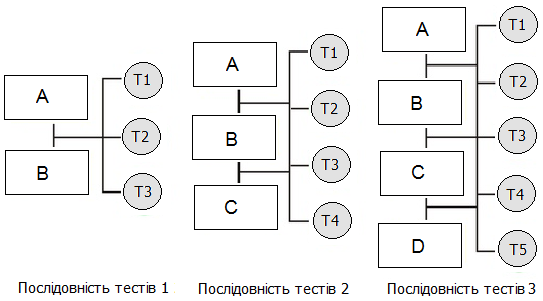

Послідовність тестів 1 | Послідовність тестів 2 | Послідовність тестів 3
--- | --- | ---
**Рисунок 1.14** – Модель тестування збірки

Виправлення помилок може виявитися складним, так як в даному випадку помилки впливають на цілу групу компонентів, що реалізують конкретну функцію. Більш того, при інтеграції нового компонента може змінитися структура взаємозв'язків між уже протестованими компонентами. Внаслідок цього можуть виявитися помилки, що не були виявлені при тестуванні простішої конфігурації [20, 28].

### 1.9.11 Системне тестування

Повністю реалізований програмний продукт піддається системному тестуванню. *Системне тестування* є одним з рівнів тестування програмного забезпечення. Системне тестування тестує інтегровану систему для перевірки відповідності всім вимогам. Перевірка повноти та правильності документації користувача є важливою частиною системного тестування. Всі тестові комбінації повинні розроблятися тільки з використанням документації користувача. На даному етапі тестувальника цікавить не коректність реалізації окремих процедур і методів, а вся програма в цілому, як її бачить кінцевий користувач.

Основою для тестів служать загальні вимоги до програми, включаючи не тільки коректність реалізації функцій, але і продуктивність, час відгуку, стійкість до збоїв, атак, помилок користувача тощо. Для системного і компонентного тестування використовуються специфічні види критеріїв тестового покриття (наприклад, покриті чи всі типові сценарії роботи, всі сценарії з позаштатними ситуаціями, попарні композиції сценаріїв тощо) [36].

Під час системного тестування перевіряються дві складові системи: база даних і додатки. Однак не завжди вдається провести чітку межу між ними. Наприклад, до чого слід віднести тригери бази даних: до бази даних чи до додатка.

Системне тестування якісно відрізняється від інтеграційного й модульного рівнів. Системне тестування розглядає систему, що тестується, в цілому й оперує на рівні інтерфейсу користувача, на відміну від останніх фаз інтеграційного тестування, що оперує на рівні інтерфейсів модулів. Різні й цілі цих рівнів тестування. На рівні системи часто складно та малоефективно аналізувати проходження тестових траєкторій усередині програми або відслідковувати правильність роботи конкретних функцій. Основне завдання системного тестування – у виявленні дефектів, пов'язаних з роботою системи в цілому, таких як:
- невірне використання ресурсів системи;
- непередбачувані комбінації даних користувацького рівня;
- несумісність із оточенням;
- непередбачувані сценарії використання;
- відсутня або невірна функціональність;
- незручність у застосуванні тощо.

Системне тестування відбувається над проектом у цілому за допомогою методу «чорного ящика» або поведінкове тестування – стратегія (метод) тестування функціональної поведінки об'єкта (програми, системи) з точки зору зовнішнього світу, при якому не використовується знання про внутрішній устрій об'єкта, що тестується.

Стратегія поведінкового тесту виходить з технічних вимог і їх специфікацій. Структура програми не має ніякого значення, для перевірки доступні тільки входи й виходи, видимі користувачеві. Тестуванню підлягають коди та документація користувача.

Категорії тестів системного тестування:
1. Повнота рішення функціональних завдань.
2. Стресове тестування.
3. Коректність використання ресурсів.
4. Оцінка продуктивності.
5. Перевірка інсталяції й конфігурації на різних платформах.
6. Коректність документації.

Оскільки системне тестування проводиться на інтерфейсах користувача, створюється ілюзія того, що побудова спеціальної системи

автоматизації тестування не завжди необхідна. Проте обсяги даних на цьому рівні такі, що ефективнішим підходом є повна або часткова автоматизація тестування, що приводить до створення тестової системи набагато складнішої, ніж система тестування, яка застосовується на рівні тестування модулів або їх комбінацій.

### 1.9.12 Тестування продуктивності

Тестування продуктивності проводиться з метою визначення, як швидко працює обчислювальна система або її частина під певним навантаженням. Також тестування продуктивності може служити для перевірки і підтвердження інших атрибутів якості системи, таких як масштабованiсть (здатність системи, мережі або процесу справлятися із збільшенням робочого навантаження), надійність і споживання ресурсів.

Тестування продуктивності — це комплекс типів (напрямів) тестування, метою якого є визначення працездатності, стабільності, споживання ресурсів та інших атрибутів якості додатку в умовах різних сценаріїв використання і навантажень. Тестування продуктивності дозволяє знаходити можливі уразливості і недоліки в системі з метою запобігти їх згубному впливу на роботу програми в умовах використання. У тестуванні продуктивності розрізняють такі напрями:
- тестування навантаження;
- стрес-тестування;
- тестування стабільності;
- об'ємне тестування;
- конфігураційне тестування.

Можливі два підходи до тестування продуктивності програмного забезпечення:
- в термінах робочого навантаження: програмне забезпечення піддається тестуванню в ситуаціях, що відповідають різним сценаріям використання;
- у рамках бета-тестування, коли система випробовується реальними кінцевими користувачами.

**Тестування навантаження.** Тестування навантаження — це проста форма (підвид) тестування продуктивності. Тестування навантаження зазвичай проводиться для того, щоб оцінити поведінку додатку під заданим очікуваним навантаженням. Цим навантаженням може бути, наприклад:
1. Очікувана кількість одночасно працюючих користувачів додатку, що здійснюють задане число транзакцій за інтервал часу. Такий тип тестування зазвичай дозволяє отримати час відгуку усіх найважливіших бізнес-транзакцій.
2. Час відгуку програмно-технічної системи або пристрою у відповідь на зовнішній запит з метою встановлення відповідності вимогам, що пред'являються до цієї системи (пристрою).

3. У разі спостереження за базою даних, [сервером додатків](#), мережею тощо. Цей тип тестування може також ідентифікувати деякі вузькі місця додатку.

Для дослідження часу відгуку системи на високих або пікових навантаженнях робиться стрес-тестування, при якому навантаження, що діє на систему, перевищує нормальні сценарії її використання. Не існує чіткої межі між навантаженням і стрес-тестуванням, проте ці поняття не варто змішувати, оскільки ці види тестування відповідають на різні бізнес-питання і використовують різну методологію.

Тестування навантаження в загальному випадку означає практику моделювання очікуваного використання додатку за допомогою емуляції роботи декількох користувачів одночасно. Таким чином, подібне тестування найбільше підходить для систем, розрахованих на багато користувачів, що частіше використовують клієнт-серверну архітектуру (наприклад, вебсерверів). Проте і інші типи систем ПЗ можуть бути протестовані подібним способом. Наприклад, текстовий або графічний редактор можна змусити прочитати дуже великий документ; а фінансовий пакет – згенерувати звіт на основі даних за декілька років. Найбільш адекватно спроектований навантажувальний тест дає точніші результати

**Стрес-тестування (стресове тестування).** Стрес-тестування зазвичай використовується для розуміння меж пропускної здатності додатку при тривалому (багатогодинному) тестуванні зі середнім рівнем навантаження. Цей тип тестування проводиться для визначення надійності системи під час екстремальних або диспропорційних навантажень і відповідає на питання про достатню продуктивність системи у разі, якщо поточне навантаження сильно перевищить очікуваний максимум.

Стресове тестування також дозволяє перевірити наскільки додаток і система в цілому працездатні в умовах стресу, і також оцінити здатність системи до регенерації (відновлення), тобто до повернення до нормального стану після припинення дії стресу.

Також одним із завдань при стресовому тестуванні може бути оцінка деградації (регресії – процес погіршення характеристик будь-якого об'єкта чи явища з плином часу) продуктивності, таким чином цілі стресового тестування можуть перетинатися з цілями тестування продуктивності.

**Тестування стабільності.** Тестування стабільності (надійності) проводиться з метою переконатися в тому, що додаток витримує очікуване навантаження впродовж тривалого часу. При проведенні цього виду тестування здійснюється спостереження за використанням пам'яті додатком, щоб виявити потенційні витоки. Крім того, таке тестування виявляє деградацію продуктивності, що виражається в зниженні швидкості обробки інформації і/або збільшенні часу відповіді додатку після тривалої роботи в порівнянні з початком тесту.

**Об'ємне тестування.** Завданням об'ємного тестування є отримання оцінки продуктивності при збільшенні об'ємів даних у базі даних додатку, при цьому відбувається:

- вимір часу виконання вибраних операцій при певній інтенсивності виконання цих операцій.
- може робитися визначення кількості користувачів, одночасно працюючих з додатком.

**Конфігураційне тестування.** Конфігураційне тестування — ще один з видів традиційного тестування продуктивності. В цьому випадку замість того, щоб тестувати продуктивність системи з точки зору навантаження, тестується ефект впливу на продуктивність змін в конфігурації. Хорошим прикладом такого тестування можуть бути експерименти з різними методами балансування навантаження. Конфігураційне тестування може бути поєднане з навантаженням, стрес-тестуванням або тестуванням стабільності.

### 1.9.13 Технологія MODEL CHECKING

Ключовою проблемою інформатики є пошук методів, які дозволяють перевірити, що програмні та апаратні системи роблять те, що вони повинні робити, тобто що вони працюють у відповідності зі своєю специфікацією. Особливо важлива ця проблема для так званих «реагуючих систем», тобто систем, які складаються з декількох паралельно функціонуючих підсистем, що взаємодіють один з одним і з оточенням і реагують на виникаючі події (включення тумблера, поворот керма, отримання повідомлення). Це цифрові системи логічного управління, протоколи комунікації, драйвери зовнішніх пристроїв тощо.

Інформатика є єдиною областю інженерної діяльності, в якій розробники систем, як правило, не вміють гарантувати якість розроблених ними систем і не відповідають за якість свого продукту. Складність програм давно підійшла до межі їх розуміння людиною, а отже, до межі їх керованості, тому постійно зростає число помилок у розроблених і зданих замовнику програмних системах. Особливо складні для аналізу та схильні до помилок паралельні, розподілені і багатопотокові програми, характерні для систем управління. У побутових застосуваннях це не настільки страшно: так, за оцінками фірми Microsoft, в OC Windows 95 досі залишається кілька тисяч помилок!

Відомо, що навіть у тих випадках, коли функціонування кожного компонента системи паралельних взаємодіючих процесів повністю зрозуміла, людині важко охопити роботу всієї такої системи. Причина цього, що в кожен момент людина може думати тільки про одну річ, тому розробник складної програми не в змозі встежити за різноманіттям подій, які виникають у паралельних системах. У світі паралельної обробки розробник повинен контролювати не послідовності можливих подій, як в послідовному програмуванні, а всі можливі потоки частково впорядкованих подій, що значно складніше. Паралельні системи, які працюють правильно «майже завжди», роками можуть зберігати «тонкі» помилки, які проявляються у виняткових ситуаціях. Такі помилки призводили до великих аварій і катастроф. Нагадаємо найбільш гучні з них.

Так 4 червня 1966 р. на 39 секунді при першому запуску вибухнула ракета «Аріан 5» — аналог російської ракети «Протон». Бортова система ракети «Аріан 5» використовувала ПЗ попередньої версії «Аріан 4», але архітектура апаратної частини була змінена. Після проведеного ретельного розслідування було виявлено помилку в навігаційній програмі бортового комп’ютера. Втрати були величезними. Це ракета, вартість якої перевищувала 7 млрд доларів, встановлене на борту наукове обладнання вартістю більш ніж півмільярда доларів. До цього треба додати втрати від недоотриманої вигоди, а також втрати репутації ракети-носія. Непрямі втрати склали біля 2 млрд. доларів.

25 грудня 2004 р. після семирічного польоту космічний зонд «Гюйгенс» відділився від автоматичної міжнародної станції «Кассіні» і почав спуск на поверхню Титану – супутника Сатурну. 15 січня 2005 р. зонд вперше в історії почав передавати інформацію з поверхні Титану. Помилка в бортовій системі призвела до того, що половина переданої інформації була втрачена. Загальні затрати на розробку складали 2,5 млрд. доларів.

20 грудня 1995 р. зазнав катастрофи літак «Боїнг» 757, загинуло 159 людей. Розслідування виявило помилку в одному символі в програмній системі управління польотом. Компанії-виробники бортового комп'ютера та ПЗ були визнані винними в загибелі людей, родичам жертв було виплачено 300 млн. доларів.

23 березня 2003 р. система «Patriot» помилково ідентифікувала британський бомбардувальник «Tornado» як ворожу ракету, що наближається, та автоматично виконала залп. Загинули 2 пілоти. 2 квітня 2003 р. системою «Patriot» був знищений американський винищувач F-16, пілот загинув. В обох випадках причиною були помилки в бортовій системі автоматичного виявлення цілі та наведення.

Наведені приклади показують, що помилки в складних програмних та апартних системах регулярно виявляються при їх розробці.

У наш час, коли все частіше людське життя залежить від роботи автоматичних систем, проблема гарантії коректності програмних та апаратних частин цих систем набуває першочергового значення. Надійність та передбачуваність у поведінці таких систем є важливішим чинником, ніж усе інше.

Правильність (коректність) таких програм неможливо довести простим тестуванням, майже на всіх наборах початкових даних вони можуть працювати правильно. Тільки суворий формальний аналіз та верифікація програми можуть виявити помилку.

Не існує універсального методу, що гарантує повну правильність програми – поняття «повної правильності» програми неможливо формалізувати, тому зазвичай розробники використовують різні методи, які сприяють підвищенню якості програм: тестування, моделювання та верифікація. Кожен з методів має свої переваги і недоліки, тому для досягнення необхідного рівня якості програм вони повинні використовуватися спільно. У порівнянні з іншими методами підвищення

рівня довіри до програми, верифікація полягає у формальному доказі виконання певних вимог до функціонування програми — вона є дуже перспективним і привабливим методом.

Аналіз коректності програмних систем — тема, яка не втрачає своєї актуальності. До недавнього часу успіхи в галузі теорії алгоритмів і методів верифікації були дуже скромними, а розроблені методи з великими труднощами могли бути застосовані навіть до систем середньої складності. Тому не дивно, що тисячі дослідників та інженерів в усьому світі намагаються винайти нові методи і розробити нові інструменти перевірки програм. Фахівці з теоретичної інформатики навіть створили окрему гілку цієї дисципліни, яка називається «формальні методи розробки та аналізу програм». Однак, незважаючи на масові атаки на проблему, довгий час не вдавалося домогтися реальних результатів, які можна було впроваджувати в широку практику.

Сьогодні в області верифікації відбулися глибокі зміни — був розроблений метод формальної верифікації **Model checking** (перевірка моделі), який виявився одним з перших формальних методів, що вийшов з лабораторій та університетів у світ промислової розробки програмних і апаратних систем. Це одночасно радує і дивує фахівців у галузі верифікації програм — адже для того, щоб тонкий математичний інструмент став простим і зрозумілим для звичайних програмістів, потрібно було вирішити не тільки багато наукових і технічні проблеми, але і подолати звичний консерватизм, традиційну практику не ризикувати і не покладатися в серйозних проектах на занадто нові і ще невипробувані технології.

**Model checking** — це формальна перевірка того, чи виконується задана логічна формула на даній структурі. Структура являє собою модель розроблюваної системи, логічна формула описує вимоги до поведінки системи. Цей метод вже сьогодні широко використовується у всьому світі для перевірки складних об'єктів як програмного забезпечення, так і апаратури.

Формальна верифікація програми являє собою сукупність прийомів та методів формального доведення того, що модель програмної системи задовольняє заданій формальній специфікації. Оскільки будь-що формально довести можна тільки відносно формальної моделі, то система, що аналізується, для верифікації та наступної реалізації повинна бути представлена формальною моделлю. Вимоги до кінцевого продукту частіше за все розмиті.

Для здійснення верифікації специфікація програми повинна складатися з набору формальних тверджень щодо бажаних властивостей поведінки системи. Для формальної специфікації застосовується мова логіки, кожне твердження якої може бути істинним або хибним для програмної системи, яка перевіряється. Верифікація передбачає перевірку виконання заданих формальних тверджень на даній формальній моделі. В області верифікації програм впродовж десятиліть робились серйозні зусилля по розробці теорії,

алгоритмів та техніки верифікації. На даний час ці методи розробляються в таких трьох основних напрямках:
- дедуктивна верифікація;
- перевірка еквівалентності;
- перевірка моделі (model checking).

_Дедуктивна верифікація_ – це перевірка правильності програми, яка зводиться до доведення теорем у певній логічній системі. Цей напрямок розробляється вже понад 40 років, з тих часів, коли Роберт Флойд та Ентоні Хоар вперше поставили проблему доведення правильності програм. Верифікація програм при цьому виконується дедукцією на основі аксіом та правил виводу. Ця досить складна процедура не може бути повністю автоматизована, вона вимагає участі людини, яка діє на основі здогадок та припущень, та використовує інтуїцію при побудові інваріантів та нетривіальному виборі альтернатив.

_Перевірка еквівалентності_ пов'язана з розробкою формальних моделей взаємодіючих процесів, поданням в рамках таких моделей як специфікації, так і реалізації та перевіркою еквівалентності поведінок формально визначених моделей поведінки. Цей напрямок був розпочатий працями Робіна Міллера, розробкою ним алгебри процесів _Обчислення взаємодіючих систем_ (Calculus of Communicating systems – CCS) біля 30 років тому [37].

Метод model checking пов'язаний з формальною перевіркою виконання на моделі реалізації властивостей поведінки, які специфіковані на мові формальної логіки. Цей метод розроблявся біля 20 років. Метод model checking може бути повністю автоматизований [37].

_Model checking_ – це метод перевірки того, що на даній формальній моделі системи задана логічна формула виконується (приймає істинне значення). Ця техніка, основна увага якої концентрується на особливій техніці формальної верифікації, була розроблена для моделей систем переходів і так званих «темпоральних логік». Така техніка дозволяє перевіряти динамічні властивості програм, наприклад, послідовність, в якій досягаються певні їх стани, і дозволяє зменшити участь розробника у верифікаційному процесі.

Для реалізації за цим методом реальна система подається простою моделлю у вигляді кінцевого автомату з системою переходів та кінцевою кількістю станів. При цьому кожен стан описується так званими структурами Крипке, які враховують всі стани моделі, початковий стан, правила переходу в інші стани із застосуванням темпоральної логіки.

На даний час ця методика розробки складного ПЗ має промислове впровадження та підвищений рівень довіри і широко застосовується при розробці складних систем. Вчені Е. Кларк, А.Емерсон та Дж. Сифакис були нагороджені в 2007 р. премією імені А. Тьюринга за їх внесок у доведення метода model checking до виробничої технології, яка дозволяє здійснювати верифікацію моделей реальних програмних та апаратних систем. В багатьох

роботах наводяться результати використання цієї технології для верифікації програмно-апаратних систем у критичних застосуваннях.

Коротко сформулюємо основні переваги методу Model checking.

***Верифікація моделей*** – це набір ідей і методів для побудови моделей працюючих програм, математичного формулювання вимог до них, що відбивають правильність їх роботи, і створення алгоритмів для формальної перевірки виконання цих вимог.

Таким чином, Model checking – це автоматизований підхід, що дозволяє для заданої моделі поведінки системи з кінцевим (можливо, дуже великим) числом станів і логічної властивості (вимоги) перевірити, чи виконується ця властивість в розглянутих станах даної моделі.

Основна ідея Model checking полягає в моделюванні – описі розробником поведінкової моделі системи, що підлягає верифікації, і ***специфікації*** – формулюванні вимог (бажаної поведінки системи). Звернемо увагу, що модель програми не завжди повно відображає її поведінку. Розробник при побудові моделі, як правило, абстрагується від несуттєвих її властивостей. Така концепція дає можливість зменшити розмір самої моделі і прискорити процес її перевірки.

Якщо модель задовольняє зазначеним вимогам, то програма-верифікатор повідомляє про це. Якщо ж виявляється помилка, то вона надає *контрприклад*, який показує, за яких умов могло виникнути дана невідповідність.

***Контрприклад*** являє собою сценарій, в якому модель поводиться небажаним чином. Це означає, як правило, що модель помилкова і підлягає перегляду. Правда, в деяких випадках це може означати, що формальні вимоги невірні (або ж модель системи побудована некоректно) в тому сенсі, що засіб верифікації перевіряє те, що розробник не бажав перевірити.

Загальний алгоритм формальної верифікації Model Checking представлений на рис. 1.15 [47].

Перевірка моделі дозволяє розробнику виявити помилку і виправити модель чи вимоги. Якщо не знайдено жодної помилки, розробник може удосконалити опис моделі (зробити модель більш реалістичнішою, взявши до уваги більший набір властивостей), як правило, збільшивши її розмір, і перезапустити процес верифікації.

Основні труднощі моделювання – не втратити важливі деталі програми, а трудність задання вимог – сформулювати їх коректно і вичерпно.

Алгоритми для Model checking зазвичай базуються на повному перегляді простору станів моделі: для кожного стану перевіряється, чи задовольняє він сформульованим вимогам. Алгоритми гарантовано завершуються, оскільки модель кінцева.

У проблематиці верифікації сформувалося два напрямки: аксіоматичний та алгоритмічний [41]. При першому з них розробляється набір аксіом, за допомогою якого може бути описана як сама система, так і її властивості [42]. Основу другого напрямку становить Model checking.

Мета досліджень у цій області – сформулювати ясну логічну основу для створення автоматичних систем верифікації програм.

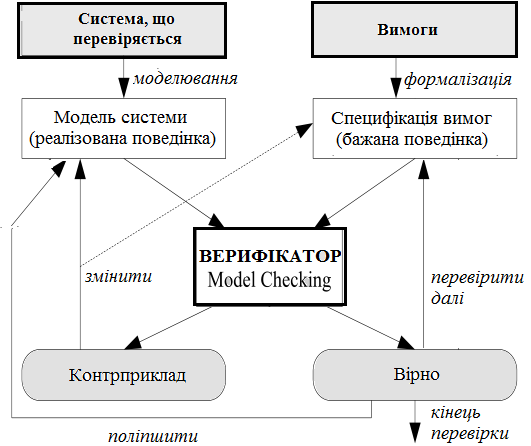

**Рисунок 1.15** – Алгоритм формальної верифікації Model Checking

Переваги методу Model checking:
1. **Ефективність.** Програми для верифікації моделей здатні працювати з досить великими просторами станів завдяки концепції упорядкованих довічних довільних дерев. У літературі описаний приклад з числом станів порядку $10^{130}$.
2. **Контрприклади.**

Обмеження Model checking:
1. Підтримка тільки кінцевих моделей. Для більшості класів систем з нескінченним числом станів необхідно виконувати формальну верифікацію системи — математичний доказ властивостей самої програми, а не її моделі.
2. Обмеженість верифікації. З використанням Model checking перевіряється модель системи замість реальної системи. Таким чином, будь-яке застосування методу Model checking настільки ж якісно, як і сама модель системи.
3. Для багатопроцесорних систем розмір простору станів в гіршому випадку пропорційний добутку розмірів просторів станів їх індивідуальних компонент. Так як Model checking виконується на моделях, близьких за структурою до кінцевого автомату, то для складних багатопроцесорних систем ця концепція перестає бути ефективною.

Основна відмінність методу Model checking від класичної формальної (або хоаровської) верифікації полягає в тому, що перший метод дозволяє

перевіряти динамічні властивості програм — ті, які можна записати за допомогою темпоральної (тимчасової) логіки, а другий метод перевіряє, чи відповідає стан змінних на виході з програмними умовами, що накладаються на їх вхідний стан [43].

Перелічимо основні положення застосування методу Model checking для автоматних програм.

1. У автоматних програмах використовується автоматний стиль програмування. Такий підхід було названо «програмування з явним виділеним станом». Тому в автоматних програмах поведінку специфікують за допомогою кінцевих автоматів. В основному застосовуються специфікації, що складаються з одного автомата Мілі.

2. Використання підходу Model checking для таких програм пов'язане з перетворенням автомата Мілі в структуру Кріпке, так як вона, на відміну від автомата, пристосована для верифікації.

3. Використання структури Кріпке передбачає застосування темпоральної логіки для запису вимог, які повинні бути перевірені.

4. Власне верифікація виконується за структурою Кріпке і вимогами до неї.

5. Сценарій для структури Кріпке перетворюється в сценарій для автомата Мілі.

З аналізу сучасної літератури можна зробити висновок, що на даний момент метод Model checking дуже добре підходить до програм з явним виділенням станів. Виходячи з викладеного вище, можна коротко сформулювати основні переваги автоматних програм в частині їх верифікації методом Model checking [44]:

- клас автоматних програм є найбільш зручним для верифікації методом Model checking, так як в цьому випадку модель програми може бути автоматично побудована за специфікацією її поведінки, що задається в загальному випадку системою взаємодіючих кінцевих автоматів, у той час як для програм інших класів модель доводиться будувати вручну;
- структура автоматних програм, в яких функції вхідних і вихідних впливів майже повністю відокремлені від логіки програм, робить практичним верифікацію цих функцій на основі формальних доказів з використанням перед- і постумов.

### 1.9.14 Інструментальні засоби тестування

Тестування — дорогий і трудомісткий етап розробки програмних систем. Тому створений широкий спектр інструментальних засобів для підтримки процесу тестування, які значно скорочують витрати на нього.

На рис. 1.16 показані можливі інструментальні засоби тестування і відносини між ними [33].

1. **Організатор тестів.** Управляє виконанням тестів. Відстежує тестові дані, очікувані результати та тестовані функції програми.

2. **Генератор тестових даних.** Генерує тестові дані для програми, що тестується. Він може вибирати тестові дані з бази даних або використовувати спеціальні шаблони для генерації випадкових даних необхідного виду.

3. **Оракул.** Генерує очікувані результати тестів. В якості оракулів можуть виступати попередні версії програми або досліджуваного об'єкта. При тестуванні паралельно запускаються оракул і програма, що тестується, і порівнюються результати їх виконання.

4. **Компаратор файлів.** Порівнює результати тестування з результатами попереднього тестування і складає звіт про виявлені відмінності. Компаратори особливо важливі при порівнянні різних версій програми. Відмінності в результатах вказують на можливі проблеми, що існують у новій версії системи.

5. **Генератор звітів.** Формує звіти за результатами проведення тестів.

6. **Динамічний аналізатор.** Додає в програму код, який підраховує, скільки разів виконується кожен оператор. Після запуску тесту створює виконуваний профіль, в якому показано, скільки разів в програмі виконується кожен оператор.

7. **Імітатор.** Існує кілька типів імітаторів. Цільові імітатори моделюють машину, на якій буде виконуватися програма. Імітатор для користувача інтерфейсу – це програма, яка керується сценаріями, моделює взаємодії з інтерфейсом користувача. Імітатор введення-виведення генерує послідовності повторюваних транзакцій [33].


**Рисунок 1.16** – Інструментальні засоби тестування

## 1.10 Класифікація помилок

Кожна організація, яка розробляє ПЗ загальносистемного призначення, стикається з проблемами знаходження помилок. Тому доводиться

класифікувати типи виявлених помилок і визначати своє ставлення до усунення цих помилок.

Дефекти додатку діляться на класи (види, типи). Це зроблено для того щоб їх було простіше шукати, адже коли конкретно знаєш що шукати, то пошук йде найбільш результативніше ніж шукати просто щось абстрактне. Часто в компаніях розробляють програмні продукти, тестування яких проводиться за видами помилок, тобто спочатку шукаються дефекти, пов'язані з інтерфейсом користувача, потім з тестуванням на різних платформах тощо.

Усі помилки, що виникають у програмах, ділять на такі класи:
- логічні і функціональні помилки;
- помилки обчислень і часу виконання;
- помилки введені-виводу і маніпулювання даними;
- помилки інтерфейсів;
- помилки обсягу даних та ін.

*Логічні помилки* — наслідок порушення логіки алгоритму, внутрішньої непогодженості змінних і операторів, а також мовних правил програмування.

*Функціональні помилки* — наслідок неправильно визначених функцій, порушення порядку їхнього застосування або відсутності повноти їхньої реалізації тощо.

*Помилки обчислень* виникають через неточність вхідних даних і реалізованих формул, похибок методів, неправильного застосування операцій обчислень.

*Помилки часу виконання* зв'язані з відсутністю необхідної швидкості обробки запитів, або часу виконання або відновлення програми.

*Помилки вводу-виводу і маніпулювання даними* є наслідком неякісної підготовки даних для виконання програми, збоїв при занесенні їх у базу даних або при вибірці з неї.

*Помилки інтерфейсу* належать до помилок взаємозв'язку окремих елементів одного з одним, що виявляється при передачі даних між ними, а також при взаємодії із середовищем функціонування.

*Помилки обсягу* належать до даних і є наслідком того, що реалізовані методи доступу і розміри баз даних не задовольняють реальні обсяги інформації системи або інтенсивності їхньої обробки.

Наведені основні класи помилок властиві різним типам компонентів ПЗ і виявляються вони в програмах по-різному. Так, при роботі з БД виникають помилки подання і маніпулювання даними, логічні помилки в завданні прикладних процедур обробки даних та ін. У програмах обчислювального характеру переважають помилки обчислень, а в програмах керування й обробки — логічні і функціональні помилки. У ПЗ, що складається з багатьох різномовнових програм, які реалізують різні функції, можуть міститися помилки різних типів. Помилки інтерфейсів і порушення обсягу характерні для будь-якого типу ПЗ.

Аналіз типів помилок у програмах є необхідною умовою створення планів і методів тестування для забезпечення правильності ПЗ.

На сучасному процесі розвитку засобів підтримки розробки ПЗ (CASE–технології, інструменти) при проектуванні ПЗ захищається від найтиповіших помилок і запобігається поява дефектів.

На основі багаторічної діяльності в галузі створення ПЗ різні фірми створили свою класифікацію помилок, засновану на виявленні причин їх появи в процесі розробки, у функціях і в області функціональної діяльності ПЗ.

Фірма IBM розробила свій підхід до класифікації помилок, названий ортогональною класифікацією дефектів (Orthogonal Defect Classification — ортогональна класифікація дефектів, ODC).

Схема класифікації не залежить від продукту, організації розробки, вона може застосуються до всіх процесів розробки ПЗ різного призначення. Відповідно до даної класифікації в табл. 1.1 наведено список помилок.

**Таблиця 1.1** – Ортогональна класифікація дефектів IBM

| Контекст помилки | Класифікація дефектів |
| :--- | :--- |
| Функція | Помилки інтерфейсів кінцевих користувачів ПЗ, викликані апаратурою або зв’язані з зовнішніми структурами даних |
| Інтерфейс | Помилки у взаємодії з іншими компонентами, у викликах, макросах, що керують блоками або в списку параметрів |
| Логіка | Помилки в програмній логіці, неохопленій валідацією, а також у використанні значень змінних |
| Присвоювання | Помилки в структурі даних або в ініціалізації змінних окремих частин програми |
| Зациклення | Помилки, викликані ресурсом часу, реальним часом або розподілом часу |
| Середовище | Помилки в репозиторії, у керуванні змінами або в контрольованих версіях проекту |
| Алгоритм | Помилки, пов’язані з забезпеченням ефективності, коректності алгоритмів або структур дані системи |
| Документація | Помилки в записах документів супроводу або в публікаціях |

Ідея ортогональної класифікації полягає в поділі всіх дефектів на типи. Коли програміст виправляє дефект, то звичайно він виправляє якийсь певний тип дефекту. Тип визначається видом кінцевого виправлення. Призначення типів є очевидним для програмістів. У кожному випадку розходження проявляється в тому, є джерелом помилки пропущена частина коду або неправильна частина коду.

Ортогональність схеми класифікації полягає в тому, що будь-який її термін належить тільки до однієї категорії. Іншими словами, помилка, що простежується в системі, повинна знаходитися в одному з класів, що дає

можливість різним розробникам класифікувати помилки однаковим способом.

Використовуючи цю таблицю класифікації дефектів, розробник має можливість ідентифікувати не тільки типи помилок, але й місця, де пропущені або вчинені помилки.

Фірма Hewlett–Packard використовувала класифікацію Буча, встановивши відсоткове співвідношення помилок, що виявляються в ПС на різних стадіях розробки (рис. 1.17) [39]. Це співвідношення, типове для багатьох фірм, що розробляють ПЗ, має деякі відхилення від інших.

Дослідження фірми IBM показали, що чим пізніше виявляється помилка в програмі, тим дорожче коштує її виправлення, ця залежність близька до експонентної. Так, військово-повітряні сили США оцінили вартість розробки однієї інструкції в **75** доларів, а вартість супроводу – близько **4000** доларів.


**Рисунок 1.17** – Відсоткове співвідношення помилок при розробці ПЗ

Згідно з даними [40] вартість аналізу та формування вимог та внесення до них змін становить приблизно 10%, аналогічно оцінюється вартість специфікації продукту. Вартість кодування оцінюється більш ніж 20%, а вартість тестування продукту складає понад 45% від його загальної вартості. Значну частину вартості становить супровід готового продукту і виправлення виявлених в ньому помилок.

Розглянемо більш детально деякі види помилок.

### 1.10.1 Програмні помилки

Програм без помилок не існує. Практика доводить, що винуватцями помилок у програмах найчастіше бувають самі програмісти. Один із загальних законів практичного програмування полягає в тому, що жодна програма не дає бажаних результатів при першій спробі трансляції та виконання. Певне уявлення про справжні причини появи помилок у роботі програми дає таке процентне співвідношення джерел збоїв:
- вхідні дані $- 1\%$;
- помилки користувача $- 5\%$;
- апаратура $- 1\%$;
- системне програмне забезпечення $- 3\%$;
- розробка системи $- 15\%$;
- програмування $- 75\%$.

Програміст повинен не тільки писати ефективні програми, але і знаходити в них усілякі помилки. Сучасна практика навчання програмуванню орієнтована, в основному, тільки на виконання програмістом першої половини своєї роботи.

Існують два типи програмних помилок:
1. **Синтаксичні помилки** — виникають через порушення правил мови програмування. Такі помилки зазвичай виявляються під час компіляції. Можуть бути виключені порівняно легко. Навіть якщо не переглядати текст програми, то можна бути впевненим, що компілятор на стадії трансляції знайде помилки і видасть відповідні попередження. Фактично пошук помилок здійснює компілятор, а їхнє виправлення — програміст;
2. **Семантичні (логічні) помилки** — ті, що призводять до некоректних обчислень або помилок під час виконання (run-time error). Семантичні помилки усувають зазвичай за допомогою виконання програми з ретельно підібраними перевірочними даними, для яких відома правильна відповідь.

### 1.10.2 Помилки функціональності

Такий вид помилок найнебезпечніший, оскільки помилка функціональності це коли програма не виконує якусь функцію, або виконує її неправильно. Наприклад, компанія розробляє програмне забезпечення для бортового комп'ютера автомобіля, до продукту пред'явлено вимогу: реалізувати систему «круїз контроль». При активації цієї функції автомобіль повинен тримати швидкість, яка була перед активацією цього режиму. Після розробки з'ясувалося, що розроблений «круїз контроль» не тримає потрібну швидкість на підйомі вгору на пагорб, а користувачі чекають, що автомобіль буде їхати з однією і тією ж швидкістю в будь-яких умовах. Такий дефект був би помилкою функціональності.

### 1.10.3 Помилки користувача інтерфейсу

Пошуку такого виду дефектів виділяється багато ресурсів, так як користувацький інтерфейс це те, що бачить користувач. Дуже важливо, щоб програмою було зручно користуватися, щоб вона радувала око, і взагалі справляла гарне враження.

**Взаємодія програми з користувачем.** Інтерфейс користувача це, перш за все, спосіб взаємодії програми з користувачем. Клієнт вимагає, щоб програмою було зручно користуватися, тому завдання розробників зробити інтерфейс «дружнім», а тестувальники повинні перевірити чи дійсно це дружній інтерфейс.

**Організація інтерфейсу.** Варто стежити за тим, щоб інтерфейс логічно був розділений на групи, наприклад, елементи управління для конвертації відео в програмі повинні знаходитися в одній частині інтерфейсу, а елементи управління, що відповідають за конвертацію аудіо в іншій частині інтерфейсу, тобто має бути звичайний логічний поділ. Також потрібно стежити за тим, щоб інтерфейс не був побудований так, що зможе ввести користувача в замішання, щоб не було дублюючих або дуже схожих команд.

Дружній інтерфейсу користувача повинен мати такі властивості.

1. **Доступність.** Під доступністю інтерфейсу мається на увазі, що всі елементи управління будуть зрозумілі максимальній кількості користувачів. Бажано не використовувати професійний сленг в інтерфейсі і документації до додатка.
2. **Мінімалізм.** В інтерфейсі не повинно бути нічого зайвого. Відмінним прикладом може служити регулятор гучності в Windows. Проте варто відзначити, що часто користувачі хочуть біль ш тонших налаштувань. Це, як правило, досягається створенням кнопки, яка активує «професійний» режим, в якому можна провести тонке налаштування.
3. **Впевненість.** Дуже важливо, щоб всі елементи управління просто «нагадували» про те, що вони роблять, до яких звикли користувачі. Наприклад, всі користувачі звикли, що кнопка, на якій зображений флоппі-диск, виконує збереження документа. Хорошим прикладом такого інтерфейсу є додаток з пакету Microsoft Office під назвою Microsoft Word. Всі елементи звичні, більшість користувачів розуміють, що означає кожна з кнопок.
4. **Привабливість.** Дуже спірний пункт дружнього інтерфейсу, багато хто скаже, «на смак або колір товаришів немає». Мається на увазі, що всім ваш найкрасивіший інтерфейс все одно не сподобається. Однак є таке поняття як цільова аудиторія, цим словом можна назвати категорію передбачуваних користувачів. Наприклад, при розробці дизайну сайту для афіші міських готичних концертів. Значить, інтерфейс сайту повинен бути в готичному стилі. Хоча, коли йдеться про офісних працівників, краще залишити стиль стандартним, так як операційна система Windows сама прикрашає інтерфейс, виходячи з налаштувань системи. Ну, а якщо

розробляється сайт, для максимальної кількості користувачів, використовуйте м’які кольори.

5. **Ефективність.** Під ефективністю мається на увазі те, що користувачеві для вирішення завдання необхідно виконати мінімальну кількість дій. Наприклад, більшість програм для конвертації відео файлів вміють зберігати налаштування, для того щоб користувач міг один раз налаштувати додаток і потім виконувати конвертацію в кілька кліків мишею.

6. **Поблажливість.** Всі, хто колись заповнювали на сайті реєстраційну форму, вводили логін, пароль, ще раз пароль, пошту, ім’я прізвище, і багато іншого, і після натискання кнопки «відправити» очищалися всі поля, і зверху красувався напис, що, наприклад, паролі не збігаються. Тому необхідно ставитися до користувачів з повагою. Потрібно передбачати їхні помилки, створювати резервні копії даних, запобігати випадкове видалення даних за допомогою попереджень типу «Ви дійсно хочете видалити файл?».

7. **Пропущені команди.** Це дефект інтерфейсу, коли в додатку явно не вистачає якоїсь функції, або виконується ця функція дивним для користувача способом або просто не зрозуміло, як користуватися цією функцією. При пошуку таких дефектів потрібно мати досвід роботи з великою кількістю різних додатків, і знати, як виконуються різні дії. Наприклад, в текстовому редакторі для того щоб зберегти файл потрібно натиснути на кнопку із зображенням флоппі-диска, зазвичай вона знаходитися ближче до початку меню, в лівому верхньому куті вікна програми. Якщо ви побачите текстовий редактор без таких кнопок, до яких всі звикли, можна вважати що в цій програмі є дефект пропущених команд, хоча часто відсутність таких кнопок це задумка розробників, адже ніхто не говорить про те, що клік на кнопку з флоппі-диском це найзручніший спосіб збереження.

8. **Продуктивність.** Дуже погано, коли користувач бачить як програма із затримкою реагує на його дії. Інтерфейс користувача не зможе змусити програму працювати швидше, але дуже легко змусити інтерфейс показувати, що програма працює. Користувачі люблять дивитися, як програма працює, але бачать вони це за допомогою інтерфейсу користувача. Ви пишете програму, яка конвертує відео? Додайте ProgressBar для відображення процесу конвертації, і буде видно, що програма зараз займається справою, вона конвертує відео файл і дозволяє користувачеві ознайомитися з інформацією про те, скільки вже сконвертовано, і скільки ще залишилося.

Відображення інформації про хід виконання завдання може сповільнити виконання поставленого завдання. Однак, коли користувач бачить роботу програми, він готовий чекати годинами. А якщо буде бачити вікно програми, яке не реагує на його дії, то терпіння користувача може дуже швидко закінчитися. Тому програмний інтерфейс, який не показує роботу програми, вважається дефектним.

9. **Вихідні дані.** Вихідними даними програми називають всі результати роботи програми, будь то інформація, експортована у файли, або

просто вивід на друк або на клієнтську область вікна. Дефектом вихідних даних є будь-яка неточність, нерозбірливість, незручність читання даних.

**10. Обробка помилок.** Добре, коли в програмі не виникає помилок або коли вони виникають, то програма сама в силах їх виправити. Але всіх помилок не передбачити, тому дуже важливо показувати детальний звіт про помилку, бажано виводити на екран інформацію про те, як виправити помилку. Наприклад, помилка про «не знайдений файл бази даних№, звіт про помилку повинен виглядати приблизно таким чином – «Файл з базою даних не був знайдений по шляху «C:\DataBase\Hello.mdf», вкажіть новий шлях до бази даних, це можна зробити в меню налаштувань, а якщо база даних була загублена ви можете завантажити її у нас на сайті».

### 1.10.4 Інші види помилок

**Помилки граничних умов.** Помилками граничних умов вважаються ті частини програми, де немає перевірки вхідних даних на формат. Наприклад, додаток вимагає від користувача числове значення, а користувач вводить текст *hello world*. Якщо додаток спробує інтерпретувати введений тест як число, то це буде вважатися помилкою граничних умов.

Будь-які вхідні дані повинні обов'язково перевірятися певною кількістю умов, для того щоб програма не втратила працездатність. Якщо біля поля введення написано, що в нього можна ввести від 4 до 10 символів, то потрібен код, який перевірить, чи дійсно користувач ввів потрібну кількість символів. Раніше 60 відсотків вихідного коду програми складали різні перевірки, зараз все змінилося, певна кількість елементів управління зроблені так, що не дозволяють користувачеві «сваволити».

**Помилки обчислень.** Помилками обчислень називають помилки, при яких програма виконує невірні математичні дії і в результаті цього користувач бачить неправильний результат. Наприклад, додаток виконує підрахунок зарплати працівникам і вилучає податок з платні. Дуже погано, якщо податок замість 3% буде 30%, тому дуже важливо знаходити і виправляти такі помилки.

**Помилки управління потоком.** Під цю категорію помилок потрапляють всі дефекти, пов'язані з неправильною роботою потоків. Це може бути викликано неправильною синхронізацією, або в силу того, що потоку був привласнений низький пріоритет, а потоку, який виконує другорядні завдання, привланили пріоритет реального часу.

**Помилки передачі або інтерпретації даних.** Підключення до інших комп'ютерів дозволяє додатку взаємодіяти з ними, з чим підвищується корисність додатків. Проте це є також хорошим джерелом дефектів для даної програми. Помилкою передачі або інтерпретації даних може бути неправильний формат переданих через мережу даних, або помилка читання прийнятих даних. Також помилкою передачі даних називають ситуацію, коли при проведенні діалогу між комп'ютерами настає момент, при якому обидва комп'ютери відправляють дані (що призводить до їх втрати). Програмні

продукти повинні бути готові до того, що через мережеве підключення прийдуть дані, які буде неможливо зібрати. Для перевірки таких дефектів існують різні програмні продукти, які дозволяють «перехоплювати» дані в мережі, і пізніше відправляти їх у зміненому вигляді.

**Помилки, що пов'язані з перевантаженнями і апаратним забезпеченням.** Апаратне забезпечення це фундамент для роботи додатків, на жаль, фундамент не завжди якісний, тому додаток має бути готовий до всякого роду сюрпризів. Наприклад, до раптового перезавантаження комп’ютера, або до того, що комп'ютер буде так навантажений завданнями, що не зможе виконати потрібну задачу за відведений відрізок часу. Додаток повинен час від часу створювати резервні копії важливих даних. Якщо мова йде про передачу даних по мережі, то програма має бути готова до обривів мережі. Якщо тестується веб-сайт, тестувальник повинен дізнатися, скільки часу буде витрачено на завантаження сайту з повільним підключенням до Інтернету. Можливо знадобиться замінити важкі елементи легшими, або створити «легку» версію сайту.

**Помилки, що пов'язані з контролем версій.** Зараз операційна середовище дуже розвинене, і програмісти пишуть програми, які використовують велику кількість зовнішніх бібліотек.

Помилками контролю версій є помилки, що пов'язані з версіями зовнішніх бібліотек. Наприклад, було написано ігровий додаток, який використовує бібліотеку DirectX для виведення графіки на екран. У програмістів все працює, а у клієнтів не працює. Виявилося це тому, що у розробників стояла пізніша версія. У підсумку це призвело до того, що компанії, які займаються розробкою програмних продуктів, складають «інсталятори», в які крім власного продукту вкладають ще й бібліотеки, які необхідні для роботи програми. А розробники сторонніх бібліотек, в свою чергу, з усіх сил намагаються зробити так, щоб додаток, написаний на .Net framework 3.0 міг нормально працювати в середовищі, де встановлений .Net framework 4.0.

**Помилки документації.** У документації до додатка повинна бути в наявності різнобічна інформація про те, що це за додаток, як слід використовувати його, як правильно інсталювати програму, як її видалити, як активувати і багато іншого.

Іноді трапляється так, що документація пишеться з помилками. Це можуть бути просто граматичні помилки, або важливі помилки, коли невірно вказані системні вимоги до програми, або неправильно написана інструкція використання.

**Помилки тестування.** Помилки тестування виникають, коли тестувальники допускають помилки в своїй роботі, після чого робоча частина програми відправляється на виправлення, як ніби то вона працює неправильно. Після такої ситуації програмісти намагаються виправити те, що працює правильно і роблять так, що частина програми починає працювати неправильно. Після цього знову проводитися тестування і, виявляється, що була допущена помилка тестування. У підсумку всі втрачають багато часу.

## 1.11 Підходи до обґрунтування істинності формул і програм

Комп'ютерна програма – це аналог формули в звичайній математиці. Формула для функції $f$, отриманої суперпозицією функцій $f_1, f_2 \dots f_n$ – вираз, що описує цю суперпозицію [19]

$$f = f_1 \cdot f_2 \cdot f_3 \cdot \dots \cdot f_n.$$

Якщо аналог $f_1, f_2 \dots f_n$ – оператори мови програмування, то їх формула – програма.

Існує два підходи до обґрунтування істинності формули.

*Формальний підхід* або *доказ* застосовується, коли з початкових формул-аксіом за допомогою формальних процедур (правил виведення) виводяться шукані формули й твердження (теореми). Висновок здійснюється шляхом переходу від одних формул до інших за суворими правилами, які дозволяють звести процедуру переходу від формули до формули, до послідовності текстових підстановок:

$$A \cdot 3 = A \cdot A$$

$$A \cdot A \cdot A = A \rightarrow R, A \cdot R \rightarrow R, A \cdot R \rightarrow R$$

Перевага формального підходу полягає в тому, що за його допомогою вдається уникати звернень до нескінченної області значень і на кожному кроці доказу оперувати тільки кінцевою множиною символів.

*Інтерпретаційний підхід* застосовується, коли здійснюється підстановка констант у формули, а потім інтерпретація формул, як осмислених тверджень в елементах множин конкретних значень. Істинність формул, що інтерпретуються, перевіряється на кінцевій множині можливих значень. Складність підходу полягає в тому, що на кінцевій множині комбінації можливих значень для реалізації вичерпної перевірки можуть виявитися досить великі.

Інтерпретаційний підхід використовується при експериментальній перевірці відповідності програми своїй специфікації.

Застосування інтерпретаційного підходу у формі експериментів над виконуваною програмою складає суть відладки і тестування.

## 1.12 Поняття відладки і тестування

*Відладка* (debug, debugging) – процес пошуку, локалізації та виправлення помилок у програмі [50].

Термін «відладка» у вітчизняній літературі використовується у двох значеннях: для позначення активності з пошуку помилок (власне тестування), зі знаходження причин їх появи і виправлення, або активності з локалізації і виправлення помилок.

*Тестування* забезпечує виявлення (констатацію наявності) фактів розбіжностей фактичного результату з вимогами (помилок).

Як правило, на стадії тестування здійснюється і виправлення ідентифікованих помилок, що включає локалізацію помилок, знаходження

причин помилок і відповідне коректування програми (Application (AUT) або Implementation (IUT) Under Testing).

Якщо програма не містить синтаксичних помилок (пройшла трансляцію) і може бути виконана на комп'ютері, вона обов'язково обчислює яку-небудь функцію, що здійснює перетворення вхідних даних у вихідні. Це означає, що комп'ютер на своїх ресурсах довизначає частково визначену програмою функцію до тотальної визначеності. Отже, судити про правильність або неправильність результатів виконання програми можна, тільки порівнюючи специфікацію бажаної функції з результатами її обчислення, що і здійснюється в процесі тестування.

Відладка забезпечує локалізацію помилок, пошук причин помилок і відповідне коректування програми (приклади 1.2, 1.3).

**Приклад 1.2.а.** Вихідний текст методу Power
```csharp
// Метод обчислює невід'ємний степінь n числа x
static public double Power(double x, int n)
{
    double z=1;

    for (int i=1;n>=i;i++)
    {
        z = z*x;
    }
    return z;
}
```

**Приклад 1.2.б.** Вихідний текст методу Power
```csharp
double Power(double x,int n)
{
    double z=1;
    int i;
    for(i=1;n>=i;i++)
    {
        z=z*x;
    }
    return z;
}
```

Якщо викликати метод Power з від'ємним значенням степеня n Power(2, -1), то одержимо некоректний результат – 2. Виправимо метод так, щоб помилкове значення параметра (неприпустиме за специфікацією значення) ідентифікувалося спеціальним повідомленням, а результат, що повертається, був рівний 1 (приклад 1.3).

**Приклад 1.3.а.** Скоректований вихідний текст
```csharp
//Метод обчислює невід'ємний степінь n числа x
static public double
PowerNonNeg(double x, int n)
```

```csharp
    {
        double z=1;
        if (n>0)
        {
            for (int i=1;n>=i;i++)
            {
                z = z*x;
            }
        }
        else Console.WriteLine(
«Помилка! Степінь числа n» + «повинен бути більше 0.» );
        return z;
    }
```

**Приклад 1.3.6.** Скоректований вихідний текст
```csharp
double PowerNonNeg(double x, int n)
{
    double z=1;
    int i;
    if (n>0)
    {
        for (i=1;n>=i;i++)
        {
            z = z*x;
        }
    }
    else printf(«Помилка! Степінь числа n повинен бути більшим 0.\n» );
    return z;}
```

Якщо викликати скоректований метод PowerNonNeg(2, -1) з від’ємним значенням параметра степеня, то повідомлення про помилку буде видано автоматично.

Судити про правильність або неправильність результатів виконання програми можна тільки порівнюючи специфікацію бажаної функції з результатами її обчислення.

Тестування розділяють на статичне і динамічне.

**Статичне тестування** виявляє невірні конструкції або невірні відносини об’єктів програми (помилки формального завдання) формальними методами аналізу без виконання тестованої програми за допомогою спеціальних інструментів контролю коду – CodeChecker.

**Динамічне тестування** (власне тестування) здійснює виявлення помилок тільки у програмі за допомогою спеціальних інструментів автоматизації тестування – Testbed або Testbench.

### 1.13 Питання організації тестування

Тестування здійснюється на заданій заздалегідь множині вхідних даних X і множині передбачуваних результатів Y – $(X, Y)$, які задають графік бажаної функції. Крім того, зафіксована процедура Оракул (oracle), яка визначає, чи відповідають вихідні дані – $Y_{\text{в}}$ (обчислені за вхідними даними – X) бажаним результатам – Y, тобто чи належить кожна обчислена точка $(x, y_{\text{в}})$ графіку бажаної функції $(X, Y)$.

Оракул дає висновок про факт появи неправильної пари $(x, y_{\text{в}})$ і нічого не говорить про те, яким чином вона була обчислена або який правильний алгоритм – він тільки порівнює обчислені і бажані результати. Оракулом може бути навіть замовник або програміст, що проводить відповідні обчислення подумки, оскільки Оракулу потрібен який-небудь альтернативний спосіб отримання функції $(X, Y)$ для обчислення еталонних значень Y.

У процесі тестування Оракул послідовно одержує елементи множини $(X, Y)$ і відповідні їм результати обчислень $(X, Y_{\text{в}})$ для ідентифікації фактів розбіжностей (test incident).

При виявленні $(x, y_{\text{в}})$ у множині $(X, Y)$ запускається процедура виправлення помилки, яка полягає в уважному аналізі (перегляді) протоколу проміжних обчислень, які призвели до $(x, y_{\text{в}})$, за допомогою методів:
- виконання програми подумки (deskchecking).
- вставка операторів протоколювання (друк) проміжних результатів (logging).

Можна виводити проміжні значення змінних при виконанні програми (приклад 1.3).

**Приклад 1.4.а.** Вихідний текст методу Power зі вставкою оператора протоколювання

```csharp
//Метод обчислює невід’ємний степінь n числа x
static public double
    Power(double x, int n)
{
    double z=1;

    for (int i=1;n>=i;i++)
    {
        z = z*x;
        Console.WriteLine(«i = {0}
        z = {1}», i, z);
    }
    return z;
}
```

Цей метод належить до найпопулярніших засобів автоматизації відладки минулих десятиріч. В наш час він відомий як метод упровадження «агентів» у текст відладжуваної програми.

**Приклад 1.4.б.** Вихідний текст методу Power зі вставкою оператора протоколювання

```cpp
double Power(double x, int n)
{
    double z=1;
    int i;
    for (i=1;n>=i;i++)
    {
        z = z*x;
        printf(«i = %d z = %f\n»,i,z);
    }
    return z;
}
```

### 1.14 Методи пошуку помилок і процедура тестування

Покрокове виконання програми (single-step running) дотепер є могутнім методом автономного тестування і відладки невеликих програм.

При покроковому виконанні програми код виконується рядок за рядком. В середовищі Microsoft Visual Studio.NET можливі такі команди покрокового виконання:
- *Step Into*. Якщо виконуваний рядок коду містить виклик функції, процедури або методу, то відбувається виклик, і програма зупиняється на першому рядку функції, процедури або методу, що викликається;
- *Step Over*. Якщо виконуваний рядок коду містить виклик функції, процедури або методу, то відбувається виклик і виконання всієї функції і програма зупиняється на першому рядку після функції, що була викликана;
- *Step*. Призначена для виходу з функції в ту, що викликає функцію. Ця команда продовжить виконання функцій і зупинить виконання на першому рядку після функції, що була викликана.

**Контрольна точка** (breakpoint) — точка програми, яка при її досягненні посилає відладчику сигнал. По надходженні цього сигналу або тимчасово припиняється виконання відладжуваної програми, або запускається програма «агент», що фіксує стан наперед визначених змінних або областей у цей момент.

Коли виконання в контрольній точці припиняється, відладжувана програма переходить в режим зупинки (break mode). Вхід в режим зупинки не перериває і не закінчує виконання програми і дозволяє аналізувати стан окремих змінних або структур даних. Повернення з режиму break mode в режим виконання може відбутися у будь-який момент за бажанням користувача.

Коли в контрольній точці викликається програма «агент», вона теж припиняє виконання відладжуваної програми, але тільки на якийсь час, необхідний для фіксації стану вибраних змінних або структур даних в спеціальному електронному журналі — Log-файлі, після чого відбувається автоматичне повернення в режим виконання.

*Траса* — це «збережений шлях» на керуючому графі програми, тобто зафіксовані в журналі записи про стани змінних в заданих точках в ході виконання програми.

Наприклад, на рис. 1.18 умовно зображений керуючий граф деякої програми [19]. Траса, що проходить через вершини 0-1-3-4-5 зафіксована в табл. 1.2. Рядки таблиці відображають вершини керуючого графа програми, або breakpoints, в яких фіксувалися поточні значення замовлених користувачем змінних.

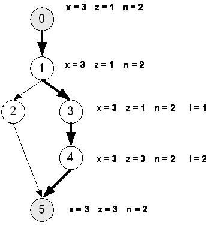

**Рисунок 1.18** — Керуючий граф програми

**Таблиця 1.2** — Траса, що проходить через вершини 0-1-3-4-5

| № вершини-оператора | Значення змінної x | Значення змінної z | Значення змінної n | Значення змінної i |
| :---: | :---: | :---: | :---: | :--- |
| 0 | 3 | 1 | 2 | не зафіксовано |
| 1 | 3 | 1 | 2 | не зафіксовано |
| 3 | 3 | 1 | 2 | 1 |
| 4 | 3 | 3 | 2 | 2 |
| 5 | 3 | 3 | 2 | не зафіксовано |

*Дамп* — область пам'яті, стан якої фіксується в контрольній точці у вигляді єдиного масиву або декількох зв'язаних масивів. При аналізі, який здійснюється після виконання трасування в режимі off-line, стани дампу структуруються, і виділені області або поля порівнюються із станами, передбаченими специфікацією. Наприклад, при моделюванні поведінки управляючих програм-контролерів у вигляді дампу фіксуються області загальних і спеціальних регістрів, або цілі області оперативної пам'яті, стани якої визначає алгоритм управління зовнішнім середовищем.

Реверсивне (зворотне) виконання (reversible execution) програми можливе за умови збереження на кожному кроці програми всіх значень змінних або станів програми для відповідної траси. Тоді підіймаючись від кінцевої точки траси до будь-якої іншої, можна покроково провести обчислення станів, рухаючись від наслідку до причини, від станів на виході перетворювача даних до станів на його вході. Природно, що такі можливости ми одержуємо в режимі off-line аналізу при фіксації в Log-файлі всієї історії виконання траси.

Розглянемо приклад зворотного виконання для програми обчислення ступеня числа x.

У програмі до прикладу 1.5 фіксуються значення всіх змінних після виконання кожного оператора.

**Приклад 1.5.** Вихідний код з фіксацією результатів виконання операторів
```csharp
//Метод обчислює невід’ємний степінь n числа x
static public double
  PowerNonNeg(double x, int n)
{
  double z=1;
  Console.WriteLine(«x={0} z={1}
    n={2}», x,z,n);
  if (n>0)
  {
    Console.WriteLine(«x={0} z={1}
      n={2}»,x,z,n);
    for (int i=1;n>=i;i++)
  {
    z = z*x;
    Console.WriteLine(
      «x={0} z={1} n={2}» +
      « i={3}»,x,z,n,i);
  }
 }
  else Console.WriteLine( «Помилка! Степінь» +
« числа n повинен бути більше 0.» );
  return z;
}
```

Знаючи структуру керуючого графа програми і маючи значення всіх змінних після виконання кожного оператора, можна здійснити зворотне виконання (наприклад, подумки), підставляючи значення змінних в оператори і рухаючись від низу до верху, починаючи з останнього.

Отже, в процесі тестування порівняння проміжних результатів з отриманими незалежно еталонними результатами дозволяє знайти причини і місце помилки, виправити текст програми, провести повторну трансляцію і настройку на виконання і продовжити тестування.

Тестування завершується, коли успішно виконалась достатня кількість тестів у відповідності до обраного критерію тестування.

*Тестування* – це [51]:
1. Процес виконання програмного забезпечення системи або компоненти в умовах аналізу або запису одержуваних результатів з метою перевірки (оцінки) деяких властивостей тестованого об'єкту.
2. Процес аналізу пункту вимог до програмного забезпечення з метою фіксації відмінностей між існуючим станом програмного забезпечення і тим, що вимагається (що свідчить про прояв помилки) при експериментальній перевірці відповідного пункту вимог.
3. Контрольоване виконання програми на кінцевій множині тестових даних і аналіз результатів цього виконання для пошуку помилок.

Наскрізний приклад тестування.

Розглянемо програму, котра дещо відрізняється від наведеної у прикладі 1.6:

**Приклад 1.6.** Метод обчислення степені $n$ числа $x$

```csharp
// Метод обчислення степеня n числа x
static public double Power(int x, int n)
{
    int z=1;
    for (int i=1;n>=i;i++)
    {
        z = z*x;
    }
    return z;
}

[STAThread]
static void Main(string[] args)
{
    ...
```

**Приклад 1.7.** Інший приклад обчислення степені числа

```csharp
{
    int x;
    int n;
    try
    {
        Console.WriteLine(«Enter x:» );
        x=Convert.ToInt32(Console.ReadLine());
        if ((x>=0) & (x<=999))
        {
            Console.WriteLine(«Enter n:» );
            n=Convert.ToInt32(Console.ReadLine());
            if ((n>=1) & (n<=100))
            {
                Console.WriteLine(«The power n» + « of x is {0}», Power(x,n));
                Console.ReadLine();
```

```csharp
}
else
{
    Console.WriteLine(«Error : n « + «must be in [1..100]» );
    Console.ReadLine();
}
}
else
{
    Console.WriteLine(«Error : x « + «must be in [0..999]» );
    Console.ReadLine();
}
}
catch (Exception e)
{
    Console.WriteLine(«Error : Please enter « + «a numeric argument.» );
    Console.ReadLine();
}
}
```

Для наведеної програми, що обчислює степінь числа, відтворимо послідовність дій, необхідних для тестування.

***Специфікація програми***.
1. На вхід програма приймає два параметри: $x$ — число, $n$ — степінь. Результат обчислення виводиться на консоль.
2. Значення числа і степеня повинні бути цілими.
3. Значення числа, що підноситься до степеня, повинні лежати в діапазоні – $[0..999]$.
4. Значення степенів повинні лежати в діапазоні – $[1..100]$.
5. Якщо числа, що подаються на вхід, лежать за межами вказаних діапазонів, то повинне видаватися повідомлення про помилку.

***Розробка тестів***.
Визначимо області еквівалентності вхідних параметрів.
1. Для $x$ — числа, що підноситься до степеня, визначимо класи можливих значень:
   $1 - x < 0$ (помилкове);
   $2 - x > 999$ (помилкове);
   $3 - x$ — не число (помилкове);
   $4 - 0 <= x <= 999$ (коректне).
2. Для $n$ — ступеня числа:
   $5 - n < 1$ (помилкове);
   $6 - n > 100$ (помилкове);
   $7 - n$ — не число (помилкове);
   $8 - 1 <= n <= 100$ (коректне).

***Аналіз тестових випадків***.
Вхідні значення: ($x = 2$, $n = 3$) (покривають класи 4, 8).

Очікуваний результат: Power n x is 8.

Вхідні значення: $\{(x = -1, n = 2), (x = 1000, n = 5)\}$ (покривають класи 1, 2).

Очікуваний результат: Error : x must be in [0..999].

Вхідні значення: $\{(x = 100, n = 0), (x = 100, n = 200)\}$ (покривають класи 5, 6).

Очікуваний результат: Error : n must be in [1..100].

Вхідні значення: $(x = \text{ADS } n = \text{ASD})$ (покривають класи еквівалентності 3, 7).

Очікуваний результат: Error : Please enter a numeric argument.

*Перевірка на граничні значення.*

Вхідні значення: $(x = 999 \, n = 1)$.

Очікуваний результат: Power n x is 999.

Вхідні значення: $x = 0 \, n = 100$.

Очікуваний результат: Power n x is 0.

*Виконання тестових випадків.*

Запустимо програму із заданими значеннями аргументів.

*Оцінка результатів виконання програми на тестах.*

В процесі тестування Оракул послідовно отримує елементи множини $(X, Y)$ і відповідні їм результати обчислень $Y_{\text{B}}$. У процесі тестування проводиться оцінка результатів виконання шляхом порівняння одержаного результату з очікуваним.

### 1.15 Фази тестування, основні проблеми тестування

Реалізація тестування розділяється на три етапи:

1. Створення тестового набору (test suite) шляхом ручної розробки або автоматичної генерації для конкретного середовища тестування (testing environment).
2. Прогін програми на тестах, керований тестовим монітором (test monitor, test driver) з отриманням протоколу результатів тестування (test log) [51].
3. Оцінка результатів виконання програми на наборі тестів з метою ухвалення рішення про продовження або зупинку тестування.

Основна проблема тестування — визначення достатності множини тестів для істинності висновку про правильність реалізації програми, а також знаходження множини тестів, що володіють цією властивістю.

Розглянемо питання тестування на прикладі простої програми (приклад 1.8) на мові C#. Текст цієї програми і деяких інших дещо видозмінений з метою зробити ілюстрацію описуваних фактів більш прозорою.

**Приклад 1.8.** Приклад простої програми на мові C#
```csharp
/* Функція обчислює невід'ємний
   степінь n числа x */
1 double Power(double x, int n){
2 double z=1; int i;
3 for (i=1;
4 n>=i;
5 i++)
6 {z = z*x;} /* Повернення в п.4 */
7 return z;}
```

Керуючий граф програми (КГП) на рис. 1.19 відображає потік керування програми [19]. Нумерація вузлів графа співпадає з нумерацією рядків програми. Вузли 1 і 2 не включаються в КГП, оскільки відображають рядки коментарів, тобто не містять управляючих операторів.

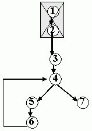

**Рисунок 1.19** – Керуючий граф програми

Управляючий граф програми — граф $G(V, A)$, де $V(V_1, \dots V_m)$ — множина вершин (операторів), $A(A_1, \dots A_n)$ — множина дуг (керувань), що сполучають оператори-вершини.

*Шлях* — послідовність вершин і дуг КГП, в якій будь-яка дуга виходить з вершини $V_i$ і приходить у вершину $V_j$, наприклад: $(3, 4, 7), (3, 4, 5, 6, 4, 5, 6), (3, 4) (3, 4, 5, 6)$

*Гілка* — шлях $(V_1, V_2, \dots V_k)$, де $V_1$ — або перший, або умовний оператор програми, $V_k$ — або умовний оператор, або оператор виходу з програми, а вся решта операторів — безумовна, наприклад: $(3, 4) (4, 5, 6, 4) (4, 7)$. Шляхи, що розрізняються хоча б числом проходжень циклу — різні шляхи, тому число шляхів в програмі може бути необмеженим. Гілки — лінійні ділянки програми, їх число скінченне.

Існують реалізовані і нереалізовані шляхи в програмі, в нереалізовані шляхи в звичайних умовах потрапити не можна.

**Приклад 1.9.** Приклад опису функції з шляхами, що можна реалізувати або не можна реалізувати

```cpp
float H(float x,float y)
{
  float H;
  1 if (x*x+y*y+2<=0)
  2     H = 17;
  3 else H = 64;
  4 return H*H+x*x;
}
```

Наприклад, для функції, що показана у прикладі 1.7 шлях $(1, 3, 4)$ можна реалізувати, а шлях $(1, 2, 4)$ не можна реалізувати в умовах нормальної роботи. Але при збоях навіть ті шляхи, що не можуть бути реалізованими, можуть реалізуватися. Розглянемо два приклади тестування:

Нехай програма H(x: int, y: int) реалізована на комп'ютері з 64 розрядним словами, тоді потужність множини тестів $\|(X, Y)\|= 2^{**}64$

Це означає, що комп'ютеру, що працює на частоті 1ГГц, для прогону цього набору тестів (за умови, що один тест виконується за 100 команд) буде потрібно $\sim 3\text{К}$ років.

На рис. 1.20 приведений фрагмент схеми програми керування схватом робота, де інтервал між моментами спрацьовування схвату не визначений.

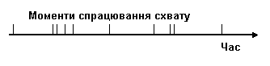

**Рисунок 1.20** –Тестова послідовність сигналів датчика схвату

Цей тривіальний приклад потребує прогону нескінченної множини послідовностей вхідних значень з різними інтервалами спрацювання схвату (приклад 1.10).

**Приклад 1.10.** Фрагмент програми спрацювання схвату
```csharp
// Прочитати значення датчика
static public bool ReadSensor(bool Sensor)
{//...читання значення датчика
Console.WriteLine(«...reading sensor value» );
return Sensor;
}// Відкрити схват
static public void OpenHand()
{ //...відкриваємо схват
Console.WriteLine(«...opening hand» );
}// Закрити схват
static public void CloseHand()
{//...закриваємо схват
Console.WriteLine(«...closing hand» );}
```

```csharp
[STAThread]
static void Main(string[] args)
{ while (true)
  { Console.WriteLine(«Enter Sensor value (true/false)» );
    if (ReadSensor(Convert.ToBoolean(Console.ReadLine())))
    {OpenHand();
     CloseHand();
    }}}
```

Враховуючи весь матеріал, наведений у даному розділі, можна зробити такий висновок:

_Тестування програми на всіх вхідних значеннях неможливе. Неможливе тестування і на всіх шляхах. Відповідно, потрібно добирати кінцевий набір тестів, котрий дозволяє перевірити програму на основі наших інтуїтивних уявлень._

Вимога до тестів – програма на будь-якому з них повинна зупинятися, тобто не зациклюватися. Чи можна наперед гарантувати зупинку на будь-якому тесті? В теорії алгоритмів доведено, що не існує загального методу для розв'язання цього питання, а також питання, чи досягне програма на даному тесті заздалегідь фіксованого оператора. Задача про вибір кінцевого набору тестів (X, Y) для перевірки програми в загальному випадку нероз'яззна. Тому для розв'язання практичних задач залишається шукати окремі випадки розв'язання цієї задачі.

### 1.16 Тестове оточення

Основний об'єм тестування практично будь-якої складної системи зазвичай виконується в автоматичному режимі. Крім того, система, що тестується, зазвичай розбивається на окремі модулі, кожен з яких тестується спочатку окремо від інших, потім в комплексі.

Це означає, що для виконання тестування необхідно створити деяке середовище, яке забезпечить запуск і виконання модуля, що тестується, передасть йому вхідні дані, збере реальні вихідні дані, отримані в результаті роботи системи на заданих вхідних даних. Після цього середовище повинне порівняти реальні вихідні дані з очікуваними і на підставі цього порівняння зробити висновок про відповідність поведінки модуля заданому (рис. 1.18).

Тестове оточення також може використовуватися для відчуження окремих модулів системи від усієї системи. Розділення модулів системи на ранніх етапах тестування дозволяє точніше локалізувати проблеми, що виникають в їх програмному коді. Для підтримки роботи модуля у відриві від системи тестове оточення повинне моделювати поведінку усіх модулів, до функцій або даних, до яких звертається модуль, що тестується.

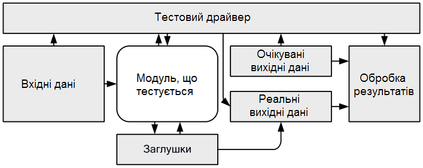

**Рисунок 1.18** – Узагальнена схема середовища тестування

Оскільки тестове оточення саме є програмою, воно саме має бути протестоване. Метою тестування тестового оточення є доказ того, що тестове оточення жодним способом не спотворює виконання модуля, що тестується, і адекватно моделює поведінку системи.

### 1.16.1 Драйвери і заглушки

Тестове оточення для програмного коду на структурних мовах програмування складається з двох компонентів — драйвера, який забезпечує запуск і виконання модуля, що тестується, і заглушок, які моделюють функції, що викликаються з цього модуля. Розробка тестового драйвера є окремим завданням тестування, сам драйвер має бути протестований, щоб виключити невірне тестування. Драйвер і заглушки можуть мати різні рівні складності, необхідний рівень складності вибирається залежно від складності модуля, що тестується, і рівня тестування. Так, драйвер може виконувати такі функції [45]:
- виклик модуля, що тестується;
- передача в тестований модуль вхідних значень і прийом результатів;
- виведення вихідних значень;
- протоколювання процесу тестування і ключових точок програми.

Заглушки можуть виконувати такі функції:
- не виконувати ніяких дій (такі заглушки потрібні для коректного складання модуля, що тестується);
- виводити повідомлення про те, що заглушка була викликана;
- виводити сполучення зі значеннями параметрів, переданих у функцію;
- повертати значення, заздалегідь задане у вхідних параметрах тесту;
- виводити значення, заздалегідь задане у вхідних параметрах тесту;
- набувати від тестованого ПЗ значень і передавати їх в драйвер.

Для тестування програмного коду, написаного на процедурній мові програмування, використовуються драйвери, що є програмою з точкою входу (наприклад, функцією main()), функціями запуску модуля, що тестується, і

функціями збору результатів. Зазвичай драйвер має як мінімум одну функцію – точку входу, якій передається управління при його виклику.

Функції-заглушки можуть поміщатися в той же файл початкового коду, що і основний текст драйвера. Імена і параметри заглушок повинні співпадати з іменами і параметрами функцій реальної системи, що «заслухаються». Ця вимога важлива не стільки з точки зору коректного складання системи (при складанні тестового драйвера і ПЗ, що тестується, може використовуватися приведення типів), скільки для того, щоб максимально точно моделювати поведінку реальної системи по передачі даних.

### 1.16.2 Тестування класів

Тестове оточення для об'єктно-орієнтованого ПЗ виконує ті ж самі функції, що і для структурних програм (на процедурних мовах). Проте воно має деякі особливості, пов'язані із застосуванням спадкоємства і інкапсуляції.

Якщо при тестуванні структурних програм мінімальним тестованим об'єктом є функція, то в об'єктно-орієнтованому ПЗ мінімальним об'єктом є клас. При застосуванні принципу інкапсуляції, всі внутрішні дані класу і деяка частина його методів недоступні ззовні. В цьому випадку тестувальник позбавлений можливості звертатися у своїх тестах до даних класу і довільним чином викликати методи. Єдине, що йому доступно – це викликати методи зовнішнього інтерфейсу класу.

Існує декілька підходів до тестування класів, кожен з яких накладає свої обмеження на структуру драйвера і заглушок [32]:

1. Драйвер створює один або більше об'єктів класу, що тестується. Усі звернення до об'єктів відбуваються тільки з використанням їх зовнішнього інтерфейсу. Текст драйвера в цьому випадку є так званим тестуючим класом, який містить по одному методу для кожного тестового прикладу. Процес тестування полягає в послідовному виклику цих методів. Замість заглушок до складу тестового оточення входить програмний код реальної системи, відповідно відсутня ізоляція тестованого класу. Проте саме такий підхід до тестування прийнятий зараз у більшості методологій і середовищ розробки.
2. Аналогічно попередньому підходу, але для усіх класів, які використовує тестований клас, створюються заглушки.
3. Програмний код класу, що тестується, модифікується так, щоб відкрити доступ до усіх його властивостей і методів. Будова тестового оточення в цьому випадку повністю аналогічна оточенню для тестування структурних програм.
4. Використовуються спеціальні засоби доступу до закритих даних і методів класу на рівні об'єктного або виконуваного коду – скрипти відладчика або accessors в Visual Studio.

Основна перевага перших двох методів полягає в тому, що при їх використанні клас працює таким самим чином, як в реальній системі. Проте в

цьому випадку не можна гарантувати того, що в процесі тестування буде виконаний увесь програмний код класу і не залишиться непротестованих методів.

Основний недолік 3-го методу — після зміни початкових текстів модуля, що тестується, не можна дати гарантії того, що клас поводитиметься так само, як і початковий. Зокрема, це пов'язано з тим, що зміна захисту даних класу впливає на спадкоємство даних і методів іншими класами.

Тестування спадкоємства — окреме складне завдання в об'єктноорієнтованих системах. Після того, як протестований базовий клас, необхідно тестувати класи-нащадки. Проте для базового класу не можна створювати заглушки, оскільки в цьому випадку можна пропустити можливі проблеми поліморфізму. Якщо клас-нащадок використовує методи базового класу для обробки власних даних, необхідно переконатися в тому, що ці методи працюють.

Таким чином, ієрархія класів може тестуватися зверху вниз, починаючи від базового класу. Тестове оточення при цьому може мінятися для кожної тестованої конфігурації класів.

### Контрольні питання до розділу 1

1. Які існують рівні та види тестування?
2. Мета і задачі тестування.
3. Різниця між помилкою, багом і дефектом.
4. Відмінності в поняттях: тестування, верифікація і валідація.
5. Цілі і завдання (задачі) тестувальника.
6. Етапи життєвого циклу розробки програмного продукту?
7. Що таке ручне і автоматизоване тестування?
8. Яка різниця між чорним і білим ящиками тестування?
9. Що таке позитивне і негативне тестування?
10. Поняття модульного і інтеграційного тестування.
11. Поняття збірки і системного тестування.
12. Поняття тстування навантаження.
13. З яких двох компонентів складається тестове оточення для програмного коду на структурних мовах програмування?
14. Які функції при тестуванні виконує драйвер?
15. Які функції при тестуванні виконують заглушки?


<!-- ВІДНОВЛЕНО ЛОКАЛЬНО (Стор. 97) -->
# **2 КРИТЕРІЇ ВИБОРУ ТЕСТІВ** 

# **2.1 Типи тестових прикладів** 

Розглянемо різні класи тестових прикладів, спрямованих на виявлення різних дефектів в роботі програмної системи. 

# **2.1.1 Допустимі дані** 

Найчастіше дефекти в програмних системах проявляються при обробці нестандартних даних, що не передбачені вимогами – при введенні невірних символів, порожніх рядків, дуже великій швидкості введення інформації. Однак перед пошуком таких дефектів необхідно упевнитися в тому, що програма коректно обробляє вірні дані, передбачені специфікацією, тобто перевірити роботу основних алгоритмів. Так, для функції обчислення контрольної суми допустимими вхідними даними буде довільний запис, що містить дані у всіх полях, крім поля контрольної суми CRC [32]. 

_record_type test_value1; int i; test_value1.A = false; for (i=0;i<20;i++) test_value1.B[i] = i; for (i=0;i<5;i++) test_value1.C[i] = i+5; test_value1.D[0] = i+8; test_value1.CRC = 0; Set_CRC(test_value1); printf(“%d\n”, test_value1.CRC);_ 

Сценарієм буде виклик функції Set_CRC, а очікуваним вихідним значенням – коректне значення поля CRC, що розраховане за алгоритмом CRC32. 

Зазвичай для перевірки допустимих даних достатньо одного тестового прикладу. Але функціональні вимоги можуть визначати різні групи допустимих даних, які можуть об’єднуватися в класи еквівалентності. У цьому випадку необхідно визначати як мінімум один тестовий приклад для одного класу еквівалентності. 

# **2.1.2 Граничні дані** 

Окремий вид допустимих даних, передача яких в систему може розкрити дефект, – граничні дані, тобто, наприклад, числа, значення яких є граничними для їх типу, рядки граничної або нульової довжини тощо. Зазвичай за допомогою тестування граничних умов виявляються проблеми з арифметичним порівнянням чисел або з ітераторами циклів. 

97
<!-- КІНЕЦЬ ВІДНОВЛЕННЯ -->


<!-- ВІДНОВЛЕНО ЛОКАЛЬНО (Стор. 98) -->
Для тестування функції Set_CRC на граничних умовах можна визначити два тестових приклади з мінімальними і максимальними значеннями полів у записі. 

_record_type test_value2; record_type test_value3; int i; test_value2.A = false; for (i=0;i<20;i++) test_value2.B[i] = 0; for (i=0;i<5;i++) test_value2.C[i] = 0; test_value2.D[0] = 0; test_value2.CRC = 0; Set_CRC(test_value2); printf(“%d\n”, test_value2.CRC); test_value3.A = true; for (i=0;i<20;i++) test_value3.B[i] = pow(2,sizeof(test_value3.B[i])*8)-1; for (i=0;i<5;i++) test_value3.C[i] = pow(2,sizeof(test_value3.C[i])*8)-1; test_value3.D[0] = pow(2,sizeof(test_value3.D[0])*8)-1; test_value3.CRC = pow(2,sizeof(test_value3.CRC)*8)-1; Set_CRC(test_value3); printf(“%d\n”, test_value3.CRC);_ 

# **2.1.3 Відсутність даних** 

Дефекти можуть проявитися і у випадку, якщо системі не передається ніяких даних або передаються дані нульового розміру. Для тестування функції Set_CRC при відсутності даних можна викликати її, передавши як параметр неініціалізованої структури. Однак такий тест не є точним прикладом відсутності даних, скоріше це приклад випадкових даних (можливо – невірних). 

_record_type test_value4; Set_CRC(test_value4); printf(“%d\n”, test_value4.CRC);_ 

# **2.1.4 Повторне введення даних** 

У разі повторної передачі на вхід системи одних і тих же самих даних можуть виходити відмінності у вихідних даних, які не передбачені у вимогах. Як правило, дефекти такого типу проявляються в результаті того, що система не встановлює внутрішні змінні в початковий стан або в результаті помилок округлення. 

<!-- КІНЕЦЬ ВІДНОВЛЕННЯ -->


<!-- ВІДНОВЛЕНО ЛОКАЛЬНО (Стор. 99) -->
_record_type test_value5; int i; test_value5.A = false; for (i=0;i<20;i++) test_value5.B[i] = i; for (i=0;i<5;i++) test_value5.C[i] = i+5; test_value5.D[0] = i+8; test_value5.CRC = 0; Set_CRC(test_value5); printf(“%d\n”, test_value5.CRC); Set_CRC(test_value5); printf(“%d\n”, test_value5.CRC);_ 

# **2.1.5 Невірні дані** 

При перевірці поведінки системи необхідно не забувати перевіряти систему при передачі їй даних, що не передбачені вимогами – занадто довгих або занадто коротких рядків, невірних символів, чисел за межами діапазону тощо. Невірні дані, як і допустимі, також можна розділяти на різні класи еквівалентності. Прикладом невірних даних для функції Set_CRC може служити запис з іншою структурою, переданій у функцію через приведення типів. Якщо розрахунок контрольної суми використовує імена полів запису, то контрольна сума може виявитися обчисленою невірно або може відбутися перезапис областей пам’яті, що не призначені для зберігання даних. 

_struct record_type2 { int F; int G[45]; int H[8]; unsigned int CRC; int K[2]; } record_type2 test_value6; Set_CRC((record_type)test_value6); printf(“%d\n”, test_value6.CRC);_ 

99
<!-- КІНЕЦЬ ВІДНОВЛЕННЯ -->


<!-- ВІДНОВЛЕНО ЛОКАЛЬНО (Стор. 100) -->
# **2.1.6 Реініціалізація системи** 

Механізми повторної ініціалізації системи під час її роботи також можуть містити дефекти. У першу чергу ці дефекти можуть проявлятися в тому, що не всі внутрішні дані системи після реініціалізаціі повернуться у початковий стан. У результаті може відбутися збій у роботі системи. 

Як приклад реініціалізаціі модуля обчислення CRC може служити примусове обнулення змінної _empty_ . 

_record_type test_value7; int i; test_value7.A = false; for (i=0;i<20;i++) test_value7.B[i] = i; for (i=0;i<5;i++) test_value7.C[i] = i+5; test_value7.D[0] = i+8; test_value7.CRC = 0; Set_CRC(test_value7); printf(“%d\n”, test_value1.CRC); empty=true; Set_CRC(test_value7); printf(“%d\n”, test_value1.CRC);_ 

# **2.1.7 Стійкість системи** 

Під стійкістю системи розуміють її здатність витримувати нештатне навантаження, яке явно не передбачене вимогами. Наприклад, чи збереже система працездатність після 10 тисяч викликів. Для функції Set_CRC можна реалізувати такий тестовий приклад: 

_record_type test_value8; int i; test_value8.A = false; for (i=0;i<20;i++) test_value8.B[i] = i; for (i=0;i<5;i++) test_value8.C[i] = i+5; test_value8.D[0] = i+8; test_value8.CRC = 0; for (i=0;i<10000;i++) Set_CRC(test_value8); printf(“%d\n”, test_value1.CRC);_ 

100
<!-- КІНЕЦЬ ВІДНОВЛЕННЯ -->


<!-- ВІДНОВЛЕНО ЛОКАЛЬНО (Стор. 101) -->
Аналогічний аналіз може бути зроблений шляхом перегляду тексту програми (якщо він доступний при тестуванні) на підставі відсутності «історії» (збережених даних) в реалізації програми, тобто даних, значення яких може змінюватися в залежності від кількості запусків програми. Таким чином, у ряді випадків тестування може бути замінено аналізом програмного коду. 

# **2.1.8 Позаштатні стани середовища виконання** 

Позаштатні стани середовища виконання (наприклад, вичерпання пам’яті, дискового простору або тривала нестача процесорного часу) можуть ускладнювати роботу системи або робити її неможливою. Основне завдання системи в такій ситуації – коректно завершити або призупинити свою роботу. 

Тестовим прикладом, що створює нештатний стан середовища для функції Set_CRC, може служити виділення всієї вільної пам’яті перед викликом функції. Якщо Set_CRC використовує динамічну пам’ять, то в ній повинні бути перевірки на можливість виділити пам’ять, в іншому випадку виконання функції викличе її аварійне завершення: 

_record_type test_value9; int i; int *heap; heap = malloc(_MAXMEM); test_value9.A = false; for (i=0;i<20;i++) test_value9.B[i] = i; for (i=0;i<5;i++) test_value9.C[i] = i+5; test_value9.D[0] = i+8; test_value9.CRC = 0; Set_CRC(test_value9); free(heap); printf(“%d\n”, test_value9.CRC);_ 

# **2.2 Граничні умови** 

У тестових прикладах, що відповідають тест-вимогам, зазвичай використовуються вхідні значення, що знаходяться завідомо всередині допустимого діапазону. Один із способів перевірки стійкості системи на значеннях близьких до граничних – створювати для кожного входу як мінімум три тестових приклади [32]: 

- значення всередині діапазону; 

- мінімальне значення; 

- максимальне значення. 

101
<!-- КІНЕЦЬ ВІДНОВЛЕННЯ -->


Для ще більшої впевненості в працездатності системи використовують п'ять тестових прикладів:
- значення всередині діапазону;
- мінімальне значення;
- мінімальне значення + 1;
- максимальне значення;
- максимальне значення – 1.

Такий спосіб перевірки називається перевіркою на граничних значеннях. Така перевірка дозволяє виявляти проблеми, що пов'язані з виходом за межі діапазону.

Наприклад, якщо в функцію,

```cpp
char sum(char a, char b)
{
    return a+b;
}
```

яка обчислює суму чисел $a$ і $b$ будуть передані значення 255 і 255, то в разі відсутності спеціальної обробки ситуації переповнення сума буде обчислена невірно.

Інша область, при тестуванні якої корисно користуватися перевіркою на граничних значеннях, – індекси масивів. Наприклад, функція,

```cpp
void abs_array(char array[], char size)
{
    for (int i=1;i<=size;i++)
    {
        array[i] = abs(array[i]);
    }
    return;
}
```

яка замінює значення на значення по модулю у кожного елементу переданого їй масиву, містить помилку в циклі $for$, яка може бути легко виявлена при передачі у функцію масиву одиничного розміру.

## 2.3 Вимоги до ідеального критерію тестування

Вимоги до ідеального критерію були описані в роботі Герхарта «Теорія тестування вибіркових даних». Критерій повинен бути [5]:
- **достатнім**, тобто, коли деяка кінцева множина тестів достатня для тестування конкретно обраної програми;
- **повним**, тобто у разі помилки повинен існувати тест з множини тестів, що задовольняють критерію, який виявляє помилку;

– **надійним**, тобто будь-які дві множини тестів, що задовольняють йому, одночасно повинні розкривати або не розкривати помилки програми;
– таким, що **легко перевіряється**, наприклад, обчислюваним на тестах.

Для нетривіальних класів програм у загальному випадку не існує повного і надійного критерію, що залежить від програм або специфікацій. Тому прагнуть до ідеального загального через реальні часткові критерії, які можна розбити на класи, що наведені нижче.

1. Структурні критерії, що використовують інформацію про структуру програми (критерії так званого «білого ящика»).
2. Функціональні критерії, що формулюються в описі вимог до програмного виробу (критерії так званого «чорного ящика»).
3. Критерії стохастичного тестування, що формулюються в термінах перевірки наявності заданих властивостей у тестованому додатку, засобами перевірки деякої статистичної гіпотези.
4. Мутаційні критерії, що орієнтовані на перевірку властивостей програмного виробу на основі підходу Монте–Карло.

## 2.4 Особливості застосування структурних і функціональних критеріїв

Розглянемо деякі особливості застосування критеріїв.

***Структурні критерії (клас I).***

Структурні критерії використовують модель програми у вигляді «білого ящика», що припускає знання початкового тексту програми або специфікації програми у вигляді потокового графа управління. Структурна інформація зрозуміла і доступна розробникам підсистем і модулів додатку, тому даний клас критеріїв часто використовується на етапах модульного і інтеграційного тестування (Unit testing, Integration testing).

Структурні критерії базуються на основних елементах управляючого графа програми (УГП), операторах, гілках і шляхах.

Умовою критерію **тестування команд** (критерій $C_0$) є те, що набір тестів у сукупності повинен забезпечити проходження кожної команди не менше одного разу. Це слабкий критерій, він, як правило, використовується у великих програмних системах, де інші критерії застосувати неможливо.

Умовою критерію **тестування гілок** (критерій $C_1$) є те, що набір тестів у сукупності повинен забезпечити проходження кожної гілки не менше одного разу. Це досить сильний і при цьому економічний критерій, оскільки множина гілок у тестованому додатку і така вже велика. Даний критерій часто використовується в системах автоматизації тестування.

Умовою критерію **тестування шляхів** (критерій $C_2$) є те, що набір тестів у сукупності повинен забезпечити проходження кожного шляху не менше одного разу. Якщо програма містить цикл (особливо з неявно заданим числом ітерацій), то число ітерацій обмежується константою (часто – 2, або числом класів вихідних шляхів). Розглянемо умови тестування відповідно до структурних критеріїв (приклад 2.1).

**Приклад 2.1, а.** Програма для тестування за структурними критеріями.
```csharp
1 public void Method (ref int x)
2 {
3     if (x>17)
4         x = 17-x;
5     if (x==-13)
6         x = 0;
7 }
```

**Приклад 2.1, б.** Проста програма для тестування за структурними критеріями.
```cpp
1 void Method (int *x)
2 {
3     if (*x>17)
4         *x = 17-*x;
5     if (*x==-13)
6         *x = 0;
7 }
```

Тестовий набір з одного тесту, задовольняє критерію команд ($C_0$):
$(X, Y) = \{(x_{\text{вх}}=30, x_{\text{вих}}=0)\}$ покриває всі оператори траси $1-2-3-4-5-6$.

Тестовий набір з двох тестів, задовольняє критерію гілок ($C_1$):
$(X, Y) = \{(30,0), (17,17)\}$ додає один тест до множини тестів для $C_0$ і траси $1-2-4-6$. Траса $1-2-3-4-5-6$ проходить через всі гілки, що досяжні в операторах $\text{if}$ за умови $\text{true}$, а траса $1-2-4-6$ через всі гілки, досяжні в операторах $\text{if}$ за умови $\text{false}$.

Тестовий набір з чотирьох тестів, задовольняє критерію шляхів ($C_2$):
$(X, Y) = \{(30, 0), (17, 17), (-13, 0), (21, -4)\}$

Набір умов для двох операторів $\text{if}$ з мітками 2 і 4 наведений у табл. 2.1.

**Таблиця 2.1** — Умови операторів $\text{if}$

| | $(30,0), (17,17)$ | $(-13,0), (21, -4)$ |
| :--- | :---: | :---: |
| $\text{if } (x>17)$ | $>$ | $>$ |
| $\text{if } (x==-13)$ | $=$ | $=$ |

За критерієм гілок $C_2$ програма перевіряється ретельніше, ніж критерій — $C_1$, проте навіть якщо він задоволений, немає підстав стверджувати, що програма реалізована відповідно до специфікації.

Наприклад, якщо специфікація задає умову, що $|x|=100$, нездійсненність яку можна підтвердити на тесті $(-177, -177)$, оператори 3 і 4 на тесті $(-177, -177)$ не змінять величину $x=-177$ і результат не відповідатиме специфікації.

За структурними критеріями не перевіряють відповідність специфікації, якщо вона не відображена в структурі програми. Тому при успішному тестуванні програми за критерієм $C_2$ ми можемо не помітити помилку, пов'язану з невиконанням деяких умов специфікації.

_**Функціональні критерії (клас II).**_

**Функціональний критерій** – найважливіший для програмної індустрії критерій тестування. Він забезпечує, перш за все, контроль ступеня виконання вимог замовника в програмному продукті. Оскільки вимоги формулюються до продукту в цілому, вони відображають взаємодію тестованого додатка з оточенням. При функціональному тестуванні переважно використовується модель «чорного ящика». Проблема функціонального тестування – це, перш за все, трудомісткість. Річ у тому, що документи, які фіксують вимоги до програмного виробу (Software requirement specification, Functional specification тощо), як правило, достатньо об'ємні, проте, відповідна перевірка повинна бути всеосяжною.

Нижче наводяться часткові види функціональних критеріїв.

**Тестування пунктів специфікації** – набір тестів у сукупності повинен забезпечити перевірку кожного тестованого пункту не менше одного разу.

Специфікація вимог може містити сотні і тисячі пунктів вимог до програмного продукту і кожна з цих вимог при тестуванні повинна бути перевірена відповідно до критерію не менше ніж одним тестом.

**Тестування класів вхідних даних** – набір тестів у сукупності повинен забезпечити перевірку представника кожного класу вхідних даних не менше одного разу.

При створенні тестів класи вхідних даних зіставляються з режимами використання тестованого компонента або його підсистемами, що помітно скорочує варіанти перебору і враховуються при розробці тестових наборів. Перебираючи відповідно до критерію величини вхідних змінних (наприклад, різні файли – джерела вхідних даних), ми вимушені застосовувати потужні тестові набори. Разом з обмеженнями на величини вхідних даних, існують обмеження на їх комбінації, зокрема перевірка реакцій системи на появу помилок у значеннях або структурах вхідних даних. Облік цього різноманіття – процес трудомісткий, що створює труднощі для застосування критерію. Для подолання труднощів застосовують набори тестів, які розглянемо нижче.

**Тестування правил** – набір тестів у сукупності повинен забезпечити перевірку кожного правила, якщо вхідні і вихідні значення описуються набором правил деякої граматики.

Слід зазначити, що граматика повинна бути достатньо простою, щоб трудомісткість розробки відповідного набору тестів була реальною (вписувалася в терміни і штат фахівців, виділених для реалізації фази тестування).

**Тестування класів вихідних даних** – набір тестів в сукупності повинен забезпечити перевірку представника кожного вихідного класу, за умови, що вихідні результати наперед класифікуються, причому окремі класи результатів враховують, зокрема, обмеження на ресурси або на якийсь час (time out).

**Тестування функцій** – набір тестів у сукупності повинен забезпечити перевірку кожної дії, що реалізовується тестованим модулем, не менше одного разу.

Функціональний критерій дуже популярний на практиці, проте не забезпечує покриття частини функціональності тестованого компонента, яка пов'язана із структурними і поведінковими властивостями, опис яких не зосереджений в окремих функціях (тобто опис розосереджений по компоненту).

Критерій тестування функцій об'єднує частково особливості структурних і функціональних критеріїв. Він базується на моделі «напівпрозорого ящика», де явно вказані не тільки входи і виходи тестованого компонента, але також склад і структура використовуваних методів (функцій, процедур) і класів.

Комбіновані критерії для програм і специфікацій – набір тестів в сукупності повинен забезпечити перевірку всіх комбінацій несуперечливих умов програм і специфікацій не менше одного разу.

При цьому всі комбінації несуперечливих умов треба підтвердити, а умови суперечностей слід виявити і ліквідовувати.

Розглянемо приклад застосування функціональних критеріїв тестування для розробки набору тестів за критерієм класів вхідних даних.

Для розв'язання завдання тестування системи «Система управління автоматизованим комплексом зберігання автомобільних шин» був розроблений такий фрагмент специфікації вимог:
1. Провести опит статусу складу (викликати функцію Getstorestat).
2. Додати в журнал повідомлень запис «СИСТЕМА: Запитаний статус СКЛАДУ».

Залежно від набутого значення провести такі дії. Отриманий статус складу $=32$. До складу поступила шина. Система повинна:
1. Додати в журнал повідомлень запис «СКЛАДУ: Статус СКЛАДУ $=32$».
2. Отримати параметри шини, що поступила, з терміналу шин (повинна бути викликана функція GetSkatepar).
3. Додати в журнал повідомлень запис «СИСТЕМА: Запитані параметри шини».

Залежно від поверненого функцією GetSkatepar значення повинні бути виконані дії (табл. 2.2):

Провести опит терміналу осі (викликати функцію отримання повідомлення від терміналу – Getaxlepar). У журнал повідомлень повинне бути додане повідомлення «СИСТЕМА : Запитані параметри осі». Залежно від поверненого функцією Getaxlepar значення повинні бути виконані дії, що наведені в таблиці 2.3.

**Таблиця 2.2** – Дії за наслідками функції (GetSkatepar значення, повернене функцією)

| GetSkatepar | Дії системи |
| :---: | :--- |
| ... | ... |
| 0 | Додати на перше місце команду GETR – «ОТРИМАТИ З ПРИЙМАЧА В ОСЕРЕДОК». Додати в журнал повідомлень запис «ТЕРМІНАЛ шин: 0 – параметри повернені <Номер_группи>« |
| 1 | Додати в журнал повідомлень запис «ТЕРМІНАЛ ШИН: 1 – немає даних» |
| ... | ... |

**Таблиця 2.3** – Дії за наслідками функції (Getaxlepar значення, повернене функцією)

| Getaxlepar | Дії системи |
| :---: | :--- |
| ... | ... |
| 1 | Додати в журнал повідомлень запис «ТЕРМІНАЛ ОСІ: 1 – немає даних» |
| ... | ... |

Визначимо класи вхідних даних для параметра «статус складу» :
Статус складу = 0 (правильний).
Статус складу = 4 (правильний).
Статус складу = 16 (правильний).
Статус складу = 32 (правильний).
Статус складу = будь-яке інше значення (помилковий).

Тепер розглянемо тестові випадки:

Тестовий випадок 1 (покриває клас 4):
Стан оточення (вхідні дані – X ):
Статус складу – 32.
...

Очікувана послідовність подій (вихідні дані – Y):
Система запрошує статус складу (визклик функції Getstorestat) і отримує
...

Тестовий випадок 2 (покриває клас 5):
Стан оточення (вхідні дані – X):
Статус складу – 12dfga.
...

Очікувана послідовність подій (вихідні дані – Y):
Система запрошує статус складу (виклик функції Getstorestat) і згідно пункту специфікації при помилковому значенні статусу складу в журнал додається повідомлення «СКЛАД: ПОМИЛКА: Невизначений статус».

### 2.5 Застосування методів стохастичного тестування

**Стохастичні критерії (клас III).**

Стохастичне тестування застосовується при тестуванні складних програмних комплексів, коли набір детермінованих тестів (X, Y) має велику потужність. У випадках, коли подібний набір неможливо розробити і виконати на фазі тестування, можна застосувати методику, що описана нижче.

Розробити програми-імітатори випадкових послідовностей вхідних сигналів $\{x\}$.

Обчислити незалежним способом значення $\{y\}$ для відповідних вхідних сигналів $\{x\}$ і отримати тестовий набір (X, Y).

Протестувати додаток на тестовому наборі (X, Y), використовуючи два способи контролю результатів:

**Детермінований контроль** – перевірка відповідності обчисленого значення $u_{\text{вих}} \in \{y\}$ значенню $y$, отриманому в результаті прогону тесту на наборі $\{x\}$ – випадковій послідовності вхідних сигналів, що згенерована імітатором.

**Стохастичний контроль** – перевірка відповідності множині значень $\{Y_{\text{вих}}\}$, отриманих у результаті прогону тестів на наборі вхідних значень $\{x\}$, наперед відомому розподілі результатів $F(Y)$.

У цьому випадку множина Y невідома (її обчислення неможливе), але відомий закон розподілу даної множини.

*Критерії стохастичного тестування.*

**Статистичні методи закінчення тестування** – стохастичні методи ухвалення рішень про збіг гіпотез про розподіл випадкових величин. До них належить широко відомий критерій Стьюдента ($\mathbf{St}$), метод Хі–квадрат ($\chi^2$) та ін.

**Метод оцінки швидкості виявлення помилок** – заснований на моделі швидкості виявлення помилок, згідно з якою тестування припиняється, якщо оцінений інтервал часу між поточною помилкою і наступною дуже великий для фази тестування додатку [12].

При формалізації моделі швидкості виявлення помилок (рис. 2.1) використовувалися такі позначення:


**Рисунок 2.1** – Залежність швидкості виявлення помилок від часу виявлення

**N** — початкове число помилок в програмному комплексі перед тестуванням;  
**C** — константа зниження швидкості виявлення помилок за рахунок знаходження чергової помилки;  
$t_1, t_2... t_n$ — кортеж зростаючих інтервалів виявлення послідовності з $n$ помилок;  
**T** — час виявлення $n$ помилок.  
Якщо припустити, що за час $T$ виявлено $n$ помилок, то справедливе співвідношення (1), що стверджує, що добуток швидкості виявлення помилки і часу виявлення є за визначенням:  
$$(N-i+1)*C*t_i = 1 \tag{1}$$  
У цьому припущенні справедливе співвідношення (2) для $n$ помилок:  
$$N*C*t_1 + (N-1)*C*t_2 + ... + (N-n+1)*C*t_n = n \tag{2}$$  
$N*C*(t_1 + t_2 + ... + t_n) - C*\sum (i-1)t_i = n$  
$NCT - C*\sum (i-1)t_i = n$  

Якщо з (1) визначити $t_i$ і підсумувати від $1$ до $n$, то прийдемо до співвідношення (3) для часу $T$ виявлення $n$ помилок  
$$\sum 1/(N-i+1) = TC \tag{3}$$  
Якщо з (2) виразити $C$, приходимо до співвідношення (4):  
$$C = n / (NT - \sum (i-1)t_i) \tag{4}$$  
Нарешті, підставляючи $C$ в (3), отримуємо остаточне співвідношення (5), зручне для оцінок:  
$$\sum 1/(N-i+1) = n / (N - 1/T*\sum (i-1)t_i) \tag{5}$$  

Якщо оцінити величину $N$ приблизно, використовуючи відомі методи оцінки числа помилок у програмі [1, 6], або дані про щільність помилок для проєктів даного класу з історичної бази даних проєктів, і, крім того, використовувати поточні дані про інтервали між помилками $t_1, t_2... t_n$,

109

отримані на фазі тестування, то, підставляючи ці дані в (5), можна отримати оцінку $t_{n+1}$ — часового інтервалу необхідного для знаходження і виправлення чергової помилки (майбутньої помилки).

Якщо $t_{n+1} > t_d$ — допустимого часу тестування проекту, то тестування закінчуємо, інакше продовжуємо пошук помилок.

Спостерігаючи послідовність інтервалів помилок $t_1, t_2 \dots t_n$, і час, витрачений на виявлення $n$ помилок $T = \sum t_i$, можна прогнозувати інтервал часу до наступної помилки і уточнювати відповідно до (4) величину $C$.

Розглянутий критерій дуже практичний, оскільки спирається на інформацію, що традиційно збирається в процесі тестування.

## 2.6 Мутаційний критерій і техніка роботи з ним

*Мутаційний критерій (клас IV).*

Професійні програмісти пишуть відразу майже правильні програми, що відрізняються від правильних дрібними помилками, наприклад — перестановка місцями максимальних значень індексів в описі масивів, помилки в знаках арифметичних операцій, заниження або завищення межі циклу на 1 тощо. Розглянемо підхід, що дозволяє на основі дрібних помилок оцінити загальне число помилок, що залишилися в програмі.

Підхід базується на таких поняттях:
- **мутації** — дрібні помилки в програмі;
- **мутанти** — програми, що відрізняються одна від одної мутаціями.

Метод мутаційного тестування полягає в тому, що в програми А та Б, що розробляються, вносять мутації, тобто штучно створюють програми-мутанти $A_1$, $Б_1$... Потім програми А та Б і їх мутанти тестуються на одному і тому ж наборі тестів $(X, Y)$.

Якщо на наборі $(X, Y)$ підтверджується правильність програми P і, крім того, виявляються всі внесені до програм-мутантів помилки, то набір тестів $(X, Y)$ відповідає мутаційному критерію, а тестована програма оголошується правильною.

Якщо деякі мутанти не виявили всіх мутацій, то треба розширювати набір тестів $(X, Y)$ і продовжувати тестування.

Розглянемо приклад застосування мутаційного критерію. Тестовані програми А та Б наведені у прикладі 2.2. Для них створюється по дві програми-мутанти.

У $A_1$ та $Б_1$ змінено початкове значення змінної $z$ з 1 на 2 (приклад 2.3).

У $A_2$ та $Б_2$ змінено початкове значення змінної $i$ з 1 на 0 і граничне значення індексу циклу з $n$ на $n-1$ (приклад $2.2 - 2.4$).

*Приклад 2.2, а. Основна програма А*
```java
// Метод обчислює невід’ємний степінь n числа x
static public double Powernonneg(
double x, int n)
{
  double z=1;
```

```csharp
if (n > 0)
for (int i = 1; n-1 >= i; i++)
    z = z*x;
else Console.WriteLine( «Помилка! Степінь числа n повинен
бути більше 0.» );
return z;
}
```

**Приклад 2.2, б.** Основна програма Б
```csharp
double Powernonneg(double x, int n)
{
    double z = 1;
    int i;
    if (n>0)
    for (i = 1; n-1 >= i; i++)
        z = z*x;
    else printf(
    «Помилка! Степінь числа n повинен
    бути більше 0.\n» );
    return z;
}
```

**Приклад 2.3, а.** Програма-мутант A1
```csharp
static public double Powernonneg(
double x, int n)
{
    double z = 2 ;
    if (n>0)
    for (int i = 1; n >= i; i++)
        z = z*x;
    else Console.WriteLine( «Помилка! Степінь числа n повинен
    бути більше 0.» );
    return z;
}
```

**Приклад 2.3.б.** Програма-мутант Б1
```csharp
double Powernonneg(double x, int n)
{
    {
        double z = 2;
        int i;
        if (n>0)
        for (i = 1; n >= i; i++)
            z = z*x;
        else printf( «Помилка! Степінь числа n повинен
        бути більше 0.\n» );
        return z;
    }
}
```

Змінені початкові значення змінної та межі циклу у програмі-мутант помічені підкресленням.

**Приклад 2.4, а.** Програма-мутант $\text{A}_2$
```csharp
static public double Powernonneg(
double x, int n)
{
  double z=1;
  if (n > 0)
    for (int i = 0;$n-1$ >= i;i++)
      z = z*x;
  else Console.WriteLine( «Помилка! Степінь числа n повинен
бути більше 0.» );
  return z;
}
```

**Приклад 2.4, б.** Програма-мутант $\text{Б}_2$
```c
double Powernonneg(double x, int n)
{
  double z = 1;
  int i;
  if (n>0)
    for (i = 0;$n-1$ >= i;i++)
      z = z*x;
  else printf( «Помилка! Степінь числа n повинен
бути більше 0.\n» );
  return z;
}
```

При запуску тестів 
$(X, Y) = \{(x=2, n=3, y=8), (x=999, n=1, y=999), \dots (x=0, n=100, y=0)\}$ виявляються всі помилки в програмах-мутантах і помилка в основній програмі, де в умові циклу замість $n$ стоїть $n-1$.

### Контрольні питання до розділу 2

1. Які типи тестових прикладів існують?
2. Назвіть основні вимоги до ідеального критерію тестування.
3. Особливості застосування структурних і функціональних критеріїв.
4. Яка різниця між тестуванням гілок і тестуванням шляхів?
5. Що собою представляє метод оцінки швидкості виявлення помилок?
6. Що таке мутаційний критерій і в чому полягає техніка роботи з ним?

## 3 ОЦІНКА ВІДТЕСТОВАНОСТІ ПРОЕКТУ: МЕТРИКИ ТА МЕТОДИКИ ІНТЕГРАЛЬНОЇ ОЦІНКИ

### 3.1 Графові моделі проекту, метрики оцінки відтестованості проекту

Тестування програми $\text{P}$ за деяким критерієм $\text{C}$ означає покриття множини компонентів програми $\text{P}$ $\text{M} = \{\text{m}_1...\text{m}_\text{k}\}$ за елементами або зв'язками.

$\text{T} = \{\text{t}_1...\text{t}_\text{n}\}$ — кортеж ненадлишкових тестів $\text{t}_\text{i}$.

Тест $\text{t}_\text{i}$ ненадлишковий, якщо існує покритий ним компонент $\text{m}_\text{i}$ з $\text{M}(\text{P}, \text{C})$, не покритий ні одним з попередніх тестів $\text{t}_1...\text{t}_{\text{i}-1}$. Кожному $\text{t}_\text{i}$ відповідає ненадлишковий шлях $\text{p}_\text{i}$ — послідовність вершин від входу до виходу.

$\text{V}(\text{P}, \text{C})$ — складність тестування $\text{P}$ за критерієм $\text{C}$ виміряється найбільшим числом ненадлишкових тестів, які покривають всі елементи множини $\text{M}(\text{P}, \text{C})$.

$\text{DV}(\text{P}, \text{C}, \text{T})$ — остаточна складність тестування $\text{P}$ за критерієм $\text{C}$ — вимірюється найбільшим числом ненадлишкових тестів, які покривають елементи множини $\text{M}(\text{P}, \text{C})$ та які залишилися не покритими після прогону набору тестів $\text{T}$. Величина $\text{DV}$ строго та монотонно вибуває від $\text{V}$ до 0.

$\text{TV}(\text{P}, \text{C}, \text{T}) = (\text{V}-\text{DV})/\text{V}$ — оцінка ступеню тестування $\text{P}$ за критерієм $\text{C}$.

Критерій закінчення тестування $\text{TV}(\text{P}, \text{C}, \text{T}) \text{L}$, для $\text{TV}(0, \text{L}, 1)$. $\text{L}$ — рівень відтестованості, який заданий у вимогах до програмного продукту.

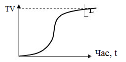

**Рисунок 3.1** — Метрика відтестованості додатку

### 3.2 Плоска та ієрархічна моделі проекту

Розглянемо дві моделі програмного забезпечення, які використовуються при оцінці відтестованості.

Для оцінки ступеню відтестованості часто використовують керуючий граф програми (КГП). КГП багатокомпонентного об'єкту $\text{G}$ (рис. 3.2, приклад 3.4) містить в собі дві компоненти $\text{G}_1$ та $\text{G}_2$, КГП яких розкриті.

В результаті КГП компонента $\text{G}$ має такий вигляд, якщо б компоненти $\text{G}_1$ та $\text{G}_2$ в його структурі спеціально не виділялись, а КГП компонентів $\text{G}_1$ та $\text{G}_2$ були вставлені в КГП $\text{G}$. Для тестування компоненти $\text{G}$ у відповідності до критерію шляхів потрібно буде прогнати тестовий набір, який покриває наступний набір трас графа $\text{G}$ (приклад 3.1).

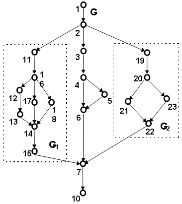

**Рисунок 3.2** – Плоска модель КГП компонента G.

**Приклад 3.1.** Набір трас, необхідних для покриття плоскої моделі КГП компонента G.

$$
\begin{align*}
\text{P1}(G) &= 1\text{-}2\text{-}3\text{-}4\text{-}5\text{-}6\text{-}7\text{-}10; \\
\text{P2}(G) &= 1\text{-}2\text{-}3\text{-}4\text{-}6\text{-}7\text{-}10; \\
\text{P3}(G) &= 1\text{-}2\text{-}11\text{-}16\text{-}18\text{-}14\text{-}15\text{-}7\text{-}10; \\
\text{P4}(G) &= 1\text{-}2\text{-}11\text{-}16\text{-}17\text{-}14\text{-}15\text{-}7\text{-}10; \\
\text{P5}(G) &= 1\text{-}2\text{-}11\text{-}16\text{-}12\text{-}13\text{-}14\text{-}15\text{-}7\text{-}10; \\
\text{P6}(G) &= 1\text{-}2\text{-}19\text{-}20\text{-}23\text{-}22\text{-}7\text{-}10; \\
\text{P7}(G) &= 1\text{-}2\text{-}19\text{-}20\text{-}21\text{-}22\text{-}7\text{-}10;
\end{align*}
$$

КГП компоненти $G$, представлений у вигляді ієрархічної моделі (див. рис. 3.3).

Для вичерпного тестування ієрархічної моделі компоненти $G$ у відповідності з критерієм шляхів потрібно буде прогнати такий набір трас (приклад 3.2):

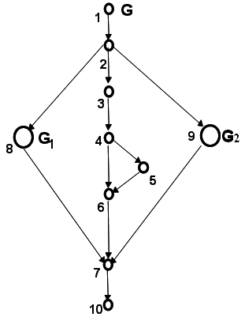

**Рисунок 3.3** – Ієрархічна модель КГП компоненти G

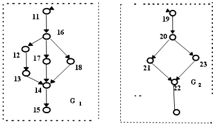

**Рисунок 3.4** – Ієрархічна модель: КГП компонент $\text{G}_1$ та $\text{G}_2$

**Приклад 3.2.** Набір трас, необхідних для покриття ієрархічної моделі КГП компоненти G.

$$\text{P1(G)} = 1\text{-}2\text{-}3\text{-}4\text{-}5\text{-}6\text{-}7\text{-}10;$$
$$\text{P2(G)} = 1\text{-}2\text{-}3\text{-}4\text{-}6\text{-}7\text{-}10;$$
$$\text{P3(G)} = 1\text{-}2\text{-}8\text{-}7\text{-}10;$$
$$\text{P4(G)} = 1\text{-}2\text{-}9\text{-}7\text{-}10.$$

Наведений набір трас достатній за умови, що компоненти $\text{G}_1$ та $\text{G}_2$ у свою чергу вичерпно протестовані. Щоб забезпечити виконання цієї вимоги стосовно критеріїв шляхів, потрібно прогнати всі траси.

**Приклад 3.3.** Набір трас ієрархічної моделі КГП, необхідних для покриття КГП компонентів $\text{G}_1$ та $\text{G}_2$.

$$\text{P11(G1)} = 11\text{-}16\text{-}12\text{-}13\text{-}14\text{-}15;$$
$$\text{P21(G2)} = 19\text{-}20\text{-}21\text{-}22;$$

P12(G1)=11-16-17-14-15;
P22(G2)=11-16-18-17-14-15
P13(G1)=19-20-23-22.

Оцінка ступеня тестованості плоскої моделі КГП визначається часткою прогнаних трас з набору, необхідних для покриття за критерієм С.
$$TV(G,C) = (V-DV)/V = PTi(G) / (Pi(G)), \quad (1)$$
де $\text{PTi}(G)$ – тестовий шлях ($ti$) в графі $G$ плоскої моделі дорівнює 1, якщо він протестований (прогнаний), або 0, якщо ні.

Наприклад, якщо в КГП (приклад 3.1) тести $t_6$ та $t_8$, яким відповідають траси P6 та P8, не прогнані, у відповідності до співвідношення (1) для TV(G,C) степінь тестованості буде оцінено в 0.71.

Оцінка тестованості ієрархічної моделі визначається на основі врахування оцінок тестованості компонентів. Якщо траса якогось тесту $t_j$ КПГ $G$ включає вузли, які представляють компоненти $G_{j1},..G_{jm}$, оцінка TV ступеня тестованості яких відома, то оцінка тестованості $\text{PTi}(G)$ при реалізації цієї траси визначається не 1, а мінімальною з оцінок TV для компонентів.

Інтегральна оцінка визначається відношенням (1):
$$TV(G,C) = (V-DV)/V = (PTi(G) * (TV(G_{ij},C))) / (Pi(G)) \quad (2)$$
де $\text{PTi}(G)$ – тестовий шлях ($ti$) в графі $G$ дорівнює 1, якщо протестований, або 0, якщо ні. В шлях $\text{PTi}$ графа $G$ може входити $j$ вузлів модулів $G_{ij}$ зі своїм ступенем тестованості $\text{TV}(G_{ij},C)$ з яких ми беремо $\min$, що дає найгіршу оцінку ступеня тестованості шляху.

**Приклад 3.4.** Приклад програми для плоскої моделі (рис. 3.2)
```java
// Приклад плоскої моделі проекту
public void G()
{
    int TerminalStatus=0, CommandStatus=0;
    bool IsPresent=true, CommandFound=true;

    1Init();
    2switch (TerminalStatus)
    {
        case 11 :
11          AddCommand();
16          switch (CommandStatus)
            {
                case 12 :
12                  GetMessage();
13                  ClearQueue();
                    break;
                case 17 :
17                  ClearQueue();
                    break;
```

```cpp
    case 18 :
        DumpQueue();
        break;
    }
14  ProcessCommand();
15  Commit();
    break;
    case 3 :
    AskTerminal();
    if (IsPresent)
    {
        Connect();
    }
    RebuildQueue();
    break;
    case 19 :
    SearchValidCommand();
    if (CommandFound)
    {
        AnalyzeCommand();
    }
    else
    {
        LogError();
    }
    MoveNextCommand();
    break;
}
7 LogResults();
10 DisposeAll();
}
```

**Приклад 3.4.1.** Приклад програми для плоскої моделі (рис. 3.2)
*// Приклад плоскої моделі проекту*
```cpp
void G()
{
    int TerminalStatus=0, CommandStatus=0;
    int IsPresent=1, CommandFound=1;

1   Init();
2   switch (TerminalStatus)
    {
        case 11 :
11          AddCommand();
16          switch (CommandStatus)
```

```cpp
    {
        case 12 :
12          GetMessage();
13          ClearQueue();
            break;
        case 17 :
17          ClearQueue();
            break;
        case 18 :
18          DumpQueue();
            break;
    }
14  ProcessCommand();
15  Commit();
    break;
    case 3 :
3   AskTerminal();
4   if (IsPresent)
    {
5       Connect();
    }
6   RebuildQueue();
    break;
    case 19 :
19  SearchValidCommand();
20  if (CommandFound)
    {
21      AnalyzeCommand();
    }
    else
    {
23      LogError();
    }
22  MoveNextCommand();
    break;
}
7   LogResults();
10  DisposeAll();
}
```

**Приклад 3.5.** Приклад програми для ієрархічної моделі (рис. 3.3)
// Приклад ієрархічної моделі проєкту
```cpp
public void G1()
{
```

```cpp
int CommandStatus=0;
AddCommand();
switch (CommandStatus)
{
    case 12 :
        GetMessage();
        ClearQueue();
        break;
    case 17 :
        ClearQueue();
        break;
    case 18 :
        DumpQueue();
        break;
}
ProcessCommand();
Commit();
}
public void G2()
{
    bool CommandFound=true;
    SearchValidCommand();
    if (CommandFound)
    {
        AnalyzeCommand();
    }
    else
    {
        LogError();
    }
    MoveNextCommand();
}

public void G()
{
    int TerminalStatus=0;
    bool IsPresent=true;

1 Init();
2 switch (TerminalStatus)
  {
    case 11 :
8     G1();
      break;
    case 3 :
```

```cpp
3   AskTerminal();
4   if (IsPresent)
    {
5       Connect();
    }
6   RebuildQueue();
    break;
    case 19 :
```
// Приклад ієрархічної моделі проекту – продовження
```cpp
9   G2();
    break;
    }
7   LogResults();
10  DisposeAll();
}
```

**Приклад 3.5.1.** Приклад програми для ієрархічної моделі (рис. 3.3)
```cpp
// Приклад ієрархічної моделі проекту
void G1()
{
    int CommandStatus=0;
    AddCommand();
    switch (CommandStatus)
    {
        case 12 :
            GetMessage();
            ClearQueue();
            break;
        case 17 :
            ClearQueue();
            break;
        case 18 :
            DumpQueue();
            break;
    }
    ProcessCommand();
    Commit();
}
void G2()
{
    intl CommandFound=1;
    SearchValidCommand();
    if (CommandFound)
    {
        AnalyzeCommand();
```

```cpp
    }
    else
    {
        LogError();
    }
    MoveNextCommand();
}

void G()
{
    int TerminalStatus=0;
    int IsPresent=1;

    Init();
    switch (TerminalStatus)
    {
        case 11 :
            G1();
            break;
        case 3 :
            AskTerminal();
            if (IsPresent)
            {
                Connect();
            }
            RebuildQueue();
            break;
        case 19 :
            G2();
            break;
    }
    LogResults();
    DisposeAll();
}
```

**Методика інтегральної оцінки тестованості:**

1. Вибір критерію $C$ та приймальної оцінки тестованості програмного проекту – $L$.
2. Побудова дерева класів проекту та побудова КГП для кожного модуля.
3. Модульне тестування й оцінка $TV$ на модульному рівні.
4. Побудова КГП, який інтегрує модулі в єдину ієрархічну (класову) модель проекту.
5. Вибір тестових шляхів для проведення інтеграційного або системного тестування.

6. Генерація тестів, які покривають тестові шляхи кроку 5.
7. Інтегральна оцінка тестованості проекту з урахуванням оцінок тестованості модулей-компонентів.
8. Повторення кроків 5-7 до досягнення заданого рівня тестованості L.

**Контрольні питання до розділу 3**

1. Що таке плоска та ієрархічна моделі проекту?
2. На основі чого визначається оцінка ступеня тестованості плоскої моделі?
3. На основі чого визначається оцінка тестованості ієрархічної моделі?
4. Які методики інтегральної оцінки тестованості існують?

# 4 МОДУЛЬНЕ ТА ІНТЕГРАЦІЙНЕ ТЕСТУВАННЯ

Як було сказано раніше, процес тестування активний протягом практично всього життєвого циклу ПЗ і функціонує паралельно з процесом розробки. Розробка системи, як правило, йде на різних рівнях — спочатку розробляється концепція системи, системні вимоги, архітектура системи, її розбиття на модулі, потім розробляються окремі модулі. Послідовність цих рівнів залежить від типу життєвого циклу, але їх склад практично завжди однаковий. Процес тестування також розбивається на окремі рівні:
– *модульне тестування*, в ході якого тестуються окремі компоненти;
– *інтеграційне тестування*, в ході якого тестуються групи модулів і компонент системи, що взаємодіють;
– *системне тестування*, в ході якого тестується система в цілому.

Технічні аспекти методів розробки і проведення тестування на кожному з трьох рівнів були розглянуті в попередніх темах — на кожному з рівнів розробляються тестове оточення, автоматизовані тести, проводяться формальні інспекції. Проте кожен з цих трьох рівнів має свої організаційні особливості, тому розглянемо детальніше модульне та інтеграційне тестування.

## 4.1 Цілі і завдання модульного тестування

Кожна складна програмна система складається з окремих частин — модулів, що виконують ту чи іншу функцію в складі системи. Для того щоб упевнитися в коректній роботі системи в цілому, необхідно спочатку протестувати кожен модуль системи окремо. У разі виникнення проблем при тестуванні системи в цілому це дозволяє простіше виявити модулі, що викликали проблему, і усунути відповідні дефекти в них. Таке тестування модулів окремо отримало називання модульного тестування (unit testing).

**Модульне тестування** — це метод тестування програмного забезпечення, який полягає в окремому тестуванні кожного модуля коду програми. Модулем називають найменшу частину програми, яка може бути протестованою. У процедурному програмуванні модулем вважають окрему функцію або процедуру. В об'єктно-орієнтованому програмуванні — інтерфейс, клас. Модульні тести, або unit-тести, розробляються в процесі розробки програмістами та, іноді, тестувальниками білої скриньки (white-box testers).

Основна мета модульного тестування — упевнитися в узгодженні вимогам кожного окремого елементу системи (методу, класу, модуля) перед тим, як буде зроблена його інтеграція до складу системи.

У разі систем, написаних на процедурних мовах, для кожного модуля розробляється тестовий драйвер, що викликає функції модуля і збирає результати їх роботи, і набір заглушок, які імітують поведінку функцій, що містяться в інших модулях, які не потрапляють під тестування даного

модуля. При тестуванні об'єктно-орієнтованих систем існує ряд особливостей, перш за все викликаних інкапсуляцією даних і методів в класах.

_**Драйвери**_ – модулі тестів, що запускають елемент, що тестується.
_**Заглушки**_ замінюють відсутні компоненти, що викликаються елементом і виконують такі дії:
- повертаються до елемента, не виконуючи ніяких інших дій;
- відображають повідомлення трасування і іноді пропонують тестувальнику продовжити тестування;
- повертають постійне значення або пропонують тестувальнику самому ввести значення, що повертається;
- здійснюють спрощену реалізацію відсутнього компонента;
- імітують виняткові або аварійні умови.

Оцінюючи кожний елемент ізольовано і підтверджуючи коректність його роботи, проблему можна виявити значно раніше ніж у випадку, коли елемент є частиною системи.

На рівні модульного тестування найлегше виявляються дефекти, що пов'язані з:
- алгоритмічними помилками та помилками кодування алгоритмів;
- роботою з умовами та лічильниками циклів;
- використанням локальних змінних та ресурсів.

Помилки, що пов'язані з невірним трактуванням даних, некоректною реалізацією інтерфейсів, сумісністю, продуктивністю тощо зазвичай на даному рівні тестування пропускаються і виявляються на вищих рівнях.

Стратегія модульного тестування, тобто розставлення акцентів при виборі наборів вхідних значень, визначається ефективністю виявлення тих чи інших помилок. Організації, що займаються розробкою програмного забезпечення, зазвичай мають базу даних історії розробок (Repository), в якій зберігається конкретна інформація попередніх проєктів: про версії і збірки (build) коду, що зафіксовані в процесі розробки продукту, про прийняті рішення, допущені прорахунки, помилки, успіхи тощо. Провівши аналіз характеристик попередніх проєктів, можна вберегти нову розробку від старих помилок, наприклад, визначивши типи дефектів, пошук яких найефективніший на різних етапах тестування.

У даному випадку аналізується етап модульного тестування. Якщо аналіз не дав потрібної інформації, наприклад, якщо в проєкті відповідні модулі не збиралися, то основним правилом стає пошук локальних дефектів, у яких код, ресурси і інформація, що залучені в дефект, характерні саме для даного модуля. У цьому випадку на модульному рівні помилки, що пов'язані, наприклад, з хибним порядком або форматом параметрів модуля, можуть бути пропущені, оскільки вони використовують інформацію, що зачіпає інші модулі (наприклад, специфікацію інтерфейсу), тоді як помилки в алгоритмі обробки параметрів досить легко виявляються.

В силу того, що модулі, які тестуються, зазвичай невеликі за розміром, модульне тестування вважається найпростішим (хоча і досить трудомістким)

етапом тестування системи. Однак, незважаючи на зовнішню простоту, з модульним тестуванням пов'язані дві проблеми.

Перша полягає в тому, що не існує єдиних принципів визначення того, що в точності є окремим модулем.

Друга полягає у відмінностях у трактуванні самого поняття модульного тестування — чи розуміється під ним відокремлене тестування модуля, робота якого підтримується тільки тестовим оточенням чи мова йде про перевірку коректності роботи модуля в складі вже розробленої системи. Останнім часом термін «модульне тестування» частіше використовується в другому сенсі, хоча в цьому випадку мова скоріше йде про інтеграційне тестування.

## 4.2 Принципи структурного тестування

Оскільки за способом виконання модульне тестування є структурним тестуванням або тестуванням «білого ящика», воно характеризується ступенем виконання або покриття логіки програми (початковий текст). Тести, що пов'язані із структурним тестуванням, будуються за такими принципами:

1. На основі аналізу потоку управління. В цьому випадку елементи, які повинні бути покриті при проходженні тестів, визначаються на основі структурних критеріїв тестування $C_0$, $C_1$, $C_2$. До них належать вершини, дуги, шляхи управляючого графа програми (УГП), умови, комбінації умов тощо.
2. На основі аналізу потоку даних, коли елементи, які повинні бути покриті, визначаються на основі інформаційного графа програми.

**Тестування на основі потоку управління.** Особливості використання структурних критеріїв тестування $C_0$, $C_1$, $C_2$ були розглянуті в розділі 2. До них слід додати критерій покриття умов, що полягає в покритті всіх логічних (булевих) умов у програмі. Критерії покриття рішень (гілок $C_1$) і умов не замінюють один одного, тому на практиці використовується комбінований критерій покриття умов/рішень, що суміщає вимоги з покриття і рішень, і умов.

До популярних критеріїв належать критерій покриття функцій програми, згідно з яким кожна функція програми повинна бути викликана хоча б один раз, і критерій покриття викликів, згідно з яким кожний виклик кожної функції в програмі повинен бути здійснений хоча б один раз. Критерій покриття викликів відомий також як критерій покриття пар викликів (call pair coverage).

**Тестування на основі потоку даних.** Цей вид тестування направлений на виявлення посилань на неініціалізовані змінні і збиткові присвоювання (аномалії потоку даних). Як основа для стратегії тестування потік даних вперше був описаний в роботі [4]. Запропонована там стратегія вимагала тестування всіх взаємозв'язків, що включають посилання (використання) і опис змінної, на яку вказує посилання (тобто потрібне покриття дуг інформаційного графа програми). Недолік стратегії полягає в тому, що вона не включає критерій $C_1$, і не гарантує покриття рішень.

Стратегія необхідних пар також тестує згадані взаємозв'язки [3]. Використання змінної в предикаті дублюється відповідно до числа виходів рішення, і кожний з таких необхідних взаємозв'язків повинен бути протестований. До популярних критеріїв належить критерій CP, що полягає в покритті всіх таких пар дуг $v$ і $w$, для яких з дуги $v$ досяжна дуга $w$, оскільки саме на дузі може відбутися втрата значення змінної, яка надалі вже не повинна використовуватися. Для «покриття» ще одного популярного критерію Cdu достатньо тестувати пари (вершина, дуга), оскільки опис змінної відбувається у вершині УГП, а її використання — на дугах, що виходять з рішень, або в обчислювальних вершинах.

## 4.3 Методи проектування тестових шляхів в структурному тестуванні

Процес побудови набору тестів при структурному тестуванні прийнято ділити на три фази:

1. Конструювання УГП — це статичний аналіз програми, задача якого полягає в отриманні графа програми та, в залежності від критерію тестування, множини елементів, які необхідно покрити тестами.
2. Вибір тестових шляхів. Існує три підходи до їх побудови:
   - статичні методи;
   - динамічні методи;
   - методи шляхів, що реалізуються.
3. Генерація тестів, відповідних тестовим шляхам. Відбувається пошук тестів, що реалізують проходження цих шляхів.

**Статичні методи.** Рішення, що найпростіше і найлегше реалізується, — це побудова кожного шляху за допомогою поступового його подовження за рахунок додавання дуг, поки не буде досягнута вихідна вершина управляючого графа програми. Ця ідея може бути посилена в так званих адаптивних методах, які кожного разу додають тільки один тестовий шлях (вхідний тест), використовуючи попередні шляхи (тести) для вибору подальших шляхів відповідно до деякої стратегії. Частіше за все адаптивні стратегії застосовуються стосовно критерію $\text{C}_1$. Основний недолік статичних методів полягає в тому, що не враховується можливість не реалізації побудованих шляхів тестування.

**Динамічні методи.** Такі методи потребують побудови повної системи тестів, що задовольняють заданому критерію, шляхом одночасного розв'язання задачі побудови покриваючої множини шляхів і тестових даних. При цьому можна автоматично враховувати можливість реалізації або не реалізації раніше розглянутих шляхів або їх частин. Основною ідеєю динамічних методів є приєднання до початкових реалізованих відрізків шляхів подальших їх частин так, щоб:
1) не втрачати при цьому можливості реалізації знов одержаних шляхів;
2) покрити необхідні елементи структури програми.

**Методи шляхів, що реалізуються.** Дана методика полягає у виділенні з множини шляхів підмножини всіх шляхів, що можуть бути реалізовані [6]. Після чого покриваюча множина шляхів будується з одержаної підмножини.

Перевага статичних методів полягає в порівняно невеликій кількості необхідних ресурсів, як при використанні, так і при розробці. Проте їх реалізація може містити непередбачуваний відсоток браку (шляхів без можливості реалізації). Крім того, в цих системах перехід від покриваючої множини шляхів до повної системи тестів користувач повинен здійснити вручну, а ця робота достатньо трудомістка.

Динамічні методи вимагають значно більших затрат ресурсів як при розробці, так і при експлуатації, проте збільшення витрат відбувається, в основному, за рахунок розробки і експлуатації апарату визначення можливості реалізації шляху (символічний інтерпретатор, вирішувач нерівностей).

Перевага цих методів полягає в тому, їх продукція має деякий якісний рівень — можливість реалізації шляхів.

Методи шляхів, що реалізуються, дають найкращий результат.

### 4.4 Приклад модульного тестування

Пропонується протестувати клас TCommand, який реалізує команду для складу. Цей клас містить єдиний метод TCommand.GetFullName(), специфікація якого описана таким чином:

...

Операція GetFullName() повертає повне ім'я команди, відповідне її допустимому коду, вказаному в полі NameCommand. В іншому випадку повертається повідомлення «ПОМИЛКА : невірний код команди». Операція може бути застосована у будь-який момент.

...

Розробимо специфікацію тестового випадку для тестування методу GetFullName на основі приведеної специфікації класу.

| Назва класу: TCommand | Назва тестового випадку: TCommandTest1 |
| :--- | :--- |

**Опис тестового випадку:** Тест перевіряє правильність роботи методу GetFullName — отримання повної назви команди на основі коду команди. В тесті подаються такі значення кодів команд (вхідні значення): -1, 1, 2, 4, 6, 20 (причому -1 — заборонене значення).

**Початкові умови:** Відсутні.

**Очікуваний результат:**

Перерахованим вхідним значенням повинні відповідати такі вихідні:

Коду команди -1 повинно відповідати повідомлення «ПОМИЛКА: невірний код команди».

Коду команди 1 повинна відповідати повна назва команди.

«ОДЕРЖАТИ З ВХІДНІ КОМІРКИ»
Коду команди 2 повинна відповідати повна назва команди «ВІДПРАВИТИ З КОМІРКИ У ВИХІДНУ КОМІРКУ».
Коду команди 4 повинна відповідати повна назва команди «ПОКЛАСТИ В РЕЗЕРВ».
Коду команди 6 повинна відповідати повна назва команди «ПРОВЕСТИ ЗАНУЛЕННЯ».
Коду команди 20 повинна відповідати повна назва команди «ЗАВЕРШЕННЯ КОМАНД ВИДАЧІ».

Для тестування методу TCommand.GetFullName() був створений тестовий драйвер — клас TCommandTester. Клас TCommandTester містить метод TCommandTest1(), у якому реалізована вся функціональність тесту. У даному випадку для покриття специфікації достатньо перебрати такі значення кодів команд: -1, 1, 2, 4, 6, 20, (-1 – заборонене значення) і одержати відповідну їм повну назву команди за допомогою методу GetFullName() (приклад 4.1). Пари значень ($X, Y_B$) при виконанні тесту заносяться в log-файл для подальшої перевірки на відповідність специфікації.

Після завершення тесту слід проглянути журнал тесту, щоб порівняти одержані результати з очікуваними, заданими в специфікації тестового випадку TCommandTest1 (Приклад 4.2).

**Приклад 4.1.** Тестовий драйвер
```csharp
class TCommandTester:Tester // Тестовий драйвер
{
    ...
    TCommand;
    public TCommandTester()
    {
        OUT=new TCommand();
        Run();
    }
    private void Run()
    {
        TCommandTest1();
    }
}

private void TCommandTest1()
{
    int[] commands = {-1, 1, 2, 4, 6, 20};

    for(int i=0;i<=5;i++)
    {
        .NameCommand=commands[i];
        LogMessage(commands[i].ToString()+
        « : «+OUT.GetFullName());
    }
}
```

```cpp
}
...
}
```
**Приклад 4.1.1.** Тестовий драйвер на C++
```cpp
TCommandQueueTester::TCommandQueueTester()
{
  TB = new TTerminalBearing();
  S = new TStore();
  CommandQueue=new TCommandQueue(S,TB);
  S->CommandQueue=CommandQueue;
}
```

**Приклад 4.2.** Специфікація класів тестових випадків
-1 : ПОМИЛКА : невірний код команди
1 : ОДЕРЖАТИ З ВХІДНОЇ КОМІРКИ
2 : ВІДПРАВИТИ З КОМІРКИ У ВИХІДНУ КОМІРКУ
4 : ПОКЛАСТИ В РЕЗЕРВ
6 : ПРОВЕСТИ ЗАНУЛЕННЯ
20 : ЗАВЕРШЕННЯ КОМАНД ВИДАЧІ

### 4.5 Модульне тестування та Test-Driven Development

Хоча модульне тестування має досить довгу, за комп'ютерними мірками, історію, але його поширення в останні роки пов'язане з поширенням так званих «легких» методологій програмування, а особливо з однією з них — екстремальним програмуванням. Початок цієї тенденції поклав Кент Берк, який випустив 1999 року книгу «Extreme Programming Explained», в якій крім всього іншого були сформовані основні принципи Test-Driven Development (TDD). Головною думкою автора є така: якщо тестування — це добре, то програмісти повинні постійно тестувати свій код. Набір цих рекомендацій і складає на даний момент ядро TDD. Існує багато різних визначень TDD, що акцентують увагу на різних його аспектах. У першому наближенні можна вважати, що TDD — це методика розробки, яка дозволяє оптимізувати використання модульних тестів.

З практичної точки зору, основою TDD є цикл «red/green/refactor» (рис. 4.1). У першій фазі програміст пише тест, у другій пишеться код для виконання цього тесту, а в третій, за необхідності, виконується рефакторінг. Послідовність фаз дуже важлива. У відповідності з принципом «Test first», необхідно писати тільки такий код, який абсолютно необхідний для успішного виконання тестів.


**Рисунок 4.1** – Цикл «red/green/refactor»

Як правило, цикл «red/green/refactor» повинен займати не більше 5-20 хвилин, хоча бувають винятки. Не слід працювати над тесом в декількох фазах одночасно. Чим більше тестів відлажується в одному циклі, тим гірше, в ідеалі потрібно працювати з одним тестом за раз.

При TDD виділяються п’ять основних функцій модульного тестування:
- зменшення кількості помилок;
- підтримка низькорівневого дизайну;
- підтримка рефакторингу;
- підтримка відладки;
- тест допомагає документувати код.

Значення традиційної ролі модульного тестування останнім часом в TDD-співтоваристві зазвичай не підкреслюється. Часто можна зустріти твердження, що значення TDD взагалі не в тестуванні і зниженні кількості помилок, а просто побічний ефект. Пов'язано це з тим, що, по-перше, цим ефектом значення тестування дійсно не вичерпується, а по-друге, в реальних програмах ніяка кількість модульних тестів не в змозі гарантувати повну відсутність помилок.

Модульне тестування, при деяких навичках, грає важливу роль як засіб підтримки дизайну. Щоб написати тест, необхідно детально продумати інтерфейс проектованого класу і протокол його використовування. Ще більш важливе те, що тестування в рамках TDD дозволяє одержати простий спосіб оцінки повноти інтерфейсів: необхідним і достатнім вважається такий інтерфейс, який дозволяє виконати всі написані тести. Все, що знаходиться за цими рамками, вважається непотрібним. Нарешті, використання тестів як інструменту дизайну змушує програміста в першу чергу концентруватися на інтерфейсі, а вже в другу — на імплементації, що також позитивно впливає на результат.

Значення тестів для рефакторингу переоцінити неможливо. Будь-який, навіть найменший рефакторинг, як відомо, вимагає наявності написаних тестів. Ця думка важлива настільки, що Мартін Фаулер у своїй книзі «Refactoring» присвятив модульному тестуванню цілий розділ. Звичайно, деякі види рефакторингів, такі як, наприклад, перейменування полів, цілком можливо застосовувати і без тестів. Але набір модульних тестів, що покривають велику частину коду, дозволяє модифікувати систему агресивніше та із значно передбачуванішими результатами. Саме поєднання рефакторингу і тестів дозволяє XP-програмістам швидко змінювати систему в будь-якому напрямі, який потрібний замовнику. І саме тому можна дозволити собі не шукати гнучких рішень, а використовувати найпростіші (ціна змін за наявності тестів не дуже висока).

Розробники знають, як важко деколи буває відладити певний метод, глибоко захований у великому додатку. Іноді не вдається перевірити тільки що написаний код, оскільки він ще ніде і ніяк не використовується. Часто відтворення тестової ситуації займає занадто багато часу. В деяких ситуаціях

програмісти навіть розробляють спеціальні утиліти, що дозволяють відладити той чи інший компонент окремо від всієї системи.

При використанні модульних тестів подібних проблем просто не виникає. Якщо потрібно що-небудь перевірити — пишеться тест. Тести, взагалі кажучи, є практично ідеальним налагоджувальним середовищем. Вони знаходяться повністю під контролем програміста і при правильному використанні дозволяють викликати будь-який код у широкому діапазоні умов.

Крім того, модульне тестування веде до скорочення загальних витрат часу на відладку. Для більшості помилок, знайдених при модульному тестуванні, відладка взагалі не потрібна, їх видно відразу. Навіть складні помилки стає простіше відладжувати, оскільки точно відомі місце їх виникнення (код, який був написаний тільки що) і умови відтворення (тест, який зараз відладжується). Шукати ті ж самі помилки в працюючій програмі майже завжди виявляється значно складніше і довше.

Не дивлячись на те, що концепція модульного тестування відносно проста, використання TDD в реальних проектах вимагає від програмістів, і особливо від «технічних лідерів», певних навичок. Перш за все, для успішного застосування TDD необхідне вміння збирати і інтерпретувати деякі стандартні тестувальні метрики. В XP-групі для оцінки якості тестування застосовуються:
- коефіцієнт покриття коду (code coverage);
- кількість тестів;
- кількість рядків коду в модульних тестах;
- сумарний час виконання тестів.

Найважливіший показник — коефіцієнт тестового покриття, або code coverage, який вимірюється як відношення числа інструкцій, виконаних тестами, до загального числа інструкцій в модулі або додатку. Загальні coverage додатки є основним засобом оцінки повноти модульного тестування. Як правило, задовільним вважаєтьсяся *coverage* не нижче 75%. $100\%$ *coverage* не є чимось незвичним і достатньо легко досягається при використанні «Test First». Використовувати *coverage* для оцінки стану модульних тестів слід обережно. Ця метрика швидше дозволяє виявити проблеми, ніж вказати на їх відсутність. «Погані» значення *coverage* чітко сигналізують про те, що тестів у додатку недостатньо, тоді як «хороші» значення не дозволяють зробити зворотного висновку. Проблема в тому, що повнота тестів ніяк не пов'язана з їх коректністю. За рамками *coverage* залишається також важливе питання про діапазони параметрів функцій. Проте *coverage* зручно застосовувати, з одного боку, для загального нагляду за тестуванням в проекті, а з іншого — для виявлення не покритих тестами ділянок коду.

Три інші показники доцільно розглядати разом. На відміну від *coverage*, кількість тестів і рядків коду цікавіше всього спостерігати в динаміці. При нормальному використанні TDD всі три значення повинні рости щодня і рівномірно, причини різких змін необхідно виявляти.

Певний інтерес представляє аналіз відношення між цими і іншими метриками: наприклад, велика різниця між кількістю тестів може говорити про те, що тести в середньому більші, ніж потрібно. Підтвердити або спростувати це твердження може середня кількість рядків коду в тесті. Іноді є сенс розглядати такі показники, як середня кількість тестів, що додаються щодня, відношення тестів до основного коду за кількістю рядків тощо.

Час виконання тестів виступає важливою метрикою з двох причин. По-перше, різке збільшення часу виконання тестів є надійним сигналом появи проблем з продуктивністю програми. По-друге, чим довше виконуються тести, тим гірше з ними працювати і тим рідше програмісти їх запускають. Тому необхідно стежити за тим, щоб час роботи тестів не збільшувався з недбалості, а іноді має сенс навіть докладати деякі зусилля з їх оптимізації.

Метрики, не дивлячись на зручність роботи з ними, в більшості випадків не дозволяють оцінити тести за цілим рядом важливих неформальних критеріїв. Тому існує набір вимог до тестів, відстежуваних, як правило, на *code review*. До них належать:

1. Простота. Тести крім всього іншого повинні пояснювати код, який вони використовують, і робити це способом максимально прозорим для сторонньої людини.
2. Правильне найменування тестів. Існують різні умови, але в будь-якому випадку назва повинна адекватно відображати суть тесту.
3. Не допускається залежність тестів один від одного або від порядку виклику. Виконання цього правила дозволяє відладжувати тести довільними групами.
4. Тести повинні бути атомарними, кожний з них повинен перевіряти рівно один тестовий випадок. Громіздкі і складні тести необхідно розбивати на декілька дрібніших.

Зрозуміло, що до тестів застосовуються ті ж вимоги стандартів кодування, що і до основного коду.

Відповідно до ідей TDD в більшості випадків, окрім тестів, необхідних для забезпечення *coverage*, програмісти пишуть додаткові тести на ситуації, які вони з яких-небудь причин хочуть перевірити додатково. Така практика вітається.

Модульне тестування, як вже наголошувалося, може використовуватися далеко не завжди. Так, наприклад:
1. Зазвичай в модульних тестах не перевіряється продуктивність. З технічної точки зору, це можна робити, і деякі середовища тестування навіть надають для цього спеціальні засоби. Але вимоги з продуктивності звичайно вказуються для додатку в цілому, а не для окремих функцій; крім того, performance testing часто займає велику кількість часу.
2. Як правило, не має сенсу тестувати чужий код і код, що автоматично згенерований.

3. На рівні модульного тестування часто важко або неможливо перевіряти складні функціональні вимоги до додатку. Цим у нас займаються тестувальники за допомогою автоматизації або ручного тестування.

Іноді через різні причини ухвалюється рішення взагалі не тестувати ту або іншу функціональність. Так, в XP-групі тепер модульні тести не пишуться для модулів, що імплементують GUI, хоча технічно це цілком можливо.

Модульне тестування — це специфічна область програмування. Щоб одержати загальне уявлення про його особливості, розглянемо деякі патерни, що застосовуються в програмуванні тестів.

Необхідність запускати тести окремими наборами примушує використовувати механізми структуризації тестів. Залежно від конкретного середовища, тести організують або в ієрархічні набори (Boost Test Library), або в простори імен (NUnit).

Найважливішим патерном модульного тестування, підтримуваним всіма розвиненими frameworks, є SetUp/TearDown-методи, які дають можливість виконання коду перед і після запуску тесту або набору тестів. Як правило, існують окремі методи SetUp/TearDown рівня тестів і test suites. Важливою і дуже зручною можливістю є SetUp/TearDown-методи для всіх тестів (рівень збірки в термінах mbUnit).

Основна задача SetUp/TearDown, як правило, — створення тестових наборів даних. При тестуванні коду, що працює з базами даних на запис, в цих методах проводиться backup і відновлення бази або створюються і відкатуються транзакції.

Mock-об'єкти — патерни тестування, суть яких полягає в заміні об'єктів, що використовуються тестованим кодом, на налагоджувальні еквіваленти. Наприклад, для тестування коду, що обробляє обриви з'єднання з базою даних, замість справжнього з'єднання можна використовувати спеціальний mock-об'єкт, який постійно викидатиме потрібне виключення.

Mock-об'єкти зручно використовувати, якщо:
- замінюваний об'єкт не володіє необхідною швидкодією;
- замінюваний об'єкт важко налагоджувати;
- потрібну поведінку замінюваного об'єкту складно змоделювати;
- для перевірки call-back-функцій;
- для тестування GUI.

Існують бібліотеки для динамічної генерації Mock-об'єктів по заданих інтерфейсах. На практиці регулярно доводиться тестувати один і той же код з різними комбінаціями параметрів. Row Test — це тестова функція, що приймає декілька визначених наборів значень:

```csharp
[RowTest]
[Row(«Monday», 1)]
...
[Row(«Saturday», 7)]
public void TestGetDayOfWeekName(string result, int arg) {
```

```csharp
Assert.AreEqual(result, Converter.GetDayOfWeekName(arg));
}
```

Combinatorial Test — тестова функція, що перевіряє код на всіх можливих комбінаціях для одного або декількох масивів значень:

```csharp
[Factory]
public static int[] Numbers() {
    int[] result = { 1,..., 9 };
    return result;
}
[CombinatorialTest ]
public void TestMultiplicationTable (
    [UsingFactories(«Numbers» ) int lhs,
    [UsingFactories(«Numbers» ) int rhs) {
    Assert.AreEqual(lhs * rhs, Foo.Multiply(lhs, rhs));
}
```

Пряма підтримка комбінаторного і рядкового тестування в framework серйозно полегшує тестування чутливого до параметрів коду. Хорошим прикладом такої framework є mbUnit.

Не вдаючись до опису конкретних продуктів, розглянемо основні види ПЗ, вживаного для модульного тестування.

Головним інструментом модульного тестування є unit test framework. Більшість сучасних framework базується на дизайні, запропонованому Беком у 1994 році в статті «Simple Smalltalk Testing». Завдання framework — надавати бібліотеки для створення тестів і засобу їх запуску. При виборі framework з технічної точки зору важливо враховувати наявність необхідних клієнтів (командний рядок, GUI, модулі для запуску з-під NAnt/Ant або IDE), підтримку патернів тестування, що використовуються, і reporting.

Підтримка тестування з IDE в ідеалі повинна включати засоби для запуску тестів поодинці і групами з різною гранулярністю, під відладчиком і без нього. Корисною є можливість вимірювання coverage для класів і модулів. Для вживання «Test First» зручні засоби генерації порожніх визначень для ще ненаписаних методів.

Вимірювання тестового покриття проводиться за допомогою відповідних аналізаторів, які діляться на дві групи: аналізатори початкового коду і аналізатори «бінарного» коду. Принцип дії в обох випадках полягає у вставці в код програми викликаків спеціальних функцій між інструкціями. Потім під час роботи додатку підраховується кількість викликаних функцій, відношення яких до їх загального числа і складає коефіцієнт тестового покриття.

Бібліотеки для генерації mock-об'єктів дозволяють автоматично створювати mock-об'єкти за заданим інтерфейсом, а також визначити очікуваний порядок виклику і параметри функцій mock-об'єктів.

Засоби мутаційного тестування або вставки дефектів дозволяють оцінити якість тестів. Вони працюють за допомогою інструментування коду, модифікуючи його так, щоб тести закінчувалися невдало.

Як і будь-яка інша методологія TDD достатньо непросто вбудовується в старі проєкти.

Перш за все, для успішного впровадження необхідна ясна, виражена в цифрах задача. У разі TDD, як правило, задача зводиться до досягнення певного коефіцієнта покриття коду, що, загалом, зручно. Важливо забезпечити доступність метрик, для цього добре використовувати, наприклад, e-mail reporting. Інший варіант, що непогано зарекомендував себе, — настінний графік, що відображає коливання в coverage. Необхідною умовою успішного вживання метрик є регулярність їх збору. В ідеалі метрики повинні збиратися автоматично. Збір метрик повинен бути максимально простий, щоб кожний програміст міг самостійно оцінювати результати своєї роботи.

Щоб тести сприймалися серйозно, потрібно робити їх запуск частиною стандартної процедури збірки (builds). Якщо тести на зібраному build проходять невдало, має сенс зупиняти його.

Коли проєкт великий, а coverage прямує до нуля, модульне тестування часто здається безглуздим через складність задачі (на доведення coverage до прийнятних значень довелося б витратити дуже великі зусилля). Намагатися за всяку ціну підвищити coverage в таких умовах, як правило, дійсно вкрай важко, зате дуже добре працює правило, що забороняє його знижувати.

В цьому випадку тести пишуться тільки тоді, коли зачіпається певний код: по-перше, при написанні нового коду; по-друге, при рефакторингу; по-третє, під час bug-fixing. Непогано зарекомендував себе підхід, при якому весь новий код повинен мати coverage значно більший, ніж загальнопроєктна норма, тобто досягати значення 100%.

## 4.6 Інтеграційне тестування

Результатом тестування окремих модулів, що складають програмну систему, є висновок про те, що ці модулі є внутрішньо несуперечливими і відповідають вимогам. Однак окремі модулі рідко функціонують самі по собі, тому наступна задача після тестування окремих модулів — тестування коректності взаємодії декількох модулів, об'єднаних в єдине ціле. Таке тестування називають інтеграційним.

*Інтеграційне тестування* — це фаза тестування програмного забезпечення, під час якої окремі модулі програми комбінуються та тестуються разом, у взаємодії. Інтеграційне тестування виконується після модульного тестування та перед верифікацією та валідацією ПЗ. Якщо розглядати цей процес як систему, то на вхід їй подаються модулі, які вже пройшли модульне тестування; потім модулі групуються в більші частини, виконуються тести передбачені планом, а на виході системи — інтегрована система, що готова до системного тестування.

Основна мета інтеграційного тестування – пошук дефектів, пов'язаних з помилками в реалізації і інтерпретації інтерфейсної взаємодії між модулями.

Інтеграційне тестування називають ще *тестуванням архітектури системи*. З одного боку це пов'язано з тим, що інтеграційні тести містять у собі перевірки всіх можливих видів взаємодій між програмними модулями і елементами, які визначаються в архітектурі системи — таким чином, інтеграційні тести перевіряють повноту взаємодії в тестованій реалізації системи. З іншого боку, результати виконання інтеграційних тестів — один з основних джерел інформації для процесу поліпшення та уточнення архітектури системи, між модульних і між компонентних інтерфейсів. Тобто, з цієї точки зору інтеграційні тести перевіряють коректність взаємодії компонент системи.

З технологічної точки зору інтеграційне тестування є кількісним розвитком модульного, оскільки так само, як і модульне тестування, оперує інтерфейсами модулів і підсистем і вимагає створення тестового оточення, включаючи заглушки (Stub) на місці відсутніх модулів.

Основна різниця між модульним і інтеграційним тестуванням полягає в цілях, тобто в типах дефектів що шукаються, які, у свою чергу, визначають стратегію вибору вхідних даних і методів аналізу. Зокрема, на рівні інтеграційного тестування часто застосовуються методи, пов'язані з покриттям інтерфейсів, наприклад, викликаків функцій або методів, або аналіз використання інтерфейсних об'єктів, таких як глобальні ресурси, засоби комунікацій, що надаються операційною системою.

На рис. 4.2 наведена структура комплексу програм К, що складається з модулів M1, M2, M11, M12, M21, M22, що були протестовані на етапі модульного тестування. Задача, що розв'язується методом інтеграційного тестування, — тестування між модульних зв'язків, що реалізовуються при виконанні програмного забезпечення комплексу К.

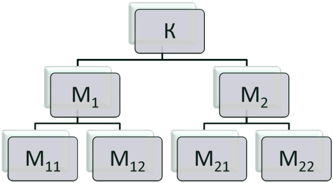

**Рисунок 4.2** – Приклад структури комплексу програм

Інтеграційне тестування використовує модель «білого ящика» на модульному рівні. Оскільки тестувальнику текст програми відомий з детальністю до виклику всіх модулів, що входять в тестований комплекс, вживання структурних критеріїв на даному етапі можливе і виправдане.

4.7 Методи інтеграційного тестування

Інтеграційне тестування, як правило, являє собою ітеративний процес, і застосовується на етапі збірки модулів, що були протестовані на етапі модульного тестування, в єдиний комплекс. Відомо два методи збірки модулів:

1) монолітний, який характеризується одночасним об'єднанням усіх модулів в тестовий комплекс;
2) інкрементний, що характеризується покроковим (помодульним) нарощуванням комплексу програм з покроковим тестуванням комплексу, що збирається.

В інкрементному методі виділяють дві стратегії додавання модулів:
1) «зверху вниз» і відповідне йому висхідне тестування;
2) «знизу в верх» і відповідно низхідне тестування.

Особливості **монолітного тестування** полягають у тому, що для заміни неопрацьованих до моменту тестування модулів, окрім самого верхнього (К на рис. 4.1), необхідно додатково розробляти драйвери (test driver) і/або заглушки (stub), що заміщають відсутні на момент сеансу тестування модулі нижніх рівнів [3].

Монолітне тестування передбачає, що окремі компоненти системи серйозного тестування не проходили. Основна перевага цього методу — відсутність необхідності в розробці тестового оточення, драйверів і заглушок.

Після розробки всіх модулів виконується їх інтеграція, після чого система перевіряється вся в цілому, як вона є. Цей підхід не слід плутати з системним тестуванням. Незважаючи на те, що при монолітному тестуванні перевіряється робота всієї системи в цілому, основне завдання цього тестування — визначити проблеми взаємодії окремих модулів системи.

Завданням же системного тестування є оцінка якісних і кількісних характеристик системи з точки зору їх прийнятності для кінцевого користувача.

Порівняння монолітного і інтегрального підходу дозволяє зробити такі висновки:
1. Монолітне тестування вимагає великих трудозатрат, пов'язаних з додатковою розробкою драйверів і заглушок і з складністю ідентифікації помилок, що виявляються в просторі зібраного коду.
2. Покрокове тестування пов'язано з меншою трудомісткістю ідентифікації помилок за рахунок поступового нарощування об'єму коду, що тестується, і відповідно локалізації доданої області коду, що тестується.
3. Монолітне тестування надає великі можливості розпаралелювання робіт особливо на початковій фазі тестування.

Особливості **низхідного тестування** полягають у тому, що організація середовища для виконання черговості викликаків протестованих модулів модулями, що тестуються, постійна розробка і використання заглушок,

організація пріоритетного тестування модулів, що містять операції обміну з оточенням, або модулів, критичних для тестового алгоритму.

Спочатку при низхідному підході тестують тільки самий верхній керуючий рівень системи, без модулів більш низького рівня. Потім поступово з більш високорівневими модулями інтегруються більш низькорівневі. В результаті застосування такого методу відпадає необхідність в драйверах (роль драйвера виконує більше високорівнева модульна система), проте зберігається потреба в заглушках (рис. 4.3) [32].

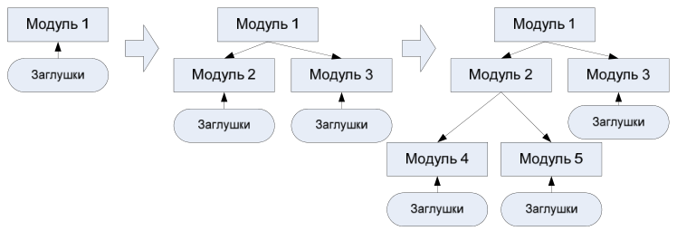

**Рисунок 4.3** – Поступова інтеграція модулів при низхідному методі тестування

Наприклад, порядок тестування комплексу K (рис. 4.1) при низхідному тестуванні може бути таким, як показано в прикладі 4.3, де тестовий набір, розроблений для модуля $\text{M}_j$, позначений як $\text{XY}_j = (\text{X}, \text{Y})_j$.

**Приклад 4.3.** Можливий порядок тестів при низхідному тестуванні
1) $\text{K}->\text{XY}_K$
2) $\text{M}_1->\text{XY}_1$
3) $\text{M}_{11}->\text{XY}_{11}$
4) $\text{M}_2->\text{XY}_2$
5) $\text{M}_{22}->\text{XY}_{22}$
6) $\text{M}_{21}->\text{XY}_{21}$
7) $\text{M}_{12}->\text{XY}_{12}$

Недоліки низхідного тестування:
1. Проблема розробки достатньо «інтелектуальних» заглушок, тобто заглушок, здатних до використання при моделюванні різних режимів роботи комплексу, що необхідні для тестування.
2. Складність організації і розробки оточення для реалізації виконання модулів в потрібній послідовності.
3. Паралельна розробка модулів верхніх і нижніх рівнів призводить до не завжди ефективної реалізації модулів через підналагодження

(спеціалізації) ще не тестованих модулів нижніх рівнів до модулів верхніх рівнів, які вже відтестовані.

Особливості **висхідного тестування** полягають в організації порядку збірки і переходу до тестування модулів, відповідного порядку їх реалізації.

При використанні цього методу мається на увазі, що спочатку тестуються всі програмні модулі, що входять до складу системи і лише потім вони об'єднуються для інтеграційного тестування (рис. 4.4) [32]. При такому підході значно спрощується локалізація помилок: якщо модулі протестовані окремо, то помилка при їх спільній роботі є проблемою їх інтерфейсу. При такому підході область пошуку проблем у тестувальника досить вузька, а тому набагато вища ймовірність правильно ідентифікувати дефект.


**Рисунок 4.4** – Розробка драйверів і заглушок при висхідному інтеграційному тестуванні

Наприклад, порядок тестування комплексу К (рис. 4.2) при висхідному тестуванні може бути таким (приклад. 4.4).

**Приклад 4.4.** Можливий порядок тестів при висхідному тестуванні
1) $M_{11} \rightarrow XY_{11}$
2) $M_{12} \rightarrow XY_{12}$
3) $M_1 \rightarrow XY_1$
4) $M_{21} \rightarrow XY_{21}$
5) $M_2(M_{21}, Stub(M_{22})) \rightarrow XY_2$

6) $K(M_1, M_2(M_{21}, Stub(M_{22})) -> XY_K$
7) $M_{22} -> XY_{22}$
8) $M_2 -> XY_2$
9) $K -> XY_K$

Недоліки висхідного тестування:
1. Запізнювання перевірки концептуальних особливостей тестованого комплексу.
2. Необхідність в розробці і використанні драйверів і заглушок.
3. З одного боку драйвери і заглушки — це потужний інструмент тестування, з іншого — їх розробка потребує значних ресурсів, особливо при зміні складу модулів, що інтегруються. Тобто, може знадобитися один набір драйверів для модульного тестування кожного модуля, окремий драйвер і заглушки для тестування інтеграції двох модулів з набору, окремий — для тестування інтеграції трьох модулів тощо. У першу чергу це пов'язано з тим, що при інтеграції модулів відпадає необхідність у деяких заглушках, а також потрібна зміна драйвера, який підтримує нові тести, що зачіпають кілька модулів.

У різних фахівців в області тестування різні думки з приводу того, який з методів зручніший при реальному тестуванні програмних систем. Так, Йордан доводить, що спадне тестування прийнятне в реальних ситуаціях, а Майерс вважає, що кожен з підходів має свої переваги і недоліки, але в цілому висхідний метод краще [21].

## 4.8 Інтеграційне тестування для процедурного програмування

Процес побудови набору тестів при структурному тестуванні визначається принципом, на якому ґрунтується конструювання Графа Моделі Програми (ГМП). Від цього залежить множина тестових шляхів і генерація тестів, що відповідають цим тестовим шляхам.

Першим підходом до розробки програмного забезпечення є процедурне (модульне) програмування. Традиційне процедурне програмування припускає написання початкового коду в імперативному (наказовому) стилі, що приписує певну послідовність виконання команд, а також опис програмного проекту за допомогою функціональної декомпозиції. Такі мови, як Pascal і C, є імперативними. В них порядок початкових рядків коду визначає порядок передачі управління, включаючи послідовне виконання, вибір умов і повторне виконання ділянок програми. Кожний модуль має декілька точок входу (при строгому написанні коду — одну) і декілька точок виходу (при строгому написанні коду — одну). Складні програмні проекти мають модульно-ієрархічну побудову, і тестування модулів є початковим кроком процесу тестування ПЗ [3]. Побудова графової моделі модуля є тривіальною задачею, а тестування практично завжди проводиться за критерієм покриття гілок $C_1$, тобто кожна дуга і кожна вершина графа модуля повинні міститися, принаймні, в одному з шляхів тестування.

Таким чином, $\mathbf{M(P, C1) = E \cup N_{ij}}$, де $E$ – множина дуг, а $N_{ij}$ – вхідні вершини ГМП.

Складність тестування модуля за критерієм $\mathrm{C_1}$ виражається уточненою формулою для оцінки топологічної складності МакКейба [3]:
$$V(P, C1) = q + k_{in},$$
де $q$ – число бінарних виборів для умов галуження; $k_{in}$ – число входів графа.

Для інтеграційного тестування найістотнішим є розгляд моделі програми, побудованої з використанням діаграм потоків управління. Зв'язки контролюються також через дані, що готуються і використовуються іншими групами програм при взаємодії з групою, що тестується. Кожна змінна міжмодульного інтерфейсу перевіряється на тотожність описів у взаємодіючих модулях, а також на відповідність початковим програмним специфікаціям. Склад і структура інформаційних зв'язків реалізованої групи модулів перевіряються на відповідність специфікації вимог цієї групи. Всі реалізовані зв'язки повинні бути встановлені, впорядковані і узагальнені.

При збірці модулів в єдиний програмний комплекс з'являється два варіанти побудови графової моделі проекту:
- плоска або ієрархічна модель проекту (наприклад, рис. 3.2, 3.3);
- граф викликів.

Якщо програма $\mathrm{P}$ складається з $p$ модулів, то при інтеграції модулів в комплекс фактично виходить громіздка плоска (рис. 4.4) або простіша – ієрархічна (рис. 4.4) – модель програмного проекту. Як критерій тестування на інтеграційному рівні звичайно використовується критерій покриття гілок $\mathrm{C_1}$. Введемо також такі позначення:
$n$ – число вузлів в графі;
$e$ – число дуг в графі;
$q$ – число бінарних виборів з умов галуження в графі;
$k_{in}$ – число входів в граф;
$k_{out}$ – число виходів з графів;
$k_{ext}$ – число точок входу, які можуть бути викликані ззовні.

Тоді складність інтеграційного тестування всієї програми $\mathrm{P}$ за критерієм $\mathrm{C_1}$ може бути виражена формулою [7]:
$$V(P, C1) = \sum V(\bmod_i, C1) - k_{in} + k_{ext} = e - n - k_{ext} + k_{out} = q + k_{ext}, \quad (\forall \bmod_i \in P)$$

Проте при подібному підході до побудови ГМП розробник тестового набору неминуче стикається з неприйнятно високою складністю тестування $V(P, C)$ для проектів середнього і великого об'єму (розміром в $10^5 - 10^7$ рядків) [8], що виходить із зростання топологічної складності управляючого графа за МакКейбом. Таким чином, використовуючи плоску або ієрархічну модель, важко дати оцінку тестованості $\mathrm{TV(P, C, T)}$ для всього проекту і оцінку залежності тестованості проекту від тестованості окремого модуля $\mathrm{TV}(\mathrm{Mod}_i, \mathrm{C})$, включеного в цей проект.

Розглянемо другу модель збірки модулів у процедурному програмуванні – граф викликів. У цій моделі у разі інтеграційного тестування

враховуються тільки виклики модулів у програмі. Тому з множини $M(\text{Mod}_i, C)$ тестованих елементів можна виключити ті елементи, які не піддаються впливу інтеграції, тобто вузли і дуги, що не сполучені з викликами модулів:

$$M(\text{Mod}_i, C') = E' \cup \text{Nin},$$

де $E' = \{(\mathbf{n_i}, \mathbf{n_j}) \in E \mid \mathbf{n_i}$ или $\mathbf{n_j}$ содержит вызовы модулей, тобто $E'$ – підмножина ребер графа модуля, а $\text{Nin}$ – «вхідні» вузли графа [7]. Ця модифікація ГМП приводить до отримання нового графа – графа викликів, кожний вузел в цьому графі представляє модуль (процедуру), а кожна дуга – виклик модуля (процедури). Для процедурного програмування подібний крок спрощує графову модель програмного проекту до прийнятного рівня складності. Таким чином, може бути визначена цикломатична складність спрощеного графа $\text{Mod}_i$ як $V'(\text{Mod}_i, C')$, а громіздка формула, що виражає складність інтеграційного тестування програмного проекту, приймає такий вигляд [9]:

$$V'(P, C1') = \sum V'(\text{Mod}_i, C1') - k_{\text{in}} + k_{\text{ext}}$$

Так, для програми, ГМП якої наведена на рис. 4.5, для отримання графа викликів з ієрархічної моделі проекту повинні бути виключені всі дуги, окрім:
1. Дуги 1-2, що містить вхідний вузол 1 графа G.
2. Дуг 2-8, 8-7, 7-10, що містять виклик модуля G1.
3. Дуг 2-9, 9-7, 7-10, що містять виклик модуля G2.

У результаті граф викликів прийме вигляд, показаний на рис. 4.4, а складність даного графа по критерію $C_1'$ рівна:

$$V'(G, C1') = q + K_{\text{ext}} = 1 + 1 = 2.$$

$V'(\text{Mod}_i, C')$ в літературі називається складністю модульного дизайну ($\text{complexity module design}$) [9].


**Рисунок 4.5** – Граф викликів модулів

Сума складнощів модульного дизайну для всіх модулів за критерієм $C_1$ або сума їх аналогів для інших критеріїв тестування, виключаючи значення модулів найнижчого рівня, дає складність інтеграційного тестування для процедурного програмування [10].

**Контрольні питання до розділу 4**

1. На які рівні розбивається процес тестування?
2. Перечисліть завдання і цілі модульного тестування.
3. Дайте поняття модульного тестування.
4. Чому при модульному тестуванні використовуються заглушки?
5. Які основні принципи структурного тестування?
6. Які ви знаєте методи проектування тестових шляхів?
7. Які основні функції виділяються в Test-Driven Development?
8. Поняття інтеграційного тестування.
9. Які ви знаєте методи інтеграційного тестування?
10. Основні особливості низхідного тестування.
11. Основні особливості висхідного тестування.

# 5 ІНТЕГРАЦІЙНЕ ТЕСТУВАННЯ ДЛЯ ОБ'ЄКТНО-ОРІЄНТОВАНОГО ПРОГРАМУВАННЯ

У літературі часто згадується метод інтеграційного тестування об'єктно-орієнтованих програмних систем, заснований на виділенні кластерів класів, які мають разом деяку замкнуту і закінчену функціональність [45].

За своєю суттю такий підхід не є новим типом інтеграційного тестування, просто змінюється мінімальний елемент, що отримується в результаті інтеграції. При інтеграції модулів на процедурних мовах програмування можна інтегрувати будь-яку кількість модулів за умови розробки заглушок. При об'єктно-орієнтованому програмуванні (ООП) інтеграції класів у кластери існує досить нестроге обмеження на закінченість функціональності кластера. Однак навіть у разі об'єктно-орієнтованих систем можливо інтегрувати будь-яку кількість класів за допомогою класів-заглушок.

Процес тестування класів як модулів іноді називають компонентним тестуванням. В ході такого тестування перевіряється взаємодія методів всередині класу і правильність доступу методів до внутрішніх даних класу. При такому тестуванні можливе виявлення не тільки стандартних дефектів, пов'язаних з виходами за межі діапазону або невірно реалізованими вимогами, а також виявлення специфічних дефектів об'єктно-орієнтованого програмного забезпечення:

- дефектів інкапсуляції, в результаті яких, наприклад, приховані дані класу виявляються недоступними за допомогою відповідних публічних методів;
- дефектів успадкування, при наявності яких схема успадкування блокує важливі дані або методи від класів-нащадків;
- дефектів поліморфізму, при яких поліморфну поведінку класу виявляється поширеним не на всі можливі класи.

## 5.1 Особливості інтеграційного тестування для ООП

Програмний проект, написаний у відповідності з ООП підходом, матиме ГМП (Граф Модель Програми) відмінну від ГМП традиційної процедурної програми. Розробка самого проекту відбувається за іншим принципом — від визначення класів, що використовуються у програмі, побудови дерева класів до реалізації коду проекту [19].

При правильному використанні класів, що точно відображають прикладну область застосування, цей метод дає коротші, зрозуміліші і легко контрольовані програми. Об'єктно-орієнтоване програмне забезпечення є керованим за допомогою подій. Передача управління всередині програми здійснюється не тільки шляхом явної вказівки послідовності звернень одних функцій програми до інших, але і шляхом генерації повідомлень різним

об'єктам, розбору повідомлень відповідним обробником і передача їх об'єктам, для яких дані повідомлення призначені.

Розглянута ГМП в даному випадку стає непридатною. Ця модель, як мінімум, вимагає адаптації до вимог, які необхідні при об'єктно-орієнтованому підході, до написання програмного забезпечення. При цьому відбувається перехід від моделі, що описує структуру програми, до моделі, що описує поведінку програми, що для тестування можна класифікувати як позитивну властивість даного переходу. Негативним аспектом здійснюваного переходу для застосування розглянутих раніше моделей є втрата заданих в явному вигляді зв'язків між модулями програми.

Розробка програмного забезпечення високої якості на мові об'єктно-орієнтованого програмування, наприклад, C++ або C#, для MS Windows або будь-якої іншої операційної системи, що використовує стандарт «Look and feel», із застосуванням щойно створених класів практично неможлива. Програміст повинен буде витратити багато часу на розв'язання стандартних задач зі створення інтерфейсу користувача. Щоб уникнути роботи над давно розв'язаними питаннями, у всіх сучасних компіляторах передбачені спеціальні бібліотеки класів.

Такі бібліотеки включають практично весь програмний інтерфейс операційної системи і дозволяють залучати при програмуванні засоби вищого рівня, а не просто виклики функцій. Базові конструкції і класи можуть бути знову використані при розробці нового програмного проекту. За рахунок цього значно скорочується час розробки програм. Як приклад подібної системи можна навести бібліотеку Microsoft Foundation Class для компілятора MS Visual C++ [25].

Робота з тестування додатків не повинна включати перевірку працездатності елементів бібліотек, що стали фактично промисловим стандартом для розробки програмного забезпечення, а тільки перевірку коду, написаного безпосередньо розробником програмного проекту. Тестування об'єктно-орієнтованої програми повинне включати ті ж рівні, що і тестування процедурної програми — модульне, інтеграційне і системне. Всередині класу окремо взяті методи мають імперативний характер виконання.

Всі мови ООП повертають контроль викликаному об'єкту, коли повідомлення оброблене. Тому кожний метод повинен пройти традиційне модульне тестування за вибраним критерієм $C$ (як правило, $C_1$). Відповідно до введених вище позначень, назвемо метод $\text{Mod}_i$, а складність тестування — $V(\text{Mod}_i, C)$. Кожний клас повинен бути розглянутий і як суб'єкт інтеграційного тестування. Інтеграція для всіх методів класу проводиться з використанням інкрементної стратегії від низу до верху. При цьому ми можемо повторно використати тести для класів-батьків тестованого класу [4], що виходить з принципу спадкоємства — від базових класів, що не мають батьків, до самих верхніх рівнів класів.

## 5.2 Модель об'єктно-орієнтованої програми

Графова модель класу, як і об'єктно-орієнтованої програми, на інтеграційному рівні в якості вузлів використовує методи. Дуги даної ГМП (виклики методів) можна побудувати двома способами:

1. За допомогою прямого виклику одного методу з коду іншого, у випадку, якщо метод, що викликається, видно з класу, який його містить. Дамо такій конструкції назву Р-шлях (P-path, Procedure path, процедурний шлях).
2. За допомогою обробки повідомлення, коли явного виклику методу немає, але в результаті роботи «викликаного» методу породжується повідомлення, яке повинне бути оброблене методом, що «викликається».

Для другого випадку метод, що «викликається», може породити інше повідомлення, що призводить до виникнення ланцюжка виконання послідовності методів, зв'язаних повідомленнями. Подібний ланцюжок носить назву ММ-шлях (MM-path, Metod/Message path, шлях метод/повідомлення) [9]. ММ-шлях закінчується, коли досягається метод, який при відпрацюванні не виробляє нових повідомлень.

Приклад ММ-шляхів наведений у прикладі 4.4. Дана конструкція відображає подієво керовану природу об'єктно-орієнтованого програмування і може бути взята за основу для побудови графової моделі класу або об'єктно-орієнтованої програми в цілому.

У прикладі 4.4 можна виділити чотири ММ-шляхи (1-4) і один Р-шлях (рис. 5.1):
$$msg\ a\ \text{метод } 3\ msg\ 3\ \text{метод } 4\ msg\ d$$
$$msg\ b\ \text{метод } 1\ msg\ 1\ \text{метод } 4\ msg\ d$$
$$msg\ b\ \text{метод } 1\ msg\ 2\ \text{метод } 5$$
$$msg\ c\ \text{метод } 2$$
$$call\ \text{метод } 5$$

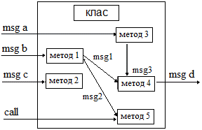

**Рисунок 5.1** – Приклад ММ-шляхів і Р-шляхів в графовій моделі класу

Тут клас зображений як об'єднання множини методів.
Введемо такі позначення:

- $\text{Kmsg}$ – число методів класу, які оброблюють різні повідомлення;
- $\text{Kem}$ – число методів класу, які не закриті від прямого виклику з інших класів програми.

Якщо розглядати клас як програму $\text{P}$, то можна виділити такі відмінності від програми, що побудована за процедурним принципом:

Значення $\text{Kext}$ (число точок входу, які можуть бути викликані ззовні) визначається як сума методів – обробників повідомлень $\text{Kmsg}$ (наприклад, в MS Visual C++ позначаються зарезервованим словом `afx_msg` і використовуються для роботи з картою повідомлень класу) і тих методів, які можуть бути викликані з інших класів програми $\text{Kem}$. Це визначається самим розробником шляхом розмежування доступу до методів класу (за допомогою ключових слів розмежування доступу `public`, `private`, `protect`) при написанні методів, а також призначенні дружніх (`friend`) функцій і дружніх класів. Таким чином, $\text{Kext} = \text{Kmsg} + \text{Kem}$ і має новий у порівнянні з процедурним програмуванням фізичний сенс.

Принцип з'єднання вузлів в ГМП, що відображає два можливі типи викликів методів класу (через ММ-шляхи і Р-шляхи), що призводить до нового наповнення для множини $\text{M}$ необхідних елементів. Методи (модулі) непрозорі для зовнішніх об'єктів, це призводить до непридатності механізму спрощення графа модуля, використовуваного для отримання графа викликів в процедурному програмуванні.

З урахуванням приведених зауважень, інформаційні зв'язки між модулями програмного проекту отримують новий фізичний зміст, а формула оцінки складності інтеграційного тестування класу $\text{Cls}$ приймає вигляд:
$$\mathbf{V(\text{Cls}, \text{C}) = f(\text{Kmsg}, \text{Kem})}.$$

В ході інтеграційного тестування повинні бути перевірені всі можливі зовнішні виклики методів класу, як безпосередні звернення, так і виклики, що ініційовані отриманням повідомлень.

Число ММ-шляхів залежить від схеми обробки повідомлень даним класом, що повинне бути визначене в специфікації класу. Наприклад, для класу, зображеного в прикладі 4.4, складність інтеграційного тестування $\text{V}(\text{Cls}, \text{C})=5$ (множина ненадмірних тестів $\text{T}$ для класу складають 4 ММ-шляхи плюс зовнішній виклик методу 5, тобто Р-шлях).

Дані – члени класу розглядаються як «глобальні змінні», вони повинні бути протестовані окремо на основі принципів тестування потоків даних.

Коли клас програми $\text{P}$ протестований, об'єкт даного класу може бути включений в загальний граф $\text{G}$ програмного проекту, що містить всі ММ-шляхи і всі виклики методів класів і процедур, що можливі в програмі (рис. 5.2):

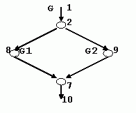

**Рисунок 5.2** – Граф виклику модулів

### 5.3 Оцінки складності тестування і методика тестування об'єктно-орієнтованої програми

Програма P, що містить $n$ класів, має складність інтеграційного тестування класів $\mathbf{V(P, C)} = \sum \mathbf{V(Clsi, C)}$. Формальним представленням описаного вище підходу до тестування програмного проекту служить класова модель програмного проекту, що складається з дерева класів проекту (рис. 5.3) і моделі кожного класу, що входить у програмний проект (рис. 5.4).


**Рисунок 5.3** – Дерево класів проекту

Таким чином визначається класова модель проекту для тестування об'єктно-орієнтованої програми. Як буде показано далі, вона підтримує ітераційний інкрементний процес розробки програмного забезпечення.

Методика проведення тестування програми, представленої у вигляді класової моделі програмного проекту (рис. 5.5), включає декілька етапів, що відповідають рівням тестування (рис. 5.6):

- на першому рівні проводиться тестування методів кожного класу програми, що відповідає етапу модульного тестування;
- на другому рівні тестуються методи класу, які утворюють контекст інтеграційного тестування кожного класу;
- на третьому рівні протестований клас включається в загальний контекст (дерево класів) програмного проекту.

Тут стає можливим відстежувати реакцію програми на зовнішні події.


**Рисунок 5.4** – Приклад включення об’єкту в модель програмного проекту, побудованого з використанням ММ-шляхів і Р-шляхів

Другий і третій рівні даної моделі відповідають етапу інтеграційного тестування.

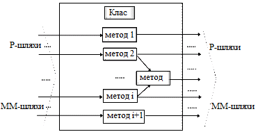

**Рисунок 5.5** – Модель класу, що входить в програмний проект

Для третього рівня важливим виявляється поняття атомарної системної функції (АСФ) [9]. АСФ – це множина, що складається із зовнішньої події на вході системи, реакції системи на цю подію у вигляді одного або більше ММ-шляхів і зовнішньої події на виході системи. У загальному випадку зовнішня вихідна подія може бути нульовою, тобто неакуратно написане програмне забезпечення може не забезпечувати зовнішньої реакції на дії користувача. АСФ, що складається з вхідної зовнішньої події, одного ММ-шляху і вихідної зовнішньої події може бути взята за модель для потока (thread).

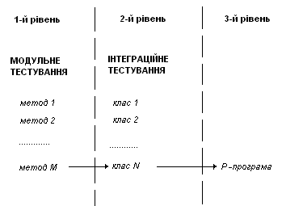

**Рисунок 5.6** – Рівні тестування класової моделі програмного проекту

Тестування подібної АСФ в рамках класової моделі ГМП реалізується досить складно, оскільки хоча динамічна взаємодія ниток (потоків) у процесі виконання природно фіксується в log-файлах, що запам'ятовують результати трасування виконання програм, це досить складно відображається на класовій ГМП. Причина в тому, що класова модель орієнтована на відображення статичних характеристик проекту, а в даному випадку необхідне відображення поведінкових характеристик. Як правило, тестування взаємодії ниток в ході виконання програмного комплексу виноситься на рівень системного тестування і використовує інші, більш пристосовані для опису поведінки моделі. Наприклад, опис поведінки програмного комплексу засобами мов специфікацій MSC, SDL, UML.

Явне розмежування між інтеграційним і системним рівнями тестування дає перевагу при плануванні робіт на фазі тестування, а можливість поєднувати різні методи і критерії тестування в ході роботи над програмним проектом дає якнайкращі результати [21].

Об'єктно-орієнтований підхід, що став на даний час неявним стандартом розробки програмних комплексів, дозволяє широко використовувати ієрархічну модель програмного проекту, наведена на рис. 5.6 схема ілюструє спосіб застосування. Кожен клас розглядається як об'єкт модульного і інтеграційного тестування. Спочатку кожен метод класу тестується як модуль за вибраним критерієм $C$. Потім клас стає об'єктом інтеграційного тестування. Далі здійснюється інтеграція всіх методів всіх класів у єдину структуру – класову модель проекту, де протестовані модулі входять в загальну ГМП у вигляді вузлів (інтерфейсів виклику) без урахування їх внутрішньої структури, а їх детальні описи утворюють контекст всього програмного проекту.

Сама технологія об'єктно-орієнтованого програмування (одним з визначальних принципів якої є інкапсуляція з можливістю обмеження

доступу до даних і методів – членам класу) дозволяє застосувати подібне трактування входження модулів в загальну ГМП. При цьому тести для окремо розглянутих класів повторно використовуються і входять в загальний набір тестів для програми P.

## 5.4 Приклад інтеграційного тестування

Продемонструємо тестування взаємодій на прикладі взаємодії класу TCommandQueue і класу TCommand, а також, як і при модульному тестуванні, розробимо специфікацію тестового випадку (табл. 5.1):

На основі цієї специфікації розроблений тестовий драйвер (приклад 5.1) – клас TCommandQueueTester, який успадковується від класу Tester і містить:
- конструктор, в якому створюються об'єкти класів TStore, TTerminalBearing і об'єкт типу TCommandQueue;
- методи, що реалізують тести. Кожен тест реалізований в окремому методі;
- метод Run, у якому викликаються методи тестів;
- метод dump, який зберігає в Log-файлі тесту інформацію про всі команди, що знаходяться в черзі у форматі – номер позиції в черзі, повна назва команди;
- точку входу в програму – метод Main, в якому відбувається створення екземпляра класу TCommandQueueTester.

**Таблиця 5.1** – Специфікація тестового випадку для інтеграційного тестування

| Назва взаємодіючих класів | TCommandQueue, TCommand |
| :--- | :--- |
| **Назва тесту** | TCommandQueueTest1 |
| **Опис тесту** | тест перевіряє можливість створення об'єкту типу TCommand і додавання його в чергу при виклику методу AddCommand |
| **Початкові умови** | черга команд порожня |
| **Очікуваний результат** | в чергу буде додана одна команда |

**Приклад 5.1.** Об'єкт типу TCommandQueue.
```cpp
public TCommandQueueTester()
{
  TB = new TTerminalBearing();
  S = new TStore();
  CommandQueue=new TCommandQueue(S,TB);
  S.CommandQueue=CommandQueue;
  ...
}
```

**Приклад 5.1.1.** Об'єкт типу TCommandQueue (C++)
```cpp
TCommandQueueTester::TCommandQueueTester()
{
    TB = new TTerminalBearing();
    S = new TStore();
    CommandQueue=new TCommandQueue(S,TB);
    S->CommandQueue=CommandQueue;
}
```

Тепер створимо тест, який перевіряє, чи створюється об'єкт типу TCommand, і чи додається команда в кінець черги.

**Приклад 5.2.** Тест
```cpp
private void TCommandQueueTest1()
{
    LogMessage(«///// TCommandQueue Test1/////» );
    LogMessage(«Перевіряємо, чи створюється
        об'єкт типа TCommand» );
    // У черзі немає команд
    dump();
    // Додаємо команду
    // параметр = -1 означає, що команда
    // повинна бути додана в кінець черги
    private void TCommandQueueTest1()
    LogMessage(«///// TCommandQueue Test1/////» );
    LogMessage(«Перевіряємо, чи створюється
        об'єкт типу TCommand» );
    // У черзі немає команд
    dump();
    // Додаємо команду
    // параметр = -1 означає, що команда
    // повинна бути додана в кінець черги
    CommandQueue.AddCommand(TCommand.GetR,0,0,
    new TBearingParam(),new TAxleParam(),-1);
    LogMessage(«Command added» );
    // У черзі одна команда
    dump();
}
```

**Приклад 5.2.1.** Тест (C++)
```cpp
void TCommandQueueTester::TCommandQueueTest1()
{
    LogMessage(«///// TCommandQueue Test1 /////» );
    LogMessage(«Перевіряємо, чи створюється
        об'єкт типа TCommand» );
    // У черзі немає команд
    dump();
    // Додаємо команду
    // параметр = -1 означає, що команда
    // повинна бути додана в кінець черги
    CommandQueue.AddCommand(GetR,0,0,
```

```cpp
new TBearingParam(),
new TAxleParam(),-1);
LogMessage(«Command added» );
// У черзі одна команда
dump();
```

У клас включено ще два розроблені тести. Після завершення тесту слід проглянути текстовий журнал тесту, щоб порівняти отримані результати з очікуваними результатами, заданими в специфікації тестового випадку TCommandQueueTest1 приклад 5.3.

**Приклад 5.3.** Специфікація результатів тесту
*///// TCommandQueue Test1 ///// \\*
*Перевіряємо, чи створюється об'єкт типа TCommand*
*0 commands in command queue*
*Command added*
*1 commands in command queue*
*0: ОТРИМАТИ З ВХІДНОЇ КОМІРКИ*

### Контрольні питання до розділу 5

1. Назвіть особливості інтеграційного тестування для ООП.
2. Яка модель об'єктно-орієнтованої програми використовує поняття P-шляхів і ММ-шляхів?
3. Які оцінки складності використовуються для тестування об'єктно-орієнтованої програми?
4. Назвіть етапи, які відповідають рівням тестування класової моделі.
5. Яка методика використовується для тестування об'єктно-орієнтованої програми?

# 6 СИСТЕМНЕ ТА РЕГРЕСИВНЕ ТЕСТУВАННЯ

## 6.1 Цілі і завдання системного тестування

По завершенню інтеграційного тестування всі модулі системи є узгодженими за інтерфейсом і функціональністю. Починаючи з цього моменту можна переходити до тестування системи в цілому, як єдиного об'єкта тестування — до системного тестування. На рівні інтеграційного тестування тестувальника цікавили, в основному, структурні аспекти системи, на рівні системного тестування тестувальника цікавлять поведінкові аспекти системи. Як правило, для системного тестування використовується підхід чорного ящика, при цьому в якості вхідних і вихідних даних використовуються реальні дані, з якими працює система, або дані, що подібні їм.

*Системне тестування* — один з найскладніших видів тестування. На етапі системного тестування проводиться не тільки функціональне тестування системи в цілому, а й оцінка характеристик якості системи — її стійкості, надійності, безпеки і продуктивності. На цьому етапі виявляються багато проблем зовнішніх інтерфейсів системи, які пов'язані з невірною взаємодією з іншими системами, апаратним забезпеченням, невірним розподілом пам'яті, відсутністю коректного звільнення ресурсів тощо.

На рівні системи часто складно та малоефективно аналізувати проходження тестових траєкторій усередині програми або відслідковувати правильність роботи конкретних функцій. Основне завдання системного тестування — у виявленні дефектів, пов'язаних з роботою системи в цілому, таких як:
- невірне використання ресурсів системи;
- непередбачувані комбінації даних користувацького рівня;
- несумісність із оточенням;
- непередбачувані сценарії використання;
- відсутня або невірна функціональність;
- незручність у застосуванні тощо.

Після завершення системного тестування розробка переходить у фазу приймально-здавальних випробувань (для програмних систем, що розробляються на замовлення) або в фазу альфа- і бета-тестування (для програмних систем загального застосування).

Оскільки системне тестування — процес, що вимагає значних ресурсів, для його проведення часто виділяють окремий колектив тестувальників. Часто системне тестування виконується організацією, не пов'язаною з колективом розробників і тестувальників, які виконували роботи на попередніх етапах тестування. При цьому необхідно відзначити, що при розробці деяких типів програмного забезпечення вимога незалежного тестування на всіх етапах розробки є обов'язковою.

Системне тестування проводиться в декілька фаз, на кожній з яких перевіряється один з аспектів поведінки системи, тобто проводиться один з типів системного тестування. Всі ці фази можуть протікати одночасно або послідовно. Нижче розглянемо особливості кожного з типів системного тестування на кожній фазі.

## 6.2 Види системного тестування

Прийнято виділяти такі види (категорії тестів) системного тестування:
1. Повнота розв'язання функціональних завдань.
2. Стресове тестування — на граничних обсягах навантаження вхідного потоку.
3. Коректність використання ресурсів (витік пам'яті, повернення ресурсів).
4. Оцінка продуктивності.
5. Ефективність захисту від спотворення даних і некоректних дій.
6. Перевірка інсталяції й конфігурації на різних платформах.
7. Тестування зручності використання.
8. Коректність документації.

У ході системного тестування проводяться далеко не всі з перерахованих видів тестування — конкретний їх набір залежить від системи, що тестується.

Вихідною інформацією для проведення перерахованих видів тестування є два класи вимог: функціональні та нефункціональні.

Функціональні вимоги явно описують, що система повинна робити і які виконувати перетворення вхідних значень у вихідні. Нефункціональні вимоги визначають властивості системи, безпосередньо не пов'язані з її функціональністю. Прикладом таких властивостей може служити час відгуку на запит користувача (наприклад, не більше 2 секунд), час безперебійної роботи (наприклад, не менше 1000 годин між двома збоями), кількість помилок, які допускає користувач-початківець за перший тиждень роботи (не більше 100) тощо.

Розглянемо деякі види тестування докладніше.

### 6.2.1 Функціональне тестування

Даний вид тестування призначений для доведення того, що вся система в цілому поводиться відповідно до очікувань користувача, формалізовані у вигляді системних вимог. У ході цього виду тестування перевіряються всі функції системи з точки зору її користувачів (як користувачів-людей, так і «користувачів»-інших програмних систем). Система при функціональному тестуванні розглядається як чорний ящик, тому в даному випадку корисно використовувати класи еквівалентності. Критерієм повноти тестування в даному випадку буде повнота покриття тестами системних функціональних

вимог (або системних тест-вимог) і повнота тестування класів еквівалентності, а саме:
- усі функціональні вимоги повинні бути протестовані;
- усі класи допустимих вхідних даних повинні коректно оброблятися системою;
- усі класи неприпустимих вхідних даних повинні бути відкинуті системою, при цьому не повинна порушуватися стабільність її роботи;
- у тестових прикладах повинні генеруватися всі можливі класи вихідних даних системи;
- під час тестування система повинна побувати у всіх своїх внутрішніх станах, пройшовши при цьому по всіх можливих переходах між станами.

Результати системного тестування протоколюються і аналізуються абсолютно аналогічно тому, як це робиться для модульного та інтеграційного тестування. Основна складність тут полягає в локалізації дефектів у програмному коді системи та визначенні залежностей одних дефектів від інших (ефект «парного числа помилок» ).

### 6.2.2 Тестування продуктивності

Даний вид тестування спрямований на визначення того, чи система забезпечує належний рівень продуктивності при обробці запитів користувача. Тестування продуктивності виконується при різних рівнях навантаження на систему, на різних конфігураціях обладнання. Виділяють три основні чинники, що впливають на продуктивність системи: кількість підтримуваних системою потоків (наприклад, сесій користувача), кількість вільних системних ресурсів, кількість вільних апаратних ресурсів.

Тестування продуктивності дозволяє виявляти вузькі місця в системі, які проявляються в умовах підвищеного навантаження або браку системних ресурсів. У цьому випадку за результатами тестування проводиться доробка системи, змінюються алгоритми виділення та розподілу ресурсів системи.

Усі вимоги, що належать до продуктивності системи, повинні бути чітко визначені і обов'язково повинні містити числові оцінки параметрів продуктивності. Тобто, наприклад, вимога «Система повинна мати прийнятний час відгуку на запит користувача» є непридатним для тестування. Навпаки, вимога «Час відгуку на запит користувача не повинний перевищувати 2 секунди» може бути протестована.

Те ж саме стосується і результатів тестування продуктивності. У звітах за даним видом тестування зберігають такі показники, як завантаження апаратного та системного програмного забезпечення (кількість циклів процесора, виділеної пам'яті, кількість вільних системних ресурсів тощо). Також важливі швидкісні характеристики тестованої системи (кількість оброблених в одиницю часу запитів, часові інтервали між початком обробки кожного наступного запиту, рівномірність часу відгуку в різні моменти часу тощо).

Для проведення тестування продуктивності потрібна наявність генератора запитів, який подає на вхід системи потік даних, типових для сеансу роботи з нею. Тестове оточення має містити крім програмної компоненти ще й апаратну компоненту, причому на такому тестовому стенді повинна існувати можливість моделювання різного рівня доступних ресурсів.

### 6.2.3 Стресове тестування

Стресове тестування має багато спільного з тестуванням продуктивності, проте його основне завдання — не визначити продуктивність системи, а оцінити продуктивність і стійкість системи у випадку, коли для своєї роботи вона виділяє максимально доступну кількість ресурсів, або коли вона працює в умовах критичної недостачі ресурсів.

Основна мета стресового тестування — вивести систему з ладу, визначити ті умови, за яких вона не зможе далі нормально функціонувати. Для проведення стресового тестування використовуються ті ж самі інструменти, що і для тестування продуктивності. Однак, наприклад, генератор навантаження при стресовому тестуванні повинен генерувати запити користувачів з максимально можливою швидкістю, або генерувати дані запитів таким чином, щоб вони були максимально можливими за обсягом обробки.

Стресове тестування дуже важливе при тестуванні web-систем і систем з відкритим доступом, рівень навантаження на які часто дуже складно прогнозувати.

### 6.2.4 Тестування конфігурації

Більшість програмних систем масового застосування призначені для використання на різному обладнанні. Незважаючи на те, що в даний час особливості реалізації периферійних пристроїв виконуються драйверами операційних систем, які мають уніфікований з точки зору прикладних систем інтерфейс, проблеми сумісності (як програмної, так і апаратної) все одно існують.

У ході тестування конфігурації перевіряється, чи коректно працює програмна система на всьому підтримуваному апаратному забезпеченні і спільно з іншими програмними системами. У ході тестування конфігурації необхідно також перевіряти, чи продовжує система стабільно працювати при гарячій заміні будь-якого підтримуваного пристрою на аналогічний. При цьому система не повинна давати збоїв ні в момент заміни пристрою, ні після початку роботи з новим пристроєм. Також необхідно перевіряти, чи коректно система обробляє проблеми, що виникають в обладнанні, як штатні (наприклад, сигнал кінця паперу в принтері), так і позаштатні (збій електропостачання).

### 6.2.5 Тестування безпеки

Якщо програмна система призначена для зберігання або обробки даних, вміст яких являє собою таємницю певного роду (особисту, комерційну, державну тощо), то до властивостей системи, що забезпечує збереження цієї таємниці будуть пред'являтися підвищені вимоги. Ці вимоги повинні бути перевірені при тестуванні безпеки системи. У ході цього тестування перевіряється, чи не втрачається інформація, не пошкоджується, її неможливо підмінити, а також до неї неможливо отримати несанкціонований доступ, в тому числі за допомогою використання вразливостей у самій програмній системі.

### 6.2.6 Тестування надійності і відновлення після збоїв

Для коректної роботи системи в будь-якій ситуації необхідно упевнитися в тому, що вона відновлює свою функціональність і продовжує коректно працювати після будь-якої проблеми, яка перервала її роботу.

При тестуванні відновлення після збоїв імітуються збої обладнання або навколишнього програмного забезпечення, або збої програмної системи, викликані зовнішніми чинниками. При аналізі поведінки системи в цьому випадку необхідно звертати увагу на два фактори – мінімізацію втрат даних в результаті збою і мінімізацію часу між збоєм і продовженням нормального функціонування системи.

### 6.2.7 Тестування зручності використання

Окрема група нефункціональних вимог – вимоги до зручності використання інтерфейсу користувача системи.

У результаті виконання всіх розглянутих вище видів тестування робиться висновок про функціональність і властивості системи, після чого вузькі місця системи допрацьовуються до реалізації необхідної функціональності або до досягнення системою необхідних властивостей.

Оскільки системне тестування проводиться на інтерфейсі користувача, то створюється ілюзія того, що побудова спеціальної системи автоматизації тестування не завжди необхідна. Проте обсяги даних на цьому рівні такі, що зазвичай більш ефективним підходом є повна або часткова автоматизація тестування, що приводить до створення тестової системи набагато складнішої, ніж система тестування, що застосовується на рівні тестування модулів або їх комбінацій.

### 6.3 Приклад системного тестування

У якості прикладу системного тестування наведемо додаток «Надходження підшипника на склад».

У специфікації тестового випадку заданий стан оточення (вхідні дані) і очікувана послідовність подій у системі (очікуваний результат). Після

прогону тестового випадку ми отримуємо реальну послідовність подій у системі (приклад 1, приклад 3) при заданому стані оточення. Порівнюючи фактичний результат з очікуваним, можна зробити висновок про те, чи пройшла система випробування на заданому тестовому випадку. У якості очікуваного результату будемо використовувати специфікацію тестового випадку, оскільки вона визначає, як повинна функціонувати система для заданого стану оточення.

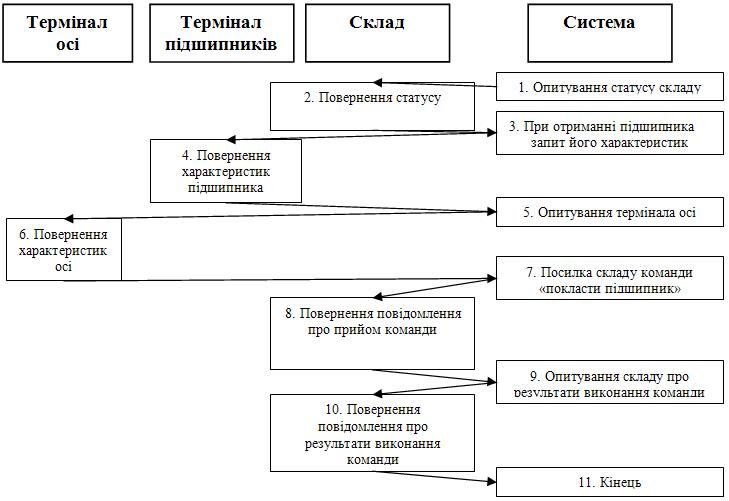

**Рисунок 6.1** – Короткий опис системи «Надходження підшипника на склад»

Специфікація тестового випадку №1:
Стан оточення (вхідні дані – X):
Статус складу – 32. Прийшов підшипник.
Статус обміну з терміналом підшипника (0 – є підшипник) і його параметри – «Статус=0 Діаметр=12».
Статус обміну з терміналом осі (1 – немає осі) і її параметри – «Статус=1 Діаметр=12».
«Статус=1 Діаметр=12».
Статус команди – 0. Команда успішно прийнята.
Повідомлення від складу – 1. Команда успішно виконана.
Очікувана послідовність подій (вихідні дані – Y):
Система запитує статус складу (виклик функції GetStoreStat) і одержує

Система запитує параметри підшипника (виклик функції GetRollerPar) і одержує Статус=0 Діаметр=12.
Система запитує параметри осі (виклик функції GetAxlePar) і одержує Статус=1 Діаметр=0.
Система додає в чергу команд складу на останнє місце команду SendR (одержати із приймача в комірку) (виклик функції SendStoreCom) і одержує повідомлення про те, що команда успішно прийнята – Статус=0.
Система запитує склад про результати виконання команди (виклик функції GetStoreMessage) і одержує повідомлення про те, що команда успішно виконана – Статус=1.
Вихідні дані (результати виконання $Y_b$) – зафіксовані в журналі тесту (приклад 6.1).

**Приклад 6.1. «Журнал тесту»:**
*ВИКЛИК: GetStoreStat*
*РЕЗУЛЬТАТ: 32*
*ВИКЛИК: GetRollerPar*
*РЕЗУЛЬТАТ: Статус=0 Діаметр=12*
*ВИКЛИК: GetAxlePar*
*РЕЗУЛЬТАТ: Статус=1 Діаметр=0*
*ВИКЛИК: SendStoreCom*
*РЕЗУЛЬТАТ: 0*
*ВИКЛИК: GetStoreMessage*
*РЕЗУЛЬТАТ: 1*

Наведений у прикладі 6.2 тест був розроблений у відповідності зі специфікацією тестового випадку №1. Детальна специфікація наведена в FS, результати прогону показані на прикладі 6.3.

**Приклад 6.2. «Тест для системного тестування»**
```java
class Test1:Test
{
override public void start()
{
        // Задаємо стан оточення
        // (вхідні дані)
        StoreStat=«32» ; //Надійшов підшипник
        RollerPar=«0 NewUser Depot1 123456 1 12 1 1» ;
        // статус обміну з терміналом підшипника
        // (0 – є підшипник) і його параметри
        AxlePar=«1 NewUser Depot1 123456 1 0 12 12» ;
        // статус обміну з терміналом осі
        // (1 – немає осі) і її параметри
        CommandStatus=«0» ;
        // команда успішно прийнята
        StoreMessage=«1» ; // успішно виконана

        // Одержуємо інформацію про функціонування
```

```cpp
    // системи
    wait(«GetStoreStat» );
    //опитування статусу складу
    wait(«GetRollerPar» );
    // Одержання інформації про підшипник
    // з термінала підшипника

    wait(«GetAxlePar» );
    // Одержання інформації про осі
    // з термінала осі
    wait(«SendStoreCom» );
    // додавання в чергу команд складу
    // на перше місце команди GetR
    // (одержати із приймача в осередок)
    wait(«GetStoreMessage» );
    // Одержання повідомлення від складу про
    // результати виконання команди
    // У результаті перший підшипник
    // повинен бути прийнятий
}
}
```

**Приклад 6.2.1.** «Тест для системного тестування (C++)»

```cpp
class Test1 : public Test
{
public: void start()
{
    // Задаємо стан оточення
    // (вхідні дані)
    // Надійшов підшипник
    strcpy(StoreStat,» 32» );
    // статус обміну з терміналом підшипника
    // (0 – є підшипник) і його параметри
    strcpy(RollerPar, «0 NewUser Depot1 123456 1 12 1 1» );
    // статус обміну з терміналом осі
    // (1 – немає осі) і її параметри
    strcpy(AxlePar, «1 NewUser Depot1 123456 1 0 12 12» );
    strcpy(CommandStatus,» 0» );
    //команда успішно прийнята
    strcpy(StoreMessage,» 1» );
    //успішно виконана

    // Одержуємо інформацію про
    // функціонування системи
    wait(«GetStoreStat» );
    //опитування статусу складу
}
```


<!-- ВІДНОВЛЕНО ЛОКАЛЬНО (Стор. 162) -->
_wait(«GetRollerPar» ); // Одержання інформації про підшипник // з термінала підшипника wait(«GetAxlePar» ); // Одержання інформації про осі // з термінала осі wait(«SendStoreCom» ); // додавання в чергу команд складу // на перше місце команди GetR // (одержати із приймача в комірку) wait(«GetStoreMessage» ); // Одержання повідомлення від складу про // результати виконання команди // У результаті перший підшипник // повинен бути прийнятий } }_ 

Після завершення тесту варто переглянути текстовий журнал тесту, щоб з’ясувати, яка послідовність подій у системі була реально зафіксована (вихідні дані) і порівняти їх з очікуваними результатами, заданими в специфікації тестового випадку 1. Приклад журналу тесту (приклад 6.1): 

**Приклад 6.3.** Тестовий журнал для випадку прогону системного тесту _Test started CALL:GetStoreStat 0 RETURN:32 CALL:GetRollerPar RETURN:0 NewUser Depot1 123456 1 12 1 1 CALL:GetAxlePar RETURN:1 NewUser Depot1 123456 1 0 12 12 CALL:SendStoreCom 1 0 0 1 0 0 0 RETURN:0 CALL:GetStoreMessage RETURN:1_ 

**6.4 Регресивне тестування і комбінування різних рівнів тестування** 

Тестування програмної системи – не разовий захід, а постійний процес, активний протягом усього життєвого циклу розробки системи. Протягом цього процесу система неминуче змінюється – або в результаті виправлення помилок, або в результаті розширення її функціональності. 

Завдання тестувальника в такій ситуації – підтвердити, що нова або виправлена або функціональність не викликала нові помилки, а якщо помилки все-таки виникли – визначити причини їх виникнення. 

162
<!-- КІНЕЦЬ ВІДНОВЛЕННЯ -->


Найпростіший, але водночас дієвий спосіб такого підтвердження — це повне виконання всіх тестових прикладів після кожної істотної зміни системи і порівняння результатів виконання тестів до і після зміни.

Якщо результати виконання тестів до внесення змін були позитивними (всі тести проходили успішно), то поява неуспішно пройдених тестів може означати, що в системі з'явилися нові дефекти, що викликані виправленням старих.

Внаслідок внесення нових помилок супровід програми вимагає значно більше системного налагодження на кожний оператор, ніж при будь-якому іншому виді програмування. Теоретично, після кожного виправлення потрібно прогнати весь набір контрольних приклад', за якими система перевірялася раніше, щоб переконатися, що вона яким-небудь незрозумілим чином не ушкодилася. На практиці таке поворотне (регресивне) тестування дійсно повинне наближатися до цього теоретичного ідеалу, і воно дуже дорого коштує.

Одним з важливих моментів якісного тестування ПЗ є проведення так званого регресивного тестування (тестів регресії). Часто ця група тестів проводиться не в повному обсязі або не проводиться взагалі. Мета цього матеріалу – дати коротку характеристику регресійному тестуванню.

*Регресивне тестування* (англ. regression testing, від лат. regressio – рух назад) – збірна назва для всіх видів тестування програмного забезпечення, спрямованих на виявлення помилок у вже протестованих ділянках вихідного коду. Такі помилки – коли після внесення змін у програму перестає працювати те, що повинне було продовжувати працювати – називають регресивними помилками (англ. regression bugs).

Регресивне тестування – це цикл тестування, що відбувається при внесенні змін на фазі системного тестування або супроводу продукту. Головна проблема регресивного тестування – вибір між повним і частковим перетестуванням і поповненням тестових наборів. При частковому повторному тестуванні контролюються тільки ті частини проекту, котрі пов'язані зі зміненими компонентами. На ГМП – це шляхи, що містять змінені вузли, і, як правило, це методи й класи, що лежать вище модифікованих за рівнем, але зберігають їх у своєму контексті.

Пропуск величезного обсягу тестів, характерного для етапу системного тестування, вдається здійснити без втрати якісних показників продукту тільки за допомогою регресивного підходу.

Звичайно використовувані методи регресивного тестування включають повторні прогони попередніх тестів, а також перевірки, чи не потрапили регресивні помилки в чергову версію в результаті злиття коду.

Під регресивним тестуванням розуміють ті види тестів, які проводяться з кожною новою версією програми. Іншими словами, тести регресії – це свого роду «старі пісні про головне». Мета проведення цих тестів проста – переконатися, що нова версія програми не містить помилок у вже протестованих ділянках коду. За даними закордонних авторів кількість помилок, що виникають у процесі зміни коду (виправлення багів,

впровадження нової функціональності тощо) коливається від 50% до 80%. Виявити ці помилки і допомагають тести регресії.

Регресивне тестування — не обов'язковий, а рекомендований етап. Він дозволяє переконатися в тому, що після компіляції вихідних текстів система працює так, як очікується. У процесі тестування перевіряються як стандартні операції, так і розширені можливості системи. Регресивні тести допомагають виявити можливі проблеми, що виникають при роботі системи.

З досвіду розробки ПЗ відомо, що повторна поява одних і тих же помилок — випадок досить частий. Іноді це відбувається через слабку техніку керування версіями або через людську помилку при роботі із системою керування версіями. Але настільки ж часто рішення проблеми буває «недовго живучим»: після наступної зміни в програмі рішення перестає працювати. І, нарешті, при переписуванні якої-небудь частини коду, часто спливають ті ж помилки, що були в попередній реалізації.

Тому вважається гарною практикою при виправленні помилки створити тест на неї й регулярно проганяти його при наступних змінах програми. Хоча регресивне тестування може бути виконане й вручну, але найчастіше це робиться за допомогою спеціалізованих програм, що дозволяють виконувати всі регресивні тести автоматично. У деяких проектах навіть використовуються інструменти для автоматичного прогону регресивних тестів через заданий інтервал часу. Це виконується після кожної вдалої компіляції (у невеликих проектах), або щоночі, або щотижня.

Регресивне тестування є невід'ємною частиною екстремального програмування. У цій методології проєктна документація заміняється на розширюване, повторюване й автоматизоване тестування всього програмного пакета на кожній стадії циклу розробки програмного забезпечення.

Регресивне тестування може бути використане не тільки для перевірки коректності програми, часто воно також використовується для оцінки якості отриманого результату. Так, при розробці компілятора, при прогоні регресивних тестів розглядається розмір одержаного коду, швидкість його виконання й час компіляції кожного з тестових прикладів.

Регресивне тестування проводиться в кожній новій версії.

Починають регресивне тестування з тестів верифікації версії. Якщо програма приходить від розробника у вигляді повноцінної інсталяції, то тести верифікації починаються з перевірки інсталяції, після чого проводиться короткий набір тестів функціональності. Якщо хоча б один з тестів failed, версія передається на доробку, регресивне тестування припиняється, а тестувальник повертається до тестування останньої «робочої» версії.

Після успішного проходження тестів верифікації версії, проводять серію тестів верифікації багів.

Із тестів регресії проводять лише ті, які поєднані зі зміненим у новій версії ділянкою коду. Таким же чином відбираються тести в групу регресії на «закритих» багах.

Тести регресії, що виконані успішно (pass) двічі, вважаються «закритими».

Для тестів регресії, які передбачається проводити більше 3-5 разів рекомендується писати скрипти для автоматизації процесу. Це стосується всіх груп тестів регресії.

Відбір тестів для фінального регресивного тестування здійснюється за такими принципами:

1. У першу чергу відбирають тести забраковані (failed) два й більше рази. У тому числі й ті, які виявляли баги, що вимагають доробки (re-do).
2. Наступними відбираються тести забраковані один раз і успішно пройдені повторно.
3. Далі відбираються всі тести, які були пройдені успішно (pass), але проводилися тільки один раз.
4. Потім проводяться всі інші тести, залежно від поставленого завдання.

Для наочності при проведенні регресивного тестування можна використати табличний вигляд представлення інформації (табл. 6.1).

**Таблиця 6.1** – Табличне представлення інформації

| № тесту | № версії | № бага | № версії | № бага |
| :--- | :---: | :---: | :---: | :---: |
| 1. | ... | ... | ... | ... |

Кількість стовпців відповідає кількості версій.  
Приклад проведення регресивного тестування наведено в табл. 6.2.

**Таблиця 6.2** – Приклад проведення регресивного тестування

| | Версія 1 | | Версія 2 | | Версія 3 | |
| :--- | :--- | :---: | :--- | :---: | :--- | :---: |
| **№ тесту** | **Status** | **№ бага** | **Status** | **№ бага** | **Status** | **№ бага** |
| 1. | Pass | | ... | ... | | |
| 2. | Pass | | | | | |
| 3. | Fail | 1 | Pass | 1 – verified | | |
| 4. | Pass | | | | | |
| 5. | Pass | | | | | |
| 6. | Fail | 2 | Pass | 2 – verified | | |
| 7. | Fail | 3 | Fail | 3 – re-do | Pass | 3-verified |
| 8. | | | Pass | | | |
| 9. | | | Fail | 4 | | |
| 10. | | | | | Pass | |

**Коментар.**  
У ході тестування серед перших тестів №№ 1, 2, 4, 5 були проведені успішно й відзначені як pass. Тести № 3, 6, 7 виявили баги (fail) відповідно №№ 1, 2 і 3.

У версії №2 розробник повідомив, що баги №№ 1, 2 і 3 виправлені. У ході тестів верифікації багів (передбачається, що тести верифікації версії пройшли успішно) з'ясувалося, що тести № 3 (виявив баг № 1) і 6 (баг № 2) пройшли успішно (баги позначені як verified), а тест № 7 (баг № 3) – знову виявив той же баг, про що було повідомлено розробнику (re-do). Крім того в другій версії було продовжене тестування й проведені тести № 8 і 9. Тест № 8 пройшов успішно, а тест № 9 виявив баг № 4.

У третій версії (тести верифікації версії також пройшли успішно) розробник повторно повідомив, що баг № 3 виправлений, що й підтвердило повторне проведення цього тесту (тест – pass, баг – verified). Інформації про виправлення бага № 4 у третій версії від розробника не надходило, тому цей тест верифікації не проводився. Черговий тест № 10 багів не виявив (pass).

У даному посібнику регресивному тестуванню присвячений розділ 9.

**Приклад регресивного тестування.**

Послідовність дій програміста при отриманні повідомлення про помилку:

1) програміст аналізує вихідний код;
2) знаходить помилку;
3) виправляє помилку;
4) модульно або інтеграційно тестує результат.

У свою чергу тестувальник, перевіряючи внесені програмістом зміни, повинен:

1) перевірити й затвердити виправлення помилки. Для цього необхідно виконати зазначений у звіті тест, за допомогою якого була знайдена помилка;
2) спробувати відтворити помилку яким-небудь іншим способом;
3) протестувати наслідки виправлень. Можливо, що внесені виправлення призвели до нової помилки у коді, що до цього вірно працював.

Наприклад, при тестуванні класу TMyClass запускаємо тести (приклад 6.4):

**Приклад 6.4.** Набір тестів класу TMyClass
```cpp
// Тест перевіряє, чи створюється об'єкт
// типу TCommand і чи додається він
// у кінець черги.
private void TMyClassTest1()
// Тест перевіряє додавання команд
// у чергу на зазначену позицію.
// Також перевіряється правильність
// видалення команд із черги.
private void TMyClassTest2()
```

*Приклад 4.1. Набір тестів класу TMyClass (C++)*
```cpp
// Тест перевіряє, чи створюється об'єкт
// типу TCommand і чи додається він
```

```cpp
// у кінець черги.
void TMyClassTest1()
// Тест перевіряє додавання команд
// у чергу на зазначену позицію.
// Також перевіряється правильність
// видалення команд із черги.
void TMyClassTest2()
```

При цьому перший тест виконується успішно, а другий ні, тобто команда додається в кінець черги команд успішно, а на зазначену позицію — ні. Розробник аналізує код, що реалізує тестовану функціональність:

**Приклад 6.5.** Фрагмент коду із зафіксованим при тестуванні дефектом

```cpp
...
if ((Pos<-1)&&(Pos<=this.Items.Count))
{
    this.Items.Insert(Pos, Command);
}
else
{
    if (Pos==-1)
    {
        this.Items.Add(Command);
    }
}
```

Аналіз показує, що помилка полягає у використанні невірного знака порівняння в першому рядку фрагмента. Далі програміст виправляє помилку, наприклад наступним чином:

**Приклад 6.6.** Виправлений фрагмент коду

```cpp
...
if ((Pos>=-1)&&(Pos<=this.Items.Count))
{
    this.Items.Insert(Pos, Command);
}
else
{
    if (Pos==-1)
    {
        this.Items.Add(Command);
    }
}
```

**Приклад 6.6.1.** Виправлений фрагмент коду

```cpp
...
if ((Pos>=-1)&&(Pos<=this.Items.Count))
```

```csharp
{
    this.Items.Insert(Pos, Command);
}
else
{
    if (Pos==-1)
    {
        this.Items.Add(Command);
    }
}
```

Для перевірки скоректованого коду необхідно пропустити тільки тест TMyClassTest2. Можна переконатися, що тест TMyClassTest2 буде виконуватися успішно. Однак однієї цієї перевірки недостатньо. Якщо ми повторимо запуск двох тестів, то при запуску першого тесту, TMyClassTest1, буде виявлений новий дефект. Повторний аналіз коду показує, що гілка else не виконується. Таким чином, виправлення в одному місці призвело до помилки в іншому, що демонструє необхідність проведення повного перетестування. Однак повторне перетестування вимагає значних зусиль і часу. Виникає завдання — відібрати скорочений набір тестів з вихідного набору (можливо, доповнивши його рядом додаткових — заново розроблених — тестів), якого, проте, буде достатньо для вичерпної перевірки функціональності відповідно до обраного критерію. Організація повторного тестування в умовах скорочення ресурсів, необхідних для забезпечення заданого рівня якості продукту, забезпечується регресивним тестуванням.

**Комбінування рівнів тестування.**

У кожному конкретному проєкті повинні бути визначені завдання, ресурси й технології для кожного рівня тестування таким чином, щоб кожний з типів дефектів, очікуваних у системі, був «адресований», тобто в загальному наборі тестів повинні бути тести, спрямовані на виявлення дефектів подібного типу. Таблиця 6.3 підсумовує характеристики властивостей модульного, інтеграційного й системного рівнів тестування. Задача, що стоїть перед тестувальниками й менеджерами, полягає в оптимальному розподілі ресурсів між всіма трьома типами тестування. Наприклад, перенесення зусиль на пошук фіксованого типу дефектів з області системного в область модульного тестування може істотно знизити складність і вартість усього процесу тестування.

У деяких випадках повторне виконання всіх тестів неможливо. Це може бути пов'язано з великим часом виконання всіх тестів і обмеженим часом, відведеним на процес тестування. У цьому випадку часто застосовується практика вибіркового тестування окремих частин системи, порушених змінами. Повне тестування при такому підході проводиться тільки після накопичення досить великої кількості змін або на ключових стадіях проєкту

Наслідком повторюваності тестування є постійне забезпечення тестувальників і розробників актуальною інформацією про поточний стан системи і коректності змін, внесених в ході розробки системи.

**Таблиця 6.3** – Характеристики модульного, інтеграційного й системного тестування

| | Модульне | Інтеграційне | Системне |
| :--- | :--- | :--- | :--- |
| **Типи дефектів** | Локальні дефекти, такі як помилки в реалізації алгоритму, невірні операції, логічні й математичні вирази, цикли, помилки у використанні локальних ресурсів, рекурсія й т.п. | Інтерфейсні дефекти, такі як невірне трактування параметрів і їхній формат, невірне використання системних ресурсів і засобів комунікації, і т.п. | Відсутня або некоректна функціональність, незручність використання, непередбачувані дані і їх комбінації, непередбачувані або не підтримані сценарії роботи, помилки сумісності, помилки документації користувача, помилки перенесення продукту на різні платформи, проблеми продуктивності, інсталяції й т.п. |
| **Необхідність у системі тестування** | Так | Так | Немає (\*) |
| **Ціна розробки системи тестування** | Низька | Низька до помірної | Помірна до високої або неприйнятної |
| **Ціна процесу тестування, тобто розробки, прогону й аналізу тестів** | Низька | Низька | Висока |

(\*) прямої необхідності в системі тестування немає, але ціна процесу системного тестування часто настільки висока, що вимагає використання систем автоматизації, незважаючи на можливість їх високої вартості.

**Контрольні питання до розділу 6**

1. Цілі і завдання системного тестування.
2. Які ви знаєте види системного тестування?
3. Мета функціонального тестування.
4. Мета тестування продуктивності.
5. Поняття стресового тестування.
6. Поняття тестування безпеки.
7. Цілі і завдання тестування надійності і відновлення після збоїв.
8. Цілі і завдання тестування зручності використання.
9. Метав регресивного тестування.
10. Відбір тестів для фінального регресивного тестування.
11. Для чого потрібно комбінування різних рівнів тестування?
12. Основні характеристики модульного, інтеграційного й системного тестування.

**7 АВТОМАТИЗАЦІЯ ТЕСТУВАННЯ**

*Автоматизоване тестування програмного забезпечення* — частина процесу тестування на етапі контролю якості в процесі розробки програмного забезпечення. Воно використовує програмні засоби для виконання тестів і перевірки результатів виконання, що допомагає скоротити час тестування і спростити його процес.

Перші спроби «автоматизації» з'явилися в епоху операційних систем DOS і CP/M. Тоді вона полягала у видачі додатком команд через командний рядок і аналізі результатів. Трохи пізніше додалися віддалені виклики через API (*Application Programming Interface* – Прикладний програмний інтерфейс) для роботи в мережі. Вперше про автоматизоване тестування згадується в книзі Фредеріка Брукса «Міфічний людино-місяць», де йдеться про перспективи використання модульного тестування. Але по-справжньому автоматизація тестування стала розвиватися тільки в 1980-х роках.

Однією з головних проблем автоматизованого тестування є його трудомісткість. Попри те, що автоматизоване тестування дозволяє усунути частину рутинних операцій і прискорити виконання тестів, великі ресурси можуть витрачатися на оновлення самих тестів. Наприклад, при рефакторингу часто буває необхідно оновити і модульні тести, і зміна коду тестів може зайняти стільки ж часу, скільки і зміна основного коду.

## 7.1 Структура тестового набору для автоматизованого прогону

Використання різних підходів до тестування визначається їхньою ефективністю стосовно щодо умов, обумовлених промисловим проєктом. У реальних випадках робота групи тестування планується так, що розробка тестів починається з моменту узгодження вимог до програмного продукту і триває паралельно з розробкою дизайну й коду продукту.

**Тестові (контрольні) випадки** є базовими компонентами системи тестування. У найбільш узагальненій формі тестовий випадок (test case) є парою (вхідні дані, очікуваний результат), у якій вхідні дані — це опис даних, що подаються на вхід програмного продукту, котрий тестується, а очікуваний результат є описом вихідних даних, котрі програмний продукт повинен пред'явити у відповідь на відповідне введення. Вхідні дані та очікувані результати не обов'язково повинні бути простими величинами, подібно рядкам чи цілочисельним значенням; навпаки, їх складність нічим не обмежується. Часто поряд з командами користувача і даними, котрі підлягають обробці, у склад вхідних даних включається інформація про стан системи.

Очікувані результати — це не тільки такі легкі для сприйняття речі, як скажімо, лістинги результатів, звукові сигнали чи зміни у зображеннях, що відтворюються на екрані, але також зміни у самому програмному продукті, наприклад, оновлення вмісту бази даних чи зміна стану самої системи, котра в свою чергу впливає на обробку наступних наборів тестових даних.

У результаті, до початку системного тестування створюються **тестові набори (test suite)**. Один набір може містити тисячі тестів. Тестові набори формуються з тестових випадків. Більшість тестових наборів у більшій чи меншій мірі організовані у визначеному порядку, котрий відображає властивості тестових випадків. Наприклад одну частину тестових наборів можуть складати тестові випадки, котрі тестують можливості системи, а інша частина містить тестові випадки, призначені для поглибленої перевірки звичайної роботи системи у рамках конкретних можливостей. Якщо програмний продукт вдало справляється з усіма тестовими випадками, то ми кажемо, що продукт «вдало пройшов випробування на тестовому наборі». Великий набір тестів забезпечує всебічну перевірку функціональності й гарантує якість продукту, але виконання такої кількості тестів на етапі системного тестування є проблемою. Її розв'язання лежить в області автоматизації тестування, тобто в автоматизації розробки.

Розглянемо приклад, у якому наведена структура тесту, структура комплексу тестування та структура тестуючого модуля.

Структура програми P тесту
Завантаження тесту $(X, Y^*)$
Запуск модуля, що підлягає тестуванню
Порівняння отриманих результатів $Y$ з еталонними $Y^*$

Структура комплексу тестування
$Mod \leftarrow Mod1$
$Mod2$
$Mod3 \leftarrow Mod31$
$Mod32$

Структура тестуючого модуля
*Мод TestMod:*
*Мод Testмод1*
*Мод Testмод2*
*Мод Testмод3*
*Р Testмод*

*Мод TestMod1:*
*Р Testмод1*

*Мод TestMod2:*
*Р Testмод2*

*Мод TestMod3:*
*Мод Testмод31*
*Мод Testмод32*
*Р Testмод3*

Особливістю структури кожного з тестуючих модулів Mi є запуск тестуючої програми Pi після того як кожний з модулів Mij, що входять у контекст модуля Mi, відтестовано. У цьому випадку запуск тестуючого модуля забезпечує рекурсивний спуск до програм тестування модулів нижнього рівня, а потім виконує тестування вищих рівнів в умовах відтестованості нижчих.

Тестові набори подібної структури орієнтовані на автоматичне керування пропуском тестового набору в тестовому циклі. Важливою перевагою подібної організації є можливість регулювання нижнього рівня, того, до якого варто доходити в циклі тестування. У цьому випадку контекст редукованих у конкретному тестовому циклі модулів позначається як базовий, котрий не підлягає тестуванню. Наприклад, якщо контекст модуля Mod3: (Mod31, Mod32) – позначений як базовий, то в результаті рекурсивний спуск торкнеться лише модулів Mod1, Mod2, Mod3 і вищого модуля Mod. Описаний спосіб організації тестових наборів успішно застосовується в системах автоматизації тестування.

Власне використання ефективної системи автоматизації тестування скорочує до мінімуму (наприклад, до однієї ночі) час пропуску тестів, без якого неможливо підтвердити факт росту якості (зменшення числа помилок, що залишилися) продукту. Системне тестування здійснюється в рамках циклів тестування (періодів пропуску розробленого тестового набору над build розроблюваного додатка). Перед кожним циклом фіксується розроблений або виправлений build, на який заносяться виявлені в результаті тестового прогону помилки. Потім помилки виправляються, і на черговий цикл тестування пред'являється новий build.

Закінчення тестування збігається з експериментально підтвердженим висновком про досягнутий рівень якості щодо обраного критерію тестування або про зниження щільності не виявлених помилок до деякої заздалегідь визначеної величини. Можливість обмежити цикл тестування межею в одну добу або кілька годин підтримується винятково за рахунок засобів автоматизації тестування.

## 7.2 Генератори тестів

У деяких випадках для спрощення процедури тестування використовуються спеціальні інструментальні засоби, які автоматично генерують тестові приклади. Ці системи різняться за використанням методів генерації тестових прикладів, а одержувані тестові приклади розрізняються за областями застосовності.

Розрізняють такі способи генерації тестових прикладів:
- за формалізованими вимогами;
- випадковим чином;
- з програмного коду.

Перший спосіб генерації тестових прикладів прийнятний для тестування системи як «чорного ящика», але вимагає щоб тест-вимоги (або

системні/функціональні вимоги) були підготовлені на спеціальній формальній мові оформлення вимог, наприклад RDL (Requirements Definition Language) [32]. Потім за вимогами будуються тестові приклади, які перевіряють функціональність системи з точки зору вимог, тобто в цьому випадку досягається основна мета верифікації — перевірити, чи поводиться система відповідно до вимог.

На жаль, цей шлях досить трудомісткий і економія часу від автоматичної генерації тестів часто зводиться нанівець необхідністю у виділенні додаткового часу на переклад всіх вимог у формальну форму. У зв'язку з цим рекомендується застосовувати даний метод тільки для тестування систем, вимоги яких можуть бути порівняно легко формалізовані з використанням тієї чи іншої мови, наприклад, системи підтримки комунікаційних протоколів.

Другий метод генерації тестових прикладів — на основі випадкових даних. У цьому випадку не може йти й мови про систематизоване тестування та гарантії якості системи. Такий підхід може застосовуватися тільки в разі потреби перевірити поведінку системи при передачі в неї великої кількості невірних даних або визначити кількісні параметри поведінки системи під великим навантаженням.

Третій метод тестування заснований на аналізі вихідних текстів системи і побудови тестів, які виконують кожну логічну умову і кожен оператор системи. У результаті досягається дуже високий рівень покриття програмного коду. Однак в цьому випадку тести перевіряють не те, що система повинна робити відповідно до вимог, а те, як вона робить те, що вже запрограмовано. Перед тестувальником в цьому випадку стоїть завдання аналізу програмного коду системи на відповідність вимогам, що часто являє собою завдання не менш складне, ніж ручне написання тестів для перевірки вимог.

Зазвичай рекомендується спочатку написати всі тести за вимогами, а потім, у разі потреби, скористатися генератором тестів з програмного коду. При цьому метою використання генератора буде не досягнення максимально можливого покриття за будь-яку ціну, а аналіз причин не покриття при виконанні тестів вимог, і корекції вимог.

## 7.3 Структура інструментальної системи автоматизації тестування

**Виконання (прогін) тестового випадку** — це сеанс роботи програмного забезпечення, у рамках котрого на вхід програмного продукту подаються набори даних, передбачені специфікацією тестового випадку, і фіксуються результати їх обробки, котрі потім порівнюються з очікуваними результатами, що вказані у тестовому випадку. Якщо фактичний результат відрізняється від очікуваного, це означає, що виявлена відмова, і в таких ситуаціях ми кажемо, що тестований програмний продукт «не пройшов випробування на заданому тестовому випадку». Якщо ж отриманий результат співпадає з результатом очікуваним у даному тестовому випадку то

ми кажемо, що програмний продукт «пройшов випробування на заданому тестовому випадку».

На рис. 7.1 представлена узагальнена структура системи автоматизації тестування, у якій створюється й зберігається така інформація:


**Рисунок 7.1** – Структура інструментальної системи автоматизації тестування

1. Набір тестів, достатній для покриття додатка, що тестується відповідно до обраного критерію тестування – як результат ручної або автоматичної розробки (генерації) тестових наборів і драйвер/монітор пропуску тестового набору.
2. Результати прогону тестового набору, зафіксовані в Log-файлі. Log-файл містить траси («протоколи»), що являють собою реалізовані при тестовому прогоні послідовності деяких подій (значень окремих змінних або їхніх сукупностей) і точки реалізації цих подій на графі програми. У складі трас можуть бути присутні послідовності явно й неявно заданих міток, що задають шляхи реалізації трас на керуючому графі програми, сукупності значень змінних на цих мітках, величини проміжних результатів, досягнутих на деяких мітках тощо.
3. Статистика тестового циклу, що містить:
   - результати пропуску кожного тесту з тестового набору і їхнього порівняння з еталонними величинами;
   - факти, що послужили підставою для ухвалення рішення про продовження або закінчення тестування;
   - критерій покриття й степінь його задоволення, досягнута в циклі тестування.

Результатом аналізу кожного прогону є список проблем, у вигляді помилок і дефектів, що заноситься в базу розвитку проекту. Далі відбувається робота над помилками, де кожна піднята проблема ідентифікується, ставиться до відповідного модуля й розробника, отримує

пріоритет й відслідкується, що забезпечує гарантію її вирішення (виправлення або віднесення до списку відомих проблем, вирішення яких по тим або іншим причинах відкладається) у наступних build.

Тестові набори також потребують супроводу. По мірі зміни вимог повинні змінюватись і тестові набори. Необхідно вносити зміни до тестових наборів у яких виявлені помилки. Якщо помилку виявили користувачі, то у тестовий набір повинні бути додані випадки, котрі дозволили б ліквідувати їх у наступних версіях програмного продукту ще до розгортання на місцях.

Виправлений і зібраний для тестування build надходить на наступний цикл тестування, і цикл повторюється, поки необхідна якість програмного комплексу не буде досягнута. У цьому ітераційному процесі засоби автоматизації тестування забезпечують швидкий контроль результатів виправлення помилок і перевірку рівня якості, досягнутого в продукті.

## 7.4 Порівняння витрат і ефективності різних методів тестування

Інтенсивність виявлення помилок на одиницю витрат і надійність тісно зв'язані з часом тестування й, відповідно, з гарантією якості продукту (рис. 7.2 А ). Чим більше трудових затрат вкладається в процес тестування, тим менше помилок у продукті залишається непоміченими. Однак досконалість в індустріальному програмуванні має межі, які насамперед пов'язані з витратами на одержання програмного продукту, а також з надлишком якості, що не вимагається замовником додатка. Знаходження оптимуму — дуже відповідальне завдання тестувальника й менеджера проекту.

Рух до зменшення числа помилок, що залишилися, або до якості продукту приводить до застосування різних методів налагодження й тестування в процесі створення продукту. На рис. 7.2 наведений витратний компонент тестування залежно від удосконалювання застосовуваного інструментарію й методів тестування. На практиці популярні такі методи тестування й налагодження, упорядковані за пов'язаними з їхнім застосуванням витратами:
1) статичні методи тестування;
2) модульне тестування;
3) інтеграційне тестування;
4) системне тестування;
5) тестування реального оточення й реального часу.

Залежність ефективності застосування перерахованих методів або їхньої здатності до виявлення відповідних класів помилок (З) представлена на рис. 7.2 з витратами (В) [19]. Графік показує, що згодом, у міру виявлення складніших помилок і дефектів, ефективність низькозатратних методів падає разом з кількістю помилок, які вони виявляють.

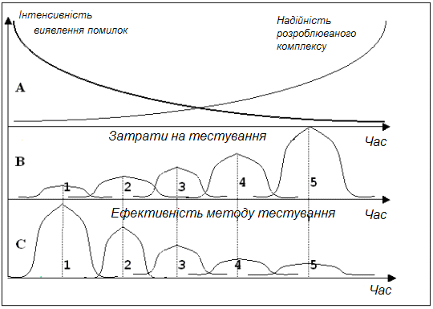

**Рисунок 7.2** – Залежність ефективності застосування методів до виявлення відповідних класів помилок

Звідси слідує, що всі методи тестування не тільки мають право на існування, але й мають свою нішу, де вони добре виявляють помилки, тоді як поза нішею їхня ефективність падає. Тому необхідно поєднувати різні методи й стратегії налагодження й тестування з метою забезпечення запланованої якості програмного продукту при обмежених витратах, що можливо при використанні процесу керування якістю програмного продукту.

### 7.5 Додатки автоматизованого тестування

Для автоматизації тестування існує велика кількість додатків. Деякі з них:
- HP LoadRunner, HP QuickTest Professional, HP Quality Center;
- Segue SilkPerformer;
- IBM Rational FunctionalTester, IBM Rational PerformanceTester, IBM Rational TestStudio;
- SmartBear Software TestComplete.

Використання цих інструментів допомагає тестувальникам автоматизувати такі задачі:
- установка продукту;
- створення тестових даних;
- GUI взаємодія;
- визначення проблеми.

Однак автоматизовані тести не можуть повністю замінити ручне тестування. Автоматизація всіх випробувань — дуже дорогий процес, і тому автоматичне тестування є лише доповненням ручного тестування. Найкращий варіант використання автоматизованих тестів — регресивне тестування.

**Контрольні питання до розділу 7**

1. Мета автоматизованого тестування програмного забезпечення.
2. Які структури тестового набору використовуються для автоматизованого прогону?
3. Спеціальні інструментальні засоби – генератори тестів.
4. Які ви знаєте методи генерації тестових прикладів?
5. Структура інструментальної системи автоматизації тестування.
6. Порівняння витрат і ефективності різних методів тестування.
7. Які популярні методи тестування й налагодження застосовуються на практиці?
8. Які додатки використовуються для автоматизованого тестування?

8 ДОКУМЕНТУВАННЯ ТА МЕТРИКИ ІНДУСТРІАЛЬНОГО ТЕСТУВАННЯ

8.1 Особливості документування тестових процедур для ручних і автоматизованих тестів

**Виконання тестів**. Тестування полягає в динамічній перевірці поведінки програми на скінченній множині тестових даних, спеціальним чином вибраних з нескінченного вхідного простору, на відповідність встановленій очікуваній поведінці.

*Виділені курсивом* слова ключові для тестування.

*Динамічне*: тестування завжди має на увазі виконання програми.

*Скінченне*: навіть для невеликої програми теоретично можливо створити таку кількість тестів, для виконання яких можуть знадобитися роки. Неповнота — одна з основних проблем тестування, оскільки на практиці повну множину тестів можна розглядати як нескінченну. Кількість тестів, які можуть бути виконані в обмежені терміни, скінченна. Таким чином, тестування завжди має на увазі певний «компроміс» між обмеженими термінами і потенційно необмеженою кількістю тестів. Це призводить до відомих проблем тестування, таких як ухвалення рішень про адекватність тестування, і проблем керування, пов'язаних з оцінками витрат (вартості, часу, персоналу) на тестування.

*Вибране*: з проблемою адекватності тестування пов'язана проблема вибору обмеженої множини тестів. Методи тестування, в цілому, відрізняються підходами до вибору множини тестових даних з вхідного простору.

Неможливість вичерпного тестування призвела до розроблення різних методів скорочення множини тестів і пошуку критеріїв адекватності тестування.

*Очікуване*: потрібно вміти (хоча і не завжди легко) визначити, чи правильні отримані результати виконання програми, чи відповідає спостережуване виконання очікуванням користувача або специфікаціям. В літературі з тестування це називається проблемою оракула (еталона), для вирішення якої можна застосовувати різні підходи (оцінка результатів, порівняння з існуючим еталоном, узгодження з користувачем трактувань понять «дефект» і «відмова»).

Розглянемо два основні підходи до виконання тестів: підхід ручного тестування та підхід автоматизованого виконання (прогон) тестів. Підходи розглянуто на прикладі тестування продукту, що підтримує інтерфейс командної строки. Тести описують виклик продукту з параметрами та перевірку повернутого значення у вигляді фіксованих при прогоні — тексту з STDOUT і стану деяких файлів, що залежить від вхідних параметрів.

**Ручне тестування.** Ручне тестування полягає у виконанні задокументованої процедури, де описана методика виконання тестів, яка задає порядок тестів і для кожного тесту — перелік значень параметрів, котрий подається на вхід, та перелік результатів, які очікуються на виході. Оскільки процедура призначена до виконання людиною, в її описі для стислості можуть використовуватись деякі значення за замовчуванням, зорієнтовані на здоровий глузд, або посилання на інформацію, що зберігається в іншому документі.

*Приклад частини процедури*
1. Подати на вхід три різні цілі числа.
2. Запустити тестове виконання.
3. Перевірити, чи відповідає отриманий результат таблиці (посилання на Документ1) з урахуванням поправок (посилання на Документ2).
4. Упевнитись у зрозумілості та коректності супровідній інформації, яка видається.

У наведеній процедурі тестувальник використовує два додаткові документи, а також особисте розуміння того, яку супроводжуючу інформацію вважати «зрозумілою та коректною». Успіх від використання процедурного підходу досягається у випадку однозначного розуміння тестувальником усіх пунктів процедури. Наприклад, у п. 1 наведеної процедури не уточнюється, з якого діапазону повинні бути задані три цілі числа, та не описується додатково, які числа вважаються «різними».

**Автоматизоване тестування.** Спроба автоматизувати вищенаведений тест призводить до створення скрипта, що задає тестованому продукту три певних числа і перенаправляє виведення продукту у файл з метою його аналізу, а також має певне значення бажаного результату, з яким звіряється отримане при прогоні тесту значення. Таким чином, уся необхідна інформація повинна бути явно розміщена в тексті (скрипті тесту), що вимагає додаткових порівняно з ручним підходом зусиль. Також додаткових зусиль та часу потребує створення розбірника виведення (програми узгодження форматів представлення зразкових значень з тесту та обчислених при прогоні результатів) та створення бази зберігання станів зразкових даних.

*Приклад скрипта*
Наведемо приклад послідовності дій, що закладаються в скрипт:
1. Видаємо на консоль ім’я або номер тесту та час його початку.
2. Викликаємо продукт з фіксованими параметрами.
3. Перенаправляємо виведення продукту у файл.
4. Перевіряємо повернуте продуктом значення. Воно повинно дорівнювати очікуваному результату, що зафіксований у тесті.
5. Перевіряємо виведення продукту, яке збережене у файлі (п.3), на рівність заздалегідь приготовленому зразку.
6. Видаємо на консоль результати тесту у вигляді вердикту PASS/FAIL і у випадку FAIL — стислого пояснення, яка саме перевірка не пройшла.
7. Видаємо на консоль час закінчення тесту.
8. Порівняння ручного та автоматизованого тестування.

Результати порівняння наведені в табл. 8.1.

**Таблиця 8.1** – Порівняння ручного і автоматизованого тестування

| | Ручне | Автоматизоване |
| :--- | :--- | :--- |
| Задання вхідних значень | Гнучкість у заданні даних. Дозволяє використовувати різні значення на різних циклах прогону тестів, розширюючи покриття | Вхідні значення суворо задані |
| Перевірка результату | Гнучка, дозволяє тестувальнику оцінювати нечітко сформульовані критерії | Сувора. Нечітко сформульовані критерії можуть бути перевірені тільки шляхом порівняння зі зразком |
| Повторність | Низька. Людський фактор та нечітке визначення даних призводять до неповторності тестування | Висока |
| Надійність | Низька. Довготривалі тестові цикли призводять до зниження уваги тестувальника | Висока, не залежить від довжини тестового циклу |
| Чутливість до незначних змін в продукті | Залежить від детальності опису процедури. Звичайно тестувальник в змозі виконати тест, якщо зовнішній вигляд продукту і текст повідомлень дещо змінились | Висока. Незначні зміни в інтерфейсі часто ведуть до корекції зразків |
| Швидкість виконання тестового набору | Низька | Висока |
| Можливість генерації тестів | Відсутня. Низька швидкість виконання звичайно не дозволяє виконати згенерований набір тестів | Підтримується |

Порівняння показує тенденцію сучасного тестування, орієнтовану на максимальну автоматизацію процесу тестування та генерацію тестового коду, що дозволяє справлятись з великими об'ємами даних і тестів, необхідних для забезпечення якості при виробництві програмних продуктів.

**Тестові процедури.** Тестові процедури – це формальний документ, у складі якого є опис необхідних кроків для виконання тестового набору. У випадку ручних тестів тестові процедури мають повний опис усіх кроків та перевірок, що дозволяють протестувати продукт і винести вердикт PASS/FAIL.

Процедури повинні бути складені таким чином, щоб будь-який інженер, що не пов'язаний з даним проектом, був здатний адекватно провести цикл тестування, володіючи тільки базовими знаннями про інструментарій, що застосовується. Приклад фрагменту тестової процедури для ручного тестування наведений на рис. 8.1 [19].

2.2 Hand Test
2.2.1 INST0021 - check license and quality status contents for the all targets.
2.2.1.1 Setup
Login to the Unix C shell environment as a new created test user.
2.2.1.2 Execution
[1] Change the current directory in Unix terminal window to the directory with Product files of yet untested target.
[2] Enter the following command at the Unix prompt: *Product.ins*.
[3] Enter the following answer at the Unix prompt: *y*.
[4] Enter the following command at the Unix prompt: *accept*.
[5] Enter the following command at the Unix prompt: *accept*.
Following steps are only to finish the installation correctly. Just press *Enter* to chose the default answer.
[6] Press *Enter*.
[7] Press *Enter*.
[8] Press *Enter*.
2.2.1.3 Validation
[1] The brief description of installation shall appear after step [2]. Prompt *OK to continue? [y]:* shall be active.
[2] The license agreement shall appear after step [3]. Check that the contents of the license agreement is correct.
[3] The quality status shall appear after step [4]. Check that the contents of the quality status is correct.
[4] Resume and “INSTALLATION IS SUCCESSFULLY COMPLETED” message shall appear after step [8].
2.2.1.4 Cleanup
Remove current Product target by executing *Product.ins uninstall* from the directory with just tested Product files.
2.2.1.5 Log
Record DDTS id numbers for any failures that were encountered.

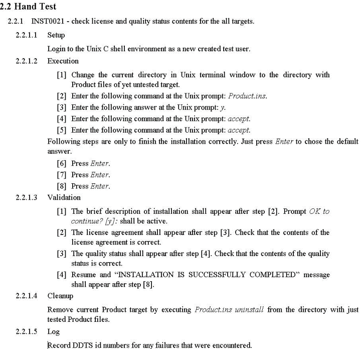

**Рисунок 8.1** – Приклад частини тестової процедури для ручного тестування

У випадку описання автоматизованих тестів тестові процедури повинні мати у складі достатню інформацію для запуску тестів та аналізу результатів. Приклад частини такої процедури наведений на рис. 8.2 [19].

3.2 Automated Test

3.2.1 Setup

[3] Install the Product build in accordance with the readme.txt file.

[4] Retrieve the test suite from CVS to user's root directory.

3.2.2 Execution

[1] Change directory to $\${HOME}$/test/Product/cases.

[2] Execute *run-suite.sh* command.

[3] Wait for the system prompt to appear.

3.2.3 Validation

[1] There must be current test state information printed on terminal. Information includes test executable name, start time and maximum time for test to work. If current system time is greater than the time which test is planned to finish by, and there is no information about test exit status, test suite is failed after step [2].

[2] Check report.txt in $\${HOME}$/test/Product/cases directory after step [3]. This file shall contain a record for each test executed. The record shall present test by following lines:

`<test_name>`

*OK*

If there is another string instead of “OK”, test is failed. There is the summary line at the end of file.

3.2.4 Cleanup

[1] remove the Product by executing *Product.ins uninstall* from the directory with Product files.

[2] Delete the $\${HOME}$/test/Product/cases folder with system tests.

3.2.5 Record DDTS id numbers for any failures that were encountered.

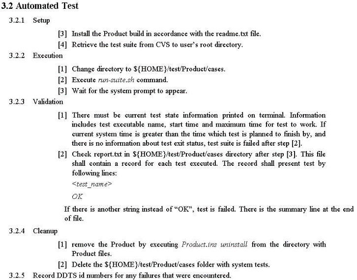

**Рисунок 8.2** – Приклад частини автоматизованої тестової процедури

**Опис тестів.** Опис тестів розробляється для полегшення аналізу та підтримки тестового набору. Опис може бути реалізовано у довільній формі, але при цьому повинні бути виконані такі завдання:

1. Аналіз ступеня покриття продукту тестами на підставі опису тестового набору.
2. Для будь-якої функції тестованого продукту знайти тести, в яких функція використовується.
3. Для будь-якого тесту визначити усі функції та їх співвідношення, котрі цей тест використовують.
4. Розуміння структури і взаємозв'язків тестових файлів.
5. Розуміння принципів побудови системи автоматизації тестування.

## 8.2 Життєвий цикл дефекту

*Документування та життєвий цикл дефекту.*

Кожен дефект, що виявлений у процесі тестування, повинен бути задокументований та відстежений. При виявленні нового дефекту його заносять у базу дефектів. Для цього краще всього використовувати спеціалізовані бази типу DDTS, що підтримують зберігання та відстеження

дефектів. При занесенні нового дефекту рекомендується вказувати, щонайменше, таку інформацію:
1. Найменування підсистеми, в якій виявлений дефект.
2. Версія продукту (номер build ), на якому дефект було знайдено.
3. Опис дефекту.
4. Опис процедури (кроків, необхідних для відтворення дефекту).
5. Номер тесту, на якому дефект був виявлений.
6. Рівень дефекту з точки зору критеріїв якості виробу або замовника.

Якщо дефект був щойно занесений до бази даних дефектів, то він знаходиться у стані **«New»**. Після перевірки дефекту він переводиться зі стану **«New»** у стан **«Open»** з вказівкою саме того розробника, який відповідальний за дефект. Після того, як дефект був виправлений, він переходить до стану **«Resolved»**. При цьому розробник повинен вказати таке:
1. Причину, з якої виник дефект.
2. Місце виявлення дефекту, з точністю до файлу.
3. Короткий опис виправленого.
4. Час, який був затрачений на виправлення дефекту.

Після того як дефект був виправлений тестувальник перевіряє чи дійсно дефект було виправлено і якщо все в нормі, то він переводить його до стану **«Verified»**. Якщо тестувальник не підтверджує факт виправлення дефекту, то стан дефекту повертається до **«Open»**. Якщо команда розробників вирішує не виправляти дефект, то такий дефект переводиться у стан **«Postponed»** з переліком персон, відповідальних за прийняття рішення, та причини його прийняття.

**Тестовий звіт**. Тестовий звіт оновлюється після кожного циклу тестування і повинен містити такі дані для кожного циклу.
1. Перелік функціональності, яка відповідає пунктам вимог, запланованими для даного тестування, та реальні дані по ньому.
2. Кількість тестів – запланованих та реально зроблених.
3. Час, який був затрачено на тестування кожної з функцій та загальний час тестування.
4. Кількість знайдених дефектів.
5. Кількість повторно знайдених дефектів.
6. Відхилення від запланованого плану тестування, якщо таке було.
7. Висновки щодо необхідності корегування в системі тестів, котрі повинні бути зроблені до наступного циклу тестування.

Приклад фрагменту тестового звіту зображено на рис. 8.3 [19]. На приведеному нижче фрагменті звіту містяться приблизні дані для чотирьох циклів тестування та зображено структуру звіту. Такого вигляду структура звіту набуває після тестування, перед початком циклу поля не заповнені. Поля заповнюються після закінчення циклу тестування.

**Оцінка якості тестів**. Тести потребують контролю якості так само, як і тестований продукт. Оскільки тести для продукту є своєрідним зразком його структурних та поведінкових характеристик, виникає закономірне питання про те, наскільки адекватний зразок. Для оцінки якості тестів

використовуються різні методи, найбільш популярні з яких стисло розглянуті нижче.

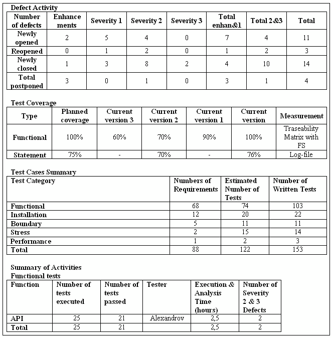

**Рисунок 8.3** – Фрагмент тестового звіту

## 8.3 Метрики, що використовуються при тестуванні

**Тестові метрики.** Існує сталий набір тестових метрик, який допомагає визначити ефективність тестування та поточний стан продукту. До таких метрик належать:

1. Покриття функціональних вимог.

2. Покриття коду продукту. Найбільш застосоване для модульного рівня тестування.
3. Покриття багатьох сценаріїв.
4. Кількість або щільність знайдених дефектів. Поточна кількість дефектів зрівнюється з середньою для даного типу продуктів з метою встановити, чи знаходиться воно в межах допустимого статистичного відхилення. При цьому знайдені відхилення як в більшу, так і в меншу сторону призводять до аналізу причин їх появи та, якщо необхідно, до формування корегуючих дій.
5. Співвідношення кількості знайдених дефектів з кількістю тестів на дану функцію продукту. Сильне розходження цих двох величин говорить або про неефективність тестів (коли велика кількість тестів знаходить мало дефектів) або про погану якість даної ділянки коду (коли знайдена велика кількість дефектів на невеликій кількості тестів).
6. Кількість знайдених дефектів, відповідних за часом, або швидкість пошуку дефектів. Якщо похідна такої функції прямує до нуля, то продукт має якості, достатні для закінчення тестування й відправлення до замовника.

Виміри в програмній інженерії мають велике значення, оскільки їх використання дозволяє одержувати об'єктивну інформацію щодо стану ПЗ та процесів розроблення. Рекомендований склад метрик наведено в стандарті ISO/IEC 9126.

Оскільки основними процесами, які зазвичай досліджуються в інженерії якості та надійності, є процеси «внесення помилок», «усунення дефектів» та «процес виникнення відмови», основними метриками вважаються «кількість дефектів», «щільність дефектів» та «інтенсивність відмов».

Кількість дефектів, виявлених тестуванням, не можна вважати хорошим індикатором якості ПЗ, вони більшою мірою слугують індикаторами ефективності тестування [29]. В той же час, невелика кількість дефектів, виявлених під час тестування, не є індикатором поганого тестування, а може свідчити про ефективність процесу розробки. Об'єктивним індикатором ефективності тестування є відношення:

$$E_e = \frac{D_e}{D_e + D_o}$$

де $\text{E}_\text{e}$ — ефективність тестування, $\text{D}_\text{e}$ — кількість дефектів, виявлених під час тестування, $\text{D}_\text{o}$ — кількість дефектів, виявлених при експлуатації.

На жаль цей індикатор не можна використати для керування процесом тестування, оскільки значення $\text{D}_\text{o}$ можна отримати надто пізно.

Реєстрація дефектів повинна бути однією з цілей процесу тестування. Вона визначена як обов'язкова вимога базового стандарту з якості ISO 9000-3. Реєстрація дефектів слугує основою для формування банків історичних еталонних даних по програмних проектах, які можуть використовуватися для

вдосконалювання процесів програмної інженерії. Аналіз даних про щільність дефектів в програмних продуктах дозволив визначити середній показник щільності дефектів – 6 дефектів на 1000 рядків для США і Європи, 2 – для Японії. Крім цих базових метрик для вимірювання результатів тестування корисними є такі метрики:

1) метрики оцінювання набору тестів відповідно до обраного критерію покриття, такі як метрики покриття тестових вимог, коду чи функцій;
2) метрики тенденцій дефектів (знайдених, усунутих, за серйозністю, пріоритетом тощо).

Крім того, для ефективного керування процесом тестування важливими метриками є час і вартість тестування.

Щодо практичного використання метрик для керування процесом тестування існує декілька проблем, а саме:
- збирання початкових даних для обчислення метрик;
- інтерпретація результатів розрахунку та ступінь довіри до них;
- яким чином використовувати метрики для керуванням тестуванням на кожному рівні;
- вибір мінімальної множини метрик, прийнятних в контексті певного процесу тестування.

Метрики для включення в процес тестування повинні вибиратися таким чином, щоб слугувати об'єктивними індикаторами стану виконання процесу тестування і поточного стану ПС.

**Огляд тестів та стратегій**. Тестовий код та стратегія тестування, які зафіксовані у вигляді документів, помітно поліпшуються, якщо підпадають під колективне обговорення. Такі обговорення прийнятно називати оглядами (review). Як правило, в організації існує процедура проведення й оцінки результатів огляду. Огляди на рівні з тестуванням створюють потужний набір методів боротьби з помилками, за рахунок чого збільшується якість продукції. Цілі оглядів тестової стратегії й тестового коду різні.

*Цілі огляду тестової стратегії:*
1. Встановити достатню кількість перевірок, забезпечуваних тестуванням.
2. Проаналізувати оптимальність покриття чи адекватності розподілу кількості запланованих тестів, які передбачають функціональність продуктів.
3. Проаналізувати оптимальність у підході до розробки коду, генерації коду, автоматизації тестування.

*Цілі огляду тестового коду:*
1. Встановити відповідність *тестового набору* тестовій стратегії.
2. Перевірити правильність кодування тестів.
3. Оцінити отриману степінь якості коду, виходячи з вимог стандартів, легкості підтримки, наявності коментарів тощо.
4. Якщо необхідно, то проаналізувати оптимальність тестового коду з метою задоволення потреб у швидкодії та обсягу.

**Контрольні питання до розділу 8**

1. Особливості документування тестових процедур для ручних і автоматизованих тестів.
2. Основні характеристики порівняння ручного і автоматизованого тестування.
3. Поняття тестової процедури.
4. Яку інформацію рекомендується вказувати для життєвого циклу дефекту?
5. Які дані повинен містити тестовий звіт для кожного циклу?
6. Які методи використовуються для оцінки якості тестів?
7. Які метрики використовуються при тестуванні?
8. Яке відношення є об'єктивним індикатором ефективності тестування?
9. Які ще метрики, крім базових метрик, застосовуються для вимірювання результатів тестування?
10. Які існують процедури проведення й оцінки результатів огляду?

**9 РЕГРЕСИВНЕ ТЕСТУВАННЯ**

Фундаментальна проблема супроводу програм полягає в тому, що виправлення однієї помилки з великою ймовірністю (20-50%) спричиняє появу нової. Тому весь процес йде за принципом «два кроки вперед, один крок назад». Внаслідок внесення нових помилок супровід програми вимагає значно більше системного налагодження на кожен оператор, ніж у будь-якому іншому виді програмування. Теоретично, після кожного виправлення потрібно прогнати весь набір контрольних прикладів, за якими система перевірялася раніше, щоб переконатися, що вона якимось незрозумілим чином не ушкоджена. На практиці таке зворотне (регресивне) тестування справді має наближатися до цього теоретичного ідеалу й воно дуже дорого коштує.

*Регресивне тестування* (англ. *regression testing*, від лат. *regressio* – рух назад) – загальна назва для всіх видів тестування програмного забезпечення, спрямованих на виявлення помилок у вже протестованих ділянках початкового коду. Такі помилки – коли після внесення змін до програми перестає працювати те, що мало б працювати, – називають регресивними помилками (англ. *regression bugs*).

Одна з головних цілей регресивного тестування – визначити, чи впливає зміна в одній частині програмного забезпечення на його інші частини.

Вважається доброю практикою при виправленні помилки створити тест на неї й регулярно проганяти його при подальших змінах програми. Регресивне тестування може бути виконано як вручну, так і за допомогою спеціалізованих програм, що дозволяють виконувати всі регресивні тести автоматично. У деяких проектах навіть використовують інструменти для автоматичного прогону регресивних тестів через заданий інтервал часу. Зазвичай це виконується після кожної вдалої компіляції (у невеликих проектах) чи кожну ніч або щотижня.

Регресивне тестування є невіддільною частиною екстремального програмування. У цій методології проєктна документація замінюється на розширюване, повторюване й автоматизоване тестування всього програмного пакета на кожній стадії циклу розробки програмного забезпечення.

Регресивне тестування може бути використано не лише для перевірки коректності програми, його часто також застосовують для оцінки якості отриманого результату. Так, під час розробки компіляторів, у прогоні регресивних тестів звертають увагу на час компіляції кожного з тестових прикладів, розмір отриманого коду й швидкість його виконання.

## 9.1 Цілі, задачі і види регресивного тестування

Як вже було сказано в попередніх розділах, тестування програмної системи — не разовий захід, а постійний процес, активний протягом усього життєвого циклу розробки системи. Протягом цього процесу система неминуче змінюється — або в результаті виправлення помилок, або в результаті розширення її функціональності.

Завдання тестувальника в такій ситуації — підтвердити, що нова або виправлена функціональність не викликала нові помилки, а якщо помилки все-таки виникли — визначити причини їх виникнення.

Найпростіший, але в той же час дієвий спосіб такого підтвердження — повне виконання всіх тестових прикладів після кожного істотної зміни системи і порівняння результатів виконання тестів до і після зміни.

Якщо результати виконання тестів до внесення змін були позитивними (всі тести проходили успішно), то поява неуспішно пройдених тестів може означати, що в системі з'явилися нові дефекти, викликані виправленням старих.

У загальному випадку повторне виконання тестів може завершитися одним із трьох способів:

1. Всі тести пройдені успішно. У цьому випадку зміни не зачіпають вже протестовані функції, але може знадобитися розробка нових тестових прикладів для нових функцій системи.
2. Частина тестів, які раніше виконувалися успішно, завершується з негативним результатом. Причини цього можуть бути такі:
   - коректна зміна функціональності тестованої системи, в результаті чого тестовий приклад перестав відповідати вимогам;
   - некоректна зміна функціональності системи, в результаті якого тестовий приклад виявив розбіжність з вимогами;
   - вплив залишкових даних від попередніх тестових прикладів, що раніше залишалося непоміченим.
3. Виконання тестів аварійно завершується на самому початку або при виконанні певного тестового прикладу.

Перші дві причини помітні тільки за допомогою аналізу змін у функціональних вимогах і тест-вимогах, а також поточного стану тест-планів та тестового оточення. За результатами цього аналізу в першому випадку тестувальник вносить зміни в тестовий приклад (і, можливо, розробляються нові тестові приклади), у другому випадку тестувальник повідомляє розробників про наявність дефекту.

Дана проблема найчастіше пов'язана зі зміною зовнішнього оточення частини системи, яке моделює тестове оточення. У результаті таких змін можуть мінятися зовнішні інтерфейси, а також склад і формат вхідних і вихідних даних. У наслідок тестове оточення перестає забезпечувати необхідну для виконання тестів інфраструктуру і виникає збій процесу тестування. Наприклад, такий збій може виникнути в тестовому оточенні при спробі обробити дані, що видаються системою в новому форматі.

Якщо для виконання тестів потрібна збірка програмних модулів тестового оточення і тестованої системи в єдиний виконуваний код, то при зміні інтерфейсів системи може виникнути ситуація, коли неможливо не тільки виконання тестів, а навіть збірка оточення і системи. У цьому випадку також необхідно провести аналіз змін внесених в систему і модифікувати відповідно до них тестове оточення.

У деяких випадках повторне виконання всіх тестів неможливо. Це може бути пов'язано з великим часом виконання всіх тестів і обмеженим часом, відведеним на процес тестування. У цьому випадку часто застосовується практика вибіркового тестування окремих частин системи, порушених змінами. Повне тестування при такому підході проводиться тільки після накопичення досить великої кількості змін або на ключових стадіях проекту.

Процес, що включає в себе повторне виконання тестів, називають *регресивним тестуванням*. Регресивне тестування включає в себе такі стадії:
- аналіз змін в системі;
- вибір тестових прикладів для перевірки системи;
- виконання тестових прикладів;
- аналіз результатів виконання;
- модифікація тестового оточення, тестових прикладів або повідомлення розробників про дефект системи.

Таким чином, можна визначити такі основні завдання повторюваності тестування при внесенні змін:
- забезпечення можливості повного виконання всіх тестів, які перевіряють функціональність системи або проведення аналізу, що дозволяє виявити тести, які повинні бути повторно виконані для тестування зміни функціональності;
- розробка тестових прикладів і тестового оточення з використанням методик, що полегшують модифікацію при змінах в тестованій системі;
- розробка тестових прикладів, структура яких повністю виключає їх взаємний вплив за залишковим даними.

Наслідком повторюваності тестування є постійне забезпечення тестувальників і розробників актуальною інформацією про поточний стан системи і коректності змін, внесених в ході розробки системи.

### 9.1.1 Регресивне тестування

Досить часто виникає така ситуація: закінчили проект, під час активного використання виявили декілька багів (помилок), виправили їх, додали декілька функцій, а потім через якийсь час виявляється, що код, з яким раніше не було проблем, нормально не працює.

За достовірними даними кількість помилок після зміни коду (чи це буде додавання нової функціональності або ж виправлення багів) становить близько 50% [52]. Для того щоб виявити ці помилки, і потрібно регресивне тестування (regression test).

Регресивне тестування допоможе будь-якій програмі завжди залишатися на висоті. Отже перейдемо до розгляду сутності регресивного тестування.

***Регресивне тестування*** — цикл тестування, що застосовується при внесенні змін на фазі системного тестування або супроводу продукту. Головна проблема регресивного тестування — вибір між повним і частковим повторним тестуванням і поповненням тестових наборів. При частковому перетестуванні контролюються тільки ті частини проекту, які пов'язані зі зміненими компонентами.

Виконання величезного обсягу тестів, характерного для етапу системного тестування, вдається здійснити без втрати якісних показників продукту тільки за допомогою регресивного підходу.

Одержавши звіт про помилку, програміст аналізує вихідний код, знаходить помилку, виправляє її й модульно або інтеграційно тестує результат.

У свою чергу тестувальник, перевіряючи внесені програмістом зміни, повинен:
1. Перевірити й затвердити виправлення помилки. Для цього необхідно виконати зазначений у звіті тест, за допомогою якого була знайдена помилка, або спробувати відтворити помилку яким-небудь іншим способом.
2. Протестувати наслідки виправлень. Можливо, що внесені виправлення привнесли помилку (наведену помилку) у код, що до цього справно працював.

Наприклад, при тестуванні класу TCommandQueue запускаємо тести:
**Приклад 9.1.** Набір тестів класу TcommandQueue
```cpp
//Тест перевіряє, чи створюється об'єкт
// типу TCommand і чи додається він
// у кінець черги.
private void TCommandQueueTest1()
// Тест перевіряє додавання команд
// у чергу на зазначену позицію.
// Також перевіряється правильність
// видалення команд із черги.
private void TCommandQueueTest2()
```

При цьому перший тест виконується успішно, а другий ні, тобто команда додається в кінець черги команд успішно, а на зазначену позицію — ні. Розробник аналізує код, що реалізує тестоючу функціональність:

**Приклад 9.1.1.** Фрагмент коду із зафіксованим при тестуванні дефектом
```cpp
...
if ((Position < -1) &&
    (Position <= this.Items.Count))
{
    this.Items.Insert(Position, Command);
}
```

```csharp
}
else
{
    if (Position==-1)
    {
        this.Items.Add(Command);
    }
}
```
...

Аналіз показує, що помилка полягає у використанні невірного знака порівняння в першому рядку фрагмента. Далі програміст виправляє помилку, наприклад, у такий спосіб:

**Приклад 9.1.2.** Виправлений фрагмент коду
...
```csharp
if ((Position>=-1)&&
    (Position<=this.Items.Count))
{
    this.Items.Insert(Position, Command);
}
else
{
    if (Position==-1)
    {
        this.Items.Add(Command);
    }
}
```
...

Для перевірки скоректованого коду достатньо пропустити тільки тест TCommandQueueTest2. Можна переконатися, що тест TCommandQueueTest2 буде виконуватися успішно. Однак однієї цієї перевірки недостатньо. Якщо ми повторимо виконання двох тестів, то при запуску першого тесту (TCommandQueueTest1), буде виявлений новий дефект. Повторний аналіз коду показує, що гілка *else* не виконується.

Таким чином, виправлення в одному місці привело до помилки в іншому, що демонструє необхідність проведення повного перетестування. Однак повторне перетестування вимагає значних зусиль і часу. Виникає завдання – відібрати скорочений набір тестів з вихідного набору (може бути, поповнивши його додатковими – новоствореними – тестами), якого, проте, буде достатньо для вичерпної перевірки функціональності відповідно до обраного критерію. Організація повторного тестування в умовах скорочення ресурсів, необхідних для забезпечення заданого рівня якості продукту, забезпечується регресивним тестуванням.

## 9.1.2 Мета й завдання регресивного тестування

При коректуваннях програми необхідно гарантувати збереження якості. Для цього використовується регресивне тестування — дорога, але необхідна діяльність у рамках етапу супроводу, спрямована на повторний огляд коректності зміненої програми. У відповідності зі стандартним визначенням, регресивне тестування — це вибіркове тестування, що дозволяє переконатися, що зміни не викликали небажаних побічних ефектів, або що змінена система як і раніше відповідає вимогам.

Головним завданням етапу супроводу є реалізація систематичного процесу обробки змін у коді. Після кожної модифікації програми необхідно впевнитися, що на функціональність програми не зробив впливу модифікований код. Якщо такий вплив виявлений, говорять про регресивний дефект. Для регресивного тестування функціональних можливостей, зміна яких не планувалося, використовуються раніше розроблені тести. Одна із цілей регресивного тестування полягає в тому, щоб, відповідно до використовуваного критерію покриття коду (наприклад, критерієм покриття потоку операторів або потоку даних), гарантувати той же рівень покриття, що й при повному повторному тестуванні програми. Для цього необхідно запускати тести, що належать до змінених областей коду або функціональних можливостей.

Нехай $T = \{t_1, t_2, ..., t_N\}$ — множина із $N$ тестів, що використовується при первинній розробці програми $P$, а $T' \subseteq T$ — підмножина регресивних тестів для тестування нової версії програми $P'$. Інформація про покриття коду, забезпечуваному $T'$, дозволяє вказати блоки $P'$, що вимагають додаткового тестування, для чого може знадобитися повторний запуск деяких тестів з множини $T \supseteq T'$, або навіть створення $T''$ — набору нових тестів для $P'$ — і оновлення $T$.

Інша мета регресивного тестування полягає в тому, щоб упевнитися, що програма функціонує у відповідності зі своєю специфікацією, і що зміни не призвели до внесення нових помилок у раніше протестований код. Ця мета завжди може бути досягнута повторним виконанням всіх тестів регресивного набору, але перспективніше відсівати тести, на яких вихідні дані модифікованої й старої програми не можуть розрізнятися. Результати порівняння вибіркових методів і методу повторного прогону всіх тестів наведені в табл. 9.1.

Завдання відбору тестів з набору $T$ для заданої програми $P$ і зміненої версії цієї програми $P'$ складається у виборі підмножини $T'_{\text{ідеальне}} \subseteq T$ для повторного запуску на зміненій програмі $P'$, де $T'_{\text{ідеальне}} = \{t \in T \mid P'(t) \neq P(t)\}$.

Так як вихідні дані $P$ й $P'$ для тестів з множини $T \supseteq T'_{\text{ідеальне}}$ свідомо однакові, нема необхідності виконувати жоден із цих тестів на $P'$. У загальному випадку, під час відсутності динамічної інформації про виконання $P$ й $P'$ не існує методики обчислення множини $T'_{\text{ідеальне}}$ для довільних множин $P$, $P'$ й $T$.

**Таблиця 9.1** – Вибіркове регресивне тестування й повторний прогін всіх тестів

| Повторний прогін всіх тестів | Вибіркове регресивне тестування |
| :--- | :--- |
| Простий у реалізації | Вимагає додаткових витрат при впровадженні |
| Дорогий і неефективний | Здатне зменшувати витрати за рахунок виключення зайвих тестів |
| Виявляє всі помилки, які були знайдені при вихідному тестуванні | Може приводити до пропуску помилок |

Це слідує з відсутності загального рішення проблеми зупинки, що складається в неможливості створення в загальному випадку алгоритму, що дає відповідь на питання, чи завершується коли-небудь, довільна програма $\text{P}$ для заданих значень вхідних даних. На практиці створення $\text{T}_{\text{ідеальне}}$ можливо тільки шляхом виконання на інструментованій версії $\text{P}'$ кожного регресивного тесту, чого й хочеться уникнути.

Реалістичний варіант рішення завдання вибіркового регресивного тестування складається в одержанні корисної інформації з результатів виконання $\text{P}$ й об'єднання цієї інформації з даними статичного аналізу для одержання множини $\text{T}'_{\text{реальне}}$ у вигляді апроксимації $\text{T}_{\text{ідеальне}}$. Цей підхід застосовується у всіх відомих вибіркових методах регресивного тестування, заснованих на аналізі коду. Множина $\text{T}'_{\text{реальне}}$ повинне включати всі тести з $\text{T}$, що активують змінений код, і не включати ніяких інших тестів, тобто тест $t \in \text{T}$ входить в $\text{T}'_{\text{реальне}}$ тоді й тільки тоді, коли $t$ задіє код $\text{P}$ у точці, де в $\text{P}'$ код був вилучений або змінений, або де був доданий новий код.

Якщо деякий тест $t$ задіє в $\text{P}$ той же код, що й в $\text{P}'$, вихідні дані $\text{P}$ й $\text{P}'$ для $t$ розрізнятися не будуть. Із цього слідує, що якщо $\text{P}(t) \neq \text{P}'(t)$, $t$ повинен задіяти деякий код, змінений в $\text{P}'$ стосовно $\text{P}$, тобто повинне виконуватися відношення $t \in \text{T}'_{\text{реальне}}$. З іншого боку, оскільки не кожне виконання зміненого коду позначається на вихідних значеннях тесту, можуть існувати деякі такі $t \in \text{T}'_{\text{реальне}}$, що $\text{P}(t) = \text{P}'(t)$.

Таким чином, $\text{T}'_{\text{реальне}}$ містить $\text{T}_{\text{ідеальне}}$ цілком і може використовуватися в якості його альтернативи без шкоди для якості тестуючого програмного продукту.

Важливим завданням регресивного тестування є також зменшення вартості й скорочення часу виконання тестів.

Розглянемо відбір тестів на прикладі рис. 9.1. Код, що покриває тестами, виділений кольорами й штрихуванням. Легко помітити, що код, що покривається тестом 1, не змінився з попередньої версії, отже, повторне виконання тесту 1 не потрібно. Навпаки, код, що покривається тестами 2, 3 й 4, змінився; отже, потрібен їхній повторний запуск [19].


**Рисунок 9.1** – Відбір тестів для множини T'

### 9.1.3 Види регресивного тестування

Оскільки регресивне тестування являє собою повторне проведення циклу звичайного тестування, види регресивного тестування збігаються з видами звичайного тестування. Можна говорити, наприклад, про модульне регресивне тестування або про функціональне регресивне тестування. Перелічимо основні види тестів регресії в порядку їхньої важливості (звичайно в такому порядку їх і виконують).

1. **Тести верифікації версії** (Build Verification Test). Ці тести потрібні для перевірки основної функціональності кожної версії програми. Тільки будучи впевненим у тому, що основна функціональність програми не порушена, можна говорити, що мета досягнута. При знаходженні помилки за допомогою таких тестів необхідно переглянути відповідну частину коду на предмет помилок.

2. **Тести верифікації багів** (Bug Verification Test). Якщо деякий тест виявив баг, необхідно після виправлення провести цей тест ще раз. Хоча проведення цих тестів і є логічним, багато програмістів зневажають такого виду тестуванням [http://s-test.narod.ru/Articles/regtest.htm].

3. **Тести регресії** (Regression Test Pass). До цих тестів належать ті, які вже проводилися з попередніми версіями програмного забезпечення і не виявляли помилок. Інколи при відсутності часу деякі з тестів можна пропустити (бажано тільки тоді, коли не були внесені зміни у відповідні ділянки коду). Якщо раніше такі тести вже проводилися більше 3 разів, процес непогано було б автоматизувати.

4. **Тести регресії на виправлених багах** (тести на закритих багах). Що таке *закриті баги* можна зрозуміти із прикладу. Нехай деякий тест знайшов помилку. Після виправлення цей же тест помилки не виявив. У цьому випадку баг і називається «закритим» [46]. Баг може виявитися знову з ряду причин (особливо при модифікації коду). Тому час від часу потрібно повертатися до цього місця програми.

Інший спосіб класифікації видів регресивного тестування зв'язує їх з типами супроводу, які, у свою чергу, визначаються типами модифікацій. Виділяють три типи супроводу:

1. ***Коригувальний супровід***, названий звичайно виправленням помилок, виконується у відповідь на виявлення помилки, що не вимагає зміни специфікації вимог. При коригувальному супроводі виробляється діагностика й коректування дефектів у програмному забезпеченні з метою підтримки системи в працездатному стані.
2. ***Адаптивний супровід*** здійснюється у відповідь на вимоги зміни даних або середовища виконання. Він застосовується, коли існуюча система поліпшується або розширюється, а специфікація вимог змінюється з метою реалізації нових функцій.
3. ***Вдосконалюючий (прогресивний) супровід*** включає будь-яку обробку з метою підвищення ефективності роботи системи або ефективності її супроводу.

У процесі адаптивного або вдосконалюючого супроводу, звичайно вводяться нові модулі. Щоб відобразити те чи інше вдосконалення або адаптацію, змінюється специфікація системи. При коригувальному супроводі, як правило, специфікація не змінюється, і нові модулі не вводяться. Модифікація програми на фазі розробки подібна модифікації при коригувальному супроводі, тому що через виявлення помилки навряд чи потрібно міняти специфікацію програми. За винятком рідких моментів великих змін, на фазі супроводу зміни системи звичайно невеликі й виробляються з метою усунення проблем або поступового розширення функціональних можливостей.

Відповідно, визначають два типи регресивного тестування: прогресивне й коригувальне.

1. ***Прогресивне регресивне тестування*** припускає модифікацію технічного завдання. У більшості випадків при цьому до системи програмного забезпечення додаються нові модулі.
2. ***При коригувальному регресивному тестуванні*** технічне завдання не змінюється. Модифікуються тільки деякі оператори програми й, можливо, конструкторські рішення.

Прогресивне регресивне тестування звичайно виконується після адаптивного або вдосконалюючого супроводу, тоді як коригувальне регресивне тестування виконується під час тестування в циклі розробки й після коригувального супроводу, тобто після того, як над програмним забезпеченням були виконані деякі коригувальні дії. Загалом кажучи, коригувальне регресивне тестування повинне бути простішим, ніж

прогресивне регресивне тестування, оскільки припускає повторне використання більшої кількості тестів.

Підхід до відбору регресивних тестів може бути активним або консервативним. Активний підхід у главу кута ставить зменшення обсягу регресивного тестування й нехтує ризиком пропустити дефекти. Активний підхід застосовується для тестування систем з високою вихідною надійністю, а також у випадках, коли ефект змін невеликий. Консервативний підхід вимагає відбору всіх тестів, які з ненульовою ймовірністю можуть виявляти дефекти. Цей підхід дозволяє виявляти більшу кількість помилок, але призводить до створення більших наборів регресивних тестів.

Протягом життєвого циклу програми період супроводу триває довго. Коли змінена програма тестується набором тестів Т, ми зберігаємо без змін стосовно тестування вихідної програми P всі фактори, які могли б впливати на вивід програми. Тому атрибути конфігурації, у якій програма тестувалась останній раз (наприклад, план тестування, тести $t_j$ і покриваючі елементи, MT(P,C,$t_j$)), підлягають керуванню конфігурацією. Практика тестування зміненої версії програми P' у тих же умовах, у яких тестувалась вихідна програма P, називається керованим регресивним тестуванням. При некерованому регресивному тестуванні деякі властивості методів регресивного тестування можуть змінюватися, наприклад, безпечний метод відбору тестів може перестати бути безпечним. У свою чергу, для забезпечення керованості регресивного тестування необхідне виконання ряду умов:

1. Як при модульному, так і при інтеграційному регресивному тестуванні якості модулів, що викликаються тестуючим модулем безпосередньо або побічно, повинні використатися реальні модулі системи. Це легко здійснити, оскільки на етапі регресивного тестування всі модулі доступні в завершеному виді.
2. Інформація про зміни коректна. Інформація про зміни вказує на змінені модулі й розділи специфікації вимог, не маючи на увазі при цьому коректність самих змін. Крім того, при зміні специфікації вимог необхідно посилене регресивне тестування функцій, що змінилися для цієї специфікації, а також всіх функцій, які могли бути порушені по необережності. Єдиним випадком коли ми змушені покластися на правильність зміненого технічного завдання, є зміна технічного завдання для всієї системи або для модуля верхнього (у графі викликів) рівня, за умови, що крім технічного завдання, не існує ніякої додаткової документації й/або якої-небудь іншої інформації, по якій можна було б судити про помилку в технічному завданні.
3. У програмі немає помилок, крім тих, які могли виникнути через її зміну.
4. Тести, що застосовувалися для тестування попередніх версій програмного продукту, доступні, при цьому протокол прогону тестів складається із вхідних даних, вихідних даних і траєкторії. Траєкторія являє собою шлях у керуючому графі програми, проходження якого

викликається використанням деякого набору вхідних даних. Її можна застосовувати для оцінки структурного покриття, забезпечуваного набором тестів.
5. Для проведення регресивного тестування з використанням існуючого набору тестів необхідно зберігати інформацію про результати виконання тестів на попередніх етапах тестування.

Припустимо, що ніякі оператори програми, крім тих, чиє поводження залежить від змін, не можуть несприятливо впливати на програму. Навіть при такій умові існують деякі ситуації, що вимагають особливої уваги, наприклад, проблема витоку пам'яті і їй подібні. Ситуації такого роду в різних системах програмування обробляються по-різному. Наприклад, мова Java сама по собі включає систему керування пам'яттю. Якщо ж система не контролює розподіл пам'яті автоматично, ми повинні вважати, що всі оператори роботи з пам'яттю також мають поводження, що залежить від змін.

Проблема мов типу С й С++, які допускають довільні арифметичні операції над вказівниками, полягає в тому, що вказівники можуть порушувати границі областей пам'яті, на які вони вказують. Це означає, що змінні можуть оброблятися способами, які не піддаються аналізу на рівні вихідного коду. Щоб урахувати такі порушення границь пам'яті, висуваються такі гіпотези:
1. Гіпотеза 1 (чітко певна пам'ять). Кожен сегмент пам'яті, до якого звертається система програмного забезпечення, відповідає деякій символічно певній змінній;
2. Гіпотеза 2 (строго обмежений вказівник). Кожна змінна або вираження, що використовується як вказівник, повинні посилатися на деяку базову змінну й обмежуватися використанням сегмента пам'яті, обумовленого цією змінною.

Щоб гарантувати покриття всіх залежних від змін компонентів, для яких можна показати, що вони зачіпаються існуючими тестами, досить одного тесту для кожного з таких компонентів. Множина тестів досить великого розміру (як правило сценарних), може сприяти виявленню помилок, викликаних порушеннями умов керованого регресивного тестування.

Існують й організаційні умови проведення регресивного тестування. Це ресурс (час), необхідний тестовому аналітикові для ознайомлення зі специфікацією вимог системи, її архітектурою й, можливо, самим кодом.

## 9.2 Необхідні і достатні умови застосування методів вибіркового регресивного тестування

Перелічимо деякі особливості реалізації регресивного тестування. Деякі ділянки коду програми не одержують керування при виконанні тестів.
1. Якщо ділянка коду реалізує вимогу, але змінений фрагмент коду не одержує керування при виконанні тесту, то він і не може впливати на значення вихідних даних програми при виконанні даного тесту.

2. Навіть якщо ділянка коду, що реалізує вимогу, одержує керування при виконанні тесту, це далеко не завжди відбивається на вихідних дані програми при виконанні даного тесту. Дійсно, якщо змінюється перший блок програми, наприклад, шляхом додавання ініціалізації змінної, всі шляхи в програмі також змінюються, і, як наслідок, вимагають повторного тестування. Однак може так трапитися, що тільки на невеликій підмножині шляхів дійсно використається ця ініціалізована змінна.
3. Не кожен тест $t_k \in T$, що перевіряє код, який перебуває на одному шляху зі зміненим кодом, обов'язково покриває цей змінений код.
4. Код, що перебуває на одному шляху зі зміненим кодом, може не впливати на значення вихідних даних змінених модулів програми.
5. Не завжди кожен оператор програми впливає на кожен елемент її вихідних даних.

Припустимо, що зміни в програмі обмежуються одним оператором. Якщо при виконанні якого-небудь тесту на вихідній програмі цей оператор ніколи не одержує керування, можна із певністю сказати, що він не одержить керування й у ході виконання тесту на новій програмі, а результати тестування нової й старої програм будуть збігатися. Отже, нема необхідності виконувати цей тест на новій програмі. Зазначений метод легко можна узагальнити для випадку декількох змін: якщо тест не задіє жодного зміненого оператора, і його вхідні дані не змінилися, код, виконуваний їм у зміненій програмі, буде таким же, як у первісній версії. Такий тест не виявляє розходжень між двома версіями системи; отже, нема необхідності проганяти його повторно. Якщо тест не зачіпає жодного оператора виводу, поводження якого залежить від змінених операторів, це означає, що, незважаючи на зміни в програмі, всі оператори, які одержують керування при виконанні цього тесту, не змінять вивід системи стосовно попередньої версії. Таким чином, нема необхідності повторно проганяти й тести такого роду.

Отже, необхідно орієнтуватися на вибір тільки тих тестів, які покривають змінений код, що впливає, у свою чергу, на вивід програми. Такий підхід гарантує, що будуть обрані тільки ті тести, що виявляють зміни, і метод буде точним.

Створення наборів регресивних тестів рекомендується починати з множини вихідних тестів. При заданому критерії регресивного тестування всі вихідні тести t ($t \in T$) розбиваються на чотири підмножини.

1. Множина тестів, придатних для повторного використання. Це тести, які вже запускалися й придатні до використання, але зачіпають елементи, що покривають тільки програми, що не були змінені. При повторному виконанні вихідні дані таких тестів збігатися з вихідними даними програми. Отже, такі тести не вимагають перезапуску.
2. Множина тестів, що вимагають повторного запуску. До них належать тести, які вже запускалися, але вимагають перезапуску, оскільки зачіпають, принаймні, один змінений елемент, що підлягає повторному тестуванню. При повторному виконанні такі тести можуть давати результат,

відмінний від результату, показаного на вихідній програмі. Множина тестів, що вимагають повторного запуску, забезпечує гарне покриття структурних елементів навіть при наявності нових функціональних можливостей.

3. *Множина застарілих тестів*. Це тести, які більше не будуть застосовуватись до зміненої програми й непридатні для подальшого тестування, оскільки вони зачіпають елементи, що були вилучені при зміні програми. Їх можна видалити з набору регресивних тестів.

4. *Нові тести*, які ще не запускалися й можуть бути використані для тестування.

Рис. 9.2 дає уявлення про життєвий цикл тесту.

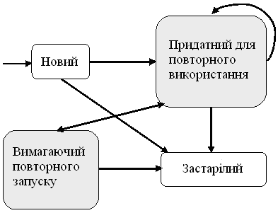

**Рисунок 9.2** — Життєвий цикл тесту

Відразу після створення тест уводиться в структуру бази даних як новий. Після виконання новий тест переходить у категорію тестів, придатних для повторного використання або застарілих. Якщо виконання тесту сприяло збільшенню поточного ступеня покриття коду, тест позначається як придатний для повторного використання. У противному випадку він позначається як застарілий і відкидається. Існуючі тести, повторно запущені після внесення зміни в код, також класифікуються заново як придатні для повторного використання або застарілі залежно від тестових траєкторій і використовуваного критерію тестування.

Класифікація тестів стосовно змін у коді вимагає аналізу наслідків змін. Тести, що активують код, порушений змінами, можуть вимагати повторного запуску або виявитися застарілими. Щоб тест був включений у клас тестів, що вимагають повторного запуску, він повинен враховувати зміни в коді, а також повинен сприяти збільшенню ступеня покриття зміненого коду за використовуваним критерієм. Порушеним елементом тесту може бути траєкторія, вихідні значення, або й те, і інше. Щоб тест був включений у клас тестів, придатних для повторного використання, він повинен вносити вклад у збільшення ступеня покриття коду й не вимагати повторного запуску.

Ступінь покриття коду визначається для тестів, придатних для повторного використання, оскільки до цього класу належать тести, що не вимагають повторного запуску й сприяють збільшенню ступеня покриття до бажаної величини. Якщо є компонент програми, не задіяний придатними для повторного використання тестами, то замість них вибираються й виконуються з метою збільшення ступеня покриття тести, що вимагають повторного запуску. Після запуску такий тест стає придатним для повторного використання або застарілим. Якщо тестів, що вимагають повторного запуску, більше не залишилося, а необхідний ступінь покриття коду ще не досягнутий, породжуються додаткові тести й тестування повторюється.

Остаточний набір тестів збирається з тестів, придатних для повторного використання, тестів, що вимагають повторного запуску, і нових тестів. Нарешті тести, що застаріли, й надлишкові тести видаляються з набору тестів, оскільки надлишкові тести не перевіряють нові функціональні можливості й не збільшують покриття.

## 9.3 Класифікація методів вибіркового регресивного тестування

Для перевірки коректності різних підходів до регресивного тестування використовується модель оцінки методів регресивного тестування. Основними об'єктами розгляду стали повнота, точність, ефективність й універсальність.

*Повнота* відбиває міру відбору тестів з множини T, на яких результат виконання зміненої програми відмінний від результату виконання вихідної програми, внаслідок чого можуть бути виявлені помилки в P'. Метод, повний на 100%, називається безпечним.

*Точність* – міра здатності методу уникати вибору тестів з множини T, на яких результат виконання зміненої програми не буде відрізнятися від результату її первісної версії, тобто тестів, здатних виявляти помилки в P'. Припустимо, що набір T містить $r$ регресивних тестів. З них для $n$ тестів ($n \le r$) поводження й результати виконання старої програми P відрізняються від поводження й результатів виконання нової програми P'. Набір тестів T' $\subseteq$ T містить $m$ ($m \neq 0$) тестів, отриманих з використанням методу відбору регресивних тестів M. Із цих $m$ тестів для $l$ тестів поводження P' й P розрізняється. Точність T' відносно P, P', T й M, виражена у відсотках, визначається вираженням $100 \cdot (l/m)$, тоді як відсоток обраних тестів визначається вираженням $100 \cdot (l/n)$, якщо $n \neq 0$ або дорівнює 100%, якщо $n=0$.

Виходячи з наведеного визначення, точність множини тестів – це відношення числа тестів даної множини, на яких результати виконання нової й старої програм розрізняються, до загального числа тестів множини. Точність є важливим атрибутом методу регресивного тестування. Неточний метод має тенденцію відбирати тести, які не повинні були бути обрані. Чим менш точний метод, тим ближче обсяг обраного набору тестів до обсягу вихідного набору тестів.

*Ефективність* – оцінка обчислювальної вартості стратегії вибіркового регресивного тестування, тобто вартості реалізації її вимог за часом і пам'яттю, а також можливості автоматизації. Відносною ефективністю називається ефективність методу тестування за умови наявності не більше однієї помилки в тестуючій програмі. Абсолютною ефективністю називається ефективність методу в реальних умовах, коли оцінка кількості помилок у програмі не обмежена.

*Універсальність* відбиває міру здатності методу до застосування в досить широкому діапазоні ситуацій, що зустрічаються на практиці.

Для програми $\text{P}$, її зміненої версії $\text{P}'$ і набору тестів $\text{T}$ для $\text{P}$ потрібно, щоб методика вибіркового повторного тестування задовольняла таким критеріям оцінки:

1. **Безпека.** Методика вибіркового повторного тестування повинна бути безпечною, тобто повинна вибирати всі тести з $\text{T}$, які потенційно можуть виявляти помилки (всі тести, чиє поводження на $\text{P}'$ й $\text{P}$ може бути різним). Безпечна методика повинна розглядати наслідки додавання, видалення й зміни коду. При додаванні нового коду в $\text{P}$ в $\text{T}$ можуть уже міститися тести, що покривають цей новий код. Такі тести необхідно виявляти й ураховувати при відборі.

2. **Точність.** Стратегія повторного прогону всіх тестів є безпечною, але неточною. На додаток до вибору всіх тестів, потенційно здатних виявляти помилки, вона також вибирає тести, які в жодному разі не можуть демонструвати змінене поводження. В ідеалі, методика вибіркового повторного тестування повинна бути точною, тобто повинна вибирати тільки тести з поводженням, що змінилося. Однак для довільно взятого тесту, не запускаючи його, неможливо визначити, чи зміниться його поводження. Отже, у найкращому разі ми можемо розраховувати лише на деяке збільшення точності. Усілякі існуючі вибіркові методи регресивного тестування розрізняються не в останню чергу вибором об'єкта або об'єктів, для яких виконується аналіз покриття й аналіз змін. Наприклад, при аналізі на рівні функції при зміні будь-якого оператора функції вся функція вважається зміненою; при аналізі на рівні окремих операторів ми можемо виключити частину тестів, що містять виклик функції, але не активують змінений оператор. Вибір об'єктів для аналізу покриття відбивається на рівні подробиці аналізу, а виходить, і на його точності й ефективності. Абсолютні величини точності й кількості обраних тестів для заданих набору тестів і множині змін повинні розглядатися тільки разом зі зменшенням розміру набору тестів. Невеликий відсоток обраних тестів може бути прийнятним, тільки якщо рівень точності залишається досить високим.

3. **Ефективність.** Методика вибіркового повторного тестування повинна бути ефективною, тобто повинна допускати автоматизацію й виконуватися досить швидко для практичного застосування в умовах обмеженого часу регресивного тестування. Методика повинна також передбачати зберігання інформації про хід виконання тестів у мінімально можливому обсязі.

4. **Універсальність.** Методика вибіркового повторного тестування повинна бути універсальною, тобто застосовною до всіх мов й язикових конструкцій, ефективною для реальних програм і здатною до обробки як завгодно складних змін коду.

У загальному випадку існує деякий компроміс між безпекою, точністю й ефективністю. При відборі тестів аналіз необхідно провести за час, менший, ніж потрібно для виконання й перевірки результатів тестів з T, що не ввійшли в $T'$. З урахуванням цього обмеження рішенням завдання регресивного тестування буде безпечний метод з гарним балансом дешевизни й високої точності.

### 9.4 Можливості повторного використання тестів

До зміни існуючих тестів можуть привести три наступні види діяльності програмістів:
- створення нових тестів;
- виконання тестів;
- зміна коду.

Оскільки кожен тест містить вхідні дані, вихідні дані й траєкторію, ці компоненти можуть піддатися зміні в будь-якій комбінації. При зміні вхідних даних існуючого тесту будемо вважати, що старий тест припиняє існування, і створюється новий тест. Таким чином, до числа дозволених змін тесту ставляться всілякі пертурбації вихідних даних або траєкторій. Зміна вихідних даних без зміни траєкторії й/або вхідних даних неможливо. Отже, існує тільки два можливих варіанти зміни тесту: зміна траєкторії або зміна траєкторії й вихідних даних.

Відповідно до наведеного вище міркування можна виділити чотири рівні повторного використання тесту:

1. **Рівень 1:** Тест не допускає повторного використання. Потрібне створення нового набору тестів (наприклад, шляхом видалення або зміни цього тесту).
2. **Рівень 2:** Повторне використання можливо тільки вхідних даних тесту. У багатьох випадках мета тестування полягає в активізації деяких елементів програми. Якщо із траєкторії існуючого тесту видно, що елементи програми, що підлягають покриттю, задіюються до змінених команд, вхідні дані тесту можуть бути використані повторно для покриття цих елементів. У результаті змін у програмі й/або технічному завданні нова траєкторія й вихідні дані тесту можуть відрізнятися від результатів попереднього виконання. Таким чином, тести першого рівня повинні бути запущені повторно для одержання нових вихідних даних і траєкторій.
3. **Рівень 3:** Можливо повторне використання як вхідних, так і вихідних даних тесту. Очевидно, що на цьому рівні зазвичай розташовуються функціональні тести. Якщо модуль піддався тільки зміні коду зі збереженням функціональності, можливо повторне використання існуючих функціональних тестів для перевірки правильності реалізації. Оскільки

траєкторія може змінитися, а вихідні дані — піддатися впливу з боку змін коду, такі тести повинні бути запущені повторно, але очікується одержання ідентичних результатів.

4. **Рівень 4:** Найвищий рівень повторного використання тесту, що передбачає повторне використання вхідних даних, вихідних даних і траєкторії тесту. У цьому випадку на траєкторії тесту не змінюється жоден оператор. Отже, у повторному запуску цих тестів необхідності немає, тому що вихідні дані й траєкторія залишаться незмінними.

Ми можемо розглянути простий приклад регресивного тестування функції розв'язання квадратного рівняння. Код цієї функції наведений у прикладі 9.2. Вхідними параметрами є коефіцієнти квадратного рівняння А, В й С, а також прапорець Print, ненульове значення якого вказує, що отримане розв'язання необхідно вивести на екран. До вихідних параметрів належать X1 й X2, призначені для зберігання кореня рівняння, і значення функції, що буде повертатися — дискримінант рівняння. У вихідному виді функція містить дефект, у результаті чого рівняння з від'ємним дискримінантом породжують помилку часу виконання. У новій версії функції дефект повинен бути виправлений; крім того, необхідно реалізувати запит користувача на зміну формату виводу рішення. Код нової версії функції Equation приводиться на прикладі 9.2.1.

Існуючі тести для функції Equation наведені в таблиці 9.2. Вхідні дані тестів являють собою сукупність значень Print, A, B й C, поданих на вхід функції. Вихідними даними для тесту є значення X1 й X2, що повертає значення функції, а також рядок, виведений на екран; у таблиці 2 наведено очікувані значення вихідних даних. Крім того, для кожного тесту обчислюється траєкторія його проходження по коду.

**Приклад 9.2.** Функція Equation — вихідна версія
```cpp
double Equation(int Print, float A, float B, float C,
                float& X1, float& X2)
{
    float D = B * B - 4.0 * A * C;
    if (D >= 0)
    {
        X1 = (-B + sqrt(D)) / 2.0 / A;
        X2 = (-B – sqrt(D)) / 2.0 / A;
    }
    else
    {
        X1 = -B / 2.0 / A;
        X2 = sqrt(D);
    }
    if (Print)
        printf(«Solution: %f, %f\n», X1, X2);
    return D;
}
```

**Приклад 9.2.1.** Функція Equation – змінена версія.
```cpp
double Equation(int Print, float A, float B, float C, float& X1, float& X2){
    float D = B * B - 4.0 * A * C;
    if (D >= 0) {
        X1 = (-B + sqrt(D)) / 2.0 / A;
        X2 = (-B - sqrt(D)) / 2.0 / A;
    }
    else {
        X1 = -B / 2.0 / A;
        X2 = sqrt(-D);
    }
    if (Print) {
        if (D >= 0)
            printf(«Solution: X1 = %f, X2 = %f\n», X1, X2);
        else
            printf(«Solution: X1 = %f+%fi, X2 = %f-%fi\n», X1, X2, X1, X2);
    }
    return D;
}
```

**Таблиця 9.2** – Вхідні й вихідні дані тестів

| Тест | Вхідні дані | | | Очікувані вихідні дані | | | | |
| :---: | :---: | :---: | :---: | :---: | :---: | :---: | :---: | :--- |
| | **A** | **B** | **C** | **Print** | **X1** | **X2** | **Значення, що повертаються** | **Результуючий рядок** |
| 1 | 1 | 1 | -6 | 1 | 2 | -3 | 25 | Solution: X1=2, X2=-3 |
| 2 | 2 | -3 | 5 | 1 | 0,75 | 5,567764 | -31 | Solution:<br>X1=0.75+5.567764,<br>X2=0.75-5.567764 |
| 3 | 1 | 2 | 0 | 0 | 0 | -2 | 4 | |
| 4 | 1 | 2 | 1 | 0 | -1 | -1 | 0 | |
| 5 | 1 | 2 | 2 | 0 | -1 | 2 | -4 | |

При зміні функції Equation від прикладу 2 до прикладу 2.1 міняється формат виведених на екран даних, так що тести 1 й 2, що перевіряють вивід на екран, можуть бути повторно використані тільки на рівні 2. Тести 3, 4 й 5 можуть бути використані на рівні 3 або 4 залежно від результатів аналізу їхньої траєкторії.

9.5 Різновиди методу відбору тестів

**Випадкові методи.** Коли через обмеження за часом використання методу повторного прогону всіх тестів неможливо, а програмні засоби відбору тестів недоступні, інженери, відповідальні за тестування, можуть вибирати тести випадковим чином, або на підставі досвіду, тобто, можливого співвіднесення тестів з функціональними можливостями на підставі попередніх знань або досвіду.

Наприклад, якщо відомо, що деякі тести задіювали особливо важливі функціональні можливості або виявляли помилки раніше, їх було б непогано використати також і для тестування зміненої програми. Один простий метод такого роду передбачає випадковий відбір визначеного відсотка тестів з Т. Подібні випадкові методи прийнятий позначати $random(x)$, де $x$ — відсоток тестів, які обираються.

Випадкові методи виявляються дешевими й ефективними. Випадково обрані вхідні дані можуть давати більший розкид по покриттю коду, чим вхідні дані, які використовуються в наборах тестів, заснованих на покритті, в одних випадках дублюючи покриття, а в інших не забезпечуючи його. При невеликих інтервалах тестування їхня ефективність може бути як дуже високою, так і дуже низькою. Це призводить і до більшого розкиду статистики відбору тестів для таких наборів.

Однак при збільшенні інтервалу тестування цей розкид стає значно менше, і середня ефективність випадкових методів наближається до ефективності методу повторного прогону всіх тестів з невеликими відхиленнями для різних спроб. Таким чином, в останньому випадку користувач випадкових методів може бути більше впевнений у їхній ефективності. Взагалі, детерміновані методи ефективніші, ніж випадкових методів, але набагато дорожчі, оскільки вибіркові стратегії вимагають великої кількості часу й ресурсів при відборі тестів.

Якщо зміни в новій версії зачіпають код, що виконується відносно часто, при випадкових вхідних даних зміненого коду може в середньому активуватися навіть частіше, ніж при виконанні тестів, заснованих на покритті коду. Це призведе до збільшення метрики кількості відібраних тестів для випадкових наборів. Навпаки, відносно рідко виконуваний змінений код активується випадковими тестами рідше, і відповідна метрика знижується. При зменшенні потужності множини відібраних тестів падає ефективність виявлення помилок.

Коли обрана підмножина, хоча й зроблена з погляду повноти й точності, усе ще занадто дорога для регресивного тестування, особливо важлива гнучкість при відборі тестів. Які додаткові процедури можна застосувати для подальшого зменшення числа обраних тестів? Одне з можливих рішень — випадкове виключення тестів. Однак, оскільки таке рішення допускає довільне видалення тестів, що активують зміни в коді, існує високий ризик виключення всіх тестів, що виявляють помилку в цьому коді. Проте, якщо вартість пропуску помилок незначна, а інтервал тестування

великий, доцільним буде використання випадкового методу з невеликим відсотком обираних тестів (25-30%), наприклад, $random(25)$.

Повернемося, наприклад, до регресивного тестування функції рішення квадратного рівняння. Випадковий метод, такий, як $random(40)$, може відібрати для повторного виконання будь-які 2 тести з 5. Наприклад, якщо будуть обрані тести 4 й 5, зміни формату виводу на екран не будуть протестовані зовсім, що навряд чи може влаштувати розробника.

При використанні іншого випадкового методу — методу експертних оцінок — найімовірніший вибір всіх тестів, тому що витрати на прогін невеликі. Однак при регресивному тестуванні більших програмних систем, коли повторний прогін всіх тестів неприйнятний, експерт змушений відсівати деякі тести, що також може призводити до того, що частина змін не буде протестована повністю.

**Безпечні методи.** Метод вибіркового регресивного тестування називається безпечним, якщо при деяких чітко певних умовах він не виключає тестів (з доступного набору тестів), які виявили б помилки в зміненій програмі, тобто забезпечує вибір всіх тестів, що виявляють зміни. Тест називається таким, що знаходить зміни, якщо його вихідні дані при прогоні на $\text{P}'$ відрізняються від вихідних даних при прогоні на $\text{P}$: $P(t) \neq P'(t)$. Тести, що активізують змінений код, називаються такими, що виконують зміни.

Вибір усіх тестів, що виконують зміни, є безпечним, але при цьому відбираються деякі тести, що не виявляють змін. Безпечний метод може включати в $\text{T}'$ підмножину тестів, вихідні дані яких для $\text{P}$ й $\text{P}'$ ні при яких умовах не відрізняються. Оскільки не існує методики, що дозволяє для будь-якого $\text{P}'$ визначити, чи будуть вихідні дані тесту розрізнятися для $\text{P}$ й $\text{P}'$, жоден метод не може бути безпечним й абсолютно точним одночасно. $\text{T}'$ є безпечною підмножиною $\text{T}$ тоді й тільки тоді, коли: $P(t) \neq P'(t) \Rightarrow t \in \text{T}'$.

Якщо $\text{P}$ й $\text{P}'$ виконуються в ідентичних умовах й $\text{T}'$ є безпечною підмножиною $\text{T}$, виконання $\text{T}'$ на $\text{P}'$ завжди виявляє будь-які пов'язані зі змінами помилки в $\text{P}$, які можуть бути знайдені шляхом виконання $\text{T}$. Якщо існує тест, що виявляє помилку, безпечний метод завжди знаходить її. Таким чином, жоден випадковий метод не має таку ж ефективність виявлення помилок, як безпечний метод.

При деяких умовах безпечні методи в силу визначення «безпеки» гарантують, що всі «помилки, що виявляються», будуть знайдені. Тому відносна ефективність всіх безпечних методів дорівнює ефективності методу повторного прогону всіх тестів і становить 100%. Однак їхня абсолютна ефективність падає зі збільшенням інтервалу тестування. Відзначимо, що безпечний метод дійсно безпечний тільки в припущенні коректності вихідної множини тестів $\text{T}$, тобто коли при виконанні всіх $t \in \text{T}$ вихідна програма $\text{P}$ завершилася з коректними значеннями вихідних даних, а всі застарілі тести були з $\text{T}$ вилучені.

Існують програми, змінені версії й набори тестів, для яких застосування безпечного відбору не дає великого виграшу в розмірі набору

тестів. Характеристики вихідної програми, зміненої версії й набору тестів можуть спільно або незалежно впливати на результати відбору тестів. Наприклад, при ускладненні структури програми ймовірність активації довільним тестом довільної зміни в програмі зменшується. Безпечний метод виконання всіх тестів набору має перевагу тоді й тільки тоді, коли вартість аналізу менше, ніж вартість виконання невибраних тестів. Для деяких систем, критичних з погляду безпеки, вартість пропуску помилки може бути настільки висока, що небезпечні методи вибіркового регресивного тестування використати не можна.

Прикладом безпечного методу може служити метод, що вибирає з T кожного тесту, що виконує, принаймні, один оператор, доданий або змінений в P' або вилучений з P. Застосування цього методу для регресивного тестування функції рішення квадратного рівняння зажадає побудови матриці покриття, приклад якої наведений у таблиці 9.3 [19].

**Таблиця 9.3** – Матриця покриття тестоючого коду

| № | Рядок коду | Тест<br>1 2 3 4 5 |
| :---: | :--- | :---: |
| 1 | Double Equation (int Print, float A, float B,<br>float C, float& X1, float& X2) { | * * * * * |
| 2 | float D = B\*B – 4.0 \* A\*C; | * * * * * |
| 3 | if (D >= 0) { | * * * * * |
| 4 | X1 = (–B + sqrt(D)) / 2.0 / A; | * * * |
| 5 | X2 = (–B – sqrt(D)) / 2.0 / A; } else { | * * * |
| 6 | X1 = –B / 2.0 /A; | * * |
| 7 | X2 = sqrt(D); } | * * |
| 8 | if (Print) | * * * * * |
| 9 | printf(“Solution: %f, %f\n”, X1, X2); | * * |
| 10 | return D; | * * * * * |
| 11 | } | * * * * * |

Слід зазначити, що матриця покриття відповідає вихідній версії програми, оскільки аналогічна інформація для нової версії програми поки не зібрана. Зірочка в осередку таблиці означає, що відповідний тест покриває певний рядок коду; якщо тест не покриває рядок коду, осередок залишений порожній. Рядки, змінені стосовно вихідної версії, виділені кольорами. Легко помітити, що відповідно до вимог запропонованого безпечного методу для повторного виконання повинні бути відібрані тести 1, 2 й 5.

**Методи мінімізації.** Процедура мінімізації набору тестів ставить метою відбір мінімальної (у термінах кількості тестів) підмножини T, необхідної для покриття кожного елемента програми, що залежить від змін. Для перевірки коректності програми використовуються тільки тести з мінімальної підмножини.

Обґрунтування застосування методів мінімізації полягає в наступному:

1. Кореляція між ефективністю виявлення помилок і покриттям коду вище, ніж між ефективністю виявлення помилок і розміром множини тестів. Неефективне тестування, наприклад, багатогодинне виконання тестів, що не збільшують покриття коду, може привести до помилкового висновку про коректність програми.
2. Незалежно від способу породження вихідного набору тестів, його мінімальні підмножини мають переваги в розмірі й ефективності, тому що складаються з меншої кількості тестів, не послаблюючи при цьому здатності до виявлення помилок або знижуючи її незначно.
3. Загалом кажучи, скорочений набір тестів, відібраний при мінімізації, може виявляти помилки, які не були виявлені скороченим набором того ж розміру, обраним випадковим або яким-небудь іншим способом. Така перевага мінімізації перед випадковими методами в ефективності є закономірною. Однак із всіх детермінованих методів мінімізація приводить до створення найменш ефективних наборів тестів, хоча й найменших. Зокрема, безпечні методи ефективніші методів мінімізації, хоча й набагато дорожчі.

Мінімізація набору тестів вимагає певних витрат на аналіз. Якщо вартість цього аналізу більше витрат на виконання деякого граничного числа тестів, існує дешевший випадковий метод, що забезпечує таку ж ефективність виявлення помилок.

Хоча мінімальні набори тестів можуть забезпечувати структурне покриття зміненого коду, найчастіше вони не є безпечними, оскільки очевидно, що деякі тести, потенційно здатні виявляти помилки, можуть залишитися за порогом відбору. Набір функціональних тестів, зазвичай, не має надмірності у тому розумінні, що ніякі два тести не покривають ті самі функціональні вимоги.

Якщо тести створювалися за критерієм структурного покриття, то мінімізація приносить плоди, але коли ми маємо справу з функціональними тестами, важливіше не відкидати тести, потенційно здатні виявляти помилки. В існуючій практиці тестування інженери воліють не займатися мінімізацією набору тестів.

Багато критеріїв покриття коду фактично не вимагають вибору мінімальної множини тестів. У деякому сенсі, про безпечні стратегії й стратегії мінімізації можна думати як про перебування на двох полюсах множини стратегій. На практиці використання «майже мінімальних» наборів тестів може бути задовільним. Прагнення до скорочення обсягу набору тестів засноване на інтуїтивному припущенні, що кількокразове повторне виконання коду в ході модульного тестування «марнотратне».

Відзначимо, що більшість стратегій вибіркового регресивного тестування, описаних у літературі, не залежить від критерію покриття, що було використано при створенні вихідного набору тестів. Інженери, що займаються регресивним тестуванням, часто не мають інформації про те, як розроблявся вихідний набір тестів.

Виявлення помилок важливе для додатків, де вартість виконання тестів дуже висока, у той час як вартість пропуску помилок уважається незначною. У цих умовах використання методів мінімізації доцільно, оскільки вони пов'язані з відбором невеликої кількості тестів. Прикладом застосування методів мінімізації служить метод, що вибирає з $\mathbf{T}$ не менше одного тесту для кожного оператора програми, доданого або зміненого при створенні $\mathbf{P}'$. У табл. 9.3 для випадку регресивного тестування функції Equation даний метод обмежиться відбором одного тесту, а саме тесту 2, тому що цей тест покриває обидва змінені рядки.

**Методи, що засновані на покритті коду.** Значення методів, заснованих на покритті коду, полягає в тому, що вони гарантують збереження обраним набором тестів необхідного ступеня покриття елементів $\mathbf{P}'$ щодо деякого критерію структурного покриття $\mathbf{C}$, що використовувалося при створенні початкового набору тестів. Це не означає, що якщо атрибут програми, тобто $\mathbf{C}$, покривається початковою множиною тестів, він буде також покритий й обраною множиною; гарантується тільки збереження відсотка коду, що його покриває.

Методи, що засновані на покритті, зменшують розкид по покриттю, вимагаючи відбору тестів, що активують важкодоступний код, і виключення тестів, які тільки дублюють покриття. Оскільки на практиці критерії покриття коду, зазвичай, застосовуються для відбору єдиного тесту для кожного елемента, що покриває тест, то підходи, засновані на покритті коду, можна розглядати як специфічний вид методів мінімізації.

Різновидом методів, заснованих на покритті коду, є методи, які базуються на покритті потоку даних. Ці методи ефективніші від методів мінімізації й майже настільки ж ефективні, як безпечні методи. У той же час, вони можуть вимагати, принаймні, такого ж часу на аналіз, як і найефективніші безпечні методи, і, отже, можуть обходитися дорожче безпечних методів і набагато дорожче інших методів мінімізації. Вони мають тенденцію до включення надлишкових тестів у набір регресивних тестів для покриття залежних від змін пар визначення-використання, що, у деяких випадках, веде до великої кількості відібраних тестів. Цей факт зафіксований експериментально.

Методи, що засновані на використанні потоку даних, можуть бути корисні й для інших завдань регресивного тестування, крім відбору тестів, наприклад, для знаходження елементів $\mathbf{P}$, які недостатньо тестують $\mathbf{T}'$.

Метод 100% покриття зміненого коду аналогічний методу мінімізації. Так, уприклад, в таблиці 9.3 існує 4 способи відбору 2 тестів відповідно до цього критерію. Одноgo тесту недостатньо. Результати порівняння методів вибіркового регресивного тестування наведені в табл. 9.4.

**Таблиця 9.4** – Порівняння методів вибіркового регресивного тестування

| Клас методів | Випадкові | Безпечні | Мінімізації | Покриття |
| :--- | :--- | :--- | :--- | :--- |
| **Повнота** | Від 0% до 100% | 100% | < 100% | < 100% |
| **Розмір набору тестів** | Настроюється | Великий | Невеликий | Залежить від параметрів методу |
| **Час виконання методу** | Досить малий | Значний | Значний | Значний |
| **Перспективні властивості методів регресивного тестування** | Відсутність засобу підтримки регресивного тестування | Високі вимоги по якості | Вартість пропуску помилки невелика | Набір вихідних тестів створюється за критерієм покриття |

## 9.6 Інтеграційне регресивне тестування і регресивне тестування об'єктно-орієнтованих програм

**Інтеграційне регресивне тестування.** З появою нових напрямків у розробці програмного забезпечення (наприклад, об'єктно-орієнтованого програмування), що заохочують використання великої кількості маленьких процедур, підвищується важливість обробки міжмодульного впливу змін коду для методик зменшення вартості регресивного тестування.

Для розв'язання цього завдання необхідно розглядати залежності по глобальним змінним, коли змінній в одній або декількох процедурах привласнюється значення, що потім використатись в багатьох інших процедурах. Таку залежність можна розглядати як залежність між процедурами та потоком даних. Також можливі міжмодульні залежності по ресурсах, наприклад по пам'яті, коли ресурс розділяється між декількома процедурами. Відзначимо, що при системному регресивному тестуванні залежності такого роду можна ігнорувати.

Якщо зміна специфікації вимог стосується глобальної змінної, можуть знадобитися нові модульні тести. У противному випадку, повторному виконанню підлягають тільки модульні тести, що зачіпають як змінений код, так й оператори, що містять посилання на глобальну змінну.

Брандмауер можна визначити як підмножину графа викликів, що містить змінені й залежні від змін процедури й інтерфейси. Методи відбору тестів, що використовують брандмауер, вимагають повторного інтеграційного тестування тільки тих процедур й інтерфейсів, які безпосередньо викликають або викликаються зі змінених процедур.

**Регресивне тестування об'єктно-орієнтованих програм.** Об'єктно-орієнтований підхід стимулює нові додатки методик вибіркового повторного тестування. Дійсно, при зміні класу необхідно виявити в наборі тестів класу тільки тести, що вимагають повторного виконання. Точно так само при породженні нового класу з існуючих необхідно визначити тести з множини тестів базового класу, що вимагають повторного виконання на класі-нащадку. Хоча завдяки інкапсуляції ймовірність помилкової взаємодії об'єктно-орієнтованих модулів коду зменшується, проте, можливо, що тестування прикладних програм виявить помилки в методах, не знайдені при модульному тестуванні методів. У цьому випадку необхідно розглянути всі прикладні програми, що використовують змінений клас, щоб продемонструвати, що всі існуючі тести, здатні виявляти помилки в змінених класах, були запущені повторно й була обрана безпечна множина тестів. При повторному тестуванні прикладних програм, класів або їхніх спадкоємців застосування методик вибіркового повторного тестування до існуючих наборів тестів може принести чималу користь.

В об'єктно-орієнтованій програмі виклик методу під час виконання може бути зіставлений кожному з ряду методів. Для заданого виклику ми не завжди можемо статично визначити метод, з яким він буде зв'язаний.

## 9.7 Метод оптимізації програми, методи впорядкування тестів

### 9.7.1 Метод зменшення обсягу програми, що тестується

Ще один шлях скорочення витрат на регресивне тестування полягає в тому, щоб замість повторного тестування (великої) зміненої програми з використанням відповідно великої кількості тестів довести, що змінена програма адекватно тестується за допомогою виконання якогось (меншого) числа тестів на залилшковій програмі. Залишкова програма створюється шляхом використання графа залежності системи замість графа потоку керування, що дозволяє виключити непотрібні залежності між компонентами в межах одного шляху графа потоку керування.

Так, коректування якого-небудь оператора в ідеалі повинне призводити до необхідності тестувати залишкову програму, що складається із усіх операторів вихідної програми, здатних вплинути на цей оператор або виявитися в сфері його впливу. Для одержання залишкової програми необхідно знати місце коректування (у термінах операторів), а також інформаційні й керуючі зв'язки в програмі. Цей підхід працює найкраще для малих і середніх змін великих програм, де висока вартість регресивного тестування може змусити взагалі відмовитися від його проведення. Наявність дешевого методу залишкових програм, що забезпечує такий же ступінь покриття коду, робить регресивне тестування успішним навіть у таких випадках.

Метод залишкових програм має ряд обмежень. Зокрема, він не працює при перенесені програми на машину з іншим процессором або обсягом

пам'яті. Більше того, він може давати невірні результати й на тій же самій машині, якщо поводження програми залежить від адреси її початкового завантаження, або якщо для залишкової програми потрібно менше пам'яті, чим для зміненої, і, відповідно, на залишковій програмі проходить тест, що для зміненої програми викликав би помилку недостачі пам'яті. Дослідження методу на програмах невеликих обсягів показали, що виконання меншої кількості тестів на залишковій програмі не виправдує витрат на відбір тестів і зменшення обсягу програми. Однак для програм з більшими наборами тестів це не так. Для тесту 1 табл. 9.3 функція *Equation* залишкової програми виглядає так, як показано в табл. 9.5.

**Таблиця 9.5** – Залишкова програма для функції Equation

| № | Рядок коду |
| :--- | :--- |
| 1 | double Equation(int Print, float A, float B, float C, float& X1, float& X2) { |
| 2 | float D = B * B – 4.0 * A * C; |
| 4 | X1 = (-B + sqrt(D)) / 2.0 / A; |
| 5 | X2 = (-B – sqrt(D)) / 2.0 / A; |
| 9 | printf(«Solution: %f, %f\n», X1, X2); |
| 10 | return D; |
| 11 | } |

Нумерація рядків залишена такою, як у вихідній програмі. Таким чином, можна помітити, що були вилучені рядки 6 й 7, які не зачіпаються тестом 1 у ході його виконання, а також рядки 3 й 8, що містять обчислення предикатів, які в ході виконання тесту завжди істинні. Запуск тесту на повній зміненій програмі й на залишковій програмі призводить до активізації тих самих операторів, тому виграшу в часі одержати не вдається, однак за рахунок скорочення обсягу програми зменшується час компіляції. Для нашого прикладу цей виграш незначний і не виправдує витрат на аналіз, необхідний для зменшення обсягу. Таким чином, розглянута технологія рекомендується до застосування, насамперед, у випадках, коли вартість компіляції відносно висока.

Відомості про методику зменшення обсягу тестуючої програми наведені в табл. 9.6.

**Таблиця 9.6** – Результати застосування методики зменшення обсягу

| Характеристика | Зміна в результаті застосування методики |
| :--- | :--- |
| Час компіляції тестуючої програми | Зменшується |
| Час виконання тестуючої програми | Не змінюється |
| Час роботи методу відбору | Збільшується |
| Ризик пропуску помилок | Збільшується |
| Результати застосування методики на практиці | Негативні |

## 9.7.2 Методи впорядкування тестів

Методи впорядкування дозволяють інженерам-тестувальникам розподілити тести так, що тести з вищим пріоритетом виконуються раніше, ніж тести з нижчим пріоритетом, щоб потім обмежитися вибором перших $n$ тестів для повторного виконання. Це особливо важливо для випадків, коли тестувальники можуть дозволити собі повторне виконання тільки невеликої кількості регресивних тестів.

Однією із проблем упорядкування тестів є відсутність даних про те, скільки тестів у конкретному проекті достатньо для відбору. На відміну від підходу мінімізації, що використовує всі тести мінімального набору, оптимальне число тестів в упорядкованому наборі невідоме. Виникає проблема балансу між тим часом, який необхідно затратити в ході регресивного тестування, і тим, що ми можемо собі дозволити. У підсумку кількість тестів, що запускаються, визначається обмеженнями за часом, бюджетом і порядком тестів у наборі. З урахуванням цих факторів варто запускати повторно якнайбільше тестів, починаючи з верхнього рядка списку впорядкованих тестів.

Можлива перевага впорядкування тестів полягає в тому, що складність відповідного алгоритму, $\mathbf{O(n^2)}$ у найгіршому випадку, менша, ніж складність алгоритму мінімізації, що у деяких випадках може вимагати експонентного часу виконання.

Проблему впорядкування тестів можна сформулювати в такий спосіб:

Дано: $T$ – набір тестів, $PT$ – набір перестановок $T$, $f$ – функція з $PT$ на множині дійсних чисел.

Знайти: набір $T' \in PT$ такий, що: $(\forall \text{ T"}) (\text{T"}\in \text{PT})(\text{T}" \neq \text{ T'}) [\text{f(T')} \ge \text{f(T")}]$.

У наведеному визначенні $PT$ являє собою множину всіх можливих варіантів упорядкування – $T$, а $f$ – функція, що, бувши застосована до будь-якого такого упорядкування, видає його вагу. (Припустимо, що більші значення ваг важливіші малих значень).

Упорядкування може переслідувати різні цілі:

1. Збільшення частоти виявлення помилок наборами тестів, тобто збільшення ймовірності виявити помилку раніше при виконанні регресивних тестів із цих наборів.
2. Прискорення процесу покриття коду тестуючої системи й досягнення необхідного ступеня покриття коду на раніших етапах процесу тестування.
3. Найшвидший ріст імовірності того, що тестуюча система надійна.
4. Збільшення ймовірності виявлення помилок, пов'язаних з конкретними змінами коду, на ранніх етапах процесу тестування тощо.

Метод упорядкування планує виконання тестів у процесі регресивного тестування в порядку, що збільшує їхню ефективність у термінах досягнення заданої міри продуктивності. Обґрунтування використання методу впорядкування, полягає в тому, що впорядкований набір тестів має більшу

ймовірність досягнення мети, ніж тести, що розташовані за яким-небудь іншим правилом або у випадковому порядку.

Розрізняють два типи впорядкування тестів: загальний і залежно від версії. Загальне впорядкування тестів при даних програмі Р і наборі тестів Т має на увазі знаходження порядку тестів Т, що виявиться корисним для тестування декількох послідовних змінених версій. Уважається, що для цих версій підсумковий упорядкований набір тестів дозволяє в середньому швидше досягти мети, заради якої здійснювалося впорядкування, ніж вихідний набір тестів. Однак є значний обсяг статистичних даних на користь наявності зв'язку між частотою виявлення помилок і конкретною версією тестуючої програми: різні версії програми надають різні можливості з упорядкування тестів. При регресивному тестуванні ми маємо справу з конкретною версією програмного продукту й хочемо впорядковувати тести найбільше ефективно стосовно саме до цієї версії.

Наприклад, упорядковувати тести можна за кількістю змін коду, що покриваються ними. При безпечному відборі тестів з таблиці 9.3 будуть обрані тести 1, 2 й 5, з яких найпріоритетнішим є тест 2, оскільки він зачіпає обидві зміни, тоді як тести 1 і 5 – тільки одну.

Відомості про методику впорядкування тестів зведені в табл. 9.7.

**Таблиця 9.7** – Результати застосування методики впорядкування тестів

| Характеристика | Зміна в результаті застосування методики |
| :--- | :--- |
| Час роботи методу відбору | Збільшується незначно |
| Частота виявлення помилок | Збільшується |
| Швидкість покриття коду | Збільшується |
| Результати застосування методики на практиці | Позитивні |

### 9.7.3 Доцільність відбору тестів

Оскільки в загальному випадку оптимальний відбір тестів (тобто вибір у точності тих тестів, які виявляють помилку) неможливий, співвідношення між витратами на застосування методів вибіркового регресивного тестування й виграшем від їхнього використання є основним питанням практичного застосування вибіркового регресивного тестування. На підставі оцінки цього співвідношення робиться висновок про доцільність відбору тестів.

Ефективне регресивне тестування являє собою компроміс між якістю тестуючої програми й витратами на тестування. Чим більше регресивних тестів, тим повнішою є перевірка правильності програми. Однак більша кількість виконуваних тестів зазвичай означає збільшення фінансових витрат і часу на тестування, що на практиці не завжди прийнятно. Виконання меншої кількості регресивних тестів може виявитися дешевший, але не дозволяє гарантувати збереження якості.

Коли окремі модулі невеликі й нескладні, а пов’язані з ними набори тестів також невеликі, простий повторний запуск всіх тестів є досить ефективним. При інтеграційному тестуванні це менш імовірно. У той час як тести для окремих модулів можуть бути невеликими, тести для груп модулів і підсистем досить великі, що створює передумову для зменшення витрат тестування. З іншого боку, з ростом розміру додатків вартість застосування вибіркової стратегії повторного тестування може зрости до неприйнятної величини. Витрати на необхідний для відбору аналіз можуть переважати економію від прогону скороченого набору тестів і аналізу результатів прогону. Однак в області тестування досить великих програм позитивний баланс витрат і вигод цілком досяжний.

Модель витрат і вигод при використанні вибіркових стратегій регресивного тестування повинна враховувати прямі й непрямі витрати. Прямі витрати включають відбір, виконання тестів і аналіз результатів. Непрямі витрати включають витрати на керування, супровід баз даних і розробку програмних засобів. Вигоди — це витрати, яких удалося уникнути, не виконуючи частину тестів. Щоб метод вибіркового регресивного тестування був ефективнішим від методу повторного прогону всіх тестів, вартість аналізу при відборі підмножини тестів укупі з вартістю їхнього виконання й перевірки результатів повинна бути меншою, ніж вартість виконання й перевірки результатів вихідного набору тестів.

Нехай $\mathbf{T'}$ — підмножина $\mathbf{T}$, відібрана деякою стратегією вибіркового регресивного тестування $\mathbf{M}$ для програми $\mathbf{P}$, $|\mathbf{T'}|$ — позначає потужність $\mathbf{T'}$, $\mathbf{s}$ — середня вартість відбору одного тесту в результаті застосування $\mathbf{M}$ до $\mathbf{P}$ для створення $\mathbf{T'}$, а $\mathbf{r}$ — середня вартість виконання одного тесту з $\mathbf{T}$ на $\mathbf{P}$ і перевірки його результату. Тоді для того, щоб вибіркове регресивне тестування було доцільним, потрібне виконання нерівності

$$s|\mathbf{T'}| < r(|\mathbf{T}| - |\mathbf{T'}|)$$

Застосовуючи вищезгадану модель вартості з метою аналізу витрат, корисно умовно розділяти регресивне тестування на дві фази — попередню й критичну. Попередня фаза регресивного тестування починається після випуску чергової версії програмного продукту; під час цієї фази розробники розширюють функціональність програми й виправляють помилки, готуючись до випуску наступної версії. Одночасно тестувальники можуть планувати майбутнє тестування або виконувати завдання, що вимагають наявності тільки попередньої версії програми, такі як збір тестових траєкторій й аналіз покриття. Як тільки в програму внесені виправлення, починається критична фаза регресивного тестування. Протягом цієї фази регресивне тестування нової версії програми є домінуючим процесом, час якого звичайний обмежений моментом поставки замовникові. Саме на критичній фазі регресивного тестування найважливіша мінімізація витрат. При використанні вибіркового методу регресивного тестування важливо використати факт наявності цих двох фаз, приділяючи якнайбільше уваги виконанню завдань, пов'язаних з аналізом, протягом попередньої фази, щоб на критичній фазі займатися тільки прогоном тестів і зменшити ймовірність зриву строків

поставки. Проте, важливо розуміти, що до внесення останньої зміни в код аналіз може бути виконаний тільки частково.

Якщо не враховувати не дуже великих витрат на аналіз при використанні детермінованих методів, рішення про застосування конкретного методу відбору тестів буде залежати від відношення вартості виконання більшої кількості тестів до ціни пропуску помилки, що залежить від великої кількості факторів, специфічних для кожного конкретного випадку. При відсутності помилок економія пропорційна зменшенню розміру набору тестів і може бути визначена в термінах відсотка обраних тестів, тобто $|T'|/|T|$.

Моделі вартості можуть використовуватися як при виборі найкращої, так і для оцінки придатності конкретної стратегії. При аналізі враховуються такі фактори, як розмір програми (у рядках коду), потужність множини регресивних тестів і кількість елементів, що покриваються задіяною вихідною множиною тестів.

Загальний метод дослідження проблеми доцільності відбору тестів складається в знаходженні або створенні вихідної й зміненої версій деякої системи й відповідного набору тестів. У цих умовах застосовується методика відбору тестів, і розмір й ефективність обраного набору тестів порівнюється з розміром й ефективністю первісного набору тестів. Результати показують, що застосування методів відбору регресивних тестів, у тому числі й безпечних, не завжди доцільне, оскільки витрати й вигоди від їхнього використання змінюються в широкому діапазоні залежно від багатьох факторів. На практиці набори, засновані на покритті, забезпечують кращі результати відбору тестів.

Зрозуміло, що відношення покриття — не єдиний фактор, що може відбитися на доцільності застосування вибіркового регресивного тестування. Для деяких додатків створення умов для тестування (у тому числі компіляція й завантаження модулів й введення даних) може обходитися набагато дорожче, ніж обчислювальні ресурси для безпосереднього виконання тестоюючої системи. Наприклад, у телекомунікаційній промисловості вартість створення тестової лабораторії для моделювання реальної мережі зв'язку може досягати декількох мільйонів доларів.

Підрахунок порога доцільності допомагає визначити, чи може відбір тестів взагалі бути доцільний для даного програмного виробу й набору тестів. Однак, навіть у випадках, коли значення порога доцільності вказує, що відбір тестів може бути доцільний, він не обов'язково буде таким; результат залежить від параметрів набору тестів, таких як розмір набору, характеристики покриття коду, рівень деталізації й час виконання тестів, а також від місця розташування змін. Істотно вплинути на загальну оцінку можуть витрати на оплату праці тестового персоналу, доступність вільного машинного часу для регресивного тестування, доступність стенда, на якому розгорнуте програмне забезпечення додатка тощо. Відзначимо, що вартість прогону тестів пов'язана не стільки з розміром програми, скільки з обмеженнями на припустимий час прогону.

Є випадки, коли число тестів, відкинутих вибірковим методом регресивного тестування, незначне, але його застосування заслуговує на увагу. Справа в тому, що будь-яке скорочення високовитратного часу використання тестової лабораторії особливо важливе, а для відбору тестів використовуються інші ресурси. Подібні обставини необхідно включати в оцінку вартості аналізу шляхом обліку не тільки вартості експлуатації ресурсу, але й таких факторів як час доби, день тижня, час, що залишився до випуску чергової версії продукту тощо. У цьому випадку модель вартості повинна дотримуватися баланс між високою вартістю прогону тестів у тестовій лабораторії й невеликою вартістю проведення аналізу на незайнятих комп'ютерах.

Для деяких програм і наборів тестів вибіркове тестування неефективне, оскільки поріг доцільності перевищує число тестів у наборі. У таких випадках методи відбору тестів незалежно від того, наскільки успішно вони зменшують число тестів, що вимагають повторного виконання, не можуть давати економію. Цей результат відбиває той факт, що доцільність відбору залежить як від вартості аналізу, так і від вартості виконання тестів. Можливість досягнення економії при відборі регресивних тестів для конкретної системи програмного забезпечення й конкретного набору тестів повинна оцінюватися комплексно з врахуванням усіх факторів, що впливають на рішення.

Варто відмітити, що доцільність застосування вибіркового методу регресивного тестування не можна сприймати як щось таке, що саме собою розуміється. Варто дуже обережно підходити до оцінки доцільності відбору повторно прогнаних тестів. У ряді випадків, коли або одержуване число залишкових тестів близько до первісної їхньої кількості, або накладні витрати на повторне тестування незначні, вигідніше проганяти заново всі тести, особливо якщо прогін тестів повністю автоматизований.

На практиці не існує способу точно передбачити, скільки тестів буде обрано при мінімізації (або за результатами застосування будь-якої іншої методики відбору тестів). Коли кількість тестів, відсіяних за результатами відбору, незначна, ресурси, що витрачені на відбір тестів, пропадають даремно. У таких випадках говорять, що вибіркове регресивне тестування недоцільне. Щоб з'ясувати, чи заслуговує уваги спроба застосування вибіркового методу регресивного тестування, необхідно використати прогнозуючу функцію.

Прогнозуючі функції ґрунтуються на покритті коду. Для їхнього обчислення використовується інформація про частку тестів, що активують сутності, що покривають — оператори, гілки або функції, — що дозволяють пророчити кількість тестів, які будуть обрані при зміні цих сутностей. Існує як мінімум одна прогнозуюча функція, що може бути використана для прогнозування доцільності застосування безпечної стратегії вибіркового регресивного тестування.

Нехай $P$ — тестуюча система, $S$ — її специфікація, $T$ — набір регресивних тестів для $P$, а $|T|$ означає число окремих тестів в $T$. Нехай $M$ — вибірковий

метод регресивного тестування, використовуваний для відбору підмножини $T$ при тестуванні зміненої версії $P$; $M$ може залежати від $P$, $S$, $T$, інформації про виконання $T$ на $P$ й інших факторів. Через $E$ позначимо набір розглянутих $M$ сутностей тестоючої системи. Передбачається, що $T$ й $E$ непусті, і що кожен синтаксичний елемент $P$ належить, принаймні, одній сутності з $E$. Відношення $\text{covers}_M(t, E)$ визначається як відношення покриття, що досягається методом $M$ для $P$. Це відношення визначається як $T \times E$ і справедливо тоді й тільки тоді, коли виконання тесту $t$ на $P$ приводить до виконання сутності $e$ як мінімум один раз. Значення терміна «виконання» визначено для всіх типів сутностей $P$.

Наприклад, якщо $e$ — функція або модуль $P$, $e$ виконується при виклику цієї функції або модуля. Якщо $e$ — простий оператор, умовний оператор, пара визначення-використання або інший вид елемента шляхи в графі виконання $P$, $e$ виконується при виконанні цього елемента шляхи. Якщо $e$ — змінна $P$, $e$ виконується при читанні або записі цієї змінної. Якщо $e$ — тип $P$, $e$ виконується при виконанні будь-який змінної типу $e$. Якщо $e$ — макровизначення $P$, $e$ виконується при виконанні розширення цього макровизначення. Якщо $e$ — сектор $P$, $e$ виконується при виконанні всіх складових його операторів. Відповідні значення терміна «виконання» можуть бути визначені за аналогією для інших типів сутностей $P$.

Для даної тестоючої системи $P$, набору регресивних тестів $T$ і вибіркового методу регресивного тестування $M$ можна прогнозувати, чи варто задіяти $M$ для регресивного тестування майбутніх версій $P$, використовуючи інформацію про відношення покриття $\text{covers}$, що досягається при використанні $M$ для $T$ й $P$. Прогноз заснований на метриці вартості, що відповідає $P$ й $T$. Щодо витрат приймаються деякі спрощення.

Нехай $E^C$ позначає множину покритих сутностей:
$$E^C = \{e \in E \mid (\exists t \in T)(\text{covers}_M(t, E))\}.$$

Позначення $|E^C|$ використовується для числа покритих сутностей. Іноді зручно представити залежність $\text{covers}(t, E)$ у вигляді бінарної матриці $C$, рядки якої представляють елементи $T$, а стовпці — елементи $E$. При цьому елемент $C_{i, j}$ матриці $C$ визначається в такий спосіб:
- $C_{i, j} = 1$, якщо $\text{covers}_M(i, j)$
- $C_{i, j} = 0$, інакше

Ступінь накопиченого покриття, забезпечуваного $T$, тобто загальне число одиниць у матриці $C$, позначається $CC$:
$$|T| \, |E| \, CC = \sum \sum C_{i, j} \quad i=1 \quad j=1$$

Відзначимо, що якщо обмежитися включенням в $C$ тільки стовпців, що відповідають покритим сутностям $E^C$, накопичене покриття $CC$ залишиться незмінним. Зокрема, для всіх непокритих сутностей $u$ $C_{i, u}$ дорівнює нулю для всіх тестів і (тому що $\text{covers}(i, u)$ хибне для всіх таких випадків). Отже, обмеження на $E^C$ при обчисленні суми, що визначає $CC$, призводить тільки до виключення доданків, рівних нулю.

Нехай $T_M$ — підмножина $T$, обрана $M$ для $P$, і нехай $|T_M|$ позначає його потужність, тоді $T_M = \{t \in T \mid M \text{ вибирає } t\}$. Нехай $s_m$ — питома вартість

відбору одного тесту для $\text{T}_{\text{M}}$ при застосуванні М к Р, і нехай $r$ — питома вартість виконання одного тесту з Т на Р і перевірки його результату. М доцільно використати як метод відбору тестів тоді й тільки тоді, коли, $\text{S}_{\text{m}}|\text{T}_{\text{M}}| < r(|\text{T}| - |\text{T}_{\text{M}}|)$, тобто вартість аналізу, необхідного для відбору $\text{T}_{\text{M}}$, повинна бути менше вартості прогону невибраних тестів, $\text{T} \supseteq \text{T}_{\text{M}}$.

Оцінка очікуваного числа тестів, що вимагають повторного запуску, позначається $\text{NM}$ й обчислюється в такий спосіб: $\text{Nm} = \text{CC}/|\text{E}|$

Використання цієї прогнозуючої функції передбачається тільки у випадках, коли мета вибіркової стратегії регресивного тестування полягає в повторному виконанні всіх тестів, порушених змінами, тобто використався безпечний метод відбору тестів. Трохи вдосконалений варіант оцінки $\text{N}_{\text{M}}$, що використає як простір сутностей $\text{E}^{\text{C}}$ замість $\text{E}$: $\text{Ncm} = \text{CC}/|\text{E}^{\text{C}}||\text{T}|$

Прогнозуюча функція для частини набору тестів, що вимагає повторного виконання, тобто для $|\text{T}_{\text{M}}| / |\text{T}|$, позначається $\pi_{\text{M}}$: $\pi_{\text{M}}= \text{Ncm}/|\text{T}| = \text{CC}/|\text{E}_{\text{c}}||\text{T}|$

Прогнозуюча функція $\pi_{\text{M}}$ покладається безпосередньо на інформацію про покриття. Головні передумови, що лежать в основі застосування прогнозуючої функції, такі:

Доцільність застосування вибіркового методу регресивного тестування, і, як наслідок, наша здатність до прогнозування доцільності, безпосередньо залежить від частки тестового набору, обраного для виконання методом регресивного тестування, яка, у свою чергу, безпосередньо залежить від відношення покриття.

Точність прогнозуючої функції на практиці може значно мінятися від версії до версії. Проблема точності може виявитися досить серйозної, проте, оскільки прогнозуюча функція використовується для довгострокового прогнозування поводження методу протягом декількох версій, застосування середніх значень уважається припустимим. Відношення $\text{covers}_{\text{M}}(\text{t, e})$ у ході супроводу змінюється дуже слабко. Із цієї причини інформація, що отримана в результаті аналізу єдиної версії, може виявитися достатньою для керування відбором тестів протягом декількох послідовних нових версій.

Існують фактори, що впливають на доцільність відбору тестів, але не буди враховані прогнозуючою функцією. Один з підходів поліпшення якості прогнозу складається у використанні інформації про історію змін програми, що найчастіше можна одержати із системи керування конфігурацією.

Наприклад, у табл. 9.3 прогнозуюча функція може бути підрахована як відношення загальної кількості зірочок у таблиці до кількості рядків таблиці, тобто числу сутностей, що покривають. Ця величина становить $42/11 \approx 3.8$, тобто безпечний метод буде відбирати в середньому близько 4 тестів. Відомості про методику пророкування підсумовані в табл. 9.8.

**Таблиця 9.8** – Результати застосування методики пророкування

| Характеристика | Зміна в результаті застосування методики |
| :--- | :--- |
| Час роботи методу відбору у випадку, якщо вибіркове тестування доцільно | Збільшується незначно |
| Час роботи методу відбору у випадку, якщо вибіркове тестування недоцільно | Зменшується до малої величини, якою можна знехтувати |
| Зниження точності пророкування від версії до версії | Залежить від обсягу змін |
| Результати застосування методики на практиці | Позитивні (помилка в 0,8%) |

## 9.7.4 Породження нових тестів

Породження нових тестів при структурному регресивному тестуванні зазвичай обумовлене недостатнім рівнем покриття. Нові тести розробляються так, щоб задіяти ще не покриті ділянки вихідного коду. Процес припиняється, коли рівень покриття коду досягає необхідної величини (наприклад, 80%). Розробка нових тестів при функціональному регресивному тестуванні є менш тривіальним завданням і зазвичай пов'язана з уведенням нових вимог або з бажанням перевірити деякі сценарії роботи системи додатково.

Основою більшості програмних продуктів для керуючих застосувань, що перебувають у промисловому використанні, є цикл обробки подій. Сценарій роботи із системою, побудованою за такою архітектурою, складається з послідовності транзакцій, причому керування після обробки кожної транзакції знову передається циклу обробки подій. Виконання транзакції призводить до зміни стану програми; у результаті деяких транзакцій відбувається вихід із циклу й завершення роботи програми. Тести для таких програм являють собою послідовність транзакцій.

Розвиток програмного продукту від версії до версії спричиняє поява нових станів. Оскільки більшість тестів легко може бути розширене шляхом додавання додаткових транзакцій у список, нові тести можна створювати шляхом суперпозиції вже наявних, з урахуванням інформації про зміну стану тестуючої системи в результаті прогону тесту. Цей підхід дозволяє вказати, якого роду нові тести з найбільшою ймовірністю виявлять помилки.

Позначимо тестуючу програму $P$, а множину її тестів $T = \{t_1, t_2, \dots, t_n\}$. Будемо вважати, що стан тестуючої програми $s$ визначається сукупністю значень деякої підмножини глобальних і локальних змінних. При створенні нових тестів будемо розглядати стани програми перед запуском тесту ($s_0$) і після його закінчення ($s_f$). Інформацію про ці стани необхідно збирати для кожного тесту за результатами запуску на попередній версії продукту.

Методика породження нових тестів на основі аналізу «підозрілих» станів зводиться до описаної нижче послідовності дій.

1. Обчислення списку глобальний і локальний змінний, визначальний стан програми $\text{s}$.
2. Збір інформації (на основі аналізу профілю програми, отриманого на попередній версії продукту $\text{i}-1$, для кожного існуючого тесту $\mathbf{t}_{\text{j}}$) про стани програми перед запуском тесту й після його закінчення (тобто $\mathbf{s}_0$ й $\mathbf{s}_{\text{j}}$). Множина таких станів позначається $\text{S}_{\text{i}-1}$: $\mathbf{S}_{\text{i}-1} = \mathbf{s}_0 \cup \{\mathbf{s}_{\text{j}} \mid \forall\ \mathbf{j}\}$.
3. Виконання на поточній версії продукту й обраних регресивних тестів з множини $\text{T}'$. За аналогією з $\text{S}_{\text{i}-1}$ обчислюється множина $\text{S}_{\text{i}}$, що зберігається під управлінням системи контролю версій.
4. Оцінка «підозрілих» з погляду наявності помилок множини нових у порівнянні з попередніми версіями станів $\text{Ni}$ у відповідності з наступною формулою: $\text{Ni} = \text{Si} \setminus \text{Si} - 1$.
5. Аналіз станів множини $\text{Ni}$, у яких подальша робота продукту неможлива у відповідності зі специфікацією. Предмет аналізу — визначити чи створюються ці стани в результаті виконання тестів, що перевіряють позаштатні режими роботи продукту, або яких-небудь інших тестів. В останньому випадку фіксується помилка.
6. Виключення позаштатних станів з множини $\text{Ni}$.
7. Перехід до кроку 10, якщо нових станів, що допускають продовження виконання програми, не виявлено, тобто $\text{Ni} = \emptyset$.
8. Для кожного стану множини $\text{Ni}$ обчислення вектора відмінності від вихідного стану $\mathbf{s}_0$, тобто множини змінних, змінених у порівнянні з $\mathbf{s}_0$.
9. Модифікація множини змінених рядків вихідного коду $\text{P}$ на основі інформації про змінені змінні й використання який-небудь методики відбору тестів для вибіркового регресивного тестування.
10. Повторне виконання кроків 3-9 до досягнення стану $\text{Ni} = \emptyset$ або до витікання часу, відведеного на регресивне тестування. Використання методів розбивки на класи еквівалентності для дострокового ухвалення рішення про припинення циклу тестування, якщо жоден з тестів, створених на черговому етапі, не належить до нового класу еквівалентності.

Для наведеної методики організації тестування, коли нові тести виходять у результаті суперпозиції вже наявних, доцільно як вихідні тести, тобто тих «цеглинок», з яких будуть будуватися тести надалі, брати тести, що містять усього одну елементарну перевірку. Це допомагає уникнути надмірності при багаторазовому злитті тестів, коли шукані «підозрілі» ситуації виникають у ході роботи тесту, але не аналізуються, тому що не повторюються при його завершенні.

Використання описаної методики дозволяє в програмному комплексі знаходити помилки, що виявляються вихідним набором тестів. Відзначимо, що застосування запропонованого підходу неможливо для програм, поняття стану для яких не визначено.

9.8 Методики регресивного тестування

Методика призначена для ефективного розв'язання завдання вибіркового повторного тестування. Її вихідними даними є: програма P й її модифікована версія P', критерій тестування C, множина (набір) тестів T, що раніше використалися для тестування P, інформація про покриття елементів P ($M(P, C)$) тестами з T. Необхідно реалізувати ефективний спосіб, що гарантує достатній ступінь упевненості в правильності P', використовуючи тести з T.

Методика будується на основі сполучення процедур звичайного й регресивного тестування.

Розглянемо процедуру звичайного тестування. У ній для одержання в ході тестування інформації про об'єкти, що тестуються, необхідно встановити відповідність між елементами, що покриваються, і тестами для їхньої перевірки. Відповідно, процедура тестування повинна включати наведену нижче послідовність дій:

1. Визначити необхідні функціональні можливості програми з використанням, наприклад, методу розбивки на класи еквівалентності.
2. Створити тести для необхідних функціональних можливостей.
3. Виконати тести.
4. Якщо буде потреба – створити й виконати додаткові тести для покриття що залишилися (ще не покритих) структурних елементів (попередньо встановивши їхню відповідність функціональним вимогам).
5. Створити базу даних тестів програми.

За аналогією зі звичайним тестуванням, процедура регресивного тестування в процесі супроводу складається з таких етапів:

1. Використання функції пророкування доцільності. Якщо прогнозована кількість обраних тестів більше, ніж поріг доцільності, провести повторний прогін всіх тестів. У противному випадку перейти до кроку 2.
2. Ідентифікація змін $\Delta P$ у програмі P' (і множині $\Delta M$ змінених елементів, що покривають, ) і встановлення взаємно однозначної відповідності між елементами $M(P, C)$ і $M(P', C)$ відповідно до змін:
$$\Delta M = (M(P, C) \setminus M(P', C)) \cup (M(P', C) \setminus M(P, C)).$$
3. Вибір $T' \subseteq T$ – підмножини вихідних тестів, потенційно здатних виявити пов'язані зі змінами помилки в P', для повторного виконання на P', з використанням результатів, отриманих у пункті 2. Це підмножина можна впорядкувати, а також указати число тестів, виконання яких досить для відповідності якому-небудь критерію мінімізації. Для безпечних методів відбору тестів множина T' задовольняє наступним обмеженням: $t_i \in T, t_i \notin T' \Rightarrow P(t_i) \equiv P'(t_i)$.
4. Застосування підмножини T' для регресивного тестування зміненої програми P' з метою перевірки результатів і встановлення факту коректності P' стосовно T' (відповідно до зміненого технічного

завдання), а також відновлення інформації про проходження тестів з T' на P'.
5. У випадку необхідності — створення додаткових тестів для доповнення набору регресивних тестів. Це можуть бути нові функціональні тести, необхідні для тестування змін у технічному завданні або нових функціональних можливостях зміненої програми; нові структурні тести для активізації що залишилися (непокритих) структурних елементів (попередньо встановивши їхню відповідність функціональним вимогам, що перевіряють).
6. Створення T'' — нового набору тестів для P', застосування його для тестування зміненої програми, перевірка результатів і встановлення факту коректності P' стосовно T'', відновлення інформації про хід виконання тесту й створення бази даних тестів зміненої програми для зберігання цієї інформації й вихідних даних тестів. Видалення застарілих тестів. T'' формується за наступним правилом:

$$T'' = (T \cup T_{\text{нові}}) \setminus T_{\text{застарілі}}$$

Структура системи підтримки регресивного тестування представлена на рис. 9.3. Вихідний код обох версій тестоюючої програми зберігається під управлінням системи контролю версій. Для відбору тестів за методом покриття точок використання невиконаних визначень засобами системи контролю версій створюється файл розходжень, на підставі якого обчислюється список доданих, змінених і вилучених рядків вихідного коду, що є зручною формою подання множини $\Delta\text{P}$. Потім здійснюється перебір цього списку. Якщо який-небудь рядок списку являє собою макровизначення, здійснюється пошук рядків коду, що містять використання цього макровизначення по всьому тексту тестоюючої програми; знайдені рядки приєднуються до множини $\Delta\text{P}$. Розширена множина $\Delta\text{P}$ зіставляється з результатами прогону тестів з множини T на попередній версії програми. Якщо в ході виконання якого-небудь тесту $t_i$ одержував керування хоча б один рядок, що входить у множину $\Delta\text{P}$, тест $t_i$ відбирається для повторного запуску.

При створенні нових тестів за методом «підозрілих» станів функція тестоюючої програми, що містить цикл обробки подій, доповнюється операторами виводу значень глобальних і видимих локальних змінних. Запуск тестів з множини T' на профільованій версії програми дозволяє одержати список її станів. Цей список аналізується, і для кожного стану, що раніше не спостерігався, обчислюється список змінних, що змінилися, в порівнянні з яким-небудь відомим станом. Множина $\Delta\text{P}$ доповнюється рядками коду, де використовуються змінні із цього списку. Для кожного стану вказуються тести, запуск яких необхідний. Нарешті, створюється список рекомендованих нових тестів у формі, зручній для сприйняття людиною.

Вихідні дані кожної програми-оброблювача доступні користувачеві, що дозволяє контролювати проміжні результати роботи системи. Наприклад, можна виключити з розгляду змінні, які, хоча й змінюються в ході виконання

програми, на її стан не впливають. Архітектура системи дозволяє легко розширювати функціональність; наприклад, для підтримки якої-небудь нової системи контролю версій досить створити один новий модуль обсягом близько 100 рядків коду. Інші модулі можна використати без змін.

Типовий сценарій проведення регресивного тестування програм, написаних мовою С, із застосуванням описаної вище системи складається з таких:

1. Обчислюється множина $\Delta P$ рядків вихідного коду, доданих, вилучених або змінених у порівнянні з попередньою версією.
2. Множина $\Delta P$ доповнюється рядками, що безпосередньо не змінювалися, але утримуючого посилання на змінені макровизначення.
3. Обчислюється впорядкована множина регресивних тестів $\mathrm{T}'$, для яких $\forall \mathrm{i} \in \mathrm{T}' \mathrm{~T}_{\mathrm{i}, \mathrm{j}}-1 \cap \Delta \mathrm{P} \neq \emptyset$, де $\mathrm{T}_{\mathrm{i}, \mathrm{j}-1}$ — множина рядків вихідного продукту, що одержують керування в ході виконання тесту і на версії системи $j-1$. Тести впорядковуються по убуванню кількості змінених рядків у шляху їхнього виконання.
4. Обчислюється список глобальний і локальний змінний, визначальний стан програми $s$. Вихідний код тестуючої програми модифікується так, що інформація про стан s (значення глобальних, статичних і локальних змінних) виводиться в зовнішній файл перед запуском тесту й після його закінчення.
5. Нові тести й тести з множини $\mathrm{T}'$ (регресивні тести) виконуються на поточній версії продукту $j$.
6. Тести, що перевіряють позаштатні режими роботи продукту, тобто створені стани, у яких подальша робота продукту неможлива у відповідності зі специфікацією вимог, виключаються з розгляду. Якщо відомо, що жоден тест не приводить до виникнення позаштатних станів, даний етап може бути опущений
7. Для кожного тесту $i$ обчислюється множина $\mathrm{T}_{\mathrm{ij}}$.
8. Обробляються результати виконання тестів, і створюється множина $\mathrm{S}_{\mathrm{j}}$, що складається з початкового стану $\mathbf{S}_{0}$ і всіх кінцевих станів, що спостерігалися. Обчислюється множина $\mathrm{Nj}=\mathrm{S}_{\mathrm{j}} \backslash \mathrm{S}_{\mathrm{j}-1}$ всіх нових у порівнянні з попередніми версіями станів.
9. Множина змінених рядків вихідного коду $\Delta\mathrm{P}$ доповнюється номерами рядків, де використовуються задані змінні
10. Якщо $\mathrm{Nj} = \emptyset$, цикл роботи завершується. Якщо $\mathrm{Nj} \neq \emptyset$, варто перейти до кроку 4 або, якщо лічильник кількості ітерацій роботи системи перевищує деяке задане граничне значення, сповістити про це користувача. Користувач може ухвалити рішення щодо припинення тестування або пропуску деякого числа циклів.


**Рисунок 9.3** — Структура системи регресивного тестування

### Контрольні питання до розділу 9

1. Поняття регресивного тестування.
2. Одна з головних цілей регресивного тестування?
3. Цілі, задачі і види регресивного тестування.
4. Які ви знаєте види регресивного тестування?
5. Необхідні і достатні умови застосування методів вибіркового регресивного тестування.
6. Класифікація методів вибіркового регресивного тестування.
7. Які існують рівні повторного використання тесту?
8. Різновиди методу відбору тестів.
9. Необхідність інтеграційного регресивного тестування?
10. Які методи ви знаєте для оптимізації програми?

**10 ТЕСТУВАННЯ ІНТЕРФЕЙСУ КОРИСТУВАЧА**

**10.1 Завдання і цілі тестування інтерфейсу користувача**

Частина програмної системи, яка забезпечує роботу інтерфейсу з користувачем, — один з найбільш нетривіальних об'єктів для тестування. Нетривіальність полягає в двоякості сприйняття терміну «інтерфейс користувача» [32].

З одного боку інтерфейс користувача – це частина програмної системи. Відповідно, на інтерфейс користувача пишуться функціональні та низькорівневі вимоги, за якими потім складаються тест-вимоги. При цьому, як правило, вимоги визначають реакцію системи на кожне введення користувача (за допомогою клавіатури, миші або іншого пристрою введення) та вигляд інформаційних повідомлень системи, що виводяться на екран, пристрій друку або інший пристрій виведення. При верифікації таких вимог мова йде про перевірку функціональної повноти інтерфейсу користувача – наскільки реалізовані функції відповідають вимогам, чи коректно виводиться інформація на екран.

З іншого боку інтерфейс користувача – «обличчя» системи, і від його продумованості залежить ефективність роботи користувача з системою. Фактори, що впливають на ефективність роботи, в меншій мірі піддаються формалізації у вигляді конкретних вимог до окремих елементів, однак повинні бути враховані у вигляді загальних рекомендацій та принципів побудови інтерфейсу користувача програмної системи. Перевірка інтерфейсу на ефективність людино-машинної взаємодії отримала назву перевірки зручності використання (usability verification).

*Юзабіліті-тестування* — дослідження, що виконується з метою визначення зручності деякого штучного об'єкту (веб-сторінка, інтерфейс користувача або пристрій) для його подальшого застосування. Таким чином, перевірка інтерфейсу користувача – це перевірка ергономічності об'єкту або системи. Перевірка ергономічності зосереджена на певному об'єкті або невеликому наборі об'єктів, у той час як дослідження взаємодії людина-комп'ютер в цілому формулюють універсальні принципи.

Перевірка ергономічності — метод оцінки зручності продукту у використанні, заснований на залученні користувачів в якості тестувальників, випробувачів і підсумовуванні отриманих від них висновків. Тому до перевірки ергономічності також відносять інсталяційне тестування.

*Інсталяційне тестування* – це вид тестування ПЗ, яке перевіряє чи система встановлена правильно та коректно працює на апаратному забезпеченні конкретного клієнта.

У даному розділі будуть розглянуті загальні питання як функціонального тестування інтерфейсів користувача, так і тестування зручності використання.

## 10.2 Функціональне тестування інтерфейсу користувача

Функціональне тестування інтерфейсу користувача складається з п'яти фаз:

1) аналіз вимог до інтерфейсу користувача;
2) розробка тест-вимог і текст-планів для перевірки інтерфейсу користувача;
3) виконання тестових прикладів і збір інформації про виконання тестів;
4) визначення повноти покриття вимог для інтерфейсу користувача;
5) складання звітів про проблеми в разі неспівпадання поведінки системи і вимог, або у разі відсутності вимог на окремі інтерфейсні елементи.

Всі ці фази точно такі ж, як і у випадку тестування будь-якого іншого компонента програмної системи. Відмінності полягають у трактуванні деяких термінів у застосуванні до інтерфейсу користувача і в особливостях автоматизованого збору інформації на кожній фазі.

Так, тест-плани для перевірки інтерфейсу користувача, як правило, представляють собою сценарії, що описують дії користувача при роботі з системою. Сценарії можуть бути записані природною мовою або формальною мовами. Виконання тестів при цьому здійснюється оператором в ручному режимі або системою, яка емулює поведінку оператора.

При зборі інформації про виконання тестових прикладів, як правило, застосовуються технології аналізу форм та їх елементів, що виводяться на екран (у разі графічного інтерфейсу), або тексту, що виводиться на екран (у разі текстового режиму), а не перевірка значень тих чи інших змінних, що встановлюються програмною системою.

Під повнотою покриття для користувацького інтерфейсу розуміється те, що в результаті виконання всіх тестових прикладів кожен інтерфейсний елемент був використаний хоча б один раз у всіх доступних режимах.

Звіти про проблеми в інтерфейсі можуть включати в себе як опис невідповідностей вимог і реальної поведінки системи, так і опис проблем у вимогах до інтерфейсу користувача. Основне джерело проблем в цих вимогах — їх тестонепридатність, яка викликана розпливчатістю і неконкретністю формулювань.

## 10.3 Типи вимог до інтерфейсу користувача

Вимоги до інтерфейсу користувача можуть бути розбиті на дві групи:
1) вимоги до зовнішнього вигляду і форм взаємодії з користувачем;
2) вимоги щодо доступу до внутрішньої функціональності системи за допомогою інтерфейсу користувача.

Іншими словами, перша група вимог описує взаємодію підсистеми інтерфейсу з користувачем, а друга — з внутрішньою логікою системи.

До першої групи можна віднести типи вимог, що викладені нижче.

### 10.3.1 Вимоги до розміщення елементів управління на екранних формах

Дані вимоги можуть визначати загальні принципи розміщення елементів інтерфейсу користувача або вимоги до розміщення конкретних елементів. Наприклад, загальні вимоги щодо розміщення елементів на графічній екранній формі можуть виглядати таким чином:

«Кожне вікно додатку повинно бути розбите на три частини: рядок меню, робоча область і статусний рядок. Рядок меню повинен бути горизонтальним і притиснутим до верхньої частини вікна, статусний рядок повинен бути горизонтальним і притиснутим до нижньої частини вікна».

При тестуванні даної вимоги досить визначити, що в кожному вікні системи дійсно присутні три частини, які розташовані і притиснуті згідно вимогам навіть при зміні розмірів вікна, при його згортанні/розгортанні, переміщенні по екрану, при перекритті його іншими вікнами.

Прикладом вимог щодо розміщення конкретного елемента може служити такий: «Кнопка «Почати передачу» повинна знаходитися безпосередньо під рядком меню в лівій частині робочої області вікна».

При тестуванні такої вимоги також необхідно визначити, чи зберігається розташування елемента при зміні розміру вікна та при використанні елемента (в даному випадку – при натисканні).

### 10.3.2 Вимоги до змісту та оформлення виведених повідомлень

Вимоги до змісту та оформлення виведених повідомлень впливають на текст повідомлень, що виводяться системою, їх шрифтове і кольорове оформлення. Також часто в таких вимогах визначається, в яких випадках виводиться те або інше повідомлення.

Так, наприклад, для тестування вимоги: «Повідомлення «Неможливо відкрити файл» має виводитися в статусний рядок притиснутим до лівого краю червоним кольором напівжирним шрифтом в разі недоступності файлу, що відкривається для читання» необхідно перевірити, що при виникненні зазначеної ситуації повідомлення дійсно виводиться згідно з вимогами.

Однак у випадку тестування вимоги виду: *Повідомлення про помилки повинні виводитися в статусний рядок притиснутими до лівому краю червоним кольором напівжирним шрифтом* необхідно перевіряти формати всіх можливих повідомлень про помилки програми у всіх можливих помилкових ситуаціях.

Таким чином, можна бачити, що при тестуванні інтерфейсу користувача не завжди можна однозначно визначити кількість тестових прикладів, які знадобляться для тестування вимоги. Ця проблема викликана тим, що вимоги до інтерфейсу користувача часто здаються занадто очевидними для їх точного формулювання. Ця неконкретність вимог і викликає велику кількість тестів для кожної вимоги.

### 10.3.3 Вимоги до форматів введення

Дана група вимог визначає, в якому вигляді інформація надходить від користувача в систему. При цьому крім власне вимог, що визначають коректний формат, до цієї групи належать вимоги, що визначають реакцію системи на некоректне введення. Для перевірки таких вимог необхідно перевіряти як коректне введення, так і некоректне. Бажано при цьому розбивати різні варіанти введення на класи еквівалентності (як мінімум на два – коректні й некоректні).

До цієї групи належать такі типи вимог, що розглядаються нижче.

### 10.3.4 Вимоги до реакції системи на введення користувача

Даний тип вимог визначає зв'язок внутрішньої логіки системи та інтерфейсних елементів. Наприклад,

«*При натисканні кнопки «Скидання» значення таймера синхронізації передачі повинно скидатися в 0*».

Для перевірки такої вимоги в тестовому прикладі має бути імітоване натискання на кнопку «Скидання», після чого повинна проводитися перевірка значення таймера.

Однак деякі вимоги визначають в якості реакції системи не те, як змінюється її внутрішній стан, а реакцію інтерфейсу користувача. Наприклад, у вимозі «*При натисканні кнопки «Відкладене скидання» має виводитися вікно «Введення значення часу для відкладеного скидання»*» в якості реакції на використання одного інтерфейсного елементу визначається поява іншого інтерфейсного елементу. Такі вимоги перевіряються за допомогою імітації введення користувача і аналізу інтерфейсних елементів.

### 10.3.5 Вимоги до часу відгуку на команди користувача

В якості окремого типу вимог можна виділити вимоги до часу відгуку системи на різні операції користувача. Це пов'язано з тим, що підсвідомо користувач сприймає операції тривалістю більше 1 секунди як тривалі. Якщо в цей момент система не повідомляє користувачеві про те, що вона виконує якусь операцію, користувач почне вважати, що система зависла або працює в невірному режимі.

У зв'язку з цим або всі граничні величини часу відгуку мають бути вказані у вимогах і в документації користувача, або під час тривалих операцій повинні виводитися інформаційні повідомлення (наприклад, індикатор прогресу).

### 10.3.6 Тестопридатність вимог до інтерфейсу користувача

Деякі вимоги до інтерфейсу користувача можуть виявитися тестонепридатними, або їх тестування буде значно ускладнено. До таких вимог в першу чергу належать вимоги, що описують суб'єктивні

характеристики інтерфейсу, які не можуть бути точно визначені або виміряні при виконанні тестових прикладів. При аналізі вимог до інтерфейсу користувача необхідно чітко уявляти, який елемент інтерфейсу і яким чином буде перевірятися, яка його характеристика буде вимірюватися в ході тестування.

Прикладом тестонепридатної вимоги може служити класична вимога: _«Інтерфейс користувача повинен бути інтуїтивно зрозумілим»_.

Без визначення чітких критеріїв інтуїтивної зрозумілості перевірка такої вимоги неможлива. При цьому необхідно розуміти, що критерій в даному випадку може бути двох видів: детермінованим або ймовірнісним. Прикладом детермінованого критерію може бути додаток до вимоги:

_«Під інтуїтивною зрозумілістю інтерфейсу розуміється доступність будь-якої функції системи за допомогою не більше ніж 5 клацань миші по інтерфейсних елементах»_.

Така вимога піддається як ручному, так і автоматизованому тестуванню, більше того, результат такого тестування не буде залежати від суб'єктивної думки тестувальника (поняття про інтуїтивну зрозумілість у всіх різні).

Прикладом ймовірнісного критерію може служити таке доповнення:

_«Під інтуїтивною зрозумілістю інтерфейсу розуміється, що користувач звертається до керівництва користувача не частіше, ніж раз на п'ять хвилин на етапі навчання і не частіше, ніж раз на 2 години на етапі активного використання системи. Значення повинні бути отримані на репрезентативній вибірці користувачів не менше 1000 чоловік»_.

## 10.4 Тестування зручності використання інтерфейсу користувача

Зручність використання інтерфейсу користувача (usability) — показник його якості, що визначає кількість зусиль, необхідних для вивчення принципів роботи з програмною системою за допомогою даного інтерфейсу, її використання, підготовку вхідних даних та інтерпретації вихідних. Інакше кажучи, зручність використання визначає ступінь простоти доступу користувача до функцій системи, що надаються через людино-машинний інтерфейс (інтерфейс користувача).

Тестування зручності використання інтерфейсу користувача не належить до класичних методів тестування програмних систем.

Зручність використання повинна бути частиною проекту і проходити тестування в процесі проектування та розроблення. Головне при тестуванні зручності використання інтерфейсу — правильно обрати методи.

Проблема розробки якісного інтерфейсу користувача та проведення тестування на зручність використання надзвичайно важливі та взаємозв'язані. Вдалий проект інтерфейсу ще не гарантує, що продукт буде зручно використовувати, і в той же час тестування за участю користувачів в жодній мірі не заміняє якісної розробки. Обидва питання складають частину процесу

розробки інтерфейсу, яка називається проектуванням зручності використання.

Раніше проектувальники вдосконалювали програмні продукти, додаючи до них додаткові функції. Для вдалого продажу основний акцент робився на кількість функцій продукту, при цьому мало кого цікавило, як користувачі їх використовуватимуть. Сучасні проектувальники ПЗ орієнтуються на задачі, які стоять перед користувачами.

Зручність використання інтерфейсу користувача (usability) — показник його якості, який визначає кількість зусиль, необхідних для вивчення принципів роботи з ПЗ з використанням пропонованого інтерфейсу. Отже, зручність використання визначає ступінь простоти доступу користувача до функцій системи, наданих посередництвом інтерфейсу.

Тестування зручності використання інтерфейсу користувача не належить до класичних методів тестування ПЗ. Спеціаліст з тестування інтерфейсу користувача повинен поєднувати в собі знання, як в області програмної інженерії, так і в фізіології, психології та ергономіці. Тут ми не претендуємо на повноту викладу питання і даємо найзагальніші уявлення про проблематику, пов'язану з тестуванням зручності використання інтерфейсу користувача.

На зручність використання інтерфейсу користувача впливають такі фактори:
- **легкість навчання** — чи швидко людина вчиться використовувати систему;
- **ефективність навчання** — чи швидко людина працює після навчання;
- **запам'ятовуваність навчання** — чи легко запам'ятовується все, чого людина навчилася;
- **помилки** — чи часто людина допускає помилки в роботі;
- **загальна задоволеність** — чи є загальне враження від роботи з системою позитивним.

Легкість навчання показує, чи швидко користувач вчиться використовувати систему. Ефективність навчання показує, як швидко користувач працює після навчання. Запам'ятовуваність навчання показує, чи легко запам'ятовується все, чому користувач навчився. Частота помилок показує частоту появи помилок під час роботи користувача. Загальна задоволеність показує, чи є загальне враження від роботи із системою позитивним.

Всі ці фактори, незважаючи на свою неформальність, можуть бути виміряні. Для таких вимірів вибирається група типових користувачів системи. В процесі їх роботи з системою вимірюються показники їх роботи з системою (наприклад, кількість допущених помилок), а також їм пропонується висловити власні враження від роботи з системою за допомогою заповнення анкет та опитувальних листів. Опис етапів тестування інтерфейсу користувача (ІК) подано в таблиці 10.1.

**Таблиця 10.1** – Етапи тестування зручності використання ІК

| Етап | Час проведення | Мета та дії |
| :--- | :--- | :--- |
| Дослідницьке тестування | Проводиться після формулювання вимог до системи та розробки прототипу інтерфейсу | Основна мета – провести високорівневе дослідження інтерфейсу і виявити, чи дозволяє він з достатньою ефективністю розв'язувати задачі користувача |
| Оцінювальне тестування | Проводиться після розробки низькорівневих вимог та деталізованого прототипу ІК | Поглиблює дослідницьке тестування та має ту ж мету; проводяться кількісні вимірювання характеристик ІК: вимірюється кількість звертань до системи допомоги по відношенню до кількості виконаних операцій, кількість помилкових операцій, час усунення наслідків помилкових операцій тощо |
| Валідаційне тестування | Проводиться ближче до етапу завершення розробки | Проводиться аналіз відповідності ІК стандартам, які регламентують питання зручності інтерфейсу, проводиться загальне тестування всіх компонентів ІК (програмна реалізація, система допомоги, керівництво користувача) з позиції кінцевого користувача, а також перевіряється відсутність дефектів зручності використання ІК, виявлених на попередніх етапах |
| Порівняльне тестування | Може проводитись на будь-якому етапі розробки ІК | Порівнюються два або більше варіантів реалізації ІК |

Один з найефективніших методів перевірки інтерфейсу на зручність – використання формальної інспекції.

### Контрольні питання до розділу 10

1. Завдання і цілі тестування інтерфейсу користувача.
2. З яких фаз складається функціональне тестування інтерфейсу користувача?
3. Вимоги до змісту та оформлення виведених повідомлень.
4. Типи вимог до інтерфейсу користувача.
5. Вимоги до реакції системи на введення користувача.
6. Вимоги до часу відгуку на команди користувача.
7. Які чинники впливають на зручність використання інтерфейсу користувача?

11 ФОРМАЛЬНІ ІНСПЕКЦІЇ

## 11.1 Завдання і цілі проведення формальних інспекцій

Не завжди можлива розробка автоматичних або хоча б чітко формалізованих ручних тестів для перевірки функціональності програмної системи. У деяких випадках виконання тестованого програмного коду неможливо в умовах, що створюються тестовим оточенням. Така ситуація можлива у вбудованих системах, якщо програмний код призначений для обробки виняткових ситуацій, що створюються тільки на реальному обладнанні.

У тих випадках, коли тестується не програмний код, а проєктна документація на систему, яку не можна «виконати» або створити для неї окремі тестові приклади також зазвичай вдаються до методу експертних досліджень програмного коду або документації на коректність або несуперечливість.

Такі експертні дослідження зазвичай називають *інспекціями* або *переглядами*. Існує два типи інспекцій – неформальні і формальні [32].

При неформальній інспекції автор деякого документа або частини програмної системи передає його експерту, а той, ознайомившись з документом, передає автору список зауважень, які той виправляє. Сам факт проведення інспекції та зауваження, як правило, ніде окремо не зберігаються, стан виправлень за зауваженнями також ніде не відстежується.

Формальна інспекція, навпаки, є чітко керованим процесом, структура якого зазвичай чітко визначається відповідним стандартом проекту. Таким чином, всі формальні інспекції мають однакову структуру та однакові вихідні документи, які потім використовуються при розробці.

Факт початку формальної інспекції чітко фіксується у загальній базі даних проєкту. Також фіксуються документи, що піддаються інспекції, списки зауважень, відстежуються внесені за зауваженнями зміни. Цим формальна інспекція схожа на автоматизоване тестування — списки зауважень мають багато спільного зі звітами про виконання тестових прикладів.

У ході формальної інспекції групою фахівців здійснюється незалежна перевірка відповідності інспектованих документів вихідним документам. Незалежність перевірки забезпечується тим, що вона здійснюється інспекторами, які не брали участь у розробці документа, що інспектується. Входами процесу формальної інспекції є інспектовані документи та вихідні документи, а виходами — матеріали інспекції, що включають список виявлених невідповідностей та рішення про зміну статусу інспектованих документів.

11.2 Етапи формальної інспекції та ролі її учасників

Як правило, процес формальної інспекції складається з п'яти фаз:
1) ініціалізація;
2) планування;
3) підготовка (експертиза);
4) обговорення;
5) завершення.

У деяких випадках підготовку та обговорення доцільно розглядати не як послідовні етапи, а як паралельні підпроцеси. Зокрема, така ситуація може мати місце при використанні автоматизованої системи підтримки проведення формальних інспекцій. Процедура формальної інспекції проекту повинна точно описувати порядок проведення формальних інспекцій в даному проекті.

Після усунення виявлених у ході формальної інспекції невідповідностей процес формальної інспекції повторюється, можливо, в іншій формі і з іншим складом учасників. Процедура формальної інспекції повинна регламентувати можливі форми проведення повторної інспекції в залежності від обсягу та характеру змін, внесених в об'єкт інспекції. Як правило, допускається спрощення процесу повторної інспекції (проведення інспекції одним інспектором, відсутність фази обговорення) при внесенні в об'єкт інспекції незначних змін до версії, яка інспектувалася раніше.

### 11.2.1 Ініціалізація

Керівник проекту або його заступник викликають з бази, що зберігає всі дані проекту, список об'єктів, готових до інспекції, вибирають об'єкт інспекції, потім призначають учасників формальної інспекції: автора, ведучого і одного або декількох інспекторів. Ведучий також може виконувати роль інспектора; інші учасники виконують тільки одну роль. На роль ведучого або інспектора не допускається призначати співробітників, які брали участь у розробці об'єкта інспекції.

Зазвичай в ролі автора виступає один з розробників об'єкта інспекції, але можливі ситуації, коли розробник недоступний — наприклад, переведений в інший проект або перебуває у відпустці. Тоді на роль автора призначається співробітник, який буде виправляти виявлені невідповідності в інспектованих документах.

Рекомендується призначати не менше, ніж двох інспекторів. Кількість інспекторів може бути збільшено, якщо інспектуються документи, що відрізняються особливою складністю або новизною понять, а також, якщо до інспекторів залучаються співробітники з недостатнім досвідом. Однак рекомендоване загальне число учасників інспекції не повинно перевищувати п'яти.

В обґрунтованих випадках процедура формальної інспекції проекту може допускати проведення інспекції єдиним інспектором, наприклад, коли

об'єкт інспекції відрізняється особливою простотою, і оцінювані характеристики такого об'єкта інспекції тривіальні. Прикладом такого об'єкта інспекції може служити пакет результатів збору структурного покриття, одержуваний після виконання раніше проінспектованих тестів, для якого перевіряється тільки склад пакету і узгодженість версій.

У разі, якщо проводиться повторна інспекція за скороченою формою, ведучий самостійно ініціює процес повторної інспекції без участі керівника проєкту. Процедура формальної інспекції проєкту може дозволяти ведучому самостійно ініціювати процес повторної інспекції (у тому ж складі учасників), навіть коли він проводиться в повній формі, якщо це диктується специфікою проєкту.

### 11.2.2 Планування

Як тільки процес формальної інспекції ініційовано, ведучий перевіряє, чи розміщені інспектовані документи в базі даних проєкту, а їх статус відповідає готовності до формальної інспекції. Якщо це не так, інспекція відкладається.

Потім ведучий повинен змінити статус інспектованих документів так, щоб відзначити факт початку інспекції та обмежити доступ до документації, що інспектується. Під час інспекції зміни в документах неможливі, а відповідний статус зберігається до кінця інспекції. Далі будемо називати цей статус Review.

Після цього ведучий повинен скопіювати з бази даних проєкту бланк інспекції та занести в нього ідентифікатори інспектованих і вихідних документів і номери їх версій, список учасників із зазначенням їх ролей і дату фактичного початку процесу інспекції, тобто того моменту, коли інспектовані документи були переведені в стан Review.

Ведучий повинен оцінити час, необхідний інспекторам для підготовки, і тривалість обговорення. Час, що відводиться на етап підготовки, не може бути менше однієї години. Також ведучий повинен визначити дату, час і місце обговорення, якщо воно буде проходити у формі зборів. При цьому може знадобитися узгодження з іншими учасниками інспекції. Якщо оцінка тривалості обговорення у формі зборів перевищує 2 години, то необхідно запланувати декілька зборів, кожне з яких триватиме не більше двох годин.

Процедура формальної інспекції проєкту може допускати проведення повторної інспекції без зборів, якщо підсумком попередньої інспекції було рішення про проведення повторної інспекції у скороченій формі. Так само допускається не проводити збори, якщо результати формальної інспекції ведуться і зберігаються в електронному вигляді. У цьому випадку процедура формальної інспекції проєкту повинна регламентувати взаємодію учасників формальної інспекції між собою. Крім того, процедура формальної інспекції проєкту повинна визначати механізм підготовки, проведення обговорення і прийняття рішення.

### 11.2.3 Підготовка

Отримавши листа або призначення з прикріпленим до нього бланком інспекції, інспектори повинні викликати з бази даних проекту вихідні і інспектовані документи, використовуючи зазначені в бланку ідентифікатори та номери версій. При цьому інспектори повинні переконатися, що всі документи знаходяться у відповідному стані.

У ході підготовки інспектори детально вивчають інспектовані документи, керуючись списком контрольних питань. Виявлені невідповідності повинні бути точно локалізовані, сформульовані і записані.

При проведенні повторної інспекції у скороченій формі дозволяється обмежитися аналізом змін стосовно до тієї версії об'єкта інспекції, яка була інспектована на попередній інспекції. Якщо при цьому виявляється, що є зміни, які не пов'язані із зафіксованими зауваженнями, то процес інспекції переривається і призначається нова інспекція в повній формі. Винятком з цього правила може бути випадок, коли такі зміни полягають у виправленні тривіальних помилок, що не зачіпають сутності інспектованих документів, таких, наприклад, як друкарські помилки в коментарях, які не впливають на зміст фрази.

Якщо при проведенні повторної інспекції у скороченій формі єдиним інспектором, він вважає, що обсяг змін занадто великий, або зміни занадто складні, він має право перервати процес інспекції, сповістивши керівника проекту, з тим, щоб була призначена нова інспекція в повній формі.

Автор, якщо він не є розробником об'єкта інспекції, повинен в процесі підготовки детально з ним ознайомитися, щоб бути готовим відповідати на питання інспекторів в ході обговорення, а після завершення інспекції усунути знайдені невідповідності.

### 11.2.4 Обговорення

Обговорення проводиться у формі одного або декількох зібрань, кожне з яких триває не більше двох годин. В один день рекомендується проводити не більше одного зібрання. Якщо обговорення не вкладається в заплановане число зібрань, то призначаються додаткові збори. Для проведення зборів необхідна присутність ведучого, хоча б одного з інспекторів і, як правило, автора.

Однак ведучий може на свій розсуд провести збори в відсутність автора, якщо той хворий або з якоїсь іншої причини не може бути присутнім на зборах, за умови, що жоден з інспекторів не знайшов невідповідностей, або їхні зауваження очевидні і не вимагають роз'яснень з боку автора, або з автором встановлено телефонний зв'язок. Якщо збори було розпочато в відсутність автора, а надалі виникла необхідність його присутності, ведучий повинен перервати і відкласти збори.

Збори відкладається, якщо жоден з інспекторів не готовий до обговорення. Ведучий також може на свій розсуд відкласти збори, якщо не підготувався або відсутній хоча б один з інспекторів.

У ході обговорення ведучий синхронізує роботу учасників, зачитуючи документ, що інспектується, або послідовно називаючи розділи або абзаци тексту або елементи діаграм, або якимось іншим способом забезпечує синхронний перегляд документа всіма учасниками. У міру просування по документу інспектори переривають ведучого в тих місцях, до яких у них є зауваження. У разі відсутності розбіжностей ведучий фіксує невідповідності і продовжує просування по документу. При інспектуванні документів невеликого обсягу ведучий, на свій розсуд, може не синхронізувати перегляд документа всіма учасниками, а просто опитувати учасників про наявність зауважень.

Якщо думки учасників з висловлених зауважень розходяться, то ведучий управляє дискусією, послідовно надаючи слово всім бажаючим висловитися, причому автор користується правом позачергового надання слова. Якщо в результаті дискусії змінилося формулювання зауваження, то ведучий записує це нове формулювання, потім зачитує її, і, якщо всі учасники з нею згодні, продовжує просування по документу.

Результатом дискусії може бути також визнання відсутності проблеми. У цьому випадку ведучий переконується в тому, що всі з цим згідні, і продовжує просування по документу. Учасники повинні прагнути позначити проблеми, а не шукати їх розв’язання. Досягнення консенсусу щодо спірних питань також не є метою дискусії. Якщо є розбіжність у думках, то повинні бути зафіксовані всі альтернативні думки. Ведучий повинен перервати дискусію, якщо він оцінює її як непродуктивну.

Всі учасники зобов’язані шанобливо ставитися до опонентів, не перебивати промовця і висловлюватися тоді, коли ведучий надасть їм слово. Не допускаються паралельні обговорення вузьким складом — кожен учасник зобов’язаний адресувати свої висловлювання всьому зібранню, а не сусідові. Необхідно також уникати критики і оцінки кваліфікації колег. Метою інспекції є підвищення якості інспектованих документів, а не оцінка кваліфікації автора або інших учасників інспекції.

Наприкінці обговорення учасники приймають рішення про можливість прийняття об’єкта інспекції в наявній версії, або про необхідність внесення виправлень і проведення повторної інспекції у повній або скороченій формі. Об’єкт інспекції може бути прийнятий у наявній версії тільки за відсутності невідповідностей. Рішення про проведення повторної інспекції у скороченій формі приймається тільки в тому випадку, якщо всі учасники з цим згідні. Якщо хоча б один з учасників наполягає на повній формі повторної інспекції, то повторна інспекція повинна проводитися в повній формі.

Теоретично можлива ситуація, коли автор не згоден ні з одним із зафіксованих зауважень. У такому випадку неможливо прийняти рішення про зміну статусу інспектованих документів, тому інспекція повинна бути відкладена.

### 11.2.5 Завершення

По закінченню обговорення, інспектори здають ведучому свої робочі матеріали. Ведучий складає ці матеріали в прозору папку разом з примірником бланка інспекції, заповненим в ході обговорення, причому титульний лист бланка інспекції повинен лежати зверху, щоб можна було за ним ідентифікувати папки.

Після зборів ведучий змінює статус інспектованих документів у базі даних проекту у відповідності з прийнятим рішенням — їм присвоюється статус «Прийнятий», або «Переробити».

В останньому випадку необхідна повторна інспекція, вигляд якої уточнюється коротким коментарем.

### 11.3 Формальні інспекції програмного коду

Процес формальної інспекції програмного коду підпорядковується всім правилам, визначеним для абстрактної формальної інспекції, однак, має деякі особливості, що пов’язані, в першу чергу, зі структурою програмного коду, а також з тим, що зазвичай інспектуються ділянки коду, які неможливо перевірити за допомогою автоматизованого тестування, заснованого на тестових прикладах.

Докладніше інспекція програмного коду буде розглянута в розділі 12. «Ручне тестування коду програми».

#### 11.3.1 Особливості етапу перегляду коду, що інспектується

**Виділення ключових точок і побудова або використання таблиць трасування.** Перед початком перегляду вихідного коду рекомендується відзначити пункти вимог, на відповідність яким перевіряється вихідний код, а також записати обґрунтування того, чому ці вимоги не можуть бути перевірені в автоматичному режимі. Після цього можна переходити до перегляду власне вихідного коду. Всі позначки, які доведеться вносити в ході інспектування у вихідний код необхідно робити не в файлі, що зберігається в базі даних проекту, а в його копії, яка потім буде підшита до матеріалів інспекції. Копія може бути в тому ж форматі, що й вихідний файл, або роздрукована на папері, що допускає коментування.

**Перевірка стилю кодування.** Окремим об’єктом перевірки при формальній інспекції програмного коду є стиль кодування. У більшості проектів існують стандарти, що описують правила оформлення вихідних текстів програм і файлів даних. Невірний стиль кодування не впливає на працездатність програми в цілому, але значно ускладнює супровід і підтримку змін в ході подальшого розвитку системи. Тому відхилення від стилю кодування ділянках коду, що інспектується, також повинні відзначатися в тексті і в списку зауважень.

У деяких випадках проводять інспекції, що спрямовані тільки на перевірку стилю кодування.

**Перевірка надійності коду**. У деяких випадках рекомендується перевіряти наявність ділянок, що гарантують стійкість до грубих зовнішніх впливів, навіть якщо вимоги прямо не визначають необхідності обробки неприпустимих значень. У разі, якщо потенційно можлива некоректна робота програми через відсутність обробників невірних значень, рекомендується зазначити це у списку зауважень.

### 11.3.2 Особливості етапу проведення зборів

**Розподіл ролей**. У складі інспекторів бажано мати хоча б одного фахівця, що представляє собі особливості написання коду, що інспектується, в реальному стані роботи системи. Це особливо важливо при тестуванні вбудованих систем, тестування яких проводиться на емуляторах. Під час зборів такий фахівець може допомагати ведучому визначати послідовність розгляду зауважень у разі великої їх кількості.

**Управління зборами**. При проведенні зборів недоцільно зачитувати текст, що інспектується, як це зазвичай рекомендується. Замість цього ведучому краще обмежитися перерахуванням найменувань функцій або методів, або, у випадку, якщо в ході інспекції перевіряється відповідність вихідного коду вимогам — перерахуванням номерів або ідентифікаторів вимог. Інспектори за наявності зауважень по функції або вимозі піднімають руку і зачитують зауваження.

### 11.3.3 Особливості етапу завершення і повторної інспекції

**Документування зборів**. Для полегшення праці автора документа, що інспектується щодо виправлення зауважень, кожне зауваження визнане істотним, рекомендується точно трасувати на рядки вихідного коду і вимог.

**Контроль за внесенням змін**. При повторній інспекції вихідних текстів рекомендується використовувати спеціалізовані інструментальні засоби для порівняння файлів. Зміни за підсумками інспекції повинні вноситися тільки в ті ділянки, до яких були висловлені зауваження. У випадку наявності інших змін ведучий вправі призначити нову інспекцію в повній формі.

### Контрольні питання до розділу 11

1. Завдання і цілі проведення формальних інспекцій.
2. З яких етапів складаються формальні інспекції?
3. Особливості етапу перегляду коду.
4. Особливості етапу завершення і повторної інспекції.

## 12 РУЧНЕ ТЕСТУВАННЯ КОДУ ПРОГРАМИ

Протягом багатьох років більшість програмістів були переконані в тому, що програми пишуться виключно для виконання їх на машині і не призначені для читання людиною, а єдиним способом тестування програми є її виконання на ЕОМ. Ця думка стала змінюватися на початку 70-х років, а значною мірою — завдяки книзі Вейнберга «Психологія програмування для ЕОМ». Вейнберг довів, що програми повинні бути легкими для читання і що їх перегляд має бути ефективним процесом виявлення помилок.

З цієї причини розглянемо процес тестування без застосування ЕОМ («ручного тестування»), що є темою цього розділу.

Експерименти показали, що методи ручного тестування досить ефективні з погляду знаходження помилок, так що один або декілька з них повинні використовуватися в кожному програмному проекті.

Описані тут методи призначені для періоду розробки, коли програма закодована, але тестування на ЕОМ ще не почалося. Аналогічні методи можуть бути отримані і застосовані на раніших етапах процесу створення програм (тобто в кінці кожного етапу проектування), але розгляд цього питання виходить за рамки даного посібника.

Слід зауважити, що через неформальну природу методів ручного тестування (неформальну з точки зору інших, формальніших методів, таких, як математичний доказ коректності програм) першою реакцією часто є скептицизм, відчуття того, що прості і неформальні методи не можуть бути корисними. Проте їх використання показало, що вони не «ведуть убік». Швидше ці методи сприяють суттєвому збільшенню продуктивності і підвищенню надійності програми.

По-перше, вони зазвичай дозволяють раніше виявити помилки, зменшити вартість виправлення помилок і збільшити ймовірність того, що коригування проведено правильно.

По-друге, психологія програмістів, мабуть, змінюється, коли починається тестування на ЕОМ. Зростає внутрішня напруга, і з'являється тенденція «виправляти помилки так швидко, як тільки це можливо». В результаті програмісти допускають більше промахів при коригуванні помилок, вже знайдених під час тестування на ЕОМ, ніж при коригуванні помилок, знайдених на раніших етапах.

### 12.1 Інспекції та наскрізні перегляди

Інспекції вихідного тексту і наскрізні перегляди є основними методами ручного тестування. Оскільки ці два методи мають багато спільного, вони розглядаються тут спільно. Відмінності між ними обговорюються нижче.

Інспекції та наскрізні перегляди включають в себе читання або візуальну перевірку програми групою осіб. Ці методи розвинені з ідей Вейнберга. Обидва методи передбачають деяку підготовчу роботу.

Завершальним етапом є «обмін думками» — зібрання, що проводиться учасниками перевірки. Мета такого зібрання — знаходження помилок, але не їх усунення (тобто тестування, а не налагодження).

Інспекції та наскрізні перегляди широко практикуються в даний час, але причини їх успіху досі ще недостатньо з'ясовані. Зауважимо, що даний процес виконується групою осіб (оптимально — три-чотири особи), лише один з яких є автором програми. Отже, програма, по суті, тестується не автором, а іншими людьми, які керуються викладеними вище принципами, зазвичай не ефективними при тестуванні власної програми.

Фактично, «інспекція» і «наскрізний перегляд» — просто нові назви старого методу «перевірки за столом», що полягає в тому, що програміст переглядає свою програму перед її тестуванням. Однак вони набагато ефективніші знову-таки з тієї ж причини: у процесі бере участь не тільки автор програми, а й інші особи.

Результатом використання цих методів є нижча вартість налагодження (виправлення помилок), оскільки під час пошуку помилок зазвичай точно визначають їх природу.

Крім того, за допомогою даних методів виявляють групи помилок, що дозволяє надалі коригувати декілька помилок відразу. З іншого боку, при тестуванні на ЕОМ зазвичай виявляють тільки *симптоми* помилок (наприклад, програма не закінчилася або надрукувала безглуздий результат), а самі вони визначаються поодинці.

Експерименти по застосуванню цих методів показали, що з їх допомогою для типових програм можна знаходити від 30 до 70% помилок логічного проектування та кодування (проте ці методи не ефективні при визначенні помилок проектування «високого рівня», наприклад зроблених у процесі аналізу вимог).

Так, експериментально встановлено, що при проведенні інспекцій та наскрізних переглядів визначаються в середньому $38\%$ загального числа помилок у навчальних програмах.

При використанні інспекцій вихідного тексту в фірмі IBM ефективність виявлення помилок становить $80\%$ (в даному випадку мається на увазі не $80\%$ загального числа помилок, оскільки, як зазначалося раніше, загальне число помилок у програмі ніколи не відомо, а $80\%$ всіх помилок, знайдених до моменту закінчення процесу тестування) [21].

Звичайно, можна критикувати цю статистику в припущенні, що ручні методи тестування дозволяють знаходити тільки «легкі» помилки (ті, які можна просто знайти при тестуванні на ЕОМ), а важкі, непомітні або незвичайні помилки можна виявити тільки при тестуванні на машині. Однак проведені дослідження показали, що подібна критика є необґрунтованою.

Дослідники зробили також висновок про те, що при знаходженні певних типів помилок ручне тестування ефективніше, ніж тестування на ЕОМ, у той час як для інших типів помилок вірним є протилежне твердження. Мається на увазі, що інспекції, наскрізні перегляди і тестування, засноване на використанні ЕОМ, доповнюють один одного — ефективність

виявлення помилок зменшиться, якщо той чи інший з цих підходів не буде використаний.

Нарешті, хоча ці методи дуже важливі при тестуванні нових програм, вони представляють не меншу цінність при тестуванні модифікованих програм. Досвід показав, що у разі модифікації існуючих програм вноситься більше число помилок (вимірюється число помилок на знову написані оператори), ніж при написанні нової програми. Отже, модифіковані програми також повинні бути піддані тестуванню із застосуванням даних методів.

## 12.2 Інспекції початкового тексту

Інспекції початкового тексту являють собою набір процедур і прийомів виявлення помилок при вивченні (читанні) тексту групою фахівців. При розгляді інспекцій початкового тексту увагу буде зосереджено в основних процедурах, формах виконання тощо.

Група інспекторів включає зазвичай чотири людини, одна з яких виконує функції голови. Голова повинен бути компетентним програмістом, але не автором програми; він не повинен бути знайомий з її деталями.

В обов'язки голови входять підготовка матеріалів для засідань групи і складання графіка їх проведення, ведення засідань, реєстрація всіх знайдених помилок і прийняття заходів щодо їх подальшого виправлення.

Голову можна порівняти з інженером відділу технічного контролю. Членами групи є автор програми, проектувальник (якщо він не програміст) і фахівець з тестування.

Загальна процедура полягає в такому. Голова заздалегідь (наприклад, за кілька днів) роздає лістинг програми та проектну специфікацію іншим членам групи. Вони знайомляться з матеріалами перед засіданням. Інспекційне засідання розбивається на дві частини.

1. Програміста просять розповісти про логіку роботи програми. Під час бесіди виникають питання, які мають на меті виявлення помилки. Практика показала, що навіть тільки читання своєї програми слухачам видається ефективним методом виявлення помилок і багато помилок знаходить сам програміст, а не інші члени групи.

2. Програма аналізується за списком питань для виявлення історично сформованих загальних помилок програмування (такий список буде розглянуто у розділі 12.3).

Голова є відповідальним за забезпечення результативності дискусії. Її учасники повинні зосередити свою увагу на знаходженні помилок, а не на їх коригуванні (коригування помилок виконується програмістом після інспекційного засідання).

Після закінчення засідання програмісту передається список знайдених помилок. Якщо список включає багато помилок або якщо ці помилки вимагають внесення значних змін, головою може бути прийнято рішення про проведення після коригування повторної інспекції програми. Список

аналізується, і помилки розподіляються за категоріями, що дозволяє удосконалювати його з метою підвищення ефективності майбутніх інспекцій.

У більшості прикладів опису процесу інспектування стверджується, що під час інспекційного засідання помилки не повинні коригуватися. Однак існує й інша точка зору: замість того, щоб спочатку зосередитися на основних проблемах проектування, необхідно вирішити другорядні питання.

Дві або три людини, включаючи розробника програми, повинні внести очевидні виправлення в проект з тим, щоб згодом вирішити головні завдання. Під час обговорення найкращого способу внесення змін до проекту будь-хто з членів групи може помітити ще одну проблему.

Тепер групі доведеться розглядати дві проблеми стосовно до одних і тих же аспектів проектування, пояснення будуть повними і швидкими. Протягом декількох хвилин ціла область проекту може бути повністю досліджена, і будь-які проблеми стануть очевидними. Багато проблем, що виникали під час інспекції, можуть бути розв'язані під час оглядів блок-схем.

Час і місце проведення інспекції повинні бути сплановані так, щоб уникнути будь-яких переривань інспекційного засідання. Його оптимальна тривалість лежить в межах від 90 до 120 хв. Оскільки це засідання є експериментом, що вимагає розумової напруги, збільшення його тривалості веде до зниження продуктивності.

Більшість інспекцій відбувається при швидкості, що дорівнює приблизно 150 операторам на годину. При цьому мається на увазі, що великі програми повинні розглядатися за кілька інспекцій, кожна з яких може бути пов'язана з одним або декількома модулями або підпрограмами.

Для того щоб інспекція була ефективною, повинні бути встановлені відповідні відносини. Якщо програміст сприймає інспекцію як акт, спрямований особисто проти нього, і, отже, займає оборонну позицію, процес інспектування не буде ефективним. Програміст повинен підходити до інспекції з менш егоїстичної позиції; він повинен розглядати інспекцію в позитивному і конструктивному світлі.

Об'єктивно інспекція є процесом знаходження помилок в програмі і, таким чином, покращує якість її роботи. З цієї причини, як правило, рекомендується результати інспекції вважати конфіденційними матеріалами, доступними тільки учасникам засідання. Зокрема, використання результатів інспекції керівництвом може завдати шкоди цілям цього процесу.

Процес інспектування, на додаток до свого основного призначення, що полягає в знаходженні помилок, виконує ще ряд корисних функцій. Крім того, що результати інспекції дозволяють програмісту побачити зроблені ним помилки і сприяють його навчанню на власних помилках, він зазвичай отримує можливість оцінити свій стиль програмування, вибір алгоритмів і методів тестування. Решта учасників також набувають досвіду, розглядаючи помилки і стиль програмування інших програмістів.

Нарешті, інспекція є способом раннього виявлення найбільш схильних до помилок частин програми, що дозволяє сконцентрувати увагу на цих частинах у процесі виконання тестування на ЕОМ.

## 12.3 Перелік запитань для виявлення помилок при інспекції

Важливою частиною процесу інспектування є перевірка програми на наявність загальних помилок за допомогою списку питань для виявлення помилок. Концентрація уваги в пропонованому списку на розгляді стилю, а не помилок представляється невдалою (питання типу «Чи є коментарі точними і інформативними?», «Чи розташовуються оператори THEN/ELSE і DO/END по одній вертикалі один під одним?», «У вас, мовляв, не ті кольори елементів екрану тощо). Список, що наведений у даному розділі, значною мірою є незалежним від мови. Це означає, що більшість помилок зустрічається в будь-якій мові програмування.

**Помилки звернення до даних.**

1. Чи існують звернення до змінних, значення яким не присвоєні або не ініціалізовані? Наявність змінних з не встановленими значеннями — програмна помилка, що зустрічається найчастіше, вона виникає при різних обставинах. Для кожного звернення до одиниці даних (наприклад, до змінної, елементу масиву, поля в структурі) спробуйте неформально «довести», що їй присвоєно значення в точці, що перевіряється.
2. Чи не виходить значення кожного з індексів за межі, що визначені для відповідного вимірювання при всіх зверненнях до масиву?
3. Чи приймає кожен індекс цілі значення при всіх зверненнях до масиву? Нецілі індекси не обов'язково є помилкою для всіх мов програмування, але представляють практичну небезпеку.
4. Для всіх звернень за допомогою покажчиків або змінних-посилань пам'ять, до якої проводиться звернення, вже розподілена? Наявність змінних-посилань являє собою помилку типу «підвішеного звернення». Вона виникає в ситуаціях, коли час життя покажчика більше, ніж час життя пам'яті, до якої проводиться звернення. Наприклад, до такого результату приводить ситуація, коли покажчик задає локальну змінну в тілі процедури, значення покажчика присвоюється вихідному параметру або глобальної змінної, процедура завершується (звільняючи адресуючу пам'ять), а програма потім намагається використовувати значення покажчика. Як і при пошуку помилок перших трьох типів, спробуйте неформально довести, що для кожного звернення, що використовує змінну-вказівник, адресуюча пам'ять існує.
5. Якщо одна і та ж область пам'яті має кілька псевдонімів (імен) із різними атрибутами, то чи мають значення даних в цій області коректні атрибути при зверненні по одному з цих псевдонімів? Помилки типу некоректних атрибутів у псевдонімів можуть виникнути при використанні атрибуту DEFINED або базованої пам'яті в PL/1, записів з варіантами в Паскалі або об'єднань (UNION) в мові C, накладання на одну і ту ж ділянку пам'яті змінних з різними атрибутами (опція OVER в Clarion). Як приклад можна навести програму на мові C, що містить дійсну змінну *A* і цілу змінну *B*. Обидві величини розміщені на одному і тому ж місці пам'яті (тобто поміщені в одне й теж об'єднання). Якщо програма записує величину *A*, а звертається до змінної *B*, то, ймовірно, відбудеться помилка, оскільки

машина буде використовувати бітове представлення числа з плаваючою точкою в даній області пам'яті як ціле.

6. Якщо використовуються покажчики або змінні-посилання, то чи мають адресуючу пам'ять атрибути, передбачувані компілятором? Прикладом невідповідності атрибутів може служити випадок, коли покажчик, за яким базується структура даних, має як значення адресу іншої структури.

7. Якщо до структури даних звертаються з декількох процедур або підпрограм, то чи визначена ця структура однаково в кожній процедурі?

8. Чи не перевищені межі рядка при індексації в ньому?

9. Чи існують які-небудь інші помилки в операціях з індексацією або при зверненні до масивів за індексом?

**Помилки опису даних.**

1. Чи всі змінні описані явно? Відсутність явного опису не обов'язково є помилкою, але служить спільним джерелом занепокоєння. Так, якщо в підпрограмі на Фортрані використовується елемент масиву і відсутній його опис (наприклад, в операторі DIMENSION), то звернення до масиву (наприклад, $X = A\ (1)$), буде інтерпретуватися як виклик функції. Останнє призведе до того, що машина буде намагатися обробити масив як програму. Якщо відсутній явний опис змінної у внутрішній процедурі або блоці, чи слід розуміти це так, що опис даної змінної співпадає з описом в зовнішньому блоці?

2. Якщо не всі атрибути змінної явно присутні в описі, то чи зрозуміла їх відсутність? Наприклад, відсутність атрибутів, що вважається загальноприйнятим в PL/1 або Clarion, часто є джерелом несподіваних ускладнень.

3. Якщо початкові значення присвоюються змінним в операторах опису, то чи правильно ініціалізуються ці значення? У багатьох мовах програмування привласнення початкових значень масивам і рядкам представляється досить складним і, отже, є можливим джерелом помилок.

4. Чи правильно для кожної змінної визначені довжина, тип і клас пам'яті (наприклад, STATIC, AUTOMATIC, AUTO тощо)?

5. Чи узгоджується ініціалізація змінної з її типом пам'яті? Наприклад, якщо в PL/1 (або Clarion) описується ініціалізація величини і початкове значення необхідно встановлювати кожен раз при виклику процедури, то для цієї змінної має бути визначений клас пам'яті AUTOMATIC, а не STATIC.

6. Чи є змінні з подібними іменами (наприклад, NUMBER і NAMBERS)? Наявність подібних імен не обов'язково є помилкою, але служить ознакою того, що імена можуть бути переплутані де-небудь усередині програми.

**Помилки обчислень.**

1. Чи є обчислення, що використовують змінні неприпустимих типів даних (наприклад, неарифметичних)?

2. Чи існують обчислення, що використовують дані різного виду? Наприклад, додавання змінної з плаваючою точкою і цілої змінної. Такі випадки не обов'язково є помилковими, але вони повинні бути ретельно перевірені для забезпечення гарантії того, що правила перетворення, що прийняті в мові, зрозумілі. Це особливо важливо для мов зі складними правилами перетворення (наприклад, для PL/1, C). Наприклад, наступний фрагмент програми на мові C, спроба привласнити змінній з плаваючою крапкою значення $1/2$ дасть значення 0 (тому що 1 і 2 мають цілий тип).

3. Чи існують обчислення, що використовують змінні, що мають однаковий тип даних, але різну довжину? Таке питання справедливе для PL/1, і виникло воно з цієї мови. Наприклад, у мові C присутня множина даних одного типу, але вони мають різну довжину. Наприклад, це цілі типи (CHAR, INT, LONG, SHORT, INT64), дійсні типи (FLOAT, DOUBLE, LONG DOUBLE) тощо. До того ж, ці типи можуть бути як знаковими (SIGNED), так і беззнаковими (UNSIGNED).

4. Чи має результуюча змінна оператора присвоювання атрибути, що описують її з меншою довжиною, ніж в атрибутах виразу в правій частині?

5. Чи можливі переповнення або втрата результату під час обчислення виразу? Це означає, що кінцевий результат може здаватися правильним, але проміжний результат може бути занадто великим або занадто малим для машинного представлення даних.

6. Чи можливо, щоб дільник в операторі ділення дорівнював нулю?

7. Якщо величини представлені у машині в двійковій формі, чи будуть якісь результати неточними? Так, $10*0,1$ рідко буде дорівнювати $1,0$ в двійковій машині.

8. Чи може значення змінної виходити за межі встановленого для неї діапазону? Наприклад, для операторів, які присвоюють значення змінної PROB (що має сенс ймовірності якої-небудь події), може бути проведена перевірка, чи буде отримане значення завжди позитивним і не перевищує 1,0.

9. Чи вірні припущення про порядок оцінки і прямування операторів для виразів, що містять більш ніж один оператор?

10. Чи зустрічається невірне використання цілої арифметики, особливо ділення? Наприклад, якщо $I$ — ціла величина, то вираз $I=2*I/2$ залежить від того, є значення $I$ парним або непарним, і від того, яка дія — множення або ділення — виконується першою.

**Помилки при порівняннях.**

1. Чи порівнюються в програмі величини, що мають несумісні типи даних (наприклад, рядок символів з адресою)?

2. Чи порівнюються величини різних типів або величини різної довжини? Якщо так, то перевірте, чи правильно інтерпретуються (зрозумілі) правила перетворення.

3. Чи коректні оператори порівняння? Деякі програмісти часто плутають такі відносини як найбільший, найменший, більше чому, не менше ніж, менше або дорівнюєє.

4. Чи кожний булевський вираз сформульовано так, як це передбачалося? Програмісти часто роблять помилки при написанні логічних виразів, що містять операції «І», «АБО», «НЕ».

5. Чи є операнди булевских виразів булевськими? Чи існують помилкові об'єднання порівнянь і булевських виразів? Вони представляють інший клас помилок, який зустрічається дуже часто. Приклади кількох типових помилок наведені нижче.

Якщо величина $L$ визначена так, що лежить в інтервалі між 2 і 10, то вираз $2 < L < 10$ є невірним. Замість нього має бути написано вираз $(2 < L) \ \& \ (L < 10)$.

Якщо ж величина $L$ визначена як більша, ніж $X$ або $Y$, то вираз $L > X \ | \ Y$ є невірним. Він має бути записаний у вигляді $(L > X) \ | \ (L > Y)$.

При порівнянні трьох чисел на рівність вираз $(A = B = C)$ означає зовсім інше. Наприклад, у мові C станеться привласнення змінним $A$ і $B$ значення змінної $C$. А умова буде істинною, якщо це значення ненульове.

У разі необхідності перевірити математичне відношення $X = Y = Z$ правильним буде вираз $(X = Y) \ \& \ (Y = Z)$. Також в мові C слід розрізняти булевські і бітові оператори. Наприклад, якщо $A = 1$ і $B = 2$, то умова $IF \ (A \ \& \ \& \ B)$ буде істинною, а $IF \ (A \ \& \ B)$ – помилковою.

6. Чи порівнюються в програмі числа в десяткових формах подання з числами з плаваючою комою, які представлені в машині в двійковій формі? Це є іноді джерелом помилок через неточну рівність чисел у двійковій і десятковій формах подання.

7. Чи вірні припущення про порядок оцінки і проходженні операторів для виразів, що містять більше одного булевського оператора? Іншими словами, якщо задано вираз $(A==2)\&(B==2)|(C==3)$, чи зрозуміло, яка з операцій виконується першою: *И* або *ИЛИ*?

8. Чи впливає на результат виконання програми спосіб, яким конкретний компілятор виконує булеві вирази? Наприклад, оператор $IF \ (X = 0) \ \& \ ((Y / X) > Z)$ є прийнятним для деяких компіляторів (тобто компіляторів, які закінчують перевірку, як тільки один з виразів оператора «И» виявисться хибним), але призведе до ділення на 0 при використанні інших компіляторів.

**Помилки в передачах управління.**

1. Чи буде кожен цикл, зрештою, завершено? Придумайте неформальний доказ або аргументи, що підтверджують їх завершення.
2. Чи будуть програма, модуль або підпрограма, в кінцевому рахунку, завершені?
3. Чи можливо, що через вхідні умови цикл ніколи не зможе виконуватися? Якщо це так, то чи є це необачністю? Наприклад, що відбудеться для циклів, що починаються операторами:

```text
DO WHILE (ABC)
DO I=X TO Z
```

якщо початкове значення $ABC$ – хиба або якщо $X$ більше $Z$?

4. Чи існують які-небудь помилки «відхилення від норми»? Наприклад, занадто велике або занадто мале число ітерацій.

5. Якщо мова програмування містить поняття групи операторів (наприклад, *DO*-групи в PL/1, обмежені операторами *DO-END, BEGIN... END* в Паскалі), то чи є явний оператор *END* для кожної групи і чи відповідають оператори *END* своїм групам?

6. Чи існують рішення, що припускаються за умовчанням? Наприклад, нехай очікується, що вхідний параметр $X$ приймає значення 1, 2 або 3. Чи логічно тоді припустити, що він повинен бути рівний 3, якщо він не дорівнює 1 або 2? Наприклад, розглянемо програму на мові C:
```c
switch(X) {
  case 1: printf("1!!!"); break;
  case 2: printf("2!!!"); break;
  default: printf("3!!!");
}
```
Коли це так, то чи є припущення правильним?

**Помилки інтерфейсу.**

1. Чи дорівнює число параметрів, що одержуються модулем, числу аргументів, переданих кожним з викликаючих модулів? Чи правильний порядок їх послідовності?

2. Чи збігаються атрибути (наприклад, тип і розмір) кожного параметра з атрибутами відповідного йому аргументу?

3. Чи збігаються одиниці виміру кожного параметра з одиницями вимірювання відповідних аргументів? Наприклад, чи немає випадків, коли значення параметрів виражено в градусах, а аргументу — в радіанах?

4. Чи дорівнює число аргументів, переданих з розглянутого модуля іншому модулю, числу параметрів, очікуваних в викликаючому модулі?

5. Чи відповідають атрибути кожного аргументу, переданого іншому модулю, атрибутам відповідного параметра в розглянутому модулі?

6. Чи збігаються одиниці виміру кожного аргументу, переданого іншому модулю, з одиницями вимірювання відповідної дії в розглянутому модулі?

7. Якщо викликаються вбудовані функції, чи правильно задані кількість, атрибути та порядок проходження аргументів?

8. Чи не змінює підпрограма параметр, який повинен використовуватися тільки як вхідна величина?

9. Якщо є глобальні змінні (наприклад, змінні в PL/1, Clarion з атрибутом EXTERNAL або в C з атрибутом EXTERN), чи мають вони однакові визначення та атрибути у всіх модулях, які до них звертаються?

**Помилки вводу-виводу.**

1. Чи є правильними атрибути файлів, описаних явно?
2. Чи є правильними атрибути оператора OPEN?
3. Чи узгоджується специфікація формату з інформацією в операторах вводу-виводу?
4. Чи мають однакові розміри запису та розмір області пам'яті для введення-виведення? Це може бути важливо при блочному введенні-

виведенні (функції BLOCKREAD і BLOCKWRITE в Паскалі, FREAD і FWRITE в Сі).
5. Чи всі файли відкриті перед їх використанням?
6. Чи правильно виявляються і трактуються ознаки кінця файлу?
7. Чи правильно трактуються помилкові стани вводу-виводу?
8. Чи існують смислові або граматичні помилки в тексті, виведеному програмою на друк або екран дисплея?

**Інші види контролю.**
1. Якщо компілятор видає таблицю перехресних посилань ідентифікаторів, перевірте величини, на які в цьому списку немає посилань або є тільки одне посилання.
2. Якщо компілятор видає список атрибутів, перевірте атрибути кожної величини для забезпечення гарантії того, що в програмі немає ніяких несподіваних і відсутніх атрибутів.
3. Якщо програма відтрансльована успішно, але компілятор видає одне або декілька «попереджень» або «інформаційних» повідомлень, уважно перевірте кожне з них. Попередження свідчить про «підозри» компілятора щодо правильності ваших дій. Всі ці «підозри» повинні бути розглянуті. В інформаційних повідомленнях можуть перераховуватися неописані змінні або конструкції мови, які перешкоджають оптимізації коду.
4. Чи є програма (або модуль) досить стійкою? Іншими словами, чи перевіряє вона правильність своїх вхідних даних?
5. Чи не пропущена в програмі якась функція?

## 12.4 Наскрізні перегляди

Наскрізний перегляд, як і інспекції, являє собою набір процедур і способів виявлення, що здійснюються групою осіб, які переглядають текст програми. Такий перегляд має багато спільного з процесом інспектування, але їх процедури дещо відрізняються, і, крім того, тут використовуються інші методи виявлення помилок.

Подібно інспекції, наскрізний перегляд проводиться як безперервне засідання, що триває одну або дві години. Група з виконання наскрізного перегляду складається з 3-5 осіб. До її складу входять голова, функції якого подібні до функцій голови в групі інспектування, секретар, який записує всі знайдені помилки, і фахівець з тестування.

Думки про те, хто повинен бути четвертим і п'ятим членами групи, розходяться. Звичайно, одним з них повинен бути програміст. Щодо п'ятого учасника є такі припущення:
1) висококваліфікований програміст;
2) експерт з мови програмування;
3) початаківець, на точку зору якого не впливає попередній досвід;
4) людина, яка буде експлуатувати програму;
5) учасник якого-небудь іншого проекту;
6) хто-небудь з тієї ж групи програмістів, що і автор програми.

Початкова процедура при наскрізному перегляді така ж, як і при інспекції: учасникам заздалегідь, за кілька днів до засідання, роздаються матеріали, що дозволяють їм ознайомитися з програмою. Однак процедура засідання відрізняється від процедури інспекційного засідання. Замість того, щоб просто читати текст програми або використовувати список помилок, учасники засідання «виконують роль обчислювальної машини».

Особа, яка призначена тестуючим, пропонує присутнім невелике число написаних на папері тестів, що представляють собою набори вхідних даних (і очікуваних вихідних даних) для програм або модуля. Під час засідання кожен тест виконується подумки. Це означає, що тестові дані піддаються обробці відповідно до логіки програми. Стан програми (тобто значення змінних) відстежується на папері або дошці.

Звичайно, число тестів має бути невеликим і вони повинні бути простими за своєю природою, тому що швидкість виконання програми людиною на багато порядків менше, ніж у машини. Отже, тести самі по собі не відіграють критичної ролі.

Як і при інспекції, думка учасників є вирішальним фактором. Зауваження повинні бути адресовані скоріше вони служать засобом для початкового розуміння програми і основою для питань програмісту про логіку проектування та прийнятих припущень. У більшості наскрізних переглядів при виконанні самих тестів знаходять менше помилок, ніж при опитуванні програміста.програмі, а не програмісту. Іншими словами, помилки не розглядаються як слабкість людини, яка їх допустила. Вони свідчать про складність процесу створення програм і є результатом все ще примітивної природи існуючих методів програмування.

Наскрізні перегляди повинні протікати так само, як і описаний раніше прогрес інспектування. Побічні ефекти, одержувані під час виконання цього процесу (встановлення схильних до помилок частин програми і навчання на основі аналізу помилок, стилю і методів), також характерні і для процесу наскрізних переглядів.

## 12.5 Оцінка за допомогою перегляду

Розглянемо останній ручний процес огляду програми, який також не пов'язаний з її тестуванням, тобто метою його не є знаходження помилок. Однак опис цього процесу наводиться тут тому, що він має відношення до ідеї читання тексту.

Оцінка за допомогою перегляду є методом оцінки анонімної програми в термінах її загальної якості, ремонтопридатності, розширюваності, простоти експлуатації та ясності.

Мета даного методу — забезпечити програміста засобами самооцінки. Вибирається програміст, який повинен виконувати обов'язки адміністратора процесу. Адміністратор, в свою чергу, відбирає приблизно 6-20 учасників (6 — мінімальне число для збереження анонімності). Передбачається, що учасники повинні бути одного профілю (наприклад, в одну групу не слід

об'єднувати програмістів, що використовують Паскаль, і системних програмістів, які пишуть на Асемблері). Кожного учасника просять представити для розгляду дві свої програми – найкращу (з його точки зору) і низької якості.

Відібрані програми випадковим чином розподіляться між учасниками. Їм дається на розгляд по чотири програми. Дві з них є «найкращими», а дві – «найгіршими», але рецензенту не повідомляють про те, яка програма до якої групи належить.

Кожен учасник витрачає на перегляд однієї програми 30 хв і заповнює анкету для її оцінки. Після перегляду всіх чотирьох програм оцінюється їх відносна якість. В анкеті для оцінки перевірюючому пропонується оцінити програму за семибальною шкалою (1 означає певно «так», 7 – певно «ні» ) при відповіді, наприклад, на такі питання:

1. Чи легко було зрозуміти програму?
2. Чи виявилися результати проектування високого рівня очевидними і прийнятними?
3. Чи виявилися результати проектування низького рівня очевидними і прийнятними?
4. Чи легко для вас модифікувати цю програму?
5. Випробовували б ви почуття задоволення, написавши таку програму?

Перевіряючого просять також дати загальний коментар і рекомендації щодо поліпшення програми. Після перегляду кожному учаснику передають анонімну анкету з оцінкою двох його програм. Учасники отримують статистичне зведення, яке містить загальну італьну класифікацію їх власних програм в порівнянні з повним набором програм, і аналіз того, наскільки оцінки чужих програм збігаються з оцінками тих же самих програм, даними іншими перевіряючими.

Мета такого перегляду – дати можливість програмістам самим оцінити свою кваліфікацію. Цей спосіб представляється корисним як для промислового, так і для навчального застосування.

## Контрольні питання до розділу 12

1. Інспекції та наскрізні перегляди.
2. Який набір процедур являють собою інспекції початкового тексту?
3. Які існують помилки звернення до даних?
4. Які існують помилки опису даних?
5. Помилки обчислень.
6. Помилки при порівняннях.
7. Помилки в передачах управління.
8. Помилки інтерфейсу.
9. Помилки вводу-виводу.
10. Оцінка огляду програми за допомогою перегляду.

13. МЕТОДИ РОЗРОБКИ СТІЙКОГО КОДУ

Як вже було сказано в перших розділах посібника, тестування не може гарантувати того, що в програмній системі відсутні абсолютно всі помилки. У кращому випадку ми можемо зробити висновок про те, що система поводиться відповідно до вимог, працюючи на заданому обладнанні. Для того щоб нівелювати можливі негативні наслідки від помилок, не виявлених в процесі тестування, застосовуються методи розробки стійкого програмного коду або методи захисного програмування.

**Захисне програмування** — це метод організації програмного коду таким чином, щоб при роботі системи наслідки прояву дефектів в ній не призводили до збоїв, відмов і аварій. При цьому захисне програмування, як правило, не дає нам ніякої інформації про те, де в системі знаходиться дефект, тому захисне програмування можна розглядати як повну заміну тестування. Ці два аспекти промислової розробки систем лише доповнюють один одного.

Основний метод захисного програмування — впровадження в програмний код системи різного роду перевірок на допустимість оброблюваних системою даних або допустимість стану системи в заданий момент часу.

Таким чином, підхід захисного програмування можна сформулювати таким чином: «Перш ніж робити щось — необхідно перевірити, з коректними чи даними і в коректний чи момент часу ви починаєте це робити». Якщо всі дані для роботи коректні — система функціонує в нормальному режимі. У разі, якщо дані невірні, запускається спеціально розроблена частина системи, призначена для відновлення правильності функціонування і запобігання збою (або за допомогою приведення даних до коректного виду, або за допомогою повідомлення оператору).

Тепер існує два основних механізми захисного програмування — перевірка припущень в критичних точках і обробка виняткових ситуацій.

## 13.1 Критичні точки і допущення

У будь-кій програмі є ділянки коду, що вимагають попередніх перевірок перед виконанням. Наприклад, уявімо собі два масиви, один з яких зберігає імена і прізвища людей, а другий — номери їх телефонів. У нормальній ситуації кількість елементів в обох масивах має збігатися і, при пошуку прізвища в першому масиві, отриманий індекс може бути використаний для отримання номера телефону знайденої людини:

```cpp
string_vector surname;
string_vector phone;
...
int index = surname.find("Косенюк");
foundPhone = phone.at(index);
```

Однак, у разі розсинхронізації двох масивів, індекс може бути неправильним, наприклад, виходити за межі масиву. Взагалі, при використанні індексу, ми робимо неявне припущення про його коректність. У більшості сучасних мов програмування (C, C++, C#, Java) існують засоби для явного задавання таких припущень.

Наприклад, в C існує функція `assert()`, яка визначається в заголовочному файлі `<assert.h>`. Аргументом цієї функції може бути будь-який булевий вираз. У разі, якщо він дорівнює `false`, функція перериває роботу програми. Таким чином, за допомогою булевих виразів можуть бути описані допущення в критичних точках програми. Попередній приклад при користуванні послугою `assert()` буде виглядати як:

```cpp
#include <assert.h>
...
string_vector surname;
string_vector phone;
...
int index = surname.find(«Косенюк»);
assert( (index > 0) && (index < phone.size()) );
foundPhone = phone.at(index);
```

Часто програмісти визначають свою власну функцію `assert()`, наприклад, у такий спосіб:

```cpp
#ifdef NDEBUG
#define assert(ignore) 0
#else
#define assert(ex) \
((ex) ? 1 : \
( printf("Assertion failed "), \
  abort(), 0))
#endif // NDEBUG
```

Ця функція відрізняється від стандартної тим, що у фінальній збірці системи з встановленим макросом `NDEBUG`, видача попереджень функцією `assert()` відключається. Така організація функції `assert()` пов'язана з широко поширеною помилкою щодо того, що часті виклики функції `assert()` значно уповільнюють виконання програми. Тому багато програмістів використовують припущення тільки на стадії налагодження, вважаючи, що вони не можуть спрацювати в кінцевому продукті. Однак досить невеликий програш у швидкості окупається додатковою гарантією надійності системи.

Інша причина того, що програмісти відключають допущення у фінальній версії коду, полягає в тому, що при спрацьовуванні допущення виконання програми переривається. Однак, існує метод використання припущень спільно з обробкою винятків, при якому можливо визначити функції, що виправляють помилковий стан системи і продовжують її виконання.

Існує три причини використовувати допущення в критичних точках:

1) спрощення процесу створення коректних програм — явно задаючи умови, необхідні для коректної роботи програми в критичних точках, ми захищаємо себе від видачі програмою невірних даних;
2) допомога в супроводі документації та документуванні — явно задані умови дозволяють простіше визначити, синхронізований чи програмний код з проєктною документацією, яка часто визначає коректні і некоректні діапазони значень оброблюваних даних;
3) допомога в налагодженні — невірні припущення виявляються в процесі налагодження, в результаті спроститься уточнення припущень.
Залежно від того, в якій критичній точці перевіряється припущення, виділяють такі їх типи:
- *передумови* — такі припущення поміщаються на початку функцій або процесів обробки даних і призначені для перевірки того, чи всі необхідні дані коректні;
- *постумови* — такі припущення поміщаються в кінці функцій або процесів обробки даних і призначені для перевірки отриманого результату на коректність до того, як передати його далі;
- *інваріанти класів* — такі припущення призначені для періодичної перевірки стану даних об’єктів класів, які не повинні змінюватися протягом життєвого циклу об’єкта;
- *інваріанти циклів* — такі припущення призначені для перевірки умов, які повинні бути завжди істинні під час виконання циклу. Прикладом такої умови може служити припущення про те, що значення ітератора циклу не повинно перевищувати кількості елементів масиву, за яким організований цикл.

Застосування припущень є основною для «контрактного» програмування, при якому в кожному класі явно визначаються умови для використання методів цього класу. Таким чином, між об’єктами цього класу і іншими об’єктами полягає свого роду «контракт» в якому чітко прописаний інтерфейс взаємодії не тільки за форматами виклику методів, але і для пересилаємих даних. Основним джерелом інформації для визначення контрактів є вимоги на систему — функціональні або архітектурні. Тому верифікацію припущень необхідно проводити в два етапи. На першому етапі перевіряється коректність умов кожного допущення по відношенню до вимог, і тільки потім на другому етапі моделюються ситуації, що призводять до порушення допущення. Початківці тестувальники часто забувають про перший етап, переходячи від функціонального тестування за вимогами до структурного тестування за кодом.

## 13.2 Обробка виняткових ситуацій

У C++, C# і Java механізм припущень був значно розширений. При виникненні невірних даних в критичній точці викликається не єдина загальносистемна функція, що перериває виконання програми, а призначена для користувача функція, яка може або зробити спробу вирішити проблему з

даними, або перервати виконання програми. Виникнення проблеми в критичній точці отримало назву виняткової ситуації або виключення, а функція користувача, що викликається, — обробник виключення.

Розглянемо клас, який реалізує тип даних «вектор». Для отримання значення елемента вектора в ньому перевантажується «оператор []», в якому робиться перевірка допустимості значення індексу елемента. В якості другого параметра функції Assert вказується метод класу, який займається обробкою виняткової ситуації в разі, якщо значення індексу елемента неприпустиме.

```cpp
class safeVector : public vector {
public:
    class outOfRangeException {
        int l;
    public:
        outOfRangeException (const char *,
            const char *, int line)
            : l (line) {}
        int line (void) { return l; }
    };
    int& safeVector::operator[] (int index) {
        Assert ((index >= 0) && (index < size),
            safeVector::outOfRangeException);
    ...
    };
};
int process(safeVector &v, int index) {
    int elem;
    try {
        elem = v[index];
    }
    catch (safeVector::outOfRangeException &e) {
        cerr << "Safe Vector range exception:\n";
        exit (1);
    }
    return elem;
}
```

Для того щоб обробник виключення спрацював, звернення до елементу масиву поміщається всередину структурного блоку `try{}`, в якому містяться команди, результат виконання яких потенційно може викликати виняткову ситуацію. Потім всередині синтаксичного блоку `catch{}` визначається реакція на виняткову ситуацію `outOfRangeException`, що виникла. Подібним чином можна визначити реакцію на будь-яку виключну ситуацію.

Всі виключні ситуації, для яких визначаються призначені для користувача функції-обробники, повинні бути описані в проектній документації і протестовані. Доброю практикою є створення окремої групи тестів, яка генерує різні виняткові ситуації і перевіряє реакцію системи на

них. Однак слід врахувати, що не всі виняткові ситуації можуть бути промоделювати при тестуванні, особливо інтеграційному або системному – деякі оброблювачі пишуться «про запас» – на випадок зміни інших модулів системи, і в реальності ніколи не викликаються.

## 13.3 Збір та обробка інформації про збої та відмови

Інформація про збої та відмови – таке ж джерело даних для програмістів, як і інформація про неуспішне проходження тестів. Тому при виникненні збою, відмови або аварії, рекомендується складати звіт про проблему, який буде переданий колективу розробників.

Звіт про проблему, що містить інформацію про збої, відмову або аварії, буде дещо відрізнятися від звіту, створеного в ході тестування. Специфіка такого звіту полягає в тому, що він або складається користувачами системи, які не мають доступу до проєктної документації та вихідних текстів системи, або фахівцем служби підтримки зі слів користувача. Через це в звіті може бути відсутня інформація, яка необхідна для точної локалізації причини дефекту.

Для спрощення роботи служби підтримки та програмістів рекомендується включати в звіт службову інформацію про стан і оточення системи в момент збою – змінні оточення, активні об'єкти, стан сеансу користувача тощо.

Оскільки безпосередньо користувачеві ця інформація недоступна, то її збір повинен здійснюватися обробниками виняткових ситуацій. В результаті їх роботи повинен генеруватися вихідний дамп стану системи, що прикладається до звіту, який передається розробникам для аналізу причин виникнення проблеми.

### Контрольні питання до розділу 13

1. Поняття захисного програмування.
2. Для яких ділянок коду програми застосовуються критичні точки і допущення?
3. Які три причини використовувати допущення в критичних точках існують?
4. Яку назву отримало виникнення проблеми в критичній точці?

14 КУЛЬТУРА ПРОГРАМУВАННЯ

Якість програмного продукту характеризується набором властивостей, які визначають, наскільки продукт «добрий» з точки зору зацікавлених сторін, таких як замовник продукту, спонсор, кінцевий користувач, розробники і тестувальники продукту, інженери підтримки, співробітники відділів маркетингу, навчання і продажів. Кожний з учасників може мати різне уявлення про продукт і про те, наскільки він добрий чи поганий, тобто про те, наскільки високою є якість продукту.

Таким чином, постановка задачі забезпечення якості продукту зводиться до задачі визначення зацікавлених осіб, їх критеріїв якості і потім знаходження оптимального рішення, що задовольняє цим критеріям. Тестування є одним із способів розробки якісного програмного забезпечення і входить до набору ефективних засобів сучасної системи забезпечення якості програмного продукту.

Відома оцінка розподілу трудомісткості між фазами створення програмного продукту: 40%-20%-40%, з чого витікає, що найбільший ефект у зниженні трудомісткості може бути отриманий не тільки на стадіях тестування, а й на стадіях розробки програмного коду [53]. Тому основний внесок до автоматизації або генерації коду потрібно здійснювати саме на цих фазах.

У цьому розділі ми наведемо деякі рекомендації, що допоможуть створювати програми, які буде легко тестувати і підтримувати в майбутньому. Дані рекомендації не претендують на абсолютну повноту і істинність – вони покликані відобразити точку зору авторів на цю тему.

Зрозуміло, що не всі і не завжди можуть або хочуть наслідувати цим і подібним до них рекомендаціям, але до цього потрібно прагнути. Точніше, прагнути потрібно не до наслідування цих правил, а до підвищення власної майстерності, вартості своєї праці.

## 14.1 Основні поняття культури програмування

У першу чергу необхідно визначитися з термінами. Що ж таке культура і що ж таке програмування? Для обох цих понять існує велика кількість визначень, ми ж скористаємося наведеними нижче.

Під культурою розуміється набір правил (часто неформальних), стереотипів і норм поведінки.

В якості визначення поняття «програмування» ми пропонуємо лаконічне, але містке визначення: програмування — це частина виробництва програмного забезпечення. Це не кодування, не трансляція ваших думок у вирази якої-небудь мови програмування, це виробництво, організація якого має бути на дуже високому рівні.

Наступне питання, на яке необхідно відповісти: для кого пишуться програми, для кінцевих користувачів чи програмістів? Комусь очевидною

здасться відповідь, що програми пишуться для кінцевих користувачів. Той же, хто займався підтримкою коду, написаного іншою людиною, може дуже емоційно сказати, що програми потрібно писати так, щоб їх було легко підтримувати.

Наведемо список тих «правил, стереотипів і норм поведінки», які роблять програміста культурним, а створюване ним програмне забезпечення однаково простим і легким як в тестуванні, так і у використанні.

## 14.2 Характеристики якості програмного забезпечення

Якість ПЗ має зовнішні та внутрішні характеристики [55]. До зовнішніх характеристик належать властивості, які усвідомлює користувач програми:
1. **Коректність** — відсутність/наявність дефектів у специфікації, проєкті та реалізації системи.
2. **Практичність** — легкість вивчення і використання системи.
3. **Ефективність** — ступінь використання системних ресурсів. Ця характеристика враховує такі фактори, як швидкодія програми і необхідний їй обсяг пам'яті.
4. **Надійність** — здатність системи виконувати необхідні функції за певних умов; середній інтервал між відмовами.
5. **Цілісність** — здатність системи запобігати неавторизованому або некоректному доступу до своїх програм та даних. Ідея цілісності передбачає обмеження доступу до системи для неавторизованих користувачів, а також забезпечення правильності доступу до даних, тобто одночасну зміну взаємопов'язаних даних, зберігання лише допустимих значень тощо.
6. **Адаптованість** — можливість використання системи без її зміни в тих галузях або середовищах, на які вона не була орієнтована безпосередньо.
7. **Правильність** — ступінь безпомилковості системи, особливо щодо виведення кількісних даних. Правильність характеризує виконання системою її функцій, а не те, чи створена вона коректно. Цим правильність відрізняється від коректності.
8. **Живучість** — здатність системи продовжувати роботу при введенні неприпустимих даних або в напружених умовах.

Деякі з цих характеристик перекриваються, проте кожна має свої відмінні риси, які в одних випадках виражені сильніше, а в інших слабше.

Зовнішні характеристики — єдина категорія властивостей ПЗ, яка важлива для користувачів. Користувачів турбує легкість роботи з ПЗ, а не легкість його зміни. Їх хвилює коректність ПЗ, а не зручність читання або структурованість коду.

Для програмістів важливі і зовнішні характеристики ПЗ, і внутрішні [55]. До внутрішніх характеристик ПЗ належать:

1. *Зручність супроводу* – легкість зміни програмної системи з метою реалізації додаткових можливостей, підвищення швидкодії, виправлення дефектів тощо.
2. *Гнучкість* – можливий масштаб зміни системи з метою використання її в тих галузях або середовищах, на які вона не була безпосередньо орієнтована.
3. *Можливість повторного використання* – масштабність і легкість використання частин системи в інших системах.
4. *Зручність читання* – легкість читання та розуміння вихідного коду системи, особливо на детальному рівні окремих операторів.
5. *Зручність супроводу* – можливий ступінь виконання блокового і системного тестування програми та перевірки її відповідності вимогам.
6. *Зручність тестування* – легкість розуміння системи і на рівні загальної організації, і на детальному рівні окремих операторів. Зрозумілість характеризує узгодженість системи на загальнішому рівні, ніж легкість для читання.

Як і зовнішні, деякі з цих внутрішніх характеристик якості перекриваються, але при цьому кожна з них має важливі відмітні риси.

Різниця між внутрішніми і зовнішніми характеристиками якості розмита, тому що на деякому рівні перші впливають на другі. Якщо програма не достатньо зрозуміла або незручна в супроводі, в ній важко виправляти дефекти, що в свою чергу впливає на такі зовнішні характеристики, як коректність і надійність. ПЗ, що потерпає від нестачі гнучкості, не можна поліпшити у відповідь на запити користувачів, що позначається на його практичності. Суть сказаного в тому, що одні характеристики якості полегшують життя користувачам, а інші – програмістам [55].

## 14.3 Стандарти та угоди

Наведемо ще одне визначення культури програмування: «Культура програмування – це те, що протистоїть хаосу». Те, що коїться в коді програми, що написана для особистого користування – це особиста справа програміста. Але виробництво ПЗ це зазвичай робота команди. І в цьому випадку те, що коїться в коді – це справа колективу.

У команді розробників має бути документ «Стандарт програмування і оформлення коду», який повинен описувати усі тонкощі програмування і оформлення коду, від «імена змінних мають бути значущими, за винятком тривіальних випадків (наприклад, лічильники циклів)», до старого принципу програміста – «кожен модуль повинен виконувати тільки одну функцію».

Цей стандарт повинен підтримуватися і постійно оновлюватися, а знати його повинен кожен, хто пише код. Це спростить читання чужого коду, чужий стиль не «різатиме око» і підвищить загальну дисципліну команди, що для програмістів особливо важливо.

Стандарт повинен включати пункт про коментарі. Коментарі мають бути, але важливо відчувати грань і не писати коментар до кожного рядка

коду. Можна використати таку стратегію коментування об'єктно-орієнтованого коду:
1. Має бути описане призначення кожного класу.
2. Кожен елемент класу так само має бути прокоментований.
3. Складні, не прозорі ділянки коду, повинні забезпечуватися коментарями.
4. Якщо через деякий час виникли проблеми з читанням тієї або іншої ділянки коду, він так само має бути прокоментований.

## 14.4 Використання засобу контролю версій

Кожен з нас може помилятися. Кожен з нас, перш ніж зрозуміє помилку, може піти настільки далеко від колись вірної ідеї, що простіше написати все заново, чим з наявного коду відновити те, що було. Для того щоб не довелося починати все заново, необхідно використати засіб контролю версій. При цьому фіксувати потрібно не лише ключові версії, але і взагалі увесь процес розробки.

Якщо розробка ведеться групою програмістів, то потрібний засіб для нейтралізації конфліктів паралельної розробки, що теж забезпечується більшістю систем контролю версій.

Багато засобів дозволяють вести паралельно дві версії коду, наприклад, першу версію, в якій виправляються помилки, виявлені при її експлуатації, і другу версію продукту.

Так само, в серйозних організаціях, використовуючи подібну систему, відповідальність за збереження коду зазвичай перекладається на адміністраторів, які успішно справляються з цією функцією.

## 14.5 Простий код і рефакторинг

Для розробника програм найціннішим ресурсом є час. У цьому підрозділі наведемо ряд порад програмістам (Стіва Макконелла [25], Джеффа Вогела [53], А. Жидкова [54], А. Нікітіна [56]) для розробки хороших програм, які буде легко тестувати і підтримувати в майбутньому.

Код хорошої програми повинен бути настільки простим, наскільки це можливо. «Не потрібно ускладнювати завдання», «Keep it simple, stupid! (правило KISS)», «вибирайте найпростіше з працюючих рішень», «не треба робити того, що не передбачено технічним завданням, будьте простіші» [54].

Простий код простіший у читанні, у підтримці і тестуванні, а значить, містить менше помилок. Наприклад, навіщо застосовувати швидке або пірамідальне сортування, якщо можна обійтися сортуванням бульбашкою. Не потрібно робити щось універсальне на усі випадки життя, якщо потрібно розв'язати цілком конкретне і просте завдання.

Виникає неминуче питання — як зробити таким чином, щоб програмний код був зрозумілим, не створював складнощів при подальшому супроводі й взагалі не був нерозбірливою плутаниною?

Наведемо ряд порад програмістам для розробки хороших програм.

**Коментувати програму.** Необхідно завжди коментувати програмний код. Наприклад, якщо була написана процедура без супроводу її коментарями, то коли через декілька місяців повернутися до неї для доопрацювання, відсутність коментарів призведе до додаткових втрат робочого часу.

Слід, однак, відзначити, що написання коментарів — це теж мистецтво. Для досягнення майстерності у цьому виді діяльності необхідна практика. Коментарі бувають хороші й погані. Не треба писати занадто довгих коментарів. З іншого боку, не слід писати дуже коротких коментарів.

Коментарі не тільки економлять час, вони самі потребують часу. Коментарі вимагають часу на прочитання, крім того, вони збільшують фактичні розміри програми на екрані монітора, в результаті чого перед очима може одночасно перебувати менший обсяг діючого програмного коду.

Імена для змінних, функцій/методів повинні вибиратися, виходячи з їх функціонального призначення.

**Осмислено вибирати імена змінних, методів і класів.** Осмислено вибирати імена змінних, методів і класів — це кінцева мета для написання простого програмного коду, щоб стороння людина, не маючи уявлення про те, що цей код робить, могла зрозуміти його якомога швидше.

Один з основних способів досягнення цієї мети полягає у тому, щоб давати змінним і процедурам хороші імена. При цьому необхідно дотримуватися золотої середини. Необхідно давати імена об'єктам програми досить довгі й наочні для розуміння їх сенсу, однак не настільки довгі й громіздкі, щоб це ускладнювало читання програмного коду.

Необхідно відмовитися від змінних типу *kkk*, або функцій на зразок *gdfui()*, краще ввести довгу назву *getDoubleFromUnsignedInt()*, зате відразу буде ясно, що відбувається.

Деякі дієслова можуть описувати практично будь-які дії всередині функцій. Наприклад, *Calculation()*, *HandleInput()* або *ProcessData()*. З одного боку, назва функції може узгоджуватися зі вмістом, але здогадатися про вміст за назвою практично неможливо. Тому замість *Calculation()* потрібно писати щось більш докладне, типу *GetSolutionOfEquation()*.

Якщо функція щось повертає, то це повинно бути зрозуміло з назви. Приклад хороших імен: *sin()*, *GetMaxValue()*, *monitor.IsReady()*, *iteratorNextElement()* [56].

**Не обмежувати довжину імені функцій.** Згідно з дослідженнями оптимальна довжина змінної — це 9-15 символів. Функція несе ще більше смислове навантаження, відповідно і довжина у неї може бути ще більшою [56].

**Не використовувати нумерацію для функцій, які розв'язують схожі завдання.** Буває, що функції виконують одне і те ж завдання, але різними способами. Наприклад, ми хочемо написати функцію факторіала і реалізували два варіанти — за допомогою циклу і за допомогою рекурсії. Не

потрібно називати функції *Fact1()* і *Fact2()*. Слід давати більш осмислені назви *FactCicle()* і *FactRecursion()*.

**Функція повинна вміщуватися на екран.** Це, звичайно, в ідеалі, але дуже бажано. Якщо розмір функції складає більше двох екранів — це явна ознака того, що є сенс розділити її на кілька частин.

Варто зазначити, що бувають винятки. Наприклад, якщо у функції є оператор *switch*, то вона може бути досить громіздкою [56].

**Не використовувати для імен функцій українські (російські) слова, написані транслітом.** Наприклад, назви типу *risuemKolo()* непривабливі, на відміну від *drawCircle()*. Назви з використанням англійських слів будуть нормально сприйняті будь-яким програмістом.

**Обов'язково ініціалізувати змінну в місці її визначення.** Це правило не дуже складне в реалізації, але вимагає уважності і дисципліни. Особливо часто спокуса не ініціалізувати змінну виникає при оголошенні цієї змінної перед розгалуженням, в якому їй має бути присвоєне значення. В хорошому випадку у всіх гілках розгалуження відбувається ініціалізація змінної. В процесі роботи над додатком, розгалуження може змінюватися, в ньому з'являються гілки, які виконуються не часто і в яких змінна не ініціалізується. Як наслідок, іноді програма поводиться невизначеним чином. Для попередження подібних ситуацій потрібно форматувати змінні в місцях їх визначення.

**Уникати вкладених викликів методів.** При сприйнятті нової інформації людина прагне розбити її на пов'язані атомарні блоки, кожен з яких буде мати певний сенс. Чим менше блок інформації, тим простіше його зрозуміти. Вкладення методів збільшує розмір блоку інформації на рядок. Чим складніша функція вкладена тим більше складніші рядки коду. Досить часто зустрічаються вкладення методів, які носять більш складний зміст. Наприклад, метод, який приймає не відсортований список ключів і повертає відсортований список ключів.

У подібному коді дуже важко зрозуміти, що відбувається в поточному рядку, оскільки потрібно послідовно розгорнути великий блок інформації на сукупність дрібніших і зрозуміліших.

Налагоджувати подібний код просто неможливо, так як важко зрозуміти на якому етапі відбувається помилка і немає іншої можливості ознайомитись з результатами виконання вкладених функцій, крім як покроково виконати їх.

**Перевіряти програму на наявність помилок.** Якщо програма досить велика, в ній буде багато функцій і процедур. Як би це не здавалося клопітно, кожну функцію/процедуру необхідно перевіряти на наявність помилок. Код слід писати так, щоб він перевіряв процедуру/функцію на наявність сторонніх даних і захищався від них.

Переваги такого підходу не вичерпуються захистом програми від збоїв. Хороші механізми перевірки на наявність помилок також прискорюють налагодження. Якщо в якій-небудь процедурі наявні всі механізми перевірки, то не доведеться проходити її крок за кроком у пошуках помилки.

**Прагнути до простоти і ясності.** Не треба розміщати десять рядків нормального коду в один рядок. Це призведе до неможливості швидко виправити помилку в цьому коді.

Простий код вимагає менше часу на написання, на розуміння при наступному звертанні до нього і до налагодження. Треба прагнути до простоти і ясності — це збереже вам масу часу і позбавить від непотрібних страждань.

**Довжина рядка не повинна перевищувати 80 символів.** Якщо необхідно переносити або викликати функції з великою кількістю аргументів, або які-небудь складні умови в конструкціях типу *if*, то переносити треба обов'язково так, щоб весь код було видно без прокручування екрану по горизонталі.

**Слідкувати за кількістю відступів усередині всіх конструкцій.** Кількість табуляцій перед кодом повинно відповідати його вкладеності. Багато середовищ програмування зараз автоматично вирівнюють код, але не всі, так що стежити треба самому.

**Рефакторинг** — це процес зміни коду без зміни функціональності. Тобто з точки зору користувача програма не міняється. Але з точки зору програміста вона міняється, при чому в кращу сторону, якщо рефакторинг проводиться грамотно.

Рефакторинг полягає в чищенні програмного коду від «заплаток», спрощенні програмного коду і зміни архітектури в цілях зробити його зрозумілішим, гнучнішим тощо. Подібне чищення необхідно проводити регулярно.

Іншим хорошим кандидатом на рефакторинг є код, який був написаний без попереднього проектування або при неповному розумінні завдання. Отримавши досвід розв'язання задачі, можна зробити код програми якіснішим.

Код, який кілька разів переписувався або змінювався нашвидруч, також може вимагати рефакторинга. Відразу написати ідеальний код — це дуже складне завдання. Код повинен еволюціонувати, і в цьому допоможе рефакторинг.

Більшість програмістів використовують чужий код. Це дозволяє заощадити час на розробці, але при цьому разом з кодом приходять не тільки його проблеми, а й стиль, яким він написаний.

При включенні подібних рішень є сенс подумати про їх попередній рефакторинг, так як наступні виправлення коду, реалізованого на основі цього «компонента», зажадають набагато більше трудовитрат.

Рефакторинг необхідний, якщо:
1. Має місце складність модифікації.
2. Підтримка вимагає все більше і більше ресурсів.
3. Має місце складність читання.
4. Є коментарі типу: «Як це працює — не зрозуміло».
5. Використовується чужий код.

## 14.6 Управління ресурсами

Управління ресурсами – це тема багатьох вже написаних книг. Тому ми тільки торкнемося декількох ключових моментів, не поглиблюючись в подробиці.

Культурний програміст не залишить за собою десяток відкритих файлів, кілька підключень до БД і не звільнену пам'ять, оскільки ПЗ, яке «вішає» усю систему і блокує половину файлової системи, не можна назвати хорошим.

Програма повинна захоплювати рівно ті ресурси, які їй потрібні в даний момент, і звільняти їх відразу, після того, як потреба в них задоволена. Сюди ж входять і виняткові ситуації. Якщо у вас обірвалося підключення до БД, це зовсім не привід залишати заблокованим локальний файл.

Так само варто відмітити той факт, що зазвичай, з метою оптимізації, ресурс захоплюють один раз і тримають його до тих пір, поки він може вимагатися. Але якщо ж ресурс є критичним, то його необхідно постійно захоплювати і звільняти.

## 14.7 Оптимізація

Перед початком розробки необхідно відповісти на питання: «З якого моменту необхідно починати працювати над оптимізацією?». Існують підтверджені часом крилаті фрази: «90% часу витрачається на 10% коду» (які ще потрібно виявити) і «Счатку змусьте програму працювати, потім змусьте її працювати правильно і тільки потім змусьте її працювати швидко». Необхідно вибирати архітектурні рішення серед шаблонів проектування, добре проаналізувавши наслідки того або іншого вибору і займатися оптимізацією тільки після того, як з'явиться така необхідність.

Оптимізація – це ворог ясності. Слід, однак, відзначити, що у деяких випадках оптимізація необхідна. Це особливо справедливо для ігор. Проте, і це дуже важливо, майже ніколи не відомо заздалегідь, що саме необхідно оптимізувати, до тих пір, поки не буде протестований реально функціонуючий код за допомогою інструменту під назвою профайлер. Профайлер – це програма, яка спостерігає за програмою і оцінює час, що витрачається на виконання окремих ділянок коду.

Необхідно спочатку написати ясну і працюючу програму, а тільки потім займатися оптимізацією.

Нарешті, наведемо таке правило: «Для того щоб заощадити час потрібно витратити пам'ять. Для того щоб заощадити пам'ять потрібно згаяти час». Це означає, що проміжні дані можна або зберігати в пам'яті (заощадження часу), або всякий раз обчислювати (економія пам'яті).

## 14.8 Діалог з користувачем

Хороше програмне забезпечення має бути швидким. Користувач не повинен гадати, чи то він кнопку не натиснув, чи то мишка не спрацювала, чи то програма все-таки щось робить.

Якщо потрібно виконати тривалу операцію, то необхідно запускати її в окремому потоці, тоді як в основному повідомляйте користувача про початок виконання операції, про хід виконання і реагуйте на його дії.

З одного боку, програмне забезпечення, принаймні, його інтерфейсна частина, повинна постійно вести активний діалог з користувачем. Хороше ПЗ не «зависає» без відповідного повідомлення і не робить того, чого користувач не замовляв.

З іншого боку, коли якась часта операція супроводжується питанням, на яке постійно потрібно відповідати, — це теж дратує користувача.

Так само варто відмітити, що діалог повинен здійснюватися грамотно і зрозумілою мовою. Повідомлення, що виводяться програмою, мають бути максимально повними і зрозумілими, але і не містити зайвої інформації. Не потрібно виводити зайвих повідомлень.

Програма веде діалог з користувачем засобами інтерфейсу. А створення якісного інтерфейсу і побудова хорошого діалогу — це окрема наука (юзабіліті, зручність використання), яка мало перетинається з програмуванням. Тому призначений для користувача інтерфейс хорошого ПЗ розробляється не програмістами, а дизайнерами призначеного для користувача інтерфейсу. Звичайно, можливо, що хороший програміст також є і хорошим дизайнером, але у більшості випадків це не так.

## 14.9 Система довідки

Про всяк випадок відмітимо, що хороше ПЗ супроводжується хорошою документацією і посібником користувача. Але тут мова піде не про це. У цьому підрозділі говоритися про те, що кожен елемент (блок, вікно, відеокадр і тому подібне) повинен мати кнопку «Довідка».

При натискненні цієї кнопки користувач повинен отримати вичерпну інформацію про призначення елементу в цілому і в кожній його частині окремо, про те як користуватися тим або іншим елементом.

Довідка форми введення повинна містити приклади даних, що вводяться. При тому не лише коректних, але і не коректних. Довідка форми виведення повинна описувати усі дані, що виводяться. Природно, що довідка має бути написана не менш хорошою мовою, ніж діалоги.

## 14.10 Обробка помилок

Помилки можна розділити на три види: помилки користувача, помилки програміста і помилки устаткування. Усі три види помилок хороше ПЗ повинно грамотно обробляти.

Помилки користувача найчастіше зводяться до різних друкарських помилок і нерозуміння призначення елементів управління. Такі помилки не повинні ставати причинами програмних помилок: дані, що вводяться, повинні перевірятися, і якщо виявлена помилка, то має бути надана можливість для її виправлення. При тому усе це повинно бути добре прокоментовано. Не можна просто припиняти виконання операції, користувач повинен зрозуміти, чому операція не виконана. Намагайтеся давати користувачеві рекомендації щодо виправлення помилок.

Обробка помилок програміста включає їх виявлення (перехоплення), спробу виправлення і відновлення роботи програми. Якщо помилка виправлена, то не потрібно повідомляти про неї користувачеві. Якщо виправити не вдалося, то необхідно повернути програму в коректний стан і повідомити користувача, в який стан програма повернена. Якщо помилка критична, то необхідно акуратно завершити програму, повідомивши користувача про причини завершення і дати йому можливість зберегти якомога більше даних.

Помилки програміста включають і непередбачену поведінку програми. Тому в точках галуження необхідно враховувати непередбачені варіанти. Наприклад, у блоці switch завжди має бути мітка default, яка зупиняє виконання операції з відповідними повідомленнями користувача.

Помилки устаткування зазвичай виправити програмними засобами неможливо. Тому кращою стратегією буде повідомлення про неї користувачеві, відмінити операцію, якщо програма може продовжити роботу або коректне завершення в іншому випадку.

### 14.11 Юніт-тести

Хороше ПЗ на передбачених вхідних даних, завжди працює правильно. Але це не означає, що потрібно писати програми без помилок – так не буває. Але потрібно бути упевненим, що передбачена поведінка працює без помилок.

Якщо функція учора працювала коректно, то це зовсім не означає, що вона і сьогодні працює коректно. У складних застосуваннях, із складними зв'язками буває дуже важко передбачити наслідки тієї чи іншої зміни.

Для того щоб не гадати «А чи все правильно працює?», існують юніт-тести. Вони дозволяють відносно швидко (на багато швидше, ніж вручну) перевірити працездатність усієї передбаченої функціональності і переконатися, що, виправивши одну помилку, було не зроблено іншу.

Краще всього, якщо час виконання дозволяє, при тестуванні поточної роботи виконувати тести усієї системи або модуля, щоб відразу виявити помилки, що з'явилися в інших ділянках коду. Якщо ж час не дозволяє, то юніт-тести необхідно запускати як мінімум один раз в день і обов'язково перед інтеграцією (з фіксацією в систему контролю версій).

14.12 Субкультура

Практично кожна область програмування має свої культурні особливості. Наприклад, існують такі поняття як «Культура паралельного програмування», «Культура мережевого програмування» тощо. Необхідно вивчати культуру тієї області, в якій працюєте. Це заощадить вам багато часу і сил.

Тут же можна сказати і про різні мови. Наприклад, в C і C++ широко розвинена культура роботи з пам'яттю і покажчиками, тоді як в Java і C#, за рахунок «збирача сміття», значення навичок роботи з пам'яттю сильно ослаблене.

Існують також мови, які підштовхують до безкультурності або, навпаки, до підвищення культури програмування. Це залежить від завдань, які зазвичай розв'язуються з використанням тієї або іншої мови програмування.

До розв'язання складних завдань залучаються висококваліфіковані фахівці, які задають високу культуру програмування. Відповідно, якщо мова використовується для розв'язання складних завдань, то і колектив розробників, зазвичай, складається з висококваліфікованих фахівців, які підвищують загальну культуру всього колективу розробників.

### Контрольні питання до розділу 14

1. Які властивості якості належать до зовнішніх характеристик?
2. Які властивості якості належать до внутрішніх характеристик?
3. Для чого використовується засіб контролю версій?
4. Наведіть характеристики простого коду.
5. Що таке рефакторинг програмного коду?
6. Для чого існують юніт-тести?

15 АКСІОМИ ТЕСТУВАННЯ

З моменту виявлення першого багу, тестування програмного забезпечення пройшло великий шлях. Як всякий новий практичний напрям, воно динамічно розвивалося, не уникнувши невдалих спроб адаптації та перенесення методологій, стандартів і концепцій з вже існуючих областей. Додатковою особливістю цього процесу стала залежність тестування від власне програмного забезпечення, чиї технології, методи та інструменти самі переживають період стрімкого й інтенсивного вдосконалення.

Також слід відзначити, що не маючи за спиною багатого досвіду теоретичних досліджень, система забезпечення якості ПЗ, а услід за нею і тестування, протягом довгого часу обростали всілякими міфами і попадали під вплив різних ідейних течій. Мета даного розділу – розвіяти деякі з ілюзій, пов'язаних з тестуванням.

**1. Обов'язково треба добре знати програмування.** Не хотілось би відносити цю думку до міфів. Добре, коли тестувальник знає програмування. Ще краще, коли він знає його добре. Але навіть загальних віддалених уявлень про програмування вистачає для початку кар'єри. А далі вже – за обставинами.

**2. У тестуванні все просто.** Навіть на виключно практичному рівні завдання тестування можуть бути порівняні за складністю з завданнями проектування і розробки програм. А якщо ми подивимося на «надійність програмного забезпечення» з наукової точки зору, то перспективи зростання складності взагалі нічим не обмежені. Чи обов'язково кожному тестувальнику «лізти в ці хащі»? Ні. Але якщо хочеться – можна. До того ж це дуже цікаво.

**3. У тестуванні купа рутини і нудьги.** Не більше і не менше, ніж в інших IT-професіях. Решта залежить від конкретного тестувальника і того, як він організовує свою роботу.

**4. Тестувальника повинні всьому-всьому навчити.** Не повинні. І вже тим більше «всьому-всьому». Так, якщо ми говоримо про явно позначеному навчальному процесі, то його організатори часто беруть на себе певні «педагогічні зобов'язання». Але подібна навчальна діяльність ніколи не замінить саморозвитку (хоча і може в потрібний момент допомогти у виборі напрямку шляху). IT-галузь змінюється дуже інтенсивно і безперервно. Вчитися доведеться до пенсії.

**5. У тестувальники йдуть ті, хто не зміг стати програмістом.** Якийсь невеликий відсоток «що не стали програмістами» в тестуванні є. Але він губитися на тлі тих, хто йшов в тестування спочатку і свідомо, а також тих, хто прийшов в тестування з програмування.

**6. У тестуванні складно побудувати кар'єру.** При належному старанні кар'єра в тестуванні виявляється чи не найдинамічнішою (в порівнянні з іншими IT-напрямками). Тестування саме по собі – галузь IT, що дуже бурхливо розвивається, і тут завжди можна вибрати щось, що буде вам

дуже подобатися і добре виходити – а в таких умовах стати професіоналом і досягти успіху легко.

7. **Тестувальник «винен у всьому»**, тобто з нього попит за всі помилки. Швидше з тестувальників буде попит за ті помилки, що були знайдені користувачем, тобто проявилися вже на стадії реальної експлуатації продукту. Але і тут немає однозначного висновку – за кінцевий успіх продукту відповідає вся команда, і було б нерозумно перекладати відповідальність лише на одну її частину.

8. **Тестувальники скоро будуть не потрібні, тому що все буде автоматизовано.** Людство вже сотні років йде шляхом автоматизації, яка накладає свій відбиток на все наше життя і найчастіше дозволяє перекласти найпростішу роботу, яка не вимагає кваліфікації, на машини. Але хто ж змушує вас залишатися на рівні виконавця такої роботи? Починаючи з деякого рівня, тестування перетворюється в гармонійне поєднання науки і мистецтва. А чи багатьох вчених або творців замінила автоматизація?

9. **Неможливо повністю протестувати програму.** Початківець у сфері тестування може вважати, що можна обробити ПЗ повністю протестувавши його, знайшовши всі помилки, і підсумувавши, що ПЗ ідеальне. На жаль, це неможливо, навіть для найпростіших програм, через такі чотири ключові причини:
1. Кількість можливих вхідних даних дуже велика.
2. Кількість можливих результатів дуже велика.
3. Кількість проходів по ПЗ дуже велика.
4. Специфікація ПЗ суб'єктивна. Можна сказати, що помилка – це зовсім не помилка, так і було задумано.

Підсумувавши ці причини, отримуємо набір умов тестування, який занадто великий, щоб його здолати. Ілюстративним прикладом може служити калькулятор Windows.

Калькулятор приймає 32-х розрядне число, отже, необхідно перевірити всі можливі варіанти (від 0 до 99999999999999999999999999999999) чисел у всіх арифметичних операціях.

Вочевидь, що навіть через значну кількість контрольних прикладів неможливо завершити повне тестування навіть такої програми як калькулятор.

10. **Тестування – це процес, що містить ризики.** Попередній приклад показав, що перебрати всі варіанти неможливо, треба чимось нехтувати. Якщо приймається рішення не тестувати всі можливі сценарії, то вибирається деякий ризик. У прикладі з калькулятором, що буде, якщо вирішити не перевіряти 1024+1024=2048? Існує ймовірність того, що програміст зробив помилку, яка впливає саме на цю ситуацію. Якщо не протестувати її, користувач рано чи пізно з нею стикнеться. Ця помилка може коштувати дуже дорого, адже вона буде знайдена, коли ПЗ вже знаходиться в експлуатації, а тому на вилучення та заміну версії, що містить баг, мають бути витрачені значні зусилля.

Таким чином, маємо протиріччя – неможливо протестувати все, проте якщо не протестувати все, то виникає ймовірність пропущення помилок. Перед розробником стоять суперечливі цілі – продукт повинен бути реалізований, отже, необхідно закінчити тестування, але якщо закінчити його занадто швидко, то залишаться не протестовані частини.

Тестувальнику необхідно скорочувати величезну область всіх можливих тестів до керованого набору та приймати, враховуючи ризик, розумні рішення: що важливо для тестування, а що ні.

Якщо сильно скоротити тестування або приймати хибні рішення відносно того, що саме тестувати, то ціна тестування зменшиться, але залишиться велика кількість помилок. Мета – це знайти оптимальний обсяг тестувань.

**11. Тестування не може показати, що помилок немає.** Ця аксіома була висунута професором Е. Дейкстрой в 1972 році. Тестування ПЗ може показати наявність багів, але не може показати, що їх немає. Можна провести тестування, знайти й доповісти про помилки, але не можна стверджувати, що їх більше немає. Можна тільки продовжити тестування й, по можливості, знайти інші помилки.

Одному з авторів цього посібника пощастило бути учасником 2-ої Всесоюзної конференції програмістів (м. Новосибірськ, Академмістечко, 1972 р.). Одним з учасників конференції був великий системний програміст Джеймс Мартін (автор багатьох книг з програмування, систем зв'язку та ЕОМ). На будівлі, де проходила конференція, великими літерами на довгій стрічці було надруковано за допомогою АЦДУ (Алфавітно-Цифровий Друкувальний Пристрій) – «У кожній програмі є хоча б одна помилка. Якщо ви її знайшли і виправили, то все одно і в цій програмі є хоча б одна помилка... Дж. Мартін».

**12. Чим більше помилок знаходить тестувальник, тим більше їх існує.** Помилки у ПЗ мають тенденцію з'являтися групами – якщо була помічена одна, ймовірно поблизу є ще. Часто тестувальник досить довго не може нічого знайти. Потім він раптом знаходить одну помилку, потім дуже швидко наступну й наступну. От кілька причин цього:

1. Як і в усіх нас, у програмістів бувають невдалі дні. Код, написаний в один день, може бути ідеальним; код написаний в іншій – недбалим.
2. Програмісти часто роблять ті самі помилки. В усіх є звички. Програміст, схильний до певних помилок, буде часто повторювати їх.
3. Деякі помилки дійсно тільки вершина айсбергу. Дуже часто проект або архітектура ПЗ мають фундаментальні проблеми. Тестувальник знаходить помилки, які на перший погляд здаються не зв'язаними, але, в остаточному підсумку, указують на одну серйозну первинну причину.

Важливо відзначити, що зворотне твердження до «помилки випливають за помилками» також правдиво. Якщо тестувальник, попри всі зусилля, не зміг знайти помилки, це, з великою ймовірністю, значить, що ПЗ було акуратно написане, у ньому міститься всього кілька помилок, які можна знайти.

13. **Парадокс пестицидів.** В 1990 році Борис Бейзер у своїй книзі «Техніки тестування програмного забезпечення» запропонував термін «парадокс пестицидів» — чим більше тестувальник тестує ПЗ, тим більше воно стає невразливим до тестувань [38]. Аналогічне відбувається з комахами при використанні пестицидів. Якщо використовувати ті самі пестициди, у комах виробляється захист, і пестициди більше не діють.

Для подолання парадоксу пестицидів, тестувальники ПЗ повинні писати нові, різноманітні тести, що дозволить знаходити більше помилок.

14. **Не всі знайдені помилки будуть виправлені.** Одна із реалій тестування ПЗ полягає в тому, що, навіть після наполегливої роботи, не всі помилки будуть виправлені. Це не означає, що тестувальник не досяг своєї мети, або що команда в цілому випустила поганий продукт. Іноді треба знаходити компроміс та йти на ризик, приймаючи рішення щодо того, виправляти помилку, чи ні.

Наведемо деякі причини, з яких помилка може бути не виправленою:
1. *Недостатньо часу.* У кожному проекті завжди є багато специфікацій та нюансів (іноді занадто багато, що б написати до них код і протестувати його у зазначений час) і не досить можливостей, що б закінчити їх усі.
2. *Це насправді не помилка.* Часто від розробників можна почути: «Це не помилка, це — властивість!» Це незвично, але помилки тестування або зміни у специфікації можуть призвести до того, що несправності будуть залишені, як властивості.
3. *Це просто не варто виправляти.* Можливо, це звучить грубо, але це реальність. Помилки, які виникають нерегулярно або в мало використовуваних функціях можуть бути опущені. Причина цього — бізнес рішення, що базуються на ризику.

Для прийняття рішень звичайно необхідні тестувальники ПЗ, керівник проекту та програмісти. Кожний піклується про своє бачення майбутнього помилки, має свої дані та думку — чому треба або не треба її виправляти.

Що відбувається, коли приймається неправильне рішення? Можна згадати рішення Intel Pentium, коли тестувальники Intel знайшли помилку при обробці чисел з плаваючою крапкою раніше, ніж чип був випущений, але команда проектувальників вважала, що вона є незначною і її не обов'язково виправляти. У них був дуже тісний графік, тому вони вирішили продовжувати проект за планом, а знайдену помилку виправити в наступних версіях. На жаль, помилка була виявлена користувачами, і компанія понесла великі фінансові збитки.

15. **Специфікація розробки ніколи не завершується.** Спочатку необхідно розібратися з терміном: специфікація розробки.

Специфікація розробки, іноді називана просто — це домовленість між членами команди розробників ПЗ. Вона визначає продукт, що вони створюють, деталізує, яким він буде, як буде працювати, що буде робити й чого не буде. Ця домовленість може варіюватися: від простої усної згоди до формалізованого записаного документа.

У розробників ПЗ є проблема. Індустрія розвивається так швидко, що найпередовіші розробки минулого року в цьому вже є застарілими. ПЗ стає більшим, складнішим й містить у собі все більше функцій, отже, як результат, подовжуються й подовжуються списки для його розробки.

Не існує іншого шляху реагування на настільки швидкі зміни. Припустимо, що продукт має закриту, закінчену і не підлягаючу зміні специфікацію. На середині дворічного циклу виробництва продукту $A$, головний супротивник випускає дуже схожий продукт $B$ з декількома корисними властивостями, яких немає в $A$. Що робити далі з продуктом $A$? Продовжувати роботу за специфікацією й випустити через рік другосортний продукт? Або перегрупувати команду, переписати специфікацію, і працювати над виправленою розробкою? У більшості випадків, розумно останнє.

Тестувальник ПЗ повинен засвоїти, що специфікація буде мінятися. Властивості й функції будуть додаватися, не заважаючи на те, що спочатку вони не мали бути протестовані. Вони будуть змінюватися або взагалі видалятися, хоча вже були протестовані та позбавлені частини помилок.

**16. Тестувальники ПЗ не найпопулярніші члени команди розробників.** Мета тестувальника ПЗ – якомога раніше знаходити помилки і робити так, щоб вони були виправлені.

Тобто, робота тестувальника полягає в тому, що він змушений перевіряти та контролювати своїх колег, знаходити їхні проблеми і оголошувати їх. От кілька варіантів, як підтримувати мир із членами команди:

1. *Знаходити помилки як можна раніше*. Набагато меншим збитком для всіх і набагато більшим плюсом тестувальнику буде те, якщо він знайде серйозну помилку за три місяці, а не за день, до випуску програми.
2. *Стримувати захват*. Добре, якщо тестувальник дуже полюбляє свою роботу та приходить у захват, коли знаходить серйозну помилку. Але, якщо він увірветься до кімнати програмістів з яскравою посмішкою й скажіть їм, що знайшов в їхній частині коду найжахливішу помилку із всіх, вони не будуть дуже щасливі.
3. *Приносити не тільки погані новини*. Якщо завжди казати погане, то згодом люди почнуть уникати тестувальника, щоб не отримувати поганих звісток. Тому, якщо він знайшов шматочок коду без помилок, то буде краще сказати усім про це. Зрідка можна заходити до програмістів взагалі просто задля того, щоб побалакати.

16 ТЕРМІНОЛОГІЧНИЙ СЛОВНИК

**Абстракція** — здатність відокремити істотні риси предмета (об'єкта) від другорядних, бачити ідею, що буде реалізована.

**Агрегація** — об'єднання ряду понять у нове поняття (відношення типу «частина–ціле»), загальні ознаки якого можуть бути сумою ознак інших або бути новою ознакою.

**Аналіз вимог** — виявлення і відображення обмежень на функції і систему у цілому.

**Артефакт** — будь-який продукт діяльності фахівців з розробки програмного забезпечення.

**Архітектура системи** — структура (каркас) системи і підсистем або компонентів і інтерфейсів між ними.

**Асоціація** — найбільш загальне й істотне відношення, що встановлює наявність зв'язків між поняттями без уточнення їхнього змісту і розмірів.

**Білої скриньки метод** — забезпечення виявлення помилок на всіх зазначених її шляхах і потоках передач керування у внутрішній структурі програми.

**Валідація** — перевірка відповідності розробленої програмної системи вимогам замовника.

**Верифікація** — перевірка правильності реалізації функцій програмної системи з урахуванням вимог.

**Взаємодія об'єктів** — зв'язок між об'єктами через механізми повідомлень.

**Відмовлення** — перехід програми з працюючого стану в непрацюючий стан у зв'язку з виявленими помилками або дефектами в ній.

**Вимога** — угода або договір між замовником і виконавцем системи щодо властивостей її функцій, умов роботи в заданому середовищі.

**Водоспадна (каскадна) модель** — схема послідовності робіт, у якій кожна з них виконується один раз і в порядку, що зазначений у моделі життєвого циклу.

**Гарантія якості програмного забезпечення** — дії на кожній фазі життєвого циклу з перевірки і підтвердження досягнення деяких показників якості відповідно до стандарту.

**Дефект** — це помилкова подія в роботі системи, що виникає внаслідок невірного опису специфікації вимог, проектних рішень, програм і т.п.

**Діаграма** — графічне подання сценаріїв роботи системи за допомогою класів, станів, подій і т.п.

**Динамічне тестування** — виконання програми для виявлення помилок у програмі, визначення їхньої причини й усунення.

**Домен або предметна область** — спектр задач, що подаються програмними системами або їх сімействами, що мають схожі прийоми їхнього рішення.

**Експлуатація** — дії з виконання готової програмної системи.

**Життєвий цикл** — схема виконання робіт із проектування системи, починаючи з моменту прийняття рішення про необхідність її побудови і закінчуючи моментом її повного вилучення з експлуатації.

**Задача системи** — завдання системи і спосіб (технологія) його досягнення у программному середовищі.

**Зв'язок (Relationship)** — пойменована асоціація між двома сутностями, що має значення для розглянутих відносин у предметної області.

**Заховання інформації** — прийняття рішення про те, що варто повідомити усім про особливості програми, а що залишити при собі — не показувати їм.

**Менеджмент** — професійне керування програмним проектом і колективом фахівців, утворюючих програмний продукт проекту.

**Інженерія** — планування і дисципліна керування програмуванням задач з метою одержання користі від властивостей та способів виконання продуктів.

**Інженерія якості** — процес керування наданням програмному забезпеченню властивостей якості (надійності, відмовостійкості тощо).

**Інженерія вимог** — збирання, аналіз, оформлення умов і обмежень на розробку системи, погоджених як замовником, так і виконавцем.

**Інтенсивність відмовлень** — це частота появи відмовлень або дефектів у програмній системі при її тестуванні або експлуатації.

**Інспекція коду** — формальна перевірка опису програми, її типів і структур даних на їхню правильність відповідно до вимог.

**Інформаційна модель** — модель системи, у якій відображається структура даних і зв'язків з об'єктами, що їй користуються.

**Інформаційна система** — система, що виконує збирання, обробку, збереження і виробництво інформації з використанням автоматизованих процесів і людей.

**Інформаційне забезпечення** — набір засобів для надання інформації користувачам про зміст і умови її застосування.

**Інтерфейсний об'єкт** — стикувальний посередницький елемент між двома об'єктами, що містить у собі опис даних, оператори їх передачі один одному через повідомлення.

**Інцидент** — абстрактна подія, що впливає на стан об'єкта.

**Каркас (патерн)** — різновид абстрактної архітектури для визначення окремих компонентів або сукупності системи.

**Компонент** — тип, клас, проектне рішення, програма, документація або інший продукт програмної інженерії, пристосований для практичного використання.

**Компонентна розробка** — конструювання програмної системи шляхом композиції знов створених і готових компонентів, що зберігаються в різних сховищах.

**Конкретизація** — додавання істотних ознак для розширення змісту деякого поняття і звуження обсягу поняття.

**Кінцеві користувачі системи** — професійні особи, що замовляють комп'ютерну систему і користуються нею.

**Компонент повторного використання** — фрагмент знань про минулий досвід розроблення елементів системи, представлених так, що їх можливо використовувати не тільки розробником, а і користувачами після адаптації до нового середовища.

**Конфігурація** — варіант (версія) виготовленої програмної системи з ідентифікованих компонентів і підсистем.

**Концептуальне моделювання** — процес побудови моделі предметної області, орієнтованої на розуміння її людиною.

**Критерій** — кількісна або якісна характеристика системи, що дозволяє оцінити ступінь досягнення мети і сформулювати правила вибору необхідних засобів і технологій.

**Критерій ефективності** — критерій, що дозволяє оцінити ступінь досягнення мети з урахуванням зроблених витрат різних ресурсів.

**Керування якістю** — комплекс способів і системної діяльності з планування досягнення показників якості робочого і кінцевого програмного продукту.

**Метрика** — кількісна міра і шкала виміру характеристик програми або продукту.

**Модель ЖЦ** — типова схема послідовності робіт у процесах розроблення деякого типу програмного продукту.

**Модель процесу** — визначена послідовність дій, що супроводжує зміну стану програмного об'єкта.

**Модель станів** — відображення динаміки зміни стану об'єкта класу, що змінює його поведінку.

**Модель якості** — чотирирівнева структура, що відображає характеристики, атрибути, метрики й оцінні елементи показників якості програмної системи.

**Мова UML** — діаграмний спосіб специфікації, візуалізації, конструювання і документування продуктів у процесах ЖЦ.

**Надійність програмної системи** — це здатність системи зберігати свої властивості (безвідмовність, стійкість і ін.) у процесі перетворення вихідних даних у результаті протягом визначеного проміжку часу за певних умов експлуатації.

**Налагодження** — перевірка програми на наявність у її описі помилок і їхнє усунення без внесення нових.

**Нефункціональні вимоги** — вимоги, що характеризують організаційні, виконавські, операційні аспекти роботи програмної системи в середовищі виконання.

**Об'єкти керування** — це функції перетворення об'єктів інтерфейсу в об'єкти сутності, аналогічно до відображення алгоритму обробки даних у системі.

**Об'єкт-сутність** — довго живучі об'єкти, що відповідають реальним предметам світу предметної області і зберігають свій стан після виконання сценарію роботи.

**Об'єктно-орієнтована модель** — структура із сукупності об'єктів, що взаємодіють між собою, мають властивості і поведінку.

**Онтологія** — сукупність елементарних понять, термінології і парадигми їхньої інтерпретації в середовищі проблеми, що потрібно розробити.

**Оцінний елемент метрики** — кількісна або якісна міра оцінки відповідного показника з урахуванням його ваги в системі оцінки якості.

**Оцінювання якості** — дії, спрямовані на визначення ступеня задоволення програмного забезпечення якісним вимогам, що відповідають його призначенню.

**Пакет** — програмна структура з загальним механізмом організації елементів у групи підсистем різного рівня деталізації.

**Переносність системи** — можливість змінювати сервіс системи (ОС, зв'язки, мережні комунікації тощо) шляхом настроювання на нові умови середовища або платформи.

**План тестування** — опис стратегії, ресурсів і графіка тестування окремих компонентів і системи в цілому.

**Помилка** — недоліки в операторах програми або в технологічному процесі її розробки, що приводять до неправильної інтерпретації вхідної інформації і до неправильного рішення.

**Подія** — явище, що провокує зміну визначеного стану і перехід до іншого станови в системі.

**Програмна система** — це комплекс прикладних програм і засобів, що реалізують функції (задачі) предметної області в заданому середовищі.

**Програмне забезпечення** — це деяка конкретна функція системи (ОС, система керування БД тощо), що входить до складу програмної системи або сама програмна система.

**Принципи** — базові концепції, що лежать в основі всієї області програмування.

**Програмна інженерія** — розділ Computer Science, включає систему методів, засобів і дисципліни планування, розробки, експлуатації і супроводу ПС, здатних до масового відтворення.

**Процес придбання** — дії, що ініціюють визначений цикл аналізу для визначення покупцем програмної системи або сервісу.

**Процес розробки** — дії розробника з інженерії вимог, проектування, кодування і тестування програмного продукту.

**Процес здачі** — дії з передачі розробленого програмного продукту покупцеві.

**Процес експлуатації** — дії по обслуговуванню програмного системи користувачем.

**Процес супроводу** — дії за рішенням задач системи, підтримка системи в актуальному стані для виконання функцій системи, керуванню модифікаціями або вилученню системи з уживання.

**Проєктування** — перетворення вимог у послідовність проєктних рішень в архітектуру системи, а її в вихідний код.

**Проєктування концептуальне** — уточнення розуміння й узгодження деталей вимог до системи.

**Проєктування архітектурне** — визначення структурних особливостей споруджуваної системи.

**Проєктування технічне** — відображення вимог з функціонування і розробки системи шляхом визначення всіх конструктивних елементів і їхніх композицій.

**Проєктування детальне** — визначення подробиць реалізації функцій для заданого середовища і зв'язків між відповідними компонентами системи.

**Реалізація програмної системи** — перетворення проєктних рішень у працюючу систему (синоніми: кодування, конструювання).

**Сертифікація програмного продукту** — процес для установлення відповідності програмної продукції (процесу або послуг) конкретному стандартові або технічним умовам зі спеціальним знаком або свідченням.

**Сімейство систем** — множина прикладних систем із різними загально функціональними властивостями і окремим внутрішнім керуванням та з загальною взаємодією між собою.

**Спадкування** — конкретизація в підкласі окремих властивостей, якими можуть користуватися інші об'єкти суперкласу.

**Специфікація** — опис алгоритму, правил, обмежень дій об'єктів з урахуванням стандартів, критеріїв якості тощо.

**Спіральна модель ЖЦ** — модель процесів розробки системи, з можливістю повертатися до будь-якого попереднього процесу з метою переробки елементів робочого продукту.

**Стан** (системи, об'єкта) – фіксація визначених властивостей на заданий момент або інтервал часу.

**Статичне тестування** — аналіз і розгляд специфікацій компонентів на правильність подання без їхнього виконання на комп'ютері.

**Супровід** — виконання реалізованих у системі задач і робот з внесення в неї змін після того, як вона передана користувачам для експлуатації.

**Суб'єкт** — хтось або щось поза системою, що взаємодіє із розробленою системою.

**Сутність (Entity)** — реальний або уявляваний об'єкт, що має істотне значення для розглянутої предметної області, інформація про яке підлягає збереженню.

**Сценарій** — конкретна послідовність дій, що ілюструє його виконання під керівництвом зовнішнього елемента або виконавця.

**Тест** — деяка програма, призначена для перевірки правильності роботи системи і виявлення в ній помилкових ситуацій.

**Тестові дані** — набір даних, що готуються на основі специфікації програм для перевірки роботи програмної системи.

**Тестування** — спосіб семантичного налагодження (перевірки) програми, що складається у виконанні послідовності різних наборів тестів і звірення отриманих результатів з відомими заздалегідь.

**Успадкована система** — існуюча діюча система, створена за допомогою будь-яких методів і технологій для підтримки деяких задач користувача.

**Функціональні вимоги** — це умови й обмеження на виконання мети і задач відповідно до заданих потреб замовника системи.

**Функціональна повнота** — атрибут, що показує ступінь достатності реалізованих функцій для рішення спеціальних задач відповідно до вимог до програмного забезпечення.

**Функціональна структура** — структура, елементами якої є функції, а відношеннями — зв'язки, що забезпечують передачу предметів праці.

**Характеристики якості (стандартні)** — це функціональність (functionality), надійність (realibility), зручність (usability), ефективність (efficiency), супроводженість (maitainnability), переносність (portability).

**Чорної скриньки метод** — тестування реалізованих функцій шляхом перевірки відповідності реального поводження функцій програмної системи з очікуваними результатами, виходячи зі специфікацій вимог.

**Якість програмного забезпечення** — сукупність властивостей продукту, що визначають його придатність задовольнити вимоги замовника щодо призначення програмної системи.

**СПИСОК ВИКОРИСТАНОЇ ЛІТЕРАТУРИ**

1. Boehm B. Software Engineering Economic Prentice-Hall, Inc, N.J. 1981. – 767 pp.
2. Beizer B. Software testing techniques. (Second edit.) International Thomson Computer Press, 1990. – 550.pp.
3. Beizer B. Software Testing Techniques. ITP, 1990. – 550 pp.
4. Dorman M. N. C++ – It's Testing, Jim, But Not As We Know It In Proc. of 5th European Conference in Software Testing, Analysis and Review (Edinburgh, Scotland, November 1997). – 13 p.].
5. Goodenough J.B., Gerhart S.L. Toward a Theory of Test Data Selection. IEEE Transactions on Software Engineering, 1975, SE-1, №.2, p.156-193.
6. Halstead M. Elements of Software Science. Elsevier North-Holland, Inc. 1977, pp.109.
7. Herman P. M A Data Flow Analysis Approach to Program Testing Australian Computer Jornal. – 1976. – Vol. 8, № 3. pp. 92–96.
8. IEEE Software Engineering Standards Collection 1997 Edition IEEE Standard Glossary of Software Engineering Technology IEEE Std 610.12-1990.
9. Jorgensen P. C., Erickson C. Object-Oriented Integration Testing Communications of the ACM. 37, 9 (Sept, 1994), pp. 30–38.
10. McCabe T. J., Butler Ch. W. Design complexity measurement and testing Communications of the ACM. 32, 12 (Dec, 1989), pp. 1415 – 1425.
11. McCabe T. J., Schulmeyer G. G. System Testing Aided by Structured Analysis (A Practical Experience) // COMPSAC'82. Proc. IEEE Comput. Soc. 6th International Computer Software and Appl. Conference (Chicago, Ill, Nov. 8-12, 1982). – pp. 523–528.
12. Moranda P.B. Asymptotic Limits to Program Testing, INFOTECH State of Art deport «Software Testing», v/2, 1979, pp. 201-210.
13. Ntafos S. C. A Comparition of Some Structural Testing Strategies IEEE Transaction on Software Engineering. – 1988. – Vol. SE-14, № 6. pp. 868 – 874.
14. Prather R., Myers J. P., Jr. The path prefix software testing strategy IEEE Transactions on Software Engineering SE-13, 7 (July, 1987), pp. 761–766.
15. Shimarov V. A. Definition and quantitative estimation of testing criteria // Software Quality Concern for people. Proceedings of the Fourth European Conference on Software Quality. October 17 – 20, 1994, Basel, Switzerland. pp. 350-360.
16. Борзов Ю. В., Уртанс Г. Б., Шимаров В. А. Выбор путей программы для построения тестов УСиМ. – 1989. – N. 6 – с. 29–36.
17. Брукс Ф. Мифический человеко-месяц или как создаются программные системы СПб.: Символ-Плюс, 1999. – 304 с.
18. Канер С., Фолк Дж., Нгуен Енг. Тестирование программного обеспечения К: ДиаСофт, 2000 – 544 с.
19. Котляров В.П. Основы тестирования программного обеспечения Интернет-университет информационных технологий – ИНТУИТ.ру, 2006.

20. Липаев В.В. Тестирование программ. М.: Радио и связь, 1986. – 296 с.

21. Майерс Г., Баджетт Т., Сандлер К. Искусство тестирования программ, 3-е издание. – М.: «Диалектика», 2012. – 272 с.

22. Макгрегор Дж, Сайкс Д. Тестирование объектно-ориентированного программного обеспечения К: Диасофт, 2002. – 432с.

23. Рекомендации по преподаванию информатики в университетах СПБ., 2002 – 372 с.

24. Скопин И.Н. Основы менеджмента программных проектов Интернет-университет информационных технологий – ИНТУИТ.ру, 2004.

25. Фролов А. В., Фролов Г. В Microsoft Visual C++ и MFC. Программирование для Windows 95 и Windows NT М.: ДИАЛОГ-МИФИ, 1996. – 288 с. – (Библиотека системного программиста; Т. 24).

26. Шимаров В. А. Тестирование программ: цели и особенности инструментальной поддержки // Программное обеспечение ЭВМ / АН БССР. Институт математики. Минск, 1994. – Вып. 100 – с. 19–43.

27. Бейзер Б. Тестирование чёрного ящика. Технологии функционального тестирования программного обеспечения и систем. – СПб.: Питер, 2004. – 320 с.

28. Брауде Э., Технология разработки программного обеспечения / пер. с англ. – СПб.: ПИТЕР, 2004. – 655 с.

29. Канер Кем, Фолк Джек, Нгуен Енг Кек Тестирование программного обеспечения. Фундаментальные концепции менеджмента бизнес-приложений. – Киев: ДиаСофт, 2001. – 544 с.

30. Калбертсон Роберт, Браун Крис, Кобб Гэри. Быстрое тестирование. – М.: «Вильямс», 2002. – 374 с.

31. Лайза Криспин, Джанет Грегори Гибкое тестирование: практическое руководство для тестировщиков ПО и гибких команд. – М.: «Вильямс», 2010. – 464 с.

32. Синицын С. В., Налютин Н. Ю. Верификация программного обеспечения. – М.: БИНОМ, 2008. –368 с.

33. Орлов С.А., Технологии разработки программного обеспечения. – Спб.: ПИТЕР, 2002. – 464 с.

34. Вигерс К., Разработка требований к программному обеспечению / пер. с англ. – М.: «Русская Редакция», 2004. – 576 с.

35. КОМПЬЮТЕРНАЯ АКАДЕМИЯ «ШАГ». Электронный ресурс – http://itstep.lviv.ua (12.05.2014).

36. Петренко А., Бритвина Е., Грошев С. Тестирование на основе моделей // Открытые системы, #09/2003.

37. Карпов Ю.Н. MODEL CHECKING. Верификация параллельных и распределенных программных систем. – СПб: БХВ-Петербург, 2010. – 560 с.

38. Бейзер Б. Тестирование чёрного ящика. Технологии функционального тестирования программного обеспечения и систем. – СбП: Питер, 2004. – 320 с.

39. Основы инженерии качества программных систем. Киев: Академпериодика. – Второе изд., 2007. – 680 с.

40. Основные направления исследований в программной инженерии и пути их развития. Проблемы программирования. – 2003. – № 3-4. – С. 44-58.

41. Джексон Д. Программы проверяют программы // В мире науки. 2006. №10, с.52–57.

42. Вудкок Дж. Первые шаги к решению проблемы верификации программ // Открытые системы. 2006. – № 8. – с. 36-57.

43. Кормен Т., Лейзерсон Ч., Ривест Р., Штайн К. Алгоритмы: построение и анализ, 2-е издание. Перевод с английского – М.: Издательский дом «Вильямс», 2005.

44. Switch-technology. Электронный ресурс (на 12.06.2014): http://en.wikipedia.org/wiki/Switch-technology.

45. Burnstein I. Practical Software Testing. A process-oriented approach. Springer-Verlag, New York, 2003, – 732 p.

46. Christian Molnar, Regression Testing: «What» to test and «When», 1998.

47. Введение в верификацию автоматных программ на основе метода Model checking. Электронный ресурс (на 14.05.2014): http://en.wikipedia.org/wiki/Switch-technology.

48. NISTreport02-3.pdf Электронный ресурс (на 14.06.2015): http://spinroot.com/spin/Doc/course/NISTreport02-3.pdf

49. Дейкстра Дисциплина программирования [Текст] / Э. Дейкстра; пер. с англ. И. Х. Зусман ; ред. Э. З. Любимский. – М. : Мир, 1978. – 275 с.

50. Institute of Electrical and Electronics Engineers (IEEE). (1991). IEEE standard glossary of softiuare engineering terminology (IEEE-STD-610-12.1990). New York, NY: Author.

51. IEEE SA - 829-1983 - IEEE Standard for Software Test Documentation. Электронный ресурс (на 14.12.2016): https://standards.ieee.org/findstds/standard/829-1983.html

52. Регрессионное тестирование кода. Электронный ресурс (на 14.12.2016): http://www.javenue.info/post/24

53. Джефф Вогел. Шесть советов по написанию более понятного программного кода [Электронный ресурс]/ Сайт компании "Интерфейс" – Режим доступу: http://www.interface.ru/home.asp?artId=6446/

54. Жидков А. Культура программирования [Электронный ресурс] / JavaPortal.ru – всё о Java и Javascript – Режим доступу: http://www.javaportal.ru/articles/culture_of_programming.html

55. Макконнелл С. Совершенный код. Мастер-класс / Пер. с англ. – М. : Издательско-торговый дом "Русская Редакция" ; СПб.: Питер, 2007. – 896 с.

56. Никитин А. 5 правил и 1 пожелание по оформлению текста программы [Электронный ресурс] / Школа программирования – Доступ: http://prog-school.ru/2010/01/5-pravil-i-1-pozhelanie-po-oformleniyu-tek/

Навчальне видання

Авраменко Артем Сергійович
Авраменко Валентин Семенович
Косенюк Григорій Володимирович

# ТЕСТУВАННЯ ПРОГРАМНОГО ЗАБЕЗПЕЧЕННЯ

Навчальний посібник

Загальний редактор *Г.В. Косенюк*

Комп'ютерне верстання *Л.Г. Любченко*

Підписано до друку. Формат 60x84/16.  
Ум. друк. арк. 15,05. Наклад 30 пр. Зам. №

Видавець і виготовлювач  
Черкаський національний університет імені Богдана Хмельницького  
Адреса: 18000, м.Черкаси, бул.Шевченка, 81, кімн. 117,  
Тел. (0472) 37-13-16, факс (0472) 37-22-33,  
e-mail: vydav@cdu.edu.ua, http://www.cdu.edu.ua  
Свідоцтво про внесення до державного реєстру  
суб'єктів видавничої справи ДК №3427 від 17.03.2009 р.

