# Бейзер Тестирование черного ящика. Технологии функционального тестирования программного обеспечения и систем 2004.pdf


Тестирование
черного ящика

Технологии функционального
тестирования программного
обеспечения и систем

Борис Бейзер

WILEY
ПИТЕР

Boris Beizer

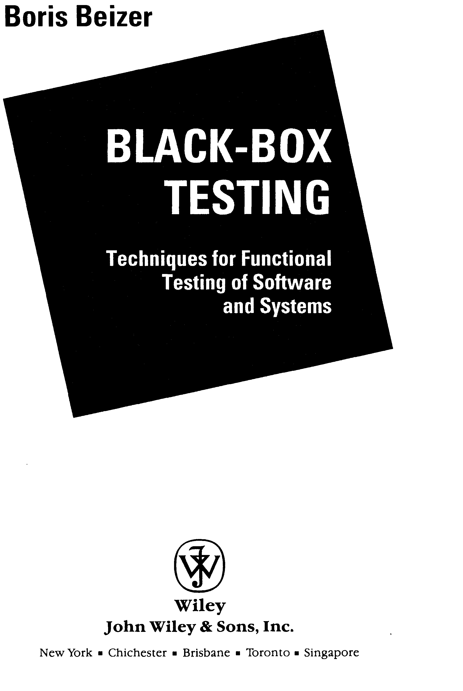

Борис Бейзер


Москва • Санкт-Петербург • Нижний Новгород • Воронеж
Новосибирск • Ростов-на-Дону • Екатеринбург • Самара
Киев • Харьков • Минск

2004

ББК 32.973-018-07
УДК 681.3.06
Б 41

**Бейзер Б.**
Б 41 Тестирование черного ящика. Технологии функционального тестирования программного обеспечения и систем. — СПб.: Питер, 2004. — 318 с.: ил.

ISBN 5-94723-698-2

Книга доктора Бейзера «Тестирование черного ящика» давно была признана классическим трудом в области поведенческого тестирования разнообразных систем. В ней глубоко рассматриваются основные вопросы тестирования программного обеспечения, позволяющие отыскать максимум ошибок при минимуме временных затрат. Чрезвычайно подробно излагаются основные методики тестирования, покрывающие все спектры аспектов разработки программных систем. Методичность и широта изложения делают эту книгу незаменимым помощником при проверке правильности функционирования программных решений.

Книга предназначена для тестировщиков программного обеспечения и программистов, стремящихся повысить качество своей работы.

ББК 32.973-018-07  
УДК 681.3.06

Права на издание получены по соглашению с издательством Wiley.  
Все права защищены. Никакая часть данной книги не может быть воспроизведена в какой бы то ни было форме без письменного разрешения владельцев авторских прав.

Информация, содержащаяся в данной книге, получена из источников, рассматриваемых издательством как надежные. Тем не менее, имея в виду возможные человеческие или технические ошибки, издательство не может гарантировать абсолютную точность и полноту приводимых сведений и не несет ответственности за возможные ошибки, связанные с использованием книги.

ISBN 0-471-12094-4 (англ.)  
ISBN 5-94723-698-2  

© by John Wiley & Sons, Inc  
© Перевод на русский язык, ЗАО Издательский дом «Питер», 2004  
© Издание на русском языке. оформление ЗАО Издательский дом «Питер», 2004

# Содержание

Введение . . . . . . . . . . . . . . . . . . . . . . . . . . . . . . . . . . . . . . . . . . . . . . . . . . . . . . . . . . . . . . . . . . . . . . . . . . . . 12

Пропущенные модели . . . . . . . . . . . . . . . . . . . . . . . . . . . . . . . . . . . . . . . . . . . . . . . . . . . . . . . . . . . . . . . . . 14
&nbsp;&nbsp;&nbsp;&nbsp;1. Общие положения . . . . . . . . . . . . . . . . . . . . . . . . . . . . . . . . . . . . . . . . . . . . . . . . . . . . . . . . . . . . . 14
&nbsp;&nbsp;&nbsp;&nbsp;2. Маерс. «Искусство тестирования программ» . . . . . . . . . . . . . . . . . . . . . . . . . . . . . . . . . . . . . . 14
&nbsp;&nbsp;&nbsp;&nbsp;3. Логические модели . . . . . . . . . . . . . . . . . . . . . . . . . . . . . . . . . . . . . . . . . . . . . . . . . . . . . . . . . . . . 16
&nbsp;&nbsp;&nbsp;&nbsp;4. Языковые модели . . . . . . . . . . . . . . . . . . . . . . . . . . . . . . . . . . . . . . . . . . . . . . . . . . . . . . . . . . . . . 16

README.DOC . . . . . . . . . . . . . . . . . . . . . . . . . . . . . . . . . . . . . . . . . . . . . . . . . . . . . . . . . . . . . . . . . . . . . . . . 18
&nbsp;&nbsp;&nbsp;&nbsp;Зачем нужен Readme.doc? . . . . . . . . . . . . . . . . . . . . . . . . . . . . . . . . . . . . . . . . . . . . . . . . . . . . . . . . 18
&nbsp;&nbsp;&nbsp;&nbsp;План книги . . . . . . . . . . . . . . . . . . . . . . . . . . . . . . . . . . . . . . . . . . . . . . . . . . . . . . . . . . . . . . . . . . . . 18
&nbsp;&nbsp;&nbsp;&nbsp;Структура главы . . . . . . . . . . . . . . . . . . . . . . . . . . . . . . . . . . . . . . . . . . . . . . . . . . . . . . . . . . . . . . . 20
&nbsp;&nbsp;&nbsp;&nbsp;Бланки налоговой декларации и ссылки на них . . . . . . . . . . . . . . . . . . . . . . . . . . . . . . . . . . . . . 22
&nbsp;&nbsp;&nbsp;&nbsp;Что должен знать читатель . . . . . . . . . . . . . . . . . . . . . . . . . . . . . . . . . . . . . . . . . . . . . . . . . . . . . . . 22
&nbsp;&nbsp;&nbsp;&nbsp;Не только программное обеспечение . . . . . . . . . . . . . . . . . . . . . . . . . . . . . . . . . . . . . . . . . . . . . . . 23
&nbsp;&nbsp;&nbsp;&nbsp;Использование алфавитного указателя . . . . . . . . . . . . . . . . . . . . . . . . . . . . . . . . . . . . . . . . . . . . . 23
&nbsp;&nbsp;&nbsp;&nbsp;Ссылки . . . . . . . . . . . . . . . . . . . . . . . . . . . . . . . . . . . . . . . . . . . . . . . . . . . . . . . . . . . . . . . . . . . . . . . . 23
&nbsp;&nbsp;&nbsp;&nbsp;Контроль качества . . . . . . . . . . . . . . . . . . . . . . . . . . . . . . . . . . . . . . . . . . . . . . . . . . . . . . . . . . . . . . 24
&nbsp;&nbsp;&nbsp;&nbsp;Благодарности . . . . . . . . . . . . . . . . . . . . . . . . . . . . . . . . . . . . . . . . . . . . . . . . . . . . . . . . . . . . . . . . . . 24
&nbsp;&nbsp;&nbsp;&nbsp;Отказ от ответственности . . . . . . . . . . . . . . . . . . . . . . . . . . . . . . . . . . . . . . . . . . . . . . . . . . . . . . . . 25
&nbsp;&nbsp;&nbsp;&nbsp;От издательства . . . . . . . . . . . . . . . . . . . . . . . . . . . . . . . . . . . . . . . . . . . . . . . . . . . . . . . . . . . . . . . . 25

Глава 1 • Введение . . . . . . . . . . . . . . . . . . . . . . . . . . . . . . . . . . . . . . . . . . . . . . . . . . . . . . . . . . . . . . . . . . . . 26
&nbsp;&nbsp;&nbsp;&nbsp;1.1. Обзор . . . . . . . . . . . . . . . . . . . . . . . . . . . . . . . . . . . . . . . . . . . . . . . . . . . . . . . . . . . . . . . . . . . . . . 26
&nbsp;&nbsp;&nbsp;&nbsp;1.2. Основные термины . . . . . . . . . . . . . . . . . . . . . . . . . . . . . . . . . . . . . . . . . . . . . . . . . . . . . . . . . . 26
&nbsp;&nbsp;&nbsp;&nbsp;1.3. О тестировании . . . . . . . . . . . . . . . . . . . . . . . . . . . . . . . . . . . . . . . . . . . . . . . . . . . . . . . . . . . . . 31
&nbsp;&nbsp;&nbsp;&nbsp;&nbsp;&nbsp;&nbsp;&nbsp;1.3.1. Тестировщик и программист . . . . . . . . . . . . . . . . . . . . . . . . . . . . . . . . . . . . . . . . . . . . . . . 31
&nbsp;&nbsp;&nbsp;&nbsp;&nbsp;&nbsp;&nbsp;&nbsp;1.3.2. Почему мы тестируем программное обеспечение? . . . . . . . . . . . . . . . . . . . . . . . . . . . 31
&nbsp;&nbsp;&nbsp;&nbsp;&nbsp;&nbsp;&nbsp;&nbsp;1.3.3. Стратегия тестирования . . . . . . . . . . . . . . . . . . . . . . . . . . . . . . . . . . . . . . . . . . . . . . . . . . 33
&nbsp;&nbsp;&nbsp;&nbsp;&nbsp;&nbsp;&nbsp;&nbsp;1.3.4. Парадокс пестицида . . . . . . . . . . . . . . . . . . . . . . . . . . . . . . . . . . . . . . . . . . . . . . . . . . . . . 34
&nbsp;&nbsp;&nbsp;&nbsp;&nbsp;&nbsp;&nbsp;&nbsp;1.3.5. Природа и причины ошибок . . . . . . . . . . . . . . . . . . . . . . . . . . . . . . . . . . . . . . . . . . . . . . . 34

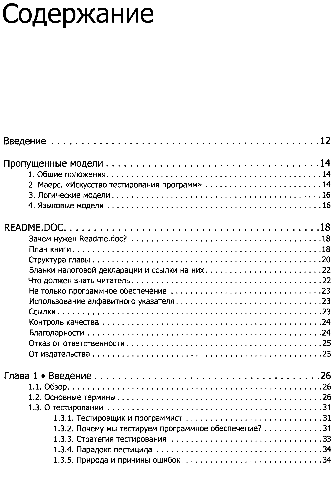

1.3.6. Когда надо остановиться . . . . . . . . . . . . . . . . . . . . . . . . . . . . . . . . . . . . 36  
1.3.7. Тестирование черного ящика — это еще не все . . . . . . . . . . . . . . . . . . . . 36  
1.3.8. Тестирование — это еще не все. . . . . . . . . . . . . . . . . . . . . . . . . . . . . . . . 37  
1.4. Процесс разработки программного обеспечения . . . . . . . . . . . . . . . . . . . . . . 39  
1.4.1. То, что на самом деле важно . . . . . . . . . . . . . . . . . . . . . . . . . . . . . . . . . 39  
1.4.2. Десять $_{(16)}$ и одна заповедь управления процессом . . . . . . . . . . . . . . . . 40  
1.5. Вопросы для самопроверки. . . . . . . . . . . . . . . . . . . . . . . . . . . . . . . . . . . . . . . 43  

Глава 2 • Графы и отношения . . . . . . . . . . . . . . . . . . . . . . . . . . . . . . . . . . . . . . . . . 44  
2.1. Обзор. . . . . . . . . . . . . . . . . . . . . . . . . . . . . . . . . . . . . . . . . . . . . . . . . . . . . . . . . . 44  
2.2. Основные термины . . . . . . . . . . . . . . . . . . . . . . . . . . . . . . . . . . . . . . . . . . . . . . 44  
2.3. Примеры графов, используемых в тестировании . . . . . . . . . . . . . . . . . . . . . 50  
2.3.1. Обзор . . . . . . . . . . . . . . . . . . . . . . . . . . . . . . . . . . . . . . . . . . . . . . . . . . . 50  
2.3.2. Модель потока транзакций (Глава 6) . . . . . . . . . . . . . . . . . . . . . . . . . . 51  
2.3.3. Модель меню с конечным числом состояний (Глава 9) . . . . . . . . . . . 51  
2.3.4. Модель потока данных (Глава 5) . . . . . . . . . . . . . . . . . . . . . . . . . . . . . 51  
2.3.5. Модель времени выполнения. . . . . . . . . . . . . . . . . . . . . . . . . . . . . . . . 52  
2.4. Отношения . . . . . . . . . . . . . . . . . . . . . . . . . . . . . . . . . . . . . . . . . . . . . . . . . . . . . 52  
2.4.1. Обзор . . . . . . . . . . . . . . . . . . . . . . . . . . . . . . . . . . . . . . . . . . . . . . . . . . . 52  
2.4.2. Транзитивные и нетранзитивные отношения . . . . . . . . . . . . . . . . . . . 52  
2.4.3. Симметричные и несимметричные отношения . . . . . . . . . . . . . . . . . 53  
2.4.4. Рефлексивные и нерефлексивные отношения . . . . . . . . . . . . . . . . . . 54  
2.4.5. Классы эквивалентности и разбиения . . . . . . . . . . . . . . . . . . . . . . . . 55  
2.4.6. Альтернатива графам . . . . . . . . . . . . . . . . . . . . . . . . . . . . . . . . . . . . . . 55  
2.5. Основополагающие принципы тестирования. . . . . . . . . . . . . . . . . . . . . . . . . 57  
2.5.1. Обзор . . . . . . . . . . . . . . . . . . . . . . . . . . . . . . . . . . . . . . . . . . . . . . . . . . . 57  
2.5.2. Построение графа . . . . . . . . . . . . . . . . . . . . . . . . . . . . . . . . . . . . . . . . . 58  
2.5.3. Определение отношений . . . . . . . . . . . . . . . . . . . . . . . . . . . . . . . . . . . 58  
2.5.4. Проверка узлов . . . . . . . . . . . . . . . . . . . . . . . . . . . . . . . . . . . . . . . . . . . 59  
2.5.5. Проверка связей . . . . . . . . . . . . . . . . . . . . . . . . . . . . . . . . . . . . . . . . . . 59  
2.5.6. Тестирование весов. . . . . . . . . . . . . . . . . . . . . . . . . . . . . . . . . . . . . . . . 60  
2.5.7. Тестирование циклов . . . . . . . . . . . . . . . . . . . . . . . . . . . . . . . . . . . . . . 60  
2.6. Резюме . . . . . . . . . . . . . . . . . . . . . . . . . . . . . . . . . . . . . . . . . . . . . . . . . . . . . . . . 61  
2.7. Вопросы для самопроверки . . . . . . . . . . . . . . . . . . . . . . . . . . . . . . . . . . . . . . . 62  

Глава 3 • Тестирование потока управления . . . . . . . . . . . . . . . . . . . . . . . . . . . . . 63  
3.1. Обзор. . . . . . . . . . . . . . . . . . . . . . . . . . . . . . . . . . . . . . . . . . . . . . . . . . . . . . . . . . 63  
3.2. Основные термины . . . . . . . . . . . . . . . . . . . . . . . . . . . . . . . . . . . . . . . . . . . . . . 63  
3.3. Отношения и модель . . . . . . . . . . . . . . . . . . . . . . . . . . . . . . . . . . . . . . . . . . . . 65  
3.3.1. Основы . . . . . . . . . . . . . . . . . . . . . . . . . . . . . . . . . . . . . . . . . . . . . . . . . 65  
3.3.2. Моделирование составных предикатов . . . . . . . . . . . . . . . . . . . . . . . 69  
3.4. Методика . . . . . . . . . . . . . . . . . . . . . . . . . . . . . . . . . . . . . . . . . . . . . . . . . . . . . . 71  
3.4.1. Основы . . . . . . . . . . . . . . . . . . . . . . . . . . . . . . . . . . . . . . . . . . . . . . . . . 71  
3.4.2. Построение модели . . . . . . . . . . . . . . . . . . . . . . . . . . . . . . . . . . . . . . . . 72  

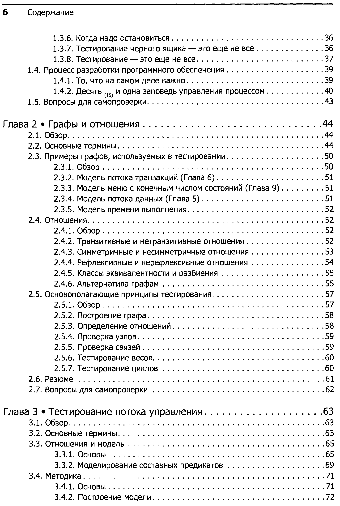

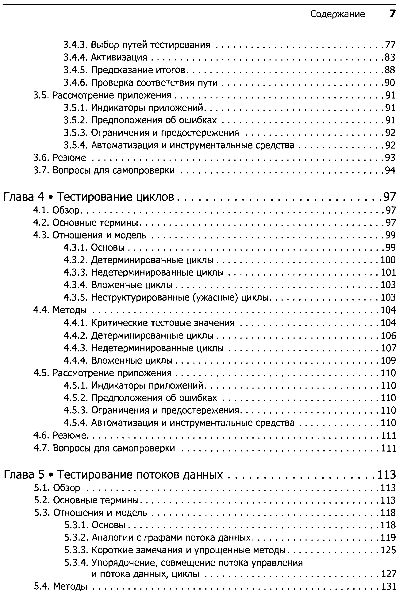

3.4.3. Выбор путей тестирования ................................. 77
3.4.4. Активизация ......................................... 83
3.4.5. Предсказание итогов ................................... 88
3.4.6. Проверка соответствия пути ............................. 90
3.5. Рассмотрение приложения ................................ 91
3.5.1. Индикаторы приложений ............................ 91
3.5.2. Предположения об ошибках ........................... 91
3.5.3. Ограничения и предостережения ........................ 92
3.5.4. Автоматизация и инструментальные средства ............... 92
3.6. Резюме ............................................... 93
3.7. Вопросы для самопроверки ............................... 94

Глава 4 • Тестирование циклов ................................ 97
4.1. Обзор ................................................ 97
4.2. Основные термины ...................................... 97
4.3. Отношения и модель ..................................... 99
4.3.1. Основы ........................................... 99
4.3.2. Детерминированные циклы .......................... 100
4.3.3. Недетерминированные циклы ........................ 101
4.3.4. Вложенные циклы .................................. 103
4.3.5. Неструктурированные (ужасные) циклы ................. 103
4.4. Методы ............................................... 104
4.4.1. Критические тестовые значения ........................ 104
4.4.2. Детерминированные циклы .......................... 106
4.4.3. Недетерминированные циклы ........................ 107
4.4.4. Вложенные циклы .................................. 109
4.5. Рассмотрение приложения ................................ 110
4.5.1. Индикаторы приложений ............................ 110
4.5.2. Предположения об ошибках ........................... 110
4.5.3. Ограничения и предостережения ........................ 110
4.5.4. Автоматизация и инструментальные средства ............... 110
4.6. Резюме ............................................... 111
4.7. Вопросы для самопроверки ............................... 111

Глава 5 • Тестирование потоков данных ......................... 113
5.1. Обзор ................................................ 113
5.2. Основные термины ...................................... 113
5.3. Отношения и модель ..................................... 118
5.3.1. Основы ........................................... 118
5.3.2. Аналогии с графами потока данных ...................... 119
5.3.3. Короткие замечания и упрощенные методы ................. 125
5.3.4. Упорядочение, совмещение потока управления
и потока данных, циклы ........................... 127
5.4. Методы ............................................... 131

5.4.1. Основы ............................................................................ 131  
5.4.2. Иерархия покрытия ................................................................ 133  
5.4.3. Построение модели ............................................................... 136  
5.4.4. Выбор основного порожденного подграфа ........................... 138  
5.4.5. Итоговый пример ................................................................. 143  
5.4.6. Активизация ....................................................................... 145  
5.4.7. Предсказание итогов ............................................................. 147  
5.4.8. Проверка соответствия пути .................................................. 147  
5.5. Анализ приложений ..................................................................... 148  
5.5.1. Виды приложений ............................................................. 148  
5.5.2. Предположения об ошибках ................................................ 148  
5.5.3. Ограничения и предостережения ......................................... 149  
5.5.4. Автоматизация и инструментальные средства ........................ 149  
5.6. Резюме .................................................................................... 150  
5.7. Вопросы для самопроверки ....................................................... 150  

Глава 6 • Тестирование потоков транзакций ........................................ 152  
6.1. Обзор .................................................................................... 152  
6.2. Основные термины ................................................................. 152  
6.3. Отношения и модель ............................................................... 155  
6.3.1. Основы .......................................................................... 155  
6.3.2. Маркировки .................................................................... 156  
6.3.3. Очереди ......................................................................... 157  
6.3.4. Слияние и поглощение .................................................... 158  
6.3.5. Циклы ............................................................................ 159  
6.3.6. Фокус и иерархические модели ........................................ 159  
6.4. Методика ................................................................................. 160  
6.4.1. Основы .......................................................................... 160  
6.4.2. Иерархия покрытия .......................................................... 163  
6.4.3. Построение модели ......................................................... 164  
6.4.4. Выбор путей и/или порожденных подграфов тестирования .... 165  
6.4.5. Тестирование синхронизации ............................................ 168  
6.4.6. Тестирование очереди .................................................... 169  
6.4.7. Активизация ................................................................... 171  
6.4.8. Предсказание итогов ........................................................ 172  
6.4.9. Проверка соответствия пути .............................................. 173  
6.5. Рассмотрение приложений .......................................................... 174  
6.5.1. Индикаторы приложений ................................................... 174  
6.5.2. Предположения об ошибках ................................................ 174  
6.5.3. Ограничения и предостережения ......................................... 174  
6.5.4. Автоматизация и инструментальные средства ........................ 175  
6.6. Резюме .................................................................................... 176  
6.7. Вопросы для самопроверки ....................................................... 176  

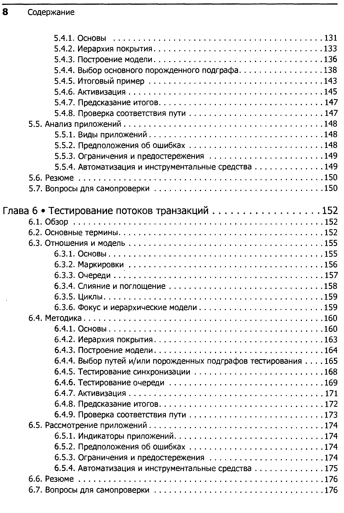

Глава 7 • Тестирование доменов . . . . . . . . . . . . . . . . . . . . . . . . . . . . . . . . . . . 179
7.1. Обзор . . . . . . . . . . . . . . . . . . . . . . . . . . . . . . . . . . . . . . . . . . . . . . . . . 179
7.2. Основные термины . . . . . . . . . . . . . . . . . . . . . . . . . . . . . . . . . . . . . . . 179
7.3. Отношения и модель . . . . . . . . . . . . . . . . . . . . . . . . . . . . . . . . . . . . . . 184
7.3.1. Обоснование . . . . . . . . . . . . . . . . . . . . . . . . . . . . . . . . . . . . . . 184
7.3.2. Основы . . . . . . . . . . . . . . . . . . . . . . . . . . . . . . . . . . . . . . . . . . 186
7.3.3. Анализ неопределенностей и противоречий . . . . . . . . . . . . . . 191
7.3.4. Нелинейные домены . . . . . . . . . . . . . . . . . . . . . . . . . . . . . . . . 193
7.4. Методы . . . . . . . . . . . . . . . . . . . . . . . . . . . . . . . . . . . . . . . . . . . . . . . . 194
7.4.1. Основы . . . . . . . . . . . . . . . . . . . . . . . . . . . . . . . . . . . . . . . . . . 194
7.4.2. Недостатки комбинирования экстремальных точек . . . . . . . . . 195
7.4.3. Слабая стратегия $1 \times 1$, одномерное пространство . . . . . . . . . . . 197
7.4.4. Слабая стратегия $1 \times 1$, пространство с размерностью
два и выше . . . . . . . . . . . . . . . . . . . . . . . . . . . . . . . . . . . . . . . . 199
7.4.5. Вырожденный случай . . . . . . . . . . . . . . . . . . . . . . . . . . . . . . . 201
7.4.6. Стратегии более высокого порядка для пространства
с размерностью два и более . . . . . . . . . . . . . . . . . . . . . . . . . . . 201
7.4.7. Сильное тестирование доменов . . . . . . . . . . . . . . . . . . . . . . . 206
7.5. Рассмотрение приложений . . . . . . . . . . . . . . . . . . . . . . . . . . . . . . . . . . 207
7.5.1. Индикаторы приложений . . . . . . . . . . . . . . . . . . . . . . . . . . . . 207
7.5.2. Предположения об ошибках . . . . . . . . . . . . . . . . . . . . . . . . . . 208
7.5.3. Ограничения и предостережения . . . . . . . . . . . . . . . . . . . . . . . 208
7.5.4. Автоматизация и инструментальные средства . . . . . . . . . . . . 209
7.6. Резюме . . . . . . . . . . . . . . . . . . . . . . . . . . . . . . . . . . . . . . . . . . . . . . . . 209
7.7. Вопросы для самопроверки . . . . . . . . . . . . . . . . . . . . . . . . . . . . . . . . . 209

Глава 8 • Синтаксическое тестирование . . . . . . . . . . . . . . . . . . . . . . . . . . . . . . . . 211
8.1. Обзор . . . . . . . . . . . . . . . . . . . . . . . . . . . . . . . . . . . . . . . . . . . . . . . . . 211
8.2. Основные термины . . . . . . . . . . . . . . . . . . . . . . . . . . . . . . . . . . . . . . . 211
8.3. Отношения и модель . . . . . . . . . . . . . . . . . . . . . . . . . . . . . . . . . . . . . . 216
8.3.1. Основы . . . . . . . . . . . . . . . . . . . . . . . . . . . . . . . . . . . . . . . . . . 216
8.3.2. Комментарий о трудозатратах . . . . . . . . . . . . . . . . . . . . . . . . 219
8.4. Методы . . . . . . . . . . . . . . . . . . . . . . . . . . . . . . . . . . . . . . . . . . . . . . . . 219
8.4.1. Основы . . . . . . . . . . . . . . . . . . . . . . . . . . . . . . . . . . . . . . . . . . 219
8.4.2. Иерархия покрытия . . . . . . . . . . . . . . . . . . . . . . . . . . . . . . . . 221
8.4.3. Чистое синтаксическое тестирование . . . . . . . . . . . . . . . . . . . 221
8.4.4. Грязное синтаксическое тестирование . . . . . . . . . . . . . . . . . . 223
8.4.5. Предсказание итога . . . . . . . . . . . . . . . . . . . . . . . . . . . . . . . . 228
8.4.6. Хорошие и плохие разновидности тестирования . . . . . . . . . . 228
8.5. Рассмотрение приложений . . . . . . . . . . . . . . . . . . . . . . . . . . . . . . . . . . 230
8.5.1. Индикаторы приложений . . . . . . . . . . . . . . . . . . . . . . . . . . . . 230
8.5.2. Предположения об ошибках . . . . . . . . . . . . . . . . . . . . . . . . . . 232
8.5.3. Ограничения и предостережения . . . . . . . . . . . . . . . . . . . . . . 233
8.5.4. Автоматизация и инструментальные средства . . . . . . . . . . . . 234

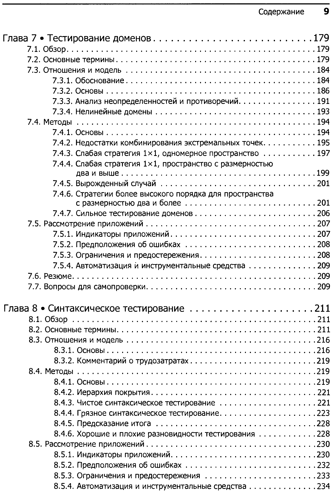

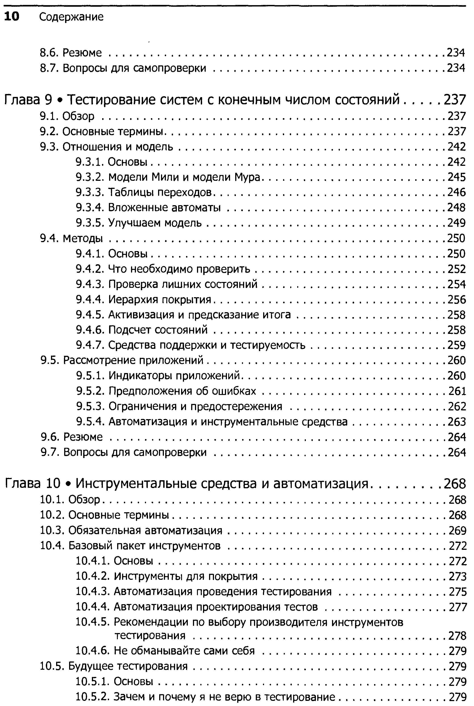

8.6. Резюме . . . . . . . . . . . . . . . . . . . . . . . . . . . . . . . . . . . . . . . . . . . . . . . . . . . 234
8.7. Вопросы для самопроверки . . . . . . . . . . . . . . . . . . . . . . . . . . . . . . . . . . . 234

Глава 9 • Тестирование систем с конечным числом состояний . . . . . . 237
    9.1. Обзор . . . . . . . . . . . . . . . . . . . . . . . . . . . . . . . . . . . . . . . . . . . . . . . . . . . . 237
    9.2. Основные термины . . . . . . . . . . . . . . . . . . . . . . . . . . . . . . . . . . . . . . . . . 237
    9.3. Отношения и модель . . . . . . . . . . . . . . . . . . . . . . . . . . . . . . . . . . . . . . . 242
        9.3.1. Основы . . . . . . . . . . . . . . . . . . . . . . . . . . . . . . . . . . . . . . . . . . . . . . 242
        9.3.2. Модели Мили и модели Мура . . . . . . . . . . . . . . . . . . . . . . . . . . . 245
        9.3.3. Таблицы переходов . . . . . . . . . . . . . . . . . . . . . . . . . . . . . . . . . . . 246
        9.3.4. Вложенные автоматы . . . . . . . . . . . . . . . . . . . . . . . . . . . . . . . . . 248
        9.3.5. Улучшаем модель . . . . . . . . . . . . . . . . . . . . . . . . . . . . . . . . . . . . 249
    9.4. Методы . . . . . . . . . . . . . . . . . . . . . . . . . . . . . . . . . . . . . . . . . . . . . . . . . . . 250
        9.4.1. Основы . . . . . . . . . . . . . . . . . . . . . . . . . . . . . . . . . . . . . . . . . . . . . . 250
        9.4.2. Что необходимо проверить . . . . . . . . . . . . . . . . . . . . . . . . . . . . 252
        9.4.3. Проверка лишних состояний . . . . . . . . . . . . . . . . . . . . . . . . . . . 254
        9.4.4. Иерархия покрытия . . . . . . . . . . . . . . . . . . . . . . . . . . . . . . . . . . . 256
        9.4.5. Активизация и предсказание итога . . . . . . . . . . . . . . . . . . . . . . 258
        9.4.6. Подсчет состояний . . . . . . . . . . . . . . . . . . . . . . . . . . . . . . . . . . . 258
        9.4.7. Средства поддержки и тестируемость . . . . . . . . . . . . . . . . . . . 259
    9.5. Рассмотрение приложений . . . . . . . . . . . . . . . . . . . . . . . . . . . . . . . . . . 260
        9.5.1. Индикаторы приложений . . . . . . . . . . . . . . . . . . . . . . . . . . . . . . 260
        9.5.2. Предположения об ошибках . . . . . . . . . . . . . . . . . . . . . . . . . . . . 261
        9.5.3. Ограничения и предостережения . . . . . . . . . . . . . . . . . . . . . . . . 262
        9.5.4. Автоматизация и инструментальные средства . . . . . . . . . . . 263
    9.6. Резюме . . . . . . . . . . . . . . . . . . . . . . . . . . . . . . . . . . . . . . . . . . . . . . . . . . . 264
    9.7. Вопросы для самопроверки . . . . . . . . . . . . . . . . . . . . . . . . . . . . . . . . . 264

Глава 10 • Инструментальные средства и автоматизация . . . . . . . . . . . . 268
    10.1. Обзор . . . . . . . . . . . . . . . . . . . . . . . . . . . . . . . . . . . . . . . . . . . . . . . . . . . 268
    10.2. Основные термины . . . . . . . . . . . . . . . . . . . . . . . . . . . . . . . . . . . . . . . 268
    10.3. Обязательная автоматизация . . . . . . . . . . . . . . . . . . . . . . . . . . . . . . 269
    10.4. Базовый пакет инструментов . . . . . . . . . . . . . . . . . . . . . . . . . . . . . . . 272
        10.4.1. Основы . . . . . . . . . . . . . . . . . . . . . . . . . . . . . . . . . . . . . . . . . . . . 272
        10.4.2. Инструменты для покрытия . . . . . . . . . . . . . . . . . . . . . . . . . . . 273
        10.4.3. Автоматизация проведения тестирования . . . . . . . . . . . . . . 275
        10.4.4. Автоматизация проектирования тестов . . . . . . . . . . . . . . . . 277
        10.4.5. Рекомендации по выбору производителя инструментов
                тестирования . . . . . . . . . . . . . . . . . . . . . . . . . . . . . . . . . . . . . 278
        10.4.6. Не обманывайте сами себя . . . . . . . . . . . . . . . . . . . . . . . . . . . 279
    10.5. Будущее тестирования . . . . . . . . . . . . . . . . . . . . . . . . . . . . . . . . . . . . 279
        10.5.1. Основы . . . . . . . . . . . . . . . . . . . . . . . . . . . . . . . . . . . . . . . . . . . . 279
        10.5.2. Зачем и почему я не верю в тестирование . . . . . . . . . . . . . . . 279

10.5.3. Зачем и почему я не верю в независимое тестирование . . . . . 280
10.5.4. Будущее тестирования . . . . . . . . . . . . . . . . . . . . . . . . . . . . . . . . . 281
10.6. Вопросы для самопроверки . . . . . . . . . . . . . . . . . . . . . . . . . . . . . . . . . . 282

Приложение А . . . . . . . . . . . . . . . . . . . . . . . . . . . . . . . . . . . . . . . . . . . . . . . . . . 283

Список литературы . . . . . . . . . . . . . . . . . . . . . . . . . . . . . . . . . . . . . . . . . . . . . 299

Алфавитный указатель . . . . . . . . . . . . . . . . . . . . . . . . . . . . . . . . . . . . . . . . . . 314

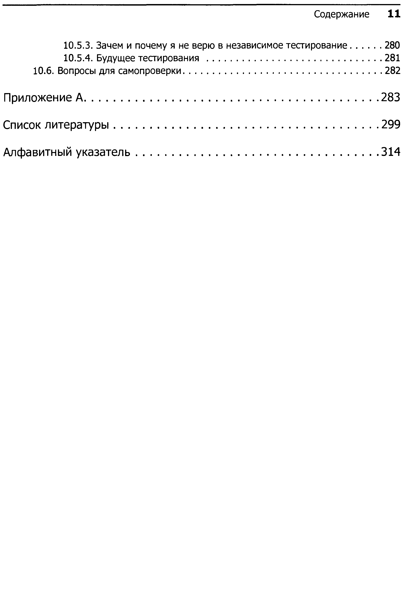

# Введение

Для кого написана эта книга? Для разработчиков и тестировщиков программного обеспечения. Говоря «тестировщик», я имею в виду людей, которые регулярно или в настоящее время тестируют программы, написанные другими людьми. Под «разработчиками» я подразумеваю людей, разрабатывающих программное обеспечение, но, сейчас занимающихся тестированием своих программ. Тестирование, выполняемое и теми и другими, слабо зависит от внешнего вида программы, оно подразумевает, что вы ставите себя на место пользователя и проверяете, что программа ведет себя так, как должна, вне зависимости от способа ее создания. Это и означает тестирование методом черного ящика.

Большинству начинающих тестировщиков, особенно если они нигде этому не учились, приходится самим исследовать тестирование методом черного ящика (иначе его называют *поведенческим тестированием* или *функциональным тестированием*). Без соответствующей подготовки они изучают по книгам эвристические версии методов, для которых могут существовать специально написанные коммерческие инструментальные средства. Для таких пользователей в данной книге содержатся основные сведения о надежных и доступных методах поведенческого тестирования.

На освещение этих вопросов меня подталкивали производители инструментов для тестирования, поскольку они создают сложные продукты, основанные отчасти на технологиях, описанных в этой книге, но пользователи не владеют методами, реализованными в их инструментах. Возникает замкнутый круг. Тестировщики с большой неохотой вкладывают деньги в обучение новым методам. Особенно те из них, кто полагается на автоматику, хотя для этого уже существуют специальные коммерческие инструменты. Производители не могут инвестировать средства в разработку инструментов, включающих такие методы, пока не появятся тестировщики, владеющие этими методами. Эта книга призвана помочь разрушить замкнутый круг. Прочитайте ее, затем отправляйтесь к производителю, чьими инструментальными средствами вы пользуетесь, и требуйте включить в них методы

из соответствующей главы. А если я отправлю производителям данные о продажах этой книги, это будет для них явным признаком того, что риск обоснован, так как на самом деле существует рынок спроса на их инструменты и большое число опытных тестировщиков, понимающих особенности методов и принципов, на которых они основаны.

Я должен сказать, чего в этой книге нет. Она не вмещает в себя огромный объем литературы по тестированию, так, например, она не заменяет мою книгу «Методы тестирования программного обеспечения», 2-е издание ([SST2 – BEIZ90]). SST2 – это всеобъемлющий (550 страниц) обзор литературы по тестированию. Эта книга предназначена для максимально широкой аудитории — от разработчиков, до тестировщиков, исследователей, студентов и аспирантов. Настоящая книга слишком мала, чтобы выполнить такую работу. Здесь не рассматриваются вопросы дизайна программ, в отличие от SST2, где они присутствуют почти в каждой главе. SST2 охватывает как структурное тестирование, так и поведенческое тестирование. Здесь же обсуждается лишь тестирование поведения. Эта книга также не может заменить работы «Тестирование программного обеспечения и обеспечение качества» [BEIZ84] или моей следующей книги «Интеграция и тестирование систем», над которой сейчас идет работа [BEIZ96]. Там речь идет о системном тестировании и тестировании интеграции систем, а обсуждаемые методы используются для создания тестов интеграции и тестов систем. В книге «Интеграция и тестирование систем» я буду считать, что вы прочитали эту книгу и знакомы с соответствующими методами.

В данной книге вы не встретите теоретических аспектов тестирования. Я не буду доказывать теорем и упомяну лишь о немногих. Эта книга для практиков. Тем не менее, вы можете быть уверены, что все, что имеет под собой прочную теоретическую базу, основано на этих теоремах. Как следствие моей попытки соответствовать теоретическим нюансам, временами текст, а особенно определения, могут показаться излишне формальными, очень похожими друг от друга и на первый взгляд не имеющими прямого отношения к вопросу. Если такое случится, то будьте уверены, что в дополнительной литературе вы найдете ответы на свои вопросы, поскольку эта книга полностью согласуется с литературой по данной тематике.

Еще несколько вещей, которые я не собираюсь здесь делать. Я не собираюсь тратить ваше время, рассуждая, насколько важны тестирование и качество. Если вы еще этого не знаете, то вам полезнее будет подумать над этим вопросом. Также я не стану распространяться об обеспечении качества, менеджменте, организации, политике, финансах, культуре, становлении программистского эго, о том, кто должен тестировать программное обеспечение, надо ли тестировать программное обеспечение, нужны ли нам законы, обеспечивающие качество программного обеспечения, открытых системах, свободно распространяемых программных средствах, проблеме наркотиков или моральном облике современной молодежи. Все это очень интересно. Я оставляю эти темы вам для обсуждения и исследования. Если же вы хотите освоить методы поведенческого тестирования с минимумом предварительных условий и хлопот, тогда, я надеюсь, эта книга вас не разочарует.

# Пропущенные модели

## 1. Общие положения

Этот раздел для читателей, знакомых с литературой по тестированию, в особенности читателей книги Глена Маерса «Искусство тестирования программ» [MYER79]; читателей, которые могут быть озадачены, если я не расскажу о нескольких методах поведенческого тестирования. В первую очередь о логических моделях.

Сначала я поставил себе цель уложиться в 175-страничную книгу. Этот объем вполне подходит для прочтения за один семестр. Одновременно планировалось, что эта книга заменит устаревший шедевр Маерса. Маерс уложился в 191 страницу. Когда я начал писать, для меня стало очевидно, что примеры занимают больше места, чем я предполагал. Я добавил некоторые новые технические требования, и это означало, что мне придется включить больше материала, чтобы книга была достаточной. Цель «175 страниц» была недостижима, и, тем не менее, мне приходилось постоянно себя ограничивать, сокращая материал.

Мои технические семинары служили обратной связью для определения тем, которые наиболее интересны людям. Я проводил их свыше 200 раз на протяжении 10 лет для тысяч тестировщиков. Участники семинара заполняли опросный лист, в котором спрашивалось, какие методы, по их мнению, могут быть полезны для них сразу же, а какие могут пригодиться в будущем (скажем через 3–5 лет). Я поддерживаю связь с бывшими студентами и организациями-заказчиками, чтобы определить, какие методы они используют при тестировании. Эта обратная связь лежит в основе данной книги.

## 2. Маерс. «Искусство тестирования программ»

Книга «Искусство тестирования программ» освещает вопросы тестирования так, как их понимали в 1979 году. С тех пор прошло более двух десятилетий, техноло-


гии тестирования развивались, и читатели не будут удивлены, обнаружив, что техника тестирования тоже изменилась. С одной стороны, сегодня мы знаем о тестировании гораздо больше. С другой стороны, создание подобного обзора потребует сейчас не одной, а целых семи книг: «Инспектирование», «Методы тестирования», «Тестирование интеграции», «Системное тестирование», «Теория тестирования», «Методы отладки», «Организация тестирования» и «Менеджмент». Моя задача существенно уже — введение в технику тестирования. Вот современное описание пяти методов, обсуждаемых Маерсом.

1. Тестирование путем покрытия логики. То, что Маерс называл «тестированием путем покрытия логики», в настоящее время называется тестированием потока управления (глава 3). Поскольку в данной книге рассматриваются не структурные методы (белого ящика), а лишь поведенческие методы (черного ящика), я остановлюсь лишь на поведенческом тестировании потока управления.
2. Разбиение по эквивалентности. Все методы тестирования, описанные в этой книге, основаны на идее разбиения набора всех возможных входных данных на классы эквивалентности (глава 3). Это означает, что все они относятся к методам тестирования путем разбиения. Маерс настоятельно советовал читателям исследовать код и спецификации, а затем на их основе осуществлять разбиение входных данных на эквивалентные классы для тестирования программы. Он также предложил для этого несколько сложных эвристических правил. Это выливается в создание специальных методов для каждой конкретной программы. Принцип, конечно, правильный и абсолютно корректный, но на практике тестировщики испытывают трудности при определении этих смутных (хоть и плодотворных) классов эквивалентности. Я расскажу вам об уже готовых методах разбиения на классы эквивалентности (или методах тестирования), что облегчает их практическое использование.
3. Анализ граничных значений. Рассуждения Маерса об анализе граничных значений являются частью более общей и более мощной методологии тестирования доменов (глава 7). Некоторые аспекты анализа граничных значений в применении к циклам будут обсуждаться в главе 4.
4. Причинно-следственные диаграммы [ELME73, MYER79]. Более подробное обсуждение вопроса, почему причинно-следственные диаграммы и связанные с ними методы не включены в данную книгу, приводится в разделе 3 «Логические модели». Такие методы трудны в практическом использовании потенциальными тестировщиками, не обладающими необходимыми знаниями, такими как булева алгебра или теория переключательных схем. Остранд [OSTR88] замечательно отозвался об этой технике: «Переводя данные спецификации в причинно-следственные диаграммы, тестировщики замещают одно сложное представление другим».
5. Предположение об ошибках. При выборе метода тестирования мы делаем ставку на определенный тип ошибок, который ожидаем обнаружить, так

как предположение о типе ошибок присутствует в любом методе. Поэтому предположение об ошибках — это не какой то метод тестирования, но атрибут любого из методов. Предположение об ошибках, основанное на статистике ошибок программистов, — вполне здравая идея (посмотрите, однако, «Парадокс пестицида» в главе 1). Сегодня мы имеем подобный статистики и, опираясь на них, выбираем определенный метод тестирования. Существует также и формальная теория тестирования, основанного на ошибках, но она не вошла в эту книгу [HOWD89, MORE90].

## 3. Логические модели

Логические модели включают в себя причинно-следственные диаграммы [ELME73, MYER79], модели таблиц решений [BEIZ90, GOOD75] и множество других вариантов, использующихся в качестве частей различных методологий дизайна [BEND85, WEYU94B]. Это замечательные методы, однако для их разбора потребуется слишком много места. К примеру, логические модели занимают в книге «Методы тестирования программного обеспечения» 42 страницы. В данной книге из-за более современных предпосылок и примеров черновик состоял из 75 страниц. Это еще две дополнительные большие (даже слишком большие) главы, что сделает курс слишком большим для одного семестра.

Мне трудно объяснить логические модели без привлечения булевой алгебры, а ее нет смысла учить, если вы не владеете диаграммами Карно–Вейча [BEIZ90], поскольку булева алгебра почти не используется без этого важного инструмента. Я обратил внимание, что слушатели разделяются на две категории. Те, кто знаком с булевой алгеброй и картами Карно, способны овладеть этими методами самостоятельно, например, с помощью STT2. Те же, у кого нет таких знаний, не могут изучить их за четыре часа, которые я посвящаю этой теме. В итоге тестирование на основе логики всегда находится на последних местах в списке предпочтений моих студентов и спонсоров. И я частенько вообще выбрасываю эту тему из моих семинаров.

Было бы неплохо, чтобы курс по тестированию был не единственным. Вспомогательный курс, для начальных или старших курсов, когда студенты уже владеют необходимыми знаниями, мог бы включать в себя логические модели и другие модели, здесь не представленные.

## 4. Языковые модели

Существует большое число моделей на основе специальных языков для разработки тестов и связанных с ними инструментальных средств. Хорошим примером может служить метод разбиения по категориям Остранда [LAYC92, OSTR88] и «T» Постона [POST94]. Другие методы того же типа изложены в [BALC89, BELF76, DAVI88, KEMM85, RICH89]. Все эти методы основаны на языке определения теста. Языки отличаются степенью формальности и выразительной силой, простираясь от самых элементарных до строгих полнофункциональных язы-

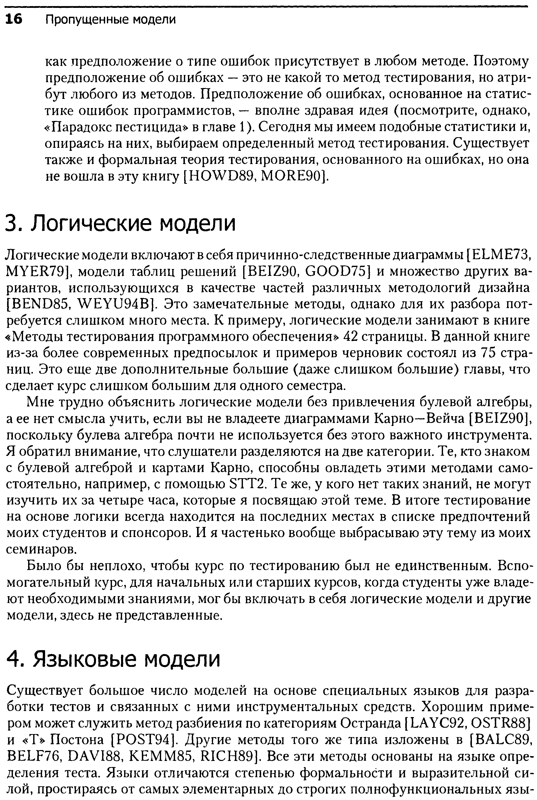

ков. При помощи таких языков тестировщики определяют требуемое поведение программ. Языковый процессор проверяет это определение на неоднозначности и противоречия. Другой процессор автоматически генерирует тестовые варианты (положительные и отрицательные), соответствующие данному определению при помощи большого числа формальных и эвристических методов тестирования.

Что же плохого в таком способе? Ничего. Я люблю его. Я верю, что рано или поздно тесты будут преимущественно создаваться такими вот инструментами. Однако подобные средства сложны, и их нельзя понять по-настоящему без понимания методов тестирования, на которых строятся генераторы тестов. Прочтя эту книгу, вы узнаете об этих методах.

Другая проблема является фундаментальной для любого языка программирования. Один из наиболее важных выводов, которые я сделал, наблюдая почти четыре десятилетия за развитием программного обеспечения, заключается в том, что нельзя ставить все на какой-то язык программирования, пока он популярен. Да и после потери популярности не стоит зацикливаться на нем. Люди предрекали кончину языка COBOL десятилетиями, но он, подобно бессмертному вампиру, все еще с нами. Кто мог предположить, что С вытеснит языки ассемблера, почти полностью FORTRAN и даже COBOL? Что случилось с языками PL/1 и Algol? Достоинства языков программирования слабо связаны с их популярностью. Будущее языков тестирования еще в большей степени непредсказуемо из-за относительно небольшого круга пользователей. Я надеюсь, что со временем один или два таких языка и связанные с ними генераторы тестов станут общепризнанными средствами тестирования. Тогда и наступит время написать о них, может быть, в рамках дополнительного курса.

# Readme.doc

## Зачем нужен Readme.doc?

Смогу ли я добиться большего успеха, чем производители фирменного программного обеспечения, попытавшись убедить вас прочесть этот раздел, прежде чем вы перейдете к следующим главам? Данный раздел — это инструкция по пользованию данной книгой. Я ничем не отличаюсь от вас. Когда мне в руки попадает новый пакет программ, я запускаю то, что мне интересно, начинаю с ним манипулировать и неизбежно захожу в тупик. Тогда я возвращаюсь назад и читаю Readme.doc, для того чтобы узнать, что же я сделал не так. Поэтому, если вы читаете этот раздел, это значит, что вы попытались прочесть главу о методах, которые, на ваш взгляд, подходят для вашей задачи, но безуспешно. Итак, давайте прочтем это прямо сейчас.

## План книги

Эта книга имеет свою генеральную линию. В главе 1 подготавливается почва для дальнейшего изложения и говорится о моем видении вашей ситуации, или, иными словами, обстоятельств, в которых происходит ваше тестирование. Для некоторых из вас эти обстоятельства могут показаться идеалистическими, но на самом деле они реальны и в той или иной форме присутствуют во множестве организаций-разработчиков программного обеспечения, и это то, к чему вам надо стремиться. Сравнивая вашу ситуацию с главой 1, вы поймете, где вы находитесь и в каком направлении вам надо двигаться. Для тех, кто ориентируется в терминах, мои стандарты — пятый уровень зрелости SEI (по шкале Института программного обеспечения) и, кроме того, немного из [SCAC94].

Глава 2 необходима для понимания глав 3, 4, 5, 6, 8 и 9, глава 4 — для глав 5, 6 и 8. Вы — в большинстве своем тестировщики-практики, и я не буду осуждать вас,

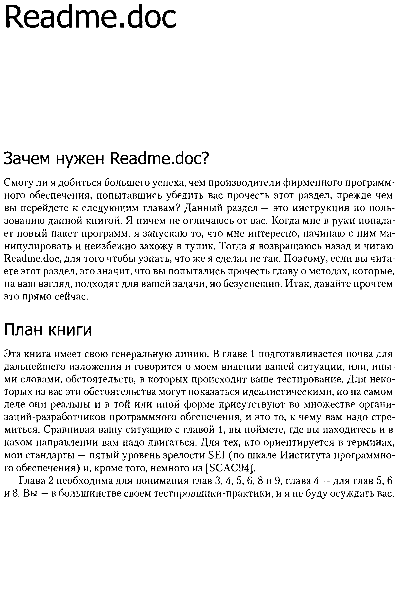

если вы пропустите главу, которая покажется вам чересчур абстрактной или не имеющей отношения к вашей конкретной задаче. Прошу за это прощения. Глава 2 очень важна. Если вы не разберетесь в ней, то последующие главы могут быть ненятны. В лучшем случае вы не сможете извлечь из них столько пользы, как если бы вы прочитали эту главу.

Глава 2 подобна подпрограмме с нужной информацией. Вместо того чтобы снова и снова повторять основные принципы в различных контекстах для каждой главы, я опишу идеи тестирования один раз в абстрактной форме и буду ссылаться на них в дальнейшем. Если вы разберетесь в абстрактных понятиях главы 2, то в последующих главах объяснение методов будет занимать всего несколько страниц. Это сделает книгу короче и дешевле, а КПД усвоения выше.

В главах с 3 по 9 описываются конкретные методы. В каждой главе — один метод и его производные. Я постарался сделать эти главы как можно более независимыми друг от друга. Переварив главу 2, вы сможете читать остальные главы практически в любом порядке.

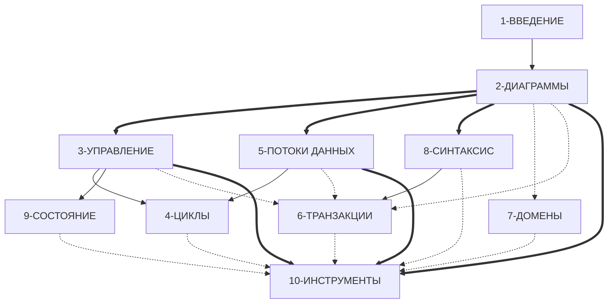
```mermaid
graph TD
    V1["1-ВВЕДЕНИЕ"] --> V2["2-ДИАГРАММЫ"]
    
    V2 ==> V3["3-УПРАВЛЕНИЕ"]
    V2 ==> V5["5-ПОТОКИ ДАННЫХ"]
    V2 ==> V8["8-СИНТАКСИС"]
    V2 -.-> V7["7-ДОМЕНЫ"]
    
    V3 --> V4["4-ЦИКЛЫ"]
    V3 --> V9["9-СОСТОЯНИЕ"]
    
    V5 --> V4
    V5 -.-> V6["6-ТРАНЗАКЦИИ"]
    
    V8 --> V6
    
    V2 -.-> V6
    V3 -.-> V6
    
    V2 ==> V10["10-ИНСТРУМЕНТЫ"]
    V3 ==> V10
    V5 ==> V10
    V7 -.-> V10
    V4 -.-> V10
    V6 -.-> V10
    V9 -.-> V10
    V8 -.-> V10
```


Данная диаграмма показывает, какой материал должен быть предварительно освоен перед прочтением той или иной главы. Сплошные линии означают, что вы должны разобраться в главе, находящейся в начале стрелки, для того чтобы понять главу, на которую стрелка указывает. Прерывистые линии означают, что предварительная глава содержит определения, которые будут использоваться в последующей главе, но любом случае вы сможете понять материал без внимательного изучения предварительной главы. Прочтение главы 1 — желательно, но необязательно для понимания следующих глав. Последняя глава включает в себя

определения из остальных глав, и поэтому требование к предваряющим главам нежесткое.

В последней главе рассказывается об инструментальных средствах и автоматизации. И хотя методы, описываемые в этой книге, могут использоваться и безо всякой автоматизации, такое их использование будет крайне неэффективно. Я надеюсь, что вы простите мне, что я не вдаюсь в подробности при обсуждении инструментальных средств. Я не собирался делать здесь полный обзор последних коммерческих инструментов. Такую информацию можно найти в [DAIC93], [GRAH93], [SQET94] и других подобных периодических изданиях. Ситуация меняется слишком быстро, для того чтобы имело смысл печатать подобную информацию в книге.

## Структура главы

Главы с 3 по 9, составляющие ядро данной книги, имеют сходную структуру, хотя порядок может меняться от главы к главе.

*Обзор*. Содержание главы в общих словах без использования терминов, вводимых в данной главе.

*Словарь внешних терминов*. Технические термины, определение которых отсутствует в данной книге, но которые вы должны знать. Англоговорящего читателя может удивить, что сюда включено так много основных компьютерных терминов. Около половины содержимого словаря внешних терминов хорошо знакомо не только профессионалу в области программного обеспечения, но и студенту. Включая сюда основные термины, я преследовал цель помочь моим многочисленным читателям, для которых английский язык не является родным. Я также надеюсь, что эти термины ощутимо облегчат перевод книги. Некоторые из внешних терминов не принципиальны для понимания книги, поскольку используются лишь в одной из нескольких иллюстраций идеи или в несущественном комментарии. Не слишком расстраивайтесь, если вы не понимаете термины, используемые в иллюстрациях, поскольку они играют вспомогательную роль в освоении методов тестирования. Все такие термины есть в алфавитном указателе, и вы можете посмотреть их применение в контексте изложения, чтобы понять, действительно ли они вам нужны для понимания темы.

*Словарь внутренних терминов*. Термины, определяемые в предыдущей главе.

*Словарь новых определений*. Определения, используемые в главе. Новые определения выделяются курсивом. Определение будет выделено курсивом еще раз, если оно дополняется или уточняется. Определения приводятся в логической последовательности, где каждое следующее определение зависит от предыдущего; их надо читать в предложенном порядке. Внимательно читайте новые определения и не двигайтесь дальше, пока их не поняли.

*Конфликт словарей*. Иногда вы будете находить один и тот же термин во внешнем и внутреннем словарях, а также в словаре новых определений. Когда термин появляется одновременно во внешнем и внутреннем словарях, это значит, что если вы знали его и раньше, то у вас не будет проблем с пониманием главы, одна-

ко в данном контексте определение будет более строгим, чем то, которое вы знали. Аналогично, если термин возникает во внутреннем словаре и в словаре новых определений, то в данной главе он либо уточняется, либо дополняется (переопределяется).

Термины могут выделяться в тексте курсивом (это значит, что вы, скорее всего, с ними не знакомы), при этом их определение может отсутствовать, и они не будут включены в словарь новых определений. Это означает, что этот термин ссылается на что-то, что будет определено позже. Я старался избегать таких ссылок и использовал их, только если чувствовал, что это принесет пользу. Вы, возможно, захотите заглянуть в соответствующую главу и просмотреть определение, но в любом случае можете не беспокоиться: на изучение данной главы никак не влияет понимание подобных ссылок.

*Модель.* Модель, на которой основан метод. Она включает то, что мы принимаем во внимание в поведении программы, что игнорируем и как мы представляем себе это поведение.

*Предположение об ошибках.* Любой метод тестирования основан на предположении относительно программного продукта, дизайна, пользователя, типа ошибок и возможных проявлений этих ошибок. Этот раздел поможет вам определить эффективность метода в вашем случае.

*Тип приложений.* Обсуждение, для каких приложений данный метод, скорее всего, будет эффективен.

*Метод.* Метод, что он собой представляет, как он работает и почему он работает.

*Примеры.* Примеры и решения технических задач — от необходимых требований до готовых тестов. Там, где это было возможно, я использовал в качестве примеров декларацию о доходах внутренней налоговой службы США. Я выбрал бланки декларации на подоходный налог, поскольку они едины для всех, содержат большое количество нетривиальной логики; они подходят для иллюстраций большинства методов черного ящика; несмотря на то, что мы затрачиваем огромные усилия, чтобы заполнить бланк декларации и разобраться в этих непостижимых формах, они, тем не менее, представляют собой вполне законченные спецификации и свободны от ошибок; и, наконец, их *должен* знать каждый.

*Предостережения и ограничения.* Что данный метод может, чего не может и ошибки какого типа он пропустит.

*Автоматизация и инструментальные средства.* Комментарии по поводу автоматической генерации совокупности тестовых данных и инструментальных средств, построенных на этом методе.

*Резюме.* Краткое содержание главы с использованием новой терминологии. При сравнении обзора и резюме становиться понятно, какие новые концепции были рассмотрены в этой главе.

*Тест и упражнения.* Упражнения и вопросы по итогам главы. Не прилагая усилий, вы не станете хорошо тестировать. Также вам надо знать терминологию, введенную в этой главе, если она встречается в последующих главах. Станьте сами себе ОТК. Проверьте себя. Бланки налоговой декларации являются подходящими объектами для тестирования. Проверьте сделанное, протестировав готовый пакет налоговых документов. Можете считать, что все правила налоговой службы в нем

соблюдены. В том числе они проверяют, чтобы все обязательные для заполнения графы были заполнены. Если вы вводите некое значение, очевидно выходящее за указанные рамки, программа должна определить это и предупредить вас. Я должен извиниться за то, что использовал налоговые декларации за 1994 год, но если они изменятся (а это неизбежно случится), вы приобретете полезный навык в обновлении средств тестирования.

Если вы в данный момент не являетесь студентом, то с помощью этого упражнения вы дополнительно попрактикуетесь в заполнении налоговой декларации. Если же вы студент и никогда не заполняли декларацию, самое время научиться этому. Не осуждайте меня за сложность формы, обратитесь лучше с этим вопросом к своим сенаторам и конгрессменам. Кроме того, реальные проблемы, с которыми вам придется столкнуться при тестировании программ, будут гораздо более трудными.

## Бланки налоговой декларации и ссылки на них

Там, где это было возможно, я иллюстрировал методы на примере формы 1040 декларации о доходах внутренней налоговой службы США и дополнений к ней за 1994 год. Копии форм, использующихся в этой книге, содержатся в приложении А. Эти формы определяют структуры, которые мы будем тестировать. Я рассчитываю, что каждый раз, разбирая пример, вы будете сверяться с соответствующей копией формы.

Я ссылаюсь на различные строки в бланке декларации как «1040 строка 23» Если отдельно не оговаривается, отсутствие названия формы (например, бланк С) означает, что ссылка относится к форме 1040. Также для создания полезных примеров мы можем добавлять отсутствующие в настоящей форме «строки» в нашу модель. Так, например, вместо одной строки 34 могут возникнуть строки 34.1, 34.2 и т. д.

## Что должен знать читатель

Эта книга для людей, обладающих определенными знаниями и опытом. Одного из нижеследующего будет вполне достаточно: один год (или больше) обучения по университетской программе в области компьютерных наук или программной инженерии, два года среднего специального образования в области компьютерных наук или разработки программного обеспечения, интенсивный годовой курс обучения в сертифицированном коммерческом центре обработки данных, или, что равнозначно, полный курс обучения по направлению «Программное обеспечение» в системе военного образования США, три или больше лет работы программистом. Занимаетесь ли вы программированием на данный момент — неважно. Важно, чтобы вы знали основные принципы программирования и обладали практическим навыком. Читателям с опытом прикладного тестирования, но без опыта программирования будет сложнее. Им придется потрудиться, чтобы понять и научиться применять главу 2. В словаре внешних терминов для каждой главы

приводится лексика, которую вам надо знать для освоения метода. Большинство людей склонно недооценивать собственные знания. Если вы понимаете терминологию главы, этого достаточно для ее изучения.

## Не только программное обеспечение

Исходя из вышесказанного, может показаться, что эта книга адресована только разработчикам программного обеспечения и тестировщикам. Это не так. Требования к читателю достаточно скромны и являются общими при обучении науке, бизнесу, инженерному делу или бухгалтерии. «Тестирование методом черного ящика» означает, что нас не интересует, что выступает в роли программно-подобного процесса. Кроме, разумеется, программ, это могут быть химические реакции, физика электромеханических систем, таинственный ход мыслей юриста, когда он пишет налоговые законы. Все эти системы надо тестировать. Все методы, представленные в данной книге, можно применить для тестирования процессов, далеких от программирования. Если вы биохимик и хотите оптимизировать тестирование реакций, которые используете в анализе крови, эта книга будет вам полезна, поскольку маловероятно, что существует книга о тестировании химических реакций в крови. Или представьте, что наши законодатели и Конгресс захотят применить формальный анализ и методы тестирования к абсурдным налоговым законам (особенно касающимся укрывания налогов), которые они разрабатывают. Тогда они смогут использовать эту книгу, хотя вряд ли это произойдет.

## Использование алфавитного указателя

Алфавитный указатель предоставляет всю информацию о термине, а также содержит раздел ссылок. Если в ссылке приводятся номера страниц, то это значит, что в данной работе на указанных страницах содержится информация по соответствующей теме. Вам это будет ясно из названия издания или из комментария, следующего за названием.

## Ссылки

Исследователи вряд ли найдут в ссылках что-нибудь интересное для себя. Ссылки здесь приводятся для того, чтобы читатель мог узнать больше о теме, иногда ознакомиться с противоположной точкой зрения или удачными примерами приложений, которые он мог бы использовать как средство борьбы за внедрение данного метода в свою организацию. Я ограничил библиографию работ, которые, хотя и содержат дополнительную информацию, но не являются существенными. Также я не стал включать в список ссылок множество прекрасных работ, особенно теоретических исследований, не относящихся к теме данной книги.

Ссылки обозначаются согласно требованиям АСМ (ассоциация вычислительной техники). Первые четыре символа из имени автора, затем год публикации, и в

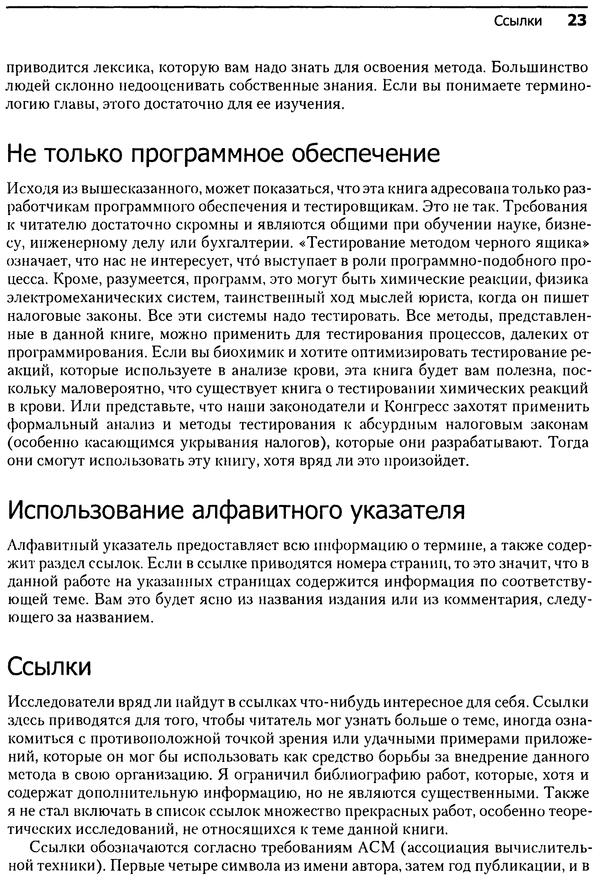

конце заглавная буква, начиная с «А», если это не единственная работа автора за тот год. Так, например, [BEIZ90] — книга Бейзера, опубликованная в 1990 году, а [BEIZ91C] — третья его книга в 1991 году. Часто приводится резюме или короткий обзор, если тема не понятна из названия.

## Контроль качества

Контроль качества — это *ваша задача*. Я ожидаю ваших комментариев, а также ваших замечаний об ошибках и недочетах, чтобы исправить их в следующих изданиях. Технологии позволяют сделать это очень просто. Пришлите мне факс или e-mail по адресам, приведенным ниже. Пожалуйста, сообщите следующую информацию о себе:
* Ваше имя, место работы (компания, университет, государственное учреждение)
* Ваша должность
* Почтовый адрес
* Номер телефона, факкса, e-mail
* Название книги, издание
* Номер страницы и комментарии или исправления

Если вы используете факс, вы можете сделать копию страницы и написать комментарий прямо на ней.

В публикациях используются номера, эквивалентные номеру версии и релиза. «Номер версии» — это то же самое, что и «номер издания», это всегда указывается в заголовке. Например, «Методы тестирования программ», издание 2-е.

Пожалуйста, посылайте ваши замечания:
Борису Бейзеру
Факс: 215-886-0144, три параллельных факса, отвечают на первый звонок
E-mail: BBEIZER@MCIMAIL.COM

## Благодарности

Я написал эту книгу по настоянию Боба Постена из Programming Environments Inc при поддержке Джинджера Хостона-Ладлэма из Frontier Technologies, Эдварда Миллера из Software Research Associates, Билла Перри из Quality Assurance Institute, Ричарда Бендера из Bender Associates и еще такого огромного числа коллег по академии, что перечислить их не представляется возможным. В написании этой книги есть вклад и других людей: коллег по цеху, моих читателей, моих студентов, клиентов, приходящих на консультации, однако уже трудно сказать, кто из них и что предлагал. Вряд ли кто-нибудь из этих людей догадываются, что они являются соавторами этой книги, поскольку их участие в ее написании было по большей части неосознанным. Мотивация, сознательная или нет — тоже ценный вклад. Я также хочу поблагодарить тех, кто откликнулся на мою просьбу по Интернету о помощи в выборе темы. И, наконец, я благодарен Ли Уайту за полезную и обоснованную критику главы 7.

Отказ от ответственности

Там, где было возможно в этой книге, я использовал в качестве примеров декларации о доходах внутренней налоговой службы США. Они использовались для иллюстрации проблем тестирования и не годятся для предоставления реальной информации, например как заполнять налоговую декларацию или как интерпретировать код внутренней налоговой службы США. Я по своему усмотрению сокращал или изменял формы, если это надо в педагогических целях. Не используйте формы из этой книги для каких-либо реальных целей, связанных с налогами. Не представляйте эти формы, их копии или материал в них в налоговую службу. Я не несу ответственности за любое их использование, кроме как в качестве учебных пособий.

Несмотря на вышесказанное, бланки декларации, их запутанность и инструкции к ним совпадают с формами внутренней налоговой службы США. Мои коллеги-неамериканцы говорят мне, что налоговые законы сложны во всем мире. Я за это не отвечаю. Законы и формы на самом деле дают нам нечто, за что можно быть благодарным. Если вы в состоянии заполнить налоговую декларацию в своей стране, то вы можете решить любую задачу тестирования, например тестирование программы контроля ядерного реактора.

## От издательства

Ваши замечания, предложения и вопросы отправляйте по адресу электронной почты comp@piter.com (издательство «Питер», компьютерная редакция).

Мы будем рады узнать ваше мнение!

Подробную информацию о наших книгах вы найдете на веб-сайте издательства http://www.piter.com.

# Введение

## 1.1. Обзор

В этой главе вводится терминология, использующаяся в тестировании, и рассматривается тестирование как элемент процесса разработки программного обеспечения.

## 1.2. Основные термины

В тестировании программного обеспечения существует вполне устоявшийся словарь. Определения, данные в этой книге, широко используются, изучите их. Вы наверняка ошибётесь, если будете употреблять их в узком, а не в широком смысле.

**Внешние термины:** совокупность, алгоритм, анализ, бета-тестирование, ветвление, побочный продукт, вызов, вызываемый, вызывающий, параметры запроса, код, кодирование, связь, сравнивать, компилируемый сегмент, компилятор, завершенный, сложность, вычисление, последовательный, управление, аварийная ситуация, данные, база данных, порча данных, целостность данных, отлаживать, задержка, проектирование, детерминированный, среда разработки, стадия разработки, диск, документ, выполнять, эксперимент, файл, блок-схема, формальный анализ, функция, глобальные данные, аппаратные средства, гипотеза, реализуемый, независимое тестирование, инспектирование, инсталляция, взаимодействие, нажатие клавиши, ключевое слово, библиотека, макрос, сопровождение, управление, отображение, сообщение, метрика, модель, модуль, многозадачный, многопользовательский, команда объектной программы, объектно-ориентированное программирование, взаимно однозначное отображение, операционная система, выходные данные, производительность, процесс разработки программного обеспечения, обработка, программа, часть программы, оператор программы, программируемый, программист, программирование, протокол, качество, обеспечение качества, RAM (оперативная память), случайный, диапазон, надежность, ресурсы,


<!-- ВІДНОВЛЕНО ЛОКАЛЬНО (Стор. 27) -->

<!-- КІНЕЦЬ ВІДНОВЛЕННЯ -->


*Характеристика*. Желательное поведение объекта; вычисление или оценка, проводимые объектом. Требования представляют собой совокупность характеристик.

*Вариант*. Характеристики, представляющие собой совокупность вариантов.

*Спецификация*. Ясное, как правило, неполное определение требований. В качестве спецификаций могут использоваться документы, список характеристик, прототип, тестовый комплект. Спецификации обычно незакончены, поскольку многие требования часто бывают очевидны. Например: «программа не должна уничтожать или портить данные». Самая большая ошибка, которую может допустить тестировщик, — это предположить, что в спецификациях представлены все требования.

*Проверка соответствия (валидация)*. Оценка объекта с целью продемонстрировать, что он удовлетворяет требованиям. Тестирование — это не единственный метод проверки соответствия, но в данной книге рассматривается только он [WALL94].

*Искаженность*$^1$. Оценка объекта с целью продемонстрировать, что он не удовлетворяет требованиям.

*Критерии соответствия (валидации)*. Средства для демонстрации того, выполняются или нет требования. Например, прямое сравнение с предсказанными значениями, сравнение в пределах определенных областей значений, наблюдаемая последовательность событий.

*Сравнение итогов*. Предсказанный и фактический итоги теста сравниваются по определенным критериям соответствия.

*Сценарий теста*. Документ, программа или объект, которые для каждого теста и подтеста в тестовом комплекте определяют тестируемый объект, требование (обычно условие), начальное состояние, вводы, ожидаемый итог и критерии соответствия.

*Симптом (отказ IEEE94)*. Наблюдаемое аномальное поведение любого объекта (не обязательного тестируемого), такое как несоответствие требованиям или возникновение незапланированных явлений.

*Ошибка (сбой IEEE94)*. Просчет в проектировании, ведущий к возникновению симптомов у какого-либо объекта (тестируемого и не только) при прохождении этим объектом определенного теста.

Тест считается *пройденным*, если при корректно заданных критериях соответствия после его прохождения фактический итог совпадает с предсказанным и отсутствуют симптомы.

Тест считается *не пройденным*, если после его прохождения фактический итог не совпадает с предсказанным и/или присутствуют симптомы. Причиной этого может быть использование неверного объекта, неверный ввод, неверный прогнозируемый итог, неверное начальное состояние, неверные критерии соответствия, некорректное применение этих критериев, ошибка при проектировании теста,

---
$^1$ Автор использует свою собственную, оригинальную терминологию. Отдавая дань классику, отметим, что более распространены следующие термины: *верификация* — проверка того, что программа правильно реализует определенную функцию; *валидация* — проверка того, что программа соответствует требованиям заказчика. — *Примеч. научн. ред.*


<!-- ВІДНОВЛЕНО ЛОКАЛЬНО (Стор. 29) -->

<!-- КІНЕЦЬ ВІДНОВЛЕННЯ -->


<!-- ВІДНОВЛЕНО ЛОКАЛЬНО (Стор. 30) -->

<!-- КІНЕЦЬ ВІДНОВЛЕННЯ -->


*Окружение.* Совокупность аппаратных, программных средств и данных, в которых и посредством которых компоненты создаются, тестируются и используются. Сюда входят (но этим перечень не ограничивается) вызывающие и вызываемые компоненты, операционная система, аппаратные средства, компилятор, ваши средства тестирования (разумеется) и прочее, что может влиять на работу компонентов или зависеть от нее.

## 1.3. О тестировании

### 1.3.1. Тестировщик и программист

Повсюду в этой книге мы будем упоминать и противопоставлять друг другу «тестировщиков» и «программистов» так, как будто они являются разными людьми. Такое разделение может привести вас к мысли, что тестирование методом черного ящика предназначено только для независимых тестировщиков, но не для программистов. Другим ошибочным мнением является то, что я сторонник идеи, что тестирование и программирование должны выполняться различными людьми, (то есть должно проводиться независимое тестирование). Я хочу предотвратить и/или скорректировать такие ошибочные взгляды.

Говоря образно, программист должен носить две шляпы — шляпу программиста и шляпу тестировщика. Когда он выполняет тестирование, он должен надеть шляпу тестировщика и думать как тестировщик. Вот что представляет собой «тестировщик», для которого я пишу эту книгу. Итак, тестировщик может быть, а может и не быть тем же самым человеком, который пишет программы. Так как способ мышления при программировании и способ мышления при тестировании сильно отличаются, хорошая идея — просто рассказать о двух ролях, как будто бы их играют различные люди. Способ мышления в программировании известен давно и существует много книг по этой теме, поэтому не стоит специально на этом останавливаться. Способ мышления, применяемый при тестировании, возник относительно недавно, и именно поэтому эти способы сильно различаются. Методы тестирования, затрагиваемые здесь, предназначены как для независимых тестировщиков, так и для тех программистов, которые в данный момент тестируют свое или чье-либо программное обеспечение.

### 1.3.2. Почему мы тестируем программное обеспечение?

Для проведения тестирования программного обеспечения есть несколько весомых причин.

1. Обеспечение программистов информацией, которую они смогут использовать для предотвращения ошибок.
2. Обеспечение менеджеров информацией, которая необходима им для разумной оценки риска при использовании объекта.
3. Создание объекта, максимально свободного от ошибок.

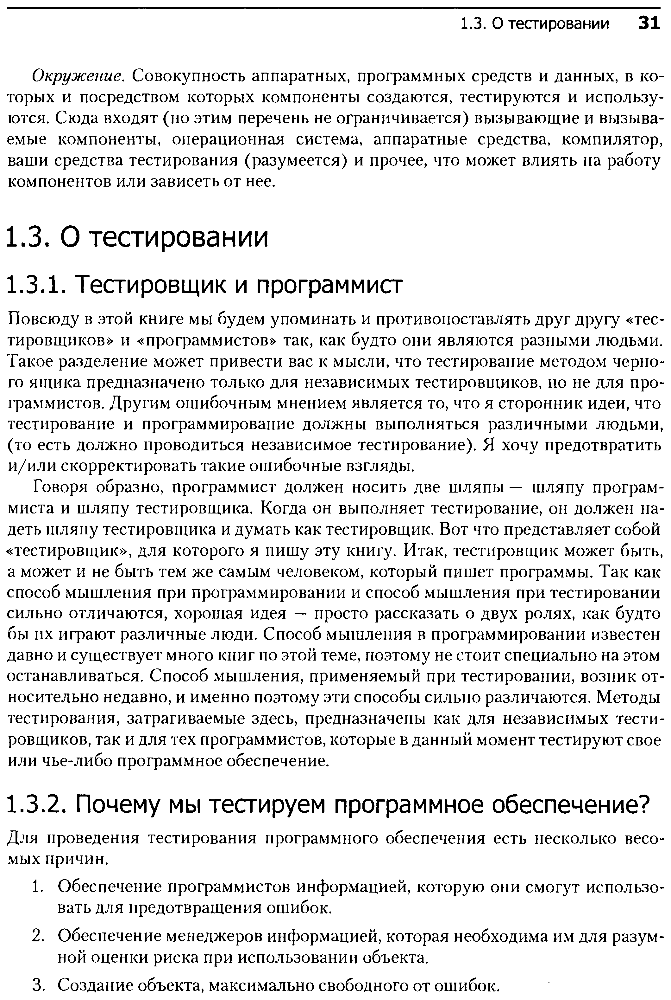

4. Создание проекта, поддающегося тестированию, то есть проекта, который можно легко проверить на соответствие, на искаженность и который будет легко сопровождать.

5. Проверка искаженности объекта с помощью как сформулированных, так и не сформулированных требований [MYER79]. Это еще называют «взломом программного обеспечения».

6. Проверить соответствие объекта (убедиться в его действенности), то есть показать, что он работает правильно.

Информация, необходимая для выполнения пункта 2, определяется степенью, до которой объект действует правильно (то есть количеством подтестов, пройденных и не пройденных), и некоторыми рамками, в пределах которых объект не может быть искажен. То есть пределом, до которого объект не взломан, и пределом, до которого он работает. Тот предел, до которого объект считается свободным от ошибок, является также границей, до которой он соответствует требованиям и не искажен. Таким образом, у нас есть три основных задачи: хорошее проектирование, искаженность, проверка соответствия.

Все, что пишут люди, содержит ошибки. Проведенное тестирование чего-либо не является эквивалентом утверждения, что это что-то свободно от ошибок. Программист не может думать обо всем — в особенности обо всех возможных взаимодействия между различными характеристиками и между различными частями программы. Мы пытаемся взломать программу, так как только такой путь обеспечит нас уверенностью в том, что продукт готов к использованию.

Другая задача тестирования — это накопление информации для менеджмента. При наличии необходимой информации и достаточного количества тестов мы можем с достаточной уверенностью утверждать, что программа готова к использованию. В конечном счете это как раз то, за что платят тестировщикам, — помощь в создании полезной программы.

Наивысшая цель тестирования — это обеспечение качества: накопление информации, которая, вернувшись к программисту, поможет избежать ему прошлых ошибок и улучшить качество программного обеспечения в будущем.

*Грязный тест (или негативный тест)*: тест, первичной целью которого является проверка искаженности; то есть тест, предназначенный для того, чтобы взломать программу.

*Чистый тест (или позитивный тест)*: тест, первичной целью которого является проверка соответствия; то есть тест, предназначенный для того, чтобы продемонстрировать корректную работу программы.

Тест является действенным, если в результате его выполнения выявляются симптомы существующих ошибок.

В спецификациях обычно указываются только те требования, которые должны быть проверены на соответствие (то есть на то, что объект должен делать), и не содержатся требования, которые должны быть проверены на искаженность (то есть на то, что объект не должен делать). Так как количество действий, которые объект должен выполнять, конечно, а количество действий, которые объект не должен выполнять, не ограничено, из общих соображений можно предположить, что

грязных тестов должно быть существенно больше, чем чистых. Так оно и есть на самом деле. В продуманных тестовых комплектах число грязных тестов относится к числу чистых как $4:1$ или $5:1$.

## 1.3.3. Стратегия тестирования

*Стратегия тестирования, или методы тестирования* — это систематические методы, используемые для отбора и/или создания тестов, которые должны быть включены в тестовый комплект. Это могут быть случайные вводы, тест, направленный на проверку моих подозрений, тест, направленный на проверку ваших подозрений, тест, направленный на проверку соответствия требованиям, тест, направленный на проверку искаженности; тесты, который мы выполняли последний раз, тесты, которые отличаются от тестов, которые мы выполняли последний раз. Мы выбираем стратегию, такую, что существуют правила, по которым мы можем определить, удовлетворяет данный тест стратегии или не удовлетворяет. В принципе, стратегия должна быть программируемой.

Стратегия является *эффективной*, если тесты, включенные в нее, с большой вероятностью обнаружат ошибки тестируемого объекта. Эффективность стратегии зависит от комбинации природы тестов и природы ошибок, на поиск которых эти тесты направлены. Как на войне и в бизнесе, здесь существуют эффективные и неэффективные стратегии. Более того, так как объект изменяется с целью исправления ошибок и увеличения его возможностей, типы ошибок, находимые у объекта, меняются со временем, и, следовательно, меняется эффективность стратегии. В то время как теоретически возможно, что стратегия по отношению к специфическим объектам совершенствуется во времени, на самом деле эффективность большинства стратегий со временем убывает.

Стратегия *поведенческого теста* основана на технических требованиях. Например: тест всех характеристик, упомянутых в спецификации, выполнение всех грязных тестов, вытекающих из требований. Тестирование, выполняемое с помощью стратегии поведенческого теста, называется *поведенческим тестированием*. Поведенческое тестирование называется также *тестированием черного ящика*. Для поведенческого тестирования также используется термин *функциональное тестирование*$^1$. При поведенческом тестировании (в принципе, но не на практике) не обязательно знать, как объект сконструирован. Тема этой книги — поведенческое тестирование (тестирование черного ящика).

Стратегия *структурного теста* определяется структурой тестируемого объекта [BASI87, BEIZ90, NTAF88, OSTR96]. Например: выполнение каждого оператора по меньшей мере один раз, выполнение каждой ветви по меньшей мере один раз, тестирование использования всех объектов данных, выполнение каждой команды

---

$^1$ Термин «функциональное тестирование» обычно используется в литературе, но на практике предпочитается термин «тестирование черного ящика». Лучший и более старый термин, существующий в компьютерных науках, — «поведенческое тестирование». Проблемы с «функциональным тестированием» связаны с тем, что этот термин используется для обозначения некоторой стратегии тестирования, используемой, например, для тестирования математических функций. В этой книге три термина «функциональное тестирование», «тестирование черного ящика», «поведенческое тестирование» подменяют друг друга с доминированием термина «поведенческое тестирование».

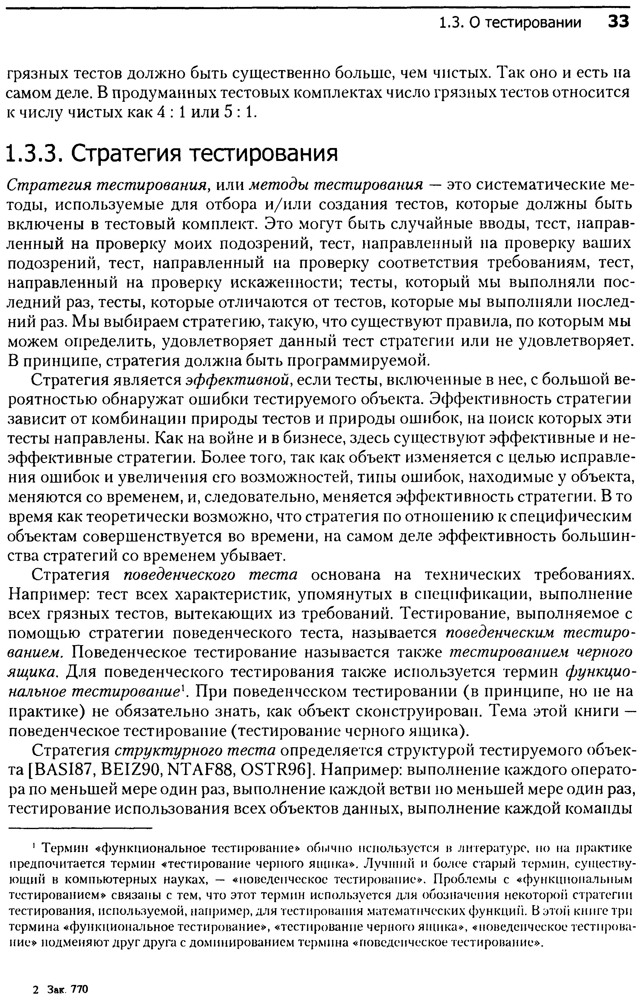

объектной программы, полученной при компиляции. Тестирование, выполненное с помощью стратегии структурного теста, называется также тестированием прозрачного ящика или тестированием белого ящика. Стратегия структурного теста требует полного доступа к структуре объекта — то есть к исходному коду. Эта книга только поверхностно затрагивает методы структурного тестирования.

Стратегия гибридного теста является комбинацией поведенческой и структурной стратегий [CLAR76, RICH81]. Поведенческая, структурная и гибридная стратегии не противоречат друг другу, и ни про одну из них нельзя сказать, что она лучше других. Модули и низкоуровневые компоненты часто тестируются с помощью структурной стратегии. Большие компоненты и системы в основном тестируются с помощью поведенческой стратегии. Гибридная стратегия полезна на всех уровнях. Не существует лучшей стратегии, так как полезность стратегии зависит от природы тестируемого объекта, природы ошибок объекта и уровня ваших знаний.

## 1.3.4. Парадокс пестицида[^1]

Большинство из нас предпочитает доделать дело до конца. Знать, что работа выполнена, выполнена правильно, и в подходящее время взять следующую задание. Тестирование программного обеспечения на это не похоже. Если вы хорошо сделали работу по выявлению ошибок и если люди из отдела обеспечения качества хорошо выполнили работу по передаче ваших исследований обратно программистам, то они, скорее всего, не повторят прошлых ошибок. Хороший программист, если у него есть время и необходимые ресурсы, обычно изучает проблемы, выявленные тестировщиками (или им самим), обобщает идеи и затем исследует свое программное обеспечение на предмет выявления и исправления в нем таких же или подобных ошибок.

Все методы тестирования имеют встроенные допущения о природе ошибок. Каждый метод тестирования нацелен на определенный набор ошибок. Если программист реагирует на результаты тестирования и информацию об ошибках сокращением и удалением этих ошибок, из этого следует, что его программа улучшается, а эффективность предыдущих тестов постепенно уменьшается. То есть ваш тест устаревает и вам приходится изучать, создавать и использовать новые тесты, основанные на новых методах отслеживания новых ошибок.

## 1.3.5. Природа и причины ошибок

Обратитесь к [BEIZ90] и [ANSI94] для подробного обсуждения ошибок и категорий ошибок. Главная причина, почему я использую термин «ошибка», а не официальный термин «дефект», это то, что «дефект» подразумевает, что кто-то должен нести за него ответственность. Предполагается недостаток добросовестности программиста, леность или некомпетентность. Ошибки, сделанные компетентным программистом, работающим на современном программном обеспечении, в соот-

---

[^1]: Это называется «парадокс пестицида» по аналогии с явлением в сельском хозяйстве, когда личинки долгоносика, приспособившись к яду, вынуждали нас создавать все более мощный яд, который приводил к возникновению все более устойчивых к этому яду личинок, или искать принципиально иное решение.


<!-- ВІДНОВЛЕНО ЛОКАЛЬНО (Стор. 35) -->

<!-- КІНЕЦЬ ВІДНОВЛЕННЯ -->


<!-- ВІДНОВЛЕНО ЛОКАЛЬНО (Стор. 36) -->

<!-- КІНЕЦЬ ВІДНОВЛЕННЯ -->


<!-- ВІДНОВЛЕНО ЛОКАЛЬНО (Стор. 37) -->

<!-- КІНЕЦЬ ВІДНОВЛЕННЯ -->


другом. Тестирование поведения программы при каждом возможном варианте инсталляции, является другой неосуществимой задачей. То же самое относится к взаимодействию между нашим пакетом программ и другими пакетами, проверке защищенности нашей программы, некоторым коммуникационными протоколам и множеству алгоритмов. Всякий раз, когда по ряду причин сложность тестирования увеличивается быстрее, чем сложность самого тестируемого объекта, формальный анализ, возможно, математический, является предпочтительнее тестирования. Мы, однако, нуждаемся в тестировании, чтобы убедиться, что сам наш анализ в должной мере свободен от ошибок$^1$.

*Проектирование*. Хороший проект имеет мало ошибок и легко тестируется. Намного легче спроектировать что-то, что не может быть протестировано, чем что-то, поддающееся тестированию. Намного легче спроектировать что-то, что совершенно невозможно сопровождать, чем спроектировать что-то, что возможно. Самые грамотные требования сводятся на нет непродуманными проектами, проверить которые невозможно при помощи конечного числа тестов.

*Формальное инспектирование* [FAGA76, GILB93, WEIN90] является первичным методом предотвращения ошибок, и это неоднократно подтверждалось. Процесс разработки программного обеспечения, который не включает в себя формальное инспектирование, очевидно дефектен, и устранение ошибок в нем намного больше зависит от тестирования.

*Самотестирование*. Тестирование, выполняемое самими программистами, гораздо более эффективно, чем тестирование, выполняемое кем-то еще. То же самое относится к тестированию группой, производящей данное программное обеспечение. Аналогично тестирование в организации, разрабатывающей программное обеспечение, эффективнее, чем внешнее тестирование (то есть бета-тестирование) того же самого программного обеспечения. Это не отвергает идеи, что независимое тестирование может быть действенно, так как эффективность — не единственный критерий, определяющий, кому и какое тестирование проводить.

Если независимый тестировщик повторяет тест, ранее выполненный разработчиком, или просто выполняет тестирование, которое следовало бы выполнить во время разработки, в этом случае независимое тестирование совсем не приносит никакой информации, фактически не имеет смысла. Такое тестирование (независимое повторение тестов разработчика) может быть полезно, только если разработчик некомпетентен или предумышленно делает не все корректно. А это противоречит нашей гипотезе о компетентности программиста.

Цель независимого тестирования — обеспечить различные ракурсы, следовательно, различные тесты; более того, проводить эти тесты в среде с более широкими возможностями (и поэтому более сложной и дорогой), чем это доступно разработчику. Цель самотестирования — удалить те ошибки, которые могут быть найдены

___

$^1$ Все, что мы делаем в процессе разработки программного обеспечения, подвержено ошибкам. Формальное (то есть математическое) доказательство корректности алгоритма точно так же уязвимо для ошибок, как любой другой процесс, выполняемый человеком. Убедиться в этом легко: достаточно вспомнить о количестве статей в математических журналах, озаглавленных: «Контрпример к теореме...».


<!-- ВІДНОВЛЕНО ЧЕРЕЗ GEMINI (Стор. 39) -->
посредством малых затрат в простейшей детерминированной среде путем тестирования модулей/компонентов или низкоуровневого системного тестирования.

*Инструменты.* Мы считаем исходные синтаксические ошибки кода просто помехами, так как у нас есть инструменты (компиляторы), которые находят такие ошибки гораздо лучше, чем мы сами. В наших языках программирования и компиляторах к настоящему времени появились совершенные детекторы ошибок, автоматизировавшие то, что когда-то являлось сложной для человека задачей. Если ошибка может быть определена (и/или исправлена) автоматически, это должно быть сделано. Не пытайтесь отключать автоматизацию и инструменты, выявляющие ошибки. Исключить надо как раз подверженную ошибкам ручную обработку кода, тогда, когда доступна автоматизация. Существует все более увеличивающаяся разница между инструментами, которые в действительности используют программисты и тестировщики, и инструментами, которые разрабатывают для них исследователи. Ликвидируйте этот разрыв! Он стоит того. Это окупится.

Мы, как тестировщики, должны всегда стремиться к тому, чтобы можно было вообще обойтись без тестирования. Это наша недостижимая цель. Тестирование является контролем качества. Обеспечение качества означает предотвращение ошибок. Всегда выгоднее предотвратить ошибки, чем их потом находить. Но эта цель недостижима, так как история показывает, что автоматизация процесса и предотвращение предыдущих ошибок являются предпосылками к встрече со все более сложными задачами, которые ставят перед нами нужды пользователей.

Наш текущий технологический процесс (каким бы несовершенным он ни был) является более совершенным, чем технологический процесс, использовавшийся всего десятилетие назад. Мы уже не программируем так, как это делали десять лет назад, но мы пишем новые программы, несущие в себе все более сложные ошибки. Наши пользователи повышают свои требования к качеству, а, следовательно, растут требования к нашим возможностям и методам тестирования.

## 1.4. Процесс разработки программного обеспечения

### 1.4.1. То, что на самом деле важно

Наиболее важные моменты, касающиеся разработки программного обеспечения, легко перечислить. Нам необходим процесс. Процесс должен быть понятен. Процессу должны следовать.

*Процесс.* Я убежден, что процесс используется в любом случае, поскольку даже хаос в своем роде является процессом. Наличие процесса означает, что существует возможность предсказать, что будет происходить с программным продуктом на следующем шаге. Такая предсказуемость возникает, когда появляется потребность в данном продукте, и завершается, когда продукт устаревает.

Наличие процесса еще не означает существования детально разработанной для него документации. Ряд наилучших проектов на моей памяти имели крайне ограниченный объем документации. И наоборот, когда меня спрашивают о том, что
<!-- КІНЕЦЬ ВІДНОВЛЕННЯ -->


<!-- ВІДНОВЛЕНО ЛОКАЛЬНО (Стор. 40) -->

<!-- КІНЕЦЬ ВІДНОВЛЕННЯ -->


<!-- ВІДНОВЛЕНО ЛОКАЛЬНО (Стор. 41) -->

<!-- КІНЕЦЬ ВІДНОВЛЕННЯ -->


*Стратегические тонкости.* Для кого разрабатывается данное программное обеспечение? Что ожидают заказчики и пользователи от программы, кроме обычной практичности? Не станет ли эта программа кошмаром для пользователя? Будет ли она вне конкуренции? Улучшит ли она нашу репутацию? Принесет ли она большой доход? Будет ли она самой быстрой? Существуют сотни таких стратегических задач, и руководство определяет относительную важность каждой из них. Без подобного руководства (желательно заданного в количественной форме) невозможно определить цели проектирования или понять, когда эти цели достигнуты.

*Критерии соответствия требованиям.* Как мы узнаем, что продукт удовлетворяет требованиям? Как выбрать объективные критерии соответствия требованиям так, чтобы они были связаны с каждым требованием по отдельности и со всеми вместе?

*Ответственность.* Кто и за что отвечает.

*Критерии завершенности.* Как узнать, когда данная часть программного обеспечения (ПО) будет готова к переходу на следующую стадию процесса разработки? Что является реальным, объективным признаком завершенности?

*Критерий готовности.* Как узнать, когда данная часть ПО будет удовлетворять условиям, необходимым для перехода к следующей стадии процесса разработки? Подобное описание вовсе не избыточно. Компонент программы может пройти через множество стадий или использоваться множеством других компонентов, каждый из которых имеет свои критерии готовности. Как правило, критерий завершенности компонента является объединением всех критериев готовности для этого компонента.

*Анализ.* Анализ — это инженерный процесс, при помощи которого проектирование «наполняется» требованиями (получает полные требования как входной набор данных). Он может быть полностью интуитивным или полностью формальным. Интуитивный анализ, зачастую действенный, не может, однако, быть с легкостью воспринят другими людьми, и, следовательно, какой-либо формальный, часто математический анализ необходим, даже просто для памяти.

*Проектирование.* Это все, что касается сути дела, не так ли? Проектирование должно предварять программирование или, по крайней мере, проводиться одновременно с ним. Инженеры, прежде чем строить, занимаются проектированием, поскольку это уменьшает риск. Проектные ошибки — это ошибки на бумаге, и обходятся они гораздо дешевле, нежели сваренная сталь или скомпилированный код.

*Проверка соответствия проекта.* Как нам убедиться в том, что проект будет работать, если мы раньше ничего подобного не разрабатывали? Проверка соответствия проекта — это совсем не то же самое, что проверка соответствия реализации проекта. Мосты рушатся из-за плохих, не прошедших проверки проектов, а не из-за плохих материалов и неквалифицированной рабочей силы. Чем новее проект, тем важнее его проверить перед началом конструирования. Проверка соответствия производится с помощью моделей, прототипов и инспектирования проектирования.

*Программирование.* Написание кода в соответствии с проектом и тестирование его с целью убедиться, что мы создали именно то, что и собирались создать.


Каменщик проверяет горизонтальность своей кладки с помощью уровня, а программист — с помощью тестов.

*Интеграция.* Единое целое по своим возможностям существенно больше, чем сумма отдельных частей. Только у тривиальных, модельных программ уровень сложности системы эквивалентен сумме уровней сложности ее составляющих. Архитектор тратит не меньше времени на придание зданию законченного вида, чем на продумывание шагов по его возведению. Об интеграции не стоит и говорить, если не существует плана интеграции и соответствующих тестов интеграции, будь то объединение двух низкоуровневых подпрограмм или нескольких сотен квазиавтономных систем.

*Тестирование:* Тестирование требуется везде, где работают люди. Тестирование — это основная составляющая самоуважения и гордости за свое мастерство. Механик, который не проверяет результат своей работы микрометром, или негодяй, или дурак. Программист, поиском ошибок которого занимаются впоследствии только другие люди, не уважает себя, за исключением, возможно, странной гордости за быстрое клепание огромного количества непроверенных и полных ошибок программ.

## 1.5. Вопросы для самопроверки

Дайте определение следующих терминов: анализ, поведенческое тестирование, тестирование черного ящика, слепота, ошибка, свободный от ошибок, вариант, чистый тест, случайная корректность, комбинаторный, гипотеза о компетентном программисте, компонент, ошибка компонента, тестирование компонента, контроль конфигурации, проверка соответствия проекта, грязный тест, эффективная стратегия, эффективный тест, критерии готовности, среда, критерии завершенности, не пройденный тест, отказ, опровергаемый, искаженность, дефект, характеристика, конечное состояние, функциональное тестирование, тестирование прозрачного ящика, гибридная стратегия, начальное состояние, ввод, интеграция, ошибка интеграции, тестирование интеграции, интерфейс, отрицательный тест, объект, наблюдаемый, оракул, итог, соответствие итогов, пройденный тест, парадокс пессимиста, ошибка производительности, положительный тест, управление процессом, программирование, прототип, цель тестирования, обеспечение качества, контроль качества, требования, анализ требований, прослеживаемость требований, критерий соответствия требованиям, ошибка потери ресурсов, действенный тест, ошибка безопасности, система программного обеспечения, спецификация, состояние, структурное тестирование, подтест, симптом, система, системная ошибка, системное тестирование, тест, проектирование теста, сценарий теста, стратегия тестирования, тестовый комплект, тестируемый проект, протестированный, тестирование, методы тестирования, модуль, ошибка модуля, тестирование модуля, проверка соответствия, критерий соответствия, тестирование белого ящика.


<!-- ВІДНОВЛЕНО ЛОКАЛЬНО (Стор. 44) -->

<!-- КІНЕЦЬ ВІДНОВЛЕННЯ -->


<!-- ВІДНОВЛЕНО ЛОКАЛЬНО (Стор. 45) -->

<!-- КІНЕЦЬ ВІДНОВЛЕННЯ -->


*Параллельные связи.* Две или более связей между двумя узлами. Параллельные связи используются, если между двумя узлами существуют несколько отношений.

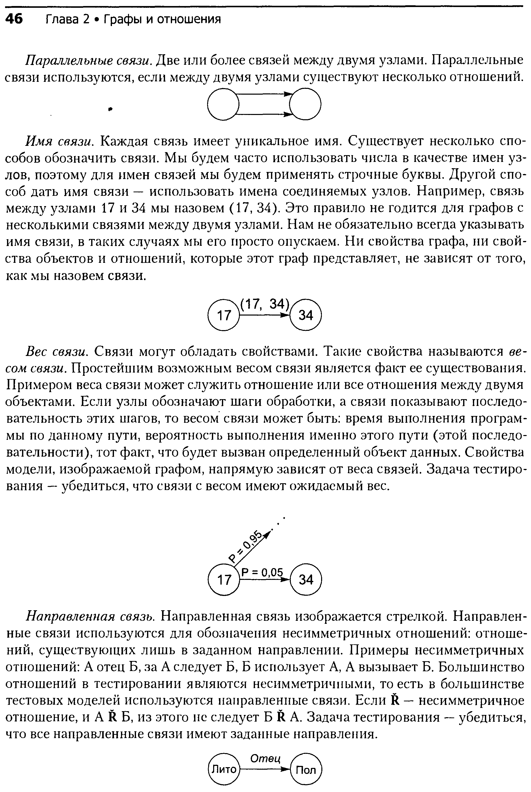

*Имя связи.* Каждая связь имеет уникальное имя. Существует несколько способов обозначить связи. Мы будем часто использовать числа в качестве имен узлов, поэтому для имен связей мы будем применять строчные буквы. Другой способ дать имя связи — использовать имена соединяемых узлов. Например, связь между узлами 17 и 34 мы назовем $(17, 34)$. Это правило не годится для графов с несколькими связями между двумя узлами. Нам не обязательно всегда указывать имя связи, в таких случаях мы его просто опускаем. Ни свойства графа, ни свойства объектов и отношений, которые этот граф представляет, не зависят от того, как мы назовем связи.

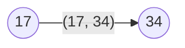
```mermaid
graph LR
    A((17)) -- "(17, 34)" --> B((34))
```

*Вес связи.* Связи могут обладать свойствами. Такие свойства называются весом связи. Простейшим возможным весом связи является факт ее существования. Примером веса связи может служить отношение или все отношение между двумя объектами. Если узлы обозначают шаги обработки, а связи показывают последовательность этих шагов, то весом связи может быть: время выполнения программы по данному пути, вероятность выполнения именно этого пути (этой последовательности), тот факт, что будет вызван определенный объект данных. Свойства модели, изображаемой графом, напрямую зависят от веса связей. Задача тестирования — убедиться, что связи с весом имеют ожидаемый вес.

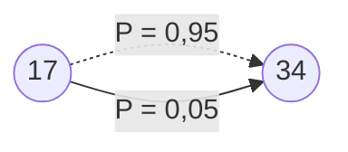
```mermaid
graph LR
    A((17)) -. "P = 0,95" .-> B((34))
    A((17)) -- "P = 0,05" --> B((34))
```

*Направленная связь.* Направленная связь изображается стрелкой. Направленные связи используются для обозначения несимметричных отношений: отношений, существующих лишь в заданном направлении. Примеры несимметричных отношений: А отец Б, за А следует Б, Б использует А, А вызывает Б. Большинство отношений в тестировании являются несимметричными, то есть в большинстве тестовых моделей используются направленные связи. Если $\breve{R}$ — несимметричное отношение, и $A \breve{R} Б$, из этого не следует $B \breve{R} A$. Задача тестирования — убедиться, что все направленные связи имеют заданные направления.

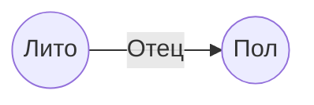
```mermaid
graph LR
    A((Лито)) -- "Отец" --> B((Пол))
```

*Ненаправленная связь*. Связь, соответствующая симметричному отношению, то есть двустороннему отношению. Строго говоря, $\check{R}$ — симметричное отношение, если из факта $A \check{R} B$ следует (в соответствии с природой отношения) $B \check{R} A$. Симметричные отношения изображаются двусторонними стрелками, поэтому мы обычно опускаем стрелки на концах линий. В первом примере на рисунке две противоположно направленные стрелки могут быть заменены или двусторонней стрелкой или простой линией, поскольку отношение «дети одних родителей» симметрично. В третьем примере, напротив, несмотря на то, что существуют отношения в обоих направлениях, они различны и несимметричны. Симметричные отношения довольно редко встречаются в тестировании, вот несколько примеров таких отношений: $A$ и $B$ родственники, $A$ и $B$ женаты, $A$ и $B$ соседи по комнате. Задача тестирования — убедиться, что все симметричные отношения на самом деле симметричны.

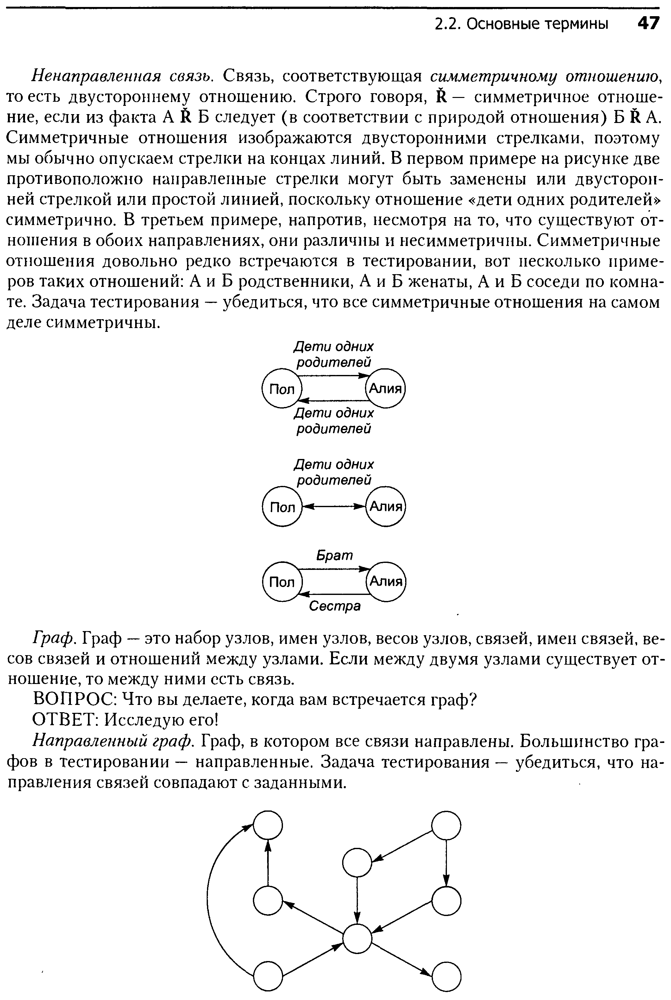

*Граф*. Граф — это набор узлов, имен узлов, весов узлов, связей, имен связей, весов связей и отношений между узлами. Если между двумя узлами существует отношение, то между ними есть связь.

ВОПРОС: Что вы делаете, когда вам встречается граф?  
ОТВЕТ: Исследую его!  

*Направленный граф*. Граф, в котором все связи направлены. Большинство графов в тестировании — направленные. Задача тестирования — убедиться, что направления связей совпадают с заданными.


<!-- ВІДНОВЛЕНО ЛОКАЛЬНО (Стор. 48) -->

<!-- КІНЕЦЬ ВІДНОВЛЕННЯ -->


<!-- ВІДНОВЛЕНО ЛОКАЛЬНО (Стор. 49) -->

<!-- КІНЕЦЬ ВІДНОВЛЕННЯ -->


<!-- ВІДНОВЛЕНО ЛОКАЛЬНО (Стор. 50) -->

<!-- КІНЕЦЬ ВІДНОВЛЕННЯ -->


3. Какие объекты связаны друг с другом (связи).
4. Свойства, которыми могут обладать связи — веса связей.

Отдельный вопрос — вдохновляет ли вас данная модель (граф) на написание действенного теста. Модель — дело вкуса. То, что нравится вам, может не нравиться мне и наоборот. Однако существуют модели, которые большинство людей считает полезными.

## 2.3.2. Модель потока транзакций (глава 6)

*Объекты.* Шаги в процедуре транзакций, такие как проверка платежной ведомости, получение денег из банкомата. Каждому шагу в процессе транзакций соответствует один узел.

*Отношение.* «Предшествует следующему шагу». Например, расчет жалованья предшествует расчету вычитаемых налогов.

*Связи.* Соединяют следующие друг за другом шаги. Соответствуют отношению «предшествует» между двумя узлами.

## 2.3.3. Модель меню с конечным числом состояний (глава 9)

*Объекты.* Меню, появляющиеся в окне, например, текстового редактора. Каждому пункту меню соответствует один узел.

*Отношение.* «Может прямо вызвать», что означает существование пункта в меню, выбор которого влечет за собой появление нового меню. Выбранный пункт меню определяет, какое именно меню второго уровня должно появиться.

*Связи.* На каждый пункт в меню приходится по одной связи между узлами. Например, если меню А может (выбором соответствующих пунктов) вызвать меню Б, В, Г, то между А и Б, А и В, А и Г существуют связи.

## 2.3.4. Модель потока данных (глава 5)

*Объекты.* Определенные объекты данных. Каждому экземпляру (потенциально отличимому от других величин) каждого объекта данных соответствует один узел.

*Отношение.* «Используется для вычисления значения». В равенстве $X = 2Y + Z$ объекты $Y$ и $Z$ используются для вычисления значений $X$.

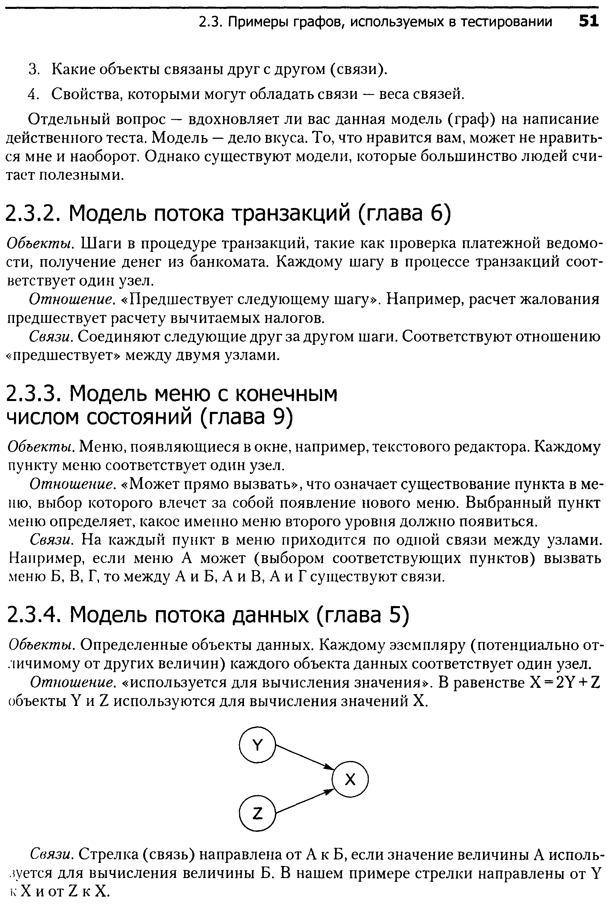

*Связи.* Стрелка (связь) направлена от А к Б, если значение величины А используется для вычисления величины Б. В нашем примере стрелки направлены от Y к X и от Z к X.

2.3.5. Модель времени выполнения

*Объекты.* Линейные последовательности операторов в программе.

*Отношение* «предшествует оператору». Например, `READ filename` предшествует оператору `FOR....`

*Связи.* Соединяют следующие друг за другом операторы. Соответствуют отношению «предшествует между двумя узлами». Обратите внимание, что *операторы ветвления* (такие как `IF`, `CASE`) имеют по одной исходящей связи на каждую ветвь.

*Свойства.*

1. Связей — ожидаемое время выполнения (например, в микросекундах);
2. Операторов ветвления (например, `IF...THEN...ELSE`, `CASE`) — вероятности события для каждой их ветви (исходящей связи), что программа пойдет именно по ней.

## 2.4. Отношения

### 2.4.1. Обзор

Отношения имеют определенные свойства и, следовательно, могут быть разбиты на категории. Если, глядя на отношение, вы говорите: «О, это такой-то и такой-то тип отношений», то эти ваши знания вы сможете применить в конкретных случаях. Мы не будем рассматривать все свойства всех возможных отношений. Остановимся лишь на отношениях, наиболее часто используемых при тестировании.

### 2.4.2. Транзитивные и нетранзитивные отношения

Отношение $\breve{R}$ *транзитивно*, если из $\text{A } \breve{R} \text{ Б}$ и $\text{Б } \breve{R} \text{ В}$ следует $\text{А } \breve{R} \text{ В}$. Например, отношение *быстрее* — транзитивно. Если А быстрее Б и Б быстрее В, то, следовательно, А быстрее В. Примеры транзитивных отношений: *можно достичь, больше, меньше, больше или равно, меньше или равно, зависит от, подмножество, находится в проекции*.

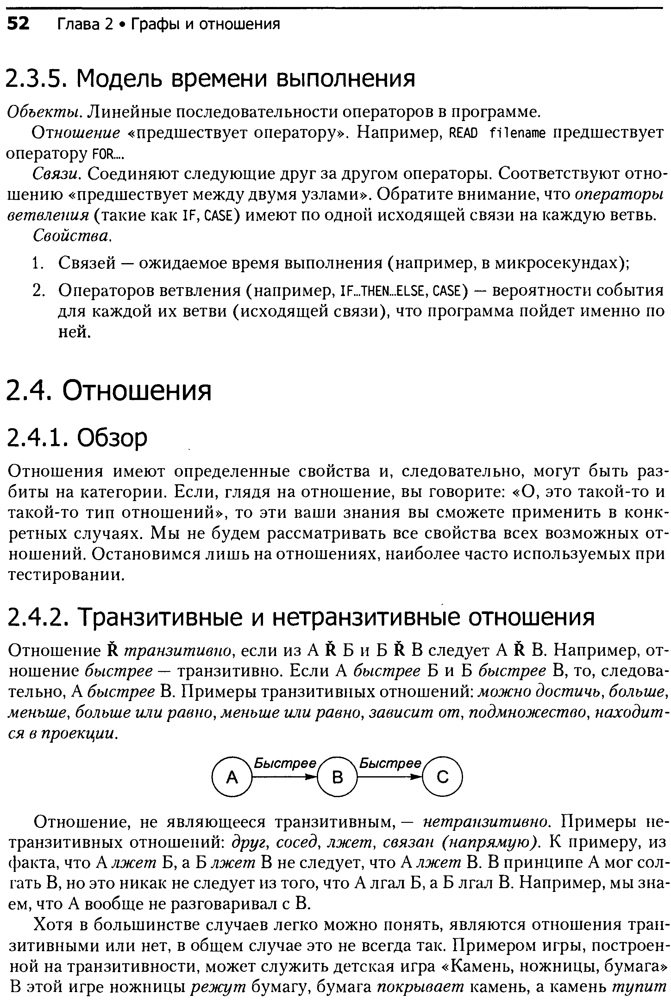

Отношение, не являющееся транзитивным, — *нетранзитивно*. Примеры нетранзитивных отношений: *друг, сосед, лжет, связан (напрямую)*. К примеру, из факта, что А лжет Б, а Б лжет В не следует, что А лжет В. В принципе А мог солгать В, но это никак не следует из того, что А лгал Б, а Б лгал В. Например, мы знаем, что А вообще не разговаривал с В.

Хотя в большинстве случаев легко можно понять, являются ли отношения транзитивными или нет, в общем случае это не всегда так. Примером игры, построенной на транзитивности, может служить детская игра «Камень, ножницы, бумага». В этой игре *ножницы режут бумагу, бумага покрывает камень, а камень тупит*


<!-- ВІДНОВЛЕНО ЛОКАЛЬНО (Стор. 53) -->

<!-- КІНЕЦЬ ВІДНОВЛЕННЯ -->


<!-- ВІДНОВЛЕНО ЛОКАЛЬНО (Стор. 54) -->

<!-- КІНЕЦЬ ВІДНОВЛЕННЯ -->


Рефлексивность также чаще подразумевается, чем постулируется, и, следовательно, является хорошим объектом для поиска ошибок. Поскольку рефлексивность должна быть присуща каждому узлу, каждый узел должен быть проверен. Тестируйте рефлексивность по тому же принципу, что и транзитивность с симметричностью.

## 2.4.5. Классы эквивалентности и разбиения

*Отношение эквивалентности* — симметрично, транзитивно и рефлексивно. Набор объектов, удовлетворяющих отношению эквивалентности, называется классом эквивалентности. Каждый объект из этого класса называется эквивалентным (в смысле данного отношения) любому другому объекту этого класса.

Все методы, описываемые в этой книге, являются примерами тестирования путем разбиения [HAML88, OSTR88, RICH81, RICH89, WHIT94]. Эта стратегия построена на разбиении всех возможных входов на классы эквивалентности по какому-либо отношению эквивалентности. Я не буду в этой книге рассказывать, как создавать или находить подобные отношения, а познакомлю вас с набором уже готовых полезных отношений и, следовательно, полезных разбиений на классы эквивалентности.

Если у вас есть транзитивное отношение, то вы можете автоматически конвертировать его в соответствующее отношение эквивалентности и таким образом разбить множество входов на классы эквивалентности. Однако этот метод не рассматривается в данной книге. Дополнительную информацию вы найдете в [BEIZ90], глава 12.

## 2.4.6. Альтернатива графам

### 2.4.6.1. Граф — это визуализация

Графическое представление графов, используемое в этой книге, является удобным инструментом для обучения, поскольку большинство людей находит такое визуальное представление менее абстрактным. На практике, однако, за исключением модельных задач, представленных в этой книге, графическое представление графов слишком затруднительно. Вместо того чтобы рисовать картинки и использовать шаблоны (или их программные аналоги), мы представляем графы в виде таблиц или списков. Возможно, для вас в определенных случаях эти способы представления окажутся полезны. Мне представляется правильным объяснить вам принципы их построения при первом же вашем знакомстве с графами.

### 2.4.6.2. Представление в виде таблиц или матриц

Графы удобно представлять в табличной или матричной форме. Обычно используется следующий порядок создания графа.

1. Нарисуйте двухмерный массив, размер которого равен числу узлов.
2. Если существует связь между узлом $i$ и, например, $j$, задайте элемент $[\text{i}, \text{j}]$ массива равным $1$, в противном случае задайте его равным $0$ или оставьте эту позицию пустой или же отметьте ее точкой.


<!-- ВІДНОВЛЕНО ЛОКАЛЬНО (Стор. 56) -->

<!-- КІНЕЦЬ ВІДНОВЛЕННЯ -->


<!-- ВІДНОВЛЕНО ЛОКАЛЬНО (Стор. 57) -->

<!-- КІНЕЦЬ ВІДНОВЛЕННЯ -->


2.5.2. Построение графа

1. Определение узлов.
   - Какие объекты (узлы) представлены на данном графе? Каждому рассматриваемому объекту соответствует один узел.
   - Дайте имена узлам. Вы называете узлы по своему усмотрению, однако каждый узел должен иметь уникальное имя или идентификатор. Мне нравится использовать числа, но вы, возможно, отдадите предпочтение именам, несущим определенный смысл в контексте вашего приложения.
   - Узлы могут обладать также свойствами (весами). Отметьте свойства (значения) для каждого узла.

2. Определение связей.
   - Каждая связь должна начинаться и заканчиваться на узле (это может быть один и тот же узел). Поскольку довольно часто предполагается наличие входного и/или выходного узла, вам, возможно, придется добавить их в вашу модель. Если связь оборвана (то есть приходит ниоткуда или ведет в никуда), то в построении модели допущена ошибка.
   - Дайте имена связям. Если между парой узлов существует больше одной связи, то разумно дать каждой связи свое уникальное имя. Если два узла может соединять только одна связь, то давать ей имя не обязательно.
   - Отметьте веса каждой связи.

3. Найдите входной и выходной узлы. В графе модели не обязательно присутствуют входной и выходной узлы, но часто есть оба. Если в графе все-таки есть входной и/или выходной узлы, то, по всей видимости, они играют важную роль. Обозначьте все входные и выходные узлы соответственно. Например: 14 (ВХОД):... или 44 (ВЫХОД). Помните, что у входных узлов нет входящих связей, а у выходных нет исходящих связей.

4. Найдите все циклы. В графах моделей не обязательно присутствуют циклы, но если они есть, то они важны. Мы будем использовать специальные методы тестирования циклов, поэтому вам надо будет найти все циклы на диаграмме. Существуют способы сделать это автоматически (то есть алгоритмически), но они не описываются в этой книге, см. [BEIZ90].

2.5.3. Определение отношений

1. Начните с написания отношений на английском языке (или на вашем родном языке).
2. Ответьте ДА или НЕТ на следующие вопросы:
   - Оно рефлексивно?


<!-- ВІДНОВЛЕНО ЛОКАЛЬНО (Стор. 59) -->

<!-- КІНЕЦЬ ВІДНОВЛЕННЯ -->


<!-- ВІДНОВЛЕНО ЛОКАЛЬНО (Стор. 60) -->

<!-- КІНЕЦЬ ВІДНОВЛЕННЯ -->


<!-- ВІДНОВЛЕНО ЛОКАЛЬНО (Стор. 61) -->

<!-- КІНЕЦЬ ВІДНОВЛЕННЯ -->


2.7. Вопросы для самопроверки

1. Дайте определение: проходимый путь, несимметричное отношение, двоичное отношение, узел ветвления, оператор ветвления, дерево вызова, комментарий, граф потока управления, проверка (покрытие), оборванная связь, граф потока данных, направленный граф, направленная связь, входной узел, путь вход—выход, класс эквивалентности, отношение эквивалентности, выходной узел, граф, матрица графа, входящая связь, нетранзитивное отношение, нерефлексивное отношение, связь, проверка связей, представление списка связей, имя связи, вес связи, цикл, нециклический путь, программа, управляемая через меню, узел, проверка узлов, имя узла, вес узла, исходящая связь, параллельные связи, стратегия тестирования путем разбиения, путь, длина пути, имя пути, сегмент пути, рефлексивное отношение, отношение, петля, соединять, сильно связанный граф, симметричные отношения, граф потока транзакций, транзитивные отношения, непроходимый путь, ненаправленный граф, ненаправленная связь.
2. Отношения могут быть: симметричными или несимметричными, рефлексивными или нерефлексивными, транзитивными или нетранзитивными. Всего насчитывается восемь различных комбинаций. В табл. 2.1. приведены примеры каждого типа отношений. Придумайте еще по три примера для каждого типа. Докажите принадлежность каждого к тому или иному типу (то есть протестируйте их). Подсказка: попробуйте использовать Тезаурус Роже.

**Таблица 2.1.** Примеры отношений

| Симметричное | Рефлексивное | Транзитивное | Примеры |
| :--- | :--- | :--- | :--- |
| нет | нет | нет | любит, грубит, спорит, критикует, владеет |
| нет | нет | да | выше, длиннее |
| нет | да | нет | знаком с |
| нет | да | да | больше или равен |
| да | нет | нет | двоюродные сестры, женаты, обручены |
| да | нет | да | параллелен, сосед |
| да | да | нет | рядом с |
| да | да | да | равен |

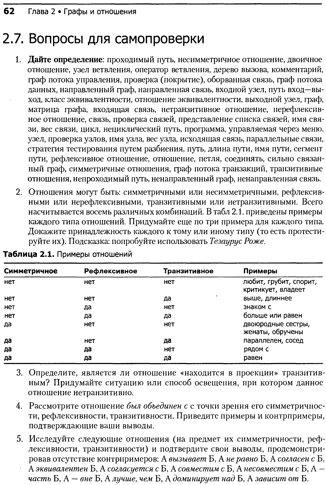

3. Определите, является ли отношение «находится в проекции» транзитивным? Придумайте ситуацию или способ освещения, при котором данное отношение нетранзитивно.
4. Рассмотрите отношение *был объединен* с с точки зрения его симметричности, рефлексивности, транзитивности. Приведите примеры и контрпримеры, подтверждающие ваши выводы.
5. Исследуйте следующие отношения (на предмет их симметричности, рефлексивности, транзитивности) и подтвердите свои выводы, продемонстрировав отсутствие контрпримеров: А *вызывает* Б, А *не равно* Б, А *согласен* с Б, А *эквивалентен* Б, А *согласуется* с Б, А *совместим* с Б, А *несовместим* с Б, А — *часть* Б, А — *вне* Б, А *лучше, чем* Б, А *доминирует над* Б, А *зависит от* Б.


<!-- ВІДНОВЛЕНО ЛОКАЛЬНО (Стор. 63) -->

<!-- КІНЕЦЬ ВІДНОВЛЕННЯ -->


<!-- ВІДНОВЛЕНО ЛОКАЛЬНО (Стор. 64) -->

<!-- КІНЕЦЬ ВІДНОВЛЕННЯ -->


*Составной предикат*. Логическое выражение, включающее два или более предикатов, связанных операторами И, ИЛИ или НЕ. Примеры: (1) «Ваш ребенок НЕ живет с вами И находится на вашем иждивении в соответствии с соглашением, принятым до 1985 года», (2) «(В 1994 году вы получали оклад И/ИЛИ чаевые) И ваш оклад вместе с чаевыми НЕ превысил 60600 $ И вы НЕ получали чаевые, подлежащие налогообложению по программе социального обеспечения или страхования здоровья по старости, о которых вы НЕ сообщали своему работодателю, И вы священнослужитель, получивший разрешение ВНС НЕ платить налоги с заработков из этих источников, И вы платите налоги на индивидуальное предпринимательство с других доходов»$^{1}$.

*Независимые предикаты*. Два или более предикатов в пути модели называются *независимыми*, если их значения истинности (ИСТИНА/ЛОЖЬ) формируются независимо друг от друга.

*Коррелированные предикаты*. Два или более предикатов в пути модели называются коррелированными, если значение истинности для одного из них определяет значения истинности для всех остальных предикатов в этом пути. Пример: путь содержит два одинаковых предиката, и значение истинности для первого из них определяет значение истинности для второго предиката на этом пути.

*Комплементарные сегменты пути*. Два сегмента пути, содержащие такие предикаты, что если в одном сегменте предикат принимает значение ИСТИНА, то в другом предикат получает значение ЛОЖЬ и наоборот.

## 3.3. Отношения и модель

### 3.3.1. Основы

Информация этой главы раскрывается в дополнительных источниках [ALLE72, CLAR76, EBER94, HOWD76, HOWD87, KRAU73, PETE76].

*Объекты (узлы)*. Последовательность шагов обработки, такая, что выполнение любой части этой последовательности ведет за собой выполнение всей последовательности (если нет ошибок).

Пример: Форма 1040. Следующие строки можно моделировать одним узлом, включающим в себя строки с 7 по 14, несколькими узлами, скажем, «7–8a–8b, 9–10–11, 12, 13–14», или даже последовательностью из 9 отдельных узлов, по одному на каждую строку.

7. (введите) wages, salaries, tips (оклады, дополнительные доходы, чаевые).
8a. (введите) taxable interest income (налогооблагаемый доход).
8b. (введите) tax-exempt interest income (не облагаемый налогом доход).
9. (введите) dividend income (доход по дивидендам).
10. (введите) taxable refunds, credits, or offsets of state and local income taxes (налогооблагаемые платежи, кредиты, компенсации местного подоходного налога и подоходного налога в казну штата).

---

$^{1}$ Я не выдумал это сам. Данная спецификация — это путь выполнения в форме SE BHC, 1994. Можете убедиться сами. Подоходный налог 101 — определенно более напряженный курс, нежели программирование 101 или тестирование 101.


<!-- ВІДНОВЛЕНО ЛОКАЛЬНО (Стор. 66) -->

<!-- КІНЕЦЬ ВІДНОВЛЕННЯ -->


занная ниже. Однако, если вы отметили какую-либо графу на строке 33а или b, следуйте инструкциям для определения ваших стандартных льгот. Если вы отметили графу 33с, ваша стандартная льгота равна нулю. (а) холост = $3,800, (b) женат, заполняю совместную налоговую декларацию = $6,350, (c) вдовец = $6,350 (d) женат, заполняем раздельные налоговые декларации = $3,175, (e) глава хозяйства = $5,600. Следующий граф моделирует большую часть этого предложения. Узел 34.5 является узлом выбора.

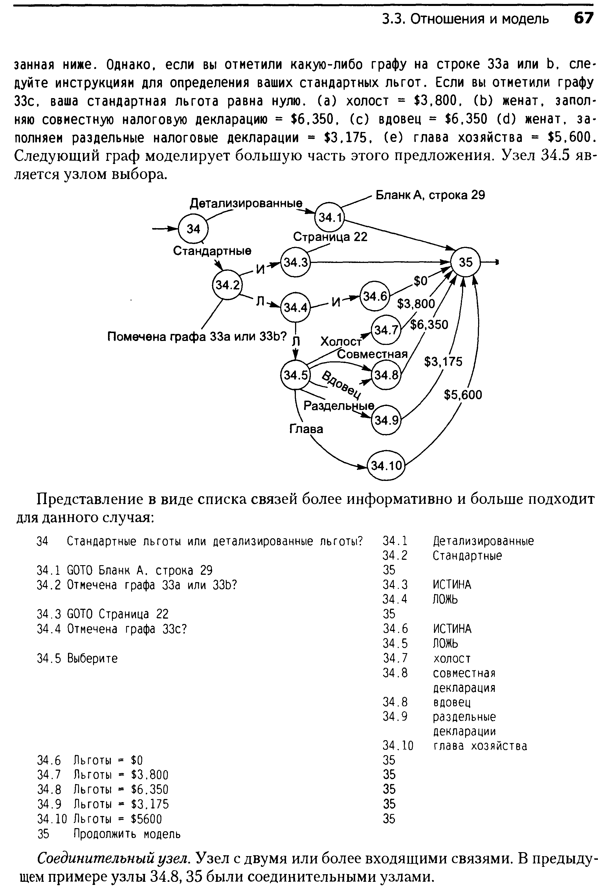

Представление в виде списка связей более информативно и больше подходит для данного случая:

34 Стандартные льготы или детализированные льготы?

34.1 GOTO Бланк А. строка 29
34.2 Отмечена графа 33а или 33b?

34.3 GOTO Страница 22
34.4 Отмечена графа 33с?

34.5 Выберите

34.1 Детализированные
34.2 Стандартные
35
34.3 ИСТИНА
34.4 ЛОЖЬ
35
34.6 ИСТИНА
34.5 ЛОЖЬ
34.7 холост
34.8 совместная
декларация
34.8 вдовец
34.9 раздельные
декларации
34.10 глава хозяйства

34.6 Льготы = $0
34.7 Льготы = $3.800
34.8 Льготы = $6.350
34.9 Льготы = $3.175
34.10 Льготы = $5600
35 Продолжить модель

35
35
35
35
35

*Соединительный узел.* Узел с двумя или более входящими связями. В предыдущем примере узлы 34.8, 35 были соединительными узлами.

Некоторые комментарии, касающиеся данной модели.

1. Узел 34 — узел с предикатом. Обратите внимание на использование здесь союза «или». Это не логическое ИЛИ. Это способ обозначить предикат$^1$.
2. Предикат для узла 34.2 является составным предикатом, и ИЛИ здесь имеет смысл включающего ИЛИ, поскольку можно отметить как одну графу, так и обе одновременно. Формальная запись данного предиката будет следующей: «Вы отметили графу 33a ИЛИ вы отметили графу 33b (или обе)». Этот предикат также представляет интерес из-за использования в нем слова «однако». Ключевым словом в этом случае является не «однако», а следующее за ним «если».

    Вот более подробная модель для этого узла:

    ```text
    34.2  Отмечена графа 33а?  34.3  ИСТИНА
                           34.2.1 ЛОЖЬ
    34.2.1 Отмечена графа 33b? 34.3  ИСТИНА
                           34.4  ЛОЖЬ
    ```

    А вот еще более подробная модель для этого узла:

    ```text
    34.2  Отмечена графа 33а?  34.2.2 ИСТИНА
                           34.2.1 ЛОЖЬ
    34.2.1 Отмечена графа 33b? 34.3  ИСТИНА
                           34.4  ЛОЖЬ
    34.2.2 Отмечена графа 33b? 34.3  ЛОЖЬ
    ```

    Эта модель лучше первоначальной, поскольку она вскрывает сложность составного предиката и мы, скорее всего, обнаружим больше ошибок с ее помощью [MYER79]. Первая улучшенная модель может быть слепа к определенному типу ошибок, так как в ней не хватает критического подхода к предикату в узле 34.2. Вторая модель более сбалансирована, и в ней делается меньше предположений о способе реализации. Поэтому, хотя она и более сложная, она лучше ищет ошибки, и я выбираю ее.

3. Предикат в строке 33с является составным предикатом: «(Вы женаты, заполняете раздельные налоговые декларации И льготы вашей супруги детализированы) ИЛИ вы иностранец с двойным гражданством». Здесь фигурирует включающее ИЛИ, поскольку вы можете быть иностранец с двойным гражданством (что бы это ни значило) и ваша супруга может заполнять налоговую декларацию раздельно и ее льготы могут быть детализированы. Обратите внимание, что если вы не являетесь иностранцем с двойным гражданством, то должны выполняться три условия: (1) вы женаты, (2) вы заполняете налоговые декларации раздельно, (3) льготы вашей супруги детализированы.
4. Один из альтернативных пунктов в узле 34.5 скрыт под союзом «или». Это не логическое ИЛИ. Это способ обозначить параллельные связи и дополни-

---
$^1$ На самом деле это не узел с предикатом, а нечто иное, что будет рассмотрено в главе 6 при изучении тестирования потока транзакций. Это не настоящий предикат, поскольку вы можете выбрать оба альтернативных варианта.

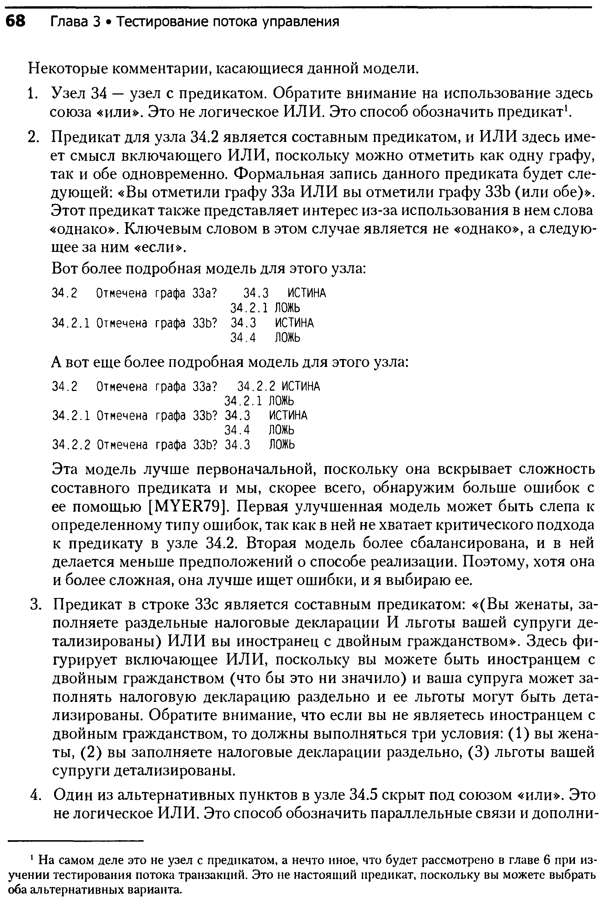

тельные варианты выбора: «заполняю совместную налоговую декларацию» и «вдовец».

5. Узлы 34.1 и 34.3 входят в модель независимо от остальных узлов. Я мог бы включить в модель детали для них, но не стал, так как из узла 34.1 мы перенаправляемся на бланк А, который может быть описан в нескольких других разделах книги. Разумно будет строить эти модели отдельно. По той же причине я буду отдельно моделировать узел 34.3.
6. Узлы 34.1, 34.3, 34.6, 34.7, 34.8, 34.9 и 34.10 в данной модели не существенны. Я мог бы связать обработку этих узлов, со связями, исходящими из узла 34.5 и включить их в веса связей, подобно тому, как приведено ниже.

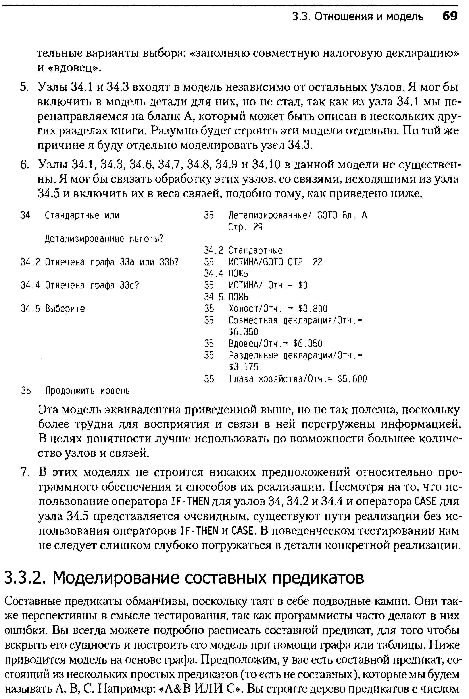

Эта модель эквивалентна приведенной выше, но не так полезна, поскольку более трудна для восприятия и связи в ней перегружены информацией. В целях понятности лучше использовать по возможности большее количество узлов и связей.

7. В этих моделях не строится никаких предположений относительно программного обеспечения и способов их реализации. Несмотря на то, что использование оператора `IF-THEN` для узлов 34, 34.2 и 34.4 и оператора `CASE` для узла 34.5 представляется очевидным, существуют пути реализации без использования операторов `IF-THEN` и `CASE`. В поведенческом тестировании нам не следует слишком глубоко погружаться в детали конкретной реализации.

## 3.3.2. Моделирование составных предикатов

Составные предикаты обманчивы, поскольку таят в себе подводные камни. Они также перспективны в смысле тестирования, так как программисты часто делают в них ошибки. Вы всегда можете подробно расписать составной предикат, для того чтобы вскрыть его сущность и построить его модель при помощи графа или таблицы. Ниже приводится модель на основе графа. Предположим, у вас есть составной предикат, состоящий из нескольких простых предикатов (то есть не составных), которые мы будем называть А, В, С. Например: «A & B ИЛИ C». Вы строите дерево предикатов с числом

ветвей, равным числу возможных вариантов. Для двух предикатов, число ветвей будет равно четырем, для трех предикатов — будет восемь ветвей, для $n$ простых предикатов — $2^n$ ветвей.

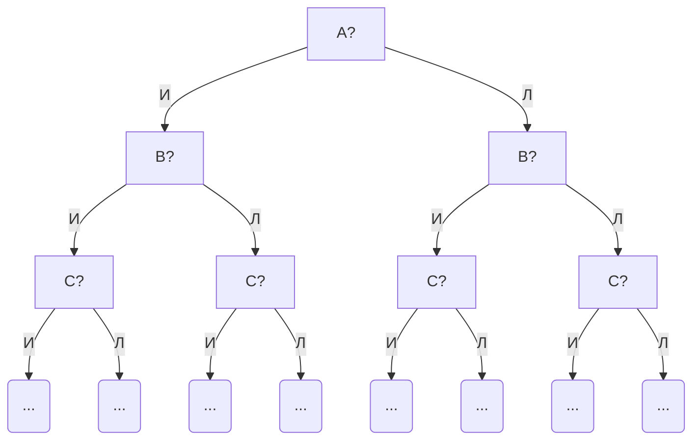
```mermaid
graph TD
    A["A?"] -->|И| B1["B?"]
    A -->|Л| B2["B?"]
    
    B1 -->|И| C1["C?"]
    B1 -->|Л| C2["C?"]
    
    B2 -->|И| C3["C?"]
    B2 -->|Л| C4["C?"]

    C1 -->|И| D1(...)
    C1 -->|Л| D2(...)
    C2 -->|И| D3(...)
    C2 -->|Л| D4(...)
    C3 -->|И| D5(...)
    C3 -->|Л| D6(...)
    C4 -->|И| D7(...)
    C4 -->|Л| D8(...)
```

На рисунке показан первый шаг. Порядок, в котором вы рассматриваете предикаты, здесь не важен. Важно, чтобы все $2^n$ ветвей (в нашем примере восемь) были рассмотрены. Следующий шаг — собрать все исходящие связи для случая ИСТИНА в узел со значением ИСТИНА, а все связи для случая ЛОЖЬ в узел со значением ЛОЖЬ, как показано на следующем рисунке.

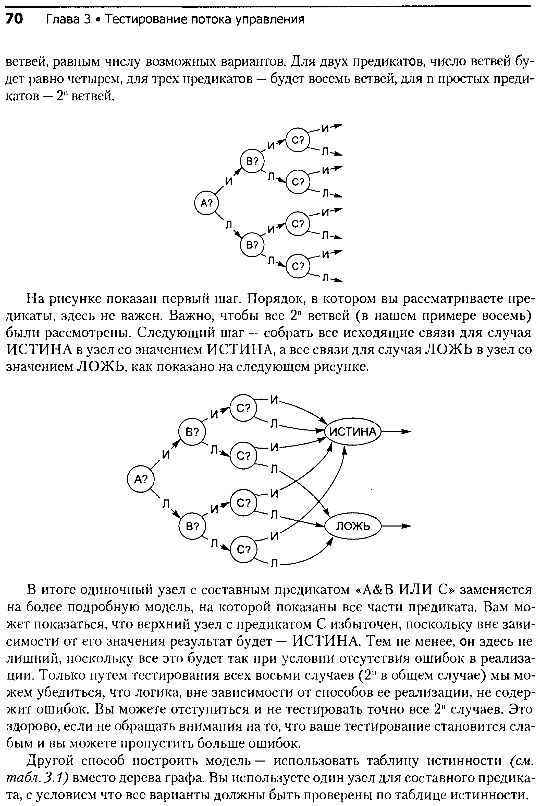

В итоге одиночный узел с составным предикатом «A & B ИЛИ C» заменяется на более подробную модель, на которой показаны все части предиката. Вам может показаться, что верхний узел с предикатом C избыточен, поскольку вне зависимости от его значения результат будет — ИСТИНА. Тем не менее, он здесь не лишний, поскольку все это будет так при условии отсутствия ошибок в реализации. Только путем тестирования всех восьми случаев ($2^n$ в общем случае) мы можем убедиться, что логика, вне зависимости от способов ее реализации, не содержит ошибок. Вы можете отступиться и не тестировать точно все $2^n$ случаев. Это здорово, если не обращать внимания на то, что ваше тестирование становится слабым и вы можете пропустить больше ошибок.

Другой способ построить модель — использовать таблицу истинности (см. *табл. 3.1*) вместо дерева графа. Вы используете один узел для составного предиката, с условием что все варианты должны быть проверены по таблице истинности.

**Таблица 3.1.** Таблица истинности

| A | B | C | A&B ИЛИ C |
| :--- | :--- | :--- | :--- |
| ИСТИНА | ИСТИНА | ИСТИНА | ИСТИНА |
| ИСТИНА | ИСТИНА | ЛОЖЬ | ИСТИНА |
| ИСТИНА | ЛОЖЬ | ИСТИНА | ИСТИНА |
| ИСТИНА | ЛОЖЬ | ЛОЖЬ | ЛОЖЬ |
| ЛОЖЬ | ИСТИНА | ИСТИНА | ИСТИНА |
| ЛОЖЬ | ИСТИНА | ЛОЖЬ | ЛОЖЬ |
| ЛОЖЬ | ЛОЖЬ | ИСТИНА | ИСТИНА |
| ЛОЖЬ | ЛОЖЬ | ЛОЖЬ | ЛОЖЬ |

Напоминаю, что в *таблицу истинности* записываются состояния простых предикатов, и просчитывается, какое из значений ЛОЖЬ или ИСТИНА будет иметь составной предикат для данной комбинации. Я использую таблицы для проверки составных предикатов, состоящих более чем из трех простых предикатов. Добавление в граф четырех узлов для составного предиката, состоящего из двух элементов, не создаст в модели слишком большой путаницы. Однако уже трехкомпонентный предикат сильно загрузит модель, а добавление четырехкомпонентного фактически нереально. Помните, что вы не можете не принимать в расчет возможность существования ошибок в вашей модели.

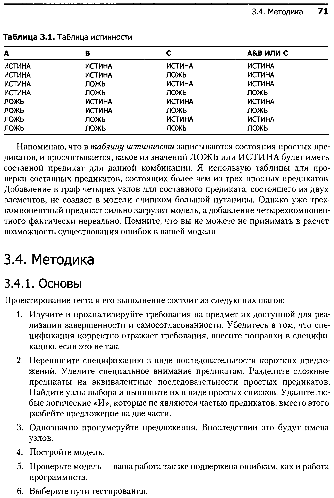

## 3.4. Методика

### 3.4.1. Основы

Проектирование теста и его выполнение состоит из следующих шагов:

1. Изучите и проанализируйте требования на предмет их доступной для реализации завершенности и самосогласованности. Убедитесь в том, что спецификация корректно отражает требования, внесите поправки в спецификацию, если это не так.
2. Перепишите спецификацию в виде последовательности коротких предложений. Уделите специальное внимание предикатам. Разделите сложные предикаты на эквивалентные последовательности простых предикатов. Найдите узлы выбора и выпишите их в виде простых списков. Удалите любые логические «И», которые не являются частью предикатов, вместо этого разбейте предложение на две части.
3. Однозначно пронумеруйте предложения. Впоследствии это будут имена узлов.
4. Постройте модель.
5. Проверьте модель — ваша работа так же подвержена ошибкам, как и работа программиста.
6. Выберите пути тестирования.

7. Активизируйте выбранные пути тестирования. То есть выберите такие входные значения, используя которые программа, при условии отсутствия ошибок, пройдет по пути, эквивалентному тому, который вы выбрали.
8. Предскажите и запишите вероятный итог каждого теста.
9. Определите критерии (критерии) соответствия для каждого теста.
10. Выполните тест.
11. Подтвердите итог.
12. Подтвердите путь.

## 3.4.2. Построение модели

Как пример для иллюстрации процесса мы будем использовать строчки с 32 по 40 формы 1040 ВНС. Исходная спецификация приведена в Приложении А. Проще всего мне будет это объяснить путем последовательного построения конкретной модели, комментируя процесс по мере ее развития. Мои комментарии выделены курсивом.

*Шаг 1: Проверить и обосновать требования.* Вряд ли, что-то можно сделать, поскольку мы рассчитываем, что ВНС делает это за нас.

*Шаг 2: Переписать спецификацию.* Что касается меня, я переписываю спецификацию, используя мой собственный тип псевдокода. Использование полуформального языка (то есть псевдокода) помогает быть уверенным в однозначности при описании вещей. Хотя это похоже на программирование, это не программирование — это моделирование.

Я использую представление в виде списка, так как это легче; хотя, когда я работал, я рисовал маленькие графы для того, чтобы убедиться в корректности потоков данных для различных предикатов. Я включил мои некоторые наброски, чтобы помочь вам увидеть, как я мыслил. Несмотря на то, что построение и использование целого графа в виде рисунка чересчур громоздко, эти промежуточные наброски сегментов маленького графа помогут вам получить правильное представление о логике.

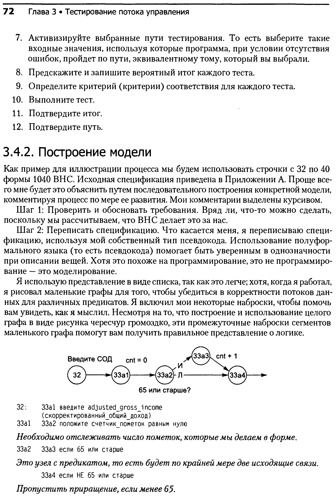

```
32:     33а1 введите adjusted_gross_income
        (скорректированный_общий_доход)
33а1    33а2 положите счетчик_пометок равным нулю
```

*Необходимо отслеживать число пометок, которые мы делаем в форме.*

```
33а2    33а3 если 65 или старше
```

*Это узел с предикатом, то есть будет по крайней мере две исходящие связи.*

```
        33а4 если НЕ 65 или старше
```

*Пропустить приращение, если менее 65.*

3a3 3a4 приращение счетчика_пометок

*Позднее нам будет необходимо знать общее число пометок, а этот способ моделирования не хуже любого другого.*

3a4 3a5 если слеп

*Другой узел с предикатом.*

3a6 если не слеп

*Пропустить приращение, если НЕ слеп.*

3a5 3a6 приращение счетчика_пометок

*Увеличение числа пометок, если слеп.*

3a6 3a7если супругу 65 или он старше

*Заметим, что в действительности логика здесь намного сложнее. Если бы наша модель была для всей формы 1040, то нам следовало бы учитывать корреляцию со строчками 1–5, принимая во внимание способ заполнения декларации. Только обладающие статусом (2) Женат или статусом (5) Вдова (вдовец) могли бы делать отметки в этой и следующей графе. В реальной модели вы бы предварили этот и следующий узел с предикатом другим узлом с предикатом, который спрашивает: «Женат и заполняет совместную налоговую декларацию ИЛИ вдовец с детьми на иждивении?» Если предикат является ИСТИНОЙ, вы выполняете узлы с 3a6 по 3a9, иначе вы переходите к узлу 3a10. Однако для того чтобы сохранить приемлемый размер этой модели, мы не будем гнаться за реалистичностью и допустим, что этот сегмент не зависит ни от каких предыдущих сегментов и логики. Графическая реализация этой части модели приведена на рисунке.*

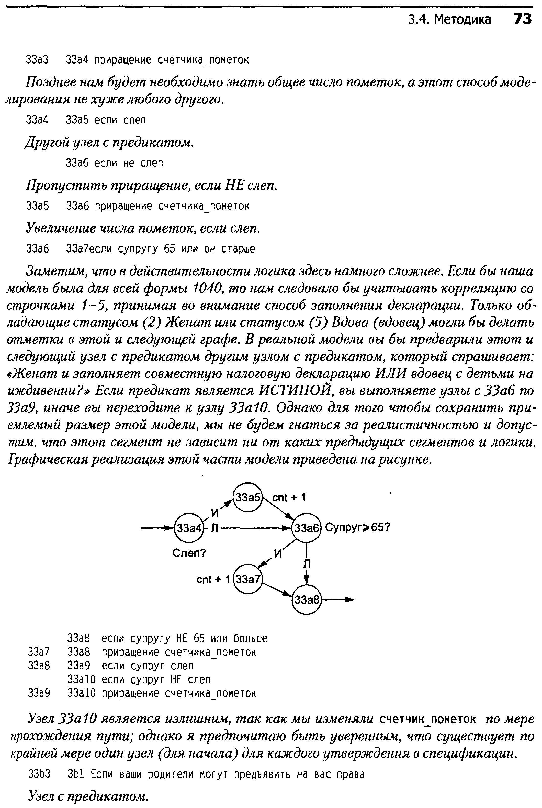

3a8 если супругу НЕ 65 или больше
3a7 3a8 приращение счетчика_пометок
3a8 3a9 если супруг слеп
3a10 если супруг НЕ слеп
3a9 3a10 приращение счетчика_пометок

*Узел 3a10 является излишним, так как мы изменяли счетчик_пометок по мере прохождения пути; однако я предпочитаю быть уверенным, что существует по крайней мере один узел (для начала) для каждого утверждения в спецификации.*

3b3 3b1 Если ваши родители могут предъявить на вас права

*Узел с предикатом.*

33c | Ваши родители не могут предъявить на вас права
33b1 | 33c | Пометьте графу 33b
33c3 | 33c1 | Женат, заполняю отдельную декларацию

*Составной предикат. Если бы вы посмотрели инструкции ВНС, вы бы нашли еще больше логики в модели. Для того чтобы оставаться в разумных границах, мы проигнорируем инструкцию следовать инструкциям, но в реальных задачах у вас нет такого выбора. Для того чтобы не было скрытой сложности, я разбил предикат на составные части. Моя модель для этого раздела приведена на рис. 3.8. Возможны также и другие, эквивалентные модели.*

*Я тут кое-что упустил. Первое раз, когда я это делал, я забыл о возможности женатому человеку подать заявку отдельно от супруга, льготы которого не детализированы, учитывая, что я иностранец с двойным гражданством. Поэтому мне пришлось вернуться назад и добавить предикатный узел в 33c4. Здесь мне вновь помогли схемы. Эта часть модели показана на следующем рисунке.*

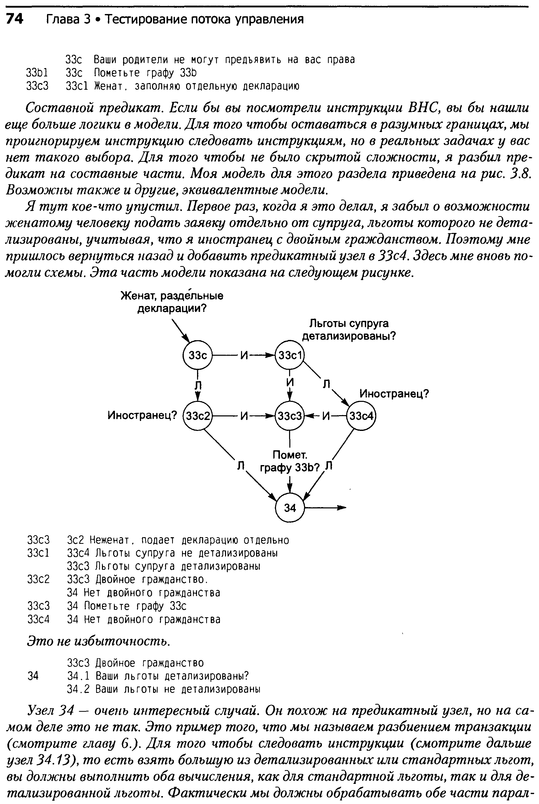

33c3 | 3c2 Неженат, подает декларацию отдельно
33c1 | 33c4 Льготы супруга не детализированы
33c3 Льготы супруга детализированы
33c2 | 33c3 Двойное гражданство.
34 Нет двойного гражданства
33c3 | 34 Пометьте графу 33c
33c4 | 34 Нет двойного гражданства

*Это не избыточность.*

34 | 33c3 Двойное гражданство
34.1 Ваши льготы детализированы?
34.2 Ваши льготы не детализированы

*Узел 34 — очень интересный случай. Он похож на предикатный узел, но на самом деле это не так. Это пример того, что мы называем разбиением транзакции (смотрите главу 6.). Для того чтобы следовать инструкции (смотрите дальше узел 34.13), то есть взять большую из детализированных или стандартных льгот, вы должны выполнить оба вычисления, как для стандартной льготы, так и для детализированной льготы. Фактически мы должны обрабатывать обе части парал-*

тельно, иначе нечего будет сравнивать в узле 34.13. Вы наверняка это делаете при заполнении своей налоговой декларации.

34.1 &nbsp;&nbsp;&nbsp;&nbsp; 34.12 Используйте бланк А, строку 26

Здесь кроется еще одна целая модель.

34.2 &nbsp;&nbsp;&nbsp;&nbsp; 34.3 НЕ пометили графу 33а
&nbsp;&nbsp;&nbsp;&nbsp;&nbsp;&nbsp;&nbsp;&nbsp;&nbsp;&nbsp;&nbsp;&nbsp; 34.4 Пометили графу 33а
34.3 &nbsp;&nbsp;&nbsp;&nbsp; 34.4 Пометили графу 33b
&nbsp;&nbsp;&nbsp;&nbsp;&nbsp;&nbsp;&nbsp;&nbsp;&nbsp;&nbsp;&nbsp;&nbsp; 34.5 НЕ пометили графу 33b

*Подождите минутку! А что насчет человека, которому 65 лет или больше, И/ИЛИ который слеп И который находится на иждивении у своих родителей или у кого-нибудь еще. Покрывает ли модель этот случай?*

34.4 &nbsp;&nbsp;&nbsp;&nbsp; 34.12 Стандартные льготы по инструкции
34.5 &nbsp;&nbsp;&nbsp;&nbsp; 34.6 Помечена ли графа 33с?
&nbsp;&nbsp;&nbsp;&nbsp;&nbsp;&nbsp;&nbsp;&nbsp;&nbsp;&nbsp;&nbsp;&nbsp; 34.7 Графа 33с не помечена
34.6 &nbsp;&nbsp;&nbsp;&nbsp; 34.12 Стандартная льгота = 0
34.7 &nbsp;&nbsp;&nbsp;&nbsp; 34.8 Холост

*Предикат выбора.*

&nbsp;&nbsp;&nbsp;&nbsp;&nbsp;&nbsp;&nbsp;&nbsp;&nbsp;&nbsp;&nbsp;&nbsp; 34.9 Глава хозяйства
&nbsp;&nbsp;&nbsp;&nbsp;&nbsp;&nbsp;&nbsp;&nbsp;&nbsp;&nbsp;&nbsp;&nbsp; 34.10 Женат, заполняем совместную налоговую декларацию
&nbsp;&nbsp;&nbsp;&nbsp;&nbsp;&nbsp;&nbsp;&nbsp;&nbsp;&nbsp;&nbsp;&nbsp; 34.11 Женат, заполняю отдельную налоговую декларацию
34.8 &nbsp;&nbsp;&nbsp;&nbsp; 34.12 Стандартная льгота = $3.800
34.9 &nbsp;&nbsp;&nbsp;&nbsp; 34.12 Стандартная льгота = $5.600
34.10 &nbsp;&nbsp; 34.12 Стандартная льгота = $6.350
34.11 &nbsp;&nbsp; 34.12 Стандартная льгота = $3.175

*Эта модель тоже может быть выражена при помощи графа на следующем рисунке.*

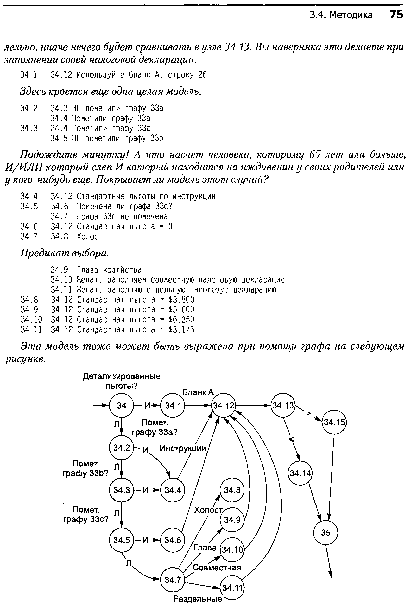

34.12 34.13 Пустой узел для большей ясности
34.13 34.14 Стандартные льготы больше детализированных льгот?
34.15 Стандартные льготы НЕ больше детализированных льгот?
34.14 35 Использовать стандартный список
34.15 35 Использовать детализированный список
35 36 Вычесть строку 34 из строки 32
36 36.1 Строка $32 \leqslant 83.850$
36.2 Строка $32 > 83.850$
36.1 37 \$2.450 exemptions (освобождения)
36.2 37 Согласно инструкции
37 38 Max(0, строка_35 - строка 36)

*Обозначает еще один предикат, но скрывает сегмент пути. Давайте делать правильно.*

37 37.1 Строка_35 - строка_36
37.1 38 Больше нуля
37.2 Меньше или равен нулю
37.2 38 Введите ноль в строке 37
38 38.1 tax table (таблица налогов)

*Выглядит привлекательно. На первый взгляд это выглядит так, как будто есть пять взаимоисключающих возможностей: (a) таблица налогов, (b) налоговая тарифная сетка, (c) бланк D, (d) форма 8615 или (e) форма 8814. Однако, изучая формы 8615 и 8814, я замечаю, что они могли бы представлять собой две дополнительные позиции для каждой из первых трех опций. Я пытался получить объяснения в ВПС, но не получил. Я позвонил моему бухгалтеру, и он спросил, будет ли это «специальной консультацией», но я ответил: «Не беспокойся, Чарли». Такого рода исследования вы можете проводить при создании практической модели, но в этом примере я буду рассматривать пять различных вариантов.*

38 38.2 tax rate schedule (налоговая тарифная сетка)
38.3 Бланк C
38.4 Форма 8615
38.5 Форма(ы) 8814

*Заметим, что может быть несколько форм 8814, но мы не говорим о том, чтобы суммировать эти формы. Такие особенности должны быть исследованы. Здесь нам следует взять вместе все формы 8814, так как они должны быть заполнены на каждого ребенка, чей интерес и дивиденды вы представляете при заполнении налоговой декларации.*

38.1 39 налог в соответствии с tax table (таблицей налогов)
38.2 39 налог в соответствии с tax rate schedule (налоговой тарифной сеткой)
38.3 39 налог в соответствии с бланком C
38.4 39 налоги в соответствии с формой 8615
38.5 39 налоги в соответствии с формой (формами) 8814
39 39.1 дополнительные налоги в соответствии с формой 4970
39.2 НЕТ дополнительных налогов по форме 4970
39.1 39.3 заполните налоговую форму 4970
39.2 39.3 поставьте ноль для дополнительных налогов в строке 39
39.3 39.4 дополнительные налоги по форме 4972
39.5 НЕТ дополнительных налогов по форме 4972
39.4 40 Добавьте налоги из формы 4972 в строку 39

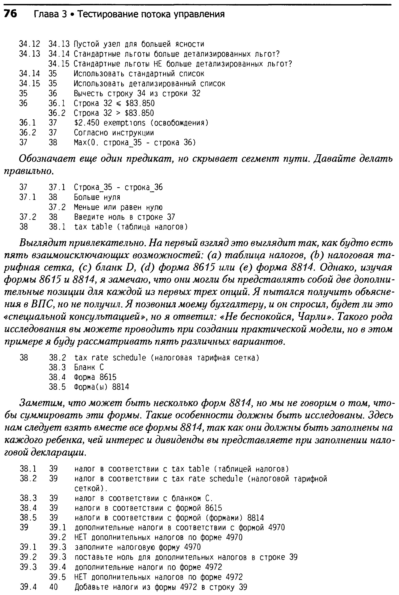

*Я смоделировал это именно таким образом, так как из налоговых форм мне показалось, что можно облагать налогом по форме 4970 или 4972 или сразу по обеим. Такие вещи не очевидны, и вы должны их исследовать.*

```text
39.5  40   Ничего не делайте
40    41   Добавьте строки 39 и 40
```

Ужасно? Построение такой модели с простой на вид спецификацией стоило многих усилий. Это заняло у меня пять часов, включая время, затраченное на рисование презентабельных фрагментов графа и пояснительные комментарии, которые я бы и не делал, если бы я создавал настоящий план тестирования. Но все эти комментарии и внутренние монологи — это неплохая идея. Кто-нибудь (вроде вас), может быть, поблагодарит за это.

Исходя из опыта и практики, на построение данной модели должно затрачиваться максимум два-три часа. При большем объеме исследования это, вероятно, займет больше времени. Заметим, что мои графические модели по ходу дела становились проще. В последней модели, например, детализирован только поток управления. Это сделано преднамеренно. Вы используете графические формы для того, чтобы быть уверенным в правильности логики, однако вам также необходимо документировать детали содержания в виде списка.

По ходу дела я менял обозначения. Граф, который мы рассматривали в пункте 3.1, имеет формат `имя_узла/действие/значение предиката`, тогда как последний формат это `имя_узла/имя_узла/действие или значение предиката/комментарии`. Опираясь на последние обозначения, связи легко отметить и контролировать, но более ранние обозначения ближе к первоначальной форме изложения. При этом не имеет значения, какой формат вы используете. Выберите что-то одно, что имеет все необходимые данные и чего вы можете придерживаться.

Другая причина состоит в том, что это не программирование. Я не пытался использовать структурированное мышление, при этом мои модели полны `GOTO` и подобных ему вещей. В настоящее время при реализации явной логики обычно ограничиваются строго структурированными конструкциями. Я здесь предпочитаю `GOTO` и другие бесструктурные вещи, так как при этом не надо далеко отходить от естественного языка спецификации. Большинство естественно-языковых спецификаций бесструктурно. Если вы слишком отдаляетесь от первоначальной формулировки для принудительного использования, скажем, вложенного дерева `IF-THEN-ELSE`, то увеличивается вероятность ошибки моделирования, которая, в свою очередь, приводит к тестовым ошибкам или необнаруженным ошибкам программы.

## 3.4.3. Выбор путей тестирования

### 3.4.3.1 Основы

Вы ничего не выиграете, уменьшая количество тестов. Лучше использовать простые, очевидные тесты, чем выполнять работу с меньшим количеством громоздких тестов. Предыдущий пример можно, вероятно, сжать до 10 тестов, но нам следует использовать большее их число, если при этом тестирование проходит максимально чисто и больше согласовано с требованиями.

Очень часто выбор путей тестирования и их активизацию выполняют одновременно, так как корреляция предикатов может воспрепятствовать проходу программы по произвольно выбранным путям. Хотя это и хорошо на практике, дидактически это неправильно, поэтому мы сначала выберем пути тестирования, а затем, в следующем разделе, будем их активизировать.

Мы создаем путь, добавляя сегмент за сегментом, начиная с входного узла и продолжая до выходного узла. Мы выбираем наши сегменты, начиная с точек, где потоки управления расходятся из одиночного узла, и продолжаем до тех пор, пока потоки управления опять не сойдутся в один узел. Примеры: 32–33a4, 33a4–33a6, 33c–34. Поступая таким образом, мы строим путь, комбинируя ранее выбранные сегменты. Понятно, что комбинировать сегменты пути можно только в таких, одноузловых точках схождения. В каждом предикате мы выполняем ветвление, выбирая возможные значения (например, значения ИСТИНА/ЛОЖЬ), тем самым расцепляя пути, построенные до этой точки.

В узлах 32 или 33a1 нет выбора; все наши тесты должны начинаться с узлов 32, 33a1.

Первым предикатом является узел 33a2. Ветвление здесь соответствует выбору из значений ИСТИНА или ЛОЖЬ, приводя к следующим двум семействам тестов:

A1: 32. 33a1. 33a2(И). 33a3. 33a4  
A2: 32. 33a1. 33a2(Л). 33a4  

Следующий предикатор — это узел 33a4 *(слеп?)*. Он, очевидно, является независимым от предыдущего предиката 33a2 *(65 лет или старше?)*. Поэтому, хотя пути снова расцепляются, нет необходимости добавлять это в тесты. Для определенности зафиксируем значение предиката ИСТИНА в пути А1, а значение ЛОЖЬ — в пути А2.

A1: 32. 33a1. 33a2(И). 33a3. 33a4(И). 33a5. 33a6  
A2: 32. 33a1. 33a2(Л). 33a4(Л). 33a6  

В узле 33a6 мы спрашиваем, исполнилось ли супругу 65 лет, а в 33a8 мы спрашиваем, слеп ли ваш супруг. Рассматривая эти первые четыре предиката, вы можете увидеть, что они в итоге обеспечивают 16 возможных путей прохода через этот сегмент спецификации. Мы, конечно, можем подготовить в этой точке 16 тестов, проверяющих все 16 комбинаций значений этих четырех предикатов, но это был бы плохой выбор. Тем самым мы бы пытались тестировать маловероятные ошибки. Для проверки связи от узла 32 до узла 33b требуются только два сегмента пути. Какие из них нам следует взять? Любой из двух комплементарных путей подойдет. Пути на отрезке от 32 к 33b могут привести к значениям счетчика_пометок от нуля до четырех. Из опыта мы знаем, что программисты склонны вводить путаницу с граничными значениями (нулем или четырьмя), поэтому мы должны выделить эти варианты, следовательно, эту логику желательно проверить с помощью тестов, в которых оба — и человек, заполняющий форму, и супруг — слепы и старше 65 лет.

A1: 32. 33a1. 33a2(И). 33a3. 33a4(И). 33a5. 33a6(И). 33a7. 33a8(И). 33a9. 33a10. 33b  
A2: 32. 33a1. 33a2(Л). 33a4(Л). 33a6(Л). 33a8(Л). 33a10. 33b

Следующий предикат — это узел $33b$. Вначале я допустил ошибку и в результате получил проблемы с активизацией. Я не забегаю вперед, чтобы увидеть, может ли этот предикат заблокировать дальнейшие пути, завершаемые в сегменте $34-35$. Вот два варианта для этого сегмента: B1: $33b(\text{И}), 33b1, 33c$ и B2: $33b(\text{Л}), 33c$.

Я не знаю, какие комбинации блокируются позже, поэтому в этой точке создаю четыре варианта, комбинируя наборы А и В. Позднее мы исключим тесты, которые не выполняются. Получаем следующее семейство тестов.

```text
B1A1: 32. 33a1. 33a2(И). 33a3. 33a4(И). 33a5. 33a6(И). 33a7. 33a8(И). 33a9.
      33a10. 33b(И). 33b1. 33c
B2A1: 32. 33a1. 33a2(И). 33a3. 33a4(И). 33a5. 33a6(И). 33a7. 33a8(И). 33a9.
      33a10. 33b(Л). 33c
B1A2: 32. 33a1. 33a2(Л). 33a4(Л). 33a6(Л). 33a8(Л). 33a10. 33b(И). 33b1.
      33c
B2A2: 32. 33a1. 33a2(Л). 33a4(Л). 33a6(Л). 33a8(Л). 33a10. 33b(Л). 33c
```

Следующий сегмент — это $33c-34$. Существует пять возможных путей через этот сегмент, и все пять необходимы для покрытия связей. Пять сегментов:

```text
C1: 33c(Л). 33c2(И). 33c3. 34
C2: 33c(И). 33c1(И). 33c3. 34
C3: 33c(И). 33c1(Л). 33c4(И). 33c3. 34
C4: 33c(Л). 33c2(Л). 34
C5: 33c(И). 33c1(Л). 33c4(Л). 34
```

Здесь целесообразна быстрая проверка. Я просмотрел четыре предиката ($33c$, $33c1$, $33c2$ и $33c4$) в предыдущем списке, чтобы быть уверенным, что каждый предикат принимает оба значения (ИСТИНА и ЛОЖЬ) в каком-нибудь сегменте теста.

```text
C1B1A1: 32. 33a1. 33a2(И). 33a3. 33a4(И). 33a5. 33a6(И). 33a7. 33a8(И).
        33a9. 33a10. 33b(И). 33b1. 33c(Л). 33c2(И). 33c3. 34
C2B1A1: 32. 33a1. 33a2(И). 33a3. 33a4(И). 33a5. 33a6(И). 33a7. 33a8(И).
        33a9. 33a10. 33b(И). 33b1. 33c(И). 33c1(И). 33c3. 34
C3B1A1: 32. 33a1. 33a2(И). 33a3. 33a4(И). 33a5. 33a6(И). 33a7. 33a8(И).
        33a9. 33a10. 33b(И). 33b1. 33c(И). 33c1(Л). 33c4(И). 33c3. 34
C4B1A1: 32. 33a1. 33a2(И). 33a3. 33a4(И). 33a5. 33a6(И). 33a7. 33a8(И).
        33a9. 33a10. 33b(И). 33b1. 33c(Л). 33c2(Л). 34
C5B1A1: 32. 33a1. 33a2(И). 33a3. 33a4(И). 33a5. 33a6(И). 33a7. 33a8(И).
        33a9. 33a10. 33b(И). 33b1. 33c(И). 33c1(Л). 33c4(Л). 34
C1B2A1: 32. 33a1. 33a2(И). 33a3. 33a4(И). 33a5. 33a6(И). 33a7. 33a8(И).
        33a9. 33a10. 33b(Л). 3c(Л). 33c2(И). 33c3. 34
C2B2A1: 32. 33a1. 33a2(И). 33a3. 33a4(И). 33a5. 33a6(И). 33a7. 33a8(И).
        33a9. 33a10. 33b(Л). 33c(И). 33c1(И). 33c3. 34
C3B2A1: 32. 33a1. 33a2(И). 33a3. 33a4(И). 33a5. 33a6(И). 33a7. 33a8(И).
        33a9. 33a10. 33b(Л). 33c(И). 33c1(Л). 33c4(И). 33c3. 34
C4B2A1: 32. 33a1. 33a2(И). 33a3. 33a4(И). 33a5. 33a6(И). 33a7. 33a8(И).
        33a9. 33a10. 33b(Л). 33c(Л). 33c2(Л). 34
C5B2A1: 32. 33a1. 33a2(И). 33a3. 33a4(И). 33a5. 33a6(И). 33a7. 33a8(И).
        33a9. 33a10. 33b(Л). 33c(И). 33c1(Л). 33c4(Л). 34
C1B1A2: 32. 33a1. 33a2(Л). 33a4(Л). 33a6(Л). 33a8(Л). 33a10. 33b(И). 33b1.
        33c(Л). 33c2(И). 33c3. 34
C2B1A2: 32. 33a1. 33a2(Л). 33a4(Л). 33a6(Л). 33a8(Л). 33a10. 33b(И). 33b1.
        33c(И). 33c1(И). 33c3. 34
C3B1A2: 32. 33a1. 33a2(Л). 33a4(Л). 33a6(Л). 33a8(Л). 33a10. 33b(И). 33b1.
        33c(И). 33c1(Л). 33c4(И). 33c3. 34
C4B1A2: 32. 33a1. 33a2(Л). 33a4(Л). 33a6(Л). 33a8(Л). 33a10. 33b(И). 33b1.
```

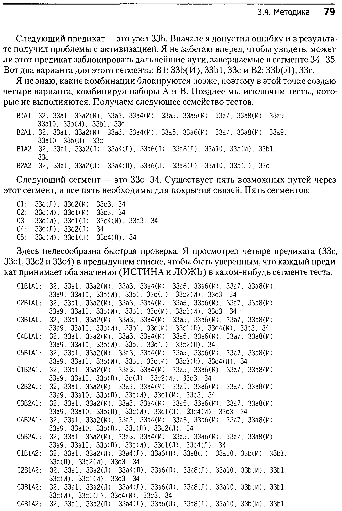

```text
C5B1A2: 33с(Л). 33с2(Л). 34
        32. 33а1. 33а2(Л). 33а4(Л). 33а6(Л). 33а8(Л). 33а10. 33б(И). 33b1.
        33с(И). 33с1(Л). 33с4(Л). 34
C1B2A2: 32. 33а1. 33а2(Л). 33а4(Л). 33а6(Л). 33а8(Л). 33а10. 33б(Л).
        33с(Л). 33с2(И). 33с3. 34
C2B2A2: 32. 33а1. 33а2(Л). 33а4(Л). 33а6(Л). 33а8(Л). 33а10. 33б(Л).
        33с(И). 33с1(И). 33с3. 34
C3B2A2: 32. 33а1. 33а2(Л). 33а4(Л). 33а6(Л). 33а8(Л). 33а10. 33б(Л).
        33с(И). 33с1(И). 33с4(И). 33с3. 34
C4B2A2: 32. 33а1. 33а2(Л). 33а4(Л). 33а6(Л). 33а8(Л). 33а10. 33б(Л).
        33с(Л). 33с2(Л). 34
C5B2A2: 32. 33а1. 33а2(Л). 33а4(Л). 33а6(Л). 33а8(Л). 33а10. 33б(Л).
        33с(И). 33с1(Л). 33с4(Л). 34
```

Небольшая подсказка. Используйте особенности вашего текстового редактора для предотвращения ошибок. Для начала я скопировал сегменты с C1 по C5, а затем я использовал копирование и вставку для вставки предыдущих сегментов (B1A2–B2A2), перед C1–C5. Так как узел 33с не был включен в копируемый блок, мне не пришлось удалять его копии. Такой способ является простым и более надежным.

Ниже приведены восемь возможных сегментов пути от узла 34 до узла 34.12.

```text
D1: 34(И). 34.1. 34.12
D2: 34(Л). 34.2(И). 34.4. 34.12
D3: 34(Л). 34.2(Л). 34.3(И). 34.4. 34.12
D4: 34(Л). 34.2(Л). 34.3(Л). 34.5(И). 34.6. 34.12
D5: 34(Л). 34.2(Л). 34.3(Л). 34.5(Л). 34.7(ХОЛОСТ). 34.8. 34.12
D6: 34(Л). 34.2(Л). 34.3(Л). 34.5(Л). 34.7(ГЛАВА). 34.9. 34.12
D7: 34(Л). 34.2(Л). 34.3(Л). 34.5(Л). 34.7(СОВМЕСТНО). 34.10. 34.12
D8: 34(Л). 34.2(Л). 34.3(Л). 34.5(Л). 34.7(РАЗДЕЛЬНО). 34.11. 34.12
```

Если мы продолжим комбинирование, то у нас получится 20 вариантов, скомбинированных с восемью вариантами. То есть всего 160 вариантов для рассмотрения. Поэтому стоит исключить некоторые варианты по ходу рассмотрения. Это еще одна причина, почему активизация и выбор пути обычно выполняются вместе.

Мы исключаем пути посредством удаления комбинаций, которые не могут быть выполнены, так как предикаты блокируют друг друга. Я создал таблицу из 20 строк и 8 столбцов (табл. 3.2). Заголовками строк были сегменты с C1B1A1 по C5B2A2, а заголовками столбцов — сегменты от D1 до D8.

1а. Значение ЛОЖЬ в узле 34.5 означает, что графа 33с не была помечена, поэтому путь не может пройти через узел 33с3, соответствующий помеченной графе. Я использовал текстовый редактор, чтобы найти те сегменты, которые содержат в себе узел 33с3. Это оказались C1, C2 и C3. Их нельзя скомбинировать с D5–D8, так как в этих вариантах должна быть помечена графа 33с3. Поэтому следует вычеркнуть их из таблицы.

1b. Напротив, значение ИСТИНА в узле 34.5 означает, что графа 33с была помечена, поэтому путь проходил через узел 33с3. Следовательно, D4 не комбинируется с C4 и C5.

2а. Если графа 33b помечена, логика не позволяет выбрать в узле 34.3 исходящую ветвь, соответствующую значению ЛОЖЬ. Следовательно, если выполняется узел 33b1, сегменты D4–D8 выполняться не могут. Используя

поиск по узлу $33_b1$ (где проверяется пометка графы $33_b$), мы видим, что любой сегмент, включающий вариант B1, не может быть скомбинирован с сегментами D4–D8.

2b. И наоборот, если графа $33_b$ не помечена (вариант B2), логика не позволяет выбрать в узле 34.3 исходящую ветвь, соответствующую значению ИСТИНА, и вариант D3 не может объединяться с любыми путями, которые включают $33_b$(Л). Это пути, содержащие в себе B2. Поэтому любые сегменты с B2 не комбинируются с D3.

3a. Если графа $33_a$ помечена, тогда сегменты D3–D8 можно удалить. Графа $33_a$ помечается в узлах $33_a3$, $33_a5$, $33_a7$ и $33_a9$. Проводя заново поиск наших сегментов, мы видим, что это любые сегменты, содержащие A1. Поэтому A1 не комбинируется с D3–D8.

**Таблица 3.2.** Определение графа состояний

| СЕГМЕНТ | D1 | D2 | D3 | D4 | D5 | D6 | D7 | D8 |
| :--- | :---: | :---: | :---: | :---: | :---: | :---: | :---: | :---: |
| C1B1A1 | XXXX | XXXX | XXXX | XXXX | XXXX | XXXX | | |
| C2B1A1 | | XXXX | XXXX | XXXX | XXXX | XXXX | XXXX | XXXX |
| C3B1A1 | XXXX | | XXXX | XXXX | XXXX | XXXX | XXXX | XXXX |
| C4B1A1 | | | XXXX | XXXX | XXXX | XXXX | XXXX | XXXX |
| C5B1A1 | XXXX | | XXXX | XXXX | XXXX | XXXX | XXXX | XXXX |
| C1B2A1 | | | XXXX | XXXX | XXXX | XXXX | XXXX | XXXX |
| C2B2A1 | | XXXX | XXXX | XXXX | XXXX | XXXX | XXXX | XXXX |
| C3B2A1 | XXXX | | XXXX | XXXX | XXXX | XXXX | XXXX | XXXX |
| C4B2A1 | | | XXXX | XXXX | XXXX | XXXX | XXXX | XXXX |
| C5B2A1 | XXXX | | XXXX | XXXX | XXXX | XXXX | XXXX | XXXX |
| C1B1A2 | | XXXX | | XXXX | XXXX | XXXX | XXXX | XXXX |
| C2B1A2 | | XXXX | | XXXX | XXXX | XXXX | XXXX | XXXX |
| C3B1A2 | XXXX | XXXX | | XXXX | XXXX | XXXX | XXXX | XXXX |
| C4B1A2 | | XXXX | | XXXX | XXXX | XXXX | XXXX | XXXX |
| C5B1A2 | XXXX | XXXX | | XXXX | XXXX | XXXX | XXXX | XXXX |
| C1B2A2 | | XXXX | XXXX | | XXXX | XXXX | XXXX | XXXX |
| C2B2A2 | | XXXX | XXXX | | XXXX | XXXX | XXXX | XXXX |
| C3B2A2 | XXXX | XXXX | XXXX | | XXXX | XXXX | XXXX | XXXX |
| C4B2A2 | | XXXX | XXXX | XXXX | | | | |
| C5B2A2 | XXXX | XXXX | XXXX | XXXX | XXXX | XXXX | XXXX | |

3b. Наоборот, если графа $33_a$ (A2) не помечена, то можно не учитывать D2.

4a. Если вы женаты и заполняете форму раздельно (проверяется $33_c$), то вы не можете заполнять форму совместно в 34.7. Следовательно, любые сегменты C1B1A1–C5B2A2, включающие $33_c$(И), не могут комбинироваться с D7. Это все сегменты, содержащие C2, C3 или C5.

4b. И наоборот, любой сегмент, содержащий C1 или C2, не может комбинироваться с D8. Так как $33_c$(Л) не означает заполнение раздельных деклараций и 34.7 (РАЗДЕЛЬНО) этому противоречит.

5. Если вы холосты ($34.7(\text{ХОЛОСТ}) - D5$), или вы глава хозяйства ($34.7(\text{ГЛАВА}) - D6$), льготы вашего супруга не могут быть детализированы. Следовательно, сегменты с $33c1(И) - C2$ не могут комбинироваться с сегментами $D5$ или $D6$. Это нам ничего не дает, но, между прочим, мы уже исключили 116 вариантов из 160 возможных.

6a. Мы знаем, годами заполняя совместную налоговую декларацию, что если ваши льготы детализированы, то льготы вашего супруга должны детализироваться и наоборот. Следовательно, любые варианты с $33c1(Л) - C3$ и $C5$ не сочетаемы с $34(И) - D1$, и исключается более восьми случаев.

6b. Двигаясь в обратном направлении, мы можем понять, что $C2$ не может комбинироваться с $D2 - D8$.

7. Если вы женаты, заполняете форму раздельно, и льготы вашего супруга не детализированы, и он не является иностранцем ($C5$), вы не можете быть холосты ($D5$) или быть главой хозяйства ($D6$).

Сейчас мы можем продолжить выбор путей. Рассматривая неотмеченные ячейки в таблице, видим, что для $D5, D6, D7$ и $D8$ вариантов нет. Они должны комбинироваться соответственно с $C4B2A2, C4B2A2, C4B2A2$ и $C5B2A2$.

$$\begin{array}{ll}
\text{D5C4B2A2:} & 32, 33a1, 33a2(Л), 33a4(Л), 33a6(Л), 33a8(Л), 33a10, 33b(Л), \\
 & 33c(Л), 33c2(Л), 34(Л), 34.2(Л), 34.3(Л), 34.5(Л), 34.7(\text{ХОЛОСТ}), \\
 & 34.8, 34.12 \\
\text{D6C4B2A2:} & 32, 33a1, 33a2(Л), 33a4(Л), 33a6(Л), 33a8(Л), 33a10, 33b(Л), \\
 & 33c(Л), 33c2(Л), 34(Л), 34.2(Л), 34.3(Л), 34.5(Л), 34.7(\text{ГЛАВА}), \\
 & 34.9, 34.12 \\
\text{D7C4B2A2:} & 32, 33a1, 33a2(Л), 33a4(Л), 33a6(Л), 33a8(Л), 33a10, 33b(Л), \\
 & 33c(Л), 33c2(Л), 34(Л), 34.2(Л), 34.3(Л), 34.5(Л), \\
 & 34.7(\text{СОВМЕСТНО}), 34.10, 34.12 \\
\text{D8C5B2A2:} & 32, 33a1, 33a2(Л), 33a4(Л), 33a6(Л), 33a8(Л), 33a10, 33b(Л), \\
 & 33c(И), 33c1(Л), 33c4(Л), 34(Л), 34.2(Л), 34.3(Л), 34.5(Л), \\
 & 34.7(\text{РАЗДЕЛЬНО}), 34.11, 34.12
\end{array}$$

У нас есть три варианта для $D4$. В данный момент я возьму вариант $C1$, приводящий к $D4C1B2A2$.

$$\begin{array}{ll}
\text{D4C1B2A2:} & 32, 33a1, 33a2(Л), 33a4(Л), 33a6(Л), 33a8(Л), 33a10, 33b(Л), \\
 & 33c(Л), 33c2(И), 33c3, 34(Л), 34.2(Л), 34.3(Л), 34.5(И), 34.6, \\
 & 34.12
\end{array}$$

В этом месте мы еще должны включить $A1, B1, C2, C3, D1, D2$ и $D3$. $D3$ может сочетаться только с комбинацией $B1A2$, поэтому давайте скомбинируем $B1A2$ с $C3$, для того чтобы получить в итоге $C3B1A2$ с $D3$.

$$\begin{array}{ll}
\text{D3C3B1A2:} & 32, 33a1, 33a2(Л), 33a4(Л), 33a6(Л), 33a8(Л), 33a10, 33b(И), \\
 & 33b1, 33c(И), 33c1(Л), 33c4(И), 33c3, 34(Л), 34.2(Л), 34.3(И), \\
 & 34.4, 34.12
\end{array}$$

Сейчас мы должны включить $A1, C2, D1$ и $D2$. $D2$ не комбинируется с $C2$, поэтому давайте скомбинируем ее с $C3B2A1$.

$$\begin{array}{ll}
\text{D2C3B2A1:} & 32, 33a1, 33a2(И), 33a3, 33a4(И), 33a5, 33a6(И), 33a7, 33a8(И), \\
 & 33a9, 33a10, 33b(Л), 33c(И), 33c1(Л), 33c4(И), 33c3, 34(Л), \\
 & 34.2(И), 34.4, 34.12
\end{array}$$

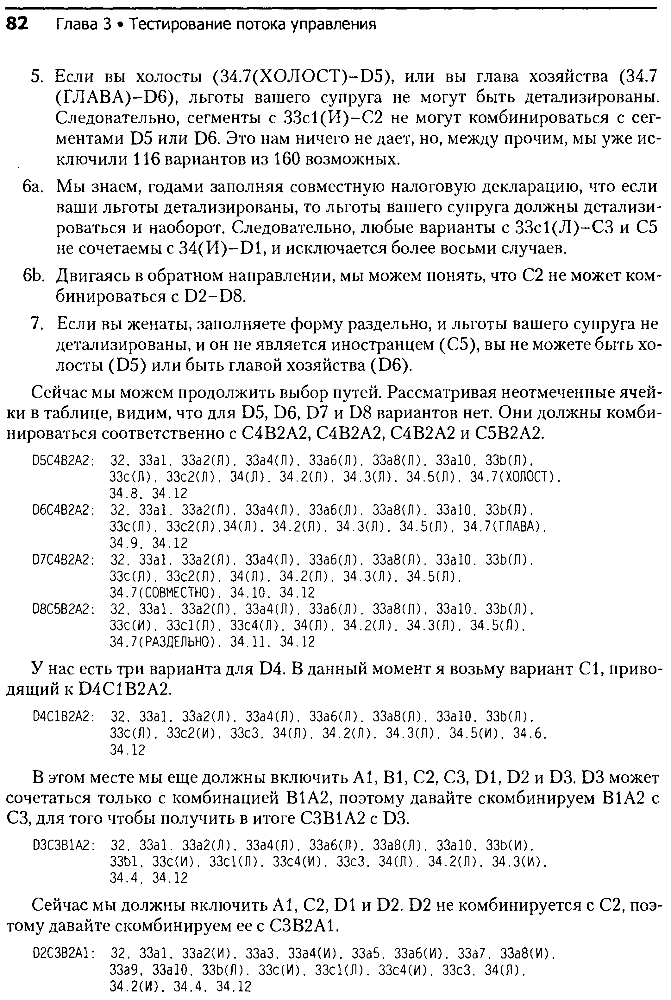

В итоге закончим мы следующим путем:

`D1C1B1A1`: 32. 33a1. 33a2(И). 33a3. 33a4(И). 33a5. 33a6(И). 33a7. 33a8(И). 33a9. 33a10. 33б(И). 33b1. 33c(Л). 33c2(И). 33c3. 34(И). 34.1. 34.12

У нас не было вариантов для путей D5–D8. Если бы у нас были варианты, как и в случае D1–D4, выбор комбинаций основывался бы на нескольких критериях. Нам необходимо было бы учитывать прошлую историю ошибок, насколько трудно было анализировать комбинацию (выберите сложную комбинацию, так как если у вас есть проблемы, то они могут быть и у программиста), как много исследований мы должны были сделать для прояснения проблемы (выберите комбинацию, требующую больших исследований). Также пришлось бы опираться на интуицию и знание образа работы ответственного программиста.

В качестве упражнения закончите выбор пути от узла 34.12 к узлу 40. У нас есть восемь тестов вплоть до узла 34.12. Узел 34.13 добавит только один тест. Узел 36 не добавит никаких тестов (почему?). Узел 38 добавит два теста. Оставшиеся предикаты не нуждаются в тестировании. Таким образом, похоже, что мы можем добиться покрытия связи за 11 тестов. Так как я этого не делал, я могу ошибаться. Однако когда мы будем активизировать эти тесты, возможно, придется вернуться назад и добавить другие тесты.

На рассмотренный пример выбора пути (изложенный выше) я потратил семь часов. Может быть, я более опытен, чем вы, но мне пришлось его объяснять. Предыдущий пример не труднее, чем кажется. Вам следует его выполнить примерно за то же самое время.

## 3.4.4. Активизация
### 3.4.4.1. Основы

*Активизация*. Поиск входных значений, при которых (в случае отсутствия в реализации ошибок) в модели будет пройден выбранный путь.

Большая часть тех процедур, которые описывались в предыдущем разделе, являлись активизацией логики в моделях. Процедура активизации зависит от предикатов, встречающихся в рассматриваемом пути. Если предикаты в большинстве своем логические, как это было в предыдущем разделе, тогда активизация и выбор пути осуществляются одновременно. Если предикаты в большинстве своем численные (то есть алгебраические), то данные процедуры различаются, что описывается в подразделе «Алгебраическая активизация».

Знание приложения важнее знания алгоритма активизации. Знание того, что приложение будет делать в том или ином случае, существенно для определения набора путей, обеспечивающих полное покрытие, и входных значений для их активизации. Я уверен, что если бы мы были экспертами в области налогообложения, нам было бы гораздо легче найти для предыдущего примера набор путей, обеспечивающих покрытие. Прежде чем вы потратите силы и время на активизацию, запустите простейшие тесты вашей модели и убедитесь, что она обеспечивает покрытие связей. После этого у вас останется совсем немного мудреных путей, требующих для активизации применения формальных методов.

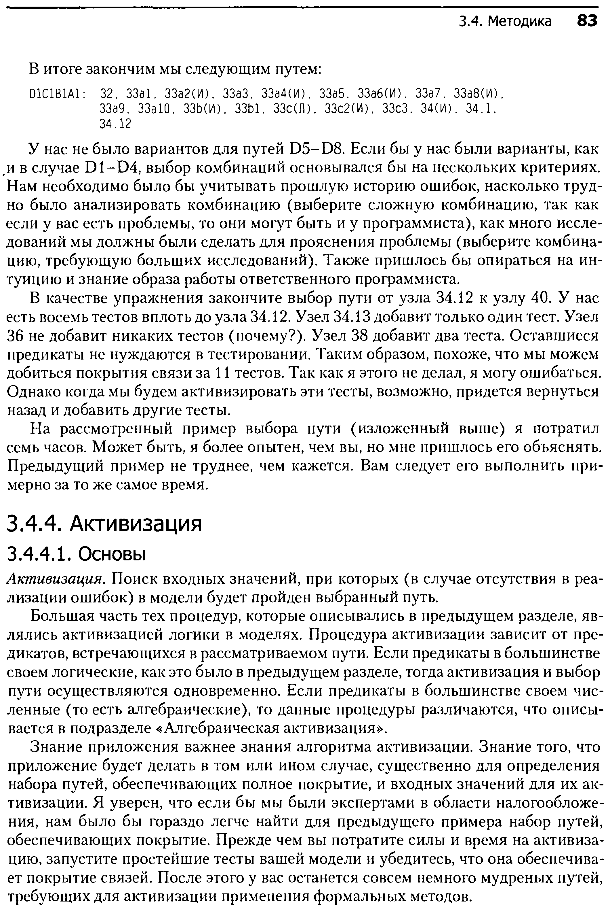


<!-- ВІДНОВЛЕНО ЛОКАЛЬНО (Стор. 84) -->

<!-- КІНЕЦЬ ВІДНОВЛЕННЯ -->


7. На данном этапе у вас уже есть набор больших сегментов, которые не коррелируют друг с другом. Это означает, что вы можете выбрать отрезки пути в каждом из сегментов, которые не зависят от других сегментов. Выберите достаточное число путей в каждом сегменте, чтобы быть уверенным, что вы обеспечили покрытие связей внутри этих сегментов.
8. Объединяйте сегменты, комбинируя пути и выбирая имеющие смысл комбинации. Обратите внимание, что число тестов при этом не должно увеличиться. Например, сегмент А содержит 6 путей, а сегмент В — 10 путей. Это означает, что пара сегментов будет содержать 10 путей, а не 60. Поскольку сегменты некоррелированные, вы можете связать любой отрезок пути в сегменте А с любым отрезком пути в сегменте В.
9. Продолжайте до тех пор, пока не получите набора путей, обеспечивающих покрытие.
10. Теперь мы можем перейти непосредственно к активизации. Следуйте вдоль пути и по достижении предиката определите входное условие, при котором предикат принимает значение ИСТИНА или ЛОЖЬ, в зависимости от требований пути. Вам, возможно, придется использовать некоторые методы из следующего раздела для осуществления этого, однако, как правило, для большинства логических предикатов и предикатов выбора, это должно быть просто, так как вы уже убедились в отсутствии противоречий на выбранном пути.

### 3.4.4.3. Алгебраическая активизация

*Интерпретация предиката.* Предикат считается интерпретированным, если он выражен через входные значения. Интерпретация предиката зависит от выбора пути. Это означает, что мы можем получить эквивалентный предикат, следуя в вычислениях по определенному пути, ведущему к этому предикату.

Примером в данном разделе служит расчет детализированных льгот в Бланке А, строке 29 (См. Приложение). Модель для этого вычисления приводится ниже. Это не полная модель — она содержит только узлы, находящиеся на пути, который мы активизируем. Переменные, начинающиеся с буквы А, относятся к бланку А или к строкам формы 1040. Переменные, начинающиеся с буквы W, относятся к процедуре расчета.

```text
1   1.1   input AL4
1.1 1.2   input AL9
1.2 1.3   input AL14
1.3 1.4   input AL18
1.4 1.5   input AL19
1.5 1.6   input AL26
1.6 1.7   input AL27
1.7 1.8   input AL28
1.8 2     W1 = AL4 + AL9 + AL14 + AL18 + AL19 + AL26 + AL27 + AL28
2   2.1   input AL13
2.1 2.2   input AL28g
2.2 3     W2= AL4 + AL13 + AL19 + AL28g
3   3.1   W3= W2-W1
```

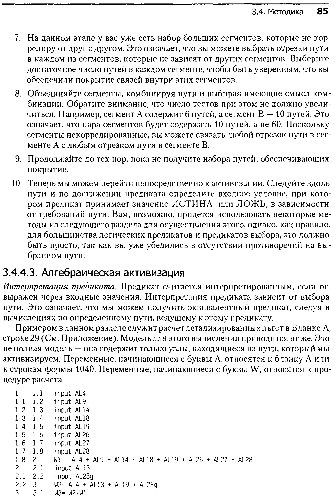

$$W3 = AL4 + AL9 + AL14 + AL18 + AL19 + AL26 + AL27 + AL28 -$$
$$(AL4 + AL13 + AL19 + AL28g)$$
$$W3 = AL8 + AL14 + AL18 + AL26 + AL27 + AL28 - AL13 - AL28g$$
~~3.1 10.5 if W3 <= 0~~
~~IF AL9 + AL11 + AL18 + AL26 + AL27 + AL28 - AL13 - AL28g <= 0~~

Второй предикат на последней не зачеркнутой строке — это интерпретированный предикат. Сначала мы подставили входные значения, а затем выразили предикат через них путем их подстановки в символьном виде.

Нетрудно заметить, что спецификация в данном случае неверна. В ней говорится: «если результат равен нулю...», а должно быть: «если результат меньше или равен нулю...»

Я зачеркнул последнюю строку, поскольку активизация у нас выполняется вдоль определенного пути. Мы будем рассматривать путь, определенный на строке 10. Продолжим модель:

```text
3.1   4     IF AL9 + AL14 + AL18 + AL26 + AL27 + AL28 - AL13 - AL28g > 0
4     5     0.8 * W3 = 0.8 * (AL9 + AL14 + AL18 + AL26 + AL27 + AL28 - AL13 -
            AL28g)
5     6     input AL32
6     6.5   если раздельно
```

*Этот путь я решил выбрать для данного теста.*

```text
      6.6   если совместно
6.5   7     W6 = $55.900
6     7     W6 = $111.800
7     7.1   W7 = W5 - W6 = AL32 - 55.900
7.1   10.6  if W7 <= 0
      8     if W7> 0: if AL32 - 55.900 > 0
8     9     W7* 0.03= AL32* 0.03-1.667.00
9     9.1   if AL32* 0.03 - 1.667.00 <= 0.8 * (AL9 + AL14 + AL18 + AL26 +
            AL27 + AL28 - AL13 - AL28g)
      9.2   if AL32* 0.03 -1.667.00 > 0.8 * (AL9 + AL14 + AL18 + AL26 +
            AL27 + AL28 - AL13 - AL28g)
9.2   9.5   WL9 = 0.8 * (AL9 + AL14 + AL18 + AL26 + AL27 + AL28 - AL13 -
            AL28g)
9.5   10    WL10 = AL4 + AL9 + AL14 + AL18 + AL19 + AL26 + AL27 + AL28 -
            0.8*(AL9 + AL14 + AL18 + AL26 + AL27 + AL28 - AL11 - AL28g)
```

Ниже приведены интерпретированные предикаты, через которые проходит этот путь:

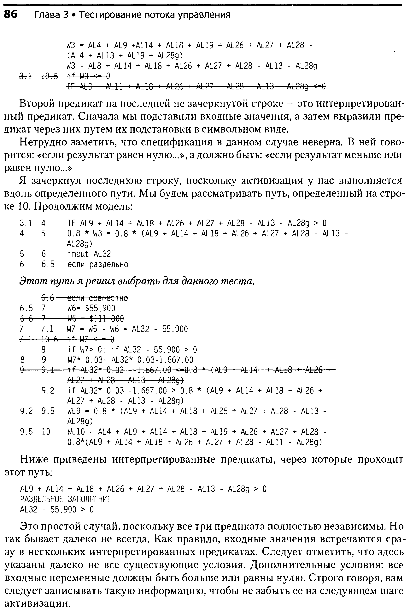

$$AL9 + AL14 + AL18 + AL26 + AL27 + AL28 - AL13 - AL28g > 0$$
РАЗДЕЛЬНОЕ ЗАПОЛНЕНИЕ
$$AL32 - 55.900 > 0$$

Это простой случай, поскольку все три предиката полностью независимы. Но так бывает далеко не всегда. Как правило, входные значения встречаются сразу в нескольких интерпретированных предикатах. Следует отметить, что здесь указаны далеко не все существующие условия. Дополнительные условия: все входные переменные должны быть больше или равны нулю. Строго говоря, вам следует записывать такую информацию, чтобы не забыть ее на следующем шаге активизации.

На следующем шаге активизации мы ищем набор входных значений, удовлетворяющих всем интерпретированным предикатам на заданном пути. В последнем примере это выполняется достаточно просто.

$$\text{AL}_9 + \text{AL}_{14} + \text{AL}_{18} + \text{AL}_{26} + \text{AL}_{27} + \text{AL}_{28} > \text{AL}_{13} + \text{AL}_{28g}$$
РАЗДЕЛЬНОЕ ЗАПОЛНЕНИЕ
$$\text{AL}_{32} > 55.900$$

Если нам сильно не повезет, то придется решать систему уравнений для активизирующих величин. Уравнения в системе представляют собой интерпретированные предикаты. В большинстве случаев, однако, это просто вопрос правильного выбора входных значений для первого интерпретированного предиката, подстановки их в последующих предикатах и упрощения по мере продвижения. Предположим, например, что у нас есть следующий набор интерпретированных предикатов (это не относится к нашей модели) для выбранного пути:

$$\text{AL}_9 + \text{AL}_{14} + \text{AL}_{18} + \text{AL}_{26} + \text{AL}_{27} + \text{AL}_{32} > \text{AL}_{13} + \text{AL}_{28}$$
$$\text{AL}_9 + 0.05 * \text{AL}_{14} > \text{AL}_{32}$$
$$\text{AL}_{32} > 55.900$$
$$\text{AL}_{14} > \text{AL}_{18}$$

Обратите внимание, что я расположил неравенства так, что они направлены одинаково. Сначала установите значение любой из входных переменных таким, чтобы избавиться от одного уравнения. В данном случае это значение величины $\text{AL}_{32}$, которую я положил равной $\$55,905$. Затем подставьте это значение в другие выражения и получите следующий набор предикатов.

$$\text{AL}_9 + \text{AL}_{14} + \text{AL}_{18} + \text{AL}_{26} + \text{AL}_{27} + 55.905 > \text{AL}_{13} + \text{AL}_{28}$$
$$\text{AL}_9 + 0.05 * \text{AL}_{14} > 55.905$$
$$55.905 > 55.900$$
$$\text{AL}_{14} > \text{AL}_{18}$$

Мы можем положить значение $\text{AL}_{14}$ большим, чем $\text{AL}_{18}$, например, представив его в виде $\text{AL}_{14} = \text{AL}_{18} + 10$.

$$\text{AL}_9 + \text{AL}_{18} + 10 + \text{AL}_{18} + \text{AL}_{26} + \text{AL}_{27} + 55.905 > \text{AL}_{13} + \text{AL}_{28}$$
$$\text{AL}_9 + 0.05 * (\text{AL}_{18} + 10) > 55.905$$
$$55.905 > 55.900$$
$$\text{AL}_{14} = \text{AL}_{18} + 10 > \text{AL}_{18}$$

Упрощаем и группируем члены:

$$\text{AL}_9 + 2 * \text{AL}_{18} + \text{AL}_{26} + \text{AL}_{27} + 55.915 > \text{AL}_{13} + \text{AL}_{28}$$
$$\text{AL}_9 + 0.05 * \text{AL}_{18} - 55.904.50 > 0$$

Складывая эти два выражения, получим:

$$2 * \text{AL}_9 + 2.05 * \text{AL}_{18} + \text{AL}_{26} + \text{AL}_{27} + 10.5 - \text{AL}_{13} - \text{AL}_{28} > 0$$

Мы свели все наши условия к одному выражению, слагаемые в котором можем выбирать по нашему усмотрению. После того как мы это проделали, подставляем выбранные значения в выражения для величин, от которых мы предварительно избавились ($\text{AL}_{14}$, к примеру), и в результате получим набор согласованных входных значений, удовлетворяющих всем интерпретированным предикатам на заданном пути. Вот мой набор входных значений:

```text
AL9  = 10
AL18 = 15
AL26 = 30
AL27 = 40
AL13 = 5
AL28 = 10
AL14 = AL18 + 10 = 25
AL32 = 55.900
```

В большинстве случаев вы можете выполнить активизацию, не прибегая к формальному решению уравнений с использованием матриц и даже не подозревая о том, что можно использовать эту процедуру. Начните с простейших неравенств, где у вас есть наибольшая свобода выбора и выберите входные значения для них. Потом подставьте эти значения в другие неравенства и упростите. Используйте простейшую арифметику для исключения переменных, комбинируя выражения путем их сложения и вычитания.

Если вы не можете обойтись простейшими подстановками и упрощениями, то, прежде чем потратить время и силы на инвертирование матриц, проверьте спецификации и свои предыдущие действия. Как правило, причины, толкающие вас на инвертирование матриц, кроются в ваших предыдущих ошибках и/или в ошибках, содержащихся в спецификации.

Другой способ решения данной проблемы — поместить ваши неравенства и выражения в электронную таблицу и использовать встроенные методы решения систем уравнений для получения ответа. Например, инструменты для решения уравнений в LOTUS-123 справятся с этим прекрасно. Более того, они позволяют смешивать логические и алгебраические предикаты в одном наборе неравенств.

## 3.4.5. Предсказание итогов

Следующим шагом в процессе проектирования теста является предсказание итогов для каждого из выбранных путей. Хотя вашим первым побуждением будет попытка сыграть роль компьютера и пройти по этим путям вручную, не спешите это делать. Во-первых, это может быть очень непростой задачей. Во-вторых, вы будете пытаться заменить собой компьютер, а в этом еще никто из людей не преуспел. Вы с большей вероятностью допустите ошибку в вашем предсказании итогов, чем программист в программе. Ниже приведено несколько более привлекательных альтернативных вариантов.

**Существующие тесты.** Около 80 % труда разработчиков программного обеспечения на сегодняшний день уходит на сопровождение программ. Большинство тестировщиков и программистов работает над модификацией уже существующего программного обеспечения. Это означает, что 95 процентов ваших тестов не меняется от версии к версии. Если вы будете так же тщательно контролировать конфигурацию своих тестов, как и конфигурацию программного обеспечения, то у вас будет оракул для большинства ваших тестов.

**Старые программы.** Серьезное обновление не всегда влечет за собой соответствующие изменения в тестовом комплекте, поэтому старые программы могут использоваться в качестве оракула. Например, старая программа была написана для


<!-- ВІДНОВЛЕНО ЛОКАЛЬНО (Стор. 89) -->

<!-- КІНЕЦЬ ВІДНОВЛЕННЯ -->


<!-- ВІДНОВЛЕНО ЛОКАЛЬНО (Стор. 90) -->

<!-- КІНЕЦЬ ВІДНОВЛЕННЯ -->


<!-- ВІДНОВЛЕНО ЧЕРЕЗ GEMINI (Стор. 91) -->
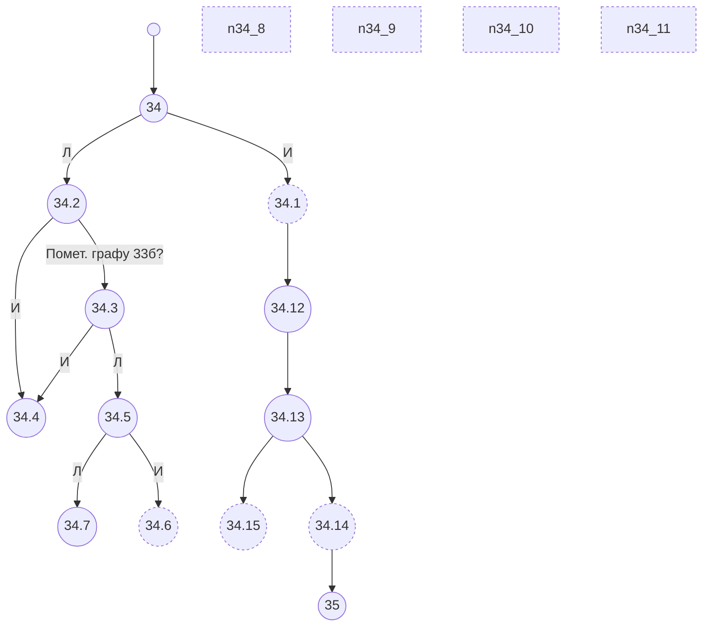
```mermaid
graph TD
    Start(( )) --> n34((34))
    n34 -->|Л| n34_2((34.2))
    n34 -->|И| n34_1((34.1))
    
    n34_1 --> n34_12((34.12))
    
    n34_2 -->|Помет. графy 33б?| n34_3((34.3))
    n34_2 -->|И| n34_4((34.4))
    
    n34_3 -->|Л| n34_5((34.5))
    n34_3 -->|И| n34_4
    
    n34_5 -->|Л| n34_7((34.7))
    n34_5 -->|И| n34_6((34.6))
    
    n34_12 --> n34_13((34.13))
    n34_13 --> n34_15((34.15))
    n34_13 --> n34_14((34.14))
    
    n34_14 --> n35((35))
    
    style n34_8 stroke-dasharray: 3 3
    style n34_9 stroke-dasharray: 3 3
    style n34_10 stroke-dasharray: 3 3
    style n34_11 stroke-dasharray: 3 3
    style n34_14 stroke-dasharray: 3 3
    style n34_15 stroke-dasharray: 3 3
    style n34_1 stroke-dasharray: 3 3
    style n34_6 stroke-dasharray: 3 3
```


Давайте посмотрим теперь на проблему проверки соответствия пути в перспективе. Проверка необходима из-за угрозы возникновения случайной корректности. С другой стороны, поведенческое тестирование потока управления далеко не единственный метод, который вам придется использовать. Поэтому проверяйте в пути все, что можете проверить. То есть если промежуточные элементы обработки легко доступны и у вас есть инструменты тестирования для проверки соответствия пути, программисты будут рады сотрудничеству с вами и помогут вам, используя эту защиту от ошибок.

Другой приемлемый способ защиты от случайной корректности — это тестирование нескольких вариантов для одного и того же пути. Мы к этому придем, рассматривая в дальнейшем другие методы тестирования, и особенно тестирование доменов.

## 3.5. Рассмотрение приложения

### 3.5.1. Индикаторы приложений

Поведенческое тестирование потока управления применимо практически к любой программе и эффективно для большинства приложений. Это фундаментальный метод. Его используют обычно для тестирования относительно небольших программ или сегментов больших программ. Как будет видно из примеров, приведенных ниже, он, скорее всего, будет эффективен для индивидуальных форм ВНС, но использовать его для тестирования всего пакета налоговых документов было бы затруднительно. Эти трудности объясняются тем, что модель получается слишком громоздкой, а следовательно, выбор пути и активизация настолько сложны, что результат не оправдывает затраченных усилий.
<!-- КІНЕЦЬ ВІДНОВЛЕННЯ -->


<!-- ВІДНОВЛЕНО ЛОКАЛЬНО (Стор. 92) -->

<!-- КІНЕЦЬ ВІДНОВЛЕННЯ -->


5. Для устранения хотя и небольшой, но все же существующей угрозы возникновения случайной корректности вам надо проверить все промежуточные вычисления и значения предикатов.
6. Ваши тесты не лучше вашего оракула.

## 3.5.4. Автоматизация и инструментальные средства

На момент написания этой книги не существовало коммерческих инструментов, предназначенных для работы с поведенческим тестированием потока управления, однако большое количество инструментов поддерживает структурное тестирование потока управления. Вы можете использовать эти инструменты, запрограммировав ваши модели на поддерживаемых языках, таких как C, Pascal или Basic [DAIC93, GERH88, SCHI69, WARN64]. Это не будет потерей времени или избыточным программированием. Работа, затраченная на создание достаточно детальной графической модели, — это большая часть всей работы по представлению полуформальной модели в виде программы.

Причина, по которой программирование модели не является избыточным, и, конечно, отличается от программирования реального продукта, заключается в том, что вы не забиваете себе голову практическими вещами, такими как доступ к базам данных, взаимодействие с операционной системой, ввод и вывод, вопросы окружения и многим другим, порождающим реальные ошибки. В модельной программе могут отсутствовать детали, она не обязана работать на какой-то конкретной платформе, ей не обязательно быть производительной, и, что самое главное, она не должна быть интегрирована с другими частями продукта.

Как используется модель? Вовсе не для запуска тестов реальной программы. Именно программа должна быть протестирована, а не какая-то модель тестировщика. Это так! Тестирование модели отличается от тестирования реальной программы, но его тоже надо проводить. Как вы собираетесь отлаживать свои тесты? Модель надо использовать как инструмент, помогающий вам разработать набор тестов, обеспечивающих покрытие, для выбора и активизации путей, в качестве оракула для реального программного обеспечения. Если вы построили действующую модель, то вы можете применить к ней коммерческие инструменты тестирования. А это значительно упростит вашу работу.

## 3.6. Резюме

Поведенческое тестирование потока управления рассмотрено как фундаментальная модель тестирования черного ящика. Она является основой для всех других методов тестирования, обсуждаемых в этой книге, и впоследствии я буду считать, что вы ее усвоили.

Проектирование тестов начинается с создания поведенческой модели графа потока управления на основе документированных требований, таких как спецификация. Представление в виде списка, как правило, более удобно, чем рисунки графов, но маленькие графы помогают при проектировании модели.

Составные предикаты в модели следует устранять или заменять, например, эквивалентными графами, для того чтобы не прятать реальную сложность. Вместо графа при моделировании составных предикатов, состоящих из более чем трех компонентов, используйте таблицу истинности.

Разбейте вашу модель на отрезки, которые начинаются и заканчиваются одиночным узлом, и отметьте взаимную корреляцию предикатов во всех сегментах. Постройте ваши тестовые пути, комбинируя пути в сегментах и исключая непроходимые пути. Используйте противоречия между предикатами для вычеркивания отдельных комбинаций. Маловероятно, что эта методика приведет к непроходимым путям, которые будет невозможно активизировать.

Выберите достаточное количество путей через модель, чтобы гарантировать полное покрытие связей. Не волнуйтесь, если тестов окажется слишком много. Начните с выбора очевидных путей, которые имеют прямое отношение к требованиям, и посмотрите, не можете ли вы таким способом добиться покрытия. Возможно, вы получите не самые эффективные тесты, но это политически верное решение. Расширьте эти тесты, рассмотрев столько путей, сколько надо для стопроцентной гарантии покрытия связей.

Активизируйте выбранные пути, интерпретируя предикаты вдоль пути в терминах входных величин. Интерпретированные предикаты дают набор условий или уравнений (в действительности неравенств), так что любое решение этого набора неравенств будет условием прохода по выбранному пути. Если активизация не очевидна, то перед тем, как вы потратите много времени на решение уравнений, проверьте, нет ли ошибок в спецификации или модели. Если условия все же сложны, рассмотрите вариант использования коммерческой программы, предназначенной для решения неравенств для активизации, такой как LOTUS 1-2-3. Алгебраический пакет может помочь с интерпретацией предикатов.

Не забывайте о возможности случайной корректности и сотрудничайте с программистами для получения промежуточных численных выводов, которые необходимы для проверки пути. Дайте выражениям с предикатами высокий приоритет, но не настаивайте больше чем на одном значении для каждой связи в графе.

Продумайте программирование вашей модели с помощью реального языка программирования, используйте запрограммированную модель при проектировании тестов.

## 3.7. Вопросы для самопроверки

1. Дайте определение следующих терминов: операция И, комплементарные сегменты пути, составной предикат, граф потока управления, коррелированные предикаты, независимые предикаты, объединяющий узел, логическая модельная программа, логический предикат, НЕ, ИЛИ, предикат, интерпретация предиката, узел с предикатами, узел выбора, предикат выбора, активизировать, простой предикат, разделение транзакций, таблица истинности.

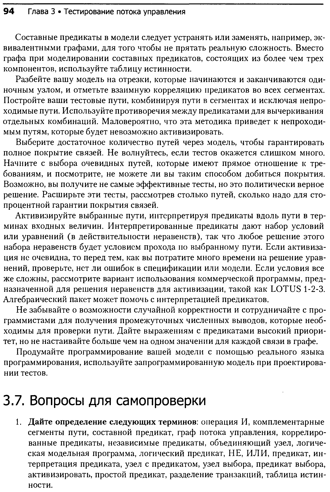

Во всех следующих примерах не надо моделировать побочные формы и ведомости, определенные в инструкциях ВНС.

2. Для бланка SE, 1994 и приведенного там же графа постройте граф потока управления, используя в качестве предикатов помечаемые графы.
3. Для бланка SE, 1994 замените в построенном вами графе все единичные составные предикаты на эквивалентные последовательности простых предикатов.
4. Для бланка SE, 1994 скомпонуйте один составной предикат, определяющий все условия, при которых надо заполнять короткую форму, и все условия, при которых надо заполнять длинную форму.
5. Постройте граф-модель потока управления для формы 1040. Рассматривайте данные, приходящие из других форм или частей в качестве входов. Для каждого варианта постройте модель, выберете пути тестирования и спроектируйте тесты, используя обеспечение покрытия узлов и обеспечение покрытия связей. Проверьте работу ваших тестов, используя в качестве оракула пакет программ для расчета налогов или модели в виде электронной таблицы. Если вы используете программу для расчета налогов, вам, возможно, придется брать входные значения из других форм. (1) строки 1–5, (2) строки 6–22, (3) строки 32–40, (4) строки 41–46, (5) строки 47–53, (6) строки 54–60, (7) строки 61–65.
6. То же, что и в задаче 5 для формы 1040, бланка SE, короткая форма, строки 1–6, но включите в модель логику для определения того, может или не может быть использована короткая форма.
7. Форма 1040, бланк на строке 10. Полная форма.
8. Форма 1040, бланк на строке 20a, social security income (доход, подлежащий налогообложению по программе социального обеспечения). Полная форма.
9. Форма 1040, бланк на строке 34, dependent deductions (льготы иждивенца). Полная форма.
10. Постройте модель для строк 1–5 формы 1040, бланк на строке 26 (1994, Бланк Self-employed health insurance deductions (Льготы для частных предпринимателей по программе страхования здоровья по старости)).
11. Найдите все пары коррелированных сегментов путей для примера в разделе 3.4.3.
12. Форма 2106, Employee business expenses (Расходы служащего по сделкам), часть II, разделы А, В, С.
13. Форма 2688, Application for Extension to File (Заявление о продлении срока), строки 1–4.
14. Форма 2210, Недоплата налогов. Включает (а) Строка 1, (b) часть II, (с) часть III, (d) часть IV раздела В. Представьте, что вы можете использовать короткий метод (часть III), если вы не отметили графы 1b, 1с, или

1d. В любом случае выводы (если они есть) направляются на соответствующую строку формы 1040. Таким образом, вы можете не беспокоиться относительно форм 1040A, 1040NR 1041, и т. д.

15. Форма 3903, часть I, Employee Moving Expenses (Расходы на поездки служащего).

# 4. Тестирование циклов

## 4.1. Обзор

Тестирование цикла — это эвристический метод, который следует использовать в сочетании со многими другими методами тестирования, поскольку опыт показывает, что ошибки часто сопутствуют циклам. Методы, обсуждаемые в этой главе, применяются в тех случаях, когда имеются циклы в таких графах как: *граф потока управления, граф потока транзакций, или синтаксический граф*.

## 4.2. Основные термины

*Внешние термины*: приложение, массив, компоновка, группа, С, оператор BREAK, сбор/воспроизведение данных, COBOL, код, компилятор, копировать, повреждение данных, отказ, отладка, отрицательное приращение, конец файла, ввод (цикла), вычислять, выполнять, поле, файл, длина файла, FOR, GOTO, аппаратные средства, эвристический, реализация, положительное приращение, инициализировать, внутренний цикл, целочисленный, итерация, ошибка границ в памяти, объединение, модель, вложенный цикл, операционная система, внешний цикл, указатель, ошибка указателя, предусловие, процесс внутри цикла, обработка, программа, программист, программирование, язык программирования, случайный, запись, повторяющийся процесс, требование, время выполнения, поиск, программное обеспечение, сортировка, спецификация, язык структурного программирования, структурное программное обеспечение, завершать, передавать, истинное значение, значение, переменная, WHILE.

*Внутренние термины*: поведение, поведенческое тестирование, тестирование черного ящика, ошибка, граф потока управления, тестирование потока управления, граф, модель на основе графа, цикл, связь, логический предикат, узел, имя


<!-- ВІДНОВЛЕНО ЛОКАЛЬНО (Стор. 98) -->

<!-- КІНЕЦЬ ВІДНОВЛЕННЯ -->


*Цикл с постусловием*. Цикл, в котором предикат управления циклом вычисляется после обработки. В циклах с постусловием обработка выполняется по меньшей мере один раз.

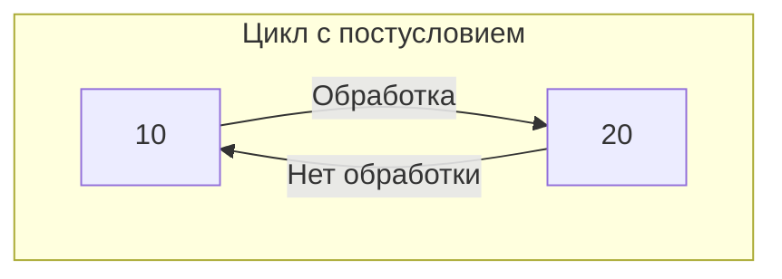
```mermaid
graph LR
    subgraph Цикл с постусловием
        direction LR
        10 -->|Обработка| 20
        20 -->|Нет обработки| 10
    end
```

*Цикл со смешанной проверкой*. Цикл, в котором обработка происходит и до, и после того, как вычислен предикат управления циклом$^1$.

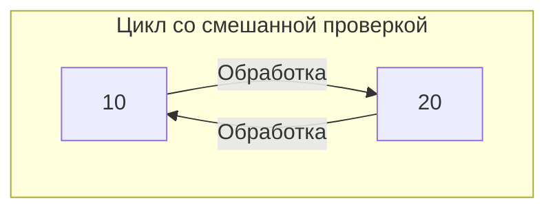
```mermaid
graph LR
    subgraph Цикл со смешанной проверкой
        direction LR
        10 -->|Обработка| 20
        20 -->|Обработка| 10
    end
```

*Вложенные циклы*. Два или более циклов — *вложенные*, если один полностью содержится в другом. На следующем рисунке цикл 10–20–10 является вложенным по отношению к циклу 5–25–5.

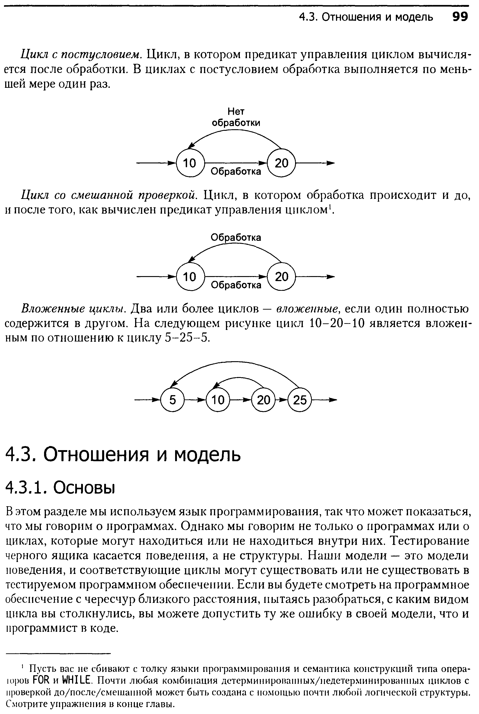

## 4.3. Отношения и модель

### 4.3.1. Основы

В этом разделе мы используем язык программирования, так что может показаться, что мы говорим о программах. Однако мы говорим не только о программах или о циклах, которые могут находиться или не находиться внутри них. Тестирование черного ящика касается поведения, а не структуры. Наши модели — это модели поведения, и соответствующие циклы могут существовать или не существовать в тестируемом программном обеспечении. Если вы будете смотреть на программное обеспечение с чересчур близкого расстояния, пытаясь разобраться, с каким видом цикла вы столкнулись, вы можете допустить ту же ошибку в своей модели, что и программист в коде.

---

<small>$^1$ Пусть вас не сбивают с толку языки программирования и семантика конструкций типа операторов `FOR` и `WHILE`. Почти любая комбинация детерминированных/недетерминированных циклов с проверкой до/после/смешанной может быть создана с помощью почти любой логической структуры. Смотрите упражнения в конце главы.</small>


<!-- ВІДНОВЛЕНО ЛОКАЛЬНО (Стор. 100) -->

<!-- КІНЕЦЬ ВІДНОВЛЕННЯ -->


```text
    30   50   loop_control > nmax
    40        loop_control > nmax
40  25   B_processing. loop_control = loop_control + 1
50            продолжить оставшуюся часть модели
```

В этой модели на каждом шаге обязательно выполняется `A_processing`. На последнем шаге выполнения, однако, обрабатываемый объект минует `B_processing`. Заметьте, что значение переменной управления циклом, `loop_control`, различно для процессов А и В. Циклов со смешанной проверкой следует избегать в спецификациях, моделях и программном обеспечении, так как они уязвимы для ошибок. В языках структурного программирования смешанные циклы не могут быть созданы случайно, перед их применением программисту следует хорошенько подумать. Один из аргументов в пользу использования структурированных циклов — уход от ошибок, связанных со смешанными циклами. При построении моделей старайтесь использовать явные циклы с постусловием и предусловием, а циклы со смешанной проверкой применяйте только в тех случаях, когда они необходимы для точного моделирования требований. Если цикл со смешанной проверкой необходим, то он должен быть тщательно протестирован из-за повышенной вероятности наличия ошибок.

Поскольку в детерминированных циклах заранее известно число повторов, циклические процессы с их использованием надо конструировать во всех следующих случаях: копирование файла с известным числом записей, обработка n платежных чеков, добавление колонки чисел, заполнение массива числами, передача файла известной длины.

## 4.3.3. Недетерминированные циклы

Недетерминированные циклы отличаются от детерминированных тем, что количество проходов цикла неизвестно до его старта. Такое может произойти вследствие трех основных причин: это число неизвестно, обработка внутри цикла меняет переменную управления циклом (если она существует), внутри цикла обнаружено условие, вызывающее преждевременное прекращение цикла.

```text
20  30  читать следующую запись
30  40  обработать запись
40  20  Не Конец Файла (КФ)
    50  КФ
50      продолжить оставшуюся часть модели
```

В вышеприведенном коде мы не знаем, как много записей имеет файл, следовательно, процесс будет продолжаться, пока не будет достигнута запись КФ. Этот пример уязвим в силу нескольких причин. Если файл содержит только запись КФ, тогда эта запись будет обработана с возможными пагубными последствиями. Другое слабое место проявляется в случае, если файл не содержит записей, даже записи КФ. Если программа точно реализует данную модель, с такими файлами цикл будет выполняться бесконечно.

```text
20  30  loop_control = 1, nmax = 10
30  50  loop_control > nmax
    40  loop_control < = nmax
```

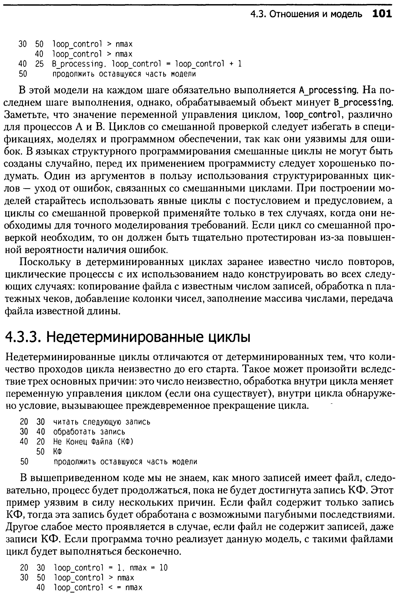


<!-- ВІДНОВЛЕНО ЛОКАЛЬНО (Стор. 102) -->

<!-- КІНЕЦЬ ВІДНОВЛЕННЯ -->


<!-- ВІДНОВЛЕНО ЛОКАЛЬНО (Стор. 103) -->

<!-- КІНЕЦЬ ВІДНОВЛЕННЯ -->


программном обеспечении, написанном на языке ассемблера и более старых языках программирования.

Для ужасных циклов нет хороших тестов. Как вы управитесь с ними, зависит от того, откуда они взялись. Если они следствие способа, с помощью которого вы построили модель, тогда смоделируйте ее заново, используя структурированные циклы. Ужасные циклы могут быть корректной моделью поведения приложения, особенно если, как в случае тестирования потока транзакций, вы создаете модель человеческого поведения. Например, если вы моделируете поведение человека, набирающего междугородний телефонный номер, естественно использовать цикл для набора цифр. Междугородний телефонный вызов требует набора 11 цифр. Тогда вы создаете следующий модельный цикл.

```text
10  20  digit_count = 0, digit_max = 11
20  30  digit_count <= digit_max, digit_count = digit_count + 1
    50  digit_count > digit_max, выйти из цикла
30  20  набор цифры
50      продолжить дальше модель
```

Люди не могут и не будут вести себя структурно. Например, они могут сразу выйти из цикла, поняв, что совершили ошибку при наборе номера.

```text
10  20  digit_count = 0, digit_max = 11
20  30  digit_count <= digit_max, digit_count = digit_count + 1
    50  digit_count > digit_max, выйти из цикла
30  40  набор цифры
40  20  цифра набрана успешно
    10  цифра не набрана, трубка вешается и номер набирается заново
50      продолжить дальше модель
```

Если скверная структура цикла должным образом моделирует ситуацию, тогда у вас нет другого выбора, кроме как смоделировать ее именно так. Однако вы должны протестировать подобные циклы более тщательно, чем обычно, поскольку такие ситуации чаще подвержены неправильной реализации, особенно в специальных случаях, порождающих ужасные циклы.

## 4.4. Методы

### 4.4.1. Критические тестовые значения

Рассмотрим общую детерминированную модель цикла.

```text
10  20  loop_control = startval, itermax = upperval
20  30  loop_control > itermax
    40  loop_control <= itermax
30  20  loop process, loop_control = loop_control + increval
40      продолжить оставшуюся часть модели
```

Этот цикл определяется тремя значениями:
* `startval` — начальное значение переменной управления циклом.
* `upperval` — конечное значение переменной управления циклом.

`increval` — величина, на которую переменная управления циклом будет возрастать при каждом прохождении цикла.

*Критические тестовые значения* — комбинация величин этих трех чисел, которые, как показывает опыт, особенно часто вызывают ошибки, плюс, в добавление к ним, нормальный или типичный вариант. Мы приводим тестовые варианты в самом общем виде. Специфические особенности для разных типов циклов будут обсуждаться в последующих разделах.

*Обход*. Любой набор величин, вызывающий немедленный выход из цикла.

*Один проход*. Величины, приводящие к тому, что цикл выполняется ровно один раз.

*Два прохода*. Величины, приводящие к тому, что цикл выполняется ровно два раза.

*Типичное число проходов*. Типичное число итераций.

*Максимум*: Максимальное число разрешенных итераций.

*Max + 1*. На единицу больше разрешенного максимума.

*Max - 1*. На единицу меньше разрешенного максимума.

*Min*. Заданный минимум.

*Min - 1*. На единицу меньше заданного минимума.

*Ноль*. Обсуждается ниже.

*Отрицательное число проходов*. Обсуждается ниже.

Заметьте, мы говорим о числе раз повторения цикла, а не о значении переменной управления циклом (если она существует). Например, в цикле `FOR I = 0 to 8 STEP 2` исходное значение переменной управления циклом `I` равно 0, но цикл будет выполнен не девять раз, а только пять, потому что переменная управления циклом при каждом прохождении цикла увеличивается на два.

Многие из упомянутых вариантов могут перекрываться. Например, если значение минимума равно 0, тогда имеют место следующие тождества:

$$\text{Min} - 1 = \text{Отрицательное число проходов}$$
$$\text{Min} = \text{Обход}$$
$$\text{Min} + 1 = \text{Один проход}$$

Аналогично, если значение минимума равно 1:

$$\text{Min} - 1 = \text{Обход}$$
$$\text{Min} = \text{Один проход}$$
$$\text{Min} + 1 = \text{Два прохода}$$

Вариант нуля может оказаться эквивалентным варианту обхода. Обычно вместо 11 только что перечисленных тестов разрабатываются только 7. Некоторые из этих вариантов, такие как обход, могут перекрываться с тестом, созданным на основе покрытия связей.

В дополнение к тестированию 11 общих ситуаций в старом программном обеспечении (например, программном обеспечении, написанном на языке ассемблер), возможно, имеет смысл протестировать особые значения числа итераций, такие как степени двойки и близкие к ним значения: 255, 256, 257, 65535, 65536 и 65537. Но не теряйте времени на особые значения, связанные с параметрами аппаратных средств, такими как байт или длина слова в таком современном языке программи-


<!-- ВІДНОВЛЕНО ЛОКАЛЬНО (Стор. 106) -->

<!-- КІНЕЦЬ ВІДНОВЛЕННЯ -->


*Типичное число проходов*. Неперспективно для обнаружения ошибок, но если вы это не проделаете, то, конечно, ваше тестирование может быть подвергнуто критике. Несмотря на то, что это редко бывает эффективно для обнаружения ошибок, это политически мудро.

*Максимум*. Все тестовые варианты, которые ориентированы на максимумы, могут потребовать больших затрат, в особенности для вложенных циклов. Например, 20 000 служащих и 1000 организаций означают 20 000 000 платежных чеков. Даже с компьютерами это накладно. Дело не в том, что числа 20 000 и 1000 — это какие-то особенные числа, вызывающие ошибки. Дело в том, что достигнуты максимумы, вне зависимости от их значений. Если программисты предвидят возможные проблемы с тестированием, они встроят возможность изменить эти максимальные значения для тестирования, которое в большинстве случаев может быть проведено для 20 сотрудников и 10 организаций. Если возможность тестирования не была целью проектирования, у вас нет другого выбора, кроме как протестировать эти экстремальные значения, по крайней мере, один раз. Но проделайте это, скажем, для 20 000 служащих и только одной организации, и 1000 организаций, в каждой из которой всего несколько служащих.

*Максимум плюс 1*. Ситуация, аналогичная случаю обхода. Мы не ждем, что программа обработает больше, чем заданный максимум, но поскольку такая ситуация может случайно возникнуть, мы хотим быть уверены, что это не приведет к сбою и файлы не будут повреждены. Ищите ситуацию, когда в компании X работает 20 001 служащий, в порядке обработки компания Y следует за компанией X и первый служащий в компании Y получает платежный чек со счета компании X.

*Отрицательное число проходов*. Если число служащих может быть введено с клавиатуры, скажем, для того, чтобы начать обработку, тогда этот случай может быть потенциально продуктивным. Если вы можете всеми правдами или неправдами реализовать этот случай, попробуйте это сделать, и посмотрите, отклонит ли программа такое входное значение. Не обманывайте себя тем, что этот случай действительно будет отклонен только потому, что вам так сказали. Например, из-за ошибки ввода заявлено, что в компании X работает $-10$ служащих. Даже если этот случай, как и ожидалось, будет отклонен, то первые 10 платежных чеков для следующей в очереди организации Y могут быть не обработаны. Мы имеем дело с ошибками, которые ведут к произвольному или бессмысленному поведению. Таким образом, всегда, когда это возможно, имеет смысл использовать произвольные и бессмысленные тестовые варианты.

## 4.4.3. Недетерминированные циклы

Мы ищем в файле неизвестной длины специфическую запись, которая может находиться в любом месте файла или, если уж на то пошло, может вообще не содержаться в файле. Здесь мы имеем две проблемы: с размером файла и с тем местом в файле, где может быть найдена искомая запись. Два предиката управляют поведением этого цикла: предикат, управляющий получением и проверкой следующей записи, и предикат, вызывающий остановку выполнения цикла в случае, ког-


<!-- ВІДНОВЛЕНО ЛОКАЛЬНО (Стор. 108) -->

<!-- КІНЕЦЬ ВІДНОВЛЕННЯ -->


Вот мои аргументы в пользу тестового варианта $\text{MAX} + 1$. Мы не предполагали, что программное обеспечение будет обрабатывать файлы, в которых более 51 записи. Если цикл действительно недетерминированный, тогда этот факт неизвестен нам до того, как процесс закончится. То есть длина файла становится известна только после обнаружения записи КФ (конец файла). Если это действительно так, тогда не существует способа запретить обработку файла с 51 записью. В противном случае, если чрезмерно длинный файл отвергается до того, как начнется обработка, тогда длина файла должна быть известна и цикл поиска не является по-настоящему недетерминированным. Неизвестна только точка, в которой процесс выйдет из цикла. Как много рассмотренных вариантов вы испробуете, зависит от того, что делает цикл недетерминированным.

1. Величина максимума неизвестна и не может быть найдена. В этом случае ничего не препятствует достижению максимального значения и вам обязательно следует попробовать $\text{MAX} + 1$.
2. Досрочное прекращение. У нас есть однозначно детерминированный цикл, выполнение которого может быть досрочно прервано (например, оператором $\text{BREAK}$ в языке С), но где это произойдет, неизвестно. $\text{MAX} + 1$ не имеет смысла, но непременно попробуйте найти искомые данные в последней записи.
3. Обработка переменной управления. Это может происходить с детерминированными и недетерминированными циклами. Скажем, число записей было известно, и то, что мы хотели проделать, — это выборочная проверка одной из десяти записей, вместо того чтобы проверять каждую запись в файле. Это может быть реализовано увеличением переменной управления цикла на 10, но это приводит к выходу величины указателя за границу файла. Тогда нам, безусловно, следует попробовать варианты $\text{MAX} + 1$.

## 4.4.4. Вложенные циклы

Вложенные циклы сначала должны быть протестированы как индивидуальные циклы. Задайте для внутреннего цикла типичное значение и протестируйте внешний цикл для случаев критических значений. Затем измените процедуру на противоположную, задайте для внешнего цикла типичное значение и прогоните внутренний цикл через критические тестовые варианты. Эти тесты должны выявить большинство ошибок, обычно попадающихся в одиночных, невложенных циклах.

Проблема с вложенными циклами возникает, когда два или более вложенных цикла достигают критических значений одновременно — например, нулевых, максимальных, и так далее. Вы проектируете тестовые варианты путем перебора комбинаций критических значений. Это должно привести к 64 или большему числу тестовых вариантов, если вы строго следуете этому правилу. Отступите немного от этого и протестируйте по крайней мере комбинации обход/ноль, один, два и $\text{MAX}$ для внутреннего цикла и обход/ноль, один, два и $\text{MAX}$ для внешнего цикла. Это будет 16 случаев в дополнение к тестированию одиночных циклов — всего 32 теста.


<!-- ВІДНОВЛЕНО ЛОКАЛЬНО (Стор. 110) -->

<!-- КІНЕЦЬ ВІДНОВЛЕННЯ -->


4.6. Резюме

Тестирование цикла — это эвристический метод, основанный на опыте, который программисты приобретают, сталкиваясь с ошибками в начале и конце циклов. Несмотря на то, что для пояснений в этой главе были использованы примеры с потоком управления, метод эффективен для большинства графовых моделей, имеющих циклы (исключая сильно связные графы). Необходимые для тестирования значения основаны на числе повторений цикла: $0, 1, 2, \text{MIN} - 1, \text{MIN}, \text{MIN} + 1$, типичное количество проходов, $\text{MAX} - 1, \text{MAX}$ и $\text{MAX} + 1$, а также на комбинациях этих величин для вложенных циклов.

## 4.7. Вопросы для самопроверки

1. Дать определение следующих терминов: критические тестовые значения цикла, детерминированный цикл, ужасный цикл, число итераций цикла, цикл, обход цикла, узел управления циклом, предикат управления циклом, переменная управления циклом, узел входа в цикл, узел выхода из цикла, цикл со смешанной проверкой, вложенные циклы, недетерминированные циклы, цикл с проверкой до, цикл с проверкой после.
2. Рассмотрите шесть комбинаций циклов (детерминированных, недетерминированных) и (с проверкой до, после, со смешанной проверкой) в языке С. Придумайте примеры для каждой комбинации, используя следующие конструкции для создания циклов: `WHILE`, `FOR`, `DO-WHILE`, `IF/GOTO`. Если комбинация невозможна, докажите это.
3. То же, что и задание 2, но для Паскаля, с использованием `FOR-TO-DOWNTO`, `FOR-DO`, `REPEAT-UNTIL`, `WHILE`, и всех прочих способов создания циклов.
4. В большинстве пакетов программ для подготовки налоговых документов имеется команда для вывода форм и бланков пользователя на печать. Если каждая форма рассматривается как объект, который следует распечатать, этот циклический процесс детерминированный или недетерминированный? Обоснуйте ваш ответ. Если вы скажете «детерминированный», почему практичный человек может решить запрограммировать этот процесс с помощью недетерминированного цикла? Разработайте набор тестов для печати действующей декларации о доходах в вашей программе подготовки налоговых документов.
5. Классифицируйте как детерминированные или недетерминированные (по отношению к числу итераций цикла) следующие процессы: (a) проверка орфографии, (б) решение системы уравнений, (в) сортировка, (г) объединение, (д) сложение двух чисел, (е) извлечение квадратного корня, (ж) деление столбиком, (з) проведение переписи населения в Америке, (и) копирование файла, (к) копирование каталога, (л) копирование всего диска, (м) проверка диска на наличие ошибок, (н) загрузка файла, (о) подсчет числа предметов в коробке, (п) пересчет числа предметов в коробке, (р) проверка

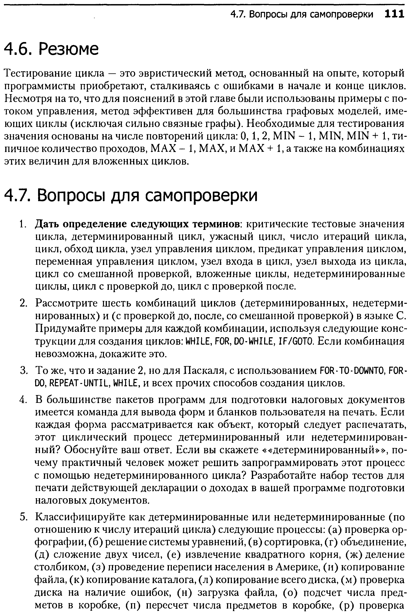

ваших счетов, в предположении, что ни вы, ни банк не делали ошибок, (с) поэлементное умножение двух массивов, (т) поэлементное умножение двух матриц, (у) извлечение квадратного корня из 16-битного числа и обеспечение представления результата в виде 16-битного числа, (ф) вычисление $x^2 \operatorname{hsin}^{-1} \operatorname{ABS}((J_2(\operatorname{ABS}(17 \int_0^x e^{-x} dx))))$, где $x$ — 16-битное число и результат необходимо представить в виде 16-битного числа, (х) удаление $n$ символов из конца документа начиная с последнего и в обратном порядке, (ц) добавление $n$ символов в конец документа, (ч) удаление $n$ символов из середины документа, когда известно, что документ содержит не меньше $n$ символов.

6. Для каждого из детерминированных процессов из задания 5 укажите, каковы практические последствия (например, в части уязвимости, расхода оперативной памяти и дискового пространства), которые могут возникнуть в результате реализации процесса в виде недетерминированного цикла.
7. Для каждого из недетерминированных процессов из задания 5, каковы практические последствия (например, в части уязвимости, расхода оперативной памяти и дискового пространства), которые могут возникнуть в результате реализации процесса в виде детерминированного цикла?
8. Какие из процессов в задании 5 имеют вложенные циклы и какая глубина их вложения?
9. Для каждого из процессов, проанализированных вами в заданиях 5, 6, 7 и 8, создайте набор тестов циклов.
10. Смоделируйте часть 4 формы 2210 как граф потока управления с детерминированным циклом и протестируйте его соответствующим образом.

# 5. Тестирование потоков данных

## 5.1. Обзор

Граф потока данных является характерной особенностью многих методов проектирования программного обеспечения и с успехом используется в проектировании тестов.

## 5.2. Основные термины

Внешние термины: добавить запись, алиас, приложение, массив, присваивать, ошибка, С, вычисление, дерево вызовов, CASE, закрывать, код, комментарий, сравнивать, компилятор, вычисление, параллельный процесс, константа, ограничение, управление, копировать, число повторений, аварийный отказ, создавать, данные, отладочная программа, удалять, обозначать, диск, фиктивная переменная, динамический вызов, выражение, извлекать, выборка (команды или данных из памяти), поле, файл, формула, функция, глобальные данные, остановка, аппаратные средства, эвристический, иерархический, IF-THEN, IF-THEN-ELSE, сокрытие информации, иициализировать, вставлять, конкретизировать, итерировать, число повторений, переход, редактор связей, размещение, логический, цикл, сопровождение, память, адрес ячейки памяти, объединять, сообщение, перемещать, многозадачность, сеть, численный, имя объекта, объектно-ориентированное программирование, открывать, вывод, собственные данные, параллельный компьютер, раздел, PASCAL, указатель, обработка, программа, программист, программирование, язык программирования, псевдокод, ОЗУ, запись, переименовывать, повторно используемый, время выполнения, поиск, упорядочение, совместно используемые данные, побочный эффект, программное обеспечение, сортировать, исходный код, электронная таблица, оператор, хранить, структурный, символьный, синхронизация,

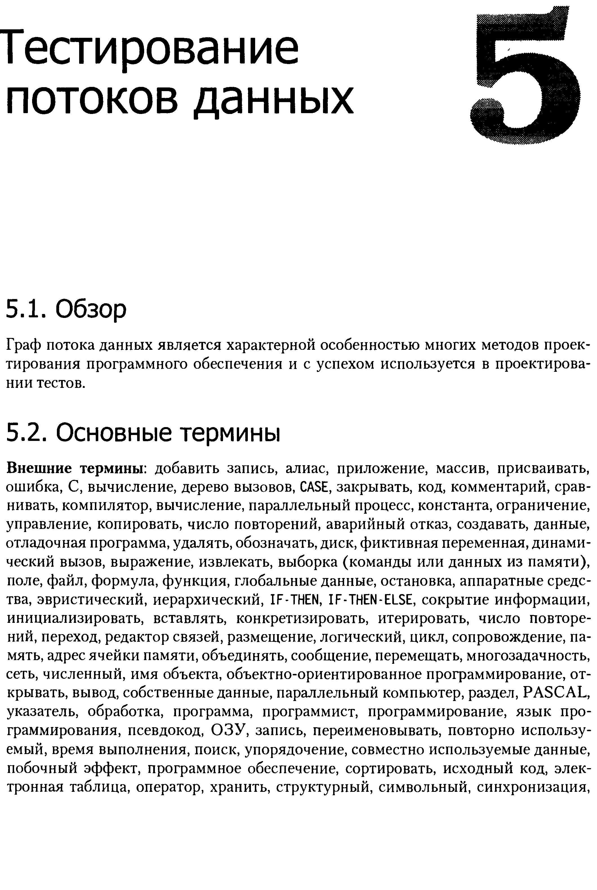


<!-- ВІДНОВЛЕНО ЛОКАЛЬНО (Стор. 114) -->

<!-- КІНЕЦЬ ВІДНОВЛЕННЯ -->


<!-- ВІДНОВЛЕНО ЛОКАЛЬНО (Стор. 115) -->

<!-- КІНЕЦЬ ВІДНОВЛЕННЯ -->


данных, но обозначение в нижней части рисунка выглядит яснее. Запоминающие узлы часто сбивают с толку, поскольку при последующей обработке не сразу может быть понятно, какое именно значение переменной используется: значение, сохраненное на диске, или значение в ОЗУ, предшествующее сохранению. Например, при использовании в сетях с файлами совместного доступа они могут отличаться (и таким образом быть источником ошибок). Использование двух различных имен, скажем, `значение_озу` и `значение_диск` может помочь прояснить ситуацию.

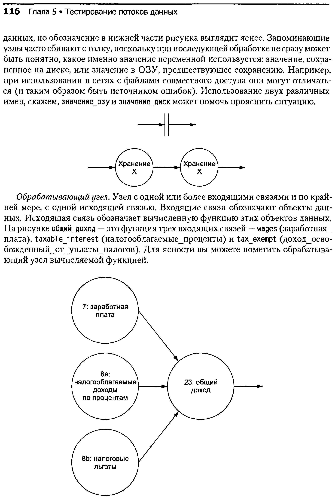

*Обрабатывающий узел*. Узел с одной или более входящими связями и по крайней мере, с одной исходящей связью. Входящие связи обозначают объекты данных. Исходящая связь обозначает вычисленную функцию этих объектов данных. На рисунке `общий_доход` — это функция трех входящих связей — `wages` (заработная_плата), `taxable_interest` (налогооблагаемые_проценты) и `tax_exempt` (доход_освобожденный_от_уплаты_налогов). Для ясности вы можете пометить обрабатывающий узел вычисляемой функцией.


<!-- ВІДНОВЛЕНО ЛОКАЛЬНО (Стор. 117) -->

<!-- КІНЕЦЬ ВІДНОВЛЕННЯ -->


<!-- ВІДНОВЛЕНО ЧЕРЕЗ GEMINI (Стор. 118) -->
В предыдущем примере выбор $VIV$ мог быть основан на значении всех входящих связей:

$$\text{Значение\_исходящей\_связи} = \text{МАКСИМУМ (значения\_входящих\_связей)}$$

В этом случае управляющей входящей связи нет. И наоборот, выбор мог быть основан на значении управляющей входящей связи, которое определяет, какое значение и какой входящей связи должно быть использовано:

$$\text{Значение\_исходящей\_связи} = \text{ВЫБОР}(\text{УПРАВЛЯЮЩАЯ\_ПЕРЕМЕННАЯ}, \text{значения\_входящих\_связей})$$

В последнем примере переменная управляющей входящей связи $\text{УПРАВЛЯЮЩАЯ\_ПЕРЕМЕННАЯ}$ выбирает одно из значений входящих связей, как, например, в случае указателя на массив.

*Граф потока данных.* Граф, состоящий из входящих узлов, узлов вывода, запоминающих узлов, узлов выбора данных и соответствующих связей и свойств.

## 5.3. Отношения и модель

### 5.3.1. Основы

*Объекты (узлы):* Вычисляемая функция входящих связей:

```text
7: wages (заработная_плата)
8a: taxable_interest_income (налогооблагаемый_доход_с_процентов)
8b: tax_exempt_interest_income (проценты_освобожденные_от_налога)
9: dividend_income (доход_от_дивидендов)
10: taxable_refunds (облагаемые_налогом_платежи_по_долгам)
11: alimony_received (полученные_алименты)
12: business_income_or_loss 
    (доход_или_потери_в_результате_предпринимательской_деятельности)

21: other_income (другие_доходы)
22: общий_доход : = заработная_плата + налогооблагаемый_доход_с_процентов +
    ... + другие_доходы.
```

Обратимся к форме 1040. Узлы с 7 по 21 — источники данных. Из них узлы 8а, 9, 10, 12, 13, 14, 15, 18, 19 и 21, возможно, пришли из других форм ВНС, но будут трактоваться здесь как входные данные, чтобы не усложнять пример. Строка 22 — обрабатывающий узел. Узел 22 также зависит от узлов 15b и 16b, расчетом которых мы на данный момент пренебрегаем (а вы не должны). Почти каждая строка в форме 1040 соответствует объекту данных, который вводился без предварительного расчета, пришел из другой формы или был рассчитан по ходу обработки формы 1040.

*Отношение (связи).* Непосредственно используется для расчета значения. В последнем примере узлы с 7: `wages` (заработная_плата) по 21: `other_income` (другие_доходы), исключая 15а: `IRA` (индивидуальные_пенсионные_счета (ИПС)) и 16а: `pensions` (пенсии), напрямую используются для вычисления значения узла 22: `total_income` (общий_доход). Эти значения также используются косвенным образом для вычисления значений других объектов — таких как узел 53: `your_total_taxes` (общая_сумма_ваших_налогов), но поскольку применение не являет-
<!-- КІНЕЦЬ ВІДНОВЛЕННЯ -->


<!-- ВІДНОВЛЕНО ЛОКАЛЬНО (Стор. 119) -->

<!-- КІНЕЦЬ ВІДНОВЛЕННЯ -->


<!-- ВІДНОВЛЕНО ЛОКАЛЬНО (Стор. 120) -->

<!-- КІНЕЦЬ ВІДНОВЛЕННЯ -->


Ниже приводится классический граф потока управления для этой операции.

```text
36.1:  36.2: узел предиката. СОД <= $83850
36.1:  36.3: узел предиката. СОД > $83850
36.2:  36:   Строка_36: = число_освобождений * $2450
36.3:  36:   Строка_36: = расчет_согласно_инструкции
```

Переменная `Строка_36` не перегружена. Почему? Вот граф потока данных для этой операции.

```text
6e:    36.1: общее_число_освобождений
k1:    36.1: значение_константы_$2450
k2:    36:   значение_константы_$83850
36.1:  36:   общее_число_освобождений * k1
32:    36:   adjusted_gross_income (скорректированный_общий_доход)
P23:   36:   расчет_согласно_инструкции
36:    ...   узел_выбора_данных 36.1 IF СОД <= k2
                             P23 IF СОД > k2
```

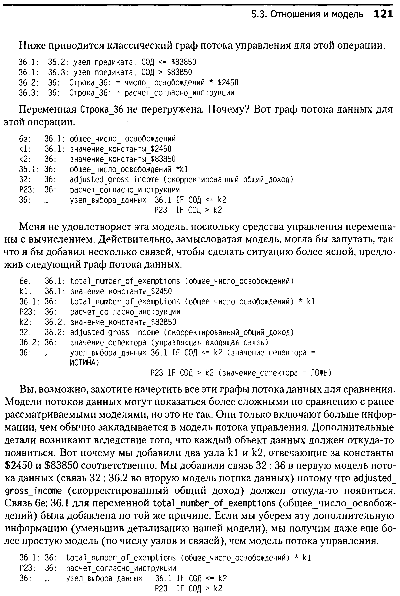

Меня не удовлетворяет эта модель, поскольку средства управления перемешаны с вычислением. Действительно, замысловатая модель, могла бы запутать, так что я добавил несколько связей, чтобы сделать ситуацию более ясной, предложив следующий граф потока данных.

```text
6e:    36.1: total_number_of_exemptions (общее_число_освобождений)
k1:    36.1: значение_константы_$2450
36.1:  36:   total_number_of_exemptions (общее_число_освобождений) * k1
P23:   36:   расчет_согласно_инструкции
k2:    36.2: значение_константы_$83850
32:    36.2: adjusted_gross_income (скорректированный_общий_доход)
36.2:  36:   значение_селектора (управляющая входящая связь)
36:    ...   узел_выбора_данных 36.1 IF СОД <= k2 (значение_селектора =
             ИСТИНА)
                             P23 IF СОД > k2 (значение_селектора = ЛОЖЬ)
```

Вы, возможно, захотите начертить все эти графы потока данных для сравнения. Модели потоков данных могут показаться более сложными по сравнению с ранее рассматриваемыми моделями, но это не так. Они только включают больше информации, чем обычно закладывается в модель потока управления. Дополнительные детали возникают вследствие того, что каждый объект данных должен откуда-то появиться. Вот почему мы добавили два узла $k1$ и $k2$, отвечающие за константы $\$2450$ и $\$83850$ соответственно. Мы добавили связь $32 : 36$ в первую модель потока данных (связь $32 : 36.2$ во вторую модель потока данных) потому что `adjusted_gross_income` (скорректированный общий доход) должен откуда-то появиться. Связь $6e: 36.1$ для переменной `total_number_of_exemptions` (общее_число_освобождений) была добавлена по той же причине. Если мы уберем эту дополнительную информацию (уменьшив детализацию нашей модели), мы получим даже еще более простую модель (по числу узлов и связей), чем модель потока управления.

```text
36.1:  36:  total_number_of_exemptions (общее_число_освобождений) * k1
P23:   36:  расчет_согласно_инструкции
36:    ...  узел_выбора_данных 36.1 IF СОД <= k2
                            P23 IF СОД > k2
```

При качественном проектировании программных средств предполагается, что значения константам $k1$ и $k2$ присвоены раньше в программе или хранятся в таблице. Это намного лучше, чем многократное повторение значений $\$2450$ и $\$83850$ в коде программы. Это правильный подход, поскольку уменьшается вероятность ошибок, при которых якобы постоянные величины в разных местах отличаются друг от друга. Это хорошо также для сопровождения, поскольку в том случае, когда ВНС изменит ставки налогового обложения (что неминуемо когда-нибудь случится), нужно будет изменить одно значение в одном месте$^1$. Это, конечно, правильный подход, но мы не можем быть уверены, что программист так и поступил. Но почему об этом должен заботиться тестировщик? Используя символьные константы в нашей модели, мы уменьшаем вероятность ошибок там, где мы непреднамеренно используем несколько различных значений предполагаемой константы. Хороший дизайн программного обеспечения часто также хорош и для проектирования теста.

IF-THEN. Мне не нравятся конструкции типа IF-THEN в графах потока данных, поскольку они неоднозначны, если условие не выполняется. В графах потока управления неоднозначности меньше, поскольку следующий оператор всегда подразумевается. Большинство конструкций IF-THEN лучше моделировать при помощи конструкций IF-THEN-ELSE, как в следующем примере:

$$\text{IF } (\text{предикат} = \text{ИСТИНА}) \text{ then } x := \text{функция } \text{ELSE } x := \text{пусто}$$

Явно определяйте, что происходит с объектом данных, когда предикат не истинен. Например, постулат:

54: Удержан федеральный налог. Если вы используете форму 1099, отметьте [ГРАФА]

можно представить при помощи следующего псевдокода и модели потока данных, соответственно.

```text
54:   If из_форм(ы)_1099 THEN графа: = отмечена ELSE графа: = не_отмечена
54.1: 54: графа: = отмечена
54.2: 54: графа: = не_отмечена
F1099: 54 значение ЛОЖЬ/ИСТИНА из формы 1099
54    ... узел выбора данных: 54.1 IF F1099 = ИСТИНА
                             54.2 IF F1099 = ЛОЖЬ
```

Будьте осторожны с такими величинами, как ноль и пусто; это не одно и то же. Мы ввели два входных узла в последний пример: $54.1$ графа: $=$ отмечена и $54.2$ графа: $=$ не_отмечена. В обоих случаях графа имеет реальное значение. Таким же образом значение ноль — реальное значение, в то время как пусто не имеет какого-либо значения. Это означает — не определено.

Рассмотрим оператор присваивания: $\text{IF } x > 0 \text{ THEN сэм: } = \text{джо}$. Мы знаем, что делать с сэм, когда $x > 0$, но вдруг $x <= 0$? Есть две альтернативы: либо у переменной сэм нет значения, и она здесь же и создается, либо имеется другое, заранее

---

$^1$ Я начал писать эту книгу в 1992 году. Я должен был исправлять эти числа в 1993, 1994 и, наконец, еще раз в 1995 году. Однако, в отличие от вас, я не мог использовать символьную переменную для этих чисел. Было бы намного проще, если бы я мог так поступить. Если я пропустил несколько обновлений, я уверен, что вы сообщите мне об этом, — но надеюсь, что вы простите меня.

рассчитанное где-то в другом месте графа потока данных значение для `сэм`. Первый случай не представляет проблемы. Мы моделируем его так: `IF x > 0 THEN сэм: = джо ELSE сэм:= пусто`. Второй случай тоже не сложен. Он должен быть смоделирован так: `IF x > 0 THEN сэм: = джо ELSE сэм: = старое_значение_сэм`. Нам снова не нужно сомнительное IF-THEN.

Возможно, проблема возникнет, если переменная `сэм` определена в более чем одном месте. Какое значение нам следует использовать для случая ЛОЖЬ? Это — хороший вопрос, не имеющий простого ответа. Тут возможны варианты, поскольку в случае неоднозначности не бывает очевидного ответа. Конструкция IF-THEN однозначна в графе потока управления, потому что графы потока управления имеют подразумеваемое упорядочение (упорядоченную последовательность). Следовательно, обычно имеется подразумеваемое (предшествующее) значение для такой ситуации. В графах потока данных, в которых нет подразумеваемого упорядочения, значение становится неоднозначным. Вот почему следует избегать использования IF-THEN в подобных моделях. Но заметьте, что неоднозначность в модели увеличивает вероятность ошибок программирования.

В качестве примера использования IF-THEN рассмотрим, как бы мы могли смоделировать строки с 1-й по 5-ю в форме 1040. Здесь приведен псевдокод для этих строк.

```text
1: IF статус налогоплательщика = холост THEN отмечена графа_1: GOTO 6а
2: IF статус налогоплательщика = женат_заполнено_совместно THEN отмечена графа_2: GOTO 6а
3: IF статус налогоплательщика = женат_заполнено_раздельно THEN отмечена графа_3: GOTO 6а
4: IF статус налогоплательщика = домовладелец THEN отмечена графа_4: GOTO 6а
5: IF статус налогоплательщика = вдовец THEN отмечена графа_5: GOTO 6а
```

Этот псевдокод не является неоднозначным в том случае, если мы знаем, что предшествующее состояние всех граф «не отмечена». Поскольку мы не можем быть уверены в этом в случае кода, содержащего ошибки, более предпочтительная модель могла бы выглядеть следующим образом:

```text
1: IF статус = холост THEN графа_1: = отмечена: GOTO 6а ELSE графа_1: = не_отмечена
2: IF статус = жен_сов THEN графа_2: = отмечена: GOTO 6а ELSE графа_2: = не_отмечена
3: IF статус = жен_раздельно THEN графа_3: = отмечена: GOTO 6а ELSE графа_3: = не_отмечена
4: IF статус = домовладелец THEN графа_4: = отмечена: GOTO 6а ELSE графа_4: = не_отмечена
5: IF статус = вдовец THEN графа_5: = отмечена: GOTO 6а ELSE графа_5: = не_отмечена
```

Программисты могут возразить, что этот код нехорош, так как он неоправданно сложен, что само по себе делает код более уязвимым для ошибок, и, кроме того, он не структурирован. Все это правда, но ведь это не код. Это всего лишь модель, в которой мы пытаемся сделать ситуацию как можно более однозначной. Вот модель потока данных для этих действий.

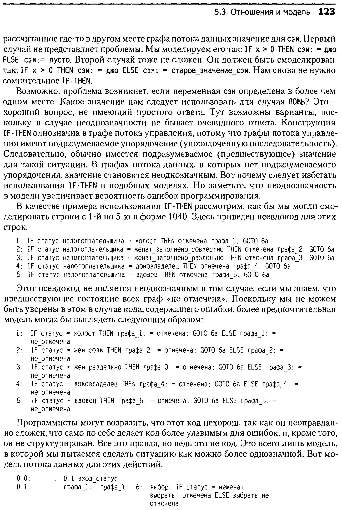

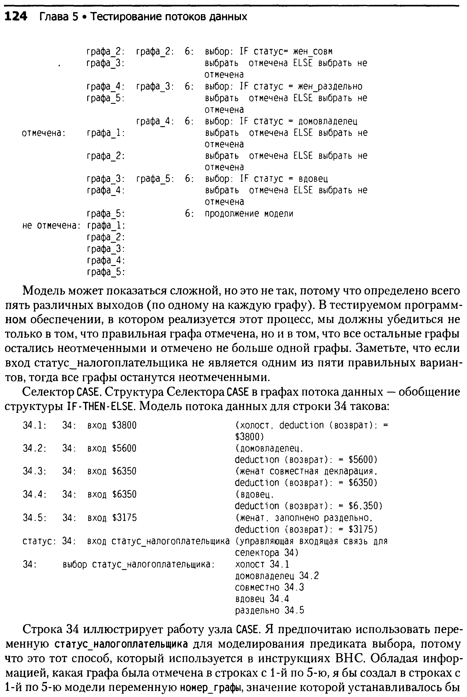

Модель может показаться сложной, но это не так, потому что определено всего пять различных выходов (по одному на каждую графу). В тестируемом программном обеспечении, в котором реализуется этот процесс, мы должны убедиться не только в том, что правильная графа отмечена, но и в том, что все остальные графы остались неотмененными и отмечено не больше одной графы. Заметьте, что если вход статус_налогоплательщика не является одним из пяти правильных вариантов, тогда все графы останутся неотменными.

Селектор CASE. Структура Селектора CASE в графах потока данных — обобщение структуры IF-THEN-ELSE. Модель потока данных для строки 34 такова:

```text
34.1:  34:  вход $3800                 (холост. deduction (возврат): =
                                       $3800)
34.2:  34:  вход $5600                 (домовладелец.
                                       deduction (возврат): = $5600)
34.3:  34:  вход $6350                 (женат совместная декларация.
                                       deduction (возврат): = $6350)
34.4:  34:  вход $6350                 (вдовец.
                                       deduction (возврат): = $6.350)
34.5:  34:  вход $3175                 (женат. заполнено раздельно.
                                       deduction (возврат): = $3175)
статус: 34: вход статус_налогоплательщика (управляющая входящая связь для
                                       селектора 34)
34:    выбор статус_налогоплательщика: холост 34.1
                                       домовладелец 34.2
                                       совместно 34.3
                                       вдовец 34.4
                                       раздельно 34.5
```

Строка 34 иллюстрирует работу узла CASE. Я предпочитаю использовать переменную статус_налогоплательщика для моделирования предиката выбора, потому что это тот способ, который используется в инструкциях ВНС. Обладая информацией, какая графа была отмечена в строках с 1-й по 5-ю, я бы создал в строках с 1-й по 5-ю модели переменную номер_графы, значение которой устанавливалось бы


<!-- ВІДНОВЛЕНО ЛОКАЛЬНО (Стор. 125) -->

<!-- КІНЕЦЬ ВІДНОВЛЕННЯ -->


<!-- ВІДНОВЛЕНО ЛОКАЛЬНО (Стор. 126) -->

<!-- КІНЕЦЬ ВІДНОВЛЕННЯ -->


<!-- ВІДНОВЛЕНО ЛОКАЛЬНО (Стор. 127) -->

<!-- КІНЕЦЬ ВІДНОВЛЕННЯ -->


тий (почему?), и ее мы обсудим в главе 6. Если в вашем случае таких проблем достаточно много, может оказаться, что модель потока данных не подходит для данного случая, и лучше рассмотреть модель потока управления или модель потока транзакций.

*Итерирование.* Если у вас есть узлы выбора, вы можете вернуть результат вычисления назад, в более раннюю точку на графе потока данных и создать цикл. Процесс повторяется до тех пор, пока (как мы надеемся) не выполнится условие прекращения. Циклы и способы их обработки в контексте модели потока данных обсуждаются в разделе 5.3.4.3.

## 5.3.4.2. Совмещение потока управления и потока данных

Модели потока управления и модели потока данных плохо сочетаются [KAVI87]. Каждая модель — это обособленная часть общей картины, сосредоточенная на одних аспектах проблемы и игнорирующая другие. Модель — это способ структурировать наше мышление, необходимый для получения полезных тестов. Если модель чересчур сложна, это только запутает нас. Но как мы должны обрабатывать необходимое упорядочение в рамках модели потока данных? Вот некоторые соображения.

Более одной модели. Сделайте отдельно модель потока данных и модель потока управления. Каждая приведет к различным тестам, и? как мы надеемся, при таком подходе не будет значительного перекрытия созданных тестов. Возможно, вы предпочтете в качестве альтернативы модель с конечным числом состояний (глава 9).

Поместите модель потока управления внутрь модели потока данных. У вас есть повторяющаяся процедура в модели, большей частью определяемой потоками данных. Например, вы должны найти файл, чтобы получить данные, которые затем используются в вычислении. Рассматривайте поиск файла как единичную операцию внутри модели потока данных. Для поиска файла используйте модель потока управления.

Поместите модель потока данных внутрь модели потока управления. Скажем, вы проделываете повторяющуюся обработку для каждой записи файла. Обработка моделируется при помощи графа потока данных. Расположите часть, представляемую потоками данных, внутри модели файла (либо модели потока управления или модели потока транзакций). Рассматривайте файловую часть как модель потока управления, а обработку как модель потока данных.

Когда вы проектируете тестовый вариант, никто не знает, как вы это делаете. Тестовый вариант состоит из исходных условий, вводимых данных, ожидаемых результатов. И история умалчивает (или должна умалчивать) о том, получили ли вы эти результаты, используя модель потока управления, модель потока данных или каким-то другим способом.

## 5.3.4.3. Циклы

Как бы вы ни моделировали проблему и какие бы ни были в ней циклы (необходимые или нет), вам следует использовать методы тестирования циклов из главы 4. К счастью, в потоковых моделях нам нечасто приходится иметь дело с циклами. Мы должны различать необходимые и несущественные циклы.


<!-- ВІДНОВЛЕНО ЛОКАЛЬНО (Стор. 129) -->

<!-- КІНЕЦЬ ВІДНОВЛЕННЯ -->


<!-- ВІДНОВЛЕНО ЛОКАЛЬНО (Стор. 130) -->

<!-- КІНЕЦЬ ВІДНОВЛЕННЯ -->


вится в узле $X_2$ и третья — в узле $X_3$. Это три отдельных модели, позволяющие рассмотреть три случая — выход без прохождения цикла, выход после однократного прохождения цикла и выход после двукратного прохождения цикла. Если вы должны протестировать максимальное число итераций, используйте модель потока управления.

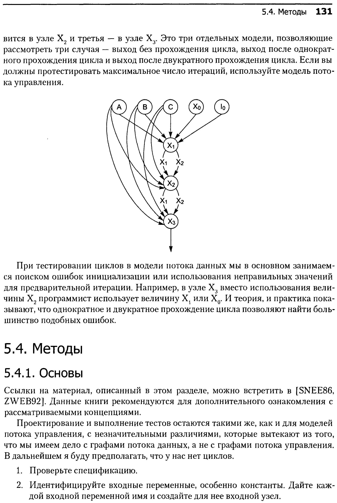

При тестировании циклов в модели потока данных мы в основном занимаемся поиском ошибок инициализации или использования неправильных значений для предварительной итерации. Например, в узле $X_3$ вместо использования величины $X_2$ программист использует величину $X_1$ или $X_0$. И теория, и практика показывают, что однократное и двукратное прохождение цикла позволяют найти большинство подобных ошибок.

## 5.4. Методы

### 5.4.1. Основы

Ссылки на материал, описанный в этом разделе, можно встретить в [SNEE86, ZWEB92]. Данные книги рекомендуются для дополнительного ознакомления с рассматриваемыми концепциями.

Проектирование и выполнение тестов остаются такими же, как и для моделей потока управления, с незначительными различиями, которые вытекают из того, что мы имеем дело с графами потока данных, а не с графами потока управления. В дальнейшем я буду предполагать, что у нас нет циклов.

1. Проверьте спецификацию.
2. Идентифицируйте входные переменные, особенно константы. Дайте каждой входной переменной имя и создайте для нее входной узел.

3. Перепишите спецификацию таким образом, чтобы каждой вычисляемой функции соответствовало одно предложение.
4. Перечислите функции, начиная с тех, которые зависят только от входных переменных.
5. Перечислите функции, зависящие только от входных переменных и результатов функций, перечисленных в пункте 4.
6. Продолжайте подобным образом перечислять функции, пока не охватите их все. У вас должен получиться список, в котором наверху будут находиться функции, зависящие только от входных переменных, а далее, по мере продвижения вниз, будут находиться функции, зависящие от всё большего количества промежуточных вычислений. Заметьте, что, как правило, строгое упорядочение невозможно, но это и не нужно.
7. Проверьте промежуточные функции (в том числе функции, зависящие от входных переменных и от выходных данных других функций) и посмотрите, является ли упородочение необходимым или просто удобным. Если оно необходимо, пометьте соответствующий узел, а также узлы, которые диктуют эту необходимость. Если упородочение не обязательно, посмотрите, можно ли упростить модель, удаляя промежуточные узлы и выражая функцию непосредственно через входные переменные? Если вы можете удалить узлы и связи без чрезмерного усложнения вычисляемой функции, сделайте это.
8. И наоборот, возможно, вы сможете упростить модель, добавляя промежуточный узел для сложного вычисления. Однако если вы продеделаете это, вы должны проверить, является ли ваше промежуточное вычисление верным. Возможно, для этого придется модифицировать исходный код и добавить оператор утверждения.
9. Теперь у вас есть набор узлов (из них каждый имеет имя) которые выражают обработку простейшим для вас способом$^1$.
10. Имеется некое вычисление или функция, связанная с каждым узлом. Переменные в имени данной функции соответствуют узлам, с которыми связан данный узел, то есть, связям. Теперь у вас есть модель.
11. Проверьте вашу модель. Проверьте вашу работу.

Действуйте точно так же, как в случае моделей потока управления. Здесь будут некоторые отличия в деталях, которые мы рассмотрим в дальнейших разделах. Но для начала нам потребуются определения.

*Подграф.* Часть графа, которая соответствует правилам построения графов то есть имеющая узлы входа и выхода, не имеет оборванных связей, не имеет изолированных узлов, и так далее.

---
$^1$ То, что обязательно для вас, совсем не обязательно для меня, и наоборот. Никогда не забывайте, что модели — это мысленные инструменты и что в них нет чего-либо принципиально правильного или неправильного. Они могут быть только полезными или бесполезными. Вы можете предпочесть сохранить несущественное промежуточное вычисление в модели, поскольку знаете, что это будет выгодно в другом контексте или просто потому, что люди часто склонны думать подобным образом.


<!-- ВІДНОВЛЕНО ЛОКАЛЬНО (Стор. 133) -->

<!-- КІНЕЦЬ ВІДНОВЛЕННЯ -->


<!-- ВІДНОВЛЕНО ЛОКАЛЬНО (Стор. 134) -->

<!-- КІНЕЦЬ ВІДНОВЛЕННЯ -->


<!-- ВІДНОВЛЕНО ЛОКАЛЬНО (Стор. 135) -->

<!-- КІНЕЦЬ ВІДНОВЛЕННЯ -->


## 5.4.3. Построение модели

Настало время прекратить теоретизирование и начать построение модели. Давайте разработаем упрощенный вариант для строк с 54 по 60 формы 1040. Вот исходный материал, скопированный из документа ВНС с минимальными изменениями, введенными для ясности.

```text
54:  Federal Tax Withheld (Удержанный федеральный налог)
55:  1994 Estimated Tax Payment (Выплата налога со всех видов дохода в
     1994) and Amount Applied from 1993 Return (Сумма, заявленная в
     декларации 1993)
56:  Earned Income Credit (Налоговые льготы, предоставляемые получателям
     заработной платы)
57:  Amount Paid with Form 4868 (Extension Request) (Сумма, уплаченная в
     соответствии с формой 4868 (Просьба о продлении))
58a: Excess Social Security and RRTA Tax Withheld (Налог на превышение
     социального обеспечения)
59:  Другие выплаты в соответствии с формой 2439 или формой 4136
60:  Общий платеж: сумма строк с 54 по 59.
```

Первое приближение нашей модели почти полностью совпадает со строками налоговой декларации и лишь имеет слегка более формальный вид. В глубине души я надеюсь использовать инструмент, который поможет мне проверить полноту и непротиворечивость этой спецификации, так что заблаговременная формализация — хорошая идея.

```text
54:  60: Federal_Tax_Withheld (Удержанный_федеральный_налог)
55:  60: 1994_Estimated_Tax_Payment
         (Выплата_налога_со_всех_видов_дохода_в_1994) and
         Amount_Applied_from_1993_Return
         (Сумма_заявленная_в_декларации_1993)
56:  60: Earned_Income_Credit
         (Налоговые_льготы_предоставляемые_получателям_заработной_платы)
57:  60: Amount_Paid_with_Form_4868 (Extension_Request)
         (Сумма_уплаченная_в_соответствии_с_формой_4868
         (Просьба_о_продлении))
58a: 60: Excess_Social_Security and RRTA_Tax_Withheld
         (Налог_на_превышение_социального_обеспечения)
59:  60: другие_выплаты (в соответствии с формой 2439 или формой 4136)
60:  60: Общий Платеж: сумма строк с 54 по 59.
```

На самом деле это неправильно, не так ли? Строка 55 по сути является суммой двух слагаемых, строка 58a — сумма двух слагаемых, и строка 59 тоже является суммой двух слагаемых (форма 2349 и форма 4136: Налог со всех видов дохода в 1994 и Сумма, взятая из декларации 1993, соответственно). Мы создадим более детальную модель.

```text
54:  60: Federal_Tax_Withheld (Удержанный_федеральный_налог)
55a: 55: 1994_Estimated_Tax_Payment
         (Выплата_налога_со_всех_видов_дохода_в_1994)
55b: 55: Amount_Applied_from_1993_Return
```

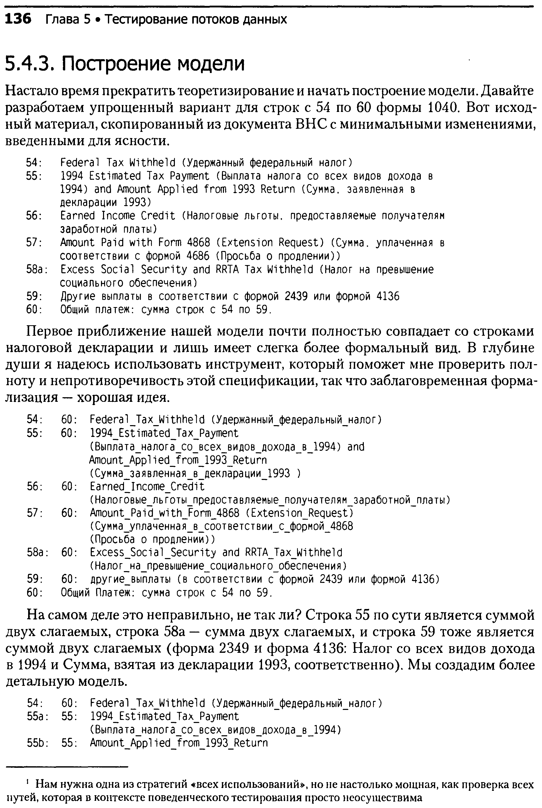

_____________________________
¹ Нам нужна одна из стратегий «всех использований», но не настолько мощная, как проверка всех путей, которая в контексте поведенческого тестирования просто неосуществима


<!-- ВІДНОВЛЕНО ЛОКАЛЬНО (Стор. 138) -->

<!-- КІНЕЦЬ ВІДНОВЛЕННЯ -->


<!-- ВІДНОВЛЕНО ЛОКАЛЬНО (Стор. 139) -->

<!-- КІНЕЦЬ ВІДНОВЛЕННЯ -->


<!-- ВІДНОВЛЕНО ЛОКАЛЬНО (Стор. 140) -->

<!-- КІНЕЦЬ ВІДНОВЛЕННЯ -->


ном (и требующем больших затрат) тестировании вам следует взять оба порожденных подграфа. В нашем примере это добавляет только один тест, но если у нас есть много узлов выбора, расположенных один за другим в каждом порожденном подграфе, разница в подходах может стать разительной. Эти два метода соответствуют применению того, что формально известно как *критерий всех использований (ВИ)* (берется какой-либо один порожденный подграф, который влияет на значение W) и *критерий Всех путей-определение (ВПОИ)* (берется каждый порожденный подграф, влияющий на значение W). ВПОИ — более полный метод, чем *ВИ*, но требует больших трудозатрат. Исходя из эмпирического доказательства, приведенного в [WEYU90], вы сможете получить больше преимуществ, выбрав *ВИ*. Таким образом, убедитесь, что вы включили по крайней мере один порожденный подграф для каждого выхода, а не все возможные порожденные подграфы, которые появляются вследствие всех возможных комбинаций выбора в селекторах (и, как мы увидим, всех комбинаций значений для предикатов потока управления и условий циклов).

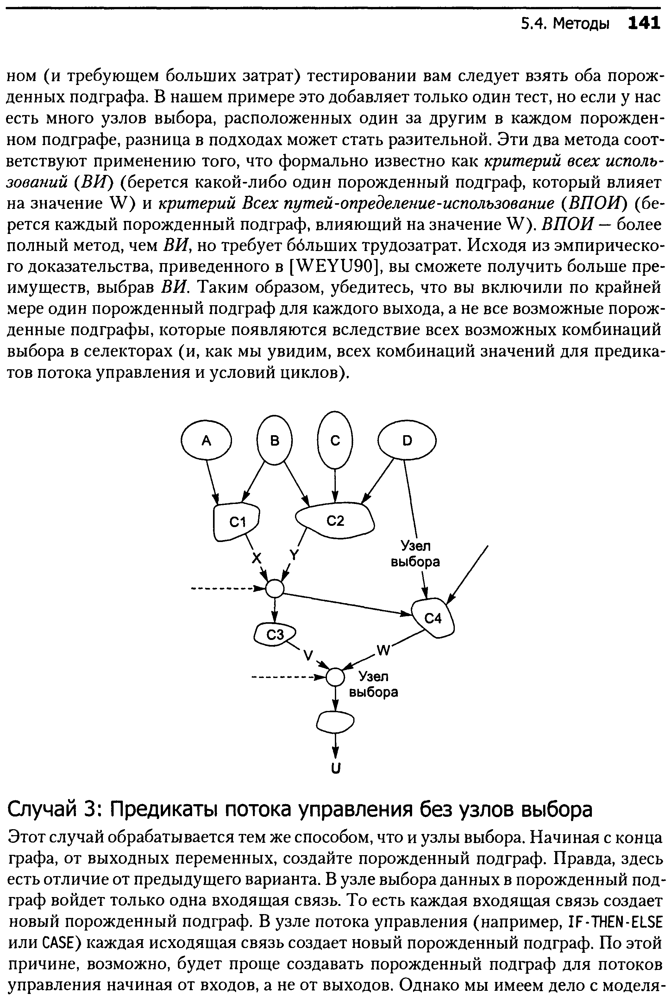

## Случай 3: Предикаты потока управления без узлов выбора

Этот случай обрабатывается тем же способом, что и узлы выбора. Начиная с конца графа, от выходных переменных, создайте порожденный подграф. Правда, здесь есть отличие от предыдущего варианта. В узле выбора данных в порожденный подграф войдет только одна входящая связь. То есть каждая входящая связь создает новый порожденный подграф. В узле потока управления (например, `IF-THEN-ELSE` или `CASE`) каждая исходящая связь создает новый порожденный подграф. По этой причине, возможно, будет проще создавать порожденный подграф для потоков управления начиная от входов, а не от выходов. Однако мы имеем дело с моделя-

ми потока данных, и элементы потока управления встречаются здесь (по крайней мере, на это следует надеяться) лишь случайно. Ситуация показана на следующем рисунке.

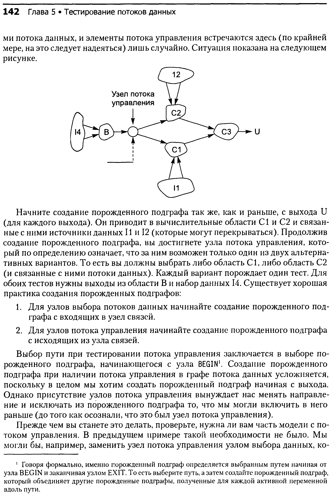

Начните создание порожденного подграфа так же, как и раньше, с выхода U (для каждого выхода). Он приводит в вычислительные области C1 и C2 и связанные с ними источники данных I1 и I2 (которые могут перекрываться). Продолжив создание порожденного подграфа, вы достигнете узла потока управления, который по определению означает, что за ним возможен только один из двух альтернативных вариантов. То есть вы должны выбрать либо область C1, либо область C2 (и связанные с ними потоки данных). Каждый вариант порождает один тест. Для обоих тестов нужны выходы из области B и набор данных I4. Существует хорошая практика создания порожденных подграфов:

1. Для узлов выбора потоков данных начинайте создание порожденного подграфа с входящих в узел связей.
2. Для узлов потока управления начинайте создание порожденного подграфа с исходящих из узла связей.

Выбор пути при тестировании потока управления заключается в выборе порожденного подграфа, начинающегося с узла $\text{BEGIN}^1$. Создание порожденного подграфа при наличии потока управления в графе потока данных усложняется, поскольку в целом мы хотим создать порожденный подграф начиная с выхода. Однако присутствие узлов потока управления вынуждает нас менять направление и исключать из порожденного подграфа то, что мы могли включить в него раньше (до того как осознали, что это был узел потока управления).

Прежде чем вы станете это делать, проверьте, нужна ли вам часть модели с потоком управления. В предыдущем примере такой необходимости не было. Мы могли бы, например, заменить узел потока управления узлом выбора данных, ко-

$^1$ Говоря формально, именно порожденный подграф определяется выбранным путем начиная от узла BEGIN и заканчивая узлом EXIT. То есть выберите путь, а затем создайте порожденный подграф, который объединяет другие порожденные подграфы, полученные для каждой активной переменной вдоль пути.


<!-- ВІДНОВЛЕНО ЛОКАЛЬНО (Стор. 143) -->

<!-- КІНЕЦЬ ВІДНОВЛЕННЯ -->


Я буду строить эту модель для случая, когда ваш супруг(а) (если он(а) есть) не работает, и вы можете (или не можете) внести взнос в ИПС за него. Полная модель (в которую включен работающий супруг) оставлена в качестве упражнения для самостоятельного выполнения. Вы можете предположить, что в этой модели некоторые из узлов и связей на самом деле не нужны, например, такие как: C1a, C3a, C4, C5 и C7. Я сохранил все узлы, следующие за узлом выбора, в качестве меры предосторожности и для того, чтобы быть уверенным в том, что узел выбора в этой модели явный, а не скрытый, по аналогии с формой. Строка 5 (узел 5) была сохранена, поскольку подобная строка имеется в форме BHC, и у нас будет возможность проверить ее значение.

```text
k1: CC1a константа = $2000
    CC7
BC1a: CC1a ВХОД ваш_взнос_в_ИПС_94
C2a: CC3a ВХОД your_94_wages
          (Ваша_заработная_плата_в_1994 ??)
     CC4a
BC7: CC7  ВХОД взнос_супруга_в_ИПС_94
k2: CC4a константа = $2250
CC1a: C1a ВЫБРАТЬ мин min(k1, BC1a)
C1a: CC3a
CC3a: C3a ВЫБРАТЬ мин min(C1a, C2a)
C3a: ВЫХОДᴀ ВЫХОД в Строку 23а Формы 1040
     C5
C5:  C6   (замечание: спецификация BHC неправильна,
          вместо "Строка3" должно быть сказано
          "Строка3а" - подобные пустяки как раз и порождают ошибки)
CC4a: C4  ВЫБРАТЬ мин (C2a, k2) (замечание: в этом месте еще одна ошибка
          BHC)
C4:  C6
C6:  CC8  C4-C5
CC7: C7   ВЫБРАТЬ мин (BC7, k1)
C7:  CC8  ВЫБРАТЬ мин (C6, C7)
CC8: C8   ВЫХОД в строку 23b формы 1040
```

Сначала мы выбираем простые порожденные подграфы. Одним из них является случай взноса в ИПС, вводимого в строку 23а формы BHC 1040. Порожденный подграф, начинающийся от выходного узла ВЫХОДа, содержит узлы k1, BC1a, CC1a, C1a, CC3a, C2a, C3a, ВЫХОДа и соответствующие связи. Тут имеются два узла выбора (и предикаты), но только три возможности, зависящие от того, какая из следующих величин меньше: $2000, 1994 Взнос в ИПС, или заработная плата в 1994 году. В силу этого наш порожденный подграф приводит к трем тестовым вариантам, которые следует активизировать позже.

Вывод в строке 8 для супружеского взноса в ИПС более сложен из-за того, что выбор этого вывода приводит к включению в наш порожденный подграф всего графа, за исключением узла ВЫХОДа. Я буду строить свои порожденные графы методично, двигаясь от конца к началу, и буду пытаться обеспечить покрытие связей и узлов, не покрытых предыдущим тестовым вариантом. Получившиеся цепочки выглядят следующим образом.

Тест 1: C8, CC8, C6, C5, C3a, CC3a, C1a, CC1a, BC1a, C4, CC4a, k2
Тест 2: C8, CC8, C6, C5, C3a, CC3a, C1a, CC1a, k1, C4, CC4a, C2a

Тест 3: С8. СС8. С6. С5. С3а. СС3а. С2а. С4. СС4а
Тест 4: С8. СС8. С6. С5. С3а. СС3а. С1а. СС1а. k1. С4. СС4а. k2
Тест 5: С8. СС8. С7. CC7. ВС7
Тест 6: С8. СС8. С7. CC7. К1

Заметьте, что я выписывал имена узлов, а не связей. В общем случае вы должны выписать все связи или ясно показать, что вы определяете набор сегментов путей через граф потока данных, которые определяют порожденный подграф. Например, более точное представление будет таким:

Тест 1: С8. СС8. С6. С5. С3а. СС3а. C1a. CCla. BC1a/C6. С4. СС4а. k2

Я использовал сокращенную запись, поскольку в данном случае она недвусмысленна. В случае более сложного потокового графа она может быть неоднозначной и для точной идентификации маршрута будет недостаточно просто перечислить имена узлов.

Заметьте, что в отличие от тестирования потока управления, где мы следовали только вдоль одного набора стрелок, в данном случае, поскольку С6 содержит вычисление, затрагивающее С4 и С5, нам следует включить в порожденный подграф обе связи. Для узлов выбора, однако, в порожденный подграф включается ветвь только для выбранной входящей связи. Может быть, и есть возможность обойтись меньшим количеством тестов, но я не слишком к этому стремился. Задача заключается в том, чтобы обеспечить покрытие связей, а не минимизировать количество тестовых вариантов. Узлы выбора здесь коварны, потому что они основаны на сравнении двух величин, я имею в виду $\text{MIN (А, В)}$. Если обе величины одинаковы, вы не знаете, какую связь следует использовать, так что это не слишком хорошая основа для тестовых вариантов (по крайней мере, для попытки обеспечить покрытие связей).

## 5.4.6. Активизация

Каждый тест соответствует порожденному подграфу. Если порожденные подграфы были определены корректно, тогда для активизации одного подобного порожденного подграфа достаточно задать только его входные величины. Активизация происходит по большей части так же, как это было описано для потоков управления, за исключением того случая, когда вы можете решить, что проще начать с выхода и двигаться в направлении входов. Если же в порожденном подграфе нет узлов выбора или узлов потока управления, об активизации не стоит и говорить. Любые приемлемые входные значения подойдут.

В случае существования узлов выбора или узлов потока управления следует выполнить несколько процедур.

1. Обратите внимание на минимальные и максимальные значения для каждого входа. Если значения составляют некоторое множество, запишите все значения из него.
2. Двигайтесь по всем ветвям порожденного подграфа в обратном направлении (к началу), отмечая пути, которые достигают входов без прохождения через узлы выбора (потоков данных или потоков управления). Вы можете


<!-- ВІДНОВЛЕНО ЛОКАЛЬНО (Стор. 146) -->

<!-- КІНЕЦЬ ВІДНОВЛЕННЯ -->


<!-- ВІДНОВЛЕНО ЛОКАЛЬНО (Стор. 147) -->

<!-- КІНЕЦЬ ВІДНОВЛЕННЯ -->


<!-- ВІДНОВЛЕНО ЛОКАЛЬНО (Стор. 148) -->

<!-- КІНЕЦЬ ВІДНОВЛЕННЯ -->


ку оно включает в себя тестирование потоков управления как составной элемент. Поскольку мы избегаем несущественных потоков управления в моделях потока данных, мы допускаем, что программисты умеют сами избавляться от простых ошибок потока управления. Это смещает акценты в сторону поиска ошибок данных. В моей систематике ошибок [BEIZ90] это ошибки 42xx. К подобным ошибкам относятся ошибки исходных и конечных значений, ошибки дублирования и искажения имен, перегрузка, неверный элемент, неверный тип, плохие указатели, аномалии потоков данных (например, закрытие файла до его открытия).

## 5.5.3. Ограничения и предостережения

1. Тестирование потоков данных не может быть лучше вашей модели. И оно не будет работать, если и вы не поработаете над несколькими типичными проблемами.
2. Вы все еще не нашли недостающие требования в спецификации.
3. Вы с большей вероятностью обнаружите неправильные характеристики программного обеспечения, если обеспечите проверку каждого вывода.
4. Тестирование потоков предпочтительнее использовать для выявления ошибок на высоких уровнях интеграции.
5. Тестирование потоков данных может потерять эффективность в том случае, если программное обеспечение и проектирование тестов выполнены одним и тем же человеком. К тестированию потоков управления это имеет меньшее отношение, поскольку принципы, лежащие в основе тестирования потоков данных и тестирования потоков управления, настолько различны, что одна только смена принципа, вероятно, приведет к новой перспективе, даже если речь идет об одном и том же человеке.
6. Вы по-прежнему можете не заметить случайную корректность, но ее вероятность легче оценить.
7. Ваши тесты не лучше, чем ваш оракул.
8. Тестирование потоков данных вряд ли вам поможет, если вы не нашли способа проверить промежуточные узлы.

## 5.5.4. Автоматизация и инструментальные средства

К концу 1994 года не существовало коммерческих сервисных программ, поддерживающих поведенческое тестирование потоков данных. Существует множество частных программ, поддерживающих структурное тестирование потоков данных на C и Паскале [FRAN85, HARR89, HORG92, KORE85, KORE88, LASK90, OSTR91, WILS82]. Если у вас есть средство проектирования, поддерживающее диаграммы потоков данных, справьтесь у продавца, почему оно не обеспечивает автоматизацию проектирования тестов.

5.6. Резюме

Тестирование потоков данных — более эффективный метод, чем тестирование потоков управления. Он основан на определении модели потоков данных и использовании этой модели в качестве основы для проектирования тестов. Тесты создаются путем выбора порожденных подграфов — движением от выходных узлов ко всем входным узлам порожденного подграфа. Мы определили несколько метрик покрытия, но метод всех использований, дополненный разверткой циклов (двукратной), рекомендован в качестве минимально приемлемой метрики.

## 5.7. Вопросы для самопроверки

1. Дайте определения следующих терминов: покрытие всех определений, покрытие всех путей определение — использование, покрытие всех узлов, покрытие всех предикатов, покрытие всех использований, логический оператор проверки условия, управляющая входящая связь, удобное упорядочение, использование в вычислениях, граф потоков данных, порожденный подграф, узел выбора данных, предикат выбора данных, определять, необходимый цикл, необходимое упорядочение, значение входящей связи, входной узел, покрытие ввода/вывода, значение связи, развертка цикла, необязательный цикл, значение исходящей связи, выходной узел, пусто, перегрузка, узел с предикатом, использование в предикате, узел обработки, псевдопеременная, запоминающий узел, подграф, использование.
2. Покажите, что строка 6 в бланке ИПС никогда не может быть отрицательной как для работающего, так и неработающего супруга(и), так что в данном случае необязательно проводить сравнение с нулем. Подсказка: операция МИН — транзитивна.
3. Переделайте Бланк ИПС, включая логические потоки и потоки данных для случаев работающего и не работающего супруга. Выберите порожденный подграф, активизируйте его и разработайте тестовые варианты.
4. Создайте модели потока данных для формы 1040. Трактуйте данные, взятые из других форм, как входные переменные. Для каждого случая спроектируйте модель, выберите порожденные подграфы и разработайте тестовые варианты, используя покрытие ввода/вывода, покрытие узлов и стратегию всех использований. Проверьте вашу работу, используя налоговый пакет или электронную таблицу в качестве оракула. Вы можете переписать налоговый пакет и взять входные значения из других форм. (а) строки 1–6, (б) строки 7–22, (в) строки 32–40, (г) строки 41–46, (д) строки 47–53, (е) строки 54–60, (ж) строки 61–65.
5. То же, что и задание 4. Форма 1040, Бланк SE, краткая форма, строки 1–6, но задействуйте логику, чтобы определить, может ли быть использована краткая форма. Используйте граф только потоков данных, затем проделайте то же самое с использованием модели графа потоков управления и покрытием

условий предикатов и переделайте задание, используя смесь модели потоков управления и модели потоков данных.

6. Форма 1040, бланк на строке 10. Полная форма.
7. Форма 1040, бланк на строке 22, social security income (выплаты по социальному страхованию). Полная форма.
8. Форма 1040, бланк на строке 34, dependent deductions (льготы иждивенца). Полная форма.
9. Форма 2106, только транспортные расходы. Рассмотрите случай только одного транспортного средства. Включите разделы А, В и С, но не D, и исключите строки 1–10.
10. Форма 2688, Application for Extension to File (Заявление о продлении срока). Форма целиком.
11. Форма 2210, Неполная оплата налогов. (а) только строка 1, (б) часть II, (в) часть III, (г) часть IV, раздел А, (д) часть IV, раздел В. Предположите, что вы можете использовать краткий метод (Часть III) в случае, если не сделали отметок в графах 1b, 1с, или 1d. Во всех случаях выводы (если таковые имеются) идут в соответствующую строку Формы 1040. То есть не заботьтесь о Формах 1040А, 1040NR, 1041 и так далее.
12. Смоделируйте часть IV формы 2210 как граф потоков управления с детерминированным циклом и протестируйте его соответствующим образом.
13. Представьте форму 2210 целиком в виде графа потока данных с одним узлом для каждой из частей II, III, IV A и IV B. Моделируйте часть I по своему усмотрению, но следите за тем, чтобы высокоуровневая модель правильно определяла, когда надо использовать часть III.
14. Проделайте задание 4 для формы 3903 целиком, Employee Moving Expenses (Расходы служащего на передвижение).

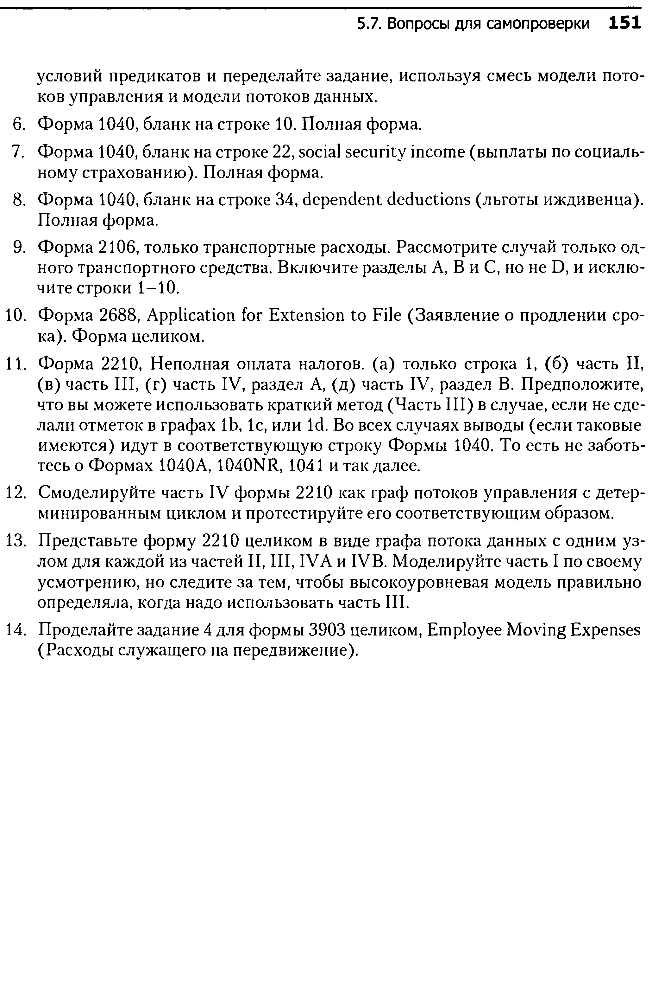

# 6. Тестирование потоков транзакций

## 6.1. Обзор

Графы потока транзакций используют в системном тестировании приложений, работающих в режиме онлайн, и программного обеспечения для пакетной обработки. Этот граф обладает свойствами как потока управления, так и потока данных.

## 6.2. Основные термины

**Внешние термины**: поглощать, подтверждать прием, приложение, архивные данные, аудит, пакет, вызов, емкость, проверка, код, коммуникации, конкатенация (объединение), параллельный, аварийный отказ, данные, база данных, блок данных, ошибка в данных, регистрация данных, отлаживать, проектировать, драйвер устройства, диагностика, дискретный, динамический, ошибка, глобальные данные, иерархия, входящий, инициализировать, ввод, ошибка ввода, целое число, установка, интерфейс, логика, модель, неединичный вход, неединичный выход, многозадачность, сеть, операционная система, выходной, раздел, эффективность, приоритет, распределение вероятности, обработка, узел обработки, программа, программист, язык программирования, протокол, запрос, очередь, случайный, прием, запись, восстановление, сброс, ресурс, маршрутизация, сценарий, обеспечение безопасности, последовательность, сервер, имитатор, синхронный, мгновенная запись, программное обеспечение, сортировка, ключ сортировки, стек, подпрограмма, система, задача, среда тестирования, временная отметка, след, значение.

**Внутренние термины**: ветвление, свободный от ошибок, компонент, тестирование компонентов, составной предикат, поток управления, поток данных, на-

чальный узел, конечный узел, модель конечного числа состояний, граф, входящая связь, ввод, интеграция, промежуточный узел, связь, покрытие связей, вес связи, цикл, тестирование цикла, модельная программа, узел, покрытие узлов, итог, исходящая связь, путь, предикат, отношение, активизировать, порожденный подграф, спецификация, состояние, субмодель, системный тест, проект теста, путь теста, тестирование, критерии соответствия.

*Транзакция* — единичная операция по обработке данных.

*Маркер транзакции* — метка (например, точка), которая отображает присутствие транзакции на модельной связи.

*Контрольная запись транзакции* — гипотетическая или фактическая запись, которая содержит данные о транзакции. В фактической записи нет необходимости, однако во многих системах она присутствует. Там, где контекст позволяет, вместо термина «контрольная запись транзакции» будет использоваться термин «запись транзакции».

*Состояние транзакции* — потенциально это значения всех данных в контрольной записи транзакции или ее неявном эквиваленте. Но, как правило, состояние выражают лишь частью данных записи, зачастую целым числом.

*Тип транзакции* — некое обозначение, например, целое число, которое используется для идентификации транзакций различных типов.

*Стартовый узел* — узел в модели графа потока транзакций, в котором транзакция начинает нас интересовать. Это входной узел графа потока транзакций.

*Завершающий узел* — узел в модели графа потока транзакций, в котором транзакция прекращает нас интересовать. Это выходной узел графа потока транзакций.

*Задача* — каждая задача в графе потока транзакций представлена узлом.

*Узел ветвления* — узел, в котором входящая транзакция выбирает одну из нескольких альтернативных исходящих связей. Так, на рисунке входящая транзакция вышла на самую верхнюю связь.

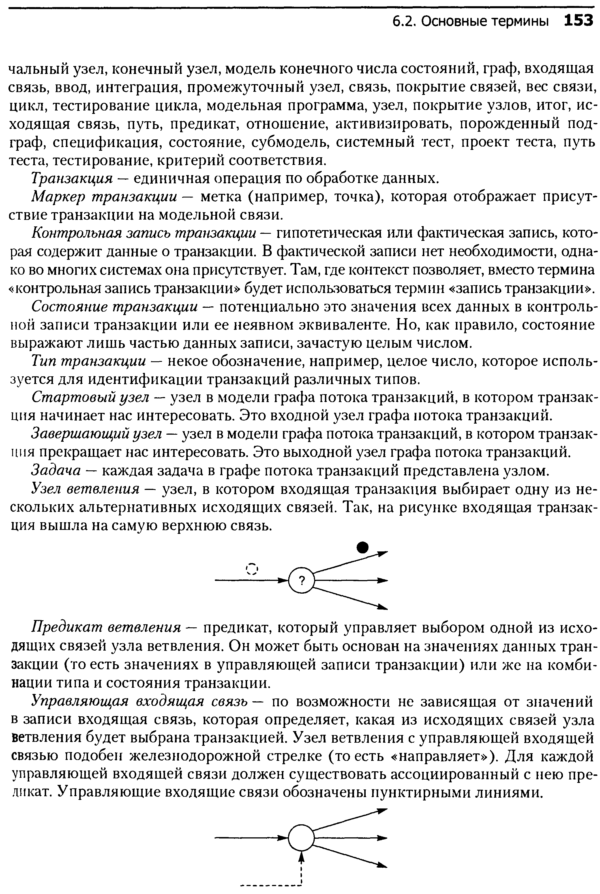

*Предикат ветвления* — предикат, который управляет выбором одной из исходящих связей узла ветвления. Он может быть основан на значениях данных транзакции (то есть значениях в управляющей записи транзакции) или же на комбинации типа и состояния транзакции.

*Управляющая входящая связь* — по возможности не зависящая от значений в записи входящая связь, которая определяет, какая из исходящих связей узла ветвления будет выбрана транзакцией. Узел ветвления с управляющей входящей связью подобен железнодорожной стрелке (то есть «направляет»). Для каждой управляющей входящей связи должен существовать ассоциированный с нею предикат. Управляющие входящие связи обозначены пунктирными линиями.

Узел соединения — транзакция, поступающая по любой из входящих связей узла пересечения, выйдет по единственной исходящей связи этого узла соединения. Это то же самое, что и соединительные узлы пересечения в графах потоков управления.

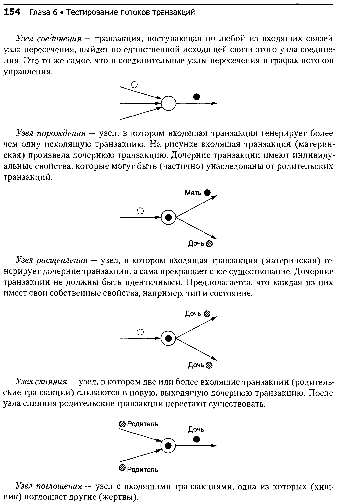

*Узел порождения* — узел, в котором входящая транзакция генерирует более чем одну исходящую транзакцию. На рисунке входящая транзакция (материнская) произвела дочернюю транзакцию. Дочерние транзакции имеют индивидуальные свойства, которые могут быть (частично) унаследованы от родительских транзакций.

*Узел расщепления* — узел, в котором входящая транзакция (материнская) генерирует дочерние транзакции, а сама прекращает свое существование. Дочерние транзакции не должны быть идентичными. Предполагается, что каждая из них имеет свои собственные свойства, например, тип и состояние.

*Узел слияния* — узел, в котором две или более входящие транзакции (родительские транзакции) сливаются в новую, выходящую дочернюю транзакцию. После узла слияния родительские транзакции перестают существовать.

*Узел поглощения* — узел с входящими транзакциями, одна из которых (хищник) поглощает другие (жертвы).

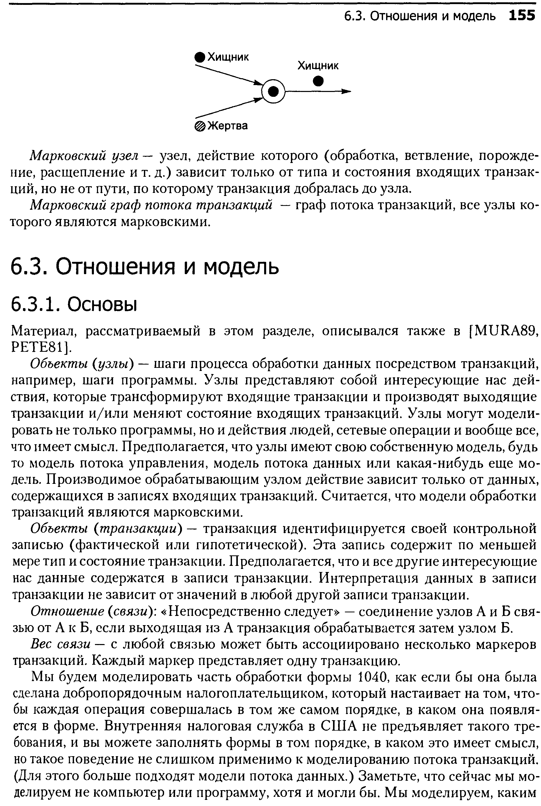

*Марковский узел* — узел, действие которого (обработка, ветвление, порождение, расщепление и т. д.) зависит только от типа и состояния входящих транзакций, но не от пути, по которому транзакция добралась до узла.

*Марковский граф потока транзакций* — граф потока транзакций, все узлы которого являются марковскими.

## 6.3. Отношения и модель

### 6.3.1. Основы

Материал, рассматриваемый в этом разделе, описывался также в [MURA89, PETE81].

*Объекты (узлы)* — шаги процесса обработки данных посредством транзакций, например, шаги программы. Узлы представляют собой интересующие нас действия, которые трансформируют входящие транзакции и производят выходящие транзакции и/или меняют состояние входящих транзакций. Узлы могут моделировать не только программы, но и действия людей, сетевые операции и вообще все, что имеет смысл. Предполагается, что узлы имеют свою собственную модель, будь то модель потока управления, модель потока данных или какая-нибудь еще модель. Производимое обрабатывающим узлом действие зависит только от данных, содержащихся в записях входящих транзакций. Считается, что модели обработки транзакций являются марковскими.

*Объекты (транзакции)* — транзакция идентифицируется своей контрольной записью (фактической или гипотетической). Эта запись содержит по меньшей мере тип и состояние транзакции. Предполагается, что и все другие интересующие нас данные содержатся в записи транзакции. Интерпретация данных в записи транзакции не зависит от значений в любой другой записи транзакции.

*Отношение (связи): «Непосредственно следует»* — соединение узлов А и Б связью от А к Б, если выходящая из А транзакция обрабатывается затем узлом Б.

*Вес связи* — с любой связью может быть ассоциировано несколько маркеров транзакций. Каждый маркер представляет одну транзакцию.

Мы будем моделировать часть обработки формы 1040, как если бы она была сделана добропорядочным налогоплательщиком, который настаивает на том, чтобы каждая операция совершалась в том же самом порядке, в каком она появляется в форме. Внутренняя налоговая служба в США не предъявляет такого требования, и вы можете заполнять формы в том порядке, в каком это имеет смысл, но такое поведение не слишком применимо к моделированию потока транзакций. (Для этого больше подходят модели потока данных.) Заметьте, что сейчас мы моделируем не компьютер или программу, хотя и могли бы. Мы моделируем, каким

образом Виления Вистерия (наш субъект) заполняет декларацию о подоходном налоге.

```text
11: 12: Предыдущий шаг в модели
12: 13: НЕ узел ветвления (имеется коммерческий доход?)
12.1: ДА
12.1: 12.2: узел порождения. 1040 продолжается
С: дочерняя транзакция. для обработки Бланка С
С: 12.2: заполненный Бланк С (узел расщепления)
С-фин: заполненный Бланк С для налоговой службы
12.2: 13: узел поглощения. данные Бланка С поглощаются 1040
13 ... узел 13 - это узел соединения
```

Узел 12 является узлом ветвления, так как транзакция должна либо продолжить заполнять Бланк С, либо обойти его, если нет дохода от индивидуальной трудовой деятельности. Узел 12.1 — это узел порождения, из которого начинается дочерняя транзакция для Бланка С. Предположим, что на этом уровне в узел С приходит незаполненный Бланк С, а выходит из узла С уже заполненный. Узел 12.2 представляет собой узел поглощения, потому что здесь данные Бланка С заносятся в форму 1040. Узел С — узел расщепления, так как нам необходима копия Бланка С для налоговой службы, а также для формы 1040. Наконец, узел 13 является узлом соединения, потому что форма 1040 может появиться на любой из входящих в него связей, но не на обеих.

## 6.3.2. Маркировки

*Маркировка*. Набор всех меток (и связанных с ними состояний) на всех связях в любой момент времени называется маркировкой графа потока транзакций. Для всего графа потока транзакций маркировка является тем же самым, чем является состояние для отдельной транзакции.

*Очередь*. Связь, которую можно маркировать более чем одной меткой, представляет собой очередь. Это может, конечно, быть и обрабатывающая очередь, но она может также представлять собой и обычную очередь из ожидающих людей.

Проследим путь следования одной транзакции через граф потока транзакций. Если бы не существовало узлов расщепления и порождения, это было бы эквивалентно маркировке пути в графе потоков управления. Но две детали делают эту простую интерпретацию маловероятной — существование очередей и узлы слияния и поглощения.

Мы можем использовать различные маркировки, определяя, какие маркеры и на каких связях появляются на каждом шагу. В нашей модели есть два вида символов: форма 1040 и Бланк С, сокращенные до «Ф1040» и «Б-С» соответственно. Если в модели есть только одна транзакция, то существуют две возможные маркировки в зависимости от того, выполняем ли мы Бланк С.

```text
Без Бланка С:
Шаг 1: 11/12   Ф1040
Шаг 2: 12/13   Ф1040

С Бланком С:
Шаг 1: 11/12   Ф1040
```

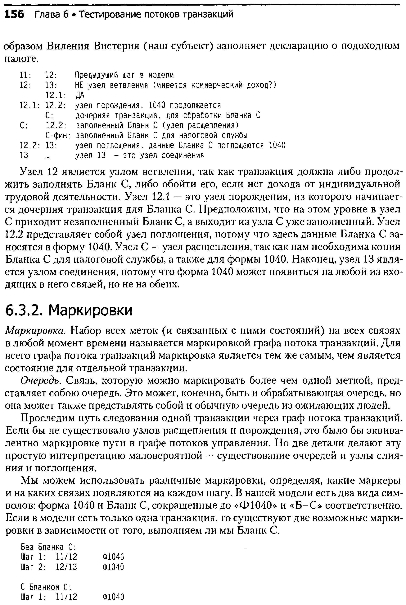

Шаг 2: 12/12.1 Ф1040
Шаг 3: 12.1/12.2 Ф1040. 12.1/С Б-С
Шаг 4: 12.1/12.2 Ф1040. С/12.2 Б-С. С/С-фин SC-C
Шаг 5: 12.2/13 Ф1040. С/С-фин Б-С

Предположим, что дети Вилении ведут свой собственный бизнес, а Виления заполняет за них налоговые декларации. Ее дети вносят данные в свои индивидуальные Бланки С, если это необходимо, а она заполнит за них всех формы 1040. Формы 1040 инициируются в узле 11 (только для этой подмодели). Они поступают в узел 12, который обрабатывает Виления. Она решает, необходим ли Бланк С. У Вилении много других дел, поэтому она может и не принять это решение немедленно. Следовательно, на входящей связи узла 12 накапливается очередь из форм 1040. Когда у Вилении появляется время, она помещает те формы 1040, которым не нужен Бланк С, в очередь к узлу 13. А для тех форм 1040, которым действительно необходим Бланк С, она берет пустой бланк С, заносит туда имя ребенка и помещает его в очередь Бланка С (12.1/С). Обработка Бланка С осуществляется детьми Вилении. Заполненные Бланки С поступают в очередь к С/12.2, откуда Виления забирает их путем переноса данных в подходящую форму 1040. На связи 12.1/12.2 также накапливается очередь.

Число маркеров на любой из связей потенциально бесконечно, а, следовательно, и число потенциально разных маркировок для всего графа потенциально бесконечно. Хотя у Вилении, как кажется, бесчисленное число детей, она имеет чуть ли не безграничное терпение, поэтому для нее это не проблема — но для нас. В идеале нам следует тестировать графы потока транзакций для всех возможных пометок. Практически же это невозможно, поэтому всегда следует искать определенный компромисс.

## 6.3.3. Очереди

Детальное описание очередей можно встретить в [COOP81].

Все реальные очереди ограничены, то есть они имеют некий максимально возможный размер. При выходе за пределы этих размеров плохо протестированные системы могут неожиданно выйти из строя, так что стоит тестировать максимально возможный размер очереди. Если существует очередь, то должно быть и правило упорядочения — то есть правило, определяющее, в каком порядке транзакции будут поступать из очереди для обработки. Ниже приведены некоторые распространенные правила.

Правило FIFO — «первым пришел — первым вышел» («first-in, first-out»), называемое также «First-Come-First-Served» — («первым прибыл — первым обслужен»). Транзакция, которая раньше всех поступила в очередь, будет обработана раньше всех. Это самое простое правило очень распространено. Но представьте, что было бы, если Виления настаивала, чтобы все заполненные Бланки С возвращались к ней в том же порядке, в каком она отдавала их на обработку.

Правило LIFO — «последним пришел — первым ушел» («last-in, first-out»), называемое также LCFS «Last-Come-First-Served» — («последним прибыл — первым обслужен»). Транзакция, которая позже всех поступила в очередь, будет обработана раньше всех. Подобная очередь является обрабатывающим стеком,

в котором входящие транзакции помещаются на вершину стека и удаляются с вершины.

*Пакет.* При возникновении определенных условий, таких как определенное число транзакций в очереди, или же в оговоренный момент времени обрабатываются все транзакции в очереди в пакетном режиме. При этом во время обработки новые транзакции накапливаются в новой очереди.

*Случайное обслуживание.* Обслуживание осуществляется случайным образом — возможно, на основе вероятностного распределения по некоторой величине в контрольной записи транзакции.

*Очередь по приоритету.* Каждая транзакция имеет свой приоритет. Этот приоритет может быть фиксированным или зависеть от свойств транзакции, например, от ее возраста. Каждая группа транзакций с данным приоритетом обрабатывается как отдельная очередь, причем очередь с наибольшим приоритетом обрабатывается первой. Внутри отдельной группы транзакций с данным приоритетом сервис может осуществляться по принципу FIFO, LIFO и т. д.

*Множественная обработка.* Для обработки очереди может использоваться один сервер (односерверная очередь) или несколько серверов (многосерверная очередь). Кроме правила упорядочения конкретной очереди, может существовать правило выбора сервера. Например, в супермаркете можно выбрать, в какую из очередей к кассам встать. В билетной кассе аэропорта, на почте, в банке нужно стоять в основной очереди и ожидать обслуживания до тех пор, пока работник учреждения не скажет «Следующий!»

Далее термин *простая очередь* будет использоваться для обозначения односерверной очереди без приоритета, обслуживаемой по принципу FIFO. Если правило упорядочения не оговорено, то наиболее вероятно, что это простая очередь. За ней следует очередь, обслуживаемая по принципу FIFO в зависимости от приоритета. Очередь с данным приоритетом обрабатывается по принципу FIFO, но первой обрабатывается очередь с наибольшим приоритетом, затем очередь с более низким приоритетом и т. д. Если вы имеете дело с очередью, не являющейся простой, то убедитесь, что очередность приоритетов и, если необходимо, правило выбора сервера реализованы правильно.

## 6.3.4. Слияние и поглощение

Существование узлов слияния и поглощения создает дополнительные проблемы при тестировании. Становятся необходимыми тесты синхронизации. Чаще всего возникают новые проблемы и вопросы, которые следует себе задать.

1. Правильные ли типы транзакций объединились?
2. В случае двух транзакций А и В, которые объединяются (или для А, поглощающей В), появляются пять дополнительных ситуаций, которые необходимо протестировать:
   * А приходит, а В — никогда не приходит (А).
   * В приходит, а А — никогда не приходит (В).
   * А приходит раньше В (А, В).


<!-- ВІДНОВЛЕНО ЧЕРЕЗ GEMINI (Стор. 159) -->
* В приходит раньше A (B, A).
* Обе транзакции приходят одновременно (то есть в пределах оговоренного времени) (AB).

3. Правилен ли тип выходящей транзакции? Для поглощения это хищник, а для объединения — дочерняя транзакция.

При тестировании необходимо рассмотреть каждый из этих случаев. Для узла слияния, имеющего три связи, потребуется протестировать 25 возможных вариантов. Для обозначения одновременных входов транзакций в узел слияния мы будем использовать совместное написание, а для раздельных — запятые. Например, (AB, C) означает, что A и B приходят в узел одновременно, а за ними следует C. Необходимо рассмотреть 25 тестовых вариантов. Ниже следуют тестовые варианты для поглощения или слияния, в котором участвуют три транзакции.

Каждая транзакция по отдельности: (A), (B), (C).

Две транзакции за раз: (A, B), (A, C), (B, C), (B, A), (C, A), (C, B), (AB), (AC), (CB).

Три транзакции за раз: (A, B, C), (B, A, C), (C, A, B), (A, C, B), (B, C, A), (C, B, A), (A, BC), (B, AC), (C, AB), (BC, A), (AC, B), (AB, C), (ABC).

Число необходимых тестов быстро возрастает для узлов слияния с несколькими объединяющимися транзакциями. Проектирование тестов легко автоматизировать, но трудно заставить транзакции приходить в определенные узлы в определенном порядке. Так как слиянию и поглощению подвергаются чаще всего транзакции, которые уже прошли через какие-то операции обработки, в отличие от транзакций, пришедших извне, то выполнение этих тестов практически невозможно.

## 6.3.5. Циклы

С одной стороны, циклы в потоках транзакций, строго говоря, создают проблемы. А с другой стороны, они встречаются редко, и если встречаются, то они просты и встречаются нечасто. Цикл, который чаще всего можно обнаружить в потоке транзакций, — это цикл повторения обработки после обнаружения ошибки ввода данных. Так, например, банкомат дает вам три попытки ввода вашего личного идентификационного номера. Можно ожидать, что похожие циклы повторения будут встречаться в большинстве интерфейсов, таких как каналы связи с другими системами, драйверы устройств и т. д. Очереди, обслуживаемые как пакет, очевидно, содержат цикл для обработки пакетов. Сходным образом каждый узел обработки, обслуживающий очередь, работает в составе цикла для того, чтобы обрабатывать каждый последующий элемент в очереди и продолжать работу далее. Таким образом, он активируется каждый раз до тех пор, пока очередь не иссякнет. Такие циклы следует тестировать отдельно для каждого узла обработки на более низком уровне интеграции и тестирования. А это означает, что необходимо выполнять тестирование циклов различных узлов обработки транзакций в контексте компонентного тестирования этих узлов обработки.

## 6.3.6. Фокус и иерархические модели

Модель потока транзакций можно использовать при различных степенях детализации, вплоть до кода. Однако создавать модели потока транзакций на уровне
<!-- КІНЕЦЬ ВІДНОВЛЕННЯ -->


исходного кода — отнюдь не самая лучшая идея. Узлы на графах потока транзакций могут представлять собой не только действия программного обеспечения. Термин «обработка данных» был использован в общем смысле для обозначения любого вида работы с данными, вне зависимости от того, выполняется ли эта работа компьютером, людьми или другими системами. Модель потока транзакций обычно используется как высокоуровневая модель. Наиболее часто ее используют в системном тестировании. Корректную работу компонентов следует проверить при компонентном тестировании, обычно это делают на предшествующей стадии интеграции. Разделение сложного действия на компоненты представляется в модели потока транзакций лишь выборочно. Но при этом следует учитывать некоторые детали.

1. Компоненты модели имеют интерфейсы, через которые происходит передача данных. Обратите внимание, что глобальные данные могут соответствовать этому требованию.
2. Компоненты могут взаимодействовать только через свои интерфейсы. Если есть такие компоненты, сгруппируйте их и моделируйте группу как отдельный объект.
3. Поведение компонента определяется типом и состоянием транзакции.
4. Поведение узла обработки не зависит от предыстории транзакции, если только предыстория не влияет на тип и состояние транзакции. Отдельный процесс должен быть марковским.
5. Можно проверить корректность поведения узла обработки путем проверки выходящих транзакций (или их контрольных записей) каждого процесса в модели.
6. При наличии соответствующих средств тестирования можно полностью протестировать один компонент в отдельности.

При тестировании потока транзакций первоочередное внимание следует обращать не на корректную работу отдельных процессов, а на систему в целом. Особенное внимание следует уделять корректности интерфейсов между компонентами, корректности маршрутизации транзакций между компонентами, организации и дисциплине очередей (если это не правила упорядочения FIFO), узлам слияния, поглощения, расщепления и порождения, синхронизации, одновременности, созданию и уничтожению транзакций, а также дублированию и потере транзакций.

## 6.4. Методика

### 6.4.1. Основы

Предположим, что у нас нет циклических транзакций. Если же вы встретите такие, будем надеяться, что их применение в данном случае является обоснованным, и их можно протестировать в пределах субмодели, включающей цикл. Для

любых циклов, которые невозможно обработать на более низком уровне, нужно будет использовать методики тестирования циклов, описанные в главе 4.

1. Проверьте спецификацию.
2. Идентифицируйте и дайте имя всем транзакциям, которые должна обработать система. У вас не должно возникнуть проблем с «нормальными» транзакциями, так как они все должны присутствовать в спецификации. Трудности обычно возникают с транзакциями, которые подразумеваются в спецификации, но не сделаны явными. Ниже приведены примеры транзакций, которые часто пропущены в спецификациях, но должны присутствовать в вашей модели.
   * Подтверждения о приеме, уведомление, отрицательное квитирование.
   * Специальные транзакции для установки и отладки.
   * Специальные транзакции для диагностики действий.
   * Транзакции, выполняющие аудит других транзакций.
   * Транзакции, используемые в режиме обучения персонала.
   * Транзакции инициализации или перенастройки для всех внешних интерфейсов.
   * Транзакции, используемые при восстановлении системы.
   * Транзакции, используемые для измерения характеристик системы.
   * Транзакции, используемые для проверки обеспечения безопасности системы.
   * Транзакции, используемые в протоколах, не упомянутых выше.
   * Транзакции, используемые для запроса о статусе других транзакций.
   * Ответы на запросы о статусе транзакций.
   * Транзакции, создаваемые вашей системой для восстановления других транзакций.
   * Транзакции восстановления, полученные из внешних систем.
3. Определите иерархию типов транзакций, которая включает все транзакции, описанные выше в пункте 2. Как правило, вы можете использовать ту же иерархию, что и разработчики. Такой подход делает коммуникации проще.
4. Определите состояние транзакции для каждого типа транзакции. Состояния должны соответствовать последовательности обработки, присущей типу транзакции. Если состояния представляют собой простую последовательность пунктов, например «шаг 1, шаг 2, шаг 3, ... выход», то достаточно будет просто составить список. Если есть признаки более сложного поведения, то вам, вероятно, будет необходимо использовать модель с конечным числом состояний (см. главу 9).
5. Определите поведение транзакции в любой момент ее жизненного цикла. Как она порождается (или поступает в систему), как завершается (или

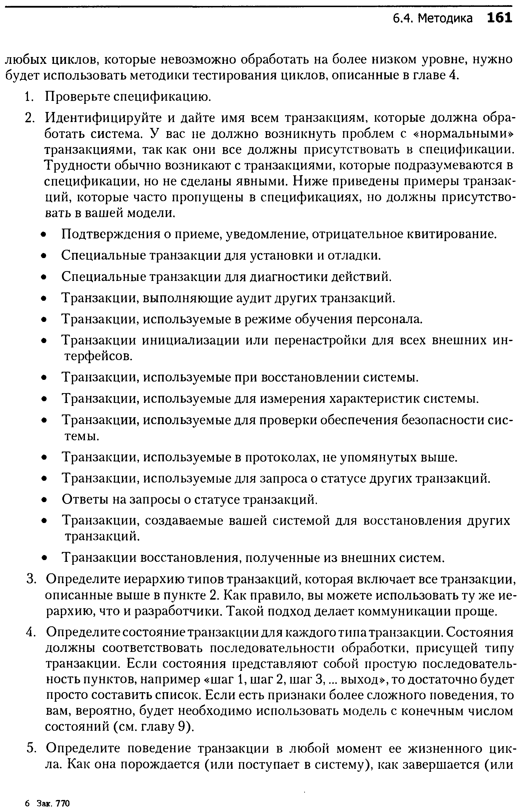

выходит из системы), как происходит операция слияния (и с кем), как поглощается, расщепляется, порождает другую транзакцию и т. д.

6. Определите гипотетическую контрольную запись для каждого из типов транзакций. Запись должна отображать по меньшей мере тип и состояние транзакции. При этом в большинстве систем по обработке транзакций вы должны быть в состоянии использовать действительную контрольную запись транзакции, реализованную в программном обеспечении. Для внешних транзакций, — таких как, например, транзакции, обрабатываемые другими системами или людьми, — вам необходимо будет определить подходящую гипотетическую запись.

7. Идентифицируйте все очереди. Определите для каждой очереди источник (источники) появления транзакций, правило их упорядочения, приоритеты в пределах одного правила, а также применяемую обработку. Протестируйте ограничения всех очередей, которые имеют ограниченные максимально возможные размеры.
   * Каким образом отдельные элементы помещаются в очередь?
   * Каким образом отдельные элементы удаляются из очереди?
   * Какая модель очереди используется -- односерверная или многосерверная? Если многосерверная, каково правило выбора сервера?

8. Идентифицируйте компоненты обработки (это не обязательно должно быть программное обеспечение). Сгруппируйте компоненты в соответствии с принципами, описанными выше в разделе 6.3.6. Возможно, потребуется переопределить типы транзакций, выполнить слияние типов транзакций, удалить очереди и т. д., если этот этап моделирования приводит к необходимости группировки нескольких компонентов для того, чтобы удовлетворить критериям раздела 6.3.6.

9. Для каждого из определенных на предыдущем этапе компонентов решите, каким образом вы будете тестировать отдельные компоненты. По своей внутренней структуре каждый компонент может представлять собой другую — модель потока транзакций более низкого уровня или же модель иного вида.

10. Несмотря на то, что реальные компоненты не обязательно действуют подобным способом, отделите расщепления/порождения и слияния/поглощения от связанных с ними узлов обработки путем помещения явного узла расщепления/порождения после обрабатывающего узла и явного узла слияния/поглощения до обрабатывающего узла.

11. После выполнения предыдущих пунктов у вас должен быть набор узлов и связей, определяющих полный набор потоков транзакций, которые необходимо протестировать.

12. Верифицируйте модель, используя модельную программу, написанную на удобном языке программирования. Это может оказаться эффективным в моделях потока транзакций, потому что они чаще всего достаточно велики.

Типичная система по обработке транзакций содержит много простых транзакций. Говоря «много», я подразумеваю «тысячи». Говоря «простые», я подразумеваю, что ветвления, соединения, расщепления, порождения, слияния и поглощения очень редки.

13. Определите пути прохождения ваших тестов. Вы можете использовать как отдельные пути в графе, так и порожденные подграфы. Действуйте точно так же, как и при использовании других методик.
14. Активизируйте порожденные подграфы.
15. Предскажите итоги.
16. Определите критерий соответствия.
17. Выполните тесты.
18. Подтвердите итоги.
19. Проверьте значения во всех промежуточных узлах.

## 6.4.2. Иерархия покрытия

Как и везде, в этой технике тестирования существует набор практических критериев покрытия, от самых простых (наименее трудоемких и неэффективных) до наиболее эффективных (основательных, но трудоемких).

1. Покрытие ввода/вывода и порождения/завершения. Проведите достаточное число тестов и убедитесь, что все старты и порождения транзакций были осуществлены и что были созданы все исходящие транзакции (в том числе порожденные в данной системе). Эти тесты могут показаться слишком слабыми, однако многие системы не проходят даже их. Рассмотрите все типы транзакций, о которых шла речь выше в разделе 6.4.1 (а также те специфические транзакции, о которых я не говорил, но которые существуют в вашем приложении). Это тот минимум, который может сделать разумный человек. Исходя из здравого смысла, это эквивалентно гарантии того, что каждая строка кода была протестирована на уровне компонентов. Если кто-то полагает, что в тестировании типа транзакций нет необходимости, то он либо уверен, что транзакция не содержит ошибок, либо считает, что она вообще не нужна. Если она не нужна, уберите ее, и у вас будет на один источник ошибок меньше. Наиболее редко используемые транзакции содержат больше всего ошибок. Дурную славу в этом отношении имеют транзакции, связанные с восстановлением.
2. Покрытие узлов. Покрытие узлов само по себе тоже не имеет смысла, поскольку оно только еще раз подтверждает выводы, сделанные при тестировании модели более низкого уровня, например, в ходе тестирования компонентов. Покрытие узлов — это все же лучше, чем ничего, так как мы убеждаемся, что все порождения, расщепления, слияния, поглощения и обработки в очереди транзакции ведут себя корректно. Этой проверки также могут не пройти многие системы.

3. Покрытие связей. Используя тесты, обеспечивающие покрытие связей, мы проверяем не только корректность отдельных узлов, но и их взаимодействие друг с другом. Без покрытия связей тестирование системы будет неполным. Обеспечивая покрытие связей, мы убеждаемся не только в том, что все транзакции корректно обрабатываются (покрытие узлов делает это за нас), но и в том, что на каждом шаге обрабатываются именно те транзакции, которые и должны.

4. Порожденные подграфы. Понятие порожденного подграфа в этом контексте практически полностью совпадает с аналогичным понятием для потока данных (см. главу 5). Если существуют только узлы ветвления и соединения, то порожденный подграф соответствует пути «вход — выход» в созданной модели. Если существуют узлы порождения или расщепления, то порожденный подграф получается путем следования по всем связям, исходящим из узла порождения или расщепления и дальнейшего следования по пути прохождения этих транзакций до завершающего узла. Если существуют узлы слияния или поглощения, то порожденный подграф получается при следовании вдоль входящих связей до точки, где сливающиеся транзакции (или хищник/жертва) порождаются или входят в систему. Более подробно мы будем говорить о порожденных подграфах в разделе 6.4.4.

## 6.4.3. Построение модели

Я бы предпочёл построить модель потока транзакций для налоговой декларации, но, поскольку в процедуре заполнения налоговой декларации отсутствуют транзакции, такая модель не подходит. Возможно, лучшим выбором в данном случае будет модель потока данных. Однако для того, чтобы использовать налоговые формы в максимально возможном числе упражнений и чтобы показать вам, что почти любую модель можно использовать в любом приложении, я буду моделировать Employee Business Expense (Бизнес расходы наемного служащего), форма 2106. Я буду рассматривать каждый вход или группу входов так, как если бы они были транзакциями.

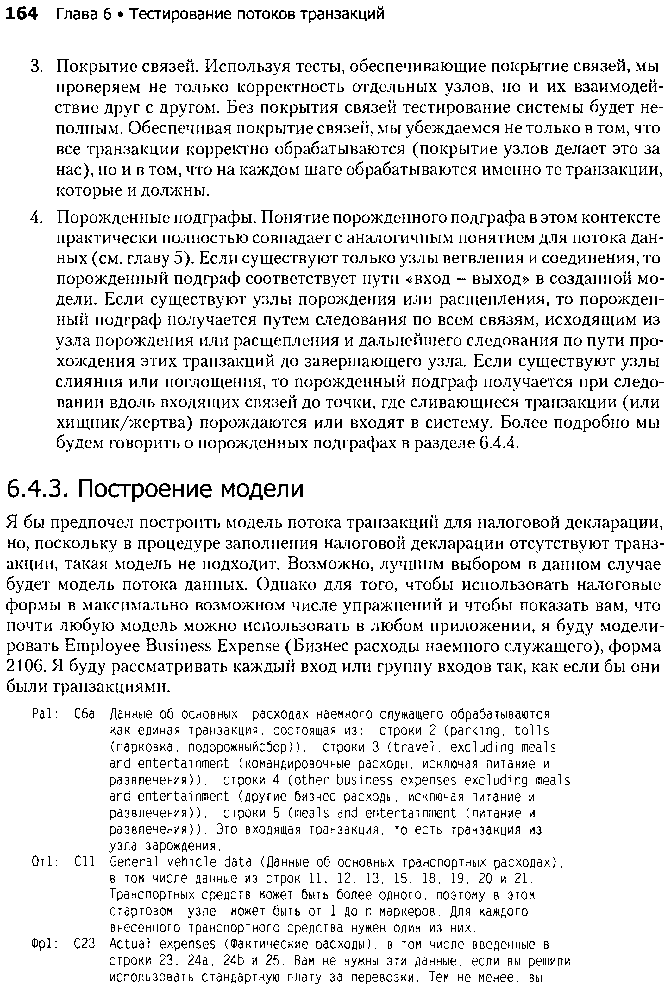

можете выбрать фактические расходы. Для этого стартового узла у вас могут быть значения от нуля до $n$. Это число может быть меньше, чем для $Ot_1$, но не может быть больше.

Am1: C30 Depreciation (Амортизация). Сюда входят данные из строк 30, 31, 33 и 36. Этот стартовый узел не может иметь больше маркеров, чем $Фр1$, поскольку вам не обязательно эксплуатировать все ваши транспортные средства.

Ф1: Ф1a Стартовый узел с незаполненной формой 2106 (за исключением name, social security number, occupation (имени, номера социального страхования и рода деятельности)). Эта форма будет обработана и отослана обратно, на строку 20 бланка А, где она и возникла.

Ф1а: C1 Ф1а — узел ветвления, в нем делается выбор: будут обрабатываться транспортные расходы или не будут. (С1) здесь соответствует ветке НЕТ. Транзакции в форме 2106 могут пойти либо по этой ветке, либо по ветке Ф1д, не не по двум одновременно.

Ф1д Это ветка ДА, соответствующая наличию хотя бы одного транспортного средства.

C1: C6a C1 — это узел соединения, в который приходит либо транзакция 2106 из узла Ф1а (нет транспортных расходов), либо из узла Т1 (транспортные расходы заполнены).

C6a: C10 Узел поглощения, в котором поглощаются данные об основных расходах наемного служащего (Pa1). Форма 2106 является хищником, а Pa1 - жертвой и Pa1 перестает существовать.

C10: Выход (прохождение транзакции обратно в бланк А).

Ф1д: C11a C11a — это узел порождения, где вы даете начало необходимому числу транзакций: по одной на каждое транспортное средство.

T1 Место, в котором вы, пройдя форму 2106, ожидаете vehicle deduction (налоговых льгот на транспортное средство).

T1: C1 T1 — это узел поглощения, в котором налоговые льготы на транспортное средство вводятся в форму 2106.

Тсум T1 Тсум — это узел, в котором сливаются данные обо всех транспортных средствах.

C11a: Тсум Детали, оставленные для вас в качестве упражнения (2).

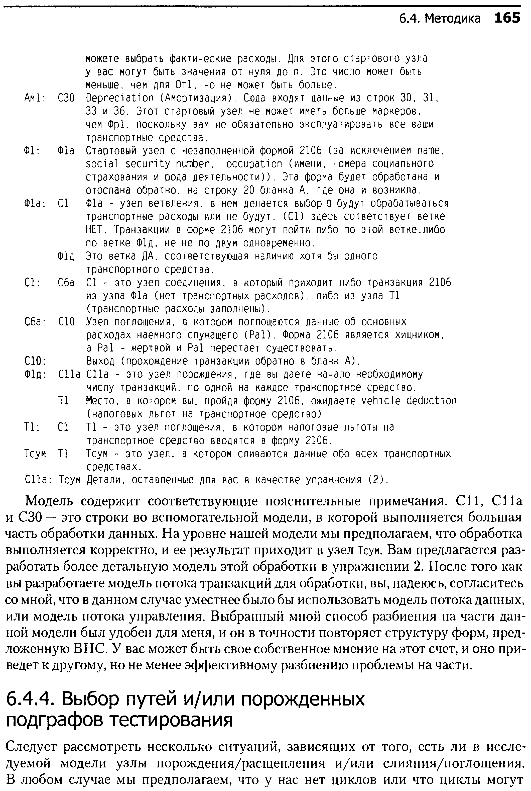

Модель содержит соответствующие пояснительные примечания. C11, C11a и С30 — это строки во вспомогательной модели, в которой выполняется большая часть обработки данных. На уровне нашей модели мы предполагаем, что обработка выполняется корректно, и ее результат приходит в узел Тсум. Вам предлагается разработать более детальную модель этой обработки в упражнении 2. После того как вы разработаете модель потока транзакций для обработки, вы, надеюсь, согласитесь со мной, что в данном случае уместнее было бы использовать модель потока данных, или модель потока управления. Выбранный мной способ разбиения на части данной модели был удобен для меня, и он в точности повторяет структуру форм, предложенную BHC. У вас может быть свое собственное мнение на этот счет, и оно приведет к другому, но не менее эффективному разбиению проблемы на части.

## 6.4.4. Выбор путей и/или порожденных подграфов тестирования

Следует рассмотреть несколько ситуаций, зависящих от того, есть ли в исследуемой модели узлы порождения/расщепления и/или слияния/поглощения. В любом случае мы предполагаем, что у нас нет циклов или что циклы могут

присутствовать во вспомогательных моделях. Поскольку модели потоков транзакций, как правило, состоят из множества маленьких независимых субмоделей, то, скорее всего, даже если вы решите использовать модель потока транзакций, может оказаться, что некоторые из субмоделей лучше описываются при помощи модели потока данных или модели потока управления. Ниже приведены некоторые наиболее часто встречающиеся случаи:

1. Чистая модель потока управления, есть только ветвления и соединения.
2. Узлы слияния и поглощения, нет ветвлений, нет соединений.
3. Узлы слияния и поглощения с ветвлениями и соединениями.
4. Управляющие потоки с расщеплениями и порождениями, но без слияний и поглощений.
5. Общий случай.

## Случай 1: Чистая модель потока управления

Этот случай полностью идентичен случаю тестирования потока управления. Если все потоки транзакций подобны потокам управления, то лучше выбрать модель потоков управления. По сравнению с моделями потоков управления модели потоков транзакций имеют три отличия:

1. Обычно приходится рассматривать много потоков транзакций, несмотря на то, что все они относительно простые.
2. Большая вероятность существования моделей с числом входов и выходов, отличным от единицы. Транзакции могут приходить из разных источников и вследствие этого помещаться в различные очереди на обработку. Транзакции могут направляться в различные точки назначения и вследствие этого помещаться в различные выходные очереди. Нам недостаточно убедиться в корректности обработки транзакций, необходимо также проверить, что транзакции прошли правильным маршрутом. В принципе вас не должно удовлетворять простое покрытие связей, вы должны обеспечить такое покрытие для всех имеющих смысл комбинаций «вход — выход».
3. Кроме того, вам еще надо рассмотреть и проверить правила упорядочения в очередях.

## Случай 2: Узлы слияния и поглощения, нет ветвления, нет соединения

Как обсуждалось в главе 5, разделе 5.4.4, это случай чистой модели потока данных. Вы можете создать порожденный подграф для каждого возможного выхода. Вы начинаете его строить из выходного узла и идете в обратном направлении к стартовому узлу(ам) для данного выхода. Включите все обратные ветвления, поскольку все они вносят свой вклад в обработку данных. В нашем примере, строя порожденный подграф, идущий назад из $C_{10}$, мы придем в $C_{6\text{a}}$. Затем мы должны включить в него связь из узла $C_{1}$ (и все, что в него входит) и связь из $P_{\text{a1}}$, поскольку обе связи поставляют в $C_{6\text{a}}$ данные, необходимые для обработки.

Случай 3: Узлы слияния и поглощения с ветвлением и соединением

В этом случае порождения и расщепления отсутствуют. Несколько транзакций входят в модель, и меньшее их число выходит. Остальные транзакции поглощаются в процессе прохождения модели. Этот случай идентичен случаю 3 раздела 5.4.4 главы 5. Если вы прочли эту главу, то вам надо прочесть то, что относится к данному случаю еще раз, и интерпретировать его на языке потоков транзакций. Если вы не читали про этот случай, то прочитайте, игнорируя все, что касается узлов выбора. Убедитесь, что вы, по крайней мере, охватили достаточное количество путей, чтобы обеспечить покрытие связей.

Вы создаете порожденный подграф так же, как в предыдущем случае, за исключением того, что после узлов соединения вы должны следовать по обеим входящим в этот узел соединения связям, чтобы убедиться, что вы включили в порожденный подграф все источники данных. Этот порожденный подграф определяет набор тестовых вариантов.

Рассмотрим существующие в модели узлы ветвления. Каждое значение параметра, управляющего ветвлением, определяет выбор одного из альтернативных путей. Выберите один из них. Теперь некоторые входные транзакции уже не нужны, следовательно, их можно убрать. Продолжайте этот процесс до тех пор, пока у вас не останется только один определенный путь (и соответствующие входные транзакции). Проделайте это еще раз, выбрав другую ветвь для другого варианта тестового варианта. Перебор следует продолжать до тех пор, пока вы не обеспечите покрытия связей.

Случай 4: Управляющие потоки с расщеплениями и порождениями, но без слияний и поглощений

Это достаточно простой случай. Начните с выхода и сделайте порожденный подграф для каждой транзакции, приходящей в выходные узлы. Сделайте один порожденный подграф (от выхода до всех стартовых узлов, имеющих к нему отношение) для каждой выходной транзакции. Поделите этот порожденный подграф на более мелкие части (больше тестовых вариантов), чтобы обеспечить покрытие связей для узлов ветвления.

Случай 5: Общий случай

В данном случае не существует простых рецептов. Общая идея состоит в том, чтобы сделать порожденный подграф для каждой выходной транзакции. Включите в него все входные транзакции, обеспечивающие данные. Если в каком-либо из этих порожденных подграфов существуют управляющие потоки, убедитесь, что вы разделили их и получили дополнительные тестовые варианты, гарантирующие покрытие связей в каждом из порожденных подграфов. Может показаться, что мы создаем избыточные тестовые варианты, поскольку порожденные подграфы перекрываются, — и, обеспечив покрытие связей для транзакции типа А, мы можем проделать это заново для транзакции типа В (в другом порожденном подграфе, включающем в себя некоторые ветви из предыдущего порожденного подграфа). Для мотивировки этого, казалось бы, избыточного действия достаточно

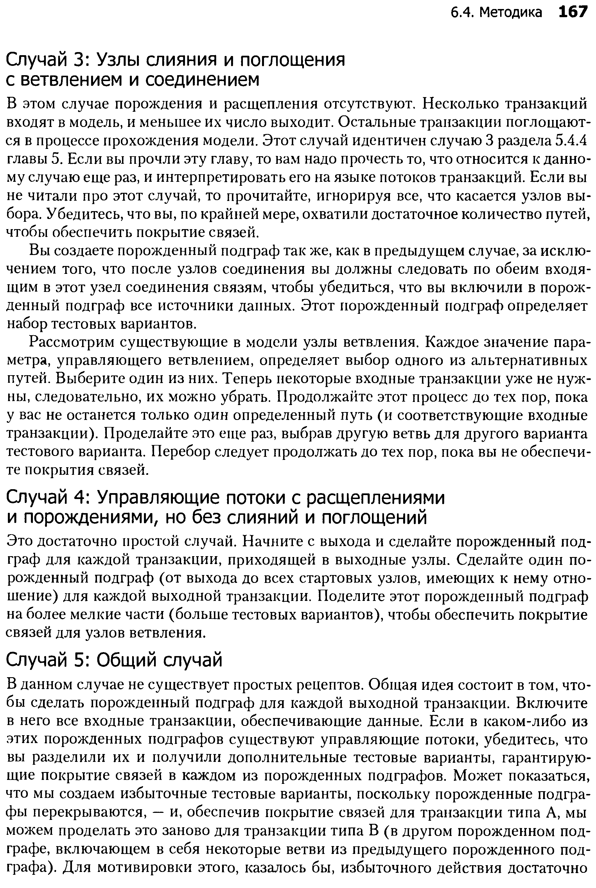

задать себе вопрос: «Что является целью тестирования?» Я уже ранее говорил, что системное тестирование — это не проверка работы отдельных узлов, а проверка того, правильно ли транзакции проходят от обработки к обработке. Поскольку большая часть обработки (в случае потоков транзакций) включает в себя условные ветви, которые частично зависят от типа транзакций, то не лишним будет проверить одну и ту же логику для различных типов транзакций. По сути, такое «избыточное» покрытие связей может оказаться единственным способом проверить глубоко скрытые составные предикаты.

Используя данные выше рекомендации, мы получаем два семейства тестов.

$$\text{C10/C6a/pa1. C6a/C1/}\Phi\text{1a/}\Phi\text{1}$$
$$\text{C10/C6a/pa1. C6a/C1/T1/}\Phi\text{1д/}\Phi\text{1a/}\Phi\text{1. T1/Tсум/...C11a...}\Phi\text{T1/}\Phi\text{p1/Ам1}$$

Это два семейства тестов, поскольку для транспортных средств возникает много тестов. И поэтому мы должны проверить вопросы синхронизации и поведение очереди.

## 6.4.5. Тестирование синхронизации

При слиянии двух или более транзакций или если одна поглощает другую, мы всегда должны спроектировать и провести тестирование синхронизации. В нашей модели мы можем рассмотреть в качестве примера узел C6a или узел T1. Оба они являются узлами поглощения. Узел C6a незамысловат, и для его проверки нам необходимо пять тестов. Узел T1 представляется более интересным и перспективным, поскольку в нем происходит слияние формы (льготы на транспортное средство), которая порождена в этой же модели. Посмотрев на эту модель, вы можете ошибочно заявить: «Мне не нужно пяти тестовых вариантов. Путь от $\Phi$1д к T1, очевидно, короче, чем путь, лежащий через процедуру обработки транспортного средства (от C11a до Tсум). Таким образом, я могу сделать вывод, что транзакция формы 2106 всегда приходит в узел T1 раньше, чем данные о транспортном средстве, и ждет их там. Значит, у нас есть только 2 варианта для рассмотрения. Либо форма 2106 приходит раньше данных о транспортном средстве, либо данные о транспортном средстве отсутствуют».

Если вы и в самом деле так считаете, то делаете ошибочное допущение и попадете в ту же ловушку, что и программисты, создавшие программу, которую вы тестируете. Это всё рациональные приближения, однако природа ошибок не рациональна. К тому же все связи, входящие в T1, могли бы представлять собой очереди (в данном примере это не так), и правило упорядочения может вызывать любые перестановки.

Если вы не можете с уверенностью сказать, что возможен лишь один определенный порядок (например, форма 2106 приходит раньше данных о транспортном средстве), то вам будет лучше проверить все случаи. Система должна вести себя разумно для всех случаев. Я подразумеваю, что она не уничтожает, не изменяет и не теряет данные, а неполные транзакции она отвергает, уведомляя об этом пользователя или иную систему, породившую транзакцию.

Насколько глубоко мы должны проверять синхронизацию? Должны ли мы учитывать взаимодействие одного узла слияния с другим, находящимся ниже

в исследуемом порожденном подграфе? Гипотетически — да, но на самом деле не стоит этого делать. Число тестов растет экспоненциально, а продуктивность таких тестов синхронизации высокого порядка совсем не очевидна. Более того, проведение тестов для одного слияния уже является непростой задачей, проверка же последовательности слияний может оказаться невозможной.

А что, если один и тот же узел слияния встречается в нескольких порожденных подграфах? Следует ли повторять тесты синхронизации в каждом из них? Скорее всего, не следует, и главным образом потому, что это приведет к быстрому росту числа тестовых вариантов. Но есть и другая причина. Вы, возможно, сможете проверить эти случаи быстрее и с меньшими усилиями путем автоматической генерации соответствующим образом подобранных случайных тестовых вариантов.

## 6.4.6. Тестирование очереди

Проверка любой, не слишком простой очереди требует применения целой группы тестов. Где это следует делать, в системном тестировании или на более низком уровне компонентного тестирования? Если узел имеет только одну входящую связь, и у меня есть причины считать, что этой очередью управляет представляемый этим узлом компонент, то я отдаю предпочтение тестированию очереди в контексте компонентного тестирования. Если узел является узлом слияния, поглощения или соединения (несколько входящих связей), то я буду должен проверить очередь на уровне компонентов, а затем повторить эти тесты при тестировании системы. Какие именно тесты вам нужны, зависит от правила упорядочения и правила выбора сервера, если он есть. Ниже приводятся некоторые полезные виды тестов.

1. Тестирование пределов длины очереди.
   - Максимальная длина очереди. Попытайтесь превысить предельно допустимое число элементов в очереди.
   - Пустая очередь. Активизируйте обработку, когда в очереди ничего нет.
   - Проверка циклов. Узел, обрабатывающий очередь, содержит цикл для обработки элементов очереди (особенно это касается групповых серверов). Используйте методы тестирования циклов для нескольких элементов в очереди.
   - Динамические изменения длины очереди. Попытка добавить транзакцию в очередь (особенно в очереди пакетной обработки) во время проведения обработки элементов является, очевидно, необходимым тестовым вариантом. Кроме этого, попобуйте удалить элемент из очереди, пока обработчик очереди активен, если система обработки это вам позволит.
2. Тестирование сортировки и выбора. Часто правила упорядочения включают в себя процедуру сортировки. Например, правило может указывать, что в первую очередь обрабатываются наиболее старые транзакции. Это правило отличается от правила построения очереди FIFO (First in First Out — первым прибыл, первым обслужен). Очередь FIFO строится на основе положения

элемента в очереди. За основу в правиле «старейшая транзакция обрабатывается первой» берется отметка времени в контрольной записи транзакции. Поскольку транзакции проходят различные пути до того, как становятся в данную очередь, порядок FIFO может отличаться от порядка отметок времени. Другой пример — это очереди с приоритетом, в которых существует внутренняя сортировка по степени приоритета. Обработка должна включать в себя явную процедуру сортировки или, если очередь не слишком длинная, может осуществляться сканирование всей очереди, чтобы выбрать следующий элемент для обработки. Оба этих варианта представляют собой неявную процедуру сортировки. Сортировка всегда происходит на основе реального или скрытого ключа. Существуют элегантные способы тестирования процедур сортировки, но они лежат за рамками данной книги. Мы ограничимся некоторыми простыми, но эффективными эвристическими методами. Ниже приведено несколько случаев, которые стоит проверить.

* Правильное упорядочение.
* Все элементы имеют одинаковые ключи сортировки.
* Элементы располагаются в обратном порядке.
* Присутствует только один элемент в очереди. Проверьте все дискретные ключи сортировки (то есть приоритеты).
* Один элемент для каждого дискретного ключа сортировки.
* Для многоуровневых ключей (например, возраст внутри одного приоритета) рассмотрите комбинации приведенных выше тестов в контексте тестирования вложенных циклов.

3. Тестирование упорядочения очереди. Если в вашем случае правило упорядочения отличается от FIFO, вы должны провести тестирование упорядочения очереди, чтобы убедиться, что оно было реализовано корректно. Если это правило определяется неявной сортировкой (например, приоритетом), то используйте описанные выше тесты. За исключением этого, дать общие рекомендации довольно трудно, поскольку правила упорядочения могут быть самыми разными.
4. Тестирование приоритетов. Следует различать многоуровневые приоритеты в одной очереди и отдельную очередь для каждого приоритета. В первом случае тестирование представляет собой проверку сортировки, основанной на приоритетах. Во втором случае необходимы некоторые дополнительные тесты:

* Существует только один приоритет. Рассмотреть этот случай для каждого приоритета.
* Присутствуют все приоритеты, берется по одному элементу на каждый приоритет.
* Присутствуют все приоритеты, берется несколько элементов на каждый приоритет.

* Приоритеты меняются во время обработки (если это позволяет приложение). Протестируйте случаи повышения и понижения приоритета.

Очереди по приоритету заслуживают особого внимания, особенно если существуют другие ключи, используемые в других процессах. Например, пусть в одной очереди ключ определяется в области значений, а в другой очереди ключ представляет собой степень секретности. Для ключевых значений сначала обрабатываются транзакции, соответствующие наибольшим значениям, затем меньшим, и так далее. В очереди, упорядоченной по степени безопасности, первыми обрабатываются совершенно секретные транзакции, затем просто секретные, затем доверительные и так далее. Обе очереди являются очередями по приоритету, поскольку, хотя одно поле и называется «значение», а другое «степень секретности», поведение элементов в обеих очередях определяется приоритетом. О чем тогда беспокоиться? Все дело в том, что при возникновении подобной ситуации программист с большой вероятностью перепутает две очереди и использует неверный ключ. В моей практике я видел, как «конфиденциальность» путали с «безопасностью» и оба эти понятия путали с «приоритетом».

5. Тестирование правила выбора сервера. Проверяйте множественные серверы с одной очередью путем низкоуровневого компонентного тестирования. Если у вас есть несколько очередей, которые служат входными связями во множественный сервер, то правило выбора сервера должно быть проверено (или хотя бы перепроверено) при тестировании системы. Тестирование правила выбора сервера напоминает тестирование сортировки, и выполнять его надо очень тщательно при помощи следующих вариантов:
* Все элементы в одной очереди.
* Во всех очередях один элемент.
* Во всех очередях одинаковое число элементов.

## 6.4.7. Активизация

Проблема активизации при тестировании потоков транзакций отличается от аналогичной проблемы в методах тестирования потоков управления или потоков данных. Задача заключается не в том, чтобы найти такие транзакции, которые проследуют по выбранному пути. На самом деле суть проблемы — создать транзакции, выполняющие это условие, и ввести эти транзакции в систему. Хотя обычные транзакции, как правило, не слишком сложны, типы транзакций, представленные в разделе 6.4.1, иногда бывает просто невозможно ввести. Ниже приведены некоторые характерные проблемы и возможные способы их решения.

1. Ошибки, отрицательное квитирование и восстанавливающие транзакции из других систем. Это было моим проклятием. Вы не можете получить эти транзакции, не заставив другую систему вести себя неправильно. Вам необходима транзакция из другой системы, информирующая вас, что один из ваших блоков данных был утерян или искажен. Однако вы не можете послать ей блок данных или искаженный блок, поскольку такие ошибки могут быть об-

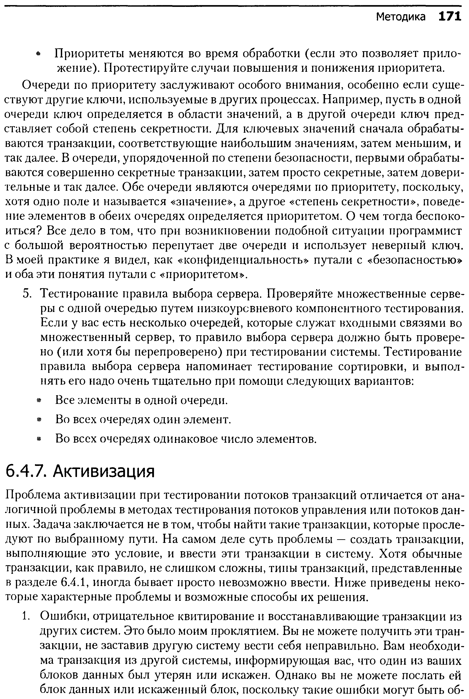

нарушены промежуточными системами. Вам придется заставить другую систему послать вам сообщение об ошибке, хотя на самом деле ошибки не было. Вы пытаетесь наладить сотрудничество, но в ответ вам с пафосом заявляют: «Наша система никогда не посылает сообщения об ошибках!» Вы пытаетесь как-то решить эту проблему, а заканчивается все тем, что вы объясняете разгневанному чиновнику в полосатом костюме из государственного департамента в Вашингтоне, что не собирались раздувать международный скандал$^{1}$. На этот случай я не знаю приемлемого технического решения, поскольку это не техническая проблема. В крайнем случае вам придется построить имитаторы всех таких недружественных интерфейсов и протестировать все случаи, используя эти имитаторы. А потом остается только надеяться на лучшее.

2. Внутренние транзакции, связанные с восстановлением системы и нелогичными условиями. Система должна иметь защиту от аварий, таких как отказы программного или аппаратного обеспечения. Вы не сможете протестировать защитные механизмы, не создав в точности такую же ситуацию, против которой система должна себя защищать. Следует точно узнать, принимаются ли необходимые меры по защите. Вы должны сломать доктрину безопасности. Проверить, предусмотрено ли в вашем случае аварийное восстановление состояния системы и данных. Вы должны имитировать все механизмы аварий и порождаемые ими транзакции.
3. Внутренние транзакции для восстановления данных и нелогичных условий. Если система обнаруживает потерянные или дублированные транзакции, то и тестировщик должен иметь возможность терять или дублировать транзакции. Любой механизм восстановления данных рассчитан на определенный сценарий их потери или искажения. Вы должны воспроизвести каждый такой сценарий для соответствующих транзакций.

На практике задача активизации заключается в том, чтобы правильно генерировать и внедрить необходимые вам для проверки системы транзакции. Единственный разумный способ это сделать — это встроить в систему генератор транзакций на ранней стадии проектирования. Минимум действий, которые должен уметь выполнять встроенный генератор транзакций, выглядит следующим образом.

1. Создание любых заданных транзакций, как корректных, так и некорректных.
2. Размещение эти транзакций в любом месте заданной очереди.
3. Удаление выбранных транзакций из очереди.

## 6.4.8. Предсказание итогов

Нашей задачей при проведении тестирования не является детальная проверка данных в транзакциях. Цель системного тестирования (в контексте модели потока транзакций) заключается в проверке корректного прохождения транзакций, в том числе их порождения, завершения и так далее. Ожидаемым итогом в этом случае

_______________
$^{1}$ Это реальный факт из моей практики.

является определение того, какие транзакции в каких очередях должны находиться до и после тестирования — предсказание конечного состояния транзакции при заданном начальном состоянии.

На практике, однако, перед тестировщиком стоит задача не предсказать итог, а проверить его. Вы должны сравнить все включенные в процесс очереди до и после проведения теста. По меньшей мере вам необходимо иметь возможность, проведя тестирование, заморозить систему, или, как альтернативный вариант, уметь делать моментальную запись всех интересующих вас очередей. Здесь подразумевается использование инструментов тестирования, и лучше всего, если они будут встроены в проект.

## 6.4.9. Проверка соответствия пути

На самом деле если существуют слияния или порождения, то это будет проверкой соответствия порожденного подграфа. Проблема заключается не в том, чтобы убедиться в правильности пути, а в том, чтобы найти способ встроить в систему инструменты, которые это будут делать. Существует два основных источника необходимых данных, и в обоих случаях вам, возможно, придется создавать достаточно продуманную программу, поскольку вероятность того, что в универсальных инструментах предусмотрены все возможности ваших транзакций, весьма мала.

1. Существующие записи. Системы обработки транзакций обычно включают в себя запись активности транзакций, которая требуется в различных приложениях. Например, информация о счетах, журнал безопасности, резервные и архивные данные. Эти данные записываются в узлах, которые чаще всего и являются целью тестировщика. Например, в системах восстановления данных обычной практикой является запись состава всех активных очередей. Прежде чем вы потребуете расширить возможности регистрации данных в системе, исследуйте все журналы регистрации и записи, необходимые в приложении, и подумайте, могут ли эти данные помочь вам проверить исследуемый путь.
2. Встроенная регистрация. Обсуждаемое в предыдущем пункте дополнение данных, предоставляемых приложением, необходимо для устранения белых пятен. Постарайтесь ограничиться минимальными добавлениями, чтобы дополнительная регистрация данных не влияла существенно на поведение системы. Как правило, это вполне реально осуществить, и часто объем ресурсов, достаточный для проведения самой полной регистрации транзакций не превышает нескольких процентов от общего объема доступных ресурсов. Как правило, такие возможности регистрации должны встраиваться сразу, поскольку сделать это задним числом будет очень сложно.
3. Действия в режиме трассировки. Это наиболее приятный способ регистрации. Транзакции вполне могут запускаться в режиме трассировки. Это означает, что производится постоянная запись всех процессов, в которых участвовали эти транзакции, и всех очередей, в которых они стояли. Разумеется, такая возможность тоже должна быть встроена в систему. Вне зависимости

от того, насколько важен режим трассировки для тестировщика, он вполне оправданно считается отличным инструментом для отладки системы.

## 6.5. Рассмотрение приложений

### 6.5.1. Индикаторы приложений

Насколько хорошо вы сможете описать поведение системы при таком моделировании? Критериями применимости данного метода могут служить положительные ответы на приведенные ниже вопросы.

1. Выполняется ли работа дискретными единицами?
2. Распределяются ли единицы работы между обрабатывающими модулями при помощи очередей или подобных интерфейсов?
3. Существуют ли в вашем случае множественные серверы?
4. Выполняются ли ваши процессы квазипараллельно?
5. Существует ли между процессами связь в виде сообщений?

### 6.5.2. Предположения об ошибках

Основное предположение должно быть следующим — каждый отдельный процесс работает корректно (был проверен со всех сторон на более ранней стадии интеграции), а ошибки, которые мы ищем, возникают вследствие некорректной реализации связи между компонентами или как побочный эффект многозадачности. Типичный список предположений об ошибках включает в себя несколько стандартных пунктов.

1. Некорректные очереди. Пропуск очередей, лишние очереди, неправильные типы очередей.
2. Некорректные порождения или расщепления. Система использует порождения транзакций неправильного типа, неверный порождающий элемент, создание копий.
3. Некорректные слияния или поглощения. Неправильные слияния или поглощения, потери.
4. Ошибки маршрутизации очереди. Соединение выходов с неверными входными очередями.
5. Ошибки в правилах упорядочения. Действует неверное правило упорядочения.

### 6.5.3. Ограничения и предостережения

Мы предполагаем, что наш проект обладает правильным дизайном. Он имеет иерархическую структуру, в нем существует ясное разделение между обработкой

данных и управлением очередями, транзакции однозначно делятся на типы, осуществляется явная запись управления транзакциями, и маршрутизация транзакций производится централизованно. Чем лучше проект, тем легче будет обеспечить полное покрытие при помощи тестирования потоков транзакций. Это означает, что тестировщик сможет сделать обоснованные предсказания (проведя соответствующие тесты) о пригодности программы к использованию. Предположим теперь, что у вас плохой проект. Значит ли это, что тестирование потоков транзакций будет бесполезно? Нет, оно все равно будет очень полезно. Обсуждаемые здесь тесты легко сломают программу, основанную на плохом проектировании. Единственное, что вы не сможете сделать для плохого проекта, — это статистически оправданно предсказать его пригодность к использованию.

Единственное важное ограничение для этой модели — это требование марковского поведения от каждого узла. В случае немарковского поведения у вас не будет другого выбора, кроме как тестировать каждый возможный путь для каждой возможной транзакции, поскольку поведение будет зависеть не только от данных, содержащихся в транзакции, но и от предыстории ее поведения. Такое тестирование редко осуществимо на практике. Сколько-нибудь разумное понятие покрытия бесполезно при отсутствии марковского поведения. Если у вас случай именно такого поведения и вы выполните предложенные здесь тесты, то ничего не добьетесь, кроме ошибочной уверенности. Немарковское поведение может быть сколь угодно сложным, поэтому любое выполняемое вами покрытие охватит лишь небольшую часть возможных вариантов. Что вам следует делать при встрече с немарковским поведением?

1. Избавиться от него путем перепроектирования. В любом случае это лучший выбор. В большинстве случаев можно обойтись без немарковского поведения. Оно возникает, когда люди недостаточно хорошо разобрались в вопросе.
2. Изолировать его. Вам, возможно, придется это сделать, если ваша модель описывает поведение человека или поведение других, не контролируемых вами систем. Процедура изоляции может заключаться в наложении ограничений на действия (изменение спецификации) или выделении подобного поведения в отдельную субмодель, которую вам придется проверить очень тщательно, прежде чем вы перейдете к тестированию системы более высокого уровня.
3. Смириться с риском. Иногда это допустимо. То, что приемлемо в развлекательных программах, не может быть приемлемо в жизненно важном программном обеспечении.

## 6.5.4. Автоматизация и инструментальные средства

Рассмотрим отдельно автоматизацию выполнения тестов и автоматизацию их проектирования.

1. Автоматизация выполнения тестов. Необходимость автоматизации выполнения частично была рассмотрена выше в разделах 6.4.7–6.4.9. Что ка-

сается коммерчески доступных инструментов тестирования, то системы покрытия/воспроизведения и языки подготовки сценариев являются наиболее подходящими инструментами для автоматизации выполнения тестов. Однако в большинстве систем разработки, о которых стоило бы говорить, наличие встроенных средств тестирования — обязательное условие.

2. Автоматизация разработки тестов. Системы автоматизации могут варьироваться от тривиальных до сложнейших. Языки и системы, предназначенные для создания генераторов тестов, широко распространены (как коммерческие, так и частные). Имеет смысл потратить пять лет работы, чтобы создать специализированный генератор автоматического тестирования транзакций для проекта, разработка которого потребует 100 лет общих трудозатрат. Хотя здесь редко встречаются непреодолимые технические трудности, я допускаю, что может быть достаточно трудно убедить нужных людей, что инструменты тестирования подобного рода стоят потраченных на них времени и сил.

## 6.6. Резюме

Модель потока транзакций является эффективной моделью, применяемой в высокоуровневом системном тестировании большого количества систем. Моделирование начинается с идентификации интересующих нас транзакций, особенно мест, где они порождаются и завершаются и обстоятельств, при которых это происходит. Модель основана на допущении о марковском процессе$^1$. В ней так же предполагается, что подробные модели обработки были созданы и использовались на более низком уровне компонентного тестирования, на стадии, предшествующей интеграции. Основное внимание при тестировании потоков транзакций уделяется очередям, и маршрутам транзакций в системе. Мы рассмотрели эвристическую иерархию покрытия, основанную на порожденном подграфе.

## 6.7. Вопросы для самопроверки

1. Дайте определение (в контексте тестирования потоков транзакций) следующих терминов: узел поглощения, обслуживание пакета, покрытие порождения/завершения, стартовый узел, ограниченная очередь, узел ветвления, предикат ветвления, управляющая входящая связь, дочерняя транзакция, узел завершения, FCFS, FIFO, узел соединения, LCFS, LIFO, покрытие связей, маркировка, марковский узел, марковский потоковый граф, узел слияния, материнская транзакция, множественный сервер, очередь, покрытие узлов, покрытие зарождения/выхода, узел зарождения, родительская

---

$^1$ Иными словами полагают, что поток транзакций является марковским процессом (процессом без последействия), в котором будущее поведение транзакции зависит только от текущего состояния и не зависит от предыстории процесса. — *Примеч. научн. ред.*

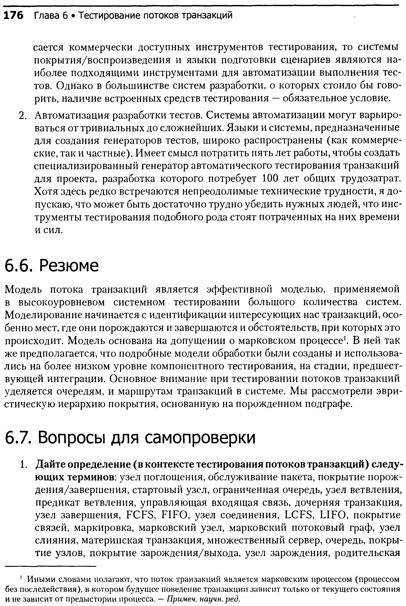

транзакция, транзакция — хищник, транзакция — жертва, очередь по приоритету, тестирование приоритетов, правило упорядочения, тестирование правила упорядочения, тесты очереди, случайное обслуживание, правило выбора сервера, односерверная очередь, порожденный подграф, тестирование сортировки, узел расщепления, тесты синхронизации, задача, действия в режиме трассировки, транзакция, узел ветвления транзакции, предикат ветвления транзакции, управляющая запись транзакции, узел соединения транзакций, регистрация транзакций, тестирование выбора транзакции, состояние транзакции, маркер транзакции, тип транзакции.

2. Разработайте подробную модель части формы 2106, связанной с расходами на транспортные средства. Считайте, что число транспортных средств ограничено $n$. Вводя соответствующие данные для каждого транспортного средства ($O_{\text{т}1}, \Phi_{\text{p}1}, A_{\text{м}1}, C_{11\text{а}}$) имейте в виду, что вы можете вводить фактические расходы и амортизацию, только если вы являетесь владельцем транспортного средства; однако вы не обязаны декларировать фактические расходы. Если же вы это делаете, то не обязаны декларировать амортизацию. Считайте, что вы нашли способ получить максимальные льготы (выбрав между стандартными и фактическими льготами). Введите в эту субмодель данные для всех транспортных средств ($T_{\text{сум}}$). Разработайте модель, выберите пути, активизируйте их, определите, что вы хотите проверить, исследуйте синхронизацию для слияния транзакций, и так далее. Проводите только чистые тесты.

3. Разработайте грязные тесты для задачи 2. Рассмотрите потерю, дублирование, искажение данных о транспортном средстве. Учтите, что вы не можете декларировать фактические расходы для одного транспортного средства, а амортизацию для другого. Все данные о транспортном средстве ($O_{\text{т}1}, \Phi_{\text{p}1}, A_{\text{м}1}$) должны являться частью соответствующего набора для данного транспортного средства.

4. Для проверки слияния двух транзакций необходимо пять контрольных тестов, в случае трех транзакций таких тестов должно быть уже 25. Сколько тестовых вариантов потребует проверка слияния четырех транзакций? А сколько потребует слияние $n$ транзакций?

5. Разработайте модель потока транзакций для формы 1040: (a) строки 7–22, (б) строки 23–30, (в) строки 32–40, (г) строки 41–45, (д) строки 47–53, (е) строки 45–60. В каждом случае считайте, что все входные значения вводятся в виде единой транзакции, возможно, из предыдущего блока строк. Моделируйте эти вычисления как единый элемент обработки, который не надо тестировать. Рассматривайте каждую встречающуюся форму или бланк как транзакции, которые могут порождаться и/или поглощаться как положено. Включите в модель логику для определения того, нужны или не нужны в ней данные формы. Например, в строке 14 в случае существования «дополнительных доходов» будет создана форма 4797, которая потом будет возвращена заполненной соответствующим образом и поглощена формой

1040, то же самое будет с W2, бланком B, бланком С, формой 3903 и так далее. Не пытайтесь моделировать эти формы. Создавайте пустые формы, как того требует логика, отправляйте их на соответствующий узел обработки форм, затем принимайте данные формы обратно в соответствующие строки формы 1040. Разработайте следующие типы тестов: покрытие узлов, покрытие связей, покрытие порождения/завершения.

6. Выполните задачу 5 в предположении, что вспомогательные формы могут быть сначала открыты, а затем оставлены незаполненными, поскольку оказалось, что в них нет необходимости.
7. Выполните еще раз задачу 5 в предположении, что различные строки могут заполняться в произвольном порядке при условии, что существуют требуемые данные (то есть вы не можете добавлять числа, пока они не введены). Разработайте необходимые тесты синхронизации, считая, что входящие формы поступают по очереди, но в произвольном порядке.


<!-- ВІДНОВЛЕНО ЛОКАЛЬНО (Стор. 179) -->

<!-- КІНЕЦЬ ВІДНОВЛЕННЯ -->


<!-- ВІДНОВЛЕНО ЛОКАЛЬНО (Стор. 180) -->

<!-- КІНЕЦЬ ВІДНОВЛЕННЯ -->


<!-- ВІДНОВЛЕНО ЛОКАЛЬНО (Стор. 181) -->

<!-- КІНЕЦЬ ВІДНОВЛЕННЯ -->


<!-- ВІДНОВЛЕНО ЛОКАЛЬНО (Стор. 182) -->

<!-- КІНЕЦЬ ВІДНОВЛЕННЯ -->


<!-- ВІДНОВЛЕНО ЛОКАЛЬНО (Стор. 183) -->

<!-- КІНЕЦЬ ВІДНОВЛЕННЯ -->


<!-- ВІДНОВЛЕНО ЛОКАЛЬНО (Стор. 184) -->

<!-- КІНЕЦЬ ВІДНОВЛЕННЯ -->


<!-- ВІДНОВЛЕНО ЛОКАЛЬНО (Стор. 185) -->

<!-- КІНЕЦЬ ВІДНОВЛЕННЯ -->


<!-- ВІДНОВЛЕНО ЛОКАЛЬНО (Стор. 186) -->

<!-- КІНЕЦЬ ВІДНОВЛЕННЯ -->


<!-- ВІДНОВЛЕНО ЛОКАЛЬНО (Стор. 187) -->

<!-- КІНЕЦЬ ВІДНОВЛЕННЯ -->


му, включающую в себя поток управления, потоки данных, потоки транзакций и другие средства. Используйте для проверки соответствующую модель$^1$.

2. Для доменов, состоящих из субдоменов (как смежных, так и не смежных), убедитесь, что все требуемые части существуют и обрабатываются в соответствии с требованиями.
3. Убедитесь, что домены не перекрываются. В одномерных и двухмерных пространствах это делается графически. В пространстве с размерностью три и более, используйте соответствующие алгебраические инструменты [WHIT95] (их описание лежит за пределами данной книги). В большинстве случаев, однако, перекрытие доменов происходит на границах.
4. Убедитесь, что входное пространство является полным. Каждый входной вектор должен быть обработан, даже эта «обработка» означает отбраковку ввода. В одномерном и двухмерном пространстве вы можете провести эту проверку самостоятельно. В пространстве с размерностью три и более используйте соответствующие алгебраические инструменты [WHIT95] (их описание лежит за пределами данной книги). Как и в случае перекрытия, большинство подобных ошибок возникает на границах доменов.

*Покрытие связей/* Ниже указано, в каком порядке следует его проводить.

1. Убедитесь, что все домены, которые должны быть смежными, на самом деле смежные, то есть имеют общее граничное неравенство.
2. Убедитесь в отсутствии лишних границ. В этом вам поможет стратегия тестирования доменов.
3. Убедитесь в корректности всех граничных неравенств. В этом заключается основная задача тестирования доменов.

В качестве примера разработки модели тестирования доменов рассмотрим вариант формы 1040$^2$, строки с 32 по 38. У меня была задача построить пример, включающий как минимум две входные переменные. Вот мой вариант спецификации для строк 32–38.

```text
32: Adjusted Gross Income                      Служит входом в этом примере
    (Скорректированный_Общий_Доход (СОД))
33:                                           Без проверки. полагается равным 0
34: Стандартные отчисления                    В этом примере мы берем их
                                              равными $6200
35: (СОД)-$6200                               Заданные вычисления
бе: Лготы                                     Служит входом в этом примере
36: $2350 * Лготы                             В этом примере игнорируем верхний
                                              предел $81350
37: нал_доход = Max (0, C35-C36)              Налогооблагаемый доход. Мы будем
```

---

$^1$ Проверка обработки может быть проведена в том числе путем тестирования домена, если, например, обработка представляет собой алгебраическое уравнение. Это можно рассматривать как проверку корректности вырожденного домена, заданного с помощью предиката равенства. [AFIF92].

$^2$ Этот вариант сильно искажает бланк декларации, поэтому, пожалуйста, не используйте его в целях, связанных с уплатой налогов.

для всех значений использовать
таблицу расчета налогов

38: Таблица расчета налогов
$0 < \text{нал\_доход} =< \$22100$
$\$22100 < \text{нал\_доход} =< \$53500$

$\$53500 < \text{нал\_доход} =< \$115000$

$\$115000 < \text{нал\_доход} =< \$250000$

$\$250000 < \text{нал\_доход}$

$\text{налог} = 0.15 * \text{нал\_доход}$
$\text{налог} = \$3315 + 0.28 * $
$(\text{нал\_доход} - \$22100)$
$\text{налог} = \$12107 + 0.31 * $
$(\text{нал\_доход} - \$53500)$
$\text{налог} = \$31172 + 0.36 * $
$(\text{нал\_доход} -\$115000)$
$\text{налог} = \$79722 + 0.396 * $
$(\text{нал\_доход} - \$250000)$

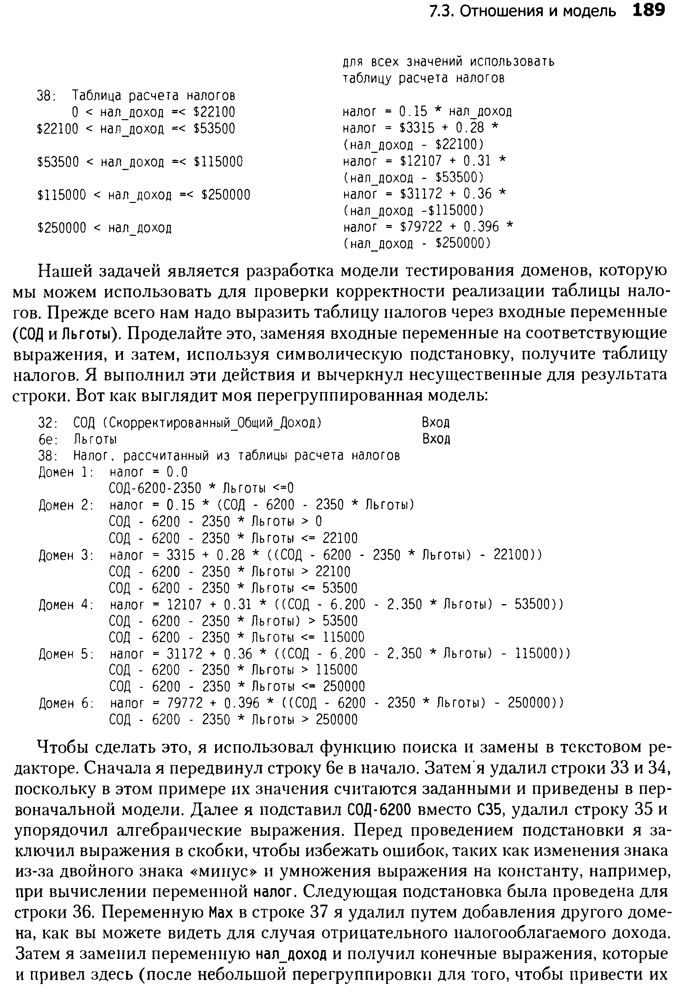

Нашей задачей является разработка модели тестирования доменов, которую мы можем использовать для проверки корректности реализации таблицы налогов. Прежде всего нам надо выразить таблицу налогов через входные переменные (СОД и Льготы). Проделайте это, заменяя входные переменные на соответствующие выражения, и затем, используя символическую подстановку, получите таблицу налогов. Я выполнил эти действия и вычеркнул несущественные для результата строки. Вот как выглядит моя перегруппированная модель:

```text
32: СОД (Скорректированный_Общий_Доход)    Вход
6е: Льготы                               Вход
38: Налог. рассчитанный из таблицы расчета налогов
Домен 1: налог = 0.0
         СОД-6200-2350 * Льготы <=0
Домен 2: налог = 0.15 * (СОД - 6200 - 2350 * Льготы)
         СОД - 6200 - 2350 * Льготы > 0
         СОД - 6200 - 2350 * Льготы <= 22100
Домен 3: налог = 3315 + 0.28 * ((СОД - 6200 - 2350 * Льготы) - 22100))
         СОД - 6200 - 2350 * Льготы > 22100
         СОД - 6200 - 2350 * Льготы <= 53500
Домен 4: налог = 12107 + 0.31 * ((СОД - 6.200 - 2.350 * Льготы) - 53500))
         СОД - 6200 - 2350 * Льготы > 53500
         СОД - 6200 - 2350 * Льготы <= 115000
Домен 5: налог = 31172 + 0.36 * ((СОД - 6.200 - 2.350 * Льготы) - 115000))
         СОД - 6200 - 2350 * Льготы > 115000
         СОД - 6200 - 2350 * Льготы <= 250000
Домен 6: налог = 79772 + 0.396 * ((СОД - 6200 - 2350 * Льготы) - 250000))
         СОД - 6200 - 2350 * Льготы > 250000
```

Чтобы сделать это, я использовал функцию поиска и замены в текстовом редакторе. Сначала я передвинул строку 6е в начало. Затем я удалил строки 33 и 34, поскольку в этом примере их значения считаются заданными и приведены в первоначальной модели. Далее я подставил СОД-6200 вместо С35, удалил строку 35 и упорядочил алгебраические выражения. Перед проведением подстановки я заключил выражения в скобки, чтобы избежать ошибок, таких как изменения знака из-за двойного знака «минус» и умножения выражения на константу, например, при вычислении переменной налог. Следующая подстановка была проведена для строки 36. Переменную Мах в строке 37 я удалил путем добавления другого домена, как вы можете видеть для случая отрицательного налогооблагаемого дохода. Затем я заменил переменную $\text{нал\_доход}$ и получил конечные выражения, которые и привел здесь (после небольшой перегруппировки для того, чтобы привести их

все к одинаковому виду). Затем я упростил алгебраические выражения для налогов и получил в результате следующую модель:

```text
32: СОД (Скорректированный_Общий_Доход)    Вход
6е: Льготы                               Вход
38: Налог, рассчитанный из таблицы расчета налогов
Домен 1: налог = 0.0
         СОД <= 6200+2350Льготы
Домен 2: налог = 0.15СОД - 352.5Льготы - 930.0
         СОД > 6200 + 2350Льготы
         СОД <= 28300 + 2350Льготы
Домен 3: налог = 0.28СОД - 658.0Льготы - 4609.0
         СОД > 28300 + 2350Льготы
         СОД <= 59700 + 2350Льготы
Домен 4: налог = 0.31СОД - 728.5Льготы - 6400.0
         СОД > 59700 + 2350Льготы
         мСОД<=121200+2350Льготы
Домен 5: налог = 0.36СОД - 846.0Льготы - 12460
         СОД > 121200 + 2350Льготы
         СОД <= 256200 + 2350Льготы
Домен 6: налог = 0.396 СОД - 930.6Льготы - 21683.2
         СОД > 256200 + 2350Льготы
```

На рис. 7.2 показан возможно более наглядный способ представления этих доменов. В одномерном и двумерном пространстве будет не лишним изображать домены графически, подобно тому, как это сделал я. Границы доменов представляют собой несколько параллельных линий. Это типичные домены, встречающиеся на практике. Тем не менее, нам потребовалось выполнить алгебраические преобразования, для того чтобы упростить эти границы и выразить их через входные переменные.

*Интерпретация предикатов*. Символическая подстановка, проделанная выше, для того чтобы выразить домены через входные переменные, называется *интерпретацией предикатов*. Любое неравенство имеет вид предиката, который может принимать значение ИСТИНА или ЛОЖЬ. Предикат мы интерпретируем в терминах входных переменных.

Зачем все усложнять, интерпретируя предикаты границ доменов? Почему бы нам не работать непосредственно со строками спецификации ВНС? Дело в том, что в этом случае у вас уже не будет модели для тестирования доменов, это будет модель потока управления. Нашей же целью является проверка корректной реализации граничных предикатов (или их аналогов в коде).

Наша конечная модель является избыточной. Граничные неравенства появляются в ней дважды (по одному разу для каждого задаваемого ею домена). Эта модель неизящна, и вероятность того, что программист построит вычисления таким образом достаточно мала. Программист, проанализировав требуемые вычисления, организует их более эффективно (то есть так, чтобы их было проще сопровождать), и вместо промежуточных вычислений, заданных в спецификации, он, возможно, реализует нечто от них отличное, но, по всей вероятности, им эквивалентное. И в этом все дело. Анализ, который мы проводим для разработки тестов доменов, имеет совершенно иные задачи, в отличие от задач, стоящих перед программистом, и поэтому наши ошибки тоже, скорее всего, будут отличаться от ошибок разработчика. У нас, тестировщиков, собственные ошибки.


**Рис. 7.2. Домены для неравенств в налоговой декларации**

Основной аргумент в пользу проведения интерпретации предикатов — это обеспечение независимой проверки рациональности спецификации. Я допускаю, что спецификация содержит множество промежуточных вычислений на пути преобразования входных данных в выходные. Подобные промежуточные вычисления зачастую несущественны и являются всего лишь видением того, как должна быть запрограммирована спецификация, — что-то наши программисты могут и проигнорировать. Наша задача не ограничивается независимой проверкой работы программиста. Если проводимое нами моделирование выявляет противоречия и неопределенности в спецификации доменов (что часто и происходит), мы не зря едим свой хлеб.

Интерпретация предикатов обычно не очень сложна. В большинстве случаев вам не надо проводить ее совсем, поскольку домены изначально выражаются через входные переменные. Если вам все же приходится это делать и если ваши предикаты достаточно просты, используйте ваш текстовый редактор подобно тому, как это делал я (однако не забывайте заключать подставляемые выражения в скобки, чтобы избежать различных алгебраических ошибок при подстановке). Если текстовый редактор не справляется, используйте редактор формул. Мне хватает моего калькулятора HP-28C. Если для вас это затруднительно, используйте соответствующий математический пакет.

## 7.3.3. Анализ неопределенностей и противоречий

Приблизительно 30 % ошибок являются следствием некорректных требований. Цена таких ошибок высока, поскольку они проявляются лишь тогда, когда про-

грамма начинает эксплуатироваться. Около 5 процентов ошибок происходят из-за неверного определения доменов$^1$. Вопреки широко распространенному мифу, не существует какого-то одного превалирующего типа ошибок. Относительная частота возникновения большинства ошибок не превышает 3 процентов, то есть 5 процентов — высокий показатель и на поиск ошибок в доменах имеет смысл тратить время.

В программе необходимо исключить внутренние противоречия. Все ее функции должны быть согласованы друг с другом. Программа также не может быть неопределенной. Она всегда должна выполнять какие-либо действия над входными данными. Спецификации, однако, бывают и неопределенными и противоречивыми. Когда программист реализует такую неопределенную или внутренне противоречивую спецификацию, он или она должны сознательно или несознательно разрешать эти неопределенности и противоречия. Ошибки объясняются тем, что неопределенности и противоречия обычно не удается распознать, и тем что их разрешение обычно происходит подсознательно. Модель тестирования доменов, а также анализ, необходимый для построения этой модели, эффективны при проверке спецификации на неопределенности и противоречия.

*Неопределенность доменов.* Спецификация набора доменов является неопределенной, если этот набор доменов не покрывает все входное пространство.

*Противоречивость доменов.* Два домена противоречивы, если они перекрываются.

Первое место, где стоит искать неопределенности и противоречия, — это границы между доменами. Рассмотрим пример:

$$\begin{array}{lrl}
\text{Домен 3:} & \text{СОД} > 28300 + 2350\text{Льготы} \\
 & \text{СОД} \le 59700 + 2350\text{Льготы} \\
\text{Домен 4:} & \text{СОД} \ge 59700 + 2350\text{Льготы} \\
 & \text{СОД} < 121200 + 2350\text{Льготы} \\
\text{Домен 5:} & \text{СОД} > 121200 + 2350\text{Льготы} \\
 & \text{СОД} \le 256200 + 2350\text{Льготы}
\end{array}$$

Граница между доменами 3 и 4 противоречива, поскольку оба они одновременно закрыты на границе $\text{СОД} = 59700 + 2350\text{Льготы}$. Граница между доменами 4 и 5 не определена, так как входные значения для $\text{СОД} = 121000 + 2350\text{Льготы}$ отсутствуют в спецификации.

Если у вас есть спецификация интерпретированной границы домена, вам надо проверить ее на предмет наличия неопределенностей и противоречий. Большинство из них легко могут быть выявлены при проверке. Для одной и двух входных переменных вы сможете выполнить это графически. Для трех и более входных переменных используйте соответствующие алгебраические инструменты [WHIT95].

1. Все ли входные значения в диапазоне от $-\infty$ до $+\infty$ включены? Если это не так, то существуют ли механизмы, запрещающие ввод в систему значений

___
$^1$ Эта оценка занижена для современного программного обеспечения, поскольку утверждение основано на данных почти двадцатилетней давности (в 1994 году). В то время как методы компонентного тестирования совершенствовались, относительная частота возникновения ошибок в требованиях возрастала. Я не удивляюсь, если доля ошибок доменов в среднем окажется порядка 10 а для некоторых программ и всех 30 %.

больше верхней границы и меньше нижней? Проведите специальную проверку для нулевых значений. Спецификация в подразделе 7.3.1 не определена. Объясните, почему.

2. Последовательно ли закрытие для всех переменных и всех границ доменов в диапазоне от $-\infty$ до $+\infty$? Если это не так, то должно быть несколько (как минимум два) неравенств, определяющих одну и ту же границу, но в различных областях входных значений, для различных направлений закрытия и включающих по меньшей мере одну переменную. Сгруппируйте эти наборы и проверьте их на предмет наложения закрытий и/или зазоров между ними. Ниже приводится пример, в котором закрытие противоречиво и не определено.

```text
Домен 3: налог = 0.28СОД - 658.0Льготы - 4609.0
    СОД >= 28300 + 2350Льготы, 0 < Льготы < 4
    СОД >= 28300 + 2350Льготы, 4 <= Льготы < 7
    СОД >= 28300 + 2350Льготы, 7 < Льготы <= 10
    СОД >  28300 + 2350Льготы
    СОД <= 59700 + 2350Льготы
```

3. В одномерных и двумерных пространствах нарисуйте все заданные домены на одном рисунке, построив графически решения уравнений, определяющих границы для каждого из доменов. На следующем рисунке демонстрируется неопределенность для входных значений, меньших 7, и перекрытие доменов 1 и 2. Помните, что неопределенности и противоречия чаще всего встречаются в определении границ, поэтому вы должны быть уверены, что проверили закрытие каждой границы.

4. А как насчет пространства с размерностью три и более? В этом случае необходим алгебраический анализ, см. [WHIT95]. Вы, возможно, сможете решить задачу анализа трехмерных моделей в лоб или при помощи эвристических методов, но вряд ли вам что-нибудь сможет помочь разрешить математические аспекты данной проблемы. Созданные к 1995 году коммерческие инструменты не могут уверенно подтвердить непротиворечивость и однозначность спецификаций доменов. Организации, которым регулярно бывает нужен подобный анализ, привлекают для этих целей экспертов и разрабатывают собственное программное обеспечение.

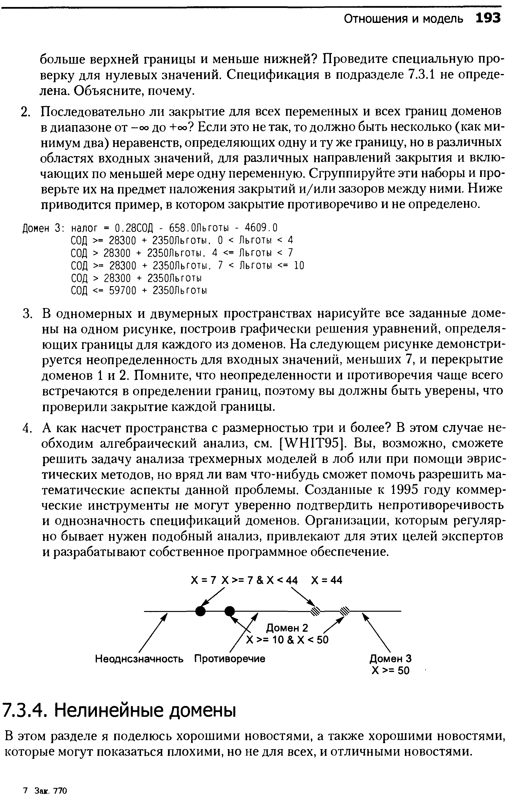

## 7.3.4. Нелинейные домены

В этом разделе я поделюсь хорошими новостями, а также хорошими новостями, которые могут показаться плохими, но не для всех, и отличными новостями.

1. Хорошие новости. Хорошей новостью является то, что нелинейные домены (то есть домены как минимум с одной нелинейной границей) на практике встречаются не слишком часто. Ранние исследования [COHE78] выявили в коде языка COBOL около 85 процентов линейных предикатов. Мы имеем дело в основном с линейным миром.

2. Хорошие новости, которые могут показаться плохими (не обязательно). Проблему линейности в нашем случае надо рассматривать не как простую алгебраическую линейность, а в более широком смысле линейности векторных пространств. Полиномы первого порядка линейны в этом широком смысле. Поскольку любая приличная функция может быть аппроксимирована полиномами, то выбором подходящей аппроксимации можно свести задачу тестирования нелинейных доменов к задаче тестирования линейных доменов, хотя и ценой увеличения размерности. Нелинейные граничные уравнения нередко можно линеаризовать определенными преобразованиями. Это в первую очередь касается гипербол, экспоненциальных, степенных и логарифмических функций. Аппроксимация функций полиномами первого порядка встречается довольно редко, так как неэффективна с точки зрения вычислимости. Однако благодаря большой производительности современных компьютеров эта проблема стоит гораздо менее остро, чем принято считать. Выбирайте сами, чего вы хотите, вычислительной эффективности или тестируемости.

3. Отличные новости. Отличные новости [JENG94] состоят в том, что если вам нужно определить только наличие ошибки, а не описать ошибку (например, вид доменной ошибки), и при этом вы хотите исходить из рассчитываемого риска сокрытия некоторых ошибок [AFIF92], тогда проблем нелинейных границ доменов просто нет (в большинстве случаев).

## 7.4. Методы

### 7.4.1. Основы

Существует масса стратегий тестирования доменов [AFIF90, AFIF92, CLAR82, COHE78, JENG94, HAOM87, PERE85, WHIT78A, WHIT80A, WHIT85B, WHIT90, ZEIL83, ZEIL89]. Мы не будем рассматривать их все. Если вы занимались программированием, то вы, безусловно, знаете основы стратегий тестирования доменов. Если вы занимались программированием непродолжительное время, то вы использовали эвристические методы тестирования доменов. Прежде чем прейти к рассмотрению эффективных стратегий, давайте обсудим причины несовершенства эвристических стратегий.

1. Тестирование экстремальных точек. В соответствии с этой стратегией любой численный ввод должен быть протестирован в окрестности минимального и максимального значения этого ввода. Эта эвристическая стратегия имеет множество названий, таких как тестирование граничных значений [MYER79].

тестирование экстремальных значений и тестирование особых значений, [HOWD80]. Как подмечено Ричардсоном [RICH85] и многими другими, все эти эвристические стратегии относится к тестированию доменов. Основное отличие между формальным тестированием доменов и эвристическим тестированием доменов (общепринятым в течение десятилетий) заключается в большей эффективности первого и в том, что формальное тестирование позволяет узнать больше о найденных ошибках при помощи меньшего числа тестов.

2. Тестирование комбинаций экстремальных точек. Следующая стратегия типична и необычайно популярна (но плохо управляема). Согласно ей, необходимо проверить комбинацию экстремальных точек. Несмотря на то, что эта стратегия поддерживается коммерческими продуктами, позволяющими автоматически генерировать тесты, она в принципе ущербна, что мы и увидим в дальнейшем.

## 7.4.2. Недостатки комбинирования экстремальных точек

«Стратегия» комбинирования экстремальных точек, если ее можно так назвать, подразумевает существование наибольшего и наименьшего значений для каждой входной переменной. Предполагается, что все значения больше максимума и меньше минимума программа исправит или запретит. Очевидно, минимальные и максимальные значения определяют (отчасти) границы доменов, и стратегия направлена в первую очередь на тестирование границ доменов, а затем на проверку значений, лежащих чуть выше максимума и чуть ниже минимума. Это в пространстве с размерностью один. В двумерном пространстве, согласно этой стратегии, необходимо проверить комбинацию экстремальных точек. Если я условно назову четыре актуальных случая для каждой переменной соответственной «ниже», «min», «max» и «выше», то в соответствии с этой стратегией для двух переменных нам надо проверить: (нижеА, нижеВ), (нижеА, minВ), ... (вышеА, вышеВ), всего 16 тестов, плюс еще один для типичных значений. Для $n$ входных переменных число тестовых вариантов вырастает до $4n + 1$.

Какой тип ошибок мы здесь рассчитываем обнаружить? Обработка, что бы она собой ни представляла, должна задавать функциональное отношение между входными переменными. Существует два варианта функциональных отношений между входными переменными: выходная функция, выраженная через эти переменные, или граница домена, выраженная через эти переменные.

1. Функция. Вычисляемая функция может быть или верной, или неверной. При тестировании комбинаций мы предполагаем отсутствие ошибок, за исключением особенных комбинаций (экстремальных случаев), поскольку для других комбинаций входных значений программа корректна. Иначе говоря, корректная обработка и обработка комбинации экстремальных значений, содержащая ошибки, соответствуют различным доменам. Если дело в этом, то нам лучше проверить границы доменов.
2. Граница домена. Входные переменные могут фигурировать в одной и той же (интерпретированной) границе домена. То есть возможны два вариан-

та — либо входные переменные используются в описании границы, либо нет. Если нет, то они независимы. Между ними не существует функциональных отношений, мы предполагаем наличие ошибки, которая создает отношение на пустом месте. В таком случае это не ошибка, а вредительство. Если функциональное отношение существует, то его то нам и надо проверять, а тестирование ряда комбинаций критических значений не даст нам никакой информации об этом отношении.

В примере на рис. 7.3 я применил эвристическую комбинационную стратегию и получил заштрихованные точки. У нас есть три домена, границы которых изображены сплошными линиями. Только восемь контрольных точек — смежные с критическими точками, лежащими на верхней границе — могут сказать нам что-либо о корректности границ доменов. Тесты не скажут нам ничего о корректности нижней границы. Предположим, у нас есть ошибка, в результате которой реализуются два домена с границами, показанными пунктиром. Вместо трех доменов, мы получаем четыре, и кто знает, какая обработка будет им соответствовать? Тестирование комбинаций экстремальных точек не выявит эту ошибку.

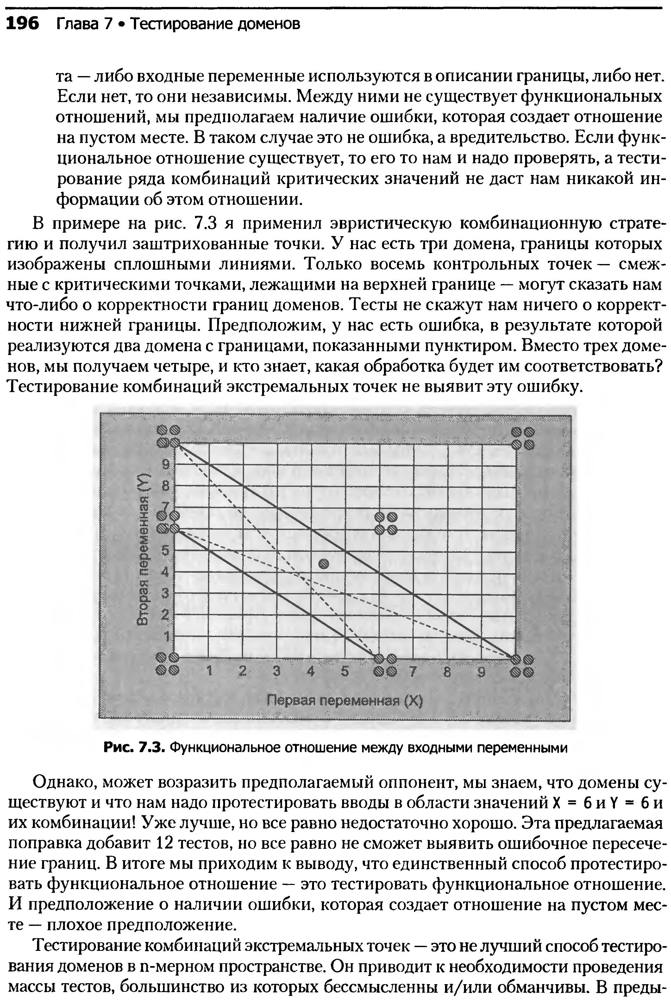

**Рис. 7.3.** Функциональное отношение между входными переменными

Однако, может возразить предполагаемый оппонент, мы знаем, что домены существуют и что нам надо протестировать вводы в области значений $X = 6$ и $Y = 6$ и их комбинации! Уже лучше, но все равно недостаточно хорошо. Эта предлагаемая поправка добавит 12 тестов, но все равно не сможет выявить ошибочное пересечение границ. В итоге мы приходим к выводу, что единственный способ протестировать функциональное отношение — это тестировать функциональное отношение. И предположение о наличии ошибки, которая создает отношение на пустом месте — плохое предположение.

Тестирование комбинаций экстремальных точек — это не лучший способ тестирования доменов в $n$-мерном пространстве. Он приводит к необходимости проведения массы тестов, большинство из которых бессмысленны и/или обманчивы. В преды-

дущем примере мы провели 29 тестов, но так и не обнаружили ошибку. Правильная стратегия выявит эту ошибку всего за 4 теста. Самое плохое в рассматриваемой стратегии — это то, что число тестов растет экспоненциально с увеличением числа входных переменных. Следовательно, покрытие невозможно даже при наличии автоматизации. Для 50 входных переменных только очень небольшая часть чудовищного числа комбинаций ($1.2677\text{E}30$, или $4\text{E}19$ лет тестирования при длительности теста — 1 миллисекунда) может быть проверена, и, следовательно, выбор проверяемых комбинаций будет совершенно произволен. Правильно организованное стохастическое тестирование обнаружит большее число ошибок и скажет вам больше о надежности программного обеспечения. В то же время грамотное тестирование доменов обладает существенно большими возможностями при меньших затратах.

## 7.4.3. Слабая стратегия $1 \times 1$, одномерное пространство

Первая стратегия (которая будет вами наиболее часто использоваться) — это слабая стратегия $1 \times 1$. Она называется «слабой», поскольку в ней предусматривается разработка всего лишь одного набора тестов для каждого граничного неравенства, вместо того, чтобы разработать подобный набор для каждого сегмента границы, а «$1 \times 1$», так как она требует одну точку НА и одну точку ВНЕ для одного граничного неравенства.

На рис. 7.4 показаны все возможные ошибки для одномерной границы домена. В соответствии со стратегией, требуется по два теста на каждую границу (точка в одномерном пространстве) — проверка одной точки НА и одной точки ВНЕ. Я проиллюстрировал это на примере закрытой границы. Предлагаю вам в качестве упражнения самостоятельно убедиться, что стратегия работает для любой комбинации открытых и закрытых границ. Приведенные ниже случаи моделируют все возможные ошибки в одномерных границах доменов.

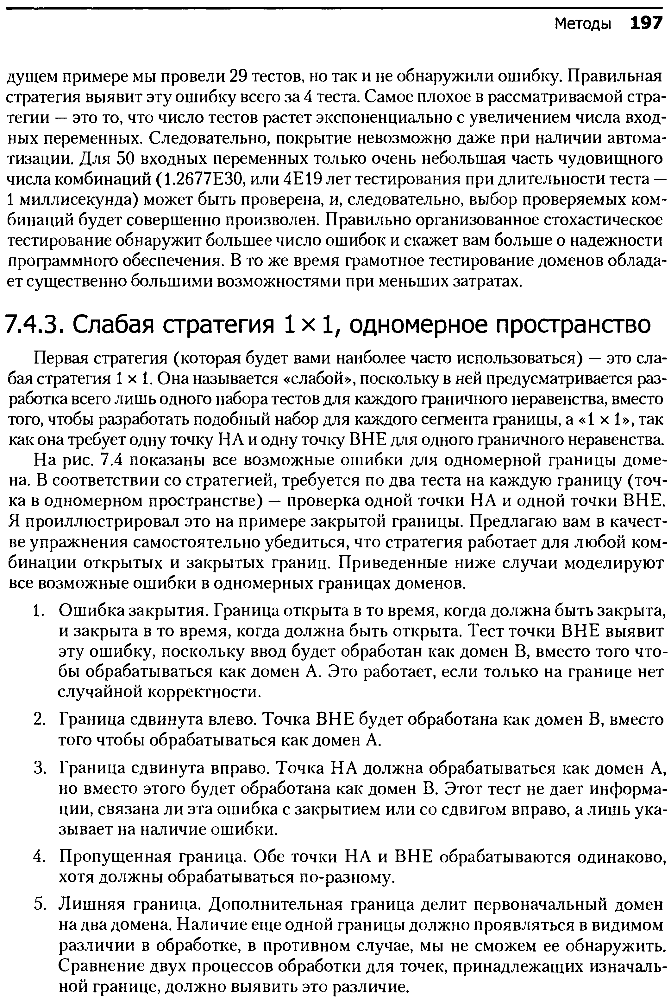

1. Ошибка закрытия. Граница открыта в то время, когда должна быть закрыта, и закрыта в то время, когда должна быть открыта. Тест точки ВНЕ выявит эту ошибку, поскольку ввод будет обработан как домен В, вместо того чтобы обрабатываться как домен А. Это работает, если только на границе нет случайной корректности.
2. Граница сдвинута влево. Точка ВНЕ будет обработана как домен В, вместо того чтобы обрабатываться как домен А.
3. Граница сдвинута вправо. Точка НА должна обрабатываться как домен А, но вместо этого будет обработана как домен В. Этот тест не дает информации, связана ли эта ошибка с закрытием или со сдвигом вправо, а лишь указывает на наличие ошибки.
4. Пропущенная граница. Обе точки НА и ВНЕ обрабатываются одинаково, хотя должны обрабатываться по-разному.
5. Лишняя граница. Дополнительная граница делит первоначальный домен на два домена. Наличие еще одной границы должно проявляться в видимом различии в обработке, в противном случае, мы не сможем ее обнаружить. Сравнение двух процессов обработки для точек, принадлежащих изначальной границе, должно выявить это различие.


**Рис. 7.4.** Ошибки в одномерном пространстве (закрытый домен)

Сравним эту стратегию с эвристической стратегией тестирования доменов для одномерного случая. Эвристическая стратегия предусматривает тестирование точки НА, точки ВНЕ, а также точек вблизи границы, но по другую сторону от нее («противоположность» точке ВНЕ) — то есть три теста для проверки одной границы, в то время как стратегия $1 \times 1$ требует лишь два теста. Неплохо. Мы уменьшили число тестов на треть и ничего при этом не потеряли; выигрыш в пространстве с большей размерностью будет гораздо более существенный.

Применим данную стратегию для случая нескольких границ. Спецификация доменов, приведенная в подразделе 7.3.1, после представления каждой границы в виде одного выражения выглядит так:

```text
Домен                       Тесты
нал_доход > 0               HA=0      BHE=0.00001
нал_доход =< 22100          HA=22100  BHE=22100.00001
нал_доход > 22100           HA=22100  BHE=22100.00001
нал_доход =< 53500          HA=53500  BHE=53500.00001
нал_доход > 53500           HA=53500  BHE=53500.00001
нал_доход =< 115000         HA=115000 BHE=115000.00001
нал_доход > 115000          HA=115000 BHE=115000.00001
нал_доход =< 250000         HA=250000 BHE=250000.00001
нал_доход > 250000          HA=250000 BHE=250000.00001
```

У нас есть пять доменов (на самом деле шесть) и пять определенных границ, которые мы проверяем при помощи 10 тестов; примитивной стратегии в то же самое время требуется 15 тестов, и при этом она не даст нам ничего нового.

7.4.4. Слабая стратегия $1 \times 1$, пространство с размерностью два и выше

Наша первая задача — определить, есть ли у нас ошибки, связанные с доменами. Границы, не содержащие ошибок, не требуют тестирования. Для границ, содержащих ошибки, будет полезно понять, что же неправильно в их реализации. Для этого нам необходима более сильная стратегия ($N \times 1$, см. ниже). Для более узкой задачи (и более полезной для быстрой оценки), когда требуется определить, есть ошибки или их нет, стратегию $1 \times 1$ можно использовать в пространстве размерности два и более.

Я называю ее «слабой» стратегией $1 \times 1$, поскольку делаю следующие предположения: каждая граница простирается до $\pm \infty$, границы не содержат разрывов, и закрытие последовательно вдоль всей длины границ. Данная стратегия не ограничена требованием линейности границ или, скажем, функциями, определенными для вещественных чисел, — она применима без исключений к фактически любым доменам, которые могут определяться в программах.

Эта стратегия предусматривает тестирование одной точки НА и одной точки ВНЕ для каждого граничного неравенства, то есть тестирование двух точек, находящихся так близко друг к другу, чтобы они могли удовлетворять определению точек НА и ВНЕ. Заметим, что точка НА может и не лежать непосредственно на границе, если компьютерная или языковая система представления чисел не дает такой возможности. Точка НА всего лишь должна удовлетворять условиям границы. Такая ситуация продемонстрирована на следующем рисунке.

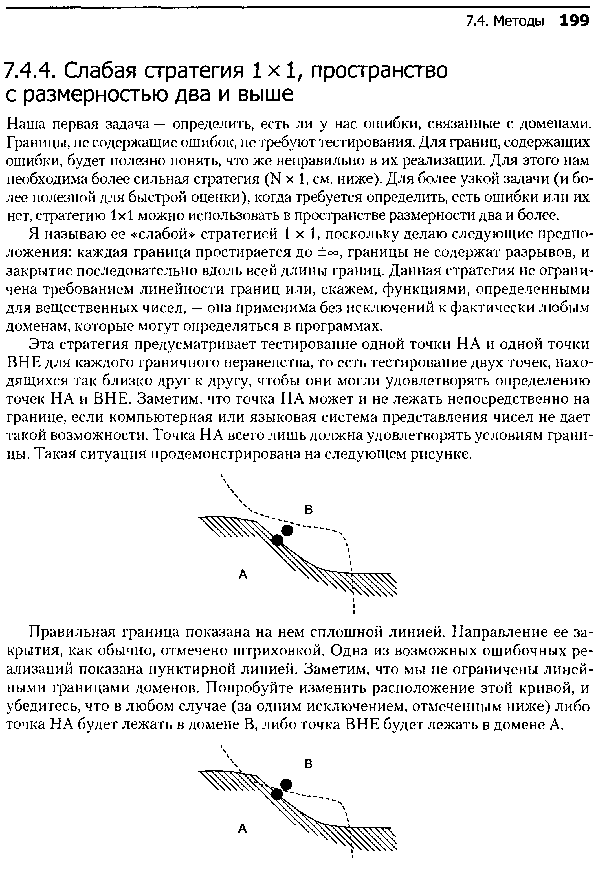

Правильная граница показана на нем сплошной линией. Направление ее закрытия, как обычно, отмечено штриховкой. Одна из возможных ошибочных реализаций показана пунктирной линией. Заметим, что мы не ограничены линейными границами доменов. Попробуйте изменить расположение этой кривой, и убедитесь, что в любом случае (за одним исключением, отмеченным ниже) либо точка НА будет лежать в домене В, либо точка ВНЕ будет лежать в домене А.

Исключение иллюстрирует данный рисунок. Ошибочная граница проходит на нем как раз между выбранными точками НА и ВНЕ. Прежде чем перейти к рассмотрению способов обнаружения данной ошибки, мы должны оценить вероятность ее возникновения. А она мала, поскольку мы имеем дело со случайными ошибками, а не с вредительством. Ошибки доменов в большинстве случаев достаточно масштабны и обладают явно выраженными симптомами. Например, возле десятичной точки пропущен коэффициент, или она поставлена не туда куда надо, пропущена или изменена константа, или даже пропущено целое выражение. В результате подобных ошибок происходит довольно существенное искажение ошибочной границы. Как мы можем от этого защититься? Выбором точек НА и ВНЕ настолько близко друг к другу, насколько это только возможно. У нас нет гарантии, что ошибочная граница не попадет в зазор между выбранными контрольными точками, но вероятность этого мала.

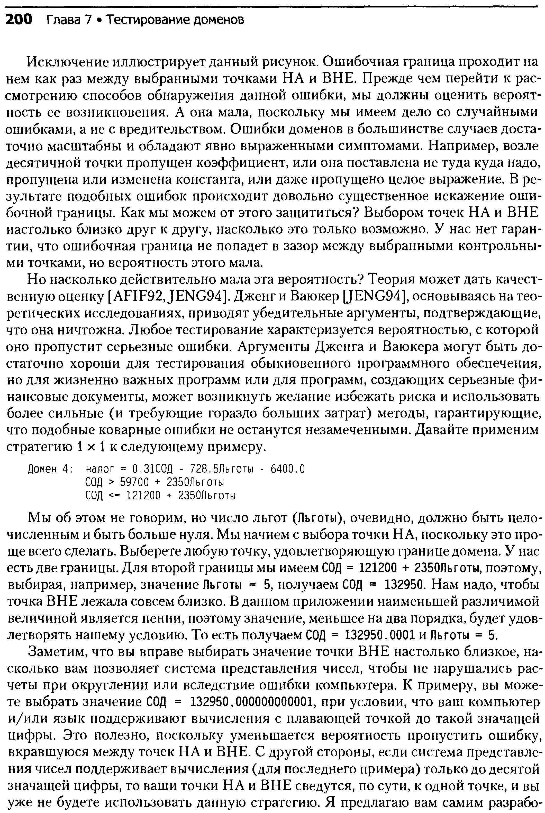

Но насколько действительно мала эта вероятность? Теория может дать качественную оценку [AFIF92, JENG94]. Дженг и Ваюкер [JENG94], основываясь на теоретических исследованиях, приводят убедительные аргументы, подтверждающие, что она ничтожна. Любое тестирование характеризуется вероятностью, с которой оно пропустит серьезные ошибки. Аргументы Дженга и Ваюкера могут быть достаточно хороши для тестирования обыкновенного программного обеспечения, но для жизненно важных программ или для программ, создающих серьезные финансовые документы, может возникнуть желание избежать риска и использовать более сильные (и требующие гораздо больших затрат) методы, гарантирующие, что подобные коварные ошибки не останутся незамеченными. Давайте применим стратегию $1 \times 1$ к следующему примеру.

Мы об этом не говорим, но число льгот (Льготы), очевидно, должно быть цечисленным и быть больше нуля. Мы начнем с выбора точки НА, поскольку это проще всего сделать. Выберете любую точку, удовлетворяющую границе домена. У нас есть две границы. Для второй границы мы имеем $\text{СОД} = 121200 + 2350 \text{Льготы}$, поэтому, выбирая, например, значение $\text{Льготы} = 5$, получаем $\text{СОД} = 132950$. Нам надо, чтобы точка ВНЕ лежала совсем близко. В данном приложении наименьшей различимой величиной является пенни, поэтому значение, меньшее на два порядка, будет удовлетворять нашему условию. То есть получаем $\text{СОД} = 132950.0001$ и $\text{Льготы} = 5$.

Заметим, что вы вправе выбирать значение точки ВНЕ настолько близкое, насколько вам позволяет система представления чисел, чтобы не нарушались расчеты при округлении или вследствие ошибки компьютера. К примеру, вы можете выбрать значение $\text{СОД} = 132950.00000000001$, при условии, что ваш компьютер и/или язык поддерживают вычисления с плавающей точкой до такой значащей цифры. Это полезно, поскольку уменьшается вероятность пропустить ошибку, вкравшуюся между точек НА и ВНЕ. С другой стороны, если система представления влияния чисел поддерживает вычисления (для последнего примера) только до десятой значащей цифры, то ваши точки НА и ВНЕ сведутся, по сути, к одной точке, и вы уже не будете использовать данную стратегию. Я предлагаю вам самим разрабо-

тать тесты для других границ этого домена и рассчитать ожидаемые значения для спроектированных вами тестов.

## 7.4.5. Вырожденный случай

В $n$-мерном пространстве вырождение возникает, если домен определяется как область с размерностью меньшей, чем $n$. А и В — смежные домены и оба открыты по отношению к показанной на рисунке границе.

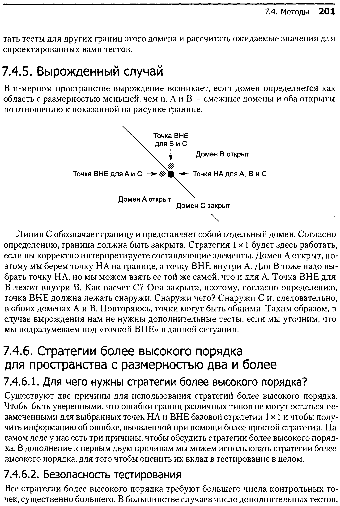

Линия С обозначает границу и представляет собой отдельный домен. Согласно определению, граница должна быть закрыта. Стратегия $1 \times 1$ будет здесь работать, если вы корректно интерпретируете составляющие элементы. Домен А открыт, поэтому мы берем точку НА на границе, а точку ВНЕ внутри А. Для В тоже надо выбрать точку НА, но мы можем взять ее той же самой, что и для А. Точка ВНЕ для В лежит внутри В. Как насчет С? Она закрыта, поэтому, согласно определению, точка ВНЕ должна лежать снаружи. Снаружи чего? Снаружи С и, следовательно, в обоих доменах А и В. Повторяюсь, точки могут быть общими. Таким образом, в случае вырождения нам не нужны дополнительные тесты, если мы уточним, что мы подразумеваем под «точкой ВНЕ» в данной ситуации.

## 7.4.6. Стратегии более высокого порядка для пространств с размерностью два и более

### 7.4.6.1. Для чего нужны стратегии более высокого порядка?

Существуют две причины для использования стратегий более высокого порядка. Чтобы быть уверенными, что ошибки границ различных типов не могут остаться незамеченными для выбранных точек НА и ВНЕ базовой стратегии $1 \times 1$ и чтобы получить информацию об ошибке, выявленной при помощи более простой стратегии. На самом деле у нас есть три причины, чтобы обсудить стратегии более высокого порядка. В дополнение к первым двум причинам мы можем использовать стратегии более высокого порядка, для того чтобы оценить их вклад в тестирование в целом.

### 7.4.6.2. Безопасность тестирования

Все стратегии более высокого порядка требуют большего числа контрольных точек, существенно большего. В большинстве случаев число дополнительных тестов,

приходящих ся на одну границу, пропорционально размерности пространства. Если $b$ — число границ, то стратегия $1 \times 1$ подразумевает проведение $2b$ тестов. Все более надежные методы требуют уже порядка $b \times n$ тестов, где $n$ — размерность пространства. Это гораздо хуже, но все равно не так плохо, как в случае примитивной стратегии, основанной на комбинации экстремальных точек, которая предполагает проведение тестов.

Ситуация осложняется с ростом размерности, то есть вероятность пропустить ошибку, вкравшуюся между выбранными контрольными точками, растет с ростом размерности. Тем не менее, в 1995 году мы не располагали надежной статистикой для количественной оценки риска, а могли пользоваться лишь теоретическими исследованиями.

Афифи с соавторами [AFIF92] продемонстрировали, что для полной уверенности в отсутствии ошибок, вкравшихся между выбранными точками НА и ВНЕ, а также для проверки на наличие множества других разных ошибок доменов вам необходимо $n + 2$ грамотно подобранных тестов на одну границу (слабое предположение). Как минимум, одна из точек должна быть точкой НА и одна должна быть точкой ВНЕ. Особенности контрольных точек (то есть что кроется за словами «грамотно подобранный»), а также алгоритмы выбора этих точек лежат за рамками данной книги, но подробно изложены в [AFIF92].

## 7.4.6.3. Типы ошибок доменов

Из трех целей, преследуемых при рассмотрении стратегий более высокого порядка, вторая и третья могут быть достигнуты при исследовании стратегии $N \times 1$ [COHE78]. $N \times 1$ — приемлемая стратегия, которую можно использовать для диагностики природы ошибок в случае, если ваша граница содержит ошибки. Она также помогает понять суть тестирования доменов и природы ошибок в целом. И, наконец, в любой специализированной литературе, описывающей тестирование доменов, предполагается, что вы знакомы с этой стратегией.

Применение стратегии $N \times 1$ позволяет проводить диагностику ошибок, поскольку, выбирая $n$ точек НА, мы можем убедиться в корректности граничной гиперплоскости с размерностью $n - 1$ в $n$-мерном пространстве (например, линии в двухмерном пространстве и поверхности в трехмерном пространстве).

Мы можем рассматривать возможные варианты ошибок доменов в пространстве с размерностью два и более для случая, когда все границы доменов линейны. В сущности, тестирование доменов представляет собой одну из немногих областей, где можно описать ошибки на языке математики. Данная стратегия требует наличия $n$ точек НА и одной точки ВНЕ для $n$-мерного пространства.

1. Ошибка закрытия. Граница, которая должна быть открытой, реализована как закрытая, а граница, которая должна быть закрытой, реализована как открытая. Мы будем рассматривать случай закрытых границ, а анализ открытых оставим в качестве упражнения. Тестирование одиночной точки НА выявит эту ошибку, если на границе нет случайной корректности. Ошибка закрытия — это наиболее часто встречающаяся ошибка доменов.

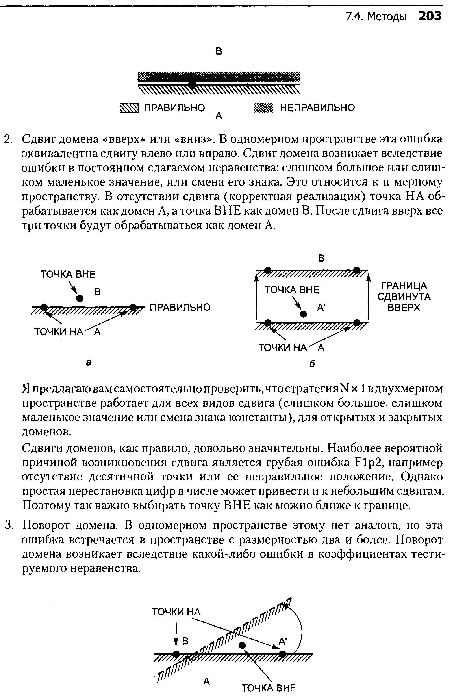

2. Сдвиг домена «вверх» или «вниз». В одномерном пространстве эта ошибка эквивалентна сдвигу влево или вправо. Сдвиг домена возникает вследствие ошибки в постоянном слагаемом неравенства: слишком большое или слишком маленькое значение, или смена его знака. Это относится к $n$-мерному пространству. В отсутствии сдвига (корректная реализация) точка НА обрабатывается как домен А, а точка ВНЕ как домен В. После сдвига вверх все три точки будут обрабатываться как домен А.

Я предлагаю вам самостоятельно проверить, что стратегия $N \times 1$ в двухмерном пространстве работает для всех видов сдвига (слишком большое, слишком маленькое значение или смена знака константы), для открытых и закрытых доменов.

Сдвиги доменов, как правило, довольно значительны. Наиболее вероятной причиной возникновения сдвига является грубая ошибка F1p2, например отсутствие десятичной точки или ее неправильное положение. Однако простая перестановка цифр в числе может привести и к небольшим сдвигам. Поэтому так важно выбирать точку ВНЕ как можно ближе к границе.

3. Поворот домена. В одномерном пространстве этому нет аналога, но эта ошибка встречается в пространстве с размерностью два и более. Поворот домена возникает вследствие какой-либо ошибки в коэффициентах тестируемого неравенства.

Я повернул границу домена против часовой стрелки. В отсутствие поворота точка ВНЕ обрабатывается как домен В. После поворота эта точка попадает в домен А, и, следовательно, мы получили ошибку.

Поворот домена является следствием ошибки в коэффициентах (в линейных неравенствах), и, подобно сдвигу, он скорее будет большим, нежели маленьким. И точно так же, выбирая точку ВНЕ как можно ближе к границе, мы можем повысить чувствительность к маленьким сдвигам.

4. Лишняя граница. Стратегия $N \times 1$ применима также и для поиска лишних границ. Вместо двух доменов возникают четыре. Предположим, лишней границе соответствует некоторые различия в процессе обработки, так что мы можем отличить, скажем, домен А от домена $\text{A}'$.

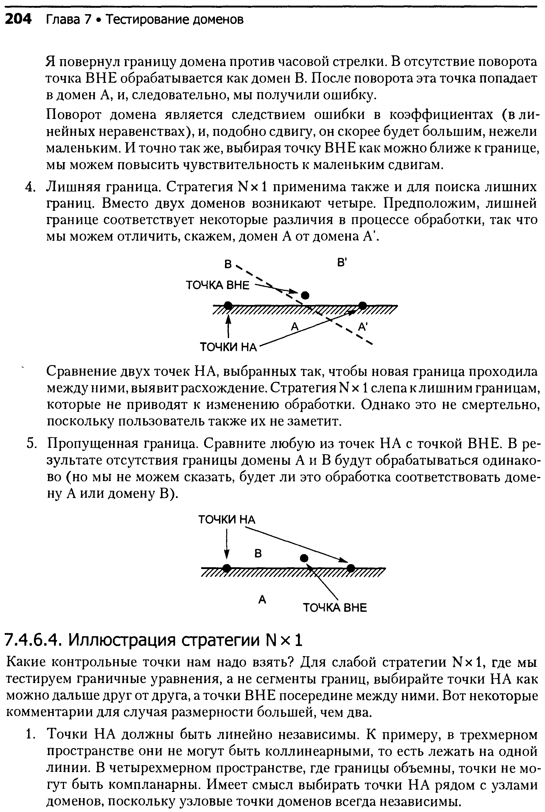

Сравнение двух точек НА, выбранных так, чтобы новая граница проходила между ними, выявит расхождение. Стратегия $N \times 1$ слепа к лишним границам, которые не приводят к изменению обработки. Однако это не смертельно, поскольку пользователь также их не заметит.

5. Пропущенная граница. Сравните любую из точек НА с точкой ВНЕ. В результате отсутствия границы домены А и В будут обрабатываться одинаково (но мы не можем сказать, будет ли это обработка соответствовать домену А или домену В).

ТОЧКИ НА
$\downarrow$
В
А
ТОЧКА ВНЕ

## 7.4.6.4. Иллюстрация стратегии $N \times 1$

Какие контрольные точки нам надо взять? Для слабой стратегии $N \times 1$, где мы тестируем граничные уравнения, а не сегменты границ, выбирайте точки НА как можно дальше друг от друга, а точки ВНЕ посередине между ними. Вот некоторые комментарии для случая размерности большей, чем два.

1. Точки НА должны быть линейно независимы. К примеру, в трехмерном пространстве они не могут быть коллинеарными, то есть лежать на одной линии. В четырехмерном пространстве, где границы объемны, точки не могут быть компланарны. Имеет смысл выбирать точки НА рядом с узлами доменов, поскольку узловые точки доменов всегда независимы.

2. Точки ВНЕ надо выбирать рядом с центром тяжести точек НА. Для линий берите середину между точками НА. Для плоскостей выбирайте точку, лежащую в середине треугольника, построенного на точках НА, то есть как можно ближе к точке, равноудаленной от вершин треугольника.

Применим стратегию $N \times 1$ для тестирования верхней границы домена 4.

Домен 4: $\text{налог} = 0.31\text{СОД} - 728.5\text{Льготы} - 6400.0$
$\text{СОД} > 59700 + 2350\text{Льготы}$
$\text{СОД} <= 121200 + 2350\text{Льготы}$

Число льгот (Льготы) не может быть отрицательным, поэтому мы выбираем ноль в качестве нижней границы. Здесь не задан верхний предел, но мы можем выбрать его сами, задав достаточно большое значение для уменьшения вероятности пропуска маленьких сдвигов или поворотов; например, 100. Льготы представляются целыми числами, поэтому 1 — это наименьшее значение (из тех, что мы можем выбрать), отличающееся от узловой точки. Подставляя 1 и 100, мы получаем 123550 и 356200, соответственно. Итак, мы выбрали следующие точки НА: $(1, 123550)$ и $(100, 356200)$.

Наш следующий шаг — выбор точки ВНЕ. Для начала выберем точку на границе, посередине между двумя точками НА, то есть $\text{Льготы} = 50$. Подставляя это значение в уравнение границы, мы получаем 238700. Но наша точка ВНЕ должна лежать снаружи домена, в данном случае — немного выше, поэтому мы берем точку ВНЕ равной $(50, 238700.01)$. Последнее, что нам надо сделать, это подставить полученные три набора значений в уравнение для налогов, чтобы получить наш предсказанный итог. Однако будьте уверены, что вы подставляете точку ВНЕ в уравнение расчета налогов для домена 5, а не домена 4. Выполнив это, мы получаем следующие варианты теста:

| Льготы | СОД | Налог |
| :--- | :--- | :--- |
| 1 | 123550.00 | 31172.0000 |
| 50 | 238700.01 | 31172.0036 |
| 100 | 356200.00 | 31172.0000 |

Это не является проявлением случайной корректности, поскольку наша задача заключается не в поиске различий между точками в одном и том же домене, а в определении, не попала ли точка по ошибке в другой (например, смежный) домен. При расчете налога для точки ВНЕ в этом домене (4) получается $31172,0031$ вместо $31172,0036$. Налог получился один и тот же для всех трех точек, однако домены и налоговые ставки не были линейно независимыми. Вообще говоря, подобная ситуация нетипична, и это подтверждает следующий пример:

| Неравенство | точка НА #1 $(x, y)$ | точка НА #2 $(x, y)$ | точка ВНЕ |
| :--- | :--- | :--- | :--- |
| $y >= 0$ | $0. \ 0.0001$ | $0. \ 10$ | $-0.0001. \ 5$ |
| $x >= 0$ | $0.0001. \ 0$ | $10. \ 0$ | $5. \ -0.0001$ |
| $2y < x+4$ | $2. \ 3$ | $12. \ 8$ | $6.999. \ 5.499$ |
| $4y >= x-4$ | $4. \ 0$ | $20. \ 4$ | $12.0001. \ 1.999$ |
| $y <= -x+16$ | $0. \ 16$ | $16. \ 0$ | $8.0001. \ 8.0001$ |

Я не стану приводить результат вычисления функции в этом домене, но давайте предположим, что у нас есть и что случайная корректность со смежным доменом отсутствует. Я проиллюстрирую процедуру на примере проектирования тестов для последней из этих границ. Нам надо выбрать точки НА как можно дальше друг от друга, имея в виду, что, используя слабую стратегию $N \times 1$, мы можем проверить

лишь границу целиком и не можем проверить отдельные сегменты данного домена. Таким образом, я могу взять любые значения на прямой, и наиболее далекими друг от друга будут точки ($x = 0, y = 16$) и ($x = 16, y = 0$). Средняя точка между ними будет равна $(8, 8)$. Поэтому для теста мы используем значения $x = 8.0001$ и $y = 8.0001$. Оси X и Y также принадлежат границам этого домена. Ошибки, связанные с координатными осями, встречаются довольно редко, но вы, возможно, все-таки захотите их протестировать. Минимальное значение у равно нулю, поэтому $(0, 0.0001)$ и, например, $(0, 10)$ — неплохой выбор для точек НА. Тогда для точки ВНЕ получаем значение $(-0.0001, 5)$. Следующее уравнение описывает открытую границу, и поэтому мне пришлось вычесть небольшую величину, чтобы точка ВНЕ лежала внутри. Я надеюсь, что вы нарисуете эти линии, их закрытия и тестовые точки на миллиметровой бумаге, чтобы проследить за тем, что я делал.

## 7.4.7. Сильное тестирование доменов

Отличие между сильным и слабым тестированием доменов заключается в том, что при слабом тестировании мы разрабатываем ряд тестов для каждого граничного неравенства, в то время как при сильном тестировании мы используем отдельный набор тестов для каждого сегмента границы¹. Но это не означает использование той или иной стратегии. Ваше тестирование может быть слабым по отношению к одному набору границ и сильным по отношению к другому. Все зависит от ситуации. Используйте слабое тестирование, если для использования сильного у вас нет особых причин, подобных приведенным ниже.

1. Разрыв в граничном неравенстве. Это означает, что у вас есть три сегмента, подлежащие тестированию. Вы, разумеется, можете захотеть протестировать сегмент разрыва сам по себе, однако будет лучше, если вы протестируете обе части граничного неравенства по обе стороны от разрыва как неравенства, а не как сегменты.
2. Изменение направления закрытия в одном или более сегментах — хороший повод выбрать сильную стратегию по отношению к данному неравенству.
3. Процесс обработки построен таким образом, что некоторые контрольные точки попадают в область, которая впоследствии не обрабатывается. Предположим, у нас есть несколько доменов и любой ввод, не попадающий в эти домены, отбрасывается. Программный код проходит три ступени — проверка соответствия данных, классификация ввода, обработка. Используя слабое тестирование, вы выбираете точки, которые попадают в запрещенную область. Они отбрасываются, но тестирование логики разбиения на классы — это, собственно, не то, что вас интересует. Два набора перекрывающихся доменов — это все,

---
¹ На самом деле мое разделение стратегий на сильные и слабые обманчиво. Подходящий набор спецификаций в случае, когда требуется «сильное» тестирование, подразумевает наличие, по меньшей мере, одного неравенства для каждой точки, в которой меняется направление закрытия границы, и/или в начале или конце каждого разрыва границы. Если вы обладаете подобной дополнительной информацией, любое ваше тестирование будет слабым — у вас нет необходимости тестировать пересечение само по себе.

что у вас есть. Первый набор определяет границы принять/отбросить, а второй задает обработку. Подобная реализация в известном смысле избыточна, но такой подход необычайно популярен. Если вы в данном случае воспользуетесь слабой стратегией, это может ввести вас в заблуждение. Многие вводы будут отбрасываться, так как они лежат вне обрабатываемых доменов, но отбрасываются они из-за случайной корректности. Выбирая здесь слабую стратегию, вы сделаете вывод о корректности границ, задающих обработку, основываясь на данных проверки границ. Это опасное заблуждение. Сильное тестирование, вероятно, будет более безопасным. Чтобы сделать обоснованный выбор, вам придется заглянуть в программный код.

4. Вникните в стиль программирования. Если я вижу ясный, четкий, управляемый таблицами узел обработки с точно идентифицированными граничными неравенствами, и к тому же существует универсальный модуль, выполняющий классификацию, то, скорее всего, в сильном тестировании нет необходимости. Напротив, если для определения каждого домена реализован специальный код, программа полна сложных структур IF-THEN-ELSE, а граничные предикаты избыточны, то стоит использовать сильное тестирование. Если это был старый код, который раньше работал и был сохранен, то у вас, по-видимому, нет выбора, поскольку слабое тестирование может пропустить слишком много доменов, не обнаружив ошибок в их реализации, в то время как они там есть. Если у вас есть новый код, который, однако, был реализован неудачно, то я бы на вашем месте начал со слабого тестирования, так как уже оно выявит большое число ошибок. Если код был изменен в результате исправления ошибок, которые мы обнаружили при помощи слабого тестирования, то следует продолжить слабое тестирование. Однако если бы программисты сводили исправление ошибок к латанию дыр, лишь бы только это работало, я бы рекомендовал использовать сильное тестирование.

## 7.5. Рассмотрение приложений

### 7.5.1. Индикаторы приложений

Тестирование доменов не годится для тестирования систем или даже программ целиком. Никакой одиночный метод с этим не справится. Вот некоторые характерные особенности приложений, для которых применимо тестирование доменов:

1. Части спецификаций, заданные непосредственно в виде численных неравенств.
2. Сложная численная обработка с большим количеством логических условий. Например, налоговые формы, обработка платежных ведомостей, финансовые вычисления и почти все операции, выполняемые в электронных таблицах.
3. Численные вводы и сложная проверка соответствия входных данных и их классификация, даже если впоследствии отсутствует трудоемкая численная обработка.

4. Не ограничивайте ваше знание тестирования доменов и его применение только программным обеспечением. Мы рассматриваем тестирование черного ящика, поэтому мы делаем минимум предположений о том, что тестируется и как это реализовано. Тестирование доменов может быть действенным методом тестирования систем, которые могут содержать или не содержать программное обеспечение (что редко встречается в наши дни). Если система, вне зависимости от того, как она реализована, описывается (отчасти) алгебраическими неравенствами, то это свидетельствует о возможности применения тестирования доменов.

## 7.5.2. Предположения об ошибках

Ниже в порядке важности приведены ошибки, которые мы чаще всего рассчитываем обнаружить в тестируемой системе.

1. Ошибки спецификации доменов. Неопределенные домены — спецификация входного пространства неполна; противоречивые домены — перекрытие доменов, особенно для границ с направлением закрытия в обе стороны; переопределенный домен — существование домена невозможно из-за слишком большого количества неравенств; вырождение домена там, где он не нужен.
2. Ошибка границ домена. Неправильное закрытие, сдвиг, поворот, пропущенная граница, лишняя граница.
3. Ошибка обработки домена. Здесь рассматриваются корректно определенные домены, у которых, однако, обрабатывающая функция неверная. Выбор неверной функции более вероятен, чем ошибка в реализации этой функции.
4. Ошибка в узлах домена. Они проявляются только в узловых точках определяемых доменов, особенно если присутствует большое количество специальной логики.

## 7.5.3. Ограничения и предостережения

Применение любого метода ограничено, и тестирование доменов не исключение. Ниже приводится краткое изложение ограничений, обсуждаемых в этой главе.

1. Циклы. Мы предполагаем, что в процессе выбора доменов отсутствуют циклы. Циклы, включенные в процесс обработки домена, нам не опасны до тех пор, пока вы можете гарантировать, что обработка какого-либо домена не приведет к переходу программы на обработку другого домена. Существуют теоретические методы обработки циклов, которые могут влиять на границы, но они лежат за рамками данной книги.
2. Случайная корректность. Случайная корректность — это проблема для всех методов тестирования. Наиболее вероятной ситуацией является случайная корректность по отношению к отбрасываемым входным доменам. Это означает, что из-за случайной корректности плохие вводы отбрасываются по неверной причине.

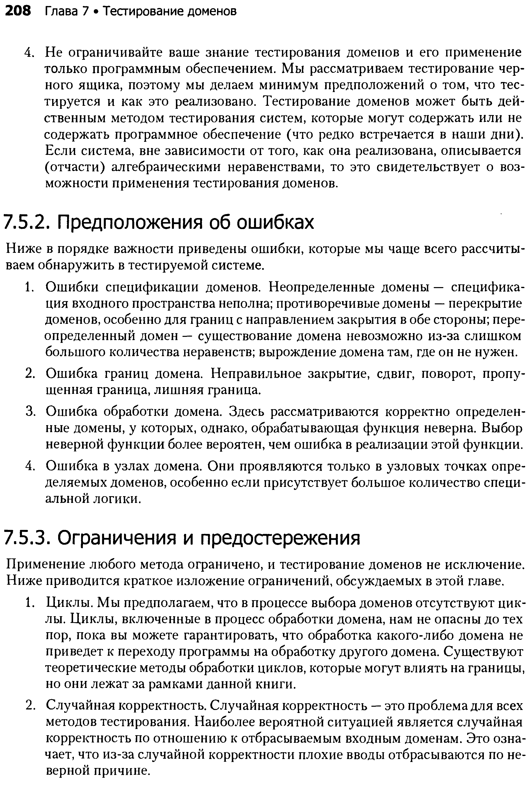

3. Слепота и эпсилон. Тестирование доменов слепо к ошибкам, меньшим, чем выбранное вами $\epsilon$. Возможно, вам не удастся выбрать единственное значение для всего вашего тестирования. Ваша обработка может ограничивать пределы малых значений в вашей системе (например, $10^{-399}$), и выбор соответствующего $\epsilon$ будет означать потерю значимости.
4. Сложность с выбором точки ВНЕ для закрытых доменов. Для доменов, которые граничат с доменами, отбрасываемыми на вводе, точка ВНЕ ничего вам не скажет, так как проверка соответствия ввода происходит раньше, чем выбор домена.

## 7.5.4. Автоматизация и инструментальные средства

К настоящему времени не существует коммерческих инструментов, обеспечивающих полноценное тестирование доменов. Некоторые автоматические генераторы тестов используют эвристическое одномерное тестирование доменов и затем создают ряд комбинаций значений экстремальных точек. Плюсом этого метода является то, что для применения стратегии $1 \times 1$ вам не нужны какие-то специальные инструменты, кроме калькулятора для элементарных вычислений и собственного желания. Вам не нужны алгебраические инструменты для проверки полноты и последовательности границ домена [WHIT95]. Все инструменты, необходимые для тестирования больших размерностей, имеются в большом количестве в математических библиотеках [BISW87, KOLM88]. Плохая новость состоит в том, что они практически не связаны друг с другом, что затрудняет их использование при тестировании доменов.

## 7.6. Резюме

Тестирование доменов представляет собой формальный, автоматизируемый метод, призванный так или иначе заменить общепринятую, но неэффективную практику тестирования экстремальных входных значений и их комбинаций. Тестирование доменов основано на формальной процедуре определения доменов как набора входных неравенств, заданных во входном пространстве. Слабая стратегия $1 \times 1$ тестирования доменов используется для адекватных неравенств, а неадекватные тестируются при помощи сильной стратегии $1 \times 1$. Стратегии более высокого порядка, такие как $N \times 1$ и стратегии, описанные в [AFIF92], могут помочь установить природу ошибок (например, сдвиг, поворот), если это является одной из ваших задач. Полная автоматизация проектирования тестов и их выполнение возможны при современном развитии вычислительной техники, однако поддержка этих возможностей коммерческими инструментами весьма незначительна.

## 7.7. Вопросы для самопроверки

1. Дайте определение следующих терминов: смежные домены, граничное уравнение, граничное неравенство, сегмент границы, центр тяжести, законченная

граница, закрытая граница, закрытый домен, ошибка закрытия, коллинеарный, последовательное закрытие, вырожденная граница, вырожденный домен, домен, неопределенный домен, граница домена, набор границ домена, противоречивый домен, ошибка сдвига домена, ошибка поворота домена, окрестность эпсилон, внешняя точка, гиперплоскость, незаконченная граница, непоследовательное закрытие, входное пространство, входная переменная, входной вектор, внутренняя точка, линейный домен, линейно зависимые неравенства, линейно зависимые векторы, линейно независимые векторы, линейно независимые уравнения, линейное неравенство, нелинейный домен, $N \times 1$, точка ВНЕ, $1 \times 1$, точка НА, открытая граница, открытый домен, выходное пространство, выходная переменная, выходной вектор, параллельный, интерпретация предиката, область, ошибка сдвига, сильное тестирование доменов, субдомен, ошибка поворота, вектор, узловая точка, тестирование домена.

2. Что является шестым доменом в примере подраздела 7.3.1?
3. Найдите неопределенность в первой спецификации подраздела 7.3.2.
4. Найдите все огрехи в последней спецификации подраздела 7.3.3.
5. В бланке SE определяются следующие домены: протестируйте их

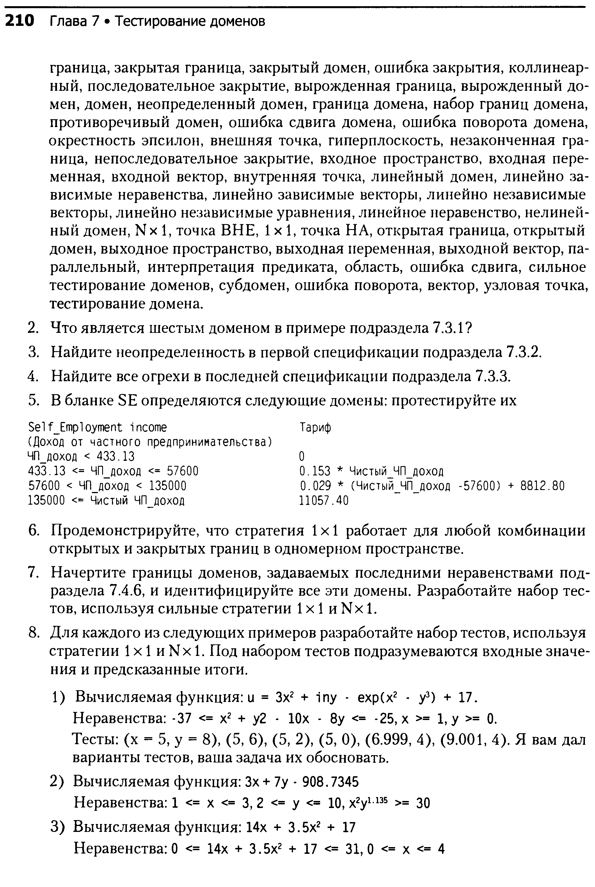

6. Продемонстрируйте, что стратегия $1 \times 1$ работает для любой комбинации открытых и закрытых границ в одномерном пространстве.
7. Начертите границы доменов, задаваемых последними неравенствами подраздела 7.4.6, и идентифицируйте все эти домены. Разработайте набор тестов, используя сильные стратегии $1 \times 1$ и $N \times 1$.
8. Для каждого из следующих примеров разработайте набор тестов, используя стратегии $1 \times 1$ и $N \times 1$. Под набором тестов подразумеваются входные значения и предсказанные итоги.
   1) Вычисляемая функция: $u = 3x^2 + iny - \exp(x^2 - y^3) + 17$.  
      Неравенства: $-37 \le x^2 + y^2 - 10x - 8y \le -25, x \ge 1, y \ge 0$.  
      Тесты: $(x = 5, y = 8), (5, 6), (5, 2), (5, 0), (6.999, 4), (9.001, 4)$. Я вам дал варианты тестов, ваша задача их обосновать.
   2) Вычисляемая функция: $3x + 7y - 908.7345$  
      Неравенства: $1 \le x \le 3, 2 \le y \le 10, x^2 y^{1.135} \ge 30$
   3) Вычисляемая функция: $14x + 3.5x^2 + 17$  
      Неравенства: $0 \le 14x + 3.5x^2 + 17 \le 31, 0 \le x \le 4$

# Синтаксическое тестирование

## 8.1. Обзор

Синтаксическое тестирование — это мощный метод для проверки командно-управляемого программного обеспечения и сходных приложений. Он достаточно легко осуществляется и поддерживается многими коммерческими инструментальными средствами.

## 8.2. Основные термины

**Внешние термины**: алгебра, ANSI, приложение, ASCII, булева, символ, код, команда, связь, содержание, управление, база данных, накопитель, файл, имя файла, идентичность, вход, целочисленный, непосредственное соседство, язык, уровень, логическое ИЛИ, макро, модель, MS-DOS, имя, число, операционная система, выборочно, Pascal, конвейеризация, программа, переадресация, последовательность, набор, программное обеспечение, дерево, UNIX, значение, переменная.

**Внутренние термины**: ошибка, чистый тест, покрытие, грязный тест, тестирование доменов, связь, покрытие связей, вес связи, цикл, тестирование цикла, узел, покрытие узлов, объект, итог, путь, отношение, спецификация, тестирование конечного автомата, система, тест.

*Алфавит*. Набор определенных символов, применяемых в данной задаче. Например, ASCII, иероглифы, {a, b, c, x, y, %, 7}. Алфавит может меняться в зависимости от приложения и даже отличаться для разных тестов. Не забывайте проверять алфавит, так как большое количество ошибок (найденных путем синтаксического тестирования) возникает из-за использования неверного алфавита, например, ASCII вместо ANSI.

*Тире*. Тире между двумя элементами алфавита заменяет собой все элементы в алфавите, начинающиеся с первого и заканчивающиеся последним элементом, в предположении что естественный порядок этих символов понятен, как, например, «а–я». «1–9» означает целочисленные символы от 1 до 9, включительно.

*Метасимволы* (или металингвистические символы). Символы, используемые для описания языка. Используемые метасимволы включают в себя: $\{$, $\}$, $|$, $[$, $]$, $($, $)$, $*$, $+$, $<$, $>$, $?$, $\beta$, $\delta$, $\alpha$, $\Phi$, $;$, $:=$, $=$, $-$, (запятая), (пробел) и символы, используемые в обычных текстах. Интерпретация и применение метасимволов будут обсуждаться ниже. Мы будем рассматривать слова и команды, составленные из символов, а также способы их тестирования, поэтому так важно различать тестируемые символы и символы, которые описывают тестируемые символы. Для того, чтобы описать тест, включающий символ $|$, обычно этот символ дублируют. То есть используют комбинацию символов «$||$». Так, например, «$[[$» означает не два метасимвола «$[»$, а одиночную квадратную скобку, которая фигурирует в тесте.

*Нуль* ($\lambda$). Металингвистический символ, используемый для обозначения отсутствия символа. Не путайте $\lambda$ с символом пробела ($\sigma$), или пустым символом ($\beta$).

*Символ пробела* ($\sigma$). Металингвистический символ, обозначающий знак пробела (например, в напечатанном тексте). Пробелы между словами в предложении используются для удобства чтения и не являются частью нашего описательного языка.

*Пустой символ* ($\beta$). Металингвистический символ, обозначающий пустоту. Он может совпадать, а может и не совпадать с символом пробела. Типичное отличие между пустым символом и символом пробела заключается в том, что $\sigma$ создает видимое пространство при печати или в изображении чего-либо, в то время как $\beta$ — нет.

*Строка*. Последовательность, состоящая из ноля или более символов алфавита. Например, $\text{авб}567\text{х}\beta\beta\beta111$, $1776,666999,\{:|)\}$, $\sim //\backslash\backslash \sim \sim$. Строки идентифицируются при помощи букв верхнего регистра, например, A.

*Набор строк*. Наборы строк выделяются фигурными скобками, например, $\{A\}$. Набор, состоящий, к примеру, из нулевой строки $\lambda$ — $\{\lambda\}$, обозначается просто $\lambda$.

*Имя строки*. Другой способ обозначить строку, это заключить ее имя в угловые скобки, подобно $<\text{имя\_строки}>$. Строковое имя также может быть именем набора строк. Например, $<\text{имя\_строки\_альфа}>::=\{\text{x,xx,ав,сде}\}$.

*Команда*. Строка, используемая для управления. Команды состоят из комбинации полей, операторов, операндов и разделителей.

*Командно-управляемое программное обеспечение*. Программная система или ее часть, в которой основное управление происходит посредством строк, вводимых из командной строки, как, например, MS-DOS и UNIX.

*Командный язык*. Набор команд, используемый для управления командно-управляемым программным обеспечением. Основная задача синтаксического тестирования — проверка командных языков.

*Синтаксис*. Правила, определяющие, что является, а что не является правильной строкой (например, командой). Правила могут быть, а могут и не быть универсальными для всех команд, как, например, корректная форма представления чисел. Но для каждой команды в командном языке должно существовать какое-либо

правило. Синтаксическое тестирование используется для проверки, сможет ли программа распознать правильным образом составленные строки и отбросить некорректно составленные.

*Строковое поле.* (или просто «поле», если смысл понятен из контекста) Часть строки, которой вы даете определенное имя.

*Операнд.* Имя объекта, фигурирующего в командах: например, в команде `DEL C: <имя файла>`, объект `<имя файла>` является операндом. Операнды, как правило, имеют вид слов в обычном языке, таких как «имя файла» или «имя носителя».

*Оператор.* Специальные символы или строки, показывающие, какое действие должно быть выполнено над определенным операндом. В предыдущем примере ключевое слово `DEL` является оператором.

*Ключевое слово.* Оператор (обычно), который имеет вид обычного слова, такого как `DELETE`, `STORE`, `OPEN`. Несмотря на то, что ключевое слово может состоять из большого числа символов, это, тем не менее, одиночный оператор.

*Разделитель.* Символы алфавита, используемые для разделения отдельных операторов, операндов, и/или для обозначения конца команды. В качестве общепринятых разделителей обычно используют символы `β`, `σ`, `(`, `)`, `↵` (возврат каретки), `≡` (перевод строки), `[`, `]`, `/`, `\`, «, » и „.

*Грамматический разбор.* Процесс разбора строки, чтобы выделить в ней поля, операторы, операнды и разделители. Программа, которая это выполняет, называется *синтаксический анализатор*. Любые командно-управляемые системы должны иметь синтаксический анализатор, но зачастую он реализуется неявно. Главной задачей синтаксического тестирования является проверка синтаксического анализатора. Нам не обязательно знать конкретный способ проведения синтаксического анализа, чтобы тестировать анализатор.

*Синтаксический анализ.* Грамматический разбор в применении к одиночному полю или части команды, например, идентификация поля подстрока как строки `<число>`. Синтаксическое тестирование используется для проверки корректности синтаксического анализа, выполняемого программой.

*Семантический анализ.* Операнды имеют определенные значения. Число во введенной команде, кроме того, что оно является правильно составленной строкой, имеет еще и значение. У этого значения могут быть пределы, то есть максимум и минимум. Синтаксическое тестирование не имеет непосредственного отношения к семантическому анализу. Этот анализ лучше делать при помощи других методов, таких как тестирование доменов для численных полей.

*Интерпретация команды.* Предположим, что был проведен грамматический разбор команды и семантический анализ входящих в команду полей. Затем полученные данные были отправлены в программу на обработку, что означает выполнение команды. Акт выполнения команды называется *интерпретацией команды*.

*Лексическая эквивалентность.* Если вы замените буквы английского алфавита на равнозначные буквы, скажем, в кириллице, то вы создадите новый командный язык, который будет лексически эквивалентен первоначальному. `DELETE C: *.*`, `ДЕЛЕТЕ Х: *.*`, `ДЕЛЕТЕ Г: *.*` и `תיראלש :*.*` лексически эквивалентны, поскольку мы всего лишь заменили алфавит. Лексическая эквивалентность может означать трансформацию строки из нескольких символов в единичный символ, как,

например, ПЛЮС трансформируется в $+$. Лексическая эквивалентность может также подразумевать изменение направления чтения слева направо на направление справа налево или сверху вниз. К примеру, DELETE C: *.* может трансформироваться в `*.*: ן ראלית`. Важно понимать эту концепцию в применении к локализованным продуктам, чтобы избежать лишней траты сил на переделку тестов, в то время как проблема заключается в тривиальном изменении алфавита для лексически эквивалентного набора команд. Если два набора команд различаются только лексически, то, как правило, вы можете автоматически конвертировать тесты, написанные для одного алфавита, в тесты, написанные для другого.

*Лексический анализ* Операция идентификации операторов и операндов и их конвертация во внутренний язык, в котором числа, называемые маркерами, заменяют каждый оператор и операнд. Эту операцию называют также маркировкой, поскольку в результате входная строка, составленная в определенном алфавите, конвертируется в строку маркеров. Лексический анализ, обычно явный и простой, должен присутствовать в любой командно-управляемой системе. Лексически эквивалентные наборы команд маркируются в один и тот же набор маркеров. Синтаксическое тестирование используется для проверки корректности лексического анализа.

*Нулевой набор.* Набор $\Phi$, не содержащий никакой (даже нулевой) строки.

*Голова строки (или начало).* Первый символ строки при ее проходе слева направо (в соответствующем алфавите с лексико-графическим упорядочением, разумеется).

*Хвост строки (или конец).* Последний символ строки при ее проходе слева направо.

*Конкатенация.* Если $A$ и $B$ строки, а $C$ — строка, полученная в результате сцепления головы $B$ с хвостом $A$, тогда говорят, что в результате *конкатенации* $A$ и $B$ получилась строка $C$. Конкатенация изображается путем непосредственного соседства соединяемых строк, например, $AB$. К примеру, если `<строка_а>::={xxxyzz}`, а `<строка_б>::=<111011>`, тогда результат конкатенации будет выглядеть как `<строка_а><строка_б>={xxxyzz111011}`. Если $\{A\}$ и $\{B\}$ являются наборами строк, то $\{A\}\{B\}$ означает конкатенацию каждой строки из $\{A\}$ с каждой строкой из $\{B\}$, с сохранением порядка следования. Если $\{A\}::=\{111, 4, x\}$, а $\{B\}::=\{/, x\}$, то $\{A\}\{B\}::=\{111/, 111x, 4/, 4x, x/, xx\}$. Если $A$ является строкой, то для нее выполняются равенства: $\lambda A = A\lambda = A$. Если $A$ — набор строк, то $\lambda \{A\} = \{A\}\lambda = \{A\}$.

*Или.* Если $A$ и $B$ строки, то $A \mid B$ (еще пишут $A+B$), читается «$A$ или $B$», что означает либо строку $A$, либо $B$, либо обе сразу. Поскольку это определение вводится для строк, а одиночные символы можно рассматривать как строки длиной в один символ, то определение применимо так же и для одиночных символов. Или для строк аналогично логическому ИЛИ и так подчиняется законам коммутативности и ассоциативности, то есть $A \mid B = B \mid A$, $A \mid (B \mid C) = (A \mid B) \mid C$. Очевидно, $A \mid B \mid C \mid D ...$ и $A + B + C + D ...$ — это то же самое, что $\{A, B, C, D...\}$.

*Показатель степени.* Если $A$ — строка, то $A^n$ означает $n$ повторений $A$. Например, если $A::=\#\#\$X$, то $A^2::=\#\#\$X\#\#\$X$, а $A^3::=\#\#\$X\#\#\$X\#\#\$X$. Согласно определению $A^0::=\lambda$. Краткая запись $A^{n-m}$ используется для обозначения ряда от $n$ до $m$ повторений строки: Так $A^{3-6} = A^3 \mid A^4 \mid A^5 \mid A^6$. Если $\{A\}$ — набор строк, то $\{A\}^n$ означает конка-

тенацию наборов $\{A\}\{A\}\{A\}...\{A\}$ ровно $n-1$ раз. Так $\{A\}^2 = \{A\}\{A\}, \{A\}^3 = \{A\}\{A\}\{A\}$ и так далее.

*Плюс в показателе*. Если $A$ является строкой, то $A^+$ обозначает одно или более повторений строки $A$: $A, AA, AAA, AAAA, AAAAA, .... , A^\infty$. Если $A ::= xy$, то $xy, xyxy, xyxyxy...$ По аналогии для $\{A\}^+$, где $\{A\}$ — набор строк имеем: $\{A\}, \{A\}\{A\}, \{A\}\{A\}\{A\}...$

*Оператор «звезда»*. Если $A$ — строка, то $A^*$ обозначает ноль или более повторений строки $A$: $\lambda, A, AA, AAA, AAAA, ...$ По аналогии, для $\{A\}^*$, где $\{A\}$ — набор строк, имеем: $\lambda, \{A\}, \{A\}\{A\}, \{A\}\{A\}\{A\}$. Или $A^* = \{A\}^* \mid \lambda$. Очевидно, $AA^* = A^*A = A^+$.

*Объединение*. Если $\{A\}$ и $\{B\}$ — наборы строк, то $\{A\} \mid \{B\}$ называется объединением $\{A\}$ и $\{B\}$, и обозначает совокупность всех строк $\{A\}$ и всех строк $\{B\}$, без повторений. Альтернативные обозначения: $\{A\} + \{B\}, \{A\} \cup \{B\}$.

*Обезглавливание*. Создание новой строки путем удаления ноля или большего числа символов, начиная с головы строки. Например, строка $d567x\beta\beta\beta11$ была получена из строки $abd567x\beta\beta\beta11$ удалением первых двух символов.

*Укорачивание*. Создание новой строки путем удаления ноля или большего числа символов, начиная с хвоста строки. Например, строка $abd567x\beta\beta\beta$ была получена из строки $abd567x\beta\beta\beta11$ удалением последних двух символов.

*Подстрока*. Строка $A$ называется подстрокой строки $B$, если $A$ может быть получена из $B$ обезглавливанием и/или укорачиванием $B$.

БНФ, Форма Бэкуса–Наура [BACK95]. Способ задания строк, использующий введенные выше операторы и обозначения с минимальными изменениями и расширением обозначений.

$::=$. Отдельный медалингвистический символ, означающий «определяется как». Например, $<\text{имя\_строки\_альфа}> ::= xyz<\text{строка\_бета}><\text{строка\_гамма}> \mid <\text{дельта}>$. Это можно интерпретировать как «строка с именем “имя\_строки\_альфа” определяется как последовательность символов $x, y, z$ в указанном порядке, за которыми следует строка с именем “строка\_бета”, а за ней строка с именем “строка\_гамма” или строка с именем “дельта”». Мы считаем, что $<\text{строка\_бета}>, <\text{строка\_гамма}>$ и $<\text{дельта}>$ имеют свои собственные определения.

*Определение БНФ*. Определение набора строк с использованием определений оператора, нуля, конкатенации, операции ИЛИ, показателя, плюса в показателе, оператора «звезда», нулевого набора и имени строки или имени набора строк. Определения БНФ обычно выписываются сверху вниз, однако бывает, что определения приходится передвигать, чтобы определить текущие символы алфавита. Например:

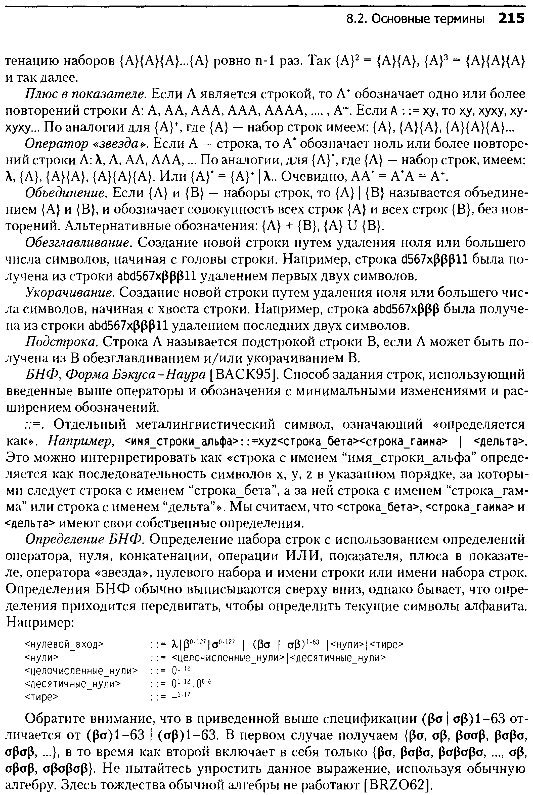

Обратите внимание, что в приведенной выше спецификации $(\beta\sigma \mid \sigma\beta)^{1-63}$ отличается от $(\beta\sigma)^{1-63} \mid (\sigma\beta)^{1-63}$. В первом случае получаем $\{\beta\sigma, \sigma\beta, \beta\sigma\beta, \beta\sigma\beta\sigma, \sigma\beta\sigma\beta, ...\}$, в то время как второй включает в себя только $\{\beta\sigma, \beta\sigma\beta\sigma, \beta\sigma\beta\sigma\beta\sigma, ..., \sigma\beta, \sigma\beta\sigma\beta, \sigma\beta\sigma\beta\sigma\beta\}$. Не пытайтесь упростить данное выражение, используя обычную алгебру. Здесь тождества обычной алгебры не работают [BRZO62].

*Необязательное поле*. Необязательные поля обозначают, заключая их в скобки, как, например, `[<необязательное поле>]`. Очевидно, что скобки служат для короткой записи показателя $0-1$. То есть `[<необязательное поле>]` — это то же самое, что и `<необязательное поле>^{0-1}`.

*Одиночный произвольный символ*. Обозначается как «?» и означает любой одиночный символ алфавита. Например, выражение `????abce.xxx` означает, что перед `abce.xxx` идут четыре произвольных символа.

*Произвольная последовательность символов*. Обозначается как «*» и означает ввод любых разрешенных символов в заменяемое им поле. Не следует путать это с оператором «звезда». Интерпретация произвольной последовательности символов зависит от контекста и не может быть предсказанной. Так, в строке `DELơC:*.exe` только знание операций из MS-DOS указывает нам на то, что звездочку «*» надо рассматривать в данном случае как произвольную последовательность символов, заключенных между двоеточием и точкой, и что эта последовательность должна удовлетворять некоторым правилам, установленными для строк в данной позиции (например, количество символов в строке не должно превышать 8).

Произвольные последовательности символов, такие как «*», которые могут обозначать неопределенное число символов или произвольные последовательности, обозначающие множественные поля или наборы строк, потенциально опасны, и их надо избегать при проектировании тестов. Они представляют опасность, поскольку их интерпретация может меняться и зависеть от контекста. По этой же причине они перспективны для поиска ошибок.

## 8.3. Отношения и модель

### 8.3.1. Основы

Преобразование БНФ-спецификации в график, представляет собой механический и поэтому автоматизируемый процесс [BRZO62]. Это делается с помощью многократного применения четырех преобразований:

*Серия (конкатенация)*. Сегменты БНФ, состоящие из `<поле_а><поле_b>`, моделируют при помощи связи, с весом `<поле_а><поле_b>`.

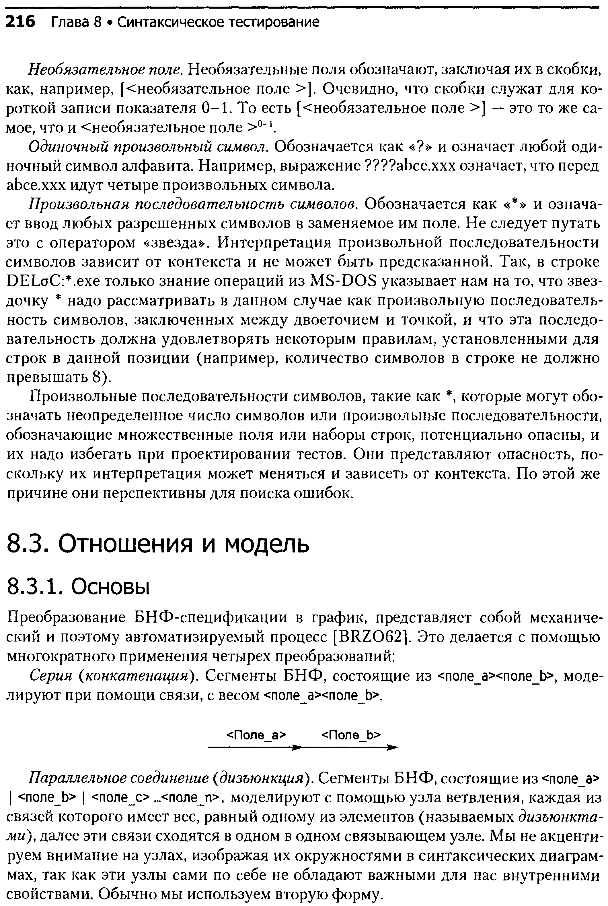

*Параллельное соединение (дизъюнкция)*. Сегменты БНФ, состоящие из `<поле_а> | <поле_b> | <поле_с> ... <поле_n>`, моделируют с помощью узла ветвления, каждая из связей которого имеет вес, равный одному из элементов (называемых дизъюнктами), далее эти связи сходятся в одном в одном связывающем узле. Мы не акцентируем внимание на узлах, изображая их окружностями в синтаксических диаграммах, так как эти узлы сами по себе не обладают важными для нас внутренними свойствами. Обычно мы используем вторую форму.

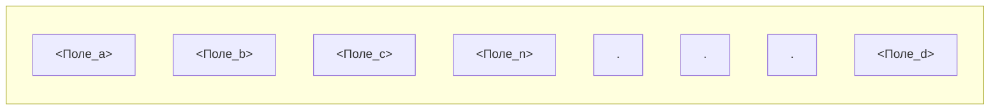
```mermaid
flowchart TD
    subgraph Fields [" "]
        direction TB
        A["&lt;Поле_a&gt;"]
        B["&lt;Поле_b&gt;"]
        C["&lt;Поле_c&gt;"]
        D["&lt;Поле_n&gt;"]
        E["."]
        F["."]
        G["."]
        H["&lt;Поле_d&gt;"]
    end
```

*Показатель, начинающийся не с нуля*. Показатель, такой как `<поле>n-m`, интерпретируется как цикл, который выполняется по меньшей мере n и больше m раз. Я сократил количество повторов цикла на 1, так как поле в цикле находится на нижней связи. Если бы я вставил это поле в верхнюю связь (эквивалентная модель), то количества повторов стали бы равны соответственно n и m. Это альтернативная допустимая модель. Оператор, обозначаемый плюсом в показателе, определяет собой цикл от единицы до бесконечности.

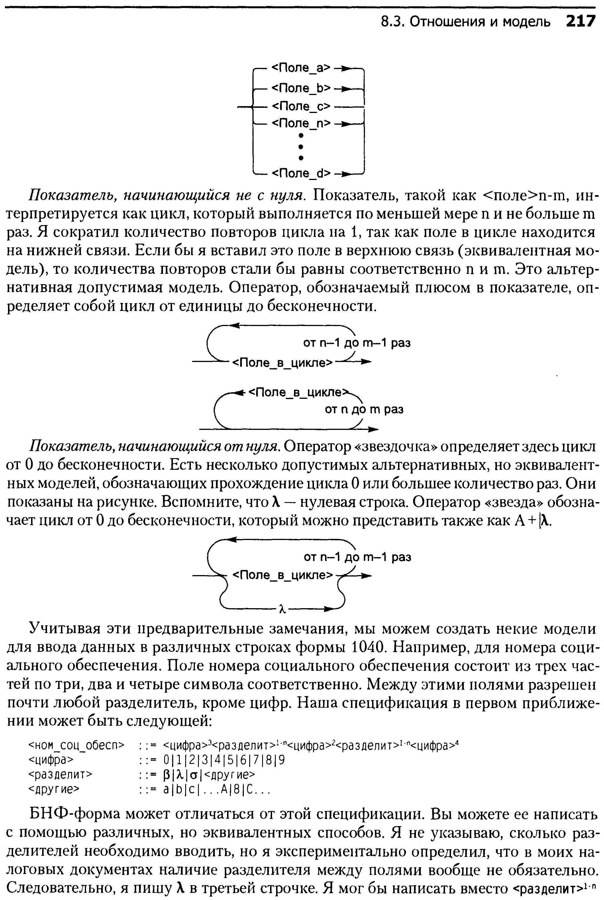

*Показатель, начинающийся от нуля*. Оператор «звездочка» определяет здесь цикл от 0 до бесконечности. Есть несколько допустимых альтернативных, но эквивалентных моделей, обозначающих прохождение цикла 0 или большее количество раз. Они показаны на рисунке. Вспомните, что $\lambda$ — нулевая строка. Оператор «звезда» обозначает цикл от 0 до бесконечности, который можно представить также как $\text{A}^+ | \lambda$.

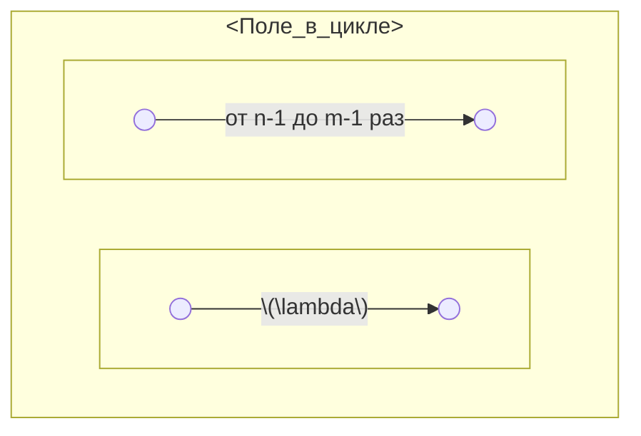
```mermaid
flowchart LR
    subgraph Loop ["&lt;Поле_в_цикле&gt;"]
        direction LR
        subgraph Top [ ]
            direction LR
            Start((" ")) -->|"\(\lambda\)"| End((" "))
        end
        subgraph Bottom [ ]
            direction LR
            End2((" ")) -->|"от n-1 до m-1 раз"| Start2((" "))
        end
    end
```

Учитывая эти предварительные замечания, мы можем создать некие модели для ввода данных в различных строках формы 1040. Например, для номера социального обеспечения. Поле номера социального обеспечения состоит из трех частей по три, два и четыре символа соответственно. Между этими полями разрешен почти любой разделитель, кроме цифр. Наша спецификация в первом приближении может быть следующей:

```text
<ном_соц_обесп> ::= <цифра>^3<разделит>^1-n<цифра>^2<разделит>^1-n<цифра>^4
<цифра>       ::= 0|1|2|3|4|5|6|7|8|9
<разделит>    ::= β|λ|σ|<другие>
<другие>      ::= a|b|c|...|A|B|C...
```

БНФ-форма может отличаться от этой спецификации. Вы можете ее написать с помощью различных, но эквивалентных способов. Я не указываю, сколько разделителей необходимо вводить, но я экспериментально определил, что в моих налоговых документах наличие разделителя между полями вообще не обязательно. Следовательно, я пишу $\lambda$ в третьей строчке. Я мог бы написать вместо `<разделит>^1-n`

определение <разделит>$^{0-n}$, а затем не ставить $\lambda$ в третью строчку, так как <что-либо>$^{0}=\lambda$. Я подразумеваю, что определение <другое> означает что-то еще. Однако вам стоит проверить и убедиться, что это поле включает в себя управляющие символы. Прежде чем идти дальше, убедитесь в том, что вы поняли эту спецификацию.

В моем налоговом пакете, хотя, возможно, к вашему это и не относится, очень мало ограничений, относящихся к этому полю. Мне не удалось найти верхний предел разрешенного числа входных символов. Такой предел, вероятно, существует, и любое тестирование данного программного обеспечения должно это проверять. Давайте определим верхний предел как 65 536 для каждого разделителя. Моя новая модель будет выглядеть следующим образом:

```
<ном_соц_обесп> ::= <разделит>$^{0-65536}$(<цифра><разделит>$^{0-65536}$)$^{9}$ (<цифра>|<разделит>)*
<цифра>         ::= 0|1|2|3|4|5|6|7|8|9
<разделит>      ::= $\sigma$|$\lambda$|$\sigma$|<другие>
<другие>        ::= a|b|c|...|A|B|C...
```

Это не спецификация для социального номера, это описание того, что допускает мой налоговый пакет. Он допускает почти все и извлекает первые девять цифр, используя их как социальный номер. Выбрав девятизначное число, он игнорирует все, что следует дальше. ВНС устанавливает более жесткие и сложные правила для корректного социального номера, так как они диктуют, где и какие цифры должны стоять, а также семантические ограничения на численные значения полей. Простая БНФ-спецификация для социального номера может иметь следующий вид:

```
<ном_соц_обесп> ::= <цифра>$^{3}$<разделит><цифра>$^{2}$<разделит><цифра>$^{4}$
<цифра>         ::= 0|1|2|3|4|5|6|7|8|9
<разделит>      ::= $\sigma$|-|/
```

Теперь мы можем описать нашу модель более привычным способом.

*Узлы.* Узлы — это точки, куда приходят входящие связи и откуда выходят исходящие. Это означает, что они являются узлами слияния или ветвления (как правило, и тем и другим). Узел ветвления заменяет оператор ИЛИ.

*Отношение (связь).* Здесь мы рассматриваем отношение «соединен с». Это означает, что если А соединен с В, то между А и В на графе рисуется связь.

*Веса связей.* Веса связей являются важной частью БНФ-спецификаций. Вес связи может представлять собой имя другой части спецификации со своим собственным графом, или сам граф. Например, для первой строки в предыдущей спецификации весами будут <разделит> и <цифра> с соответствующими показателями. Вместо этого я могу написать следующее определение:

<ном_соц_обесп> ::= <цифра>$^{3}$<$\sigma$|-|/> <цифра>$^{2}$<$\sigma$|-|/><цифра>$^{4}$

Или

```
<ном_соц_обесп> ::= <0|1|2|3|4|5|6|7|8|9>$^{3}$<$\sigma$|-|/><0|1|2|3|4|5|6|7|8|9>$^{2}$
                    <$\sigma$|-|/><0|1|2|3|4|5|6|7|8|9>$^{4}$
```

Показатели также включаются в веса циклов.

Как это часто бывает с подобными моделями, в первое время вам, возможно, будет удобно чертить графы в графической форме, но когда вы освоитесь с моделью, необходимость в этом отпадет. Вы будете уже работать с текстовым представлением графа. Вы неоднократно сможете убедиться на практике, что текстовое

представление графа может представлять собой страницу для одной единственной команды, в то время как эквивалентная графическая форма займет не одну страницу и будет больше путать, чем помогать.

## 8.3.2. Комментарии о трудозатратах

Не надо путать усилия, затрачиваемые на изучение БНФ-представления, с объемом работы, необходимой для тестирования реального программного обеспечения. Иногда идею довольно просто объяснить, но ее реализация требует массы усилий. Так, например, идея Великой Китайской стены сама по себе не слишком сложна. Если вы это понимаете, то, считая, что у вас есть достаточно хорошая спецификация, пускай не БНФ, но уже готовая, вы, возможно, сможете обрабатывать две типичные команды за час (например, команды MS-DOS). Если вам приходится подробно исследовать команды, чтобы определить все поля и ограничения в этих полях, то разбор одной команды может занять день или больше. Большинство примеров и упражнений в этой главе должны занимать у вас около часа или двух.

## 8.4. Методы

### 8.4.1. Основы

Кроме тестирования вводимых команд, синтаксическое тестирование применяют для решения большого количества задач, однако тестирование команд очень хорошо подходит для иллюстрации данного метода. Как обычно, мы начнем с рассмотрения спецификаций.

1. Потребуйте спецификацию команд (фактически строк), которые вы собираетесь тестировать в наиболее формальном виде. Такая информация должна существовать, иначе то же будет реализовывать программист и каким образом пользователь узнает, как ему управлять программой? Если речь идет об уже существующей системе, то вы можете найти нужную информацию в справочных файлах (подобных справке о командах в системе MS-DOS) или, на худой конец, изучить командный синтаксис экспериментально.
2. Просмотрите команды на предмет поиска в них повторяющихся частей, которые встречаются в большом количестве команд. Например, в MS-DOS 6.2 следующие поля используются в множестве команд: `<адрес>`, `<устройство>`, `<каталог>`, `<имя_носителя>`, `<имя_файла>`, `<целочисленный>`, `<ВКЛЮЧИТЬ | ВЫКЛЮЧИТЬ>`, `<путь>`, `<время>`. Это надо сделать, чтобы избежать повторяющихся спецификаций для общих полей. Если вы дважды определяете одну и ту же сущность, то возникает вероятность что эти две спецификации не будут идентичны и, соответственно, повышается вероятность сделать ошибку в проекте теста.
3. Ищите в командах ключевые слова. В MS-DOS каждая команда имеет ключевое слово, но в командах встречаются и другие ключевые слова, такие как AUTO, AUX, COM1, COM2, COM3, COM4, CON, LPT1, LPT2, LPT3, ON, OFF, PATH, PRN. Как и в предыдущем пункте, мы делаем это, чтобы избежать повторяющихся спецификаций и, соответственно, ошибок в тесте.

4. Начните формирование ваших определений с ключевых слов, поскольку именно они с наибольшей вероятностью будут модифицированы при лексических изменениях (например, при переходе с английского языка на французский). Это будет простой алфавитный список.
`<auto> ::= AUTO|AUTO|AutO|...|auto`
`<aux> ::= AUX|AUx|Aux|Aux|AUX|AUX|aux`

`<последнее_ключевое_слово>`
Вам, возможно, удастся сэкономить время. Вместо того чтобы выписывать все возможные комбинации букв верхнего и нижнего регистров, вам будет удобнее написать нечто вроде:
`<A>::=A|a, <B>::=B|b`
В таком случае спецификация для ключевого слова `<aux>` примет следующий вид:
`<aux>::=<A><U><X>`
Аббревиатуры команд используются во множестве систем. DELETE может быть сокращено до DEL, DELE или DELET. Тут не существует общих правил, вы должны самостоятельно решить, что в вашем случае допустимо, а что — нет.

5. Создайте БНФ-спецификацию для общих полей, таких как `<носитель>`.
6. Составьте список команд в порядке возрастания сложности, где сложность определяется числом полей в команде и тем, как много определений более низкого уровня вам пришлось привлечь.
7. Сгруппируйте команды. Мы не объединяем команды по принципу производимого ими действия. Это может быть хорошо для демонстраций при продаже системы, но не для ее тестирования. Группируйте их в соответствии с их характеристиками, такими как использование общих ключевых слов, использование общих определений полей, похожих структур. Например, у нас могут быть команды, имеющие одну и ту же структуру.
`<ключевое_слово_команды> ::= <имя_носителя>: <путь> <разделитель> [\<sw1>]`
`<разделитель>[\<sw2>]\<возврат>`
Правильный выбор групп упростит проектирование тестов и само тестирование, поможет избежать ошибок при разработке теста и сэкономит время, затрачиваемое на проектирование.
8. Для всех полей, содержание которых (например, численное, целочисленное, строковое и т. д.) может меняться, обычно существует семантическая спецификация (например, минимальное и максимальное значения). Определите все подобные семантические характеристики и решите, какой метод тестирования вы будете использовать.
9. Спроектируйте тест. Для каждой команды нужен свой набор тестов — чистых и грязных. Каждый чистый тест будет соответствовать определенному пути в синтаксическом графе этой команды. Как обычно, вы выбираете

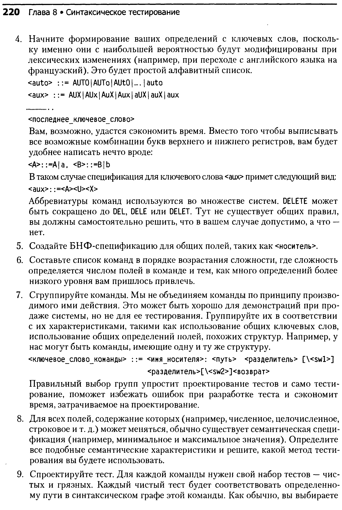

путь, активизируете его, предсказываете выход, определяете критерии соответствия, убеждаетесь в правильности выхода и т. д.

Вы должны выполнить первые восемь шагов вне зависимости от того используете ли вы автоматический генератор тестов, или делаете это вручную. Первые восемь пунктов в этом списке составляют от 50 до 75 процентов всей работы, затрачиваемой на проведение синтаксического тестирования. Обратите внимание, насколько я был требователен к деталям, в частности, не пользуясь предположением о взаимозаменяемости букв верхнего и нижнего регистров. Не делайте подобных допущений, поскольку операционная система, а следовательно, и тестируемое вами приложение различают такие вещи.

## 8.4.2. Иерархия покрытия

Покрытие узлов в данном случае вряд ли будет эффективным, поскольку узлы здесь не обладают интересными для нас свойствами. Однако покрытие связей нам будет необходимо. Так как мы имеем дело с циклами, мы также будем использовать тесты для циклов.

## 8.4.3. Чистое синтаксическое тестирование

Я считаю правильным разбить синтаксическое тестирование на две части: чистое и грязное. Чистое тестирование означает обеспечение покрытия (связей) на графе, плюс дополнительные тесты для циклов. Это легче показать, чем рассказать. На рис. 8.1 показана спецификация для строки <вещественное_число> в языке Pascal, чья БНФ задается следующим образом:

```
<вещественное_число> ::= <цифра>+<λ> | <цифра>+><λ><E|e D|d><λ|+|-><цифра>+
<цифра>               ::= 0|1|2|3|4|5|6|7|8|9
```

Здесь я привожу мой тестовый набор, обеспечивающий покрытие (исключая специальные случаи для циклов): 01, 2.34, 5.6E78, 9.0e+1, 0.0D-000, 0d0. Эти шесть тестовых вариантов (и еще фактически бесконечное число эквивалентных тестов) обеспечивают полное покрытие связей. Простейший способ убедиться в этом — это прочертить заданные пути на копии этого рисунка.

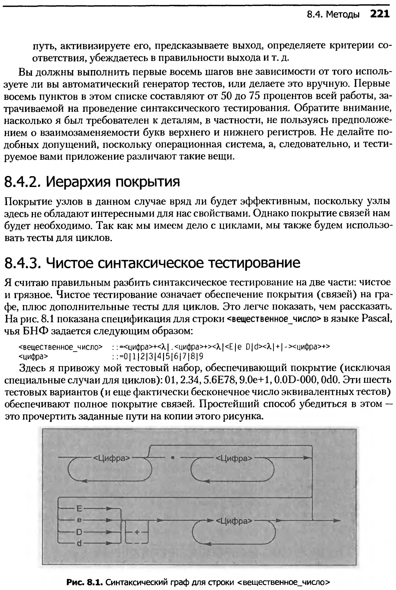

**Рис. 8.1.** Синтаксический граф для строки <вещественное_число>

Наш следующий набор тестов направлен на проверку циклов. Вам надо проверить каждый цикл для следующего количества итераций: $0$, $1$, $2$, типичного, $\max - 1$, $\max$ и $\max + 1$. Мы не можем пройти цикл ноль раз, по крайней мере, в рамках чистого теста, так как это нарушило бы описанную в спецификации синтаксическую структуру. Все ли циклы были протестированы для случая $1$? Если да, тогда в других тестах нет необходимости. Типичные значения различны для различных приложений, поэтому нет смысла тестировать их без знания статистики. Кстати, типичные значения обычно не особо перспективны для поиска ошибок, они нужны скорее в политических целях, чтобы убедить (без статистического подтверждения) людей в работоспособности системы.

А как насчет максимальных и близких к ним значений? В операторах $+$ и $*$ скрыто прямое приглашение поискать ошибки. В компьютере все числа конечны, а значит, должны быть и максимальные значения. Например, в реально существующей спецификации оговаривается, что ни одна команда или оператор не могут состоять более чем из $255$ символов. Вы должны найти правило, вне зависимости от того, скрытое оно или явное, и спроектировать тесты для этих случаев. Давайте предположим, что у нас есть следующее простое правило:

$$\langle\text{вещественное\_число}\rangle ::= \langle\text{цифра}\rangle^{1-10} \langle\lambda\rangle \mid . \langle\text{цифра}\rangle^{1-12} \langle\lambda\rangle \mid \langle\text{E} \mid \text{e} \mid \text{D} \mid \text{d} \rangle \langle\lambda\rangle \mid + \mid - \rangle \langle\text{цифра}\rangle^{1-3}$$

Эта спецификация может быть проверена для случая $\max - 1$ и $\max$ при помощи следующих тестов: $123456789.12345678901\text{e}12$, $1234567890.123456789012\text{e}123$. Почему я комбинирую по три значения $\max - 1$ и $\max$ в отдельных тестах? Не лучше ли будет отказаться от комбинации значений для трех полей и проверить цикл по каждому полю отдельно? Стоит задать себе вопрос, какие ошибки вы ожидаете здесь встретить. Вы ожидаете встретить ошибку такую, что программа будет работать, если два из трех ее полей превышают свои допустимые значения, и не будет работать, если все три поля меньше этих пределов. Мне кажется, что это не слишком похоже на естественную ошибку.

Какие типы ошибок мы ищем, когда проверяем операторы $+$ и $*$? Было время, когда работа программного обеспечения могла нарушиться всего лишь из-за неправильной реализации предельных значений. Однако вероятность встретить подобную ошибку в современном программном обеспечении невелика. Программисты знают об этой проблеме и стараются ее избегать. Чаще всего ошибка возникает, если у двух или более программистов существуют различные нотации максимальной величины. Один программист берет предел равным $512$, другой $65\,536$, а третий вообще считает, что $20$ вполне достаточно. Ожидаемая в данном случае ошибка возникает вследствие несогласованности в нотациях вычислительно бесконечных циклов. Например, программист ограничил ввод $65\,536$ цифрами. В более поздней программе, обрабатывающей это число, разрешено не более $20$ цифр и некорректно предполагается, что предыдущая программа тоже ограничивает свой ввод $20$ цифрами.

## 8.4.4. Грязное синтаксическое тестирование

Используя грязное синтаксическое тестирование, мы решаем одновременно две задачи: пытаемся нарушить работу программного обеспечения, подбирая подхо-

дящий пример отдельных синтаксических ошибок для всех команд, и добиваемся вызова всех диагностических сообщений, связанных с этой командой. Если мы хорошо справились с первым заданием, то есть шанс, что и второе задание тоже окажется выполненным, однако в любом случае это неплохо бы проверить.

Давайте сначала закончим тестирование циклов. Мы должны рассмотреть случай нулевого числа итераций для каждого цикла. Вот некоторые из моих тестов: .05, 1., 1.1е. В случае грязного теста, я беру значения $\max + 1$ равными: 12345678901.1, 1.1234567890123, 1.1e1234. Обратите внимание, что в грязных тестах я делаю только по одной ошибке, а для всех остальных полей выбираются самые простые значения. К этому моменту чистые тесты должны быть уже пройдены, поэтому программа должна читать и интерпретировать все символы при условии отсутствия ошибок. Для грязных тестов ситуация иная, поскольку если, например, первое поле содержит слишком много или слишком мало цифр, то число отбрасывается и ошибочный код для второго поля уже не будет выполняться. Я хочу убедиться, что вне зависимости от способа реализации весь код будет протестирован. Если при тестировании возникает более одной ошибки, то какой бы ни была ошибка, обнаруженная первой, она инициирует запрет исполнения текущей команды, и последующий (возможно ошибочный) код не будет протестирован. Поскольку мы не можем сказать, не глядя в код программы, какое поле будет обрабатываться в первую очередь, наиболее безопасно иметь только одну ошибку в каждом поле. Существуют и другие, более веские причины иметь одновременно не более одной ошибки при проведении грязного тестирования, но их я буду обсуждать позже.

Грязное синтаксическое тестирование достаточно простой метод. Надо всего лишь соблюдать нескольких простых правил: Каждая БНФ-спецификация представляет собой дерево (на самом деле — порожденный подграф). Выполняя тестирование, мы начинаем с вершины и заканчиваем листьями — реальными символами.

Дерево поделено на уровни. На вершине дерева (например, дерева <вещественное число>) мы имеем несколько синтаксических элементов, определенных непосредственно, а также другие элементы, которые заданы в спецификациях на более низких уровнях дерева. Мы вносим какую-либо одну ошибку в определенное поле или откладываем определение ошибки этого поля на более низкий уровень. Мы продумываем ошибки для каждого уровня так, чтобы иметь одновременно только одну ошибку в одном поле. В каждое поле мы можем внести ошибку сразу или отложить ее внесение на более низкий уровень. Вносимые нами ошибки делятся на синтаксические или семантические.

Ниже приведена БНФ-спецификация (упрощенная для ясности) для команды COPY в MS-DOS 6.2. Оригинал фактически полностью идентичен предложенной БНФ-спецификации, за исключением небольших различий в обозначениях. Я не стал рассматривать некоторые усложняющие моменты, такие как ограничение общей длины команды, различные ограничения, накладываемые на длину строки <путь>, допустимые и обязательные типы и положения разделителей между полями и переключателями /A и /B. Я разрабатывал спецификацию последовательно сверху вниз, по одному уровню за раз, именно так, как я собираюсь строить тесты.

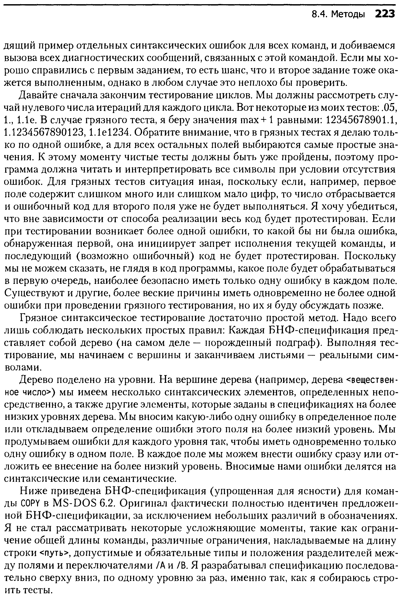

Level 1: <copy> ::= COPY $\sigma$ [/YI/-Y](+ <источник>)$^{1-n}$
$$\quad\quad\quad\quad\quad[\sigma\text{ <конечная\_цель>][/V]}$$
L2: <источник> ::= [<имя_носителя>:][<путь>][<имя_файла>]
L2: <конечная_цель> ::= [<имя_носителя>:][<путь>][<имя_файла>]
L3: <имя_носителя> ::= a|b|...|Z|A|B|...|Z
L3: <путь> ::= ($\backslash$ <имя_кат >)$^{1-m}$
L3: <имя_файла> ::= <ф_буквы>$^{1-8}[.\text{<расш>}]$
L4: <имя_кат> ::= <кат_буквы>$^{1-8}[.\text{<расш>}]$
L4: <расш> ::= <ф_буквы>$^{1-3}$
L5: <кат_буквы> ::= $<a|b|c-z|A|B|C-Z|0|1|2-9|^{\wedge}|\$|$
$$\quad\quad\quad\quad\quad\sim|!|\#|\%|\&|-|\{\{\}|\}((|)>$$
L5: <ф_буквы> ::= <кат_буквы>$|$ < @ $|$ ' $|^\circ>$

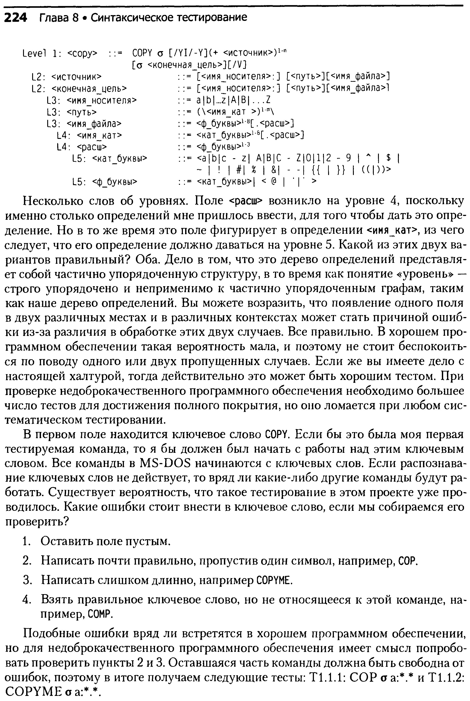

Несколько слов об уровнях. Поле <расш> возникло на уровне 4, поскольку именно столько определений мне пришлось ввести, для того чтобы дать это определение. Но в то же время это поле фигурирует в определении <имя_кат>, из чего следует, что его определение должно даваться на уровне 5. Какой из этих двух вариантов правильный? Оба. Дело в том, что это дерево определений представляет собой частично упорядоченную структуру, в то время как понятие «уровень» — строго упорядочено и неприменимо к частично упорядоченным графам, таким как наше дерево определений. Вы можете возразить, что появление одного поля в двух различных местах и в различных контекстах может стать причиной ошибки из-за различия в обработке этих двух случаев. Все правильно. В хорошем программном обеспечении такая вероятность мала, и поэтому не стоит беспокоиться по поводу одного или двух пропущенных случаев. Если же вы имеете дело с настоящей халтурой, тогда действительно это может быть хорошим тестом. При проверке недоброкачественного программного обеспечения необходимо большее число тестов для достижения полного покрытия, но оно ломается при любом систематическом тестировании.

В первом поле находится ключевое слово COPY. Если бы это была моя первая тестируемая команда, то я бы должен был начать с работы над этим ключевым словом. Все команды в MS-DOS начинаются с ключевых слов. Если распознавание ключевых слов не действует, то вряд ли какие-либо другие команды будут работать. Существует вероятность, что такое тестирование в этом проекте уже проводилось. Какие ошибки стоит внести в ключевое слово, если мы собираемся его проверить?

1. Оставить поле пустым.
2. Написать почти правильно, пропустив один символ, например, COP.
3. Написать слишком длинно, например COPYME.
4. Взять правильное ключевое слово, но не относящееся к этой команде, например, COMP.

Подобные ошибки вряд ли встретятся в хорошем программном обеспечении, но для недоброкачественного программного обеспечения имеет смысл попробовать проверить пункты 2 и 3. Оставшаяся часть команды должна быть свободна от ошибок, поэтому в итоге получаем следующие тесты: T1.1.1: COP $\sigma$ a:\*.\* и T1.1.2: COPYME $\sigma$ a:\*.\*.

Несколько комментариев относительно этих двух тестов. Вы, должно быть, заметили, что я выбрал самый простой вариант, исключив максимально возможное число последующих полей. Это само по себе уменьшает вероятность отмены выполнения этой команды по какой-либо другой причине. Я также использовал оператор произвольной последовательности символов (*), поскольку подозреваю, что обработка произвольной последовательности символов является характерной чертой, общей для многих команд, и что она, возможно, использует область с путем, отличным от пути для обработки данной команды. Если я хочу избежать использования произвольной последовательности символов на этой стадии тестирования, то мне придется использовать нечто вроде `имя_файла.tst` и иметь в распоряжении подобный файл, который можно будет скопировать. Теперь рассмотрим следующее поле — разделитель.

В сущности, условия при которых вам нужен или не нужен разделитель (в нашем случае $\sigma$), могут быть довольно запутанными, и моя модель это не отражает. Вам не нужен разделитель, если в качестве следующего символа используется обратная косая черта, применяющаяся для переключения. Вообще существуют несколько типов разделителей. Давайте не будем столь пунктуальны и предположим, что используется только $\sigma$ и что он обязателен, как показано в модели. Мы получаем два следующих варианта теста: T1.2.1: COPY a:*.* и T1.2.2: COPY $\sigma \sigma$ a:*.*

Первый тест отвергается, как и должно быть, однако второй проходит гладко. В чем дело? Либо спецификация, либо модель неверна. Неверна наша модель (БНФ вариант спецификации): в ней должно быть $\sigma^{1 \dots q}$, где $q$ обозначает максимально допустимое число разделителей, равное общему числу символов в команде минус 127, то есть 118. Значит, по всей видимости нам надо проверить это при помощи грязных и чистых тестов: $q = 0$, грязный; T1.2.1; $q = 1$, чистый; $q = 117$, чистый; $q = 118$, чистый; $q = 119$, грязный.

Разберемся теперь с полем переключателя. Вот несколько вариантов: неверный переключатель в этой позиции, слишком много переключений, неверны оба переключателя. Эти варианты приводят к следующему набору тестов, каждый из которых должен определить наличие ошибки.

```text
T1.3.1. COPY /σ A:*.*
T1.3.2. COPY //Y σ A:*.*
T1.3.3. COPY /V σ A:*.*
T1.3.4. COPY /Y/-Y σ A:*.*
T1.3.5. COPY /Y/V σ A:*.*
T1.3.6. COPY /Y/Y/V σ A:*.*
```

Выполняя эти тесты, я обнаружил, что не следую должным образом своей собственной модели. Корректная спецификация отличается от приведенной. Я добавлял знак $+$ к каждому источнику, хотя он нужен только в тех случаях, когда у нас больше одного источника. Следовательно, более корректная спецификация будет выглядеть следующим образом.

$$\text{<copy>} ::= \text{COPY } \sigma^{1 \dots q} \text{ [/Y|/-Y]<источник>(+<источник>)^{0 \dots n} [<конечная\_цель>][/V]}$$

Какие ошибки мы можем внести в поле <источник>? Для начала обратите внимание, что поля файлов для двух источников связаны. Должен быть, как минимум,

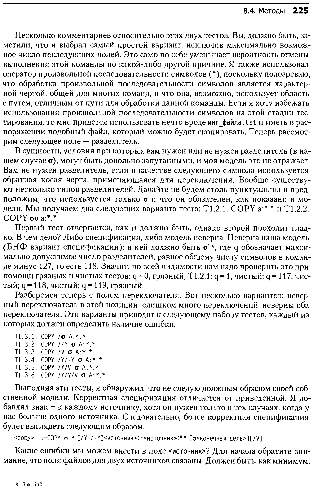

один источник. Поскольку в конечную цель также входит имя файла, программа не сможет правильно обработать команду, если мы опустим имя файла источника, а взамен используем имя файла конечной цели. Поэтому нам придется опустить их оба в нашем грязном тесте. Тогда у нас есть следующие варианты: нет источника (и нет конечной цели), слишком много источников, синтаксическая ошибка в источнике, семантическая ошибка в источнике, изменение положений знака +.

```text
T1.4.1. COPY
T1.4.2. COPY σA:file1.txt file2.txt
T1.4.3. COPY σA:file1.txt ++file2.txt
T1.4.4. COPY σA:a+b+c+d+e+f+g+h+i+...aa... (больше максимального предела числа источников, n)
T1.4.5. = T2.1. Синтаксическая ошибка в спецификации источника
T1.4.6. = T2.2. Семантическая ошибка в спецификации источника
```

В T1.4.4 я использовал очень короткие имена файлов без расширений, поскольку я хочу превысить максимально допустимое число исходных файлов в этой команде. Мне пришлось создать большое количество файлов с именами, состоящими из одного символа, затем с именами из двух символов и так далее. Выполняя этот тест, вам следует убедиться, что вы не превысили максимальную длину строки — 127 символов.

Тесты 1.4.5 и 1.4.6 фактически являются тестами следующего уровня. Я использовал систематическую схему нумерации тестов. Первая цифра обозначает уровень, вторая — тестируемое поле, а третья — способ внесения ошибки в это поле. Пропуск поля или использование слишком большого числа полей — это тесты первого уровня. Однако синтаксические и семантические ошибки в этих полях тестируются на следующем уровне.

На этом уровне также были проделаны грязные тесты для поля конечной цели и его разделителей, так как спецификации для источника и конечной цели практически полностью совпадают. Единственное, что мы можем сделать — протестировать синтаксические и семантические ошибки в спецификации целевого файла:

```text
T1.5.1. = T2.3. Синтаксическая ошибка в спецификации целевого файла
T1.5.2. = T2.4. Семантическая ошибка в спецификации целевого файла
```

Последний полезный тест, который мы можем сделать на этом уровне — поработать с переключателями, преимущественно тем же способом, который мы использовали для первого переключателя.

```text
T1.6.1. COPY σA:file.txt/
T1.6.2. COPY σA:file.txt σV
T1.6.3. COPY σA:file.txt//
T1.6.4. COPY σA:file.txt/V/V
T1.6.5. COPY σA:file.txt/Y
```

Аналогичной последовательности надо придерживаться и для следующего уровня исследуемого нами дерева. Семантические ошибки в поле источника означают синтаксически корректное имя файла для несуществующего файла. Поле источника на самом деле более сложно, чем показано в нашей модели. В него должно входить хотя бы одно поле с правильным именем. Это означает, что носитель и/или путь и/или файл должны быть определены. Следовательно, более корректная спецификация будет выглядеть следующим образом:

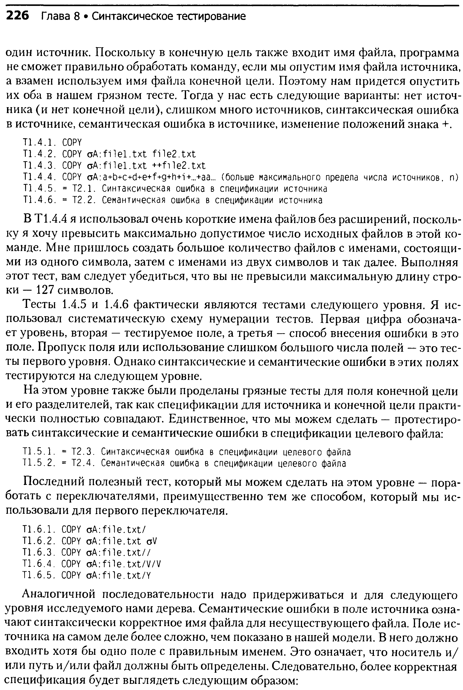

```
(<имя носителя>:[<путь>][<имя файла>])[(<имя носителя>:]<путь>
[<имя файла>])|([<имя носителя>:][<путь>]<имя файла>
```

Если у вас есть один из двух компонентов, то два других не обязательны. В то же время в спецификации целевого файла все поля не обязательны. Ошибки второго уровня — это синтаксические и семантические ошибки в полях источника и целевого файла. Из-за того, что поля не обязательны, на этих уровнях встречается не так уж много синтаксических ошибок. Это означает, что нам достаточно иметь один из трех компонентов для источника. По всей видимости, единственное, что мы можем сделать на этом уровне, — поэкспериментировать с двоеточием, использовать неверный символ (;), ввести слишком много полей или вообще не указывать их. За исключением семантических ошибок (отсутствие такого источника и отсутствие такого целевого файла), все остальные тесты мы можем сделать на следующем уровне.

На уровне 3 мы экспериментируем с <имя носителя>, <путь> и <имя файла>. Число носителей, допустимое в MS-DOS, и, следовательно, семантика и синтаксис имени носителя зависят от версии MS-DOS. Поскольку поле <путь> не является обязательным, то единственные ошибки, которые мы можем сделать на этом уровне, это пропустить требуемый символ обратной наклонной черты в конце строки пути или ввести их слишком много. Неверный путь семантически рассматривается на следующем уровне. Я мог бы попробовать имя файла с точкой, но без расширения.

На четвертом уровне тестируются семантические и синтаксические ошибки в содержимом или в структуре имен каталогов и расширений. Здесь используется тот же набор, что и раньше. Пропустите какие-либо обязательные элементы, введите их слишком много, введите вместо них другой, неверный элемент, сделайте семантическую ошибку. Продолжайте в таком же духе, пока не дойдете до листьев дерева, то есть до того места, где вы вводите реальные символы.

Я твердо придерживался правила делать не больше одной ошибки за раз. Для этого у меня есть две причины, и обе они важны.

1. Слишком много тестов. Проверка команды MS-DOS COPY потребовала приблизительно 75–100 тестов и потребовала бы гораздо больше, если бы в основе нашего тестирования лежала реальная БНФ-спецификация со всеми своими переключателями и другими сложностями. Вне зависимости от числа тестов, проводимых вами для единичной ошибки, для двойной ошибки количество требуемых тестов придется возвести в квадрат. Коммерческие инструментальные средства [IDEI94, POST94] проделывают все это, если только у вас есть БНФ-спецификация или ее эквивалент. Эти инструменты генерируют чудовищное число грязных тестов. Для типичной системы, имеющей несколько сотен команд пользователя и оператора, вы можете с легкостью создавать около 100 000 тестов за день. Даже для автоматического выполнения это достаточно большое число. Для двойных ошибок это цифра вырастет до 10 000 000 000, а для тройных?
2. Потеря ошибок. Оказывается, что теоретически невозможно создать генератор грязных тестов, который гарантированно генерирует только грязные тесты. Спецификация синтаксиса приведет к предположительно грязным тестам, которые будут легко проходиться. Система «пройдет»

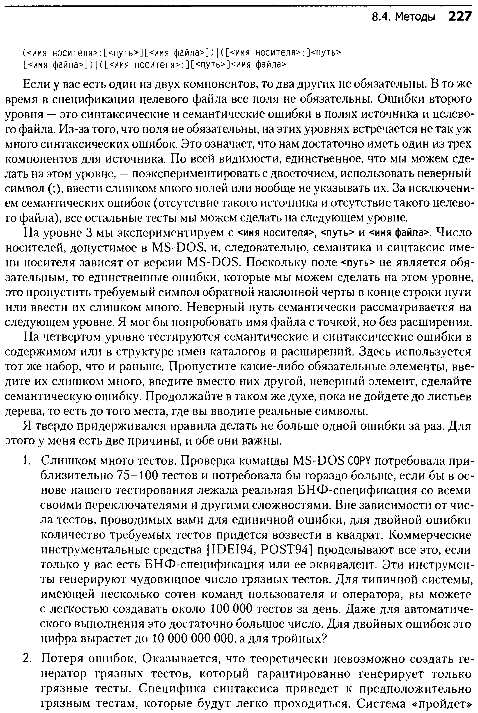

подобный тест, и вам придется проводить расследование. Если возникает слишком много ложных сигналов тревоги, то даже при наличии автоматизации польза, приносимая данным методом, сходит на нет. Если вы рассматриваете двойные ошибки, то возникает вероятность потери ошибок. Например, в выражении $(x + y + (z - w)$ пропущена правая скобка. Если я делаю две ошибки, чтобы получить либо $x + y + (z - w)$, либо $(x + y + z - w)$, мы имеем в итоге две синтаксически корректные строки — ошибки были потеряны. Скобки и другие парные разделители (BEGIN-END, DO-END0, IF-ENDIF, PARDO-ENDPAR) могут служить простыми примерами возможности потерь ошибок. При проверке множественных ошибок стремительно растет число тестов, однако процентное соотношение ложных сигналов тревоги растет еще быстрее.

## 8.4.5. Предсказание итога

Предсказание итога для чистых тестов зависит от тестируемой команды и семантики. Тут не существует общих правил, и вам придется придумать их самим. Для грязных тестов предсказание итога выглядит очень просто: КОМАНДА ОТВЕРГНУТА.

## 8.4.6. Хорошие и плохие разновидности тестирования

Некоторые разновидности синтаксического тестирования могут облегчить вам работу, а некоторые могут, наоборот, существенно усложнить. Есть однако, и другая сторона медали. Программы, представляющие скверные разновидности, как правило, содержат наибольшее число ошибок, и, значит, синтаксическое тестирование в этом случае весьма перспективно.

1. Формальная структура. Некоторые командные языки, такие как в UNIX, имеют формальную структуру. Вместо сотен специальных команд язык имеет относительно небольшое число командных сегментов, компонуя которые при соблюдении специальных правил, можно добиться желаемого эффекта. С другой стороны, операционные системы наподобие MS-DOS, которые не обладают такой формальной структурой в полной мере, тем не менее, обладают некоторыми ее аспектами, например, возможностью конвейеризации и переадресации. Для командных языков, имеющих явную формальную структуру, обычно бывает достаточно проверить сегменты и правила их компоновки, вместо того чтобы проверять все множество возможных команд. Это особенно важно для грязного синтаксического тестирования, которое, как правило, не слишком продуктивно при проверке командных языков с формальной структурой. Если язык программирования обладает формальной структурой, то обычно не представляет труда найти полную, детальную спецификацию для всех команд, зачастую составленную в метаязыке, эквивалентном БНФ. Поэтому хотя тесты легко проектируются, они не слишком эффективны. Чистое тестирование требует, разумеется, гораздо меньших затрат.
Командные языки, не обладающие формальной структурой или со структурой, возникшей в процессе сращивания, как правило, являются хороши-

ми объектами для грязного синтаксического тестирования (и часто полны ошибок). Наиболее печально известный пример языка такого типа — это dBASE-II/III/IV — язык программирования баз данных для РС. Макрокомандные языки для РС часто также обладают этими неприятными особенностями. Специализированные языки, часто «проектируемые» без должного понимания, чтó за язык на самом деле строится, как правило, трудны для исследований, поскольку документация на команды в этих языках (и особенно на хитроумные исключения) крайне скудна. Отсутствие структуры делает затруднительным автоматизацию разработки теста, и автоматический генератор грязных тестов выдает много неверных тестовых вариантов. Несомненным плюсом таких систем, содержащих командные языки с отсутствием структуры, является простота, с которой они ломаются.

2. Точная лексическая спецификация. Существуют командные языки с точной лексической спецификацией. Ключевые слова в них четко определены и не могут соответствовать, скажем, опциям внутри команд или строкам других команд, для которых они могут показаться естественными. Спецификация языка определяет четкие правила, касающиеся преобразований алфавита и ключевых слов. Чем более ясным и логичным будет разделение между лексическими и синтаксическими аспектами, тем меньше вам придется тестировать. Полная проверка языка при помощи единого набора всеобъемлющих тестов для какой-либо одной лексической трансформации дает уверенность в надежности других лексических эквивалентов. В то же время, если существует четкая лексическая спецификация, то не составляет труда конвертировать набор чистых и грязных тестов из одной спецификации в другую. Как я уже неоднократно убеждался, качественные программы содержат меньше ошибок и их существенно легче тестировать.

Полной противоположностью чистой лексической спецификации являются языки, в которых лексические и синтаксические аспекты безнадежно перепутаны. Но хотя разработка тестов для них сложна и приходится прикладывать много усилий для исследований, их тестирование, тем не менее, приносит результаты.

3. Синтаксис, зависящий от контекста. В хороших командных языках существует четкое разделение между синтаксисом и семантикой. В плохих языках эти аспекты безнадежно перемешаны. В качестве примера рассмотрим следующую спецификацию:

```text
<команда>        ::= <ключевое_слово><разделитель1><поле1><разделитель2><поле2>
<разделитель1>  ::= σ|β|-| ЕСЛИ <ключевое_слово> = <ключевое_слово_список_1>
                ::= λ       ЕСЛИ <ключевое_слово> = <ключевое_слово_список_2>
<разделитель2>  ::= \ | / | . | σ | - | ЕСЛИ <поле1> = <поле1_синтаксис_1>
                ::= λ ИНАЧЕ
<поле2>         ::= ::= <поле2_синтаксис_1> ЕСЛИ <поле1> = "1"
                ::= ::= <поле2_синтаксис_2> ЕСЛИ <поле1> = "2"
                ...
<поле2>         ::= ::= <поле2_синтаксис_99> ЕСЛИ <поле1> = "99"
```

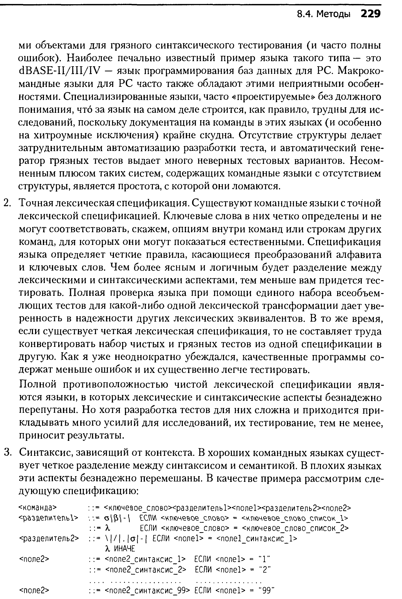

Командные языки с синтаксисом, зависящим от контекста, обычно не столь четкие и структурированные, как в только что приведенном примере. Основные проблемы с этими спецификациями заключаются в том, что синтаксис какого-либо поля зависит от семантики другого поля. Дело усложняется еще и тем, что синтаксис определенного поля команды может зависеть от специфической синтаксической формы и/или от значений (семантики), приведенных в последующих полях. Лучшее, что можно сделать с такими языками, — это похоронить их. Их почти невозможно использовать, невозможно поддерживать, на них очень трудно программировать, но их очень легко сломать. Как правило, в таких языках код, реализующий синтаксический анализатор, полностью скрыт и так же непоследователен, как и сам язык. Перед тестировщиками подобного мусора стоит задача убедить разработчиков, что необходимо внести изменения в этот язык. Так как исследования специфических хитросплетений — сложная задача, то нет смысла за нее браться. Такую халтуру настолько легко сломать, что вы сможете легко сделать это вручную. Это один из немногих случаев, когда тестирование заставляет меня чувствовать вину за насилие над слабым, подобно тому, что должен чувствовать взрослый, обижающий ребенка или маленькую беззащитную зверюшку.

## 8.5. Рассмотрение приложений

### 8.5.1. Индикаторы приложений

Командные языки, для которых синтаксическое тестирование эффективно, являются неотъемлемой функциональной частью большинства приложений.

1. Командно-управляемое программное обеспечение. Это наиболее очевидное приложение, и, по всей видимости, именно в него командные языки включаются чаще всего. Если система преимущественно командно-управляемая, то почти вся проверка может быть организована при помощи синтаксического тестирования. Я считаю полезным использование синтаксического тестирования в подобных случаях.
2. Программное обеспечение, управляемое при помощи меню. Широко распространенная альтернатива командно-управляемому программному обеспечению — это программное обеспечение, управляемое при помощи меню, в котором действия выполняются путем выбора определенных пунктов меню. Наиболее подходящий метод для тестирования программ, управляемых подобным образом, — это тестирование конечного автомата, рассматриваемое в главе 9. Вне зависимости, управляется программа при помощи меню или нет, всегда существуют поля с данными, и у этих полей есть определенный синтаксис, для проверки которого синтаксическое тестирование является вполне эффективным способом проверки. Делается это очень просто, поскольку дерево синтаксиса, как правило, небольшое.
3. Макроязыки. Множество коммерческих программных пакетов для РС имеет встроенный макроязык, называемый также языком сценариев. Он представляет собой язык программирования, который может использоваться

для автоматизации повторяющихся операций. В качестве примеров можно привести командный язык пакетной обработки в MS-DOS, оболочку Norton Desktop для языка сценариев Windows, макроязыки Lotus 123 и WordPerfect, язык сценариев CrossTalk для CASL-IV. Эти языки часто реализуются в коммерческих пакетах не только для удобства пользователей, но и потому, что их помощью удобнее всего реализовать множество сложных функций, таких как составление стандартных писем в текстовом редакторе. В идеале они являются полнофункциональными, хотя и специализированными языками программирования, имеющими формальные спецификации (зачастую эквиваленты БНФ). Некоммерческие, или узкоспециализированные продукты, тоже весьма часто используют макроязыки, но, как правило, они не столь явно определены или реализованы в виде коммерческого (горизонтального) пакета. Подобные языки, если они являются частью приложения, обязательно должны пройти синтаксическое тестирование.

4. Связь. Все системы связи имеют встроенный язык программирования. Это язык, описывающий формат посланий. Вы можете не догадываться о существовании подобного языка, например, в телефонии, но он есть. Телефонные коммутаторы используют особый язык для связи друг с другом. Кроме того, соответствующие локальные, междугородные и международные номера телефона имеют сильно формализованный синтаксис, называемый планом номера. Любое послание, использующееся для связи, должно иметь формат (то есть синтаксис), который должен быть проанализирован.

5. Язык запросов базы данных. Любая база данных имеет командный язык, используемый для того, чтобы определить, что надо искать и что надо из нее извлечь. Самые простые языки предлагают только один ключевой параметр. В более совершенных системах существует поиск с использованием булевой алгебры, основанный на определяемых пользователем параметрах, которые мы интерпретируем как предикаты. Подобные предикаты, очевидно, обладают формальными синтаксисом и семантикой, и, следовательно, должны быть проверены с помощью синтаксического тестирования.

6. Компиляторы и генерируемые синтаксические анализаторы. Существует один тип продуктов, в котором не стоит использовать синтаксическое тестирование и особенно грязное синтаксическое тестирование. Это современные компиляторы. Это может показаться странным и неверным, но это соответствует моей установке, гласящей, что тестировщик никогда не должен повторять тесты, выполненные ранее другими. Современные компиляторы, разумеется, имеют синтаксические анализаторы. Но эти синтаксические анализаторы генерируются полностью автоматически, с использованием генератора синтаксического анализатора, которому задается формальное описание, наподобие БНФ. Лексические анализаторы также генерируются

---

^1 Программы, предназначенные для широкого круга пользователей, такие как текстовые редакторы, электронные таблицы и базы данных, называются горизонтальными пакетами. Пакеты, специализированные для какого-то одного рода деятельности и обеспечивающие большинство необходимых для этой деятельности функций (например, для туристических агентов, цветоводов или аптекарей), называются вертикальными пакетами.

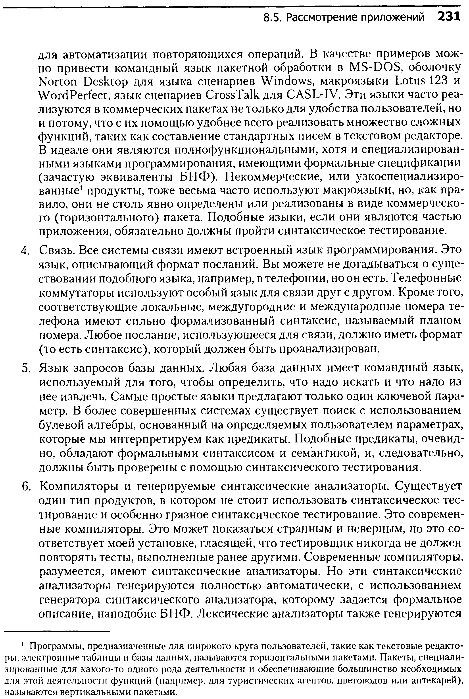


<!-- ВІДНОВЛЕНО ЧЕРЕЗ GEMINI (Стор. 232) -->
автоматически на основе формальных спецификаций. Наиболее известные инструменты для этих целей — это LEX и YACC [MASO90]. Несмотря на то, что первое время они в большинстве случаев использовались исключительно для генерации лексических и синтаксических анализаторов в компиляторах, сейчас они и им подобные программы все чаще используются для генерации лексических и синтаксических анализаторов в командных языках программного обеспечения. Это очень хорошо, поскольку генерируемые лексические и синтаксические анализаторы необычайно надежны. С точки зрения тестировщика применение синтаксического тестирования здесь неперспективно, поскольку даже полностью автоматизированное, оно не сможет сломать подобные лексические и синтаксические анализаторы. Прежде чем потратить массу времени и сил на синтаксическое тестирование (даже автоматизированное), оцените, что это за приложение и как оно реализовано. Если в нем используется или проектируется генератор лексического и синтаксического анализатора, то вероятность успешного применения синтаксического тестирования у вас довольно мала. Такие ошибки здесь не проходят. Единственное, что тут остается проверить, — это семантику, что, как вы видели, часто делается другими методами, такими как тестирование доменов.

## 8.5.2. Предположения об ошибках

Предположения об ошибках в синтаксическом тестировании удобнее всего формулировать для абстрактного синтаксического анализатора, вне зависимости от того, явный он или скрытый. Ниже приведены примеры.

1. Неполный синтаксис. Разумные с точки зрения выполнимости команды не принимаются, а если и принимаются, то выполняются неверно, так как синтаксический анализатор не может обработать подобную строку. Вследствие этого интерпретация команд происходит бессистемно, как правило, неверно и ведет к сбоям, или потере данных.
2. Непоследовательный синтаксис. Синтаксис, сильно зависящий от контекста, ведущий к непредсказуемому и непоследовательному синтаксическому анализу, и, как следствие, к ошибкам в интерпретации.
3. Ошибочное отклонение и ошибочное принятие. Ошибки в синтаксическом анализаторе, ведущие к отклонению корректных с точки зрения выполнимости команд и принятию команд, содержащих синтаксические ошибки.
4. Синтаксическое/семантическое несоответствие. Ошибки в синтаксическом анализаторе, ведущие к отклонению или некорректной модификации значений полей. Например, целые числа от 0 до 999 должны приниматься, однако реализация требует наличия ведущего ноля, в результате чего отклоняются хорошие числа, такие как 7 и 19.
5. Лексические ошибки и ошибки в алфавите. Некорректные лексические преобразования, ведущие, скажем, к интерпретации содержания полей как
<!-- КІНЕЦЬ ВІДНОВЛЕННЯ -->


разделителей. Например, строки должны помещаться в кавычки, но не предусмотрена возможность обработки строк, содержащих кавычки, или перевод строки интерпретируется как конец поля, но невозможно ввести текст, включающий перевод строки.

## 8.5.3. Ограничения и предостережения

При проведении синтаксического тестирования мы сталкиваемся с двумя серьезными проблемами: психологической и методологической. Так как автоматизация проектирования достаточно проста, то после описания синтаксиса в БНФ число автоматически генерируемых тестов может измеряться сотням и тысячами. Однако в случае генерации синтаксических анализаторов эффективность таких тестов не превышает эффективность перебора всех итераций при проверке цикла. Методологический аспект заключается в существовании мнения (ничем не оправданного) об эффективности того, что я называю игрой в «Эрудита» на клавиатуре, Рахманинов-тестированием или обезьяньим тестированием. Оно представляет собой беспорядочный ввод с клавиатуры предположительно произвольных строк, до тех пор пока что-либо не сломается — этот миф обычно дополняется наличием хитрых хакера, барабанящего по кнопкам. Ранее программное обеспечение для РС, а также большинство любительских программ действительно могло быть сломано при таком тестировании, но для современного профессионального программного обеспечения такие случаи — редкость. Тем не менее, миф об эффективности деятельности хитрого хакера, творящего темные дела за клавиатурой, жив в общественном сознании и в сознании людей, несведущих в технике тестирования. Мне встречались менеджеры по разработке программного обеспечения, искренне верящие, что обезьянье тестирование — это единственное тестирование, необходимое продукту. Но что такое синтаксическое тестирование, если не полностью формализованное, научное обезьянье тестирование? В таком случае большим заблуждением будет считать, что синтаксическое тестирование недостаточно надежно.

## 8.5.4. Автоматизация и инструментальные средства

Возможно, наиболее привлекательная сторона синтаксического тестирования — это простота, с которой разработка теста может быть полностью автоматизирована. Возможно, из-за простоты автоматизации этот метод поддерживают коммерческие инструменты, такие как (T) [IDEI94, POST94]. И даже в отсутствие коммерческих инструментов проектирования языка тестов, воспринимающего БНФ-спецификацию, соответствующего интерпретатора тестового языка и генератора чистых/грязных тестов не является сложной задачей. Вы определяете свой метаязык, как если бы он был обычным языком, и затем используете лексический анализатор и генератор синтаксического анализатора, наподобие LEX или YACC, чтобы они сделали большую часть работы. Разумеется, вы проверяете и сам свой генератор, используя его для генерации тестов. У меня есть несколько неплохих генераторов, построенных для себя. Разработка каждого из них заняла триместр у одного хорошего (но не гениального) студента, проходящего курс обучения языку программирования, который включал в себя изучение LEX и YACC.

Я оцениваю скорее нижний предел требуемых трудозатрат, поскольку во множестве приложений работа с коммерческими инструментами, такими как Т, усложняется тем, что вам необходимо принимать в расчет специальные входные интерфейсы, автоматизацию выполнения теста, специфику платформ и тому подобные вещи. Это особенно характерно для случаев, когда входные данные не вводятся с клавиатуры обычным способом (например, при передаче телекоммуникационных сигналов), а должны быть интегрированы глубоко внутрь приложения.

## 8.6. Резюме

Синтаксическое тестирование представляет собой мощное, легко автоматизируемое средство, предназначенное для тестирования лексических и синтаксических анализаторов командного процессора в командно-управляемых приложениях. Синтаксическое тестирование начинается с определения синтаксиса путем задания формального метаязыка, среди которых наиболее популярен БНФ. После задания БНФ непосредственной задачей тестировщика является генерация набора тестов, полностью покрывающих синтаксический граф. Стандартное покрытие связей мы обычно дополняем чистыми и грязными тестами для проверки показателей, особенно операторов $+$ и $*$.

## 8.7. Вопросы для самопроверки

1. Дайте определение следующих терминов: алфавит, ассоциативный, обезглавливание, пустой символ, БНФ, команда, командно-управляемое программное обеспечение, командный язык, коммутативный, конкатенация, синтаксис, зависящий от контекста, укорачивание, тире, разделитель, дизъюнкция, потеря ошибок, показатель (метамивол), генерируемый синтаксический анализатор, ключевое слово, LEX, лексический анализатор, лексическая эквивалентность, связи (в синтаксических графах), макроязык, программное обеспечение, управляемое через меню, метаязык, метасимвол, узел (в синтаксических графах), нулевой символ, нулевой набор, операнд, необязательное поле (обозначение в БНФ), парные разделители, параллельное преобразование, синтаксический анализатор, грамматический разбор, плюс (показатель) оператор, семантический анализ, серия преобразований, язык сценариев, символ пробела, оператор «звезда» (метасимвол), строка, поле строки, голова строки, имя строки, набор строк, хвост строки, подстрока, синтаксический анализ, синтаксис, маркер, маркировка, оператор объединения, произвольная последовательность символов, произвольный символ (одиночный), YACC.
2. Поэкспериментируйте с вашим налоговым пакетом и определите опытным путем БНФ спецификацию для следующих полей в форме 1040. После того как вы это сделаете, разработайте набор чистых и грязных тестов, обеспечивающих следующее покрытие. Окончание налогового года, имя, отчество и фамилия, полный адрес, за исключением почтового индекса, почтовый ин-

декс плюс маршрут доставки, поле бс, число месяцев, которое иждивенец жил дома, поле даты в области для подписи.

3. Поэкспериментируйте с вашим налоговым пакетом и определите опытным путем БНФ спецификанцию для поля социального обеспечения. Мой налоговый пакет очень нестрогий и позволяет широко варьировать синтаксис. Однако что впоследствии интерпретируется как входные данные — это отдельный вопрос. Определите синтаксис для приемлемых вводов и спроектируйте для них тесты. Затем определите полную БНФ-спецификацию, которая в том числе включает информацию о том, как должны преобразовываться различные строки для того, чтобы извлечь из них нужные числа, если это возможно. Спроектируйте чистые и грязные тесты.

4. Определите БНФ-спецификацию для целочисленных входных данных, состоящих из одной или двух цифр. Используйте только положительные числа. Включите сюда различные символы, которыми люди могут естественно заменять ноль или отсутствие вводов, например, пустой, нулевой символы, 0, о, -, -0- и т. д. Затем спроектируйте набор покрывающих чистых тестов и хорошие грязные тесты для единичной ошибки.

5. Определите БНФ-спецификацию для суммы в долларах, включающую положительные и отрицательные вводы, пустые, нулевые вводы, с центами и без, с запятыми и без, и так далее, для всех способов, которыми люди могут ввести подобные данные в налоговую декларацию. Затем спроектируйте чистые тесты, обеспечивающие покрытие, и грязные тесты для единичной ошибки.

6. Определите части команд `<устройство>`, `<путь>`, `<имя_файла>` в MS-DOS, или эквивалентные им в вашей операционной системе. Затем спроектируйте полный набор чистых и грязных синтаксических тестов.

7. Исследуйте следующие команды MS-DOS (или аналогичные команды в вашей операционной системе) и задайте для каждой полную БНФ-спецификацию, включающую поля `<устройство>`, `<путь>` и `<имя_файла>`, которые вы можете считать ранее протестированными. Затем спроектируйте покрывающий набор чистых и грязных синтаксических тестов. Предусмотрите возможность использования аббревиатур, псевдонимов и различных алфавитов. Проверьте только ваши грязные тесты, испытав их. (Замечание: если вы случайно разработали чистый тест, то с последствиями его выполнения для вашей системы вы будете разбираться сами.) Команды: APPEND, ATTRIB, BUFFERS, CHDIR, COMMAND, COPY, COUNTRY, DATE, DIR, EXPAND, FC, FORMAT, KEYB, PRINT, SHARE, SORT, TIME, XCOPY.

8. Спроектируйте тесты синтаксического анализатора для старой английской валюты. Вам дается произвольное число денежных единиц, каждая из которых состоит из числа и следующего за ним символа этой единицы, например: «3£, 17s, 8p, 7S, 4hc». Синтаксический анализатор нужен для автоматического размена монет. Программа должна конвертировать входные значения и выражать сумму в терминах f, h, d, s и £. Монетная система: 2 фартинга (f) = полпенса (h), 2 полпенса = 1 пенс (d), 12 d = 1 шиллинг (s), 1 флорин (F) =

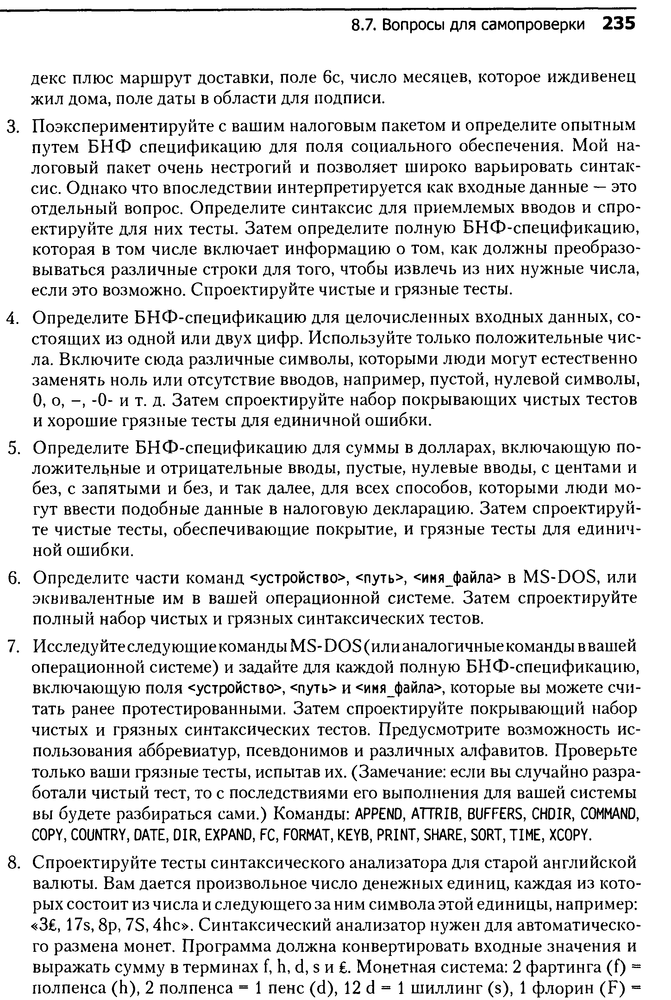

$2\text{s}$, полкроны $(\text{hc}) = 2\text{s}6\text{d}$, крона $(\text{c}) = 5\text{s}$, $20\text{s} = 1$ фунт стерлингов (£), $21\text{s} =$ $1$ гинея $(\text{G})$, $1$ соверен $(\text{S}) = 2\text{£}18\text{s}$. Нет ничего удивительного в том, что они представляются в десятичном виде.

9. Благородному Публию Юлию Лентулу,
Трибуну, всаднику, командиру XXIII легиона
Привет вам, Публий:
Возникли вопросы для обсуждения вашей налоговой декларации за прошлый год:
1) Вы не включили XLIV талантов серебра, которые вы получили, казнив Рубидия в прошлом году.
2) Вам позволено объявлять иждивенцами всех воинов XXIII легиона, но вы не можете поступать так ни с MMCCCIX рабами ваших воинов, ни с MMMXLIV маркитантами, так как они уже фигурируют в налоговых декларациях ваших воинов...

Бедный Публий. Проблемы с налогами, возможно, возникали уже в те времена. Определите БНФ-спецификацию для положительных целых чисел в римской системе счисления. Обратите внимание: Подчеркивание$^1$ буквы — $\underline{\text{X}}$, $\underline{\text{L}}$, $\underline{\text{C}}$, $\underline{\text{D}}$ и $\underline{\text{M}}$ — означает умножение их на $1000$: например, $\underline{\text{X}} = 10\ 000$, $\underline{\text{L}} = 50\ 000$, и так далее. Предусмотрите возможность использования букв верхнего и нижнего регистров. Включите все целые числа от $0$ до $5\ 000\ 000$. Затем проведите ряд тестов, обеспечивающих покрытие, а также грязные тесты. И помните, что главное — полнота, а не компактность.

---
$^1$ На самом деле в римской системе счисления использовалось перечеркивание, но, откровенно говоря, это очень неудобно делать в текстовом редакторе. Я надеюсь, что приверженцы классической истории на меня не обидятся.

# 9. Тестирование систем с конечным числом состояний

## 9.1. Обзор

Изначально предназначенная для тестирования аппаратной логики, модель автомата с конечным числом состояний (конечного автомата) является превосходной моделью для проверки приложений, управляемых через меню. Она важна еще и потому, что получила широкое распространение для разработки объектно-ориентированных продуктов.

## 9.2. Основные термины

**Внешние термины**: приложение, поведение, начальная загрузка, ошибка, символ, закрыть файл, управление, данные, проектирование, аппаратное обеспечение, файл, функциональная клавиша, целочисленный, загрузка, логика, интеграция высокого уровня (ИВУ), меню, строка меню, отображение, память, сообщение, метод, мышь, щелчок мыши, MS-DOS, объектно-ориентированное программное обеспечение, открыть файл, операционная система, последовательный порт, программное обеспечение, подпрограмма, символьный отладчик, Windows.

**Внутренние термины**: поведенческое тестирование, случайная корректность, домен, тестирование домена, граф, ввод, связь, покрытие связей, список связей, вес связи, модель, узел, покрытие узлов, вес узла, пустой, вывод, путь, состояние, сильно связанные, синтаксическое тестирование, система, значение.

*Состояние*. Состояния изображаются узлами.

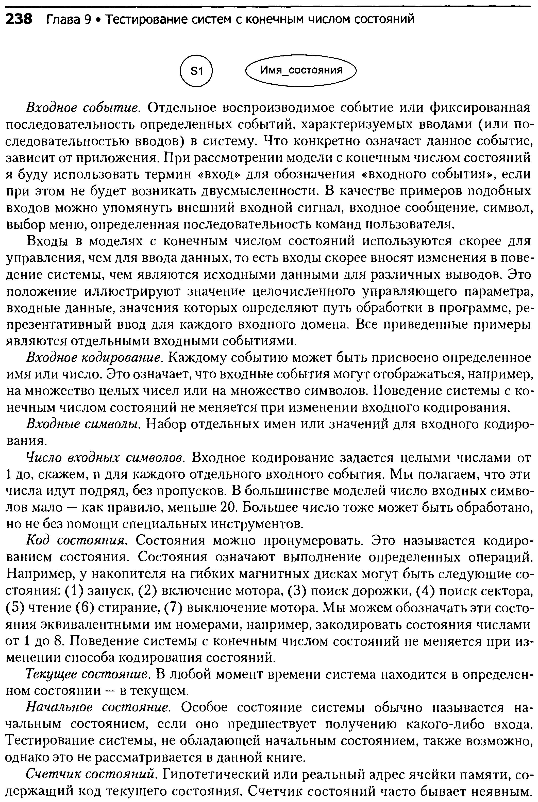

*Входное событие.* Отдельное воспроизводимое событие или фиксированная последовательность определенных событий, характеризуемых вводами (или последовательностью вводов) в систему. Что конкретно означает данное событие, зависит от приложения. При рассмотрении модели с конечным числом состояний я буду использовать термин «вход» для обозначения «входного события», если при этом не будет возникать двусмысленности. В качестве примеров подобных входов можно упомянуть внешний входной сигнал, входное сообщение, символ, выбор меню, определенная последовательность команд пользователя.

Входы в моделях с конечным числом состояний используются скорее для управления, чем для ввода данных, то есть входы скорее вносят изменения в поведение системы, чем являются исходными данными для различных выводов. Это положение иллюстрируют значение целочисленного управляющего параметра, входные данные, значения которых определяют путь обработки в программе, репрезентативный ввод для каждого входного домена. Все приведенные примеры являются отдельными входными событиями.

*Входное кодирование.* Каждому событию может быть присвоено определенное имя или число. Это означает, что входные события могут отображаться, например, на множество целых чисел или на множество символов. Поведение системы с конечным числом состояний не меняется при изменении входного кодирования.

*Входные символы.* Набор отдельных имен или значений для входного кодирования.

*Число входных символов.* Входное кодирование задается целыми числами от 1 до, скажем, n для каждого отдельного входного события. Мы полагаем, что эти числа идут подряд, без пропусков. В большинстве моделей число входных символов мало — как правило, меньше 20. Большее число тоже может быть обработано, но не без помощи специальных инструментов.

*Код состояния.* Состояния можно пронумеровать. Это называется кодированием состояния. Состояния означают выполнение определенных операций. Например, у накопителя на гибких магнитных дисках могут быть следующие состояния: (1) запуск, (2) включение мотора, (3) поиск дорожки, (4) поиск сектора, (5) чтение (6) стирание, (7) выключение мотора. Мы можем обозначать эти состояния эквивалентными им номерами, например, закодировать состояния числами от 1 до 8. Поведение системы с конечным числом состояний не меняется при изменении способа кодирования состояний.

*Текущее состояние.* В любой момент времени система находится в определенном состоянии — в текущем.

*Начальное состояние.* Особое состояние системы обычно называется начальным состоянием, если оно предшествует получению какого-либо входа. Тестирование системы, не обладающей начальным состоянием, также возможно, однако это не рассматривается в данной книге.

*Счетчик состояний.* Гипотетический или реальный адрес ячейки памяти, содержащий код текущего состояния. Счетчик состояний часто бывает неявным.

Программный счетчик в компьютере является примером явного счетчика состояний.

Число состояний. Счетчик состояний ограничен своим максимальным значением. Если код состояния задает непрерывный диапазон, то это максимальное значение равно числу состояний. Как и в случае входных символов, число состояний в модели обычно велико (меньше 30). Большее число может быть обработано при помощи специальных инструментов.

Автомат с конечным числом состояний (конечный автомат). Абстрактный автомат (например, программа, логическая схема, трансмиссия в автомобиле) для которого число состояний и число входных символов конечно и фиксировано. Автомат с конечным числом состояний состоит из состояний (узлов), переходов (связей), входов (весов связей) и выходов (весов связей). Автоматы с конечным числом состояний в данной книге изображаются графами состояний.

Переходы. Система реагирует на входные события, что может привести к смене состояния. Это называется переходом между состояниями, или просто переходом. Система передает сообщение другой системе. Во время передачи она находится в состоянии «передача». После завершения передачи она ожидает уведомления об успешном приеме данных. В этом случае она находится в состоянии «ожидание уведомления». Изменение состояния можно рассматривать как изменение значения счетчика состояний. Переходы на графе обозначаются связями. Если вход Х инициирует переход из состояния А в состояние В, то для обозначения этого факта мы рисуем связь от А к В с весом Х. В диаграмме вход Х должен инициировать переход из состояния А в состояние В.

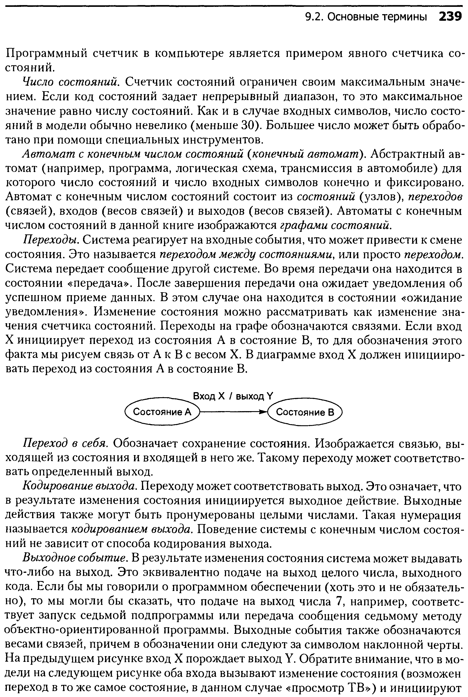

Переход в себя. Обозначает сохранение состояния. Изображается связью, выходящей из состояния и входящей в него же. Такому переходу может соответствовать определенный выход.

Кодирование выхода. Переходу может соответствовать выход. Это означает, что в результате изменения состояния инициируется выходное действие. Выходные действия также могут быть пронумерованы целыми числами. Такая нумерация называется кодированием выхода. Поведение системы с конечным числом состояний не зависит от способа кодирования выхода.

Выходное событие. В результате изменения состояния система может выдать что-либо на выход. Это эквивалентно подаче на выход целого числа, выходного кода. Если бы мы говорили о программном обеспечении (хоть это и не обязательно), то мы могли бы сказать, что подача на выход числа 7, например, соответствует запуск седьмой подпрограммы или передача сообщения седьмому методу объектно-ориентированной программы. Выходные события также обозначаются весами связей, причем в обозначении они следуют за символом наклонной черты. На предыдущем рисунке вход Х порождает выход Ү. Обратите внимание, что в модели на следующем рисунке оба входа вызывают изменение состояния (возможен переход в то же самое состояние, в данном случае «просмотр ТВ») и инициируют

выход (возможно, пустой, в данном случае «пропустить» для входа «кошка вошла в комнату»).

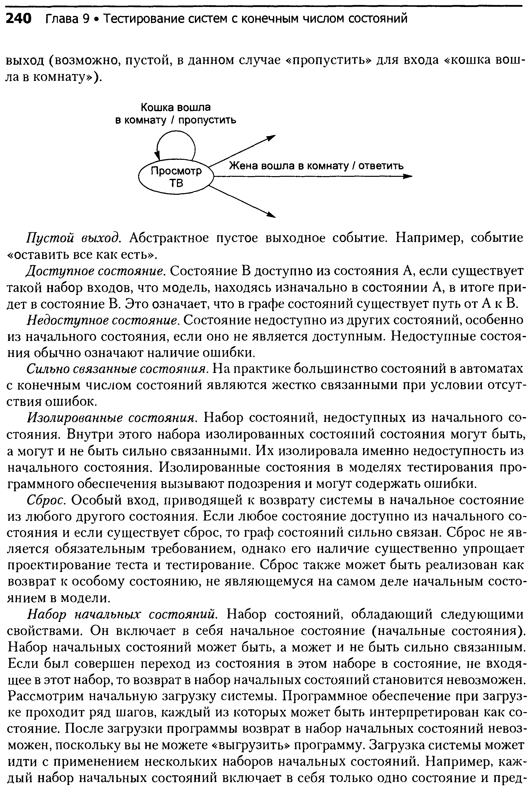

*Пустой выход*. Абстрактное пустое выходное событие. Например, событие «оставить все как есть».

*Доступное состояние*. Состояние В доступно из состояния А, если существует такой набор входов, что модель, находясь изначально в состоянии А, в итоге придет в состояние В. Это означает, что в графе состояний существует путь от А к В.

*Недоступное состояние*. Состояние недоступно из других состояний, особенно из начального состояния, если оно не является доступным. Недоступные состояния обычно означают наличие ошибки.

*Сильно связанные состояния*. На практике большинство состояний в автоматах с конечным числом состояний являются жестко связанными при условии отсутствия ошибок.

*Изолированные состояния*. Набор состояний, недоступных из начального состояния. Внутри этого набора изолированных состояний состояния могут быть, а могут и не быть сильно связанными. Их изолировала именно недоступность из начального состояния. Изолированные состояния в моделях тестирования программного обеспечения вызывают подозрения и могут содержать ошибки.

*Сброс*. Особый вход, приводящей к возврату системы в начальное состояние из любого другого состояния. Если любое состояние доступно из начального состояния и если существует сброс, то граф состояний сильно связан. Сброс не является обязательным требованием, однако его наличие существенно упрощает проектирование теста и тестирование. Сброс также может быть реализован как возврат к особому состоянию, не являющемуся на самом деле начальным состоянием в модели.

*Набор начальных состояний*. Набор состояний, обладающий следующими свойствами. Он включает в себя начальное состояние (начальные состояния). Набор начальных состояний может быть, а может и не быть сильно связанным. Если был совершен переход из состояния в этом наборе в состояние, не входящее в этот набор, то возврат в набор начальных состояний становится невозможен. Рассмотрим начальную загрузку системы. Программное обеспечение при загрузке проходит ряд шагов, каждый из которых может быть интерпретирован как состояние. После загрузки программы возврат в набор начальных состояний невозможен, поскольку вы не можете «выгрузить» программу. Загрузка системы может идти с применением нескольких наборов начальных состояний. Например, каждый набор начальных состояний включает в себя только одно состояние и пред-

ставляет собой ступени загрузки. Тем не менее, в продуманном программном обеспечении должен быть способ возврата в начальное состояние: в операционной системе Windows это комбинация CTRL-ALT-DEL.

*Рабочее состояние.* Рано или поздно система пройдет начальное состояние и перейдет в сильно связанный набор рабочих состояний — область, в которой выполняется большая часть тестирования.

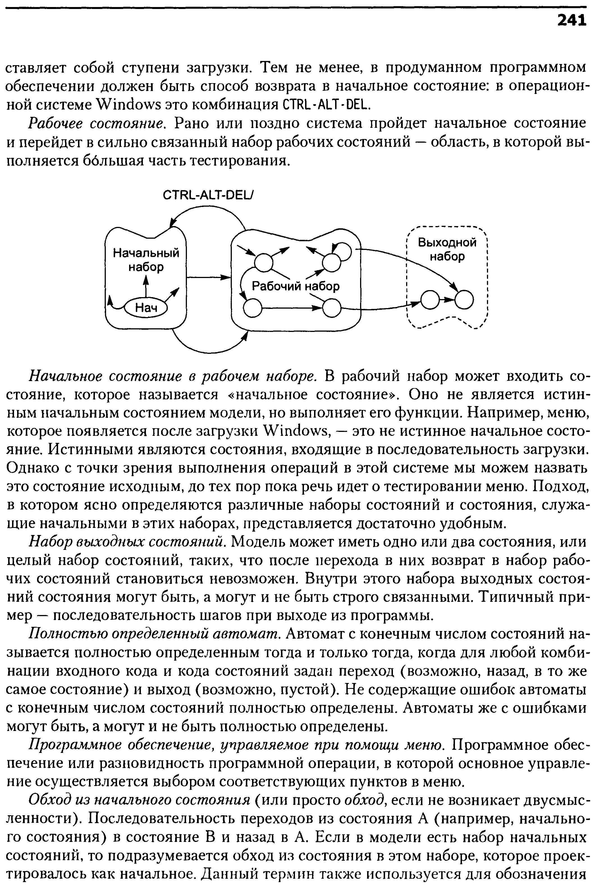

*Начальное состояние в рабочем наборе.* В рабочий набор может входить состояние, которое называется «начальное состояние». Оно не является истинным начальным состоянием модели, но выполняет его функции. Например, меню, которое появляется после загрузки Windows, — это не истинное начальное состояние. Истинными являются состояния, входящие в последовательность загрузки. Однако с точки зрения выполнения операций в этой системе мы можем назвать это состояние исходным, до тех пор пока речь идет о тестировании меню. Подход, в котором ясно определяются различные наборы состояний и состояния, служащие начальными в этих наборах, представляется достаточно удобным.

*Набор выходных состояний.* Модель может иметь одно или два состояния, или целый набор состояний, таких что после перехода в них возврат в набор рабочих состояний становиться невозможен. Внутри этого набора выходных состояний могут быть, а могут и не быть строго связанными. Типичный пример — последовательность шагов при выходе из программы.

*Полностью определенный автомат.* Автомат с конечным числом состояний называется полностью определенным тогда и только тогда, когда для любой комбинации входного кода и кода состояний задан переход (возможно, назад, в то же самое состояние) и выход (возможно, пустой). Не содержащие ошибок автоматы с конечным числом состояний полностью определены. Автоматы же с ошибками могут быть, а могут и не быть полностью определены.

*Программное обеспечение, управляемое при помощи меню.* Программное обеспечение или разновидность программной операции, в которой основное управление осуществляется выбором соответствующих пунктов в меню.

*Обход из начального состояния (или просто обход, если не возникает двусмысленности).* Последовательность переходов из состояния А (например, начального состояния) в состояние В и назад в А. Если в модели есть набор начальных состояний, то подразумевается обход из состояния в этом наборе, которое проектировалось как начальное. Данный термин также используется для обозначения

обхода набора рабочих состояний, который стартует из начального состояния этого набора.

## 9.3. Отношения и модель

### 9.3.1. Основы

Материал, излагаемый в этом разделе, рассматривался и в [BARN72, BRZO63, CHOW78, CHOW88, MCNA60, MILL75].

Я просмотрел множество форм BNC и инструкций в поисках примеров систем с конечным числом состояний, которые могут быть полезны для нас, но не смог найти ничего, за исключением одного, но зато вечного состояния тревоги, которую испытывает каждый из нас при упоминании о налоговой декларации. Мне придется использовать в качестве иллюстраций менее формальные примеры.

*Узлы*. Узлы обозначают состояния. На рисунке приведено меню для программы, управляемой с его помощью. Если выбран какой-то определенный пункт меню, то это означает, что мы находимся в соответствующем состоянии. Я настроил оболочку своей операционной системы таким образом, чтобы иметь на экране следующие пункты меню: Выход, Файл, Диск, Дерево, Вид, Настройка, Панели инструментов, Окно, Загрузить DOS, Справка.


На самом деле здесь 12, а не 10 состояний, поскольку я не включил сюда начальное состояние, то есть состояние, в котором ни один пункт меню не выбран. Я также не включил сюда выбор самой левой кнопки с чертой, управляющей меню.

*Связи*. Связи обозначают переходы. В данном примере существует возможность перейти из начального состояния в любое другое состояние, если выполнить соответствующее входное действие. Также возможно перейти из большинства остальных 10 состояний обратно в начальное (активное меню закрывается) путем нажатия клавиши ESC или ALT. Мы остаемся в начальном состоянии, если ничего не делаем, или нажимаем на любые другие (не ESC или ALT) клавиши.

*Веса связей (входные коды)*. В операционной системе Windows предусмотрен большой выбор возможностей для входного кодирования. Вот некоторые способы активизации меню, что означает смену состояния (появляется новое меню).

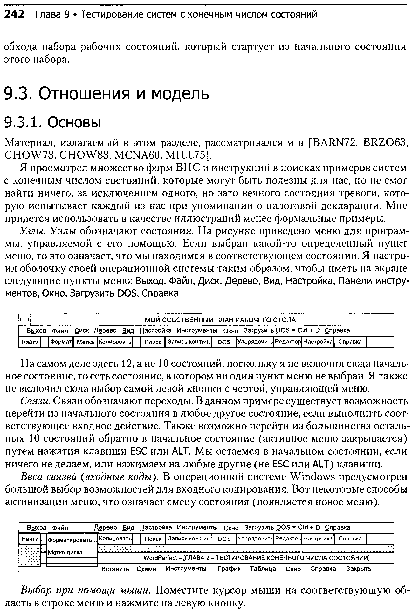

*Выбор при помощи мыши*. Поместите курсор мыши на соответствующую область в строке меню и нажмите на левую кнопку.

*Другие указатели*. Кроме мыши, можно использовать и другие устройства указания, такие как трекбол, джойстик, сенсорный экран, световое перо — все можно пересчитать по пальцам.

*Комбинация $ALT + \text{Клавиша}$.* Если вы находитесь в начальном состоянии, то можно использовать комбинацию $ALT + \text{Ключевая клавиша}$, где «Ключевая клавиша» — это подчеркнутая буква в названии меню, например, $\underline{B}$ид.

*Функциональные клавиши*. Функциональные клавиши могут быть запрограммированы для открытия определенных меню. К примеру, F1 обычно открывает меню Справка.

*Стрелки*. Если в строке меню выбрано какое-нибудь меню, то вы можете перейти в соседнее меню путем нажатия на клавишу со стрелкой влево или вправо.

Перечисленные выше способы представляют собой различные варианты входного кодирования. Преобразование действий пользователя (нажатия клавиш или передвижения курсора мыши) во входной код часто осуществляется операционной системой. Если это применимо к вашему случаю, то можете не обращать на это внимания, если вы только не тестируете операционную систему. Однако если кодирование выполняет ваше приложение, то вам следовало бы его проверить. Если ваше приложение поддерживает несколько входных устройств и программа обрабатывает эти устройства напрямую, то необходимо рассматривать отдельную кодировку для каждого такого устройства и эти кодировки должны быть проверены.

В приведенном примере существует начальное состояние: состояние, в котором в строке меню не выбрано ни одно меню. Для возврата в начальное состояние из большинства меню существует несколько способов, например нажатие на клавишу ESC или ALT.

Для большинства состояний существует переход самого в себя. В начальном состоянии нажатие фактически любой обычной клавиши приводит к переходу обратно в начальное состояние. Однако обратите внимание, что когда вы находитесь в одном из открытых пунктов меню, некоторые из обычных клавиш становятся активными. Например, в моем меню Справка активны следующие подчеркнутые клавиши: $\underline{B}$ыстрая справка, $\underline{C}$одержание, $\underline{\text{П}}\text{оиск по справке, } \underline{K}$ак пользоваться справкой, Файлы Readme, $\underline{O}$ программе. Другие буквенные клавиши вызывают переход состояния в себя, тот же эффект производит комбинация CTRL, SHIFT и обычных клавиш. Большая их часть сигнализирует, что они «не реагируют» на нажатие. Большинство клавиш действительно реагирует на нажатие, но некоторые не делают этого, что означает, что была выбрана другая кодировка выхода. Такие вещи имеет смысл проверять.

*Веса связей (выходные кодировки)*. В этом примере производимые действия достаточно сложны. Предположим, в системе открыто меню или другое окно. Выбор какого-либо пункта может привести к целой последовательности действий. Некоторые из них работают в текущем окне, а некоторые открывают дополнительные окна.

Попробуем использовать эту концепцию в модели космического корабля Enterprise. У него есть импульсный двигатель с тремя возможными режимами: разгон (P), нейтральное положение (П), задний ход (3). Корабль, в свою очередь, тоже имеет три состояния: движение вперед (В), остановка (О), движение назад

(Н). Комбинации режима работы ракетного двигателя и состояния движения корабля образуют девять состояний: PB, PO, PH, ПВ, ПО, ПН, 3В, 30 и 3H.

Согласно требованиям, предъявляемым к управлению импульсным ракетным двигателем, для того чтобы переключиться в положение «разгон» или «задний ход», вам надо пройти нейтральное положение. В нейтральном положении все двигатели выключены: $\text{P<>П<>3}$. Допустимы следующие входы: $\text{p>p}$, $\text{3>3}$, $\text{n>п}$, $\text{p>п}$, $\text{n>p}$, $\text{n>3}$ и $\text{3>п}$. Давайте теперь построим диаграмму состояний для корабля Enterprise. Наш корабль подчиняется ньютоновскому закону движения. Мы начнем с комбинации ПО, двигатели выключены и корабль стоит на месте. Если мы не будем касаться ручек управления ($\text{n>п}$), то ничего не произойдет и мы останемся в том же самом положении. Мы можем выбрать один из двух оставшихся вариантов: разгон вперед ($\text{n>p}$) или разгон назад ($\text{n>3}$). Между моментом времени, когда мы повернули ручку управления ракетным двигателем, и моментом, когда этот двигатель заработает, есть некая задержка. Если мы выбрали опцию разгон вперед ($\text{n>p}$), мы перешли в состояние PO (разгон – остановка). Аналогично если мы выберем опцию разгон назад, мы перейдем в состояние 30. В любом случае, если мы будем держать двигатель включенным ($\text{p>p}$), то он рано или поздно заработает и мы начнем двигаться вперед. Это переведет нас в состояние PB (разгон – движение вперед). Если мы были в состоянии РО (разгон – остановка) и выключили двигатель, то вернемся обратно в состояние ПО (нейтральное положение – остановка). Из рассмотрения верхних переходов $\text{3B > 30 > 3H}$ и нижних переходов $\text{PH > PO > PB}$ следует, что если мы движемся в определенном направлении, то мы физически не можем изменить направление движения без остановки в какой-либо точке.

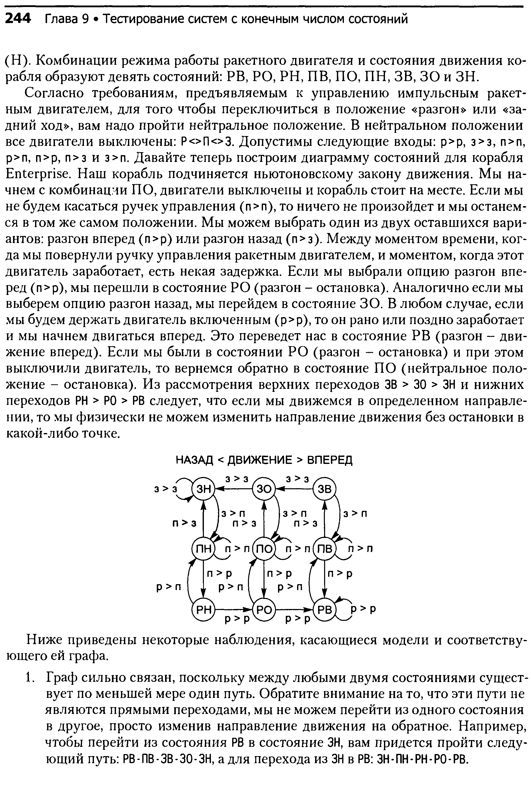

Ниже приведены некоторые наблюдения, касающиеся модели и соответствующего ей графа.

1. Граф сильно связан, поскольку между любыми двумя состояниями существует по меньшей мере один путь. Обратите внимание на то, что эти пути не являются прямыми переходами, мы не можем перейти из одного состояния в другое, просто изменив направление движения на обратное. Например, чтобы перейти из состояния PB в состояние 3H, вам придется пройти следующий путь: PB-ПВ-3В-30-3H, а для перехода из 3H в PB: 3H-ПН-PH-PO-PB.

2. Моей задачей было моделирование двух факторов: управления режимом ракетного двигателя и направления движения корабля. Так как для каждого из них было три возможных варианта, то, комбинируя их, мы получили девять состояний. Число состояний равно произведению числа вариантов для каждого фактора. Графы состояний растут очень быстро.
3. Между входами и состояниями существует отношение. Несмотря на то, что допустимы семь входных действий, в определенном состоянии не все они разрешены. Более детальная модель (см. таблицу состояний в разделе 9.3.3 ниже) включает в себя все входы, в том числе не разрешенные. Зачем? Так как в нашем случае мы не знаем, насколько надежна система, возможно, она содержит ошибки. Предположим, например, что управление двигателем сломано и существует возможность перевода его из режима Задний ход в режим Разгон, минуя Нейтральное положение (см. проблему 2). В простейшей модели состояния и входы не зависят друг от друга, но это почти никогда не встречается на практике. Например, действия различных клавиш в модели меню явно зависят от состояния (от того, какое меню активно).
4. Модель космического корабля имеет совершенную симметрию, нечасто встречающуюся на практике. Обычно переходы соединяют состояния в системе беспорядочно.

## 9.3.2. Модели Мили и модели Мура

Модели с конечным числом состояний, используемые в этой книге, называются *моделями Мили* [MEAL55]. В моделях Мили выходы ассоциируются с переходами. Модель, альтернативная этой, называется *моделью Мура* [MOOR56], и в ней выходы ассоциируются с состояниями. Модель Мура можно легко получить из модели Мили, заменив каждый код выхода, ассоциированный с переходами, на соответствующее выходное состояние. Выходные состояния обычно выделяются жирной границей или двойной границей. На рисунке я заменил переход дополнительным состоянием, выходным состоянием, в котором происходит выходное действие. Обратите внимание на то, что мне также пришлось добавить фиктивный выход (пустой), чтобы показать, что переход в следующее состояние произойдет без дополнительного внешнего входа.

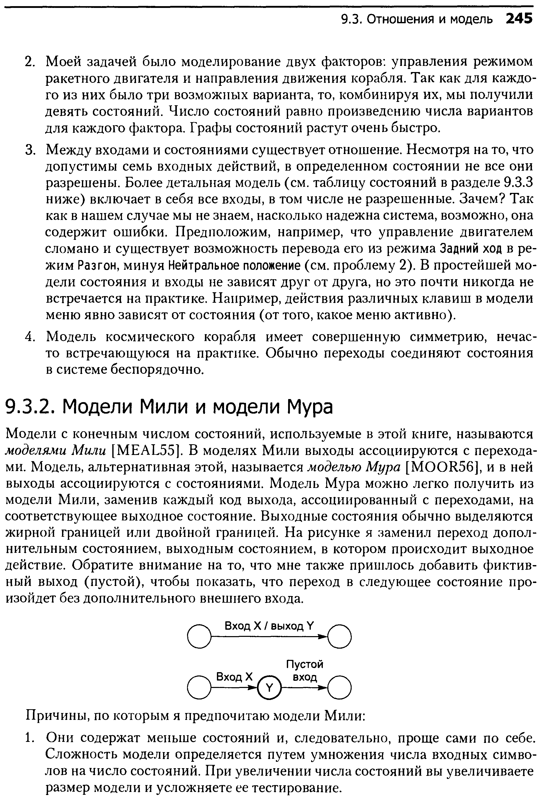

Причины, по которым я предпочитаю модели Мили:
1. Они содержат меньше состояний и, следовательно, проще сами по себе. Сложность модели определяется путем умножения числа входных символов на число состояний. При увеличении числа состояний вы увеличиваете размер модели и усложняете ее тестирование.

2. Состояния в них стабильны. Модель Мура всегда содержит изменяющиеся состояния, которые не будут терпеливо дожидаться, пока мы их проверим. Это усложняет тестирование. В модели Мили вы не меняете состояния в отсутствие входа. Справедливости ради надо отметить, что модель Мили также может содержать изменяющиеся состояния, если мы допускаем пустой вход, но в модели Мили обычно таких состояний меньше.

3. Они ближе к конечной реализации. Программисты, реализуя системы с конечным числом состояний, обычно делают это на основе моделей Мили, а не моделей Мура. Различия тестовой и проектной моделей являются источником ошибок при разработке тестов.

4. Они обеспечивают повторяемость выхода. Определенный выход (например, Открыть Файл) может соответствовать множеству различных переходов. Это могло бы потребовать отдельного состояния для каждого случая и, следовательно, привело бы к увеличению размера модели.

5. Их таблица представления проще. Представление модели с конечным числом состояний в виде таблицы проще для моделей Мили, чем для моделей Мура.

Эти две модели теоретически эквивалентны. Каждой модели Мура соответствует модель Мили и наоборот. Зачем тогда нужны эти разговоры? Согласно моим наблюдениям, в случаях, когда модели с конечным числом состояний используются в проектировании, например, при объектно-ориентированном подходе, чаще используют модель Мура, а не Мили. Вы не должны смешивать два типа моделей. Выберите один из них (я настоятельно рекомендую Мили) и придерживайтесь его.

Читатели, знакомые с графико-теоретическими моделями, обратят внимание на то, что я отдаю предпочтение моделям со взвешенными связями, а не моделям со взвешенными узлами. Модель Мура, разумеется, относится к последним, если рассматривать выходы. Модель Мура имеет определенные преимущества при описании последовательно переключающихся схем, особенно асинхронных. Обе модели были изначально созданы в рамках теории переключающихся схем и теории автоматов. Однако мы имеем дело с программным обеспечением, а не с последовательно переключающимися схемами.

В большинстве случаев доказательства теорем проще проводить для моделей со взвешенными узлами, чем со взвешенными связями, и этим объясняется превалирование первых в научных работах. Тем не менее, когда дело доходит до построения реальных инструментов, в которых графы представляются в виде списка связей, или при использовании алгоритма сокращения числа узлов (см. [BEIZ90]), модели со взвешенными связями имеют неоспоримые преимущества.

## 9.3.3. Таблицы переходов

Графическая форма представления моделей полезна скорее для обучения, а не как рабочий инструмент. Вы можете использовать представление в виде списка связей, так же как и для любого другого графа, и, разумеется, мы часто видим подобное представление моделей с конечным числом состояний в проектных документах. Альтернатива этому — использование табличного представления. В этом

случае мы могли бы начертить таблицу $n \times n$ (где $n$ — это число состояний) и в каждую ячейку записать соответствующую ей комбинацию вход/выход. Могли бы, но не станем этого делать, поскольку такая таблица (для большей части программного обеспечения) будет почти целиком пуста. Вместо этого мы используем таблицу состояний-переходов, или коротко таблицу состояний.

В таблице состояний каждому состоянию соответствует одна строка, а каждому входу один столбец. Фактически мы можем начертить две таблицы с одинаковой разбивкой: таблицу состояний-переходов и таблицу выходов. В ячейке первой таблицы мы записываем СЛЕДУЮЩЕЕ СОСТОЯНИЕ. Во вторую таблицу мы заносим соответствующий код выхода (если он есть) для данного перехода. Иногда бывает удобно комбинировать эти две таблицы, записывая и следующее состояние и выходные данные в одну и ту же ячейку, например, в виде следующее состояние/код вы-

**Таблица 9.1.** Таблица состояний корабля Enterprise

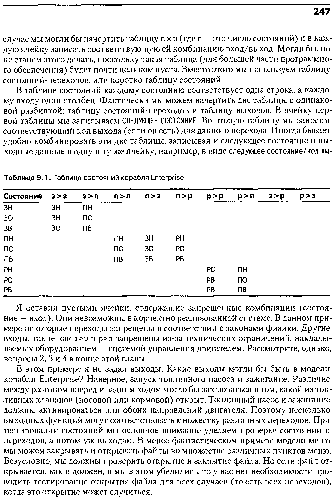

Я оставил пустыми ячейки, содержащие запрещенные комбинации (состояние — вход). Они невозможны в корректно реализованной системе. В данном примере некоторые переходы запрещены в соответствии с законами физики. Другие входы, такие как з>р и р>з запрещены из-за технических ограничений, накладываемых оборудованием — системой управления двигателем. Рассмотрите, однако, вопросы 2, 3 и 4 в конце этой главы.

В этом примере я не задал выходы. Какие выходы могли бы быть в модели корабля Enterprise? Наверное, запуск топливного насоса и зажигание. Различие между разгоном вперед и задним ходом могло бы заключаться в том, какой из топливных клапанов (носовой или кормовой) открыт. Топливный насос и зажигание должны активироваться для обоих направлений двигателя. Поэтому несколько выходных функций могут соответствовать множеству различных переходов. При тестировании состояний мы основное внимание уделяем проверке состояний и переходов, а потом уж выходам. В менее фантастическом примере модели меню мы можем закрывать и открывать файлы во множестве различных пунктов меню. Безусловно, мы должны проверить открытие и закрытие файла. Но если файл открывается, как и должен, и мы в этом убедились, то у нас нет необходимости проводить тестирование открытия файла для всех случаев (то есть всех переходов), когда это открытие может случиться.

9.3.4. Вложенные автоматы

Обсуждаемая выше таблица достаточно сложна: она имеет 81 ячейку (девять состояний и девять входов). Пример меню на рабочем столе еще более сложен. Я насчитал 12 пунктов в строке меню и выбрал те пункты, которые могут быть активированы нажатием на обычную клавишу — 23 пункта для 26-буквенного алфавита и плюс еще девять цифр, всего — 32 входных кода. Для представления этого в виде одной таблицы нам нужна таблица $12 * 32 = 384$ ячейки. Мы могли бы построить такую большую таблицу, но мы не станем этого делать. На это есть несколько причин.

1. Слишком много входов. Слишком много возможностей для ошибки при проектировании тестов.
2. Слишком много пустых ячеек. Еще больше возможностей для ошибки.
3. Слишком много запрещенных комбинаций состояние/вход.
4. Есть лучший способ.

Под лучшим способом я подразумеваю вложенные автоматы. Это то, что большинство людей делает интуитивно. Меню панели управления Windows включает в себя три пункта: `Панель управления`, `Настройки` и `Справка`. Мы можем построить автомат с четырьмя состояниями: по одному состоянию для каждого из трех пунктов меню и еще одно состояние, соответствующее случаю, когда ни одно меню не активно. Мы строим модель этого уровня, исследуем все способы переключения между меню, активации и деактивации меню и так далее, но ничего не делаем и не выбираем в рассматриваемых меню. Далее для каждого из трех меню мы строим отдельную модель с конечным числом состояний, которая описывает то, как данное меню работает и какие опции в нем можно выбирать. То же относится к выбору значка в начальном состоянии (ни одно меню не открыто) базовой модели.

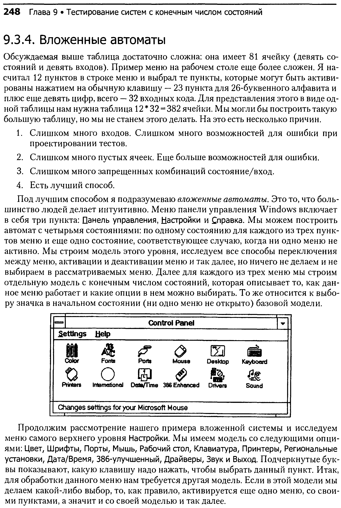

Продолжим рассмотрение нашего примера вложенной системы и исследуем меню самого верхнего уровня `Настройки`. Мы имеем модель со следующими опциями: Цвет, Шрифты, Порты, Мышь, Рабочий стол, Клавиатура, Принтеры, Региональные установки, Дата/Время, 386-улучшенный, Драйверы, Звук и Выход. Подчеркнутые буквы показывают, какую клавишу надо нажать, чтобы выбрать данный пункт. Итак, для обработки данного меню нам требуется другая модель. Если в этой модели мы делаем какой-либо выбор, то, как правило, активируется еще одно меню, со своими пунктами, а значит и со своей моделью и так далее.

Вложенные автоматы — это, по сути, единственный практический способ работы со сложными системами. Если вы исследуете стандартный проект, построенный на основе автоматов с конечным числом состояний, то увидите, что хорошие разработчики поступают точно так же. Они используют вложение своих моделей. В результате реализация проекта имеет те же самые вложения. Практика показывает, что без специальных инструментов очень трудно работать с таблицами состояний, имеющими более нескольких сотен входов. Это не очень много — всего 10 состояний и 20 входных кодов. Большие автоматы с сотнями входов постоянно используются в программном обеспечении, управляющем работой телефонных узлов, но некоторые подобные таблицы требуют сотен лет работы одного человека для создания, тестирования и отладки.

## 9.3.5. Улучшаем модель

Вероятность возникновения ошибок при создании модели достаточно велика. На практике модели на основе автоматов с конечным числом состояний требуют больших трудозатрат. Вы должны уметь различать ошибки модели, ошибки в тестах, основанных на этой модели, и ошибки системы. Легче избавиться от ошибок моделирования до того, как вы начали разрабатывать тест, чем потом искать их во время тестирования. Ниже описаны некоторые вещи, которые стоит поискать в моделях, и то, как их искать. Здесь нам сильно облегчает задачу то, что для таких моделей разработана теория, на основе этой теории созданы алгоритмы, и во многих случаях существуют инструментальные средства, основанные на этих алгоритмах. Однако не спешите радоваться. Данная теория выходит за рамки этой книги, а алгоритмы, если они реализованы в инструментах, почти всегда предназначены для аппаратного обеспечения и должны быть адаптированы для использования в программных моделях.

1. Завершенность и последовательность. Как много у вас входных символов? Как много состояний? Произведение этих двух чисел (называемое произведением состояние-символ) равно числу ячеек в таблице состояний. Каждой ячейке в таблице должен соответствовать один и только один переход, не больше и не меньше. Если какая-либо ячейка не заполнена, то в модели возникает неопределенность. Если для какой-либо ячейки определен более чем один переход, то возникает противоречие. Программа не может быть противоречивой или незавершенной. В любом состоянии она всегда должна выполнять какое-либо действие для любого входа, и это действие должно быть единственным. Мнимые прстиворечия более неприятны, так как с ними ваша система с конечным числом состояний по крайней мере в два раза больше, чем вы думаете.
2. Однозначная входная кодировка. Если входное кодирование изменяется от состояния к состоянию, то у вас либо ошибка в модели, либо ужасный проект. Это означает, что размер вашей таблицы состояний не фиксирован. На практике вы не сможете проанализировать эту ерунду.
3. Минимум автоматов. Вы создаете модель, в которой у вас есть два набора состояний с различными именами, но одинаковыми выходными действиями

и аналогичными переходами. Предположим, у вас есть два состояния А и В, такие, что любая входная последовательность, начинающаяся в состоянии А, выдает на выход такую же последовательность, как если бы она начиналась в состоянии В. В этом случае внешний наблюдатель не сможет отличить эти два состояния. За исключением различия имен, эти два состояния эквивалентны и могут быть объединены в одно. Аналогичные рассуждения применимы и к набору состояний. Вам следует упростить модель, объединив все эквивалентные состояния. Это можно сделать автоматически. За более подробной информацией стоит обратиться к [BEIZ90].

4. Нет сильной связи. Если в модели состояний для программного обеспечения между рабочими состояниями нет сильной связи, то либо ваша модель, либо ваш проект содержат ошибки. Что вы думаете о программе, содержащей меню, активация некоторых пунктов которого возможна только после перезапуска системы? Вы можете выявить этот момент вручную для маленьких моделей. Для больших моделей существуют специальные алгоритмы, лежащие за рамками этой книги. Также существуют алгоритмы для поиска недоступных состояний или наборов недоступных состояний. Подходящий алгоритм разбиения можно найти в [BEIZ90].

## 9.4. Методы
### 9.4.1. Основы

При проектировании тестов вам надо придерживаться принципов, описанных в предыдущих главах.

1. Идентифицируйте входы. Какие конкретно входные события вы собираетесь учесть в модели? Дайте каждому событию свое имя и опишите его. Например, конкретные входные сообщения, принадлежащие конкретным входным доменам, фиксированная последовательность входов. В модели невозможно учесть все возможные входы, поэтому используйте не слишком большое число входных событий (например, 10–20).
2. Задайте входное кодирование. Вы выбрали входное кодирование, которое будет использоваться в вашей модели. Оно может соответствовать такому же кодированию, использованному программистами, а может и не соответствовать. Не включайте в модель такие функции, которые поддерживаются программным обеспечением, но которые вы не собираетесь тестировать. К примеру, если операционная система сама конвертирует указание курсором и щелчок мышкой в выбор пункта меню, то вам не надо включать это в свою модель, считайте, что ваш вход приходит к вам уже закодированным (например, операционной системой). Вы должны проверять входное кодирование, только если оно является частью реализации программы.
3. Идентифицируйте состояние. Состояния часто создаются в виде произведения множителей. Если это так, идентифицируйте множители и имейте

в виду, что каждой комбинации множителей будет соответствовать свое неповторяющееся состояние и что произведение растет очень быстро и вам, возможно, будет необходимо использовать вложенные модели. Составьте список идентифицируемых состояний и дайте им имена, используя какую-либо систему. Получившиеся состояния должны исчисляться десятками, но не тысячами.

4. Задайте кодирование состояний. Если разработчики используют программную реализацию автомата с конечным числом состояний [BEIZ90], то программа может содержать процедуру кодирования текущего состояния и счетчик состояний. Если это так, то процедура кодирования состояния должна быть протестирована, однако это может представлять большую трудность в контексте чистого поведенческого тестирования. Если к программе не применялось явное проектирование с конечным числом состояний, то кодирование состояний является одной из задач вашей модели и может не содержаться в качестве составной части в программе. Тем не менее, вы должны проверить корректность кодирования в вашей модели.

5. Идентифицируйте выходные события. Только самые простые модели имеют одиночные выходные события, например, соответствующие выводу одиночного символа. Гораздо более часто выходные события состоят из последовательности действий. Идентифицируйте эти последовательности. Во вложенных моделях выходное событие представляет собой активацию модели следующего нижнего уровня в иерархии моделей. Дайте имя каждому выходному событию, вне зависимости от того, является ли это событие единичным или представляет собой последовательность действий.

6. Определите выходное кодирование. Если дизайн определяет систему с конечным числом состояний, то перед вами, возможно, встанет задача протестировать выходное кодирование, созданное программистами, и это также представляет трудность в контексте поведенческого тестирования. Тем не менее, вы должны проверить, что ваше выходное кодирование (которое в итоге является только свойством модели) на самом деле соответствует тому, что происходит в реальности.

7. Постройте таблицу состояний и таблицу выходов и уберите из них все ненужное. Это наиболее трудная часть работы, она требует наибольших затрат времени и наиболее опасна с точки зрения возникновения ошибок.

8. Постройте тесты. Вам надо разработать три вида тестов: тесты для проверки входного кодирования, тесты для проверки выходного кодирования и тесты для проверки состояний/переходов. Первые два теста относятся только к вашей модели. Третий тест относится к программе (и вашей модели). Эти задачи и способы их решения обсуждаются ниже, в разделе 9.4.2.

9. Запустите тесты. Любое тестирование должно стартовать из начального состояния, дойти до заданного состояния, пройдя по пути через различные другие состояния, и в конце вернуться обратно в исходное состояние.

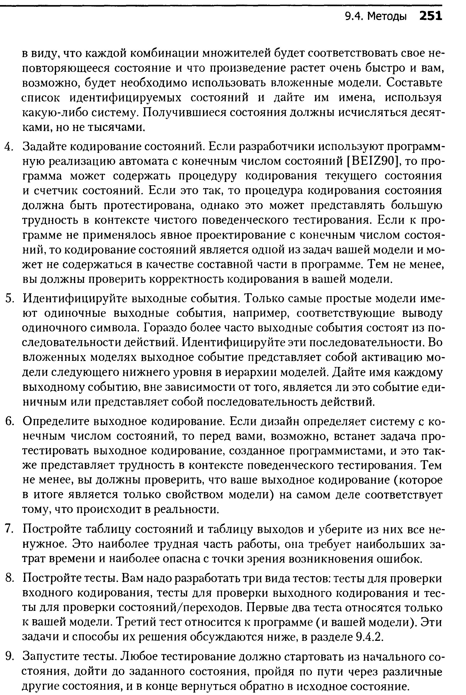

10. Для каждого входа проверьте переходы и выход. Это действие может быть нетривиальным. Здесь, как правило, требуется какая-либо помощь в проектировании. См. раздел 9.4.5.

Ниже приведены некоторые тесты для корабля Enterprise.

```text
ПО > ПО
ПО > ЗО > ПО
ПО > РО > ПО
ПО > 30 > ЗН > ПН > РН > РО > ПО
ПО > РО > PB > ПВ > ЗВ > 30 > ПО
ПО > 30 > ЗН > ЗН > ПН > РН > РО > ПО
ПО > РО > PB > PB > ПВ > ЗВ > 30 > ПО
```

Все тесты стартуют из начального состояния ПО. Из начального состояния тесты идут в заданное состояние наикратчайшим путем и возвращаются наикратчайшим путем обратно в начальное состояние, создав, таким образом, петлю. Тесты добавляются так, чтобы обеспечить покрытие связей. Каждый следующий тест строится на основе предыдущего, более простого теста. Если вы выбрали набор обходов, обеспечивающих покрытие, то для каждого перехода у вас есть входной код. У вас также есть выходное кодирование, соответствующее всем переходам. Вы должны пройти в обратном направлении и по заданным входным кодам определить реальные входы, а по заданным выходным кодам — выходные действия, если они есть. Может показаться, что это необычайно трудоемкий процесс (и это может быть так на самом деле), однако технически он не сложен.

Эти тесты представляют собой скорее экспериментальные исследования, при этом оптимизации тестов не уделяется особого внимания. Переходя от одного теста к другому, добивайтесь минимума изменений и кладите в основу каждого следующего теста предыдущий, в котором вы уверены. В результате этого подхода возникнет множество на первый взгляд избыточных тестов, однако такой подход гарантированно надежен.

## 9.4.2. Что необходимо проверить

1. Проверьте входное кодирование. Убедитесь, что в вашей модели входное кодирование соответствует его реализации. Если они отличаются, выясните, где ошибка в модели или в программе. Способ, при помощи которого вы сможете это проверить, зависит от того, что конкретно вы кодируете. Если входы представляют собой числа, то для проверки кодирования вы, возможно, сможете использовать метод тестирования доменов. Если символьные строки — то синтаксическое тестирование или другую модель состояний. Так или иначе, вы должны подтвердить соответствие между обработкой входных событий вашей моделью и программой и объяснить все расхождения.
2. Проверьте выходное кодирование. У вас должно быть сравнительно немного выходных событий или последовательностей действий. Дайте каждой из них имя. Если закодированный выход «А» означает «открыть файл, обновить файл, закрыть файл, сообщить об исполнении», то вы должны убедиться, что все эти действия имели место, причем именно в этом порядке.

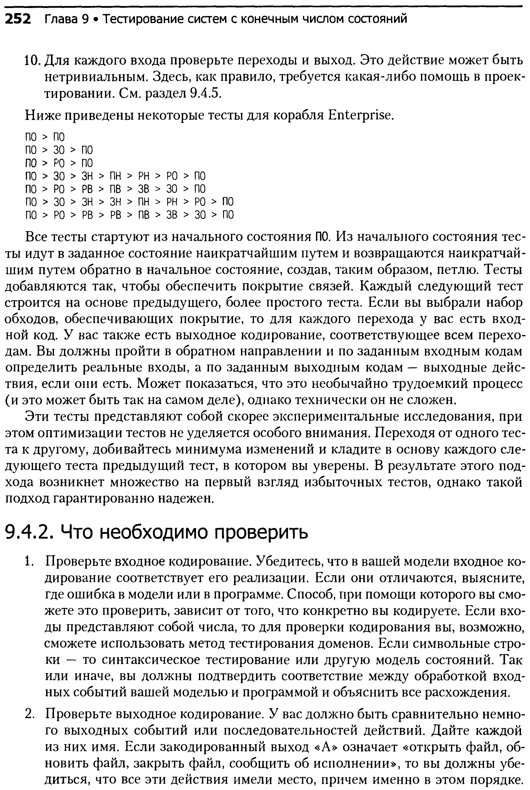


<!-- ВІДНОВЛЕНО ЧЕРЕЗ GEMINI (Стор. 253) -->
Вы можете исследовать промежуточные вычислительные шаги, протокол активности файла, использовать символический отладчик... Однако какой бы путь вы ни выбрали, вы должны убедиться в том, что ваши выходные коды соответствуют последовательности действий в реальной программе и объяснить все расхождения, если такое соответствие отсутствует.

3. Находитесь ли вы в начальном состоянии? Методы, обсуждаемые в этой книге, предполагают существование хотя бы одного начального состояния, а также то, что в него можно попасть. В сложных системах может быть несколько начальных состояний. Например, начальное состояние для операции, выполняемой одиночным пользователем, скорее всего, будет отличаться от начального состояния для сетевой операции. Вы не можете начать тест, пока вы не обнаружили и не исследовали начальное состояние. Сообщений программы, что вы находитесь в начальном состоянии, недостаточно. В конце концов, это может быть как раз та ошибка, которую вы ищете. Начальное состояние обладает определенными свойствами, такими как список открытых файлов, используемые ресурсы, активные программы и так далее. Проверьте это. Если ваше начальное состояние представляет собой что-нибудь вроде начальной загрузки или загрузки в память, то вы должны проверить каждое состояние и каждый переход в этом наборе состояний. Это может быть достаточно сложно, если вы не используете соответствующие инструментальные средства для вашей разработки тестов, так как подобные последовательности часто выполняются автоматически. Пошаговое отслеживание переходов необычайно полезно при тестировании.

4. Доступны ли вам все выходные состояния? Как правило, программы содержат более одного выходного состояния или набора выходных состояний. При попадании в такое состояние запускается процедура выхода из вашей модели. Наипростейший пример — состояние, в котором закрывается тестируемая программа. Однако далеко не всегда все так просто. К примеру, если я решил закрыть свой текстовый редактор, меня просят подтвердить это. Если я подтверждаю свой выбор и у меня есть какие-либо открытые файлы, которые не были предварительно сохранены, программа спросит меня, хочу ли я сохранить изменения. Это уже нетривиальный набор выходных состояний.

5. Проверьте состояния. Все ли требуемые состояния существуют? Целью обхода через выбранное состояние является проверка существования состояния и его доступности. Разумеется, вы должны иметь в распоряжении надежные средства, при помощи которых вы сможете владеть информацией о состоянии в любой момент времени. Обычно при тестировании программ такая возможность существует, особенно если есть явный счетчик состояний и если разработчики позаботились об удобстве тестирования. Если у вас нет средств для идентификации состояния, тестирование, хотя в принципе и возможно, становится гораздо более сложной задачей, и его описание лежит за рамками данной книги.

6. Нет ли лишних состояний? Это тяжело определить, как теоретически, так и практически. Однако при помощи эвристического метода, описанного
<!-- КІНЕЦЬ ВІДНОВЛЕННЯ -->


ниже в разделе 9.4.3, вы, скорее всего, сможете обнаружить лишние состояния, если они существуют.

7. Проверьте каждый переход. Каждому переходу соответствует потенциальный выход. Точнее говоря, существует итог каждого перехода. Переход состоит из двух вещей: нового состояния и выхода, если он есть. Если существует пустой «выход», соответствующий переходу, он также должен быть проверен. Вы задали кодирование состояний. Это означает, что у вас есть подробные характеристики, которые будут однозначно идентифицировать состояния. Проверьте каждый компонент кодирования состояния. Однако вы можете быть введены в заблуждение вероятностью существования лишних состояний, обсуждаемых в следующем разделе. Также вы должны проверить каждое выходное действие, определенное в кодировании выхода вашей модели, и особенно соответствующее пустому выходу. Убедитесь, что при пустом выходе на самом деле ничего не происходит. Если вы перешли в корректное состояние и ваши выходы (включая пустой) для этого перехода также были корректными, то с хорошей уверенностью можно сказать, что и переход был корректным.

## 9.4.3. Проверка лишних состояний

В конечных автоматах, например, в реализации аппаратных средств, проблема поиска лишних состояний в общем виде необычайно сложна, хорошо проработана и потому не рассматривается в данной книге. Однако в тестировании программного обеспечения мы имеем дело не с общей проблемой, а с более простыми частными случаями. Для частного случая мы делаем допущения, которые не могут быть сделаны в общем случае например, мы можем знать, в каком состоянии в данный момент находимся. В другом случае задачу упрощает природа ошибок состояний в программе.

Когда у нас в программном обеспечении есть лишние состояния, лишь в очень редких случаях их число ограничивается одним или двумя. Чаще мы сталкиваемся с удвоением числа ожидаемых состояний или даже числом состояний, превышающим ожидаемое в 1000 раз. Лишние состояния возникают из-за скрытых закономерностей в поведении систем с конечным числом состояний. Один дополнительный бит, дающий вклад в поведение состояния, удваивает общее число состояний.

На рисунке рассматривается наглядный пример. Нижний автомат с конечным числом состояний — это то, что, как мы полагаем, мы тестируем. Однако либо из-за ошибок, либо из-за неполноты модели где-то возникает иной фактор, о котором мы не догадываемся. Из-за ошибки, произошедшей во время одного из наших тестовых обходов, вместо перехода из А в В мы на самом деле переходим из А в B', в параллельное гиперпространство. К слову, в программном обеспечении мы, как правило, имеем дело не с одним гиперпространством, а с тысячами и миллионами их. Если все эти параллельные гиперпространства идентичны друг другу во всех отношениях (за исключением фактора, являющегося источником всех этих лишних состояний), то, скорее всего, мы не сможем их обнаружить при помощи конечного числа тестов. Однако в этом случае ошибка не представляет опасности.

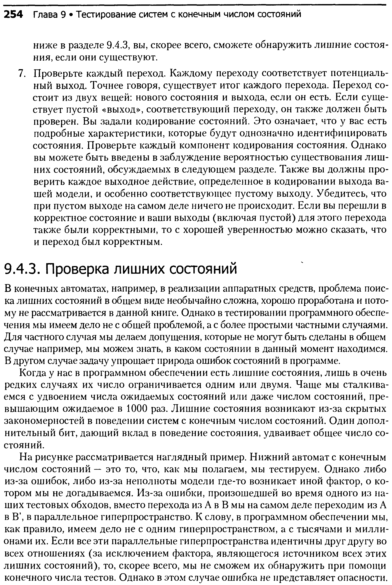

Если же альтернативные системы с конечным числом состояний хоть немного отличаются друг от друга, то мы это можем обнаружить.


В чем тогда проблема? Ведь в итоге у нас есть всего лишь небольшое безобидное различие в поведении, которым можно легко пренебречь. Хороший вопрос, требующий ответа. Как я уже говорил, параллельных гиперпространств обычно не одно, а миллионы. В большинстве из них небольшие расхождения действительно безобидны, и с ними можно смириться, однако во многих гиперпространствах симптомы ошибок фатальны. Я всегда убеждался, что «безобидные» несоответствия в поведении вырастают в серьезные ошибки. Вы не сможете заставить разработчиков волноваться по поводу «безобидных» симптомов. Если вы доложите им о мерцании экрана или о том, что курсор мышки ведет себя не так, как должен, они лишь пожмут плечами. Однако если, исследуя эти изменения в поведении, вы обнаружите ошибки, ведущие к аварии, и если вы будете делать это регулярно, то вы заставите их обратить на это внимание. Ищите фатальные ошибки экспериментальным путем. Меняйте параметры (такие как длина файла, контрольные коды, опции и т. д.), которые не должны оказывать влияния на переход, и наблюдайте, не увеличится ли несоответствие в поведении. Например, уведите курсор мыши дальше или заставьте экран моргнуть два раза. Следуйте в направлениях, в которых различие в поведении растет, и вскоре вы вычислите набор обстоятельств, ведущий к фатальной ошибке. Несколько часов тестирования и внимательного наблюдения за типичным PC-приложением, — и вы будете вознаграждены сбоем в программе или разрушенной базой данных (однако убедитесь сначала, что у вас есть хорошие средства резервирования и восстановления).

Мы можем обнаружить лишние состояния в гиперпространстве, в точности повторяя каждый тест. Пройдите из начального состояния в заданное состояние и обратно (по возможности не используя команду RESET). Затем вы сравниваете все компоненты, имеющие отношение к текущему состоянию (например, открытые файлы, используемые ресурсы, состояние окна и т. д.), до прохождения теста с состоянием этих же компонентов после прохождения теста. Затем данный тест (в точности) воспроизводится, и каждый выход для каждого перехода сравнивается с предыдущим прогоном и со всеми остальными. Каждое повторение изме-

нения в поведении записывается$^1$. Любые отклонения в поведении, даже если они безвредные, сигнализируют о наличии лишних состояний.

Выполнение приведенных выше рекомендаций не гарантирует, что вы обнаружите лишние состояния, если таковые существуют. В общем случае подобное поведение можно распознать единственным способом, выбирая различные пути из начального состояния в заданное состояние. Повторение тестов — это не лучшее, что вы можете сделать, однако это меньшее из того, что вы обязаны сделать. Если не повторять тесты, то вероятность обнаружения ошибки мала.

Принцип точного повторения тестов не должен ограничиваться тестированием поведения систем с конечным числом состояний. Воспроизведение любого теста описанным способом является превосходной идеей, поскольку ошибки, порождающие нежелательное поведение, характерное для системы с конечным числом состояний, не могут знать, какой метод мы используем. **Поэтому обязательно повторяйте свои тесты!**

## 9.4.4. Иерархия покрытия

Как и для других методов тестирования, для систем с конечным числом состояний существует иерархия покрытия. Покрытие узлов само по себе почти ничего не может сказать. Более того, если разработчики уже провели тестирование программы на нижнем уровне (например, было выполнено тестирование модулей), то, скорее всего, это тестирование обеспечит покрытие узлов. Главный объект при тестировании систем с конечным числом состояний — это переходы. Для тестирования переходов мы сначала должны убедиться в корректности состояний (обеспечить покрытие узлов). Поэтому, как и для большинства методов тестирования, мы будем считать, что это минимум, необходимый для достижения покрытия связей (переходов). Есть ли что-нибудь еще, кроме покрытия связей? На самом деле есть еще масса различных вариантов исследования графа, но все они лежат за рамками данной книги и, что более важно, выходят за рамки интересов большинства тестировщиков, использующих этот метод.

Иерархия покрытия здесь соответствует набору все более длинных последовательностей тестов. Длина последовательности теста определяется числом переходов (или, что эквивалентно, числом входных символов). Существует целый раздел литературы, описывающий методы тестирования конечных автоматов. Я не буду останавливаться на описании этих методов (это заняло бы всю книгу), однако я могу дать некоторый обзор причин, по которым эти методы важны для нас. Мы делаем три важных предположения при использовании методов тестирования систем с конечным числом состояний для программного обеспечения.

1. Мы, как правило, знаем состояние, в котором мы находились до каждого перехода и в котором будем находиться после него. В общем случае, например, при тестировании интегральных схем у нас нет другого способа узнать это,

---
$^1$ Это не так сложно, как может показаться. Мы имеем в распоряжении превосходные инструментальные средства (например, средства захвата/воспроизведения, см. главу 10) для выполнения такого сравнения.

кроме как путем наблюдения за поведением тестируемой системы (то есть за выходами). В некоторых случаях тестирования программного обеспечения (таких как при тестировании протоколов), при которых у вас нет информации о внутреннем состоянии (например, системы, с которой у вас установлена связь), определить внутреннее состояние тестируемой системы невозможно$^1$. Если у вас возникли проблемы с получением информации о состоянии, то основных методов, описанных в этой книге, будет недостаточно. Лучше всего разрабатывать программное обеспечение таким образом, чтобы эта информация была доступна.

2. Выходные действия в аппаратном обеспечении в большинстве своем достаточно просты, например, подача выходного импульса на определенную ножку разъема. Однако таких переходов, которые могут вызывать возникновение подобного импульса, может быть не один и не два. В таком случае вы не сможете с легкостью определить, является ли ваш выход правильным. Это значит, что случайная корректность здесь не исключение, а правило. В программном обеспечении выходные действия сложны и часто однозначно соответствуют переходу. Из-за их сложности, зная выходное действие, легко можно определить соответствующий переход. Если они эквивалентны импульсам в линии, — например, такое может иметь место в программном обеспечении, управляющем протоколами, — тогда задача тестирования становится гораздо более сложной, и вам, возможно, не будет хватать основных методов, описанных в этой книге.
3. Рассмотрим природу интересующих нас ошибок. Мы можем искать ошибки в спецификации. Это представляется проблематичным, и для этого тестирование систем с конечным числом состояний неприменимо. Если разработчики выполнили гигантскую работу, реализуя некорректную систему с конечным числом состояний, то обнаружить это невозможно, какой бы метод тестирования вы ни использовали. Мы предполагаем, что наша модель корректна и что ошибки содержатся только в реализации этой модели. Наиболее вероятной ошибкой в программе является не корректное состояние или неправильный переход, а крупное явление, например, целые параллельные системы с конечным числом состояний, возникающие из-за скрытых параметров состояний. В качестве простого примера можно рассмотреть программу, предназначенную делать резервные копии каждые несколько секунд, для того чтобы в случае сбоя в системе можно было восстановить информацию, используя резервные файлы. Предположим, программа не в состоянии очистить все эти данные при нормальном выходе. Она очищает резервные файлы, но оставляет ключевой параметр состояния без изменений. При следующем старте программа пытается провести восстановление (как ей сказано), однако «требуемые» резервные файлы не су-

$^1$ Заметим, что современные разработчики интегральных схем внедряют в свои изделия большое количество дополнительных схем, чтобы сделать эту информацию доступной для приборов, тестирующих продукцию.

ществуют, что ведет к аварии. Один ошибочный байт данных означает 255 альтернативных пространств, одно 32-битное слово — 4,3 миллиарда таких пространств. Если вы тщательно исследуете крошечные изменения в поведении, то можете узнать, в каком пространстве находитесь.

## 9.4.5. Активизация и предсказание итога

Проблемы активизации и предсказания итога при тестировании систем с конечным числом состояний как таковой не существует. «Активизация» заключается во вводе команд или входов, которые инициируют желаемый переход. Предсказание итога означает проведение выходного кодирования. Каждое из этих заданий требует существенных затрат усилий, однако они просты и для их выполнения не нужны специальные методы. Они должны быть сделаны. Наибольшая ошибка, которую тестировщик может здесь допустить, — это отнестись к этим пунктам невнимательно. Вы действительно должны определить все до мельчайших деталей. Это несложно сделать, используя соответствующие коммерческие инструментальные средства, такие как захват/воспроизведение, обсуждаемые в главе 10.

Тестирование систем с конечным числом состояний наиболее эффективно не при первоначальном тестировании программного обеспечения, а при его повторном тестировании, после внесения в него изменений в ходе сопровождения. Оно проводится с целью убедиться в том, вещи, которые не должны были меняться, на самом деле остались неизменными. В таком случае предыдущий прогон теста дает нам как требуемые входы (обеспечивает активизацию), так и итоги.

## 9.4.6. Подсчет состояний

Наиболее важное дело тестировщика (и особенно независимого) заключается в подсчете числа состояний, числа входных кодов, а затем и их произведения состояние-символ. Программисты, которые не учитывают поведение систем с конечным числом состояний, реализуют конечные автоматы с триллионами состояний и миллиардами входных кодов. Они не могут быть протестированы должным образом ни сейчас, ни в будущем. С точки зрения тестировщика, такие ущербные программы ломаются с необычайной легкостью. Системы с конечным числом состояний, основанные всего на нескольких переменных факторах, растут очень быстро. Рассмотрите задачу 6 из упражнений в конце главы, чтобы почувствовать это самим. Одно время я заниматься разработкой логики и усвоил, что должен проводить формальный анализ любого конечного автомата, если произведение состояние-символ превышает 12, так как это число уже превышало границы моих возможностей интуитивного тестирования дизайна. Для проверки корректности конечного автомата с произведением состояние-символ порядка сотен необходимы месяцы работы, если только в состояниях и переходах не существует закономерностей. В этих случаях совершенно необходим формальный анализ (остающийся за пределами данной книги). Затраты же на автоматы с произведением порядка тысяч превышают годы или века работы одного человека — здесь ничего нельзя сделать интуитивно.

Из вышесказанного можно сделать вывод о том, что имеет смысл делать, а что не имеет. Предположим, вы исследовали систему и определили, что поведение системы задается пятью факторами с 7, 13, 8, 4 и 3 возможными значениями каждого из них соответственно; вы также определили, что возможные выходы (после кодирования) включают 42 отдельных действия. Произведение этих чисел дает 366 912. Как тестировщик вы должны просмотреть документацию для каждого из этих переходов. Если это невозможно, то программа не тестируема и ненадежна. Разумеется, разработчики могли бы реализовать вложенные машины, и мы надеемся, что они так и сделали. В этом случае вам надо будет протестировать шесть гораздо более простых автоматов.

Поиск значения произведения состояние-символ (для не вложенных автоматов) — это самое простое и эффективное дело, которое вы можете сделать, тестируя системы с конечным числом состояний. Сделав это на первом этапе, вы сможете узнать, может ли ваша программа быть адекватно протестирована и, следовательно, будет ли она устойчива к сбоям.

## 9.4.7. Средства поддержки и тестируемость

Это как раз та проблема, где программисты могут и должны отрабатывать свое жалование. Я решительно настаиваю на том, чтобы программисты использовали явные реализации конечных автоматов (то есть задаваемые таблицами), если произведение состояние-символ больше десяти. В [BEIZ90] описывается необходимый порядок работы. Если это условие выполнено, а проект тщательно проработан и легко поддается анализу (и, следовательно, вероятность ошибок в нем невелика), то следующие характеристики существенно облегчат вам тестирование.

1. Явный счетчик состояний. Существует одна заявленная переменная, или адрес ячейки памяти, которые определяют состояние в любой момент времени. Эта информация доступна и может быть записана. Текущее состояние также всегда известно.
2. Основной сброс и сброс в определенное состояние. Существует множество вариантов сброса, например, основной сброс в начальное состояние. Он, в свою очередь, может представлять собой полный сброс (все заново инициализируется), только восстановление состояния (меняется только счетчик состояний, а статус файлов и прочее остаются без изменений) или возврат в определенное состояние. Сброс может быть достаточно тщательно проработан и может иметь достаточно много параметров, точно определяющих, что именно должно быть изменено (кроме счетчика состояний). Хорошие средства сброса чрезвычайно важны в больших автоматах состояний, где для того, чтобы попасть в заданное состояние без использования механизма сброса, пришлось бы пройти через множество других состояний.
3. Пошаговое выполнение. Это означает возможность пошагового прохождения графа состояний, по одному переходу за шаг, а в случае выполнения составных выходных действий — одно выходное событие за шаг. После каждого перехода предусматривается пауза, пользуясь которой, тестировщик,

если тест выполняется вручную, мог бы разобраться, что произошло. Если же тест выполняется в автоматическом режиме, то специальные инструменты запишут всю необходимую информацию.

4. Трассирование переходов. Это означает запись отметки о каждом совершенном переходе. В понятие отметки входят входной код, инициировавший переход, текущее состояние, состояние после перехода, выходной код.
5. Явная таблица входного кодирования. Мы предполагаем, что существует явный механизм кодирования входа. Лучше всего, если он содержится в виде таблицы. Входное кодирование полностью отделено от последующей обработки данных.
6. Явная таблица выходного кодирования. То есть осуществлено явное кодирование выхода. Оно может представлять собой таблицу, в которой указано, какие подпрограммы надо вызывать, или определен какой-нибудь другой отдельный механизм, не являющийся частью остальной обработки.
7. Явная таблица состояний-переходов. Это означает, что реализация систем с конечным числом состояний всегда имеет явную таблицу переходов. Самое удобное в этих таблицах то, что если обнаружена ошибка перехода, то ее нахождение можно легко определить.

Эти характеристики лучше всего встраивать в модель в самом начале, так как их сложно потом модифицировать. Очевидно, для таких средств нужны специальные модели и команды управления, доступ к которым должен быть запрещен для пользователей без специального разрешения.

## 9.5. Рассмотрение приложений

### 9.5.1. Индикаторы приложений

Ниже описаны некоторые типичные ситуации, требующие использования тестирования конечных автоматов и/или приложения, в которых этот метод часто используется. Более подробно эта ситуация рассматривалась в [AVRI93, BAUE79, WILK77].

1. Программное обеспечение, управляемое при помощи меню. Разработчики коммерческих программ, управляемых при помощи меню, как правило, используют явные конечные автоматы при проектировании своих меню. В том числе они используют метод тестирования систем с конечным числом состояний для проверки корректности своих меню.
2. Объектно-ориентированное программное обеспечение. Модель с конечным числом состояний встречается в большинстве объектно-ориентированных парадигм проектирования. Корректное тестирование методов подразумевает корректное тестирование поведения состояний. В этом случае необходимость использования методов тестирования систем с конечным числом состояний очевидна.

3. Протоколы. Обсуждение методов тестирования протоколов лежит за рамками данной книги. Этому вопросу посвящено много книг, и во всех них предполагается, что вы владеете методами тестирования систем с конечным числом состояний [CHOW88, HOLZ87, SARI87, SIDH89].

4. Драйверы устройств. Большинство устройств ведут себя как системы с конечным числом состояний, и большинство драйверов включают в себя такие системы.

5. Замена аппаратных средств. Задачи, некогда возложенные на аппаратные средства, в настоящее время все чаще решаются программным способом. Это касается не только электроники, но и механических и электромеханических устройств. В статье, приведенной в журнале Scientific America [GIBB94], предрекается использование микропроцессоров (и соответствующего программного обеспечения) в выключателях света, электробритвах (2 килобайта), автомобильных трансмиссиях (30 килобайт кода), ТВ (500 килобайт). Существенная часть поведения подобного программного обеспечения реализуется как поведение систем с конечным числом состояний.

6. Инсталляционное программное обеспечение. Программное обеспечение, предназначенное для инсталляции и конфигурации программ, часто ведет себя как система с конечным числом состояний и может эффективно тестироваться при помощи соответствующих методов.

7. Программное обеспечение для резервирования и восстановления. Программное обеспечение, задачей которого является резервирование и (особенно) восстановление, по многим признакам ведет себя подобно системе с конечным числом состояний. Мы наблюдаем рост числа двухпроцессорных файловых или сетевых серверов. Такие системы традиционно тестируются при помощи методов проверки систем с конечным числом состояний.

## 9.5.2. Предположения об ошибках

Предположения, которые мы можем сделать, будут относиться скорее не к природе ошибок, а к программному обеспечению, обладающему поведением системы с конечным числом состояний.

1. Специализированный конечный автомат. Программист может не догадываться, что его программа во многих случаях ведет себя как система с конечным числом состояний. Вследствие этого отсутствует должный анализ, невозможно выполнить адекватное тестирование и может быть сделано много, действительно много ошибок.

2. Ошибки кодирования. Это могут быть ошибки входного, выходного кодирования или кодирования состояний, вне зависимости от того, явное это кодирование или скрытое. Если входное кодирование реализовано в скрытом виде, то велика вероятность непоследовательного кодирования от состояния к состоянию.

3. Неверный выход. Это может быть ошибкой кодирования или, если выходного кодирования в явном виде не существует, то, к примеру, неверным вызовом подпрограммы.

4. Непредвиденное поведение состояния. Большое увеличение числа дополнительных состояний может быть вызвано скрытой особенностью поведения состояния.

5. Пересечение границ вложений. В реализации используются вложенные конечные автоматы, однако из-за плохого, сделанного на скорую руку проекта или ошибок в нем, границы вложений игнорируются. На следующем рисунке показана модель, состоящая из нескольких вложенных конечных автоматов. Каждая замкнутая область изображает набор состояний (например, меню). Если разрешим переход из состояния X, например, в состояние Y, то все система вложений будет нарушена, и на деле поведение в целом будет таким, как если бы вложений не было совсем. Существуют другие способы завершить подобное пересечение границ вложений, но это должно быть реализовано аккуратно. Пересечение границ вложений в примере является общей ошибкой, однако в большинстве случаев оно может быть обнаружено при помощи метода тестирования систем с конечным числом состояний. Не было ли у вас когда-нибудь такого, что вы использовали программу, управляемую при помощи меню, оказывались в пункте меню, которое не выбирали и спрашивали себя: «Как это я здесь оказался?»

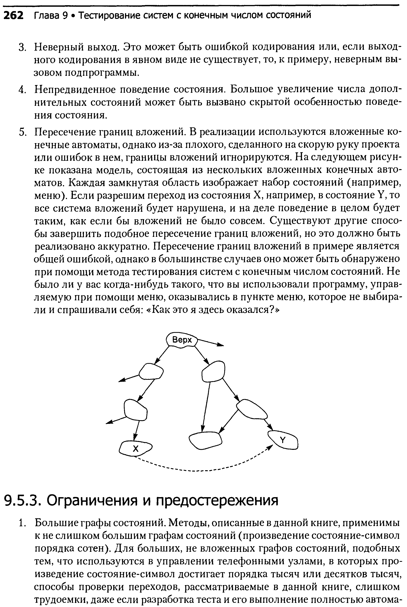

## 9.5.3. Ограничения и предостережения

1. Большие графы состояний. Методы, описанные в данной книге, применимы к не слишком большим графам состояний (произведение состояние-символ порядка сотен). Для больших, не вложенных графов состояний, подобных тем, что используются в управлении телефонными узлами, в которых произведение состояние-символ достигает порядка тысяч или десятков тысяч, способы проверки переходов, рассматриваемые в данной книге, слишком трудоемки, даже если разработка теста и его выполнение полностью автома-

тизированы. Это не может радовать. Положительная сторона этого вопроса заключается в том, что люди, работающие с такими большими системами, обладают необходимыми инструментами и опытом, чтобы использовать более совершенные методы, чем рассматриваемые в данной книге. Если у вас нет достаточного опыта и необходимых инструментов, вам не стоит браться за тестирование таких больших конечных автоматов.

2. Вложенные модели, или вложенные системы? Чтобы модели были рациональны, необходимо использовать вложенные модели, поскольку, скажем, невложенная реализация может содержать миллиард состояний. Предположим, вы построили прекрасную вложенную модель, однако реальная программа может не являться вложенной структурой. Ваша модель охватывает лишь часть реального поведения, и покрытие связей в вашей модели никоим образом не означает покрытия связей всей системы с конечным числом состояний. Ваша модель — это всего лишь подсистема реальной системы, причем подсистема с хорошим поведением. Поэтому все ваши тесты могут успешно пройти, а программа, тем не менее, будет содержать огромное количество ошибок. Нам важно иметь в распоряжении инструменты, показывающие, какие именно реальные состояния и переходы были проверены. Такие инструменты полностью бесполезны, если только у вас конечный автомат не реализован в явном виде. В таком случае вы можете винить только себя, поскольку именно вы не выяснили, является ли реализация вложенной, как и ваша модель, или нет.

3. Отсутствие поддержки. Средства поддержки и аспекты тестируемости, описанные в разделе 9.4.7, предназначены для облегчения тестирования и повышения его эффективности. Степень этой поддержки также является мерой того, насколько сложно или просто будет проводить тестирование системы с конечным числом состояний и насколько эффективными будут тесты при поиске ошибок.

## 9.5.4. Автоматизация и инструментальные средства

Как всегда в разделе, описывающем автоматизацию, я могу вас порадовать и расстроить. Порадовать тем, что проблема автоматизации разработки тестов для проверки конечных автоматов исследуется уже более 30 лет, и в результате этих исследований появилось множество эффективных алгоритмов. Однако почти все подобные исследования были посвящены вопросам тестирования логики аппаратных средств, обладающих своими ограничениями и ошибками, которые отличаются от ограничений и ошибок, возникающих при тестировании программных конечных автоматов. Исключением является тестирование протоколов, для которого аппаратная модель, возможно, будет эффективна. Инструменты, в том виде, в каком они есть, обычно интегрируются в более универсальные LSI (Интеграция Высокого Уровня) системы проектирования, и, по существу, недоступны тестировщикам программного обеспечения.

На самом деле коммерческие средства поддержки разработки программно-ориентированных тестов существуют [POST94], но они находятся в зачаточном

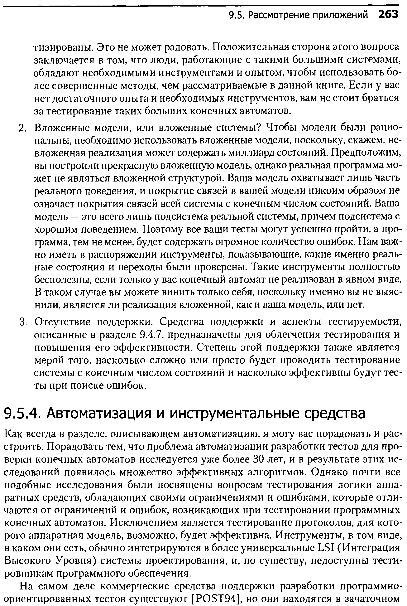

состоянии. Большинство организаций, разрабатывающих программное обеспечение, которым приходится проводить тестирование конечных автоматов в больших объемах, разрабатывают свои инструменты [MATT88]. Поскольку эти инструменты дают им ощутимое преимущество, они никогда не публикуют результаты и никогда не делают эти инструменты доступными для посторонних.

## 9.6. Резюме

Модель конечного автомата является фундаментальной моделью тестирования, применимой к большому числу различных видов программного обеспечения. Она начинается с определения таблицы состоянийпереходов, включающей все возможные комбинации состояние-входной символ. Как правило, в большинстве моделей так же требуется входное и выходное кодирование. Обеспечение покрытия связей (переходов) является минимальной разумной целью тестирования. При использовании несложных средств поддержки, таких как явный счетчик состояний, и сброс для нахождения большинства ошибок будет достаточно простых обходов. Самое актуальное из того, что тестировщик может здесь сделать — это сосчитать произведение состояние-символ, и, исходя из этого, оценить, реально ли в данном случае выполнить тестирование. Следующее по актуальности дело, из тех, что тестировщик может сделать — это в точности повторить каждый из проводимых тестов (это относится не только к тестированию систем с конечным числом состояний, но и ко всем тестам), используя систему захват/воспроизведение. А затем необходимо исследовать даже самые тривиальные изменения в поведении для того, чтобы обнаружить скрытые ошибки в поведении систем с конечным числом состояний.

## 9.7. Вопросы для самопроверки

1. Дайте определение следующих терминов: полностью определенный граф состояний, текущее состояние, выходное состояние, конечный автомат (автомат с конечным числом состояний), скрытое поведение системы с конечным числом состояний, начальное состояние, набор начальных состояний, входное кодирование, входное событие, входной символ, номер входного символа, изолированное состояние, программа, управляемая через меню, вложенные системы, пустой вход, пустой выход, число состояний, выходное кодирование, входное событие, таблица выходов, доступное состояние, сброс, переход самого в себя, код состояния, стабильное состояние, счетчик состояний, произведение состояние-символ, таблица состояний, таблица состояний-переходов, сильно связанные, обход, изменяющиеся состояния, переход, недоступное состояние, рабочие состояния.
2. Переделайте модель корабля Enterprise, исходя из предположения, что три положения ручки управления двигателем находятся в вершинах треугольника, а не вдоль одной линии (поскольку это желание рулевого Клингона,

а Клингоны всегда добиваются того, чего хотят). Это означает, что возможны следующие дополнительные входы: p>з и з>p. Законы физики, тем не менее остаются прежними для Клингонов. Разработайте новый набор тестов.

3. (а) Добавьте в модель корабля Enterprise главный двигатель (Г). Вы можете перейти к главному двигателю из любого положения двигателя (Р, Н, З), Однако конечный результат в любом случае будет один и тот же — движение вперед. Главный двигатель не подчиняется законам Ньютона, поэтому, если вы двигались в обратном направлении, то при включении главного двигателя вы можете перейти непосредственно к движению вперед, без промежуточной остановки. После выключения главного двигателя рычаг управления двигателем находится в положении, которое он занимал перед включением главного двигателя, но вы продолжаете двигаться вперед. Создайте модель и разработайте тесты.
(б) Задание, аналогичное 3(а), но для флагмана Клингонов Spklchutrgr Hrngrtch.

4. Компания La Forge модернизировала главный двигатель так, что теперь после его выключения он восстанавливает направление движения (вперед, назад, остановка), которое имело место перед его включением. Создайте модель и разработайте тесты.

5. Если вы работаете в оболочке операционной системы Windows, спроектируйте модель меню наивысшего уровня в этой среде, разработайте тесты и выполните их$^1$.

6. В моем полноприводном пикапе «Тойота-Терсел» на рукоятке переключения передач нарисованы следующие передачи: R (задний ход), N (нейтральная

ющая ручка для переключения между приводом на два и на четыре колеса, педали сцепления и тормоза. Вот некоторые правила управления этой машиной$^2$:
* Переключая передачи, вы должны пройти через нейтральную передачу, то есть реальные действия по переключению передач будут следующими: N>N, N>R, N>SL, N>1, ... R>R, ... N>2, N>3, ... R>N, ... 5>N. Переключатель режима работы трансмиссии имеет только два положения: 2BK>4BK и 4BK>2BK (BK — ведущие колеса). Сцепление может быть включено (есть) или выключено (нет). С тормозами дело обстоит точно так же. Вы можете отпустить педаль сцепления (и включить его), если сцепления нет,

---

$^1$ В формальном курсе я, как правило, использовал максимально возможное число примеров управляемых при помощи меню программ, исходя из возможностей доступных для студентов компьютеров и/или операционных систем. Однако примеры корабля Enterprise и «Тойоты» разработаны так, чтобы в них сложность моделирования возрастала постепенно.
$^2$ Я это не выдумал. Это описание — наиболее близкое к типичному описанию 2/4 колесной трансмиссии, из тех, что я мог привести. Сейчас у меня полноприводная машина, но у нее автоматическая коробка передач. И я рад, что инженеры, разрабатывающие автоматическую трансмиссию, использовали модель конечного автомата и соответствующее тестирование.

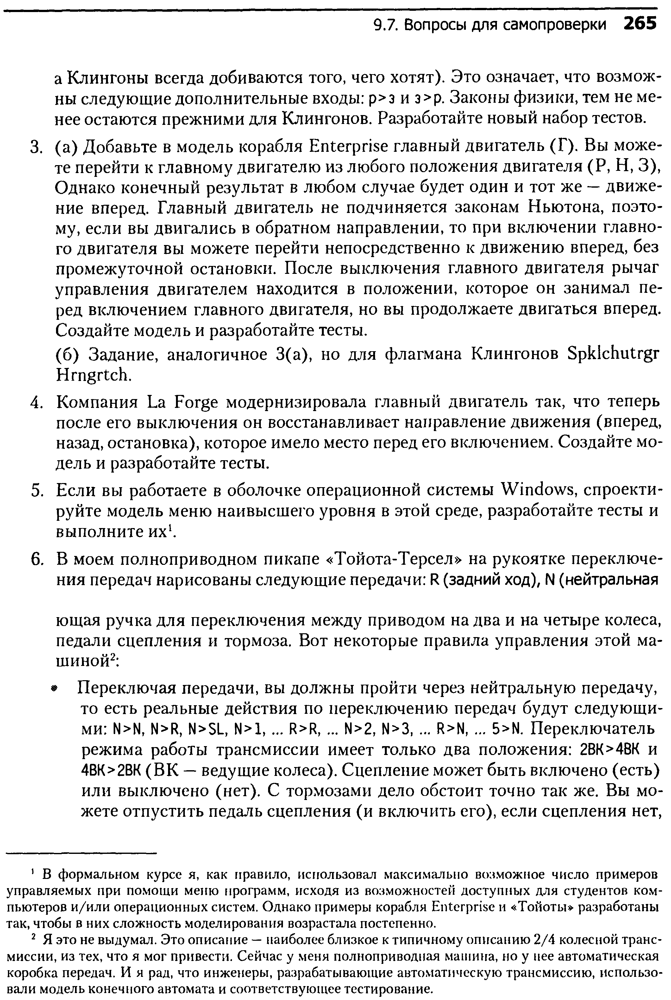

и нажать на педаль (и выключить), если оно есть. То же самое относится и к тормозам.
* Вы можете переключить из любой передачи (за исключением SL) на нейтральную без использования сцепления. Переключение SL>N требует сцепления.
* Вы должны использовать сцепление для переключения нейтральной передачи на любую другую.
* Передача SL вам доступна только в полноприводном режиме.
* Вы можете переключиться между режимами 2BK>4BK и 4BK>2BK, не используя сцепление, если только ваша передача отлична от SL, однако при этом вы должны стоять на месте, или двигаться вперед.
* Любое переключение передач или выбор 2/4 приводного режима можно совершить, используя или не используя сцепление, если вы стоите на месте.
* Если вы двигаетесь назад на передаче R, вы можете переключиться на первую или вторую передачу следующим образом: R>N>1, R>N>2.
* Единовременное переключение между передачами переднего хода не должно быть больше, чем на две скорости в любом направлении. Это значит, что возможны следующие переходы: N>1, 1>N>2, 1>N>3, 2>N>1, 2>N>3, 2>N>4, 3>N>1, 3>N>2, 3>N>4, 3>N>5, 4>N>2, 4>N>3, 4>N>5 и так далее. Вы всегда можете переключить передачу на нее же саму (включая R и SL), используя сцепление или без него, если только вы не проходите через нейтральную передачу. К примеру, переключение будет 3>3, а не 3>N>3.
* Нельзя пытаться совершать запрещенные переключения (такие как 5>N>R), ведь не секрет, что даже лучшие трансмиссии ломаются при неправильном обращении.
* Вы можете выполнять только одно действие за раз. Это значит, что нельзя одновременно переключать скорость, режим работы трансмиссии, выжимать сцепление и тормоз или обе педали сразу.

Определите входную схему кодирования. Разработайте таблицу(ы) состояний, включающую все запрещенные переходы. Разработайте набор тестов, обеспечивающий полное покрытие. Разрабатывая тесты, руководствуйтесь общими соображениями, имея в виду, что ваши тесты могут быть потенциально опасны и/или могут иметь разрушительные последствия для машины. Ваша задача — получить достаточно небольшой набор эффективных тестов, представляющих собой обходы состояний и не разрушающих трансмиссию во время работы. Не пытайтесь разработать по-настоящему минимальный набор тестов, так как это является сложной теоретической задачей. Приведенные ниже модели расположены в порядке возрастания сложности. Проработайте их.

6.1. Привод только на два колеса, нет очень низкой скорости, только три передние скорости.

6.2. То же, что и 6.1, но с четырьмя передачами.
6.3. То же, что и 6.1, но с пятью передачами.
6.4. Привод на два/четыре колеса, нет очень низкой скорости, только три передние скорости.
6.5. То же, что и 6.4, но с четырьмя передачами.
6.6. То же, что и 6.4, но с пятью передачами.
6.7. Привод на два/четыре колеса, есть очень низкая скорость, только три передние скорости.
6.8. То же, что и 6.7, но с четырьмя передачами.
6.9. То же, что и 6.7, но с пятью передачами.
6.10. Любое из приведенных выше заданий, но с дополнительным условием, что вы можете за один раз повышать скорость на три передачи (например, $1 \to N > 4$), а понижать только на одну (например, $4 > N > 3$). Подсказка. Входное кодирование не обязательно должно соответствовать единичному входному событию, но может обозначать целую последовательность событий, как, например, $4 > 3$ обозначает $4 > N$, $N > 3$. Вложенные автоматы, состояния, и/или входы вы определяете, исходя из своих соображений. Не приравнивайте $G > G$ к $G > N > G$ (где $G$ — любая передача), они не эквивалентны.


<!-- ВІДНОВЛЕНО ЛОКАЛЬНО (Стор. 268) -->

<!-- КІНЕЦЬ ВІДНОВЛЕННЯ -->


<!-- ВІДНОВЛЕНО ЛОКАЛЬНО (Стор. 269) -->

<!-- КІНЕЦЬ ВІДНОВЛЕННЯ -->


<!-- ВІДНОВЛЕНО ЛОКАЛЬНО (Стор. 270) -->

<!-- КІНЕЦЬ ВІДНОВЛЕННЯ -->


<!-- ВІДНОВЛЕНО ЛОКАЛЬНО (Стор. 271) -->

<!-- КІНЕЦЬ ВІДНОВЛЕННЯ -->


ная лента начинает изнашиваться. Так спросите сами себя: были ли мои тестировщики попросту некомпетентны, или же из этого можно извлечь урок?

Мир технического обслуживания [PIGO94]. Современный процесс разработки программного обеспечения состоит не только из создания и тестирования нового кода, но также из поддержки существующего кода. Для большинства продуктов программного обеспечения около 80 процентов усилий тратится на техническую поддержку, как на корректирующее сопровождение, которое исправляет обнаруженные ошибки, так и на прогрессивное сопровождение, которое модернизирует и добавляет новые возможности. В течение типичного цикла сопровождения модифицируется менее 5 процентов кода. Однако это обычно приводит к необходимости комплексного регрессионного тестирования (то есть повторения наиболее важного подмножества из набора первоначальных тестов) [BURK88]. Общепризнанный опыт при проведении ручного регрессионного тестирования заключается в отказе от его использования. Одно из двух приносится в жертву — или прогрессивное тестирование (тестирование новых характеристик), или эквивалентное тестирование (тестирование неизменных характеристик), или даже оба вместе. Это опасная ситуация, так как в развивающемся продукте его сопровождение может являться причиной ошибок, количество которых сравнимо с количеством всех остальных ошибок. Программисты сопровождения защищены от ошибок не более, чем тестировщики и программисты исходного кода. Попытки провести ручное регрессионное тестирование (в действительности его не применяют) приводит к возрастанию число ошибок сопровождения до недопустимо высокого уровня.

Сколько в действительности стоит ручное тестирование? Стоимость ручного тестирования практически невозможно оценить, так как информационная инфраструктура, необходимая для проведения точных исследований, возникает только после выполнения автоматизации тестирования. Но мы можем определить общую стоимость труда, если посмотрим, сколько людей занимается тестированием. Это должно быть выполнено корректно, что практически невозможно. Вам необходимы общие данные о трудозатратах, в первую очередь включающие в себя стоимость сервиса, стоимость горячей линии и тому подобное. Если стоимость программного обеспечения определена корректно и должным образом связана с различными видами деятельности, в таком случае большинство организаций, которые проводят такую оценку впервые, будут просто потрясены реальной стоимостью ручного тестирования.

## 10.4. Базовый пакет инструментов

### 10.4.1. Основы

В этой главе я не ставил перед собой цель дать всеобъемлющий обзор инструментов тестирования. Это заняло бы всю книгу. Для обзора текущих инструментов я рекомендую [FSTC83, GRAH91, GRAH93, DAIC93, MARC94 и SQET94]. Коммерческие инструменты эволюционируют так быстро, что создание хорошего


<!-- ВІДНОВЛЕНО ЛОКАЛЬНО (Стор. 273) -->

<!-- КІНЕЦЬ ВІДНОВЛЕННЯ -->


<!-- ВІДНОВЛЕНО ЛОКАЛЬНО (Стор. 274) -->

<!-- КІНЕЦЬ ВІДНОВЛЕННЯ -->


или профайлеры. Профайлер не пытается интерпретировать выполняемые команды (как делает нормальный инструмент покрытия), а просто регистрирует изменение данной области памяти (выполнение команды на объектном уровне). С практической точки зрения это настолько же хорошо, как и регистрация исполнения ветвей операторов и предикатов в исходной программе. Профайлеры могут обеспечить такое покрытие данных для отдельных байтов, отдельных команд объектной программы или блоков из байтов или команд.

Покрытие объектов может быть выполнено для каждого исполнения команды, в этом случае результаты будут очень четкие, но неточные, так как система тратит большую часть времени на измерение самой себя. Такая форма называется детерминистическим покрытием. Альтернативной формой является периодическая выборка выполнения команд. Это называется статистическим покрытием. Преимуществом статистического покрытия является то, что режим тестирования реалистичен и влияние, которое оказывают инструменты покрытия, можно аналитически скорректировать. Недостатком же является то, что для получения статистически достоверного измерения надо провести тысячи повторений тестов.

3. Инструменты для покрытия потоков данных и других покрытий. Хотя тестирование потоков данных определяется здесь в контексте поведенческого тестирования, существуют соответствующие структурные концепции и связанные с ними инструменты покрытия. Уже разработаны инструменты, которые измеряют все использования, все определения, все пути определение-использование и даже все пути [FRAN85, HORG92, KORE85, OSTR91]. Ни одного из них не было в свободной продаже к 1994 году. Существуют также инструменты покрытия (коммерческие) для регистрации высокоуровневого тестирования, которое не обсуждалось в этой книге, например, покрытие древовидных схем, которые необходимы при тестировании интеграции.

## 10.4.3. Автоматизация проведения тестирования

Автоматизации проведения тестирования следует уделить первоочередное внимание, так как даже умеренная автоматизация разработки тестов сразу же создает огромное число тестов, которые бесполезны без автоматического исполнения. Во многих системах и средствах разработки программного обеспечения есть возможность на 95 процентов или больше автоматизировать выполнение тестов. Стопроцентное автоматическое выполнение, по всей видимости, нежелательно. Это точно нежелательно, если единственная возможность это реализовать — создать сложного робота-наборщика, который будет имитировать действия пользователя с клавиатурой и мышью. Если автоматизацию проведения тестирования принять во внимание с самого начала и если это будет обязательным условием при проектировании системы, то возможна очень высокая степень автоматизации выполнения — около 99 процентов. Основной инструмент автоматизации


<!-- ВІДНОВЛЕНО ЛОКАЛЬНО (Стор. 276) -->

<!-- КІНЕЦЬ ВІДНОВЛЕННЯ -->


<!-- ВІДНОВЛЕНО ЛОКАЛЬНО (Стор. 277) -->

<!-- КІНЕЦЬ ВІДНОВЛЕННЯ -->


рены в том, что ошибки в тесте не возникнут опять при следующем запуске. Это как раз то, что не может быть выполнено, и уж тем более доказано, при тестировании вручную. Инструмент для захвата/воспроизведения данных бесполезен без возможности редактирования тестов (например, при помощи текстового редактора).

2. Мультистратегические генераторы. К 1994 году на рынке был представлен только один коммерческий мультистратегический тестовый генератор — T [IDEI94]. В основе генераторов, рассчитанных на одну стратегию, лежат эвристическое тестирование доменов, синтаксическое тестирование, входные комбинации, случайные входные данные и другие, хорошие и не очень, существующие методы. Такие инструменты будут производиться и в дальнейшем. Сейчас, когда вы знаете основные методы поведенческого тестирования, вы можете оценить, понимают ли предполагаемые производители инструментов тестирования эти методы или же они только генерируют ни на чем не основанную эвристику.

## 10.4.5. Рекомендации по выбору производителя инструментов тестирования

Это не урок по оценке и выбору инструмента (может, к этой теме стоит обратиться в следующей книге?), а некоторые важные замечания, на которые следует обратить внимание при оценивании инструментов и производителей.

1. Съешьте сами то, что производите. Это я впервые услышал от Роджера Шермана из компании Microsoft. Если вы продаете еду для собак, вам не следует колебаться, перед тем как съесть миску своей собственной продукции. Вам может не понравиться вкус, но вы знаете, что это безопасно для здоровья. Спросите предполагаемого продавца инструментов, использовал ли он свой собственный продукт тестирования для себя. Если он затрудняется с ответом, уходите, так как он не доверяет своей продукции.
2. Подключение тестирующего средства. Инструменты тестирования не работают сами по себе. Инструменты тестирования встраиваются в более широкую среду разработки программного обеспечения и связанные с ней инструменты и методологии. Вам следует рассматривать не только преимущества инструментов, но также и легкость, с которой вы можете их интегрировать в вашу среду. Хорошие инструменты, которые не могут взаимодействовать с другими инструментальными средствами, встречаются довольно редко.
3. Поддержка. Не стоит ожидать бесплатной поддержки от производителей инструментов. Но вы всегда можете купить поддержку по приемлемой цене. Инструменты тестирования, подобно другим инструментам разработки программного обеспечения, могут быть довольно сложны, особенно если в основе инструмента лежит запатентованный метод. Я знал производителей замечательных инструментов, выброшенных с рынка, так как они были

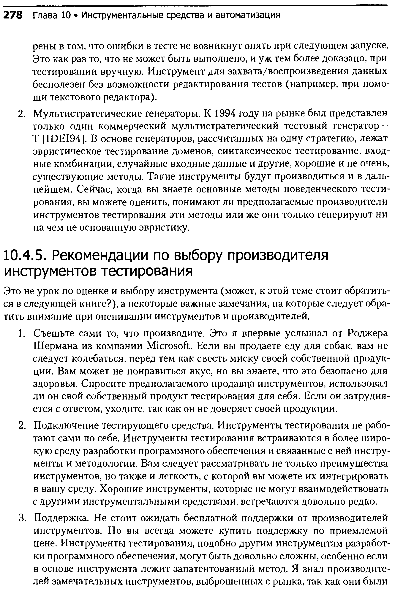

согласны продавать инструмент, но не поддержку, без которой инструмент просто ничто.

## 10.4.6. Не обманывайте сами себя

Здесь приведена общая, но верная схема. Организация вкладывает инвестиции в инструменты тестирования. На каждом уровне организации существует стремление к качеству. Войска готовы и полны энтузиазма. Каждый разработчик и тестировщик получают лицензионную копию инструмента. Через год спросите своих сотрудников, кто все еще использует этот инструмент. Несмотря на инвестиции, первоначальный энтузиазм и все остальное, таких будет менее 5 процентов. Что же произошло? Почему это случается так часто?

Все недооценили время, которое было необходимо потратить на изучение инструментов и базовых методов, чтобы ясно понять, что данный инструмент и методы были эффективнее устаревшего ручного способа.

Вы можете изучать материал этой книги в течение одного семестра базового университетского курса или же во время интенсивного пятидневного семинара, но вы не станете экспертом, пока не выполните упражнения и реально не попрактикуетесь с материалом. Без практики методы не усвоятся и, следовательно, никогда не станут частью вашей работы. В студенческой среде это происходит автоматически, потому что упражнения и практика растягиваются на длительный период времени (а экзамены, несомненно, доказывают эффективность практики). Такие механизмы отсутствуют в обычных производственных условиях.

И управленческий аппарат, и тестировщик почему-то ждут, что они усвоят эти уроки при помощи волшебства, не тратя время на практику, и, что хуже всего, они ждут немедленного увеличения производительности. Но как же это может произойти? При реалистичном подходе на время изучения новых методов следует планировать снижение производительности и качества. За три-четыре недели напряженного труда вы освоите любой метод из этой книги, повысите с его помощью продуктивность и эффективность, а также научитесь использовать связанные с ним инструменты.

## 10.5. Будущее тестирования

### 10.5.1. Основы

Я не верю и никогда не верил в тестирование, но я не буду летать самолетом, чье программное обеспечение не протестировано должным образом. И я не противоречу сам себе. Я верю в независимое тестирование, но не в группы независимого тестирования. И опять же я не противоречу сам себе.

### 10.5.2. Зачем и почему я не верю в тестирование

Тестирование является нашей последней линией обороны от ошибок, но не первой или единственной. Если при тестировании обнаруживаются ошибки, то это значит,


<!-- ВІДНОВЛЕНО ЛОКАЛЬНО (Стор. 280) -->

<!-- КІНЕЦЬ ВІДНОВЛЕННЯ -->


<!-- ВІДНОВЛЕНО ЛОКАЛЬНО (Стор. 281) -->

<!-- КІНЕЦЬ ВІДНОВЛЕННЯ -->


<!-- ВІДНОВЛЕНО ЛОКАЛЬНО (Стор. 282) -->

<!-- КІНЕЦЬ ВІДНОВЛЕННЯ -->


# Приложение А


Форма 1040 стр.1


Форма 1040 стр. 2

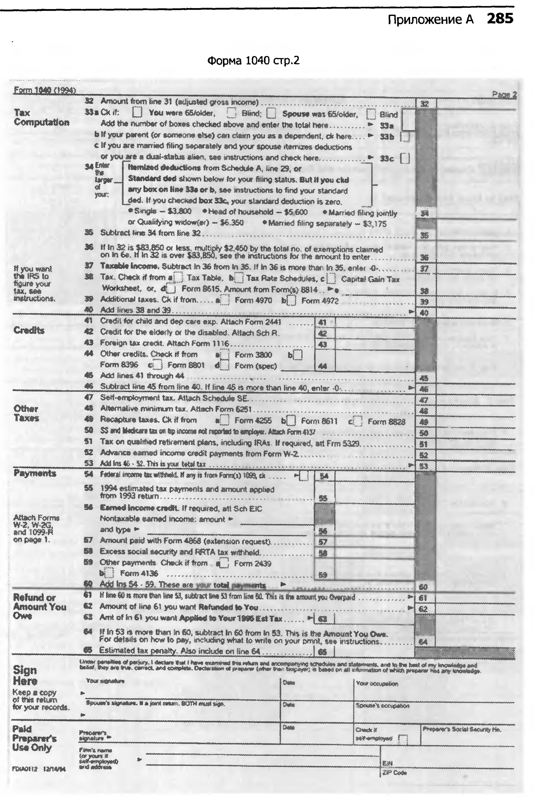

Форма 2106 стр.1


Форма 2106 стр. 2


Форма 2210 стр. 1


Форма 2210 стр. 2


Форма 2688


Форма 3903

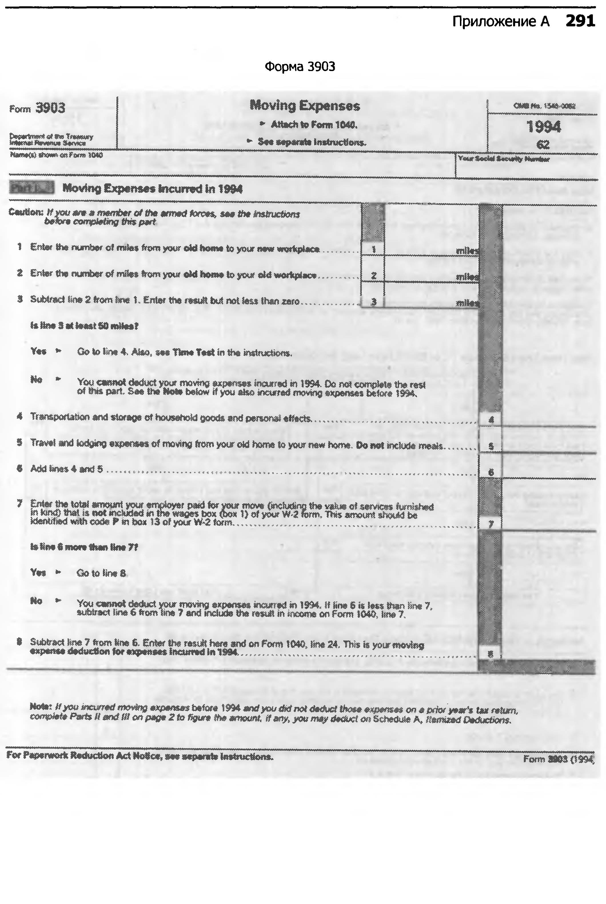

Схема налоговых ставок SE


Форма 1040 строка 10


Приложение А

Форма 1040 строка 20

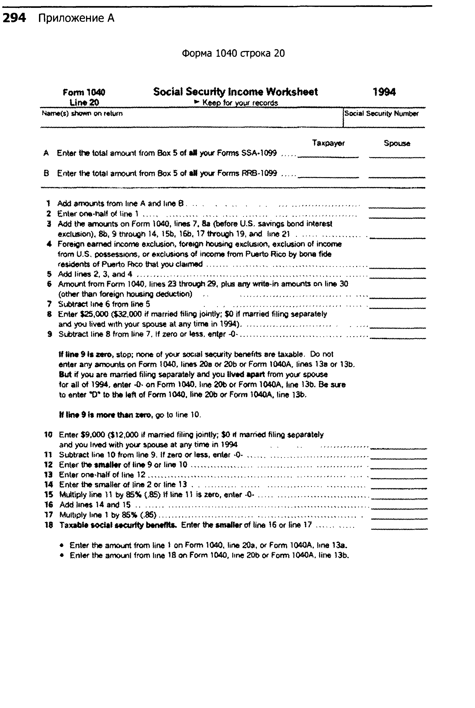

Приложение А

Форма 1040 строка 26


Форма 1040 строка 34

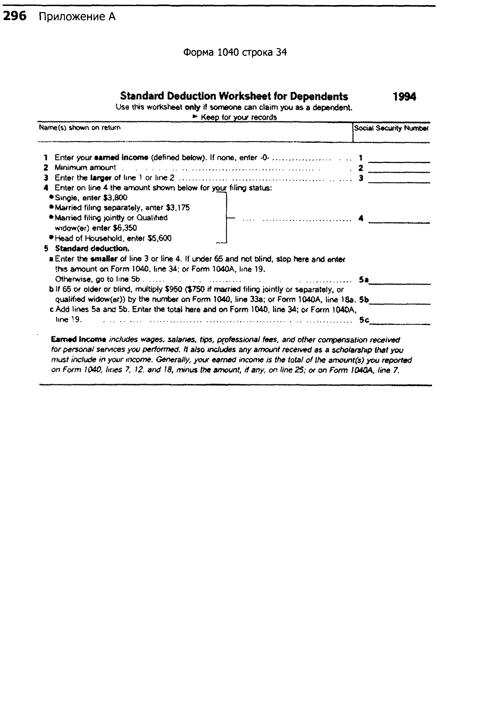

Схема налоговых ставок А строка 29

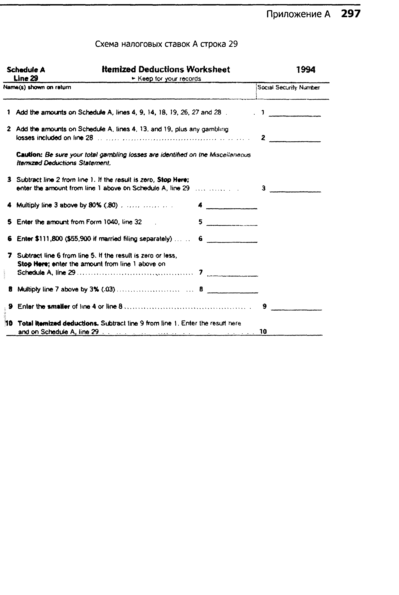

Индивидуальные пенсионные счета

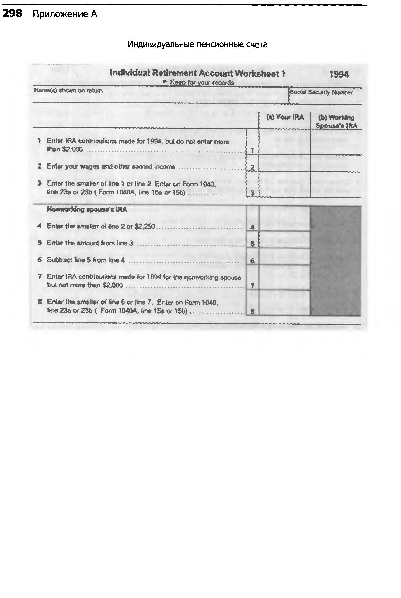

Список литературы

AFIF90 | Afifi, E. H., and White, L. J. "Testing for Linear Errors in Nonlinear computer Programs." Technical Report CES-90-03, Department of Computer Science, Case Western Reserve University, March 1990.
---|---
AFIF92 | Afifi, E. H., White, L. J., and Zeil, S. J. "Testing for Linear Errors in Nonlinear Computer Programs." Proceedings of the 14th International Conference on Software Engineeing, Australia, pp. 81–91.
ALLE72 | Allen, F. E., and Cocke, J. "Graph Theoretic Constructs for Program Control Flow Analysis." IBM Research Report RC3923. Yorktown Heights, NY: TJ. Watson Research Center, 1972.
ANDE79 | Anderson, R. B. "Proving Programs Correct". New York: John Wiley & Sons, 1979.
ANDR81 | Andrews, D.M., and Benson, J. P. "An Automated Program Testing Method and Its Implementation." Fifth International Conference on Software Engineering, San Diego, CA, March 9–12, 1981. Use of assertions in testing.
ANSI94 | ANSI/IEEE Standard PI 044–1994. "Standard Classification for Software Anomalies". New York: American National Standards Institute, 1994.
AVRI93 | Avritzer, Alberto, and Larson, Brian. "Load Testing Software Using Deterministic State Testing." Proceedings of the 1993 International Symposium on Software Testing and Analysis, Cambridge, MA June 28–30, 1993. pp. 82–88.
BABE94 | Baber, Robert L. "Proofs of Correctness." In MARC94, pp. 925–930.
BACK59 | Backus, J. "The Syntax and the Semantics of the Proposed International Algebraic Language." Proceedings of the ACM-GAMM Conference. Paris, France: Information Processing, 1959.

BALC89 & Balcer, Marc J., Hasling, William M., and Ostrand, Thomas J. "Automatic Generation of Test Scripts from Formal Test Specifications." Proceedings of the ACM SIGSOFT '89. Third Symposium on Software Testing, Analysis, and Verification. Key West, FL, December 13–15, 1989. pp. 210–218. Automatic behavioral test generation based on the proprietary TSL specification language. \\
BARN72 & Barnes, B. H. "A Programmer's View of Automata." Computing Surveys 4 (1972): 222–239. Introduction to state graphs and related automata theory topics from a software-application perspective. \\
BASI87 & Basili, V. R., and Selby, R.W. "Comparing the Effectiveness of Software Testing Strategies." IEEE Transactions on Software Engineering 13, #12 (1987): 1278–1296. A (rare) attempted controlled experiment to explore the relative effectiveness of behavioral versus structural testing, coverage metrics, professional versus student programmers. \\
BAUE79 & Bauer, J. A., and Finger, A. B. "Test Plan Generation Using Formal Grammars." Fourth International Conference on Software Engineering, Munich, Germany, September 17–19, 1979. Use of state-graph model for automated test case generation. Application to telephony. \\
BEIZ84 & Beizer, B. "Software System Testing and Quality Assurance." New York: Van Nostrand Reinhold, 1984. Test and QA management, integration testing, system testing. Organization of testing, behavioral testing, formal-acceptance testing, stress testing, software reliability, bug-prediction methods, software metrics, test teams, adversary teams, design reviews, walkthroughs, etc. \\
BEIZ90 & Beizer, B. "Software Testing Techniques", 2nd ed. New York: Van Nostrand Reinhold, 1990. The testing book to read after this one. Structural test techniques, behavioral test techniques in more detail, interaction of software design and testability, algorithms for tool builders. \\
BEIZ96 & Beizer, B. "Integration and System Testing (in preparation)." Integration testing strategies, reintegration, system testing techniques. Application of test techniques to system testing. Black-Box Testing is a prerequisite. \\
BELF76 & Belford, P. C., and Taylor, D. S. "Specification Verification — A Key to Improving Software Reliability." In Proceedings of the PIB Symposium on Computer Software Engineering. New York: Polytechnic Institute of New York, 1976. Verification of specifications, use of specification languages, and related subjects. \\
BEND70 & Bender, R. A., and Pottorff, E. L. "Basic Testing: A Data Flow Analysis Technique". IBM System Development Division,

Poughkeepsie Laboratory, TR–00.2108, October 9, 1970. Earliest known description of data-flow testing.

BEND85 | Bender, R. A., and Becker, P. “Code Analysis”. Larkspur, CA: Bender and Associates, P.O. Box 849, 94939. Proprietary software development and test methodology that features use of data flow testing techniques.
---|---
BERA94 | Berard, Edward V. “Object Oriented Design.” In MARC94, pp. 721–729.
BERL94 | Berlack, H. Ronald. “Configuration Management.” In MARC94, pp. 180–206. Detailed overview of software configuration control and management practices.
BISW87 | Biswas, S., and Rajaraman, V. “An Algorithm to Decide Feasibility of Linear Integer Constraints Occurring in Decision Tables.” IEEE Transactions on Software Engineering SE–13, #12 (December 1987), pp. 1340–1347.
BOEH81 | Boehm, Barry W. “Software Engineering Economics”. Englewood Cliffs, NJ: Prentice-Hall, 1981. Source book for all aspects of software economics.
BOEH86 | Boehm, Barry W. “A Spiral Model of Software Development and Enhancements.” ACM Software Engineering Notes 11, (4), (1986), pp. 22–42.
BOWD77 | Bowditch, N. “American Practical Navigator”, 70th ed. Washington, DC: Defense Mapping Agency Hydrographic Center, 1977. The oldest book in continuous publication except for the Bible. What our discipline should strive to be when it grows up.
BRIT85 | Britcher, R. H., and Gafmey, J. E. “Reliable Size Estimates for Software Systems Decomposed as State Machines.” Ninth International Computer Software and Applications Conference, Chicago, IL, October 9–11, 1985. Representation of program as finite-state machine relates state-machine size to program size.
BRZ062 | Brzozowski, J. A. “A Survey of Regular Expressions and Their Application.” IRE Transactions on Electronic Computers 11 (1962), pp. 324–335. Survey of regular expression theory and relation to finite-state machines.
BRZ063 | Brzozowski, J. A., and McCluskey, E. J., Jr. “Signal Flow Graph Techniques for Sequential Circuit State Diagrams.” IEEE Transactions on Electronic Computers 12 (1963), pp. 67–76. Basicpaper that applies flow graphs to regular expressions and state-graphs of finite-state automata.
BURK88 | Burke, R. @Black-Box Regression Testing – An Automated Approach.” Fifth International Conference on Testing Computer Software, Washington, DC, June 13–16, 1988.
BUTL89 | Butler, R. W., Mejia, J. D., Brooks, P. A., and Hewson, J. E. “Automated Testing for Real-Time Systems.” Sixth International

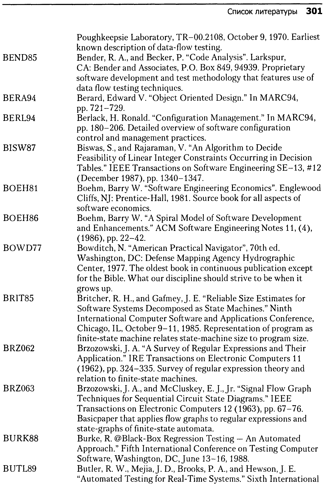

CHEN78
Conference on Testing Computer Software, Washington, DC, May 22–25, 1989.
Chen, W. T., Ho, J. P., and Wen, C. H. "Dynamic Validation of Programs Using Assertion Checking Facilities." Second Computer Software and Applications Conference, Chicago, IL, November 1978.

CHOW78
Chow, T. S. "Testing Software Design Modeled by Finite State Machines." IEEE Transactions on Software Engineering 4 (1978), pp. 78–186. Testing software modeled by state graphs with examples from telephony. Categorizes types of state-graph errors and shows relation between type of coverage and the kind of errors that can and can't be caught.

CHOW88
Chow, C. H., and Lam, S. S. "Prospec: An Interactive Programming Environment for Designing and Verifying Communication Protocols." IEEE Transactions on Software Engineering 14 (1988), pp. 327–338.

CLAR76
Clarke, Lori A. "A System to Generate Test Data and Symbolically Execute Programs." IEEE Transactions on Software Engineering 2 (1976), pp. 215–222. Although aimed at structural testing, the method and tools could be applied just as easily to behavioral control flow and data flow models.

CLAR82
Clarke, Lori A., Hassel, J., and Richardson, D. J. "A Close Look at Domain Testing." IEEE Transactions on Software Engineering 8 (1982), pp. 380–390. Good survey and critique; exposition of error types and what does and doesn't work to catch them and why.

CLAR89
Clarke, Lori A., Podgurski, Andy, Richardson, Debra J., and Zeil, Steven J. "A Formal Evaluation of Data Flow Path Selection Criteria." IEEE Transactions on Software Engineering 15 (1989), pp. 1318–1332.

COHE78
Cohen, E. I. "A Finite Domain-Testing Strategy for Computer Program Testing." Ph. D. diss., Ohio State University, June 1978.

CONK89
Conklin, J. "Automated Repetitive Testing." Sixth International Conference on Testing Computer Software, Washington, DC, May 22–25, 1989.

COOPS1
Cooper, Robert B. "Introduction to Queuing Theory". New York: Elsevier North Holland, 1981.

CROS92
"CrossTalk Communications." CASL Programmer Guide. Rosswell, GA: Digital Communications Associates, 1992.

DAIC93
Daich, Greg, and Price, Gordon. "Test Preparation Execution, in Evaluation Software Technologies Report". Software Technology Support Center, Hill AFB, Ogden, UT. Customer Service 801-777-7703. Free periodical guide to test tools and technology approved for use in U. S. government. Also, Reengineering Tools Report, Source Code Static Analysis Technologies Report, vols. 1 and 2.

DAVJ88 | Davis, A. M. “A Comparison of Techniques for the Specification of External System Behavior.” Communications of the ACM 31, #9 (1988), pp. 1098–1115. Survey of state graphs, state tables, decision tables, decision trees, program design languages, Petri nets, requirement languages, and specification languages in developing requirements and tests from them.
---|---
DEON74 | Deo, N. “Graph Theory with Applications to Engineering and Computer Science”. Englewood Cliffs, NJ: Prentice-Hall, 1974.
EBER94 | Ebert, Jurgen and Engels, Gregor. “Design Representations.” In MARC94, pp. 382–394. Survey of popular design models and representations, all of which can be used as a basis for test design.
ELME73 | Elmendorf, W. R. “Cause-Effect Graphs in Functional Testing”. TR-00.2487, IBM Systems Development Division, Poughkeepsie, NY, 1973.
FAGA76 | Fagan, M. E. “Design and Code Inspections to Reduce Errors in Program Development”. IBM Systems Journal 3 (1976) pp: 182–211. Still one of the best expositions on inspections ever written.
FENT91 | Fenton, Norman E. “Software Metrics: A Rigorous Approach”. London: Chapman and Hall, 1991. A rigorous but very accessible book on software metrics, suitable for a first course.
FRAN85 | Franki, P. S., Weiss, S. N. and Weyuker, E.J. “Asset — A System to Select and Evaluate Tests.” Proceedings of the IEEE Conference on Software Tools (April 1985), pp. 72–79.
FRAN88 | Franki, P. G., and Weyuker, E. J. “An Applicable Family of Data Flow Testing Criteria.” IEEE Transactions on Software Engineering 14, #10 (1988), pp. 1483–1498.
FREE88 | Freeman, P. A., and Hunt, H. S. “Software Quality Improvement Through Automated Testing.” Fifth International Conference on Testing Computer Software, Washington, DC, June 13–16, 1988.
FSTC83 | Federal Software Testing Center. “Software Tools Survey”. Office of Software Development report #OSD/FSTC–83/015, 1983. Survey of 100 software development tools, language, source.
FUJI94 | Fujii, Roger U. “Independent Verification and Validation.” In MARC94, pp. 568–572. What an independent test group is all about.
FURG89 | Furgerson, Donald F., Coutu, John P., Reinemann, Jeffrey K., and Novakovich, Michael R. “Automated Testing of a Real-Time Microprocessor Operating System.” Sixth International Conference on Testing Computer Software, Washington, DC, May 23–25, 1989. Description of application of CrossTalk CASL scripting language to test script design and to construction of a testing environment.
GERH88 | Gerhart, Susan L. “A Broad Spectrum Toolset for Upstream Testing, Verification, and Analysis.” Second Workshop on

Software Testing, Verification, and Analysis, Banff, Canada, July 19–21, 1988.

GIBB94 | Gibbs, Wayt. "Software's Chronic Crisis." Scientific American, 71, #3 (1994), pp. 86–95.
---|---
GILB93 | Gilb, Tom, and Graham, Dorothy. "Software Inspections". Menio Park, CA: Addison-Wesley, 1993. As good and as readable text on inspections as you're likely to find.
GOOD75 | Goodenough, J. B., and Gerhart, S. A. "Toward a Theory of Test Data Selection." IEEE Transactions on Software Engineering 1 (1975), pp. 156–173. The beginning of testing theory; historical interest.
GRAD87 | Grady, Robert B., and Caswell, D. L. "Software Metrics: Establishing a Company-Wide Program". Englewood Cliffs, NJ: Prentice-Hall, 1987. A practical guide to implementing a total metrics program based on experience in a supportive, sophisticated, software development organization.
GRAD92 | Grady, Robert B. "Practical Software Metrics for Project Management and Process Improvement". Englewood Cliffs, NJ: Prentice-Hall, 1992. Yet another practical guide to metrics in an industrial setting, courtesy of Hewlett-Packard.
GRAH91 | Graham, Dorothy R. "Software Testing Tools: A New Classification Scheme." Journal of Software Testing, Verification, and Reliability 1, #3 (October-December 1991) pp. 17–34. An overview and rational taxonomy for test tools.
GRAH93 | Graham, Dorothy R., and Herzlich, Paul. "CAST Report: Computer Aided Software Testing". London: Cambridge Market Intelligence, 1993. Periodical report on test tools for mostly European platforms.
GRAH94 | Graham, Dorothy R. "Testing" In MARC94, pp. 1330–1353. Testing with a software development process perspective.
HAML88 | Hamlet, R., and Taylor, R. "Partition Testing Does Not Inspire Confidence." Second Workshop on Software Testing, Verification, and Analysis, Banff, Canada, July 19–21, 1988. Shows that partition testing methods cannot be obtained statistically meaningful software reliability measures.
HAML94 | Hamlet, Richard. "Random Testing." In MARC94, pp. 970–978.
HANF70 | Hanford, K. V. "Automatic Generation of Test Cases." IBM System Journal 9 (1979), pp. 242–257. Use of BNF to generate syntactically valid test cases for testing a PL/I compiler.
HANT76 | Hantler, S. A., and King, J. C. "An Introduction to Proving the Correctness of Programs." ACM Computing Surveys 8, 3 (1976), pp. 331–353.
HARR89 | Harrold, M. J., and Soffa, M. L. "An Incremental Data Flow Testing Tool." Sixth International Conference on Testing Computer Software, Washington, DC, May 22–25, 1989.

HEND89 | Henderson, B. M. “Big Brother – Automated Test Controller.” Sixth International Conference on Testing Computer Software, Washington, DC, May 22–25, 1989.
--- | ---
HERA88 | Herath, J., Yamaguchi, Y, Saito, N., and Yuba, T. “Dataflow Computing Models, Languages, and Machines for Intelligence Computations.” IEEE Transactions on Software Engineering 14, 12 (1988), pp. 1805–1828. Although the paper is aimed at intelligence processing, the overview and tutorial is one of the best around.
HERM76 | Herman, P. M. “A Data Flow Analysis Approach to Program Testing.” Australian Computer Journal (November 1976), pp. 92–96. Earliest known published discussion of heuristic data flow testing.
HOLT87 | Holt, D. “A General Purpose Driver for UNIX.” Fourth International Conference on Testing Computer Software, Bethesda, MD, June 15–18, 1987.
HOLZ87 | Holzman, G. J. “Automated Protocol Validation in Argos: Assertion Proving and Scatter Searching.” IEEE Transactions on Software Engineering 13 (1987), pp. 683–696. Experience in automatically generated state machine-based testing cases as applied to protocol verification. Application and strategies for systems with on the order of 1024 states.
HORG92 | Horgan, J. R., and London, S. A. “A Dataflow Coverage Testing Tool for C.” Proceedings Symposium on Assesment of Quality Software Developement Tools. Los Alamitos, CA: IEEE CS Press, 1992, pp. 2–10. Description of the ATAC public domain C dataflow test tool.
HORG94 | Horgan, J. R., London, S. A., and Lyu, M. R. “Achieving Software Quality with Testing Coverage Measures.” IEEE Computer 7, #9 (Sept. 1994), pp. 60–70.
HOWD76 | Howden, W. E. “Reliability of the Path Analysis Testing Strategy.” IEEE Transactions on Software Engineering 2 (1976), pp. 208–215. Proof that the automatic generation of a finite test set that is sufficient to test a routine is not a computable problem. Formal definition of computation error, path error, and other kinds of errors.
HOWD80 | Howden, W. E. “An Evaluation of the Effectiveness of Symbolic Testing.” IEEE Transactions on Software Engineering 6 (1980), pp. 162–169.
HOWD86 | Howden, William E. “A Functional Approach to Program Testing and Analysis.” IEEE Transactions on Software Engineering 12 (1986), pp. 997–1005.
HOWD87 | Howden, William E. “Functional Program Testing and Analysis.” New York: McGraw-Hill, 1987.
HOWD89 | Howden, William E. “Validating Programs Without Specifications.” Proceedings of the ACM SIGSOFT ‘89, Third

Symposium on Software Testing, Analysis, and Verification. Key West, FL, December 13–15, 1989, pp. 2–9. Exposition of error-based testing.

IDEI94 | IDE, Inc. “Stp/T User’s Guide”. Iselin, NJ: Interactive Development Environments, 1994.
---|---
IEEE94 | “IEEE Software Engineering Standards”. New York: IEEE, 1994. Collection of ANSI/IEEE standards on software engineering.
JENG89 | Jeng, B., and Weyuker, E.J. “Some Observations on Partition Testing.” Proceedings of the ACM SIGSOFT ’89, Third Symposium on Software Testing, Analysis, and Verification. Key West, FL, December 13–15, 1989.
JENG94 | Jeng, B. C., and Weyuker, E. J. “A Simplified Domain-Testing Strategy.” ACM Transactions on Software Engineering and Methodology 3 July 1994), pp. 254–270.
KAVI87 | Kavi, K. M., Buckles, B. R, and Bhat, N. U. “Isomorphism Between Petri Nets and Dataflow Graphs.” IEEE Transactions on Software Engineering 13 (1987), pp. 1127–1134. Relation between Petri Nets and data-flow models.
KEMM85 | Kemmerer, R. A. “Testing Formal Specifications to Detect Design Errors.” IEEE Transactions on Software Engineering 11, #1 (1985), pp. 32–43.
KOLM88 | Kolman, B. “Introductory Linear Algebra with Applications”, 4th ed. New York: Macmillan and Company, 1988. Introductory Text used in computer sciences curricula.
KORE85 | Korel, Bogdan, and Laski, Janusz. “A Tool for Data Flow Oriented Program Testing.” Second Conference on Software Development Tools, Techniques, and Alternatives, San Francisco, CA, December 2–5, 1985.
KORE88 | Korel, Bogdan, and Laski, Janusz. “STAD – A System for Testing and Debugging: User Perspective.” Second Workshop on Software Testing, Verification, and Analysis. Banff, Canada, July 19–21, 1988, pp. 13–20.
KRAU73 | Krause, K. W, Smith, R. W, and Goodwin, M. A. “Optimal Software Test Planning Through Automated Network Analysis.” IEEE Symposium on Computer Software Reliability, 1973. Early example of path testing, graph models, coverage, and automated generation of paths.
LASK90 | Laski, J. “Data Flow Testing in STAD.” Journal for Systems and Software 12 (1990), pp. 3–14.
LAYC92 | Laycock, Gilbert. “Formal Specification and Testing: A Case Study.” Journal of Software Testing, Verification, and Reliability 2, #1 (May 1992), pp. 7–23. Category-partition model and test generation based on the Z specification language.
LEMP89 | Lemppenau, W. W. “Hybrid Load and Behavioral Testing of SPC-PABX Software for Analog or Digital Subscribers and

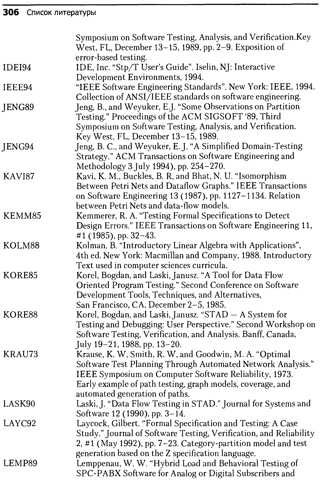

Trunk Lines.” Sixth International Conference on Testing Computer Software, Washington, DC, May 22–25, 1989.

MARC94

Marciniak, John (editor-in-chief). Encyclopedia of Software Engineering. New York: John Wiley & Sons, 1994. The essential reference book that no serious software engineer or aspirant thereto should be without. Any technical term or concept used in this book that you do not know you can probably learn from MARC94. Get the CD-ROM version when it comes out.

MASO90

Mason, T, and Brown, D. Lex and yacc. Sebastapol, CA: O'Reilly and Associates, 1990.

MATT88

Matthews, R. S., Muralidhar, K. H., and Sparks, S. “MAP 2.1 Conformance Testing Tool.” IEEE Transactions on Software Engineering 14, #3 (1988), pp. 363–374.

MCNA60

McNaughton, R., and Yamada, H. “Regular Expressions and State Graphs for Automata.” IRE Transactions on Electronic Computers EC-9 (1960), pp. 39–17. Survey of the theory of regular expressions as applied to finite state automata. Proof of fundamental theorems.

MEAL55

Mealy, G. H. “A Method for Synthesizing Sequential Circuits.” Bell System Technical Journal 34 (1955), pp. 1045–1079.

MILL66

Miller R. E. “Switching Theory”. New York: John Wiley & Sons, 1966. Basic reference on switching and automata theory.

MILL75

Miller, E. E, and Melton, R. A. “Automated Generation of Test Case Data Sets.” International Conference on Reliable Software, Los Angeles, CA, April 1975.

MILL78

Miller, E. E, and Howden, W. E. eds. “Tutorial: Software Testing and Validation Techniques”, 2nd ed. New York: IEEE Computer Society, 1981. A bargain resource for pre-1981 literature; huge bibliography up to and including 1981.

MILL86

Miller, E. F. “Mechanizing Software Testing.” TOCG Meeting, Westlake Village, CA, April 15, 1986. San Francisco: Software Research Associates.

MOLL93

Moller, K. H., and Paulish, D. J. “Software Metrics”. London: Chapman and Hall, 1993. Metrics from an industrial viewpoint.

MOOR56

Moore, E. F. “Gedanken Experiments on Sequential Machines.” In Automata Studies. Annals of Mathematical Studies #34. Princeton, NJ: Princeton University Press, 1956.

MORE90

Morell, Larry J. “A Theory of Fault-Based Testing.” IEEE Transactions on Software Engineering 16, #8 (August 1990), pp. 844–857.

MURA89

Murata, T. “Petri Nets: Properties, Analysis And Applications.” Proceedings of the IEEE 77, #4 (1989), pp. 541–580. In-depth tutorial, huge bibliography.

MUSA90

Musa, John D., Iannino, Anthony, and Okumoto, Kazuuira. “Software Reliability: Professional Edition”. New York: McGraw-Hill, 1990.

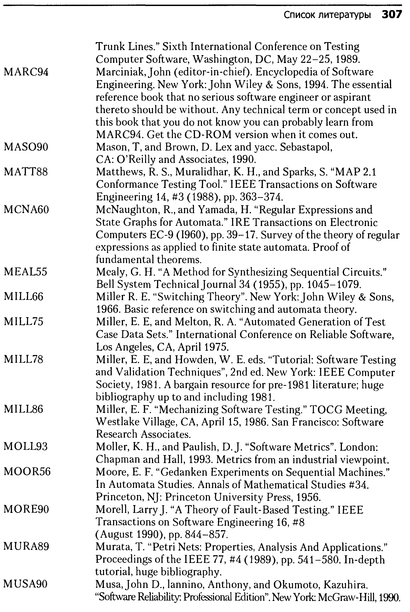

MYER79 | Myers, G. J. The Art of Software Testing. New York: John Wiley & Sons, 1979. A golden oldie.
---|---|
NAFT72 | Naftaly, S. M., and Cohen, M. C. “Test Data Generators and Debugging Systems... Workable Quality Control.” Data Processing Digest 18 (1972). Survey of automatic test data generation tools.
NOMU87 | Nomura, T. “Use of Software Engineering Tools in Japan.” Ninth International Conference on Software Engineering, Monterey, CA, March 30 – April 2, 1987. Survey of 200 Japanese software development groups rates test tools as having the highest productivity return; ahead of a standard process, programming and design tools, and reviews.
NORT94 | Northrup, Linda M. “Object-Oriented Development.” In MARC94, pp. 729–737.
NTAF88 | Ntafos, Simeon C. “A Comparison of Some Structural Testing Strategies.” IEEE Transactions on Software Engineering 14, # 6 (June 1988), pp. 868–874. Excellent survey of structural test techniques.
ONOM87 | Onoma, A. K., Yamura, T, and Kobayashi, Y. “Practical Approaches to Domain Testing: Improvement and Generalization.” Proceedings of the Computer Software and Applications Conference, Tokyo, Japan, October 7–9, 1987, pp. 291–297.
OSTR86 | Ostrand, T. J., Sigal, R., and Weyuker, E. “Design for a Tool to Manage Specification-Based Testing.” Workshop on Software Testing, Banff, Canada, July 15–17, 1986.
OSTR88 | Ostrand, T. J., and Baker, M. J. “The Category-Partition Method for Specifying and Generating Functional Tests.” Communications of the ACM 31, #6 (1988), pp. 676–686.
OSTR91 | Ostrand, Thomas J., and Weyuker, Elaine J. “Data Flow-Based Test Adequacy Analysis for Languages with Pointers.” ACM Sigsoft Symposium on Software Testing, Analysis, and Verification, October 8–10, 1991, Victoria, BC, Canada.
OSTR94 | Ostrand, Thomas J. “Categories of Testing.” In MARC94, pp. 90–93. Overview of different types of testing and where and how used.
PANZ78 | Panzl, D. J. “Automatic Software Test Drivers.” IEEE Computer 11(1978), pp. 44–50.
PATR88 | Patrick, D. P. “Certification of Automated Test Suites with Embedded Software.” National Institute for Software and Productivity Conference, Washington, DC, April 20–22, 1988.
PERE85 | Perera, L. A., and White, L. J. “Selecting Test Data For the Domain Testing Strategy.” Technical report TR–85–5, Department of Computer Science, University of Alberta, Edmonton, Alberta, Canada, 1985.

PERE86 | Perelmuter, I. M. “Directions of Automation in Software Testing.” Third Conference on Testing Computer Software, Washington, DC, September 29 — October 1, 1986.
--- | ---
PETE76 | Peters, L. J., and Tripp, L. L. “Software Design Representation Schemes.” PIB Symposium on Computer Software Reliability, Polytechnic Institute of New York, April 1976. Survey of software models, including HIPO charts, activity charts, structure charts, control graphs, decision tables, flowcharts, transaction diagrams, and others.
PETE81 | Petersen, J. L. “Petri Net Theory and the Modeling of Systems”. Englewood Cliffs, NJ: Prentice-Hall, 1981. Basic text on Petri nets.
PIGO94 | Pigoski, Thomas M. “Maintenance.” In MARC94, pp. 619–636.
POST94 | Poston, Robert M. “Test Generators.” In MARC94, pp. 1327–1330.
POWE82 | Powell, P. B. ed. “Software Validation, Verification, and Testing Techniques and Tool Reference Guide”. National Bureau of Standards Special Publication 500–93, 1982. Survey of testing, verification, validation, tools, and techniques with comments on effectiveness and supporting and resources needed for each.
RAPP82 | Rapps, S., and Weyuker, E. J. “Data Flow Analysis Techniques for Test Data Selection.” Sixth International Conference on Software Engineering, Tokyo, Japan, September 13–16, Long Beach, CA: 1982, pp. 272–278.
RAPP85 | Rapps, S., and Weyuker, E. J. “Selecting Software Test Data Using Data Flow Information.” IEEE Transactions on Software Engineering (1985), pp. 367–375.
RICH81 | Richardson, D. J., and Clarke, L. A. “A Partition Analysis Method to Increase Program Reliability.” Fifth International Conference on Software Engineering, San Diego, CA, March 9–12, 1981. Partition analysis testing; behavioral/structural hybrid based on domain testing.
RICH85 | Richardson, D. J., and Clarke, L. A. “Partition Analysis: A Method Combining Testing and Verification.” IEEE Transactions on Software Engineering 11 (1985), pp. 1477–1490. Early look at behavioral domain testing.
RICH89 | Richardson, Debra J., O’Malley, O. and Tittle, Cindy. “Approaches to Specification-Based Testing.” Proceedings of the ACM SIGSOFT ‘89, Third Symposium on Software Testing, Analysis, and Verification. Key West, FL, December 13–15, New York, NY: 1989, pp. 86–96. Behavioral testing based on formal specification languages, Anna and Larch.
ROPE93 | Roper, Marc, and Rashid, Ab Bin Ab Rahim. “Software Testing Using Analysis and Design Based Techniques.” Journal of Software Testing, Verification, and Reliability 3, #3–4

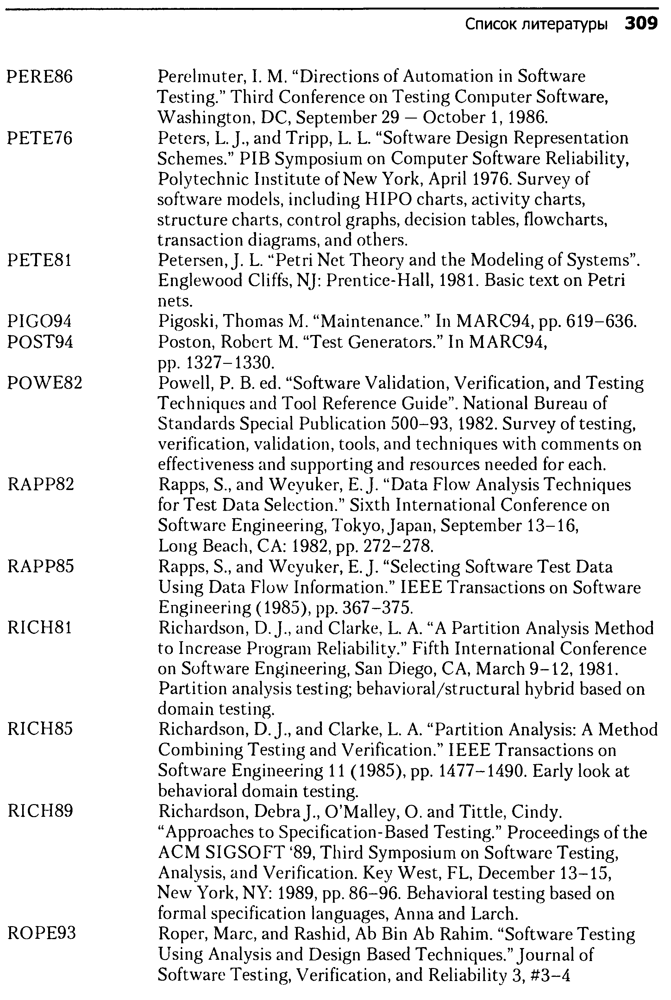

(September–December 1993), pp. 166–179. Behavioral data flow models used as a basis for test design.

ROYC70 | Royce, W. W. "Managing the Development of Large Software Systems." Proceedings IEEE WESCON (August 1970), pp. 1–9.
---|---
RUGG79 | Ruggiero, W., Estrin, G., Fenchel, R., Razouk, R., Schwabe, D., and Vernon, M. "Analysis of Data Flow Models Using the Sara Graph Model of Behavior." Proceedings of the 1979 National Computer Conference. Montvale, NJ: AFIPS Press, 1979. A more elaborate data flow behavioral model than presented here.
SARI87 | Sarikaya, Behcet, Bochmann, Gregor V., and Cerny, Eduard. "A Test Design Methodology for Protocol Testing." IEEE Transactions on Software Engineering, SE-13, #5 (May 1987), pp. 518–531.
SCAC94 | Scachi, Walt. "Process Maturity Models." In MARC94, pp. 851–869.
SCHI69 | Schiller, H. "Using MEMMAP to Measure the Extent of Program Testing." IBM Systems Development Division, Poughkeepsie, NY, Report TR 00.1836, February 10, 1969. Description of the use of an early software statement/branch coverage analyzer.
SCHL70 | Schlender, Paul, J. "Path Analysis Techniques". Memo, IBM System Development Division, Poughkeepsie, NY, April 27, 1970. Early discussion of data flow testing (all definitions); notes (without proof) that branch coverage is included in all definitions
SIDH89 | Sidhu, Deepinder P., and Leung, Tink-Kau. "Formal Methods for Protocol Testing: A Detailed Study." IEEE Transactions on Software Engineering 15, #4 (April 1989), pp. 413–423. Automatic test generation for protocol testing from finite-state model.
SNEE86 | Sneed, H. M. "Data Coverage Measurement in Program Testing." Workshop on Software Testing, Banff, Canada, July 15–17, Washington, DC: 1986, pp. 34–40. Reports experience with use of data-flow coverage metrics; tools, comparison of effectiveness with control-flow coverage.
SOFT88 | Software Research, Inc. "SPECTEST™ Description, METAT-EST™ Description". San Francisco, CA: Author, 1988.
SQET94 | Software Quality Engineering. Tools Guide. Jacksonville, FL: Author, 1994. Periodical tools guide specific to software testing.
STAK89 | Staknis, M.E. "The Use of Software Prototypes in Software Testing." Sixth International Conference on Testing Computer Software, Washington, DC, May 22–25, 1989.
THEV93 | Thevenod-Fosse, Pascale, and Waeselynck, Helene. "STATE-MATE Applied to Statistical Software Testing." Proceedings of the 1993 International Symposium on Software Testing and Analysis. Cambridge, MA, New York, NY: ACM Press, June 28–30, 1993, pp. 99–109.

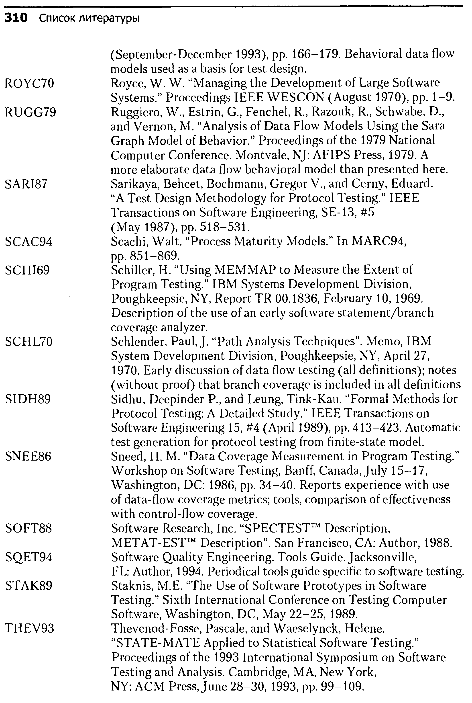

TRIP88 | Tripp, Leonard L. "A Survey of Graphical Notations for Program Design - An Update." ACM SIGSOFT, Software Engineering Notes 13, #4 (October 1988), pp. 39–44. Concise survey.
---|---
TSAI90 | Tsai, W.T, Volovik, Dmitry, and Keefe, Thomas, F. "Automated Test Case Generation for Programs Specified by Relational Algebra Queries." IEEE Transactions on Software Engineering 16, #3 (March 1990), pp. 316–324. Automated test generation based on domain models.
VOGE80 | Voges, U., Gmeiner, L., and von Mayrhauser, A. A. "Sadat - An Automated Test Tool." IEEE Transactions on Software Engineering 6, #3 (May 1980), pp. 286–290.
VOGE93 | Vogel, Peter A. "An Integrated General Purpose Automated Test Environment." Proceedings of the 1993 International Symposium on Software Testing and Analysis. Cambridge, MA, June 28–30, New York, NY: ACM Press, 1993, pp. 61–69.
WALL94 | Wallace, Dolores R. "Verification and Validation." In MARC94, pp.1410–1433.
WARN64 | Wamer, C. D., Jr. "Evaluation of Program Testing". Poughkeepsie, NY: IBM Data Systems Division Development Laboratories, TR 00.1173, July 28, 1964. Earliest known use of a hardware instruction coverage monitor: COBOL and FORTRAN source.
WEIN90 | Weinberg, Gerald M., and Freedman, D.P. "Handbook of Walkthroughs, Inspections and Technical Reviews". New York: Dorset House, 1990.
WEIS81 | Weiser, Mark D. "Program Slicing." Proceedings of the Fifth International Conference on Software Engineering (439–449) March 1981.
WEIS84 | Weiser, Mark D. "Program Slicing." IEEE Transactions on Software Engineering SE-10 (1984), pp. 352–357.
WEIS85 | Weiser, Mark D., Gannon, John D., and McMullin, Paul R. "Comparison of Structural Test Coverage Metrics." IEEE Software (March 1985), 80–85.
WEIS91 | Weiss, Stewart N. and Franki, Phyllis G. "Comparison of All-Uses and All-Edges: Design, Data, and Analysis." Hunter College, New York, Dept. of Computer Science, Technical Report CS–TR 91–04.
WEYU90 | Weyuker, Elaine. J. "The Cost of Data Flow Testing - An Empirical Study." IEEE Transactions on Software Engineering 16 (February 1990).
WEYU94 | Weyuker, Elaine J. "Data Flow Testing". In MARC94, pp. 247–249. Key theoretical concepts and definitions for structural data flow testing.
WHIT78 | White, Lee J., Cohen, E. I., and Chandrasekaran, B. "A Domain Strategy for Computer Program Testing." Columbus, OH: Computer and Information Science Research Center, Ohio State

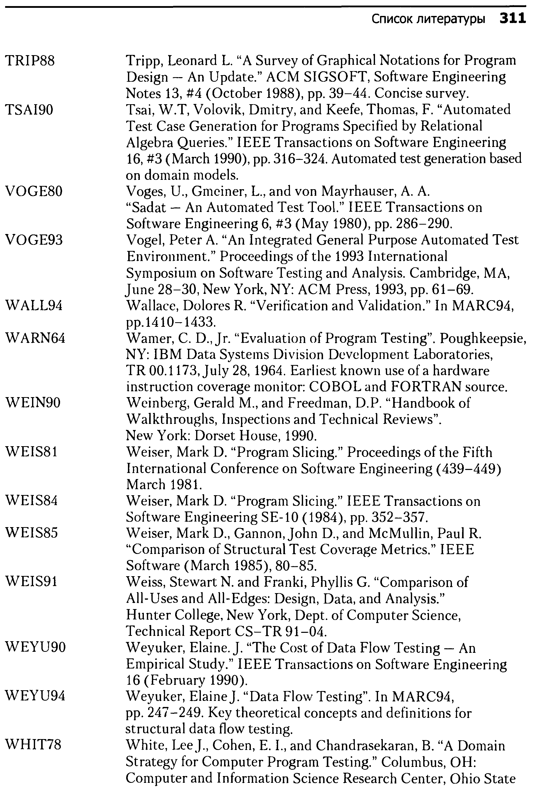

University, Technical Report OSU–CISRC–TR–78–4, August 1978.

WHIT80 | White, Lee J., and Cohen, E. I. “A Domain Strategy for Computer Program Testing.” IEEE Transactions on Software Engineering 6 (1980), pp. 247–257. Use of linear predicates and associated inequalities to establish test cases, boundary choices, etc. Generalization to $n$-dimensional problems.
---|---
WHIT85 | White, Lee J., and Sahay, P. N. “A Computer System for Generating Test Data Using the Domain Strategy.” IEEE SOFTFAIR Conference II, San Francisco, CA, December 2–5, 1985.
WHIT87 | White, Lee J. “Software Testing and Verification.” In Advances in Computers, vol. 26, pp. 335–391. New York: Academic Press, 1987. Superior tutorial and overview of theory.
WHIT94 | White, Lee J., and Leung, Hareton K. N. “Integration Testing.” In MARC94, pp. 573–577.
WHIT95 | White, Lee J. “Consistency and Completeness Checking of Domain Specifications.” 12th International Conference on Testing Computer Software. Washington, DC, June 12–15, 1995.
WILK77 | Wilkens, E. J. “Finite State Techniques in Software Engineering.” (First) Computer Software and Applications Conference, Chicago, IL, November 1977. Application of finite-state machine models to software design.
WING94 | Wing, Jeannette, M. “Formal Methods.” In MARC94, pp. 504–517, p.12.
WILS82 | Wilson, C., and Osterweill, L. J. “A Data Flow Analysis Tool for the C Programming Language.” Sixth Computer Software and Applications Conference, Chicago, IL, November 8–12, 1982.
YERH80 | Yeh, R. T, and Zave, P. “Specifying Software Requirements.” IEEE Proceedings 68 (1980), pp. 1077–1085. Examines specifications as a source of program bugs and suggests methodology for specification design.
YOSH87 | Yoshizawa, Y., Kubo T, Satoh, T, Totsuka, K., Haraguchi, M., and Moriyama, H. “Test and Debugging Environment for Large Scale Operating Systems.” Eleventh International Computer Software and Applications Conference, Tokyo, Japan, October 7–9, 1987.
ZEIL83 | Zeil, S. J. “Testing for Perturbations of Program Statements.” IEEE Transactions on Software Engineering SE-9, 3 (May 1983), pp. 335–346.
ZEIL89 | Zeil, S. J. “Perturbation Techniques for Detecting Domain Errors.” IEEE Transactions on Software Engineering 15, 8 (June 1989), pp. 737–746.
ZUSE90 | Zuse, Horst. “Software Complexity. Measures and Methods”. New York: Walter de Gruyter, 1990. Encyclopedic book on metrics.

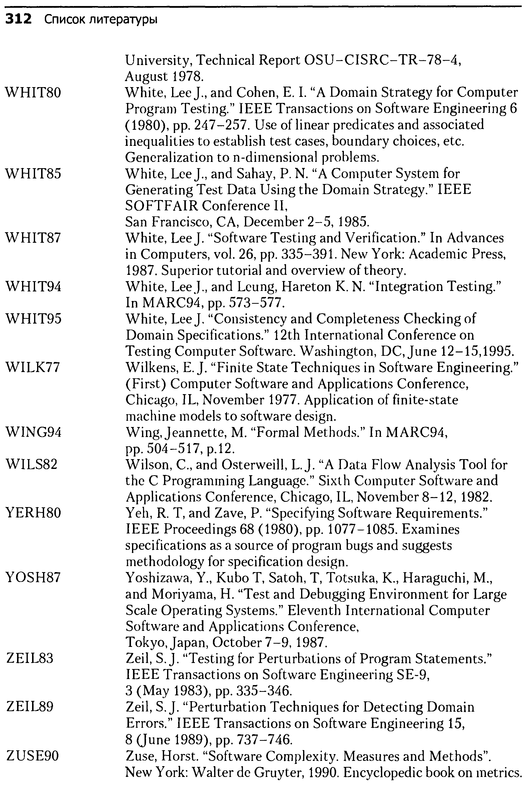

ZUSE94 | Zuse, Horst. "Complexity Metrics/Analysis." In MARC94, pp. 131–165. Excellent survey of the theory and practice of software metrics.
---|---
ZWEB92 | Zweben, Stuart H., Heym, Wayne D., and Kimmich, J. "Systematic Testing of Data Abstractions Based on Software Specifications." Journal of Software Testing, Verification, and Reliability 1, #4 (January-March, 1992), pp. 39–55. Use of control-flow and data-flow models based on specifications and application of analogous structural test techniques. Experimental results shows relative technique strengths and effectiveness similar to that obtained for structural testing.

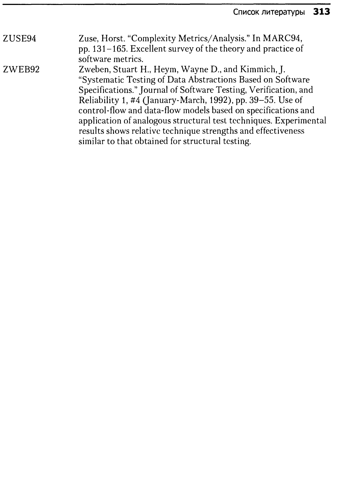

# Алфавитный указатель

## **А**

Активизация, 83  
Алфавит, 211  
Анализ, 42  
Анализ требований, 37  

## **Б**

БНФ, 215  

## **В**

Валидация, 28  
Вариант, 28  
Ввод, 27  
Веса связей, 187, 218, 242  
Веса узлов, 187  
Вес связи, 46, 155  
Вес узла, 45  
Вложенные циклы, 99  
Внешняя точка, 182  
Внутренняя точка, 182  
Входная переменная, 179  
Входное кодирование, 238  
Входное пространство, 180  
Входное событие, 238  
Входной узел, 48, 115  
Входной вектор, 180  
Входные символы, 238  
Входящая связь, 48  
Вырожденная граница, 182  
Вырожденный домен, 182  
Выходная переменная, 180  
Выходное пространство, 180  
Выходное событие, 239  
Выходной вектор, 180  
Выходной узел, 49  

## **Г**

Гибридный тест, 34  
Гиперплоскость, 181  
Голова строки, 214  
Грамматический разбор, 213  
Граница домена, 180  
Граничное множество домена, 180  
Граничное неравенство, 180  
Граничное уравнение, 180  
Граф, 44, 47  
Граф потока данных, 118  
Грязный тест, 32  

## **Д**

Два прохода, 105  
Детерминированный цикл, 98  
Длина пути, 50  
Домен, 180  
Дорожная карта процесса, 41  
Доступное состояние, 240  

## **З**

Завершающий узел, 153  
Задача, 153  
Законченная граница, 183  
Закрытые границы, 181  
Закрытый домен, 181  
Запоминающий узел, 115  
Значение связи, 117  

## **И**

Изолированные состояния, 240  
Или, 214  
Имя пути, 49  
Имя связи, 46  
Имя узла, 45  
Имя строки, 212  
Инструменты, 39  

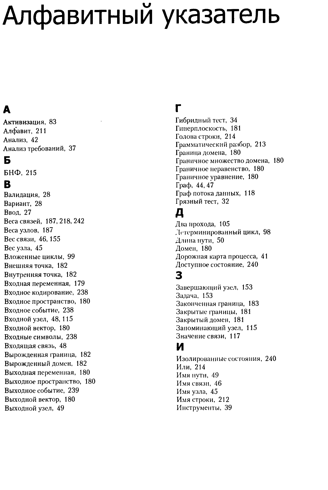

Интеграция, 30, 43
Интерпретация команды, 213
Интерпретация предиката, 85
Интерпретация предикатов, 190
Интерфейс, 29
Искаженность, 28
Использование, 115
Использование в предикате, 115
Использование для вычислений, 114
Исходящая связь, 48
Итог, 27

## К

Ключевое слово, 213
Кодирование выхода, 239
Код состояния, 238
Количественные измерения, 41
Команда, 212
Командно-управляемое ПО, 212
Командный язык, 212
Комплементарные сегменты пути, 65
Компонент, 29
Конечное состояние, 27
Конечный автомат, 239
Конкатенация, 214
Константы, 115
Контрольная запись транзакции, 153
Контроль конфигурации, 41
Коррелированные предикаты, 65
Критерии завершенности, 42
Критерии соответствия, 28
Критерии соответствия требованиям, 42
Критерии всех использований, 141
Критерий готовности, 42
Критические тестовые значения, 105

## Л

Лексическая эквивалентность, 213
Лексический анализ, 214
Линейное неравенство, 183
Линейно зависимый, 183
Линейно независимые точки, 183
Линейно независимый, 183
Линейный домен, 183
Логический предикат, 64
Логический оператор, 114
Логическое И, 64
Логическое ИЛИ, 64
Логическое НЕ, 64

## М

Максимум, 105
Маркер транзакции, 153
Маркировка, 156
Марковский граф, 155
Марковский узел, 155
Металингвистические символы, 212

Метасимволы, 212
Методы тестирования, 33
Метрики, 41
Множественная обработка, 158
Модели Мили, 245
Модели Мура, 245
Модули, 30
Модуль, 29

## Н

Наблюдаемый, 27
Набор выходных состояний, 241
Набор начальных состояний, 240
Набор строк, 212
Направленная связь, 46
Направленный граф, 47
Начальное состояние, 27, 238
Негативный тест, 32
Недетерминированный цикл, 98
Недоступное состояние, 240
Независимые предикаты, 65
Незаконченная граница, 184
Нелинейный домен, 183
Ненаправленная связь, 47
Ненаправленный граф, 48
Необходимые циклы, 129
Необязательное поле, 216
Неопределенность доменов, 192
Непоследовательное закрытие, 184
Непроходимый путь, 49
Нециклический путь, 50
Нулевой набор, 214
Нуль, 212

## О

Обезглавливание, 215
Область, 180
Обрабатывающий узел, 116
Обход, 105
Обход из начального состояния, 241
Объединение, 215
Объект, 27, 51, 52, 65, 155, 186
Одиночный произвольный символ, 216
Один проход, 105
Окружение, 31
Операнд, 213
Оператор, 213
Операторы ветвления, 52
Оператор «звезда», 215
Определение БНФ, 215
Определение объекта, 114
Опровергаемый, 27
Оракул, 27
Ответственность, 42
Открытые границы, 181
Открытый домен, 181

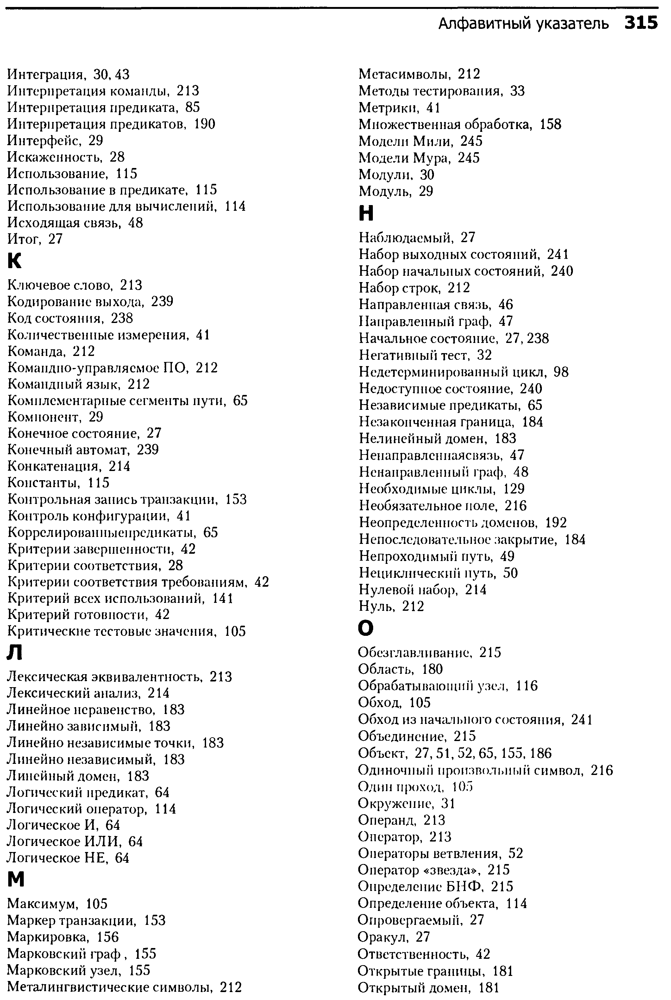

Отношение, 45, 51, 52, 66, 155, 186, 218
- несимметричное, 53
- рефлексивное, 54
- симметричное, 53
- транзитивное, 52
Отношение эквивалентности, 55
Очередь, 156
- многосерверная, 158
- односерверная, 158
Очередь по приоритету, 158
Ошибка, 28
- Ошибка безопасности, 30
- Ошибка интеграции, 30, 35
- Ошибка компонента, 30
- Ошибка модуля, 29, 35
- Ошибка потери ресурсов, 30
- Ошибка производительности, 30

## П

Пакет, 158
Параллельные связи, 46
Перегрузка, 114
Переменная управления циклом, 98
Переход в себя, 239
Переходы, 239
Плюс в показателе, 215
Поведенческое тестирование, 12
Подграф, 132
Подпрограммы, 30
Подсистемы, 30
Подстрока, 215
Подтест, 27
Позитивный тест, 32
Показатель степени, 214
Покрытие ввода/вывода, 134
Покрытие связей, 188
Покрытие узлов, 187
Полностью определенный автомат, 241
Порожденный подграф, 133
Порожденный подграф потока данных, 133
Последовательное закрытие, 184
Правило FIFO, 157
Правило LIFO, 157
Предикат ветвления, 153
Предикат выбора, 64
Предикат управления циклом, 98
Предикат выбора данных, 117
Проверка связей, 59
Проверка узлов, 59
Проверка соответствия, 28
Проверка соответствия проекта, 42
Программирование, 42
Программы, 30
Проектирование, 38, 42
Проектирование теста, 27
Произвольная последовательность символов, 216
Прослеживаемость требований, 41
Протестирован, 29
Противоречивость доменов, 192
Проходимый путь, 49
Пустой выход, 240
Пустой символ, 212
Путь, 49
Путь вход — выход, 49

## Р

Рабочее состояние, 241
Разделитель, 213

## С

Самотестирование, 38
Сброс, 240
Свободен от ошибок, 29
Свойства, 52
Связи, 51, 52, 242
Связь, 45
Сегмент пути, 49
Сегмент границы, 184
Семантический анализ, 213
Сильно связанные состояния, 240
Символ пробела, 212
Симптом, 28
Синтаксис, 212
Синтаксический анализ, 213
Системная ошибка, 30
Системное тестирование, 35
Системы программного обеспечения, 30
Слепота, 29
Случайная корректность, 29
Случайное обслуживание, 158
Смежные домены, 182
Соединительный узел, 67
Создание прототипа, 37
Составной предикат, 65
Состояние, 27, 237
Состояние транзакции, 153
Спецификация, 28
Сравнение итогов, 28
Стартовый узел, 153
Стратегические тонкости, 42
Стратегия тестирования, 33
Строка, 212
Строковое поле, 213
Структурный тест, 33
Сценарий теста, 28
Счетчик состояний, 238

## T

Текущее состояние, 238
Тест, 27
Тестирование, 27, 43

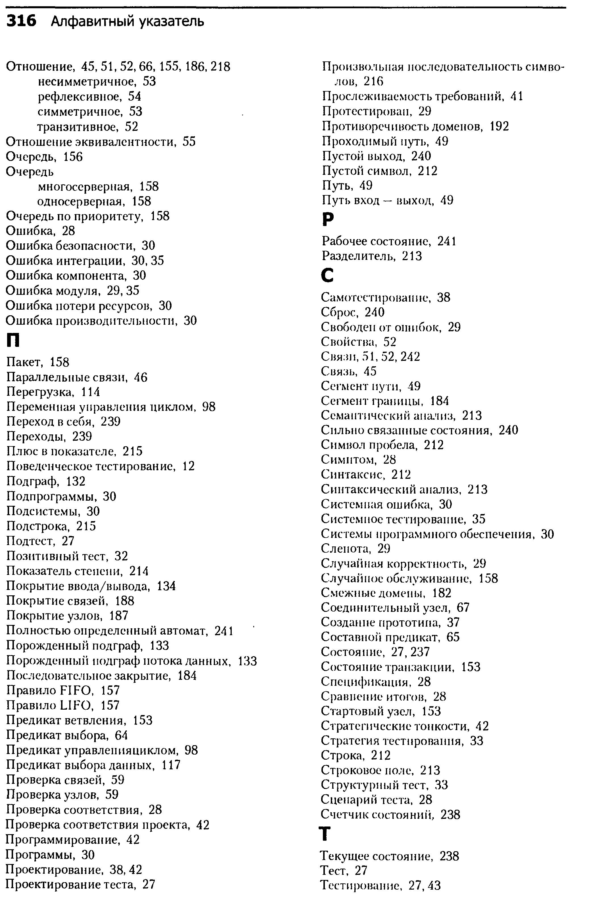

Тестирование интеграции, 29
Тестирование компонента, 30
Тестирование модуля, 29
Тестирование системы, 30
Тестовый комплект, 27
Типичное число проходов, 105
Тип транзакции, 153
Тире, 212
Транзакция, 153
Требования, 27, 41

## У

Ужасные циклы, 103
Узел, 45, 218, 242
Узел ветвления, 48, 153
Узел входа в цикл, 98
Узел выбора, 66
Узел выхода из цикла, 98
Узел поглощения, 154
Узел порождения, 154
Узел расщепления, 154
Узел слияния, 154
Узел соединения, 154
Узел с предикатом, 66
Узел управления циклом, 98
Узел выбора данных, 117
Узел вывода, 115
Узловая точка, 181
Укорачивание, 215

Управление процессом, 41
Управляющая входящая связь, 117, 153

## Ф

Формальное инспектирование, 38
Формальный анализ, 37
Форма Бэкуса-Наура, 215
Функциональное тестирование, 12
Функциональные клавиши, 243

## Х

Характеристика, 28
Хвост строки, 214

## Ц

Цикл, 50, 60, 98
Цикл со смешанной проверкой, 99
Цикл с постусловием, 99
Цикл с предусловием, 98

## Ч

Частичное покрытие узлов, 135
Число повторений цикла, 98
Число входных символов, 238
Число состояний, 239
Чистый тест, 32

## Э

Эпсилон-окрестность, 182

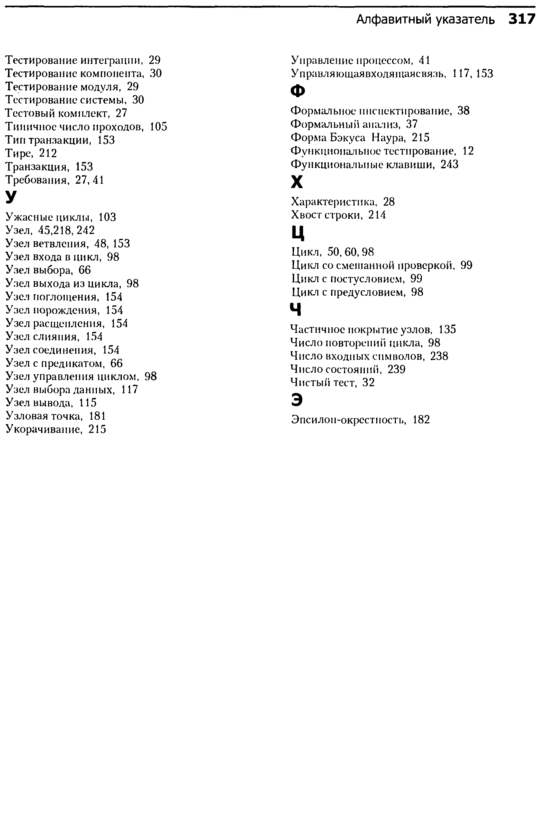

Борис Бейзер
Тестирование черного ящика.
Технологии функционального тестирования
программного обеспечения и систем

*Перевел с английского А. Раздобарин*

Главный редактор — *Е. Строганова*  
Заведующий редакцией — *И. Корнеев*  
Руководитель проекта — *А. Крузенштерн*  
Научный редактор — *С. Орлов*  
Литературный редактор — *И. Шапошников*  
Иллюстрации — *М. Шендерова*  
Художник — *Н. Биржаков*  
Корректоры — *Д. Стукалин, А. Моносов*  
Верстка — *К. Кузьминский*

---

Лицензия ИД № 05784 от 07.09.01.  
Подписано к печати 19.06.04. Формат $70 \times 100/16$. Усл. п. л. 25,8.  
Тираж 3000. Заказ 770  
ООО «Питер Принт», 196105, Санкт-Петербург, ул. Благодатная, д. 67в.  
Налоговая льгота — общероссийский классификатор продукции ОК 005-93, том 2; 95 3005 — литература учебн

Отпечатано с готовых диапозитивов в ОАО «Техническая книга»  
190005, Санкт-Петербург, Измайловский пр., 29

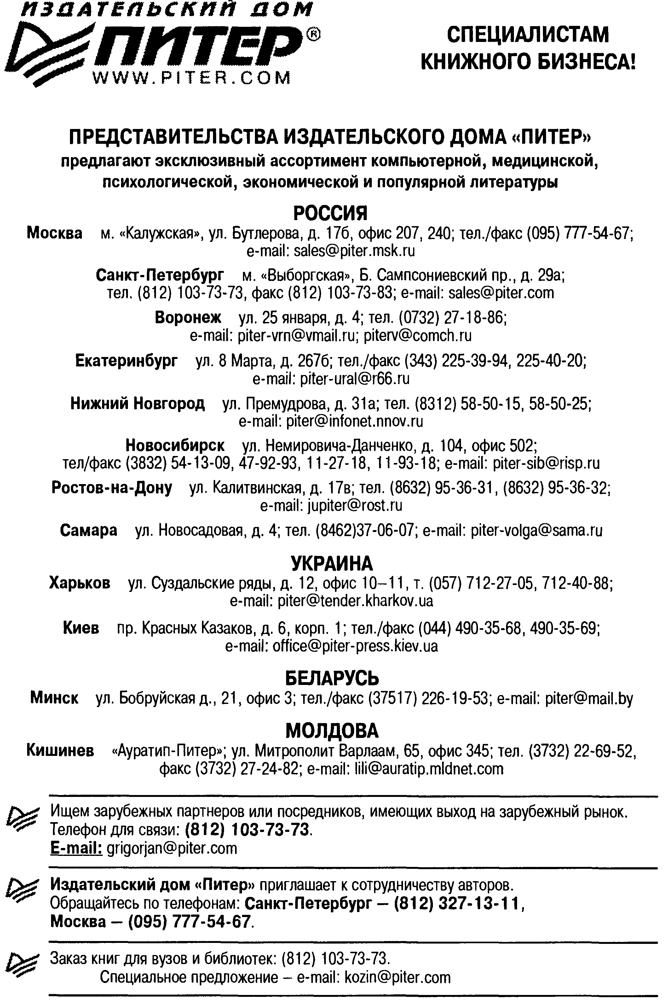


<!-- ВІДНОВЛЕНО ЛОКАЛЬНО (Стор. 321) -->

<!-- КІНЕЦЬ ВІДНОВЛЕННЯ -->


