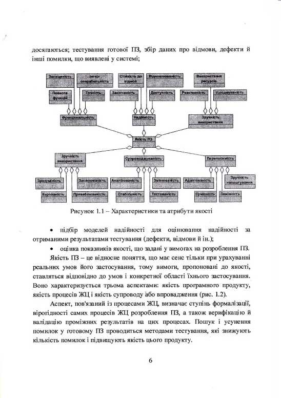
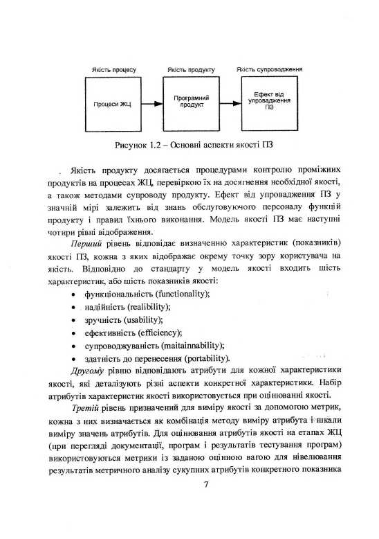
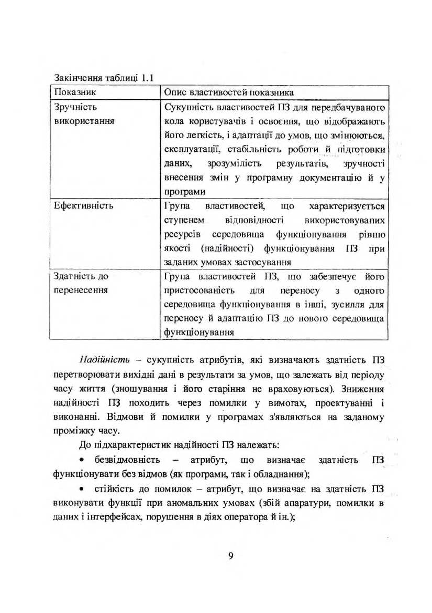
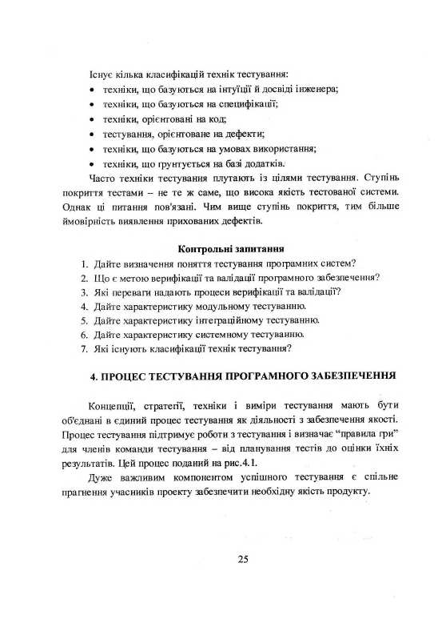
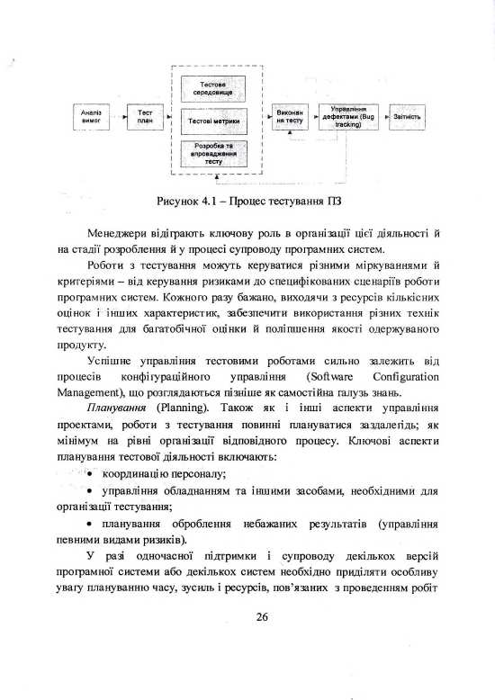

# Osnovi_informatsionno-upravlyayushchih_sistem__upravleniya_proektami.pdf

МІНІСТЕРСТВО ОСВІТИ І НАУКИ УКРАЇНИ

НАЦІОНАЛЬНИЙ ТЕХНІЧНИЙ УНІВЕРСИТЕТ  
«Харківський політехнічний інститут»

МЕТОДИЧНІ ВКАЗІВКИ  
для самостійної роботи з курсу  
«Основи інформаційно-керуючих систем  
управління проектами»  
для студентів спеціальності 6.050101 «Комп'ютерні науки»

Затверджено  
редакційно-видавничою  
радою  
університету,  
протокол № 1 від 20.06.12.

Харків  
НТУ «ХПІ»  
2013

Методичні вказівки для самостійної роботи з курсу «Основи інформаційно-керуючих систем управління проектами» для студентів спеціальності 6.050101 «Комп'ютерні науки» / уклад.: Чередніченко О.Ю., Гринченко М.А., Яковлєва О.В. – Х.: НТУ «ХПІ», 2013. – 44 с.

Укладачі: О. Ю. Чередніченко  
М. А. Гринченко  
О. В. Яковлєва  

Рецензент Т. М. Єфременко  

Кафедра стратегічного управління

<!-- ВІДНОВЛЕНО ЛОКАЛЬНО (Стор. 3) -->

<!-- КІНЕЦЬ ВІДНОВЛЕННЯ -->

його дефекти. Недостатня якість програмного забезпечення інформаційно-керуючих систем, як правило, є наслідком недостатньої якості процесів розробки, тестування та верифікації.

Відповідно до міжнародної практики створення якісної програмної продукції забезпечується на основі комплексного підходу впродовж всього її життєвого циклу. Якість програмної продукції забезпечується системою менеджменту якості і рівнем якості процесів життєвого циклу (ЖЦ) програмних засобів згідно з вимогами міжнародних і національних стандартів.

Верифікація і тестування систем є найважливішими задачами, вирішення яких визначає якість програмного забезпечення. Якість програмного забезпечення визначається якістю методів та інструментальних засобів, які застосовувались для забезпечення всього їх життєвого циклу. На практиці важливо оцінювати якість програм не лише в завершеному вигляді, але й в процесі їх проектування і розробки.

Для оцінювання та поліпшення якості програмного забезпечення на кожному етапі життєвого циклу розроблення програмного продукту проводиться тестування. Тестування програмних систем складається з динамічної верифікації поводження програм на кінцевому наборі тестів, і валідації, що забезпечує перевірку очікуваного поводження системи.

За останні роки технології створення програмного забезпечення стали основою різних розділів комп'ютерних наук як засіб подолання складності, що притаманна сучасним програмним системам. Тому дисципліна «Основи інформаційно-керуючих систем управління проектами» входить до циклу професійної та практичної підготовки як невід'ємна складова освіти студентів за спеціальністю 6.050101 «Комп'ютерні науки».

*Мета* даного видання — допомогти студентам оволодіти теоретичними знаннями та практичними навичками роботи з управлінням якістю програмного забезпечення на етапах життєвого циклу.

**1. ЯКІСТЬ ПРОГРАМНОГО ЗАБЕЗПЕЧЕННЯ, МОДЕЛЬ ЯКОСТІ**

Поняття якості програмного забезпечення (ПЗ) включає різні характеристики. Кожна модель відображення якості ПЗ включає різне число рівнів ієрархії та характеристик якості. Різні автори створили різні моделі якості зі своїм набором характеристик та атрибутів. Ці моделі є корисними для планування та оцінювання якості програмних продуктів.

ISO/IEC визначає три пов'язані моделі якості ПЗ (ISO 9126-01 Software Engineering - Product Quality, Part 1: Quality Model) – внутрішня якість, зовнішня якість та якість у процесі експлуатації, а також набір відповідних робіт з оцінювання якості ПЗ (ISO14598-98 Software Product Evaluation).

Міжнародний стандарт ISO 9126 визначає оцінні характеристики якості ПЗ. Він поділяється на чотири частини, що описують наступні питання: модель якості; зовнішні метрики якості; внутрішні метрики якості; метрики якості у використанні. Згідно з цим стандартом модель якості класифікує якість ПЗ у шести структурних наборах характеристик, що мають свої атрибути (рис. 1.1).

Якість ПЗ є предметом стандартизації. Стандарт ГОСТ 2844-94 дає визначення якості ПЗ як сукупності властивостей (показників якості) ПЗ, що забезпечують його здатність задовольняти потреби замовника відповідно до призначення. Цей стандарт регламентує базову модель якості і показники, головним серед яких є надійність. Стандарт ISO/IEC 12207 визначив не тільки основні процеси ЖЦ розроблення ПЗ, але та організаційні та додаткові процеси, які регламентують інженерію, планування і керування якістю ПЗ.

Відповідно до стандарту на етапах ЖЦ має проводитися контроль якості ПЗ:

* перевірка відповідності вимог проектованому продукту і критеріїв їхнього досягнення;
* верифікація й атестація (валідація) проміжних результатів ПЗ на етапах ЖЦ і вимір ступеня задоволення окремих показників, що

досягаються; тестування готової ПЗ, збір даних про відмови, дефекти й інші помилки, що виявлені у системі;

Рисунок 1.1 – Характеристики та атрибути якості

* підбір моделей надійності для оцінювання надійності за отриманими результатами тестування (дефекти, відмови й ін.);
* оцінка показників якості, що задані у вимогах на розроблення ПЗ.

Якість ПЗ – це відносне поняття, що має сенс тільки при урахуванні реальних умов його застосування, тому вимоги, пропоновані до якості, ставляться відповідно до умов і конкретної області їхнього застосування. Воно характеризується трьома аспектами: якість програмного продукту, якість процесів ЖЦ і якість супроводу або впровадження (рис. 1.2).

Аспект, пов'язаний із процесами ЖЦ, визначає ступінь формалізації, вірогідності самих процесів ЖЦ розроблення ПЗ, а також верифікацію й валідацію проміжних результатів на цих процесах. Пошук і усунення помилок у готовому ПЗ проводиться методами тестування, які знижують кількість помилок і підвищують якість цього продукту.

Рисунок 1.2 — Основні аспекти якості ПЗ

Якість продукту досягається процедурами контролю проміжних продуктів на процесах ЖЦ, перевіркою їх на досягнення необхідної якості, а також методами супроводу продукту. Ефект від упровадження ПЗ у значній мірі залежить від знань обслуговуючого персоналу функцій продукту і правил їхнього виконання. Модель якості ПЗ має наступні чотири рівні відображення.

*Перший рівень* відповідає визначенню характеристик (показників) якості ПЗ, кожна з яких відображає окрему точку зору користувача на якість. Відповідно до стандарту у модель якості входить шість характеристик, або шість показників якості:

* функціональність (functionality);
* надійність (realibility);
* зручність (usability);
* ефективність (efficiency);
* супроводжуваність (maitainnability);
* здатність до перенесення (portability).

*Другому рівню* відповідають атрибути для кожної характеристики якості, які деталізують різні аспекти конкретної характеристики. Набір атрибутів характеристик якості використовується при оцінюванні якості.

*Третій рівень* призначений для виміру якості за допомогою метрик, кожна з них визначається як комбінація методу виміру атрибута і шкали виміру значень атрибутів. Для оцінювання атрибутів якості на етапах ЖЦ (при перегляді документації, програм і результатів тестування програм) використовуються метрики із заданою оцінною вагою для нівелювання результатів метричного аналізу сукупних атрибутів конкретного показника.

і якості в цілому. Атрибут якості визначається за допомогою однієї або декількох методик оцінювання на етапах ЖЦ і на завершальному етапі розроблення ПЗ.

*Четвертий рівень* — це оцінний елемент метрики (вага), що використовується для оцінювання кількісного або якісного значення окремого атрибута показника ПЗ. Залежно від призначення, особливостей і умов супроводу ПЗ вибираються найбільш важливі характеристики якості і їхні атрибути.

Обрані атрибути і їхні пріоритети відображаються у вимогах на розроблення систем або використовуються відповідні пріоритети еталона класу ПЗ, до якого це ПЗ належить. Стислий опис семантики характеристик моделі якості наведений в табл. 1.1.

*Функціональність* — сукупність властивостей, що визначають здатність ПЗ виконувати перелік функцій у заданому середовищі і згідно з вимогами до оброблення і загальносистемних засобів. Під функцією розуміється деяка впорядкована послідовність дій для задоволення споживчих властивостей. Функції бувають цільові (основні) і допоміжні.

Таблиця 1.1 – Стисла характеристика показників якості

| Показник | Опис властивостей показника |
| :--- | :--- |
| Функціональність | Група властивостей ПЗ, що обумовлює його здатність виконувати визначений перелік функцій, які задовольняють потреби відповідно до призначення |
| Надійність | Група властивостей, що обумовлює здатність ПЗ зберігати працездатність і перетворювати вихідні дані в результат за встановлений період часу, характер відмов якого є наслідком внутрішніх дефектів і умов його застосування |
| Супроводжуваність | Група властивостей, що визначає зусилля, необхідні для виконання, пристосованість до діагностики відмов і наслідків внесення змін, модифікації й атестації модифікованого ПЗ |

Закінчення таблиці 1.1
| Показник | Опис властивостей показника |
| :--- | :--- |
| Зручність використання | Сукупність властивостей ПЗ для передбачуваного кола користувачів і освоєння, що відображають його легкість, і адаптації до умов, що змінюються, експлуатації, стабільність роботи й підготовки даних, зрозумілість результатів, зручності внесення змін у програмну документацію й у програми |
| Ефективність | Група властивостей, що характеризується ступенем відповідності використовуваних ресурсів середовища функціонування рівню якості (надійності) функціонування ПЗ при заданих умовах застосування |
| Здатність до перенесення | Група властивостей ПЗ, що забезпечує його пристосованість для переносу з одного середовища функціонування в інші, зусилля для переносу й адаптацію ПЗ до нового середовища функціонування |

Надійність — сукупність атрибутів, які визначають здатність ПЗ перетворювати вихідні дані в результати за умов, що залежать від періоду часу життя (зношування і його старіння не враховуються). Зниження надійності ПЗ походить через помилки у вимогах, проектуванні і виконанні. Відмови й помилки у програмах з'являються на заданому проміжку часу.

До підхарактеристик надійності ПЗ належать:
* безвідмовність — атрибут, що визначає здатність ПЗ функціонувати без відмов (як програми, так і обладнання);
* стійкість до помилок — атрибут, що визначає на здатність ПЗ виконувати функції при аномальних умовах (збій апаратури, помилки в даних і інтерфейсах, порушення в діях оператора й ін.).

* відновлюваність — атрибут, що визначає здібність програми до перезапуску для повторного виконання і відновлення даних після відмов.

До деяких типів систем (реального часу, радарних, систем безпеки, комунікація й ін.) ставляться вимоги щодо забезпечення високої надійності (неприпустимість помилок, точність, вірогідність, зручність застосування й ін.). Таким чином, надійність ПЗ у значній мірі залежить від числа тих, що залишилися, й не усунутих помилок у процесі розроблення на етапах ЖЦ. У ході експлуатації помилки виявляються й усуваються.

Якщо при виправленні помилок не вносяться нові або, принаймні, нових помилок вноситься менше, ніж усувається, то в ході експлуатації надійність ПЗ безупинно зростає. Чим інтенсивніше проводиться експлуатація, тим інтенсивніше виявляються помилки й швидше зростає надійність ПЗ.

До факторів, що впливають на надійність ПЗ, відносять:
* сукупність загроз, що призводять до несприятливих наслідків і до збитку системи або середовища її функціонування;
* загрозу як прояв порушення безпеки системи;
* цілісність як здатність системи зберігати стійкість роботи та не мати ризику.

Виявлені помилки можуть бути результатом загрози ззовні або відмов, вони підвищують ризик і зменшують деякі властивості надійності системи.

*Надійність* — одна із ключових проблем сучасних програмних систем, і її роль буде постійно зростати, оскільки постійно підвищуються вимоги до якості комп'ютерних систем. Новий напрямок — інженерія програмної надійності (Software reliability engineering) — орієнтовано на кількісне вивчення операційного поводження компонентів системи стосовно користувача, що очікує надійну роботу системи, і включає:
* вимірювання надійності, тобто проведення її кількісного оцінювання за допомогою пророкувань, збору даних про поведінку системи у процесі експлуатації й сучасних моделей надійності;
* стратегії і метрики конструювання та вибору готових компонентів, процес розроблена компонентної системи а також середовище

функціонування, що впливає на надійність роботи системи;
- застосування сучасних методів інспектування, верифікації, валідації та тестування при розробленні систем, а також при експлуатації.

Верифікація застосовується для визначення відповідності готового ПЗ установленим специфікаціям, а валідація — для встановлення відповідності системи вимогам користувача, які були пред'явлені замовником.

В інженерії надійності термін *dependability* (достовiрність) позначає здатність системи мати властивості, бажані для користувача, що впевнений у якісному виконанні функцій ПЗ, заданих у вимогах. Даний термін визначається додатковою кількістю атрибутів, яким має володіти система, а саме:
- готовністю до використання (*availability*);
- готовністю до безперервного функціонування (*reliability*);
- безпекою для навколишнього середовища, тобто здатністю системи не викликати катастрофічних наслідків у випадку відмови (*safety*);
- таємністю і схоронністю інформації (*confidential*);
- здатністю до збереження системи й стійкості до мимовільної її зміни (*integrity*);
- здатністю до експлуатації ПЗ, простотою виконання операцій обслуговування, а також усунення помилок, відновлення системи після їхнього усунення і т.п. (*maintainability*);
- готовністю і схоронністю інформації (*security*) і ін.

Досягнення надійності системи забезпечується запобіганням відмови (*fault prevention*), його усуненням (*removal fault*), а також оцінюванням можливості появи нових відмов і заходів боротьби з ними із застосуванням методів теорії імовірності.

Кожний програмний компонент, його операції і дані обробляються в дискретні моменти часу, наприклад, $\delta, 2\delta, ..., n\delta$. Нехай за час $T$ після першого невдало обробленого компонента системи з'явилася відмова, $q_s$ — імовірність цієї невдачі, тоді $P\{T > n\delta\} = (1 - q_s)^n$ і середній час очікування $T = \frac{\delta}{q_s}$.

Покладемо, що момент часу $\delta$ убуває, а час залишається фіксованим, тоді маємо $P\{T>t\}=\left(1-\frac{\delta}{T}\right)^{\frac{t}{\delta}}=e^{-\frac{t}{T}}$, час до відмови в цьому випадку — безперервна величина $\ldots$, розподілена експоненційно з параметром $T, \dots, \frac{1}{T}$.

Таким чином, оцінення надійності ПЗ — це трудомісткий процес, що вимагає створення усталеної роботи системи стосовно відмов ПЗ, тобто ймовірності того, що система відновиться мимовільно в деякій точці після виникнення в ній відмови (fault).

Зручність використання характеризується безліччю атрибутів, які показують на необхідні і придатні умови використання (діалогове або не діалогове) ПЗ заданим колом користувачів для одержання відповідних результатів. У стандарті зручність використання визначена як специфічна безліч атрибутів програмного продукту, що характеризують його ергономічність.

До підхарактеристик зручності використання належать:
- зрозумілість — атрибут, що визначає зусилля, які затрачуються на розпізнавання логічних концепцій і умов застосування ПЗ;
- легкість вивчення — атрибут, що визначає зусилля користувачів на визначення застосовності ПЗ шляхом використання операційного контролю, діагностики, а також процедур, правил і документації;
- оперативність — атрибут, що вказує на реакцію системи при виконанні операцій і операційного контролю;
- узгодженість — атрибут, що показує відповідність розробки вимогам стандартів, угод, правил, законів і приписань.

*Ефективність* — набір атрибутів, які визначають взаємозв'язок рівнів виконання ПЗ, використання ресурсів (засобу, апаратури, матеріалів — папір для друкувального пристрою й ін.) і послуг, виконуваних штатним обслуговуючим персоналом і т.ін.

До підхарактеристик ефективності ПЗ відносять:
- реактивність — атрибут, що показує час відгуку, оброблення і виконання функцій;

* ефективність ресурсів – атрибут, що показує кількість і тривалість використовуваних ресурсів при виконанні функцій ПЗ;
* погодженість – атрибут, що показує відповідність даного атрибута до заданих стандартів, правил і приписань.

*Супроводжуваність* – множина властивостей, що вказують на зусилля, які треба затратити на проведення модифікацій, що включають корегування, удосконалення й адаптацію ПЗ при зміні середовища, вимог або функціональних специфікацій.

Супроводжуваність включає підхарактеристики:
* аналізованість – атрибут, що визначає необхідні зусилля для діагностики відмов або ідентифікації частин, які будуть модифікуватися;
* змінюваність – атрибут, що визначає видалення помилок у ПЗ або внесення змін для їхнього усунення, а також введення нових можливостей у ПЗ або в середовище функціонування;
* стабільність – атрибут, що вказує на сталість структури і ризик її модифікації;
* тестованість – атрибут, що показує на зусилля при проведенні валідації і верифікації з метою виявлення невідповідностей вимогам, а також на необхідність проведення модифікації ПЗ і сертифікації;
* узгодженість – атрибут, що показує відповідність даного атрибута угодам, правилам і приписанням стандарту.

*Здатність до перенесення* – сукупність показників, що вказують на здатність ПЗ адаптуватися до роботи в нових умовах середовища виконання. Середовище може бути організаційним, апаратним і програмним. Тому перенос ПЗ у нове середовище виконання може бути пов'язаний із сукупністю дій, спрямованих на забезпечення його функціонування в середовищі, відмінному від того, у якому воно створювалося з урахуванням нових програмних, організаційних і технічних можливостей.

Здатність до перенесення включає підхарактеристики:
* адаптивність – атрибут, що визначає зусилля, які затрачуються на адаптацію до різних середовищ;

* зручність налаштування — атрибут, що визначає необхідні зусилля для запуску даного ПЗ у спеціальному середовищі;
* сумісність — атрибут, що визначає можливість використання спеціального ПЗ у середовищі діючої системи;
* замінність — атрибут, що забезпечує можливість інтероперабельності при спільній роботі з іншими програмами з необхідною інсталяцією або адаптацією ПЗ;
* узгодженість — атрибут, що вказує на відповідність стандартам або угодам з забезпечення переносу ПЗ.

**Контрольні запитання**

1. Дайте визначення поняттю моделі якості програмного забезпечення.
2. Якими аспектами характеризується якість ПЗ?
3. Які рівні відображення має модель якості ПЗ?
4. Дайте стислу характеристику показників якості ПЗ.
5. Які атрибути включає характеристика функціональності?
6. Які фактори впливають на надійність ПЗ?
7. Які підхарактеристики зручності використання ПЗ використовуються?
8. Які атрибути включає ефективність ПЗ?
9. Які атрибути включає супроводжуваність ПЗ?
10. Які атрибути включає здатність до перенесення?

### 2. МЕТРИКИ ЯКОСТІ ПРОГРАМНОГО ЗАБЕЗПЕЧЕННЯ

На сьогодні у програмній інженерії ще не сформувалася остаточно система метрик. Діють різні підходи до визначення їхнього набору і методів виміру.

Система виміру включає метрики і моделі вимірів, які використовуються для кількісного оцінювання якості ПЗ.

При визначенні вимог до ПЗ задаються відповідні їм зовнішні характеристики і їхні атрибути (підхарактеристики), що визначають різні

сторони керування продуктом у заданому середовищі. Для набору характеристик якості ПЗ, наведених у вимогах, визначаються відповідні метрики, моделі їхньої оцінки і діапазон значень засобів для виміру окремих атрибутів якості.

Відповідно до стандарту метрики визначаються за моделлю виміру атрибутів ПЗ на всіх етапах ЖЦ (проміжна, внутрішня метрика) і особливо на етапі тестування або функціонування (зовнішні метрики) продукту.

Зупинимося на класифікації метрик ПЗ, правилах для проведення метричного аналізу і процесу їхнього виміру.

Існує три типи метрик:

* метрики програмного продукту, які використовуються при вимірі його характеристик-властивостей;
* метрики процесу, які використовуються при вимірі властивості процесу ЖЦ створення продукту;
* метрики використання.

Метрики програмного продукту включають:

* зовнішні метрики, що позначають властивості продукту, видимі користувачеві;
* внутрішні метрики, що позначають властивості, видимі тільки команді розроблювачів.

Зовнішні метрики продукту — це метрики:

* надійності продукту, які служать для визначення числа дефектів;
* функціональності, за допомогою яких установлюються наявність і правильність реалізації функцій у продукті;
* супроводу, за допомогою яких вимірюються ресурси продукту (швидкість, пам'ять, середовище);
* застосовності продукту, які сприяють визначенню ступеня доступності для вивчення та використання;
* вартості, якими визначається вартість створеного продукту.

Внутрішні метрики продукту включають:

* метрики розміру, необхідні для виміру продукту за допомогою його внутрішніх характеристик;

* метрики складності, необхідні для визначення складності продукту;
* метрики стилю, які служать для визначення підходів і технологій створення окремих компонентів продукту і його документів.

Внутрішні метрики дозволяють визначити продуктивність продукту і є релевантними стосовно зовнішніх метрик.

Зовнішні і внутрішні метрики задаються на етапі формування вимог до ПЗ і є предметом планування та керування досягненням якості кінцевого програмного продукту.

Метрики продукту часто описуються комплексом моделей для установлення різних властивостей, значень моделі якості або прогнозування. Виміри проводяться, як правило, після калібрування метрик на ранніх етапах проекту. Загальна міра – ступінь трасування, що визначається числом трас, які простежуються за допомогою моделей сценаріїв типу UML і оцінюванням кількості:
* вимог;
* сценаріїв і діючих осіб;
* об'єктів, включених у сценарій, і локалізації вимог до кожного сценарію;
* параметрів і операцій об'єкта й ін.

Стандарт ISO/IEC 9126-2 визначає наступні типи мір:
* міра розміру ПЗ у різних одиницях виміру (число функцій, рядків у програмі, розмір дискової пам'яті й ін.);
* міра часу (функціонування системи, виконання компонента й ін.);
* міра зусиль (продуктивність праці, трудомісткість і ін.);
* міра обліку (кількість помилок, число відмов, відповідей системи й ін.).

Спеціальною мірою може служити рівень використання повторних компонентів і виміряється як відношення розміру продукту, виготовленого з готових компонентів, до розміру системи в цілому. Дана міра використовується також при визначенні вартості і якості ПЗ. Приклади метрик:
* загальне число об'єктів і число повторно використовуваних;

* загальне число операцій, повторно використовуваних, і нових операцій;
* число класів, що успадковують специфічні операції;
* число класів, від яких залежить даний клас;
* число користувачів класу або операцій і ін.

При оцінюванні загальної кількості деяких величин часто використовуються середньостатистичні метрики (середнє число операцій у класі, спадкоємців класу або операцій класу й ін.).

Як правило, міри здебільше є суб'єктивними і залежать від знань експертів, що роблять кількісне оцінювання атрибутів компонентів програмного продукту.

Прикладом широко використовуваних зовнішніх метрик програм є метрики Холстеда – це характеристики програм, що виявляються на основі статичної структури програми конкретною мовою програмування: число входжень найбільше, що часто зустрічаються, операндів і операторів; довжина опису програми як сума числа входжень всіх операндів і операторів і ін.

На основі цих атрибутів можна обчислити час програмування, рівень програми (структурованість і якість) і мови програмування (абстракції засобів мови й орієнтація на проблему) і ін.

Метриками процесу можуть бути час розробки, число помилок, знайдених на етапі тестування й ін. Практично використовуються наступні метрики процесу:

* загальний час розробки й окремо – час для кожної стадії;
* час модифікації моделей;
* час виконання робіт на процесі;
* число знайдених помилок при інспектуванні;
* вартість перевірки якості;
* вартість процесу розроблення.

Метрики використання служать для виміру ступеня задоволення потреб користувача при рішенні його завдань. Вони допомагають оцінити не властивості самої програми, а результати її експлуатації – експлуатаційну якість. Прикладом може служити – точність і повнота

реалізації завдань користувача, а також затрачені ресурси (продуктивність і ін.) на ефективне рішення завдань користувача. Оцінювання вимог користувача проводиться за допомогою зовнішніх метрик.

Оцінювання якості ПЗ згідно з чотирьохрівневою моделлю якості починається з нижнього рівня ієрархії, тобто із самої елементарної властивості оцінюваного атрибута показника якості згідно з установленими мірами. На етапі проектування встановлюють значення оцінних елементів для кожного атрибута показника аналізованого ПЗ, включеного у вимоги.

За визначенням стандарту ISO/IES 9126-2 метрика якості ПЗ являє собою "модель виміру атрибута, що зв'язується з показником його якості". При вимірі показників якості даний стандарт дозволяє визначати наступні типи мір:

* міри розміру в різних одиницях виміру (кількість функцій, розмір програми, обсяг ресурсів і ін.);
* міри часу — періоди реального, процесорного або календарного часу (час функціонування системи, час виконання компонента, час використання й ін.);
* міри зусиль — продуктивний час, витрачений на реалізацію проекту (продуктивність праці окремих учасників проекту, колективна трудомісткість і ін.);
* міри інтервалів між подіями, наприклад, час між послідовними відмовами;
* рахункові міри — лічильники для визначення кількості виявлених помилок, структурної складності програми, числа несумісних елементів, числа змін (наприклад, число виявлених відмов і ін.).

Метрики якості використовуються при оцінюванні ступеня тестування за допомогою даних (безвідмовна робота, виконуваність функцій, зручність застосування інтерфейсів користувачів, БД і т.п.) після проведення випробувань ПЗ на безлічі тестів.

Напрацювання на відмову як атрибут надійності визначає середній час між появою загроз, що порушують безпеку, і забезпечує важковимірювану оцінку збитку, що наноситься відповідними загрозами. Дуже часто оцінювання програми проводиться за кількістю рядків. При

зіставленні двох програм, що реалізують одне прикладне завдання, перевага віддається короткій програмі, тому що її створює більш кваліфікований персонал і в ній менше прихованих помилок і її легше модифікувати. За вартістю вона дорожче, хоча часу на налагодження й модифікацію йде більше. Тобто довжину програми можна використовувати як допоміжну властивість для порівняння програм з урахуванням однакової кваліфікації розробників, єдиного стилю розробки і загального середовища.

Якщо у вимогах до ПЗ було зазначено одержати кілька показників, то перелічений після збору даних показник множиться на відповідний вагомий коефіцієнт, а потім підсумовуються всі показники для одержання комплексної оцінки рівня якості ПЗ.

На основі виміру кількісних характеристик і проведення експертизи якісних показників із застосуванням вагомих коефіцієнтів, що нівелюють різні показники, обчислюється підсумкова оцінка якості продукту шляхом підсумовування результатів за окремими показниками і порівняння їх з еталонними показниками ПЗ (вартість, час, ресурси й ін.).

В остаточному підсумку результат оцінювання якості є критерієм ефективності і доцільності застосування методів проектування, інструментальних засобів і методик оцінювання результатів створення програмного продукту на стадіях ЖЦ.

Для визначення оцінки значень показників якості використовується стандарт, у якому подані наступні методи: вимірювальний, реєстраційний, розрахунковий й експертний (а також комбінації цих методів). Вимірювальний метод базується на використанні вимірювальних і спеціальних програмних засобів для одержання інформації про характеристики ПЗ, наприклад, визначення обсягу, числа рядків коду, операторів, кількості галузей у програмі, число точок входу (виходу), реактивність і ін.

Реєстраційний метод використовується при підрахунку часу, числа збоїв або відмов, початку й кінця роботи ЗД у процесі його виконання.

Розрахунковий метод базується на статистичних даних, зібраних при проведенні випробувань, експлуатації й супроводі ПЗ. Розрахунковими

методами оцінюються показники надійності, точності, стійкості, реактивності й ін.

Експертний метод здійснюється групою експертів — фахівців, компетентних у рішенні даного завдання або типу ПЗ. Їхня оцінка базується на досвіді й інтуїції, а не на безпосередніх результатах розрахунків або експериментів. Цей метод проводиться шляхом перегляду програм, кодів, супровідних документів і сприяє якісній оцінці створеного продукту. Для цього встановлюються контрольовані ознаки, які корельовано з одним або декількома показниками якості й включені в опитні карти експертів. Метод застосовується при оцінюванні таких показників як аналізованість, документованість, структурованість ПЗ й ін.

Для оцінювання значень показників якості залежно від особливостей використовуваних ними властивостей, призначення, способів їхнього визначення використовуються:
* шкала метрична (абсолютна, відносна, інтегральна);
* шкала порядкова (рангова), що дозволяє рангувати характеристики шляхом порівняння з опорними;
* класифікаційна шкала, що характеризує наявність або відсутність розглянутої властивості в оцінюваному програмному забезпеченні.

Показники, які обчислюються за допомогою метричних шкал, називаються кількісними, а обумовлені за допомогою порядкових і класифікаційних шкал – якісними.

Атрибути програмної системи, що характеризують її якість, вимірюються з використанням метрик якості. Метрика визначає міру атрибута, тобто змінну, котрій привласнюється значення в результаті виміру. Для правильного використання результатів вимірів кожна міра ідентифікується шкалою вимірів.

Стандарт ISO/IES 9126-2 рекомендує застосовувати 5 видів шкал виміру значень, які впорядковані від менш суворої до більш суворої:
* номінальна шкала відображає категорії властивостей оцінюваного об'єкта без їхнього впорядкування;
* порядкова шкала служить для впорядкування характеристики за зростанням або убуванням шляхом порівняння їх з базовими значеннями;

* інтервальна шкала задає істотні властивості об'єкта (наприклад, календарна дата);
* відносна шкала задає деяке значення щодо обраної одиниці;
* абсолютна шкала вказує на фактичне значення величини (наприклад, число помилок у програмі дорівнює 10).

**Контрольні запитання**

1. Які існують типи метрик?
2. Які використовуються зовнішні метрики продукту?
3. Які існують внутрішні метрики продукту?
4. Наведіть приклади метрик.
5. Які міри визначає стандарт для виміру показників якості?
6. Які використовуються методи для оцінювання значень показників якості згідно зі стандартом ISO/IES 9126-2?
7. Які види шкал рекомендується застосовувати згідно зі стандартом ISO/IES 9126-2?

## 3. ВЕРИФІКАЦІЯ, ВАЛІДАЦІЯ ТА ТЕСТУВАННЯ ПРОГРАМНОГО ЗАБЕЗПЕЧЕННЯ

Тестування (software testing) — діяльність, що виконується для оцінювання й поліпшення якості програмного забезпечення. Ця діяльність у загальному випадку базується на виявленні дефектів і проблем у програмних системах. Тестування програмних систем складається з динамічної верифікації поводження програм на кінцевому (обмеженому) наборі тестів, обраних відповідним чином зі звичайно виконуваних дій прикладної області й відповідності, що забезпечують перевірку, очікуваному поводженню системи.

Процес верифікації та валідації програмного забезпечення (V&V) визначає чи відповідають розроблені продукти вимогам та передбачуваному призначенню та чи задовольняє програмне забезпечення потреби користувачів. Це визначення може містити в собі аналіз,

оцінювання, огляд, перевірку та тестування програмних продуктів і процесів.

Мета верифікації та валідації програмного забезпечення – будування якості програмного забезпечення під час усього життєвого циклу. Процес V&V надає об'єктивну оцінку програмних продуктів та процесів. Дана оцінка, чи вірні, повні та погоджені вимоги до програмного забезпечення та системні вимоги.

Процес перевірки та контролю програмного забезпечення визначено стандартом IEEE 1012-2004. Даний стандарт охоплює всі процеси життєвого циклу програмного забезпечення, у тому числі придбання, поставку, розробку, експлуатацію й підтримку. Також даний стандарт сумісний з усіма моделями життєвого циклу.

Процес V&V складається з двох процесів: верифікації та валідації.

*Валідація* – процес оцінювання системи або її компонента під час або по закінченні процесу розроблення з метою визначення відповідності до зазначених вимог.

*Верифікація* – процес оцінювання системи або її компонента з метою визначення відповідності продуктів даного етапу розробки умовам, які були закладені на початку даного етапу.

Процес верифікації надає об'єктивні докази щодо програмного забезпечення та пов'язаних продуктів та процесів щодо:

* відповідності вимогам (наприклад, на точність, повноту, погодженість, відповідність) всіх діяльностей життєвого циклу під час кожного процесу життєвого циклу;
* відповідності стандартам, практикам та узгодженням під час процесів життєвого циклу;
* успішного завершення кожного з етапів життєвого циклу та відповідності всім критеріям для успішного початку наступного етапу (наприклад, коректна побудова програмного забезпечення).

Процес валідації надає об'єктивні докази з програмного забезпечення та пов'язаних продуктів та процесів щодо:

* відповідності програмного забезпечення системним вимог на кожному етапі життєвого циклу;

* вирішення правильної проблеми (наприклад, правильна модель фізичних законів, реалізація бізнес правил, використання відповідних системних припущень);
* відповідності до призначеного використання та вимогам користувачів.

Процеси верифікації та валідації – це взаємопов'язані процеси, що доповнюють один одний та використовують результати один одного для встановлення кращого критерію закінчення кожного з етапів життєвого циклу програмного забезпечення.

Результати даних процесів надають наступні переваги програмі:
* сприяння ранньому виявленню та виправлення аномалій програмного забезпечення;
* поліпшення розуміння керування ризиками процесів та продуктів;
* підтримка процесів життєвого циклу для забезпечення відповідності виконання програми, строків та бюджету;
* забезпечення ранньої оцінки програмного забезпечення й продуктивності системи;
* забезпечення об'єктивних доказів програмного забезпечення й системи для підтримки відповідності формальної процедури сертифікації;
* удосконалювання процесу розроблення програмного забезпечення й підтримки процесів;
* підтримка процесу поліпшення для комплексного аналізу модельних систем.

Процес V&V підтримує шість основних процесів – управління, отримання даних, підтримки, розроблення, експлуатації та супроводу.

Тестування звичайно провадиться протягом цього розроблення й супроводу на різних рівнях. Рівень тестування визначає, “над чим” провадяться тести: над окремим модулем, групою модулів або системою у цілому. При цьому жоден з рівнів тестування не може вважатися пріоритетним. Важливі всі рівні тестування поза залежністю від використовуваних моделей і методологій.

Модульне тестування (unit testing) дозволяє перевірити функціонування окремо взятого елемента системи. Що вважати елементом — модулем системи, визначається контекстом. Найбільш повно даний вид тестів описаний у стандарті IEEE 1008-87 "Standard for Software Unit Testing", що задає інтегровану концепцію систематичного і документованого підходу до модульного тестування.

Інтеграційне тестування (integration testing) є процесом перевірки взаємодії між програмними компонентами/модулями.

Класичні стратегії інтеграційного тестування — "зверху донизу" і "знизу нагору" — використовуються для традиційних, ієрархічно структурованих систем, і їх складно застосовувати, наприклад, до тестування слабкозв'язаних систем, побудованих на сервісно-орієнтованій архітектурі (SOA).

Сучасні стратегії більшою мірою залежать від архітектури тестованої системи і будуються на основі ідентифікації функціональних "потоків" (наприклад, потоків операцій і даних).

Системне тестування охоплює цілком всю систему. Більшість функціональних збоїв має бути ідентифіковане ще на рівні модульних і інтеграційних тестів. У свою чергу, системне тестування, звичайно фокусується на нефункціональних вимогах: безпеки, продуктивності, точності, надійності і т.п. На цьому рівні також тестуються інтерфейси до зовнішніх додатків, апаратного забезпечення, операційного середовища і т.д.

Тестування проводиться відповідно до певних цілей (можуть бути задані явно або неявно) і з різним рівнем точності. Визначення цілі точним способом, що виражається кількісно, дозволяє забезпечити контроль результатів тестування.

Тестові сценарії можуть розроблятися як для перевірки функціональних вимог (відомі як функціональні тести), так і для оцінювання нефункціональних вимог. При цьому існують такі тести, коли кількісні параметри і результати тестів можуть лише опосередковано говорити про відповідність цілям тестування (наприклад, "usability" — легкість, простота використання; у більшості випадків не може бути явно описана кількісними характеристиками).

Існує кілька класифікацій технік тестування:
* техніки, що базуються на інтуїції й досвіді інженера;
* техніки, що базуються на специфікації;
* техніки, орієнтовані на код;
* тестування, орієнтоване на дефекти;
* техніки, що базуються на умовах використання;
* техніки, що ґрунтується на базі додатків.

Часто техніки тестування плутають із цілями тестування. Ступінь покриття тестами – не те ж саме, що висока якість тестованої системи. Однак ці питання пов'язані. Чим вище ступінь покриття, тим більше ймовірність виявлення прихованих дефектів.

**Контрольні запитання**
1. Дайте визначення поняття тестування програмних систем?
2. Що є метою верифікації та валідації програмного забезпечення?
3. Які переваги надають процеси верифікації та валідації?
4. Дайте характеристику модульному тестуванню.
5. Дайте характеристику інтеграційному тестуванню.
6. Дайте характеристику системному тестуванню.
7. Які існують класифікації технік тестування?

**4. ПРОЦЕС ТЕСТУВАННЯ ПРОГРАМНОГО ЗАБЕЗПЕЧЕННЯ**

Концепції, стратегії, техніки і виміри тестування мають бути об'єднані в єдиний процес тестування як діяльності з забезпечення якості. Процес тестування підтримує роботи з тестування і визначає "правила гри" для членів команди тестування – від планування тестів до оцінки їхніх результатів. Цей процес поданий на рис.4.1.

Дуже важливим компонентом успішного тестування є спільне прагнення учасників проекту забезпечити необхідну якість продукту.

Рисунок 4.1 – Процес тестування ПЗ

Менеджери відіграють ключову роль в організації цієї діяльності й на стадії розроблення й у процесі супроводу програмних систем.

Роботи з тестування можуть керуватися різними міркуваннями й критеріями – від керування ризиками до специфікованих сценаріїв роботи програмних систем. Кожного разу бажано, виходячи з ресурсів кількісних оцінок і інших характеристик, забезпечити використання різних технік тестування для багатобічної оцінки й поліпшення якості одержуваного продукту.

Успішне управління тестовими роботами сильно залежить від процесів конфігураційного управління (Software Configuration Management), що розглядаються пізніше як самостійна галузь знань.

Планування (Planning). Також як і інші аспекти управління проектами, роботи з тестування повинні плануватися заздалегідь; як мінімум на рівні організації відповідного процесу. Ключові аспекти планування тестової діяльності включають:

* координацію персоналу;
* управління обладнанням та іншими засобами, необхідними для організації тестування;
* планування оброблення небажаних результатів (управління певними видами ризиків).

У разі одночасної підтримки і супроводу декількох версій програмної системи або декількох систем необхідно приділяти особливу увагу плануванню часу, зусиль і ресурсів, пов'язаних з проведенням робіт

з тестування. Дана позиція перекликається з питаннями управління портфелями проектів з огляду загального управління проектами.

Генерація сценаріїв тестування (Test-case generation). Створення тестових сценаріїв ґрунтується на рівні і конкретних техніках тестування. Тести мають перебувати під управлінням системи конфігураційного управління і описувати очікувані результати тестування.

Розроблення тестового середовища (Test environment development). Використовуване для тестування оточення має бути сумісним з інструментами програмної інженерії. Це оточення має забезпечувати розроблення та контроль тестових сценаріїв, ведення журналу тестування, самих сценаріїв, а також інших активів тестування.

Виконання тестів (Execution). Виконання тестів має містити основні принципи ведення наукового експерименту:

* всі роботи і результати тестування мають фіксуватися;
* форма ведення журналу таких робіт та їх результатів мусить бути такою, щоб відповідний зміст було зрозуміло;
* тестування має проводитися відповідно до заданих задокументованих процедур;
* тестування має проводитися над однозначно ідентифікованою версією та конфігурацією програмної системи.

Аналіз результатів тестування (Test results evaluation). Для визначення успішності тестів їх результати повинні оцінюватися, аналізуватися. У більшості випадків “успішність” тестування передбачає, що тестоване програмне забезпечення функціонує так, як очікувалося і у процесі роботи не призводить до непередбачуваних наслідків. Не всі такі наслідки обов'язково є збоями, вони можуть сприйматися як “перешкоди”. Однак, будь-яка непередбачена поведінка може стати джерелом збоїв при зміні конфігурації або умов функціонування системи, тому вимагають уваги, як мінімум, з огляду ідентифікації причин таких перешкод. Перед усуненням виявленого збою необхідно визначити і зафіксувати ті зусилля, які необхідні для аналізу проблеми, налагодження та усунення. Це дозволить у подальшому забезпечити більшу глибину вимірювань, а відповідно, в перспективі, мати можливість поліпшення самого процесу тестування. У тих випадках, коли результати тестування особливо важливі.

Наприклад, у силу критичності виявленого збою може бути сформована спеціальна група аналізу (review board).

*Звіти про проблеми* (Problem reporting/Test log). У процесі тестової діяльності ведеться журнал тестування, що фіксує інформацію про відповідні роботи: коли проводиться тест, який тест, ким проводиться, для якої конфігурації програмної системи і т.д. Несподівані або некоректні результати тестів можуть записуватися в спеціальній підсистемі ведення звітності або збоїв, забезпечуючи формування бази даних, яка використовується для налагодження, усунення проблем та подальшого тестування. Крім того, аномалії, які не можна ідентифікувати як збої, також можуть фіксуватися в журналі. У кожному разі документування таких аномалій знижує ризики процесу тестування і допомагає вирішувати питання підвищення надійності самої тестованої системи.

*Відстеження дефектів* (Defect tracking). Збої, виявлені у процесі тестування, найчастіше породжуються дефектами і помилками, присутніми в тестованій програмній системі (також вони можуть бути наслідком поведінки операційного та / або тестового оточення). Такі дефекти можуть (і найчастіше повинні) для визначення моменту і місця першої появи даного дефекту в системі, які типи помилок стали причиною цих дефектів (наприклад, погано сформульовані вимоги, некоректний дизайн, витоки пам'яті і т.д.) і коли вони могли б бути виявлені вперше. Вся ця інформація використовується для визначення того, як може бути поліпшений сам процес тестування і наскільки критична необхідність таких поліпшень.

*Документація* – складова частина формалізації процесу тестування. Існує стандарт IEEE 829-98 "Standard for Software Test Documentation", що надає належний опис тестових документів, їхніх зв'язків між собою й із процесом тестування. Серед таких документів можуть бути:

* план тестування;
* специфікація процедури тестування;
* специфікація тестів;
* лог тестів та ін.

Документування тестів, у випадку його формального ведення, має бути актуальним. У противному разі, як і будь-які інші документи,

документація з тестування ляже “мертвим капіталом”. У той же час, діяльність з тестування, у випадку відсутності відповідних регламентів і результатів (у тому числі історичних, для різних проектів), складно піддається оцінюванню для прогнозування й, тим більше, поліпшенню — у загальному контексті поліпшення процесів. Якщо компанія-розроблювач не веде відповідної документації з тестування, говорити про сертифікацію або оцінку щодо тих або інших моделей або стандартів (CMMI, ISO, SixSigma і т.п.) — просто не уявляється можливим. А це вже питання довіри замовників, що не мали досвіду роботи з конкретною компанією-розроблювачем.

Для визначення успішності тестів їхні результати мають оцінюватися, аналізуватися. У більшості випадків “успішність” тестування має на увазі, що тестоване програмне забезпечення функціонує так, як очікувалося, й у процесі роботи не призводить до непередбачених наслідків. Не всі такі наслідки обов'язково є збоями, вони можуть сприйматися як “перешкоди”. Однак будь-яке непередбачене поводження може стати джерелом збоїв при зміні конфігурації або умов функціонування системи, тому вимагають уваги, як мінімум, з погляду ідентифікації причин таких перешкод. Перед усуненням виявленого збою необхідно визначити і зафіксувати ті зусилля, які необхідні для аналізу проблеми, налагодження й усунення. Це дозволить у подальшому забезпечити більшу глибину вимірів, а, відповідно, у перспективі мати можливість поліпшення самого процесу тестування. У тих випадках, коли результати тестування особливо важливі, наприклад, у силу критичності виявленого збою, може бути сформована спеціальна група аналізу (review board).

У багатьох випадках у процесі тестової діяльності ведеться журнал тестування, що фіксує інформацію про відповідні роботи: коли проводиться тест, який тест, ким проводиться, для якої конфігурації програмної системи (у термінах параметрів і в термінах ідентифікованої версії контексту конфігураційного керування) і т.п. Несподівані або некоректні результати тестів можуть записуватися в спеціальній підсистемі ведення звітності щодо збоїв (problem-reporting system), забезпечуючи формування бази даних, використовуваної для

налагодження, усунення проблем і подальшого тестування. Крім того, аномалії (перешкоди), які не можна ідентифікувати як збої, також можуть фіксуватися в журналі й (або) системі ведення звітності щодо збоїв. У кожному разі документування таких аномалій знижує ризики процесу тестування й допомагає вирішувати питання підвищення надійності самої тестованої системи.

### Контрольні запитання

1. Основні етапи процесу тестування.
2. Які ключові аспекти включають у планування тестової діяльності?
3. Які основні принципи ведення наукового експерименту має містити виконання тестів?
4. Дайте характеристику процесам: аналіз результатів тестування, звіти про проблеми.
5. Дайте характеристику процесам: відстеження дефектів, документація.

## 5. ОГЛЯД МЕТОДІВ ТЕСТУВАННЯ ПРОГРАМНОГО ЗАБЕЗПЕЧЕННЯ

Всі методи тестування можна умовно поділити на дві групи: метод ручного тестування та тестування на ЕОМ.

Метод ручного тестування є по суті первинним виявленням помилок. Дані методи досить ефективні з точки зору знаходження помилок. Методи даного типу призначені для етапу розроблення, коли програма вже закодована, але тестування на ЕОМ ще не почалося. Аналогічні методи можуть бути отримані й застосовані на більш ранніх етапах процесу створення програм (тобто наприкінці кожного етапу проектування). Ці методи сприяють істотному збільшенню продуктивності і підвищенню надійності програми. Вони дозволяють раніше виявити помилки, зменшити вартість виправлення останніх і збільшити ймовірність того, що коректування зроблене правильно.

Основними методами ручного тестування є інспекції вихідного тексту і наскрізних переглядів. Ці два методи мають багато загального, тому розглянемо їх спільно. Інспекції і наскрізні перегляди містять у собі читання або візуальну перевірку програми групою осіб. Обидва методи припускають деяку підготовчу роботу. Завершальним етапом є "обмін думками" – збір, який проводиться учасниками перевірки. Мета таких зборів – знаходження помилок, але не їхнє усунення. Даний процес виконується групою осіб (оптимально три-чотири чоловіка), лише один з яких є автором програми. Отже, програма тестується не автором, а іншими людьми. Результатом використання цих методів є точне визначення природи помилок. Крім того, за допомогою даних методів виявляються групи помилок, що дозволяє надалі коректувати одразу кілька помилок. Однак, дані методи в даний час стали зовсім не популярними. В деяких випадках найбільш ефективним підходом є сполучення методів ручного тестування і тестування із застосуванням ЕОМ.

Методи тестування на ЕОМ містять велику кількість різних методів та стратегій тестування. Розглянемо спочатку такі стратегії тестування як чорного, білого та сірого ящиків. Дані методи призначені для тестування не програмного комплексу в цілому, а для тестування, насамперед, програмного коду.

При тестуванні системи як «чорного ящика» знання внутрішньої структури або коду явно не застосовуються. При даному типі тестування перевіряється функціональність системи в цілому. Ідеї для тестування йдуть від передбачуваних зразків (патернів) поводження користувачів. Тому підхід «чорний ящик» також називається поведінковим. Передбачувані патерни поводження користувачів – це ті сценарії і дані, що, як очікується, будуть реалізовуватись й уводитися користувачами. Основним джерелом передбачуваних зразків поводження користувачів може бути специфікація, а також інші джерела, такі як експертні та ін.

Стратегія «чорного ящика» містить наступні методи тестування:
- еквівалентна разбивка;
- аналіз граничних значень;
- застосування функціональних діаграм;
- припущення про помилку.

*Еквівалентна розбивка* — методика тестування, коли набір значень, які вводять у програму, або вхідні умови розділяються на класи, з яких можна одержати тест кейси. Таке розбиття під час тестування можна виконувати різними підходами. Наприклад, якщо програма приймає значення з якого-небудь діапазону, то для тестування визначається один клас позитивних перевірок і два класи негативних. У випадку, коли програма приймає одне вхідне значення, то визначається одна позитивна й одна негативна перевірка.

*Тестування граничних значень* також доволі важливо, тому що помилки в багатьох системах виникають при роботі саме з цим типом значень. Аналіз граничних значень (BVA) належить до методик функціонального тестування. Для такого аналізу обираються граничні значення, які бувають максимальні, мінімальні, тільки для внутрішніх (зовнішніх) границь, типові й помилкові значення. Однак, тестування граничних значень ефективно тільки для змінних з фіксованими значеннями, тобто границь. Суттєва різниця між аналізом граничних значень і еквівалентною розбивкою полягає в тім, що аналіз граничних значень досліджує ситуації, які виникають на границях еквівалентних розбивок й поблизу них.

*Застосування функціональних діаграм* — систематичний метод генерації тестів, що представляють комбінації умов. При використанні функціональних діаграм необхідна трансляція специфікації в булевську логічну мережу. Отже, цей метод відкриває перспективи застосування й додаткові можливості специфікацій. Метод функціональних діаграм допомагає виявити неповноту і неоднозначність у вихідних специфікаціях.

Методика *припущення про помилку* повністю базується на досвіді тестувальника і його мисленні. Для цієї методики немає спеціальних інструментів. Тестувальник за наявності певної програми інтуїтивно припускає ймовірні типи помилок і потім розробляє тести для їхнього виявлення.

При тестуванні «білого ящика» (або прозорого) розроблювач тесту має доступ до вихідного коду програм і може писати код, пов'язаний з бібліотеками тестованого ПЗ. При тестуванні програми як «білий ящик»

відбувається перевірка логіки програми. Стратегія «білого ящика» містить наступні методи тестування:
* покриття операторів;
* покриття рішень;
* покриття умов;
* покриття рішень і умов;
* комбінаторне покриття умов.

Під *критеріями покриття операторів* мається на увазі виконання кожним оператором програми, принаймні, один раз. Згідно з методом покриття рішень необхідно скласти таке число тестів, за яким кожна умова у програмі прийме як справжнє, так і помилкове значення. При покритті умов записується число тестів, достатнє для того, щоб всі можливі результати кожної умови в рішенні були виконані, принаймні, один раз.

Відповідно до критерію покриття рішень й умов необхідно скласти тести так, щоб результати кожної умови виконувалися хоча б один раз, результати кожного рішення так само виконувалися хоча б один раз, і кожен оператор повинен бути виконаний хоча б один раз. Згідно з останнім критерієм усі можливі комбінації результатів умов у кожному рішенні кожним оператором виконувалися, принаймні, один раз.

Підхід, який поєднує елементи двох попередніх підходів, називається тестуванням «сірого ящика». З одного боку, тестування орієнтоване на користувача, тобто використовуються патерни поводження користувача — методика «чорного ящика». З іншого боку, тестувальнику відомий внутрішній пристрій програми та її код.

Методи тестування поділяються за об'єктами тестування на наступні види:
* функціональне тестування (functional testing);
* тестування інтерфейсу користувача (UI testing);
* тестування локалізації (localization testing);
* тестування швидкості і надійності (load/stress/performance testing);
* тестування безпеки (security testing);

<!-- ВІДНОВЛЕНО ЛОКАЛЬНО (Стор. 34) -->

<!-- КІНЕЦЬ ВІДНОВЛЕННЯ -->

кожному з таких користувачів, а також використання отриманих даних для наступного аналізу.

Тестування безпеки являє собою ряд послуг – від розроблення політики безпеки до тестування безпеки на рівні прикладної програми, операційної системи і мережної безпеки. Тестування безпеки може мати різний ступінь покриття: первинне тестування безпеки; повне тестування прикладної програми; повне тестування прикладної програми і сервера.

Залежно від ступеня покриття тестування безпеки може містити наступні аспекти:

* тестування контролю доступу – допомагає виявити дефекти, у результаті яких користувачі можуть одержувати несанкціонований доступ до об'єктів і функцій прикладної програми;
* тестування авторизації користувачів – виявляє дефекти, пов'язані з авторизацією окремих користувачів і груп користувачів і з перевіркою їхньої дійсності;
* тестування валідації введення – використовується для перевірки валідації даних сервером до того, як вони попадають у прикладну програму;
* тестування надійності шифрування даних – використовується для виявлення дефектів, пов'язаних із шифруванням і розшифровкою даних, використанням цифрових підписів і перевіркою їхньої дійсності;
* тестування правильності обробки помилок – містить перевірку таких аспектів як виведення на екран фрагментів коду при помилці, вплив помилок на роботу всієї прикладної програми й розкриття зайвої інформації про збій у роботі;
* тестування на переповнення буфера – виявляє неналежне розкриття даних;
* тестування конфігурації сервера – допомагає виявити помилки в багатопоточних середовищах, у результаті яких дані можуть бути ушкоджені або використані спільно.

Для інтернет-додатків при тестуванні безпеки використовуються такі інструменти, як SQL-, html-, script-ін'єкції, перехоплення POST і редагування GET даних.

*Тестування зручності користування* прикладною програмою визначає, чи відповідає вона потребам цільової аудиторії та чи відповідає вимогам користувачів. Тестування прикладної програми проводиться на відповідність основним принципам зручності користування (наприклад, час, витрачений на досягнення мети, отриманий результат, легкість доступу до потрібної інформації й т.д.).

При тестуванні зручності користування додатком до уваги приймаються наступні його аспекти:
* однорідність;
* логіка й структура;
* навігація.

При *тестуванні сумісності* перевіряється взаємодія розроблюваної системи з апаратним обладнанням і ПЗ (браузерами, операційними системами тощо) потенційних користувачів. Тестування з різними браузерами називається крос-браузер-тестуванням (cross-browser testing). Тестування з різними ОС називаються крос-платформенним тестуванням (cross-platform testing).

За суб'єктом тестування поділяється на два види: альфа-тестувальник (alpha tester) – це співробітники компанії, які професійно або непрофесійно проводять тестування; та бета-тестувальник (beta tester) – це особа, яка не є співробітником компанії та яка проводить тестування системи до її релізу кінцевим користувачам.

За часом проведення тестування може бути: до та після передачі системи користувачеві. Тестування на етапі до передачі користувачеві, в свою чергу, поділяється на наступні види:
* альфа-тестування (alpha testing);
* тест приймання (smoke test, sanity test або confidence test);
* тестування нових функціональностей (new feature testing);
* регресивне тестування (regression testing);
* тест сертифікації (acceptance або certification test).

Після того як проінтегрований код, тестувальники проводять *тест приймання* (smoke test, sanity test або confidence test), у процесі якого перевіряються основні функціональності. Якщо тест приймання не

пройдений, то програмісти й реліз-інженери спільно працюють над пошуком причини. Якщо проблема була в коді, то код ремонтується, інтегрується й над ним знову здійснюється тест приймання й так до тих пір, поки тест приймання не буде пройдений. Якщо ж тест приймання пройдений, то код заморожується й тестувальники починають тестування нових компонентів (new feature testing), тобто виконання своїх тест-кейсів, написаних за специфікаціями даного релізу. Після того як нові функціональності протестовані, виконуються "старі" тест-кейси. Цей процес має назву регресивне тестування (regression testing), яке проводиться для того, щоб упевнитися, що компоненти ПЗ, які працювали раніше, все ще працюють.

Під *тестом сертифікації* мається на увазі тестування системи за стратегією «чорного ящика» до її доставки. Тест здачі, який проводиться клієнтом, відомий як тест здачі користувачем (UAT).

Тест сертифікації звичайно включає прогін набору тестів на закінчену систему. Кожен окремий тест виконує особливі оперативні умови середовища користувача або функціональність системи та призводить до позитивного або негативного булевого результату. Взагалі ступінь успіху чи невдачі відсутній.

Тестове середовище, як правило, розроблено ідентичним або якомога близьким до навколишнього середовища передбачуваних користувачів. Кожен з даних тест-кейсів повинен супроводжуватися тестовими вхідними даними або формальним описом операційної діяльності, яка буде виконана, а також формальний опис очікуваних результатів.

Тест сертифікації поділяється на наступні види: тест сертифікації користувачем (user acceptance testing), експлуатаційне приймальне тестування (operational acceptance testing), тест сертифікації за контрактом та положеннями (contract and regulation acceptance testing).

**Тест сертифікації користувачем (UAT)** — процес отримання підтвердження від експерта з даного питання (SME), краще власника або клієнта тестованого об'єкта, через випробування або огляд, що модифікації або доповнення відповідають взаємно узгодженим вимогам.

Під *експлуатаційним приймальним тестуванням* (operational acceptance testing) мається на увазі перевірка системи для гарантування, що

процеси та процедури працюють відповідно та надають можливість використовувати та підтримувати систему.

При *сертифікації за контрактом* (contract acceptance testing) система перевіряється на критерії здачі, як це задокументовано в контракті, перед тим як система буде прийнята. Під *сертифікацією за положеннями* (regulation acceptance testing) система перевіряється на предмет відповідності урядовим, правовим та стандартам безпеки.

Під *тестуванням на етапі після передачі користувачеві* мається на увазі бета-тестування (beta testing). Версії ПЗ, відомі як бета версії, випускаються лімітованою групою за межами групи програмістів. ПЗ реалізується для групи людей з метою забезпечення того, що ПЗ мають мінімальну кількість помилок або дефектів. Іноді бета версії роблять наявними для відкритої громадськості для збільшення зворотного зв'язку для максимальної кількості майбутніх клієнтів.

За критерієм «позитивності» сценаріїв тестування поділяється на позитивне та негативне. *Негативне тестування* (negative testing) проводиться за негативним сценарієм – це сценарій, який перевіряє ситуацію, пов'язану з потенційною помилкою користувача й (або) потенційним дефектом у системі. *Позитивне тестування* (positive testing) проводиться за позитивним сценарієм – це сценарій, який припускає нормальне, "правильне" використання й (або) роботу системи.

За ступенем ізольованості тестованих компонентів тестування буває наступних видів:

* **компонентне** (component testing) – це тестування на рівні логічного компонента і це тестування саме логічного компонента;
* **інтеграційне** (integration testing) – це тестування на рівні двох або більше компонентів (тестування взаємодії цих двох або більше компонентів);
* **системне** (system testing) – це перевірка всієї системи від початку до кінця.

За ступенем автоматизованості тестування може бути ручним, автоматизованим та змішаним (напівавтоматизованим). *Ручне тестування* (manual testing) – це виконання тест-кейсів без допомоги яких-небудь

програм, які автоматизують тестування. Автоматизоване тестування (automated testing) містить:
* засоби для допомоги в тестуванні методами «чорного ящика» та «сірого ящика»;
* програми для регресивного тестування (спеціальне ПЗ, створене для буквального відтворення дій тестувальника);
* програми для тестування швидкості і надійності;
Змішане (напівавтоматизоване) тестування (semiautomated testing) – це метод, який поєднує ручний та автоматизований підходи. За ступенем підготовки тестування може бути за тест-кейсами (formal/documented testing) та інтуїтивним (ad hoc testing).

Розглянемо основні засоби для функціонального тестування.

Selenium (http://seleniumhq.org/) – це фреймворк для функціонального тестування web-додатків, який реалізованими на JavaScript. На відміну від більшості інструментів для web-тестування, які намагаються симулювати HTTP запити, Selenium підходить до тестування так, ніби він сам є браузером. При запуску автоматичного тесту Selenium каркас запускає браузер і дійсно проводить його через усі кроки, намічені в тесті, точно так само, якби це робив користувач, взаємодіючи з додатком. Selenium також відрізняється від інших каркасів для тестування додатків тим, що дозволяє легко писати тести як програмістам, так і непрограмістам. У Selenium тести можна писати як програмно, так і використовуючи Fit-таблиці, а написані тести можна повністю автоматизувати. Можна, наприклад, легко запустити весь набір тестів Selenium за допомогою ANT, а можна запускати тести Selenium у рамках середовища постійної інтеграції.

Налагодження веб-додатків часто виявляється складним процесом через те, що технології збоку сервера і клієнта розділені логічно й фізично, а також за часом. Помилки можуть виникати на будь-якому рівні збоку сервера (у базі даних серверної частини, на рівні додатків, у коді динамічних веб-сторінок) або знаходитися в даних HTML або JavaScript, що відправляються користувачеві, або відбуватися при серіалізації або передачі даних між цими різними рівнями. При пошуку помилки у веб- додатку краще починати аналіз із боку клієнта, вивчивши отримані ним розмітку HTML і сценарій.

СПИСОК ЛІТЕРАТУРИ

1. ДСТУ 2844-94. Програмні засоби ЕОМ. Забезпечення якості. Терміни та визначення. – Введ. 01.08.1995. – К.: Держстандарт України, 1995. – 57 с.
2. ДСТУ 2850-94. Програмні засоби ЕОМ. Показники і методи оцінювання якості. – К.: Держстандарт України, 1995. – 20 с.
3. Лаврищева Е.М. Методы и средства инженерии программного обеспечения / Е.М. Лаврищева, В.А. Петрухин. – М.: МФТИ (ГУ), 2006. – 304 с.
4. Липаев В.В. Качество программного обеспечения / В.В. Липаев. – М.: Финансы и статистика, 1983. – 263 с.
5. Липаев В.В. Тестирование программ / В.В. Липаев. – М.: Радио и связь, 1986. – 269 с.
6. Молодцова О.П. Управління якістю програмної продукції: навч. посібник / О.П. Молодцова – К.: КНЕУ, 2001. – 248 с.
7. Основы инженерии качества программных систем : монография / Ф.И. Андон, Г.И. Коваль, Т. М. Коротун, В. Ю. Суслов; НАН Украины. Ин-т программных систем. – К.: Академпериодика, 2002. – 502 с.
8. Фокс Дж. Программное обеспечение и его обработка / Дж. Фокс: пер. с англ. – М.: Мир, 1985. – 386 с.
9. Guide to the Software Engineering Body of Knowledge (SWEBOK). – IEEE, 2004.
10. ISO/IEC 9126.2001 Software engineering - Software product quality - Part 1: Quality model. Part 2: External metrics. Part 3: Internal metric. Part 4: Quality in use metrics - Geneva, Swetzerland: International Organization for Standartization.
11. Meyers G.J. The Art of Software Testing / G.J. Meyers – New York: John Wiley & Sons, Inc., 2004. – 254 p.

**ЗМІСТ**

Вступ .............................................................................................................. 3  
1 Якість програмного забезпечення, модель якості ...................................... 5  
2 Метрики якості програмного забезпечення ................................................ 14  
3 Верифікація, валідація та тестування програмного забезпечення ......... 21  
4 Процес тестування програмного забезпечення .......................................... 25  
5 Огляд методів тестування програмного забезпечення .............................. 30  
Список літератури .......................................................................................... 42

Крім того, важливо ознайомитися з даними, які відправляються назад на сервер. HttpWatch (http://httpwatch.com/) компанії Simtec Limited значно спрощує і прискорює цей процес.

Apache JMeter (jakarta.apache.org/jmeter) є Java-додатком з відкритим кодом, призначений для навантажувального тестування не тільки вебдодатків і їхніх окремих компонентів (скрипти, сервлети, Java об'єкти й ін.), але також FTP-серверів, баз даних (з використанням JDBC) і мережі. Функціональність розширюється за допомогою плагінів. Можливо проведення тестів як з використанням графічного інтерфейсу, так і з командного рядка. Поширюється JMeter під ліцензією Apache License.

Visual Studio Team System 2008 (Test Edition) — набір інструментів від Microsoft для розроблення програмних додатків, спрощення спільної роботи над проектами, інструментів для тестування і налагодження розроблювальних програм, а також побудови звітів. Visual Studio Team System (VSTS) використовує Team Foundation Server (TFS) як сховище даних і серверної інфраструктури для спільної роботи над проектами. TFS забезпечує репозиторій контролю коду, контроль за робочими елементами й служби звітності. TFS ґрунтується на понятті "робочий елемент", що являє собою окрему одиницю роботи, яка вимагає виконання. Самі по собі елементи можуть бути декількох різних типів, як наприклад, Помилка, Завдання, Вимога якості, Сценарій і т.д. Обраний фреймворк у TFS для конкретного проекту визначає, які саме типи робочих елементів будуть доступні і які в них будуть атрибути. Серверний компонент Team Test Load Agent — модуль командного навантажувального тестування, що ліцензується окремо від Team Foundation Server і Visual Studio, призначений для використання тестувальниками для виконання автоматизованого навантажувального тестування веб- або Windows-додатків. Результати навантажувальних тестів зберігаються у сховище Team Foundation Server та тестування продуктивності може відслідковуватися протягом усього життєвого циклу проекту.

### Контрольні запитання

1. Основні методи ручного тестування.
2. Дайте характеристику методам тестування на ЕОМ.

3. Які методи тестування містить стратегія «чорного ящика»?
4. Які методи тестування містить стратегія «білого ящика»?
5. На які види поділяються методи тестування?
6. Дайте характеристику функціональному тестуванню.
7. Дайте характеристику тестуванню інтерфейсу користувача.
8. Дайте характеристику тестуванню локалізації.
9. Дайте характеристику тестуванню швидкості і надійності.
10. Дайте характеристику тестуванню безпеки.
11. Дайте характеристику тестуванню досвіду користувача.
12. Дайте характеристику тестуванню сумісності.
13. Які засоби використовуються для функціонального тестування?

Навчальне видання

Методичні вказівки

для самостійної роботи з курсу
“Основи інформаційно-керуючих систем управління проектами”
для студентів спеціальності 6.050101 «Комп'ютерні науки»

Укладачі: ЧЕРЕДНІЧЕНКО Ольга Юріївна
ГРИНЧЕНКО Марина Анатоліївна
ЯКОВЛЕВА Олена Володимирівна

Роботу до видання рекомендував М.І. Безменов
Відповідальний за випуск І.В. Кононенко
Редактор О.І. Шпільова

План 2012 р., поз. 91

Підп. до друку 19.12.2012 р. Формат $60 \times 84\text{ }^{1}/_{16}$. Папір офісний.
Riso-друк. Гарнітура Таймс. Ум. друк. арк. 2,6. Наклад 50 пр.
Зам. № 129. Ціна договірна.

Видавець і виготовлювач
Видавничий центр НТУ «ХПІ»,
вул. Фрунзе, 21, м. Харків-2, 61002

Свідоцтво суб'єкта видавничої справи ДК № 3657 від 24.12.2009 р.

