# Технології розробки програмного забезпечення Полтава 2017.pdf

Міністерство освіти і науки України

Полтавський національний технічний університет
імені Юрія Кондратюка

Кафедра комп'ютерної інженерії

# НАВЧАЛЬНИЙ ПОСІБНИК

### З ДИСЦИПЛІНИ “ТЕХНОЛОГІЇ РОЗРОБКИ ПРОГРАМНОГО ЗАБЕЗПЕЧЕННЯ”
#### ДЛЯ СТУДЕНТІВ СПЕЦІАЛЬНОСТІ 123 «КОМП'ЮТЕРНА ІНЖЕНЕРІЯ»

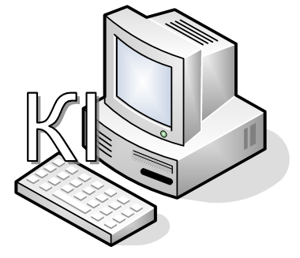

Полтава 2017

Навчальний посібник з дисципліни «Технології розробки програмного забезпечення» для студентів спеціальності 123 «Комп’ютерна інженерія». – Полтава: ПолтНТУ, 2017. – 218 с.

Укладачі: Дегтярьова Л.М., доцент, к.т.н., доцент кафедри комп’ютерної інженерії,
Гроза П.М., с.н.с., к.т.н., доцент кафедри комп’ютерної інженерії,
Сомов С.В., доцент, к.т.н., доцент кафедри комп’ютерної інженерії

Відповідальний за випуск: В.В. Васюта, завідувач кафедри комп’ютерної інженерії, кандидат технічних наук, доцент

Рецензенти: С.В. Волошко, к.т.н., с.н.с, доцент.;
Ю.Л. Поночовний, к.т.н., с.н.с., доцент.

Затверджено науково-методичною радою університету
Протокол № 1 від листопада 2017 р.

На правах рукопису

**ЗМІСТ**

ПЕРЕЛІК УМОВНИХ ПОЗНАЧЕНЬ, СИМВОЛІВ, ОДИНИЦЬ, СКОРОЧЕНЬ І ТЕРМІНІВ ............................................................................................ 5  
ВСТУП .................................................................................................................... 6  
**1. ПРОГРАМНІ ЗАСОБИ ЯК ПРОДУКТ ТЕХНОЛОГІЇ ПРОГРАМУВАННЯ** .......................................................................................... 8  
1.1. Базові поняття, види програмного забезпечення ............................................ 8  
1.2. Розвиток мов, стилів та технологій програмування. ................................. 11  
1.2.1. Ранні мови програмування .................................................................. 12  
1.2.2. Імперативне програмування (Imperative programming). Процедурний підхід (Procedural programming) ........................................ 13  
1.2.3. Декларативне програмування (Declarative programming) ............... 15  
1.2.4 Об'єктно-орієнтоване програмування (Object-oriented programming) ................................................................................................ 19  
1.2.5 Подієво-кероване програмування (Event-driven programming) ..... 22  
1.2.6 Паралельні обчислення (Parallel computing) ........................................ 25  
1.2.7 Компонентне програмування (Component-based programming) .... 27  
**2. Поняття технології програмування як процесу** .............................................. 31  
2. 1. Розвиток технологій програмування ............................................................ 32  
2.2. Життєвий цикл програмного забезпечення .................................................. 33  
2.2.1 Перший етап - «Стихійне» програмування ........................................ 34  
2.2.2 Другий етап - структурний підхід до програмування (60 - 70-ті рр. XX ст.) .............................................................................................................. 37  
2.2.3 Третій етап – об'єктний підхід до програмування (з середини 80-х до кінця 90-х років XX ст.) ................................................................................ 39  
2.2.4. Компонентний підхід і CASE-технології (з середини 90-х років XX ст. до нашого часу) ...................................................................................... 40  
2.3. Моделі життєвого циклу програмного забезпечення .................................. 42  
2.3.1. Каскадна модель (waterflow model) .................................................... 43  
2.3.2. Ітеративна модель (Iterative and incremental development) ............... 47  
2.3.3. Спіральна модель (Spiral model) .......................................................... 49  
**3. Основні етапи розробки програмного забезпечення** ................................... 55  
3.1 Постановка завдання ....................................................................................... 57  
3.2 Аналіз завдання та моделювання програмного забезпечення .................. 59  
3.3 Розробка або вибір алгоритму розв'язання задачі ........................................ 61  
3.4 Проектування загальної структури програми .............................................. 62  
3.5 Кодування .......................................................................................................... 65  
3.6 Налагодження і тестування програми ........................................................... 65  
3.7 Аналіз результатів ........................................................................................... 69  
3.8 Публікація результатів роботи ........................................................................ 69  
3.8.1 Користувальницька документація програми ....................................... 70  
3.8.2 Документація по супроводу програми ................................................ 71

3.9 Супровід програми ............................................................................ 72  
**4. Надійність та якість програмного забезпечення** .............................. 76  
&nbsp;&nbsp;&nbsp;&nbsp;4.1 Надійність ПЗ................................................................................ 76  
&nbsp;&nbsp;&nbsp;&nbsp;4.2 Забезпечення якості програмних продуктів ................................. 77  
&nbsp;&nbsp;&nbsp;&nbsp;4.3. Методи контролю якості.............................................................. 81  
**5. Помилки при розробці програмного забезпечення** .......................... 83  
&nbsp;&nbsp;&nbsp;&nbsp;5.1 Типові помилки в програмах.......................................................... 83  
&nbsp;&nbsp;&nbsp;&nbsp;5.2. Логічні помилки ............................................................................ 86  
**6. Розробка користувацьких інтерфейсів** ............................................ 90  
&nbsp;&nbsp;&nbsp;&nbsp;6.1 Типи користувацьких інтерфейсів.................................................. 90  
&nbsp;&nbsp;&nbsp;&nbsp;6.2. Фактори впливу на показники якості програмного продукту ............ 95  
7. Система управління версіями ........................................................... 96  
**Лабораторна робота №1 «Розробка опису та аналіз інформаційної системи»** ................................................................................................... 103  
**Лабораторна робота № 2 «Розробка вимог до інформаційної системи»** ................................................................................................... 112  
**Лабораторна робота № 3 «Методологія функціонального моделювання»** ................................................................................................... 122  
**Лабораторна робота № 4 «Методологія об'єктно-орієнтованого моделювання»** ................................................................................................... 122  
**Лабораторна робота №5 «Методологія управління проектами»** ......... 153  
**Лабораторна робота №6 Розподілена система керування версіями файлів** ................................................................................................... 172  
**Лабораторна робота № 7 «Вивчення технології .NET»** ........................ 192  
**Лабораторна робота № 8 «Створення простого мережевого додатку з використанням технології .NET»**........................................................... 206  
**Основні поняття та означення** ............................................................. 214  
**СПИСОК ВИКОРИСТАНИХ ДЖЕРЕЛ**................................................ 217

ПЕРЕЛІК УМОВНИХ ПОЗНАЧЕНЬ, СИМВОЛІВ, ОДИНИЦЬ, СКРОЧЕНЬ І ТЕРМІНІВ

| | |
| :--- | :--- |
| ПЗ | програмне забезпечення |
| ІС | інформаційна система |
| ООП | об'єктно-орієнтоване програмування |
| СКВ | система контролю версій |
| РСКВ | розподілені системи контролю версій |
| ЦСКВ | централізовані системи контролю версій |
| БД | база даних |
| ТЗ | технічне завдання |
| ПО | предметна область |
| UML | Unified Modeling Language |
| CLS | Common Language Specification |
| LINQ | Language Integrated Query (мова інтегрованих запитів) |
| КП | Компонентне програмування |
| КПВ | компонент повторного використання |
| ПС | програмна система |
| ЖЦ | Життєвий цикл |
| ПЗс | Програмний засіб |
| OOM | Об'єктно-орієнтована методологія |
| OOA | об'єктно-орієнтований аналіз |
| OOD | об'єктно-орієнтоване проектування |
| OOP | об'єктно-орієнтоване програмування |

ВСТУП

Основним завданням перших трьох десятиліть комп'ютерної ери був розвиток апаратних комп'ютерних засобів. Це було обумовлено високою вартістю обробки і зберігання даних. У 80-ті роки успіхи мікроелектроніки привели до різкого збільшення продуктивності комп'ютера при значному зниженні вартості, тому основним завданням 90-х років і початку XXI століття стало вдосконалення якості комп'ютерних програм, можливості яких цілком визначаються програмним забезпеченням (ПЗ). Завдяки сучасним досягненням технологій по створенню мікропроцесорів та нанотехнологіям знято практично всі апаратні обмеження на вирішення завдань: комп'ютерам під силу обробляти 34 квадрильйона операцій в 1 секунду, але решта обмеження припадають на частку ПЗ.

Комп'ютерні науки взагалі і програмна інженерія зокрема - галузь знань, яка сьогодні дуже популярна та стрімко розвивається. Обгрунтування просте: людське суспільство XXI ст. - інформаційне суспільство. Надзвичайно актуальними стали наступні проблеми:

- апаратна складність випереджає наше вміння створювати ПЗ, що використовує потенційні можливості апаратури;
- наше вміння створювати нові програми відстає від вимог до нових програм;
- нашим можливостям експлуатувати існуючі програми загрожує низька якість їх розробки.

Ключем до вирішення цих проблем є грамотна організація процесу створення ПО, реалізація технологічних принципів промислового конструювання програмних систем (ПС).

Даний курс присвячений систематичному викладенню принципів, моделей і методів (формування вимог, аналізу, синтезу і тестування), що використовуються в інженерному циклі розробки складних програмних продуктів.

Технологія розробки програмного забезпечення - це дисципліна, яка розглядає використання теорії, знань і практики для ефективної побудови програмних систем, що задовольняють вимогам користувачів та замовників.

Метою дисципліни є навчання основним принципам і методам, використовуваним на різних етапах розробки ПЗ складних комп'ютерних систем, а також навчання організації процесів програмної розробки.

Створення програмної системи - вельми трудомістка задача, особливо в наш час, коли обсяг коду програмного забезпечення перевищує сотні тисяч операторів. Майбутній фахівець в області розробки програмного забезпечення повинен мати уявлення про методи аналізу, проектування, реалізації та тестування програмних систем, а також орієнтуватися в існуючих підходах і технологіях. В рамках дисципліни

вивчається весь спектр процесів, що ведуть до створення програмного забезпечення (ПЗ): від розробки вимог до ПЗ, через проектування, розробку та атестацію до модернізації програмних систем.

Мета розробки навчального посібника полягає у підвищенні ефективності засвоєння теоретичних і практичних знань та організації самостійної роботи студентів по засвоєнню матеріалу навчальної дисципліни. Систематизований та логічно послідовний виклад практичного змісту курсу сприяє поліпшенню якості підготовки студентів в цілому.

Досвід ведення реальних розробок і вдосконалення наявних програмних і технічних засобів постійно переосмислюється, в результаті чого з'являються нові методи, методології та технології, які, в свою чергу, є основою більш сучасних засобів розробки програмного забезпечення. Дослідити процеси створення нових технологій і визначати їх основні тенденції доцільно, зіставляючи ці технології з рівнем розвитку програмування і особливостями наявних в розпорядженні програмістів програмних і апаратних засобів.

Після виконання лабораторних робіт з дисципліни «Технології розробки програмного забезпечення» студент повинен знати:
* моделі процесу розробки ПЗ;
* практичні методології виконання всіх етапів розробки ПЗ;
* технології та інструментальні засоби, що застосовуються на всіх етапах розробки ПЗ;
* методи управління проєктами при розробці ПЗ.

Технологія розробки ПЗ являє собою комплекс організаційних заходів, операцій і прийомів, спрямованих на розробку програмних продуктів високої якості в рамках відведеного бюджету та в строк. Технології включають методики, методології, засоби та процедури розробки ПЗ.

Навчальний посібник повинен надати можливість для студентів ознайомитись з процесом створення ПЗ на замовлення споживача, забезпечити цілеспрямований процес управління діями всіх зацікавлених осіб в проєкті розробки ПЗ: замовників, користувачів розробок і керівництва.

Даний курс «Технології розробки програмного забезпечення» розглядає питання основ ООП і систем управління БД та засобів моделювання, що дозволяють проводити аналіз, документування і поліпшення бізнес процесів при реалізації моделей проектування.


<!-- ВІДНОВЛЕНО ЧЕРЕЗ GEMINI (Стор. 8) -->
## 1. ПРОГРАМНІ ЗАСОБИ ЯК ПРОДУКТ ТЕХНОЛОГІЇ ПРОГРАМУВАННЯ

### 1.1. Базові поняття, види програмного забезпечення

Метою програмування є опис процесів обробки даних. Поняття «дані» об'єднує в собі представлення фактів і ідей в формалізованому вигляді, придатному для передачі і переробки в якомусь процесі, а результат перетворення і аналізу даних – це інформація, яка з'являється в результаті обробки даних при вирішенні конкретних завдань.

Обробка даних - це виконання систематичної послідовності дій з даними. Дані представляються і зберігаються на так званих «носіях даних». Набір впорядкованих команд і даних, які описують операції в формі, прийнятній для їх виконання комп'ютером. З іншого боку, програма повинна бути зрозумілою і людині, так як і при розробці програм, і при її використанні часто доводиться з'ясовувати, який саме процес вона породжує. Тому програма складається на зручній для людини формалізованій мові програмування, з якої вона автоматично перекладається на мову відповідного комп'ютера за допомогою іншої програми, званої транслятором. Людині (програмісту), перш ніж скласти програму на зручній для нього мові програмування, доводиться проводити велику підготовчу роботу по уточненню постановки завдання, вибору методу його рішення, з'ясування специфіки застосування необхідної програми, проясненню загальної організації програми, що розробляється, та багато іншого. Використання цієї інформації може істотно спростити завдання розуміння програми людиною, тому дуже корисно її якось фіксувати у вигляді окремих документів (часто вже не формалізованих, розрахованих тільки для сприйняття людиною).

Зазвичай програми розробляються в розрахунку на те, щоб ними могли користуватися люди, які не беруть участі в їх розробці (їх називають користувачами). Для освоєння програми користувачем крім її тексту потрібна певна додаткова документація. Програма або логічно пов'язана сукупність програм на носіях даних, забезпечена програмною документацією, називається програмним засобом (ПЗс).

Програма дозволяє здійснювати деяку автоматичну обробку даних на комп'ютері. Програмна документація дозволяє зрозуміти, які функції виконує та чи інша програма ПЗ, як підготувати вихідні дані і запустити необхідну програму в процес її виконання, а також: що означають отримані результати (чи який ефект виконання цієї програми). Крім того, програмна документація допомагає розібратися в самій програмі, що необхідно, наприклад, при її модифікації. Програмування (Programming) -
<!-- КІНЕЦЬ ВІДНОВЛЕННЯ -->


процес підготовки задач для їх розв'язання за допомогою комп'ютера; ітераційний процес складання програм.

Програма - дані, призначені для управління конкретними компонентами системи обробки інформації з метою реалізації певного алгоритму [1], послідовність машинних команд, призначена для досягнення конкретного результату.

Програмне забезпечення (ПЗ, Software) - комп'ютерні програми, процедури, а також документація й дані, що з ними асоційовані, які стосуються функціонування комп'ютерної системи [2].

Технологією програмування називають сукупність методів і засобів, що використовуються в процесі розробки програмного забезпечення [3, 4]. Як будь-яка інша технологія, технологія програмування являє собою набір технологічних інструкцій, що включають наступні процедури:
- вказівка послідовності виконання технологічних операцій;
- перерахування умов, при яких виконується та чи інша операція;
- опис самих операцій, де для кожної операції визначені вихідні дані, результати, а також інструкції, нормативи, стандарти, критерії та методи оцінки і т.п. (рис. 1.1).


Рисунок 1.1. Структура опису технологічної операції

Крім набору операцій і їх послідовності, технологія також визначає спосіб опису проектованої системи, точніше моделі, використовуваної на конкретному етапі розробки.

Розрізняють технології, використовувані на конкретних етапах розробки або для вирішення окремих завдань цих етапів, і технології, що охоплюють кілька етапів або весь процес розробки. В основі перших, як

правило, лежить обмежено застосовний метод, що дозволяє вирішити конкретну задачу. В основі других зазвичай лежить базовий метод або підхід, що визначає сукупність методів, використовуваних на різних етапах розробки, або методологію.

Розрізняють також методи, засоби і процеси/процедури технології розробки програмного забезпечення.

Методи забезпечують вирішення наступних завдань:
* планування і оцінка програмного проекту;
* аналіз вимог до комп'ютерних систем в цілому і программному забезпеченню зокрема;
* проектування структур програм (і структур даних), що входять до складу ПЗ;
* конструювання програмного тексту (кодування, програмування, реалізація;
* тестування (виявлення помилок в створених програмах);
* супровід ПЗ, вже використовуваного замовниками.

Засоби (утиліти) ТРПЗ забезпечують автоматизовану або автоматичну підтримку методів. З метою спільного застосування утиліти можуть об'єднуватися в системи автоматизованого конструювання ПЗ (CASE-системи).

Процедури з'єднують методи і утиліти так, що вони забезпечують безперервний технологічний ланцюжок розробки.

Процедури визначають:
* порядок застосування методів і утиліт;
* формування звітів, форм за відповідними вимогами;
* контроль, який допомагає забезпечувати якість і координувати зміни;
* формування контрольних точок, за якими керівники оцінюють прогрес.

Як правило, розробка популярної програми - складний і тривалий процес, в якому задіяна велика кількість людей. Тут, як і в будь-якому бізнесі, потрібні дослідження ринку, продумування ідей, маркетингу, продажу. А ще продукту потрібен хороший дизайн і упаковка, а також довідка, технічна і так далі. Але без технічної складової всі ці "бізнесові" і "гуманітарні" штучки марні. Давайте подивимося, які основні технічні ролі і посади в розробці ПЗ сьогодні існують. До речі, треба сказати, що поділ між ними нередко буває нечітким. Чим більше людей працюють в команді, тим чіткіше зазвичай поділяються ролі. І навпаки - в невеликих командах, що складається з 1-3 людини кожен із співробітників може бути "людиною-оркестром", який поєднує багато ролей.

Основні технічні ролі і посади в розробці ПЗ представлені нижче:


<!-- ВІДНОВЛЕНО ЧЕРЕЗ GEMINI (Стор. 11) -->
**Програміст** (developer, розробник, кодер) - пише код на мовах програмування, тобто безпосередньо кодує логіку роботи програми. Також є її першим користувачем і тестувальником. 

**Провідний програміст** (team leader) - в першу чергу очолює і координує роботу програмістів в команді. Займається складанням технічних завдань для програмістів. 

**Системний архітектор** (system architect) - проектує розроблювану систему на самому верхньому рівні і приймає ключові рішення з приводу технологій і методологій розробки. Як правило, не пише код системи. 

**Системний аналітик** (analyst, аналітик) - є "містком" між замовником і членами команди. Перекладає побажання замовника в формат технічних завдань. 

**Тестувальник** (quality assurance, тестер) - перевіряє якість продукту. Намагається зламати програму і знайти в ній помилки і проблеми. 

**Системний адміністратор** (system administrator) - відповідає за роботу мережі, серверів, комп'ютерів розробників та іншого "заліза" і програм, які потрібні для розробки і запуску продукту. 

**Технічний директор** (CTO) - з'єднує роботу технічної частини команди розробки з іншими відділами фірми і керівництвом. 

1.2. Розвиток мов, стилів та технологій програмування.

Система програмних засобів, що використовується програмістами для розроблення програмного забезпечення носить назву інтегрованого
<!-- КІНЕЦЬ ВІДНОВЛЕННЯ -->


середовища розроблення програмного забезпечення (Integrated Development Environment, IDE).

Як правило, середовище розроблення включає текстовий редактор, компілятор і/або інтерпретатор, засоби автоматизації складання, налагоджував та різноманітні інструменти для конструювання графічного інтерфейсу користувача. Значне поширення об'єктно-орієнтованого програмування (ООП) привело до того, що сучасні інструменти розроблення включають браузер класів та інспектор об'єктів.

На сьогодні до середовищ розроблення підключають систему керування версіями, засоби тестування та ін. Раніше середовища розроблення переважно призначалися для однієї мови (Delphi, Turbo Pascal, Borland C++, Visual Basic), але на сьогодні широко застосовувані такі середовища, як Eclipse або Microsoft Visual Studio, призначені для мультимовного розроблення ПЗ.

*1.2.1. Ранні мови програмування.*

Слідом за появою перших електронних обчислювальних машин (ЕОМ), які з'явились відносно недавно - у 40-вих роках XX століття, виникли й перші мови програмування, які були досить примітивні і орієнтовані на числові розрахунки (математичні й фізичні), і прикладні завдання, в першу чергу у галузі військової справи.

Програми, написані на ранніх мовах програмування, були лінійними послідовностями елементарних операцій з регістрами, в яких зберігалися дані. Тому будь-яка технологія програмування була відсутня. Перші програми були представлені у вигляді послідовності операторів - так званий операторний підхід. Написанню послідовності машинних команд передувало складання операторної схеми, що відбивала послідовність операторів і переходи між ними і згодом отримало поняття «алгоритм». У традиційному трактуванні алгоритм - це точний набір інструкцій, що описують послідовність дій виконавця для досягнення результату рішення задачі за кінцевий час.

Потрібно відзначити, що ранні мови програмування були оптимізовані під ту апаратну архітектуру конкретного комп'ютера, для якого вони призначалися. Будь-яка стандартизація в цей час була відсутня, не дивлячись на те, що ранні мови програмування забезпечували достатньо високу ефективність обчислень. Але програма, яка була цілком працездатною на одній обчислювальній машині, часто не могла бути виконана на іншій. Таким чином, ранні мови програмування істотно залежали від середовища обчислень і приблизно відповідали сучасним машинним кодам або мові асемблера. Перші мови програмування часто називають мовами низького рівня.

| Програма | послідовності машинних команд і переходи між ними |
| :--- | :--- |
| **Час появи** | 1940 роки |
| **Переваги** | висока обчислювальна ефективність |
| **Недоліки** | істотна залежність від середовища обчислень |
| **Приклади** | машинні коди, асемблери (Autocode, IPL, FLOW-MATIC) |
| **Підхід** | операторний |
| **Зароджується поняття** | алгоритм |
| **Застосування** | теоретичні наукові розрахунки і прикладні задачі в галузі військової справи |

*1.2.2. Імперативне програмування (Imperative programming). Процедурний підхід (Procedural programming).*

Середина 50-х років характеризується зменшенням програмування в машинних командах. Почали з'являтися мови програмування нового типу, що виступають в ролі посередника між машинами і програмістами, які получили назву високорівневих. Високорівнева мова програмування - мова програмування, розроблена для швидкості і зручності використання програмістом. Основна риса високорівневих мов - це абстракція, тобто введення смислових конструкцій, які коротко описують такі структури даних і операції над ними, описи яких на машинному коді (або на іншій низькорівневій мові програмування) дуже довгі і складні для розуміння. Різниця від мов низького рівня полягає у підвищенні ефективності праці розробників за рахунок абстрагування від конкретного апаратного забезпечення. Один оператор мови високого рівня відповідав послідовності з декількох низькорівневих команд.

Виходячи з того, що програма фактично являла собою набір директив, звернених до комп'ютера, такий підхід до програмування назвали імперативним.

Можна вважати що в цей період з'явились стилі, або парадигми, програмування.

Наступним кроком розвитку програм стало підвищення їх структурованості - структурний підхід, при якому виділяли канонічні структури: лінійні ділянки, цикли та розгалуження. Завдяки цьому з'явилася можливість читати і перевіряти програму як текст, а це підвищило ефективність праці програмістів під час розроблення та відлагодження програм.

Розмір програм постійно збільшувався, тому програмісти почали об'єднувати окремі їх частини у підпрограми, які групували у бібліотеки. Бібліотеки підключалися до основної робочої програми, яка за необхідності викликала потрібну підпрограму. Фактично такий підхід

збільшив структурність програм - велика програма стала сукупністю процедур-підпрограм. Одна підпрограма, головна, розпочинала роботу всієї програми. Тобто відбувся перехід до наступного етапу розвитку технологій - процедурного програмування.

При розробленні окремої процедури для використання інших процедур потрібно було знати лише їх призначення та спосіб. Процедурний підхід дозволив скоротити затрати праці і машинного часу на створення і модернізацію програм завдяки можливості зміни окремої процедури без втручання в інші. З'явилася можливість повторного використання раніше написаних програмних блоків завдяки їх ідентифікації і наступного звернення за цим ідентифікатором.

Також завдяки структурності програм була збільшена їх надійність - підпрограми стали зв'язуватись одна із одною тільки шляхом передачі їм аргументів, змінні розподілилися на локальні і глобальні.

Окрім того, поява мов високого рівня значно зменшила залежність реалізації від апаратного забезпечення. Щоб це реалізувати, були створені спеціалізовані програми-транслятори, призначені для перетворення інструкції мови програмування у коди певної машини. Використання трансляторів привело до певної втрати швидкості обчислень, але цей недолік компенсувався значним виграшем у швидкості розроблення і модифікації програм.

Також у цей період розпочали розроблення спеціалізованих мов програмування для розв'язання конкретних класів задач: для систем керування базами даних, імітаційного моделювання та ін.

У той час програми все частіше розроблялися для виконання завдань військового призначення, для космічної галузі, енергетики - і від надійності програмного забезпечення залежали людські життя. Одним із напрямків удосконалення мов програмування стало підвищення рівня типизації даних.

Використання жорстко типизованої мови при розробленні програми дозволяє ще під час її трансляції у машинні коди виявити більшість помилок використання даних і цим підвищити якість програми. Але типизація обмежує свободу програміста і не дозволяє виконувати частину перетворень даних, що часто потрібно у системному програмуванні.

Практика програмування показала, що велика частина високорівневих мов, створених у період процедурного підходу, дуже вдало реалізована, тому вони або їх варіації використовуються до цього часу. Наприклад, до цього часу використовується мова Fortran для реалізації обчислювальних алгоритмів, мова COBOL для опису бізнес-процесів або мова APL, що поетапно трансформувалась у мову C (Ci).

Потреба підвищення рівня типизації мов програмування привела до появи мови Pascal (Паскаль). Одночасно з Паскалем була розроблена мова

C, що здебільшого орієнтована на системне програмування і є слабо типізованою мовою. Час появи: 1950 роки.

Стисла характеристика: програма - послідовність інструкцій-операторів, у яку включені блоки типових дій - процедури або функції.

| Програма | послідовність інструкцій-операторів, які містять блоки типових дій – процедури або функції |
| :--- | :--- |
| **Час появи** | 1950 роки |
| **Переваги** | - підвищення рівня абстракції<br>- менша машинна залежність<br>- більша сумісність<br>- змістовна значущість текстів програм<br>- уніфікація програмного коду<br>- підвищення ефективності праці програмістів |
| **Недоліки** | - більші витрати на вивчення мов;<br>- менша обчислювальна ефективність |
| **Приклади** | Fortran, ALGOL, PL/1, APL, COBOL, Pascal, C, Basic |
| **Підхід** | структурний, перехід до процедурного програмування |
| **Зароджується поняття** | бібліотеки програм, процедури-підпрограми, компілятор, ідентифікатор, програми-транслятори |
| **Застосування** | Процедурний підхід дозволив скоротити затрати праці і машинного часу на створення і модернізацію програм. З'явилася можливість повторного використання раніше написаних програмних блоків завдяки їх ідентифікації і наступного звернення за цим ідентифікатором. |

*1.2.3. Декларативне програмування (Declarative programming).*

У 60-х рр. ХХ століття виникає новий підхід до програмування, що до цього часу успішно конкурує з імперативним, а саме - декларативний підхід. При декларативному підході до програмування програма є не набором команд, а описом дій, які потрібно виконати.

Декларативні мови програмування - мови створення програм зі штучним інтелектом - експертні системи, інформаційні системи, розпізнавання образів тощо.

Цей підхід легко формалізується математичними засобами. У результаті програми легше перевіряти на помилки і відповідність технічним специфікаціям (верифікувати).

Також даний підхід має високий ступінь абстракції. Фактично програміст оперує не набором інструкцій, а абстрактними поняттями, часто досить узагальненими.

Декларативне програмування - термін з двома різними значеннями. Згідно першому визначенню, програма «декларативна», якщо вона описує щось, а не як його створити. Наприклад, веб-сторінки на HTML декларативні, оскільки вони описують що повинна містити сторінка, а не як відображати сторінку на екрані. Цей підхід відрізняється від мов імперативного програмування, що вимагають від програміста вказувати алгоритм для виконання.

Згідно другому визначенню, програма «декларативна», якщо вона написана на виключно функціональній, логічній або константній мові програмування.

На початку декларативним мовам програмування було важко конкурувати з імперативними у зв'язку із проблемами при створенні ефективних трансляторів. Програми працювали повільніше, однак вони вирішували більш абстрактні завдання із меншими затратами.

Наприклад, мова SML була розроблена, як засіб доведення теорем. Діалекти мови LISP виникли завдяки тому, що ця мова є ефективною під час обробки символьної інформації.

Декларативні мови програмування - це мови програмування високого рівня, в яких програмістом не задається покроковий алгоритм рішення задачі ("як" вирішити завдання), а деяким чином описується, "що" потрібно отримати як результат. Механізм обробки зіставлення за зразком декларативних тверджень вже реалізовано у пристрої мови.

Програма «декларативна», якщо її написано винятково функціональною мовою програмування, логічною мовою програмування.

Одним із шляхів розвитку декларативного стилю програмування став функціональний підхід, що виник із появою і розвитком мови LISP.

Відмінною особливістю даного підходу є та обставина, що будь-яка програма, написана такою мовою, може інтерпретуватися як функція з одним або кількома аргументами, деякі з яких також можна розглядати як функції. Складні програми при такому підході будуються за допомогою поєднання функцій. Такий підхід дає можливість прозорого моделювання тексту програм математичними засобами.

При функціональному програмуванні повторне використання коду зводиться до виклику раніше описаної функції, структура якої, на відміну від процедури імперативної мови, прозора математично. Більш того, типи окремих функцій, що використовуються у функціональних мовах, можуть бути змінними. Тобто забезпечується можливість обробки різнорідних

даних (наприклад, упорядкування елементів списку за зростанням для цілих чисел, окремих символів і рядків), або поліморфізм. Завдяки реалізації механізму зіставлення із зразком, такі мови, як ML та Haskell, дуже добре застосовні для символьної обробки.

Ще однією важливою перевагою реалізації мов функціонального програмування є автоматизований динамічний розподіл пам'яті комп'ютера для зберігання даних. При цьому програміст позбавляється від рутинного обов'язку контролювати дані.

До недоліків мов функціонального програмування відносять нелінійну структуру програми і відносно невисоку ефективність реалізації. Однак перший недолік досить суб'єктивний, а другий успішно подоланий сучасними реалізаціями, зокрема низкою останніх трансляторів мови SML, включаючи і компілятор для середовища Microsoft. NET. Час появи: 1960 роки.

Стисла характеристика: програма - функція, аргументи якої, можливо, також є функціями.

У 70-х рр. XX століття виникла ще одна гілка мов декларативного програмування, пов'язана з проектами у галузі штучного інтелекту - мови логічного програмування.

Згідно з логічним підходом до програмування програма є сукупністю правил або логічних висловлювань. Мови логічного програмування базуються на класичній логіці і застосовні для систем логічного висновку, зокрема для так званих експертних систем. На мовах логічного програмування, природно, формалізується логіка поведінки, їх можна застосовувати для описів правил прийняття рішень, наприклад, у системах, орієнтованих на підтримку бізнесу.

Важливою перевагою підходу є досить високий рівень машинної незалежності, а також можливість відкатів - повернення до попередньої мети при негативному результаті аналізу одного з варіантів у процесі пошуку рішення (скажімо, чергового ходу при грі в шахи), що позбавляє від необхідності пошуку рішення повним перебором варіантів і збільшує ефективність реалізації.

Одним з недоліків логічного підходу в концептуальному плані є специфічність класу вирішуваних завдань.

Інший недолік практичного характеру полягає у складності ефективної реалізації для прийняття рішень у реальному часі, скажімо, для систем життєзабезпечення.

Типовим прикладом таких мов є мови логічного програмування (мови, засновані на системі правил). У програмах на мовах логічного програмування відповідні дії виконуються тільки за наявності необхідного довільної умови.


<!-- ВІДНОВЛЕНО ЧЕРЕЗ GEMINI (Стор. 18) -->
| Програма | - опис дій, які потрібно виконати; виконувана специфікація |
| :--- | :--- |
| **Час появи** | 1960-70 роки |
| **Переваги** | - формалізується математичними засобами;<br>- програми легше перевіряти на помилки і відповідність технічним специфікаціям;<br>- висока ступінь абстракції;<br>- програми працювали повільніше, але вирішували більш абстрактні завдання із меншими затратами;<br>- повністю автоматичне управління пам'яттю комп'ютера («збирання сміття»);<br>- простота повторного використання фрагментів коду;<br>- розширена підтримка функцій з параметричними аргументами;<br>- простота верифікації і тестування програм;<br>- строгість математичної формалізації. |
| **Недоліки** | •нелінійна структура програми;<br>•відносно невисока ефективність реалізації;<br>•необхідність фундаментальних математичних знань. |
| **Приклади** | Prolog, Mercury, SML, LISP, Haskell, Miranda, Hope. |
| **Підхід** | декларативна семантика |
| **Зароджується поняття** | Мови логічного програмування (мови, засновані на системі правил). У програмах на мовах логічного програмування відповідні дії виконуються тільки за наявності необхідного довільної умови. |
| **Застосування** | функціональне програмування та логічне програмування: конкретизують мету і залишають реалізацію алгоритму на допоміжному програмному забезпеченні (наприклад, інструкція вибірки SQL конкретизує властивості даних, які слід отримати від бази даних, але не процес отримання цих даних); програмування паралельних комп'ютерів. |
<!-- КІНЕЦЬ ВІДНОВЛЕННЯ -->


1.2.4 *Об'єктно-орієнтоване програмування (Object-oriented programming).*

Усі універсальні мови програмування, незважаючи на відмінності у синтаксисі і використовуваних ключових словах, реалізують одні й ті самі канонічні структури: оператори присвоювання, цикли і розгалуження.

У всіх сучасних мовах наявні базові типи даних (цілі і речові арифметичні типи, символьний і, можливо, рядковий тип), є можливість використання агрегатів даних, у тому числі масивів і структур (записів).

Разом з тим при розробленні програми для розв'язання конкретної прикладної задачі потрібна як можна більша близькість тексту програми до опису завдання. Одним із шляхів вирішення цієї проблеми було створення розширюваної мови, що містить невелике ядро і допускає розширення, доповнює мову типами даних і операторами, відбиває концептуальну сутність конкретного класу задач.

Розвитком цього підходу і стало об'єктно-орієнтоване програмування (ООП) - стиль програмування, що фіксує поведінку реального світу таким способом, при якому деталі його реалізації приховані. У рамках даного підходу програма є описом об'єктів, їх властивостей (або атрибутів), сукупностей (або класів), відносин між ними, способів їх взаємодії та операцій над об'єктами (або методів). Механізм успадкування атрибутів і методів дозволяє будувати похідні поняття на основі базових і таким чином створювати модель як завгодно складної предметної області із заданими властивостями.

Ще однією важливою властивістю ООП є підтримка механізму обробки подій, які змінюють атрибути об'єктів і моделюють їх взаємодію у предметній області. Переміщуючись по ієрархії класів від більш загальних понять предметної області до більш конкретних і навпаки, програміст отримує можливість змінювати ступінь абстрактності погляду на модельований ним реальний світ.

Використання раніше розроблених (можливо, іншими колективами програмістів) бібліотек об'єктів і методів дозволяє значно заощадити трудовитрати при виробництві програмного забезпечення, особливо типового.

Об'єкти, класи і методи можуть бути поліморфними, що робить реалізоване програмне забезпечення більш гнучким і універсальним.

Складність адекватної (несуперечливої і повної) формалізації об'єктної теорії породжує труднощі тестування та верифікації створеного програмного забезпечення. Ця обставина є одним з найбільш істотних недоліків ООП.

У основі об'єктно-орієнтованої методології програмування лежить об'єктний підхід, коли прикладна наочна область представляється у вигляді сукупності об'єктів, які взаємодіють між собою за допомогою передачі повідомлень. Об'єкт - це сукупність даних (змінних) і способів

роботи з ними (компонентних процедур і функцій). Стан об'єкту характеризується переліком всіх його можливих (зазвичай статичних) властивостей і значеннями кожної з цих властивостей (зазвичай динамічних). Стан об'єкту описується його змінними.

Поведінка об'єкту (або його функціональність) характеризує те, як об'єкт взаємодіє з іншими об'єктами або піддається взаємодії інших об'єктів, проявляючи свою індивідуальність. Індивідуальність - це такі властивості об'єкту, які відрізняють його від всіх інших об'єктів. Поведінка об'єкту реалізується у вигляді функцій, які називають методами. При цьому структура об'єкту доступна тільки через його методи, які в сукупності формують інтерфейс об'єкту.

Наведення за допомогою класів порядку в світі об'єктів - велике досягнення, але можна піти далі, визначаючи деякий порядок і серед класів. Досягається це за допомогою введення механізму спадкоємства - мабуть, наймогутнішого засобу в будь-якій об'єктно-орієнтованій системі, оскільки воно дозволяє багато разів використовувати одного разу створений код.

Механізм спадкоємства дуже простий: один клас, званий в рамках цих відносин суперкласом, повністю передає іншому класу, який називається підкласом, свою структуру і поведінку, тобто всі свої змінні і всі методи. Що далі робити з цим багатством визначає тільки підклас: він може додати в структуру щось своє, щось з успадкованого інтерфейсу він може використовувати без змін, щось змінити, і, зрозуміло, може додати свої власні методи. Тобто клас за допомогою підкласів розширюється, і як результат, створювані об'єкти стають все більш і більш спеціалізованими.

Класи, розташовані за принципом спадкоємства, починаючи з найзагальнішого, базового класу, утворюють ієрархію класів.

Об'єктно-орієнтована методологія (ООМ) складається з наступних частин:
* об'єктно-орієнтований аналіз (ООА);
* об'єктно-орієнтоване проектування (OOD);
* об'єктно-орієнтоване програмування (OOP).

ООА - методологія аналізу суті реального світу на основі понять класу і об'єкту, складових словник наочної області, для розуміння і пояснення того, як вони (суть) взаємодіють між собою. Моделі ООА надалі перетворюються в об'єктно-орієнтований проект.

OOD - методологія проектування програмного продукту, що сполучає в собі процес об'єктної декомпозиції, що спирається на виділення класів і об'єктів, і прийоми представлення моделей, що відображають логічну (структура класів і об'єктів) і фізичну (архітектура моделей і процесів) структуру системи.

| | |
| :--- | :--- |
| **Програма** | опис об'єктів, їх сукупностей, відносин між ними і способів їх взаємодії |
| **Час появи** | 1970 роки |
| **Переваги** | - інтуїтивна близькість до довільної предметної області;<br>- моделювання як завгодно складних предметних областей;<br>- подієва орієнтованість;<br>- високий рівень абстракції;<br>- повторне використання описів;<br>- параметризація методів обробки об'єктів |
| **Недоліки** | складність тестування та верифікації програм |
| **Приклади** | C++, Visual Basic, C#, Eiffel, Oberon |
| **Підхід** | об'єктно-орієнтована парадигма доводить до логічної завершеності принцип моделювання реального світу, а точніше тієї його частини, абстракцією якої служить програма. Основою управління процесом реалізації програми є передача повідомлень об'єктам, тому об'єкти повинні визначатися спільно з повідомленнями, на які вони повинні реагувати при виконанні програми |
| **Зароджується поняття** | об'єкти, їх властивості (або атрибути), сукупність (або класи), відносини між ними, способи їх взаємодії та операції над об'єктами (або методи). |
| **Застосування** | автоматизація експерименту, робототехніка;<br>планування;<br>інтерфейс користувача, анімація;<br>комунікації, зв'язок;<br>медицина, експертні системи;<br>обробка комерційної інформації;<br>операційні системи;<br>системи управління;<br>тренажери, моделювання. |

Основними властивостями об'єктно-орієнтованої мови програмування є:


<!-- ВІДНОВЛЕНО ЧЕРЕЗ GEMINI (Стор. 22) -->
* Механізм успадкування атрибутів і методів - дозволяє будувати похідні поняття на основі базових і т.ч. створювати модель як завгодно складної предметної області із заданими властивостями
* Підтримка механізму обробки подій, які змінюють атрибути об'єктів і моделюють їх взаємодію у предметній області
* Використання бібліотек об'єктів і методів дозволяє заощадити трудовитрати при створенні ПЗ
* Об'єкти, класи і методи можуть бути поліморфними, що робить реалізоване ПЗ більш гнучким і універсальним

У програмування основні поняття ООП перейшли з інших галузей знань, таких як філософія, логіка, математика і семіотика, причому, не зазнавши особливих змін, принаймні того, що стосується суті цих понять. Об'єктний спосіб декомпозиції (подання) є природним, і застосовується протягом багатьох століть. Тому не дивно, що в процесі еволюції технології програмування він зайняв належне місце і підтримується так чи інакше практично всіма сучасними алгоритмічними мовами.

Об'єктно-орієнтовані системи дають ширший спектр багаторазового використання текстів програм. Бібліотек об'єктів також можна набувати від незалежних постачальників. В даний час найактивніше купують такі бібліотеки класів для створення призначених для користувача інтерфейсів з піктограмами. Розробка і написання таких інтерфейсів з нуля - завдання нелегке. Компанії типу Apple i Whitewater Group поставляють інструментарії для швидкої побудови таких інтерфейсів на основі декількох базових класів типу Window, Menu, Scrollbar і Icon. Користувачі можуть використовувати як ці класи, так і їх підкласи, що додають в інтерфейс, наприклад, спеціальні піктограми.

Унаслідок своїх переваг ООП є в даний час найперспективнішим, поширенішим і ефективнішим напрямом в програмуванні.

*1.2.5 Подієво-кероване програмування (Event-driven programming).*

При розробці комп'ютерних систем і програм, в тому числі таких, в яких функціонує безліч оригінальних сутностей і їх дублів - примірників, виникає проблема відстеження зв'язків взаємодії між цими об'єктами. І чим більше з'являється цих об'єктів, тим складніше вписати їх в структуру програми. При цьому виникають явні проблеми з архітектурою, яких не повинно бути, але все одно ми натрапляємо на проблему створення великої багатооб'єктних системи з гнучкими динамічними зв'язками і адаптивним поведінкою. Краще рішення - подієво-орієнтоване програмування

Розвиток об'єктно-орієнтованого підходу став перехід до подієво-керованої концепції у 90-х рр. XX століття і виникнення цілого класу мов програмування, які отримали назву мов сценаріїв або скриптів.

У рамках даного підходу програма є сукупністю можливих сценаріїв обробки даних, вибір яких ініціюється настанням тієї чи іншої події (клік
<!-- КІНЕЦЬ ВІДНОВЛЕННЯ -->


по кнопці мишки, перехід курсора в ту чи іншу позицію, зміна атрибутів того чи іншого об'єкта, переповнення буфера пам'яті та ін.). Події можуть ініціюватися як операційною системою, так і користувачем.

Подієво-орієнтоване програмування (event-driven programming) - це парадигма програмування, в якій виконання програми визначається подіями - діями користувача (клавіатура, миша), повідомленнями інших програм і потоків, подіями операційної системи (наприклад, надходженням мережевого пакету).

Подієво-орієнтоване програмування можна також визначити як спосіб побудови комп'ютерної програми, при якому в коді (як правило, в головній функції програми) явно виділяється головний цикл програми, тіло якого складається з двох частин: вибірки події і обробки події.

Подієво-орієнтоване програмування, як правило, застосовується в трьох випадках:

* при побудові користувацьких інтерфейсів (в тому числі графічних);
* при створенні серверних додатків в разі, якщо з тих чи інших причин небажано породження обслуговуючих процесів;
* при програмуванні ігор, в яких здійснюється управління безліччю об'єктів.

Під подією в мові програмування зазвичай розуміється спосіб впровадження того чи іншого фрагмента в програмний код з метою зміни поведінки програми.

Як тільки відбувається зміна середовища обчислень програмного забезпечення, що представляє інтерес для розробника або користувача, активізується подія і виконується відповідний фрагмент коду.

В цілому, з точки зору практичного програмування, обробка події подібна виклику процедури, причому в якості параметрів виступають ті чи інші характеристики середовища обчислень.

Будь-який інтерфейс користувача (або, в математичній термінології, середа обчислень) побудований на основі обробки подій (onClick, onMouseMove, onMouseOveri і т.д.). Події, які здійснюють взаємодію з каналами локальних мереж, операційною системою, сторонніми додатками і т.д. можуть також активізуватися за часом.

У програмах, керованих подіями, немає суцільного коду, який виконується з початку до кінця. Після запуску таких програм у користувача немає чітко визначеного шляху. Він може в будь-який момент натиснути якусь кнопку, ввести дані тексту в відповідне поле, припинити обробку і викликати іншу програму.

Відповідно до того, що визначено подієвий механізм управління, для кожного об'єкта (керуючі елементи, форми) в системі визначено перелік належних до нього подій. Реакцію на подію можна запрограмувати.

цього за допомогою коду створюються процедури обробки подій (подієві процедури).

Спочатку вибирають об'єкт - елемент управління користувальницького інтерфейсу, для якого буде записана програма його дій. Далі розкривають список процедур, тобто подій для обраного об'єкта, при здійсненні яких над об'єктом буде виконуватися записана програма, і вибирають відповідну подію.

У заголовку кожної процедури, написаної для об'єкта на формі, вказується ім'я об'єкта, для якого написана процедура і назви обраного події, в дужках після імені процедури записуються її параметри, які можуть бути і відсутніми.

| Програма | сукупність описів можливих сценаріїв обробки даних |
| :--- | :--- |
| Час появи | 1990 роки |
| Переваги | об'єкти забезпечують стандартний програмний код, який не потрібно писати розробнику |
| Недоліки | • складність тестування та верифікації програм; <br>• множинні побічні ефекти |
| Приклади | Visual Basic, C #, VBScript, PowerScript, LotusScript, JavaScript |
| Підхід | Кожна процедура являє собою окремий програмний модуль. |
| Зароджується поняття | властивість; значення властивості; метод, параметр |
| Застосування | • при побудові користувальницьких інтерфейсів (в тому числі графічних);<br>• при створенні серверних додатків в разі, якщо з тих чи інших причин небажано породження обслуговуючих процесів;<br>• при програмуванні ігор, в яких здійснюється управління безліччю об'єктів. |

Кожна процедура являє собою окремий програмний модуль.

Отже, у подієво-керованому додатку виконання програми не слід заздалегідь визначеним шляхом. Натомість програма обробляє різні розділи коду у відповідь на події.

Події можуть бути викликані діями користувача, повідомленнями від системи або іншої програми або самим додатком. Тому послідовність виконання коду програми визначається послідовністю подій. Таким чином,


<!-- ВІДНОВЛЕНО ЧЕРЕЗ GEMINI (Стор. 25) -->
потік виконання коду програми кожного разу в кожному сеансі буде іншим.

Головна перевага роботи з об'єктами в тому, що об'єкти забезпечують програмний код, який вже не потрібно писати розробнику. Йому просто потрібно встановити властивості об'єкта і викликати методи об'єкту, щоб спонукати об'єкт виконати необхідні функції.

Стан об'єкта можна змінити двома способами:

1. Змінити значення властивостей (Properties), що належать об'єкту (наприклад, для текстового вікна - його розмір, колір, тип шрифту), або на стадії проектування, або задаючи значення властивостей в програмному коді.

2. Застосувати до об'єкту методи (Methods), визначені для даного об'єкта в мові програмування (наприклад, для графічного вікна - переміщення фокусу очистити, видати в нього результат).

Для реалізації даної технології до складу об'єктів включені події: програміст вказує, як реагувати на різні події (дії користувача): спосіб побудови комп'ютерної програми, при якому в коді явно виділяється головний цикл програми, тіло якого складається з двох частин: вибірки події і обробки події. програма будується з набору взаємодіючих процедур (блоків), керованих користувачем.

### 1.2.6 Паралельні обчислення (Parallel computing).

Дуже важливим класом мов програмування є мови підтримки паралельних обчислень.

Програми, написані на цих мовах, є сукупністю описів процесів, які можуть виконуватися як одночасно, так і в псевдопаралельному режимі. В останньому випадку пристрій, що обробляє процеси, функціонує в режимі поділу часу, виділяючи час на обробку даних, що надходять від процесів, у міру необхідності (а іноді з урахуванням послідовності або пріоритетності виконання операцій).

Паралельні обчислення — це форма обчислень, в яких кілька дій проводяться одночасно. Ґрунтуються на тому, що великі задачі можна розділити на кілька менших, кожну з яких можна розв'язати незалежно від інших. Є кілька різних рівнів паралельних обчислень: бітовий, інструкцій, даних та паралелізм задач.

Суть паралельних обчислень: є кілька завдань, які повинні бути виконані. Можна виконувати їх по одній на одному процесорі, паралельно на декількох процесорах або на розподілених процесорах. Поставленим задачам необхідно синхронізуватися так, щоб уникнути сутичок чи затримки на знаках, зупинках і світлофорах.

Існують різні рівні паралельних обчислень: бітовий, інструкцій, даних та паралелізму задач. Паралельні обчислення застосовуються вже протягом багатьох років, в основному в високопродуктивних обчисленнях,
<!-- КІНЕЦЬ ВІДНОВЛЕННЯ -->


але зацікавлення ним зросло тільки недавно, через фізичні обмеження зростання частоти. Оскільки споживана потужність (і відповідно виділення тепла) комп'ютерами стало проблемою в останні роки, паралельне програмування стає домінуючою парадигмою в комп'ютерній архітектурі, в основному у формі багатоядерних процесів.

Традиційно, програми пишуться для послідовних обчислень. Для розв'язку задачі придумують алгоритм, який реалізовується в вигляді послідовності інструкцій. Ці інструкції виконуються процессором одного комп'ютера. В кожен момент часу може виконуватись тільки одна інструкція, після її завершення, починається виконання наступної.

З іншого боку, в паралельному програмуванні одночасно використовують кілька обчислювальних елементів для розв'язання однієї задачі. Це уможливлюється розбиттям задачі на підзадачі, кожна з яких може бути вирішена незалежно. Процесорні елементи бувають різними та включають різні ресурси, як наприклад один комп'ютер з багатьма процесорами, кілька комп'ютерів з'єднаних в мережу, спеціалізоване апаратне забезпечення, чи будь-яку комбінацію вищепереліченог.

Приріст частоти був основною причиною збільшення продуктивності комп'ютерів з середини 1980-тих до 2004. Час роботи програми дорівнює числу інструкцій, помноженому на середній час потрібний на виконання інструкції. Тому збільшення частоти зменшує час виконання всіх процесорно-залежних (тих в яких основним ресурсом виступає час процесора) програм.

Багато паралельних програм вимагають того, щоб їхні підзадачі виконувались синхронно. Це потребує використання бар'єра.

Паралельні мови програмування та паралельні комп'ютери мають мати модель узгодженості (також відому як модель пам'яті). Модель узгодженості описує правила проведення різноманітних операцій з пам'яттю, та що ми отримуємо в результаті цих операцій.

Комп'ютерна програма, по суті, є потоком інструкцій, що виконуються процессором. Іноді ці інструкції можна перевпорядкувати, та об'єднати в групи, які потім виконувати паралельно, без зміни результату роботи програми, що відомо як паралелізм на рівні інструкцій. Такий підхід до збільшення продуктивності обчислень переважав з середини 80-тих до середини 90-тих [5].

Сучасні процесори мають багатоетапні конвеєри команд. Кожен етап конвеєра відповідає іншій дії, що виконує процесор. Процесор що має конвеєр з N-ступенями, може одночасно обробляти N інструкцій, кожну на іншій стадії обробки.

Паралелізм даних — це паралелізм властивий циклам програм, які фокусуються на доставці даних різним обчислювальним вузлам для паралельної обробки. Розпаралелювання циклів часто приводить до подібних (не обов'язково ідентичних) послідовностей операцій, чи

обчислення функцій над елементами великих структур даних [6]. Багато наукових, та інженерних програм проявляють паралелізм даних.

Циклічна залежність — залежність ітерації циклу, від результатів попередньої, чи кількох попередніх ітерацій. Циклічні залежності перешкоджають розпаралелюванню циклів.

При написанні паралельної програми необхідно вирішувати, скільки процесів і якого типу, потрібно використовувати, і як вони повинні взаємодіяти. Ці рішення залежать, як від конкретного додатка, так і від апаратного забезпечення, на якому виконуватиметься програма. У будь-якому випадку ключем до створення коректної програми є правильна синхронізація взаємодії процесів.

| Програма | сукупність описів процесів, які можуть виконуватися одночасно або псевдопаралельно. |
| :--- | :--- |
| **Час появи** | 1980 роки |
| **Переваги** | - висока обчислювальна ефективність для великих програмних систем (тисячі одночасно працюючих користувачів або комп'ютерів);<br>- висока ефективність функціонування в системах реального часу (системи життєзабезпечення та прийняття рішень). |
| **Недоліки** | - висока собівартість розроблення невеликих програм (сотні рядків коду);<br>- відносно вузький спектр застосування. |
| **Приклади** | Ada, Modula-2, Oz, Haskell, MPI |
| **Підхід** | Векторно-конвейєрні системи та системи симетричної паралельної обробки. |
| **Зароджується поняття** | мультипроцесорні системи, конвеєрна, векторна, пакетна обробка. |
| **Застосування** | в високопродуктивних обчисленнях, але зацікавлення ним зросло тільки недавно, через фізичні обмеження зростання частоти. |

1.2.7 Компонентне програмування (Component-based programming).

Компонентне програмування - парадигма програмування, що виникла як набір певних обмежень, що накладаються на механізм об'єктно-орієнтованого програмування, коли стало зрозуміло, що безконтрольне застосування ООП приводить до виникнення проблем з надійністю великих програмних комплексів.

Компонентне програмування визначає набір правил та обмежень, спрямованих на побудову великих програмних систем, здатних до


<!-- ВІДНОВЛЕНО ЛОКАЛЬНО (Стор. 28) -->
розвитку впродовж тривалого життєвого циклу. При компонентному програмуванні програмна система складається із окремо створених елементів (компонентів), які викликають один одного через інтерфейси. Зміни в існуючу систему вносяться додаванням нових компонентів або заміною існуючих. При цьому нові компоненти, які заміняють раніше створені, повинні наслідувати інтерфейси базового. 

Компонентне програмування (КП) є різновидом збирального програмування, де роль елементів зборки відігріває програмний компонент чи компонент повторного використання (КПВ, reuse) й інтерфейс. Для програмування КПВ розроблено теорію моделювання предметної області (ПО) за об’єктами, подання їх функцій компонентами й інтерфейсами з формальними анотаціями для їх збереження в бібліотеках, необхідних різним програмним системам (ПС). Математичний апарат КП – це моделі, методи, алгебра об’єднання і змінювання КПВ, алгебраїчні системи перебудови типів даних КПВ та моделі варіабельності і взаємодії СПС. 

Сутність КП полягає у створенні ПС, сімейств систем з базових елементів – програмних компонентів та КПВ. Головна мета КП – створення компонентних програм і ПС із КПВ шляхом застосування концепції їх збирання відповідно їх інтерфейсів з властивостями і характеристиками, накопиченими в репозиторіях (інтерфейсів і реалізацій) компонентного середовища [7 - 9]. 

Компонентно-орієнтоване програмування - це своєрідна «надбудова» над ООП, набір правил і обмежень, спрямованих на побудову великих програмних систем, що розвиваються з великим часом життя. Програмна система в цій методології являє собою набір компонентів з добре визначеними інтерфейсами. Зміни в існуючу систему вносяться шляхом створення нових компонентів на додаток або в якості заміни раніше існуючих. При створенні нових компонентів на основі раніше створених заборонено використання успадкування реалізації - новий компонент може успадковувати лише інтерфейси базового. Таким чином компонентне програмування обходить проблему крихкості базового класу. 

Компонентно-орієнтоване програмування включає в себе набір обмежень, що накладаються на механізм об'єктно-орієнтованого програмування (далі ООП). Це було зроблено для підвищення надійності великих програмних комплексів. 

Проблема крихких базових класів виникає при зміні реалізації типупредка. В цьому випадку в класичному ООП можлива ситуація, коли змінити реалізацію типу-предка неможливо, не порушивши коректність функціонування типів-нащадків. 

За оцінками експертів в інформаційному світі 75% напрацювань із програмування дублюються (наприклад, програми складського обліку, нарахування зарплати, розрахунку витрат на виробництво продукції і т.п.). 

28
<!-- КІНЕЦЬ ВІДНОВЛЕННЯ -->


Більшість з цих програм типові, але кожного разу знаходяться особливості, що призводять до їх повторної розробки.

Компонентне програмування дозволяє уникнути цих проблем. Воно є подальшим розвитком ООП, заснованим на повторному використанні, специфікації компонентів і їхніх інтерфейсів, композиції та конфігурації компонентів. Зв'язки між компонентами містять у собі підтипи й еквівалентність, а об'єктні зв'язки — класи і суперкласи. Сформульовано багато визначень поняття «компонент». Наведемо одне з них.

| Програма | використовує контейнери, патерни та каркаси. |
| :--- | :--- |
| **Час появи** | кінець 90-х років - початок XXI століття |
| **Переваги** | • зменшення витрат на розробку за рахунок вибору готових компонентів з подібними функціями, придатними для практичного використання, і пристосування їх до нових умов, на що витрачається менше зусиль.<br>• концепція компонентного програмування є універсальною і в рівній мірі може бути застосована для різних підходів до програмування<br>• повторне використання коду, узгодженість інтерфейсу користувача, можливість швидкої і продуктивної розробки програм |
| **Недоліки** | • необхідність мати гнучкі компоненти. |
| **Приклади** | RSEB, OOram, CORBA, Javabeans, Enterprise JavaBeans |
| **Підхід** | Компонент описується мовою програмування, не залежить від операційного середовища і від реальної платформи, де він буде функціонувати. |
| **Зароджується поняття** | Патерни, каркаси |
| **Застосування** | розширення класичної моделі клієнт—сервер з урахуванням специфіки побудови і функціонування програмних компонентів, а також результатів практичних реалізацій і їхньої апробації. Основа компонентного середовища — множина серверів компонентів |

Під компонентом розуміють самостійний продукт, що підтримує об'єктну парадигму, реалізує окрему предметну область і може взаємодіяти з іншими компонентами через інтерфейси.

Об'єкти розглядаються на логічному рівні проектування ПС, а компоненти — це безпосередня фізична, тобто програмна реалізація об'єктів. Співвідношення між об'єктами і компонентами неоднозначне. Один компонент може бути реалізацією декількох об'єктів або навіть деякої частини системи, отриманої при проектуванні. Зворотне співвідношення, тобто компонент — об'єкт, як правило, не виконується.

Перехід до компонентів відбувався еволюційно: від підпрограм, модулів і функцій.

При цьому, удосконалилися елементи, методи їхньої композиції і накопичення для подальшого використання.

Компоненти конструюються самостійно, як деяка абстракція, що містить у собі інформаційну частину й артефакт (специфікація, код, каркас і ін.).

В інформаційній частині задаються відомості: призначення, дата виготовлення, умови застосування (ОС, середовище, платформа і т.п.).

Артефакт — це реалізація (implementation), інтерфейс (interface) і схема розгортання (deployment) компонента.

Реалізація — це код, що буде виконуватися при зверненні до операцій, визначених в інтерфейсах компонента. Компонент може мати кілька реалізацій залежно від операційного середовища, моделі даних, СКБД і ін.

Архітектура компонентного середовища може складатися з наступних типів об'єктів:
- сервери компонентів;
- контейнери компонентів;
- реалізації функцій, подані як екземпляри усередині контейнерів;
- реалізація компонентних моделей, об'єктів, що задовольняють установку і конфігурування окремих компонентів для деякої комп'ютерної платформи;
- клієнтські компоненти і інтерфейси, що забезпечують кінцевого користувача, реалізовані у вигляді різних типів клієнтів (веб-клієнти, повноцінні реалізації графічного інтерфейсу і т.д.);
- компонентне застосування, як сукупність компонентів.

2. ПОНЯТТЯ ТЕХНОЛОГІЇ ПРОГРАМУВАННЯ ЯК ПРОЦЕСУ

Програмування - порівняно молода галузь науки і техніки, яка швидко розвивається. Досвід ведення реальних розробок і вдосконалення наявних програмних і технічних засобів постійно переосмислюється, в результаті чого з'являються нові методи, методології та технології, які, в свою чергу, є основою більш сучасних засобів розробки програмного забезпечення. Дослідити процеси створення нових технологій і визначати їх основні тенденції доцільно, зіставляючи ці технології з рівнем розвитку програмування і особливостями наявних в розпорядженні програмістів програмних і апаратних засобів.

Технологія - це сукупність правил, методик та інструментів, які дозволяють налагодити виробничий процес випуску певного продукту, в тому числі процеси планування, вимірювання характеристик, оцінки якості, відповідальності виконавця та ін.

До цього часу наявне протистояння двох позицій щодо поняття технологій програмування: з одного боку, під ним розуміють широке використання інструментальних засобів, а з іншого - технологія - це набір формальних методик та регламентів, які дозволяють на кожному етапі проводити експертизу, архівування та визначення обсягу та якості виконаної роботи. Перший варіант підтримують професійні програмісти, другий - керівники проектів.

Виконання замовлення у промисловості має багато особливостей. Наприклад, у промисловості ротація кадрів є частим явищем, звідси необхідність архівуції та інших засобів відчуження результатів роботи від виконавця; у будь-якому колективі постійно виникають проблеми оцінки індивідуальної роботи та поділу відповідальності за прийняті рішення та помилки, звідси суворе документування та стандартні процедури роботи.

Особливо багато проблем виникає із розумінням поставленої задачі. Тому обов'язково потрібно оформлювати технічне завдання за стандартними правилами. Неувага до формалізації завдання на розроблення ПЗ приводить до того, що створену систему неможливо здати в експлуатацію через величезну кількість зауважень, викликаних різночитаннями і незрозумілостями в постановці завдання.

Процес розроблення ПЗ за замовленням включає в себе питання документування, ціноутворення, способів регламентування і контролю за ходом робіт, але основним результатом застосування технології є програма, що діє в заданому обчислювальному середовищі, добре налагоджена і документована, доступна для розуміння і розвитку в процесі супроводу.

На сьогодні замовник потребує комплексного вирішення своїх завдань, а це приводить до потреби у складних програмних системах. Щоб створити такі системи, недостатньо лише кваліфікованих програмістів,

потрібні системні аналітики, які проаналізують замовлення і створять проєкт системи, та системні інженери, які зможуть реалізувати завдання як складну систему. Без стандартизованих підходів використання технологій неможливо виконати такий проєкт. Виходячи із вищезазначеного, можна сформулювати визначення технологій програмування.

Отже, технологія програмування (ТП) - це сукупність методів і засобів розроблення (написання) програм та порядок застосування цих методів та засобів.

Усі технології, які використовують програмісти, підпорядковуються основній меті:
* створити якісний продукт;
* вкластися в бюджет;
* дотриматися строків.

Як будь-яка інша технологія, технологія програмування являє собою набір технологічних інструкцій, що включають:
* зазначення послідовності виконання технологічних операцій;
* перерахунок умов, при яких виконується та чи інша операція;
* опис самих операцій, де для кожної операції визначені початкові дані, результати, а також інструкції, нормативи, стандарти, критерії та методи оцінки і т.п..

2. 1. Розвиток технологій програмування.

Ускладнення програмних систем та процесів розроблення викликало потребу створення механізмів керування та контролю процесів, тобто підключення технологічних підходів, що розпочалося із систематизації робіт. Наступними кроками стали встановлення технологічних маршрутів діяльності розробників ПЗ, визначення можливості їх автоматизації та виявлення ризиків, розроблення інструментів для автоматизації.

Перший етап автоматизації процесу створення програмного забезпечення був пов'язаний із підтримкою процесу програмування та систематизацією робіт. Розуміння, що інструменти підтримки процесу кодування є необхідною умовою підвищення продуктивності праці, але недостатньою для промислового розроблення програм. На цій стадії з'явились інструменти програмування із підтримкою написання коду. Після цього стали з'являтися засоби автоматизованого налагодження програм. У цей самий час (кінець 60-х рр. ХХ ст.) потреба створення великих за розміром програм із складними алгоритмами привела до розуміння необхідності розвитку теоретичної бази і запровадження поняття життєвого циклу ПЗ.

Відразу стали помітними проблемні місця виробництва програмних продуктів: нерозвиненість методології проектування та неможливість оцінити якість ПЗ лише у ході тестування. Фактично перша проблема


<!-- ВІДНОВЛЕНО ЧЕРЕЗ GEMINI (Стор. 33) -->
викликає другу: нечітко поставлене завдання з програмування не дає параметрів для перевірки якості роботи. Однією з основних початкових вимог у процесі програмування стала вимога чіткої специфікації проекту. На основі даних із специфікації почали регламентувати процес проектування. Стали з'являтися певні технології розроблення програмних продуктів. Подальший розвиток методологій розроблення призвів до появи формалізованого менеджменту вимог у ході аналізу.

Сьогодні технології виробництва програмних продуктів автоматизують процес створення коду та дозволяють виконувати автоматичне тестування програм. Для етапів аналізу та проектування повністю автоматичних інструментів немає, хоча існують засоби автоматизованої підтримки і систематизації вимог та моделювання програмних систем.

Щоб зрозуміти, які технології використовувати для певного проекту, розібратися з методикою програмування, необхідно в першу чергу вивчити розвиток мов та підходів до програмування.

## 2.2. Життєвий цикл програмного забезпечення

У процесі створення ПЗ можна виділити 4 базових етапи/стадії (рис. 2.1):

- *специфікація* – визначення основних вимог.
- *розроблення* – створення ПЗ відповідно до специфікацій.
- *тестування* – перевірка ПЗ на відповідність вимогам клієнта.
- *супровід/модернізація* – розвиток ПЗ відповідно до змін потреб замовника.


```mermaid
flowchart LR
    A[Специфікація] --> B[Розроблення]
    B --> C[Тестування]
    C --> D[Введення в дію]
    D --> E[Використання]
    E --> F[Супровід]
```


Рисунок 2.1. Схема процесу створення ПЗ
<!-- КІНЕЦЬ ВІДНОВЛЕННЯ -->


<!-- ВІДНОВЛЕНО ЛОКАЛЬНО (Стор. 34) -->
Перехід від ручних засобів розроблення ПЗ до промислового виробництва програм потребував розвитку теоретичних основ розроблення ПЗ. Постійна необхідність внесення змін у програми як спричинена помилками, так і розвитком вимог до них, є принциповою властивістю програмного забезпечення. Діяльність, пов’язана з рішенням широкого ряду завдань для постійного розвитку, отримала назву супроводу програмного забезпечення. Якщо зусилля, спрямовані на модернізацію ПЗ, перевищують вигоду від його використання, говорять про моральне старіння програм. 

Життєвий цикл програмного забезпечення - період часу, що починається з моменту прийняття рішення про необхідність створення програмного продукту і закінчується в момент його повного вилучення з експлуатації [10]. Цей цикл - процес побудови і розвитку ПЗ. 

Модель ЖЦ ПЗ - це структура, що визначає послідовність виконання і взаємозв'язок процесів, дій, задач протягом ЖЦ, яка залежить від специфіки, масштабу і складності проекту та особливостей умов, за яких система створюється та функціонує. 

Стадія створення ПЗ - це частина процесу створення ПЗ, що обмежена певними часовими рамками і завершується випуском конкретного продукту (моделей ПЗ, програмних компонентів, документації). 

Модель ЖЦ абстрактно представляє реальний процес, в ній відсутні деталі, несуттєві з точки зору призначення моделі. 

Поняття ЖЦ виникло під впливом потреби у систематизації робіт у процесі розробки ПЗ. Систематизація була першим етапом на шляху до автоматизації процесу розроблення ПЗ. 

Наступними кроками переходу до автоматизації процесу розроблення ПЗ були такі: встановлення технологічних маршрутів діяльності розробників ПЗ, визначення можливості їх автоматизації та виявлення ризиків, розробки інструментів для автоматизації. Коротко розглянемо етапи розвитку програмування, щоб краще зрозуміти рушійні сили і перспективи подальшої еволюції технології програмування. 

_2.2.1 Перший етап - «Стихійне» програмування._ Перший етап охоплює період від моменту появи перших обчислювальних машин до середини 60-х рр. XX ст. У цей період практично були відсутні сформульовані технології, і програмування фактично було мистецтвом. Перші програми мали найпростішу структуру. Вони складалися з власне програми на машинній мові і оброблюваних нею даних (рис. 2.2). Складність програм в машинних кодах обмежувалася здатністю 

34
<!-- КІНЕЦЬ ВІДНОВЛЕННЯ -->


програміста одночасно подумки відстежувати послідовність виконуваних операцій і місцезнаходження даних при програмуванні.

У 50-ті роки потужність комп'ютерів першого покоління була невелика, а програмування для них велося переважно в машинному коді. Головним чином вирішувалися науково-технічні завдання оборонного характеру, при цьому завдання на програмування містило, як правило, досить точну математичну постановку задачі. Наприклад, розрахунок траєкторії польоту ракети з урахуванням безлічі супутніх чинників. Використовувалася інтуїтивна технологія програмування, коли відразу ж приступали до складання програми по вихідному завданням, при цьому часто саме завдання кілька разів змінювалося, що сильно збільшувало час розробки програми. Мінімальна документація оформлялася вже після того, як програма починала працювати. Поява асемблерів дозволила замість довічних або шістнадцяткових кодів використовувати символічні імена даних і мнемоніки кодів операцій. В результаті програми стали більш чіткими і зручними для «читання».

Проте, саме в цей період народилася фундаментальна для технології програмування концепція модульного програмування, орієнтована на подолання труднощів програмування в машинному коді. З'явилися перші мови програмування високого рівня.

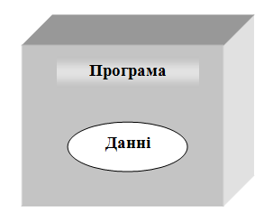

Рисунок 2.2. Структура перших програм

Створення мов програмування високого рівня, таких як ФОРТРАН і ALGOL, істотно спростило програмування обчислень, знизивши рівень деталізації операцій. Це, в свою чергу, дозволило збільшити складність програм.

Революційною була поява в мовах засобів, що дозволяють оперувати підпрограмами. Ідея написання підпрограм з'явилася набагато раніше, але відсутність засобів підтримки в перших мовних засобах істотно знижувало ефективність їх застосування. Підпрограми можна було зберігати і

використовувати в інших програмах. В результаті були створені величезні бібліотеки розрахункових і службових підпрограм, які в міру потреби викликалися з розроблюваної програми.

В наслідок підвищення потужності комп'ютерів і накопичення досвіду програмування на мовах високого рівня швидко росла складність розв'язуваних на комп'ютерах завдань, в результаті чого виявилася обмеженість мов, які проігнорували модульну організацію програм. Крім того, стало зрозуміло, що важливо не тільки те, якою мовою ми програмуємо, але і те, як ми програмуємо. Поява в комп'ютерах другого покоління переривань призвело до розвитку мультипрограмування і створення великих програмних систем. Широко стала використовуватися колективна розробка, яка, однак, розкрила ряд серйозних технологічних проблем.

Типова програма того часу складалася з основної програми, області глобальних даних і набору підпрограм (в основному бібліотечних), що виконують обробку всіх даних або їх частини (рис. 2.3).

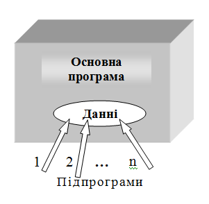

Рисунок 2.3. Архітектура програми з глобальною областю даних

Слабким місцем такої архітектури було те, що при збільшенні кількості підпрограм зростала ймовірність спотворення частини глобальних даних будь-якої підпрограмою. Наприклад, підпрограма пошуку коренів рівняння на заданому інтервалі за методом ділення, відрізка навпіл змінює величину інтервалу. Якщо при виході з підпрограми не передбачити відновлення початкового інтервалу, то в глобальній області виявиться невірне значення інтервалу.

Щоб скоротити кількість таких помилок, було запропоновано в підпрограмі розміщувати локальні дані (рис. 2.4).

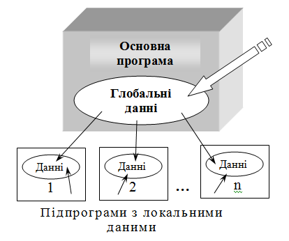

Рисунок 2.4 Архітектура програми, що використовує підпрограми з локальними даними

У відсутності чітких моделей опису підпрограм і методів їх проектування створення кожної підпрограми перетворювалося в непросту задачу, інтерфейси підпрограм виходили складними, і при складанні програмного продукту виявлялося велика кількість помилок узгодження. Виправлення таких помилок, як правило, вимагало серйозної зміни вже розроблених підпрограм, що ще більш ускладнювало ситуацію, так як при цьому в програму часто вносилися нові помилки, які також необхідно було виправляти. Аналіз причин виникнення більшості помилок дозволив сформулювати новий підхід до програмування, який був названий «структурним».

*2.2.2 Другий етап - структурний підхід до програмування (60 - 70-ті рр. XX ст.)*

Структурний підхід до програмування являє собою сукупність рекомендованих технологічних прийомів, що охоплюють виконання всіх етапів розробки програмного забезпечення.

В основі структурного підходу лежить декомпозиція (розбиття на частини) складних систем з метою подальшої реалізації у вигляді окремих невеликих (до 40 - 50 операторів) підпрограм. З появою інших принципів декомпозиції (об'єктного, логічного і т.д.) даний спосіб отримав назву процедурної декомпозиції.

У 70-ті роки набули широкого поширення інформаційні системи і бази даних. Почався інтенсивний розвиток технології програмування, перш за все, в таких напрямках:

- обґрунтування і широке впровадження низхідній розробки та структурного програмування;
- розвиток абстрактних типів даних і модульного програмування, зокрема, виникнення ідеї поділу специфікації і реалізації модулів і використання модулів, що приховують структури даних;
- дослідження проблем забезпечення надійності та мобільності ПЗс;
- створення методики управління колективною розробкою ПЗс;
- поява інструментальних програмних засобів підтримки технології програмування.

На відміну від використовуваного раніше процедурного підходу до декомпозиції, структурний підхід вимагав уявлення завдання у вигляді ієрархії підзадач найпростішої структури. Проектування, таким чином, здійснювалося «зверху-донизу» і мало на увазі реалізацію загальної ідеї, забезпечуючи опрацювання інтерфейсів підпрограм. Одночасно вводилися обмеження на конструкції алгоритмів, рекомендувалися формальні моделі їх опису, а також спеціальний метод проектування алгоритмів - метод покрокової деталізації.

Підтримка принципів структурного програмування була закладена в основу так званих процедурних мов програмування. Як правило, вони включали основні «структурні» оператори передачі управління, підтримували вкладення підпрограм, локалізацію та обмеження області «видимості» даних. Серед найбільш відомих мов цієї групи варто назвати PL/1, ALGOL-68, Pascal, C.

Одночасно зі структурним програмуванням з'явилася величезна кількість мов, які базуються на інших концепціях, але більшість з них не витримало конкуренції. Якісь мови були просто забуті, ідеї інших були в подальшому використані в наступних версіях розвиваються мов.

Подальше зростання складності і розмірів розроблюваного програмного забезпечення зажадав розвитку структурування даних. Як наслідок цього в мовах з'являється можливість визначення користувацьких типів даних. Одночасно посилилося прагнення розмежувати доступ до глобальних даних програми, щоб зменшити кількість помилок, що виникають при роботі з глобальними даними. В результаті з'явилася і почала розвиватися технологія модульного програмування.

Використання модульного програмування суттєво спростило розробку програмного забезпечення декількома програмістами. Тепер кожен із них міг розробляти свої модулі незалежно, забезпечуючи взаємодію модулів через спеціально домовлені міжмодульні інтерфейси. Крім того, модулі в майбутньому без змін можна використовувати в інших розробках, що підвищило продуктивність праці програміста.

Практика показала, що структурний підхід разом із модульним програмуванням дозволяє отримувати достатньо надійні програми, розмір котрих не перевищує 100000 операторів. Вузьким місцем модульного програмування є те, що помилка в інтерфейсі при виконанні підпрограми виявляється тільки при виконанні програми (із-за роздільної компіляції модулів знайти помилки раніше неможливо). При збільшенні розміру програми звичайно виростає складність модульних інтерфейсів, і з певного моменту передбачити взаємодію окремих частин програми стає практично неможливо. Для розробки програмного забезпечення великого об'єму було запропоновано використовувати об'єктний підхід.

2.2.3 Третій етап – об'єктний підхід до програмування (з середини 80-х до кінця 90-х років XX ст.).

У 80-х роках було характерно широке впровадження персональних комп'ютерів в усі сфери людської діяльності і, тим самим, створення великого і різноманітного контингенту користувачів ПЗс. Це призвело до бурхливого розвитку користувальницьких інтерфейсів і створенню чіткої концепції якості ПЗс. Розвиваються методи та мови специфікації ПЗс [11]. Виходить на передові позиції об'єктний підхід до розробки ПЗс [12]. Створюються різні інструментальні середовища розробки і супроводу ПЗс. Бурхливо розвиваються концепції комп'ютерних мереж.

Об'єктно-орієнтоване програмування визначається, як технологія створення складного програмного забезпечення, яка базується на уявленні програми у вигляді сукупності об'єктів, кожен з яких є екземпляром певного типу (класу), а класи утворюють ієрархію з спадкуванням властивостей. Взаємодія програмних об'єктів в такій системі здійснюється шляхом передачі повідомлень

У 90-ті роки міжнародна комп'ютерна мережа широко охопила все людське суспільство, персональні комп'ютери стали підключатися до неї як термінали. Гостро постала проблема захисту комп'ютерної інформації та переданих по мережі повідомлень. Стали бурхливо розвиватися комп'ютерна технологія розробки ПС і пов'язані з нею формальні методи специфікації програм. Можна сказати, що в цей період починається вирішальний етап повної інформатизації і комп'ютеризації суспільства.

Основною перевагою об'єктно-орієнтованого програмування в порівнянні з модульним програмуванням є «більш природна» декомпозиція програмного забезпечення, яка істотно полегшує його розробку. Це призводить до більш повної локалізації даних та інтегруванню їх з підпрограмами обробки, що дозволяє вести практично незалежну розробку окремих частин (об'єктів) програми. Крім цього, об'єктний підхід пропонує нові способи організації програм, засновані на механізмах успадкування, поліморфізму, композиції, наповнення. Ці механізми дозволяють конструювати складні об'єкти з порівняно простих.

Бурхливий розвиток технологій програмування, заснованих на об'єктному підході, дозволило вирішити багато проблем. Так були створені середовища, підтримують візуальне програмування, наприклад, Delphi, C++ Builder, Visual C ++ і т. д. При використанні візуального середовища у програміста з'являється можливість проектувати деяку частину, наприклад, інтерфейси майбутнього продукту, із застосуванням візуальних засобів додавання і налаштування спеціальних бібліотечних компонентів.

Таким чином, при використанні цих мов програмування зберігається залежність модулів програмного забезпечення від адрес експортованих полів і методів, а також структур і форматів даних. Ця залежність об'єктивна, так як модулі повинні взаємодіяти між собою, звертаючись до ресурсів один одного. Зв'язки модулів можна розрвати, але можна спробувати стандартизувати їх взаємодія, на чому і заснований компонентний підхід до програмування.

*2.2.4. Компонентний підхід і CASE-технології (з середини 90-х років XX ст. до нашого часу).*

Компонентний підхід пропонує побудову програмного забезпечення з окремих компонентів фізично окремо існуючих частин програмного забезпечення, які взаємодіють між собою через стандартизовані двійкові інтерфейси. На відміну від звичайних об'єктів об'єкти-компоненти можна збирати в динамічні бібліотеки або файли які виконуються, розповсюджувати в двійковому коді (без початкових текстів) і використовувати в будь-якій мові програмування, що підтримує відповідну технологію. На сьогоднішній день ринок об'єктів став реальністю, так, в Інтернеті існують вузли, які представляють велику кількість компонентів, реклами компонентів в журналах. Це дозволяє програмістам створювати продукти, які хоча б частково складаються з повторно використаних частин, тобто використати технологію, яка добре зарекомендувала себе в області проектування апаратури (рис. 2.5).

Компонентний підхід лежить в основі технологій, розроблених на базі СОМ (Component Object Model — компонентна модель об'єктів), і технології створення розподілених додатків CORBA (Common Object Request Broker Architecture — загальна архітектура з посередником обробки запитів об'єктів). Ці технології використовують схожі принципи і розрізняються лише особливостями їх реалізації.

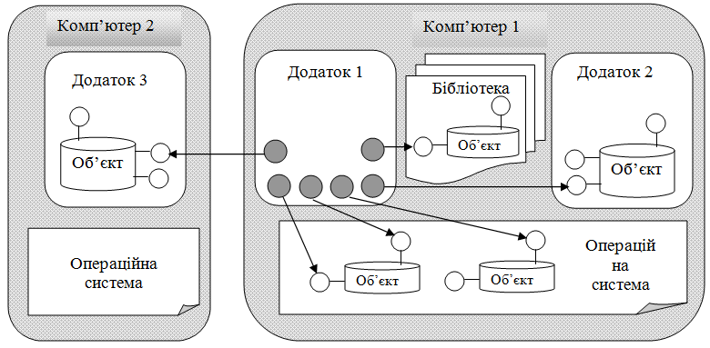

Рисунок 2.5 Взаємодія програмних компонентів різних типів

Об'єкт завжди функціонує у складі сервера – динамічної бібліотеки або виконуваного файлу, які забезпечують функціонування об'єкта. Розрізняють три типи серверів:

1) внутрішній сервер; реалізується динамічними бібліотеками, які підключаються до додатка-клієнта і працюють в спільному адресному просторі, найбільш ефективний сервер, крім того він не вимагає спеціальних ресурсів;

2) локальний сервер; створюється окремим процесом (модулем, *.exe), який працює на одному комп'ютері з клієнтом;

3) віддалений сервер; створюється процесом, який працює на іншому комп'ютері.

Наприклад, Microsoft Word є локальним сервером. Він включає багато об'єктів, які можуть використовуватись іншими додатками.

Для звернення до служб клієнт повинен отримати вказівник на відповідний інтерфейс. Перед першим зверненням до об'єкта клієнт посилає запит до бібліотеки СОМ, що містить інформацію про всі зареєстровані в системі класи СОМ об'єктів, і передає їй ім'я класу, ідентифікатор інтерфейсу і тип сервера. Бібліотека запускає необхідний сервер, створює необхідні об'єкти і повертає вказівники на об'єкти та інтерфейси. Отримавши вказівники, клієнт може викликати необхідні функції об'єкта.

Особливістю сучасного етапу розвитку технології програмування, крім зміни підходу, є створення та супроводження програмного забезпечення, які були названі CASE-технології (Computer-Aided Software/System Engineering – розробка програмного забезпечення програмних систем з використанням комп'ютерної підтримки). Без засобів автоматизації розробка достатньо складного програмного забезпечення на

сучасний момент стає тяжко реалізованою задачею: пам'ять людини вже не в стані фіксувати всі деталі, які необхідно враховувати при розробці програмного забезпечення. На сьогодні існують CASE-технології, які підтримують як структурний, так і об'єктний (у тому числі і компонентний) підходи до програмування.

Поява нового підходу не означає, що все програмне забезпечення буде створюватись з програмних компонент, але аналіз існуючих проблем розробки складного програмного забезпечення показує, що він буде використовуватись досить широко.

## 2.3. Моделі життєвого циклу програмного забезпечення

Поняття життєвого циклу програмного забезпечення з'явилося, коли програмістське співтовариство усвідомило необхідність переходу від кустарних ремісничих методів розробки програм до технологічного промислового їх виробництва. Як звичайній відбувається в подібних ситуаціях, програмісти спробували перенести досвід інших індустріальних виробництв в свою сферу. Зокрема, було запозичене поняття життєвого циклу.

Життєвий цикл програмного забезпечення - період часу, що починається з моменту прийняття рішення про необхідність створення програмного продукту і закінчується в момент його повного вилучення з експлуатації [13]. Цей цикл - процес побудови і розвитку ПЗ.

Поняття ЖЦ виникло під впливом потреби у систематизації робіт у процесі розроблення ПЗ. Систематизація була першим етапом на шляху до автоматизації процесу розроблення ПЗ. Наступними кроками переходу до автоматизації процесу розроблення ПЗ були такі: встановлення технологічних маршрутів діяльності розробників ПЗ, визначення можливості їх автоматизації та виявлення ризиків, розроблення інструментів для автоматизації.

Використання поняття життєвого циклу дозволяє обрати підходи, які найбільш ефективні для завдань певного етапу життя ПЗ. Залежно від особливостей процесів розробки та супроводу програм існують різні моделі ЖЦ.

Використання певної моделі ЖЦ дозволяє визначитися з основними моментами процесу замовлення, розроблення та супроводу ПЗ навіть недосвідченому програмісту. Також використання моделей дозволяє чітко зрозуміти, в який період переходити від версії до версії, які дії з удосконалення виконувати, на якому етапі. Знання про закономірності розвитку програмного продукту, які відбиваються в обраній моделі ЖЦ, дозволяють отримати надійні орієнтири для планування процесу


<!-- ВІДНОВЛЕНО ЛОКАЛЬНО (Стор. 43) -->
розроблення та супроводу ПЗ, економно витрачати ресурси та підвищувати якість управління усіма процесами. 

Також моделі життєвого циклу є основою знань технологій програмування та інструментарію, що їх підтримує. Будь-що, технологія базується на певних уявленнях про життєвий цикл та організує свої методи та інструменти навколо фаз та етапів ЖЦ. 

Розвиток методологій програмування у 70-х рр. XХ ст. привів до формування потреби вивчення життєвого циклу ПЗ. До цього часу моделі ЖЦ розвиваються і модифікуються, уточнюючи та доповнюючи дві базові моделі – каскадну та ітеративну. Ці зміни обумовлені потребою організаційної та технологічної підтримки проектів з розроблення ПЗ. 

Найбільшого поширення набули дві моделі: каскадна (водоспадна), створена в 1970/85 pp., і спіральна, створена в 1986/1990 рр. 

_2.3.1. Каскадна модель (waterflow model)._ 

Каскадна модель життєвого циклу (модель водоспаду - Waterfall model) була запропонована в 1970 р. В. Ройсом. 

Каскадна модель ЖЦ ПЗ виникла для задоволення потреби у систематизації робіт ще на ранніх етапах розроблення програм. Згідно з цією моделлю програмні системи проходять в своєму розвитку дві фази: розроблення; 

супровід. 

Фази розбиваються на ряд етапів, представлених на рис. 2.6. 

Каскадна модель передбачає послідовне виконання всіх етапів проекту в строго фіксованому порядку. Перехід на наступний етап означає повне завершення робіт на попередньому етапі. 

Розроблення починається з ідентифікації потреби в новому додатку, а закінчується передачею продукту розроблення в експлуатацію. Усі етапи розроблення програмного забезпечення регламентуються стандартами підприємства та державним стандартом ГОСТ 34.601-90 [7]. 

Першим етапом фази розроблення є специфікація (Requirements Speсification) – постановка завдання і визначення вимог. На етапі постановки завдання замовник спільно з розробниками приймають рішення про створення системи. Визначення вимог включає опис загального контексту задачі, очікуваних функцій системи та її обмежень. Особливо важливим є цей етап для нетрадиційних додатків. У разі позитивного рішення починається аналіз системи відповідно до вимог. Розробники програмного забезпечення намагаються осмислити висунуті замовником вимоги і зафіксувати їх у вигляді специфікацій системи. Призначення специфікацій – описувати зовнішню поведінку системи, а не її внутрішню організацію. 

43
<!-- КІНЕЦЬ ВІДНОВЛЕННЯ -->


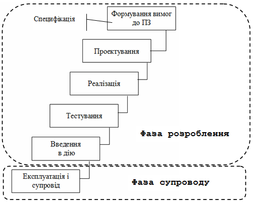

Рисунок 2.6. Каскадна модель ЖЦ

Перш ніж розпочати створювати проект за специфікаціями, вимоги повинні бути ретельно перевірені на відповідність вихідним цілям, повноту, сумісність (несуперечність) та однозначність. Завдання етапу аналізу полягає в тому, щоб вибудувати опис програми у вигляді логічної системи, зрозумілої як для замовника, майбутніх користувачів, так і для виконавців проекту. На етапі специфікації обов'язково формується технічне завдання на розробку ПЗ [15]. Завдання етапу аналізу полягає в тому, щоб вибудувати опис програми у вигляді логічної системи, зрозумілої як для замовника, майбутніх користувачів, так і для виконавців проекту. На етапі специфікації обов'язково формується технічне завдання на розробку ПЗ.

Отже, на етапі Специфікація виконується *постановка завдання*, коли замовник спільно з розробниками приймають рішення про створення системи, *визначення вимог*, а саме опис загального контексту задачі, очікуваних функцій системи та її обмежень. Розробники ПЗ намагаються осмислити вимоги, висунуті замовником, і зафіксувати їх у вигляді специфікацій системи.

Призначення Специфікації - описати зовнішню поведінку системи.

Розробка проектних рішень, що відповідають на питання, як повинна бути реалізована система, щоб вона могла задовольняти певні вимоги, виконується на етапі проектування. Оскільки складність системи в цілому

може бути дуже великою, головним завданням цього етапу є послідовна декомпозиція системи до рівня очевидно реалізованих модулів або процедур. Результати виконання цього етапу оформляються як технічний проєкт.

Розроблення проєктних рішень, що відповідають на питання, як повинна бути реалізована система, щоб вона могла задовольняти визначені вимоги, виконується на етапі проєктування (Design).

Головне завдання Розроблення проєктних рішень - послідовна декомпозиція системи до рівня очевидно реалізованих модулів або процедур

Результат етапу - технічний проєкт, вимоги до документів якого встановлені стандартом. Фаза розробки закінчується тестуванням - автономним і комплексним та передачею системи в експлуатацію.

Етапи *Експлуатація та Супровід* включають в себе діяльність щодо:
* забезпечення нормального функціонування програмних систем;
* фіксування помилок, пошук їх причин та виправлення;
* підвищення експлуатаційних характеристик системи;
* адаптацію системи до довкілля.

Принципова особливість каскадної моделі - перехід на наступну стадію здійснюється тільки після повного завершення роботи на поточній стадії, повернення на пройдені стадії не передбачається. Кожна стадія закінчується отриманням результатів, які є вхідними даними для наступної стадії, і випуском повного комплекту документації. Вимоги до програмного забезпечення, певні на стадії формування вимог, документуються у вигляді технічного завдання і фіксуються на всій розробці. Критерієм якості розробки при такій моделі є точність виконання специфікацій технічного завдання.

Каскадний підхід добре зарекомендував себе при побудові відносно простих ІС, коли на самому початку розробки можна досить точно і повно сформулювати всі вимоги до системи. Основним недоліком цього підходу є те, що реальний процес створення системи ніколи повністю не вкладається в таку жорстку схему, постійно виникає потреба в поверненні до попередніх етапах і уточнення або перегляд раніше прийнятих рішень.

На наступному етапі Реалiзацiї (Construction), або кодування, кожен з цих модулів програмується на найбільш підходящій для даного застосування мови. З точки зору автоматизації цей етап традиційно є найбільш розвиненим.

У каскадній моделі фаза розробки закінчується етапом тестування (Testing and debugging), автономного і комплексного, та передачею системи в експлуатацію (Installation).

Фаза експлуатації та супроводу включає в себе всю діяльність щодо забезпечення нормального функціонування програмних систем, у тому

числі фіксування розкритих під час виконання програм помилок, пошук їх причин та виправлення, підвищення експлуатаційних характеристик системи, адаптацію системи до довкілля, а також за необхідності і більш суттєві роботи з удосконалення системи. Фактично відбувається еволюція системи. У ряді випадків на дану фазу припадає більша частина коштів, що витрачаються в процесі життєвого циклу програмного забезпечення.

Зрозуміло, що увага програмістів до тих чи інших етапів розробки залежить від конкретного проекту. Часто розробнику немає необхідності проходити через усі етапи, наприклад, якщо створюється невелика, добре зрозуміла програма із чітко поставленою метою.

Стисла характеристика:
* фіксований набір стадій;
* кожна стадія закінчується документованим результатом;
* наступна стадія починається лише після закінчення попередньої.

Цінність цієї моделі полягає в тому, що вона фіксує послідовність етапів розробок і можливість повернення до попередніх етапів роботи.

Основна увага розробників зосереджено на досягненні кращих значень технічних характеристик ПЗ, а саме: продуктивність, обсягу пам'яті і т.п. Переваги застосування каскадної моделі: на кожній стадії формується закінчений набір проектної документації, який відповідає критеріям повноти і узгодженості; виконання робіт в логічній послідовності дозволяє планувати терміни завершення всіх робіт і відповідні витрати.

Ця модель добре зарекомендувала себе, коли на самому початку розробки можна досить точно і повно сформулювати всі вимоги. Під цю категорію потрапляють складні системи з великою кількістю завдань обчислювального характеру, системи реального часу і т.п.

Переваги цієї моделі в найбільшій мірі відповідають командній системі керування господарською діяльністю. Але реальний процес життєвого циклу не вміщується у таку жорстко регламентовану модель. На всіх етапах життєвого циклу неодноразово виникає необхідність повернення до попередніх етапів не тільки через наявність помилок, й через причину впливу факторів часу та інших факторів. Постійно виникає необхідність уточнити прийняті раніше рішення.

Недоліками каскадної моделі є:
* негнучкість;
* фаза повинна бути завершена до переходу до наступної;
* набір фаз фіксований;
* важко реагувати на зміни вимог.

Недоліком каскадної системи є також те, що система не розвивається, вона зупиняється на тому рівні, який був закладений на початкових етапах аналізу і проектування.


<!-- ВІДНОВЛЕНО ЛОКАЛЬНО (Стор. 47) -->
Використання цієї моделі - там, де вимоги добре зрозумілі та стабільні. 

Каскадна модель життєвого циклу є ідеальною, оскільки лише дуже прості завдання проходять всі етапи без будь-яких ітерацій (повернень на попередні кроки процесу). Наприклад, при програмуванні може виявитися, що реалізація деякої функції неефективна і вступає в протиріччя з вимогами до продуктивності системи. У цьому випадку потрібні зміни проекту, а можливо, і переробка специфікацій. Для обліку повторюваності етапів процесу розробки створювалися альтернативи каскадної моделі. З таких альтернатив утворилася ітеративна модель. Ця модель передбачає розбиття життєвого циклу проекту на послідовність ітерацій, кожна з яких нагадує "міні-проект" з усіма фазами життєвого циклу. 

_2.3.2. Ітеративна модель (Iterative and incremental development)_ 

Каскадна модель життєвого циклу є ідеальною, оскільки лише дуже прості завдання проходять усі етапи без будь-яких ітерацій (повернень на попередні кроки процесу). Наприклад, при програмуванні може виявитися, що реалізація деякої функції неефективна і вступає у протиріччя з вимогами до продуктивності системи. У цьому випадку потрібні зміни проекту, а можливо, і переробка специфікацій. Для врахування повторюваності етапів процесу розроблення створювались альтернативи каскадної моделі. 

Із таких альтернатив утворилася ітеративна модель. Ця модель передбачає розбиття життєвого циклу проекту на послідовність ітерацій, кожна з яких нагадує "міні-проект" з усіма фазами життєвого циклу. 

Класична ітераційна модель абсолютизує можливість повернень на попередні етапи (рис. 2.7). Ця обставина відбиває істотний аспект програмних розробок: прагнення заздалегідь передбачати всі ситуації використання системи та неможливість у переважній більшості випадків досягти цього. Усі традиційні технології програмування спрямовані лише на те, щоб мінімізувати повернення. Але суть від цього не змінюється: при поверненні завжди доводиться повторювати побудову того, що вже вважалося готовим. 

47
<!-- КІНЕЦЬ ВІДНОВЛЕННЯ -->


<!-- ВІДНОВЛЕНО ЛОКАЛЬНО (Стор. 48) -->
Рисунок 2.7. Класична ітераційна модель 

Класична ітераційна модель абсолютизує можливість повернень на попередні етапи [16]. Ця обставина відображає істотний аспект програмних розробок: прагнення заздалегідь передбачити всі ситуації використання системи і неможливість в більшості випадків досягти цього. Всі традиційні технології програмування спрямовані лише на те, щоб мінімізувати повернення. Але суть від цього не змінюється: при поверненні завжди доводиться повторювати побудову того, що вже вважалося готовим. 

Мета кожної ітерації в розробці ПЗ - отримання працюючої версії програмної системи, що включає функціональність, певну інтегрованим змістом усіх попередніх і поточної ітерації. Результат фінальної ітерації містить всю необхідну функціональність продукту. Таким чином, із завершенням кожної ітерації розвивається інкрементальний продукт (нарощується функціональність). 

Прагнення розробника ПЗ на цьому етапі - заздалегідь передбачати всі ситуації використання системи, але в дійсності  неможливо цього досягти. При ітерації доводиться повторювати побудову того, що вважалося готовим. 

Мета ітерації - отримати працюючу версію програмної системи, що включає функціональність усіх попередніх і поточної ітерації. Результат фінальної ітерації - функціональність продукту. 

48
<!-- КІНЕЦЬ ВІДНОВЛЕННЯ -->


<!-- ВІДНОВЛЕНО ЛОКАЛЬНО (Стор. 49) -->
Основна характеристика - неодноразове повторення стадій. Переваги ітераційної моделі: 

   - на кожному кроці маємо працюючу систему: можна на ранній стадії проекту почати тестування користувачами; 

   - можна прийняти стратегію розробки відповідно до бюджету, 

   - повністю захищає від перевитрат часу або коштів (зокрема, за рахунок скорочення другорядної функціональності). 

   - Недоліки: 

   - система часто погано структурована, проект «не прозорий»; 

   - після уточнення вимог відкидається частина раніше виконаної роботи; 

   - потрібні засоби для швидкого розроблення. 

- Використання: ітераційна модель підходить для малих та середніх 

- проектів. 

   - _2.3.3. Спіральна модель (Spiral model)._ 

Природним системам більш характерна спіральна модель життєвого циклу. Вони проходять послідовно етапи зародження, розвитку, відмирання, ці етапи багаторазово повторюються. Розвиток у природі здійснюється по спіралі. Спіральна модель життєвого циклу прийнята у вигляді стандарту і для розробки інформаційних та інших технічних систем [17]. 

Спіральна модель ЖЦ була запропонована для подолання проблем каскадної та ітераційної моделі. 

Спіральна модель була розроблена в середині 1980-х років Барі Боем. Вона ґрунтується на класичному циклі Демінга PDCA ( _plan-do-check-act_ планувати-ні-перевірити-дія). Відмінною особливістю цієї моделі є спеціальна увага ризикам, що впливає на організацію життєвого циклу. 

У спіральній моделі розроблення програми має вигляд серії послідовних ітерацій. На перших етапах уточнюються специфікації продукту, на наступних - додаються нові можливості і функції. Мета цієї моделі - по закінченні кожної ітерації заново здійснити оцінку ризиків продовження робіт. 

При використанні цієї моделі система створюється в кілька ітерацій (витків спіралі) методом прототипування. 

Прототип - це програмний компонент, який реалізує окремі функції і зовнішні інтерфейси ПЗ [18]. 

Існує два базових варіанти використання прототипів. 

У першому варіанті створення прототипу використовується для кращої специфікації вимог до ПЗ, після розробки яких сам прототип стає непотрібним. 

Другий варіант передбачає ітераційний розвиток прототипу в готовий для експлуатації програмний продукт. Ітерації розробки 

49
<!-- КІНЕЦЬ ВІДНОВЛЕННЯ -->


прототипу включають створення/модифікацію прототипу, його демонстрацію користувачеві, узгодження, розробку нових вимог до ПЗ, нову модифікацію, поки не буде створено готовий додаток.

Створення прототипів здійснюється декількома ітераціями. Кожна ітерація відповідає створенню фрагмента або версії ПЗ, уточнюються цілі і характеристики проекту, оцінюється якість отриманих результатів та плануються роботи наступної ітерації. На кожній ітерації проводиться ретельна оцінка ризику перевищення термінів і вартості проекту, щоб визначити необхідність проведення ще однієї ітерації, ступінь повноти і точності розуміння вимог до системи, а також доцільності припинення проекту. Спіральна модель позбавляє користувачів і розробників ПЗ від необхідності повного і точного формулювання вимог до системи на початковій стадії, оскільки вони уточнюються на кожній ітерації. Т.ч. уточнюються і послідовно конкретизуються деталі проекту і в кінці кінців вибирається обґрунтований варіант, який і реалізується.

Модель має ітераційний характер і рухається по спіралі, проходячи стадії, де на кожному витку уточнюються характеристики майбутнього інформаційного продукту.

На етапах аналізу і проектування реалізація технічних рішень і ступінь задоволення потреб замовника перевіряється шляхом створення прототипів. Кожен виток спіралі відповідає створенню працездатного фрагмента або версії системи. Це дозволяє уточнити вимоги, цілі і характеристики проекту, визначити якість розробки, спланувати роботи наступного витка спіралі. Таким чином поглиблюються і послідовно конкретизуються деталі проекту і в результаті вибирається обґрунтований варіант, який задовольняє дійсним вимогам замовника та доводиться до реалізації.

Спіральна модель життєвого циклу також має ряд послідовних етапів, а саме [19]:
* визначення вимог;
* аналіз;
* проектування;
* реалізація та тестування;
* інтеграція.

На цих етапах виконуються операції, як і при каскадній моделі. Етап реалізації здійснюється шляхом створення прототипів, на яких конкретизуються вимоги й деталі наступного циклу. Вказана модель зображена на рис. 2.8.


Рисунок 2.8. Спіральна модель життєвого циклу

Ітераційний процес розробки відображає об'єктивно спіральний цикл створення системи. Неповне завершення робіт на кожній стадії дозволяє переходити на наступну стадію, не чекаючи повного завершення роботи на поточному. При ітеративному способі розробки відсутню стадію можна буде виконати на наступній ітерації. Головне завдання - якомога швидше показати користувачам системи працездатний продукт, активізуючи процес уточнення і доповнення вимог.

Кожна ітерація відповідає створенню фрагмента або версії ПЗ, на ній уточнюються цілі і характеристики проекту, оцінюється якість отриманих результатів та плануються роботи наступної ітерації.

На кожній ітерації оцінюються:
* ризик перевищення термінів і вартості проекту;
* необхідність виконання ще однієї ітерації;
* ступінь повноти і точності розуміння вимог до системи;
* доцільність припинення проекту.

Спіральна модель не виключає використання каскадного підходу на кінцевих стадіях проекту в тих випадках, коли вимоги до системи стають цілком чіткими.

У спіральної моделі розробки програми має вигляд серії послідовних ітерацій. На перших етапах уточнюються специфікації продукту, на наступних - додаються нові можливості і функції. Мета цієї моделі - після закінчення кожної ітерації заново здійснити оцінку ризиків продовження робіт.

На кожному витку спіралі виконується створення чергової версії продукту, уточнюються вимоги проекту, визначається його якість і плануються роботи наступного витка. Особлива увага приділяється початкових етапах розробки - аналізу і проектування, де реалізація тих чи інших технічних рішень перевіряється і обґрунтовується за допомогою створення прототипів (макетування).

Основна проблема спірального циклу - визначення моменту переходу на наступну стадію. Для її вирішення необхідно ввести тимчасові обмеження на кожну зі стадій життєвого циклу.

Перехід здійснюється відповідно до плану, навіть якщо не вся запланована робота закінчена. План складається на основі статистичних даних, отриманих в попередніх проектах, і особистого досвіду розробників.

Відмінною особливістю спіральної моделі є спеціальна увага, що приділяється ризикам, що впливає на організацію життєвого циклу, і контрольними точками. Барі Боєм формулює 10 найбільш поширених (за пріоритетами) ризиків:
1. Дефіцит фахівців.
2. Нереалістичні терміни і бюджет.
3. Реалізація невідповідної функціональності.
4. Розробка неправильного користувальницького інтерфейсу.
5. Перфекціонізм, непотрібна оптимізація і відточування деталей.
6. Безперервний потік змін.
7. Брак інформації про зовнішні компонентах, що визначають оточення системи або залучених в інтеграцію.
8. Недоліки в роботах, виконуваних зовнішніми (по відношенню до проекту) ресурсами.
9. Недостатня продуктивність одержуваної системи.
10. Разрив в кваліфікації фахівців різних галузей.

У сьогоднішній спіральній моделі визначений наступний загальний набір контрольних точок:
* Concept of Operations (COO) - концепція (використання) системи;
* Life Cycle Objectives (LCO) - цілі і зміст життєвого циклу;

* Life Cycle Architecture (LCA) - архітектура життєвого циклу; тут же можливо говорити про готовність концептуальної архітектури цільової програмної системи;
* Initial Operational Capability (IOC) - перша версія створюваного продукту, придатна для дослідної експлуатації;
* Final Operational Capability (FOC) - готовий продукт, розгорнутий (встановлений і налаштований) для реальної експлуатації.

Команда розробників повинна бути групою професіоналів, що мають досвід у проектуванні, програмування та тестуванні ПЗ, здатних взаємодіяти з кінцевим користувачем і трансформувати їх пропозиції в робочі прототипи.

Спіральна модель життєвого циклу має достатньо переваг:
* наявність дій з аналізу ризиків, що забезпечує їх скорочення і завчасне визначення непереборних ризиків;
* розбиття потенційного обсягу робіт на невеликі частини;
* першочерговість реалізації вирішальних функцій з високим ступенем ризику, при необхідності зупинити роботи над проектом на ранніх циклах моделі і зменшити витрати;
* можливість користувачам приймати участь при плануванні, аналізі ризиків, проектуванні, розробці, виконанні оцінних дій;
* удосконалення адміністративного управління процесами життєвого циклу розробки, витратами, дотриманням графіку та кадровим забезпеченням, що досягається шляхом виконання аналізу (огляду) в кінці кожної ітерації;
* підвищення продуктивності за рахунок використання придатних для повторного використання результатів;
* підвищення ймовірності передбачуваної поведінки системи за допомогою уточнення поставлених цілей;
* відсутність необхідності в попередньому розподілі всіх фінансових ресурсів проекту;
* регулярна оцінка загальних витрат і, в результаті, їх скорочення.

При використанні спіральної моделі стосовно невідповідному їй проекту, виявляються такі її недоліки:
* висока вартість моделі за рахунок вартості та додаткових тимчасових витрат на планування, визначення цілей, виконання аналізу ризиків та прототипування при проходженні кожного циклу спіралі;
* невиправдано висока вартість моделі для проектів, що мають низький ступінь ризику або невеликі розміри;
* ускладненість структури моделі, що призводить до складності її використання розробниками, менеджерами і замовниками;
* необхідність у високопрофесійних знаннях для оцінки ризиків;

* можливість віддалення закінчення роботи над проектом у зв'язку з бажанням замовника покращувати кожну створену версію;
* необхідність в обробці додаткової документації за рахунок великої кількості проміжних циклів;
* необхідність у чіткому розподілі робіт між розробниками;
* складність визначення критеріїв для продовження процесу розробки на наступній ітерації;
* необхідність потужних інструментальних засобів і методів прототипування.

Очевидно, що класична спіральна модель є досить складною. З урахуванням цього розроблено ряд її спрощених версій.

Це забезпечує більш високу якість процесу розробки продукту, і спрощує прогнозування термінів і вартості розробки, підвищує задоволеність замовника результатами продукту.

До переваг описаних спрощених спіральних моделей можна віднести:
* Спрощено в порівнянні з базовою моделлю Боема, що робить її більш зрозумілою як розробнику так і замовнику.
* На відміну від інших моделей, увага приділяється діям безпосередньо не пов'язаних з розробкою.

Це забезпечує більш високу якість процесу розробки продукту, і спрощує прогнозування термінів і вартості розробки, підвищує задоволеність замовника результатами продукту.

Використання - для малих і середніх проектів


<!-- ВІДНОВЛЕНО ЧЕРЕЗ GEMINI (Стор. 55) -->
## 3. ОСНОВНІ ЕТАПИ РОЗРОБКИ ПРОГРАМНОГО ЗАБЕЗПЕЧЕННЯ

Створенням програмного забезпечення називають розробку, дизайн та поточне обслуговування програмного забезпечення. При цьому застосовують різноманітні технології з таких сфер, як інформатика, проектування, управління цифровими даними і дизайн у всіх його проявах.

Розробка будь-якої програми, будь-то невелика процедура по обробці надходить на консоль інформації або комплексний програмний продукт, складається з декількох етапів, грамотна реалізація яких є обов'язковою умовою для отримання хорошого результату. Чітке дотримання вивіреним часом етапів розробки програмного забезпечення стає основним критерієм для компаній, що займаються створенням ПЗ і їх замовників, що зацікавлені в отриманні програми, що чудово виконує свої функції. Детально розглянемо кожну стадію загальновизнану методологію розробки ПЗ, щоб оцінити їх високу значимість для досягнення поставленої перед виконавцями мети.

Залежно від особливостей проекту порядок розробки програмного забезпечення може відрізнятися, але в загальному вигляді він такий (рис. 3.1):

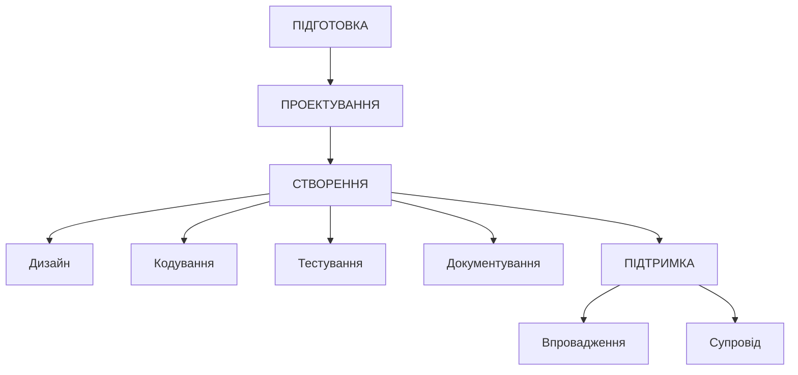
```mermaid
graph TD
    A[ПІДГОТОВКА] --> B[ПРОЕКТУВАННЯ]
    B --> C[СТВОРЕННЯ]
    C --> D[Дизайн]
    C --> E[Кодування]
    C --> F[Тестування]
    C --> G[Документування]
    C --> H[ПІДТРИМКА]
    H --> I[Впровадження]
    H --> J[Супровід]
```

Рисунок 3.1. Загальний порядок розробки програмного забезпечення
<!-- КІНЕЦЬ ВІДНОВЛЕННЯ -->


У процесі створення будь-якої програми можна виділити кілька етапів.

1. **Постановка завдання** - виконується фахівцем в предметній області на природній мові (українській, англійській тощо). Необхідно визначити мету завдання, її зміст і загальний підхід до вирішення. Можливо, що завдання вирішується точно (аналітично), і без комп'ютера можна обійтися. Уже на етапі постановки треба враховувати ефективність алгоритму розв'язання задачі на комп'ютері, обмеження, що накладаються апаратним і програмним забезпеченням (АТ і ПЗ).

2. **Аналіз завдання та моделювання** - визначаються вихідні дані і результат, виявляються обмеження на їх значення, виконується формалізоване опис завдання і побудова (вибір) математичної моделі, придатної для вирішення на комп'ютері.

3. **Розробка або вибір алгоритму розв'язання задачі** - виконується на основі її математичного опису. Багато задач можна вирішити різними способами. Програміст повинен вибрати оптимальне рішення. Неточності в постановці, аналізі завдання або розробці алгоритму можуть привести до прихованої помилки - програміст отримає невірний результат, вважаючи його правильним.

4. **Проектування загальної структури програми** - формується модель рішення з подальшою деталізацією і розбивкою на підпрограми, визначається "архітектура" програми, спосіб зберігання інформації (набір змінних, масивів і т. п.).

5. **Кодування** - запис алгоритму на мові програмування. Сучасні системи програмування дозволяють прискорити процес розробки програми, автоматично створюючи частину її тексту, однак творча робота, як і раніше лежить на програмістові. Для успішної реалізації цілей проекту програмісту необхідно використовувати методи структурного програмування.

6. **Налагодження і тестування програми.** Під налагодженням розуміється усунення помилок в програмі. Тестування дозволяє вести їх пошук і, в кінцевому рахунку, переконатися в тому, що повністю налагоджена програма дає правильний результат. Для цього розробляється система тестів - спеціально підібраних контрольних прикладів з такими наборами параметрів, для яких рішення задачі відомо. Тестування повинне охоплювати всі можливі розгалуження в програмі, тобто перевіряти всі її інструкції, і включати такі вихідні дані, для яких рішення неможливо. Перевірка особливих, виняткових ситуацій, необхідна для аналізу коректності. Наприклад, програма повинна відмовити клієнту банку в проханні видати суму, відсутню на його рахунку. У відповідальних проектах велика увага приділяється так званої "захисту від дурня" - припускає стійкість програми до невмілому зверненням користувача. Використання спеціальних програм-відладчиків, які дозволяють

виконувати програму по окремих кроках, переглядаючи при цьому значення змінних, значно спрощує цей етап.

7. **Аналіз результатів** - якщо програма виконує моделювання будь-якого відомого процесу, слід зіставити результати обчислень з результатами спостережень. У разі істотного розбіжності необхідно змінити модель.

8. **Публікація результатів роботи**, передача замовнику для експлуатації.

9. **Супровід програми** - включає консультації представників замовника по роботі з програмою і навчання персоналу. Недоліки і помилки, помічені в процесі експлуатації, повинні усуватися.

Розглянемо ці етапи більш детально.

### 3.1 Постановка завдання

При підготовці до проектування вирішуються організаційні питання:
* що клієнт може надати (ТЗ, макети, дизайн), наскільки достатні вихідні та які етапи закривають - таким чином визначається склад робіт;
* бюджет і терміни: на основі наявних матеріалів затверджується приблизна вартість, термін всього проекту, а також термін і точна вартість найближчого етапу.

Тільки тоді можна підписувати контракт, отримувати передоплату і всі необхідні для роботи матеріали.

Під час перших зустрічей щодо замовлення на розроблення ПЗ замовник дуже приблизно уявляє, що йому потрібно. Як правило, він надає кілька сторінок тексту завдання і одразу просить оцінити час виконання замовлення та його вартість. Без чіткого визначення процесів, для автоматизації яких буде використовуватись ПЗ, неможливо навіть приблизно оцінити обсяг робіт. Приблизна оцінка з мінімумом вхідної інформації може призвести до помилки в кілька разів, що негативно відіб'ється на точності визначення строків виконання та вартості робіт.

Потреби (needs) – відображають проблеми бізнесу, персоналій або процесу, що повинні співвідноситися з використанням або придбанням системи [20].

Щоб тримати уявлення про можливі обсяги робіт, потрібно пропонувати замовнику надати або розробити технічне завдання. Завдяки цьому системні аналітики зможуть розібратися в задачі, за допомогою інструментальних засобів виконати декомпозицію системи на компоненти, приблизно визначити обсяги цих компонентів і відповідно час їх реалізації. Ця початкова стадія ЖЦ ПЗ є "оцінкою здійсненності".

Постановка завдання – найбільш творча частина ЖЦ ПЗ. Потрібно описати поведінку розроблюваної системи. Ця система отримує якісь сигнали з її оточення, тому треба описати поведінку оточення, але оточення само залежить і змінюється під впливом системи, її сигналів, особливо аварійних.

Вирішують це протиріччя ітераційно, поетапно уточнюючи поведінку як системи, так і її оточення. Для відповідальних систем замовник може запропонувати розробити імітаційну модель системи та оточення, що є досить складною.

У поставленому завданні замовник визначає вимоги до створюваної системи, які повинні задовольняти потреби користувачів і бути зрозумілими для розробників.

Вимога (Requirement) – умова або можливість, що визначена користувачем для вирішення проблеми або досягнення мети, та якій повинна відповідати або якою повинна володіти система чи її компонент, щоб задовольняти умови контракту, стандарту, специфікації або іншого формально репрезентованого документа [21]. Вимоги поділяються на:
- вимоги користувача (User Requirements) – описують цілі/задачі користувачів системи, які повинні досягатися/виконуються користувачами за допомогою створюваної програмної системи [20];
- функціональні вимоги (Functional Requirements) – вимоги, що конкретизують функції, які система або її компонент повинен виконувати [21];
- програмні вимоги (Software Requirements) – вимоги до створюваної системи, зрозумілі користувачам (замовникам) і розробникам (виконавцям) стосовно того, що робитиме система і чого від неї не варто чекати.

Досвід показує, що оцінка складності системи, що є сумою оцінок її компонентів, отриманих у результаті декомпозиції, значно точніша, ніж первісна оцінка системи в цілому. Використання засобів формалізації результатів аналізу для їх документального оформлення також підвищує якість початкового опису вимог до системи.

Коли говорять про "формалізацію постановки завдання", мають на увазі розроблення послідовності моделей, кожна з яких описує систему та її оточення з різних точок зору із поступовою деталізацією. Важливо, щоб усі уявлення про систему, отримані в різних моделях, збиралися в єдиному репозиторії (деякій спеціалізованій базі даних). Цей репозиторій полегшить наскрізне проектування, при якому кожна наступна модель використовує результати попередньої і ніяк їм не суперечить. Відповідно всі можливі перевірки повинні бути наскрізними.

Для якісного визначення вимог до ПЗ потрібно спочатку провести аналіз та сформувати їх специфікації.

3.2 Аналіз завдання та моделювання програмного забезпечення

Ціль аналізу і моделювання - виявлення ясної і відносно простої внутрішньої структури (що іноді називається архітектурою проекту), яка:
* задовольняє заданим функціональним властивостям і специфікаціям;
* погоджена з обмеженнями, що накладені апаратним забезпеченням;
* задовольняє явним і неявним експлуатаційним вимогам;
* задовольняє явним і неявним критеріям дизайну;
* задовольняє вимогам до процесу розробки (тривалість, вартість).

До цього етапу розробки програмного забезпечення також належить процедура проведення всебічного аналізу висунутих замовником вимог до створюваного ПЗ, щоб визначити ключові цілі та завдання кінцевого продукту. В рамках цієї стадії відбувається максимально ефективну взаємодію потребує програмному рішенню клієнта і співробітників компанії-розробника, в ході обговорення деталей проекту допомагають більш чітко сформулювати вимоги до ПЗ. Результатом проведеного аналізу стає формування основного регламенту, на який буде спиратися виконавець у своїй роботі - технічного завдання на розробку програмного забезпечення. ТЗ повинно повністю описувати поставлені перед розробником завдання і охарактеризувати кінцеву мету проекту в розумінні замовника.

Продуктом аналізу і проектування є моделі, що дозволяють розробникам і замовникам зрозуміти структуру майбутньої системи, збалансувати вимоги і узгодити схему реалізації.

У процесі створення таких моделей використовуються сучасні методології й інструменти об'єктно-орієнтованого аналізу і проектування. Це дозволяє йти в ногу зі зростаючими вимогами проектування, реалізовувати складні бізнес- і технологічні процеси.

Аналіз вимог (Requirements Analysis) – трансформація інформації, отриманої від користувачів (та інших зацікавлених осіб) у чітко та однозначно визначені програмні вимоги, що передаються інженерам для реалізації у програмному коді. Аналіз вимог включає:
* виявлення і розв’язання конфліктів між вимогами;
* визначення меж задачі, що вирішується створюваним програмним забезпеченням; у загальному випадку — визначення меж (Scope) і змісту програмного проекту;
* деталізацію системних вимог для встановлення програмних вимог.

Специфікація (Specification) – документ, що в закінченій, точній і перевіреній формі описує вимоги, проект, поведінку або інші

характеристики компонента або системи, а також процедури, спрямовані на визначення того, чи задовольняються описані характеристики [21]. Для опису комплексних проектів (у частині вимог) використовують три основні специфікації:
- визначення системи (System Definition), або специфікація вимог користувачів (User Requirements Specification);
- системних вимог (System Requirements);
- програмних вимог (Software Requirements).

Специфікація програмних вимог (Software Requirements Specification — SRS) встановлює основні угоди між користувачами (замовниками) і розробниками (виконавцями) стосовно того, що робитиме система і чого від неї не варто чекати. Цей документ може включати процедури перевірки створеного ПЗ на відповідність вимогам, що висуваються (у т.ч. плани тестування), описи характеристик стосовно якості та методів його оцінювання, питань безпеки тощо [20].

Специфікація вимог користувачів (User Requirements Specification) або концепція (concept <of operation>) визначає високорівневі вимоги, часто — стратегічні цілі, для досягнення яких створюється програмна система. Важливо, що цей документ описує вимоги до системи з позицій предметної області – домену [20].

Специфікація системних вимог (System Requirements) — описує програмну систему в контексті системної інженерії. Зокрема високорівневі вимоги до програмного забезпечення, що містить кілька або багато взаємозв'язаних підсистем і застосувань. При цьому система може бути як цілком програмною, так і містити програмні та апаратні компоненти. У загальному випадку до складу системи може входити персонал, що виконує певні функції системи, наприклад, авторизацію виконання певних операцій з використанням програмно-апаратних підсистем [20].

При постановці завдання потрібно, щоб програмні вимоги були зрозумілі, зв'язки між ними прозорі, а зміст специфікації не допускав різночитань та інтерпретацій, через які програмний продукт не буде відповідати потребам зацікавлених осіб. Тому потрібні інструменти управління вимогами.

Управління вимогами (Requirements Management) — діяльність, виконання якої забезпечує опис вимог, відстежування їх змін, перевірки на несуперечливість і на порушення наперед визначених правил [21].

Від вхідної інформації про майбутній програмний продукт залежить те, яку методологію буде обрано в проекті з розроблення ПЗ. Методологій багато: і дуже формалізованих, і тих, що дають творчу свободу програмістам. Вибір методології обумовлюється досвідом керівника групи розробників та умовами, які встановлюють замовники до документування етапів робіт. У роботі [22] методології розроблення ПЗ класифікуються за кількістю виконавців та критичністю проекту. Чим більше виконавців


<!-- ВІДНОВЛЕНО ЧЕРЕЗ GEMINI (Стор. 61) -->
та/або вища критичність, тим біль-формальна та регульована методика потрібна.

3.3 Розробка або вибір алгоритму розв'язання задачі

Діяльність під час розроблення ПЗ, як і будь-що, складається з виконання операцій і проектів. Ті й інші мають багато спільного, наприклад, виконуються людьми та на їх виконання виділяються обмежені ресурси.

Головна відмінність операцій від проектів полягає в тому, що операції виконуються постійно і повторюються, тоді як проект тимчасовий і унікальний. Виходячи з цього, проект визначається як тимчасове зусилля, розпочате для створення унікального продукту чи послуги. «Тимчасове» означає, що кожен проект має точно визначені дати початку та закінчення. Говорячи про унікальність продукту, ми маємо на увазі, що вони мають помітні відмінності від усіх аналогічних продуктів або послуг. Таким чином, розроблення ПЗ відповідає визначенню проекту і для організації цього процесу можна застосовувати методи та інструментарій управління проектами. Наприклад, розроблення веб-сайту є проектом, тоді як підтримка його впродовж тривалого часу – це операційна діяльність.

У кожного проекту є чітко визначені початок і кінець. Кінець проекту настає разом із досягненням усіх його цілей або коли стає зрозумілим, що ці цілі не будуть або не можуть бути досягнуті. Тимчасовість не означає короткостроковість проекту — розроблення складної програмної системи може тривати кілька років, хоча, як правило проекти мають обмежені часові рамки для створення ПЗ, оскільки сприятлива для них ситуація на ринку складається на обмежений час. Крім того, проектна команда після його закінчення розпадається, а її члени переходять в інші проекти.

Проект дуже часто плутають із програмою, тобто координованим управлінням групою проектів всередині однієї організації. Управління відразу декількома проектами скоординоване для того, щоб отримати вигоду, яку неможливо одержати від окремого управління кожним із них.

Розробка алгоритму — розробка та представлення алгоритму розв'язування задачі у вигляді певної, точно визначеної послідовності операцій ЕОМ. Це можна зробити словесно-формульно або за допомогою блок-схеми.

Набір даних, що містить всю необхідну і достатню інформацію про досліджувані об'єкти чи процеси називають інформаційною моделлю. Інформаційна модель — це множина тих і тільки тих даних про об'єкт, які необхідні для розв'язання задачі що цікавить дослідника. Інформаційні моделі — це знакові моделі, які описуються з використанням певних
<!-- КІНЕЦЬ ВІДНОВЛЕННЯ -->


систем знаків. Інформаційні моделі можна подавати за допомогою розмовної мови, спеціальних та формальних мов, можна для цього використовувати певні системи графічних позначень (знаків), графи тощо.

Інформаційна модель, яка містить усі необхідні дані для розв'язання певної задачі і поміщена в пам'ять комп'ютера називається комп'ютерною моделлю. Комп'ютерна модель будується на основі певної математичної та інформаційної моделей і реалізується апаратно-програмними засобами.

Складання програми на алгоритмічній мові — здійснюється переклад алгоритму задачі на мову конкретної машини або відповідну алгоритмічну мову. Розробкою програми завершуються етапи розв'язування задачі, що виконуються людиною без використання ЕОМ. Решта етапів виконуються з використанням комп'ютера.

Вибір або розробка алгоритму й чисельного методу розв'язання задачі мають найважливіше значення для успішної роботи над програмою. Ретельно пророблений алгоритм розв'язання задачі — необхідна умова ефективної роботи зі складання програми.

3.4 Проектування загальної структури програми

Наступний ключовий етап в розробці програмного забезпечення - стадія проектування, тобто моделювання теоретичної основи майбутнього продукту. Найсучасніші засоби програмування дозволяють частково об'єднати етапи проектування та кодування, тобто технічної реалізації проекту, будучи заснованими на об'єктно-орієнтованому підході, але повноцінне планування вимагає більш ретельного і скрупульозного моделювання.

Якісний аналіз перспектив і можливостей створюваного продукту стане основою для його повноцінного функціонування і виконання всього комплексу покладених на ПЗ завдань. Однією із складових частин етапу проектування, наприклад, є вибір інструментальних засобів і операційної системи, яких сьогодні на ринку присутня дуже велика кількість.

На цьому етапі відбувається «архітектурне» пророблення проекту. Визначаються ті частини алгоритму, які доцільно оформити у вигляді підпрограм, модулів. Визначається й спосіб зберігання інформації — у вигляді набору простих змінних, масивів або інших структур.

В рамках даного етапу сторони повинні здійснити:
* оцінку результатів проведеного спочатку аналізу і виявлених обмежень; пошук критичних ділянок проекту;
* формування остаточної архітектури створюваної системи; аналіз необхідності використання програмних модулів або готових рішень сторонніх розробників;

- проектування основних елементів продукту - моделі бази даних, процесів і коду;
- вибір середовища програмування і інструментів розробки, затвердження інтерфейсу програми, включаючи елементи графічного відображення даних; визначення основних вимог до безпеки розробляється ПЗ.

Отже, етапи і результати проектування:
1. Опис: спільна робота замовника (говорить про користь продукту, вимоги до працездатності та зовнішнім виглядом) і розробника (пропонує технічні та алгоритмічні рішення).
2. Архітектура: затверджується мова програмування, база даних, сервери і фреймворки.
3. Технічне завдання: складається архітектором на підставі опису та відповідей замовника на питання, узгоджується з менеджером проекту, потім передається клієнту, виробляються правки.
4. Макети (додаються до техзавдання): інтерфейсів, принципові схеми улаштування, діаграми структури бази даних, схеми взаємодії компонентів.
5. Контроль: архітектор усуває зауваження менеджера проектів.
6. Затвердження: замовник перевіряє і змінює ТЗ самостійно або повідомляє список правок проект-менеджеру, зауваження усуваються, ТЗ затверджується і додається до контракту.

Як результат проектування, ми отримуємо технічне завдання зі зрозумілою і однозначною для замовника і виконавця (керівника проекту, програмістів, тестувальників, дизайнерів та інших учасників процесу розробки) ілюстрацією відповідей на питання:
- Що робимо (опис продукту, функціоналу, користувачів)?
- Як робимо (архітектура)?
- Як перевірити, що мета досягнута (тестування, критерії оцінки)?

Методологія проектування поєднує в собі об'єктну декомпозицію, прийоми уявлення фізичної, логічної, а також динамічної та статичної моделей системи.

Під час проектування розробляються проектні рішення щодо вибору платформи, де буде функціонувати система мови або мов реалізації, призначаються вимоги до призначеного для користувача інтерфейсу, визначається найбільш подходяща СКБД. Розробляється функціональна специфікація ПЗ: вибирається архітектура системи, обумовлюються вимоги до апаратного забезпечення, визначається набір організаційних заходів, які необхідні для впровадження ПЗ, а також перелік документів, що регламентують його використання.

Мінімально достатнє ТЗ повинно:


<!-- ВІДНОВЛЕНО ЧЕРЕЗ GEMINI (Стор. 64) -->
* повністю, чітко (інструкційно, без можливості різночитання) і структуровано описувати майбутній програмний продукт (як повинен виглядати, як і з чим працювати, яким вимогам відповідати) і процес його розробки, щоб у архітектора не виникало питань щодо реалізації;
* виключати суперечливі відомості;
* бути юридично точним, оскільки разом з контрактом та іншими документами ТЗ набуває юридичну силу.

Технічне завдання повинно містити:
* загальні дані про проєкт (назва продукту, ким і для чого буде використовуватися); загальні вимоги до ПЗ (до структури, функцій, зокрема докласти схему архітектури і описати зв'язок підсистем, види інтерфейсів всіх складових для кожної з ролей користувачів - готовий дизайн або його концепцію);
* докладний план робіт (перелік етапів, терміни по ним); порядок тестування та приймання (види і склад випробувань продукту в цілому і окремих частин);
* перелік дій для запуску продукту;
* вимоги до документування процесу і результату розробки.

У складі ТЗ необхідно приділити увагу опису:
1. деталей:
    * користувачі програмного продукту: ролі, права і функції;
    * опис алгоритмів обробки даних;
    * перелік відкритих і закритих протоколів;
    * вимоги до безпеки даних на всьому життєвому циклі;
    * список компонентів (платних, вільних), які будуть використовуватися в розробці.
2. прикладів:
    * при наявності аналогів, що інтегруються вказуються посилання на них;
    * в описі роботи системи наводиться опис типових сценаріїв взаємодії з нею користувачів;
    * приклади вхідних даних і формат даних взаємодії підсистем (таблиці, бази, сторінки та ін.);
    * приклади вихідних даних (види звітів і експортованих файлів).
3. продуктивності і надійності:
    * вказівка рівнів навантаження системи (день, місяць, максимальний);
    * вимоги до продуктивності, збереження;
    * обґрунтування вибору устаткування запуску програмного забезпечення;
    * вказівка хостингу серверної частини.
<!-- КІНЕЦЬ ВІДНОВЛЕННЯ -->


3.5 Кодування

Наступним кроком стає безпосередня робота з кодом, спираючись на обраний в процесі підготовки мову програмування.

Кодування — це запис алгоритму мовою програмування. Якщо алгоритм розв'язання задачі, структура програми й структура даних ретельно продумані й акуратно записані, витрати часу на кодування зменшуються ймовірність помилок на цьому етапі знижується.

Описувати особливості і тонкощі самого трудомісткого і складного етапу навряд чи варто, досить вказати, що успіх реалізації будь-якого проекту прямо залежить від якості попереднього аналізу і оцінки конкуруючих рішень, з якими створюваної програмі має бути «боротися» за право називатися кращою в своїй ніші. Якщо мова йде про написання коду для виконання вузькоспеціалізованих завдань в рамках конкретного підприємства, то від грамотного підходу до етапу кодування залежить ефективність роботи компанії, що замовила розробку. Кодування може відбуватися паралельно з наступним етапом розробки - тестуванням програмного забезпечення, що допомагає вносити зміни безпосередньо по ходу написання коду.

Рівень і ефективність взаємодії всіх елементів, задіяних для виконання сформульованих завдань компанією-розробником, на поточному етапі є найважливішим - від злагодженості дій програмістів, тестувальників і проектувальників залежить якість реалізації проекту.

Від якості коду залежать робота та надійність системи. Якісне кодування потребує постійного навчання та удосконалення. Також код містить інформацію про стан проекту у найбільш стислій та чітко зрозумілій формі.

Програмісти пишуть увесь код у відповідності до правил, які забезпечують комунікацію за допомогою коду.

3.6 Налагодження і тестування програми

Після досягнення задуманого програмістами в написаному коді слідують не менш важливі етапи розробки програмного забезпечення, часто об'єднуються в одну фазу - тестування продукту і подальше налагодження, що дозволяє ліквідувати огріхи програмування і домогтися кінцевої мети - повнофункціональної роботи розробленої програми. Процес тестування дозволяє змоделювати ситуації, при яких програмний продукт перестає функціонувати. Відділ налагодження потім локалізує і виправляє виявлені помилки коду, «вилизуючи» його до практично ідеального стану. Ці два етапи займають не менше 30% витрачається на весь проект часу, так як від їх якісного виконання залежить доля

створеного силами програмістів програмного забезпечення. Нерідко функції тестувальника і відладчика виконує один відділ, проте найоптимальнішим буде розподілити ці обов'язки між різними виконавцями, що дозволить збільшити ефективність пошуку наявних в програмному коді помилок.

Налагодження й верифікація програми являють собою дуже важливу частину процесу розробки програми. Налагодження полягає в усуненні помилок програмування, помилок перекладу алгоритму на мову програмування.

Верифікація — це доказ того, що програма працює «вірно», дає правильний результат. Для цього розробляється система тестів, які можуть являти собою спеціально підібрані набори параметрів, для яких задача може бути вирішена точно. Це можуть бути, наприклад, які-небудь граничні випадки. Якщо результат, отриманий за допомогою програми, збігається (з урахуванням похибки машинного лічіння) з очікуваним, є підстава думати, що програма працює коректно. Але це усього лише підстава, а не абсолютна впевненість!

Серед починаючих програмістів поширене переконання, що якщо програма успішно відкомпільована й, будучи запущена на виконання, видає на екран ряди цифр, задача вирішена. Насправді ж програма готова, якщо розроблювач спромігся довести замовникові (та й самому собі), що результат роботи програми є рішенням поставленого завдання.

Користуючись висловом Е. Дейкстра «Програма, вільна від помилок — це абстрактне теоретичне поняття» можна зазначити, що тестування виявляє лише наявність, але ніяк не відсутність помилок.

Мало в якому виді діяльності існує стільки можливостей для помилок, як у програмуванні. Одним з критеріїв професійної майстерності програмістів є їх спроможність виявляти та виправляти власні помилки. Програмування — це досить складна задача. Ми намагались описати різні технології програмування, мета яких, в першу чергу, зробити програми структурними і зрозумілими. Але жодна з цих технологій не здатна в корені змінити сумного факту — помилки в програмі зустрічаються завжди. Ми знаходимо їх за допомогою тестування, а усуваємо за допомогою налагодження. Починаючі програмісти не вміють цього робити, досвідчені — вміють, але помилки роблять усі без виключень. Але хороші програмісти знають, що основний час при програмуванні буде витрачений на тестування та налагодження. Нижче ми обговоримо, як можна скоротити час на налагодження програми і як зробити цей процес більш технологічним. Визначимо зміст ключових слів даного розділу.

Тестування — це виконання комплексу вправ (завдань) для перевірки працездатності програми за будь-яких умов. Тестування може виявити факт наявності помилки, а налагодження виявляє причину помилки, так що ці два етапи розробки “перекриваються”.


<!-- ВІДНОВЛЕНО ЧЕРЕЗ GEMINI (Стор. 67) -->
Тестування програмного продукту дозволяє протягом усього життєвого циклу ПО гарантувати, що програмні проекти відповідають заданим параметрам якості.

Протягом усього життєвого циклу розробки ПЗ застосовуються різні типи тестування для гарантії того, що проміжні версії відповідають заданим показникам якості (рис. 3.2). При цьому застосовуються автоматичні і ручні тести. Типи тестувань, які використовуються сучасними розробниками ПЗ наведено в табл. 3.1.

*Таблиця 3.1. Типи тестувань ПЗ*

| Тип тестування | Призначення |
| :--- | :--- |
| Модульне тестування | для перевірки правильності функціонування методів класів ПО. Модульні тести пишуться і виконуються розробниками в процесі написання коду. Модульне тестування застосовується як для перевірки якості коду програми, так і для перевірки об'єктів баз даних. |
| Дослідницьке тестування | для тестування, при якому тестувальник не має заздалегідь визначених тестових сценаріїв і намагається інтуїтивно досліджувати можливості програмного продукту і виявити і зафіксувати невідомі помилки. |
| Інтеграційне тестування | використовується для перевірки коректності спільної роботи компонентів програмного продукту. |
| Функціональне тестування | передбачає перевірку конкретних вимог до ПО і проводиться після додавання до системи нових функцій. |
| Тестування навантаженням | призначене для перевірки працездатності програмного продукту при граничній вхідній навантаженні. |
| Регресійне тестування | при внесенні змін до програмного забезпечення з метою перевірки коректності роботи компонентів системи, які потенційно можуть взаємодіяти зі зміненим компонентом. |
| Комплексне тестування | для тестування функціональних і не функціональних вимог всієї системи програмного продукту. |
| Приймальне тестування | являє собою функціональні випробування, які повинні підтвердити те, що програмний продукт відповідає вимогам і очікуванням користувачів і замовників. Приймальні тести пишуться бізнес-аналітиками, фахівцями з контролю якості та тестувальниками. |

Головна мета тестування - визначити відхилення в реалізації функціональних вимог, виявити помилки у виконанні програм і виправити їх якомога раніше в процесі виконання проекту.
<!-- КІНЕЦЬ ВІДНОВЛЕННЯ -->


Налагодження (рос. отладка) — це процес, який починається з моменту встановлення існування помилки і закінчується локалізацією цієї помилки в програмі, тобто визначенням її характеру та місцезнаходження. Таким чином, налагодження програми передбачає обов'язкову наявність помилки.

Налагодження програм досить складний процес. По-перше, для виправлення помилки необхідно повністю виявити її причини, які часто далеко неочевидні. По-друге, ця діяльність психологічно носить негативний характер, в тому розумінні, що програміст повинен визнати, що саме його помилка є причиною програмного збою. Крім того, налагодження — це процес, який призупиняється лише тимчасово, поки тестування не виявить наявність чергової помилки.


Рисунок 3.2. Схема процесу тестування

Якщо програма не працює, або працює, але видає неправильні результати, існують три основні методи налагодження програми, кожен з яких має свої особливості.

1) Використати при створенні програми всі методи, які дозволили б зменшити кількість помилок в програмі, а у випадку їх виявлення використовувати переважно налагодження вручну, тобто перегляд тексту програми та ретельний його аналіз.

2) Переважне використання програмних засобів комп'ютера — так званих налагоджувачів (англ. debuggers) для пошуку помилок. Як варіант цього метода можна розглядати трасування, або можливість покрокового виконання програми і слідкування за значеннями змінних в процесі виконання програми, яке є доступним у деяких програмних середовищах.

Цей метод не гарантує знаходження всіх помилок, тому що програмний налагоджувач може працювати більш коректно, ніж компілятор — наприклад, обнуляти невизначені змінні або інакше розподіляти пам'ять.

3) Поєднує створення програми з одночасним налагодженням та тестуванням її частин. Цей метод вимагає високої самодисципліни програміста і є більш ефективним у випадку аналітичного програмування (програмування згори донизу).

Важко сказати, якому підходу слід надавати перевагу. Скоріше за все це визначається характером програми та особистими прихильностями її розробника.

Тестування тісно пов'язане з такими етапами розробки програмного забезпечення як проектування і реалізація. У систему вбудовуються спеціальні механізми, які дають можливість виробляти тестування системи на відповідність вимог до неї, перевірку оформлення і наявність необхідного пакету документації.

Результатом тестування є усунення всіх недоліків системи і висновок про її якість.

### 3.7 Аналіз результатів

Одержання результату, його інтерпретація з можливою наступною модифікацією моделі.

Коли програма перевірена, більша частина помилок усунута і є обґрунтована надія на те, що, принаймні в рамках обраної моделі, вона дає правильний результат. Цей результат необхідно проаналізувати. Якщо мова йде про моделювання якогось природного процесу, варто порівняти отримані за допомогою комп'ютера результати й результати спостережень.

Процес такого аналізу називається інтерпретацією результатів розрахунку. Тут програміста може очікувати розчарування — результат може відрізнятися від необхідного. У цьому випадку, можливо, доведеться змінити саму модель, зробивши її більш реалістичною.

Після отриманого нами файла з `*.exe` (зазвичай), ми можемо запустити його й вкотре перевірити (проаналізувати) чи вірно працює програма. У цьому етапі створення програми закінчено.

### 3.8 Публікація результатів роботи

Останньою складовою процесу програмування є документування. Воно включає широкий спектр описів, які полегшують процес програмування і узагальнюючих результуючу програму. Постійне документування має становити невід'ємну частину кожного кроку


<!-- ВІДНОВЛЕНО ЧЕРЕЗ GEMINI (Стор. 70) -->
програмування. Постановка завдання, проєктні документи, алгоритми і програми – усе це документи.

Внутрішня документація, включена у програму, полегшує читання коду. Призначення навчального посібника (ще з однією форми документації) – навчити користувача застосовувати нову програму; довідкове керівництво дозволяє ознайомитися з описом команд програмного забезпечення.

Документація програмного забезпечення (англ. software documentation) - супроводжуючі документи до програмного забезпечення, які містять в собі інформацію, що описує загальні положення необхідні для ознайомлення перед тим як використовувати його за призначенням. Така документація дуже важлива і описує не тільки яким чином правильно використовувати поставлене програмне забезпечення, а й пояснює основні використані алгоритми. В залежності від складності кожного окремого програмного забезпечення, його специфіки, а також ліцензії під якою воно створене - документація може варіюватися за обсягом і за змістом.

Під час розробки програми створюється великий обсяг різноманітної документації. Вона необхідна як передачі між розробниками програми, як управління розробкою програми розвитку й як передачі користувачам інформації, яка потрібна на застосування і супроводження програми.

### 3.8.1 Користувацька документація програми.

Користувацька документація програми пояснює користувачам, як вони мають діяти, щоб використовувати цю програму. Вона необхідна, якщо програма передбачає якусь взаємодію Космосу з користувачами. До такої документації ставляться документи, якими керується користувач за умови встановлення програми.

Склад користувацької документації залежить від аудиторій, яку орієнтоване дане ПЗ, і південь від режиму використання документів. Аудиторія – це користувачі, які мають потреба у певної користувацької документації. Хороший користувацький документ залежить від правильного вибору аудиторії, для якої він призначений.

Якість користувацької документації істотно визначає успіх самої програми. Вона має виставити просто, зрозумілою і зручна для користувача. Тому нерідко до створення кінцевого варіанта документації нерідко залучаються професійні технічні письменники. З іншого боку, задля забезпечення якіснішим користувацької документації розроблений ряд стандартів, у яких пропонується порядок розробки цієї документації.
<!-- КІНЕЦЬ ВІДНОВЛЕННЯ -->


3.8.2 Документація по супроводу програми.

Документація по супроводу програми описує програму з погляду її розробки. Ця документація необхідна, якщо програма передбачає вивчення того, як сконструйована.

Супровід – це продовження розробки, тож коли створену програму вдосконалюють і оновлюють не самі її творці, то найчастіше приваблюють спеціальну команду розробників – співробітників. Цією командою доведеться поводитися з тією самою документацією, з тією різницею, що слід буде докладно переглядати і вивчати документацію, створену початковими (основними) розробниками, з тією метою, щоб зрозуміти будову та процес розробки програми, що змінюються, та зробити у цю документацію ці зміни, повторюючи значною мірою технологічні процеси, за допомогою яких створювалася початкова програма.

Документація по супроводу програми може бути розбита на дві групи:

1. документація, що визначає будову програм, також структуру даних програми, можливість розвитку й технологію їх розробки;
2. документація, яка допомагає вносити зміни у програму.

Документація першої групи містить підсумкові документи кожного технологічного етапу розробки. Вона містить такі документи:
* зовнішній опис;
* опис архітектури програми, включно із зовнішньою специфікацією;
* опис модульної системи, включно із зовнішньою специфікацією кожного включеного модуля;
* до кожного модуля додається його специфікація і опис його структури;
* тексти модулів на обраній мові програмування.

Документи другої групи містять посібник із супроводу програми, який описує відомі проблеми разом із програмою, а саме описує, які частини програми є апаратно і програмно залежними.

До програмних документів віднесено також документи, що забезпечують функціонування та експлуатацію програм - експлуатаційні документи:
* відомість експлуатаційних документів - містить список експлуатаційних документів на програмний виріб, до яких відносяться формуляр, опис застосування, керівництво системного програміста, керівництво програміста, керівництво оператора, опис мови, керівництво з технічного обслуговування;
* формуляр - містить основні характеристики програмного виробу, склад і відомості про експлуатацію програми;
* опис застосування - містить інформацію про призначення та галузі застосування програмного виробу, обмеження при

застосуванні, клас і методи вирішуваних завдань, конфігурацію технічних засобів;
* керівництво системного програміста - містить відомості для перевірки, настроювання і функціонування програми при конкретному застосуванні;
* керівництво програміста - містить відомості для експлуатації програмного виробу;
* керівництво оператора - містить докладну інформацію для користувача, який забезпечує його спілкування з ЕОМ у процесі виконання програми;
* опис мови - містить синтаксис і семантику мови;
* керівництво з технічного обслуговування - містить відомості для застосування тестових і діагностичних програм при обслуговуванні технічних засобів.

3.9 Супровід програми

Результат зусиль по розробці програмного забезпечення полягає в передачі в експлуатацію програмного продукту, який задовольняє вимогам користувачів. Відповідно, в процесі експлуатації продукт буде змінюватися або еволюціонувати. Пов'язано це з виявленням при реальному використанні прихованих дефектів, змінами в операційному оточенні, необхідністю покриття нових вимог і т.п.

Фаза супроводу в життєвому циклі, зазвичай, починається відразу після приймання/передачі продукту і діє протягом гарантійного терміну або, частіше, технічної підтримки. Однак, самодіяльність, пов'язана з супроводом, починається набагато раніше.

Програмні засоби є одним з найбільш гнучких видів промислових виробів і епізодично піддаються змінам протягом усього часу їх використання.

Іноді досить при коригуванні програмного забезпечення внести тільки одну помилку для того, щоб різко знизилася його надійність або його коректність при деяких вихідних даних.

Для збереження і підвищення якості програмного забезпечення необхідно регламентувати процес модифікації і підтримувати його відповідним тестуванням і контролем якості. В результаті програмний виріб з часом зазвичай поліпшується як за функціональними можливостями, так і за якістю рішення окремих завдань.

Роботи, що забезпечують контроль і підвищення якості, а також розвиток функціональних можливостей програм, складають процес супроводу.

У процесі супроводу в програмне забезпечення вносяться наступні зміни, значно різняться причинами і характеристиками:

- Виправлення помилок - коригування програм, що видають неправильні результати в умовах, обмежених технічного завдання та документацією. Виправлення помилок вимагають близько 20% загальних витрат на суповід.
- Регламентована документація адаптація програмного забезпечення до умов конкретного використання, з урахуванням характеристик зовнішнього середовища або конфігурації апаратури, на якій має бути функціонувати програмами. Адаптація займає близько 20% загальних витрат на суповід.
- Модернізація - розширення функціональних можливостей або поліпшення характеристик вирішення окремих завдань відповідно до нового або додатковим технічним завданням на програмне виріб. Модернізація займає до 60% загальних витрат на суповід (рис. 3.3).

Супроводження програми — підтримка працездатності програми, перехід на її нові версії, внесення змін, виправлення помилок, а також процес покращення, оптимізації та виправлення дефектів у програмному забезпеченні після його вводу до експлуатації.

Цей процес стандартизовано організацією ISO — ISO/IEC 14764

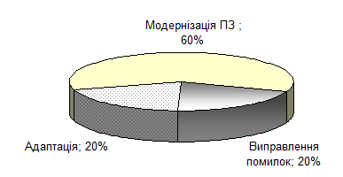

Рисунок 3.3. Витрати на суповід програмного забезпечення

Процес супроводження містить у собі моделі процесу супроводу і планування діяльності людей, що проводять запуск ПЗ, перевірку правильності його виконання і внесення в нього змін. Цей процес згідно з стандартом ISO/IEC 14764 проводиться шляхом:
- коригування, вдосконалення продукту для усунення виявлених помилок або нереалізованих задач;
- адаптація, підлаштування продукту до умов експлуатації, що змінилися, або в новому середовищі виконання;

- поліпшення, еволюційна зміна продукту для підвищення продуктивності або рівня супроводу;
- перевірка ПЗ, пошук і виправлення помилок при експлуатації системи.

Ключові питання супроводу ПЗ – це управлінські, вимірювальні і вартісні. Суть управлінських питань – контроль ПЗ при модифікації й удосконалюванні функцій і недопущення зниження продуктивності системи. Питання вимірювання пов'язане з оцінкою характеристик системи після її модифікації, а також повторного тестування для оцінки показників якості. Вартісні питання пов'язані з оцінкою витрат на суповід залежно від його типу, кваліфікації персоналу, платформи й ін.

В ході підтримки виправляються виявлені дефекти і недоробки. Також додається нова функціональність, вносяться зміни для підвищення зручності використання (юзабіліті) програми.

Послуги з підтримки програмного забезпечення включають в себе такі роботи як:

- Виправлення помилок і усунення неполадок, невиявлених раніше.
- Оптимізація роботи програми при різних умовах експлуатації.
- Оновлення та доопрацювання за вимогами Замовника.
- Профілактичні роботи по обслуговуванню баз даних інформаційної системи.
- Підготовка технічної і призначеної для користувача документації.
- Оновлення модулів програми і використовуваних бібліотек з урахуванням сучасних технологій.

Роботи по супроводу програмного забезпечення проводяться в тісному контакті зі співробітниками замовника, що дозволяє більш динамічно розвивати програмне забезпечення, оперативно змінюючи пріоритети розробки. Також скорочується час, необхідний на узгодження плану робіт, оскільки доповнення та виправлення зазвичай несуть менш глобальний характер, ніж при розробці ядра програми.

Необхідний пакет послуг з підтримки обмовляється з кожним клієнтом індивідуально.

Створення навіть невеликого і технічно простого ПО залежить від чіткого виконання кожної фази, тобто діяльності всіх відділів, задіяних в процесі розробки. Чіткий план виконання необхідних заходів з зазначенням кінцевої мети стає невід'ємною частиною роботи розробників, які планують залишатися широко затребуваними на ринку праці фахівцями. Тільки правильно складене технічне завдання дозволить домогтися потрібного результату і здійснити розробку по-справжньому якісного і конкурентного ПО для будь-якої платформи - серверної, стаціонарним або мобільним.

Невід'ємною частиною завершального етапу розробки програмного забезпечення також є подальша технічна підтримка створеного продукту в


<!-- ВІДНОВЛЕНО ЧЕРЕЗ GEMINI (Стор. 75) -->
процесі його експлуатації на підприємстві замовника. Грамотно організована служба техпідтримки найчастіше стає ключовим фактором при виборі виконавця в рамках досягнення поставленої мети.
<!-- КІНЕЦЬ ВІДНОВЛЕННЯ -->


## 4. НАДІЙНІСТЬ ТА ЯКІСТЬ ПРОГРАМНОГО ЗАБЕЗПЕЧЕННЯ

Важливим аспектом створення якісного ПЗ є забезпечення не функціональних вимог, таких як зручність в експлуатації, надійність, продуктивність, захищеність, зручність супроводу.

Надійність ПО визначає здатність без збоїв виконувати задані функції в заданих умовах і протягом заданого відрізка часу. Продуктивність характеризується часом виконання заданих транзакцій або тривалих операцій. Захищеність визначає ступінь безпеки системи від пошкоджень, втрати, несанкціонованого доступу і злочинної діяльності.

Зручність супроводу визначає легкість, з якою обслуговується продукт в плані простоти виправлення дефектів, внесення коректив для відповідності новим вимогам, управління зміненої середовищем.

### 4.1 Надійність ПЗ

Розробка ПС досягла такого рівня розвитку, що стало необхідно використовувати інженерні методи, в тому числі для оцінювання результатів проектування на етапах ЖЦ, контролю досягнення показників якості та метричного їх аналізу, оцінки ризику і ступеня використання готових компонентів для зниження вартості розробки нового проекту. Основу інженерних методів в програмуванні становить підвищення якості, для досягнення якого сформувалися методи визначення вимог до якості, підходи до вибору і вдосконаленню моделей метричного аналізу показників якості, методи кількісного вимірювання показників якості на етапах ЖЦ.

Головна складова якості - надійність, якій приділяється велика увага в області надійності технічних засобів і тих критичних систем (реального часу, радарні системи, системи безпеки та ін.). Для яких надійність - головна цільова функція оцінки їх реалізації. Як наслідок, в проблематиці надійності розроблено більше сотні математичних моделей надійності, що є функціями від помилок, що залишилися в ПС, від інтенсивності відмов або частоти появи дефектів в ПС. На їхній основі виробляється оцінка надійності програмної системи.

У програмному забезпеченні є помилка, якщо воно не виконує того, що користувач від нього очікує. Відмова програмного забезпечення - це прояв помилки в ньому.

Надійність програмного забезпечення є ймовірність його роботи без відмов протягом певного періоду часу розраховується з урахуванням вартості кожної відмови для користувача.

В даному випадку мається на увазі, що користувач не введе в систему деякий конкретний набір даних, що виводить систему з ладу.


<!-- ВІДНОВЛЕНО ЧЕРЕЗ GEMINI (Стор. 77) -->
Надійність також не є внутрішньою властивістю програми. Вона багато в чому пов'язана з тим, як програма використовується.

Надійність програмного забезпечення суттєво відрізняється від надійності апаратури. Програми не зношуються, поломка програми неможлива. Таким чином, надійність програмного забезпечення - є наслідком виключення помилок проектування, тобто помилок, внесених в процесі розробки програмного забезпечення.

Надійність є складовою частиною більш загального поняття - якості. Якісна програма, наприклад, не тільки надійна, але і компактна, сумісна з іншими програмами, ефективна, зручна в супроводі, цілком зрозуміла. Можна додати: програма повинна бути розроблена в строк і в межах бюджетної вартості.

Серед інших характеристик якості програм надійність стоїть на першому місці, і тому подальші питання розробки програмного забезпечення розглядаються через призму надійності.

## 4.2 Забезпечення якості програмних продуктів

Якість програмного продукту визначається за кількома критеріями. Якісний програмний продукт повинен відповідати функціональним і нефункціональним вимогам, відповідно до яких він створювався, мати цінність для бізнесу, відповідати очікуванням користувачів [37].

В життєвому циклі управління додатками якість має відстежуватися на всіх етапах життєвого циклу ПЗ. Воно починає формуватися з визначення необхідних вимог. При завданні вимог необхідно вказувати бажану функціональність і способи перевірки її досягнення.

Якісний програмний продукт мати високу споживчу якість, незалежно від сфери застосування: внутрішнє використання розробником, бізнес, наука та освіта, медицина, комерційні продажі, соціальна сфера, розваги, веб і ін. Для користувача програмний продукт повинен задовольняти певний рівень його потреб.

Якість ПЗ - це відносне поняття, яке має сенс тільки при врахуванні реальних умов його застосування, тому вимоги, що пред'являються до якості, ставляться відповідно до умов і конкретної області їх застосування. Вона характеризується трьома аспектами: якість програмного продукту, якість процесів ЖЦ і якість супроводу або впровадження (рис. 4.1).
<!-- КІНЕЦЬ ВІДНОВЛЕННЯ -->


```mermaid
graph LR
    A["Якість процесу<br/><br/>Процеси ЖЦ"] --> B["Якість продукту<br/><br/>Програмний<br/>продукт"]
    B --> C["Якість супроводу<br/><br/>Ефект від<br/>впровадження ПЗ"]
```

Рисунок 4.1. Аспекти якості програмного продукту

Аспект, пов'язаний з процесами ЖЦ, визначає ступінь формалізації, достовірності самих процесів ЖЦ розробки ПЗ, а також перевірки та затвердження проміжних результатів на цих процесах. Пошук і усунення помилок в готовому ПЗ проводиться методами тестування, які знижують кількість помилок і підвищують якість цього продукту.

Якість продукту досягається процедурами контролю проміжних продуктів на процесах ЖЦ, перевіркою їх на досягнення необхідної якості, а також методами супроводу продукту. Ефект від впровадження програмних засобів в значній мірі залежить від знань обслуговуючого персоналу функцій продукту і правил їх виконання.

Поняття якості має різні інтерпретації залежно від конкретної програмної системи і вимог до неї.

Модель якості ПО має наступні чотири рівні представлення.

*Перший рівень* відповідає визначенню характеристик (показників) якості ПО, кожна з яких відображає окрему точку зору користувача на якість. Відповідно до стандарту ISO/IEC 9126 [23] в модель якості входить шість характеристик або шість показників якості:

* функціональність (functionality);
* надійність (realibility);
* зручність (usability);
* ефективність (efficiency);
* супроводжуваність (maitainnability);
* переносимість (portability).

Розглянемо детальніше перелічені вище показники якості.

*Функціональність* — це здатність ПЗ в певних умовах вирішувати задачі, потрібні користувачам. Визначає, що саме робить ПЗ, які задачі воно вирішує.

Сама Функціональність включає в себе наступні показники:

* функціональна придатність (suitability), тобто здатність вирішувати потрібний набір задач;
* точність (accuracy) - здатність видавати потрібні результати;
* здатність до взаємодії (interoperability) з потрібним набором інших систем;


<!-- ВІДНОВЛЕНО ЧЕРЕЗ GEMINI (Стор. 79) -->
* відповідність ПЗ стандартам і правилам (compliance), наявним індустріальним стандартам, нормативним і законодавчим актам, іншим регулюючим нормам;
* захищеність (security), а саме здатність запобігати неавторизованому (без вказівки особи, що намагається його здійснити) і недозволеному доступу до даних і програм.

*Зручність використання (usability) або практичність* розуміється як здатність ПЗ бути зручним у навчанні та використанні, а також бути привабливим для користувачів. *Зручність використання (usability) або практичність* включає в себе наступні атрибути:
* зрозумілість (understandability) - показник, зворотний до зусиль, які затрачаються користувачами на сприйняття основних понять ПЗ та усвідомлення їх застосовності для розв'язання своїх задач;
* зручність навчання (learnability) - показник, зворотний зусиллям, затрачуваним користувачами на навчання роботі з ПЗ;
* зручність роботи (operability) - показник, зворотний зусиллям, що витрачають користувачі при розв'язання своїх задач за допомогою ПЗ;
* привабливість (attractiveness), тобто здатність ПЗ бути привабливим для користувачів;
* відповідність стандартам зручності використання (usability compliance).

Два останні атрибути були додані до цього списку в 2001 році.

*Продуктивність (efficiency) або ефективність* – це здатність ПЗ при заданих умовах забезпечувати необхідну працездатність з урахуванням ресурсів, які були для цього виділені. Можна визначити її і як відношення результатів, одержуваних за допомогою ПЗ, до затрачуваних на це ресурсів усіх типів. До складу *Продуктивності* входять наступні атрибути:
* часова ефективність (time behaviour), тобто здатність ПЗ видавати очікувані результати, а також забезпечувати передачу необхідного об'єму даних за відведений час;
* ефективність використання ресурсів (resource utilisation), а саме здатність вирішувати потрібні задачі з використанням визначених об'ємів ресурсів визначених видів (наприклад, оперативна й довгострокова пам'ять, мережні з'єднання, пристрої вводу та виводу та ін.);
* відповідність стандартам продуктивності (efficiency compliance) - атрибут доданий в 2001 році.

*Зручність супроводу (maintainability)* означає зручність проведення всіх видів діяльності, пов'язаних із супроводом програм, включає в себе:
<!-- КІНЕЦЬ ВІДНОВЛЕННЯ -->


* аналізованість (analyzability) або зручність проведення аналізу помилок, дефектів і недоліків, а також зручність аналізу необхідності змін і їх можливих наслідків;
* зручність внесення змін (changeability) - це показник, зворотний трудовим витратам на виконання необхідних змін.
* стабільність (stability) - показник, зворотний ризику виникнення несподіваних ефектів при внесенні необхідних змін;
* зручність перевірки (testability) - це показник, зворотний трудовим витратам на проведення тестування і інших видів перевірки того, що внесені зміни привели до бажаних результатів;
* відповідність стандартам зручності супроводу (maintainability compliance) - атрибут почав враховуватись з 2001 року.

*Переносимість* (portability), а саме здатність ПЗ зберігати працездатність при перенесенні з одного оточення в інше, включаючи організаційні, апаратні й програмні аспекти оточення. До атрибутів *Переносимості* належать:
* адаптованість (adaptability) - здатність ПЗ пристосовуватися до різного оточення без проведення для цього відповідних дій, крім тих, що були заздалегідь передбачені;
* зручність установки (installability) - здатність ПЗ бути встановленим або розгорнутим у визначеному оточенні;
* здатність до співіснування (coexistence) з іншими програмами у загальному оточенні, поділяючи з ними ресурси.
* зручність заміни (replaceability) іншого ПЗ даним, можливість застосування даного ПЗ замість інших програмних систем для вирішення тих же задач у певному оточенні;
* відповідність стандартам переносимості (portability compliance). Цей атрибут доданий в 2001 році.

*Другому рівню* відповідають атрибути для кожної характеристики якості, які деталізують різні аспекти конкретної характеристики. Набір атрибутів характеристик якості використовується при оцінці якості.

*Третій рівень* призначений для вимірювання якості за допомогою метрик, кожна з них відповідно до стандарту ISO/IEC 9126 визначається як комбінація методу вимірювання атрибута і шкали вимірювання значень атрибутів. Для оцінки атрибутів якості на етапах ЖЦ (при перегляді документації, програм і результатів тестування програм) використовуються метрики з заданою оцінною вагою для нівелювання результатів метричного аналізу сукупних атрибутів конкретного показника і якості в цілому. Атрибут якості визначається за допомогою однієї або декількох методик оцінки на етапах ЖЦ і на завершальному етапі розробки ПО.

Четвертий рівень - це оціночний елемент метрики (вага), який використовується для оцінки кількісного або якісного значення окремого атрибута показника ПО. Залежно від призначення, особливостей і умов супроводу ПЗ вибираються найбільш важливі характеристики якості і їх атрибути (рис. 4.1).

Вибрані атрибути і їх пріоритети відображаються у вимогах на розробку систем або використовується відповідні пріоритети еталона класу ПО, до якого це ПЗ належить.

Окрім технічної точки зору на якість ПЗ, є також оцінка якості з позиції звичайного користувача. Для цього аспекту якості використовують англійський термін «usability».

Для оцінки цього аспекту якості використовуються твердження:
* інтерфейс користувача інтуїтивно зрозумілий;
* легке виконання простих чи найбільш поширених операцій;
* легке виконання складних операцій;
* зрозумілі повідомлення про помилки;
* програма завжди повинна поводити себе відповідно до очікувань користувача;
* наявність документація до ПЗ та її повнота;
* інтерфейс користувача само-документуючий;
* затримки відповіді від програми є прийнятними.

4.3. Методи контролю якості

Для контролю якості системи, для визначення надійності програми, її зручності у вживанні використовуються процеси верифікації та валідації.

Верифікація позначає перевірку того, що ПЗ розроблено у відповідності з усіма вимогами до нього або що черговий етап розробки виконаний відповідно до обмежень, сформульованими на попередніх етапах.

Валідація - це перевірка того, що сам продукт правильний, тобто підтвердження того, що він дійсно задовольняє вимогам і очікуванням користувачів, замовників та інших зацікавлених сторін.

Ефективність верифікації та валідації, як і ефективність розробки ПЗ в цілому залежить від точності і коректності формулювання вимог до програмного продукту.

Основою будь-якої системи забезпечення якості є методи його забезпечення і контролю. Методи забезпечення якості [24] є техніки, що гарантують досягнення певних показників якості при їх застосуванні.

Методи контролю якості призначені для того, щоб переконатися, що певні характеристики якості ПЗ досягнуті. Самі по собі вони не можуть допомогти їх досягнення, вони лише допомагають визначити, чи вдалося

отримати в результаті те, що хотілося, чи ні, а також знайти помилки, дефекти і відхилення від вимог.

Класи методів контролю якості представлено нижче:

Методи і техніки, пов'язані з'ясуванням властивостей ПЗ під час його роботи. Це, перш за все, всі види тестування, а також профілювання і вимір кількісних показників якості, які можна визначити за результатами роботи ПО - ефективності за часом і іншим ресурсам, надійності, доступності та ін.

Методи і техніки, пов'язані з визначенням показників якості на основі симуляції роботи ПЗ за допомогою моделей різного роду. До цього виду відносяться перевірка на моделях (model checking), а також прототипування (макетування), використане для оцінки якості прийнятих рішень.

Методи і техніки, призначені для виявлення порушень формалізованих правил побудови вихідного коду ПЗ, проєктних моделей і документації. До методів такого роду відноситься інспектування коду, що полягає в цілеспрямованому пошуку певних дефектів і порушень вимог в коді на основі набору шаблонів, автоматизовані методи пошуку помилок в коді, які базуються на його інтерпретації, методи перевірки документації на узгодженість і відповідність стандартам.

Методи і техніки, пов'язані зі звичайним або формалізованим аналізом проєктної документації та вихідного коду для виявлення їх властивостей. До цієї групи належать численні методи аналізу архітектури ПЗ, про які піде мова в наступній лекції, методи формального доведення властивостей ПО і формального аналізу ефективності застосовуваних алгоритмів.

5. ПОМИЛКИ ПРИ РОЗРОБЦІ ПРОГРАМНОГО ЗАБЕЗПЕЧЕННЯ

Існують різні типи програмних помилок, які можуть виникати на етапі розробки програмного забезпечення і кожен програміст повинен знати про них. Помилки програмування більш відомі як «баги».

По мірі розповсюдження цифрових пристроїв баги все глибше проникають в наше життя. Вони оточують нас всюди - на мобільних телефонах, у побутовій техніці, в автомобілях. Але зазвичай баги не приносять ніякої шкоди, крім моральної. Але буває і по-іншому, коли баг викликає величезні фінансові втрати і навіть забирає людські життя

Термін «баг» зазвичай вживається стосовно помилок, які проявляють себе на стадії роботи програми, на відміну, наприклад, від помилок проектування або синтаксичних помилок. Звіт, що містить інформацію про баг також називають звітом про помилку або звітом про проблему (англ. bug report). Звіт про критичну проблему (англ. crash), що викликає аварійне завершення програми, називають креш-репортом (англ. crash report). Лише одна можливість, залишена в коді операційної системи, може забезпечити точку входу для хакерів, які можуть використовувати цю уразливість.

5.1 Типові помилки в програмах

Помилками в ПЗ є всі можливі невідповідності між характеристиками його якості, що демонструються, і сформульованими або такими, які відповідають вимогам і очікуванням користувачів.

В англомовній літературі використовується кілька термінів, часто однаково що переводять як «помилка» на українську мову:
- *defect* - найбільш загальне порушення будь-яких вимог або очікувань, не обов'язково виявляється зовні (до дефектів відносяться і порушення стандартів кодування, недостатня гнучкість системи та ін.);
- *failure* - спостережуване порушення вимог, що виявляється при якомусь реальному сценарії роботи ПЗ. Це можна назвати проявом помилки;
- *fault* - помилка в коді програми, що викликає порушення вимог при роботі (failures), те місце, яке треба виправити. Хоча це поняття використовується досить часто, воно не цілком чіткі, оскільки для усунення порушення можна виправити програму в декількох місцях. Що саме треба виправляти, залежить від додаткових умов, виконання яких ми хочемо при цьому забезпечити, хоча в деяких ситуаціях накладення додаткових обмежень не усуває неоднозначність;
- *error* - використовується в двох сенсах. Перший - це помилка в ментальній моделі програміста, помилка в його міркуваннях про програму, яка змушує його робити помилки в коді (faults). Це помилка, яку зробила

людина в своєму розумінні властивостей програми. Другий сенс - це некоректні значення даних (вихідних або внутрішніх), які виникають при помилках в роботі програми.

Ці поняття деяким чином пов'язані з основними джерелами помилок. Оскільки при розробці програм необхідно спочатку зрозуміти задачу, потім придумати її рішення і закодувати його у вигляді власної програми, можна визначити три основні джерела помилок.

* *Неправильне розуміння завдань.*
Дуже часто люди не розуміють, що їм намагаються сказати інші. Також і розробники ПЗ не завжди розуміють, що саме потрібно зробити. Іншим джерелом нерозуміння слугує і його відсутність у користувачів і замовників - досить часто вони можуть просити зробити трохи не те, що їм дійсно потрібно. Для запобігання неправильного розуміння завдань програмної системи служить аналіз предметної області.

* *Неправильне рішення задач.*
Найчастіше, навіть правильно зрозумівши, що саме потрібно зробити, розробники вибирають неправильний підхід до того, як це робити. Обрані рішення можуть забезпечувати лише деякі з необхідних властивостей, вони можуть добре підходити для даної задачі в теорії, але погано працювати на практиці, в конкретних обставинах, в яких повинно буде працювати ПО. Допомогти у виборі правильного рішення може ретельний аналіз його і альтернативних рішень на предмет відповідності всім вимогам, підтримання постійного зв'язку з користувачами та замовниками, надання їм необхідної інформації про обрані рішення та їх прототипи, аналіз придатності обраних рішень для роботи в тому контексті, в якому вони будуть використовуватися.

* *Неправильне перенесення рішень у код.*
Маючи вірне рішення завдання, яке було правильно зрозуміле, люди здатні зробити досить багато помилок при втіленні цих рішень. Коректному представленню рішень в коді можуть перешкодити як звичайні помилки, так і забудькуватість програміста або його небажання відмовитися від звичних прийомів, які не дають можливості акуратно записати прийняте рішення.

Що стосується деяких видів типових помилок, яких може припуститись розробник програми, то вони можуть бути такими:

1) *вибраний невірний алгоритм* (наприклад, для чисельного розв'язання систем лінійних алгебраїчних рівнянь існують різні методи, зокрема, метод Гаусса, метод Зейделя, метод прогонки і т.д. Ці методи є аналогічними при виконанні певних (своїх для кожного метода) умов, які накладаються на систему рівнянь, і цей факт обов'язково необхідно враховувати при виборі метода в кожному конкретному випадку);

2) *помилки аналізу* (невірне програмування правильного алгоритму);
3) *семантичні помилки* (наприклад, якийсь оператор насправді діє не зовсім так, або зовсім не так, як передбачає програміст) - смислові помилки; при них програма «працює», але працює неправильно. Пошук цих помилок відбувається за допомогою логічного аналізу роботи програми і її тестування;
4) *помилки при виконанні операцій* (наприклад, поділ на нуль, втрата точності, вихід за межі типу даних);
5) *помилки даних* (наприклад, символьні замість числових);
6) *неініціалізовані змінні*; змінні без початкових значень — часта помилка в програмах, яку важко знайти debugger'ом, оскільки останній якраз може проініціалізувати змінну;
7) *непроініціалізовані вказівники*, які використовуються так, наче вони адресують динамічні змінні, можуть привести до тяжких наслідків для програми;
8) *індексація з виходом за межі масиву*, тобто використання як елементів масиву змінних, що знаходяться поза його межами;
9) *непередбачені особливі випадки вводу-виводу* – наприклад, коли не обробляється сигнал кінця файлу.

І якщо про синтаксичні помилки піклується компілятор, то помилки, перелічені вище, можуть бути виявлені лише на етапі тестування.

Залежно від етапу розробки ПЗ, на якому виявляється помилка виділяють:

*синтаксичні помилки* (розпізнаються транслятором і роблять компіляцію неможливою) - наприклад, відсутність або невідповідність відкритих і закритих дужок. Синтаксичні помилки - це помилки в записі конструкцій мови програмування (чисел, змінних, функцій, виразів, операторів, міток, підпрограм); це помилки, пов'язані з неправильним змістом дій і використанням неприпустимих значень величин;

*попередження* (warnings) компілятора - наприклад, використання неініціалізованої змінної. В цьому випадку компілятор може помітити, що програміст робить щось незвичайне (ймовірно невірне), і повідомляє про це, однак програміст сам приймає рішення ігнорувати повідомлення чи ні;

*помилки часу виконання* (помилки середовища виконання (RunTime)) - це помилки, що виникають під час роботи програми. Зазвичай, це відбувається в тому випадку, коли програма намагається виконати неприпустиму операцію. Прикладом такої неприпустимої операції є поділ на нуль, смислові помилки (семантичні) — наприклад, віднімання змінних замість складання або помилка сегментації.

По розміру:
* серйозні;
* незначні баги;


<!-- ВІДНОВЛЕНО ЧЕРЕЗ GEMINI (Стор. 86) -->
За часом появи:
* постійно, при кожному запуску;
* іноді ( «плаваючий» тип);
* тільки на комп'ютері у клієнта (залежить від локальних налаштувань у клієнта);

За місцем і напрямком:
* помилки користувальницького інтерфейсу;
* системи обробки помилок;
* помилки, пов'язані з граничними умовами;
* помилки обчислень;
* помилки управління потоком;
* помилки обробки або інтерпретації даних;
* підвищення навантаження;
* помилки контролю версії і ідентифікаторів;
* помилки тестування.

Залежно від характеру помилки, програми і середовища виконання, помилка може проявлятися відразу або навпаки - довгий час залишатися непоміченою. Також помилка може проявлятися у вигляді вразливості, що робить вірогідним несанкціонований доступ до системи або DoS-атаку.

5.2. Логічні помилки

Логічні помилки не дозволяють програмі виконувати передбачувані дії. Ваш код може компілюватися і виконуватися без помилок, але результат операції може виявитися несподіваним і невірним.

Логічні помилки можуть відбуватися як в компіляторах, так і в інтерпретатора. На відміну від синтаксичних помилок, програми з логічними вадами є правильними програмами, хоча в більшості випадків поводяться не так, як задумано спочатку. Існування даного виду помилок пов'язано з неправильними діями на етапі прийняття рішень.

Помилки можуть бути пов'язані як з найпростішими помилками в написанні операторів, так і в заплутаному виборі гілок алгоритму. Існує також маса інших причин: некоректна приведення типу, використання змінної поза нею області видимості, відсутність фрагмента коду і помилкове розуміння розробником вимог [25, 26].

Одним із способів пошуку цього типу помилки є роздруківка списку змінних в програмі (у зовнішній файл або на екран). Хоча цей спосіб не працює, якщо помилка полягає у виклику не тієї функції, він все ж є найпростішим в разі неправильної реалізації математичного алгоритму.

Логічна помилка - найбільш серйозна з усіх помилок. Коли написана програма на будь-якій мові компілює і працює правильно, але видає неправильний висновок, недолік полягає в логіці основного
<!-- КІНЕЦЬ ВІДНОВЛЕННЯ -->


програмування. Це помилка, яка була успадкована від нестачі в базовому алгоритмі. Сама логіка, на якій базується вся програма, є збитковою. Щоб знайти рішення такої помилки потрібно фундаментальна зміна алгоритму.

Класифікацію логічних помилок схематично можна представити наступним чином (рис. 5.1):

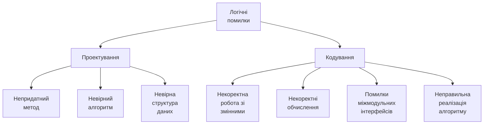
```mermaid
graph TD
    A["Логічні<br>помилки"] --> B["Проектування"]
    A --> C["Кодування"]
    
    B --> D["Непридатний<br>метод"]
    B --> E["Невірний<br>алгоритм"]
    B --> F["Невірна<br>структура<br>даних"]
    
    C --> G["Некоректна<br>робота зі<br>змінними"]
    C --> H["Некоректні<br>обчислення"]
    C --> I["Помилки<br>міжмодульних<br>інтерфейсів"]
    C --> J["Неправильна<br>реалізація<br>алгоритму"]
```

Рисунок 5.1. Класифікація логічних помилок програмування

Судячи з даної схеми, логічні помилки мають різну природу. Так вони можуть витікати з помилок, допущених при проектуванні, наприклад, при виборі методів, розробці алгоритмів або визначенні структури класів, а можуть бути безпосередньо внесені при кодуванні модуля. До останньої групи відносять:
* помилки некоректного використання змінних, наприклад, невдалий вибір типів даних, використання змінних до їх ініціалізації, використання індексів, що виходять за межі визначення масивів, порушення відповідності типів даних при використанні явного або неявного перевизначення типу даних, розташованих в пам'яті при використанні

нетипізованих змінних, відкритих масивів, об'єднань, динамічної пам'яті, адресної арифметики і т. п .;
- помилки обчислень, наприклад, некоректні обчислення над неарифметичними змінними, некоректне використання цілочисельної арифметики, некоректне перетворення типів даних в процесі обчислень, помилки, пов'язані з незнанням пріоритетів виконання операцій для арифметичних і логічних виразів, і т. п.;
- помилки міжмодульного інтерфейсу, наприклад, ігнорування системних угоД, порушення типів і послідовності при передачі параметрів, недотримання єдності одиниць виміру формальних і фактичних параметрів, порушення області дії локальних і глобальних змінних;
- інші помилки кодування, наприклад, неправильна реалізація логіки програми при кодуванні, ігнорування особливостей або обмежень конкретної мови програмування.

Накопичення похибок результатів числових обчислень виникає, наприклад, при некоректному відкиданні дробових цифр чисел, некоректне використання наближених методів обчислень, при ігноруванні обмеження розрядної сітки подання дійсних чисел у ЕОМ і т. п.

Всі зазначені вище причини виникнення помилок слід мати на увазі в процесі налагодження. Крім того, складність налагодження збільшується також внаслідок впливу наступних факторів:
- опосередкованого прояву помилок;
- можливості взаємопливу помилок;
- можливості отримання зовні однакових проявів різних помилок;
- відсутність повторюваності проявів деяких помилок від запуску до запуску - так звані стохастичні помилки;
- можливості усунення зовнішніх проявів помилок в досліджуваній ситуації при внесенні деяких змін до програми, наприклад, при включенні в програму діагностичних фрагментів може анулюватися або змінитися зовнішній прояв помилок;
- написання окремих частин програми різними програмістами.

Одним зі способів пошуку цього типу помилок є роздруківка списку змінних в програмі (у зовнішній файл або на екран). Але слід зазначити, що цей спосіб не працює, якщо помилка полягає у виклику «не тієї» функції, він, тим не менше, все ж він є найпростішим в разі неправильної реалізації математичного алгоритму.

Для усунення помилок використовуються дві операції, що виконуються одна за одною:

1. Отладка — усунення синтаксичних і інших елементарних помилок в програмах на етапах трансляції і збірки.
2. Тестування — перевірка правильності роботи програми на наперед підготовлених тестах, що спираються на вже відомий точний результат.

6. РОЗРОБКА КОРИСТУВАЛЬНИЦЬКИХ ІНТЕРФЕЙСІВ

Розробка користувальницького інтерфейсу є невід'ємною частиною будь-якого проекту пов'язаного зі створенням програмного забезпечення. Інтерфейс користувача є точкою взаємодії людини і програми, найчастіше має складну функціональність. Від того, наскільки зручним буде розроблений інтерфейс користувача, буде залежати і успіх продукту.

6.1 Типи користувальницьких інтерфейсів

На ранніх етапах розвитку обчислювальної техніки інтерфейс, призначений для користувача розглядався, як засіб спілкування людини з операційною системою і був досить примітивним. В основному він дозволяв запустити завдання на виконання, зв'язати з ним конкретні дані і виконати деякі процедури обслуговування обчислювальної техніки.

Згодом, по мірі вдосконалення апаратних засобів, з'явилася можливість створення інтерактивного програмного забезпечення, що використовує спеціальні інтерфейси. В даний час основною проблемою є розробка інтерактивних інтерфейсів до складних програмних продуктів, розрахованих на використання непрофесійними користувачами. В останні роки були сформульовані основні концепції побудови таких користувальницьких інтерфейсів і запропоновано кілька методик їх створення.

Інтерфейс являє собою сукупність програмних і апаратних засобів, що забезпечують взаємодію користувача з комп'ютером. Основу такої взаємодії складають діалоги.

Під діалогом в даному випадку розуміють регламентований обмін інформацією між людиною і комп'ютером, який здійснюється в реальному масштабі часу і спрямований на спільне вирішення конкретного завдання: обмін інформацією та координація дій [25]. Кожен діалог складається з окремих процесів введення-виведення інформації, які фізично забезпечують зв'язок користувача і комп'ютера.

Обмін інформацією здійснюється передачею повідомлень і керуючих сигналів. Повідомлення - порція інформації, яка бере участь в діалоговому обміні. розрізняють:
* вхідні повідомлення, які генеруються людиною за допомогою засобів введення: клавіатури, маніпуляторів і т. п.;
* вихідні повідомлення, які генеруються комп'ютером у вигляді текстів, звукових сигналів і/або зображень і виводяться на екран монітора для користувача або використовує для цього інші пристрої виведення інформації.

В основному користувач генерує повідомлення наступних типів: запит інформації, запит допомоги, запит операції або функції, введення або зміна інформації, вибір поля кадру і т. д. У відповідь він отримує: підказки або довідки, інформаційні повідомлення, які не потребують відповіді, накази, що вимагають дій, повідомлення про помилки, які потребують відповідних діях, зміна формату кадру і т. д.

Нижче перераховані основні пристрої, що забезпечують виконання операцій введення-виведення.

Для виведення повідомлень:
* монохромні і кольорові монітори - висновок оперативної текстової та графічної інформації;
* принтери - отримання «твердої копії» текстової та графічної інформації;
* графічні - отримання твердої копії графічної інформації;
* синтезатори мови - мовної висновок;
* звукогенератор - висновок музики і т. п.

Для введення повідомлень:
* клавіатура - текстовий введення;
* планшети - графічний введення;
* сканери - графічний введення;
* маніпулятори, світлове перо, сенсорний екран - позиціонування і вибір інформації на екрані і т. п.

За аналогією з процедурних і об'єктним підходом до програмування розрізняють процедурно-орієнтований і об'єктно-орієнтований підходи до розробки інтерфейсів (рис. 6.1)

Процедурно-орієнтовані інтерфейси використовують традиційну модель взаємодії з користувачем, засновану на поняттях «процедура» і «операція». В рамках цієї моделі програмне забезпечення надає користувачеві можливість виконання деяких дій, для яких користувач визначає відповідні дані і наслідком виконання яких є отримання бажаних результатів.

Об'єктно-орієнтовані інтерфейси використовують дещо іншу модель взаємодії з користувачем, орієнтовану на маніпулювання об'єктами предметної області. В рамках цієї моделі користувачеві надається можливість безпосередньо взаємодіяти з кожним об'єктом і ініціювати виконання операцій, в процесі яких взаємодіють кілька об'єктів.

Завдання користувача формулюється як цілеспрямована зміна деякого об'єкту, що має внутрішню структуру, певний зміст і зовнішнє символьне або графічне представлення. Об'єкт при цьому розуміється в широкому сенсі слова, наприклад, модель реальної системи або процесу, база даних, текст і т. п. Користувачеві надається можливість створювати об'єкти, змінювати їх параметри і зв'язки з іншими об'єктами, а також ініціювати взаємодію цих об'єктів. Але реалізація сучасного процедурно-


<!-- ВІДНОВЛЕНО ЧЕРЕЗ GEMINI (Стор. 92) -->
орієнтованого призначеного для користувача інтерфейсу на базі структурного підходу є дуже складною і трудомістким завданням.

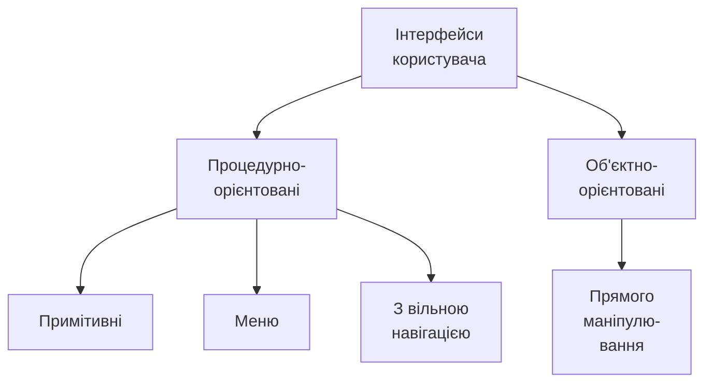
```mermaid
graph TD
    A[Інтерфейси<br>користувача] --> B[Процедурно-<br>орієнтовані]
    A --> C[Об'єктно-<br>орієнтовані]
    B --> D[Примітивні]
    B --> E[Меню]
    B --> F[З вільною<br>навігацією]
    C --> G[Прямого<br>маніпулю-<br>вання]
```

Рисунок 6.1 – Типи інтерфейсів

У табл. 6.1 перераховані основні відмінності користувацьких моделей інтерфейсів процедурного та об'єктно-орієнтованого типів.

*Таблиця 6.1 - Основні відмінності користувацьких моделей інтерфейсів процедурного та об'єктно-орієнтованого типів*

| Процедурно-орієнтований інтерфейс користувача | Об'єктно-орієнтований інтерфейс користувача |
| :--- | :--- |
| *забезпечує* користувачів функціями, необхідними для виконання завдань | *забезпечує* користувачам можливість взаємодії з об'єктами |
| *акцент* робиться на задачі | *акцент* робиться на вхідні дані і результати |
| *піктограми* представляють додатки, вікна або операції | *піктограми* представляють об'єкти |
| *зміст папок і довідників* відображається за допомогою таблиць і списків | *папки і довідники* є візуальними контейнерами об'єктів |

Розрізняють процедурно-орієнтовані інтерфейси трьох типів: "примітивні", меню і з вільною навігацією.

Примітивним називають інтерфейс, який організовує взаємодію з користувачем в командному режимі. Зазвичай такий інтерфейс реалізує
<!-- КІНЕЦЬ ВІДНОВЛЕННЯ -->


конкретний сценарій роботи програмного забезпечення, наприклад: введення даних $\rightarrow$ рішення задачі $\rightarrow$ виведення результату.

Єдине відхилення від послідовного процесу, яке забезпечується даним інтерфейсом, полягає в організації циклу для обробки декількох наборів даних. Подібні інтерфейси в даний час використовують тільки в процесі навчання програмуванню або в тих випадках, коли вся програма реалізує одну функцію, наприклад, в деяких системних утилітах.

Інтерфейс-меню на відміну від примітивного інтерфейсу дозволяє користувачеві вибирати необхідні операції зі спеціального списку, що виводиться йому програмою. Ці інтерфейси припускають реалізацію безлічі сценаріїв роботи, послідовність дій в яких визначається користувачем.

Розрізняють однорівневі і ієрархічні меню. Перші використовують для порівняно простого управління обчислювальним процесом, коли варіантів небагато (не більше 5-7), і вони включають операції одного типу, наприклад, *Створити, Відкрити, Закрити* і т. п. Другі - при великій кількості варіантів або їх очевидних відмінностей, наприклад, операції з файлами і операції з даними, що зберігаються в цих файлах.

Інтерфейси даного типу нескладно реалізувати в рамках структурного підходу до програмування. Алгоритм програми з багаторівневим меню зазвичай будується за рівнями, причому вибір команди на кожному рівні здійснюється так само, як для однорівневого меню.

Інтерфейс-меню передбачає, що програма знаходиться або в стані *Рівень меню*, або в стані *Виконання операції*. У стані *Рівень меню* здійснюється висновок меню відповідного рівня і вибір потрібного пункту меню, а в стані *Виконання операції* реалізується сценарій обраної операції. Як виняток іноді користувачеві надається можливість завершення операції незалежно від стадії виконання сценарію і/або програми, наприклад, після натискання клавіші Esc.

Деревоподібна організація меню передбачає суворо обмежену навігацію: або переходи "вгору" до кореня дерева, або - "вниз" за обраної гілки. Кожному рівню ієрархічного меню відповідає своє певне вікно, що містить пункти даного рівня. При цьому можливі два варіанти реалізації меню: кожне вікно меню займає весь екран або на екрані одночасно присутні кілька меню різних рівнів. У другому випадку вікна меню з'являються при виборі пунктів відповідного верхнього рівня - "випадаючии" меню.

В умовах обмеженої навігації незалежно від варіанту реалізації пошук необхідного пункту більше ніж дворівневого меню може виявитися непростим завданням.

Інтерфейси-меню в даний час також використовують рідко і лише для порівняно простого програмного забезпечення або в розробках, які

повинні бути виконані по структурній технології і без використання спеціальних бібліотек.

Інтерфейси з вільною навігацією також називають графічними інтерфейсами (GUI - Graphic User Interface) або інтерфейсами WYSIWYG (What You See Is What You Get – «що бачиш, те й отримаєш», тобто, що користувач бачить на екрані, то він і отримає при друці). Ці назви підкреслюють, що інтерфейси даного типу орієнтовані на використання екрану в графічному режимі з високою роздільною здатністю.

Графічні інтерфейси підтримують концепцію інтерактивної взаємодії з програмним забезпеченням, здійснюючи візуальний зворотний зв'язок з користувачем і можливість прямого маніпулювання об'єктами та інформацією на екрані. Крім того, інтерфейси даного типу підтримують концепцію сумісності програм, дозволяючи переміщувати між ними інформацію (технологія OLE).

На відміну від інтерфейсу-меню інтерфейс з вільною навігацією забезпечує можливість здійснення будь-яких дозволених в конкретному стані операцій, доступ до яких можливий через різні інтерфейсні компоненти, наприклад, меню різних типів: спадаюче, кнопкове, контекстне або різного роду компоненти введення даних. Причому вибір наступної операції в меню здійснюється як мишею, так і за допомогою клавіатури.

Суттєвою особливістю інтерфейсів даного типу є здатність змінюватися в процесі взаємодії з користувачем, пропонуючи вибір тільки тих операцій, які мають сенс в конкретній ситуації. Реалізують інтерфейси з вільною навігацією, використовуючи подієве програмування і об'єктно-орієнтовані бібліотеки, що передбачає застосування візуальних середовищ розробки програмного забезпечення.

Об'єктно-орієнтовані інтерфейси поки представлені тільки інтерфейсом прямого маніпулювання. Цей тип інтерфейсу передбачає, що взаємодія користувача з програмним забезпеченням здійснюється за допомогою вибору і переміщення піктограм, відповідних об'єктів предметної області. Для реалізації таких інтерфейсів також використовують подієве програмування і об'єктно-орієнтовані бібліотеки.

Інтерфейс призначений для забезпечення взаємодії між користувачем і процесом, який виконує деяке завдання - прикладною програмою. Завданнями даної взаємодії є передача інформації (вихідних даних) від користувача прикладній програмі, вихідних даних (результатів роботи програми) користувачеві. Функцією інтерфейсу є також пояснення результатів роботи прикладної програми.

Орієнтація на кінцевого користувача означає, що інтерфейс повинен мати можливості для представлення вихідних даних і результатів у вигляді, загальноприйнятому в даній галузі, або в залежності від категорій

користувачів і їх побажань: графічному, табличному, вербальному, причому кожне з них також може мати кілька видів уявлень.

6.2. Фактори впливу на показники якості програмного продукту

Дизайн користувацького інтерфейсу є фактором, який впливає на три основні показники якості програмного продукту: його функціональність, естетику і продуктивність.

Функціональність є фактором, на який розробники додатків часто звертають основну увагу. Вони намагаються створювати програми так, щоб користувачі могли виконувати свої завдання і їм було зручно це робити. Функціональність важлива, але, тим не менш, це не єдиний показник, який повинен враховуватися в ході розробки.

Естетичний зовнішній вигляд самого додатка і способу його подання дозволяє сформувати у споживача позитивну думку про програму. Однак естетичні характеристики дуже суб'єктивні і описати їх кількісно більш важко, ніж функціональні вимоги або показники продуктивності. Вся естетика додатків часто зводиться до простого вибору: чи співвідносяться між собою використані кольори, чи передають елементи інтерфейсу їх призначення і сенс проведених операцій, що відчуває людина при використанні тих чи інших елементів управління і наскільки успішно їх використовує.

Продуктивність, а так само і надійність, також впливають на перспективу застосування програми. Якщо додаток добре виглядає, має просте і зручне управління, але, наприклад, повільно промальовує екрани, регулярно «підвисає» на десяток секунд, у нього, ймовірно, буде мало шансів на тривалу експлуатацію. У свою чергу, швидка і стабільна робота програми можуть частково компенсувати не самий стильний дизайн або відсутність якихось вторинних функцій.

Етапи розробки призначеного для користувача інтерфейсу. Розробка користувацького інтерфейсу включає ті ж основні етапи, що і розробка програмного забезпечення:
* збір та аналіз вимог бізнес-замовника (постановка завдання) - визначення типу інтерфейсу і загальних вимог до нього; визначення специфікацій - розробка сценаріїв роботи користувачів;
* вибір показників оцінки ефективності призначеного для користувача інтерфейсу;
* проектування - проектування діалогів і їх реалізація у вигляді процесів введення-виведення (прототипування і розробка макетів);


<!-- ВІДНОВЛЕНО ЧЕРЕЗ GEMINI (Стор. 96) -->
- реалізація — програмування, розробка засобів підтримки користувачів і тестування інтерфейсних процесів і забезпечення якості інтерфейсу;
- розробка документації.

Ефективність роботи користувача визначається функціональними можливостями наявних в його розпорядженні апаратних і програмних засобів і доступністю для користувача цих можливостей.
<!-- КІНЕЦЬ ВІДНОВЛЕННЯ -->


7. СИСТЕМА УПРАВЛІННЯ ВЕРСІЯМИ

Система управління версіями (Version Control System, VCS або Revision Control System) - програмне забезпечення для полегшення роботи зі змінною інформацією. Система управління версіями дозволяє зберігати кілька версій одного і того ж документа, при необхідності повертатися до попередніх версій, визначати, хто і коли зробив ту чи іншу зміну, і багато іншого.

Такі системи найбільш широко використовуються при розробці програмного забезпечення для зберігання вихідних кодів програми, що розробляється. Однак вони можуть з успіхом застосовуватися і в інших областях, в яких ведеться робота з великою кількістю безперервно змінюються електронних документів [27].

Ситуація, в якій електронний документ за час свого існування зазнає ряд змін, досить типова. При цьому часто буває важливо мати не тільки останню версію, але і кілька попередніх. У найпростішому випадку можна просто зберігати кілька варіантів документа, нумеруючи їх відповідним чином. Такий спосіб є неефективним (доводиться зберігати кілька практично ідентичних копій), вимагає підвищеної уваги і дисципліни і часто веде до помилок, тому були розроблені засоби для автоматизації цієї роботи.

Традиційні системи управління версіями використовують централізовану модель, коли є єдине сховище документів, керуване спеціальним сервером, який і виконує велику частину функцій з управління версіями. Користувач, який працює з документами, повинен спочатку отримати потрібну йому версію документа зі сховища; зазвичай створюється локальна копія документа, так звана «робоча копія». Може бути отримана остання версія або будь-яка з попередніх, яка може бути обрана за номером версії або датою створення, іноді і за іншими ознаками. Після того, як в документ внесені потрібні зміни, нова версія поміщається в сховище. На відміну від простого збереження файлу, попередня версія не стирається, а також залишається в сховищі і може бути звідти отримана в будь-який час. Сервер може використовувати так звану дельта-компресію - такий спосіб зберігання документів, при якому зберігаються тільки зміни між послідовними версіями, що дозволяє зменшити обсяг збережених даних. Оскільки зазвичай найбільш затребуваною є остання версія файлу, система може при збереженні нової версії зберігати її цілком, замінюючи в сховищі останню раніше збережену версію на різницю між цією і останньою версією. Деякі системи (наприклад, ClearCase) підтримують збереження версій обох видів: більшість версій зберігається у вигляді дельт, але періодично (по спеціальній команді адміністратора) виконується збереження версій всіх файлів в повному вигляді; такий підхід забезпечує максимально повне відновлення історії в разі пошкодження сховища.

Іноді створення нової версії виконується непомітно для користувача (прозоро), або прикладною програмою, що має вбудовану підтримку такої функції, або за рахунок використання спеціальної файлової системи. У цьому випадку користувач просто працює з файлом, як завжди, і при збереженні файлу автоматично створюється нова версія.

Часто буває, що над одним проектом одночасно працюють кілька людей. Якщо дві людини змінюють один і той же файл, то один з них може випадково скасувати зміни, внесені іншим. Системи управління версіями відстежують такі конфлікти і пропонують засоби їх вирішення. Більшість систем може автоматично об'єднати (злити) зміни, зроблені різними розробниками [28]. Однак таке автоматичне об'єднання змін, зазвичай, можливо тільки для текстових файлів і за умови, що змінювалися різні (непересічні) частини цього файлу. Таке обмеження пов'язане з тим, що більшість систем управління версіями орієнтовані на підтримку процесу розробки програмного забезпечення, а вихідні коди програм зберігаються в текстових файлах. Якщо автоматичне об'єднання виконати не вдалося, система може запропонувати вирішити проблему вручну.

Часто виконати злиття неможливе ні в автоматичному, ні в ручному режимі, наприклад, якщо формат файлу невідомий або дуже складний. Деякі системи управління версіями дають можливість заблокувати файл в сховище. Блокування не дозволяє іншим користувачам отримати робочу копію або перешкоджає зміні робочої копії файлу (наприклад, засобами файлової системи) і забезпечує, таким чином, винятковий доступ тільки тому користувачеві, який працює з документом.

Багато системи управління версіями надають ряд інших можливостей:
* Дозволяють створювати різні варіанти одного документа, так звані. гілки, із загальною історією змін до точки розгалуження і з різними - після неї.
* Дають можливість дізнатися, хто і коли додав або змінив конкретний набір рядків у файлі.
* Ведуть журнал змін, в який користувачі можуть записувати пояснення про те, що і чому вони змінили в цій версії.
* Контролюють права доступу користувачів, дозволяючи або забороняючи читання або зміна даних, в залежності від того, хто запитує цю дію.

При деяких варіаціях, що визначаються особливостями системи і деталями прийнятого технологічного процесу, звичайний цикл роботи розробника протягом робочого дня виглядає наступним чином [29].

*Оновлення робочої копії*

У міру внесення змін в основну версію проекту робоча копія на комп'ютері розробника старіє: розбіжність її з основною версією проекту збільшується. Це підвищує ризик виникнення конфліктних змін. Тому

зручно підтримувати робочу копію в стані, максимально близькому до поточної основної версії, для чого розробник виконує операцію поновлення робочої копії (update) наскільки можливо часто (реальна частота оновлень визначається частотою внесення змін, що залежить від активності розробки і числа розробників, а також часом, витрачених на кожне оновлення - якщо воно велике, розробник змушений обмежувати частоту оновлень, щоб не втрачати час).

*Модифікація проекту*

Розробник модифікує проект, змінюючи вхідні в нього файли в робочій копії відповідно до проектного завданням. Ця робота проводиться локально і не вимагає звернень до сервера VCS.

*Фіксація змін*

Завершивши черговий етап роботи над завданням, розробник фіксує (commit) свої зміни, передаючи їх на сервер (або в основну гілку, якщо робота над завданням повністю завершена, або в окрему гілку розробки даного завдання). VCS може вимагати від розробника перед фіксацією обов'язково виконати оновлення робочої копії. При наявності в системі підтримки відкладених змін (shelving) зміни можуть бути передані на сервер без фіксації. Якщо затверджена політика роботи в VCS це дозволяє, то фіксація змін може проводитися не щодня, а лише по завершенні роботи над завданням; в цьому випадку до завершення роботи всі пов'язані із завданням зміни зберігаються тільки в локальній робочої копії розробника.

Розподілені системи управління версіями також відомі як Distributed Version Control System, DVCS. Такі системи використовують розподілену модель замість традиційної клієнт-серверної. Вони, в загальному випадку, не потребують централізованому сховищі: вся історія зміни документів зберігається на кожному комп'ютері, в локальному сховищі, і при необхідності окремі фрагменти історії локального сховища синхронізуються з аналогічним сховищем на іншому комп'ютері. У деяких таких системах локальне сховище розташовується безпосередньо в каталогах робочої копії [29].

Коли користувач такої системи виконує звичайні дії, такі як витяг певної версії документа, створення нової версії тощо, він працює зі своєю локальною копією сховища. У міру внесення змін, сховищ, що належать різним розробникам, починають різнитися, і виникає необхідність в їх синхронізації. Така синхронізація може здійснюватися за допомогою обміну патчами або так званими наборами змін (англ. Change sets) між користувачами.

Описана модель логічно близька створення окремої гілки для кожного розробника в класичній системі управління версіями (в деяких розподілених системах перед початком роботи з локальним сховищем потрібно створити нову гілку). Відмінність полягає в тому, що до моменту синхронізації інші розробники цієї гілки не бачать. Поки розробник змінює

лише свою гілку, його робота не впливає на інших учасників проекту та навпаки. По завершенні відокремленої частини роботи внесені в галузі зміни зливають з основною (загальною) гілкою. Як при злитті гілок, так і при синхронізації різних сховищ можливі конфлікти версій [30]. На цей випадок у всіх системах передбачені ті чи інші методи виявлення і вирішення конфліктів злиття.

З точки зору користувача розподілена система відрізняється необхідністю створювати локальний репозиторій і наявністю в командному мовою двох додаткових команд: команди отримання сховища від віддаленого комп'ютера (pull) і передачі свого сховища на віддалений комп'ютер (push). Перша команда виконує злиття змін віддаленого і локального репозиторіїв з приміщенням результату в локальний репозиторій; друга - навпаки, виконує злиття змін двох репозиторіїв з приміщенням результату в віддалений репозиторій. Як правило, команди злиття в розподілених системах дозволяють вибрати, які набори змін будуть передаватися в інший репозиторій або вилучатися з нього, виправляти конфлікти злиття безпосередньо в ході операції або після її невдалого завершення, повторювати або відновлювати незакінчена злиття. Зазвичай передача своїх змін до чужої репозиторій (push) завершується вдало тільки за умови відсутності конфліктів. Якщо конфлікти виникають, користувач повинен спочатку злити версії в своєму репозиторії (виконати pull), і лише потім передавати їх іншим.

Зазвичай рекомендується організовувати роботу з системою так, щоб користувачі завжди або переважно виконували злиття у себе в репозиторії. Тобто, на відміну від централізованих систем, де користувачі передають свої зміни на центральний сервер, коли вважають за потрібне, в розподілених системах більш природним є порядок, коли злиття версій ініціює той, кому потрібно отримати його результат (наприклад, розробник, керуючий складальним сервером) .

Основні переваги розподілених систем - їх гнучкість і значно більша (у порівнянні з централізованими системами) автономія окремого робочого місця. Кожен комп'ютер розробника є, фактично, самостійним і повнофункціональним сервером, з таких комп'ютерів можна побудувати довільну за структурою і рівнем складності систему, задавши (як технічними, так і адміністративними заходами) бажаний порядок синхронізації. При цьому кожен розробник може вести роботу незалежно, так, як йому зручно, змінюючи і зберігаючи проміжні версії документів, користуючись усіма можливостями системи (в тому числі доступом до історії змін) навіть за відсутності підключення до мережі з сервером. Зв'язок з сервером або іншими розробниками потрібно виключно для проведення синхронізації, при цьому обмін наборами змін може здійснюватися за різними схемами.


<!-- ВІДНОВЛЕНО ЧЕРЕЗ GEMINI (Стор. 101) -->
До недоліків розподілених систем можна віднести збільшення необхідного обсягу дискової пам'яті: на кожному комп'ютері доводиться зберігати повну історію версій, тоді як в централізованій системі на комп'ютері розробника зазвичай зберігається лише робоча копія, тобто зріз сховища на якийсь момент часу і внесені зміни. Менш очевидним, але неприємним недоліком є те, що в розподіленої системи практично неможливо реалізувати деякі види функціональності, що надаються централізованими системами, це:

Блокування файлу або групи файлів (для зберігання ознаки блокування потрібен загальнодоступний і постійно знаходитися в онлайні центральний сервер). Це змушує застосовувати спеціальні адміністративні заходи, якщо доводиться працювати з бінарними файлами, непридатними для автоматичного злиття.

Стеження за певним файлом або групою файлів (зміни файлів відбуваються на різних серверах, злиття і виділення гілок відбуваються локально, про зміни стає відомо тільки при синхронізації, причому не всім розробникам, а тільки тим, хто в даній синхронізації бере участь).

Єдина наскрізна нумерація версій системи і / або файлів, в якій номер версії монотонно зростає (така нумерація також вимагає наявності головного сервера, що задає номери версій для всіх інших). У розподілених системах доводиться обходитися локальними позначеннями версій і застосовувати теги, призначення яких визначається угодою між розробниками або корпоративними стандартами фірми.

Локальна робота користувача з окремою, невеликий за обсягом вибіркою з значного за розміром і внутрішньої складності сховища на віддаленому сервері.

Можна виділити наступні типові ситуації, в яких використання розподіленої системи дає помітні переваги:

Періодична синхронізація декількох комп'ютерів під управлінням одного розробника (робочого комп'ютера, домашнього комп'ютера, ноутбука і так далі). Використання розподіленої системи позбавляє від необхідності виділяти один з комп'ютерів в якості сервера, синхронізація по необхідності, зазвичай при «пересадці» розробника з одного пристрою на інший.

Спільна робота над проєктом невеликий територіально розподіленої групи розробників без виділення загальних ресурсів. Як і в попередньому випадку, реалізується схема роботи без головного сервера, а актуальність репозиторіїв підтримується періодичними синхронізації за схемою «кожен з кожним».

Великий розподілене проект, учасники якого можуть довгий час працювати кожен над своєю частиною, при цьому не мають постійного підключення до мережі. Такий проект може використовувати централізований сервер, з яким синхронізуються копії всіх його учасників.
<!-- КІНЕЦЬ ВІДНОВЛЕННЯ -->


Можливі й більш складні варіанти - наприклад, зі створенням груп для роботи за окремими напрямами всередині більшого проекту. При цьому можуть бути виділені окремі «групові» сервери для синхронізації роботи груп, тоді процес остаточного злиття зміни стає деревовидним: спочатку окремі розробники синхронізують зміни на групових серверах, потім оновлені репозиторії груп синхронізуються з головним сервером. Можлива робота і без «групових» серверів, тоді розробники однієї групи синхронізують зміни між собою, після чого будь-який з них (наприклад, керівник групи) передає зміни на центральний сервер [29, 30].

У традиційній «офісної» розробці проектів, коли група розробників відносно невелика і цілком знаходиться на одній території, в межах єдиної локальної комп'ютерної мережі, з постійно доступними серверами, централізована система може виявитися кращим вибором через свою більш жорсткої структури і наявності функціональності, відсутньої в розподілених системах (наприклад, вже згаданої блокування). Можливість фіксувати зміни без їх злиття в центральну гілку в таких умовах легко реалізується шляхом виділення незавершених робіт в окремі гілки розробки.

ЛАБОРАТОРНА РОБОТА №1  
«РОЗРОБКА ОПИСУ ТА АНАЛІЗ ІНФОРМАЦІЙНОЇ СИСТЕМИ»

*Мета роботи:* Розробка алгоритму роботи IC з послідовним нарощуванням задач, які можуть бути розв'язані за допомогою обчислювальної техніки. Опис та аналіз IC, розподіл ролі в групі розробників.

*Методичні вказівки*

Лабораторна робота направлена на ознайомлення з процесом опису IC та отриманням навичок по використанню основних методів аналізу IC.

🔔 *Вимоги до результатів виконання лабораторної роботи:*

1. Наявність опису інформаційної системи.
2. Проведення аналізу досяжності виконання проекту.
3. Наявність висновку про можливість реалізації проекту, що містить рекомендації щодо розробки системи, базові пропозиції за обсягом необхідного бюджету, кількості розробників, часу та необхідному ПЗ.

При складанні й оформленні звіту слід дотримуватися рекомендацій.

*Теоретичні відомості:*

*Загальні відомості про розробку ПЗ.*

Проблеми керування програмними проектами вперше виявилися в 60-х - початку 70-х років, коли провалилися багато великих проектів по розробці програмних продуктів. Були зафіксовані затримки в створенні ПЗ, воно було ненадійним, витрати на розробку в кілька раз перевершували первісні оцінки, створені програмні системи часто мали низькі показники продуктивності. Причини провалів коренилися в тих підходах, які використовувалися в керуванні проектами. Методика, що застосовувалася, була заснована на досвіді керування технічними проектами й виявилася неефективної при розробці ПЗ.

Важливо розуміти різницю між професійною розробкою ПЗ й аматорським програмуванням. Необхідність керування програмними проектами випливає з того факту, що процес створення професійного ПЗ завжди є суб'єктом бюджетної політики організації, де воно розробляється, і має часові обмеження. Робота керівника програмного проекту за великим розрахунком полягає в тому, щоб гарантувати виконання цих бюджетних і


<!-- ВІДНОВЛЕНО ЧЕРЕЗ GEMINI (Стор. 104) -->
часових обмежень з обліком бізнес-цілей організації щодо розроблювального ПЗ.

Керівник проєктів має спланувати всі етапи розробки програмного продукту. Він також повинен контролювати хід виконання робіт і дотримання всіх необхідних стандартів. Постійний контроль над ходом виконання робіт необхідний для того, щоб процес розробки не виходив за часові й бюджетні обмеження. Гарне керування не гарантує успішного завершення проєкту, але погане керування обов'язкове приведе до його провалу. Це може виразитися в затримці строків здачі готового ПЗ, у перевищенні кошторисної вартості проєкту й у невідповідності готового ПЗ специфікації вимог.

Процес розробки ПЗ суттєво відрізняється від процесів реалізації технічних проєктів, що породжує певні складності в управлінні програмними проєктами:

1. *Програмний продукт нематеріальний*. Програмне забезпечення нематеріально, його не можна побачити або доторкатися. Керівник програмного проєкту не бачить процес "росту" розроблюваного ПЗ. Він може покладатися тільки на документацію, яка фіксує процес розробки програмного продукту.
2. *Не існує стандартних процесів розробки ПЗ*. На сьогоднішній день не існує чіткої залежності між процесом створення ПЗ й типом створюваного програмного продукту. Процеси створення більшості технічних систем добре вивчені. Вивченням же процесів створення ПЗ фахівці займаються тільки останнім часом. Тому поки не можна точно передбачити, на якому етапі процесу розробки ПЗ можуть виникнути проблеми, що загрожують усьому програмному проєкту.
3. *Великі програмні проєкти* - це часто "одноразові" проєкти. Великі програмні проєкти, як правило, значно відрізняються від проєктів, реалізованих раніше. Тому, щоб зменшити невизначеність у плануванні проєкту, керівники проєктів повинні мати дуже великий практичний досвід. Але постійні технологічні зміни в комп'ютерній техніці й комунікаційному устаткуванні знецінюють попередній досвід. Знання й навички, накопичені досвідом, можуть не затребуватися в новому проєкті.

Перераховані відмінності можуть привести до того, що реалізація проєкту вийде з часового графіка або перевищить бюджетні асигнування. Програмні системи найчастіше виявляються новинками, як в "ідеологічному", так і в технічному плані. Тому, передбачаючи можливі проблеми в реалізації програмного проєкту, слід завжди пам'ятати, що багатьом з них властиво виходити за рамки часових і бюджетних обмежень.
<!-- КІНЕЦЬ ВІДНОВЛЕННЯ -->


*Процес керування розробкою програмного забезпечення*

Неможливо описати й стандартизувати всі роботи, виконувані в проекті по створенню ПЗ. Ці роботи досить суттєво залежать від організації, де виконується розробка ПЗ, і від типу створюваного програмного продукту. Але завжди можна виділити наступні стадії:

1. Написання пропозицій по створенню ПЗ.
2. Планування й складання графіка робіт зі створення ПЗ.
3. Оцінювання вартості проекту.
4. Підбір персоналу.
5. Контроль над ходом виконання робіт.
6. Написання звітів і подань.

Перша стадія програмного проекту може складатися з написання пропозицій по реалізації цього проекту. Пропозиції повинні містити опис цілей проектів і способів їх досягнення. Вони також звичайно містять у собі оцінки фінансових і часових витрат на виконання проекту. При необхідності тут можуть приводитися обґрунтування для передачі проекту на виконання сторонньої організації або команді розробників.

*Написання пропозицій* — дуже відповідальна робота, тому що для багатьох організацій питання про те, чи буде проект виконуватися самою організацією або розроблятися за контрактом сторонньою компанією, є критичним. Не існує яких-небудь рекомендацій з написання пропозицій, багато чого тут залежить від досвід.

На етапі *планування проекту* визначаються процеси, етапи й отримані на кожному з них результати, які повинні привести до виконання проекту. Реалізація цього плану приведе до досягнення цілей проекту. Визначення вартості проекту прямо пов'язане з його плануванням, оскільки тут оцінюються ресурси, що вимагаються для виконання плану.

*Контроль над ходом виконання робіт (моніторинг проекту)* — це безперервний процес, що триває протягом усього строку реалізації проекту. Керівник повинен постійно відслідковувати хід реалізації проекту й порівнювати фактичні й планові показники виконання робіт з їхньою вартістю. Хоча багато організацій мають механізми формального моніторингу робіт, досвідчений керівник може скласти ясну картину про стадію розвитку проекту просто шляхом неформального спілкування з розробниками.

Неформальний моніторинг часто допомагає виявити потенційні проблеми, які в явному вигляді можуть проявитися пізніше. Наприклад, щоденне обговорення ходу виконання робіт може виявити окремі недоробки в створюваному програмному продукті. Замість очікування звітів, у яких буде відбитий факт "пробуксовки" графіка робіт, можна

обговорити з фахівцями намічені программістські проблеми й не допустити зриву графіка робіт.

Протягом реалізації проекту звичайно відбувається кілька формальних контрольних перевірок ходу виконання робіт зі створення ПЗ. Такі перевірки повинні дати загальну картину ходу реалізації проекту в цілому й показати, наскільки вже розроблена частина ПЗ відповідає цілям проекту.

Час виконання великих програмних проектів може займати кілька років. Протягом цього часу цілі й наміри організації, що замовила програмний проект, можуть суттєво змінитися. Може виявитися, що розроблюваний програмний продукт став уже непотрібним або вихідні вимоги до створюваного ПЗ просто застаріли і їх необхідно кардинально міняти. У такій ситуації керівництво організації-розроблювача може ухвалити рішення щодо припинення розробки ПЗ або про зміну проекту в цілому для того, щоб урахувати змінені цілі й наміри організації-замовника.

Керівники проектів звичайно зобов'язані самі *підбирати виконавців* для своїх проектів. В ідеальному випадку професійний рівень виконавців повинен відповідати тій роботі, яку вони будуть виконувати в ході реалізації проекту. Однак у багатьох випадках керівники повинні покладатися на команду розробників, яка далека від ідеальної. Така ситуація може бути викликана наступними причинами:

1. Бюджет проекту не дозволяє залучити висококваліфікований персонал. У такому випадку, за меншу плату залучаються менш кваліфіковані фахівці.
2. Бувають ситуації, коли неможливо знайти фахівців необхідної кваліфікації, як у самій організації-розробників, так і поза нею. Наприклад, "кращі люди" в організації, можуть бути вже зайняті в інших проектах.
3. Організація прагне підвищити професійний рівень своїх працівників. У цьому випадку вона може залучити до участі в проекті недосвідчених, або недостатньо кваліфікованих працівників, щоб вони придбали необхідний досвід і повчилися в більш досвідчених фахівців.

Таким чином, майже завжди добір фахівців для виконання проекту має певні обмеження й не є довільним. Разом з тим, необхідно, щоб хоча б кілька членів групи розроблювачів мали кваліфікацію й досвід, достатні для роботи над даним проектом. А якщо ні, то неможливо уникнути помилок у розробці ПЗ.

Керівник проекту зазвичай зобов'язаний відсилати *звіти* про хід його виконання як замовникові, так і підрядним організаціям. Це повинні бути стислі документи, засновані на інформації, взятої з докладних-звітів про

проєкт. У цих звітах повинна бути та інформація, яка дозволяє чітко оцінити ступінь готовності створюваного програмного продукту.

У рамках курсу «Технологія розробки програмного забезпечення» виділені наступні ролі в групі по розробці ПЗ:

* *Керівник* – загальне керівництво проєктом, написання документації, спілкування із замовником ПЗ;
* *Системний аналітик* – розробка вимог (складання технічного завдання, проєкту ПЗ);
* *Тестер* – складання плану тестування й атестації готового ПЗ (продукту), складання сценарію тестування, базовий приклад, проведення заходів щодо плану тестування;
* *Розробнич* – моделювання компонент ПЗ, кодування.

### Планування проєкту розробки ПЗ

Ефективне управління програмним проєктом прямо залежить від правильного планування робіт, необхідних для його виконання. План допомагає керівникові передбачити проблеми, які можуть виникнути на етапах створення ПЗ, і розробити превентивні заходи для їхнього попередження або розв'язку. План, розроблений на початковому етапі проєкту, розглядається всіма його учасниками як керівний документ, виконання якого повинне привести до успішного завершення проєкту. Цей початковий план повинен максимальнокладно описувати всі етапи реалізації проєкту.

Процес планування починається, виходячи з опису системи, з визначення проєктних обмежень (тимчасові обмеження, можливості наявного персоналу, бюджетні обмеження і т.д.). Ці обмеження повинні визначатися паралельно з оцінюванням проєктних параметрів, таких як структура й розмір проєкту, а також розподілом функцій серед виконавців. Потім визначаються етапи розробки й те, які результати, документація, прототипи, підсистеми або версії програмного продукту повинні бути отримані по закінченню цих етапів. Далі починається циклічна частина планування. Спочатку розробляється графік робіт з виконання проєкту або дається дозвіл на продовження використання раніше створеного графіка. Після цього проводиться контроль виконання робіт і відзначаються розбіжності між реальним і плановим ходом робіт.

Далі, по мірі надходження нової інформації про хід виконання проєкту, можливий перегляд початкових оцінок параметрів проєкту. Це, у свою чергу, може привести до зміни графіка робіт. Якщо в результаті цих змін порушуються терміни завершення проєкту, повинні бути переглянуті (і погоджені із замовником ПЗ) проєктні обмеження.

Звичайно, більшість керівників проєктів не думають, що реалізація їх проєктів пройде гладко, без усяких проблем. Бажано, описати можливі проблеми ще до того, як вони виявлять себе в ході виконання проєкту.

Тому краще складати "песимістичні" графіки робіт, ніж "оптимістичні". Але, звичайно, неможливо побудувати план, що враховує всі, у тому числі випадкові, проблеми й затримки виконання проекту, тому й виникає необхідність періодичного перегляду проектних обмежень та етапів створення програмного продукту.

План проекту повинен чітко показати ресурси, необхідні для реалізації проекту, поділ робіт на етапи й часовий графік виконання цих етапів. У деяких організаціях план проекту складається як єдиний документ, що містить усі види планів, описаних вище. В інших випадках план проекту описує тільки технологічний процес створення ПЗ. У такому плані обов'язково присутні посилання на плани інших видів, але вони розробляються окремо від плану проекту.

Деталізація планів проектів дуже відрізняється залежно від типу розроблюваного програмного продукту й організації-розробника. Але, зазвичай, більшість планів містять наступні розділи:
1. *Вступ.* Короткий опис цілей проекту й проектних обмежень (бюджетних, часових і т.д.), які важливі для керування проектом.
2. *Організація виконання проекту.* Опис способу добору команди розробників і розподіл обов'язків між членами команди.
3. *Аналіз ризиків.* Опис можливих проектних ризиків, імовірності їх прояву й стратегій, спрямованих на їхнє зменшення.
4. *Апаратні й програмні ресурси*, необхідні для реалізації проекту. Перелік апаратних засобів і ПЗ, необхідного для розробки програмного продукту. Якщо апаратні засоби потрібно закуповувати, приводиться аналіз їх вартості разом із графіком закупівелі й постачання.
5. *Розбивка робіт на етапи.* Процес реалізації проекту розбивається на окремі процеси, визначаються етапи виконання проекту, приводиться опис результатів ("виходів") кожного етапу й контрольні оцінки.
6. *Графік робіт.* У цьому графіку відображаються залежності між окремими процесами (етапами) розробки ПЗ, оцінки часу їх виконання й розподіл членів команди розробників на окремих етапах.
7. *Механізми моніторингу й контролю над ходом виконання проекту.* Описуються надавані керівником звіти про хід виконання робіт, терміни їх надання, а також механізми моніторингу всього проекту.

План повинен регулярно переглядатися в процесі реалізації проекту. Одні частини плану, наприклад графік робіт, змінюються часто, інші більш стабільні. Для внесення змін у план потрібна спеціальна організація документопотоку, що дозволяє відслідковувати ці зміни.

*Загальні відомості про вимоги до ІС*

Проблеми, які доводиться вирішувати фахівцям у процесі створення ПЗ, дуже складні. Природа цих проблем не завжди зрозуміла, особливо якщо розроблювана програмна система інноваційна. Зокрема, важко чітко описати ті дії, які повинна виконувати система. Опис функціональних можливостей і обмежень, що накладаються на систему, називається вимогами до цієї системи, а сам процес формування, аналізу, документування й перевірки цих функціональних можливостей і обмежень — розробкою вимог.

Вимоги поділяються на користувацькі й системні. Вимоги користувача — це опис природною мовою (плюс діаграми, що пояснюють) функцій, що виконуються системою, і обмежень, які накладаються на неї. Системні вимоги — це опис особливостей системи (архітектура системи, вимоги до параметрів устаткування і т.д.), необхідних для ефективної реалізації вимог користувача.

*Перші кроки по розробці вимог до IC - аналіз здійсненності*

Розробка вимог — це процес, що включає заходи, необхідні для створення й затвердження документа, що містить специфікацію системних вимог. Для нових програмних систем процес розробки вимог повинен починатися з аналізу здійсненності. Початком такого аналізу є загальний опис системи і її призначення, а результатом аналізу — звіт, у якому повинна бути чітка рекомендація, продовжувати чи ні процес розробки вимог проектованої системи. Інакше кажучи, аналіз здійсненності повинен освітити наступні питання:

1. Чи відповідає система загальним і бізнес-цілям організації-замовника й організації-розробника?
2. Чи можна реалізувати систему, використовуючи існуючі на даний момент технології, не виходячи за межі заданої вартості?
3. Чи можна об'єднати систему з іншими системами, які вже експлуатуються?

Критичним є питання, чи буде система відповідати цілям організації. Якщо система не відповідає цим цілям, вона не представляє ніякої цінності для організації. У той же час багато організацій розробляють системи, що не відповідають їх цілям, або не зовсім ясно розуміючи цілі, або під впливом політичних або суспільних факторів.

Виконання аналізу здійсненності включає збір і аналіз інформації про майбутню систему й написання відповідного звіту. Спочатку слід визначити, яка саме інформація необхідна, щоб відповісти на поставлені вище питання. Наприклад, цю інформацію можна одержати, відповівиши на питання:

1. Що відбудеться з організацією, якщо система не буде введена в експлуатацію?
2. Які поточні проблеми існують в організації і як нова система допоможе їх розв'язати?
3. Яким чином система буде сприяти цілям бізнесу?
4. Чи вимагає розробка системи технології, яка до цього не використовувалася в організації?

Далі необхідно визначити джерела інформації. Це можуть бути менеджери відділів, де система буде використовуватися, розроблювачі ПЗ, знайомі з типом майбутньої системи, технологи, кінцеві користувачі і т.д.

Після обробки зібраної інформації готується звіт по аналізу здійсненності системи, що створюється. У ньому повинні бути подані рекомендації щодо продовження розробки системи. Можуть бути запропоновані зміни бюджету й графіку робіт зі створення системи або пред'явлені більш високі вимоги до системи.

*Порядок виконання роботи*

1. Вивчити пропонований теоретичний матеріал.
2. Скласти докладний опис ІС.
3. На підставі опису системи провести аналіз здійсненності.  
У ході аналізу відповісти на запитання:
* Що відбудеться з організацією, якщо система не буде введена в експлуатацію?
* Які поточні проблеми існують в організації і як нова система допоможе їх розв'язати?
* Яким чином система буде сприяти цілям бізнесу?
* Чи вимагає розробка системи технології, яка до цього не використовувалася в організації?

Результатом аналізу повинен бути висновок про можливість реалізації проекту.
4. Розподілити ролі в групі (керівник проекту-розробник, системний аналітик-розробник, тестер-розробник).
5. Заповнити розділи плану:
* *Вступ*
* *Організація виконання проекту*
* *Аналіз ризиків*

Розділи повинні містити рекомендації щодо розробки системи, базові пропозиції за обсягом необхідного бюджету, числу розробників, часу й необхідного ПЗ.
6. Скласти звіт про виконану роботу.

📖 *Зміст звіту*

1. Мета роботи


<!-- ВІДНОВЛЕНО ЧЕРЕЗ GEMINI (Стор. 111) -->
2. Введення. Короткий опис цілей проекту й проектних обмежень (бюджетних, тимчасових і т.д.), які важливі для керування проектом
3. Опис ІС - наявність висновку про можливість реалізації проекту, що містить рекомендації щодо розробки системи, базові пропозиції за обсягом необхідного бюджету, числу розробників, часу й необхідному ПЗ.
4. Аналіз здійсненності (згідно з вимогами до виконання лабораторної роботи), вказати можливі проблеми й шляхи їх розв'язання.
5. Ролі учасників групи розробки ПЗ.
6. Програмно-апаратні засоби, що використовуються при виконанні роботи.
7. Висновки
8. Список використовуваної літератури

*Література*

1. Соммервиль Иан. Инженерия программного обеспечения, 6-е изд.: Пер. с англ. – М.: Издательский дом “Вильямс”, 2002. – 624 с.
2. Якобсон А., Буч Г., Рамбо Дж. Унифицированный процесс разработки программного обеспечения. – СПб.: Питер, 2002. – 496 с.
3. Константин Л., Локвуд Л. Разработка программного обеспечения. – СПб.: Питер, 2004. – 592 с.
4. Иванова Г.С. Технология программирования: Учебник для вузов. – М.: Изд-во МГТУ им. Н.Э. Баумана, 2002. – 320 с.
<!-- КІНЕЦЬ ВІДНОВЛЕННЯ -->


ЛАБОРАТОРНА РОБОТА № 2
«РОЗРОБКА ВИМОГ ДО ІНФОРМАЦІЙНОЇ СИСТЕМИ»

*Мета роботи:* Скласти і проаналізувати вимоги до IC, оформити ТЗ на розробку ПЗ.

*Методичні вказівки*

Лабораторна робота спрямована на ознайомлення з процесом розробки вимог до ІС і складання ТЗ на розробку ПЗ, отримання навичок з використання основних методів формування та аналізу вимог.

🔔 *Вимоги до результатів виконання лабораторної роботи:*

1. Наявність діаграми ідентифікації точок зору і діаграми ієрархії точок зору;
2. Наявність вимог користувача, що чітко описують майбутній функціонал системи;
3. Наявність системних вимог, що включають вимоги до структури, програмного інтерфейсу, технологіям розробки, загальні вимоги до системи (надійність, масштабованість, розподіленість, модульність, безпека, відкритість, зручність користування і т.д.);
4. Наявність складеного ТЗ.

*Теоретичні відомості:*

*Загальні відомості про вимоги до ІС*

Проблеми, які доводиться вирішувати фахівцям у процесі створення ПЗ, дуже складні. Природа цих проблем не завжди ясна, особливо якщо розробляється інноваційна програмна система. Зокрема, важко чітко описати ті дії, які повинна виконувати система. Опис функціональних можливостей та обмежень, накладених на систему, називається вимогами до цієї системи, а сам процес формування, аналізу, документування та перевірки цих функціональних можливостей і обмежень - розробкою вимог.

Вимоги поділяються на призначені для користувача і системні. Вимоги користувача - це опис на природній мові (плюс діаграми) функцій, виконуваних системою, і обмежень, що накладаються на неї. Системні вимоги - це опис особливостей системи (архітектура системи, вимоги до параметрів обладнання і т.д.), необхідних для ефективної реалізації вимог користувача.

*Розробка вимог*

Розробка вимог - це процес, що включає заходи, необхідні для створення і затвердження документа, що містить специфікацію системних вимог. Розрізняють чотири основних етапи процесу розробки вимог:
1. Аналіз технічної здійсненності створення системи.
2. Формування та аналіз вимог.
3. Специфікація вимог і створення відповідної документації.
4. Атестація цих вимог.

На рисунку Л2.1 показані взаємозв'язки між цими етапами і результати, які супроводжують кожний етап процесу розробки системних вимог.


Рисунок Л2.1. Процес розробки вимог

Але оскільки в процесі розробки системи в силу різноманітних причин вимоги можуть змінюватися, управління вимогами, тобто процес управління змінами системних вимог, є необхідною складовою частиною діяльності з їх розробки.

*Формування і аналіз вимог*

Наступним етапом процесу розробки вимог є формування (визначення) і аналіз вимог. Узагальнена модель процесу формування та аналізу вимог показана на рисунку Л2.2. Кожна організація використовує власний варіант цієї моделі, що залежить від "місцевих факторів": досвіду роботи колективу розробників, типу розроблюваної системи, стандартів і т.д.


Рисунок Л2.2. Процес формування та аналізу вимог

Процес формування та аналізу вимог проходить через ряд етапів:
1. *Аналіз предметної області*. Аналітики повинні вивчити предметну область, де буде експлуатуватися система.
2. *Збір вимог*. Це процес взаємодії з особами, що формують вимоги. Під час цього процесу триває аналіз предметної області.
3. *Класифікація вимог*. На цьому етапі безформний набір вимог перетвориться в логічно пов'язані групи вимог.
4. *Дозвіл протиріч*. Без сумніву, вимоги численних осіб, зайнятих у процесі формування вимог, будуть суперечливими. На цьому етапі визначаються і вирішуються протиріччя різного роду.
5. *Призначення пріоритетів*. У будь-якому наборі вимог одні з них будуть більш важливі, ніж інші. На цьому етапі спільно з особами, що формують вимоги, визначаються найбільш важливі вимоги.
6. *Перевірка вимог*. На цьому етапі визначається їх повнота, послідовність і несуперечливість.

Процес формування та аналізу вимог циклічний, зі зворотним зв'язком від одного етапу до іншого. Цикл починається з аналізу ПО і закінчується перевіркою вимог.

Розглянемо три основні підходи до формування вимог: метод, заснований на великій кількості опорних точок зору, сценарії та етнографічний метод.

*Опорні точки зору*

Підхід з використанням різних опорних точок зору до розробки вимог визнає різні (опорні) точки зору на проблему і використовує їх як

основи побудови та організації як процесу формування вимог, так і безпосередньо самих вимог.

Різні методи пропонують різні трактування виразу "точка зору". Точки зору можна трактувати наступним чином:

1. *Як джерело інформації про системні дані*. У цьому випадку на основі опорних точок зору будується модель створення і використання даних в системі. У процесі формування вимог відбираються такі точки зору (і на їх основі визначаються дані), які будуть створені або використані при роботі системи, а також способи обробки даних.
2. *Як структура уявлень*. У цьому випадку точки зору розглядаються як особлива частина моделі системи. Наприклад, на основі різних точок зору можуть розроблятися моделі "сутність-зв'язок", моделі кінцевого автомату і т.д.
3. *Як одержувачі системних сервісів*. У цьому випадку точки зору є зовнішніми (щодо системи) одержувачами системних сервісів. Точки зору допомагають визначити дані, необхідні для виконання системних сервісів або їх управління.

Найбільш ефективним підходом до аналізу таких систем є використання зовнішніх опорних точок зору. На основі цього підходу розроблено метод VORD (Viewpoint - Oriented Requirements Definition - визначення вимог на основі точок зору) для формування та аналізу вимог. Основні етапи методу VORD показані на рисунку Л2.3:

1. Ідентифікація точок зору, які отримують системні сервіси, і ідентифікація сервісів, відповідних кожній точці зору.
2. Структурування точок зору - створення ієрархії згрупованих точок зору. Загальносистемні сервіси надаються більш високим рівням ієрархії і успадковуються точками зору нижчого рівня.
3. Документування опорних точок зору, яке полягає в точному описі ідентифікованих точок зору і сервісів.
4. Відображення системи точок зору, яка показує системні об'єкти, визначені на основі інформації, укладеної в опорних точках зору.

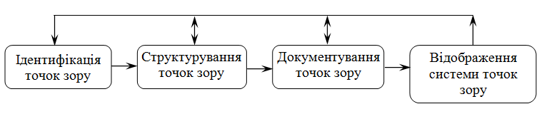

Рисунок Л2.3. Метод VORD

*Приклад*. Розглянемо використання методу VORD на перших трьох кроках аналізу вимог для системи підтримки замовлення та обліку товарів

в бакалійній крамниці. У бакалійній крамниці для кожного товару фіксується місце зберігання (певна полка), кількість товару та його постачальник. Система підтримки замовлення та обліку товарів повинна забезпечувати додавання інформації про новий товар, зміну або видалення інформації про наявний товар, зберігання (додавання, зміна та видалення) інформації про постачальників, що включає в себе назву фірми, її адресу і телефон. За допомогою системи створюються замовлення постачальникам. Кожне замовлення може містити кілька позицій, в кожній позиції вказуються найменування товару та його кількість у замовленні. Система на вимогу користувача формує і видає на друк наступну довідкову інформацію:
* список всіх товарів;
* список товарів, наявних;
* список товарів, кількість яких необхідно поповнити;
* список товарів, що поставляються даними постачальниками.

Першим кроком у формуванні вимог є ідентифікація опорних точок зору. У всіх методах формування вимог, заснованих на використанні точок зору, початкова ідентифікація є найбільш важким завданням. Один з підходів до ідентифікації точок зору - метод "мозкової атаки", коли визначаються потенційні системні сервіси та організації, які взаємодіють з системою. Організовується зустріч осіб, що беруть участь у формуванні вимог, які пропонують свої точки зору. Ці точки зору представляються у вигляді діаграми, що відображають можливі точки зору (рисунок Л2.4). Під час "мозкової атаки" необхідно ідентифікувати потенційні опорні точки зору, системні сервіси, вхідні дані, не функціональні вимоги, керуючі події та виняткові ситуації.


Рисунок Л2.4. Діаграма ідентифікації точок зору

Наступною стадією процесу формування вимог буде ідентифікація опорних точок зору (на рисунку Л2.4 показані у вигляді темних кругових областей) та сервісів (показані у вигляді затінених областей). Сервіси повинні відповідати опорним точкам зору. Але можуть бути сервіси, які не поставлені їм у відповідність. Це означає, що на початковому етапі "мозкової атаки" деякі опорні точки зору не були ідентифіковані.

У таблиці 2.1 показано розподіл сервісів для деяких ідентифікованих на рисунку Л2.4 точок зору. Один і той же сервіс може бути поєднаним з декількома точками зору.

*Таблиця Л2.1 - Сервіси, співвіднесені з точками зору*

| Клієнт | Покупець | Постійний покупець | Товар | Постачальник | Продавець | Адміністратор |
| :--- | :--- | :--- | :--- | :--- | :--- | :--- |
| Перевірка наявності товару | Занесення до списку постійних клієнтів | Отримання знижки | Прийом товару | Занесення в базу даних (назва, адреса, телефон і т.д.) | Продаж товару | Доступ до БД |
| Покупка товару | | Отримання інформації про нові надходження | Занесення в базу даних (дані про постачальника, кількість, місце зберігання і др.) | | Печать чека | Перевірка статистики |
| Отримання чеку | | | Призначення ціни | | Доступ к каталогу | Перевизначення ціни |
| Заказ товару | | | Призначення ціни | | Перевірка наявності товару | Оформлення заказу постачальнику |
| Занесення покупця і суми покупки до БД | | | «Покупаемый» або «непокупаемый» товар | | Оформлення заказу покупцю | Друк заказу |

Інформація, витягнута з точок зору, використовується для заповнення форм шаблонів точок зору і організації точок зору в ієрархію спадкування. Це дозволяє побачити загальні точки зору і повторно використовувати інформацію в ієрархії успадкування. Сервіси, дані і керуюча інформація успадковуються підмножиною точок зору. На рисунку Л2.5 показана частина ієрархії точок зору для системи підтримки замовлення та обліку товарів.


Рисунок Л2.5. Ієрархія точок зору

*Атестація вимог*

Атестація повинна продемонструвати, що вимоги дійсно визначають ту систему, яку хоче мати замовник. Перевірка вимог важлива, так як помилки в специфікації вимог можуть призвести до переробки системи та великим затратам, якщо будуть виявлені під час процесу розробки системи або після введення її в експлуатацію. Вартість внесення в систему змін, необхідних для усунення помилок у вимогах, набагато вище, ніж виправлення помилок проектування або кодування. Причина в тому, що зміна вимог зазвичай тягне за собою значні зміни в системі, після внесення яких вона повинна пройти повторне тестування.

Під час процесу атестації повинні бути виконані різні типи перевірок вимог.

1. *Перевірка правильності вимог.* Користувач може вважати, що система необхідна для виконання деяких певних функцій. Однак подальші роздуми та аналіз можуть призвести до необхідності введення додаткових або нових функцій. Системи призначені для різних користувачів з різними потребами, і тому набір вимог буде представляти собою деякий компроміс між вимогами користувачів системи.
2. *Перевірка на несуперечність.* Специфікація вимог не повинна містити протиріччя.
3. *Перевірка на повноту.* Специфікація вимог повинна містити вимоги, які визначають всі системні функції і обмеження, що накладаються на систему.
4. *Перевірка на здійсненність.* На основі знання існуючих технологій, вимоги повинні бути перевірені на можливість їх реального виконання. Тут також перевіряються можливості фінансування і графік розробки системи.

Існує ряд методів атестації вимог, які можна використовувати спільно або кожен окремо.

1. *Огляд вимог.* Вимоги системно аналізуються рецензентами.

2. *Прототипування*. На цьому етапі прототип системи демонструється кінцевим користувачам і замовнику. Вони можуть експериментувати з цим прототипом, щоб переконатися, що він відповідає їхнім потребам.
3. *Генерація тестових сценаріїв*. В ідеалі вимоги повинні бути такими, щоб їх реалізацію можна було протестувати. Якщо тести для вимог розробляти як частину процесу атестації, то часто це дозволяє виявити проблеми в специфікації. Якщо такі тести складно або неможливо розробити, то зазвичай це означає, що вимоги важко виконати і тому необхідно їх переглянути.
4. *Автоматизований аналіз несуперечності*. Якщо вимоги представлені у вигляді структурних або формальних системних моделей, можна використовувати інструментальні CASE-засоби для перевірки несуперечності моделей. Для автоматизованої перевірки несуперечності необхідно побудувати БД вимог і потім перевірити всі вимоги в цій БД. Аналізатор вимог готує звіт про всі знайдені протиріччя.

*Вимоги користувача та системні вимоги*

На підставі отриманих моделей будуються вимоги користувача - опис на природній мові:
1) функції, виконуваних системою;
2) обмежень, що накладаються на неї.

Вимоги користувача повинні описувати зовнішню поведінку системи, основні функції та сервіси, що надаються системою, її не функціональні властивості. Необхідно виділити опорні точки зору і згрупувати вимоги відповідно з ними. Вимоги користувача можна оформити як простим перерахуванням, так і використовуючи нотацію варіантів використання.

Далі складаються системні вимоги. Вони включать в себе:
1. *Вимоги до архітектури системи*. Наприклад, число і розміщення сховищ і серверів додатків.
2. *Вимоги до параметрів обладнання*. Наприклад, частота процесів серверів і клієнтів, обсяг сховищ, розмір оперативної і відео пам'яті, пропускна здатність каналу і т.д.
3. *Вимоги до параметрів системи*. Наприклад, час відгуку на дію користувача, максимальний розмір переданого файлу, максимальна швидкість передачі даних, максимальне число одночасно працюючих користувачів і т.д.
4. *Вимоги до програмного інтерфейсу*.
5. *Вимоги до структури системи*. Наприклад, масштабованість, розподіленість, модульність, відкритість:


<!-- ВІДНОВЛЕНО ЧЕРЕЗ GEMINI (Стор. 120) -->
* *масштабованість* - можливість поширення системи на велику кількість машин, яка не приведе до втрати працездатності та ефективності, при цьому здатність системи нарощувати свою потужність повинна визначатися тільки потужністю відповідного апаратного забезпечення;
* *розподіленість* - система повинна підтримувати розподілене зберігання даних;
* *модульність* - система повинна складатися з окремих модулів, інтегрованих між собою;
* *відкритість* - наявність відкритих інтерфейсів для можливої доробки та інтеграції з іншими системами.

6. Вимоги щодо взаємодії та інтеграції з іншими системами. Наприклад, використання загальної БД, можливість отримання даних з БД певних систем і т.д.

*Порядок виконання роботи*

1. Вивчити запропонований теоретичний матеріал.
2. Побудувати опорні точки зору на підставі методу VORD для формування та аналізу вимог. Результатом повинні з'явитися дві діаграми: діаграма ідентифікації точок зору і діаграма ієрархії точок зору.
3. Скласти інформаційну модель майбутньої системи, що включає в себе опис основних об'єктів системи і взаємодії між ними. На підставі отриманої інформаційної моделі і діаграм ідентифікації точок зору, діаграма ієрархії точок зору, сформувати вимоги користувача і системні вимоги.
4. Провести атестацію вимог, вказати які типи перевірок обрали.
5. На підставі опису системи (лабораторна робота №1), інформаційної моделі, користувацьких і системних вимог ТЗ на створення ПЗ. ТЗ повинно містити основні розділи, описані в [5].
6. Побудувати звіт, що включає всі отримані рівні моделі, опис функціональних блоків, потоків даних, сховищ і зовнішніх об'єктів.

📖 *Зміст звіту*

1. Мета роботи.
2. Введення.
3. Програмно-апаратні засоби, що використовуються при виконанні роботи.
4. Основна частина (опис роботи згідно з вимогами до виконання лабораторної роботи).
5. Висновки.
6. Список використаної літератури.
<!-- КІНЕЦЬ ВІДНОВЛЕННЯ -->


*Література*

1. Соммервиль Иан. Инженерия программного обеспечения, 6-е изд.: Пер. с англ. – М.: Издательский дом “Вильямс”, 2002. – 624 с.
2. Якобсон А., Буч Г., Рамбо Дж. Унифицированный процесс разработки программного обеспечения. – СПб.: Питер, 2002. – 496 с.
3. Константин Л., Локвуд Л. Разработка программного обеспечения. – СПб.:Питер, 2004. – 592 с.
4. Иванова Г.С. Технология программирования: Учебник для вузов. - М.: Изд-во МГТУ им. Н.Э. Баумана, 2002. - 320 с.
5. ГОСТ 34.602-89 Техническое задание на создание автоматизированной системы [Електронний ресурс] – http://unesco.kemsu.ru/study_work/method/po/UMK/lab_pract/lab02_a.html – Назва з екрану
6. ГОСТ 19.201-78 Техническое задание. Требования к содержанию и оформлению [Електронний ресурс] – http://fmi.asf.ru/library/book/Gost/19201-78.html – Назва з екрану

ЛАБОРАТОРНА РОБОТА № 3  
«МЕТОДОЛОГІЯ ФУНКЦІОНАЛЬНОГО МОДЕЛЮВАННЯ»

*Мета роботи:* Вивчити методології функціонального моделювання IDEF0 і IDEF3.

*Методичні вказівки*

Лабораторна робота спрямована на ознайомлення з методологіями функціонального моделювання IDEF0 і IDEF3, одержання навичок по застосуванню даних методологій для побудови функціональних моделей на підставі вимог до IC.

🛎 *Вимоги до результатів виконання лабораторної роботи:*

* модель повинна відображати весь зазначений в описі функціонал, а також чітко відображати існуючі потоки даних і описувати правила їх руху;
* наявність у моделі не менш трьох рівнів;
* не менш двох рівнів декомпозиції в стандарті IDEF0 (контекстна діаграма + діаграми A0);
* на діаграмі 1-го рівня (A0) не менш 4-х функціональних блоків;
* на діаграмі 2-го й далі рівнях повинна бути декомпозиція в стандарті IDEF3, на кожній діаграмі не менш 2-х функціональних блоків.

*Теоретичні відомості:*

*IDEF0. Основні поняття IDEF0*

IDEF0 (Integrated Definition Function Modeling) – методологія функціонального моделювання. В основі IDEF0 методології лежить поняття блоку, який відображає деяку бізнес-функцію. Чотири сторони блоку мають різну роль: ліва сторона має значення "входу", права - "виходу", верхня - "керування", нижня - "механізму" (Рисунок Л3.1).

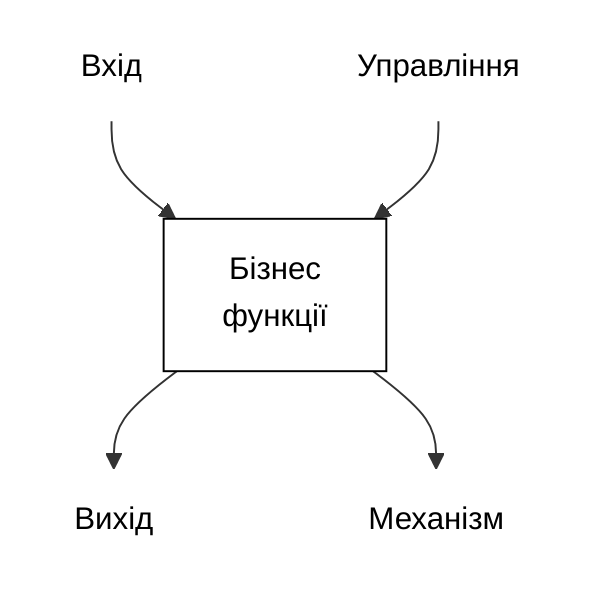
```mermaid
graph TD
    %% Стилі
    classDef default fill:#fff,stroke:#000,stroke-width:1px,color:#000;
    classDef textOnly fill:none,stroke:none;

    %% Основні елементи
    SubInput["Вхід"] --> |" "| Block["Бізнес<br>функції"]
    Block --> |" "| SubOutput["Вихід"]
    
    SubControl["Управління"] --> |" "| Block
    Block --> |" "| SubMechanism["Механізм"]

    style Block fill:#fff,stroke:#000,stroke-width:1px
    style SubInput fill:none,stroke:none
    style SubOutput fill:none,stroke:none
    style SubControl fill:none,stroke:none
    style SubMechanism fill:none,stroke:none
```

Рисунок Л3.1. Функціональний блок

Взаємодія між функціями в IDEF0 представляється у вигляді дуги, яка відображає потік даних або матеріалів, що надходить із виходу однієї функції на вхід іншої. Залежно від того, з якою стороною блоку зв'язаний потік, його називають відповідно "вхідним", "вихідним" або "керуючим".

*Принципи моделювання в IDEF0*

В IDEF0 реалізовано три базові принципи моделювання процесів:
* принцип функціональної декомпозиції;
* принцип обмеження складності;
* принцип контексту.

*Принцип функціональної декомпозиції* – спосіб моделювання типової ситуації, коли будь-яка дія, операція, функція можуть бути розбиті (декомпозовані) на більш прості дії, операції, функції. Інакше кажучи, складна бізнес-функція може бути представлена у вигляді сукупності елементарних функцій. Представляючи функції графічно, у вигляді блоків, можна як би заглянути усередину блоку й детально розглянути її структуру й склад (Рисунок Л3.2).

*Принцип обмеження складності*. При роботі з IDEF0 діаграмами суттєвим є умова їх розбірливості й зручного читання. Суть принципу обмеження складності полягає в тому, що кількість блоків на діаграмі повинно бути не менш двох і не більш шести. Практика показує, що дотримання цього принципу приводить до того, що функціональні процеси, представлені у вигляді IDEF0 моделі, добре структуровані, зрозумілі й легко піддаються аналізу.

*Принцип контекстної діаграми*. Моделювання ділового процесу починається з побудови контекстної діаграми. На цій діаграмі відображається тільки один блок – головна бізнес-функція системи, що моделюється. Якщо мова йде про моделювання цілого підприємства або навіть великого підрозділу, головна бізнес-функція не може бути сформульована як, наприклад, "продавати продукцію". Головна бізнес-функція системи – це "місія" системи, її значення в навколишньому світі. Не можна правильно сформулювати головну функцію підприємства, не маючи представлення про його стратегії.

При визначенні головної бізнес-функції необхідно завжди мати мету моделювання й точку зору на модель. Те саме підприємство може бути описане по- різному, залежно від того, з якого погляду його розглядають: директор підприємства й податковий інспектор бачать організацію зовсім по- різному.

Контекстна діаграма відіграє ще одну роль у функціональній моделі. Вона "фіксує" границі моделюємої бізнес-системи, визначаючи те, як моделюємка система взаємодіє зі своїм оточенням. Це досягається за рахунок опису дуг, з'єднаних із блоком, що представляє головну бізнес-функцію.

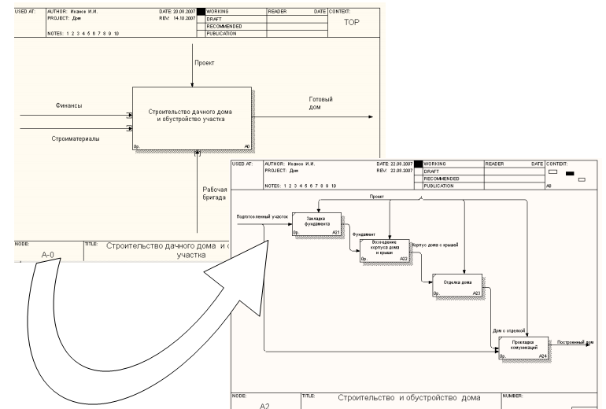

*Рисунок Л3.2. Приклад декомпозиції функціонального блоку*

*Приклад.*
На рисунку Л3.3 та рисунку 3.4 представлений приклад побудови функціональної діаграми, що описує виготовлення виробу: рисунок Л3.3 – контекстна діаграма, рисунок Л3.4 – перший рівень декомпозиції.

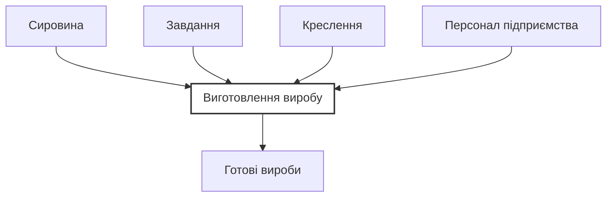
```mermaid
graph TD
    %% Входи (inputs)
    In1["Сировина"] --> Process
    In2["Завдання"] --> Process

    %% Виходи (outputs)
    Process --> Out1["Готові вироби"]

    %% Керування (controls)
    Ctrl1["Креслення"] --> Process

    %% Механізми (mechanisms)
    Mech1["Персонал підприємства"] --> Process

    %% Головний процес
    subgraph Process ["Виготовлення виробу"]
    end

    style Process fill:#fff,stroke:#333,stroke-width:2px
```

*Рисунок Л3.3. Контекстна діаграма*


*Рисунок Л3.4. Діаграма першого рівня декомпозиції*

### Застосування IDEF0

Існує два ключові підходи до побудови функціональної моделі: побудова “як є” і побудова “як буде”.

*Побудова моделі “як є”.* Обстеження підприємства є обов'язковою частиною будь-якого проекту створення або розвитку корпоративної ІС.

Побудова функціональної моделі “як є” дозволяє чітко зафіксувати, які ділові процеси здійснюються на підприємстві, які інформаційні об'єкти використовуються при виконанні ділових процесів і окремих операцій. Функціональна модель “як є” є відправною точкою для аналізу потреб підприємства, виявлення проблем і "вузьких" місць і розробки проекту вдосконалення ділових процесів.

*Побудова моделі “як буде”.* Створення й впровадження корпоративної ІС приводить до зміни умов виконання окремих операцій, структури ділових процесів і підприємства в цілому. Це приводить до необхідності зміни системи бізнес-правил, що використовуються на підприємстві, модифікації посадових інструкцій співробітників. Функціональна модель “як буде” дозволяє вже на стадії проектування майбутньої ІС визначити ці зміни. Застосування функціональної моделі “як буде” дозволяє не тільки скоротити строки впровадження ІС, але також знизити ризики, пов'язані з несприйнятливістю персоналу до інформаційних технологій.

### IDEF3. Метод опису процесів IDEF3

Для опису логіки взаємодії інформаційних потоків найбільше підходить IDEF3, що також має назву Workflow diagramming


<!-- ВІДНОВЛЕНО ЧЕРЕЗ GEMINI (Стор. 126) -->
методологією моделювання, що використовує графічний опис інформаційних потоків, взаємин між процесами обробки інформації й об'єктів, що є частиною цих процесів. Діаграми Workflow можуть бути використані в моделюванні бізнес-процесів для аналізу завершеності процедур обробки інформації. З їхньою допомогою можна описувати сценарії дій співробітників організації, наприклад послідовність обробки замовлення або події, які необхідно обробити за кінцевий час. Кожний сценарій супроводжується описом процесу й може бути використаний для документування кожної функції.

IDEF3 - це метод, що має основною метою дати можливість аналітикам описати ситуацію, коли процеси виконуються в певній послідовності, а також описати об'єкти, що спільно брали участь в одному процесі.

Техніка опису набору даних IDEF3 є частиною структурного аналізу. На відміну від деяких методик описів процесів IDEF3 не обмежує аналітика надмірно твердими рамками синтаксису, що може привести до створення неповних або суперечливих моделей.

IDEF3 може бути також використаний, як метод створення процесів. IDEF3 доповнює IDEF0 і містить усе необхідне для побудови моделей, які надалі можуть бути використані для імітаційного аналізу.

Кожна робота в IDEF3 описує який-небудь сценарій бізнес-процесу й може бути складовою іншої роботи. Оскільки сценарій описує ціль й рамки моделі, важливо, щоб роботи іменувалися віддієслівним іменником, що позначають процес дії, або фразою, що містить такий іменник.

Точка зору на модель повинна бути задокументована. Звичайно це точка зору людини, що відповідальна за роботу в цілому. Також необхідно задокументувати ціль моделі - ті питання, на які покликана відповісти модель.

*Діаграми.* Діаграма є основною одиницею опису в IDEF3.

*Одиниці роботи - Unit of Work (UOW).* UOW, також називаються роботами (activity), є центральними компонентами моделі. В IDEF3 роботи зображуються прямокутниками і мають ім'я, виражене віддієслівним іменником, що позначають процес дії, одиночним або в складі фрази, і номер (ідентифікатор); інше ім'я іменник у складі тієї ж фрази звичайно відображає основний вихід (результат) роботи, наприклад, "Виготовлення виробу".

*Зв'язки.* Зв'язки показують взаємини робіт. Усі зв'язки в IDEF3 односпрямовані й можуть бути спрямовані куди завгодно, але звичайно діаграми IDEF3 намагаються побудувати так, щоб зв'язки були спрямовані зліва праворуч. В IDEF3 розрізняють три типи стрілок, що зображують зв'язки, стиль яких встановлюється через меню Edit/Arrow Style:
* *Старша (Precedence)* - суцільна лінія, що зв'язує одиниці робіт (UOW). Рисується з ліва на право або зверху вниз. Показує, що
<!-- КІНЕЦЬ ВІДНОВЛЕННЯ -->


робота-джерело повинна закінчитися перш, ніж робота-ціль почнеться.
* _Відносини (Relational Link)_ - пунктирна лінія, що використовується для зображення зв'язків між одиницями робіт (UOW) а також між одиницями робіт і об'єктами посилань.
* _Потоки об'єктів (Object Flow)_ - стрілка із двома наконечниками, застосовується для опису того факту, що об'єкт використовується у дві або біль ш одиницях роботи, наприклад, коли об'єкт породжується в одній роботі й використовується в іншій.
* _Старший зв'язок і потік об'єктів_. Старший зв'язок показує, що робота-джерело закінчується раніше, чим починається робота-ціль. Часто результатом роботи-джерела стає об'єкт, необхідний для запуску роботи-цілі. У цьому випадку стрілку, що позначає об'єкт, зображують із подвійним наконечником. Ім'я стрілки повинне ясно ідентифікувати відображуваний об'єкт. Потік об'єктів має ту ж семантику, що й старша стрілка.

_Перехрестя (Junction)_. Закінчення однієї роботи може служити сигналом до початку декількох робіт, або ж одна робота для свого запуску може очікувати закінчення декількох робіт. Для внесення перехрестя служить кнопка в палітрі інструментів - додати в діаграму перехрестя Junction. У діалозі Junction Type Editor необхідно вказати тип перехрестя. Зміст кожного типу наведено в таблиці Л3.1.

_Таблиця Л3.1 - Типи перехресть_

| Позначення | Найменування | Зміст у випадку злиття стрілок | Зміст у випадку розгалуження стрілок |
| :---: | :--- | :--- | :--- |
|  | Asynchronous AND | Усі попередні процеси повинні бути завершені | Усі наступні процеси повинні бути запущені |
|  | Synchronous AND | Усі попередні процеси завершені одночасно | Усі наступні процеси запускаються одночасно |
|  | Asynchronous OR | Один або кілька попередніх процесів повинні бути завершені | Один або кілька наступних процесів повинні бути запущені |
|  | Synchronous OR | Один або кілька попередніх процесів завершені одночасно | Один або кілька наступних процесів запускаються одночасно |
|  | XOR (Exclusive OR) | Тільки один попередній процес завершений | Тільки один наступний процес запускається |

Перехрестя використовуються для відображення логіки взаємодії стрілок при злитті та розгалуженні або для відображення безлічі подій, які можуть або повинні бути завершені перед початком наступної роботи. Розрізняють перехрестя для злиття (Fan-in Junction) і розгалуження (Fan-out Junction) стрілок. Перехрестя не може використовуватися одночасно для злиття та для розгалуження.

На відміну від IDEF0 в IDEF3 стрілки можуть зливатися й розгалужуватися тільки через перехрестя.

*Декомпозиція робіт*. В IDEF3 декомпозиція використовується для деталізації робіт. Методологія IDEF3 дозволяє декомпозувати роботу багаторазово, тобто робота може мати безліч дочірніх робіт. Це дозволяє в одній моделі описати альтернативні потоки. Можливість множинної декомпозиції висуває додаткові вимоги до нумерації робіт. Так, номер роботи складається з номера батьківської роботи, версії декомпозиції й власного номера роботи на поточній діаграмі (Рисунок Л3.5).


*Рисунок Л3.5. Номер одиниці роботи (UOW)*

*Порядок виконання роботи*

1. Вивчити пропонований теоретичний матеріал.
2. Побудувати функціональну модель системи, описаної в лабораторній роботі № 1 так, щоб вона відповідала всім пред'явленим до системи вимогам, представляла повний функціонал системи (кожній функції в описі системи повинен відповідати принаймні один функціональний блок) і її основні бізнес-процеси:
* за допомогою методології IDEF0 побудувати контекстну діаграму;
* за допомогою методології IDEF0 побудувати діаграму 1-го рівня (A0) – модель оточення;
* за допомогою методології IDEF3 декомпозувати функціональні блоки моделі оточення на 1-2 рівня вглиб до потоків, зв'язки із зовнішніми системами;
* на кожній діаграмі 2-го рівня повинно бути не менше 4-х функціональних блоків;
* на кожній діаграмі 3-го рівня й далі не менше 2-х функціональних блоків.
3. Побудувати звіт, що включає всі отримані рівні моделі, опис функціональних блоків, потоків даних, сховищ і зовнішніх об'єктів.

📖 *Зміст звіту*

1. Мета роботи.

2. Введення.
3. Програмно-апаратні засоби, використовувані при виконанні роботи.
4. Основну частину (опис роботи).
5. Висновки.
6. Список використовуваної літератури.

*Література*

1. IDEFØ. Function Modeling Method [Електронний ресурс] – http://www.idef.com – Назва з екрана.
2. Свиридов С., Курьян А. IDEF0: функциональное моделирование деловых процессов // Центр ОТСМ-ТРИЗ технологий, Минск, Беларусь 1997. [Електронний ресурс] – http://www.trizminsk.org
3. Чувахин В. А. Описание отдельных концепций IDEF0// Сайт “Корпоративный менеджмент”. [Електронний ресурс] – http://www.cfin.ru/chuvakhin/idef0-r.shtml
4. Курьян А. Г., Серенков П.С. Использование IDEF0 для описания и классификации процессов в рамках системы качества МС ИСО семейства 9000 версии 2000. [Електронний ресурс] – http://www.interface.ru/
5. Рубцов С. IDEF0 и опыт разработки. Секреты моделирования и проектирования бизнес-процессов. // Открытые системы, 2002. [Електронний ресурс] – http://big.spb.ru/
6. Верников Г.. Основные методологии обследования организаций. Стандарт IDEF0. // Управленческое консультирование.[Електронний ресурс] – www.consulting.ru
7. Маклаков С. В. BPwin и ERwin: CASE-средства для разработки информационных систем // [Електронний ресурс] – http://www.isuct.ru/~ivt/books/CASE/case5

ЛАБОРАТОРНА РОБОТА №4
«МЕТОДОЛОГІЯ ОБ'ЄКТНО-ОРІЄНТОВАНОГО МОДЕЛЮВАННЯ»

*Мета роботи:* Ознайомлення з основними елементами визначення, подання, проєктування й моделювання програмних систем за допомогою мови UML.

*Методичні вказівки:*

Лабораторна робота спрямована на ознайомлення з основними елементами визначення, подання, проєктування й моделювання програмних систем за допомогою мови UML, одержання навичок по застосуванню даних елементів для побудови об'єктно-орієнтованих моделей ІС на підставі вимог.

🔔 *Вимоги до результатів виконання лабораторної роботи:*

1. Модель системи повинна містити: діаграму варіантів використання; діаграми взаємодії для кожного варіанта використання; діаграму класів, що дозволяє реалізувати весь описаний функціонал ІС; об'єднану діаграму компонентів і розміщення;
2. Для класів указати стереотипи;
3. Залежно від варіанта завдання діаграма розміщення повинна показувати розташування компонентів у розподіленому додатку або зв'язку між вбудованим процесором і пристроями.

*Теоретичні відомості:*

*Загальні відомості про об'єктне моделювання ІС*

Існує безліч технологій і інструментальних засобів, за допомогою яких можна реалізувати в деякому значенні оптимальний проєкт ІС, починаючи з етапу аналізу й закінчуючи створенням програмного коду системи. У більшості випадків ці технології пред'являють досить жорсткі вимоги до процесу розробки й використовуваним ресурсам, а спроби трансформувати їх під конкретні проекти виявляються безуспішними. Ці технології представлені Case-засобами верхнього рівня або Case-засобами повного життєвого циклу (upper CASE tools або full life-cycle CASE tools). Вони не дозволяють оптимізувати діяльність на рівні окремих елементів проєкту, і, як наслідок, багато розробників перейшли на так звані Case-засоби нижнього рівня (lower CASE tools). Однак вони зітхнулися з новою проблемою — проблемою організації взаємодії між різними командами, що реалізують проект.


<!-- ВІДНОВЛЕНО ЧЕРЕЗ GEMINI (Стор. 131) -->
Уніфікована мова об'єктно-орієнтованого моделювання Unified Modeling Language (UML) стала засобом досягнення компромісу між цими підходами. Існує достатня кількість інструментальних засобів, що підтримують за допомогою UML життєвий цикл інформаційних систем, і, одночасно, UML є досить гнучким для настроювання й підтримки специфіки діяльності різних команд розроблювачів.

Створення UML почалося в жовтні 1994 р., коли Джим Рамбо й Граді Буч із Rational Software Corporation стали працювати над об'єднанням своїх методів ОМТ і Booch. У цей час консорціум користувачів UML Partners містить у собі представників таких грандів інформаційних технологій, як Rational Software, Microsoft, IBM, Hewlett-Packard, Oracle, DEC, Unisys, Intellicorp, Platinum Technology.

UML являє собою об'єктно-орієнтована мова моделювання, що володіє наступними основними характеристиками:
* є мовою візуального моделювання, який забезпечує розробку репрезентативних моделей для організації взаємодії замовника й розроблювача IC, різних груп розроблювачів IC;
* містить механізми розширення й спеціалізації базових концепцій мови.

UML — це стандартна нотація візуального моделювання програмних систем, прийнята консорціумом Object Managing Group (OMG) восени 1997 р., і на сьогоднішній день вона підтримується багатьма об'єктно-орієнтованими Case-продуктами.

UML включає внутрішній набір засобів моделювання, які зараз прийняті в багатьох методах і засобах моделювання. Ці концепції необхідні в більшості прикладних задач, хоча не кожна концепція необхідна в кожній частині кожного додатка. Користувачам мови надані можливості:
* будувати моделі на основі засобів ядра, без використання механізмів розширення для більшості типових додатків;
* додавати при необхідності нові елементи й умовні позначки, якщо вони не входять у ядро, або спеціалізувати компоненти, систему умовних позначок (нотацію) і обмеження для конкретних предметних областей.

*Мова UML*

Стандарт UML пропонує наступний набір діаграм для моделювання:
* діаграми варіантів використання (use case diagrams) — для моделювання бізнес-процесів організації й вимог до створюваної системи;
* діаграми класів (class diagrams) — для моделювання статичної структури класів системи й зв'язків між ними;
* діаграми поведінки системи (behavior diagrams):
<!-- КІНЕЦЬ ВІДНОВЛЕННЯ -->


- діаграми взаємодії (interaction diagrams):
  - діаграми послідовності (sequence diagrams) і
  - кооперативні діаграми (collaboration diagrams) — для моделювання процесу обміну повідомленнями між об'єктами;
- діаграми станів (statechart diagrams) — для моделювання поведінки об'єктів системи при переході з одного стану в інше;
- діаграми діяльностей (activity diagrams) — для моделювання поведінки системи в рамках різних варіантів використання, або моделювання діяльностей;
- діаграми реалізації (implementation diagrams):
  - діаграми компонентів (component diagrams) — для моделювання ієрархії компонентів (підсистем) системи;
  - діаграми розгортання (deployment diagrams) — для моделювання фізичної архітектури системи.


Рисунок Л4.1. Інтегрована модель складної системи в нотації мови UML

### Діаграми варіантів використання

Поняття варіанта використання (use case) уперше ввів Івар Якобсон і додав йому таку значимість, що в цей час варіант використання перетворився в основний елемент розробки й планування проекту.

Варіант використання являє собою послідовність дій (транзакцій), виконуваних системою у відповідь на подію, ініційований деяким зовнішнім об'єктом (діючою особою). Варіант використання описує типова взаємодія між користувачем і системою. У найпростішому випадку варіант використання визначається в процесі обговорення з користувачем тих

функцій, які він праг би реалізувати. Мовою UML варіант використання зображують у такий спосіб:


```mermaid
graph TD
    A["Варіант використання"]
```

Рисунок Л4.2. Варіант використання

Діюча особа (actor) — це роль, яку користувач відіграє стосовно системи. Діючі особи являють собою ролі, а не конкретних людей або найменування робіт. Незважаючи на те, що на діаграмах варіантів використання вони зображуються у вигляді стилізованих людських фігурок особа, що діє, може також бути зовнішньою системою, якої необхідна деяка інформація від даної системи. Показувати на діаграмі діючих осіб випливає тільки в тому випадку, коли їм дійсно необхідні деякі варіанти використання. Мовою UML діючі особи представляють у вигляді фігур:

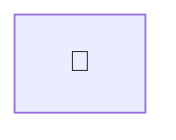
```mermaid
graph TD
    Actor["👤"]
```

Рисунок Л4.3. Діюча особа (актор)

Діючі особи діляться на три основні типи:
* користувачі;
* системи;
* інші системи, взаємодіючі з даної;
* час.

Час стає діючою особою, якщо від нього залежить запуск яких-небудь подій у системі.

*Зв'язки між варіантами використання й діючими особами*

У мові UML на діаграмах варіантів використання підтримується кілька типів зв'язків між елементами діаграми. Це зв'язки комунікації (communication), включення (include), розширення (extend) і узагальнення (generalization).

Зв'язок комунікації — це зв'язок між варіантом використання й діючою особою. Мовою UML зв'язки комунікації показують за допомогою односпрямованої асоціації (суцільної лінії).

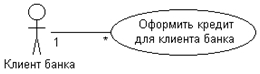

Рисунок Л4.4. Приклад зв'язку комунікації

Зв'язок включення застосовується в тих ситуаціях, коли є який-небудь фрагмент поведінки системи, який повторюється більш ніж в одному варіанті використання. За допомогою таких зв'язків звичайно моделюють багаторазово використовувану функціональність.

Зв'язок розширення застосовується при описі змін у нормальній поведінці системи. Вона дозволяє варіанту використання тільки при необхідності використовувати функціональні можливості іншого.

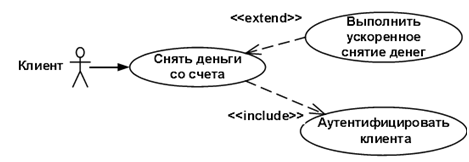

Рисунок Л4.5. Приклад зв'язку включення й розширення

За допомогою зв'язку узагальнення показують, що в декількох діючих осіб є загальні риси.

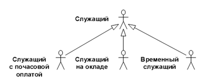

Рисунок Л4.6. Приклад зв'язку узагальнення

*Діаграми взаємодії (interaction diagrams)*

Діаграми взаємодії (interaction diagrams) описують поведінка взаємодіючих груп об'єктів. Як правило, діаграма взаємодії охоплює поведінка об'єктів у рамках тільки одного варіанта використання. На такій діаграмі відображається ряд об'єктів і ті повідомлення, якими вони обмінюються між собою.

*Повідомлення (message)* — це засіб, за допомогою якого об'єкт-відправник запитує в об'єкта одержувача виконання однієї з його операцій.

*Інформаційне (informative) повідомлення* — це повідомлення, що постачає об'єкт-одержувач деякою інформацією для відновлення його стану.

*Повідомлення-Запит (interrogative)* — це повідомлення, що запитує видачу деякої інформації про об'єкт-одержувача.

*Імперативне (imperative) повідомлення* — це повідомлення, що запитує в об'єкта-одержувача виконання деяких дій.

Існує два види діаграм взаємодії: діаграми послідовності (sequence diagrams) і кооперативні діаграми (collaboration diagrams).

### Діаграма послідовності (sequence diagrams)

Діаграма послідовності відбиває потік подій, що відбуваються в рамках варіанта використання.

![Рисунок Л4.7. Приклад діаграми послідовності, яка ілюструє взаємодію між актером (Иван : Клиент) та об'єктами системи (Приемник карт, Экран ATM, Управление ATM, Счет Ивана, Кассовый аппарат) під час операції зняття готівки (наприклад, 1: Принять карту, 2: Считать № карты, 3: Инициализировать экран, 4: Запросить PIN-код, 5: Ввод PIN-кода (1234), 6: Открыть счет, 7: Открыть счет, 8: Проверить PIN-код, 9: Запросить действие, 10: Выбор действия (Снять со счета), 11: Запросить сумму, 12: Ввод суммы (20 рублей), 13: Снять (20 руб.), 14: Снять (20 руб.), 15: Проверить вклад (20 руб.), 16: Уменьшить вклад (20 руб.), 17: Выдать (20 руб.), 18: Вернуть карту).](images/Degtyaryova_2017_Software_Engineering_Technologies/page_135_img_1.jpeg)

Рисунок Л4.7. Приклад діаграми послідовності

*Діаграма кооперації (collaboration diagram)*

Усі діючі особи показані у верхній частині діаграми. Стрілки відповідають повідомленням, переданим між діючою особою й об'єктом або між об'єктами для виконання необхідних функцій.

На діаграмі послідовності об'єкт зображується у вигляді прямокутника, від якого вниз проведена пунктирна вертикальна лінія. Ця лінія називається лінією життя (lifeline) об'єкта. Вона являє собою фрагмент життєвого циклу об'єкта в процесі взаємодії.

Кожне повідомлення представляється у вигляді стрілки між лініями життя двох об'єктів. Повідомлення з'являються в тому порядку, як вони показані на сторінці зверху вниз. Кожне повідомлення позначається як мінімум іменем повідомлення. При бажанні можна додати також аргументи й деяку управляючу інформацію. Можна показати самоделегування (self-delegation) — повідомлення, яке об'єктсилає самому собі, при цьому стрілка повідомлення вказує на ту ж саму лінію життя.

Діаграми кооперації відображають потік подій через конкретний сценарій варіанта використання, упорядковані за часом, а кооперативні діаграми більше уваги загострюють на зв'язках між об'єктами.

На діаграмі кооперації представлена вся та інформація, яка є й на діаграмі послідовності, але кооперативна діаграма по-іншому описує потік подій. З неї легше зрозуміти зв'язки між об'єктами, однак, важче усвідомити послідовність подій.

На кооперативній діаграмі так само, як і на діаграмі послідовності, стрілки позначають повідомлення, обмін якими здійснюється в рамках даного варіанта використання. Їхня тимчасова послідовність вказується шляхом нумерації повідомлень.

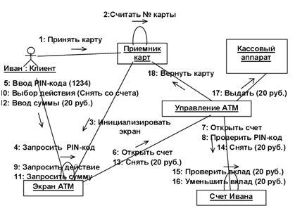

Рисунок Л4.8. Приклад діаграми кооперації

*Діаграми класів*

Діаграма класів визначає типи класів системи й різного роду статичні зв'язки, які існують між ними. На діаграмах класів зображуються також атрибути класів, операції класів і обмеження, які накладаються на зв'язки між класами.

Діаграма класів UML - це граф, вузлами якого є елементи статичної структури проекту (класи, інтерфейси), а дугами - відносини між вузлами (асоціації, спадкування, залежності).

На діаграмі класів зображуються наступні елементи:
* *Пакет (package)* — набір елементів моделі, логічно зв'язаних між собою;
* *Клас (class)* — опис загальних властивостей групи подібних об'єктів;
* *Інтерфейс (interface)* — абстрактний клас, що задає набір операцій, які об'єкт довільного класу, пов'язаного з даним інтерфейсом, надає іншим об'єктам.

### Клас

Клас - це група сутностей (об'єктів), що володіють подібними властивостями, а саме, даними й поведінкою. Окремий представник деякого класу називається об'єктом класу або просто об'єктом.

Під поведінкою об'єкта в UML розуміються будь-які правила взаємодії об'єкта із зовнішнім світом і з даними самого об'єкта.

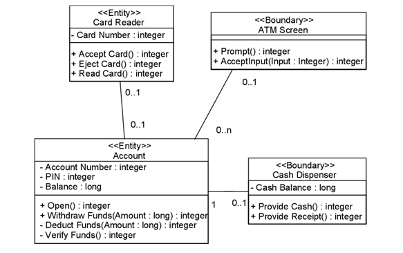

Рисунок Л4.9. Приклад діаграми класів

На діаграмах клас зображується у вигляді прямокутника із суцільною границею, розділеного горизонтальними лініями на 3 секції:

* Верхня секція (секція імені) містить ім'я класу й інші загальні властивості (зокрема, стереотип).
* У середній секції втримується список атрибутів.
* У нижній - список операцій класу, що відбивають його поведінка (дії, виконувані класом).

Кожна із секцій атрибутів і операцій може не зображуватися (а також обидві відразу). Для відсутньої секції не потрібно малювати розділову лінію й або вказувати на наявність або відсутність елементів у ній.

На розсуд конкретної реалізації можуть бути введені додаткові секції, наприклад, виключення (Exceptions).

### Стереотипи класів

Стереотипи класів — це механізм, що дозволяє розділяти класи на категорії.

У мові UML визначено три основні стереотипи класів:
* Boundary (границя);
* Entity (сутність);
* Control (керування).

### Граничні класи

Граничними класами (boundary classes) називаються такі класи, які розташовані на границі системи й усього навколишнього середовища. Це екранні форми, звіти, інтерфейси з апаратурою (такий як принтери або сканери) і інтерфейси з іншими системами.

Щоб знайти граничні класи, треба досліджувати діаграми варіантів використання. Кожній взаємодії між діючою особою й варіантом використання повинен відповідати, принаймні, один граничний клас. Саме такий клас дозволяє діючій особі взаємодіяти із системою.

### Класи-Сутності

Класи-Сутності (entity classes) містять збережену інформацію. Вони мають найбільше значення для користувача, і тому в їхніх назвах часто використовують терміни із предметної області. Звичайно для кожного класу-сутності створюють таблицю в базі даних.

### Керуючі класи

Керуючі класи (control classes) відповідають за координацію дій інших класів. Звичайно у кожного варіанта використання є один керуючий клас, що контролює послідовність подій цього варіанта використання. Керуючий клас відповідає за координацію, але сам не несе в собі ніякої функціональності, тому що інші класи не посилають йому великої кількості повідомлень. Замість цього він сам посилає безліч повідомлень. Керуючий клас просто делегує відповідальність іншим класам, із цієї причини його часто називають класом-менеджером.


<!-- ВІДНОВЛЕНО ЧЕРЕЗ GEMINI (Стор. 139) -->
У системі можуть бути й інші керуючі класи, загальні для декількох варіантів використання. Наприклад, може бути клас Securitymanager (менеджер безпеки), відповідальний за контроль подій, пов'язаних з безпекою. Клас Transactionmanager (менеджер транзакцій) займається координацією повідомлень, що ставляться до транзакцій з базою даних. Можуть бути й інші менеджери для роботи з іншими елементами функціонування системи, такими як поділ ресурсів, розподілена обробка даних або обробка помилок.

Крім згаданих вище стереотипів можна створювати й свої власні.

*Атрибути*

Атрибут – це елемент інформації, пов'язаний із класом. Атрибути зберігають інкапсульовані дані класу.

Тому що атрибути втримуються усередині класу, вони сховані від інших класів. У зв'язку із цим може знадобитися вказати, які класи мають право читати й змінювати атрибути. Ця властивість називається видимістю атрибута (attribute visibility).

В атрибута можна визначити чотири можливі значення цього параметра:

* Public (загальний, відкритий). Це значення видимості припускає, що атрибут буде видний усіма іншими класами. Будь-який клас може переглянути або змінити значення атрибута. Відповідно до нотації UML загальному атрибуту передує знак « + ».
* Private (закритий, секретний). Відповідний атрибут не видний ніяким іншим класом. Закритий атрибут позначається знаком « - » відповідно до нотації UML.
* Protected (захищений). Такий атрибут доступний тільки самому класу і його нащадкам. Нотація UML для захищеного атрибута – це знак « # ».
* Package or Implementation (пакетний). Припускає, що даний атрибут є загальним, але тільки в межах його пакета. Цей тип видимості не позначається ніяким спеціальним значком.

У загальному випадку, атрибути рекомендується робити закритими або захищеними. Це дозволяє краще контролювати сам атрибут і код.

За допомогою закритості або захиченості вдається уникнути ситуації, коли значення атрибута змінюється всіма класами системи. Замість цього логіка зміни атрибута буде укладена в тому ж класі, що й сам цей атрибут. параметри, що задаються, видимості вплинуть на генеруємий код.

*Операції*

Операції реалізують пов'язане із класом поведінка. Операція включає три частини – ім'я, параметри й тип значення, що вертається.
<!-- КІНЕЦЬ ВІДНОВЛЕННЯ -->


Параметри — це аргументи, одержувані операцією «на вході». Тип значення, що вертається, ставиться до результату дії операції.

На діаграмі класів можна показувати як імена операцій, так і імена операцій разом з їхніми параметрами й типом значення, що вертається. Щоб зменшити завантаженість діаграми, корисно буває на деяких з них показувати тільки імена операцій, а на інших їх повну сигнатуру.

У мові UML операції мають наступну нотацію:

*Ім'я Операції(аргумент: тип даних аргументу, аргумент2: тип даних аргументу2,...): тип значення, що вертається*

Слід розглянути чотири різні типи операцій:
* операції реалізації;
* операції керування;
* операції доступу;
* допоміжні операції.

*Операції реалізації*

Операції реалізації (implementor operations) реалізують деякі бізнес-функції. Такі операції можна знайти, досліджуючи діаграми взаємодії. Діаграми цього типу фокусуються на бізнес-функціях, і кожне повідомлення діаграми, швидше за все, можна співвіднести з операцією реалізації.

Кожна операція реалізації повинна бути, що легко прослідковується до відповідного вимоги. Це досягається на різних етапах моделювання. Операція виводиться з повідомлення на діаграмі взаємодії, повідомлення виходять із докладного опису потоку подій, який створюється на основі варіанта використання, а останній — на основі вимог. Можливість простежити весь цей ланцюжок дозволяє гарантувати, що кожна вимога буде реалізована в коді, а кожний фрагмент коду реалізує якась вимога.

*Операції управління*

Операції управління (manager operations) управляють створенням і знищенням об'єктів. У цю категорію попадають конструктори й деструктори класів.

*Операції доступу*

Атрибути звичайно бувають закритими або захищеними. Проте, інші класи іноді повинні переглядати або змінювати їхні значення. Для цього існують операції доступу (access operations). Такий підхід дає можливість безпечно інкапсулювати атрибути усередині класу, захистивши їх від інших класів, але все-таки дозволяє здійснити до них контрольований доступ. Створення операцій Get і Set (одержання й зміни значення) для кожного атрибута класу є стандартом.

*Допоміжні операції*

Допоміжними (helper operations) називаються такі операції класу, які необхідні йому для виконання його відповідальність, але про яких інші класи не повинні нічого знати. Це закриті й захищені операції класу.

Щоб ідентифікувати операції, виконаєте наступні дії:

1. Вивчите діаграми послідовності й кооперативні діаграми. Більша частина повідомлень на цих діаграмах є операціями реалізації. Рефлексивні повідомлення будуть допоміжними операціями.
2. Розглянете керуючі операції. Може знадобитися додати конструктори й деструктори.
3. Розглянете операції доступу. Для кожного атрибута класу, з яким повинні будуть працювати інші класи, треба створити операції Get і Set.

*Зв'язки*

Зв'язок являє собою семантичний взаємозв'язок між класами. Вона дає класу можливість пізнавати про атрибути, операції й зв'язках іншого класу. Іншими словами, щоб один клас міг послати повідомлення іншому на діаграмі послідовності або кооперативній діаграмі, між ними повинна існувати зв'язок.

Існують чотири типи зв'язків, які можуть бути встановлені між класами: асоціації, залежності, агрегації й узагальнення.

*Асоціації*

*Асоціація (association)* — це семантичний зв'язок між класами. Їх малюють на діаграмі класів у вигляді звичайної лінії.

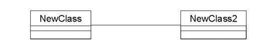

Рисунок Л4.10. Зв'язок асоціація

Асоціації можуть бути двунаправленими, як у прикладі, або односпрямованими. Мовою UML двунаправлені асоціації малюють у вигляді простої лінії без стрілок або зі стрілками з обох її сторін. На односпрямованій асоціації зображують тільки одну стрілку, що показує її напрямок.

Напрямок асоціації можна визначити, вивчаючи діаграми послідовності й кооперативні діаграми. Якщо всі повідомлення на них відправляються тільки одним класом і ухвалюються тільки іншим класом, але не навпаки, між цими класами має місце односпрямований зв'язок. Якщо хоча б одне повідомлення відправляється у зворотну сторону, асоціація повинна бути двунаправленою.

Асоціації можуть бути рефлексивними. Рефлексивна асоціація припускає, що один екземпляр класу взаємодіє з іншими екземплярами цього ж класу.

*Залежності*

Зв'язки залежності (dependency) також відбивають зв'язок між класами, але вони завжди односпрямовані й показують, що один клас залежить від визначень, зроблених в іншому. Наприклад, клас А використовує методи класу В. Тоді при зміні класу В необхідно зробити відповідні зміни в класі А.

Залежність зображується пунктирною лінією, проведеної між двома елементами діаграми, і вважається, що елемент, прив'язаний до кінця стрілки, залежить від елемента, прив'язаного до початку цієї стрілки.

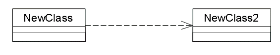

Рисунок Л4.11. Зв'язок залежність

При генерації коду для цих класів до них не будуть додаватися нові атрибути. Однак, будуть створені специфічні для мови оператори, необхідні для підтримки зв'язку.

*Агрегації*

Агрегації (aggregations) являють собою більш тісну форму асоціації. Агрегація – це зв'язок між цілим і його частиною. Наприклад, у вас може бути клас Автомобіль, а також класи Двигун, Покришки й класи для інших частин автомобіля. У результаті об'єкт класу Автомобіль буде складатися з об'єкта класу Двигун, чотирьох об'єктів Покришок і т.д. Агрегації візуалізує у вигляді лінії з ромбиком у класу, що є цілим:


Рисунок Л4.12. Зв'язок агрегація

На додаток до простої агрегації UML уводить більш сильний різновид агрегації, називану композицією. Згідно з композицією, об'єкт-частина може належати тільки єдиному цілому, і, крім того, як правило, життєвий цикл частин збігається із циклом цілого: вони живуть і вмирають разом з ним. Будь-яке видалення цілого поширюється на його частині.

Таке каскадне видалення нерідко розглядається як частина визначення агрегації, однак воно завжди мається на увазі в тому випадку, коли множинність ролі становить 1..1; наприклад, якщо необхідно вилучити Клієнта, те це видалення повинне поширитися й на Замовлення (і, у свою чергу, на Рядки замовлення).

### Узагальнення (Спадкування)

Узагальнення (спадкування) - це відношення типу загальне-частка між елементами моделі. За допомогою узагальнень (generalization) показують зв'язки спадкування між двома класами. Більшість об'єктно-орієнтованих мов безпосередньо підтримують концепцію спадкування. Вона дозволяє одному класу успадковувати всі атрибути, операції й зв'язку іншого. Спадкування пакетів означає, що в пакеті-спадкоємці всі сутності пакета-предка будуть видні під своїми власними іменами ( тобто простору імен поєднуються). Спадкування показується суцільною лінією, що йде від класу-нащадка до класу-предкові (у термінології ООП - від нащадка до предка, від сина до батька, або від підкласу до суперкласу). З боку більш загального елемента рисується великий порожній трикутник.

![Діаграма UML, що демонструє приклад зв'язку спадкування. Нагорі розташовано клас «Библиотечный пользователь» з полями «Имя», «Адрес», «Телефон», «Регистрационный номер» та методами «Регистрация ()», «Отмена регистрации ()». Від нього йде стрілка узагальнення (порожній трикутник) до двох підкласів: «Читатель» (з методом «Прием в читатели») та «Читатель с правом выноса» (з полями «Элементы временного пользования», «Максимальное время пользования»). Від класу «Читатель с правом выноса», своєю чергою, йдуть стрілки спадкування до класів «Сотрудник библиотеки» (з полями «Отдел», «Телефон отдела») та «Студент» (з полями «Факультет», «Домашний адрес»)](images/Degtyaryova_2017_Software_Engineering_Technologies/page_143_img_1.png)

Рисунок Л4.13. Приклад зв'язку спадкування

Крім наследуваних, кожний підклас має свої власні унікальні атрибути, операції та зв'язки.

*Множинність*

*Множинність* (multiplicity) показує, скільки екземплярів одного класу взаємодіють за допомогою цього зв'язку з одним екземпляром іншого класу в цей момент часу.

Наприклад, при розробці системи реєстрації курсів в університеті можна визначити класи Course (курс) і Student (студент). Між ними встановлений зв'язок: у курсів можуть бути студенти, а в студентів — курси. Питання, на який повинен відповісти параметр множинності: «Скільки курсів студент може відвідувати в цей момент? Скільки студентів може за раз відвідувати один курс?»

Тому що множинність дає відповідь на обоє ці питання, її індикатори встановлюються на обох кінцях лінії зв'язку. У прикладі реєстрації курсів ми розв'язали, що один студент може відвідувати від нуля до чотирьох курсів, а один курс можуть слухати від 0 до 20 студентів.

У мові UML прийняті певні нотації для позначення множинності, наведені в таблиці 4.1

*Таблиця Л4.1 - Позначення множинності зв'язків в UML*

| Множинність | Значення |
| :--- | :--- |
| 0..\* | Нуль і більше |
| 1..\* | Один і більше |
| 0..1 | Нуль чи один |
| 1..1 (скорочений запис: 1) | Рівно один |

*Імена зв'язків*

Зв'язки можна уточнити за допомогою імен зв'язків або рольових імен. Ім'я зв'язку — це звичайно дієслово або дієслівна фраза, що описує, навіщо вона потрібна. Наприклад, між класом Person (людей) і класом Company (компанія) може існувати асоціація. Можна задати у зв'язку із цим питання, чи є об'єкт класу Person клієнтом компанії, її співробітником або власником? Щоб визначити це, асоціацію можна назвати «employs» (наймає):

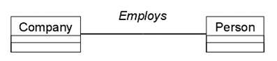

Рисунок Л4.14. Приклад імен зв'язків


<!-- ВІДНОВЛЕНО ЧЕРЕЗ GEMINI (Стор. 145) -->
*Ролі*

Рольові імена застосовують у зв'язках асоціації або агрегації замість імен для опису того, навіщо ці зв'язки потрібні. Вертаючись наприклад із класами Person і Company, можна сказати, що клас Person відіграє роль співробітника класу Company. Рольові імена — це звичайно імена іменники або засновані на них фрази, їх показують на діаграмі поруч із класом, що відіграють відповідну роль. Як правило, користуються або рольовим іменем, або іменем зв'язку, але не обома відразу. Як і імена зв'язків, рольові імена не обов'язкові, їх дають, тільки якщо ціль зв'язки не очевидний. Приклад ролей приводиться нижче:

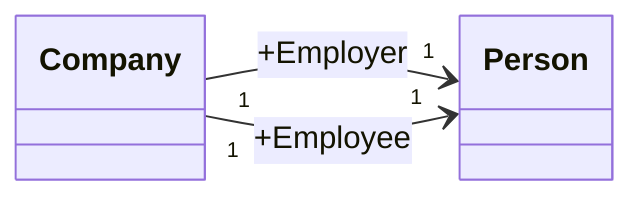
```mermaid
classDiagram
    direction LR
    class Company
    class Person
    Company "1" --> "1" Person : +Employer
    Company "1" --> "1" Person : +Employee
```

Рисунок Л4.15. Приклад ролей зв'язків

*Пакет. Механізм пакетів*

У контексті діаграм класів, пакет - це вмістище для деякого набору класів і інших пакетів. Пакет є самостійним простором імен.


```mermaid
classDiagram
    direction LR
    class Package {
    }
```

Рисунок Л4.16. Позначення пакета в UML

В UML немає яких-небудь обмежень на правила, по яких розроблювачі можуть або повинні групувати класи в пакети. Але є деякі стандартні випадки, коли таке групування доречне, наприклад, тісно взаємодіючі класи, або більш загальний випадок - розбивка системи на підсистеми.

Пакет фізично містить сутності, певні в ньому (говорять, що "сутності належать пакету"). Це означає, що якщо буде знищений пакет, то будуть знищений і весь його вміст.

Існує декілька найпоширеніших підходів до групування.

По-перше, можна групувати їх за стереотипом. У такому випадку виходить один пакет із класами-сутностями, один із граничними класами, один з керуючими класами і т.д. Цей підхід може бути корисний з погляду
<!-- КІНЕЦЬ ВІДНОВЛЕННЯ -->


розміщення готової системи, оскільки всі прикордонні класи, що перебувають на клієнтських машинах, уже виявляються в одному пакеті.

Інший підхід полягає в об'єднанні класів по їхній функціональності. Наприклад, у пакеті Security (безпека) утримуються всі класи, відповідальні за безпеку додатки. У такому випадку інші пакети можуть називатися Employee Maintenance (Робота зі співробітниками), Reporting (Підготовка звітів) і Error Handling (Обробка помилок). Перевага цього підходу полягає в можливості повторного використання.

Механізм пакетів застосуємо до будь-яких елементів моделі, а не тільки до класів. Якщо для групування класів не використовувати деякі евристики, то вона стає довільною. Одна з них, яка в основному використовується в UML, – це залежність. Залежність між двома пакетами існує в тому випадку, якщо між будь-якими двома класами в пакетах існує будь-яка залежність.

Таким чином, діаграма пакетів являє собою діаграму, що містить пакети класів і залежності між ними. Строго говорячи, пакети й залежності є елементами діаграми класів, тобто діаграма пакетів – це форма діаграми класів.

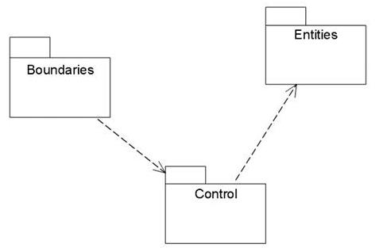

Рисунок Л4.17. Приклад діаграми пакетів

Залежність між двома елементами має місце в тому випадку, якщо зміни у визначенні одного елемента можуть викликати зміни в іншому. Що стосується класів, то причини для залежностей можуть бути самими різними:

- один клас посилає повідомлення іншому;
- один клас включає частина даних іншого класу; один клас використовує іншої як параметра операції.

Якщо клас міняє свій інтерфейс, то будь-яке повідомлення, яке він посилає, може втратити свою силу.

Пакети не дають відповіді на запитання, яким образом можна зменшити кількість залежностей у вашій системі, однак вони допомагають виділити ці залежності, а після того, як вони все виявляться на очах, залишається тільки попрацювати над зниженням їх кількості. Діаграми пакетів можна вважати основним засобом керування загальною структурою системи.

Пакети є життєво необхідним засобом для більших проектів. Їх слід використовувати у випадok, коли діаграма класів, що охоплює всю систему в цілому й розміщена на єдиному аркуші папір формат А4, стає нечитаємою.

### Діаграми станів

Діаграми станів визначають усі можливі стани, у яких може перебувати конкретний об'єкт, а також процес зміни станів об'єкта в результаті настання деяких подій.

Існує багато форм діаграм станів, що незначно відрізняються друг від друга семантикою.

На діаграмі є два спеціальні стани – початкове (start) і кінцеве (stop). Початковий стан виділений чорною крапкою, воно відповідає стану об'єкта, коли він тільки що був створений. Кінцевий стан позначається чорною крапкою в білому кружку, воно відповідає стану об'єкта безпосередньо перед його знищенням. На діаграмі станів може бути один і тільки один початковий стан. У той же час, може бути стільки кінцевих станів, скільки вам потрібно, або їх може не бути взагалі. Коли об'єкт перебуває в якомусь конкретному стані, можуть виконуватися різні процеси. Процеси, що відбуваються, коли об'єкт перебуває в певному стані, називаються діями (actions).

Зі станом можна зв'язувати дані п'яти типів: діяльність, вхідна дія, вихідна дія, подія й історія стану.

#### Діяльність

Діяльністю (activity) називається поведінка, реалізоване об'єктом, поки він перебуває в даному стані. Діяльність — ця поведінка, що переривається. Воно може виконуватися до свого завершення, поки об'єкт перебуває в даному стані, або може бути перерване переходом об'єкта в інший стан. Діяльність зображують усередині самого стану, їй повинне передувати слово do (робити) і двокрапка.

#### Вхідна дія

Вхідною дією (entry action) називається поведінка, яка виконується, коли об'єкт переходить у даний стан. Дана дія здійснюється не після того, як об'єкт перейшов у цей стан, а скоріше, як частина цього переходу. На відміну від діяльності, вхідні розглядаються як неперериваємі. Вхідну дію також показують усередині стану, йому передує слово entry (вхід) і двокрапка.

#### Вихідна дія

Вихідна дія (exit action) подібно вхідному. Однак, воно здійснюється як складова частина процесу виходу з даного стану. Воно є частиною процесу такого переходу. Як й вхідні, вихідні є неперериваючими.

Вихідну дію зображують усередині стану, йому передує слово exit (вихід) і двокрапка.

Поведінка об'єкта під час діяльності, при вхідних і вихідних діях може включати відправлення події іншому об'єкту. У цьому випадку опису діяльності, вхідної дії або вихідної дії передує знак « ».[1]

Відповідний рядок на діаграмі виглядає як

$$Do: Ціль.Подія (Аргументи)$$

Тут *Ціль* — це об'єкт, що одержує подія, *Подія* — що це посилає повідомлення, а *Аргументи* є параметрами повідомлення, що посилає.

Діяльність може також виконуватися в результаті одержання об'єктом деякої події. При одержанні деякої події виконується певна діяльність.

*Переходом* (Transition) називається переміщення з одного стану в інше. Сукупність переходів діаграми показує, як об'єкт може переміщатися між своїми станами. На діаграмі всі переходи зображують у вигляді стрілки, що починається на первісному стані, що й закінчується наступним.

Переходи можуть бути рефлексивними. Об'єкт може перейти в те ж стан, у якім він у даний момент перебуває. Рефлексивні переходи зображують у вигляді стрілки, що починається, що й завершується на тому самому стані.

У переходу існує кілька специфікацій. Вони включають події, аргументи, що обгороджують умови, дії, що й посилають події.

*Події*

Подія (event) — це те, що викликає перехід з одного стану в інше. Подію розміщують на діаграмі уздовж лінії переходу.

На діаграмі для відображення події можна використовувати як ім'я операції, так і звичайну фразу.

Більшість переходів повинні мати події, тому що саме вони, насамперед, змушують перехід здійснитися. Проте, бувають і автоматичні переходи, що не мають подій. При цьому об'єкт сам переміщається з одного стану в інше зі швидкістю, що дозволяє здійснитися вхідним діям, діяльності й вихідним діям.

*Умови, що захищають*

умови, що обгороджують (guard conditions) визначають, коли перехід може, а коли не може здійснитися. А якщо ні, то перехід не здійснитися.

умови, що захищають, зображують на діаграмі уздовж лінії переходу після імені події, містячи їх у квадратні дужки.

умови, що захищають, задавати необов'язково. Однак якщо існує кілька автоматичних переходів зі стану, необхідно визначити для них умови, що захищають, що взаємно виключають. Це допоможе читачеві діаграми зрозуміти, який шлях переходу буде автоматично обраний.

*Дія*

Дія (action) є неперервна поведінка, що здійснюється, як частина переходу. Вхідні й вихідні дії показують усередині станів, оскільки вони визначають, що відбувається, коли об'єкт входить або виходить із нього. Більшу частину дій, зображують уздовж лінії переходу, тому що вони не повинні здійснюватися при вході або виході зі стану.

Дію малюють уздовж лінії переходу після імені події, йому передує коса риса.

Подія або дія можуть бути поведінкою усередині об'єкта, а можуть являти собою повідомлення, щосилає іншому об'єкту. Якщо подія або дія посилає іншому об'єкту, перед ним на діаграмі поміщають знак « » (синтаксис посилки повідомлення).

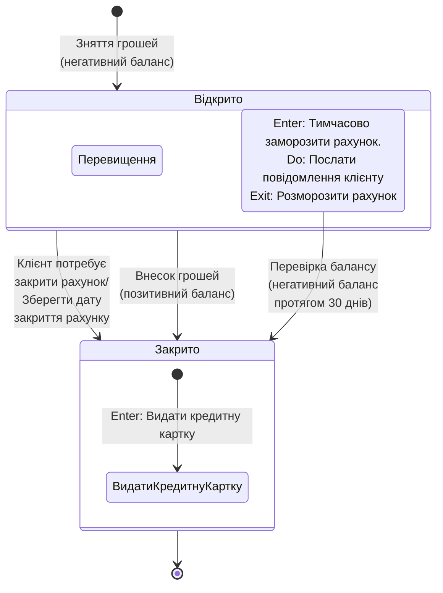
```mermaid
stateDiagram-v2
    [*] --> Відкрито : Зняття грошей<br>(негативний баланс)

    state Відкрито {
        Перевищення кредиту : Enter: Тимчасово заморозити рахунок.<br>Do: Послати повідомлення клієнту<br>Exit: Розморозити рахунок
    }

    Відкрито --> Закрито : Клієнт потребує<br>закрити рахунок/<br>Зберегти дату<br>закриття рахунку
    
    Закрито --> [*]

    state Закрито {
        [*] --> ВидатиКредитнуКартку : Enter: Видати кредитну картку
    }

    Перевищення кредиту --> Закрито : Перевірка балансу<br>(негативний баланс<br>протягом 30 днів)
    
    Відкрито --> Закрито : Внесок грошей<br>(позитивний баланс)
```

Рисунок Л4.18. Приклад діаграми станів

Діаграми станів не треба створювати для кожного класу, вони застосовуються тільки в складних випадках. Якщо об'єкт класу може існувати в декількох станах і в кожному з них поводиться по-різному, для нього може знадобитися така діаграма.

*Діаграми розміщення*

Діаграма розміщення (deployment diagram) відбиває фізичні взаємозв'язки між програмними й апаратними компонентами системи. Вона є гарним засобом для того, щоб показати маршрути переміщення об'єктів і компонентів у розподіленій системі.

Кожний вузол на діаграмі розміщення являє собою деякий тип обчислювального пристрою — у більшості випадків, частина апаратури. Ця апаратура може бути простим пристроєм або датчиком, а може бути й мейнфреймом.

Діаграма розміщення показує фізичне розташування мережі й місцезнаходження в ній різних компонентів.

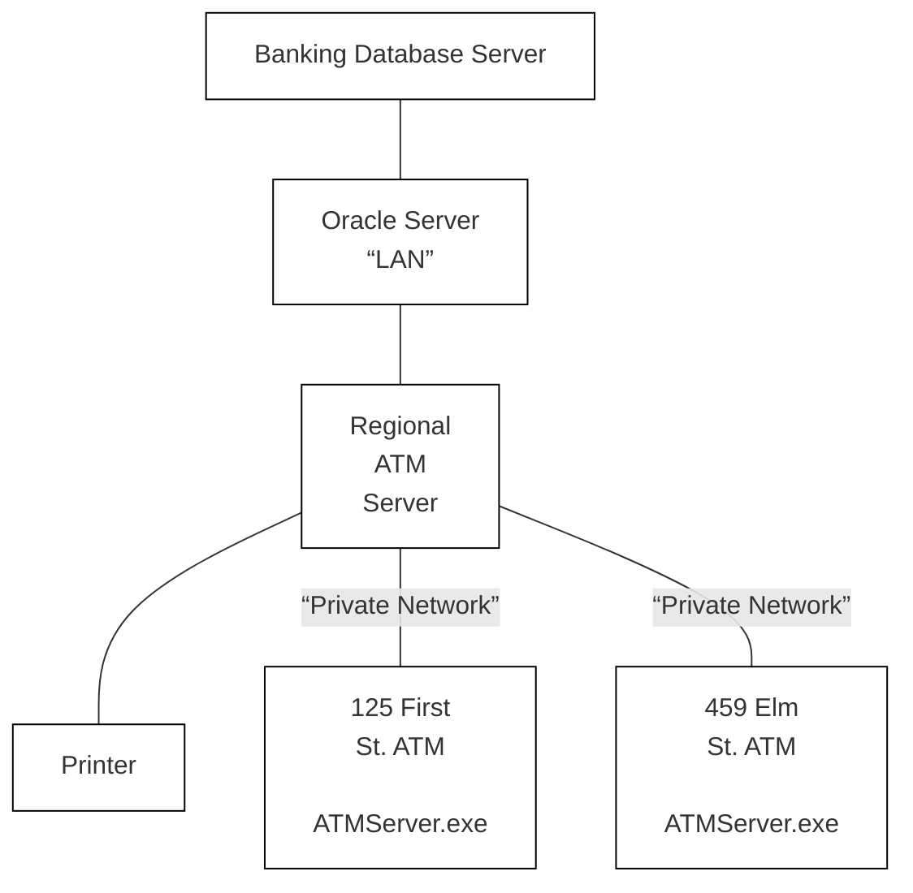
```mermaid
graph TD
    classDef nodeClass fill:#fff,stroke:#000,stroke-width:1px;

    DBS["Banking Database Server"]:::nodeClass
    OS["Oracle Server<br>“LAN”"]:::nodeClass
    RAS["Regional<br>ATM<br>Server"]:::nodeClass
    PR["Printer"]:::nodeClass
    ATM1["125 First<br>St. ATM<br><br>ATMServer.exe"]:::nodeClass
    ATM2["459 Elm<br>St. ATM<br><br>ATMServer.exe"]:::nodeClass

    DBS --- OS
    OS --- RAS
    RAS --- PR
    RAS ---|"“Private Network”"| ATM1
    RAS ---|"“Private Network”"| ATM2
```

Рисунок Л4.19. Приклад діаграми розміщення

Діаграма розміщення використовується менеджером проекту, користувачами, архітектором системи й експлуатаційним персоналом, щоб зрозуміти фізичне розміщення системи й розташування її окремих підсистем.


<!-- ВІДНОВЛЕНО ЧЕРЕЗ GEMINI (Стор. 151) -->
*Діаграми компонентів*

Діаграми компонентів показують, як виглядає модель на фізичному рівні. На них зображені компоненти програмного забезпечення й зв'язки між ними. При цьому на такій діаграмі виділяють два типи компонентів: бібліотеки, що виконуються компоненти й, коду.

Кожний клас моделі (або підсистема) перетвориться в компонент вихідного коду. Після створення вони відразу додаються до діаграми компонентів. Між окремими компонентами зображують залежності, відповідні до залежностей на етапі компіляції або виконання програми.


Рисунок Л4.20. Приклад діаграми компонентів

Діаграми компонентів застосовуються тими учасниками проекту, хто відповідає за компіляцію системи. З неї видне, у якому порядку треба компілювати компоненти, а також які компоненти, що виконуються, будуть створені системою. На такій діаграмі показана відповідність класів реалізованим компонентам. Вона потрібна там, де починається генерація коду.

*Об'єднання діаграм компонентів і розгортання*

У деяких випадках допускається розміщати діаграму компонентів на діаграмі розгортання. Це дозволяє показати які компоненти виконуються й на яких вузлах.

*Порядок виконання роботи*

1. Вивчити пропонований теоретичний матеріал.
2. Побудуйте діаграму варіантів використання для обраної ІС.
3. Виконайте реалізацію варіантів використання в термінах взаємодіючих об'єктів, що й представляє собою набір діаграм:
<!-- КІНЕЦЬ ВІДНОВЛЕННЯ -->


* діаграм класів, що реалізують варіант використання;
* діаграм взаємодії (діаграм послідовності й кооперативних діаграм), що відбивають взаємодію об'єктів у процесі реалізації варіанта використання.
4. Розділити класи по пакетах використовуючи один з механізм розбивки.
5. Побудуйте діаграму станів для конкретних об'єктів ІС.
6. Побудувати звіт, що включає всі отримані рівні моделі, опис функціональних блоків, потоків даних, сховищ і зовнішніх об'єктів.

📖 *Зміст звіту*

1. Мета роботи.
2. Введення.
3. Програмно-апаратні засоби, що використовуються при виконанні роботи.
4. Основну частину (опис роботи).
5. Висновки.
6. Список використовуваної літератури.

*Література:*

1. Unified Modeling Language™ (UML®) Resource Page. [Електронний ресурс]. – http://www.uml.org – Назва з екрану
2. UML2.RU. Сообщество аналитиков. [Електронний ресурс]. – http://www.uml2.ru – Назва з екрану
3. The Object Management Group. Document Access Page. [Електронний ресурс]. – http://www.omg.org/technology/documents/formal/uml.htm – Назва з екрану
4. Буч Г., Рамбо Дж., Джекобсон А. Язык UML. Руководство пользователя. – СПб.: Издательство «Питер», 2003. – 432 с.
5. Шмуллер Дж. Освой самостоятельно UML 2 за 24 часа. Практическое руководство. - М.: «Вильямс», 2005. - 416 с.

ЛАБОРАТОРНА РОБОТА №5  
«МЕТОДОЛОГІЯ УПРАВЛІННЯ ПРОЕКТАМИ»

*Мета роботи:* Вивчення методології керування проектами. Одержання навичок по застосуванню даних методологій для планування проекту.

Для програмної реалізації запропонованих завдань використовувати засоби розробки BIZAGI Process Modeler і VISUAL PARADIGM for UML.

*Методичні вказівки:*

Лабораторна робота спрямована на ознайомлення з основними поняттями методології керування проектами, одержання навичок по застосуванню даних понять при побудові плану проекту, побудови графіка робіт, розподілу виконавців, управління ризиками.

🔔 *Вимоги до результатів виконання лабораторної роботи:*

* Побудувати модель керування проектом, що включає:
    * визначення всіх етапів проекту, залежних етапів, визначення тривалості етапів;
    * побудова на основі отриманих даних мережну і тимчасову діаграму;
    * побудова діаграми розподілу працівників по етапах;
* При визначенні етапу вказується його назва –, що відбиває суть етапу (наприклад, визначення користувацьких вимог, проектування інтерфейсу і т.д.);
* Етапів повинно бути не менш 7, строк реалізації проекту – з початку навчального семестру до останньої пари;
* У проекті завіюється 3 особи персоналу (група розроблювачів).

*Теоретичний матеріал.*

Проблеми управління програмними проектами вперше виявилися в 60-х — початку 70-х років. Керівники програмних проектів виконують таку ж роботу, що й керівники технічних проектів. Разом з тим процес розробки ПО суттєво відрізняється від процесів реалізації технічних проектів, що породжує певні складності в керуванні програмними проектами. Нижче наведений короткий список цих відмінностей.

1. *Програмний продукт нематеріальний*. Менеджер технічного проекту бачить результати виконання свого проекту. Якщо реалізація проекту відстає від графіка, це також видне навіч. На противагу цьому програмне забезпечення нематеріальне. Його не можна побачити або поторкати. Менеджер програмного проекту не бачить процес "росту"

розроблюваного ПЗ. Він може покладатися тільки на документацію, яка фіксує процес розробки програмного продукту.

2. *Не існує стандартних процесів розробки ПЗ*. На сьогоднішній день не існує чіткої залежності між процесом створення ПЗ й типом створюваного програмного продукту. Інші технічні дисципліни мають тривалу історію, процеси розробки технічних виробів багаторазово випробувані й перевірені.

Процеси створення більшості технічних систем добре вивчені. Вивченням же процесів створення ПЗ фахівці займаються тільки кілька останніх років. Тому поки не можна точно передбачити, на якому етапі процесу розробки ПЗ можуть виникнути проблеми, що загрожують усьому програмному проекту.

3. *У більшості програмні проекти - це часто "одноразові" проекти*. Більшість програмних проектів, як правило, значно відрізняються від проектів, реалізованих раніше. Тому, щоб зменшити невизначеність у плануванні проекту, керівники проектів повинні мати дуже великий практичний досвід. Але постійні технологічні зміни в комп'ютерній техніці й комунікаційнім устаткуванні знецінюють попередній досвід. Знання й навички, накопичені досвідом, можуть не затребуватися в новому проекті.

Перераховане вище може привести до того, що реалізація проекту вийде з тимчасового графіка або перевищить бюджетні асигнування. Програмні системи найчастіше виявляються новинками як в "ідеологічному", так і в технічному плані.

Технічні проекти, які є інноваційними (наприклад, нова транспортна система), також часто порушують тимчасові графіки робіт. Тому, передбачаючи можливі проблеми в реалізації програмного проекту, слід завжди пам'ятати, що багатьом з них властиво виходити за рамки тимчасових і бюджетних обмежень.

### Планування проекту

Ефективне управління програмним проектом прямо залежить від правильного планування робіт, необхідних для його виконання. План допомагає менеджерові передбачити проблеми, які можуть виникнути на будь-яких етапах створення ПЗ, і розробити превентивні заходи для їхнього попередження або розв'язку.

План, розроблений на початковому етапі проекту, розглядається всіма його учасниками як керівний документ, виконання якого повинне привести до успішного завершення проекту. Цей первісний план повинен максимально докладно описувати всі етапи реалізації проекту.

Крім розробки плану проекту, на менеджера лягає обов'язок розробки інших видів планів. Ці види планів коротко описані в таблиці Л5.1.

*Таблиця Л5.1 - Види планів*

| План | Опис |
| :--- | :--- |
| План якості | Описує стандарти й заходу щодо підтримки якості розроблювального ПЗ |
| План атестації | Описує способи, ресурси й перелік робіт, необхідних для атестації програмної системи |
| План управління конфігурацією | Описує структуру й процеси управління конфігурацією |
| План супроводу ПЗ | Пропонує план заходів, що вимагаються для супроводу ПЗ в процесі його експлуатації, а також розрахунки вартості супроводу й необхідний для цього ресурси |
| План по управлінні персоналом | Описує заходи, спрямовані на підвищення кваліфікації членів команди розроблювачів |

В *Алгоритмі 1* показано процес планування створення ПЗ у вигляді псевдокоду. Тут зроблений акцент на тому, що планування — це ітераційний процес. Оскільки в процесі виконання проекту постійно надходить нова інформація, план повинен регулярно переглядатися. Важливими факторами, які повинні враховуватися при розробці плану, є фінансові й ділові зобов'язання організації. Якщо вони змінюються, ці зміни також повинні знайти відбиття в плані робіт.

Алгоритм 1. Процес планування проекту:
1. Визначення проектних обмежень
2. Первісна оцінка параметрів проекту
3. Визначення етапів виконання проекту й контрольних оцінок
4. while поки проект не завершиться або не буде зупинений loop
5. Складання графіка робіт
6. Початок виконання робіт
7. Очікування закінчення чергового етапу робіт
8. Відстеження ходу виконання робіт
9. Перегляд оцінок параметрів проекту
10. Зміна графіка робіт
11. Перегляд проектних обмежень
12. If (виникла проблема) then
13. Перегляд технічних або організаційних параметрів проекту
14. end if
15. end loop

Процес планування починається з визначення проектних обмежень (тимчасові обмеження, можливості наявного персоналу, бюджетні обмеження і т.д.). Ці обмеження повинні визначатися паралельно з оцінюванням проектних параметрів, таких як структура й розмір проекту, а

також розподілом функцій серед виконавців. Потім визначаються етапи розробки й те, які результати документація, прототипи, підсистеми або версії програмного продукту) повинні бути отримані по закінченню цих етапів. Далі починається циклічна частина планування. Спочатку розробляється графік робіт з виконання проекту або дається дозвіл на продовження використання раніше створеного графіка. Після цього (звичайно через 2-3 тижні) проводиться контроль виконання робіт і відзначаються розбіжності між реальним і плановим ходом робіт.

Далі, у міру вступу нової інформації про хід виконання проекту, можливий перегляд первісних оцінок параметрів проекту. Це, у свою чергу, може привести до зміни графіка робіт. Якщо в результаті цих змін порушуються строки завершення проекту, повинні бути переглянуті (і погоджені із замовником ПЗ) проектні обмеження.

Звичайно, більшість менеджерів проектів не думають, що реалізація їх проектів пройде гладко, без усяких проблем. Бажане описати можливі проблеми ще до того, як вони виявлять себе в ході виконання проекту. Тому краще становити "песимістичні" графіки робіт, чим "оптимістичні". Але, звичайно, неможливо побудувати план, що враховує всі, у тому числі випадкові, проблеми й затримки виконання проекту, тому й виникає необхідність періодичного перегляду проектних обмежень і етапів створення програмного продукту.

### План проекту

План проекту повинен чітко показати ресурси, необхідні для реалізації проекту, поділ робіт на етапи й часовий графік виконання цих етапів. У деяких організаціях план проекту складається як єдиний документ, що містить усі види планів, описаних вище. В інших випадках план проекту описує тільки технологічний процес створення ПО. У такому плані обов'язково присутні посилання на плани інших видів, але вони розробляються окремо від плану проекту.

План, що представлено нижче, належить саме до останнього типу планів. Деталізація планів проектів дуже відрізняється залежно від типу розроблювального програмного продукту й організацію-розроблювача. Але в кожному разі більшість планів містять наступні розділи:

1. *Уведення*. Короткий опис цілей проекту й проектних обмежень (бюджетних, тимчасових і т.д.), які важливі для керування проектом.
2. *Організація виконання проекту*. Опис способу добору команди розробників і розподіл обов'язків між членами команди.
3. *Аналіз ризиків*. Опис можливих проектних ризиків, імовірності їх прояву й стратегій, спрямованих на їхнє зменшення. Тема керування ризиками розглянута нижче.
4. *Апаратні й програмні ресурси*, необхідні для реалізації проекту. Перелік апаратних засобів і ПЗ, необхідного для розробки програмного

продукту. Якщо апаратні засоби потрібно закуповувати, приводиться їхня вартість разом із графіком закупівлі й поставки.

5. *Розбивка робіт на етапи*. Процес реалізації проекту розбивається на окремі процеси, визначаються етапи виконання проекту, приводиться опис результатів ("виходів") кожного етапу й контрольні оцінки. Ця тема представлена нижче.

6. *Графік робіт*. У цьому графіку відображаються залежності між окремими процесами (етапами) розробки ПЗ, оцінки часу їх виконання й розподіл членів команди розробників по окремих етапах.

7. *Механізми моніторингу й контролю над ходом виконання проекту*. Описуються надані менеджером звіти про хід виконання робіт, строки їх надання, а також механізми моніторингу всього проекту.

План повинен регулярно переглядатися в процесі реалізації проекту. Одні частини плану, наприклад графік робіт, змінюються часто, інші більш стабільні. Для внесення змін у план потрібна спеціальна організація документопотоку, що дозволяє відслідковувати ці зміни.

### Контрольні оцінки етапів робіт

Менеджерові для організації процесу створення ПЗ й керування їм необхідна інформація. Оскільки саме ПЗ невловиме, ця управлінська інформація може бути отримана тільки у вигляді документів, що відображають виконання чергового етапу розробки програмного продукту. Без цієї інформації не можна судити про ступінь готовності створюваного продукту, неможливо оцінити зроблені витрати або змінити графік робіт.

При плануванні процесу визначаються контрольні оцінки-віхи, що відзначають закінчення певного етапу робіт. Для кожної контрольної оцінки створюється звіт, який надається керівництву проекту. Ці звіти не повинні бути більшими об'ємними документами; вони повинні підводити короткі підсумки закінчення окремого логічно завершеного етапу проекту. Етапом не може бути, наприклад, "Написання 80% коду програм", оскільки неможливо перевірити завершення такого "етапу"; крім того, подібна інформація практично пошук для управління, оскільки тут не відображається зв'язок цього "етапу" з іншими етапами створення ПЗ.

Звичайно по завершенню основних більших етапів, таких як розробка специфікації, проектування й т.п., замовникові ПЗ надаються результати їх виконання, так звані контрольні проектні елементи. Це може бути документація, прототип програмного продукту, закінчені підсистеми ПЗ і т.д. Контрольні проектні елементи, надавані замовникові ПЗ, можуть збігатися з контрольними оцінками (точніше, з результатами виконання якого-небудь етапу). Але зворотне твердження невірне. Контрольні оцінки — це внутрішні проектні результати, які використовуються для контролю над ходом виконання проекту, і вони, як правило, не надаються замовникові ПЗ.

Для визначення контрольних оцінок увесь процес створення ПЗ повинен бути розбитий на окремі етапи із зазначеним "виходом" (результатом) кожного етапу. Наприклад, на Рисунок Л5.1 показані етапи розробки специфікації вимог у випадку, коли для її перевірки використовується прототип системи, а також представлені вихідні результати (контрольні оцінки) кожного етапу. Тут контрольними проєктними елементами є вимоги й специфікація вимог.


Рисунок Л5.1. Етапи процесу розробки специфікації

### Графік робіт

Складання графіка — одна із самих відповідальних робіт, виконуваних менеджером проєкту. Тут менеджер оцінює тривалість проєкту, визначає ресурси, необхідні для реалізації окремих етапів робіт, і представляє їх (етапи) у вигляді погодженої послідовності. Якщо даний проєкт подібний раніше реалізованому, то графік робіт останнього проєкту можна брати за основу для даного проєкту. Але потім слід урахувати, що на окремих етапах нового проєкту можуть використовуватися методи й підходи, відмінні від використаних раніше.

Якщо проєкт є інноваційним, первісні оцінки тривалості й необхідних ресурсів напевно будуть занадто оптимістичними, навіть якщо менеджер спробує передбачити всі можливі несподіванки. Із цього погляду проєкти створення ПЗ не відрізняються від більших інноваційних технічних проєктів. Нові аеропорти, мости й навіть нові автомобілі, як правило, з'являються пізніше спочатку оголошених строків їх здачі або вступу на ринок, чому причиною є зненацька виниклі проблеми й труднощів. Саме тому графіки робіт необхідно постійно обновляти в міру вступу нової інформації про хід виконання проєкту.

У процесі складання графіка (Рисунок Л5.2) увесь масив робіт, необхідних для реалізації проєкту, розбивається на окремі етапи й оцінюється час, що вимагається для виконання кожного етапу. Звичайно багато етапів виконуються паралельно. Графік робіт повинен передбачати це й розподіляти виробничі ресурси між ними найбільш оптимальним образом. Нестача ресурсів для виконання якого-небудь критичного етапу - часта причина затримки виконання всього проєкту.

Тривалість етапів звичайно повинна бути не менше тижня. Якщо вона буде менше, те виявиться нижче точності тимчасових оцінок етапів, що може привести до частого перегляду графіка робіт. Також доцільно (в аспекті керування проєктом) установити максимальну тривалість етапів, що не перевищує 8 або 10 тижнів. Якщо є етапи, що мають більшу тривалість, їх слід розбити на етапи меншої тривалості.

При розрахунках тривалості етапів менеджер повинен ураховувати, що виконання будь-якого етапу не обійдеться без більших або маленьких проблем і затримок. Розробники можуть допускати помилки або затримувати свою роботу, техніка може вийти з ладу або апаратні або програмні засоби підтримки процесу розробки можуть зробити із запізненням. Якщо проєкт інноваційний і технічно складний, це стає додатковим фактором появи непередбачених проблем і збільшення тривалості реалізації проєкту в порівнянні з первісними оцінками.

*Вимоги до ПЗ.*

*Діаграми процесів і тимчасові діаграми*

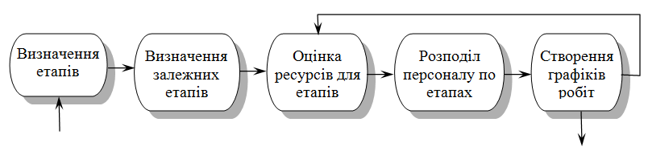

Рисунок Л5.2. Процес складання графіку робіт

Крім тимчасових витрат, менеджер повинен розрахувати інші ресурси, необхідні для успішного виконання кожного етапу. Особливий вид ресурсів — це команда розробників, притягнута до виконання проєкту. Іншими видами ресурсів можуть бути необхідний вільний дисковий простір на сервері, час використання якого-небудь спеціального устаткування й бюджетні кошти на відрядні витрати персоналу, що працює над проєктом.

Існує гарне емпіричне правило: оцінювати тимчасові витрати так, начебто нічого непередбаченого й "поганого" не може трапитися, потім збільшити ці оцінки для обліку можливих проблем. Можливі, але важко прогнозовані проблеми суттєво залежать від типу й параметрів проєкту, а також від кваліфікації й досвіду членів команди розробників. До вихідних розрахункових оцінок рекомендується додавати 30% на можливі проблеми й потім ще 20%, щоб бути готовим до того, що неможливо передбачити.

Графік робіт із проекту звичайно представляється у вигляді набору діаграм і графіків, що показують розбивку проектних робіт на етапи, залежності між етапами й розподіл розроблювачів по етапах.

*Тимчасові й мережні діаграми*

Тимчасові й мережні діаграми корисні для представлення графіка робіт. Тимчасова діаграма показує час початку й закінчення кожного етапу і його тривалість. Мережна діаграма відображає залежності між різними етапами проекту. Ці діаграми можна створити автоматично за допомогою програмних засобів підтримки керування на основі інформації, закладеної в базі даних проекту.

Розглянемо етапи якогось проекту, представлені в таблиці Л5.2, з якої, зокрема, видно, що етап Т3 залежить від етапу Т1. Це значить, що етап Т1 повинен завершитися перш, ніж почнеться етап Т3. Наприклад, на етапі Т1 проводиться компонентний аналіз створюваного програмного продукту, а на етапі Т3 — проектування системи.

На основі наведених значень тривалості етапів і залежності між ними будується сітковий графік послідовності етапів (Рисунок Л5.3). На цьому графіку видно, які роботи можуть виконуватися паралельно, а які повинні виконуватися послідовно одна за одною. Етапи позначені прямокутниками. Контрольні оцінки й контрольні проектні елементи показані у вигляді овалів і позначені (як і в таблиці Л5.2) буквою М з відповідним номером. Дати на даній діаграмі відповідають початку виконання етапів. Мережну діаграму слід читати ліворуч праворуч і зверху вниз.

<div align="right">
<i>Таблиця Л5.2- Етапи проекту</i>
</div>

| Етап | Тривалість (дні) | Залежність |
| :--- | :--- | :--- |
| T1 | 8 | |
| T2 | 15 | |
| T3 | 15 | T1 (M1) |
| T4 | 10 | |
| T5 | 10 | T2, T4 (M2) |
| T6 | 5 | T1, T2 (M3) |
| T7 | 20 | T1 (M1) |
| T8 | 25 | T4 (M5) |
| T9 | 15 | T3, T6 (M4) |
| T10 | 15 | T5, T7 (M7) |
| T11 | 7 | T9 (M6) |
| T12 | 10 | T11 (M8) |


<!-- ВІДНОВЛЕНО ЧЕРЕЗ GEMINI (Стор. 161) -->
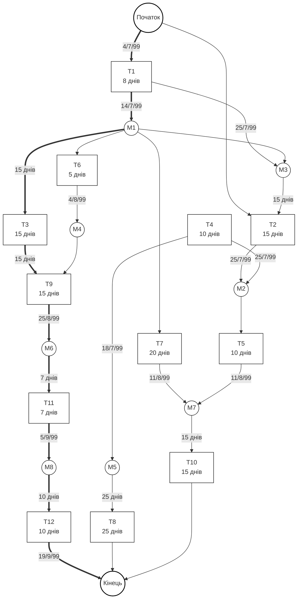
```mermaid
graph TD
    classDef event fill:#fff,stroke:#000,stroke-width:1px,shape:circle;
    classDef task fill:#fff,stroke:#000,stroke-width:1px,shape:rect;
    classDef startEnd fill:#fff,stroke:#000,stroke-width:2px,shape:capsule;

    Start((Початок)):::startEnd
    M1((M1)):::event
    M2((M2)):::event
    M3((M3)):::event
    M4((M4)):::event
    M5((M5)):::event
    M6((M6)):::event
    M7((M7)):::event
    M8((M8)):::event
    End((Кінець)):::startEnd

    T1[T1<br>8 днів]:::task
    T2[T2<br>15 днів]:::task
    T3[T3<br>15 днів]:::task
    T4[T4<br>10 днів]:::task
    T5[T5<br>10 днів]:::task
    T6[T6<br>5 днів]:::task
    T7[T7<br>20 днів]:::task
    T8[T8<br>25 днів]:::task
    T9[T9<br>15 днів]:::task
    T10[T10<br>15 днів]:::task
    T11[T11<br>7 днів]:::task
    T12[T12<br>10 днів]:::task

    %% Зв'язки з критичним шляхом (жирніші лінії)
    Start ==>|4/7/99| T1
    T1 ==>|14/7/99| M1
    M1 ==>|15 днів| T3
    T3 ==>|15 днів| T9
    T9 ==>|25/8/99| M6
    M6 ==>|7 днів| T11
    T11 ==>|5/9/99| M8
    M8 ==>|10 днів| T12
    T12 ==>|19/9/99| End

    %% Інші зв'язки
    Start --> T2
    T2 -->|25/7/99| M2
    T1 -->|25/7/99| M3
    M1 --> M3
    M3 -->|15 днів| T2
    M1 --> T6
    T6 -->|4/8/99| M4
    M4 --> T9
    M1 --> T7
    T7 -->|11/8/99| M7
    T4 -->|18/7/99| M5
    M5 -->|25 днів| T8
    T8 --> End
    T4 -->|25/7/99| M2
    M2 --> T5
    T5 -->|11/8/99| M7
    M7 -->|15 днів| T10
    T10 --> End
```

Рисунок Л5.3. Мережна діаграма етапів

 Якщо для створення мережної діаграми використовуються програмні засоби підтримки управління проектом, кожний етап повинен закінчуватися контрольною оцінкою. Черговий етап може початися тільки тоді, коли буде отримана контрольна оцінка (яка може залежати від декількох попередніх етапів). Тому в третьому стовпці таблиці Л5.2 наведені контрольні оцінки; вони будуть досягнуті тільки тоді, коли буде завершений етап, у рядку якого поміщена відповідна контрольна оцінка.

 Будь-який етап не може початися, поки не виконані всі етапи на всіх шляхах, що ведуть від початку проекту до даного етапу. Наприклад, етап Т9 не може початися, поки не будуть завершені етапи Т3 і Т6. Відзначимо, що в цьому випадку досягнення контрольної оцінки М4 говорить про те, що ці етапи завершені.

 Мінімальний час виконання всього проекту можна розрахувати, просувавши у мережній діаграмі тривалості етапів на самому довгому шляху (довжина шляху тут вимірюється не кількістю етапів на шляху, а сумарною тривалістю цих етапів) від початку проекту до його закінчення (це так званий критичний шлях). У нашім випадку тривалість проекту становить 11 тижнів або 55 робочих днів. На Рисунок Л5.3 критичний шлях показаний більш товстими лініями, чому інші шляхи. Таким чином, загальна тривалість реалізації проекту залежить від етапів робіт, що перебувають на критичному шляху. Будь-яка затримка в завершенні будь-якого етапу на критичному шляху приведе до затримки всього проекту.

 Затримка в завершенні етапів, що не входять у критичний шлях, не впливає на тривалість усього проекту доти, поки сумарна тривалість цих
<!-- КІНЕЦЬ ВІДНОВЛЕННЯ -->


етапів (з урахуванням затримок) на будь-якому шляху, не перевищить тривалості робіт на критичному шляху. Наприклад, затримка етапу Т8 на строк, менший 20 днів, ніяк не впливає на загальну тривалість проекту. На рисунку Л5.4 представлена тимчасова діаграма, на якій показані можливі затримки на кожному етапі.

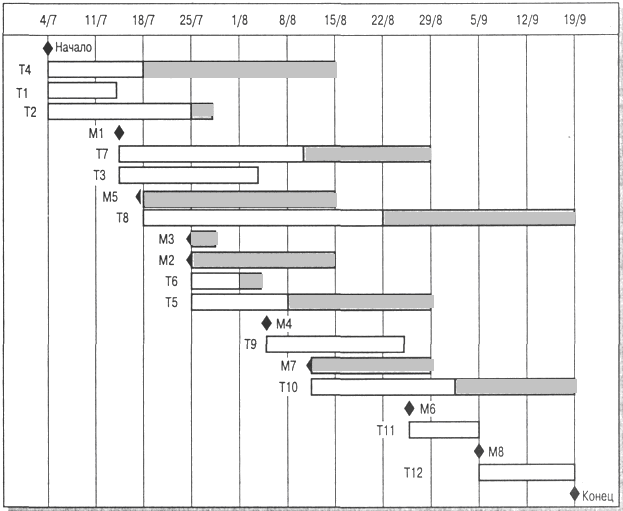

Рисунок Л5.4. Тимчасова діаграма тривалості етапів

Мережна діаграма дозволяє побачити в залежності етапів значимість того або іншого етапу для реалізації всього проекту. Увага до етапів критичного шляху часто дозволяє знайти способи їх зміни для того, щоб скоротити тривалість усього проекту. Менеджери використовують мережну діаграму для розподілу робіт.

Тимчасова діаграма (іноді називана по імені її винахідника діаграмою Гантта) може бути побудована програмними засобами підтримки процесу управління. Вона показує тривалість виконання кожного етапу й можливі їхні затримки (показані затіненими прямокутниками), а також дати початку й закінчення кожного етапу. Етапи критичного шляху не мають затінених прямокутників; це означає, що затримка із завершенням даних етапів приведе до збільшення тривалості всього проекту.

Подібно розподілу часу виконання етапів, менеджер повинен розрахувати розподіл ресурсів по етапах, зокрема призначити виконавців на кожний етап. У таблиці Л5.3 наведений розподіл розроблювачів на кожний етап, представлений на рисунку Л5.4.

*Таблиця Л5.3- Розподіл виконавців по етапах*

| Етап | Виконавець |
| :---: | :---: |
| T1 | Джейн |
| T2 | Ганна |
| T3 | Джейн |
| T4 | Фред |
| T5 | Мэри |
| T6 | Ганна |
| T7 | Джим |
| T8 | Фред |
| T9 | Джейн |
| T10 | Ганна |
| T11 | Фред |
| T12 | Фред |

Наведена таблиця може бути використана програмними засобами підтримки процесу управління для побудови тимчасової діаграми зайнятості співробітників на певних етапах робіт (Рисунок Л5.5). Персонал не зайнятий у роботі над проектом увесь час його реалізації. Протягом періоду незайнятості співробітники можуть бути у відпустці, працювати над іншими проектами, проходити навчання і т.д.

У більших організаціях звичайно працює багато фахівців, які задіюються в проекті в міру необхідності. Звичайно, такий підхід може створити певні проблеми для менеджерів проектів. Наприклад, якщо фахівець зайнятий у проекті, який затримується, це може створити прямі складності для інших проектів, де він також повинен брати участь.

Первісний графік робіт неминуче містить які-небудь помилки або недоробки. У міру реалізації проекту розраховані оцінки тривалості виконання етапів робіт повинні рівнятися з реальними строками виконання цих етапів. Результати порівняння повинні використовуватися як основу для перегляду графіка робіт ще не реалізованих етапів проекту, зокрема для того, щоб спробувати зменшити тривалість етапів критичного шляху.

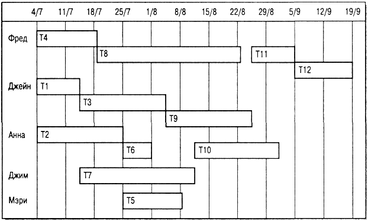

Рисунок Л5.5. Тимчасова діаграма розподілу працівників по етапах

### Управління ризиками

Важливою частиною роботи менеджера проекту є оцінка ризиків, які можуть вплинути на графік робіт або на якість створюваного програмного продукту, і розробка заходів щодо запобігання ризиків. Результати аналізу ризиків повинні бути відбити в плані проекту. Визначення ризиків і розробка заходів щодо зменшення їх впливу на хід виконання проекту називається керуванням ризиками.

Спрощено ризик можна розуміти як імовірність прояву яких-небудь несприятливих обставин, що негативно впливають на реалізацію проекту. Ризики можуть загрожувати проекту в цілому, створюваному програмному продукту або організації-розроблювачеві. Можна виділити три типи ризиків:

1. *Ризики для проекту*, які впливають на графік робіт або ресурси, необхідні для виконання проекту.
2. *Ризики для розроблювального продукту*, що впливають на якість або продуктивність розроблювального програмного продукту.
3. *Бізнес-ризики*, що ставляться до організації-розроблювачеві або постачальникам.

Звичайно, ці типи ризиків можуть перетинатися. Наприклад, якщо досвідчений програміст залишає проект, це буде ризиком для проекту (оскільки затримується строк здачі готового продукту), ризиком для продукту ( тому що новий програміст, що замінив збіглого, може виявитися не занадто досвідченим і зробити помилки в програмі) і бізнес-

ризиком (оскільки затримка даного проекту може негативно вплинути на майбутні ділові контакти між замовником і організацією-розроблювачем).

Конкретні типи ризиків, які можуть вплинути на даний проект, залежать від виду створюваного програмного продукту й від організаційного оточення, де реалізується програмний проект. Разом з тим багато типів ризиків здатні вплинути на будь-які програмні проекти, ці ризики наведені в таблиці Л5.4.

*Таблиця Л5.4- Можливі ризики програмних проектів*

| Ризик | Типи ризику | Опис ризику |
| :--- | :--- | :--- |
| Плинність розроблювачів | Ризик для проекту | Досвідчені розроблювачі залишають проект до його завершення |
| Зміна в управлінні організацією | Ризик для проекту | Організація міняє свої пріоритети в управління проектом |
| Неготовність апаратних засобів | Ризик для проекту | Апаратні засоби, які необхідні для проекту, не зробили вчасно або не готові до експлуатації |
| Зміна вимог | Ризик для проекту й для розроблювального продукту | Поява великої кількості непередбачених змін у вимогах, пропонованих до розроблювального ПО |
| Затримка в розробці специфікації | Ризик для проекту й для розроблювального продукту | Специфікації основних інтерфейсів підсистем не зробили до розроблювачів відповідно до графіка робіт |
| Недооцінка розміру розроблювальної системи | Ризик для проекту й для розроблювального продукту | Розмір системи значно перевищив первісну оцінку |
| Недостатня ефективність case-засобів | Ризик для розроблювального продукту | Case-Засоби, призначені для підтримки проекту, виявилися менш ефективними, чим очікувалося |
| Зміни в технології розробки ПО | Бізнес-Ризик | Основні технології побудови програмної системи заміняються новими |
| Поява конкуруючого програмного продукту | Бізнес-Ризик | На ринку програмних продуктів до закінчення проекту з'явилася конкуруюча програмна система |

Схема процесу управління ризиками показана на рисунку Л5.6. Цей процес складається із чотирьох стадій:

1. *Визначення ризиків*. Визначаються можливі ризики для проекту, для розроблювального продукту й бізнес-ризики.
2. *Аналіз ризиків*. Оцінюються ймовірність і послідовність появи ризикових ситуацій.
3. *Планування ризиків*. Плануються заходи щодо запобігання ризиків або мінімізації їх впливу на проект.
4. *Моніторинг ризиків*. Постійне оцінювання ймовірностей ризиків і виконання заходів щодо зм'якшення наслідків прояву ризикових ситуацій.

![Блок-схема процесу управління ризиками, що складається з чотирьох основних послідовних етапів: Визначення ризиків, Аналіз ризиків, Планування ризиків, Моніторинг ризиків. Кожен верхній блок має стрілку вправо до наступного етапу, а також стрілку вниз до відповідного артефакту: Визначення ризиків веде до "Список потенційних ризиків", Аналіз — до "Список першорядних ризиків", Планування — до "Заходи щодо запобігання ризиків", Моніторинг — до "Оцінки ризиків". Наприкінці є зворотна стрілка від "Моніторинг ризиків" до початку процесу ("Визначення ризиків")](images/Degtyaryova_2017_Software_Engineering_Technologies/page_166_img_1.png)

Рисунок Л5.6. Процес управління ризиками

Процес управління ризиками, як і інші процеси планування, є ітераційним, виконуваним протягом усього строку реалізації проекту. Спочатку розробляються плани управління ризиками, потім постійно відслідковується ситуація навколо реалізації проекту. При вступі нової інформації про можливі ризики заново проводиться аналіз ризиків і першорядна увага приділяється новим ризикам. У міру вступу нової інформації також змінюються плани заходів щодо запобігання й зм'якшенню ризиків.

Результати процесу управління ризиками документуються у вигляді планів управління ризиками. Вони повинні включати опис можливих проектних ризиків, їх аналіз і перелік заходів, необхідних для управління ризиками.

### Визначення ризиків

Визначення ризиків — перша стадія процесу управління ризиками. На цій стадії описуються ризики, які можуть виявитися при реалізації проекту. У принципі на цій стадії не повинна оцінюватися ймовірність і значимість ризиків, але на практиці малоймовірні ризики з незначними наслідками звичайно відкидаються відразу.

Визначення ризиків може виконуватися в режимі командної роботи з використанням підходу "мозковий штурм" або ґрунтуватися на досвіді менеджера. При визначенні ризиків може допомогти наведений нижче список можливих категорій ризиків:

1. *Технологічні ризики*. Виникають із програмних і апаратних технологій, на основі яких розробляється система.
2. *Ризики, пов'язані з персоналом*. Пов'язані зі членами команди розроблювачів.
3. *Організаційні ризики*. Виникають із організаційного оточення, у якім виконується проект.
4. *Інструментальні ризики*. Пов'язані з використовуваними Case-Засобами й іншими засобами підтримки процесу створення ПЗ.

5. Ризики, пов'язані із системними вимогами. Проявляються при зміні вимог, пропонованих до розроблювальної системи.
6. Ризики оцінювання. Пов'язані з оцінюванням характеристик програмної системи й ресурсів, необхідних для реалізації проекту.

У таблиці Л5.5 представлені деякі приклади, що ставляться до кожної з описаних категорій ризиків. Результатом етапу визначення ризиків буде довгий список можливих ризиків, які можуть вплинути на розроблювальний програмний продукт, проект або організацію-розроблювача.

*Таблиця Л5.5- Категорії ризиків*

| Категорія ризиків | Приклади ризиків |
| :--- | :--- |
| **1** | **2** |
| Технологічні ризики | База даних, яка використовується в програмній системі, не забезпечує обробку очікуваного обсягу транзакцій. |
| | Програмні компоненти, які використовуються повторно, мають дефекти, що обмежують їхні функціональні можливості |
| Ризики, пов'язані з персоналом | Неможливо підібрати працівників з необхідним професійним рівнем. |
| | Провідний розробник занедужав у самий критичний час. |
| | Неможливо організувати необхідне навчання персоналу |
| Організаційні ризики | В організації, що виконує розробку ПЗ, відбулася реорганізація, у результаті чого змінилися пріоритети в управління проектом. |
| | Фінансові утруднення в організації привели до зменшення бюджету проекту |
| Інструментальні ризики | Програмний код, що генерується Case-засобами, не ефективний. |
| | Case-Засобу неможливо інтегрувати з іншими засобами підтримки проекту |
| Ризики, пов'язані із системними вимогами | Зміни вимог приводять до значних повторних темними вимогами роботам із проектування системи. |
| | Первісне нечітке формулювання користувацьких вимог привело до значних змін системних вимог, що виявилися на пізніх стадіях розробки проекту |
| Ризики оцінювання | Недооцінки часу виконання проекту. |
| | Швидкість виявлення дефектів у системі нижче раніше запланованої. |
| | Розмір системи значно перевищує спочатку розрахований |

### Аналіз ризиків

При аналізі для кожного певного ризику підраховується ймовірність його прояву й збиток, який він може нанести. Не існує простих методів виконання аналізу ризиків — значною мірою він заснований на думці й досвіді менеджера. Можна привести наступну шкалу ймовірностей ризиків і їх наслідків:

1. Ймовірність ризику вважається дуже низькою, якщо вона має значення менш 10%; низькою, якщо її значення від 10 до 25 %; середньої при значеннях від 25 до 50%; високої, якщо значення коливається від 50 до 75%; дуже високої при значеннях більш 75%.
2. Можливий збиток від ризикових ситуацій можна підрозділити на катастрофічний, серйозний, терпимий і незначний.

Результати аналізу ризиків повинні бути представлені у вигляді таблиці ризиків, упорядкованих по ступеню можливого збитку. У таблиці

5.6 наведений упорядкований список ризиків, описаних у таблиці Л5.5; там же зазначені ймовірності цих ризиків. Тут імовірності ризиків і ступінь збитку від них зазначені довільно. На практиці для їхнього визначення необхідна докладна інформація про проєкт, технологію створення ПЗ, команді розробників і про саму організацію.

Звичайно, як імовірність ризиків, так і можливий збиток від них повинні переглядатися при вступі додаткової інформації про ці ризики й у міру реалізації заходів щодо управління ними. Тому подібні таблиці ризиків (таблиця Л5.6) повинні перероблятися на кожній ітерації процесу керування ризиками.

Після проведення аналізу ризиків визначаються найбільш значимі ризики, які потім відслідковуються протягом усього строку виконання проєкту. Визначення цих значимих ризиків залежить від їхніх імовірностей і можливого збитку. У загальному випадку завжди відслідковуються ризики з катастрофічними наслідками, а також ризики із серйозним збитком, значення ймовірності яких вище за середнє.

У деяких статтях рекомендується визначити й відслідковувати "10 верхніх" ризиків, але це не завжди обґрунтована рекомендація. Кількість ризиків, які необхідно відслідковувати, залежить від конкретного проєкту. Це може бути п'ять ризиків, а може — п'ятнадцять. Але, звичайно, кількість ризиків, по яких проводиться моніторинг, повинне бути доступним для огляду. Велика кількість ризиків, що відслідковуються, зажадає величезної кількості інформації, що збирається. Зі списку ризиків, представлених у таблиці Л5.6, для моніторингу слід відібрати ті ризики, які можуть привести до катастрофічних і серйозних наслідків для вашого проєкту.

<p align="center"><i>Таблиця Л5.6 - Список ризиків після проведення їх аналізу</i></p>

| Ризик <br> 1 | Імовірність <br> 2 | Ступінь збитку <br> 3 |
| :--- | :---: | :---: |
| Фінансові утруднення в організації привели до зменшення бюджету проєкту | Низька | Катастрофічна |
| Неможливо підібрати працівників із професійним рівнем, що вимагається | Висока | Катастрофічна |
| Провідний розробник занедужав у самий критичний час | Середня | Серйозна |
| Програмні компоненти, використовувані повторно, мають дефекти, що обмежують їхні функціональні можливості | Середня | Серйозна |

*Продовження таблиця Л5.6 - Список ризиків після проведення їх аналізу(продовж.)*

| 1 | 2 | 3 |
| :--- | :---: | :---: |
| Зміни вимог приводять до значних повторних робіт із проектування системи | Середня | Серйозна |
| В організації, що виконує розробку ПО, відбулася реорганізація, у результаті чого змінилися пріоритети в управлінні проектом | Висока | Серйозна |
| База даних, яка використовується в програмній системі, не забезпечує обробку очікуваного обсягу транзакцій | Середня | Серйозна |
| Недооцінки часу виконання проекту | Висока | Серйозна |
| Case-Засобу неможливо інтегрувати з іншими засобами підтримки проекту | Висока | Терпима |
| Первісне нечітке формулювання користувацьких вимог привело до значних змін системних вимог, що виявилися на пізніх стадіях розробки проекту | Середня | Терпима |
| Неможливо організувати необхідне навчання персоналу | Середня | Терпима |
| Швидкість виявлення дефектів у системі нижче раніше спланованої | Середня | Терпима |
| Розмір системи значно перевищує спочатку розрахований | Висока | Терпима |
| Програмний код, що генерується Case-засобами, неефективний | Середня | Незначна |

### Планування ризиків

Планування полягає у визначенні стратегії керування кожним значимим ризиком, відібраним для моніторингу після аналізу ризиків. Тут також не існує загальноприйнятих підходів для розробки таких стратегій — багато чого ґрунтується на "чуття" і досвіді менеджера проекту. У таблиці Л5.7 показані можливі стратегії керування основними ризиками, наведеними в таблиці Л5.6.

Існує три категорії стратегій управління ризиками.

1. *Стратегії запобігання ризиків*. Згідно із цими стратегіями слід проводити заходи, що знижують імовірність прояву ризиків. Прикладом може служити стратегія виключення потенційно дефектних компонентів, описана в таблиці Л5.7.

2. *Мінімізаційні стратегії*. Спрямовані на зменшення можливого збитку від ризиків. Прикладом служить стратегія зменшення збитку від хвороби членів команди розроблювачів (див. таблиця Л5.7).

3. *Планування "аварійних" ситуацій*. Згідно із цими стратегіями необхідно мати план заходів, які слід виконати у випадку прояву ризикової ситуації. У таблиці Л5.7 це стратегія поведінки при виникненні фінансових проблем в організації-розроблювача.


<!-- ВІДНОВЛЕНО ЧЕРЕЗ GEMINI (Стор. 170) -->
*Таблиця Л5.7- Стратегії управління ризиками*

| Ризик | Стратегія |
| :--- | :--- |
| Фінансові проблеми організації | Підготувати короткий документ для керівництва організації, що показує важливість даного проекту для досягнення фінансових цілей організації |
| Проблеми некваліфікованого персоналу | Попередити замовника про потенційні труднощі й можливій затримці проекту, розглянути питання про покупку компонентів системи |
| Хвороби персоналу | Реорганізувати роботу команди розроблювачів таким чином, щоб обов'язки й робота членів команди перекривали один одного, внаслідок цього розроблювачі будуть знати і розуміти завдання, виконувані іншими співробітниками |
| Дефектні системні компоненти | Замінити потенційно дефектні системні компоненти покупними компонентами, що гарантують якість роботи |
| Зміни вимог | Спробувати визначити вимоги, найбільше ймовірно піддані змінам; у структурі системи не відображати детальну інформацію |
| Реорганізація компанії-розроблювача | Підготувати короткий документ для управління компанії, що показує важливість даного проекту для досягнення фінансових цілей компанії |
| Недостатня продуктивність бази даних | Розглянути можливість покупки більш продуктивної бази даних |
| Недооцінки часу виконання проекту | Розглянути питання про покупку системних компонентів, досліджувати можливість використання генератора програмного коду |

### Моніторинг ризиків

Моніторинг ризиків полягає в регулярнім перерахуванні ймовірностей ризиків і збитку, який вони можуть нанести. Для цього необхідно постійно відслідковувати фактори, які впливають на ймовірність ризиків і можливий збиток. Ці фактори залежать від типів ризику. У таблиці Л5.8 наведені ознаки, які допомагають визначити тип ризику.

*Таблиця Л5.8- Ознаки ризиків*

| Тип ризику | Ознаки |
| :--- | :--- |
| Технологічні ризики | Затримки в поставці встаткування або програмних засобів підтримки процесу створення ПЗ, численні документовані технологічні проблеми |
| Ризики, пов'язані з персоналом | Низький моральний стан персоналу, натягнуті відносини між членами команди розроблювачів, низька якість виконаної роботи |
| Організаційні ризики | Розмови серед персоналу про пасивність і недостатньої компетентності вищого керівництва організації |
| Інструментальні ризики | Небажання розроблювачів використовувати програмні засоби підтримки, несхвальні відгуки про Case-Засобах, запити на могутніші інструментальні засоби |
<!-- КІНЕЦЬ ВІДНОВЛЕННЯ -->


| Ризики, пов'язані із системними вимогами | Необхідність перегляду багатьох системних вимог, невдоволення замовника ПЗ |
| :--- | :--- |
| Ризики оцінювання | Зміни графіка робіт, численні звіти про порушення графіка робіт |

Моніторинг ризиків повинен бути безперервним процесом, що відслідковують хід виконання заходів щодо управління ризиками, при цьому кожний основний ризик повинен розглядатися окремо.

*Порядок виконання роботи*

1. Вивчити пропонований теоретичний матеріал.
2. Побудувати тимчасову й мережну діаграми для обраного проекту.
3. Побудувати діаграму розподілу учасників групи по етапах.
4. Побудувати список можливих ризиків із вказівкою назви ризику, його опис і типу.
5. Провести аналіз ризиків.
6. Описати стратегію планування ризиків.
7. Побудувати звіт, що включає всі отримані діаграми й опис стратегії планування ризиків.

📖 *Зміст звіту*

1. Мета роботи.
2. Введення.
3. Програмно-апаратні засоби, що використовувалися при виконанні роботи.
4. Основна частина (опис самої роботи згідно з вимогами до виконання лабораторної роботи ).
5. Висновки.
6. Список використовуваної літератури.

*Література*

1. Буч Г., Рамбо Дж., Джекобсон А. Язык UML. Руководство пользователя. – С-Пб.: Издательство «Питер», 2003. – 432 с.
2. Соммервиль Иан. Инженерия программного обеспечения, 6-е издание: Пер. с англ. – М.: Издательский дом “Вильямс”, 2002. – 624 с.
3. Константин Л., Локвуд Л. Разработка программного обеспечения. – СПб.: Питер, 2004. – 592 с.

ЛАБОРАТОРНА РОБОТА №6  
РОЗПОДІЛЕНА СИСТЕМА КЕРУВАННЯ ВЕРСІЯМИ ФАЙЛІВ

*Мета роботи:* Відповідно до проекту дослідження створити систему контролю версій ПЗ.

⏷ *Вимоги до результатів виконання лабораторної роботи:*

1. Створити проект для свого завдання.
2. Ініціалізувати репозиторій і внести під версійний контроль файли проекту.
3. Зареєструватися на сайті https://bitbucket.org/
4. Створити віддалений репозиторій.
5. Додати учасників проекту, створити кожному гілку.
6. Внести на гілках певні зміни і злити проект, якщо виникнуть конфлікти, виправити їх.

*Методичні вказівки:*

Лабораторна робота спрямована на вивчення системи керування версіями файлів при спільній роботі команди розробників над спільним проектом.

*Теоретичні відомості:*

Що таке контроль версій, і навіщо він вам потрібен? Система контролю версій (СКВ) - це система, яка реєструє зміни в одному або декількох файлах з тим, щоб надалі була можливість повернутися до певних старих версій цих файлів. Під контроль версій можна помістити файли практично будь-якого типу.

Якщо ви маєте графічний або веб-дизайнер і хотіли б зберігати кожну версію зображення або макету - а цього вам напевно хочеться - то користуватися СКВ буде дуже мудрим рішенням. СКВ дає можливість повертати окремі файли до колишнього вигляду, повертати до колишнього стану весь проект, переглядати відбуваються з часом зміни, визначати, хто останнім вносив зміни у модуль, що раптово перестав працювати, хто і коли вніс в код якусь помилку, і багато іншого. Взагалі, якщо, користуючись СКВ, ви все зіпсуєте або втратите файли, все можна буде легко відновити. До того ж, накладні витрати за все, що ви отримуєте, будуть дуже маленькими.

*Локальні системи контролю версій*

Багато хто віддає перевагу контролювати версії, просто копіюючи файли в інший каталог (як правило додаючи поточну дату до назви каталогу). Такий підхід дуже поширений, тому, що простий, але він і

частіше дає збої. Дуже легко забути, що ти не в тому каталозі, і випадково змінити не той файл, або скопіювати файли не туди, куди хотів, і затерти потрібні файли.

Щоб вирішити цю проблему, програмісти вже давно розробили локальні СКВ з простою базою даних, в якій зберігаються всі зміни потрібних файлів (див. рисунок Л6.1).

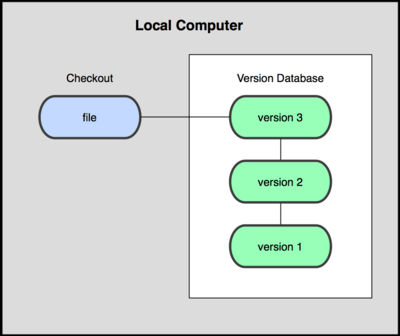

Рисунок Л6.1. Схема локальної СКВ

Однією з найбільш популярних СКВ такого типу є rcs, яка до цих пір встановлюється на багатьох комп'ютерах. Навіть у сучасній операційній системі Мас OS X утиліта rcs встановлюється разом з Developer Tools. Ця утиліта заснована на роботі з наборами патчів між парами версій (патч - файл, що описує відмінність між файлами), які зберігаються в спеціальному форматі на диску. Це дозволяє перетворити будь-який файл на будь-який момент часу, послідовно накладаючи патчі.

*Централізовані системи контролю версій*

Наступною основною проблемою виявилася необхідність співпрацювати з розробниками за іншими комп'ютерами. Щоб вирішити її, були створені централізовані системи контролю версій (ЦСКВ). У таких системах, наприклад CVS, Subversion і Perforce, є центральний сервер, на якому зберігаються всі файли під версійність контролем, і ряд клієнтів, які отримують копії файлів з нього. Багато років це було стандартом для систем контролю версій (див. рисунок Л6.2).

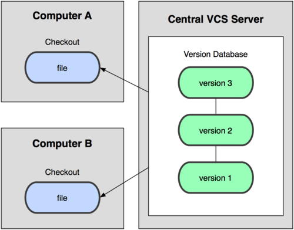

Рисунок Л6.2. Схема централізованого контролю версій

Такий підхід має безліч переваг, особливо над локальними СКВ. Наприклад, всі знають, хто і чим займається в проекті. У адміністраторів є чіткий контроль над тим, хто і що може робити, і, звичайно, адмініструвати ЦСКВ набагато легше, ніж локальні бази на кожному клієнті.

Однак при такому підході є й кілька серйозних недоліків. Найбільш очевидний - централізований сервер є вразливим місцем всієї системи. Якщо сервер вимикається на годину, то протягом години розробники не можуть взаємодіяти, і ніхто не може зберегти нової версії своєї роботи. Якщо ж пошкоджується диск з центральною базою даних і немає резервної копії, ви втрачаєте абсолютно все - всю історію проекту, хіба що за винятком кількох робочих версій, збережених на робочих машинах користувачів. Локальні системи контролю версій схильні тієї ж проблеми: якщо вся історія проекту зберігається в одному місці, ви ризикуєте втратити все.

*Розподілені системи контролю версій.*

І в цій ситуації в гру вступають розподілені системи контролю версій (РСКВ). У таких системах як Git, Mercurial, Bazaar або Darcs клієнти не просто вивантажують останні версії файлів, а повністю копіюють весь репозиторій. Тому у випадку, коли "вмирає" сервер, через який йшла робота, будь клієнтський репозиторій може бути скопійований назад на сервер, щоб відновити базу даних. Кожен раз, коли клієнт забирає свіжу

версію файлів, він створює собі повну копію всіх даних (див. рисунок Л6.3).


Рисунок Л6.3. Схема розподіленої системи контролю версій

Крім того, в більшій частині цих систем можна працювати з кількома віддаленими репозиторіями, таким чином, можна одночасно працювати по-різному з різними групами людей в рамках одного проекту. Так, в одному проекті можна одночасно вести кілька типів робочих процесів, що неможливо в централізованих системах.

### Що таке Git?

Git (вим. «гіт») - розподілена система керування версіями файлів. Проект був створений Лінусом Торвальдсом для управління розробкою ядра Linux, перша версія випущена 7 квітня 2005 року. На сьогоднішній день підтримується Джуніо Хамано.

Прикладами проектів, що використовують Git, є ядро Linux, Android, Drupal, Cairo, GNU Core Utilities, Mesa, Wine, Chromium, Compiz Fusion, FlightGear, jQuery, PHP, NASM, MediaWiki і деякі дистрибутиви Linux.

Програма є вільною і випущена під ліцензією GNU GPL версії 2.

Система спроектована як набір програм, спеціально розроблених з урахуванням їх використання в скриптах. Це дозволяє зручно створювати спеціалізовані системи контролю версій на базі Git або користувацькі інтерфейси. Наприклад, Cogito є саме таким прикладом оболонки до репозиторіїв Git, а StGit використовує Git для управління колекцією виправлень (патчів).

Git підтримує швидке розділення і злиття версій, включає інструменти для візуалізації та навігації по нелінійної історії розробки. Як і Darcs, BitKeeper, Mercurial, Bazaar і Monotone, Git надає кожному розробнику локальну копію всієї історії розробки, зміни копіюються з одного сховища в інше.

Віддалений доступ до репозиторіїв Git забезпечується git - daemon, SSH - або HTTP -сервером. TCP - сервіс git - daemon входить в дистрибутив Git і є разом з SSH найбільш поширеним і надійним методом доступу. Метод доступу по HTTP, незважаючи на ряд обмежень, дуже популярний в контрольованих мережах, тому що дозволяє використовувати існуючі конфігурації мережевих фільтрів.

*Установка в Windows.*

У проекту **msysGit** процедура установки - одна з найпростіших. Просто скачайте exe-файл інсталятора зі сторінки проекту на GitHub'і і запустіть його: http://msysgit.github.com/

Після установки у вас буде як консольна версія (включає SSH-клієнт, який стане в нагоді пізніше), так і стандартна графічна. Будь ласка, використовуйте Git тільки з командного рядка, що входить до складу **msysGit**, тому що так ви зможете запускати складні команди.

Для того, щоб встановити Git в якійсь іншій ОС використаві інструкції, приведені за наступною адресою.
http://git-scm.com/book/ru/%D0%92%D0%B2%D0%B5%D0%B4%D0%B5%D0%BD%D0%B8%D0%B5-%D0%90%D0%B7%D1%8B-Git-%D0%92%D1%81%D1%82%D0%B0%D0%BD%D0%BE%D0%B2%D0%BA%D0%B0-Git.

*Настройка Git.*

Тепер, коли Git встановлений у вашій системі, хотілося б зробити деякі речі, щоб налаштувати середовище для роботи з Git'ом під себе. Це потрібно зробити тільки один раз - при оновленні версії Git'а налаштування збережуться. Але ви можете поміняти їх у будь-який момент, виконавши ті ж команди знову.

До складу Git'а входить утиліта git config, яка дозволяє переглядати і встановлювати параметри, що контролюють всі аспекти роботи Git'а і його зовнішній вигляд. Ці параметри можуть бути збережені в трьох місцях:

- Файл `/etc/gitconfig` містить значення, спільні для всіх користувачів системи і для всіх їх репозиторіїв. Якщо при запуску `git config` вказати параметр `--system`, то параметри будуть читатися і зберігатися саме в цей файл.
- Файл `~/.gitconfig` зберігає налаштування конкретного користувача. Цей файл використовується при вказівці параметра `--global`.
- Конфігураційний файл у каталозі Git'а (`.git/config`) в тому репозиторії, де ви знаходитеся в даний момент. Ці параметри діють лише для даного конкретного репозиторію. Налаштування на кожному наступному рівні підміняють налаштування з попередніх рівнів, тобто значення в `.git/config` перекривають відповідні значення в `/etc/gitconfig`.

У системах сімейства Windows Git шукає файл `.gitconfig` в каталозі `$HOME` (`C:\Documents and Settings\$USER` або `C:\Users\$USER` для більшості користувачів). Крім того Git шукає файл `/etc/gitconfig`, але вже відносно кореневого каталогу MSys, який знаходиться там, куди ви вирішили встановити Git, коли запускали інсталятор

*Ім'я користувача.*

Перше, що вам слід зробити після установки Git'а, - вказати ваше ім'я та адресу електронної пошти. Це важливо, тому що кожен Комміт в Git'е містить цю інформацію, і вона включена в комітів, передані вами, і не може бути далі змінена:

```bash
$ git config --global user.name "John Doe"
$ git config --global user.email johndoe@example.com
```

Повторюся, що, якщо вказана опція `--global`, то ці налаштування досить зробити тільки один раз, оскільки в цьому випадку Git буде використовувати ці дані для всього, що ви робите в цій системі. Якщо для якихось окремих проєктів ви хочете вказати інше ім'я або електронну пошту, можна виконати цю ж команду без параметра `--global` в каталозі з потрібним проєктом.

*Вибір редактора.*

Ви вказали своє ім'я, і тепер можна вибрати текстовий редактор, який буде використовуватися, якщо буде потрібно набрати повідомлення у Git'е. Типово Git використовує стандартний редактор вашої системи, зазвичай це Vi або Vim. Якщо ви хочете використовувати інший текстовий редактор, наприклад, Emacs, можна зробити наступне:

```bash
$ git config --global core.editor emacs
```

*Утиліта порівняння.*

Інша корисна настройка, яка може знадобитися - вбудована diff - утиліта, яка буде використовуватися для вирішення конфліктів злиття. Наприклад, якщо ви хочете використовувати vimdiff:

```bash
$ git config --global merge.tool vimdiff
```

Git вміє робити злиття за допомогою kdiff3, tkdiff, meld, xxdiff, emerge, vimdiff, gvimdiff, ecmerge і opendiff, але ви можете налаштувати і іншу утиліту.

*Перевірка налаштувань.*
Якщо ви хочете перевірити використовувані настройки, можете використовувати команду `git config --list`, щоб показати всі, які Git знайде:

```bash
$ git config --list
user.name=Scott Chacon
user.email=schacon@gmail.com
color.status=auto
color.branch=auto
color.interactive=auto
color.diff=auto
...
```

Деякі ключі (назви) налаштувань можуть з'явитися кілька разів, тому що Git читає один і той же ключ з різних файлів (наприклад з `/etc/gitconfig` і `~/.gitconfig`). У цьому випадку Git використовує останнє значення для кожного ключа.

Також ви можете перевірити значення конкретного ключа, виконавши `git config {ключ}`:

```bash
$ git config user.name
Scott Chacon
```

### *Як отримати допомогу?*

Якщо вам потрібна допомога при використанні Git'а, є три способи відкрити сторінку керівництва по будь-якій команді Git'а:

```bash
$ git help <команда>
$ git <команда> --help
$ man git-<команда>
```

Наприклад, так можна відкрити керівництво по команді `config`:

```bash
$ git help config
```

Ці команди хороші тим, що ними можна користуватися завжди, навіть без підключення до мережі.

## *Основи робот из Git*

### *Створення репозиторію.*

Для створення Git - репозиторію існують два основні підходи. Перший підхід - імпорт в Git вже існуючого проекту або каталогу. Другий - клонування вже існуючого репозиторію з сервера.

### *Створення репозиторію в існуючому каталозі.*

Якщо ви збираєтеся почати використовувати Git для існуючого проекту, то вам необхідно перейти в проектний каталог і в командному рядку ввести:
```bash
$ git init
```
Ця команда створює в поточному каталозі новий підкаталог з ім'ям `.git` містить всі необхідні файли репозиторію - основу Git - репозиторію. На цьому етапі ваш проект ще не перебуває під версійним контролем.

*Клонування існуючого репозиторію.*

Якщо ви бажаєте отримати копію існуючого репозиторію Git, наприклад, проекту, в якому ви хочете взяти участь, то вам потрібна команда `git clone`. Якщо ви знайомі з іншими системами контролю версій, такими як Subversion, то помітите, що команда називається `clone`, а не `checkout`. Це важлива відмінність - Git отримує копію практично всіх даних, що є на сервері. Кожна версія кожного файлу з історії проекту забирається ( `pulled` ) із сервера, коли ви виконуєте `git clone`. Фактично, якщо серверний диск вийде з ладу, ви можете використати будь-який з клонів на будь-якому з клієнтів, для того щоб повернути сервер в той стан, в якому він перебував у момент клонування (ви можете втратити частину серверних перехоплювачів ( `server - side hooks` ) і т.п., але всі дані, поміщені під версійність контроль, будуть збережені).

Клонування репозиторію здійснюється командою `git clone [url]`. Наприклад, якщо ви хочете клонувати бібліотеку Ruby Git, відому як Grit, ви можете зробити це таким чином:
```bash
$ git clone git://github.com/schacon/grit.git
```
Ця команда створює каталог з ім'ям `grit`, ініціалізує в ньому каталог `.git`, викачує всі дані для цього репозиторію і створює ( `checks out` ) робочу копію останньої версії. Якщо ви зайдете в новий каталог `grit`, ви побачите в ньому проектні файли, придатні для роботи і використання. Якщо ви хочете клонувати репозиторій в каталог, відмінний від `grit`, можна це вказати в наступному параметрі командного рядка:
```bash
$ git clone git://github.com/schacon/grit.git mygrit
```
Ця команда робить все те ж саме, що і попередня, тільки результуючий каталог буде названий `mygrit`.

У Git реалізовано кілька транспортних протоколів, які ви можете використовувати. У попередньому прикладі використовувався протокол `git://`, ви також можете зустріти `http(s):// user@server:/path.git`, що використовує протокол передачі SSH.

Отже створимо Git репозиторій на своєму локальному комп'ютері. Для цього створимо папку з ім'ям `GitRepo`. Після цього треба запустити Git клієнт і перейти в папку зі створеним проектом і набрати команду:
```bash
$ git init
```


<!-- ВІДНОВЛЕНО ЧЕРЕЗ GEMINI (Стор. 180) -->
```bash
Welcome to Git (version 1.8.4-preview20130916)

Run 'git help git' to display the help index.
Run 'git help <command>' to display help for specific commands.

Alex@COMP ~
$ git config --global user.name "Alex Scrat"

Alex@COMP ~
$ git config --global user.email a.l.e.x.s.c.r.a.t.666@gmail.com

Alex@COMP ~
$ cd D:\Projects\GitRepo
sh.exe": cd: D:ProjectsGitRepo: No such file or directory

Alex@COMP ~
$ cd D:\\Projects\\GitRepo

Alex@COMP /d/Projects/GitRepo
$ git init
Initialized empty Git repository in d:/Projects/GitRepo/.git/

Alex@COMP /d/Projects/GitRepo (master)
$ 
```

Рисунок Л6.4

Повідомлення `Initialized empty Git repository in d:/Projects/GitRepo/.git/` свідчить про успішну ініціалізацію репозиторію.

В проекті поки що немає файлів. Створимо для прикладу файл “readme.txt” і скопіюємо в нього зміст файлу hosts

```text
----------------------------------------------------------------------
# (С) Корпорация Майкрософт (Microsoft Corp.), 1993-1999
#
# Это образец файла HOSTS, используемый Microsoft TCP/IP для Windows.
#
# Этот файл содержит сопоставления IP-адресов именам узлов.
# Каждый элемент должен располагаться в отдельной строке. IP-адрес должен
# находиться в первом столбце, за ним должно следовать соответствующее имя.
# IP-адрес и имя узла должны разделяться хотя бы одним пробелом.
#
# Кроме того, в некоторых строках могут быть вставлены комментарии
# (такие, как эта строка), они должны следовать за именем узла и отделяться
# от него символом '#'.
#
# Например:
#
# 102.54.94.97 rhino.acme.com # исходный сервер
# 38.25.63.10 x.acme.com # узел клиента х
127.0.0.1 localhost
127.0.0.1 test2.ru
----------------------------------------------------------------------
```
<!-- КІНЕЦЬ ВІДНОВЛЕННЯ -->


Тепер в проєкті є файл. Якщо ви хочете додати під версійний контроль існуючі файли, вам варто проіндексувати ці файли і здійснити першу фіксацію змін. Здійснити це ви можете за допомогою декількох команд `git add` вказують індексовані файли, а потім `git commit`:
```bash
$ git add readme.txt
$ git commit -m 'initial commit'
```
Команда `git add` додає файл під версійний контроль, приймаючи параметром шлях до файлу або каталогу, якщо це каталог, команда рекурсивно додає (індексує) усі файли в даному каталозі (це багатофункціональна команда, вона використовується для додавання під версійний контроль нових файлів, для індексації змін, а також для інших цілей, наприклад для вказівки файлів з виправленим конфліктом злиття).

Команда `git commit` фіксує зміни в файлах, які знаходяться під версійним контролем.

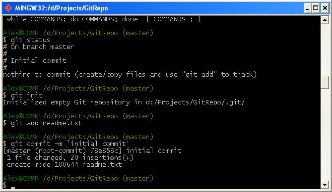

Рисунок Л6.5

Отже, у вас є поточний Git - репозиторій і робоча копія файлів для деякого проекту. Вам потрібно робити деякі зміни і фіксувати "знімки" стану (snapshots) цих змін у вашому репозиторії щоразу, коли проект досягає стану, який вам хотілося б зберегти.

Запам'ятайте, кожен файл у вашому робочому каталозі може перебувати в одному з двох станів: під версійним контролем (ті, що відслідковуються) і не під версій ним контролем (ті, що не відслідковуються). Файли, що відслідковуються - це ті файли, які були в останньому зліпку стану проекту ( snapshot ); вони можуть бути незміненими, зміненими або підготовленими до комітів ( staged ). Файли,

що не відслідковуються - це все інше, будь-які файли у вашому робочому каталозі, які не входили до ваш останній зліпок стану і не підготовлені до комітів. Коли ви вперше клонуєте репозиторій, всі файли будуть відстежуватися і будуть незміненими, тому що ви тільки взяли їх зі сховища (checked them out) і нічого поки не редагували.

Як тільки відредагуєте файли, Git буде розглядати їх як змінені, тому що ви змінили їх з моменту останнього комітів. Ви індексуєте ( stage ) ці зміни і потім фіксуєте всі індексовані зміни, а потім цикл повторюється. Цей життєвий цикл зображений на малюнку.

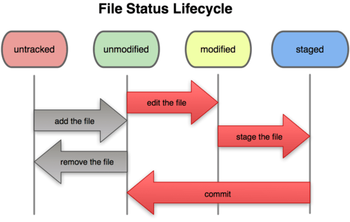

Рисунок Л6.6.

*Визначення стану файлів.*

Основний інструмент, який використовується для визначення, які файли в якому стані знаходяться - це команда git status.

Виконаємо команду git status

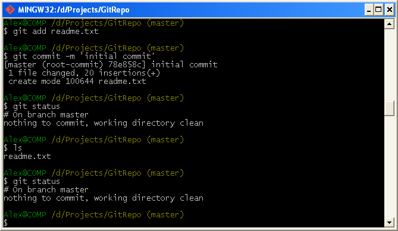
Рисунок Л6.7.

Це означає, що у вас чистий робочий каталог, іншими словами - у ньому немає змінених файлів, що відслідковуються. Git теж не виявив файлів, що відслідковуються, в іншому випадку вони б були перераховані тут.

*Відстеження нових файлів.*

Додамо новий файл до проекту і виконаємо команду `git status`.

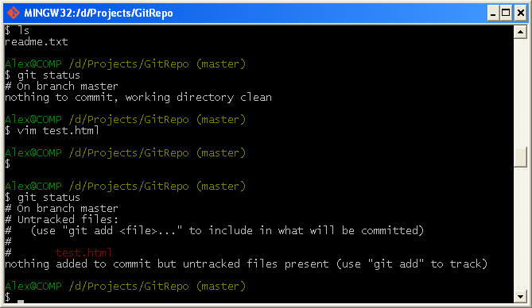
Рисунок Л6.8.

Даний файл “test.html” є таким, що не відслідковується, і тому він знаходиться в секції "Untracked files". Статус "файл, що не відслідковується", означає, що Git бачить файл, відсутній у попередньому

знімку стану (коміті); але не стане додавати його в ваші комітів, поки ви його явно про це не попросите. Це збереже вас від випадкового додавання в репозиторій згенерованих бінарних файлів або будь-яких інших, які ви і не думали додавати.

Для того щоб почати відстежувати (додати під версійність контроль) новий файл, використовується команда `git add`. Щоб почати відстеження файлу `README`, ви можете виконати наступне:
```bash
$ git add test.html
```
І виконаємо `git status`

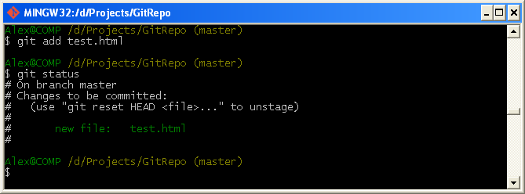

Рисунок Л6.9.

Ви можете бачити, що файл проіндексований по тому, що він знаходиться в секції "Changes to be committed". Якщо ви виконаєте Комміт в цей момент, то версія файлу, що існувала на момент виконання вами команди `git add`, буде додана в історію знімків стану.

*Індексація змінених файлів.*

Відредагуємо файл `readme.txt` і знову виконаємо команду `git status`

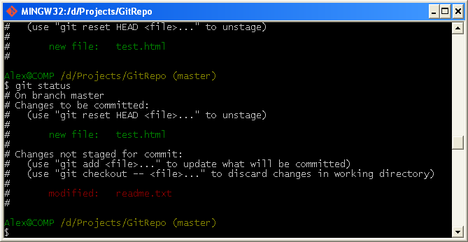

Рисунок Л6.10

Файл `readme.txt` знаходиться в секції "Changes not staged for commit" - це означає, що відстежуваний файл був змінений в робочому каталозі, але поки не проіндексований. Щоб проіндексувати його, необхідно виконати знову команду `git add`.

Виконаємо `git add`, щоб проіндексувати `readme.txt`, а потім знову виконаємо `git status`.

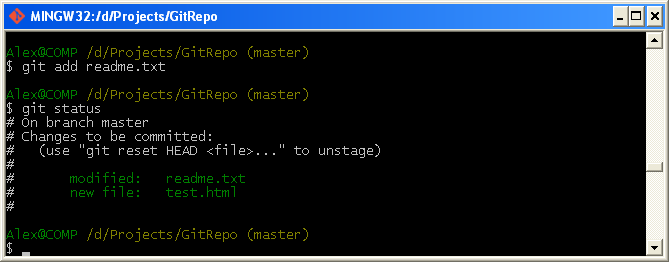

Рисунок Л6.11

Тепер обидва файли проіндексовані і увійдуть до наступного коміту. У цей момент ви, припустимо, згадали одне невелика зміна, яке ви хочете зробити в `readme.txt` до фіксації. Ви відкриваєте файл, вносите і зберігаєте необхідні зміни і начебто готові до комітів. Але давайте-но ще раз виконаємо `git status`:

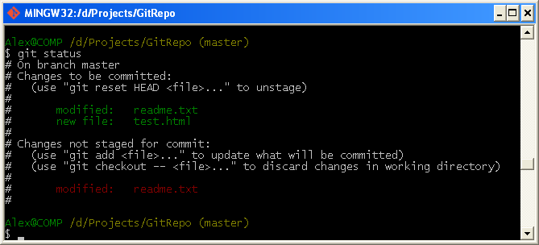

Рисунок Л6.12

Тепер `readme.txt` відображається як проіндексований і непроіндексованої одночасно. Як таке можливо? Така ситуація наочно демонструє, що Git індексує файл в точності в тому стані, в якому він перебував, коли ви виконали команду `git add`. Якщо ви виконаєте коміт зараз, то файл `readme.txt` потрапить в коміт в тому стані, в якому він перебував, коли ви останній раз виконували команду `git add`, а не в тому, в якому він знаходиться у вашому робочому каталозі в момент виконання `git commit`. Якщо ви змінили файл після виконання `git add`, вам доведеться знову виконати `git add`, щоб проіндексувати останню версію файлу:

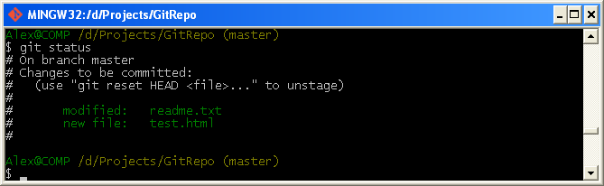

Рисунок Л6.13

*Фіксація змін.*

Тепер, коли ваш індекс налаштований так, як вам і хотілося, ви можете зафіксувати свої зміни. Запам'ятайте, все, що до цих пір не проіндексовано - будь-які файли, створені або змінені вами, і для яких ви не виконали `git add` після моменту редагування - не увійдуть до цього коміту. Вони залишаться зміненими файлами на вашому диску. У нашому випадку, коли ви востаннє виконували `git status`, ви бачили що всі проіндексовано, і ось, ви готові до комітів. Найпростіший спосіб зафіксувати зміни - це набрати `git commit`.

Ця команда відкриє вибраний вами текстовий редактор. (Редактор встановлюється системної змінної `$EDITOR` - зазвичай це vim або emacs, хоча ви можете встановити ваш улюблений за допомогою команди `git config --global core.editor`.

Є й інший спосіб - ви можете набрати свій коментар до комітів в командному рядку разом з командою `commit`, вказавши його після параметра `-m`, як у наступному прикладі:
```
$ git commit -m "second commit"
```

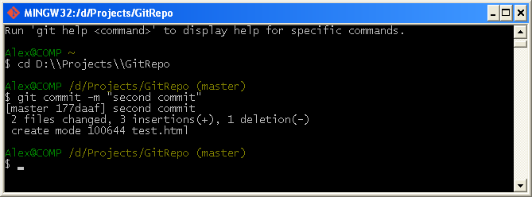

Рисунок Л6.14

Отже, ви створили свій перший коміт! Ви можете бачити, що коміт вивів вам трохи інформації про себе: на яку гілку ви виконали коміт (`master`), яка контрольна сума SHA-1 у цього коміту (`177daaf`), скільки файлів було змінено, а також статистику по доданих/видалених рядках в цьому коміті.

Запам'ятайте, що коміт зберігає знімок стану вашого індексу. Все, що ви не проіндексували, так і залишається в робочому каталозі як змінеє; ви можете зробити ще один коміт, щоб додати ці зміни в репозиторій. Кожен раз, коли ви робите коміт, ви зберігаєте знімок стану вашого проекту, який пізніше ви можете відновити або з яким можна порівняти поточний стан.

Незважаючи на те, що індекс може бути дуже корисним для створення комітів саме такими, як вам і хотілося, він часом дещо складніше, ніж вам потрібно в процесі роботи. Якщо у вас є бажання пропустити етап індексування, Git надає простий спосіб. Додавання параметра `-a` в команду `git commit` змушує Git автоматично індексувати кожен вже відстежується на момент комітів файл, дозволяючи вам обійтися без `git add`:

```bash
$ git commit -a -m "second commit"
```

*Перегляд історії комітів.*

Після того як ви створите кілька комітів, або ж ви склонуєте репозиторій з вже існуючою історією комітів, ви, ймовірно, захочете озирнутися назад і дізнатися, що ж відбувалося з цим репозиторієм. Найбільш простий і в той же час потужний інструмент для цього - команда `git log`.

Виконаємо команду `git log` на нашому проекті.

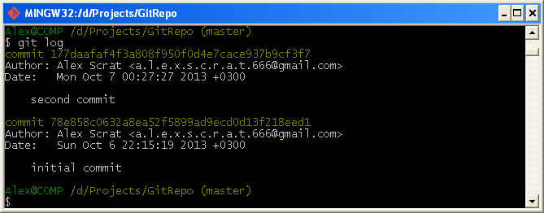

Рисунок Л6.15.

Типово, без аргументів, `git log` виводить список комітів створених в даному репозиторії у зворотному хронологічному порядку. Тобто останні коміти показуються першими. Як ви можете бачити, ця команда відображає кожен коміт разом з його контрольною сумою SHA-1, ім'ям та електронною поштою автора, датою створення і коментарем.

Існує велика кількість параметрів команди `git log` та їх комбінацій, для того щоб показати вам саме те, що ви шукаєте.

*Скасування змін.*

На будь-якій стадії може виникнути необхідність що-небудь скасувати. Тут ми розглянемо декілька основних інструментів для відміни проведених змін. Будьте обережні, бо не завжди можна скасувати самі відміни. Це одне з небагатьох місць в Git, де ви можете втратити свою роботу якщо зробите щось неправильно.

*Зміна останнього коміту.*

Одна з типових відмін відбувається тоді, коли ви робите коміт занадто рано, забувши додати якісь файли, або наплутали з коментарем до коміту. Якщо вам хотілося б зробити цей коміт ще раз, ви можете виконати `commit` з опцією `--amend`:

```bash
$ git commit --amend
```

Ця команда бере індекс і використовує його для коміту. Якщо після останнього коміту не було ніяких змін (наприклад, ви запустили наведену команду відразу після попереднього коміту), то стан проекту буде абсолютно таким же і все, що ви зміните, це коментар до коміту.

З'явиться все той же редактор для коментарів до коміту, але вже з введеним коментарем до останнього коміту. Ви можете відредагувати це повідомлення так само, як звичайно, і воно перепише попереднє.

Для прикладу, якщо після коміту ви усвідомили, що хотіли б інший коментар до коміту, ви можете зробити щось подібне:

```bash
$ git commit -m 'second commit'
$ git commit --amend -m 'Oops'
```
Ці дві команди разом дають один коміт - другий коміт замінює результат першого.

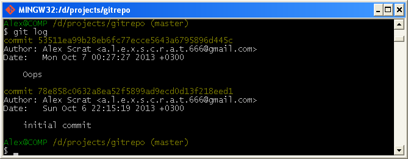

Рисунок Л6.16.

Як бачимо коміт ‘second commit’ був перезаписаний.

*Відміна індексації файлу.*

Зараз ми продемонструємо, як переробити зміни в індексі і в робочому каталозі. Приємно те, що команда, яка використовується для визначення стану цих двох речей, додатково нагадує про те, як скасувати зміни до них. Наведемо приклад. Припустимо, ви внесли зміни в два файлу і хочете записати їх як два окремих комітів, але випадково набрали git add * і проіндексували обидва файли. Як тепер скасувати індексацію одного з двох файлів? Команда git status нагадає вам про це:

```bash
$ git add *
$ git status
```

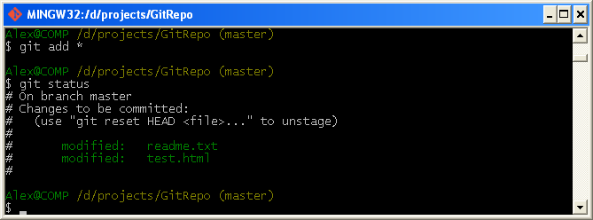

Рисунок Л6.17.

Відразу після напису " Changes to be committed ", написано використовувати git reset HEAD <файл>...для виключення з індексу. Тому давайте скасуємо індексацію файлу test.html:
```bash
git reset HEAD test.html
$ git status
```

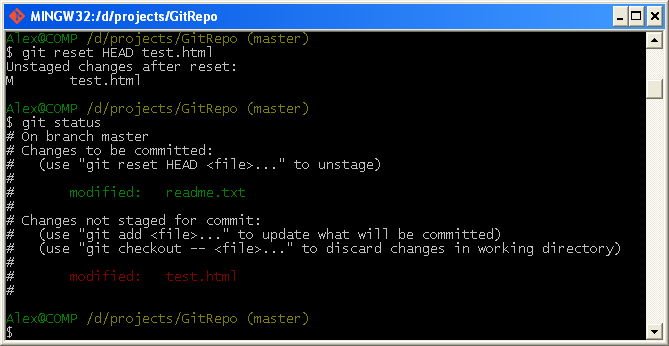

Рисунок Л6.18.

Ця команда трохи дивна, але вона працює. Файл test.html змінений, але знову не в індексі.

*Скасування змін файлу.*

Що, якщо ви зрозуміли, що не хочете залишати зміни, внесені до файлу test.html? Як швидко скасувати зміни, повернути той стан, в якому він перебував під час останнього комітів (або початкового клонування, або якоїсь іншого дії, після якої файл потрапив у робочий каталог)? На щастя, git status говорить, як домогтися і цього. У висновку для останнього прикладу, неіндексована область виглядає наступним чином:

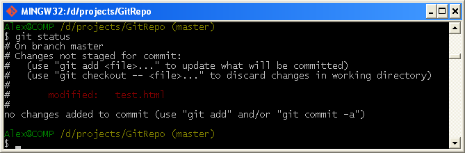

Рисунок Л6.19.


<!-- ВІДНОВЛЕНО ЧЕРЕЗ GEMINI (Стор. 191) -->
Тут досить ясно сказано, як скасувати зроблені зміни (принаймні нові версії Git'а, починаючи з 1.6.1, роблять це ; якщо у вас версія старіше, ми настійно рекомендуємо оновитися, щоб отримувати такі підказки і зробити свою роботу зручніше). Давайте зробимо те, що написано:
```bash
$ git checkout -- test.html
$ git status
```
Як ви бачите, зміни були скасовані. Ви повинні розуміти, що це небезпечна команда: всі зроблені вами зміни в цьому файлі пропали - ви просто скопіювали поверх нього інший файл. Ніколи не використовуйте цю команду, якщо ви не повністю впевнені, що цей файл вам не потрібен. Якщо вам потрібно просто зробити, щоб він не заважав, краще використовувати приховування або розгалуження, ці способи зазвичай кращі.

Пам'ятайте, що все, що є частиною комітів в Git, майже завжди може бути відновлено. Навіть комітів, які знаходяться на гілках, які були видалені, і комітів переписаних з допомогою `--amend` можуть бути відновлені. Незважаючи на це, все, що ніколи не потрапляло в коміт, ви швидше за все вже не побачите знову.

### Зміст звіту

1. Мета роботи.
2. Введення.
3. Програмно-апаратні засоби, використовувані при виконанні роботи.
4. Основна частина (опис роботи згідно з вимогами до виконання лабораторної роботи).
5. Висновки.
6. Список використовуваної літератури.

### Література

1. Основи Git. [Електронний ресурс]. – http://git-scm.com/book/ru/ – Назва з екрану
2. Основи Mercurial. [Електронний ресурс]. – http://habrahabr.ru/post/108658/
<!-- КІНЕЦЬ ВІДНОВЛЕННЯ -->


ЛАБОРАТОРНА РОБОТА № 7  
«ВИВЧЕННЯ ТЕХНОЛОГІЇ .NET»

*Мета роботи:* Ознайомитися з технологією .NET, створити просту програму, використовуючи технологію .NET.

🛎 *Вимоги до результатів виконання лабораторної роботи:*

1. Вивчити пропонований теоретичний матеріал.
2. Створити проекти у Visual Studio на мовах C# і Visual Basic, використовуючи наведений в кінці теоретичного матеріалу лістинг коду калькулятора. Будьте уважні назва основного класу програми у C# (в даному випадку `class Program`) і модуля у Visual Basic (`Module Module1`) мають відповідати назві файлу з вихідним кодом.
3. Дизасемблювати отримані збірки з допомогою утиліти ildasm.exe.
4. Вивчити отриманий CIL код для обох додатків, порівняти і зробити висновки.
5. Оформити звіт.

*Методичні вказівки:*

Лабораторна робота спрямована на ознайомлення з технологією .NET, її основними особливостями і можливостями.

*Теоретичні відомості:*

Платформа Microsoft .NET (і пов'язана з нею мова програмування C#) вперше була представлена приблизно в 2002 р. і швидко стала однією з основних сучасних середовищ розробки програмного забезпечення.

.NET Framework — це програмна платформа для побудови додатків на базі сімейства операційних систем Windows, а також численних ОС виробництва не Microsoft, таких як Mac OS X і різні дистрибутиви Unix і Linux. Для початку нижче наведено короткий перелік деяких ключових засобів, підтримуваних .NET:

* Можливість взаємодії з існуючим кодом. Ця можливість, безсумнівно, є дуже корисною, оскільки дозволяє комбінувати існуючі двійкові компоненти СОМ (тобто забезпечувати взаємодію з ними) з більш новими програмними компонентами .NET і навпаки. З виходом .NET 4.0 і наступних версій можливість взаємодії додатково спростилася завдяки додаванню ключового слова `dynamic`.
* Підтримка численних мов програмування. Додатка .NET можна створювати з використанням будь-якого числа мов програмування (C#, Visual Basic, F# і т.д.).
* Загальний виконуючий механізм, що розділяється всіма підтримуючими .NET мовами. Одним з аспектів цього механізму

є наявність добре визначеного набору типів, які здатний розуміти кожна мова, що підтримує, .NET.
* Мовна інтеграція. У .NET підтримується міжмовне спадкування, міжмовна обробка виключень і міжмовна налагодження коду. наприклад, базовий клас може бути визначений в C#, а потім розширений в Visual Basic.
* Велика бібліотека базових класів. Ця бібліотека дозволяє уникати складностей, пов'язаних з виконанням низькорівневих звернень до API - інтерфейсів, і пропонує узгоджену об'єктну модель, використовувану усіма мовами з підтримкою .NET.
* Спрощена модель розгортання. На відміну від СОМ, бібліотеки .NET не реєструються в системному реєстрі. Більш того, платформа .NET дозволяє існувати на одному і тому ж комп'ютері кільком версіями однієї і тієї ж збірки *.dll.

Тепер розглянемо три ключових (взаємозв'язаних) компонента, які роблять це можливим - CLR, CTS і CLS. З точки зору програміста .NET це виконавче середовище і велика бібліотека базових класів. Рівень виконавчого середовища називається загальномовним виконавчим середовищем (Common Language Runtime) або, скорочено, середовищем CLR. Головним завданням CLR є автоматичне виявлення, завантаження і управління об'єктами .NET (замість програміста). Крім того, середовище CLR піклується про ряд низькорівневих деталей, таких як управління пам'яттю, розміщення додатка, координування потоків і виконання перевірок, пов'язаних з безпекою (у числі інших низькорівневих нюансів).

Іншим будівельним блоком платформи .NET є загальна система типів (Common type System) або, скорочено, система CTS. У специфікації CTS повністюописані всі можливі типи даних і всі програмні конструкції, що підтримує виконуюче середовище. Крім того, в CTS показано, як ці сутності можуть взаємодіяти одне з одним, і вказано, як вони представлені у форматі метаданих .NET.

Важливо розуміти, що окремо взята мова, сумісний з .NET, може не підтримувати абсолютно всі функціональні засоби, визначені специфікацією CTS. Тому існує загальномовна специфікація (Common Language Specification) або, скорочено, специфікація CLS, в якій описано підмножина загальних типів і програмних конструкцій, які повинні підтримувати всі мови програмування для .NET. Таким чином, якщо створювані типи .NET пропонують тільки засоби, сумісні з CLS, ними можуть користуватися всі мови, що підтримують .NET. І, навпаки, у разі застосування типу даних або програмної конструкції, що виходить за рамки CLS, не можна гарантувати можливість взаємодії з такою бібліотекою коду .NET кожною мовою програмування .NET. На щастя, існує дуже простий спосіб вказати компілятору C# на необхідність перевірки всього коду щодо сумісності з CLS.

*Роль бібліотек базових класів*

На додаток до середовища CLR і специфікаціям CTS/CLS, платформа .NET надає бібліотеку базових класів, яка доступна всім мовам програмування .NET. Ця бібліотека не тільки інкапсулює різноманітні примітиви, такі як потоки, файловий ввід-вивід, системи візуалізації графіки і механізми взаємодії з різними зовнішніми пристроями, але також забезпечує підтримку для багаточисельних служб, необхідних більшості реальних додатків. Бібліотеки базових класів визначають типи, які можна використовувати для побудови програмних додатків будь-якого виду. Наприклад, ASP .NET можна застосовувати для побудови веб-сайтів, WCF - для створення мережевих служб, WPF - для написання настільних додатків з графічним інтерфейсом користувача і т.д. Крім того, бібліотеки базових класів надають типи для взаємодії з XML-документами, локальним каталогом і файловою системою поточного комп'ютера, для комунікацій з реляційними базами даних (через ADO .NET) і т.д.

*Що привносить мова C#*

Синтаксис мови програмування C# виглядає дуже схожим на синтаксис мови Java. Однак називати C# клоном Java неправильно. Насправді і C#, і Java є членами сімейства мов програмування, заснованого на С (куди також входять C, Objective C, C++), і тому вони поділяють схожий синтаксис. Правда полягає в тому, що багато синтаксичні конструкції C# змодельовані на основі різноманітних аспектів мов Visual Basic (VB) і C++. Наприклад, подібно до VB, мова C# підтримує ідею властивостей класу (як протилежність традиційним методам вилучення та установки) і необов'язкові параметри. Подібно C++, мова C# дозволяє перевантажувати операції а також створювати структури, перерахування і функції зворотного виклику (за допомогою делегатів).

Більш того, C# підтримує безліч засобів, які традиційно зустрічаються в різних мовах функціонального програмування (наприклад, LISP або Haskel), скажімо, лямбда-вираження і анонімні типи. До того ж, з появою технології LINQ (Language Integrated Query - мова інтегрованих запитів), мова C# став підтримувати конструкції, які роблять його досить унікальним у світі програмування. незважаючи на все це, найбільший вплив на нього зробили саме мови, засновані на С.

Внаслідок того, що C# являє собою гібрид з декількох мов, він є таким же синтаксично чистим - якщо не чистіше - як і Java, майже настільки ж простим, як VB, і практично таким же потужним і гнучким, як C++. нижче наведений далеко не повний список ключових особливостей мови C#, які характерні для всіх його версій:

– Покажчики використовувати не потрібно! У програмах на C# зазвичай не виникає потреби в маніпулюванні покажчиками безпосередньо (хоча у випадку абсолютної необхідності можна опуститися на цей рівень).
– Автоматичне управління пам'яттю за допомогою збірки сміття. Враховуючи це, ключове слово `delete` в C# не підтримується.
– Формальні синтаксичні конструкції для класів, інтерфейсів, структур, перерахувань та делегатів.
– Аналогічна мові C++ можливість перевантаження операцій для спеціальних типів без зайвих складнощів (наприклад, забезпечення " повернення * this, щоб дозволити зв'язування в ланцюжок " - не ваша турбота).
– Підтримка програмування на основі атрибутів. Цей різновид розробки дозволяє анотувати типи та їх членів з метою додаткового уточнення їхньої поведінки. Наприклад, якщо помітити метод атрибутом `[ Obsolete ]`, при спробі використання цього члена програмісти отримають відповідне спеціальне попередження.

З виходом версії .NET 2.0 (приблизно в 2005 р.), мова програмування C# була оновлена для підтримки численних нових функціональних можливостей, найбільш значимі з яких перераховані нижче:
– Можливість створення узагальнених типів і узагальнених членів. Використовуючи узагальнення, можна створювати дуже ефективний і безпечний до типів код, який визначає безліч заповнювачів, що вказуються під час взаємодії з узагальненими елементами.
– Підтримка анонімних методів, які дозволяють надавати вбудовану функцію скрізь, де потрібен тип делегата.
– Можливість визначення єдиного типу в декількох файлах коду (або, якщо необхідно, у вигляді подання в пам'яті) з використанням ключового слова `partial`.

У версії .NET 3.5 (що вийшла приблизно в 2008р.) в мову програмування C# була додана додаткова функціональність, включаючи такі засоби.
– Підтримка строго типізованих запитів (тобто LINQ), застосовуваних для взаємодії з різноманітними формами даних.
– Підтримка анонімних типів, які дозволяють моделювати форму типу, а не його поведінку.
– Можливість розширення функціональності існуючого типу (не створюючи його підкласи) з використанням розширюють методів.
– Включення лямбда-операції (`=>`), яка ще більше спрощує роботу з типами делегатів .NET.
– Новий синтаксис ініціалізації об'єктів, який дозволяє встановлювати значення властивостей під час створення об'єкта.

Версія .NET 4.0 (вийшла в 2010 р.) доповнила C# ще рядом засобів, у тому числі зазначеними нижче.

- Підтримка необов'язкових параметрів, а також іменованих аргументів на методах.
- Підтримка динамічного пошуку членів під час виконання через ключове слово `dynamic`. Це забезпечує універсальний підхід до виклику членів на льоту незалежно від інфраструктури, за допомогою якої вони були реалізовані (COM, IronRuby, IronPython або служби рефлексії .NET).
- Робота з узагальненими типами стала набагато зрозуміліше, враховуючи можливість легкого відображення узагальнених даних на універсальні колекції System.Object через коваріантність і контраваріантність.

Все це підводить нас до поточної версії C#, що входить до складу платформи .NET 4.5.

У цій версії C# з'явилася пара нових ключових слів (`async` і `await`), які значно спрощують багатопоточне і асинхронне програмування. Ті, кому доводилось працювати з попередніми версіями C#, можуть пригадати, що виклик методів через вторинні потоки вимагав досить великого обсягу малозрозумілого коду і використання різних просторів імен .NET. Завдяки тому, що тепер C# підтримує мовні ключові слова, які автоматично вирішують ці задачі, процес виклику методів асинхронним чином майже настільки ж простий, як їх виклик в синхронній манері.

Важливо пам'ятати, що C# - це не єдина мова, яку може використовуватися для побудови .NET -додатків. Середовище Visual Studio спочатку пропонує п'ять керованих мов, а саме - C#, Visual Basic, C++/CLI, JavaScript і F#.

На додаток до керованих мов, пропонованим Microsoft, існують .NET-комппілятори, які призначені для мов Smalltalk, Ruby, Python, COBOL і Pascal (і це далеко не повний перелік).

### Огляд збірок .NET

Яка б мова .NET не була вибрана для програмування, важливо розуміти, що хоча двійкові модулі .NET мають те ж саме файлове розширення, як і некеровані двійкові компоненти Windows (*.dll або *.exe), внутрішньо вони влаштовані зовсім по-іншому. Зокрема, двійкові модулі .NET містять не специфічні, а незалежні від платформи інструкції на проміжному мовою (Intermediate Language IL) і метадані типів.

Коли файл *.dll або *.exe був створений за допомогою .NET-комппілятора, отриманий великий двійковий об'єкт називається збіркою. Як уже згадувалося, збірка містить код CIL, який концептуально схожий на байт-код Java тим, що не компілюється в специфічні для платформи інструкції до тих пір, поки це не стане абсолютно необхідним. Зазвичай " абсолютна необхідність " настає тоді, коли на блок інструкцій CIL (такий

як реалізація методу) виробляється посилання для його використання виконуючим середовищем .NET. Крім інструкцій CIL збірки також містять метадані, які детально описують характеристики кожного "типу" всередині двійкового модуля. Наприклад, якщо є клас з ім'ям SportsCar, метадані типу описують такі деталі, як базовий клас SportsCar, реалізовані SportsCar інтерфейси (якщо є), а також повні описи всіх членів, підтримуваних SportsCar. Метадані .NET завжди представляються всередині збірки і автоматично генеруються компілятором відповідної мови .NET. Нарешті, крім інструкцій CIL і метаданих типів, самі збірки також описуються за допомогою метаданих, які офіційно називаються маніфестом. Маніфест містить інформацію про поточну версію збірки, відомості про культуру (застосовувані для локалізації строкових і графічних ресурсів) і список посилань на всі зовнішні збірки, які потрібні для правильного функціонування.

_Відмінності між збірками, просторами імен та типами._

Важливість бібліотек коду розуміє кожен з нас. Головне призначення бібліотек платформи - надавати розробникам чітко певний набір готового коду для використання в створюваних додатках. Однак C# не поставляється з якоюсь специфічною для мови бібліотекою коду. Замість цього розробники на C# користуються нейтральними до мов бібліотеками .NET. Для підтримки всіх типів всередині бібліотек базових класів в добре організованому вигляді в рамках платформи .NET широко застосовується концепція простору імен.

_Простір імен_ - це група семантично пов'язаних типів, які містяться в одній або декількох пов'язаних один з одним збірках. Наприклад, простір імен System.IO містить типи, що мають відношення до файлового вводу-виводу, простір імен System.Data - типи для роботи з базами даних і т.д.

Дуже важливо розуміти, що в одній збірці (наприклад, mscorlib.dll) може міститися будь-яка кількість просторів імен, кожне з яких може мати будь-яке число типів. Цей інструмент дозволяє переглядати збірки, на які є посилання в поточному проекті, простори імен всередині окремої збірки, типи в конкретному просторі імен та члени специфічного типу. Зверніть увагу, що збірка mscorlib.dll містить безліч різних просторів імен (таких як System.IO), кожне з яких має власні семантично пов'язані типи (наприклад, BinaryReader).

Головна різниця між таким підходом і специфічною для мови бібліотекою полягає у тому, що будь-яка мова, орієнтована на виконавче середовище .NET, використовує ті ж самі простори імен і ті ж самі типи. Наприклад, нижче наведений код додатка "Hello World" на мовах C#, VB і C++/CLI в _Лістингу 7.1_.

Програма "Hello World" на мові C#.

```csharp
using System;
```

```csharp
public class MyApp
{
    static void Main()
    {
        Console.WriteLine("Hi from C#");
    }
}
```

Програма "Hello World" мовою VB.

```vb
Imports System
Public Module MyApp
Sub Main()
    Console.WriteLine("Hi from VB")
End Sub
End Module
```

Програма "Hello World" на мові C++/CLI

```cpp
#include "stdafx.h"
using namespace System;
int main(array<System::String ^> ^args)
{
    Console::WriteLine(L"Hi from C++/CLI");
    return 0;
}
```

Зверніть увагу, що в коді на кожній мові застосовується клас Console, визначений в просторі імен System. Крім очевидних синтаксичних відмінностей, ці три додатки виглядають дуже схожим чином, як фізично, так і логічно.

Зрозуміло, що основною метою будь-якого розробника для .NET є освоєння різноманіття типів, які визначені в (численних) просторах імен .NET. Найбільш фундаментальний простір імен, з якого слід починати, називається System. Це простір імен надає набір ключових типів, які будь-розробний для .NET буде експлуатувати знову і знову. Фактично створення будь-якого функціонального додатка на C# неможливе без додавання, в крайньому випадку, посилання на простір імен System, оскільки в ньому визначені всі головні типи даних (наприклад, System.Int32, System.String і т.д.). У таблиці Л7.1 наведено короткий список деяких (але, звичайно ж, не всіх) просторів імен .NET, згрупованих на основі функціональності.

*Таблиця Л7.1- Деякі простори імен в .NET*

| Простір імен .NET | Опис |
| :--- | :--- |

| 1 | 2 |
| :--- | :--- |
| System | Усередині простору імен System міститься безліч корисних типів, призначених для роботи з внутрішніми даними, математичними обчисленнями, генерацією випадкових чисел, змінними середовища і збором сміття, а також ряд часто використовуваних виключень і атрибутів |
| System.Collections | Ці простори імен визначають набір контейнерних типів, а також базові типи і інтерфейси, які дозволяють будувати налаштовуванні колекції |
| System.Collections.Generic | |
| System.Data.Common | Ці простори імен використовуються для взаємодії з базами даних через ADO .NET |
| System.Data | |
| System.Data.EntityClient | |
| System.Data.SqlClient | |
| System.IO | Ці простори імен визначають безліч типів, призначених для роботи з файловим вводом-виводом, стисненням даних і портами |
| System.IO.Compression | |
| System.IO.Ports | |
| System.Reflection | Ці простори імен визначають типи, які підтримують виявлення типів під час виконання, а також динамічне створення типів |
| System.Reflection.Emit | |
| System.Runtime.InteropServices | Це простір імен надає засоби, що дозволяють типам .NET взаємодіяти з некерованим кодом (наприклад, DLL - бібліотеками на основі С і серверами СОМ) і навпаки |
| System.Drawing | Ці простори імен визначають типи, що застосовуються для побудови настільних додатків з використанням вихідного інструментального набору .NET для створення користувацьких інтерфейсів (Windows Forms) |
| System.Windows.Forms | |
| System.Windows | Простір імен System.Windows є кореневим для декількох просторів імен, які представляють інструментальний набір для побудови користувацьких інтерфейсів Windows Presentation Foundation (WPF) |
| System.Windows.Controls | |
| System.Windows.Shapes | |


<!-- ВІДНОВЛЕНО ЧЕРЕЗ GEMINI (Стор. 200) -->
| 1 | 2 |
| :--- | :--- |
| System.Linq | Ці простори імен визначають типи, що |
| System.Xml.Linq | застосовуються під час програмування з |
| System.Data.DataSetExtensions | використанням API - інтерфейсу LINQ |
| System.Web | Це одне з багатьох просторів імен, які дозволяють будувати веб-додатки ASP .NET |
| System.ServiceModel | Це одне з багатьох просторів імен, що використовуються для побудови розподілених додатків за допомогою API — інтерфейсу Windows Communication Foundation (WCF) |
| System.Workflow.Runtime | Це два з численних просторів імен, які |
| System.Workflow.Activities | визначають типи, що застосовуються при побудові додатків, що підтримують робочі потоки, за допомогою API-інтерфейса Windows Workflow Foundation (WF) |
| System.Threading | Цей простір імен визначає численні типи для |
| System.Threading.Tasks | побудови багатопоточних додатків, які можуть розподіляти робоче навантаження по декількох центральних процесорах |
| System.Security | Безпека є невід'ємною характеристикою світу .NET. У просторах назв, пов'язаних з безпекою, міститься безліч типів, які дозволяють працювати з криптографією і т.д. |
| System.Xml | У просторах назв, пов'язаних з XML, містяться багаточисленні типи, використовувані для взаємодії з XML-даними |

Будь-який простір імен, вкладений в Microsoft (наприклад, Microsoft.CSharp, Microsoft.ManagementConsole, Microsoft.Win32), містить типи, які використовуються для взаємодії зі службами, унікальними для операційної системи Windows. Враховуючи це, ви не повинні припускати, що ці типи можуть успішно використовуватися в інших операційних системах, що підтримують .NET, таких як Mac OS X.

### Утиліта ildasm.exe

Утиліта *ildasm.exe* (Intermediate Language Disassembler - дизасемблер проміжної мови), яка поставляється в складі .NET Framework 4.5 SDK, дозволяє завантажити будь-яку збірку .NET і вивчити її вміст, включаючи асоційований з нею маніфест, CIL-код і метадані типів. Цей інструмент дозволяє програмістам більш докладно розібратися, як їх код C# відображається на CIL-код, і в кінцевому підсумку допомагає зрозуміти внутрішню механіку роботи платформи .NET. Хоча використання ildasm.exe зовсім не обов'язково для того, щоб стати досвідченим програмістом для .NET, настійно рекомендується час від часу застосовувати цей інструмент, щоб краще зрозуміти, як написаний код C# вписується в концепції виконавчого середовища.
<!-- КІНЕЦЬ ВІДНОВЛЕННЯ -->


Щоб ознайомитися із утилітою спочатку створимо простий .NET додаток. Для цього потрібно запустити Visual Studio і створити проект, як показано на рис. Л7.1 (Файл→Создать Проект→Установленные Шаблоны→Visual C#→Windows→Консольное приложение).

Тепер скопіюйте наведений вище лістинг коду програми HelloWorld на C# і скомпілюйте програму

Далі скористаємось ildasm.exe. Щоб запустити утиліту ildasm.exe, відкрийте вікно Developer Command Prompt (Командний рядок розробника — Пуск\Visual Studio\Інструменти Visual Studio\ Командний рядок розробника), введіть у ньому ildasm і натисніть клавішу <Enter>. Після запуску утиліти ildasm.exe виберіть пункт меню File → Open (Файл → Відкрити) і перейдіть до збірки, яку потрібно досліджувати, в даному випадку — до щойно скомпілованої програми. Утиліта ildasm.exe представляє структуру будь-якої збірки в знайомому деревовидному форматі (рис. Л7.2).

Крім розміщених в збірці просторів імен, типів і членів, утиліта ildasm.exe також дозволяє переглядати і CIL-інструкції для конкретного члена. наприклад, якщо двічі клацнути на методі Main () у класі Program, відкриється окреме вікно з CIL-кодом цього методу (Рисунок Л7.3).

Лістинг Л7.2. - Код калькулятора на мові C#

```csharp
// Класс Calc.cs
using System;
namespace CalculatorExample
{
// Этот класс содержит точку входа приложения.
    class Program
    {
        static void Main()
        {
            Calc c = new Calc () ;
            int ans = c.Add(10, 84);
            Console.WriteLine("10 + 84 is {0}.11, ans");
            // Ожидать нажатия пользователем клавиши <Enter> перед
выходом.
            Console.ReadLine();
        }
    }
    // Калькулятор на C#.
    class Calc
    {
        public int Add(int x, int y)
        { return x + y; }
    }
}
```

Лістинг Л7.3. - Код калькулятора на мові VB

```vb
' Класс Calc.vb
Imports System
'"Модуль" VB — это класс, который
' содержит только статические члены.
Module Module1
    Sub Main()
        Dim c As New Calc
        Dim ans As Integer = c.Add(10, 84)
        Console.WriteLine("10 + 84 is {0}.", ans)
        Console.ReadLine()
    End Sub
End Module
Class Calc
    Public Function Add(ByVal x As Integer, ByVal y As Integer) As
Integer
        Return x + y
    End Function
End Class
```


Рисунок Л7.1. Відношення між CLR, CTS, CLS і бібліотеками базових класів

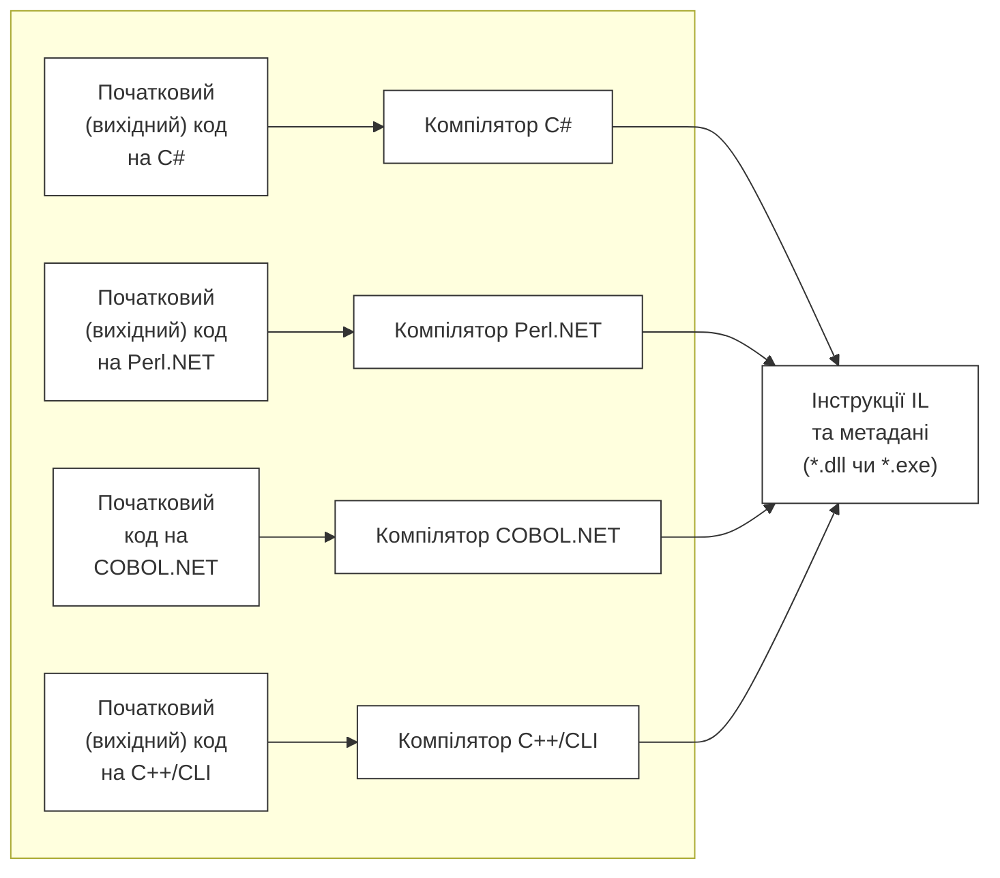
```mermaid
graph LR
    subgraph Inputs [" "]
        A["Початковий<br>(вихідний) код<br>на C#"] --> B["Компілятор C#"]
        C["Початковий<br>(вихідний) код<br>на Perl.NET"] --> D["Компілятор Perl.NET"]
        E["Початковий<br>код на<br>COBOL.NET"] --> F["Компілятор COBOL.NET"]
        G["Початковий<br>(вихідний) код<br>на C++/CLI"] --> H["Компілятор C++/CLI"]
    end

    B --> I["Інструкції IL<br>та метадані<br>(*.dll чи *.exe)"]
    D --> I
    F --> I
    H --> I

    style A fill:#fff,stroke:#333,stroke-width:1px
    style C fill:#fff,stroke:#333,stroke-width:1px
    style E fill:#fff,stroke:#333,stroke-width:1px
    style G fill:#fff,stroke:#333,stroke-width:1px
    style B fill:#fff,stroke:#333,stroke-width:1px
    style D fill:#fff,stroke:#333,stroke-width:1px
    style F fill:#fff,stroke:#333,stroke-width:1px
    style H fill:#fff,stroke:#333,stroke-width:1px
    style I fill:#fff,stroke:#333,stroke-width:1px
```

Рисунок Л7.2. Всі .NET компілятори генерують інструкції IL та метадані

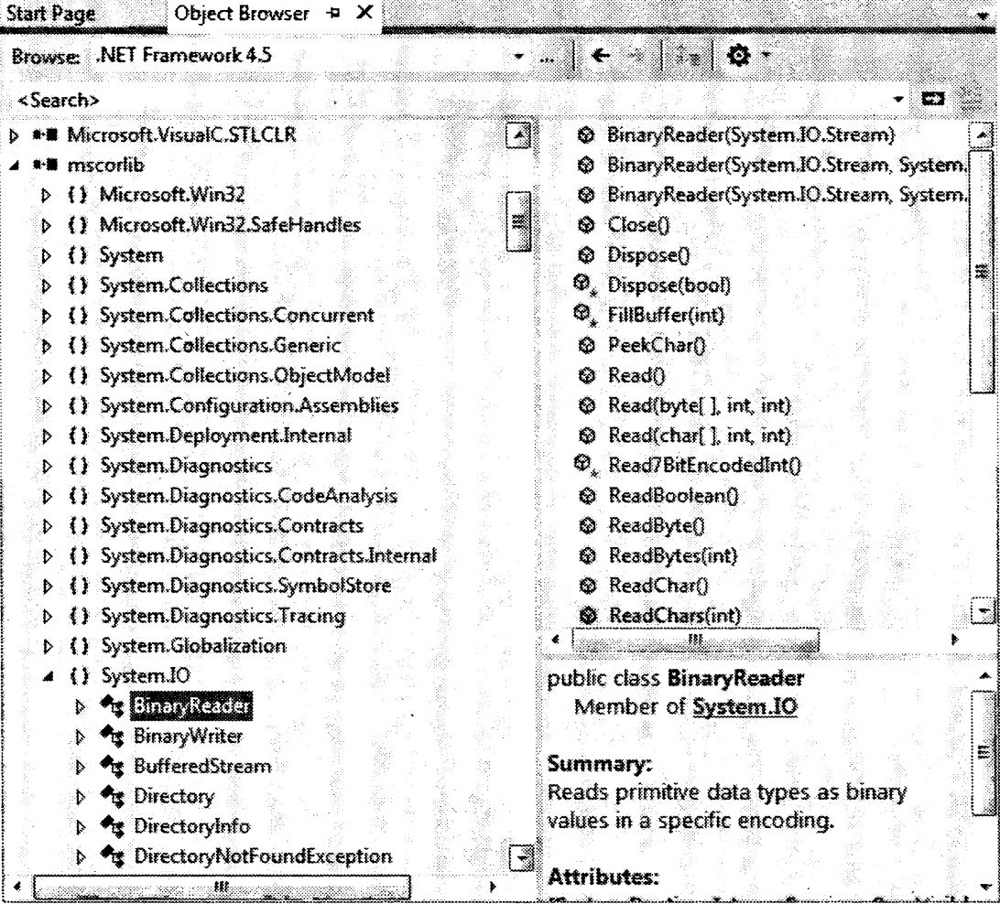

Рисунок Л7.3. Збірка може мати будь-яку кількість просторів імен.

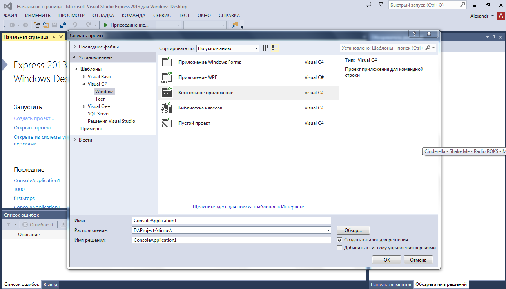

Рисунок Л7.4. Створення проекту у Visual Studio

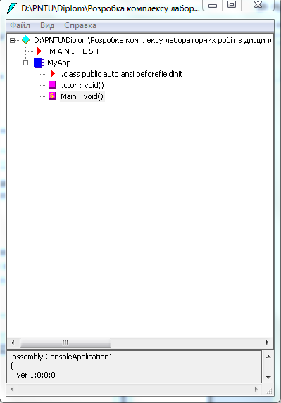

Рисунок Л7.5. Утиліта ildasm.exe дозволяє бачити розміщені всередині збірки .NET код CIL, маніфест і метадані типів

![Скріншот вікна програми з CIL-кодом методу MyApp::Main, де показано ассемблерний код для .NET (CIL), включаючи інструкції .entrypoint, maxstack, nop, ldstr "Hi from C#", call void [mscorlib]System.Console::WriteLine(string), та ret](images/Degtyaryova_2017_Software_Engineering_Technologies/page_205_img_1.png)

Рисунок Л7.6. Перегляд CIL-коду для методу

📖 *Зміст звіту*

1. Мета роботи.
2. Введення.
3. Програмно-апаратні засоби, використовувані при виконанні роботи.
4. Основна частина (опис самої роботи).
5. Висновки.
6. Список використовуваної літератури.

ЛАБОРАТОРНА РОБОТА № 8
«СТВОРЕННЯ ПРОСТОГО МЕРЕЖЕВОГО ДОДАТКУ З ВИКОРИСТАННЯМ ТЕХНОЛОГІЇ .NET»

*Мета роботи:* Створити простий мережевий додаток на мові C# і проаналізувати його будову.

🔔 *Вимоги до результатів виконання лабораторної роботи:*

1. Вивчити пропонований теоретичний матеріал.
2. Створити проекти у Visual Studio на мові C#, використовуючи наведені в методичних матеріалах лістинг коду клієнтського і серверного додатків.
3. Проаналізувати вихідний код, визначити призначення застосованих просторів імен в додатках і заповнити таблицю

*Таблиця Л8.1 - Простори імен*

| №п/п | Простір імен | Призначення |
| :---: | :--- | :--- |
| 1. | System | Усередині простору імен System міститься безліч корисних типів, призначених для роботи з внутрішніми даними, математичними обчисленнями, генерацією випадкових чисел, змінними середовища і збором сміття, а також ряд часто використовуваних виключень і атрибутів |

4. Визначити призначення застосованих класів і простори імен, до яких вони належать. Заповнити таблицю.

*Таблиця Л8.2- Застосовані класи*

| №п/п | Клас | Простір імен | Призначення |
| :---: | :--- | :--- | :--- |
| 1. | IPHostEntry | System .NET.IPHostEntry | Надає клас контейнерів для відомостей про адресу веб-вузла. |

5. Реалізувати обмін довільними повідомленнями між клієнтом і сервером по черзі.

*Методичні вказівки:*

Лабораторна робота спрямована на формування навичок роботи з технологією .NET, мовою C# та документацією.

*Теоретичні відомості*

*Простір імен*

У програмуванні на C# простори імен використовуються з повним навантаженням в двох напрямках. По-перше, платформа .NET Framework використовує простори імен для організації більшості класів. Це виконується наступним чином.


<!-- ВІДНОВЛЕНО ЧЕРЕЗ GEMINI (Стор. 207) -->
```csharp
System.Console.WriteLine("Hello World!");
```

`System` - це простір імен, а `Console` - клас в ньому. Використання ключового слова `using` може скасувати необхідність повного імені, як показано в наступному прикладі.

```csharp
using System;
Console.WriteLine ( "Hello" ) ;
Console.WriteLine ( "World !" ) ;
```

По-друге, оголошення власного простору імен допоможе в управлінні областю дії імен класів і методів у великих програмних проектах. Для оголошення простору імен скористайтеся ключовим словом `namespace`, як показано в наступному прикладі.

```csharp
namespace SampleNamespace
{
    class SampleClass
    {
        public void SampleMethod()
        {
            System.Console.WriteLine(
                "SampleMethod inside SampleNamespace") ;
        }
    }
}
```

Просторі імен мають такі властивості:
- Організація великих проектів по створенню коду.
- Для їх поділу використовуються оператор `.` (точка).
- Директива `using` виключає вимогу на вказівку імені простору імен для кожного класу.
- Простір назв `global` є кореневим простором імен: `global::System` завжди буде посилатися на простір імен платформи .NET Framework `System`.

Побудова мережевого додатку

Побудуємо завершений додаток, що включає клієнт і сервер. Спочатку конструюємо на потокових сокетах TCP сервер, а потім клієнтську програму для тестування нашого сервера.

*Сервер TCP*

Наступна програма створює сервер, який отримує запити на з'єднання від клієнтів. Сервер побудований синхронно, отже, виконання потоку блокується, поки сервер не дасть згоди на з'єднання з клієнтом. Ця програма демонструє простий сервер, що відповідає клієнту. Клієнт завершує з'єднання, відправляючи серверу повідомлення `<TheEnd>`
<!-- КІНЕЦЬ ВІДНОВЛЕННЯ -->


Лістинг 8.4. - Серверний додаток

```csharp
using System;
using System.Text;
using System.NET;
using System.NET.Sockets;

namespace Server
{
    class Program
    {
        static void Main(string[] args)
        {
            // Устанавливаем для сокета локальную конечную точку
            IPHostEntry ipHost = Dns.GetHostEntry("localhost");
            IPAddress ipAddr = ipHost.AddressList[0];
            IPEndPoint ipEndPoint = new IPEndPoint(ipAddr, 11000);
            Socket sListener = new Socket(ipAddr.AddressFamily,
SocketType.Stream, ProtocolType.Tcp);
            try
            {
                sListener.Bind(ipEndPoint);
                sListener.Listen(10);
                // Начинаем слушать соединения
                while (true)
                {
                    Console.WriteLine("Ожидаем соединение через порт {0}",
ipEndPoint);

                    // Программа приостанавливается, ожидая входящее соединение
                    Socket handler = sListener.Accept();

                    string data = null;
                    // Мы дождались клиента, пытающегося с нами соединиться
                    byte[] bytes = new byte[1024];
                    int bytesRec = handler.Receive(bytes);
                    data += Encoding.UTF8.GetString(bytes, 0, bytesRec);
                    // Показываем данные на консоли
                    Console.Write("Полученный текст: " + data + "\n\n");
                    // Отправляем ответ клиенту
                    string reply = "Спасибо за запрос в " +
data.Length.ToString() + " символов";
                    byte[] msg = Encoding.UTF8.GetBytes(reply);
                    handler.Send(msg);
                    if (data.IndexOf("<TheEnd>") > -1)
                    {
                        Console.WriteLine("Сервер завершил соединение с
клиентом.");
                        break;
                    }
                    handler.Shutdown(SocketShutdown.Both);
                    handler.Close();
                }
            }
        }
    }
}
```

Лістинг Л8.4. - Серверний додаток (продовж.)
```csharp
            catch (Exception ex)
            {
                Console.WriteLine(ex.ToString());
            }
            finally
            {
                Console.ReadLine();
            }
        }
    }
}
```

Розглянемо структуру даної програми.

Перший крок полягає у встановленні для сокета локальної кінцевої точки. Перш ніж відкривати сокет для очікування з'єднань, потрібно підготувати для нього адресу локальної кінцевої точки. Унікальна адреса для обслуговування TCP/IP визначається комбінацією ІР-адреси хоста з номером порту обслуговування, який створює кінцеву точку для обслуговування.

Клас *Dns* надає методи, які повертають інформацію про мережеві адреси, що підтримує пристрій в локальній мережі. Якщо у пристрої локальної мережі є більше однієї мережевої адреси, клас *Dns* повертає інформацію про всі мережеві адреси, і додаток повинен вибрати з масиву відповідну адресу для обслуговування.

Створимо IPEndPoint для сервера, комбінуючи першу IP-адреса хост-комп'ютера, отриманий від методу Dns.Resolve ( ), з номером порту:

```csharp
IPHostEntry ipHost = Dns.GetHostEntry("localhost");
IPAddress ipAddr = ipHost.AddressList[0];
IPEndPoint ipEndPoint = new IPEndPoint(ipAddr, 11000);
```

Тут клас IPEndPoint представляє localhost на порту 11000. Далі новим екземпляром класу Socket створюємо потоковий сокет. Встановивши локальну кінцеву точку для очікування з'єднань, можна створити сокет:

```csharp
Socket sListener = new Socket (ipAddr.AddressFamily, SocketType.Stream, ProtocolType.Tcp);
```

Перерахування AddressFamily вказує схеми адресації, які екземпляр класу Socket може використовувати для дозволу адреси.

У параметрі SocketType розрізняються сокети TCP і UDP. У ньому можна визначити в тому числі такі значення:
* *Dgram* - підтримує дейтаграми. Значення *Dgram* вимагає вказати *Udp* для типу протоколу і *InterNetwork* в параметрі сімейства адрес.
* *Raw* – підтримує доступ до базового транспортного протоколу.

*   *Stream* - підтримує потокові сокети. Значення *Stream* вимагає вказати *Tcp* для типу протоколу.

Третій і останній параметр визначає тип протоколу, необхідний для сокета. У параметрі *ProtocolType* можна вказати наступні найбільш важливі значення - *Tcp*, *Udp*, *Ip*, *Raw*.

Наступним кроком має бути призначення сокета за допомогою методу Bind(). Коли сокет відкривається конструктором, йому не призначається ім'я, а тільки резервується дескриптор. Для призначення імені сокету сервера викликається метод Bind(). Щоб сокет клієнта міг ідентифікувати потоковий сокет TCP, серверна програма повинна дати ім'я своїй сокету:

```csharp
sListener.Bind ( ipEndPoint ) ;
```

Метод Bind() пов'язує сокет з локальною кінцевою точкою. Викликати метод Bind() треба до будь-яких спроб звернення до методів Listen() і Accept().

Тепер, створивши сокет і зв'язавши з ним ім'я, можна слухати вхідні повідомлення, скориставшись методом Listen(). У стані прослуховування сокет буде очікувати входять спроби з'єднання:

```csharp
sListener.Listen(10);
```

У параметрі визначається заділ (backlog), який вказує максимальне число з'єднань, що очікують обробки в черзі. У наведеному коді значення параметра допускає накопичення в черзі до десяти з'єднання.

У стані прослуховування треба бути готовим дати згоду на з'єднання з клієнтом, для чого використовується метод Accept(). За допомогою цього методу виходить з'єднання клієнта і завершується встановлення зв'язку імен клієнта і сервера. Метод Accept() блокує потік викликає програми до надходження з'єднання.

Метод Accept() витягує з черги чекають запитів перший запит на з'єднання і створює для його обробки новий сокет. Хоча новий сокет створений, первісний сокет продовжує слухати і може використовуватися з багатопотоковою обробкою для прийому декількох запитів на з'єднання від клієнтів. Ніякий серверний додаток не повинно закривати прослуховуючий сокет. Він повинен продовжувати працювати поряд з сокетами, створеними методом Accept() для обробки вхідних запитів клієнтів.

```csharp
while(true)
{
    Console.WriteLine("Очікуємо з'єднання через порт {0}",
    ipEndPoint);
    // Програма призупиняється, очікуючи вхідне з'єднання
    Socket handler = sListener.Accept();
}
```

Як тільки клієнт і сервер встановили між собою з'єднання, можна відправляти і отримувати повідомлення, використовуючи методи Send() і Receive() класу Socket.

Метод Send() записує вихідні дані сокету, з яким встановлено з'єднання. Метод Receive() зчитує вхідні дані в потоковий сокет. При використанні системи, заснованої на TCP, перед виконанням методів Send() і Receive() між сокетами повинно бути встановлене з'єднання. Точний протокол між двома взаємодіючими сутностями має бути визначений завчасно, щоб клієнтські і серверне додатки не блокували один одного, не знаючи, хто повинен відправити свої дані першого.

Коли обмін даними між сервером і клієнтом завершується, потрібно закрити з'єднання використовуючи методи Shutdown() і Close():

```csharp
handler.Shutdown(SocketShutdown.Both);
handler.Close();
```

SocketShutdown - це перерахунок, що містить три значення для зупинки: Both - зупиняє відправку та отримання даних сокетом, Receive - зупиняє отримання даних сокетом і Send - зупиняє відправки даних сокетом.

Сокет закривається при виклику методу Close(), який також встановлює у властивості Connected сокета значення false.

### Клієнт на TCP

Функції, які використовуються для створення програми-клієнта, більш-енш нагадують серверний додаток. Як і для сервера, використовуються ті ж методи для визначення кінцевої точки, створення екземпляра сокета, відправки та отримання даних і закриття сокета. Єдиний новий метод - метод Connect(), використовується для з'єднання з віддаленим сервером.

Лістинг Л8.5. - Клієнтський додаток

```csharp
using System;
using System.Text;
using System.NET;
using System.NET.Sockets;

namespace Client
{
    class Program
    {
        static void Main(string[] args)
        {
            try
            {
                SendMessageFromSocket(11000);
            }
            catch (Exception ex)
```

Лістинг Л8.5. - Клієнтський додаток (закінч.)

```csharp
    {
        Console.WriteLine(ex.ToString());
    }
    finally
    {
        Console.ReadLine();
    }
}
static void SendMessageFromSocket(int port)
{
    // Буфер для входящих данных
    byte[] bytes = new byte[1024];
    // Соединяемся с удаленным устройством
    // Устанавливаем удаленную точку для сокета
    IPHostEntry ipHost = Dns.GetHostEntry("192.168.1.159");
    IPAddress ipAddr = ipHost.AddressList[0];
    IPEndPoint ipEndPoint = new IPEndPoint(ipAddr, port);
    Socket sender = new Socket(ipAddr.AddressFamily,
SocketType.Stream, ProtocolType.Tcp);

    // Соединяем сокет с удаленной точкой
    sender.Connect(ipEndPoint);

    Console.Write("Введите сообщение: ");
    string message = Console.ReadLine();

    Console.WriteLine("Сокет соединяется с {0} ",
sender.RemoteEndPoint.ToString());
    byte[] msg = Encoding.UTF8.GetBytes(message);
    // Отправляем данные через сокет
    int bytesSent = sender.Send(msg);

    // Получаем ответ от сервера
    int bytesRec = sender.Receive(bytes);

    Console.WriteLine("\nОтвет от сервера: {0}\n\n",
Encoding.UTF8.GetString(bytes, 0, bytesRec));

    // Используем рекурсию для неоднократного вызова
SendMessageFromSocket()
    if (message.IndexOf("<TheEnd>") == -1)
        SendMessageFromSocket(port);

    // Освобождаем сокет
    sender.Shutdown(SocketShutdown.Both);
    sender.Close();
}
```

📖 Зміст звіту

1. Мета роботи.
2. Введення.
3. Програмно-апаратні засоби, використані при виконанні роботи.
4. Заповнені таблиці.
5. Основна частина (опис роботи).
6. Висновки.
7. Список використаної літератури.

**ОСНОВНІ ПОНЯТТЯ ТА ОЗНАЧЕННЯ**

**Технологія програмування** — сукупність методів і засобів, які застосовуються у процесі розробки програмного забезпечення.

**Програма** (program, routine) — впорядкована послідовність команд (інструкцій) комп'ютера для розв'язання задачі.

**Програмне забезпечення** (software) — сукупність програм обробки даних та необхідних для їх експлуатації документів.

**Задача** (problem, task) — проблема, яку необхідно розв'язати.

**Додаток** (application) — програмна реалізація розв'язку задачі на комп'ютері.

Термін «задача» в програмуванні означає одиницю роботи обчислювальної системи, яка вимагає обчислювальних ресурсів (процесорного часу, пам'яті).

Процес створення програм можна представити як послідовність наступних дій:

1) постановка задачі;

2) алгоритмізація розв'язку задачі;

3) програмування.

**Постановка задачі** (problem definition) — це точне формулювання розв'язку задачі на комп'ютері з описом вхідної та вихідної інформації.

**Алгоритм** — система чітко сформульованих правил, яка визначає процес перетворення допустимих початкових даних (вхідної інформації) у бажаний результат (вихідну інформацію) за скінченну кількість кроків.

**Програмування** (programming) — теоретична і практична діяльність, пов'язана зі створенням програм.

По відношенню до ПЗ користувачі ПК діляться на наступні групи:

1) системні програмісти. Займаються розробкою, експлуатацією і супроводженням системного програмного забезпечення;

2) прикладні програмісти. Виконують розробку і відладку програм для розв'язання різних прикладних задач;

3) кінцеві користувачі. Мають елементарні навички роботи з комп'ютером і прикладними програмами, які використовують;

4) адміністратори мережі. Відповідають за роботу обчислювальних мереж;

5) адміністратори баз даних. Забезпечують організаційну підтримку баз даних.


<!-- ВІДНОВЛЕНО ЧЕРЕЗ GEMINI (Стор. 216) -->
- **freeware** — безкоштовні програми, вільно розповсюджуються, підтримуються самим користувачем, який може вносити в них необхідні зміни;
- **shareware** некомерційні (умовно-безкоштовні) програми, які можуть використовуватись, як правило, безкоштовно.

Ряд виробників використовують ОЕМ-програми (Original Equipment Manufacturer), тобто **вбудовані програми**, які встановлюються на комп'ютер або постачаються разом з комп'ютерами.

Програмний продукт повинен бути відповідним чином підготовлений до експлуатації, мати необхідну технічну документацію, надавати сервіс і гарантію надійної роботи програми, мати товарний знак виробника, а також наявність коду державної реєстрації.
<!-- КІНЕЦЬ ВІДНОВЛЕННЯ -->


**СПИСОК ВИКОРИСТАНИХ ДЖЕРЕЛ**

1. Обеспечение систем обработки информации программное. Термины и определения. ГОСТ 19781-90. - [Чинний від 1992-02-01 до 2007-12-10] – 16 с.- (Міждержавний стандарт)
2. Systems and software engineering - Software Life Cycle Processes. ISO 12207:2008. - [Чинний від 2008-02-01] - II, 122 с. - (Міжнародний стандарт)
3. Жоголев, Е.А. Технология программирования /Е.А. Жоголев. – М.: Научный мир, 2004. – 216 с.
4. Иванова, Г.С. Технология программирования: учебник для вузов / Г.С. Иванова. – М. : Изд-во МГТУ им. Н.Э. Баумана, 2002. – 320 с.
5. К. Хьюз, Т. Хьюз. Параллельное и распределенное программирование с использованием C++ / Камерон Хьюз, Трейси Хьюз. – М.: Издательство: Вильямс, 2004. – 672 с.
6. Пышкин Е.В. Структуры данных и алгоритмы: реализация на С/С++. - СПб.: ФТК СПБГПУ, 2009.- 200 с.
7. Грищенко В.М. Метод об'єктно-компонентного проектування програмних систем // Проблеми програмування. – 2007. – № 2. – с. 113-125.
8. Лаврищева Е.М., Грищенко В.М. Сборочное программирование. Основы индустрии программных продуктов. – Второе изд. – К.: Наук. думка, 2009. – 371 с.
9. Kolesnyk A., Clabospitskaya O. Tested Approach fility Management Enhancsng in Software Product Line – Conference ICTERI–12.
10. IEEE Standard Glossary of Software Engineering Terminology, Глосарій. IEEE Std 610.12-1990. – (Галузевий стандарт)
11. Якобсон А., Буч Г., Рамбо Дж. Унифицированный процесс разработки программного обеспечения. - СПб.: Изд-во «Питер», 2002. - 492 с.
12. Гамма Э., Хелм Р., Джонсон Р., Влиссидес Дж. Приемы объектно-ориентированного проектирования. Паттерны проектирования. - СПб.: Изд-во «Питер», 2007. - 366 с.
13. IEEE Standard Glossary of Software Engineering Terminology, Глосарій. IEEE Std 610.12-1990. – (Галузевий стандарт)
14. ГОСТ 34.601-90 АВТОМАТИЗИРОВАННЫЕ СИСТЕМЫ. СТАДИИ СОЗДАНИЯ. Information technology. Set of standards for automated systems. Stages of development.
15. Техническое задание на создание автоматизированной системы. ГОСТ 34.602-89 – [Чинний від 1990-01-01] – 12 с.– (Міждержавний стандарт).
16. Технології програмування та створення програмних продуктів конспект лекцій для студ. напряму підготовки 6.050101 "Комп'ютерні науки" усіх форм навчання / О. В. Алексенко. — Суми : СумДУ, 2013. — 133 с.

17. Горбань О.М., Бахрушин В.Є. Основи теорії систем і системного аналізу: Навчальний посібник. — Запоріжжя: ГУ “ЗІДМУ”, 2004. — 204 с.
18. Спиральная модель. [Електронний ресурс]. Режим доступу: http://ru.wikipedia.org/wiki Спиральная_модель.
19. Кент Бек. Экстремальное программирование. — СПб.: Изд-во «Питер», 2002. — 224 с.
20. Standard Glossary of terms used in Software Testing. Version 1.2, ISTQB, 2006. [Електронний ресурс]. — Режим доступу: www.istqb.org/downloads/glossary
21. 1061-1998 IEEE Standard for Software Quality Metrics Methodology. — (Галузевий стандарт)
22. Alistair Cockburn. Methodology per project. Humans and Technology Technical Report, TR 99.04, Oct.1999 7691 Dell Rd, Salt Lake City, UT 84121 USA. [Електронний ресурс]. Режим доступу: http://alistair.cockburn.us/Methodology+per+project
23. ISO/IEC 9126-1:2001 Software engineering — Product quality — Part 1: Quality model - http://www.iso.org/iso/iso_catalogue/catalogue_tc/catalogue_detail.htm?csnumber=22749 (включен в стандарт ISO/IEC 25010:2011 : Systems and software engineering - Systems and software Quality Requirements and Evaluation (SQuaRE) - System and software quality models)
24. В. В. Липаев. Методы обеспечения качества крупномасштабных программных средств. - М.: Синтег, 2003. - 520 с.
25. Г. С. Иванова. Основы программирования: Учебник для вузов. — М.: Изд-во МГТУ им. Н.Э. Баумана, 2002. — 416 с.
26. Г. С. Иванова. Технология программирования: Учебник для вузов. — М.: Изд-во МГТУ им. Н.Э. Баумана, 2002. — 320 с.
27. Кармайкл Э., Хэйвуд Д. Быстрая и качественная разработка программного обеспечения.: Перев. С англ. - М.: Издательский дом «Вильямс», 2003. — 403 с.
28. Ларс Пауэрс, Майк Снелл. Microsoft Visual Studio 2008. — СПб.: БХВ-Петербург, 2009. — 1200 с.
29. Профессиональное программирование. Системный поход.- 2-е издание. — СПб.: БХВ-Петербург, 2004. — 610 с.
30. Чакон С., Штрауб Б. Git для профессионального программиста. - СПб.: Питер, 2016. – 496 с.

