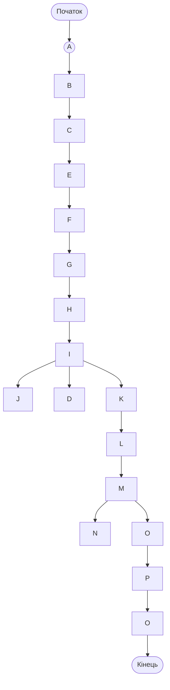
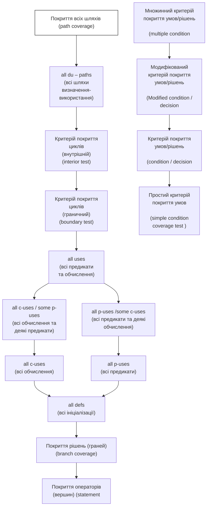
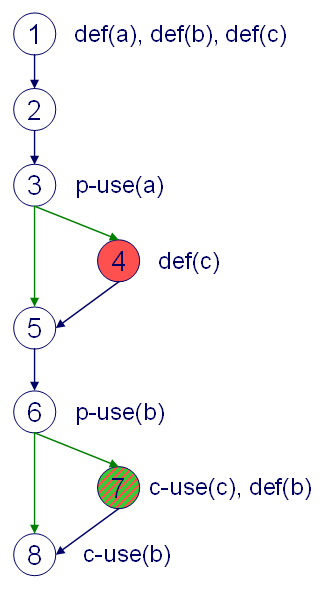
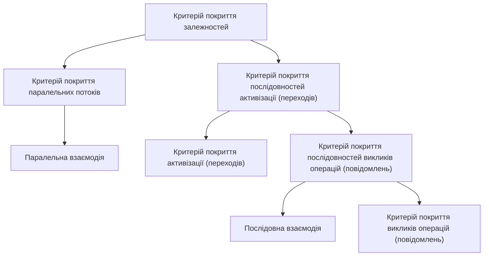
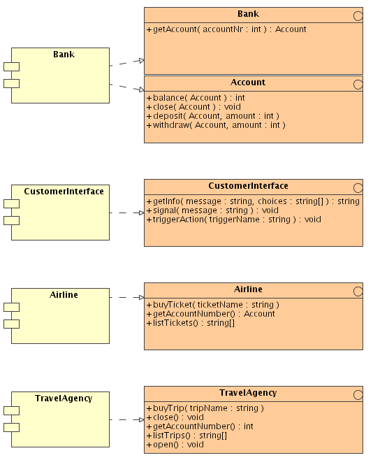
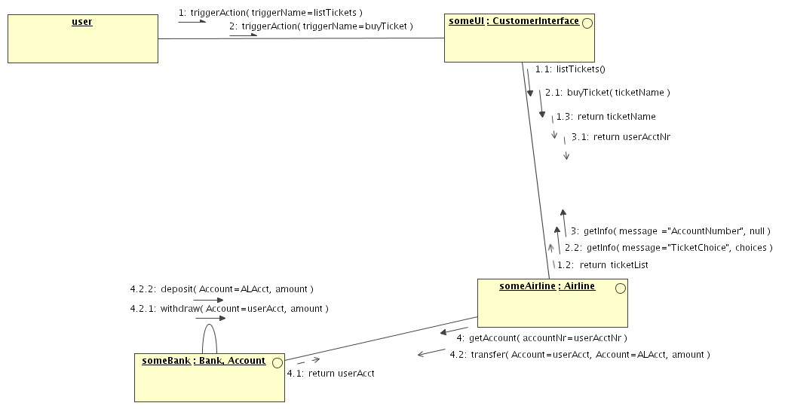
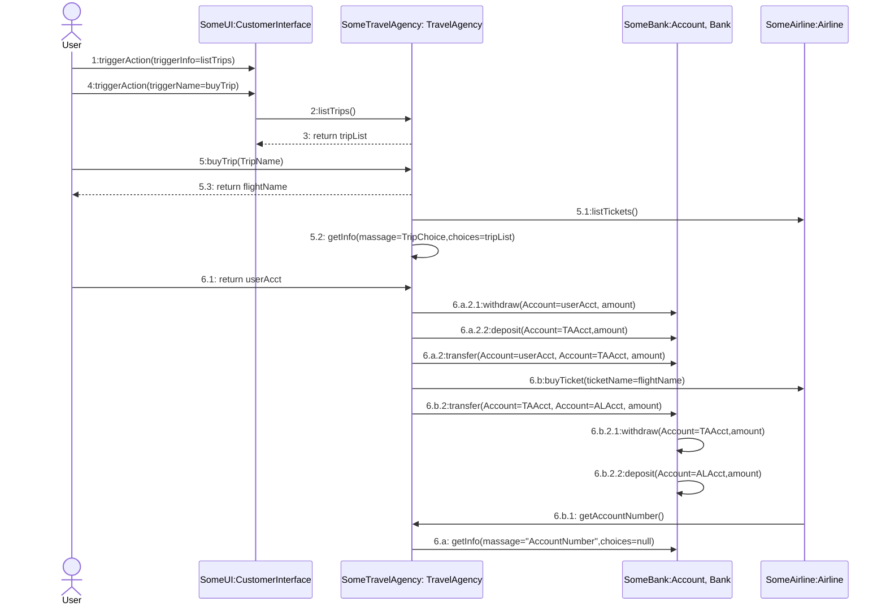

# Дідковська Тестування Критерії та методи. Методичні вказівки. Частина ІІ 2010.pdf

# Тестування: Критерії та методи. Методичні вказівки. Частина II

## Методичні вказівки

### к.т.н. М.В. Дідковська

ВСТУП........................................................................................................... 5
1. ПРОЦЕС ТЕСТУВАННЯ ПРОГРАМНОГО ЗАБЕЗПЕЧЕННЯ .................... 6
Контрольні запитання ................................................................................ 7
2. ЧОРНИЙ ЯЩИК - ФУНКЦІОНАЛЬНЕ ТЕСТУВАННЯ ............................... 8
2.1. Випадкове (стохастичне) тестування................................................... 8
2.2. Тестування за класами еквівалентності.............................................. 8
2.3. Метод аналізу граничних умов ........................................................... 10
*Приклади. Функціональне тестування* ................................................. 11
Контрольні запитання .............................................................................. 13
3. БІЛИЙ ЯЩИК - СТРУКТУРНЕ ТЕСТУВАННЯ .......................................... 14
3.1 Тестування потоків керування програми............................................ 15
*Критерій покриття операторів ($C_0$):* ................................................... 15
*Критерій покриття рішень ($C1$):*............................................................ 15
*Критерій покриття шляхів ($C\infty$):* ....................................................... 15
*Граничне тестування циклу:*................................................................... 16
*Внутрішнє тестування циклу:*................................................................ 16
*Простий критерій покриття умов:* .......................................................... 17
*Критерій покриття умов/рішень:* ........................................................... 17
*Модифікований критерій покриття умов/рішень:* ................................ 18
*Комбінаторний критерій покриття умов/рішень:* ................................. 18
*Приклади. Структурне тестування. Потік управління* ........................ 19
3.2. Тестування потоків даних програми.................................................. 26
*Критерій "all-defs"* ................................................................................. 27
*Критерій "all p-uses"* .............................................................................. 27
*Критерій "all c-uses"* .............................................................................. 28
*Критерій "all c-uses / some p-uses"* ......................................................... 28
*Критерій "all p-uses / some c-uses"* ......................................................... 29
*Критерій "all uses" (всі використання)* ................................................... 29
*Критерій "all du-paths"* ............................................................................ 29
*Приклади. Структурне тестування. Потік даних* ................................. 30
Контрольні запитання .............................................................................. 34
4. БІЛИЙ ЯЩИК - МУТАЦІЙНЕ ТЕСТУВАННЯ ............................................ 36
*Приклад. Застосування мутаційного критерію* ................................... 37

Контрольні запитання .................................................................................... 39

5. АНАЛІЗ УМОВ ЗАСТОСУВАННЯ ФУНКЦІОНАЛЬНОГО Й СТРУКТУРНОГО ТЕСТУВАННЯ ................................................................... 40

Контрольні запитання .................................................................................... 41

6. ІНТЕГРАЦІЙНЕ ТЕСТУВАННЯ КОМПОНЕНТНО-БАЗОВАНОГО ПРОГРАМНОГО ЗАБЕЗПЕЧЕННЯ ................................................................ 43

*Основні визначення* ..................................................................................... 44

6.1. Критерії й метрики інтеграційного тестування ...................................... 47

*Критерій покриття операцій інтерфейсу* ............................................. 47

*Критерій покриття викликів операцій* ................................................ 48

*Критерій покриття активізації інтерфейсу* ......................................... 50

*Метрика відповідностей викликів і активізацій* ............................... 51

*Критерії покриття послідовностей* ..................................................... 53

*Критерій покриття залежностей* ........................................................ 53

*Критерій покриття послідовностей викликів операцій* ................... 54

*Критерій покриття послідовностей активізацій* .............................. 55

*Критерій покриття паралельних потоків* ........................................... 56

6.2. Ієрархія й відповідність між критеріями інтеграційного тестування ....................................................................................................... 57

6.3. Практичне дослідження застосування критеріїв інтеграційного тестування ....................................................................................................... 59

*Застосування критерію покриття операцій інтерфейсу* ..................... 59

*Застосування критерію покриття викликів операцій* ........................ 61

*Застосування критерію покриття активізації інтерфейсу* ................. 63

*Застосування метрики відповідності повідомлень і переходів* .......... 67

*Застосування критеріїв покриття послідовностей* ........................... 69

*Застосування критерію покриття послідовностей викликів операцій* 69

*Застосування критерію покриття послідовностей активізацій* ........ 70

*Застосування критерію покриття залежностей* ................................... 71

*Застосування критерію покриття паралельних потоків* .................... 72

Контрольні запитання .................................................................................... 73

7. ОЦІНЮВАННЯ КІЛЬКОСТІ ТЕСТІВ ДЛЯ ІНТЕГРАЦІЙНОГО ТЕСТУВАННЯ .................................................................................................... 75

Контрольні запитання ................................................................................................ 78
8. ОЦІНЮВАННЯ ЧАСУ ТЕСТУВАННЯ НА РАННІХ ЕТАПАХ ЖИТТЄВОГО ЦИКЛУ ПРОГРАМНОГО ЗАБЕЗПЕЧЕННЯ ................................. 80
8.1. Створення тестів на основі UML діаграм варіантів використання........................................................................................................................ 80
*Приклад побудови тестів на основі UML діаграми варіантів використання часу.* ................................................................... *Error! Bookmark not defined.*
8.2. Оцінювання часу тестування за допомогою UML діаграм варіантів використання ................................................................ *Error! Bookmark not defined.*
*Приклад розрахунку часу тестування UML діаграми варіантів використання часу* ................................................................ *Error! Bookmark not defined.*
Контрольні запитання ................................................................................................ 91
ДОДАТОК....................................................................................................................... 92
ЛІТЕРАТУРА.................................................................................................................. 94

# ВСТУП

За останні роки технології створення програмного забезпечення (ПЗ) стали основою різних розділів комп'ютерних наук як засіб подолання складності, що притаманна сучасним програмним системам. Тому дисципліна «Технології розробки і тестування програм» входить до базових дисциплін циклу професійної та практичної підготовки як невід'ємна складова освіти студентів за спеціальностями 7.080204 «Соціальна інформатика» і 7.080404 «Інтелектуальні системи прийняття рішень».

Мета даних методичних вказівок — допомогти студентам оволодіти теоретичними знаннями та практичними навиками роботи з управлінням якістю програмного забезпечення на етапах життєвого циклу, проектування, програмування та тестування з метою створення корисних і працездатних програмних продуктів.

У методичних вказівках подано теоретичний матеріал та практичні приклади з базових тем другої частини курсу. Приклади проілюстровані лістингами коду на C/C++. В матеріалах розглядаються критерії та методи тестування програмного забезпечення на різних етапах життєвого циклу.

## 1. ПРОЦЕС ТЕСТУВАННЯ ПРОГРАМНОГО ЗАБЕЗПЕЧЕННЯ

На сьогодні тестування програмного забезпечення — один з найбільш дорогих етапів життєвого циклу програмного забезпечення, на нього відводиться від 50% до 65% загальних витрат. У царині кодування ПЗ широкого розповсюдження набули різноманітні CASE-засоби, які дозволяють прискорити процеси створення коду. На жаль, в галузі тестування відчувається нестача таких засобів і більшість зусиль витрачається на ручне тестування.

*Зазвичай, для проведення тестування застосовуються методи структурного («білий ящик») та функціонального («чорний ящик») тестування [1]. Розглянемо їх докладніше.*

При функціональному тестуванні вихідний код програми не доступний. Суть полягає в перевірці відповідності поведінки програми її зовнішній специфікації. Критерієм повноти тестування вважається перебір всіх можливих значень вхідних даних, що здійснити на практиці надзвичайно важко.

При структурному тестуванні текст програми відкритий для аналізу. Суть даного методу полягає в перевірці внутрішньої логіки ПЗ. Повним тестуванням у цьому випадку буде таке, що приведе до перебору всіх можливих шляхів на графі передач керування програми. Число таких шляхів може досягати десятків тисяч. Крім того, виникає питання про створення тестів, що забезпечують дане покриття. Здійснити повне всеохоплююче тестування навіть простої програми вкрай важко, а часом і неможливо в силу обмеженості часу й ресурсів. Отже, необхідно мати певні критерії за якими мають обиратися контрольні приклади та критерії зупинки процесу тестування.

Розглянемо більшкладно функціональне тестування.

**Контрольні запитання**

1. Чому тестування є важливим етапом життєвого циклу ПЗ? Обґрунтуйте.
2. Який відсоток бюджету проекту виділяється на тестування?
3. Чим відрізняється функціональне та структурне тестування?


<!-- ВІДНОВЛЕНО ЛОКАЛЬНО (Стор. 8) -->
# **2. ЧОРНИЙ ЯЩИК - ФУНКЦІОНАЛЬНЕ ТЕСТУВАННЯ** 

Завданням функціонального тестування є перевірка відповідності програми своїм специфікаціям. При даному підході текст програми не доступний, і програма розглядається як «чорний ящик». 

Найпоширенішими видами функціонального тестування є методи випадкового тестування, еквівалентної розбивки й аналізу граничних умов [1,2]. 

# **2.1. Випадкове (стохастичне) тестування** 

Відповідно до даного методу створюється необхідна кількість незалежних тестів, у яких вхідні дані генеруються випадковим чином. Недоліком даного методу є загальна кількість тестів, які необхідно згенерувати відповідно до вимог надійності, до того ж забезпечивши незалежність цих тестів. Так, наприклад, для забезпечення надійності програмного забезпечення з імовірністю відмови не більше 10<sup>-5</sup> і з помилкою не більше 5%, потрібно згенерувати 299 572 тестів. 

З метою скорочення кількості необхідних тестів Майєрсом було запропоновано розглядати розбиття безлічі вихідних даних на еквівалентні класи [1]. 

# **2.2. Тестування за класами еквівалентності** 

Відповідно до даної методики необхідно розбити множину значень вхідних даних на кінцеве число підмножин (які будуть називатися класами еквівалентності), щоб кожний тест, що є представником певного класу, був еквівалентним будь-якому іншому тесту цього класу. Два тести є еквівалентними, якщо вони виявляють ті самі помилки. 

8
<!-- КІНЕЦЬ ВІДНОВЛЕННЯ -->


<!-- ВІДНОВЛЕНО ЛОКАЛЬНО (Стор. 9) -->
Проектування тестів за методом класів еквівалентності проводиться у два етапи: 

- виділення за специфікацією класів еквівалентності; 

- побудова множини тестів. 

На першому етапі відбувається вибір зі специфікації кожної вхідної умови та розбиття її на дві або більше групи, що відповідають так званим ―правильним‖ класам еквівалентності (ПКЕ) та ―неправильним‖ класам еквівалентності (НКЕ), тобто множинам допустимих для програми й недопустимих значень вхідних даних. Цей процес залежить від вигляду вхідної умови. 

Наприклад: якщо вхідна умова описує множину (|х|<=0.5), то визначається один ПКЕ (-0.5<=х <=0.5) і два НКЕ (х< -0.5; х>0.5). 

На другому етапі методу класів еквівалентності виділені класи використовуються для побудови тестів. Для НКЕ тести проектуються таким чином, що кожен тест покриває один і тільки один НКЕ, доки всі НКЕ не будуть покриті. 

Метод класів еквівалентності дозволяє значно скоротити кількість тестів у порівнянні з методом випадкового тестування, але також має свої недоліки. Основний з них - це складність виділення класів еквівалентності, особливо НКЕ, а також можливий пропуск певних типів високоефективних тестів (тобто тестів, що характеризуються великою ймовірністю виявлення помилок). Так, наприклад, мінімальні й максимальні припустимі значення вхідних параметрів дозволяють виявити більшість помилок, пов'язаних з відповідностями й переповненнями типів даних. Для вирішення даної проблеми був запропонований метод аналізу граничних умов [1]. 

9
<!-- КІНЕЦЬ ВІДНОВЛЕННЯ -->


## 2.3. Метод аналізу граничних умов

Під граничними умовами розуміють ситуації, що виникають безпосередньо на границі певної вхідної або вихідної умови, вище або нижче її. Метод аналізу граничних умов відрізняється від методу класів еквівалентності наступним:

- вибір будь-якого представника класу еквівалентності здійснюється таким чином, щоб перевірити тестом кожну границю цього класу;
- при побудові тестів розглядаються не тільки вхідні умови, але й вихідні (тобто певні специфіковані обмеження на значення вхідних даних).

Загальні правила методу аналізу граничних умов:
побудувати тести для границь множини допустимих значень вхідних даних і тести з недопустимими значеннями, що відповідають незначному виходу за межі цієї множини.

*Наприклад, для множини [-1.0; 1.0] будуються тести -1.0; 1.0; -1.001; 1.001;*

Зауважимо, що на практиці з метою локалізації несправностей створюють також тести, що відповідають допустимим значенням, тобто є внутрішніми для множини та ті, що незначно відхиляються від граничних значень: *-1.0; 1.0; -1.001; 1.001; 0.999; - 0.999*

Якщо множина допустимих значень вхідних даних дискретна, то будуються тести для мінімального й максимального значення вхідних умов і тести для значень, більших або менших цих величин.

*Наприклад, якщо вхідний файл може містити від 1 до 255 записів, то вибираються тести для порожнього файлу та файлу, що містить 1, 254, 255 і 256 записів.*

1) використовувати перше правило для кожної вихідної умови;


<!-- ВІДНОВЛЕНО ЛОКАЛЬНО (Стор. 11) -->
- 2) якщо вхідні й вихідні дані програми являють собою впорядковану множину (послідовний файл, лінійний список та ін.), то при тестуванні зосередити увагу на першому й останньому елементі множини; 

- 3) повторити процедуру для всіх знайдених граничних умов. 

Аналіз граничних умов - один з найбільш корисних методів проектування тестів. Але він часто виявляється неефективним через те, що граничні умови іноді ледь вловимі, а їхнє виявлення досить важко. 

Розглянемо ряд прикладів застосування функціонального 

тестування: 

# **Приклади. Функціональне тестування** 

**_Приклад 1_** Специфікація: 

Програма призначена для додавання двох цілих чисел. Кожен з доданків – не більш, ніж двозначне ціле число. Програма запитує у користувача два числа, після чого виводить результат. 

**Виділимо класи еквівалентності** 

||Класи коректних даних|Класи некоректних<br>даних|Граничні й спеціальні<br>значення|
|---|---|---|---|
|Перший<br>доданок|від -99 до -10<br>від -9 до -1<br>0<br>від 1 до 9<br>від10до 99|> 99<br>< -99<br>1.5<br>‗Q‘|0, 1, -1, 9, -9<br>10, -10<br>99, -99<br>100, -100|
|Другий<br>доданок|-‖-‖-|-‖-‖-|-‖-‖-|


11
<!-- КІНЕЦЬ ВІДНОВЛЕННЯ -->


<!-- ВІДНОВЛЕНО ЛОКАЛЬНО (Стор. 12) -->
|Сума|від -198 до -100<br>від -99 до -1<br>0<br>від 1 до 99<br>Від100до 198|> 198<br>< -198<br>‗некоректні дані'|(-99, -99)<br>(-49, -51)<br>(99, -99)<br>(49, 51)|
|---|---|---|---|


# **_Приклад 2_** 

Специфікація: 

Програма читає з консолі три цілих числа й визначає тип трикутника, що має такі сторони: рівносторонній, рівнобедрений або різнобічний [2]. 

Тести у форматі: мета, набір вхідних даних 

   1. Коректний різнобічний трикутник {5,6,7}. 

   2. Коректний рівносторонній трикутник {15,15,15}. 

   3. Три коректних рівнобедрених трикутники (a=b, b=c, a=c) {3,3,4; 

- 5,6,6; 7,8,7}. 

   4. Одна, дві або три сторони дорівнюють нулю (7 тестів) {0,1,1; 

- 2,0,2; 3,2,0; 0,0,9; 0,8,0; 11,0,0; 0,0,0}. 

   5. Одна сторона від‘ємна {3,4,-6}, {3, -6, 4}, {-6, 3,4}. 

6. «Майже» виконується правило трикутника (три варіанти a+b=c, 

a+c=b, b+c=a) {1,2,3; 2,5,3; 7,4,3}. 

7. Не виконується правило трикутника (три варіанти a+b<c, 

a+c<b, b+c<a) {1,2,4; 2,6,2; 8,4,2}. 

   8. Неціле число або не число {Q,2,3} {2,Q,3} {2,3,Q}. 

   9. Неправильна кількість аргументів {2,4; 4,5,5,6}. 

10. Переповнення при перевірці правила трикутника {16384, 

16384, 16384}. 

# **_Приклад 3_** 

Специфікація 

12
<!-- КІНЕЦЬ ВІДНОВЛЕННЯ -->


Нехай у нас є програмне забезпечення, що допомагає знайти корені квадратного рівняння $ax^2+bx+c=0$, за умови, що $a, b, c$ - цілі.

Розглянемо приклади тестів із зазначенням мети кожного з них

| N | A | B | C | Мета |
| :---: | :---: | :---: | :---: | :--- |
| 1 | 0 | 0 | 0 | X – довільне |
| 2 | 0 | 0 | 10 | Рішення – порожня множина |
| 3 | 0 | 5 | 17 | Можливо ділення на 0 |
| 4 | 6 | 1 | -2 | Нормальний результат |
| 5 | 3 | 7 | 0 | Один з коренів – 0. |
| 6 | 3 | 2 | 5 | Є комплексні корені , нема дійсних |
| 7 | 7 | 0 | 0 | Перевірка на корінь з 0 |
| 8 | 1 | 2 | 1 | Має один корінь |
| 9 | a | b | c | Некоректні вхідні дані |
| 10 | 3.1 | 2 | 5 | Некоректні вхідні дані |
| 11 | 32,767 | 32,767 | -32,768 | Можливе переповнення |

Таким чином, для здійснення функціонального тестування необхідно виділити правильні та неправильні класи еквівалентності й визначити граничні значення.

## Контрольні запитання

1. Що таке функціональне тестування?
2. Які переваги та недоліки має стохастичне тестування?


<!-- ВІДНОВЛЕНО ЛОКАЛЬНО (Стор. 14) -->
3. В чому полягає тестування за класами еквівалентності? 

4. Виділить класи еквівалентності для вхідної множини, що описується умовою: 

   - a. |х|> 9,5; 

   - b. Повідомлення має містити до 1000 символів; 

   - c. Вхідні дані – адреса електронної пошти. 

5. Застосуйте метод граничних умов при побудові тестів для вхідних даних, які описуються  наступною умовою: 

   - a. х≥-5; 

   - b. Користувач має право завантажити до 10  графічних зображень  розміром до 100кБ; 

   - c. Файл містить до 15 записів. 

# **3. БІЛИЙ ЯЩИК - СТРУКТУРНЕ ТЕСТУВАННЯ** 

Структурне тестування, або тестування «білого ящика», - це методика аналізу вихідного коду програми. Існує три різновиди структурного тестування: тестування на основі потоку керування програми, на основі потоку даних та мутаційне тестування. 

При використанні першого типу тестується логіка програми, що представлена у вигляді графа керування: вершинами є оператори, а гілками - переходи між ними. 

При тестування на основі потоку даних увага приділяється взаємозв'язкам між змінними. Виділяються вершини, у яких змінна ініціалізується та в яких використовується, і вивчаються переходи й взаємозв'язки між такими вершинами. 

14
<!-- КІНЕЦЬ ВІДНОВЛЕННЯ -->


Мутаційне тестування полягає у внесенні несправностей у вихідний код програми та порівняння роботи вихідної програми та програми мутанта.

Оскільки здійснити вичерпне структурне тестування вкрай важко, необхідно вибрати такі критерії його повноти, які допускали б їхню просту перевірку й полегшували б цілеспрямований підбір тестів. Зупинимося на цьому докладніше.

## 3.1 Тестування потоків керування програми

Для тестування на основі потоку керування існує ряд критеріїв: покриття операторів, покриття рішень, шляхів, циклів, умов і т.д.[2] Найпростішим є критерій покриття операторів.

### Критерій покриття операторів ($C_0$):

*кожен оператор програми повинен буди виконаний (покритий) хоча б один раз.*

Цей критерій є найбільш слабким з використовуваних у структурному тестуванні, тому що проходження всіх операторів не гарантує перевірку правильності послідовності попарних переходів між ними.

### Критерій покриття рішень($C_1$):

*кожна гілка алгоритму (кожний перехід між вершинами) має бути пройдена (виконана) хоча б один раз.*

Виконання даного критерію, у загальному випадку, забезпечує й покриття операторів, проте критерій C1 не є ідеальним. Так, наприклад, він не забезпечує перевірку правильності обробки операторів логічних переходів та циклів.

### Критерій покриття шляхів ($C_\infty$):


<!-- ВІДНОВЛЕНО ЛОКАЛЬНО (Стор. 16) -->
**_кожен шлях в алгоритмі, де шлях – це послідовність вершин (nstart, n1,..., nm, nfinal) має бути протестований хоча б один раз. Два шляхи вважаються ідентичними, якщо послідовності вершин ідентичні._** 

Це найбільш повний критерій, проте його реалізація ускладнена через величезну кількість необхідних тестів. Так, наприклад, проблемою є тестування циклічних структур, в силу необхідності їх багаторазового повторення. Для спрощення даної процедури було запропоновано два наступних критерії: 

# **Граничне тестування циклу:** 

**_відповідно до даного критерію має бути виконаний вхід у кожний цикл (проте виконання ітерацій не вимагається)._** 

# **Внутрішнє тестування циклу:** 

**_відповідно до даного критерію має бути виконаний вхід у кожний цикл і як мінімум одна ітерація._** 

Вочевидь, що виконання другого критерію забезпечує виконання критерію граничного тестування циклів, але разом з тим, вимагає більшої кількості тестів. 

Вище було зазначено, що часто виникають проблеми з тестуванням логічних конструкцій розгалуження. Для цього були запропоновані критерії покриття умов. Використання даних критеріїв може дати підбір тестів, що забезпечують перехід у програмі, що пропускається при використанні критерію C1. 

_Наприклад, при використанні критерію покриття переходів при тестуванні фрагмента:_ 

_if(x&&y)_ 

16
<!-- КІНЕЦЬ ВІДНОВЛЕННЯ -->


<!-- ВІДНОВЛЕНО ЛОКАЛЬНО (Стор. 17) -->
_function1();_ 

_else function2();_ 

_для переходу на гілку else досить, щоб виконалася тільки умова not(x), що не гарантує перевірку працездатності оператора умови в цілому, тобто того, що при not(y) теж буде здійснений перехід на гілку else._ 

Існують наступні критерії покриття умов і умов/рішень: 

# **Простий критерій покриття умов:** 

**_кожна з атомарних умов повинна бути протестована на свої правильні та помилкові значення хоча б один раз._** 

Даний критерій, забезпечує тільки перевірку того факту, чи можливо прийняття атомарними умовами правильних та помилкових умов, але не забезпечує перевірку правильності подальшого логічного переходу. 

Критерій покриття умов може не гарантувати покриття всіх переходів. 

_Розглянемо ту ж конструкцію:_ 

_if(x&&y)_ 

_function1();_ 

_else function2();_ 

_критерій покриття умов вимагає двох тестів (наприклад, x=TRUE, y=FALSE і x=FALSE, y=TRUE), при яких може не виконуватися оператор, розташований в then-гілці оператора if. Таким чином, даний критерій треба поєднувати із критеріями покриття рішень._ 

# **Критерій покриття умов/рішень:** 

17
<!-- КІНЕЦЬ ВІДНОВЛЕННЯ -->


<!-- ВІДНОВЛЕНО ЛОКАЛЬНО (Стор. 18) -->
**_крім вимог, представлених в попередньому пункті додається умова - кожна гілка алгоритму (кожний перехід) повинна бути пройдена (виконана) хоча б один раз._** 

На практиці найчастіше виникає ситуація, при якій правильність функціонування атомарних умов не гарантує істинності загального виразу умови. З метою забезпечення цієї умови був уведений наступний критерій. 

# **Модифікований критерій покриття умов/рішень:** 

**_кожна атомарна умова, що має вплив на істинність загального виразу-умови, має бути протестована, при цьому тести повинні бути незалежні від інших часткових умов._** 

Повна перевірка правильності функціонування операторів умови може бути здійснена лише шляхом перебору всіх варіантів комбінацій атомарних умов, що входять у загальний предикатний вираз, що знайшло відображення у наступному критерії. 

# **Комбінаторний критерій покриття умов/рішень:** 

**_всі комбінації істинних значень кожного з атомарних предикатів, що входять в умову, мають бути протестовані._** 

Це найбільш ресурсомісткий критерій покриття умов. 

Всі перераховані вище критерії були представлені у вигляді ієрархічної структури, зображеної на рис. 1. 

Проаналізуємо наведену структуру. Із критеріїв покриття умов/рішень найбільш сильним є комбінаторний критерій покриття, виконання якого забезпечує виконання модифікованого критерію. Останній, у свою чергу, забезпечує виконання критерію покриття умов/рішень. Що стосується простого критерію покриття умов, то, 

18
<!-- КІНЕЦЬ ВІДНОВЛЕННЯ -->


<!-- ВІДНОВЛЕНО ЛОКАЛЬНО (Стор. 19) -->
виходячи з його визначення, він є складовою частиною критерію покриття умов-рішень. 

Виконання шляхів повне критерію покриття забезпечує тестування циклічних структур, а, відповідно, і виконання як внутрішнього, так і граничного критерію тестування циклів. Зауважимо, що ці два критерії створені лише для циклів і навіть не забезпечують покриття всіх операторів, тобто вони повинні використовуватися тільки в сукупності з іншими. 


<!-- Start of picture text -->
Критерій покриття шляхів  Комбінаторний критерій<br>покриття умов/рішень<br>Критерій покриття<br>Модифікований критерій<br>циклів<br>покриття умов/рішень<br>(внутрішний)<br>Критерій покриття<br>циклів<br>Критерій покриття<br> (граничний)<br>умов/рішень<br>Критерій покриття рішень<br>Простий критерій<br>покриття умов<br>Критерій покриття операторів<br><!-- End of picture text -->

Рисунок 1. Взаємозв'язок між критеріями покриття потоків керування програми. 

Критерій покриття рішень забезпечує покриття всіх операторів. В свою чергу покриття всіх переходів (рішень) також може бути досягнуте шляхом виконання більш повних критеріїв - критерію покриття рішень/умов і критерію покриття шляхів. 

Розглянемо практичне застосування критеріїв структурного тестування. 

# **Приклади. Структурне тестування. Потік управління** 

19
<!-- КІНЕЦЬ ВІДНОВЛЕННЯ -->


<!-- ВІДНОВЛЕНО ЛОКАЛЬНО (Стор. 20) -->
Проілюструємо роботу тестів, заснованих на структурному тестуванні на базі потоку управління, на реальному програмному коді. Для тестування була обрана частина програми, що завантажує .bmp файл на екран. Лістинг програми наведено у Додатку до даних методичних вказівок. 

Перед початком аналізу програмного коду й складання тестів, побудуємо блок-схему даної програми (Рис. 2) , а на її основі – граф управління. 

Протестуємо програму, використовуючи критерії структурного тестування на основі потоку управління. 

Першим розглянемо критерій покриття всіх вершин графа управління (покриття всіх операторів). 

Для покриття всіх операторів даної програми необхідно здійснити 2 тести. 

**Тест №1** . Нехай змінна **path** не вказує шлях реально існуючого файлу, тоді тестована програма дійде до перевірки на існування файлу, виведе попередження й завершить роботу. При цьому значення інших змінних не впливають на покриття операторів, таким чином на графі управління буде пройдений шлях ([Початок]->[A] ->[B]->[D] -> [Кінець]), тобто будуть покриті вершини A, B, D. 

**Тест №2.** Для того, щоб показати покриття операторів, що залишилися, досить, щоб виконувалися наступні умови: 

- змінна **Path** вказує шлях реально існуючого файлу; 

- при цьому завантажується картинка, що має наступний формат: 

   - i. Sagolovok.biWidth=2 (ширина зображення 2 пікселя); 

20
<!-- КІНЕЦЬ ВІДНОВЛЕННЯ -->


ii. Sagolovok.biHeight=1 (висота зображення 1 піксель).

```mermaid
graph TD
    Start([Початок]) --> A
    A --> B{if ((BMP=fopen("path","rt"))==NULL)}
    B -- Так --> D[printf("Error. No file."); return 1;]
    B -- Ні --> C[fread(&Sagolovok,54,1,BMP); nb=(Sagolovok.biWidth /8)*4]
    C --> E{if ((Sagolovok.biWidth % 8) != 0)}
    E -- Так --> F[nb=nb+4;]
    E -- Ні --> G
    F --> G[fseek(BMP,Sagolovok.bfOffBits,SEEK_SET); y=y0+Sagolovok.biHeight]
    G --> H{v>=v0+1}
    H -- Ні --> J[y--;]
    J --> H
    H -- Так --> I[x=x0; j=1]
    I --> K{i<=nb}
    K -- Ні --> Q[j++]
    Q --> H
    K -- Так --> L[b=fgetc(BMP);]
    L --> M{x-x0<Sagolovok.biWidth}
    M -- Так --> N[putpixel(x,y,Color[b>>4]); x++;]
    N --> O{x-x0<Sagolovok.biWidth}
    O -- Так --> P[putpixel(x,y,Color[b & 15]); x++;]
    O -- Ні --> K
    M -- Ні --> K
    P --> K
    
    %% Порядок обходу для відповідності логіці циклів
    subgraph Цикли
        direction TB
        K -->|i<=nb| L
        L --> M
        M -->|Так| N
        N --> O
        O -->|Так| P
        P --> K
    end
```

Рисунок 2. Блок-схема програми.



Рисунок 3. Граф управління програми.


<!-- ВІДНОВЛЕНО ЛОКАЛЬНО (Стор. 24) -->
За таких початкових умов буде пройдений шлях ([Початок]->[A] - >[B]->[C] ->[E]->[F] ->[G] ->[H] -> [I]->[K]->[L]->[M]->[N]->[O]->[P]>[Q]->[K]-> [L] -> [M] -> [O] -> [Q]->[K] ->[L]->[M]->[O] -> [Q] ->[K] -> [L] -> [M] -> [O] -> [Q]->[K]->[J]->[H]->[Кінець]), тобто будуть покриті всі вершини, що залишилися. 

При виконанні цих тестових наборів помилок не було виявлено. Критерій С0 для даної програми виконується. 

Перейдемо до побудови тестів на основі наступного критерію - покриття всіх рішень С1, тобто ребер графа управління. 

**Тест№3** . Після проходження першого тесту залишилося не покритими лише одне ребро ([E]->[G]) графа, для проходження цього тесту необхідно додати до тестів 1 і 2 ще один тест: 

- **Path** вказує шлях реально існуючого файлу; 

- Sagolovok.biWidth=8 (ширина зображення 8 пікселів); 

- - Sagolovok.biHeight=1 (висота зображення 1 піксель). 

За таких початкових умов буде пройдений шлях ([Початок]->[A]>[B]->[C]->[E]->[G]->[H]->[I]->[K]->[L]->[M]->[N]->[O]->[P]->[Q]>[K]->[L]->[M]->[O]->[Q]->[K]->[L]->[M]->[O]->[Q]->[K]->[L] -> [M] -> [O] ->[Q]->[L] -> [M] -> [O] -> [Q] ->[K]->[L] -> [M] -> [O] ->[Q]>[K]->[L]->[M]->[O]->[Q]->[K]->[L]->[M]->[O] -> [Q] ->[K] -> [J]>[H]->[Кінець]). 

Виходячи з вищенаведеного, можна зробити висновок, що проходження тестів 1, 2, 3 забезпечує виконання критерію С1. 

Розглянемо третій критерій - покриття всіх шляхів ( **_С_**  ). 

24
<!-- КІНЕЦЬ ВІДНОВЛЕННЯ -->


<!-- ВІДНОВЛЕНО ЛОКАЛЬНО (Стор. 25) -->
Проаналізувавши граф потоку управління можна побачити, що неможливо подати такі вхідні дані, які забезпечували б прохід по шляху ([Початок]->[A]->[B]->[C]->[E]->[F]->[G]->[H]->[I]->[K]->([J]>[H]->[I]->([K])->[L]->[M]->[O]->[P]->[Q])->[K]->[J]->[H]->[Кінець]). Більше того, оскільки в даному шляху є цикли (вони позначені дужками), виходить, що пред'явлено не один недосяжний шлях, а множина таких шляхів. 

Проаналізуємо ділянку програмного коду, що унеможливлює проходження по знайденому шляху: 


Якщо не виконується перший if, то другий також не виконається, тому що перевіряються однакові умови. Це підтверджує неможливість знаходження початкових умов, які б забезпечили проходження даного шляху. 

25
<!-- КІНЕЦЬ ВІДНОВЛЕННЯ -->


<!-- ВІДНОВЛЕНО ЛОКАЛЬНО (Стор. 26) -->
Таким чином, виходячи з критерію **_С_**  , тестована програма містить помилку. Знайдений дефект не впливає на відповідність специфікації програми, тобто не буде виявлений методами функціонального тестування, але він впливає на швидкість виконання даної програми, тому що в деяких випадках, можливе виконання до трьох зайвих циклів («холостий хід» програми). 

Іншою можливістю подання внутрішньої логіки програми є граф потоку даних [3]. Розглянемо тестування на його основі й границі застосування більш докладно. 

# **3.2. Тестування потоків даних програми** 

Група критеріїв для даного методу побудована на принципах досяжності й доступу до змінних. 

Будемо вважати, що вираз _y:=f(x1,..., xn_ ) використовує змінні _x1,...,xn_ для обчислювального процесу _(Computational use)_ , що позначається як **c-use** , при цьому даний вираз є визначення змінної _у (def у)_ . 

Будемо вважати, що вираз _p(x1,…,xn)_ використовує змінні _x1,...,xn_ як предикати<sup>_(Predicate-use)_, що позначається як</sup><sup>**_p-use_**.</sup> 

Шлях _p=(nin,...,nm)_ вважається таким, що не містить визначень змінної _x_ , якщо в ньому немає _def x._ 

Для вершини _ni_ та змінної _x_ , такої що _x_  _def(ni)_ вираз **_dcu(x,ni)_** позначає набір всіх вершин _nj_ таких, що _x_  _c-use(nj)_ і шлях від _ni_ до _nj_ не містить визначень _х_ . 

26
<!-- КІНЕЦЬ ВІДНОВЛЕННЯ -->


Для вершини $n_i$ та змінної $x$, такої що $x \in def(n_i)$ вираз $\mathbf{dpu(x, n_i)}$ позначає набір всіх ребер $(n_j, n_k)$, таких що $x \in p\text{-}use(n_j, n_k)$ і шлях від $\text{n}_j$ до $\text{n}_k$ не містить визначень $x$.

Позначимо як $\mathbf{du}\text{-}\mathbf{шлях}$ (шлях визначення-використання):
- шлях $p = (n_{i+1}, ...\ n_j,\ n_k)$, що містить глобальне визначення змінної $x$ у вершині $n_i$, і такий, що $p$ не містить визначень змінної $x$, але містить $\mathbf{c}\text{-}\mathbf{use}(x)$, і всі вершини $n_i...\ n_k$ (крім $n_i\ і\ n_k$) попарно відмінні
- або шлях $p(n_j,\ n_k)$, що не містить визначень змінної $x$, але містить предикатне використання $x$ ($p\text{-}use(x)$) і всі вершини $n_i...\ n_k$ попарно відмінні.

Розглянемо критерії тестування потоків даних програми .

### **Критерій "all-defs"**

Даний критерій вимагає створення набору тестів, які б містили для кожної вершини $n_i$ і кожної змінної $x \in def(n_i)$ як мінімум один шлях, що не містить визначень $x$ від $\text{n}_i$ до елемента з $\mathbf{dcu(x, n_i)}$ або $\mathbf{dpu(x, n_i)}$. Критерій забезпечує перевірку правильної ініціалізації змінних, але не дає гарантій їхнього правильного використання в обчислювальному процесі. Це завдання ставиться поетапно перед наступними критеріями.

### **Критерій "all p-uses"**

За даним критерієм вимагається створення набору тестів, які б містили для кожної вершини ni і кожної змінної $x \in def(n_i)$ як мінімум один шлях, що не містить визначень $x$ від пі до всіх елементів з $\mathbf{dpu(x, n_i)}$.

## Критерій “all c-uses“

Даний критерій вимагає створення набору тестів, які б містили для кожної вершини $n_i$ і кожної змінної $x \in \text{def}(n_i)$ як мінімум один шлях, що не містить визначень $x$ від $n_i$ до елемента з $\text{dcu}(x, n_i)$



Рисунок 4. Взаємозв'язок між критеріями структурного тестування.

Ці два критерії гарантують перевірку того факту, що використовувані змінні в предикатних виразах та в обчисленнях були проініціалізовані.

## Критерій “all c-uses / some p-uses“


<!-- ВІДНОВЛЕНО ЛОКАЛЬНО (Стор. 29) -->
Наступне завдання полягає у відповіді на питання: чи використані всі ініціалізовані змінні в обчисленнях або хоча б у предикатних виразах. Критерій ―all c-uses / some p-uses― вимагає створення набору тестів, які б містили для кожної вершини ni і кожної змінної x  def(ni) як мінімум один шлях, що не містить визначень х від ni до всіх елементів з dcu(x, ni), або, якщо dcu(x, ni) - порожня множина, хоча б шлях, що не містить визначень х від ni до елемента з dpu(x, ni). 

# **Критерій “all p-uses / some c-uses“** 

Даний критерій аналогічний попередньому, з тією різницею, що в ньому перевіряються входження шуканої змінної в предикатні вирази, а якщо таких не виявлено, то в обчислення. 

Даний критерій вимагає створення набору тестів, які б містили для кожної вершини ni і кожної змінної x  def(ni) як мінімум один шлях, що не містить визначень х від ni до всіх елементів з dpu(x, ni), або, якщо dpu(x, ni) - порожня множина, хоча б шлях, що не містить визначень х від ni до елемента з dcu(x, ni). 

# **Критерій “all uses“ (всі використання)** 

Даний критерій є узагальнюючим для останніх двох критеріїв. Він вимагає створення набору тестів, які б містили для кожної вершини ni і кожної змінної x  def(ni) як мінімум один шлях, що не містить визначень х від ni до всіх елементів з dpu(x, ni) і до всіх елементів з dсu(x, ni). 

# **Критерій “all du-paths”** 

Найбільшу повноту покриття забезпечує критерій ―all du-paths‖, він враховує всі можливі використання зазначеної змінної. Даний критерій вимагає створення набору тестів, які б містили для кожної 

29
<!-- КІНЕЦЬ ВІДНОВЛЕННЯ -->


<!-- ВІДНОВЛЕНО ЛОКАЛЬНО (Стор. 30) -->
вершини ni і кожний змінної x  def(ni) всі du-шляхи даного визначення. 

Всі критерії структурного тестування узагальнені й представлені у вигляді ієрархічної структури, зображеної на рис. 4. Дана структура дозволяє виявити існуючі взаємозв'язки між критеріями. 

Взаємозв'язки між критеріями, які ґрунтуються на потоці керування програми, були вже проаналізовані вище, а критерії потоків даних, як видно з рис. 4, позв'язані в такий спосіб: найширшим є критерій ―all du-paths‖, його виконання забезпечує виконання критерію ―all uses―, який, в свою чергу, є об'єднанням критеріїв ―all p- uses / some c-uses― і ―all c-uses / some p-uses―. Кожний з останніх двох забезпечує виконання критерію ― all-defs‖. При цьому, виходячи з визначення, ―all p-uses / some c-uses― гарантує ―all p-uses―, а ―all c-uses / some p-uses― гарантує ―all c-uses―. 

Вочевидь, що покриття всіх шляхів, забезпечить виконання критерію ―all du-paths―, а критерій all p-uses перевірить проходження всіх переходів (всіх рішень). Таким чином, схема буде мати вигляд, представлений на Рис 4. 

# **Приклади. Структурне тестування. Потік даних** 

**_Приклад 1_** 

Проілюструємо побудову графу потоку даних. Розглянемо функцію: 

// функція знаходження мінімального та максимального числа з двох наданих 

void MinMax (int& Min, int& Max) { 

int Hilf; 

30
<!-- КІНЕЦЬ ВІДНОВЛЕННЯ -->


```cpp
    if (Min > Max) {
        Hilf = Max;
        Max = Min;
        Min = Hilf;
    }
}
```

Граф управління матиме вигляд, наведений на Рис. 5. Для кожного вузла зазначена відповідність із типовими структурами потоку даних (визначення, предикатні використання, використання в обчислювальному процесі)


Рисунок 5. Граф потоку управління із відповідним потоком даних.

Розглянемо відповідності між вершинами потоку управління та потоку даних, що представлені в наступній таблиці:

| вершина $\mathrm{n}_i$ | $\operatorname{def}(\mathrm{n}_i)$ | $\text{c-use}(\mathrm{n}_i)$ |
| :---: | :---: | :---: |
| $\mathrm{n}_{\text{in}}$ | $\{\mathrm{Min}, \mathrm{Max}\}$ | $\{\quad\}$ |
| $\mathrm{n}1$ | $\{\quad\}$ | $\{\quad\}$ |
| $\mathrm{n}2$ | $\{\mathrm{Min}, \mathrm{Max}\}$ | $\{\mathrm{Min}, \mathrm{Max}\}$ |
| $\mathrm{n}_{\text{out}}$ | $\{\quad\}$ | $\{\mathrm{Min}, \mathrm{Max}\}$ |

Як було зазначене вище, предикатне використання відповідає ребрам графу:

| Ребро $\mathrm{n}_i$ | $\text{p-use}(\mathrm{n}_i, \mathrm{n}_j)$ |
| :---: | :---: |
| $(\mathrm{n}_1, \mathrm{n}_2)$ | $\{\mathrm{Min}, \mathrm{Max}\}$ |
| $(\mathrm{n}_1, \mathrm{n}_{\text{out}})$ | $\{\mathrm{Min}, \mathrm{Max}\}$ |

Побудуємо шляхи визначення-використання (предикатне та в обчислювальному процесі):

| змінна x | вершина $(\mathrm{n}_i)$ | $\operatorname{dcu}(\mathrm{x}, \mathrm{n}_i)$ | $\operatorname{dpu}(\mathrm{x}, \mathrm{n}_i)$ |
| :---: | :---: | :---: | :---: |
| $\mathrm{Min}$ | $\mathrm{n}_{\text{in}}$ | $\{\mathrm{n}_2, \mathrm{n}_{\text{out}}\}$ | $\{(\mathrm{n}_1, \mathrm{n}_2), (\mathrm{n}_1, \mathrm{n}_{\text{out}})\}$ |
| $\mathrm{Min}$ | $\mathrm{n}_2$ | $\{\mathrm{n}_{\text{out}}\}$ | $\{\quad\}$ |
| $\mathrm{Max}$ | $\mathrm{n}_{\text{in}}$ | $\{\mathrm{n}_2, \mathrm{n}_{\text{out}}\}$ | $\{(\mathrm{n}_1, \mathrm{n}_2), (\mathrm{n}_1, \mathrm{n}_{\text{out}})\}$ |
| $\mathrm{Max}$ | $\mathrm{n}_2$ | $\{\mathrm{n}_{\text{out}}\}$ | $\{\quad\}$ |

Отже, були отримані всі необхідні дані для проведення структурного тестування на основі потоку даних.

***Приклад 2.***


<!-- ВІДНОВЛЕНО ЛОКАЛЬНО (Стор. 33) -->
Проілюструємо різницю в роботі критеріїв тестування на основі потоку управління та потоку даних. Нехай дано наступний фрагмент коду: 

_public int f(int a, int b, String c) { … if (a > 0) { c = null; } … if (b < 0) { b = c.length(); } return b; }_ 

Відповідний граф потоку управління та даних зображено на Рис. 6. Для забезпечення критерію покриття операторів необхідно пройти два шляхи: 

_1-2-3-4-5-6-8 + 1-2-3-5-6-7-8_ 

Для критерію покриття рішень достатньо тих самих тестів: _1-2-3-4-5-6-8 + 1-2-3-5-6-7-8_ 

Умови виконані, проте можлива наступна ситуація: у вершині 4 є нове визначення змінної с, яка використовується потім в вершині 7. У зазначеному переліку тестів, попре те ,що вони задовольняли критерії, нема тесту, щоб містив одночасно проходження по вершині 4 та 7. З таким завданням може справитися, наприклад, критерій all-uses (1-23- **<u>4</u>** -5-6- **<u>7</u>** -8). Отже, тестування на основі потоку управління та потоку даних є взаємодоповнюючим. 

33
<!-- КІНЕЦЬ ВІДНОВЛЕННЯ -->




Рисунок 6. Граф потоку управління із потоком даних.

## Контрольні запитання

1. Що таке структурне тестування?
2. В чому полягає тестування потоку управління програм?
3. В чому полягає тестування потоку даних програм?
4. Як пов'язані між собою критерії структурного тестування?
5. Проведіть структурне тестування наступної програми

```pascal
program test;
uses CRT;
var x,y,z:real;

begin
 Clrscr;
 writeln('vvedite x i y');
```

```pascal
readln(x,y);
if (x=0)and(x*y<>1) then
begin
  z:=(sqr(x)-y)/(1-x*y);
end
else
begin
  if (x>0)and(x*y<>1) then
  z:=(x+y)/(1-x*y)
  else z:=1;
end;
writeln('Z=',z:0:2);
readln;
end.
```

6. Побудуйте граф потоку даних для програми

```pascal
program test2;
var a, b, c, r : real;
begin
  write ('a=');
  readln (a);
  write ('c=');
  readln (c);
  if (a>0) and (c>0) and (c>a) then
  begin
    b:= sqrt(sqr(c)-sqr(a));
    r:=(a+b-c)/2;
    writeln ('b=', b:0:7);
    writeln ('r=', r:0:7);
  end
  else
    writeln ('incorrect information');
  readln;
end.
```

## 4. БІЛИЙ ЯЩИК - МУТАЦІЙНЕ ТЕСТУВАННЯ

Мутаційне тестування є різновидом тестування білого ящика, для його здійснення необхідний доступ до вихідного коду програми [4]. Мутаційний критерій ґрунтується на штучному внесенні помилок у програму. У мутаційному критерії приймається припущення про те, що програмісти пишуть майже коректні програми, що відрізняються від правильних незначними помилками в арифметичних операціях, перестановками індексів, некоректними границями циклів, невірними константними значеннями та ін. Для виправлення дефектів подібного роду, у програму вносяться дрібні помилки (мутації). Програми, що відрізняються від вихідних програм, штучно внесеними помилками називають мутантами. Як правило, мутант відрізняється від вихідної програми невеликим числом мутацій. У вихідній програмі можуть піддаватися мутаціям ділянки коду пов'язані з перерахованими вище дефектами (змінюються значення змінних, модифікуються індекси й границі циклів, вносяться мутації в умови). Таким чином, з первісної програми шляхом внесення n числа мутацій одержують k мутантів, $n \ge k$ (як мінімум одна мутація на один мутанта). Якщо сформована множина тестових наборів виявляє всі мутації у всіх мутантах, то воно відповідає мутаційному критерію. Якщо тестування вихідної програми та мутанту на заданій множині тестових наборів не виявило помилок, то програма оголошується еквівалентною мутанту. У випадку мутаційного тестування важливо створити таке число мутантів, яке б охоплювало всі можливі ділянки прояву помилок. Вважається, на основі дрібних помилок можна оцінити загальне число помилок, що залишилися в програмі.

**Приклад. Застосування мутаційного критерію**

Нехай необхідно протестувати програму P (лістинг 1)

Для неї створюються дві програми-мутанта P1 і P2.

В P1 змінене початкове значення змінної $z$ з 1 на 2 (лістинг 2).

В P2 змінене початкове значення змінної $i$ з 1 на 0 і граничне значення індексу циклу з $n$ на $n-1$ (лістинг 3)

При запуску тестів $(X,Y) = \{(x=2,n=3,y=8), (x=999,n=1,y=999), (x=0,n=100,y=0\}$ виявляються всі помилки в програмах-мутантах і помилка в основній програмі, де в умові циклу замість $n$ стоїть $n-1$:

Лістинг 1. Основна програма P

```csharp
// Метод обчислює невід'ємну
// ступінь n числа x
static public double PowerNonNeg(
    double x, int n)
{
    double z=1;
    if (n>0)
    {
        for (int i=1; n-1>=i;i++)
        {
            z = z*x;
        }
    }
    else Console.WriteLine(
        "Помилка ! Ступінь числа n повинна
        бути більше 0.");
```

```csharp
return z;
}
```

Змінене початкове значення змінної z у мутанті P1 виділено:

Лістинг 2. Програма мутант P1

```csharp
// Метод обчислює невід’ємну
// ступінь n числа x
static public double PowerMutant1(
double x, int n)
{
double z=2;
if (n>0)
{
for (int i=1;n>=i;i++)
{
z = z*x;
}
}
else Console.WriteLine(
"Помилка ! Ступінь числа n повинна
бути більше 0.");
return z;
}
```

Змінене початкове значення змінної і і границі циклу в мутанті Р2 виділено:

Лістинг 3. Програма-Мутант P2

```csharp
// Метод обчислює невід’ємну
// ступінь n числа x
static public double PowerMutant2(
```

```csharp
double x, int n)
{
double z=1;
if (n>0)
{
for (int i=0; n-1>=i;i++)
{
z = z*x;
}
}
else Console.WriteLine(
"Помилка ! Ступінь числа n повинна
бути більше 0");
return z;
}
```

### Контрольні запитання

1. Що таке мутаційне тестування?
2. Яке основне припущення лежить в основі методу мутаційного тестування?
3. Як за допомогою мутаційного тестування оцінити кількість помилок, яка залишилася в програмі?

## 5. АНАЛІЗ УМОВ ЗАСТОСУВАННЯ ФУНКЦІОНАЛЬНОГО Й СТРУКТУРНОГО ТЕСТУВАННЯ

Класичні методи структурного й функціонального тестування мають певні обмеження при застосуванні, розглянемо їх детальніше.

Функціональне тестування характеризується дуже великою кількістю необхідних тестів, більш того, відразу піднімається питання про забезпечення незалежності цих тестів. Якщо ж обмежувати кількість, то, все одно, виникають складності як при виділенні класів еквівалентності, так і границь, при цьому може бути пропущений ряд високоефективних тестів, а зловмисна логіка не виявляється. До того ж, варто помітити, що методи функціонального тестування не дозволяють локалізувати несправності.

Функціональне тестування застосовується тільки коли ПЗ вже створене, тобто на останніх етапах життєвого циклу ПЗ. Якщо функціональне тестування виявить погану якість створення ПЗ, то доводиться вертатися на попередні етапи розробки, що спричиняє як фінансові збитки так і часові витрати.

Структурне тестування перевіряє внутрішню логіку програми, що дозволяє локалізувати несправності. На жаль, із зростанням розміру вихідного коду програми повноцінне структурне тестування стає все складнішим. А спуск по представленій ієрархічній структурі взаємозв'язків критеріїв приводить до пропущення певного типу помилок і, відповідно, до втрати якості.

Можливості застосування структурного тестування для різних фаз тестування обмежені. Якщо для модульного тестування, в силу невеликих розмірів вихідного коду, представлені методи застосовні, хоча й з тими або іншими зазначеними вище складностями й

обмеженнями, то для інтеграційного й системного тестування сфера застосування наведених класичних методів украй обмежена в силу різкого зростання вихідного коду або взагалі відсутності такого.

Більше того, можливість застосування структурного тестування залежить і від обраної парадигми програмування: якщо для процедурного програмування методи структурного тестування застосовні; для об'єктно-орієнтованого застосування обмежене через зростання обсягу вихідного коду; то для компонентно-базованого програмування - дані методи часто стають недосяжними [5,6]. При компонентно-базованому програмуванні, компоненти в основному представлені як «чорні ящики» і доступні лише їхні автомати станів (на UML). Таким чином, класичні методи структурного тестування, для яких рівень абстракції - це рівень операторів, стають не застосовні.

При тестуванні компонентно-базованого ПЗ основним завданням є не перевірка правильності функціонування самих компонентів, тому що в більшості випадків вони вже були протестовані, а основна увага приділяється взаємодії між компонентами - їхньому інтеграційному тестуванню.

Отже, необхідні спеціалізовані критерії для інтеграційного тестування, які будуть працювати на іншому рівні абстракції, враховувати пропоновані автомати станів компонентів і концентрувати увагу саме на взаємодії між модулями, а не на їхній внутрішній роботі.

Розглянемо критерії інтеграційного тестування докладніше.

## Контрольні запитання

1. Які недоліки має структурне тестування?

2. Які недоліки має функціональне тестування?
3. Які особливості виникають при інтеграційному тестуванні?

6. ІНТЕГРАЦІЙНЕ ТЕСТУВАННЯ КОМПОНЕНТНО-БАЗОВАНОГО ПРОГРАМНОГО ЗАБЕЗПЕЧЕННЯ

На сьогоднішній день, практика створення сучасного ПЗ полягає в тому, що акцент ставиться на конструюванні складних компонентів з окремих, вже розроблених модулів. Це називається компонентно-базованим підходом. Можна виділити чотири основних групи компонентів:

- Комерційні компоненти інших постачальників;
- Внутрішні розроблені компоненти для інших проєктів;
- Внутрішні розроблені компоненти, які були оновлені для повторного використання;
- Нові сконструйовані компоненти.

Компонентно-базоване ПЗ характеризується:
- різною природою програмних компонентів;
- повторним використанням компонентів;
- використанням підмножини наданої функціональності;
- недоступністю вихідного коду.

Даний підхід дозволяє зменшити час і витрати на програмування, однак різна природа програмних компонентів, відсутність вихідного коду, використання підмножини наданої функціональності й складності інтеграції являють собою основні проблеми для тестування компонентно-базованого програмного забезпечення, особливо для інтеграційного тестування. Відомі катастрофи Therac-25, Ariane 5, у яких помилки ПЗ були пов'язані саме з повторним використанням попередньо «працюючих» компонентів, тобто було неякісно здійснене інтеграційне тестування.

Як було зазначено вище, для інтеграційного тестування, потрібно не тільки згенерувати тестові приклади, необхідно також розробити нові критерії й метрики [9], які дозволять кількісно оцінювати якість цих тестових прикладів.

### Основні визначення

Розглянемо наступні терміни й UML-базовані позначення: компонент, інтерфейс, поведінка компонента та взаємодія компонентів.

#### Компонент (Component)

Компонент - це фрагмент функціональності, який забезпечує доступ до сервісу за допомогою інтерфейсів [7] та постачається незалежно.

#### Інтерфейс (Interface)

Інтерфейси являють собою точки доступу до компонентів, через які клієнтський компонент може запитувати сервіси, надавані іншим компонентом і оголошені в його інтерфейсі. Кожний інтерфейс може містити безліч операцій, а кожна операція реалізує заданий сервіс.

Інтерфейси складаються із двох частин: синтаксичної та семантичної.

Синтаксична частина містить оголошення сервісів, наданих компонентом або ним використовуваних. Вона може бути розділена на дві частини:
- Запропонований інтерфейс (Providedinterface) (сервіси, які компонент надає);

- Необхідний інтерфейс (RequiredInterface) (сервіси, необхідні для функціональності компонентa).

Позначимо:
$Component - C, Provided\ Interface - PI(c), Required\ Interface - RI(c)$.

Семантична частина містить опис поведінки компонентa, надаючи інформацію про правила, згідно яким оголошений сервіс може бути використаний або викликаний.

Активізація інтерфейсу (звертання до інтерфейсу) може бути здійснена іншим інтерфейсом, за допомогою виключення або явного користувацького виклику (наприклад, натисканням кнопки). Деякі виключення й користувацькі дії, які вимагають виклику компонентів, не є частинами будь-якого іншого інтерфейсу. Щоб уніфікувати подання, об'єднаємо такі події у віртуальний інтерфейс, що буде враховувати всі такі можливі події.

***

*Поведінка компонента*

Поведінка компонента може бути представлена за допомогою UML діаграм станів. Діаграма станів описує динаміку поведінки компонента у відповідь на зовнішні стимули (вплив). Діаграма станів складається зі станів та переходів. *Стан* моделює ситуацію, під час якої спостерігається інваріантність (стабільність, незмінюваність) поточних умов.

Позначимо:
$States\ (Component)$ — множина всіх можливих станів компонента.

Перехід - це спрямоване відношення між вихідною вершиною й цільовою. Діаграми станів представляють можливий порядок змін

станів, де кожний перехід являє собою реалізацію операції або варіанта використання (use case) [8].

Переходи визначені наступною п'ятіркою: стан-джерело, стан-приймач, тригер, дія і умова

$$Transition := (Source, Target, Trigger, Effect, Guard)$$

Стан-Джерело - визначає первісну вершину переходу.

Стан-Приймач - визначає цільову вершину, що досягається по завершенні переходу.

Тригер - обумовлює сервіс, що запускає перехід.

Дія - обумовлює необов'язкову діяльність, що виконується при запуску.

Умова - являє собою обмеження на запуск переходу. Умова перевіряється в той момент, коли перехід надходить на вхід кінцевого автомата. Якщо умова істинно на цей момент, то перехід здійснюється, у противному випадку - немає.

$$Source, Target\ (\ States(Component))$$
$$Trigger\ (\ ProvidedInterface(Component))$$
$$Effect\ (\ RequiredInterface(Component))$$

### Взаємодія компонентів

Система складається з різних компонентів, які взаємодіють між собою. Всі елементи описані згідно із системою позначень, представленою вище. Поведінка системи визначається взаємодією компонентів.

Взаємодія компонентів може бути описана, використовуючи діаграми взаємодії UML. Вони представляють взаємозв'язки між компонентами як серію послідовних повідомлень. Діаграми взаємодії

описують як статичну структуру, так і динамічне поводження системи.

Повідомлення - це іменовані елементи, які визначають задані різновиди зв'язків у взаємодії. В якості зв'язку (комунікації) може розглядатися передача сигналу, виклик операції, створення або знищення об'єкта. Повідомлення задають не тільки різновид зв'язків, але й специфікують джерело й приймач.

Повідомлення мають наступний синтаксис:
$Message := (Name, AssignmentList)$
$AssignmentList := ( ) \cup (d_1, ..., d_n)$, $n \in \mathbb{N}$, $d_i = Assignment(p_i)$, де $p_i$-параметр, $n$ – кількість параметрів.

Повідомлення в діаграмі взаємодії впорядковані в послідовності й пронумеровані.

## 6.1. Критерії й метрики інтеграційного тестування

Основне припущення: усі компоненти попередньо вичерпно тестувалися, тобто модульне тестування було вже зроблене [9].

### Критерій покриття операцій інтерфейсу

Відповідно до визначень, представлених вище, синтаксична частина інтерфейсу містить оголошення сервісів, що надаються або використовуються компонентом. Принаймні, всі ці сервіси повинні бути протестовані.

Тому, для кожного інтерфейсу вводиться **критерій покриття інтерфейсу**:

кожна операція, оголошена в інтерфейсі повинна бути протестована, принаймні, один раз.

Для того, щоб кількісно оцінити ступінь досягнення даного критерію використовується наступна метрика:

Для інтерфейсу $i$

$$\text{Покриття\_інтерфейсу}_i = \frac{\text{кількість\_виконаних\_операцій\_в\_Інтерфейсі\_i}}{\text{загальна\_кількість\_операцій\_в\_Інтерфейсі\_i}}$$

Вважатимемо, що інтерфейс покритий, якщо покриті всі операції, оголошені в ньому.

Метрика для програмного продукту в цілому має тоді наступний вигляд:

$$\text{Покриття\_інтерфейсів\_ПО} = \frac{\sum_{i=1}^{N} \text{Покриття\_інтерфейсу}_i}{N},$$

де N – загальне число інтерфейсів

Даний критерій дозволяє визначити, чи можливо здійснити виклик операції, оголошеної в інтерфейсі компонента.

Критерій покриття інтерфейсів не є достатньо репрезентативним, тому що:

- він вже повинен бути досягнуть на фазі модульного тестування;
- він не розрізняє виклики, що виходять із різних компонентів.

Для того, щоб врахувати цю інформацію, визначимо наступний критерій.

### Критерій покриття викликів операцій

Нехай $C_i$ позначає компонент Системи, $i=1.. \ n$, де $n$ - кількість компонентів.

$I(C_i)$ позначає Інтерфейс (Interface) компонента $C_i$.

$s_{j,k}$ — сервіс, оголошений в $C_k$, $j=1.. \ m_k$, де $m_k$ кількість сервісів, оголошених в $C_k$.

Тоді, **критерій покриття викликів операцій** має вигляд:

$\forall s_{j,k} \in I(C_k)$, $\forall i, \ i=1.. \ n$, якщо можливо здійснити виклик $s_{j,k}$ з $C_i$, то тоді подібний виклик необхідно протестувати хоча б один раз.

Необхідно зауважити, що передбачається, що виклики операцій з компонента, який їх містить, вже протестовані під час модульного тестування. Тоді, **критерій покриття викликів операцій** може бути видозмінений:

$\forall s_{j,k} \in I(C_k)$, $\forall i, \ i=1.. \ n, \ i \neq k$, якщо можливо здійснити виклик $s_{j,k}$ з $C_i$, то тоді подібний виклик необхідно протестувати хоча б один раз.

Виклики $s_{j,k}$ з компонентів $\text{C}_g, \text{C}_h$ вважаються рівними, якщо $g=h$.

Для того, щоб оцінити кількісно ступінь досягнення даного критерію, використовується наступна метрика для кожної операції:

$$Покриття \_ викликів \_ операцій =$$

$$= \frac{кількість \_ протестованих \_ різних \_ викликів(s_{j,k})}{загальна \_ кількість \_ різних \_ викликів(s_{j,k}) \_ які \_ потрібно \_ протестувати}.$$

Виклики операцій можуть бути представлені як повідомлення в UML діаграмах взаємодії. Тоді даний критерій може бути сформульований у такий спосіб:

*для кожної діаграми взаємодії CD у Системі, що містить різні об'єкти Ob1 і Ob2; необхідно протестувати повідомлення $m$ хоча*

б раз під час інтеграційного тестування, якщо це повідомлення безпосередньо з'єднує $Ob1$ і $Ob2, Ob1 \neq Ob2$.

Даний критерій дає можливість перевірити виклики операції з різних компонентів, що фактично існують у системі.

Активізація інтерфейсів з різних компонентів за допомогою різних подій може мати різні наслідки. Отже, необхідно враховувати контекст.

Для обліку даної інформації визначимо наступний критерій.

### Критерій покриття активізації інтерфейсу

У кожній активізації інтерфейсу беруть участь два компоненти: викликаючий та відповідаючий. Нехай кожен компонент охарактеризований попереднім та наступним станом. Вважаємо, що дві активізації рівні, якщо збігаються викликаючи та відповідаючі компоненти, та всі чотири стани також ідентичні. Відповідно до даного визначення рівності, активізації можуть бути розділені на класи еквівалентності.

Щоб перевірити можливу поведінку кожного інтерфейсу в процесі роботи, необхідно протестувати кожний клас активізацій, принаймні, один раз.

Тому, визначимо **критерій покриття активізації інтерфейсу** в такий спосіб:

*кожний клас активізацій повинен бути протестований хоча б один раз.*

Для того, щоб оцінити кількісно ступінь досягнення даного критерію, використовується наступна метрика:

для кожної *операції* $j$ в *інтерфейсі* $i$

$$Покриття\_активізацій_{i, j} =$$

$$= \frac{кількість\_протестованих\_різних\_активізацій(Інтерфейс\_i, операція\_j)}{загальна\_кількість\_класів\_еквівалентності(Інтерфейс\_i, операція\_j)}.$$

Активізації зі своїми відповідними станами можуть бути представлені як переходи в діаграмах стану UML. Необхідно зауважити, що тригери вже були протестовані на фазі модульного тестування (виходячи з основного припущення інтеграційного тестування), а дії саме мають потребу в інтеграційному тестуванні.

Тоді **критерій покриття активізації інтерфейсу** може бути записаний у такий спосіб:

$C_i$- компонент, $C_i \in System$, $i=1.. n$, де $n$ - кількість компонентів

$\forall$ діаграми станів компонента $C_i$ ( *State-Chart Diagram $SD(C_i)$*),

$t$ - перехід (*Transition*), $t= (Source, Target, Trigger, Effect, Guard)$,

якщо $t \in SD(C_i)$, і $Effect \neq \varnothing$, то $t$ повинне бути протестоване хоча б раз під час інтеграційного тестування.

Даний критерій дозволяє здійснити перевірку подій, що відбуваються між будь-якими двома компонентами з урахуванням контексту даних.

### Метрика відповідностей викликів і активізацій

Як було зазначено вище, виклики операцій можуть бути представлені як повідомлення в діаграмах взаємодії UML, при цьому активізації інтерфейсу характеризуються двома компонентами: викликаючим та відповідаючим, а кожний компонент характеризується попереднім та наступним станом.

Активізації з відповідними станами можуть бути представлені як переходи в діаграмах стану UML.

Відповідність між викликами й активізаціями визначається в такий спосіб:

$CD_j$ — діаграма взаємодії (*collaboration diagram*); $CD_j \in System$; $j=1..J$, де $J$ - кількість діаграм взаємодії в системі.

$S_{l,j}$ — послідовність повідомлень; $S_{l,j} \in CD_j$; $i=1..n_j$, де $n_j$ — кількість послідовностей у діаграмі взаємодії $CD_j$

$S_{l,j}=\{m_k\}_{l,j}$, $k=1..r_{l,j}$, $r_{l,j}$- кількість повідомлень у послідовності $S_{l,j}$

$m_k$ — повідомлення в послідовності;

$Ci$-Компонент; $C_l \in System$; $l=1..n$, де $n$ - кількість компонентів у системі

$SD\,(C_i)$ — діаграма станів $C_i$ ( *state-chart diagram of component* $C_i$)

$t_{g,i}$ — перехід (*transition*), $t_{g,i} \in SD\,(C_i)$, $g=1..n_i$; $n_i$- кількість переходів у діаграмі станів $SD(C_i)$

$m_k$ - повідомлення між компонентами $C_{i1}$ і $C_{i2}$.

$\forall m_k \quad \exists\ t_{g1, i1} \in C_{i1} \mid Effect(t_{g1, i1})=Name(m_k)$ і 

$\exists\ t_{g2, i2} \in C_{i2} \mid Trigger(t_{g2, i2})=Name(m_k)$

тоді, $m_k$ може бути представлене як: $m_k = (\ t_{g1, i1},\ t_{g2, i2})_k$ .

Позначимо:

$T_e(m_k)=\{t_{g1, i1}\mid Effect(t_{g1, i1})=Name(m_k)\ \}$

$T_t(m_k)=\{t_{g2, i2}\mid Trigger(t_{g2, i2})=Name(m_k)\ \}$.

Визначимо $|T|$ як кількість елементів у множині Т.

$|T_e(m_k)|_{\ge 1}; |T_t(m_k)|_{\ge 1}$

$\mu(m_k) =|T_e(m_k)|\cdot |T_t(m_k)|$, де

$\mu(m_k)$ позначає кількість можливих комбінацій між викликами й переходами, що відповідають. Чим вище значення $\mu(m_k)$, тим більше

потрібно тестів. Метрика $\mu(m_k)$ може бути обчислена на ранніх фазах проектування програмного забезпечення, при цьому рекомендується використовувати ті компоненти, які забезпечують мінімальне $\mu(m_k)$. Зауважимо, що дана метрика може бути використана тестовим менеджером для ухвалення рішення про вибір того чи іншого компонента серед функціонально еквівалентних на ранніх етапах проектування ПЗ.

### Критерії покриття послідовностей

Критерії, наведені вище гарантують, що кожний різновид взаємодії між компонентами (активізації, виклики й т.д.) буде виконаний, принаймні, один раз. Однак поняття функціонування компонентно-базованого програмного забезпечення передбачає взаємодію сукупності елементів, тому порядок взаємодії може бути значимим. Розглянемо критерії, що враховують порядок взаємодії.

### Критерій покриття залежностей

Для того, щоб обробити інформацію про порядок взаємодій, введемо поняття відношення залежності: активізація $\text{Inv2}$ пов'язана відношенням залежності з активізацією $\text{Inv1}$, якщо існує шлях (execution path), при якому активізація $\text{Inv1}$ викличе активізацію $\text{Inv2}$.
Це відношення рефлексивне, асиметричне й транзитивне.

Будемо вважати, що $\text{Inv2}$ пов'язане з $\text{Inv1}$ послідовністю активізацій, що реалізує відношення залежності між цими двома активізаціями.

Тому, **критерій покриття залежностей** має вигляд:
*кожна послідовність активізацій, що реалізує кожне відношення залежності, повинна бути протестована хоча б один раз.*

Для того, щоб оцінити кількісно ступінь досягнення даного критерію, використовується наступна метрика:

$\text{Покриття\_залежностей} =$

$= \frac{\text{кількість\_протестованих\_різних\_послідовностей\_активізацій}}{\text{загальна\_кількість\_різних\_послідовностей\_активізацій}}.$

Для систематизації процесу тестування відношення залежності рекомендується здійснювати його покроково:
- всі активізації повинні бути протестовані;
- все функціонально можливі пари активізацій повинні бути опротестовані;
- все функціонально можливі трійки активізацій повинні бути протестовані і т.д.

Досягнення повного покриття даного критерію на практиці вкрай ускладнене через велику кількість необхідних тестів. Тому пропонується практичний спосіб рішення даної проблеми, на основі використання UML діаграм. Відповідно до даного підходу враховуються тільки фактичні UML - послідовності з діаграм взаємодії, а їхні підпослідовності не розглядаються окремо.

**Критерій покриття послідовностей викликів операцій**

Діаграми взаємодії UML містять інформацію про порядок взаємодії компонентів у вигляді впорядкованих повідомлень.

Використовуючи позначення, введені в метриці відповідності активізацій та викликів, **критерій покриття послідовностей викликів операцій** буде визначений у такий спосіб:

*кожна послідовність повідомлень $m_k$ у кожній діаграмі взаємодій UML повинна бути протестована хоча б один раз.*

Для того, щоб оцінити кількісно ступінь досягнення даного критерію, використовується наступна метрика:

$$Покриття\_послідовностей\_повідомлень =$$

$$= \frac{кількість\_протестованих\_різних\_послідовностей\_повідомлень}{загальна\_кількість\_різних\_послідовностей\_повідомлень}.$$

Даний критерій дозволяє протестувати послідовності повідомлень, фактично існуючі у системі, він легко реалізований на практиці, але, на жаль, не враховує контекст даних.

### Критерій покриття послідовностей активізацій

З метою урахування контексту даних, послідовності повідомлень із діаграм взаємодії варто доповнити інформацією про відповідні стани з діаграм стану.

Використовуючи позначення, уведені в метриці відповідності активізацій та викликів, **критерій покриття послідовностей активізацій** буде визначений у такий спосіб:

*кожна послідовність активізацій $m_k = ( t_{g1,1l}, t_{g2,l2})_k$ у кожній діаграмі взаємодій повинна бути протестована хоча б один раз.*

Для того, щоб оцінити кількісно ступінь досягнення даного критерію, використовується наступна метрика:

$$Покриття\_послідовностей\_активізацій =$$

$$= \frac{кількість\_протестованих\_різних\_послідовностей\_активізацій}{загальна\_кількість\_різних\_послідовностей\_активізацій}.$$

Даний критерій є компромісним між критеріями покриття залежностей і покриття послідовностей викликів операцій, у ньому врахований контекст даних, розглядаються фактичні послідовності активізацій, але не досліджується окремо кожна підпослідовність, що дозволяє полегшити реалізацію даного критерію на практиці.

### Критерій покриття паралельних потоків

На практиці, особлива увага повинна бути приділена паралельному виконанню послідовностей повідомлень. Всі функціонально можливі комбінації виконання повідомлень у паралельних потоках повинні бути випробувані під час інтеграційного тестування. Повідомлення всередині кожного потоку повинні виконуватися послідовно, відповідно до їх порядку в діаграмі взаємодії.

Таким чином, **критерій покриття паралельних потоків** буде визначений у такий спосіб:

*для кожної діаграми взаємодії $CD$ кожна функціонально можлива комбінація виконання повідомлень у паралельному потоці повинна бути протестована хоча б один раз.*

Для того, щоб оцінити кількісно ступінь досягнення даного критерію, використовується наступна метрика:

*для кожного паралельного потоку в діаграмі взаємодії CD:*

$$Покриття\_паралельного\_потоку_i =$$

$$= \frac{кількість\_протестованих\_різних\_комбінацій}{загальна\_кількість\_функціонально\_можливих\_різних\_комбінацій};$$

для діаграми взаємодії CD та всіх паралельних потоків в CD:

$$Покриття \_\ паралельних \_\ потоків = \frac{\sum_{i=1}^{N} Покриття \_\ паралельного \_\ потоку_i}{N},$$

де N - загальна кількість паралельних потоків у діаграмі взаємодії.

Тестування відповідно до даного критерію дозволяє виявити помилки, характерні для паралельного виконання процесів.

## 6.2. Ієрархія й відповідність між критеріями інтеграційного тестування

Представлені вище критерії не є повністю незалежними, вони можуть бути зв'язані в ієрархічну структуру, представлену на Рис. 7 [9]. Розглянемо докладніше, виконання яких критеріїв із запропонованих автоматично гарантує досягнення інших.

Виходячи з нотації UML, основними досліджуваними об'єктами є операції, повідомлення й переходи, взаємодія між ними може бути послідовною та паралельною. Наступні критерії були наведені вище (для об'єктів):

- ***Критерій покриття операцій інтерфейсу;***
- ***Критерій покриття викликав операцій;***
- ***Критерій покриття активізацій інтерфейсу;***

для послідовної взаємодії:

- ***Критерій покриття послідовностей викликав операцій;***
- ***Критерій покриття послідовностей активізацій;***

для паралельної взаємодії:

- ***Критерій покриття паралельних потоків***



Рисунок 7. Ієрархія зв'язків між запропонованими критеріями.

і критерій, що включає в себе всі види взаємодії:
- ***Критерій покриття залежностей***

Ці критерії можуть бути ієрархічно впорядковані:

***100% досягнення критерію покриття залежностей гарантує виконання критеріїв послідовностей активізацій, і паралельних потоків.***

Відповідно до визначення критерію покриття залежностей все функціонально можливі послідовності активізацій інтерфейсів, що реалізують відношення залежності, повинні бути протестовані хоча б один раз - це значить, що UML-послідовності з відповідними переходами повинні бути протестовані (як послідовні, так і паралельні).

***100% досягнення критерію покриття послідовностей активізацій гарантує виконання критерію покриття послідовностей викликів операцій і покриття активізацій.***

Відповідно до критерію покриття послідовностей активізацій всі UML-послідовності повинні бути протестовані з урахуванням інформації про відповідні переходи. Отже, критерій покриття послідовностей викликів операцій є частиною критерію покриття послідовностей активізацій. Аналогічно, виходячи з визначення активізації, представленого вище, при повнім досягненні критерію покриття послідовностей активізацій будуть враховані всі активізації, а значить і відповідний критерій.

*100% досягнення критерію покриття активізації інтерфейсу гарантує виконання критерію покриття викликів операцій.*

Відповідно до визначення, активізація являє собою виклик операції, у якому беруть участь два компоненти: викликаючий та відповідаючий, тому під час тестування активізації виклики операцій уже враховуються.

*100% досягнення критерію покриття викликів операцій гарантує виконання критерію покриття операцій інтерфейсу.*

Критерій покриття викликів операцій враховує виклики операцій з різних компонентів, критерій покриття операцій інтерфейсу не розрізняє такі виклики, отже, він є частиною критерію покриття викликів операцій.

## 6.3 Практичне дослідження застосування критеріїв інтеграційного тестування

Для аналізу практичного застосування представлених критеріїв тестування розглянемо компонентно-базовану систему віддаленої взаємодії користувача, авіакомпанії, туристичного агентства й банку.

### Застосування критерію покриття операцій інтерфейсу

Досліджувана система «Base - IT.Com» складається із чотирьох взаємодіючих компонентів: «Банк» (Bank), «Авіакомпанія» (Airline), «Туристичне агентство» (TravelAgency) і «Користувач» (CustomerInterface), кожний з яких має свій інтерфейс. Розглянемо відповідну UML схему компонентів (Рис. 8).

При проектуванні UML діаграми компонентів для спрощення розглянутої ситуації була зменшена кількість функцій, що надаються інтерфейсами. Розглядалися лише ті, які конче необхідні для реалізації взаємодії.

Як видно з рис. 8, компонент «Банк» (Bank) має два інтерфейси «Рахунок» (Account) і «Банк» (Bank). Таке подання зручно для розбиття наданих сервісів на функціонально-зв'язані групи.

На підставі даної схеми компонентів розробляються тести згідно з критерієм покриття операцій інтерфейсу. Для 100%-го досягнення необхідно забезпечити виклики всіх функцій, які оголошені в інтерфейсах відповідних компонентів.

***Типи тестів***. Для компонента «Банк» (Bank) повинні бути створені тести, що перевіряють можливість виклику наступних функцій: getAccount(), balance(), close(), deposit(), withdraw(). Для компонента «Авіакомпанія» (Airline): buyTicket(); getAccountNumber(); listTickets().

Аналогічно необхідно для двох інших компонентів.



Рисунок 8. Схема компонентів проєктованої системи.

### Застосування критерію покриття викликав операцій

Розглянемо UML діаграму взаємодії між Користувачем (CustomerInterface) і Авіакомпанією (Airline) (Рис. 9).

Користувач запитує в Авіакомпанії інформацію про наявність необхідного рейсу (listTicket()), у випадку позитивної відповіді надсилає запит на покупку квитка (buyTicket()). Авіакомпанія запитує в клієнта інформацію про номер його банківського рахунку (getInfo()), зв'язується з банком і надсилає запит на переказ вартості авіаквитка з рахунку клієнта на рахунок авіакомпанії (transfer()). Банк здійснює необхідну операцію з переказу грошей (withdraw(),deposit()).

Відповідна діаграма взаємодії представлена на Рис. 9. Прямокутниками на даній діаграмі позначені об'єкти (екземпляри компонентів), лініями позначені зв'язки між об'єктами, а стрілочками — повідомлення (суцільна лінія із трикутною стрілкою позначає виклик процедури або іншого вкладеного потоку керування; суцільна лінія з напівстрілкою використовується для позначення асинхронного потоку керування; пунктирна лінія з V-подібною стрілкою позначає повернення з виклику процедури).

На підставі даної діаграми виробляється тестування відповідно до критерію покриття викликів операцій. Для досягнення даного критерію в загальному випадку необхідно в кожній діаграмі взаємодії протестувати всі повідомлення, які не є викликами компонента самого до себе.



Рисунок 9. Діаграма взаємодії між користувачем (CustomerInterface) і авіакомпанією (Airline).

_Типи тестів._ З Рис. 9 видно, що більшість повідомлень у розглянутому прикладі — це виклики сервісів, які оголошені в компонентах, відмінних від викликаючого. Виключення становлять повідомлення $m1=4.2.1$ і $m2=4.2.2$. Вони є викликами інтерфейсу «Рахунок» компонента «Банк» (Account, Bank) до себе самого. Вважається, що такі виклики були вже перевірені під час модульного тестування й немає необхідності в їхньому повторному дослідженні.

Всі інші повідомлення повинні бути протестовані для досягнення критерію покриття викликів операцій. Таким чином, спроектовані тести містять можливість виклику повідомлень: $1.1, 1.2, 1.3, 2.1, 2.2, 3, 3.1, 4, 4.1, 4.2$.

### Застосування критерію покриття активізації інтерфейсу

Розглянемо UML діаграму станів компонента Авіакомпанія (Рис. 10).


Рисунок 10. Діаграма станів компонента «Авіакомпанія» (Airline).

Діаграма станів є графом спеціального виду, що являє собою кінцевий автомат. Вершинами цього графа є стани (на діаграмі вони представлені прямокутниками зі скругленими вершинами), а також псевдостани, які зображуються відповідними графічними символами. У розглянутому прикладі таким псевдостаном є початковий стан. Він являє собою окремий випадок стану й не містить ніяких внутрішніх дій. У цьому стані перебуває об'єкт у початковий момент часу. Графічно початковий стан в нотації UML позначається у вигляді зафарбованного кружка, з якого виходить стрілка, яка відповідає

переходу. Дуги графа служать для позначення переходів зі стану в стан.

Компонент «Авіакомпанія» перебуває в початковому стані, з якого він виходить при надходженні запиту, наприклад, listTicket() (запит списку авіаквитків, що є в наявності), при цьому компонент переходить у стан “Accepting” («прийом»). При наступному одержанні запиту на покупку квитка (buyTicket()) компонент із цього стану переходить у стан “buy Flight” («покупка перельоту»), при цьому в користувача запитується інформація про обраний квиток (getInfo("TicketChoice", ticketList())). Зі стану “buy Flight” компонент переходить у стан “Customer data aquired” («Одержання даних користувача») і посилає користувачеві запит про номер його банківського рахунку клієнта getInfo("Kontonummer"). Одержавши необхідну інформацію, компонент викликає операцію переказу грошей з рахунку клієнта на свій transfer(Account, Account, amount) і переходить у стан “Money transfer done”.

Проведемо дослідження застосування критерію покриття активізації інтерфейсу на наведеному прикладі.

Для досягнення даного критерію в загальному випадку у всіх діаграмах стану повинні бути протестовані всі переходи, для яких дія (effect) - непорожня множина:

$$State-\forall\ Chart\ Diagram\ SD(C_i),\ C_i\ -\ Component,\ C_i\in\ System,$$
$$t\ -\ Transition,\ t=\ (Source,\ Target,\ Trigger,\ Effect,\ Guard), $$

Якщо $t\ \in\ SD(C_i),\ and\ Effect\ \notin\ \varnothing$, тоді необхідно протестувати $t$ хоча б один раз у ході інтеграційного тестування.

Розглянемо деякі з наявних переходів (Рис. 10), беручи до уваги той факт, що здійснюється інтеграційне тестування:

$$Transition1=(Accepting,\ Accepting,\ listTickets(),-,-)$$

$Transition2 = (Accepting, \text{ buy Flight}, \text{ buyTicket}(ticketName), \text{getInfo}(\text{"TicketChoice"}, \text{ticketList}()), -)$

$Transition3 = (Customer\text{ data acquired}, \text{ Money transfer done}, -, \text{transfer}(Account, Account, amount), -)$.

У переході 1 (Transition 1) дія відсутня.

У переході 2 (Transition 2) дія - $\text{getInfo}(\text{"TicketChoice"}, \text{ticketList}())$, це сервіс, що оголошений в інтерфейсі компоненті «Користувач» ($CustomerInterface$).

У переході 3 (Transition 3) дія - $\text{transfer}(Account, Account, amount)$, цей сервіс не оголошений в інтерфейсі жодного з компонентів, дана проблема повинна бути вирішена за допомогою спеціалізованих оболонок (wrapper) та підбору відповідності імен (mapping). У розглянутому прикладі функція $\text{transfer}()$ буде реалізована як послідовність операцій $\text{withdraw}()$ і $\text{deposit}()$, які оголошені в інтерфейсі компоненті «Банк» (Bank) (Рис. 8).

***Типи тестів***. Таким чином, відповідно до критерію покриття активізації інтерфейсу, тести повинні містити можливість запуску всіх переходів представленої діаграми станів, крім наступних:

$Transition1 = (Accepting, Accepting, \text{listTickets}(), -, -)$

і $Transition4 = (Accepting, Accepting, \text{getAccountNumber}(), -, -)$

***Помилки, що виявляються***. При тестуванні згідно даного критерію виявляється клас помилок, пов'язаних з невідповідностями імен функцій у викликаючому компоненті та компоненті, що відповідає. В розглянутому прикладі компоненти «Авіакомпанія» і «Банк» надаються різними розробниками, отже, проблема є актуальної на сьогодні. Рішення полягає в написанні спеціалізованих оболонок («wrapper»), що забезпечують відповідність імен («mapping»).

### Застосування метрики відповідності повідомлень і переходів

Дослідимо на практиці метрику відповідності повідомлень і переходів:

$$T_e(m_k) = \{ t_{g1, i1} \mid Effect(t_{g1, i1}) = Name(m_k) \}$$

$$T_t(m_k) = \{ t_{g2, i2} \mid Trigger(t_{g2, i2}) = Name(m_k) \}$$

Для одержання даних для представленої метрики потрібно мати відповідні UML діаграми станів компонентів і діаграми взаємодії. Скористаємося діаграмами, представленими на Рис. 10 і Рис. 11.

Найпоширеніша ситуація - це однозначна відповідність між повідомленнями й переходами (викликами функцій і активізаціями інтерфейсу), однак, тим не менш, існують ситуації при яких: $|T_e(m_k)| > 1; |T_t(m_k)| > 1$.

Діаграма станів компонента «Авіакомпанія» (Airline) була представлена вище (Рис. 7). На ній є два переходи таких, що $Effect(t_{g1, i1}) = Name(m_k)$, а саме:
якщо $Name(m) = getInfo()$, то
$t_1 = (Accepting, buy Flight, buyTicket(), getInfo(), -)$;
$t_2 = (buy Flight, Customer data acquired, -, getInfo(), -)$;
тоді, $|T_e(m)| = 2$.

Приклад для $|T_t(m)| > 1$ може бути знайдений на діаграмі станів компонента «Туристичне агентство» (TravelAgency), що представлена на Рис. 11.


Рисунок 11. Діаграма станів компонента «Туристичне агентство» (TravelAgency).

На цій діаграмі показаний складений стан «Open». Якщо компонент одержить повідомлення $m$ таке, що $Name(m)=close()$, то він може перебувати в кожному з восьми підстанів стану «Open».

В цьому випадку $|T_t(m)|=8$, відповідно кількість необхідних тестів для даного повідомлення збільшується у вісім разів. Загальна кількість тестів для всієї діаграми, природно, теж зростає.

Дана метрика є дуже важливою на етапі вибору компонентів. При однозначній відповідності повідомлень та переходів легше здійснювати процес тестування, а ймовірність виникнення помилок - менша. Тому, при наявності функціонально еквівалентних компонентів, рекомендується вибирати ті, для яких значення представленої метрики мінімальне. Особливу увагу варто приділяти

наявності складених станів, тому що питання моделювання переходу з будь-якого підстану може виявитися нетривіальною задачею.

### Застосування критеріїв покриття послідовностей

Вище були представлені критерії для тестування не тільки окремих об'єктів: операцій, викликів і активізацій, але й для їхніх послідовностей. Розглянемо застосування цих критеріїв на досліджуваному проекті.

#### Застосування критерію покриття послідовностей викликів операцій

Для досягнення критерію покриття послідовностей викликів операцій, необхідно протестувати всі послідовності повідомлень у всіх діаграмах взаємодії.

***Типи тестів***. На Рис. 9 була представлена UML діаграма взаємодії між користувачем (CustomerInterface) і авіакомпанією (Airline). На даній діаграмі є одна послідовність повідомлень: 1-4.2.2 (нумерація повідомлень у ній проведена відповідно до стандартів мови UML [8]), і дана послідовність повинна бути протестована (для забезпечення виклику цієї послідовності користувач повинен ініціювати наступні дії- triggerAction(listTickets), triggerAction(buyTicket)).

Критерій покриття послідовностей викликів операцій легко реалізується на практиці, але через те, що в ньому не враховується контекст даних, тестування відповідно до даного критерію не забезпечує надійність перевірки функціонування. Наприклад, результати виконання послідовності 1-4.2.2 будуть різні, якщо вартість авіаквитка (amount) перевищить кількість грошей на рахунку користувача або ціна квитка виявиться меншою, ніж сума на рахунку

клієнта. Відповідно до представленого критерію дана відмінність не буде виявлена, однак вона є важливою для практики; урахування таких даних здійснюється в критерії покриття послідовностей активізацій.

### Застосування критерію покриття послідовностей активізацій

При застосуванні критерію покриття послідовностей активізацій враховується інформація про відповідні стани компонентів. Для цього необхідно мати UML діаграми станів компонентів і діаграми взаємодій. З діаграм взаємодій отримують послідовності повідомлень, а за допомогою діаграм станів кожному повідомленню ставлять у відповідність переходи в викликаючому й відповідаючому компоненті.

*Типи тестів.* На Рис. 9 була представлена діаграма взаємодії між користувачем (CustomerInterface) і авіакомпанією (Airline), а на Рис. 10 та Рис. 11 діаграми станів компонентів «Авіакомпанія» та «Туристичне агентство». Покажемо відповідності між деякими з повідомлень і переходами з послідовності 1-4.2.2:

1.1 `listTickets` ():
викликаючий компонент: CustomerInterface
викликаючий перехід: $t=(Interface\ ready,\ Interface\ ready,\ triggerAction(listTickets),\ listTickets(),-)$
компонент, що відповідає: Airline
перехід, що відповідає: $t=(Accepting,\ Accepting,\ listTickets(),-,-)$.

2.2 `getInfo` (message="AccountNumber",null):
викликаючий компонент: Airline
викликаючий перехід: $t=(buy\ Flight,\ Customer\ data\ acquired,\ -,\ getInfo("AccountNumber",\ -)$

компонент, що відповідає: CustomerInterface
    перехід, що відповідає: $t = (Interface\ ready, Waiting\ for\ user\ data, getInfo(“AccountNumber”), -, -)$.
4.2. $transfer(Account = userAcct, Account = ALAcct, amount)$:
викликаючий компонент: Airline
    викликаючий перехід: $t = (Customer\ data\ acquired,\ Money\ transfer\ done, -, transfer(Account,\ Account,\ amount), -)$
компонент, що відповідає: Bank
    перехід, що відповідає: $t = (Bank\ operating,\ Bank\ operating,\ transfer(Account,\ Account,\ amount), -, -$.
Для критерію покриття послідовностей активізацій така відповідність повинна бути знайдена для кожного повідомлення в кожній послідовності, а тести повинні забезпечувати виклик послідовності з усіма можливими активізаціями.

### Застосування критерію покриття залежностей

Як було зазначене вище, найбільш повним є критерій покриття залежностей. Для його реалізації недостатньо протестувати всі послідовності повідомлень у всіх діаграмах взаємодії, необхідно також протестувати все функціонально можливі підпослідовності (з урахуванням відповідних переходів).

***Типи тестів*.** У дослідженій вище послідовності 1 - 4.2.2, представленій на UML діаграмі взаємодії компонентів «Користувач» і «Авіакомпанія» (рис. 9), можна виділити ряд підпослідовностей:
1-1.1; 2-2.2; 4; 3-4.2; 1.1-3; 1.1-2.1 - лише деякі з функціонально можливих підпослідовностей. Кожна з них повинна бути протестована з урахуванням відповідних станів (тобто контексту даних).

**Застосування критерію покриття паралельних потоків**

Критерій покриття паралельних потоків був визначений у такий спосіб: для кожної діаграми взаємодії кожна функціонально можлива комбінація виконання повідомлень у паралельному потоці повинна бути протестована хоча б один раз. Проаналізуємо застосування даного критерію на досліджуваному прикладі.

*Типи тестів*. На Рис. 12 представлена UML-Діаграма взаємодії між користувачем (CustomerInterface), авіакомпанією (Airline), банком (Bank) і туристичним агентством (TravelAgency).



Рисунок 12. Діаграма взаємодії між користувачем (CustomerInterface), авіакомпанією (Airline), банком (Bank) і туристичним агентством (TravelAgency).

На даній діаграмі можуть бути знайдені дві паралельні підпослідовності: 6.a-6.a.2.2 і 6.b-6.b.2.2.

При виконанні цих двох підпослідовностей можливі різні комбінації в порядку виконання їхніх складових елементів, наприклад, такі як:

* Комбінація 1: *6.a-6.a.2.2 потім 6.b-6.b.2.2.*
* Комбінація 2: *6.b-6.b.2.2 потім 6.a-6.a.2.2.*
* Комбінація 3: *6.a - 6.a.2, 6.b-6.b.2.2, 6.a.2.1., 6.a.2.2.*
* Комбінація 4: *6.a, 6.b-6.b.2.2, 6.a.1-1- 6.a.2.2.*

Якщо не провести подібне тестування, то через паралельність протікання процесів можлива наступна ситуація. Клієнт сплачує вартість тура (повідомлення *6.a- 2-6.a.2.2*), паралельно із цим Туристичне агентство замовляє квиток в Авіакомпанії (повідомлення *6.b,6.b.1*) і оплачує його вартість (повідомлення *6.b.2-2- 6.b.2.2*). Якщо виявляється, що на рахунку клієнта немає необхідної суми, то за даною транзакцією відбувається відкіт, а паралельна транзакція виконується. У результаті Туристична фірма зазнає збитків, пов'язаних з придбанням квитка в Авіакомпанії.

Таким чином, проведення тестування відповідно до даного критерію дозволяє виявити такого роду помилки й попередити фінансові втрати.

## Контрольні запитання

1. Які характерні особливості має компонентно-базоване програмне забезпечення?

2. Чому до тестування компонентно-базованого ПЗ не застосовні класичні підходи?
3. Як обґрунтовано здійснити вибір між функціонально еквівалентними компонентами?
4. Які критерії інтеграційного тестування використовуються для тестування об'єктів? Як саме?
5. Які критерії інтеграційного тестування використовуються для тестування взаємодії між об'єктами? Як саме?
6. Як пов'язані між собою критерії інтеграційного тестування?
7. На якому принципі базуються метрики досягнення критеріїв інтеграційного тестування?

7. ОЦІНЮВАННЯ КІЛЬКОСТІ ТЕСТІВ ДЛЯ ІНТЕГРАЦІЙНОГО ТЕСТУВАННЯ

Метою даного розділу є одержання верхніх оцінок кількості тестів, яку необхідно згенерувати для досягнення кожного із критеріїв. Вважаємо, що все компоненти зв'язані між собою, а це є найбільш складною ситуацією для тестування.

Введемо наступні позначення:

$n$ - кількість компонентів;

$M$ - максимальна кількість операцій в інтерфейсі компонента;

$t$ - максимальна кількість переходів у діаграмі станів;

$L$ - максимальна довжина послідовності (в найгіршому випадку може бути оцінена максимальною кількістю повідомлень у діаграмі взаємодій);

$S$ - кількість UML-послідовностей;

**Критерій покриття операцій інтерфейсу:** для кожної оголошеної операції повинен бути згенерован один тест.

Таким чином, кількість тестів визначається як: **$Q_1 = n$**.

**Критерій покриття викликів операцій:** Тест повинен бути згенерований для кожного виклику операції. Кожна операція, у найгіршому випадку, викликається з кожного компонента, крім того, що її містить (оскільки такі виклики вже протестовані на фазі модульного тестування, виходячи з основного припущення інтеграційного тестування).

Тоді, кількість тестів визначається як: **$Q_2 = n(n-1)M$**.

**Критерій покриття активізацій інтерфейсу:** для кожної активізації інтерфейсу повинен бути розроблений тест. У кожній активізації беруть участь два компоненти — викликаючий та

відповідаючий, і дві пари станів - попередній й наступний. Вони можуть розглядатися як стан-джерело та стан-приймач у відповідних переходах. У найгіршій ситуації всі попарно можливі комбінації переходів із викликаючого компонента повинні бути враховані. Переходи вже містять інформацію про операції.

Загальна кількість тестів визначається як: $Q_3 = n(n-1)t^2$.

*Критерій покриття послідовностей викликів операцій:* відповідно до визначення даного критерію всі UML послідовності повинні бути протестовані. Для кожної послідовності повинен бути розроблений свій тест.

Таким чином, кількість тестів визначається як: $Q_4 = S$.

*Критерій покриття послідовностей активізацій:* для кожної UML послідовності повинен бути розроблений тест із урахуванням інформації про відповідні переходи. У найгіршому випадку всі попарно можливі комбінації з викликаючого та відповідаючого компонента, повинні бути протестовані.

Отже, найгірша оцінка кількості тестів визначається як: $Q_{5w} = t^2S$.

З метою одержання більше точних оцінок використовуємо метрику відповідності між переходами й повідомленнями (викликами й активізаціями):

Кількість тестів визначається як: $$Q_5 = \sum_{j=1}^{J} (\sum_{\forall s \in CD_j} \prod_{\forall m \in s} \mu(m)),$$

де $s$ - UML-послідовності,
$m$ - повідомлення,
$CD_j$ – діаграма взаємодії;
$J$ - кількість діаграм взаємодії в системі.

*Критерій покриття залежностей:* відповідно до визначення відношення залежності та його властивостей, для кожної окремо взятої активізації й кожної послідовності активізацій необхідно знайти обчислювальний шлях (execution path), який їх реалізує. Для кожного такого шляху повинен бути розроблений тест. Кількість тестів, необхідних для досягнення даного критерію більша, ніж кількість тестів, необхідних для досягнення критеріїв покриття активізацій і послідовностей активізацій, тому що враховуються ще й підпослідовності.

В найгіршому випадку все компоненти зв'язані послідовностями й підпослідовностями активізацій. Також припустимі виклики компонентів самих до себе для розглянутих послідовностей і підпослідовностей.

Тоді, використовуючи покрокове нарощування, оцінимо кількість тестів, необхідних в такому випадку.

- Всі активізації повинні бути протестовані: $n^{2}t^{2}$.
- Усе пари активізацій повинні бути протестовані: $n^{3}t^{4}$.
- Все функціонально можливі трійки активізацій повинні бути протестовані: $n^{4}t^{6}$.

Дана процедура повинна бути продовжена до самої довгої послідовності активізацій ( її довжина L).

Таким чином, загальна кількість тестів визначається як: $Q_{6w} = \sum_{i=1}^{L} n^{i+1}t^{2i}$

З метою одержання більше точних оцінок використовуємо метрику відповідності між переходами й повідомленнями (викликами й активізаціями):


<!-- ВІДНОВЛЕНО ЧЕРЕЗ GEMINI (Стор. 78) -->
Кількість тестів визначається як: $$Q_6 = \sum_{j=1}^J (\sum_{\forall s \in CD_j} (\sum_{\forall ss \in s} \prod_{\forall m \in ss} \mu(m)))$$

де $s$ - UML-послідовності,
$ss$ - підпослідовності,
$m$ - повідомлення,
$CD_j$ - діаграма взаємодії;
$J$ - кількість діаграм взаємодії в системі.

Таким чином, за допомогою наведених оцінок кількості необхідних тестів можна на ранніх фазах проектування ПЗ вибрати той критерій, досягнення якого реалізовано на практиці, виходячи з розрахунку фінансових і часових витрат на тестування.

Запропонована методика не є ідеальною. На практиці виникає необхідність в більш детальному оцінюванні часу на тестування та його розподіл по життєвому циклу програмного забезпечення. Вирішенню цієї проблеми присвячено наступній розділ.

### Контрольні запитання

1. Яку максимальну кількість тестів необхідно створити щоб досягти критерію покриття операцій інтерфейсу?
2. Яку максимальну кількість тестів необхідно створити щоб досягти критерію покриття викликів операцій?
3. Яку максимальну кількість тестів необхідно створити щоб досягти критерію покриття активізацій інтерфейсу?
4. Яку максимальну кількість тестів необхідно створити щоб досягти критерію покриття послідовностей викликів операцій?
<!-- КІНЕЦЬ ВІДНОВЛЕННЯ -->


5. Яку максимальну кількість тестів необхідно створити щоб досягти критерію покриття послідовностей активізацій?

6. Яку максимальну кількість тестів необхідно створити щоб досягти критерію покриття залежностей?

8. ОЦІНЮВАННЯ ЧАСУ ТЕСТУВАННЯ НА РАННІХ ЕТАПАХ ЖИТТЄВОГО ЦИКЛУ ПРОГРАМНОГО ЗАБЕЗПЕЧЕННЯ

Згідно з новітніми методиками проектування процес створен ня й супроводу інформаційних систем описується у вигляді життєвого циклу, який представляється як ітеративна послідовність певних стадій і виконуваних на них процесів. Для кожної стадії визначаються склад і послідовність виконуваних робіт, очікувані результати, необхідні методи й засоби, ролі й відповідальність учасників тощо. Такий формальний опис життєвого циклу інформаційних систем дозволяє спланувати й організувати процес колективної розробки проекту та забезпечити керування цим процесом [10,11].

Найбільш важливим і складним етапом життєвого циклу інформаційних систем є створення специфікацій та вимог. Забезпечення якості майбутнього програмного забезпечення тестування має буди розпочате саме на цій фазі. Специфікації можуть стосуватися як функціональних вимог до проекту так і системних. Апаратом для моделювання функціональних вимог є діаграми UML.

## 8.1. Створення тестів на основі UML діаграм варіантів використання

Основними елементами діаграм варіантів використання (ДВВ) є актори, варіанти використання та зв'язки. Кожен структурний елемент діаграми повинен бути протестований. Зокрема тестуються такі елементи, як:

* варіант використання;
* зв'язок;

обмеження;
інтерфейс.

На практиці ДВВ являє собою не тільки набір бінарних відносин актор — варіант використання, це ще й послідовність взаємодій, що значно ускладнює тестування. Існує багато прикладів того, що коректне функціонування окремих частин ПЗ не гарантує його роботи в цілому. Наочною ілюстрацією цього може служити аварія американського марсохода в 1999 році. Таким чином, пропонується направити тестування на перевірку всіх послідовностей взаємодій, шляхів між акторами й варіантами використання.

Елементи діаграми зв'язані різними типами відносин (асоціації (association), розширення (extend), узагальнення (generalization) і включення (include)), які мають свою специфіку при тестуванні. При перевірці відносин асоціації необхідно враховувати їх кратність. Відносини "розширення" ускладнюють проект з погляду тестування, тому що необхідно не тільки перевірити чи буде наданий необхідний функціонал, але й спроектувати тести для перевірки ймовірності надання не специфікованого функціоналу. Відносини "включення" вказують на те, що певна задана поведінка для одного варіанта використання є складовим компонентом у послідовності поводження іншого варіанта використання. Це спрощує тестування, оскільки дозволяє розглядати об'єкт тестування як єдиний функціональний блок.

Використання відносин "узагальнення" спрощує розробку, але ускладнює тестування — воно потребує проектування тестів, що перевіряють коректність роботи цього відношення для кожного "предка" та "нащадка".

Ще одним елементом діаграми є "обмеження", які формалізують умови функціонування системи. Відповідно, кожне з них повинне бути перевірене. Для тестування обмежень може бути застосована методика граничних умов і класів еквівалентності.

Зважаючи на те, що сутність інтерфейсу полягає в тому, щоб надати доступ до функціонала, описаного у варіантах використання ДВВ, то у більшості випадків його тестування буде еквівалентне тестуванню ДВВ. Окремо інтерфейси слід розглядати при перевірці проекту на сумісність із різними середовищами.

Таким чином, для аналізу кожної ДВВ, необхідно врахувати й спроектувати тести: для всіх варіантів використання; для всіх зв'язків відповідно до типів; для послідовностей усіх зв'язків і всіх обмежень. Надалі, при деталізації проекту й розробці наступних UML діаграм, спроектовані тести будуть уточнюватися, для чого рекомендується використовувати критерії, наведені вище.

Розглянемо на практиці процес побудови тестів на базі UML діаграми варіантів використання.

### Приклад побудови тестів на основі UML діаграми варіантів використання чату

За наочний приклад візьмемо ДВВ чату надсилання повідомлень (Рис. 13). З діаграми можна зрозуміти, що відсилати повідомлення можуть два типи користувачів: стандартний користувач і адміністратор. Адміністратор успадковує весь наявний функціонал користувача відносно пересилань повідомлень. Повідомлення у чаті може відображатися кількома способами: бути видимим усіма


<!-- ВІДНОВЛЕНО ЧЕРЕЗ GEMINI (Стор. 83) -->
користувачами (стандартне відсилання), відобразитися у всіх, але із зазначенням імені співрозмовника (персоніфіковане), відобразитися тільки у обраної групи користувачів або тільки у одного співрозмовника (приватно). У ролі повідомлення може виступати як текст, з обмеженням до 10 000 символів, так і зображення – до 20 Кб, у форматі .jpg, .png, .gif.

Представлена діаграма є першою ітерацією розробки, згодом вона може бути деталізована. Наприклад, можливе введення додаткових обмежень на символи, що містяться в текстовому повідомленні, заборона html-тегів, тощо.

Розглянемо, які тести повинні бути спроєктовані для представленої діаграми.

Передумовою тестування є наявність у користувача логіна й пароля для входу в систему.

Приклад тестового набору на високому рівні деталізації буде мати наступний вигляд:

* перевірити відправлення стандартного повідомлення;
* відправити персоналізоване;
* відправити приватне повідомлення;
* відправити групі;
* перевірити обмеження на обсяг повідомлення (послати більше 10 000, рівно 10 000 і менше 10 000 символів);
* перевірити обмеження на обсяг повідомлення (послати порожнє повідомлення, послати повідомлення з 1-го символу);
* послати повідомлення значно більшого обсягу – 65 Мб;
* послати зображення та перевірити обмеження його розміру (до 20 Кб, рівно 20 Кб і більше 20 Кб), ліву границю розміру зображення не
<!-- КІНЕЦЬ ВІДНОВЛЕННЯ -->


перевіряємо, адже не можливи створити зображення нульового розміру;
послати зображення значно більшого обсягу – 1 000 000 Кб;
послати зображення коректного розміру у форматах .jpg, .png, .gif;
послати файл із іншим розширенням (наприклад, .php, .doc);
послати файл – не зображення, збережений з розширенням .jpg, .png, .gif, наприклад скрипт;
повторити тести для адміністратора.


Рисунок 13. UML діаграма варіантів використання пересилання повідомлення у чаті.

Проаналізувавши представлений тестовий набір, можна помітити, що всі структурні особливості ДВВ чату знайшли своє відображення, а саме - різні види обмежень, відносини узагальнення, відносини розширення, тощо. Важливо те, що тести вдалося спроектувати на


<!-- ВІДНОВЛЕНО ЛОКАЛЬНО (Стор. 85) -->
ранній фазі життєвого циклу ПЗ (у цьому випадку до створення вихідного коду). 

Для проведення тестування потрібно не тільки спроектувати тестові набори, але й правильно оцінити необхідний час, щоб згодом коректно розподілити ресурси. Дослідженню оцінки часу тестування присвячений наступний розділ даних методичних вказівок. 

# **8.2. Оцінювання часу тестування за допомогою UML діаграм варіантів використання** 

Методика оцінки тривалості розробки проекту за допомогою пунктів варіантів використання вперше була запропонована Густавом Карнером. 

Згідно з пропозиціями Карнера, пункти варіантів використання є функціями наступних аргументів: 

кількість і складність варіантів використання в системі; 

кількість і складність акторів у системі; 

вимоги як різні нефункціональні (такі продуктивність, переносимість тощо, які були не описані у варіантах використання); 

середовище розробки (мова, мотивація учасників). 

Методика Карнера пропонує загальну оцінку працезатрат проекту, але вона не дозволяє виділити який-небудь його етап. Більш того, методика не може бути використана, доти, поки всі діаграми варіанти використання не будуть спроектовані. Але, як показує практика, дуже часто виникає ситуація, коли проект постійно знаходиться в стадії доробки – випускаються його нові версії, додається нова функціональність, тощо. Відповідно, необхідна методика, яка дозволить оцінити тимчасові витрати, необхідні для реалізації й тестування ПЗ ще у процесі розробки. 

85
<!-- КІНЕЦЬ ВІДНОВЛЕННЯ -->


Розглянемо методику, призначену саме для оцінки тестування, не торкаючись задач розробки. Тому, такі аспекти як мова реалізації, середовище розробки, тощо, не розглядаються — аналізується лише технічне завдання у вигляді UML діаграм варіантів використання, і, виходячи з цих даних, пропонуються оцінки часу тестування.

Кожний елемент функціональності проекту, може бути описаний за допомогою діаграми варіантів використання. Для оцінки часу, необхідного для тестування, треба враховувати наступні фактори:
- кількість варіантів використання;
- кількість зв'язків;
- тип зв'язку:
  - асоціація;
  - розширення;
  - включення;
- кількість узагальнень;
- кількість обмежень;
- довжина шляхів.

Для оцінки кожного з вище перерахованих факторів використовуються наступні параметри:

$Q_{rt}$ — кількість зв'язків:

$$Q_{rt} = W_{ar} Q_{ar} + W_{er} Q_{er} + W_{ir} Q_{ir},$$

де $Q_{ar},\ Q_{er},\ Q_{ir}$ — кількість відносин — асоціацій, “розширень” і “включень” відповідно, $W_{ar},\ W_{er},\ W_{ir}$ — вагові коефіцієнти для зазначених відносин.

Наразі, дослідження реальних проектів, показали, що вагові коефіцієнти мають наступні рекомендовані значення:

$W_{ar} = 1$ — для відносин асоціації

$W_{er} \in [1,05; 1,1]$ — для відносин “розширень”

$W_{ir} \in [0,9; 0,95]$ — для відносин “включень”.

Кількість варіантів використання можна не розглядати окремо, тому що кожний з варіантів входить у зв’язок.

Крім того, кожне обмеження в системі розглядається як сукупність атомарних умов. Тобто, якщо відомо, що значення змінної $x$ повинно бути в інтервалі [-1, 1], те воно перетвориться в $x \geq -1$, $x \leq 1$. Згідно з методом граничних умов, для кожної такої ситуації необхідно протестувати поводження системи при значенні рівному граничному, меншому й більшому за нього. Таким чином, для кожної умови необхідно 3 перевірки. Окрім зазначених тестів, необхідно також виділити неправильні класи еквівалентності та створити тест для представника кожного з виявлених класів.

Зважаючи на те, що час, необхідний на перевірку умови, суттєво менший, за час, необхідний на тестування елемента UML діаграми, введемо коефіцієнти обмежень:

$C_{cs}$ — стандартний коефіцієнт обмежень;

$$C_{cs} = \frac{3Q_c + \sum_{i=1}^{Q_c} EC_i}{100} \text{, де } Q_c \text{ — кількість умов у діаграмі варіантів використання, } EC_i \text{ — кількість неправильних класів еквівалентності для і-го обмеження.}$$

Окремо слід розглянути ситуацію, за якої обмеження накладається на змінну типу, що перераховується. У цьому випадку тестування базується на методі класів еквівалентності. Як було зазначено вище, розрізняють два типи класів еквівалентності: правильні класи еквівалентності, що містять коректні дані, і

неправильні класи еквівалентності, що охоплюють помилкові дані. При тестуванні системи слід використовувати представників кожного класу. Наприклад, для розглянутої вище діаграми варіантів використання передачі повідомлення у чаті обмеженням типу, що перераховується, є відсилання зображення. Для тестування потрібно створити тести для відправлення файлів типу .jpg, .png, .gif, тобто даних, що належать правильним класам еквівалентності. За неправильні класи еквівалентності виділимо файли скриптів (наприклад, .php, як той, що містять потенційну загрозу безпеці), файли довільного іншого типу (наприклад, .doc), а також файл скрипта, збережений з розширенням (.jpg, .png, .gif), тощо. Тест необхідно проводити для кожного такого класу.

Таким чином, тестуванню підлягає сукупність класів еквівалентності. З огляду на попереднє зауваження про те, що час, необхідний на перевірку умови, суттєво менший, за час, необхідний на тестування елемента UML діаграми, коефіцієнт обмежень для типів, що перераховуються, ($C_{ce}$) буде мати вигляд:

$$C_{ce} = \frac{\sum_{i=1}^{Q_{ce}} (Vce_i + EC_i)}{100},$$

де $Q_{ce}$ — кількість обмежень для типів, що перераховуються, на діаграмі варіантів використання, $Vce_i$ — кількість елементів, що перераховуються, для і-го обмеження, $EC_i$ — кількість неправильних класів еквівалентності для і-го обмеження.

Сукупний коефіцієнт обмежень Cc має вигляд:

$$C_c = 1 + C_{cs} + C_{ce},$$

коефіцієнт узагальнення ($C_g$):

$$C_g = 1 + Q_g,$$ де $Q_g$ — кількість відносин узагальнення від акторів на діаграмі;

коефіцієнт довжини шляху ($C_{pl}$), тобто середня довжина шляху між акторами й варіантами використання:

$$C_{pl} = \frac{\sum_{i=1}^{Q_p} Lp_i}{Q_p},$$ де $Q_p$ — загальна кількість зв'язків на діаграмі, окрім тих, що вже враховані в коефіцієнті $\text{Cg}$, $Lp_i$ довжина i- того шляху.

Тоді оцінка часу тестування ($T_t$) може бути представлена наступним чином:

$$T_t = Q_{rt} C_c C_g C_{pl} t,$$

де $t$ — час, необхідний для тестування структурного елемента ДВВ. Експериментальні дослідження реальних проектів по створенню та тестуванню ПЗ показали, що значення $t$ рекомендується брати в інтервалі [0,25 ;1] години.

Таким чином, запропонована методика дає можливість оцінити кількість часу, який потрібен для тестування ПЗ з урахуванням особливостей UML діаграм варіантів використання.

Розглянемо розрахунок часу тестування на прикладі UML ДВВ відсилання повідомлення у чаті.

**Приклад розрахунку часу тестування UML діаграми варіантів використання чату**

На діаграмі, яка була представлена вище (Рис. 13), кількість зв'язків для тестування, враховуючи їх типи і складність, становить:
$$Q_{rt} = W_{ar}Q_{ar} + W_{er}Q_{er} + W_{ir}Q_{ir} = 1*1 + 1*0,9 + 4*1,1 = 6,3$$

Обмежень стандартного типу - три ($Q_c = 3$): на розмір зображення й розмір текстового повідомлення (мінімальний та максимальний), тому стандартний коефіцієнт обмежень $C_{cs} = (3*3+2)/100 = 0,11$.

Обмеження типу, що перераховується, — одне ($Q_{ce} = 1$), — на формат графічного зображення, що пересилається. Проектована система підтримує для пересилання три типи графічних форматів - jpg, .png, gif ($V_{ce} = 3$). До неправильних класів еквівалентності було віднесено п'ять наступних класів: файли з розширенням .php, .doc, файли — не картинки, збережені з розширенням .jpg, .png, gif $EC = 5$. Коефіцієнт обмежень для типів, що перераховуються $C_{ce} = (3+5)/100 = 0,08$

Сукупний коефіцієнт обмежень $C_c = 1+0,11+0,08 = 1,19$

Як було зазначено вище, адміністратор успадковує функціонал стандартного користувача. Таким чином, у системі є одне відношення узагальнення між акторами ($Q_g = 1$), тому наразі коефіцієнт узагальнення набуває значення $C_g = 1+1=2$

Знайдемо значення коефіцієнта довжини шляху ($C_{pl}$). Як можемо бачити з діаграми (Рис. 13) $Q_p = 6$, $\sum_{i=1}^{Q_p} Lp_i = 11$, відповідно, $C_{pl} = 1,83$.

Тоді оцінка часу тестування буде дорівнювати: $T_t = 6,3 * 1,19 * 2 * 1,83 t = 27,43 t$. У якості $t$ для розглянутої системи візьмемо 0,25 години.

У такому випадку загальний час тестування складає приблизно 7 годин.

Таким чином, отримано оцінку часу тестування представленого функціоналу із зазначеними обмеженнями ще на ранньому етапі створення програмного продукту, що дає можливість ефективно розподілити ресурси проекту.

### Контрольні запитання

1. Як будуються тести на основі UML діаграм використання?
2. Як розраховується час тестування виходячи з UML діаграм використання?
3. Як враховується відношення розширення при оцінці часу тестування?
4. Як враховуються умови накладені на функціонал при оцінці часу тестування?
5. Як впливає взаємодія між функціоналом на оцінку часу тестування?

## ДОДАТОК

*В Додатку приведено лістинг програми, що здійснює завантаження .bmp файлу на екран*

```c
#include <stdlib.h>
#include <graphics.h>
#include <conio.h>
#include <stdio.h>
#include <math.h>
#include <string.h>
#include <alloc.h>
struct BmpHeader
{
unsigned int bfType;
long bfSize;
unsigned int bfReserved1;
unsigned int bfReserved2;
long       bfOffBits;
long biSize;
long biWidth;
long biHeight;
unsigned int biPlanes;
unsigned int biBitCount;
long       biCompression;
long biSizeImage;
long biXPelsPerMeter;
long biYPelsPerMeter;
long biClrUsed;
long biClrImportant;
};

const int Color[16] = {0,4,2,6,1,5,3,7,8,12,10,14,9,13,11,15};
int main()
{
int x0=0, y0=0;
char * path;
struct BmpHeader Sagolovok;

int x,y,j,nb;
short int b;

FILE *BMP;
```

```c
printf("Enter path : ");
scanf("%s",path);
if ((BMP=fopen(path,"rt"))==NULL)
{printf("Error. No file."); return 1;}

fread(&Sagolovok,54,1,BMP);

int graphdriver = DETECT, graphmode;
initgraph(&graphdriver, &graphmode, "..\\bgi");

nb=(Sagolovok.biWidth / 8)*4;
if ((Sagolovok.biWidth % 8) != 0)
{
    nb=nb+4;
}
fseek(BMP,Sagolovok.bfOffBits,SEEK_SET);
for (y=y0+Sagolovok.biHeight; y>=y0+1 ; y--)
{
    x=x0;
    for(j=1 ; j<=nb ; j++)
    {
        b=fgetc(BMP);
        if(x-x0<Sagolovok.biWidth)
        {
            putpixel(x,y,Color[b>>4]);
            x++;
        }
        if(x-x0<Sagolovok.biWidth)
        {
            putpixel(x,y, Color[b & 15] );
            x++;
        }
    }
}

fclose(BMP);
getch();
closegraph();
return 0;
}
```

**ЛІТЕРАТУРА**

1. *Майерс. Г.* Искусство тестирования программ: / Пер с англ. под ред. Б.А. Позина – М.: «Финансы и статистика», 1982. - 172 с.
2. *Myers G.J.* The Art Of Software Testing. N.Y. John Wiley & Sons, Inc. 2004. – 254 p.
3. *Weyuker E. J.* Axiomatizing software test data adequacy. // IEEE Transactions on *Software Engineering*, *SE-1215(12), December 1986, pp. 1128–1138*
4. *T. Budd*, F. Sayward. Users guide to the Pilot mutation system. – Technical report 114, Department of Computer Science. – Yale University, 1977.
5. *Буч Г.* Объектно-ориентированный анализ и проектирование с примерами приложений на С++. 2-е изд.: Пер. с англ. – М.: Издательство Бином, СПб.: Невский диалект, 1999
6. *Страуструп Б.* Дизайн и эволюция языка С++. Объектно-ориентированный язык программирования. — М., ДМК. Серия: Для программистов, 2000.
7. *Brown. A. W.* Background information on CBD.// SIGPC, 18(1), August 1997.
8. *Object Management Group.* UML 2.0 Superstructure Specification. – Framingham, Massachusetts, 2004.
9. *Didkovska M.* Criteria for integration testing of component-based software // Электроника и связь. – Київ, 2004. – №23. – С. 90-94.
10. *Молодцова О. П.* Управління якістю програмної продукції. - К. КНЕУ, 2001. – 248с.

11. *Липаев В.В.* Качество программного обеспечения. — М.: Финансы и статистика, 1983. — 263 с.
12. *Patton R.* Software Testing. — 2nd edn. Sams, 2005.
13. *М.В. Дідковська.* Дослідження та аналіз графічних моделей функціональних вимог до Web-проектів // Наукові вісті – 2007, – №6 – С.49-54.
14. *М.В. Дидковская.* Создание тестов и оценивание времени тестирования с помощью UML диаграмм вариантов использования// Электроника и связь.– 2007. — N 2. — С. 79-81
15. *Offutt J.,* Abdurazik A. Generating tests from UML specifications. // Second International Conference on the Unified Modeling Language. — Fort Collins, CO, IEEE Computer Society Press, 1999.– С. 416–429.
16. *Schneider G.,* Jason P. Winters. Applying Use Cases: A Practical Guide. — Addison Wesley, 1998.
17. *Cohn M.* Agile Estimating and Planning. — Addison-Wesley, 2005.

