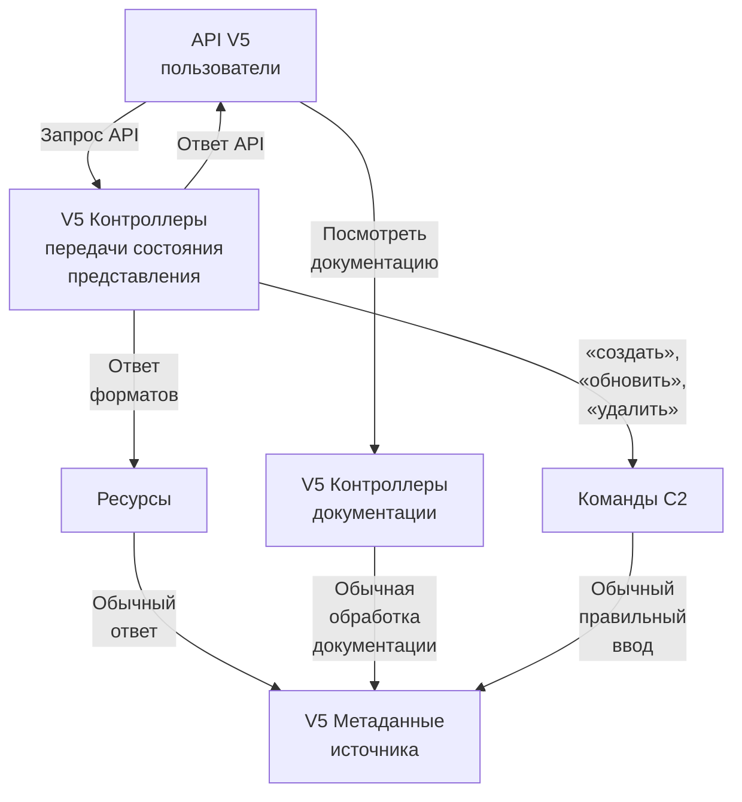
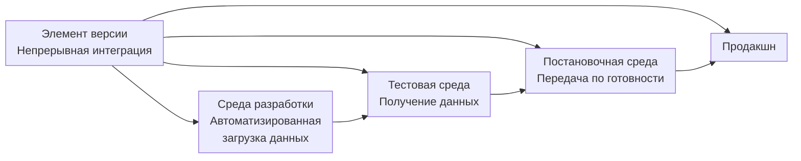
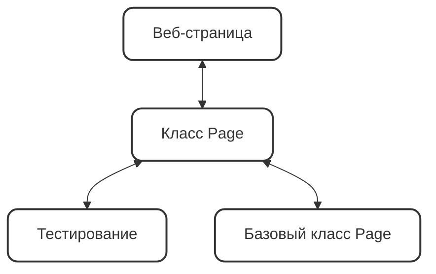
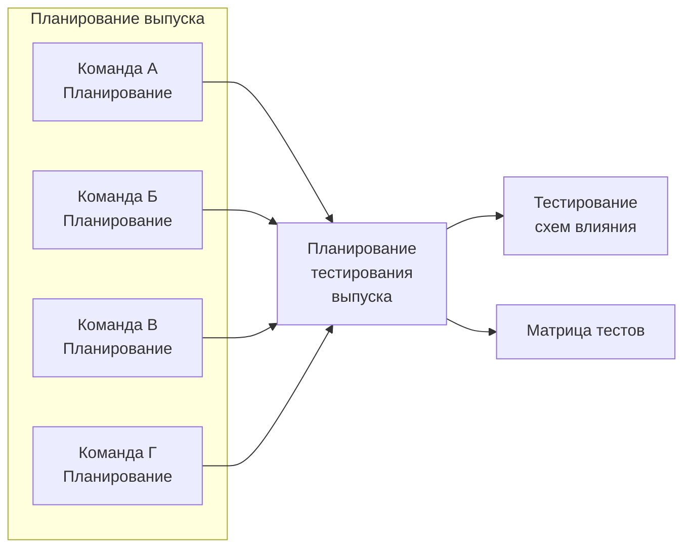

# Криспин Agile-тестирование. Обучающий курс для всей команды 2019.pdf


<!-- ВІДНОВЛЕНО ЧЕРЕЗ GEMINI (Стор. 1) -->
The Addison-Wesley
Signature Series

# Agile-тестирование

## Обучающий курс для всей команды

**ДЖАНЕТ ГРЕГОРИ**  
**ЛАЙЗА КРИСПИН**
<!-- КІНЕЦЬ ВІДНОВЛЕННЯ -->


<!-- ВІДНОВЛЕНО ЧЕРЕЗ GEMINI (Стор. 2) -->

<!-- КІНЕЦЬ ВІДНОВЛЕННЯ -->


<!-- ВІДНОВЛЕНО ЧЕРЕЗ GEMINI (Стор. 3) -->
Эту книгу хорошо дополняют:

**Scrum. Революционный метод управления проектами**  
Джефф Сазерленд

**Управление продуктом в Scrum**  
Роман Пихлер

**Канбан**  
Дэвид Андерсон

**Постигая Agile**  
Эндрю Стеллман и Дженнифер Грин
<!-- КІНЕЦЬ ВІДНОВЛЕННЯ -->


<!-- ВІДНОВЛЕНО ЧЕРЕЗ GEMINI (Стор. 4) -->
*Janet Gregory*
*Lisa Crispin*

# MORE AGILE TESTING

### Learning Journeys for the Whole Team


2015


<!-- КІНЕЦЬ ВІДНОВЛЕННЯ -->


<!-- ВІДНОВЛЕНО ЧЕРЕЗ GEMINI (Стор. 5) -->
Джанет Грегори  
Лайза Криспин

# AGILE-ТЕСТИРОВАНИЕ

**Обучающий курс для всей команды**

*Перевод с английского*  
*Екатерины Кротовой*

Москва  
«Манн, Иванов и Фербер»  
2019


<!-- КІНЕЦЬ ВІДНОВЛЕННЯ -->


<!-- ВІДНОВЛЕНО ЛОКАЛЬНО (Стор. 6) -->
УДК 000.4: 658.5 ББК 65.290с51-32 

Г793 

Научный редактор Сергей Виноградов 

_Издано с разрешения Pearson Education, Inc. (Addison-Wesley Professional) На русском языке публикуется впервые_ 

Возрастная маркировка в соответствии с Федеральным законом от 29 декабря 2010 г. № 436-ФЗ: 12+ 

Благодарим за консультации Илью Таджибаева 

# **Грегори Дж., Криспин Л.** 

- Г793       Agile-тестирование. Обучающий курс для всей команды / Джанет Грегори, Лайза Криспин ; пер. с англ. Е. Кротовой ; науч. ред. С. Виноградов.  — М. : Манн, Иванов и Фербер, 2019. — 528 с. 

ISBN 978-5-00117-880-4 

Книга ведущих мировых специалистов подробно рассказывает о процессе тестирования с позиции Agile. Вы узнаете о роли обучения и корпоративной культуры, подборе правильных людей, особенностях технической подготовки, моделях планирования и автоматизации тестирования. Подробное практическое руководство будет интересно всем специалистам IT-отрасли, желающим перейти на гибкий метод управления и улучшить показатели. 

УДК 000.4: 658.5 ББК 65.290с51-32 

_Все права защищены. Никакая часть данной книги не может быть воспроизведена в какой бы то ни было форме без письменного разрешения владельцев авторских прав._ 

ISBN 978-5-00117-880-4 

Authorized translation from the English language edition, entitled MORE AGILE TESTING: LEARNING JOURNEYS FOR THE WHOLE TEAM, 1st Edition; ISBN: 0321967054; by GREGORY, JANET and by CRISPIN, LISA; published by Pearson Education, Inc., publishing as Addison-Wesley Professional. 

- © 2015 by Lisa Crispin and Janet Gregory. All rights reserved. No part of this book may be reproduced or transmitted in any form or by any means, electronic or mechanical, including photocopying, recording or by any information storage retrieval system, without permission from Pearson Education, Inc. RUSSIAN language edition published by MANN, IVANOV, and FERBER PUBLISHERS. © 2019. 

- ©  Перевод на русский язык, издание на русском языке, оформление. ООО «Манн, Иванов и Фербер», 2019
<!-- КІНЕЦЬ ВІДНОВЛЕННЯ -->


*Моим внукам Лорен, Брейдену и Джо, которые радовали меня весь год.*
*Джанет*

*Моей семье. Тем, кто со мной, и тем, кого уже, к сожалению, нет с нами. Моим дорогим друзьям, которые являются частью той семьи, что я выбрала сама.*
*Лайза*

# ОГЛАВЛЕНИЕ

Предисловие Элизабет Хендриксон ................................................................................. 11  
Предисловие Джоанны Ротман ......................................................................................... 13  
Пролог .................................................................................................................................... 14  

### Часть 1. Введение
Глава 1. Как изменилось Agile-тестирование .................................................................. 25  
Глава 2. О важности корпоративной культуры .............................................................. 30  

### Часть 2. Обучение для улучшения тестирования
Глава 3. Роли и компетенции ............................................................................................. 49  
Глава 4. Интеллектуальные навыки тестировщика ....................................................... 70  
Глава 5. Техническая подготовка ..................................................................................... 85  
Глава 6. Образовательные ресурсы .................................................................................. 100  

### Часть 3. Планирование ради целостной картины
Глава 7. Уровни точности планирования ........................................................................ 117  
Глава 8. Использование моделей для планирования .................................................... 131  

### Часть 4. Тестирование бизнес-ценности
Глава 9. Тем ли мы заняты? ............................................................................................... 151  
Глава 10. Расширение мысленных установок тестировщика: моя ли это работа? ........ 169


<!-- ВІДНОВЛЕНО ЧЕРЕЗ GEMINI (Стор. 9) -->
Глава 11. Примеры .......................................................................................... 180

**Часть 5. Исследовательское тестирование**
Глава 12. Исследовательское тестирование ................................................... 203
Глава 13. Другие виды тестирования ............................................................. 232

**Часть 6. Автоматизация тестирования**
Глава 14. Технический долг в тестировании ................................................. 257
Глава 15. Пирамиды тестирования ................................................................ 269
Глава 16. Шаблоны и методы автоматизации ................................................ 281
Глава 17. Выбор решений для автоматизации тестирования ........................ 299

**Часть 7. Разные сферы деятельности**
Глава 18. Agile-тестирование на предприятии .............................................. 323
Глава 19. Agile-тестирование в распределенных командах ........................... 352
Глава 20. Agile-тестирование мобильных и встроенных систем ................. 381
Глава 21. Agile-тестирование в поднадзорной среде ..................................... 397
Глава 22. Agile-тестирование баз данных и BI систем .................................. 407
Глава 23. Тестировщики и DevOps ................................................................ 423

**Часть 8. Agile-тестирование на практике**
Глава 24. Визуализация тестирования .......................................................... 447
Глава 25. Соберите всё вместе ........................................................................ 458

Приложение А. Page Object на практике: примеры .................................... 470
Приложение Б. С чего начать ........................................................................ 478
Глоссарий ........................................................................................................ 480
Благодарности ................................................................................................ 489
Об авторах ...................................................................................................... 492
Соавторы ......................................................................................................... 494
Примечания ................................................................................................... 507
Библиография ................................................................................................ 514
<!-- КІНЕЦЬ ВІДНОВЛЕННЯ -->


# ПРЕДИСЛОВИЕ
## ЭЛИЗАБЕТ ХЕНДРИКСОН

Еще десять лет назад Agile считался чем-то радикальным. Маргинальным. Странным. Стандартный подход к разработке программного обеспечения включал анализ, дизайн, написание кода и тестирование. Интеграция и тестирование проводились на заключительном этапе. Полный цикл разработки занимал месяцы, даже годы.

Если вы никогда не работали в компании с долгими циклами и прерывными фазами, это покажется немного странным, но десять лет назад стандарты были такими. Когда Agile только зарождался, он был направлен в основном на программистов. Джанет, Лайза и еще несколько специалистов по контролю/обеспечению качества (QA) и тестированию были в их числе. В то же время многие последователи Agile не чувствовали необходимости в QA. Конечно, они ошибались. QA изменился, подстраиваясь под новые сферы деятельности, но никуда не исчез.

Такие люди, как Джанет и Лайза, показали, как можно встроить QA в Agile, вместо того чтобы игнорировать его. В своей первой книге\* Джанет и Лайза рассказали о корпоративных изменениях, необходимых для полной интеграции тестирования и разработки, научили преодолевать трудности. Рекомендую эту книгу.

Однако остались вопросы. Как эти методы применять в различных сферах? С чего начать? Что должен знать тестировщик, чтобы быть наиболее эффективным? Эта книга начинается с того, на чем заканчивается

---

\* Криспин Л. Грегори Дж. Гибкое тестирование. Практическое руководство для тестировщиков ПО и гибких команд. М.: Вильямс, 2016.

первая, и отвечает на вышеназванные и многие другие вопросы. И даже если бы в книге содержались только эти ответы, она уже была бы замечательным продолжением. Но она намного больше. Здесь вы столкнетесь с темой, которую Джанет и Лайза так искусно вплели в текст, что ее можно даже не заметить. Я же хочу обратить ваше внимание на то, что эта книга об адаптации.

Обдумывайте и адаптируйте. Этот простой способ поможет вашей компании прийти к Agile. Экспериментируйте, пробуйте разные подходы, фильтруйте полученные знания, повторяйте. Так вы почувствуете, что ваша организация подвижна и гибка, способна двигаться в ногу с запросами рынка и постепенно удовлетворять их. Эта книга учит адаптировать, несмотря на то что она в общем-то об Agile-тестировании.

Часть вторая «Обучение для улучшения тестирования» касается не только того, как вы учитесь сами, но и того, как построить учебную среду.

Часть седьмая «Разные сферы деятельности» не просто рассказывает о разных вариантах Agile, приспособленных под различные условия, а является своего рода путеводителем по разного рода адаптациям.

Мир невероятно быстро меняется. Еще десять лет назад Agile был чем-то странным, теперь это мейнстрим. Планшеты типа iPad теперь повсюду, а несколько лет назад никто не знал об их существовании. Методы, инструменты, технологии меняются наравне с рынком так быстро, что за ними трудно успевать. Уже недостаточно уметь что-то делать одним способом, необходимо открывать новые пути. Эта книга — фантастический источник для Agile-тестирования. Она научит адаптироваться и чувствовать себя комфортно в процессе изменений.

Надеюсь, она понравится вам так же, как мне.

Элизабет Хендриксон,  
*основатель и президент Quality Tree Software Inc.*

# ПРЕДИСЛОВИЕ
## ДЖОАННЫ РОТМАН

Что делают тестировщики? Они представляют информацию о продукте на основании тестов, и это позволяет определить задачи для команды.

Именно это Джанет Грегори и Лайза Криспин сделали в своей книге. У вас проблемы с гибкостью? Существует множество способов, которые помогут понять ценность совместной работы, создания и обучения коллектива и вашу роль в процессе тестирования.

Не знаете, как выстроить тестирование конкретного продукта, коллектива или программы? Здесь вы найдете ответ.

Как вы взаимодействуете с коллегами за офисной перегородкой? А с теми, кто находится на другом конце мира? Джанет и Лайза сталкивались с этим и знают о проблеме не понаслышке. Они делают акцент на ролях, а не на должностях. И это особенно ценно.

В книге много изображений, так что вам не придется постоянно думать, что авторы имели в виду. Они не просто рассказывают — они показывают.

«Agile-тестирование. Обучающий курс для всей команды» — больше, чем книга о тестировании. Она о том, как с помощью тестирования выстроить работу команды, отдела, организации и обеспечить наиболее эффективный переход к Agile. Не в этом ли и заключается суть представления информации об организации на основе тестов, которые выявляют существующие проблемы?

Тестировщикам или руководителям команды тестировщиков нужна эта книга. Если вы внедряете тестирование в свою организацию, она также пригодится. Иначе как вы узнаете, что должен делать тестировщик?

<div align="right">
Джоанна Ротман,<br>
<i>консультант по вопросам управления</i>
</div>


# ПРОЛОГ

Эта книга — продолжение темы, о которой мы говорили в предыдущей книге. Мы не будем повторяться, но выстроим контекст так, чтобы все было понятно, даже если вы не читали ее. Мы ссылаемся на «Гибкое тестирование», когда нам кажется, что читателю необходимо получить детальное представление об основных определениях.

## ДЛЯ КОГО ЭТА КНИГА

Мы предполагаем, что вы, читатель, не новичок в мире Agile-тестирования, что у вас уже есть определенный опыт работы с Agile и опыт тестирования, и теперь вам нужна помощь в областях за их пределами. Если требуется введение в развитие Agile и в основы Agile-тестирования, перед прочтением этой книги рекомендуем ознакомиться с работой Радмуссона «Гибкое управление IT-проектами. Руководство для настоящих самураев»\*.

Эта книга для всех, кто интересуется процессами тестирования в Agile-командах. Судя по нашему опыту, это не только тестировщики и руководители команд, но и программисты, заказчики, бизнес-аналитики, DevOps-специалисты, руководители направлений, — одним словом, почти все.

---

\* Расмуссон Дж. Гибкое управление IT-проектами. Руководство для настоящих самураев. СПб.: Питер, 2012.

## ПРИЕМОЧНОЕ ТЕСТИРОВАНИЕ

В дополнение к тому, чем мы делимся с вами, о чем узнали за последние несколько лет, хотим, чтобы эта книга была полезна читателям. Нам хотелось знать, какие вопросы остались у прочитавших первую книгу. Поэтому мы попросили всех пользователей в нашей имейл-рассылке пройти своеобразное «приемочное тестирование». Мы отфильтровали ответы и приложили все усилия, чтобы раскрыть суть возникших вопросов во второй книге.

Вы заметите, что мы используем разработку через поведение (Behaviour Driven Development, BDD), о которой подробнее поговорим в главе 11.

Например, <исходные данные>,  
Когда <триггер, действие>,  
Я должен <ожидаемый результат>.

— Я Agile-тестировщик или руководитель. Когда нанимаю новых тестировщиков без опыта работы по системе Agile, я должен знать, как ввести их в работу, не бросая за борт без спасательного жилета.  
— Я работаю в команде Agile. Когда прочту эту книгу, я должен узнать как подходить к исследовательскому тестированию с автоматизированными тестами и получать общую картину покрытия тестами без использования сложных инструментов.  
— Я опытный руководитель команды тестировщиков Agile. Когда прочитаю эту книгу, должен понять, как использовать Agile-тестирование в разных командах, чтобы моя компания могла развиваться.  
— Я опытный руководитель команды тестировщиков. Прочитав эту книгу, должен понять, как координировать автоматизированные процессы тестирования на разных этапах с различными командами, как их улучшить.


<!-- ВІДНОВЛЕНО ЧЕРЕЗ GEMINI (Стор. 16) -->
— Я опытный руководитель команды тестировщиков Agile. Когда прочту эту книгу, должен понять, как другие команды адаптировали методы Agile-тестирования для различных областей, и получить представление, как применить это в своей сфере.
— Я работаю в команде Agile и интересуюсь тестированием. Закончив читать эту книгу, я пойму, какими должны быть тесты, а какими нет, и как эффективно организовать тестирование.
— Я опытный Agile-тестировщик. Натыкаясь в книге на интересную тему, я хочу получить ссылки на онлайн-ресурсы и другие книги.
— Я опытный Agile-тренер или руководитель. Если в книге упоминается идея, полезная для моей команды, то должно быть достаточно информации, чтобы разработать стратегию и убедить коллектив попробовать ее в деле.
— Я работаю в команде Agile, и мои задачи касаются тестирования и информирования клиентов. Когда прочту эту книгу, я должен понять, как говорить с командой заказчика о процессах тестирования.
— Я опытный руководитель команды тестировщиков Agile. Прочитав эту книгу, хочу знать о наиболее распространенных методах внедрения Agile, понимать рабочую среду тестировщиков из других компаний, если они претендуют на место в моей команде.

(Важно: это приемочное тестирование — не часть книги, но мы думаем, что некоторые примеры и истории, рассказанные здесь, помогут добиться результатов.)

## КАК ЧИТАТЬ ЭТУ КНИГУ

Мы распределили информацию так, как считаем удобным. Тем не менее вам не обязательно читать книгу с первой главы. Вы можете начать с любой наиболее интересной темы. Мы стараемся рассказать лишь раз о каждой, но так как многие методы и принципы пересекаются, вы обнаружите похожие идеи в разных главах.
<!-- КІНЕЦЬ ВІДНОВЛЕННЯ -->


## ЧАСТЬ ПЕРВАЯ. ВВЕДЕНИЕ

Прочтите эту часть, чтобы понять, как появилось Agile-тестирование, как оно превратилось в краеугольный камень развития системы Agile и продолжение разработки продуктов. Отчасти успешное внедрение Agile зависит от способности компании определять наиболее важные задачи для успешного Agile-тестирования в долгосрочной перспективе.

## ЧАСТЬ ВТОРАЯ. ОБУЧЕНИЕ ДЛЯ УЛУЧШЕНИ ТЕСТИРОВАНИЯ

Технологии и мастерство тестирования постоянно развиваются, и границы между различными областями постепенно размываются. Даже опытным специалистам нужно постоянно повышать свои навыки. В этой части рассказывается, что необходимо знать тестировщикам, бизнес-аналитикам или программистам, чтобы преодолевать трудности, возникающие в процессе тестирования. Мы объясним плюсы специалистов широкого профиля и перечислим неочевидные умения и отдельные техники, которые будут полезны тестировщикам и всему коллективу. В этой части раскрываются различные аспекты того, что и как изучать.

## ЧАСТЬ ТРЕТЬЯ. ПЛАНИРОВАНИЕ РАДИ ЦЕЛОСТНОЙ КАРТИНЫ

Планировать ровно столько, сколько необходимо, — секрет равновесия. Пока мы работаем на небольших отрезках, необходимо следить за всем процессом, за всей системой. В этой части мы рассказываем о различных аспектах планирования: от выпуска продукта до постановки задач. Здесь вы также найдете информацию о разных моделях, таких как квадраты Agile-тестирования и предложенные стратегии адаптации.


ЧАСТЬ ЧЕТВЕРТАЯ. ТЕСТИРОВАНИЕ БИЗНЕС-ЦЕННОСТИ

Если вы, как и многие Agile-команды, разрабатываете надежный код только для того, чтобы понять, что это не то, чего хотел заказчик, вам пригодится информация из этой части. Мы рассказываем об инструментах и принципах, особенно из сферы бизнес-аналитики, которые помогут определить идеи и варианты на ранней стадии, а также убедиться, что каждый знает свои задачи. Мы также обращаемся к смежным дисциплинам и расширяем мышление.

ЧАСТЬ ПЯТАЯ. ИССЛЕДОВАТЕЛЬСКОЕ ТЕСТИРОВАНИЕ

Программисты прислали вам некий код для тестирования. С чего начать? Если вы или ваша команда испытываете трудности с исследовательским тестированием, то в этой части вы найдете много полезного. Мы выделили несколько техник исследовательского тестирования: использование искусственных образов (персон) и туров (маршрутов) для генерации новых идей и тестов, сессионное тестирование (SBTM) и тестирование вокруг различных направлений («цепочек») работы (TBTM).

Наряду со всеми этими подходами мы рассматриваем другие пути удостовериться, что написанный код удовлетворяет потребности бизнеса и пользователей. В этой части мы рассматриваем пути минимизации рисков и сбора полезной информации в ходе нескольких видов тестирования, которые представляют трудности для Agile-команд.

ЧАСТЬ ШЕСТАЯ. АВТОМАТИЗАЦИЯ ТЕСТИРОВАНИЯ

Все больше и больше команд преуспевают в автоматизации тестирования, но при этом многие сталкиваются с единичными сбоями,


разобраться в которых дорогого стоит. Каждый такой сбой может потребовать больше времени (и денег), чем все тестирование в целом. Автоматизированные тесты таят множество ловушек. В этой части мы приведем примеры, как распознать технический долг. Рассмотрим различные способы использования пирамиды тестирования, что поможет в планировании. Изучим некоторые альтернативные виды пирамиды тестирования для подхода к автоматизации под другим углом. Вы научитесь проектировать надежные и простые в использовании автоматизированные тесты. В этой части также приводятся примеры внедрения автоматизированных тестов в крупных компаниях.

## ЧАСТЬ СЕДЬМАЯ. РАЗНЫЕ СФЕРЫ ДЕЯТЕЛЬНОСТИ

Ваш подход к Agile-тестированию будет определяться сферой деятельности. Вы работаете с крупными предприятиями? Возможно, перед вами стоит новая задача протестировать мобильное приложение или встроенное программное обеспечение. Может быть, ваша команда столкнулась с трудностями при поиске оптимального тестирования данных, которые помогают коммерческим предприятиям принимать решения. Интересовались ли вы, как Agile может работать при тестировании установленного ПО? Мы рассмотрим связь между тестированием и шагами в интеграции разработки ПО. Главы этой части касаются различных областей, поэтому мы включили истории людей, уже работающих в данных условиях. Некоторые из глав, возможно, не имеют отношения к сфере, в которой вы сегодня работаете. Но кто знает, что будет завтра.


ЧАСТЬ ВОСЬМАЯ. AGILE-ТЕСТИРОВАНИЕ НА ПРАКТИКЕ

В заключительной части мы рассмотрим, как команды могут визуализировать качество и тестирование, подведем итог всему, что узнали о методах Agile-тестирования. Это позволит чувствовать себя увереннее на стадии принятия решений. Создание общей версии для вашей команды невероятно важно для успешного исхода, так что мы поделимся моделью, которая поможет донести суть процесса тестирования до всех сотрудников.

В книге есть также два приложения:
- Приложение А. Page Object на практике: примеры.
- Приложение Б. С чего начать.

## ДРУГИЕ СОСТАВЛЯЮЩИЕ

Поскольку команды используют различные методы и подходы Agile, мы постарались сохранить общую терминологию, насколько это возможно. Чтобы говорить на одном языке, добавили глоссарий используемых терминов.

Надеемся, вы захотите подробнее узнать о некоторых методах, техниках и инструментах, которых мы коснемся. Пожалуйста, посмотрите список литературы в конце книги, сайты, статьи и блоги, на которые мы ссылаемся. Мы разбили их согласно частям книги, чтобы необходимую информацию было проще найти во время чтения. Источники, упомянутые в самой книге, для удобства размещены в алфавитном порядке.

## ЭКСПЕРИМЕНТ

Линда Райзинг много лет назад уговорила нас провести несколько маленьких экспериментов, изучить их результаты и продолжить решать задачи по частям, постепенно добиваясь поставленных целей. Если что-то в этой книге покажется полезным для вас и вашей команды, попробуйте внедрить это хотя бы пару раз. Оглядываясь назад, посмотрите, сработали ли нововведения, и при необходимости измените что-то. Если ничего не сработало, не огорчайтесь: вы получили опыт и сможете попробовать что-то другое.

Надеемся, на страницах этой книги вы найдете множество полезных для себя вещей.


<!-- ВІДНОВЛЕНО ЧЕРЕЗ GEMINI (Стор. 22) -->

<!-- КІНЕЦЬ ВІДНОВЛЕННЯ -->


# ЧАСТЬ 1

# ВВЕДЕНИЕ

В первой части мы быстренько пробежимся по истории того, как изменилось Agile-тестирование с тех пор, как мы впервые стали работать с Agile-командами. Представим некоторые новые концепции и подробно поговорим о важности изучения корпоративной культуры.

— Глава 1. Как изменилось Agile-тестирование.
— Глава 2. Важность корпоративной культуры.


ГЛАВА 1

КАК ИЗМЕНИЛОСЬ
AGILE-ТЕСТИРОВАНИЕ

Каждый из нас начинал карьеру в области Agile как одиночка на поприще экстремального программирования (Extreme Programming, XP) во времена, когда даже не упоминалось о том, что в каждой команде могут быть свои тестировщики. Было всего два игрока: программист и заказчик. Клиенты определяли необходимые приемочные тесты, программисты автоматизировали их: раз, два и готово. На конференциях по экстремальному тестированию мы были единственными, кто определял себя как тестировщиков, хотя и понимали, что они могут внести значительный вклад в работу коллектива. Мы экспериментировали, обсуждали тестирование с первопроходцами XP, обменивались мыслями.

Но Agile развивался, а вместе с ним менялось и Agile-тестирование. Команды стали создавать библиотеки и фреймворки по автоматизации тестов и выводу их на новый уровень. Многие специалисты, внедрявшие Agile, оценили вклад опытных тестировщиков, таких как Элизабет Хендриксон и Майкл Болтон. Брайан Марик и Джошуа Кериевски впервые приняли на вооружение идею использования тестирования на основе примеров и историй, чтобы управлять разработкой.

Уорд Каннингем создал Fit (фреймворк для комплексного тестирования) — инструмент, помогающий выявить такие примеры. Дэн Норт представил BDD, которая проложила путь новым популярным инструментам (North, 2006). Agile-команды осознали ценность исследовательского

тестирования, и оно стало для них не просто функциональным. Как показал Брайан Марик в своей матрице, которую мы адаптировали для квадратов Agile, тестирование охватывает теперь множество областей (Marick, 2003).

Конечно, все еще оставались трудности, препятствующие успеху Agile-тестирования. Мы, тестировщики, завидовали всем тем инструментам, которые имелись у программистов в свободной интегрированной среде разработок (Integrated Development Environments, IDEs). Нам хотелось, чтобы для нас все было так же просто. Мы начали эффективно использовать «силу трех», или «трех друзей», как говорит Джордж Динвидди. Когда заказчик, программист и тестировщик работают вместе, всегда возникают вопросы, как должен функционировать тот или иной элемент (Dinwiddie, 2010). Тем не менее было непросто учесть все запросы клиентов: дизайн, юзабилити, данные и другие составляющие качественного продукта. О некоторых из них мы поговорим в этой книге.

Практикующие специалисты в разных областях заполняют пробелы в Agile-тестировании. Мы счастливы поделиться историями реальных людей, рассказать о том, как они успешно использовали Agile-тестирование в разных сферах.

Тестирование в командах Agile — это процесс, а не конечный пункт. Эту идею, витавшую в наших мыслях, нам подсказала Элизабет Хендриксен (Hendrickson, 2006). В книге мы подчеркиваем: в процессе разработки софта тестирование должно учитываться на всех этапах.

Постоянно изучая лучшие техники Agile-тестирования, мы обнаружили, что подготовка специалистов широкого профиля с углубленными знаниями и навыками помогает справиться со сложными задачами. Опытные эксперты создали методы и шаблоны, которые позволяют членам команды из разных сфер сотрудничать и узнавать друг от друга ровно столько, сколько им необходимо.

Практикующие специалисты, такие как члены Agile-альянса инструментов функционального тестирования (Agile Alliance Functional Test Tools, AA-FTT), проложили путь к созданию более эффективных инструментов тестирования. Сегодня подход к написанию кода тестов

так же важен, как и подход к написанию кода основного приложения. Мы научились определять, какой фреймворк, тестовая библиотека или драйвер подходят для конкретных нужд команды.

Выявляя потребности клиентов, бизнес-аналитики внесли свой вклад в развитие Agile. Тестирование и бизнес-аналитика обладают некоторыми взаимосвязанными качествами, которые помогают определить коммерческую ценность продукта. Таким же образом эксперты по пользовательскому интерфейсу (User Experience, UX) показали простой действенный способ вовлечения клиентов на этапах разработки новых элементов. DevOps-специалисты соединили разработку, функциональную часть и тестирование для улучшения качества в новых условиях (разработка и запуск). Их метод также позволяет сократить цикл запуска, снизить риски и повлиять на заказчика.

По сравнению с тем, что мы наблюдали несколько лет назад, сейчас Agile-команды понимают важность исследовательского тестирования. Хотя очевидно, что пользы от него может быть в несколько раз больше. Мы рады, что коллективы, использующие его в работе, делятся своим опытом.

Появились новые, творческие подходы к планированию тестирования и сотрудничеству. Сегодня у компаний куда больше возможностей визуализировать качество. Матрицы и пирамида тестирования адаптированы и расширены для применения в различных областях.

Все больше команд сталкиваются с тестированием мобильных приложений и встроенного ПО на расширяющемся поле устройств и платформ. Огромные объемы информации, содержащие новые технологии хранения, управления, анализа, поиска и визуализации, формируют новую категорию — большие данные (Big Data). И тестирование должно соответствовать новым реалиям.

Изначально Agile подразумевалась как методика для небольших коллективов, работающих в одном помещении. Сейчас мы видим, что Agile используют как крупные организации (нередко начинавшие как маленькие Agile-компании), так и распределенные команды. В организациях с общекорпоративным ПО тестирование сопряжено со строгими

ограничениями. В то же время организации находят новые пути использования приложений с минимальным функционалом (Minimum Viable Products, MVPs), обеспечивающим итерационные релизы с быстрыми циклами обратной связи и доступное обучение.

В 2008 году некоторые компании были заняты тестированием в продакшн (на живой среде); мы не слышали об этой технике, если не считать случаев выпуска продукта без тестирования с одной только надеждой на успех. Сегодня выпуск обновлений для небольшого количества пользователей путем изучения логов на предмет ошибок и другие методы получения быстрой обратной связи могут стать важной и необходимой стратегией в определенных условиях.

Все эти изменения и инновации подвигли нас и других специалистов поделиться знаниями и опытом. Agile постоянно развивается, и многие из вас уже внедряют эту методологию, изменяя бизнес-процессы в обучении. Актуальные задачи, связанные с тестированием, во многом отличаются от тех, что вы решали, когда только начинали вникать в Agile. Надеемся, опыт, представленный в этой книге, породит идеи для экспериментов, чтобы можно было визуализировать качество вашего продукта, а затем изучить и адаптировать свои процессы.

## РЕЗЮМЕ

С развитием программного обеспечения Agile мы постоянно изучаем и актуализируем методы тестирования. В этой главе мы рассмотрели, как именно менялось Agile-тестирование.

* Мы поняли, что тестирование — это процесс, невероятно важный для успешности продукта, и поэтому в нем должен быть заинтересован каждый член команды: от совета директоров до разработчиков и службы поддержки.
* Команды, работающие по Agile, четко осознают, как специалисты из разных областей (бизнес-аналитики, UX-дизайнеры и DevOps)

расширили наши возможности, чтобы добиваться нужного для заказчика уровня качества.
— Инструменты для Agile-тестирования продолжают стремительно развиваться, позволяя Agile-командам внедрять инфраструктуру, необходимую для поддержки обучения и быстрой обратной связи.
— Agile-команды познают ценность исследовательского тестирования и других методов, которые помогают донести необходимую информацию до клиентов и разработчиков.
— Agile-тестирование должно идти в ногу с быстро меняющимися технологиями и новым контентом. Далее мы поговорим об этом.

ГЛАВА 2

О ВАЖНОСТИ КОРПОРАТИВНОЙ КУЛЬТУРЫ

Мы заметили схожие тенденции в организациях, переходящих на Agile. Команды разработчиков способны внедрить ценности, методы и практики Agile. Однако бизнес медленнее понимает преимущества Agile, и для изменений требуется больше времени. Для успешного перехода на Agile необходимо, чтобы между разработчиками и работниками коммерческих отделов существовало взаимопонимание и имелось представление о работе друг друга.

Если ваше руководство осознаёт, что через качество можно наилучшим образом донести коммерческую ценность до клиентов, скорее всего, и организация, и команда преуспеют. Регулярность и слаженность работы со временем совершенствуются. Наоборот, если компания отдает предпочтение скорости, качество часто страдает. Технические недоработки в хрупком, тяжелом коде и долгое время обратной связи снижают способность слаженно работать.

Если команды находятся под давлением нереальных сроков для выполнения определенных объемов, они не контролируют свою загруженность. С приближением дедлайна выбор у разработчиков сокращается, и они стремятся лишь управиться в срок, а не удовлетворить потребности клиента (Rogalsky, 2012). Скорее всего, они начнут торопиться и принимать

решения, не думая о последствиях, и таким образом войдут в штопор постоянно увеличивающегося количества технических недоработок.

Командам необходимо обозначить опасность неразумных шагов, чтобы руководители компании знали о рисках и последствиях. Иногда нужно сбавить обороты, чтобы заняться техническими недоработками, или изучить новые концепции, или применить новые идеи. В своих презентациях Джанет использует рисунок с застрявшими в пробке суперкарами. Он показывает, как добавление новых элементов, не согласующихся с общей инфраструктурой, может парализовать работу. Зачем добавлять что-то, если система не будет работать, как ожидалось? Когда у вас накапливается слишком много технических недоработок, команда застревает.

## НЕ ЖАЛЕЙТЕ ВРЕМЕНИ

Чтобы представить клиентам полезный софт, необходимо подойти к задаче творчески. Людям нужно время, чтобы все обдумать и применить свое мастерство. Мы также должны постоянно осваивать новые технические навыки, изучать новые инструменты. Это помогает проводить небольшие эксперименты, которые могут быть полезны при решении различных задач.

В статье «Медленные идеи» (Gawande, 2013) Атул Гаванде объяснил, почему некоторые инновации, такие как хирургическая анестезия, внедряются быстро, а другим, например антисептикам, требуются годы (а то и вообще этого не происходит). Вывод: изменения происходят только путем обучения, практики и личной заинтересованности. В программах, которые анализировал Гаванде, люди обучались лучше всего, когда сами выполняли новые действия, описывая их своими словами, под наблюдением преподавателя. Может показаться, что дешевле и быстрее нанять тренера, который покажет, как нужно делать, или заставить людей посмотреть обучающее видео, но практический подход обеспечивает реальные стабильные изменения.

В сфере программного обеспечения (как и во многих других) люди порой забывают, что для овладения новыми навыками требуется время

и практика. Они часто отказываются от тренера, который бы обучал и направлял сотрудников.

## Тратьте время на то, что нужно

**Дэвид Эванс**, *Agile-тренер по качеству*, поделился метафорой, к которой прибегает, когда объясняет, что необходимо тратить время на то, что действительно нужно.

Иногда приходится сталкиваться с сопротивлением со стороны менеджмента, когда я предлагаю потратить время на совместное описание приемочного тестирования, прежде чем внедрять то или иное требование. Обычный аргумент: если команда потратит больше времени на приемочные тесты, это замедлит темпы разработки. В некотором смысле, конечно, замедлит, но ровно настолько, насколько замедляет движение автобус, чтобы забрать пассажиров с остановки. Попытки оптимизировать скорость автобуса ни к чему не ведут, если не согласуются с целью усовершенствовать работу общественного транспорта. Представьте, если бы водитель для улучшения показателей предложил не останавливаться для пожилых пассажиров, поскольку они медленнее заходят в двери. Если бы автобус вовсе не останавливался и не брал пассажиров, он бы двигался быстрее. По скоростному шоссе он мог бы даже вернуться в парк!

Это та же ошибочная логика, согласно которой работа над тестами замедляет темпы разработки. Это хорошо иллюстрирует утверждение Кента Бека (Beck, 2002): «Код, который не прошел тестирование, не работает. Это, кажется, самое благоразумное утверждение». Если создание приемочных тестов перед тем, как приступить к разработке кода, что-то и замедляет, то лишь нашу работу над кодом, который не будет функционировать.

Компании, работающие с концепциями бережливого производства, научили нас, что уважение способности каждого сотрудника

вкладывать идеи или непрерывно работать над улучшением качества приводит к созданию новых продуктов, которые нравятся клиентам. Команды, имеющие время и поддержку на обучение и эксперименты, справляются с работой куда лучше. Во второй части «Обучение для улучшения тестирования» мы поговорим о некоторых достойных, на наш взгляд, методах.

Гойко Аджич (Adzic, 2013) заметил, что отличный результат получается, когда:

* люди знают, **зачем** они делают свою работу;
* организации сосредоточены на **результате и влиянии**, а не на отдельных элементах;
* команды решают, что делать дальше, основываясь на **актуальной обратной связи** от пользователей;
* никому **не наплевать**.

Некоторые компании попробовали разгрузить своих сотрудников, чтобы дать им время на обучение, позволяя посвящать свободные рабочие часы личным проектам или собственному профессиональному росту. Лайза работала с командами, практикующими этот метод, и они демонстрировали хорошие результаты, поддерживая низкий уровень технических недоработок и сохраняя объемы производства. Однако важно понимать принципы, стоящие за эффективным использованием и возможностями, иначе команде придется втискивать еще больше работы в жесткие сроки.

## Загрузка производственных мощностей

**Алексей Жеглов**, консультант по бережливому производству и Kanban для организаций, использующих умственный труд, объясняет теорию использования производственных


мощностей и учит, как избежать потери 20% времени. Мы при-
водим часть его статьи.

Главная причина потери 20% времени в том, что при неполной загру-
женности мощности используются на 80%, а не на 100%. Подумайте
о компании, производящей ПО, как о системе, которая преобразует
запрос на элемент в разработку этого элемента. Таким образом, мы
можем смоделировать производство, используя теорию очередей.

**Теория**

Если запросы прибывают быстрее, чем система успевает их обрабаты-
вать, они ставятся в очередь. Когда скорость поступления снижается,
очередь уменьшается. Поскольку поступление новых запросов и их об-
работка происходят непоследовательно, длина очереди меняется.


**J-кривая мощностей**

Средний размер очереди остается на низком уровне, в то вре-
мя как эффективное использование поднимается до 0,8, а потом
резко возрастает и увеличивается до бесконечности. Это легко по-
нять, представив процессор компьютера: когда мощность на низком

уровне, он быстро реагирует на запросы, а когда фоновые задачи доводят ее до 100%, компьютер начинает работать слишком медленно, чтобы отвечать на каждый клик.

**Метод**
Именно неполная загрузка сотрудников позволяет системе вовремя отвечать на запросы. Вот несколько практических советов, чего делать не следует.

* Калькуляция издержек (время инженера стоит Х, но компания не может себе этого позволить). Экономические выгоды получаются при сокращении затрат из-за задержек.
* Создание проектной системы, чтобы люди могли в свои 20% времени заниматься другими текущими проектами.
* Отслеживание 20% времени путем заполнения ведомостей учета.
* Использование нововведений для того, чтобы занять 20% времени. Не проблема, если только 20% проектов выливаются в продукты. Проблема, если ваша компания не может внедрять новые технологии в основное время работы!
* Попытка вдохновить на творчество за счет этих 20% времени. Утверждая, что вы раскроете творческий потенциал за 20% времени, подумайте, почему вы до сих пор его не раскрыли в основное время.
* Выделять 20% свободного времени каждую неделю по пятницам.

**Это то, чего не нужно делать. А что же надо?**
Окей, как насчет того, чтобы сделать все правильно? Ответим лучшим вопросом, который нам задали во время обсуждений со специалистами: «Если 20% мощностей заняты задачами, не связанными с запросами в очереди, вы просто снижаете мощность до 80%, и эти 80% теперь составляют ваши 100%, верно?».

Да, «80 — это новые 100». Это утверждение подчеркивает главную проблему, которая подстерегает попытки поддерживать

20% свободного времени, не понимая сути теории. Вам хочется избежать ловушки снижения мощностей, не застрять в ней и иначе распределить время.

Мощность зависит от двух процессов: входящего (запросы) и сервисного (возможности). На самом деле вы не можете регулировать свои мощности. Они такие, какие есть, потому что процессы такие, а не иные. Однако вы можете поработать над процессами, улучшив возможности разработки софта и начав обрабатывать запросы. Когда у вас это получится, тогда и образуется неполная занятость.

Список литературы к первой части включает источники, из которых вы сможете больше узнать о производственных мощностях и результатах. Важно помнить, что перегрузка мощностей влияет на ход работы, а непосильные задачи на самом деле лишь снижают показатели.

## О ВАЖНОСТИ КУЛЬТУРЫ ОБУЧЕНИЯ

Если у вас есть возможность рисковать, и при этом провал не будет стоить слишком дорого, можете учиться на ошибках. Используйте быструю обратную связь, чтобы усовершенствовать ваши тесты для изменения чего-то, что работало «нормально», в то, что будет работать «прекрасно». Если ваша корпоративная культура нетерпима к ошибкам, вряд ли удастся внедрить инновации. Придерживаться одних и тех же процессов, даже если они не работают, всегда безопаснее, так что нет причин что-то менять.

### История Лайзы

К счастью, большую часть своей карьеры я работала в эффективных командах, где ценили непрерывное совершенствование. Когда сталкиваюсь с коллективами, где не поощряются вопросы и эксперименты,

всегда чувствую себя так, словно врезаюсь в кирпичную стену. В одной команде, с которой я работала некоторое время, Scrum-мастер сказал, что я «тормозила весь коллектив», потому что постоянно задавала вопросы. Руководство давило на него из-за ускорения темпов разработки. Он не желал, чтобы его тормозили, и бесконечно указывал, что за три недели так и не создано никаких условий для тестирования. В той компании работали талантливые люди, но им не позволяли в полной мере проявить себя. Мои попытки стать катализатором перемен провалились, так что я поменяла компанию.

Рассказывая о силе ретроспектив (Rising, 2009), Линда Райзинг отметила, что некоторые руководители, сталкиваясь с такими методами, как парное программирование или ретроспективы, отвечают: «У нас нет времени, чтобы думать». Но если мы верим, что можем улучшить работу, у нас получится. Пусть не всё сразу, пусть не за одну ночь, продвигаясь вперед маленькими шажками, но мы найдем лучшие методы.

## ПОДДЕРЖАНИЕ КУЛЬТУРЫ ОБУЧЕНИЯ

Соберите свою команду, чтобы узнать, чему вам нужно научиться, кто из сотрудников хочет учиться. Позвольте людям строить собственный рабочий график, чтобы они могли найти время для экспериментов, чтения, тренингов, практики в чем-то новом. Члены команды должны хотеть узнавать о новых техниках и пробовать новые инструменты. Например, можно разрешить посвящать некоторое время работе над тем, что им нравится, будь то организационные навыки или поиск нового решения для автоматизации регрессионных тестов. Экспериментальные недели, во время которых сотрудники могут поработать над специальными проектами или изучить новые технологии, — один из самых популярных методов. Люди делятся приобретенными знаниями, поддерживая тем самым культуру обучения.


Гойко Аджич рассказал, как преуспел в работе с руководством, спросив, рассчитывает ли оно, что процессы со временем улучшатся, или же думает, что процессы уже налажены наилучшим образом. Выяснив, что процессы можно улучшить, он начинает работать над бюджетом, не обязательно в плане финансов, а, например, в области временны́х затрат. Скажем, сотрудники должны проводить 10% рабочего времени, занимаясь улучшением рабочих процессов. Каждая команда сама решает, как использовать это время, но одно из условий — руководство при необходимости может урезать бюджет. Постоянное урезание бюджета — тревожный сигнал, который указывает: требуется еще один серьезный разговор.

Один из способов поощрения культуры обучения — создать сообщества по интересам (некоторые называют их «союзы»), в рамках которых сотрудники смогут в рабочее время делиться с коллегами мыслями. Мы постоянно слышим, как в таких сообществах обсуждают книги и делятся профессиональным опытом с единомышленниками.

### Союзы качества

*Августо Евангелисти*, инженер по тестированию в Paddy Power, рассказывает, как тестировщики в его компании создали союз качества.

В моей компании создан союз качества, состоящий на 20% из тестировщиков, на 20% из методистов Kanban и на 60% из разработчиков. Нужен ли нам кто-то, кто будет говорить, что делать, какие задачи решать, над какими нововведениями работать? Поверьте, нет. Сначала нас было пятеро, спустя пару месяцев — уже двадцать человек с удивительными идеями по повышению качества и улучшению нашей жизни. Мы встречаемся каждые две недели, и у нас всегда есть список тем для обсуждения.

Попробовал сделать то же самое на должности руководителя, и все закончилось тем, что ко мне пришли пять тестировщиков,

которые сидели и ждали, пока я скажу, что они должны делать. Все зависит от того, насколько люди хотят улучшить собственную жизнь.

Мы любим встречи за чашкой кофе, где каждый может открыто высказать свои мысли и поделиться идеями. Подобные кофе-брейки, открытые для всех сотрудников организации, могут помочь преодолеть непонимание. Посмотрите соответствующие ссылки в списке литературы для первой части, чтобы понимать, с чего начать.

Просто совместная работа с коллегой, удаленно или в одном офисе, иногда становится прекрасной возможностью для обучения и развития, особенно если вы пытаетесь освоить новые навыки, которыми уже владеет другой человек.

Изменить устоявшуюся культуру непросто. Если ваши сотрудники еще не знакомы с Agile, помогите им адаптироваться, шаг за шагом. Посодействуйте им в приобретении новых привычек, убедитесь, что каждый член команды чувствует свою ценность и безопасность.

### Учитесь адаптироваться к переменам

**Бернис Рухланд**, *директор отдела качества, делится своим опытом ежедневных стендапов.*

Многие коллективы причисляют себя к Agile, но не все следуют его принципам. Они Agile по духу, но необязательно на практике, общей для самоуправляемых компаний. Поймите суть методов и применяйте то, что работает. Начните с малого, и пусть ваши мысли развиваются естественным образом. Неудачи могут принести новую информацию, которая поможет понять, когда и как внедрять различные подходы и техники.

Например, если вы хотите проводить ежедневные стендапы, выделите в расписании пятнадцать минут в одно и то же время. Начните

с вопросов, традиционно используемых Agile-командами: чем вы занимались вчера, чем собираетесь заниматься сегодня, есть ли у вас какие-то трудности. Оцените, насколько продуктивны эти вопросы. Возможно, для вашего проекта актуальными будут другие.

Короткие стендапы — отличный способ продолжать двигаться в заданном направлении и укреплять личное общение. Сосредоточьтесь на позитивном результате от подобных собраний, а не на том, как бы сохранить формат. Не затягивайте встречи, чтобы участники чувствовали, что вы цените их время. При необходимости измените формат.

В главе 6 мы рассмотрим больше вариантов обучения и оттачивания навыков, необходимых для успешного тестирования в Agile-командах.

## ПРОЗРАЧНОСТЬ И ОБРАТНАЯ СВЯЗЬ

Оперативная обратная связь — важный аспект не только для тестирования, но и для всего цикла разработки по методике Agile. Прозрачность в построении направления необходима для долгосрочного успеха в предоставлении высококачественного софта.

Если вы руководитель направления в IT-компании или собираетесь им стать, изучите продуктивные способы выстраивания процесса обратной связи и прозрачности вашей корпоративной культуры. Читайте книги по Agile-разработкам, такие как «Управление 3.0» Йюргена Аппело (Management 3.0, Appelo, 2011). Множество отличных идей можно найти в статьях и блогах лидеров по корпоративной культуре Agile — Джоанны Ротман и Эстер Дерби. (Смотрите список литературы к первой части.)

Прозрачность нашей работы для организации снижает необходимость контроля. Наглядность того, что делают разработчики, укрепляет доверие заинтересованных сторон и руководства. Доверие выстраивается со временем, терпеливо, методично и последовательно.

Поддержание ценностей Agile требует серьезных изменений. Как сказала Джоанна Ротман, Agile — это система для тех, кто хочет и способен предпринимать необходимые изменения в корпоративной культуре (Rothman, 2012a). Наша цель — это не внедрение Agile, а предоставление продукта, который хотят видеть клиенты. Цифровой музыкальный сервис Spotify часто приводится как пример компании, успешно внедрившей Agile-культуру и выросшей до полной прозрачности процессов. Хенрик Книберг поделился опытом Spotify в анимированном видео, которое, безусловно, стоит посмотреть (Kniberg and Spotify Labs, 2013).

Важно обращать внимание на любые успехи, большие и малые. Сообщайте людям об успехах других, чтобы им хотелось стать частью коллектива, где отмечают достижения отдельных сотрудников и всей команды.

## ОБУЧЕНИЕ ОРГАНИЗАЦИИ

Чтобы изменить культуру в компании, высшее руководство должно быть в этом заинтересовано. Топ-менеджеры должны понимать, зачем им нужны перемены.

Прежде чем рассказать руководству компании о чем-то, изучите их компетенции и обязанности. Например, вице-президент по финансам планирует финансовые показатели и пытается спрогнозировать окупаемость потенциальных инвестиций. Этот человек отлично осведомлен обо всех аспектах бизнеса и, скорее всего, поймет, насколько быстро развивается ПО, что может стать причиной задержек в производстве.

Найдите способ просчитать и объяснить преимущества необходимых, с вашей точки зрения, изменений, так же, например, как и стоимость предстоящих задач, выявления технических недоработок. Покажите руководству, как проблемы влияют на ключевые показатели бизнеса.

Когда руководители работают вместе с командами разработчиков для достижения коммерческих целей, все в коллективе приходят к пониманию того, что действительно важно. После чего они могут предложить

расставить приоритеты и сократить ненужные активы. В главе 9 подробнее остановимся на идее impact mapping, которая поможет в этом.

Для заинтересованных сторон приоритетным может быть результат. В таком случае сотрудники проводят необходимые доработки за отведенное время, используя обратную связь, продолжая улучшать продукт и показывать развитие проектов и разработок.

Стройте доверие на объяснении выгоды, даже если она небольшая. Боб Мартин (Martin, 2011) предупреждает: не говорите «Я попробую», когда вам ставят явно невыполнимые сроки. Вместо этого помогите руководителям понять, что реально может сделать ваша команда, рассчитайте затраты на любые вероятные сокращения и помогите пересмотреть объемы, чтобы увидеть важнейшие приоритеты более четко.

Судя по нашему опыту, коммерческие директора вполне нормально относятся к сомнениям, возникающим при разработке ПО. Как разработчики софта, мы можем реально спрогнозировать сроки выпуска простых элементов или тех, над которыми приходилось работать ранее, которые нам понятны. Однако заказчики, как правило, хотят новеньких возможностей, которых еще нет у конкурентов. Если требуется что-то новое, что нельзя спрогнозировать, объясните все возникающие сложности. Используйте такие методы, как «реальный опцион» (Matts and Maassen, 2007). Крис Мэттс позаимствовал этот термин из сферы финансов, где условия остаются открытыми до определенного момента — до принятия окончательного решения. Обращайте внимание на то, что расширенные возможности требуют времени на изучение альтернативных задач, которые позволят командам принять более продуктивные решения. Например, мы можем выбрать технологии, которые упрощают процесс, или согласовать плавающие сроки вместо жестких дедлайнов (Keogh, 2012b).

Фреймворк Cynefin, созданный Дэйвом Сноуденом, позволяет оценить, будет ли новый элемент прост в разработке или потребует дополнительного изучения до принятия решения. Больше информации о том, как работать с ситуациями, вызывающими сомнения, вы найдете в списке литературы в конце этой части (Keogh, 2013b).

Независимо от подходов или модели для управления рисками и погрешностями, команды могут разъяснить людям, принимающим решения, что не всегда можно точно предсказывать развитие ситуации и что тестирование поможет держать их в курсе дела.

### История Джанет

В одной из организаций, где мне довелось работать, нашли весьма необычный способ быстро донести до руководства некоторые трудности, с которыми столкнулась команда. Множество сотрудников в организации работали над одним продуктом, так что их функционал пересекался. Все ежедневные встречи планирования начинались либо в 9:15, либо в 9:30. В 10:00 работающие в системе Scrum уже собирались в кабинете, где обсуждали все пересекающиеся обязанности. В 10:15 один Scrum-мастер оставался, и в кабинет мог войти любой заинтересованный руководитель. Здесь обсуждали новый вопрос, после чего возвращались к достойным предложениям, которые были уже определены, записаны и имели установленные сроки. Если вопрос был исчерпан, его стирали. Любые задачи, которые нужно было решить более чем за пятнадцать отведенных минут, записывались на доске с установленными сроками.

В книге «Изменения без страха» Маннс и Райзинг (Fearless Change, Manns and Rising, 2005) рассказывается о хороших способах представления новых идей. Для помощи во время совещаний с руководством посмотрите шаблон «Шепот на ухо генералу» (Whisper in the General's Ear).

Когда вы общаетесь с теми, кто не входит в команду разработчиков, никогда не упускайте возможности объяснить им, в чем состоит ваша работа. Спросите, что еще им полезно было бы знать, будьте готовы понятно изложить, чего хотите от них.

## КАК РУКОВОДИТЬ ТЕСТИРОВЩИКАМИ

В «Гибком тестировании» мы немного говорили о начальниках отделов тестирования и их возможных ролях. Однако нам по-прежнему задают много вопросов на эту тему. Мы постоянно наблюдаем обсуждения на форумах. Тут нет правильного ответа, слишком многое зависит от контекста. Например, если у вас маленькая компания и всего пара команд, вам, возможно, и вовсе не нужен отдельный человек на подобную должность.

В некоторых коллективах сотрудники отчитываются ведущему разработчику или менеджеру по развитию. И это отлично работает, если у последнего есть четкое представление о том, что делают тестировщики. История Августо Евангелисти о союзах, которую мы рассказывали чуть раньше, иллюстрирует этот подход. В его компании старшие тестировщики обучают новеньких, и все вместе работают над совершенствованием процессов. Сейчас у них шесть команд, и Августо уверен, что по мере того как они расширяются, их корпоративная культура позволит сохранить этот стиль работы.

Некоторым организациям может потребоваться дополнительная структура отчетности или сотрудник, который бы конкретно отвечал за обмен опытом между командами. Адам Найт поделился своим опытом. Для него роль начальника отдела тестирования выходит за рамки ежедневной работы в Agile-команде. Большая часть его обязанностей заключается в том, чтобы видеть дальше рабочих циклов, больше фокусируясь на культурных и стратегических нуждах тестирования. По его мнению, необходимо, чтобы кто-то представлял тестирование на уровне директора по развитию для обеспечения баланса, учитывающего интересы всех отделов. В крупных компаниях должностные обязанности прописаны более конкретно, и в этом есть смысл. Адам всегда стремится убедиться, что у организации достаточно навыков для тестирования, что тестировщики в Agile-коллективах работают сообща, а их обязанности не дублируются.

Начальник отдела тестирования внутри организации может быть и кем-то вроде тренера. Его задача не говорить, что нужно делать,

а организовать обучающие семинары, где все заинтересованные смогут обменяться идеями и обсудить их. Как мы уже сказали, нет единого верного пути. Поймите, что нужно именно вам, чтобы можно было начать практиковать гибкость и принести своей компании максимальную пользу.

Обратитесь к всемирным разработкам ПО и сообществам тестировщиков за помощью во внедрении изменений в корпоративную культуру, которые позволят лучше обеспечивать качество, быстро рассчитывать стоимость и работать на достойном уровне. Мы поговорим о полезных онлайн-сообществах в главе 6.

## РЕЗЮМЕ

Эта глава посвящена роли изменений в корпоративной культуре. Мы подчеркнули некоторые идеи, на которые стоит обратить особое внимание.

— Сосредоточьтесь на качестве, которое ведет к долгосрочной успешной работе и стабильности в разработке программного обеспечения.
— Разгрузите сотрудников, пересмотрев производственные мощности и регулируя объемы работ, чтобы ваша компания могла использовать все возможности.
— Развивайте корпоративную культуру, где команды могли бы выявлять недостатки качества и имели бы возможность немного экспериментировать в улучшении методов и процессов тестирования.
— Обучайте клиентов, рассказывайте им о достоинствах и выгоде хороших методов.
— Сделайте процессы наглядными, чтобы выстроить доверие между руководством и командами разработчиков.
— Помните, что важно отмечать любые успехи, большие и малые.


ЧАСТЬ 2

# ОБУЧЕНИЕ ДЛЯ УЛУЧШЕНИЯ ТЕСТИРОВАНИЯ

Мы все чаще сталкиваемся с коллективами, где в процесс тестирования вовлечены не только тестировщики, но и другие сотрудники. В то же время нам как тестировщикам нужно углублять и расширять свои знания и навыки, чтобы помочь компаниям, где мы работаем, обеспечить достойное качество продукта, на которое рассчитывают наши клиенты.

Во второй части поговорим о ролях и компетенциях, связанных с тестированием и качеством, а также о том, какие навыки необходимы для создания высококачественного софта — от интеллектуальных до технических. В последней главе этой части подчеркивается важность обучения для каждого сотрудника в отдельности и для всего коллектива в целом.

— Глава 3. Роли и компетенции.
— Глава 4. Интеллектуальные навыки тестировщика.
— Глава 5. Техническая подготовка.
— Глава 6. Образовательные ресурсы.

ГЛАВА 3

РОЛИ И КОМПЕТЕНЦИИ

Ряд задач, с которыми сталкиваются любые команды, ежедневно расширяется. Ваш отдел может работать над веб-продуктами, и вдруг руководство решает, что непременно нужно еще и мобильное приложение. Команды внедряют новые технологии, разрабатывают методы, инструменты, фреймворки, а в это же время приоритеты клиентов меняются. Что означает, что и сам процесс тестирования должен измениться.

Один из способов справиться с такими переменами и не погрузиться в хаос — контролировать, чему и как вы обучаетесь.

### Самоуправляемые команды

**Бернис Рухланд**, *директор по QA, делится своими мыслями о самоуправляемых командах*.

Мы часто слышим о преимуществах и успехах самоуправляемых команд. Для кого-то такие изменения могут облегчить работу, а кому-то, наоборот, покажутся трудными. Перспектива отдать команде проект и позволить решать, как его вести, может быть пугающей. Мне приходилось встречать самоуправляемые команды, которые не могли и шагу сделать без согласования с руководством. Некоторым необходимо, чтобы им ставили четкие задачи. Другие не любят

говорить работникам, что делать. Порой пара человек оказываются завалены работой под завязку.

Это не значит, что такие команды не могут стать самоуправляемыми. Им просто требуется помощь. Мне кажется, в таких случаях полезными будут собрания, где можно обсудить детали проекта, ответить на вопросы и помочь в установлении основных правил с присутствующими менеджерами, тренерами или координаторами. Как координатор, я могу направить сотрудников, позволив им самим решать и определять стиль работы. Если вы руководитель или менеджер, попробуйте делегировать большую часть ответственности команде. Если им трудно справиться с самоуправлением, позаботьтесь, чтобы тренер периодически посещал их встречи, собрания и при необходимости направлял их. Как только станет возможно, позвольте команде вновь самостоятельно проводить собрания.

Также хорошо себя зарекомендовали мероприятия, во время которых каждый сотрудник может обсудить свои навыки и потенциальный вклад в проект. Часто у людей бывают нераскрытые способности или какие-то умения, о которых коллегам неизвестно. Например, тестировщик может разбираться в языке программирования, что пригодится для автоматизации повторяющихся действий. Со временем, помимо технического мастерства, начинайте обсуждать такие навыки, как управление, умение находить компромиссы и отношения внутри и за пределами коллектива, которые тоже могут быть полезны. При необходимости для начала составьте матрицу навыков. Постепенно переключайтесь от освоенных умений к тем, что требуются для построения здоровых отношений внутри коллектива.

Доверие между сотрудниками особенно важно для самоуправляемых команд. Отдельные коллективы разделяют общие интересы и строят личные отношения. Существует множество вариантов для развития сплоченности. Просто найдите те, которые подходят вам.

Обсуждая принятые меры, интересуйтесь, какие нововведения способствовали улучшению, а что показалось сложным. Не забывайте отмечать успехи и помогайте внедрять изменения, когда это необходимо.

## КОМПЕТЕНЦИИ ПРОТИВ РОЛЕЙ

Мы видим значительный прогресс в том, что касается важности компетенций внутри команд, а не ролей или должностей. Когда происходят такие изменения, чаще вместо «Это не моя работа» можно услышать «Как я могу помочь?». Сотрудники по-прежнему имеют ключевые навыки в каких-то вопросах, но уже не так сильно привязаны к определенным ролям. Например, фраза «Я тестировщик» означает: «В основном я занимаюсь тестированием, потому что люблю это занятие и разбираюсь в нем. Я могу руководить и направлять остальных, а могу помочь и в других областях».

### Важны ли должности?

> Однажды на конференции **Пит Волен** из Мичигана раздавал свои визитки. Джанет с радостью приняла одну из них. Однако ее привлекла указанная на ней должность. Она спросила об этом, и вот что Пит ответил.

На моей визитке, кроме имени и контактов, есть еще три вещи.

Самое очевидное — «тестировщик ПО». Это то, чем я занимаюсь. Я тестирую софт и помогаю коллегам улучшить показатели в этой области.

«Антрополог ПО» было добавлено после долгих раздумий на Conference of the Association for Software Testing (CAST) в 2011 году. Майкл Болтон выступал с докладом о развитии программного обеспечения, в частности тестирования как социальной науки. Это зацепило меня и заставило о многом задуматься. Главным образом мои мысли касались отношений между людьми и приложениями. При оценке принципов работы ПО эти взаимоотношения весьма важны и составляют существенную часть сути тестирования.

Это подводит нас к третьему и самому важному пункту — «постановщик вопросов». Это похоже на QA, и часто термин путают с тестированием. Сколько помню себя в сфере разработки ПО, так и было. Это раздражало меня некоторое время. В 2009 году я разговаривал с Майклом Болтоном, Фионой Чарльз, Линн МакКи, Нэнси Кельн и другими. В этой беседе постоянно использовалась формулировка: «Тестировщики задают вопросы, чтобы узнать, как реагирует или должно реагировать ПО». Постановка вопросов ведет к получению информации о софте, о том, как мы взаимодействуем с ним, и, определенно, к еще большему количеству вопросов. По крайней мере, до тех пор, пока на большинство вопросов не будут найдены ответы, удовлетворяющие заинтересованные стороны.

А это вновь возвращает нас к «тестировщику ПО».

Нам нравится термин «постановщик вопросов», который можно использовать и в планировании совещаний. Более подробно на этом остановимся в четвертой части.

В командах, с которыми работала Лайза, границы между ролями размылись. Некоторые программисты еще и опытные тестировщики. Иногда именно тестировщик находит простое решение для сложной задачи в написании кода. К тому же люди с широким кругом компетенций могут соответствовать более чем одной роли в коллективе. Например, в команде, где сейчас работает Лайза, есть программисты — системные администраторы с обязанностями DevOps-менеджеров.

В последние несколько лет термины типа DevOps стали широко использоваться, подчеркивая взаимосвязь между разработчиками ПО и сетевым оборудованием и операциями. Хотя термины и могут казаться новыми, отличительной особенностью Agile-команд всегда было то, что здесь выполняют работу, которую раньше обычно делал человек, занимающий другую должность. (Мы поговорим о взаимовыгодном сотрудничестве между специалистами DevOps и тестировщиками в главе 23.)


## Забудьте о разработчиках в тестировании. Нам нужны тестировщики в разработке

**Триша Кху**, *инженер по тестированию из Австралии, делится опытом и говорит о том, что происходит, когда вся команда думает о тестировании.*

В прошлом году я устроилась в небольшую команду, где разработчики действительно ценили тестирование и рассматривали его как неотъемлемую часть всего цикла создания продукта. Я никогда не забуду одну из первых планерок, где мы обсуждали новый элемент. Один из разработчиков насупился и сказал: «Да уж, но как мы собираемся его тестировать?». В результате весь проект изменили.

Я едва не упала в обморок, потому что не слышала о подобном за всю свою карьеру. Важным было то, что не команда спрашивала меня, тестировщика, как *я* собираюсь тестировать это. Вопрос задавался всей команде: «Как мы вместе собираемся это тестировать? Как нам сделать так, чтобы быть уверенными, что это будет работать так, как задумано?».

По ходу создания элементов разработчики всегда писали тесты: от модульных до браузерных. Кто-то из разработчиков всегда вручную проводил тестирование перед тем, как передать продукт мне. Именно благодаря этому я редко обнаруживала баги, вызванные невнимательностью. Большинство были связаны с пользовательскими или системными сценариями, которые не проявлялись раньше.

Вы можете подумать, что мне как тестировщику в таком случае не приходилось слишком много работать. Мой самый ценный вклад в процесс заключался в том, что я анализировала продукт с точки зрения тестировщика и пользователя. Я поняла, что тестирование было не так важно в конце процесса, но невероятно важно в его начале.

Чем больше внимания я уделяла тестированию на начальной стадии, тем меньше усилий требовалось в ручном тестировании в конце, потому что в результате возникало гораздо меньше багов.

Я бы хотела выделить последнюю мысль в умную цитату, потому что, на мой взгляд, это важно.

Но основной частью этого было то, что я знала: разработчики тестировали продукт качественно, вдумчиво писали тесты, тестировали их вручную по мере разработки. Я точно знала, что, если на встрече планирования мы говорили о сценарии, он будет качественно разработан и к концу процесса протестирован с помощью автоматизированных регрессионных тестов.

В этом году мне часто приходилось обсуждать роль тестировщика. Давайте оставим это сейчас и подумаем о роли разработчика софта. Этот человек должен быть уверен, что его продукт будет функционировать так, как задумано. Знания о том, как делать это на элементарном уровне, — важное качество для хорошего разработчика. Именно поэтому требуется больше тестирований на стадии разработки. И они должны проводиться именно теми, кто создает продукт.

Иметь в команде тестировщика ценно, но не стоит возлагать всю ответственность за тестирование на одного человека. У вас может быть отдельный специалист по базам данных, но это не значит, что он единственный, кто работает над этим. То же самое справедливо и для тестирований. Специалист может помочь в действительно сложных вопросах, зная, что остальные члены команды в состоянии справиться с более простыми задачами.

Это заметно сокращает время обратной связи, повышает уверенность и ускоряет процессы QA. Кому такое может не понравиться?

Во многих Agile-командах появились специалисты с различными компетенциями. Например, сейчас часто можно встретить как бизнес-аналитиков, так и тестировщиков, плотно занимающихся различными вопросами бизнес-анализа. Границы между ролями и обязанностями размываются. В то же время такое пересечение обязанностей внутри команды не означает, что можно совсем обойтись без определенных специалистов. По нашему опыту, коллективы заходят в тупик из-за

отсутствия у них специалистов с конкретными навыками. Порой решение простое: нанять человека, обладающего этими навыками, или обучить уже имеющихся сотрудников.

## История Лайзы

Команда, с которой я недавно работала, находилась в растерянности из-за того, что мы взялись за несколько проектов, которые не были достаточно оценены бизнес-экспертами головного офиса. В результате мы постоянно обращались к заказчику за разъяснениями требований или показывали готовые разработки только для того, чтобы в ответ услышать, что мы все сделали неверно.

Мы, тестировщики, предложили нанять бизнес-аналитика, который бы помог клиенту прояснить, что именно ему нужно. Наш руководитель продукта не был знаком с новой головной компанией, и хотя он встретился с заинтересованными лицами, тем не менее не знал, какие вопросы задавать, чтобы добраться до сути того, что нужно. Опытный бизнес-аналитик знал бы, как вести переговоры с заказчиком, и задавал бы правильные вопросы.

К сожалению, менеджер не захотел нанимать бизнес-аналитика, так что мы создали свое сообщество по методам бизнес-анализа. Тестировщики, руководители продуктов, Scrum-мастера, менеджер-разработчик и заинтересованные программисты собрались вместе, чтобы прокачать свои аналитические навыки. Мы читали книги и статьи, посещали конференции, мастер-классы и участвовали в семинарах, чтобы разобраться в бизнес-аналитике. Мы постоянно встречались, делились информацией и записывали все в собственную вики-энциклопедию.

Возможно, лучше было бы нанять эксперта, но наши старания принесли плоды. Руководитель продукта обучился методам и техникам общения, которые мог использовать на встрече с представителями головной компании. В итоге он лучше стал понимать нюансы.

Нам и теперь порой не хватает информации, какие именно задачи хочет решить клиент, но мы больше не тратим так много времени на то, чтобы ходить туда-сюда и спрашивать про каждую мелочь.

## Т-ОБРАЗНАЯ СХЕМА НАБОРА НАВЫКОВ

В «Гибком тестировании» мы говорили о десяти принципах для тестировщиков, касающихся отношения и технических навыков. Давайте быстро повторим их.

— Предоставлять постоянную обратную связь.
— Создавать выгодные предложения для клиента.
— Создать условия для личного общения.
— Не бояться.
— Не усложнять.
— Постоянно совершенствоваться.
— Принимать перемены.
— Быть самоорганизованным.
— Сосредоточиваться на людях.
— Наслаждаться.

Однако до сих пор мы получаем вопросы типа: «Должны ли тестировщики в Agile-командах быть еще и программистами?».

Мы отвечаем, что тестировщикам необходима Т-образная схема навыков, которую впервые придумал Дэвид Гест (Guest, 1991). Чтобы эффективно работать в любой команде, вы должны обладать навыками настолько же широкими, насколько и глубокими. Обширные знания не только в своей сфере позволяют продуктивно общаться со специалистами разных областей. Глубокое понимание и разнообразные методы в одной сфере способствуют внесению значительного вклада в работу команды (Lambert, 2012).

Верхняя часть буквы «Т» у тестировщиков обычно включает технические навыки, например базовое понимание структуры системы, знание основного программного продукта и принципов дизайна, умение создавать простые запросы базы данных, а также обращаться с такими инструментами, как платформа управления проектом и исходным кодом (Integrated Development Environments, IDEs) и непрерывно интегрируемые (Continuous Integration, CI) панели инструментов.

Другие члены команды должны, помимо навыков в верхней части «Т», владеть основными понятиями тестировщика. Поверхностное владение материалом может быть приемлемо в определенных ситуациях.

Умение приносить прибыль требует, чтобы некоторые члены команды, возможно даже бизнес-аналитики, обладали более глубокими знаниями. Соберите весь коллектив, чтобы обсудить Т-образную схему навыков и варианты заполнения пробелов. Не забывайте о десяти принципах Agile-тестировщиков. Отношение действительно определяет все.

## Команда квадратного типа

**Адам Найт**, *директор по QA и поддержке в Великобритании, рассказывает о своем опыте использования Т-образной схемы для создания команды квадратного типа.*

Моя команда семь лет тестировала систему хранения большого объема данных на основе модуля SQL-запросов, которая была бы совместима с разными операционными системами, главным образом с Linux. Одна из основных проблем, с которыми я сталкивался во время тестирований такого рода продуктов, — ряд необходимых навыков, требующихся для выполнения всех задач тестирования системы. Тестировщики должны были не только проверить продукт с точки зрения различных заинтересованных сторон, но созлать и поддерживать различные схемы тестирования. Перечислим некоторые навыки, которые нам требовались.

- Знание Linux/UNIX для создания и поддержания тестовой среды и ее мониторинга, чтобы оценивать влияние софта.
- Визуализация и знание принципов работы облачных систем хранения для расширения тестирования в условиях, которые бы поддерживали многофункциональную механизированную среду.
- Знание скриптов для постоянного развития и поддержания различных средств, необходимых для тестирования продукта с помощью инструментов командной строки.
- Знание программирования для развития и поддержания средств, необходимых для функционального тестирования и масштабирования клиентского программного интерфейса, если он отличается от основного языка программирования C и C++.
- Знание SQL и баз данных для понимания области применения и тестирования расширенного движка SQL на примере реальных запросов.
- Навыки исследовательского тестирования для определения и работы с рядом состояний и комбинаций операций, которые могут оказать влияние на уровне хранения данных.

Мы быстро поняли, что вряд ли найдем одного человека, обладающего всеми необходимыми навыками. Вместо этого я попытался набрать в команду тестировщиков, способных справиться с поставленными задачами. У каждого сотрудника должны были быть определенные умения, позволяющие понимать продукт и основные подходы к тестированию.

Мы должны были быть уверены, что каждый способен включиться в решение наших приоритетных задач. Такие умения и служили дополнением к навыкам основных работников и всего коллектива.

Когда я впервые прочел о Т-образной схеме, я понял: это то, что делали мы. Идея широкого спектра основных навыков, совмещенная с глубокими знаниями узкоспециальных умений, — это описание именно того сотрудника, которого мы искали. Так, мне очень повезло

работать с одним тестировщиком, который довольно хорошо знал базы данных и SQL благодаря прошлому месту работы администратором баз данных (DBA).

Мы наняли человека, отлично разбирающегося в скриптах, для поддержания основных средств тестирования, подкрепленных прекрасными возможностями пользовательской отладки. Другой сотрудник замечательно разбирался в операционных системах. Это нужно было для создания условий тестирования, виртуальных кластеров, для облачного и Hadoop-тестирования, а также продолжительного тестирования и тестирования рабочих характеристик. На рисунке ниже показаны навыки тестировщиков.


Три тестировщика с различными навыками

На мой взгляд, в концепции Т-образной схемы не хватает ключевого обоснования для подхода, который использовали мы. Представление о сотруднике, вписанном в Т-образную схему, ограничено самим. Я же думал над истинной силой тестировщиков, которая

проявлялась, когда их навыки сочетались с командными так, как у нас. Эту концепцию я назвал «командой квадратного типа» (см. ниже).

Каждый нанятый нами тестировщик привносил в команду какой-то уникальный навык. Некоторые из них были приоритетны при приеме на работу, другие могли не выделяться, но все равно присутствовали. К примеру, один тестировщик был не совсем очевидным кандидатом для работы над проектами внедрения с опытом работы в консалтинге. Однако его умения в составлении отчетов и анализ требований позволяли прекрасно понять желания заинтересованных сторон и установить соответствующие приемлемые критерии. Я также использовал отчеты этого работника по тестам как образец для остальных сотрудников. Если рассматривать таких специалистов вне контекста, их, возможно, не приняли бы на должность тестировщиков продуктов. Подходя к созданию команды комплексно, мы без проблем смогли ввести новых игроков. При этом все выигрывали от индивидуальных качеств каждого.


Как и Адам, мы полагаем, что важно оценивать и навыки команды в целом, и умения каждого сотрудника в отдельности. Сплоченной

команде по плечу любые задачи. Не бойтесь использовать знания, которыми обладают другие.

## СПЕЦИАЛИСТЫ ШИРОКОГО ПРОФИЛЯ

Agile привлекает специалистов широкого профиля. Так называют людей с глубокими знаниями по крайней мере в одной области и с пониманием еще одной. Хм, похоже на Т-образную схему. Иногда так еще называют тех, кто хорошо разбирается во всем. Однако это не совсем то, что имеем в виду мы. В этом случае есть риск разбавить наши сильные стороны, и вместо того, чтобы делать хорошо несколько вещей, делать многое посредственно. Правда, для успешной совместной работы с другими членами команды на других должностях нужно иметь общее представление об их обязанностях.

### Как стать специалистом широкого профиля

> **Мэтт Баркомб**, специалист по организационному дизайну, делится своими идеями о том, откуда берутся специалисты широкого профиля.

Одно дело знать, что такое специалист широкого профиля, совсем другое — понимать, как стать одним из них. Большинство проводит много времени, совершенствуясь в своей специальности, но не понимает, как расширить профиль, если не стать просто хорошим специалистом еще в какой-нибудь области.

#### Кого не назвать специалистом широкого профиля

За последние несколько лет я видел множество компаний, менеджеры которых слишком рьяно привязывались к этому термину. Заманчивая, но неверная мысль заключалась в том, что программисты,

тестировщики, дизайнеры, аналитики, составители технической документации, выпускающие инженеры, все, кроме менеджеров, будут вдруг знать, как делать работу друг друга. Следовательно, они могут быть заменены любым специалистом из команды. Представьте, как просто было бы сбалансировать ресурсы проекта и что-либо спланировать!

Однако это не коллектив специалистов широкого профиля. Это команда универсальных специалистов. И это фантастика, поскольку невозможно, чтобы все занятые в производстве софта знали функции всех остальных с той же глубиной и в таких же объемах, которые необходимы для эффективных разработок.

### Так кто же такой специалист широкого профиля?

Быть универсалом в многофункциональном коллективе — значит уметь ценить других и эффективно сотрудничать с коллегами на разных должностях. Это не значит, что человек может делать ту же работу, что и другой специалист такого же уровня или такой же энтузиаст.

Например, программист, хорошо разбирающийся в кодах, не заменит тестировщика, и наоборот. Однако оба могут отлично сотрудничать, быть партнерами. В идеале разница очевидна, и подобный пример можно применить к любым специалистам, тестировщикам, дизайнерам, аналитикам, системным администраторам, составителям технической документации и даже менеджерам!

### Как стать специалистом широкого профиля

Существует множество подходов к тому, как стать специалистом широкого профиля. Единого метода обучения нет, но совершенно точно, что этот процесс полностью построен на обучении.

Один из подходов заключается в том, чтобы придать приобретаемым навыкам Т-образную форму. Здесь существует множество моделей освоения тех или иных умений, но с целью стать именно специалистом широкого профиля я использую три категории навыков: (1) основные, (2) продвинутые, (3) мета, — связанные со знаниями, которым «необходимо обучиться». Количество таких знаний

варьируется в зависимости от категории: для основных – небольшое, для продвинутых – наоборот, очень большое, наконец, для метанавыков оно меньше, но все же не настолько мало, как для основных.

Модель показана на рисунке ниже.

Эта модель наглядно демонстрирует, как стать специалистом. Однако в ней содержатся и намеки на то, как стать универсалом. Как видите, каждый новичок должен сначала выучить основы своей специальности (тестирования или программирования). Это в равной мере справедливо и для специалистов широкого профиля, и для тех, кто только стремится к этому.


**Модель становления специалиста широкого профиля**

Итак, первый шаг на пути к тому, чтобы стать универсальным сотрудником, – изучение основ вашей специальности. Для тестировщика в многофункциональной команде это может включать техническую подготовку. Например, тестировщикам потребуется подробно изучить процесс разработки или целевую среду или вникнуть в запросы к базам данных, синтаксические конструкции, структуры и инструменты, которые программисты используют для разработки продукта.

После этого на изучение продвинутых материалов по специальности могут уйти годы (иногда большая часть карьеры), а метазнания требуют еще больше времени. Очевидно, заставить всех сотрудников

многофункциональной команды провести столько времени за обучением — не самый лучший способ вырастить специалистов широкого профиля. Вопрос в том, как сотруднику продолжать расти в качестве универсального специалиста, не тратя годы на овладение продвинутыми и метазнаниями.

Ответ на этот вопрос лежит в понимании самой природы развитых метаспособностей. Метазнания — это та самая интуиция, тактика, которые развиваются у человека, когда он годами практикует продвинутые навыки по своей специальности, применяя их в самых разных ситуациях. Это практически шестое чувство в конкретной области. Специалист может использовать в описании кода, дизайна или структуры продукта такие выражения, как «Кажется, что-то не так», «Довести до ума» или «Чувствуется, что...» Суть в том, чтобы специалист замечал признаки чего-то, что нужно доработать.

Подобные признаки можно объяснить неспециалисту как эвристические или как правило «большого пальца». И это еще один способ вырастить универсального сотрудника. Такие люди могут работать в паре со специалистом и помогать, указывая на потенциальные проблемы. Эвристика не всегда безукоризненна, но работает отлично. Так же хорошо, как правило «большого пальца». Вместо того чтобы годами учиться применять метазнания в различных ситуациях, можно обучить универсального специалиста искать эвристические знаки.

Примером такого развития тестировщика в сторону программиста может быть овладение правилами чистого кода (Martin, 2009), принципами неповторения своих ошибок, продолжительность или количество уроков, обоснованные аргументы или множество «если» в его подходе. Универсалу не всегда нужно знать, как исправить те или иные ошибки. Иногда находятся веские причины для того, чтобы нарушить правила. Дополнительные ресурсы помогают обнаруживать признаки, а не исправлять ошибки.

Это ценно, потому что сотрудник оказывается вовлечен в процесс на более низком уровне, другими словами, он сконцентрирован на анализе при выполнении задания или применении какого-то

инструмента. Применение метазнаний, или эвристический подход, требует более высокого или отвлеченного взгляда на задачу. Поэтому человеку трудно одновременно рассматривать проблему и аналитически, и абстрактно.

Когда универсальные сотрудники овладевают основными навыками, а потом (что еще важнее) эвристическим подходом, они лучше работают с более узкими специалистами. Это первый и крайне важный шаг в создании эффективной многофункциональной команды. Переход от общения к сотрудничеству — залог еще более успешной многофункциональной команды.

Идея специалистов широкого профиля подходит для всех должностей, а не только для тестировщиков. Когда программисты знают основы тестирования, они более эффективно работают с тестировщиками и учатся предотвращать недостатки, что повышает качество разработки ПО. По нашему опыту, чтобы программисту лучше освоить навыки тестирования, следует плотнее работать с тестировщиками.

В команде, где работает Лайза, помогает составление чек-листов и запись узкоспециальной информации для тестировщиков в общую вики-энциклопедию. Конечно, данные в такой энциклопедии не заменят личного общения, но могут служить отличной шпаргалкой.

В главе 6 мы расскажем, как тестировщики могут овладеть основами программирования и создания баз данных, что поможет им более плодотворно общаться с коллегами.

## ПОДБОР НУЖНЫХ ЛЮДЕЙ

В начале карьеры на Лайзу сильное впечатление произвела статья Алистера Кокберна Characterizing People as Non-Linear, First-Order Components in Software Development (Cockburn, 1999). За двадцать лет изучив десятки проектов по разработке софта, Кокберн пришел к выводу, что общим

фактором, обеспечивающим успех для всех, было то, что «в нужный момент подключались нужные люди». Именно хорошие специалисты, а не язык программирования, инструменты или методология делают проект успешным.

Наш опыт подсказывает, что крайне важно набрать в команду людей с правильным отношением. Не торопитесь, ищите тестировщиков, которые впишутся в ваш проект. Если люди, которых вы наняли, любопытны, хотят учиться и не боятся выйти из зоны комфорта, мы можете обучить их всем необходимым навыкам. Безусловно, работа в одном офисе имеет преимущества перед удаленкой, однако все же советуем расширить географию поиска. Удаленные тестировщики могут быть эффективны в командах, где правильно выстроен процесс коммуникации, где умеют извлекать пользу из современных технологий.

Книга «Чудаки на своем месте» Джоанны Ротман (Geeks That Fit, Rothman, 2012b) поможет найти и нанять на работу тестировщиков, обладающих необходимыми навыками и способных вписаться в вашу корпоративную культуру. Каждый сотрудник привносит в коллектив свои сильные стороны и свой взгляд, и важно учитывать все аспекты при оценке вклада того или иного члена команды. Разнообразие внутри коллектива необходимо для того, чтобы появлялись различные точки зрения. Иногда человек, который не вписался в коллектив в самом начале, может быть полезным благодаря желанию разрабатывать качественный продукт для клиента.

## АДАПТАЦИЯ ТЕСТИРОВЩИКОВ

Даже опытным Agile-тестировщикам нужна помощь, чтобы освоиться в новом коллективе. Нам кажется, что устанавливать определенные ожидания полезно. Что человек должен узнать к концу своего первого дня? Первой недели? Первого месяца работы? Пусть эта информация будет доступна на вашей корпоративной вики-странице или в любой другой легкодоступной форме.

Помогите новичку познакомиться с разработчиками и представителями клиента. Предоставьте ему список обязанностей каждого сотрудника и познакомьте со всеми. Назначьте время для встречи новичка с бизнес-экспертами, чтобы он понял, чем они занимаются. Удостоверьтесь, что у нового тестировщика достаточно времени для обучения, что ему не приходится сразу бросаться в работу. Заверьте новичка, что он может обращаться за помощью и задавать вопросы в любое время.

По нашему опыту, совместная деятельность помогает втянуться в процесс. Сведите нового сотрудника с другими тестировщиками, программистами, бизнес-аналитиками, специалистами DevOps, бизнес-экспертами. Хорошо бы поначалу назначить куратора или опекуна, чтобы вдвоем они могли работать как партнеры. Новые люди в организации приносят свои преимущества — у них незамутненный чистый взгляд.

---

### История Лайзы

Я как-то работала в паре с одним очень опытным тестировщиком, только пришедшим в финансовую сферу. Один из результатов нашего теста на несколько пенни отличался от того, что мы ожидали. За годы работы я сталкивалась с подобным множество раз и списала это на разницу при округлении. Однако новому тестировщику несоответствие не давало покоя. Он решил обсудить это с одним из программистов.

Оказалось, что это был самый настоящий баг, на который мы годами закрывали глаза. Тесты были написаны, проблемы решены, и мы больше не видели несоответствия. Пенни добавлялись, и было неловко, что мы будто бы немного обсчитывали некоторых своих клиентов. Ничто не сравнится с новым незамутненным взглядом!

Урок: не пренебрегайте тем, что замечает новый тестировщик!

---

Проявите творческий подход и в обучении нового специалиста. Сведите его с кем-то, кто объяснит структуру системы. Выделите время для


программиста или системного администратора, чтобы ввести новичка в курс непрерывных интеграционных процессов. Организуйте обучение по автоматизированным тестам и сопроводительной документации. Открытые обсуждения полезны в совокупности с изучением документации, поскольку новый сотрудник в это время может задавать вопросы. Новичкам может быть непросто все сразу выучить. Попробуйте разбить обучение на небольшие отрезки. Возможно, после курса следует предоставить руководство по тестированию в печатном виде, чтобы человек мог еще раз прочесть все и изучить вопрос. (Подробнее о документах и исследовательском тестировании мы поговорим в главе 12.)

Майк Токс рассказал, что старается посвящать помощи новичкам 15–30 минут каждый день первые пару недель. После чего переходит на один раз в неделю, позже — раз в месяц. Требуются месяцы, чтобы новые сотрудники разогнались до нужной скорости, поэтому не торопитесь. От разумного подхода адаптации тестировщика в итоге выиграют все.

## РЕЗЮМЕ

В успешных командах, производящих высококачественное ПО, люди занимают разные должности, играют различные роли. При этом они имеют широкие компетенции. Посмотрите, какие из предложенных возможностей необходимы именно вашей команде.

— Команды, где у сотрудников развиты различные Т-образные схемы навыков, преуспевают в тестировании в быстро меняющейся среде.
— Все члены команды должны обладать основными навыками Agile-тестирования, что позволит им эффективно сотрудничать для повышения качества. При этом каждый отдельный сотрудник может внести личный вклад своей узкой специализацией.
— Тестировщики лучше работают с программистами, бизнес-аналитиками, руководителями продукта, менеджерами и другими

членами команды, когда имеют представление об их работе и обязанностях.
- Нанимайте на работу специалистов, заинтересованных в улучшении качества и обучении, чьи навыки Т-образной схемы дополняют друг друга.
- Имейте реальные ожидания в отношении новичков и работайте над наглядностью и обратной связью.

ГЛАВА 4

ИНТЕЛЛЕКТУАЛЬНЫЕ НАВЫКИ ТЕСТИРОВЩИКА

Оксфордский словарь английского языка дает следующее определение «гибких навыков» (soft skills): «Личностные качества, позволяющие человеку успешно и гармонично взаимодействовать с окружающими». Подразумевается, что они не так важны, как технические навыки*. Не утихают споры о том, как лучше называть эти качества. Некоторые предпочитают термин «социальные». Мы же используем словосочетание *интеллектуальные навыки* потому, что они не только помогают нам в отношениях с людьми, но и играют важную роль в других областях, таких как решение проблем, понимание сферы деятельности, использование нужного стиля мышления для определенной стадии тестирования и организации собственного времени.

Интеллектуальные навыки неизмеримы. Мы не можем сказать: «Я научился тому-то. Я могу использовать это превосходно». Умение общаться, сотрудничать, создавать условия, решать проблемы и обозначать приоритеты довольно трудно развить, но в то же время именно эти навыки ключевые в достижении успеха в Agile-тестировании.

Во многих компаниях, где тестировщики составляют отдельную команду, они, как правило, общаются только с коллегами-тестировщиками, возможно, еще немного с программистами, но практически

---

\* Имеется в виду игра слов. На английском «личностные качества» называются soft (мягкий, легкий), а технические навыки — hard (жесткий, тяжелый). *Прим. перев.*

никогда с кем-то из представителей клиента. В Agile-командах тестировщики и другие сотрудники плотно работают с коммерческими представителями заинтересованных сторон, руководителями продуктов и менеджерами. Это позволяет прояснить требования и обнаружить скрытые обязательства. Программисты, аналитики и другие члены команды также вносят вклад в выявление требований и помогают оценить технические вопросы, их влияние на процесс. Поэтому системное мышление (понимание того, как мы пришли к этому, какие изменения повлияют на другие части системы) так важно.

Тестировщики и другие члены команды, вовлеченные в процесс тестирования и QA, могут использовать свои личные, в том числе лидерские, способности, чтобы помочь разработчикам и представителям клиента усовершенствовать продукт и процессы.

## КООРДИНАЦИЯ

Мероприятия, такие как мастер-классы по спецификации (Adzic, 2009), бывают более продуктивны, когда дискуссией руководит кто-то опытный. Координатор, не задействованный в процессе, просто идеален, но любой работник, обладающий ключевыми интеллектуальными навыками, знающий, как объединить людей, отвечающих за разные функции, и поддерживать их сосредоточенность на предмете, подойдет для этой роли. Координаторы подобных мастер-классов помогают сторонам определить коммерческие цели, а разработчикам и клиенту — объемы, необходимые для их достижения.

Подобные навыки дают возможность управлять неформальными мозговыми штурмами, обеспечивать обстановку, где каждый участник может свободно высказываться, не опасаясь критики, находить нестандартные решения для задач, с которыми сталкивается ваша команда. В списке литературы ко второй части вы найдете книги, которые помогут развить навыки координатора.

РЕШЕНИЕ ПРОБЛЕМ

Если навыки не технические, это не значит, что ими легко овладеть. Например, многие из нас постоянно работают над способностью решать проблемы. В некоторых университетах на факультетах информатики или IT преподают подобные дисциплины, но чаще всего они не включены в курс обучения. Людям приходится осваивать их уже на рабочем месте.

---

### История Джанет

Помню, как во время своего первого экзамена на сертифицированного менеджера по качеству я провалила письменную часть, посвященную двум конкретным проблемам. Полагаю, провалилась, потому что забыла, как решать задачи. Впервые я узнала об этом, когда изучала курс физики в Университете Альберты. Однако я не пользовалась этими навыками на регулярной основе. Когда я провалила экзамен, то села и выяснила ключевую причину, после чего вернулась к основам, вспомнив все, что знала о решении задач. В физике все начинается с представления наглядной картины. Я успешно пересдала экзамен, используя эти принципы. Позже я рассказала тем, кто собирался сдавать этот предмет, что помогло мне, и это еще больше укрепило мои знания.

---

Умение решать проблемы — одна из универсальных способностей. Ее можно использовать в составлении тестов, обнаружении багов (дефектов), обучении или преподавании. Возможно, самый полезный интеллектуальный навык заключается в том, чтобы знать, как помочь команде устранить проблему, а не в том, чтобы вмешаться и исправить ошибки. Курсы типа «Руководство по решению проблем» (Problem Solving Leadership, PSL, Derby et al., 2014) — хороший способ научиться пересматривать задачи,

преодолевать конфликты и взаимодействовать более эффективно. Вам не обязательно занимать руководящую должность, чтобы быть лидером, помогать команде для успешного решения возникающих проблем.

Инструменты, визуализирующие наши мысли, такие как диаграммы связей и схемы влияний (см. главу 9), а также анализ причин являются отличным дополнением к арсеналу навыков тестировщика. В технике «Пять почему» (Википедия, 2014а) для выяснения причин проблемы используются вопросы. Диаграмма Исикавы, или диаграмма «рыбьей кости», может быть полезна для предотвращения дефектов, определения рисков и потенциальных ошибок. После генерации идей во время мозгового штурма используйте технику связанных диаграмм или схем влияния (impact mapping) для упорядочивания мыслей и возможных экспериментов. Пробуйте различные инструменты для выявления требований и получения примеров от клиента. Использование для записей доски, реальной или интерактивной, усиливает коммуникацию и стимулирует творческий подход. Попробуйте это в следующий раз, когда вся команда соберется для выявления слабых сторон и путей их устранения.

## ОБРАТНАЯ СВЯЗЬ

Обратная связь — это почти искусство. В идеале цель предоставляющего информацию в том, чтобы обучить того, кому он ее сообщает, и укрепить отношения между спрашивающим и отвечающим. От Эллен Готтесдинер мы знаем, что обратная связь куда больше говорит о том, от кого исходит информация, чем о том, для кого она предназначена. Предоставляющий обратную связь опирается на свое восприятие, и многое зависит от эмоционального настроя человека в конкретное время. И так как мы чаще отзываемся о том, что важно именно для нас, а не для другого человека, тут легко упустить суть. Тон, которым мы сообщаем информацию, слова и жесты могут исказить мысль.

Помните об этом, когда захотите поделиться с кем-то своими наблюдениями. Подумайте, как бы вы сами хотели получить ту же обратную связь

связь. Важно концентрироваться на работе, а не на человеке. Отчет об ошибках — лишь один из способов предоставить обратную связь, как правило, не самый эффективный. Чтобы прийти к позитивному диалогу о негативных моментах, требуется время и практика. Например, «Я прочел это и хочу сказать... Возможно ли что-то изменить?» звучит гораздо лучше, чем «Вы должны это переделать...»

Работа Юргена Аппело «Петля обратной связи» (Feedback Wrap, Appelo, 2013) описывает способы получения обратной связи, которая помогает укрепить доверие внутри коллектива. Как замечает Юрген, предоставлять обратную связь становится все сложнее, потому что во многих коллективах нет возможности беседовать лично из-за удаленной работы, разделения обязанностей и гибкого расписания. Он подчеркивает, что письменная обратная связь, представленная в честной и дружелюбной форме, позволяет лучше подумать над тем, что ты хочешь донести, и показать свои наблюдения и ощущения аргументированно. Это можно делать довольно быстро и часто. Экспериментируйте с разными способами обратной связи внутри команды, постоянно оценивайте и адаптируйте их.

Для качественной обратной связи важна эмпатия. Подумайте, как бы вы сами хотели узнать неприятную информацию. Некоммерческая ораторская организация Toastmaster International учит оценивать речь. Те же принципы применимы и для предоставления обратной связи в коллективах, занимающихся софтом. Давать обратную связь и предоставлять информацию — часть процесса тестирования, и существует множество возможностей для практики. В сотрудничестве с партнерами определите способы оценки успешности новых элементов. Сделайте тестирование наглядным и прозрачным. Если ваши клиенты в курсе, чем именно занимается команда в данный момент, и уверены, что им сообщают обо всех вероятных рисках или проблемах, они с большим пониманием воспримут любые новости (плохие и хорошие). Тестировщики учатся демонстрировать дефекты программистам, не задевая ничьих чувств и никого не обижая. Эта чуткость необходима.

Мы достаточно поговорили о том, как давать обратную связь. А как ее принимать? Постарайтесь понять суть сообщения до того, как сделать выводы. Благодарите собеседников за честность. Спрашивайте, если что-то непонятно. Слишком часто мы, получая информацию, поддаемся эмоциям и реагируем на то, как она была сообщена, а не на суть. У принимающей стороны также может быть негативный опыт, способный исказить сведения. В таких случаях человек превратно понимает суть сообщения. Слушайте, чтобы учиться. В списке литературы вы найдете источники, из которых сможете почерпнуть полезные методы работы с обратной связью.

## ИЗУЧЕНИЕ СФЕРЫ ДЕЯТЕЛЬНОСТИ

Понимание сферы, в которой вы работаете, может быть и частью широких знаний, и специальностью, которой вы владеете глубоко и всеохватно. Если вы имеете глубокое представление о сфере деятельности, то сможете лучше объяснить партнерам, как расставить приоритеты, упростить задачу, или даже предложить альтернативные решения нового софта.

### История Лайзы

Знания, полученные из первых уст, о том, как именно клиенты используют продукты ПО, помогают поднять разработку на новый уровень и повысить ее качество. В команде, где я сейчас работаю, тестировщики и программисты оказывают поддержку клиентам через электронную почту. Мы также мониторим сообщества и форумы, посвященные нашим продуктам. Необходимо учиться терпению и тактичности, чтобы задавать правильные вопросы, выслушивать ответы и выстраивать отношения с пользователями так, чтобы они

не стеснялись предоставлять обратную связь. Мы из первых уст узнаём, как клиенты используют наш продукт, и получаем ценную информацию, как сделать разработку еще более удобной. Основываясь на собственных оценках, мы принимаем решения, какие свойства и функции необходимо рассмотреть. Часто внедряем сценарии, содержащие полезные кейсы по тестированию, или руководства, чтобы можно было использовать их при проверке новых элементов.

Имея большой опыт работы в службе поддержки, я знаю, что понимание продукта с точки зрения пользователя полезно для достижения желаемого качества.


Когда вы знаете, как функционирует бизнес, можно изучать софт в той же манере, в какой его будут использовать конечные пользователи. Это не только предотвращает появление ошибок, но и позволяет тестировщикам и другим членам команды, владеющим знаниями, выйти к бизнес-экспертам с предложениями новых функций.

### Изучение сферы с помощью кол-центра

**Майк Токс**, тестировщик ПО из Новой Зеландии, делится своим опытом сотрудничества с работниками кол-центра и изучением того, как они используют их продукт.


Несколько лет назад я работал в очень высокопроизводительной, но разношерстной команде в банке. Я имел прямой доступ абсолютно ко всем, кто использовал наш продукт.

Особенно полезным оказалось общение с сотрудниками кол-центра. Они на практике продемонстрировали, как ежедневно используют ПО. Некоторые функции и процессы показались мне немного странными, но я понял, как работает система. Я научился


говорить об этом с маркетологами, бизнес-аналитиками и руководителями продукта.

Работа помогла мне выстроить отличные отношения со специалистами кол-центра. И это было важно. Я иногда показываю им готовящиеся к выходу продукты, а они в свою очередь указывают мне на их «странности». Похоже, что люди, работающие в кол-центре, мыслят не так, как тестировщики. Если что-то идет не по плану, они просто к этому больше не прикасаются.

Работать в такой команде чудесно. Я ощущал, что все мы вносим вклад в достижение общей цели и взаимодействуем без каких-либо сложностей.

## ОБУЧЕНИЕ И УМЕНИЕ СЛУШАТЬ

Сотрудник с хорошими навыками тренера способен эффективно помочь менее опытным членам коллектива. Поскольку в Agile-командах в тестирование вовлечены все, куда полезнее направить людей на решение задач, чем просто дать им ответ на вопрос.

Истории из нашего опыта отлично иллюстрируют, как все работает. Это обезличивает критику и позволяет помнить, как относиться к тем или иным проблемам. В конце концов, это помогает понять, как применять ваши решения к определенным задачам. Подумайте, как вы действуете в различных ситуациях, как можете применить опыт в вашем контексте. Не всем бывает просто рассказать о своем опыте. Этому тоже нужно учиться. В списке литературы ко второй части вы найдете ссылки на источники по тренерской работе.

Наблюдать и слушать — важнейшие коммуникативные навыки. Кто-то жалуется? Возможно, у него есть причины. У коллеги появилась идея, но он стесняется высказать ее? Позвольте ему поделиться с вами за чашкой кофе. Команде, где знают, как и когда нужно выслушать, легче

расти и развиваться. Как заметила Наоми Картен (Karten, 2009), в искусстве сотрудничества умение слушать порой недооценивают.

## АЛЬТЕРНАТИВНОЕ МЫШЛЕНИЕ

Мы обсудили некоторые интеллектуальные навыки, полезные в работе тестировщика. Помните о том, что именно вы думаете в той или иной ситуации. Далее приведем рассказ о стилях и видах мышления.

### Думай для тестирования

**Шэрон Робсон**, *руководитель отдела тестирования ПО из Австралии, поделилась опытом и рассказала о том, как люди, занятые в тестировании, могут максимально эффективно использовать свое время, применяя простейшие навыки мышления.*

Мышление — навык, которым можно овладеть и который можно улучшить. Как и с остальными навыками, практика и открытость к новым методам и подходам могут усилить приобретенный или врожденный талант. Изучая и практикуя новые стили мышления, вы оттачиваете мастерство и открываете новые горизонты. Конечно, мы все думаем, но мыслить конструктивно, сосредоточенно, стремясь при этом достичь поставленных целей, — это непрерывно развивающийся навык.

Существует множество различных стилей мышления. Например, мы говорим о критическом мышлении, когда проверяем точность утверждения. Аналитическое мышление — это разложение темы на составляющие части и соотнесение их друг с другом. Творческое мышление — синтезирование новых знаний из уже имеющейся информации. Тестировщики должны уметь определять, какой именно стиль мышления необходим для конкретного случая, а также

выбирать соответствующие модели, которые помогут добиться желаемого результата.

Существует множество интеллектуальных инструментов: метод Сократа (Википедия, 2014k), функциональное разложение, расстановка приоритетов, сравнение и противопоставление, диаграммы Исикавы для более критичного или аналитического подхода. Также есть методы, характерные для творческого мышления: мозговой штурм, доски со стикерами, так называемые схемы влияния (mind mapping), схемы взаимоотношений и исследования.

В книге «Практическое мышление и обучение» (Pragmatic Thinking and Learning) Энди Хант рассуждает о концепции L-образной (линейной и медленной) и R-образной (нелинейной, быстрой) моделей и их применении. Инструменты, определяющие SMART-цели*, помогают понять, какую модель мышления использовать для достижения лучшего результата. Один из самых эффективных инструментов, согласно Ханту, называется «мышление новичка» и характеризуется множеством вопросов «Что, если?..» Хант выступает за то, что не нужно торопиться. Лучше потратить время на понимание и изучение происходящего. Он подробно объясняет, что информация — это сырые данные. Смысл ей придает именно знание, а контекст позволяет достичь истинного понимания. Как тестировщики, мы должны концентрироваться на истинном понимании, а не останавливаться на информации или знаниях. Восприятие человека во многом определяется прогнозами, которые, в свою очередь, основываются на контексте и предыдущем опыте. С точки зрения тестировщика, это очень действенно, поскольку наше восприятие может быть затуманено или не отражает реальное положение вещей. Тестировщикам необходимо использовать интеллектуальные

---

\* Технология SMART (СМАРТ) — современный подход к постановке целей. Каждая буква аббревиатуры SMART означает критерий эффективности поставленных целей: Specific (конкретный), Measurable (измеримый), Achievable (достижимый), Relevant (значимый), Time bound (ограниченный во времени). *Прим. перев.*

навыки, чтобы перейти от чистого восприятия к результатам, основанным на доказательствах.

Вопрос в том, чтобы определить, какой именно стиль мышления необходим в конкретной ситуации. О моделях мышления написана не одна работа. Дэниел Канеман в своей книге «Думай медленно... решай быстро»* рассматривает Систему 1 (интуитивное, быстрое мышление) и Систему 2 (последовательное, медленное) и останавливается на аспектах, важных для тестировщиков, таких как распознавание когнитивных основ или использование эвристики в качестве риска. Он также говорит о методах перехода от Системы 1 к Системе 2 для определения и подсчета информативных доказательств.

Эдвард де Боно в книге «Думай ради действий» (Thinking for Action, de Bono, 1998) говорит об инструментах, которые помогают прояснить, как тестировщики воспринимают передаваемую им информацию. Такие техники, как OPV (от англ. Other People's View — мнение окружающих) и логические пузыри (подразумевает, что абсолютно все очень умны и думают/действуют с их точки зрения логично), позволяют тестировщикам определять, где и когда могут возникнуть дефекты. Профессор де Боно использует технику «предположи и докажи», которая заключается в том, чтобы строить догадки, а потом находить доказательства, подтверждающие или опровергающие их. Особое внимание он уделяет мысленным установкам тестировщиков в плане сбора информации и предлагает следующие инструменты: проверка (ответы да/нет) и исследования (открытые вопросы).

Элизабет Хендриксон в книге «Исследуй это!» (Explore it! Hendrickson, 2013) рассказывает об удивительных инструментах для структурированного и сфокусированного мышления. Она говорит о диаграммах и схемах для принятия решений с разных точек зрения, а также об эвристическом методе «всегда или никогда», «инверсии результатов», методе «глаголов и существительных», позволяющим

---

\* Канеман Д. Думай медленно... решай быстро. М.: АСТ, Neoclassic, 2017.

концентрироваться только на необходимом. Все эти методы действенны, когда мы пытаемся изменить ход мыслей, что очень часто бывает нужно.

Дэн Ариэли (Ariely, 2008) рассуждает о направлениях, которые мы выбираем, о том, что человек склонен использовать свои основные настройки. Для нас, тестировщиков, важно распознавать изначальную позицию и отслеживать тенденции и мнения окружающих, используя отклонения в решениях (обоснованные и нет), вызванные высказываемым мнением. Это может проявляться по-разному, даже на когнитивном уровне (когда мы согласны с замечаниями/доказательствами, которые соответствуют нашей позиции, и можем заметить те, что идут вразрез с ней).

В зависимости от того, чем заняты тестировщики, им может потребоваться умение распознавать модель и, используя инструменты, переходить к другой.

Больше об идеях, высказанных Шэрон, вы прочтете в источниках из списка литературы ко второй части.

## ОРГАНИЗАЦИЯ

Время всегда ограничено. Если мы собираемся довести до конца основное тестирование, нам необходимы хорошие организаторские способности. Умение планировать и контролировать свое время, используя тестирование на основе оценки рисков, помогает сосредоточиться на нужных задачах. С огромным количеством дел: собрания, переписка, эсэмэски, планирование и контроль процессов, — на тестирование может просто не остаться времени. Ничего не стоит забуксовать на одном и том же тесте. Если вы способны организовать свою работу, то найдете время и для обучения другим полезным навыкам, которые могут потребоваться для проекта.

## История Джанет

В главе 3 мы говорили об обязанностях и сильных сторонах. Я расскажу историю из собственной жизни. Она об одной из моих сильных сторон и о том, как мы ее использовали в написании этой книги. У нас были сроки, согласованные с издателем. Пользуясь своими организаторскими способностями, я составила план работы, который был доступен и Лайзе. В результате мы могли оценивать риски и планировать. Я создала общий документ, в котором мы фиксировали даты интервью и имена собеседников. Это помогло все сделать вовремя. Организация — основа почти всего, что мы делаем.

Конечно, я не идеальна, как и все. Например, придумывание новых слов — совершенно не мой конек. Часто, когда у меня есть идея, я пытаюсь изложить ее как можно понятнее, а потом передаю Лайзе, чтобы она совершила волшебство.

## СОТРУДНИЧЕСТВО

Планируя свой день, учитывайте неудобства, которые могут быть вызваны сменой задач. И если вы перегружены, не бойтесь просить о помощи. Agile-тестирование — это совместный труд.

### Эффективный процесс сотрудничества

*В этой главе мы обсудили широкий спектр интеллектуальных и личных качеств.* **Шэрон Робсон** *собрала многие из них, чтобы показать, как они помогают людям сотрудничать в достижении успехов в тестировании.*


Одна из основных целей Agile-команды (да и всех команд в идеале) — сотрудничество. Оно повышает качество результатов и вовлеченность всех работников. Однако это непросто! Для плодотворной совместной деятельности всем следует понимать, зачем им нужна совместная деятельность, а потом планировать, как эффективно и профессионально они будут ее строить.

**Процесс сотрудничества**

При сотрудничестве необходимо предпринимать все приведенные ниже шаги. Каждое собрание должно быть посвящено одной цели и в идеале длиться не более часа. Для всякой совместной работы требуются свои вводные.

1. Определите цель встречи. Удостоверьтесь, что вы настроены на четкий и ясный результат. Например: прояснить некоторые моменты, проработать пункт 57 или спланировать задачи на день. Когда цели определены и понятны всем, зафиксируйте их и переходите к следующему шагу.
2. Определите язык, который будете использовать. На каждом собрании, исходя из контекста, употребляются определенные слова. Тема встречи и значение терминов должны быть понятны всем участникам. Любые неясные, двусмысленные или сбивающие с толку слова должны быть четко разъяснены, чтобы команда могла перейти к шагу 3.
3. Исходя из поставленной цели, определите, как вы будете двигаться к ней (мозговой штурм, беседа, дискуссия, построение диаграмм). Какие необходимо предпринять действия для ее достижения? Обычно сначала идет этап раскрытия темы (мозговой штурм), потом анализ (работа в группах, обсуждения).

   Все это ведет к пониманию или определению (диаграммы, схемы), после чего можно переходить к выводам и принятию решений.

4. Установите рамки для всех этапов. Когда они определены, задайте время для каждого, не выбиваясь из общего регламента. Важно: оставляйте время для работы над ошибками.
5. В процессе добавляйте или меняйте что-то: презентации, определения. Не отклоняйтесь от курса. Постоянно спрашивайте себя, соответствует ли происходящее поставленной цели.
6. Оцените результат. Была ли достигнута цель? Если да, завершайте собрание. Если нет, внесите изменения.
7. При необходимости повторите шаги 2–6, пока не достигнете цели.

Для подобных собраний, которые описывает Шэрон, необходим умелый координатор. И даже если у вас в коллективе такой имеется, понимание хода встречи и совершенствование координаторских способностей поможет всем сотрудникам извлечь максимум из совместной работы.

## РЕЗЮМЕ

Интеллектуальные навыки крайне важны на всех этапах тестирования софта. Перечислим основные, которые непременно нужно практиковать:

- координация;
- решение задач;
- обратная связь;
- изучение сферы деятельности;
- тренерские навыки и слушание;
- альтернативное мышление и применение различных стилей мышления;
- организация;
- сотрудничество и пошаговые процессы.


ГЛАВА 5

ТЕХНИЧЕСКАЯ ПОДГОТОВКА

Интеллектуальные навыки помогают всему коллективу работать слаженно, должным образом планируя и выполняя все процессы. Технические навыки в тестировании — это своего рода связующее звено между тем, что нужно бизнесу, и тем, что предоставляют разработчики. Для обозначения навыков, необходимых для тестирования и взаимодействия с разработчиками, мы используем термин *техническая подготовка*. Впервые Джанет услышала это определение на местном мастер-классе, где Линн Макки употребила его во время одного из обсуждений. Оно кажется точным и в то же время не пересекается с уже существующими терминами. Мы полагаем, что в основе тестирования лежат технические навыки специалиста, так что решили посвятить эту главу множеству технических умений, которые будут полезны в работе Agile-тестировщика.

## РАЗРАБОТКА НА ОСНОВЕ ПРИМЕРОВ

Мы часто говорим с клиентами о том, что они хотели бы и чего не хотели бы видеть в каждом проекте или элементе. Эти примеры можно использовать в автоматизированных бизнес-ориентированных тестах, которые сопровождают процесс разработки. Вот некоторые хорошо

известные методы: спецификация на основе примеров (Specification by Example, SBE), разработка на основе приемочного тестирования (Acceptance-test-driven Development, ATDD), разработка через поведение. Если вы пока не знакомы с этими подходами, посмотрите список литературы ко второй части. Хорошо будет начать с «ATDD — разработка программного обеспечения через приемочные тесты» Маркуса Гэртнера (ATDD by Example, Gärtner, 2012), «Спецификация по примеру» Гойко Аджича (Specification by Example, Adzic, 2011), «Книга о Cucumber» Мэтта Уэйна и Аслака Хеллесоу (The Cucumber Book, Wynne and Hellesøy, 2012). Чтобы найти подходящий пример и использовать его в автоматизации тестов, требуется определенная техническая подготовка, которая необходима в работе с программистами. (Подробнее об этом мы поговорим в четвертой части.)

## АВТОМАТИЗАЦИЯ И ПРОГРАММИРОВАНИЕ

Когда тестировщики работают вместе с программистами, системными администраторами, экспертами по базам данных и другими техническими специалистами, они могут друг другу в создании качественных тестов на всех уровнях и автоматизировать повторяющиеся задачи, такие как развертывание кода на тестовой среде. Подобное сотрудничество становится легче, если тестировщики владеют некоторыми техническими навыками, а все остальные сотрудники имеют представление о тестировании.

Если тестировщики научатся использовать ту же интегрированную среду разработок (Integrated Development Environment, IDE), что и программисты, совместная работа над кодом станет проще, и, обсуждая приложения, специалисты будут говорить на одном языке.

Тесты могут проходить по-разному: с использованием языка, специфического для конкретной области (Domain-specific Language, DSL), ключевых слов или данных. Однако существует конкретный код, с помощью которого производятся тесты и получаются результаты. Кто-то

должен его написать и проверить. Если вы как тестировщик не знаете, как писать код, очень важно хотя бы понимать, для чего он нужен.

Когда команда практикует разработку через тестирование (Test-driven Development, TDD), появляется возможность создать хороший код. С помощью тестов накапливается документация о постоянных характеристиках кода продукта. Если в дальнейшем потребуется внести в код изменения, тесты позволят сделать это быстрее и безопаснее. Поэтому к коду автоматизированных тестов следует относиться с таким же вниманием, как и к основному коду, он не менее важен.

Применение правильных методов в создании тестов помогает сберечь бюджет при их автоматизации. Например, мы стремимся, чтобы тесты были направлены на одну конкретную цель и преобразовывали дублирующие элементы в макросы и модули. Суть в том, чтобы облегчить процесс выявления сбоев и при изменении кода вносить корректировки лишь в одном месте. (Подробнее об этом поговорим в главе 16.)

Умение писать псевдокод может помочь в создании автоматизированных тестов. Вникните в основные понятия объектно-ориентированных принципов, таких как SOLID (Single responsibility, Open/closed, Liskov substitution, Interface segregation, Dependency inversion; см. Википедию, 2014m).

Если вы умеете читать код и понимаете стандарты программирования, принятые в команде, вы сможете взаимодействовать с программистами в написании тестов, переписывании кода и, возможно, в устранении багов. В любом случае вы сможете общаться с программистами для выяснения наиболее несовершенных элементов кода, требующих особого внимания при тестировании. Это еще одна возможность прокачать навыки создания кодов и написания скриптов. Плюс ко всему отдельные недостатки вы можете обнаружить уже во время сотрудничества.

Если у вас нет опыта в программировании, изучите его основы самостоятельно. Посмотрите список литературы ко второй части, там вы найдете книги, которые помогут в изучении кода, в частности «Написание скриптов в Ruby каждый день» Брайана Марика (Every day Scripting with Ruby, Marick, 2007). Также существует множество онлайн-курсов, обучающих видео- и аудиороликов.

Программирование пригодится в выборе информации и сценариев для руководств по пользовательскому тестированию. Даже если у вас недостаточно навыков по программированию, понимание того, что может быть автоматизировано, поможет плодотворно общаться с программистами по вопросам автоматизации процессов, позволяющих сэкономить время, освободить тестировщиков для более важных задач.



**Пример структурной диаграммы для программного интерфейса (API)**

Изучайте структуру своего продукта хотя бы на общем уровне. Просите коллег указывать на слабые места. В команде Лайзы самые уязвимые места обычно обозначаются на диаграммах пунктирными линиями. Такая наглядность помогает сконцентрироваться на различных видах тестирования и всей командой применять стратегии автоматизации. Знание структуры системы делает тестирование более эффективным. Например, если вы понимаете, что поисковая функция

в приложении не инкапсулирована в части кода, то сможете полностью протестировать ее через программный интерфейс, лишь бегло пройдясь по другим частям приложения.

Понимание системных интерфейсов позволяет распознать их возможные слабые стороны. Помимо пользовательского интерфейса (User Interface, UI), обращайте внимание на другие элементы, такие как ведение файлов отчетности, контроль операций, служба сообщений или протоколы передачи данных.

На рисунке выше показан пример структурной диаграммы, которая помогает вникнуть в курс дела и понять взаимосвязь компонентов системы. Это структура программного интерфейса, разработанного командой Лайзы. Диаграмма визуализирует процесс обработки софтом пользовательской документации и выполнение запросов, а также таких команд, как «добавить», «изменить» или «удалить» источник информации.

## ОСНОВНЫЕ ТЕХНИЧЕСКИЕ НАВЫКИ

У всех команд и организаций, с которыми мы работаем, разные потребности и обстоятельства. Технические навыки, необходимые для эффективного тестирования, отличаются в зависимости от коллектива. Однако есть некоторые общие навыки, которые в любом случае пригодятся.

Умение контролировать процессы, память и процессорные ресурсы (Central Processing Unit, CPU), изучать логи и разбираться в профильной статистике поможет выявить потенциальные ошибки в использовании источника. Следите и старайтесь понимать важные характеристики показателей, которые могут остаться незамеченными до выхода продукта. Контроль и изучение логов — еще одна область, в которой тестировщики, программисты и специалисты DevOps могут работать вместе для выявления скрытых проблем. Способность мониторить и создавать tail log необходима в работе с большинством софта. Свободное пользование

командной строкой основной оболочки UNIX пригодится, например, для поддержки тестовой среды, контроля логов и тестирования API.

Для большинства видов тестирований требуются хотя бы приблизительные знания баз данных. Проверка данных — лишь один аспект тестирования. Нам нужно определить относительную надежность и ограничения. Навыки владения SQL или другим языком запросов необходимы для тестирования любых приложений, использующих реляционные базы данных для хранения информации. Совместная работа тестировщика и специалиста по базам данных — отличный способ определить качественные свойства баз данных и обменяться опытом. (Подробнее поговорим о тестировании данных и баз данных в главе 22.)

## СРЕДА РАЗРАБОТКИ

Умение обновлять, встраивать и разворачивать новейшую версию кода, созданного вашей командой, на своем компьютере делает процесс тестирования более гибким и позволяет эффективнее устранять ошибки. Если вы работаете над автоматизацией тестов, возможно, вы захотите проверить последнюю версию кода, написать тесты, запустить их на своем компьютере и сверить с новой версией. Конечно, все зависит от конкретного случая. К примеру, Адам Найт рассказал нам, что его команда берет текущую версию программы непрерывной интеграции (Continuous Integration, CI) систем самолета и проводит одновременно множество тестов, чтобы тестировщики могли автоматизировать трудозатраты, не связанные с написанием кода.

Еще одна польза от возможности работать с последней версией кода в том, что таким образом мы можем не устранять некоторые баги. Когда Лайза замечает орфографическую ошибку на справочной странице, она может запустить автоматизированный тест и проверить его выполнение. Какие бы проверки ни проводили программисты, все равно обращайтесь к тестировщикам. Неважно, какое место вы занимаете в команде. Если вы работаете с кодом, то должны следовать стандартам

и методам программирования, быть уверенными, что тестирование проведено должным образом.

Чтобы делать эту работу, тестировщики должны быть в курсе, какие инструменты контроля версий программного кода используют в их команде, и в идеале иметь представление о свободной интегрированной среде разработки (Integrated Development Environment, IDE). Этого легко достичь, если позволить тестировщикам и программистам работать вместе. Когда Лайза занимается кодом в паре с кем-то, она постоянно делает заметки о методах, которые могут пригодиться в будущем, и выгружает их в корпоративную вики-энциклопедию, таким образом позволяя другим членам команды пользоваться информацией.

## ТЕСТОВАЯ СРЕДА

Многие Agile-команды испытывают трудности при создании и поддержании полезной тестовой среды. Некоторые коллективы перестраивают свои непрерывно интегрируемые версии программ до уровня автоматически развертываемых продуктов, чтобы проверить среду после окончания основных тестов. Другими словами, тестировщики разворачивают программный продукт, который хотят исследовать, когда готовы. К сожалению, одни коллективы до сих пор не используют непрерывную интеграцию, другие — не создали даже подходящей тестовой среды. Без надежного процесса сборки программного продукта трудно организовать быструю обратную связь с командой. А без надлежащей тестовой среды трудно представить достоверную информацию о стадии готовности кода.

Обычная практика, которая работает в большинстве случаев, сводится к тому, чтобы иметь не одну тестовую среду, а несколько (для различных целей). Программисты обычно используют свой вариант, который сами и контролируют. У каждого тестировщика также может быть собственная среда. В идеале в команде должна быть по крайней мере одна тестовая среда, которая воспроизводила бы программный

комплекс для реалистичного пользовательского тестирования. Также нужна постановочная среда, которая бы копировала или хотя бы должным образом повторяла живую среду, где тестировщики могли бы проверить все, включая любую загрузку данных. Обычно, чтобы приблизить тестирование к реальным условиям, копируется какая-то часть данных, за исключением конфиденциальной информации.



Простая схема программной версии продукта

Возможно существование множества тестовых сред: специализированных — для измерения загрузки и показателей, для запуска автоматических тестовых комплексов. На рисунке показана простая схема программной версии продукта, но она может быть и сложной. В главе 23 мы расскажем реальную историю об управлении тестовой средой.

Коллективам, которые используют множественные кодовые базы или выделяют свой код из основной контрольной версии (главной ветки проекта), обычно требуется дополнительная тестовая среда. У команды Лайзы есть тестовые серверы для проверки структурных или кодовых несоответствий или специальных проектов, которые пока не являются частью кода продукта. Это также помогает в обновлении версии языка программирования или разработке фреймворка.

Тестировщики должны знать о различных тестовых средах, о том, когда запрашивать новые конфигурации или дополнительные серверы.

По нашему опыту, наиболее эффективные тестирования проводят те, кто знает, какие код и данные должны содержаться в конкретной среде, и умеет убедиться, что они действительно там присутствуют. Джанет как-то работала с командой, где все тестовые среды были записаны на доске. Это помогало понять, какая версия программного продукта привязана к конкретной среде, когда она развернута. Одного беглого взгляда на этот список было достаточно, чтобы убедиться в том, что люди точно знали, что делали. Команда Лайзы записывает различные тесты и воссоздает среду, вплоть до постановки целей в каждом случае, в общедоступных документах.

## НЕПРЕРЫВНАЯ ИТЕГРАЦИЯ И СИСТЕМЫ КОНТРОЛЯ ВЕРСИЙ ПРОГРАММНОГО КОДА

По мере того как растет и развивается команда, более сложными и многочисленными становятся и программы непрерывной интеграции, и наборы тестов. Когда модульные тесты проходят успешно, а тестирования на конкретном браузере или интеграционные тесты проваливаются, специалисты сталкиваются с дилеммой: «Стоит ли этот код того, чтобы вообще тестировать его в какой-либо среде?». Важно понимать, чем обернется для команды повторное проведение всех тестов.

Подумайте над конфигурацией непрерывной интеграции. Например, развертываются ли ваши процессы интеграции для тестовой среды автоматически. Удостоверьтесь, что точно знаете, какие комплексы тестов должны быть проведены, прежде чем разворачивать программную версию. Тестировщикам необходимо понимать суть всех процессов CI, то, как успех или провал каждого связаны с тестами. Если вы тестируете программный код, реализующий функциональность приложения, на сервере, результат одного из комплексных тестов на определенном браузере может быть не так важен. Если же вы тестируете функциональность приложения со стороны клиента, скорее всего, дождетесь успешного окончания всех регрессионных тестов на всех браузерах.

Поймите, каковы риски для вашей системы. Знайте, с кем именно из программистов вам следует говорить, если определенный набор тестов провалился. Иногда отдельные провалившиеся тесты не влияют на элементы, которые вы хотите тестировать, поэтому возможно вручную развернуть код и продолжить работу.

Наличие многофункциональных команд разработчиков усложняет процесс непрерывной интеграции. Чаще всего у самостоятельных команд есть свои процессы CI, и большая часть тестов проводится в имеющейся тестовой среде. Их код также тестируется в рамках общего процесса CI. Регрессионные баги в коде других команд могут повлиять на ваши тестирования крупных систем. Если у вас еще не налажены процессы, позволяющие обнаруживать источник ошибок в общей непрерывной интеграции и привлекать ответственных к их устранению, попробуйте создать группу из специалистов, которые бы принимали решения о способах исправления ошибок.

Разветвление усложняет CI. Если вы всегда работаете на главной (иногда называемой основной) версии, все гораздо проще. Давайте представим, что ваша команда работает над перепроектированием основной версии, в то время как необходимо исправить ошибки на стадии производства. Вы должны быть уверены, что проверяете то, что нужно, и развертываете верную версию продукта в подходящей тестовой среде. Это еще одна область, где необходимо сотрудничество с программистами и, возможно, со специалистами DevOps. На рисунке показано исправление ошибок либо в рамках основного кода разработки, либо путем двойного прогона (и то и другое завершается одинаковым устранением багов).


Возможная стратегия разветвления

Простая стратегия разветвления

**Августо Евангелисти**, явный сторонник Agile-тестирования из Ирландии, рассказывает, как в его компании простейшим способом реализуется стратегия разветвления.

Мы решили проблему разветвления и слияния довольно радикально: устранили разветвление какковое и перешли к чистой непрерывной интеграции, когда каждый напрямую имеет дело с основным программным кодом. Нам повезло, у нас одновременно работают только две или три команды и мы имеем прогрессивную и быструю систему CI, благодаря которой все идет гладко. Так как процесс разработки у нас непрерывный, а клиенты не всегда готовы применять новую пользовательскую историю, недавно представили функцию переключения. Мы тестируем ее в нашей внутренней среде и переключаем на производство через конфигурацию Spring.

Мы используем Git — инструмент, позволяющий контролировать распределение программного кода, и каждый отдельный блок разработчика является своего рода «веткой», пока специалист не проверит его внутри кода.

В идеале мы все можем работать над основой программного кода, и для многих компаний эта стратегия будет успешной. Однако по мере роста организации или усложнения систем требуются и другие стратегии.

Более сложная стратегия разветвления

**Адам Найт**, директор по QA и поддержке из Великобритании, делится опытом разветвления в своей команде, который в корне отличается от того, о котором рассказал Августо.

Поскольку мы работаем с базами данных по традиционной модели с поддержкой пользователей, разветвления и слияния для нас не самые радужные методы. Когда клиенты устанавливают наш продукт на свои сайты как часть основной программы, мы должны поддерживать и предыдущие версии, потому что ими продолжают пользоваться по всему миру.

Благодаря наличию подверсии мы тестируем только код. С точки зрения каждой выпущенной версии, мы разветвляем тесты кода на те, что касаются нового варианта. При необходимости исправить что-то в основной версии мы применяем это к программному коду и проводим тестирование. Потом вносим правки, запускаем новые тесты и к любым подходящим версиям выпускаем обновления.

Одна из сложностей — необходимость сохранять «линейность» этих ответвлений, поскольку зачастую разным клиентам требуются различные корректировки, и они не хотят рисковать, устраняя все существующие баги. Пока я справляюсь. Мне кажется, отдельные самостоятельные ветки представляют большой риск, ведь они содержат множество непроверенных комбинаций, к которым могут быть применены патчи. Мне приходится объяснять сомневающимся клиентам разницу в рисках между патчем и полной версией ПО, прошедшей перед выходом весь цикл тестирований.

Другая ситуация, в которой нам может потребоваться разветвление, — это опытная эксплуатация. Здесь требуется дополнительная работа над кодом, чтобы эти разветвления стали возможны. В таком случае мы разветвляем код и добавляем в рабочий цикл прототипную историю, чтобы с ее помощью попытаться достичь обозначенных целей (обычно связанных с производительностью запросов или совместимостью с определенным набором данных). Как только эта работа завершена, мы создаем истории для определенных рабочих циклов каждого дополнения, которое хотим внести в основной код.

Эти истории включают исправления свойств для улучшения качества и полной интеграции с основным продуктом, а также надлежащее тестирование. Основной риск — ощущение более высокого

уровня на этапе завершения прототипов, а следовательно, нереалистичные ожидания того, насколько быстро они могут быть конвертированы в подходящий код.

Как я говорил, необходимость поддержания многих ветвей не наше желание, а констатация факта, продиктованная условиями и моделью разработки.


Как заметил Адам, тестировщики и их коллеги — разработчики должны управлять тестами и кодом тестов внутри принятой системы контроля версий программного кода. Автоматизированные тесты должны совпадать с применяемым кодом. Если вы пока не знакомы с системой контроля версий программного кода, используемой вашей командой, поработайте с программистами, системными администраторами или специалистами DevOps, чтобы понять, как он устроен и как его использовать.


## КАЧЕСТВЕННЫЕ СВОЙСТВА ТЕСТИРОВАНИЯ

Agile-квадраты используются для проверки соответствия планов коллектива типу требуемого тестирования.

В главе 8 подробно рассказывается о планировании всех четырех квадратов. Сейчас мы рассмотрим некоторые технические возможности.

Тесты в квадрате 4 иногда не проводятся или недооцениваются, поскольку не требуют высокоразвитых навыков. В этом квадрате расположены важные функциональные свойства или ограничения, которые часто не обозначаются в историях. Вот пример необозначенных ограничений: «Все веб-страницы должны отвечать на запрос в течение трех секунд». Если для измерения показателей в команде используются аналитические инструменты, вам будет интересно узнать, как их запустить и расшифровать результаты.

Не всегда в компании работают все необходимые специалисты. Например, у вас может не быть специалиста по тестированию безопасности. В таком случае для обеспечения этой функции вы сами можете изучить некоторые основные техники тестирования безопасности. Знания внедрения SQL и перекрестных скриптов позволят выявлять некоторые основные уязвимые места. Недавно Джанет работала с сайтом, который принимал оплату посредством банковской карты. Джанет заметила, что это был не HTTPS-протокол, и протестировала кое-что. Сайт даже не скрывал информацию на странице, и любой view source после подтверждения позволял увидеть абсолютно все введенные данные. Однако повысить безопасность вашего продукта не такая простая задача. Возможно, самое ценное, что вы можете сделать, — это рассказать о важности проверки безопасности.

Проясните, что именно важно для вашей команды, изучите техническую сторону вопроса. Иногда бывает достаточно простой рекомендации, чтобы руководство наняло соответствующего эксперта.

Мы поместили исследовательское тестирование в квадрат 3 и посвятили ему главу 12. Однако мы хотели бы поговорить об этом и здесь, потому что это необходимые навыки, которые нужно наращивать и совершенствовать непрерывно. Обучение программистов исследовательскому тестированию поможет им в создании кодов. В книге «Исследуй это!» Элизабет Хендриксон приводит примеры того, как программисты могут применять исследовательское тестирование, в том числе на уровне кода. Иногда мысль об «эффекте ряби» маленьких кусочков кода может предотвратить разбор других частей приложения на составляющие или внесение изменений в существующий код. Работая совместно с тестировщиками, программисты больше узнают о сути тестирования.

## ТЕХНИКИ ТЕСТ-ДИЗАЙНА

Когда вы решаете, что и как тестировать, важно иметь полный набор инструментов, таких как диаграммы перехода состояний и таблицы

решений. (Рекомендуемые книги и курсы по тестированию доменов указаны в списке литературы ко второй части.)

## РЕЗЮМЕ

Членам команды, обладающим навыками Т-образной схемы, необходима техническая подготовка в различных областях для эффективного планирования и тестирования. Существует множество общих знаний, которые помогут всем сотрудникам работать и взаимодействовать. Тестировщики обладают глубоким пониманием предмета, но им необходимо плодотворно общаться с программистами, системными администраторами и другими сотрудниками. В то же время все остальные члены команды, задействованные в процессе тестирования, должны развивать навыки тестировщика, которые включают в себя:

— ведение разработки на основе примеров;  
— техническую осведомленность о создании структуры и кода;  
— навыки автоматизации и программирования;  
— поддержка тестовой среды;  
— понимание контроля версий программного кода и процесса непрерывной интеграции;  
— качественные свойства тестирования на основе квадратов Agile;  
— техники тест-дизайна.

ГЛАВА 6

# ОБРАЗОВАТЕЛЬНЫЕ РЕСУРСЫ

В главе 3 мы объяснили, почему важно быть специалистом широкого профиля и во время работы взаимодействовать с людьми разных специальностей. В главе 4 и 5 поговорили о множестве навыков, благодаря которым команды, занимающиеся ПО, повышают качество тестирования и конечного продукта. Развитие всех этих навыков расширяет наши представления и позволяет подойти к работе творчески. В этой главе остановимся на том, как овладеть всеми этими разнообразными навыками. Да, есть множество обучающих ресурсов, но задумайтесь о вашем стиле обучения и о корпоративной культуре вашей компании. Безусловно, и то и другое влияет на то, как вы будете постигать новые знания.

## СТИЛИ ОБУЧЕНИЯ

Каждому из нас подходит определенный стиль обучения. Аудиалы лучше учатся, когда слушают. Визуалам нужно видеть картинки. Многие учатся, когда что-то делают, — таких людей иногда называют кинестетиками. Однако чаще всего нам приходится впитывать информацию разными способами. Джанет, например, аудиал, но ей необходимо практиковать навыки, чтобы усвоить их. Когда ей нужно донести мысль до других, она рисует схемы. К каждому человеку в разной степени можно применить различные методы обучения.

На то, как мы воспринимаем информацию, влияют и эмоции. У каждого есть пробелы, которые могут помешать обучению, триггеры, из-за которых мы закрываемся и перестаем слушать. Для познания необходима комфортная среда. Если вы помогаете в обучении коллегам, имейте в виду, что люди иногда эмоционально реагируют на то, что вы говорите и как. Они могут не воспринять суть, если им не нравится форма подачи. То, что работает для одного, может быть совершенно неэффективно для другого.

В процессе обучения, будь то тренинг, онлайн-курсы или индивидуальные уроки, старайтесь замечать, какие темы для вас являются «больными» и вызывают эмоциональную реакцию. Как только чувствуете, что начинаете блокировать информацию из-за того, как она подается, пробуйте сосредоточиться на преимуществах, которые вы можете извлечь из материала, или на том, чему можете научиться у преподавателя. Помните об этом, когда общаетесь с разработчиками или коммерческими экспертами, принимайте во внимание любую информацию, которая может быть полезна в тестировании. Ищите в своих знаниях пробелы, препятствующие обучению, и пытайтесь помочь с этим другим (Gregory, 2010).

Дэвид Хассман и Джин Табака координировали мастер-класс «Дзен. Сознание новичка» (Zen, the Beginner's Mind; Levison, 2008), призванный открыть умы новым идеям, на конференции Agile–2008. Джанет принимала в нем участие и поняла: когда мы подходим к проблеме с закрытым сознанием и начинаем каждое предложение со слов «Это не будет работать, потому что...» или «Это не работало, когда мы попробовали...», мы упускаем возможности. Если какая-то незначительная решаемая проблема привела к неудовлетворительным результатам, это не значит, что изначально идея была плоха. Возможно, вы просто не были готовы к ней. Иногда мы не владеем общей информацией, и это не позволяет ухватить суть. Откройте свой ум чудесам обучения. Чтение книг по философии или другим наукам поможет взглянуть на проблему иначе.

Ищите возможности за пределами тестирования софта или профессии разработчика. Инструкторы, тренеры и наставники в других областях могут подойти вам по стилю обучения и привнести свежий взгляд

на вещи. Правильно выбранный помощник может открыть путь к новым идеям.

## История Джанет

Когда мы с Лайзой начали разрабатывать и преподавать курсы Agile, я стала читать о стратегиях обучения. Взяла несколько идей из книг и применила их на практике. Пытаясь нащупать свой стиль, наблюдала за другими преподавателями. Однако одним из тех, к кому я чаще всего обращалась за советом, была моя сестра Кэрол Вааж, первоклассный учитель со степенью в дошкольном образовании. Именно она помогла мне увидеть новые методики и подходы к обучению и работе со студентами.

Например, она научила меня методу открытых вопросов. Это помогает ученикам начать размышлять над темой. Приведу некоторые из них. Понятно, что полный их список гораздо длиннее (полностью его вы найдете в Приложении Б «С чего начать»):

* Давайте подумаем, как такое могло быть...
* Что случится потом?
* Почему это может быть?
* Почему, как вы думаете, это произошло?
* Вы заметили?

Если мы задумаемся, как учатся дети, и позволим природному любопытству вести нас по пути познания мира, представьте, как далеко мы можем зайти.

У Кэрол также есть несколько потрясающих историй, как далеко в обучении могут зайти дети. Мы включили их в список литературы ко второй части.

Вы можете учиться у людей, которыми восхищаетесь, даже без формальных уроков. Большинство рады помочь, так что не бойтесь спрашивать.

## ИСТОЧНИКИ ЗНАНИЙ

Ищите, где отточить свои навыки. Можно найти хорошие источники онлайн или офлайн. Несколько примеров отличных возможностей обучения приведены в списке литературы ко второй части.

### КОНФЕРЕНЦИИ, КУРСЫ, ВСТРЕЧИ И СОТРУДНИЧЕСТВО

Хорошая конференция может дать очень многое: от узконаправленных техник, которые вы начнете применять сразу же, до взрывных идей или технологий, которые вы будете продолжать изучать. Но что еще важнее: на конференциях вы встречаетесь с практикующими специалистами и лидерами мнений. Вы можете поддерживать с ними связь и использовать их как постоянные источники вдохновения.

Существует множество различных конференций. Конференции по тестированию — очевидный выбор тестировщиков, но не отбрасывайте и другие, которые помогут развить дополнительные навыки, например овладеть языками написания скриптов. Если ваш работодатель не может позволить себе отправить вас на конференцию, а вы не в состоянии оплатить ее сами, рассмотрите возможность выступить в качестве докладчика. Помните: обучение кого-то определенным навыкам — лучший способ научиться самому. Узнайте, не требуются ли на конференцию волонтеры, нельзя ли получить грант или скидку. Если у вас нет возможности ездить на подобные мероприятия, рассмотрите виртуальные, которые набирают все большую популярность, или зарегистрируйтесь на вебинар.

Конференции — это не только способ овладеть какими-то техническими навыками. Многие конференции по программному обеспечению включают лекции и курсы по сотрудничеству, корпоративной культуре, обучению, коучингу, работе с клиентами и кураторству. Джанет посетила даже сессию Портии Танг «Сила игры». Самое важное на конференциях, как правило, проходит во время перерывов, в коридорах и буфетах. Именно там обычно встречают людей, с которыми завязываются долгие отношения.

Во многих больших городах постоянно проводятся встречи и собрания тестировщиков и разработчиков. Эти мероприятия — отличная возможность для бесплатной практики и получения знаний, к тому же там можно познакомиться с людьми, владеющими разными инструментами и методами. Извлекайте максимум из подобных встреч.

Если вы хотите улучшить свои обучающие и тренерские навыки, рассмотрите возможность участия в соответствующих тренингах, например в Agile Coach Camp. Игровые мероприятия типа Play4Agile — прекрасная возможность обогатиться идеями по поводу коллективного обучения и укрепления доверия в команде. Портия Танг (Tung, 2011) говорит, что во время игры рушатся барьеры между людьми, а ум открывается новым знаниям.

Существуют мастер-классы и курсы для повышения лидерских и коммуникативных качеств. Среди них, например, тренинг Problem Solving Leadership (Derby et al., 2014), организованный Satir Global Network.

Чем бы мы ни занимались, для совершенствования навыков нужна практика. Музыканты, спортсмены и даже любители компьютерных игр — все практикуются. На специализированных слетах (Haines et al.) программисты упражняются в написании кодов, пусть даже это не потребуется им в дальнейшей работе. Лайза считает такие мероприятия крайне полезными даже для тех, кто не пишет коды. Она сама научилась таким образом решать проблемы и понимать, что делают остальные. Есть отличные способы практиковаться и в тестировании, например поучаствовать в конкурсе тестировщиков или организовать нечто подобное.

В группах типа Weekend Testing можно поупражняться в разных методах в режиме реального времени с тестировщиками с вашего континента или со всего мира. Если у вас есть свободный час и вы хотите потренироваться в чем-то, попросите кого-нибудь составить компанию. Недавно Лайза обратилась к своим подписчикам в Твиттере, и несколько человек согласились попрактиковаться вместе с ней в Ruby Koans. Товарищи по команде с удовольствием составят вам компанию.

Ищите курсы по интересующим вас предметам. Многие из них посвящены конкретным темам, таким как автоматизация тестов на уровне пользовательского интерфейса. Некоторые компании приглашают тренеров, чтобы провести обучение для всего коллектива. Так у сотрудников появляется общее понимание.

Онлайн-курсы, видеоуроки, вебинары и семинары предлагают удобные формы обучения мастерству тестировщика и разработчика, а также нетехническим интеллектуальным навыкам. Существуют бесплатные и недорогие онлайн-курсы, однако более продвинутые, включающие видеозанятия с инструктором, стоят дороже. Как правило, вы можете выбрать свой индивидуальный ритм.

---

### История Джанет

Недавно я прошла персональный курс по Kanban на www.udemy.com. Я могла составить свое расписание, учиться, находясь в любой точке мира и с удобной для меня интенсивностью. Все это было очень важно. То, чему я научилась, помогло сосредоточиться на приоритетных задачах и не отвлекаться на менее значимые в данный период времени дела.

---

Если есть что-то, чему вы хотите научиться, поищите видеоуроки в сети, записи с конференций, сходите на встречи, запишитесь на курсы.

## СТАТЬИ, ПОДКАСТЫ И ИНТЕРНЕТ-СООБЩЕСТВА

Информация обо всех аспектах тестирования софта доступна как в печатных источниках, так и в интернете. Нам повезло, что сейчас издается так много самых разных книг по этому вопросу. В этой книге вы найдете ссылки на другие печатные издания, статьи и блоги. Все источники — в списке литературы ко второй части.

Подкасты — еще один удобный способ обучения. Вы можете слушать интервью с экспертами, уроки на определенные темы, заметки с конференций, вебинары и обсуждения.

### Подкасты изменили мою жизнь

**Стив Рогальски**, *Agile-специалист в компании Protegra, рассказывает о своем опыте обучения с помощью подкастов.*

Моя жена любит рассказывать всем об одном случае. Как-то я вернулся домой с работы и заявил, что «подкасты изменили мою жизнь». Ее логичным ответом было: «Что? Подкасты? Не я, не твои дети, а подкасты?». Я твердо повторил: «Да, подкасты. Они изменили мою жизнь».

До того времени я по большей части полагался на компании, где работал, относительно того, что и как мне нужно было изучать. Когда несколько лет назад приятель сказал мне, что слушает подкасты по дороге на работу, я тоже решил попробовать. Подсел, прослушав буквально несколько выпусков. Я не мог дождаться, когда снова окажусь в машине, чтобы узнать о новинках в области разработки софта, тестирования, менеджмента и других тем. Много раз, когда слышал о новом термине, методе или встречал незнакомую аббревиатуру, загружал соответствующий подкаст перед тем, как уйти с работы, и на следующий день возвращался достаточно образованным, чтобы применить информацию на практике.

Я нашел отличный способ обучения, подходящий моему расписанию и делающий мою работу еще более интересной. Подкасты помогли мне познакомиться с новыми людьми, узнать много полезного, что сделало мой опыт более ценным и успешным. Да, подкасты превратили мою машину в средство обучения, тем самым изменив жизнь.

Вступайте в мировые сообщества разработчиков, ищите тех, с кем сможете обмениваться идеями и опытом. Это отличная возможность узнать, не сталкивался ли кто-либо с проблемой, подобной вашей, если да, то как ее решали. Онлайн-сообщества, такие как Software Testing Club, позволяют учиться посредством участия в форумах и обсуждениях. Базы рассылки и социальные сети (твиттер, например) — прекрасные источники интересных статей и постов.

На открытых ресурсах можно практиковаться в написании кодов. Там же вы подтянете и навыки в тестировании, написании руководств, обучении. (Ссылки на упомянутые здесь ресурсы найдете в списке литературы ко второй части, в разделе «Курсы, конференции, онлайн-сообщества, подкасты».)

Если в вашей компании тестировщики активно участвуют в процессе разработки ПО, Community of Practice (CoP) — хороший способ поделиться знаниями с коллегами. Другие отличные варианты — обеды-тренинги или группы по интересам внутри компании. Например, несколько команд прочли нашу первую книгу — по главе в неделю. За обедом или во время специально организованных встреч они обсуждают прочитанное и то, как это можно применить на практике в их ситуации (Ruhland, 2013a). В качестве бонуса при ведении встреч подобных клубов вы прокачаете свои координаторские способности!

Поработайте с коллегами, с разработчиками из других компаний. Сотрудники отдела маркетинга и продаж многое знают о клиентах, как и UX-дизайнеры. Сотрудники отдела персонала или бухгалтерии могут

помочь взглянуть на продукт свежим взглядом. Вы многому можете научиться у коллег, да и сами можете многому научить их.

***

### История Лайзы

Я как-то работала в команде, где нас объединяли для выполнения каждой задачи по тестированию или написанию кодов. Работая в паре с программистом над автоматизацией приемочных тестов на уровне пользовательского интерфейса, необходимых для написания кода, я заметила, как легко коллега находил дублирующие участки в тестовом коде и тут же выгружал их в нашу библиотеку макросов. В результате этой совместной деятельности я значительно продвинулась в создании автоматизированных тестов.

***

Поэтапная демонстрация — еще один полезный метод обучения. Попробуйте поручать представлять разработки команды разным людям. Это отлично поможет в развитии навыков презентации и организаторских способностей.

## ВРЕМЯ ДЛЯ ОБУЧЕНИЯ

Обучение требует времени. Если вы в постоянной запарке, чтобы только не отставать от сроков, у вас не будет времени на обучение и освоение новых идей. Во второй главе мы говорили о значимости поддержания культуры обучения, чтобы сотрудники чувствовали, что у них есть время для изучения, экспериментов с новыми методами или просто для размышлений.

Бернис Рухланд предлагает читать или учиться, когда вы полны энергии. Например, если вы жаворонок, пробуйте вставать чуть раньше. Сама Бернис читает во время обеда и по воскресеньям.

Постоянно совершенствуйтесь

**Майк Токс**, тестировщик из Новой Зеландии, объясняет, почему обучение связано с трудностями, к которым каждый должен быть готов.

У большинства людей карьера длится по крайней мере сорок лет. Если посмотреть на сферу разработки программного обеспечения, на то, насколько кардинально все меняется с течением времени, становится очевидным, что навыки сегодняшних студентов совершенно устареют к моменту окончания их карьеры. Просто оглянитесь на десять или двадцать лет назад — это совершенно другой мир. Смартфоны, планшеты, скоростной интернет — вещи, которые мы уже воспринимаем как должное, хотя все это вполне новые изобретения.

Когда пятнадцать лет назад я начинал работать программистом, мне говорили, что FORTRAN и C будут единственными языками, которые мне понадобятся, а их уже заменили Java, C++ и C#.

Это значит, что профессионалы в области ПО не могут работать всю жизнь, используя только имеющиеся у них навыки. Новые разработки потребуют новых знаний. Твердить мантру «Мы всегда делали именно так» — не слишком эффективно. Один из способов постоянно быть в тренде — непрерывно обучаться и применять новые идеи.

Что бы я действительно хотел сказать для истории, так это то, что обучение — уже само по себе Agile-процесс. Не рассматривайте его как нечто необъятное: сегодня вы ничего не знаете, прочтите книгу — и через два дня вы эксперт. Обучение — это свойство, что-то, чем вы занимаетесь постоянно, добавляя к своим знаниям кусочек за кусочком, а потом переходите к следующему этапу. Это не гонка до финиша, всегда есть что-то, чему можно научиться. Часто те, кто впитывают знания медленнее, учатся гораздо лучше и разбираются в теме на более глубоком уровне.

В заключении моей книги «Минное поле софта» (The Software Minefield; Talks, 2012) я говорю о каналах обучения, и это мой экспертный доклад по данному вопросу.

Если ваша команда сталкивается с «проверкой на вшивость Agile» (Hendrickson, 2010), ведет разработки ПО постоянно и на высоком уровне, у вас должно быть свободное время (помимо рабочего) для профессионального роста. Так же, как музыканты играют на инструментах не только на концертах, мы все должны оттачивать свои навыки и в нерабочее время. Если вы любите то, что делаете, для вас это должно быть удовольствием, а не бременем. Как говорит Стив Рогальски, чем больше нового вы узнаете, тем больше получаете удовольствия и радости.

## ПОМОЩЬ ДРУГИМ В ОБУЧЕНИИ

Все сотрудники в коллективе, включая тестировщиков, могут использовать свои лидерские и личностные качества для помощи коллегам в обучении.

### Обретение уверенности

**Альдо Ролл**, тест-менеджер из Южной Африки, рассказывает, как он помог новеньким обрести уверенность.

Новые тестировщики в нашей команде боялись принимать участие в обычных совместных практиках, принятых в коллективе. Они испытывали культурный дискомфорт, что мешало им отвечать на вопросы, создавало определенные трудности для процессов, происходящих в коллективе.

К тому же в компании не очень хорошо представляли, что именно включает в себя тестирование. Я многое сделал для дальнейшего просвещения клиентов, бизнес-аналитиков, программистов и менеджеров проектов, чтобы они могли более открыто смотреть на разные пути решения задач и повышать осведомленность об альтернативных подходах к разработке.

В результате наших усилий тестировщики превратились в слаженную команду. Они делились друг с другом проблемами и обсуждали наилучшие пути их решения.

Со временем возникла необходимость в больших объемах исследовательского тестирования. Однако тестировщики не боялись высказывать свои мысли коллегам по проекту. Их приняли как ценных сотрудников, вносящих значительный вклад в общее дело и взаимодействующих с остальными. Программисты со всей серьезностью принимали советы тестировщиков по поводу запуска в продакшн. Сбои значительно снизились. Что еще важнее: тестировщики развили весьма нужное качество — уверенность в собственном деле.

Избавление людей от страха перед неизвестным — огромный шаг на пути к побуждению контролировать свой профессиональный рост. Как говорит Альдо, обучение и поддержка помогают развиваться и сотрудничать с другими членами команды.

Обучение — часто своего рода побочный продукт при решении проблем, стоящих перед коллективом. И то, чему вы научитесь, может быть куда важнее, чем преодоление изначальных трудностей.

## Неожиданное обучение

**Клэр Мосс**, тестировщик из США, рассказывает, как ее небольшой эксперимент помог решить проблему. Для команды это обернулось неожиданными возможностями повысить уровень коммуникации и научиться коллективно отвечать за процесс тестирования.

Будучи тестировщиком в многофункциональной Scrum-команде, я знала о дефектах. Я визуал, поэтому клеила стикеры на белую

доску над своим столом. Никогда раньше не использовала доску таким образом, попробовала разделить информацию на категории, чтобы лучше подготовиться к разговору о результатах тестирования с коллегами по проекту. Хотя другие тоже видели доску, я всегда относилась к ней как к чему-то, что помогало именно мне оставаться собранной.

Однажды, войдя в офис, я обнаружила переклеенные бумажки. Меня поразило, что записи оказались полезными и интересными для коллег. Расстановка приоритетов в списке дефектов позволила команде руководителя продукта расширить информацию, необходимую для тестирования. Я ухватилась за возможность использовать эту наглядную таблицу в качестве средства достижения большего взаимопонимания.

Я внимательно отнеслась к изменениям, внесенным коллегами, разузнала, как используют наглядные таблицы в других Agile-командах. Так началась серия моих экспериментов.

Похоже, самый распространенный вопрос о дефектах: «Насколько все плохо?». Так что я попыталась перераспределить баги в зависимости от их серьезности (например, относительно пользователя). Поскольку мои разработчики быстро и эффективно решают самые трудные задачи, в итоге мы пришли к большому списку незначительных проблем. Несмотря на то что взаимопонимание между нами возросло, еще все же предстояло расставить коммерческие приоритеты. Не все ошибки данного уровня одинаково критичны с финансовой точки зрения.

Для решения этой задачи я попробовала иначе взглянуть на проблему. Несмотря на то что мне хотелось представить более подробную информацию о природе багов, я изначально сообщила лишь о том, что касалось пользователя. С помощью карты сайта, приготовленной для планирования тестирования, я представила более широкую картину того, где обнаруживались ошибки. Коллегам в прямом смысле нужно было отойти на шаг назад, чтобы увидеть проблемные кластеры, которые могли означать необходимость

редизайна пользовательского интерфейса или доработку кода. Эта схема работала какое-то время.

Все это время наши сотрудники учились свободнее говорить друг с другом о своей работе. Наши навыки приобрели более Т-образную форму, понимание расширилось до областей за пределами специализации каждого. Мы поняли, что сами виноваты в том, что список ошибок отличается от списка требований заказчика, и исправили этот недостаток.

Мы перенесли баги в другой список, теперь на основе их важности, для чего потребовалось проанализировать взаимодействие с пользователем.

Далее соотнесли соответствующие ошибки с требованиями, чтобы получить более широкое представление о том, какие именно из них выполнялись. В процессе мы избавлялись от багов, либо устраняя их, либо откладывая по своему усмотрению. Принятие такого решения позволило сосредоточиться на продукте в целом, так что отдельная доска для ошибок была больше не нужна.

Представление работы всей команды в единой схеме было шагом в правильном направлении. Позже, обсудив все плюсы, мы внедрили большие визуальные схемы. Однако все эти этапы были направлены на понимание того, как сообщать об ошибках, что является основной частью тестирования. Мы отлично справлялись с тем, чтобы вовлечь в него всю команду, но нам все еще нужно было копать глубже и рассматривать не только поверхностные ошибки. Большие наглядные таблицы помогли наладить отношения, сотрудничество в коллективе, что привело к совместному проведению тестов.

Если вы видите кого-то, кому в состоянии помочь, не упускайте эту возможность. Составьте наглядные схемы, как сделала Клэр, создайте сообщество по обмену опытом, ведите дневник тестировщиков или организуйте книжный клуб. Порой найти новую идею так же просто, как увидеть и воспользоваться возможностью.

## РЕЗЮМЕ

Много чего стоит иметь в виду при развитии Т-образных навыков, необходимых для успешного тестировщика. Расширьте поиски, рассматривайте менее вероятные варианты, ищите идеи и за пределами сферы разработки ПО.

* Определите предпочтительный стиль обучения и следуйте ему для оптимизации возможностей.
* Существует множество способов обучения. Попробуйте несколько и решите, какой подходит именно вам.
* Находите время для обучения.
* Экспериментируйте, чтобы вовлечь в проект всех членов команды. Работайте с представителями заказчика, помогайте им в понимании того, что им действительно нужно.
* Вступайте в большие сообщества тестировщиков, местные и онлайн-группы. Ищите новые идеи.
* Не забывайте практиковаться в навыках.
* Контролируйте свой профессиональный рост.

ЧАСТЬ З

# ПЛАНИРОВАНИЕ РАДИ ЦЕЛОСТНОЙ КАРТИНЫ

Удивительно, как часто приходится слышать фразу: «Нам не нужно планирование, мы ведь работаем по Agile». Согласны, в Agile мы не строим масштабных планов сразу. Однако планирование важно. Мы продумываем лишь то, что необходимо, четко и вовремя. Гибкое мышление строится на идее «последнего ответственного момента»\*, так что не тратьте время на несущественные пока мелочи.

Эта часть разделена на две главы. В главе 7 мы рассказываем об уровнях точности планирования, то есть о понимании того, что на определенном этапе нужно. Глава 8 посвящена различным моделям, которые помогают в планировании тестирования. Мы представим две

---

\* Last responsible moment (англ.) — откладывание принятия незрелого бесповоротного решения по важному вопросу до последнего момента, когда затягивание становится более критичным, чем принятие любого решения. *Прим. науч. ред.*

разновидности квадратов, которые отражают изменения в мышлении, произошедшие за последние несколько лет, а также рассмотрим некоторые другие модели, которые могут быть полезными, включая пирамиду тестирования.

— Глава 7. Уровни точности планирования.
— Глава 8. Использование моделей планирования.

ГЛАВА 7

УРОВНИ ТОЧНОСТИ ПЛАНИРОВАНИЯ

Мы часто сталкиваемся с ошибочным заявлением, что развитие по Agile не требует плана потому, что специалисты и так реагируют на изменения. На самом деле, хорошие Agile-команды планируют больше, чем те, кто придерживается пошаговых и управляемых стратегий. Просто это делается на коротких отрезках и только в отношении того, что действительно нужно. Для планирования требуется быстрая обратная связь, чтобы получать информацию и адаптироваться к переменам. То же самое справедливо и для разработки плана тестов: короткие участки и быстрая обратная связь. Продумывая тестирование, сосредоточьтесь на том, вам необходимо в данный момент.

РАЗНЫЕ ТОЧКИ ЗРЕНИЯ

В небольших командах, работающих в одном офисе, планирование не составляет труда. Достаточно выяснить, какое именно тестирование требуется, возможно посредством модели квадратов (глава 8), которые позволяют определить, что необходимо протестировать, какие могут возникнуть потребности в автоматизации. На собраниях сотрудники говорят, что им нужно для тестирования, или представляют свои требования в виде таблиц и схем на доске (как вариант).

В крупных организациях, где тестированием занимается несколько команд, планирование может быть сложнее. Однако тут также применимы основные принципы.

В проектах Agile на начальной стадии разработки мы не знаем всех подробностей каждого элемента. Какие-то понятны и предсказуемы, потому что мы сталкивались и работали с подобным ранее. Другие могут быть более сложными или настолько новыми и неизвестными, что трудно привести соответствующий пример. Наш подход должен отличаться от того, когда все требования известны заранее. Используя принципы упрощения и последовательную разработку, мы изучаем уровни планирования (уровни точности деталей) и выясняем, какая информация необходима заказчикам и разработчикам на определенном этапе. У каждой компании свои условия, так что вы должны знать, что приоритетно для вашего коллектива и организации. Мы говорим об этом в контексте временны́х отрезков, но концепция может применяться и к таким потоковым методам, как Kanban. Команды, использующие методы на основе потоков, могут завершать каждый процесс отдельно или аккумулировать их до тех пор, пока элемент не будет готов полностью, и уже потом запускать его в продакшн.

Ниже показаны четыре уровня детализации, которые необходимо учитывать при планировании, продолжая держать в голове общую картину. Для обозначения этих уровней или разных точек зрения на планирование тестов используем нижеприведенные термины:

— **Выпуск продукта.** Одна или несколько команд работают над одним продуктом, который выпускается определенными этапами или в определенное время. Выпуск продукта может содержать разный объем функционала.
— **Функционал (фичи).** Конкретные возможности бизнеса или полезный функционал. Может быть частью более широкого набора фичей. У функционала обычно бывает множество историй, и их разработка может проходить поэтапно. Разработчики обычно многофункциональны и могут работать как над одним, так и над

несколькими проектами. В выпуске крупного продукта может быть задействована и одна команда, и несколько.
- **История** (иногда — **пользовательская история**). Небольшой, поддающийся тестированию маленький и хорошо тестируемый блок функциональности, который, как правило, можно закончить (сделать) за один-три дня. Этот функционал может быть открыт в новой версии, а может и нет. Истории состоят из задач.
- **Задача**. Работа, являющаяся частью истории, которая может быть завершена менее чем за день.

Чтобы быть последовательными, в качестве сроков выпуска продукта примем три месяца (квартал) с двухнедельными спринтами для каждой из команд. Некоторые элементы будут завершены за полный цикл.

Посмотрим, как вы можете применять планирование тестов на каждом из уровней, а также обсудим, какая документация потребуется, что еще может понадобиться, ведь каждый уровень подразумевает свою степень риска.

## УРОВЕНЬ ВЫПУСКА ПРОДУКТА

На уровне выпуска команды должны хорошо представлять продукт, возможно на основе схем влияния, описанных в главе 9. На высшем уровне не подход к тестированию обозначает наиболее важные моменты этого цикла. Именно во время планирования выпуска следует определиться с необходимыми инструментами или средой.

На этом этапе также стоит подумать, какие дополнительные тесты потребуются на завершающей фазе, до того, как продукт будет запущен в продакшн. На этом этапе к обсуждению могут привлекаться операторы, специалисты службы поддержки, тренеры и маркетологи, особенно если нужно провести заключительное пользовательское приемочное тестирование (User Acceptance Testing, UAT) или протестировать совместимость с внешней системой. Об этом подробнее читайте в первой книге, а также смотрите источники из списка литературы к третьей части.

Если выпуск включает в себя новые технологии или фичи, можно запланировать некоторые отклонения, небольшие эксперименты, позволяющие лучше понять возможные проблемы и пути их решения. Допускается отложить некоторые моменты до того, как они прояснятся, даже на высшем уровне.

## Цикл разработки продукта одной командой

Если только ваша команда участвует в разработке для клиентов, вы отвечаете за все виды тестирования. Конечно, можно прибегать к сторонней помощи, например к профессионалам в области нагрузочного тестирования, но ответственность за конечный продукт полностью лежит на вас. В таком случае переходите к следующему этапу — планированию тестов на уровне функционала.

## Цикл разработки продукта несколькими командами

Когда над продуктом работает несколько команд, это добавляет сложностей, и при подходе к тестированию следует учитывать взаимозависимость команд или функционала. На столь высоком уровне нужно, чтобы несколько человек представляли общую картину и то, как выпуск интегрируется в систему в целом.

Джанет считает, что лучше начинать с диаграммы высшего уровня. Это помогает визуализировать риски и дает начальное представление об отношениях за пределами команд или функционала. Продолжая держать в голове общую картину, мы можем рассчитывать на то, что наладим совместимость на более ранней стадии, а не к концу цикла разработки. Это снизит риски.

Учитывайте окупаемость инвестиций для тестов на совместимость с браузерами или различными мобильными приложениями. Например, самостоятельно работающие команды могут не иметь возможности

проверить юзабилити или провести нагрузочное тестирование и тестирование производительности в имеющейся у них тестовой среде. Учитывайте, для каких именно тестов могут потребоваться дополнительные люди, например специалисты по системной интеграции. В главе 18 рассказывается, как проводить тестирования в крупных организациях.

Если вам кажется полезным иметь записанный план выпуска до начала цикла разработки, советуем поддерживать его максимально простым и понятным. Данные не должны дублироваться в стратегии тестирований или методической документации (Crispin and Gregory, 2009). В этих документах содержатся сведения, общие для всех тестов. В текущем проекте останавливайтесь лишь на том, что выходит за рамки общего подхода. Принимайте во внимание аудиторию и ее интересы. Чем меньше будет воды, тем вероятнее, что нужная информация о потенциальных рисках будет адекватно воспринята.

На уровне выпуска продукта планирование тестов должно включать определение тестовых рисков и исходные данные текущей версии. Оно должно подчеркивать задачи тестирования для каждой из вовлеченных команд так же, как и охватывать вопросы интеграции продукта.

### УРОВЕНЬ ФУНКЦИОНАЛА

Когда функционал системы, отражающий некую коммерческую ценность, распадается на истории, нужно быть уверенными, что их можно протестировать, чтобы команда могла войти в ритм написания кода и тестирования каждой отдельной истории до того, как основная картина будет завершена. Помните, у функционала обычно много историй, и каждая команда занимается чем-то конкретным. Несколько команд могут работать параллельно в определенной последовательности.

У каждой команды есть свой руководитель, который определяет объем работ. Часто планирование производственного процесса строится так, чтобы команды оценили объем функционала и историй и могли вписать его в расписание. Тестировщики при планировании задают

проясняющие вопросы, которые помогают определить объемы работ. Здесь нужно учитывать и общее влияние на систему.

Тестировщики могут помочь, применяя пользовательские установки к тому, что касается юзабилити и безопасности, оценивая, как определенный функционал или истории отразятся на функциональности. Как и на уровне выпуска продукта, здесь команды могут откладывать планирование тестов до выяснения более подробной информации или получения результатов экспериментов, связанных со сложным функционалом.

При тестировании на уровне функционала определите риски и условия, которые необходимо обозначить на доске, вики-странице или любом другом источнике, доступном как разработчикам, так и клиентам. Экспериментируйте с диаграммами, схемами, выделением ключевых моментов, матрицами или другими наглядными форматами, понятными всем. Наблюдайте, как сотрудники используют эти данные, спустя какое-то время обсуждайте их, если подозреваете, что есть недопонимание. Ищите то, что наилучшим образом подойдет именно вам.

Иногда клиенты или менеджеры настаивают на формальном документальном подтверждении того, чем занимается ваша команда в плане тестирования на данном этапе цикла. Прежде чем создадите такую форму, подумайте, кто и для каких целей будет ее использовать. Она должна быть максимально простой — лучше в одну страницу. Поскольку функционал еще не расписан, избегайте деталей в описании объемов, если нет рисков, которые нужно обсудить. Если такой документ не требуется, просто запишите риски и условия для того, чтобы обозначить необходимые и сделать их доступными для всех.

На конференции Agile Testing Days — 2011 Хьюб Шутц рассказал историю о менеджере, который сопротивлялся Agile и требовал описание фичей вернего уровня и тесты сценариев. Вместо того чтобы представить запрашиваемый отчет (документ), Хьюб создал схему, отражающую все детали процессов. Схема удовлетворила менеджера, и это позволило дальше придерживаться принципов упрощения и одностраничных планов, содержащих только самую важную информацию.

Бернис Рухланд также большой поклонник одностраничных тестовых планов (см. далее). Она всегда старается уместить план на одной странице. Как практикующий менеджер, Бернис создала базовую таблицу, чтобы помочь тестировщикам. Теперь они просто выбирают то, что им нужно, и добавляют свои пункты, а Рухланд учит их находить правильный баланс.

Когда приходит время декомпозировать функционал на истории, работайте со своим руководителем, чтобы создать высокоуровневые приемочные тесты, используя примеры ожидаемых характеристик и отклонений. Это поможет определить объемы и сохранить прозрачность коммерческой выгоды. Схемы — отличный инструмент для обобщения идей на любом уровне, и мы рекомендуем создавать их для каждого отдельного функционала. Попробуйте всей командой создать тестовую схему, прежде чем разбить функционал на истории. Это один из способов обнаружить и изучить некоторые возможные нестыковки еще до их возникновения. Если члены команды работают удаленно, используйте онлайн-схему. В главе 9 вы найдете еще идеи, как помочь клиентам определить наиболее полезный функционал и разделить его на меньшие истории для дальнейшей разработки.

Может быть, непросто планировать тестирование для большого функционала, содержащего множество историй, пересекающихся на разных этапах. Джанет утверждает, что создание историй для тестирований функционала пойдет на пользу. Задачи таких историй в основном предназначены для проверочных действий, таких как «изучение функционала», «проведение нагрузочного тестирования» или «автоматизация рабочих процессов». Команда Лайзы пишет концепции по пользовательскому тестированию в виде историй для отслеживания проекта онлайн. В нужное время любой специалист или группа могут представить эту концепцию или историю тестирования. Истории такого типа — это уверенность, что о тестировании функционала не забудут. Если у вас работает приглашенная команда, занимающаяся тестированием на стадии постразработки, ее также следует привлекать к таким историям и задачам.

Вам могут быть интересны программы по развитию и расширению навыков пользовательского тестирования, которые бы касались каждого функционала и завершающей фазы. В главе 12 подробнее рассмотрим эти техники.

## План тестирования свойств фитнес-приложения при добавлении калькулятора индекса массы тела (ИМТ)

### Объемы тестов
* Калькулятор ИМТ был добавлен в приложение для индивидуального расчета процента жира в теле. Данные, вводимые пользователем, хранятся в облаке и передаются в калькулятор для того, чтобы вводить новые сведения и делать другие расчеты. Начальное тестирование будет проходить на устройствах iPhone, iPad и планшете Nexus.

### Метод тестирования
* Функции калькулятора ИМТ будут протестированы на основе определения соответствующих комбинаций и требований. Исследовательское тестирование будет основано на том, как пользователи применяют приложение, и на ожиданиях от нового калькулятора. На этом этапе проводится функциональное, интеграционное, исследовательское и регрессионное тестирование. Тестирование свойств, зависящих от особенностей устройства, таких как работа при низком заряде батареи, в план не входит.

### Риски
* Впечатления и ощущения от работы с приложением на разных устройствах могут не совпадать. На отдельных устройствах могут потребоваться дополнительные тесты.

### Регрессия

* Калькулятор роста и/или веса будет протестирован для проверки верного отображения смежных показателей, которые не должны нарушать расчеты.

### Свойства для тестирования

* Калькулятор ИМТ (функциональное тестирование).
* Строка ИМТ (функциональное тестирование).
* Предварительный отчет о текущих результатах по калькулятору (комплексное тестирование).
* Калькулятор обмена веществ и подкожного жира (регрессионное тестирование).
* Тестирование на разных устройствах, основанное на удобстве пользовательского экрана.

### Свойства не для тестирования

* Калькулятор соотношения окружности талии и бедер.
* Отслеживание веса и отчеты.
* Отслеживание плана питания.
* Настройки.

### Проверка корректности данных

* Соответствие метрической системе, использующейся для роста и веса.
* Обозначения и ограничения (недостаточный вес, нормальный, избыточный, а также ожирение и возрастные особенности) для определения данных теста.
* Для остальных калькуляторов, использующих показатели роста и/или веса, — посмотреть предыдущие тестирования, чтобы сравнить результаты во время регрессионного тестирования. Провести необходимые тесты смежных калькуляторов, чтобы получить текущий отчет результатов, отражающий корректность информации.

**Общий подход**

* Свойства, не обозначенные для тестирования, должны пройти «дымовой тест» (smoke test) до интеграционного и исследовательского тестирования.

## УРОВЕНЬ ИСТОРИИ

Работая на уровне истории, мы начинаем углубляться в детали. Тут даже не важно, используете ли вы определенные временные этапы или потоковые методы. Для каждой истории необходимо высокоуровневое приемочное тестирование: пример ожидаемых характеристик, хотя бы один пример сбоев работы этих характеристик, который бы определял объемы истории. В главе 11 мы поговорим об этом. Точное планирование на уровне истории происходит на стадии готовности (иногда называемой предпланированием, уточнением списка требований).

Наши тесты историй вырастают именно из этих стадий, так же как и другие обсуждения, которые во время рабочего цикла могут быть расширены. Начинайте записывать идеи для тестов и варианты на стадии готовности истории, продолжайте по ходу планирования, а потом используйте все, что знаете, чтобы применить остальные тесты, подтверждающие корректную работу истории. Не забывайте записывать идеи для исследовательского тестирования, чтобы все было готово к моменту завершения написания кода. Скорее всего, вы задумаетесь о дополнительных тестах (далее поймете почему).

## УРОВЕНЬ ЗАДАЧ

Программисты практикуют TDD, пишут по одному тесту до того, как приступать к коду. Так они планируют то, что собираются сделать на детализированном уровне.

Что касается тестирований на уровне задач, тут требуется меньше планирования и больше действий и внедрения. Например, если нужно создать данные теста, может потребоваться измерить их источник. Некоторые команды на этапе завершающего планирования предпочитают измерять задачи в часах. Думаем, это подойдет для команд, которые только начинают осваивать Agile. Им важно понять, на что именно вы тратите время, а не посмотреть, насколько точны ваши оценки.

Для самостоятельной работы подходит создание отдельных тестовых карт (виртуальных, если вы используете онлайн-средства отслеживания). Если тестовая задача требует больше времени, чем ожидалось, обратите на это внимание на ежедневных встречах, попросите помочь, разберитесь, повлияет ли данный факт на историю в целом. Команда и руководитель продукта должны вместе определять наиболее эффективные решения для завершения тестирований.

## ПЛАНИРОВАНИЕ РЕГРЕССИОННОГО ТЕСТИРОВАНИЯ

Регрессионное тестирование — это проверка работы системы. Автоматизированные регрессионные тесты в системе непрерывной интеграции позволяют получить быструю обратную связь. По мере того как команда испытывает истории и функционал на модульном и интеграционном уровне, многие (если не почти все) тесты добавляются в набор регрессионных. Обязательно нужно спланировать, как поддерживать эти наборы, определить, какие именно тесты обновлять во время добавления или изменения функционала. Когда устраняете ту или иную функцию, вы должны помнить, что нужно удалить и соответствующий тест.

Регрессионные тесты должны быть организованы согласно функционалу системы, чтобы вам было легко изменить, обновить или удалить их, а также использовать для демонстрации поведения системы. Многие Agile-команды пользуются инструментами онлайн-отслеживания

или поддерживают истории, некоторые добавляют к историям тесты. Это работает, когда тестирование проходит внутри цикла разработки, но не поддерживается на дистанции. Многие находят это довольно сложным, когда пытаются провести тесты через полгода после завершения истории. Независимо от того, проводите вы тестирование вручную или автоматически, оно должно развиваться от историй к тестам, основанным на организации и функциональности продукта или требованиях бизнеса.

Некоторые команды включают тесты историй в набор регрессионного тестирования, как только завершают историю. Некоторые дожидаются готовности функционала. Кто-то проводит тесты в конце каждого спринта, решая, какой именно обеспечивает наибольшее покрытие. Тесты модульного уровня, созданные в TDD, добавляются автоматически после регистрации в системе контроля версий кода вместе с кодом, который они поддерживают. Экспериментируйте с различными способами создания и поддержания регрессионного набора тестов, оценивая их отдачу в плане инвестиций на определенных отрезках.

## ВИЗУАЛИЗАЦИЯ ТЕСТИРОВАНИЯ

Мы поняли, что визуализация помогает всей команде оставаться в курсе, какие тесты требуется провести, что еще нужно сделать. Как уже говорилось, один из самых эффективных способов визуализации во время мозгового штурма — mind mapping.

Начните с определения центральной проблемы в главном «узле» и рисуйте новые связанные пункты в соответствующей иерархии. Тут нет правильного и неправильного способа, поэтому просто фиксируйте идеи, не критикуя их. Офисные доски и онлайн-инструменты позволяют легко перемещать пункты, а с помощью онлайн-программ можно отслеживать ход построения схемы. Выделение цветом отлично помогает обозначить связи. В итоге у вас может получиться схема, подобная изображенной ниже.

Команда, работающая в одном помещении, может поместить схему в офисе, обсуждать ее и вносить необходимые изменения по завершении тестирования. Удаленные сотрудники могут использовать онлайн-схемы, однако, чтобы поддерживать их на должном уровне, нужна практика и дисциплина. Такие схемы отражают статус тестирования и напоминают, что еще необходимо сделать.

Еще один способ представить идеи высокоуровневых тестов на этапе выпуска — матрица тестов. Совместные техники, например составление схем, могут использоваться для генерирования идей, которые потом вносятся в матрицу. Подобные наглядные выкладки позволяют представить план тестирований с другой стороны. Строки — это функционал, колонки — условия (возможности) тестирования.

Независимо от того, какой способ визуализации тестов вы выберете, постарайтесь, чтобы все выглядело просто, а команда могла легко следовать обозначенным пунктам. Используйте наглядные таблицы или их виртуальные аналоги, чтобы все сотрудники и заинтересованные лица могли сразу видеть, что запланировано, а что завершено. Помните, таблица должна быть информативной, легкой в пользовании, ведь ваша цель — тестирование, а не документирование.

## РЕЗЮМЕ

В этой главе мы поговорили о понимании уровней, необходимых для планирования тестов, а также о важности визуализации.

- На уровне выпуска продукта думайте о системном подходе, о том, какие именно тесты требуются на завершающем этапе, включая (но не исключая) UAT, тестирование производительности и нагрузочное тестирование.
- Если над продуктом работает несколько команд, учитывайте высокоуровневые отношения между функционалом и командами, а также систему интеграции.

— С точки зрения разработчиков подумайте над отношениями функционала и историй, рисками, ограничениями и тестовой средой на стадии выпуска продукта.
— На уровне функционала учитывайте, что оказывает влияние на конкретные свойства, приемочные тесты и необходимые тестирования, включая проверки качественных свойств, юзабилити и UAT-тестирование.
— На уровне историй создавайте приемочные тесты, а также не забывайте об исследовательском тестировании и возможно, о некоторых других видах нефункционального тестирования.
— На уровне задач планирование обычно происходит во время их постановки (например, TDD), когда сначала пишется тест, а потом код.
— Автоматизированное регрессионное тестирование не происходит случайно. Его необходимо планировать и расширять, делая частью ежедневного процесса.
— Найдите простые способы визуализации, которые могут быть представлены как в офисе, так и в электронном виде.

ГЛАВА 8

ИСПОЛЬЗОВАНИЕ МОДЕЛЕЙ ДЛЯ ПЛАНИРОВАНИЯ

Со стремительным развитием Agile появляются техники, которые опытные специалисты используют для облегчения планирования. Однако менее продвинутые команды иногда неверно понимают или применяют полезные подходы. К тому же передовые инструменты тестирования и фреймворки в некоторой степени отличаются от тех, что использовались в начале 2000-х годов. Модели позволяют взглянуть на тестирование с разных точек зрения. Давайте поговорим об основах планирования Agile-тестирования и о том, как они изменились.

КВАДРАТЫ AGILE-ТЕСТИРОВАНИЯ

Квадраты Agile-тестирования построены на матрице, созданной в 2003 году Брайаном Мариком для описания типов тестирований в проектах экстремального программирования (Marick, 2003). Занимаясь планированием на разных уровнях точности, мы можем сказать, что эти квадраты весьма эффективны. Однако некоторые неверно трактуют их назначение. Например, кто-то рассматривает квадраты как последовательные этапы, а не систему. Другие не согласны с распределением

действий по квадратам, поэтому не используют их вообще. Мы бы хотели прояснить ситуацию.

Рисунок показывает, как мы обычно объясняем эту модель. Как вы можете заметить, мы несколько изменили терминологию. Теперь, к примеру, вместо «поддержка разработки» мы говорим «управляемая разработка». Надеемся, это понятно.

Со стороны бизнеса


Со стороны технологий

**Квадраты Agile-тестирования**

Важно понимать цель, которую несут квадраты, и терминологию, раскрывающую их суть. Порядок нумерации квадратов не имеет значения. Не нужно прорабатывать все квадраты последовательно — от первого до четвертого. Это произвольная нумерация, позволяющая говорить «К1» вместо «взгляд со стороны технологий», например. Итак, представляем квадраты:

— К1: взгляд со стороны технологий.
— К2: взгляд со стороны бизнеса.

— К3: бизнес-направление, нацеленное на обнаружение (оценку) ошибок.
— К4: технологическое направление, нацеленное на обнаружение (оценку) ошибок.

Левая сторона посвящена предотвращению дефектов до и на стадии программирования, правая — обнаружению дефектов и недостающих фичей, но с пониманием того, что найти их нужно как можно быстрее. Верхняя часть отражает результаты тестов, предназначенных для бизнеса, а нижняя — в большей степени необходима для внутреннего пользования. Тем не менее для успешности продукта все квадраты одинаково важны. Слово «направление» для верхних и нижних рядов просто термин. Например, тестирование производительности удовлетворяет деловые нужды, однако результаты этих тестов касаются конечного продукта, поэтому они не будут понятны представителям бизнеса.

Большинство команд Agile начали бы с тестов К2, потому что именно они позволяют получить примеры, которые переходят в спецификации и помогают программировать. В своей статье 2003 года о матрице Брайан Марик окрестил тесты К2 и К1 «контролируемыми примерами». Изначально он называл их «направленными», «тренируемыми», а за слово «контролируемые» нужно благодарить Уорда Каннингема. Команда создает пример того, что должен отражать код, проверяет, не выполняется ли уже эта функция, пишет код, а затем проверяет, верен ли пример (Marick, 2003). Мы включили прототипы и симуляцию в К2, потому что это мелкие эксперименты, помогающие лучше понять идею или суть.

Иногда разумнее начать проверку нового функционала, используя тесты из разных квадратов. Лайза работала над проектом, где ее команда применяла тестирование производительности для определения расхождения структуры, поскольку это было наиболее важным атрибутом качества для функционала. Подобные тесты входят в К4. Если требования вашего клиента не точны, может потребоваться даже проработка истории, и начинать нужно с исследовательского тестирования (КЗ). Постарайтесь понять, где риски наиболее велики и где тестирование будет максимально эффективным.

Большинство команд параллельно используют техники из разных квадратов, работая с маленькими отрезками. Пишут тест (проверку) для маленькой части истории, потом код. Как только тест завершается, возможно, автоматизируют еще тесты для дополнительных проверок. Затем начинается исследовательское тестирование, которое позволяет понять, чего не хватает. Завершает процесс тестирование безопасности или нагрузочное тестирование. Потом присоединяется следующая маленькая часть истории, и все повторяется.

Майкл Гюттерман добавляет пункт «клиентоориентированное, неограниченное, совместное» тестирование в центр квадратов. В качестве примера неограниченного тестирования он использует разработку через поведение. Эти тесты написаны по единому шаблону `given_when_then`, доступному для клиентов и разработчиков, что делает возможным диалог между двумя сторонами. Такой формат можно использовать для К1 и К2. В статье Agile Record (Hüttermann, 2011b) или в книге «Управление жизненным циклом Agile» (Agile ALM, Hüttermann, 2011a) вы найдете больше идей использования квадратов.

Эти квадраты — просто система или модель, призванная помочь в планировании, позволяющая удостовериться, что у команды есть все ресурсы для проверки. Нет жестких правил, где указано, что должно быть в каждом квадрате. Применяйте эту модель, чтобы показать, какие тесты необходимо учитывать. Визуализируйте тестирование, чтобы команда держала его в голове, пока планируете выпуск, свойства и историю. Это позволит видеть, какие тесты уже проводятся, сколько человек задействовано в процессе. Используйте модель для обсуждений, чтобы определить области, которым нужно уделить особое внимание.

Во время обсуждений вы можете обнаружить необходимые тесты, которые не учли ранее, или понять, что вам не хватает определенных навыков или ресурсов для проведения тестирования в полном объеме. Например, в команде, с которой как-то работала Лайза, увидели, что все были так сосредоточены на тестах К2, что совершенно забыли о производительности и безопасности. Члены команды добавили пользовательскую историю, чтобы узнать, какие еще инструменты

и техники понадобятся, а потом рассчитали время, необходимое для тестов К4.

## ПЛАНИРОВАНИЕ ТЕСТОВ КВАДРАТА 1

В начале 1990-х годов Лайза работала с командой водопадного типа, где программистам нужно было написать план модульного теста. Это не было необходимо, но модульное тестирование на ранней стадии разработки и полная его автоматизация позволили бы избежать звонков в службу поддержки по поводу критических ошибок. Agile-команды тесты К1 отдельно не планируют. В TDD тестирование — неотъемлемая часть программирования. Программисты могут обсуждать некоторые тесты, но детали возникают непосредственно в процессе написания кода. Такие модульные тесты направляют разработки, помогают всей команде, поскольку их проводят на ранней стадии, а также в процессе непрерывной интеграции во время каждой проверки кода.

Существуют и другие виды технического тестирования, которые могут рассматриваться как направляющие разработку. Они не всегда очевидны, но могут быть важны для поддержки рабочего процесса. Представим, что у вас не получается провести тестирование из-за проблем с подключением. Создайте скрипт теста, который можно выполнить до «дымового теста», чтобы удостовериться в отсутствии технических сбоев. Другой программист-тестировщик может написать тест для проверки установок по умолчанию. Во многих случаях эти аспекты удается выяснить только после начала развертывания и тестирования.

## ПЛАНИРОВАНИЕ ТЕСТОВ КВАДРАТА 2

Тесты К2 помогают в планировании на уровне функционала или истории. В четвертой части мы рассмотрим направление разработки с точки зрения бизнеса. Эти тесты или контролируемые примеры выясняются

в процессе сотрудничества и обсуждений важных деталей функционала и истории. Правильно спланировать тесты помогают нужные люди, которые могут ответить на вопросы и предложить конкретные действия. Вспомните уровни точности, о которых говорили в предыдущей главе: вопросы и примеры становятся более конкретными по мере того, как мы углубляемся в детали. Процесс выявления примеров и дизайна тестов на основе историй подразумевает сотрудничество на разных уровнях и может выявить дефекты в форме скрытых неверных определений или недопонимания до написания кода.

Все, даже владельцы бизнеса, должны видеть, что именно вы собираетесь тестировать. Будьте внимательны, следите, не упустили ли чего-нибудь важного, не беспокоятся ли клиенты о том, что вы пропустили что-то, что имеет для них значение.

Тест-дизайн К2 не заканчивается с началом написания кода. В команде Лайзы поняли, что лучше начинать с тестов, не дающих сбоев. По мере их завершения и дальнейшего программирования тестировщики и программисты добавляют больше деталей, чтобы обозначить условия, тестирование негативных и сложных сценариев, краевых случаев.

## ПЛАНИРОВАНИЕ ТЕСТОВ КВАДРАТА 3

Тестирование всегда было центральным элементом Agile-разработок, и в Agile-командах раньше других стали использовать клиентоориентированные тесты К2. По мере развития команды перешли и на тесты К3, особенно уделяя внимание исследовательскому тестированию. Все больше компаний нанимают экспертов по исследовательскому тестированию, а тестировщики расширяют свои навыки в данной области.

Планирование тестов К3 может быть трудным. Вероятно, понадобится определить концепцию тестирования до перехода к конечному коду. Элизабет Хендриксон (Hendrickson, 2013) объясняет, как концепция позволяет понять, что именно нужно изучить, какие ресурсы привлечь, что мы надеемся обнаружить. Для повышения эффективности некоторых

исследовательских тестов может потребоваться завершение множества мелких пользовательских историй или ожидание завершения проработки определенных характеристик. Вам также может потребоваться рассчитать время на создание пользователей для проведения тестирования, даже если они уже существуют в схеме историй или другом инструменте планирования свойств. Не всегда бывает просто определить концепцию исследовательского тестирования, но это отличный способ поделиться идеями с командой, отследить, какие тесты уже завершены. (Приведем примеры таких концепций в главе 12, где обсудим различные техники.)

Один из способов уложиться во времени с исследовательским тестированием — написать истории для выявления различных аспектов функционала или пользователей. Другая стратегия, которую предпочитает Джанет, заключается в том, чтобы сформулировать задачи исследовательского тестирования для каждой истории и для тестов того или иного свойства. Если в вашей команде используются «критерии готовности», исследовательское тестирование может быть включено в них. Вы можете определить каждую историю, но помните, что для исследовательского тестирования потребуется довольно много времени. Такое тестирование часто упускается, если на него не заложено определенное время при создании задач.

К3 также включает UAT, планировать которое нужно на уровне выпуска продукта или как можно раньше. Чтобы выбрать наиболее эффективный путь, задействуйте клиентов. Могут ли они прийти к вам в офис, чтобы протестировать каждое свойство? Возможно, они находятся в другой стране, и нужно будет организовать все онлайн. Старайтесь получать быструю обратную связь от всех партнеров.

## ПЛАНИРОВАНИЕ ТЕСТОВ КВАДРАТА 4

Квадрат 4, возможно, проще всего упустить во время планирования, и многие действительно концентрируются на тестах, направленных на разработку. Виды тестирования в К3, такие как UAT и исследовательское

тестирование, легче визуализировать, и часто тестировщики лучше знакомы с ними, чем с тестами из К4. Например, многие команды должны поддерживать свое приложение во всем мире, поэтому важным становится тестирование интернационализации и локализации. Agile-команды интенсивно работали, чтобы решить эту проблему. В главе 13 мы расскажем об их идеях.

Некоторые команды указывают на качественные свойства приемочных критериев для каждой истории. Мы предпочитаем использовать слово «требования». В книге «Открытия для разработки» (Discover to Deliver, Gottesdiener and Gorman, 2012) Эллен Готтесдинер и Мэри Гормен рекомендуют использовать язык программирования Planguage, описывающий эти требования весьма четко. Предложили этот язык Том и Кай Джилб (Gilb, 2013). (Подробнее об этом можно почитать в книгах, указанных в списке литературы к третьей части.)

Если вы хотите, чтобы «все веб-страницы вашего продукта отвечали на запрос в течение трех секунд», не нужно повторять этот критерий для каждой истории отдельно. Найдите способ напоминать команде, что это нужно учитывать и обязательно тестировать. Лиз Кеог сообщает о методе написания тестов, который бы раскрывал возможности мониторинга таких характеристик системы (Keogh, 2014). Организации, как правило, знают, какую операционную систему или браузер они используют на стадии выпуска, так что добавьте их в качестве требований, включите в оценку тестирований. Это обычно первые кандидаты на тестирование на уровне функционала, но если имеет смысл протестировать их и на уровне истории, сделайте это. Помните: прежде всего тестирование! В главе 13 поговорим о некоторых других способах, вызывающих трудности.

## КРИТИКА КВАДРАТОВ

Многие годами критиковали квадраты или не придавали им особого значения. Мы решили поделиться парой таких историй. Думаем, важно постоянно сомневаться в том, что «знаешь» и что принимаешь как

истину. Только так мы учимся и развиваемся, чтобы совершенствоваться и соответствовать меняющимся требованиям.

## Вызов Гойко квадратам

**Гойко Аджич**, *автор и консультант по стратегии развития ПО, подвергает критике квадраты в век разработки софта.*

В 2008 году квадраты были невероятно мощным интеллектуальным инструментом в разработке софта. Квадраты помогли мне скоординировать многие полезные обсуждения по поводу целостной картины, которая часто упускается программистами. Также они помогли многим тестировщикам понять, на чем сфокусироваться. Теперь же, в 2014 году, мир изменился. В сфере непрерывной разработки, DevOps, анализа больших данных, гибкого запуска и исследовательского тестирования специалистов прибавилось. Поэтому модель квадратов нуждается в серьезном обновлении.

Одна из проблем заключается в том, что изначальную модель квадратов можно было легко интерпретировать как последовательность тестов, что в корне неверно. Особенно принимая во внимание то, что есть определенное разделение между тем, что было раньше, и тем, что будет после разработки. Сейчас эта проблема стоит даже острее, чем в 2008 году. С ростом области непрерывных разработок разделение все менее заметно, оно окончательно размывается. С сокращением этапов разработки и ее непрерывностью становится труднее провести границу между действиями, направленными на поддержку продукта и призванными обнаруживать ошибки. Почему бы тесту производительности не быть направленным на поддержку? Почему не использовать функциональные тесты для выявления багов? Почему UAT проводится отдельно от функционального? Мне всегда было трудно соотнести горизонтальные ряды квадратов, потому выявление ошибок поддержит команду, если их

обнаружить вовремя. Скажем, спецификация на основе примеров помогает соединить функциональное тестирование и UAT в нечто, что будет постоянно проверяться на протяжении всего цикла разработки. Многие команды, с которыми я работал в последнее время, выполняют тестирование производительности по ходу разработки затем, чтобы не запутаться в постоянных изменениях. Тесты в правых квадратах сейчас проводятся в основном для поддержки и лишь в двух случаях. При использовании методов гибкого запуска продукт подвергается критике еще до написания хотя бы строчки программного кода.

Разделение тестов на те, что поддерживают разработку, и те, что выявляют ошибки, не особенно способствует конструктивному диалогу, так что нам нужна новая модель. Такая, что помогла бы во внутренней работе с так называемыми нефункциональными требованиями, которые для многих фактически заключаются во фразе: «Это сложное решение, так что давайте обойдемся без него». В старой модели «возможности» помещены в большой забытый квадрат технических тестов после разработки. Но такие вещи, как безопасность, производительность, масштабирование, не совсем технические. Соответствие законодательству, сервисное соглашение, пиковая нагрузка скорее относятся к коммерческим ожиданиям. Нельзя назвать их и нефункциональными в полной мере, поскольку они во многом касаются шифрования, кеширования и распределения задач. Это, конечно, осложняется тем, что некоторые ожидания в этих областях не так-то просто определить или протестировать, особенно те, о которых мы даже не догадываемся. С технической точки зрения бизнес-ожидания не всегда оказываются четко сформулированы. В отличие от нефункциональных, они зачастую не работают. Несмотря на то что многие «возможности» трудно исследовать до прямого контакта с пользователем, внезапное возникновение техник раздельного A/B-тестирования за последние пять лет значительно упростило задачу, снизило стоимость и риски при выявлении всего этого в производственном процессе.

Еще один аспект тестирования, не в полной мере охваченный квадратами, описанными в первой книге, — увеличение количества специалистов, важность исследовательского тестирования. В старой модели оно представлено как что-то, рассматриваемое с точки зрения бизнеса для оценки продукта (часто путается со стадией постразработки). Во многих случаях, отлично описанных в книге Элизабет Хендриксон «Исследуй это!» (Hendrickson, 2013) и в книге «Как тестируют в Google»\* Джеймса Уиттакера, исследовательское тестирование оказывается невероятно продуктивным, в том числе с технической точки зрения. И что еще важнее, оно непременно должно проводиться в процессе разработки.

Третий аспект, который не вполне охватывает ранняя версия метода квадратов, заключается в вычислении и измерении изменений программного обеспечения посредством аналитики. Рост числа специалистов в области аналитики больших данных, особенно в сочетании с гибким запуском и моделями непрерывной разработки, позволяет командам дешевле тестировать то, что было довольно дорого десять лет назад, например истинное влияние на рабочие показатели. На момент выхода первой книги серьезное тестирование производительности подразумевало наличие копии сложного оборудования производительной системы. В настоящее время многие команды решили проблему мелкими, менее рискованными изменениями, влияние которых на объект можно оценить в продакшн. Некоторые также отслеживают лог-файлы для быстрого обнаружения непредвиденных, ранее неизвестных проблем.

Чтобы решить все эти задачи, модель нужно изменить. Кажется, что существующее горизонтальное разделение больше не работает. Приверженцы контекстного тестирования утверждают, что искать ожидаемый результат — не значит тестировать. Они называют это проверкой. Не углубляясь в споры о том, что является тестированием, а что нет, я нахожу это разделение весьма удачным. Оно помогло

---

\* Уиттакер Дж., Арбон Дж., Каролло Д. Как тестируют в Google. СПб.: Питер, 2014.

мне во многих обсуждениях с клиентами. Возможно, это более полезная ось для использования в модели: разница между поиском ожидаемого результата и анализом неизвестного, отсутствие точных вопросов, где результаты требуют профессиональной аналитики. Сейчас большинство инноваций касается в любом случае второй части. Проверка ожидаемых результатов, как с точки зрения бизнеса, так и технически, уже не проблема.

Сравнение проверки ожидаемых выводов и анализа непредполагаемых результатов помогает понять несколько важных моментов, с которыми сегодня сталкиваются разработчики.

Вопросы безопасности можно легко разделить на функциональные тесты совместимости (шифрование, защита данных, аутентификация и т. д.; изначально все проверяемые на ожидаемый результат) и проверки вмешательства / несанкционированного доступа (непредсказуемый результат). Это поможет разработчикам и инвесторам прийти к диалогу об описании функций безопасности.

Рабочие характеристики можно разделить на действующие бизнес-сценарии, соответствующие определенному уровню сервиса и возможностей; стиль непрерывной разработки (предсказуемый) и нагрузочное тестирование (определение, где система даст сбой). В результате разработчики и представители бизнеса определят ожидаемую производительность, при этом не будут рассматривать ее исключительно в техническом аспекте. Отказываясь от команд поддержки, оценивающих продукт, мы открываем разговор о проведении тестирования производительности в различных средах в разное время.

Исследовательское тестирование можно сделать более понятным и четко разделить на техническое и бизнес-ориентированное. Это поддержит диалог о технических пользовательских тестах, которые предоставляют разработчики или проводят тестировщики, используя существующий автоматизированный фреймворк. Это также позволит говорить о том, что должны включать бизнес-ориентированные тесты.

Тесты типа Build-Measure-Learn прекрасно впишутся в эту модель, подтверждая, что требуют определенных предположений и гипотез. И это очевидно отличается от простого запуска процесса и ожидания результатов пользовательской аналитики.

Мы можем обсуждать способ выявления проблем путем мониторинга лог-файлов как непрерывный технический аспект. Его трудно проверить и дорого автоматизировать до развертывания, но он важен для команды. Обращаясь от поддержки разработок или оценки продукта к проверке ожиданий или изучению неизвестного, мы отделяем эти тесты от бизнес-ориентированной, производственной аналитики.

Используя различные горизонтальные оси, мы можем повысить осведомленность обо всем, что не попадает под определение типичных планов тестирования или отчетов, но все же является невероятно важным. Изначальная версия квадратов имела смысл, потому что в верхнем левом углу она открывала целую область, о которой большинство даже не задумывалось. Сейчас же эти пункты принимаются как должное. Версии 2010-х должны помочь нам понять некоторые еще более важные на сегодняшний день вещи.

Элизабет Хендриксон также представила свою версию квадратов во время лекции The Thinking Tester (Hendrickson, 2012). Она похожа на вариант Гойко Аджича, но выглядит иначе. Элизабет переименовала вертикальные колонки в «подтверждение» и «исследование», в то время как горизонтальные ряды представляют бизнес и технологии.

Верхний левый квадрат выражает ожидания бизнеса, которые могут быть показаны в форме выполнимых (автоматизированных) требований. Другие могут быть бумажными прототипами или каркасными моделями. В верхнем правом углу — тесты, помогающие исследовать риски, касающиеся внешних качеств. Это похоже на изначальную мысль, когда в данный квадрат входило исследовательское тестирование,

сценарии и удобство использования. Как и в модели Гойко, нижний правый квадрат подчеркивает риски внутренней работы системы.

Обе эти альтернативные модели интересны и эффективны. Полагаем, версий может быть множество, в зависимости от нужд, которые они призваны удовлетворить. Например, организация, способная внедрить непрерывную разработку, может мыслить этими категориями. Но многие компании еще далеки от этого. Другие варианты моделей квадратов найдете в источниках, ссылки на которые даны в списке литературы к третьей части. Используйте их, чтобы удостовериться в том, что ваша команда в курсе всех видов тестирования, которые могут потребоваться для создания качественного продукта.

## ЧТО ЕЩЕ ВЛИЯЕТ НА ПЛАНИРОВАНИЕ

Существует множество моделей и идей, способных помочь в планировании, и не стоит пренебрегать ими. Как сказали Тим Оттингер и Джефф Лангр (Ottinger and Langr, 2009b), нелишним будет напомнить себе о том, что называется нефункциональными требованиями. Модель FURPS* была создана в компании Hewlett-Packard и впервые представлена Грэди и Касвелом («Википедия», 2014f). Она не так широко используется в сфере ПО. Знак «+» был добавлен к названию позднее, после различных кампаний, для расширения значения аббревиатуры.

Джеймс Уиттакер разработал методологию, которую назвал матрицей возможностей, свойств и компонентов (Attribute Component Capability, ACC). Эта модель помогает выявить, что нужно тестировать, основываясь на рисках, и состоит из трех разных частей, определяющих

---
\* Классификация требований к системе (англ. Functionality, функциональность; Usability, удобство использования Reliability, надежность; Performance, производительность; Supportability, поддерживаемость). Знак + обозначает возможные ограничения. *Прим. ред.*

качество системы при тестировании: свойства, компоненты, возможности. Уиттакер определяет их следующим образом:

- **Свойства** (прилагательные системы) — качества и характеристики, которые способствуют продвижению продукта и отличают его от конкурентов. Например: быстрый, безопасный, надежный, простой.
- **Компоненты** (существительные системы) — составные части, которые вместе образуют заданную систему. Некоторые примеры компонентов: встроенное ПО, печать, файловая система для проекта ОС, база данных, корзина, описание продукта для он-лайн-магазина.
- **Возможности** (глаголы системы) — описывают компетенции определенных компонентов, удовлетворяющих свойствам системы. Примером возможности для онлайн-магазина может служить произведение оплаты посредством HTTPS. Также под этим часто подразумеваются и возможности компонентов корзины, соответствующие характеристикам безопасности. Наиболее важный аспект — возможности можно тестировать.

Создание матрицы высокого уровня с этой моделью заметно облегчит визуализацию вашей системы. На рисунке далее показано, как может выглядеть такая матрица. Гойко Аджич согласен, что прозрачность системных характеристик и визуализация — хорошая идея (Adzic, 2010а), однако предупреждает: хоть мы и можем перенимать опыт других областей, стоит с осторожностью использовать его в качестве метафоры в разработке ПО.

Используйте эвристический подход (Элизабет Хендриксон «Эвристическая шпаргалка», Test Heuristic Cheat Sheet; Hendrickson, 2011) или такие зарекомендовавшие себя техники, как диаграммы или таблицы новых идей. Совмещайте эти методы с квадратами, чтобы извлечь из обсуждений условий или пользовательских пожеланий конкретные примеры. Все эти инструменты помогут повысить качество продукта.


Пример ACC

## ПЛАНИРОВАНИЕ ДЛЯ АВТОМАТИЗАЦИИ ТЕСТИРОВАНИЯ

С тех пор как Майк Кон представил свою пирамиду тестирования в 2003 году, многим командам эта модель помогла в планировании. Чтобы воспользоваться преимуществами быстрой обратной связи, нужно определить, на каком уровне проводить автоматизированные тесты.

Самый нижний уровень пирамиды — это основа, модульное тестирование. Когда мы думаем о тестировании, мы должны стараться спуститься как можно ниже в этой схеме для ROI и быстрой обратной связи.

Однако когда нужны бизнес-ориентированные тесты, следует использовать разные инструменты для их создания на сервисном уровне (программный интерфейс), где они смогут фиксировать поведение системы (глава 16). Именно на этом этапе мы можем автоматизировать уровень истории, чтобы тестирование и автоматизация совпадали с программированием.

В самом верху пирамиды стоят тесты рабочих процессов через программный интерфейс. Если мы абсолютно уверены в модульном

тестировании, тестировании на уровне обслуживания или программного интерфейса, тогда здесь можно сбавить обороты и свести эти нестабильные тесты к минимуму (подробнее об этом в главе 15).

Такие практики, как управляемая разработка на основе примеров, помогают определить наиболее подходящий уровень для проведения тестов. Темпы работы команды можно регулировать, исходя из того, насколько хорошо сотрудники планируют и проводят автоматизацию, насколько глубоко понимают необходимый уровень детализации. Подумайте, как визуализировать процесс автоматизированных тестов. Можно отображать их в среде непрерывной интеграции или отслеживать с открытым исходным кодом.

## РЕЗЮМЕ

Модели помогают в планировании. Вот что мы узнали из этой главы.

— Квадраты Agile-тестирования — это модель, которая позволяет рассматривать тестирование в контексте Agile.

* Квадраты подчеркивают ответственность всей команды за тестирование.
* Квадраты позволяют лучше понять и проговорить, что необходимо для тестирования.
* Левые квадраты посвящены стадии разработки. Они помогают понять, что именно делать, предотвращают ошибки — ранняя стадия тестирования.
* Правая сторона относится к обнаружению ошибок в продукте, а также пониманию того, каких возможностей не хватает.

— Гойко Аджич предлагает иначе взглянуть на квадраты, если вы следуете методам гибкого запуска или непрерывной разработки.

- Мы также представили альтернативную версию квадратов Элизабет Хендриксон, которая подчеркивает, что проверочные тесты важнее исследовательских.
- В нашем арсенале уже множество инструментов Agile-тестирования, и мы можем сочетать их с моделью квадратов для максимальной эффективности.
- Модели FURPS и ACC помогут с качественными характеристиками, а также в тестированиях, основанных на рисках.
- Пирамида тестирования — это своего рода напоминание, что автоматизацию также следует планировать на разных уровнях.

ЧАСТЬ 4

ТЕСТИРОВАНИЕ БИЗНЕС-ЦЕННОСТИ

В своей книге «Исследуй это!» Элизабет Хендриксон описывает две стороны стратегии тестирования. По ее мнению, «проверки» — это тесты, которые выявляют, что «нововведения демонстрируют ожидаемые характеристики при определенных условиях». Исследования — это прочесывание областей, которых не коснулись проверки, «создание и проведение небольших, быстро сменяющих друг друга экспериментов с учетом предыдущих результатов для оценки будущих». Элизабет считает, что для комплексного подхода необходимы как проверки, так и исследования.

Разница между ними интересна. Однако мы не уверены, что слово «тестирование» в достаточной мере описывает всю глубину процессов. Ведь оно охватывает куда больше аспектов. Тестирование применимо и к идеям, и к выявлению наиболее важных для разработки свойств, и к предотвращению дефектов, и к определению бизнес-ценности.

Когда в процессе контроля качества задействована вся команда, тестирование начинается с появления идеи. В этой части мы поговорим

о техниках и инструментах, с помощью которых можно помочь клиентам определиться со свойствами, необходимыми для достижения их целей. Роль тестировщиков в этом процессе велика, и мы покажем, чему они могут научиться у других специалистов, чтобы заказчики могли определить и проговорить требования и примеры желаемых характеристик. Мы остановимся на разработке на основе примеров и способах их выявления.

— Глава 9. Тем ли мы заняты?
— Глава 10. Расширение мысленных установок тестировщика: *моя* ли это работа?
— Глава 11. Примеры.

ГЛАВА 9

ТЕМ ЛИ МЫ ЗАНЯТЫ?

Большинство думают, что времени на тестирование всегда не хватает. Дело в том, что тестирование ПО — лишь часть общей задачи. К сожалению, мы часто тратим время на создание софта, который не соответствует приоритетам клиента, или программного обеспечения, которое никогда не будет использоваться, или разрабатываем продукт, затраты на который превышают все сметы.

Многие команды, с которыми мы работали, освоили необходимые практики и научились создавать надежные приложения. Большинство багов и ошибок было связано, как правило, с неучтенными требованиями. Когда на начальной стадии мы задаем заказчикам правильные вопросы, то яснее представляем назначение каждого элемента и можем с бóльшим успехом разработать именно то, что нужно. Назовем это тестированием на ранней стадии, или тестированием бизнес-ценности. Как и в любых тестах, ответственность за выяснение потребностей клиента здесь также лежит на всей команде.

СПРОСИТЕ «ЗАЧЕМ?»

Руководствуясь собственным опытом, можем сказать, что один из самых эффективных способов помочь клиентам и разработчикам — это сконцентрироваться на каждом свойстве, каждом элементе, каждой пользовательской истории. Когда мы спрашиваем, зачем заказчикам

та или иная функция (в зависимости от задач, которые они пытаются решить с их помощью), мы с большей вероятностью сделаем все правильно. Обсуждая цели создания тех или иных деталей, способы оценки их успешности, мы получаем отличные примеры или приходим к пониманию системных характеристик. Разработчики совместно с командой заказчика могут набросать план, который поможет определить готовность той или иной составляющей.

Спрашивая «Зачем?», мы с большей вероятностью поймем детали, о которых клиент зачастую не знает. Если бы мы просто делали то, что просит заказчик, это могло бы только ухудшить дело. Приведем пример.

---

### История Лайзы

На совещании по оценке разрабатываемого финансового сервиса руководитель продукта зачитал пользовательскую историю: «Как полномочный представитель третьей стороны, хочу внедрить кредитную платформу с отдельными условиями, процентными ставками, суммами, а также осуществлять корректировки для погашения задолженностей и производить внешние проверки».

Даже не вдаваясь в подробности, я поняла, в чем дело: руководитель продукта говорил, *что* нужно делать и *как* внедрить необходимые элементы, вместо того чтобы объяснить, *зачем* эти свойства нужны. Наше приложение уже содержало полностью разработанную кредитную платформу, поэтому просьба была странной. Тогда я спросила, для чего ему нужна такая история, какие бизнес-задачи она решит.

Оказывается, третья сторона пользовалась нашей системой, но у них были свои условия кредитования, ограничения и процентные ставки. Поэтому они не могли применять систему в таком виде, в каком она была. Руководитель продукта пытался найти незатратный способ дать клиентам то, что они хотят. Поэтому он с энтузиазмом ухватился за нашу недавнюю разработку для выгрузки файлов распределения средств.

Как только нам стали понятны цели, которым должна была соответствовать история, мы переписали ее. «Как представителю третьей стороны, у которой имеются свои правила выдачи кредитов, мне необходима возможность запросить от лица участника пенсионной программы 401(k)* кредит, не попадающий под стандартные условия, чтобы человек мог его получить и выплатить».

Лучший способ внедрить новые свойства — обновить существующую систему, в частности добавить опции по изменению кредитных условий при запросе третьей стороной от имени клиента. Для моделирования кредитов и выплат по ним не требовалось написания нового кода.

Ключевые компоненты бизнес-ценности софта — это функциональность, окупаемость инвестиций. Постоянно думайте, тем ли вы заняты, задавайте правильные вопросы, которые помогут в поддержании высоких стандартов качества. Для оптимизации процессов используйте свое право принимать решения. Если ваши разработчики достаточно опытны и способны быстро внедрять новые элементы, можете позволить себе потратить чуть больше времени на выяснение потребностей клиента (Matts and Maassen, 2007).

## ИНСТРУМЕНТЫ ДЛЯ ВЗАИМОДЕЙСТВИЯ С КЛИЕНТАМИ

Существует множество эффективных способов, чтобы помочь заинтересованным сторонам и командам разработчиков выяснить, над чем необходимо работать. В предыдущей книге мы рекомендовали несколько

---

* 401(k) — наиболее популярная пенсионная накопительная программа частной пенсионной системы США. Названа по номеру статьи Налогового кодекса США «401(k)». *Прим. перев.*

инструментов для выявления примеров и требований: опросные листы, схемы, таблицы, макеты, «плавающие» диаграммы и вики-страницы.

Здесь мы предлагаем другие методы, позволяющие понять, что нужно клиенту, помогающие создать тесты для разработки на основе примеров. Попробуйте их, чтобы определить, что именно подходит вашей команде.

## СХЕМЫ ВЛИЯНИЯ

В своей книге о схемах влияния (Adzic, 2012) Гойко Аджич объясняет принципы сотрудничества команды разработчиков и заинтересованных сторон для быстрого определения наиболее успешных путей разработки. Отвечая на вопросы «Зачем?», «Кто?», «Как?» и «Что?», команды выстраивают план, помогающий быстро определить, что именно гарантирует желаемый результат при неизбежных изменениях.

Схемы влияния сформировались из других инструментов, используемых в мозговых штурмах и планировании, таких как построение диаграмм и схемы историй. Этот простой структурированный метод помогает всей команде концентрироваться на том, что необходимо спроектировать, а также определять элементы, которые нужно разработать в первую очередь. Таким образом, от вопроса «Что делать?» мы переходим к более конструктивному: «Зачем мы делаем это, каковы наши цели, кто может нам помочь, а кто, наоборот, мешает?». Эти схемы также помогают понять, не лежит ли решение проблемы за рамками софта. К примеру, может оказаться, что требуется более основательная подготовка пользователей системы.

По нашему опыту, заинтересованные бизнес-партнеры часто говорят, *что* они хотят внедрить: «Создайте такой-то интерфейс, но пусть он выполняет еще и такие-то функции». Они даже могут думать, что использование уже существующего кода экономит наше время. Как только мы поймем, для чего нужен тот или иной элемент, команда сможет представить простые технические решения.

Поговорим о примерах, которые помогут лучше понять это. Скажем, мы открываем розничный интернет-магазин, и наши партнеры хотят привлечь новых покупателей, а также удержать уже существующих. Вот что они предлагают:

> *Пусть клиенты по завершении покупки создают аккаунт, чтобы мы могли сохранять информацию о сумме, способе оплаты и доставке.*

Нам нужно разобраться, что же для этого необходимо. Чтобы создать схему влияния, мы собираем вместе бизнес-экспертов и разработчиков. Первым делом спрашиваем экспертов, зачем им нужна эта опция, и узнаем, что они хотят удержать клиентов. Вместе мы работаем над постановкой конкретных, измеримых, действенных, реалистичных и ограниченных по времени целей. В данном случае — за три месяца достичь доли удержания клиентов в 90%.

Затем мы думаем, кто может помочь с этим вопросом, как прокачать необходимые навыки. Итак, существуют люди, способные помочь. Однако не следует забывать и о тех, кто может помешать. Помимо нашей команды разработчиков, могут быть и другие заинтересованные лица (игроки), например отдел маркетинга или поставщики.

Как только мы определим игроков, нужно понять, каким образом они помогают или препятствуют достижению наших целей. Маркетологи могут предложить отличную программу лояльности, дизайнеры пользовательского интерфейса — сделать сайт красивым и удобным, эксперты по безопасности — найти способы убедить клиентов в надежности. Все это определенным образом влияет на продвижение.

Когда мы определились с влиянием, нужно понять, что требуется от нас и от других игроков, то есть обозначить средства для достижения цели. В нашем случае это могут быть купоны на повторную покупку, разработанные отделом маркетинга. Отличным средством может служить безопасный простой интерфейс, позволяющий сохранять информацию

о способах оплаты для упрощения последующих покупок. На примере ниже — impact map для этой опции.


**Типовая схема влияния**

По мере того как мы выясним, кто может повлиять на достижение цели, принести пользу или помешать, какие шаги позволят приблизиться к успеху, становятся понятны и варианты для получения быстрой обратной связи. Схемы влияния — один из способов сфокусироваться на основных пунктах разработки, наиболее важных для бизнеса. Их составление помогает найти эффективный метод решения бизнес-задач, избежать напрасной траты времени на разработку элементов, которые в итоге могут оказаться ненужными или слишком дорогими.

И тут самое время подумать о рисках тестирования. Можно ли уберечь клиента от переплат в дальнейшем? У кого запрашивать данные тестов? Что еще нужно учитывать? Мнение экспертов в конкретной области поможет найти пути достижения целей без разработки новых свойств ПО. Схемы влияния — один из способов творчески подойти к тестированию, понять, на каких элементах необходимо сосредоточиться. Говоря о тестировании, мы стараемся найти способы сотрудничества внутри команды и спланировать процессы так, чтобы их было легко обновлять.

Схемы влияния сами по себе могут быть планом тестирования, а, как мы говорили в главе 7, графические схемы — отличные инструменты

планирования. Форма не так важна. Значение имеет то, что мы прогнозируем необходимые тесты и закладываем на них достаточно времени и других ресурсов. Альтернативные варианты, которые можно увидеть посредством схем влияния, помогают удостовериться, что все возможные риски учтены.

## СХЕМЫ ИСТОРИЙ

Схемы историй — это практический способ смоделировать свойства высокого уровня и разбить их на двухмерные пользовательские истории. Джефф Паттон впервые написал об этом в январе 2005 года в статье «Как это разделить» (How You Slice It, Patton, 2005) в журнале Better Software. Процесс создания и изучения схем историй помогает определить, с чего начать разработку новых свойств, как визуализировать продукт с минимальным функционалом (Minimum Viable Product, MVP). Схема историй также позволяет команде заниматься нужными областями разработки, отслеживать прогресс и корректировать курс. Начните изучение со схемы влияния, а когда определитесь со свойствами (опциями), переходите к более детальному анализу.

Соберите разработчиков и представителей бизнеса на мастер-класс. Создайте искусственные образы (персоны), которые бы описывали различных пользователей и их роли, а затем подумайте, как каждый игрок использовал бы данное свойство или систему. С чего бы начал? К чему бы перешел потом? Создайте временные отрезки пользовательской активности с помощью карточек или стикеров на доске, столе или даже на полу. Потом вернитесь и рассмотрите детально все действия, после чего составьте пользовательские задачи, подробно их опишите. Добавьте в карточки эту информацию, чтобы она располагалась вертикально и указывала на соответствующие пользовательские действия.

Как только схема будет готова, разделите ее на высокоуровневые пользовательские истории, спланируйте этапы, на которых они появляются, выпуск. Самые важные действия размещайте сверху. Они могут

стать вашим продуктом с минимальным функционалом. Некоторые называют это «ходячим скелетом» (Freeman and Pryce, 2009) — наименьшее количество функций, которые можно разработать, чтобы повысить отдачу для клиента. Изучите схему историй вместе с представителями заказчика, посмотрите, стоит ли еще что-то учесть. Не углубляйтесь в детали на этом уровне, просто определите наиболее полезные элементы свойств.

Составление схем историй помогает клиентам и разработчикам определить мельчайшие выпуски, рассчитать их объемы, выстроить согласно приоритетам. Если хотите подробнее изучить эту тему, рекомендуем почитать книгу Джеффа Паттона «Схемы пользовательских историй» (User Story Mapping, Patton, 2004). Ссылки на полезные источники вы также найдете в списке литературы к четвертой части.

## Схемы историй и тестирование

**Стив Рогальски**, *специалист Agile из Виннипега (Канада), рассказывает, почему, по его мнению, тестировщикам стоит обратить внимание на схемы историй.*

Итак, вы Agile-тестировщик, вам интересно, зачем нужны схемы историй. Может быть, вы убеждены, что моделирование требований по двум критериям помогает всей команде представить целостную картину. Однако схемы историй — это еще и прекрасный инструмент тестирования, позволяющий использовать два дополнительных метода. Во-первых, схема — это возможность убедиться в правильности решений, во-вторых, она повышает способность команды определять участки сценариев, а затем тестировать их.

**Тестирование того, что нужно создать**

Схемы пользовательских историй — способ представления информации. Они помогают визуализировать возможную систему, оценить

ее жизнеспособность прежде, чем вкладывать в ее разработку время и деньги. Опыт, о котором рассказали на недавней конференции Agile в Виннипеге, отлично иллюстрирует это. Некая компания использовала схемы историй для тестирования идей перед тем, как создавать какой-либо софт. У команды были мысли по поводу проекта, который отлично подошел бы заказчику. После создания схемы историй ее представили клиенту. Вскоре стало ясно, что с идеей вышла промашка. Однако тестировщики смогли обсудить некоторые моменты и скорректировать схему, чтобы она наконец отражала необходимые задачи. Получается, схема была инструментом, благодаря которому удалось протестировать идею (а затем скорректировать ее) и продолжить работу над проектом.

**Тестирование областей приложения**

Для тестирования Agile-проектов важно определить тонкие грани и маленькие участки. Схемы историй помогают различить эти зоны, но, что, возможно, они помогают понять, как разделенные истории формируют кусочки целого приложения. Во время работы над Agile-проектами от тестировщиков требуется перестроить мышление и проверять маленькие отрезки. Несмотря на значительные изменения, важно убедиться, что первые несколько фрагментов сочетаются, позволяют провести комплексное тестирование как можно раньше. Схема историй помогает определить и выделить первый участок приложения. Он может основываться на пользовательском сценарии или на череде историй, которые представляют собой еще меньшие истории, с помощью которых можно читать карту слева направо.

После определения первого среза потребуются превосходные навыки тестировщиков. Посмотрев на схему, вы обнаружите области, трудно поддающиеся тестированию, области, где результаты тестов еще неизвестны, области, представляющие риск. Эти действия помогают выявить истории, которые необходимо включить в первый срез приложения.

С началом программирования и тестирования пересмотрите со-
зданные ранее искусственные образы и пользовательские сцена-
рии, чтобы освежить схему и части приложения. Если во время тести-
рования вы не забываете об искусственных образах, будьте уверены,
что ваше решение удовлетворит потребности целевого покупателя.
В тестировании нет смысла, если приложение для всех работает
одинаково хорошо. Напротив, тестирование должно определять, на-
сколько просто целевой группе использовать приложение, грамот-
но ли встроены новые функции, дополняют ли они текущие процес-
сы, не мешают ли работе.

**Схемы сценариев — инструмент тестирования**

На первый взгляд схема сценариев не кажется чем-то важным, но при
ближайшем рассмотрении становится понятно, что это полезный
инструмент. Она позволяет еще до написания кода довольно точно
определить, правильная ли выстраивается система. Схема — это сво-
его рода визуальный образ горизонтального среза приложения, ко-
торый позволяет убедиться, что проект движется в нужном направ-
лении.

Как замечает Стив, несмотря на то что схемы сценариев в основном
служат для сбора требований, они позволяют приступить к тестирова-
нию до начала написания кода. Когда вы ищете идеи для тестирования,
не забывайте о качественных свойствах. Их тоже нужно проверять. Опре-
делите области, в которых вы не уверены (или которые содержат риски),
и старайтесь найти простые решения, облегчающие тестирование.

**СЕМЬ КРИТЕРИЕВ ПРОДУКТА**

У бизнес-аналитиков можно научиться многому, что касается отно-
шений с клиентами или прояснения информации, необходимой для

создания качественного продукта. Независимо от того, есть ли в вашей команде такой специалист, весь коллектив должен изучать и применять различные методы оценки. Многие техники бизнес-анализа присутствуют в арсенале тестировщиков, их только нужно слегка трансформировать. Например, статичные и комплексные диаграммы применяются как для создания вариантов тестов, так и для определения необходимых задач. Когда тестировщики начнут использовать эти методы на стадии готовности историй, они смогут предотвращать дефекты, а не пытаться обнаружить их уже в готовом коде.

Один из аналитических инструментов мы считаем особенно эффективным. Семь критериев продукта (Gottesdiener and Gorman, 2012) помогают выявить, что конкретно необходимо на всех уровнях планирования. Назовем эти критерии.

— **Пользователь**. Кто оценивает продукт, для кого он предназначен? Пользователем может быть человек или другая система, взаимодействующая с продуктом. Искусственные образы — один из способов описать обычного (живого) пользователя.
— **Интерфейс**. Что необходимо для взаимодействия пользователя с продуктом? Как продукт будет посылать или принимать данные или сообщения? Схемы отношений, контекстные диаграммы, прототипы и макеты — все это способы визуализации.
— **Действие**. Каковы возможности продукта? Как и в какой последовательности совершаются действия? Как отвечает продукт? Как действия влияют на данные? Диаграммы процессов, схемы историй и карты потока создания ценностей отражают действия и их последовательность.

  Представьте сценарии, где определенные шаги пропущены или выстроены неправильно.

— **Данные**. Какие данные получает продукт, откуда и каким образом? Сортируются ли они? Как хранятся? Какая информация нужна пользователям, в каком контексте и как долго она остается актуальной? Модели данных используются для визуализации

потоков информации. Статичные диаграммы показывают переход данных из одного состояния в другое.

— **Контроль**. Какие условия необходимо задать для продукта? Правила, ограничения, деловые стандарты. Каковы риски в случае их несоблюдения? Таблицы решений помогают в организации правил.

— **Среда**. Подумайте о физических качествах продукта. Где его будут использовать? Поразмышляйте об установке, конфигурации, лицензии и возможностях. Как насчет среды разработки? Какое оборудование, ПО и какие стандарты необходимы? У компании может быть не одна среда, так что определите, какая именно подходит для конкретного продукта.

— **Качественные свойства**. Каков уровень обслуживания операционных свойств, таких как доступность, восстанавливаемость, безопасность, практичность? Для повышения качества подумайте об определении каждого свойства. Среди них могут быть точность, мобильность и тестируемость. Как вы сможете оценить эти свойства?

Все семь критериев важны в планировании выпуска, свойств и этапов разработки. Часто ли вы осознаете, что упустили какую-то деталь и теперь вам необходимы дополнительные истории или ресурсы. Например, анализируя данные, понимаете, что ваше приложение будет получать их от третьей стороны. Известны ли вам условия? Участвует ли эта третья сторона в тестировании? Когда должна начаться проверка? Что делать с неверными данными? Получит ли отправитель соответствующее сообщение об ошибке? Безопасно ли для третьей стороны отправлять данные? Необходимо ли подтверждение их получения? Предоставила ли третья сторона образец данных для тестирования? Применяются ли ограничения? Нужно ли раскрывать пользователям какую-либо информацию? Где будут сохраняться данные? Повлияет ли объем данных на работу системы? Это те вопросы, которые следует задавать как можно раньше. Включайте мозги тестировщиков в игру!

## Конструктивный диалог с использованием семи критериев продукта

**Мэри Гормен** и **Эллен Готтесдинер**, авторы книги «Открытия для разработки» (Discover to Deliver, Gottesdiener and Gorman, 2012) рассказывают о клиенте, который переживал глобальный переход на Agile, и о роли конструктивного диалога.

Организации нужно было быстро поднять уровень методов тестирования и анализа. Руководители подошли к вопросу так же, как подходили к прояснению требований, коммуникации и тестированию Agile-условий. Задача выглядела сложной, поскольку более сорока тестировщиков и аналитиков фактически не разбирались в таких областях, как качество и бизнес-аналитика.

Руководители отделов тестирования, ведущие бизнес-аналитики не сомневались, что обладают необходимыми качествами. Несмотря на то что они прошли основные тренинги Agile, научились использовать Kanban для визуализации работы коллектива, писать истории и применять грубую форму метода given_when_then для уточнения требований, члены команды все еще действовали по старинке. Они не проговаривали требования ни во время рабочего цикла (сейчас), ни на этапе выпуска (подготовка). Они обнаруживали дефекты поздно, чего можно было бы избежать при грамотном анализе. Тестировщики были буквально деморализованы, ведь изо всех сил старались завершить истории во время установленного цикла.

Руководство нуждалось в лидерах, которые бы своим примером показали разработчикам и представителям бизнеса, как эффективно сотрудничать в рамках Agile.

Мэри Гормен курировала всех тестировщиков и аналитиков в процессе обучения и применения модели «Открытия для разработки». Переломным моментом стало собрание, во время которого все сотрудники были вовлечены в процесс определения наиболее значимых свойств системы и историй для следующего выпуска

и рабочего цикла. Сообща команда продумала варианты для всех семи критериев продукта (пользователь, интерфейс, действие, данные, контроль, среда, качественные свойства).

Для отображения и анализа идей в организации использовали специальную доску. Она размещалась на длинной стене, а сверху на ней закреплялись обозначения семи критериев продукта, под каждым из которых были написаны варианты и подходящие методы анализа. В данном случае была применена трехфазовая модель для рабочего взаимодействия.

* Исследуй варианты.
* Оценивай варианты в рамках семи критериев продукта и выявляй наиболее успешные решения.
* Подтверждай решение, формулируя приемочные критерии. Помимо пересекающихся обязанностей разных отделов, существует и работа, в которой задействована вся команда.

В конце собрания мы подвели итоги и заметили следующее: «Мы достигли взаимопонимания в вопросе историй, вся команда теперь вовлечена в процесс. Мы четко знали, о чем говорим, и действительно многого прояснили». Через неделю руководитель продукта и технический руководитель обменялись мыслями.

**Руководитель продукта**: «Чувствую, что за последние полтора дня наша команда продвинулась дальше, чем за всю прошлую неделю (цикл 1). В результате сотрудники больше не ощущают себя потерянными из-за недопонимания. Наоборот, они воодушевлены очевидным прогрессом, что создает позитивную рабочую атмосферу».

**Технический руководитель**: «Хочу поделиться конструктивными мыслями, которые посетили меня на собрании. Думаю, все согласятся, что эта неделя была более успешной. Я провел краткий опрос, почему люди так думают. Вот некоторые комментарии.

* Мы не стремимся все сделать безупречно.
* Мы больше не сконцентрированы на том, чтобы заполнить карты историй. Теперь истории стали сопутствующим продуктом обсуждений.
* Мы сфокусировались на понимании требований и не пытаемся подогнать истории под ожидаемые результаты.
* Метод семи критериев здорово помогает в обсуждениях.

Мэри и Эллен недавно связались с руководителями бизнес-аналитиков и тестировщиков. Вот что они рассказали.

* Команды используют семь критериев продукта во время обсуждений. Они повесили картинки с изображением семи критериев на свои Kanban-доски. Это продвигает исследования и анализ. В результате мы имеем более продуктивные дискуссии и высококачественные требования.
* Ключевым моментом было привлечение к обсуждениям требований всех заинтересованных сторон. Теперь все задействованы в анализе и тестировании, и этот факт значительно повлиял на разработчиков и владельцев бизнеса.
* Они используют так называемые «прощупывающие» вопросы для каждого из семи критериев. Это нечто среднее между конкретными вопросами конструктивного диалога, о которых говорится в книге «Открытия для разработки», и анализом тестовой эвристики.
* Команды, работающие над проектом, все ближе к тому, чтобы анализировать ровно столько, сколько нужно, и тогда, когда нужно.

Тестировщики и бизнес-аналитики послужили примером того, как нужно использовать семь критериев продукта для планирования тестов, спецификации и более тесного сотрудничества. Достигнутый успех своевременный и целенаправленный, а всеобъемлющие обсуждения требований — движущая сила, изменившая проект.

Чтобы помочь своей команде определить необходимые для разработки свойства, применяйте практики экспертов бизнес-аналитиков Agile, такие как семь критериев продукта и конструктивный диалог. Не забывайте задавать вопросы, стремитесь к пониманию того, над чем работает коллектив.

## ДОПОЛНИТЕЛЬНЫЕ ИНСТРУМЕНТЫ И ТЕХНИКИ ДЛЯ ИССЛЕДОВАНИЙ НА РАННЕЙ СТАДИИ

Эрик Рис (Ries, 2010) рассказывает, какой образ мышления должен быть у компаний, использующих инновации. Его идеи по поводу гибкого запуска могут быть полезны во многих ситуациях. Метод Build-Measure-Learn (BML) основан на разделении процесса на маленькие участки, их оценке и изучении с помощью ранней обратной связи и актуальных идей. Похоже на тестирование, не так ли?

Тестировщики помогают здесь тем, что задают вопросы, определяют, что именно можно оценить. Иногда достаточно просто просмотреть модели и отчеты, подготовленные программистами или дизайнерами пользовательского интерфейса.

С помощью А/В-тестирования можно проверить предположения. Суть в том, чтобы создать два отдельных этапа реализации для активного использования клиентами, а потом оценить результаты. Пользователи участвуют на других этапах. Компания отслеживает статистику кликов покупателей, действия, ведущие и не ведущие к покупке. Это позволяет определить, что больше нравится покупателям, основываясь на реальных данных. Один из наших соавторов поделился опытом применения А/В-тестирования в главе 13.

Как мы уже говорили в главе 7, визуализация разных точек зрения с помощью схем выявляет скрытые предположения.

## ПРАВИЛЬНЫЕ ИНВЕСТИЦИИ

Нельзя предсказать будущее. Все, что мы можем, это полагаться на подкрепленные знаниями предположения. Тем не менее, задавая правильные вопросы и визуализируя возможные ответы, мы помогаем клиентам понять, какие наиболее важные элементы стоит запускать в разработку. Начните с изучения функциональных целей. Думайте заранее, что произойдет, когда какой-то компонент будет запущен в продакшн. Откуда нам знать, что он будет успешен? Откуда знать, что он оправдает затраченные на него ресурсы? Как мы можем оценить или проанализировать его? Чем раньше вы ответите на эти вопросы, тем больше вероятность избежать напрасной траты времени.

Существует множество аспектов качества, и мы понимаем, что семь критериев продукта лишь поверхностно касаются этого. Необходимо найти баланс между функциональностью и надежностью, безопасностью, рабочими и другими характеристиками, которые важны для клиентов. Нужно уметь оценить задержку выпуска, пока мы работаем над свойствами, которые бы удовлетворили запросы клиентов и сделали бы продукт желанным.

Не жалейте времени на то, чтобы помочь заказчикам определить приоритетные элементы, которые нужно запустить в разработку, развертывайте продукт с минимальным функционалом. Чем меньше вы тратите времени на создание ненужных вещей, тем больше его остается для важных операций.

В следующей главе мы подробнее поговорим о связи между тестированием и другими навыками, необходимыми для начала работы над новым продуктом, чтобы быть уверенными в том, что мы делаем все правильно.

## РЕЗЮМЕ

Клиенты не всегда знают, чего хотят. Еще сложнее бывает объяснить свои желания команде разработчиков. Мы можем помочь заказчикам определить наиболее важные элементы для разработки, а также проговорить, что именно нужно для того, чтобы достичь понимания в вопросах создания продукта. Вот краткое резюме того, о чем мы говорили в этой главе.

- Начинайте с вопросов «Зачем?», чтобы выяснить задачи софта, который собираетесь разрабатывать.
- Пробуйте различные инструменты, которые помогают клиентам сформулировать свои мысли. Среди них:
  - схемы влияния;
  - схемы историй;
  - семь критериев продукта;
  - методы гибкого запуска.
- Экспериментируйте с разными техниками для более плодотворного сотрудничества клиентов и разработчиков.
- Процесс должен состоять из циклов моделирования, предположений, экспериментов, исследований и изучений — того, что и обеспечивает стиль мышления тестировщика.

ГЛАВА 10

РАСШИРЕНИЕ МИСЛЕННЫХ УСТАНОВОК ТЕСТИРОВЩИКА: *МОЯ ЛИ ЭТО РАБОТА?*

В предыдущей главе мы затронули тему пересечения бизнес-аналитики и тестирования. Оба эти направления призваны помочь клиенту понять, чего он хочет для каждой конкретной функции. Однако существуют и другие цели. Например, экспертам по созданию пользовательского интерфейса необходимо понимать, как будут использовать продукт люди, какую пользу надеются извлечь из новых возможностей представители бизнеса. Составители технической документации должны знать, как будут работать с системой разные пользователи, чтобы отразить, насколько продукт отвечает их коммерческим и техническим требованиям. Однако члены команды или сотрудники организации могут не обладать необходимыми навыками, поэтому иногда нужно уметь перенять опыт использования полезных методов и техник у других специалистов.

## КТО ВОПБЩЕ ДОЛЖЕН ЭТО ДЕЛАТЬ?

Как мы говорили в главе 3, Agile-разработки поощряют специалистов широкого профиля с Т-образными навыками. Часто для выявления

коммерческих потребностей требуются специалисты с определенными знаниями в конкретной области.

## БИЗНЕС-АНАЛИТИКА

Мы все больше осознаем важность навыков, которыми обладают бизнес-аналитики. Они поддерживают диалог с экспертами бизнеса, задают вопросы о критериях продукта. Они понимают все области предпринимательской деятельности, а не только те, что связаны с использованием софта. Традиционно именно бизнес-аналитики помогают коммерческим экспертам донести свои пожелания до разработчиков. Бернис Рухланд рассказала о своем опыте руководящей работы в команде тестировщиков и бизнес-аналитиков. Обычно эти две роли исполняют одни и те же люди. Владение подобными навыками идет на пользу всему коллективу и помогает учитывать как нужды тестирований, так и необходимые требования.

Как и тестировщики, бизнес-аналитики умеют задавать правильные вопросы. Начинают они с вопроса «Зачем?». Многие умеют интерпретировать тесты, основанные на примерах клиента, и, как правило, владеют инструментами, недоступными большинству тестировщиков. Первым делом нужно думать о бизнес-задачах, и, с точки зрения тестировщиков, мы можем слишком рано фокусироваться на их решении. Будучи тестировщиками, мы можем начать думать иначе, чем бизнес-аналитики.

### В шкуре бизнес-аналитика

**Майк Токс**, тестировщик из Новой Зеландии, рассказывает, что когда впервые попробовал записать требования, то сконцентрировался в большей степени на решении, чем на бизнес-задачах.

Что я действительно поощряю, так это следование идеалам киви\*. Мне нравится, когда люди пытаются выходить из зоны комфорта внутри своего коллектива. Эта традиция уходит корнями в начало истории Новой Зеландии как колонии. В то время ощущался очевидный недостаток ресурсов и навыков, благодаря чему и зародилась культура воспитания специалистов широкого профиля. Звучит знакомо?

Для одного из проектов, над которым я работал, требовалась предварительная бизнес-аналитика. В своей жизни я протестировал достаточно бизнес-требований, поэтому решил, что это будет просто. Обошел всех по очереди, поговорил с представителями бизнеса и все записал. К сожалению, мои записи должным образом не отражали проблему и были чересчур подробны. За неделю работы, возможно, я научился большему, чем за годы нахождения по другую сторону коммерческих требований. Это помогло мне куда лучше понять моих коллег.

Бизнес-аналитики нашего проекта потом помогли мне с тестированием. Как и я, они прошли тернистый путь, прежде чем добились нужных результатов. Этот опыт и понимание позволили нам работать более слаженно и осознать, как пересекаются наши обязанности. По моему опыту, самое трудное — достичь верного уровня детализации. Концентрируйтесь на том, что необходимо, старайтесь не притягивать решения за уши. Иначе вы ограничиваете возможности своей команды.

Если ваш коллектив состоит только из тестировщиков, в нем нет бизнес-аналитиков (или наоборот), подумайте, как вы можете восполнить недостающие навыки работников. Команда Лайзы не могла позволить себе бизнес-аналитика, поэтому они создали сообщество по интересам, где все сотрудники во время встреч делились знаниями о бизнес-анализе,

---
\* Национальное прозвище новозеландцев и часто используемое самоназвание жителей Новой Зеландии. Сформировалось в годы Первой мировой войны в отношении новозеландских военнослужащих на фронтах Европы. *Прим. ред.*

которые почерпнули из книг, статей или конференций. Они научились вести диалог с представителями бизнеса и расширили свои представления о критериях качества. (Эту историю полностью читайте в главе 5.)

## Обсуждение требований и целей тестирования

**Пит Волен** делится своими мыслями о связи между выяснением требований и тестированием.

Хорошо знать все требования. Хорошо знать, какие существуют тесты, какие из них запланированы, какие уже проведены. Однако от всего этого будет мало толку, если вы не в курсе, какую задачу должен решить проект. Необходимо понимать, какие бизнес-цели должна решать система.

Порой нет другого способа выяснить некоторые моменты, как только сесть и проговорить все с представителями бизнеса. Если вы подходите к вопросу не глядя свысока, а как бы говоря: «Пожалуйста, помогите мне понять, чтобы я мог помочь вам», — стены рушатся и происходят удивительные вещи: люди начинают более открыто делиться информацией.

Когда программисты, дизайнеры или тестировщики ведут себя как эксперты, точно знающие, как решить проблему, с которой сталкиваются представители бизнеса, это может выглядеть высокомерно. Когда мы подходим к вопросу как коллеги, то можем найти способ объяснить свои решения другим.

### Что насчет бизнес-аналитиков?

Хороший бизнес-аналитик может собрать информацию и доступно сообщить ее команде. Однако с каждым уровнем, который проходят те или иные данные, они будут меняться. Иногда что-то упускается или добавляется. «Прояснения» могут в корне изменить суть сообщения. Когда я вникаю в работу других, то часто черпаю для себя

что-то, что важно мне как тестировщику, что другие просто отметают за ненадобностью.

Если мне лучше удастся разобраться в требованиях клиента, я смогу более эффективно протестировать ПО. И если тесты, которые я пишу и провожу, не отвечают в полной мере требованиям, нужны ли они вообще? Что они такое: необходимость, моя интерпретация или отголосок чьих-то слов?

Конечно, важнейшие мысли будут отражены в письменных запросах. Могут быть и другие пункты, например: «Не повредить базу данных», «Это должно быть отражено в зависшей системе», «Значение должно соответствовать тому, что появляется на другом экране». Входит ли все это в список ожиданий пользователя? В полной ли мере отражены нужды бизнеса? Ответы я могу получить только из обсуждений.

Совет: практикуйте как требования, так и истории. Если это невозможно, используйте истории, а потом попросите представителей бизнеса пройтись по результатам вместе с вами.

## СОЗДАНИЕ ПОЛЬЗОВАТЕЛЬСКОГО ИНТЕРФЕЙСА

Такие компании, как Apple, доказали, насколько важен дизайн продукта. Как заметил Энди Бад (Traynor, 2011), «привлекательные элементы», типа смахивания для разблокировки в айфоне, «заставляют людей влюбляться в продукт». Сегодня дизайнеры пользовательского интерфейса — одни из ключевых фигур в командах разработчиков, работающих по методам Agile.

Тестировщики плодотворно сотрудничают с дизайнерами с самых ранних стадий, особенно те, что непосредственно контактируют с конечными пользователями или сами используют продукт, дают дельные советы относительно моделей пользовательского интерфейса, рабочих процессов и других вопросов дизайна. Хорошие дизайнеры знают, как извлечь пользу из юзабилити-тестирования, и всегда рады поработать

с тестировщиками. Некоторые действия, связанные с юзабилити, одинаковы как для дизайнеров, так и для тестировщиков. Среди них А/В-тестирование, создание фокусных групп и моделей на бумаге.

Методы планирования, например схемы влияния, помогают лучше понять, что нужно бизнесу. Мы не знаем, как был создан айфон, но можем представить пример схемы влияния для его разработки.

— Зачем (цель): получить 70% рынка.
— Кто (люди): будущие и существующие пользователи айфонов.
— Как (характеристики): простой способ разблокировки телефона, в который влюбятся пользователи.
— Что (действия/свойства): создание смахивания для разблокировки.

После этого команда (включая тестировщиков, конечно) может устроить мозговой штурм для определения других действий и характеристик, которые поспособствуют достижению цели.

---

### История Лайзы

У нас в команде был один дизайнер пользовательского интерфейса. Он работал удаленно и был нарасхват в коллективе из двадцати разработчиков. Когда мы наняли второго специалиста в офис в Денвере, перед тестировщиками открылись новые возможности.

Один из тестировщиков как-то предложил собраться на мозговой штурм троим его коллегам и обоим дизайнерам и обсудить тему «Необходимость дизайна до начала производства».

Мы стали пытаться применять некоторые решения, к которым пришли. В их числе были:

* Совместное рассмотрение функций дизайна в историях. Заострение внимания на произошедших изменениях (например, из-за внедрения ограничений) в комментариях историй.

* Совместная работа дизайнеров и тестировщиков над приемкой историй, включающих внедренные свойства.
* Большее вовлечение тестировщиков в проверку взаимодействий и выбор дизайна.

Эти эксперименты помогли сократить время, которое тратилось на переделывание пользовательского интерфейса после начала программирования. Если мы работаем сообща, UAT проходит более гладко, поскольку дизайнеры могут сразу заметить ошибки в шрифте или цвете. Даже когда мы не работаем непосредственно вместе, дизайнеры всегда сразу отвечают на вопросы, так что мы никогда не буксуем.

Мы, тестировщики, со своей стороны помогли дизайнерам доработать скрипты их практичных тестов. Благодаря опыту и экспертному мнению дизайнеров в области тестирования простоты использования мы получили полезную обратную связь от пользователей нашего продукта на ранней стадии процесса разработки. С дизайнерами было проще тестировать пользовательский интерфейс. Как только мы выпустили бета-версию, сразу получили позитивный отклик от клиентов.

Если у вас в команде нет специалистов по дизайну пользовательского интерфейса или юзабилити-тестированию, вы можете овладеть этими навыками в достаточной степени, чтобы получать ценную обратную связь от пользователей. Примеры юзабилити-тестирования вы найдете в главе 13.

## СОСТАВЛЕНИЕ ДОКУМЕНТАЦИИ

Многие команды по-прежнему нуждаются в ведении пользовательской документации в электронном формате или на бумаге. Если вы один из тех счастливчиков, чья команда плотно сотрудничает с разработчиками

технической документации, возможно, вам известно, насколько ценны эти специалисты. Разработчики технической документации находятся в том уникальном положении, что могут критиковать идеи, когда бывает не так просто проговорить концепцию, как казалось.

Если у вас нет специалиста по технической документации, но ее разработка входит в ваши обязанности, не забывайте добавлять задачу «Создать контент» для каждой истории. С этим может справиться любой сотрудник. На уровне функционала задача может быть сформулирована так: «Заполнить пользовательскую документацию». К этому моменту пользовательский интерфейс стабилен, так что при необходимости можно сделать скриншот. Контент может быть собран, отредактирован любым человеком из команды или разработчиком технической документации.

Можно скооперироваться с другими членами коллектива. Например, когда я тестировала всестороннюю онлайн-документацию для программного интерфейса, Лайза работала не с разработчиком технической документации, а с дизайнерами пользовательского интерфейса.

## ПРОЯВИТЕ ИНИЦИАТИВУ

Прелесть размытых ролей внутри Agile-команд в том, что это делает работу более интересной. Если вы чувствуете, что ваша команда или клиенты изо всех сил пытаются определиться со свойствами, влезьте в шкуру другого человека. Что из области другой профессии вы могли бы применить?

### История Лайзы

Много лет я работала в команде, которая производила ПО для финансового обслуживания. С помощью нашего софта было

управлять нюансами пенсионной программы 401(k). Система изначально была смоделирована так, чтобы только один человек от каждого работодателя — участника программы мог авторизоваться как администратор. Это «ответственное лицо» подтверждало отчисления в пенсионный фонд, вносило в программу новых сотрудников, одобряло распределение доходов и займы.

Термин «ответственное лицо» применялся на сайте. С одной стороны, мы запустили эту опцию, чтобы позволить нескольким пользователям выступать в качестве ответственного лица. Однако по закону ответственное лицо — это работодатель. Мы много раз обсуждали терминологию и никак не могли прийти к единому мнению.

Наконец, чтобы принять окончательное решение относительно терминологии, я назначила встречу с представителями всех заинтересованных сторон. Разве собирать людей с такой целью — это работа тестировщика? А почему бы и нет? Наш специалист по Scrum был болен, а руководитель продукта постоянно завален работой. Разработка уже началась, а мы все еще прозябали в неопределенности и только трепали языками.

Через пятнадцать минут руководители бизнеса согласились с термином «ответственный администратор» для обозначения всех пользователей от конкретного работодателя, которые будут авторизоваться и действовать как ответственное лицо. По-прежнему для каждой программы оставался лишь один администратор, имя которого отображалось во всех документах.

Поскольку руководитель продукта был слишком занят, я смоделировала изменения на всех страницах сайта, где до того времени использовалось выражение «ответственное лицо». Я внесла все изменения в вики-страницу, чтобы наш удаленный программист (работающий в Индии) увидел их и добавил карточки задач в соответствующие ряды историй на доске. К следующему утру программист внес большинство изменений, а другой завершил его работу. Я проверила изменения, показала их клиентам и запустила автоматизированное регрессионное тестирование.

Да, было бы лучше определиться с терминологией перед тем, как запустить историю. После этого и еще нескольких подобных случаев мы начали активнее требовать конкретики во всех правилах и примерах, которые должны быть готовы до запуска соответствующего этапа. Если у нас не было достаточной информации, мы откладывали историю до следующего этапа. Мы понимаем, что вопросы и изменения во время разработки неизбежны. Но если мы можем найти способ двигаться дальше, сэкономить время и повысить качество, нужно передать инициативу тому, кто способен протолкнуть подобные действия.

Многие навыки, которыми обладают бизнес-аналитики и дизайнеры пользовательского интерфейса, на самом деле относятся к тому, что мы называем «тестирование бизнес-ценности». Критика идей, их тестирование и проверка предположений приближают нас к разработке именно тех свойств, которые нужны клиенту. В следующей главе мы поговорим о том, где взять примеры для выражения общего понимания. Она посвящена правильной разработке.

## РЕЗЮМЕ

Размытие границ между ролями может сделать нашу работу интереснее. В этой главе мы говорили о расширении кругозора и способности учиться у других.

* Проведите мозговой штурм с командой, чтобы определиться, каких навыков вам, возможно, не хватает.
* Попробуйте поэкспериментировать. Освойте новые навыки, чтобы заполнить пробелы. Попробуйте себя в роли другого специалиста, если это необходимо.

— Навыки бизнес-аналитиков пересекаются с умениями тестировщиков. Если в вашей команде есть и те и другие, позвольте им работать вместе для повышения качества продукта.
— Тестировщики могут объединиться с дизайнерами пользовательского интерфейса для юзабилити-тестирования, создания прототипов и получения быстрой обратной связи от пользователей. Это экономит время и помогает оставаться в курсе происходящего.
— Все члены команды могут примерить обязанности разработчика технической документации, если в этом есть необходимость, могут создавать контент, пытаться изложить концепции словами и, возможно, даже редактировать и тестировать пользовательскую и техническую документацию.
— Учитесь у других профессионалов, таких как бизнес-аналитики и дизайнеры пользовательского интерфейса, чтобы учитывать множество критериев качества при создании софта.
— Когда сталкиваетесь с проблемой, проявляйте инициативу. Собирайте вместе нужных людей и обсуждайте возможные решения.

ГЛАВА 11

ПРИМЕРЫ

По нашему опыту, получение примеров от клиентов помогает в разработке как с технологической стороны, так и с точки зрения бизнес-ориентированных тестов. Примеры составляют суть квадратов 1 и 2, будь то прототипы на бумаге, диаграммы потоков, нарисованные на доске, или листки с вводными и ожидаемыми результатами. Один из любимых вопросов, который мы задаем, если не совсем понимаем, о чем идет речь, это: «Можете ли привести пример?». Надеемся, вы поступаете так же.

СИЛА ПРИМЕРОВ

Впервые о разработке, основанной на примерах, мы узнали от Брайана Марика еще в 2003 году. В первой книге мы говорили, как важно работать с клиентом для получения примеров желательных и нежелательных характеристик системы, чтобы знать, что именно нужно заказчику.

Примеры в реальной жизни

*История **Шерри Хейнц**, тестировщика из Канады, показывает, как мы можем пользоваться примерами каждый день.*

Я работала над штатным расписанием для одного клиента, контора которого во время праздников закрывалась на четыре полных дня и на два дня частично. Руководство выслало расписание на выходные в формате таблицы. Один из менеджеров, в чьем подчинении были как сотрудники, так и подрядчики, прислал мне копию расписания с пометкой помочь людям правильно отметить их время окончания работы.

**Записка:** *«Обычно компания работает по 7,5 часа каждый день с понедельника по четверг и 7 часов по пятницам.*

*При вводе времени в праздничные дни, пожалуйста, ознакомьтесь с таблицей ниже. В дни, когда офис закрыт (не считая общенациональных выходных), будьте добры отмечать время согласно этому административному коду. В противном случае будет считаться, что Вы в отпуске или часы будут оплачиваться по стандартной ставке.*

*Если Вы подрядчик, пожалуйста, вводите время только в офисе и не используйте административный код. В часы, когда офис закрыт, введенное время для подрядчиков должно быть 0».*

| Дата | Если в отпуске | Если не в отпуске |
| :--- | :---: | :---: |

| | Отпуск | Национально-выходной | Админ | Обычная оплата | Национально-выходной | Админ |
| :--- | :---: | :---: | :---: | :---: | :---: | :---: |
| Понедельник, 23 декабря<br>(обычный рабочий день) | 7,5 | 0 | 0 | 7,5 | 0 | 0 |
| Вторник, 24 декабря<br>(закрытие в 14:00) | 4,5 | 0 | 3 | 4,5 | 0 | 3 |
| Среда, 25 декабря<br>(закрыто — национальный<br>выходной) | 0 | 7,5 | 0 | 0 | 7,5 | 0 |
| Четверг, 26 декабря<br>(закрыто — национальный<br>выходной) | 0 | 7,5 | 0 | 0 | 7,5 | 0 |
| Пятница, 27 декабря<br>(закрыто) | 0 | 0 | 7 | 0 | 0 | 7 |


Учет времени

Я посмотрела на таблицу и задала пару уточняющих вопросов, поскольку начинала работать в 7:00 и была подрядчиком.

* Значит ли это, что мне не оплатят обычные 6 часов 24 декабря?
* Если так, то должна ли я уйти с работы в 11:30, чтобы отработать лишь 4,5 часа?
* Вы хотите, чтобы 24 декабря все пришли на работу к 9:00?
* Значит ли это, что я не могу работать дома в этот день, как я обычно делаю, если школы закрыты?
* Что, если я сотрудник, который работает в группе поддержки и должен начинать раньше, чтобы принимать телефонные звонки?

Так я выяснила, что человек, составивший эту таблицу, руководствовался тем, что все начинают работу в 9:00 и работают только в офисе.

История Шерри показывает, как простая таблица может стать отправной точкой для вопросов, которые помогут достичь понимания тех или иных функций.

Функциональные тесты стали куда более продвинутыми за последние несколько лет, и теперь с их помощью легче выявить и автоматизировать примеры. Это хорошо, конечно, но можно компьютеризировать кучу тестов и все равно не учесть истинные желания клиента.

В своих записях к Agile-testing Days в 2003 году Джей Би Рейнзбергер заметил, что многие команды до сих пор не «проговаривают примеры» (Rainsberger, 2013). С ним согласна и Лиз Кеог (Keogh, 2012):

**Говорить**  
важнее, чем **собирать данные**,  
важнее, чем **автоматизировать** общение.

Многие команды для описания характеристик свойств без углубления в детали их реализации используют понятный бизнесу специфический

язык (Domain-specific Language, DSL), зачастую в формате given_when_then. Эту технику можно использовать в скриптах автоматизированных тестов, но еще более полезна она как аналитический инструмент. Сотрудничество с клиентами в создании примеров в стиле given_when_then помогает определить полезные истории подходящего размера, которые по завершении образуют нужные свойства. Автоматизация становится полезным побочным эффектом использования этого инструмента.

Если ваша команда пока не готова работать с представителями заинтересованных сторон для получения примеров желательных и нежелательных характеристик системы, начните применять этот метод. Посмотрите, поможет ли он скорее определить, чего хотят клиенты, и разработать то, что нужно, с меньшими потерями и за более короткий срок. Джанет сравнивает это с правилом большого пальца: если у вас больше одного примера желаемых характеристик, может понадобиться и более одной истории.

Мы решили посвятить целую главу поиску примеров, потому что это невероятно действенный метод, до сих пор не использующийся многими командами. К сожалению, так же мало употребляется и термин «разработка на основе примеров». Подобные названия обычно применяют для обозначения:

— разработки на основе приемочного тестирования (Acceptance-test-driven development, ATDD);
— разработки через поведение (Behavior-driven development, BDD);
— спецификации на основе примеров (Specification by example, SBE).

В «Гибком тестировании» мы говорим об этих тестах как о бизнес- или клиентоориентированных, которые направляют разработку по пути, схожему с TDD, но только применяются на уровне коммерческой деятельности. Они помогают определить внешние качества на основе необходимых клиенту свойств. Здесь мы обобщенно называем этот метод «разработкой на основе примеров». Вы можете использовать

любой из терминов, принятый в команде. Мы пытаемся объяснить разницу, но на самом деле начинать следует с примеров и их обсуждения.

Выбор того или иного инструмента определяет метод, который вы применяете. Поэтому мы рекомендуем выяснить, чего же вы хотите, до того как приступать к выбору инструмента. Например, в приложениях рабочих процессов могут быть полезны описания характеристик. Если приложение предназначено для расчетов, больше толку будет от электронных таблиц или тестов в виде таблиц с конкретными примерами. Мы приводим примеры обоих форматов в главе 16.

## РАЗРАБОТКА НА ОСНОВЕ ПРИМЕРОВ


Разработка на основе примеров

Пусть вас не сбивают с толку термины и жаргонные выражения. Как бы вы ни назвали свои процессы (ATDD, BDD, SBE), цель одна — достичь взаимопонимания для создания того, что нужно. Все они протекают

по схожей схеме, показанной на рисунке выше. Правда, есть некоторые отличия в названиях. Главное, о чем следует помнить: всегда начинайте с конца.

## РАЗРАБОТКА НА ОСНОВЕ ПРИЕМОЧНОГО ТЕСТИРОВАНИЯ (ATDD)

Дженнита Андрэа описала ATDD (Andrea, 2010) следующим образом:

> «...Метод Выражения функциональных характеристик истории на конкретных примерах или ожиданиях до запуска в разработку. Во время разработки истории процесс сотрудничества подразумевает запись и автоматизацию примеров, разработку гранулированных автоматизированных модульных тестов, написание и интеграцию системного кода в действующее рабочее ПО. История «завершена» — условно готова к исследовательской и другим видам тестирования, когда эти автоматизированные проверки определены и пройдены».

Проблема формулировки «разработка на основе приемочного тестирования» состоит в том, что термин «приемочное тестирование» довольно размытый и для каждого имеет свое значение. Его можно спутать с пользовательским приемочным тестированием (User Acceptance Testing, UAT), когда продукт принимает конечный пользователь или внешний поставщик. Оно также может быть связано с оплатой работ подрядчика.

Мы определяем приемочные тесты как описывающие бизнес-цели, которые должны быть достигнуты. В зависимости от того, как ваша команда применяет метод, приемочные тесты могут включать только ожидаемые характеристики высокого уровня и пару примеров сбоев. Однако они также могут содержать широкий спектр тестов, охватывающих все, кроме разработки на основе тестов на уровне модулей и компонентов. Сюда могут входить качественные свойства, такие как юзабилити

и производительность, хотя мы и предпочитаем рассматривать их как условия, применимые ко всем историям. Говоря о разработке на основе приемочного тестирования, многие имеют в виду функциональные тесты.

## Повышение эффективности через диалог в Paddy Power

**Августо Евангелисти**, *профессиональный разработчик софта в Ирландии, рассказывает о том, как строится диалог в его компании.*

Я устроился в Paddy Power ведущим инженером-тестировщиком в 2012 году, и мои задачи были ясны с первого разговора с руководителем. В тот день он фактически сказал мне что-то типа: «Гус, ты должен повысить качество, не снижая объемов производства». Хотя задача была непростой, мне и раньше приходилось сталкиваться с подобным, поэтому я не испугался (глупец!).

Я начал изучать коллектив, чтобы понять, где можно улучшить. Команды состояли из превосходных разработчиков, использующих отличные методы. У них было очень высокое покрытие кода юнит-тестами, замечательная система непрерывной интеграции (CI), проводились код-ревью, парное программирование.

Они даже применяли разработку на основе приемочного тестирования (ATDD). И вот тогда я испугался. Я продолжал изучать тему, копал глубже, чтобы понять, чего же не хватает. Первым моим предложением было взять в команду бизнес-аналитика. Раньше эти специалисты работали отдельно. Это было маленькое изменение, которое немного помогло, но я все еще совершенно не понимал, что могло быть не так.

Прошло еще несколько недель. Медленно, но верно я начал понимать, в чем проблема, почему у нас довольно много сбоев в приемочном пользовательском тестировании и даже в живой среде.

Ключевым моментом стало изучение того, как осуществлялась разработка на основе приемочного тестирования. На доске Kanban записывалась колонка «Ожидает подтверждения бизнес-аналитиков», и после этого начиналось проектирование. Фактически пользовательские истории передавались от бизнес-аналитиков разработчикам посредством простого подтверждения, в то время как аналитики переходили к работе над следующей пользовательской историей. Диалога не было. Разработчики брали пользовательские истории и переводили их в то, что, как они полагали, было приемочными тестами или соответствующим кодом.

Мне повезло, что я нашел верного союзника в лице Мэри, тоже инженера-тестировщика, желающего улучшить положение вещей. Мы вместе работали над определением масштабов проблемы и составляли схемы влияния в поисках возможных выходов из ситуации. Мы решили провести мастер-классы для разработчиков по настоящему проекту на основе приемочного тестирования.

Мы адаптировали наш метод к условиям компании, используя советы Элизабет Хендриксон и спецификацию, руководствуясь примерами Гойко Аджича. Главной целью было подчеркнуть важность некоторых критериев.

### Диалог об автоматизации

Мы сказали командам, что главное в ATDD — это люди, общение, сотрудничество и достижение бизнес-целей.

Мы направили все усилия в это русло и объяснили, что автоматизированные регрессионные наборы тестов, созданные по ходу процесса, — не что иное, как естественный результат. Все дело в совместном определении пользовательских историй, общем понимании сути приложения и донесении бизнес-ценности до клиентов.

Чтобы прийти к общему определению пользовательских историй, мы заменили колонку «Ожидает подтверждения бизнес-аналитиков» колонкой «Обсуждение», где «три друга» сидели вместе и говорили о пользовательских историях, выявляя примеры, которые

позднее станут приемочными тестами, кодом и бизнес-ценностями. Я думал, это прекрасный пример **совместной работы** с клиентом над обсуждением условий.

Мастер-классы оказались продуктивными и действительно помогли изменить подход. Уже через несколько недель разработчики внедряли новый метод, который давал моментальные измеримые результаты.

Спустя год достижения были превосходными. Проблем с UAT, как и с продакшн, почти не возникало. Команды действительно понимали, что за продукт они производят. Бизнес-аналитики, инженеры-тестировщики и разработчики работали слаженно, как единое целое. Нам даже удалось нарастить объемы производства, потому что отпадала необходимость переделывать что-то из-за ненадлежащего качества. Недопонимания, которые раньше возникали на этапе UAT, теперь обнаруживались и устранялись еще до того, как была написана хотя бы одна строка кода.

Да, чуть не забыл: работа доставляла нам невероятное удовольствие!

## РАЗРАБОТКА ЧЕРЕЗ ПОВЕДЕНИЕ (BDD)

BDD использует обычный язык, чтобы передать примеры клиента в специфических терминах. Суть в том, чтобы обсудить важные вопросы и создать сценарий given_when_then, который отражал бы характеристики свойств, включая ожидания для определенных условий и действий, в тестах, доступных для понимания всей команде.

Определение BDD Дэна Норта несколько сложнее (North, 2006), но мы привыкли использовать слово «характеристики» вместо «тестов» и применять метод given_when_then для описания начальных условий, ограничений и постусловий того, что важно, до начала программирования. В сообществе Agile-тестировщиков на Yahoo Лиз Кеог объяснила (Keogh, 2010):

> *«Суть BDD в том, чтобы изучить неизвестное. Особенно это касается сценариев и примеров. Именно здесь появляются слова вроде «должно» и «поведение» вместо обычного «тесты», потому что для большинства людей «тесты» подразумевают, что мы знаем, какое поведение ожидаем от системы. „Должно“ позволяет задать вопрос: „Должно ли?“. Существуют ли обстоятельства, которые мы упустили, в которых система будет вести себя иначе?»*

Как таковой ответ для TDD и BDD трансформировался в анализ и автоматизированные тесты на приемочном уровне. Внедрение свойств — это фреймворк процессов бизнес-аналитики, который направляет TDD и BDD на объяснение бизнес-ценности (Matts and Adzic, 2011). Команды начинают с определений и проговаривания бизнес-ценностей, создают список необходимых элементов для их обеспечения, а потом расширяют масштаб этих свойств, изучая примеры высокого уровня, которыми пользуется клиент. Чуть дальше в этой главе мы приведем примеры тестов BDD.

### СПЕЦИФИКАЦИЯ НА ОСНОВЕ ПРИМЕРОВ (SBE)

После мастер-класса AA-FTT в 2010 году Деклан Уилан, Гойко Аджич и еще несколько специалистов в попытке достичь единого мнения в вопросе спецификации на основе примеров представили диаграмму.

Посмотрев на нее внимательно, вы заметите, что здесь ни разу не упоминается тестирование как таковое. SBE начинается с постановки цели о создании функционала. Техники вроде составления схем влияния для начала позволяют определить правильные цели. Чтобы добраться до ключевых примеров, которые бы всесторонне объясняли условия, команда должна работать сообща. Возможно проведение специальных мастер-классов или похожих мероприятий. Ключевые примеры становятся высокоуровневым приемочным тестированием. Мы

пересматриваем их, извлекаем минимальные наборы свойств, чтобы должным образом обозначить бизнес-стандарты. Это превращается в тестирование историй. На данном этапе мы проводим автоматизацию, не прибегая к подмене понятий, и эти автоматизированные тесты становятся проверками, которые дают быструю обратную связь в обычных условиях. В результате мы получаем выполнимые спецификации или документацию, описывающую функционирование системы на любом отрезке времени.

Гойко Аджич объяснил, как можно использовать мастер-классы для создания примеров, привлечения нужных людей и достижения понимания того, что необходимо сделать (Adzic, 2009). Для более подробной информации по изучению SBE смотрите список литературы к четвертой части.

## ГДЕ ВЗЯТЬ ПРИМЕРЫ

Как бы мы ни называли процесс, нам хочется минимизировать исправления и недопонимания того, что мы делаем. В предыдущей книге мы рассказывали, как легко найти подход к клиентам, чтобы уточнить примеры. Здесь мы поговорим еще о нескольких способах сотрудничества. Лучшее, что можно сделать, чтобы получить примеры того, как должно работать то или иное свойство или история, — это сесть вместе с заказчиками и понаблюдать, как они делают свою работу. Постарайтесь понять, где именно новые опции помогут им или, наоборот, помешают.

Обычно отлично проходят неформальные мозговые штурмы, во время которых участники записывают свои мысли и предложения на доске (реальной или виртуальной). Другой вариант — более официальные мастер-классы. Однако и в том и в другом случае главное — собрать вместе нужных людей (Adzic, 2009).

Примеры можно прояснить во время составления схем влияния, а также на мастер-классах по схемам историй. Более детально этот метод мы описываем в главе 9. Какую бы форму для проведения встречи вы ни выбрали, не забудьте установить ограничения по времени

и старайтесь, чтобы все было лаконично и конкретно. Люди могут сохранять ясность мыслей на протяжении часа. Если вам требуется больше времени, назначайте следующее собрание через несколько дней. Это позволит участникам еще раз обдумать, чего они хотят, и привести полезные примеры.

Изучение заявок, поступивших в службу поддержки, и корпоративные форумы тоже могут быть отличным источником примеров того, чего люди ждут от вашего продукта. Частота обращения к определенной опции указывает, что для пользователей она наиболее актуальна.

---

### История Лайзы

Мы решили обновить поисковый движок. Поскольку это подразумевало пересмотр всей базы данных, мы подумали, что будет замечательно добавить новые поисковые функции. У нас было достаточно времени, но мы все равно пошли по пути наименьшего сопротивления.

Руководитель тестировщиков и клиентской поддержки вполне понимала, что нужно заказчику. Она просмотрела наиболее востребованные функции, ознакомилась с жалобами на нашем корпоративном форуме, а также с обращениями в службу поддержки, а потом составила список самых актуальных функций поиска. Разработчикам удалось внедрить многие из них. Это был успех, который действительно порадовал клиента.

---

Эллен Готтесдинер и Мэри Гормен использовали таблицу для получения примеров в формате given_when_then (Gottesdiener and Gorman, 2012). Схема позволяет привязать историю к сценарию вместе со всеми данными, а также помогает составителю документации учитывать некоторые критерии, упомянутые нами в главе 9. Не всем историям требуются такие таблицы, но они помогают определиться с идеями для новых участков кода.

Применяйте деловые стандарты, различные кейсы, бизнес-экспертизу (клиенты, бизнес-аналитики, эксперты в данной области и т. д.), отчеты разработчиков (программистов, тестировщиков, администраторов баз данных и т. д.), а также любую другую полезную информацию, которая поможет получить примеры.

Найдите время для изучения бизнес-сферы в достаточном объеме, чтобы можно было бы помочь представителям заказчика проговорить и создать полезные примеры. Это позволит уточнить цели для каждой опции, избавиться от ненужного функционала и упростить задачу.

## ВАЖНОСТЬ ОПРОСА

Примеры желаемых характеристик системы можно получить от любого лица, принимающего решения. Обратите внимание на таких сотрудников, как работники бухгалтерии или юридического отдела, которых часто упускают из виду при сборе необходимой информации. Рассуждения на основе конкретных примеров помогают бизнес-экспертам проговорить стандарты и правила, а также привлечь заинтересованные стороны к разработке. По возможности, сядьте вместе с бизнес-экспертами, посмотрите, как они работают, и подумайте над примерами.

Конкретика помогает понять, что же нужно разным заказчикам. Примеры полезны всем: программистам, тестировщикам, операторам, дизайнерам пользовательского интерфейса и экспертам баз данных. Вместо того чтобы вести философские беседы о том, какими могут быть внедрения, люди рисуют на досках, заполняют опросные листы примерами входящей информации и ожидаемого результата, чтобы бизнес-условия были понятны для всех. Затем мы берем эти примеры и превращаем в тесты, с помощью которых определяем характеристики системы. Таким образом, снижается количество неясных моментов.

Язык, характерный для определенной области, — один из способов рассказать о примерах, чтобы клиенты и разработчики могли вместе эффективно использовать их. Вашей организации может подойти пример

в стиле given_when_then, о котором мы говорили ранее. Если вы тестируете калькуляторы и алгоритмы, полезны будут таблицы с определенной вводимой информацией и получаемым результатом. Многие тесты допускают прямую автоматизацию примеров на языке, характерном для определенной сферы, так что они понятны и другим членам команды, а не только программистам, и могут применяться в процессе непрерывной интеграции.

Программисты часто используют примеры на специфичном для сферы языке и в работе с TDD, несмотря на то что последний включает и модульные тесты, и создание кода. Всестороннее изучение примеров позволяет понять, какой именно код писать.

## Предотвращение дефектов с помощью примеров

> **Кори Максимчук**, программист В Виннипеге (Канада), объясняет, как программирование с приоритетным тестированием помогает охватить множество примерных сценариев и предотвратить дефекты.

Однажды я работал над элементом экрана с раскрывающейся панелью. Ее содержание зависело от того, какой пользователь и из какой организации ее просматривает. Хотя сценариев того, что должно было происходить, имелось достаточно, я вполне мог держать их в голове и в списке требований. Тогда у нас было множество разработчиков, но мы испытывали недостаток в тестировщиках и аналитиках, так что я прорабатывал все сценарии, которые нужно было протестировать, заранее. Я написал код, провел модульные тесты, отправил на анализ и передал разработчикам. На следующий день я получил список сценариев для тестирования. Их было пятьдесят два. Мой код прошел четырнадцать из них и провалился по остальным тридцати восьми.

Если бы я просто проработал список требований и мой код поступил в продакшн, лог-файл был бы очень большой. Первым делом,

составляя список сценариев для тестирования, мы убеждаемся, что ничего не упустили, прежде чем утвердить код. Когда мы приводим готовый код к продакшн без ошибок или показываем пользователям, это придает уверенности, избавляет от месяцев доработок, и мы выглядим как звезды. После принятия стратегии приоритетного тестирования проект запустился вовремя (через семь месяцев) и без превышения бюджета. Четыре разработчика, два аналитика, один тестировщик и один руководитель работали над ним. Спустя год мы получили лишь одну незначительную жалобу на маленькую недоработку.

Приоритетное тестирование позволяет охватить все возможные сценарии именно с точки зрения пользователей. Так мы можем понять, когда элемент действительно готов, и не тратить время на написание кода, который нельзя будет проверить. Прибавьте к этому хорошие навыки программирования, всесторонний анализ и отличные модульные и интеграционные тесты — и вы на прямом пути к жизни без ошибок.

## ВОЗМОЖНЫЕ ТРУДНОСТИ ИИСПОЛЬЗОВАНИЯ ПРИМЕРОВ

Как и любой метод тестирования, разработка на основе примеров имеет свои риски. По мере того как ваша команда, сотрудничая, учится выяснять у клиентов примеры и переводить их в выполнимые тесты, помните о возможных трудностях.

## ПОГРУЖЕНИЕ В ДЕТАЛИ

Сбор каких-либо требований до начала написания кода — скользкая дорожка. Когда вы предоставляете клиентам простой способ создания

примеров, их может унести достаточно далеко. Бизнес-эксперты, зацикленные на деталях, могут переборщить в своем желании описать каждый вероятный сценарий, который только придет им в голову. Начиная работать над функционалом или историей, программисты могут быть настолько поглощены какими-то нюансами, что не увидят главного, того, для чего же они должны написать код.

Потребность в большом количестве примеров или слишком сложные примеры могут быть причиной таких проблем, как некорректный дизайн программного обеспечения или неверные модели. Если примеры кажутся слишком сложными, они могут повлечь ошибки, фундаментальные пробелы в дизайне или в модели предметной области. Чем более сложным представляется элемент, тем больше нужно проводить обсуждений, чтобы прояснить все моменты.

Пробуйте разные уровни детализации, чтобы понять, что подходит именно вашей команде. Если планируемые составляющие похожи на те, с которыми вы работали раньше, возможно, нет смысла тратить время на обсуждение примеров. Если ваш клиент нацелен на крупный и рискованный объект, запланируйте встречу за несколько недель до начала разработки, чтобы начать обсуждать примеры. Если вам нужно еще время, договоритесь о дополнительной встрече.

По своему опыту можем сказать, что лучше заранее ограничить примеры хорошим, плохим и совсем плохим сценарием. При обсуждении историй до начала рабочего цикла пройдитесь по ним еще раз с бизнес-экспертами, чтобы убедиться, что вы одинаково понимаете задачи. Когда начинается написание кода истории, нужно немного углубиться в детали, чтобы уточнить, все ли вероятные сценарии охвачены. Программисты могут начать с написания кода для хорошего исхода, а затем двигаться к краевым условиям и негативным результатам. В «Гибком тестировании» мы назвали этот процесс «работой со стальными каналами», работой над основой с постепенным усложнением. Там же, в восьмой главе, подробно рассказано об уровне детализации примеров через процессы инкрементальной разработки. Каждый сценарий уникален, поэтому не забывайте оглядываться, чтобы удостовериться, что

основанные на примерах тесты проверяют должное количество информации на разных временных отрезках в цикле программирования и тестирования.

## ОТСУТСТВИЕ СОГЛАСОВАННОСТИ

Заказчики и команды разработчиков должны сотрудничать для выявления примеров и использования их в дальнейшем программировании. Это требует всесторонней согласованности. Представители бизнеса могут быть слишком заняты или полагать, что предоставлять требования для элементов — не их работа. Мы должны показать им преимущества и выгоду.

Начните с эксперимента. Объясните плюсы использования примеров и предложите попробовать эту технику в разработке нового свойства или элемента. Назначьте короткое совещание, чтобы выявить примеры, постарайтесь уложиться в отведенное время. Если не успеваете закончить, договоритесь еще об одной встрече через пару дней. Стимулируйте клиентов строить последовательные диаграммы, схемы влияния или как-то иначе визуализировать их представления о примерах. Используйте варианты, соответствующие области, в которой работают ваши заказчики, например таблицы для финансовых запросов.

По мере более детального обсуждения примеров демонстрируйте бизнес-экспертам, как вы преобразуете их в выполнимые тесты на языке предметной области (DSL). Чаще показывайте результаты. Даже отслеживание работы только над хорошим исходом поможет клиентам почувствовать, что они с умом тратят время.

Согласованность среди программистов может тоже быть делом непростым. Порой им некогда заниматься ATDD, особенно если они уже выполняют TDD на модульном уровне. Если язык, используемый для примеров на приемочном уровне, отличается от языка модульных тестов, это может означать слишком частую смену задач и выход из зоны комфорта.

Возможно, тестировщикам нужно объяснить, что необходимо использовать абстрактные трактовки. Например, говорить: «Проверьте

корректность имени», а не использовать фразы типа «Пример корректного имени — Джанет Грегори, а некорректного — Джанет#Грегори». Будьте готовы применять различные методы для выражения и автоматизации примеров, прежде чем найдете именно то, что подходит вашей команде.

## СЛИШКОМ МНОГО РЕГРЕССИОННЫХ ТЕСТОВ

Модели делают написание тестов на соответствующем языке простым и быстрым. Их можно использовать даже для автоматизированного пользовательского тестирования, особенно в программном интерфейсе на уровне обслуживания, пробуя всевозможные варианты ввода и различные краевые случаи. Это прекрасно, но будьте осторожны, используя все выполнимые тесты во время регрессионных сессий. Автоматизированные регрессионные тесты надежны, но по ним нужна быстрая обратная связь, и потраченное время должно компенсироваться вложенными средствами. Как только тест проведен, оцените, стоит ли включать его в регрессионный комплекс. Если он тестирует только крайний случай, не представляющий больших рисков, возможно, вы захотите отложить его или отнести к объединению, запускаемому один раз в день или непосредственно перед выпуском. Если модульные тесты охватывают ту же область, что и программирование, можете обойтись без тестирования более высокого уровня, если только оно не нужно для коммерческого понимания.

Это компромисс между рисками и затратами. У команды, с которой раньше работала Лайза, за восемь лет произошло два провала в регрессии на живой среде, что заставило откатить назад выпуск. Ребята создали автоматизированные тесты, которые охватывали обе регрессии, но тесты не были включены в комплекс для непрерывной интеграции. Команда приняла решение отложить их, поскольку было решено, что они касаются крайних случаев, которые никогда не произойдут. На первый взгляд, это кажется неправильным, но на самом деле за восемь лет было всего два сбоя. Это компенсирует снижение стоимости проведения проверок

за счет меньшего количества регрессионных тестов. И это еще одна область, в которой все эксперименты должны быть хорошо сбалансированы.

## НЕДОСТАТОЧНАЯ ИЗУЧЕННОСТЬ

Если ваша команда приступает к работе над новым элементом или функцией и никто из ваших сотрудников раньше не сталкивался с подобным, возможно, думать о примерах еще рано. Вот что пишет Лиз Кеог (Keogh, 2012a):

> «Довольно трудно, если в начале написания тестов или их обсуждения требования меняются буквально на глазах. Вы можете оглянуться, посмотреть на то, что было раньше, и понять, что было лучше. Однако вы не можете начать с этого, как не можете и точно сказать, что это будет за „лучше“ и достигнуть его. Все это всплывает по мере работы».

Если слишком многое неизвестно, лучше отложить решение и обратиться к быстрой обратной связи, чтобы посмотреть, в правильном ли направлении вы движетесь. Здесь может быть полезна совместная работа программиста и тестировщика, в процессе которой и должны появиться идеи продукта и технические возможности.

## МЕХАНИЗМЫ ИСПОЛЬЗОВАНИЯ ПРИМЕРОВ

Используете ли вы ATDD, BDD или SBE, разработка на основе примеров является основным методом для Agile-команд, и для ее освоения требуется практика. Пожалуйста, посмотрите список литературы к четвертой части. Там вы найдете книги и другие источники по ATDD/BDD/SBE с примерами.

## РЕЗЮМЕ

Годами мы следовали правилу, высказанному Брайаном Мариком: «Примеры полезны прямо сейчас». Если вы запутались в бесконечных обсуждениях того, как должен работать определенный элемент, берите маркер, доску, блокнот (или любой цифровой аналог) и требуйте конкретных примеров. Так вы быстро придете к представлению о том, как должна выглядеть и работать конкретная деталь. Вспомним основные положения этой главы.

— Сила примеров.  
— Обзор популярных методов разработки с бизнес-ориентированными примерами:  
  • разработка на основе приемочного тестирования (ATDD);  
  • разработка через поведение (BDD);  
  • спецификация на основе примеров (SBE).  
— Где и как получить примеры от бизнес-экспертов.  
— Важность опроса.  
— Возможные трудности программирования на основе примеров.  
— Механика разработки на основе примеров.


<!-- ВІДНОВЛЕНО ЧЕРЕЗ GEMINI (Стор. 200) -->
<!-- КІНЕЦЬ ВІДНОВЛЕННЯ -->


ЧАСТЬ 5

ИССЛЕДОВАТЕЛЬСКОЕ ТЕСТИРОВАНИЕ

В четвертой части мы говорили о том, как помочь клиентам поставить эффективные цели, найти примеры, которые помогут в их достижении, превратить их в тестирование на основе примеров. Благодаря этому мы понимаем, что создаем нужное ПО для бизнеса. Однако мы не можем быть полностью уверенными, что тесты, проводимые на основе наших представлений о работе того или иного элемента, удовлетворяют всем запросам клиента. По мере создания функций и свойств о них следует узнавать все больше, а значит, проводить серии коротких экспериментов и получать быструю обратную связь для корректировки требований.

Как только программисты принимают обновленный код, тестировщики выясняют, соответствует ли продукт ожиданиям, руководствуясь собственным опытом. Мы изучаем результаты каждого эксперимента, чтобы применить их к последующим. Один из способов сделать это — исследовательское тестирование. Так как Agile-команды поставляют новый код с большой частотой, они сфокусированы на функциональном

тестировании. Однако существует множество других тестов для проверки кода и бизнес-целей. В пятой части мы поговорим о качественных свойствах, которые могут понадобиться, чтобы исследовать код на стадии его готовности.

— Глава 12. Исследовательское тестирование.
— Глава 13. Другие виды тестирования.

ГЛАВА 12

# ИССЛЕДОВАТЕЛЬСКОЕ ТЕСТИРОВАНИЕ

Исследовательское тестирование — это создание тестов и их проведение. Направлено оно на изучение работы приложения в экспериментальных условиях. Потребуется гибкое мышление, а именно: логические, вычислительные и осознанные навыки. Плюс ко всему здесь нужно думать быстро и инстинктивно. В главе 4 мы говорили, что разные виды тестирований требуют различных стилей мышления. И для исследовательского необходимы многие из них. В этой главе обсудим, как изменилось исследовательское тестирование и как его можно применять.

Во время исследовательского тестирования нужно учитывать множество критериев. Это и сами пользователи, и то, как тестируемый элемент согласуется с бизнес-целями компании, и влияние элементов и свойств на другие параметры системы, и разработки конкурентов. Можно с уверенностью сказать, что тестировщики, владеющие навыками исследовательского тестирования, приносят неоценимую пользу.

---

### История Лайзы

В команде, где я сейчас работаю, первый тестировщик появился раньше меня на два года. Я была третьим специалистом. Раньше компании не нужны были подобные работники, потом тестирование

стало приоритетным во всем, и нам удалось даже автоматизировать тесты на разных уровнях. После того как все три тестировщика проработали в команде больше года, меня поразило и обрадовало заявление одного программиста на корпоративном форуме. По его мнению, никакие автоматизированные тесты (сколько бы их ни было) не смогут заменить опытных, преданных работе тестировщиков, владеющих навыками исследовательского тестирования.

Специалисты по исследовательскому тестированию не вмешиваются в проверки с ожидаемыми, заранее известными результатами. Напротив, они сравнивают поведение системы со своими прогнозами, основываясь на опыте, эвристике и, возможно, предположениях. Разница тонкая, но существенная.

Джеймс Линдси объясняет разницу между тестированием по сценарию и исследовательским тестированием в статье «Почему исследовательскому тестированию найдется место в каждой стратегии» (Why Exploration Has a Place in Any Strategy, Lyndsay, 2006):

> «Из автоматизированных тестов вы не поймете, что система работает медленно, если только не запрограммируете эту функцию заранее. Вы не поймете, что от окна остается тень, что каждая вторая запись в базе данных повреждена, что даже неверные данные отображаются как верные, если только заранее не будете знать, где именно искать ошибку. Конечно, вы можете заметить проблему, разгребая горы информации, собранной после тестов, но это только возвращает нас к методам исследовательского тестирования».

В другой статье Testing in an Agile Environment (Lyndsay, 2007) Джеймс предполагает, что тестировщик может сыграть одну из ролей — «плохого клиента», который отходит от оптимистичного сценария и может даже повредить систему. Используя знания о потенциальных слабых местах,

вы можете действовать как плохой клиент, имитируя злонамеренные, необдуманные или просто некомпетентные действия. Вот несколько примеров того, что вы можете попробовать:

— неверные форматы вводимых данных — символы, элементы, комбинации;
— изменение времени;
— необычное использование;
— длинные строки, большие числа, множество копий программы;
— завершение программы в середине процесса или скачки во время процессов;
— неверные предположения;
— множество ошибок, комбинации ошибок;
— использование одной и той же информации в разных элементах;
— вызов сообщений об ошибке;
— слишком быструю работу.

У вас может не быть достаточного опыта в исследовательском тестировании, но можно попробовать ввести все специальные символы на клавиатуре или перегрузить буфер ввода информации. Пользуйтесь интуицией. В книге Элизабет Хендриксон «Эвристическая шпаргалка» (The Heuristics Cheat Sheet, Hendrickson, 2011) вы найдете множество идей. Исследовательское тестирование позволяет оценивать и переосмысливать ваше понимание продукта в правильном ключе, чтобы обеспечить конструктивную критику представителям заказчика. В этой главе мы предложим некоторые способы выражения полезных замечаний для клиентов.

Исследовательское и автоматизированное тестирование не исключают друг друга. Наоборот, ими нужно пользоваться параллельно. Автоматизированное тестирование подходит для ежедневных регрессионных проверок, исследовательское же охватывает все то, о чем не подумала команда до начала программирования. Углубляясь в исследования, можно найти еще тесты, которые нужно изучить или автоматизировать.

Скорее всего, вы будете использовать автоматизацию для установки пользовательских сценариев, чтобы изучать логи на предмет ошибок или, например, исследовать сценарии, недоступные в ручном режиме. Что касается сложных новых свойств со многими неизвестными, здесь тестировщикам и программистам лучше поработать вместе, обдумывая решения и изучая новые элементы.

Исследовать можно различными способами: в одиночку, в паре или группе. В этой главе поговорим о некоторых методах, которые были полезны нам, а также расскажем истории людей, использовавших другие техники. Экспериментируйте с различными подходами, для их поддержания используйте упрощенные стратегии. В списке литературы к пятой части указаны книги, статьи и другие источники, из которых можно почерпнуть знания об эффективных методах. Пусть исследовательское тестирование станет вашим постоянным инструментом в проверке историй, функционала и системы в целом.

## СОЗДАНИЕ КОНЦЕПЦИЙ ТЕСТИРОВАНИЯ

Концепция тестирования подчеркивает цель или назначение пользовательской сессии. Не существует единственно верного способа создания концепции тестирования, но мы расскажем о некоторых методах. Пробуйте и находите то, что подойдет именно вам. Что-то может оказаться лучше для SBTM, что-то быть более эффективным для ТВТМ. Концепции варьируются от проверок функций при хорошем результате (хотя это, возможно, не так ценно) до пользовательских сбоев, производительности и масштабирования.

В книге Элизабет Хендриксон «Исследуй это!» есть глава, посвященная созданию рабочих концепций. Для определения необходимого уровня детализации нужна практика. Слишком подробное описание не позволяет сойти с протоптанной дорожки и открыть что-то. Слишком размытое или общее мешает концентрироваться на главном и может привести к потере времени.

Создавайте разные концепции, экспериментируйте с различными формулировками. Элизабет замечает, что «хорошая концепция — это подсказка, которая указывает на источники вдохновения, а не диктует, какие действия предпринять и какие выводы сделать» (Hendrickson, 2013). Один из шаблонов, о которых рассказывает Хендриксон, отлично работает и помогает сфокусироваться на главном. Выглядит он так:

```
Исследовать ... <цель>
с помощью ... <ресурс>,
чтобы выяснить ... <информация>
```

Лучше иметь несколько концепций, каждая из которых относится к определенной области. Например:

**Исследовать** редактируемые профили
**с помощью** реальных имен пользователей,
**чтобы выяснить**, есть ли сценарии, когда не применяются ограничения в именах пользователя

Другой способ создания концепции — это указать цель и области тестирования. Например:

**Проанализировать** функции меню редактора продукта Х,
**сообщить** об областях потенциальных рисков в операционной системе Y

Чем проще концепция, тем легче ее придерживаться. Джеймс Линдси напоминает, что чем шире концепция, тем проще охарактеризовать отклонения внутри (Lyndsay, 2014). Охват и специфичность помогают направить исследовательское тестирование в нужное русло. Например, концепция типа «Тестирование производительности Х» на самом деле никуда не ведет.

В качестве примера для написания концепции завершающей фазы разработки давайте возьмем онлайн-магазин игрушек (элемент пройдет тестирование рабочих потоков, как только будет завершен).

**Исследовать** магазин на наличие новой игрушки **с помощью** живого пользователя, **чтобы выявить** потенциальные слабые места и непредвиденные сложности

Опять же мы не утверждаем, что один способ лучше другого. Команды Agile работают в быстром темпе, поэтому мы хотим оставаться сконцентрированными на историях и функционале, которые разрабатываем в данный момент. В то же время не стоит забывать о целостной картине. Нужно быть уверенными, что новый код не вызовет нежелательных последствий где-либо в приложении.

## О сессиях и концепциях

> **Мэтью Хессер**, автор статей и консультант по тестированию из Соединенных Штатов, делится опытом применения концепций и SBTM.

Пару лет назад я консультировал крупную корпорацию, работающую по Agile. Область их работы была невероятно сложной, с устаревшей системой эксплуатации, состоящей из множества уровней, которые десятилетиями создавали разные люди. Каждая команда могла самостоятельно поставлять софт, включая поддержку и операционные функции, и определяла рабочие процессы. В попытках сделать информацию более доступной компания организовала ежемесячные практические встречи.

«Концепции», которые использовали команды, занимали от одной до трех вордовских страниц и были относительно информативны.

Это были улучшенные версии прежних вариантов, но совсем не то, что представляю себе я, когда говорю «концепция тестирования».

Для меня концепция отражает цель. В среде Agile, где стандартные функциональные тесты воспринимаются как часть работы с историей, концепция может касаться рисков, которые мы хотим изучить или снизить, потратив на это какое-то время. Вот несколько примеров:

* тестирование <функционала> на <новой версии браузера>;
* тестирование <урезанной версии системы> на планшете;
* тестирование на сбои с помощью <обычно используемых веб-сервисов третьей стороны>;
* тестирование условий нескольких пользователей и конкурентной гонки с помощью <свойств>;
* дополнительное исследовательское тестирование пользовательского веб-интерфейса как системы;
* клиенты видят <X>, но мы не можем воспроизвести проблему; как разобраться?

Давайте иначе взглянем на эти концепции. Примеры — это точки пересечения определенных рисков и свойств. Однако это не обязательно условие. Мне нравится, когда концепции не длиннее 200 символов. Чаще всего их можно уместить в один пост в «Твиттере», который является заголовком. Если у вас уже есть какие-то мысли или вы проведете пятиминутный мозговой штурм, то сможете составить список идей, которые и станут основой.

Концепции можно использовать по-разному. Я активно применяю их для управления процессами запуска в ограниченное время. Воспринимаю их как маленькие этапы работы, обычно по 30–60 минут. Конечно, если мы обнаруживаем риски, которые можно изучить во время рабочего цикла, лучше сделать это как можно раньше. Если концепция имеет отношение к истории, мы просто делаем соответствующую заметку. Если концепция касается сквозной функциональности или не связана с текущими историями, можно создать новую историю.

Делая пометки и выслушивая отчеты коллег, мы можем повысить осведомленность команды о системе и методах тестирования. Это своего рода подведение итогов в контексте тестирования.

Начните с концепций, которые кажутся наиболее подходящими. Пробуйте разные форматы. Это позволит встряхнуться и посмотреть на софт свежим взглядом. Можете рассматривать шаблоны как тренажеры, которые будете использовать, пока не найдете идеальную для себя концепцию.

## ИДЕИ КОНЦЕПЦИЙ ТЕСТИРОВАНИЯ

Существует несколько методов генерации идей для тестирования. Мы поделимся с вами некоторыми из них. Да, это не полный список, но мы надеемся, что он подтолкнет вас к чему-то новому.

### ТЕСТИРОВАНИЕ НА ОСНОВЕ ИСКУССТВЕННЫХ ОБРАЗОВ

Искусственные образы помогают понять конечного пользователя, и многие компании создают их в рамках маркетинговой стратегии.

Джефф Паттон (Patton, 2010) и Дэвид Хассман (Hussman, 2011) — специалисты по созданию практичных искусственных образов для определения реальных пользователей. Эти образы — отличный способ представить, как разные люди будут работать с приложением. Мы рассказывали, как сами применяли искусственные образы для юзабилити-тестирования, но полагаем, они будут полезны и в других областях. Если у вас пока нет определенных образов, пройдите быстрый мастер-класс вместе с командой, чтобы выявить хотя бы некоторые. Мы уже говорили о «плохом клиенте» Джеймса Линдси и создали два образа, которые использовал Майк Токс для тестирования функций авторизации и безопасности.

Как пользователь обратите внимание на сценарии:
— приостановки работы аккаунта;
— деактивации элемента RSA, связанного с аккаунтом;
— удаления аккаунта.

Потенциально столкнувшимся с этим пользователям понадобится помощь службы поддержки.

**Пользователь, обеспокоенный безопасностью**. Для этого пользователя непременным условием является пароль. Он хочет чувствовать себя защищенным от любых неприятностей. В конце концов, мы все слышим в новостях о страшных случаях, когда у людей воровали аккаунты.

Попробуйте обеспечить администратора службы поддержки следующими функциями:
— поиск пользователя;
— подтверждение подлинности аккаунта;
— деактивация элемента RSA;
— удаление аккаунта.

Необходимые действия:
— создать новый аккаунт;
— установить его в качестве администратора службы поддержки;
— удалить аккаунт;
— получить отчет об активности.

Одновременно вы столкнетесь:
— с мониторингом активности;
— с подтверждением подлинности.

Искусственные образы — отличный способ взглянуть на приложение с различных точек зрения.

**Админ службы поддержки**. Администратор может назначать других пользователями службы поддержки или админами. У админа больше прав, чем у пользователей. Он может проверить или изменить информацию, указанную в аккаунтах.

---

### История Лайзы

Мы пытались создать отдельный проект для системы, полностью тестирующей переписанный код или наш Agile-продукт для мониторинга. Тестировщик, дизайнер и маркетолог скооперировались, чтобы определить различные искусственные образы, которые бы представляли наших пользователей. Разработчик Дениз и руководитель продукта Пол выступили как представители конечных пользователей. Мы написали концепции в формате пользовательских историй, чтобы можно было проследить их онлайн. Это был отличный способ мониторить необходимые проверки, но не слишком подходящий для того, чтобы фиксировать результаты сессии. О том, как мы это сделали, подробнее читайте в параграфе «Запись результатов для сессий исследовательского тестирования» этой главы.

**Искусственный образ**. Пол — проектный менеджер Agile Toys. Во время еженедельных планерок с командой он отвечал на вопросы, обозначал и обновлял истории для будущего рабочего цикла, давал им точечную оценку и обозначал приоритеты. Обычно он делал это все на своем айпаде. В качестве рабочего места использовал Chrome на MacBook Air. Основная функция отслеживания заключалась в том, чтобы сохранять список историй в порядке их важности.

**Концепция**. Исследуйте, как проектный менеджер Пол во время планерок изучал каждый аспект: от одновременных обновлений до историй на различных устройствах.

**Сценарии**:

* Составление списка приоритетов до встречи.
* Встреча планирования – обновление историй.

Каждый выделял час в день на исследовательское тестирование системы. Мы называли это «обнимашками в малых группах». Во время таких сессий каждый тестировщик выбирал искусственный образ и браузер и проверял одновременное пользование системой. Результаты тестов вносились в корпоративную вики-страницу.

Так мы обнаружили важные ошибки, которые не заметили во время исследовательского тестирования индивидуальных историй. Например, исследовательское тестирование с концепцией обновления историй (подобное тому, которое проводил Пол на встречах планирования) выявило несколько новых ошибок, связанных с совместным доступом.

Если вы используете искусственные образы, удостоверьтесь, что вся команда понимает, как они работают, как помогают в тестировании. Визуализируйте образы, возможно прикрепляя на стену картинки, их символизирующие. Это позволяет программистам лучше понять пользователей, а также повышает уровень точности исследовательского тестирования.

## ТЕСТИРОВАНИЕ НА ОСНОВЕ МАРШРУТОВ

Маршруты, или туры — еще один полезный инструмент для генерации идей пользовательских концепций, знакомства с новым продуктом или новыми возможностями. Название этого метода может добавить яркости объяснениям, открыв что-то, чего вы раньше не замечали. Джеймс Уиттакер описал некоторые уникальные маршруты исследовательского тестирования (Whittaker, 2012).

Скажем, будучи туристом, вы, возможно, захотите иметь некий план, который позволит увидеть основные достопримечательности

Лондона. Ваши цели и ценности определят стратегию. Уиттакер предполагает, что план посещений группы студентов будет сильно отличаться от плана стюардесс, которые в городе лишь на выходные. Этот же подход можно использовать и в изучении свойств софта. Посмотрите разные маршруты, которые предлагает Уиттакер в качестве путеводителя (поиска компромиссов и легких путей) или туров по достопримечательностям (просмотра ключевых участков приложения). Во время тура вы определяете набор возможностей ПО (достопримечательности), потом осматриваете их, возможно в произвольном порядке. Изменение последовательности действий может выявить неожиданные ошибки. Это отличное начало, но придумать и создать его должны вы сами. Например, попробуйте совместить искусственные образы с маршрутами, чтобы охватить наиболее важные места.

Маршруты можно создавать в любое время, но Джанет преуспела в определении их для завершающей фазы, когда думаешь, что новая версия уже готова к выпуску. Чаще всего это позволит команде еще раз удостовериться, что важные свойства продукта работают должным образом. Подойдите к документированию этих маршрутных сессий творчески. Можно создать визуальную схему, которая будет отражать то, что вы просмотрели (см. источники из списка литературы к пятой части).

Маркус Гэртнер (Gärtner, 2014) рекомендует проводить опрос сотрудников после завершения каждого такого тура. Это поспособствует созданию новых концепций для подробного изучения областей, которых вы лишь слегка коснулись на маршруте.

## ДРУГИЕ ИДЕИ

Некоторые команды строят свои концепции на приемочных критериях историй. Скажем, вам нужно исследовать обработку ошибок, общее время ответа и дополнительные функции.

Если в процессе изучения историй вы определили риски, основываясь на этом, можете придумать концепцию, которая подчеркнет вероятные проблемные области или неясности. Общение с программистом позволит определить структурные риски и может стать фундаментом для концепций тестирования.

Дэвид Хассман (Hussman, 2013) предлагает отправить искусственные образы в интересные путешествия. Когда с помощью схем историй вы изучили искусственные образы, представьте, куда им хотелось бы попасть. Это также может быть полезным в изучении системы, когда она уже готова. К примеру, если мы вновь вернемся к схеме историй из главы 9 (рис. 9.2), один из вариантов теста мог бы быть отличным описанием концепции такого путешествия.

* **Путешествие:** поиск по ключевым словам, выбор письма, добавление отправителя в контакты, ответ.
* **Концепция:**
  * изучить путешествие;
  * с разными папками и отправителями;
  * чтобы понять, соответствуют ли потоки друг другу.

В главе 13 мы рассмотрим некоторые варианты применения исследовательского тестирования к отдельным качественным свойствам за пределами функциональных тестов.

## УПРАВЛЕНИЕ КОНЦЕПЦИЯМИ ТЕСТИРОВАНИЯ

Теперь у вас уже должно быть несколько отличных идей концепций исследовательского тестирования. Вопрос в том, как поддерживать их на должном уровне. Существует несколько способов. Мы расскажем о них, а специалисты поделятся опытом управления.

SBTM-ТЕСТИРОВАНИЕ

SBTM базируется на идее создания концепций или миссий для непрерывного тестирования, проводимого на протяжении определенного периода, дальнейшей записи результатов и опроса сотрудников. Поделимся некоторыми идеями. Например, Бернис Рухланд подчеркнула, что использует SBTM для помощи испытателям поездов. При этом опросы позволяют передать информацию следующим испытателям сразу же.

## Управление регрессионными тестами с помощью концепций SBTM

**Мэтью Хессер** *делится опытом использования SBTM во время ручных регрессионных тестов.*

Сессионное тестирование отлично вписывается в методику Agile. Оно принципиально улучшает показатели процессов, чтобы они включались в жесткие временные рамки и соответствовали требованиям безопасности.

В SBTM используются когнитивный, интеллектуальный и исследовательский подходы, что обеспечивает совместимость с практиками Agile. С помощью управления на основе сессий мне удалось сжать регрессионное тестирование и вписать его в этапы для команды, у которой почти отсутствуют инструменты тестирования и клиентоориентированная инфраструктура автоматизированного тестирования. Да, мы используем автоматизацию, например, когда генерируем тестовые данные или скорее хотим выстроить определенную среду.

Чтобы это работало, программное обеспечение должно быть высокого качества до начала финального предварительного теста. В противном случае вас просто уничтожит цикл «найти/исправить/перезагрузить». В работе Джона Баха по SBTM (Bach, 2000) об этом

говорится подробнее, мы же приведем один из способов применения стратегии в контексте Agile. Эта практика подойдет для всей команды.

1. Составьте список рисков для продукта в виде концепций по 30–60 минут на каждую.
2. Разместите все списки на стене, доске или странице проекта.
3. Отсортируйте списки в зависимости от рисков. Сделайте отметки, если хотите расставить приоритеты.
4. Поместите список на доску Kanban.
5. Члены команды выбирают по одной концепции и проводят тестирования, сообщая об ошибках и исправляя их всей командой.
6. В любое время любой участник процесса может изменить последовательность карточек или добавить новые.
7. Когда время истекло, останавливайте тестирование. Посмотрите на то, что известно, и на риски, которые не прошли тесты. Спросите себя: «Готов ли продукт?». Проведите римское голосование, поднимая или опуская большой палец.

В основе сессионного тестирования — люди, команда. Этот метод поможет при составлении стратегии тестирования для предыдущих версий приложения. Если у приложения сложный рендеринговый код или код предметной области в графическом пользовательском интерфейсе (Graphical User Interface, GUI), используйте SBTM вместе с высокоуровневыми выборочными тестами GUI, не пытаясь охватить все автоматизированной проверкой. Сомещение двух техник позволяет расширить охват, снизить стоимость и более эффективно использовать время тестировщиков.

Используйте SBTM, когда видите слабые места в платформе или совместимости с третьей стороной. Например, этот подход поможет выявить сбои, происходящие по причине перехода на jQuery или сторонний фреймворк со свободным доступом.

Поможет SBTM и при поддержке новой платформы. Например, если ваша команда неожиданно столкнулась с необходимостью поддержки

мобильных устройств, экранная платформа — это риски с точки зрения простоты использования и совместимости. Эти процессы можно контролировать с помощью тестирования на основе сессий.

Сложные области бизнеса, высокая цена ошибок и другие сценарии, для которых важно выявление багов на ранней стадии, также требуют применения SBTM. В любом случае регулируйте процесс повышения качества кода до начала завершающих тестов. В то же время можете добавить уровень SBTM как компенсирующий механизм. Когда вероятность возникновения ошибок велика, это поможет еще и снизить риски.

Исследовательское тестирование создает безопасную сеть. Управление исследовательским тестированием на основе сессий обеспечивает дополнительный уровень защиты и механизмы получения обратной связи, которые позволяют команде совершенствовать свои навыки.

Попробуйте SBTM. Как в случае со всеми техниками тестирования, о которых мы говорим, здесь также нет единственного правильного пути. Проведите сессию, оцените работу, изучите и внедряйте. Больше информации найдете в источниках, указанных в списке литературы к пятой части. Там же есть ссылка на книгу Джеймса Линдси «Приключения в сессионном тестировании» (Adventures in Session-Based Testing, Lyndsay, 2003).

## TВTM-ТЕСТИРОВАНИЕ

TBTM-тестирование более гибкое в плане ограниченных по времени сессий, чем SBTM. Оно строится на организации тестов вокруг цепочек активности, а не на сессиях или продуктах разработки. Связка не подразумевает ограничений по времени, как в случае с SBTM. Присущая этой стратегии управления гибкость может увести тестировщика в разных

направлениях. В ситуациях с быстро меняющимися приоритетами или частыми прерываниями процессов TBTM эффективнее.

## Переход от сессий к цепочкам

**Кристин Вейдеманн**, тестировщик, тренер и официальный спикер от Ванкувера (Канада), делится опытом преодоления трудностей, с которыми она сталкивается, когда использует SBTM, и рассказывает о том, как внедряет процессы TBTM посредством схем.

На протяжении многих лет я постоянно оказывалась в условиях, слишком изменчивых, чтобы можно было результативно применять более строгие методы тестирования. Особенно это усиливалось с приближением дедлайнов. В качестве примера приведу маленькую команду из четырех разработчиков и двух тестировщиков, которая работала над продуктом для внешнего клиента. Мы придерживались смешанного подхода в тестировании: написанные вручную тесты, исследовательское тестирование, разбитое на сессии, согласно принципам SBTM.

По мере того как мы приближались к дате выпуска, темпы возрастали. Из-за спешки и частых изменений мы оставили ручные тесты и провели только пользовательские сессии. Как правило, мы запускали тест, но быстро прерывали его, не завершая задачу. Работать в таком режиме трудно: кажется, что ты ничего не успеваешь, никак не продвигаешься. Мы поняли, что в условиях текущих сессий чувствуем себя зажатыми в тиски. Даже если условия менялись, всплывало что-то срочное, мы обязаны были завершить сессию, прежде чем приступить к новым действиям. Необходимо было что-то менять, и мы решили попробовать TBTM.

Первым шагом было создание схемы, содержащей все идеи для сессионного тестирования. Мы иначе сгруппировали тесты.

Большинство из них представляли функциональную область (например, установку), но другие группы были образованы на основе вида тестирования (например, нагрузочное). Спустя какое-то время мы поняли, что нам необходима третья группа, которая бы соответствовала часто возникающей потенциальной проблеме шаблонов или эвристических элементов, таких как логи. Каждой группе соответствовало свое место в схеме. Иногда для пояснений к связкам требовались короткие заметки, и мы просто добавили их на схему. Исходя из возможных рисков, выделили функциональную область как наиболее важную, информацию об этом внесли в схему, обозначив пункты цифрами. На составление этого простого и в то же время мощного плана у нас ушло меньше часа.

На протяжении всего периода тестирования мы постоянно обновляли схему, и она всегда отражала текущий статус процесса. Как только кто-то приступал к работе над цепочкой, мы делали соответствующую пометку. Цепочки увеличивались по мере добавления к ним коротких заметок, резюмирующих наше тестирование и наблюдения. Как только у нас появлялись новые идеи, мы прописывали новые цепочки. Когда обнаруживали ошибки, помечали соответствующую связку красным крестом и добавляли идентификационный номер ошибки из системы мониторинга, прилагая к нему короткое описание. Цепочки, для которых, как мы считали, было проведено достаточно тестов, чтобы запустить в разработку, обозначали зеленым цветом.

Изначально мы хотели также писать ежедневные отчеты обновления статуса в виде коротких заметок о том, что произошло в процессе тестирования, но делали это всего лишь первые четыре дня. При постоянном обновлении схемы у нас не было нужды в дополнительной отчетности. К концу тестирования мы использовали самую новую версию схемы в качестве отчета, который и отправили заказчику.

В чем основное отличие этого проекта от всех остальных, над которыми я работала? Первое, что приходит на ум: в этот раз мы использовали план тестов. Отчеты по тестам писались и переписывались

постоянно, что помогало отражать результаты и планировать последующие проекты. Поддерживать актуальность схемы было куда проще, чем для любых других отчетных документов, которые, по сути, содержали лишь информацию о самом факте обновлений. Как оказалось, такая практика пришлась по вкусу даже разработчикам. Им удобнее было сверяться со схемой, чем обращаться к мониторингу ошибок.

ТBTM-тестирование подходит для работы при определенных обстоятельствах, но мне кажется, что схемы сами по себе — отличный инструмент для любого метода тестирования. Теперь я всегда использую схемы для планирования тестов. Это не только позволяет лучше контролировать происходящее, не перегружая никого, но способствует обсуждениям и получению обратной связи внутри команды, работающей над проектом.


Геометрическое представление TBTM

Команда Кристин сгруппировала цепочки по функциональности или типу тестирования, но они также могут строиться вокруг функционала или истории. Их можно организовать в зависимости от общих ресурсов,

например: цепочки функциональных данных малых объемов, цепочки показателей больших объемов, цепочки, касающиеся типа сбоев и положительного протекания рабочих процессов.

Адам Найт (Knight, 2011, 2013) выстраивает тестирование больших объемов данных на ТВТМ. Это позволяет тестировщикам работать со связками, согласующимися с концепциями тестирования. На рисунке на с. 221 показано, какие выгоды получают новые тестировщики от подобного исследовательского тестирования. Тестировщики начинают с области свойства, идеи или риска в центре. Когда обнаруживается слабое место, они расширяют новый набор проверок. Для большинства обнаруженных недостатков это делается в рамках цепочки. Если же выявленные недочеты слишком масштабны и не укладываются в цепочку, для их изучения создается новая.

Это мини-исследование выльется в более целенаправленное тестирование области свойства и может быть представлено кругом за пределами основного. В этом смысле тесты внутри каждой цепочки обычно фокусируются на проблеме и рисках по мере обнаружения.

Маркус Гэртнер (Gärtner, 2011) использует немного иную тактику — тестирование Pomodoro. В его случае сессии короче. Они длятся по 25 минут. В процессе Маркус непрерывно развивает схему тестирования, опрашивая сотрудников. В списке литературы к пятой части вы найдете ссылки на источники, из которых можно узнать об опыте применения ТВТМ Адама Найта и о тестировании Pomodoro.

## ИССЛЕДОВАТЕЛЬСКОЕ ТЕСТИРОВАНИЕ В ГРУППАХ

Обычно команды рассматривают исследовательское тестирование как индивидуальное занятие (в крайнем случае — как парное). Однако при работе в группах оно дает уникальную возможность обнаружить слабые места или недостающие свойства нового продукта либо основной версии обновления. Мы организовали практику по общему исследовательскому

тестированию, и результат подтвердился: разнообразие способствует появлению различных идей.

Бернис Рухланд (Ruhland, 2013b) иногда использует этот подход для более сложных, подверженных рискам областей, особенно если время работает против команды. Она привлекает к тестированиям программистов и бизнес-аналитиков. Вот что рассказывает Бернис:

> «Мы пользовались таблицами Excel для организации тестов, поскольку у нас были определенные способы тестирования, основанные на выявлении рисков программирования. В некоторых случаях серьезные ошибки исправлялись до окончания проверки. Этот метод оказался очень эффективным. Естественно, количество предоставляемой документации менялось и зависело от того, что именно мы тестировали, от уровня знания определенного функционала».

---

### История Лайзы

**Несите любовь в тестирование: групповые «обнимашки»!**

Во время подготовки к важному новому выпуску мы иногда организуем групповые «обнимашки», когда вся команда или ее часть присоединяется к тестированию. Иногда это только тестировщики, иногда все, кто работает над продуктом, иногда часть сотрудников, но от этого действия всегда есть толк. Некоторые называют это «охотой на баги», но мы рассматриваем эти действия, демонстрирующие преданность стандартам высокого качества, в позитивном ключе. Поэтому наша цель не в поиске багов, а в стабильности и уверенности.

**Групповые «обнимашки» iOS**

Недавно мы добавили несколько новых опций к нашему приложению для iOS. Мы спросили, кто хочет поучаствовать в групповых «обнимашках». Вызвались программисты, тестировщики и маркетологи.

Во время сессии мы пользовались онлайн-документами Google, где записывали, с каким устройством и версией работал каждый участник, а также уже известные проблемы.

Наша команда географически разбросана, поэтому для общения во время проведения тестов мы применяем видеоконференции. Сотрудники в каждом офисе собираются в одном кабинете, а удаленные работники присоединяются из своих точек. Нам нравится, что мы можем лично говорить друг с другом. Например, если несколько человек обнаруживают одну и ту же ошибку, можно избежать дублирования информации об этом в отчетах. К тому же обсуждение того, что мы уже пробовали, порождает новые идеи для интересных тестов.

Во время групповых «обнимашек» мы обнаружили некоторые новые ошибки и новые уязвимые места. В целом обратная связь была отличной, и мы подготовили выпуск за несколько дней.

Привлекать большое количество сотрудников к одному тестированию довольно дорого. Однако это необходимо лишь для проверок крупных, предрасположенных к рискам свойств и опций, где крайне важны показатели при совместном доступе. Как правило, одних «обнимашек» бывает достаточно для получения всей необходимой информации.

**Место для групповых «обнимашек»**

Мы обеспечиваем качество продуктов посредством TDD, а также приемочного тестирования ATDD и постоянной командной работы. У нас множество наборов автоматизированных регрессионных тестов, которые позволяют получать постоянную обратную связь в системе непрерывной интеграции. Мы используем автоматизированные тесты, чтобы отслеживать изменения при совместном доступе, но они не охватывают все вероятные сценарии. Вместе с расширенным исследовательским тестированием, которое мы проводим с каждым элементом, групповые «обнимашки» позволяют быстро обнаружить информацию, которую невозможно выявить в ходе стандартных процессов.

Если совместный доступ крайне важен для вашего продукта, а автоматизированное, исследовательское тестирование в парах не охватывает всех возможных сценариев, обратитесь к групповым исследованиям. Подходите к этим сессиям с осторожностью, используйте их только, когда это действительно необходимо. Полезно иметь документ с общим доступом, где каждый записывает свои результаты. Правда, иногда это слишком перегружает. То же касается и заблаговременной подготовки концепций.

Еще один вариант — исследовательское тестирование, направленное на получение быстрой обратной связи, в тройке: программист, тестировщик, бизнес-аналитик. Джулиан Харти называет это «тестирование троицы» (Trinity Testing, Harty, 2010). Программист может рассказать о концепции или тестировании, основываясь на знании кода, бизнес-аналитик — на понимании коммерческих рисков. Когда в процессе проверки обнаруживается недоработка, бизнес-аналитик может объяснить влияние ошибки на бизнес-процессы, в то время как программист оценивает слабые стороны кода и требуемое время на устранение дефектов.

Какой бы стиль групповых встреч вы ни выбрали, будьте готовы учиться друг у друга, чтобы улучшить последующую сессию, больше узнать о продукте, который тестируете.

## ЗАПИСЬ РЕЗУЛЬТАТОВ ДЛЯ СЕССИЙ ИССЛЕДОВАТЕЛЬСКОГО ТЕСТИРОВАНИЯ

Записывать результаты исследовательского тестирования и их покрытие так же важно, как делиться мыслями с коллегами. Назовем лишь некоторые причины, почему стоит вести записи. Это дает возможность изучить результаты вместе с коллегами и обсудить их, отследить прогресс и то, что сделано (как показала Кристин своей историей с TBTM), проанализировать собственные результаты для дальнейшего тестирования или, если хотите, пересмотреть концепции. Наконец (это наша любимая причина), это позволяет

руководству видеть, что конкретно вы сделали для устранения проблемы. Отчетность может быть простой, наподобие заметок в блокноте или на вики-странице.

Она может вестись в виде схемы, текстового документа или списка пунктов. Записывайте проблемы, неожиданные характеристики или функционал, которых может недоставать. Проводите совместные обсуждения и опросы, чтобы обговорить свои находки. Вы с большей вероятностью придете к новым идеям для будущих сессий, если обсудите недавние с коллегами.

Пусть ваши записи будут короткими и простыми. Если несколько членов команды работают индивидуально или в группе, договоритесь о едином формате ведения записей, чтобы всем было понятно. Размещайте результаты так, чтобы они были видны и доступны всем, чтобы каждый мог к ним обратиться. Используйте записи для улучшения процесса тестирования.

---

### История Лайзы

Когда мы писали концепции, основанные на искусственных образах, то ввели обязательное условие (задачу) для каждой из концепций в онлайн-документе. Это помогало отслеживать ход тестирований, которые, на наш взгляд, были необходимы. Мы могли с легкостью закрепить концепцию за определенным человеком и видеть, кто над чем работает. Таким образом мы отслеживали, какие концепции завершены, какие находятся в процессе, а какие еще не запущены. Мы попытались записывать результаты, но нам было неудобно снова к ним обращаться. Поэтому мы попробовали заносить их в вики-страницу. Вот пример.

Исследуйте с точки зрения Пола, менеджера проекта, во время планирования этапов.

**Браузеры:** Chrome и Firefox.

**Начальные установки**: в тесте 01 используется проект 101, заполненный тестовыми данными с общим объемом.

**Наблюдения**:
* для удаления историй требуется перезагрузка;
* скорость, отображаемая для рабочих процессов в логах, не меняется с изменением порядка историй до перезагрузки;
* необходимо более детальное исследовательское тестирование проектов с помощью стандартной шкалы.

Сессии исследовательского тестирования легко отслеживать с помощью таблиц. Адам Найт использует Excel для концепций высшего уровня и записи об исследовательском тестировании, поскольку это позволяет отображать результаты в разных форматах: текст, графики, таблицы и внешние ссылки. Затем он внедряет набор небольших макросов, которые обеспечивают поля для ввода и быстрый ввод заметок, а также отслеживание статуса. Можно записать статус, а можно отметить, что проблема «не попадает под концепцию» и заслуживает создания отдельной.

Бернис Рухланд сводит все связки в единую таблицу Excel с дополнительными колонками для заметок. Это словно рассказ о тестировании. Ей достаточно одного беглого взгляда, чтобы понять, сколько связок завершено, сколько в процессе, а сколько еще не запущено. Это также позволяет быстро изучить любую проблему.

Есть продукты, которые отслеживают процесс исследовательского тестирования. Ссылку на один из них вы найдете в разделе «Инструменты» (список литературы). Некоторые такие приложения позволяют запоминать основные наборы клавиш или страницы, которые вы открывали, чтобы можно было вернуться и пошагово воссоздать весь процесс, если обнаружится что-то достойное дальнейшего изучения. Такие инструменты позволяют даже уточнять, сколько именно страниц вы хотите сохранять в памяти, какого рода должны быть эти страницы.

## История Джанет

Я решила попробовать один инструмент, о котором слышала на конференции. Он называется qTrace от QASymphony (не выделяю его из остальных подобных). Это инструмент для ведения отчетности при исследовательском тестировании, который позволяет сохранять скриншоты, заметки и другие детали. Я создала концепцию для исследовательского тестирования собственного сайта www.janetgregory.ca:


Ограничила время до 30 минут, но так как поиск был максимально сужен, сразу обнаружила два недочета, которые не заметила раньше, когда тестировала функцию. Снимки экрана помогли быстро все понять. Интересно, что я обнаружила ошибку, которая беспокоила меня настолько, что пришлось создать новый запрос (историю) — поиск только по блогу, а не по всему сайту, и дефект, из-за которого отображались только посты Марка (что странно, поскольку меня зовут не Марк). Оказалось, это были вовсе не посты.


Некоторые инструменты отчетности записывают много дополнительной информации, например данные о среде. Это помогает, когда имеешь дело с воспроизводимой ошибкой, так что программисты могут написать упавший автоматизированный тест и все исправить. Можно использовать эти данные и для написания новых пользовательских сценариев, новых тестов для отсутствующих свойств или опций. Также можно подрегулировать уже существующие сценарии, которые, как вам кажется, нуждаются в улучшении.


Не важно, какой именно метод записи результатов вы выберете, главное — чтобы отчеты были доступны всей команде. Делитесь важными знаниями, полученными в ходе исследовательского тестирования.

## КАК ИССЛЕДОВАТЕЛЬСКОЕ ТЕСТИРОВАНИЕ ВПИСЫВАЕТСЯ В AGILE-ТЕСТИРОВАНИЕ

Мы рассматриваем исследовательское тестирование как составную часть Agile-тестирования, поэтому важно понимать, каким образом оно вписывается в контекст Agile.

Четвертая часть была целиком посвящена тестированию бизнес-ценности. Иначе говоря, тестированию идей и предположений на ранней стадии, до начала программирования. Все это связано с тем, чтобы не тратить время впустую. Однако существует еще один вид тестирования, отвечающий на вопрос «А тем ли мы заняты?». Мы поместили исследовательское тестирование в квадрат 3, потому что обычно с его помощью проверяем рабочие потоки, чтобы понять, соответствует ли то, что мы делаем, ожидаемым бизнес-целям. Мы подвергаем предположения сомнениям, чтобы посмотреть, не упустили ли чего-то на ранней стадии разработки.

Вспомните уровни точности планирования из главы 7: уровень выпуска продукта, свойств, историй и задач. Подумайте, какой тип исследовательского тестирования лучше подойдет каждому из них.

* **Уровень выпуска продукта.** Здесь вы тестируете общий процесс разработки продукта относительно всей команды или возможные варианты выпуска во время завершающей фазы. На этом уровне хорошо протестировать отношения между командами и рабочие процессы высоких рисков. Можете также использовать маршруты.

— **Уровень функционала.** Когда все соответствующие истории завершены, можно приступать к тестированию функционала или опции целиком. На этой стадии для исследовательского тестирования подходят потоки свойств и совместимость с другими приложениями. Также может быть полезно попробовать то, что Лайза называет групповыми «обнимашками», когда в исследовании концепции задействовано более одного человека.

— **Уровень историй.** Когда истории подходят к ожидаемым результатам и начальная разработка завершена, все автоматизированные тесты определены и проведены, можно приступать к исследовательскому тестированию. Подумайте о рисках разработки, ограничениях и условиях, более узких функциональных вопросах и разных форматах.

— **Уровень задач.** Исследовательское тестирование на этом уровне проходит во время программирования. В качестве примера можно привести тестирование программистом API, совместное тестирование функциональности или, возможно, даже исследовательское тестирование ограничительных условий цепочек. Не забывайте о совместной работе программистов и тестировщиков при создании пользовательских концепций для разрабатываемого кода.

Непрерывное исследовательское тестирование идет на пользу Agile-командам. Когда обдумываете новые опции во время мозгового штурма, представьте, как их будут использовать разные люди. Можно исследовать уже существующее ПО, чтобы определить, чего недостает. Сделайте ваше исследовательское тестирование более направленным, используя концепции, туры, эвристику, SBTM или ТВТМ. То, чему вы научитесь, поможет вашей команде повысить качество не только текущего выпуска, но и дальнейшей работы над продуктом. Посмотрите источники, приведенные в списке литературы к пятой части, чтобы прокачать навыки исследовательского тестирования.

## РЕЗЮМЕ

Какую бы технику вы ни применяли, исследовательское тестирование — мощный инструмент для тестов новых историй и свойств по мере их разработки.

* Используйте методы исследовательского тестирования:
  * вместе с вашей стратегией автоматизированных тестов;
  * чтобы предоставить быструю обратную связь представителям заинтересованных сторон и следовать в нужном направлении;
  * для подготовки к выпускам с ручным регрессионным тестированием.
* Внедряйте различные методы, чтобы определить подходящие для вас концепции.
* Пробуйте новые концепции, основанные на искусственных образах, маршрутах или путешествиях.
* Управляйте концепциями с помощью SBTM или ТВТМ или найдите свой уникальный метод.
* Практикуйтесь и оттачивайте свои возможности исследовательского тестирования.
* Помните: исследовательское тестирование идет на пользу большинству (если не всем) действиям в рамках Agile.

ГЛАВА 13

ДРУГИЕ ВИДЫ ТЕСТИРОВАНИЯ

В главе 8 мы рассказали о квадратах Agile. В контексте тестирования на ранней стадии рассмотрели квадрат 1 и два теста, которые обычно используют Agile-команды. В главе 12 подчеркнули некоторые подходы к исследовательскому тестированию. Список тестов, подходящих для вашего приложения, может быть бесконечным. Например, некоторые домены требуют индивидуального подхода, специализированных методов тестирования, необходимых для анализа бизнеса, и ПО для доступа к хранилищам баз данных, о которых мы расскажем в седьмой части. В этой главе поговорим о других видах тестирования, кроме функционального, а именно о тех, о которых обычно не упоминают в командах Agile, но которые мы считаем важными.

Помните, что нумерация квадратов не имеет ничего общего с последовательностью использования указанных в них тестов. Тесты из квадрата 4 нужно проводить в начале обсуждений новых опций или функционала. Например, если имеется условие, что все страницы приложения должны отвечать не позднее чем через две секунды, убедитесь, что все в команде знают об этом. Используйте это требование в качестве теста, не забывайте о нем в процессе разработки.

В книге «Открытия для разработки» (Discover to Deliver, Gottesdiener and Gorman, 2012) Эллен Готтесдинер и Мэри Гормен говорят о критериях качественных свойств в двух разных областях: эксплуатация

и разработка. В «Гибком тестировании» мы рассказывали о некоторых элементах, требующих тестирования: о безопасности, надежности, доступности, совместимости и рабочих показателях. Это не полный список, но он помогает понять, что нужно учитывать. Квадраты помогут при мозговых штурмах по определению тестов для конкретного элемента или продукта.

## СКОЛЬКО ВСЕГО НУЖНО ДЛЯ ТЕСТИРОВАНИЯ

Наше первое экстремальное программирование в Agile-командах в конце 1990-х — начале 2000-х было направлено в первую очередь на определение желаний клиентов и разработку функционала, их удовлетворяющего. Мы и наши товарищи по команде были специалистами широкого профиля и иногда на свой страх и риск пренебрегали такими областями, как безопасность, надежность, доступность, рабочие показатели и интернационализация. Стало ясно, что Agile-команды должны быть внимательны ко всем аспектам качества ПО, даже если заказчики о них не упоминают.

Новые виды тестирования связаны с ростом количества платформ, устройств и развитием технологий. Многие потребительские продукты должны пройти тестирование. Встроенное ПО есть даже у тренажеров для фитнеса. У автомобилей Tesla — встроенный программный интерфейс! В то же время внешние условия требуют, чтобы тесты охватывали как можно больше областей. Угрозы безопасности софта возрастают ежечасно, так что мы вынуждены искать лучшие способы тестировать безопасность. Скорость работы устройств увеличивается, графические качества картинки улучшаются, и нам нужно быть уверенными, что продукты хорошо отображаются в новых условиях.

Вашей команде может потребоваться дополнительная инфраструктура для проведения некоторых тестов. Скажем, перед вами стоит требование, чтобы сбой случался не чаще, чем один раз на 1000 транзакций,

чтобы продолжительное тестирование обязательно было проведено. Команде может понадобиться вторая тестовая среда, чтобы подвергнуть надежность устойчивого кода. Могут потребоваться дополнительные инструменты для мониторинга, чтобы сравнить показатели вчерашнего вечера с минимальными требованиями. Если вы тестируете приложение для Android, вам пригодятся устройства из лаборатории, не исключено, что придется привлечь сторонние организации.

Мы слышали, что количество видов тестирования может переваливать за сотню (список литературы к пятой части), однако нам кажется, что тесты часто дублируются. Есть, конечно, и стандартные, типа нагрузочного тестирования или тестирования совместимости с браузерами. Существует и Agile-тестирование, что по сути является методом, а не тестированием как таковым. Когда думаешь обо всех существующих тестах, невольно начинаешь переживать, а хватит ли у тебя знаний (не то что времени!), чтобы их все провести. Для новичков это может быть слишком. Одна из проблем, как кажется, заключается в несоответствии терминологии и названий. Например, когда в организации приходят новые люди и говорят об интеграционных тестах, все полагают, что понимают, о чем речь, хотя, возможно, для новичков этот термин значит что-то совершенно иное.

Рекомендуем составлять перечень тестов в простой и понятной всем форме. Можно начать со списка из «Википедии» (Wikipedia, 2014) и сделать разбивку по уровням и методам. Бернис Рухланд (Ruhland, 2014) определяет тесты согласно особенностям команды, что подразумевает объяснение применяемых в коллективе техник. Такие списки, по мнению Рухланд, полезны при адаптации новичков. Они позволяют всему отделу определиться с единой терминологией. Вот пример списка тестов Бернис:

> «Сквозное тестирование используется для определения корректности работы приложения или продукта от начала до конца. Обычно это реальные сценарии, которые моделируются пошагово, максимально приближенно к действиям

конечного пользователя. Цель сквозного тестирования – выявить зависимости системы и удостовериться, что верная информация проходит от баз данных до модулей и свойств приложения. Как правило, мы проводим сквозное тестирование для проектов стандартной разработки».

Давайте рассмотрим несколько разных видов тестирования, которые упускаются или вызывают трудности у Agile-команд. Это, конечно, не все случаи. Суть в том, чтобы провести важные тесты, о которых часто забывают в спешке, стараясь как можно скорее завершить тот или иной элемент. В главе 18 мы рассмотрим, как некоторые из этих пересекающихся функций влияют на компании с несколькими командами разработчиков.

## ТЕСТИРОВАНИЕ СОВМЕСТНОГО ДОСТУПА

Простота использования веб- и мобильных приложений обеспечивается за счет обновлений, переноса или опускания элементов. Когда несколько пользователей видят одни и те же отображаемые данные, мы должны быть уверены, что, если один из них вносит изменения, другие это видят. А если двое обновляют одни и те же данные одновременно, кто выиграет?

### История Лайзы

Возможность одного человека видеть изменения, внесенные другим, в реальном времени – важный критерий нашего продукта. Для новой функции автосохранения, когда изменения в поле вводимой информации не должны быть утрачены, как только вы закрываете его, тестирование совместного доступа просто необходимо. Мы рассматриваем это как область высоких рисков, ведь пользователи хотят быть уверены, что внесенные изменения никуда не исчезнут.

Мы автоматизировали регрессионные тесты для совместного обновления, но хотели изучить область более тщательно.

Мы не были на сто процентов уверены в качестве. И назначили групповые «обнимашки» — процесс, когда несколько команд одновременно тестируют одно и то же, как описано в главе 12. Мы ограничили сессию одним часом и заранее написали концепции тестов и сценарии. Концепции охватывали как стандартные условия пользования, так и экстремальные проблемные сценарии.

Мы внесли заметки по обнаруженным ошибкам и другие наблюдения в общедоступный документ. Когда я узнаю об ошибках, найденных другими, хочется придумать еще какой-нибудь тест.

Вот примеры того, что удалось обнаружить и что было бы труднее заметить при индивидуальном тестировании.

* При изменении метки большой истории, когда у кого-то она открыта, пользователь, вносящий корректировки, видит сообщение об ошибке, а затем метка исчезает.
* Если кто-то начинает или перемещает историю, когда другой обновляет описание, она переписывается и исчезает.

Одним из любопытных открытий было то, что мы не могли должным образом воспроизвести некоторые проблемы, касающиеся ограничений по времени. Мы отмечали их, чтобы изучить позднее и выяснить, было ли дело в особенностях реализации или же в том, как мы тестировали. В итоге это оказалась лишь вершиной айсберга — серьезного бага, который приводил к значительным изменениям в структуре кода.

Совместное тестирование подтвердило наши опасения по поводу того, что функция требует значительной доработки. Нам предстояло многое переделать, переписать код и провести больше пользовательских тестов, перед тем как перейти к бета-тестированию.

Во время совместного тестирования мы поняли, что у нас все еще остались вопросы по поводу работы функции автосохранения.

Это, в свою очередь, привело к последующему обсуждению со всеми членами команды, и в течение нескольких дней начались работы по улучшению дизайна и разработок историй. Мы знали, что нам предстоит еще немало совместных сессий тестирования.

Если имеется риск потерять обновления во время одновременного использования или если одним пользователям необходимо видеть изменения, вносимые другими, в режиме реального времени, совместный доступ — это важная вещь, о которой стоит подумать до начала программирования, а также включить в исследовательское тестирование. Решение подобных вопросов часто может подразумевать кеширование обновляемой информации, что порой приводит к проблемам с производительностью и к ослаблению надежности. Автоматизированные регрессионные тесты в таких случаях обязательны, ведь тестировать вручную сложно, а ошибки, связанные с ограничением времени, бывает трудно обнаружить. Пробуйте различные нестандартные способы тестирования. Пытайтесь использовать элементы и опции так же, как их будут применять клиенты в живой среде. Не пренебрегайте происходящими в мире событиями. Например, проверьте отклик системы во время прямой трансляции Олимпийских игр.

## ИНТЕРНАЦИОНАЛИЗАЦИЯ И ЛОКАЛИЗАЦИЯ

Глобальные рынки приносят тотальные перемены. Чтобы отвечать современным требованиям, многим приходится поддерживать рабочие процессы на различных языках, что создает определенные трудности для Agile-команд. Обычно создается приложение, потом текстовые фрагменты, которые необходимо перевести, отправляются специалистам. Переводчики имеют исчерпывающее представление о приложении, так что перевод в целом верен. В Agile-командах выпуски происходят быстро

с возможностью представления клиенту каждого этапа (иногда даже непрерывного процесса). Так что традиционные методы в этом случае не работают.

## Все ваши ошибки – наши

**Пол Карвальо**, специалист-тестировщик из Онтарио (Канада), рассказывает об опыте интернационализации и локализации тестирования по методам Agile.

Римлянин заходит в бар, показывает два пальца и говорит: «Пять порций пива, пожалуйста». Та-дам! Старый анекдот, раскрывающий сложности чужой культуры. Поняли смысл этой шутки? Хотите понять? Или, может, вы в поиске новых способов повысить уровень своего софта? Если так, то интернационализация (i18n) и локализация (L10n) тестирования может прийтись как раз кстати.

Начну с пары определений. Интернационализация закладывает основу или модель для использования системы на определенном языке или в определенном регионе. Тестирование L10n (проводимое на базе должным образом интернационализированных продуктов) — это проверка корректности перевода системы, а также соответствия ее внешнего вида и работы при переводе на другие языки и адаптации к другим культурам.

Проще говоря, i18n означает, что система готова к переводу на другой язык. Это как если бы у вас был набор LEGO с определенным количеством деталей для сборки какой-то конкретной модели, пожарной машины или космического корабля из «Звездных войн». А L10n указывает, что система уже переведена. Если рассуждать в ключе LEGO, то у вас уже есть готовая собранная модель.

Подумайте о конечном продукте и желаниях пользователей. Конечно, набор «Звездные войны» не приведет в восторг любителя средневековых замков. В то же время в наборах могут быть

некоторые общие детали, так что придется пересмотреть требования и добавить базовые (i18n) кубики в коробку, чтобы она подходила разной аудитории.

Этот пример иллюстрирует одно из преимуществ разработки интернационализированных систем по методике Agile. Команды Agile сосредоточены на том, чтобы регулярно разрабатывать исправно работающий софт и удовлетворять желания клиентов через быстрое предоставление качественного ПО. Вот и все. Так что не пытайтесь решить все задачи i18n и L10n сразу. Постепенно охватывайте разные типы потребителей.

До начала разработки соберитесь и придите к общему пониманию того, как система должна выглядеть и работать в определенном регионе или стране. Не забывайте пример с LEGO – избегайте предубеждений. Один и тот же язык может отличаться в разных странах.

Возьмем, к примеру, английский. Во время своих путешествий я сталкивался с различными вариантами разговорного и письменного английского. Британский английский (EN-GB) отличается от американского (EN-US) или австралийского (EN-AU). И если вы утверждаете, что ваше ПО поддерживает английский язык, спрошу: «Какой именно?». Например, если ребенок просит на день рождения набор LEGO «Звездные войны», лучше знать, что именно он хочет. Между наборами «Деревня Эвоков» и «Сокол тысячелетия» огромная разница. И если ваши догадки окажутся неверными, это может стать проблемой.

Используйте итеративный подход, если создаете локализованные системы. К примеру, на первом этапе вы можете установить американский английский (EN-US), если работаете на компанию, расположенную в США, чтобы завершить определенную опцию, которая представляет ценность для целевой аудитории. Когда вы закончите и решите расширить ПО до еще одного региона или аудитории, обязательно проконсультируйтесь с местными жителями. Вы просто сумасшедший (псих, идиот и т. п.), если не используете региональные ресурсы.

Скажем, американская компания хочет локализовать софт для своих канадских соседей (EN-CA). Любой канадец скажет, что разница между его языком и американским в некоторых случаях куда больше, чем в орфографии. Да, важно иметь словарь обозначений и выводимых данных. Но с единицами измерения, например, дела обстоят куда серьезнее.

Итак, перед презентацией i18n и L10n я воспользовался электронным переводчиком с английского на французский.

**До**: «Нам нужно **40 000 фунтов** топлива».  
**После**: Nous avons besoin de **40 000 kg** de carburant.

Нет! Тут нужно перевести единицы измерения! Скажем, стоит жаркий день, и ваше приложение, разработанное для EN-US, говорит, что температура воздуха 100° по Фаренгейту. Если пользователь переключится на EN-CA, изменится только название шкалы, что будет отображаться как 100° по Цельсию, а это просто катастрофа. Смертельная своего рода! Мы не хотим совершать таких серьезных ошибок.

Итак, теперь нужно добавить код к вашему софту, который бы переводил изначальное значение в соответствие с нужной шкалой. Именно здесь разработка, основанная на тестировании, позволяет безопасно вносить коррективы, учитывая новые и изменяющиеся требования, не упуская из виду начальные установки.

Интернационализацию и локализацию необходимо встраивать в систему. Как и с другими важными требованиями качества, тут мы перерабатываем дизайн и используем частую обратную связь. Для успешной работы вам необходимо взаимодействовать со специалистами по безопасности, функциональности и исследовательскому тестированию.

В некоторых языках и регионах есть свои правила, о которых вы никогда не догадаетесь сами, например использование заглавных букв или образование названий. Даже при переводе на европейские

языки, где используются те же наборы символов, не обойтись стандартным расширенным набором ASCII.

Нужно ли для достижения успеха погрузиться в определенную культуру? Думаю, может быть неплохо приблизиться к целевой аудитории, вытащив сотрудников из офиса и позволив изучить межкультурные средства массовой информации, чтобы расширить понимание и восприятие другого региона.

Убежден, что английский язык на Гавайях нуждается в более подробном изучении и работодателю нужно организовать исследовательскую поездку. К счастью, мне, возможно, удастся презентовать фильм «Голубые Гавайи» с Элвисом на DVD.

Если ваш продукт рассчитан на глобальную аудиторию, сделайте все от вас зависящее, чтобы ничего не напутать с языками и символами. Поддерживайте глобализацию (g11n), которая включает интернационализацию и локализацию, разработкой на основе примеров, исследовательским тестированием, возможно другими видами тестирований, такими как лингвистическое. Разработчики должны учитывать интернационализацию при программировании и любом вмешательстве в каждую историю. Это может касаться шифрования, форматирования и экспорта текстовых фрагментов кода. Если вы работаете с унаследованным кодом, возможно, у вас есть истории, относящиеся к конкретным требованиям i18n.

Локализация — это не только перевод языковых кусков, но и определенных нюансов. Нужно определиться с терминологией. Однако не пытайтесь сделать все сразу. Разделение опций и функционала на истории — время подумать над терминологией, которую вы собираетесь использовать. Вероятно, первая история будет нужна для анализа и определения, какие именно слова будут постоянно использоваться в продукте. Фреймворки для поддержки локализации и перевода могут значительно ускорить процесс, но они не избавляют от необходимости проверять перевод и соответствие культурным и географическим особенностям.

Допустим, Лайза приводит названия частей упряжки осла: хомут, вожжи, подпруга, уздечка. Для Джанет все это похоже на иностранный язык. По крайней мере, так мы имеем общее представление и можем указывать на одну и ту же деталь упряжки, говорить об одном и том же. Даже когда мы писали эту книгу, пришлось балансировать между языковыми нормами американского и канадского английского. Поскольку наша аудитория широка, мы старались избегать сленговых и разговорных слов.

Большое влияние на то, как вы подходите к процессу локализации, может оказать ваша корпоративная культура. Как уже говорил Пол Карвальо в своей истории, идеальный вариант — иметь своего специалиста по языкам. Однако это не всегда возможно. Порой держать множество экспертов, чтобы они были доступны в любое время, дорого. Существуют другие варианты, которые позволят получить преимущества быстрой обратной связи в пошаговых проектах. Возможно, в вашем случае допустимо использование электронных переводчиков, которые постоянно совершенствуются. Компромиссом может быть и качественное редактирование постов для распознавания ошибок в автоматизированном диалоге.

Другой вариант — некая смесь, где Agile-команды создают специальную «версию» для переводчиков, включающую весь элемент целиком, а не отдельные куски текста из каждой истории. Это позволяет получить масштабное представление о том, над чем предстоит работать. Если ваш цикл выпуска длится полгода, вероятно, имеет смысл создавать такие версии каждый месяц. Это вызовет быструю обратную связь, поможет исправить любые ошибки до завершающей фазы, а также не превышать расходы на перевод. Этот метод отражен на рисунке. Здесь все подчинено балансу между скоростью, качеством, временем и функциональностью.


Примерный график для создания перевода

Помните, если вы работаете с посредниками по поставкам ПО, должны быть утвержденные сроки и требования. Также рекомендуем автоматизировать процесс создания версий для перевода.

Быстрая работа требует совершенно иного образа мыслей, так что мы призываем команды подумать, как можно оптимизировать процессы для получения мгновенной обратной связи. Гипотетически в вашем коллективе уже могут быть эксперты по тому или иному региону.

## ТРУДНОСТИ РЕГРЕССИОННОГО ТЕСТИРОВАНИЯ

Давайте определимся, что мы подразумеваем под регрессионным тестированием, поскольку значения этого термина могут варьироваться в зависимости от контекста. Для нас регрессионные тесты — это те, которые проводятся на регулярной основе и позволяют убедиться, что изменения кода не влияют на существующий функционал. Полагаем, что для получения быстрой обратной связи эту проверку можно автоматизировать. Как минимум такие тесты должны запускаться каждую ночь.

Сейчас, когда многие команды выпускают версии раз в неделю или даже в день, регрессионное тестирование становится непростым делом. Даже если вы автоматизируете регрессионные тесты, не все могут проходить достаточно быстро, чтобы завершиться к выпуску очередной версии.

Многие компании, столкнувшиеся с этой проблемой, перешли на «тестирование на живой среде». Сет Элиот исчерпывающе описал этот вопрос. Вот как он определяет тестирование (Eliot, 2012):

> «Тестирование на живой среде (Testing in Production, TiP) — это ряд методов тестирования ПО, основанных на опыте реальных пользователей и живой среде с применением максимального количества разновидностей производства, что позволяет

снизить риск для конечного пользователя. Различные виды живой среды помогают рассматривать участки кода и сценарии, которые невозможно воспроизвести в лабораторных условиях или предусмотреть в планировании тестов».

Автоматизированные наборы тестов, запускаемые в системе непрерывной интеграции, которые используют в команде Лайзы, охватывают все уровни: модули, функционал и пользовательский интерфейс. В команде также много времени уделяют исследовательскому тестированию, но сложно предусмотреть все возможные сценарии. Для новых основных версий проводят тестирование на живой среде — просто делают новую версию доступной для небольшого числа пользователей и отслеживают показатели производительности, чтобы понять, какие возникают ошибки. По мере обнаружения новых дефектов происходит и их исправление. Имеется план отката версии для деактивации свойства в случае неприемлемого результата. Когда новый элемент начинает работать стабильно, его делают доступным более широкому кругу пользователей, продолжая мониторить показатели до тех пор, пока версия не станет доступна для всех.

Да, конечно, мы автоматизируем регрессионные тесты, но есть и такие, автоматизация которых не позволяет получить должную обратную связь или попросту слишком дорого стоит. При таком быстром темпе выпуска сложно провести регрессионное тестирование качественных свойств вручную. Это касается, например, впечатлений и ощущений от использования продукта. Тестировщики в команде Лайзы создали специальную вики-страницу, куда вносят все необходимые ручные регрессионные тесты продукта, основываясь на рисках. Иногда этими списками пользуются программисты для проведения регрессионного тестирования или хотя бы помощи в этом деле. Эти списки часто проверяются на предмет того, не появилась ли возможность автоматизировать какой-то тест. Список стараются не усложнять и не перегружать, в него вносят только особенно подверженные рискам области. В главе 12 мы рассказывали о некоторых примерах управления регрессионными

тестами на основе сессий или связок, если автоматизация невозможна. Управление наборами регрессионных тестов будет зависеть от контекста, внутренних рисков системы и частоты выпуска.

## ПРИЕМОЧНОЕ ПОЛЬЗОВАТЕЛЬСКОЕ ТЕСТИРОВАНИЕ

Приемочное пользовательское тестирование входит в квадрат 3 и является бизнес-ориентированным, направленным на обнаружение ошибок. Его суть в том, чтобы убедиться, что реальный пользователь справится со своей задачей. UAT может проводиться руководителями продукта, но в идеале должно осуществляться реальными конечными пользователями. UAT производится во время тестового цикла постразработки, но это вовсе не значит, что его нужно откладывать до завершающей фазы. Джанет убеждает компании, с которыми работает, чтобы они проводили это тестирование раньше, еще на стадии разработки.

### История Джанет

Я начинала в команде с трехмесячным циклом разработки: мы должны были выпускать версии для клиента каждые три месяца. Однако UAT заняло еще шесть недель, таким образом, элемент не запускался в производство почти полгода. Я узнала, что причиной такой задержки было то, что девушка (назовем ее Бетти), занимавшаяся тестированием, совмещала его со своей основной работой. Она должна была буквально втиснуть тестирование между своими обычными обязанностями. Вот это и заняло шесть недель.

Я предложила Бетти посидеть с нами в конце каждого спринта и покопаться в новых элементах, которые мы разрабатывали. Некоторое время я составляла ей компанию, чтобы познакомить

с функциями. А потом оставила в покое. По истечении трех месяцев, когда мы были готовы к выпуску новых элементов, Бетти сказала, что ей для UAT будет достаточно всего трех недель (вместо обычных шести).

Это был значительный прогресс, но мне хотелось сделать еще лучше. Мы организовали для Бетти рабочее место в офисе, и она стала приходить каждую пятницу. Она почувствовала себя увереннее, начала глубже вникать в наши разработки. К концу этого цикла мы посвятили целый день UAT и смогли произвести выпуск, уложившись в трехмесячный цикл разработки.

Команда, в которой сейчас работает Лайза, занимается разработкой продуктов как услуги (Software-as-a-Service, SaaS), которая также используется сотрудниками внутри компании. Это позволяет выпускать новые элементы только для внутреннего пользования и получать обратную связь от реальных пользователей, которые работают в той же компании. Так, все проблемы, связанные с эксплуатацией, обнаруживаются и исправляются до того, как продукт становится доступен широкой аудитории за плату.

Поймите своих клиентов, придумайте, как их привлечь, чтобы удостовериться, что они смогут использовать систему должным образом. Клиенты — вот самые строгие судьи софта, а конечные пользователи, возможно, лучшие из тех, кто укажет вам на ошибки.

## А/В-ТЕСТИРОВАНИЕ

А/В-тестирование, или раздельное тестирование, используется для продуктов гибкого запуска или при смене внешнего вида уже имеющегося продукта. Это самостоятельный тип тестирования, с помощью которого оценивают бизнес-идею, в какой-то степени его можно отнести

к квадрату 2. Однако A/B-тестирование выполняется реальными клиентами, так что истинная его цель — выявить ошибки в продукте.

Суть в том, чтобы разработать два четких этапа, каждый из которых представлял бы отдельную гипотезу пользовательского поведения, и внедрить их на уровне клиента. Например, можно переставлять местами элементы пользовательского интерфейса или менять шаги мастера настройки. Отслеживать, на какие элементы пользователи переходят по кликам, на какие — нет. В таком случае решения принимаются на основе реальных показателей, и возникает возможность усовершенствовать приложение по результатам экспериментов. Проводимые на должном уровне A/B-тестирования помогают компаниям принимать решения на всех уровнях: от дизайна пользовательского интерфейса до ценообразования.

## МАЛЕНЬКИЕ ИЗМЕНЕНИЯ МОГУТ ИМЕТЬ БОЛЬШИЕ ПОСЛЕДСТВИЯ

**Тоби Синклер**, тестировщик из Великобритании, рассказывает о работе в ретейловой компании, где использовали расширенное А/В-тестирование.

В 2011 году крупная британская ретейловая онлайн-компания, где я работал, представила концепцию А/В-тестирования. Сотрудники, отвечающие за юзабилити и пользовательские характеристики, хотели лучше понимать принимаемые решения, касающиеся дизайна, поэтому рассматривали А/В-тестирование как нечто, что поможет достичь желаемого.

Изначально мы использовали приложение для ведения рекламной кампании, встроенное в электронную коммерческую платформу Oracle ATG. Это позволяло представителям бизнеса настраивать А/В-тестирование без развертывания кода. Можно было запросто включать и выключать тесты, не прибегая к помощи разработчиков. Приложение позволяло администрировать (составлять отчеты,

переключать тесты и т. д.). Для его запуска требовались некоторые первоначальные разработки и интеграционные тесты.

Первые внедренные A/B-тесты были очень простыми. Например, выбор 50/50 между двумя вариантами:

* **существующая версия**: 20 товаров на странице по умолчанию;
* **новая версия**: 50 товаров на странице по умолчанию.

Выбор сделали на основе ряда показателей, в том числе:

* количества страниц, просматриваемых пользователем;
* конкретных товаров на странице, просматриваемых пользователем;
* товаров, добавленных пользователем в корзину;
* совершенными покупками.

Решить, как именно разделить тесты и как долго проводить их, — настоящее искусство. Необходимо учитывать следующие факторы:

* Как часто вы посещали сайт? Количество посещений должно быть большим, чтобы на результаты можно было положиться.
* Насколько опытен тестировщик? Возможно, если последствия неясны, вы предпочтете небольшое количество пользователей.

Как правило, большинство A/B-тестов у нас длились две недели. Это позволяло получить хорошую статистику, основанную на посещениях среднего клиента. Чтобы убедиться в актуальности результатов, мы сравнили данные тестирования с данными партнеров-аналитиков (основные показатели и замеры скорости). Так мы могли быть абсолютно уверены в выбранной версии.

Мы также разработали возможность запуска тестов на определенных клиентских сегментах. Это делало информацию еще более подробной и позволяло сформулировать дальнейшие планы.

Сегодня тесты, помогающие в проектировке сайта, проводятся ежедневно. За последние несколько лет возможности и область A/B-тестов значительно расширились. Теперь существуют даже

отдельные команды по A/B-тестированию, которые нанимают специалистов, имеющих как техническую подготовку, так и знания в области маркетинга.

Конечно, A/B-тестирование не ограничивается областью Agile. Безусловно, оно отлично подходит для нее. Цель этих тестов в том, чтобы определить, какие изменения на вашем сайте будут иметь наилучший результат. Поэтапное проведение подобных тестов позволяет получать быструю обратную связь, выбирать наилучший дизайн и поддерживать другие качественные характеристики, способствующие достижению бизнес-целей. Если вам кажется, что A/B-тестирование может быть полезно команде, просмотрите источники из списка литературы к пятой части.

## ОПЫТНОЕ ТЕСТИРОВАНИЕ

Создатели пользовательского интерфейса знают множество способов получения обратной связи по функциональному и текущему дизайну сайта. Они пользуются методами, широко распространенными в производственном дизайне и антропологии, проверяя концепции до того, как воспроизводить что-либо на экране или даже на бумаге.

### Изучение пользователей

**Дрю МакКинни**, дизайнер продукта в команде, где сейчас работает Лайза, делится опытом работы по изучению пользователей и пользовательскому тестированию.

Я как-то руководил разработкой проекта системы планирования и управления для художников и персонала Disney Animation Studios. Чтобы понять процесс их совместной работы, моя команда, включая

разработчиков софта, технических руководителей, технологов и аниматоров, провела этнографические исследования. Во время так называемого ситуативного изучения дизайнер или исследователь наблюдает за ежедневными действиями пользователей, принимает в них участие и инициирует обсуждения (Wikipedia, 2014b).

В нашем случае эти предварительные сессии выявили некоторые проблемы в системе сдачи материалов художниками и несовершенство технических возможностей руководителей проекта. Постоянное недопонимание осложнялось плохо спроектированной системой отображения, что доставляло серьезную головную боль как художникам, так и техническому персоналу. В результате проведенных предварительных обсуждений и изучений нам было проще найти подходящее решение для программного обеспечения (и для людей).

**Тестирование прототипов и бумажные прототипы**

Тестирование дизайна может затянуться, если проводить его ненадлежащим образом. На поздней стадии тестирование может выявить фундаментальные недостатки новой системы, для устранения которых потребуются дорогостоящие доработки. Чтобы получить обратную связь как можно раньше, дизайнеры пользовательского интерфейса на протяжении всего процесса разработки используют множество методов построения прототипов, которые могут быть как полноцветными распечатанными копиями, так и простыми набросками от руки.

Элементарный и незатратный способ оценить юзабилити — бумажные прототипы (изображение интерфейса на бумаге). В другом проекте мы делали приложение для похудения для айфонов и опять же нам помогли бумажные макеты. С ними мы смогли увидеть, как пользователи будут реагировать на приложение. Мы заметили, что люди терялись в определениях показателей на схеме, так что усовершенствовали графический дизайн, чтобы сделать их значение более очевидным. Также мы увидели, что владельцев айфонов

больше привлекают приложения с современным ярким интерфейсом, поэтому спроектировали систему так, чтобы она удовлетворяла их вкусам.

Иногда бумажного прототипа бывает недостаточно, и приходится использовать более функциональные аналоги. В еще одном проекте для Disney перед нами стояла задача сделать общий интерфейс, который бы позволял старшим аниматорам указывать на ошибки удаленно работающих художников. Во многих компаниях этот процесс до сих пор осуществляется посредством телефонов и факсов. Тут явно нужен был функциональный прототип, работающий пример, который бы художники могли использовать как конечную версию продукта. Вместо того чтобы делать прототип, мы взяли готовое оборудование и ПО. Мы подсоединили удаленное рабочее место Teradici к монитору Cintiq и установили на MacBook приложение для видеозвонков. И хотя это ни в коем случае не был конечный продукт, такой прототип позволил испытать дизайн, чтобы лучше понять плюсы и минусы данной системы. Два аниматора из Disney работали удаленно и тестировали этот прототип.

Опытное тестирование может входить более чем в один Agile-квадрат. Используя бумажные прототипы и другие техники, о которых рассказывает Дрю, вы получаете обратную связь еще до того, как начнется программирование. Это формат тестов из квадрата 2, помогающий создать клиентоориентированные примеры и добыть информацию для разработки на основе примеров. Вы также можете протестировать юзабилити после завершения разработки или отслеживать показатели соответствия текущего функционала и дизайна в процессе продакшн. Это примеры из квадрата 3, оценка продукта с точки зрения бизнеса и пользователя, которые вполне могут привести к разработке нового функционала и созданию новых историй в будущем.

Nordstrom Labs записали свои внутренние тесты новых разработок приложения для iPad app., с помощью которого клиенты могли бы

выбирать оправу для очков (Nordstrom, 2011). Видео демонстрирует те-
сты, этапы которых длятся минуты, а не дни. Дизайнеры и тестировщи-
ки в команде Лайзы провели юзабилити-тестирование как с сотрудни-
ками компании, так и за пределами организации, внимательно изучая
обсуждения на собраниях групп. Старайтесь найти способы протести-
ровать продукт с реальными пользователями, а не рассуждать, как они
будут использовать то или иное свойство.

Сядьте вместе с пользователями уже существующего продукта и по-
смотрите, где они испытывают трудности. Покажите новый дизайн по-
сетителям ближайшей кофейни и послушайте, что они скажут. Привле-
кайте уже имеющихся и потенциальных клиентов как можно раньше
и как можно чаще. В главе 20 мы еще остановимся на опытном пользо-
вательском тестировании, но сконцентрируемся на том, как оно приме-
нимо к мобильным приложениям. Больше информации по разным ви-
дам тестирований вы найдете, изучив источники из списка литературы
к пятой части.

## РЕЗЮМЕ

Не повторяйте ошибок первых Agile-команд: не фокусируйтесь только
на функциональном тестировании. В этой главе мы поговорили о не-
которых видах тестирований, выходящих за рамки того, что принято
называть функциональным. Ко многим из них применим пользователь-
ский подход.

- Пользуйтесь квадратами, чтобы продумать все виды тестов, ко-
  торые могут быть необходимы для вашего продукта.
- Обсудите с представителями заинтересованных сторон, чего они
  ожидают от продукта в плане надежности, производительности,
  безопасности, удобства, простоты и других свойств.
- Тестирование совместного доступа крайне важно для продуктов,
  где пользователи могут одновременно обновлять одни и те же

данные. Используйте как автоматизированное, так и исследовательское тестирование, чтобы убедиться, что обновления отображаются корректно и соответственно по времени.

— Тестирование интернационализации и локализации требует изучения культурных и языковых особенностей, а также тонкостей письменных норм. Специалисты в этой области важны так же, как эксперты по безопасности, функциональному тестированию и UAT.

— Тестирование (мониторинг) на живой среде помогает обнаружить дефекты, которые вы упустили во время проверок и исследовательского тестирования при разработке.

— Старайтесь завершить приемочное пользовательское тестирование во время разработки. Это сокращает цикл на стадии предвыпускной завершающей фазы.

— А/В-тестирование помогает получить быструю обратную связь от пользователей о дизайне приложения с помощью ряда экспериментов, каждый из которых строится на информации, полученной из предыдущего.

— UAT можно легко и качественно провести с бумажными прототипами и при обсуждении проблемы с пользователями. Это поможет пересмотреть дизайн и свойства.


<!-- ВІДНОВЛЕНО ЧЕРЕЗ GEMINI (Стор. 254) -->
<!-- КІНЕЦЬ ВІДНОВЛЕННЯ -->


ЧАСТЬ 6

# АВТОМАТИЗАЦИЯ ТЕСТИРОВАНИЯ

Автоматизация необходима. Она позволяет следить за техническими изменениями и находить время для важных видов тестирования, таких как исследовательское тестирование и разработка на основе клиентоориентированных примеров. С помощью автоматизированных регрессионных тестов вы сразу поймете, не поврежден ли код продукта. К тому же автоматизированные тесты обеспечивают актуальную документацию для приложения.

Автоматизация — непростая задача. Некоторые ее виды относительно безболезненны и могут принести даже облегчение, как только вы поймете, что с ними делать. Другие, например тестирование Java-скриптов, сложные пользовательские интерфейсы страниц и единичные сбои, вызывают постоянные трудности из-за ограничений по времени или автоматического обновления браузера.

В шестой части этой книги рассмотрим, как тестировщикам и Agile-командам эффективно выстроить автоматизацию на постоянной основе.

Автоматизированные тесты помогают достичь определенной стабильности с допустимыми уровнями технического долга. Однако они работают только в том случае, если тесты дают быструю обратную связь и не обходятся слишком дорого. Рассмотрим альтернативную трактовку пирамиды тестирования, поговорим, где черпать вдохновение для экспериментов, позволяющих привлечь к этой проблеме весь коллектив.

— Глава 14. Технический долг в тестировании.
— Глава 15. Пирамиды тестирования.
— Глава 16. Шаблоны и методы автоматизации.
— Глава 17. Выбор решений для автоматизации тестов.

ГЛАВА 14

# ТЕХНИЧЕСКИЙ ДОЛГ В ТЕСТИРОВАНИИ

Уорд Каннингем ввел термин *технический долг* (Cunningham, 2009), обозначающий быструю разработку свойства или пользовательской истории без возвращения назад для внесения в код корректировок. Мы можем столкнуться с невероятным техническим долгом как в кодах автоматизированных тестов, так и в готовом коде продукта. Многие совершают ошибки в изначальных попытках автоматизировать функциональные тесты. Частично это связано с тем, что современные фреймворки и драйверы позволяют произвести быструю автоматизацию. Однако если мы не будем уделять шаблонам и критериям написания кода автоматизированных тестов такое же пристальное внимание, какое в идеале уделяем коду готового продукта, поддержка скриптов может стать серьезной проблемой. Перестройка готового кода — хитрое дело. Как определить, например, связан сбой теста с ошибкой в перестройке кода или это регрессионный баг софта? Одно из первых упоминаний о техническом долге в тестировании мы нашли в статье «Технический долг, относящийся к тестированию» в блоге Маркуса Гэртнера (Gärtner, 2009).

Если автоматизация проведена ненадлежащим образом или на обслуживание автоматизированных тестов требуется слишком много времени, мы можем не успеть с другими важными проверками. Если мы стеснены в сроках, команда поддается искушению и пропускает тесты из квадратов 3 и 4 (глава 8). Если времени мало, а автоматизированные

тесты провалились, может быть принято решение внести правки в готовый код продукта и отложить исправление ошибок в кодах тестов. Если тестировщики вынуждены постоянно гнаться за тестируемым кодом, который прошел проверку на прошлом этапе, у них не будет времени разговаривать с клиентами, выявлять примеры и определять бизнес-ориентированные тесты для разработки текущих историй. Все это превращается в замкнутый круг: нет времени, поэтому пропустим важное тестирование, что приведет к еще большим регрессионным багам, следовательно, мы вряд ли сможем обеспечить продукту надлежащее качество. Этому можно избежать, если относиться и к тестированию, и к программированию одинаково внимательно.

Можно отлично автоматизировать тесты на разных уровнях (глава 15) и потом все же понять, что этого было недостаточно. По мере того как меняется сам продукт, бывает сложно обновлять автоматизированные регрессионные тесты, чтобы они соответствовали изменениям. Код тестов, как и продукта, прочесть и понять бывает трудно, в нем могут содержаться ненужные дублирующие участки. К коду тестов следует относиться так же бережно, как и к коду готового продукта.

Давайте посмотрим, как можно бороться с техническим долгом тестирования.

## ПРОЗРАЧНОСТЬ

Как и в случае с другими сложностями, с которыми сталкиваются Agile-команды, можно начать с разбивки технического долга на уровни, визуализировав их и сделав полностью прозрачными. Подумайте, на какие существующие автоматизированные тесты может повлиять каждая история из списка требований, который включает изменение кода. При необходимости быстро пройдитесь по всем автоматизированным тестам, чтобы оценить масштабы. Не забывайте учитывать время на обновление, создавайте карточки задач. Пишите истории для каждого случая рефакторинга крупного кода автоматизации тестов так же, как для кода продукта.

Отслеживайте, сколько времени требуется на поддержку тестов, визуализируйте их. Вы должны понимать, на что уходит время: на исправление ошибок провалившихся тестов, обновление тестов, которые дают неверные результаты, или на плохо написанные тесты. Возможно, для большей наглядности понадобится написать карточки задач или историй для каждого сценария, нуждающегося в изучении, для технического обслуживания и перестройки скриптов.

Удоверьтесь, что оценки и задачи соразмерны усилиям, требующимся для проведения ручного регрессионного тестирования каждого выпуска. Помните: ваша команда несет ответственность за все тесты. Для программистов и других членов коллектива в порядке вещей помогать с ручными регрессионными тестами. Мы называем это «разделить тяготы». Такое действие позволяет принимать более обдуманные и эффективные решения, чтобы двигаться вперед.

### Устранение дефектов — жесткий подход

**Августо Евангелисти** рассказывает, как в его команде сократили количество дефектов и научились получать удовольствие.

**Предупреждение.** Это подходит не для всех. Все, что я хочу донести, в нашей ситуации сработало, и вы можете попробовать то же самое на свой страх и риск.

Несколько лет назад у меня случился разговор с весьма интересным человеком. Тогда он был моим директором по развитию и говорил о жестком подходе к устранению ошибок, о том, как было бы хорошо совсем исключить их из разработки софта. Я слушал, но не понимал в полной мере, к чему он ведет. Я никогда даже не слышал, чтобы какой-то команде разработчиков удалось свести ошибки к нулю или хотя бы приблизиться к таким показателям. С тех пор прошло несколько лет, я усердно трудился, чтобы претворить его слова

в жизнь. Сегодня могу сказать, что директор был прав. Можно разрабатывать продукт без известных ошибок. Я даже выяснил, что команде, работающей над проектом, вовсе необязательно тратить половину времени на отслеживание, записывание и исправление ошибок.

Давайте расскажу немного о своем проекте и текущей работе. У нас есть две команды с пересекающимся функционалом, работающие в одном помещении. В каждой — четыре разработчика, один тестировщик, один бизнес-аналитик, один руководитель продукта, один специалист DevOps и руководитель команды, выполняющий функции координатора Kanban для всех восемнадцати человек.

Мы используем Kanban для визуализации процессов, что позволяет при необходимости сообщать о каждой завершенной пользовательской истории. Доска Kanban отлично отражает все, что мы делаем. Сверху в центре — сектор ATDD (разработка на основе приемочного тестирования) с колонками, озаглавленными, как у Элизабет Хендриксон: «Обсуждай», «Фильтруй», «Разрабатывай», «Демонстрируй».

Мы стараемся, чтобы пользовательские истории оставались небольшими, чтобы можно было завершить их в течение трех дней. Они записаны в вертикальных колонках. Это значит, что командам не нужна интеграция. Все работают над базой кода, которая охватывает множество приложений.

Мы используем смесь ATDD и спецификации на основе примеров (SBE) (для получения более подробной информации см. главу 11. — *Прим. автора*), которые я специально разработал для нашего сценария. Программисты проверяют каждую строку кода перед определенным циклом, а также практикуют работу в парах и разработку через тестирование (Hendrickson, 2008).

Мы автоматизировали почти 100% приемочных тестов с помощью jBehave и Thucydides. Наш цикл ATDD основан на модели Джеймса Шора с изменениями, предложенными Григори Мелником, Брайаном Мариком и Элизабет Хендриксон, а также с применением концепции SBE Гойко Аджича. В нем также присутствует часть с отметками «красный», «зеленый», «переделать» из «Agile для Flash» (Ottinger and Langr, 2009c).

У нас функционирует полноценный конвейер типа «платформа по требованию», где проходят все функциональные, нагрузочные тесты и проверки производительности, диагностирующие различные варианты относительно основной версии. После каждого запуска конвейера включается автоматизированный тест.

Пользовательское тестирование истории осуществляется, когда все автоматизированные приемочные тесты завершены. После этого мы показываем продукт руководителю, который перед тем как принять историю, проводит UAT.

Если во время пользовательского или приемочного тестирования обнаруживается ошибка, программисты, которые занимались этой историей, бросают все дела и исправляют ее немедленно. Карта не пойдет дальше, пока не будет исправлена ошибка. Текущий вариант программы всегда должен обозначаться зеленым. Если появляется красный, разработчик, по чьей вине возник сбой, бросает все дела и устраняет недоработку.

Когда программист исправляет ошибку, он пишет автоматизированные тесты, касающиеся данного сценария. Вы заметили, я упоминаю об ошибках. Конечно, все мы люди, и всем свойственно ошибаться. Но это не значит, что нам нужно радоваться ошибкам, документировать их или возиться с ними, убивать на них время, ведь век их недолог.

Когда я обнаруживаю ошибку во время исследовательского тестирования, вежливо говорю разработчику: «Кажется, у нас проблемка. Подойди, чтобы я показал». Если программист уже уходит и не может исправить ошибку прямо сейчас, я приклеиваю красный стикер на карту пользовательской истории, где в двух словах объясняю суть. Это служит напоминанием. Карточка никуда не денется, пока ошибка не будет устранена. Только после этого красный стикер отправится в мусорное ведро.

Такой метод обеспечивает отличное понимание бизнес-ценности, над которой работает команда, потому что примеры для каждой пользовательской истории постоянно обсуждаются. Добавьте к этому отличных разработчиков, использующих превосходные

инженерные практики, и вы обнаружите, что ошибок при пользовательском тестировании станет крайне мало. Если разбираться с ними сразу, как только обнаружили, ошибки перестают быть проблемой.

В нашем случае записи и ведение журнала ошибок были бы напрасной тратой времени. Мы прекрасно работаем, не перебрасывая баги, словно мяч, от программиста к тестировщику. Никакой иерархии и постоянных планерок. Никакой статистики. Никаких прогнозов относительно багов, чтобы определить дату выпуска продукта. И знаете что? Мы выпускаем софт, в котором нет ни одной известной ошибки, и наши клиенты счастливы.

В команде Августо научились создавать продукт, который полностью удовлетворяет клиентов, не допускать того, чтобы покупатели обнаруживали ошибки. Частью их стратегии является прикрепление красного стикера на карту истории при обнаружении проблемы, что обеспечивает наглядность и прозрачность. Каждый, лишь мельком взглянув на доску, видит, есть ли что-то, что блокирует историю. Практикуйте такие тесты и визуализацию дефектов в системе мониторинга проекта, на офисных досках с карточками или в цифровом формате. Это позволяет иметь четкое представление о том, не слишком ли много времени уходит на тестирование в рамках одного этапа. Перенос задач на следующий этап иногда неизбежен, но это может быть сигналом, что вы слишком увлеклись тестированием технического долга, если не ушли в него с головой.

### История Джанет

В одной компании, где я работала, был большой набор регрессионных тестов, но они начали давать сбои и требовали все больше времени. Мы изучили проблему и обнаружили невероятный технический долг. Тесты не просто были нестабильными и сложными. Часто они дублировали задачи друг друга. С этим можно было разобраться в условиях

потоковой разработки, а при использовании методов Agile это была катастрофа. Никто не обращал внимания на структуру. Мы отследили, сколько времени требовалось на поддержку тестов, и решили поручить одному сотруднику посвящать полдня в течение месяца устранению дублирующих проверок и упрощению остальных. Это снизило расходы на обслуживание: стало проще находить и исправлять ошибки. Время на тестирование сократилось, что повысило качество и охват. Когда проблемы стали наглядными, команде (включая руководителя продукта) было проще принимать решения по их устранению.

## КОМАНДНАЯ РАБОТА НАД САМОЙ СЕРЬЕЗНОЙ ПРОБЛЕМОЙ

Как только вы обнаружили технический долг, будь то незавершенные задачи по тестированию в конце цикла, красные (прерванные) интеграционные процессы или слишком продолжительные по времени проверки, знайте — что-то нужно менять. Техническим долгом должны заниматься все. Коллектив отвечает за все виды тестирования: от преобразования примеров в автоматизированные тесты до пользовательских и регрессионных проверок.

Разбор проведенных тестов всей командой дает прекрасную возможность обнаружить технический долг, который необходимо устранить. Обсудите сопутствующие факторы для каждого источника, а потом путем голосования определите первостепенную проблему, с решения которой следует начать. Подумайте о маленьких экспериментах, которые помогут принять верное решение.

Скажем, у вас серьезные проблемы с автоматизированными регрессионными тестами. Много времени уходит на обнаружение ошибок, проверки длятся слишком долго и дают постоянные сбои, выдают неверные результаты (Джанет называет такие тесты «с приветом»). Один из способов ускорить программу — добавить подчиненные подпрограммы

на виртуальном устройстве и параллельно увеличить количество наборов. Тесты «с приветом» могут быть распределены в отдельные группы и перезапускаться автоматически перед изучением ошибки. Можно проследить, как часто случаются сбои, как часто проверки заканчиваются удачно, а уже потом принимать решение о корректировке или рефакторинге, чтобы можно было перевести тесты обратно в регрессионные. Может оказаться, что некоторые из них не стоит сохранять или какие-то охватывают те же области, что и автоматизированные регрессионные проверки низшего уровня. Тогда их нужно удалить. Не исключено, что понадобится избавиться и от каких-то неиспользуемых данных, чтобы установить новые, которые ускорят работу. Процесс пересмотра тестов, определения, какие можно удалить, а какие переделать, может быть куда более сложным.

Пока вы всей командой размышляете над возможными способами устранения технического долга, постарайтесь визуализировать тесты так же, как вы визуализировали проблемы. Запишите и оцените истории, чтобы определить необходимые действия и начать работать. Для таких задач, как сокращение ложных сбоев при непрерывной интеграции, у команды Лайзы, например, есть отдельный проект по мониторингу историй и задач. Каждую неделю они проводят встречи планирования, во время которых пополняют списки приоритетных для рассмотрения историй и задач. Если несколько экспериментов не приносят результатов, мини-группа со схожим функционалом проводит мозговой штурм в поисках новых решений, а другие сотрудники ищут другие подходы. Они работают над проблемой, пока она не перестает тормозить процесс.

## Коллективная работа по устранению технического долга

**Крис Джордж**, *специалист из Великобритании, рассказывает, как тестировщик и разработчик объединились, чтобы сделать то, что многие считали невозможным.*

«Невыполнимая» задача заключалась в том, чтобы сделать из старой версии набора тестов, которые давали сбои в 10% случаев (ну, не всегда в 10%, конечно) из восьми тысяч и для проведения которых требовалось 12 часов, полностью успешную и более быструю версию. Предпринималось множество попыток исправить существующую проблему, и все они были в разной степени хороши, однако так и не были доведены до конца из-за других текущих проектов.

Эти тесты снискали себе дурную славу среди разработчиков, и на их доработку ушло бы несколько месяцев. К сожалению, их нельзя было просто удалить: они содержали код, используемый еще на нескольких продуктах, к одному из которых применялась стратегия частых выпусков. Эти тесты значительно замедляли работу.

Мы с разработчиком Джеффом решили взглянуть на эти тесты. У нас был опыт в улучшении наборов, и мы заключили, что сможем применить его и здесь. На изучение нам дали две недели. Прошлые попытки скорректировать проверки потребовали значительных доработок основного фреймворка. Мы же собирались применить менее агрессивный метод, не подразумевающий переписывания кода.

Начали с того, что каждый брал небольшие кусочки провалившихся тестов, анализировал, определял сбои, а потом исправлял самые простые. В большинстве тестов использовались базы данных и их резервные копии, оказалось, многие проблемы возникали именно из-за конфигурации. Это легко было устранить.

За два дня удалось разобраться примерно с половиной ошибок! Мы не сомневались, что хватит еще парочки суток!

По мере изучения остальных проблем выяснилось, что тесты создавали множество баз данных и потом не удаляли их. Мы достаточно поработали с SQL-серверами, чтобы знать: чем больше баз данных, тем медленнее они работают. Так что даже если только десятая часть тестов создавала хотя бы по одной базе данных, это значительно перегрузило бы сервер и сильно замедлило работу.

Если бы все зависело только от меня, я бы добавил команду замены базы данных в разобранный тест. Слава богу, решал не я один, мы

работали в паре. Джефф предложил использовать шаблон Dispose, который обычно применяется для очищения ресурсов. Мы уже создали объект, когда восстанавливали базу данных, так что просто сделали его устраняемым. Метод Dispose тогда назывался командой замены. При ее использовании автору тестов не нужно постоянно помнить о замене баз данных.

До конца недели мы с Джеффом применили этот шаблон ко всем тестам, таким образом надеясь смягчить недостатки, о которых было известно. После устранения очевидных причин нестабильности и сбоев оставалось разобраться с реально существующими ошибками.

Чтобы немного отвлечься от корректировок, мы решили изучить долгосрочные тесты. И это оказалось как нельзя кстати! Мы обнаружили, что в одной из главных сравнительных функций для оценки результатов использовался алгоритм $O(N^2)$! (Подробное описание найдете у Bell, 2014.) Это работало для результатов с несколькими вводами, но время проведения сравнения возрастало в геометрической прогрессии с увеличением количества результатов! Это была полная чушь, и, используя навыки Джеффа, мы перестроили функцию до простого алгоритма $O(N)$. Одно только это значительно сократило время проведения тестов!

Что касается других быстрых побед, мы обновили библиотеки третьей стороны, провели стандартный рефакторинг кода, применив правило бойскаутов (Kubasek, 2011) оставлять место стоянки чище, чем оно было до нас.

В оставшееся время мы разобрались с уймой тестов. Одни были простыми, другие сложными. Где было необходимо, работали вместе. Очень помогли знания Джеффа как разработчика, но также мы опирались и на опыт тестировщика, чтобы определить полезность тех или иных проверок.

По истечении двух недель количество тестов возросло до девяти тысяч (после того как мы обнаружили тысячу тестов, которые просто не запускались из-за ошибки в конфигурации), но нам удалось

сократить количество проверок, которые давали сбои, до одной, и теперь среднее время их проведения на одной платформе составляло всего два часа.

У нас ничего бы не вышло, если бы мы не совместили наши навыки. Две разные точки зрения, исчерпывающие знания и умения позволили справиться со всеми проблемами. Мы доказали, что кажущееся невыполнимым задание вполне осуществимо при методическом комплексном подходе.

История Криса показывает, как важно всем сотрудникам участвовать в устранении технического долга. То же справедливо и для случаев, когда необходимо взять на себя ответственность за него. Бывают ситуации, когда позволительно действовать в обход правил, чтобы уложиться в сроки, но принимайте такие решения осознанно, привлекайте тестировщиков, программистов, представителей бизнеса, специалистов DevOps, аналитиков и других сотрудников. Объясните клиентам будущие затраты при откладывании каких-либо тестов, убедитесь, что они понимают: дальше придется больше работать над тем, на чем сэкономили сейчас. Зафиксируйте решение любым способом, возможно через пользовательские истории на будущее или внесите в вики-страницу, чтобы обоснование не потерялось и не растворилось во времени или (что еще хуже) не было просто забыто.

## РЕЗЮМЕ

Команда может принять решение смириться с техническим долгом, отложив автоматизацию тестов или некоторые проверки, чтобы удовлетворить потребности заказчика, но с долгом все равно придется разбираться, чтобы он не тормозил процесс. Так, плохо проведенная автоматизация часто приводит к тому, что на тестирование уходит куда больше времени, и оно значительно отстает от программирования.

В этой главе мы поговорили о том, как можно устранить технический долг, особенно тот, что касается автоматизации тестирования.

— Найдите время на исправление ошибок тестирования и на то, чтобы визуализировать автоматизированные тесты. Напишите карточки с задачами для тестирования или отразите это в оценках историй.
— Наглядность ошибок и последствий блокировки историй напоминает команде о том, что нужно как можно скорее исправлять дефекты. Сконцентрируйтесь на предотвращении ошибок, избегайте обхода технического долга в виде череды дефектов.
— В устранении технического долга должна принимать участие вся команда, независимо от того, касается он кода или тестов.
— Определите главный источник технического долга и пробуйте различные способы его устранения.
— Сделайте так, чтобы сотрудники разных специальностей работали вместе и пользовались своими навыками для сокращения технического долга.

ГЛАВА 15

# ПИРАМИДЫ ТЕСТИРОВАНИЯ

Один из самых часто задаваемых вопросов: «Как решить, что именно автоматизировать?». Нам больше всего нравится модель пирамиды, хотя и другие схемы, такие как Agile-квадраты, тоже полезны. За последние несколько лет специалисты научились широко применять пирамиды тестирования Майка Кона. Нам встречалось несколько отличных расширенных версий, но основная идея модели остается неизменной. В этой главе остановимся на том, какую пользу могут принести новые интерпретации пирамид.

## ИЗНАЧАЛЬНАЯ ПИРАМИДА

На рисунке ниже показаны основные принципы пирамиды тестирования. Они до сих пор широко используются для различных проектов, а их эффективность по большей части зависит от того, как быстро вы получаете обратную связь. На самом нижнем уровне модульных тестов обратная связь самая быстрая. Она обеспечивается запуском после каждого изменения кода.

Мы изменили некоторые определения в пирамиде, чтобы более ясно обозначить ее цель. Тестирование бизнес-логики на уровне программного интерфейса (API) обеспечивает быструю обратную связь, потому что

тесты на этой стадии не затрагивают пользовательский интерфейс (UI). Тесты верхнего уровня, основная часть которых касается UI, обычно дают самую медленную обратную связь. Единственное изменение, которое мы внесли в изначальную пирамиду Майка Кона — облачко сверху — ручные и пользовательские тесты, трудно поддающиеся полной автоматизации. Многим командам требуются некоторые ручные регрессионные тесты, как дополнение к их автоматизированным проверкам. В таком случае нужно найти способ вовремя получать обратную связь.


Фрейворки и инструменты для тестирований на уровне пользовательского, программного интерфейса и сервиса постоянно совершенствуются и позволяют автоматизировать проверки для более сложного программного обеспечения. Подробнее об этом читайте в главе 16.

## ИНЫЕ ФОРМЫ ПИРАМИДЫ

С годами мы поняли, что изначальная пирамида не отражает всех возможных ситуаций, а развитие технологий изменило некоторые представления. Мы научились модифицировать пирамиду, чтобы она подходила для разных случаев, но в то же время сохраняла базовую идею о том, что именно нужно автоматизировать.

### История Джанет

Специалисты одной из компаний сказали, что пирамиды для них совершенно бесполезны. Я не понимала, как такое возможно, но выслушала их. Проблема была в том, программисты на самом деле проводили не очень-то много модульных тестов, поскольку писали не так уж много кода. Они не представляли, как могут автоматизировать процесс на уровне программного интерфейса. В большинстве случаев они собирали информацию из различных источников данных, а потом представляли ее лицам, принимающим решения. Я поняла, в чем проблема, и организовала мастер-класс, чтобы помочь найти альтернативу.

Вначале мы обсудили, какие проблемы испытывали в компании, а потом проговорили, какие тесты могли бы помочь. Затем подняли вопрос, когда лучше проводить тестирование и кто должен этим заниматься. В результате появилась еще одна пирамида. Нижний уровень — это проверки программистов, поскольку им нужна быстрая обратная связь. Разработчики поделились мыслями, как можно автоматизировать тесты, и решили поэкспериментировать с некоторыми опциями. Средний уровень включает интеграционные тесты компонентов. Медленнее всего получение обратной связи происходит на этапе сквозного тестирования.


Альтернативная версия пирамиды тестирования (без модульных тестов)

Софт становится сложнее, а пользователи требуют более быстрого отклика и интуитивно понятного интерфейса. Веб-приложения невероятно полагаются на Java-скрипты в том, что касается повышения пользовательского опыта, так что границы между уровнем предметной области и уровнем представления размываются. Существуют инструменты, позволяющие программистам провести модульные тесты этих сложных сценариев на уровне пользовательского интерфейса, но тогда может потребоваться автоматизация его расширенных функций. Многие команды не могут полагаться на тесты низшего уровня, если требуется бороться с регрессией.

## История Лайзы

Команда, в которой я начала работать в 2003 году, намеревалась сохранить интерфейс веб-приложения для финансового обслуживания как можно более простым. Однако с развитием технологий и ожиданий пользователей мы должны были обеспечить более широкий, но при этом лишенный недостатков пользовательский интерфейс. Расширенный уровень предметной области клиентской части требовал углубленных проверок. Благодаря экспериментам и времени, потраченному на обучение, мы смогли добиться успеха. Верхний уровень пирамиды автоматизации тестов расширился, но эффективность значительно превысила затраты на дополнительные корректировки.

По тем же причинам тесты в команде, где я работаю сейчас, имеют форму песочных часов. Наш пользовательский интерфейс, основанный на Java-скриптах, содержит крайне сложные предметные области. Когда мы планируем и оцениваем истории интерфейсной части, то учитываем время для разработки на основе тестов на уровне пользователя так же, как и время на добавление или обновление регрессионных проверок. Это объясняет, почему тестирование и программирование входят в состав разработки. И хотя обычно всегда есть тесты, которые должны быть выполнены по завершении программирования, эти процессы нельзя рассматривать отдельно. Когда мы говорим о планировании тестирования, то обязательно подчеркиваем, что оно будет частью общей истории, этапа и планирования выпуска.

Нам приходилось сталкиваться с компаниями, чьи ситуации просто не подходили под изначальную модель. Это нормально. Каждая команда должна подстраивать пирамиду под свои нужды. Важно только помнить о принципах, на которых строится схема. Нижние уровни — быстрая

обратная связь, необходимая на стадии добавления и обновления кода. Суть в том, чтобы привлечь всю команду и автоматизировать достаточно регрессионных тестов, чтобы проект не увяз в техническом долге. Перемещение тестов на нижние уровни, где их проще писать и поддерживать, помогает достичь лучшего экономического эффекта.

Алистер Скотт создал похожую на изначальную пирамиду автоматизации тестов. Однако его версия чуть больший упор делает на пользовательское тестирование. По его мнению, пользовательское, или основанное на сессиях, тестирование подкрепляет автоматизированные проверки. Без этого стратегия автоматизированного тестирования несовершенна в самой сути, именно поэтому он добавил в пирамиду «Всевидящее Око» пользовательского тестирования (Scott, 2011b).

## ОПАСНОСТЬ ОТКЛАДЫВАНИЯ АВТОМАТИЗАЦИИ

Пирамида тестирования — модель, призванная направить команды на получение максимальной выгоды от автоматизации при минимальных вложениях. Мэтт Баркомб использовал пирамиду как основу в рассказе о том, что бывает, если не весь коллектив участвует во внедрении грамотной автоматизации, особенно на низших уровнях.

В легенде о вулкане автоматизации тестов команда разработчиков живет на маленьком оазисе у подножья пирамиды тестирования. Программисты отдыхают под пальмами, наслаждаясь коктейлями. Они слишком увлечены любимым делом, чтобы автоматизировать регрессионные тесты для их продукта. В это время тестировщики работают в поте лица в недрах пирамиды, которая на самом деле настоящий вулкан. Фактически они проводят ручные регрессионные тесты и все больше отстают. Тесты внутри вулкана, которые должны бы его охладить, просто отсутствуют. На исследовательское тестирование, представленное солнцем, нет времени. Технический долг превращается в раскаленную лаву. Если команда не начнет работать вместе с тестировщиками

и должным образом автоматизировать регрессионные тесты, лава продолжит разливаться и нагреваться, пока вулкан не взорвется и не накроет несчастных программистов вместе с их оазисом.

Хотя история Мэтта забавна и в его исполнении включает даже священных дев, она серьезна. В реальной жизни команды, работающие в условиях постоянно растущего технического долга, испытывают невероятные сложности. На дистанции слабый охват автоматизированных регрессионных тестов и отсутствие времени на необходимое исследовательское тестирование замедляет работу и даже может полностью ее парализовать.

К счастью, мы все чаще слышим, что командам удается применять модель пирамиды тестирования, обрести контроль над техническим долгом и сократить время получения обратной связи. Обратимся к некоторым успешным историям.

## Как мы перевернули пирамиду

*История **Пола Шэннона** и **Криса О'Делла**, приверженцев стандартов качества Agile из Великобритании, чьим командам пришлось нелегко из-за перевернутой пирамиды, о том, как им удалось добиться стабильности.*

Первое воплощение программного интерфейса 7digital было монолитным приложением. Вначале оно было маленьким и прошло лишь полный набор сквозных тестов. Пока приложение оставалось небольшим, от этих тестов был толк. По мере его расширения росло и количество сквозных проверок. Вскоре полный цикл тестирования стал занимать час. Как вы можете предположить, это было весьма критично для получения обратной связи и вытекающей из этого скорости разработки.

Разработчики стали применять определенную тактику, чтобы справиться с большим временем прогона тестов. Например, проводили

только те тесты, которые очевидно были связаны с областью, над которой они работали на своих устройствах, а потом при запуске полного набора полагались на сервер непрерывной интеграции (CI). К тому времени, как завершались все тесты, разработчик уже переходил к другой задаче, так что ошибки и сбои часто оставались незамеченными.

Тесты сами по себе были предрасположены к неожиданным сбоям. Из-за сквозной природы они были чувствительны к изменениям в любой части. К примеру, база данных могла вдруг стать недоступной или появлялись нарушения в работе внутренней сети. Такие частые сбои подрывали доверие, и разработчики все реже изъявляли желание запускать тестирование.

В команде поняли, что дальше так продолжаться не может. Сквозные тесты охватывали все сценарии, все краевые случаи и все возможные варианты. Это была своего рода привычка, зародившаяся вместе с приложением и укрепившаяся по ходу его расширения.

Решили, что к проблеме надо подойти со всей серьезностью, но разобраться было сложно из-за невероятного объема. Да и как понять, что именно требовалось, не погрузившись в задачу с головой. Постановили, что во время работы над определенной областью программисты будут просматривать и соответствующие тесты, выделять основное «пользовательское путешествие» как остаточное сквозное тестирование, а краевые случаи подвергать интеграционному и модульному тестированию.

Это значительно увеличило время исправления ошибки и оценки каждого свойства. Были случаи, когда изменения в тестах оказывались столь масштабными, что их приходилось рассматривать отдельно. При таком раскладе мы писали карточки, задачи, отмечали участок как технический долг и разбирались с ним в первую очередь. Это было не сложно, поскольку руководитель всегда поддерживал нас. Он видел, как эти несовершенные тесты влияли на процессы внедрения нового функционала.

Также у нас в офисе была доска, где записывались идеи по доработке и цели, например: переделать все веб-формы под

использование шаблона продукта с минимальным функционалом (MVP), чтобы подготовить к тестированию для презентации. Рефакторинг был частью нашей работы, и это помогало не отвлекаться.

Изменения происходили постепенно и часто повергали в растерянность. Состояние кодовой базы сильно ухудшилось перед тем, как стать лучше, из-за переходного периода, когда применялись различные методы. В целом база выглядела странно, было желание бросить все и начать заново, но мы не сдались. График, который мы нарисовали, показывал сильное увеличение времени, требуемого на завершение этапа, когда мы только начали разбираться с проблемой. На отметке А (начало процесса) отчетливо видно, как увеличился временной цикл. Позитивные изменения показаны на отметке Б, когда мы почувствовали отдачу от проделанной работы и время сократилось, что свидетель ствовало об общей положительной тенденции.

Наши усилия оправдались. Время проведения сквозных тестов сократилось с часу до менее пяти минут при более чем четырехкратном увеличении количества модульных тестов. Разработчики теперь могли запускать подобные проверки на своих компьютерах после каждого внесенного изменения и быть уверенными в том, что охватывают практически все сценарии. Весь набор тестов теперь запускается только перед внедрением изменений в главной ветке.

## ИСПОЛЬЗОВАНИЕ ПИРАМИДЫ ДЛЯ ОБОЗНАЧЕНИЯ КРИТЕРИЕВ

Мы называем эту модель пирамидой, но на самом деле это треугольник. Нам по душе простые схемы, мы предпочитаем использовать больше, чем одну, когда это возможно. Например, совмещать пирамиду и квадраты Agile. Кажется, чем сложнее модель, тем труднее ее понять. К пирамидам постоянно добавляются критерии, некоторые из них подходящие, некоторые — не совсем. Расскажем об успешных случаях.

## Пирамида тестирования — расширенная

**Шэрон Робсон** дополнила пирамиду несколькими новыми критериями, отражающими разные стандарты качества, которые необходимо учитывать при применении в разработке продуктов ПО.

Я рассматриваю пирамиду Agile-тестирования как первый шаг к началу обсуждений стратегии проверок в Agile-командах. Мне нравится сравнение именно с пирамидой, потому что это самодостаточная конструкция, которая не может существовать без какой-то одной грани. У каждой свое назначение, но вместе они формируют единое целое. Обычно я объясняю суть пирамиды в четыре шага.

Шаг 1. Общее объяснение сути. Что значит каждый уровень, для каких тестов он предназначен. Это помогает правильно выстроить тестирование.

Шаг 2. Добавление еще одной (правой) грани. Она охватывает инструменты для проведения тестов. Каждый инструмент предназначен для определенной проверки и его исполнителя. Например, на уровне функциональных тестов и тестов бизнес-правил мы смотрим на поведение системы и хотим удостовериться, что основной функционал каждого структурного элемента работает как сам по себе, так и в совокупности с остальными. На уровне пользовательского интерфейса интересно приемочное пользовательское тестирование. Значит, необходимы и инструменты для исполнителей этих проверок.

Такая расширенная версия позволяет понять, что нет единого инструмента для всего и во время автоматизации инструменты должны соответствовать не только тестам, но и тестировщикам. На этой модели ясно видно, как меняются типы инструментов и пользователей в зависимости от того, над каким участком приложения или его структуры мы работаем.

Шаг 3. Расширение пирамиды до трех граней, чтобы видеть полный набор тестов и системных свойств. Так мы будем точно знать, что ничего не упустили.

После этих трех шагов мы видим, кто каким видом тестирования будет заниматься (например, функциональным и нефункциональным), почему проверки должны запускаться на разных уровнях. Это также позволяет провести тестирование и понять, соответствуют ли инструменты и действия системным свойствам, которые мы собираемся оценивать.

Определив свойства тестов на конкретном уровне, сотрудники начинают понимать, сколько их потребуется. Вот тогда можно говорить об объемах данных, структуре, а также о тестах отдельных функций. Необходимо, чтобы технические специалисты делились своими знаниями, как тестировать больше структурных элементов и элементов дизайна на высшем уровне. Таким образом, нетехнические специалисты будут понимать важность автоматизации и тест-дизайна для охвата и выстраивания технической базы регрессии.

Визуально представить эту четвертую грань пирамиды довольно трудно, поэтому я изобразила регрессионные тесты как стрелку, ниспадающую по третьей стороне. Это означает, что регрессия может относиться к любому свойству системы, рассматриваемому как часть тестирования.

Эти четыре шага помогают объяснить автоматизацию в целом, а не только в контексте Agile. Они полезны, когда вся команда считает тесты завершенными. С их помощью определяют стабильные и многоразовые тесты и наборы данных, которые еще потребуются, объясняют необходимость других типов тестов и уровней тестирования, а также подтверждают, что все системные компоненты, элементы и свойства связаны и работают именно так, как ожидалось.

Приспосабливайте пирамиду тестирования к вашим условиям, техническим требованиям и продуктам. Используйте ее для оптимальной

автоматизации и быстрой обратной связи при регрессионных багах. Пирамида помогает помнить, что нужно спускать тесты на низшие уровни. Это максимизирует отдачу автоматизации и позволяет создавать продукт с учетом множества функций.

## РЕЗЮМЕ

Изначальная пирамида полезна, но она подойдет не всем. Мы рассказали о нескольких способах представить стратегии автоматизирования на основе визуальных моделей. Эти модели включают:

* проверенную и эффективную изначальную пирамиду тестирования;
* пирамиду без модульных тестов, но вместо этого содержащую другие программные тесты;
* пирамиду, подходящую для тестов Java-скриптов;
* пирамиду Алистера Скотта со «Всевидящим Оком» исследовательского тестирования;
* урок, извлеченный из легенды о «Вулкане автоматизации тестов» Мэтта Баркомба;
* расширенную пирамиду Шэрон Робсон, представляющую множество качественных критериев, инструментов и видов тестирования.

ГЛАВА 16

# ШАБЛОНЫ И МЕТОДЫ АВТОМАТИЗАЦИИ

Многим коллективам удалось достичь успехов в автоматизации. Это замечательно. Тем не менее вопрос автоматизации тестов остается довольно сложным и, возможно, всегда таким будет. Существующие фреймворки позволяют автоматизировать тесты на всех уровнях в рамках синтаксических конструкций, понятных экспертам бизнеса. Однако нестабильность тестов пользовательского интерфейса и большое время их исполнения доставляют неудобства. Проблемы в этой области до сих пор представляют сложности для тех, кто только вступил на путь автоматизации.

Команды, работающие по методам Agile, находят автоматизированные тесты полезными, поэтому создают собственные. Многие выкладывают свои идеи и разработки в открытом доступе. Сегодня существует масса продуманных инструментов функционального тестирования для Agile-проектов. У тестировщиков и программистов, занятых в разработке ATDD, SBE и BDD, больше нет причин завидовать наборам инструментов, доступным при разработке TDD.

Для эффективного использования постоянно меняющихся инструментов необходимо совершенствовать тесты и процессы. Адам Найт (Knight, 2014) задается вопросом, сможет ли существующая структура тестов при необходимости поддержать новый интерфейс. Адам активно занимается поддержкой параллельного тестирования и развивает


итеративное масштабирование при выполнении тестов и увеличении количества запусков сервера. С каждым годом все больше людей осваивают эти практики, все в команде должны быть готовы предпринять такие шаги.

## ВОВЛЕЧЕНИЕ ВСЕЙ КОМАНДЫ

Когда дело касается автоматизации тестов, вовлечение всей команды в тестирование и вопросы качества, возможно, играет ключевую роль. Автоматизированные тесты — это код. Они не только защищают от регрессионных багов, но и помогают описывать код продукта, точно обозначая действия системы. Как мы уже говорили, это заслуживает не меньшего внимания, чем код продукта.

У тестировщиков, занимающихся автоматизацией, много времени уходит на написание скриптов, изучение сбоев и поддержку существующих автоматизированных тестов для обеспечения их работы после обновления кода продукта. На другие важные задачи, такие как исследовательское тестирование, остается всего ничего. У программистов, не занятых в автоматизации функциональных тестов, нет стимула, чтобы создать тестируемый код, поскольку они не ощущают всех недостатков ошибки.

Когда в процесс автоматизации вовлечена вся команда, программисты видят, как сделать код тестируемым. Например, они могут построить код на разных уровнях, каждый из которых проверяется независимо. Использование уникальных идентификаторов HTML-элементов вместо динамического нейминга для веб-приложений упрощает автоматизацию тестов пользовательского интерфейса.

Важно, чтобы каждый сотрудник участвовал в автоматизации и понимал ее суть, тогда при необходимости можно распределить работу. Например, те, кто силен в написании кода, могут писать коды тестов. Мы знаем людей, которые считают себя тестировщиками, но они являются хорошими программистами и отлично справляются с созданием

автоматизированных тестов. Создание тестов и написание кода для их запуска — два совершенно разных навыка.

Тестировщики знают, что следует уточнить, а что отредактировать, когда меняется существующий функционал. При внедрении автоматизации в сотрудничество определенно есть польза (читай раздел «Тестирование через пользовательский интерфейс»). Люди, занимающие другие должности, например системные администраторы и администраторы баз данных, также вносят свой вклад в автоматизацию.

## ПРАВИЛЬНОЕ НАЧАЛО

По мере того как нас буквально заваливает огромным количеством фреймворков, легко поддаться искушению и зацепиться за мысль, как же круто это будет смотреться в вашем резюме. Однако Маркус Гэртнер рекомендует (Gärtner, 2012) каждой команде решить, как должны выглядеть их тесты. Это требует серьезного подхода, определенных экспериментов и ответов на многие вопросы. Кто должен уметь читать эти тесты? Кто будет вносить в них уточнения? Кто будет их автоматизировать? Как они будут встраиваться в процесс непрерывной интеграции (CI)? Кто будет их поддерживать?

Лиз Кеог (Keog, 2013a) рекомендует командам «разведку на местности». Представьте полную картину вероятности для уточнений и исследований. Научитесь замечать слабые места и работать с ними, добейтесь взаимопонимания между сотрудниками. Больше общайтесь, чтобы выявить желаемые характеристики прежде, чем перевести их в разряд инструментов. Это поможет поддерживать диалог с экспертами бизнеса и творчески подойти к поиску наиболее эффективных решений.

Создайте язык предметной области (Domain-specific Language, DSL), который позволит команде направлять разработку, используя клиенто-ориентированные тесты. Начните с получения примеров от экспертов в данной области (глава 11). И только потом приступайте к подбору необходимых инструментов для тест-дизайна, которые смогут проверить

бизнес-сценарии. Это и станет исполняемой спецификацией. Начиная с тестов из квадрата 2 (бизнес-ориентированные, направленные на поддержку разработки), программисты будут использовать один и тот же язык для своих модульных тестов и кода продукта. Таким образом создается общий язык для сопровождающей документации, которая остается актуальной на протяжении всего процесса тестирования. Плюсом ко всему эти проверки включаются в набор, запускаемый во время непрерывной интеграции, и защищают конечных пользователей от регрессионных багов. Для более подробного изучения DSL обратитесь к списку литературы к шестой части.

## ТЕХНИКИ ТЕСТ-ДИЗАЙНА

Принципы успешного тест-дизайна относятся и к коду тестов, и к коду продукта. Например, принцип «Не повторяйтесь» (Don't Repeat Yourself, DRY) помогает избежать дублирований и убедиться, что когда что-то меняется в системе при тестировании (System Under Test, SUT), обновлению подлежат только компоненты. Шаблон, называемый Arrange-Act-Assert (Ottinger and Langr, 2009a), обычно используется в модульных тестах, но также применим и к приемочным проверкам высшего уровня. Его суть — организация содержания посредством создания объекта и установления его эффективности на основе определенных методов, что предполагает выдачу ожидаемых результатов. Принципы и шаблоны создания тестов продолжают развиваться в среде разработчиков, способствуя снижению стоимости написания и сопровождения скриптов.

Независимо от того, что вы автоматизируете (модульные тесты, тесты программного или пользовательского интерфейса), старайтесь совершенствовать саму структуру, чтобы поддерживать стоимость обслуживания на минимальном уровне и получать быструю и эффективную обратную связь. Простые шаги, такие как документирование шаблонов создания или развитие организации, помогают повысить надежность

и качество обслуживания, а также позволяют другим вникнуть в структуру ваших проверок.

В таблице отражены основные правила создания, которые кажутся нам наиболее важными для поддержания обслуживания тестов. Конечно, это далеко не полный список, но он поможет начать экспериментировать, чтобы понять, что именно подходит именно вам.

**Простые правила для автоматизации тестов**

| Правило | Обоснование |
| :--- | :--- |
| Одна цель | Более простое выявление ошибок и внесение изменений при корректировке бизнес-правил |
| DRY («Не повторяйтесь») | Возможность вносить изменения только в одном месте |
| Использование DSL (языка предметной области) | Поддержка тестов |
| Обобщение кода теста | Читабельность тестов для бизнеса |
| Установка и разбор тестов | Повторный запуск тестов |
| Независимость | Возможность индивидуального запуска тестов, независимо от обязательного порядка |
| Избегание доступа к базам данных (по возможности) | Обращения к базам данных замедляют тесты (имейте в виду, что в некоторых случаях придется тестировать доступ) |
| Тесты всегда зеленые | Уверенность в тестах, текущая документация |
| Применение общих стандартов тестов, в том числе правил нейминга | Обеспечение общего доступа к коду/тестам и согласованность в понимании тестов |
| Разделение тестов (что) и их выполнение (как) | Отделение предмета от причины обеспечивает самостоятельное развитие на разных уровнях. Можно добавить больше примеров к адаптированным для чтения специализациям (тестам) или изменить основную автоматизацию, не затрагивая бизнес-правила |

ТЕСТИРОВАНИЕ ЧЕРЕЗ ПРОГРАММНЫЙ ИНТЕРФЕЙС (НА СЕРВИСНОМ УРОВНЕ)

Когда вы начинаете автоматизировать бизнес-ориентированные тесты, направленные на поддержку разработки, уделите время представителям заинтересованных сторон и команде разработчиков, чтобы понять, как должны выглядеть тесты. Они должны быть полезными и понятными всем, кому придется их использовать. Помните, что эти проверки обеспечат ценную сопроводительную документацию о поведении системы, если будут проводиться и после внесения изменений.


**Структура тестов программного интерфейса**

На рисунке показано, как работают фреймворки тестирования на уровне программного интерфейса. Диаграмма не отражает затраты на создание библиотеки тестов и обобщений. Вместо этого нам хотелось бы привлечь внимание к волшебству в центральной части — со-единительном элементе метода. Когда тестировщики и программисты работают сообща, происходят удивительные вещи, делающие истории понятными всем. Как только вы достигли понимания, написание кода автотестов становится проще.

**Тестовая авторизация**


```text
boolean TestLogIn (userName, password, expected result)
    call LogIn (userName, password)
    compare (actual result, expected result)
    if true, return pass
    else
        return fail
end
```


**Пример API-теста**

Выше пример теста для простой авторизации. Тут два теста: один для положительного сценария, верного имени пользователя и пароля; другой — с ошибочным именем пользователя. Введенными данными, верными для первого теста, будут <JanetGregory, Validpdw1>. Далее это проходит в качестве вводимого варианта для кода продукта. Ожидаемый результат <Доступ к системе от имени Джанет Грегори> будет сравниваться с полученным результатом готового кода через фреймворк. Конечно, то, как данные передаются в разных направлениях, должно обсуждаться тестировщиками и программистами. В этой совместной работе над результатами тестов и их отображением и происходит настоящее волшебство. В главе 11 вы найдете больше информации по тестированию на уровне пользовательского интерфейса и обсуждению разработки на основе примеров. Существует множество шаблонов, которые можно использовать при работе с этой структурой. Один из них — Ports and Adapters (Cockburn, 2005).

## ТЕСТИРОВАНИЕ ЧЕРЕЗ ПОЛЬЗОВАТЕЛЬСКИЙ ИНТЕРФЕЙС

В последние годы сообщество Agile предложило более эффективные шаблоны и принципы автоматизации тестов, которые обеспечивают высокую отдачу и окупаемость. Они работают на всех уровнях автоматизации, включая регрессионные тесты, запускаемые через пользовательский интерфейс приложений.

Автоматизированные тесты, касающиеся пользовательского интерфейса приложений, продолжают вызывать наибольшие сложности. Многие команды вложили деньги и время в автоматизацию тестов только для того, чтобы выявить невероятно высокую стоимость их долгосрочного обслуживания. С годами появились лучшие подходы. Гойко Аджич (Adzic, 2010b) рекомендует рассматривать три уровня автоматизации пользовательского интерфейса.

* **Уровень бизнес-правил, или функциональный.** То, что демонстрирует, к чему относится тест. Например, бесплатная доставка по Соединенным Штатам для заказов от какой-то конкретной суммы.
* **Уровень потоков пользовательского интерфейса.** Какие действия высшего уровня должен совершить пользователь, чтобы протестировать функцию. Например, сформировать заказ, стоимость которого подходит под критерии бесплатной доставки.
* **Технические действия.** Технические шаги для проверки функциональности теста. Например, открыть страницу, ввести в строке ввода текст, нажать на кнопку.

Этот метод можно внедрять через несколько популярных фреймворков, используя пошаговые определения и сценарии, ключевые слова и шаблон Page Object (объект страницы) с некоторыми поправками на бизнес-уровне. Алистер Скотт также рассказывает о своем опыте работы с подходом трехуровневого разделения, приводит примеры

исполняемых спецификаций и текущей документации с Cucumber (Scott, 2011a).

Шаблон Page Object и источники страницы для фреймворков, ориентированных не на объект, можно использовать при формировании всех тестируемых элементов пользовательского интерфейса. Page Object включает все необходимые функции для взаимодействия с системой во время тестирования через библиотеки проверок третьей стороны, таких как Selenium. Особенно он применим, когда страницы и действия хорошо выстроены. Если большинство действий происходит на разных экранах или страницах либо на одном экране выполняется множество действий, Page Object не совсем подходит, и его использование может вызвать проблемы в техническом обслуживании.



Шаблон Page Object

Джефф Морган создал открытый ресурс Page Object Ruby Gem для тестирования браузерных приложений (раздел «Инструменты» в списке литературы). Существуют и другие подходы для различных языков программирования. Они подойдут для тестирования веб-приложений, приложений рабочего стола, мобильных приложений и даже для

мейнфрейма. Историю о том, как Морган автоматизировал тестирование мобильных приложений, читайте в главе 20.

Джефф Морган объясняет, как можно применять шаблон Page Object с методом трехуровневого подхода (Morgan, 2014):

> *«Page Object — отличный шаблон для создания обобщений системы во время тестирования. Вам по-прежнему нужно обеспечить место, где Вы могли бы четко выразить деловой регламент для проверки, рабочие потоки и данные, необходимые для их завершения, пути для завершения характеристик приложения. Я рассматриваю эти три дополнительные части теста как совершенно четкие. С помощью инструментов разработки через реализацию поведения (BDD), таких как Cucumber, я определяю бизнес-правила и другие библиотеки, обеспечивающие навигацию и тесты. Думаю, что такое разделение функционала делает мой код тестов намного чище и проще, что позволяет вовремя внести изменения в приложение».*

Решите, как вы хотите, чтобы выглядели тесты, а потом пробуйте разные шаблоны и подходы, чтобы понять, какие более эффективны.

## История Лайзы

Нашим продуктом было веб-приложение с изначальным тонким клиентом. Предметная область полностью располагалась на сервере, и мы автоматизировали регрессионные тесты на уровне программного интерфейса. Тесты пользовательского интерфейса работали через HTTP, так что иногда у нас возникали проблемы с действиями со стороны клиента, но они отлично охватывали область регрессионного тестирования.

Позже команда разработала новый код клиентской части приложения, который помог бы сократить затратные ошибки, но наш

инструмент тестирования для пользовательского интерфейса просто «не видел» его. Мы понимали, что слишком рискованно внедрять элемент без регрессионных тестов, поэтому должны были подобрать новый драйвер и фреймворк.

Шаблон Page Object обеспечивал привлекательный способ создания удобных в эксплуатации тестов пользовательского интерфейса. Мы провели серию сравнений, чтобы определить лучший подход, позволяющий тестировщикам и программистам работать вместе. Мы остановились на наборе инструментов и сначала договорились о внешнем виде тестов. Выбрали стиль given_when_then, который нравился руководителю. Зная, что он предпочитает не вникать в подробности тестирования, решили придерживаться формата утверждений, близких к существующим проверкам.

Затем двое протестировали свои наборы инструментов, чтобы подтвердить концепцию, и поделились результатами со всей командой. Для этого потребовалось несколько заходов и довольно много времени, но вложения оправдались. Мы остановились на лучшем наборе. Плюс наняли профессионального тренера, чтобы он помог нам успешно запуститься. Обучение заняло несколько недель, зато вскоре мы уже писали новые тесты гораздо быстрее и получали обратную связь в кратчайшие сроки.

Некоторым может показаться, что экспериментировать с внешним видом и созданием наиболее эффективных фреймворков слишком дорого. По собственному опыту могу уверить, что куда более затратно пытаться на дистанции применять неверные форматы тестов и фреймворков. Провалы будут чаще, а на диагностику и исправление каждой ошибки потребуется гораздо больше времени. Вы можете увязнуть в рефакторинге.

Опыт Лайзы показывает, насколько важно при поиске верных решений для автоматизации разным специалистам с различными наборами навыков работать вместе. Один из главных сторонников шаблона Page

Object в команде Лайзы — ведущий системный администратор, программист и приверженец эффективной автоматизации. Вот его история.

## Page Object на практике

**Тони Свитс**, инженер информационных технологий из Колорадо (США), рассказывает о преимуществах использования шаблона Page Object для автоматизации тестов через пользовательский интерфейс. Он делится частями кода и техническими подробностями, которые мы включили в Приложение А «Page Object на практике. Примеры». Полную версию кода можно найти в аккаунте Тони на GitHub (Sweets, 2013).

Объектно-ориентированное ПО — проверенный временем способ создавать простой в эксплуатации и редактировании код. Здесь дизайн-шаблоны играют ключевую роль. Если вы знаете их и умеете применять, сможете значительно улучшить код. Дизайн-шаблон можно рассматривать как инструкцию. Один из шаблонов, принятых в среде разработчиков и тестировщиков, — Page Object, который позволяет внедрять автоматизированные тесты.

### Понимание шаблона Page Object

Одна из задач, которую призван решить шаблон Page Object, — многократное использование. Лучше выделить участок, который вы обычно вырезаете, и вставить в самостоятельный модуль (или объект), а затем при необходимости повторно использовать. Так, по сути, вы обновляете лишь единичный объект. Пока интерфейс относительно объекта не меняется, детали его исполнения не имеют значения, и ваши тесты могут продолжаться.

Ваша цель как создателя — отделить тесты от процесса их исполнения. Например, когда нужно написать тест авторизации, проверка высшего уровня не должна искажаться при изменениях

в приложении. Скажем, скрипт теста высшего уровня будет следующим.

Шаг 1. Открыть браузер и обратиться к тестируемой системе сайта.
Шаг 2. Удостовериться, что вы на стартовой странице и там имеется поле для авторизации.
Шаг 3. Авторизоваться.
Шаг 4. Удостовериться, что вы в профайле.

Заметьте, я не сказал, как именно авторизоваться. Не сказал ввести в поле такое-то имя пользователя и такой-то пароль, а потом нажать «Войти». Просто обозначил: «Авторизоваться как некий пользователь». В объекте, о котором я говорю, эти детали должны уже содержаться. Что, если потом всплывут новые требования заказчика, например добавить третье поле с ПИН-кодом? Тогда вам потребуется имя пользователя, ПИН-код и пароль. И если пятьдесят тестов начинаются с авторизации, придется внести пятьдесят изменений. Однако если вы используете шаблон Page Object, потребуется внести коррективы лишь единожды.

Мысль проста: нужна некая прослойка между описанием сценария и его реализацией. Тест может обращаться к методам объекта, чей интерфейс должен быть достаточно стабилен. Когда необходимо отразить изменения, произошедшие в системе (например, поступило новое требование добавить капчу или поле для ПИН-кода при авторизации), вы изменяете это лишь в объекте авторизации, а не в интерфейсе. Таким образом, вам не нужно менять сам тест.

### Применение шаблона Page Object

Идея шаблона Page Object заключается в том, чтобы представить каждую страницу системы как объект. С помощью него мы выделяем элементы страницы, а также любые операции, которые могут быть совершены во время их просмотра.

Первое, что должен делать Page Object, — подтверждать, что он представляет именно отображаемую страницу. Это обычно делается на стадии запуска. Например, объект домашней страницы может подтверждать, что в заголовке содержатся слова Cool System Home Page.

Операции (или методы) должны отвечать шаблону Page Object. Если после авторизации в приложении появится панель инструментов, ваш метод будет отражать объект страницы.

В самом шаблоне тестов нет (кроме того, что страница должна отображаться корректно). Тесты пишутся отдельно в форме скриптов, но все они содержат шаблон и используют его. Нижеприведенный скрипт проверки, что пользователь может обратиться к определенной странице приложения:

```java
// Goto the List of Nissan Cars
log.info(«Clicking List of Nissan Cars»);
NissanCarListPage nissanCarListPage =
nissanPage.selectListOfCars();
Assert.assertNotNull(nissanCarListPage);
```

Фреймворк теста (в этом случае класс Assert для JUnit) помогает проверить ожидаемые результаты, например значения по умолчанию, равенство и правдивость (ложность). Сбои останавливают работу скрипта и записывают информацию об ошибке, чтобы вы могли обработать ее через систему, командную строку или отчет. В конце скрипта вводим команду «Завершить» в объект веб-драйвера, который очищается при закрытии браузера.

В Приложении А вы найдете пример Тони по применению шаблона с участками кода и техническими подробностями. Больше информации — в источниках из списка литературы к шестой части, в том числе и рассказ Ананда Рамдео о решении общих проблем с помощью модели Page Object (Ramdeo, 2013).

## ПОДДЕРЖКА ТЕСТОВ

Как мы уже говорили, для создания кода автоматизированных тестов, польза которых превышает затраты на их обслуживание, нужны хорошие практики проектирования. Если вы новичок в вопросах автоматизации, для начала прочтите работу Дейла Эмери (Emery, 2009) о том, как писать жизнеспособные тесты. Помните, тут требуются знания программистов и тестировщиков, так что сотрудничайте и экспериментируйте, чтобы поднять профессионализм команды.

Часто об автоматизированных тестах забывают после их применения. Не исключено, что со временем для тестирования будет нужно все больше времени, поскольку проверки требуют постоянного внимания. Если наупаете способ улучшить процесс, могут понадобиться дублирующие участки или варианты редактирования. В охвате автоматизированных тестов, вероятно, обнаружатся пробелы. Визуализируя результаты, вы непрерывно отслеживаете корректную работу тестов. Современные фреймворки, независимо от того, тестируете вы их на сервисном уровне или через пользовательский интерфейс, помогают писать автоматизированные тесты быстро и качественно, так что следует понимать, что ничего не стоит на месте. Поддерживайте существующие тесты, проверяйте, чтобы они выдавали верные результаты, и не уменьшайте время получения обратной связи. В общем, помимо написания изначальных тестов, следует еще много чего учитывать.

### О важности управления данными тестов

**Джефф Морган** рассказывает о важности управления данными тестов для автоматизации.

Придя утром на работу, обнаружить, что огромное количество тестов, запущенных вчера вечером, упало, — это настоящий кошмар. Разбираясь в причинах сбоев, вы быстро обнаруживаете, что кто-то изменил данные, на которых строилось тестирование.

Такое происходит постоянно. Тестировщики тратят уйму времени на выяснение причин падений тестов, случилось ли это из-за сбоев системы или из-за проблем в тестовой среде. Сбои из-за проблем среды, как правило, подрывают доверие. В таком случае, скорее всего, на ошибки просто перестают обращать внимание. В решение таких проблем большой вклад вносят данные тестов.

Важно, чтобы автоматизированные тесты запускались постоянно, снова и снова. Для этого нужна сильная стратегия управления. Тесты не должны давать сбоев из-за того, что кто-то изменил данные, на которых они строились, или из-за того, что необходимых данных просто не оказалось.

Единственный способ удостовериться, что данные доступны именно в том виде, в котором они нужны, — это сделать так, чтобы тесты создавали нужные им тестовые данные до момента запуска. Чтобы можно было откатить систему к известной точке, ваши тесты должны очищать базу по завершении проверки.


**Стадии работы с данными**

Если ваш набор тестов имеет прямой доступ к базе данных, вы просто вводите информацию в соответствующие таблицы, выполняете проверку, а потом удаляете данные.

Иногда прямого доступа к базе нет, и вы вынуждены использовать веб-сервисы. Шаблон в таком случае не должен меняться. Применяйте сервисы для создания необходимых данных, выполняйте тестирование, а затем удаляйте использованные данные.

Что же делать, если необходимые данные приходят из другой компании, и мы не можем их контролировать? Хуже того, они постоянно

меняются. В таких случаях часто нужно создать умный сервис, к которому смогут обращаться тесты для получения стабильных данных. Такие сервисы позволяют уточнять информацию, которая должна отображаться, при определенных условиях. Это закладывает некоторые риски, ведь мы сверяемся не с фактическими данными, которые будет использовать приложение в готовом виде. Чтобы сократить риски, необходимо как можно чаще тестировать реальные сервисы.

Если вы используете систему для установки нужных данных во время тестирования, применяйте встроенный шаблон (Morgan, 2010), где информация распределена случайным образом. Так можно уточнить важную их часть, позволив фреймворку создать остальное.

На то, чтобы удалять данные после завершения тестов, есть несколько причин. Самая очевидная из них в том, что если мы введем некие сведения, которые изменятся в ходе теста, а потом, во время другой проверки, попробуем ввести их снова, мы, скорее всего, получим ошибку. Такое случается из-за ограничений в некоторых таблицах, которые не позволяют делать копии.

Другая причина удалять данные после завершения тестов заключается в том, что информация, находящаяся в базе долгое время, становится ненадежной. Мы никогда не можем быть уверенными, что она не подвергалась каким-либо изменениям с тех пор, как была внесена. Таким образом, на нее нельзя полагаться.

Управление данными — важная часть поддержки, которую часто и несправедливо недооценивают. Существуют библиотеки для генерации случайных, но в то же время реалистичных тестовых данных, например Ruby Faker и jdefault (ссылки найдете в разделе «Инструменты» списка литературы). Пробуйте различные варианты создания и поддержания данных для автоматизированных тестов. Удостоверьтесь, что имеете возможность воспроизвести любой сценарий, не охваченный автоматизацией, с помощью генерации случайных тестовых данных.

Другой аспект поддержки — простота устранения ошибок при сбоях. Важно иметь возможность быстро разобрать причины возникновения

проблемы и определить, что именно пошло не так. Со скриптами поможет внесение информации в лог файл. Это позволит глубже вникнуть в природу сбоев. Помните, если ваш тест выполняет лишь одну функцию, может и не потребоваться столько системной информации, потому что обнаружить ошибку будет куда проще.

## РЕЗЮМЕ

Те же принципы (например, «Не повторяйтесь»), с помощью которых создается надежный код готового продукта, применимы и к коду тестов. Эффективность проверок определяется тем, как мы подходим к их разработке.

* Автоматизированный код тестов так же важен, как и код продукта. Для его создания программисты и тестировщики должны работать вместе.
* В этой главе мы говорили о принципах и шаблонах, в том числе о трехуровневом подходе к автоматизации пользовательского интерфейса, шаблоне Page Object. Пробуйте разные методы, чтобы понять, какой подходит именно вам.
* Поймите, как совместная работа позволит использовать преимущества инструментов автоматизации через пользовательский, программный интерфейс или сервисный уровень.
* Управление данными для автоматизированных тестов важно. Не жалейте времени на создание эффективной стратегии работы с тестовыми данными.
* Контролируйте затраты на поддержку автоматизированных регрессионных тестов. Следите, чтобы тесты проводились вовремя и обеспечивали должную отдачу.

ГЛАВА 17

ВЫБОР РЕШЕНИЙ ДЛЯ АВТОМАТИЗАЦИИ ТЕСТИРОВАНИЯ

Вы имеете представление о том, как справиться с техническим долгом. Вы использовали модель пирамиды из главы 15, чтобы выстроить стратегию автоматизации на разных уровнях. Применили методы из главы 16 для определения внешнего вида тестов на том или ином уровне. Теперь пришло время углубиться в детали. Представим, что вашей команде нужно создать инфраструктуру для проведения автоматизированного тестирования, для чего может понадобиться новый софт и оборудование. Вы должны выбрать соответствующие драйверы и фреймворки, а это обычно занимает много времени. Поэтапный и итеративный подходы позволяют воспользоваться полученными по ходу знаниями, чтобы увеличить эффективность тестирования. В этой главе расскажем о своем опыте, а также о том, как разные команды преодолевали сложности, возникшие на их пути к автоматизации.

РЕШЕНИЯ ДЛЯ КОМАНД В ПЕРЕХОДНЫЙ ПЕРИОД

Выбор и внедрение новых решений по автоматизации тестирования особенно труден для тех, кто только начинает осваивать методики

Agile-разработок. Тренинги и сотрудники, уже имеющие опыт в этой области, не гарантируют легкого пути. Однако они могут помочь преодолеть препятствия при обучении.

## Внедрение решений по автоматизации в больших организациях

*История **Кирило Вортеля**, консультанта по автоматизации тестирования из Нидерландов. Он рассказывает, как решения по автоматизации совершенствуются в больших компаниях банковского сектора.*

Будучи практиком во всех видах тестирования, я с нетерпением ждал, когда смогу начать тренинги, чтобы обучать следующее поколение Agile-тестировщиков. Компания, где работаю, специализируется на Agile-коучинге, и она как раз проводила полномасштабное внедрение Agile-программ в структуру одного из крупнейших банков Нидерландов. Переход шел невероятно гладко: огромные open space офисы с большими Scrum-досками, живая совместная работа специалистов, — все это было уже обычным делом.

А вот интеграция тестировщиков проходила далеко не так успешно. Да, тестировщики присутствовали в каждой команде, они хотели сотрудничать. Но большинство не имело опыта в разработках по Agile, и лишь несколько человек владели навыками автоматизации. Нашей целью было поднять автоматизацию на новый уровень и вовлечь в процесс как можно больше тестировщиков.

Я начал проводить тренинги в трех командах, которые уже использовали FitNesse в совокупности с Selenium. Оба инструмента были мне хорошо знакомы, что и стало одной из причин, почему на эту работу направили именно меня.

Команды столкнулись с одними и теми же практическим проблемами. Автоматизация проводилась на дилетантском уровне,

тестовые среды были нестабильны, отсутствовал контроль версий тестов и инструментов. В командах не было налажено управление конфигурациями, что приводило к созданию множества различных комбинаций инструментов и версий браузеров. Не было никакой концепции тестирования, совершенно не уделялось внимание техническому обслуживанию.

Я занимался практичными решениями, помогая разобраться с техническими проблемами и представляя более профессиональные конфигурации, а также контроль версий. Приходилось объяснять основы автоматизации тестов и обучать сотрудников необходимым навыкам. Мы (назначенные тренеры и я) работали вместе, пытаясь привлечь программистов, тестировщиков и аналитиков к совместной деятельности.

Команды, с которыми работал я, начали показывать хорошие результаты, и новости быстро разлетелись по банку. Вскоре и в других отделах стали использовать те же методы, и количество тех, кому требовалась поддержка, стремительно росло.

Такой рост принес и новые сложности. Уйма времени уходила на установки и настройки, к тому же встречалось множество технических вопросов, которые нужно было решать. Помимо основных проблем, связанных с непривычностью использования и особенностями FitNesse и Selenium, загвоздки возникали и с инфраструктурой, и с софтом, что было уже не в моей компетенции. Чем шире распространялся новый подход, тем больше было проблем. Вскоре стало очевидно, что руководство не слишком готово к переменам.

Я поговорил с менеджерами, которые продвигали автоматизацию и Agile-тестирование, и убедил департамент «инструментальной поддержки» разрешить более широкое использование разработанных инструментов. Мне пришлось убеждать и Центр технологий автоматизации тестов. Часто бюрократия и корпоративные «стандарты» только мешали. Несмотря на то что использование имеющихся коммерческих инструментов не приносило пользы, в качестве аргументов приводилась дороговизна их лицензий. Многие боялись

изменений и готовы были на все, чтобы не допустить их. Причины, к которым они апеллировали, пытаясь оспорить предлагаемые мной решения, варьировали от смешных до нелепых и редко вообще были обоснованны. Стандарты компании не имели ничего общего с методами Agile. Чтобы убедить «оппозицию» в необходимости перемен, я написал следующий свод правил.

1. В среде Agile автоматизация **жизненно необходима для поддержания темпов проекта**. Недопустимо полагаться только на ручное тестирование.
2. Автоматизация должна проходить внутри команд. Для создания и поддержания тестов **не должно возникать необходимости в привлечении специалистов со стороны**.
3. Инструменты тестов должны быть гибкими и **легко адаптируемыми к изменениям** среды, данных и технических требований.
4. Создание автоматизированных тестов должно быть относительно **простым и интуитивным**.
5. Тесты должны быть **понятными и читабельными** для всех и поддерживать однозначные единые стандарты и форматы в создании документации и форматировании.
6. Тесты должны быть **легкодоступными и выполнимыми** всеми членами команды и желательно — представителями клиентов. Каждый в команде должен иметь возможность дополнять, просматривать и запускать проверки.
7. Исполнение тестов должно быть надежным и быстрым, поскольку быстрая обратная связь — основная цель.

Благодаря силе убеждения и настойчивости, а также объединению с нужными людьми, количество наборов инструментов выросло, и большинство Agile-команд в той или иной степени перешли на их использование.

Инструменты набирали популярность, но внимание, которое я мог уделять коучингу, было ограничено. FitNesse – замечательный

инструмент, дающий пользователям свободу во многих вопросах. Однако неопытные тестировщики к такой свободе могут быть не готовы. Из-за нехватки времени все усилия вышли из-под контроля и вырвались за пределы моих возможностей. Пришло время для перемен!

Чтобы уравновесить свои действия, мне нужно было распространять знания более профессионально. Для углубления уже имеющихся навыков я стал организовывать курсы, куда могли записаться от десяти до пятнадцати человек, что значительно упрощало задачу и было эффективнее, чем индивидуальное обучение.

Мы сделали вики-страницу, где содержалась общая информация об Agile-тестировании. Солидная часть была посвящена инструментам, руководству по установке и способам выхода из различных трудных ситуаций. Был создан раздел часто задаваемых вопросов (FAQ), охватывающий наиболее распространенные проблемы, собранные за последнее время, а также актуальные методы решения задач.

Чтобы сплотить сообщество, я организовал ежемесячные образовательные сессии, которые привлекли большую аудиторию. Мы приглашали тестировщиков из других успешных команд для обмена опытом. Особенно ценны были те, кто использовал диаметрально противоположные методы, что позволяло значительно расширить взгляды. Подобные встречи были невероятно плодотворны. Люди обменивались идеями, и мне показалось, что между командами возникло взаимопонимание. Коллеги начали приспосабливать FitNesse для более широкой аудитории, что в итоге вылилось в полное переосмысление фреймворка.

Я собрал больше показателей прогресса. Стажеры-менеджеры стали экспериментировать с двумя командами, чтобы сравнить эффективность. Один использовал Agile, а другой — более традиционный подход. К сожалению, в самый разгар этих событий мои полномочия в компании закончились.

Теперь, оглядываясь назад, я вынужден признать, что степень успешности работы в некоторой степени меня разочаровала. Общий уровень качества недотягивал до моих личных стандартов, а некоторые команды полностью провалили автоматизацию. Однако если смотреть на ситуацию шире, вовлеченность тестировщиков в автоматизацию и Agile-процессы стала намного выше. Я часто слышал, что изменения невероятным образом подняли уровень их удовлетворенности. Многие команды до сих пор используют методы и схемы, которые я предложил, они стали своего рода стандартами для Agile-проектов внутри банка.

В итоге для меня был важен личностный рост. А подобный опыт невероятно ценен.

Кирило помог командам банковской организации успешно внедрить определенные наборы инструментов, которые были эффективны в их условиях. С корпоративной культурой сложно бороться, но у него была отличная стратегия, которая помогла внедрить автоматизацию. Кирило установил правила, и все команды должны были одинаково использовать метод. Вместе с коллегами он перестроил один из инструментов тестирования, находящийся в открытом доступе (FitNesse), чтобы тот соответствовал задачам. Он сумел эффективно измерить прогресс и создал сообщество заинтересованных в автоматизации специалистов. Возьмите на вооружение эти идеи при внедрении собственных решений.

## КОМАНДНЫЙ ПОДХОД К РЕШЕНИЮ НОВЫХ ПРОБЛЕМ

Если необходимо заполнить пробелы в автоматизации тестов, повысить отдачу от автоматизации или автоматизировать нечто, что противоречит текущим решениям, вовлекайте в процесс поиска нового весь коллектив.

## История Лайзы

Мы писали новую версию программного интерфейса. Каждый раз, тестируя очередной вариант истории, мы обнаруживали недостающие требования. Также было много сбоев, в основном касающихся авторизации и краевых условий. Много раз нам пришлось отклонять истории, что было довольно затратно.

Мы обсудили возникшую проблему и поняли, что истории были написаны для программистов, которые хорошо знали старую версию программы. Однако недавно пришедшие в компанию сотрудники, работавшие над кодом историй, не были знакомы во всех деталях с тем, как должен работать интерфейс.

Мы решили, что лучше сможем отразить примеры через приемочные тесты, написанные по ходу разработки историй. Нам нужен был фреймворк, так что вместе с разработчиком сделали его в стиле спецификации на основе примеров (SBE). Оглядываясь назад, понимаю, что нам следовало привлечь еще пару специалистов, чтобы каждая пара испытывала разный подход, пользуясь преимуществами разработки на основе наборов инструментов. Но все же, казалось, у нас получился интересный язык предметной области (DSL), связанный с методом RSpec, который использовался в команде для разработки через тестирование.

К сожалению, когда мы показали скрипты остальным, коллеги забеспокоились, что в наших тестах для программного интерфейса на уровне HTTP слишком много дублирующих участков с функциональными тестами RSpec, написанных как часть процесса TDD. Лично я была с этим не согласна, но пришлось принять сторону команды.

Все же я хотела помочь в разработке тестов на уровне приемочных тестов или тестирования историй, так что я написала проверки в стиле псевдокода, используя DSL, похожий на тот, что применяли для SBE при первой попытке. Мне удалось поработать с программистом, чтобы автоматизировать тестовые сценарии в рамках этого

измененного языка. И в процессе автоматизации мы обнаружили три ошибки!

Когда все было улажено, я детализировала тесты в похожей манере для другой части программного интерфейса. Программисты использовали эти тесты в работе с историями, нашли их весьма полезными и даже предложили улучшить. Количество отклонений для историй программного интерфейса сократилось, что подчеркивало эффективность тестов для иллюстрации требований.

Однако некоторые разработчики посчитали, что процесс обучения новой версии DSL был для них лишним. Хотя она стала более понятной тестировщикам, достаточно было и отличий от RSpec, чтобы все выглядело совершенно иначе. Программисты полагали, что это слишком замедляет их работу. Согласно правилам нашей команды, пара, которая пишет код, также занимается и автоматизацией тестов на всех уровнях. Изменение DSL казалось слишком затратным, поэтому разработчики хотели использовать тот же RSpec-формат для тестов спецификации на основе примеров (SBE).

Одним из минусов этого подхода было то, что тесты нельзя было проводить на уровне HTTP, так что некоторые из них невозможно было автоматизировать. Это также значило, что я не могу участвовать в автоматизации, а нам нужен был метод, который был бы удобен всем.

Я продолжила работать, применяя формат псевдопрограммирования, вносила все данные в вики-страницу и связывала тесты с историями. Мой партнер-программист затем автоматизировал эти проверки, используя тот же фреймворк, что и в их модульных тестах. Это все ещё был подход типа спецификации на основе примеров, и он действительно был эффективен, хотя и казался топорным. Также нельзя было автоматизировать сценарии на уровне HTTP, что приводило к дырам в наборе автоматизированных регрессионных тестов. Чтобы компенсировать это, приходилось проводить множество ручных проверок. Это увеличивало технический долг и тормозило процесс.

Я применила ту же практику к основным конечным точкам, но для мелких историй это казалось слишком громоздким. Я переключилась

на составление тестовых сценариев в самих историях, но обнаружила, что программисты иногда упускают их, и готовая история отклоняется. По своему опыту могу сказать, что, если программисты не включают автоматизацию приемочных тестов в работу, они часто упускают эти требования.

Выяснилось, что после серий экспериментов программисты стали больше думать о тестовых сценариях во время TDD. Разработка с применением клиентоориентированных тестов была новым направлением для команды, так что для определения верного подхода требовались обсуждения и эксперименты.

В ежедневной гонке за тем, чтобы быть полезными для клиентов, порой непросто найти время на то, чтобы попробовать новое. Однако это позволит развить способности и со временем повысить качество продуктов ПО.

## КОМАНДНЫЙ КОМПРОМИСС ДЛЯ РЕШЕНИЙ АВТОМАТИЗАЦИИ

Командам (особенно большим) совсем непросто прийти к согласию в вопросах выбора фреймворка для автоматизации или в других решениях. Но каким бы сложным это ни было, когда вы сталкиваетесь с серьезными проблемами, в обсуждениях должны участвовать все сотрудники компании, все должны быть задействованы в поиске верных решений.

### История Лайзы

Прошлая команда, в которой я работала, была вполне довольна фреймворком автоматизации пользовательского интерфейса. Благодаря нашим тестам производство шло без сбоев, и хотя можно было бы улучшить их, они выполняли свои функции и соответствовали уровню.

Однако нам нужно было внедрить несколько новых функций в пользовательский интерфейс (UI), которые бы предотвращали ошибки, отнимавшие драгоценное время на поддержку. Программисты решили, что для внедрения они будут использовать Ajax, но наши инструменты автоматизированного тестирования в таком случае не работали бы с клиентской версией кода. У нас было правило: никогда не выпускать код, который бы не поддерживался автоматизированными регрессионными тестами, так что, даже с готовым дизайном решения, мы вынуждены были отложить разработку, пока не разберемся с автоматизацией.

Мы изучили несколько потенциально подходящих драйверов и фреймворков, но нам нужен был план действий. Я собрала всех, чтобы решить, что делать дальше. Некоторое время мы обсуждали проблемы, а потом воцарилось напряженное молчание. Я сидела и думала: «Да уж, учу других решать проблемы автоматизации, а свою команду не могу заставить даже как следует поговорить об этом».

Я набралась смелости и составила список потенциально подходящих вариантов. Мы могли нанять тренера, который бы рассказал, какие драйверы и фреймворки для пользовательского интерфейса использовать, и научил, как именно. А могли продолжить поиски самостоятельно.

Наконец, из-за перегородки выглянул наш системный администратор (которого я не пригласила на встречу) и сказал: «Думаю, нам подойдет WebDriver. Я попробую». Это было облегчение. Наконец-то у нас появился план! Попытка удалась, и мы приступили к сравнению фреймворков, чтобы понять, какой подойдет к нашему драйверу. Это был большой шаг, но более важной была та самая встреча.

Даже если вы уверены в отличном покрытии регрессионных тестов, изменения требований заказчика и новые технологии могут привести к необходимости применения нового подхода. Независимо от того, двигаетесь ли вы маленькими шажками или пытаетесь изменить ранее

успешный метод, удостоверьтесь, что приглашаете для обсуждения нужных людей. Общекомандный подход работает при условии, что в нем участвуют сотрудники разных специальностей с различными навыками и точками зрения. И если все попытки провалились, назначьте встречу там, где вас услышат те, кого вы забыли позвать.

Какая самая большая проблема сейчас? Связана ли она с автоматизацией? Возможно, вам нужно выявить слабые места производительности системы или пробелы в безопасности. Соберите всех заинтересованных. Проведите мозговой штурм. Подумайте над подтверждением концепции. Экспериментируйте, чтобы сравнить. Выйдите за пределы своих компетенций. Уделите время обучению. Да, часто это бывает очень сложно! Найдите единомышленника и помните, что Agile-тестировщиков отличает смелость.

Да, непросто отступить на шаг и подумать, как бы решить сложную проблему урывками, когда заказчикам нужны безупречные функции. Всегда планируйте рабочий график так, чтобы оставалось время на развитие в областях, важных для долгосрочного успеха команды, таких как автоматизация тестов.

## ДОСТАТОЧНЫЙ УРОВЕНЬ АВТОМАТИЗАЦИИ

В первой книге мы говорили о тестах, которым автоматизация идет на пользу. Также рассматривали тестирование, которому необходимо человеческое вмешательство, для которого автоматизация — это проблема. С тех пор появилось множество отличных усовершенствованных драйверов и фреймворков, позволяющих использовать автоматизацию с меньшей головной болью. Например, мы можем писать и отлаживать код тестов в той же интегрированной среде разработки (IDE) и исходном коде системы, что и код продукта.

По мере того как создается код продукта и соответствующий ему код автотестов, мы сталкиваемся с новой проблемой, касающейся

автоматизации регрессионных проверок. Непрерывная интеграция (CI) должна обеспечивать быструю обратную связь при любых изменениях. Когда вы добавляете новые тесты на каждом этапе, их создание и время выполнения уменьшает скорость обратной связи.

Мы можем ускорить процессы создания разными способами. Например, используя виртуальные системы для параллельного запуска множества тестов. Но даже в таком случае необходимо изучать каждый сбой. Больше тестов подразумевает больше вероятностей ошибки, которые никак не связаны с регрессией в коде, а являются проблемами в самой проверке. Больше тестов подразумевает расширение кодовой базы, для чего необходимы рефакторинг и обновление, чтобы соответствовать коду продукта.

### История Лайзы

Мы столкнулись с тем, что наша непрерывная интеграция оставалась с красной пометкой дни напролет. По крайней мере одна пара специалистов посвящала 100% своего времени каждый день, чтобы перевести его в зеленый. Это было основным препятствием на пути к завершению процесса, тестированию и приемке историй. А реальные регрессионные баги часто не обнаруживались часами или даже днями. Самая большая проблема была с тестами, проводимыми посредством пользовательского интерфейса, которые проваливались внезапно и по разным причинам. Это было главным вопросом повестки дня, но мы так и не смогли найти решение.

Руководитель разработки создал общий документ, куда все могли вносить идеи, как справиться с часто дающей сбои непрерывной интеграцией. Мы делились проблемами, мыслями, вопросами, трудностями выбора и всем, связанным с задачей, а также обсуждали потенциальные решения.

Все это вылилось в таблицу. Для каждой идеи мы записали плюсы, минусы, риски и сделали заметки относительно сложности ее исполнения. Для обсуждения каждой идеи собиралась небольшая

группа заинтересованных программистов и тестировщиков, обладающих широким спектром навыков. Мы выстроили все идеи согласно их плюсам, сложности, оценивая их от 1 до 10. Затем вычли коэффициент сложности из числа, обозначающего плюсы.

С помощью полученных результатов мы определили путь наименьшего сопротивления и написали соответствующие истории. Некоторые были довольно простыми. Например, мы стали перезагружать блоки непрерывной интеграции по ночам, чтобы быть уверенными в чистоте среды, а также выявить устаревшие или зависшие процессы.

Браузеры в тестовой среде, на которых запускались сквозные тесты, были запрограммированы на автоматическое обновление версий, что часто приводило к сбоям. Во второй версии тестовой среды были изменены настройки, что помогало избежать автоматических обновлений. Так стало проще понять, не этим ли вызван был сбой. Другая идея заключалась в том, чтобы провести некоторые выборочные тесты, которые помогли бы проверить самые важные части пользовательского интерфейса и занимали при этом пару минут. Мы по-прежнему проводили полное тестирование интерфейса, но автоматизация, развернутая на тестовую среду, основывалась на успешности выборочных тестов в совокупности с результатами модульных и функциональных проверок.

Эти невероятно эффективные и сравнительно простые действия повысили надежность тестов графического пользовательского интерфейса (GUI). Вновь созданные истории теперь развертываются гораздо чаще, а свободные незагруженные вечера ускоряют планомерные выпуски.

Эффективно использовать автоматизацию для выявления всех краевых случаев и негативных сценариев во время разработки. Однако в зависимости от поведения системы во время тестирования (SUT) и сопутствующих рисков может случиться так, что не нужно будет запускать

обновленную версию каждого тестируемого сценария в непрерывную интеграцию. Не каждый тест, запущенный в процессе программирования истории, обязательно нужно добавлять в набор регрессионных тестов.

У вас может быть определенный набор интеграционных тестов с медленным запуском, которые будет достаточно запускать один раз в день или после выпуска. В зависимости от ситуации то же может быть применимо и к тестам производительности, пользовательского интерфейса, а также к любым тестам, изначально медленным или не требующим частого проведения.

## СОВМЕСТНЫЕ РЕШЕНИЯ ПРИ ВЫБОРЕ ИНСТРУМЕНТОВ

Когда вы сталкиваетесь с выбором инструментов, к оценке каждого варианта подходите осознанно. Мы советовали придерживаться правила использования одного инструмента за раз, определяя функции и решая, какой инструмент, соответствующий целям и инфраструктуре, выбрать или создать. С тех пор мы узнали многое, как выбирать правильный драйвер или фреймворк, а также другие инструменты. Как уже говорилось в главе 16, прежде всего вы должны решить, как хотите, чтобы выглядели автоматизированные тесты, а потом уже искать инструменты для воплощения задачи. Выбор инструмента до того, как определились с видом тестов, автоматически исключает многие опции.

Одна из самых важных характеристик тестового фреймворка — подходит ли он для коллективной работы всех членов команды. В главе 16 мы говорили о методах, которые включают тесты кода продукта и стимулируют программистов и тестировщиков к сотрудничеству. Необходимо использовать именно те инструменты, которые допускают и мотивируют совместную работу. В таблице показаны некоторые отличия того, что мы считаем инструментами, поддерживающими совместную работу, от того, что таковым не является.

Мы слышали по этому поводу лишь одно негативное замечание: когда программисты работают над тестами, они в это время не работают над готовым кодом продукта. Однако сами программисты говорят, что, напротив, это помогает им в написании лучшего, более стабильного кода с меньшим количеством дефектов.

**Инструменты, поддерживающие и не поддерживающие совместную работу**

| Инструменты, поддерживающие совместную работу | Инструменты, не поддерживающие совместную работу |
| :--- | :--- |
| Позволяет тестировщикам / представителям бизнеса выбирать тесты | Тесты обычно проходят на уровне пользовательского интерфейса |
| Код тестов может быть написан на понятном языке программирования | Обычно программисты не спешат помогать |
| Программисты могут запускать тесты во время написания кода | Тесты проводятся после завершения написания кода |
| Тестировщики обращаются к программистам за помощью | Все тесты создаются и внедряются тестировщиками |
| Благодаря тому, что тесты визуально представлены для всей команды, сотрудники могут обсуждать возможности тестирования до начала программирования | |

## АВТОМАТИЗАЦИЯ НА КРУПНЫХ ПРЕДПРИЯТИЯХ

В больших организациях считается нормальным, если на одной линейке продукта работают несколько команд: пять, шесть или даже больше. Это перекликается с восприятием многих аспектов тестирования. В этой главе сосредоточимся на том, как внедрить автоматизацию на крупных предприятиях.

Общие стандарты для тестов, включая правила нейминга, становятся особенно актуальными, когда над одной базой кода трудятся несколько команд. Каждая команда может работать над разными участками

кода готового продукта и должна чувствовать себя уверенно, внося изменения в тесты и их коды.

Также необходима последовательность по части инструментов. Для небольших команд, работающих в одном офисе над одним продуктом, выбор наиболее подходящих инструментов — дело несложное. Когда нужно учитывать деятельность других команд, возможно также службы поддержки и технического обслуживания, выбор инструментов значительно осложняется.

Один из способов справиться с этим — распределить инструменты по классам в зависимости от их применения. Например, если ваша команда работает над Java-кодом продукта X, вы можете использовать Selenium для тестов пользовательского интерфейса, Cucumber или FitNesse для тестов программного интерфейса (сервисного уровня) и JUnit для модульных тестов. Это дает определенную свободу, но в то же время позволяет сохранить единый подход.

История Кирило Вортеля, о которой мы говорили чуть раньше, показывает, как общий набор инструментов, руководства и совместные разработки способствуют успешной автоматизации тестов на крупных предприятиях. Давайте рассмотрим еще один пример.

## Трудности перехода: автоматизация Agile-тестирования

**Джофф Майер**, архитектор тестирования в Dell Inc., рассказывает, как в большой организации, где он работает, нашли подходящий метод автоматизации.

Во время перехода Dell Enterprise Solution Group (ESG) на Agile один из проектов испытывал сложности с тестированием, типичные при таком переходе. Команда проекта включала первоклассных программистов, тестировщиков, одного из лучших менеджеров разработки и самого преданного делу руководителя продукта. Как

и у большинства продуктов компании, у этого была расширенная матрица тестового оборудования. Мы понимали, что автоматизация тестов была крайне важным шагом к успеху и предпринимали действия для того, чтобы по мере разработки элементов автоматизированные регрессионные наборы были готовы и гарантировали работоспособность софта на всех участках матрицы совместимости.

К сожалению, одной из проблем, которые в итоге затормозили возможность добавлять элементы в проект, была философия автоматизации тестов. Руководители и тестировщики были профессионалами, их опыт по большей части основывался на BDD-тестировании и автоматизации пользовательского интерфейса в проектах каскадной разработки. Несмотря на то что тестировщики быстро переключились на совместные двухнедельные спринты, их подход к тестированию строился в основном на методах пользовательского интерфейса.

С приближением даты первого выпуска команда вынуждена была постоянно гнаться за обновлениями скриптов автоматизации на уровне пользовательского интерфейса, чтобы привести их в соответствие с последними изменениями. В результате пришлось прибегнуть к незапланированному ручному тестированию в процессе одновременного обновления автоматизированных тестов. В качестве преимущества можно отметить, что наборы автоматизированных тестов на уровне пользовательского интерфейса делали возможными регрессионные проверки. И все же из-за того, что функциональные регрессионные тесты на два-три шага отставали от завершающей фазы пользовательских историй, проекту потребовалось гораздо больше ручных проверок, чем было запланировано.

Мы вновь столкнулись с философией автоматизации тестов на стадии следующего выпуска. Так как в приложении использовалась структура «модель — представление — поведение» (Model-view-controller, MVC), мы предложили перейти с метода автоматизации, основанного на пользовательском интерфейсе, на уровень обслуживания простого протокола доступа к объектам (Simple Object Access Protocol,

SOAP). Из-за относительной стабильности интерфейсов SOAP мы были уверены, что тестировщики смогут совершить скачок в автоматизации на сервисном уровне и таким образом минимизировать необходимость дополнительного тестирования на заключительной стадии. Несогласие с такими изменениями в подходе кратко выразил один из тестировщиков: «Если мы проведем автоматизацию и веб-сервисов, и пользовательского интерфейса, мы просто сделаем двойную работу».

До старта очередного выпуска команду было невозможно убедить, что предлагаемое — компромисс. Вместо быстрой автоматизации на уровне пользовательского интерфейса тестовые усилия были бы сосредоточены на автоматизации сервисного уровня и ручном тестировании пользовательского интерфейса. Второй выпуск показал похожие результаты, но проблема только усугубилась. Поскольку список требований, необходимых для автоматизации, все увеличивался, для завершения ручных тестов нужно было больше специалистов. И если раньше соотношение программистов и тестировщиков было три к одному, то теперь количество специалистов почти сравнялось.

По мере приближения третьего выпуска я сделал еще одну попытку изменить подход к автоматизации. Мы попросили одного опытного в области автоматизации сервис-тестов специалиста покопаться в приложении, чтобы продемонстрировать, как автоматизация сервис-тестов поможет поддерживать автоматизацию тестов в соответствии с новыми разработками. К сожалению, игнорирование тестируемости и возможности автоматизации вне пользовательского интерфейса на протяжении двух выпусков привело к увеличению предметной области и обработке ошибок на уровне пользовательского интерфейса, а не сервисного. После подробного анализа коммерческий отдел решил пересмотреть уровень предметной области и приложение для обработки ошибок во время следующих выпусков, чтобы в дальнейшем применить автоматизацию тестов на сервисном уровне.

Из этого опыта мы вынесли несколько уроков. Во-первых, стратегия тестирования, основанная по большей части на автоматизации

пользовательского интерфейса, вероятно, приведет к дополнительным затратам сил и времени, увеличит циклы выпуска продукта. Даже когда у команды Scrum есть полное понимание важности автоматизации, определение ее подходящих типов (на уровне пользовательского интерфейса или на сервисном) в рамках приложения, а также надлежащего времени их применения остается не менее важным. И последнее: осознание того, что структура приложения может и облегчать, и осложнять стратегию автоматизации тестов, — знание, которое следует применять на всех стадиях жизненного цикла продукта.

Автоматизация тестов, проведенная не так, как следует, наносит вред продукту и его пользователям, а также повышает риск того, что регрессионные баги перейдут на стадию производства. Если команда придерживается правила выпускать только те элементы, которые поддерживают автоматизированные регрессионные тесты, внедрение новых функций, которые могли бы сделать продукт более привлекательным, может быть осложнено невозможностью автоматизации. Для улучшения тестирования может потребоваться рефакторинг структуры.

## ДРУГИЕ ПРИНЦИПЫ АВТОМАТИЗАЦИИ

До сих пор мы преимущественно говорили об автоматизации функциональных тестов. Однако автоматизация необходима большинству тестов из квадрата 4. В первую очередь технологичным, направленным на выявление ошибок продукта, в том числе функциональному тестированию, нагрузочным и установочным тестам, тестам масштабируемости, производительности и надежности. Также требуются инструменты для отслеживания и проверки механизмов распределения памяти. Плюс всевозможные инструменты для непрерывной интеграции, управления конфигурацией, контроля версий, цепочки разработки и управления

данными. В списке литературы к шестой части вы найдете источники, которые помогут разобраться в данной области.

Автоматизированное тестирование — это серии проверок, но мы пользуемся ими прежде всего для разработки на основе клиентоориентированных примеров, воплощенных в тестах. Они нужны для сопровождающей документации, отражающей характеристики системы, для получения информации о регрессионных проверках, для контроля технического долга, для того, чтобы удостовериться, что у нас достаточно времени на тесты, обеспечивающие высокое качество софта.

Даже если у вашей команды есть надежный набор автоматизированных тестов, будьте готовы к постоянным трудностям, поскольку и продукт, и технологии непрерывно развиваются. Следите за инновациями, которые помогут преодолеть сложности автоматизации. Например, команда Лайзы недавно обнаружила проблему в производстве, которая ранее не была замечена, несмотря на широкое покрытие модульных тестов. Чтобы найти эффективный метод регрессионного тестирования, один из разработчиков экспериментировал с генеративными тестами, где определяются ожидаемые характеристики для ожидаемых результатов, а не конкретные значения кода. При этом тот, кто запускает их, генерирует случайные данные для проверки, что автоматически сводит к минимуму количество сбоев (Kemerling, 2014). Новые тесты обнаружили воспроизводимые ошибки, так что код можно было исправить. Это не отменяло модульных тестов, но определенно добавляло уверенности.

Подключайте всю команду, всегда работайте над проблемами и наберитесь терпения. Автоматизация не должна быть идеальной, чтобы быть эффективной, а вы постоянно должны работать над ее улучшением.

## РЕЗЮМЕ

Не существует единственно верного решения для автоматизации. Будьте терпеливы, подключайте всю команду к экспериментам, чтобы искать правильные решения. Используйте модели пирамид. В этой главе


мы рассмотрели некоторые самые сложные шаги на нелегком пути внедрения автоматизации. Пройдемся по ключевым моментам.

— Команды, только начинающие осваивать Agile, выиграют, если найдут опытного эксперта, который поможет определиться с верными решениями, найти способы измерить улучшения, установить стандарты внутри коллектива и создать сообщество для обмена опытом.
— Привлекайте к поискам решений для автоматизации всю команду. Иногда компромиссы по поводу дальнейшего развития требуют смелости. Пробуйте, экспериментируйте и помните, что нет единственно верного решения.
— Трезво подходите к тому, что именно включать в набор автоматизированных тестов, старайтесь, чтобы тесты были быстрыми и обеспечивали качественную обратную связь.
— Постарайтесь найти фреймворк для автоматизации, который будет способствовать сотрудничеству тестировщиков, программистов и других специалистов.
— Не жалейте времени на совместное обучение и изучение технических решений. Именно это делает работу максимально эффективной.
— Спускайте автоматизацию на самый нижний уровень, где она имеет смысл. Перестраивайте при необходимости структуру кода, чтобы сделать автоматизацию максимально экономичной.


<!-- ВІДНОВЛЕНО ЧЕРЕЗ GEMINI (Стор. 320) -->
<!-- КІНЕЦЬ ВІДНОВЛЕННЯ -->


# ЧАСТЬ 7

# РАЗНЫЕ СФЕРЫ ДЕЯТЕЛЬНОСТИ

Контекст имеет значение. В этой части мы поговорим о специфических трудностях, с которыми сталкиваются не все. Чтобы помочь вам, мы собрали истории специалистов, работающих в разных сферах.

Agile влияет и на корпоративные решения крупных предприятий. Сначала рассмотрим специфические сложности, связанные с масштабами Agile-тестирования. Из главы 18 вы узнаете историю одной организации, внедрявшей практики Agile. География как больших, так и малых компаний расширяется. В следующей главе мы расскажем о тестировании в удаленных командах. Поговорим о стратегии, которые помогут справиться с языковыми, культурными и техническими проблемами, возникающими при вовлечении людей в процесс тестирования до, во время и по окончании разработки.

Еще одна область, которая значительно продвинулась за последние несколько лет, — мобильные приложения и встроенные системы. Однако все это имеет высокие риски и в вопросах безопасности, и в том, что

касается успешности в условиях быстро меняющегося рынка. При этом ставятся непростые задачи тестирования. В главе 20 поговорим, что именно необходимо проверять, как втиснуть эти испытания в сжатые циклы, используя командный подход.

У коллективов, стремящихся работать по Agile, вызывает сложности и поднадзорное программное обеспечение. Многие полагают, что за-вершенность, документация и разработки Agile — взаимоисключающие вещи. В главе 21 мы расскажем об успешном опыте, на примере которого станет понятно, что Agile может сочетаться с требованиями контроли-рующих органов. У тестировщиков есть уникальная возможность: они могут помочь знаниями и создать продукт, который будет радовать за-казчика и удовлетворять всем нормам и стандартам, используя навыки общения. Хранилища тестовых данных и системы деловой осведомлен-ности в среде Agile выигрывают от быстрой обратной связи и последова-тельного подхода. В главе 22 расскажем о способах раннего рассмотрения вопросов качества данных, а также обсудим специальные технические навыки и знания, необходимые для принятия бизнес-решений.

Термин DevOps набирает популярность с 2009 года. Однако системные администраторы и разработчики сотрудничали с тестировщиками и другими членами команды и ранее. В главе о тестировании и DevOps расскажем, как специалисты этих двух направлений могут работать вместе.

— Глава 18. Agile-тестирование на предприятии.
— Глава 19. Agile-тестирование в распределенных командах.
— Глава 20. Agile-тестирование мобильных и встроенных систем.
— Глава 21. Agile-тестирование в поднадзорной среде.
— Глава 22. Agile-тестирование баз данных и BI-систем.
— Глава 23. Тестировщики и DevOps.


ГЛАВА 18

AGILE-ТЕСТИРОВАНИЕ
НА ПРЕДПРИЯТИИ

Мы много говорим о масштабировании Agile. С момента появления этой методологии некоторые эксперты настаивают, что ее принципы эффективны только для небольших, работающих в одном офисе команд. Отдельные специалисты полагают, что крупным предприятиям не стоит даже пытаться внедрить Agile-разработку. Тем не менее многие переходят на Agile, и мы слышим об историях успеха. Трудность даже не в том, как приспособить Agile к большим масштабам, а в постоянной поддержке принципов гибкости в организации со строгими правилами и стандартами. В этой главе мы не будем говорить, как приспособить Agile к работе крупных предприятий. Для этого рекомендуем заглянуть в список литературы к седьмой части. Там вы найдете книги по теме. Мы же сосредоточимся на методах Agile-тестирования в крупных компаниях.

## ЧТО МЫ ПОНИМАЕМ ПОД ПРЕДПРИЯТИЕМ

Мы используем слово «предприятие» для обозначения крупных, многоуровневых коммерческих единиц или территорий, задействованных в бизнесе. «Предприятие» относится не только к крупному бизнесу. Это слово применимо для университетов, некоммерческих и государственных организаций — крупных объединений, которые нуждаются

в общем программном обеспечении, чтобы выполнять поставленные задачи. В таких организациях вполне могут работать удаленные сотрудники. В главе 19 мы поговорим о тестировании в удаленных командах, а сейчас сосредоточимся на крупных прикладных системах, которые часто используются на больших предприятиях.

Независимо от масштабов организации мы должны оставаться клиентоориентированными. В 2009 году Марк Макдональд дал один совет, который, как мы полагаем, остается актуальным для любой компании, переходящей на гибкие методы работы (McDonald, 2009):

> «Пусть клиент станет центром предприятия, потому что он одинаково важен для каждого. Звучит банально, но это правда. Старайтесь устранять препятствия или недостатки внутренних операций, которые не идут на пользу обслуживанию клиента или мешают ему получать представление о работе компании. В итоге ваша экономическая модель базируется на возможности удовлетворять желания клиента, используя весь доступный функционал».

# «МАСШТАБИРОВАНИЕ» AGILE-ТЕСТИРОВАНИЯ

В своем докладе на конференции Agile-testing Days в 2013 году Кристиан Хасса (Hassa, 2013) рассказал о применении разработки через тестирование к деятельности крупных предприятий (Scaling Test-driven Development, STDD). Его описание выглядело подозрительно похожим на то, что уже сделано во многих Agile-командах. Кристиан рекомендует ставить цель, определять заинтересованные стороны, выявлять необходимые изменения в характеристиках, фиксировать результаты, записывать упавшие приемочные тесты, писать для них код, используя TDD и т. д. Все это звучит ровно так же, как цикл «обсуждай — фильтруй — разрабатывай — демонстрируй» (Discuss — Distill — Develop — Demo) разработки

на основе приемочного тестирования (Acceptance Test-driven Development, ATDD), описанной Элизабет Хендриксон (Hendrickson, 2008).

Хасса предлагает отслеживать влияние развертывающейся системы и производить доработку соответствующим образом. Можно бесконечно пересматривать стратегию, основанную на происходящих изменениях поведения системы, следовательно, повышать качество тестирования. По мнению Кристиана, масштабирование не связано с тем, как выполнять больше работы с большим штатом. Наоборот, в организациях любого типа и масштаба следует тестировать цели и влияния как можно раньше и чаще.

Для постановки целей Кристиан Хасса использует язык планирования Planguage Тома Гилба (Gilb, 2013). В процессе определения целей вы выбираете шкалу, решая, *что* именно будете измерять. Затем переходите к единицам измерения, то есть определяетесь, *как* вы будете измерять. Оцените уровни, установив критерии анализа текущей ситуации, условия (например, минимальный приемлемый результат), а также цель, то есть желаемый конечный результат. Схемы влияния и историй, инкрементальная и итеративная разработки — все это отличные помощники для достижения поставленных бизнес-целей. В главе 9 подробно описаны схемы историй и влияния. Для компаний любого размера применяются одни и те же методы, но чем крупнее предприятие, тем более аккуратным нужно быть при постановке задач и определении влияний.

### Обучение: грамотная постановка целей в организации

**Эвелина Вуолли**, руководитель отдела текущих разработок в Nokia (сетевая компания), рассказывает, чему научилась, пытаясь внедрить автоматизацию в систему крупного предприятия.

Необходимость автоматизации тестирования должна быть очевидна для всех сотрудников. Например, руководителям продуктов следует понимать, что это не просто какой-то забавный научно-исследовательский

эксперимент. Нужно проговаривать, что продукт выиграет от изменения процесса. Скажем, автоматизация повышает качество в целом, а также делает возможной замену ПО в последний момент. Могу сказать, что сделать примерные расчеты окупаемости неплохо, особенно при обсуждениях автоматизации с высшим руководством.

Хорошо также иметь общие для всех цели автоматизации. Так вы поймете, чего ждете, каков должен быть уровень автоматизации для разных тестов. Когда мы впервые ставили задачи, процент покрытия автоматизации для всех команд был одинаковым. Однако из-за того, что условия были разные, количество задач для кого-то оказалось слишком велико, в то время как другие уже с ними справились. В итоге мы поняли, что лучше расставлять цели и задачи снизу вверх. Можно установить минимальный уровень для всех команд. Однако при этом точное количество целей для каждой команды может быть своим. Для разных областей в установленный промежуток времени цели покрытия модульных тестов варьировались от 60 до 95%, а для приемочных — от 50 до 100%.

Во время обсуждения целей автоматизации тестирования в организации порой путаются в терминологии. А это ведет к недопониманию. Мы научились начинать постановку задач с определений. Показывалось полезным даже ввести специальный термин для вычисления степени автоматизации. В общем, формула очень проста:

$$\text{автоматизируемые тестовые сценарии} / \text{все тестовые сценарии} = \text{степень автоматизации}$$

Что касается прежних версий ПО, то нужно согласовывать формулу, принимая во внимание предыдущие выпуски и их тестовые сценарии.

Тему надо постоянно развивать, чтобы люди осознавали ее важность. Если после первой волны ни у кого нет вопросов по теме, она теряет актуальность. Мы ежемесячно проводим follow up. У нас есть одна централизованная панель, на которой отображаются статусы в режиме онлайн.

Мы сталкиваемся с комментариями типа: «Ведь степень автоматизации тестов немного говорит о качестве или тестовом покрытии, даже если достигает 100%». Часто, чтобы двигаться дальше, командам необходима помощь, чтобы понять, как повысить автоматизацию или оптимизировать время прогона тестов. И тогда вместо того, чтобы просто сверяться с цифрами, они начнут понимать, какую пользу приносит технический прогресс. Один из способов достичь успеха – переложить всю рутинную работу на компьютеры, позволив людям заниматься более сложными областями тестирования, или настроить безопасную сеть, которая бы обеспечила качественный рефакторинг и возможность быстрых изменений.

## РАБОТА С СИСТЕМОЙ УПРАВЛЕНИЯ ОРГАНИЗАЦИЕЙ

Для обеспечения стабильной работы на крупных предприятиях зачастую есть собственные системы управления. Они развиваются годами по мере расширения компании и направлены на решение определенных проблем. Многие организации с трудом меняются. Они не спешат отказываться от своих методов контроля, поскольку это именно то, что отлично помогало. В качестве примера можно привести такие модели контроля качества, как CMMI (Capability Maturity Model Integration, CMMI Institute, 2014), или внутренние проверки, совместная работа функциональных подразделений и подписание актов приемки. В этой главе хотелось бы вернуться к основам и подумать, как применять методы Agile, даже если приходится иметь дело с решениями корпоративного уровня. О нормативных требованиях подробнее поговорим в главе 21.

В крупных организациях сложнее всего преодолеть трудности, связанные с корпоративной культурой и историей. Мы заметили, что для достижения успеха командам часто нужно показать, какие плюсы принесет внедрение Agile. Необходимо рассказать, как команды будут продолжать эффективно

работать без постоянных подписаний документов, бесконечных отчетов и существующей оценки эффективности. Руководство привыкло принимать решения, основываясь на этих отчетах, так что нужно постараться и предоставить реальную альтернативу устаревшей системе. Недостаточно просто сказать: «Доверьтесь нам». Им ведь тоже нужна обратная связь.

Джанет утверждает, что простая, но наглядная матрица тестов способна укрепить уверенность администрации, что тестированию уделяется должное внимание.

## Путь Dell, часть 1

Джефф Мейер, архитектор тестирования компании Dell, рассказывает о своем пути к Agile. Его история похожа на многие другие. Вот как он пришел к Agile. Мы разбили его историю на пять частей и рассмотрим их все.

**Трудности**

В большинстве крупных компаний разработка и тестирование — не всегда легкие процессы. Так было и с Dell Enterprise Solutions Group (ESG) в 2008 году. Из-за функциональных подразделений и потоковых методов программирования сформировалась устойчивая культура, когда разработка соперничала с тестированием. Это отсутствие согласованности усугублялось тем, что команды располагались на разных этажах, а порой и в разных часовых поясах. Более того, практики, которые были внедрены и использовались на протяжении многих лет, основывались на методе черного ящика, а набор навыков ограничивался инструментами для автоматизации лишь пользовательского интерфейса (UI).

## Предпосылки для внедрения Agile. Dell, 2009

* Проекты программного обеспечения охватывали встроенные системы и серверные системы менеджерских продуктов.

- Из-за функциональных подразделений сложилась устойчивая культура, когда разработка соперничала с тестированием.
- Программисты и тестировщики располагались на разных этажах.
- Большая тестовая матрица совместимости оборудования основывалась на поддержке трех поколений серверов.
- Тестировщики проводили проверки только по методу черного ящика.
- Набор навыков ограничивался инструментами для автоматизации лишь пользовательского интерфейса.

**Решение**

Погуглите: Брайан Планкетт и Дейв Спотт. Эти руководители разработки ПО пришли в Dell, имея опыт работы с Agile. Тогда начался наш путь Agile, во многом благодаря всесторонней поддержке этих активистов.

Dell ESG впервые применила практики Agile в середине 2008 года. Мы начали с малого: с пилотного проекта, с одной команды, состоящей только из программистов. Через полгода результаты этого проекта были достаточно основательны, чтобы продемонстрировать их руководству (особенно той его части, которая имела отношения к тестированию) и показать, что новый метод может быть вполне приемлемым.

Поскольку команда тестировщиков работала в разных функциональных организациях, большая часть усилий со стороны Дейва и Брайана была направлена на то, чтобы повернуть их деятельность в Agile. Поначалу было трудно. Как мы могли предложить такие колоссальные изменения руководителям отдела программистов, персоналу, занятому на проектах, и самим тестировщикам? Идея встретила сопротивление, но после того как тестировщики почувствовали себя частью процесса итеративной разработки, они стали самыми ярыми активистами по внедрению Agile.

Как следует из истории Джеффа, у Dell были те же трудности при внедрении Agile, какие испытывает большинство команд. Тестировщики отказывались становиться частью отдела разработок. Хорошо, что им повезло с двумя руководителями, которые помогли протолкнуть эту идею. Если руководство поставило четкую задачу, что разработка должна перейти на Agile, найдите в менеджерском составе кого-то, кто мог бы помочь внедрить необходимые изменения. Посоветуйте запустить пилотный проект, чтобы отработать все трудности. Проговорите с руководством, какие изменения необходимы, чтобы компания достигла успеха. Будьте готовы идти на компромиссы, например составлять отчеты об ошибках. В то же время постоянно анализируйте проделанную работу и обсуждайте с руководством плюсы и минусы. Будьте готовы, что у некоторых сотрудников могут возникнуть страхи по поводу глобальных изменений в системе разработки и тестирования.

Посмотрим, что же дальше делали в Dell.

### Внедрение. Возникающие сложности. Dell, часть 2

За первый год работы по Agile стало понятно, что традиционные техники тестирования (подход черного ящика, автоматизация на уровне UI и необходимость документировать все дефекты) не очень-то согласовывались с коллективными, ограниченными по времени практиками Scrum. В Scrum-командах тестировщики разрабатывали и выполняли ручные тесты UI каждой пользовательской истории. Единственное, что было автоматизировано, — это скрипты тестов для UI. В завершение показателем производительности команды тестировщиков было «количество обнаруженных ошибок», в то время как Scrum-команда фиксировала каждую неисправность отдельно. Как вы можете догадаться, результатом этого были пользовательские истории, которые не завершались на спринте. Они переносились. Более того, автоматизация не могла поддерживаться наряду с последовательными изменениями UI на дальнейших этапах. У тестировщиков

больше времени уходило на поддержку тестов, чем на разработку и проведение новых проверок. В итоге вся Scrum-команда оказалась перегружена, поскольку приходилось прорабатывать все неисправности.

И это происходило только на уровне Scrum-команд. Во всей организации автоматизация тестов уже признавалась важнейшим условием успеха. Однако указание «автоматизировать» лишь усложнило задачи: различные инструменты автоматизации пользовательского интерфейса, такие как Rational Functional Tester (RFT), Ranorex и Teleric, внедрялись на разных уровнях структуры продукта.

Как видно из истории Джеффа, не все проблемы связаны с людьми. Из-за коротких итераций и необходимости получать быструю обратную связь многие упомянутые задачи, связанные со структурой или инструментами, становятся очевидными. Большие компании неповоротливы из-за своей структуры и сложных процедур, так что перемены в них происходят медленно и довольно трудно. В больших компаниях часто возникает необходимость в дополнительном сотруднике, например архитекторе тестирования. В крупных компаниях каждое решение содержит много деталей, и ни одна команда не может знать их все.

Джефф Мейер продолжает рассказывать историю Dell и объясняет, как им удалось решить некоторые проблемы с тестированием, применив методы Agile.

### Развитие Agile. Dell, часть 3

Я пришел в команду тестирования в 2010 году архитектором тестирования. В мои задачи входили развитие стратегии Agile-тестирования для крупных проектов и улучшение автоматизации тестирования. Основной книгой, которая помогала мне справиться с этими задачами, была «Гибкое тестирование. Практическое руководство для

тестировщиков ПО и гибких команд». Пирамиды тестирования и квадраты Agile позволили сделать следующий шаг.

Первое, что мы провернули в Dell, — проанализировали возможности тестов и автоматизации структуры наших приложений на уровнях ниже UI, таких как интерфейс командной строки (Command-line Interface, CLI) или веб-сервисы уровня SOAP и RESTful. Далее начали обучать наших инженеров-тестировщиков работе с этими инструментами, привлекая новых сотрудников, если это было необходимо для того или иного проекта.

Потом мы намеренно свернули автоматизацию пользовательского интерфейса внутри спринтов Scrum. Мы также устранили необходимость документировать каждый дефект. Вместо этого позволили командам работать сообща в режиме реального времени, чтобы они могли выявлять причины сбоев и устранять их. Наконец, мы направили своих тестировщиков по пути первичного тестирования на сервисном уровне и стали работать с руководителями продукта и командами разработчиков, чтобы внедрить автоматизацию как одно из условий приемки пользовательских историй.

Последнее было довольно амбициозно и на тот момент казалось невероятным для многих тестировщиков. Однако в течение следующих двух лет тестировщики приобрели опыт в разработке автоматизированных тестов и их выполнении на уровне интерфейса командной строки и веб-сервисов в рамках одного спринта. Автоматизация соответствовала темпам разработки пользовательских историй, что вылилось в активную автоматизированную регрессию и создание проверочных наборов для каждого проекта.

Мы заметили, что на крупных предприятиях, где существует иерархия контроля и подчинения, командам сложнее организоваться и адаптироваться, чем в компаниях с менее жесткой структурой. Из истории Джеффа видно, что для принятия командами нового стиля работы

понадобились некоторые вводные. Со временем новые методы стали восприниматься обычными.

## КООРДИНИРОВАНИЕ НЕСКОЛЬКИХ КОМАНД

При тестировании на больших предприятиях необходимо учитывать множество самых разных факторов. Часто изменение одного компонента или приложения отражается на всей системе. Проблем добавляется, когда некоторые команды работают по методам Agile, в то время как другие следуют традиционным методикам. Переход на Agile, который требует серьезных перемен в корпоративной культуре, особенно непросто протекает в крупных организациях. Существуют некоторые сложности, с которыми команды в маленьких компаниях просто не сталкиваются.

Есть несколько способов выстроить работу, когда в одном проекте задействовано более одной команды. В третьей части мы говорили об уровнях точности и планировании тестирования на каждом из них. Некоторые из этих идей мы применяем и при тестировании на предприятиях-гигантах.

Давайте рассмотрим простой пример: контекстную схему школьной системы, основанную на утверждении, что автобусы принадлежат этим учреждениям образования. Необходима новая функция, которая бы автоматизировала расписание движения автобусов и позволяла родителям быть в курсе, если возникают какие-либо проблемы с развозом детей. Рассмотрим следующую ситуацию: автобус сломался, вместо него был назначен новый; родителей уведомили, что их дети опоздают.

Вот основные необходимые функции:

— возможность определить местонахождение автобуса при поломке;  
— возможность связаться с другим водителем и назначить на маршрут другой автобус;

— возможность предупредить родителей эсэмской, по телефону или электронной почте;
— возможность предупредить администрацию школы о проблемах с автобусом и об опоздании детей.

Давайте применим концепцию уровней точности к организации, работающей на нескольких приложениях, в составе которой существует несколько команд, занимающихся улучшением продукта. Каждая команда тестирует свои опции так хорошо, как может. Было бы наивно полагать, что между командами не существует зависимостей, что они могут тестировать все свойства или истории самостоятельно. Наш опыт показывает, что продукты внутри предприятий имеют крайне сложную систему, что порождает трудности в тестовой среде.

## КОМАНДА ТЕСТИРОВАНИЯ ИНТЕГРАЦИИ И СРЕДА

Когда над проектом работает несколько команд, возможный выход из ситуации — создание команды тестирования интеграции. Возможно, такая команда будет состоять из программистов и тестировщиков и будет работать с другими командами. На начальной стадии проекта и на стадии планирования высшего уровня в обсуждениях участвуют все сотрудники. У каждой команды своя среда непрерывной интеграции (Continuous Integration, CI), но все внедряют свой код в главную версию программы продукта. Команда тестирования интеграции постоянно тестирует «потенциально готовый» продукт в конце каждого этапа разработки, а по возможности и чаще. Тестирования на стадии постразработки и заключительной фазы — этапы не статичные, они не предназначены для исправления ошибок. Они, скорее, составные части процесса разработки, распространяющиеся на всю систему. Эти этапы переходят в среду, похожую с продакшн, которая может быть недоступна для всех команд. На рисунке показаны четыре команды, работающие над разными функциями, каждая из которых улучшает продукт в целом.


**Одно из возможных решений для нескольких команд**

В нашем примере с расписанием школьных автобусов каждой функцией занимается отдельная команда. Скажем, команда А может «определить местонахождение автобуса при поломке», команда Б — связаться с другим водителем и назначить на маршрут другой автобус. Однако на стадии планирования выпуска все должны определить, какие потребуются истории, приблизительно оценить сроки завершения работы. Как вы догадываетесь, между командами существуют зависимости, так что им следует, помимо всего прочего, учитывать и другие тестирования. Как только команды разобрались со своими функциями, они собираются вместе, обдумывают тестирование на высшем уровне, учитывают зависимости и принимают решения относительно проверок. Иногда тест-менеджеры — то, что нужно крупным организациям. Они помогают координировать взаимоотношения между людьми.



**Тест уровня планирования продукта**

Все тестирования историй должны в максимально полном объеме выполняться внутри команды. Иногда бывает трудно завершить тестирование из-за отсутствия тестовой среды, близкой к живой. Порой это просто дорого. Истории получатся небольшие и детализированные, так что завершить их команды должны в рамках одного этапа.

Поскольку функции иногда включают множество историй, отдельные команды не смогут проверить функцию в своей тестовой среде. Например, дополнительные часы работы запасного водителя могут быть протестированы только в полной системной среде, где имеется доступ к данным службы персонала. Однако это уже часть завершенной функции, а не истории.

Поскольку команда полностью несет ответственность за завершение функции, следует найти способ указать, когда работа нуждается в особенно тщательной проверке, а когда она завершена, так что взаимодействие и коммуникация между командами необходимы. Решение о готовности продукта может быть принято командой тестирования интеграции, у которой есть доступ к полной, близкой к живой, версии

системы. Это позволяет ей пользоваться преимуществами общих стандартов, которые сложно применять в каждой отдельной команде. Например, для тестов производительности, совместимости, а также нагрузочного и браузерного тестирования может потребоваться специальная тестовая среда. Полные автоматизированные регрессионные тесты могут также проводиться командой тестирования интеграции. Во время завершающей фазы мы рекомендуем всем участвовать в необходимых для завершения выпуска действиях.

Есть пара способов управления такой командой. Можно включить в работу программистов, чтобы они помогали выявлять и незамедлительно исправлять ошибки. Компании выбирают различные способы работы с неисправностями. В каких-то случаях любые обнаруженные ошибки отправляются к команде, допустившей их. Иногда это бывает непросто. Если в командах отсутствуют руководители, ошибки могут перенаправляться от одной к другой с вытекающим отсюда перекладыванием ответственности. Лайза как-то работала в компании, где было двадцать пять команд. Так вот, все обнаруженные в непрерывной интеграции ошибки направлялись в службу помощи Scrum, а специалист уже распределял, кто займется той или иной проблемой. И конечно, как и во всех Agile-процессах, для обнаружения и исправления сбоев требуется быстрая обратная связь.

Давайте вернемся к Джеффу Мейеру и его истории о том, как в Dell переходили на Agile-тестирование.

### Рост. Dell, часть 4

В середине 2011 года мы начали применять методы Agile в крупномасштабных проектах. В одном проекте было задействовано девять Scrum-команд, а в другом — пятнадцать. Мы сформировали команды на основе разрабатываемых свойств и опций. В каждой были тестировщики, занимающиеся автоматизацией пользовательских историй (так же, как и в маленьких проектах).

Однако мы решили, что такой уровень тестирования был бы недостаточно профессиональным для столь масштабного замысла, поскольку ни одна Scrum-команда не представляла, как использовать приложение с точки зрения клиента. Так что мы предложили концепцию системных тестов софта (Software System Test, SST), которая основывалась в большей степени на традиционном методе черного ящика, направленного на пользовательский интерфейс завершенных функций. Сюда входила и автоматизация тестовых сценариев UI. Нашей целью было запустить это тестирование как можно раньше (параллельно с этапами выпуска), но не настолько рано, чтобы оно помешало разработке запущенных UI (фактически не раньше второго или третьего этапов).

Другим аспектом таких крупномасштабных проектов было то, что командам тестировщиков нужно было проверять новые функции и свойства в форме пользовательских историй на серверах нескольких поколений. Вот где автоматизация на сервисном уровне внутри каждого этапа действительно помогает. Мы разрешили Scrum-командам, имеющим UI с объемной матрицей совместимости, сократить приемочные тесты до одной или нескольких базовых конфигураций.

Затем мы утвердили команду «расширенного спринт-тестирования», которая принимала пользовательские истории (включающие автоматизированные скрипты тестов) как исходные данные. Эта команда устанавливала физическую тестовую среду и запускала скрипты автоматизированных тестов на расширенных совместимых конфигурациях для завершения UI.

В течение 2012–2013 годов мы пытались автоматизировать тесты из квадрата 4, предложенного Лайзой и Джанет, то есть в области нефункциональных тестов. Упор был сделан на то, чтобы применить наши навыки автоматизации там, где ручные усилия оказывались непрактичными и неэффективными. Раньше мы мало внимания уделяли долговечности, масштабируемости и базовым показателям, теперь же могли включить все это в процесс разработки Agile.

и запускать параллельно с выпуском продукции. Мы также применили автоматизацию к отнимающим много времени задачам, не связанным с тестированием.

Как видно из истории Джеффа, такой крупной компании, как Dell, потребовалось время, чтобы найти новые способы разработки и тестирования посредством адаптации и экспериментов. Команда тестирования интеграции работала параллельно со Scrum-командами, чтобы предоставить обратную связь как можно быстрее. Часто командам требуются стабилизационные этапы в процессе внедрения, но со временем необходимость в них снижается.

## ЕДИНЫЙ НАБОР ИНСТРУМЕНТОВ

Есть и другие методы, способствующие успеху крупных предприятий. Например, мы можем использовать преимущества доступных инструментов. В главе 17 мы говорили о выборе инструментов автоматизации. Однако их существует множество, поэтому многие компании сомневаются в необходимости привнесения нового. Для перемен нужны веские причины, так что команды должны уметь донести до руководства возможные плюсы.

## КООРДИНИРОВАНИЕ ЧЕРЕЗ НЕПРЕРЫВНУЮ ИНТЕГРАЦИЮ

Непрерывная интеграция с автоматизированным регрессионным тестированием в командах, где все задействованы в написании одной кодовой базы, позволяет убедиться, что большинство интеграционных вопросов будут решены к моменту проверки кода. Это может занять время и потребовать немалых усилий, но оно стоит того, поверьте. Лайза

работала в компании, которой потребовалось несколько лет, чтобы отладить общую непрерывную интеграцию, запускаемую всего дважды в неделю. Но как только цель была достигнута, для запусков дважды в день оказалось достаточно всего несколько месяцев. Проблемы стали решаться сразу, независимо от того, какая команда отвечала за регрессионные баги.

Одна из главных проблем, с которой сталкиваются крупные организации, — исправление ошибок. Кто должен устранять неисправности, обнаруженные автоматизированными регрессионными тестами? Как обозначить приоритеты? Во многих компаниях есть команда поддержки, отвечающая за сбои, о которых сообщают клиенты, но никому нет дела до обнаруженных внутренних ошибок. Проблемы при автоматизированных регрессионных тестах должны исправляться немедленно и тем, кто проверял код, иначе теряется преимущество быстроты обратной связи. Команды должны определиться, как им поступать с ошибками, обнаруженными во время разработки или на стадии продакшн. Как мы уже отмечали в главе 14, баги, которые остаются в системе отслеживания, только увеличивают технический долг.

Используйте непрерывную интеграцию, чтобы распространить результаты автоматизированных функциональных регрессионных тестов по всей организации. Существует несколько способов справиться со сбоями. Можно назначить команду тестирования интеграции, которая будет исследовать неисправности, решать, кто за них отвечает, и направлять упавший тест для устранения проблемы. У специалистов в таких командах должно быть четкое понимание разрабатываемых опций, чтобы они без труда могли представить, почему произошла ошибка. Также можно проводить ротацию и чередовать команды, которые проверяют регрессионные баги. Минус этого подхода в том, что человек или команда, отвечающие за проверку результатов, могут не знать, над чем работают другие, и поэтому не определить источник проблемы. К плюсам можно отнести то, что в процессе работы команды распределяют ответственность и могут учиться друг у друга. Конечно, единственно правильного подхода не существует, так что пробуйте и экспериментируйте.

МЕТОД КОНТРОЛЯ ВЕРСИЙ

Нам нравится, когда над одной базой кода работают все команды. Это снижает не только интеграционные, но и тестовые риски. Мы знаем, что код подвергается автоматизированному тестированию (как минимум каждую ночь), так что можем заметить проблемы на ранней стадии. Мы проводим исследовательское тестирование одной кодовой базы, так что нам известно, как она поведет себя при развертывании. У каждой команды разработчиков своя тестовая среда, но при необходимости используются и общие. Если обнаружен дефект на живой среде, нужно экстренно исправлять его и публиковать исправление. Остаются только две ветки для тестирования: production и development. На рисунке показана таблица сред, которые поддерживались в команде Лайзы во время обновлений их версий Ruby и Rails.

Другой подход, который мы наблюдали в некоторых крупных организациях, заключается в том, чтобы каждая команда работала над отдельной веткой, которую бы внедряла в основной код в конце каждого этапа.

Наглядные примеры тестовых сред

| Среда | Руководитель | Развертывание | Приложение 1 | Приложение 2 | Rails | Ruby |
| :--- | :--- | :--- | :--- | :--- | :--- | :--- |
| Разработческая | Разработчики | Автоматически | 4.1.0_124 | 2.1.0 | 3.2 | 2.1.1 |
| Тестовая | Тестировщики | Пары тестировщиков | 4.1.0_122 | 2.1.0 | 3.2 | 2.1.1 |
| Авто | DevOps | Автоматически | 4.1.0_124 | 2.1.0 | 3.2 | 2.1.1 |
| Общая | DevOps | Развернутая пара | 4.1.0_120 | 2.1.0 | 3.2 | 2.1.1 |
| Загрузочная | DevOps | Развернутая пара | 4.1.0_120 | 2.1.0 | 3.2 | 2.1.1 |
| Промежуточная | DevOps | DevOps | 4.1.0_110 | 2.1.0 | 2.3 | 1.87–2012 |
| Продакшн | Системные администраторы | Системные администраторы | 4.1.0 | 2.1.0 | 2.3 | 1.87–2012 |

Хотя при таком раскладе могут возникнуть дополнительные трудности с решением интеграционных проблем при слиянии, этот метод работает, пока система контроля версии корректно справляется с объединением. Недостаток в том, что придется решать, на какой из веток исправлять ошибки производства экстренно. Какая из команд будет отвечать за тесты до и после слияния? Кто будет отслеживать выполнение тестирования на стадии производства так же, как и на стадии разработки? Риск упустить что-то слишком велик, однако его можно снизить, если команда системных тестов осознает его, а также вникнет в суть зависимостей и отношений между всеми работниками. Ответственность также снижается, если у команды есть надежное покрытие автоматизированных тестов и возможность дополнить их исследовательским тестированием в областях, вызывающих наибольшие сомнения.

## ТЕСТОВОЕ ПОКРЫТИЕ

Когда несколько команд работают над одним продуктом, существует риск пересечения и пробелов в тестировании. По-хорошему, все функции должны быть самодостаточными и не зависеть друг от друга. Однако идеала не существует, особенно когда дело касается крупных корпораций. Скорее всего, расширение происходило путем слияний и захватов. Поэтому координирование проверок между командами, которые сформировались в компаниях, работая над совершенно разным софтом, может стать настоящим кошмаром.

Сейчас существуют инструменты, позволяющие определить тестовое покрытие вашей системы. На последней конференции Джанет видела презентацию продукта, смоделированного для наглядного изображения возможных пробелов. Нужно понять проблемы и риски, а потом смотреть, возможно ли разработать или адаптировать инструмент для их решения. Сразу ничто не поможет в решении всех проблем с тестовым покрытием.

Мы призываем команды экспериментировать, но всегда помнить: цель не в том, чтобы приобрести как можно больше инструментов или автоматизировать как можно больше тестов, а в том, чтобы снизить риски с помощью быстрой обратной связи. Это значит, что интеграционные проблемы нужно рассматривать как можно раньше и стараться, чтобы они не обнаруживались на завершающей фазе — сразу после выпуска.

## УПРАВЛЕНИЕ ЗАВИСИМОСТЯМИ

Команды стараются распределить работу над свойствами и историями так, чтобы не возникало зависимостей, но это практически невозможно, особенно когда речь идет о крупных предприятиях. Есть внутренние и внешние подрядчики, другие команды разработчиков или даже клиенты, от которых могут зависеть выпуски функций и историй.

## РАБОТА С ТРЕТЬЕЙ СТОРОНОЙ

Одна из самых больших трудностей, с которыми сталкиваются крупные организации, — необходимость работать со сторонними командами. Существуют как внешние, так и внутренние третьи стороны, и мы рекомендуем относиться и к тем и к другим с пристальным вниманием. Внешними подрядчиками могут выступать производители кредитных карт, которых вы не можете контролировать, мелкие компании, желающие плотнее сотрудничать с вами. К внутренним подрядчикам можно отнести вашу команду баз данных или бухгалтерию. И с этими внутренними группами работать бывает нисколько не проще, потому что мы хотим получать от них ответы на свои вопросы. Однако они могут не отвечать так, как нам хочется, потому что у них свои приоритеты.

Все большее распространение получают Agile-практики, направленные на совместную работу с третьими сторонами при разработке. Все чаще можно встретить методы, основанные на итогах и результатах

(McDonald, 2013). Неудивительно, что по мере того как развивается интеграция подрядчиков в работу программистов, согласие по поводу тестирования в Agile-проектах так и не достигнуто.

## История Джанет

В последнее время мне кажется, что в категорию «крупное предприятие» попадает большинство моих клиентов. Иногда одним из признаков этого является колонка для заблокированных историй и задач на их офисных досках. Это выглядит так, словно в компании планируют заблокированные истории. Хотелось бы, чтобы в качестве исключений, а не правил.

Один из советов, который я даю таким командам, — уделять пристальное внимание историям, которые зависят от других сотрудников компании или от третьей стороны. Я рекомендую отделять такую историю от основного этапа, пока зависимости не будут устранены. Таким образом вы сосредоточитесь на других историях, вместо того чтобы ждать, когда какая-то команда напишет код или третьи сторона предоставит необходимые данные.

Один из способов устранить зависимости — завести колонку «Готово» или графу статуса в ваших историях. Например, если для завершения истории нужна помощь администратора базы данных, а для создания модели — группа пользователей, оставьте историю в списке требований, пока не получите все необходимое для продолжения работы. Заранее свяжитесь с нужными людьми. Это тоже часть планирования готовности ваших историй. Старайтесь устранить эти зависимости на стадии планирования. Некоторые команды проводят собрания, где обсуждают исключительно зависимости, прежде чем приступить к планированию этапов, чтобы быть готовыми к ситуациям, о которых мы говорили ранее.

## История Лайзы

В команде, где я работала последний раз, делали нечто подобное, когда накапливалось много историй, для которых у заказчика не были готовы бизнес-правила. Они полагали, что мы так хорошо знаем сферу их деятельности, что самостоятельно можем написать все правила и нормы. Нет, мы так не договаривались. Если у нас не будет всех составляющих ко второму дню разработки, история исключается из этапа, и мы используем время для работы над собственными инициативами по устранению технического долга. Когда представители бизнеса поняли, что в случае непредоставления всего необходимого к моменту начала работы разработка истории задержится на две недели, и они стали более дисциплинированными.

Когда вы работаете с представителями третьей стороны, автоматизация может сыграть на руку. Получите от подрядчика описание программного интерфейса и создайте копии исходных данных. Затем протестируйте характеристики системы автоматически. Это позволяет проверить систему даже без привлечения третьей стороны. Да, кое-что будет меняться по ходу, однако вы будете далеко впереди. Вы лучше поймете, в чем проблема, как только получите представление о характеристиках. Одна из самых частых жалоб, которые нам приходится слышать от команд: «Я не могу получить эту информацию». Попробуйте запрашивать нужные сведения маленькими кусочками, если вам действительно нужно начинать разработку без полного программного интерфейса. Вы удивитесь, как одно то, что вы откроете дверь и начнете диалог, улучшит ваши отношения с третьей стороной, будь то другая команда в вашей организации или сторонний поставщик.

Страшно принимать новые предложения третьей стороны, если вы не доверяете ей. Работайте над тем, чтобы развеять сомнения, но в то же время думайте, как добавить уверенности вашей команде

при принятии нового. Возможно, стоит создать тестовую среду, где можно будет сравнить работу системы до внесения правок с тем, как она справляется с основными функциями после. Попробуйте провести совместные тестирования с подрядчиком, чтобы разобраться в материалах. Возможно, ваш партнер научится тестировать прежде, чем предоставлять данные.

Учтите все заинтересованные стороны, включая людей, которые будут использовать вашу систему. Если вы третья сторона, выпускающая продукт, подумайте, как можно убедить клиентов, что он достоин доверия.

## КЛИЕНТООРИЕНТИРОВАННОСТЬ В КРУПНЫХ КОМПАНИЯХ

Тестирование систем крупных предприятий подразумевает сотрудничество не только внутри команды разработчиков, но и многих сторонних групп. И самая важная из них, конечно, клиенты. Во многих корпорациях команды разработчиков далеки от конечных пользователей. Для вовлечения клиентов в тестирование и разработку может потребоваться творческий подход.

### Пользовательское приемочное тестирование на крупных предприятиях

**Сюзан Блай**, бизнес-аналитик из Канады, рассказывает историю о том, что бывает, когда команда разработчиков не включает клиентов в процесс тестирования, и как ошибки отражаются на конечном продукте.

Одной из самых больших проблем, с которой мы столкнулись, когда я была бизнес-аналитиком и внедряла главную платформу

корпоративного ПО, стала интеграция дизайна во все многочисленные функции (части) программы. Мы добавили шесть разных функций, которые были совместимы друг с другом и с бухгалтерией, цепочками поставок, управлением активами, планированием, бюджетом, инвестиционными проектами и отделом персонала.

В начале программы мы знали, что нужен совместимый дизайн, охватывающий все функции. На протяжении всего процесса внедрения функциональная команда работала и над разработкой, и над тестами, и над документированием функций. Обязанности лишь слегка пересекались в области проектирования и тестирования. Мы представили сквозные интегрированные тесты во время двух из четырех основных циклов проверки продукта. Тесты выполнялись членами проектной команды, которые хорошо знали ПО, но не всегда были в курсе масштабных решений относительно дизайна.

Ближе к концу программы было принято решение отказаться от UAT, а вместо него запустить бизнес-моделирование в нескольких ключевых пилотных областях. Бизнес-моделью занималась та же команда, что и проектом, но на этот раз с привлечением конечных пользователей. Документация и тренинги для пользователей разрабатывались отдельно каждой функциональной командой.

Задним числом некоторые слабые места стали очевидными, они и привели к проблемам в дизайне и к ошибкам, которых можно было избежать. Мы извлекли из этого проекта несколько важных уроков.

* Уделяйте больше внимания построению и тестированию мостов между частями, которые образуют составляющие проекта. В команду дизайнеров должны входить тестировщики, технические специалисты и бизнес-аналитики.

  *Наша история*. Всего за пару недель до выпуска мы обнаружили, что одна функциональная команда создавала заказы на покупку определенного типа только для того, чтобы понять, что другая, отвечающая за выставление счетов, не поддерживает этот тип покупок. Если бы мы выпустили

продукт с такими условиями, все подобные заказы не могли бы быть оплачены подрядчиком. Этой проблемы можно было избежать, если бы мы посвятили больше времени обсуждению области пересечения функций.
- Обучайте конечных пользователей с помощью специальных документов и тренингов и позволяйте им использовать полученные знания в приемочном пользовательском тестировании. Проектная команда должна только помогать фиксировать результаты тестов (включая системные, обучающие дефекты и ошибки в документации). Это позволяет пользователям тестировать не только системный дизайн, но и документацию, и тренинговые программы.

    *Наша история*. Мы предоставили некоторую документацию для создания бизнес-моделей, но обучение проводила проектная команда, члены которой досконально разбирались в дизайне. Поэтому не вся пользовательская документация была доступна. Бизнес-модели были представлены конечным пользователям. Сами того не осознавая, члены проектной команды предоставляли обходные пути для слабых мест, чтобы обеспечить успешное тестирование. Если бы конечные пользователи проводили тесты самостоятельно, без помощи специалистов, которые работали с системой месяцами, недостатки обнаружились бы гораздо раньше. Поскольку члены проектной команды были всегда готовы ответить на вопросы во время бизнес-моделирования, многие пробелы в документации и обучении так и не были найдены.

Как видно из истории Сюзан, даже усердия со стороны разработчиков может оказаться недостаточно, если в тестирование не вовлечены представители заинтересованных сторон.

## ПРЕИМУЩЕСТВА ВЫХОДА ЗА РАМКИ КОМАНДЫ РАЗРАБОТЧИКОВ

Мы начали главу с разговора о понимании целей клиента. Когда наши процессы удовлетворяют нужды заказчиков, мы не только радуем их и превосходим ожидания. Как правило, это положительно сказывается и на нашем профессиональном росте. Давайте вместе прочтем финальную часть истории Джеффа о переходе компании Dell на Agile.

### Итоги. Dell, часть 5

The Enterprise Solution Group несет ответственность за эффективность наших продуктов, а его поставки часто связаны со сроками партнеров.

Переход на Agile позволил Dell ESG повысить прогнозируемость сроков. Что касается инженерной части, ежедневная рабочая среда программистов и тестировщиков значительно улучшилась. Scrum-команды вовлечены в процесс, открыты к сотрудничеству и дружелюбно настроены. Они получают удовлетворение от завершения работы в обычном режиме. Разработчики с удовольствием перенимают навыки, которыми делятся тестировщики из Scrum-команд, а тестирование — неотъемлемая часть разработки. Практичность и функциональность наших продуктов повысились благодаря подключению инженеров-тестировщиков на ранней стадии составления требований, а также благодаря их интуитивному пониманию того, как и где свойства и функции могут сбоить.

Методы Agile значительно прокачали навыки наших тестировщиков в плане организации проверок. Необходимость автоматизации при поддержке Agile позволила осваивать новые инженерные практики для разработки ПО. Умение автоматизировать позволило сократить время циклов тестирования и повысить охват матриц до уровня, который невозможно было представить ранее. В итоге

переход оказался продуктивным как для бизнеса в целом, так и для каждого сотрудника в частности.

Компания, в которой работал Джефф, ввела новые должности, приняла на работу новых специалистов (архитекторов тестирования и тестировщиков по спринтам), чтобы можно было применять Agile. Здесь сконцентрировались на том, чтобы решать проблемы постепенно и пробовать различные подходы для того, чтобы объединить программирование и тестирование. Похоже, совместная работа приносит удовлетворение новым многофункциональным командам, и каждый сотрудник вносит вклад в общее дело. Любить свою работу, при этом радуя клиентов, — отличный результат непрерывного стремления к совершенству.

Agile подходит для любых компаний, независимо от размера и количества поддерживаемых продуктов. Команды на крупных предприятиях просто испытывают более серьезные трудности. Например, держать в голове полную картину и выявлять эффект ряби гораздо сложнее в большой системе, состоящей из множества продуктов, чем в одном приложении. Может быть сложнее взаимодействовать с заинтересованными сторонами, так как их просто больше. Существует множество способов решения крупномасштабных проблем в тестировании. Принципы Agile помогут прийти к полезным экспериментам, получить быструю обратную связь и сделать правильный выбор. История о том, как применяли Agile в Spotify, — прекрасный пример и источник идей для применения гибкого подхода без лишней строгости (Kniberg and Ivarsson, 2012).

## РЕЗЮМЕ

Обстановка на крупных предприятиях увеличивает масштабы трудностей как для Agile-команд, так и для всех, кто развивается в области разработок. Дисциплина должна быть строже, необходимо больше экспериментов, но все же не забывайте начинать с простейшего.

— Учитесь работать с системой управления организацией, но постоянно ищите новые пути. Проникнитесь историей и корпоративной культурой, чтобы проще было выискивать альтернативные решения.
— Специфические техники, такие как Planguage, могут быть полезны при постановке целей и использовании единого языка для описания качественных свойств.
— Когда на крупных предприятиях пытаются осуществить переход на Agile, поможет опытный руководитель-лидер, который поддержижит трансформацию.
— Для крупных предприятий, где много команд и приложений, быстрая обратная связь крайне важна. Нужно понимать общую концепцию и зависимости команд друг от друга, чтобы определить наиболее эффективный способ получения и предоставления обратной связи.
— В крупных организациях довольно трудно управлять зависимостями. Визуализируйте их, чтобы не упускать из виду во время планирования.
— Рассмотрите возможность включения в коллектив новых специалистов, таких как архитекторы тестирования или тест-менеджеры, чтобы лучше координировать работу нескольких команд.
— Рассмотрите возможность создания команды тестирования интеграции, чтобы пользоваться преимуществами повышения эффективности.
— Используйте единый набор инструментов. Непрерывная интеграция и контроль версий помогают, когда над одним или связанными продуктами работают несколько команд.
— Выходите за пределы команды разработчиков и тестов, которые они могут провести. Подключайте других сотрудников, клиентов и конечных пользователей.

ГЛАВА 19

AGILE-ТЕСТИРОВАНИЕ
В РАСПРЕДЕЛЕННЫХ
КОМАНДАХ

Почти в каждой книге о внедрении Agile на крупных предприятиях или о работе с удаленными сотрудниками говорится о том, что по возможности команда, занимающаяся разработкой функционала, должна располагаться в одном офисе. Это условие эффективного сотрудничества, весьма важного в Agile. Однако мы выяснили, что для некоторых организаций довольно трудно (а то и невозможно) изменить существующую структуру удаленной работы. Она имеет свои преимущества, поэтому отказаться от такой схемы нереально.

Мы выделяем три типа структур: распределенные команды, удаленные команды и тестирование на аутсорсинге.

- **Распределенные команды** могут включать несколько сотрудников, работающих удаленно, а также состоять из специалистов, располагающихся в одном офисе. При этом все работают как один коллектив.
- **Удаленные команды** представляют собой мини- и обычные команды, расположенные в разных местах, возможно даже в разных часовых поясах и странах. При этом все они работают над одним продуктом.

— **Тестирование на аутсорсинге** — это передача проверок своего продукта внешним исполнителям, зачастую в другой стране, где оплата труда ниже. Аутсорсинг в ближнем зарубежье — разновидность этой модели. Например, компании из Соединенных Штатов могут сотрудничать с компаниями в Мексике или Южной Америке. В таких случаях разница во времени отсутствует или минимальна.

Существуют и другие варианты. Компания может проводить проверки на своих мощностях, но отдавать на аутсорсинг некоторые разработческие задачи. Рекомендации, которые мы дадим в этой главе, относятся и к ним тоже.

Себя мы считаем распределенной командой. Мы работаем удаленно, у нас нет офиса, но есть единая цель. Когда мы писали эту книгу, пользовались многими инструментами, о которых сейчас говорим. Например, Google Docs и Dropbox для доступа к информации в реальном времени. Эти стратегии подойдут и для планирования выпусков. Для составления схем мы использовали MindMeister, работая над какой-то идеей одновременно и по отдельности. Для обсуждений в нашем арсенале был Skype или Google Hangouts. Мы тестировали идеи и старались получать быструю обратную связь от рецензентов, выкладывая главы в Google Docs, а также обсуждали моменты, которые могут вызвать вопросы, через Google Group. Может, все не было идеально, но это работало (Gregory, 2014).

Существуют книги и другие источники, которые помогут повысить эффективность вашей распределенной команды. Трудности не ограничиваются тестированием. Именно при выполнении тестовых задач удаленным командам сложнее осознавать коллективную ответственность за качество. В этой главе мы поговорим, как преуспеть в тестировании в этом случае.

## ПОЧЕМУ БЫ НЕ СОБРАТЬ ВСЕХ ВМЕСТЕ?

На то, чтобы иметь распределенную команду, у организации может быть несколько причин. Часто такое происходит вследствие слияния или

объединения. Не всегда возможно найти настолько же квалифицированного кандидата на месте. Например, в некоторых точках мира становится все сложнее отыскать хороших тестировщиков. Квалифицированные специалисты — залог успеха. Некоторые компании даже меняют свою политику, чтобы принимать на работу специалистов по всему миру. В таком случае преимущества удаленных работников превосходят неудобства.

Конечно, плюсы распределенных команд налицо, но в этой части книги мы поговорим о неминуемых в таких случаях сложностях тестирования. И конечно, предложим варианты их преодоления.

## ОБЩИЕ ТРУДНОСТИ

Не важно, насколько разбросаны ваши сотрудники; работать слаженно, находясь в разных местах, всегда непросто. Для тех команд, которые только начинают осваивать Agile, когда тестировщики учатся сотрудничать с программистами, клиентами и другими членами коллектива, работа на расстоянии только усложняет процесс перехода к гибким методам.

## КУЛЬТУРНЫЕ РАЗЛИЧИЯ

Командам, разбросанным по всему миру, приходится иметь дело с культурными различиями. Например, люди из одной страны (назовем ее Скрытландия) могут быть тихими и сдержанными, в то время как представители другой (например, Прямолинейнии) будут говорить то, что думают.

Только представьте: мы ожидаем от этих двух групп слаженной командной работы. Программисты — из Прямолинейнии, тестировщики — из Скрытландии. Программисты начинают высказываться, как они видят внедрение ПО. Тестировщики сидят тихо и слушают. Им кажется, что у них нет шанса вставить слово. Может, такая проблема и не возникнет, но мы слышим о подобном снова и снова. Программисты

из Прямолинейнии жалуются, что тестировщики все время молчат, в то время как тестировщики утверждают, что у них нет ни малейшей возможности высказаться.

Это довольно проблематично, но определенные тренинги помогают преодолеть подобные сложности. Во-первых, обе стороны должны не бояться высказывать предложения и делиться мыслями, особенно это касается представителей Скрытландии. Программисты из Прямолинейнии должны научиться выслушивать других, и только потом говорить то, что думают. Для начала тестировщики из Скрытландии могут представлять свои идеи по электронной почте, а уже потом высказываться.

Компании, отдающие на аутсорсинг какие-то разработческие задачи, должны учитывать культурные особенности как основной команды, так и удаленных сотрудников. Как справедливо заметил Ян Хэгберг (Hagberg, 2013), возможно, сотрудники головного офиса не в восторге от того, что им приходится работать с распределенными командами. Позаботьтесь, чтобы они получили надлежащую поддержку при переходе на подобную схему работы, который может растянуться на долгое время.

Культурные различия могут превратить шутливый комментарий в настоящее оскорбление. Сленг также может стать помехой ровному общению. Не пожалейте времени на то, чтобы изучить культурные особенности удаленных сотрудников. Пробуйте различные методы установления коммуникации.

Предупреждение: часто мы слышим, как команды говорят о культурных различиях, оправдывая свое нежелание решать проблемы.

## ЯЗЫК

Команды, разбросанные по разным странам, сталкиваются с языковыми трудностями. Английский — самый распространенный язык, но не для всех он родной, и часто люди говорят на нем с акцентом. Даже если он и родной, восприятие определяется говором и скоростью речи. Сленговые и разговорные выражения в рамках одного языка могут стать

причиной недопонимания. Поэтому для обсуждения историй и свойств в распределенных командах важно установить единый язык.

### История Джанет

Я проводила множество тренингов и консультаций в разных странах. Помню, на мероприятии в Дании ко мне подошел один из участников и поблагодарил за то, что я говорила медленно и использовала общеупотребительные слова. Он также сказал, что все равно упустил процентов 5–10 из того, что я объясняла. Меня это удивило, потому что его английский был превосходным. Мы обсудили это позже, и я осознала, насколько важна коммуникация.

Давайте представим, что у нас есть три команды: одна в Соединенных Штатах, другая — в Китае, третья — во Франции. Пока французы отчаянно пытаются подобрать нужные слова, американцы, возможно, потеряют 5–10 процентов сути при переводе. А каково же будет команде из Китая? Удастся ли нам достичь понимания, если все упускают понемногу, а может, теряют значительную часть информации?

Знать — это полдела. Но мы все же способны помочь себе и нашим командам преодолеть эти трудности. Попробуйте повторять свои тезисы или перефразировать их, чтобы удостовериться, что вас поняли. Не стесняйтесь просить повторить предложение или мысль. Сотрудники не должны бояться признаться, что они чего-то не уловили. Дайте людям время перевести то, что вы сказали, перед тем как переходить к следующей мысли. Бывает полезно подводить итоги обсуждения письменно на корпоративной вики-странице. Так каждый может еще раз прочесть все, чтобы понять как следует. Думайте, прежде чем задавать вопросы. Фраза «Давайте проголосуем, чтобы узнать мнение каждого» гораздо эффективнее вопроса «У кого-нибудь есть возражения?». Конечно, даже так это может не сработать должным образом, но шансов, что вас поймут, будет больше.

Этим ценным советом поделился Ларс Съёдал во время своей блестящей речи «О вреде молчания» во время Agile testing Days в 2013 году.

Далее мы поделимся некоторыми идеями, которые помогут справиться с подобными сложностями.

## ЧАСОВЫЕ ПОЯСА

Одна из основных проблем, с которыми сталкиваются распределенные команды, — разница во времени. Когда одна из команд или, например, все тестировщики находятся в точке с разницей во времени 12 часов, вербальная коммуникация сводится практически к нулю, если только кто-то не работает допоздна. В некоторых компаниях расписание составляется так, что некоторым сотрудникам приходится работать по ночам, чтобы пересекаться с коллегами. В других случаях кто-то принимает участие в ежедневных встречах планирования, оставаясь на работе по вечерам или приходя намного раньше утром, чтобы поддерживать необходимую вербальную коммуникацию с распределенной командой.

Когда личное общение невозможно, команды должны найти способ описать свои нужды, чтобы не получилось, что кто-то сидит без дела, потому что не знает, чем заняться. Другая проблема — недостаточное количество сред для тестирования. Если команды используют одну и ту же кодовую базу и среду непрерывной интеграции, поддержка должна быть доступна всем и в любое время.

## История Джанет

В одной компании команды находились в разных странах и использовали метод непрерывной интеграции, чтобы у тестировщиков в Европе к тому времени, как они придут на работу, уже было что проверять. Но мы столкнулись с другой проблемой. Не всегда на месте оказывались нужные люди, которые могли бы своевременно

ответить на возникающие вопросы, что значительно увеличивало период обратной связи. Чтобы исправить ситуацию, мы ввели практику ночных сообщений. Каждую ночь писали о том, что сделали, что было непонятно, какие возникли вопросы, и старались расписать все как можно подробнее.

Разница во времени составляла семь часов, так что, когда у нас было девять утра, у других сотрудников было четыре часа дня. Мы просили кого-то приходить пораньше (в 7:30), чтобы иметь хотя бы пару часов в запасе на тот случай, если вдруг понадобится что-то уточнить. В те времена каждое утро мне кто-то непременно звонил по Skype.

## ЗАВИСИМОСТИ

Не упускайте из виду иерархию между группами. Если вы ожидаете результатов от людей, работающих в другом часовом поясе, и у них что-то не готово, возможно, придется ждать еще сутки. Чтобы не терять время даром, команда может приступить к другой задаче. Расставьте все точки над i в вопросах зависимостей во время встреч планирования и постарайтесь сделать их максимально прозрачными или исключить вовсе. Инструменты онлайн-отслеживания помогут понять, ждут ли тестировщики историй или, наоборот, получают их все скопом, а может, большинство историй «провисает», так как никто не принимает их в работу.

## ПЛАНИРОВАНИЕ

Планировать сессии особенно трудно, когда ваша команда расположена не в одном месте. Отлично было бы собрать всех перед выпуском или в самом начале проекта. Те, кому это удается, ощущают преимущества в работе, когда сотрудники возвращаются на свои удаленные рабочие места. В главах 9 и 11 мы говорили, как тестировщики помогают

в тестировании бизнес-ценности еще на стадии идеи. То же самое относится и к распределенным командам, но их ценность гораздо сложнее осознать, потому что сотрудники разбросаны по разным точкам.

## Опыт работы с распределенными командами

> **Хьюб Шутц**, специалист по улучшению качества обслуживания в Нидерландах, рассказывает, чему он научился, работая с распределенными командами.

> Собраться вместе — это начало, оставаться вместе —
> это прогресс, работать вместе — это успех.
> *Генри Форд*

За свою карьеру мне пришлось поработать в многочисленных международных проектах. Несомненно, работа всегда шла более слаженно, если я был на месте. Сотрудничество становилось более плодотворным, коммуникация улучшалась, и работа завершалась быстрее. Проект, над которым я трудился в Джакарте, проходил по стандартной схеме: вначале я присутствовал на месте только неделю в каждом месяце, а позднее находился там постоянно. Сотрудничество буквально поднялось на новый уровень! Почему? Да потому, что мы узнали друг друга лучше, старались преодолеть трудности, вызванные культурными различиями.

Людям, не работающим в одном офисе, проще спрятаться, отстраниться. Общение затрудняется. Задачи каждого члена команды становятся менее прозрачными, и, чтобы преодолеть это, приходится использовать инструменты в комбинации с более понятной документацией. По своему опыту могу сказать, что команды слишком уж полагаются на документацию и инструментарий. Это в итоге может усложнить процесс обновления и обмена информацией.

Чтобы быть по-настоящему успешными, люди должны работать нос к носу. Общение должно быть максимально простым. Соберите

всех как обычно, дайте сотрудникам время познакомиться и выстроить доверительные отношения. Эффективная коммуникация кроется в деталях, и, чтобы осмыслить их, нужно понять свою команду. Так что проводите вместе как можно больше времени.

По своему опыту я знаю, что самое важное — понять. Коммуникация — самый большой риск проекта. И только если все осознают этот риск, команда, скорее всего, справится с трудностями. Сотрудники будут стремиться к эффективному взаимодействию, потому что им необходимо творчески подходить к задачам, чтобы показать себя с лучшей стороны.

Мы много созванивались по Skype и Google Hangouts, но на самом деле инструментов для выстраивания эффективной коммуникации гораздо больше. Мы звонили друг другу по видеосвязи, и это помогало узнать коллег. Так, по крайней мере, вы четко представляете, с кем вы работаете. Во время подготовок к собраниям руководители команд собирались вместе (онлайн), чтобы обсудить наиболее важные вопросы.

Благодаря этому у нас всегда была отличная повестка дня, и мы приглашали тех, кому действительно было необходимо присутствовать на собраниях. Что еще мы поняли из всех этих видеоконференций? То, что они занимают куда больше времени, чем реальные встречи. Несомненно, вести детальные обсуждения в больших группах сложнее, поэтому мы избегали подобных ситуаций. А вот преимуществом видеоконференций является возможность их записи и последующего показа людям, которые в них не участвовали.

Мы экспериментировали с онлайн-досками Agile, но в нашем случае от них не было особого толка. Они были полезны при взаимодействии с распределенными командами, но не в рамках одного коллектива. У нас не было общей картины того, над чем мы работали, поэтому хватало обычной офисной доски, а онлайн-информацию мы обновляли непосредственно перед встречей с другими командами ежедневно.

Чтобы создать должную атмосферу, мы разместили веб-камеры в каждом офисе. Так все знали, что происходит на другой стороне. Это полезно, потому что ты можешь видеть, кто свободен, с кем можно поговорить. Все это довольно эффективно.

**Обсуждение тестирования**

Тестирование было неизбежно связано с трудностями коммуникации, так что обмен информацией, уточнения и совместная работа только усложнялись. Довольно трудно привлечь к диалогу работающих удаленно программистов, чтобы поделиться с ними своими находками или задать вопросы. Технологии, конечно, помогают, но нам по-прежнему приходится все записывать и чаще прибегать к помощи баг-трекера. Парное тестирование проходит в разных точках, и общедоступные веб-инструменты частично решают эту проблему. Когда мы это поняли, коммуникация наладилась, мы стали чаще общаться.

**Чтобы работало**

Чтобы выстроить отношения между удаленными сотрудниками, я предложил им созваниваться и собираться вместе как можно чаще. Это помогает лучше узнать друг друга, познакомиться с культурой и профессиональной этикой, а также улучшает коммуникацию. Особенно важно обсуждать с глазу на глаз проделанную работу и серьезные вопросы.

Распределенные команды — это хорошо, но будьте готовы к последствиям. Пробуйте различные способы наладить общение, обсуждайте и анализируйте его. Приспосабливайте под ваши условия. Совместная работа — это отношения, общение и, конечно, люди. Даже когда люди вынуждены работать, находясь на расстоянии, существует множество способов наладить коммуникацию. Однако какими бы хорошими ни были инструменты, с каким бы рвением ни работали ваши коллеги, помните: распределенные команды — не самая оптимальная схема.

Хьюб рассказывает о некоторых эффективных стратегиях, которые позволяют командам успешно сотрудничать. Он также поделился полезными ссылками, которые мы включили в список литературы для седьмой части. А теперь давайте рассмотрим еще несколько способов, как усовершенствовать тестирование в распределенных командах.

## СТРАТЕГИИ РАБОТЫ

В идеале ваши удаленные сотрудники должны регулярно встречаться в одном месте и обсуждать трудности, которые возникают в результате географического разделения. Даже если это невозможно, вы всегда найдете способы выстроить хорошие отношения. Существует множество инструментов для совместной работы. Вспомните историю об «исследовательском исследовании» из главы 13, когда дизайнеры компании Disney работали в разных офисах.

### ОБЪЕДИНЕНИЕ КОМАНД

Мы наряду с другими специалистами рекомендуем членам распределенных команд чаще путешествовать, чтобы встречаться друг с другом и делиться опытом. Это лучший способ выстроить доверительные отношения, необходимые для продуктивной работы. В работе над функционалом по возможности полезно задействовать самодостаточные команды. Это позволяет снизить уровень зависимости и способствует сплочению. Убедитесь, что все могут общаться с представителями бизнеса, что на все возникающие вопросы ответы можно получить максимально быстро. Сближению также помогают опытные тренеры, руководители и эксперты в конкретных областях на местах.

У всех удаленных сотрудников должно быть общее понимание термина «завершено». Мы сталкивались с тем, когда в одной команде завершенной считали ту историю, код которой написан, тестирование проведено, в то время как другая команда, от которой они зависели, была убеждена, что это лишь завершение написания кода и подготовка к интеграционному тестированию. Из-за этого отношения обострялись.

Для того чтобы каждый осознал ответственность и самоконтроль, требуется дополнительное время и дисциплина. Нужно понять, как взаимодействуют сотрудники, как принимаются решения и распределяется работа. Старайтесь, чтобы задачи и истории были небольшими,

чтобы их можно было завершать вовремя и передавать другой команде для дальнейшей работы.

Отсутствие доверия — одна из самых серьезных трудностей. Сотрудники не имеют возможности собраться на командообразующие мероприятия, чашку кофе или обед. У них отсутствуют инструменты для того, чтобы выстроить отношения, на которых держится доверие. Если нет возможности встречаться лично, найдите время узнать больше о распределенных командах, их культуре и о том месте, где они расположены. Общайтесь через интернет. Создайте общий ресурс, куда работники имели бы возможность выкладывать свои фото и делиться некоторой личной информацией. Создайте платформу для блогов, где члены разных команд размещали бы личные и профессиональные истории. Заведите рабочий чат, где люди болтали бы обо всем на свете и шутили. Наконец, играйте вместе в видеоигры.

### История Лайзы

Команда, в которой я сейчас работаю, разделена двумя часовыми поясами. И все равно нам требуется жесткая дисциплина, чтобы поддерживать коммуникацию на достойном уровне. Программисты работают вместе над каждым кодом, и мы тоже часто объединяемся: тестировщики с тест-дизайнерами или тест-дизайнеры с программистами. Каждый внимательно следит за корпоративным чатом, чтобы при необходимости ответить на вопрос и не пропустить прикольную картинку. Иногда по пятницам сотрудники играют в видеоигры по сети или вместе смотрят забавные ролики.

Самое важное — это то, что каждые пару месяцев вся команда собирается в одном месте на неделю. В это время мы общаемся и можем с глазу на глаз обсудить проделанную работу. Также предусмотрены рабочие командировки. Да, это дело затратное, но командировки позволяют укрепить доверие и сделать работу более эффективной. Когда в коллективе всего несколько тестировщиков

и множество программистов, создание комфортной доверительной атмосферы особенно важно.

## ОБЩЕНИЕ И СОТРУДНИЧЕСТВО

Командам, разбросанным по всему миру, необходимо найти способ общения, который бы объединял язык, часовые пояса, культуру и стиль. Каждый член команды должен знать, над какими задачами ведется работа, включая тесты. Совместные инструменты должны быть доступны всем. В командах, расположенных в одном офисе, непременно возникают спонтанные обсуждения. Удаленные сотрудники этой роскоши лишены. Им необходимо создать структурированный диалог и найти способ поделиться информацией с коллегами, где бы те ни находились.

Когда команда работает в одном офисе, а некоторые сотрудники удаленно (скажем, из дома), необходимо, чтобы у последних была возможность регулярно общаться с остальными. Лайзе приходилось бывать удаленным сотрудником, и она не понаслышке знает, как важно личное общение, пусть даже и виртуальное. Как только Лайза включалась в обсуждения, сразу чувствовала себя частью коллектива. Одна команда создала даже ее виртуальный образ. Она задействовала Лайзу в планировании этапов, в ежедневных летучках, а также в обсуждениях с тем, кто должен был работать с ней в паре в этот день. Виртуальная Лайза представляла собой ноутбук, установленный на колесную тележку, оборудованный отличным микрофоном, который позволял слышать даже случайные разговоры в помещении, и веб-камерой с удаленным управлением. Это позволило Лайзе чувствовать себя частью команды даже в мелочах, ведь она могла участвовать в обсуждениях и не беспокоиться, что что-то пропустит.

Договоренность относительно политики удаленного доступа помогает развить культуру и дисциплину, необходимые для эффективной работы. Крис Макмахон привел пример такой политики в своем блоге (McMahon, 2009). Прозрачность и наглядность могут быть даже важнее

для распределенных команд, чем для тех, что работают в одном офисе. Подумайте, чем именно вы хотите поделиться, как лучше представить информацию. Как передать важные сведения в одной картинке? Можно ли создать простую текстовую таблицу, в которой бы отображался прогресс по тестированию, и поместить ее на главную страницу проекта на вики? В команде, где Лайза работала раньше, каждый день делали фото доски задач и выгружали на корпоративную страницу, чтобы удаленные сотрудники видели текущий статус.

В своем докладе «Визуализация качества» на Agile-testing Days-2013 (Evans, 2013) Дэвид Эванс рекомендовал отображать задачи каждого сотрудника в системе Kanban или на доске историй. Это особенно полезно для распределенных команд. Так можно увидеть, кто какой историей или задачей занимается, понять, кто свободен. Мы знаем команды, которые прикрепляли аватар или фото человека, ответственного за ту или иную историю, к ее изображению на доске. Это не только способствовало коммуникации, но и позволяло историям не кануть в Лету. В команде, где раньше работала Лайза, для этого использовали фото офисной доски, которые ежедневно выгружали на вики-страницы, чтобы удаленные сотрудники тоже могли участвовать в общем веселье.

## СОТРУДНИЧЕСТВО ПОСРЕДСТВОМ ТЕСТОВ

Примеры и тесты помогают общению, но команды часто не спешат их использовать. Тесты могут быть написаны на языке предметной области (Domain Specific Language, DSL), что сгладит языковой барьер. В идеале члены команд должны работать одновременно, однако это не всегда возможно. Если сотрудники располагаются в разных странах, то тестировщики могли бы писать тесты, которые программисты просматривали бы перед обсуждением истории. Начав работать раньше (если существует большая разница во времени), программисты могут подготовиться и использовать тесты при обсуждении рабочих моментов. Руководителям продукта также необходимо участвовать в этих дискуссиях, проверяя

примеры и тесты до тех пор, пока не будет достигнуто общее понимание истории.

Если разница во времени позволяет, попробуйте объединить в пары удаленных сотрудников, чтобы поддерживать быструю обратную связь. На конференции Agile в 2013 году Джанет слушала доклад об опыте удаленной парной работы, представленный Йоханнесом Бродвеллом (Brodwell, 2013). В нем говорилось о тестировании, перенесенном на Шри-Ланку, в то время как остальная команда разработчиков и заказчиков находилась в Швеции и Норвегии. Разница во времени не была проблемой, так что сотрудники могли связываться друг с другом и работать в парах. Они использовали Skype, чтобы как можно больше общаться лично. Такие инструменты, как GoToMeeting и Dropbox, позволяющие использовать общие файлы и даже экраны, тоже значительно облегчают сотрудничество. Для ускорения процесса парного программирования при TDD использовали метод пинг-понга. Его суть заключается в том, что один программист пишет тест, а другой — код, затем они меняются ролями. Этот подход подойдет и для тестирования уточнения проверок или устранения сбоев. Преимущество, которое открыла для себя компания, было в том, что пары сотрудников лучше узнали друг друга. Они изучили выражения и предпочтения партнеров, стали уважать коллег. Их стиль работы позволял обучать новых специалистов в режиме реального времени, и новички быстро усваивали как знания в определенной области, так и бизнес-понятия.

## ТЕСТИРОВАНИЕ НА АУТСОРСИНГЕ

Некоторые компании полагают, что тестировать в других странах дешевле, поскольку тарифная ставка там ниже. Однако затраты на дополнительные инструменты коммуникации и провалы в общении, случающиеся, когда люди говорят на разных языках, могут превысить экономию на оплате труда сотрудников в своем регионе. Часто тестирование на аутсорсинге походит на перебрасывание кода через стену, и это далеко не всегда значит получение быстрой обратной связи.

## История Джанет

Недавно я общалась с представителями компании, пытающейся перейти на методы Agile, сотрудники которой удаленно работали по всему миру (компания А). Используемые ими приложения были тесно связаны, хотя и принадлежали нескольким подрядчикам. То же происходило и с внутренней командой поддержки Agile, обслуживающей пользовательский интерфейс. Один из подрядчиков практиковал потоковые методы в разработке приложений, но из-за того, что с системой работали разные клиенты, сроки не всегда соответствовали. Другие подрядчики использовали традиционные пошаговые и управляемые методы разработки. Интеграционные тесты проводились внутри компании, а вот приемочные пользовательские были отданы на аутсорсинг подрядчику, чьи тестировщики работали как в офисе, так и удаленно, что позволяло поддерживать довольно низкую стоимость продукта для клиентов.

Компания столкнулась со множеством проблем, включая сложности разработки свойств в условиях избытка приложений и подрядчиков, когда приходится полагаться только на документы по спецификации. В компании А хотели использовать преимущество движения солнца, то есть добиться непрерывной работы команды хотя бы в одном часовом поясе. Дополнительные силы были потрачены на то, чтобы убедиться в корректности процессов передачи задач от одной группы другой. Например, пришлось ввести дополнительную должность и нанять сотрудника в североамериканском офисе для работы с распределенными командами. Новый человек выступал как некое связующее звено. У них также был дежурный, который оказывал поддержку командам в других странах, если вдруг тестовая среда оказывалась недоступна.

Я рассказываю это, чтобы обратить внимание на сложности, с которыми приходится бороться, когда в организации не осознают необходимости корпоративных и структурных изменений для перехода

на Agile. У таких компаний впереди тяжелые времена. Хотя они и настроены решительно, непросто будет наладить взаимодействие всех групп и подрядчиков, чтобы реализовать разработку спринтами.

Один из способов повысить эффективность Agile-тестирования на аутсорсинге — сразу использовать команду тестирования интеграции и полностью организовать рабочие процессы, обеспечивающие стабильность разработки. Возможно, определенные этапы стоит налаживать постепенно, исходя из их важности, применяя метод стальной нити, пошагово работая над тонкими сквозными участками. Это позволяет проверить процессы заранее и снижает риски. Также это может предотвратить (по крайней мере, снизить) случаи, когда одна команда, завершая свою часть системы, полностью выводит из строя другие приложения, связанные с ее функционалом.

Одновременная разработка нескольких приложений повышает вероятность возникновения проблем с интеграцией. В главе 18 мы уже упоминали о команде тестирования интеграции. Крупным организациям, где многие работают удаленно, такое подразделение просто необходимо, чтобы постоянно тестировать системы в целом, включая все приложения. В примере Джанет виртуальная команда, сформированная из сотрудников интеграционной команды и команды UAT, будет следить, чтобы все понимали, что именно происходит на текущем этапе разработки.

Многие компании, предлагающие услуги тестирования, теперь предлагают и Agile-тестирование. И если они находят способ предоставлять быструю обратную связь, у них есть шансы на успех. Если ваша компания оказывает такие услуги, для повышения эффективности работайте с командой продукта, чтобы определить наиболее выгодное месторасположение тестировщиков. Возможно, вы сможете даже внедрить тестировщика в команду клиента.

Компании часто применяют приемочное пользовательское и интеграционное тестирование. Их эффективность значительно увеличится, если удастся наладить коммуникацию между командой, создающей

продукт, и тестировщиками на аутсорсинге. Например, можно провести тесты доработок функционала и опций, пока идет написание кода, а не ждать завершения выпуска. На рисунке показан один из способов разработки для команды тестирования интеграции в конце каждого этапа и дальнейшее проведение приемочного пользовательского тестирования, когда работа над свойством завершена. Это требует сплоченности всей команды, чтобы создать простую для тестирования функциональность для обеспечения скорости разработки.

Agile-компании, занимающиеся тестированием, должны строить отношения с разработчиками иначе, нежели с теми, кто руководствуется пошаговыми методами. Здесь необходимы новые правила составления договоров и более плотная работа с заказчиками. По ссылкам, представленным в списке литературы к седьмой части, вы найдете варианты пунктов договоров.

Если ваша Agile-команда пользуется услугами компании на аутсорсинге, хорошо бы иметь в офисе нескольких тестировщиков оттуда. Они могут посещать ежедневные собрания и встречи планирования, работать в паре с программистами и держать связь с распределенной командой. Стоит учитывать, что наряду с очевидными преимуществами для бизнеса поддержание достойного уровня коммуникации и сотрудничества с распределенными командами требует больше усилий и дисциплины.

## Работа команды тестирования на аутсорсинге

**Паримала Харипрасад**, ведущая блога на *www.curioustester.com*, рассказывает о трудностях, с которыми она столкнулась, работая в команде тестировщиков на аутсорсе, и о том, как их преодолеть.

Я работала со многими компаниями, предоставляющими услуги удаленного тестирования. Некоторые — это стартапы с ограниченными

возможностями и инфраструктурой, разбросанные по всему миру. Для воплощения своих бизнес-идей таким небольшим компаниям, как правило, необходимо сотрудничать со сторонними разработчиками, дизайнерами и провайдерами. Это значит, что нам часто приходится выступать в роли команды тестировщиков, обслуживающей несколько организаций сразу.

### Начало и контекст

В начале каждого проекта тестирования мы получаем по электронной почте некие вводные. Мы пересылаем партнерам короткие веселые описания каждого нашего сотрудника и прикрепляем забавные фотографии. Это позволяет установить первый неформальный контакт. За электронными письмами следуют телефонные звонки и ежедневные встречи планирования. Если нужно что-то показать, мы пользуемся Skype, Google Hangouts, WebEx и другими программами. Мы знаем множество бесплатных и платных сервисов. По своему опыту скажу, что видеть лицо человека, с которым говоришь, помогает. Так ты можешь лучше представить собеседника. Личное общение необязательно значит, что вам всей командой надо лететь в головной офис. Можно просто обменяться фотографиями, например позвонить по видеосвязи, переслать друг другу какие-то забавные ролики о том, как проходит ваш обычный день.

Затем мы вникаем в контекст, изучаем область проекта, смотрим, как продукт ведет себя во время тестирования, запрашиваем дополнительную информацию, задаем вопросы и начинаем работать над стратегией. Сразу предупреждаю: в течение первых пары дней работа продвигается медленно, поскольку мы только изучаем условия. Все наши разработки доступны представителям заинтересованных сторон круглосуточно с помощью таких инструментов, как Dropbox и Google Docs, так что каждый может видеть, перед кем какая задача поставлена, какие изменения внесены. Это обеспечивает полную прозрачность для заказчиков в головном офисе.

**Рабочие протоколы и ответственность**

Мы пересматриваем условия рабочего протокола, который подписали на стадии обсуждения проекта (да, мы это делаем). Открыто говорим о рабочем времени в одном или нескольких часовых поясах, запасных (теневых) тестировщиках, сервисном соглашении на случай непредвиденных ситуаций. В первый же день устанавливаем общие правила (требования к совместной работе), время ежедневных собраний, формат отчетности и процессов, доступность инфраструктуры и все необходимые разрешительные документы. Некоторым клиентам показываем примеры наших прошлых проектов (скрывая конфиденциальную информацию), чтобы они могли получить более полное представление об эффективности нашей работы удаленно.

При удаленной работе самый важный вопрос — это ответственность и ее разделение между теми, кто работает в офисе, и дистанционными сотрудниками. Когда что-то идет не так, как планировалось, некоторые начинают сыпать обвинениями. После профессиональных навыков, пожалуй, ключевую роль в том, как люди принимают ответственность за свою работу, играет отношение. Во многих командах, с которыми мне приходилось работать, как за успехи, так и за провалы ответственность несли все. Команды постоянно обсуждали все вопросы. При этом они держали в голове общие цели. У них было целостное представление о продукте, над которым они работали. Здесь не рассматривали тестирование как отдельный, обособленный процесс, а напротив, относились к нему как к помощнику, позволяющему создать прекрасный продукт.

**Неформальное общение**

Одна из наших сотрудниц никогда не встречалась лично с сооснователем бизнеса, однако они ежедневно взаимодействовали. Так родилась новая идея. Мы стали делать забавные фотографии и снимать видео нашей команды на рабочих местах, делиться ими с сотрудниками в головном офисе. Им понравилась идея, и они с удовольствием переняли

нашу инициативу — вот он, эффект бабочки! Мы также посылали цветы и подарки клиентам по торжественным поводам. Если узнавали, что кто-то из головного офиса собирается в наши края, принимали их за свой счет, приглашали на ужин, где и обсуждали рабочие моменты. Это помогло сплотиться и выстроить прекрасные крепкие отношения.

Последние достижения в технологии видеосвязи позволяют неформально общаться практически лицом к лицу. Фактически никто сейчас не может позволить себе организовать командировку к клиенту. Эти затраты легко сократить с помощью недорогих сервисов для видеоконференций. Иногда головной офис оплачивал поездки некоторым моим командам, после того как клиенты видели плоды нашей эффективной работы. Это было результатом надежного удаленного сотрудничества.

**Наглядность и обратная связь**

Доверие и надежность — ключевые факторы, определяющие взаимоотношения между головным офисом и удаленными тестировщиками. В команде, где я работала, я обеспечила прекрасную наглядность нашей ежедневной работы, что включало своевременное обновление статуса, постоянные встречи, звонки каждую неделю, отдельные сообщения о серьезных проблемах, замену тестировщиков, находящихся в отпуске или взявших длительные отгулы. Для такой прозрачности нам не нужно было устанавливать камеры на рабочих местах. Получение обратной связи во время обсуждения проделанной работы и быстрый ответ на запросы — еще две важные составляющие доверия и надежности.

В следующей вставке Паримала рассказывает о других трудностях, больше связанных с конфликтными ситуациями. Например, она говорит о работе с менеджерами, чьи цели не совпадают с вашими, или с людьми, которые всегда говорят «да».

## Кто здесь настоящий менеджер?

Во время работы с одной распределенной командой мои тестировщики отчитывались перед менеджером подразделения, который отвечал за такие операции, как подготовка систем, одобрение отпусков, оценка рабочих показателей, определение объема вознаграждения работающим дистанционно. Технически мы отчитывались перед руководителем, который находился в головном офисе. Многие решения просто спускались без каких-либо обсуждений, и часто мы вынуждены были делать то, что нам говорили. Мы не могли отказаться, не могли задавать вопросы. По крайней мере, так нам сказал руководитель подразделения. Приходилось доказывать свою надежность, показывать, какую пользу мы приносим. Со временем динамика совместной работы улучшилась. Иногда приходится потрудиться, чтобы создать комфортную корпоративную культуру внутри коллектива.

Часто бывает, что у менеджера подразделения и руководителя в головном офисе совершенно не совпадают представления о том, что важно. В таких случаях страдают сотрудники, поскольку они не знают, кого слушать, чьи поручения выполнять. Если угодишь менеджеру подразделения, руководитель раструбит, как никудышно ты работаешь. Если будешь слушать руководителя, твои показатели сильно ухудшатся. Именно этим порой угрожают тестировщикам. Иногда это приводит к тому, что тестировщики стараются угодить всем, держа в неведении обе стороны. Такая политика приводит к падению корпоративного духа и разобщает команду.

Крайний случай, когда удаленные работники начинают соглашаться со всем, что исходит из головного офиса, даже если это полная бессмыслица. Я лично работала на паре проектов, где команда тестировщиков взяла на себя непосильные обязательства, забыв о сложностях разработки. Такие невыполнимые ожидания неизбежно вызывают стресс.

**Конфликт интересов (когда боги сходят с ума)**

Сила и дух любой команды проявляются в конфликтах. Иногда обсуждения разногласий длятся бесконечно. Следующие методы помогли моим коллегам.

* **Смените канал.** Если тема поднимается в переписке более трех раз, время переключиться на телефонные звонки или организовать встречу.
* **Правило 24 часов.** Нормально писать гневные письма. Просто подождите 24 часа, прежде чем их отправлять, чтобы успокоиться.
* **Правило личного контакта.** Начинать трудные разговоры — самое сложное в конфликтной среде. Неверное начало может привести к катастрофе. Я учу свою команду начинать беседу, в первую очередь поставив себя на место другого человека. И не важно, встречаетесь вы с ним лично или делаете видеозвонок. Первым делом мы обозначаем проблемы и причины, по которым они возникли, объясняем, что предприняли, пытаясь их решить, и поддерживаем позитивный настрой. Когда уже известно о конфликте двух человек, подключаем коллегиальный конструктивный подход.

По своему опыту скажу, что профессиональные навыки, языковые барьеры и разница во времени — не самые большие сложности. Страсть, преданность, смелость и безупречность в работе — эти качества развить гораздо труднее, а они необходимы для гармоничной работы в удаленном режиме.

Паримала рассказывает о ситуациях, которые команды не всегда могут предвидеть, таких как гневные письма от менеджеров и отсутствие ответственности других команд. Вы не можете предусмотреть всё, но, имея в арсенале правила, например смену каналов связи или

сложные разговоры тет-а-тет, вы будете подготовлены к конфликтным ситуациям, если они вдруг возникнут.

## ИДЕИ ДЛЯ РАСПРЕДЕЛЕННЫХ КОМАНД

В этой главе мы говорили об инструментах, которые помогут решить конкретные задачи. Теперь подведем итоги, еще раз пройдемся по тому, что, на наш взгляд, может быть полезным. Если вы думаете, что один из инструментов подойдет для вас, попробуйте применить его на паре этапов. Помните, инструмент должен подходить к процессу, а не наоборот, так что не меняйте свои действия, чтобы подогнать их под определенные стандарты. Метод должен быть простым, как начало импровизации «Три друга» при обсуждении требований для историй или работы в паре при исследовательском тестировании. Если обучение занимает слишком много времени или метод чрезмерно сложный, его невозможно будет применять постоянно.

## ИНСТРУМЕНТЫ КОММУНИКАЦИИ

Распространять информацию посредством электронной почты — один из способов коммуникации. И он сродни продолжению личного разговора. Поскольку текст письма легко интерпретировать неправильно, попробуйте перечитывать сообщения, касающиеся проблемных тем, с кем-то еще, прежде чем нажать кнопку «Отправить».

Пользуйтесь любыми досками Kanban (офисными, задачными, виртуальными), чтобы отслеживать выполнение процессов и визуализацию тестовой деятельности. Всегда начинайте с простейших решений. Если достаточно просто разместить фото доски на корпоративной вики-странице, сделайте это. Если в вашей ситуации больше подходят виртуальные средства отслеживания, попробуйте несколько, чтобы понять, какое наиболее эффективно. Некоторые из них просто не приспособлены

для мониторинга тестирования, но вы всегда можете найти нестандартное решение.

## ИНСТРУМЕНТЫ СОТРУДНИЧЕСТВА

Телефонные звонки, голосовая интернет-связь (Voice-over-Internet Protocol, VoIP) и видеоконференции позволяют нескольким людям одновременно обсуждать вопросы и делиться мыслями. Попробуйте разные способы связи, чтобы выбрать наиболее подходящие именно вам. Пользуйтесь такими простыми приложениями, как Skype, Google Hangouts или Zoom, для трехсторонних переговоров. Это поможет избежать недопонимания, например в вопросах того, как должна работать определенная функция, какая версия браузера поддерживается.

Помните о языковых трудностях, старайтесь говорить четко и медленно, если для кого-то из участников беседы ваш язык неродной. Пользуйтесь гарнитурой, чтобы при необходимости вы могли печатать. Делайте записи, уточняйте информацию, но если вы участвуете в групповом обсуждении, сосредоточьтесь на нем, а не на многозадачности. Пользуйтесь видео с широкой пропускной способностью для высокого качества связи. Это значит, что все члены команды должны иметь хорошие веб-камеры и микрофоны. Вспомните историю Лайзы и телекоммуникационного устройства из раздела о стратегиях.

---

### История Лайзы

Когда я начала работать в своей нынешней команде, Skype использовали только для голосовой связи при проведении ежедневных планерок. С моим приходом начали пользоваться и видеосвязью. Это помогло всем ощутить вовлеченность и сделало общение более эффективным. Тем не менее каждый день один из звонков срывался, или звук начинал отдавать эхом, или голос говорящего звучал механически.

Тогда мы решили попробовать Google Hangouts. Поначалу приложение казалось значительно лучше, но спустя несколько месяцев начались те же проблемы, что и со Skype. Затем мы испытали Zoom. И до сих пор он остается наиболее надежным решением для нас, хотя изображение может замирать, а звук также отдавать эхом.

Наши программисты работают в парах целыми днями, а поскольку мы не сидим в одном офисе, всегда кто-то трудится совместно на расстоянии. Удаленные пары также пользуются Skype, Google Hangouts или Zoom. Эти приложения обычно работают лучше, если в разговоре участвуют только два человека, но проблемы возникают после обновления версий. Иногда ухудшается пропускная способность. Тогда помогает наш IT-отдел, с которым мы обсуждаем возникающие вопросы и продолжаем экспериментировать с приложениями для видеоконференций.

Иногда достаточно и **простого чата**. Двое или несколько человек вполне могут таким образом обмениваться идеями, если быстро печатают. Бóльшую часть этой книги мы написали, используя Google Talk, задавая друг другу быстрые вопросы. Чаты позволяют серьезнее обдумать то, что вы собираетесь написать или сказать. В чате также можно отметить человека, который сейчас, например, чем-то занят, но вернется через пару минут. Это отлично подходит для вопросов, которые «не горят». Если перед вами встает более сложное решение, всегда можно перейти на видеоконференцию.

Как мы уже говорили, общий чат идеален для ненавязчивого общения распределенных команд. Можно настроить звуковые оповещения, и когда кто-то обратится к другому участнику по имени, тот будет в курсе. Так команда может без отрыва от работы просить и получать помощь.

**Вики-страницы** широко используются многими компаниями, в то время как другие организации предпочитают такие инструменты, как SharePoint. Это позволяет фиксировать решения и делиться информацией со всеми сотрудниками, независимо от их места расположения. Однако следите, чтобы все было хорошо организовано и доступно.

**Схемы** подходят для совместной работы при планировании, мозговых штурмах, разработке тестовых сценариев и отслеживании результатов. Существуют приложения, поддерживающие работу в режиме реального времени. Пробуйте разные, чтобы подобрать подходящее вам.

Для совместной работы над тестами или кодом необходим общий доступ к рабочему столу, чтобы каждый мог следить за тем, что происходит на экране. Подойдут встроенные программы или другие варианты, например Virtual Private Network (VPN), Skype, Office Communicator. Обязательно удостоверьтесь, что используемое приложение безопасно и защищено.

Система отслеживания дефектов (Defect-tracking systems, DTSs) — не лучший инструмент для совместной работы. В Agile-сообществе до сих пор ведутся споры, стоит ли фиксировать каждый баг или следует просто исправлять ошибки и вносить их в отчеты с помощью автоматизированных тестов. Попробуйте разные способы и найдите, что лучше для вашей команды. Периодически пересматривайте свой рабочий процесс с ошибками, чтобы убедиться, что все идет так, как нужно.

**Быстрая обратная связь** — это своего рода ритм сердца Agile-команды. И для его поддержания нужна надежная инфраструктура. Непрерывная интеграция, безопасная среда разработки, тестовые серверы, базы данных, общие драйверы, виртуальные устройства, тестовые лаборатории и многие другие составляющие невероятно важны для любого коллектива. Но особенно все это необходимо распределенным командам. Зеленая отметка в непрерывной интеграции означает продуктивную работу команды, находящейся на другом конце Земли, как только она приступит к задаче. Оборудование и программное обеспечение, нужное командам в разных офисах, должно быть надежным. Сотрудники, работающие дистанционно, должны самостоятельно решать проблемы с инфраструктурой, однако они нуждаются в постоянной поддержке.

Не забывайте приглашать на встречи планирования и командообразующие мероприятия удаленных системных администраторов, специалистов DevOps или проводите мероприятия и собрания на их

территории. Убедитесь, что все члены команды всегда на связи и не отрезаны от остальных. Они могут помочь при разработке инфраструктуры, которая наилучшим образом подойдет удаленным работникам (Hagberg, 2013).

Если ваша команда работает дистанционно, возможно, нужно более внимательно тестировать инфраструктуру. Сейчас это делается посредством автоматизированного регрессионного тестирования, так же как в случае с кодом продукта. Подробнее о тестировании инфраструктуры читайте в главе 23.

Практикуйте разбор полетов, чтобы обнаружить сложности в общении и совместной работе. Попробуйте разные техники мозгового штурма: составление схем или схем влияния для постановки задач. Подумайте, какие еще решения могут быть полезны. Мы советуем два разных метода одновременно. Так их проще сравнивать.

## РЕЗЮМЕ

Современные технологии позволяют распределенным командам отлично общаться и сотрудничать. Однако помните, что работающим дистанционно всегда требуется более строгая дисциплина и творческий подход, чтобы все сотрудники оставались вовлеченными в процесс тестирования до, во время и после написания кода. В этой главе мы рассказали, как удаленным командам повысить качество их ПО и предотвратить ошибки.

— Под удаленными сотрудниками мы подразумеваем команды, отдельные члены которых работают вне офиса, и, конечно, распределенные команды. В таких условиях непросто осознать ответственность за качество и проводимые тесты.
— Помните о языковых и культурных барьерах. Создайте обстановку, в которой удаленные сотрудники будут чувствовать себя уверенно и свободно, задавая вопросы. Дайте им время, чтобы понять услышанное.

— Почаще собирайте всех вместе. Если это невозможно, проводите видеоконференции и практикуйте неформальные мероприятия, укрепляющие доверие внутри коллектива и помогающие сплотиться.
— По возможности сделайте так, чтобы для каждой распределенной команды были доступны менеджеры, представители клиента, тренеры и руководители различных подразделений.
— Тесты, написанные на общем языке предметной области, помогают достичь понимания и единого представления о свойствах или функциях и у разработчиков, и у представителей заинтересованных сторон.
— Пробуйте различные инструменты коммуникации, о которых мы говорили, если нужно, ищите и открывайте новые, пока не встретите идеальный для вас вариант.
— Используйте непрерывную интеграцию и другие элементы инфраструктуры, чтобы поддерживать совместимость и актуальность кода, а также быструю обратную связь.

ГЛАВА 20

AGILE-ТЕСТИРОВАНИЕ МОБИЛЬНЫХ И ВСТРОЕННЫХ СИСТЕМ

Вот уже десятки лет люди встраивают ПО в различные устройства и машины. Раньше это была область ракетостроения. Один из первых примеров — бортовой компьютер космического корабля «Аполлон», разработанный для одноименной космической программы (Wikipedia, 2014c). Теперь встроенное ПО в виде микропроцессоров и микроконтроллеров стало дешевле, а следовательно, широкодоступным.

Давайте проясним, что мы подразумеваем под терминами «мобильное приложение» и «встроенное ПО». Нам нравится определение Джона Хагара (Hagar, 2014).

> Мобильный софт присутствует в смартфонах, автомобилях и других движущихся механизмах. Как правило, мобильные системы оснащены передатчиками Wi-Fi и/или сотовой связи, работают от батареи, имеют множество платформ и различные ресурсные характеристики, такие как размер экрана, ограниченное число вводимых пользователем данных и меньше памяти. Объем хранения данных и скорость процессора таких систем меньше, чем у компьютеров или ноутбуков.

Встроенные устройства — это электронные устройства с установленным ПО. Пользователь может его не идентифицировать как софт из-за уникальности и ограниченного UI. В качестве примеров встроенного ПО можно привести тормозную систему в автомобилях, систему управления в самолетах, медицинские устройства (электрокардиостимуляторы) и «умные» выключатели. Мобильное и Встроенное ПО ставит перед программистами совершенно новые задачи, отличные от IT-систем.

Встроенные устройства собственной разработки, например кардиомониторы или оборудование для систем здравоохранения и фитнеса, вызывают схожие проблемы при тестировании. Многое из такого встроенного ПО относится к жестко контролируемым областям: здравоохранению или авиакосмической промышленности. О тестировании в поднадзорной среде поговорим в главе 21.

Гибкость в разработке крайне важна в условиях быстро меняющегося рынка, к которому, безусловно, относится рынок мобильных приложений. Поэтому для команд, работающих в данной сфере, Agile-разработки естественны. С резким скачком количества мобильных устройств — от смартфонов до портативных компьютеров — все больше команд сталкиваются с трудностями разработки встроенных и мобильных приложений. В этой книге мы собрали множество реальных историй, чтобы показать, как принципы, ценности и методы Agile помогают командам, работающим над встроенными и мобильными продуктами.

## ПОХОЖИЕ, НО РАЗНЫЕ

Принципы и методы Agile применимы к мобильному и встроенному софту в той же степени, что и ко всем остальным видам ПО. Быстрая обратная связь, взаимодействие с клиентами, простейшие решения, разработка через тестирование, вовлеченность всей команды в вопросы качества, — все это составляющие тестирования программного

обеспечения, работающего на мобильных устройствах или входящего в большую систему.

Конечно, различия очевидны. Как замечает Джонатан Кохл (Kohl 2013), мы вряд ли станем трясти наши мониторы или ноутбуки. Как и не собираемся постоянно касаться их руками (хотя это уже спорно). Например, Джанет только что купила новый ноутбук с Windows 8.1 и пользуется сенсорным экраном во время редактирования. Безусловно, в кофейне мы вполне можем пользоваться ноутбуком, но вряд ли это будет уместно в метро или при походе в горы. На ноутбуках мы не переключаем формат экрана с горизонтального на вертикальный. Однако постоянно используем эту функцию в мобильниках, которые напичканы сенсорами, камерами и другими примочками. Существуют еще и другие компоненты, благодаря которым работают мобильные устройства: сотовые вышки, GPS-спутники, батареи.

Количество и разнообразие мобильных устройств добавляет сложностей с тестированием приложений для них. Даже оператор тут имеет значение. Невозможно проверить каждую конфигурацию платформы на всех устройствах. Существует множество инструментов, помогающих тестировщикам. Чтобы понять, как себя ведут пользователи, когда что-то выходит из строя, можно обратиться к аналитике. Если приложение перестают применять, мы узнаём об этом и можем попытаться выяснить, что стало причиной. Все это к вопросу о быстрой обратной связи, только здесь мы получаем ее напрямую.

В MoT\* создали схему доступных онлайн-идей мобильного тестирования (Sherry, 2013). Используйте ее для генерации собственных мыслей и составления схем.

Продукты встроенного ПО часто ограничиваются одним устройством и средой. Например, эллипсоид в фитнес-центре активно используется, при этом остается на месте, и его софт выполняет все необходимые функции. Однако все больше продуктов потребления, в том

---
\* MoT («Министерство тестирования») — глобальное профессиональное сообщество и образовательная платформа по тестированию программного обеспечения. https://ministryoftesting.com. *Прим. ред.*

числе автомобили, предлагают программный интерфейс, позволяющий устанавливать собственные приложения. Поскольку ПО входит в повседневную жизнь и применяется все чаще, выпускать действительно качественный продукт становится сложнее.

## ВАЖНОСТЬ ТЕСТИРОВАНИЯ

Для встроенных и мобильных продуктов тестирование особенно важно. Как отметил Джулиан Харти (Harty, 2014), если вы выпустили мобильное приложение и сразу же получили негативные отзывы, возможно, его уже не реанимировать. Если пользователям не понравилось приложение, оно за считаные минуты получит низкий рейтинг — одну звезду, и это будет означать, что его жизнь закончилась, так и не начавшись. Довольно трудно исправить недостатки настолько быстро, чтобы изменить первое впечатление. Перед клиентами в App Store открыты все пути. Даже просто для запуска продукта вы должны быть абсолютно уверены в качестве функционала. Такие изученные методы, как А/В-тестирование, о которых мы говорили в главе 13, окажутся весьма кстати.

У разных продуктов различные критерии качества. Например, при тестировании смартфонов нужно учитывать возможность загрузки приложений через мобильного оператора или вывод пользовательского интерфейса на маленький экран. А вот для планшетов это не так критично. Сама суть мобильных приложений добавляет новые признаки, которые не учитываются при использовании веб-систем или ПО для рабочего стола. Джулиан Харти замечает: поскольку мобильные приложения часто запрашивают доступ к вашей геопозиции, контактам, календарю и другой личной информации, пользователи должны быть уверены в надежности и безопасности продукта.

Совместная работа тестировщиков, программистов и дизайнеров UI позволяет удостовериться, что пользователи считают приложение безопасным, надежным и простым. Питер Морвиль (Morville, 2004) описывает стороны, которые следует учитывать с точки зрения пользователя.

Тестирование мобильных приложений, конечно, отличается от проверок, сопряженных с высокими рисками, касающихся устройств управления в кабинах космических кораблей и ракет со встроенным ПО. Интегрированный софт также разрабатывается для сверхнадежных продуктов, таких как медицинское оборудование, где результаты тестирования в прямом смысле могут быть вопросом жизни и смерти. В таких случаях тестирование должно быть частью всего процесса разработки. Команды обязаны проверять качественные свойства: надежность, стабильность работы и устойчивость к определенным изменениям.

## МЕТОДЫ AGILE

Встроенные продукты получают такие же преимущества от Agile, как и те, что разрабатываются по методам ATDD, SBE или BDD. Это и TDD, и программирование в парах, и непрерывная интеграция, и командный подход к качеству, и разработка на основе клиентоориентированных примеров.

---

### История Лайзы

Я ухватилась за возможность посодействовать в тестировании нашего приложения для iOS. Сама я поздно освоила смартфоны и планшеты и не могла даже представить, как пользоваться сенсорным экраном. К счастью, разработчики iOS помогли мне влиться в основы тестирования на реальных устройствах — Xcode и Crashlytics. Они практиковали TDD и программирование в парах для разработки iOS кода, поддерживаемого непрерывной интеграцией.

Выступление в качестве новичка при тестировании мобильного приложения позволяет обнаружить баги и ошибки. Я поняла, что мои навыки тестировщика вполне применимы и для продуктов iOS. Ведь так же, как и с остальными продуктами, здесь мы стараемся

обеспечить эффективные свойства для пользователей и заказчиков. К тому же продукт должен соответствовать требованиям App Store, а мобильное приложение — поддерживать сервисный софт (Software-as-a-Service, SaaS). Так что я была в курсе, как все должно работать.

Постепенно я узнавала все больше из конференций, статей и книг таких мастеров тестирования мобильных приложений, как Джулиан Харти, Карен Джонсон и Джонатан Кохл. И я поняла, что в мобильном тестировании все гораздо сложнее. Чтобы стать хорошим специалистом, мне придется развить новые умения, учиться думать иначе.

Чем больше я узнаю, тем больше пользы смогу принести команде, которая уже начала совершенствовать дизайн и архитектуру кода наших мобильных приложений. Они также открывают новые способы автоматизации большего количества функциональных и регрессионных тестов.

Мы попросили специалистов Agile-тестирования, имеющих большой опыт работы с мобильными приложениями и встроенным ПО, поделиться своими мыслями. Надеемся, это вдохновит вас на эксперименты.

## Уроки Agile в области мобильного и встроенного ПО

**Джон Хагар**, автор книги *Software Test Attacks to Break Mobile and Embedded Devices* («Нагрузочное тестирование мобильных и Встроенных устройств», Hagar, 2013), рассказывает, как команды, занимающиеся тестированием мобильного и Встроенного софта, применяют методы Agile.

Однажды, много лет назад, появились встроенные системы. Они были созданы пошаговыми, управляемыми методами, поэтому

переход на Agile казался значительным нововведением. Тем не менее это несколько неверное представление. Еще раньше были те, кто успешно использовал Agile в области встроенных систем. Команда разработчиков ПО для ракетоносителей «Атлас» (Waters, 2004) долгое время придерживалась принципов и методов Agile. К примеру, они применяли непрерывную интеграцию в работе с небольшими, часто повторяющимися версиями системы. Особое внимание уделяли автоматизации тестирования на уровне разработки (не совсем TDD, но нечто похожее). Периодически развертывали системы, вместо того чтобы следовать четким планам и точным спецификациям, запускали автоматизированные тесты, направленные на исследования, привлекали пользователей и заказчиков.

Мне приходилось слышать, что Agile годится только для софта, а не для проектов, касающихся оборудования (какими являются встроенные и некоторые мобильные устройства). Однако истории успеха опровергают это умозаключение. К примеру, Wikispeed (Wikispeed, 2014) — проект, который в основном касается оборудования, построен на идеях Agile. В Wikispeed используется Extreme Manufacturing, который включает Agile-дизайн, Scrum, потоковую оптимизацию Kanban, методы экстремального программирования и другие принципы, которые позволяют быстро превращать идеи в проекты для обычных пользователей (как автомобиль для повседневной жизни, например).

Параллельная разработка оборудования и софта повышает вероятность возникновения пробелов в функциональности, вызывает проблемы с интеграцией. Концепции тестирования Agile с CI и быстрой обратной связью помогают исправить это, предоставляя разработчикам необходимую информацию. Например, во встроенных системах оборудование, как правило, разрабатывается одновременно с программным обеспечением. Это в некотором роде вечный вопрос, что появилось раньше — курица или яйцо. Оборудование определяет, как будет выстраиваться ПО, а оно, в свою очередь, должно уже быть готово, чтобы обеспечить доступ ко многим функциям устройства.

В непрерывной интеграции встроенных систем в порядке вещей создать небольшую часть оборудования, совместимого с софтом, и изменить ее в финальной версии дизайна, чтобы в конце получить более полное представление и завершить работу над программным обеспечением. Благодаря непрерывной интеграции этот процесс параллельного развития весьма эффективен.

В сфере разработки встроенных систем в порядке вещей вносить изменения в ПО в последнюю минуту, чтобы устранить проблемы, возникшие с оборудованием. Мне приходится слышать утверждения типа: «Так, оборудование готово, теперь проще подогнать софт». Это может сработать, но может стать причиной появления багов.

Похожая ситуация наблюдается и в области мобильных приложений, которые должны быть совместимы со многими версиями OS и/или платформами оборудования. Здесь проблема непрерывной интеграции затрагивает различные конфигурации и вызывает опасения по поводу комбинированного тестирования, успешности и завоевания достаточной доли рынка.

Вот несколько уроков, которые я усвоил, внедряя Agile в области встроенных и мобильных систем.

* Многие команды, особенно те, которые занимаются разработкой мобильных приложений, полагают, что время вывода продукта на рынок важнее тестирования. Однако если взглянуть на онлайн-обзоры и рейтинги, очевидно: большое количество багов снижает рейтинг, а следовательно, и шансы приложения на успех.
* Поздние изменения в оборудовании влияют на продукт даже больше, чем дополнение ПО. Чтобы предотвратить это, тестирование должно быть очень гибким. Когда разработка софта и оборудования проходит параллельно, непрерывная интеграция особенно важна. Тестировщики должны быть готовы вносить изменения в софт в последний момент, чтобы устранить проблемы с оборудованием. Здесь необходимы как

автоматизированное, так и исследовательское тестирование. Ищите повторяющиеся ошибки в коде. Проводите нагрузочное тестирование, чтобы баги не доходили до пользователей.
- Начинайте тестирование как можно раньше. Используйте, например, имитирующие объекты или тестовые заглушки для компонентов, которые еще не готовы. Симуляторы бывают весьма полезными для хорошего начала.
- Автоматизация тестов может проходить гораздо сложнее на мобильных и встроенных системах. Многие инструменты тестирования не работают с мобильными и встроенными устройствами из-за уникального взаимодействия с оборудованием. Поэтому тестировщики в Agile-командах, помимо основных знаний, должны обладать расширенным набором навыков. Им может быть необходимо понимание принципов дизайна оборудования, кода и инструментов разработки.

Узнали свою команду в уроках Джона? Используйте этот жизненный опыт для повышения качества встроенных или мобильных продуктов. Методы и техники, описанные Хагаром, не новы. Вы могли их использовать иначе, с другими продуктами. Применяйте похожие стратегии и шаблоны для эффективного тестирования мобильных и встроенных систем.

## Стратегии автоматизации тестов для мобильных приложений

**Джефф Морган**, *автор книги Cucumber & Cheese (Morgan, 2013)*, рассказывает, как проводит проверки во время разработки мобильных приложений и применяет короткие циклы выпуска.

К тестированию мобильных приложений я подхожу почти так же, как к тестированию веб-приложений. Создаю свой объект экрана (Screen

Object) по аналогии с объектом страницы (Page Object), определяю объемы данных, которые буду использовать, выстраиваю различные маршруты, а затем создаю тесты для управления этими объектами. Хотя структура кода практически такая же, некоторые аспекты тестирования мобильных приложений особенные.

Веб-приложения нужно тестировать на различных браузерах и их версиях. То же самое и с мобильными приложениями, только сложнее. Вам придется иметь дело с разными устройствами и их версиями. Плюс тестировать приложение на разных версиях операционной системы на всех этих устройствах. Матрица основных платформ может быстро разрастись до небывалых размеров.

И чтобы еще усложнить задачу, существуют разные типы мобильных приложений. Родные приложения (native applications), веб-приложения и так называемые гибриды — комбинация двух первых. Инструменты или библиотеки кодов, которые вы используете для автоматизации тестов, могут меняться в зависимости от типа приложения.

Наконец, существует два основных вида тестирования, которые необходимо проводить на мобильных приложениях: функциональное тестирование и юзабилити-тестирование. В зависимости от приложения внешние показатели могут и дальше делиться на категории. Если речь идет о родном приложении, вы на самом деле тестируете макет контрольных элементов, из которых состоит экран, если это веб-приложение — отзывчивый дизайн веб-страницы в том виде, в каком он отображается. Я всегда использую автоматизацию для функционального тестирования и почти никогда не прибегаю к ней, если дело касается юзабилити. По моему мнению, автоматизация визуальных аспектов приложения занимает довольно много времени, а тесты могут быть нестабильны и вызвать ложные сбои. С таким количеством трудностей поиск подходящего способа тестирования может показаться сложной задачей. Вот что я делаю.

Во-первых, нужно четко представлять основные устройства. Достать отчеты об их использовании в интернете довольно просто (примеры ищите в списке литературы к седьмой части). Я пользуюсь

этими списками для создания своего перечня устройств для тестирования. Не забывайте, что вам нужна комбинация устройств и операционных систем. В некоторых случаях один и тот же прибор может упоминаться несколько раз с различными версиями операционной системы.

Когда список готов, я приступаю к тестированию на первых четырех устройствах. Подключаю каждое напрямую к своему серверу сборки, чтобы все автоматизированные действия проходили одновременно всякий раз, когда разработчик добавляет код в систему управления исходным кодом. Если у меня в распоряжении только одно устройство конкретного типа, создаю его эмулятор на сервере сборки и настраиваю сборку на первостепенную проверку, а также запускаю тесты на эмуляторе. Провожу юзабилити-распознавание и исследовательское тестирование на устройстве, не подключенном к серверу сборки.

И последнее, что я делаю, — это создаю несколько эмуляторов, чтобы провести тестирование на устройствах, которых у меня нет. Помещаю их на сервер сборки и создаю конфигурацию, которая работает ночью и запускает автоматизированные тесты. Еще создаю три эмулятора на компьютере тестировщика, которые представляют собой большое, среднее и малое разрешение экрана основных устройств. Они используются для визуальной проверки приложения.

В функциональном и юзабилити-тестировании мобильных приложений Cheezy объединяет автоматизированные тесты и человеческий фактор. Если у вас еще нет инфраструктуры, которую он описывает, серверов сборки и эмуляторов, команда может заняться их разработкой, прибегнув, возможно, к помощи специалистов DevOps (подробнее об этом в главе 23).

Управляемая автоматизация для более эффективного исследовательского тестирования — это выигрышная стратегия. Следующая история раскрывает некоторые детали.

Автоматизированное исследовательское тестирование мобильных систем

**Джон Хагар** рассказывает, какую пользу исследовательскому тестированию мобильных приложений и Встроенного ПО может принести автоматизация.

Многие специалисты воспринимают исследовательское тестирование как нечто, что должно быть произведено вручную, живым тестировщиком, который планирует, проектирует, выполняет, а потом в режиме реального времени получает необходимые сведения. Однако автоматизация может помочь при тестировании встроенных и мобильных систем. При этом она не ограничивает свободу тестировщика. Он может делать то, что считает нужным. Например, автоматизация помогает при создании входных тестовых данных, особенно при комбинированном тестировании, заполнении баз данных и поддержке таких тестовых методов, как анализ граничных значений, классы эквивалентности.

Инструменты ввода данных и воспроизведения способствуют созданию условий для повторений во время сессий исследовательского тестирования. По окончании тестов автоматизация также помогает анализировать результаты. Автоматизированные скрипты полезны при просмотре больших логов или сканировании на предмет определенных паттернов, некорректно введенных данных или негативных тенденций. Отчеты об ошибках и другую информацию по тестам также можно генерировать автоматически, используя способы визуализации данных. Потом эту информацию легко применять для дальнейшего анализа и ручного исследования.

Конечно, нам нужны толковые тестировщики, но и автоматизация помогает в определенных ситуациях. Следующие примеры раскрывают ситуации, когда автоматизация была просто незаменима.

Моя первая история связана со встроенной медицинской системой. Здесь ПО может поставить под угрозу жизни людей, так что

тесты, основанные на рисках, спланированные совместно с анализом инструментов поддержки, были необходимы на протяжении всех циклов разработки. Сначала проверяли то, что представляет наибольшие риски. Опасения вызывали тестовые ошибки, поэтому в команде решили использовать инструменты для комбинированных тестов, чтобы обеспечить вводимые данные математического уровня. Ввод и вывод тестовых данных на тестируемом ПО происходил за десять миллисекунд. Одновременно с этим требовалась большая тестовая симуляционная автоматизированная среда, чтобы обеспечить возможность ввода данных каждые десять миллисекунд и записать более мегабайта выведенных тестовых данных во время каждого эпизода. Такой объем генерируемых и записываемых данных требовал от компьютерных процессов обнаружения возможных ошибок, поиска тенденций и визуализацию итогов. Наконец, результаты были внесены в онлайн-форму, которая позволяла разработчикам, пользователям и представителям заказчика просмотреть и проанализировать результаты быстро и в удобном формате. Каждый из этих этапов автоматизации требовал отдельных разработческих усилий для создания инструментов, но все было результатом отличного тестирования и высокого качества встроенного продукта.

Второй пример касается мобильного игрового приложения, разрабатываемого впервые. Здесь для обнаружения проблемы разработчикам нужна была возможность быстро повторять действия, совершенные тестировщиком. Во время проведения исследовательских сессий тестировщики пользовались инструментом сбора/воспроизведения данных как на симуляторе, так и на реальном мобильном устройстве. Если на каком-то этапе обнаруживался баг, введенная сессия отправлялась программистам для устранения ошибки. Если никаких багов не выявлялось, скрипт сбора данных хранился только до конца следующего этапа, поскольку изменения вносились очень быстро, а скрипты устаревали. Однако если изменения были незначительны, можно было повторно использовать эти скрипты. В распоряжении тестировщиков также были проверочные

онлайн-чек-листы для игр (см. ссылки в списке литературы к седьмой части). Это позволяло понять, что именно искать и тестировать во время исследовательских сессий. Такая обратная связь с полуавтоматизированным тестированием позволила получить информацию для отличной функциональной игры. После того как продукт был завершен, в новых выпусках применялись более продвинутые формы генерации тестовых данных и отчеты о тестовых сценариях, что обеспечивало постоянное улучшение работы приложения. Продукт был выпущен довольно быстро и с очень короткой стадией финальных тестов. Позднее игра постоянно проверялась и совершенствовалась.

Соберите команды, занимающиеся софтом и оборудованием, чтобы рассмотреть все возможности автоматизации. Например, используйте ее для отчета по временным условиям оборудования и операционных систем, температуре или напряжению, пока тестировщик предпринимает серию пользовательских шагов на ПО или занят функциональностью.

## Изучение Agile-тестирования для мобильного ПО

**Джин-Анн Харрисон**, тестировщик софта из Бостона (США), рассказывает, как плотная работа с программистами помогла ей быстро вникнуть в суть.

Первый опыт работы с мобильным софтом позволил мне применять и Agile-методы. Это был проект устройства для выписывания штрафов полицией Лос-Анджелеса. Ранее я не изучала Agile и не проходила специальных тренингов. Этот опыт тестирования мобильного ПО был удивительно полезным и продуктивным.

Конечно, были определенные требования к началу работы, хотя большую их часть мы писали, пока «прощупывали» дизайн. Я поняла,

что мне нужно плотно работать с разработчиком, чтобы вникнуть в суть. В то же время нам нужно было понять, отвечает ли разработка общим требованиям заказчика. Мы обсудили сценарии. Среди требований была, например, возможность выгружать данные за весь день на устройство, а потом обновлять их по окончании смены. Скорость и рабочие показатели были очень важны для мобильного ПО.

Обсуждение использования перешло в споры о дизайне, который строился на исследовательском тестировании. Я быстро поняла, что на каждом отрезке цели нужно ставить до начала тестирования. Планирование проверок в объеме проекта и составление расписания значительно упростили задачу. Проект завершился довольно быстро, но именно в тот раз я впервые испытала, что такое ограниченные по времени этапы, хотя мы даже не употребляли этого термина. Я фактически училась определять, что будет работать, на основе собственного взаимодействия с версиями продукта и программистом. Мы делали все, что могли, для проекта и для пользователей.

Вникать в новые области и процессы разработки проще, когда работаешь с разными специалистами. Тестировщики мобильного ПО должны мыслить за пределами понятий софта, чтобы понять, как операционные системы и устройства влияют на его характеристики. Непрерывное сотрудничество программистов, тестировщиков, дизайнеров пользовательского интерфейса, системных администраторов и всех остальных специалистов нужно, чтобы создать успешный продукт в современных конкурентных условиях.

## РЕЗЮМЕ

Принципы, ценности и методы Agile-тестирования применимы для разработки мобильных и встроенных систем, но в этой области возникают новые сложности. Особое внимание следует уделять тестированию

встроенного ПО и уникальным мобильным устройствам, которые дей-
ствуют в опасных жизненных ситуациях.

— Мобильные и другие устройства со встроенным ПО используют-
ся не так, как обычные компьютеры, и это порождает особые за-
дачи и трудности в тестировании.
— Размер устройств и ресурсные ограничения требуют иного под-
хода к тестированию дизайна.
— Тестирование может внести существенный вклад в продукт
в целом из-за высоких рисков, касающихся как маркетинга, так
и безопасности.
— Методы Agile отлично работают при тестировании мобильных
приложений и встроенного ПО благодаря быстрой обратной свя-
зи, но существуют другие сложности, например ограничения
для бета-версий и медленные процессы подтверждения от App
Store для устройств, использующих iOS.
— Для эффективного исследовательского тестирования может по-
надобиться некоторая автоматизация ПО в мобильных и других
устройствах. Командам лучше совместно решать, какие инстру-
менты могут быть полезны.
— Экспериментируйте вместе, чтобы определить наиболее подхо-
дящие методы для ваших продуктов, устройств или сроков.

ГЛАВА 21

AGILE-ТЕСТИРОВАНИЕ В ПОДНАДЗОРНОЙ СРЕДЕ\*

Еще на заре экстремального программирования некоторые эксперты говорили, что Agile-разработки не подходят для точного, сверхбезопасного софта, используемого, например, в медицине или аэрокосмической отрасли. Очевидно, многие не поверили в это. Как вы могли убедиться, изучив главу 20, существует множество примеров успешных историй команд, создающих поднадзорную продукцию и применяющих принципы Agile. В качестве примера можно привести компании, которым необходимо соответствовать финансовым стандартам, таким как закон Сарбейнса — Оксли (Sarbanes-Oxley Act, SOX)\*\*. И они тоже приспособили Agile под свои условия, нашли способ снизить риски.

МИФ ОБ ОТСУТСТВИИ ДОКУМЕНТАЦИИ

Авторы некоторых статей о том, почему Agile не подходит для работы в поднадзорной среде, ссылаются на отсутствие документации. Мы

\* Деятельность, связанная с продуктами и услугами, подлежащими сертификации в законодательно регулируемой сфере. *Прим. ред.*
\*\* Закон в США, направленный на обеспечение прозрачности деятельности компаний. Необходимость соответствия требованиям этого закона заставляет компании внедрять современные формы документооборота, перестраивать системы управления, что в итоге позволяет предупреждать риски и преодолевать трудности, что в целом повышает эффективность и конкурентоспособность. *Прим. перев.*

продолжаем слышать об этом фундаментальном непонимании даже сейчас, когда термину *Agile* идет второй десяток лет. Эта гибкая система направлена на повышение эффективности при стабильном ритме работы. Нет никаких объективных предпосылок к тому, чтобы программное обеспечение, разработанное на основе принципов, ценностей и методов Agile, имело бы ненадлежащую документацию.

При разработке ПО мы преобразуем эти примеры в тесты и автоматизируем их. Как заметили Дэвид Эванс и Гойко Аджич (Adzic, 2011), автоматизированные тесты и есть необходимая документация. Прелесть составления документации по программированию посредством автоматизированных тестов в том, что, сохраняя проведенные регрессионные тесты, вы всегда обладаете актуальной документацией. Это особенно важно в областях, где на кону человеческие жизни, безопасность или деньги.

## AGILE И СООТВЕТСТВИЕ ТРЕБОВАНИЯМ

Надзорные органы устанавливают стандарты и правила, и каждый, кто попадает под их действие, должен доказать, что соответствует этим требованиям. Мы должны проводить тестирования, чтобы удостовериться, что наш программный продукт выдает верные результаты.

### История Лайзы

После восьми лет работы в команде, занимающейся разработкой приложений для финансового обслуживания, я могла запросто определить, насколько софт отвечает установленным стандартам или помогает клиентам соответствовать нормативным требованиям.

Наши клиенты использовали ПО для управления пенсионными отчислениями сотрудников по программе 401(k). Каждый год они должны были подтверждать, что их работа соответствует

существующему налоговому законодательству. Например, руководители не имели права пользоваться преимуществом для пополнения своих счетов не облагаемыми налогом сбережениями. Правила были невероятно сложными и порой нелогичными, но мне нравилось вникать в нюансы и постигать данную область.

Наш руководитель продукта обеспечил нас множеством примеров вводимых данных и предполагаемой выводимой информации. Переведя их в тесты, которые направляли написание кода, мы добились успеха. Мы отлично справились и представили сложное ПО, которое надежно автоматизировало тестирование на предмет соответствия стандартам, так что нашим клиентам не грозили штрафы. Конкуренты не верили, что нам это удалось. Но в качестве доказательств были тесты.

Позднее мы столкнулись с Правилами Бернарда Мейдоффа* — законом, помогающим обезопасить брокеров от сомнительных инвесторов. Это подразумевало раскрытие отчетных выплат и запрет на изменение информации об инвесторах. Чтобы отвечать этим правилам, программное обеспечение не должно было генерировать статьи доходов. Обнаружение несоответствий грозило бы нам и нашим клиентам значительными штрафами. По каждому нормативному требованию мы работали с представителями бизнеса, чтобы найти самое простое решение, минимизировать затраты, но обеспечить безопасность и соответствие нормам.

Проверки и нормативные требования требуют ответственного отношения и соблюдения всех стандартов. Многие из этих правил звучат как «Подтвердите, что...» или нечто в этом духе. К сожалению, некоторые

__________________
\* Американский бизнесмен, бывший председатель совета директоров фондовой биржи NASDAQ. В 2009 году был признан виновным в мошенничестве на сумму 18 млрд долларов. В результате крушения самой крупной за всю историю финансовой пирамиды, построенной Мейдоффом, пострадали крупные и средние банки, финансово-инвестиционные компании, страховые и благотворительные фонды США, Франции, Испании, Италии, Нидерландов, Швейцарии. *Прим. перев.*

компании понимают это как «Предоставьте больше документов» и тратят время не на тестирование, а на бюрократию.

### История Джанет

В прошлом я сотрудничала с компанией, которая хотела внедрить больше методов разработки Agile и в то же время по-прежнему соответствовать нормам SOX. Я ознакомилась со стандартами компании и поняла, что они использовали различные методы, но не Agile. Стратегия тестирования подразумевала множество документов, а люди, которые отвечали за их составление, даже не были уверены, читал ли их кто-нибудь, они не понимали, зачем эти бумажки вообще нужны.

Agile-команды пытались выяснить, какие же из всех этих документов действительно необходимы. В то же время они старались не погрязнуть в ненужных бумагах.

Множество компаний способно поддерживать установленные стандарты без лишней документации. Фактически, пока организация документирует все, что делает, и делает все, что документирует, и в то же время может представить доказательства того, что делает заявленное, контролирующие органы будут удовлетворены. Поверьте, стоит потратить время на изучение норм и законов, чтобы потом с умом подойти к их исполнению. Например, фотографии доски историй, делаемые на регулярной основе и доступные для просмотра, могут быть прекрасным законным способом фиксировать процесс.

Привлеките ваших аудиторов (они же заинтересованная сторона) к принятию решений, определите их потребности как истории или задачи, чтобы они составляли часть общего решения. Подумайте, что необходимо для соответствия стандартам и требованиям, когда в следующий раз будете работать над критериями стадии «завершено». Для эффективного и стабильного выполнения процессов и для выпуска

качественных продуктов командам нужна дисциплина. Тестирование помогает достичь соответствия. Как говорилось ранее, автоматизированные тесты — отличный способ получить надежные результаты и обеспечить продукт необходимой документацией. Соответствие — составляющая завершенной версии, а потому и часть продукта в целом, а не экзамен, который нужно сдавать в конце.

Довольно часто Джанет приходится слышать один и тот же вопрос: «Существуют ли области, в которых не стоит даже пытаться внедрить разработки Agile, такие как поднадзорные сферы например?».

## Возможно ли применение Agile в поднадзорной среде?

**Гриффин Джонс**, *Agile-тестировщик, консультирующий по вопросам соответствия требованиям и нормам, слышит этот вопрос каждый раз, когда кто-то, переходя на Agile, вдруг понимает, что он эксперт по тестированию в поднадзорной среде. Гриффин отвечает на это следующее.*

Для меня это вопрос личный. Одна из моих задач — представление компании внешним аудиторам, которые могут быть незнакомы с принципами Agile. Обычно я начинаю с того, что объясняю: у нас все соответствует стандартам, что они очень важны для нашей компании. Потом рассказываю, как мы внедряем соответствия в контексте Agile-разработок и тестовых процессов. Главное, чтобы у всех членов команды было единое понимание.

Для начала команда должна уяснить, что они одновременно работают над двумя вещами: продуктом и документацией, затем — что характеристики, задачи и все составляющие проекта должны соотноситься как с требованиями продукта, так и с законами, стандартами. Все это части одного и того же потока. Нельзя сначала сделать одно, а потом просто пристроить сверху второе. Это две стороны одной медали.

Отталкивайтесь от контекста и будьте в разумной степени гибкими в том, что касается процессов. Это позволит быстро осваивать новые навыки в режиме реального времени. Управление процессами и процедурами должно быть децентрализовано, то есть соответствовать целям. Постарайтесь минимизировать количество дополнительной работы для создания объектов (артефактов) и для обоснования историй проекта.

Если вы действительно профессионально выполняете техническую работу, как вы можете доказать, что соблюдаете требования, не прерывая рабочий процесс и не снижая эффективности и производительности? Для меня это вопрос ответственности и подготовки проекта к выживанию в условиях оценок и критики внешних контролирующих органов. Каждый день я задаю себе три вопроса:

* Обрадуются ли заказчики, если узнают, что мы делаем прямо сейчас?
* Важно ли, чтобы эта информация стала доступна заказчикам в будущем?
* Как лучше запомнить что-то, чтобы обращаться к этому в будущем, не прерывая процесс?

Сфокусировавшись на этих основных пунктах и вопросах, вы сможете сделать так, чтобы проект развивался в рамках установленных стандартов Agile-разработки.

Какая замечательная мысль: сделать нормативные требования частью вашей работы и постоянно повышать их эффективность и простоту.

Тестирование в поднадзорной среде — возможность для развития наших Т-образных навыков посредством сотрудничества с программистами и другими членами команды. В этом вы убедитесь, прочитав следующую историю.

Совместное тестирование приложений для медицинского оборудования

В главе 20 **Джин-Анн Харрисон** поделилась своим первым опытом Agile-тестирования мобильного софта и работы. Впоследствии она присоединилась к команде, занимающейся разработкой медицинского оборудования, и вновь ощутила преимущества совместной работы, особенно в том, что касалось соответствия нормативным требованиям.

Компания по производству медицинского оборудования наняла меня для помощи их команде тестировщиков, поддержки и обучения в области жизненных циклов разработки софта. Для меня эта область была совершенно новой, но тут мой опыт в тестировании мобильных устройств оказался как раз кстати. Когда я начала проверять тесты, ранее написанные сторонней организацией, стало очевидно, что это были только функциональные тесты, которые имели весьма отдаленное отношение к тестам производительности, стресс-тестам, юзабилити. Характеристики оборудования и операционной системы вообще не учитывались, то есть нашего тестирования было недостаточно, чтобы проверить медицинское оборудование. А ведь наши клиенты были не просто пользователями. Это были пациенты, которые носили устройства, сообщающие данные о работе сердца их лечащему врачу.

Разница между программным обеспечением для наших медицинских устройств и тем, что использовалось на телефонах или планшетах, заключалась в том, сколько маленьких приложений было необходимо для завершения целостной системы. Это был невероятно сложный для тестирования проект, который помог мне подготовиться к тестированиям одиночных мобильных приложений и понять, каким образом характеристики оборудования и операционной системы взаимодействуют с мобильными приложениями. При планировании любого тестирования мобильной системы жизненно важно

рассматривать широкий спектр тестирования, а не только функциональное и юзабилити.

Мне необходимо было изучить, как создавались, обрабатывались и передавались файлы, овладеть дизайном кода высокого уровня, понять архитектуру всей системы, чтобы разобраться, как приложения взаимодействуют. Внутренние зависимости были тоже непростым вопросом. Для обеспечения сплошного тестового покрытия нужно было проводить время с командой разработчиков, задавать множество вопросов, погружаться в описания кода и просматривать файлы системного журнала. Чувство юмора помогло наладить отношения с разработчиками. Коллегам было комфортно работать со мной, и они с удовольствием показывали всё, чему хотели научить. Мы все понимали, как полезны могут быть мои наблюдения для их дизайна. Одна из самых больших проблем при разработке мобильного ПО – недостаточное количество требований. Ты просто не знаешь, что упускаешь. Критерии часто бывают невероятно размыты. Исследовательское тестирование дает необходимую информацию и позволяет вникнуть в дизайн разработки. Тестировщикам это тоже поможет.

Во время проведения стресс-тестов я поняла, что могу за короткий промежуток времени определить, как будет вести себя ПО при добавочной нагрузке, и обнаружила серьезную ошибку. Вместе с программистом мы выяснили, что она возникала куда чаще, чем мы думали. С ней нужно было разобраться незамедлительно, так что мы объединились. В итоге я многое узнала не только о дизайне ПО, но и о том, как проводить проверки более точно. Когда дело касается тестирования мобильных систем, совместная работа с командой разработчиков помогает тестировщику глубже вникнуть в дизайн, что выводит тестирование за пределы функционального и юзабилити.

В работе над медицинским оборудованием, таким как мобильные кардиомониторы, производственная команда должна представить документацию, которую можно отследить вплоть до требований. Многие думают, что тогда тестовые сценарии должны точно

совпадать с установленными нормами. Однако не все требования нуждались в прямом тестировании. Вместо этого команда смоделировала сценарии, чтобы показать проверяющим, что устройство и ПО работают должным образом. Эти сценарии обеспечили отсылку к дизайнерской документации, где можно было разработать больше тестов. Программисты не были сильно впечатлены этим процессом, тестировщики утвердили необходимую документацию, которая соответствовала нормативным требованиям заинтересованных сторон.

В тестировании мобильных медицинских устройств есть свои трудности, особенно если это уникальное устройство собственной разработки. Тем не менее всем тестировщикам необходимо плотно работать с разработчиками, чтобы максимально подробно изучить дизайн. Время, различные характеристики оборудования, зависимости встроенных программ и последовательность исполнения кода — все это важнейшие компоненты в проектировании тестовых сценариев. Совместная работа с командой разработчиков принесла успех нашему проекту мобильного кардиомонитора.

Команда Джин-Анн нашла простое решение для соответствия требованиям проверяющих органов. Существует мнение, что «поднадзорный» непременно означает «сложный», однако наш опыт показывает, что аудиторы, как правило, открыты для простых альтернатив, которые удовлетворяли бы их стандартам. Экспериментируйте и сотрудничайте, чтобы прийти к оптимальному решению.

## РЕЗЮМЕ

Многие стороны Agile-разработки (быстрая обратная связь и автоматизированные регрессионные тесты для обеспечения необходимой документации) делают гибкие методы подходящими и даже полезными

для поднадзорной среды. Вместе собрав экспертов в определенной области, тестировщиков, разработчиков, мы можем направлять разработку и снижать риски благодаря широкому спектру примеров. Поднадзорная среда открывает уникальные возможности для тестировщиков, которым нравится управлять бизнес-правилами и помогать выпускать качественный продукт. В этой главе мы рассмотрели некоторые аспекты Agile-тестирования в поднадзорной среде.

- Вопреки распространенному мнению Agile не означает отсутствие документации. Команды, использующие примеры для направленной разработки, просто превращают их в автоматизированные тесты, обеспечивающие необходимую документацию, соответствующую нормативным требованиям.
- Выполнять требования аудиторов относительно информации не значит непременно иметь кучу документов. Работайте совместно с проверяющими органами, чтобы прийти к легким решениям, подходящим для вашей команды.
- Федеральные требования добавляют качественные характеристики, которые надо учитывать, даже если они не относятся напрямую к бизнес-ценности. Избегайте штрафов и работайте над повышением уровня безопасности. Это важно для бизнеса и для клиентов.
- При тестировании сопряженных с высокими рисками поднадзорных продуктов ПО понадобится совместная работа тестировщика и программиста. Понимание системного дизайна, установок оборудования и временных ограничений помогает предотвратить сбои или обнаружить их на ранней стадии.

ГЛАВА 22

AGILE-ТЕСТИРОВАНИЕ
БАЗ ДАННЫХ И BI СИСТЕМ

База данных (Data Warehouses, DW) — это интегрированная среда, содержащая как операционные данные, так и информацию, необходимую системе поддержки принятия решений. Здесь также хранятся агрегаты, обобщения и вычисления — все, что создано непосредственно внутри самой среды. Коммерческая информация — стратегический актив организации, конкурентное преимущество. Хорошая система предоставляет простой доступ к актуальным данным посредством моделирования, а также ретроспективного и прогнозируемого анализа. Согласно принципам бизнес-аналитики, это позволяет добиться более высоких результатов. Подготовка предприятия к внедрению базы данных требует значительных усилий. При традиционном подходе в первую очередь необходимо полностью определиться с моделью. Преимущества же, которые получает бизнес, можно будет оценить только спустя годы.

Благодаря быстрой обратной связи методы Agile позволяют представителям бизнеса определиться с приоритетами. Как правило, бизнесмены не понимают, какие конкретно сведения им требуются. Поэтому быстрая обратная связь важна. Идея поэтапной работы подразумевает, что проблемы качества данных обнаруживаются на ранней стадии. Это позволяет предотвратить серьезные сбои в дальнейшем.

# В ЧЕМ УНИКАЛЬНОСТЬ ТЕСТИРОВАНИЯ DW/BI СИСТЕМ

Системы сбора информации выступают в роли потребителя, обычно в качестве конечного пользователя. Работая с базами данных, вы углубляетесь в техническую часть и должны понимать архитектурное решение.

Основная проблема — найти тестировщика, владеющего всеми необходимыми навыками, того, кто сможет определять потоки информации (от источника к цели), работать с базами, кто будет уметь интегрировать данные, чтобы проверить их стабильность, тестировать безопасность, кто обладает аналитическими способностями. Стоит ли вообще надеяться, что у одного человека могут быть все эти навыки? Кажется, мы вернулись к тому, что называется командным подходом. Тут коллективу придется продемонстрировать знания в различных областях. При разработке приложений важно учитывать базы данных, поскольку проблемы с качеством информации могут затруднить тестирование и усложнить истории.

Для систем сбора информации и баз данных команды используют методы Agile, отличные от тех, что применяются в обычных веб-приложениях. В частности, может быть совершенно нечего показывать с помощью пользовательского интерфейса довольно долго. В данном случае ценность представляют сами данные, которые на ранних стадиях можно продемонстрировать, пользуясь инструментами командной строки. Базы данных строятся на пакетной модели, где функции приспособлены к тому, чтобы перемещать большие объемы информации в пакетах, а не выполнять постоянные транзакции. Поэтому непрерывная интеграция не играет особой роли. Следовательно, регрессионные тесты включать в ежедневные этапы необязательно. Лучше сделать их частью ежедневного процесса загрузки данных. Однако если автоматизированные тесты с соответствующими тестовыми данными все же создаются для каждой истории, многие из них могут быть запущены в среде непрерывной интеграции.

Обычно команды, работающие с базами данных и системами сбора информации, для тестового кода использовали большие объемы. На загрузку всех данных и получение результатов часто уходили часы,

а то и дни. Agile-команды ищут либо пути сокращения объемов данных, необходимых для функциональных тестов, либо новые технологии, которые бы значительно ускорили процессы извлечения, преобразования и загрузки (Extract, Transform and Load, ETL). Это способствовало бы проведению большего количества тестов. История, которую мы расскажем в этой главе, познакомит вас с некоторыми открытиями и новыми методами.

Модульные тесты для систем сбора информации и баз данных выглядят иначе и отличаются от приложений. Стандартные модульные тесты проверяют соответствие количества строк и совпадений источника и цели, и их можно автоматизировать. Однако на этапе преобразования способ отображения информации меняется. Например, типы данных могут быть конвертированными, пригодными для вычислений или сводить ежедневные объемы в месячные. Такие преобразования представляют определенные риски в управлении, что часто затрудняет модульное тестирование.

Для того чтобы проверить системы сбора и баз данных, необходимо всестороннее понимание границ объемов информации, ее диапазонов и типов. Здесь существует опасность запустить множество автоматизированных тестов, которые будут настолько простыми, что окажутся бесполезными. Сгенерировать и скопировать простые тесты легко: данные вводятся через командную строку. Трудность заключается в том, чтобы понять различные алгоритмы действий и пути передачи данных для выполнения необходимых задач. Проблемы управления и преобразования данных обычно возникают на стыке их типов. Для создания рабочих информативных тестов требуется понимание сути типов данных внутри системы базы и алгоритмов принятия решений.

Совместная работа с программистами и руководителями продукта позволяет тестировщикам быть продуктивнее. Сотрудничество и изучение помогают определить, какие тесты автоматизировать, чтобы снизить риски и повысить эффективность.

Автоматизация необходима, но здесь она отличается от процесса, о котором мы говорили в шестой части. Автоматизация представляется

в форме элементарных скриптов, которые сравнивают поля. Простой чек-лист поможет определить некоторые проблемы и понять, что можно автоматизировать для тестирования приложений баз данных. Коллега Джанет начала с чек-листа.

Вы можете применить форматирование или маску для данных, чтобы сверка выглядела корректно, сохранив начальные значения на каждой стадии теста, чтобы отследить, где возникают проблемы. К тому же фиксирование всех записей системного журнала и отслеживание процесса в дальнейшем поможет выявить недочеты.

Попробуйте использовать автоматизированные процессы для выполнения тестов, создающих и извлекающих данные, после чего проверьте результаты и проведите исследовательское тестирование, чтобы обнаружить сбои. Команда Адама Найта использует автоматизацию, поскольку это упрощает управление данными. Заметьте, что из-за большого количества используемых данных вам, возможно, потребуется отслеживать активность на стадии продакшн, чтобы убедиться, что краевые состояния протекают корректно.

## ИСПОЛЬЗОВАНИЕ ПРИНЦИПОВ AGILE

Поэтапное применение различных подходов в тестировании помогает продемонстрировать качество данных и их ценность для бизнеса. Основные принципы Agile, такие как простота, быстрая обратная связь и разделение работы на спринты, могут применяться для систем сбора информации и баз данных.

### Учимся тестировать системы сбора информации

**Майк Хайнрих** рассказывает, как учился тестировать проекты баз данных. Сначала он действовал методом проб и ошибок, но быстро вошел в ритм.

В процессе создания нашей базы данных и среды сбора информации мы поняли, что представителей бизнеса не интересуют промежуточные этапы, необходимые для установки и преобразования данных в процессе их прохода через множество баз. Утверждение «Я могу сделать это в Excel гораздо быстрее» звучало постоянно. Такие заявления помогли осознать, что нужно показывать готовую к использованию, смоделированную информацию как можно чаще. Конечно, установка, совместимость и преобразование всех данных в нечто, что могут оценить представители бизнеса посредством ETL-процессов, — дело затратное и по времени, и финансово, да и трудно поддающееся изменениям.

Это заставило нас искать пути обобщения логических моделей данных с учетом интересов бизнеса, вместо того чтобы концентрироваться на характеристиках базы. Наши инструменты для создания элементарных федеративных баз и их преобразования сократили время обратной связи и позволили заказчикам уточнять требования привычным способом. Дав партнерам нечто измеримое для изучения, мы уменьшили количество проблем, связанных с качеством данных, а также помогли определить необходимые источники информации.

По мере того как в компании понимали, что требуют заказчики, разработчики могли определить, нужно ли ETL, прибегать ли к постоянному хранению данных или же достаточно существующего решения. Моя роль как тестировщика во всем этом сводилась в основном к выстраиванию коммуникации между заказчиками и разработчиками для общего понимания уровня качества данных и ожидаемых показателей. И все меньше участия я принимал в проверке функциональности ETL-скриптов.

Когда мы подошли к UAT, снова возникла необходимость в итеративном подходе. Мы поняли, что «шаблонное приемочное пользовательское тестирование», в рамках которого команда тестировщиков уже обсудила и выявила все недочеты, будет совершенно бесполезно и отрежет путь к производству. UAT стало интенсивным процессом, во время которого требовалось плотное сотрудничество заказчиков и разработчиков. Наконец началась работа над конечной завершенной моделью.

Мы осознали, что UAT, завершающий этап разработки и тестирования продукта, было самым сложным, через что нам предстояло пройти.

Концепция разработки на основе моделей или загрузка неопределенной (и изменчивой) логической модели для того, чтобы заказчики могли оценить информацию на более ранней стадии, не была популярной. Однако быстрая обратная связь позволила прояснить вопросы поддержки, стоимости и прибыльности проекта, разработка которого тянулась годами.

Майк прибегал ко многим принципам Agile, когда учился тестировать свои первые базы данных и системы сбора информации. Поняв, что в первую очередь важно для заказчика, команда смогла приспособить гибкие методы к этим нуждам. Быстрая обратная связь позволила с уверенностью экспериментировать и определить, какой из подходов результативнее. Джанет повезло: она общалась с Майком в то время. Одна из многих проблем, с которыми они тогда столкнулись, — некорректные данные. Команда страдала от старой как мир проблемы: из рогожи не сделаешь кожи. Благодаря быстрой обратной связи они смогли начать приводить данные в надлежащий вид по мере разработки, а не ждать полной готовности продукта.

Для обеспечения безупречного процесса разработки в начале каждого этапа определяйте условия среды, чтобы работа не останавливалась и вам не нужно было ждать готовности оборудования или условий, необходимых для тестирования.

## ДАННЫЕ – ВАЖНЫЙ АКТИВ

Базы данных обычно подчиняются строгим правилам. Например, данные могут быть постоянными, возможно, их нельзя переписывать или удалять. После утверждения транзакций определенные данные становятся статичными, помечаются красным и нужны только для будущих отчетов. Сюда могут входить множество уникальных данных

с ограниченным жизненным циклом. Именно поэтому сейчас так часто говорят о больших данных. Тестирование при таких объемах становится проблематичным. Об этом мы поговорим позднее.

Сложности возникают с конфиденциальностью и безопасностью. Не всегда для тестирования можно использовать производственные данные. Во многих странах действуют законы, защищающие персональную информацию. Это значит, что данные должны быть аннулированы или деперсонифицированы. Администратор баз данных в команде, где раньше работала Лайза, создала процедуру на основе ключей с математическими расчетами, которая удаляла личную информацию, например ID внутри системы. При необходимости ID можно было дешифровать, чтобы оценить эффективность производства. Если обезличенный подход приемлем, можно попросту использовать случайно сгенерированные числа. У некоторых продуктов баз данных есть встроенные процедуры, которые можно использовать для этого. Удостоверьтесь, что замещающие значения соответствуют тем же требованиям, какие предъявляются к производственным данным.

В сборе коммерческой информации данные — один из важнейших активов, ведь именно на них строятся бизнес-решения. Поэтому будьте внимательны во время тестирования.

## Решение проблемы некорректных данных

**Линн Винтербоер**, *Agile-тренер и консультант по решениям для баз данных и систем сбора информации, рассказывает, как ее команда справилась с проблемой, с которой столкнулась во время тестирования без надлежащих тестовых данных.*

Каждый, кто работал с базами данных и системами сбора информации, понимает, как качество данных может отразиться на результате. Это также касается тестирования на живой среде. И может стать особенно проблематичным, когда применяемые в ETL бизнес-стандарты

сложны и дублируют друг друга. Команды, работающие с системами сбора информации, могут избежать головной боли, если начнут с чистого набора тестовых записей для модульного и регрессионного тестирования основных сценариев.

Я как-то работала в компании, которая двадцать лет росла, приобретая другие фирмы. Когда происходило слияние, данные организаций интегрировались в систему планирования ресурсов предприятия (Enterprise Resource Planning, ERP) людьми, незнакомыми с их управлением. Сотрудников заботило только то, чтобы информация хоть как-то соответствовала основной операционной системе для дальнейшего функционирования бизнеса. К сожалению, это привело к множеству отклонений.

При распределении статей доходов, требующих основных данных этой ERP-системы, нужно было внедрить сложные бизнес-стандарты. Чтобы протестировать ETL на соответствие этим нормам, мы использовали случайные образцы производственной информации. И сталкивались с постоянными проблемами, связанными с качеством тестовых данных. Перечислим некоторые.

1. Программирование и тестирование продукта А.
2. Программирование и тестирование продукта Б.
3. Регрессионное тестирование продукта А с теми же данными, что использовались в первый раз, но тест провалился.
4. Работая над проектом с руководством компании, выяснили, что записи для продукта А содержали отклонения от нормы, и это привело к ложным негативным результатам регрессионных тестов, в то время как стандарты для продукта Б были прописаны в ETL. В чистой записи для продукта А тест проходил без сбоев.

У нас возникали трудности даже при написании кода и тестировании, не говоря уже о ключевых моментах. Команда растерялась.

Руководитель компании заказчика решила сконцентрироваться на создании маленьких точных наборов тестовых данных, с помощью

которых можно было бы проверить код для основных сценариев в новых заказах. Она определила шестнадцать чистых заказов, которые мы могли использовать для регрессионного тестирования ETL, после чего вручную рассчитать распределение статей доходов для каждого.

Это позволило заняться наиболее важными элементами разработки. Теперь мы были уверены, что если тест провалился, значит, существует реальная проблема в коде внутри конкретного сценария, связанная с определенной записью, а не просто низкое качество данных. Это сэкономило уйму времени. А представитель заказчика теперь могла изучить все отклонения и решить, исправлять их в самом ресурсе, применить к ним бизнес-стандарты или включить в исходную нагрузку. Она также могла уточнить стандарты вводимых в систему данных. Все это позволяло избежать повторения ошибки при следующем неизбежном слиянии или интеграции.

Можете назвать, какие методы Agile использовала Линн? Первое, что мы заметили, — разработка на основе примеров. Тут она применялась не совсем в привычном формате, но все же это тот самый метод: предоставляй реальные примеры, а потом пиши код для проведения тестов. Второй способ, который не ускользнул от нашего внимания, заключался в том, что представитель бизнеса создавала тестовые данные, основанные на наиболее важных сценариях. А небольшие эксперименты с быстрой обратной связью помогли усовершенствовать подход к тестированию и программированию.

## Управление данными для тестов

*В этой истории **Джефф Морган** рассказывает о шаблоне, который он счел полезным во время автоматизации и загрузки тестовых данных.*

Несколько лет назад я работал в команде, которая занималась разработкой приложения базы данных с использованием ETL. Источником служила информация, содержащая около 140 таблиц, а главной целью было создание большой базы типа «звезда» (Wikipedia, 2014n).

Когда я только присоединился к команде, тестировщики прогоняли через приложения порядка 500 000 записей каждую ночь. Когда они возвращались на работу утром, то направляли в источник запросы, чтобы найти соответствующие условиям записи и определить, что нужно тестировать. Как только записи находились, они начинали искать такие же цели и изучали данные на предмет соответствия бизнес-стандартам, корректной модификации. Следует ли говорить, что этот процесс был невероятно трудозатратным и ненадежным. Сразу захотелось автоматизировать процесс, но перед этим я должен был установить данные в источнике. Наивно было полагать, что каждый тест вводил данные в такое количество таблиц. Все это было невероятно сложно, поэтому я начал искать способы упрощения управления. И вскоре обнаружил, что каждое правило предметной области, представляющее ETL-процесс, касалось только малого набора параметров всех данных, проходящих через него. Я понял, что могу для каждого теста загрузить таблицы со значениями по умолчанию. Затем для отдельного теста я мог изменить лишь некоторые значения, от которых зависел результат, на значения, которые мне были нужны. Это колоссально все упрощало. За четыре дня я создал фреймворк. После этого тестировщик мог подставить нужные значения в небольшие участки данных, необходимых для определения тестовых сценариев, в то время как в тесте использовались исходные значения для всех остальных сценариев.

Следующим моим проектом было веб-приложение. Я быстро понял, что к нему применим тот же шаблон. Для каждого тестового потока требовалось огромное количество данных, но те, что действительно имели значение, представляли собой небольшие наборы. Определив их, позволив фреймворку подгружать оставшиеся, мне удалось упростить процесс проверки.

Когда я начал выполнять тесты параллельно, чтобы сократить время их проведения, то сделал открытие: в такой ситуации ты теряешь контроль над порядком выполняемых тестов. Если два теста, запущенных одновременно, пытаются использовать одни и те же данные, велика вероятность, что каждый из них модифицирует информацию, необходимую для другого, и один из тестов (или оба) провалится. Чтобы избежать этого, можно использовать автоматизацию для случайного распределения данных, чтобы у каждого теста были свои уникальные значения. В таком случае можно смело и безопасно проводить одновременно множество проверок.

Управление данными — непростое дело. Иногда лучше написать скрипты для поэтапного создания наборов, чем извлекать и приводить в порядок множество данных из продакшн-базы. Один из подходов — поэтапная генерация данных. Начните с записей, тестирующих простейшие предметные области, и постепенно, по мере обнаружения новой информации, добавляйте другие сведения. Например, отсутствующие значения, начальные висячие строки и высокомощные записи могут обеспечить полезные интеграционные тесты преобразования данных и отчетности. Создайте генератор, вместо того чтобы вручную делать записи. Пусть он масштабирует данные в соответствии с функциональным охватом.

## BIG DATA

Большие данные — настоящий вызов для многих организаций. Большие данные отличаются объемом, скоростью обработки и разнообразием. Как правило, стандартные методы тестирования не подходят. Когда на первом месте объем данных и производительность, Agile-командам нужно искать нестандартные решения.

## Тестирование производительности и масштабируемости в Agile

*При тестировании продукта, в основе которого лежат большие данные,* **Адам Найт** *выделяет одну значительную проблему Agile-проектов. Самое трудное — убедиться, что программное обеспечение обладает характеристиками, доступным и для тестирования в процессе итераций.*

Главная задача при тестировании баз данных или систем обработки информации заключается в том, чтобы убедиться, что система отвечает всем предъявляемым стандартам как с точки зрения производительности, так и в том, что касается масштабирования. Эти два понятия — важные качественные характеристики процесса разработки любого приложения. Они особенно важны для систем с большим объемом информации.

У Agile-команд это вызывает некоторые трудности. Для маленьких коллективов качественное тестирование целевых показателей в рамках короткого отрезка может оказаться сложным. В живой среде накопление необходимого объема данных, составляющих операционные возможности системы, занимает дни или даже недели. Такую роскошь мы редко можем себе позволить.

### Быстрое масштабирование

Раньше грубые методы при тестировании сверхбольших систем были одним из вариантов части нефункциональной фазы установленного тестового проекта. В контексте Agile необходимо проявлять творческий подход, тестируя эти важные характеристики с учетом необходимых масштабов и скоростей. Годами сталкиваясь с подобными проблемами, моя команда выработала ряд эффективных методов работы.

* **Масштабирование уровней.** Для параллельной обработки больших объемов данных крупные системы обычно включают

масштабируемые уровни метаданных, зачастую в формате индексов базы. Если мы понимаем и контролируем эти уровни, то можем быстро сгенерировать установки, выражающие те же характеристики, что и производственная система. Это касается обработки метаданных и требует создания временных и пространственных отрезков. Работая совместно с программистами, мы будем лучше понимать структуру метаданных приложения и сможем выявлять наиболее эффективные методы управления ими. Следовательно, упростим тестирование масштабируемости различных системных компонентов.

* **Резервное копирование и восстановление**. С помощью резервного копирования и механизмов восстановления мы можем быстро образовать необходимую для тестирования среду. При этом улучшить сами возможности восстановления, если система вдруг обрушится.
* **Статические установки**. Эффективно поддерживать множество сред, заполненных данными производственного уровня, на основании которых планируются проверки ключевых показателей. Самый простой подход — поддержка статичной системы, на которой можно практиковаться с новыми версиями поисковых движков. При более продвинутом подходе мы сохраняем прокатное тестирование, чтобы не прерывать цикл ввода и вывода данных полностью загруженной системы. Так мы тестируем характеристики свойств в реальном масштабе без необходимости выстраивать данные с нуля для каждого теста.

### Автоматизация для масштабирования

Наравне с различными подходами к управлению программным обеспечением и данными существуют методы, которые касаются автоматизированных инструментов. Они помогают сосредоточиться на тестировании масштабируемости и целевых показателей.

* **Итерация.** Если мы со всей внимательностью разрабатываем наборы тестов, наши автоматизированные инструменты поддерживают возможность их цикличного запуска. Это позволяет применять их и в более крупных масштабах, отслеживать показатели других системных операций. Мы можем прибегать к автоматизации циклов при исследовательском тестировании, что позволяет изучить характеристики при возрастающей активности, или как к части уже запущенного тестирования, например используя многократные тесты статических установок.
* **Параллелизация.** Большинство систем обработки информации поддерживает параллельные процессы на ресурсах или оборудовании для управления необходимыми объемами данных. И если мы рассматриваем приложения с точки зрения реальных запросов, параллельный запуск автоматизации тестов кажется неизбежным. Возможность проведения параллельных проверок позволяет тестировщикам запускать различные реальные рабочие процессы, которые детерминируемо исследуют множество других процессов, которые мы ожидаем увидеть при запуске кластерного приложения. Оно чувствительно как к параллелизации активности внутри одного теста, так и к параллелизации автоматизированных тестов, запускаемых на различных устройствах. Это позволяет выполнять различные разработки и типы тестов в разных средах, оптимизируя информацию, получаемую на данном этапе. Ночные проверки, запускаемые для большинства важных процессов, совмещенные с крупными масштабными тестированиями выходного дня на десятках серверов, позволяют ускорить и стабилизировать разработку. Мы также способны поддерживать крупные наборы тестов для проверки масштабных показателей.
* **Мониторинг.** К результатам, необходимым для выполнения проверок, мы собираем информацию по действующему ПО и его среде в условиях тестирования. Поскольку мы проводим тесты поэтапно и параллельно, то используем полученную

информацию для обозначения характеристик и моделирования поведения системы, чтобы выявить потенциальные сложности масштабирования.

Работая по методам Agile, легко упустить из виду тестирование производительности и масштабируемости системы. Однако проверки — основной качественный показатель для баз данных и аналитических приложений. Применение принципов создания составных частей характеристик и использование некоторых нестандартных идей в исследовательском и проверочном подходах позволяет достичь невероятной уверенности даже в рамках коротких этапов.

Большие данные представляют для многих команд совершенно новые сложности и требуют тщательного и комплексного подхода, подобного тому, что описал Адам. Тестирование показателей при хранении данных необходимо для определения способности приложения или системы обрабатывать информацию и рабочие запросы. Если, например, оборудование или программное обеспечение базы данных не в состоянии обработать запрос, все усилия по настройке производительности будут тщетными. Если оборудование и база данных справляются с масштабами работ, команда может что-то сделать. Например, обработать и перезапустить результаты, чтобы их оценить. Тестирование помогает определить ключевые сценарии, но совместная работа тестировщиков и программистов на разных этапах приводит к повышению качества данных.

## РЕЗЮМЕ

Тестирование баз данных и систем сбора информации — отличный пример того, как особенности данной области расширяют границы Agile для разработчиков. В этой главе мы поделились идеями, которые, надеемся, помогут преодолеть возникающие трудности.

— Определите, какие особые навыки потребуются вашей команде для тестирования базы данных или системы сбора информации. Заполните пробелы в знаниях тренингами или привлечением соответствующих специалистов.
— Глубокие технические навыки и всестороннее знание бизнес-области — необходимые составляющие успеха при тестировании баз данных и систем сбора коммерческой информации.
— Такие принципы и ценности Agile, как тестирование на ранней стадии и быстрая обратная связь, применимы и к программному обеспечению, создающему данные для принятия бизнес-решений.
— Чтобы определить характеристики и масштабируемость при работе с большими объемами информации, старайтесь прибегать к нестандартному использованию метаданных, параллелизации автоматизированных тестов и работе с уровнями.
— Отслеживайте системные данные при тестировании и производстве, чтобы оценить масштабируемость и проверить системные ответы в краевых случаях.
— При тестировании баз данных и систем сбора информации не забывайте о безопасности и неприкосновенности личной информации.
— Целостность данных важна для бизнес-аналитики. Если данные не точны, решения, принятые на их основе, будут непродуктивными. Удостоверьтесь, что тестовые данные отражают реальные.
— Помните, что вопросы масштабируемости и производительности нужно рассматривать с самого начала. Стройте свою тестовую стратегию в соответствии с большими данными.

ГЛАВА 23

ТЕСТИРОВЩИКИ И DEVOPS

Мы много лет работали с теми, кто занимался DevOps. Как говорил Джез Хамбл, специалисты DevOps создают «платформу, обеспечивающую разработчикам саморегулируемую среду для тестирования и продакшн (и внедряемые приложения для этой среды)» (Humble, 2012). Они обеспечивают команду разработчиков инструментами для создания, тестирования, развертывания и запуска систем. По своему опыту можем сказать, что каждый член Agile-команды так или иначе работает с DevOps, но некоторые владеют им в совершенстве. Название набора этих навыков привлекает внимание к их важности в создании качественного софта. DevOps — это составная часть успешного Agile-тестирования.

КРАТКОЕ ВВЕДЕНИЕ В DEVOPS

Термин DevOps был впервые введен на конференции DevOps Days в 2009 году в Бельгии. С того времени появилось несколько великолепных публикаций о DevOps и его роли в Agile-разработках. «Непрерывное развертывание» (Continuous Delivery, Humble and Farley, 2010) и «DevOps для разработчиков» (DevOps for Developers, Hüttermann, 2012) — два отличных путеводителя по теме.

DevOps — это методы и модели, способствующие совместной работе различных специалистов внутри команды разработчиков и оптимизирующие процессы выпуска качественного ПО. Эти приемы помогают

командам в написании тестируемого поддерживаемого кода, в создании пакетных продуктов, а также их развертывании и поддержке.

Одна из областей, которыми занимаются специалисты DevOps, — сокращение временных циклов. В некоторых сферах бизнеса это применяется в крайней степени и выражается в выпуске новых версий кода по несколько раз в день. Сотрудники выпускающих команд находят надежные, многократно применимые и достаточно безопасные способы для воплощения идеи в жизнь. Это позволяет предотвратить дефекты и обеспечить качество в короткий промежуток времени.

Действия специалистов DevOps направлены на поддержание и ускорение автоматизированных тестов и развертки. Сюда входит и стабилизация тестовой среды, и предоставление оперативной обратной связи в непрерывной интеграции (Continuous Integration, CI), и обеспечение надежной и частой (возможно, даже постоянной) развертки. Теперь многие команды тестируют свою инфраструктуру непрерывно, чтобы избежать ложных сбоев регрессионных тестов, связанных с сервером, разверткой или сбоями конфигурации. Представители бизнеса также вовлечены в этот процесс. Они помогают найти нужных людей, приобрести необходимый софт и оборудование, собрать информацию для дальнейшей разработки. На рисунке показано, что DevOps существует на пересечении программирования, тестирования, системного администрирования и бизнеса. И это позволяет еще раз по-новому взглянуть на командный подход в Agile-тестировании.

## DEVOPS И КАЧЕСТВО

Навыки членов Agile-команд часто включают создание скриптов, системное администрирование, программирование, настройку непрерывной интеграции, разработку инструментов, а также умение сотрудничать, что позволяет выполнять функции специалистов DevOps. Эти инструменты необходимы для Agile-тестирования. Они обеспечивают постоянное повышение качества продукта.

## История Джанет

Много лет назад, когда понятия непрерывной интеграции еще не существовало (по крайней мере, в моем мире), я работала с человеком, который был одним из первых специалистов DevOps. В обязанности Дарси входило внедрение наших продуктов на сайты клиентов, поддержка потребителей первого уровня и стабилизация работы наших серверов. Также он был техническим тестировщиком, настраивающим и обслуживающим нашу среду. Дарси обогащал тестирование своими знаниями, приобретенными в процессе работы с клиентами, в том числе в вопросах восстановления. Я не осознавала его ценности для разработки нашего продукта до тех пор, пока не пришлось поработать в организации, где такой должности не существовало.

В другой компании у нас была команда тестировщиков инфраструктуры. Они работали с программистами и командой поддержки оборудования и коммуникаций, взаимодействовали со всеми Agile-командами, помогая им понять, как изменения воздействуют на новые функции.

Сотрудники с особыми навыками, имеющие к тому же опыт системного администрирования, помогают командам повысить качество по многим показателям. Они могут быть полезны в оптимизации непрерывной интеграции, для создания и настройки сред разработки и тестирования и улучшения процессов в этих средах. Они также помогают найти или создать и внедрить фреймворки для автоматизации и другие инструменты. Мы считаем их прекрасными специалистами, способными выявить и определить проблемы, в арсенале которых много полезных инструментов. Они помогут с инфраструктурой, чтобы поддержать автоматизированные тесты, генерацию тестовых данных.

DevOps пересекается с четырьмя квадратами Agile. Это помогает построить разработку на основе различных тестов, обеспечивает

инструменты и среды для оценки продукта, создает технологию, позволяющую тестировать качественные свойства, например производительность, надежность и безопасность.

### История Лайзы

Еще в эпоху мейнфреймов, когда я работала программистом/аналитиком, я близко взаимодействовала с операторами машинного цеха. Вместе мы учились решать и предотвращать проблемы, возникающие в процессе пакетных задач.

В начале 1990-х, к счастью, благодаря экспертам моей команды я овладела навыками администрирования системы UNIX. Поняла важность повторяемых процессов выпуска и способы определения пакетного продукта. В 2000-х годах мои коллеги, владеющие навыками системного администрирования, помогли найти лучшие фреймворки для автоматизации, способы настройки задач непрерывной интеграции для получения быстрой тестовой обратной связи. Они показали, как пользоваться мониторингом и файлами системного журнала при устранении ошибок и исследовании.

Команда, в которой работаю сейчас, первая, где используют термин DevOps. Мы создали список пользовательских историй DevOps для улучшения всех аспектов инфраструктуры, включая тестовые среды, непрерывную интеграцию и процесс разработки. Заинтересованные члены команды посещают еженедельные собрания DevOps, чтобы расставить приоритеты. Все эти мероприятия планируются так же четко, как функции продукта. Программисты работают с компанией, предоставляющей хостинг для нашего производственного сайта, и поддерживают поисковый движок. Мы делаем собственную производственную развертку, можем быстро реагировать на операционные проблемы, пробуем различные пути непрерывного развития наших процессов.

В некоторых компаниях существуют специальные IT-отделы. Их сотрудники вынуждены оказывать поддержку коллегам, разрываясь между разработкой и производственными нуждами. Так можно потерять всякую связь с командами разработчиков и совершенно не знать, что им нужно.

Однажды Лайза проводила мастер-класс для крупной организации, во время которого члены команд, занимающихся разными аспектами продукта, должны были определить проблемы, возникающие на различных стадиях тестирования. Тестировщики жаловались, что другие части системы были несовместимы, и они не представляли, что с этим делать. Один из участников мастер-класса представлял OPS-отдел. Как только он увидел обозначенные сложности, сказал: «Я и понятия не имел, с чем вам приходится иметь дело. Моя команда может с этим разобраться. Теперь просто обращайтесь напрямую ко мне!». Иногда для того, чтобы решить проблему тестирования, достаточно просто собрать вместе людей из разных отделов.

### Целостная картина. Добавьте к предмету тестирования инфраструктуру. Стиль DevOps

**Майкл Гюттерман**, автор книги «DevOps для разработчиков» (*DevOps for Developers*), рассказывает о своих успехах, которых ему удалось достичь, применив командный подход к поддержанию инфраструктуры и тестированию.

В крупных проектах, где задействовано около сотни разработчиков, приходится сталкиваться с жесткими сроками вывода продукта на рынок, отстаивать конкурентные преимущества, испытывать множество технических трудностей, а также соответствовать высоким стандартам доступности и возможностей. Именно это подвигло меня внедрить метод DevOps. Он предполагает применение парадигмы

«инфраструктуры как кода», которая начинается с Puppet-манифеста, к контролю версий, в нашем случае – это Git*.

Сквозной процесс разработки по отделам был налажен, начиная со стадии 0 (оснащение рабочих мест разработчиков) и заканчивая высокоуровневыми тестовыми компьютерами, зеркалом производства и самим производством. В системе контроля базовые версии создавались непрерывно. Они включали различные конфигурационные модули, которые составляли выпуск, в том числе бизнес-код, модульные тесты и данные инфраструктуры. Надстраивая эти базовые версии, мы непрерывно создавали предварительные выпуски. Некоторые из них потом запускали в производство. И они подходили как для функционального назначения (содержанием функционала), так и для использования (соответствием нефункциональным требованиям).

Применение концепции DevOps позволило объединить разработческие и эксплуатационные процессы и инструменты. Каждый использовал одни и те же подходы при пополнении системы расхода, включая установку и настройку инфраструктуры, межплатформенное ПО (Middleware) и бизнес-приложения. Разработчики постоянно взаимодействовали с системными администраторами, обмениваясь знаниями и информацией. У нас был запас времени, чтобы учиться и экспериментировать, и нам удалось достичь взаимоуважения. Мы использовали Kanban для управления потоком и проверяли дизайн на ранней стадии. Это позволяло узнавать обо всем раньше и применять самые рискованные технологии.

С помощью методов DevOps уже на ранних стадиях можно определить и проверить требования сервисного уровня и сервисные возможности. Компьютеры разработчиков и тестировщиков были аналогичны производственному оборудованию, что позволяло получать быструю и качественную обратную связь об установках и конфигурации, а также прояснять нефункциональные требования по безопасности и мониторингу.

<hr>

\* Ссылки на все упомянутые в этой главе инструменты ищите в разделе «Инструменты» списка литературы. *Прим. авт.*

Мы использовали Puppet вместе с Vagrant и Jenkins как часть непрерывного выпуска, чтобы настроить и удалить виртуальные машины для повторно воспроизводимых тестов накопительных процессов, а также получить определенный результат целевого оборудования.

Для обнаружения ошибок на ранней стадии мы начали проверки наиболее подверженных сбоям категорий. Код инфраструктуры в форме Puppet-составляющих можно было определить в начале процесса как часть непрерывного выпуска версии. Как только в составляющих обнаруживались синтаксические ошибки, процесс прерывался. Никакого двоичного кода для дальнейшего использования не создавалось. Находить такого рода ошибки просто, используя подтверждающий Puppet-парсер как часть специальной версии в непрерывной разработке.

После настройки целевой тестовой среды с помощью Puppet добавлялась другая стадия — проверка корректности готовых ресурсов. Мы представили тестовый манифест, который использовался прикладным языком Noop для контроля совокупности ошибок Puppet, а затем анализа логов. Обычные автоматизированные выборочные тесты сравнивали полученные и ожидаемые результаты.

Когда процесс поставки программного обеспечения был отлажен, мы добавили кодовую верификацию. Оказалось полезным договориться о едином формате всех объектов продукта. В основном бизнес-код проверялся с помощью SonarQube, но мы также исследовали стилистическую совместимость кода инфраструктуры, пользуясь Puppet-lint.

Применение методов DevOps показало, насколько важна сплоченность команды, состоящей из разработчиков, программистов, тестировщиков, менеджеров и системных администраторов, а также сетевых, системных инженеров и специалистов по базам данных. В итоге все причастные стали настоящими творцами.

Смешанная команда разделяет единые бизнес-цели, например сокращение времени рабочего цикла. В коллективе единогласны и в том, что касается процессов использования общей концепции

подготовки к работе всех устройств и инструментов, таких как Puppet. Многие неприятности на производстве случаются из-за изменений в IT-инфраструктуре или из-за незапланированных задач, например устранения сбоев из-за прерванных процессов или плохо протестированных решений. Puppet позволил определить выполнимые спецификации поведения целевой инфраструктуры, что сделало ее пригодной для тестирования. Это повысило надежность автоматизации, следовательно, сократило цикл обратной связи. А всегда актуальная документация, касающаяся оборудования, помогает координировать совместную работу разработчиков и DevOps-специалистов.

Распределить ответственность и обязанности просто. Все члены команды, как разработчики, так и DevOps-специалисты, несли коллективную ответственность, но только один человек из каждого отдела отвечал за соответствующее оборудование. Остальных сотрудников держали в курсе дела и часто информировали об изменениях.

Это был успешный проект, подчеркивающий важность всего процесса — от начала (фаза анализа и планирования) до конца (фаза продакш), расширяющий практики тестирования Agile и вовлекающий сотрудников DevOps-отдела в работу на ранних стадиях разработки.

Для достижения должного уровня надежности автоматизации и сокращения цикла обратной связи, о которых говорит Майкл, необходимо понимать, как протекают ваши процессы. Знать, в какой среде что тестировать. Концепция протекающих процессов хорошо работает в контексте тестовых сред. Создание хорошей тестовой среды представляет трудность для многих тестировщиков и команд, с которыми работала Джанет. Если говорить в общем, главное здесь — автоматизированный толчок разработческой среды при прохождении всех тестов непрерывной интеграции. Однако один из методов, который мы рекомендуем, заключается в использовании вытягивающей системы.

Это позволяет тестировщикам контролировать проведение проверок. Думаем, хуже всего ситуация, когда на половине исследовательского цикла приходится переписывать версию, которую тестировали. Часто это значит начать тестирование с нуля.


Автоматизированный процесс построения версии

Это диаграмма процесса построения версии. Тестовая и установочная среда в этом примере — не часть автоматизации. В этих двух средах вы будете проводить исследовательское тестирование.

В главе 18 мы говорили о стратегии тестирования решений в компании Dell. Следующая история более подробно раскрывает, какая для этого требуется инфраструктура.

## Автоматизированное тестирование проверки версий

**Карим Фазал**, инженер по программному обеспечению в Dell, подробнее рассказывает о сложной системе проверки версий и о том, как они внедряли ее после провальных первых попыток.

### Трудности с тестовой матрицей оборудования

Одна из сложностей, с которой мы реально столкнулись, заключалась в том, что все наши тестовые среды в Dell Enterprise Solution Group (ESG) были внушительными матрицами совместимости оборудования, которое должно поддерживать наше ПО. Это наилучшим образом подходит для встроенной системы управления серверами (Server Systems Management, SSM) и проектов ПО (поддерживающих серверы двенадцатого поколения). Когда мы впервые применили методы Agile к серверам 12G, то установили непрерывную интеграцию и тестовую среду автоматизированной проверки версий (Automated Build Verification Test, aBVT). Именно непрерывная интеграция и среда aBVT поддерживали проект, где были задействованы пятнадцать Scrum-команд, расположенных в Индии и Соединенных Штатах. Поскольку новый код проверялся несколько раз в час, постоянно требовались частые качественные версии. Автоматизированные версии и тесты должны были завершаться за 90 минут, запускаться во множестве реальных сред с тестируемыми модулями, спроектированными со специальной сетевой картой (Network Interface card, NIC) и комбинациями RAID.

Процедуры, которые мы изначально использовали для aBVT, были недостаточно гибкими. Было сложно добавить наборы тестов, которые не соответствовали установленному формату интерфейса. Тестовые сценарии были привязаны к серверам. Если требовалась специфическая конфигурация, которая не была установлена, сервер приходилось выключать и перенастраивать. Это означало, что мы должны были внимательно следить, какие тесты запускаются,

как долго протекают сценарии, чтобы сохранять баланс ресурсов и тестовых требований. При таких условиях было проще сократить количество проводимых проверок и ограничить каждую из них теми сценариями, которые соответствовали настройкам имеющегося оборудования. Хуже того, это была однопотоковая среда. Несмотря на то что там имелось множество входящих запросов каждый час, они все сокращались до одной проверки версий.

**Решение**

Команды, занимающиеся непрерывной интеграцией и aBVT, при подготовке к очередному обновленному выпуску предприняли шаги к тому, чтобы использовать ограничения тестовой среды. Команда сборки представила решение, которое обеспечивало:

* простыми в разработке и одобрении тестовыми сценариями для большего покрытия оборудования — Scrum-команды;
* эффективным в использовании оборудованием, не требующим ручного вмешательства между тестами, — команды сборки;
* гибкостью в расстановке приоритетов, касающихся тестовых сценариев специфических настроек, — Scrum-команды.

В ответ наш коллектив разработал управление общим ресурсом (Generic Resource Manager, GRM). С его помощью удалось достичь долгожданной гибкости и простоты в использовании, определив все конфигурации посредством простых наборов отдельных XML-файлов. Область имен была построена так, что не устанавливалось обязательных ограничений на то, какую конкретно информацию обозначать, пока она остается простой и понятной. Использование настроек обеспечивало отличное масштабирование. Тестировщик мог определить, насколько большой или малый объем информации ему был необходим, не прилагая дополнительных усилий.

GRM эффективно использовало серверные ресурсы. Удостоверившись, что они работают максимально параллельно и распределяют

возможности, GRM руководствовался требованиями проверок. Если тест проходил дольше, чем ожидалось, или завершался ошибкой, управление подстраивалось под условия. Ресурсные требования для определенного теста могли быть как обширными, так и очень узкими, без ущерба для других проверок.

GRM можно использовать как для настроек небольших тестов, так и для сложных сценариев, которые привлекают различные ресурсы и тысячи проверок. Это достигается с помощью надежного, простого метода настроек, использующего стандартный формат XML-файлов.

### Результаты

С внедрением GRM в среду aBVT команды смогли максимально расширить покрытие тестовой матрицы для запуска каждого набора тестов. Поскольку для определенного запуска не всегда требуются тестовые сценарии, все доступные конфигурации, дополняющие aBVT, запускались параллельно. GRM обеспечило сборочную команду гибкостью в подгонке и добавлении настроек и тестовых сценариев без прерывания текущих тестов, что облегчило их обслуживание.

Из истории Карима видно, что единого рецепта, который бы подошел всем, не существует. Dell ESG применили гибкое решение, подходящее для команд всего мира. Посмотрите на свою среду, постарайтесь упростить процессы публикации и тестирования, чтобы они были надежными и управляемыми.

## КАК ТЕСТИРОВЩИКИ ДОПОЛНЯЮТ DEVOPS

Тестировщики могут помочь специалистам DevOps, применив свои навыки в тестировании инфраструктуры. Они способны определить ее слабые места, просто спросив: «Как протестировать происходящее, если

сеть рухнет?». Конечно, тестировщики не могут ответить на все вопросы, но они отлично умеют их задавать.

Джанет работала в компании, где тестировщики инфраструктуры плотно, но официально сотрудничали с командами, занимающимися отдельными функциями. Они заключали своеобразное соглашение.

Перечислим условия, на которых тестировщики инфраструктуры готовы предоставить свои услуги.

— **Без вовлечения в процесс**. Если необходимо тестирование, оно будет спланировано, выполнено и отслежено представителем соответствующей команды (например, DBA, сетевой, инфраструктурной).
— **Руководство**. Тестировщики инфраструктуры предоставят руководство для помощи в планировании необходимых тестов. Тестирование проводится представителем соответствующей команды (например, DBA, сетевой, инфраструктурной). Тестировщики могут просмотреть результаты проверок и помочь определить риски для решения о внедрении или выпуска.
— **Планирование**. Тестировщики инфраструктуры подготовят основанный на рисках план тестирования, который содержит методы и объемы, список необходимых проверок и критериев приемки, а также информацию о рисках. Этот план будет передан представителю соответствующей команды (например, DBA, сетевой или инфраструктурной) для выполнения. Тестировщики инфраструктуры могут отслеживать тестирование и его результаты, помогать с определением рисков для решения о внедрении или выпуска.
— **Тестирование инфраструктуры**. Тестировщики подготовят основанный на рисках план, который содержит методы и объемы, список необходимых тестов и критериев приемки, а также информацию о рисках. Проведут тестирование и предоставят обратную связь по статусу проведения проекта. Все проблемы будут зафиксированы, отслежены, рассмотрены и проработаны с помощью стандартной системы отслеживания сбоев.

Тестировщики предоставят результаты тестов и оценку рисков для решения о внедрении или выпуска.

Данные определения более формальны, чем те, которые мы обычно используем в методах Agile. Однако этот пример показывает, как тестировщики могут помочь определить риски, предоставляя обратную связь об инфраструктуре (в которую входят тестовые и живая среды). Ранее мы узнали, как команда Майкла Гюттермана тестировала свою инфраструктуру с помощью общедоступных инструментов, таких как Puppet, Vagrant и Jenkins. Давайте изучим другие примеры.

## Тестирование инфраструктуры

**Стефан Кемпер**, тестировщик из Германии, более детально объясняет, как он подходит к тестированию инфраструктуры.

В моем случае инфраструктура – это дополнительное оборудование и программное обеспечение, необходимое для тестирования. Обычно структура включает систему непрерывной интеграции (в том числе и задачи, которые она выполняет), сборочные инструменты (make, rake или Maven) и оборудование, на котором запускается непрерывная интеграция. Потребуется ли беспроводная сеть или файервол, зависит от области, в которой вы работаете.

В моей команде (еще с 2013 года) запускаются автоматизированные проверки каждой версии системы контроля ресурсов, постоянно создаются новые версии ПО (развертываемые встроенные элементы) и проводятся самостоятельные интеграционные тесты этих элементов на новом виртуальном оборудовании. Версии проходят системные интеграционные тесты, а затем запускаются в продакшн.

Весь рабочий процесс (от изменения в коде до продакшн) регулируется и поддерживается системой непрерывной интеграции.

Поскольку мы написали код для всего этого, то подумали, что протестировать его — отличная идея. Ведь от этого кода зависит, как будут проходить вносимые изменения.

**Что тестировать в инфраструктуре**

Я не предлагаю тестировать вашу систему непрерывной интеграции подобным способом, как и не рекомендую проверять сборочную систему. Тем не менее я убежден, что код, который пишется и внедряется в эти системы, непременно нужно проверять.

Представим, что вы используете Jenkins в качестве системы непрерывной интеграции и rake как сборочный инструмент. Мы остановились на Jenkins Job DSL/Plugin, который позволяет писать задачи в виде кода, вместо обычной установки посредством графического пользовательского интерфейса. Таким образом, мы можем поставить наш код Jenkins под контроль версии.

Поскольку задача rake написана кодом Ruby, она делегирует работу классам, модулям или методам Ruby, которые, в свою очередь, могут быть разработаны и протестированы как любой другой код. То же самое возможно и для других комбинаций сборочных систем и языков программирования.

**Одно предупреждение**

Некоторые задачи Jenkins в самом деле меняют «мир», развертывают программное обеспечение в систему производства. Такое сложно проверить в лабораторных условиях: вся суть системы производства в том и заключается, чтобы выйти из безопасных условий.

Но даже в этом случае вы можете параметризировать задачи Jenkins, чтобы развертывать на среды для тестирования или в производство, используя тот же скрипт. Развертка в тестовую систему — фактически тестирование в производстве. Заметьте, что даже когда это работает корректно, развертка в производство может быть прервана, так как вы можете заниматься не тем сервером.

Стефан подчеркивает важность тестирования автоматической развертки. Другие типы тестирования инфраструктуры, которые используют тестировщики, часто входят в квадрат 4, включая связь, надежность, обход отказа или резервное копирование и восстановление.

Командам приходится тестировать в живой среде, оценивать активность сайтов или рабочие показатели. Совместный мониторинг производственных файлов системного журнала имеет те же преимущества, что и командная работа программистов и тестировщиков. Вторая пара глаз никогда не будет лишней: концентрируясь на чем-то одном, вы можете упустить из виду что-то другое.

Мы поговорили о том, как DevOps помогает в тестировании и контроле качества, как тестировщики могут помочь специалистам DevOps. В завершающей части этого раздела остановимся на пересечении компетенций.

### Автоматизированная подготовка конфигурации базовых стадий

**Бен Фремпонг**, инженер тестов хранения (Storage Test), продолжает историю Dell и описывает, как они автоматизировали конфигурации базовых стадий, чтобы значительно облегчить тестовые настройки.

В середине 2012 года наша команда, занимающаяся тестами хранения файлов, столкнулась с нехваткой специалистов и дефицитом бюджета. Мы должны были найти подходящее решение для ситуации, с которой рано или поздно сталкиваются большинство компаний, проводящих тестирование: как делать больше с меньшим количеством ресурсов и в то же время продолжать повышать качество поставляемого продукта. Другими словами, нам нужно было придумать и внедрить новые надежные стратегии автоматизации в процессы тестирования. Перед нами стояли три цели:

1) по максимуму использовать возможности оборудования;
2) повысить эффективность тестировщиков;
3) рассчитать параметры автоматизации.

Первым делом нужно было установить некоторые стандарты для автоматизации. Мы выбрали Python в качестве языка скриптов и централизованный, разработанный внутри компании фреймворк для удаленного создания скриптов. Далее сфокусировались на двух командах со схожими задачами: одна работала в офисе, другая — удаленно. Проанализировав их дневную нагрузку, мы организовали тесты в следующей последовательности:

1. Настройка конфигурации базового оборудования.
2. Установка ОС.
3. Установка обновления (встроенные программы / BIOS / драйверы устройств).
4. Установка решений / периферийных продуктов.
5. Установка и настройка решений / необходимых пакетных продуктов.
6. Запуск наборов ручных и автоматизированных тестовых сценариев.
7. Проведение исследовательского тестирования.
8. Снос системы и ее подготовка для других настроек.

Я знал, что первые три шага, ключевые стадии разработки, обычно делались вручную, занимали много времени и содержали повторяющиеся последовательности задач в одной и той же операционной системе, на одном и том же оборудовании или семействе платформ. Иногда были незначительные изменения конфигурации, такие как добавление периферийного хранилища, но они не влияли на основные состояния настроек. К тому же базовая конфигурация часто требовала дополнительной развертки, чтобы соответствовать выпуску ПО или обеспечить возможность исправления ошибок

во время тестирования программы. С помощью автоматизированных процессов можно создавать образ диска, файлы, содержащие наполнение и структуру объема диска или хранилища данных с необходимыми настройками. Эти образы можно использовать для автоматической очистки каждой базовой конфигурации.

Существовавшие в то время решения для создания образов работали отлично в большой разработческой среде, но не так хорошо в тестовой, где требуется постоянное удаление данных на одном и том же оборудовании. На то, чтобы создать образ, уходило 90 минут и даже больше, в зависимости от операционной системы. На восстановление образов в системе, отличной от Windows, например Linux, могло понадобиться несколько часов. Это объясняет, почему тестировщики предпочитали ручные методы. Мы пытались автоматизировать существующие типовые решения, но ни одно не поддерживало автоматизированное создание образов и восстановление всей системной среды, которая была необходима для Windows, Linux и ESXi5. Учитывая разброс оборудования, с которым они должны быть совместимы, пришлось бы либо покупать больше компьютеров и поручать тестировщикам проверки с большим количеством конфигураций, либо расширить штат. Поскольку у нас были сложности с бюджетом, ни одно из этих решений не подходило.

Вместо этого мы решили остановиться на автоматизации подготовительных процессов, применяя те же идеи разработки полностью автоматизированных решений для образов и повторной развертки. Во-первых, мы изменили участки программного кода для общедоступных инструментов создания образов, таких как Clonezilla, чтобы можно было применять их на автоматизированном фреймворке. Затем написали полностью автоматизированный скрипт для образа и повторной развертки Windows, Linux и ESXi5. Эти скрипты автоматически создавали и повторно развертывали базовые образы за 10–15 минут или даже быстрее.

Мы увидели результат. Одной из команд, задействованных в проекте, обычно требовалось до трех тестировщиков на этап, чтобы

покрыть от 12 до 18 конфигураций. После внедрения автоматизированной системы создания образов и восстановления руководитель команды мог в одиночку провести все эти этапы. У него оставалось даже больше времени на исследовательское тестирование, поскольку фреймворк для выполнения тестов позволял ему запускать серию последовательных задач, которые могли выполняться ночью или во время обеденного перерыва.

С новым подходом к автоматизации тестов мы теперь можем выполнять больший объем работы с тем же количеством ресурсов, предоставляя сотрудникам больше времени для исследовательского тестирования. Это повышает качество выпускаемого продукта, а также позволяет снизить расходы и с максимальной результативностью использовать оборудование. Наконец, с точки зрения процессов можно сказать, что планирование тестов при разработке стратегии тестирования и бизнес-решений автоматизировано.

Тестировщики, программисты и DevOps-специалисты могут сотрудничать на этапе процесса непрерывной интеграции для повышения надежности сборки и результатов тестов, а также продуктивно и своевременно производить развертку в различные среды. Если все члены команды понимают свою операционную среду, они сэкономят много времени на исследование тестовых сбоев. Например, специалисты DevOps помогут в создании проверок соединений или конфигураций до начала развертки, что сокращает время, потраченное на неполадки при сборке. Также тестировщики и программисты могут анализировать наборы тестов, чтобы выявить дублирующие или те, что не представляют ценности, а также подумать над повышением их надежности. Они могут выявить пробелы в автоматизации регрессионных тестов и поработать над их заполнением.

Методы DevOps помогают командам создавать код для регрессионных тестов и развертывать их так, как необходимо для среды, поддерживающей продуктивное исследовательское тестирование. Хорошие специалисты DevOps помогают внедрять инструменты для поддержки

тестирования всех качественных свойств, таких как безопасность, производительность и надежность. Все это нужно для работы команд с пересекающимся функционалом и способствует производству высококачественного софта, обеспечивающего должный уровень бизнес-ценности при желаемом темпе работы.

## РЕЗЮМЕ

DevOps — это идеальный пример командного подхода к качеству. Он объединяет специалистов широкого профиля с различными навыками в сфере IT и позволяет охватить сразу несколько аспектов. Даже когда отделы разработчиков и OPS разделены, для достижения общих целей они могут работать вместе. Вот основные моменты, о которых мы говорили в этой главе:

* DevOps — команда тестировщиков, разработчиков и OPS-специалистов, работающих по методам, позволяющим ускорять процессы, предоставлять своевременную обратную связь для повышения качества рабочих циклов и продуктов ПО, а также координировать совместную работу всех специалистов.
* Работники, владеющие навыками OPS и системных администраторов, сотрудничают с остальными членами команды, чтобы создавать непрерывную интеграцию и среды развертки, поддерживающей короткие рабочие циклы.
* Команды разработчиков, включая тестировщиков, могут помочь внедрить основанный на тестировании метод сборки, обеспечивающий непрерывную эффективную работу инфраструктуры.
* Специалисты DevOps участвуют в создании и внедрении драйверов, библиотек и фреймворков для автоматизации тестов, а также инструментов, генерирующих тестовые данные.
* Чтобы знать, как с максимальной пользой использовать автоматизацию, дополняющую исследовательское тестирование,

необходимо понимать все процессы, происходящие в команде и тестовой среде.
- Каждой компании нужно экспериментировать с различными конфигурациями оборудования, чтобы найти ту самую, которая обеспечивает наибольшую гибкость, стабильность и легкость в обслуживании.
- Тестировщики могут внести вклад в тестовую инфраструктуру, задавая правильные вопросы и помогая с подразумевающими риски методами, а также участвуя в тестовых настройках и развертке.
- Автоматизация подготовки конфигураций базовых стадий позволяет командам выполнять больший объем работы, не привлекая дополнительные ресурсы. Это достигается посредством надежных стратегий автоматизации, обеспечивающих полезные данные и позволяющих уделять больше времени исследовательскому тестированию.
- DevOps могут помочь команде преодолеть такие сложности, как слабые или медленные автоматизированные тесты.


<!-- ВІДНОВЛЕНО ЧЕРЕЗ GEMINI (Стор. 444) -->
<!-- КІНЕЦЬ ВІДНОВЛЕННЯ -->


ЧАСТЬ 8

AGILE-ТЕСТИРОВАНИЕ НА ПРАКТИКЕ

Мы наполнили эту книгу рекомендациями, которые помогут вам и вашим командам повысить качество производимых продуктов ПО. Одно из главных условий — сделать тестирование прозрачным и предоставлять важную и простую для понимания информацию. Визуализация позволяет моментально обнаружить недостатки, способствует принятию решений и сотрудничеству, а также направляет на пути совершенствования рабочих процессов и софта. В этой части вместе с нашими соавторами мы расскажем, как повысить прозрачность тестирования.

Мы поделимся методами, которые укрепят вашу уверенность в процессе разработки полезных для заказчиков и пользователей продуктов ПО. Примеры разработки на основе примеров, исследовательского и функционального тестирования, непрерывного обучения, понимания контекста и честного взгляда на тестирование позволяют командам обрести уверенность и постоянно совершенствоваться. Основы

тестирования, изложенные Дэвидом Эвансом, — фундамент нашего профессионального развития и уверенности.

— Глава 24. Визуализация тестирования.
— Глава 25. Соберите все вместе.

ГЛАВА 24

# ВИЗУАЛИЗАЦИЯ ТЕСТИРОВАНИЯ

Agile-разработки так эффективны, потому что прозрачны. В каждом офисе Agile-команд, скорее всего, вы увидите несколько больших досок для записей. Лишь мельком взглянув на них, можно понять, над чем работает команда, с какими сложностями сталкивается, какая часть процесса завершена, запущены ли в данный момент регрессионные тесты. Мы поговорим о том, как сделать тестирование еще более прозрачным.

## ПОНИМАНИЕ ВАЖНОСТИ ТЕСТИРОВАНИЯ

Agile-команды визуально представляют всю работу: и ту, которую предстоит сделать, и ту, что уже выполнена, и ту, что находится в процессе. Для этого используются стикеры или карточки, расположенные рядами или колонками на стене либо в онлайн-таблицах, имитирующих реальные офисные доски. Любой, кто взглянет на такую доску, сразу поймет, какие рабочие процессы запланированы, какие запущены, что уже проверено и принято.

Когда тестирование прозрачно, члены команды охотнее берутся за незавершенные задачи. Даже за те, что лежат вне их должностных обязанностей. Проблемы, с которыми придется столкнуться, нужно четко и ясно представить, чтобы заметить их вовремя. Подобные доски должны

помогать концентрироваться на последовательном завершении историй или по крайней мере на работе над небольшим набором историй. Глядя на них, вы всегда помните, что нужно завершить задачи, связанные с тестированием, для одной истории, прежде чем перейти к следующей.

## Kanban и тестирование

> **Стив Рогальски**, *Agile-специалист в Protegra*, объясняет, как доски Kanban помогают визуализировать тестирование.

### Небольшое вступление

Начну с того, что мой первый опыт работы с Agile был связан со Scrum. Как только я стал вникать в Agile, то быстро привык к потоковым системам, таким как Kanban. Мне потребовалось время, чтобы приспособиться к ограничениям рабочих процессов (Work-in-progress, WIP) Kanban. Поначалу мы их игнорировали, уделяя внимание только доске, ведь нашей целью было сохранение баланса, а не ограничения. Когда мы устали от попыток самостоятельно поддерживать баланс на доске, то перешли к WIP-ограничениям.

Замечу, что мы совмещали наши методы работы с Kanban и некоторые процессы, протекающие каждые две недели, — демонстрации, встречи планирования, совещания по дизайну и разбор полетов. Тогда у нас не было тестировщиков, обладающих необходимыми навыками. Поэтому задачи тестирования между собой разделяли бизнес-аналитики и программисты. Некоторые клиенты самостоятельно проводили финальные приемочные тесты, но они выступали как бизнес-эксперты и только начинали практиковать тестирование. Однако они быстро учились и очень нам помогали!

### Наша доска

Изначально наши доски выглядели вполне обычно. Колонки «Готово к ...», «WIP» и «Завершено» мы вскоре заменили графами

«Готово к ...», «Анализ», «Разработка», «Тестирование» и «Завершено». Получив более детальное представление о принципах работы Kanban, добавили еще столбец «Готово к следующему статусу».

Наша доска с тех пор претерпела изменения. Колонка «Анализ и дизайн» была разделена на дополнительные секции «WIP» и «Готово к разработке». В графе WIP мы записывали тестовые сценарии (примеры) вместе со своими клиентами. Это позволяло удостовериться, что мы правильно понимаем, чего ждут от конкретной истории заказчики. Под колонкой «Готово к разработке» записывали тестовые сценарии (примеры), просмотренные клиентом, по крайней мере с одной проваленной проверкой. (Скорее всего, поначалу все тесты будут неудачными.) Колонка «Разработка» включала дополнительные столбцы «WIP», «Готово к выборочным тестам», «Выборочные тесты» и «Готово к контролю качества». Графа «Готово к выборочным тестам» означала, что история развернута в нашей тестовой среде, ее код проверен, разработчики считают, что все тесты пройдены. Мы решили, что выборочные тесты будут указывать, что аналитик, программист и тестировщик проверили свойство или опцию и полагают, что все тестовые сценарии прошли удачно. Как только все выборочные тесты закончены, история переносится в колонку «Готово к контролю качества».

Дополнительные столбцы в графе «Контроль качества» — «WIP» и «Готово к финальному одобрению». Здесь, на заключительной стадии, подключались клиенты, и нас бы удивили обнаруженные ими баги или неучтенные тестовые сценарии. Если же что-то «выплывало», мы старались это немедленно исправить и при необходимости добавить нужные проверки. Определение «Готово к финальному одобрению» означало: клиент полагает, что все тестовые сценарии учтены, история завершена. Финальное одобрение остается за заказчиком. Она довольно занятой человек и не может проверять абсолютно все, но хочет удостовериться в выполнении задания, прежде чем история перейдет в колонку «Завершено».

Как мы определяем, что история завершена? Очень просто: если заказчик доволен, а история готова к развертке.

**Как все это относится к тестированию и тестировщикам**

Мы видим несколько преимуществ в использовании потоковой системы. Это позволяет прекрасно визуализировать ее. Все, включая тестировщиков, видят, что будет происходить, следовательно, они могут подготовиться. Для большинства колонок мы используем обозначения типа «Тест пройден» или «Тест упал», что позволяет подчеркнуть важность тестирования для всей команды и поддерживать командный подход к вопросам качества.

Колонки «Готово к...» предлагают достаточную свободу в постановке задач. Мы предпочитаем браться за работу сами, не ждать, пока ее нам назначит руководитель. И практически никогда карточка, перемещенная в колонку «Завершено», не возвращается. Когда на доске наблюдается какой-либо перекос, это способствует освоению перекрестных навыков. Если тестировщики не загружены работой, они помогают программистам. Однако чаще они координируют и собирают примеры и тестовые сценарии, то есть выступают в роли аналитиков. Когда программисты или аналитики свободны, они стараются выручать тестировщиков. Это помогает всей команде лучше понять цели и важность тестирования. Опыт работы тестировщиком учит уделять более пристальное внимание тестовым сценариям.

Пока мы довольно редко практикуем работу в парах. Правда, уже видим к этому предпосылки, включая совместную деятельность разработчиков и заказчиков на стадии контроля качества. Надеемся, что эта тенденция останется. В целом нам нравится этот метод. Он придает уверенность и позволяет гордиться собой. Хочется верить, что Деминг\* улыбается каждый раз, когда мы перемещаем историю в колонку «Завершено».

Стив отмечает, что визуализация, достигаемая посредством офисных досок, — это своего рода ключ к успеху. Однако Майк Токс напоминает

_______________
\* Имеется в виду Уильям Эдвардс Деминг, американский ученый, специалист по статистике и менеджменту. *Прим. перер.*

о потенциальных недостатках досок Kanban. Они обеспечивают гибкость, но если вы добавите слишком много стадий, чтобы охватить все случайности, похороните всю простоту. Постоянно просматривайте ваш рабочий поток и задавайте вопросы, о которых говорит Лиз Кеог (Keogh, 2014b): «Верно ли это отражает действительность?». Если кажется, что задачи прыгают от стадии к стадии, это может быть сигналом, что состояния не соответствуют процессам.

Подходите к задачам творчески и экспериментируйте с разными методами, чтобы поддерживать тесты на должном актуальном уровне. Лайза как-то работала в команде, где единственным свободным местом на стене была колонна в центре помещения, и двое из пяти сотрудников выполняли свои обязанности дистанционно. Команда разместила на колонне вертикальный вариант доски Kanban и фотографировала ее, как только карточка перемещалась, а потом загружала снимки на вики-страницу. Лайза, работавшая удаленно, держала копию на двери шкафа. Так, даже мельком взглянув на доску, она сразу понимала, чем следует заняться.

Простая доска историй с четырьмя колонками («Сделать», или «Готово к …», «В процессе», «Просмотреть» и «Завершено») позволяет эффективно визуализировать тестирование. На доске представлены все задачи, в том числе на разработку и тестирование. Когда на уровень истории помещается WIP-ограничение, скажем, об одновременной работе не более чем над двумя историями, члены команды должны помочь коллегам завершить как минимум одну историю, прежде чем приступить к следующей. Когда для определения процесса тестирования используются цветные карточки, проще заметить их исчезновение, чем вглядываться в надписи «В процессе» или «Просмотреть». Такая прозрачность напоминает, что одни должны помогать другим, чтобы каждая история была завершена. Программист может просмотреть тесты или объединиться с кем-то для исследовательского тестирования.

Распределенные и удаленные команды могут обратиться к онлайн-доскам для отслеживания тестовых процессов, других разработческих действий, но мы рекомендуем держать задачи на виду и сохранять

максимальную прозрачность. Некоторые распределенные команды используют мониторы больших размеров или проекторы для ведения проектных досок и панелей непрерывной интеграции в рабочей зоне.

По запросу «большие таблицы Agile» или «доски историй Agile» в сети вы найдете множество примеров.

## ВИЗУАЛИЗАЦИЯ ДЛЯ НЕПРЕРЫВНОГО УЛУЧШЕНИЯ

Один из десяти принципов Agile-тестировщика заключается в непрерывном совершенствовании. Мы всегда должны искать способы сделать свою работу лучше. Используйте большие таблицы, чтобы отобразить цели и результаты завершенных экспериментов.

Если на пути команды встречаются трудности, визуализируйте их — это поможет. Так вы не забудете, с чем необходимо разобраться. Когда вы определяете области для совершенствования во время разбора полетов, устанавливайте SMART-цели (конкретные, измеримые, достижимые, значимые, ограниченные во времени) или постарайтесь сделать задачу более понятной. Это и закладывает основу для непрерывного улучшения.

### Kanban для непрерывного улучшения

**Мэри Уолш**, тестировщик в Paddy Power (Ирландия), рассказывает, как в ее команде использовали систему Kanban для визуализации областей, требующих улучшения.

В отделе мы применяем Kanban уже больше года. И за это время достигли внушительных результатов. С помощью Kanban мы визуализируем области, которые можем улучшить, чтобы настроить процессы и найти место для экспериментов. Этот инструмент используется всей командой для непрерывного совершенствования. Если мы

замечаем, что какое-то время на доске ничего не меняется, то знаем, что, возможно, забуксовали с экспериментами.

Одной из недавних целей у нас было сократить временной цикл на три дня. Наша доска Kanban и WIP-ограничения помогли определить области, где улучшения возможны. Мы обнаружили слабое место в колонке «Ожидает приемочного пользовательского тестирования» и обсудили задачи, которые дублируются.

Множество пользовательских историй, представляющих бизнес-ценность, висели на приемке более трех дней. Фактически бизнес-ценность могла быть представлена клиентам на три дня раньше!

Это провисание на приемке отражалось на руководителе продукта, разработчиках, бизнес-аналитиках, техническом персонале, тестировщиках — на всех абсолютно! Руководители продукта тратили больше времени на подготовку, проведение тестов и составление документации. Заказчики вынуждены были дольше ждать представления бизнес-ценности. А чем длиннее рабочий цикл, тем больше время получения обратной связи. Это замедляет разработку. Как тормозит ее и повторное проведение проверок во время исследовательского тестирования.

Руководители продукта предложили «прокачать демонстрацию» или сосредоточиться на том, чтобы показывать им удовлетворительную работу. Мы кое-что изучили и решили попробовать представить Демонстрацию версии 2.0.

Несколько членов команды стали работать с руководителями продукта, чтобы убедить, что Демонстрация 2.0 удовлетворит их. Они написали демоскрипт и отправили его вместе с отчетом по приемочному тестированию в приглашении на Демонстрацию, время проведения которой было заранее согласовано. В процессе мы прошлись по приемочным тестам для каждой функции и выполнили демоскрипты, оставив время для вопросов руководителей продукта и для дополнительных тестов (если они понадобятся).

Кажется, довольно просто. Со времени первой Демонстрации 2.0 прошел почти месяц. Оглядываясь на нашу гипотетическую

историю, можем сказать, что на самом деле преуспели, сократив время от представления продукта до операционного тестирования (Operational Acceptance Testing, OAT).

Давайте посмотрим на показатели. Допустим, среднее время рабочего цикла от демонстрации до OAT в сентябре составляло три дня.

Далее мы показали время от представления до начала OAT на 1 октября — день первой Демонстрации 2.0. Видно, что среднее время от демонстрации до OAT в этом месяце сократилось до одного дня.

Преуспели ли мы? Определенно! Мы выиграли целых два дня!

Скептики могут заметить, что добавление еще одной демонстрации отнюдь не способствует сокращению времени рабочего цикла, но это не так. Время, фактически затраченное на демонстрацию в прошлом месяце, сократилось. Это можно объяснить тем, что мы избавились от всего ненужного.

Над достижением этой цели работала вся команда, начиная с организации того, как должна выглядеть новая версия, и заканчивая ее воплощением, получением обратной связи и работой над ее улучшением. В итоге Демонстрация 2.0 — это успех. В будущем мы подумаем, нужна ли нам вообще приемочная фаза.

Истории Стива и Мэри во многом похожи. Суть не в том, что всем следует непременно использовать систему Kanban. Главное, чтобы команда могла визуализировать процесс тестирования и работу по контролю качества, сделать эту информацию максимально понятной для бизнеса. Вы можете пользоваться любым типом досок для историй или задач, как и онлайн-системой, чтобы понимать, что именно обеспечивает прозрачность. Может, вам понадобится большой экран, в реальном времени транслирующий результаты непрерывной интеграции, или нечто попроще, например белая офисная доска, таблицы, чек-листы или вики-страницы. Важно, чтобы это было доступно и понятно как членам команды, так и заказчикам. Такая прозрачность позволяет с легкостью обнаружить серьезные проблемы, над которыми стоит поработать.

Можно провести мозговой штурм, чтобы понять, как справиться с возникшими проблемами, и непрерывно совершенствовать свои навыки.

Не ждите окончания цикла, чтобы начать демонстрировать заказчикам маленькие завершенные части системы. Частое взаимодействие помогает оставаться в обойме и не тратить время впустую.

## ОБЛАСТЬ ВИДИМОСТИ ТЕСТОВ И РЕЗУЛЬТАТОВ

Нам часто приходится слышать жалобы от команд разработчиков: «Мы не знаем, чем занимаются тестировщики!». Для нас это звучит так: «Мы не уверены, что что-то тестируется». Существует много способов показать, что именно вы делаете.

Мы говорили об использовании схем для проведения командных мозговых штурмов в главе 7. Лайза и другие тестировщики создали схему на доске для визуализации процесса сбора платы за новую учетную запись пакетной службы, который должен быть интегрирован в существующую систему транзакций. Во время создания схемы в команде думали о вопросах, которые можно задать руководителю продукта и программисту. Тестировщики использовали схему на протяжении нескольких этапов, пока работали над новыми свойствами. Как только возникал вопрос, все собирались вместе, чтобы обсудить его. Когда тестирование каждого узла завершалось, для большей прозрачности информация о нем выносилась на доску.

Команды могут расширить начальные приемочные тесты, чтобы сделать весь процесс более прозрачным для каждого участника. Доступность данных положительно влияет на сотрудничество, побуждает разработчиков и представителей заказчика комментировать и предлагать новые идеи. Тестовая матрица — простой способ визуализировать тестирование высшего уровня для заинтересованных сторон вне команды. Это позволяет взглянуть на тестирование с разных точек зрения, не увязнуть в историях, не упустить из виду полной картины.

Цель тестирования — предоставлять необходимые данные как можно быстрее. Подумайте, как вы можете извлечь информацию из визуализации. Как вы можете выразить ее? Как сотрудники и другие заинтересованные стороны воспримут ее? Прозрачные результаты тестов — один из главных способов мониторинга прогресса.

Информацию можно представить по-разному. Непрерывная интеграция обеспечивает критическую картину текущего статуса вашей версии и, возможно, процесса протекания автоматизированных тестов. Результаты исследовательского тестирования могут быть собраны в общем документе, на корпоративной вики-странице или офисной доске. Тесты и их результаты могут отмечаться в историях или онлайн-инструментах. Исправление ошибок можно доверить автоматизированным тестам, а отслеживание дефектов, которые невозможно устранить моментально, сделать максимально открытыми. Важно обсуждать результаты тестов на встречах. Используйте обратную связь, чтобы понять, над чем работать дальше.

## РЕЗЮМЕ

Прозрачность, которую обеспечивает Agile, — одно из основных преимуществ. Тестирование — это предоставление информации, и когда мы делаем ее доступной и понятной, все могут участвовать в обсуждении. Недостаточно «просто» визуализировать. Нужно, чтобы это было полезным.

- Посмотрите, как можно сделать более прозрачными различные аспекты ваших историй, задач или досок Kanban. Если в процессах имеется обозначение Ready, а история не появляется на доске, пока не будет соответствовать этому определению, легко отследить завершенность новых историй.
- Экспериментируйте с разными видами досок и, если необходимо, с онлайн-инструментами, чтобы понять, что отвечает вашим потребностям в визуализации.

— Демонстрируйте работу заказчику как можно чаще, чтобы прогресс был очевиден. Получайте быструю обратную связь и сокращайте время работы над историями.
— Если ваша команда сталкивается с трудностями, препятствующими успешному завершению тестирования, постарайтесь представить их. Можно просто использовать красные карточки на доске историй.
— Рассмотрите возможность использования схем, которые помогут команде визуализировать рабочие процессы и их выполнение. Наглядность помогает не отклоняться от сути.
— Тестирование генерирует информацию о качестве и рисках. Используйте все способы, чтобы изобразить результаты тестов и текущий статус, сделайте их понятными и доступными для всех.

# ГЛАВА 25

## СОБЕРИТЕ ВСЁ ВМЕСТЕ

Семь ключевых факторов успеха тестирования важны для любых проектов, независимо от того, относите ли вы их к Agile.

1. Командный подход к вопросам качества.
2. Внедрение методов Agile в тестирование.
3. Автоматизация регрессионных тестов.
4. Обратная связь.
5. Основа ключевых методов Agile.
6. Взаимодействие с клиентами.
7. Помните о целостной картине.

Вместе с нашими соавторами мы рассказали о всех больших сложностях. Факторы, обеспечивающие успех, относятся к крупным предприятиям и распределенным командам, работающим по всему миру, к тестированию в разных областях (мобильного и встроенного ПО, например), к базам данных и к продуктам непрерывной развертки. Однако у нас есть множество отличных инструментов и техник, которые помогут решить возникающие проблемы.

## ОБРЕТЕНИЕ УВЕРЕННОСТИ

Убеждены, что не существует какого-то единственного «лучшего» метода, но есть ключевые практики тестирования, способствующие успеху большинства Agile-команд. Они повышают решительность, уверенность, что вы выпускаете качественный продукт, который радует заказчиков. А затем приходят смелость, желание попробовать что-то новое, постоянно совершенствоваться.

### ОПОРА НА ПРИМЕРЫ

Изучайте разработку на основе примеров, применяя приемочное тестирование (Acceptance-test-driven Development, ATDD), спецификацию на основе примеров (Specification by Example, SBE) или разработку через поведение (Behavior-driven Development, BDD). Старайтесь, чтобы примеры были конкретными, используйте наглядное представление.

В числе ключевых практик мы рекомендуем разработку через тестирование и непрерывную интеграцию. Обеспечение наивысшего качества продуктов ПО и получение опыта от обратной связи — процесс небыстрый. Одного этого недостаточно. Когда выпуск новых функций сопряжен с трудностями, разработка на основе бизнес-ориентированных примеров помогает предотвратить многократные блокировки историй. Если предложенная функция вызывает сомнения или так сложна, что невозможно понять, какие нужны примеры предполагаемого поведения, возможно, стоит разбить процесс на малые отрезки и все досконально изучить, прежде чем преобразовывать информацию.

Мы можем помочь бизнес-экспертам определиться с наиболее важными функциями ПО, совместив тестирование и бизнес-аналитику (Business Analysis, BA). Техники Agile, схемы историй и влияний, например, помогают представителям бизнеса и команде разработчиков сфокусироваться на главном. Методы бизнес-аналитики, такие как «Семь критериев продукта» (описан в главе 9), подкрепляют наши усилия,

направленные на качественное выполнение своей работы. Несмотря на то, что мы не хотим тратить время на масштабный начальный анализ всех возможных требований, существуют хорошие быстрые способы прояснить детали историй, прежде чем начать писать код конкретного свойства.

Эта информация будет полезна для тестов, направляющих разработку, многие из которых можно автоматизировать и включить в регрессионный набор. Это помогает удостовериться в их ценности, выстроить быструю обратную связь, чтобы узнавать больше в процессе пошаговой разработки и выпуска. Как только мы полагаем, что программирование завершено, необходимо переходить к тестированию. Мы минимизируем вероятность сбоев без удорожания процесса. В четвертой части книги описаны методы, позволяющие совместно с заказчиком выявлять описанное поведение и сбои, а также научиться направлять разработку, руководствуясь реальными примерами.

Если непрерывная интеграция — это сердцебиение Agile-команды, то разработка на основе примеров — кардиомонитор, показывающий, что мы на верном пути.

## ИССЛЕДОВАТЕЛЬСКОЕ ТЕСТИРОВАНИЕ

Хотя в некоторых Agile-командах давно существовали специалисты, занимающиеся исследовательским тестированием, только в последние годы вклад таких тестировщиков стал более очевидным. Ведь исследовательское тестирование позволяет заглянуть за функциональный уровень истории. Проверка бизнес-ценности (на ранней стадии) направлена на предотвращение сбоев, то есть на исследование идей. Мы, однако, относим исследовательское тестирование к проверкам ПО: если вы можете предотвратить ошибки, найдите их как можно раньше.

В главе 12 мы обсудили некоторые методы. Пожалуйста, пользуйтесь ссылками, представленными в списке литературы к пятой части, чтобы поэкспериментировать и понять, что подходит именно вам.

кто-то в команде не знаком с исследовательским тестированием, проведите мастер-класс или соответствующее обучение.

Некоторые исследовательские методы идеально сочетаются с различными видами деятельности. Подключайте UX-дизайнеров к созданию искусственных образов. Соберите вместе тестировщиков, программистов и аналитиков, чтобы обсудить тестовые концепции и расставить приоритеты. Делитесь информацией, полученной в процессе исследовательских сессий, с разработчиками и членами команды заказчика, старайтесь сделать информацию максимально наглядной и полезной. Экспериментируйте с различными методами, чтобы выбрать подходящий.

## ТЕСТИРОВАНИЕ ФУНКЦИОНАЛА

Пошаговая и поэтапная разработка — краеугольный камень Agile. Деление историй на маленькие самостоятельные части помогает командам достигать предсказуемых результатов. Занимаясь малыми отрезками историй, можно упустить целостность картины, которая является ключевым фактором успеха. Нам нужны методы тестирования на уровне функционала, когда все уже готово.

Джанет часто сравнивает тестирование функций с собиранием пазла. Необязательно сложить все кусочки, чтобы понять, что изображено на картинке. Она концентрируется на частях целого, которые наиболее важны: лицах людей, красивых пейзажах (Gregory, 2011).

Во время тестирования функционала мы должны определить области, наиболее значимые для конечного пользователя, то, над чем «необходимо работать», и именно на это направить усилия тестировщиков, даже если это вне зоны непосредственного функционала. Для пользователя наиболее важным может быть юзабилити, безопасность или удобство.

Когда вы обсуждаете очередной большой набор функций, учитывайте различные виды тестирования и модели, например квадраты Agile. Пишите истории с тестовыми действиями, направленными на наиболее

важные для пользователей аспекты функций. При этом не забывайте о качественных свойствах и ограничениях, влияющих на тестирование.

## НЕПРЕРЫВНОЕ ОБУЧЕНИЕ

Не жалейте времени на эксперименты с использованием быстрой обратной связи, чтобы определить, что работает, а что нет. Поверьте, за ошибки не накажут. Все это крайне важно для развития среды, способствующей обучению. По мере того как команда переходит на разработки Agile и развивается, ей предстоит столкнуться с новыми проблемами. Чтобы преуспеть, следует непрерывно расти, а это невозможно без постоянного обучения. Это относится ко всем областям работы Agile-команд. По нашему опыту, именно о тестировщиках и тестировании чаще всего забывают при спешном внедрении Agile. Порой тестировщики не получают специального обучения. Они могут оказаться в ловушке водопадной разработки, когда истории до последнего дня этапа не доходят до тестов и тестировщикам всегда приходится догонять.

Когда мы работаем над новыми функциями, бывает непросто отступить и выделить время на обучение. Однако если мы постоянно не будем учиться, то не преуспеем в удовлетворении желаний клиентов. Если вы занимаете руководящую должность, у вас есть возможность поддержать культуру обучения. Независимо от позиции старайтесь привлечь сотрудников к обсуждениям вопросов тестирования, в которых у команды не хватает навыков. Подумайте, как каждый может вырасти в этом направлении, чтобы заполнить пробелы, расширить свои Т-образные навыки (как описано в главе 3).

## ПОНИМАНИЕ КОНТЕКСТА

Будьте готовы к тому, что вам, возможно, придется применять Agile иначе, действовать, руководствуясь ситуацией. Это одна из важнейших мыслей, которую мы пытаемся донести. Уверены, что мы рассмотрели

далеко не все вероятные случаи, ведь различные сложности возникают ежедневно. Поймите свой контекст, область своей работы и старайтесь применять Agile-методы и практики. (Мы используем слово «контекст» в определении Мерриам-Уэбстер: «Ситуация, в которой что-то происходит, совокупность условий, существующих при определенных обстоятельствах». Мы не говорим о «контекстно-управляемом тестировании» (Kaner, 2012), хотя вы, возможно, захотите и о нем узнать подробнее.) Например, если вы работаете в крупной корпорации, вам может понадобиться тестирование, связанное с существующей системой контроля организации, и люди для координирования тестирования и управления зависимостями внутри компании. Возможно, придется создать дополнительную команду для таких действий, как общесистемное тестирование, охватывающее множество приложений. Поддержка со стороны менеджмента поможет перейти от концепции выявления сбоев к их предотвращению.

Некоторым командам, занимающимся софтом, при ведении документации приходится придерживаться нормативных требований. Если команды стремятся упростить обоснования своей работы для аудиторов и проверяющих, им удастся уменьшить количество документов и затраченного на их заполнение времени. Поначалу это может показаться нелогичным, но ценности и принципы Agile-тестирования приспособлены удовлетворять нормативы и сокращать риски, связанные с продуктом.

Распределенным командам нужны инновационные методы, обеспечивающие должное взаимодействие и коммуникацию в их контексте. Сложно наладить связи, если у сотрудников нет возможности встречаться лично или говорить напрямую друг с другом. Если команда географически разбросана, подумайте, как вы можете укрепить корпоративный дух, наладить сотрудничество, чтобы применить командный подход к тестированию. Использовать тесты для помощи в определении спецификаций — один из способов добиться общего понимания того, над чем вы работаете.

Команды, имеющие дело с мобильным и встроенным ПО, сталкиваются с дополнительными сложностями из-за большого разнообразия платформ, устройств и их разновидностей. Они могут повысить

качество софта, сотрудничая, управляя автоматизацией и используя быструю обратную связь. Команды, работающие с базами данных и системами сбора информации, отвечают за то, чтобы бизнес-эксперты получали высококачественные данные и могли планировать и принимать решения. Понять, как проектировать такие системы пошагово, может быть сложно. Для успеха в этой области, скорее всего, потребуются технические навыки и знание языка предметной области.

Новые специальные навыки позволяют посмотреть на тестирование и качество с точки зрения эксплуатации. Вся команда участвует в работе DevOps для потокового выпуска, сокращения времени обратной связи, повышения эффективности автоматизированных тестов и уверенности в том, что непрерывная интеграция, тестовая и разработческая среды поддерживают короткие рабочие циклы. Наш продукт — больше, чем просто тестируемое приложение, и специалисты DevOps помогают расширить тестирование, чтобы оно охватывало все стороны продукта, включая его ценность для заказчика. Каким бы ни был ваш контекст, DevOps повысит качество софта.

## СООТВЕТСТВИЕ РЕАЛЬНОСТИ

В какой-то мере все мы стремимся обладать суперсилой, и наши руководители часто думают, что она у нас есть! Как напоминает Боб Мартин в своей книге «Чистый код» (Clean Code, Martin, 2011), лучший способ быть командным игроком — сообщать руководству, на что на самом деле способен, и помогать расставлять приоритеты. Даже если в вашей команде не используют потоковые процессы, нужно учитывать концепцию сокращения текущей работы (Work in Progress, WIP). Наши ресурсы ограничены. Если тестировщики могут проверять максимум две пользовательские истории одновременно, программистам нет смысла выпускать истории. Если последние прекратят новые разработки и помогут с тестированием, команде проще будет двигаться дальше. Тестирование должно стать частью каждой истории и функции.

Не поддавайтесь искушению осчастливить клиента, сказав ему: «Мы попробуем», если знаете, что это невозможно. Для того чтобы сказать «нет», нужна смелость. Пробуйте разные способы визуализации тестовых WIP-ограничений вместо того, чтобы пожимать плечами и говорить: «У нас есть некоторые слабые места в тестировании». Придумайте, как устранить препятствия. Например, подключите к тестированию всю команду, чтобы работать в стабильном ритме. Если нужно, помогайте коллегам оставаться реалистами.

## СОЗДАНИЕ ОБЩЕЙ ВЕРСИИ

Ваша команда и рабочая среда, ее ограничения и общие версии — все это уникально. Не существует волшебного набора Agile-методов, который бы всем гарантировал успех. Тем не менее нас направляют принципы и ценности Agile. Небольшие эксперименты и быстрая обратная связь помогают не сбиваться с пути и следовать намеченному курсу.

Мы описали некоторые основные практики тестирования, которые, по нашему мнению, могут быть полезны большинству команд. А теперь давайте вернемся немного назад и вспомним о самой цели тестирования.

### Столпы тестирования

**Дэвид Эванс**, *тренер по качеству Agile из Великобритании, напоминает о цели тестирования и обобщает все понятия с помощью «Столпов тестирования».*

Тестирование не обеспечивает качества. Оно предоставляет информацию о качестве. На высшем уровне результат, которого мы хотим добиться, — это уверенность в том, что внести изменения в ПО — верное решение. Чем лучше тестирование, тем больше эта убежденность. Поэтому ценный продукт эффективного тестирования — уверенность.

В модели «Столпы тестирования» я обозначаю связь и зависимость некоторых факторов, крайне важных для укрепления уверенности. Я представляю модель как храм с крышей, четырьмя столбами-колоннами, подножьем и фундаментом.

На вершине храма — Уверенность. Она опирается на Смелость и Безопасность. Смелость без Безопасности ведет к безрассудству. Безопасность без Смелости — к бездействию.

Четыре столпа, поддерживающих уверенность в тестировании:

* **Весомые обоснования тестирования.** Насколько хорошо представители бизнеса понимают, что и когда нужно проверять.
* **Четкая структура тестов.** Насколько актуальны, необходимы и эффективны тестовые сценарии, которые мы используем.
* **Большое тестовое покрытие.** Какая часть системы тестируется по сравнению с моделью рисков.
* **Быстрая обратная связь.** Как быстро мы выявляем проблемы и находим их решения.

Столпы — это определенные качества в масштабе. Они всегда могут быть улучшены и подняты на новый уровень. Чем большим количеством качеств мы обладаем, тем более уверенными становимся. Мы должны помнить и о балансе, следовательно, избегать чрезмерного развития лишь какого-то одного столпа.

Столпы стоят на подножье, представляющем собой три ключевые области: команда, возможности и техническое оснащение. Каждая из этих областей имеет несколько связанных между собой блоков.

**Команда**

* **Сотрудничество и коммуникация.** Определяет пользу, которую команда способна извлечь из всего набора имеющихся навыков и перспектив внутри коллектива и за его пределами. Этот блок подразумевает определение наиболее

результативных и информативных коммуникационных моделей при взаимодействии с представителями бизнеса.
* **Вовлеченность бизнеса.** Сотрудничество зависит от осмысленной и продуктивной вовлеченности технической команды и представителей бизнеса.
* **Структура команды.** Сотрудничество обусловлено уверенностью, что все части находятся на своих местах, что в коллективе поддерживается совместная работа, ориентированная на результат, сотрудники, владеющие нужными навыками, кооперируются, и все действуют как самоорганизованная команда с пересекающимся функционалом.

**Возможности**
* **Методы тестирования.** Применение подходящих методов тестирования и в создании формальных тестовых сценариев, и при динамическом исследовательском тестировании продукта гарантирует более качественную структуру тестов и больший охват.
* **Навыки и опыт.** Эффективность методов тестирования (и других основных составляющих) в большей степени зависит от навыков и опыта членов команды.

**Техническое оснащение**
* **Эффективная автоматизация.** Умение быстро и результативно автоматизировать большинство необходимых тестов важно для поддержки столпов Быстрой обратной связи и Большого охвата. Это, в свою очередь, зависит от условий тестирования и четкого управления конфигурациями.
* **Управление конфигурациями.** Дисциплина управления версиями тестов и кода, контролируемых настроек тестовой среды и данных, а также определения всех соответствующих продуктов разработки ПО и тестовых процессов.

* **Условия тестирования.** Степень поддержки автоматизированного тестирования со стороны архитектуры системы в период тестирования. Характеристики подходящей для тестирования системы должны совпадать с верно поставленными целями, такими как слабая связанность, внедрение зависимостей, строгое разделение функционала, четко определенная модель и правильное использование языка предметной области.

Фундамент состоит из Организационных блоков, представляющих собой стиль управления и корпоративную культуру организации.

* **Руководство и управление.** Умение нанимать и вдохновлять талантливых людей, устранять или преодолевать корпоративные трудности и препятствия, мешающие сотрудникам выполнять свою работу наилучшим образом. Способность видеть и использовать возможности, мотивировать и развивать людей, чтобы они стремились к достижению командных целей.
* **Инженерные специальности.** Руководство и поддержка, говорящая о том, что команда владеет всем необходимым инструментом и технически оснащена, а также готова извлечь максимум из имеющегося арсенала. Уверенность в том, что у сотрудников есть возможности для саморазвития и образования, что их знания всегда находятся на должном уровне, необходимом для текущей работы.
* **Культура и ценности.** Определенно, вся среда и структура, необходимые для успеха, строятся на культуре и ценностях организации.

Тестирование — основная составляющая любого способа представления бизнес-ценности. Мы знаем, что не можем протестировать готовое качество, и поэтому должны продумывать каждую проверку с самого начала. Когда мы начинаем разработку ПО с тестирования,

то увеличиваем свои шансы представить заказчикам желаемый продукт, а когда заканчиваем разработку — убеждаемся, что создали именно то, что нужно.

## РЕЗЮМЕ

Хотим, чтобы вы помнили о семи ключевых факторах успеха Agile-тестирования: командный подход; принципы Agile-тестирования; автоматизация регрессионных тестов; обратная связь; ключевые практики; сотрудничество; целостное видение. Если говорить о непрерывном обучении, мы призываем команды экспериментировать с методами, которые повышают уверенность. Еще раз перечислим их.

— Разработка на основе примеров.
— Исследовательское тестирование.
— Тестирование функционала.
— Непрерывное обучение.
— Понимание контекста.
— Соответствие реальности.

Стремитесь обрести уверенность, обращаясь к столпам тестирования. Это лучшее, что мы можем сделать для наших клиентов.

ПРИЛОЖЕНИЕ А

# PAGE OBJECT НА ПРАКТИКЕ: ПРИМЕРЫ

В главе 16 Тони Свитс объяснил принцип использования шаблона Page Object для создания автоматизированных тестов. Здесь мы расскажем о технических деталях, приведем примеры фрагментов кода, чтобы вы могли попробовать создать его сами.

## ПРИМЕР С SELENIUM 2 – WEBDRIVER

Приведенный ниже участок кода — это Page Object для домашней страницы «Википедии». Написан он на языке Java с помощью Selenium 2 (WebDriver). Этот Page Object может быть представлен двумя общедоступными методами (или действиями). Мы можем либо кликнуть на приватную ссылку, либо обратиться к поиску в «Википедии», используя фразу: Nissan Motor Company. Эти два метода (плюс инициализация, известная как конструктор — constructor) составляют общедоступный интерфейс этого объекта страницы. И это та граница, которую вы хотите сохранить стабильной, поскольку ее будет использовать скрипт для навигации по сайту и представления тестов.

Если вы считаете, что у вас недостаточно навыков в программировании, необходимых для внедрения подобного объекта, разработчики из вашей команды могут написать код, а скрипты оставить тестировщикам.

Вы заметите, что в этом коде мы инкапсулировали элементы страницы и скрыли их. Это помогает избежать неустойчивых проверок, ведь у вас нет прямого доступа к ним, а они-то и меняются чаще всего. Путь к ним возможен только через общедоступный интерфейс, который умышленно размыт. Когда ваш скрипт обращается к `searchForNissan ()`, он не имеет представления, как Page Object опишет эту часть работы, да и сделает ли это вообще. Так как мы скрываем детали выполнения от непосредственной проверки, то можем изменить процесс без тестирования.

Скажем, «Википедия» обновила систему, и результаты поиска для Nissan Motor Company больше не отправляют на страницу компании. Вместо этого вы оказываетесь на блокирующей странице с фотографией основателя Джимми Уэйлса, который просит сделать пожертвование, и только там есть ссылка на настоящую страницу Nissan. Не меняя теста, вы можете изменить объект NissanPage, кликнув ссылку под обращением о пожертвовании до того, прежде чем вернуть его обратно.

```java
// This is the Home Page Class which when created (when
// the test is run) becomes a Page Object public class
HomePage {
    // This is a logging utility. Used to log to a file
    // and/or the screen
    private static final Logger log = LoggerFactory.
        getLogger(HomePage.class);


    // This is the Object that acts as a web browser when
    // using Html Unit
    // or the thing that "drives" a real web browser like
    // Firefox
    private WebDriver webDriver;


    // These are elements (Links, Input Boxes, etc.) on
    // this page that I need to use private WebElement
    // privacyPolicyLink; private WebElement searchBox;
}
```

```java
    private WebElement submitButton;

    // Constructor of this Page Object public
    // HomePage(WebDriver webDriver) {
        log.info("Page = {}", webDriver.getTitle());
        log.info("URL = {}", webDriver.getCurrentUrl());
        this.webDriver = webDriver;

        // Test that the page we are on is actually
        // the Wikipedia home page.
        // We know that we are on the home page if
        // the title matches the single
        // word "Wikipedia" and nothing else
        if (!webDriver.getTitle().equals("Wikipedia")) {
            throw new IllegalStateException("Requested
            HomePage: current page – " + webDriver.getTitle());
        }

        //Initialize WebElements privacyPolicyLink =
        webDriver.findElement(By.partialLinkText("Privacy
        Policy")); searchBox = webDriver.findElement(By.
        id("searchInput"));
        submitButton = webDriver.findElement(By.name("go"));
    }

    public PrivacyPolicyPage clickPrivacyPolicyLink() {
        privacyPolicyLink.click();

        return new PrivacyPolicyPage(webDriver);
    }

    public NissanPage searchForNissan() {
        searchBox.sendKeys("Nissan Motor Company");
```

```java
        submitButton.submit();

        return new NissanPage(webDriver);
    }
}
```

Давайте взглянем на скрипт теста (использую этот термин, поскольку это реальный программный тест Java). Это Java-код, применяемый как JUnit. Фреймворк JUnit позволяет бесплатно пользоваться преимуществами всех дополнительных возможностей и экосистем, поддерживающих тесты. Например, вывод JUnit будет отображаться непрерывной системой сборки по умолчанию и без дополнительной работы. Вы также можете запустить его простой командой Maven, как любой другой тест.

Я рассматриваю это как скрипт из-за нисходящего проектирования. Он не совсем объектоориентирован, но использует Page Object, придуманный вами для представления системы во время тестирования. Вам нужно создать объект WebDriver, который был бы частью Selenium 2, инициализировать его посредством веб-браузера, который он будет контролировать (HtmlUnit в этом случае) и направить его на URL. Затем вы просто передаете его своему объекту страницы, который представляет определенный URL (здесь — домашнюю страницу). Я также рекомендую вести системный журнал, потому что, если тест даст сбой, вы захотите узнать, на каком этапе это произошло, чтобы разобраться с этим вопросом.

```java
@Test
public void testWikipedia() {
    WebDriver webDriver = new HtmlUnitDriver();

    log.info("Requesting HomePage");
    webDriver.get("http://www.wikipedia.org");
    HomePage homePage = new HomePage(webDriver);
```

```java
Assert.assertNotNull(homePage);
log.info("Requesting Privacy Policy");
PrivacyPolicyPage privacyPolicyPage =
    homePage.clickPrivacyPolicyLink();
Assert.assertNotNull(privacyPolicyPage);

// If I go back I should be at the home page again
log.info ("Hitting the Back button");
webDriver.navigate ().back();
HomePage homePageAfterBack = new HomePage(webDriver);
Assert.assertNotNull(homePageAfterBack);

// Search for Nissan
log.info (Looking up Nissan Motor Company);
NissanPage nissanPage = homePageAfterBack.
    searchForNissan ();
Assert.assertNotNull(nissanPage);

// Go to the list of Nissan cars
log.info (Clicking List of Nissan Cars);
NissanCarListPage nissanCarListPage =
    nissanPage.selectListOfCars();
Assert.assertNotNull(nissanCarListPage);

// Finally go to the Nissan Skyline GT-R Page
log.info (Clicking Skyline GT-R);
NissanSkylinePage nissanSkylinePage=
    nissanCarListPage.selectNissanSkyline();
Assert.assertNotNull(nissanSkylinePage);

webDriver.quit();
```

}

Для тестирования аспектов кода JUnit применяет класс Assert. Вы можете проверить его на неопределенные значения, равенства и соответствия / не соответствия правилам, и не только. Если происходит сбой, скрипт перестает выполняться и автоматически регистрируется как ошибка. Это может произойти в вашей системе сборки, в командной строке или в отчете. В самом конце скрипта мы посылаем команду QUIT объекту WebDriver, который очищает все задействованные ресурсы. Это особенно полезно, когда пользуетесь настоящим браузером, таким как Internet Explorer или Firefox.

## ИСПОЛЬЗОВАНИЕ КЛАССА PAGEFACTORY

То, что мы сейчас рассмотрели, — это простой Page Object, применяемый в Selenium 2. Но с Selenium 2 мы можем продвинуться еще на шаг и использовать встроенный класс помощников PageFactory. Это применение распространенных шаблонов известно как «фабрика шаблонов».

Page Factory помогает тем, что предоставляет простые читабельные аннотации по размещению элементов веб-страницы. Аннотации — сравнительно новая функция для Java, всегда начинающаяся со знака `@`. PageFactory создает объекты страницы и инициализирует элементы, основанные на аннотации, которую вы написали для их размещения. Вот снова объект домашней страницы с применением PageFactory:

```java
public class HomePage {
    private static final Logger log = LoggerFactory.
getLogger(HomePage.class);
    private WebDriver webDriver;


    @FindBy(how = How.PARTIAL_LINK_TEXT, using = "Privacy
Policy"),
    private WebElement privacyPolicyLink;
    @FindBy(how = How.ID, using = "searchInput")
    private WebElement searchBox;
```


```java
@FindBy(how = How.NAME, using = "go")
private WebElement submitButton;

public HomePage(WebDriver webdriver) {
    log.info("Page = {}", webDriver.getTitle());
    log.info("URL = {}", webDriver.getCurrentUrl());
    this.webDriver = webDriver;
    if (!webDriver.getTitle().equals("Wikipedia")) {
        throw new IllegalStateException("Requested
HomePage: current page - " + webDriver.getTitle());
    }
}

public PrivacyPolicyPage clickPrivacyPolicyLink() {
    privacyPolicyLink.click();
    return PageFactory.initElements(webDriver,
        PrivacyPolicyPage.class);
}

public NissanPage searchForNissan() {
    searchBox.sendKeys("Nissan Motor Company");
    submitButton.submit();
    return PageFactory.initElements(webDriver,
        NissanPage.class);
}
```

Заметьте, не многое изменилось. Возможно, вам просто не захочется смешивать два стиля, поскольку скрипты немного отличаются. В настоящее время скрипт сам больше не создает Page Object. Он перенаправляет эту задачу PageFactory. Таким образом, вы почти ничего не приобретаете, однако тест становится чуть чище, а аннотации упрощают написание объектов страницы и управление ими.

Скрипт теста также должен быть изменен. Когда мы сами создаем Page Object, он выглядит так:

```java
log.info(Requesting HomePage);
webDriver.get (http://www.wikipedia.org);
HomePage homePage = new HomePage(webDriver);
Assert.assertNotNull(homePage);
```

А с PageFactory так (изменения выделены):

```java
log.info("Requesting HomePage");
webDriver.get("http://www.wikipedia.org");
**HomePage homePage = PageFactory.**
    **initElements(webDriver, HomePage.class);**
Assert.assertNotNull(homePage);
```

Полный код для этого примера можно найти в моем аккаунте GitHub (Sweets, 2013). Файл README содержит необходимую информацию для запуска этого кода на вашей платформе.

Если вы работаете на Мас с установленными инструментами разработчика, то запустите следующие команды для загрузки и запуска этого набора тестов:

```bash
> cd /tmp
> git clone https://github.com/tsweets/page-objects.git
> cd page-objects/
> mvn clean test
```

Это будет работать на любой платформе с Java, Git и Maven. Директория temp зависит от системы, однако с /tmp как частью Мас или другой платформы на основе UNIX/Linux будут запущены три версии одного и того же теста: неустойчивая версия, Page Object и PageFactory.

ПРИЛОЖЕНИЕ Б

# С ЧЕГО НАЧАТЬ

Кэрол Вааж задавала своим первокурсникам вопросы, побуждающие задуматься о мире, о роли каждого в нем. Перечислим вопросы, которые можно задать, чтобы задуматься о продукте и о том, как найти примеры, представить что-то. (Ссылка — в списке литературы для второй части.)

— Интересно, что...  
— Не могли бы вы мне показать...  
— Давайте разберемся, как такое возможно...  
— Другими словами, если вы... то...  
— Что произойдет после того, как...  
— Но почему должно быть так...  
— Итак, наш вопрос...  
— Вы заметили...  
— Что вам удалось обнаружить...  
— Знаю, вы разберетесь. Поработайте с командой и подумайте, что будет эффективно.  
— Этот (человек/компания) столкнулся(ась) с проблемой. Что мы можем предложить для ее решения?  
— Почему, как вы думаете, это произошло?  
— Опишите, что вы видите.  
— На что это, по-вашему, похоже?  
— Как это произошло?  
— Почему это работало так?

— Откуда вы знаете?
— Чем это отличается?
— Что, по-вашему, произойдет?
— Как вы можете это понять?
— Попробуйте и сообщите мне, что из этого вышло.
— Можете предоставить доказательства?
— Какова ваша теория?

# ГЛОССАРИЙ

**Build-measure-learn (BML).** Термин, обозначающий экономичный стартап, позволяющий идеям воплотиться в жизнь как продуктам разработки, которые можно оценить, а затем и принять решение об их дальнейшей реализации, внесении изменений и приостановке.

**DevOps.** Термин, объединяющий разработку и эксплуатацию. Объединяет методы и шаблоны, способствующие налаживанию сотрудничества между специалистами команды разработчиков, направляет процесс разработки высококачественного программного обеспечения. Эти методы и шаблоны помогают командам писать пригодные для тестирования и поддержания кодов пакетные продукты, развертки и сохранять развертку кода.

**Kanban.** Слово японского происхождения и в прямом переводе обозначает «карточка», «доска для записей». В Toyota Production System определяется как система для своевременной инвентаризации (Альянс Agile, 2012). В контексте Agile-разработок программного обеспечения метод Kanban характеризуется ограничениями рабочих процессов, идеей распределения обязанностей вместо ожидания назначения руководителем и самодостаточными командами, регулирующими собственные нагрузки. Доски Kanban используются для визуализации проектов и помощи в налаживании WIP-ограничений (Work in Progress, WIP, Hiranabe, 2008).

**Временной цикл (Cycle Time)**. В общем смысле это время, проходящее между началом и окончанием чего-то. Мы подразумеваем время между началом выполнения истории и принятием ее руководителем продукта или представителями заказчика. Часто это означает период от начала существования истории до того момента, как она будет представлена конечному пользователю.

**Выпуск продукта (Product Release)**. Выпуск продукта ПО может состоять из нового продукта или функций уже существующего. В контексте Agile функция может складываться из одной и более пользовательских историй.

**Заключительная фаза (End Game)**. Этап до выпуска, когда команда разработчиков вносит в продукт последние правки. Это не исправление багов и не этап, на котором приходится пахать, а возможность поработать группами и подготовить продукт к выпуску. Примеры действия на заключительной стадии могут включать дополнительные тесты перемещения баз данных и установок.

**Извлечение, преобразование, загрузка (Extract, Transform, and Load, ETL)**. Термин, относящийся к процессам использования баз данных, особенно хранилищ, извлекающих информацию из внешних ресурсов, преобразующих ее в соответствии с эксплуатационными нуждами и загружающих в основное хранилище (Wikipedia, 2014e).

**Инфраструктура как сервис (Infrastructure as a Service, IaaS)**. Модель обслуживания, следуя которой организация использует облачные сервисы для поддержки эксплуатации, включая хранение данных, оборудование, серверы и сетевые компоненты. Сервисы принадлежат провайдеру, который отвечает за их размещение, работу и поддержку. Как правило, клиент платит по факту использования (SearchCloudComputing, 2010a).

**Исследовательское тестирование (Exploratory Testing, ET)**. Объединяет тестовый дизайн и тестовое выполнение. Оно направлено

на изучение приложения в условиях тестирования (подробное руководство — в главе 12).

**Кандидат на выпуск (Release Candidate).** Версия или сборка продукта, которая потенциально может быть направлена в производство. Кандидат на выпуск может подвергаться дальнейшему тестированию или дополняться документацией и другими материалами.

**Команда заказчика (Customer Team).** В команду заказчика входят все заинтересованные стороны, кроме разработчиков: руководители и менеджеры продукта, бизнес-эксперты, специалисты в конкретной области и конечные пользователи.

**Команда разработчиков (Delivery Team, Development Team).** Выпускает ПО, которое соответствует бизнес-целям и требованиям заказчика. Все участники этого процесса называются разработчиками, включая программистов, тестировщиков, бизнес-аналитиков, экспертов по базам данных, системных администраторов, составителей технической документации, архитекторов, дизайнеров пользовательского интерфейса и менеджеров.

**Корпоративные решения (Enterprise Solutions).** Программное обеспечение, предназначенное для удовлетворения нужд организации, а не отдельного пользователя. В основном используется в крупных компаниях. Такое ПО разработано для решения скорее общекорпоративных проблем, чем задач конкретных отделов. Корпоративное ПО призвано повысить продуктивность предприятия, предоставляя функциональную поддержку на уровне предметной области (Wikipedia, 2014d).

**Модульные тесты (Unit Test).** Определяют поведение малых частей системы, например ветвей конкретных функций. Могут быть направлены на объект или метод, вытекающий из одного или нескольких дизайнерских решений. В контексте Agile автоматизированные модульные

тесты направляют программирование на низшем уровне. Как правило, код модульных тестов составляет менее двенадцати строк. Некоторые специалисты предпочитают термин «микротест» (Hill, 2009), или Xunit (Fowler, 2014).

**Непрерывная интеграция (Continuous Integration, CI).** Члены команд, использующих метод непрерывной интеграции, в течение дня несколько раз проверяют изменения кода. Каждая проверка запускает автоматизированный сборочный процесс, в котором автоматизированные регрессионные тесты предоставляют быструю обратную связь, что позволяет обнаружить регрессионные баги во внесенных изменениях. Эти сборки производят части кода, которые могут быть автоматически или вручную развернуты в различных средах, например тестовой, установочной или производственной.

**Окупаемость инвестиций (Return on Investment, ROI).** Термин, заимствованный из финансовой сферы, обозначающий степень эффективности вложений. Окупаемость может быть рассчитана разными способами. В тестировании окупаемость инвестиций — польза, полученная от действий, таких как, например, автоматизация, по отношению к затратам на производство и поддержку тестов.

**Операционное тестирование (Operational Acceptance Testing, OAT).** Используется для проведения OPS-подготовки (предвыпуска) продукта, услуги или системы как части контроля качества. OAT — стандартный тип нефункционального тестирования программного обеспечения, по большей части поддерживающий софт и проекты ПО.

**Платформа как услуга (Platform-as-a-Service, PaaS).** Разновидность ПО как услуги. Модель предоставления услуг, позволяющая заказчику арендовать виртуальные серверы и сопутствующие услуги для работы существующих приложений или разработки новых (SearchCloudComputing, 2010).

ПО как сервис (Software-as-a-Service, SaaS). В этой модели обслуживания подрядчик или провайдер самостоятельно размещает приложения. Вместо того чтобы установить ПО на собственное оборудование (случай «ПО как продукт»), клиенты получают доступ к нему на серверах провайдера по сети, используя, как правило, подключение к интернету (SearchCloudComputing, 2010c).

Приемочное тестирование (Acceptance Test). Тесты, определяющие бизнес-ценность и объемы каждой истории (функции). Могут определять как функциональные, так и нефункциональные требования, например рабочие показатели или надежность. Хотя используются для разработки на основе примеров, представляют собой тесты высшего уровня, в отличие от модульных, используемых для создания кода в разработке на основе тестов. Это широкий термин. Он может включать в себя бизнес-ориентированные и технологичные тесты.

Продукт с минимальным функционалом (MVP). Термин, введенный Фрэнком Робинсоном и распространенный Эриком Рисом (Wikipedia, 2014i). MVP имеет достаточно ключевых функций, позволяющих делать развертку на небольшие группы потенциальных клиентов. Эти люди формируют часть цикла обратной связи build-measure-learn, или проверенного обучения, направляя дальнейшую разработку и принятие решений. Продукт с минимальным функционалом также используется для представления последних внесенных изменений, которые могут повысить его привлекательность для клиентов.

Разработка на основе наборов (Set-based Development). В процессе разработки на основе наборов несколько специалистов или команд, независимо друг от друга, предлагают варианты решения проблемы. Заинтересованные стороны, представители бизнеса или другие участники процесса оценивают результаты и выбирают наиболее подходящий.

**Разработка на основе приемочного тестирования (Acceptance-test-driven Development, ATDD)**. Командам, занимающимся разработкой на основе приемочного тестирования, выполнимые тесты помогают определять примеры, полученные во время обсуждений работы с заказчиком. Каждый пример уточняется и представляется в выполнимом формате. Программисты при разработке функций используют тесты как руководство. Когда код написан, тестирование может проводиться как автоматизированное регрессионное, документирующее поведение функции.

**Разработка через тестирование (Test-driven Development, TDD)**. При разработке через тестирование программист, прежде чем написать минимальное количество кода, который позволит провести успешную проверку, создает и автоматизирует маленькие модульные тесты, которые изначально выдают ошибки. Код проходит рефакторинг для того, чтобы соответствовать стандартам. Производственный код написан так, чтобы пропускать по одному тесту за один раз. TDD также называют дизайном на основе тестов, поскольку этот процесс больше относится к методу написания кода, чем к тестированию, и помогает создать надежный, простой в обслуживании код.

**Разработка через поведение (Behavior-driven Development, BDD)**. Примеры желаемого поведения, полученные от представителей заказчика, переводятся в выполнимые тесты в формате `given_when_then`. Программисты автоматизируют тесты, а затем пишут код для прохождения каждого из них. Разработка через поведение может быть использована на модульном уровне для дизайна на основе проверок и бизнес-ориентированных тестов, охватывающих множество компонентов и уровней приложения.

**Регрессионное тестирование (Regression Test)**. Определяет, что поведение системы в условиях тестирования не меняется. Регрессионные тесты часто пишутся как модульные, чтобы поддерживать программирование, или как приемочные, чтобы определять желаемое поведение

системы. Как только проверка завершена, она становится частью набора регрессионных тестов, предотвращающих незапланированные изменения. Регрессионные тесты должны быть автоматизированы для обеспечения непрерывной обратной связи.

**Рефакторинг (Refactoring).** Преобразования кода без изменений его функциональности, чтобы улучшить обслуживание, читабельность и тестируемость, а также расширения.

**Сборочный процесс (Build Pipeline).** Когда код прошел проверку системой контроля исходного кода, версия запускает сборочный процесс. Для более опытных команд это означает проведение быстрого набора регрессионных тестов на модульном уровне для быстрой обратной связи, которые следуют за серией проверок программного и пользовательского интерфейса. Сборочный процесс может быть настроен на автоматическую развертку сборочных версий для тестовой, установочной или производственной среды.

**Система управления исходным кодом (Source Code Control System).** Также называется системой контроля версий, контроля изменений. Позволяет многим членам команды работать над одной и той же базой кода, документами или другими типами файлов, не вмешиваясь во вносимые обновления. Общие функции включают совмещение изменений в одном файле, отмену изменений, сравнение версий, просмотр истории изменений и восстановление определенных версий. Сегодня хостинговые сервисы для удаленного хранения кода, например GitHub, использующий системы контроля изменений Git, весьма популярны (Wikipedia, 2014j).

**Спецификация на основе примеров (Specification by Example, SBE).** Использует шаблоны процессов, которые помогают разработчикам сотрудничать с заказчиками и определять объемы работ, чтобы достигнуть бизнес-целей. SBE предоставляет конкретные примеры для спецификации, перестраивает ее, руководствуясь ключевыми примерами,

а затем периодически автоматизирует их, чтобы они соответствовали спецификации во время разработки. Одобренные исполнимые спецификации хранятся как актуальная документация (Adzic, 2011).

**Технический долг (Technical Debt).** Первым это выражение употребил Уорд Каннингем в отношении финансового долга в программном обеспечении. Когда команда разработчиков идет по пути наименьшего сопротивления и жертвует качеством ради того, чтобы бизнес мог воспользоваться ситуацией, они образуют долг в плохо спроектированном софте, не защищенном регрессионным тестированием или провисающем по другим качественным характеристикам. Если команда не находит времени, чтобы «выплатить» долг с помощью рефакторинга или добавления автоматизированных регрессионных тестов, разрабатывать новые функции становится сложнее, и «общий» долг замедляет работу команды.

**Унаследованная система (Legacy System).** Система, не поддерживаемая автоматизированными регрессионными тестами. Внесение изменений в унаследованный код или его рефакторинг может представлять риски, поскольку не существует тестов, способных уловить незапланированные изменения в поведении системы.

**Управление жизненным циклом разработки и сопровождения приложений (Application Life Cycle Management, ALM).** Относится к управлению жизненными циклами продуктов приложений несколькими специалистами посредством различных действий, входящих в процесс разработки. Agile-версия ALM охватывает такие действия, как непрерывная интеграция и разработка, сотрудничество с заказчиками для описания примеров, необходимых для разработки на основе примеров, программирование, тестирование и управление выпусками.

**Федеративные базы данных (Federated Data).** Технология совмещения (федератизации) данных — это программное обеспечение, позволяющее

организации накапливать данные в виртуальной базе из разных источников, чтобы использовать их для бизнес-аналитики или других видов анализа (Search Data Managment, 2010).

**Эвристика (Heuristics).** Термин относится к основанным на опыте методам решения проблем, обучению и пониманию того, что найденное решение необязательно будет оптимальным. Когда применение исчерпывающего поиска представляется непрактичным, для ускорения процессов используют эвристические методы. Они позволяют найти удовлетворяющее стороны решение через мыслительные процессы. К таким методам относятся подкрепленные догадки, интуитивные суждения, здравый смысл, правило «большого пальца» (Wikipedia, 2014g).

# БЛАГОДАРНОСТИ

Эта книга — результат совместной работы. Узнать обо всех, кто поделился своим опытом и историями, можно в разделе «Соавторы». Многие примеры — это реальные истории успеха, рассказывающие о непростых усвоенных уроках, но мы знаем, что все они будут вам полезны.

Мы безмерно благодарны Дженнифер Синклер за прекрасные иллюстрации. Ее креативные идеи помогли донести до читателей важные понятия.

Мы рассказываем об идеях множества людей, внедрявших в коллективах Agile-тестирование и адаптировавших его под свои нужды, а потом согласившихся поделиться опытом со всем миром. Спасибо!

Наши неутомимые рецензенты помогли раскрыть все важные темы. Особенно мы благодарны Майку Токсу, Бернис Рухланд и Шерри Хейнц, которые проштудировали каждую главу, порой и не по одному разу. Спасибо Аугусто Евангелисти, Гойко Аджичу, Адаму Найту, Стиву Рогальски, Альдо Роллу, Шэрон Робсон, Джеймсу Линдсею, Джин-Анн Харрисон, Кену Рубину, Джеофу Мейеру, Адаму Юрету и Майку Кону за их ценные отклики. Каждый из наших соавторов, поделившихся своей историей, помог и в рецензировании глав, где они рассказываются.

Отдельное спасибо нашим техническим редакторам, чьи замечания к финальной версии рукописи были очень полезны: Тому Попендику, Лиз Кеох, Маркусу Гэртнеру и Джорджу Динвидди.

Спасибо Кристоферу Гузиковски за то, что позволил этой книге появиться на свет, и Оливии Баседжио за ответы на тысячи вопросов

и помощь в организации. Мы благодарны нашему редактору по развитию Крису Зану, выпускающему редактору Кесел Уилсон и Барбаре Вуд за финальную редактуру. Было замечательно снова поработать с командой Addison-Wesley.

Спасибо новому аспиранту-англичанину, Би Пайко, который занимался подготовкой копий, что заставило нас быть немного более аккуратными. Спасибо Майку Кону за то, что позволил стать частью сообщества замечательных Agile-авторов. Мы благодарим Элен Готтесдинер и Мэри Гормен за то, что раскрыли некоторые секреты написания книг. Все они очень помогли и облегчили нам работу.

Нам невероятно повезло на протяжении многих лет работать бок о бок с таким количеством замечательных людей, которые научили нас, как разрабатывать по-настоящему полезный софт. Их слишком много, чтобы назвать всех, но некоторых мы упоминаем в списке источников и в тексте книги. Мы счастливы быть частью всемирной команды разработчиков ПО.

Конечно, спасибо нашим прекрасным семьям, которые поддерживали нас все это время.

## ЛИЧНЫЕ БЛАГОДАРНОСТИ ДЖАНЕТ

Спасибо моему мужу Джеку за помощь с контрактами, за приготовление ужинов, за то, что отпускал меня в командировки и разрешал работать допоздна. Знаю, что я не так много уделяла тебе времени, пока писала эту книгу. Но твоя поддержка всегда помогала мне двигаться дальше.

Лайза, мы всегда дополняем друг друга в наших стилях написания, и именно это, как мне кажется, делает нас такой прекрасной командой. Спасибо за прекрасное место, где мы работали над первой копией нашей рукописи, и за возможность взглянуть на твоих осликов.

И наконец, я хочу отметить удобство, которое дают нам беспроводные технологии и интернет. Пока я писала книгу, я путешествовала в Хельсинки, отдыхала на природе в окрестностях Гранд-Прери в Канаде,

летала на юг Африки в Йоханнесбург, а также в Ботсвану и Зимбабве, где писала в промежутках между наблюдениями за слонами и львами. Также я была в Австралии, хотя там мне не довелось протестировать беспроводной интернет. Мне даже пришлось оказаться на высоте трех тысяч метров над уровнем моря в Перу. И за все это время лишь в нескольких местах не было связи. Эта книга — действительно плод удаленной командной работы.

## ЛИЧНЫЕ БЛАГОДАРНОСТИ ЛАЙЗЫ

Спасибо моему мужу Бобу Даунингу, без чьей поддержки я бы никогда ничего не написала и не выпустила. Он и подумать не мог, что ему придется однажды чистить загон для ослов, пока я буду корпеть над клавиатурой. Все это время он заботился о наших питомцах и кормил их. Ты по-прежнему самый крутой, мой милый!

Спасибо Джанет, что не давала нам отвлекаться и делала большую часть работы. Все это помогло нам оставаться организованными, писать и прекрасно выстроить визуальное оформление. Работать с тобой — всегда большая честь, неоценимый опыт и радость. Я также благодарю мужа Джанет, Джека, за его помощь с договорами и за то, что позволил Джанет составить мне столь прекрасную компанию.

Если читатели извлекут из книги хоть малую часть той пользы, что извлекла я, это будет успех!

# ОБ АВТОРАХ

Джанет Грегори — тренер по Agile-тестированию и процессный консультант в DragonFire Inc. Вместе с Лайзой Криспин она написала книгу «Гибкое тестирование: практическое руководство для тестировщиков ПО и гибких команд». Она также внесла вклад в написание книги 97 Things Every Programmer Should Know. Джанет специализируется на том, что показывает командам, внедряющим методы Agile, как тестировщики могут приносить пользу, кроме того, что указывать на недостатки продукта. Например, координировать разработку с помощью бизнес-ориентированных тестов. Джанет помогает командам перейти на методики Agile, читает лекции и семинары по Agile-тестированию по всему миру. Она пишет статьи для таких изданий, как Better Software, Software Tests и Performance magazine, а также для Agile Journal, выступает на конференциях и встречах рабочих групп, где с удовольствием делится опытом. Подробнее познакомиться с работой Джанет можно в блоге www.janetgregory.ca. Ее можно найти и в «Твиттере»: @janetgregoryca.

Лайза Криспин — соавтор Джанет Грегори в книге «Гибкое тестирование: практическое руководство для тестировщиков ПО и гибких команд». Совместно с Типом Хаусом она написала книгу Extreme Testing (Addison-Wesley, 2002), внесла вклад в выход книг Experiences of Test Automation Дороти Грэм и Марка Фьюстера (Addison-Wesley, 2011) и Beautiful Testing (O'Reilly, 2009). Лайза была удостоена награды как самый влиятельный человек в сфере Agile-тестирования в 2012 году. Ей невероятно нравится

заниматься тестированием вместе с прекрасной Agile-командой. Она делится опытом посредством статей, лекций, семинаров, участия в конференциях Agile-тестировщиков по всему миру. Больше о Лайзе можно узнать на сайте www.lisacrispin.com или подписавшись на ее аккаунт в «Твиттере»: @lisacrispin.

# СОАВТОРЫ

**Гойко Аджич.** Стратегический консультант по разработке ПО, сотрудничающий с амбициозными командами по улучшению качества продуктов и процессов. Специализируется на Agile и гибких технологиях, в особенности на Agile-тестировании, спецификации по образцу и введению в программирование через поведение. Гойко — автор книг Specification by Example, получившей в 2012 году премию Jolt Awards, «Impact Mapping: как повысить эффективность программных продуктов и проектов по их разработке», «Преодоление барьеров понимания». Автор блога и обладатель наград в сфере Agile-тестирования. В 2011 году по результатам голосования Аджич был выбран самым влиятельным профессионалом в области Agile-тестирования.

**Мэтт Баркомб.** Специалист по организации стабильно адаптивных организаций, любит вылазки на природу, каламбуры и обожает направлять компании в сторону продуктивной корпоративной культуры. В разное время занимал должности исполнительного директора по развитию, консультанта по организационному проектированию, Agile-тренера, руководителя команды разработчиков и программиста. По его мнению, развитие компаний в сторону клиентоориентированных систем — трудная задача, с которой сегодня сталкивается бизнес. И поэтому он посвящает много времени и сил тому, чтобы помочь организациям улучшить все рабочие процессы.

**Сьюзан Блай.** Работает в сфере IT уже семнадцать лет. Увлеченный специалист по выстраиванию бизнес-процессов и совершенствованию

профессионального уровня посредством технологий. В данный момент занимает должность ведущего бизнес-аналитика в нефтегазовой компании в канадском городе Калгари. Сьюзан занимается бизнес-аналитикой крупных проектов во многих сферах по всему миру. Ранее она работала в области разработки ПО, коучинга и управления работой с клиентами, а также администрирования баз данных. Получила степень по информатике со знанием управления в Университете Калгари.

**Кристин Вайдеманн**. После получения докторской степени по физике в Университете Стокгольма в 2007 году начала работать разработчиком ПО. Вскоре Кристин обнаружила, что тестирование — куда более интересная и творческая сфера, и устроилась в компанию AddQ Consulting, где работала тестировщиком, ведущим тестировщиком и тренером по Agile-тестированию, тестовому дизайну и пользовательскому тестированию. В конце 2011 года переехала в Ванкувер, где перешла в компанию, занимающуюся развитием профессионального мастерства (Professional Quality Assurance). На должности тестировщика, ведущего тестировщика, тренера и лектора Кристин использовала свои научные знания и педагогические способности для непрерывного саморазвития и помощи другим.

**Линн Винтербоер** имеет солидный опыт в работе со многими информационными продуктами и Agile-методами. Обучает команды, занимающиеся технологиями хранения данных и бизнес-стратегиями, эффективным применением принципов и методов Agile. За более чем пятнадцать лет работала в области аналитики, бизнес-стратегий и хранения данных. Хорошо понимает, с какими трудностями приходится сталкиваться командам, и хочет научить их извлекать максимум пользы из Agile. Использует свой опыт и подготовку, чтобы помочь внедрить практические решения для клиентов и студентов. С ней можно связаться через сайт www.LynnWinterboer.com.

**Пит Волен** работает в сфере развития ПО более двадцати пяти лет. Занимал различные должности, включая разработчика, бизнес-аналитика и менеджера проектов. Независимый консультант, работающий с командами тестировщиков на протяжении долгого времени,

обучающий их и помогающий улучшить техники и методы тестирования. Волен описывает себя как «антрополога и тестировщика ПО». И это включает в себя понятие о том, как люди и программы существуют и работают вместе. Работал на многих предприятиях и использовал множество методов разработки, вследствие чего развил подход «Делай только то, что имеет смысл».

**Кирило Вортель.** Независимый тестировщик и тренер из Нидерландов. В 2006 году впервые столкнулся с разработкой ПО по Agile. Работал с несколькими компаниями, где был тренером и помогал внедрить автоматизированное тестирование в процессе перехода на Agile. Вместе с Джанет Грегори несколько лет проводил мастер-класс по Agile-тестированию в Нидерландах. Внес вклад в развитие этой методологии, организовав Федерацию Agile-тестировщиков, крупнейшую группу пользователей в этой области. Часто выступает на международных конференциях. С несколькими коллегами в Xebia разработал Xebium, автоматизированный инструмент для веб-приложений.

**Эвелина Вуолли** в данный момент работает OPS-менеджером по развитию в Nokia Solutions and Networks. В течение пятнадцати лет она занимала различные должности в крупных международных организациях в сфере научно-исследовательских разработок сетевых систем управления. Эвелина была руководителем по интеграции и распределению процессов, проектным менеджером, тренером в разных сферах. Сейчас она участвует в переходе на методы Agile собственного продукта.

**Мэри Гормен.** Ведущий бизнес-аналитик и специалист по техническим требованиям, вице-президент по качеству и разработке в EBG Consulting. Ведет тренинги, помогает в организации рабочих групп и проводит обучающие семинары для влиятельных игроков по совместным методам, необходимым для определения высококачественных продуктов. Пишет и выступает с лекциями по Agile, бизнес-аналитике и проектному менеджменту. Будучи сертифицированным бизнес-аналитиком, Мэри принимала участие в разработке руководства по основам бизнес-аналитики IIBA и экзаменов на сертификацию по предмету. Она также входила в состав рабочей группы по формированию ролей

в структуре бизнес-аналитики для Института управления проектами. В соавторстве с Эллен Готтесдинер написала книгу (Discover to Deliver).

**Эллен Готтесдинер**. Основатель и директор EBG Consulting. Помогает людям открывать и разрабатывать необходимое ПО в нужное время. Признанный международный лидер в сфере Agile-продуктов, проектов, управления и методов, а также специалист по выработке концепций решений, планирования, бизнес-аналитики, технических требований и сотрудничества. Эллен работает с клиентами и выступает на различных конференциях как эксперт-координатор и тренер. Является соавтором Мэри Гормен по книге Discover to Deliver и автором двух других книг: Requirements by Collaboration и The Software Requirements Memory Jogger.

**Майкл Гюттерман**. Мастер Java, инженер-разработчик, эксперт по интеграции разработки и эксплуатации ПО, непрерывного развертывания ПО и менеджер по управлению жизненным циклом разработки и сопровождению приложений (ALM). Автор книг «Управление жизненным циклом Agile (Agile ALM) и «Интеграция и эксплуатация ПО для разработчиков» (2012). Более подробную информацию о нем найдете на http://huettermann.net.

**Гриффин Джонс**. Agile-тестировщик, тренер и консультант по тестированию контекстного ПО. Консультант по нормативным вопросам в различных отраслях, в том числе поднадзорных. Не так давно был директором по качеству и нормативным вопросам в iCardiac Technologies, предоставляющей фармацевтическим фирмам лабораторное оборудование для оценки безопасности новых сердечных лекарств. Гриффин отвечал за все, что касалось сертификации Управления по контролю за качеством пищевых продуктов и лекарственных препаратов, включая предоставление полученных результатов тестов сторонним аудиторам. Джонс ведет рабочую группу в компании по контролю тестирования ПО (WREST) и является членом ASQ, AST, ISST и RAPS.

**Крис Джордж**. Тестировщик ПО. С 1996 года работает со многими британскими компаниями, занимающимися разработкой инструментов для баз данных, передачи информации и транслирования цифрового контента. За это время изучал, создавал, модернизировал,

автоматизировал, испытывал, загружал, программировал и оценивал команды, работающие как традиционными, так и Agile-методами. Крис посещает конференции по ПО и вопросам тестирования, ведет блог на www.mostly-testing.co.uk.

**Августо Евангелисти** — профессиональный разработчик ПО, блогер и любитель настольного футбола, глубоко интересующийся людьми, качеством программного обеспечения, а также Agile и другими гибкими практиками. Любит готовить, узнавать новое и помогать Agile-командам, чтобы они могли превзойти ожидания заказчиков, получая при этом удовольствие.

**Пол Карвальо** помогает разработчикам ПО вывести продукт на качественно новый уровень. Он учит команды тестировщиков, работающих по методикам Agile, применять комплексный подход к качеству. Более двадцати лет Пол посвятил изучению и применению методов тестирования, моделей и техник, а также инструментов, которые облегчают принятие решений. Он передает свои знания людям и коллективам через тренинги, консультации, статьи и лекции по всему миру. Пол страстный приверженец утверждения, что понимание человеческой экосистемы крайне важно при разработке качественного продукта, который бы удовлетворял заказчика. По его мнению, это полностью совпадает с ценностями Agile. Связаться с ним можно через STAQS.com.

**Стефан Кемпер** изучал физику, написал выпускную работу по голографии, а потом присоединился к группе океанографов в Университете Бремена. В 2001 году начал разрабатывать ПО в команде тестировщиков, работающей по объектно-ориентированной системе управления базами данных. С тех пор непрерывно занимался тестированием ПО и специализировался на автоматизированных тестах и Agile-методах. Работал над разными проектами, такими как точные навигационные системы, платежные платформы, системы здравоохранения, телекоммуникации и социальные сети. Работа в столь разных сферах позволила найти схожие шаблоны, что помогает в тестировании. Стефан владеет несколькими языками (в алфавитном порядке): английским, немецким, Ruby. Вы найдете его в «Твиттере» и на сайте: @S_2K; www.seasidetesting.com.

**Триша Кху** работала инженером-тестировщиком и менеджером-тестировщиком в таких компаниях, как Google, Campaign Monitor и Microsoft. Ведет блог на www.trishkhoo.com и подкаст на testcast.net, любит выступать на конференциях и писать статьи для технических изданий. В свободное время Триша путешествует по миру, рисует роботов или, возможно, спит до полудня. Она получила степень бакалавра по информационным технологиям в Университете Квинсленда, который окончила с отличием.

**Дрю Маккинни**. Дизайнер пользовательского интерфейса в Pivotal Tracker и Pivotal Labs. До того как начать работать в Pivotal, руководил компанией Bloomingsoft, занимающейся консалтингом в сфере мобильного дизайна и разработок. В прошлом работал в таких компаниях, как Disney Animation Studios, Audi USA, Cook Medical и Deloitte Consulting. Он активный член сообщества дизайнеров, неоднократно выступал с лекциями по дизайну на многих конференциях в Индиане и Колорадо.

**Кори Максимчук**. Разработчик ПО, страстный поклонник Agile-процессов и методов гибкой разработки. Бóльшую часть последних двенадцати лет работал с инструментами Java как с частью крупных проектов по разработке ПО. Что ему действительно нравится, так это находить простые решения для сложных задач, и его действительно восхищает, когда хорошие идеи воплощаются в жизнь.

**Джефф Мейер**. Создатель схем тестирования в Dell Enterprise Solution Group. Опыт работы в области ПО — более двадцати восьми лет. Разработчик, менеджер, бизнес-аналитик и создатель схем тестирования. С 2010 года занимается сопровождением ПО, разработанного на основе методов Agile, а также техниками подготовки более восьмисот разработчиков, тестировщиков и дизайнеров пользовательского интерфейса в четырех всемирных центрах дизайна. Активный член и автор Agile-сообщества в Остине.

**Джефф Морган, или Cheezy**. Технический директор и сооснователь компании LeanDog. Читает лекции и ведет тренинги для команд, работающих с Agile и гибкими технологиями, с начала 2004 года. Большинство его работ посвящены методам проектирования, которые используют

разработчики и тестировщики. В последние несколько лет его работы направлены на то, чтобы помочь командам адаптировать разработку, основанную на приемочном тестировании с использованием Cucumber. Следует отметить, его работы приобрели особый успех. Морган — автор нескольких инструментов Ruby, используемых в тестировании ПО, а также книги «Cucumber & Cheese — мастерская тестировщика» (2013).

**Клэр Мосс** стала первой выпускницей курса дискретной математики в Технологическом институте Джорджии в 2003 году и сразу же после окончания вуза занялась тестированием ПО. С тех пор работает с командами Agile, обучает их тестированию, следуя своему призванию. Консультант по внедрению тестов, пользовательский тестировщик и автоматизатор тестов. Несмотря на то что она часто возвращается к скрапбукингу, основное ее хобби — написание статей, выступления и исследование методик тестирования. Клэр всегда любила писать и продолжает использовать свои «темные силы» для хороших дел на работе и в своем блоге: http://aclairefication.com.

**Адам Найт** тестирует устройства для хранения данных и занимается анализом ПО уже десять лет, семь из которых работает в команде Agile. Большой поклонник пользовательского тестирования, обеспечивающего четкое представление об использовании информации. Свято верит, что создание мультизадачных команд зависит от уникальности и развитости мастерства каждого отдельного человека. Сейчас работает на RainStor, где обеспечивает контроль тестирования и техническую поддержку масштабных систем хранения данных от выпуска до успешного внедрения в крупные телекоммуникационные и финансовые сервисы компаний по всему миру. Пишет для www.a-sisyphean-task.com.

**Шэрон Робсон**. Руководитель отдела методов тестирования ПО в Software Education. Талантливый тестировщик и прирожденный тренер. Разрабатывает и ведет курсы по всем уровням тестирования ПО — от начальных до продвинутых. Увлечена Agile и много времени посвящает работе с командами (тренинги, семинары, обучение). В данный момент исследует Agile и пишет статьи о применении методов в разных сферах бизнеса. Посещает местные и международные конференции,

вносит вклад в развитие Agile посредством блога, «Твиттера», участия в мероприятиях и тренингах.

**Стив Рогальски**, осознав, что культура, управление и процессы разработки ПО могут вызывать трудности и непонимание, внес значительный вклад в способы их преодоления. Он обнаружил, что простота, уважение к людям, постоянное совершенствование и короткое время ответа — мощные инструменты в борьбе с недостатками. Поскольку разработка ПО — не единственная область, где возникают такие трудности, Стив применяет подобный подход и к другим сферам бизнеса, к семейным отношениям, отношениям внутри различных групп, тренингам. Постоянно выступает на конференциях в Канаде и Соединенных Штатах, сотрудничает с INFOQ, является сооснователем Winnipeg Agile User Group, работает в Protegra. Более подробно узнать о нем можно на http://WinnipegAgilist.Blogspot.com.

**Альдо Ролл** начинал как младший программист в новой компании Y2K bubble. С тех пор, работая в Южной Африке и Великобритании, набрался опыта в тестировании множества программ, задач и проектов. Главное увлечение — люди и их влияние на успех продукта, команды или тестов. Всегда использует любую возможность для развития, роста и воспитания тестировщиков или команд.

**Бернис Рухланд**, имея более чем двадцатилетний опыт в различных технических отраслях, сейчас занимает должность директора по качественным программам управления в ValueCentric LLC. Применяя свои навыки в области программирования, тестирования, экспертизы и внедрения, Бернис возглавляет отдел тестирования ПО. Отвечая за качество программ всей компании, она использует контекстные теории и методологии Agile, чтобы поддерживать фундаментальные инициативы. В свободное от работы время ведет успешный блог www.TheTestersEdge.com, в котором собраны ее наблюдения и знания по различным техническим вопросам, включая тестирование ПО, управление и построение карьеры.

**Тони Свитс**. Ветеран IT-индустрии с двадцатилетним стажем, в настоящее время разрабатывающий информационные технологии. За последние тринадцать лет работал над Java-приложениями для

финансового сектора. Владеет широким набором навыков, но больше всего любит Java-приложения и инструменты, улучшающие процессы разработки. Получил степень бакалавра по информатике в Университете Вайоминга.

**Дженнифер Синклер** была художником и преподавателем живописи с 1995 года. Жила в Канаде, Японии, Соединенных Штатах и работала над улучшением доступности знаний в области искусства для детей и взрослых всех возрастов. Создала и проиллюстрировала пособия для Ассоциации учителей по раннему образованию и Образовательного совета Альберты в Канаде. Сейчас разрабатывает уроки по искусству, которые бы легко интегрировались в основные предметы начального образования. Будучи самоучкой, свободным художником и учителем-волонтером, продолжает совершенствовать свое мастерство, чтобы поделиться знаниями с большим количеством людей. Связаться с ней можно по электронной почте: jvaagesinclair@live.com.

**Тоби Синклер** начал заниматься тестированием ПО, еще будучи выпускником университета в 2007 году, и до сих пор в деле. Работал на многие консалтинговые компании по тестированию ПО в Великобритании, а сейчас трудится в J. P. Morgan над улучшением возможностей тестирования для перехода к Agile. Активный член сообщества тестировщиков. У него есть аккаунт в «Твиттере»: @TobyTheTester.

**Майк Токс**. В двадцать шесть лет принял решение строить карьеру в области IT. До этого работал учителем, научным исследователем, аналитиком данных. Его родители переживали, что Майку так и не удастся найти «нормальную работу». Несмотря на то, что по образованию он был программистом, в основном Майк вращался в сфере тестирования. Изначально работал над долгим нормативным военным проектом водопадного типа в Великобритании, но когда переехал в Новую Зеландию, начал плотно сотрудничать с такими компаниями, как Assurity, Kiwibank и Datacom, где своевременность — ключевой фактор.

**Мэри Уолш** помогает командам находить успешные решения бизнес-задач, повышать уровень корпоративной культуры в компаниях. Внедрила приемочное тестирование в структуру развития своего

отдела. Работает в индустрии уже четыре года и в данный момент трудится в компании Paddy Power на должности Agile-тестировщика. Ее команда использует систему Kanban для измерений результатов их экспериментов и непрерывного улучшения работы. В свободное время участвует в приключенческих гонках, катается на горном велосипеде, а совсем недавно увлеклась лыжами.

**Карим Фазал.** Старший инженер-разработчик платформ для ПО в Dell Enterprise Solution Group. Более семи лет работает в области микропрограммного обеспечения над автоматизацией и разработкой продуктов. Карим пришел в Dell в 2010 году как ведущий тестировщик, а потом перешел в отдел микропрограммных разработок, где занялся автоматизацией стратегий и развитием.

**Бенджамин Фремпонг.** Старший инженер-тестировщик в Dell Enterprise Solution Group. Имеет более чем десятилетний опыт работы в аппаратном и программном обеспечении контроля качества с клиентами Dell и коммерческими предприятиями. В данный момент занимается тем, что помогает командам внедрить эффективные и стабильные автоматизированные стратегии тестирования.

**Джон Хагар.** Независимый консультант в сфере интегрирования продуктов ПО, проверки и испытаний в Grand Software Testing. Автор многих статей и книг по тестированию мобильного ПО, в том числе «Атаки на мобильное ПО, способные уничтожить телефоны и другие устройства» (2013). В круг его интересов входит Agile, мобильные устройства, встроенное ПО, контроль качества, развитие профессиональных навыков и постоянное изучение нового.

**Майк Хайнрих** более десяти лет работает тестировщиком в логистике, банковском секторе, телекоммуникациях, туризме и коммунальной сфере. Занимался информацией и интегрированными тестами. Его интерес к данным и желание удовлетворить запросы клиентов позволили представить методы Agile в сфере хранения и тестирования данных множеству организаций в Северной Америке. В свободное время Майк путешествует по миру, играет в волейбол и тренирует баскетбольную команду.

**Паримала Харипрасад** провела молодость, изучая людей и философию. К моменту трудоустройства она уже могла использовать свои знания для подготовки прекрасных тестировщиков. Более десяти лет она работала тестировщиком в сфере управления отношениями с клиентами, безопасности, электронной торговли и здравоохранения. Специализируется на коучинге и подготовке высококлассных команд, которые потом сразу же увольняют ее, потому что более не нуждаются в сторонних услугах. Паримала на себе испытала переход от веб-технологий к мобильным. Теперь она подчеркивает необходимость проектного мышления в тестировании и ведет постоянный блог Curious Tester (www.curioustester.blogspot.com). Ее профиль в «Твиттере»: @CuriousTester. Также у нее есть аккаунт на LinkedIn: http://in.linkedin.com/in/parimalahariprasad.

**Джин-Анн Харрисон** работает в сфере ПО и контроля качества более пятнадцати лет, из которых семь — в области законодательного регулирования, восемь — в сфере тестирования мобильного ПО. Ее ниша — системно-интеграционное тестирование с уклоном в мультифункциональные системы, такие как клиент/сервер, веб-приложения и самостоятельные приложения. Джин-Анн выступает на множестве конференций по ПО и тестированию, является координатором программы «Американское тестирование по выходным». Она стремится вдохновляться коллегами-тестировщиками и продолжает совмещать практическую деятельность с выступлениями на форумах по тестированию и качеству ПО. Также она посещает курсы, активна в социальных сетях.

**Шерри Хейнц.** Специалист по стратегиям тестирования, тестировщик, аналитик контроля качества и тренер, работающий в сфере аналитики, дизайна, тестирований, подготовки, внедрения, документации и поддержки пользователей. Последние семнадцать лет работает над тестированием, основанным на дизайне и анализе, как в смешанных командах, так и самостоятельно. У Шерри богатейший опыт работы с разными методологиями, направленными и на пользователей, и на технический персонал, позволяющих определять и проверять системы создания, требований, дизайна, тестирования, внедрения и поддержки.

**Мэтью Хёссер** провел свою взрослую жизнь, разрабатывая, тестируя и сопровождая проекты по созданию ПО. Параллельно был пишущим редактором в журналах Software Tests и Quality Assurance, организовывал рабочие группы по техническим недоработкам под эгидой Альянса Agile, а также входил в совет директоров Ассоциации тестировщиков ПО. Широкой публике Мэтью, возможно, более известен благодаря своим статьям. Однако он также был главным редактором книги «Как снизить затраты на тестирование ПО» (2011). Сейчас Мэтью работает ответственным редактором в Stickyminds.com. Будучи ведущим консультантом в Excelon Development, Мэтт работает с ключевыми клиентами компании, одновременно занимаясь консалтингом и написанием статей. Прочитать больше о Мэтью Хёссере можно на сайте Excelon (www.xndev.com) или подписавшись на него в «Твиттере»: @heusser.

**Хьюб Шутц**. Тестировщик и консультант, очень любящий людей. Своей страстью к тестированию делится во время обучения, тренингов и презентаций. Любознательный и эмоциональный Хьюб применяет методы контекстного и Agile-тестирования, старается читать все, что публикуется по этим вопросам. Член TestNet, AST и ISST, имеет черный пояс школы тестировщиков Miagi-Do. Соавтор книги о будущем тестирования. Ведет блог на www.magnificant.com, а также присутствует в Твиттере: @huibschoots.

**Пол Шэннон и Крис О'Делл** присоединились к 7digital в 2010 и 2011 годах соответственно. Оба начинали в команде, отвечающей за программный интерфейс, работали над улучшением качества тестирования пользовательского интерфейса. Сейчас Крис возглавляет эту команду и занят совершенствованием платформы для непрерывной разработки, восстановления и масштабирования. Пол работает со всей командой 7digital, занимаясь непрерывным улучшением и качественным развитием методов разработки ПО. Команда придерживается стратегии первичного тестирования с высокопродуктивным и наглядным процессом, и все ее члены невероятно любят технологии и тестирование.

**Алексей Щеглов** посвятил себя изучению и освоению новых методов управления улучшением современной, комплексной, требующей

определенных навыков работы. Пришел к этому после того, как долгое время работал в сфере разработки ПО. За свою карьеру разработчика научился находить и решать многие задачи в этой области. Часто выступает на конференциях, где представляет свои открытия, как в Канаде, так и за рубежом. Признанный профессионал и аккредитованный тренер по системе Kanban. Живет в Ватерлоо, в канадской провинции Онтарио. Его блог можно найти на http://connected-knowledge.com.

Дэвид Эванс. Опытный Agile-консультант и тренер с более чем двадцатипятилетним стажем в сфере ІТ. Лидер в области Agile-качества. Консультирует и обучает команды в Великобритании, Соединенных Штатах, Ирландии, Швеции, Германии, Франции, Австралии, Израиле, Южной Африке и Сингапуре. Постоянный спикер на конференциях и встречах по всей Европе. Дэвид был признан лучшим докладчиком на конгрессе по Agile-тестированию в 2013 году. У него также вышло несколько статей в международных IT-журналах. Сейчас живет и работает в Великобритании. Эванс, наряду с Гойко Аджичем, является партнером Neuri Consulting LLP. С ним можно связаться по почте: david.evans@neuri.co.uk или в «Твиттере»: @DavidEvans66.

ПРИМЕЧАНИЯ

Adzic, Gojko, *Bridging the Communication Gap: Specification by Example and Agile Acceptance Testing*, Neuri Limited, 2009.

____, «How Google Does Test Engineering», http://gojko.net/2010/10/ 15/how-google-does-test-engineering/, 2010a.

____, «How to Implement UI Testing without Shooting Yourself in the Foot», http://gojko.net/2010/04/13/how-to-implement-ui-testing-without-shooting-yourself-in-the-foot-2/, 2010b.

____, *Specification by Example: How Successful Teams Deliver the Right Software*, Manning, 2011.

____, *Impact Mapping: Making a Big Impact with Software Products and Projects*, Provoking Thoughts Ltd., 2012.

____, «The February Revolution», http://gojko.net/2013/02/13/the-february-revolution, 2013.

Adzic, Gojko, Declan Whelan, et al., «Specification by Example» diagram, https://docs.google.com/drawings/d/1cbfKq-KazcbMVCnRfih6zMSBDtf90KviV7l2oxGyWM/edit?hl=en, Agile Alliance aa-ftt workshop, 2010.

Agile Alliance, «Kanban Board», http://guide.agilealliance.org/guide/kanban.html, 2012.

Andrea, Jennitta, «Acceptance Test-Driven Development: Not as Optional as You Think», www.stickyminds.com/article/acceptance-test-driven-development-not-optional-you-think, StickyMinds, Iterations newsletter, 2010.

Appelo, Jurgen, *Management 3.0: Leading Agile Developers, Developing Agile Leaders*, Addison-Wesley, 2011.

____, «Feedback Wrap», www.management30.com/workout/feedback-wrap/, 2013.

Ariely, Dan, «Are We in Control of Our Own Decisions?» www.ted.com/talks/dan_ariely_asks_are_we_in_control_of_our_own_decisions, 2008.

Bach, Jon, «Session-Based Test Management», www.satisfice.com/articles/sbtm.pdf, *Software Testing and Quality Engineering* magazine, now *Better Software* magazine, 2000.

Beck, Kent, *Test-Driven Development: By Example*, Addison-Wesley, 2002.

Bell, Rob, «A Beginner's Guide to Big O Notation», http://rob-bell.net/2009/06/a-beginners-guide-to-big-o-notation/, 2009.

Brodwell, Johannes, «Remote Pair Programming», www.slideshare.net/jhannes/2013-0807-agile-2013-remote-pair-programming, August 2013.

CMMI Institute, Carnegie Mellon, «Solutions», http://cmmiinstitute.com/cmmi-solutions/, 2014.

Cockburn, Alistair, «Characterizing People as Non-Linear, First-Order Components in Software Development», http://alistair.cockburn.us/Characterizing+people+as+non-linear%2c+first-order+components+in+ software+development, 1999.

——-, «Hexagonal Architecture: The Pattern: Ports and Adapters», http://alistair.cockburn. us/Hexagonal+architecture, 2005.

Crispin, Lisa, and Janet Gregory, *Agile Testing: A Practical Guide for Testers and Agile Teams*, Addison-Wesley, 2009.

Cunningham, Ward, «Debt Metaphor», www.youtube.com/watch?v=pqeJFYwnkJF, 2009.

De Bono, Edward, *Thinking for Action*, DK Publishing, 1998.

Derby, Esther, Johanna Rothman, and Gerald M. Weinberg, «Problem-Solving Leadership Course», www.estherderby.com/problem-solving-leadership-psl, 2014.

Dinwiddie, George, «A Lingua Franca between the Three (or More) Amigos», http://blog.gdinwiddie.com/2010/02/25/a-lingua-franca-between-the-three-or-more-amigos/, 2010.

Eliot, Seth, «A to Z Testing in Production: TiP Methodologies, Techniques and Examples at STPCon 2012», www.setheliot.com/blog/a-to-z-testing-in-production-tip-methodologies-techniques-and-examples-at-stpcon-2012, 2012.

Emery, Dale, «Writing Maintanable Automated Acceptance Tests», dhemery.com/pdf/writing_maintaible_automated_acceptance_tests.pdf, 2009.

Evans, David, «Visualising Quality», http://prezi.com/yych7sndetph/visualising-quality-atd, 2013.

Fowler, Martin, «UnitTest», http://martinfowler.com/bliki/UnitTest.html, 2014.

Freeman, Steve, and Nat Pryce, *Growing Object-Oriented Software, Guided by Tests*, Addison-Wesley, 2009.

Gärtner, Markus, «Technical Debt Applied to Testing», www.shino.de/2009/01/08/technical-debt-applied-to-testing/, 2009.

——-, «Pomodoro Testing», www.shino.de/tag/pomodoro-testing, 2011.

——-, *ATDD by Example: A Practical Guide to Acceptance Test-Driven Development*, Addison-Wesley, 2012.

——-, personal communication, 2014.

Gawande, Atul, «Slow Ideas», *The New Yorker*, July 29, 2013.

Gilb, Tom, and Kai Gilb, «Planguage», www.gilb.com/definitionPlanguage&structure=Glossary&page_ref_id=476, 2013.

Gottesdiener, Ellen, *Requirements by Collaboration: Workshops for Defining Needs*, Addison-Wesley, 2002.

——-, *The Software Requirements Memory Jogger: A Pocket Guide to Help Software and Business Teams Develop and Manage Requirements*, Goal QPC Inc., 2005.

Gottesdiener, Ellen, and Mary Gorman, *Discover to Deliver: Agile Product Planning and Analysis*, 2012.

Gregory, Janet, «About Learning 2», http://janetgregory.ca/about-learning-2/, 2010.

——-, «Jigsaw Puzzles and Small Chunks», http://janetgregory.ca/jigsaw-puzzles-small-chunks/, 2011.

——-, «Distributed Teams — My Experience», http://janetgregory.ca/distributed-teams-my-experience/, 2014.

Guest, David, «The Hunt Is On for the Renaissance Man of Computing», *The Independent* (London), 1991.


<!-- ВІДНОВЛЕНО ЧЕРЕЗ GEMINI (Стор. 509) -->
Hagar, Jon, *Software Test Attacks to Break Mobile and Embedded Devices*, Chapman and Hall/CRC, 2013.

——, personal communication, 2014.

Hagberg, Jan Petter, personal communication, 2013.

Haines, Corey, et al., Coderetreat Community Network, http://coderetreat.org/.

Harty, Julian, «Trinity Testing», http://julianharty-softwaretesting.blogspot.ca/2010/05/trinity-testing.html, 2010.

——, *Testing and Test Automation for Mobile Phone Applications*, Chap-man and Hall/CRC, 2014.

Hassa, Christian, «Story Maps in Practice», www.slideshare.net/chassa/2013-0509story-mapsagilemeetupbp, 2013.

Hendrickson, Elisabeth, «Testing: Not a Phase, but a Way of Life», http://testobsessed.com/2006/11/testing-not-a-phase-but-a-way-of-life/, 2006.

——, «Driving Development with Tests: ATDD and TDD», http://testobsessed.com/wp-content/uploads/2011/04/atddexample.pdf, 2008.

——, «The Agile Acid Test», http://testobsessed.com/2010/12/the-agile-acid-test/, 2010.

——, «Test Heuristics Cheat Sheet», http://testobsessed.com/wp-content/uploads/2011/04/testheuristicscheatsheetv1.pdf, 2011.

——, «The Thinking Tester: Evolved», www.slideshare.net/ehendrickson/the-thinking-tester-evolved, 2012.

——, *Explore It! Reduce Risk and Increase Confidence with Exploratory Testing*, Pragmatic Programmer, 2013.

Heusser, Matthew, *How to Reduce the Cost of Software Testing*, Taylor & Francis, 2011.

Hill, Michael, «They're Called Microtests», http://anarchycreek.com/2009/05/20/theyre-called-microtests/, 2009.

Hiranabe, Kenji, «Kanban Applied to Software Development: From Agile to Lean», www.infoq.com/articles/hiranabe-lean-agile-kanban, InfoQ, 2008.

Humble, Jez, «There's No Such Thing as a “DevOps Team”», http://continuousdelivery.com/2012/10/theres-no-such-thing-as-a-devops-team/, 2012.

Humble, Jez, and David Farley, *Continuous Delivery: Reliable Software Releases through Build, Test and Deployment Automation*, Addison-Wesley, 2010.

Hunt, Andy, *Pragmatic Thinking and Learning*, Pragmatic Bookshelf, 2008.

Hussman, David, «Agile Journeys», www.slideshare.net/agileee/agile-journeys-by-david-hussman-2029404, 2009.

——, «Cutting an Agile Groove: A Free Educational Video Series for Newbies and Practitioners», http://pragprog.com/screencasts/v-dhcag/cutting-an-agile-groove, Pragmatic Bookshelf, 2011.

——, «Story Maps, Slices, Customer Journeys, and Other Product Design Tools», http://agilepalooza.com/austin2013/slidedecks/Story-Maps-Slices-Customer-Journeys.pdf, 2013.

Hüttermann, Michael, *Agile ALM: Lightweight Tools and Agile Strategies*, Manning Publications, 2011a.

——, «Agile ALM and Collaborative Development», http://huettermann.net/perform/AgileALM-AgileRecord-Huettermann.pdf, Agile Record, 2011b.

——, *DevOps for Developers: Integrate Development and Operations, the Agile Way*, Apress, 2012.

Kahneman, Daniel, *Thinking, Fast and Slow*, Farrar, Straus and Giroux, 2011.
<!-- КІНЕЦЬ ВІДНОВЛЕННЯ -->


<!-- ВІДНОВЛЕНО ЧЕРЕЗ GEMINI (Стор. 510) -->
Kaner, Cem, «What Is Context-Driven Testing?» http://kaner.com/?p=49, 2012.

Karten, Naomi, «Are You Listening?» www.agileconnection.com/article/are-you-listening, Agile Connection, 2009.

Kemerling, Ashton, «Generative Testing», www.pivotaltracker.com/community/tracker-blog/generative-testing, Pivotal, 2014.

Keogh, Liz, Yahoo Agile Testing group post, August 2010.

——, «Behaviour-Driven Development», www.slideshare.net/lunivore/behavior-driven-development-11754474, 2012a.

——, «The Deliberate Discovery Workshop», http://lizkeogh.com/2012/09/21/the-deliberate-discovery-workshop/, 2012b.

——, «BDD before the Tools», http://lizkeogh.com/2013/10/24/bdd-before-the-tools/, 2013a.

——, «Embracing Uncertainty», including links to posts on Cynefin, Deliberate Discovery, and Real Options, http://lizkeogh.com/embracing-uncertainty/, 2013b.

——, «Discrete vs. Continuous Capabilities», http://lizkeogh.com/2014/02/10/discrete-vs-continuous-capabilities/, 2014a.

Keogh, Liz, personal communication, 2014b.

Kniberg, Henrik, and Spotify Labs, «Spotify Culture», http://labs.spotify.com/2014/03/27/spotify-engineering-culture-part-1/, 2013.

Kniberg, Henrik, and Anders Ivarsson, «Scaling Agile @ Spotify: With Tribes, Squads, Chapters & Guilds», http://ucvox.files.wordpress.com/2012/11/113617905-scaling-agile-spotify-11.pdf, 2012.

Knight, Adam P., «The Thread of an Idea: Adopting a Thread-Based Approach to Exploratory Testing», www.a-sisyphean-task.com/2011/11/thread-based-approach-to-exploratory.html, 2011.

——, «Fractal Exploratory Testing», www.a-sisyphean-task.com/2013/01/fractal-exploratory-testing.html, 2013.

——, personal communication, 2014.

Kohl, Jonathan, *Tap into Mobile Testing*, LeanPub, 2013.

Kubasek, Stanley, «The Boy Scout Rule», http://pragmaticcraftsman.com/2011/03/the-boy-scout-rule/, The Pragmatic Craftsman, 2011.

Lambert, Rob, «T-Shaped Testers and Their Role in a Team», http://thesocialtester.co.uk/t-shaped-testers-and-their-role-in-a-team/, 2012.

Levison, Mark, «The Beginner's Mind — An Approach to Listening», www.infoq.com/news/2008/08/beginners_mind, InfoQ, 2008.

Lyndsay, James, «Adventures in Session-Based Testing», www.workroom-productions.com/papers/AiSBTv1.2.pdf, 2003.

——, «Why Exploration Has a Place in Any Strategy», www.workroom-productions.com/papers/Exploration%20and%20Strategy.pdf, 2006.

——, «Testing in an Agile Environment», www.workroom-productions.com/papers/Testing%20in%20an%20agile%20environment.pdf, 2007.

——, personal communication, 2014.

Manns, Mary Lynn, and Linda Rising, *Fearless Change: Patterns for Introducing New Ideas*, Addison-Wesley, 2005.

Marick, Brian, «Agile Testing Directions: Test and Examples», www.exampler.com/old-blog/2003/08/22/#agile-testing-project-2, 2003.
<!-- КІНЕЦЬ ВІДНОВЛЕННЯ -->


<!-- ВІДНОВЛЕНО ЧЕРЕЗ GEMINI (Стор. 511) -->
____, *Everyday Scripting with Ruby: For Teams, Testers and You*, Pragmatic Bookshelf, 2007.

Martin, Robert C., *Clean Code: A Handbook of Software Craftsmanship*, Prentice Hall, 2009.

____, *The Clean Coder: A Code of Conduct for Professional Programmers*, Prentice Hall, 2011.

Matts, Chris, and Gojko Adzic, «Feature Injection: Three Steps to Success», www.infoq.com/articles/feature-injection-success, InfoQ, 2011.

Matts, Chris, and Olav Maassen, «Real Options’ Underlie Agile Practices», www.infoq.com/articles/real-options-enhance-agility, InfoQ, 2007.

McDonald, Kent J., «Create a Vendor Contract While Keeping Agile», www.techwell.com/2013/05/create-vendor-contract-while-keeping-agile, Tech-well, 2013.

McDonald, Mark, «Is Your Company an Enterprise? The Answer Matters», http://blogs.gartner.com/mark_mcdonald/2009/06/15/is-your-company-an-enterprise-the-answer-matters/, Gartner Blog Network, 2009.

McMahon, Chris, «Telecommuting Policy», http://chrismcmahonsblog.blogspot.com/2009/12/telecommuting-policy.html, 2009.

Morgan, Jeff «Cheezy», «UI Tests — Default Data», www.cheezyworld.com/ 2010/11/21/ui-tests-default-dat, 2010.

____, *Cucumber and Cheese: A Testers Workshop*, LeanPub, 2013.

____, personal communication, 2014.

Morville, Peter, «User Experience Design», http://semanticstudios.com/publications/semantics/000029.php, 2004.

Nordstrom, «Nordstrom Innovation Lab: Sunglass iPad App Case Study», www.youtube.com/watch?v=szr0ezLyQHY, 2011.

North, Dan, «Introducing BDD», http://dannorth.net/introducing-bdd/, *Better Software* magazine, 2006.

Ottinger, Tim, and Jeff Langr, «Arrange-Act-Assert», http://agileinaflash.blogspot.com/2009/03/arrange-act-assert.html, 2009a.

____, *Agile in a Flash: Speed Learning Agile Software*, Pragmatic Book-shelf, 2011.

____, «FURPS» model, http://agileinaflash.blogspot.ca/2009/04/furps.html, 2009b.

____, «Red-Green-Refactor», http://agileinaflash.blogspot.co.uk/2009/02/red-green-refactor.html, 2009c.

Patton, Jeff, «It’s All in How You Slice It: Design Your Project in Working Layers to Avoid Half-Baked Incremental Releases», www.agileproductdesign.com/writing/how_you_slice_it.pdf, *Better Software* magazine, 2005.

____, «Pragmatic Personas», www.stickyminds.com/article/ pragmatic-personas, Sticky-Minds/Techwell, 2010.

____, *User Story Mapping: Building Better Products Using Agile Software Design*, O’Reilly Media, 2014.

Rainsberger, J. B., «The Next Decade of Agile Software Development», www.slideshare.net/jbrains/the-next-decade-of-agile-software-development, 2013.

Ramdeo, Anand, «Test Automation — How to Handle Common Components with Page Object Model?», www.testinggeek.com/test-automation-how-to-handle-common-components-with-page-object-model, 2013.

Rasmussen, Jonathan, *The Agile Samurai: How Agile Masters Deliver Great Software*, Pragmatic Bookshelf, 2010.

Ries, Eric, «Case Study: SlideShare Goes Freemium», www.startuplessonslearned.com/2010/08/case-study-slideshare-goes-freemium.html, 2010.
<!-- КІНЕЦЬ ВІДНОВЛЕННЯ -->


<!-- ВІДНОВЛЕНО ЛОКАЛЬНО (Стор. 512) -->
Agile-тестирование 

512 

Rising, Linda, «The Power of Retrospectives», www.stickyminds.com/presentation/powerretrospectives-0, SQE, 2009. 

Rogalsky, Steve, «Thoughts on Beyond Deadlines by Jabe Bloom», http://winnipegagilist. blogspot.ca/2013/03/thoughts-on-beyond-deadlines-by-jabe.html, 2012. 

Rothman, Johanna, «Agile Is Not for Everyone», www.jrothman.com/blog/mpd/2012/12/ agile-is-not-for-everyone.html, 2012a. 

———, _Hiring Geeks That Fit_ , Pragmatic Bookshelf, 2012b. 

Ruhland, Bernice Niel, «Developing Your Leadership Skills through a Journal Club», http://thetestersedge.com/2013/12/28/developing-your-leadership-skills-through-a-journalclub/, 2013a. 

———, personal communication, 2013b. 

———, personal communication, 2014. Satir Global Network, http://satirglobal.org/. 

Scott, Alister, «Specification by Example: A Love Story», http://watirmelon.files.wordpress. com/2011/05/specificationbyexamplealovestory1.pdf, 2011a. 

———, «Yet Another Software Testing Pyramid», http://watirmelon.com/2011/06/10/yetanother-software-testing-pyramid/, 2011b. 

SearchCloudComputing, «Infrastructure as a Service», http://searchcloudcomputing.techtarget.com/definition/Infrastructure-as-a-Service-IaaS, 2010a. 

———, «Platform as a Service», http://searchcloudcomputing.techtarget 

.com/definition/Platform-as-a-Service-PaaS, 2010b. 

———, «Software as a Service», http://searchcloudcomputing.techtarget.com/definition/ Software-as-a-Service, 2010c. 

Search Data Management»,Data Federation Technology», http://searchdatamanagement. techtarget.com/definition/data-federation-technology, 2010. 

Sherry, Rosie, Ministry of Testing’s mobile testing mind map, www.flickr.com/photos/softwaretestingclub/7159412943/sizes/o/in/photostream/, Ministry of Testing, 2013. 

Sweets, Tony, «Page Object Example», https://github.com/tsweets/page-objects, 2013. Talks, Mike, _The Software Minefield_ , LeanPub, 2012. 

Traynor, Des, «An Interview with Andy Budd», http://insideintercom.io/an-interview-withandy-budd/, Intercom, 2011. 

Tung, Portia, «Power of Play», www.slideshare.net/portiatung/the-powerofplay36, 2011. 

Waters, John K., «An Agile Approach to Rocket Science», http://adtmag.com/articles/2004/10/06/an-agile-approach-to-rocket-science.aspx, _Appli-cation Development Trends_ magazine, October 16, 2004. 

Whittaker, James, «ACC Explained», http://code.google.com/p/test-analytics/wiki/AccExplained, 2011. 

———, «Exploratory Testing Tours», http://msdn.microsoft.com/en-us/library/jj620911. aspx#bkmk_tours, Microsoft, 2012. 

Whittaker, James A., Jason Arbon, and Jeff Carollo, _How Google Tests Soft-ware,_ Addison-Wesley, 2012. 

Wikipedia, «5 Whys», http://en.wikipedia.org/wiki/5_Whys, 2014a. 

———, «Contextual Inquiry», http://en.wikipedia.org/wiki/Contextual_ inquiry, 2014b. 

———, «Embedded System: History», http://en.wikipedia.org/wiki/Embedded_system# History, 2014c. 

———, «Enterprise Software», http://en.wikipedia.org/wiki/Enterprise_ software, 2014d.
<!-- КІНЕЦЬ ВІДНОВЛЕННЯ -->


<!-- ВІДНОВЛЕНО ЧЕРЕЗ GEMINI (Стор. 513) -->
Примечания

____, «Extract, Transform, Load», https://en.wikipedia.org/wiki/Extract,_transform,_load, 2014e.

____, «FURPS», http://en.wikipedia.org/wiki/FURPS, 2014f.

____, «Heuristics», http://en.wikipedia.org/wiki/Heuristics, 2014g.

____, «Ishikawa Diagram», http://en.wikipedia.org/wiki/Ishikawa_diagram, 2014h.

____, «Minimum Viable Product», http://en.wikipedia.org/wiki/Minimum_viable_product, 2014i.

____, «Revision Control», http://en.wikipedia.org/wiki/Revision_control, 2014j.

____, «Socratic Questioning», http://en.wikipedia.org/wiki/Socratic_questioning, 2014k.

____, «Software Testing», http://en.wikipedia.org/wiki/Software_testing, 2014l.

____, «SOLID: Object-Oriented Design», http://en.wikipedia.org/wiki/SOLID, 2014m.

____, «Star Schema», http://en.wikipedia.org/wiki/Star_schema, 2014n. Wikispeed, website, http://wikispeed.org/, 2014.

Wynne, Matt, and Aslak Hellesøy, *The Cucumber Book: Behaviour-Driven Development for Testers and Developers*, Pragmatic Programmers, 2012.
<!-- КІНЕЦЬ ВІДНОВЛЕННЯ -->


<!-- ВІДНОВЛЕНО ЧЕРЕЗ GEMINI (Стор. 514) -->
# БИБЛИОГРАФИЯ

## Часть 1. Введение

### Книги

Appelo, Jurgen, *Management 3.0: Leading Agile Developers, Developing Agile Leaders*, Addison-Wesley, 2011.

Beck, Kent, *Test-Driven Development: By Example*, Addison-Wesley, 2002.

Benson, Jim, and Tonianne DeMaria Berry, *Personal Kanban: Mapping Work | Navigating Life*, CreateSpace Independent Publishing Platform, 2011.

Maassen, Olav, Chris Matts, and Chris Geary, *Commitment*, Hathaway te Brake Publications, 2013.

Manns, Mary Lynn, and Linda Rising, *Fearless Change: Patterns for Introducing New Ideas*, Addison-Wesley, 2005.

Martin, Robert C., *Clean Coder: A Code of Conduct for Professional Programmers*, Prentice Hall, 2011.

Poppendieck, Mary, and Tom Poppendieck, *Implementing Lean Software Development: From Concept to Cash*, Addison-Wesley, 2006.

---, *The Lean Mindset: Ask the Right Questions*, Addison-Wesley, 2013.

Rasmussen, Jonathan, *The Agile Samurai: How Agile Masters Deliver Great Software*, Pragmatic Bookshelf, 2010.

Reinertsen, Donald G., *The Principles of Product Development Flow: Second Generation Lean Product Development*, Celeritas Publishing, 2012.

### Веб-сайты, блоги, статьи

Adzic, Gojko, «The February Revolution», http://gojko.net/2013/02/13/the-february-revolution, 2013.

Benson, Jim, «Time to Completion», www.personalkanban.com/pk/uncategorized/time-to-completion/#sthash.WdeVZ5i7.dpbs, 2011.

Benson, Jim, and Jeremy Lightsmith, «Lean Coffee», http://leancoffee.org, 2013.

Derby, Esther, website, http://estherderby.com.

Dinwiddie, George, «A Lingua Franca between the Three (or More) Ami-gos», http://blog.gdinwiddie.com/2010/02/25/a-lingua-franca-between-the-three-or-more-amigos/, 2010.

Gawande, Atul, «Slow Ideas», *The New Yorker*, July 29, 2013.
<!-- КІНЕЦЬ ВІДНОВЛЕННЯ -->


<!-- ВІДНОВЛЕНО ЧЕРЕЗ GEMINI (Стор. 515) -->
Hendrickson, Elisabeth, «Testing: Not a Phase, but a Way of Life», http://testobsessed.com/2006/11/testing-not-a-phase-but-a-way-of-life/, 2006.

Keogh, Liz, «Embracing Uncertainty», including links to posts on Cynefin, Deliberate Discovery, and Real Options, http://lizkeogh.com/embracing-uncertainty/, 2013.

Kniberg, Henrik, «Agile Product Ownership in a Nutshell», www.youtube.com/watch?v=502ILHJX9EE, 2012.

Kniberg, Henrik, and Anders Ivarsson, «Scaling Agile @ Spotify: With Tribes, Squads, Chapters & Guilds», http://ucvox.files.wordpress.com/2012/11/113617905-scaling-agile-spotify-11.pdf, 2012.

Kniberg, Henrik, and Spotify Labs, «Spotify Culture», http://labs.spotify.com/2014/03/27/spotify-engineering-culture-part-1/, 2013.

Matts, Chris, and Olav Maassen, «Real Options' Underlie Agile Practices», www.infoq.com/articles/real-options-enhance-agility, InfoQ, 2007.

Rogalsky, Steve, «Thoughts on Beyond Deadlines by Jabe Bloom», http://winnipegagilist.blogspot.ca/2013/03/thoughts-on-beyond-deadlines-by-jabe.html, 2012.

——, «A Guide to Lean Coffee», www.slideshare.net/SteveRogalsky/a-guide-to-lean-coffee, 2013.

Rothman, Johanna, «Agile Is Not for Everyone», www.jrothman.com/blog/mpd/2012/12/agile-is-not-for-everyone.html, 2012.

——, «Trust, Agile Program Management, & Being Effective», www.jrothman.com/blog/mpd/2013/08/trust-agile-program-management-being-effective.html, 2013.

Scotland, Karl, «Introducing Kanban, Flow, and Cadence», http://agile.dzone.com/news/introducing-kanban-flow-and-cadence, Dzone, Inc., 2009.

West, Dave, «Analyst Watch: Water-Scrum-Fall Is the Reality of Agile», www.sdtimes.com/content/article.aspx?ArticleID=36195&page=1, SD Times, 2011.

——, «Water-Scrum-Fall Is the Reality of Agile for Most Organizations Today», www.forrester.com/WaterScrumFall+Is+The+Reality+Of+Agile+For+Most+Organizations+Today/fulltext/-/E-RES60109?docid=60109, Forrester Research, 2011.

Wikipedia, «Cynefin», http://en.wikipedia.org/wiki/Cynefin, 2014. Zheglov, Alexei, «The Elusive 20% Time», http://connected-knowledge.com/2012/05/10/the-elusive 20-time/, 2013.

## Часть 2. Обучение для улучшения тестирования

### Книги

Adkins, Lyssa, Coaching Agile Teams: A Companion for ScrumMasters, Agile Coaches, and Project Managers in Transition, Addison-Wesley, 2010.

Adzic, Gojko, Specification by Example: How Successful Teams Deliver the Right Software, Manning, 2011.

Appelo, Jurgen, Management 3.0: Leading Agile Developers, Developing Agile Leaders, Addison-Wesley, 2010.

Copeland, Lee, A Practitioner's Guide to Software Test Design, Artech House, 2004.

Davies, Rachel, and Liz Sedley, Agile Coaching, Pragmatic Bookshelf, 2009. De Bono, Edward, Thinking for Action, DK Publishing, 1998.

Derby, Esther, Don Gray, Johanna Rothman, and Gerald M. Weinberg, Readings for Problem-Solving Leadership, LeanPub, 2013, https://leanpub.com/pslreader.

Gärtner, Markus, ATDD by Example: A Practical Guide to Acceptance Test-Driven Development, Addison-Wesley, 2012.
<!-- КІНЕЦЬ ВІДНОВЛЕННЯ -->


<!-- ВІДНОВЛЕНО ЧЕРЕЗ GEMINI (Стор. 516) -->
Gottesdiener, Ellen, *Requirements by Collaboration: Workshops for Defining Needs*, Addison-Wesley, 2002.

Hunt, Andy, *Pragmatic Thinking and Learning*, Pragmatic Bookshelf, 2008.

Kahneman, Daniel, *Thinking, Fast and Slow*, Farrar, Straus and Giroux, 2011.

Kaner, Cem, Sowmya Padmanabhan, and Douglas Hoffman, *The Domain Testing Workbook*, Context Driven Press, 2013.

Larman, Craig, and Bas Vodde, *Scaling Lean & Agile Development: Thinking and Organizational Tools for Large-Scale Scrum*, Addison-Wesley, 2009.

Martin, Robert C., *Agile Software Development: Principles, Patterns, and Practices*, Prentice Hall, 2002.

———, *Clean Code: A Handbook of Software Craftsmanship*, Prentice Hall, 2009.

———, *The Clean Coder: A Code of Conduct for Professional Programmers*, Prentice Hall, 2011.

Morgan, Jeff «Cheezy», *Cucumber and Cheese: A Testers Workshop*, LeanPub, 2013.

Ottinger, Tim, and Jeff Langr, *Agile in a Flash: Speed Learning Agile Software*, Pragmatic Bookshelf, 2011.

Patterson, Kerry, et al., *Crucial Conversations: Tools for Talking When the Stakes Are High*, 2nd Edition, McGraw-Hill, 2001.

Rothman, Johanna, *Hiring Geeks That Fit*, Pragmatic Bookshelf, 2012.

Satir, Virginia, *The Satir Model: Family Therapy and Beyond*, Science and Behavior Books, 1991.

Seashore, Charles N., Edith Whitfield Seashore, and Gerald M. Weinberg, *What Did You Say? The Art of Giving and Receiving Feedback*, Bingham House Books, 1997.

Sullivan, Wendy, and Julie Rees, *Clean Language: Revealing Metaphors and Opening Minds*, Crown House Publishing, 2008.

Tabaka, Jean, *Collaboration Explained: Facilitation Skills for Software Project Leaders*, Addison-Wesley, 2006.

### Блоги и онлайн-статьи

Appelo, Jurgen, «Feedback Wrap», www.management30.com/workout/feedback-wrap/, 2013.

Ariely, Dan, «Are We in Control of Our Own Decisions?», www.ted.com/talks/dan_ariely_asks_are_we_in_control_of_our_own_decisions, 2008.

Bolton, Michael, «User Acceptance Testing», www.developsense.com/presentations/User%20Acceptance%20Testing%20-%20%20STAR%2020East%202006.pdf.

———, «Critical Thinking for Testers», www.developsense.com/presentations/2012-11-Euro-STAR-CriticalThinkingForTesters.pdf, 2012.

Cockburn, Alistair, «Characterizing People as Non-Linear, First-Order Components in Software Development», http://alistair.cockburn.us/Characterizing+people+as+non-linear%20c+first-order+components+in+software+development, 1999.

———, «Hexagonal Architecture: The Pattern: Ports and Adapters», http://alistair.cockburn.us/Hexagonal+architecture, 2005.

Crispin, Lisa, «Applying the Dreyfus Model of Skill Acquisition», http://lisacrispin.com/2012/06/25/applying-the-dreyfus-model-of-skill-acquisition-to-the-whole-team-approach/, 2012.

Gregory, Janet, «About Learning 2», http://janetgregory.ca/about-learning-2/, 2010.

Guest, David, «The Hunt Is On for the Renaissance Man of Computing», *The Independent* (London), 1991.
<!-- КІНЕЦЬ ВІДНОВЛЕННЯ -->


<!-- ВІДНОВЛЕНО ЧЕРЕЗ GEMINI (Стор. 517) -->
Hendrickson, Elisabeth, «The Agile Acid Test», http://testobsessed.com/2010/12/the-agile-acid-test/, 2010.

Karten, Naomi, «Are You Listening?», www.agileconnection.com/article/are-you-listening, Agile Connection, 2009.

Keogh, Liz, «The Deliberate Discovery Workshop», http://lizkeogh.com/2012/09/21/the-deliberate-discovery-workshop/, 2012.

Knight, Adam P., «T-Shaped Tester, Square Shaped Team», http://thesocialtester.co.uk/t-shaped-tester-square-shaped-team/, 2013.

Lambert, Rob, «T-Shaped Testers and Their Role in a Team», http://thesocialtester.co.uk/t-shaped-testers-and-their-role-in-a-team/, 2012.

Levison, Mark, «The Beginner's Mind — An Approach to Listening», www.infoq.com/news/2008/08/beginners_mind, InfoQ, 2008.

McKee, Lynn, «Inspiration and Motivation through Learning», www.qualityperspectives.ca/blog/802, 2010.

McMillan, Darren, «Mind Mapping 101», www.bettertesting.co.uk/content/?p=956, Better Testing, 2011.

Myers & Briggs Foundation, «MBTI Basics», www.myersbriggs.org/my-mbti-personality-type/mbti-basics.

Ruhland, Bernice Niel, «Developing Your Leadership Skills through a Journal Club», http://thetestersedge.com/2013/12/28/developing-your-leadership-skills-through-a-journal-club/, 2013.

Tatham, Elizabeth, «Roles in Open Source Projects», http://oss-watch.ac.uk/resources/rolesinopensource, OSS Watch, 2010, updated 2013.

Toastmasters International, www.toastmasters.org/.

Tung, Portia, «Power of Play», www.slideshare.net/portiatung/the-powerofplay36, 2011.

Vaage, Carol, «Play and Learning for Children», www.k-3learningpages.net/professional%20development.htm.

Wedig, Steve, «A Software Developer's Reading List», http://stevewedig.com/2014/02/03/software-developers-reading-list/, 2014.

Wikipedia, «5 Whys», http://en.wikipedia.org/wiki/5_Whys, 2014.

——, «Ishikawa Diagram», http://en.wikipedia.org/wiki/Ishikawa_diagram, 2014.

——, «Socratic Questioning», http://en.wikipedia.org/wiki/Socratic_questioning, 2014.

**Курсы, конференции, онлайн-сообщества, подкасты**

Agile Coach Camp, http://agilecoachcamp.org/.

Balamurugadas, Ajay, et al., «Weekend Testing», http://weekendtesting.com/.

Crispin, Lisa, and Janet Gregory, moderators, Agile Testing Mailing List, http://tech.groups.yahoo.com/group/agile-testing/.

Derby, Esther, Don Gray, Johanna Rothman, and Gerald M. Weinberg, «Readings for Problem-Solving Leadership», https://leanpub.com/pslreader, LeanPub, 2013.

Derby, Esther, Johanna Rothman, and Gerald M. Weinberg, «Problem-Solving Leadership Course», www.estherderby.com/problem-solving-leadership-psl, 2014.

Filipin, Zeljko, WATIR podcasts, http://watirpodcast.com/. Gärtner, Markus, «Testing Dojos», www.testingdojo.org.

Haines, Corey, et al., Coderetreat, http://coderetreat.org/.

Kaner, Fiedler and Associates, «Test Design: A Survey of Black Box Testing Techniques», www.testingeducation.org/BBST/testdesign/, 2014.
<!-- КІНЕЦЬ ВІДНОВЛЕННЯ -->


<!-- ВІДНОВЛЕНО ЧЕРЕЗ GEMINI (Стор. 518) -->
Khoo, Trish, and Bruce McLeod, «TestCast», www.testcast.net.
Larsen, Michael, TWiST podcasts, www.mkltesthead.com/p/podcasts.html. Play4Agile, http://play4agile.wordpress.com/.
Satir Global Network, http://satirglobal.org/.
Sherry, Rosie, et al., Software Testing Club online community, www.softwaretestingclub.com/.
Software Test Professionals Association, podcasts, www.softwaretestpro.com/List/Podcasts.
Starter League, beginner-focused software school, www.starterleague.com/.
Weirich, Jim, and Joe O'Brien, Neo Ruby Koans, http://rubykoans.com/.

## Часть 3. Планирование ради целостной картины

### Книги

Freeman, Steve, and Nat Pryce, *Growing Object-Oriented Software, Guided by Tests*, Addison-Wesley, 2009.
Galen, Robert, *Software Endgames: Eliminating Defects, Controlling Change, and the Countdown to On-Time Delivery*, Dorset House, 2005.
Gottesdiener, Ellen, and Mary Gorman, *Discover to Deliver: Agile Product Planning and Analysis*, 2012.
Hendrickson, Elisabeth, *Explore It! Reduce Risk and Increase Confidence with Exploratory Testing*, Pragmatic Programmer, 2013.
Hüttermann, Michael, *Agile ALM: Lightweight Tools and Agile Strategies*, Manning Publications, 2011.
Whittaker, James A., Jason Arbon, and Jeff Carollo, *How Google Tests Soft-ware*, Addison-Wesley, 2012.

### Статьи, блоги

Adzic, Gojko, «How Google Does Test Engineering», http://gojko.net/2010/10/15/how-google-does-test-engineering/, 2010.
____, «The February Revolution», http://gojko.net/2013/02/13/the-february-revolution/, 2013.
____, «Let's Break the Agile Testing Quadrants», http://gojko.net/2013/10/21/lets-break-the-agile-testing-quadrants/, 2013.
Crispin, Lisa, «Using the Agile Testing Quadrants», http://lisacrispin.com/2011/11/08/using-the-agile-testing-quadrants/, 2011.
Gärtner, Markus, «The Testing Quadrants: We Got It Wrong!», www.shino.de/2012/07/30/the-testing-quadrants-we-got-it-wrong/, 2012.
Hendrickson, Elisabeth, «Testing Heuristics Cheat Sheet», http://testobsessed.com/wp-content/uploads/2011/04/testheuristicscheatsheetv1.pdf, 2011.
____, «The Thinking Tester: Evolved», www.slideshare.net/ehendrickson/the-thinking-tester-evolved, 2012.
Hüttermann, Michael, «Agile ALM and Collaborative Development», http://huettermann.net/perform/AgileALM-AgileRecord-Huettermann.pdf, Agile Record, 2011.
Keogh, Liz, «Discrete vs. Continuous Capabilities», http://lizkeogh.com/2014/02/10/discrete-vs-continuous-capabilities/, 2014.
Marick, Brian, «Agile Testing Directions: Test and Examples», www.exampler.com/old-blog/2003/08/22/#agile-testing-project-2, 2003.
Nisbet, Duncan, «Dissecting the Testing Quadrants: Wrap Up», www.duncannisbet.co.uk/dissecting-the-testing-quadrants-wrap-up, 2014.
<!-- КІНЕЦЬ ВІДНОВЛЕННЯ -->


<!-- ВІДНОВЛЕНО ЧЕРЕЗ GEMINI (Стор. 519) -->
Ottinger, Tim, and Jeff Langr, «FURPS» model, http://agileinaflash.blogspot.ca/2009/04/ furps.html, 2009.

Rising, Linda, «The Power of Retrospectives», www.stickyminds.com/presentation/power- retrospectives-0, SQE, 2009.

Whittaker, James, «ACC Explained», http://code.google.com/p/test-analytics/wiki/AccEx- plained, 2011.

Wikipedia, «FURPS», http://en.wikipedia.org/wiki/FURPS, 2014.

### Часть 4. Тестирование бизнес-ценности

**Книги**

Adzic, Gojko, *Bridging the Communication Gap: Specification by Example and Agile Acceptance Testing*, Neuri Limited, 2009.

_____, *Specification by Example: How Successful Teams Deliver the Right Software*, Manning, 2011.

_____, *Impact Mapping: Making a Big Impact with Software Products and Projects, Provoking Thoughts*, 2012.

_____, *50 Quick Ideas to Improve Your User Stories*, LeanPub, 2014.

Chelimksy, David, et al., *The RSpec Book: Behaviour-Driven Development with RSpec, Cucumber, and Friends*, Pragmatic Bookshelf, 2010.

Fowler, Martin, *Domain-Specific Languages*, Addison-Wesley, 2011.

Gärtner, Markus, *ATDD by Example: A Practical Guide to Acceptance Test-Driven Development*, Addison-Wesley, 2012.

Gottesdiener, Ellen, *The Software Requirements Memory Jogger: A Pocket Guide to Help Software and Business Teams Develop and Manage Requi-rements*, Goal QPC Inc., 2005.

Gottesdiener, Ellen, and Mary Gorman, *Discover to Deliver: Agile Product Planning and Analysis*, 2012.

Heusser, Matthew, *How to Reduce the Cost of Software Testing*, Taylor & Francis, 2011.

Morgan, Jeff «Cheezy», *Cucumber and Cheese: A Testers Workshop*, LeanPub, 2013.

Patton, Jeff, *User Story Mapping: Building Better Products Using Agile Soft-ware Design*, O’Reilly Media, 2014.

Ries, Eric, *The Lean Startup: How Today’s Entrepreneurs Use Continuous Innovation to Create Radically Successful Businesses*, Crown Business, 2011.

Ulwick, Antony, *What Customers Want: Using Outcome-Driven Innovation to Create Break-through Products and Services*, McGraw-Hill, 2005.

Vance, Stephen, *Quality Code: Software Testing Principles, Practices and Pat-terns*, Addison-Wesley, 2013.

Wynne, Matt, and Aslak Hellesøy, *The Cucumber Book: Behaviour-Driven Development for Tes-ters and Developers*, Pragmatic Programmers, 2012.

**Статьи, блоги и вэб-сайты**

Adzic, Gojko, «How Google Does Test Engineering», http://gojko.net/2010/10/15/how- google-does-test-engineering/, 2010.

_____, «The February Revolution», http://gojko.net/2013/02/13/the-february-revolution/, 2013.

_____, «Impact Mapping», www.impactmapping.org, 2012.

Adzic, Gojko, Declan Whelan, et al., «Specification by Example» diagram, https://docs.google. com/drawings/d/1cbfKq-KazcbMVCnRFih6zMSBDtf90KviV7l2oxGyWM/edit?hl=en, Agile Al-liance aa-ftt workshop, 2010.
<!-- КІНЕЦЬ ВІДНОВЛЕННЯ -->


<!-- ВІДНОВЛЕНО ЧЕРЕЗ GEMINI (Стор. 520) -->
Andrea, Jennitta, «Acceptance Test-Driven Development: Not as Optional as You Think», www.stickyminds.com/article/acceptance-test-driven-development-not-optional-you-think, Sticky-Minds, Iterations newsletter, 2010.

Gat, Israel, and Jim Highsmith, *Cutter IT Journal* issue on «Technical Debt», www.cutter.com/offers/technicaldebt.html, Cutter Consortium, 2009.

Hassa, Christian, «Story Maps in Practice», www.slideshare.net/chassa/2013-0509story-map-sagilemeetupbp, 2013.

Hendrickson, Elisabeth, «Driving Development with Tests: ATDD and TDD», http://testobsessed.com/wp-content/uploads/2011/04/atddexample.pdf, 2008.

Hussman, David, «Cutting an Agile Groove: A Free Educational Video Series for Newbies and Practitioners», http://pragprog.com/screencasts/ v-dhcag/cutting-an-agile-groove, Pragmatic Bookshelf, 2011.

——-, «Story Maps, Slices, Customer Journeys, and Other Product Design Tools», http://agilepalooza.com/austin2013/slidedecks/Story-Maps-Slices-Customer-Journeys.pdf, 2013.

Keogh, Liz, «Behaviour-Driven Development», www.slideshare.net/ lunivore/behavior-driven-development-11754474, 2012.

Matts, Chris, and Gojko Adzic, «Feature Injection: Three Steps to Success», www.infoq.com/articles/feature-injection-success, InfoQ, 2011.

Morgan, Jeff «Cheezy», «UI Tests — Default Data», www.cheezyworld.com/2010/11/21/ui-tests-default-dat, 2010.

——-, Page Object gem, https://github.com/cheezy/page-object, 2014.

North, Dan, «Introducing BDD», http://dannorth.net/introducing-bdd/, Better Software, 2006.

Patton, Jeff, «It's All in How You Slice It: Design Your Project in Working Layers to Avoid Half-Baked Incremental Releases», www.agileproductdesign.com/writing/how_you_slice_it.pdf, *Better Software* magazine, 2005.

——-, «The New User Story Backlog Is a Story Map», www.agileproductdesign.com/blog/the_new_backlog.html, 2008.

——-, «Pragmatic Personas», www.stickyminds.com/article/pragmatic-personas, Sticky-Minds/Techwell, 2010.

Rainsberger, J. B., «The Next Decade of Agile Software Development», www.slideshare.net/jbrains/the-next-decade-of-agile-software-development, 2013.

Ries, Eric, «Case Study: SlideShare Goes Freemium», www.startuplessonslearned.com/2010/08/case-study-slideshare-goes-freemium.html, 2010.

## Часть 5. Исследовательское тестирование

### Книги

Hendrickson, Elisabeth, *Explore It! Reduce Risk and Increase Confidence with Exploratory Testing*, Pragmatic Programmer, 2013.

Kaner, Cem, Sowmya Padmanabhan, and Douglas Hoffman, *The Domain Testing Workbook*, Context Driven Press, 2013.

Krug, Steve, *Rocket Surgery Made Easy: The Do-It-Yourself Guide to Finding and Fixing Usability Problems*, New Riders, 2009.

——-, *Don't Make Me Think, Revisited: A Common Sense Approach to Web Usability*, 3rd Edition, New Riders, 2014.

Talks, Mike, *The Software Minefield*, LeanPub, 2012.
<!-- КІНЕЦЬ ВІДНОВЛЕННЯ -->


<!-- ВІДНОВЛЕНО ЧЕРЕЗ GEMINI (Стор. 521) -->
Whittaker, James, *Exploratory Software Testing: Tips, Tricks, Tours and Tech-niques to Guide Test Design*, Addison-Wesley, 2009.

**Статьи, блоги и вэб-сайты**
Bach, Jon, «Session-Based Test Management», www.satisfice.com/articles/sbtm.pdf, *Software Testing and Quality Engineering* magazine, now *Better Software* magazine, 2000.
______, «Testing in Session: How to Measure Exploratory Testing», www.sasqag.org/past-meetings/ExploratoryTesting_SessionBasedTest Management.pdf, Quardev Laboratories, 2004.
Bolton, Michael, «Blog: Of Testing Tours and Dashboards», www.developsense.com/blog/2009/04/of-testing-tours-and-dashboards/, 2009.
Eliot, Seth, «A to Z Testing in Production: TiP Methodologies, Techniques and Examples at STPCon 2012», www.setheliot.com/blog/a-to-z-testing-in-production-tip-methodologies-techniques-and-examples-at-stpcon-2012, 2012.
______, «Do It in Production», http://blogs.msdn.com/b/seliot/archive/2013/05/01/do-it-in-production-testbash-video-now-available.aspx, 2013.
Francino, Yvette, «Six Tours for Exploratory Testing the Business District of Your Application», http://searchsoftwarequality.techtarget.com/tip/Six-tours-for-exploratory-testing-the-business-district-of-your-application, Search Software Quality, 2009.
Gärtner, Markus, «Pomodoro Testing», www.shino.de/tag/pomodoro-testing, 2011.
Gilb, Tom, and Kai Gilb, «Planguage», www.gilb.com/definitionPlanguage&structure=Glossary&page_ref_id=476, 2013.
______, «Requirements: The Foundation for Successful Project Management», www.gilb.com/Requirements, 2013.
Harty, Julian, «Trinity Testing», http://julianharty-softwaretesting.blogspot.ca/2010/05/trinity-testing.html, 2010.
Hendrickson, Elisabeth, «The Two Sides of Software Testing: Checking and Exploring», www.agileconnection.com/article/two-sides-software-testing-checking-and-exploring?page=0%2C1, Agile Connection, 2009.
______, «Testing Heuristics Cheat Sheet», http://testobsessed.com/wp-content/uploads/2011/04/testheuristicscheatsheetv1.pdf, 2011.
Hussman, David, «Agile Journeys», www.slideshare.net/agileee/agile-journeys-by-david-hussman-2029404, 2009.
______, «Cutting an Agile Groove: A Free Educational Video Series for Newbies and Practitioners», http://pragprog.com/screencasts/v-dhcag/cutting-an-agile-groove, Pragmatic Bookshelf, 2011.
______, «Story Maps, Slices, Customer Journeys, and Other Product Design Tools», http://agilepalooza.com/austin2013/slidedecks/Story-Maps-Slices-Customer-Journeys.pdf, 2013.
Jamie (no last name provided), «Behind the Scenes: Highrise Marketing Site A/B Testing Part 1», http://signalvnoise.com/posts/2977-behind-the-scenes-highrise-marketing-site-ab-testing-part-1, 2011.
Kaner, Cem, «Testing Tours: Research for Best Practices?», http://kaner.com/?p=96, 2011.
Kaner, Fiedler & Associates, «Test Design: A Survey of Black Box Testing Techniques», www.testingeducation.org/BBST/testdesign, 2014.
Kelly, Michael D., «Touring Heuristic», http://michaeldkelly.com/blog/2005/9/20/touring-heuristic.html, 2005.
Knight, Adam P., «The Thread of an Idea: Adopting a Thread-Based Approach to Exploratory Testing», www.a-sisyphean-task.com/2011/11/thread-based-approach-to-exploratory.html, 2011.
<!-- КІНЕЦЬ ВІДНОВЛЕННЯ -->


<!-- ВІДНОВЛЕНО ЧЕРЕЗ GEMINI (Стор. 522) -->
—&mdash;, «Fractal Exploratory Testing», www.a-sisyphean-task.com/2013/01/fractal-exploratory-testing.html, 2013.

Kohavi, Ron, Thomas Crook, and Roger Longbotham, «Online Experimentation at Microsoft», www.exp-platform.com/Documents/ ExP_DMCaseStudies.pdf, 2009.

Lambert, Rob, «Managing Exploratory Testing», http://thesocialtester.co.uk/managing-exploratory-testing/, 2013.

Lorang, Noah, «Behind the Scenes: A/B Testing Part 2: How We Test», http://signalvnoise.com/posts/2983-behind-the-scenes-ab-testing-part-2-how-we-test, 2011.

Lyndsay, James, «Adventures in Session-Based Testing», www.workroom-productions.com/papers/AiSBTv1.2.pdf, 2003.

—&mdash;, «Why Exploration Has a Place in Any Strategy», www.workroom-productions.com/papers/Exploration%20and%20Strategy.pdf, 2006.

—&mdash;, «Testing in an Agile Environment», www.workroom-productions.com/papers/Testing%20in%20an%20agile%20environment.pdf, 2007.

—&mdash;, «Tools for Exploratory Testing», http://workroomprds.blogspot.ca/2008/06/tools-for-exploratory-testing.html, 2008.

Margolis, Michael, «Get Better Data from User Studies: 16 Interviewing Tips», www.designstaff.org/articles/get-better-data-from-user-studies-interviewing-tips-2012-03-07.html, 2012.

McKinney, Andrew, usability testing and user research blog posts and arti-cles, http://andrewmckinney.com.

—&mdash;, «Remote Artist Collaboration», http://andrewmckinney.com/projects/artist-collaboration-disney/, 2013.

McMillan, Darren, accessibility testing blog posts, www.bettertesting.co.uk/ content/?s=accessibility, 2012.

Miller, Evan, «How Not to Run an A/B Test», www.evanmiller.org/how-not-to-run-an-ab-test.html, 2010.

Morville, Peter, «User Experience Design», http://semanticstudios.com/publications/semantics/000029.php, 2004.

Nguyen, Buu, «Exploratory Testing with qTrace 2.0», www.qasymphony.com/exploratory-testing-with-qtrace-2-0.html, 2012.

Nordstrom, «Nordstrom Innovation Lab: Sunglass iPad App Case Study», www.youtube.com/watch?v=szr0ezLyQHY, 2011.

Patton, Jeff, «Pragmatic Personas», www.stickyminds.com/article/pragmatic-personas, StickyMinds/Techwell, 2010.

Ries, Eric, «Getting Started with Split Testing», www.startuplessonslearned.com/2008/12/getting-started-with-split-testing.html, 2008.

—&mdash;, «The One-Line Split Test, or How to A/B All the Time», www.startuplessonslearned.com/2008/09/one-line-split-test-or-how-to-ab-all.html, 2008.

Shaulis, Carl, «A/B Testing Experience Report», http://kungfutesting.blogspot.com/2014/03/ab-testing-experience-report.html, 2014.

Software Testing Software, «All Types of Software Testing», www.softwaretestingsoftware.com/all-types-of-software-testing/, Software Test-ing Software, 2012.

Traynor, Des, «An Interview with Andy Budd», http://insideintercom.io/an-interview-with-andy-budd/, Intercom, 2011.

Whittaker, James, «ACC Explained», http://code.google.com/p/test-analytics/wiki/AccExplained, 2011.
<!-- КІНЕЦЬ ВІДНОВЛЕННЯ -->


<!-- ВІДНОВЛЕНО ЧЕРЕЗ GEMINI (Стор. 523) -->
____, «Exploratory Testing Tours», http://msdn.microsoft.com/en-us/library/jj620911.aspx#bkmk_tours, Microsoft, 2012.

Wikipedia, «Contextual Inquiry», http://en.wikipedia.org/wiki/Contextual_inquiry, 2014.

____, «Software Testing», http://en.wikipedia.org/wiki/Software_testing, 2014.

## Часть 6. Автоматизация тестирования

### Книги

Adzic, Gojko, *Specification by Example: How Successful Teams Deliver the Right Software*, Manning, 2011.

Chelinksy, David, et al., *The RSpec Book: Behaviour-Driven Development with RSpec, Cucumber, and Friends*, Pragmatic Bookshelf, 2010.

Gärtner, Markus, *ATDD by Example: A Practical Guide to Acceptance Test-Driven Development*, Addison-Wesley, 2012.

Marick, Brian, *Everyday Scripting with Ruby: For Teams, Testers and You*, Pragmatic Bookshelf, 2007.

Morgan, Jeff «Cheezy», *Cucumber and Cheese: A Testers Workshop*, LeanPub, 2013.

Vance, Stephen, *Quality Code: Software Testing Principles, Practices and Pat-terns*, Addison-Wesley, 2013.

Wynne, Matt, and Aslak Hellesøy, *The Cucumber Book: Behaviour-Driven Development for Testers and Developers*, Pragmatic Programmers, 2012.

### Статьи, блоги, курсы, примеры кода

Adzic, Gojko, «How to Implement UI Testing without Shooting Yourself in the Foot», http://gojko.net/2010/04/13/how-to-implement-ui-testing-without-shooting-yourself-in-the-foot-2/, 2010.

Bell, Rob, «A Beginner's Guide to Big O Notation», http://rob-bell.net/2009/06/a-beginners-guide-to-big-o-notation/, 2009.

Cunningham, Ward, «Debt Metaphor», www.youtube.com/watch?v=pqeJFYwnkJF, 2009.

Emery, Dale, «Writing Maintanable Automated Acceptance Tests», dhemery.com/pdf/writing_maintainable_automated_acceptance_tests.pdf, 2009.

Gärtner, Markus, «Technical Debt Applied to Testing», www.shino.de/2009/01/08/technical-debt-applied-to-testing/, 2009.

Goucher, Adam, «Scripting for Test Engineers», http://adam.goucher.ca/?page_id=305, 2007.

____, «Page Objects in Python», http://pragprog.com/magazines/2010-08/page-objects-in-python, Pragmatic Bookshelf, 2010.

Kemerling, Ashton, «Generative Testing», www.pivotallracker.com/community/tracker-blog/generative-testing, Pivotal, 2014.

Keogh, Liz, «BDD before the Tools», http://lizkeogh.com/2013/10/24/bdd-before-the-tools/, 2013.

Kubasek, Stanley, Boy Scout rule pattern, http://pragmaticcraftsman.com/ 2011/03/the-boy-scout-rule/, 2011.

Marcano, Antony, «A Bit of UCD for BDD & ATDD: Goals $\to$ Tasks $\to$ Actions», http://antony-marcano.com/blog/2011/03/goals-tasks-action/, 2011.

Mendenhall, Connor, «Check Your Work», http://blog.8thlight.com/connor-mendenhall/ 2013/10/31/check-your-work.html, 8th Light, 2013.

Morgan, Jeff «Cheezy», «UI Tests — Default Data», www.cheezyworld.com/2010/11/21/ui-tests-default-dat, 2010.
<!-- КІНЕЦЬ ВІДНОВЛЕННЯ -->


<!-- ВІДНОВЛЕНО ЧЕРЕЗ GEMINI (Стор. 524) -->
Ottinger, Tim, and Jeff Langr, «Arrange-Act-Assert», http://agileinaflash.blogspot.com/ 2009/03/arrange-act-assert.html, 2009.

——, «Red-Green-Refactor», http://agileinaflash.blogspot.co.uk/2009/02/red-green-refactor.html, 2009.

Ramdeo, Anand, «A Software Tester's Journey from Manual to Political», www.testinggeek. com/a-software-tester-s-journey-from-manual-to-political, 2012.

——, «One Step at a Time», www.youtube.com/watch?v=dFPgzH_XP1I, 2012.

——, «Test Automation — How to Handle Common Components with Page Object Model?», www.testinggeek.com/test-automation-how-to-handle-common-components-with-page-object-model, 2013.

Scott, Alister, «Specification by Example: A Love Story», http://watirmelon.files.wordpress. com/2011/05/specificationbyexamplealovestory1.pdf, 2011.

——, «Yet Another Software Testing Pyramid», http://watirmelon.com/2011/06/10/yet-another-software-testing-pyramid/, 2011.

Sweets, Tony, «Page Object Example», https://github.com/tsweets/page-objects, 2013.

Wikipedia, «Dispose Pattern», http://en.wikipedia.org/wiki/Dispose_pattern, 2013.

——, «SOLID: Object-Oriented Design», http://en.wikipedia.org/wiki/SOLID, 2014.

## Часть 7. Разные сферы деятельности

### Книги

Gruverm, Gary, Mike Young, and Pat Fulghum, *A Practical Approach to Large-Scale Agile Development: How HP Transformed LaserJet FutureSmart Firmware*, Addison-Wesley, 2012.

Hagar, Jon, *Software Test Attacks to Break Mobile and Embedded Devices*, Chapman and Hall/ CRC, 2013.

Harty, Julian, *Testing and Test Automation for Mobile Phone Applications*, Chapman and Hall/ CRC, 2014.

Hubbard, Douglas W., *How to Measure Anything: Finding the Value of Intangibles in Business*, Wiley, 2010.

Humble, Jez, and David Farley, *Continuous Delivery: Reliable Software Releases through Build, Test and Deployment Automation*, Addison-Wesley, 2010.

Hüttermann, Michael, *DevOps for Developers: Integrate Development and Operations, the Agile Way*, Apress, 2012.

Kohl, Jonathan, *Tap into Mobile Testing*, LeanPub, 2013.

Larman, Craig, and Bas Vodde, *Scaling Lean & Agile: Thinking and Organi-zational Tools for Large-Scale Scrum*, Addison-Wesley, 2009.

——, *Practices for Scaling Lean & Agile Development: Large, Multisite, and Offshore Product Development with Large-Scale Scrum*, Addison-Wesley, 2010.

Larsen, Diana, and Ainsley Nies, *Liftoff: Launching Agile Teams & Projects*, Onyx Neon Press, 2011.

### Статьи, блоги и вэб-сайты

Brodwell, Johannes, «Remote Pair Programming», www.slideshare.net/jhannes/2013-0807-agile-2013-remote-pair-programming, August 2013.

Chaney, Clareice, Clyneice Chaney, and XBOSoft, «Best Way to Contract an Outsourced Agile Test Team Webinar», www.slideshare.net/xbosoft/best-way-to-contract-an-outsourced-agile-w-bnr-0718v3, 2013.
<!-- КІНЕЦЬ ВІДНОВЛЕННЯ -->


<!-- ВІДНОВЛЕНО ЧЕРЕЗ GEMINI (Стор. 525) -->
Библиография

CMMI Institute, «Solutions», http://cmmiinstitute.com/cmmi-solutions/, Carnegie Mellon, 2014.

CNET, mobile usage report example, http://news.cnet.com/8301-1023_3-57605422-93/ie-usage-resurges-in-september-new-stats-report/, October 2013.

Cockburn, Alistair, «The Cornerstone of Agile: Why It Works, Why It Hurts», www.slideshare.net/itweekend/the-cornerstone-of-agile-why-it-works-why-it-hurts, 2012.

Crispin, Lisa, «Success Factors for Distributed Teams», http://searchsoftwarequality.techtarget.com/tip/Success-factors-for-distributed-teams, Search Software Quality, 2010.

de Kok, Dirk, «How to Apply Lean Startup to Mobile», http://blog.mobtest.com/2012/11/how-to-apply-lean-startup-to-mobile/, 2012.

Evans, David, «Visualising Quality», http://prezi.com/yych7sndetph/visualising-quality-atd, 2013.

Gregory, Janet, «Distributed Teams — My Experience», http://janetgregory.ca/distributed-teams-my-experience/, 2014.

Hagar, Jon, «Breaking Mobile and Embedded Software», http://breakingembeddedsoftware.com/.

Hagar, Jon, and Mark Dornseif, «Agile Evolution of Launch Vehicle Space Software Systems», AIAA Space 2004 Conference, September 2004, http://arc.aiaa.org/doi/abs/10.2514/6.2004-5802.

Hagar, Jon, and Randall Smith, «Producing Embedded Flight Software with Agile Commercial and Government Practices», IEEE Software Technology Conference 2003, May 2003, https://sw.thecsiac.com/techs/abstract/347299.

Humble, Jez, «There’s No Such Thing as a “DevOps Team”», http://continuousdelivery.com/2012/10/theres-no-such-thing-as-a-devops-team/, 2012.

Hummel, Geoff, «Does Agile Software Development Mix Well with FDA Regulations?», www.thetestking.com/2013/09/does-agile-software-development-mix-well-with-fda-regulations/, 2013.

Kelly, Allan, «Agile Contracts», www.infoq.com/articles/agile-contracts, InfoQ, 2011.

Knight, Adam P., «Testing Big Data in an Agile Environment», www.ministryoftesting.com/2013/06/testing-big-data-in-an-agile-environment/, Ministry of Testing, 2013.

Kohl, Jonathan, «Test Mobile Applications with I SLICED UP FUN!», www.kohl.ca/articles/ISLICEDUPFUN.pdf, 2010.

Lehrer, Jonah, «Technology Alone Is Not Enough», www.newyorker.com/online/blogs/newsdesk/2011/10/steve-jobs-pixar.html, The New Yorker, October 7, 2011.

McDonald, Kent J., «Create a Vendor Contract While Keeping Agile», www.techwell.com/2013/05/create-vendor-contract-while-keeping-agile, Tech-well, 2013.

McDonald, Mark, «Is Your Company an Enterprise? The Answer Matters», http://blogs.gartner.com/mark_mcdonald/2009/06/15/is-your-company-an-enterprise-the-answer-matters/, Gartner Blog Network, 2009.

McMahon, Chris, «Telecommuting Policy», http://chrismcmahonsblog.blogspot.com/2009/12/telecommuting-policy.html, 2009.

Mobiletech, mobile usage report example, http://mobiletechglobal.com/mobile-statistics-january-2013/, 2013.

Morville, Peter, «User Experience Design», http://semanticstudios.com/publications/semantics/000029.php, 2004.

Ramdeo, Anand, «Test Automation — How to Handle Common Components with the Page Object Model?», www.testinggeek.com/test-automation-how-to-handle-common-components-with-page-object-model, 2013.
<!-- КІНЕЦЬ ВІДНОВЛЕННЯ -->


<!-- ВІДНОВЛЕНО ЧЕРЕЗ GEMINI (Стор. 526) -->
Sanchez, Carlos, presentations on DevOps and infrastructure testing, www.slideshare.net/carlossg/presentations, 2013.

Shah, Shahid, «Writing Safety-Critical Software Using an Agile Risk-Based Approach», www.healthcareguy.com/2013/06/14/writing-safety-critical-software-using-an-agile-risk-based-approach-should-be-the-norm-in-modern-medical-device-development/, 2013.

Sherry, Rosie, Ministry of Testing's mobile testing mind map, www.flickr.com/photos/softwaretestingclub/7159412943/sizes/o/in/photostream/, Ministry of Testing, 2013.

Siener, Graham, «Inception: Knowing What to Build and Where You Should Start», http://pivotallabs.com/agile-inception_knowing-what-to-build-and-where-to-start/, 2013.

Sweets, Tony, «Virtual Hudson Continuous Build Environments: Out with the Old», www.stickyminds.com/article/virtual-hudson-continuous-build-environments-out-old, StickyMinds, 2011.

TforTesting (no other name given), «Test Cases for Games Apps/Checklists for Games Apps», http://tfortesting.wordpress.com/2012/10/04/test-cases-for-games-apps-checklist-for-games-apps/, 2012.

Trimble, Jay, and Chris Webster, «Agile Development Methods for Space Operations», http://ntrs.nasa.gov/archive/nasa/casi.ntrs.nasa.gov/20120013429_2012013093.pdf, 2012.

Waters, John K., «An Agile Approach to Rocket Science», http://adtmag.com/articles/2004/10/06/an-agile-approach-to-rocket-science.aspx, *Application Development Trends Magazine*, October 16, 2004.

Webster, C., «Delivering Software into NASA's Mission Control Center Using Agile Development Techniques», http://ieeexplore.ieee.org/xpl/login.jsp?tp=&arnumber=6187329&icp=false&url=http%3A%2F%2Fieeexplore.ieee.org%2Fapplication%2FFmdl%2Ffmdlconfirmation.jsp%3Farnumber%3D6187329%26icp%3Dfalse, *IEEE Software*, 2012.

Wikipedia, «Disk Imaging», http://en.wikipedia.org/wiki/Disk_imaging, 2014.

——, «Embedded System: History», http://en.wikipedia.org/wiki/Embedded_system#History, 2014.

——, «Enterprise Software», http://en.wikipedia.org/wiki/Enterprise_software, 2014.

——, «Operational Acceptance Testing», http://en.wikipedia.org/wiki/Operational_acceptance_testing, 2014.

——, «Star Schema», http://en.wikipedia.org/wiki/Star_schema, 2014.

——, «Starship Enterprise», http://en.wikipedia.org/wiki/Starship_Enterprise, Wikipedia, 2014.

Wikispeed website, http://wikispeed.org/, 2014.

## Часть 8. Agile-тестирование на практике

Gregory, Janet, «Jigsaw Puzzles and Small Chunks», http://janetgregory.ca/jigsaw-puzzles-small-chunks/, 2009.

Kaner, Cem, «What Is Context-Driven Testing?», http://kaner.com/?p=49, 2012.

**Инструменты**

*Note:* These links are valid at the time of writing, but there is no guarantee that the tool named or the link is still in use.

Clonezilla: Open Source, Clonezilla, http://sourceforge.net/projects/clonezilla/, SourceForge.

Fit: Open Source, originally created by Ward Cunningham, Fit: Framework for Integrated Test, http://fit.c2.com/, c2.com.
<!-- КІНЕЦЬ ВІДНОВЛЕННЯ -->


<!-- ВІДНОВЛЕНО ЧЕРЕЗ GEMINI (Стор. 527) -->
FitNesse: Open Source, http://fitnesse.org/.

Get Kanban: GetKanban.com, «Get Kanban» board game, http://getkanban.com/BoardGame. html, GetKanban.com.

Git: Open Source, Git, http://git-scm.com.

Jdefault: Sweets, Tony, «jdefault: Java Default Data Library», https://github.com/tsweets/jdefault, GitHub, 2013.

Jenkins CI: Open Source, Jenkins CI, http://jenkins-ci.org/.

Jenkins Job DSL/Plugin: Open Source, Jenkins Job DSL/Plugin, https://github.com/jenkinsci/job-dsl-plugin, GitHub.

Page Object gem: Morgan, Jeff «Cheezy», Page Object gem, https://github.com/cheezy/pageobject, 2014.

Puppet: Open Source, Puppet, http://puppetlabs.com/, Puppet Labs.

Puppet-Lint: Open Source, Puppet-Lint gem, http://puppet-lint.com, Rodjek.

Rake: Weirich, Jim, rake, https://github.com/jimweirich/rake, GitHub.

Rapid Reporter: Gershon, Shmuel, «Rapid Reporter, Exploratory Notetaking», http://testing. gershon.info/reporter/.

SonarQube: Open Source, SonarQube, http://sonarqube.org, Sonar Source. Vagrant: Open Source, Vagrant, www.vagrantup.com, HashiCorp.
<!-- КІНЕЦЬ ВІДНОВЛЕННЯ -->


<!-- ВІДНОВЛЕНО ЧЕРЕЗ GEMINI (Стор. 528) -->
ПРОДАЖИ

МЕНЕДЖМЕНТ

ИСТОРИИ УСПЕХА

УПРАВЛЕНИЕ ПРОЕКТАМИ

ПЕРЕГОВОРЫ

HR

**МИФ Бизнес**
**Все книги по бизнесу и маркетингу:**
[mif.to/business](https://mif.to/business)
[mif.to/marketing](https://mif.to/marketing)

**Узнавай первым о новых книгах, скидках и подарках из нашей рассылки**
[mif.to/b-letter](https://mif.to/b-letter)

ИЗДАТЕЛЬСТВО
МАНН, ИВАНОВ И ФЕРБЕР **mifbooks**
<!-- КІНЕЦЬ ВІДНОВЛЕННЯ -->


<!-- ВІДНОВЛЕНО ЧЕРЕЗ GEMINI (Стор. 529) -->
*Научно-популярное издание*

Джанет **Грегори**, Лайза **Криспин**

**Agile-тестирование**
Обучающий курс для всей команды

Руководитель редакции *Артем Степанов*  
Шеф-редактор направления «Переводная литература» *Ренат Шагабутдинов*  
Ответственный редактор *Наталья Довнар*  
Редактор *Оксана Салова*  
Арт-директор *Алексей Богомолов*  
Дизайн обложки *Наталия Майкова*  
Верстка *Елена Бреге*  
Корректоры *Анна Угрюмова, Олег Пономарев*

ООО «Манн, Иванов и Фербер»  
www.mann-ivanov-ferber.ru  
www.facebook.com/mifbooks  
www.vk.com/mifbooks
<!-- КІНЕЦЬ ВІДНОВЛЕННЯ -->


<!-- ВІДНОВЛЕНО ЧЕРЕЗ GEMINI (Стор. 530) -->
Подробное пособие по тестированию в Agile — лучшие практики, примеры из опыта авторов, масштабирование процессов, автоматизация тестирования.

* * *

Джанет Грегори и Лайза Криспин — эксперты в теме Agile-тестирования.

Из их книги вы узнаете:
– как прояснять действия, связанные с тестированием, в рамках команды;
– как взаимодействовать с бизнес-экспертами, чтобы определять ценные фичи продукта;
– как проектировать автоматизированные тесты для высокой надежности;
– как члены Agile-команды могут развивать свои навыки тестирования;
– как использовать тестирование, чтобы выявлять риски, связанные с текущими Agile-процессами, и предотвращать дефекты.

Это больше чем книга о тестировании. Она о том, как с помощью тестирования выстроить работу команды, отдела, организации и обеспечить наиболее эффективный переход к Agile.

Книга предназначена всем, кто интересуется процессами тестирования в Agile-командах: не только тестировщикам, но и программистам, заказчикам, бизнес-аналитикам, разработчикам ПО, руководителям команд.

<!-- КІНЕЦЬ ВІДНОВЛЕННЯ -->


