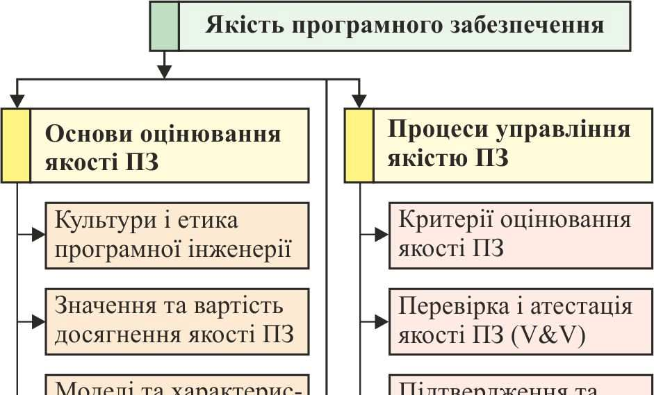
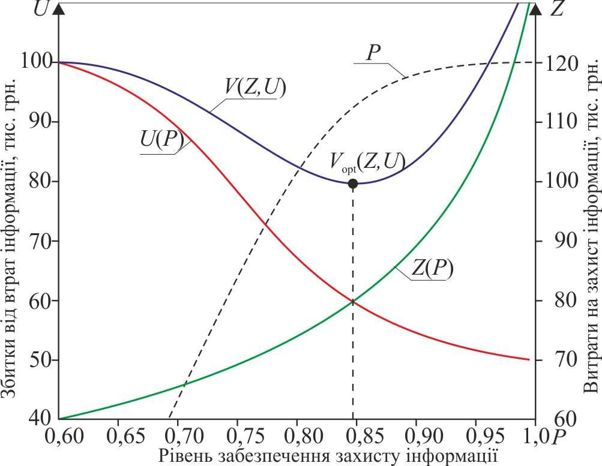
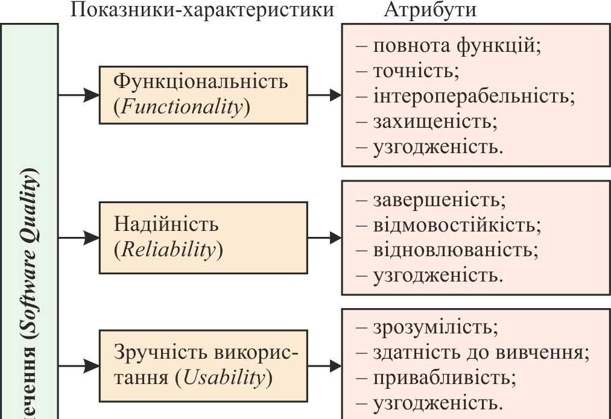
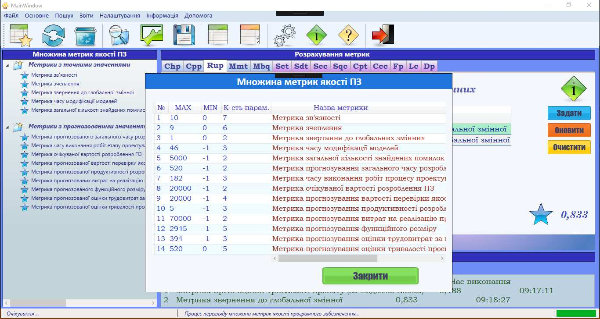
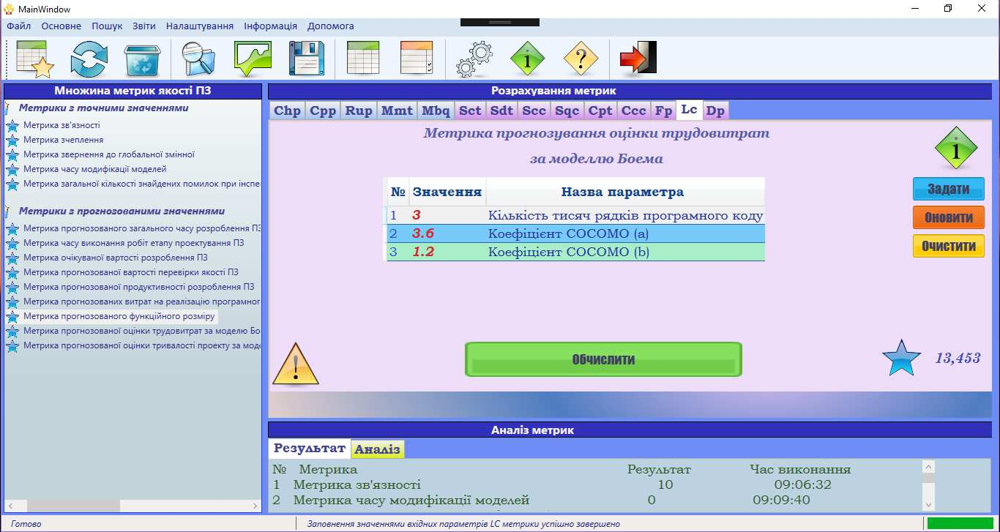
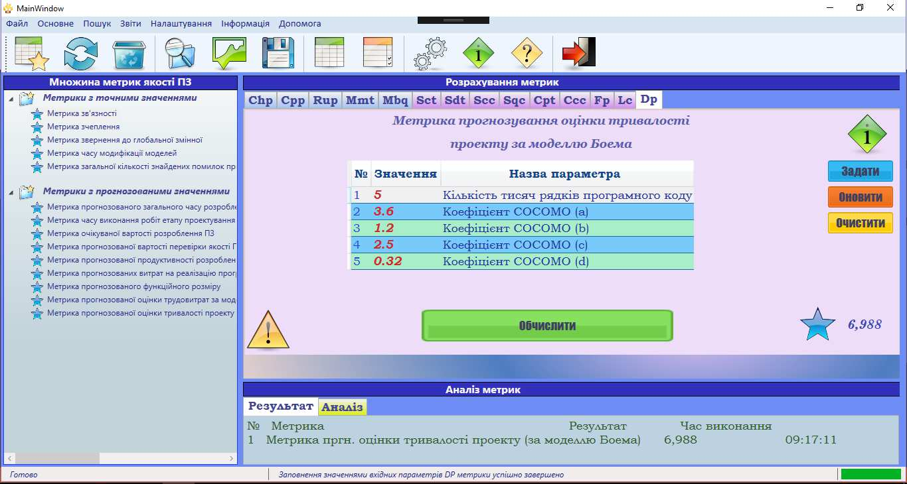
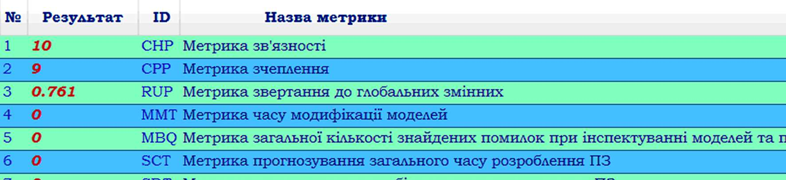
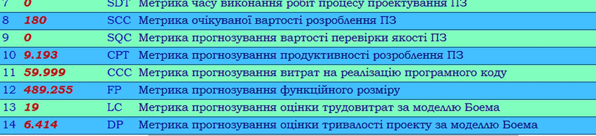
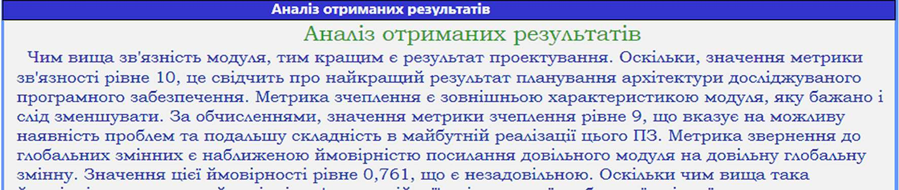
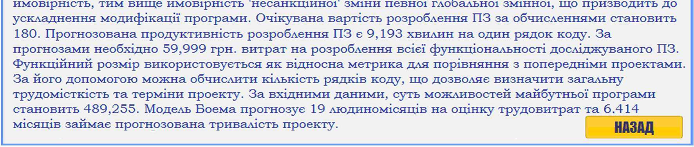

# 33.pdf

Ю. І. Грицюк, О. Т. Андрущакевич  
*Національний університет "Львівська політехніка", м. Львів, Україна*

### ЗАСІБ ДЛЯ ВИЗНАЧЕННЯ ЯКОСТІ ПРОГРАМНОГО ЗАБЕЗПЕЧЕННЯ МЕТОДАМИ МЕТРИЧНОГО АНАЛІЗУ

Розроблено сучасний програмний засіб для визначення якості програмного забезпечення (ПЗ) методами метричного аналізу, що дає змогу за допомогою показників якості розрахувати відповідні метрики і визначити значення комплексного показника якості програмного продукту. З'ясовано особливості процесу оцінювання якості ПЗ, тобто проаналізовано поняття якість програмного продукту як предмет стандартизації, а також рівні подання моделі якості ПЗ, що дало змогу встановити можливість її підвищення шляхом формування відповідних вимог до критеріїв оцінювання якості, вдосконалення моделей метричного аналізу його якості та методів кількісного її вимірювання на всіх етапах реалізації програмного проекту. Встановлено особливості використання метричного аналізу для визначення якості ПЗ, згідно з якими існує відсутність єдиних стандартів на метрики, тому кожен постачальник вимірювальної системи пропонує власні методи оцінювання якості ПЗ і відповідні метрики. Також є складним завдання інтерпретації значень метрик, позаяк для більшості користувачів як метрики, так і їх значення не зовсім є зрозумілими та інформативними. Виявлено, що основними параметрами при виборі варіанту реалізації ПЗ є його вартість і тривалість процесу розробки й репутація фірми-проектанта, але рішення, прийняті на підставі цих параметрів, не завжди гарантують належну якість ПЗ.

**Ключові слова:** інформаційні технології; програмний проект; стандарти якості; вимоги до програмного забезпечення; специфікація вимог; критерії оцінювання якості; показники якості програмного забезпечення; комплексний показник якості.

**Вступ.** Якість програмного забезпечення (ПЗ) є основною його характеристикою в різних сферах використання інформаційних технологій (Pleskach, Zatonatska, 2011), яка вказує на ступінь його відповідності встановленим вимогам (ISO 9001, 2008). Зазвичай, такі вимоги трактують по-різному, що породжує декілька незалежних визначень цього терміна. Здебільшого, під якістю ПЗ розуміють набір властивостей програмного продукту, що характеризують його здатність задовольнити встановлені або передбачувані потреби замовника, які він висловив у вигляді користувацьких вимог до нього на початкових етапах його розробки (Pomorova & Hovorushchenko, 2013a, 2013b).

Стандарт ISO/IEC 9126 (1991) регламентує зовнішні й внутрішні характеристики якості ПЗ. Якщо зовнішні характеристики відображають вимоги до функціонування ПЗ, то внутрішні характеристики використовують для підготовки плану досягнення необхідних значень зовнішніх характеристик його якості (ISO/IEC TR 9126-2, 9126-3, 2003). Як зовнішні, так і внутрішні характеристики якості відображають властивості самого ПЗ, а також погляди замовника і розробника на нього. Однак, безпосереднього користувача ПЗ в основному цікавить експлуатаційна його якість (ISO/IEC 9126-1, 2001), тобто сукупний ефект від досягнення необхідних характеристик програми, значення яких вимірюються швидкістю та достовірністю отриманого результату, а не його властивістю. Це поняття значно ширше, ніж будь-яка окрема характеристика якості ПЗ, наприклад, зручність його використання чи надійність роботи (ISO/IEC TR 9126-4, 2004).

Зазвичай, під оцінюванням якості ПЗ розуміють дії, що визначають, як саме ПЗ відповідає своєму призначенню (Kuliamin, Petrenko, 2008). Якість ПЗ оцінюють з використанням моделі якості (ISO/IEC 9126-1, 2001). Таке оцінювання набуває особливого значення із розвитком і вдосконаленням технологій визначення якості ПЗ, а саме — методами метричного аналізу. Усе це призвело до потреби розроблення відповідного засобу для визначення якості ПЗ відповідними методами.

**Аналіз останніх досліджень та публікацій.** На сьогодні процес оцінювання якості ПЗ за стандартом ISO 25010:2011 (Gordieiev et al., 2014) відбувається в такому порядку: на підставі атрибутів якості, зазначених у стандарті ISO 25023:2016, оцінюють підхарактеристики та характеристики якості, які, водночас, надають комплексну оцінку якості ПЗ. Оцінювання якості ПЗ з використанням результатів метричного аналізу зводиться до того, що на підставі показників якості розраховують значення відповідних метрик якості та значення комплексного показника якості майбутньому програмному продукту. Згідно з стандартом ISO 24765:2010, метрику визначають як міру ступеня володіння властивістю деякого продукту, яка має числове значення.

Проблемі якості ПЗ присвячено багато робіт українських й іноземних науковців, а саме: В. Харченка і Б. Конорєва (Gordieiev et al., 2014; Kharchenko et al., 2007, 2012; Konorev et al., 2009), Маєвського (Maievskyi & Kozina, 2015; Maievskyi, 2013), В. Яковини (Yakovyna, 2012; Yakovyna, Fedasiuk & Mamrokha, 2010), В. Міщенка і О. Поморової (Mishhenko, 2010; Mishhenko, Pomorova, Hovorushchenko, 2012; Pomorova & Ivanchyshyn, 2011), К. Лавріщевої (Lavrishcheva, 2008, 2013), О. Харченка (Kharchenko, Galay & Yatcyshyn, 2011; Kharchenko & Yatsyshyn, 2009), Г. Майєрса (Myers, Badzhett & Sandler, 2012), С. МакКоннелла (McConnell, 2013, 2006), Р. Фатрелла (Fatrell, Shafer & Shafer, 2003), І. Соммервілла (Sommerville, 2002), О. Медче (Maedche, Botzenhardt & Neer, 2012), С. Джонса (Jones, 2000; Jones, Bonsignour, 2012).

Проте, процедура оцінювання якості ПЗ та наявні методи і засоби забезпечення цієї якості, як власне і процес розроблення самого ПЗ залишаються незабезпеченими фундаментальною теорією та ефективною методологією (Andon et al., 2002). У дослідження у галузі оцінювання якості ПЗ, особливо на ранніх етапах його життєвого циклу, мають хаотичний, несистематизований характер (Braude, 2004). Водночас, як доведено у роботах (Pomorova & Hovorushchenko, 2013a, 2013b; Pomorova, Hovorushchenko & Tarasek, 2010), саме в кінці етапу проектування архітектури ПЗ можна й варто виявляти та усувати до 55 % всіх недоліків майбутнього програмного продукту. Безумовно, є багато фундаментальних досліджень з інженерії ПЗ (роботи Боема, Дейкстри, Мейєра), але відсутня завершена, протестована й апробована теорія та методологія розроблення складного і, водночас, якісного ПЗ, а також методи і засоби оцінювання та прогнозування його якості на ранніх етапах реалізації програмного проекту. Тому проблема оцінювання якості ПЗ потребує нагальних змін для запобігання непередбачених втрат і неприємних інцидентів, викликаних помилками його роботи (Hovorushchenko, 2018).

Не претендуючи на кардинальні зрушення в сучасних технологіях оцінювання якості ПЗ, спробуємо внести й свою лепту в методи метричного аналізу його якості, особливо програмних засобів для його визначення. Тому, як на сьогодні, видається нам актуальним дослідження, яке стосується розроблення адекватного засобу для визначення якості ПЗ методами метричного аналізу.

*Об'єкт дослідження* — метричний аналіз якості ПЗ.

*Предмет дослідження* — методи та засоби метричного аналізу якості ПЗ, які дадуть змогу на підставі відповідних показників, обчислених на ранніх етапах реалізації програмного проекту, розрахувати значення метрик якості ПЗ і визначити значення комплексного показника якості майбутнього програмного продукту.

*Мета дослідження* полягає в розробленні адекватного засобу для визначення якості ПЗ методами метричного аналізу, що дасть змогу за допомогою показників якості розрахувати відповідні метрики і визначити значення комплексного показника якості програмного продукту.

Для реалізації зазначеної мети потрібно виконати такі основні завдання:
1) з'ясувати особливості процесу оцінювання якості ПЗ, проаналізувати його якість як предмет стандартизації, а також рівні подання моделі якості ПЗ;
2) встановити особливості використання метричного аналізу для визначення якості ПЗ, які дадуть змогу з'ясувати причини їх неефективного використання, а також різні інтерпретації значень цих метрик;
3) розробити програмний засіб для визначення якості ПЗ, який би забезпечив можливість прогнозування подальшої ефективності процесу його розроблення та дав змогу сформувати відповідну множину даних для визначення значення комплексного показника якості програмного продукту;
4) зробити відповідні висновки та надати рекомендації щодо практичного використання засобу для визначення якості ПЗ методами метричного аналізу.

### 1. Особливості процесу оцінювання якості програмного забезпечення

Сучасні технології розроблення ПЗ досягли такого рівня свого розвитку, що виникла потреба у використанні інженерних методів оцінювання результатів його проектування на всіх етапах реалізації програмного проекту, контролю ступеня досягнення запланованих показників якості та їх метричного аналізу, оцінювання ризику можливих небезпек і ступеня використання готових компонент для зниження вартості реалізації нового проекту (Andon et al., 2002; Lypaev, 2001). Основу інженерних методів оцінювання якості ПЗ становить можливість її підвищення шляхом формування відповідних вимог до критеріїв оцінювання якості, вдосконалення моделей метричного аналізу його якості та методів кількісного її вимірювання на всіх етапах реалізації програмного проекту (Pomorova & Onyshchuk, 2011; Pomorova, Hovorushchenko & Tarasek, 2010). Статичні технології оцінювання якості ПЗ наведено на рис. 1, водночас як динамічні технології так чи інакше пов'язані з безпосереднім його тестуванням.

**Рис. 1.** Статичні технології оцінювання якості ПЗ

Зазвичай, згода, досягнута розробником ПЗ з його замовником стосовно користувацьких вимог до ПЗ, в т.ч. і його якості, нарівні з безпосереднім доведенням до системних інженерів того, що становить для замовника якість майбутнього продукту, вимагає окремого обговорення й формального визначення багатьох особ-

линостей цієї згоди (Hrytsiuk, 2018). Насамперед системні інженери повинні розуміти зміст, вкладений замовником у концепцію якості ПЗ, його підхарактеристики, характеристики й атрибути якості на всіх етапах реалізації програмного проєкту. Адже користувацькі вимоги до ПЗ та сформовані на підставі них системні вимоги визначають необхідні характеристики його якості й сформульовані замовником відповідні критерії його оцінювання та приймання, а також впливають на методи кількісного їх вимірювання під час підтвердження якості ПЗ. При цьому потрібно враховувати також які різні ризики реалізації програмного проєкту, так і процесу розроблення самого ПЗ.

**Якість ПЗ як предмет стандартизації.** Згідно з даними ГОСТ 2844-94, якість ПЗ представляє сукупність властивостей (показників якості) ПЗ, які забезпечують його здатність задовольняти потреби замовника відповідно до його призначення (Andon et al., 2002). Цей стандарт регламентує базову модель якості та показники, головним серед яких є *надійність*. Стандарт ISO/IEC 12207 визначає не тільки основні процеси етапів розроблення ПЗ, а й організаційні та додаткові процеси, які регламентують інженерію, планування й управління якістю ПЗ (Braude, 2004). Згідно з цим стандартом, на всіх етапах розроблення ПЗ повинен проводитися такий контроль його якості:

* перевірка відповідності користувацьких вимог до ПЗ з критеріями і показниками його якості;
* перевірка (верифікація) та атестація (валідація) проміжних результатів розроблення ПЗ на кожному з етапів реалізації програмного проєкту і визначення ступеня задоволення досягнутих критеріїв і показників його якості;
* тестування готового ПЗ, збирання даних про відмови, дефекти та інші помилки, які було виявлено в ПЗ під час його безпосередньої експлуатації;
* підбір моделей надійності ПЗ за отриманими результатами його тестування (дефекти, відмови та ін.);
* перевірка досяжності критеріїв і показників якості ПЗ, заданих у вимогах до нього.

*Інспектування якості ПЗ* – це процес перевірки його якості, орієнтований на команду розробників, протягом усіх етапів реалізації програмного проєкту.

*Доведення правильності роботи ПЗ* – це математична або логічна методика, яку використовують для того, щоб переконати себе (розробника ПЗ) й інших зацікавлених сторін у тому, що розроблене ПЗ відповідає тим вимогам, які було визначено та узгоджено з замовником. Таке доведення є формальним (строгим) методом.

Для будь-якого інженерного продукту існує безліч інтерпретацій його якості. Дотримання запланованих показників якості ПЗ можна вимагати від його розробників тою чи іншою мірою протягом усіх етапів його розроблення. Цих показників може бути небагато або вони можуть відображати певні властивості майбутнього програмного продукту, які хотіли б бачити його безпосередні користувачі та інші зацікавлені сторони, часто вони є результатом певного компромісу. Такий підхід повністю співпадає з розумінням такого поняття, як "прийнятна якість ПЗ", що є менш жорсткою точкою зору на забезпечення розробником якості ПЗ як гарантоване досягнення його досконалості (Koval & Moroz, 2006; Pomorova, Hovorushchenko & Onyshchuk, 2011).

*Вартість якості* ПЗ може бути диференційована на вартість попередження дефектів, вартість оцінювання ефективності роботи, вартість внутрішніх і зовнішніх збоїв під час роботи ПЗ. Рушійною силою успішної реалізації програмних проєктів є бажання їх керівників розробити таке ПЗ, яке б володіло певною цінністю, тобто було значущим для вирішення певних завдань або досягнення цілей – тактичних і стратегічних. Цінність ПЗ можна виражати у формі його вартості або в деякому іншому вигляді. Замовник, зазвичай, має своє уявлення про максимальну вартість вкладення коштів, повернення яких він очікує в разі досягнення основних цілей під час використання ПЗ. Він також може мати своє бачення щодо функціональних можливостей ПЗ та певні очікування щодо його якості.

Зазвичай, замовник спочатку концентрує свою увагу на функціональних можливостях ПЗ й не замислюється над питаннями його якості, а тим більше над пов'язаною з ними вартістю його розроблення. Тому на початковому етапі реалізації програмного проєкту предметом обговорення може стати питання про повне розуміння замовником вигоди від використання ПЗ і вартості його розроблення, пов'язаної з досягненням того чи іншого рівня якості ПЗ, а також про його залучення до процесу прийняття відповідних рішень. В ідеальному випадку більшість таких рішень потрібно приймати на етапі встановлення користувацьких вимог до ПЗ, але ці питання можуть (і повинні) підніматися протягом всіх етапів його розроблення. Не існує якихось "стандартних" правил щодо того, як саме необхідно приймати такі рішення. Однак, системні інженери повинні чітко уявляти різні альтернативні способи досягнення певного рівня якості ПЗ та відповідну вартість його розроблення для цього, щоб можна було спрогнозувати загальну вартість реалізації програмного проєкту.

Для наочної демонстрації залежності вартості реалізації програмного проєкту від рівня якості ПЗ розглянемо особливості розроблення системи захисту інформації (C3I), а саме її функціональну модель (рис. 2) (Grytsiuk & Sivec, 2016; Hrytsiuk & Sivets, 2016a, 2016b). В цій моделі не показано цінність інформації – об'єкта конфіденційності (наприклад, рахунки банківських вкладів чи коди доступу до них, позаяк ця інформація не втрачає своєї цінності з плином часу). Отже, на цьому рисунку введено такі позначення: $P$ – рівень (ймовірність) забезпечення захисту інформації (практично $0,6 \le P < 1,0$); $Z(P)$ – допустимі витрати на захист інформації як функція від необхідного рівня її захисту. Ці витрати зростають при підвищенні вимог до певного рівня забезпечення захисту інформації.

**Рис. 2.** Основні особливості процесу оцінювання якості C3I

Прагнення досягти дуже високого рівня забезпечення захисту інформації, звичайл, призводить до різкого зростання витрат, які можуть перевищити цінність самої інформації, яку потрібно захистити. Можливі втрати (збитки) власника інформації $U(P)$, понесені унаслідок неналежного рівня її захисту, є функцією від наявного рівня забезпечення її захисту $P$. З рисунка видно, що сума $Z(P) + U(P)$ визначає витрати $V(Z, U)$ на забезпечення захисту інформації. При цьому оптимальний рівень її захисту $V_{opt}(Z, U)$ відповідатиме мінімуму суми витрат на захист $Z(P)$ і можливих збитків $U(P)$ унаслідок втрати інформації, тобто неповноти її захисту. Прагнення перевищити його призведе до різкого зростання витрат $Z(P)$ на забезпечення захисту інформації; зниження ж рівня забезпечення захисту призведе до збільшення можливих збитків $U(P)$ унаслідок недосконалості функціонування СЗІ.

Отже, якість ПЗ є відносним поняттям, сенс якого замовники розуміють тільки при врахуванні реальних умов його застосування, тому вимоги, що пред'являються до якості ПЗ відповідними стандартами, повинні співвідноситися з умовами його використання та конкретною областю його застосування (Pomorova, Hovoroushchenko & Onyshchuk, 2011). Якість ПЗ характеризується такими компонентами: якістю процесів розроблення ПЗ, якістю продуктів програмного проекту і якістю супроводу або впровадження ПЗ (рис. 3).

**Рис. 3.** Основні компоненти оцінювання якості ПЗ

Компонента, пов'язана з процесами розроблення ПЗ, визначає ступінь формалізації, достовірності самих процесів на кожному етапі його розроблення, а також тісно пов'язана з верифікацією (перевіркою) та валідацією (затвердженням) (коротко – V & V) проміжних результатів цих процесів. Пошук і усунення помилок у готовому ПЗ проводять методами тестування, які знижують їх кількість і підвищують якість майбутнього програмного продукту.

*Якість продуктів програмного проекту* досягається за рахунок використання процедур контролю проміжних продуктів проекту на всіх етапах розроблення ПЗ, перевіркою їх на досягнення необхідної якості, а також завдяки використанню сучасних методів і засобів супроводу програмного продукту. Ефект від впровадження ПЗ значною мірою залежить від знань обслуговуючого персоналу, функціональних можливостей програмного продукту і чітких правил їх виконання.

**Модель якості ПЗ** має чотири рівні подання (Koval & Moroz, 2006).

*Перший рівень* відповідає визначенню характеристик (показників) якості ПЗ, кожна з яких відображає окрему точку зору користувача на його якість. Згідно з наявними стандартами (ISO/IEC 9126, ДСТУ 2844-1994, ДСТУ 2850-1994, ДСТУ 3230-1995), в модель якості входить шість характеристик/показників якості ПЗ (рис. 4): функціональність (*Functionality*), надійність (*Reliability*), зручність використання (*Usability*), супроводжуваність (*Maitainnability*), ефективність (*Efficiency*), переносність (*Portability*).

*На другому рівні* визначають атрибути якості ПЗ для кожної конкретної його характеристики, які деталізують різні її особливості. Набір цих атрибутів потім використовують в метричному аналізі якості ПЗ.

**Рис. 4.** Модель характеристик якості ПЗ

*Третій рівень* призначений для вимірювання якості за допомогою метрик, кожну з яких, згідно з стандартом ISO/IEC 9126, визначають як комбінацію методів вимірювання атрибута і шкали встановлення його значень. Для оцінювання атрибутів якості ПЗ на всіх етапах його розроблення (при перегляді документації та продуктів проекту, а також за результатами їхнього тестування) використовують метрики з заданою їх вагомістю для нівелювання результатів метричного аналізу сукупних атрибутів конкретного критерію чи показника якості ПЗ. Атрибут якості визначають за допомогою однієї або декількох методик якості ПЗ на різних етапах його розроблення і на завершальному етапі його тестування.

На *четвертому рівні* для оцінювання кількісного або якісного значення окремих атрибутів якості ПЗ використовують оцінний елемент метрики — її пріоритет. Залежно від призначення, особливостей експлуатації та умов супроводу ПЗ вибирають найбільш важливі характеристики і атрибути його якості (рис. 3). Вибрані атрибути і їх пріоритети відображають у вимогах до процесу розроблення ПЗ, або використовують відповідні пріоритети еталона класу ПЗ, до якого воно має належати.

Для розуміння зазначеного вище розглянемо більш детально показники якості ПЗ (Yakovyna, 2012; Yakovyna, Fedasiuk & Mamrokha, 2010).

**Функціональність ПЗ** — це сукупність властивостей, що визначають здатність ПЗ виконувати перелік функцій в заданому середовищі згідно з вимогами, що стосуються процесу оброблення даних, і вимог до загальносистемних засобів, без яких ПЗ не може функціонувати. Під функцією ПЗ потрібно розуміти деяку

упорядковану послідовність дій для задоволення його споживчих властивостей. Функції бувають цільові (основні) і допоміжні. До атрибутів, які стосуються функціональності ПЗ, належать:

- **функціональна повнота** – властивість ПЗ, яка показує ступінь достатності основних функцій для вирішення завдань згідно з його призначенням;
- **правильність (точність)** – атрибут, який показує ступінь досягнення правильних результатів роботи ПЗ;
- **інтероперабельність** – атрибут, який показує можливість взаємодії функцій ПЗ в спеціальних системах і середовищах (ОС, мережі та ін.);
- **захищеність** – атрибут, який визначає здатність ПЗ запобігати несанкціонованому доступу (випадкового або умисного) зловмисником до програм і даних.

*Надійність ПЗ* – це сукупність атрибутів, які визначають здатність ПЗ перетворювати вхідні дані в очікуваний результат за умов, що залежать від тривалості безперебійної роботи ПЗ (зношування та його старіння не враховуються). Зниження надійності ПЗ відбувається через помилки у вимогах до його функціональних можливостей та відповідної якості, які закладаються під час його проектування й виконання. Відмови і помилки в програмах з'являються на заданому проміжку часу. До підхарактеристик (субхарактеристик) надійності ПЗ належать:

- **безвідмовність** – атрибут, який визначає здатність ПЗ функціонувати без відмов (як програми, так і обладнання);
- **стійкість до помилок** – атрибут, який показує здатність ПЗ виконувати функції при аномальних умовах (збій апаратури, помилки в даних й інтерфейсах, порушення в діях оператора і ін.);
- **відновлюваність** – атрибут, який показує здатність ПЗ до перезапуску для повторного виконання й відновлення даних після відмов.

До деяких типів критичних систем (реального часу, радарних, систем безпеки, комунікацій та ін.) висуваються певні вимоги щодо забезпечення високої надійності (неприпустимість помилок, точність, достовірність, зручність застосування й ін.) (Zalewski, Kornecki & Pfister, 2018). Надійність ПЗ значною мірою залежить від кількості помилок, що залишилися й неліквідованих у процесі його розроблення на кожному з етапів. У ході експлуатації ПЗ помилки виявляють і усувають після аналізу причин їх появи. Якщо при виправленні помилок не вносяться нові або, принаймні, нових помилок вноситься менше, ніж їх усувають, то в ході експлуатації ПЗ його надійність безперервно зростає. Чим інтенсивніше експлуатують ПЗ, тим частіше виявляють помилки і швидше їх усувають, і, як наслідок, тим більшою стає його надійність.

На надійність ПЗ впливають такі чинники (Lavrishcheva, 2008, 2013):

- сукупність зовнішніх і внутрішніх загроз, що призводять до несприятливих наслідків роботи і до збитків ПЗ чи середовища його функціонування;
- загроза як прояв порушення безпеки системи, яка виникає внаслідок хакерських атак чи шкідливого ПЗ і призводить до спотворення чи втрати даних, а також порушення роботи самого ПЗ;
- цілісність даних і самого ПЗ як здатність його зберігати стійкість роботи і не мати ризику виникнення збою.

Виявлені помилки можуть бути результатом загрози ззовні або внутрішніх відмов роботи, вони так чи інакше підвищують ризик появи збитку під час роботи ПЗ і зменшують деякі властивості його надійності.

Отже, надійність ПЗ – одна з ключових проблем сучасного ПЗ, і її роль буде постійно зростати, оскільки постійно підвищуються вимоги до його якості. Новий напрям інформаційних технологій – інженерія програмної надійності (англ. *Software Reliability Engineering*) – орієнтований на кількісне вивчення операційної поведінки компонент ПЗ за відношенням до користувача, який очікує його надійну роботу, тобто він містить такі особливості:

- вимірювання надійності ПЗ, тобто проведення його кількісного оцінювання за допомогою передбачень, збирання даних про його поведінку в процесі експлуатації, а також шляхом використання сучасних моделей надійності;
- вибір стратегії та метрик конструювання ПЗ і підбір готових його компонент, процесу розроблення компонентної системи, а також середовища функціонування, що впливає на надійність роботи ПЗ загалом;
- застосування сучасних методів *інспектування*, *верифікації*, *валідації* та *тестування* ПЗ під час його розроблення та подальшої експлуатації.

*Верифікацію* застосовують для визначення відповідності готового ПЗ встановленим вимогам до нього у відповідній специфікації, узгоджену й затверджену безпосереднім його замовником, а *валідація* – для встановлення відповідності ПЗ вимогам користувача, які були пред'явлені замовником.

Питання надійності ПЗ протягом багатьох років розглядали різними фахівцями з використанням різних методів і технологій (Yakovyna, Fedasiuk & Mamrokha, 2010). Відображенням пошуку шляхів подолання цієї проблеми стала поява в англомовній літературі та наповнення новим змістом терміна "Dependability", що має більш широке тлумачення, ніж просто "надійність", якому він відповідає в українській мові. Тому в Україні в різних нормативних документах почали використовувати термін "гарантоздатність" (надійність у широкому змісті), який поєднує властивості класичної надійності (безвідмовність, ремонтопридатність, готовність і збережуваність) та безпеки як функціональної, так і інформаційної. На початку 2000-х років було узагальнено результати та зафіксовано підсумки розвитку гарантоздатних (як надійних і безпечних) обчислень, визначена досить повна та збалансована система понять і таксономічних схем. До цього часу поняття "dependability" як гарантоздатність ("розширена" надійність) були вже визначені у тому чи іншому варіантах низкою стандартів, технічних звітів і монографій.

Отже, в інженерії програмної надійності термін *гарантоздатність* (англ. *Dependability*) означає здатність ПЗ мати властивості, бажані для користувача, який впевнений в якісному виконанні його функцій, заданих у вимогах до нього (Maievskyi, 2013). Цей термін визначає додаткова кількість атрибутів, якими має володіти ПЗ, а саме:

- готовністю до використання (*Availability*);
- готовністю до безперервного функціонування (*Reliability*);
- безпекою для навколишнього середовища, тобто здатністю ПЗ не викликати катастрофічних наслідків у разі відмови (*Safety*);
- секретністю та збереженням інформації (*Confidentiality*);
- здатністю до збереження ПЗ і стійкість до мимовільної її зміни (*Integrity*);
- здатністю до експлуатації ПЗ, простотою виконання операцій обслуговування, а також усунення помилок, відновленням ПЗ після їх усунення (*Maintainability*);
- готовністю й збереженням інформації (*Security*) і ін.

Досягнення надійльності ПЗ забезпечується шляхом запобігання відмови (англ. Fault Prevention) або його усуненням (англ. Removal Fault), а також оцінкою можливості появи нових відмов і заходів боротьби з ними.

Отже, з'ясовано особливості процесу оцінювання якості ПЗ, тобто проаналізовано поняття якість програмного продукту як предмет стандартизації, а також рівні подання моделі якості ПЗ, що дало змогу встановити можливість її підвищення шляхом формування відповідних вимог до критеріїв оцінювання якості, вдосконалення моделей метричного аналізу його якості та методів кількісного її вимірювання на всіх етапах реалізації програмного проекту.

## 2. Використання метричного аналізу для визначення якості програмного забезпечення

Сучасне ПЗ характеризується складністю опису, наявністю набору тісно взаємопов'язаних компонент з локальними завданнями та глобальними цілями, відсутністю повних аналогів і, як наслідок, неможливістю використання будь-яких типових проектних рішень. Окрім цього, нове ПЗ, зазвичай, вимагає повної інтеграції з наявним ПЗ, функціонуванням у неоднорідному середовищі на різних апаратних платформах, часто відокремленням складових у просторі та різнорідністю груп користувачів із різним рівнем кваліфікації (Pomorova & Hovorushchenko, 2009).

Велика кількість помилок ПЗ виникає на етапі формулювання вимог (10-23 %), де спостерігається така тенденція: чим більший обсяг ПЗ, тим більше помилок вноситься концептуальних помилок (Hrytsiuk, 2018). Окрім цього, в процесі формулювання вимог до ПЗ відбуваються інформаційні втрати через неповноту та різне розуміння потреб замовників і контексту інформації у специфікації вимог. Особливо такі втрати інформації відчутні для програмних проектів, які стосуються стику різних предметних областей знань. Програмні проекти з неповними вимогами та погано підготовленими специфікаціями вимог, зазвичай, не можуть мати успішної реалізації. За таких умов актуальним і дуже важливим є аналіз специфікації вимог до ПЗ незалежними експертами для того, щоб уникнути помилок на етапах формулювання вимог, проектування архітектури ПЗ та подальшого його конструювання (Hrytsiuk, 2018).

З наведених даних у табл. 1 видно, що помилки формулювання вимог до ПЗ та проектування його архітектури становлять 25-55% від всіх можливих помилок, причому чим більший обсяг ПЗ, тим більше помилок вноситься саме на ранніх етапах його розроблення.

**Табл. 1. Розподіл помилок, припущених на різних етапах розроблення ПЗ (Pomorova & Hovorushchenko, 2009)**

| Етап розроблення ПЗ | Обсяг ПЗ / частка помилок, % | | | | |
| :--- | :---: | :---: | :---: | :---: | :---: |
| | 2K | 8K | 32K | 128K | 512K |
| Формулювання вимог | 10 | 15 | 20 | 22 | 23 |
| Проектування архітектури | 15 | 19 | 25 | 28 | 32 |
| Конструювання | 75 | 66 | 55 | 50 | 45 |

На сьогодні оцінювання якості ПЗ за стандартом ISO 25010:2011 відбувається в такий спосіб: на підставі атрибутів якості, зазначених у ISO 25023:2016, оцінюють підхарактеристики та характеристики якості ПЗ, які, водночас, надають комплексну його оцінку. Згідно з даними стандарту ISO 25010:2011, характеристика — це набір властивостей ПЗ, за допомогою яких можна описати та оцінити його якість. Підхарактеристика якості ПЗ виражається середньозваженим арифметичним показником з урахуванням значень атрибутів, що оцінюють цю підхарактеристику, та коефіцієнтів їхньої вагомості (Pomorova & Hovorushchenko, 2010).

Існує ряд моделей, що дають змогу розраховувати якість ПЗ, однак багатозначність трактування цих характеристик ускладнює такі розрахунки. Більшість моделей базуються на використанні різних метрик ПЗ (Pomorova, Hovorushchenko & Onyshchuk, 2011). Історія програмних метрик нараховує понад чверть століття, тобто з того моменту, коли вартість комерційних програмних продуктів почала зростати і знадобилися наукові методи аналізу процесів розроблення ПЗ. Сучасна IT-індустрія нагромадила велику кількість метрик, які дають змогу оцінити окремі виробничі та експлуатаційні властивості ПЗ (Andon et al., 2002; Zalewski, Kornecki & Pfister, 2018).

Оцінювання ж якості ПЗ на підставі використання результатів метричного аналізу відбувається в такий спосіб: на підставі показників якості ПЗ розраховують значення метрик якості, які, водночас, надають комплексну оцінку якості ПЗ.

Свого часу введення кількісних метрик якості ПЗ мало сприяти вирішенню деяких практичних завдань (Lavrishcheva, 2008): 1) прогнозування кількості помилок у ПЗ від початку проектування; 2) прогнозування рівня складності ПЗ та його супроводу на підставі аналізу результатів проектування; 3) прогнозування рівня складності процесів тестування та кількості неявдених помилок на підставі аналізу коду програми; 4) прогнозування остаточного розміру коду програми на підставі аналізу оцінок складності проектування архітектури ПЗ; 5) визначення впливу окремих характеристик програмного коду на якість готового ПЗ; 6) контроль етапів реалізації програмного проекту; 7) аналіз явних і прихованих дефектів у готовому ПЗ; 8) виявлення кращих методів і технологій розроблення ПЗ на підставі їх порівняння.

Отже, якість ПЗ можна виміряти за допомогою метрик якості. За визначенням стандарту ISO/IEC 9126-2, метрика якості ПЗ є "... моделлю вимірювання атрибута, пов'язаного з характеристикою якості ПЗ. Це комбінація конкретного методу вимірювання (способу отримання значення) атрибута сутності й шкали вимірювання" (Andon et al., 2002). Згідно з даними стандарту ISO 24765:2010, метрику можна визначити як міру ступеня володіння властивістю, яка має числове значення. Загалом, метрика ПЗ – це міра, яка дає змогу отримати числове значення деякої властивості ПЗ як середньозважене арифметичне з урахуванням значень показників, що оцінюють цю метрику, та коефіцієнтів їхньої вагомості (Lavrishcheva, 2013).

Незважаючи на численні дослідження програмних метрик (Pomorova & Hovorushchenko, 2009; Pomorova, Hovorushchenko & Tarasek, 2010), однак залишається багато невирішених питань. Одним з таких питань є відсутність єдиних стандартів на метрики (створено більше тисячі метрик), тому кожен постачальник вимірювальної системи пропонує власні методи оцінювання якості ПЗ і відповідні метрики. Також є складним завдання інтерпретації значень метрик, позаяк для більшості користувачів як метрики, так і їх значення не зовсім є зрозумілими та інформативними. На етапі проектування архітектури ПЗ основна увага при виборі при-

датного проекту приділяється вартості його реалізації, тривалості процесу розроблення, репутації фірми-проєктанта та наявним технологіям розроблення ПЗ. За статистичними даними (Pomorova & Hovorushchenko, 2009; Pomorova, Hovorushchenko & Tarasek, 2010) тільки 1,5 % програмних компаній намагаються оцінити якість процесів і готового продукту кількісно за допомогою метрик, і тільки 0,5 % цих компаній намагаються покращити роботу, керуючись кількісними критеріями якості ПЗ з метою виготовлення бездефектних продуктів. Окрім цього, сучасні технології вимірювання якості ПЗ ще не досягли своєї "зрілості", оскільки тільки 0,5 % програмних компаній працюють за такою моделлю зрілості здібностей СММ (англ. *Capability Maturity Model*) (Pomorova & Hovorushchenko, 2013a; Pomorova, Hovorushchenko & Tarasek, 2010).

За видом (станом) об'єкта вимірювання (робоча версія програми або сукупність документів і програмного коду) метрики умовно поділяються на зовнішні, внутрішні й експлуатаційні (Pomorova & Hovorushchenko, 2010, 2013a).

*Внутрішні метрики* призначені для оцінювання внутрішньої якості ПЗ, тобто множини властивостей, які визначають його здатність задовольняти встановленим або реальним потребам замовників при його використанні в певних умовах безпосередніми користувачами. Вони також надають можливість цим користувачам, менеджерам і безпосереднім розробникам ПЗ оцінювати якість проміжних і остаточних продуктів програмного проекту безпосередньо за їх властивостями без потреби виконання їх на комп'ютері.

*Зовнішні метрики* використовують виміри робочого ПЗ на комп'ютері, отримані внаслідок вимірювання його поведінки в ході виконання роботи. Вони призначені для оцінювання зовнішньої якості ПЗ, тобто його рівня, якому воно відповідає згідно з встановленими (заявленими) і передбачуваними вимогами під час його використання у певних умовах.

*Метрики експлуатаційної якості* дають змогу виміряти рівень якості ПЗ, встановлене в замовника й використовується у певному середовищі експлуатації за безпосереднім призначенням, задовольняє потреби користувачів стосовно ефективного, продуктивного та безпечного вирішення завдань, покладених на нього, а також справляє загальне позитивне враження на його безпосередній користувач. Ці метрики допомагають оцінити не властивості самого ПЗ, а видимі результати його експлуатації, тобто експлуатаційну якість ПЗ (Koval & Moroz, 2006; Kuliamin & Petrenko, 2008).

Внаслідок проведеного аналізу метрик якості ПЗ з точки зору можливості їх застосування на ранніх етапах його розроблення з отриманням точного або прогнозованого значення було виділено деякі метрики, які вже на етапі проектування архітектури ПЗ мають точне значення (Pomorova & Hovorushchenko, 2013b): 1) *метрика Чепіна* — аналізує характер використання змінних з переліку введеної та оброблюваної інформації; 2) *метрика зв'язності (зв'язність (cohesion)* — внутрішня характеристика програмного модуля, яка залежить від типу модуля або проекту; 3) *метрика зчеплення (coupling)* — зовнішня характеристика модуля, який бажано і варто зменшувати — міра взаємозалежності модулів за даними; 4) *метрика Джилба* (складова метрики) — модульна складність програми, за допомогою якої на етапі проектування можна підрахувати кількість міжмодульних зв'язків; 5) *метрика Мак-Клура* — спрямована на оцінювання архітектури ПЗ; 6) *метрика Кафура* — ґрунтується на врахуванні потоків даних; 7) *метрика звертання до глобальних змінних* — характеризується парою $(p, r)$, де $p$ — модуль, який має доступ до глобальної змінної r; 8) тривалість модифікації моделей — метрика процесу розроблення ПЗ; 9) кількість знайдених помилок при інспектуванні моделей і прототипів підсистем, модулів, функцій, вимог та густота помилок.

Аналіз метрик якості ПЗ з точки зору можливості їх застосування на етапі проектування його архітектури з отриманням точного або прогнозованого значення дає нам змогу також виділити ряд метрик, які мають прогнозоване значення на етапі проектування (Pomorova, Hovorushchenko & Onyshchuk, 2011): 1) *очікувана LOC-оцінка (експертна)*; 2) *метрика Холстеда* — обчислюється на підставі аналізу кількості рядків і синтаксичних елементів вихідного коду програми; 3) *метрика Маккейба* — цикломатична складність; 4) *метрика Джилба* — відносна логічна складність програми; 5) прогнозована кількість операторів програми; 6) прогнозована оцінка складності інтерфейсів компонент ПЗ; 7) прогнозована загальна тривалість процесу розроблення ПЗ — метрика процесу розроблення ПЗ; 8) тривалість виконання робіт етапу проектування ПЗ — метрика процесу розроблення ПЗ; 9) *очікувана вартість процесу розроблення ПЗ*; 10) *прогнозована вартість перевірки якості* — метрика процесу розроблення ПЗ; 11) *прогнозована продуктивність процесу розроблення ПЗ*; 12) *прогнозовані витрати на реалізацію коду* — метрика процесу розроблення ПЗ; 13) *прогнозований функціональний розмір FP* — вимірює суть можливостей майбутньої програми; 14) *прогнозована оцінка трудовитрат і тривалості реалізації програмного проекту* — за моделлю Боема.

Отже, для побудови інтелектуального методу оцінювання результатів проектування архітектури ПЗ та прогнозування характеристик його якості нами було обрано 9 метрик етапу його проектування з точними значеннями та 15 метрик етапу проектування ПЗ з прогнозованими значеннями. Інші метрики є похідними від обраних базових метрик (Andon et al., 2002; Pomorova & Hovorushchenko, 2009). Найбільш використовуваними джерелами інформації щодо складності ПЗ є метрики (Pomorova & Hovorushchenko, 2010; Pomorova & Ivanchyshyn, 2011; Pomorova, Hovorushchenko & Tarasek, 2010): Чепіна, Мак-Клура, Кафура, Холстеда, Маккейба, Джилба. Щодо якості ПЗ, то найчастіше для його оцінювання використовують метрики зв'язності, зчеплення, очікуваної вартості розроблення, прогнозованої вартості перевірки якості, прогнозованої вартості розроблення, очікуваного загальної тривалості процесу розроблення ПЗ, прогнозованої тривалості етапу проектування.

Розглянемо для прикладу метрику Чепіна та метрику Кафура.

*Метрика Чепіна* аналізує характер використання змінних зі переліку введення-виведення, тобто оброблювану інформацію. Існує декілька модифікацій метрик Чепіна. Суть найпростішої метрики Чепіна з точки зору її практичного використання як достатньо ефективного методу полягає в оцінюванні інформаційної міцності окремо взятого програмного модуля за допомогою ана-

лізу характеру змінних з переліку введення-виведення. У цьому переліку всю множину змінних поділяють на такі функціональні групи (Pomorova & Hovorushchenko, 2013a):

* множина "P" – змінні, які вводять для виконання розрахунків і для забезпечення виведення отриманої інформації;
* множина "М" – модифіковані або створювані змінні всередині програми;
* множина "С" – змінні, які беруть участь в управлінні роботою програмного модуля (керуючі змінні);
* множина "Т" – не використовувані в програмі ("паразитні") змінні.

Оскільки кожна змінна може виконувати одночасно декілька функцій, тому потрібно її враховувати в кожній відповідній функціональній групі.

Метрику Чепіна можна обчислити за формулою (Pomorova & Hovorushchenko, 2013b):

$$Is = Qm \cdot (P + 2 \cdot M + 3 \cdot C + 0{,}5 \cdot T)$$

де: $Qm$ – кількість модулів програми; $P$ – змінні для розрахунків і виведення; $M$ – модифіковані або створені в програмі змінні; $C$ – керуючі змінні; $T$ – не використовувані в програмі ("паразитні") змінні.

*Метрика Кафура* ґрунтується на врахуванні потоків даних. Згідно з даними, наведеними в роботах (Lavrishcheva, 2008; Pomorova & Hovorushchenko, 2009), інформаційну складність ПЗ можна обчислити за такою формулою:

$$I = Qm \cdot (W \cdot R + WrRd \cdot (W + R + WrRd + 1))$$

де: $Qm$ – кількість модулів програми; $W$ – середня кількість процедур модуля, які оновлюють структуру даних; $R$ – середня кількість процедур модуля, які зчитують інформацію зі структури даних; $WrRd$ – середня кількість процедур модуля, які зчитують і оновлюють структуру даних.

Кількість модулів програми, виходячи з наведених формул метрик Чепіна та Кафура, можна визначити як на підставі метрики Чепіна

$$Qm = \frac{Is}{P + 2 \cdot M + 3 \cdot C + 0{,}5 \cdot T}$$

так і на підставі метрики Кафура

$$Qm = \frac{I}{W \cdot R + WrRd \cdot (W + R + WrRd + 1)}$$

Прирівнявши їх між собою, матимемо такий вираз

$$\frac{Is}{P + 2 \cdot M + 3 \cdot C + 0{,}5 \cdot T} = \frac{I}{W \cdot R + WrRd \cdot (W + R + WrRd + 1)}$$

з якого отримаємо

$$I = \frac{Is \cdot (W \cdot R + WrRd \cdot (W + R + WrRd + 1))}{P + 2 \cdot M + 3 \cdot C + 0{,}5 \cdot T}$$

Отже, метрику Кафура можна обчислити з використанням метрики Чепіна (і навпаки), що свідчить про їх взаємну кореляцію.

Різні метрики відображають специфічні особливості якості ПЗ (Hovorushchenko, 2018). Для всебічного врахування цих особливостей при оцінюванні якості ПЗ застосовують не одну метрику, а їх сукупність. Якщо було отримано декілька метрик, то кожне значення метрики множиться на відповідний ваговий коефіцієнт, встановлений експертами з огляду на домінантні критерії якості ПЗ відповідно до принципових завдань, особливостей, функціонального призначення та властивостей. Після цього потрібно додати всі показники

для отримання комплексної оцінки рівня якості ПЗ або якості процесу проєктування його архітектури. Найбільш актуально застосовувати досить великі сукупності метрик якості ПЗ на етапі проєктування його архітектури, а в наступних етапах його розроблення значення цих метрик можна тільки уточнювати.

Отже, встановлено особливості використання метричного аналізу для визначення якості ПЗ, згідно з якими існує відсутність єдиних стандартів на метрики, тому кожен постачальник вимірювальної системи пропонує власні методи оцінювання якості ПЗ і відповідні метрики. Також є складним завдання інтерпретації значень метрик, позаяк для більшості користувачів як метрики, так і їх значення не зовсім є зрозумілими та інформативними. Виявлено, що основними параметрами при виборі варіанту реалізації ПЗ є його вартість та тривалість процесу розроблення й репутація фірми-проєктанта, але рішення, прийняті на підставі цих параметрів, не завжди гарантують належну якість ПЗ.

3. Розроблення програмного засобу для визначення якості ПЗ

Отже, як на наш погляд, то актуальним завданням є подальше дослідження можливості використання метричного аналізу для визначення якості ПЗ на підставі інформації, отриманої зі специфікації вимог до ПЗ. Для цього нами було розроблено відповідний програмний засіб (рис. 5), призначений для визначення якості ПЗ на підставі метричного аналізу, тобто, з використання метрик якості з точними і прогнозованими значеннями (Andrushchakevych & Hrytsiuk, 2018). Перевагами нашого програмного засобу над відомими є можливість здійснювати аналіз ПЗ на підставі отриманих значень метрик із прогнозуванням подальшої успішності процесу його розроблення. Також внаслідок проведення відповідних розрахунків на виході можна сформувати відповідну множину даних, які дають змогу здійснити аппроксимацію результатів метрик, надають кількісну оцінку якості продукту проєкту та значення прогнозу характеристик якості розроблювального ПЗ.

Для організації процесу управління ризиками розроблення ПЗ керівнику проєкта необхідно, передусім, навчитись прогнозувати причини виникнення тих чи інших потенційних проблем, появи негативних ситуацій чи несприятливих подій. Під прогнозом потрібно розуміти науково обґрунтоване судження про можливі стани процесу управління реалізацією програмного проєкту, про альтернативні траєкторії управління й терміни його виконання. Прогнозування управлінських рішень найтісніше пов'язане зі стратегічним і тактичним плануванням ризиків реалізації програмних проєктів.

Даний програмний засіб було розроблено в середовищі розробки Microsoft Visual Studio .NET 2017. Інтернет підєднання для коректної роботи засобу не вимагається. Виконання завдання розпочиналося з детального прототипування інтерфейсу користувача з поступовим нарощенням функціоналу програмного засобу. Розроблений інтерфейс програмного засобу можна переглянути на рис. 5,а.

Клас ***MetricsQualitySoftware.cs*** є абстрактним з базовими функціями, необхідними для знаходження значення метрики. Серед основних методів класу є: встановлення нового значення параметра метрики (ChangeValue_OfParameter), отримання назви параметра (GetName-OfParameter), встановлення основної інформації про

метрику (SetInformation_OfMetric), встановлення дефолтних значень параметрів метрики (SetAllParameters WithDefaultValue_OfMetric), вивід довідкової інформації метрики (ShowDescription_OfMetric), функція знаходження значення метрики (FindMetric), очищення значень параметрів метрики (ClearAllParameters_OfMetric).

**Рис. 5.** Вікна програмного засобу для визначення якості ПЗ методами метричного аналізу

Для легкого редагування, занесення та отримання даних з певних комірок таблиці DataGrid, використовується клас *DataGridHelper.cs* з основними методами: знаходження значення певної комірки за індексом рядка і стовпця (GetCell), а також індекса рядка (GetRow).

Класи CHPMetric.cs, CPPMetric.cs, MBQMetric.cs, MMTMetric.cs, RUPMetric.cs, CCCMetric.cs, CPTMetric.cs, SCCMetric.cs, SCTMetric.cs, SDTMetric.cs, SQCMetric.cs, FPMetric.cs, LCMetric.cs, DPMetric.cs – це класи метрик, що наслідують абстрактний клас MetricsQualitySoftware.cs та перевизначають його методи відповідно до вимог їхнього знаходження.

Класи *MyTableInfo_OfAllMetrics.cs*, *MyTableInfo_OfAllParameters.cs*, *MyTableInfoCharacteristic_for-MetricFp.cs* – це класи-моделі, призначені для запису в них даних, отриманих з певних таблиць DataGrid та виводу сформованої табличної інформації.

**Приклад роботи програмного засобу**. Для кращого розуміння принципу роботи програмного засобу проведемо дослідження на визначення якості та загальної прогнозованої оцінки успішності процесу його розроблення. Проаналізувавши досліджуване ПЗ, отримаємо такі початкові вхідні дані для визначення значень метрик, що містяться в табл. 2. Після внесення всіх вхідних параметрів метрик і виконання їхнього обчислення програмним засобом, здійснюється збирання необхідної інформації та побудова прогнозу щодо якості досліджуваного ПЗ. Програмний засіб виводить загальну таблицю значень метрик (рис. 7), здійснює графічне подання результатів за допомогою секторної діаграми та гістограми (рис. 6) та надає загальну оцінку якості ПЗ (рис. 8).

**Рис. 6.** Графічне подання результатів у вигляді гістограми

<b>Табл. 2. Вхідні дані для програмного засобу</b>

| № з/п | Назва параметра | Значення |
| :---: | :--- | :---: |
| 1 | Скільки разів модуль дійсно отримає доступ до глобальної змінної | 265 |
| 2 | Скільки разів модуль міг би отримати доступ до глобальної змінної | 348 |
| 3 | Кількість рядків програмного коду | 4670 |
| 4 | Тривалість реалізації програмного проєкту | 126 |
| 5 | Частина етапу проєктування архітектури ПЗ в процесі його розроблення | 2 |
| 6 | Кількість помилок модуля | 108 |
| 7 | Кількість модулів | 345 |
| 8 | Очікувана кількість рядків вихідного коду функції | 54, 34, 28, 58, 6 |
| 9 | Очікувана вартість розроблення рядка функції | 1 |
| 10 | Частина етапу верифікації, валідації та тестування ПЗ в процесі його розроблення | 1 |
| 11 | Частина стадії перевірки якості продукту проєкта на етапах верифікації, валідації та тестування | 2 |
| 12 | Очікувана кількість рядків вихідного коду в аналогічній функції | 45, 30, 25, 50, 5 |
| 13 | Продуктивність процесу розроблення аналогічної функції | 2 |
| 14 | Прогнозована продуктивність процесу розроблення ПЗ | 3 |
| 15 | Кількість зовнішніх входів функції, які по-різному впливають на виконувану функцію | 5, 11, 6, 5, 34 |
| 16 | Кількість зовнішніх виходів функції для істотно різних алгоритмів і нетривіальної функціональності | 8, 56, 7, 7, 12 |
| 17 | Кількість зовнішніх запитів | 3, 3, 10, 2, 4 |
| 18 | Кількість внутрішніх логічних файлів або унікальних логічних груп користувацьких даних | 1, 1, 53, 5, 7 |
| 19 | Кількість зовнішніх логічних файлів або унікальних логічних груп користувацьких даних | 4, 1, 1, 8, 2 |
| 20 | Рівень зв'язності | функційний |
| 21 | Тип зчеплення | за вмістом |
| 22 | Кількість функцій | 5 |

**Рис. 7.** Отримані результати метрик

Рис. 8. Отримані результати розрахунку якості ПЗ на підставі метричного аналізу

Отже, розроблено програмний засіб для визначення якості ПЗ методами метричного аналізу, який забезпечує можливість прогнозування подальшої ефективності процесу його розроблення та сформувати відповідну множину даних для визначення значення комплексного показника якості програмного продукту. Наведено приклад роботи програмного засобу, а також проведено дослідження що визначення якості деякого ПЗ та загальної прогнозованої оцінки успішності процесу його розроблення.

**Висновки**

Розроблено сучасний програмний засіб для визначення якості ПЗ методами метричного аналізу, що дає змогу за допомогою показників якості розрахувати відповідні метрики і визначити значення комплексного показника якості програмного продукту. За результатами дослідження можна зробити такі основні висновки.

1. З'ясовано особливості процесу оцінювання якості ПЗ, тобто проаналізовано поняття якість програмного продукту як предмет стандартизації, а також рівні подання моделі якості ПЗ, що дало змогу встановити можливість її підвищення шляхом формування відповідних вимог до критеріїв оцінювання якості, вдосконалення моделей метричного аналізу його якості та методів кількісного її вимірювання на всіх етапах реалізації програмного проекту.

2. Виявлено, що рушійною силою успішної реалізації програмних проектів є бажання їх керівників розробити таке ПЗ, яке б володіло певною цінністю, тобто було значущим для вирішення певних завдань або досягнення цілей — тактичних і стратегічних. Цінність ПЗ можна виражати у формі його вартості або в деякому іншому вигляді. Замовник, зазвичай, має своє уявлення про максимальну вартість вкладення коштів, повернення яких він очікує в разі досягнення основних цілей під час використання ПЗ. Він також може мати своє бачення щодо функціональних можливостей ПЗ та певні очікування щодо його якості роботи.

3. Встановлено особливості використання метричного аналізу для визначення якості ПЗ, згідно з якими існує відсутність єдиних стандартів на метрики, тому кожен постачальник вимірювальної системи пропонує власні методи оцінювання якості ПЗ і відповідні метрики. Також є складним завдання інтерпретації значень метрик, позаяк для більшості користувачів як метрики, так і їх значення не зовсім є зрозумілими та інформативними. Виявлено, що основними параметрами при виборі варіанту реалізації ПЗ є його вартість та тривалість процесу розроблення й репутація фірми-проєктанта, але рішення, прийняті на підставі цих параметрів, не завжди гарантують належну якість ПЗ.

4. Розроблено програмний засіб для визначення якості ПЗ методами метричного аналізу, який забезпечує можливість прогнозування подальшої ефективності процесу його розроблення та сформувати відповідну множину даних для визначення значення комплексного показника якості програмного продукту.

5. Зроблено відповідні висновки та надано рекомендації щодо використання розробленої методики візуалізації інформації.

**Перелік використаних джерел**

Andon, F. I., Koval, G. I., Korotun, T. M., & Suslov, V. Iu. (2002). *Osnovny inzhenerii kachestva programmnykh sistem* (Sergienko, I. V. Scientific Ed.). Kyiv: Akademperiodika. 504 p. [In Russian].

Andrushchakevych, O. T., & Hrytsiuk, Yu. I. (2018). Vykorystannia metrychnoho analizu dlia vyznachennia yakosti prohramnoho zabezpechennia. *Naukovi doslidzhennia: zakonomirnosti ta paradyoksy: zb. mater. mizhdystsynar. nauk.-prakt. konf.* (pp. 23–29), 18 travnia 2018 r., m. Kyiv, Ukraina. Kyiv: Yudina L. I. 99 p. Retrieved from: [http://futurolog.com.ua/publish/8/Zbirnyk.pdf](http://futurolog.com.ua/publish/8/Zbirnyk.pdf). [In Ukrainian].

Braude, E. (2004). *Tekhnologiia razrabotki programmnogo obespecheniia*. St. Petersburg: Izd-vo "Piter". 655 p. [In Russian].

Fatrell, R. T., Shafer, D. F., & Shafer, L. I. (2003). *Upravlenie programmnymi proektami: dostizhenie optimalnogo kachestva pri miniature zatrat*, (Trans. from English). Moscow: Izd. dom "Viliams". 1136 p. [In Russian].

Gordieiev, O., Kharchenko, V., Fominykh, N., & Sklyar, V. (2014). Evolution of Software Quality Models in Context of the Standard ISO 25010. *The Ninth Interna-tional Conference DepCOS-RELCOMEX: Proceedings* (pp. 223–232), June 30 – July 04, 2014. Wroclaw (Poland).

Gryciuk, Yu. I., & Sivec, O. O. (2016). Ground of reasonable sufficiency of structure of the system of defence of informative resources of enterprise. *Scientific Bulletin of UNFU*, 26(7), 378–388. Львів: РВВ НЛТУ України. [https://doi.org/10.15421/40260759](https://doi.org/10.15421/40260759). [In Ukrainian].

Hovurshchenko, T. O. (2018). *Teoretychni ta prykladni zasady informatsiinoi tekhnolohii otsiniuvannia dostatnosti informatsii schodo yakosti u spetsyfikatsiakh vymoh do prohramnoho zabezpechennia*. *Abstract of Doctoral Dissertation for Technical Sciences* (05.13.06 – Information technologies). Lviv: Ukrainska akademiia drukarstva. 43 p. [In Ukrainian].

Hrytsiuk, Yu. I. (2018). *Analysis of Software Requirements: Tutorial*. Lviv: Publishing House of Lviv Polytechnic. 460 p. [In Ukrainian].

Hrytsiuk, Yu. I., & Sivets, O. O. (2016a). Funktsionalna model zakhystu konfydentsiinoi informatsii v orhanizatsiyakh. *Problemy zastosu-*

vannia informatsiynykh tekhnologii, spetsialnykh tekhnichnykh zasobiv u diialnosti OVS ta navchalnomu protsesi: sb. nauk. st. za mater. dop. uchasn. Vseukr. nauk.-prakt. konf., (pp. 26–31), 23 hrudnia 2016 r., m. Lviv, Ukraina. Lviv: Vyd-vo Lviv. DUVS. [In Ukrainian].

Hrytsiuk, Yu., & Sivets, O. (2016b). Obgruntuvannia potreby zakhystu informatsiynykh resursiv pidpryiemstva. *Informatsiyna bezpeka v suchasnomu suspilstvi*: mater. II Mizhnar. nauk.-tekhn. konf., (pp. 41–43), 24–25 lystopada 2016 r., m. Lviv, Ukraina. Lviv: Vyd-vo LDU BZhD. [In Ukrainian].

ISO 9001:2008 Quality Management System – requirements. Retrieved from: [https://www.iso.org/standard/46486.html](https://www.iso.org/standard/46486.html)

ISO/IEC 9126:1991 Information technology – Software product evaluation – Quality characteristics and guidelines for their use. Geneva: International Organization for Standardization, International Electrotechnical Commission, 136 p. (International Standard)

ISO/IEC 9126-1:2001 Software Engineering – Product Quality. Part 1: Quality model. Retrieved from: [https://www.iso.org/standard/22749.html](https://www.iso.org/standard/22749.html)

ISO/IEC TR 9126-2:2003 Software Engineering – Product Quality – Part 2: External metrics. Retrieved from: [https://www.iso.org/standard/22750.html](https://www.iso.org/standard/22750.html)

ISO/IEC TR 9126-3:2003 Software Engineering – Product Quality – Part 3: Internal metrics. Retrieved from: [https://www.iso.org/standard/22891.html](https://www.iso.org/standard/22891.html)

ISO/IEC TR 9126-4:2004 Software Engineering – Product Quality – Part 4: Quality in use metric. Retrieved from: [https://www.iso.org/standard/39752.html](https://www.iso.org/standard/39752.html)

Jones, C. (2000). *Software Assessments, Benchmarks, and Best Practices*. Addison-Wesley. 688 p.

Jones, C., & Bonsignour, O. (2012). *The economics of software quality*. Boston: Pearson Education. 588 p.

Kharchenko, A., Galay, I., & Yatcshyn, V. (2011). The method of quality management software. VII International Conference on Perspective Technologies and Methods in MEMS Design: Proceedings, (pp. 82-84), May 11-14, 2011. Polyana (Ukraine).

Kharchenko, O., & Yatsshyn, V. (2009). Rozrobka ta keruvannia vymohamy do prohramnoho zabezpechennia z vykorystanniam modeli yakosti PZ. *Visnyk Ternopilskoho derzhavnoho tekhnichnoho universytetu*, 14(1), 201–207. [In Ukrainian].

Kharchenko, V. S. (Ed.), Skliar, V. V., Konorev, B. M. (Ed.) et al. (2007). *Otcenka i obespechenie kachestva programmnykh sredstv kosmicheskikh sistem: monografiia*. Kharkov: Natc. kosm. agentstvo Ukrainy, Gos. tcentr regulirovaniia kachestva, NAU "KhAI". 244 p. [In Russian].

Kharchenko, V. S., Netkacheva, E. I., Orekhova, A. A., et al. (2012). *CASE-otcenka kriticheskikh programmnykh sistem: monografiia*, (In 3 vol.), Vol. 1: Bezopasnost, (Kharchenko, V. S. Scientific Ed.). Kharkov: NAU "KhAI". 301 p. [In Russian].

Konorev, B. M. (Ed.), Manzhos, Iu. S., Kharchenko, V. S. (Ed.) et al. (2009). *Invariantno-orientirovannaia otcenka kachestva programmnogo obespecheniia kosmicheskikh sistem: monografiia*. Kharkov: NAU "KhAI". 224 p. [In Russian].

Koval, H. I., & Moroz, H. B. (2006). Modeliuvannia vymoh do yakosti prohramnykh system obroblennia danykh. *Problemy prohramuvannia*, 2–3, 237–244. [In Ukrainian].

Kuliamin, V. V., & Petrenko, O. L. (2008). *Mesto testirovaniia sredi metodov otcenki kachestva PO*. Moscow: ISP RAN. Retrieved from: [http://software-testing.ru/library/5-testing/117-2008-10-13-19-25-13](http://software-testing.ru/library/5-testing/117-2008-10-13-19-25-13). [In Russian]

Lavrishcheva, E. M. (2013). *Software Engineering kompiuternykh sistem. Paradigmy, tekhnologii i CASE-sredstva programmirovaniia*. Kyiv: Naukova dumka. 283 p. [In Russian].

Lavrishcheva, K. M. (2008). *Prohramna inzheneriia: pidruchnyk*. Kyiv: Akademperiodyka. 320 p. [In Ukrainian].

Lypaev, V. V. (2001). *Vybor y otcenyvanie kharakterystyk kachestva prohrammnykh sredstv: metody y standarty*. Moscow: Synteh. 224 p. [In Russian].

Maedche, A., Botzenhardt, A., & Neer, L. (2012). *Software for People: Fundamentals, Trends, and Best Practices (Management for Professionals)*. Springer-Verlag Berlin Heidelberg. 293 p.

Maievskyi, D. A. (2013). Teoretychni ta prykladni osnovy zabezpechennia yakosti dynamichnykh informatsiynykh system. *Abstract of Doctoral Dissertation for Technical Sciences* (05.13.06 – Information technologies). Odesa: Odes. nats. politekhn. un-t. 440 p. [In Ukrainian].

Maievskyi, D., & Kozina, Iu. (2015). Gde i kogda formiruetsia kachestvo programmnogo obespecheniia? *Elektrotekhnicheskie i kompiuternye sistemy*, 18, 55–59. [In Russian].

McConnell, S. (2006). *Software Estimation: Demystifying the Black Art (Developer Best Practices)*. Microsoft Press. 308 p.

McConnell, S. (2013). *Sovershennyĭ kod. Master-klass*. Moscow: Izd-vo "Russkaia redaktsiia". 896 p. [In Russian].

Mishhenko, V. O. (2010). Kompiuternoe modelirovanie kharakteristik skhem programmnykh sistem. *Radioelektronni i kompiuterni sistemi*, 5, 158–164. [In Russian].

Mishhenko, V. O., Pomorova, O. V., & Hovorushchenko, T. A. (2012). *CASE-otcenka kriticheskikh programmnykh sistem: monografiia*, (In 3 vol.), Vol. 1: Kachestvo. (Kharchenko, V. S. Scientific Ed.). Kharkov: Natc. aerokosmicheskii universitet "KhAI". 201 p. [In Russian].

Myers, G., Badzhett, T., & Sandler, K. (2012). *Iskusstvo testirovaniia programm*, (3rd ed.). Moscow: OOO "ID Vilians". 272 p. [In Russian].

Pleskach, V. L., & Zatonatska, T. H. (2011). *Informatsiini systemy y tekhnolohii na pidpryiemstvakh: pidruchnyk*. Kyiv: Znannia. 718 p. Retrieved from: [http://pidruchniki.com/1194121347734/informatika/analiz_yakosti_programnogo_zabezpechennya#42](http://pidruchniki.com/1194121347734/informatika/analiz_yakosti_programnogo_zabezpechennya#42). [In Ukrainian]

Pomorova, O. V., & Hovorushchenko, T. O. (2009). Analiz metodiv ta zasobiv otsinky yakosti prohramnykh system. *Radioelektronni i kompiuterni systemy*, 6, 148–158. [In Ukrainian].

Pomorova, O. V., & Hovorushchenko, T. O. (2010). Intelektualnyi metod otsiniuvannia rezultativ proektuvannia ta prohnozuvannia kharakterystyk yakosti prohramnoho zabezpechennia. *Radioelektronni i kompiuterni systemy*, 6, 211–218. [In Ukrainian].

Pomorova, O. V., & Hovorushchenko, T. O. (2013a). Sushasni problemy otsiniuvannia yakosti prohramnoho zabezpechennia. *Radioelektronni i kompiuterni systemy*, 5, 319–327. Kharkiv: NAU "KhAI". [In Ukrainian].

Pomorova, O. V., & Hovorushchenko, T. O. (2013b). Intelligent Assessment and Prediction of Software Characteristics at the Design Stage. *American Journal of Software Engineering and Applications (AJSEA)*, 2(2), 25–31. Retrieved from: [http://article.sciencepublishinggroup.com/pdf/10.11648.j.ajsea.20130202.11.pdf](http://article.sciencepublishinggroup.com/pdf/10.11648.j.ajsea.20130202.11.pdf).

Pomorova, O. V., & Ivanchyshyn, D. O. (2011). Doslidzhennia zasobiv otsiniuvannia yakosti na riznykh etapakh rozroblenia PZ. *Visnyk Natsionalnoho universytetu "Lvivska politekhnika". Seria: "Kompiuterni systemy ta merezhi"*, 717, 141–146. [In Ukrainian].

Pomorova, O. V., Hovorushchenko, T. O., & Onyshchuk, O. S. (2011). Otsiniuvannia rezultativ proektuvannia ta prohnozuvannia kharakterystyk yakosti prohramnoho zabezpechennia. *Visnyk Khmelnytskoho natsionalnoho universytetu*, 2, 165–174. [In Ukrainian].

Pomorova, O. V., Hovorushchenko, T. O., & Tarasek, S. Ya. (2010). Analiz ta opratsiuvannia metryk yakosti prohramnoho zabezpechennia na etapi proektuvannia. *Visnyk Khmelnytskoho natsionalnoho universytetu*, 1, 54–63. [In Ukrainian].

Sommerville, I. (2002). *Inzheneriia programmnogo obespecheniia*, (6ix ed.). Moscow: Izd. dom "Vilians". 624 p. [In Russian].

Yakovyna, V. S. (2012). Vplyv funktsii aktyvatsii RBF neironnoi merezhi na efektyvnist prohnozuvannia kilkosti vidmov prohramnoho zabezpechennia. *Visnyk Natsionalnoho universytetu "Lvivska politekhnika". Seria: "Kompiuterni nauky ta informatsiini tekhnolohii"*, 732, 36–39. [In Ukrainian].

Yakovyna, V. S., Fedasiuk, V., & Mamrokha, N. M. (2010). yakist prohramnoho zabezpechennia. *Inzheneriia prohramnoho zabezpechennia*, 2, 24–29. [In Ukrainian].

Zalewski, Janusz, Kornecki, Andrew J., & Pfister, Henry L. (2018). Numerical Assessment of Software Development Tools in RealTime Safety Critical Systems Using Bayesian Belief Networks. Retrieved from: [http://www.proceedings2006.imcsit.org/pliks/194.pdf](http://www.proceedings2006.imcsit.org/pliks/194.pdf)

**СРЕДСТВО ДЛЯ ОПРЕДЕЛЕНИЯ КАЧЕСТВА ПРОГРАММНОГО ОБЕСПЕЧЕНИЯ МЕТОДАМИ МЕТРИЧЕСКОГО АНАЛИЗА**

Разработано современное программное средство для определения качества программного обеспечения (ПО) методами метрического анализа, что позволяет с помощью показателей качества рассчитать соответствующие метрики и определить значение комплексного показателя качества программного продукта. Выяснены особенности процесса оценки качества ПО, проанализировано понятие качества программного продукта как предмет стандартизации, а также уровни представления модели качества ПО, что позволило установить возможность ее повышения путем формирования соответствующих требований к критериям оценки качества, совершенствования моделей метрического анализа его качества и методов количественного ее измерения на всех этапах реализации программного проекта. Установлены особенности использования метрического анализа для определения качества ПО, согласно которым отсутствуют единые стандарты на метрики, поэтому каждый поставщик своей измерительной системы предлагает собственные методы оценки качества ПО и соответствующие метрики. Также является сложной задача интерпретации значений метрик, поскольку для большинства пользователей ПО его метрики и их значения не совсем понятны и информативными. Выявлено, что основными параметрами при выборе варианта реализации ПО является его стоимость, продолжительность процесса разработки и репутация фирмы-проектанта, но решения, принятые на основании этих параметров, не всегда гарантируют надлежащее качество ПО.

*Ключевые слова:* информационные технологии; программный проект; стандарты качества; требования к программному обеспечению; спецификация требований; критерии оценки качества; показатели качества программного обеспечения; комплексный показатель качества.

---

**MEANS FOR DETERMINING SOFTWARE QUALITY BY METRIC ANALYSIS METHODS**

The modern software for determining the quality of software by means of metric analysis is developed. The software allows using the quality indicators to calculate the corresponding metrics and determine the value of the complex indicator of the quality of the software product. The peculiarities of the process of appraisal of the quality of software have been clarified, the concept of the software quality product as a standardization object and the levels of presentation of the software quality model have been analyzed. This made it possible to establish the possibility of improving the software quality by developing appropriate requirements for the quality assessment criteria. It also allowed to improve the models of metric analysis of its quality and methods of quantitative measurement at all stages of the implementation of the program project. It was revealed that the driving force behind the successful implementation of software projects is the desire of their leaders to develop such software, which would have a certain value. It must be meaningful for solving certain tasks or achieving tactical and strategic goals. The value of the software can be expressed in the form of its value or in some other form. The customer usually has their own idea of the maximum cost of investing in software development. These funds with profit, he expects in the event of achieving the main objectives when using software. He can also have his own vision of the functionality of the software and certain expectations about its quality. The peculiarities of the use of metric analysis for determining the software quality have been established, the absence of uniform standards of metrics has been revealed. Therefore, each supplier of its measuring system offers his own methods for assessing the software and the corresponding metrics. Also, the challenging task is the interpretation of values of metric, since for the majority of software users its metrics and their values are not absolutely clear and informative. It was clarified that the main parameters in choosing a software implementation variant is its cost, duration of the development process and the reputation of the designer company. But the decisions taken on the basis of these parameters do not always guarantee proper quality of the software.

*Keywords:* information technology; software design; quality standards; software requirements; requirements specification; quality assessment criteria; software quality by metrics; a comprehensive indicator of quality.

