# ISO_9000.pdf

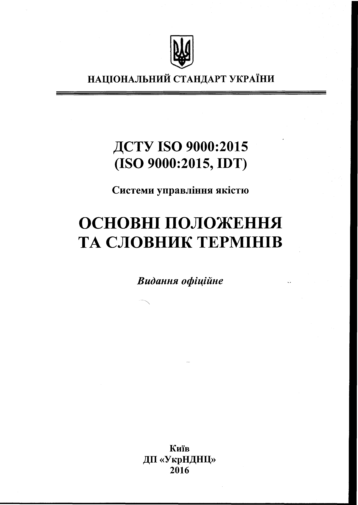

НАЦІОНАЛЬНИЙ СТАНДАРТ УКРАЇНИ

**ДСТУ ISO 9000:2015**  
**(ISO 9000:2015, IDT)**

Системи управління якістю

**ОСНОВНІ ПОЛОЖЕННЯ**  
**ТА СЛОВНИК ТЕРМІНІВ**

*Видання офіційне*

Київ  
ДП «УкрНДНЦ»  
2016

**ЗМІСТ**

C.

Національний вступ ............................................................................................................................ V

Вступ до ISO 9000:2015 .................................................................................................................... V

1 Сфера застосування ......................................................................................................................... 1

2 Основоположні поняття та принципи управління якістю ............................................................... 1

> 2.1 Загальні положення .................................................................................................................... 1
> 
> 2.2 Основоположні поняття ............................................................................................................. 2
> 
> > 2.2.1 Якість .............................................................................................................................. 2
> > 
> > 2.2.2 Система управління якістю ........................................................................................... 2
> > 
> > 2.2.3 Середовище організації ................................................................................................. 2
> > 
> > 2.2.4 Зацікавлені сторони ....................................................................................................... 2
> > 
> > 2.2.5 Підтримання ................................................................................................................... 2
> 
> 2.3 Принципи управління якістю ..................................................................................................... 3
> 
> > 2.3.1 Орієнтація на замовника ................................................................................................ 3
> > 
> > 2.3.2 Лідерство ........................................................................................................................ 3
> > 
> > 2.3.3 Задіяність персоналу ....................................................................................................... 4
> > 
> > 2.3.4 Процесний підхід ............................................................................................................. 4
> > 
> > 2.3.5 Поліпшення ..................................................................................................................... 5
> > 
> > 2.3.6 Прийняття рішень на підставі фактичних даних ............................................................ 6
> > 
> > 2.3.7 Керування взаємовідносинами ...................................................................................... 6
> 
> 2.4 Розроблення СУЯ з використанням основоположних понять і принципів ................................. 7
> 
> > 2.4.1 Модель СУЯ ..................................................................................................................... 7
> > 
> > 2.4.2 Розроблення СУЯ ............................................................................................................ 7
> > 
> > 2.4.3 Стандарти СУЯ, інші системи управління та моделі досконалості ................................ 8

3 Терміни та визначення понять .......................................................................................................... 8

> 3.1 Терміни стосовно особи чи персоналу ...................................................................................... 8
> 
> 3.2 Терміни стосовно організації ....................................................................................................... 9
> 
> 3.3 Терміни стосовно діяльності ..................................................................................................... 10
> 
> 3.4 Терміни стосовно процесу .......................................................................................................... 11
> 
> 3.5 Терміни стосовно системи ......................................................................................................... 12
> 
> 3.6 Терміни стосовно вимоги ........................................................................................................... 13
> 
> 3.7 Терміни стосовно результату ...................................................................................................... 15

3.8 Терміни стосовно даних, інформації та документів ................................................................ 16

3.9 Терміни стосовно замовника ..................................................................................................... 18

3.10 Терміни стосовно характеристики ........................................................................................... 19

3.11 Терміни стосовно визначення ................................................................................................. 19

3.12 Терміни стосовно дій ................................................................................................................ 20

3.13 Терміни стосовно аудиту .......................................................................................................... 21

Додаток А Взаємозв'язки між поняттями та їх графічне подання ............................................................. 23

Бібліографія ...................................................................................................................................................... 37

Абетковий покажчик англійських термінів ................................................................................................... 39

Додаток НА Абетковий покажчик українських термінів ............................................................................. 41

Додаток НБ Перелік національних стандартів України, згармонізованих з міжнародними нормативними документами, на які є посилання в цьому стандарті ................................................... 44

НАЦІОНАЛЬНИЙ ВСТУП

Цей стандарт є переклад ISO 9000:2015 Quality management systems — Fundamentals and vocabulary (Системи управління якістю. Основні положення та словник термінів).

Технічний комітет, відповідальний за цей стандарт, — ТК 93 «Системи управління якістю, довкіллям та безпечністю харчових продуктів» (підкомітет ПК 93/1 «Системи управління якістю»).

Положення, зазначені в стандарті, відповідають чинному законодавству України.

До стандарту внесено такі редакційні зміни:
— слова «цей міжнародний стандарт» замінено на «цей стандарт»;
— вилучено «Передмову» до ISO 9000:2015 як таку, що безпосередньо не стосується цього стандарту;
— структурні елементи стандарту: «Титульний аркуш», «Передмову», «Зміст», «Національний вступ», першу сторінку, «Бібліографічні дані» — оформлено згідно з вимогами національної стандартизації України;
— терміни та визначення понять подано відповідно до ДСТУ 3966:2009 Термінологічна робота. Засади і правила розроблення стандартів на терміни та визначення понять;
— англійський вислів «Note to entry» в цьому стандарті перекладено як «Примітка»;
— долучено національний додаток НА «Абетковий покажчик українських термінів»;
— долучено національний додаток НБ «Перелік національних стандартів України, згармонізованих з міжнародними нормативними документами, на які є посилання в цьому стандарті».

Копії нормативних документів, на які є посилання в цьому стандарті, можна отримати в Національному фонді нормативних документів.

### ВСТУП до ISO 9000:2015

Цей стандарт подає основоположні поняття, принципи та словник термінів стосовно систем управління якістю (СУЯ) та забезпечує основу для інших стандартів СУЯ. Цей стандарт має допомогти користувачеві зрозуміти основоположні поняття, принципи та терміни стосовно управління якістю з тим, щоб він був у змозі результативно та ефективно запровадити СУЯ та реалізувати цінність від інших стандартів СУЯ.

Цей стандарт пропонує чітко визначену СУЯ, базовану на структурі, що об'єднує в собі встановлені основоположні поняття, принципи та ресурси, пов'язані з якістю, щоб допомогти організації реалізувати свої цілі. Цей стандарт застосовний до всіх організацій незалежно від їхнього розміру, складності чи бізнес-моделі. Ціль цього стандарту — збільшити обізнаність організації з її обов'язками та зобов'язанням щодо задоволення потреб і очікувань її замовників і зацікавлених сторін, а також щодо досягнення задоволеності її продукцією та послугами.

У цьому стандарті зазначено сім принципів управління якістю на підтримання основоположних понять, описаних у 2.2. У 2.3 для кожного принципу управління якістю подано «твердження», що описує цей принцип, «обґрунтування», що пояснює, чому організація має приділяти увагу цьому принципу, «ключові вигоди», які стосуються принципів, та «можливі дії», які організація може виконати, застосовуючи принцип.

У цьому стандарті подано терміни та визначення понять, які на момент опублікування застосовні до всіх стандартів щодо управління якістю та СУЯ, розроблених ISO/TC 176, а також до інших стандартів СУЯ для окремих галузей, базованих на цих стандартах. Терміни та визначення понять систематизовано в концептуальному порядку з наведенням абеткового покажчика в кінці документа. У додатку А подано набір схем систем понять, які визначають порядок наведення понять.

*Примітка.* Настанови щодо деяких додаткових, часто застосовуваних слів у стандартах на СУЯ, розроблених ISO/TC 176, і в яких є ідентифіковане словниковое значення, подано в глосарії, доступному на http://www.iso.org/iso/03_terminology_used_in_iso_9000_family.pdf.

НАЦІОНАЛЬНИЙ СТАНДАРТ УКРАЇНИ

СИСТЕМИ УПРАВЛІННЯ ЯКІСТЮ
**ОСНОВНІ ПОЛОЖЕННЯ ТА СЛОВНИК ТЕРМІНІВ**

QUALITY MANAGEMENT SYSTEMS
FUNDAMENTALS AND VOCABULARY

Чинний від 2016–07–01

### 1 СФЕРА ЗАСТОСУВАННЯ

Цей стандарт описує основоположні поняття та принципи управління якістю, які універсальні в застосуванні наведених нижче:
- організацій, які прагнуть досягти сталого успіху завдяки запровадженню системи управління якістю;
- замовників, які прагнуть здобути впевненість у здатності організації стабільно постачати продукцію та надавати послуги, що відповідають їхнім вимогам;
- організацій, які прагнуть здобути впевненість у тому, що в їхньому ланцюзі постачання вимоги до продукції та послуг виконуватимуть;
- організацій і зацікавлених сторін, які прагнуть поліпшити обмінювання інформацією завдяки єдиному розумінні термінології, яку використовують у сфері управління якістю;
- організацій, які здійснюють оцінювання відповідності згідно з вимогами ISO 9001;
- постачальників послуг з навчання, оцінювання чи консультування у сфері управління якістю;
- розробників відповідних стандартів.

Цей стандарт установлює терміни та визначення понять, які поширюються на всі розроблювані в ISO/TC 176 стандарти щодо управління якістю та на систему управління якістю.

### 2 ОСНОВОПОЛОЖНІ ПОНЯТТЯ ТА ПРИНЦИПИ УПРАВЛІННЯ ЯКІСТЮ

#### 2.1 Загальні положення

Поняття та принципи управління якості, описані в цьому стандарті, дають змогу організації сприймати виклики, що ставить середовище, яке докорінно змінилося за останні десятиліття. Середовище, у якому організація працює сьогодні, характеризується швидкими змінами, глобалізацією ринків і перетворенням знання на головний ресурс. Вплив якості виходить за межі задоволеності замовника: це може також безпосередньо впливати на репутацію організації.

Суспільство стало більш освіченим і більш вимогливим, роблячи зацікавлені сторони щодалі впливовішими. Надаючи основоположні поняття та принципи для використання у розроблянні системи управління якістю (СУЯ), цей стандарт сприяє ширшому уявленню про організацію.

Усі поняття, принципи та їх взаємозв'язки треба розглядати в цілому, а не ізольовано одне від одного. Жодне окреме поняття, жодний окремий принцип не важливіший за інші. Кожного разу знаходження правильного балансу в застосуванні є критично важливим.

### 2.2 Основоположні поняття

#### 2.2.1 Якість
Організація, орієнтована на якість, сприяє формуванню культури, що має результатом поведінку, ставлення, діяльність і процеси, які додають цінність через задоволення потреб і очікувань замовників й інших відповідних зацікавлених сторін.

Якість продукції та послуг організації визначають здатністю задовольняти замовників, а також передбаченим і непередбаченим впливом на відповідні зацікавлені сторони.

Якість продукції та послуг охоплює не тільки їхні передбачені функції та характеристики, але також їхні сприймані цінність і користь для замовника.

#### 2.2.2 Система управління якістю
СУЯ охоплює дії, за допомогою яких організація ідентифікує свої цілі та визначає процеси й ресурси, потрібні для досягнення бажаних результатів.

СУЯ керує взаємодіючими процесами та ресурсами, потрібними, щоб створити цінності та здобути результати для відповідних зацікавлених сторін.

СУЯ дає змогу найвищому керівництву використання ресурсів, ураховуючи короткострокові та довгострокові наслідки його рішень.

СУЯ забезпечує засоби ідентифікування дій щодо вирішування передбачених і непередбачених наслідків у постачанні продукції та наданні послуг.

#### 2.2.3 Середовище організації
Розуміння середовища організації — це процес. Цей процес визначає чинники, які впливають на призначеність, цілі та сталість організації. Він також ураховує внутрішні чинники, зокрема цінності, культуру, знання та дієвість організації. Він також ураховує зовнішні чинники, такі як правове, технологічне, конкурентне, ринкове, культурне, соціальне та економічне середовища.

Приклади того, як може бути виявлено призначеність організації, є її бачення, місія, політики та цілі.

#### 2.2.4 Зацікавлені сторони
Поняття зацікавлених сторін простягається поза межі зосередженості лише на замовнику. Важливо враховувати всі відповідні зацікавлені сторони.

Частину процесу розуміння середовища організації становить ідентифікування її зацікавлених сторін. Відповідні зацікавлені сторони — це ті, з якими пов'язано значний ризик для сталості організації, якщо їхні потреби та очікування не буде виконано. Організації визначають, які результати необхідно подати цим відповідним зацікавленим сторонам, щоб знизити цей ризик.

Організації привертають увагу відповідних зацікавлених сторін, від яких залежить їхній успіх, залучають їх і зберігають їх підтримку.

#### 2.2.5 Підтримання

##### 2.2.5.1 Загальні положення
Підтримання СУЯ з боку найвищого керівництва та задіяність персоналу дають змогу:
— забезпечувати адекватні людські та інші ресурси;
— здійснювати моніторинг процесів і результатів;
— визначати та оцінювати ризики та можливості;
— запроваджувати відповідні дії.

Відповідальне придбання, розподілення, обслуговування, поліпшення та утилізація ресурсів сприяють організації в досяганні її цілей.

##### 2.2.5.2 Персонал
Люди становлять суттєво важливий ресурс в організації. Дієвість організації залежить від того, як персонал поводить себе в межах системи, у якій він працює.

У межах організації персонал стає задіяним і діє згуртовано в разі спільного розуміння політики у сфері якості та результатів, які бажає здобути організація.

##### 2.2.5.3 Компетентність
СУЯ є найбільш результативною, якщо всі працівники розуміють, які навички, навчання, освіта та досвід потрібні для виконання їхніх функцій і обов'язків, та застосовують їх. Найвище керівництво зобов'язане забезпечити можливості для персоналу розвивати необхідну компетентність.

2.2.5.4 Обізнаність  
Обізнаність тоді набута, коли персонал розуміє свої обов'язки й те, як його дії сприяють досягненню цілей організації.

2.2.5.5 Обмінювання інформацією  
Сплановане та результативне внутрішнє (тобто по всій організації) та зовнішнє (тобто з відповідними зацікавленими сторонами) обмінювання інформацією сприяє задіяності персоналу та підвищеному розумінню:
- середовища організації;
- потреб і очікувань замовників й інших відповідних зацікавлених сторін;
- СУЯ.

2.3 Принципи управління якістю  
2.3.1 Орієнтація на замовника  
2.3.1.1 Твердження  
Основну увагу в управлінні якістю приділяють задоволенню вимог замовника та прагненню до перевершення його очікувань.  
2.3.1.2 Обґрунтування  
Сталого успіху досягають, якщо організація привертає та утримує довіру замовників й інших відповідних зацікавлених сторін. Кожний аспект взаємодії із замовником становить можливість створити більшу цінність для замовника. Розуміння поточних і майбутніх потреб і майбутніх потреб замовників й інших зацікавлених сторін сприяє сталому успіху організації.  
2.3.1.3 Ключові вигоди  
Деякі можливі ключові вигоди:
- збільшення цінності для замовника;
- збільшення задоволеності замовника;
- поліпшення лояльності замовника;
- збільшення кількості повторних бізнесових операцій;
- покращення репутації організації;
- розширення бази замовників;
- збільшення доходів і ринкової частки.  

2.3.1.4 Можливі дії  
Можливі дії охоплюють:
- визнання безпосередніх і опосередкованих замовників як таких, що одержують цінність від організації;
- розуміння поточних і майбутніх потреб та очікувань замовників;
- пов'язування цілей організації з потребами та очікуваннями замовників;
- доведення до відома всіх в організації про потреби та очікування замовників;
- планування, проєктування, розроблення, виготовлення, доставлення та підтримання продукції та послуг, щоб задовольнити потреби й очікування замовника;
- вимірювання та моніторинг рівня задоволеності замовника й виконання відповідних дій;
- визначення та виконання дій щодо потреб і доречних очікувань відповідних зацікавлених сторін, які можуть позначитися на задоволеності замовника;
- активне керування стосунками із замовниками для досягнення сталого успіху.  

2.3.2 Лідерство  
2.3.2.1 Твердження  
Керівники на всіх рівнях установлюють єдність призначеності та напрямків розвитку і створюють умови для задіяння персоналу до досягнення цілей організації у сфері якості.  
2.3.2.2 Обґрунтування  
Створення єдності призначеності, спрямування і задіяності персоналу дає змогу організації узгоджувати свої стратегії, політики, процеси та ресурси для досягнення своїх цілей.  
2.3.2.3 Ключові вигоди  
Деякі можливі ключові вигоди:
- підвищення результативності та ефективності в досягненні цілей організації у сфері якості;
- покращення координації процесів організації;

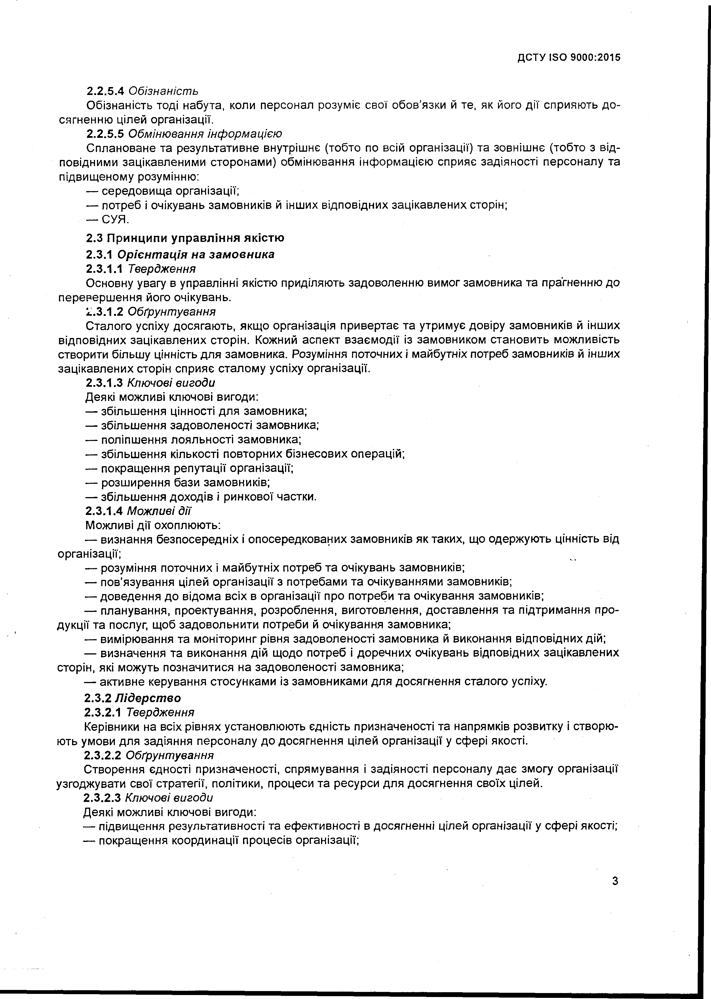

— поліпшення інформаційного зв'язку між рівнями та функціями організації;
— розвинення та поліпшення спроможності організації та її персоналу отримувати бажані результати.

**2.3.2.4 Можливі дії**
Можливі дії охоплюють:
— інформування персоналу організації про її місію, бачення, стратегію, політики та процеси;
— створення та підтримання спільних цінностей, справедливості та етичних моделей поведінки на всіх рівнях організації;
— формування культури довіри та чесності;
— заохочення до зобов'язання щодо якості в масштабі всієї організації;
— забезпечення того, щоб керівники на всіх рівнях слугували позитивними прикладами для персоналу в організації;
— забезпечення персоналу необхідними ресурсами, навчанням і наданням повноважень, щоб діяти прозоро та відповідально;
— надихання, заохочення та визнання внеску персоналу.

### **2.3.3 Задіяність персоналу**
#### **2.3.3.1 Твердження**
Компетентний, правомочний та задіяний персонал на всіх рівнях в організації — суттєво важливий для покращення спроможності організації створювати цінність.

#### **2.3.3.2 Обґрунтування**
Щоб результативно та ефективно керувати організацією, важливо поважати та залучати весь персонал на всіх рівнях. Визнання, правонаділення та підвищення компетентності сприяє задіяності персоналу до досягнення цілей організації у сфері якості.

#### **2.3.3.3 Ключові вигоди**
Деякі можливі ключові вигоди:
— поліпшене розуміння персоналом цілей організації у сфері якості та підвищена мотивація до їх досягнення;
— підвищення залученості персоналу до діяльності з поліпшення;
— підвищення фахового розвитку, ініціативності та креативності персоналу;
— підвищення задоволеності персоналу;
— збільшення довіри та співпраці в межах всієї організації;
— збільшення уваги до спільних цінностей і культури в усій організації.

#### **2.3.3.4 Можливі дії**
Можливі дії охоплюють:
— спілкування з персоналом задля сприяння його розумінню важливості його власного внеску;
— сприяння співпраці в усій організації;
— сприяння відвертому обговоренню та обміннюванню знаннями й досвідом;
— уповноваження персоналу визначати обмежувальні чинники в роботі і без остраху брати на себе ініціативи;
— визнання та винагородження персоналу за його внесок, набуття знань і самовдосконалення;
— надання можливості самооцінювати роботу з погляду реалізації особистих цілей;
— проведення обстеження, щоб оцінити рівень задоволеності персоналу, інформування про його результати і виконання відповідних дій.

### **2.3.4 Процесний підхід**
#### **2.3.4.1 Твердження**
Узгоджені та передбачувані результати досягають більш результативно та ефективно, якщо діяльність розуміють та нею керують як взаємопов'язаними процесами, які функціонують як цілісна система.

#### **2.3.4.2 Обґрунтування**
СУЯ складається із взаємопов'язаних процесів. Розуміння того, як ця система отримує результати, дає змогу організації оптимізувати систему та її дієвість.

#### **2.3.4.3 Ключові вигоди**
Деякі можливі ключові вигоди:

— підвищення здатності зосереджувати зусилля на ключових процесах і можливостях для поліпшення;
— послідовні та передбачувані результати в системі узгоджених процесів;
— оптимізована діяльність завдяки результативному керуванню процесами, ефективному використанню ресурсів і зниженню міжфункційних бар'єрів;
— забезпечена змога організації формувати довіру зацікавлених сторін в її послідовності, результативності та ефективності.

**2.3.4.4 Можливі дії**
Можливі дії охоплюють:
— визначення цілей системи та процесів, потрібних для їх досягнення;
— установлення повноважень, обов'язків і підзвітності щодо керування процесами;
— розуміння можливостей організації та визначення обмежень у ресурсах перед виконанням дій;
— визначення взаємозалежності процесів і аналізування впливу на систему в цілому змін в окремих процесах;
— керування процесами та їх взаємозв'язками як системою для результативного та ефективного досягнення цілей організації у сфері якості;
— забезпечення наявності інформації, необхідної для функціювання та поліпшення процесів, а також для здійснення моніторингу, аналізування та оцінювання дієвості всієї системи;
— керування ризиками, які можуть вплинути на виходи процесів і загальні результати СУЯ.

**2.3.5 Поліпшення**
**2.3.5.1 Твердження**
Успішні організації постійно зорієнтовані на поліпшення.
**2.3.5.2 Обґрунтування**
Поліпшення важливе для організації, щоб підтримувати поточні рівні дієвості, реагувати на зміни в її внутрішніх і зовнішніх умовах, а також щоб створити нові можливості.
**2.3.5.3 Ключові вигоди**
Деякі можливі ключові вигоди:
— поліпшені показники функціювання процесу, спроможності організації та підвищення задоволеності замовника;
— підвищена зосередженість на досліджуванні та визначенні докорінних причин за подальшого виконання запобіжних і коригувальних дій;
— підвищена здатність прогнозувати внутрішні і зовнішні ризики й можливості, а також реагувати на них;
— підвищене врахування як поступового, так й проривного поліпшення;
— збільшене використання набутих знань для поліпшення;
— підвищене прагнення до інновацій.

**2.3.5.4 Можливі дії**
Можливі дії охоплюють:
— сприяння встановленню цілей щодо поліпшення на всіх рівнях організації;
— теоретичне та практичне навчання персоналу на всіх рівнях стосовно того, як застосовувати базові інструменти та методології для досягнення цілей щодо поліпшення;
— забезпечення компетентності персоналу для успішного просування та завершення проєктів щодо поліпшення;
— розроблення та впровадження процесів для реалізації проєктів щодо поліпшення в усій організації;
— відстежування, аналізування та проведення аудиту планування, запровадження, завершення та результатів проєктів щодо поліпшення;
— інтегроване розглядання поліпшень у розробленні нових або модифікованих продукції та послуг, а також процесів;
— визнання та винагородження за поліпшення.

2.3.6 Прийняття рішень на підставі фактичних даних
2.3.6.1 Твердження
Рішення, базовані на аналізуванні й оцінюванні даних та інформації, з більшою ймовірністю уможливлюють бажані результати.

2.3.6.2 Обґрунтування
Прийняття рішень може бути складним процесом і це завжди передбачає деяку невизначеність. Часто це охоплює чимало видів і джерел вхідних даних, а також їх інтерпретацію, яка може бути суб'єктивною. Важливо розуміти причинно-наслідкові зв'язки та можливі непередбачені наслідки. Аналізування фактів, доказів і даних зумовлює більшу об'єктивність і впевненість у прийнятті рішень.

2.3.6.3 Ключові вигоди
Деякі можливі ключові вигоди:
- поліпшені процеси прийняття рішень;
- поліпшене оцінювання показників функціювання процесу та підвищення здатності досягати цілі;
- поліпшена операційна результативність та ефективність;
- збільшена здатність аналізувати, оспорювати та змінювати погляди й рішення;
- збільшена здатність демонструвати результативність минулих рішень.

2.3.6.4 Можливі дії
Можливі дії охоплюють:
- визначення, вимірювання та здійснення моніторингу ключових показників для демонстрування дієвості організації;
- забезпечення доступності до всіх необхідних даних відповідного персоналу;
- забезпечення, щоб дані та інформація були достатньо точними, надійними та захищеними;
- аналізування та оцінювання даних та інформації з використанням придатних методів;
- забезпечення компетентності персоналу, щоб аналізувати й оцінювати дані, за потреби;
- прийняття рішень та виконання дій на основі фактичних даних і виважено з урахуванням досвіду та інтуїції.

2.3.7 Керування взаємовідносинами
2.3.7.1 Твердження
Для досягнення сталого успіху організації керують своїми взаємовідносинами з відповідними зацікавленими сторонами, наприклад, з постачальниками.

2.3.7.2 Обґрунтування
Відповідні зацікавлені сторони впливають на дієвість організації. Сталого успіху з більшою ймовірністю досягають, якщо організація керує взаємовідносинами зі всіма своїми зацікавленими сторонами, щоб оптимізувати їхній вплив на свою діяльність. Керування взаємовідносинами з мережами своїх постачальників і партнерів надзвичайно важливе.

2.3.7.3 Ключові вигоди
Деякі можливі ключові вигоди:
- підвищена дієвість організації та її відповідних зацікавлених сторін завдяки врахуванню можливостей і обмежень, пов'язаних з кожною зацікавленою стороною;
- спільне розуміння цілей і цінностей зацікавленими сторонами;
- збільшена спроможність створювати цінність для зацікавлених сторін завдяки спільному користуванню ресурсами та знаннями, а також керуванню ризиками, пов'язаними з якістю;
- належно-керований ланцюг постачання, який забезпечує стабільний потік продукції та послуг.

2.3.7.4 Можливі дії
Можливі дії охоплюють:
- визначення відповідних зацікавлених сторін (наприклад, постачальників, партнерів, замовників, інвесторів, працівників або суспільства в цілому) і їхніх зв'язків з організацією;
- визначення та встановлення пріоритетності взаємовідносин із зацікавленими сторонами, що ними потрібно керувати;
- установлення взаємовідносин, які збалансовують вигоди короткострокового та довгострокового характеру;

— збирання інформації та обмінювання нею й експертним досвідом і ресурсами з відповідними зацікавленими сторонами;
— вимірювання показників діяльності та забезпечення щодо них зворотного зв'язку із зацікавленими сторонами, за потреби, щоб сприяти ініціативам з поліпшення;
— заохочування та визнавання поліпшення та досягнення з постачальниками, партнерами та іншими зацікавленими сторонами;
— заохочування та визнавання поліпшення та досягнення постачальників і партнерів.

**2.4 Розроблення СУЯ з використанням основоположних понять і принципів**

**2.4.1 Модель СУЯ**
**2.4.1.1 Загальні положення**
Організації мають багато спільного з людьми як живі та здатні до навчання соціальні організми. І ті й інші легко пристосовні та складаються із взаємодійних систем, процесів і дій. Щоб пристосуватися до їхнього мінливого середовища, кожна потребує здатності змінюватися. Організації часто вдаються до інновацій, щоб досягти проривних поліпшень. Модель СУЯ організації визнає, що не всі системи, процеси та дії можна наперед визначити; тому потрібно, щоб вона була гнучкою та легко пристосовною в складному середовищі організації.

**2.4.1.2 Система**
Організації прагнуть зрозуміти внутрішнє і зовнішнє середовище, щоб ідентифікувати потреби та очікування відповідних зацікавлених сторін. Цю інформацію використовують під час розробляння СУЯ для досягнення сталого функціонування організації. Виходи одного процесу можуть бути входами інших процесів і є взаємопов'язані в загальну мережу. Кожна організація та її СУЯ унікальні, хоча часто здається, що вони складаються з подібних процесів.

**2.4.1.3 Процеси**
Організація має процеси, які може бути визначено, виміряно та поліпшено. Ці процеси взаємодіють, щоб давати результати, узгоджені з цілями організації та перетинають її функційні межі. Деякі процеси можуть бути критично важливі, тоді як інші — ні. Процеси мають взаємопов'язані роботи з входами для перетворювання їх на виходи.

**2.4.1.4 Діяльність**
Люди співпрацюють у межах процесу, щоб здійснювати свою повсякденну роботу. Деякі види робіт установлені та залежать від розуміння цілей організації, тоді як інші такими не є, і їхній характер і виконання — реакція на зовнішні впливи.

**2.4.2 Розроблення СУЯ**
СУЯ — це динамічна система, яка еволюціонує в часі через періоди поліпшення. Кожна організація провадить діяльність з управління якістю, офіційно сплановану чи ні. Цей стандарт подає настанови щодо того, як розробляти офіційну систему, щоб керувати цією діяльністю. Необхідно визначити ті види робіт, які вже є в організації, та їхню придатність з погляду середовища організації. Після цього цей стандарт разом з ISO 9001 та ISO 9004 можна використовувати для сприяння організації в розробленні цілісної СУЯ.

Офіційна СУЯ становить структурну основу для планування, отримання, моніторингу та поліпшення показників діяльності з управління якістю. Не треба, щоб СУЯ була надто складною, вона має лише точно відображати потреби організації. Основоположні поняття та принципи, подані в цьому стандарті, можуть бути цінною настановою под час розробляння СУЯ.

Планування СУЯ — це не одноразова подія, скоріше це безперервний процес. Плани розвиваються у міру того, як організація набуває знань, а обставини змінюються. У плані враховують усі види діяльності організації у сфері якості та забезпечують упевненість у тому, що в ньому охоплено всі настанови цього стандарту та вимоги ISO 9001. План виконують після ухвалення.

Для організації важливо регулярно здійснювати моніторинг і оцінювати як виконання плану, так і дієвість СУЯ. Ретельно продумані показники полегшують моніторинг та оцінювання діяльності.

Проведення аудиту — це засіб оцінювання результативності СУЯ, щоб ідентифікувати ризики та визначити дотримання вимог. Щоб аудити були результативними, треба зібрати матеріальні та нематеріальні докази. За результатами аналізування зібраних доказів виконують дії щодо коригування та поліпшення. Набуті знання мають вести до інновацій, підіймаючи дієвість СУЯ на вищі рівні.

ДСТУ ISO 9000:2015

**2.4.3 Стандарти СУЯ, інші системи управління та моделі досконалості**

Підходи до СУЯ, описані в стандартах, які розробляє ISO/TC 176, в інших стандартах щодо систем управління, а також у моделях досконалості організацій базуються на спільних принципах. Усі вони дають змогу організації ідентифікувати ризики та можливості, а також охоплюють настанови щодо поліпшення. У сучасному контексті чимало питань, таких як інновації, етика, довіра та репутація, можна вважати за параметри в межах СУЯ. Стандарти, пов'язані з управлінням якістю (наприклад, ISO 9001), екологічним управлінням (наприклад, ISO 14001) та енергетичним управлінням (наприклад, ISO 50001), а також інші стандарти управління та моделі досконалості організацій розглядають ці питання.

Стандарти на СУЯ, які розробляє ISO/TC 176, забезпечують комплекс вимог і настанов щодо СУЯ. ISO 9001 установлює вимоги до СУЯ. ISO 9004 слугує настановою щодо широкого діапазону цілей СУЯ задля досягнення сталого успіху та поліпшеної дієвості. Настанови щодо складових СУЯ подано в ISO 10001, ISO 10002, ISO 10003, ISO 10004, ISO 10008, ISO 10012 та ISO 19011. Настанови щодо технічних аспектів на підтримання СУЯ подано в ISO 10005, ISO 10006, ISO 10007, ISO 10014, ISO 10015, ISO 10018 та ISO 10019. Технічні звіти на підтримання СУЯ наведено в ISO/TR 10013 та ISO/TR 10017. Вимоги до СУЯ подано також у стандартах для окремих галузей, наприклад, у ISO/TS 16949.

Різноманітні частини системи управління організації, зокрема її СУЯ, може бути зінтегровано в єдину систему управління. Досягнення цілі, використання процесів і ресурсів, пов'язані з якістю, розвиненням, фінансуванням, прибутковістю, середовищем, охороною здоров'я та безпекою праці, енергією, безпекою та іншими аспектами організації, можуть бути результативніші та ефективніші, якщо СУЯ зінтегровано з іншими системами управління. Організація може провадити комплексний аудит своєї системи управління на вимоги багатьох стандартів, зокрема ISO 9001, ISO 14001, ISO/IEC 27001 та ISO 50001.

**Примітка.** Корисні настанови можна знайти в посібнику ISO «The integrated use of management system standards» (Комплексне застосування стандартів на системи управління).

## 3 ТЕРМІНИ ТА ВИЗНАЧЕННЯ ПОНЯТЬ

### 3.1 Терміни стосовно особи чи персоналу

#### 3.1.1 найвище керівництво (*top management*)
Особа чи група осіб, яка спрямовує та контролює діяльність організації (3.2.1) на найвищому рівні.

* Примітка 1. Найвище керівництво має право надавати повноваження та забезпечувати ресурси в межах організації.
* Примітка 2. Якщо сфера застосування системи управління (3.5.3) охоплює тільки частину організації, то до найвищого керівництва відносять тих, хто спрямовує та контролює цю частину організації.
* Примітка 3. Це один із загальних термінів і основних визначень поняття для стандартів ISO на системи управління, наведених у додатку SL консолідованого доповнення ISO до директив ISO/IEC, частина 1

#### 3.1.2 консультант з питань систем управління якістю (*quality management system consultant*)
Особа, яка допомагає організації (3.2.1) запровадити систему управління якістю (3.4.3), даючи поради чи інформацію (3.8.2).

* Примітка 1. Консультант з питань систем управління якістю може також допомагати запроваджувати частини системи управління якістю (3.5.4).
* Примітка 2. У ISO 10019:2005 подано настанови щодо того, як розрізнити компетентного та некомпетентного консультанта з питань систем управління якістю

(ISO 10019:2005, 3.2, змінено)

#### 3.1.3 [залучання] [залученість] (*involvement*)
[Процес] [Наслідок процесу] участі в діяльності, події чи ситуації

#### 3.1.4 [задіяння] [задіяність] (*engagement*)
[Залучення] [Залученість] (3.1.3) до діяльності та внесок у діяльність для досягнення спільних цілей (3.7.1.)

#### 3.1.5 орган стосовно конфігурації; рада з питань контролю конфігурації; розпорядчий орган (*configuration authority, configuration control board, dispositioning authority*)
Особа чи група осіб, наділена відповідальністю та повноваженням приймати рішення стосовно конфігурації (3.10.6).

Примітка. В органі стосовно конфігурації мають бути представлені доречні зацікавлені сторони (3.2.3), внутрішні чи зовнішні стосовно організації (3.2.1)

(ISO 10007:2003, 3.8, змінено)

**3.1.6 розв'язувач спорів (задоволеність замовників)** *(dispute resolver) <customer satisfaction>*
Окрема особа, яку провайдер процесу розв'язання спорів (3.2.7) призначає, щоб сприяти сторонам у розв'язанні спору (3.9.6).

*Приклад*
Особа з-поміж штатного персоналу, волонтер, особа з-поміж персоналу, що працює за контрактом (3.4.7)

(ISO 10003:2007, 3.7, змінено)

**3.2 Терміни стосовно організації**

**3.2.1 організація (organization)**
Особа чи група людей, які мають свої власні функції з відповідальністю, повноваженнями та взаємовідносинами, щоб досягати своїх цілей (3.7.1).

**Примітка 1.** Поняття організація охоплює, але не обмежується, індивідуального торговця, компанію, корпорацію, фірму, підприємство, орган влади, товариство, асоціацію (3.2.8), доброчинну організацію чи установу, або частину чи їх комбінацію, об'єднані чи ні, державні чи приватні.

**Примітка 2.** Це один із загальних термінів і основних визначень поняття для стандартів ISO на системи управління, наведених у додатку SL консолідованого доповнення ISO до директив ISO/IEC, частина 1. Первісне визначення було змінено за допомогою примітки 1

**3.2.2 середовище організації (context of the organization)**
Сукупність внутрішніх і зовнішніх чинників, які можуть мати вплив на підхід організації (3.2.1) до розроблення та досягнення своїх цілей (3.7.1).

**Примітка 1.** Цілі організації можуть бути пов'язані з її продукцією (3.7.6) та послугами (3.7.7), інвестиціями та ставленням до своїх зацікавлених сторін (3.2.3).

**Примітка 2.** Поняття середовище організації однаково застосовуєся як до некомерційних організацій чи державних організацій сфери послуг, так і до тих, які прагнуть отримувати прибуток.

**Примітка 3.** В англійській мові це поняття часто означають іншими термінами, такими як «business environment» (бізнес-середовище), «organizational environment» (організаційне середовище) чи «ecosystem of an organization» (екосистема організації).

**Примітка 4.** Розуміння інфраструктури (3.5.2) може допомагати у визначенні середовища організації

**3.2.3 зацікавлена сторона; причетна сторона (interested party, stakeholder)**
Особа чи організація (3.2.1), яка може вплинути на рішення чи діяльність, піддана впливу, чи сприймає себе такою, що піддана впливу рішень або діяльності.

*Приклади*
Замовники (3.2.4), власники, персонал організації, постачальники (3.2.5), банкіри, регуляторні органи, спілки, партнери чи суспільство, це можуть бути також конкуренти чи опозиційні групи тиску.

**Примітка.** Це один із загальних термінів і основних визначень поняття для стандартів ISO на системи управління, наведених у додатку SL консолідованого доповнення ISO до директив ISO/IEC, частина 1. Первісне визначення було змінено доданням прикладу

**3.2.4 замовник (customer)**
Особа чи організація (3.2.1), яка може отримати чи отримує продукцію (3.7.6) чи послугу (3.7.7), призначену для цієї особи чи організації, або яку потребує ця особа чи організація.

*Приклади*
Споживач, клієнт, кінцевий користувач, роздрібний торговець, одержувач продукції чи послуги від внутрішнього процесу (3.4.1), вигодоодержувач (бенефіціар) і покупець.

**Примітка.** Стосовно організації замовник може бути внутрішнім або зовнішнім

**3.2.5 постачальник; провайдер (supplier, provider)**
Організація (3.2.1), яка постачає продукцію (3.7.6) чи послугу (3.7.7)

*Приклади*
Виробник, дистриб'ютор, роздрібний продавець або агент з продажу продукції чи послуги.

**Примітка 1.** Стосовно організації постачальник може бути внутрішнім або зовнішнім.

**Примітка 2.** У контрактній ситуації постачальника часто називають «підрядник»

**3.2.6 зовнішній постачальник; зовнішній провайдер (external supplier; external provider)**
Постачальник (3.2.5), який не є частиною організації (3.2.1).

*Приклади*
Виробник, дистриб'ютор, роздрібний продавець або агент з продажу [продукції](3.7.6) чи послуги (3.7.7)

**3.2.7 провайдер процесу розв'язання спорів** (*DRP-provider; dispute resolution process provider*)  
Особа чи [організація](3.2.1), яка забезпечує та здійснює [процес](3.4.1) зовнішнього розв'язання [спорів](3.9.6).  
*Примітка 1.* Зазвичай провайдер процесу розв'язання спорів — це юридична особа, не пов'язана з організацією, чи приватна особа, а також скаржник. Саме це підкреслюють такі ознаки, як незалежність і чесність. Інколи в межах організації засновують окремий підрозділ, щоб розглядати невирішені [скарги](3.9.3).  
*Примітка 2.* Провайдер процесу розв'язання спорів укладає зі сторонами [контракт](3.4.7) на забезпечення розв'язання спору та відповідає за його [дієвість](3.7.8). Провайдер процесу розв'язання спорів забезпечує участь розв'язувачів спорів (3.1.6). Провайдер процесу розв'язання спорів також залучає допоміжний, виконавчий та інший управлінський штатний персонал, щоб забезпечити фінансові ресурси, канцтовари, допомогу у складанні планів-графіків, навчання, приміщення для засідань, наглядові та подібні функції.  
*Примітка 3.* Провайдерами процесу розв'язання спорів можуть бути суб'єкти різної організаційно-правової форми, зокрема некомерційні, комерційні та державні. [Асоціація](3.2.8) також може бути провайдером процесу розв'язання спорів.  
*Примітка 4.* У ISO 10003:2007 замість терміна «провайдер процесу розв'язання спорів» використовують термін «провайдер»

(ISO 10003:2007, 3.9, змінено)

**3.2.8 асоціація (задоволеність замовників)** (*association*) \<customer satisfaction\>  
[Організація](3.2.1), членами якої є організації чи особи  
(ISO 10003:2007, 3.1)

**3.2.9 метрологічна служба** (*metrological function*)  
Функціональний підрозділ, що відповідає адміністративно та технічно за визначення та запровадження [системи керування вимірюваннями](4.3.5) (3.5.7)  
(ISO 10012:2003, 3.6, змінено).

### 3.3 Терміни стосовно діяльності
#### 3.3.1 поліпшення (*improvement*)  
Дія щодо підвищування [дієвості](3.7.8).  
*Примітка.* Дія може бути повторюваною чи одиничною

#### 3.3.2 постійне поліпшення (*continual improvement*)  
Повторювана дія щодо підвищування [дієвості](3.7.8).  
*Примітка 1.* [Процес](3.4.1) установлення [цілей](3.7.1) і пошуку можливостей [поліпшення](3.3.1) — це постійний процес, у якому використовують [дані аудиту](3.13.9) і [висновки аудиту](3.13.10), [аналізування даних](3.8.1), [аналізування](3.11.2) стосовно [управління](3.3.3) чи інші засоби і який звичайно зумовлює [коригувальну дію](3.12.2) чи [запобіжну дію](3.12.1).  
*Примітка 2.* Це один із загальних термінів і основних визначень поняття для стандартів ISO на системи управління, наведених у додатку SL консолідованого доповнення ISO до директив ISO/IEC, частина 1. Первісне значення поняття було змінено доданням примітки 1

#### 3.3.3 управління; керування (*management*)  
Скоординовані дії щодо спрямовування та контролювання діяльності [організації](3.2.1).  
*Примітка 1.* Управління/керування може охоплювати формування [політик](3.5.8) і встановлення [цілей](3.7.1) з [процеси](3.4.1), щоб досягати цих цілей.  
*Примітка 2.* Слово «management» деколи стосується людей, тобто особи чи групи осіб, яка має повноваження спрямовувати та контролювати діяльність організації та відповідає за це. Якщо слово «management» використовують у цьому розумінні, його треба завжди вживати з певною формою визначника, щоб уникнути путаниці з поняттям «management», що його визначено вище як сукупність дій. Наприклад, «management shall...» (управління повинне...) недопустимо, тоді, як «[top management](3.1.1) shall...» (найвище керівництво повинне...) прийнятне. Інакше треба вживати інші слова для позначення певного поняття, коли воно пов'язане з людьми, наприклад, «managerial» (адміністративний персонал) чи «managers» (керівники)

#### 3.3.4 управління якістю (*quality management*)  
[Управління](3.3.3) стосовно [якості](3.6.2).  
*Примітка.* Управління якістю може охоплювати формування [політики у сфері якості](3.5.9) та встановлення [цілей у сфері якості](3.7.2), а також [процеси](3.4.1), щоб досягати цих цілей у сфері якості через [планування якості](3.3.5), [забезпечування якості](3.3.6), [контролювання якості](3.3.7) та [поліпшування якості](3.3.8)

#### 3.3.5 планування якості (*quality planning*)  
Складова частина [управління якістю](3.3.4), зосереджена на встановленні [цілей у сфері якості](3.7.2) та на визначенні операційних [процесів](3.4.1) і відповідних ресурсів, необхідних для досягнення цілей у сфері якості.  
*Примітка.* Розроблення [програм якості](3.8.9) може бути складником планування якості

3.3.6 **забезпечення якості** (*quality assurance*)
Складова частина [управління якістю](#) (3.3.4), зосереджена на створенні впевненості в тому, що [вимоги щодо якості](#) (3.6.5) буде виконано.

3.3.7 **контролювання якості** (*quality control*)
Складова частина [управління якістю](#) (3.3.4), зосереджена на виконуванні [вимог щодо якості](#) (3.6.5).

3.3.8 **поліпшування якості** (*quality improvement*)
Складова частина [управління якістю](#) (3.3.4), зосереджена на збільшуванні здатності виконувати [вимоги щодо якості](#) (3.6.5).
*Примітка.* Вимоги щодо якості можуть бути пов'язані з будь-яким з таких аспектів, як [результативність](#) (3.7.11), [ефективність](#) (3.7.10) чи [простежуваність](#) (3.6.13).

3.3.9 **керування конфігурацією** (*configuration management*)
Скоординовані дії щодо спрямовування та контролювання [конфігурації](#) (3.10.6).
*Примітка.* Керування конфігурацією зосереджується головно на технічній та організаційній діяльності щодо встановлення та підтримання контролю [продукції](#) (3.7.6) чи [послуги](#) (3.7.7) та відповідній [інформації про конфігурацію продукції](#) (3.6.8) протягом усього життєвого циклу продукції.
(ISO 10007:2003, 3.6, змінено — Примітку змінено)

3.3.10 **контролювання змін** (*керування конфігурацією*) (*change control*) <configuration management>
Дії щодо контролювання [виходу](#) (3.7.5) після офіційного схвалення [інформації про конфігурацію продукції](#) (3.6.8)
(ISO 10007:2003, 3.1, змінено)

3.3.11 **дія; вид робіт (керування проектом)** (*activity*) <project management>
Найменший визначений елемент роботи в [проекті](#) (3.4.2)
(ISO 10006:2003, 3.1, змінено)

3.3.12 **керування проектом** (*project management*)
Планування, організування, [моніторинг](#) (3.11.3), контролювання та звітування щодо всіх аспектів [проекту](#) (3.4.2), а також стимулювання всіх учасників для досягнення цілей проекту
(ISO 10006:2003, 3.6)

3.3.13 **об'єкт конфігурації** (*configuration object*)
[Об'єкт](#) (3.6.1) у межах [конфігурації](#) (3.10.6), який задовольняє функцію кінцевого користування
(ISO 10007:2003, 3.5, змінено).

### 3.4 Терміни стосовно процесу

#### 3.4.1 **процес** (*process*)
Сукупність взаємопов'язаних або взаємодіючих робіт, що використовують входи для створення запланованого результату.

*Примітка 1.* Залежно від контексту посилання «запланований результат» процесу називають [виходом](#) (3.7.5), [продукцією](#) (3.7.6) чи [послугою](#) (3.7.7).
*Примітка 2.* Входами процесу зазвичай є виходи інших процесів, а виходи процесу — зазвичай входи до інших процесів.
*Примітка 3.* Два чи більше взаємопов'язаних або взаємодійних процесів у серії також може бути віднесено до процесу.
*Примітка 4.* Процеси в [організації](#) (3.2.1) зазвичай планують і виконують за контрольованих умов, щоб додати цінності.
*Примітка 5.* Процес, для якого підтвердження [відповідності](#) (3.6.11) одержуваного в його результаті виходу ускладнено чи економічно невигідно, часто називають «спеціальний процес».
*Примітка 6.* Це — один із загальних термінів і основних визначень поняття для стандартів ISO на системи управління, наведених у додатку SL консолідованого доповнення ISO до директив ISO/IEC, частина 1. Первісне визначення поняття було змінено, щоб уникнути зациклювання між процесом і виходом, а також додано примітки від 1 до 5.

#### 3.4.2 **[проектування] [проект]** (*project*)
Унікальний [процес] (3.4.1) [наслідок процесу], який складається із сукупності скоординованих і контрольованих дій з датами початку та закінчення, що його виконують задля досягнення [цілі](#) (3.7.1), яка відповідає конкретним [вимогам](#) (3.6.4), і який має обмеження щодо строку, вартості та ресурсів.

*Примітка 1.* Окремий проект може бути частиною структури масштабнішого проекту та зазвичай має встановлені дати початку та кінця.
*Примітка 2.* У деяких проектах цілі та сферу застосування актуалізують, а [характеристики](#) (3.10.1) [продукції](#) (3.7.6) чи [послуги](#) (3.7.7) визначають поступово в ході виконання проекту.
*Примітка 3.* [Виходом](#) (3.7.5) проекту може бути одна чи кілька одиниць продукції чи послуги.

ДСТУ ISO 9000:2015

Примітка 4. Відповідальна за проєкт організація (3.2.1) є зазвичай тимчасовою, її створюють на період виконання проєкту.

Примітка 5. Складність взаємодій між видами робіт у межах проєкту не обов'язково пов'язана з розміром проєкту

(ISO 10006:2003, 3.5, змінено — Змінено примітки від 1 до 3)

**3.4.3 [запровадити] [запровадження] систему(-и) управління якістю** (*quality management system realization*)

_[Процес]_ (3.4.1) _[Наслідок процесу]_ розроблення, документування, уведення в дію, підтримування та постійного поліпшування системи управління якістю (3.5.4)

(ISO 10019:2005, 3.1, змінено — Примітки видалено)

**3.4.4 [набування] [набуття] компетентності** (*competence acquisition*)

_[Процес]_ (3.4.1) _[Наслідок процесу]_ досягнення компетентності (3.10.4)

(ISO 10018:2012, 3.2, змінено)

**3.4.5 методика; процедура** (*procedure*)

Установлений спосіб виконання роботи чи процесу (3.4.1).

Примітка. Методики може бути задокументовано чи ні

**3.4.6 передавання виконання сторонньому виконавцю; аутсорсинг** (*outsource*) (*verb*)

Укладання угоди, за якою частину функції чи процесу (3.4.1) організації виконуватиме стороння організація (3.2.1).

Примітка 1. Стороння організація є поза сферою застосування системи управління (3.5.3), тоді як функцію чи процес, передані сторонньому виконавцю, охоплено сферою застосування.

Примітка 2. Це один із загальних термінів і основних визначень поняття для стандартів ISO на системи управління, наведених у додатку SL консолідованого доповнення ISO до директив ISO/IEC, частина 1

**3.4.7 контракт; договір** (*contract*)

Угода, що має обов'язкову силу

**3.4.8 [проєктування та розробляння] [проєкт і розробка]**, (*design and development*)

Сукупність _[процесів]_ (3.4.1) _[наслідків процесів]_, які перетворюють вимоги (3.6.4) до об'єкта (3.6.1) у докладніші вимоги до цього об'єкта.

Примітка 1. Вимоги, що становлять вхід до проєктування та розробляння, часто є результатом дослідження, їх може бути висловлено в ширшому, загальнішому сенсі, ніж вимоги, що становлять вихід (3.7.5) проєктування та розробляння. Вимоги звичай визначають у термінах характеристик (3.10.1). У проєкті (3.4.2) може бути кілька стадій проєктування та розробляння.

Примітка 2. В англійській мові слова «design» і «development» і термін «design and development» часто використовують як синоніми, а іноді — для визначення різних стадій проєктування та розробляння загалом. У французькій мові слова «conception» і «développement» і термін «conception et développement» часто використовують як синоніми, а іноді — для визначення різних стадій проєктування та розробляння загалом.

Примітка 3. Для зазначення характеру того, що проєктують і розробляють (наприклад, проєктування та розробляння продукції (3.7.6), проєктування та розробляння послуги (3.7.7) чи проєктування та розробляння процесу) можна вживати уточнювальні слова.

**3.5 Терміни стосовно системи**

**3.5.1 система** (*system*)

Сукупність взаємопов'язаних або взаємодійних елементів

**3.5.2 інфраструктура (організація)** (*infrastructure* <organization>)

Система (3.5.1) споруд, устатковання та послуг (3.7.7), необхідних для функціювання організації (3.2.1)

**3.5.3 система управління** (*management system*)

Сукупність взаємопов'язаних або взаємодійних елементів організації (3.2.1) для формування політик (3.5.8), установлення цілей (3.7.1) і процесів (3.4.1), щоб досягати цих цілей.

Примітка 1. Система управління може стосуватись однієї чи кількох сфер, наприклад, управління якістю (3.3.4), керування фінансами чи екологічного управління.

Примітка 2. Елементи системи управління визначають структуру організації, функції та обов'язки, планування, функціювання, політики, практики, правила, переконання, цілі та процеси, щоб досягати цих цілей.

Примітка 3. Сфера застосування системи управління може охоплювати всю організацію, конкретні та ідентифіковані функційні підрозділи організації, конкретні та ідентифіковані ділянки організації, чи один або кілька функційних підрозділів у межах групи організацій.

Примітка 4. Це один із загальних термінів і основних визначень поняття для стандартів ISO на системи управління, наведених у додатку SL консолідованого доповнення ISO до директив ISO/IEC, частина 1. Первісне визначення поняття було змінено заміною приміток від 1 до 3

**3.5.4 система управління якістю** (*quality management system*)

Частина системи управління (3.5.3) стосовно якості (3.6.2)

3.5.5 **робоче середовище** (*work environment*)  
Сукупність умов, за яких виконують роботу.  
*Примітка. Умови можуть охоплювати фізичні, соціальні, психологічні та екологічні чинники (такі як температура, освітлення, схеми визнання, професійний стрес, ергономіка та склад атмосферного повітря)*

3.5.6 **метрологічне підтвердження** (*metrological confirmation*)  
Сукупність операцій, потрібних для гарантування того, що [вимірювальне устатковання](3.11.6) відповідає [вимогам](3.6.4) щодо його використання за призначенням.  
*Примітка 1. Метрологічне підтвердження зазвичай охоплює калібрування чи [перевіряння](3.8.12), будь-яке потрібне регулювання чи [ремонтування](3.12.9) і наступне повторне калібрування, порівняння з метрологічними вимогами до використання за призначенням устатковання, а також необхідні пломбування та маркування.*  
*Примітка 2. Метрологічне підтвердження не вважають завершеним доти, доки придатність вимірювального устатковання до використання за призначенням не буде доведено та задокументовано.*  
*Примітка 3. Вимоги до використання за призначенням охоплюють такі характеристики як діапазон, роздільну здатність і гранично допустимі похибки.*  
*Примітка 4. Метрологічні вимоги звичайно відрізняються від вимог до [продукції](3.7.6) й не зазначені в них*  
(ISO 10012:2003, 3.5, змінено — Примітку 1 змінено)

3.5.7 **система керування вимірюванням** (*measurement management system*)  
Сукупність взаємопов'язаних або взаємодійних елементів, потрібних для забезпечення [метрологічного підтвердження](3.5.6) та контролю [процесів вимірювання](3.11.5)  
(ISO 10012:2003, 3.1, змінено)

3.5.8 **політика (організація)** (*policy <organization>*)  
Наміри та спрямованість [організації](3.2.1), офіційно сформульовані її [найвищим керівництвом](3.1.1).  
*Примітка. Це один із загальних термінів і основних визначень поняття для стандартів ISO на системи управління, наведених у додатку SL консолідованого доповнення ISO до директив ISO/IEC, частина 1*

3.5.9 **політика у сфері якості** (*quality policy*)  
[Політика](3.5.8), пов'язана з [якістю](3.6.2)  
*Примітка 1. Політика у сфері якості — зазвичай це невід'ємна частина загальної політики [організації](3.2.1), може бути узгоджена з [баченням](3.5.10) та [місією](3.5.11) організації та слугує структурною основою для встановлення [цілей у сфері якості](3.7.2).*  
*Примітка 2. Принципи управління якістю, викладені в цьому стандарті, можуть слугувати підґрунтям для встановлення політики у сфері якості*

3.5.10 **бачення (організація)** (*vision <organization>*)  
Прагнення того, чим [організація](3.2.1) хоче стати, як це сформулювало [найвище керівництво](3.1.1)  

3.5.11 **місія (організація)** (*mission <organization>*)  
Сенс існування [організації](3.2.1), як це сформулювало [найвище керівництво](3.1.1)  

3.5.12 **стратегія** (*strategy*)  
План досягнення довгострокової чи загальної [цілі](3.7.1).  

**3.6 Терміни стосовно вимоги**  
**3.6.1 об'єкт; сутність; елемент** (*object; entity; item*)  
Щось відчутне чи уявлене.  
*Приклади*  
> 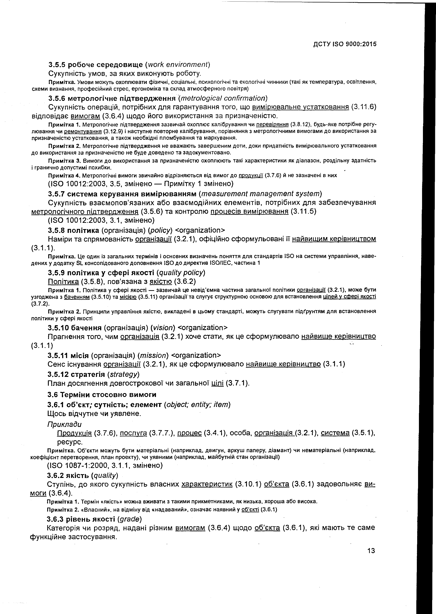

[Продукція](3.7.6), [послуга](3.7.7.), [процес](3.4.1), особа, [організація](3.2.1), [система](3.5.1), ресурс.  
*Примітка. Об'єкти можуть бути матеріальні (наприклад, двигун, аркуш паперу, діамант) чи нематеріальні (наприклад, коефіцієнт перетворення, план проекту), чи уявними (наприклад, майбутній стан організації)*  
(ISO 1087-1:2000, 3.1.1, змінено)

3.6.2 **якість** (*quality*)  
Ступінь, до якого сукупність власних [характеристик](3.10.1) [об'єкта](3.6.1) задовольняє [вимоги](3.6.4).  
*Примітка 1. Термін «якість» можна вживати з такими прикметниками, як низька, хороша або висока.*  
*Примітка 2. «Власний», на відміну від «наданий», означає наявний у [об'єкті](3.6.1)*  

3.6.3 **рівень якості** (*grade*)  
Категорія чи розряд, надані різним [вимогам](3.6.4) щодо [об'єкта](3.6.1.1), які мають те саме функційне застосування.

*Приклади*
Клас авіаквитка та категорія готелю в готельному довіднику.
*Примітка.* Якщо установлюють [вимогу щодо якості](3.6.5), зазвичай зазначають рівень якості

### 3.6.4 вимога (*requirement*)
Сформульовані потреба чи очікування, загальнозрозумілі чи обов'язкові.
*Примітка 1.* «Загальнозрозумілі» означає, що є звичайною чи загальноприйнятою практикою для [організації](3.2.1) та [зацікавлених сторін](3.2.3) уважати потребу чи очікування, про які йдеться, самі собою зрозумілими.
*Примітка 2.* Установлена вимога — це вимога, сформульована, наприклад, у [задокументованій інформації](3.8.6).
*Примітка 3.* Для позначення конкретного типу вимоги можна вживати означальні слова, наприклад, вимога до [продукції](3.7.6), вимога щодо [управління якістю](3.3.4), вимога [замовника](3.2.4), [вимога щодо якості](3.6.5).
*Примітка 4.* Вимоги можуть ставити різні зацікавлені сторони чи сама організація.
*Примітка 5.* Для досягнення високого рівня [задоволеності замовника](3.9.2) може бути потрібним задовольнити очікування замовника, навіть якщо воно не є сформульованим, загальнозрозумілим чи обов'язковим.
*Примітка 6.* Це один із загальних термінів і основних визначень поняття для стандартів ISO на системи управління, наведених у додатку SL консолідованого доповнення ISO до директив ISO/IEC, частина 1. Первісне визначення поняття змінено доданням приміток 3—5

### 3.6.5 вимога щодо якості (*quality requirement*)
[Вимога](3.6.4), пов'язана з [якістю](3.6.2)

### 3.6.6 законодавча вимога (*statutory requirement*)
Обов'язкова [вимога](3.6.4), установлена законодавчим органом

### 3.6.7 регламентувальна вимога (*regulatory requirement*)
Обов'язкова [вимога](3.6.4), установлена органом, що його уповноважив законодавчий орган

### 3.6.8 інформація про конфігурацію продукції (*product configuration information*)
[Вимога](3.6.4) чи інша інформація щодо проектування, виготовлення, [перевіряння](3.8.12), функціювання та обслуговування [продукції](3.7.6)
(ISO 10007:2003, 3.9, змінено)

### 3.6.9 невідповідність (*nonconformity*)
Невиконання [вимоги](3.6.4).
*Примітка.* Це один із загальних термінів і основних визначень поняття для стандартів ISO на системи управління, наведених у додатку SL консолідованого доповнення ISO до директив ISO/IEC, частина 1

### 3.6.10 дефект (*defect*)
[Невідповідність](3.6.9), пов'язана з передбачуваним або встановленим використанням.
*Примітка 1.* Розрізнення понять «дефект» і «невідповідність» важливе, оскільки воно має підтекст юридичного характеру, зокрема пов'язаний з питаннями відповідальності за [продукцію](3.7.6) та [послугу](3.7.7).
*Примітка 2.* Передбачуване використання, як його передбачає [замовник](3.2.4), може залежати від характеру [інформації](3.8.2), зокрема інструкції з експлуатації чи інструкції з технічного обслуговування, яку надає [постачальник](3.2.5)

### 3.6.11 відповідність (*conformity*)
Виконання [вимоги](3.6.4).
*Примітка 1.* В англійській мові слово «conformance» є синонімом, але вживати його не рекомендовано. У французькій мові слово «compliance» є синонімом, але вживати його не рекомендовано.
*Примітка 2.* Це один із загальних термінів і основних визначень поняття для стандартів ISO на системи управління, наведених у додатку SL консолідованого доповнення ISO до директив ISO/IEC, частина 1. Первісне визначення поняття змінено доданням примітки 1

### 3.6.12 спроможність (*capability*)
Здатність [об'єкта](3.6.1) отримувати [вихід](3.7.5), який відповідатиме [вимогам](3.6.4) до цього виходу.
*Примітка.* Терміни щодо сфери статистики, які стосуються спроможності [процесу](3.4.1), визначено в ISO 3534-2

### 3.6.13 простежуваність (*traceability*)
Здатність простежити передісторію, застосування чи місце розташування [об'єкта](3.6.1).
*Примітка 1.* Коли йдеться про [продукцію](3.7.6) чи [послугу](3.7.7.) простежуваність може стосуватися:
— походження матеріалів і складових частин;
— передісторії оброблення;
— розподілу та місця розташування продукції чи послуги після постачання.
*Примітка 2.* У сфері метрології прийнято визначення, наведене в ISO/IEC Guide 99

### 3.6.14 надійність (*dependability*)
Здатність функціювати як потрібно та коли потрібно
(IEC 60050-192, змінено — Примітку видалено)

3.6.15 інновація (*innovation*)
Новий або змінений об'єкт (3.6.1), що отримує чи перерозподіляє цінність.
Примітка 1. Роботами, результатом яких є інновації, зазвичай керують.
Примітка 2. Інновація звичайно значна за своїм ефектом.

### 3.7 Терміни стосовно результату

#### 3.7.1 ціль (*objective*)
Результат, який має бути досягнуто.
Примітка 1. Ціль може бути стратегічною, тактичною чи оперативною.
Примітка 2. Ціль можуть стосуватись різних сфер (наприклад фінансові цілі, цілі щодо охорони здоров'я та безпеки праці, екологічні цілі) та їх можна застосовувати на різних рівнях (наприклад, стратегічні цілі, цілі для всієї організації (3.2.1), цілі проекту (3.4.2), цілі стосовно продукції (3.7.6) та процесу (3.4.1)).
Примітка 3. Ціль може бути подано іншими способами, наприклад, як запланований результат, призначеність, операційний критерій, як ціль у сфері якості (3.7.2) чи з використанням інших слів подібного значення (мета, орієнтир або завдання).
Примітка 4. У контексті систем управління якістю (3.5.4) цілі у сфері якості (3.7.2) установлює організація (3.2.1) відповідно до політики у сфері якості (3.5.9) з тим, щоб отримати конкретні результати.
Примітка 5. Це один із загальних термінів і основних визначень поняття для стандартів ISO на системи управління, наведених у додатку SL консолідованого доповнення ISO до директив ISO/IEC, частина 1. Первісне визначення поняття змінено зміненням примітки 2

#### 3.7.2 ціль у сфері якості (*quality objective*)
Ціль (3.7.1), пов'язана з якістю (3.6.2).
Примітка 1. Основою цілей у сфері якості зазвичай є політика у сфері якості (3.5.9) організації (3.2.1).
Примітка 2. Ціль у сфері якості зазвичай установлюють для відповідних функційних підрозділів, рівнів і процесів (3.4.1) в організації (3.2.1)

#### 3.7.3 успіх (організація) (*success* <organization>)
Досягнення цілі (3.7.1).
Примітка. Успіх організації (3.2.1) підкреслює необхідність віднайти баланс між її економічними чи фінансовими інтересами та потребами її зацікавлених сторін (3.2.3), наприклад, замовників (3.2.4), користувачів, інвесторів/акціонерів (власників), персоналу в організації, постачальників (3.2.5), партнерів, зацікавлених груп і спільнот

#### 3.7.4 сталий успіх (організація) (*sustained success* <organization>)
Успіх (3.7.3) протягом певного періоду часу.
Примітка 1. Сталий успіх підкреслює потребу віднайти баланс між економічно-фінансовими інтересами організації (3.2.1) та інтересами соціального та екологічного середовища.
Примітка 2. Сталий успіх стосується зацікавлених сторін (3.2.3) організації, наприклад, замовників (3.2.4), власників, персоналу в організації, постачальників (3.2.5), фінансових установ, спілок, партнерів або суспільства

#### 3.7.5 вихід (*output*)
Результат процесу (3.4.1).
Примітка. Чи є вихід організації (3.2.1) продукцією (3.7.6) чи послугою (3.7.7), залежить від того, які з характеристик (3.10.1) переважають, наприклад, картина для продажу в галереї — це продукція, тоді як постачання картини на замовлення — послуга, гамбургер, куплений в магазині, — це продукція, тоді як отримання замовлення та подавання замовленого гамбургера в ресторані — послуга

#### 3.7.6 продукція (*product*)
Вихід (3.7.5) організації (3.2.1), який може бути виготовлено без будь-якої ділової угоди між організацією та замовником (3.2.4).
Примітка 1. Виробництво продукції здійснюють без того, щоб між постачальником (3.2.5) і замовником обов'язково мала місце якась ділова угода, але може часто передбачити цей елемент послуги (3.7.7) під час постачання останньої замовнику.
Примітка 2. Домінантним елементом продукції є те, що вона, зазвичай, матеріальна.
Примітка 3. Технічні засоби матеріальні та їхня кількість становить обчислювальну характеристику (3.10.1) (наприклад, шини). Перероблені матеріали матеріальні, і їхня кількість становить безперервну характеристику (наприклад, паливо та безалкогольні напої). Технічні засоби та перероблені матеріали часто називають товаром. Інтелектуальна продукція складається з інформації (3.8.2) незалежно від її носія (наприклад, комп'ютерна програма, застосована програма до мобільного телефону, інструкція з експлуатації, уміст словників, музична композиція з авторським правом на неї, водійські права)

#### 3.7.7 послуга (*service*)
Вихід (3.7.5) організації (3.2.1) за обов'язкового виконання принаймні одного виду роботи між організацією та замовником (3.2.4).
Примітка 1. Домінантні елементи послуги, зазвичай, нематеріальні.
Примітка 2. Послуга часто охоплює діяльність на межі взаємодії із замовником, щоб установлювати вимоги (3.6.4) замовника, а також під час надання послуги та може передбачити підтримання постійного зв'язку, наприклад, з фінансовими установами, бюро бухгалтерської експертизи чи державними організаціями, як-от школи чи лікарні.

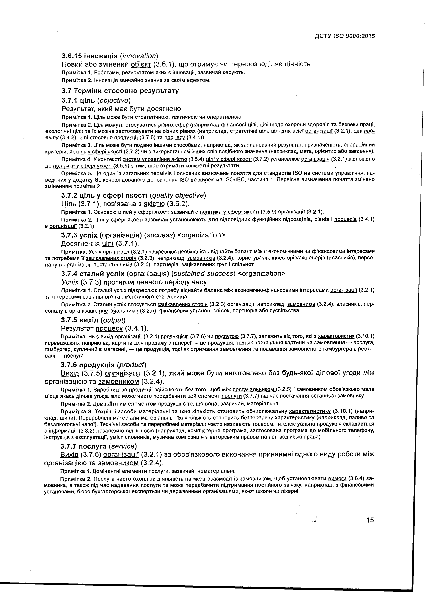

**Примітка 3.** Надання послуги може охоплювати, наприклад, таке:
— роботу, виконану з матеріальною продукцією (3.7.6), поданою замовником (наприклад, з автомобілем, що підлягав ремонту);
— роботу, виконану з нематеріальною продукцією, поданою замовником (наприклад, з декларацією про доходи, необхідною для обчислення розміру податку);
— подання нематеріальної продукції (наприклад, подання інформації (3.8.2) в контексті передавання знань);
— створення сприятливих умов для замовника (наприклад, у готелях і ресторанах).

**Примітка 4.** Послугу, звичайно, відчуває замовник.

### 3.7.8 дієвість; показник діяльності *(performance)*
Вимірний результат.

**Примітка 1.** Дієвість може бути пов'язана як з кількісними, так і з якісними отриманими даними.
**Примітка 2.** Дієвість може стосуватись керування/управління (3.3.3) роботами (3.3.11), процесами (3.4.1), продукцією (3.7.6), послугами (3.7.7), системами (3.5.1) чи організаціями (3.2.1).
**Примітка 3.** Це один із загальних термінів і основних визначень поняття для стандартів ISO на системи управління, наведених у додатку SL консолідованого доповнення ISO до директив ISO/IEC, частина 1. Первісне визначення поняття змінено зміненням примітки 2

### 3.7.9 ризик *(risk)*
Вплив невизначеності.

**Примітка 1.** Вплив — це відхил, позитивний або негативний, від очікуваного.
**Примітка 2.** Невизначеність — це стан нестачі навіть часткової інформації (3.8.2) стосовно розуміння чи знання події, її наслідку чи ймовірності.
**Примітка 3.** Ризик часто характеризують посиланням на можливі події (як визначено в ISO Guide 73:2009, 3.5.1.3) та можливі наслідки (як визначено в ISO Guide 73:2009, 3.6.1.3) чи на їх поєднання.
**Примітка 4.** Ризик часто зазначають з погляду поєднання наслідків подій (охоплюючи зміни в обставинах) і ймовірністю її виникнення (як визначено в ISO Guide 73:2009, 3.6.1.1).
**Примітка 5.** Слово «ризик» іноді використовують, якщо йдеться про можливість тільки негативних наслідків.
**Примітка 6.** Це один із загальних термінів і основних визначень поняття для стандартів ISO на системи управління, наведених у додатку SL консолідованого доповнення ISO до директив ISO/IEC, частина 1. Первісне визначення поняття змінено доданням примітки 5

### 3.7.10 ефективність *(efficiency)*
Співвідношення між досягнутим результатом і використаними ресурсами

### 3.7.11 результативність *(effectiveness)*
Ступінь реалізації запланованих робіт і досягнення запланованих результатів.

**Примітка.** Це один із загальних термінів і основних визначень поняття для стандартів ISO на системи управління, наведених у додатку SL консолідованого доповнення ISO до директив ISO/IEC, частина 1.

## 3.8 Терміни стосовно даних, інформації та документів

### 3.8.1 дані *(data)*
Факти про об'єкт (3.6.1)

### 3.8.2 інформація *(information)*
Значущі дані (3.8.1)

### 3.8.3 об'єктивний доказ *(objective evidence)*
Дані (3.8.1), які підтверджують існування чи правдивість чого-небудь.

**Примітка 1.** Об'єктивний доказ може бути отримано спостеріганням, вимірюванням (3.11.4), випробуванням (3.11.8) або іншими способами.
**Примітка 2.** Об'єктивний доказ для цілей аудиту (3.13.1) зазвичай охоплює протоколи (3.8.10), виклади фактів або іншої інформації (3.8.2), які суттєві щодо критеріїв аудиту (3.13.7) та можуть бути перевірені

### 3.8.4 інформаційна система (система управління якістю) *(information system) <quality management system>*
Мережа каналів обмінювання інформацією, використовувана в межах організації (3.2.1)

### 3.8.5 документ *(document)*
Інформація (3.8.2) та носій, на якому її розміщено.

*Приклади*
Протокол (3.8.10), технічні умови (3.8.7), методичний документ, кресленик, звіт, стандарт.

**Примітка 1.** Носієм може бути папір, магнітний, електронний або оптичний комп'ютерний диск, фотографія чи еталонний зразок або їх комбінація.
**Примітка 2.** Комплект документів, наприклад, технічних умов і протоколів, часто називають «документація».
**Примітка 3.** Деякі вимоги (3.6.4) (наприклад, вимога до розбірливості) застосовні до всіх типів документів. Проте можуть бути різні вимоги до технічних умов (наприклад, вимога щодо контрольованості переглядів) і до протоколів (наприклад, вимога щодо відповідності)

3.8.6 **задокументована інформація** *(documented information)*  
Інформація (3.8.2), яку **організація** (3.2.1) має контролювати та підтримувати в актуальному стані, та носій, на якому її розміщено.  
**Примітка 1.** Задокументована інформація може бути подана в будь-якому форматі та на будь-яких носіях і походити з будь-якого джерела.  
**Примітка 2.** Задокументована інформація може стосуватись:  
— системи управління (3.5.3), зокрема пов'язаних з нею **процесів** (3.4.1);  
— інформації, розробленої для того, щоб організація функціонувала (документація);  
— доказу досягнених результатів (**протоколи** (3.8.10)).  
**Примітка 3.** Це один із загальних термінів і основних визначень поняття для стандартів ISO на системи управління, наведених у додатку SL консолідованого доповнення ISO до директив ISO/IEC, частина 1  

3.8.7 **технічні умови; специфікація** *(specification)*  
**Документ** (3.8.5), який установлює **вимоги** (3.6.4).  
*Приклади*  
*Настанова щодо якості (3.8.8), програма якості (3.8.9), технічний кресленик, методичний документ, робоча інструкція.*  
**Примітка 1.** Технічні умови можуть стосуватися діяльності (наприклад, методичний документ, технічні умови на **процес** (3.4.1) і технічні умови на **випробування** (3.11.8)) чи **продукції** (3.7.6) (наприклад, технічні умови на продукцію, специфікація **дієвості** (3.7.8) та кресленик).  
**Примітка 2.** Може бути так, що поряд із викладом вимог у специфікації додатково зазначають результати, досягнені **проєктуванням і розроблянням** (3.4.8), і, таким чином, у деяких випадках специфікацію можуть використовувати як **протокол** (3.8.10)  

3.8.8 **настанова щодо якості** *(quality manual)*  
**Специфікація** (3.8.7) щодо **системи управління якістю** (3.5.4) **організації** (3.2.1).  
**Примітка.** Настанови якості можуть мати різний ступінь деталізації та різну форму залежно від розміру та складності окремої **організації** (3.2.1)  

3.8.9 **програма якості** *(quality plan)*  
**Специфікація** (3.8.7) **методик** (3.4.5) і відповідних ресурсів із зазначенням того, хто та коли повинен їх застосовувати до конкретного **об'єкта** (3.6.1).  
**Примітка 1.** До цих методик, зазвичай, належать такі, що стосуються **процесів** (3.4.1) **управління якістю** (3.3.4) і процесів виготовляння **продукції** (3.7.6) та надання **послуг** (3.7.7).  
**Примітка 2.** У програмі якості часто наводять посилання на розділи **настанови щодо якості** (3.8.8) чи на методичні **документи** (3.8.5).  
**Примітка 3.** Програма якості, зазвичай, — один із результатів **планування якості** (3.3.5)  

3.8.10 **протокол; запис** *(record)*  
**Документ** (3.8.5), у якому наведено одержані результати чи докази виконаних робіт.  
**Примітка 1.** Протоколи можна використовувати, наприклад, для документування **простежуваності** (3.6.13) та наведення доказу щодо **перевіряння** (3.8.12), **запобіжної дії** (3.12.1) та **коригувальної дії** (3.12.2).  
**Примітка 2.** Звичайно немає потреби контролювати нові редакції протоколів  

3.8.11 **план керування проєктом** *(project management plan)*  
**Документ** (3.8.5), який визначає, що потрібно для досягнення **цілі(-ей)** (3.7.1) **проєкту** (3.4.2).  
**Примітка 1.** У плані керування проєктом має бути **програма якості** (3.8.9) проєкту (безпосередньо чи через посилання на неї).  
**Примітка 2.** План керування проєктом також охоплює інші плани, які стосуються організаційної структури, ресурсів, графік а виконання, бюджету, **керування** (3.3.3) **ризиками** (3.7.9), екологічного управління, керування охороною праці, керування безпекою (безпосередньо чи через посилання на них, за потреби)  
(ISO 10006:2003, 3.7)  

3.8.12 **перевіряння; верифікація** *(verification)*  
Підтвердження наданням **об'єктивних доказів** (3.8.3), що встановлені **вимоги** (3.6.4) виконано.  
**Примітка 1.** Об'єктивний доказ, необхідний для перевіряння, може бути результатом **інспектування** (3.11.7) чи інших форм **визначання** (3.11.1), зокрема виконання альтернативних обчислень або аналізування **документів** (3.8.5).  
**Примітка 2.** Роботи, виконувані для перевіряння, іноді називають **процесом** (3.4.1) кваліфікування.  
**Примітка 3.** Слово «перевірено» використовують для позначення відповідного статусу  

3.8.13 **затвердження; валідація** *(validation)*  
Підтвердження наданням **об'єктивного доказу** (3.8.3), що **вимоги** (3.6.4) щодо конкретного передбаченого використання або застосування виконано.  
**Примітка 1.** Об'єктивний доказ, потрібний для перевіряння, може бути результатом **випробування** (3.11.8) чи інших форм **визначання** (3.11.1), зокрема виконання альтернативних обчислень або аналізування **документів** (3.8.5).  
**Примітка 2.** Слово «затверджено» використовують для позначення відповідного статусу.  
**Примітка 3.** Умови використання для затвердження можуть бути реальними чи змодельованими

3.8.14 **обліковування статусу конфігурації** (*configuration status accounting*)
Формалізоване реєстрування інформації про конфігурацію продукції (3.6.8), статусу запропонованих змін і статусу запровадження ухвалених змін і звітування про них
(ISO 10007:2003, 3.7)

3.8.15 **конкретний випадок (програма якості)** <specific case> <quality plan>
Предмет програми якості (3.8.9).
Примітка. Цей термін використано, щоб уникнути повторювання термінів «процес (3.4.1), продукція (3.7.6), проєкт (3.4.2) чи контракт (3.4.7)» у межах ISO 10005.
(ISO 10005:2005, 3.10, змінено — Змінено примітку.)

3.9 **Терміни стосовно замовника**

3.9.1 **зворотний зв’язок (задоволеність замовника)** (*feedback*) <customer satisfaction>
Думки, зауваги та висловлення зацікавленості щодо продукції (3.7.6), послуги (3.7.7) чи процесу (3.4.1) розглядання скарг
(ISO 10002:2014, 3.6, змінено — Термін «послуга» долучено до визначення)

3.9.2 **задоволеність замовника** (*customer satisfaction*)
Сприйняття замовником (3.2.4) ступеня виконання його очікувань.
Примітка 1. Може бути так, що очікування замовника невідомі організації (3.2.1) чи навіть самому замовнику доти, доки продукцію (3.7.6) не поставлено чи послугу (3.7.7) не надано. Для досягнення високого рівня задоволеності замовника може бути необхідно задовольнити очікування замовника, навіть якщо воно не є сформульованим, загально зрозумілим чи обов'язковим.
Примітка 2. Скарги (3.9.3) — загальноприйнятий показник низького рівня задоволеності замовників, але їх відсутність не обов'язково означає високий рівень задоволеності замовників.
Примітка 3. Навіть, якщо вимоги (3.6.4) замовника узгоджено з ним та виконано, це не обов'язково гарантує високий рівень задоволеності замовника
(ISO 10004:2012, 3.3, змінено — Змінено примітки)

3.9.3 **скарга (задоволеність замовника)** (*complaint*) <customer satisfaction>
Висловлення організації (3.2.1) незадоволеності щодо її продукції (3.7.6) чи послуги (3.7.7), чи самого процесу (3.4.1) розглядання скарг там, де явно чи неявно очікують відповіді або рішення
(ISO 10002:2014, 3.2, змінено — Термін «послуга» долучено до визначення)

3.9.4 **обслуговування замовника** (*customer service*)
Взаємодія організації (3.2.1) із замовником (3.2.4) протягом усього життєвого циклу продукції (3.7.6) чи послуги (3.7.7)
(ISO 10002:2014, 3.5, змінено — Термін «послуга» долучено до визначення)

3.9.5 **кодекс поведінки, зорієнтований на досягнення задоволеності замовників** (*customer satisfaction code of conduct*)
Зобов’язання, які бере на себе організація (3.2.1) перед замовником (3.2.4) стосовно своєї поведінки та які спрямовані на підвищення рівня задоволеності замовників (3.9.2), а також пов'язані з ними застороги.
Примітка 1. Застороги, пов’язані з зобов’язанням, можуть бути стосовно цілей (3.7.1), умов, обмежень, контрактної інформації (3.8.2), а також методик (3.4.5) розглядання скарг (3.9.3).
Примітка 2. У ISO 10001:2007 замість терміна «кодекс поведінки, зорієнтований на досягнення задоволеності замовників» ужито термін «кодекс»
(ISO 10001:2007, 3.1, змінено — Термін «кодекс» як допустимий термін вилучено. Примітку 2 змінено)

3.9.6 **спір (задоволеність замовника)** (*dispute*) <customer satisfaction>
Незгода, що виникає у зв’язку зі скаргою (3.9.3), подана провайдеру процесу розв’язання спорів (3.2.7).
Примітка. Деякі організації (3.2.1) дають змогу своїм замовникам (3.2.4) висловлювати їхню незадоволеність провайдеру процесу розв’язання спорів у першій інстанції. У цій ситуації висловлення незадоволеності стає скаргою, якщо її надіслано організації для реагування, і стає спором, якщо організація не розв'яже цю незадоволеність без утручання провайдера процесу розв’язання спорів. Багато організацій віддають перевагу тому, щоб їхні замовники висловлювали будь-яку незадоволеність спершу самій організації, перш ніж удаватися до розв’язання спорів поза межами організації
(ISO 10003:2007, 3.6, змінено)

3.10 Терміни стосовно характеристики
3.10.1 характеристика *(characteristic)*
Розпізнавальна особливість.
Примітка 1. Характеристика може бути власною чи наданою.
Примітка 2. Характеристика може бути якісною чи кількісною.
Примітка 3. Є різні класи характеристик, зокрема:
a) фізичні (наприклад, механічні, електричні, хімічні чи біологічні характеристики);
b) органолептичні (наприклад, пов'язані із запахом, дотиком, смаком, зором, слухом);
c) етичні (наприклад, увічливість, чесність, правдивість);
d) часові (наприклад, пунктуальність, безвідмовність, доступність, безперервність);
e) ергономічні (наприклад, фізіологічні чи пов'язані з безпекою людини);
f) функційні (наприклад, максимальна швидкість літака).

3.10.2 характеристика якості *(quality characteristic)*
Власна характеристика (3.10.1) об'єкта (3.6.1), пов'язана з вимогою (3.6.4).
Примітка 1. «Власний» означає наявний у чому-небудь, саме як постійна характеристика.
Примітка 2. Надана характеристика об'єкта (наприклад, ціна об'єкта) не є характеристикою якості об'єкта.

3.10.3 людський чинник *(human factor)*
Характеристика (3.10.1) особи, яка має вплив на об'єкт (3.6.1), що його розглядають.
Примітка 1. Характеристики можуть бути фізичні, когнітивні (пізнавальні) чи соціальні.
Примітка 2. Людські чинники можуть мати значний вплив на систему управління (3.5.3)

3.10.4 компетентність *(competence)*
Здатність застосовувати знання та навички для досягнення запланованих результатів.
Примітка 1. Доведену здатність іноді називають кваліфікацією.
Примітка 2. Це один із загальних термінів і основних визначень поняття для стандартів ISO на системи управління, наведених у додатку SL консолідованого доповнення ISO до директив ISO/IEC, частина 1. Первісне визначення поняття змінено доданням примітки 1

3.10.5 метрологічна характеристика *(metrological characteristic)*
Характеристика (3.10.1), яка може впливати на результати вимірювання (3.11.4).
Примітка 1. Вимірювальне устатковання (3.11.6) звичайно має кілька метрологічних характеристик.
Примітка 2. Метрологічні характеристики можуть бути предметом калібрування

3.10.6 конфігурація *(configuration)*
Взаємопов'язані функційні та фізичні характеристики (3.10.1) продукції (3.7.6) чи послуги (3.7.7), визначені в інформації про конфігурацію продукції (3.6.8)
(ISO 10007:2003, 3.3, змінено — Термін «послуга» долучено до визначення поняття)

3.10.7 базис конфігурації *(configuration baseline)*
Затверджена інформація про конфігурацію продукції (3.6.8), у якій установлено характеристики (3.10.1) продукції (3.7.6) чи послуги (3.7.7) на певний момент часу та яка слугує орієнтиром для видів робіт, що їх здійснюють протягом усього життєвого циклу продукції чи послуги.
(ISO 10007:2003, 3.4, змінено — Термін «послуга» долучено до визначення поняття)

3.11 Терміни стосовно визначання
3.11.1 визначання *(determination)*
Дія щодо знаходження однієї чи кількох характеристик (3.10.1) та їхніх характеристичних значень

3.11.2 аналізування *(review)*
Визначання (3.11.1) придатності, адекватності чи результативності (3.7.11) об'єкта (3.6.1) для досягнення поставлених цілей (3.7.1).

*Приклади*
Аналізування стосовно управління, аналізування проєктування та розробляння (3.4.8), аналізування вимог (3.6.4) замовника (3.2.4), аналізування коригувальної дії (3.12.2) та експертне аналізування.

Примітка. Аналізування може також охоплювати визначання ефективності (3.7.10)

3.11.3 моніторинг *(monitoring)*
Визначання (3.11.1) статусу системи (3.5.1), процесу (3.4.1), продукції (3.7.6), послуги (3.7.7) чи роботи.

Примітка 1. Для визначання статусу може бути потрібно перевіряти, наглядати чи критично спостерігати.

Примітка 2. Зазвичай, моніторинг — це визначення статусу об'єкта (3.6.1), здійснюване на різних стадіях або в різний час.

Примітка 3. Це один із загальних термінів і основних визначень поняття для стандартів ISO на системи управління, наведених у додатку SL консолідованого доповнення ISO до директив ISO/IEC, частина 1. Первісне визначення поняття та примітку 1 було змінено, примітку 2 додано

**3.11.4 вимірювання (*measurement*)**  
Процес (3.4.1) визначення величини.  
Примітка 1. Згідно з ISO 3534-2 величину визначають, зазвичай, як кількість.  
Примітка 2. Це один із загальних термінів і основних визначень поняття для стандартів ISO системи управління, наведених у додатку SL консолідованого доповнення ISO до директив ISO/IEC, частина 1. Первісне визначення поняття було змінено доданням примітки 1

**3.11.5 процес вимірювання (*measurement process*)**  
Сукупність операцій, щоб визначити значення величини

**3.11.6 вимірювальне устатковання (*measuring equipment*)**  
Вимірювальний прилад, програмний засіб, еталон, стандартний зразок або допоміжні прилади чи їх комбінація, потрібні для виконання процесу вимірювання (3.11.5)

**3.11.7 інспектування (*inspection*)**  
Визначання (3.11.1) відповідності (3.6.11) установленим вимогам (3.6.4).  
Примітка 1. Якщо результат інспектування свідчить про відповідність, це може бути використано для цілей перевіряння (3.8.12).  
Примітка 2. Результат інспектування може свідчити про відповідність або невідповідність (3.6.9) або ступінь відповідності

**3.11.8 випробування; тестування (*test*)**  
Визначання (3.11.1) відповідності вимогам (3.6.4) щодо конкретного передбаченого використання чи застосування.  
Примітка. Якщо результат випробування свідчить про відповідність (3.6.11), це може бути використано для цілей затвердження (3.8.13)

**3.11.9 оцінювання ходу виконання (керування проектом) (*progress evaluation*) <project management>**  
Визначання ходу виконання з погляду досягнення цілей (3.7.1) проекту (3.4.2).  
Примітка 1. Це оцінювання треба провадити в належних точках життєвого циклу проекту протягом процесів (3.4.1) проекту, базуючись на критеріях щодо процесів проекту та продукції (3.7.6) чи послуги (3.7.7) проекту.  
Примітка 2. Результати оцінювання ходу виконання можуть зумовити переглядання плану керування проектом (3.8.11).  

**(ISO 10006:2003, 3.4, змінено — Примітки змінено)**

**3.12 Терміни стосовно дії**  
**3.12.1 запобіжна дія (*preventive action*)**  
Дія, яку виконують, щоб усунути причину потенційної невідповідності (3.6.9) чи іншої потенційно небажаної ситуації.  
Примітка 1. Може бути кілька причин виникнення потенційної невідповідності.  
Примітка 2. Запобіжну дію виконують, щоб запобігти виникненню події, тоді як коригувальну дію (3.12.2) — щоб запобігти повторному виникненню події

**3.12.2 коригувальна дія (*corrective action*)**  
Дія, яку виконують, щоб усунути причину невідповідності (3.6.9) та запобігти її повторному виникненню.  
Примітка 1. Може бути кілька причин виникнення невідповідності.  
Примітка 2. Коригувальну дію виконують, щоб запобігти повторному виникненню події, тоді як запобіжну дію (3.12.1) — щоб запобігти виникненню події.  
Примітка 3. Це один із загальних термінів і основних визначень поняття для стандартів ISO на системи управління, наведених у додатку SL консолідованого доповнення ISO до директив ISO/IEC, частина 1. Первісне визначення поняття було змінено доданням приміток 1 та 2.

**3.12.3 коригування (*correction*)**  
Дія, яку виконують, щоб усунути виявлену невідповідність (3.6.9).  
Примітка 1. Коригування можна провадити перед коригувальною дією (3.12.2), разом з нею чи після неї.  
Примітка 2. Коригуванням може бути, наприклад, переробляння (3.12.8) чи зниження рівня якості (3.12.4)

**3.12.4 зниження рівня якості (*regrade*)**  
Змінювання рівня якості (3.6.3) невідповідної (3.6.9) продукції (3.7.6) чи послуги (3.7.7), щоб зробити її відповідною вимогам (3.6.4), які відрізняються від початково встановлених

3.12.5 поступка (*concession*)

Дозвіл на використання чи випуск (3.12.7) продукції (3.7.6) чи послуги (3.7.7), яка не відповідає встановленим вимогам (3.6.4).

*Примітка. Поступку зазвичай застосовують під час постачання продукції чи надання послуги, які мають невідповідні (3.6.9) характеристики (3.10.1) в заданих межах, і зазвичай надають для обмеженої кількості продукції та послуг або на обмежений період часу та для конкретного використання*

3.12.6 дозвіл на відхил (*deviation permit*)

Дозвіл не дотримувати початково встановлених вимог (3.6.4) до продукції (3.7.6) чи послуги (3.7.7), виданий до початку її виготовлення.

*Примітка. Дозвіл на відхил зазвичай видають на обмежену кількість продукції та послуги чи на обмежений період часу та для конкретного використання*

3.12.7 випуск (*release*)

Дозвіл на перехід до наступної стадії процесу (3.4.1) чи до наступного процесу.

*Примітка. В англійській мові в контексті програмних засобів і документів (3.8.5) терміном «release» часто називають версію програмного засобу чи документа*

3.12.8 переробляння (*rework*)

Дія, яку виконують з невідповідною (3.6.9) продукцією (3.7.6) чи послугою (3.7.7), щоб зробити її відповідною вимогам (3.6.4).

*Примітка. Під час переробляння можуть змінювати чи замінювати складові частини невідповідної продукції чи послуги*

3.12.9 ремонтування (*repair*)

Дія, яку виконують з невідповідною (3.6.9) продукцією (3.7.6) чи послугою (3.7.7), щоб зробити її придатною для передбачуваного використання.

*Примітка 1. Успішне ремонтування не обов'язково робить невідповідну продукцію чи послугу відповідною вимогам (3.6.4). Може бути так, що разом із ремонтуванням потребуватимуть поступку (3.12.5).*

*Примітка 2. Ремонтування охоплює дії стосовно виправлення початково відповідної продукції чи послуги, щоб її відновити для використання, наприклад, як частину технічного обслуговування.*

*Примітка 3. Під час ремонтування можуть змінювати чи замінювати складові частини невідповідної продукції чи послуги*

3.12.10 бракування (*scrap*)

Дія, яку виконують з невідповідною (3.6.9) продукцією (3.7.6) чи послугою (3.7.7), щоб не допустити її початкового передбачуваного використання.

*Приклади*
> Утилізація, знищення.

*Примітка. У ситуації з невідповідною послугою її використанню запобігають, припиняючи надання послуги.*

### 3.13 Терміни стосовно аудиту

#### 3.13.1 аудит (*audit*)

Систематичний, незалежний і задокументований процес (3.4.1) отримання об'єктивних доказів (3.8.3) та їх об'єктивного оцінювання, щоб визначити ступінь дотримання критеріїв аудиту (3.13.7).

*Примітка 1. Основоположні елементи аудиту охоплюють визначення (3.11.1) відповідності (3.6.11) об'єкта (3.6.1) відповідно до методики (3.4.5), що його провадить персонал, який не відповідає за об'єкт, який піддають аудиту.*

*Примітка 2. Аудит може бути внутрішнім аудитом (аудит першою стороною) чи зовнішнім аудитом (аудит другою чи третьою стороною), а також може бути скомбінованим аудитом (3.13.2) або спільним аудитом (3.13.3).*

*Примітка 3. Внутрішні аудити, що їх іноді називають «аудити першою стороною», провадить сама організація (3.2.1) чи за її дорученням певна особа для аналізування (3.11.2) стосовно управління (3.3.3) та для інших внутрішніх цілей, і вони можуть слугувати організації основою для декларування відповідності. Незалежність аудитора може бути доведено тим, що він не відповідає за діяльність, аудит якої провадять.*

*Примітка 4. До зовнішніх аудитів належать ті, що їх зазвичай називають «аудити другою стороною» та «аудити третьою стороною». Аудити другою стороною провадять сторони, що мають певний інтерес до діяльності організації, наприклад, замовники (3.2.4) або інші особи за їхнім дорученням. Аудити третьою стороною провадять зовнішні незалежні аудиторські організації, наприклад, ті, які здійснюють сертифікацію/реєстрацію відповідності, чи державні органи.*

*Примітка 5. Це один із загальних термінів і основних визначень поняття для стандартів ISO на системи управління, наведених у додатку SL консолідованого доповнення ISO до директив ISO/IEC, частина 1. Первісне визначення поняття та примітки було змінено, щоб уникнути ефекту циркулярності між термінами «критерії аудиту» та «доказ аудиту», а також додано примітки 3 та 4*

#### 3.13.2 скомбінований аудит (*combined audit*)

Аудит (3.13.1), який провадять одночасно на одному об'єкті аудиту (3.13.12) стосовно двох або більше систем управління (3.5.3).

*Примітка. Частини системи управління, які можуть бути залучені до скомбінованого аудиту, можуть бути визначені відповідними стандартами на системи управління, стандартами на продукцію, стандартами на послуги чи стандартами на процеси, що їх застосовує організація (3.2.1)*

3.13.3 спільний аудит (*joint audit*)

[Аудит](../page_XX_img_X.png) (3.13.1), який провадять на одному [об'єкті аудиту](../page_XX_img_X.png) (3.13.12) дві чи більше аудиторських [організацій](../page_XX_img_X.png) (3.2.1)

3.13.4 програма аудиту (*audit programme*)

Один або кілька [аудитів](../page_XX_img_X.png) (3.13.1), запланованих на конкретний період часу та спрямованих на досягнення конкретної цілі

(ISO 19011:2011, 3.13, змінено)

3.13.5 сфера аудиту (*audit scope*)

Обсяг і межі [аудиту](../page_XX_img_X.png) (3.13.1).

*Примітка. Сфера аудиту, звичайио, охоплює опис місця розташування ділянок, структурних підрозділів організації, видів робіт і [процесів](../page_XX_img_X.png) (3.4.1).*

(ISO 19011:2011, 3.14, змінено — Примітку змінено)

3.13.6 план аудиту (*audit plan*)

Опис дій і заходів для проведення [аудиту](../page_XX_img_X.png) (3.13.1)

(ISO 19011:2011, 3.15)

3.13.7 критерії аудиту (*audit criteria*)

Сукупність [політик](../page_XX_img_X.png) (3.5.8), [методик](../page_XX_img_X.png) (3.4.5) або [вимог](../page_XX_img_X.png) (3.6.4), що їх використовують як еталон, з яким порівнюють [об'єктивний доказ](../page_XX_img_X.png) (3.8.3)

(ISO 19011:2011, 3.2, змінено — Термін «доказ аудиту» замінено на «об'єктивний доказ»)

3.13.8 доказ аудиту (*audit evidence*)

Протоколи, виклади фактів чи інша інформація, що стосуються [критеріїв аудиту](../page_XX_img_X.png) (3.13.7) і можуть бути перевірені

(ISO 19011:2011, 3.3, змінено — Примітку видалено)

3.13.9 дані аудиту (*audit findings*)

Результати оцінювання зібраних [доказів аудиту](../page_XX_img_X.png) (3.13.8) за [критеріями аудиту](../page_XX_img_X.png) (3.13.7).

*Примітка 1. Дані аудиту вказують на [відповідність](../page_XX_img_X.png) (3.6.11) або [невідповідність](../page_XX_img_X.png) (3.6.9).*

*Примітка 2. Дані аудиту можуть зумовити до ідентифікування можливостей для [поліпшування](../page_XX_img_X.png) (3.3.1) чи до реєстрування належних практик.*

*Примітка 3. В англійській мові у разі, якщо [критерії аудиту](../page_XX_img_X.png) (3.13.7) вибирають із [законодавчих вимог](../page_XX_img_X.png) (3.6.6) або [регламентувальних вимог](../page_XX_img_X.png) (3.6.7), то дані аудиту можна називати «дотримання» чи «недотримання»*

(ISO 19011:2011, 3.4, змінено — Примітку 3 змінено)

3.13.10 висновок аудиту (*audit conclusion*)

Підсумок [аудиту](../page_XX_img_X.png) (3.13.1) після розглядання цілей аудиту та всіх [даних аудиту](../page_XX_img_X.png) (3.13.9)

(ISO 19011:2011, 3.5)

3.13.11 замовник аудиту (*audit client*)

[Організація](../page_XX_img_X.png) (3.2.1) чи особа, яка подає заявку на проведення [аудиту](../page_XX_img_X.png) (3.13.1)

(ISO 19011:2011, 3.6, змінено — Примітку видалено)

3.13.12 об'єкт аудиту (*auditee*)

[Організація](../page_XX_img_X.png) (3.2.1), яку піддають аудиту

(ISO 19011:2011, 3.7)

3.13.13 гід (аудит) (*guide* <audit>)

Особа, яку призначає [об'єкт аудиту](../page_XX_img_X.png) (3.13.12), щоб сприяти діяльності [групи аудиту](../page_XX_img_X.png) (3.13.14)

(ISO 19011:2011, 3.12)

3.13.14 група аудиту (*audit team*)

Одна чи кілька осіб, що провадять [аудит](../page_XX_img_X.png) (3.13.1) за підтримання, якщо необхідно, [технічних експертів](../page_XX_img_X.png) (3.13.16).

*Примітка 1. Одного з [аудиторів](../page_XX_img_X.png) (3.13.15) групи аудиту призначають керівником групи аудиту.*

*Примітка 2. До групи аудиту можуть входити аудитори-стажисти*

(ISO 19011:2011, 3.9, змінено)

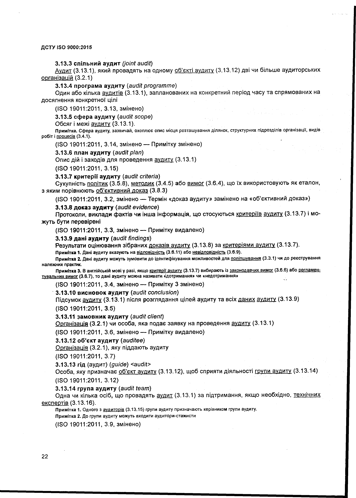

3.13.15 аудитор (*auditor*)  
Особа, яка провадить аудит (3.13.1)  
(ISO 19011:2011, 3.8)  
3.13.16 технічний експерт (*аудит*) (*technical expert*) <audit>  
Особа, яка має спеціальні знання чи досвід у групі аудиту (3.13.14).  
*Примітка 1.* Спеціальні знання чи досвід стосуються організації (3.2.1), процесу (3.4.1) чи діяльності, що піддають аудиту, або мови чи культури.  
*Примітка 2.* Технічний експерт не має повноважень аудитора (3.13.15) в групі аудиту (3.13.14)  
(ISO 19011:2011, 3.10, змінено — Примітку 1 змінено)  
3.13.17 спостерігач (*аудит*) (*observer*) <audit>  
Особа, яка супроводжує групу аудиту (3.13.14), але не здійснює дії аудитора (3.13.15).  
*Примітка.* Спостерігач може бути членом об'єкта аудиту (3.13.12) або регуляторного органу чи іншої зацікавленої сторони (3.2.3), який є свідком аудиту (3.13.1)  
(ISO 19011:2011, 3.11, змінено — Слово «аудит» вилучено із визначення; примітку змінено).  

ДОДАТОК А  
(довідковий)  

### ВЗАЄМОЗВ'ЯЗКИ МІЖ ПОНЯТТЯМИ ТА ЇХ ГРАФІЧНЕ ПОДАННЯ  

#### А.1 Загальні положення  
У термінологічній роботі взаємозв'язки між поняттями ґрунтуються на ієрархічній структурі ознак певного видового поняття таким чином, щоб у найекономнішому описі поняття було зазначено його видове поняття й описано ознаки, які відрізняють його від понять вищого чи того самого рівня.  
У цьому додатку подано три основні типи зв'язків між поняттями: родовий (див. А.2), частинний (див. А.3) і асоціативний (див. А.4).  

#### А.2 Родовий зв'язок  
Підрядні поняття в межах ієрархії успадковують усі ознаки надрядного поняття і охоплюють описи тих ознак, які відрізняють їх від надрядних (вищого рівня) і сурядних (того самого рівня) понять, наприклад, зв'язки весни, літа, осені та зими щодо пори року.  
Родові зв'язки зображають віялоподібними чи деревоподібними схемами без стрілок (див. рисунок А.1).  
Приклад запозичено із ISO 704:2009, (5.5.2.2.1).  

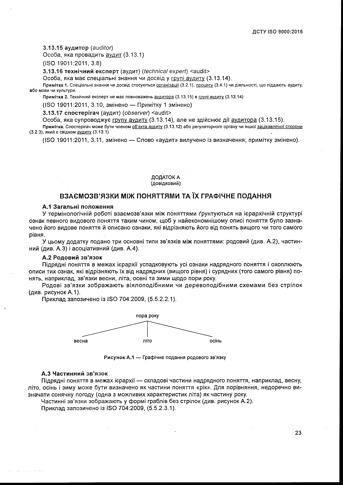  
**Рисунок А.1** — Графічне подання родового зв'язку  

#### А.3 Частинний зв'язок  
Підрядні поняття в межах ієрархії — складові частини надрядного поняття, наприклад, весну, літо, осінь і зиму може бути визначено як частини поняття «рік». Для порівняння, недоречно визначати сонячну погоду (одна з можливих характеристик літа) як частину року.  
Частинні зв'язки зображають у формі граблів без стрілок (див. рисунок А.2).  
Приклад запозичено із ISO 704:2009, (5.5.2.3.1).

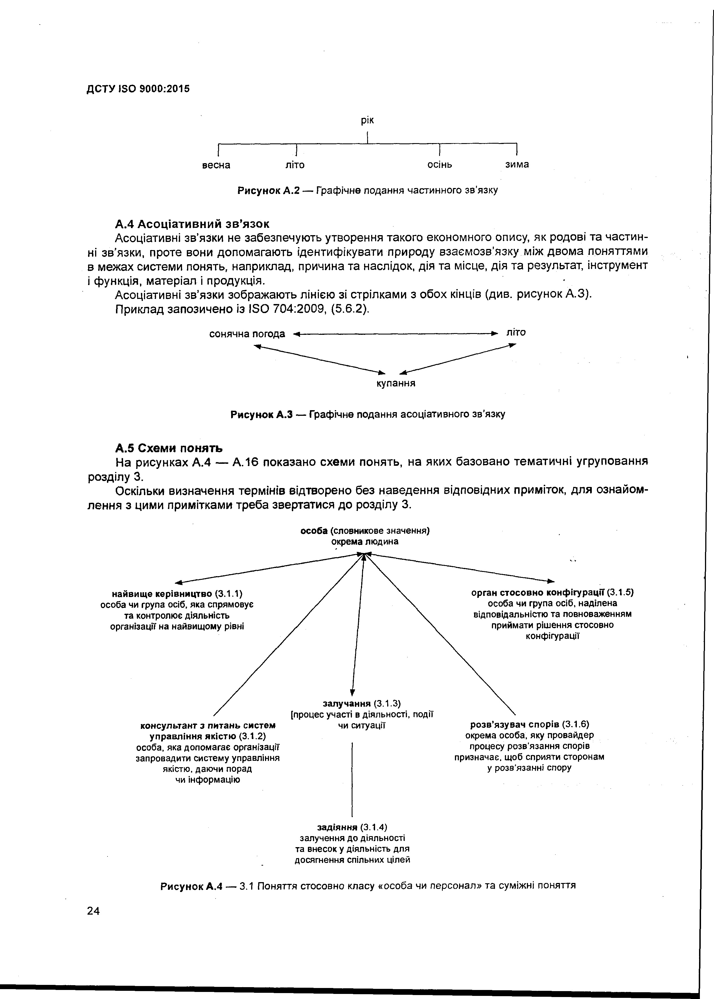

**Рисунок А.2 — Графічне подання частинного зв'язку**

**А.4 Асоціативний зв'язок**
Асоціативні зв'язки не забезпечують утворення такого економного опису, як родові та частинні зв'язки, проте вони допомагають ідентифікувати природу взаємозв'язку між двома поняттями в межах системи понять, наприклад, причина та наслідок, дія та місце, дія та результат, інструмент і функція, матеріал і продукція.

Асоціативні зв'язки зображають лінією зі стрілками з обох кінців (див. рисунок А.3).

Приклад запозичено із ISO 704:2009, (5.6.2).

**Рисунок А.3 — Графічне подання асоціативного зв'язку**

**А.5 Схеми понять**
На рисунках А.4 — А.16 показано схеми понять, на яких базовано тематичні угруповання розділу 3.

Оскільки визначення термінів відтворено без наведення відповідних приміток, для ознайомлення з цими примітками треба звертатися до розділу 3.

**Рисунок А.4 — 3.1 Поняття стосовно класу «особа чи персонал» та суміжні поняття**

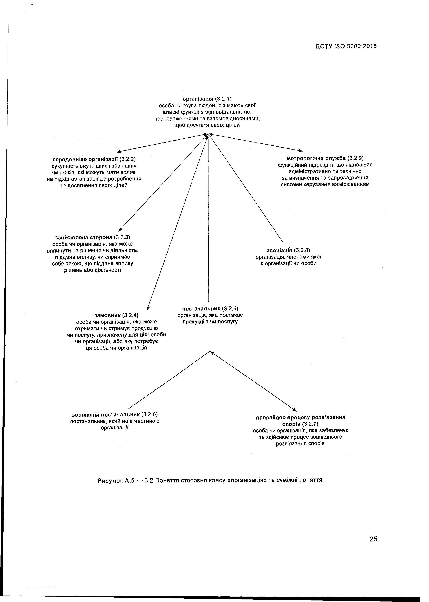

Рисунок А.5 — 3.2 Поняття стосовно класу «організація» та суміжні поняття

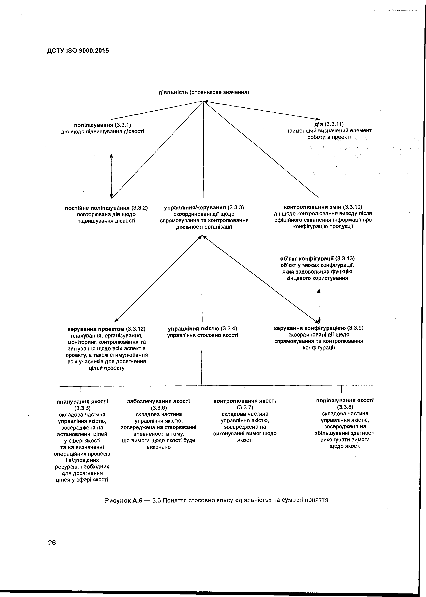

Рисунок А.6 — 3.3 Поняття стосовно класу «діяльність» та суміжні поняття

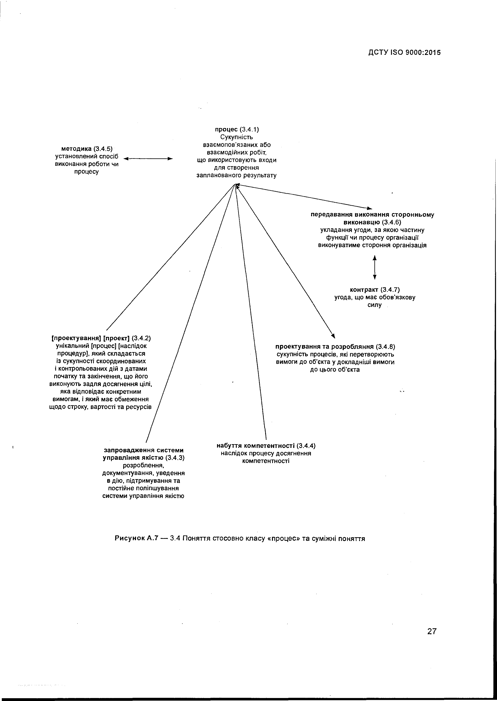

Рисунок А.7 — 3.4 Поняття стосовно класу «процес» та суміжні поняття

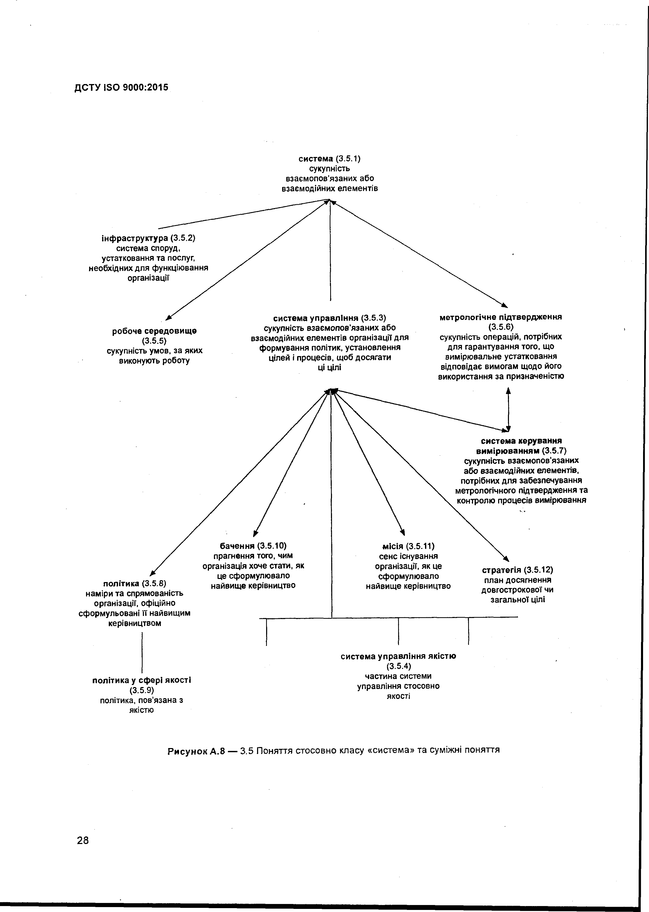

Рисунок А.8 — 3.5 Поняття стосовно класу «система» та суміжні поняття

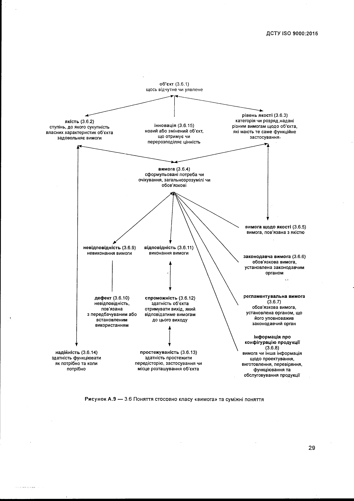

Рисунок А.9 — 3.6 Поняття стосовно класу «вимога» та суміжні поняття

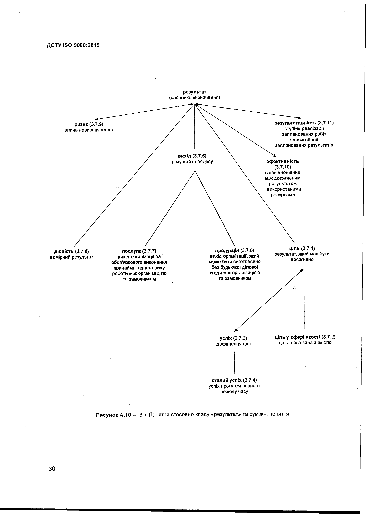

Рисунок А.10 — 3.7 Поняття стосовно класу «результат» та суміжні поняття

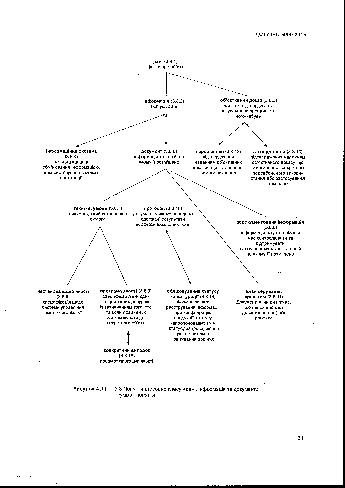

Рисунок А.11 — 3.8 Поняття стосовно класу «дані, інформація та документ» і суміжні поняття

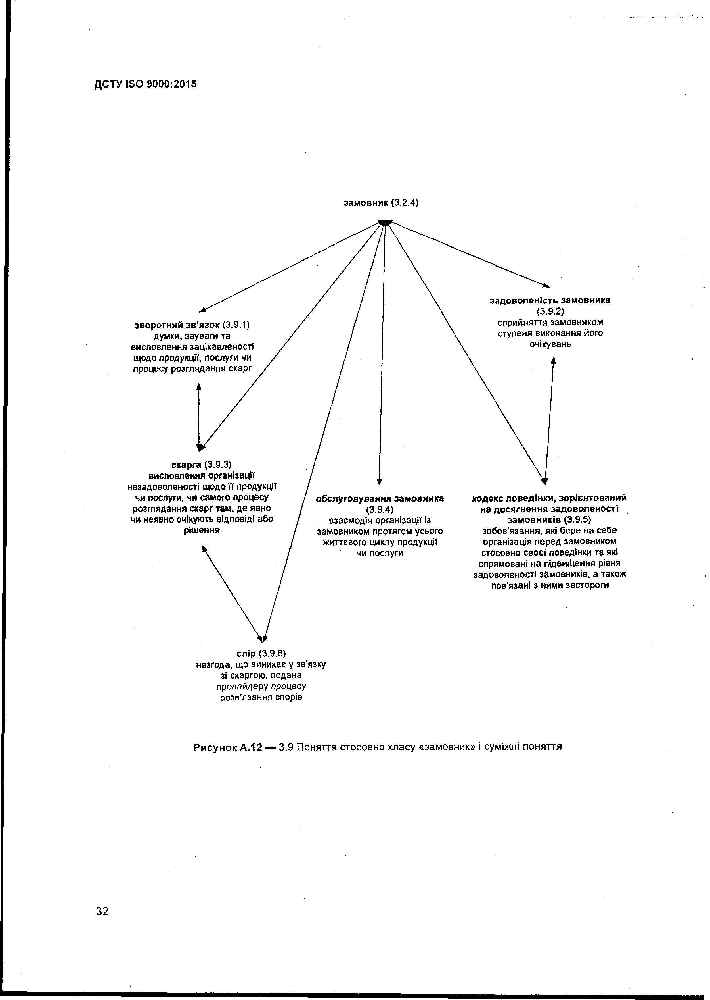

Рисунок А.12 — 3.9 Поняття стосовно класу «замовник» і суміжні поняття

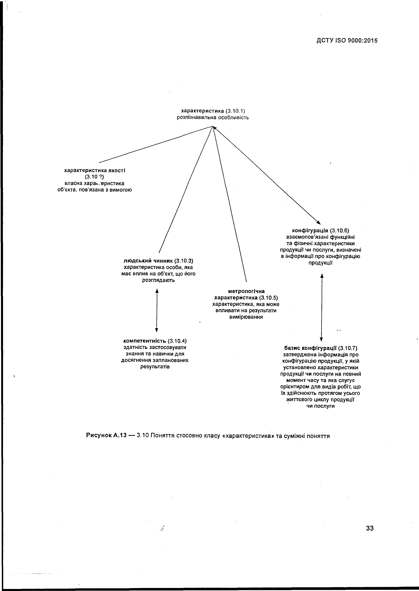

Рисунок А.13 — 3.10 Поняття стосовно класу «характеристика» та суміжні поняття

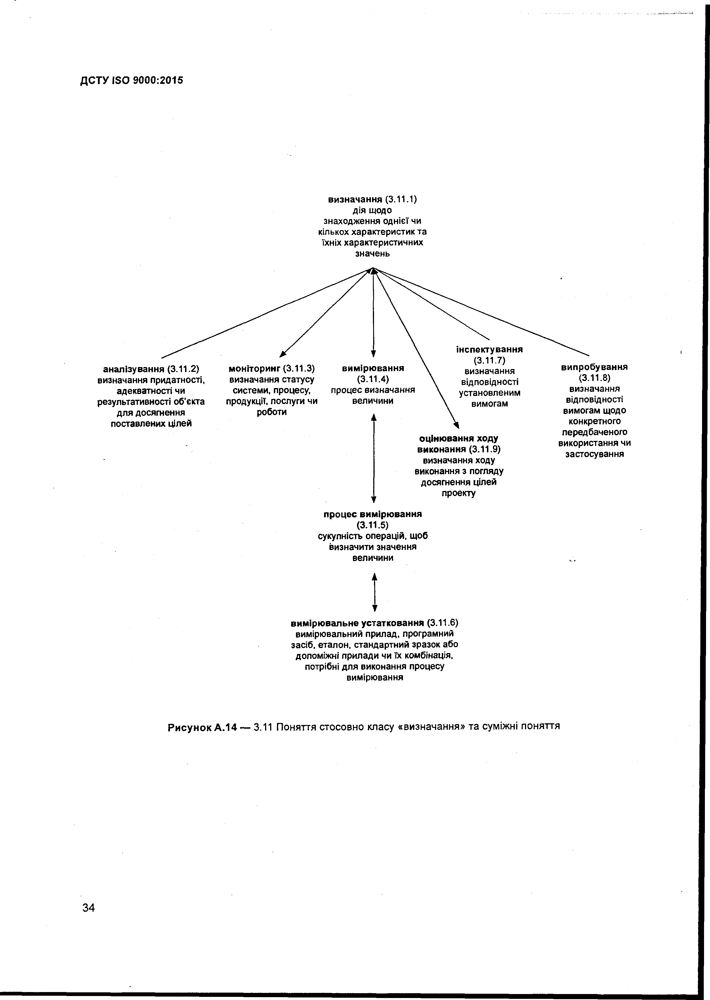

Рисунок А.14 — 3.11 Поняття стосовно класу «визначення» та суміжні поняття

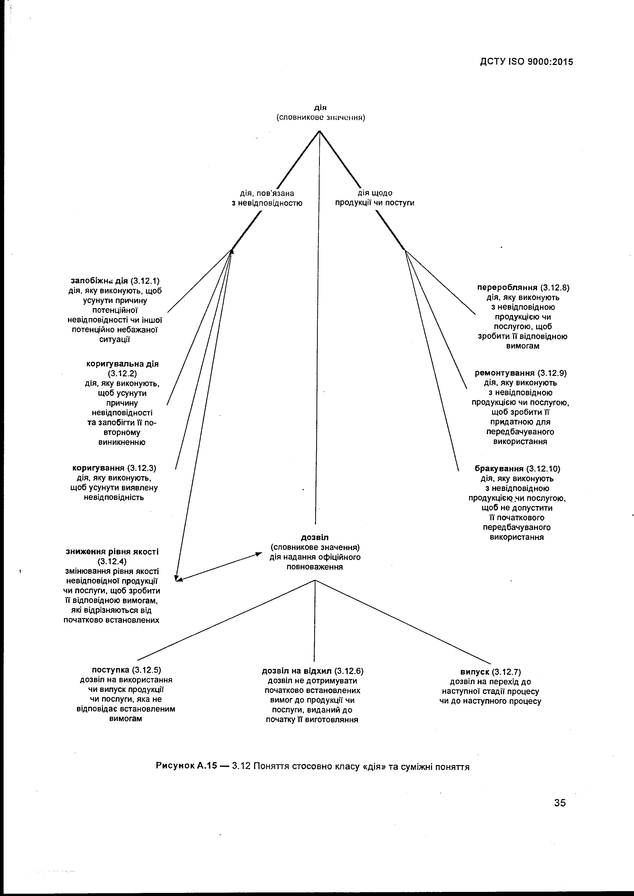

Рисунок А.15 — 3.12 Поняття стосовно класу «дія» та суміжні поняття

ДСТУ ISO 9000:2015

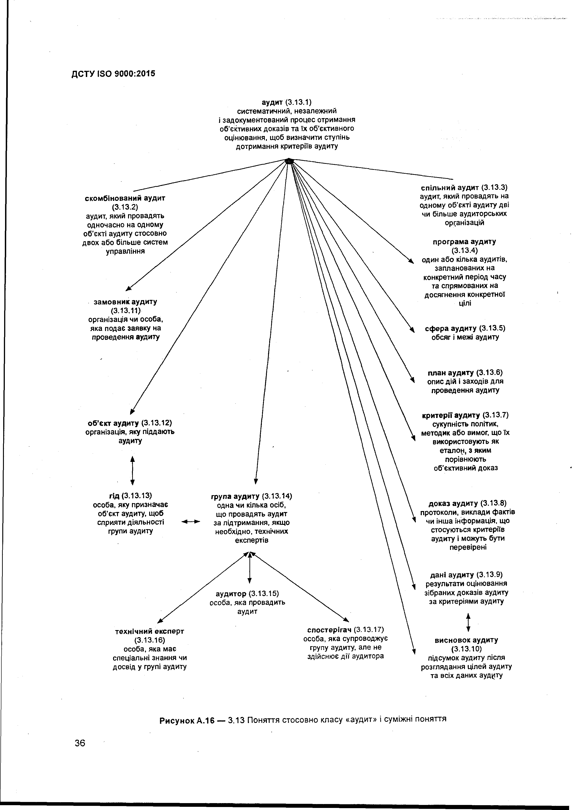

Рисунок А.16 — 3.13 Поняття стосовно класу «аудит» і суміжні поняття

БІБЛІОГРАФІЯ

1 ISO 704:2009 Terminology work — Principles and methods  
2 ISO 1087-1:2000 Terminology work — Vocabulary — Part 1: Theory and application  
3 ISO 3534-2 Statistics — Vocabulary and symbols — Part 2: Applied statistics  
4 ISO 9001 Quality management systems — Requirements  
5 ISO 9004 Managing for the sustained success of an organization — A quality management approach  
6 ISO 10001:2007 Quality management — Customer satisfaction — Guidelines for codes of conduct for organizations  
7 ISO 10002:2014 Quality management — Customer satisfaction — Guidelines for complaints handling in organizations  
8 ISO 10003:2007 Quality management — Customer satisfaction — Guidelines for dispute resolution external to organizations  
9 ISO 10004:2012 Quality management — Customer satisfaction — Guidelines for monitoring and measuring  
10 ISO 10005:2005 Quality management systems — Guidelines for quality plans  
11 ISO 10006:2003 Quality management systems — Guidelines for quality management in projects  
12 ISO 10007:2003 Quality management systems — Guidelines for configuration management  
13 ISO 10008 Quality management — Customer satisfaction — Guidelines for business-to-consumer electronic commerce transactions  
14 ISO 10012:2003 Measurement management systems — Requirements for measurement processes and measuring equipment  
15 ISO/TR 10013 Guidelines for quality management system documentation  
16 ISO 10014 Quality management — Guidelines for realizing financial and economic benefits  
17 ISO 10015 Quality management — Guidelines for training  
18 ISO/TR 10017 Guidance on statistical techniques for ISO 9001:2000  
19 ISO 10018:2012 Quality management — Guidelines on people involvement and competence  
20 ISO 10019:2005 Guidelines for the selection of quality management system consultants and use of their services  
21 ISO 10241-1 Terminological entries in standards — Part 1: General requirements and examples of presentation  
22 ISO 10241-2 Terminological entries in standards — Part 2: Adoption of standardized terminological entries  
23 ISO 14001 Environmental management systems — Requirements with guidance for use  
24 ISO/TS 16949 Quality management systems — Particular requirements for the application of ISO 9001:2008 for automotive production and relevant service part organizations  
25 ISO/IEC 17000 Conformity assessment — Vocabulary and general principles  
26 ISO 19011:2011 Guidelines for auditing management systems  
27 ISO/IEC 27001 Information technology — Security techniques — Information security management systems — Requirements  
28 ISO 31000 Risk management — Principles and guidelines  
29 ISO 50001 Energy management systems — Requirements with guidance for use  
30 IEC 60050-192 International electrotechnical vocabulary — Part 192: Dependability  
31 ISO/IEC Guide 2 Standardization and related activities — General vocabulary  
32 ISO Guide 73 Risk management — Vocabulary  
33 ISO/IEC Guide 99 International vocabulary of metrology — Basic and general concepts and associated terms (VIM)  
34 Quality management principles¹

___

¹ Доступний на веб-сайті: http://www.iso.org.

НАЦІОНАЛЬНЕ ПОЯСНЕННЯ
1 ISO 704:2009 Термінологічна робота. Принципи та методи
2 ISO 1087-1:2000 Термінологічна робота. Словник термінів. Частина 1. Теорія та використання
3 ISO 3534-2 Статистика. Словник термінів і умовні познаки. Частина 2. Прикладна статистика
4 ISO 9001 Системи управління якістю. Вимоги
5 ISO 9004 Управління задля досягнення сталого успіху організації. Підхід на основі управління якістю
6 ISO 10001:2007 Управління якістю. Задоволеність замовників. Настанови щодо кодексів поведінки для організацій
7 ISO 10002:2014 Управління якістю. Задоволеність замовників. Настанови щодо розглядання скарг в організаціях
8 ISO 10003:2007 Управління якістю. Задоволеність замовників. Настанови щодо розв'язання спорів поза межами організацій
9 ISO 10004:2012 Управління якістю. Задоволеність замовників. Настанови щодо моніторингу та оцінювання
10 ISO 10005:2005 Системи управління якістю. Настанови щодо програм якості
11 ISO 10006:2003 Системи управління якістю. Настанови щодо управління якістю в проектах
12 ISO 10007:2003 Системи управління якістю. Настанови щодо керування конфігурацією
13 ISO 10008 Управління якістю. Задоволеність замовника. Настанови щодо електронних торговельних угод за схемою бізнес-споживач
14 ISO 10012:2003 Системи керування вимірюванням. Вимоги до процесів вимірювання та вимірювального устатковання
15 ISO/TR 10013 Настанови щодо розробляння документації системи управління якістю
16 ISO 10014 Управління якістю. Настанови щодо реалізації фінансових та економічних переваг
17 ISO 10015 Управління якістю. Настанови щодо навчання персоналу
18 ISO/TR 10017 Настанови щодо застосування статистичних методів згідно з ISO 9001:2000
19 ISO 10018:2012 Управління якістю. Настанови щодо залучення персоналу та його компетентності
20 ISO 10019:2005 Настанови щодо вибору консультантів з питань систем управління якістю та використання їхніх послуг
21 ISO 10241-1 Термінологічні статті в стандартах. Частина 1. Загальні вимоги та приклади подання
22 ISO 10241-2 Термінологічні статті в стандартах. Частина 2. Прийняття стандартизованих термінологічних статей
23 ISO 14001 Системи екологічного управління. Вимоги та настанови щодо застосовування
24 ISO/TS 16949 Системи управління якістю. Специфічні вимоги до виробників автотранспортних засобів та запасних частин і приладдя до них щодо застосування ISO 9001:2008
25 ISO/IEC 17000 Оцінювання відповідності. Словник термінів і загальні принципи
26 ISO 19011:2011 Настанови щодо здійснення аудитів систем управління
27 ISO/IEC 27001 Інформаційні технології. Методи убезпечення. Системи управління інформаційною безпекою. Вимоги
28 ISO 31000 Керування ризиком. Принципи та настанови
29 ISO 50001 Системи енергетичного управління. Вимоги та настанови щодо використання
30 IEC 60050-192 Міжнародний електротехнічний словник. Частина 192. Надійність
31 ISO/IEC Guide 2 Стандартизація та суміжна діяльність. Загальний словник термінів
32 ISO Guide 73 Керування ризиком. Словник термінів
33 ISO/IEC Guide 99 Міжнародний словник з метрології. Основні і загальні поняття та відповідні терміни (VIM)
34 Принципи управління якістю.

АБЕТКОВИЙ ПОКАЖЧИК АНГЛІЙСЬКИХ ТЕРМІНІВ

**A**

activity 3.3.11
association 3.2.8
audit 3.13.1
audit client 3.13.11
audit conclusion 3.13.10
audit criteria 3.13.7
auditee 3.13.12
audit evidence 3.13.8
audit findings 3.13.9
auditor 3.13.15
audit plan 3.13.6
audit programme 3.13.4
audit scope 3.13.5
audit team 3.13.14

**C**

capability 3.6.12
change control 3.3.10
characteristic 3.10.1
combined audit 3.13.2
competence 3.10.4
competence acquisition 3.4.4
complaint 3.9.3
concession 3.12.5
configuration 3.10.6
configuration authority 3.1.5
configuration baseline 3.10.7
configuration control board (admitted term for configuration authority) 3.1.5
configuration object 3.3.13
configuration management 3.3.9
configuration status accounting 3.8.14
conformity 3.6.11
context of the organization 3.2.2
continual improvement 3.3.2
contract 3.4.7
correction 3.12.3
corrective action 3.12.2
customer 3.2.4
customer satisfaction 3.9.2
customer satisfaction code of conduct 3.9.5
customer service 3.9.4

**D**

data 3.8.1
defect 3.6.10
dependability 3.6.14
design and development 3.4.8
determination 3.11.1
deviation permit 3.12.6
dispositioning authority (admitted term for configuration authority) 3.1.5
dispute 3.9.6
dispute resolution process provider (admitted term for DRP-provider) 3.2.7
dispute resolver 3.1.6
document 3.8.5
documented information 3.8.6
DRP-provider 3.2.7

**E**

effectiveness 3.7.11
efficiency 3.7.10
engagement 3.1.4
entity (admitted term for object) 3.6.1
external provider 3.2.6
external supplier (admitted term for external provider) 3.2.6
feedback 3.9.1

**G**

grade 3.6.3
guide 3.13.13

**H**

human factor 3.10.3

**I**

improvement 3.3.1
information 3.8.2
information system 3.8.4
infrastructure 3.5.2
innovation 3.6.15
inspection 3.11.7

interested party 3.2.3
involvement 3.1.3
item (admitted term for object) 3.6.1

**J**

joint audit 3.13.3

**M**

management 3.3.3
management system 3.5.3
measurement 3.11.4
measurement management system 3.5.7
measurement process 3.11.5
measuring equipment 3.11.6
metrological characteristic 3.10.5
metrological confirmation 3.5.6
metrological function 3.2.9
mission 3.5.11
monitoring 3.11.3

**N**

nonconformity 3.6.9

**O**

object 3.6.1
objective 3.7.1
objective evidence 3.8.3
observer 3.13.17
organization 3.2.1
output 3.7.5
outsource (verb) 3.4.6

**P**

performance 3.7.8
policy 3.5.8
preventive action 3.12.1
procedure 3.4.5
process 3.4.1
product 3.7.6
product configuration information 3.6.8
progress evaluation 3.11.9
project 3.4.2
project management 3.3.12
project management plan 3.8.11
provider 3.2.5

**Q**

quality 3.6.2
quality assurance 3.3.6
quality characteristic 3.10.2
quality control 3.3.7
quality improvement 3.3.8
quality management 3.3.4
quality management system 3.5.4
quality management system consultant 3.1.2
quality management system realization 3.4.3
quality manual 3.8.8
quality objective 3.7.2
quality plan 3.8.9
quality planning 3.3.5
quality policy 3.5.9
quality requirement 3.6.5

**R**

record 3.8.10
regrade 3.12.4
regulatory requirement 3.6.7
release 3.12.7
repair 3.12.9
requirement 3.6.4
review 3.11.2
rework 3.12.8
risk 3.7.9

**S**

scrap 3.12.10
service 3.7.7
specific case 3.8.15
specification 3.8.7
stakeholder (admitted term for interested party) 3.2.3
statutory requirement 3.6.6
strategy 3.5.12
success 3.7.3
supplier (admitted term for provider) 3.2.5
sustained success 3.7.4
system 3.5.1

T

technical expert 3.13.16
test 3.11.8
top management 3.1.1
traceability 3.6.13

V

validation 3.8.13
verification 3.8.12
vision 3.5.10
work environment 3.5.5

ДОДАТОК НА
(довідковий)

**АБЕТКОВИЙ ПОКАЖЧИК УКРАЇНСЬКИХ ТЕРМІНІВ**

**А**

аналізування 3.11.2
асоціація 3.2.8
аудит 3.13.1
аудит скомбінований 3.13.2
аудит спільний 3.13.3
аудитор 3.13.15
аутсорсинг 3.4.6

**Б**

базис конфігурації 3.10.7
бачення 3.5.10
бракування 3.12.10

**В**

валідація 3.8.13
верифікація 3.8.12
вид робіт 3.3.11
визначання 3.11.1
вимірювання 3.11.4
вимога 3.6.4
вимога законодавча 3.6.6
вимога регламентувальна 3.6.7
вимога щодо якості 3.6.5
випадок конкретний 3.8.15
випробування 3.11.8
випуск 3.12.7
висновок аудиту 3.13.10
вихід 3.7.5
відповідність 3.6.11

**Г**

гід 3.13.13
група аудиту 3.13.14

**Д**

дані 3.8.1
дані аудиту 3.13.9
дефект 3.6.10
дієвість 3.7.8
дія 3.3.11
дія запобіжна 3.12.1
дія коригувальна 3.12.2
договір 3.4.7
дозвіл на відхил 3.12.6
доказ аудиту 3.13.8
доказ об'єктивний 3.8.3
документ 3.8.5

**E**

експерт технічний 3.13.16
елемент 3.6.1
ефективність 3.7.10

**З**

забезпечування якості 3.3.6
задіяність 3.1.4
задіяння 3.1.4
задоволеність замовника 3.9.2
залучання 3.1.3
залученість 3.1.3
замовник 3.2.4

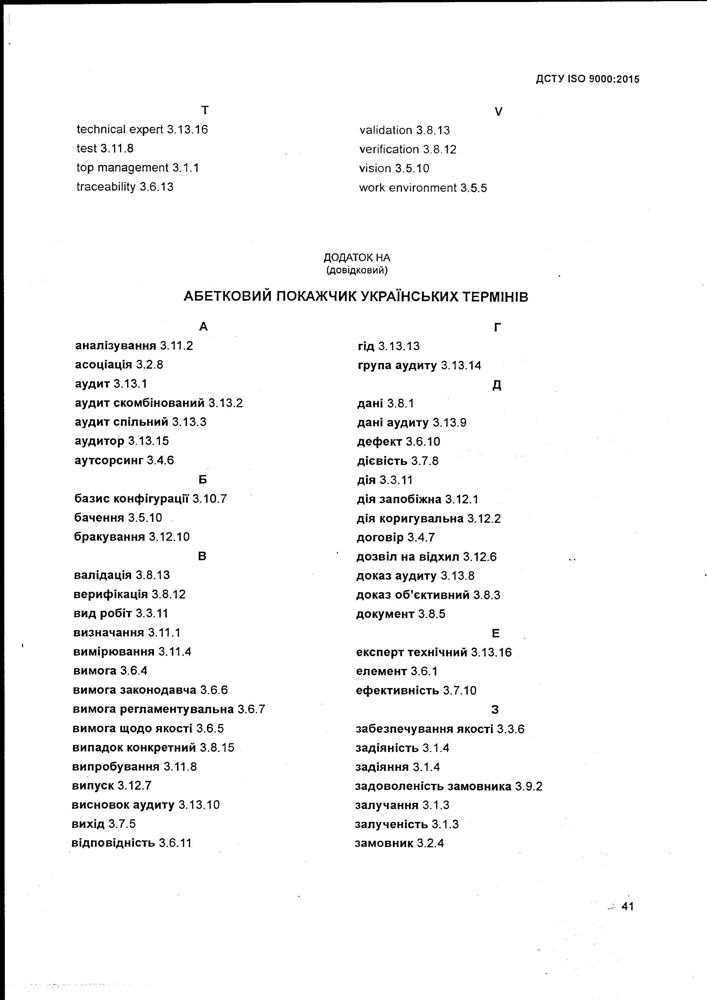

замовник аудиту 3.13.11
запис 3.8.10
запровадження системи управління якістю 3.4.3
запровадити систему управління якістю 3.4.3
затвердження 3.8.13
зв'язок зворотний 3.9.1
зниження рівня якості 3.12.4

**I**

інновація 3.6.15
інспектування 3.11.7
інформація 3.8.2
інформація задокументована 3.8.6
інформація про конфігурацію продукції 3.6.8
інфраструктура 3.5.2

**К**

керівництво найвище 3.1.1
керування 3.3.3
керування конфігурацією 3.3.9
керування проєктом 3.3.12
кодекс поведінки, зорієнтований на досягнення задоволеності замовників 3.9.5
компетентність 3.10.4
консультант з питань систем управління якістю 3.1.2
контракт 3.4.7
контролювання змін 3.3.10
контролювання якості 3.3.7
конфігурація 3.10.6
коригування 3.12.3
критерії аудиту 3.13.7

**М**

методика 3.4.5
місія 3.5.11
моніторинг 3.11.3

**Н**

набування компетентності 3.4.4
набуття компетентності 3.4.4
надійність 3.6.14
настанова щодо якості 3.8.8
невідповідність 3.6.9

**О**

об'єкт 3.6.1
об'єкт аудиту 3.13.12
об'єкт конфігурації 3.3.13
обліковування статусу конфігурації 3.8.14
обслуговування замовника 3.9.4
орган розпорядчий 3.1.5
орган стосовно конфігурації 3.1.5
організація 3.2.1
оцінювання ходу виконання 3.11.9

**П**

перевіряння 3.8.12
передавання виконання сторонньому виконавцю 3.4.6
переробляння 3.12.8
підтвердження метрологічне 3.5.6
план аудиту 3.13.6
план керування проєктом 3.8.11
планування якості 3.3.5
показник діяльності 3.7.8
поліпшування 3.3.1
поліпшування постійне 3.3.2
поліпшування якості 3.3.8
політика 3.5.8
політика у сфері якості 3.5.9
послуга 3.7.7
постачальник 3.2.5
постачальник зовнішній 3.2.6
поступка 3.12.5
провайдер 3.2.5
провайдер зовнішній 3.2.6
провайдер процесу розв'язання спорів 3.2.7
програма аудиту 3.13.4
програма якості 3.8.9
продукція 3.7.6
проєкт 3.4.2
проєктування 3.4.2
проєкт і розробка 3.4.8

проектування та розробляння 3.4.8
простежуваність 3.6.13
протокол 3.8.10
процедура 3.4.5
процес 3.4.1
процес вимірювання 3.11.5

**P**

рада з питань контролю конфігурації 3.1.5
результативність 3.7.11
ремонтування 3.12.9
ризик 3.7.9
рівень якості 3.6.3
розв'язувач спорів 3.1.6

**C**

середовище організації 3.2.2
середовище робоче 3.5.5
система 3.5.1
система інформаційна 3.8.4
система керування вимірюванням 3.5.7
система управління 3.5.3
система управління якістю 3.5.4
скарга 3.9.3
служба метрологічна 3.2.9
специфікація 3.8.7
спір 3.9.6
спостерігач 3.13.17

спроможність 3.6.12
сторона зацікавлена 3.2.3
сторона причетна 3.2.3
стратегія 3.5.12
сутність 3.6.1
сфера аудиту 3.13.5

**T**

тестування 3.11.8

**У**

умови технічні 3.8.7
управління 3.3.3
управління якістю 3.3.4
успіх 3.7.3
успіх сталий 3.7.4
устатковання вимірювальне 3.11.6

**X**

характеристика 3.10.1
характеристика метрологічна 3.10.5
характеристика якості 3.10.2

**Ц**

ціль 3.7.1
ціль у сфері якості 3.7.2
чинник людський 3.10.3

**Я**

якість 3.6.2

ДОДАТОК НБ
(довідковий)

**ПЕРЕЛІК НАЦІОНАЛЬНИХ СТАНДАРТІВ УКРАЇНИ, ЗГАРМОНІЗОВАНИХ З МІЖНАРОДНИМИ СТАНДАРТАМИ, НА ЯКІ Є ПОСИЛАННЯ В ЦЬОМУ СТАНДАРТІ**

ДСТУ 1.1:2015 Національна стандартизація. Стандартизація та сумісні види діяльності. Словник термінів (ISO/IEC Guide 2:2004, MOD)

ДСТУ ISO 1087-1:2007 Термінологічна робота. Словник термінів. Частина 1. Теорія та використання (ISO 1087-1:2000, IDT)

ДСТУ ISO 3534-2:2008 Статистика. Словник термінів і познаки. Частина 2. Прикладна статистика (ISO 3534-2:2006, IDT)

ДСТУ ISO 9001:2015 Системи управління якістю. Вимоги (ISO 9001:2015, IDT)

ДСТУ ISO 9004:2012 Управління задля досягнення сталого успіху організації. Підхід на основі управління якістю (ISO 9004:2009, IDT)

ДСТУ ISO 10001:2013 Управління якістю. Задоволеність замовників. Настанови щодо кодексів поведінки для організацій (ISO 10001:2007, IDT)

ДСТУ ISO 10002:2007 Управління якістю. Задоволеність замовників. Настанови щодо розглядання скарг в організаціях (ISO 10002:2004, IDT)

ДСТУ ISO 10003:2013 Управління якістю. Задоволеність замовників. Настанови щодо розв'язання спорів поза межами організацій (ISO 10003:2007, IDT)

ДСТУ ISO 10004:2013 Управління якістю. Задоволеність замовників. Настанови щодо моніторингу та оцінювання (ISO 10004:2012, IDT)

ДСТУ ISO 10005:2007 Системи управління якістю. Настанови щодо програм якості (ISO 10005:2005, IDT)

ДСТУ ISO 10006:2005 Системи управління якістю. Настанови щодо управління якістю в проектах (ISO 10006:2003, IDT)

ДСТУ ISO 10007:2005 Системи управління якістю. Настанови щодо керування конфігурацією (ISO 10007:2003, IDT)

ДСТУ ISO 10008:201 Управління якістю. Задоволеність замовника. Настанови щодо електронних торговельних угоД за схемою бізнес — споживач (ISO 10008: 2013, IDT) (проєкт)

ДСТУ ISO 10012:2005, Системи керування вимірюванням. Вимоги до процесів вимірювання та вимірювального обладнання (ISO 10012:2003, IDT)

ДСТУ ISO/TR 10013:2003, Настанови з розробляння документації системи управління якістю (ISO/TR 10013:2001, IDT)

ДСТУ ISO 10014:2008, Управління якістю. Настанови щодо реалізації фінансових та економічних переваг (ISO 10014:2006, IDT)

ДСТУ ISO 10015:2008 Управління якістю. Настанови щодо навчання персоналу (ISO 10015:1999, IDT)

ДСТУ ISO/TR 10017:2005 Настанови щодо застосування статистичних методів згідно з ISO 9001:2000 (ISO/TR 10017:2003, IDT)

ДСТУ ISO 10018:201 Управління якістю. Настанови щодо залучення персоналу та його компетентності (ISO 10018:2012, IDT) (проєкт)

ДСТУ-H ISO 10019:2007 Системи управління якістю. Настанови щодо вибору консультантів та використання їхніх послуг (ISO 10019:2005, IDT)

ДСТУ ISO 14001:2015 Системи екологічного управління. Вимоги та настанови щодо застосування (ISO 14001:2015, IDT)

ДСТУ ISO/TS 16949:2005 Системи управління якістю. Специфічні вимоги до виробників автотранспортних засобів та запасних частин і приладдя до них щодо застосування ISO 9001:2000 (ISO/TS 16949:2002, IDT)

ДСТУ ISO/IEC 17000:2007 Оцінювання відповідності. Словник термінів і загальні принципи (ISO/IEC 17000:2004, IDT)

ДСТУ ISO 19011:2012 Настанови щодо здійснення аудитів систем управління (ISO 19011:2011, IDT)

ДСТУ ISO/IEC 27001:2010 Інформаційні технології. Методи та засоби досягнення безпеки. Системи керування інформаційною безпекою. Вимоги (ISO/IEC 27001:2005, IDT)
ДСТУ ISO 31000:2014 Менеджмент ризиків. Принципи та керівні вказівки (ISO 31000:2009, IDT)
ДСТУ ISO 50001:2014 Енергозбереження. Системи енергетичного менеджменту. Вимоги та настанови щодо використання (ISO 50001:2011, IDT)
ДСТУ ISO Guide 73:2013 Керування ризиком. Словник термінів (ISO Guide 73:2009, IDT).

Код УКНД 03.120.10; 01.040.03

**Ключові слова:** аудит, документ, зацікавлені сторони, організація, процес, принципи управління якістю, система управління якістю, якість.

Редактор Н. Куземська
Верстальник І. Барков

Підписано до друку 15.02.2016. Формат 60 × 84 1/8.
Ум. друк. арк. 5,58. Зам. 200 Ціна договірна.

Виконавець
Державне підприємство «Український науково-дослідний і навчальний центр
проблем стандартизації, сертифікації та якості» (ДП «УкрНДНЦ»)
вул. Святошинська, 2, м. Київ, 03115

Свідоцтво про внесення видавця видавничої продукції до Державного реєстру видавців,
виготовників і розповсюджувачів видавничої продукції від 14.01.2006 серія ДК № 1647

