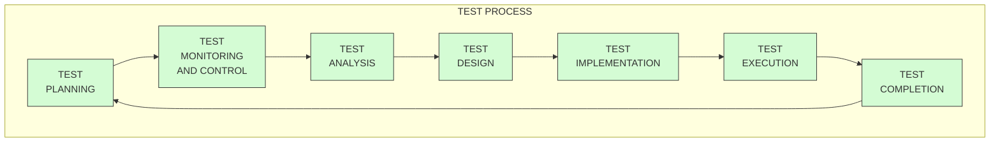
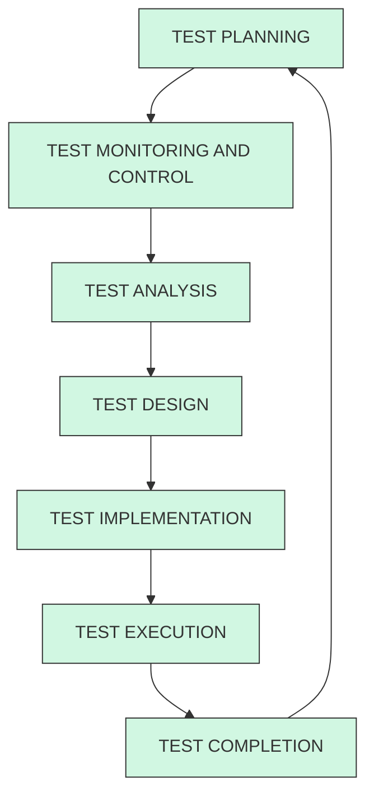
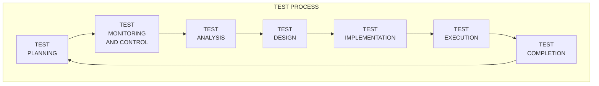
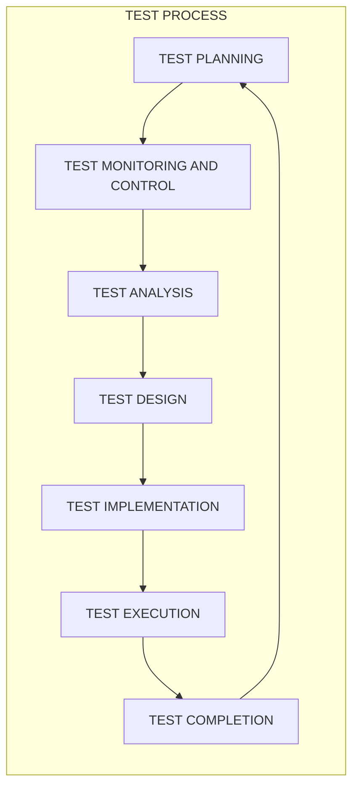

# ТТПЗ_L1_1.pdf

# План

1. Критерії входу і виходу з тестування
2. Планування тестування, Test Plan, Strategy, Policy
3. Моніторинг і контроль тестування. Тестові метрики
4. Тест Аналіз. Вимоги
5. Тест Дизайн та Імплементація. Тест кейси, Тестові сценарії та тестові умови.
6. Виконання тестування. Тест репорт, баг репорт
7. Завершення тестування.

# Цикл тестування Програмного забезпечення

Життєвий цикл тестування програмного забезпечення (STLC) — це послідовність конкретних дій, які виконуються під час процесу тестування, щоб забезпечити досягнення цілей якості програмного забезпечення. Він складається з серії заходів, які проводяться методологічно, щоб допомогти сертифікувати ваш програмний продукт.

**Entry criteria:** Критерії входу в тестування - це передумови, які необхідно виконати перед початком тестування.

**Exit criteria:** Критерії виходу з тестування визначають пункти, які необхідно виконати до завершення тестування

# Test Plan, Test Strategy, Test Policy (IEEE 29119-3)

| Test Plan | Test Strategy | Test Policy |
| :--- | :--- | :--- |
| Документ, який описує процес тестування, що буде проводитись | | |
| На рівні реліза / спринта / фічі / модуля | На рівні проєкту | На рівні організації |
| Описує всі активності тестування в деталях - техніки, графік, ресурси тощо. | Високорівнево описує процес тестування в цілому - специфікації до середовища, підхід тестування, документи, що створюються під час тестування тощо. | |
| Зазвичай створює Тест Лід чи Тест Менеджер | Зазвичай створює Проджект Менеджер | |
| [Приклад Тест Плану](images/ITVDN_2024_SoftwareTestingLifeCycle/page_4_img_1.png) | [Шаблон Тест Стратегії](images/ITVDN_2024_SoftwareTestingLifeCycle/page_4_img_2.png) | [Шаблон Тест Полісі](...) |

<!-- ВІДНОВЛЕНО ЧЕРЕЗ GEMINI (Стор. 5) -->
# Моніторинг і Контроль

Мета **моніторингу** тестування полягає у збиранні інформації та забезпеченні зворотного зв'язку про стан тестування.

**Контроль** тестування - це будь-які коригувальні дії, вжиті на підставі отриманої інформації або метрик. Дії можуть охоплювати будь-яку активність тестування та впливати на будь-яку активність життєвого циклу програмного забезпечення.

Приклади дій щодо контролю тестування:
* Повторна пріоритизація тестів під час реалізації ризику (наприклад, порушення термінів постачання програмного забезпечення)
* Зміна графіка тестування через доступність або недоступність тестового середовища або інших ресурсів
* Повторна перевірка виконання критеріїв входу або виходу для тестованого елемента, який допрацьовувався

<!-- КІНЕЦЬ ВІДНОВЛЕННЯ -->

<!-- ВІДНОВЛЕНО ЧЕРЕЗ GEMINI (Стор. 6) -->
# Цикл тестування ПЗ і тестова документація

## Метрики

Метрики можуть збиратися під час та після завершення тестування, щоб оцінити:
* Прогрес щодо запланованого графіка та бюджету
* Поточну якість об'єкта тестування
* Адекватність підходу до тестування
* Ефективність активностей тестування для досягнення цілей тестування

Типові метрики тестування включають:
* Відсоток виконаних робіт з підготовки тестових сценаріїв
* Відсоток виконаних робіт з підготовки тестового середовища
* Метрики виконання тестів: кількість виконаних/невиконаних тестових сценаріїв, кількість тестових умов або сценаріїв, виконаних успішно/не успішно
* Інформація про дефекти: щільність дефектів, кількість виявлених та виправлених дефектів, частоту відмов та результати підтверджуючих тестів
* Покриття тестами вимог, історій користувача, acceptance criteria, ризиків або коду

| Sprint 10.1 | Sprint 10.2 | Sprint 10.3 | Sprint 10.4 | Sprint 10.5 | Sprint 10.6 |
| :--- | :--- | :--- | :--- | :--- | :--- |
| 99% | 96% | 90% | 91% | 98% | 99% |
<!-- КІНЕЦЬ ВІДНОВЛЕННЯ -->

<!-- ВІДНОВЛЕНО ЧЕРЕЗ GEMINI (Стор. 9) -->
# Тест Дизайн або Проєктування

Проєктування тестування складається з наступних активностей:
* Проєктування та пріоритизація Тест Кейсів
* Визначення потрібних Тестових Даних для підтримки Тестових Умов та Тест Кейсів
* Проєктування тестового середовища та визначення потрібних програм
* Створення матриці відстеження між тест базисом та тест кейсами

Результатом проєктування тестів є тест кейси та набори тест кейсів для виконання тестових умов, визначених в аналізі тестування.

<!-- КІНЕЦЬ ВІДНОВЛЕННЯ -->

<!-- ВІДНОВЛЕНО ЧЕРЕЗ GEMINI (Стор. 11) -->
# Тест кейси

Test case: Набір вхідних значень, передумов виконання, очікуваних результатів та післяумов, розроблений для певної цілі чи test condition. [IEEE 610]

Набір тест-кейсів називається Test Suite. Зазвичай тест кейси групують по темі або сторінці, яку вони тестують.
<!-- КІНЕЦЬ ВІДНОВЛЕННЯ -->

<!-- ВІДНОВЛЕНО ЧЕРЕЗ GEMINI (Стор. 13) -->
# Тестові умови

Test Condition 1: Залиште всі поля порожніми та перевірте повідомлення про помилки при реєстрації

Test Condition 2: Поставте пробіл посередині листа (popeliuha @gmail.com) і перевірте повідомлення про помилку

Test Condition 3: Увійдіть за допомогою дійсної електронної пошти та пароля

Test Condition 4: Перевірте максимальну кількість кошика, додавши 99, 100, 1000, 10000 продуктів

Test Condition 5: Переконайтеся, що продавець може додати продукт (мобільний пристрій) до каталогу

<!-- КІНЕЦЬ ВІДНОВЛЕННЯ -->

<!-- ВІДНОВЛЕНО ЧЕРЕЗ GEMINI (Стор. 15) -->
## Виконання тестування

**Виконання тестування** складається з наступних активностей:
* Запис ID та версій об'єктів тестування та програм для тестування
* Виконання тестів мануально або за допомогою спеціальних програм
* Порівняння актуальних та очікуваних результатів
* Аналіз проблем, з метою вирішити їхню причину
* Репортинг дефектів, ґрунтуючись на тестах, що впали
* Логування результату виконання тестів
<!-- КІНЕЦЬ ВІДНОВЛЕННЯ -->

<!-- ВІДНОВЛЕНО ЧЕРЕЗ GEMINI (Стор. 16) -->
# Тест репорти (звіти)

![Скріншот інтерфейсу Jira Software, що демонструє сторінку "Test Execution Report". У верхній частині розташовані фільтри за датою створення та станом виконання. Блок з підсумками (Summary) містить загальну статистику: 30 тестів з виконанням, 67 виконань, 39 успішних (Pass), 24 невдалих (Fail), 2 в процесі (In Progress) та 2 для повторного тестування (Retest). Нижче наведено блок "Test Execution Results" у вигляді кольорової смуги прогресу (58% виконань успішні) та детальну таблицю результатів тестів за шаблонами (Test Case Template, Summary, Status, Components, Requirements, Executions, Passed Executions) із зазначенням статусів ACTIVE та відсоткового співвідношення успішності для кожного тест-кейсу.](jira_test_report.png)
<!-- КІНЕЦЬ ВІДНОВЛЕННЯ -->

<!-- ВІДНОВЛЕНО ЧЕРЕЗ GEMINI (Стор. 17) -->
# Баг репорти (звіти про помилку)

Баг-репорт складається з:

1. ID
2. Назва
3. Передумови, кроки, післяумови
4. Актуальний та очікуваний результати
5. Пріоритет та ступінь впливу
6. Тип дефекту
7. Вкладення (скріншоти, логи, відео)
8. Система, на якій знайдено баг
9. На кого назначений баг-репорт і його статус

![How to write an ideal bug-report: Bug-report is not a poem. Use a simple technical english to describe a defect. 3W rule: - What happened? - Where it happened? - Which circumstances? The difference between actual and expected results should be clear. One bug - one bug-report. Example: Summary: Error message does not appear if submit empty Email field on the Login form. (з позначками What?, When?, Where?) Steps to reproduce: 1. Open the app. 2. Specify password. 3. Click "Login" button. Actual result: Nothing happens Expected result: Error message appears "Specify email and password".](bug_report_rules.png)
<!-- КІНЕЦЬ ВІДНОВЛЕННЯ -->

<!-- ВІДНОВЛЕНО ЧЕРЕЗ GEMINI (Стор. 18) -->
# Закриття тестування

**Закриття тестування** складається з наступних активностей:
* Перевірка закриття всіх звітів про дефекти, запитів на зміни, списку завдань, які залишилися не реалізованими наприкінці виконання тестування.
* Створення зведеного звіту із тестування для передачі зацікавленим особам.
* Завершення та архівування тестового оточення, тестових даних, інфраструктури тестування та іншого тестового забезпечення для подальшого використання.
* Аналіз отриманих уроків для визначення змін, необхідних для майбутніх ітерацій, релізів та проєктів.
* Використання зібраної інформації для підвищення зрілості процесу тестування.

<!-- КІНЕЦЬ ВІДНОВЛЕННЯ -->

