# Testing_computer_software+Kaner.pdf

# TESTING COMPUTER SOFTWARE

## Second Edition

**CEM KANER**

**JACK FALK**

**HUNG QUOC NGUYEN**


# ТЕСТИРОВАНИЕ ПРОГРАММНОГО ОБЕСПЕЧЕНИЯ.

## Фундаментальные концепции менеджмента бизнес-приложений

СЭМ КАНЕР

ДЖЕК ФОЛК

ЕНГ КЕК НГУЕН

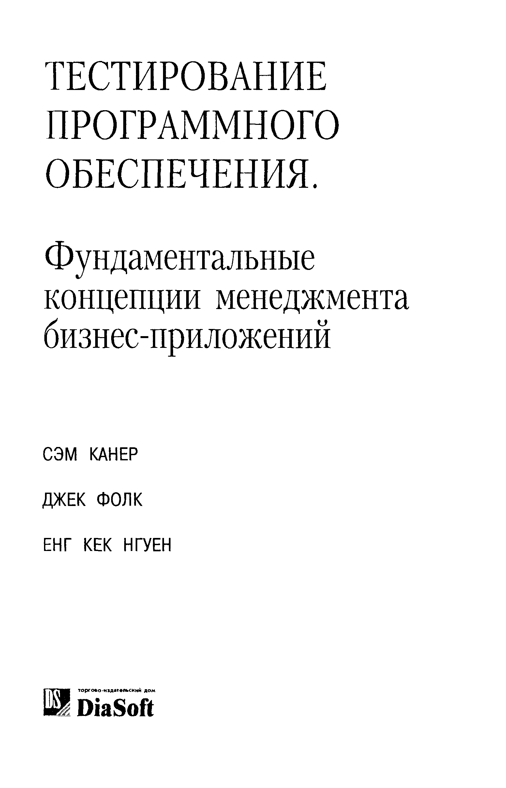

ББК 32.973
К 81
**Канер Сэм и др.**
К 81 Тестирование программного обеспечения. Фундаментальные концепции менеджмента бизнес-приложений: Пер. с англ./Сэм Канер, Джек Фолк, Енг Кек Нгуен. — К.: Издательство «ДиаСофт», 2001. — 544 с.

**ISBN 966-7393-87-9**

Книга именитых специалистов в области разработки программного обеспечения посвящена одному из наиболее важных и нетривиальных аспектов в рамках процесса создания сложных программных систем. Книгу отличает, прежде всего, привязка к условиям реального мира на примерах известных компаний-разработчиков, находящихся в Силиконовой долине. Подробно рассматривается широкий спектр вопросов: от организации процесса тестирования до собственно тестирования проекта, кода, документации и т.д.

Для специалистов в области разработки программного обеспечения.

**ББК 32.973**

Научное издание
**Канер Сэм и др.**

ТЕСТИРОВАНИЕ ПРОГРАММНОГО ОБЕСПЕЧЕНИЯ.
ФУНДАМЕНТАЛЬНЫЕ КОНЦЕПЦИИ МЕНЕДЖМЕНТА БИЗНЕС-ПРИЛОЖЕНИЙ

**Главный редактор** *Ю.Н. Артеменко*
**Научный редактор** *О.В. Здир*
**Литературный редактор** *А.В. Штин*
**Переводчик** *О.В. Здир*
**Верстка** *Т.Н. Артеменко*
**Главный дизайнер** *О.А. Шадрин*

**Н/К**
Сдано в набор 13.03.01. Подписано в печать 13.05.01. Формат $60 \times 84/16$. Бумага офсетная. Гарнитура Таймс.
Печать офсетная. Усл.печ.л. 40.80. Усл.кр.отт. 40.80
Тираж 3000 экз. Заказ № 1-78.

Издательство «ДиаСофт», Киев-55, а/я 100, тел./факс (044) 212-1254.
e-mail: books@diasoft.kiev.ua, http://www.diasoft.kiev.ua.

Authorized translation from the English language edition published by International Thomson Computer Press. Copyright © 1999

All rights reserved. No part of this book may be reproduced or transmitted in any form or by any means, electronic or mechanical, including photocopying, recording or by any information storage retrieval system, without permission from the Publisher.

Russian language edition published by DiaSoft Ltd. Copyright © 2001
Лицензия предоставлена издательством International Thomson Computer Press, подразделение International Thomson Publishing Inc.

Все права зарезервированы, включая право на полное или частичное воспроизведение в какой бы то ни было форме.

ISBN 966-7393-87-9 (рус.) © Перевод на русский язык. Издательство «ДиаСофт», 2001
ISBN 1-85032-847-1 (англ.) © International Thomson Publishing Press, 1999
© Оформление. Издательство «ДиаСофт», 2001

**Свидетельство о регистрации 24729912 от 11.03.97.**
**Гигиеническое заключение № 77.99.6.953.П.438.2.99 от 04.02.1999**

# Оглавление

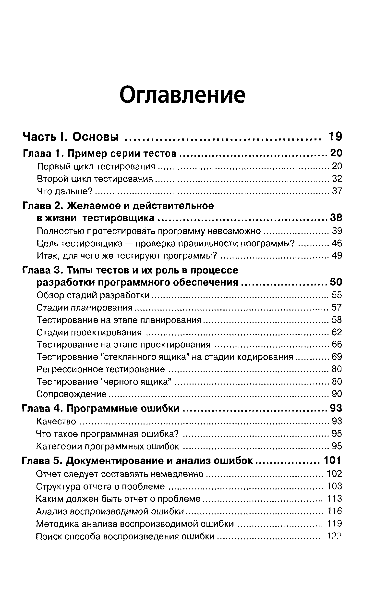

**Часть I. Основы** ................................................................................ **19**
* **Глава 1. Пример серии тестов** .................................................... **20**
  * Первый цикл тестирования .............................................................. 20
  * Второй цикл тестирования .............................................................. 32
  * Что дальше? ..................................................................................... 37
* **Глава 2. Желаемое и действительное в жизни тестировщика** .......................................................................... **38**
  * Полностью протестировать программу невозможно .................... 39
  * Цель тестировщика — проверка правильности программы? .............. 46
  * Итак, для чего же тестируют программы? .................................... 49
* **Глава 3. Типы тестов и их роль в процессе разработки программного обеспечения** ............................................ **50**
  * Обзор стадий разработки .............................................................. 55
  * Стадии планирования .................................................................... 57
  * Тестирование на этапе планирования .......................................... 58
  * Стадии проектирования ................................................................ 62
  * Тестирование на этапе проектирования ........................................ 66
  * Тестирование "стеклянного ящика" на стадии кодирования .............. 69
  * Регрессионное тестирование ........................................................ 80
  * Тестирование "черного ящика" ...................................................... 80
  * Сопровождение ............................................................................... 90
* **Глава 4. Программные ошибки** .................................................... **93**
  * Качество .......................................................................................... 93
  * Что такое программная ошибка? .................................................... 95
  * Категории программных ошибок .................................................... 95
* **Глава 5. Документирование и анализ ошибок** ........................ **101**
  * Отчет следует составлять немедленно ........................................... 102
  * Структура отчета о проблеме .......................................................... 103
  * Каким должен быть отчет о проблеме ............................................ 113
  * Анализ воспроизводимой ошибки .................................................. 116
  * Методика анализа воспроизводимой ошибки ................................ 119
  * Поиск способа воспроизведения ошибки ....................................... 122

Часть II. Приемы и технологии тестирования ..... 129
Глава 6. Система отслеживания проблем ................. 130
Основное назначение системы отслеживания проблем ............ 134
Задачи системы .......................................................................... 135
Процесс отслеживания проблемы ............................................. 135
Пользователи системы отслеживания проблем ........................ 144
Реализация базовых функций системы отслеживания проблем .... 158
Дополнительные замечания о документировании проблем .......... 169
Терминология ............................................................................ 178
Глава 7. Разработка тестов ............................................. 180
Характеристики хорошего теста ............................................... 182
Классы эквивалентности и граничные условия ....................... 183
Тестирование переходов между состояниями ........................... 193
Условия гонок и другие временные зависимости ..................... 194
Нагрузочные испытания ........................................................... 196
Прогнозирование ошибок .......................................................... 196
Тестирование функциональной эквивалентности: автоматизация,
анализ чувствительности и случайный ввод .......................... 197
Регрессионное тестирование: успешно ли исправлена ошибка .... 204
Регрессионное тестирование: стандартная серия тестов ............. 205
Выполнение тестов .................................................................... 206
Глава 8. Тестирование принтеров и других устройств ....... 208
Общие вопросы конфигурационного тестирования ................. 209
Тестирование печати ................................................................. 211
Глава 9. Адаптационное тестирование .......................... 237
Изменен ли исходный код? ....................................................... 238
Привлекайте к работе специалистов, свободно
владеющих языком ................................................................. 239
Встроен ли текст в программный код? ..................................... 239
Перевод длиннее исходного текста ........................................... 239
Наборы символов ....................................................................... 240
Клавиатура .................................................................................. 240
Фильтрация ввода ...................................................................... 241
Загрузка, сохранение, импорт и экспорт символов
основного и расширенного набора ASCII ............................ 241
Язык и операционная система .................................................. 242
Клавиши вызова ......................................................................... 242
Сборные сообщения ................................................................... 242

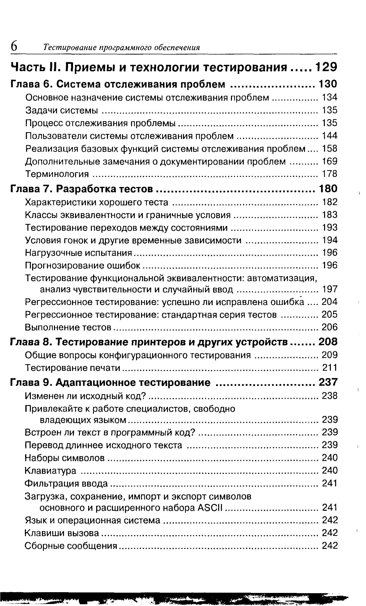

Идентификаторы сообщений об ошибках ............................................ 243
Правила переноса ....................................................................................... 243
Правописание ............................................................................................ 243
Порядок сортировки .................................................................................. 243
Преобразование текста к верхнему и нижнему регистру ........................... 244
Правила подчеркивания ............................................................................ 244
Принтеры ................................................................................................... 244
Размеры бумаги .......................................................................................... 244
Процессоры и видео ................................................................................... 244
Форматы данных и опции настройки ........................................................ 245
Единицы измерения .................................................................................. 245
Изображения, связанные с конкретной культурой ................................... 246
Выходные данные, связанные с конкретной культурой ........................... 246
Совместимость с местными продуктами ................................................. 246
Не будьте наивными .................................................................................. 246
Автоматизированное тестирование ........................................................... 247
**Глава 10. Тестирование документации** .............................................. **248**
Хорошая документация ............................................................................ 249
Цели тестировщика документации .......................................................... 251
Как тестирование документации повышает надежность
программного продукта ........................................................................ 252
Назначьте технического редактора ........................................................... 254
Работа с руководством в процессе его разработки ................................... 254
Интерактивная справка .............................................................................. 262
**Глава 11. Инструментальные средства тестировщика** ...... **264**
Базовые инструменты тестировщика ...................................................... 265
Автоматизация приемочного и регрессионного тестирования ............ 267
Стандарты ................................................................................................... 277
Тестирование “стеклянного ящика” .......................................................... 280
**Глава 12. Планирование и документация** .......................................... **284**
Общее назначение тестового плана: продукт или инструмент? .... 286
Цели, преследуемые при планировании тестов и разработке
документации ........................................................................................ 288
Тесты каких типов следует фиксировать в плановых документах .. 296
Стратегия разработки компонентов тестового плана .............................. 300
Компоненты плана тестирования ............................................................. 307
Документирование тестовых материалов ................................................ 339
Заключение ................................................................................................ 355

**Часть III. Управление проектами и группами ..... 357**

**Глава 13. Объединяющая** ................................................................ **358**
> Чем приходится поступаться разработчикам программного обеспечения ............................................................................................ 360  
> Модели разработки программного обеспечения ................................ 362  
> Затраты на качество ............................................................................ 371  
> Последовательность этапов проекта ................................................. 373  
> Проектирование продукта ................................................................... 381  
> Реализация базовых функций ........................................................... 388  
> Почти альфа ...................................................................................... 389  
> Альфа ............................................................................................... 392  
> Пре-бета ............................................................................................ 404  
> Бета ................................................................................................... 405  
> Замораживание пользовательского интерфейса ................................ 415  
> Подготовка к финальному тестированию ......................................... 418  
> Последняя проверка целостности ..................................................... 423  
> Выпуск ............................................................................................... 425  
> После выпуска ................................................................................... 426  

**Глава 14. Управление группой тестирования** ............................... **428**
> Роль группы тестирования ................................................................. 430  
> Группа тестирования — не избавление программистов .................... 434  
> Альтернатива: независимые тестовые агентства ................................ 435  
> Советы по планированию ................................................................... 439  
> Персонал ........................................................................................... 447  

**Приложение. Распространенные программные ошибки .... 453**
> Ошибки пользовательского интерфейса ............................................ 455  
> Обработка ошибок ............................................................................. 486  
> Ошибки, связанные с граничными условиями ................................... 490  
> Ошибки вычислений ........................................................................... 493  
> Начальное и последующие состояния ............................................... 496  
> Ошибки управления потоком ............................................................. 500  
> Ошибки обработки или интерпретации данных ................................. 515  
> Ситуации гонок .................................................................................. 523  
> Повышенные нагрузки ........................................................................ 527  
> Аппаратное обеспечение .................................................................... 531  
> Контроль версий и идентификаторов ................................................. 536  
> Ошибка выявлена и забыта ................................................................ 542

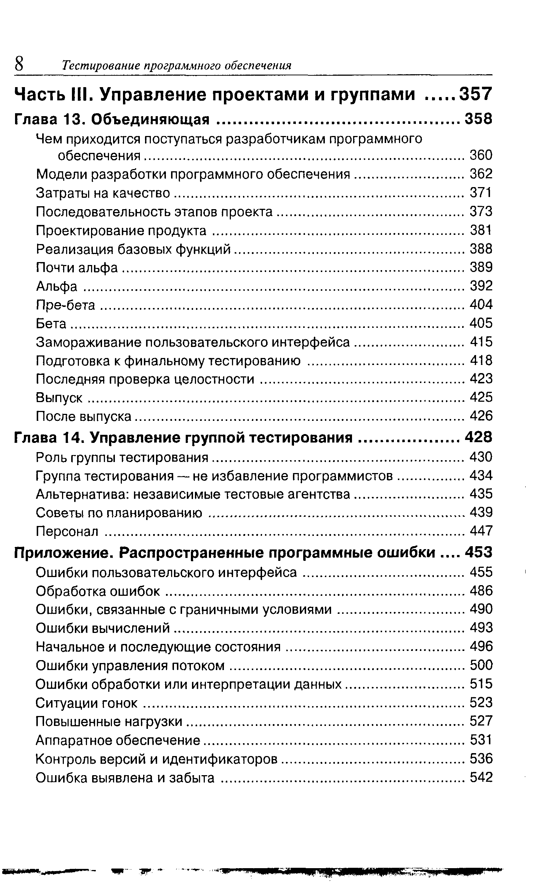

# Предисловие

*Тестирование программного обеспечения* — это книга, написанная профессионалами для профессионалов. Что такое тестирование потребительских и деловых программ в условиях, приближенных к боевым, мы знаем не понаслышке, поскольку выполняли эту работу для самых известных производителей программного обеспечения Кремниевой Долины. Лежащее перед вами руководство разрабатывалось для наших собственных сотрудников.

О том, как тестировать программные продукты, от которых требуется повышенная надежность, написано немало хороших книг. От надежного функционирования определенных типов программного обеспечения может зависеть успех бизнеса — работы финансовых или промышленных компаний — или даже... человеческая жизнь. Поэтому на его самое тщательное проектирование, разработку и тестирование не жалеют ни времени, ни денег. Сотрудникам тестовых групп предоставляется полный доступ к исходному коду программ, причем на столько времени, сколько потребуется для его подробного изучения.

Сверхнадежное программное обеспечение можно сравнить с “Роллс-ройсом” — роскошно, но дорого. Однако не все программное обеспечение таково, и дело не только в его цене. Тестирование программных продуктов для среднего бизнеса, академических учреждений и личного пользования проводится в более сжатые сроки и скромнее оплачивается, но их качество вполне удовлетворяет требованиям рынка — это полезные и надежные программы, многими из которых производители могут заслуженно гордиться.

Так как же организовать тестирование программных продуктов, чтобы его результаты можно было назвать сверхнадежными? И как удается группам тестирования обычного потребительского ПО в условиях сжатых сроков, малочисленной команды и ограниченных средств выпускать прекрасные и вполне конкурентоспособные продукты? Обо всем этом вы узнаете из книги *Тестирование программного обеспечения*.

## Чего в этой книге нет

Часто авторы книг утверждают, что для успешного тестирования необходимо, чтобы все было по правилам: документация, включающая необходимые для разработки спецификации была полной и своевременной, при проектировании и написании кода применялась правильная и самая современная методология и т.д.

*Эта книга — о тестировании в условиях, когда те, с кем вы работаете, не следуют, не хотят и не должны следовать правилам.*

На деле при разработке программного обеспечения бюджет всегда слишком мал, сотрудников не хватает, согласия между ними для выработки единой линии добиться трудно, а работа при этом должна быть выполнена "на вчера".

Качество большого продукта зависит от работы каждого, кто его проектирует, программирует, тестирует и документирует. Никакие стандарты и спецификации, никакой контроль и отслеживание изменений не гарантируют качества продукции. Все зависит только от людей — их работоспособности, мастерства и умения работать в команде. Только это определяет результат, а никак не правила.

У команды разработчиков имеется определенное видение будущего продукта, горячее желание осуществить задуманное и понимание того, что во многом работа будет делаться методом проб и ошибок. К тому времени, когда каждый аспект разработки прорисуется до деталей, будет сформирована рабочая версия проекта, которую смогут понять и охватить целиком один-два ведущих специалиста. Эта версия и называется спецификацией. Спецификация не выгравирована на камне: позднее она не раз еще будет пересматриваться и усовершенствоваться, пока не будет достигнута полная согласованность со всей системой. И выполняя тестирование, вы тоже примете участие в этой работе.

В реальной жизни изменения вносятся в продукт даже в самом конце разработки. Если, например, программа разрабатывается на продажу, ваши пользователи — потенциальные пользователи — ни на какую спецификацию не соглашались. И если конкурент создает нечто более привлекательное, отвечать приходится быстро.

Как часто приходится отказываться от внесения в программу полезных дополнительных возможностей из-за нехватки времени. И часто первая рабочая версия фрагмента, которую никак нельзя назвать профессиональной, остается последней, поскольку переписывать ее некогда. Бывает, что программист "втихаря" по собственной инициативе все же выполнит нужную работу и без предупреждения внесет в проект значительные изменения. Такая работа делается не по обязанности, сверх положенных 40 часов в неделю. Она может значительно улучшить проект, а может и серьезно его дестабилизировать на некоторое время. Но каким бы ни был результат, личная инициатива всегда направлена на улучшение проекта.

Изменения в конце разработки есть всегда, и они нужны. Главное — справиться с ними с минимумом потерь. Не стоит разводить бюрократию,

пытаясь запретить такие изменения. Профессионализм сотрудников группы тестирования заключается в том, чтобы принять реальность такой, как она есть, не жалуясь и не пытаясь бороться с ней запретами, и успешно закончить тестирование продукта вместе с внесенными изменениями.

## Для кого предназначена эта книга

Эта книга предназначена для того, кто выполняет тестирование программного кода, обычно написанного кем-то другим. В ней обсуждаются вопросы и решения, которые на наш взгляд интересны и полезны такому человеку. Поэтому рассказ наш не академичен, в нем не затрагиваются такие классические темы, как доказательства правильности программного кода. Мы постарались больше уделить внимания темам, не характерным для учебников, как, например, межличностные взаимоотношения и корпоративная политика. Судить о работе других людей приходится даже начинающему тестировщику — в этом суть тестирования. За высказывание своих суждений тестировщики нередко подвергаются нападкам со стороны разработчиков. (Бывает, что и заслуженно.) Поскольку группа тестирования работает с программой последней и ее результаты у всех на виду, ее ответственность всегда оказывается больше возможностей — положение политически самое невыгодное. Решения этой проблемы у нас нет. Однако мы готовы поделиться своим опытом в том, как повысить эффективность работы и избежать некоторых неприятных моментов и ошибок.

Поговорим мы также и об управлении проектом. Оценка, планирование и составление календарного плана работ по тестированию программного продукта — задача не из легких, ведь конечная точка фактически не определена. Всегда остаются тесты, которые еще полезно было бы провести, и риск, связанный с отказом от их выполнения. Специалист по тестированию должен это хорошо понимать и принимать во внимание при планировании работ. Например, можно отложить важный тест, чтобы в совершенстве выполнить другую часть работы, а потом обнаружить, что времени на отложенный тест уже нет. В результате, пытаясь выполнить работу лучше, вы на самом деле сделаете ее хуже. К сожалению, ситуация эта очень типична. Поэтому в нашей книге много внимания уделено вопросам эффективности и правильной расстановки приоритетов.

Бывает, что при тестировании программного продукта приходится иметь дело с ошибками, допущенными еще на стадии проектирования. Программа может в точности соответствовать спецификации, но, если спецификация содержит ошибки, такая программа, увы, для работы не годится.

Часто в литературе, посвященной вопросам надежности программного обеспечения и методикам его тестирования, совсем не уделяется внимания пользовательскому интерфейсу программ. Ее авторы считают, что этим

вопросом должен заниматься специалист по анализу человеческого фактора. Мы же с этим абсолютно не согласны. (И даже имеющийся в нашем коллективе специалист по анализу человеческого фактора с этим не согласен.) Ведь надежность системы зависит от того, насколько хорошо работают вместе все ее составляющие, включая и людей, которые используют программу.

Задача специалиста по тестированию — выявить все проблемы, которые могут возникнуть при работе с продуктом, и сделать все возможное для улучшения его качества. Помните, что вы тестируете не просто программу, вы тестируете систему человек-компьютер, и отчеты о ненадежности или неэффективности взаимодействия между человеком и компьютером не менее важны, чем остальные. Вы один из немногих специалистов, анализирующих продукт во всех деталях, причем непосредственно перед его предоставлением пользователю. И поэтому кто же, как не вы, сможет выявить и устранить подобные проблемы.

Прочитав разделы нашей книги, посвященные пользовательскому интерфейсу, вы не станете в этом вопросе специалистом — книга не претендует на абсолютную полноту освещения этой темы. Может быть, некоторые из ваших предложений будут неверны. Но все же предоставьте отчеты и на тему интерфейса. Они очень важны. И некоторые из них обязательно помогут улучшить конечный продукт.

## Программное обеспечение, к которому предъявляются повышенные требования по надежности

При создании определенных типов программного обеспечения отступление программистов и управляющего персонала от стандартизированной методологии *абсолютно недопустимо*. Например, программы, управляющие ядерным реактором, должны быть специфицированы и документированы самым тщательным образом. И в случае их сбоя отчеты о тестировании становятся юридическими документами. Для тестирования таких проектов выделяются огромные средства и этим занимаются очень большие группы специалистов, называемые группами гарантии качества (Quality Assurance). Для обучения сотрудников таких групп больше подойдут другие книги — строго академического характера.

Но даже на таких проектах в конце работы часто подключаются группы приемки, бюджеты которых мизерны, а сроки предельно коротки. Сотрудники таких групп не участвуют в разработке и часто из-за недостатка времени не могут по-настоящему серьезно протестировать продукт. Если

вы работаете именно в таких условиях, эта книга будет для вас полезнее, чем традиционные учебники.

## Можно ли назвать эту книгу учебником?

Мы принимали на работу множество специалистов по тестированию, но еще ни разу не встречали выпускника компьютерного факультета, который узнал бы что-нибудь полезное о тестировании из университетского курса.

Организациями Association for Computing Machinery (Ассоциация вычислительной техники) и IEEE Computer Society (Компьютерное общество IEEE) недавно был опубликован документ *Computing Curricula 1991* (рекомендованный учебный план компьютерных факультетов), который в значительной степени определит содержание университетских учебных программ в области компьютерных наук на все следующее десятилетие. Время, отводимое на изучение технологий тестирования, обычно составляет несколько часов на четырехгодичный курс. В документе *Computing Curricula* предлагается ввести необязательный курс под названием *Advanced Software Engineering (Продвинутый курс разработки программного обеспечения)*, включающий среди прочих и темы тестирования, но идеи о специальном курсе тестирования в этом руководстве нет.

Итак, не похоже, что в ближайшие десять лет выпускники компьютерных факультетов университетов будут хоть что-нибудь знать о тестировании программных продуктов.

Но почему бы этот пробел не заполнить колледжам? Associate of Sciences (Ассоциация наук), у которой есть несколько курсов по тестированию, дополненных вводным курсом программирования и управления проєктами, вполне могла бы с этим справиться. К тому же стартовая заработная плата специалистов по тестированию достаточно высока. Так что, по нашему мнению, колледжам стоит подумать о подготовке таких специалистов — это дело как раз для них.

Работая над последним изданием этой книги, мы внесли в нее много дополнений, рассчитанных именно на студентов колледжев — тех, которым никогда не приходилось бывать с тестовых лабораториях. Надеемся также, что книга будет полезна тем колледжам, которые захотят включить в свои программы курс тестирования делового программного обеспечения.

# Структура книги и принятые в ней соглашения

## Сначала несколько замечаний о структуре книги

Эта книга представляет собой учебное пособие. В вопросах, которым она посвящена, многие из ее читателей будут новичками. Будут ее читать и опытные специалисты, обучившиеся своему делу на практике и никогда еще не читавшие подобных учебников. Планируя структуру книги, именно на таких читателей мы и ориентировались.

Представленная в книге информация разделена по степени сложности, чтобы читатель мог осваивать ее постепенно. Вместо того чтобы пытаться осветить все стороны вопроса в одном разделе, мы сначала рассказываем о его сути, а в следующих разделах предлагаем дополнительные сведения, позволяющие понять его глубже или изучить подробнее.

### Часть 1. Основы

Первые пять глав посвящены основам предметной области. И хотя прежде всего они предназначены для новичков, прочитать их следует всем.

#### Новичку

Чтобы книга принесла вам как можно больше пользы (и удовольствия), лучше всего поступить так. Внимательно прочтите главы 1, 2, 4, 5 и просмотрите главу 3. Затем, если возможно, в течение нескольких недель займитесь практическим тестированием, выявите несколько ошибок и добейтесь их исправления, и только после этого продолжите чтение.

#### Преподавателю

Если у ваших студентов нет практического опыта, перед переходом к главе 6 стоит организовать практические занятия (часов на 10–20). Для занятий можно взять какой-нибудь коммерческий продукт — в них всегда

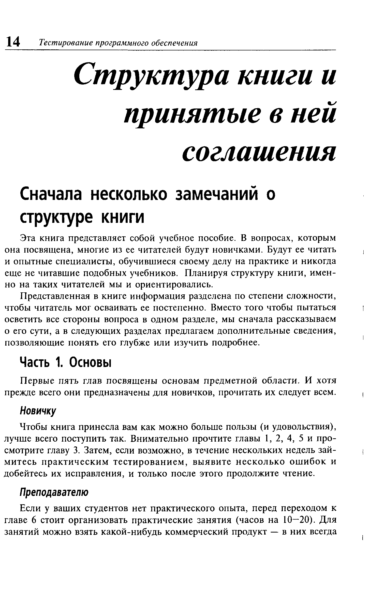

множество ошибок. На этом этапе занятий не стоит добиваться аналитического подхода. Пусть студенты просто выявят ошибки и составят о них письменные отчеты. В конце занятий подведите итоги сделанному и укажите студентам на пропущенные тесты и слабые места в их работе.

## Часть 2. Приемы и технологии тестирования

Главы 6–12 содержат разнообразный практический материал. Их можно читать независимо и в любом порядке (только перед главой 6 нужно обязательно прочитать главу 5). Информация этой части полезна специалисту по тестированию любого уровня. Вторая часть несколько сложнее первой и предназначена прежде всего для читателей, которые составляют планы работ и руководят небольшими группами тестировщиков или же обучают будущих специалистов. Однако с этим материалом смогут справиться и новички, проработавшие главы 1–5.

### Новичку

В главе 6 рассказывается о том, как должна быть организована работа групп разработчиков и маркетинга с предоставленными тестировщиками отчетами об ошибках, а также о том, как упорядочить выявление и устранение ошибок с помощью базы данных. Эта глава будет особенно интересна тем из читателей, кто на собственном опыте прочувствовал, каково выполнить огромную работу по выявлению и протоколированию ошибок, а потом обнаружить, что часть этой работы просто пропала зря из-за плохой организации: отчеты потерялись, были проигнорированы или неверно поняты. Те, у кого есть подобный опыт, лучше других поймут, насколько важно все, что может улучшить организацию составления отчетов и работы с ними. Если же шестая глава покажется вам скучной, просто просмотрите несколько ее начальных разделов до раздела “Организация базы данных”.

Глава 8, посвященная тестированию печати, содержит по этому вопросу очень подробные сведения. Если тестируемая программа много печатает, в команде тестировщиков обязательно должен быть специалист, который очень хорошо разбирается в этом вопросе. Если глава кажется вам чересчур подробной или тестируемые вами программы мало печатают, постарайтесь понять суть описанной стратегии тестирования. Разберитесь, в чем состоит различие между ошибками, независимыми от устройств, ошибками принтера (или модема, терминала, видеоплаты и т.п.), ошибками драйвера и аппаратными ошибками. Если вы поймете, почему необходимо выявлять ошибки всех этих типов, причем именно в указанном порядке, тогда вы поймете суть концепции тестирования печати.


<!-- ВІДНОВЛЕНО ЧЕРЕЗ GEMINI (Стор. 15) -->
### Преподавателю

Проводя интервью для приема на работу новых сотрудников, мы всегда очень рады, если кандидат может представить примеры своей работы (планы тестирования или отчеты). Обычно такие материалы являются коммерческой тайной, и в течение ряда лет после окончания работ показывать их никому нельзя. Вот несколько проектов, которые могут быть выполнены студентами и материалы которых они смогут сохранить на будущее.

* Создание схемы условий для данных (см. главы 7 и 12) сложных и перегруженных форм ввода. Для тестирования можно взять одну из недорогих коммерческих программ, предназначенных для работы с какой-либо базой данных — например, программу, выписывающую чеки, адресную книгу или менеджер контактов. Сколько нужно тестов, чтобы проверить каждое из требований к вводимым данным в отдельности? Сколько тестов понадобиться для проверки всевозможных комбинаций этих условий? Определите каждую комбинацию, которую необходимо проверить. Напишите короткую программу, использующую генератор случайных чисел (глава 7), для выполнения проверки работы всех комбинаций условий. Будет ли такой подход лучше тестирования вручную?
* Студент, понимающий, как программное обеспечение взаимодействует с аппаратной частью системы, может самостоятельно написать версию главы 8 для работы с модемом, мышью, видеоплатой или любым другим устройством. Пусть он включит в нее примеры тестов для специфических типов коммерческих программ.
* Протестируйте коммерческие программы на соответствие прилагающимся к ним руководствам и другой документации (глава 10). Отчетом может служить само руководство с пометками плюс самостоятельные отчеты о тех несоответствиях между программой и документацией, которые являются результатами ошибок в программе.
* Протестируйте какую-нибудь коммерческую программу с использованием средств автоматизации тестирования (глава 11). Сколько времени понадобится, чтобы подготовить тесты различных типов? Сколько времени займет эта же работа вручную? Насколько может измениться программа, чтобы разработанные тесты все еще были к ней применимы? И исходя из ответов на эти вопросы, как намерены студенты использовать подобное средства — при каких обстоятельствах и для каких типов тестов?
<!-- КІНЕЦЬ ВІДНОВЛЕННЯ -->


## Часть 3. Управление проектами и группами

Материал последних глав (13–14) предназначен прежде всего для специалистов, руководящих тестированием проекта. От рассмотрения деталей мы переходим к более глобальному анализу работ — на уровне плана тестирования (глава 12) и проекта в целом (глава 13). Глава 15 посвящена эффективному управлению работой группы тестирования.

## Соглашения

Как и многие другие, эта книга имеет иерархическую структуру. Мы постарались облегчить читателю отслеживание этой иерархии, выделив заголовки разных уровней соответствующими шрифтами.

# Это главный заголовок

## Это заголовок второго уровня

### Это заголовок третьего уровня

#### Это заголовок четвертого уровня

Кроме того, в книге используются следующие способы выделения текста:

* Полужирным шрифтом набраны фрагменты текста, которые должны выделяться из контекста. Например, это может быть текст, который нужно набрать с клавиатуры, текст, отображаемый на экране компьютера, фрагмент распечатанного отчета, имя поля базы данных или имя переменной.
* Курсивом выделены впервые встретившиеся в книге важные термины. Значение такого термина объясняется в том же разделе.
* Названия клавиш заключены в угловые скобки, например, `<Enter>` или `<Ctrl>`.
* Ссылаясь на другой раздел книги, мы разделяем заголовки включающих его разделов и подразделов двоеточиями. Выглядит ссылка так:

См. в главе 12 раздел “Главный заголовок: Заголовок второго уровня: Заголовок третьего уровня”.

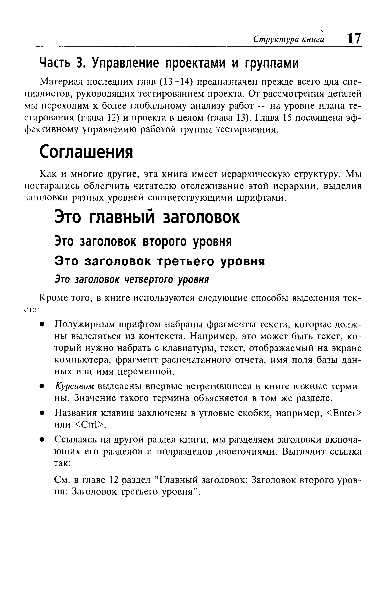

# Благодарности

Работа над этой книгой была начата в 1983 году, а в 1988 году в издательстве Канера (Kaner) вышло ее первое издание. За годы работы нам помогали многие люди, читавшие рукопись и первое издание книги и высказавшие множество полезных замечаний.

Вот те, кому мы хотим выразить особую благодарность (в алфавитном порядке): профессор Элейн Андерсен (Elaine Andersson), д-р Борис Бейзер (Boris Beizer), Джим Брукс (Jim Brooks), Рэнди Делюччи (Randy Delucchi), Мэл Дауэри (Mel Doweary), Дэвид Фамер (David Farmer), профессор Ларри Джонс (Larry Jones), Шарон Гафнер (Sharon Hafner), Махмуд Кан (Mahmood Kahn), Джинни Канер (Ginny Kaner), д-р Сэм Канер (Sam Kaner), Джон Лавель (John Lavelle), д-р Лэрри Мэлкас (Larry Malkus), Тэд Мацумара (Ted Matsumara), д-р Дон Максвелл (Don Maxwell), Брюс Миллер (Bruce Miller), Рэйчел Миллер (Rachel Miller), Питер Морзе (Peter Morse), Джейн Степак (Jane Stepak), и Эммануэль Эрен (Emmanuel Uren).

Конечно, за все оставшиеся в книге ошибки отвечают только ее авторы.

Часть I

# Основы

Глава 1. Пример серии тестов  
Глава 2. Желаемое и действительное в жизни тестировщика  
Глава 3. Типы тестов и их роль в процессе разработки программного обеспечения  
Глава 4. Программные ошибки  
Глава 5. Документирование и анализ ошибок  


# Глава 1
# Пример серии тестов

### Назначение этой главы

Процесс тестирования программного обеспечения можно отчасти назвать интуитивным, но в то же время в основе его лежит вполне систематизированный подход. Хорошо протестировать программу означает нечто гораздо более серьезное, чем просто "погонять" ее несколько минут, чтобы убедиться, что она работает. Эффективное тестирование требует тщательного анализа и строгого системного подхода.

Эта глава является своеобразным введением, цель которого — на простом примере продемонстрировать подход к тестированию программ, применяемый опытными специалистами этого дела. Для примера мы выбрали маленькую незамысловатую программку с несколькими ошибками.

## Первый цикл тестирования

Вместе с программой, которую следует протестировать, вы получили такое описание.

Назначение программы — сложить два введенных вами числа. В каждом из чисел должна быть одна или две цифры. Программа выполняет эхо-отображение вводимых чисел, а затем выводит их сумму. Ввод каждого числа завершается нажатием клавиши `<Enter>`. Запускается программа с помощью команды `ADDER`.

### Шаг 1. Начнем с простого и наиболее очевидного теста

Для начала с программой нужно познакомиться и посмотреть, достаточно ли она стабильна, чтобы можно было тестировать. В программах, предоставленных для первого формального тестирования, часто сразу же происходит сбой. Не стоит тратить на них много времени.

| *Что вы делаете* | *Что происходит* |
| :--- | :--- |
| Вводите `ADDER` и нажимаете клавишу `<Enter>` | Экран мигает. Вверху экрана вы видите знак вопроса. |
| Нажимаете `2` | За знаком вопроса появляется цифра 2. |
| Нажимаете `<Enter>` | В следующей строке появляется знак вопроса. |
| Нажимаете `3` | За вторым знаком вопроса появляется цифра 3. |
| Нажимаете `<Enter>` | В третьей строке появляется цифра 5. На несколько строк ниже появляется еще один знак вопроса. |

РИСУНОК 1.1. *Первый тест программы*

В первом тесте складываются числа **2** и **3**. Последовательность действий и результат приведены на рис. 1.1. А на рис. 1.2 видно, как выглядит экран по окончании теста.

Курсор (мигающий символ подчеркивания позади знака вопроса внизу экрана) указывает, где будет отображаться следующее вводимое число.

### Отчет о проблемах, выявленных первым тестом

Программа работает — она приняла числа **2** и **3** и вернула **5**. Но проблемы все же есть. Для их описания составляется отчет, форма которого приведена на рис. 1.3.

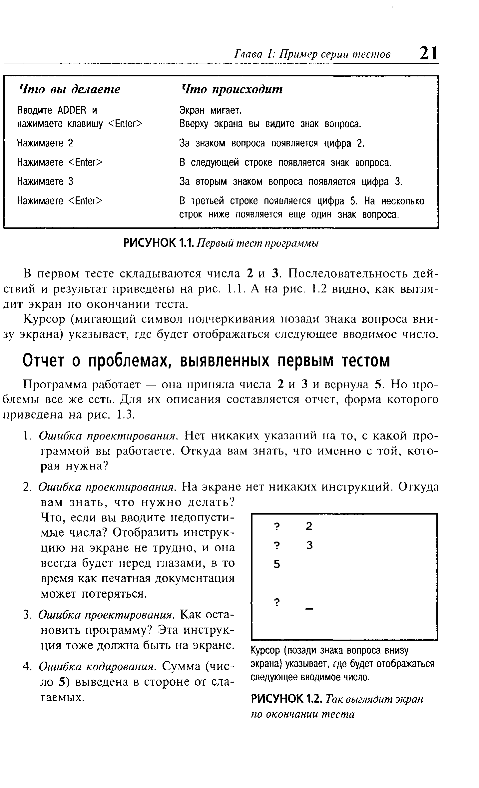

Курсор (позади знака вопроса внизу экрана) указывает, где будет отображаться следующее вводимое число.

РИСУНОК 1.2. *Так выглядит экран по окончании теста*

1. *Ошибка проектирования.* Нет никаких указаний на то, с какой программой вы работаете. Откуда вам знать, что именно с той, которая нужна?
2. *Ошибка проектирования.* На экране нет никаких инструкций. Откуда вам знать, что нужно делать? Что, если вы вводите недопустимые числа? Отобразить инструкцию на экране не трудно, и она всегда будет перед глазами, в то время как печатная документация может потеряться.
3. *Ошибка проектирования.* Как остановить программу? Эта инструкция тоже должна быть на экране.
4. *Ошибка кодирования.* Сумма (число **5**) выведена в стороне от слагаемых.

НАЗВАНИЕ КОМПАНИИ \_\_\_\_\_\_\_\_\_\_\_\_\_\_\_\_\_\_\_\_\_\_\_\_\_ КОНФИДЕНЦИАЛЬНО \_\_\_\_\_\_\_\_\_\_\_\_\_\_\_\_\_\_\_\_\_\_\_\_\_\_\_\_\_\_\_ ОТЧЕТ О ПРОБЛЕМЕ №\_\_\_\_

ПРОГРАММА \_\_\_\_\_\_\_\_\_\_\_\_\_\_\_\_\_\_\_\_\_\_\_\_\_\_\_\_\_\_\_\_\_\_\_\_\_\_\_\_\_\_\_\_\_\_\_\_ ВЫПУСК\_\_\_\_\_\_\_\_\_\_\_\_\_\_\_ ВЕРСИЯ\_\_\_\_\_\_\_\_\_

ТИП ОТЧЕТА (1-6)\_\_\_\_ | СТЕПЕНЬ ВАЖНОСТИ (1-3)\_\_\_\_ | ПРИЛОЖЕНИЯ (Д/Н)\_\_\_\_
1 - *Ошибка кодирования* | 1 - *Фатальная* | *Если да, какие:*
2 - *Ошибка проектирования* | 2 - *Серьезная* |
3 - *Предложение* | 3 - *Незначительная* |
4 - *Расхождение с документацией* | |
5 - *Взаимодействие с аппаратурой* | |
6 - *Вопрос* | |

ПРОБЛЕМА \_\_\_\_\_\_\_\_\_\_\_\_\_\_\_\_\_\_\_\_\_\_\_\_\_\_\_\_\_\_\_\_\_\_\_\_\_\_\_\_\_\_\_\_\_\_\_\_\_\_\_\_\_\_\_\_\_\_\_\_\_\_\_\_\_\_\_\_\_\_\_\_\_\_\_\_\_\_\_\_\_\_\_\_\_\_\_\_\_\_\_\_\_\_

МОЖЕТЕ ЛИ ВЫ ВОСПРОИЗВЕСТИ ПРОБЛЕМНУЮ СИТУАЦИЮ? (Д/Н) \_\_\_\_

ПОДРОБНОЕ ОПИСАНИЕ ПРОБЛЕМЫ И КАК ЕЕ ВОСПРОИЗВЕСТИ \_\_\_\_\_\_\_\_\_\_\_\_\_\_\_\_\_\_\_\_\_\_\_\_\_\_\_\_\_\_\_\_\_\_\_\_\_

\_\_\_\_\_\_\_\_\_\_\_\_\_\_\_\_\_\_\_\_\_\_\_\_\_\_\_\_\_\_\_\_\_\_\_\_\_\_\_\_\_\_\_\_\_\_\_\_\_\_\_\_\_\_\_\_\_\_\_\_\_\_\_\_\_\_\_\_\_\_\_\_\_\_\_\_\_\_\_\_\_\_\_\_\_\_\_\_\_\_\_\_\_\_\_\_\_\_\_\_\_\_

ПРЕДЛАГАЕМОЕ ИСПРАВЛЕНИЕ (НЕОБЯЗАТЕЛЬНО) \_\_\_\_\_\_\_\_\_\_\_\_\_\_\_\_\_\_\_\_\_\_\_\_\_\_\_\_\_\_\_\_\_\_\_\_\_\_\_\_\_\_\_\_\_\_\_\_\_\_

\_\_\_\_\_\_\_\_\_\_\_\_\_\_\_\_\_\_\_\_\_\_\_\_\_\_\_\_\_\_\_\_\_\_\_\_\_\_\_\_\_\_\_\_\_\_\_\_\_\_\_\_\_\_\_\_\_\_\_\_\_\_\_\_\_\_\_\_\_\_\_\_\_\_\_\_\_\_\_\_\_\_\_\_\_\_\_\_\_\_\_\_\_\_\_\_\_\_\_\_\_\_

ОТЧЕТ ПРЕДСТАВЛЕН СОТРУДНИКОМ\_\_\_\_\_\_\_\_\_\_\_\_\_\_\_\_\_\_\_\_\_\_\_\_\_\_\_\_\_\_\_\_\_\_\_ ДАТА \_\_\_/\_\_\_/\_\_\_

*СЛЕДУЮЩИЕ ГРАФЫ ПРЕДНАЗНАЧЕНЫ ТОЛЬКО ДЛЯ РАЗРАБОТЧИКОВ*

ФУНКЦИОНАЛЬНАЯ ОБЛАСТЬ\_\_\_\_\_\_\_\_\_\_\_\_\_\_\_\_\_\_\_\_\_\_\_\_\_\_\_\_ ОТВЕТСТВЕННЫЙ\_\_\_\_\_\_\_\_\_\_\_\_\_\_\_\_\_\_

КОММЕНТАРИИ \_\_\_\_\_\_\_\_\_\_\_\_\_\_\_\_\_\_\_\_\_\_\_\_\_\_\_\_\_\_\_\_\_\_\_\_\_\_\_\_\_\_\_\_\_\_\_\_\_\_\_\_\_\_\_\_\_\_\_\_\_\_\_\_\_\_\_\_\_\_\_\_\_\_\_\_\_\_\_\_\_\_\_\_\_\_\_

\_\_\_\_\_\_\_\_\_\_\_\_\_\_\_\_\_\_\_\_\_\_\_\_\_\_\_\_\_\_\_\_\_\_\_\_\_\_\_\_\_\_\_\_\_\_\_\_\_\_\_\_\_\_\_\_\_\_\_\_\_\_\_\_\_\_\_\_\_\_\_\_\_\_\_\_\_\_\_\_\_\_\_\_\_\_\_\_\_\_\_\_\_\_\_\_\_\_\_\_\_\_

СОСТОЯНИЕ(1-2)\_\_\_\_ | ПРИОРИТЕТ (1-5)\_\_\_\_
1 - *Открыто* 2 - *Закрыто* |

РЕЗОЛЮЦИЯ (1-9)\_\_\_ | ИСПРАВЛЕННАЯ ВЕРСИЯ \_\_\_\_\_\_\_\_\_\_\_\_\_\_\_\_\_\_\_\_\_
1 - *Рассматривается* | 4 - *Отложено* | 7 - *Отозвано составителем*
2 - *Исправлено* | 5 - *Соответствует проекту* | 8 - *Нужна дополнительная информация*
3 - *Не воспроизводится* | 6 - *Не может быть исправлено* | 9 - *Не согласен с предложением*

РАССМОТРЕНО \_\_\_\_\_\_\_\_\_\_\_\_\_\_\_\_\_\_\_\_\_\_\_\_\_\_\_ | ДАТА \_\_\_/\_\_\_/\_\_\_
ПРОКОНТРОЛИРОВАНО \_\_\_\_\_\_\_\_\_\_\_\_\_\_\_\_\_\_\_\_\_\_\_\_\_\_ | ДАТА \_\_\_/\_\_\_/\_\_\_
СЧИТАТЬ ОТЛОЖЕННЫМ (Д/Н)\_\_\_ |

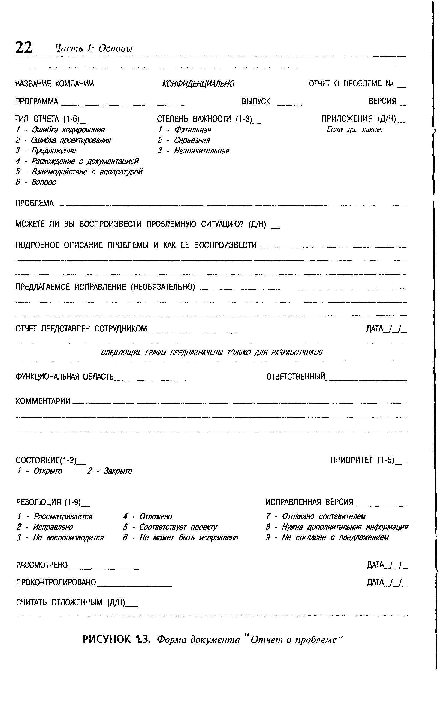

**РИСУНОК 1.3.** *Форма документа "Отчет о проблеме"*

<div class="page" markdown="1">

> *Обязательно представляйте отдельный "Отчет о проблеме" по каждой ошибке.*

Описание всех четырех ошибок можно было бы поместить в один отчет, но лучше этого не делать. Ошибки могут исправляться в разное время, и сведения о тех из них, которые остались неисправленными, могут просто потеряться. Если программист захочет их сгруппировать, он сам рассортирует отчеты. Чтобы привлечь внимание к взаимосвязанным проблемам, просто поместите в отчеты соответствующие ссылки.

## Шаг 2. Составим заметки о том, что еще должно быть протестировано

Выполнив первые, и самые очевидные тесты, следует подумать о том, что еще следует протестировать. Свои соображения нужно записать: одни из записей примут форму заметок, другие же могут представлять собой достаточно строго формализованные описания серий тестов. Такие документированные группы тестов в дальнейшем могут послужить для проверки следующих версий программы. Примером может быть серия тестов, представленная на рис. 1.4.

| *Входные данные* | *Ожидаемый результат* | *Замечания* |
| :--- | :--- | :--- |
| $99 + 99$ | $198$ | Пара наибольших чисел, которые может складывать программа. |
| $-99 + -99$ | $-198$ | В документации не сказано, что нельзя складывать отрицательные числа. |
| $99 + -14$ | $85$ | Большое первое число может повлиять на интерпретацию программой второго. |
| $-38 + 99$ | $61$ | Проверим сложение отрицательного числа с положительным. |
| $56 + 99$ | $155$ | Проверим, не влияет ли слишком большое второе число на интерпретацию первого. |
| $9 + 9$ | $18$ | $9$ является наибольшим числом из одной цифры. |
| $0 + 0$ | $0$ | Программы часто сбоят на нулях. |
| $0 + 23$ | $23$ | Программа может особым образом обрабатывать $0$, поэтому его нужно проверить и в виде первого, и в виде второго слагаемого. |
| $-78 + 0$ | $-78$ | |

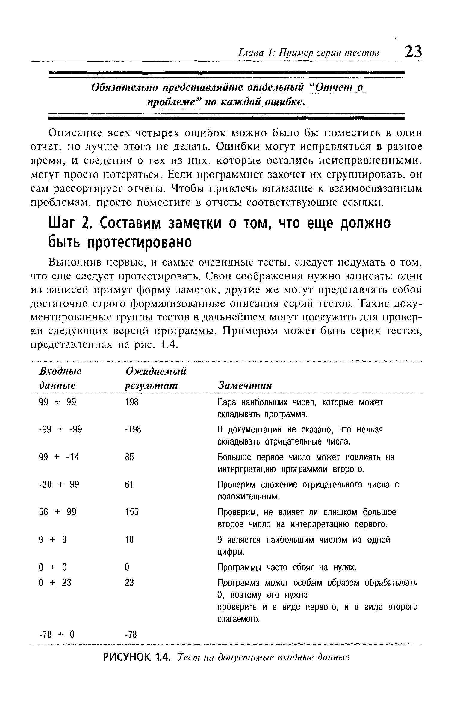

**РИСУНОК 1.4.** *Тест на допустимые входные данные*

</div>

Эти тесты охватывают все допустимые входные данные программы — пары чисел, которые ей полагается складывать правильно.

В первом тесте вы ввели два числа и проверили результат. Фактически все оставшиеся 39600 тестов точно такие же. Выполнять их все было бы безумием. На рис. 1.4 для тестирования программы предлагается восемь примеров. Почему только восемь и почему именно таких? Прежде всего, тесты были подобраны так, чтобы каждая цифра встречалась в них хотя бы один раз. Кроме того, мы подобрали по одной комбинации чисел на каждую из вероятных проблем. А чтобы определить, на каких данных вероятнее всего возникнут проблемы, эффективнее всего проверить граничные условия.

Количество возможных тестов (39601) вычисляется так. В допустимом диапазоне от -99 до 99 всего 199 чисел. Любое из них может стоять на первом месте и любое — на втором. Всего получается $199^2 = 39601$ пар чисел. Заметьте, что такое количество тестов выходит даже без учета любых чуть более сложных действий пользователя, как, например, нажатия клавиши <BackSpace>. Если же допустить использование клавиш редактирования, количество возможных тестов вырастет многократно. Задача определения количества возможных тестов относится к области математики, именуемой комбинаторным анализом. Обычно задача эта не сложная — необходимые формулы можно найти в любом учебнике по теории вероятности или комбинаторике.

Если вы проверяете комбинацию $2 + 3$, а затем $3 + 4$, ваши тесты хотя и не в точности одинаковы, но очень близки. Оба они проверяют, как реагирует программа на пару однозначных положительных чисел. И если программа пройдет первый тест, наиболее вероятно, что она пройдет и второй. Поэтому из огромного количества возможных тестов нужно выбирать только наиболее важные.

> *Из двух тестов, от которых ожидается один и тот же результат, проводите только один.*

Если от двух тестов ожидается получить один и тот же результат, значит, они принадлежат к одному классу. В нашем случае 81 тест относится к классу «пара однозначных положительных чисел». Как только удается выделить класс, т.е. группу однотипных тестов, можно провести несколько из них и проигнорировать остальные. Для отбора проводимых тестов есть важное правило.

> *Для выполнения всегда выбирайте из класса те тесты, на которых вероятнее всего ожидается сбой программы.*

Лучше всего подходят для тестирования примеры, лежащие на границе представленного классом диапазона значений. Именно на граничных значениях программы сбоят чаще всего. Например, если программа предназначена для сложения двузначных чисел, одним из граничных значений, которые она должна правильно обрабатывать, является число 99.

Классом можно назвать группу значений, которые программа обрабатывает одним и тем же способом. А граничными значениями класса являются те входные данные, на которых программа меняет свое поведение.

Однако граничные значения могут быть там, где вы их совсем не ждете, а там, где им положено быть, их в действительности может и не оказаться. Не всегда программа меняет свое поведение именно там, где предполагает программист, и именно в этом причина большинства ошибок. При программировании граничных условий случайная ошибка очень вероятна, поэтому такие точки следует проверять наиболее тщательно.

Волшебной формулы для объединения тестов в группы и определения граничных условий не существует. Это умение приходит только с опытом. Прочитав программный код, можно найти в нем то, чего при использовании программы вы не сможете даже предположить. Однако проверять те критические точки, которые можно определить по листингу, — это прежде всего работа программиста. А ваша задача — проанализировать программу с другой точки зрения, чтобы выявить те критические точки, которые программист пропустил. Поэтому классы возможных тестов вам следует выделять, исходя прежде всего из внешнего поведения программы. В результате набор тестов будет отличаться от того, который можно составить по листингу программы, — именно в этом суть вашей задачи.

Напоследок упомяну еще об одном важном моменте. Границу значений обязательно нужно протестировать с двух сторон. Программисты часто убеждаются, что критический фрагмент кода работает на одном из значений и забывают это сделать на втором. Здесь они пропускают ошибки, которые вы пропустить не должны.

### Шаг 3. Проверим допустимые значения и посмотрим, что происходит

Серия тестов, приведенных на рис. 1.4, охватывает только допустимые значения входных данных программы. На следующем этапе тестирования можно создать такую же серию тестов для недопустимых значений. Еще одна серия тестов может быть предназначена для проверки редактирования чисел: вы вводите значение, затем изменяете его и только после этого нажимаете <Enter>. Однако прежде всего выполните простейшие тесты, приведенные на рис. 1.4.

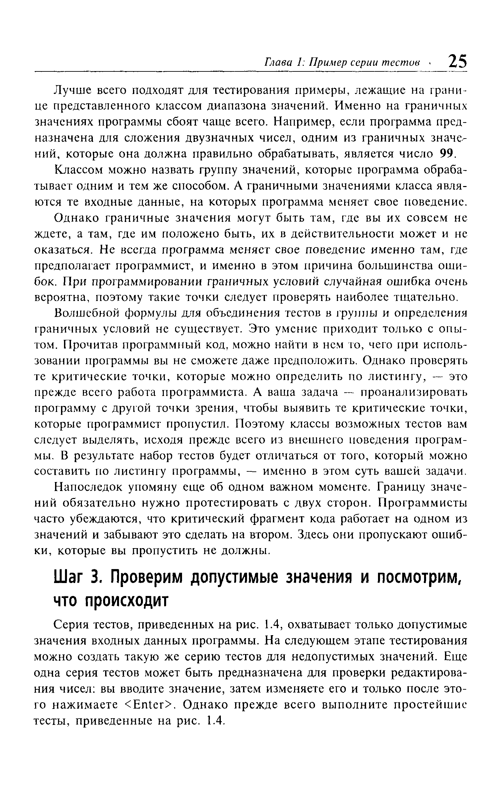

*Программу тестируют потому, что она может не работать.*

Можно убить уйму времени на разнообразные тесты, подсказанные вашей фантазией, а затем обнаружить, что программа не может сложить **2** и **3**. Вот результаты теста нашей программы-примера.

* Положительные числа и **0** обрабатываются прекрасно.
* Не работает ни один тест с отрицательными числами. После ввода второй цифры компьютер просто "зависает". (Он игнорирует клавиатурный ввод, и его приходится перезапускать.) Вы попробовали сложить **9** и **-9**, чтобы посмотреть, не примет ли программа однозначные отрицательные числа, но после нажатия клавиши `<Enter>` компьютер "завис". Очевидно, программа не ожидает отрицательных чисел.

### Шаг 4. Немного тестирования в режиме "свободного полета"

Когда серии подготовленных тестов полностью выполнены, формальное тестирование можно считать завершенным. Однако это не значит, что нужно немедленно прекращать работу до следующего этапа. Тестирование *можно* продолжить. Тесты, которые вы будете проводить и выполнять с этого момента, не нужно тщательно готовить или объяснять кому-то их назначение. Здесь в дело должна вступить ваша интуиция. Пробуйте все, что придет вам в голову, даже если сотрудникам кажется, что подобные тесты уже были проведены.

В нашем примере вы быстро достигли точки, в которой формальное тестирование переходит в неформальное, поскольку сбой программы не заставил себя ждать. Вероятно, в ней есть какая-то фундаментальная ошибка. Если это так, проект программы следует пересмотреть. Разрабатывать новые тесты пока нет никакого смысла, поскольку к новой версии они могут просто не подойти. Поэтому, не тратя времени на планирование, можно провести несколько чисто исследовательских экспериментов — все, что придет в голову. На рис. 1.5 перечислены тесты, которые провели бы мы, их возможные результаты и наши заменячания.

> **Всегда записывайте, что вы делаете и что происходит во время исследовательских тестов.**

Как видно из рис. 1.5, программа никуда не годится: она “зависает” при малейшей провокации. Вы больше времени тратите на перезапуски компьютера, чем на тестирование.

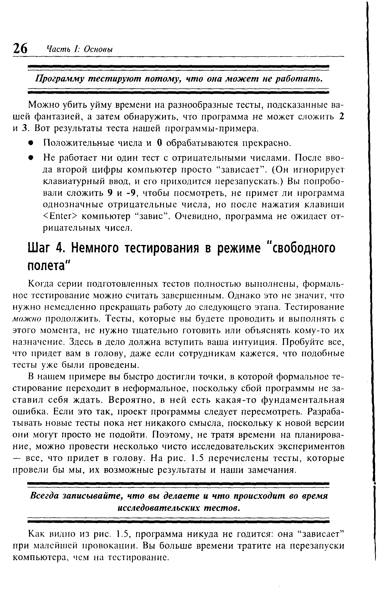

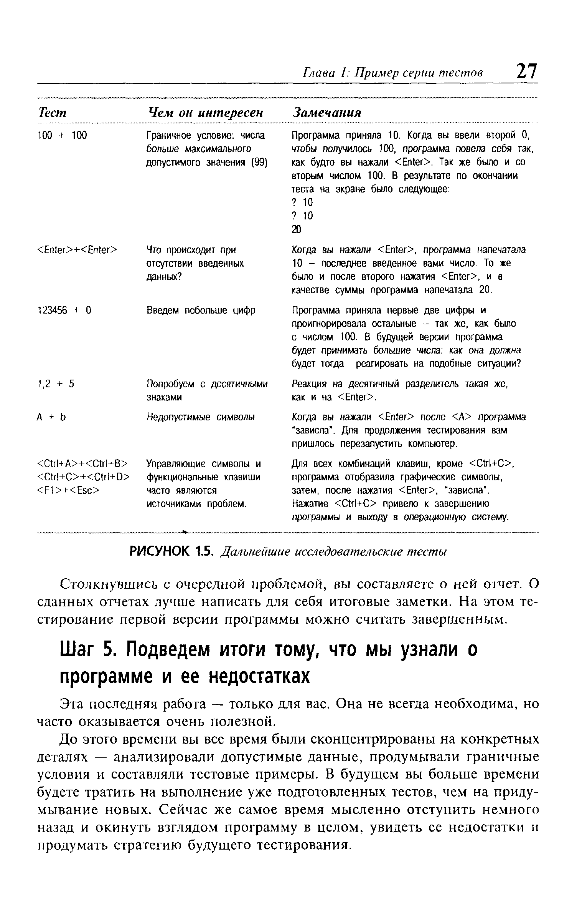

Столкнувшись с очередной проблемой, вы составляете о ней отчет. О сданных отчетах лучше написать для себя итоговые заметки. На этом тестирование первой версии программы можно считать завершенным.

## Шаг 5. Подведем итоги тому, что мы узнали о программе и ее недостатках

Эта последняя работа -- только для вас. Она не всегда необходима, но часто оказывается очень полезной.

До этого времени вы все время были сконцентрированы на конкретных деталях — анализировали допустимые данные, продумывали граничные условия и составляли тестовые примеры. В будущем вы больше времени будете тратить на выполнение уже подготовленных тестов, чем на придумывание новых. Сейчас же самое время мысленно отступить немного назад и окинуть взглядом программу в целом, увидеть ее недостатки и продумать стратегию будущего тестирования.

Результатом такого более глобального анализа может быть обнаружение пропущенных деталей — например, новых граничных условий.

Очень полезно для начала записать свои итоговые впечатления о программе. Вот они.

* У программы очень ограниченный интерфейс.
* Программа не работает с отрицательными числами. Наибольшая сумма, которую она может вычислить, — **198**, а наименьшая — **0**.
* Третий вводимый символ (например, третью цифру в числе **100**) программа интерпретирует как нажатие `<Enter>`.
* Пока вы не нажмете `<Enter>`, любые вводимые вами символы воспринимаются как допустимые.
* Программа не проверяет, действительно ли вы ввели число, прежде чем нажали `<Enter>`. Если вы ничего не ввели, программа использует последнее число, введенное ранее.

Если предположить, что программист не является безнадежно некомпетентным, то для таких непривлекательных результатов должна быть причина. Скорее всего, она состоит в том, что программист пытался сделать программу как можно меньшей по размеру или как можно более быстрой.

Код обработки ошибок занимает память. Это же касается заголовков, сообщений об ошибках и инструкций. Если программа *должна* поместиться в очень маленьком фрагменте памяти, для всего этого места нет. Подобным же образом обстоит дело и со временем: оно требуется и на проверку допустимости вводимых символов, и на проверку того, что третьей нажатой клавишей действительно является `<Enter>`, и на печать сообщений на экране, и на очистку переменных перед выполнением очередного задания.

По одному только перечню недостатков программы трудно судить, действительно ли они вызваны жесткими требованиями к ее скорости или размерам. И если да, нет ли возможности исправить хотя бы часть из них, не выходя за пределы этих ограничений. Чтобы все это выяснить, нужно поговорить с программистом.

Предположим, что главной целью программиста является экономия памяти. Как он ее достигает? Большинство способов очевидно: никакого кода обработки ошибок, никаких сообщений о них, никаких инструкций на экране, никакого кода проверки третьего символа. Может быть, есть и другие способы? Без сомнения. Минимизировать требования к памяти можно за счет *эффективного* хранения данных. В этой программе данными являются вводимые символы и сумма.

## Хранение суммы

Допустимыми могли бы быть суммы от -198 до 198. Но программа работает только с положительными числами, поэтому в ней возможны суммы от 0 до 198.

Если хранить только положительные числа, то хватит и одного байта (8 битов). Это стандартная и очень удобная единица хранения данных, вмещающая положительные числа от 0 до 255. Если программист хотел выбрать для хранения суммы наименьший возможный размер переменной и при этом не считал необходимой обработку отрицательных чисел, байт был идеальным решением.

Вот только что будет, если программа изменится и должна будет обрабатывать отрицательные числа тоже? Собственно говоря, байт можно использовать для хранения и положительных, и отрицательных чисел, нужно только один из битов выделить для хранения знака. Тогда в одном байте можно хранить числа от -127 до 127. На числах, превышающих 127, программа будет сбоить.

Подобные сбои обычно выражаются в том, что числа, которые больше чем 127, интерпретируются как отрицательные. Скорее всего, то же будет и с нашей программой. В следующей серии тестов следует обратить внимание на большие суммы — граничными будут значения 127 и 128. Серия тестов на рис. 1.4 уже включает большую сумму ($99 + 99$), поэтому новые тесты понадобятся только в случае, если этот программа пройдет правильно. Рядом с этим примером стоит приписать замечание, чтобы отследить неверный результат.

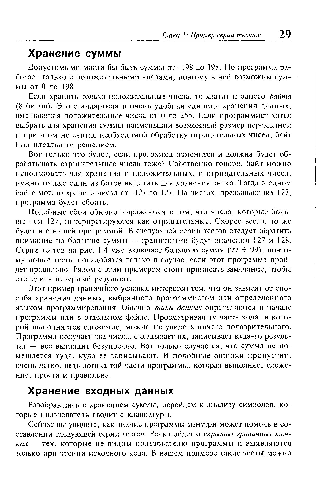

Этот пример граничного условия интересен тем, что он зависит от способа хранения данных, выбранного программистом или определенного языком программирования. Обычно типы данных определяются в начале программы или в отдельном файле. Просматривая ту часть кода, в которой выполняется сложение, можно не увидеть ничего подозрительного. Программа получает два числа, складывает их, записывает куда-то результат — все выглядит безупречно. Вот только случается, что сумма не помещается туда, куда ее записывают. И подобные ошибки пропустить очень легко, ведь логика той части программы, которая выполняет сложение, проста и правильна.

## Хранение входных данных

Разобравшись с хранением суммы, перейдем к анализу символов, которые пользователь вводит с клавиатуры.

Сейчас вы увидите, как знание программы изнутри может помочь в составлении следующей серии тестов. Речь пойдет о *скрытых граничных точках* — тех, которые не видны пользователю программы и выявляются только при чтении исходного кода. В нашем примере такие тесты можно

составить и без чтения кода — на основании знаний о ASCII-кодирвке символов. Но в общем случае, чем больше вы знаете о программировании, тем больше граничных точек сможете выявить.

Следующий пример новичкам в тестировании и тем, у кого нет программистского опыта, будет непонятен. Поэтому его смело можно пропустить и сразу перейти к следующему разделу.

Клавиатурный ввод обычно принимается и обрабатывается специальной системной программой. Эта программа назначает каждой клавише числовой код, который при нажатии клавиши передается прикладной программе. Одной из классических кодировок является ASCII. Коды цифр в этой таблице приведены на рис. 1.6.

Когда вы нажимаете клавишу, программист проверяет ее ASCII-код, чтобы выяснить, была ли введена цифра. Этот фрагмент программы выглядит примерно так.

```text
IF ASCII_КОД_ВВЕДЕННОГО_СИМВОЛА меньше 48
(48 — это ASCII-код для 0)
    THEN отвергнуть символ как недопустимый
    ELSE IF ASCII_КОД_ВВЕДЕННОГО_СИМВОЛА больше 57
    (57 — это ASCII-код для 9)
        THEN отвергнуть символ как недопустимый
        ELSE это цифра, принять ее.
```

Посмотрим теперь, из-за чего этот код может сработать неправильно. Вот шесть наиболее распространенных ошибок программистов.

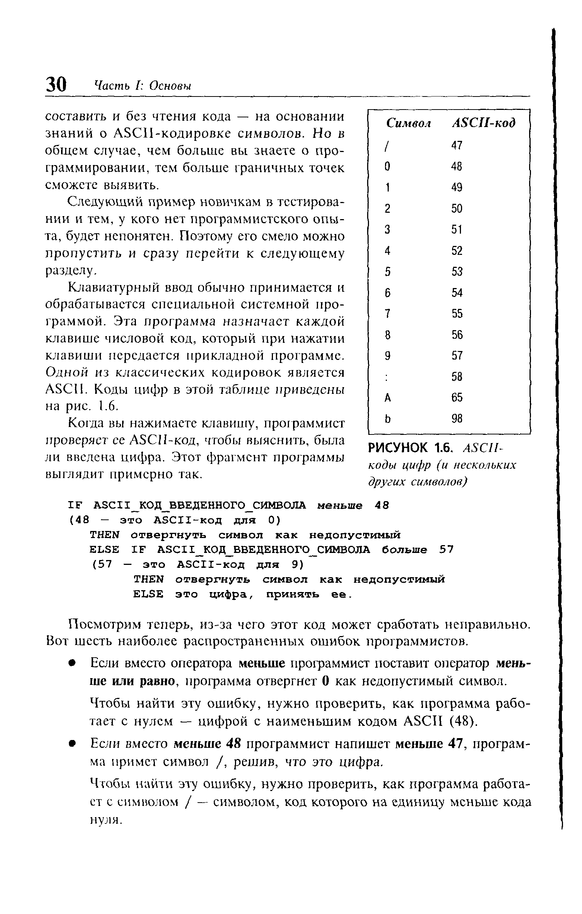

* Если вместо оператора **меньше** программист поставит оператор **меньше или равно**, программа отвергнет **0** как недопустимый символ.

  Чтобы найти эту ошибку, нужно проверить, как программа работает с нулем — цифрой с наименьшим кодом ASCII (48).

* Если вместо **меньше 48** программист напишет **меньше 47**, программа примет символ `/`, решив, что это цифра.

  Чтобы найти эту ошибку, нужно проверить, как программа работает с символом `/` — символом, код которого на единицу меньше кода нуля.

* Если программист допустит опечатку и вместо **меньше 48** напишет **меньше 38**, программа примет не только символ `/`, но и девять других нецифровых символов с кодами от 38 до 47.
  Для выявления этой ошибки можно проверить любой символ из этого диапазона, граничным значением которого будет код 47.
* Теперь посмотрим на самую большую цифру — **9** (ASCII-код 57). При работе с ней, вероятнее всего, может встретиться ошибка **больше или равен 57** вместо **равен 57**. Если ввести **9**, программа отвергнет этот символ как нецифровой.
  Такой код неверно работает с одной-единственной цифрой — ее и нужно проверить.
* Программист может захотеть записать второе условие иначе, как **больше или равен 58**, но по ошибке написать **больше 58**. Тогда программа примет за цифру двоеточие.
* Еще одной опечаткой программиста может быть **75** вместо **57**, тогда программа будет принимать за цифры все символы с кодами от 48 до 75. Эту ошибку можно обнаружить, проверив любой символ из указанного диапазона, но символа с граничным значением кода (двоеточия) будет вполне достаточно.

> *Для обнаружения любой ошибки, которую программист может допустить при анализе цифровых данных, достаточно проверки всего четырех граничных символов: `/`, `0`, `9` и `:`.*

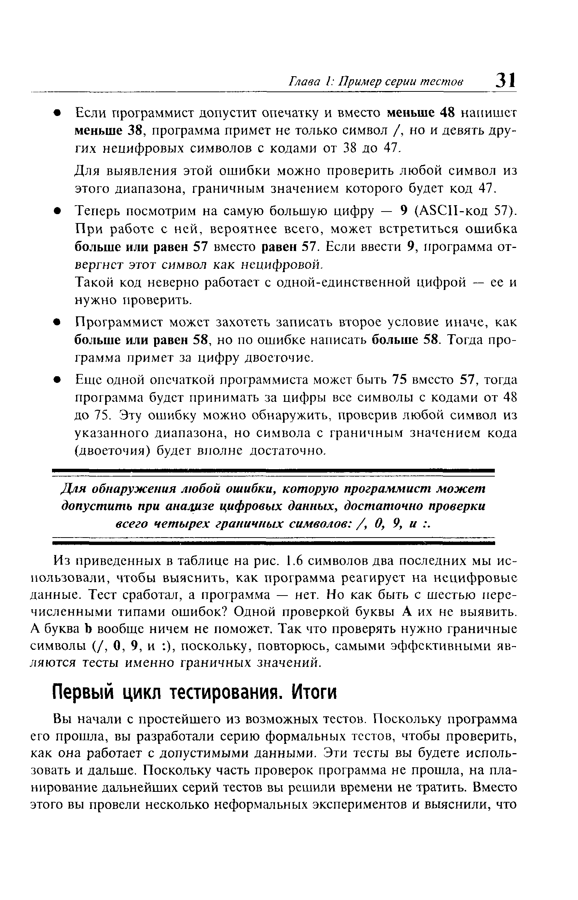

Из приведенных в таблице на рис. 1.6 символов два последних мы использовали, чтобы выяснить, как программа реагирует на нецифровые данные. Тест сработал, а программа — нет. Но как быть с шестью перечисленными типами ошибок? Одной проверкой буквы `А` их не выявить. А буква `b` вообще ничем не поможет. Так что проверять нужно граничные символы (`/`, `0`, `9` и `:`, поскольку, повторюсь, самыми эффективными являются тесты именно граничных значений.

## Первый цикл тестирования. Итоги

Вы начали с простейшего из возможных тестов. Поскольку программа его прошла, вы разработали серию формальных тестов, чтобы проверить, как она работает с допустимыми данными. Эти тесты вы будете использовать и дальше. Поскольку часть проверок программа не прошла, на планирование дальнейших серий тестов вы решили времени не тратить. Вместо этого вы провели несколько неформальных экспериментов и выяснили, что

программа вообще очень нестабильна. Вы записали несколько замечаний, к которым обратитесь при тестировании следующей версии программы.

Если бы программа успешно прошла первую серию тестов, вы бы разработали вторую, более обстоятельную. Если бы программа снова показала себя надежной, вы бы продолжили ее тестирование, пока не исчерпались бы идеи или отведенное время. Напоследок вы провели бы несколько беглых тестов, не входивших в ранее разработанные серии, и записали замечания на будущее.

Завершив тестирование и всю бумажную работу, стоит потратить еще немного времени, чтобы обдумать результаты. Вы выполнили самое очевидное, но это еще только начало. У вас нет пока конкретного плана. Вы просто делали то, что первыми приходило в голову. По ходу работы вы определили две линии атаки. Теперь же нужно выделить время на обдумывание. Это очень важно, даже если сроки сильно поджимают.

## Второй цикл тестирования

Вы поговорили с программистом, и он сказал, что скорость работы программы исключительно важна, а вот объем кода не имеет никакого значения. Резолюции программиста на ваших отчетах представлены на рис. 1.7.

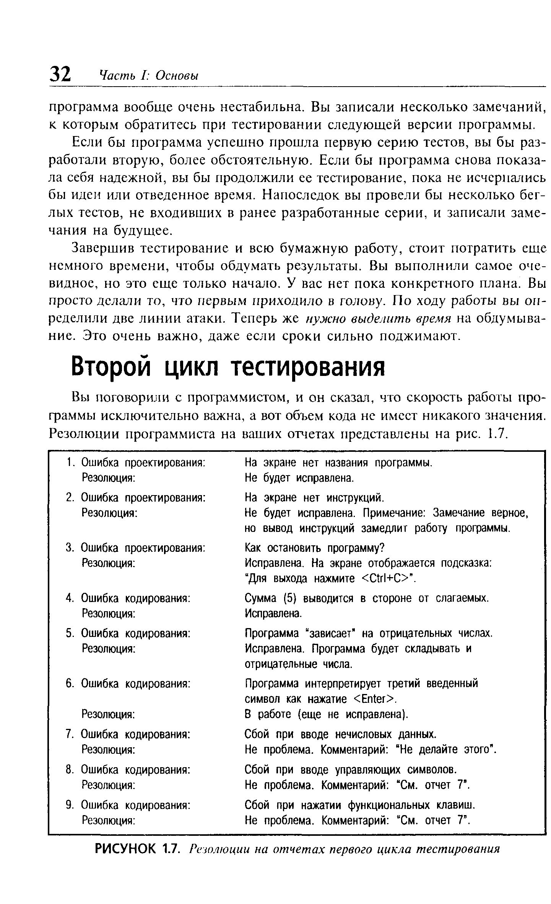

РИСУНОК 1.7. Резолюции на отчетах первого цикла тестирования

Шаг 1. Прежде чем приступить к тестированию, внимательно прочтите резолюции программиста на ваших отчетах — вы узнаете, что нужно делать, а чего не нужно

Как видите, хорошо, что вы не разрабатывали тестов для проверки кода обработки ошибок: этого кода нет и не будет. Более того, хотя программа и будет теперь обрабатывать отрицательные числа, она будет обрабатывать их не все, а только до -9.

Числа от -10 до 199 длиной в три символа она по-прежнему не обрабатывает, интерпретируя третий символ как нажатие клавиши `<Enter>`. Обратившись к разработанной ранее серии тестов на рис. 1.4, вы видите, что тесты с числами -99, -78 и -14 запускать не придется. Вместо -78 и -14 возьмите пару однозначных отрицательных чисел.

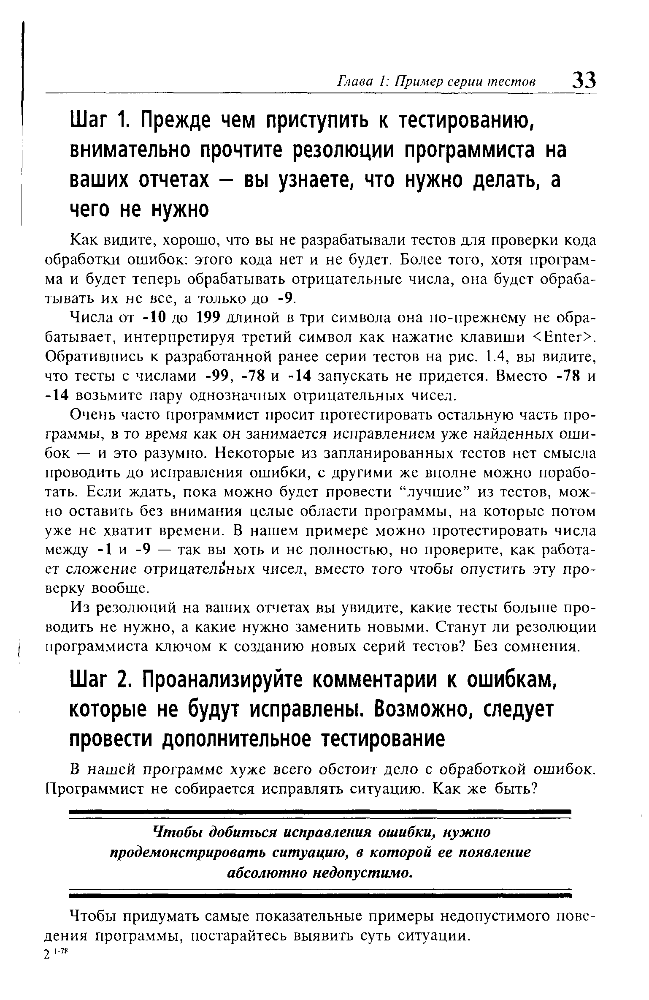

Очень часто программист просит протестировать остальную часть программы, в то время как он занимается исправлением уже найденных ошибок — и это разумно. Некоторые из запланированных тестов нет смысла проводить до исправления ошибкой, с другими же вполне можно поработать. Если ждать, пока можно будет провести “лучшие” из тестов, можно оставить без внимания целые области программы, на которые потом уже не хватит времени. В нашем примере можно протестировать числа между -1 и -9 — так вы хоть и не полностью, но проверите, как работает сложение отрицательных чисел, вместо того чтобы опустить эту проверку вообще.

Из резолюций на ваших отчетах вы увидите, какие тесты больше проводить не нужно, а какие нужно заменить новыми. Станут ли резолюции программиста ключом к созданию новых серий тестов? Без сомнения.

### Шаг 2. Проанализируйте комментарии к ошибкам, которые не будут исправлены. Возможно, следует провести дополнительное тестирование

В нашей программе хуже всего обстоит дело с обработкой ошибок. Программист не собирается исправлять ситуацию. Как же быть?

> **_Чтобы добиться исправления ошибку, нужно продемонстрировать ситуацию, в которой ее появление абсолютно недопустимо._**

Чтобы придумать самые показательны примеры недопустимого поведения программы, постарайтесь выявить суть ситуации.

В нашем случае программа “зависает”, когда вы нажимаете определенные клавиши. Так она ведет себя с буквами, управляющими и функциональными клавишами. Фактически программа “зависает” при вводе любого недопустимого (нецифрового) символа. Программист говорит, что таких символов вы вводить не должны. С вашей же точки зрения, программа должна вести себя вежливо и не заставлять вас перезапускать компьютер каждый раз, когда вы сделаете что-то не так. Прекрасно. Теперь вернемся назад. Программа некорректно ведет себя в ответ на нажатие некоторых клавиш. Программист считает, что это не страшно, поскольку никто и не ждет, что программа примет эти клавиши.

А что, если программа “зависнет” в ответ на ввод символов, которые, по мнению пользователя, она должна принять? Если найти достаточно таких символов, программисту придется написать код для их обработки, а заодно уж он может обработать и остальные символы.

Подумаем, какие же клавиши люди могут нажимать при работе с арифметической программой. Здесь нужен *мозговой штурм*. Запишите все клавиши, которые человеку *может прийти в голову* нажать. Запишите, почему эти клавиши могут показаться уместными. Пусть вас не беспокоит, согласится ли программист с вашими предположениями — позднее вы еще пересмотрите свой список и отберете из него самое существенное. На рис. 1.8 показан список, который получился у нас.


РИСУНОК 1.8. *Мозговой штурм. Какие клавиши пользователь захочет нажать при вводе числа?*

Некоторые из идей в нашем списке явно неудачны. Например, если сказать программисту, что программа не обрабатывает $4/3 + 2$, он только посмеется. Но для первой версии списка это не имеет значения. Прежде всего, важно ничего не пропустить. А что внести в отчет, вы решите чуть позже.

## Шаг 3. Просмотрите записи, которые вы сделали в прошлый раз, добавьте к ним новые замечание, и приступайте к тестированию

Вам страшно хочется начать с того замечательного и очень сложного теста, который вы только что придумали, не так ли? Не торопитесь. Сначала повторите старые и нудные тесты и убедитесь, что программа по-прежнему может сложить 2 и 2 и не получить при этом 5. С вероятностью 1:2 программа не сработает или в ней возникнут новые неполадки. Поэтому обязательно протестируйте все сначала.

Вы провели все "формальные" серии тестов (см. рис. 1.4), модифицировав несколько примеров для проверки однозначных отрицательных чисел. Программа все их успешно прошла.

По ходу дела вы заметили, что программа отображает подсказку "Для выхода нажмите <Ctrl+C>" после каждой операции сложения. На рис. 1.9 показано, что было на экране после сложения первых двух пар чисел.

Программист говорит, что программа должна работать быстро. Тогда все, на что тратится лишнее время, является ошибкой. Вы составили следующий отчет.

10. *Ошибка проектирования.* На вывод на экран подсказки "Для выхода нажмите <Ctrl+C>" тратится лишнее компьютерное время. Поскольку одной из задач разработки является создание очень быстрой программы, это ошибка. Почему бы просто не написать "Для выхода нажмите <Ctrl+C>" внизу экрана сразу при запуске программы и никогда больше ничего не выводить в этой строчке? (И если это возможно, почему бы заодно не вывести также и заголовок программы и короткие инструкции?)

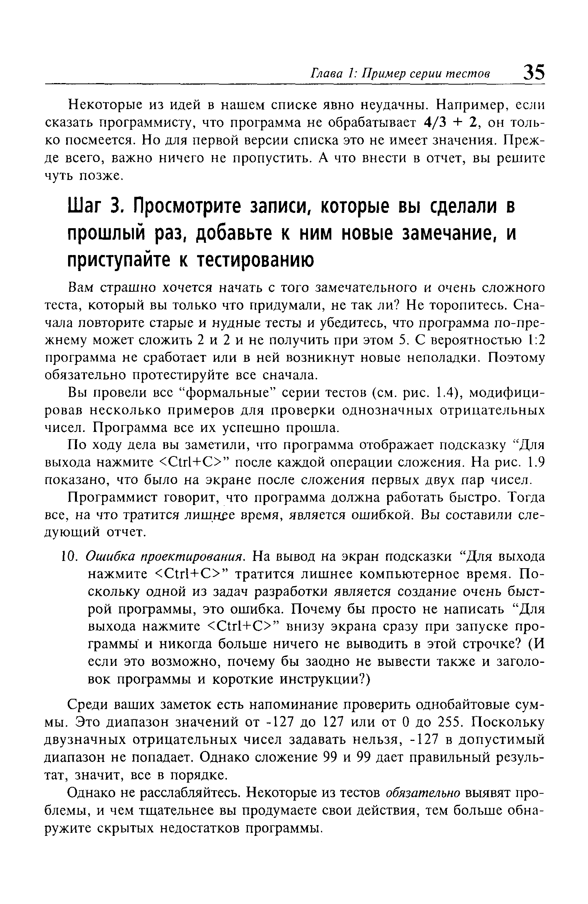

Среди ваших заметок есть напоминание проверить однобайтовые суммы. Это диапазон значений от -127 до 127 или от 0 до 255. Поскольку двузначных отрицательных чисел задавать нельзя, -127 в допустимый диапазон не попадает. Однако сложение 99 и 99 дает правильный результат, значит, все в порядке.

Однако не расслабляйтесь. Некоторые из тестов *обязательно* выявят проблемы, и чем тщательнее вы продумаете свои действия, тем больше обнаружите скрытых недостатков программы.

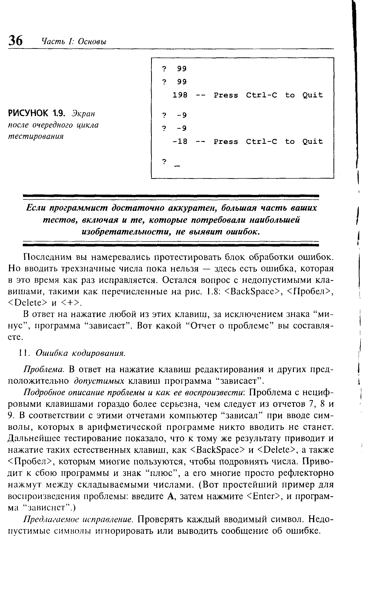

РИСУНОК 1.9. Екран после очередного цикла тестирования

> *Если программист достаточно аккуратен, большая часть ваших тестов, включая и те, которые потребовали наибольшей изобретательности, не выявит ошибок.*

Последним вы намеревались протестировать блок обработки ошибок. Но вводить трехзначные числа пока нельзя — здесь есть ошибка, которая в это время как раз исправляется. Остался вопрос с недопустимыми клавишами, такими как перечисленные на рис. 1.8: <BackSpace>, <Пробел>, <Delete> и <+>.

В ответ на нажатие любой из этих клавиш, за исключением знака “минус”, программа “зависает”. Вот какой “Отчет о проблеме” вы составляете.

*11. Ошибка кодирования.*

*Проблема.* В ответ на нажатие клавиш редактирования и других предположительно допустимых клавиш программа “зависает”.

*Подробное описание проблемы и как ее воспроизвести:* Проблема с нецифровыми клавишами гораздо более серьезна, чем следует из отчетов 7, 8 и 9. В соответствии с этими отчетами компьютер “зависал” при вводе символы, которых в арифметической программе никто вводить не станет. Дальнейшее тестирование показало, что к тому же результату приводит и нажатие таких естественных клавиш, как <BackSpace> и <Delete>, а также <Пробел>, которым многие пользуются, чтобы подровнять числа. Приводит к сбою программы и знак “плюс”, а его многие просто рефлекторно нажмут между складываемыми числами. (Вот простейший пример для воспроизведения проблемы: введите А, затем нажмите <Enter>, и программа “зависнет”.)

*Предлагаемое исправление.* Проверять каждый вводимый символ. Недопустимые символы игнорировать или выводить сообщение об ошибке.

Обратите внимание на то, с чего отчет начинается: вы утверждаете, что проблема серьезнее, чем это следует из предыдущих отчетов. Это дает программисту возможность сохранить лицо. Он может сказать, что не исправил ошибку в прошлый раз потому, что не понял (вы ему не сказали), насколько она серьезна.

> *Хороший тестировщик не тот, кто выявит больше всего ошибок, и не тот, кто заставит смутиться даже самого первоклассного программиста. Лучшим является тот, кто добьется исправления наибольшего количества ошибок.*

## Что дальше?

По мере дальнейшей разработки программы вы будете создавать новые серии формальных тестов и выполнять их снова и снова — для каждой версии программы, которая попадет вам в руки. Увидев, что ряд последовательных версий программы успешно проходит одну из серий тестов, можно будет уменьшить их количество. Но в последнем цикле тестирования все тесты нужно снова выполнить в полном объеме.

Когда работа над проектом приблизится к концу, придет время самых строгих и самых сложных тестов. К этому моменту вы уже будете знать программу во всех тонкостях, изучите все ее слабые места.

И наряду с проведением этих последних тестов вы подумаете о том, чтобы снова поднять вопросы, которые каким-то причинам решены не так, как следует на ваш взгляд. Это последняя возможность добиться исправления ошибок, которые вы считаете серьезными. Вы тут выиграете далеко не каждое сражение, но вы и не ставите целью добиться исправления всех оставшихся ошибок. Более того, накануне завершения проекта попытки исправить как можно больше ошибок могут принести больше вреда, чем пользы. Всегда наступает момент, когда с некоторыми недостатками приходится смириться. Ваша главная задача — добиться, чтобы те, кто отвечает за ход разработки, до конца понимали серьезность каждой описанной вами проблемы.

Глава 2

# Желаемое и действительное в жизни тестировщика

## Назначение этой главы

При планировании работ по тестированию программного продукта из огромного количества возможных тестов вам приходится отбирать лишь малую, но зато реально выполнимую часть. И как бы тщательно вы ни выполнили эти отобранные тесты, все ошибки до единой вам все равно не найти. Даже если в программе действительно не останется ошибок, вы об этом никогда не узнаете: ведь этого нельзя ни доказать, ни проверить.

Многие новички приступают к работе в полной уверенности, что:

* могут полностью протестировать любую программу;
* выполнив такое тестирование, могут не сомневаться, что программа работает правильно;
* задача тестировщика заключается в том, чтобы гарантировать правильность работы программы путем проведения полного тестирования.


Обнаружив, что их цель недостижима, многие тестировщики оказываются в полной растерянности. Как же тогда компания справляется со своей работой? И какова их собственная роль? Но, расставшись с идеей о полном отсутствии ошибок, они со временем понимают, что можно просто хорошо протестировать программу и обучаются тому, как это сделать.

Эта глава призвана разрушить несколько распространенных заблуждений и ответить на вопросы, которые рано или поздно задает себе каждый начинающий специалист по тестированию.

* Какова цель тестирования?

- Чем хорошее тестирование отличается от плохого?
- Сколько необходимо проводить тестов?
- Как узнать, что сделано достаточно?

Очевидно, что тестирование — это процесс поиска ошибок. Хороший набор тестов позволит найти больше ошибок, чем плохой, и ошибки эти будут более серьезными. Дальше в этой книге рассказывается о том, как выработать правильную стратегию тестирования (главным образом в главах 7, 8 и 13).

## Библиографическая справка

В своей известной книге по философии науки, вышедшей в 1965 г., Карл Поупер (Karl Popper) утверждает, что правильный подход к проверке научной теории заключается в поиске не подтверждающих, а опровергающих ее фактов — попытке доказать, что в ней есть ошибки. И чем более тщательное тестирование выдерживает выдвинутая теория, тем больше у нас уверенности в том, что она верна.

---

# Полностью протестировать программу невозможно

Что означает полностью протестировать программу? Это означает, что по окончании тестирования в ней не должно остаться ни одной невыявленной ошибки. Будут ли ошибки исправлены — это уже другой вопрос, но все имеющиеся проблемы должны быть известны и правильно поняты.

Существует популярное убеждение, что программу можно полностью протестировать.

- В некоторых учебниках для начинающих даже рассказывается, как это сделать: “Проверьте реакцию программы на все возможные варианты входных данных или все возможные последовательности выполнения ее кода”. Вскоре мы увидим, что ни того ни другого недостаточно для полного тестирования, и, как правило, выполнить эти рекомендации вообще невозможно.
- В возможность проведения полного тестирования верят и многие менеджеры. Они требуют этого от своего персонала и по окончании работ уверяют друг друга, что задача выполнена.
- Коммерческие представители некоторых компаний, специализирующихся на тестировании программного обеспечения, обещают, что код заказчика будет полностью протестирован.
- При продаже некоторых систем автоматизации тестирования вам обещают, что система сообщит, когда код будет протестирован полностью, а в ходе работы будет подсказывать, какие еще тесты позволят выявить все оставшиеся ошибки.

* Многие продавцы программного обеспечения верят, что их товар полностью протестирован и не имеет ошибок, и горячо убеждают в этом покупателей.

В миф о полном тестировании верят и некоторые несчастные тестировщики. Их гнетет вечное чувство вины, поскольку как бы тяжело они ни трудились, как бы тщательно ни планировали работу, сколько бы ни тратили времени, сколько бы сотрудников и техники ни было задействовано в тестировании, все равно в программах остаются ошибки.

И чтобы такому же заблуждению не поддались вы, ниже приводятся три причины, по которым полное тестирование не может быть выполнено никогда.

* Количество всех возможных комбинаций входных данных слишком велико, чтобы его можно было проверить полностью.
* Количество всех возможных последовательностей выполнения кода программы также слишком велико, чтобы его можно было проверить полностью.
* Пользовательский интерфейс программы (включающий все возможные комбинации действий пользователя и его перемещений по программе) обычно слишком сложен для полного тестирования.

## Невозможно проверить реакцию программы на каждую комбинацию входных данных

В предыдущей главе описывалась совсем простенькая программка, которая всего то и умела, что сложить два двузначных числа. И даже для нее объем возможных входных данных был огромным. Чтобы проверить эту программу полностью, нужно провести множество разнообразных тестов.

### Следует проверить все допустимые входные значения

Даже эта простая программка должна правильно обрабатывать $39\ 601$ различных пар чисел. Если бы она могла складывать четырехзначные числа, это количество выросло бы до $399\ 960\ 001$. На практике же большинство программ работают с гораздо большими числами. Как все это протестировать?

### Следует проверить все недопустимые входные значения

Вам следует поверить, как обрабатывает программа не только допустимые входные данные, но и вообще все, что пользователь может ввести с клавиатуры. Это и буквы, и управляющие комбинации клавиш, и комби-

нации букв и цифр, и другие символы, как, например, знак вопроса. Вы должны знать, как программа отвечает на любые действия пользователя, что бы он ни ввел.

### Следует проверить все способы редактирования входных данных

Если программа позволяет редактировать вводимые числа, нужно убедиться, что она это делает правильно. Проверьте, сможете ли вы изменить любой введенный символ. Протестируйте повторное редактирование: введите число, измените его, потом измените еще раз. Сколько раз нужно это сделать? Чтобы ответить на этот вопрос, приведем интересный пример.

Оператора, работающего за интеллектуальным терминалом, отвлекают. Он невнимателен. Нажимает числовую клавишу, затем `<BackSpace>`, снова числовую клавишу, снова `<BackSpace>` и т.д. Терминал отображает и стирает цифры на экране, но сохраняет всю последовательность кодов нажатых клавиш в буфере ввода. Наконец, пользователь вводит то, что хотел, и нажимает `<Enter>`. Терминал отсылает все содержимое буфера главному компьютеру. Компьютер не ожидает от терминала такого количества входных данных за один раз. Его входной буфер переполняется, и система сбоит.

Это самая настоящая ошибка, и к тому же очень распространенная: и программисты, и тестировщики хорошо знают, как часто сбои программ бывают вызваны неожиданным событием. Можно очень долго тестировать блок редактирования входных данных и так и не быть до конца уверенным в его надежной работе.

### Следует проверить реакцию программы на ввод в каждый момент ее работы

Нужно попробовать ввести данные, когда программа их совсем не ждет. Не дожидайтесь появления знака вопроса и мигающего курсора — вводите числа, пока программа еще обрабатывает предыдущие данные, выводит на экран результат или отображает сообщение.

Во многих системах в ответ на нажатие клавиш генерируется прерывание. Это прерывание означает, что компьютер должен приостановить работу и прочитать данные из входного потока. Обработав прерывание, компьютер продолжает выполнение программы. Чтобы убедиться в ее надежности, нужно прерывать выполнение программы после каждой команды.

О проблемах, связанных со временем и последовательностью событий, рассказывается в главе 4 и приложении — они упоминаются под названием *ситуация гонок (race condition)*. В этом отношении уязвимы многие про-

граммы. Если важное для программы событие происходит в момент, когда программа его не ждет, оно может быть просто не замечено или проигнорировано, неверно классифицировано, обработано неправильно или даже может вызвать сбой. Временная уязвимость — вопрос очень серьезный. И протестировать эту сторону работы программы не менее важно, чем другие.

## Что будет, если не проверить все возможные входные данные?

Возможных тестов так много, что выполнить их все физически невозможно. Проверьте все четыре типа ввода (допустимый, недопустимый, с редактированием и несвоевременный). Тщательно подберите тестируемые данные. Но помните, что, если хоть одно значение пропущено, тестирование останется неполным.

> *Если вы убеждены, что можете полностью протестировать программу, не проверив ее реакцию на каждую возможную комбинацию входных условий, — прекрасно. Пришлите нам список предлагаемых вами тестов, и мы напишем программу, которая пройдет их все и продемонстрирует эффектный сбой в пропущенной вами ситуации. Если мы сможем сделать это намеренно, то, без сомнения, подобная ошибка может быть допущена программистом и случайно.*

Вот два примера сбоев в ситуациях, которые можно расценить как слишком сложные или маловероятные, чтобы их тестировать.
* Одна программа управления базами данных разрушала файлы данных, размер которых был в точности кратным 512 байтам. Другая не могла работать с файлами, размер которых равнялся $16\ 384$ байтам или был кратен этому числу, даже если она сама их создавала.
* Один текстовый процессор сбоил на больших файлах (100 тыс. байтов), если они были сильно фрагментированы (т. е. их части были беспорядочно разбросаны по всему диску). Редактирование проходило вполне успешно, но в определенный момент при перемещении курсора целый абзац внезапно исчезал.

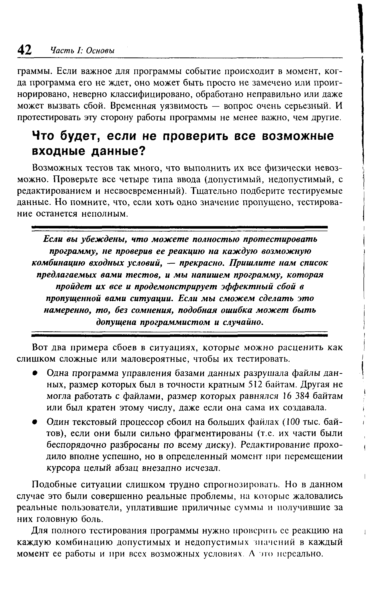

Подобные ситуации слишком трудно спрогнозировать. Но в данном случае это были совершенно реальные проблемы, на которые жаловались реальные пользователи, уплатившие приличные суммы и получившие за них головную боль.

Для полного тестирования программы нужно проверить ее реакцию на каждую комбинацию допустимых и недопустимых значений в каждый момент ее работы и при всех возможных условиях. А это нереально.

## Нельзя проверить каждую возможную последовательность выполнения команд программы

При каждом сеансе работы программы можно отследить последовательность выполнения ее операторов от запуска до завершения. Последовательности могут отличаться фрагментами кода или их порядком. Для примера давайте снова обратимся к программе из первой главы. Ее можно запустить и немедленно остановить нажатием `<Ctrl+C>` — это первый путь. Можно запустить программу, ввести два числа, посмотреть на сумму и только после этого нажать `<Ctrl+C>` — вот вам второй путь. В третий раз можно ввести цифру, а затем нажать `<BackSpace>`.

Чтобы проиллюстрировать проблему, приведем очень упрощенный пример. Представьте систему, у которой есть всего несколько состояний и вариантов перехода между ними, но которую, тем не менее, очень сложно протестировать. Пример этот основан на ошибке, выявленной при тестировании работы реальной программы.

* Система запускается в состоянии 1. Это ее основное состояние, и она возвращается в него при каждой возможности.
* Из состояния 1 она всегда переходит в состояние 2.
* Из состояния 2 она может перейти в состояние 3 или 5.
* Из состояния 3 она может перейти в состояние 4 или 5.
* Из состояния 4 она может перейти в состояние 3, 5 или 6.
* Из состояния 5 она может перейти в состояние 1, 4 или 6.
* Из состояния 6 она может перейти в состояние 3 или 5.

Всего шесть состояний — ну что тут тестировать? Но так кажется лишь на первый взгляд. На деле же команда тестирования обнаружила, что, если система, прежде чем добраться до состояния 6, тридцать раз перейдет из состояния 4 в состояние 5, произойдет сбой. Как вы думаете, сколько для нахождения этой ошибки понадобится поверить различных последовательностей выполнения, если не предположить ее существование заранее?

Ошибка эта была найдена в телефонной системе PBX. В состоянии 1 телефон молчит. Когда телефон звонит (состояние 2), то либо его владелец поднимает трубку (состояние 3 — соединение), либо звонящий вешает трубку (состояние 5 — отключение). Ответив на звонок, владелец телефона может нажать кнопку Hold (состояние 4) или повесить трубку (состояние 5). Пока звонящий ждет у телефона (или повесит трубку), владелец может ответить на другой звонок (состояние 6 — ожидание переключения на ждущую линию). Когда владелец повесит трубку, прекратив и текущий, и ожидающий разговоры, телефон вернется в состояние 1.

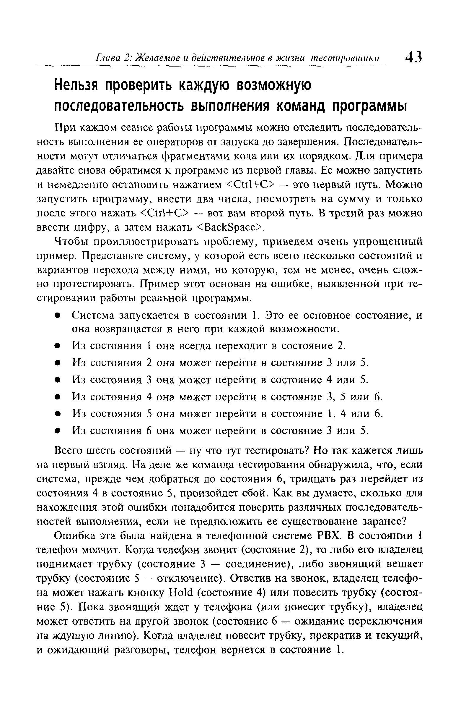

Телефон у оператора РВХ часто бывает занят, и оператор очень часто пользуется кнопкой удерживания линии Hold. Когда оператор нажимает кнопку Hold, компьютер помещает некоторую информацию во временное хранилище, называемое стеком. При возвращении к отложенному разговору компьютер удаляет эту информацию из стека. Когда оператор вешает трубку и телефон возвращается в пассивное состояние, программа очищает весь стек на случай, если одна из подпрограмм забыла стереть свои данные.

Когда звонивший по ожидающей линии вешает трубку, данные о звонке остаются в стеке. Если оператор повесит трубку до того, как повесят трубку тридцать звонивших, все будет в порядке. Но если тридцатый человек повесит трубку, когда оператор будет продолжать говорить, стек переполнится и телефон оператора выйдет из строя.

Большинство программ несравнимо сложнее этого примера со стеком и шестью состояниями. И когда мы говорим, что невозможно проследить все пути выполнения программного кода, — это лишь одно из многих "невозможно" в работе специалиста по тестированию. Поэтому профессионалы тестирования полагаются на эвристические стратегии, которые позволяют не наверняка, но зато с наибольшей вероятностью локализовать и выявить ошибки программы, и в первую очередь наиболее существенные.

Какое огромное количество путей выполнения существует в любой, даже самой простенькой программе, продемонстрировал в 1976 году Майерс (Myers). Он описал программу из сотни строк, допускавшую $10^{18}$ возможных путей выполнения. Для сравнения он заметил, что наша вселенная существует меньше времени — $4 \cdot 10^{17}$ секунд.

> *В 1979 году Майерс описал еще более простую программу. В ней был цикл и несколько операторов IF. В большинстве языков программирования для ее реализации понадобилось бы не больше 20 строк кода. Путей выполнения у этой программы 100 триллионов. Самому быстрому тестировщику понадобится для их проверки миллион лет.*

Программы Майерса просты. Да, они были специально составлены таким образом, чтобы допускать множество последовательностей выполнения, но, если для программы из двух десятков строк возможны 100 триллионов путей, сколько же их возможно для текстового редактора из 5 тыс. строк, простой электронной таблицы из 20 тыс. строк или настольной издательской системы из 400 тыс. строк? Слишком много. И не только для тестировщика, но даже для автоматизирующей его работу программы.

Очень важно понимать, что, как и в случае со входными данными, программа не будет протестирована полностью, если не будет проверен

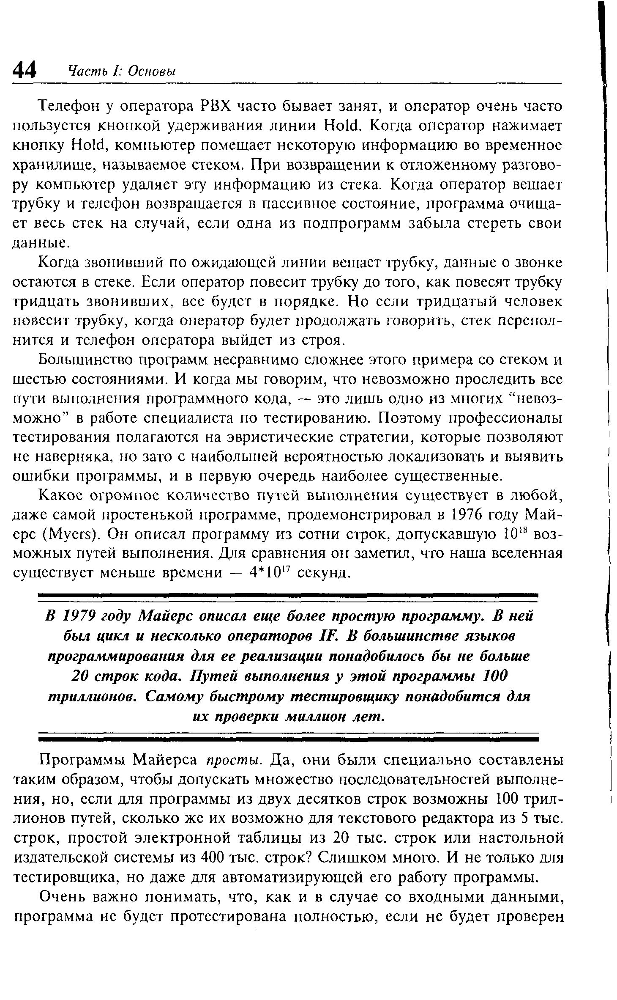

каждый возможный путь ее выполнения. Любой пропущенный вами путь останется потенциальным источником проблем.

Для серьезного тестирования путей выполнения программы необходимо проанализировать ее листинг. Не заглянув в код, вы не получите реального представления о ходе ее работы. Сколько бы вы ни работали с программой извне, всегда останется вероятность пропустить огромные фрагменты кода, которые останутся ни разу не выполненными просто потому, что вы даже не подозреваете об их существовании и не знаете, в какой ситуации они выполняются.

Вот еще одно интересное обстоятельство. Предположим, что за определенное вполне реальное время программу можно протестировать полностью. Решило бы это проблему? Отнюдь. В процессе тестирования обнаруживаются ошибки. После их исправления программу снова приходится полностью тестировать. Обнаруживаются новые ошибки. Цикл повторяется. Он может повториться раз десять, пока программа будет наконец готова к продаже.

> *Если вы полагаете, что можете полностью протестировать программу один раз — прекрасно. Но что вы думаете о возможности повторения этой процедуры десять раз? Двадцать? Тридцать?*

### Невозможно выявить все ошибки проектирования

Программа соответствует спецификации, если она в точности делает то, что указано в спецификации, и больше ничего. Некоторые люди полагают, что если программа соответствует спецификации, значит она правильная. Но что, если в спецификации сказано, что $2 + 2$ должно равняться 5? Что будет для программы ошибкой — точное соответствие неверной спецификации или отклонение от нее?

Как и все остальные произведения рук человеческих, спецификации часто содержат ошибки. Одни из них случайны ($2 + 2 = 5$), другие же являются результатами заблуждений проектировщиков. Именно с ошибками проектирования связаны очень многие недостатки пользовательского интерфейса. Но ошибка есть ошибка — и пользователю все равно, на какой стадии разработки она допущена. Поэтому, если программа разработана на по неверной спецификации, мы говорим, что она неверна.

Как и любые другие проблемы, все ошибки пользовательского интерфейса выявить невозможно. Мы не знаем никого, кто утверждал бы, что может это сделать. И это еще одна из причин несостоятельности идеи о полном тестировании программ.

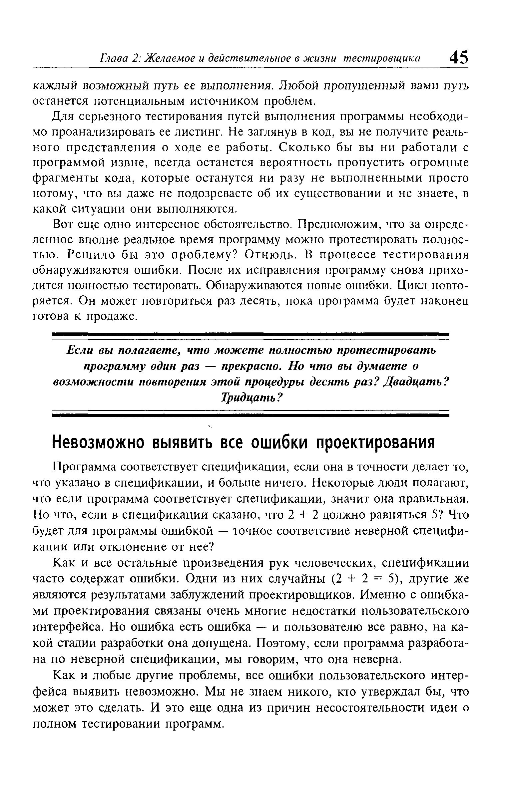

## Правильность программы нельзя доказать логически

Основой работы компьютера является логика. Программы пишутся на очень точных языках. Проанализировав логику программы, можно определить ее состояние в любой точке кода и в любой момент времени.

Конечно, сразу встанут проблемы времени и количества всевозможных условий. Но даже если их не учитывать — что именно можно проверить, анализируя программный код? Только соответствие программы спецификации, но никак не правильность самой спецификации.

И еще одно. Доказательства — они ведь тоже строятся человеком, а значит, могут содержать ошибки и упущения. Где гарантия, что логика того, кто анализирует программу, точнее логики ее автора?

Итак, мы описали уже целый ряд проблем. На самом деле их еще больше. Времени всегда слишком мало, а необходимой работы — слишком много.

Если вопрос выполнимости полного тестирования вас заинтересовал, обратитесь к работам Бейзера (Beizer, 1984) и Данна (Dunn, 1984).

## Цель тестировщика — проверка правильности программы?

Тестирование часто определяют как процесс проверки правильности работы программы.

* *Это определение бессмысленно*: невозможно так проверить программу, чтобы сделать заключение, что она работает правильно.
* *Кроме того, оно ошибочно*: программа не работает абсолютно правильно.
* *Оно заранее предполагает неудачу*: если цель тестировщика — показать, что программа работает правильно, то он терпит неудачу каждый раз, когда находит ошибку.
* *Опираясь на него, тестировщик действует неэффективно*: если вы заранее настроились на то, что ошибок в программе нет, вероятность их найти значительно уменьшается.

Давайте по очереди разберемся с каждым из этих утверждений.

## Невозможно проверить, что программа работает правильно

Как мы с вами уже выяснили, невозможно полностью протестировать ни одну программу (если только она не абсолютно элементарна). Отсюда

непосредственно вытекает еще одно утверждение: невозможно проверить, что программа работает правильно. Сбой может произойти в любой из миллионов не проверенных вами ситуаций.

### Программа не работает правильно

По примерным оценкам на обнаружение и исправление ошибок тратится от 40 до 80 процентов общей стоимости разработки программного обеспечения. Такие огромные деньги компании платят не за то, чтобы убедиться, что программы работают. Они вынуждены тратить деньги потому, что их программы *не работают* — в них есть ошибки, и владельцы компаний хотят, чтобы эти ошибки были исправлены. Как бы грамотно, по самым современным методикам, ни была организована разработка, ошибки остаются всегда.

### Сколько в программе ошибок?

По оценкам Бейзера (Beizer), сделанным им в 1990 году, передаваемые на тестирование программы в среднем содержат от 1 до 3 ошибок на каждые 100 исполняемых операторов. И хотя есть очень талантливые программисты, у которых ошибок мало, все же совсем без ошибок не работает никто.

### Текущие ошибки

От 1 до 3 ошибок на 100 строк кода в программе остается тогда, когда программист сдает работу тестировщику, утверждая, что она проверена и ошибок в ней нет. Но сам Бейзер приводил количество ошибок, допускаемых им в ходе проектирования и написания программы, — *1,5 ошибок на 1 исполняемый оператор*. Сюда он включил все ошибки, в том числе и опечатки.

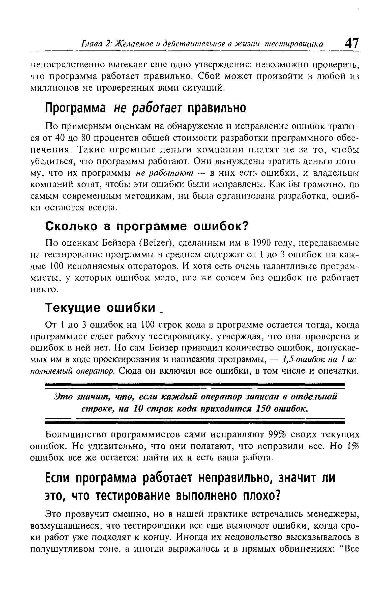

Большинство программистов сами исправляют 99% своих текущих ошибок. Не удивительно, что они полагают, что исправили все. Но 1% ошибок все же остается: найти их и есть ваша работа.

### Если программа работает неправильно, значит ли это, что тестирование выполнено плохо?

Это прозвучит смешно, но в нашей практике встречались менеджеры, возмущавшиеся, что тестировщики все еще выявляют ошибки, когда сроки работ уже подходят к концу. Иногда их недовольство высказывалось в полушутливом тоне, а иногда выражалось и в прямых обвинениях: «Все


<!-- ВІДНОВЛЕНО ЛОКАЛЬНО (Стор. 47) -->

<!-- КІНЕЦЬ ВІДНОВЛЕННЯ -->


<!-- ВІДНОВЛЕНО ЛОКАЛЬНО (Стор. 48) -->

<!-- КІНЕЦЬ ВІДНОВЛЕННЯ -->


<!-- ВІДНОВЛЕНО ЛОКАЛЬНО (Стор. 49) -->

<!-- КІНЕЦЬ ВІДНОВЛЕННЯ -->


К некоторым темам этой главы мы больше возвращаться не будем. Поэтому, если вы хотите выглядеть перед коллегами профессионально достаточно грамотными, изучите ее как можно внимательнее.

4. *Библиографические справки.* Вопросам тестирования и разработки программного обеспечения посвящено много полезных книг. Чтобы помочь вам как можно лучше разобраться в каждом рассматриваемом вопросе, мы часто ссылаемся на такие издания. И в этой главе таких ссылок особенно много.

Обычно писатели включают в свои книги библиографические ссылки для того, чтобы читатель мог познакомиться с альтернативным мнением, или для того, чтобы продемонстрировать свою толерантность к чужим взглядам на вещи. Мы же пользуемся ссылками еще и для того, чтобы читатель мог углубить и расширить свои знания. Мы упоминаем только те издания, которые нравятся нам самим и кажутся полезными для изучения вопроса. Поэтому в одних разделах ссылок на дополнительную литературу много, а в других — совсем мало.

Многие вопросы, освещенные в этой главе лишь концептуально, в следующих главах будут дополнены техническими подробностями, а потом снова будет сделан их обзор, но уже на более глобальном уровне (в главах 12 и 13). В главе 13 мы от начала до конца проанализируем весь процесс разработки программного обеспечения. На этот раз мы будем исходить из предположения, что основы вам уже хорошо знакомы, и сделаем упор на стратегические вопросы: как при ограниченных сроках и бюджете так организовать работы, чтобы максимально улучшить качество программного продукта.

### Замечание

Материал этой главы изложен так, чтобы охватить как можно больше вопросов, не вдаваясь в подробности. Некоторым читателям она покажется перегруженной новыми терминами и понятиями, а другим — самой скучной во всей книге. Те читатели, которые не осилили книгу до конца, говорили нам, что остановились именно здесь.

Позвольте предложить вам несколько советов.

* Прежде всего, не стоит беспокоиться, если вы не до конца поймете разницу между некоторыми терминами из области разработки программного обеспечения. Вам не нужно вникать во все детали работы программистов, просто познакомьтесь с их терминологией, чтобы в дальнейшем вы смогли расспрашивать их о внутренней структуре программ и понимать их ответы.
* Отнеситесь к этой главе как к ознакомительному обзору. Не вникая во все детали, постарайтесь получить общее представление о процессе разработки программного обеспечения и его тестирования и отмечайте для себя в уме самые важные моменты. В дальнейшем вы еще не раз будете возвращаться к этой главе за справками или уточнениями. Имея это в виду, мы постарались структурировать ее материал самым тщательным образом, так что она даже напоминает справочник — в ней легко найти нужную информацию, даже если при первом прочтении вы ее пропустили вовсе.

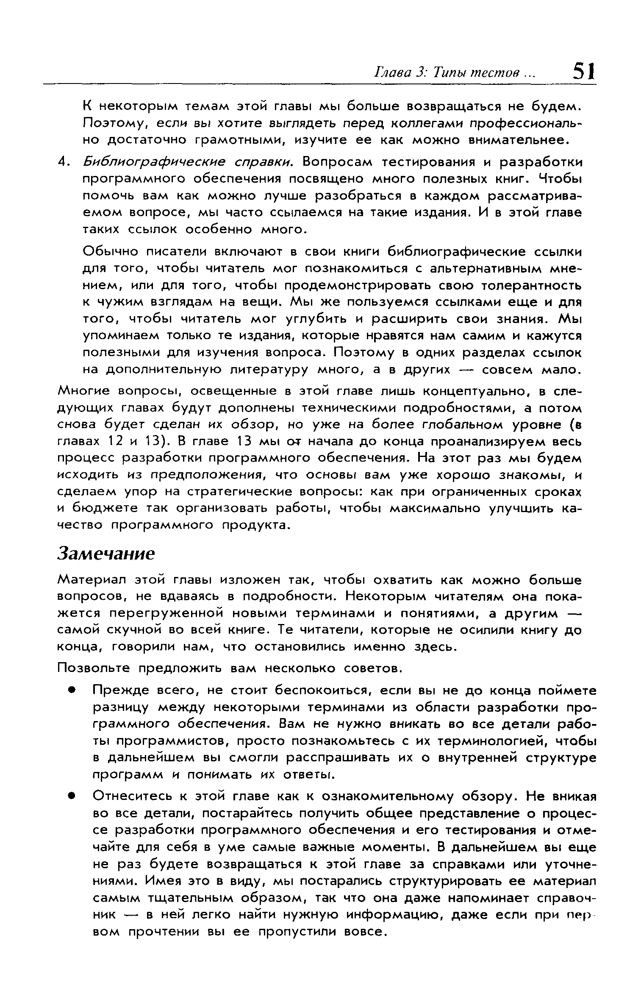


<!-- ВІДНОВЛЕНО ЛОКАЛЬНО (Стор. 51) -->

<!-- КІНЕЦЬ ВІДНОВЛЕННЯ -->


Разработчик архитектуры (*architect*) определяет общую внутреннюю структуру кода и данных, принципы обмена данными между связанными программами и их совместного использования, а также стратегию разработки совместно и повторно используемых модулей. Разработчик архитектуры может также составлять план тестирования “стеклянного ящика” на самом верхнем уровне, анализировать технические обзоры всех спецификаций и разрабатывать тесты для приемки продукта (проверяющие соответствие кода техническим требованиям).

Специалист по анализу предметной области (*subject matter expert* или *software analyst*) должен понимать, чего хотят пользователи и как это выразить в терминах, понятных программисту или другому разработчику.

Специалист по анализу человеческого фактора, или специалист по эргономике (*human factor analyst* или *ergonomist*), имеет психологическое образование и знает, как спроектировать программу, чтобы она была полезной и удобной, и как тестировать продукт (или его прототип) на соответствие этим качествам. Некоторые из специалистов настолько хорошо разбираются в вопросах проектирования и программирования, что могут непосредственно разрабатывать пользовательский интерфейс программ. Впрочем, таких специалистов гораздо меньше, чем считающих себя таковыми. Остальные же принимают участие в разработке пользовательского интерфейса совместно с программистами.

Программист пользовательского интерфейса (*user interface programmer*) специализируется на создании пользовательского интерфейса программ. Обычно это профессиональный программист, который разбирается в оконной архитектуре и компьютерной графике, а в идеальном варианте еще и обладает знаниями в области когнитивной философии.

Пользовательский интерфейс — это, по сути, часть программы, предоставляющая пользователю информацию (в виде графики, текста, звука, в печатном виде и т.п.) и получающая от него ответные данные (через клавиатуру, мышь и другие устройства ввода), которые затем передаются для обработки основной программе. Эту часть программы часто называют слоем представления и получения данных. Именно ее и пишет программист пользовательского интерфейса.

В более широком смысле понятие пользовательского интерфейса включает также *содержание* информации, которой пользова-

тель обменивается с программой. Например, разработчик пользовательского интерфейса решает, какие опции нужно предоставить пользователю, как понятно их описать и в каком виде отобразить. Хотя многие программисты считают, что могут проектировать пользовательский интерфейс так же хорошо, как и реализовывать, на самом деле большинство из них нуждается в сотрудничестве со специалистом по эргономике.

Ведущие программисты (*lead programmers*) часто занимаются разработкой той части спецификации (технического задания), которая относится к внутренней структуре продукта. Во многих командах, строящих работу по принципу консенсуса, программисты разрабатывают архитектуру продукта сами.

* Менеджер по маркетингу (*product manager* или *product marketing manager*) отвечает за соответствие продукта долгосрочной стратегии и имиджу своей компании, а также за маркетинговую деятельность, продолжающуюся после выпуска продукта (рекламу, выпуск и распространение новых версий, обучение продавцов и дилеров). В большинстве компаний менеджер по маркетингу отвечает также и за рентабельность продукта. Он определяет требования рынка, а также те функции и возможности, от которых зависит его конкурентоспособность. В определении набора функций продукта и оборудования, с которым он должен быть совместим, менеджер по маркетингу также играет самую активную роль.
* Представитель группы технической поддержки (*technical support*) — это член или руководитель группы, непосредственно контактирующий с пользователями. Сотрудники этой группы анализируют жалобы пользователей, отвечают на их вопросы и предоставляют им необходимую информацию. На этапе создания продукта они участвуют в проектировании программы и разработке документации, стараясь сделать ее как можно понятнее и минимизировать количество звонков, на которые им потом придется отвечать.
* Технические писатели (*writers*) — это члены группы документирования (*documentation group*), разрабатывающие руководство пользователя и интерактивную справку. Их советы часто помогают сделать программу более простой и понятной.
* Тестировщики (*testers*) также считаются членами команды разработчиков.
* В разработке специфических проектов принимают участие и другие специалисты: по компьютерной графике, надежности, защите, аппаратному обеспечению, а также юристы, бухгалтера и т.д.

Ну а теперь, познакомившись с основными исполнителями, давайте перейдем к обзору самого процесса.

# Обзор стадий разработки

Процесс разработки программного продукта можно разделить на несколько стадий. Сначала его придумывают, затем создают, анализируют результат, устраняют его недостатки, затем продукт попадает к пользователям, которые его эксплуатируют, а сотрудники отдела маркетинга компании анализируют пользовательский спрос. Когда продукт займет свое место на рынке, разработчики придумывают, как его усовершенствовать, вносят изменения и т.д. Могут быть выпущены десятки новых версий, после чего продукт наконец устареет и будет заменен принципиально новым. Весь этот нелегкий жизненный путь продукта, начиная от появления у авторов самой первой идеи и заканчивая его уходом со сцены, мы называем *жизненным циклом (life cycle)*.

В жизненном цикле продукта множество этапов. Обычно их описывают последовательно, как если бы они шли строго друг за другом — заканчивается один и начинается другой, — но на самом деле они в значительной степени перекрываются. Мы тоже опишем эти этапы последовательно, а о том, как они пересекаются, расскажем несколько позже — в главах 12 и 13.

Вот пять основных этапов жизненного цикла программного продукта.

* Планирование
* Проектирование
* Кодирование и написание документации
* Тестирование и исправление недостатков
* Сопровождение (после выпуска) и усовершенствование

В своей книге *Software Maintenance (Сопровождение программного обеспечения)* Мартин и Мак-Клер (Martin & mcClure, 1983, стр. 24) привели относительную стоимость каждой их этих стадий. Вот эти цифры.

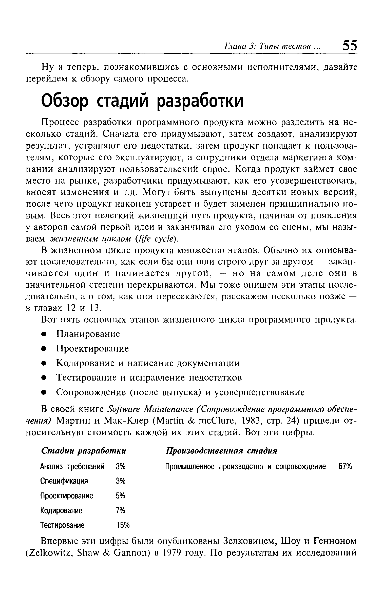

Впервые эти цифры были опубликованы Зелковицем, Шоу и Генноном (Zelkowitz, Shaw & Gannon) в 1979 году. По результатам их исследований

и данным Мартина и Мак-Клера, сопровождение программного продукта после его выпуска обходится дороже всего. На втором месте по стоимости стоит тестирование — на него приходится 45% всей стоимости разработки. В процессе сопровождения продукта при исправлении ошибок и внесении усовершенствований значительная часть затрат тоже приходится на тестирование.

Продукт тестируют и исправляют практически на каждом этапе его жизненного цикла. При этом чем дальше продвигается работа, тем быстрее растет стоимость тестирования.

* На этапе разработки технических требований стоимость внесения изменений в документацию относительно невысока. Но после написания кода ситуация резко меняется: любое изменение проектной документации влечет за собой затраты и на переработку кода, часто гораздо более значительную, чем может показаться при оценке количества изменений в спецификации.
* Когда программист сам находит свою ошибку и сам ее исправляет, это не влечет больших затрат. Ему не нужно взаимодействовать с другими сотрудниками, не нужно ничего никому объяснять. Ему незачем вносить описание ошибок в общую базу данных, служащую для контроля за их исправлением, а тестировщикам и руководителю не нужно осуществлять этот контроль. Такая ошибка никого не задерживает и не мешает ничьей работе.
* До выпуска программы ошибку исправить гораздо дешевле, чем после того, когда "заплатку" или новую версию приходится высылать каждому пользователю — и это еще в лучшем случае, ведь может потребоваться и непосредственный выезд сотрудника компании к заказчику.

В 1976 г. Боэм (Boehm) опубликовал итоговые данные анализа затрат на тестирование программных продуктов, проведенного в компаниях IBM, GTE и TRW. Из них следует, что чем позднее обнаруживается ошибка, тем дороже обходится ее исправление. Как показано на рис. 3.1, стоимость исправления ошибок растет экспоненциально: легче всего это делать на стадии планирования, а по мере перехода к проектированию, кодированию, тестированию и сопровождению она значительно увеличивается.


**РИСУНОК 3.1.** *Стоимость поиска и исправления ошибок в программном обеспечении*

Разработка программного обеспечения для американских воздушных сил обошлась (для одного компьютера) в \$75 в пересчете на одну программную инструкцию, а его сопровождение стоило уже \$4 тыс. на инструкцию.

> ***Чем раньше найти и исправить ошибку, тем дешевле это обойдется.***

Подробное обсуждение стадий разработки программного обеспечения можно найти в работах Де Грейса и Стала (DeGrace & Stahl, 1990), Майерса (Myers, 1976) и Роутзейма (Roetzheim, 1991). А детальный анализ стоимости разработки приводили Боэм (Boehm, 1981), Джонс (Jones, 1991) и Волвертон (Wolverton, 1974).

## Стадии планирования

В команде планирования программного продукта должны быть ведущие инженеры, персонал, отвечающий за маркетинг и продажи, и руководители проекта. Эта команда вырабатывает общие характеристики продукта. В результате ее работы на свет появляется всего несколько документов, определяющих дальнейшую разработку.

### Определение целей

Планирование начинается с формирования общего видения продукта. Составляемый при этом документ не отличается детальностью. В нем может быть описан пользовательский интерфейс, требования к надежности программного продукта и его производительности. В этом же документе определяется предполагаемая стоимость продукта и затраты на его разработку. Он разрабатывается прежде всего для того, чтобы поставить перед командой разработчиков конкретную цель. При этом конечный результат может не соответствовать первоначальному описанию.

### Анализ требований

Требования к программному продукту, вырабатываемые на этом этапе, должны быть выполнены *обязательно*. Они носят функциональный характер, а как реализовать их практически — это уже решают разработчики. Перечень требований может охватывать стоимость будущего продукта, его производительность, надежность, а также некоторые элементы пользовательского интерфейса. То, насколько подробно все это описывается, зависит от специфики разработки.

В требования к программному продукту или другие документы, вырабатываемые на ранних стадиях планирования, включаются также и требования к аппаратному обеспечению. Чтобы не усложнять материал, в этой

главе мы не будем касаться таких специфических вопросов, как одновременная разработка аппаратного и программного обеспечения или периодическое повышение требований к аппаратному обеспечению в соответствии с ее развитием. Будем исходить из предположения, что типы аппаратных средств, на которые ориентирован программный продукт, известны с самого начала разработки.

## Определение функциональных характеристик программного продукта

Определение функциональных характеристик можно представить как мост между требованиями к программному продукту и будущими инженерно-проектными документами. Требования к продукту связаны прежде всего с маркетингом и важны именно для этого отдела. Инженеру же нужно нечто более определенное, полное и конкретное. Это “нечто” и есть функциональные характеристики, среди которых он найдет перечень функций будущего программного продукта и описание входных и выходных документов. Способов реализаций этих функций данный документ не касается, только в самых необходимых случаях, когда это поможет понять документ, в нем может быть в общих чертах описана возможная реализация, но конечная внутренняя и внешняя структура продукта, скорее всего, окажется совсем иной.

Прекрасной моделью для разработки функциональных характеристик может быть документ *IEEE Software Requirements Specification* (руководство IEEE по определению требований к программному обеспечению, стандарт ANSI/IEEE 830-1984).

## Тестирование на этапе планирования

На этом этапе пока еще тестируются не программы — “тестируются” идеи. К их анализу привлекаются специалисты по маркетингу, руководители проекта, главные конструкторы и специалисты по анализу человеческого фактора. А вот члены группы тестирования участвуют в этой работе очень редко. (В главе 13 рассказывается о том, какую полезную работу могут выполнять специалисты по тестированию на этапе планирования продукта.)

Группа аналитиков читает черновики проектных документов. Затем она собирает информацию, которая может оказать помощь в их оценке и дальнейшем планировании. Для этого существует несколько стандартных способов: сравнительный анализ, дискуссионные группы и обследование объекта. Результаты каждой из этих процедур могут привести к значительному пересмотру существующих планов.

При анализе и оценке требований к продукту и его функциональных характеристик специалисты прежде всего пытаются выяснить следующее.

* *Адекватны ли эти требования?* Действительно ли именно такой продукт компания хочет создать?
* *Полны ли они?* Не упущены ли какие-нибудь еще полезные или даже жизненно необходимые функции? Нельзя ли ослабить какие-либо из перечисленных требований?
* *Совместимы ли требования между собой?* Требования к продукту (и его функции) могут оказаться логически или психологически несовместимыми. Логическая несовместимость означает их противоречивость, а психологическая — концептуальные разногласия (разобравшись с одной из функций, пользователь может не понять другую).
* *Выполнимы ли они?* Не требуется ли для нормальной эксплуатации продукта более быстрое аппаратное обеспечение, больший объем памяти, более высокая пропускная способность, большее разрешение (и т.д.), чем указано в документации?
* *Разумны ли они?* К сожалению, качество продукта и его рентабельность стоят по разную сторону баррикад: с одной стороны — производительность продукта, его надежность и нетребовательность к ресурсам, а с другой — время и стоимость его разработки. Найдено ли самое оптимальное соответствие между всеми этими характеристиками? Не требуется ли от продукта абсолютная безупречность, молниеносная работа и готовность конкурировать с программным обеспечением, которого еще нет и в проекте, — и все это на компьютерах і286? Отдельные из тих требований вполне достижимы, но не одновременно и не для одного и того же продукта. Поэтому одним из ключевых вопросов планирования является правильная расстановка приоритетов.
* *Поддаются ли они тестированию?* Насколько легко можно будет определить, соответствует ли инженерно-проектная документация требованиям к программному продукту.

Если вам нужно будет выполнить анализ требований к продукту, опирайтесь на перечисленные выше вопросы. О других важных проблемах и соображениях на эту тему можно почитать у Данна (Dunn, 1984), Гауса и Вейнберга (Gause & Weinberg, 1989) и в документе *ANSI/IEEE Standard 830*.

Ну а теперь, выяснив, что прежде всего интересует группу аналитиков, давайте перейдем к более подробно обсуждению методов их работы.

Сравнительный анализ существующих программных продуктов

Чтобы выполнить сравнительный анализ продуктов, специалист выясняет, какие похожие продукты уже имеются на рынке и чем продукт его фирмы будет от них отличаться. Что поможет выиграть в конкурентном соревновании? Какие функции имеющихся продуктов необходимо включить и в свой?

Для такого анализа необходимы или рабочие копии конкурирующих продуктов, или, по крайней мере, их демонстрационные версии или описания, если ничего больше достать не удастся. Составляется перечень их функций, их сильных и слабых сторон и тех характеристик, которые отмечаются в прессе и профессиональных изданиях как достоинства и недостатки этих продуктов. Продукты разделяются по занимаемым ими сегментам рынка или по специфическим назначениям. Затем составляется детальный отчет обо всех конкурирующих продуктах, включая и те, которые только собираются появиться на рынке. В отчет включается четко структурированное описание каждого продукта, и такое же описание составляется для будущего продукта компании. На основании отобранных таким образом данных можно ответить на ключевые вопросы проводимого анализа. Насколько конкурентоспособен разрабатываемый продукт? Почему потенциальные пользователи захотят купить именно его?

Вначале такой анализ ведет к расширению требований к продукту и его функциональных характеристик. Специалисту хочется реализовать в нем все лучшее, что имеется у конкурентов, воплотить в нем сотни почерпнутых им замечательных идей. Но тут наступает самое время вспомнить о здравом смысле. Реализация всех этих идей стоит слишком дорого и не может быть выполнена в реальные сроки. Кроме того, они основаны на различных концепциях и просто не уживутся в одной программе. Но даже если отобрать из них только совместимые с выбранной концепцией, программный продукт, имеющий столько функций (пусть даже самых распрекрасных), будет таким сложным и громоздким, что едва ли кому-нибудь понравится. (За дополнительной информацией по этому вопросу обратитесь к книгам Рубенштейна и Херша (Rubenstein & Hersh, 1984) и Нормана (Norman, 1988)).

Бывает, что специалисты игнорируют проблемы совместимости функций и сложности программного продукта. Они составляют длинный список удачных идей конкурентов. Сам по себе этот список может быть очень полезным, но если рассматривать его как требования к продукту, тогда его нужно очень серьезно сократить. И помогут отобрать самое существенное два следующих метода: дискуссионные группы и обследование объекта.

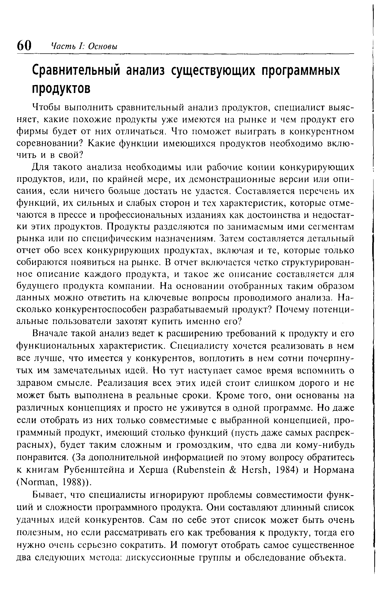

## Дискуссионные группы

Каждый продукт предназначается для определенного сегмента рынка. Целью данного метода анализа является определение ключевых требований этого сегмента.

Для этого аналитик отбирает небольшую группу людей, которые, по его мнению, являются наиболее типичными представителями нужного сегмента рынка. Члены группы не знают друг друга. Аналитик предлагает им обсудить определенную тему. (Тем может быть и несколько, но очень немногого.) Он может направлять дискуссию, задавая наводящие вопросы и концентрируя внимание группы на заданной теме, а может и не участвовать в обсуждении вовсе. Если аналитик не умеет грамотно направлять дискуссию, он может нанять для этого соответствующего специалиста. Его цель — выяснить реакцию рынка на предложенную идею, но ни в коем случае ни в чем не убеждать членов группы.

Такая дискуссия может осветить самые различные аспекты обсуждаемой проблемы. Аналитик может понять, чего пользователи хотят от данного типа продуктов, как они его используют, какие функции для них наиболее важны. Можно сконцентрировать группу и на одной конкретной функции продукта или на одной цели его применения. Можно использовать группу для генерации идей еще до детального планирования, а можно проанализировать ее реакцию на элементы уже готового плана.

## Обследование объекта

Каждый продукт предназначается для полной или частичной автоматизации выполнения некоторой задачи, возможно, очень сложной. Чтобы как можно четче представить себе эту задачу, аналитик выполняет обследование объекта автоматизации. Он наблюдает людей за работой, беседует с ними, пытается выявить все, в чем продукт может помочь своим будущим пользователям. Аналитик спрашивает себя, в чем же конкретно состоит изучаемая им задача. Как люди выполняют ее без проектируемого продукта? Какова последовательность их действий? Почему она именно такая? В какой момент работнику нужна каждая конкретная информация и для чего? Что особенно сильно замедляет его работу, и почему эта проблема не решена до сих пор? Работа специалиста по обследованию является частью проектирования продукта и жизненно необходима для разработки как его пользовательского интерфейса, так и внутренней структуры.

Хотя обследование объекта может быть выполнено и после определения требований к продукту, по его результатам эти требования могут быть сильно изменены.

Более подробную информацию об анализе задания путем обследования автоматизируемого объекта можно найти в книгах Бейлей (Bailey, 1989).

Карда, Морана и Ньюэлла (Card, Moran & Newell, 1983), Хеландера (Helander, 1991, особенно глава 38), Нормана и Дрейпера (Norman & Draper, 1986, часть IV), Рубенштейна и Херша (Rubenstein & Hersh, 1984). Кроме того, ряд интересных примеров приведен в книге Бейкера и Бакстона (Baecker & Buxton, 1987).

## Стадии проектирования

На этапе проектирования группа соответствующих специалистов решает, как будут реализованы запланированные возможности продукта. Они разрабатывают *внешний дизайн программного продукта* (то, каким будет продукт с точки зрения пользователя) и его *внутреннюю структуру*. Обе эти составляющие тесно взаимосвязаны и проектируются одновременно.

Разрабатывая проект, специалисты опираются на требования к продукту. Если этого документа нет, если он неполoн или постоянно меняется, им приходится планировать функции продукта самим.

По классической модели разработки программного обеспечения кодирование начинается только по завершении проектирования. Это, конечно, не касается прототипа, который создается в рамках проектирования для анализа будущего продукта. Впрочем, на практике довольно значительная часть кода прототипа может оказаться в конечном продукте. На этапе проектирования могут быть написаны и некоторые низкоуровневые процедуры — те, к которым предъявляются наиболее строгие требования по скорости и потреблению ресурсов. Существуют и альтернативные подходы к проектированию, мы поговорим о них в главах 12 и 14.

Хорошими учебниками по проектированию программного обеспечения являются книги Йордана (Yourdon, 1975), Джонса (Jones, 1979) и Майерса (Myers, 1976).

## Внешний дизайн

Описание внешнего дизайна программного продукта включает полное описание его пользовательского интерфейса, в частности, все экранные и печатные формы. Иногда, если работа выполняется под конкретного заказчика, внешний дизайн программного продукта могут определять его пользователи. Они сами пишут часть проектных документов в тех терминах, которые им понятны.

В процессе разработки продукта его внешний дизайн может многократно изменяться, поскольку при кажущейся второстепенности именно эта часть системы имеет ключевое значение. Кого будет интересовать, что программный код продукта безупречен, если какая-то часть интерфейса вызывает у пользователей затруднения, путает их, ведет к ошибкам, раздражает или является недостаточно гибкой и функциональной — не делает

тоого, что, по мнению пользователей, она обязательно должна уметь. Однако работая над внешним дизайном, нужно понимать, что даже в наиболее тщательно продуманной системе в процессе ее эксплуатации все равно обнаружатся некоторые недостатки.

Чтобы лучше познакомиться с вопросом, можно прочесть интересную, несмотря на то что она написана еще в 1973 году, работу Мартина (Martin), более недавнее исследование Хеландера (Helander, 1991), а также классические работы Бейкера и Бакстона (Baecker & Buxton, 1987), Карда, Морана и Ньюэлла (Card, Moran & Newell, 1983) и Рубенштейна и Херша (Rubenstein & Hersh, 1984).

## Внутренняя структура

Описание внутренней структуры программного продукта определяет набор будущих программных модулей *(программную архитектуру)*, структуру, взаимосвязи и принципы хранения и обработки данных *(организацию данных)* и алгоритмы работы программы.

## Проектирование программной архитектуры

Как правило, каждую задачу можно разбить на четкие подзадачи, которые, в свою очередь, тоже можно разбить на еще меньшие элементы и т.д. Такое разбиение, называемое *декомпозицией*, выполняется до тех пор, пока не будут выделены достаточно самостоятельные элементы, которые можно реализовать в виде отдельных программных модулей или процедур.

Обычно сложные программные продукты реализуются в виде *системы* — набора связанных между собой полноценных программ. Такие программы часто называют *процессами*, особенно если они работают параллельно. (Не следует путать это понятие с одноименным термином Windows. — Примеч. ред.) Хотя процессы могут работать и независимо, как правило, они взаимодействуют друг с другом. Например, они могут использовать одни и те же данные, или один из них может выполнять определенные задания по запросу другого.

Документация, определяющая принципы и правила взаимодействия процессов системы, называется *протоколом*. В описании программной архитектуры системы определяются ее основные компоненты и использующиеся для их взаимодействия коммуникационные протоколы.

Как и любые другие программы, процессы поддаются декомпозиции. Разбиение программы на *модули* называют *модульной декомпозицией*. Под модулем в данном случае понимают часть кода, которая может рассматриваться как независимое целое и имеет единственную точку входа. В терминологии программиста этому определению соответствуют *процедуры* и *функции*$^1$. Обычно модуль реализует либо одно конкретное задание, либо четко определенную группу заданий, для выполнения которых другие мо-

дули могут его вызывать. Вызывающий модуль *передает* вызываемому для обработки некоторые данные, а тот, в свою очередь, *возвращает* результат.

Хорошим введением в логическое и структурное проектирование может служить книга Йордана (Yourdon, 1975). После нее можно прочесть книгу Йордана и Константайна (Yourdon & Constantine, 1979).

## Проектирование организации данных

Разработчик структуры данных должен ответить на следующие принципиальные вопросы.

* *Какие данные обрабатывает программа и какова их структура?* Обрабатываемые программой данные могут быть достаточно простыми, как переменные различных типов, а могут представлять собой огромные массивы взаимосвязанной информации, которые тщательно анализируются и организуются в реляционные базы данных.
* *Как осуществляется доступ к данным?* Данные могут храниться в памяти или на постоянных носителях, и доступ к ним может осуществляться просто по имени или через определенные специально для этого написанные функции. Данные могут быть общедоступными, или же их чтение и изменение может строго регулироваться.
* *Каковы принципы наименования данных?* Применяются ли в данной разработке определенные соглашения об именах? Должны ли имена быть достаточно понятными, чтобы программист, который будет осуществлять сопровождение продукта в дальнейшем, мог по ним понять назначение данных.
* *Как хранятся данные?* Определенные данные будут храниться на постоянном носителе. В каком формате они будут храниться? Как к ним будет осуществляться доступ? Какие для этого понадобятся дополнительные программные средства?

Из рассказа о проектировании программной архитектуры неявно следовало, что программный продукт прежде всего анализируется с точки зрения его функций, а уже затем — обрабатываемых данных. На самом же деле код и данные представляют собой единое целое. Например, модули, обращающиеся к одним и тем же данным, оказываются связанными самым тесным образом, даже если они выполняют над этими данными совершенно разные операции. Если структура данных меняется, все обращающиеся к ним модули приходится переписывать.

Вот почему очень полезно строить концепцию программы с позиции обрабатываемых ею данных. С этой точки зрения программа — это нечто, что последовательно преобразует данные, от входной информации через ряд промежуточных стадий до выходной информации, которая может,

например, представлять собой сгенерированный по запросу пользователя отчет. Модули же рассматриваются как функциональные элементы, необходимые для различных операций, выполняемых над данными: один модуль нужен для ввода информации, другой выполнит над ней конкретные вычисления, а третий выведет результат. Таким образом, модули могут характеризоваться входными и выходными данными и возникать по мере потребности в их преобразовании. При таком анализе выявляются те связи между программными единицами, которые при изучении продукта только с функциональной точки зрения могли бы быть утеряны.

Сравнительный анализ различных методологий проектирования можно найти у Бергланда (Bergland, 1981). О разработке структур данных рассказывается в книгах Гейна и Сарсона (Gane & Sarson, 1979) и Йордана и Константайна (Yourdon & Constantine, 1979). А об ориентированном на данные подходе к тестированию можно прочесть у Бейзера (Beizer, 1990).

## Описание алгоритмов

Проектирование программного продукта не заканчивается описанием программных модулей и организации данных. Нужно еще продумать, как именно будут реализовываться поставленные задачи. Обычно это делается программистами. Они выбирают оптимальные алгоритмы и описывают (иногда довольно подробно) последовательность логических шагов, необходимых для выполнения каждой задачи.

Хорошим учебником по преобразованию высокоуровневых задач в программный код может служить книга Йордана (Yourdon, 1975).

## Моделирование

Чтобы лучше представить себе будущий программный продукт, на этапе проектирования может быть разработан его прототип — программная модель всего продукта или его части. Прототип строится очень быстро и с минимумом затрат. Его очень легко менять, и он *не* выполняет никакой реальной работы.

Иногда моделирование выполняется не только для внешнего дизайна, но и для внутренней структуры системы. При нисходящем проектировании система разбивается на несколько самостоятельных процессов или модулей, они, в свою очередь, разбиваются на меньшие модули и т.д. В том же порядке выполняется и их кодирование: сначала пишутся модули более высокого уровня, а затем те, которые они вызывают. Однако бывает и так, что подпрограммы нижних уровней в значительной мере определяют всю разработку. Например, системе может потребоваться низкоуровневый обработчик прерывания, вся работа которого выполняется за 60 микросекунд. Этот обработчик разумнее всего будет написать заранее, чтобы убедиться, что это вообще возможно. В случае неудачи другие модули придется перепроектировать.

Как правило, прототип создается для оценки функциональности будущей системы и ее пользовательского интерфейса. Это исключительно полезная технология: когда люди получают возможность собственноручно поэкспериментировать с системой или ее прототипом, их требования значительно изменяются. Идеи, которые в спецификации казались просто блестящими, в работающей модели могут утратить всю свою привлекательность. (Мартин и Мак-Клер (Martin & mcClure, 1983), Вассерман и Шьюмейк (Wasserman & Shewmake, 1985)).

Мартин и Мак-Клер настоятельно рекомендуют писать прототипы на том же языке, на котором будет реализован конечный продукт: если прототип окажется удачным, то конечный продукт может разрабатываться прямо на его основе. Однако, на наш взгляд, так поступать не стоит, и вот почему.

* Многие языки или системы разработки не подходят для создания быстрого и дешевого прототипа.
* Хороший совет дали в своих книгах Брукс (Brooks, 1975) и Керниган и Плугер (Kernigan & Plauger, 1974). Они рекомендуют отложить первый черновик программы и начать ее разработку с чистого листа. Особенно это касается прототипа. Ведь от него не требуется хорошая внутренняя организация. Он может работать медленно и неэффективно, а то и вообще неправильно. Согласитесь, что такая программа не лучшая основа для хорошей разработки. Да и разработчики прототипа будут чувствовать себя гораздо свободнее, если будут думать только о скорости и не беспокоиться, что допущенные ими ошибки и неверные решения впоследствии затруднят программирование.

Вопросы моделирования интерфейса, стратегий оценки проекта и технологий его разработки обсуждаются в книгах Де Грейса и Стала (DeGrace & Stahl, 1990), Хеландера (Helander, 1991), Рубенштейна и Херша (Rubenstein & Hersh, 1984), Оулда (Ould, 1990) и Шнейдермана (Schneiderman, 1987).

## Тестирование на этапе проектирования

На этапе проектирования, как и на этапе планирования, кода еще нет, поэтому и здесь тестируются только идеи. Однако на этот раз идеи гораздо лучше формализованы и описаны намного подробнее, чем в первоначальных планах. Анализируя проектные документы, специалисты должны составить очень четкое представление о работе будущей системы. Специалисты по тестированию могут и не участвовать в работе группы аналитиков, однако для планирования системы будущих тестов такое участие очень полезно. (На совещаниях группы аналитиков специалистам по тестирова-

нию лучше всего быть пассивными участниками и высказываться только в случае необходимости.) На этапе проектирования в центре внимания аналитиков должны быть следующие вопросы.

* *Действительно ли проект хорош?* Будет ли на его основе создан эффективный, компактный, хорошо тестируемый и легкий в сопровождении и модернизации продукт?
* *Соответствует ли проект требованиям?* Проект должен быть формализованным выражением требований, представленных в документации этапа планирования.
* *Полон ли проект?* Описывает ли проект все взаимосвязи между модулями и данными, передачу данных между модулями, условия работы каждого модуля и их реализацию.
* *Достаточно ли он реалистичен?* Удовлетворяют ли имеющиеся системные ресурсы (как аппаратные, так и программные) потребностям проекта? Сможет ли программный продукт работать достаточно быстро, достаточно быстро извлекать информацию из баз данных и ее обрабатывать? Удачно ли выбраны инструментальные средства разработчиков?
* *Хорошо ли описана в проекте подсистема обработки ошибок?* При нисходящем проектировании особенно велико искушение оставить вопросы обработки ошибок на потом — как самые незначительные. И когда наступает это “потом”, о подобных элементах часто вообще ще забывают, или же из-за нехватки времени они проектируются наспех, поверхностно и в результате — плохо. Все возможные условия возникновения ошибок должны быть самым тщательным образом продуманы и описаны в проекте. Важно правильно определить уровень, на котором обрабатывается каждая из ошибок, чтобы ее возникновение в одном модуле не вело к ошибкам в других.

О многих возможных ошибках проектирования и критериях оценки проектных документов рассказывается в книгах Данна (Dunn, 1984) и Фридмана и Вейнберга (Freedman & Weinberg, 1982). Об анализе проекта можно также почитать и у Бейзера (Beizer, 1990).

## Совещания аналитиков

Обычно целью совещаний, проводимых при анализе проектных документов, является не решение проблем, а прежде всего их выявление.

В совещании должна участвовать небольшая группа сотрудников — около семи человек. В эту группу не должны входить авторы проекта. Аналитики заранее читают документы и на совещании критикуют их и задают друг другу вопросы. Во многих компаниях проект вообще не счи-

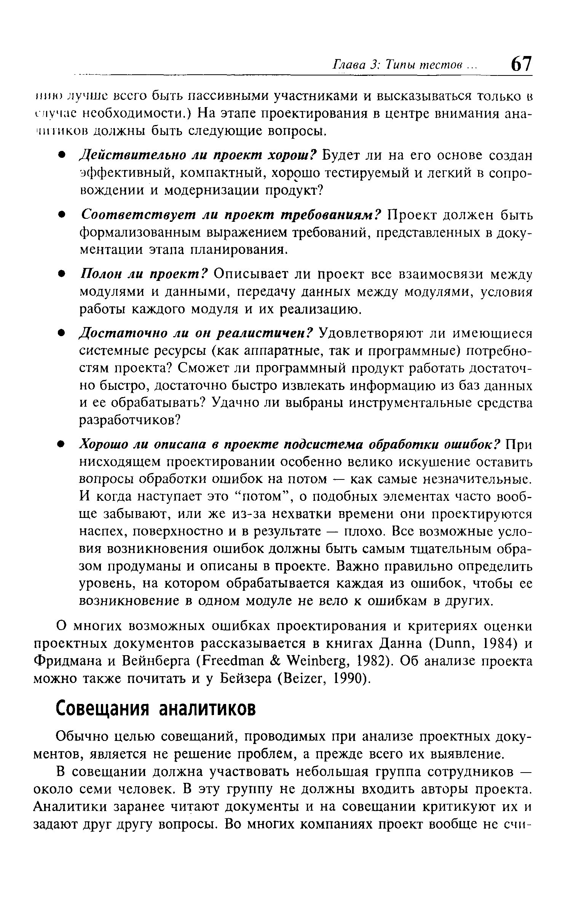

тается завершенным, пока на него не будет составлена формальная рецензия (разумеется, одобрительная). Таким образом, проект перерабатывается и снова анализируется до тех пор, пока он не будет одобрен группой аналитиков. Совещания этой группы могут быть трех типов: обзорные, инспекционные и рецензионные.

* *Обзорное совещание*. На таком совещании проектировщики демонстрируют модель программы. Шаг за шагом они показывают, что делает программа с тестовыми данными, предложенными аналитиками. Такая демонстрация позволяет увидеть, как взаимодействуют между собой различные части системы, и выявить ее недостатки: неудобные режимы, избыточность функций или пропущенные детали.

* *Инспекционное совещание*. На таком совещании специалисты подробно анализируют каждый элемент проекта или его отдельный аспект: обработку ошибок, соответствие ранее выработанным стандартам, эффективность реализации конкретной функции и т.д.

* *Рецензионное совещание*. К этому совещанию аналитики готовят список возникших у них вопросов. Они делятся своими соображениями и выделяют элементы проекта, которые показались им неточными или сомнительными. Цель этого совещания — сформировать список всех выявленных проблем и убедиться, что каждую из них проектировщики правильно поняли. Решение выявленных проблем в задачи совещания не входит.

Идеальное рецензионное совещание должно направляться опытным в этом деле специалистом и обязательно записываться. Такой специалист-организатор находит подходящее помещение, ведет совещание, останавливает говорящих, когда они прерывают друг друга или отклоняются от темы, и готовит итоговый отчет. Он следит за тем, чтобы от обсуждения проблем аналитики не переходили к обсуждению способов их решения. Это будет сделано позднее меньшей группой специалистов и вне рецензионного совещания.

Специальный персонал записывает все важные замечания и с помощью проекторов или другой аналогичной техники выводит их на большой экран, где они видны каждому участнику совещания. Любой, кому покажется, что записывающий упустил нечто важное, может попросить отобразить эту информацию. Обязательно должно фиксироваться каждое достигнутое соглашение. Записаны должны быть и все вопросы, которые остались открытыми до следующего совещания. Такая техника проведения совещаний исключительно способствует их продуктивности, особенно когда мнения аналитиков очень сильно расходятся.

Некоторые группы тестирования специально обучают свой персонал ведению и протоколированию таких совещаний. Это прекрасная идея,

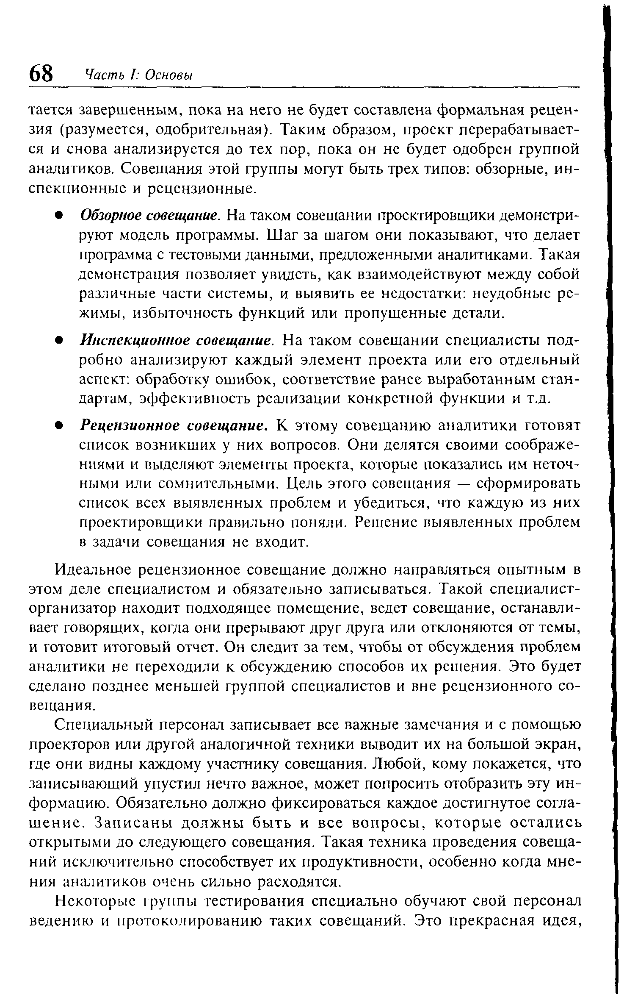

поскольку хороших специалистов в этом деле очень мало. Подробнее о технике проведения совещаний можно узнать из книг Дойла и Страуса (Doyle & Straus, 1976), Фридмана и Вейнберга (Freedman & Weinberg, 1982) и Гауса и Вейнберга (Gause & Weinberg, 1989).

### Анализ псевдокода

Псевдокод (структурированный русский) — это искусственный язык, комбинирующий конструкции реального языка программирования с описаниями действий на русском языке. Например, следующее описание из главы 1 представляет собой псевдокод.

```text
IF ASCII_КОД_ВВЕДЕННОГО_СИМВОЛА меньше 48
(48 — это ASCII-код для 0)
    THEN отвергнуть символ как недопустимый
    ELSE IF ASCII_КОД_ВВЕДЕННОГО_СИМВОЛА больше 57
    (57 — это ASCII-код для 9)
        THEN отвергнуть символ как недопустимый
        ELSE это цифра, принять ее.
```

Когда процесс проектирования подходит к разработке наиболее подробных документов, такая форма описания логики программы оказывается очень удобной и многие проектировщики с удовольствием ею пользуются.

Если для описания программы пользоваться достаточно строго формализованной версией псевдокода, это описание можно будет проанализировать с помощью специальной программы — анализатора псевдокода. Эта программа выявит модули, которые ни разу не вызываются, составит список всех обращений к каждому модулю и выполнит другую полезную работу.

Если в вашей компании принято очень детально проектировать программные средства, обратитесь к работе Данна (Dunn, 1984) — в ней вы найдете описания некоторых полезных инструментальных средств.

## Тестирование "стеклянного ящика" на стадии кодирования

И вот наконец наступает этап кодирования: программист пишет программы и сам их тестирует. Мы предполагаем, что вы знаете, что такое кодирование, и поэтому не описываем его процесс в этой книге.

Зато достойна описания технология тестирования, которая применяется на этом этапе. Эта технология называется *тестированием “стеклянного ящика”* (*glass box*) — иногда ее еще называют *тестированием “белого ящика”* (*white box*) в противоположность классическому понятию “черного ящика” (*black box*).

При тестировании "черного ящика" программа рассматривается как объект, внутренняя структура которого неизвестна. Тестировщик вводит данные и анализирует результат, но, как именно работает программа, он не знает. Подбирая тесты, специалист ищет интересные с его точки зрения входные данные и условия, которые могут привести к нестандартным результатам. Интересны для него прежде всего те представители каждого класса входных данных, на которых с наибольшей вероятностью могут проявиться ошибки тестируемой программы.

При тестировании "стеклянного ящика" ситуация совершенно иная. Тестировщик (как правило, это программист) разрабатывает тесты, основываясь на знании исходного кода, к которому он имеет полный доступ. В результате он получает следующие преимущества:

* *Направленность тестирования*. Программист может тестировать программу по частям, разработать специальные тестовые подпрограммы, которые вызывают тестируемый модуль и передают ему интересующие программиста данные. Отдельный модуль гораздо легче протестировать именно как "стеклянный ящик".
* *Полный охват кода*. Программист всегда может определить, какие именно фрагменты кода работают в каждом тесте. Он видит, какие еще ветви кода остались непротестированными и может подобрать условия, в которых они будут выполнены. В этой и одиннадцатой главе мы еще вернемся к тому, как отслеживать степень охвата программного кода проведенными тестами.
* *Управление потоком*. Программист всегда знает, какая функция должна выполняться в программе следующей и каким должно быть ее текущее состояние. Чтобы выяснить, работает ли программа так, как думает, программист может включить в нее отладочные команды, отображающие информацию о ходе ее выполнения, или воспользоваться для этого специальным программным средством, называемым *отладчиком*. (Отладчик может делать очень много полезных вещей: отслеживать и менять последовательность выполнения команд программы, показывать содержимое ее переменных и их адреса в памяти и многое другое.)
* *Отслеживание целостности данных*. Программисту известно, какая часть программы должна изменять каждый элемент данных. Отслеживая состояние данных (с помощью того же отладчика), он может выявить такие ошибки, как изменение данных не теми модулями, их неверная интерпретация или неудачная организация. Программист может и самостоятельно автоматизировать тестирование. Об автоматизированном тестировании мы еще поговорим с вами в главе 11.

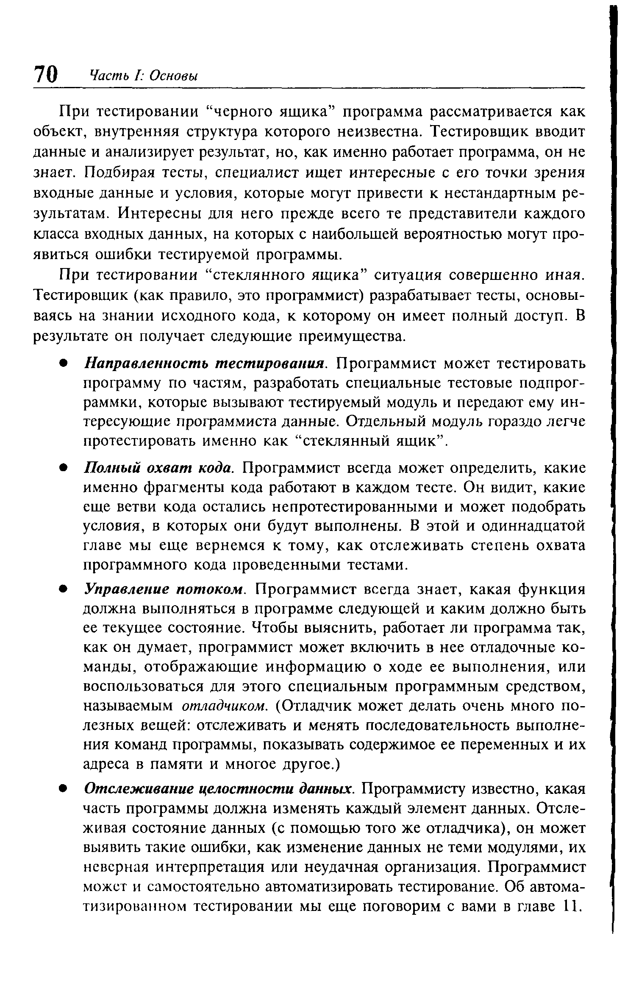


<!-- ВІДНОВЛЕНО ЧЕРЕЗ GEMINI (Стор. 70) -->
* **Внутренние граничные точки.** В исходном коде видны те граничные точки программы, которые скрыты от взгляда “извне”. Например, для выполнения определенного действия может быть использовано несколько совершенно различных алгоритмов, и, не заглянув в код, невозможно определить, какой из них выбрал программист. Еще одним типичным примером может быть проблема переполнения буфера, используемого для временного хранения входных данных. Программист сразу может сказать, при каком количестве данных буфер переполнится, и ему не нужно при этом проводить тысячи тестов.

* **Тестирование, определяемое выбранным алгоритмом.** Для тестирования обработки данных, использующей очень сложные вычислительные алгоритмы, могут понадобиться специальные технологии. В качестве классических примеров можно привести преобразование матрицы и сортировку данных. Тестировщику нужно точно знать, какие алгоритмы используются, и обратиться к специальной литературе.

Тестирование “стеклянного ящика” мы рассматриваем как часть процесса программирования. Программисты выполняют эту работу постоянно, они тестируют каждый модуль после его написания, а затем еще раз после интеграции его в систему. Этому их учат еще в учебных заведениях. В большинстве учебников по тестированию именно этому его виду отводится основная роль.

Однако в этой книге мы уделяем основное внимание тестированию “черного ящика”, и именно ему посвящают большую часть времени все профессиональные тестировщики. (Отдельную и достаточно специфическую область тестирования представляют собой СУБД для мэйнфреймов. Об их тестировании лучше рассказывают такие авторы, как Бейзер (Beizer), Хетзел (Hetzel) и Майерс (Myers).) Тестировщик “черного ящика” не изучает исходный код программы — он исследует ее извне, работая с ней так, как это будет делать пользователь. И так же, как исследование программы изнутри позволяет выявить проблемы и критические точки, которых не видно извне, так и тестировщик “черного ящика” выявляет ошибки и недостатки, которые программист упускает.

К вопросу о выборе метода тестирования мы еще вернемся в главе 12. А в следующих разделах мы поговорим об основных концепциях тестирования “стеклянного ящика”, без знания которых вы не сможете считаться профессионалом в своем деле.
<!-- КІНЕЦЬ ВІДНОВЛЕННЯ -->


<!-- ВІДНОВЛЕНО ЧЕРЕЗ GEMINI (Стор. 71) -->
## Структурное тестирование против функционального

*Структурное тестирование* является одним из видов тестирования “стеклянного ящика”. Его главной идеей является правильный выбор тестируемого программного пути.

В противоположность ему *функциональное тестирование* относится к категории тестирования “черного ящика”. Каждая функция программы тестируется путем ввода ее входных данных и анализа выходных. При этом внутренняя структура программы учитывается очень редко.

Более подробное описание этих двух технологий можно найти у Бейзера (Beizer, 1984).

Как указывает Данн (Dunn, 1984), хотя структурное тестирование и имеет под собой гораздо более мощную теоретическую основу, большинство тестировщиков предпочитают функциональное тестирование. Структурное тестирование лучше поддается математическому моделированию, но это совсем не означает, что оно эффективнее. Каждая из технологий позволяет выявить ошибки, пропускаемые другой, в этом смысле их можно назвать одинаково эффективными.

## Тестирование программных путей: критерии охвата

Мы уже упоминали о путях выполнения программы — последовательностях команд, которые она выполняет от старта до завершения. Объектом тестирования может быть не только полный путь, но и его отдельные участки.

Как уже было сказано в главе 2, протестировать все возможные пути выполнения программы абсолютно нереально. Поэтому специалисты по тестированию выделяют из всех возможных путей те группы, которые нужно протестировать обязательно. Для отбора они пользуются специальными критериями, называемыми *критериями охвата* (coverage criteria). В отличие от нереальной идеи полного тестирования, эти критерии определяют вполне реальное (пусть даже и достаточно большое) количество тестов. Критерии охвата иногда называют *логическими критериями охвата* или *критериями полноты*. В этом разделе мы познакомимся с тремя критериями, которые используются тестировщиками чаще всего: критериями охвата строк, ветвлений и условий. Когда тестирование организовано в соответствии с этими критериями, о нем говорят как о *тестировании путей*.

*Критерий охвата строк* — наиболее слабый из всех. Он требует, чтобы каждая строка кода была выполнена хотя бы один раз. И хотя это гораздо больше, чем утруждают себя выполнить многие программисты, для серьезного тестирования программы этого далеко не достаточно. Если строка содержит оператор принятия решения, проверены должны быть все управляющие решением значения. Для примера давайте рассмотрим следующий фрагмент кода.
<!-- КІНЕЦЬ ВІДНОВЛЕННЯ -->


```text
IF (A < B and C = 5)
THEN Сделать НЕЧТО
SET D = 5
```

Чтобы проверить этот код, нужно проанализировать следующие четыре варианта.

(а) **A < B и C = 5**  
(НЕЧТО выполняется, затем **D** присваивается **5**)  
(б) **А < B и C ≠ 5**  
(НЕЧТО не выполняется, **D** присваивается **5**)  
(в) **A ≥ B и C = 5**  
(НЕЧТО не выполняется, **D** присваивается **5**)  
(г) **A ≥ B и C ≠ 5**  
(НЕЧТО не выполняется, **D** присваивается **5**)  

Для выполнения всех трех строк кода достаточно проверить вариант (а). При более основательном способе тестирования — по критерию *охвата ветвлений* — программист проверяет вариант (а) и еще один из трех остальных вариантов. Смысл этого способа в том, что проверяются действия программы при выполненном условии оператора **IF** и при невыполненном. Таким образом программа проходит не только все строки кода, но и все возможные ветви.

Иногда охват ветвлений называют *полным охватом кода*. Но термин этот некорректен: как показал Бейзер (Beizer, 1984), охват ветвлений не может претендовать на полноту тестирования, поскольку в лучшем случае позволяет обнаружить половину имеющихся в программе ошибок.

Еще более строгим является критерий *охвата условий*. По этому критерию следует проверить все составляющие каждого логического условия. В нашем примере это означает проверку всех четырех перечисленных вариантов.

Тестирование путей программы считается завершенным, когда выбранный критерий охвата полностью выполнен. Для автоматизации этого процесса разработаны программы, анализирующие программный код и вычисляющие количество подлежащих тестированию путей, а затем подсчитывающие, сколько их уже проверено. Такие программы называют *средствами мониторинга охвата (execution coverage monitors)*.

Классически при тестировании путей не поощряется проверка одного и того же пути на различных данных. Хотя варианты (б), (в) и (г) нашего примера могут оказаться важными, большинство средств мониторинга охвата посчитают их проверку пустой тратой времени. Все три начинаются с одного и того же оператора и приводят к выполнению одной и той же последовательности команд — проверять их все означает трижды проверять один и тот же путь.

Хотя критерии охвата очень полезны, одного только тестирования путей недостаточно для эффективного выявления ошибок. Гуденаф и Герхарт


<!-- ВІДНОВЛЕНО ЛОКАЛЬНО (Стор. 73) -->

<!-- КІНЕЦЬ ВІДНОВЛЕННЯ -->


<!-- ВІДНОВЛЕНО ЛОКАЛЬНО (Стор. 74) -->

<!-- КІНЕЦЬ ВІДНОВЛЕННЯ -->


* Процесс тестирования плохо автоматизирован. То, что на первый взгляд кажется преимуществом целостного тестирования — отсутствие необходимости писать оболочки и заглушки, — на самом деле оборачивается его недостатком. В процессе разработки программа ежедневно меняется, и ее приходится тестировать снова и снова. А оболочки и заглушки помогают автоматизировать этот однообразный труд.

Поскольку большинство руководителей проектов отнюдь не глупы, когда кто-нибудь из них выбирает целостное тестирование, мы предполагаем, что в своем конкретном случае он видит такие преимущества этого подхода, о которых в разговоре с нами просто не упоминает. Есть и такие руководители, которые вообще не слишком заботятся об эффективности тестирования. Главное для них — как можно скорее отрапортовать начальству о завершении работ, даже если на самом деле ничего не работает. Если после этого с проектом возникнут проблемы, они будут обвинять законы Мэрфи, тестировщиков, невезение, но только не самих себя — собственную часть работы они будут считать выполненной успешно и в срок. Мы не понимаем такой позиции, хотя каждый из нас был в свое время руководителем проекта, а также встречался с руководителями, действующими подобным образом.

## Нисходящее тестирование против восходящего

Существует и еще один принцип организации тестирования, при котором программа так же, как и при восходящем способе, тестируется не целиком, а по частям. Только направление движения меняется — сначала тестируется самый верхний уровень иерархии модулей, а от него тестировщик постепенно спускается вниз. Такая технология называется нисходящей (*top-down*). Обе технологии — и нисходящую и восходящую — называют также инкрементальными.

При нисходящем тестировании отпадает необходимость в написании оболочек, но заглушки остаются. По мере тестирования заглушки по очереди заменяются на реальные модули.

Мнения специалистов о том, какая из двух инкрементальных стратегий тестирования более эффективна, сильно расходятся. Йордан (Yourdon, 1975) доказывает, что гораздо лучше нисходящее тестирование, а Майерс (Myers, 1976) утверждает, что, хотя у обоих подходов есть свои преимущества и недостатки, в целом восходящее тестирование лучше. По мнению же Данна (Dunn, 1984), эти способы примерно эквивалентны.

На практике вопрос выбора стратегии тестирования обычно решается просто: каждый модуль по возможности тестируется сразу после его написания, в результате последовательность тестирования одних частей программы может оказаться восходящей, а других — нисходящей.

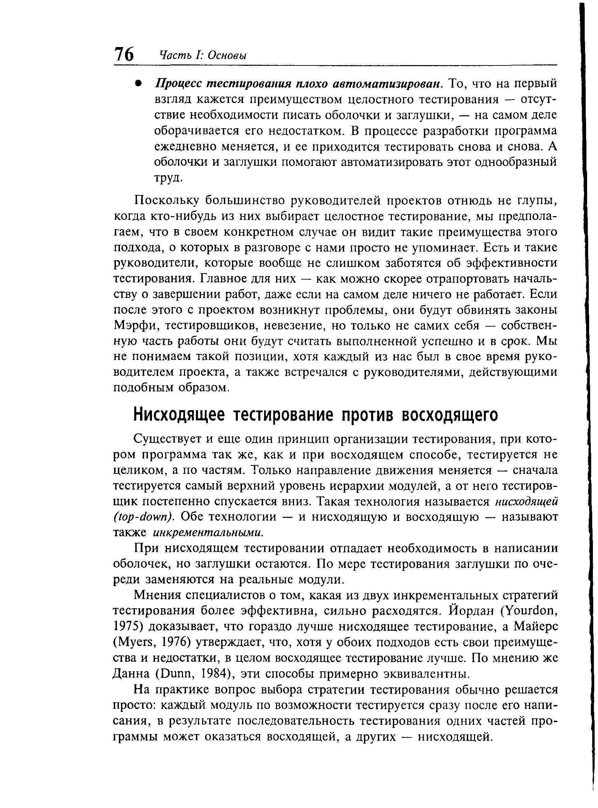

## Статическое тестирование против динамического

При *статическом тестировании* программный код вообще не выполняется — он тестируется только путем логического анализа.

Две описанные выше базовые стратегии — тестирование “черного ящика” и тестирование “стеклянного ящика” — являются динамическими. Программа запускается, вводятся данные, и программист или тестировщик анализирует результат. Разница только в том, на какой информации основывается подбор тестов.

Для статического анализа существует множество инструментальных средств. Самое известное из них — компилятор. Встретив синтаксическую ошибку или недопустимую операцию, компилятор выдает соответствующее сообщение. Ряд полезных сообщений выдает и компоновщик — о повторяющихся именах переменных и других объектов, ссылках на необъявленные переменные и функции. О других полезных средствах автоматизации статического и динамического тестирования рассказывается в главе 11.

Статический анализ программы может выполняться и людьми. Они читают исходный код, возможно, обсуждают его, и, как правило, находят достаточно много ошибок. Вот примеры такой работы.

* **Обзорные, инспекционные и рецензионные совещания.** Это точно такие же совещания, какие проводятся для анализа проекта программного продукта. Майерс (Myers, 1979) предлагает для них очень полезный список контрольных вопросов. Он утверждает (1978), что для выявления ошибок обзорные совещания не менее полезны, чем динамическое тестирование специалистом, который не является автором кода программы. А у Фергана (Fergan, 1976) можно найти описание классического способа проведения таких дискуссий.
* **Работа за столом.** Статический анализ программного кода может выполняться и в одиночку. Специалист читает и анализирует программный код. Если он не может понять, что делает конкретный фрагмент программы, он может поработать и за компьютером, но большую часть времени он все же проводит за столом. Он работает дольше, чем обычно длятся совещания, и, как правило, анализирует гораздо большие объемы кода. Этот вид тестирования может выполнять как сам автор программного кода, так и кто-то другой — в любом случае оно будет очень полезным.

Вычитывать программный код (как собственный, так и чужой) — работа довольно скучная, и многие ее не любят. В пользу этой процедуры горячо высказывается Вейнберг (Weinberg, 1971), а Бейзер (Beizer, 1984, 1990)

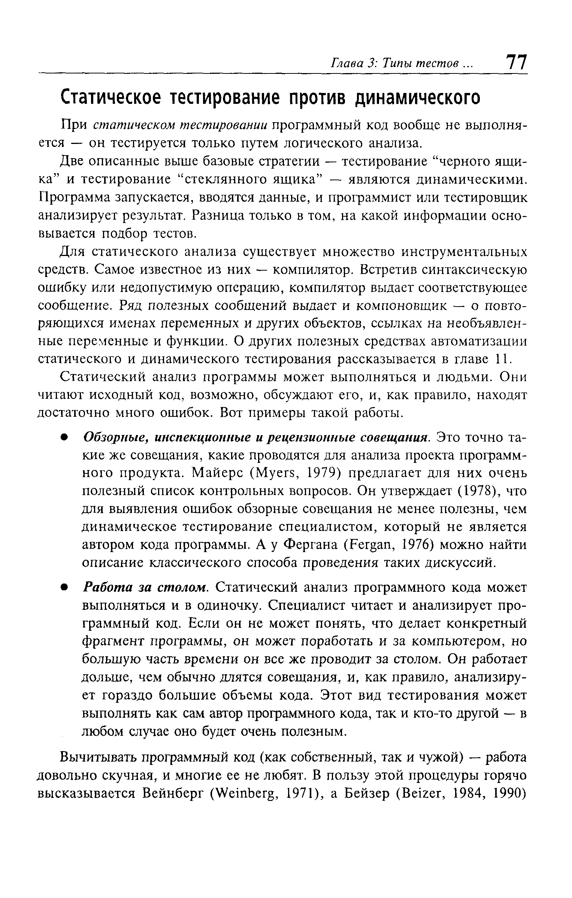

советует ускорить работу за счет игнорирования синтаксиса и всего того, что может сделать компилятор.

Одним из полезных результатов чтения программного кода может быть заключение о том, достаточно ли он прост и логичен. Если код трудно читать, то очень вероятно, что программист недостаточно четко видит задачу. И, кроме того, даже если в такой программе и нет ошибок, в дальнейшем могут возникнуть большие сложности с ее модернизацией.

## Соответствие стандартам

У каждой компании могут быть свои стандарты, определяющие, сколько в коде должно быть комментариев, какой максимальной длины могут быть отдельные модули, должен ли программист строго следовать соглашениям об именах переменных и функций и каковы эти соглашения. Анализ соответствия кода таким стандартам прекрасно поддается автоматизации.

## Программная статистика

Существует практика анализировать сложность программного кода с помощью статистических вычислений. Мы относимся к этому весьма скептически. На наш взгляд, такой математический анализ интересен разве что с теоретической точки зрения, практическая же его полезность весьма ограничена. Некоторые руководители требуют, чтобы программисты перерабатывали код, пытаясь добиться "приемлемого", по их мнению, коэффициента сложности.

Но на практике это может привести разве что к замедлению работы и появлению лишних ошибок и проблем, поскольку, как известно, лучшее — враг хорошего. Да и как вообще можно "измерить" качество программы. Если она работает, выполняет все необходимое, если она тщательно продумана и протестирована — оставьте ее в покое.

И еще не следует забывать, что краткость — сестра таланта. А относительно посредственный программист, пытаясь предельно сократить и оптимизировать код, не сможет его как следует отладить и в результате испортит то, что прекрасно работало. НИ В КОЕМ СЛУЧАЕ НЕ СЖИМАЙТЕ ПРОГРАММНЫЙ КОД!

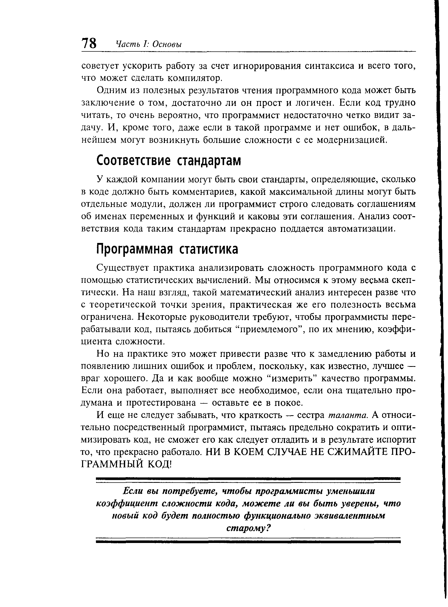

Намеренные ошибки: псевдоотладка и мутационное тестирование

Одной из довольно специфических технологий тестирования программ является *псевдоотладка (bebugging)*. В программу намеренно внедряется ряд ошибок. По мнению Вейнберга (Weinberg, 1971), программист, зная наверняка, что в программе есть ошибки, будет гораздо тщательнее ее тестировать.

Но главное назначение этой технологии — оценить эффективность проводимых тестов. Если внедрить в программу 100 ошибок, а затем провести тестирование, в результате которого будет выявлено только 20 из них, значит, в программе останется еще около 80% неявленных ошибок.

Еще одним способом проверки адекватности проводимых тестов является *мутационное тестирование (mutation testing)*. В программу вносится маленькое изменение, называемое мутацией. В процессе тестирования результат такого изменения должен обязательно проявиться. Если же этого не случится, это может означать, что тесты подобраны неудачно.

Подробное описание технологии мутационного тестирования можно найти у Де Милло (DeMillo, 1987).

## Анализ производительности

Для анализа производительности программного продукта можно применять технологию как “черного” так и “стеклянного ящика”. Однако вторая из них дает лучшие результаты, поскольку позволяет с помощью дополнительных программных средств фиксировать время выполнения отдельных модулей, прохождения конкретных путей или скорость обработки специфических типов данных.

Одной из целей выполнения анализа производительности является ее увеличение. Если выявить модули, которые выполняются чаще или дольше остальных, их можно переработать и тем самым повысить скорость работы всей системы.

Группы тестирования обычно работают с программой как с “черным ящиком”. Они сравнивают производительность последовательных версий программы, и, если обнаруживают, что после последней доработки она замедлилась, это является для них сигналом о возможной ошибке.

Производительность программного продукта анализируют и еще с одной целью — для выяснения его конкурентоспособности: если имеющиесяся на рынке аналогичные программы работают значительно быстрее, придется “ускорить” и свою.

За более обширной информацией об анализе производительности программного обеспечения мы советуем обратиться к книге Бейзера (Beizer, 1984).

## Регрессионное тестирование

Основной работой тестировщиков является *регрессионное тестирование*. У этого термина два значения, объединенных идеей повторного использования разработанных тестов.

* Представьте, что вы провели тест, обнаружили ошибку и программист ее исправил. Вы снова проводите тот же тест, чтобы убедиться, что ошибки больше нет. Это и есть регрессионное тестирование. Можно провести несколько вариаций исходного теста, чтобы как следует проверить исправленный фрагмент программы. В данном случае задача регрессионного тестирования состоит в том, чтобы убедиться, что выявленная ошибка полностью исправлена программистом и больше не проявляется.

  В некоторых коллективах в набор регрессионных тестов включают каждую найденную ошибку, даже если она исправлена уже давным-давно. Каждый раз, когда в программу вносится изменение, все эти тесты проводятся снова. Особенно важно провести такое обстоятельное тестирование, если программа изменяется спустя достаточно длительное время или новым программистом. Исправления очень чувствительны к таким изменениям, поскольку в тексте программы, если только они не задокументированы самым тщательным образом, выглядят как непонятные или неудачные фрагменты.

* Второй пример применения регрессионного тестирования. После выявления и исправления ошибки проводится стандартная серия тестов, но уже с другой целью: убедиться, что исправляя одну часть программы, программист не испортил другую. В этом случае тестируется целостность всей программы, а не исправление одной ошибки.

  При инкрементальном тестировании основой автоматизации проведения регрессионных тестов служат разработанные заглушки и оболочки. А для автоматизации регрессионного тестирования "черного ящика" можно воспользоваться программами перехвата и воспроизведения ввода, описанными в главе 11.

## Тестирование "черного ящика"

Когда кодирование завершено, программа передается группе тестирования. Вы ищете ошибки, составляете о них отчеты, затем получаете новую

версию программы и снова ищете ошибки. Вы находите старые ошибки, не замеченные на первом этапе, и новые, появившиеся после доработки. Вот как Мартин и Мак-Клер (Martin & mcClure, 1983) подытожили собранные Боэмом (Boehm) данные об эффективности исправления найденных ошибок.

* Если для исправления ошибки нужно изменить не более десяти операторов, вероятность того, что это будет сделано правильно с первого раза, составляет 50%.
* Если для исправления ошибки нужно изменить около пятидесяти операторов, вероятность того, что это будет сделано правильно с первого раза, составляет 20%.

Проблема не только в том, что программист может не исправить ошибку до конца. Гораздо хуже другое — то, что исправления могут иметь *побочные эффекты*. Исправление одной ошибки может привести к появлению другой. А бывает и так, что одна ошибка скрывает другую, которая проявляется только после ее устранения. К сожалению, программисты часто концентрируются только на поставленной перед ними проблеме и, решив ее, считают свою работу сделанной — регрессионного тестирования, пусть даже самого поверхностного, они не выполняют.

Учитывая все сказанное, приготовьтесь тестировать одну и ту же программу много-много раз. На ранних стадиях тестирования исправленные версии программы могут поступать каждые несколько часов или дней. Поэтому среди специалистов распространена практика не принимать новую версию, пока не будет самым тщательным образом протестирована предыдущая. Такое полное тестирование очередной версии с составлением итогового отчета обо всех известных проблемах и всех найденных в этой версии ошибках называют *полным циклом*.

Руководители проектов часто рассчитывают ограничиться двумя циклами тестирования: в первом выявить все ошибки, а во втором убедиться, что все они исправлены. Но на самом деле для тестирования может понадобиться порядка восьми циклов, а если на каждом из них тестировать программу менее тщательно — тогда от 20 до 30.

## Стандартная процедура тестирования "черного ящика"

В этом разделе описывается стандартная последовательность событий, свойственная тестированию "черного ящика" в мире персональных компьютеров. В мире мейнфреймов все иначе. Друзья, работающие в банках, рассказывают, что они приступают к разработке тестов задолго до официального начала тестирования.

## Планирование

Как и всякая работа, тестирование программного продукта начинается с планирования: определяется стратегия, разрабатываются серии тестов, распределяются между сотрудниками задания. Начинать планирование можно сразу после того, как команда проектировщиков выработает требования к программному продукту. Однако чаще подробное планирование начинается на первом цикле тестирования, когда перед вами готовый программный продукт. О разработке тестов мы с вами поговорим в главе 7, а в главе 12 обсудим составление общего плана тестирования.

## Приемочное тестирование

При поступлении каждой новой версии программного продукта тестировщики прежде всего проверяют, достаточно ли она стабильна. Если она “обрушивается” при малейшей провокации, возиться с ней не стоит. Такое первое беглое тестирование называют *приемочным* или *квалификационным*.

Лучше всего, если приемочные тесты будут стандартизированы. Тогда их копии можно передать программистам, чтобы те проводили их сами и не сдавали вам программы раньше времени. Это позволит избежать возвратов тестировщиками неработающих программ — моментов, психологически неприятных для обеих сторон.

Приемочные тесты должны быть короткими. В них должны проверяться только основные функции и основные данные. Если программа не пройдет даже такой тест, вы с полной уверенностью сможете утверждать, что эта ее версия никуда не годится.

Во многих компаниях приемочные тесты частично автоматизированы с помощью специального программного обеспечения, выполняющего тестирование “черного ящика”.

## Проверка стабильности программы

Насколько стабильна полученная вами версия программы? Сколько циклов тестирования она выдержит — четыре или 24? Вас могут попросить оценить стабильность программы для составления календарного плана работ, оценить стоимость услуг по ее тестированию сторонним агентством или оценить качество программного продукта, который компания собирается купить и распространять.

В этом случае ваша задача состоит не в поиске ошибок, а в определении самых ненадежных частей программы. Если вам кажется сомнительным какой-нибудь особенно сложный элемент, тогда рассчитывайте, что тестирование будет долгим. Начните с изучения прилагаемого к программе руководства — в нем должны быть описаны все функции программы, а если повезет, еще и приведены простые и наглядные примеры. Проведите еще несколько тестов, на которых, как вам кажется, программа должна

сбоить. В конце такого оценочного тестирования у вас должно сложиться определенное представление о том, с чем вы имеете дело: сколько в программе ошибок и насколько тяжело будет ее протестировать. К сожалению, мы не сможем сказать, как транслировать это представление в человеко-часы — вам придется полагаться только на собственный опыт и профессиональное чутье.

Обычно предварительная оценка стабильности программы занимает около недели. Если для тестирования всех ее функций этого времени недостаточно, проверьте часть из них. Но обязательно включите в свой отчет обзор каждого раздела руководства.

И не стоит рассчитывать разобраться с программой меньше чем за неделю, если только она не элементарна и если это не очередная версия продукта, который вы много раз тестировали.

## Функциональное и системное тестирование, сверка и аттестация продукта

Когда программный продукт готов и протестирован, он должен пройти ряд завершающих тестов. Прежде всего, он должен быть еще раз сверен с наиболее подробными и близкими к нему проектными документами. В частности, должно быть проведено функциональное тестирование, при котором продукт сверяется с внешней спецификацией.

Затем программа сверяется с опубликованной печатной документацией — пользовательскими (*тестирование целостности*) и системными (*системное тестирование*) требованиями. Эти две процедуры носят название *аттестационного тестирования*.

В разговорах о тестировании вы можете встретиться с одним из популярных терминов — Independent Verification and Validation (IV&V — независимая сверка и аттестация). Он означает сверочное и аттестационное тестирование, проводимое независимым агентством.

Более подробное описание процедуры сверки и аттестации можно найти у Андриоле (*Andriole, 1986*) и в документе *IEEE Standard for Software Verification and Validation Plans* (ANSI/IEEE Standard 1012-1986).

## Бета-тестирование

И вот наконец вы подтверждаете, что программа достаточно стабильна и документация в порядке. Это значит, что наступило время для обратной связи с пользователями — *бета-тестирования*.

На этом этапе с программой работают ее потенциальные пользователи. Они эксплуатируют программу и присылают или высказывают вам свои замечания. Поскольку бета-тестировщики знают, что в программе могут оставаться еще очень серьезные ошибки, они не работают с ней полный день — на 20 часов тестирования у них уходит около трех недель.

*20 часов работы бета-тестировщика для компании-разработчика вовсе не бесплатны. Вам или другому сотруднику компании приходится тратить на каждого из них от 4 до 8 часов, вербуя новых людей, давая им консультации и отвечая на их вопросы. Кроме того, нужно писать для них инструкции и разрабатывать вопросники.*

Однако в определенных ситуациях бета-тестировщики работают с продуктом гораздо более основательно. Вот какими могут быть их мотивации.

* Пользователю очень нужен ваш продукт, даже если он и не надежен, а других подобных продуктов на рынке нет.
* Вы достаточно платите. Обычно в качестве платы за бета-тестирование пользователь получает или бесплатную копию продукта, или значительную скидку. Если продукт дорогой, этого достаточно. Но если речь идет о программе, предназначенной для доступа к важной информации, и в этой программе происходит сбой, потеря данных может обойтись пользователю гораздо дороже стоимости программного продукта.
* Вы даете пользователю выгодную гарантию. Например, вы обещаете, что в случае сбоя программы сотрудник вашей компании бесплатно введет потерянные данные.

Здесь мы привели лишь краткий обзор процедуры бета-тестирования, а подробное ее описание вы найдете в главе 13.

### Тестирование целостности готового продукта и тестирование распространяемых копий

С завершением тестирования последней бета-версии готового программного продукта возможные проблемы не заканчиваются. Ведь нужно еще убедиться, что он в целости и сохранности попадет к клиенту. Нередко и на этом этапе случаются всевозможные неприятности: например, компании отсылают пользователям пустые или инфицированные диски.

Для тестирования распространяемых копий вы собираете все, что будет отправлено пользователю или производителю, проверяете, все ли на месте и в порядке, и делаете архивные копии. Только после этого продукт отправляется по назначению.

Комплект дисков проверить проще всего: нужно просто выполнить их двоичное сравнение с последней версией продукта. Не пренебрегайте этой процедурой, даже если для создания дисков вы пользовались уже проверен-

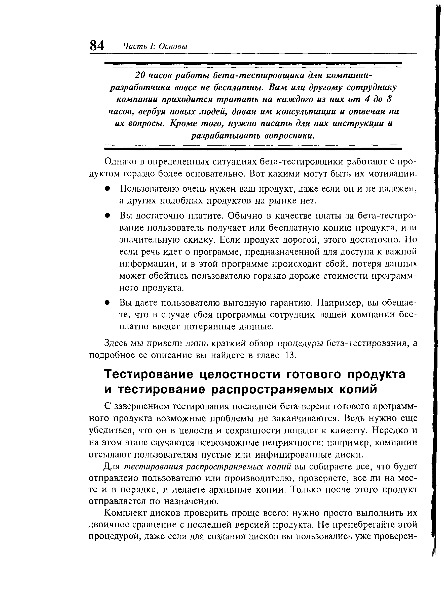

ной копией. Такое сравнение обойдется вам гораздо дешевле, чем отправка пользователям новой партии, если что-то будет не так.

Мы настоятельно рекомендуем включить в эту процедуру тестирования еще и проверку на вирусы. Если программное обеспечение поставляется в сжатом виде, не останавливайтесь на тестировании сжатых файлов: установите программу, запустите ее, перезапустите компьютер и убедитесь, что он не заражен. Имейте в виду, что за заражение вирусами пользователь может подать на вас в суд.

*Тестирование целостности программного продукта* — работа более обстоятельная. Это ваш последний шанс что-либо изменить перед тем, как выпустить свое детище в жизнь. Тестировщик старается спрогнозировать все жалобы и критические замечания, которые могут появиться в прессе и поступить от пользователей в ближайшие несколько месяцев. Этим может заниматься ведущий специалист, который не участвовал в данной разработке, или даже сотрудник независимого агентства. В его задачи не входит поиск ошибок. Напротив, он предполагает, что и системное и функциональное тестирование проведены самым тщательным образом. Специалист внимательно сравнивает программу с пользовательской документацией и документами, в которых описаны требования к продукту. Кроме того, он может выполнить сравнение с конкурирующими продуктами.

В рамках тестирования целостности продукта выполняется и анализ маркетинговых материалов — ведь возможности программы обязательно должны соответствовать рекламе. Потому и рекламная копия, и все печатные и электронные рекламные материалы перед публикацией должны подвергнуться самой строгой проверке.

Тестирование целостности программного продукта лучше поручить не команде, а одному человеку. Для однопользовательской программы средней сложности на это уйдет около двух недель.

## Окончательная приемка и сертификация

Если ваша компания разрабатывает программное обеспечение по контракту, для его приемки клиенты должны будут провести собственные тесты. Если продукт невелик, тестирование может быть неформальным. Однако для большинства проектов процедура приемочного тестирования заранее согласовывается и фиксируется в контрактных документах. Поэтому, прежде чем передать программу клиенту, нужно убедиться, что она абсолютно безупречно проходит серию приемочных тестов. Обычно приемочное тестирование занимает не более одного дня и не является особенно тщательным. Как подготовить и провести формальное приемочное тестирование, подробно рассказывает Бейзер (Beizer, 1984). Хорошим учебником по разработке приемочных тестов является книга Перри (Perry, 1986). Особенно полезной эта книга может быть для тех, кто разрабатывает приемочные тесты совместно со своим клиентом.

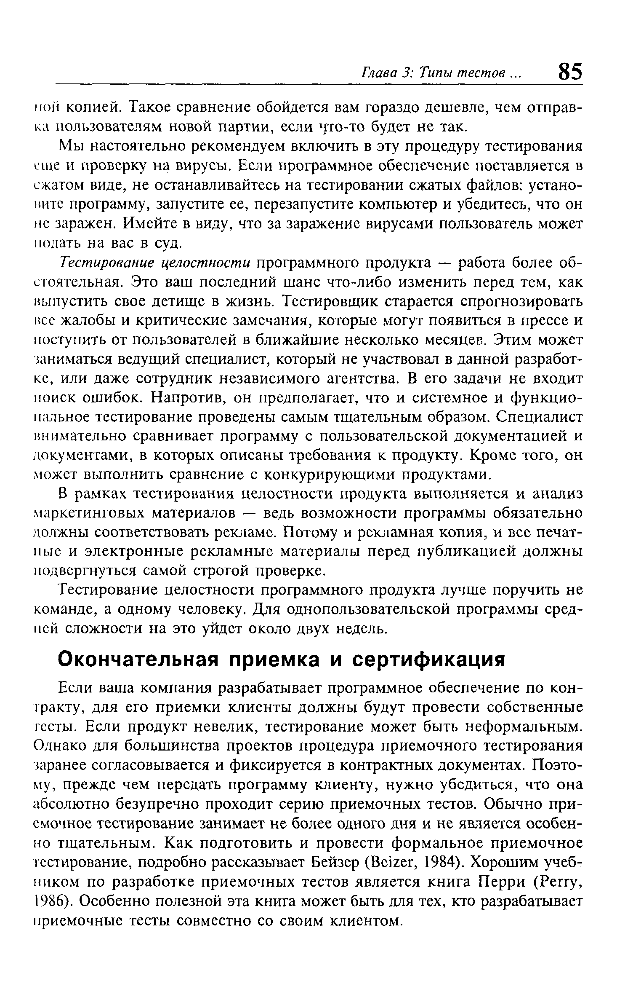

Сертификация всегда выполняется сторонней фирмой — независимой или работающей на вашего клиента. Сертификационное тестирование может быть как коротким и поверхностным, так и более тщательным. По контракту оно может выполняться вместо приемочного тестирования. При этом уровень сертификационного тестирования и стандарты, которым должны соответствовать программа и процесс ее разработки обязательно должны быть записаны в контракте. Если же сертификация проводится по желанию компании-разработчика, например, из маркетинговых соображений, тогда она сама и определяет, какие провести тесты.

## Примеры тестов, проводимых при функциональном и системном тестировании

Чтобы более наглядно пояснить суть описанного в предыдущих разделах функционального и системного тестирования, приведем примеры тестов, выполняемых на этом этапе.

### Сверка со спецификацией

Проверяется соответствие разработанной программы каждому слову в спецификации.

### Правильность

Правильно ли программа выполняет нужные вычисления и формирует отчеты?

### Лабораторные испытания

Специалист по тестированию нанимает нескольких человек из числа будущих пользователей и наблюдает за их работой с продуктом. Фактически бета-тестирование является попыткой получить тот же результат с меньшими затратами. Но поскольку вы не являетесь непосредственным свидетелем того, что происходит, и не можете давать тестировщикам задания, бета-тестирование гораздо менее эффективно, чем лабораторные испытания.

### Граничные условия

Проверьте реакцию программы на граничные значения входных данных. Введите данные, в ответ на которые она сформирует максимальные или минимальные выходные значения.

### Производительность

Обзаведитесь хорошим секундомером и измерьте время выполнения программой различных задач, особенно тех, которые пользователь будет выполнять чаще всего.

## Переходы между режимами

Правильно ли программа переходит из состояния в состояние? Это особенно важно для приложений, позволяющих параллельно выполнять несколько различных действий или переключаться между режимами, не завершая их работу. Что, если попытаться распечатать редактируемую таблицу или сформировать по ней отчет? Что, если во время подготовки отчета ввести в таблицу новые данные?

### Эксплуатация в реальном режиме

Попробуйте поработать с программой в том же режиме, в каком с ней будут работать реальные пользователи. Выполните с ее помощью реальную работу. Вы будете очень удивлены, увидев, сколько ошибок выявляет такое тестирование. Недостатки, которых при формальном тестировании вы не заметили вовсе или посчитали их незначительными, в реальной работе могут оказаться очень серьезными.

### Нагрузочные испытания

При нагрузочных испытаниях (*load testing*) проверяется реакция программы на предельные условия эксплуатации.

* Тестирование на максимальный объем входных данных. Какое максимальное задание окажется вашей программе по плечу? Компилятору можно предложить откомпилировать очень большую программу, текстовому процессору — открыть огромный текстовый файл. В интерактивной программе можно попробовать непрерывно вводить очень большой объем информации, чтобы проверить, насколько надежен ее входной буфер. (Для того чтобы быстрее реагировать на действия пользователя, программы часто сохраняют информацию о нажатиях клавиш в небольшом буфере, а когда пользователь на секунду приостанавливается, обрабатывают его содержимое.) Нужно посмотреть, как поведет себя программа в ответ на нестандартные данные, например, как компилятор или текстовый процессор поступят с абсолютно пустым файлом.
* Испытания в утяжеленном режиме. Как реагирует программа на резкое увеличение активности? Например, можно проверить, как поведет себя текстовый процессор, если пользователь будет вводить текст со скоростью 120 слов в минуту. Если максимально допустимая активность пользователя оговорена в спецификации, нужно проверить, действительно ли программа хорошо справляется с указанной нагрузкой.
* Анализ требований к ресурсам. Необходимо изучить требования программы к двум важным ресурсам компьютера — оперативной памяти

и дисковому пространству. Если в спецификации записаны ограничения на использование этих ресурсов, необходимо удостовериться, что ни при каких условиях программа не занимает больше памяти и дискового пространства, чем ей положено.

## Многопользовательская и многозадачная работа

Если ваш продукт представляет собой сложную многозадачную или многопользовательскую систему, его тестирование значительно усложняется. Необходимо проверить, как он справляется с параллельным выполнением нескольких задач и как координируются действия нескольких пользователей. Типичным примером таких систем являются многопользовательские системы управления базами данных, где несколько пользователей, сидящих за различными и, возможно, даже достаточно удаленными компьютерами, могут одновременно вводить данные в одну и ту же таблицу. Для тестирования такой системы нужно организовать ее эксплуатацию в реальном режиме, привлечь для работы большое количество людей и техники и, возможно, написать специальные программы, имитирующие одновременный ввод данных. Более подробное обсуждение этого вопроса можно найти в книге Бейзера (Beizer, 1984).

## Обработка ошибок

Программа должна корректно реагировать на неправильные, нестандартные или не предусмотренные документацией действия пользователей. Постарайтесь сделать как можно больше ошибок и своими глазами посмотреть на каждое описываемое в документации сообщение. Может быть, вы столкнетесь с сообщениями об ошибках, которых в документации нет. Проводя такое тестирование, вы соберете наибольший урожай ошибок, поскольку этой части программы обычно уделяется меньше всего внимания.

## Защита

Сложно ли неавторизованному пользователю получить доступ к системе? Что для этого нужно? О тестировании защиты программного обеспечения немного рассказывается у Бейзера (Beizer, 1990) и более подробно — у Фернандеса (Fernandez, 1981).

## Совместимость и преобразование форматов данных

Два программных продукта называют совместимыми (*compatible*), если они могут работать с одними и теми же файлами данных или если они благополучно сосуществуют в оперативной памяти компьютера и работают,

не мешая друг другу. Поэтому, получив задание проверить программы на совместимость, обязательно выясните, о какой именно совместимости идет речь.

Если две программы не могут непосредственно работать с данными друга друга, это еще не значит, что они абсолютно несовместимы. Возможно, что пользователи смогут воспользоваться специальными конвертерами — программами-посредниками, преобразующими данные из одного формата в другой.

Одной из самых распространенных ситуаций, требующих конвертирования данных, является выпуск новой версии программы. В этом случае новая программа должна уметь определить, что предложенные ей данные сохранены в формате предыдущей версии, и самостоятельно выполнить их преобразование. Кроме того, программы одного класса часто умеют читать и сохранять в формате друг друга. Это позволяет пользователям совершенно безболезненно переходить с одной программы на другую или даже эксплуатировать их совместно.

## Аппаратные конфигурации

Очень важно, чтобы программа успешно работала на компьютерах самых разнообразных конфигураций. Даже если программа ориентирована на конкретную модель процессора, все равно в системах, где ей придется работать, периферийные устройства будут различны. Поэтому вам нужно выявить те устройства, с которыми программа должна быть совместима, но на деле не работает.

## Установка и обслуживание

Вместе с программным продуктом обычно поставляется и программа его установки. Она автоматизирует процесс интеграции продукта в систему и его настройки для нужд конкретного пользователя. Работает ли эта программа? Насколько она проста и удобна? Сколько времени в среднем требуется на установку?

Если программу будет устанавливать не пользователь, а специалист, например сотрудник фирмы-дилера, возникает и еще несколько вопросов, связанных с ее обслуживанием. Например, если произойдет сбой программы, как быстро квалифицированный специалист сможет устранить его последствия или установить заплатку?

## Эффектные тесты

Есть среди тестов и такие, которые служат не для реальной работы, а для того, чтобы произвести впечатление на публику. Их проводят перед зрителями (например, администрацией, пришедшей посмотреть, как идет работа), чтобы показать, как “ужасно нестабильна” программа и как профессиональны тестировщики.

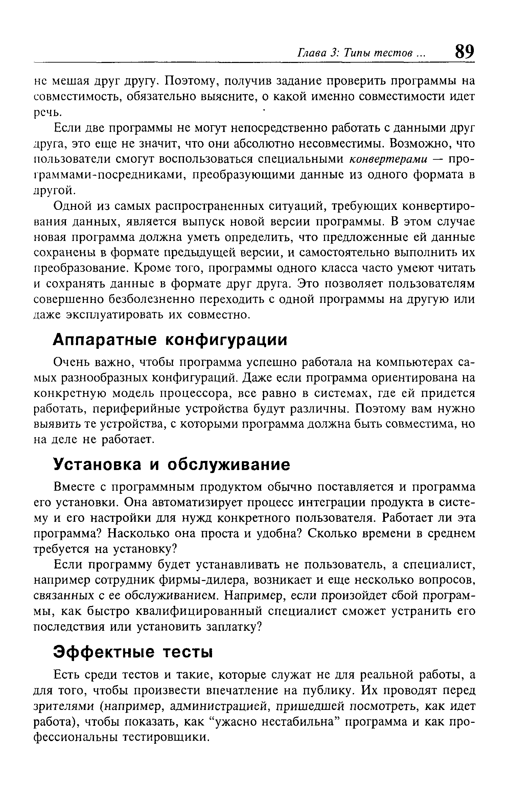

По-настоящему эффектный тест должен быть очень простым и приводить к немедленному сбою. Как подбирать такие тесты, сказать сложнее. Здесь приходится основываться на своем собственном профессиональном опыте, знании слабых мест программиста, операционной системы и результатах тестирования аналогичных продуктов.

## Сопровождение

Значительная часть средств, которые компания затрачивает на программный продукт, уходит уже после завершения его разработки. Вот какие данные приводят в своем учебнике Мартин и Мак-Клер (Martin & McClure, 1984).

На сопровождение программного обеспечения затрачивается 67% его общей стоимости. Распределяется эта сумма так:

* 20% бюджета сопровождения тратится на исправление ошибок
* 25% уходит на адаптацию продукта к новому аппаратному обеспечению и новой программной среде
* 6% тратится на исправление документации
* 4% тратится на повышение производительности
* 42% тратится на внесение изменений и усовершенствований
* 3% на другие нужды

На этапе сопровождения программного продукта в вашей работе не будет ничего особенного — вы будете делать то же самое, что уже делали в конце разработки во время функционального и системного тестирования. Если у вас есть серия регрессионных тестов, которые к тому же еще и частично автоматизированы, вам остается только повторять их после каждого изменения программы. И не забывайте, что сделанные на этом этапе изменения, как и всякие другие, чреваты побочными эффектами. Поэтому проявите предусмотрительность и обязательно проверьте не только измененный фрагмент, но и всю программу в целом.

## Адаптационное тестирование

Этот вид тестирования выполняется только на этапе сопровождения, когда программа переносится с одной аппаратной или программной платформы на другую. Если программа должна работать на нескольких типах компьютеров, нужно проверить ее совместимость с каждым из них. Вот краткое описание стратегии такого тестирования.

* **Общее функционирование.** Выполните серию регрессионных тестов. Если ее у вас нет, разработайте набор тестов, выполняющих каждую

из основных функций программы. При этом постарайтесь хотя бы частично проверить программу как на граничных, так и на основных данных. Если какая-то из функций плохо совместима с новой платформой, то, скорее всего, она не будет работать вообще, так что не стоит опасаться, что возникшие проблемы останутся незамеченными. Как правило, при переносе программы на другую платформу тесты на общее функционирование она проходит вполне успешно. Поэтому не стоит тратить на них слишком много времени.

* **Клавиатура.** Если у компьютера специфическая клавиатура, в работе с ней могут быть небольшие отклонения от стандарта. Поэтому нужно обязательно нажать каждую клавишу, и к тому же в различных ситуациях. Особое внимание обратите на управляющие клавиши — `<Shift>`, `<Alt>` и т.п.

* **Терминал.** Проверьте, как программа работает с новым терминалом. Как отображается графика? Если программа работает в текстовом режиме, то все ли символы отображаются правильно, нет ли проблем с цветом, подчеркиванием или подсветкой?

* **Номер версии и идентификация системы.** Если номер версии программы изменился, убедитесь, что он нигде не остался старым. Если при запуске программа идентифицирует аппаратуру или операционную систему, убедитесь, что она делает это правильно.

* **Диски.** Емкость и формат дисков могут сильно отличаться. Убедитесь, что программа правильно работает с файлами, размер которых кратен 2. Если новая система поддерживает размер дисков, которого не поддерживала старая, попробуйте поработать с таким большим диском.

* **Обработка ошибок операционной системой.** Как действует операционная система в таких ситуациях, как ошибка доступа к диску? Позволит ли она прикладной программе самой обработать эту ситуацию и выдать корректное сообщение или просто остановит программу и сообщит о системной ошибке? А как сам программный продукт защищает пользователя от ошибок и странностей операционной системы?

* **Установка.** При установке программного продукта инсталляционной программе может потребоваться определить аппаратную и программную конфигурацию системы. Убедитесь, что она делает это правильно. Протестируйте программу установки как можно тщательнее. Выполните установку продукта в системах с различной конфигурацией, в сети и на отдельном компьютере, попробуйте установить его поверх предыдущей версии.

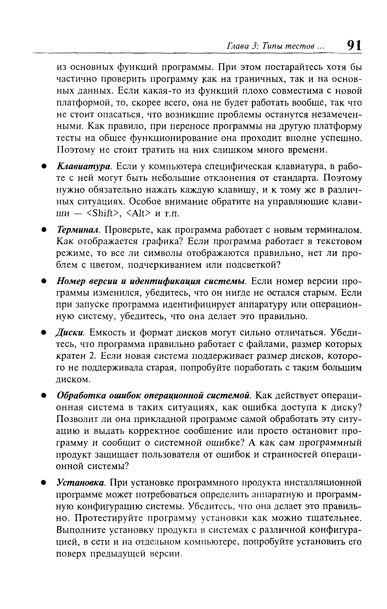

* **Совместимость.** Предположим, что на исходном компьютере ваша программа была совместима с программой Икс. Если программа Икс также была перенесена на новый компьютер, остались ли они совместимы?

* **Интерфейс.** В различных графических средах (Windows, Mac, AmigaDOS, Motif и т. п.) действуют различные соглашения о пользовательском интерфейсе. Перейдя в новую среду, программа должна выглядеть в ней достаточно естественно.

* **Другие изменения.** Поинтересуйтесь у программиста, какие еще изменения он вносил в программу для ее адаптации, и как следует их протестируйте.

Если программный продукт впервые адаптируется к новой платформе, не рассчитывайте на быстрый успех. Тестирование может занять у вас четверть того времени, которое вы потратили на разработку. Перенос на следующую платформу может пройти и быстрее, особенно если эти платформы достаточно совместимы.

# Глава 4
Программные ошибки

## Назначение этой главы

Главной задачей тестировщика является поиск и документирование ошибок. Найденные ошибки исправляются, решаются описанные тестировщиком проблемы, и тем самым улучшается качество программного продукта. В этой короткой главе мы определим понятия качества и программных ошибок, а также расскажем о том, какими бывают программные ошибки и как они классифицируются. Зная своего противника, вы сможете бороться с ним более целенаправленно.

Более подробно программные ошибки описываются в приложении, где кроме основной классификации, разделяющей все возможные ошибки на 13 категорий, рассматривается около 400 их видов.

## Библиография

Хорошими пособиями для изучения вопросов качества программных продуктов и классификации возможных ошибок являются книги Деминга (Deming, 1982), Фейгенбаума (Feigenbaum, 1991), Ишикавы (Ishikawa, 1985) и Джурана (Juran, 1989).

## Качество

Если программный продукт создается по заказу конкретного клиента, тогда клиент может принимать в его проектировании самое непосредственное участие. Он предоставляет подробную спецификацию с описанием своих требований и собственного видения продукта, а разработчик соглашается все это реализовать. В таком случае качество будет означать точное соответствие спецификации клиента.

*У большинства разработчиков программного обеспечения таких грамотных и обстоятельных клиентов нет. Для них критерием качества служит не соответствие спецификации, а то, насколько пользователи удовлетворены программным продуктом и сопутствующими услугами компании.*

Спецификация — спецификацией, но если конечный результат пользователю не нравится, значит, его качество не на высоте. И не важно, что пользователь ознакомился со спецификацией и согласился с ней или даже сам ее составил. Если в конечном счете продукт его не удовлетворяет, то только это и будет иметь для него значение.

Еще одной составляющей качества является *надежность* программного продукта. А надежность его тем выше, чем реже в нем происходят сбои, особенно такие, которые влекут за собой потерю данных и другие неприятные последствия.

Хотя надежность программы исключительно важна, она не является единственным критерием ее качества, и не правы те тестировщики, которые так думают. Если программа не позволяет пользователю выполнить что-то, что он считает важным, пользователь не будет ею доволен. А если пользователь недоволен, значит, качество программы нельзя назвать высоким.

Итак, качество программы определяется:
* возможностями, благодаря которым она понравится пользователю;
* недостатками, которые вынуждают пользователя приобрести другую программу.

Главное, что тестировщик может сделать для улучшения качества программы, — это выявить ее недостатки, сбои в ее работе и явные ошибки. Если руководитель проекта примет решение в последний момент добавить какую-нибудь очень важную функцию, это тоже может способствовать повышению качества, даже несмотря на то, что от этого программа станет менее надежной. Ни надежность, ни функциональность программы не могут быть абсолютными, и ее качество в конечном счете означает разумный баланс между этими двумя характеристиками. (Подробнее данный вопрос рассматривает в своей книге Джуран (Juran, 1989).)

Оставшаяся часть этой главы посвящена недостаткам и ошибкам программ. Как их выявить и как определить степень их серьезности?

## Что такое программная ошибка?

Одним из распространенных определений программной ошибки является расхождение между программой и ее спецификацией. Не пользуйтесь этим определением.

> *Расхождение между программой и ее спецификацией является ошибкой тогда, и только тогда, когда спецификация существует и она правильна.*

Программа, которая соответствует плохой спецификации, и сама никуда не годится. Поэтому следующие два определения более точны.

* Если программа не делает того, чего пользователь от нее вполне обоснованно ожидает, значит, налицо программная ошибка (Майерс (Myers, 1976, с. 6)).
* Не существует ни абсолютного определения ошибок, ни точного критерия наличия их в программе. Можно лишь сказать, насколько программа не справляется со своей задачей, — это исключительно субъективная характеристика (Бейзер (Beizer, 1984, с. 12)).

Конечно, второе определение не касается таких явных ошибок, как ошибки вычислений по точно известным формулам. Майерс вообще исключил из своего определения ошибки, связанные с человеческим фактором. Очевидно, что это совершенно самостоятельная группа ошибок, требующая специфического подхода к их анализу и устранению. Бывает довольно сложно убедить программиста, что недостаток пользовательского интерфейса является ошибкой или что эта ошибка очень серьезна или даже в том, что тестировщик вообще имеет право заниматься такими вопросами. Но пользователи жалуются на подобные ошибки не меньше, чем на очевидные сбои.

## Категории программных ошибок

В этой главе описываются 13 категорий, охватывающих все возможные ошибки в программном обеспечении. Несколько отличающуюся, но также очень полезную классификацию предлагает в своей книге Бейзер (Beizer, 1990).

### Ошибки пользовательского интерфейса

С программой может быть трудно (или даже невозможно) работать по множеству причин. Мы объединили их все под названием “ошибки пользовательского интерфейса”. Вот несколько разновидностей таких ошибок.

## Функциональность

Функциональные недостатки имеют место, если программа не делает того, что должна, выполняет одну из своих функций плохо или не полностью. Хотя функции программы достаточно подробно описываются в ее спецификации, окончательное представление о том, что программа должна делать, существует только в умах ее пользователей.

> *Функциональные недостатки есть абсолютно у всех программ, поскольку ожидания пользователей — вещь субъективная: у разных пользователей они различны. Оправдать их все просто невозможно, а попытка этого добиться может привести лишь к усложнению и потере концептуальной целостности программного продукта.*

Однако во многих случаях функциональный недостаток вполне очевиден. Если предусмотренную программой задачу трудно выполнить, если она решается неуклюже или при определенных обстоятельствах вообще не может быть решена — проблема налицо. И когда ожидания пользователей вполне разумны и обоснованны, эту проблему без колебаний можно назвать ошибкой.

## Взаимодействие программы с пользователем

Насколько сложно пользователю разобраться в том, как работать с программой? Откуда вообще он об этом узнает? Как обстоит дело с экранными инструкциями и подсказками? Достаточно ли их? Понятны ли они? Имеется ли в программе интерактивная справка и может ли пользователь в случае затруднений найти в ней реальную помощь? Насколько корректно программа сообщает пользователю о его ошибках и объясняет, как их исправить? Нет ли в программе элементов, которые могут раздражать пользователя, сбивать его с толку или просто выглядеть неуклюже?

## Организация программы

Насколько легко потеряться в вашей программе? Нет ли в ней непонятных команд или таких, которые легко спутать между собой? Какие ошибки чаще всего делает пользователь, на что он тратит больше всего времени и почему?

## Пропущенные команды

Чего в программе не хватает? Не заставляет ли программа выполнять некоторые действия странным, неестественным или крайне неэффективным способом? Нельзя ли привести ее в соответствие с привычным стилем

работы пользователя? Допускает ли она хотя бы некоторую степень настройки?

### Производительность

В интерактивном программном обеспечении очень важна скорость. Плохо, если у пользователя создается впечатление, что программа работает медленно, если он чувствует задержки в ее реакции (особенно если конкурирующие программы работают ощутимо быстрее).

### Выходные данные

Большинство программ так или иначе формируют выходные данные: отображают информацию на экране, печатают ее или сохраняют в файлах. Получаете ли вы то, что хотите? Правильно ли формируются отчеты, наглядны ли диаграммы и достаточно ли отчетливо они выглядят на бумаге? Сохраняются ли данные в формате, доступном и для других аналогичных программ? Обладает ли программа достаточной гибкостью, чтобы можно было подстраивать ее под нужды конкретного пользователя?

### Обработка ошибок

Процедуры обработки ошибок — это очень важная часть программы. Но, к сожалению, в них тоже очень часто встречаются ошибки. Кроме того, правильно определив ошибку, программа не всегда выдает о ней достаточно информативное сообщение.

### Ошибки, связанные с обработкой граничных условий

Простейшими граничными условиями являются числовые (такие, как в примере из первой главы). Но существует и много других граничных ситуаций. Любой аспект работы программы, к которому применимы понятия больше или меньше, раньше или позже, первый или последний, короче или длиннее, обязательно должен быть проверен на границах диапазона. Внутри диапазонов программа обычно работает прекрасно, а вот на их границах порой случаются самые неожиданные отклонения.

### Ошибки вычислений

Программирование даже самых простых арифметических операций всегда чревато ошибками. Нечего и говорить о сложных формулах и расчетах. Одними из самых распространенных среди математических ошибок являются ошибки округления. После нескольких промежуточных вычислений может оказаться, что $2 + 2 = -1$, даже если на промежуточных этапах не было логических ошибок.

К этой категории относятся и ошибки, вызванные неправильным выбором алгоритма. Сюда можно отнести неправильные формулы, формулы, неприменимые к обрабатываемым данным, неверные способы разбиения сложных выражений на более простые элементы. В случае алгоритмической ошибки код в точности выполняет то, что имел в виду программист, — он правильно закодировал неверную идею.

## Начальное и последующие состояния

Бывает, что при выполнении какой-либо функции программы сбой происходит только однажды — при самом первом обращении к этой функции. На экране может появиться искаженное изображение или странная информация. Возможно, неверно выполняются расчеты, запустятся бесконечные циклы или операционная система выдаст сообщение о нехватке памяти. Причиной такого поведения программы может быть отсутствие файла с инициализационной информацией. После первого же запуска программа создаст такой файл, и дальше все будет в порядке. Получается, что такую ошибку невозможно повторить (точнее, для ее повторения нужно установить новую копию программы). Но не стоит думать, что ошибка, проявляющаяся только при первом запуске программы, безвредна: ведь это будет первое, с чем столкнется каждый новый пользователь.

Иногда, программируя процесс, связанный с последовательными преобразованиями информации, разработчики забывают о том, что пользователю может понадобиться вернуться к исходным данным и изменить их. Насколько корректно поведет себя программа в такой ситуации? Позволит ли она внести нужные изменения и не будет ли из-за этого потеряна вся выполненная пользователем работа? Что увидит пользователь при возвращении к исходному состоянию программы: свои данные или стандартные значения, которыми программа инициализирует переменные при запуске?

## Ошибки управления потоком

Если по логике программы вслед за первым действием должно быть выполнено второе, а она выполняет третье, значит, в управлении потоком допущена ошибка. Такие ошибки трудно пропустить: в худшем случае в работе программы произойдет сбой, а при менее серьезной ошибке она просто “забредет не туда”.

## Ошибки передачи или интерпретации данных

Один модуль может передавать данные другому или даже другой программе. Некоторые данные могут передаваться между модулями множество раз, и на каком-то этапе они могут быть разрушены или неверно интерпре-

пированы. Изменения, внесенные одной из частей программы, могут потеряться или достичь не всех частей системы, где они важны.

### Ситуация гонок

Классическая ситуация гонок описывается так. Предположим, в системе ожидаются два события, А и Б. Первым может произойти любое из них. Но если первым произойдет событие А, выполнение программы продолжится, а если первым наступит событие Б, то в работе программы произойдет сбой. Программист полагал, что первым всегда должно быть событие А, и не ожидал, что Б может выиграть гонки.

Тестировать ситуации гонок довольно сложно. Наиболее типичны они для систем, где параллельно выполняются взаимодействующие процессы и потоки, а также для многопользовательских систем реального времени. Ошибки в таких системах трудно воспроизвести, и на их выявление обычно требуется очень много времени.

### Перегрузки

Программа может не справляться с повышенными нагрузками. Например, она может не выдерживать интенсивной и длительной эксплуатации или не справляться со слишком большими объемами данных. Кроме того, сбои могут происходить из-за нехватки памяти или отсутствия других необходимых ресурсов. У каждой программы свои пределы. Вопрос в том, соответствуют ли реальные возможности и требования программы к ресурсам ее спецификации и как программа себя поведет при перегрузках.

### Аппаратное обеспечение

Программы могут посылать устройствам неверные данные, игнорировать их сообщения об ошибках, пытаться использовать устройства, которые заняты или вообще отсутствуют. Даже если нужное устройство просто сломано, программа должна понять это, а не сбоить при попытке к нему обратиться.

### Контроль версий

Бывает, что старые ошибки вдруг всплывают снова из-за того, что программа скомпонована с устаревшей версией одной из подпрограмм. Поэтому версии всех составляющих проекта обязательно должны централизованно контролироваться. Кроме того, следует убедиться, что правильны все появляющиеся на экране сообщения об авторских правах,

названии и номере версии программного продукта. Обязательной проверке подлежат десятки мелких деталей.

Обычно контроль версий программы и ее исходного кода осуществляется группой контроля качества (Quality Assurance). Но, на наш взгляд, это скорее задача группы тестирования.

## Документация

Сама по себе документация не является программным обеспечением, но все же это часть программного продукта. И если она плохо написана, пользователь может подумать, что и сама программа не намного лучше. Хотя подробное рассмотрение ошибок документации не входит в задачи этой книги, в главе 10 мы поговорим о ее тестировании.

## Ошибки тестирования

Если программист допускает по полторы ошибки на каждую строку программного кода, то сколько их допускает тестировщик на каждый тест? Обнаружение ошибок, допущенных тестировщиками, — дело обычное. Конечно, если таких ошибок будет слишком много, вы быстро потеряете доверие остальных членов команды. Но нужно иметь в виду, что иногда ошибки тестировщика отражают проблемы пользовательского интерфейса: если программа заставляет пользователя делать ошибки, значит, с ней что-то не так. Конечно, многие ошибки тестирования вызваны просто неверными тестовыми данными.

Глава 5

# Документирование и анализ ошибок

## Назначение этой главы

Вероятность исправления ошибки зависит от того, как ее задокументировать. В этой главе вы научитесь составлять отчеты, позволяющие наиболее эффективно взаимодействовать с руководителем проекта и программистом.

## Примечание

Приведенная в этой главе форма отчета наиболее функциональна на бумаге. В тех компаниях, где принимаются рукописные отчеты, они затем вводятся в базу данных, и дальнейший процесс их обработки и анализа автоматизирован.

Отчеты об ошибках и проблемах не всегда составляются тестировщиками. Иногда такие отчеты поступают от сотрудников группы технической поддержки, группы документирования, а также продавцов, бета-тестировщиков и пользователей. Поэтому в данной главе используется обобщенное понятие *составитель отчета*.

## Обзор

В этой и следующей главах описывается эффективная и проверенная временем система документирования и дальнейшего отслеживания проблем и ошибок, выявляемых группой тестирования программного обеспечения. В данной главе подробно рассказывается о каждом поле составляемого в рамках этой системы отчета о проблеме. Следующая глава посвящена системе в целом и тому, как ее модифицировать в соответствии с требованиями конкретной компании. Поэтому, чтобы лучше понять назначение и дальнейшую судьбу каждого поля отчета, можно заглядывать и в главу 6.

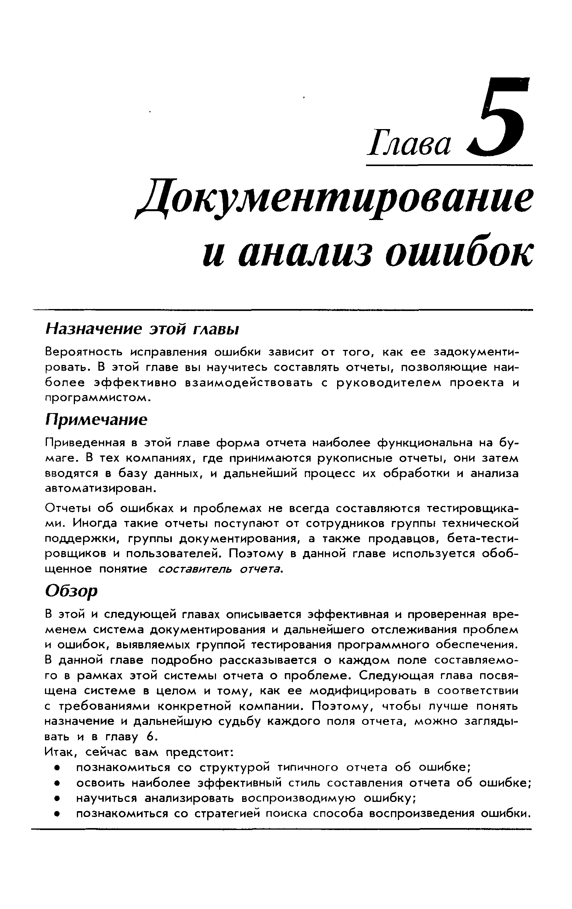

Итак, сейчас вам предстоит:
* познакомиться со структурой типичного отчета об ошибке;
* освоить наиболее эффективный стиль составления отчета об ошибке;
* научиться анализировать воспроизводимую ошибку;
* познакомиться со стратегией поиска способа воспроизведения ошибки.

Если отчет об ошибке недостаточно четкий и понятный, программист не сможет ее исправить. Поэтому документированию ошибок необходимо уделять самое серьезное внимание: отчет должен составляться быстро, но при этом его тон и содержание должны максимально способствовать решению выявленной проблемы.

*Целью составления отчета об ошибке является ее исправление.*

Если вы хотите, чтобы найденная ошибка была быстро и надежно исправлена, прежде всего сделайте следующее.

* **Объясните, как воспроизвести ошибку или проблемную ситуацию.** Программисты игнорируют отчеты об ошибках, которых не могут увидеть своими глазами.
* **Тщательно проанализируйте ошибку, чтобы описать ее предельно кратко.** Слишком пространное описание проблемы затрудняет понимание ее сути. Кроме того, встретив длинный отчет, программист подумает, что речь идет о чем-то сложном, и с большой вероятностью отложит его рассмотрение.
* **Составьте полный, понятный и непротиворечивый отчет.** Если отчет путает программиста или недостаточно отчетливо и ясно составлен, он едва ли послужит хорошей мотивацией для устранения ошибки.

## Отчет следует составлять немедленно

Обнаружив ошибку, следует сразу же составить о ней отчет. Хотя в нем довольно много граф, не стоит откладывать его заполнение, написав лишь короткие заметки. Очень важно, чтобы во время составления отчета все, о чем вы пишете, было у вас перед глазами, особенно это касается описания процедуры воспроизведения ошибки. Отчет ни в коем случае нельзя составлять по памяти, иначе очень легко ошибиться — программист не сможет повторить ситуацию и отложит отчет. Эта проблема довольно типична: тестировщики жалуются, что программисты постоянно игнорируют их отчеты, утверждая, что не могут воспроизвести ошибку. На самом же деле причина в неаккуратности самих тестировщиков.

*Столкнувшись с проблемой в работе программного обеспечения, сразу же составьте о ней полный отчет.*

# Структура отчета о проблеме

Во всех компаниях, занимающихся разработкой и тестированием программного обеспечения, форма отчета о проблеме одна и та же. Разумеется, порядок и названия его полей могут несколько отличаться, но представленная в нем информация неизменна. На рис. 5.1 показана форма отчета, которую предлагаем мы, а далее подробно описываются все ее поля.

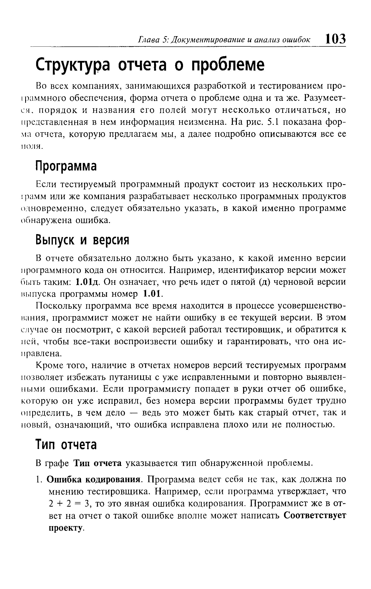

## Программа

Если тестируемый программный продукт состоит из нескольких программ или же компания разрабатывает несколько программных продуктов одновременно, следует обязательно указать, в какой именно программе обнаружена ошибка.

## Выпуск и версия

В отчете обязательно должно быть указано, к какой именно версии программного кода он относится. Например, идентификатор версии может быть таким: **1.01д**. Он означает, что речь идет о пятой (д) черновой версии выпуска программы номер **1.01**.

Поскольку программа все время находится в процессе усовершенствования, программист может не найти ошибку в ее текущей версии. В этом случае он посмотрит, с какой версией работал тестировщик, и обратится к ней, чтобы все-таки воспроизвести ошибку и гарантировать, что она исправлена.

Кроме того, наличие в отчетах номеров версий тестируемых программ позволяет избежать путаницы с уже исправленными и повторно выявленными ошибками. Если программисту попадет в руки отчет об ошибке, которую он уже исправил, без номера версии программы будет трудно определить, в чем дело — ведь это может быть как старый отчет, так и новый, означающий, что ошибка исправлена плохо или не полностью.

## Тип отчета

В графе **Тип отчета** указывается тип обнаруженной проблемы.

1. **Ошибка кодирования**. Программа ведет себя не так, как должна по мнению тестировщика. Например, если программа утверждает, что $2 + 2 = 3$, то это явная ошибка кодирования. Программист же в ответ на отчет о такой ошибке вполне может написать **Соответствует проекту**.

НАЗВАНИЕ КОМПАНИИ __________________ КОНФИДЕНЦИАЛЬНО __________________ ОТЧЕТ О ПРОБЛЕМЕ № _____

ПРОГРАММА ___________________________________________ ВЫПУСК _________ ВЕРСИЯ _____

ТИП ОТЧЕТА (1-6)___  
*1 - Ошибка кодирования*  
*2 - Ошибка проектирования*  
*3 - Предложение*  
*4 - Расхождение с документацией*  
*5 - Взаимодействие с аппаратурой*  
*6 - Вопрос*  

СТЕПЕНЬ ВАЖНОСТИ (1-3)___  
*1 - Фатальная*  
*2 - Серьезная*  
*3 - Незначительная*  

ПРИЛОЖЕНИЯ (Д/Н)____  
*Если да, какие:*  

ПРОБЛЕМА __________________________________________________________________________________________

МОЖЕТЕ ЛИ ВЫ ВОСПРОИЗВЕСТИ ПРОБЛЕМНУЮ СИТУАЦИЮ? (Д/Н) ___

ПОДРОБНОЕ ОПИСАНИЕ ПРОБЛЕМЫ И КАК ЕЕ ВОСПРОИЗВЕСТИ  
____________________________________________________________________________________________________  
____________________________________________________________________________________________________  

ПРЕДЛАГАЕМОЕ ИСПРАВЛЕНИЕ (НЕОБЯЗАТЕЛЬНО)  
____________________________________________________________________________________________________  

ОТЧЕТ ПРЕДСТАВЛЕН СОТРУДНИКОМ _______________________________________________ ДАТА __/__/__  

---
*СЛЕДУЮЩИЕ ГРАФЫ ПРЕДНАЗНАЧЕНЫ ТОЛЬКО ДЛЯ РАЗРАБОТЧИКОВ*

ФУНКЦИОНАЛЬНАЯ ОБЛАСТЬ _________________________________ ОТВЕТСТВЕННЫЙ _________________________

КОММЕНТАРИИ ______________________________________________________________________________________  
____________________________________________________________________________________________________  

СОСТОЯНИЕ(1-2)___  
*1 - Открыто* &nbsp;&nbsp;&nbsp;&nbsp; *2 - Закрыто*  

ПРИОРИТЕТ (1-5)___  

РЕЗОЛЮЦИЯ (1-9)___  
*1 - Рассматривается* &nbsp;&nbsp;&nbsp;&nbsp;&nbsp;&nbsp;&nbsp;&nbsp;&nbsp;&nbsp;&nbsp;&nbsp;&nbsp;&nbsp;&nbsp;&nbsp;&nbsp;&nbsp;&nbsp;&nbsp; *4 - Отложено*  
*2 - Исправлено* &nbsp;&nbsp;&nbsp;&nbsp;&nbsp;&nbsp;&nbsp;&nbsp;&nbsp;&nbsp;&nbsp;&nbsp;&nbsp;&nbsp;&nbsp;&nbsp;&nbsp;&nbsp;&nbsp;&nbsp;&nbsp;&nbsp;&nbsp;&nbsp;&nbsp;&nbsp; *5 - Соответствует проекту*  
*3 - Не воспроизводится* &nbsp;&nbsp;&nbsp;&nbsp;&nbsp;&nbsp;&nbsp;&nbsp;&nbsp;&nbsp;&nbsp;&nbsp;&nbsp;&nbsp;&nbsp;&nbsp; *6 - Не может быть исправлено*  

ИСПРАВЛЕННАЯ ВЕРСИЯ  
*7 - Отозвано составителем*  
*8 - Нужна дополнительная информация*  
*9 - Не согласен с предложением*  

РАССМОТРЕНО _________________________________________ ДАТА __/__/__  
ПРОКОНТРОЛИРОВАНО ___________________________________ ДАТА __/__/__  
СЧИТАТЬ ОТЛОЖЕННЫМ (Д/Н) ___  

---

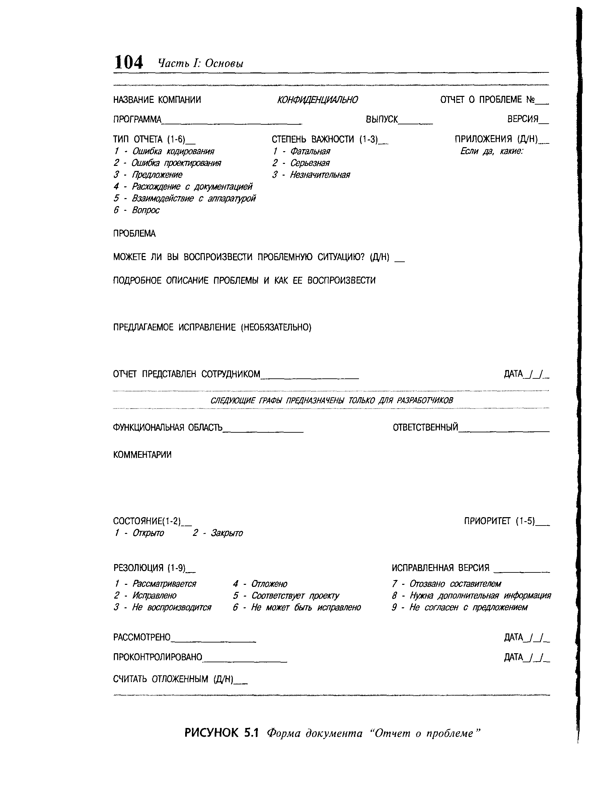

РИСУНОК 5.1 Форма документа “Отчет о проблеме”

2. **Ошибка проектирования.** Программа соответствует проектной документации, но в определенном вопросе тестировщик с этой документацией не согласен. Так особенно часто случается с элементами пользовательского интерфейса. На отчете данного типа программист не может написать **Соответствует проекту**, и если он считает, что проект верен, тогда он пишет **Не согласен с предложением**.

3. **Предложение.** Отчет такого типа не означает, что в программе что-то не так. В нем описывается идея, реализация которой, по мнению тестировщика, может улучшить программу.

4. **Расхождение с документацией.** Программа ведет себя не так, как описано в руководстве или интерактивной справке. В этом случае в отчете следует указать, в каком именно документе и на какой странице найдено несоответствие. При этом в отчете вовсе не утверждается, что ошибка именно в документации, а не в самой программе. Отчеты о расхождении с документацией обязательно должны совместно рассматриваться программистом и автором документации. О функциях программы, которые вообще нигде не описаны, также следует составлять отчеты данного типа.

5. **Взаимодействие с аппаратурой.** Проблемы этого рода связаны с неудачным взаимодействием программы и определенного вида аппаратного обеспечения. Если причина неудачи заключается в неисправности устройства, отчет о ней составлять не нужно. Однако если программа не может работать ни с одной платой или устройством конкретного типа — это уже проблема, которую следует документировать.

6. **Вопрос.** Программа делает что-то, чего тестировщик не ожидает или не понимает. Отчет-вопрос стоит составить при любых сомнениях. Если они окажутся основанными на действительной ошибке, программист ее исправит. Если же программист откажется исправить ошибку или его объяснение не покажется вам достаточно разумным, можно будет составить отчет об ошибке проектирования.

## Степень важности

В этой графе тестировщик указывает, насколько, по его мнению, серьезна выявленная проблема.

К сожалению, для определения степени важности проблемы не существует строгого критерия. Бейзер (Beizer, 1984, с. 20), например, предлагает шкалу от 1 (**незначительная ошибка**, например грамматическая) до 10 (**фатальная**, вызывающая сбои в других системах, войны, убийства и т.д.). Однако при этом Бейзер не считает значительными недостатки, которые вызывают у пользователя раздражение или заставляют его терять время.

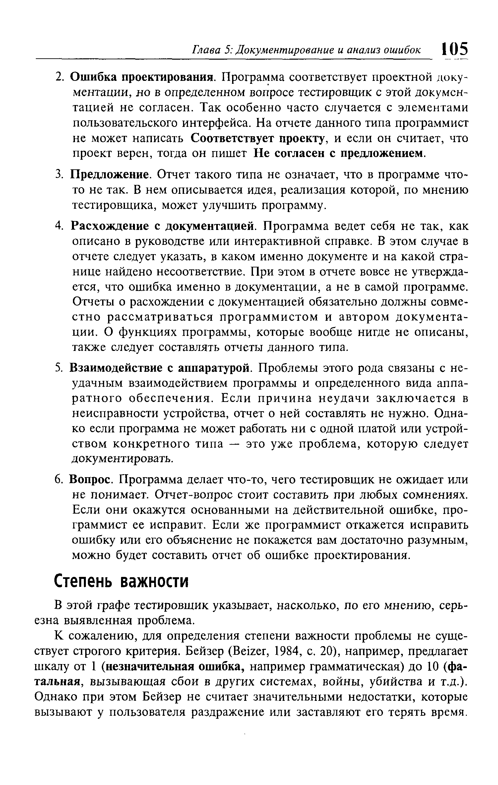

Такой взгляд на вещи свойствен многим программистам. Но на деле именно такие субъективные характеристики влияют на впечатление пользователя о программе. А во сколько, по-вашему, обойдется раздражение пользователей, выраженное в появившихся в прессе обзорах? Можно сказать только одно — у каждой конкретной компании могут быть свои критерии важности ошибок.

В дальнейшей судьбе выявленных тестировщиком ошибок существует одна четкая тенденция: самые незначительные из них часто не исправляются. Но так быть не должно. Хотя грамматические ошибки и не влияют на функционирование программы, они подрывают доверие пользователя к программному продукту. Учтите, что пользователь *видит* такие ошибки. Нам приходилось сталкиваться с продавцами, которые критиковали хорошие и надежные продукты, демонстрируя их самые незначительные недостатки. Поэтому, если в программе множество мелких и незначительных ошибок, составьте о них единый отчет, привлекающий внимание разработчиков к их количеству, а в графе описания проблемы **Степень важности** напишите **Серьезная**.

## Приложения

К отчету о найденной ошибке можно приложить дискету с тестовыми данными или программу, эмулирующую действия пользователя, при которых проявляется данная ошибка. Можно приложить распечатки, копии экрана или собственные дополнительные пояснения. Проще говоря, все, что поможет программисту разобраться в ситуации и понять вашу точку зрения, следует передать ему вместе с отчетом и перечислить в графе **Приложения**, чтобы эти материалы случайно не затерялись.

## Проблема

В этой графе суть проблемы формулируется очень коротко — в одной-двух строчках. Но при этом описание должно быть и достаточно информативным, чтобы прочитавший его сотрудник смог сразу составить себе четкое представление о проблеме. Именно по нему он будет искать нужный отчет, если захочет возвратиться к нему повторно. Кроме того, следует иметь в виду, что в сводных перечнях ошибок, как правило, будут присутствовать всего несколько полей: **Номер отчета**, **Степень важности**, возможно **Тип отчета** и **Проблема**.

Если по этому короткому описанию проблема покажется менее серьезной, чем есть на самом деле, существует риск, что руководитель проигнорирует отчет. Но и слишком сгущать краски тоже нельзя, иначе вы прослывете паникером.

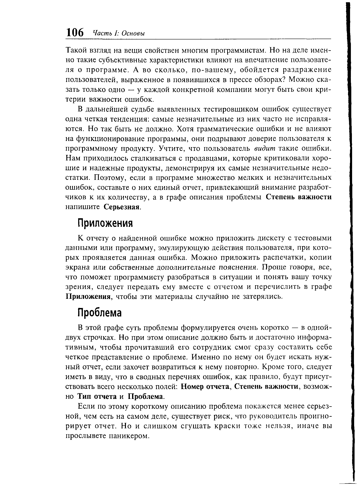

*Даже если две проблемы очень похожи, в отчетах их краткие описания ни в коем случае не должны совпадать.*

В графе **Проблема** не следует рассказывать, как воспроизвести ошибку. Примером хорошего описания может быть такая строчка: “Сбой программы при попытке сохранения файла под недопустимым именем”.

## Можете ли вы воспроизвести проблемную ситуацию?

Ответом может быть **Да**, **Нет** или **Не всегда**. Если с повторением ситуации возникли сложности, лучше отложить составление отчета до тех пор, пока дело не прояснится: либо вы убедитесь, что не знаете, как ее воспроизвести (и напишете **Нет**), либо поймете, что она носит нерегулярный характер (и напишете **Не всегда**). В последнем случае описать способ воспроизведения ситуации нужно особенно тщательно, указав, при каких обстоятельствах ошибка проявляется, а при каких — нет. Следует помнить, что, если написать в отчете **Да** или **Не всегда**, программист может попросить продемонстрировать описанную ситуацию, и если вы не сможете этого сделать, то зря потратите его время и потеряете доверие. С другой стороны, отчет о проблеме, которую невозможно воспроизвести, программист с большой вероятностью просто отложит, пока не появятся дополнительные отчеты.

## Подробное описание проблемы и как ее воспроизвести

Прежде всего следует подробно написать, в чем состоит проблема, и если это не очевидно, то почему вы считаете, что что-то не в порядке. Опишите все шаги и симптомы, все подробности, включая и сообщения об ошибке. В этом разделе отчета лучше предоставить программисту избыточную информацию, чем написать слишком мало.

Здесь снова нужно учесть психологию программиста: он может оставить ошибку неисправленной, потому что не сможет ее воспроизвести, или же отложить отчет, потому что ему не удалось повторить ошибку с первого раза. Стоит поберечь его время и не заставлять повторно искать уже выявленную вами ошибку. Если слишком часто предоставлять отчеты, по которым ошибки трудно будет воспроизводить, программисты начнут их просто игнорировать.

Составляя данное описание, тестировщик часто обнаруживает, что *не знает точно*, при каких условиях проявляется ошибка. Лучше увидеть это сразу и потестировать программу еще немного, чем давать программисту повод усомниться в вашей аккуратности.

Если же воспроизвести ошибку не удается даже после многих попыток, но при этом вы абсолютно уверены, что видели ее, составьте о ней максимально подробный отчет. Хороший программист сможет ее найти по вашему описанию, проанализировав программный код. Опишите все сообщения об ошибках, расскажите, что пытались делать. Но никогда не игнорируйте проблему только потому, что она не воспроизводится.

## Предлагаемое исправление

Эта графа отчета не является обязательной. Если решение проблемы очевидно или, наоборот, у вас нет конкретного предложения, оставьте ее пустой.

Но не стоит пренебрегать ею, если вы знаете, как исправить найденный недостаток программы. Особенно это касается пользовательского интерфейса: программист может не исправить его просто потому, что не сможет быстро придумать, как это сделать. В то же время неудачный текст на экране или неудобное расположение элементов формы будут исправлены очень быстро, если предложить программисту готовый вариант решения.

## Отчет представлен сотрудником

Обязательно укажите здесь свою фамилию. Если у программиста возникнут вопросы, он должен знать, к кому обратиться. А анонимные отчеты часто вообще игнорируются.

## Дата

В этой графе следует указать дату обнаружения проблемы. Это не дата написания отчета и не дата ввода его в компьютер. Поскольку программисты не всегда меняют номер версии программы после внесения в нее очередных изменений (иногда просто забывая это сделать), указанная в отчете дата поможет идентифицировать версию программы, к которой он относится.

> *Примечание.* Следующие графы отчета предназначены только для команды разработчиков. Внештатные составители отчетов, такие как бета-тестировщики и просто пользователи, не должны их заполнять.

## Функциональная область

В этой графе указывается, к какой категории относится выявленная проблема. Их полный перечень должен быть единым, чтобы во всех отчетах названия функциональных областей были одинаковыми. Кроме того, их не должно быть слишком много, и они должны быть очень четко определены. Десяток функциональных областей часто является оптимальным количеством.

Поручено

В этой графе должно быть указано, кто из сотрудников отвечает за решение описанной проблемы. Как правило, это решает руководитель проекта, который передает отчет конкретному программисту. Тестировщик или даже руководитель группы тестирования не должен решать, кто конкретно должен внести исправления.

Комментарии

Если отслеживание ошибок и их исправления не автоматизировано, а ведется на бумаге, эта графа используется программистом. Он может коротко записать, почему отчет отложен или как решена проблема.

В многопользовательских системах отслеживания ошибок данное поле используется гораздо более эффективно. Прежде всего, оно может быть любой длины, и каждый, кто имеет доступ к отчету, может внести собственный комментарий. Для исправления сложных ошибок или решения спорных проблем иногда может потребоваться целая дискуссия с несколькими участниками. Свое мнение может высказать программист, один или несколько тестировщиков, члены группы технической поддержки, авторы документации, менеджер по маркетингу, руководитель проекта и др. Это быстрый и очень эффективный способ обмена информацией и мнениями, гораздо более эффективный, чем электронная почта. Некоторые опытные сотрудники групп тестирования считают это поле базы данных одним из самых важных.

Состояние

В поле **Состояние** только что написанного отчета записывается **Открыто**. После исправления ошибки или принятия решения, не требующего дальнейшей работы с отчетом, значение этого поля изменяется на **Закрыто**.

В некоторых компаниях используются три варианта состояния вопроса: **Открыто**, **Закрыто** и **Решено**. Программисты ищут в базе данных отчеты по состоянию **Открыто**, а тестировщики по состоянию **Решено**. В нашей системе программисты ищут отчеты по резолюции **Рассматривается**, а тестировщики — по состоянию **Открыто** с любыми резолюциями, кроме **Рассматривается**. Обе эти системы логически эквивалентны, но у каждой из них есть убежденные сторонники.

Приоритет

Приоритет вопроса определяется руководителем проекта, обычно по 5- или 10-балльной шкале. Ошибки исправляются в порядке их приоритета.

Определения приоритетов в разных компаниях различны. Вот хороший пример.

(1) Исправить немедленно — ошибка задерживает работу других сотрудников.

(2) Исправить как можно быстрее.

(3) Исправить в текущей версии (альфа, бета и т.д.).

(4) Исправить до выхода окончательной версии.

(5) Исправить, если возможно.

(6) Не обязательно — сделайте, как посчитаете нужным.

На практике одни руководители проекта могут пользоваться 3-балльной шкалой приоритетов, а другие — 15-балльной. Мы рекомендуем каждому руководителю проекта самому выбрать способ оценки приоритетности работ.

Графу **Приоритет** имеет право заполнять *только руководитель проекта*, а графу **Степень важности** — только составитель отчета или руководитель группы тестирования. Руководитель проекта и составитель отчета могут коренным образом расходиться во мнениях о важности описанной в нем проблемы, но ни один из них не должен исправлять оценку другого. Случается, что тестировщик оценивает ошибку как фатальную, а руководитель проекта назначает ей сравнительно низкий приоритет. И поскольку у каждого из этих сотрудников в отчете имеется собственная графа, они оба могут зафиксировать в документе свои мнения.

## Резолюция и Исправленная версия

В графе **Резолюция** определяется текущее состояние вопроса или принятое по нему решение. Если в ответ на данный отчет в программу были внесены изменения, в графе **Исправленная версия** программист указывает номер исправленной версии программы. Вот какими могут быть варианты резолюции.

* **Рассматривается.** Это начальное состояние каждого отчета. Отчеты с резолюцией **Рассматривается** руководитель проекта должен просмотреть, назначить им приоритеты и решить, кто должен внести исправления. Если в отчете появляется новая информация, его полю **Резолюция** снова присваивается значение **Рассматривается**. Например, если тестировщик обнаруживает, что ошибка, которую программист посчитал исправленной, все еще проявляется, он изменяет резолюцию соответствующего отчета с **Исправлено** на **Рассматривается**.

* **Исправлено.** Эту пометку вносит программист после того, как исправит описанную в отчете ошибку. Одновременно он указывает номер исправленной версии программы в графе **Исправленная версия**.

* **Не воспроизводится**. Такую пометку программист ставит, когда не может воспроизвести описанную в отчете ситуацию. Если отчет возвращен с пометкой **Не воспроизводится**, тестировщику следует еще раз тщательно проверить номер версии программы и убедиться, что способ воспроизведения ошибки описан в отчете правильно и достаточно подробно. Скорректировав отчет, снова поменяйте его резолюцию на **Рассматривается** и при необходимости допишите в поле **Комментарии** дополнительные пояснения.

* **Отложено**. Руководитель проекта признает существование проблемы, но решил не исправлять ее в данном выпуске программы. Такое решение может быть принято для любой ошибки, допущенной при проектировании или кодировании.

* **Соответствует проекту**. Описанное в отчете поведение программы не является ошибкой — именно так она и должна работать в соответствии со спецификацией.

* **Отозвано составителем**. Если сотрудник, составивший отчет, обнаруживает, что ошибся, он может отозвать свой отчет. Никто, кроме него, не имеет этого права.

* **Нужна дополнительная информация**. У программиста есть вопросы к составителю данного отчета.

* **Не согласен с предложением**. Никаких изменений в программу внесено не будет.

* **Дубликат**. Во многих группах эта резолюция отмечает отчеты о различных проявлениях одной и той же ошибки, после чего связанные отчеты закрываются. Однако существует риск закрыть отчеты об очень похожих ошибках, причины которых различны. Программист может исправить одну из них и не понять, что вторая осталась.

## Подписи

В некоторых компаниях отслеживание ошибок не автоматизировано, и сотрудники подписывают бумажные отчеты. Однако подписан может быть и электронный отчет. В каждой компании на этот счет свои правила. На наш взгляд, в графе **Рассмотрено** должна стоять подпись сотрудника, решившего проблему (или исправившего ошибку), или же подпись его руководителя. Во многих компаниях здесь же подписывается руководитель, одобривший решение. В графе **Проконтролировано** ставит свою подпись тестировщик, проверивший, что ошибка и в самом деле исправлена, и подтверждающий, что отчет можно закрыть.

## Считать отложенным

Исправление ошибки или решение проблемы может быть по решению руководителя отложено до следующего выпуска программы. Так можно поступить с любой ошибкой, которую по определенным причинам уже нет времени или возможности исправить.

Если отслеживание ошибок организовано правильно, обо всех проблемах с резолюцией **Отложено** обязательно печатается сводный отчет, который может быть направлен руководству более высокого уровня и использован при работе над следующим выпуском программы.

> *Некоторые программисты намеренно прячут под спорными или неверными резолюциями легко воспроизводимые и исправимые ошибки, чтобы скрыть от руководства халтурную работу или то, что они не укладываются в сроки.*

Как же быть, когда вы не согласны с резолюцией руководителя проекта или программиста, не согласны с определенным для проблемы приоритетом или столкнулись с явным саботажем?

* В некоторых группах тестирования разрешается менять резолюцию. Но лучше этого не допускать, иначе не избежать шумных споров.
* Некоторые группы тестирования возвращают руководителю проекта отчеты с резолюцией **Соответствует проекту**, на которых, по их мнению, должна стоять резолюция **Отложено**. Но, на наш взгляд, не стоит этого делать без серьезной поддержки руководства.
* Во многих группах тестирования данный вопрос вообще игнорируется, а в результате ряд проблем так и остается нерешенным.

Для решения проблемы мы поместили в отчет графу **Считать отложенным**. Расхождение во мнениях между руководителями проекта и тестировщиками, на наш взгляд, явление совершенно нормальное. Система отслеживания ошибок должна быть построена так, чтобы *отражать* все эти расхождения. И именно для этой цели в отчете о проблеме присутствуют поля **Приоритет**, **Комментарии** и **Считать отложенным**.

Если тестировщик не согласен с резолюцией **Соответствует проекту**, ему следует оставить эту резолюцию как есть, а в графе **Считать отложенным** написать **Да**. Таким образом, в отчете будет присутствовать и мнение тестировщика, и мнение руководителя проекта, благодаря чему он не будет окончательно закрыт. Такие отчеты можно передать для рассмотрения высшему руководству или вернуться к ним позднее.

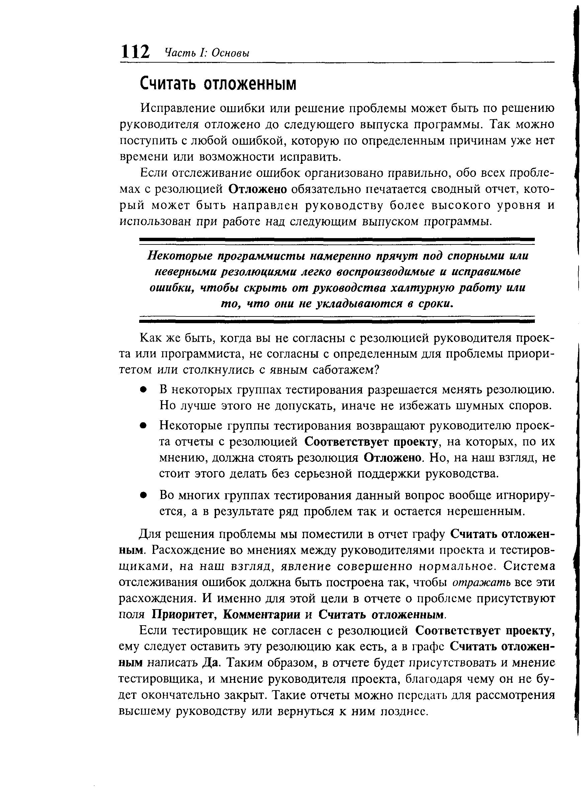

Каким должен быть отчет о проблеме

Хороший отчет должен представлять собой реальный документ, имеющий номер. Он должен быть простым, понятным, разборчиво написанным и беспристрастным. И если только это вообще возможно, по нему должно быть легко воспроизвести описанную ситуацию.

## Реальный документ

Некоторые руководители проекта поощряют устные описания ошибок, передачу записок по электронной почте или другие неформальные способы обмена информацией. Но это совершенно неправильно. Если только программист не исправит ошибку сразу же, как только вы о ней расскажете, она должна быть описана. Иначе о некоторых подробностях, а то и о самой ошибке очень легко забыть. Но даже если программист исправит ошибку сразу, исправления позднее нужно будет протестировать, а для этого вам понадобится отчет.

Следует иметь в виду, что вы и программист — не единственные, кто должен знать о выявленных при тестировании проблемах. После вас с программой может работать другой тестировщик, который захочет просмотреть ваши отчеты. В будущем программист, сопровождающий программу, может захотеть узнать, не является ли заинтересовавший его странный фрагмент кода исправлением какой-либо ошибки. А если найденная ошибка не исправлена, запись о ней обязательно нужно сохранить для дальнейшего рассмотрения руководством, а также для групп маркетинга и технической поддержки.

Описания ошибок можно не записывать только в одном случае: временной работе в команде программистов задолго до начала официального тестирования. Большинства обнаруженных на этом этапе проблем к моменту начала формального тестирования программного продукта уже давно не будет, и, как правило, записи о них не вносятся в базу данных. Более того, программисты могут попросить вас не документировать найденные ошибки, и, согласовав этот вопрос с руководством, лучше всего согласиться. Это не означает, что составлять отчеты о найденных ошибках вообще не следует. Просто не вносите их в общую базу данных, а после исправления ошибок выбрасывайте. Когда первая версия программного продукта будет передана для формального тестирования, оставшиеся отчеты можно будет внести в базу данных.

## Нумерация

Отчет о проблеме, как и всякий настоящий документ, должен иметь уникальный номер. В компьютеризованной базе данных этот номер должен быть ключевым полем таблицы отчетов, т.е. однозначным идентификатором

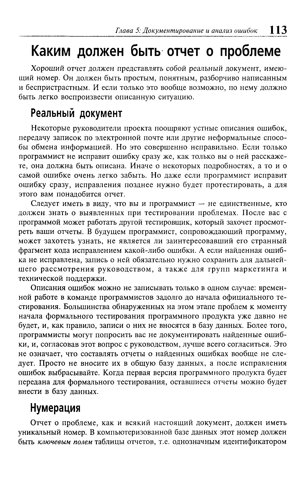

отчета в системе. В этом случае номера должны присваиваться автоматически.

### Простота

В каждом отчете должна быть описана только одна проблема. Даже если пять проблем кажутся очень тесно связанными, все равно следует составить о них пять разных отчетов. Подобным образом и пять предложений по поводу усовершенствования одной части программы следует описать в пяти отдельных отчетах. Если отчеты связаны, включите в них перекрестные ссылки, но никогда не объединяйте их в один документ.

Если в одном отчете описать несколько связанных ошибок, то можно почти не сомневаться, что программист не исправит их все. Он пометит отчет как **Исправлено**, и вам придется составлять новый отчет о тех ошибках, о которых он забыл или которые просто пропустил. Более того, оставшиеся ошибки часто вообще остаются незамеченными и так никогда и не исправляются. Имейте также в виду, что ошибки, которые кажутся связанными, на деле могут иметь совершенно разные причины, и в этом случае единый отчет о них тем более неуместен.

Составляя отчеты об ошибках, стоит учесть и психологию читающего их программиста. Отчет о нескольких связанных ошибках производит впечатление большого и сложного задания, и вполне вероятно, что программист отложит его, занявшись сначала теми отчетами, которые выглядят проще.

### Понятность

Чем понятнее отчет, тем больше вероятность, что описанная в нем ошибка будет исправлена. Суть проблемы должна быть описана очень просто и четко, а путь воспроизведения ситуации — максимально коротко, без лишних подробностей. Чтобы составить такое описание, придется как следует проанализировать проблему. Этому анализу посвящен отдельный раздел данной главы.

### Воспроизводимость

Следует еще раз подчеркнуть, что воспроизводимость описанной в отчете ошибки исключительно важна для ее исправления. Неопытные составители отчетов, такие как пользователи программ и сотрудники групп технической поддержки, часто предоставляют отчеты, по которым невозможно воспроизвести описанные в них ошибки. И, зная это, программисты часто откладывают их отчеты на потом.

Более того, многие руководители проектов настаивают на том, чтобы программисты вообще не тратили время на отчеты о невоспроизводимых ошибках. Поэтому, если вы знаете, как воспроизвести ситуацию, опиши-

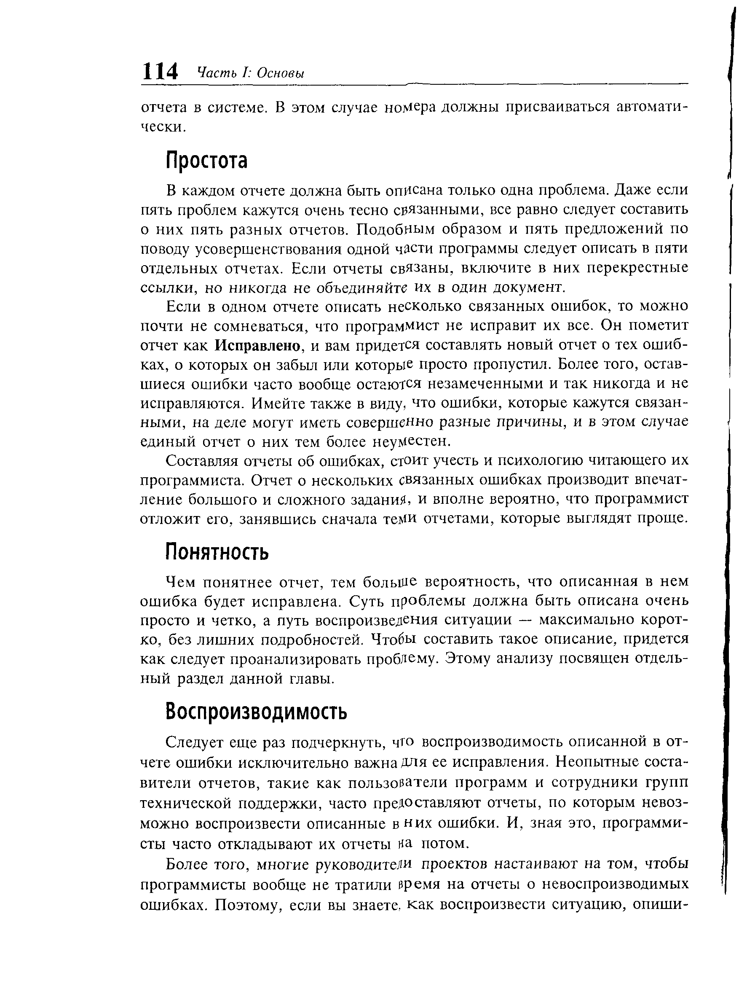

те этот процесс очень аккуратно, шаг за шагом, чтобы программист смог сразу его повторить. А если нет, прямо напишите об этом в отчете.

## Разборчивость

Рукописный отчет должен быть разборчивым. Подумайте о том сотруднике, который будет его читать, а также о пользе для собственной работы — с неразборчивым отчетом никто не захочет иметь дело.

Конечно, чтобы облегчить работу с отчетами и сделать их максимально разборчивыми, лучше всего пользоваться автоматизированной системой отслеживания ошибок (см. главу 6). Но даже если отчет вводится в компьютер, это все равно нужно сделать аккуратно, не пытаясь вместить на одну страницу максимум информации.

## Беспристрастность

Как известно, люди не любят, когда критикуют их работу. Никому не нравится постоянно слышать, что он сделал что-то не так. А тестировщику приходится говорить такие вещи сотрудникам постоянно. Поэтому следует проявлять особую деликатность и осторожность в выражениях. Ни в коем случае нельзя допускать оценок работы программиста. Даже если вы и в самом деле думаете, что он неаккуратен, глуп или плохой профессионал, в отчетах не должно быть и намека на качество его работы. Иначе вы наживете массу неприятностей, и в конечном счете это не пойдет на пользу делу.

Если программист почувствует в ваших отчетах предвзятость, он может пожаловаться начальству. А такие жалобы могут иметь самые серьезные последствия, отразиться на вашей карьере или даже стоить вам работы.

Прежде всего, для решения вопроса начальство может установить цензуру. В результате не все отчеты будут доходить до программиста, и отсеиваться могут не только те из них, которые действительно написаны в слишком резком тоне, но и те, политические последствия которых покажутся цензору нежелательными. При такой цензуре некоторые тестировщики и сами перестают составлять отчеты, по их мнению, ее не пройдут. Кончится тем, что многие вполне решаемые проблемы так и останутся нерешенными — пострадает качество разрабатываемого программного продукта.

Следует тысячу раз подумать, прежде чем объявлять войну программистам, выражая в отчетах личностные оценки. Слишком мало шансов ее выиграть, а потери будут большими. Если вы и сохраните работу, свободу написания отчетов наверняка потеряете, а отношения с разработчиками станут очень напряженными. И даже если ваши суждения абсолютно верны, результаты работы от всего этого отнюдь не улучшатся.

Все это не означает, что высказывать свои суждения о работе программистов тестировщику нельзя никогда. Бывают случаи, когда приходится писать резкие критические отчеты, чтобы привлечь внимание руководства к серьезным проблемам, которые никакими иными средствами решить не удается. Но это средство следует использовать в самую последнюю очередь, очень серьезно взвесив и ситуацию, и все возможные последствия. Не стоит идти на подобные конфликты чаще, чем дважды в год. А заметив, что они учащаются, лучше поискать другую работу.

## Анализ воспроизводимой ошибки

Оставшаяся часть главы посвящена только ошибкам кодирования, причем предполагается, что каждую ошибку можно воспроизвести. О том, как найти способ воспроизведения ошибки, коротко рассказывается в отдельном разделе.

Если проблему можно воспроизвести, это означает следующее.

* Тестировщик может описать, как перевести программу в определенное состояние. По его описанию перевести программу в указанное состояние может любой достаточно хорошо знакомый с ней человек.
* Тестировщик может описать конкретные действия, которые в указанном состоянии программы приводят к проявлению проблемы.

Не следует торопиться с составлением отчета о только что найденной ошибке. Часто стоит потратить время на дополнительный анализ, который помогает не только составить более эффективный отчет, но и выявить ряд связанных проблем. Такой анализ особенно важен, если обнаруженная проблема сложна, например, если для ее воспроизведения требуется пройти очень много этапов или если последствия определенных действий пользователя трудно описать. Главные цели анализа таковы:

* Выявить все наиболее серьезные последствия проблемы.
* Найти простейший и кратчайший путь ее воспроизведения.
* Найти альтернативные действия, приводящие к такому же результату.
* Выявить связанные проблемы.

## Наиболее серьезные проблемы

Чтобы привлечь к проблеме внимание, нужно представить ее достаточно серьезной. Незначительный недостаток программы с большой вероятностью останется неисправным.

Предположим, например, что в углу экрана появляется случайный текст. Эту маленькую ошибку легко описать и воспроизвести, и, скорее всего, она будет исправлена. Но что, если эта ошибка обнаружится перед

самым завершением разработки? Иногда искажение информации на экране не возникает вследствие совершенно изолированной ошибки и больше ни на что не влияет — в такой ситуации решение оставить его как есть может быть вполне разумным. Однако часто подобные вещи являются симптомами гораздо более серьезных проблем. Если продолжить работу с программой, очень скоро в ней может произойти сбой. Это и есть то последствие, которое вы ищите. И, исправив настоящую ошибку, программист исправит заодно и искажение на экране.

Сбой программы — это:
* ее переход в непредусмотренное программистом состояние или
* передача управления блоку обработки ошибки.

Если речь идет о непредусмотренном состоянии, дальнейшие ошибки почти неминуемы, ведь у программы в этом случае совершенно неправильное представление о том, что происходило ранее. Что касается подпрограмм обработки ошибок, то здесь ситуация не намного лучше: эти подпрограммы обычно являются самым слабым местом программного продукта, наименее продуманным и отлаженным. Часто случается, что блок обработки ошибки сам содержит ошибку гораздо более серьезную, чем та, из-за которой ему передано управление.

Итак, если программа сообщает об ошибке, искажает информацию на экране или делает что-либо, чего программист не предполагал, следует ждать дальнейших ошибок.

## Простейший и кратчайший путь воспроизведения ситуации

Бывает, что повторить обнаруженную ошибку не так-то просто. Она может проявляться исключительно в полночь, причем только в високосном году, или может возникать в ответ на сложную последовательность нестандартных или редко выполняемых действий пользователя. Но в любом случае, описывая путь ее воспроизведения, имейте в виду следующие обстоятельства.

* Если ошибка понятна и ее легко исправить, это будет сделано.
* Если для исправление ошибки требуется много времени и усилий или программисту кажется, что это так, он возьмется за работу с большой неохотой.
* Если проблема проявляется при самых типичных действиях пользователя программы, руководство будет заинтересовано в ее исправлении.
* Если кажется, что недостатка практически никто не заметит, в очереди на исправление он будет последним.

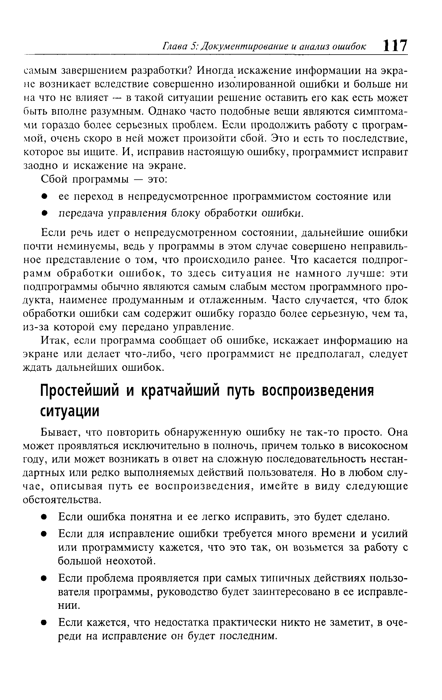

Описание более простого способа воспроизведения ошибки не только увеличивает вероятность ее исправления, но и облегчает работу программиста. Уменьшая количество шагов, вы сужаете область поиска источника ошибки. Благодаря этому ошибку в программе легче найти, а результат проще протестировать.

## Альтернативный способ демонстрации ошибки

Бывает, что найти более простой способ воспроизведения проблемной ситуации так и не удается. Последовательность шагов остается такой длинной, что может показаться редко выполняемой на практике. В результате, оценивая важность проблемы, руководитель проекта или программист может подумать, что мало кто из пользователей с ней вообще когда-либо столкнется.

Чтобы изменить это впечатление, можно поискать другие действия, которые приводят к проявлению этой же проблемы. Два разных способа вызвать ошибку — это уже гораздо более серьезный сигнал тревоги. Их существование наводит на мысль, что ошибка может иметь глобальный характер: где есть два способа, там может найтись и третий, и четвертый.

Кроме того, между двумя разными способами воспроизведения ошибки может быть нечто общее. Даже если тестировщику связь между ними не видна, программист может выяснить, что в обоих случаях выполняется одна и та же подпрограмма, а значит, именно в ней и содержится ошибка.

Итак, описав в отчете несколько различных способов воспроизведения ошибки, вы не только привлечете к ней внимание, но и предоставите программисту дополнительную информацию, полезную для ее исправления.

## Связанные проблемы

Подумайте, нет ли еще в программе аналогичного фрагмента, в котором могла бы проявиться такая же проблема. Возможно, пользователь программы в нескольких ее режимах выполняет сходные действия. Проверьте, как поведет себя программа во всех этих режимах. Встретив ошибку, продолжайте работу, чтобы посмотреть, какие еще проблемы могут возникнуть вслед за ней.

Ошибка — это всегда новая возможность для тестировщика. После нее программа переходит в состояние, которое иным способом может быть недостижимо. Чаще всего выполняется код обработки ошибок, который трудно протестировать иначе, как встретив реальную ошибку. И поскольку-какую-нибудь этот код может быть выполнен при реальной эксплуатации программы, перед вами раскрывается прекрасная возможность его проверить.

Поиск связанных проблем требует определенного навыка. Здесь важно правильно определить, когда следует остановиться, а когда стоит потратить

еще немного времени: опытному тестировщику интуиция может подсказать, что остались еще скрытые и весьма серьезные проблемы.

## Методика анализа воспроизводимой ошибки

Итак, цели анализа найденной ошибки перечислены. Далее приводится ряд советов по их достижению.

### Выделение критического момента

Обнаружив ошибку, тестировщик видит только симптом, но не знает его причины. Нестандартное поведение программы вызвано ошибкой в ее исходном коде, которого у него нет. И ошибка эта может произойти вовсе не в той точке, в которой проявился ее результат, а гораздо раньше. Если выявить момент, в который она произошла на самом деле, это поможет программисту локализовать и исправить найденную ошибку.

Выполняя каждый шаг воспроизведения ошибки, внимательно наблюдайте за поведением программы, стараясь заметить любое отклонение, малейший намек на то, что что-то идет не так. Такие незначительные отклонения легко пропустить или проигнорировать, а между тем, они могут быть первыми симптомами анализируемой вами ошибки. Вот какими могут быть эти симптомы.

* **Сообщения об ошибках.** Выясните точно, в какой момент появляется сообщение об ошибке, попытайтесь понять почему и сверьте его с перечнем сообщений об ошибках, перечисленных в документации к программе.
* **Задержки в обработке данных.** Если программе для отображения на экране очередной информации или выполнения некоторых операций требуется необычно много времени, это может означать, что она что-то делает не так. Она может выполнять не относящиеся к делу подпрограммы, неправильно обрабатывать данные и т.п. Поэтому всегда обращайте внимание на подозрительно долгие задержки и тщательно проверяйте результирующие данные.
* **Мигание и обновление экрана.** Если экран вдруг неожиданно мигнул, это может означать, что он был обновлен подпрограммой обработки ошибок. Это может быть первое, что она сделает, чтобы гарантировать корректную информацию на экране, а остальные ее действия могут проявиться позднее или не проявиться вовсе.
* **Перемещение курсора.** Курсор может вдруг переместиться в другое место. Как и в предыдущем случае, это может быть сделано проце-

дурой обработки ошибок, а может быть и результатом сбоя в работе самой программы, которая потеряла контроль над ситуацией.

* *Несколько курсоров.* Если на экране появилось сразу два курсора, это может означать, что программа находится в промежуточном состоянии или что ее нормальная работа нарушена.
* *Сдвинутый текст.* Строки текста на экране или на бумаге слегка сдвинуты. Может быть, сместилась только одна строка, а возможно, несколько.
* *Повторяющиеся или пропущенные символы.* Если компьютер печатает слово *онииибка* вместо *ошибка*, это может быть опечаткой программиста, а может сигнализировать и о проблемах с чтением или записью данных.
* *Горящий индикатор активности устройства, которое не должно участвовать в работе.* Индикаторы активности имеются у многих устройств — они показывают, когда компьютер читает или записывает данные в их память. Если, например, индикатор активности диска загорелся, когда точно известно, что программа не должна обращаться в это время к диску, это может означать, что, работая на языке достаточно низкого уровня, программист записал данные не по тому адресу, и вместо определенного места памяти они попали на диск. При низкоуровневом программировании это достаточно распространенная ошибка, последствия которой могут быть самыми разрушительными.

## Отслеживание действий программы

Чтобы лучше отследить работу программы, можно воспользоваться отладчиком исходного кода. С его помощью можно узнать много полезного, например, какой процесс в данный момент активен, какой объем памяти и сколько других ресурсов компьютера он использует, насколько заполнен стек и т.д. Вот примеры ошибок, о которых можно узнать с помощью отладчика.

* Определенная подпрограмма забывает освобождать после себя стек, и, если она выполнится много раз, это приведет к его переполнению.
* После получения сообщения от другого процесса определенный процесс программы забывает сообщить операционной системе, что она может освободить выделенную для этого сообщения память. (Сообщения, которыми обмениваются процессы, — это просто структуры данных в памяти. При создании сообщения операционная система выделяет для него память, а после его получения адре-

сатом должна эту память получить обратно.) Если процессы активно обмениваются сообщениями, в определенный момент из-за их неаккуратности свободная память может быть исчерпана. Это вы и увидите в отладчике, как и то, кто является узурпатором.

Это только два примера, но они показывают, какие возможности раскрываются перед тестировщиком, владеющим основами программирования. Однако не стоит тратить на работу с отладчиком слишком много времени. Не забывайте, что основная ваша работа — это тестирование “черного ящика”, а с отладчиком программист может поработать и сам.

Еще одним способом анализа работы программы является распечатка ее экранов и изменений в файлах данных. Помните, что с листом бумаги всегда легче работать, чем с экраном компьютера.

Если содержимое экрана очень быстро меняется, можно попробовать поработать на менее скоростном компьютере, или найти еще какой-нибудь способ замедлить работу программы — например, эксплуатировать ее в многопользовательской среде с повышенной нагрузкой. В результате иногда можно увидеть нечто важное, что в противном случае мгновенно промелькнет на экране и останется незамеченным.

### Выявив критический шаг, тщательно протестируйте его последствия

Предположим, что если пользователь выполняет шаги **А**, **Б**, **В**, то на шаге **В** что-то происходит не так. Вы выяснили, что виновником происшествия является шаг **Б**. Попробуйте поменять последовательность действий, посмотрите, как поведет себя программа, если после шага **Б** выполнить не **В**, а **Г**. Будут ли последствия такими же? Возможно, обнаружится более серьезная проблема, чем та, которую вы встретили вначале. Например, программа не просто отобразит неверную информацию, но вообще “зависнет”.

### Поищите дальнейшие ошибки

Даже если вам не удалось точно установить, на каком именно шаге в программе происходит ошибка, все равно продолжайте ее тестировать, чтобы посмотреть, как она поведет себя дальше. За найденной ошибкой с большой вероятностью последуют другие, и информация об этих последствиях первой ошибки может очень помочь программисту в ее поиске и исправлении. Однако не забывайте, что следующая найденная вами ошибка не обязательно является следствием предыдущей. Поэтому постарайтесь протестировать ее отдельно, особенно если ее можно вызвать каким-нибудь другим способом, в котором первая ошибка участвовать не будет.

### Варьируйте последовательность действий

Если проблема достаточно сложна и для ее воспроизведения нужно выполнить целый ряд действий, попробуйте изменить их последовательность. Что будет, если пропустить один из шагов или немного его изменить? Поведет ли себя программа так же? Может быть, проявятся еще какие-нибудь неполадки.

Чем больше шагов удастся удалить из последовательности, тем лучше, поскольку это позволяет предельно локализовать проблему. Оставьте в отчете только те действия, которые действительно необходимы для воспроизведения ситуации.

### Проверьте, имелась ли такая же ошибка в предыдущих версиях программы

Если окажется, что найденная вами ошибка появилась только в определенной версии программы, а до этого ее не было — замечательно. Это будет означать, что ошибка появилась в результате конкретных изменений, и программист ее легко найдет. Особенно часто так бывает ближе к концу разработки.

### Проверьте, не зависит ли поведение программы от конфигурации системы

Сбой в работе программы может быть вызван нехваткой ресурсов, конфликтом с другим программным обеспечением системы или же ее ориентацией на конкретную аппаратную конфигурацию. Попробуйте добавить память или наоборот, уменьшить ее объем. Проверьте, как программа работает в сети. Попробуйте выгрузить все лишние программы, в том числе резидентные. Смените монитор, видеоплату или другое устройство, с которым связана проблема. Подробнее о проблемах, связанных с аппаратной и программной конфигурацией системы, рассказывается в главе 8.

### Поиск способа воспроизведения ошибки

Как мы уже говорили, ошибка воспроизводима, если ее можно увидеть, выполнив описанные в отчете действия. Задача его составителя — объяснить, как достичь определенного состояния программы и какие действия выполнить в нем для воспроизведения ошибки, а также рассказать, в чем она состоит. Чтобы точно знать, что проблема не вызвана последствиями какой-нибудь другой ошибки, найденной перед этим, лучше всего перезаг-

рузить компьютер, повторно запустить программу и воспроизвести проблему "с чистого листа".

Но бывает, что воспроизвести ошибку повторно не удается. Более того, иногда тестировщик вообще не знает, как именно он ее получил. Что делать в этом случае?

Прежде всего следует записать все, что вы помните: в чем состояла ошибка и что вы делали, перед тем как ее увидели. Кроме действий, непосредственно связанных с ее появлением, опишите и более ранние. Запишите каждую мелочь, которую сможете вспомнить. Затем спросите себя: "Почему же эту ошибку трудно воспроизвести?"

Многие тестировщики делают видеозаписи своей работы, тем более что это можно сделать средствами самого компьютера. Это помогает сэкономить многие часы работы. Кроме того, если ошибку так и не удастся воспроизвести, видеозапись послужит подтверждением, что она все-таки была. Кроме видеозаписей, некоторые тестировщики пользуются программами перехвата клавиатурного и иного ввода, с помощью которых впоследствии можно воспроизвести свои действия. В некоторых случаях все эти способы только задерживают работу, но если программа полна трудновоспроизводимых ошибок, их значение невозможно переоценить.

Если простое повторение действий пользователя не срабатывает, это еще ничего не значит. Существует множество ошибок, которые проявляются только при определенном сочетании условий, иногда весьма неожиданных. Любая ошибка на самом деле воспроизводима. Вопрос только в том, как найти условия, которые ее вызывают. И иногда это проще сделать программисту, перед глазами которого программный код. Однако не стоит опускать руки прежде времени. Вот несколько направлений поиска источника ошибки.

### Повышенная нагрузка

Обычно тестировщик выполняет привычный тест очень быстро. Столкнувшись с ошибкой, он повторяет выявивший ее тест, но уже гораздо медленнее и внимательнее. И если на этот раз ошибку повторить не удается, все дело может быть как раз в разнице скорости: в первый раз программу заставили работать быстрее, чем она может. Стоит попробовать снова выполнить тест с обычной скоростью — сделайте это несколько раз. Попробуйте увеличить нагрузку на компьютер или перейти на менее скоростную машину.

### Пропущенные детали

Если программа тестируется неформально, без строгого плана, тестировщик может просто забыть, что именно он делал, или упустить какую-нибудь мелкую деталь, которая на самом деле была ключевой. Бывает, что

тестировщик просто, не глядя, нажимает какие попало клавиши — как тут разобрать, из-за чего произошел сбой?

Но даже при плановом тестировании можно отвлечься и случайно выполнить что-либо дважды или просто нажать не на ту клавишу. Причиной неудачи с воспроизведением ситуации может быть ваша собственная ошибка или случайное незапланированное действие. В этом случае нужно постараться как можно точнее вспомнить, до какого момента работы все шло по плану и где именно вы отвлеклись, чтобы максимально локализовать проблему.

### Ошибка пользователя: вы сделали вовсе не то, что думаете

Разумеется, как пользователь программы тестировщик может просто-напросто ошибиться. Например, если исчезли нужные данные, это может означать не ошибку программы, а то, что вы их случайно удалили. Но предполагать собственную ошибку тестировщику следует в самую последнюю очередь.

У этого вопроса есть еще один аспект. Тестировщик может допустить ошибку, которую очень часто будут допускать и пользователи программы. И если она реагирует на эту ошибку неадекватно или последствия разрушительны для данных, это уже серьезная проблема, о которой необходимо составить отчет. Не игнорируйте такие ошибки, лучше тщательно проанализируйте происходящее и подумайте, как усовершенствовать программу, чтобы сделать ее более дружественной и надежной.

### Ошибка с разрушительными последствиями

Бывает, что последствия ошибки настолько разрушительны, что ее невозможно сразу повторить, а может быть, вы и не захотите этого делать. Например, программа может разрушать файлы, выполнять запись в критические области памяти, блокировать систему. Прежде чем приступить к воспроизведению ошибки, придется сначала восстановить работоспособность системы.

Вот пример ситуации, связанной с подобной ошибкой. Пользователь присылает вам дискету с данными, при обработке которых программа сбоит. Вы запускаете программу, и она разрушает данные на этой дискете. Ошибку удалось воспроизвести, но, чтобы сделать это еще раз, придется просить пользователя снова прислать данные.

Чтобы избежать подобных проблем, перед воспроизведением ошибки следует всегда делать резервные копии данных.

> *Никогда, никогда, никогда не работайте с исходными данными — только с копиями.*

## Ошибка, зависящая от объема памяти

Сбой программы может происходить только при определенных условиях, связанных с типом, объемом и структурой доступной памяти.

В этом случае полезно вставить в программу отладочные сообщения об объеме доступной памяти при ее загрузке и в ключевые моменты выполнения. Эти сообщения программа может выводить при нажатии определенной клавиши, и иногда их даже оставляют в окончательной версии продукта для его дальнейшей поддержки.

## Ошибка, проявляющаяся только при первом запуске

Первое, что делают после запуска очень многие программы, — это считывают с диска инициализационную информацию. Если при самом первом запуске программы инициализационные файлы не содержат нужной информации, программа может вести себя непредсказуемо. Однако при выходе программа сохранит в этих файлах корректные данные, и дальше все пойдет хорошо. Данная ошибка проявляется только однажды, и ее можно было бы считать безвредной, если бы не тот факт, что с ней столкнется каждый пользователь.

Еще одной сходной ошибкой может быть неправильная интерпретация программой собственной неинициализированной памяти. Например, программист может забыть инициализировать переменную сразу после ее создания, и при обращении к ней программа использует содержимое переменной как осмысленное значение, что вызывает отклонения в ее работе. Через некоторое время переменная будет инициализирована и все пойдет правильно. Такая ошибка может проявляться при одной последовательности выполнения программы и отсутствовать во всех других случаях.

В данном случае вся проблема в том, как найти то состояние программы или данных, в котором проявляется ошибка. В первом из описанных случаев это проще — следует только еще раз установить исходную, ни разу не запускавшуюся копию программы. Во втором можно попробовать восстановить исходное состояние данных и вспомнить все действия, выполнявшиеся с программой от ее запуска до завершения, даже если они никак между собой не связаны.

## Ошибка, связанная с разрушенными данными

Если данные программы по какой-либо причине разрушены, это может вызвать сбой в ее работе. При этом неважно, в чем причина их разрушения — это могла сделать сама программа, а может быть, дело в абсолютно внешних обстоятельствах. В любом случае программа может обнаружить разрушение данных и выдать вполне корректное сообщение об ошибке, а может повести себя совершенно непредсказуемо. Для воспроизведения

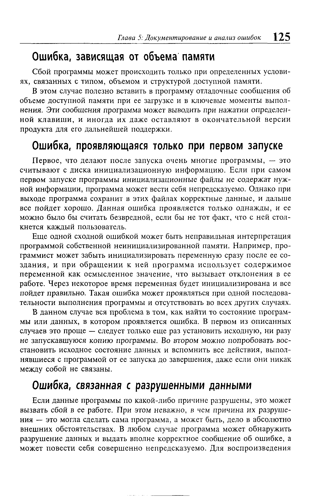

подобной ошибки необходимо снова запустить программу с теми же данными.

## Ошибка, являющаяся побочным эффектом другой проблемы

Если в процедуре обработки ошибок имеется ошибка, восстановление после очередного сбоя может пройти неудачно. В этом случае может произойти все что угодно, и в том числе новая ошибка. Для ее повторения понадобится воспроизвести причину первого сбоя.

## Нерегулярные аппаратные сбои

Как правило, аппаратные проблемы, если уж они имеются, носят регулярный характер. Например, микросхема памяти либо работает, либо нет. Но бывает, что из-за плохого контакта или случайного колебания напряжения происходит единовременный сбой, который больше не повторяется. В результате сбоя может, например, быть повреждена определенная область памяти, точнее, хранящиеся в ней данные или программный код.

Однако не стоит торопиться с выводами. На аппаратный сбой ошибку следует списывать в самую последнюю очередь.

## Дата и время

Программа, работа которой зависит от даты или времени, может выполнять некоторые специфические действия в полночь, первого января или в конце февраля в високосный год.

Общеизвестна "Проблема 2000 года" — возможность сбоев самых разнообразных программ при переходе от 31 декабря 1999 года к 1 января 2000 года из-за ошибок, связанных с проверками попадания даты в определенный диапазон, формированием даты по умолчанию и другими подобными моментами.

Поэтому в любой программе, работающей с датами и временем, следует внимательно проверить значения, попадающие на границу суток, недели, месяца, года, високосного года и столетия.

## Зависимость от ресурсов

В многозадачной системе ряд процессов могут совместно использовать ее ресурсы — процессор, внешние устройства, память и др. Пока один процесс печатает данные, другой должен ждать освобождения принтера. Если одному процессу выделено $90\%$ всей памяти, другому придется обходиться десятью. Поэтому в программе должны быть предусмотрены действия, выполняемые в случае отсутствия необходимых ресурсов. Если здесь имеется ошибка, для ее воспроизведения потребуется восстановить состо-

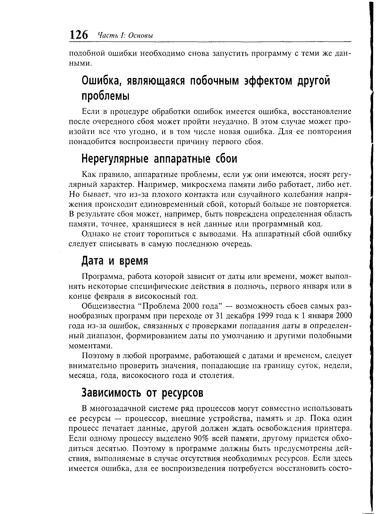

яние среды выполнения — снова запустить программы, занимающие память, принтер, коммуникационный порт и т.п.

## Пауза между ошибкой и ее проявлением

Если в программе происходит ошибка, вовсе не обязательно, что она сразу же проявится. Ее результаты могут оставаться скрытыми, возможно, ошибка должна будет повториться много раз, и видимый результат может проявиться при выполнении совсем другой, абсолютно правильной и тысячи раз проверенной подпрограммы.

Типичным примером подобной ситуации является переполнение стека или другой аналогичной структуры. Стек — это область памяти, зарезервированная для временного хранения данных. Программа помещает в него информацию, работает с ней, а после использования удаляет. Если одна из процедур забывает выполнять этот последний шаг, через какое-то время стек окажется переполненным и другая, вполне исправная процедура не сможет поместить в него данные. Переполнение стека часто вызывает серьезный сбой программы.

Чтобы повторить эту ошибку, нужно выполнить "провинившуюся" часть программы столько раз, сколько необходимо для переполнения стека. Если процедура, в которой происходит сбой, выдерживает тестирование, следует выяснить, какая из процедур выполнялась до нее.

## Особые фрагменты кода

Тестируя программу извне, вы понятия не имеете, какие критические точки и граничные условия присутствуют в ее коде. Поэтому программист может иногда сэкономить вам часы и дни работы, мгновенно найдя ошибку, проявляющуюся только в очень специфических обстоятельствах. Однако в книге этот способ поиска причины ошибки не случайно стоит последним. Донимая программиста постоянными отчетами о невоспроизводимых ошибках, можно серьезно испортить с ним отношения. Он может подумать, что вы ленивый или неквалифицированный тестировщик и перекладываете на него собственную работу.

## Кто-то поэкспериментировал с вашим компьютером

Такое случается. Вы проводили тестирование и вышли ненадолго. Пока вас не было, кто-то подошел к компьютеру, ввел некоторые данные, поработал с программой, выключил принтер. Это могла быть намеренная шутка. А может быть, шеф демонстрировал программу гостю и забыл вас предупредить. Оставляя компьютер включенным, вы всегда рискуете, вернувшись, найти его в другом состоянии.

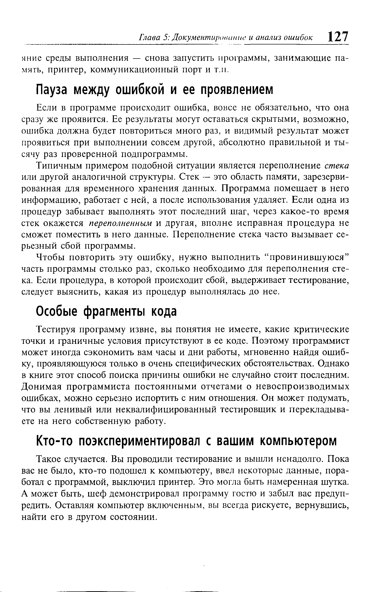


Часть II

# Приемы и технологии тестирования


Глава 6. Система отслеживания проблем

Глава 7. Разработка тестов

Глава 8. Тестирование принтеров и других устройств

Глава 9. Адаптационное тестирование

Глава 10. Тестирование документации

Глава 11. Инструментальные средства тестировщика

Глава 12. Планирование и документация

# Глава 6
# Система отслеживания проблем

## Назначение этой главы

В предыдущей главе рассказывалось о том, как составить отчет о выявленной проблеме. Теперь вам предстоит узнать о дальнейшей судьбе этого отчета. В данной главе речь пойдет о структуре базы данных, являющейся основой системы отслеживания процесса исправления ошибок и решения иных проблем, выявляемых в ходе тестирования программного обеспечения. Основное внимание будет направлено на рассмотрение потоков циркулирующей в системе информации и нуждам использующих ее людей. Приведенные формы и отчеты применяются в одной из вариантов реализации данной системы, но, разумеется, можно разработать и другой ее вариант, более гибко отражающий специфику работы конкретной компании.

## Примечание

До сих пор под словом "вы" в этой книге имелся в виду начинающий тестировщик. В этой главе ситуация меняется, и дальнейший рассказ обращен уже не к новичку, а к профессионалу, готовому взять на себя руководство проектом. Предполагается, что читатель руководит группой тестирования и его слово в разработке системы отслеживания проблем имеет значительный вес. Однако и тем, у кого еще нет столь серьезного профессионального опыта, прочитать эту главу будет небезынтересно. Ее материал охватывает множество аспектов работы специалистов группы тестирования и их взаимодействия с остальными сотрудниками компании и изложен на вполне доступном уровне даже для новичка.

## Обзор

Первая часть главы посвящена вопросам наиболее эффективного использования системы отслеживания проблем.

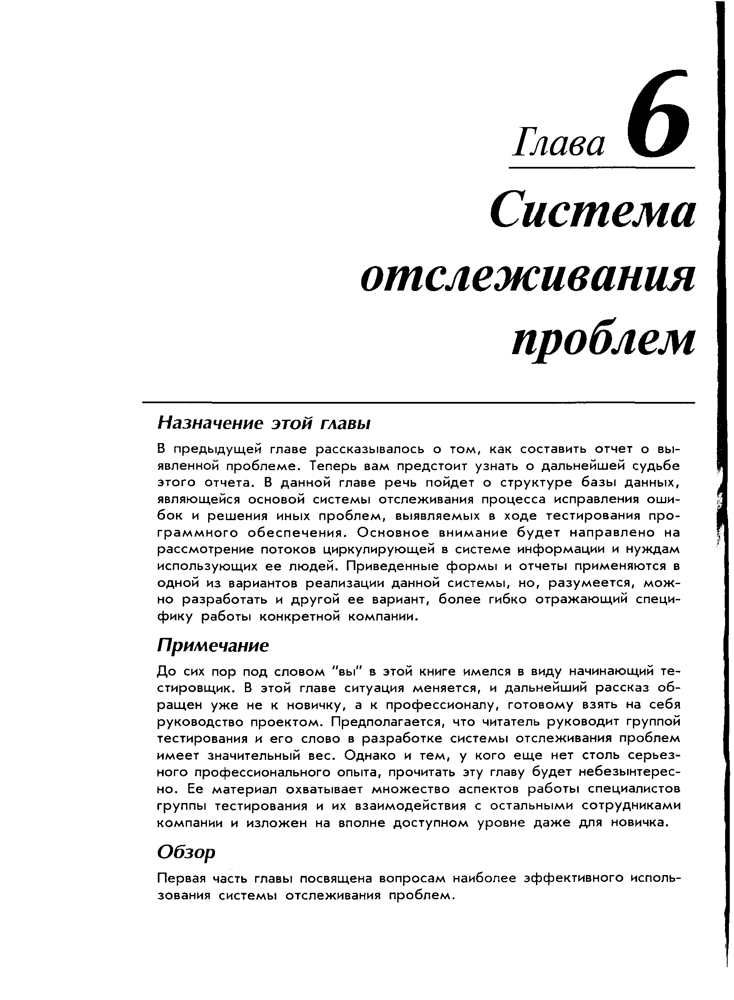

* Она начинается с общего обзора преимуществ системы и организационных проблем, связанных с ее внедрением.
* Затем рассматривается главная цель внедрения системы и ее основная задача. Мы видим ее в том, чтобы добиться исправления максимально возможного числа ошибок.
* Для достижения этой цели система должна решать определенный комплекс задач. Вы узнаете и об этих задачах, и о предъявляемых к системе требованиях.
* Далее рассматривается весь процесс отслеживания и решения проблемы. Что происходит с отчетом после его составления? Как решается описанная в нем проблема, как исправляется ошибка и как система помогает выполнить эту работу наиболее эффективно.
* Не меньшего внимания, чем сама система, заслуживают и ее пользователи. С ней работают очень многие сотрудники компании, обращаясь к ней по самым разным причинам. Какая информация им нужна и каковы должны быть средства ее получения? Какую информацию они вводят в систему? Без точных ответов на все эти вопросы нельзя спроектировать ни одно средство автоматизации работ.

Во второй части главы рассматриваются некоторые подробности построения системы отслеживания проблем.

* Прежде всего, приводится подробное описание основных форм и отчетов, применяющихся в большинстве подобных систем.
* Далее предлагается несколько способов организации ее структуры, позволяющих максимально повысить эффективность работы с каждым из отчетов и минимизировать возможные конфликты между пользователями.
* В последнем разделе приводится несколько важных советов по проектированию интерактивной формы ввода отчета о проблеме.

Отчет о проблеме представляет собой первый и наиболее очевидный результат работы тестировщика. Но в то же время он — только начало работы по решению проблемы, и от того, как будет организована эта работа, зависит эффективность всего процесса создания программного продукта.

Организационная часть процесса решения проблем может быть автоматизирована. Минимум, что можно сделать, — это хранить все отчеты в системе в электронном виде и по ним автоматически составлять сводные документы. Кроме того, в хорошей системе должны быть средства организации взаимодействия между сотрудниками, участвующими в процессе решения проблем и исправления ошибок. До сих пор во многих фирмах, занимающихся разработкой программного обеспечения, применяется бумажная форма отчетности или системы, которые сами сотрудники считают чересчур уж примитивными. В то же время создать удобную и эффективную автоматизированную систему отслеживания проблем не так

уж трудно, и даже для сравнительно небольших проектов она стоит усилий, которые придется на это затратить.

В данной главе предполагается, что ваша компания достаточно велика, чтобы в ней имелись руководитель группы тестирования, менеджер по маркетингу, руководитель проекта и группа технической поддержки. Это предположение позволяет говорить о людях, чьи роли четко распределены, но вовсе не означает, что на практике сотрудников не может быть гораздо меньше. Группа из двух человек, один из которых пишет программу, а второй ее тестирует, может работать по точно такой же схеме. Какой бы маленькой фирма ни была, все равно имеет смысл внедрить в ней автоматизированную систему отслеживания проблем — хотя бы в некотором объеме.

Выбор конкретной организации системы отслеживания проблем базируется на нашем собственном опыте — мы описали систему, показавшую себя наиболее эффективной. В книге приводится главная форма ввода данных, ряд стандартных отчетов и некоторые замечания по реализации. Всего этого достаточно, чтобы написать собственную программу автоматизации описанных задач. А кроме чисто технических подробностей, из этой главы вы узнаете об основных целях создания системы отслеживания проблем, ее роли в работе компании и влиянии на качество конечного продукта.

Автоматизированная система отслеживания проблем прежде всего решает вовсе не технические, а политические вопросы. Это мощное организационное средство со следующими возможностями.

1. *Система является средством отслеживания хода работ.* Информация, которая традиционно имелась в распоряжении только у руководства и нескольких программистов, становится доступной широкому кругу сотрудников самых разных уровней. Система предоставляет своим пользователям объективную и независимую оценку хода выполнения работ и их соответствия графику. В любой момент можно просмотреть полный список задач, которые еще должны быть решены. Текущее состояние продукта и его качество всегда известны. И каждый может увидеть, как продвигаются работы и насколько быстро решаются поставленные задачи.

2. *Система является средством организации взаимодействия между сотрудниками.* В каждой компании так или иначе решается целый ряд организационных вопросов. Когда процесс их решения автоматизирован, многое становится проще: действия сотрудников становятся боле регламентированными и упорядоченными. Более того, система высвечивает некоторые внутренние проблемы компании, ранее остававшиеся скрытыми. Хорошая система, особенно сетевая,

позволяет практически полностью отслеживать взаимодействие между сотрудниками, участвующими в выявлении и исправлении недостатков программного продукта, чтобы вовремя решать спорные вопросы и принимать меры по оптимизации работ. В частности, с ее помощью можно зафиксировать случаи некорректного поведения отдельных сотрудников или групп, злоупотребления чужим рабочим временем, необоснованных претензий и т.п.

При внедрении системы отслеживания проблем необходимо решить целый ряд организационных и политических вопросов, что уже само по себе достаточно полезно. Вот наиболее важные из них.

* Кто имеет право составлять отчеты о проблемах? Кто решает, следует ли ввести представленный отчет в базу данных? Кто отвечает за отнесение отчета к конкретной категории и определение его приоритета?
* Кто имеет право доступа к базе данных для просмотра ее информации? Кто может обращаться к ней с запросами и получать итоговые и статистические данные?
* Кто отвечает за формирование результирующих документов, содержащих качественные и статистические показатели?
* Кто и почему имеет право задевать чье-либо самолюбие?
* Кто имеет право на рабочее время других сотрудников и чье именно? Не требуют ли программисты слишком подробных отчетов о каждой ошибке? Не предоставляют ли тестировщики слишком мало информации, из-за чего программисты вынуждены тратить на поиск ошибок больше времени?
* Какая степень расхождений в оценках качества продукта считается допустимой?
* Кто имеет право делать заключение о качестве продукта? Могут ли одни сотрудники опротестовывать решения других и настаивать на том, чтобы конкретная ошибка была исправлена? За кем остается окончательное решение?

3. *Система отражает производительность работы каждого сотрудника*. Из базы данных нетрудно получить любую статистическую информацию, например, о количестве отчетов, сдаваемых тестировщиком за день, среднем количестве ошибок, допускаемых программистом в неделю, среднем времени задержки, допускаемой программистом до исправления ошибки и т.п. Руководители проектов обычно очень любят подобные цифры. И они действительно могут быть полезны для анализа хода разработки и решения текущих

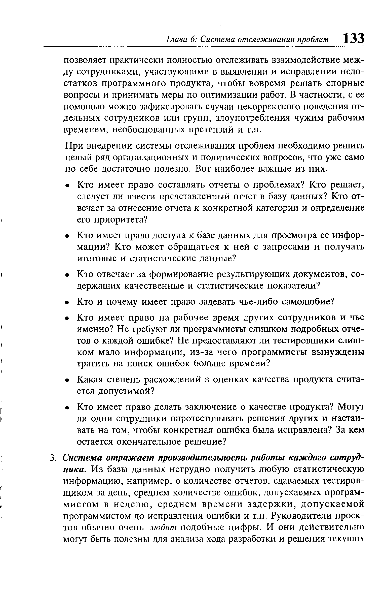

проблем. Иногда они могут даже служить основанием для взысканий или увольнения сотрудника. Однако у данной функции системы есть серьезный побочный эффект, сильно ограничивающий ее применение: хорошие сотрудники могут воспринимать эту функцию системы как давящую, а плохие, наоборот, манипулировать ею, чтобы создать впечатление большей производительности.

4. *Система может служить оружием для межгрупповых войн*. Предположим, что сотрудники, работающие над проектом X, выбиваются из графика, а его руководитель не хочет это признавать. В этом случае руководитель группы тестирования или другого проекта, связанного с первым, может воспользоваться предоставляемой системой статистикой для доказательства того, что для завершения проекта X необходимо больше времени, людей и денег, чем запланировано. В данном случае информация системы используется по назначению. Однако возможна и иная ситуация, когда корпоративные политикины манипулируют ею ради собственных интересов, доказывая, например, что ситуация хуже, чем есть на самом деле.

Итак, главным преимуществом системы автоматизированного отслеживания проблем является повышение эффективности взаимодействия сотрудников, участвующих в их решении. Однако у этой системы могут быть и свои издержки, связанные прежде всего с психологическими и политическими вопросами. Сотрудники будут осторожнее документировать найденные ошибки и свои соображения по их поводу, опасаясь, что некоторая информация может быть использована против них. В этой книге будет подробно рассказано и о достоинствах, и о недостатках данной системы, чтобы вы смогли извлечь максимальную пользу из первых и минимизировать вторые.

## Основное назначение системы отслеживания проблем

> *Система отслеживания проблем служит прежде всего для исправления максимально возможного числа ошибок. Все, что не служит достижению этой цели, является побочным эффектом.*

Проектируя систему отслеживания проблем, к ее функциям стоит отнестись очень внимательно. Некоторые из них, как, например, формирование итоговых отчетов для руководящего персонала, вполне согласуются с ее основной целью. Но каждую новую предлагаемую функцию следует

обязательно проанализировать на соответствие задачам системы, и, если она не способствует их решению, ее лучше отклонить.

## Задачи системы

Для достижения основной цели системы отслеживания проблем необходимо следующее:

1. Каждый, кому следует знать о проблеме, должен узнавать о ней сразу же после составления отчета.
2. Ни одна из ошибок не должна остаться неисправленной просто потому, что о ней забыли или потому что так решил программист.
3. Минимум ошибок должны оставаться неисправленными из-за проблем взаимодействия сотрудников.

В этом списке не случайно так мало задач. Они, и только они являются ключевыми, и к добавлению дополнительных задач следует относиться крайне осторожно.

## Процесс отслеживания проблемы

Определив основные цели и задачи системы отслеживания проблем, можно перейти к рассмотрению ее работы: отследить, что происходит с отчетами после их составления, и разобраться с основными трудностями и проблемами, возникающими на их пути.

### Проблема документируется

С чего все начинается, рассказывалось в главе 5. Тестировщик обнаруживает проблему, изучает ее и составляет ее подробное описание в форме отчета.

Далее отчет должен быть введен в систему отслеживания проблем. В одних компаниях составители отчетов сами вводят их в базу данных. В других отчеты пишутся вручную, а в базу данных их вводит отдельный сотрудник. Бывает и так, что тестировщики вводят свои отчеты самостоятельно, а другие сотрудники, например администраторы, сотрудники группы технической поддержки или группы маркетинга, сначала предоставляют свои отчеты ответственному сотруднику (тестировщику, системному аналитику или руководителю проекта), который решает, следует ли их вводить в систему.

Система отслеживания проблем может быть как одно-, так и многопользовательской. Типичная однопользовательская система устанавливается на компьютере в отделе тестирования. Непосредственный доступ к ней имеют только тестировщики. Для остальных исходные и итоговые отчеты

распечатываются одним из тестировщиков, который специально назначен для этой работы. В случае же с многопользовательской системой ситуация принципиально иная. База данных системы устанавливается на одном из компьютеров корпоративной сети. Непосредственный доступ к ней получают все тестировщики и руководители проекта и, как правило, также программисты и авторы технической документации. Сотрудники групп маркетинга и технической поддержки могут работать с системой не во всех компаниях, хотя, на наш взгляд, у них должно быть это право. Права доступа к системе различных сотрудников могут включать возможность вводить собственные отчеты, вводить данные в определенные поля отчетов, составленных другими сотрудниками, запрашивать сведения из базы данных и печатать итоговые отчеты.

## Отчет поступает руководителю проекта

Как только отчет введен в базу данных, его копия должна поступить руководителю проекта. В многопользовательской системе это происходит автоматически — у руководителя проекта имеется непосредственный доступ к базе данных, а значит, и к только что введенному отчету. В однопользовательской системе сотрудник группы тестирования периодически передает руководителю проекта распечатанные копии отчетов.

Как правило, руководитель определяет приоритеты проблем и передает отчеты программистам. Однако здесь возможны варианты.

* В большинстве случаев руководитель проекта оценивает важность проблемы, добавляет собственные комментарии и передает отчет программисту. Отчет с наиболее низким приоритетом не рассматривается программистом до тех пор, пока не будут исправлены более важные недостатки программы. В некоторых компаниях программисты все же просматривают такие низкоприоритетные отчеты, чтобы исправить описанные в них ошибки по ходу исправления более важных ошибок в той же части кода. Как правило, если определить, что ошибки относятся к одному фрагменту кода, их гораздо проще и быстрее исправить все вместе. Однако компании, в которых принята такая технология работы, обычно полагаются на правильную группировку отчетов тестировщиками или программистами, а это в некоторых случаях может и не сработать.
* Руководитель проекта может попробовать воспроизвести проблему самостоятельно. В случае неудачи он возвращает отчет тестировщику на доработку.
* Руководитель проекта может вернуть отчет тестировщику на доработку, и не пытаясь воспроизвести проблему. Например, он может запросить дополнительную информацию — данные о конфигурации

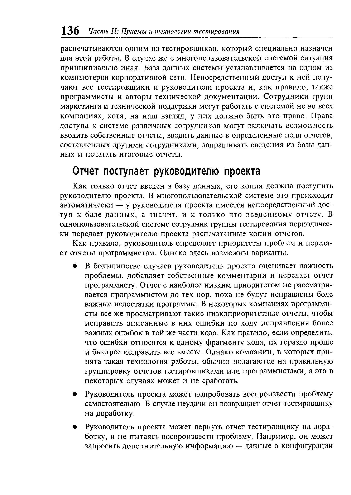

системы, дополнительные пояснения или тестовые файлы. Хорошая система отслеживания проблем позволяет руководителю проекта и программисту записать все свои вопросы в отдельных полях отчета, а тестировщику — внести в этот же отчет ответы. Таким образом, вся информация, касающаяся решения конкретной проблемы, хранится в одном месте. Тестовые файлы обычно нельзя включить прямо в базу данных, но ничто не мешает включить в отчет ссылки на эти файлы.

В организации работ по тестированию программного обеспечения важную роль играет достижение правильного баланса между количеством работы, выполняемой тестировщиком для документирования проблемы, и количеством усилий, затрачиваемых программистом на ее воспроизведение. Иногда от тестировщиков требуют чересчур подробных отчетов и тестовых файлов для каждой, даже самой маленькой и очевидной ошибки. В других компаниях, наоборот, пытаются обойтись самыми краткими описаниями, и в результате программисты тратят массу времени на повторный поиск найденных тестировщиками ошибок и воссоздание тестовых данных, вместо того чтобы просто запросить дополнительные материалы. Какой баланс будет "правильным", однозначно ответить нельзя. Но ниже приводится ряд соображений по этому поводу.

* *Время тестировщика обычно дешевле, чем время программиста.* Однако опытный в отладке программист по короткому, но хорошо написанному отчету часто находит и исправляет ошибку гораздо быстрее, чем тестировщик собирает всю связанную с ней информацию.
* *В конце разработки важность быстрого и надежного исправления ошибок резко возрастает* — чем быстрее проблемы будут решены, тем быстрее продукт выйдет в продажу. В этом случае важно, чтобы программисты получали от тестировщиков максимум информации, сколько бы ни стоил труд последних. Кроме того, на завершающих стадиях проекта гораздо проще подключить к нему дополнительных тестировщиков, чем программистов.
* *Иногда у тестировщиков гораздо больший опыт отладки, чем у программистов*, или они больше заинтересованы в обнаружении и исправлении ошибок. В подобных случаях основной упор можно сделать на ресурсы группы тестировщиков, особенно если программисты упрямы и их нельзя заменить. Так бывает, когда контракт с программистом плохо составлен, и в нем не предусмотрено никаких поощрений и санкций, связанных с качеством его работы. Однако опытные тестировщики требуют, чтобы пере-

распределение нагрузки в таком случае было выполнено официально и их группа была пополнена дополнительным персоналом.

* **Ни при каких обстоятельствах недопустимы намеренные потери чьего-либо времени.** Тестировщик никогда не должен лениться включить в отчет дополнительную информацию или тестовые данные, если существует вероятность, что программисту они могут понадобиться. А программист или руководитель проекта, в свою очередь, не должны требовать от тестировщика дополнительных исследований, которые не являются действительно необходимыми.
* Наконец, руководитель проекта может вообще отвергнуть отчет или написать на нем резолюцию **Соответствует проекту**. Возможно также, что он попросит тестировщика классифицировать отчет как **Расхождение с документацией** и передаст его авторам документации, чтобы они отразили в ней соответствующий вопрос (скорее всего, в разделе разрешения проблем).

После того как дополнительная информация по отчету будет предоставлена, руководитель проекта решит его окончательную судьбу — направит программисту или отложит (с резолюцией **Соответствует проекту**, **Не воспроизводится** или по иным мотивам). Некоторые руководители проектов случайно или намеренно задерживают отдельные отчеты, не отвечая на них какое-то время, но хорошие итоговые отчеты системы отслеживания проблем немедленно выявляют такие вещи.

## Руководитель проекта передает отчет программисту

Передавая отчет программисту, руководитель проекта ожидает от него исправления программы или некоторого исследования и пояснения того, почему описанная проблема не может быть решена. Ошибки, разумеется, обычно исправляются.

Вместо исправления программист может запросить у тестировщика дополнительную информацию или ответить (иногда и вполне обоснованно), что ошибку невозможно воспроизвести, слишком сложно исправить, что описанная ситуация вообще не является ошибкой, что ни один нормальный пользователь программы с ней никогда не столкнется, что тестовый пример составлен некорректно или проблема не стоит внимания по какой-либо иной причине. Некоторые программисты всячески избегают исправления ошибок. Бывает, что программист игнорирует отдельные отчеты, надеясь, что этого никто не заметит, пока уже не будет слишком поздно. Или же программист всячески усложняет жизнь тестировщику, надеясь, что тот сдастся и будет документировать меньше ошибок: спорит, требует дополнительных материалов, новых исследований, подтверждений, что в таком

виде программа действительно не устраивает пользователей. Или требует проверки того, что ошибка осталась и в следующей версии программы (хотя программист ее не исправлял, а просто надеется, вдруг она исчезла сама собой при исправлении других ошибок). Другой тактикой подобных недобросовестных программистов является так называемая песчаная буря: на профессиональном жаргоне, непонятном тестировщику, программист путанно объясняет, что внесение изменений в эту часть программного кода может подорвать основы всей системы и самым серьезным образом отразиться на ее надежности.

С подобным сопротивлением можно бороться. В частности, для этой цели может послужить поле отчета **Комментарии**. В него следует вносить каждый комментарий, объяснение, каждое возражение или предложение. В многопользовательской системе программист сам должен будет ввести в отчет все свои аргументы. В однопользовательской их нужно записать самостоятельно. Тон этих записей должен быть абсолютно нейтральным, и в них точно должно быть отражено все сказанное. Хороший руководитель проекта обязательно просмотрит эти комментарии и сам примет необходимые меры.

На практике почти в каждом проекте тестировщики с определенного момента начинают чувствовать необоснованное сопротивление со стороны программистов. Часто они ошибаются. Подробные комментарии в каждом отчете о проблеме могут помочь руководителю проекта или группы тестирования разобраться в недоразумениях и ослабить напряженность, возникшую между тестировщиками и программистами.

## Когда проблема объявлена решенной

Исправив ошибку, программист делает на отчете пометку **Исправлено** и, возможно, добавляет некоторые комментарии. Однако на этом работа с отчетом вовсе не заканчивается. Программист часто ошибается. Проблема может остаться нерешенной, или внесенные в программу изменения могут породить новые ошибки. Наш собственный опыт разработки коммерческого программного обеспечения показывает, что 10% неудачных исправлений — это еще очень хороший показатель. Если программист работает с таким коэффициентом, значит, нам повезло, и он исключительно профессионален и внимателен. Если же 25% отчетов, помеченных программистом как исправленные, на самом деле не выдерживают проверки, мы, конечно, не в восторге, но и не считаем это чем-то из ряда вон выходящим. Как отмечалось в главе 3, при разработке крупных систем зафиксированы гораздо большие коэффициенты неудачных исправлений, вплоть до 80%.

Повторное тестирование программы по отчету, возвращенному программистом с пометкой **Исправлено**, лучше всего проведет тот тестировщик, который составил данный отчет. Если же его составил кто-то, кто не вхо-

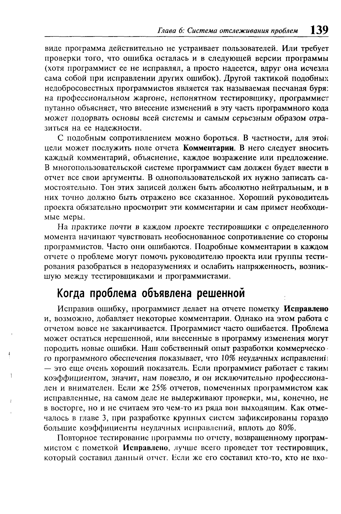

дит в группу тестирования, стоит сначала воспроизвести проблему в исходной версии программы, а потом уже тестировать исправленную версию. (Старайтесь работать так, чтобы три последние версии программы всегда были у вас под рукой, тогда вы в любой момент сможете сравнить поведение программы с тем, каким оно было до внесения исправлений.)

Получив обратно отчет об исправленной ошибке, начните с повторения того теста, который описан в отчете. Вы будете немало удивлены, как часто даже эти исходные тесты не срабатывают.

Если исходный тест программа пройдет успешно, попробуйте его вариации. Обязательно прочтите все примечания программиста и другие имеющиеся в отчете комментарии. Какие части программы затрагивают внесенные изменения? Что они могли нарушить? Проведите несколько тестов на возможные побочные эффекты. Еще раз протестируйте исправленную часть программы. Где была одна ошибка, возможны и другие. Подумайте о возможности существования более глобальной проблемы, частью которой была та, что уже решена, и о том, какие еще проблемы могут быть с ней связаны. Тестировщики часто тратят на анализ и тестирование уже решенных проблем и исправленных ошибок гораздо меньше времени, чем они того заслуживают.

Если программа не проходит первоначальный тест, напишите об этом в исходном отчете и исправьте его резолюцию с **Исправлено** на **Рассматривается**, после чего снова отошлите отчет руководителю проекта или программисту.

Если же исходный тест программа прошла и "засыпалась" на связанной ошибке, лучше закрыть отчет, оставив на нем резолюцию **Исправлено**, и написать новый. Большинство руководителей проектов и программистов предпочитают именно такой способ работы. Отчеты получаются меньшими и более простыми, чем те, в которых отслеживается целая цепочка исправлений связанных ошибок.

## Невоспроизводимые проблемы

Если программист и руководитель проекта не могут воспроизвести описанную в отчете ошибку и не знают, в чем ее причина, они отмечают отчет как **Не воспроизводится** и возвращают его вам. В этом случае остается только попытаться все же воспроизвести ситуацию, прибегнув к тактике, описанной в главе 5. Если это удастся, внесите в отчет дополнительные комментарии. В случае необходимости можно даже лично продемонстрировать ошибку программисту или руководителю проекта. Передайте им видеозаписи или тестовые файлы. Все, что будет приложено к отчету, обязательно перечислите в соответствующем разделе.

Если в текущей версии программы воспроизвести ошибку не удается, зато удается в предыдущей, лучше всего пометить отчет как **Исправлено** и

закрыть его. Как правило, это означает, что при последнем изменении соответствующего фрагмента кода ошибка была исправлена. Однако перед закрытием отчета всегда лучше уточнить у программиста, действительно ли было именно так. Обязательно впишите в план тестирования соответствующую заметку и в нескольких последующих версиях программы проведите повторные тесты, чтобы убедиться, что ошибки и в самом деле больше нет.

Если ошибка не воспроизводится ни в одной из версий программы, оставьте отчет еще на некоторое время открытым — возможно, до следующего этапа разработки. При поступлении каждой новой версии проводите повторное тестирование: может быть, ошибку все же удастся обнаружить. И только если ее так и не удастся, закройте отчет окончательно.

## Отложенные отчеты и спорные вопросы

Если на отчете стоит резолюция **Отложено**, это означает, что руководитель признал существование ошибки, но решил не исправлять ее в данной версии программного продукта. В некоторых коллективах разработчиков используется и еще одна похожая формулировка — **Не может быть исправлено**, означающая, что исправление ошибки отложено на неопределенное время. В каждом программном продукте, даже сделанном со всей тщательностью и хорошо отлаженном, все равно остается некоторое количество подобных ошибок. В самом конце разработки, когда времени остается в обрез, риск побочных последствий, связанных с исправлением каждой ошибки, перевешивает необходимость исправления самых незначительных из них. То же самое касается и усовершенствования проекта — эта работа может всячески поощряться, но за несколько недель до завершения разработки ее необходимо прекратить. Вся ответственность за то, какие ошибки будут исправлены, а какие — нет, лежит на руководителе проекта.

Многие руководители объясняют сотрудникам, почему решение той или иной проблемы отложено, вписывая свои соображения в отчет в поле **Комментарий**. В случае, если у сотрудников появятся возражения, и особенно при разработке следующего выпуска программы, эти записи будут очень полезны.

Приступая к работе над следующим выпуском продукта, необходимо прежде всего открыть все отложенные отчеты и повторно их проанализировать. К этому моменту после завершения предыдущего выпуска может пройти уже несколько лет, может смениться персонал. Для нового руководителя все записи отложенных отчетов будут представлять большую ценность, да и прежний за такое время вполне может забыть подробности и собственные мотивации.

Если руководитель написал на отчете **Соответствует проекту**, значит, именно так программа и должна работать — описанная в отчете ситуация не является ошибкой. Если такая пометка сделана на отчете, классифицированном вами как **Ошибка проектирования**, посмотрите, что руководитель написал в поле **Комментарий**. Необходимо убедиться, что руководитель понял: вы знаете, что работа программы соответствует проекту, однако, на ваш взгляд, в данном случае она неверно спроектирована. Если из комментариев это не очевидно, лучше спросить у самого руководителя.

Некоторые руководители проекта боятся ответственности, связанной с откладыванием проблем. Они относятся к каждому отложенному отчету как к разрешению оставить в программе серьезный недостаток, и, вместо того чтобы написать на подобном отчете **Отложено**, пишут **Соответствует проекту**. Так они чувствуют себя спокойнее: хотя ошибка при этом никуда не девается, однако общая статистика разработки выглядит гораздо лучше. В ходе разработки проводятся специальные совещания для обсуждения отложенных отчетов. И разумеется, такие неправильно помеченные отчеты оказываются просто "спрятанными под сукно" — на совещания они не попадают.

Конечно, бывают ситуации, когда руководитель проекта и тестировщик действительно расходятся во мнениях. Честен руководитель в своей оценке или нет, но во многих коллективах в таких случаях принято, чтобы тестировщики самостоятельно меняли резолюцию на спорном проекте на **Отложено**. Однако наш опыт показывает, что резолюцию руководителя проекта лучше оставить неизменной, а вот в поле **Считать отложенным** написать **Да**. В этом случае отчет благополучно попадет на совещание по отложенным проблемам. Когда начнется работа над следующим выпуском программного продукта, отчет можно будет открыть снова.

Каждые несколько недель, а ближе к завершению проекта и чаще, руководитель группы тестирования собирает совещание для обсуждения откладываемых проблем. На этом совещании рассматриваются все накопившиеся отчеты с резолюцией **Отложено** или значением **Да** в поле **Считать отложенным**. Лучше всего, если на этих совещаниях присутствуют менеджер по маркетингу, руководитель или представитель группы технической поддержки, руководитель или представитель группы документирования, руководитель проекта, ведущий тестировщик и, возможно, их непосредственный начальник.

На совещании принимается окончательное решение о судьбе каждой из отложенных проблем. Именно здесь представитель группы тестирования может высказать свое мнение о важности решения части обсуждаемых вопросов в текущем выпуске продукта. Для совещания следует подготовить копии всех отложенных отчетов (в полном объеме, а не только краткие описания проблем). Каждый приглашенный имеет право высказать соб-

ственное суждение. И если, несмотря на возражения тестировщиков или других сотрудников, принимается решение отложить определенный отчет, он окончательно считается закрытым. Только приступив к работе над следующей версией продукта, его можно будет открыть.

Для успешного проведения работ подобные регулярные совещания исключительно важны. Прежде всего, если у тестировщиков и персонала группы технической поддержки не будет официальной возможности опротестовывать принятые руководителем решения, они найдут для этого неформальные средства. Они могут демонстрировать ошибки, которые считают особенно важными, персоналу группы маркетинга, директорам, вице-президентам, президенту компании, газетчикам и т.д. В результате маленькая производственная проблема может превратиться в большую политическую. Если же позволить каждому заинтересованному сотруднику официально высказать свои аргументы, до политических баталий дело не дойдет. И когда участники совещания согласятся с решением руководителя проекта отложить определенный отчет, это решение будет окончательным и больше вопросу не будет уделяться ни внимания, ни рабочего времени сотрудников. Для сравнения предположим, что единственное совещание по отложенным проблемам проводится в самом конце разработки — за две недели до завершения тестирования. Если на нем будут пересмотрены решения более чем по двум-трем отчетам, то разработчики рискуют не уложиться в сроки. В результате участники совещания не будут иметь полной свободы выбора: им придется всего всего учитывать оставшееся время, а от этого пострадает качество конечного продукта. Зная это, все заинтересованные лица будут стремиться поднять важные вопросы задолго до официального совещания, а значит, снова производственные вопросы превратятся в политические. Поэтому безусловно, лучше всего решать все подобные проблемы на регулярной и официальной основе, т.е. с самого начала тестирования программного продукта проводить достаточно частые совещания по откладываемым отчетам.

## Нерешенные проблемы

Случается, что отдельные отчеты о проблемах теряются, их рассмотрение намеренно откладывается, о них забывают или им назначают слишком низкий приоритет. До завершения разработки все они обязательно должны быть рассмотрены. Это очень важное правило, и, если ему не следовать, это породит безалаберность со всеми вытекающими последствиями.

Чтобы гарантировать обязательное решение всех зафиксированных в системе проблем, можно регулярно формировать сводные отчеты с перечнем всех рассматривающихся отчетов о проблемах.

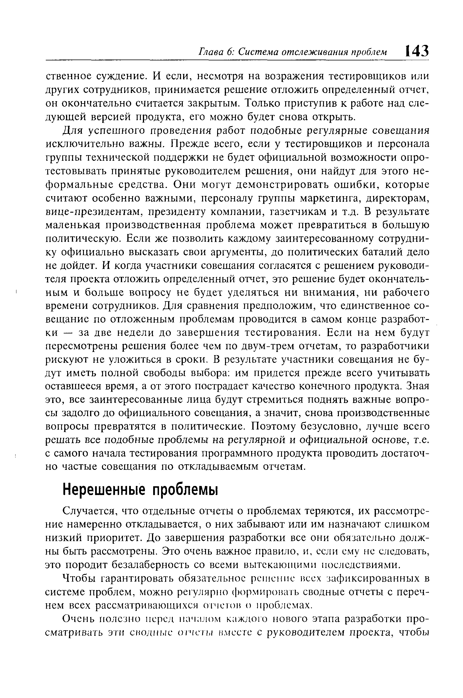

Очень полезно перед началом каждого нового этапа разработки просматривать эти сводные отчеты вместе с руководителем проекта, чтобы

решить, какие из исправлений лучше внести до начала нового этапа. Таким образом можно не только гарантировать, что часть серьезных недостатков программы будет быстро исправлена, но и твердо, но ненавязчиво напомнить руководителю, что и менее важные проблемы все же обязательно должны быть решены. Кроме того, когда все открытые проблемы сведены вместе, руководитель может сделать некоторые выводы о работе отдельных сотрудников или несколько перераспределить между ними нагрузку.

## Отчеты о состоянии проекта

Эти полезные отчеты показывают, сколько ошибок выявлено в ходе тестирования, какая их часть еще ожидает исправления, каково соотношение количества исправленных и отложенных ошибок, сколько ошибок выявили тестировщики и сколько — остальной персонал. В отчетах фиксируются как данные за неделю, так и общие итоги.

Отчеты о состоянии проекта помогают руководству оценить эффективность работы тестировщиков и программистов, текущее качество программного продукта, а также определить соотношение количества выявляемых и исправляемых ошибок, по которому можно составить предположения относительно даты завершения разработки.

## Пользователи системы отслеживания проблем

В предыдущем разделе рассказывалось о том, какой путь проходят исходные отчеты в системе отслеживания проблем: что с ними происходит, кто их читает и дополняет новой информацией, как они теряются и находятся снова. Теперь на этот же процесс полезно посмотреть глазами сотрудников компании. Каковы их нужды и требования? И чем может им помочь автоматизированная система отслеживания проблем?

Пользователями системы являются составители исходных отчетов, те кто их читает, вносит собственную информацию или получает итоговые сведения. Очевидно, что речь идет не только о тестировщиках, но и о целом ряде других сотрудников, участвующих в разработке и тестировании программного продукта. Поэтому система принадлежит не только группе тестирования — она принадлежит всей компании.

## Ведущий тестировщик

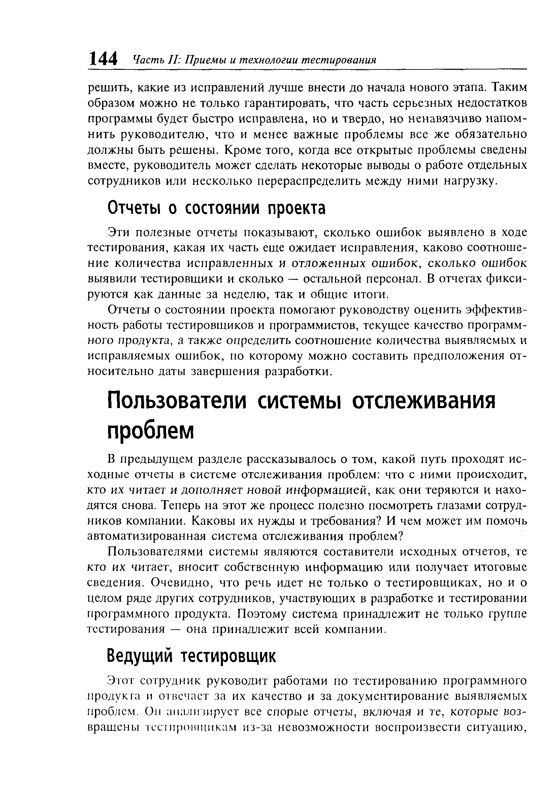

Этот сотрудник руководит работами по тестированию программного продукта и отвечает за их качество и за документирование выявляемых проблем. Он анализирует все спорные отчеты, включая и те, которые возвращены тестировщикам из-за невозможности воспроизвести ситуацию,

или с запросом дополнительной информации. Ведущий тестировщик просматривает все отчеты с резолюциями **Отложено** и **Соответствует проекту** и решает, какие из них следует повторно обсудить на соответствующем совещании. Он готовит и передает руководству итоговые отчеты, а также просматривает их сам, чтобы вовремя выявлять возникающие проблемы. Из отчетов он узнает о неэффективном взаимодействии сотрудников, низкой производительности работы отдельных тестировщиков (недостаточном количестве предоставляемых ими отчетов или, наоборот, слишком большом количестве отчетов о пустяках), а также о разногласиях или проблемах, связанных с исправлением ошибок, которые стоит обсудить с руководителем проекта в личной беседе.

### Рядовые тестировщики

Рядовые тестировщики составляют отчеты о проблемах и просматривают их после того, как эти проблемы решаются. Они повторно тестируют программу, проверяя качество исправлений. Отчеты, которые отложены или отвергнуты с резолюцией **Соответствует проекту**, они анализируют повторно и в отдельных случаях составляют новые отчеты с более убедительными описаниями проблем.

### Руководитель проекта

Руководитель проекта отвечает за качество продукта и своевременное завершение его разработки. Его задача — поддерживать оптимальное соотношение межу стоимостью работ, их производительностью, надежностью продукта, его возможностями и сроками разработки, подгоняя при необходимости дополнительные ресурсы или перераспределяя имеющиеся. В этой работе база данных системы отслеживания проблем становится исключительно важным источником информации о текущем состоянии продукта и его соответствия календарному плану.

Руководитель проекта определяет, какие из выявленных проблем должны быть решены и в каком порядке. Ряд вопросов он откладывает, и они могут быть повторно рассмотрены на соответствующем совещании.

Многие руководители каждую неделю просматривают все открытые отчеты, выявляя проблемы взаимодействия сотрудников (в том числе связанные и с межличностными отношениями), большие группы ошибок, сигнализирующие о слабости отдельных фрагментов программного кода, ошибки, плохо поддающиеся исправлению или повторяемые регулярно. Если программист или группа программистов постоянно повторяет одни и те же ошибки, возможно, следует обратить на это их внимание и принять дополнительные меры. Если ошибки связаны с недостаточными знаниями или опытом в определенном вопросе, то можно провести консультации или найти необходимую литературу; возможно также, что программистам

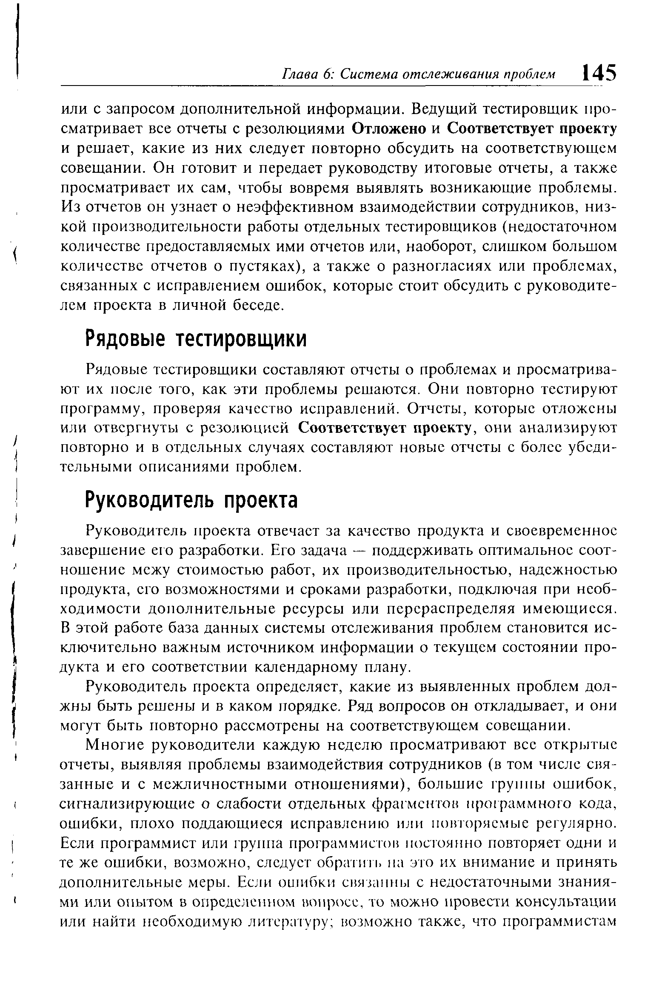

требуются дополнительные средства отладки или не хватает каких-либо ресурсов. Одной из основных задач руководителя проекта является именно выяснение и удовлетворение потребностей персонала в технической помощи. Информацию об этих потребностях он получает, в частности, и при анализе отчетов о проблемах и имеющихся в них комментариев.

Серьезное недовольство руководителя могут вызвать следующие обстоятельства.

* *Отсутствие оперативных ответов.* Это ситуация, когда руководитель возвращает тестировщикам отчет о проблеме, которую не может воспроизвести или по которой требуется дополнительная информация, и этот отчет остается без ответа. Будет описанная в отчете проблема решена или нет, но в любом случае важно определиться. Если такие нерешенные вопросы накапливаются, это нарушает нормальный процесс разработки и ставит под угрозу ее календарный план, поскольку блокирует возможность правильного принятия решений о том, сколько еще исправлений необходимо внести в программу до завершения очередного этапа.
* *Внесенные в программу исправления не тестируются по нескольку дней или даже недель.* В такой ситуации состояние программного продукта становится неопределенным. Если исправление не протестировано, то неизвестно, исправлена ли ошибка на самом деле и не появились ли в программе новые ошибки. О плохих новостях руководителю проекта необходимо узнавать сразу же, чтобы своевременно принимать соответствующие меры.
* *Одна и та же отложенная проблема рассматривается по нескольку раз.* Добавив очередной неубедительный аргумент в пользу решения проблемы, тестировщик снова изменяет резолюцию отложенного отчета на **Рассматривается**. Как правило, руководители проекта поощряют повторное рассмотрение отложенных отчетов, но только при условии, если новые аргументы и материалы, приведенные тестировщиками, действительно заслуживают внимания. И без очень весомых причин этого не следует делать более одного раза.
* *База данных изобилует дублирующими друг друга и не заслуживающими внимания отчетами.* Особенно серьезной эта проблема становится в конце разработки или когда похоже, что это делается намеренно для завышения показателей продуктивности работы отдельных тестировщиков или необоснованной демонстрации того, что программа все еще полна ошибок. Кроме того, большое количество отчетов о недостатках исходного проекта, даже если они абсолютно объективны, может оказывать обескураживающее психологическое воздействие. Впрочем, хороший руководитель поощряет такие отче-

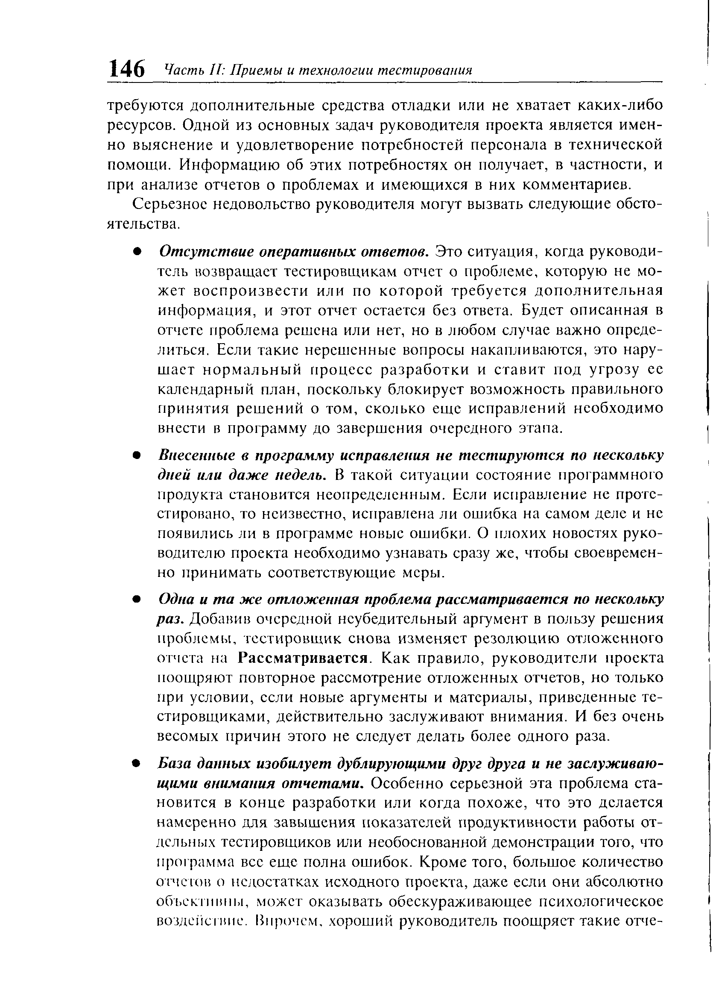

ты даже в конце разработки, когда никакие изменения пользовательского интерфейса и функциональной структуры программы уже не допускаются — ведь со временем выйдет и следующий выпуск продукта, в который можно будет внести все полезные изменения, предложенные в ходе тестирования. Только не переусердствуйте с такими предложениями, они должны строго соответствовать общей концепции программного продукта.

* *В итоговых отчетах с перечнем неисправленных ошибок имеются ошибки, которые уже исправлены, но еще не протестированы, или ошибки, которые вообще не воспроизводятся. В результате создается неверная картина выполнения работ — производительность программистов представляется меньшей, чем на самом деле, а состояние программы — худшим.*

* *В итоговых отчетах неверно интерпретируются текущие данные.* Например, если в конце разработки за определенный период исправлено 40 ошибок и выявлено 40 новых, из которых 35 являются незначительными недостатками проектирования, а в итоговом отчете сказано, что большинство исправлений влечет за собой новые ошибки, это неверно. На самом деле ошибки исправляются прекрасно, а работы успешно продвигаются. Все дело просто в некорректности составления отчета — достаточно типичном явлении в ситуациях, когда количество обнаруживаемых ошибок примерно равно или даже превышает количество исправлений.

* *Высшему руководству регулярно передаются упрощенные итоговые отчеты*, особенно те, в которых отражается количество ошибок, оставшихся неисправленными в конце каждой недели. Как будет рассказано далее, руководители часто очень любят подобные “показательные” отчеты, а их подчиненным (в данном случае руководителям проекта) они приносят только лишние неудобства и заставляют предпринимать действия, благодаря которым цифры выглядят лучше, а эффективность процесса документирования и исправления ошибок страдает, что в конечном счете отражается на качестве продукта.

* *Информация базы данных используется для личных нападок* на руководителя проекта или других сотрудников или для искаженного представления проекта и его прогресса.

## Программист

Программист читает отчет о проблеме и отвечает на него. Его недовольство могут вызвать следующие обстоятельства:

* Отчет не совсем четкий и понятный, он недостаточно способствует исправлению ошибки.
* Из отчета неясно, против чего возражает тестировщик или что должен сделать программист. Бывает, что отчет больше похож на абстрактное описание поведения программы. Прочитавший его человек может остаться озадаченным: "Ну хорошо, а в чем же, собственно, проблема?"
* Описанная в отчете ситуация не воспроизводится.
* Отчет, возвращенный с запросом о дополнительной информации, снова поступает программисту в исходном виде.
* Тестовый пример очень сложен, а тестировщик не приложил к отчету вспомогательные материалы для его воспроизведения.
* Формулировки отчета могут быть восприняты как персональная критика.
* Руководство использует статистические данные системы отслеживания проблем для анализа личной производительности сотрудников.

## Менеджер по маркетингу

Менеджера по маркетингу интересует все, что связано с конкурентоспособностью будущего программного продукта и стоимостью его технической поддержки. Поэтому менеджеры по маркетингу продукта часто являются самыми активными защитниками его качества. В некоторых случаях они считают более важным уложиться в сроки разработки, но и тогда отказываются выпустить на рынок продукт с коммерчески неприемлемыми недостатками.

Как правило, менеджер по маркетингу слишком занят, чтобы читать отчеты обо всех отложенных проблемах, он не хочет или не может эффективно пользоваться базой данных. Поэтому стоит распечатывать для него персональные итоговые отчеты и выделять в них наиболее важные проблемы.

## Группа технической поддержки

Сотрудники группы технической поддержки будут отвечать на вопросы пользователей продукта. Они заинтересованы в том, чтобы снизить стоимость поддержки продукта и правильно отразить в технических обзорах его качество. Поэтому сотрудники этой группы возражают против каждой отложенной ошибки — ведь им предстоит отвечать за нее перед пользователями. Они настаивают на исправлении всех ошибок, решении всех проблем, исправлении всех недостатков исходного проекта и всех неточностей документации. И если исправление не вносится, они должны знать, что

отвечать пользователям. Незадолго до выпуска, когда программа уже достаточно стабильна, группа технической поддержки обычно просматривает ее вместе с руководством и составляет ряд собственных отчетов о проблемах. В этих отчетах отражаются вопросы, которые вызовут наибольшее количество звонков недовольных или не сумевших разобраться в программе пользователей. Вообще, звонки пользователей — это один из наиболее точных и важных индикаторов качества программы. Кроме того, они обходятся компаниям в значительные суммы. Поэтому, если группа технической поддержки сильно обеспокоена некоторыми недостатками продукта, лучше всего немного отложить его выпуск или начать работу над следующей, исправленной версией сразу после выхода текущей.

Сотрудники группы технической поддержки очень часто посещают совещания по пересмотру отложенных проблем и настаивают на решении тех из них, которые вызовут наибольшее количество звонков пользователей. Во многих компаниях к их мнению прислушиваются гораздо внимательнее, чем к доводам остальных сотрудников, включая тестировщиков.

Часто группа технической поддержки требует предоставления ей отчетов обо всех отложенных проблемах с объяснениями того, что следует говорить недовольным пользователям. Поскольку на внесение в отчеты этой информации требуется время, а программисты и так загружены до предела, эту работу часто поручают тестировщикам. Однако не все компании выбирают такую стратегию. В некоторых вместо этого принято включать в руководство пользователя большие разделы о разрешении возможных проблем. Каждое выдаваемое программой сообщение об ошибке подробно описывается, и приводятся инструкции, как избежать подобных ошибок. Перед печатью очередного тиража документации, в нее вносится информация обо всех обнаруженных ошибках и ответы на наиболее часто задаваемые пользователями вопросы. Кроме того, существует практика, когда персонал технической поддержки руководит бета-тестированием продукта (предпродажной стадией тестирования с участием пользователей), изучает его результаты и готовит материалы, которые будут использоваться для поддержки пользователей после выпуска продукта.

Сотрудники группы технической поддержки пользуются базой данных отслеживания проблем и после выпуска продукта. Когда пользователи сообщают о новой ошибке, о ней составляется отчет и вносится в базу данных. Затем сотрудники группы сообщают об ошибке руководству и выясняют, когда и кем она будет исправлена. При этом желательно исправить ошибку как можно быстрее — пользователь, как известно, ждать не любит.

## Авторы технической документации

Авторы технической документации (технические писатели) отвечают за руководство пользователя, другие технические материалы, сопровождающие

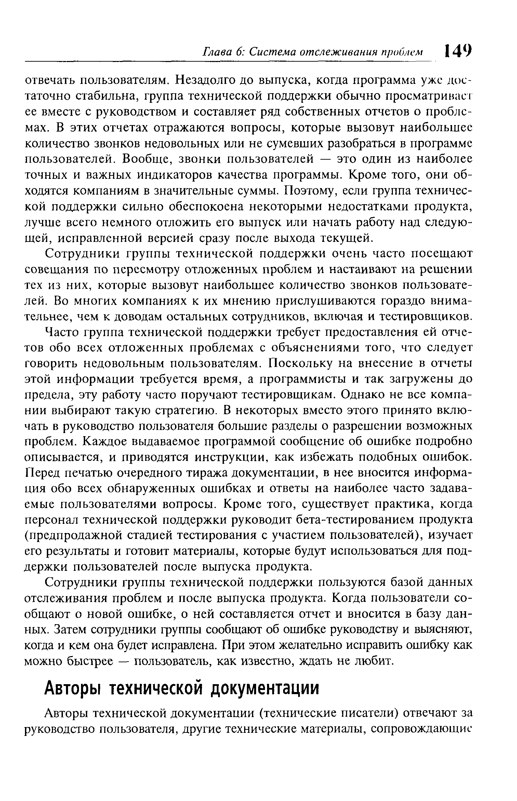

программный продукт, а также за самостоятельную техническую и маркетинговую документацию. Они должны отслеживать все изменения исходного проекта и знать обо всех отложенных ошибках, влияющих на поведение программы. Поэтому они тоже пользуются системой отслеживания проблем, причем делают это и после окончательного выпуска продукта. Кроме самого продукта, технических писателей интересует и то, как продвигается работа и укладываются ли разработчики в график — от этого зависит, следует ли техническому писателю поторопиться или, наоборот, подождать, пока определенная часть продукта будет завершена и можно будет приступить к ее описанию. Особенно им важно знать, когда будут прекращены изменения пользовательского интерфейса.

При написании документации ее авторы нередко сталкиваются с ошибками программы. Как и тестировщики, они могут составлять отчеты об обнаруженных проблемах и вводить их в базу данных.

Тестировщики, в свою очередь, периодически выявляют ошибки в документации. Часто они пишут свои замечания прямо на копии документации, но, если расхождение между ней и программой достаточно серьезно, и особенно когда документация соответствует спецификации, обязательно составляется отдельный отчет о проблеме. И если затем в программу вносятся изменения, они обязательно должны быть отражены в документации. Отчеты о некорректном поведении программы передаются техническому писателю и в том случае, когда ошибка не исправляется — для внесения соответствующей информации в раздел разрешения проблем. Можно сказать, что работа автора документации во многом сходна с работой программиста: он получает отчет о проблеме, вносит исправления в документацию, пишет на отчете резолюцию **Исправлено** и возвращает его для повторного тестирования.

## Руководитель группы тестирования

Руководитель группы тестирования отвечает за административную часть организации работ по тестированию и их качество. Анализируя отчеты, составляемые каждым сотрудником, он определяет, не требуется ли этому тестировщику пройти дополнительное профессиональное обучение. Кроме того, он согласовывает работу группы тестирования с работой других подразделений, отвечает за их взаимодействие и решает ряд других административных вопросов.

Некоторые руководители групп тестирования поддаются искушению собирать предоставляемую системой статистическую информацию работы отдельных тестировщиков. Сколько, например, каждый тестировщик документирует ошибок за неделю? Такая статистика помогает отслеживать тенденции в работе группы, но, прежде чем делать на ее основании выводы об эффективности работы сотрудников, следует ответить на следующие вопросы:

* *Кто документирует больше ошибок: тестировщики, технические писатели, группа технической поддержки или руководитель проекта?* Обычно больше всего ошибок находят тестировщики, однако многие проблемы выявляет и руководитель проекта или его помощник. Помощник руководителя проекта тестирует продукт независимо и не так, как это делают тестировщики: он пытается работать с программой как обычный пользователь, ориентируясь не на поиск ошибок по строго заданной схеме, а скорее, на недостатки общего функционирования. Если такая работа выполняется в течение нескольких недель, она может принести определенную пользу, но если она длится до самого конца разработки, то фактически дублирует работу группы тестирования. Однако, если оказывается, что подобный сотрудник работает эффективнее профессиональных тестировщиков, имеет смысл пересмотреть выбранную стратегию тестирования — похоже, что она неэффективна.

* *Действительно ли количество выявленных за неделю проблем отражает производительность работы тестировщика?* В самом начале тестирования обычно обнаруживается очень много ошибок. Следующий подъем этого показателя наблюдается по окончании первого этапа разработки, поскольку код к этому времени еще очень нестабилен. Далее все зависит от конкретного проекта. Если продукт нестабилен, периоды с очень высокими показателями обнаруженных ошибок могут чередоваться с неделями затишья, когда составляется пять-шесть отчетов за неделю. На других проектах вначале наблюдается увеличение количества обнаруживаемых ошибок, по мере того как тестировщики знакомятся с продуктом, а затем постепенный спад, отражающий стабилизацию программы. Таким образом, невозможно составить универсальную схему — развитие событий может быть очень различным, и зависит оно от множества обстоятельств. Пожалуй, единственное, на что стоит обратить пристальное внимание, — это постоянное и не слишком большое количество отчетов у какого-либо тестировщика. Так бывает, если человек постоянно меняет область тестирования: ставит одну задачу, посвящает ей несколько дней, составляя по нескольку отчетов за день, затем переключается на другую задачу. Дополнительным показателем недобросовестности может служить то, что в отчетах этого сотрудника описываются большей частью самые очевидные недостатки проектирования и наиболее легко выявляемые ошибки. Кроме того, стабильные показатели могут быть у тестировщиков, работающих по плохо составленному плану.

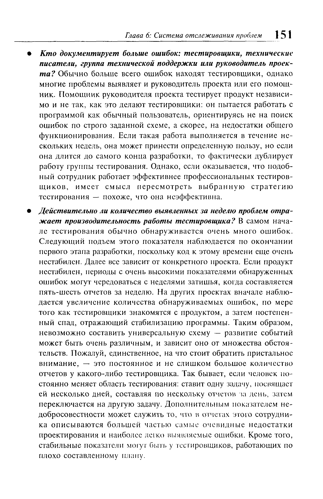

Наш собственный опыт показывает, что в оценке производительности работы тестировщиков не стоит полагаться на простые данные о количестве составляемых ими отчетов, а следует внимательнейшим образом изучить сами отчеты. Например, некоторые тестировщики исследуют программу тщательнее других, больше времени тратят на попытки воспроизвести трудноуловимые ошибки или работают с более сложными частями программы. Не удивительно, что они выявляют меньше ошибок, чем их коллеги, однако та часть программы, с которой они поработали, в результате гораздо более надежна, чем у других. Таких сотрудников мы называем старшими тестировщиками и уж никак не считаем их работу наименее производительной.

Мы всегда резко возражаем против любых ссылок на количество выявляемых тестировщиком ошибок, в личной ли беседе или публичных заявлениях. Некоторые люди реагируют на такие упоминания очень болезненно, у них возникает чувство, что руководитель намеренно внимательно отслеживает именно их производительность, хотя на деле это может быть и совсем не так. Тем более недопустимо явно интерпретировать подобные данные как показатели производительности — это наверняка будет воспринято как несправедливая оценка работы и вызовет бурю эмоций. После таких высказываний руководства рядовые сотрудники немедленно начнут корректировать свои действия, пытаясь подогнать показатели под желаемые. Ведь они теперь будут полагать, что руководство отслеживает их производительность, оценивая ее по количеству составляемых отчетов. А чтобы подогнать показатели, им придется работать менее добросовестно: составлять отчеты только о легко выявляемых ошибках и не тратить много времени на тщательное исследование тестируемой области программы. Некоторые из сотрудников заходят еще дальше, заполняя базу данных отчетами о совершенно незначительных, не стоящих внимания недостатках программы или отчетами с чуть различающимися описаниями одних и тех же проблем.

Иногда мы просматриваем статистику выявления ошибок, но делаем это не каждую неделю и не афишируем результаты. Вместо этого, если какие-либо показатели привлекают наше внимание, мы тщательно изучаем соответствующие отчеты и, если проблема действительно имеется, принимаем меры.

## Высшее руководство

Руководители высшего уровня не занимаются отдельными ошибками, если только речь не идет об исключительно серьезных проблемах, решение которых приходится отложить. О таких проблемах они могут узнать от ведущего тестировщика, руководителя группы тестирования, руководителя проекта, а также от любого сотрудника, посчитавшего, что к определенной

проблеме необходимо привлечь внимание руководства. Среди ошибок, заслуживающих внимания высшего руководства, можно выделить следующие:

* *Поведение программы дискредитирует компанию.* Так можно сказать о грубом тоне сообщений об ошибках, порнографических или не вполне пристойных изображениях и текстах, ругательствах, включенных в программный код. Даже если программа не выводит их на экран и большинство пользователей программы их не увидит, наверняка найдутся энтузиасты, которые прочтут текст программных файлов и поділятся своими открытиями с окружающими, так что в конечном счете эта информация всплывет в Internet и печатной периодике.
* *Ошибки программы лишают ее тех преимуществ или блокируют те ее функции, которые были объявлены в рекламных анонсах, либо блокируют возможности, которых ожидает от нее каждый разумный пользователь.* Если текстовый процессор не способен распечатывать тексты и руководитель проекта решил не исправлять этот недостаток, тогда должен вмешаться руководитель более высокого уровня. То же самое касается и более мелких функций программы, от которых, тем не менее, зависит ее конкурентоспособность.
* *Поведение программы вызовет резкое недовольство здравомыслящего пользователя.* Если подсистема защиты от несанкционированного копирования стирает всю информацию на жестком диске нарушителя, об этом необходимо поставить в известность президента или юриста компании, прежде чем выпускать такую программу в продажу.

О менее серьезных проблемах руководству сообщать не стоит, как и о тех, которые пока еще не отложены руководителем проекта. Иначе вы просто потеряете доверие руководства.

Руководство прежде всего интересует состояние проекта, ему требуется наглядная и объективная итоговая информация, а на анализ подробностей у него нет времени. Вам придется предоставлять отчеты с еженедельными данными о количестве выявленных, исправленных и ожидающих исправления ошибок. С этими цифрами следует обращаться особенно осторожно, избегая их интерпретации как показателей производительности работ. Именно на этой почве возникает множество проблем и конфликтных ситуаций. Вот несколько примеров.

* 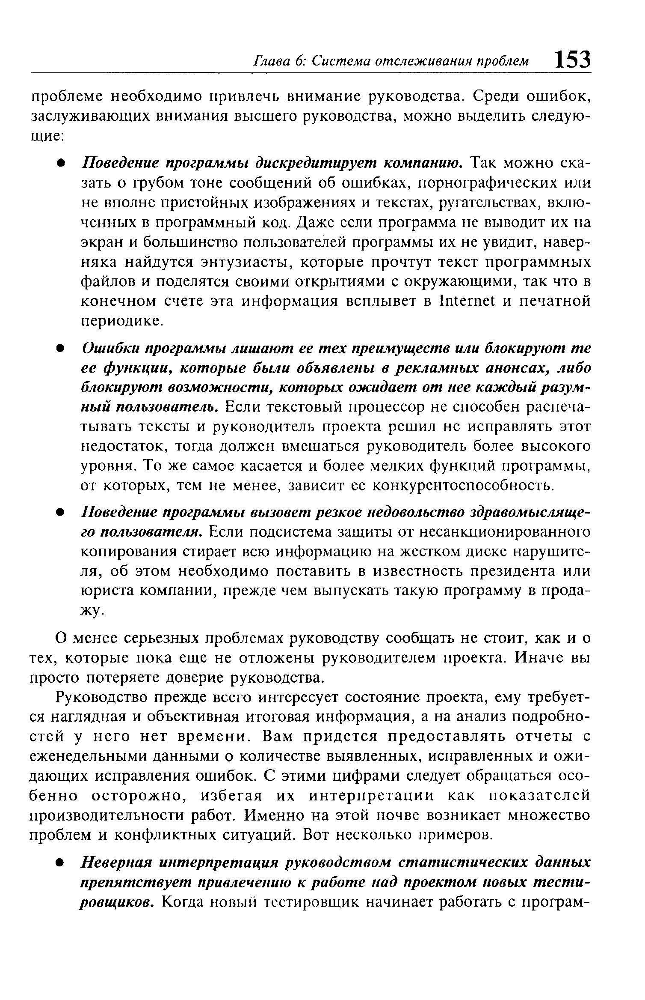 *Неверная интерпретация руководством статистических данных препятствует привлечению к работе над проектом новых тестировщиков.* Когда новый тестировщик начинает работать с програм-

мой, он, как правило, вносит ряд проектных предложений и повторно поднимает вопросы о некоторых отложенных проблемах. В результате количество составляемых отчетов повышается, и это создает впечатление, что качество программы неожиданно ухудшилось. Руководителю проекта приходится объяснять все это начальству каждый раз, когда к работе над проектом подключается новый сотрудник, и в конце концов он просит руководителя группы тестирования не расширять больше свою группу.

* *Неверная интерпретация руководством статистических данных препятствует проведению последнего критического анализа интерфейса продукта перед тем, как все дальнейшие изменения будут запрещены.* Незадолго до запрещения дальнейших изменений пользовательского интерфейса программы руководители проекта часто распространяют среди как можно более широкого круга сотрудников копии экранов, некоторые проектные документы и бета-копии программного обеспечения. Цель этой акции — собрать как можно больше замечаний от технических писателей, тестировщиков, сотрудников групп маркетинга и технической поддержки и внести все изменения, которые будут найдены полезными, пока это еще возможно. Поскольку все критические замечания и предложения будут внесены в базу данных, это вызовет резкий подъем статистических показателей количества выявляемых проблем, и, хотя на самом деле надежность продукта при этом не изменится, руководителю проекта придется оправдываться перед начальством, объясняя настоящие причины такого “обвала” ошибок. Чтобы избежать таких ситуаций, руководители проекта часто отказываются от проведения такого финального массированного анализа проекта или же не вносят его результаты в базу данных. Нечего и говорить, что в результате страдает качество разрабатываемого продукта.

* *Контроль руководством статистических данных заставляет руководителя проекта следить, чтобы в базу данных не попадали отчеты об одной и той же проблеме, составленные разными тестировщиками.* Если четыре тестировщика обнаружат одну и ту же проблему и составят о ней отчеты, статистическая сводка покажет четыре ошибки вместо одной. Чтобы улучшить показатели, руководитель проекта вынужден будет отслеживать подобные ситуации, попусту тратя рабочее время — свое или сотрудников.

* *Под давлением статистического контроля со стороны руководства руководитель проекта может попросить тестировщиков не составлять отчеты об ошибках проектирования.* Обратив внимание, что некоторые тестировщики документируют слишком много недо-

статков исходного проекта программы, руководитель группы тестирования может попросить сократить количество подобных отчетов. В противном случае руководство может интерпретировать большое количество составляемых отчетов как показатель ненадежности программы. На самом же деле значительная часть недостатков проектирования так и не будет исправлена, особенно ближе к концу разработки — а раз так, вероятно их не стоит документировать. Такая логика конечно же не идет на пользу разработке. Во-первых, те ошибки кодирования, которые приняты тестировщиком за ошибки проектирования, не документируются и в результате остаются неисправленными. А во-вторых, когда наступает черед следующего выпуска программного продукта, база данных, в которой могла бы присутствовать информация о недостатках первого выпуска, оказывается пустой, и все приходится начинать “с нуля”.

* *Под давлением статического контроля со стороны руководства руководитель проекта закрывает отложенные отчеты раньше времени.* Некоторые руководители проектов слишком поспешно откладывают проблемы, которые, возможно, еще могли бы быть решены. Безапелляционным решением они закрывают соответствующие отчеты, чтобы улучшить статистические показатели. Более разумные и опытные руководители назначают откладываемым отчетам низкий приоритет, с тем чтобы, если у программиста останется время, он мог все же исправить описанные в них ошибки — возможно, по ходу исправления других ошибок в той же части кода. В результате многие мелкие ошибки и косметические недостатки программы исправляются по ходу основных работ по отладке, ничуть не затягивая разработку. Хотя один такой мелкий недостаток не влияет на качество результирующего продукта, если исправить 50 из 100 таких недостатков, продукт наверняка произведет более достойное впечатление.

Администрация компании нередко требует предоставить наглядные сведения, позволяющие оценить производительность работы конкретного сотрудника, особенно если хочет его уволить или оказать на него давление. И конечно, в первую очередь источником такой информации считают базу данных. Ведь в ней масса готовой подробной информации о каждом тестировщике, программисте, руководителе проекта. Практически отражен почти каждый их шаг. Можно узнать среднее количество ошибок, выявляемых конкретным тестировщиком и сравнить его с показателями других сотрудников. Можно сравнить количество ошибок, допускаемых разными программистами. Можно сравнить количество ошибок, выявляемых в разных проектах, и по ним сравнить работу их руководителей. Кроме того, можно сравнить количество откладываемых и отвергаемых ими отчетов.

Против всех подобных попыток оценки производительности сотрудников по статистическим данным необходимо возражать самым решительным образом, кто бы ни запросил соответствующие данные. Это могут сделать как руководители, так и сами сотрудники, но в любом случае, какими бы настойчивыми ни были требования, как бы ни давило на вас руководство, сколько беспокойства ни причинял бы сотрудник, оказавшийся в центре внимания, — не сдавайтесь. Система предназначена для отслеживания проблем с тестируемым программным обеспечением, а не производительности персонала, которую хранящиеся в ней данные не отражают с достаточной объективностью. Если ее использовать для анализа производительности сотрудников, это безнадежно подорвет их доверие к системе (см. перечни литературы о компьютеризированном анализе производительности персонала в обзоре Ирвинга, Хиггинса и Сейфейни (Irving, Higgins, Safayeni, 1986)). В результате сопротивления персонала нормальное функционирование системы отслеживания проблем будет нарушено, и из полезного и эффективного средства организации работы она превратится в ее тормоз и инструмент для выяснения отношений. Вам, как руководителю группы тестирования, это дорого обойдется. Поэтому использование базы данных для анализа производительности персонала — это одна из самых серьезных тактических ошибок, какие только можно допустить.

Перечисленные выше проблемы в основном касались попыток отслеживания производительности тестировщиков. Они будут еще серьезнее, если дело коснется сотрудников, которые вам не подчиняются, — программистов и руководителей проектов. Если и их работа будет отслеживаться по статистическим данным, предоставляемым системой отслеживания проблем, то каждый раз, когда в базу данных будет вноситься информация, так или иначе ухудшающая их показатели, эти сотрудники будут просить ее удалить. Если вы откажетесь, программист или руководитель проекта обратится за поддержкой к своему начальнику, руководителю отдела анализа человеческого фактора, и неизвестно, к кому еще. И это будет только справедливо. Если система предоставляет руководству информацию о производительности сотрудников, затрагивая тем самым их жизненные интересы, им придется защищаться. Начнется самая настоящая война, и вот как будут действовать в ней ваши противники.

* *Вас будут просить удалять из базы данных все дублирующиеся отчеты о проблемах.* Если отчеты и в самом деле дублируют друг друга, это еще ничего, хотя и будет стоить вам времени. Но как быть с отчетами о похожих ситуациях, которые могут быть вызваны одной и той же ошибкой, но могут и разными. Если удалить все похожие отчеты, оставив только один из них, это может означать потерю информации о связанных с ними ошибках.

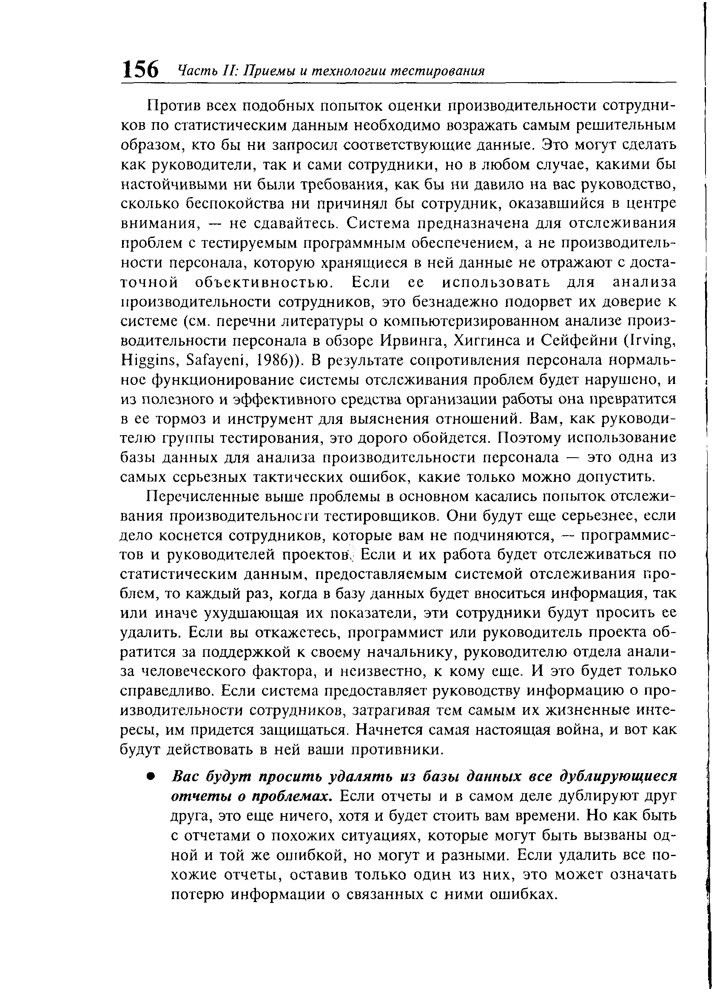

* Вас будут просить удалять из базы данных все, пусть даже и не похожие, отчеты о проблемах, вызванных одной и той же внутренней ошибкой программы. Нередко случается, что совершенно различные симптомы вызываются одной и той же ошибкой программы. Следует ли в этом случае отозвать все связанные с ней отчеты, кроме одного? Хорошо бы, но только как определить, что причина всех описанных в них ситуаций одна и та же? Довериться программисту? Самостоятельно проанализировать программный код? Не поверить программисту и положиться на собственное суждение? (Имейте в виду, что подобное недоверие всегда воспринимается крайне болезненно.)

* Вас будут просить удалять из базы данных все вопросы, поскольку они не являются отчетами об ошибках. Соответственно нечего и ждать, что вы получите на них ответы.

* Вас будут просить удалять из базы данных все предложения и большинство отчетов об ошибках проектирования. Конечно, если поведение программы соответствует спецификации, оно не считается ошибкой. Однако, по нашему опыту, около 15% всех предлагаемых тестировщиками изменений воплощаются, если не в текущем, то, по крайней мере, в следующем выпуске программного продукта. Они очень помогают усовершенствовать программу, сделать ее более удобной и полезной. Стоит ли удалять из базы данных такую ценную информацию?

* Приготовьтесь целые дни проводить в спорах о том, какая ошибка отражена в конкретном отчете — ошибка кодирования или проектирования. Особенно горячими эти споры будут в случае, если вы согласитесь включать в статистические отчеты о производительности программистов только ошибки кодирования.

* Приготовьтесь к резким нападкам не ваших подчиненных каждый раз, когда они сами будут допускать ошибки в отчетах или при тестировании.

* Вас будут просить удалять из базы данных все отчеты о невоспроизводимых ошибках. Бывает, что ни воспроизвести ситуацию, ни найти ее причину и в самом деле не удается даже после самого добросовестного анализа кода опытным программистом. У некорректного или неожиданного поведения программы могут быть самые разные причины, и не всегда это ошибки в ее коде. Например, ошибку может допустить сам пользователь, проблема может быть вызвана аппаратным сбоем или скачком напряжения питания. И если программист не находит ошибки, отчет ухудшает статистические показатели качества его работы. Как долго он должен искать описанную в отчете ошибку?

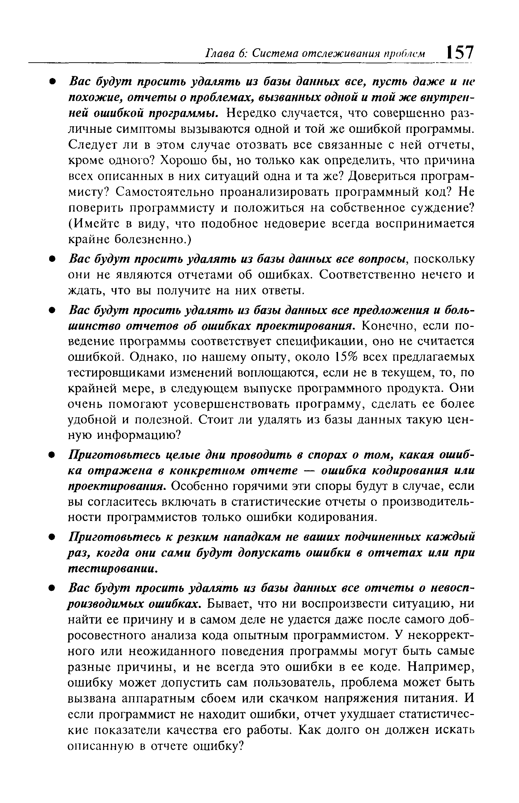

* *Не ждите, что программисты или руководитель проекта будут документировать ошибки*, выявляемые ими в процессе разработки.
* *И однажды вам будет предъявлен судебный иск*. Нередко люди, которых уволили с работы или которые сами уволились из-за оказываемого на них давления, подают на своих бывших работодателей в суд. Если вы являетесь руководителем группы тестирования и на основе своей базы данных предоставляли руководству сведения о производительности работы сотрудника, который судится с вашей компанией, то обвинение может быть предъявлено и лично вам. Адвокаты будут беседовать с вами перед судебным заседанием гораздо более серьезно, чем если бы вы являлись простым свидетелем. Звучит смешно? Но кто будет платить в конечном счете? Если вы думаете, что компания, то глубоко ошибаетесь. Вероятно, вам будет позволено воспользоваться услугами штатного юриста. Но если он найдет способ помочь компании за ваш счет, как вы думаете, что будет тогда? Наверное, это зависит от компании и от юриста.

***

*Назначение базы данных — способствовать исправлению ошибок, а не собирать статистические сведения для руководства.*

***

## Юристы

Вся информация базы данных открыта для изучения юристами при любом судебном процессе, инициированном вашей компанией или возбужденном против нее.

* Отчеты о проблемах, в комментариях которых тестировщик обвиняет программиста в непрофессионализме, могут быть использованы против вас, даже если эти обвинения абсолютно справедливы.
* В пользу компании может говорить тот факт, что информация базы данных подтверждает тщательность тестирования программного продукта и проведение обстоятельного анализа каждой выявляемой проблемы, учитывающего интересы пользователей.
* Удаление информации из базы данных в целях сокрытия важных для судебного процесса сведений считается противозаконным.

## Реализация базовых функций системы отслеживания проблем

Однажды вам придется проектировать собственную систему отслеживания проблем либо настраивать или перерабатывать уже готовый программ-

ный комплекс. В этом разделе предполагается, что выбор структуры информации и функций системы полностью зависит от вас. Ряд советов по ее реализации, которые приведены далее, основываются на нашем собственном опыте эксплуатации подобных систем. Разумеется, возможны и другие варианты решений, которые могут быть и удобными, и полезными, но данный вариант показался нам оптимальным.

## Документирование новых проблем

Отчет о проблеме, приведенный на рис. 5.1 (глава 5), является стандартной формой документирования выявляемых проблем. Все его поля были подробно описаны в главе 5. Мы рекомендуем разрешить составление отчетов о проблемах всем сотрудникам компании. Одни из них, и прежде всего тестировщики, будут самостоятельно вводить свои отчеты в базу данных, другие же могут предоставлять отчеты в письменном виде, а вводить их будут сотрудники вашей группы.

При вводс отчета в базу данных система проверяет его информацию на допустимость. Неверные или неполные отчеты она отвергает. Поэтому, если кто-либо из сотрудников не знает, как правильно заполнить все поля формы, попросите его составить отчет на бумаге. Сотрудник группы тестирования воспроизведет проблему, откорректирует отчет и введет его в компьютер.

В однопользовательской системе, а также в некоторых многопользовательских после ввода отчета в базу данных система распечатывает три его копии. Первую оставляет у себя составитель отчета. Вторая передается программисту, как правило, через его руководителя. Третья копия остается в архиве группы тестирования. (В случае возникновения проблем с электронными носителями информации вы будете счастливы, что сохранили твердую копию каждого отчета.)

## Еженедельные итоговые отчеты

В конце каждой недели формируются итоговые отчеты. В работе с ними требуются аккуратность и последовательность: передавайте их всегда одним и тем же людям и делайте это регулярно, каждую неделю.

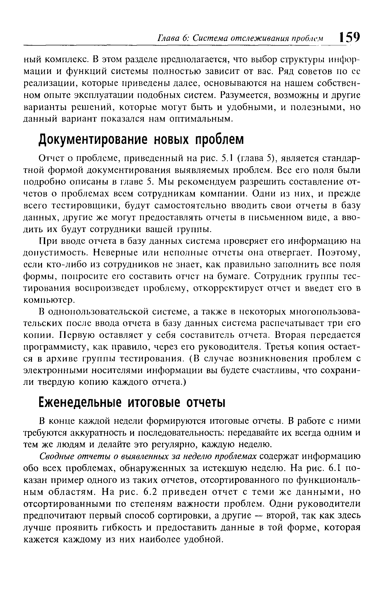

Сводные отчеты о выявленных за неделю проблемах содержат информацию обо всех проблемах, обнаруженных за истекшую неделю. На рис. 6.1 показан пример одного из таких отчетов, отсортированного по функциональным областям. На рис. 6.2 приведен отчет с теми же данными, но отсортированными по степеням важности проблем. Одни руководители предпочитают первый способ сортировки, а другие — второй, так как здесь лучше проявить гибкость и предоставить данные в той форме, которая кажется каждому из них наиболее удобной.


**РИСУНОК 6.1.** *Сводный отчет о выявленных за неделю проблемах, отсортированный по функциональным областям*

**РИСУНОК 6.2.** *Сводный отчет о выявленных за неделю проблемах, отсортированный по степеням важности*

Еженедельные отчеты о состоянии проекта (рис. 6.3) отражают текущее состояние разработки и изменения, произошедшие в нем за неделю. Этот отчет очень популярен и, безусловно, полезен, но приведенные в нем цифры обязательно следует сопровождать подробными комментариями о причинах необычных изменений показателей.


**РИСУНОК 6.3.** *Еженедельный отчет о состоянии проекта*

## Конец цикла тестирования

В конце каждого цикла тестирования печатается отчет Завершение цикла тестирования (рис. 6.4). В течение одного цикла тестирования проводится полный набор тестов очередной рабочей версии программного продукта. Например, если тестируется программный продукт Calcdog 2.10, в одном из циклов тестируется версия **Calcdog 2.10д**, а в следующем цикле — **Calcdog 2.10e**.

<div align="center">

**Завершение цикла тестирования**

</div>

| Программа Calcdog | Выпуск 2.10 | Версия д |
| :--- | :--- | :--- |

| | Кол-во нерешенных проблем до текущей версии | Кол-во новых проблем | Кол-во решенных проблем | Кол-во оставшихся проблем |
| :--- | :--- | :--- | :--- | :--- |
| Фатальные | 8 | 10 | 9 | 9 |
| Серьезные | 48 | 12 | 16 | 44 |
| Незначительные | 80 | 15 | 14 | 81 |
| **Всего** | **136** | **37** | **39** | **134** |

<u>Проблемы в текущей версии:</u>

| | | | |
| :--- | :--- | :--- | :--- |
| Исправлено | 22 | Не воспроизводится | 5 |
| Отложено | 6 | Другие | 6 |

**РИСУНОК 6.4.** *Завершение цикла тестирования*

В отчете Завершение цикла тестирования суммируются данные о состоянии проекта. Он очень похож на еженедельные отчеты о состоянии проекта, но функции их различны. Еженедельные отчеты удобны тем, что формируются достаточно часто, но сравнивать их данные не имеет смысла: в течение цикла тестирования проверяются разные участки и функциональные области программы, и итоговые данные за одну неделю могут сильно отличаться от данных за другую. А вот отчеты, составляемые по завершении цикла, позволяют сравнить показатели, поскольку относятся к одному и тому же набору тестов.

## Решенные и нерешенные проблемы

После внесения в программу изменений или принятия иного решения по отчету о проблеме он снова возвращается к вам. Изменения в программу вносятся не всегда. Одни отчеты откладываются, другие отвергаются вовсе. Если на отчете стоит резолюция **Исправлено**, воспроизведите описанную в нем ситуацию, чтобы убедиться, что это и в самом деле так. Если окажется, что проблема решена только частично, закройте отчет и составьте новый, в который включите ссылку на первый отчет. Если исправление вообще не работает, откройте отчет снова с корректным замечанием.

Для каждой неисправленной ошибки (отчет о которой возвращен с резолюцией **Не может быть исправлено**, **Соответствует проекту** или **Не согласен с предложением**) необходимо решить, следует ли написать **Да** в поле **Считать отложенным** (см. главу 5, раздел “Структура отчета о проблеме: Считать отложенным”).

Копии возвращенных программистами отчетов о решенных проблемах следует передавать их составителям. Именно они эффективнее всего смогут проверить результативность исправлений.

Бывает, что отчеты о проблемах теряются или игнорируются. Поэтому периодически, примерно раз в две недели, имеет смысл распечатывать *Сводный отчет о нерешенных проблемах* (рис. 6.5). Этот отчет, составляемый в целях выявления затерявшихся документов, должен носить совершенно обыденный и беспристрастный характер. Никогда не высказывайте никаких личных оценок ни в нем, ни опираясь на его данные. Проблемы группируются по степеням важности без указания того, кто конкретно отвечает за их решение.

На рис. 6.6 показана более персонифицированная модификация отчета о нерешенных проблемах. В ней указывается, какой конкретно сотрудник или отдел отвечает за решение описанных в отчетах проблем. Не стоит распространять такие отчеты публично — лучше передавать их конкретным руководителям при личных встречах.

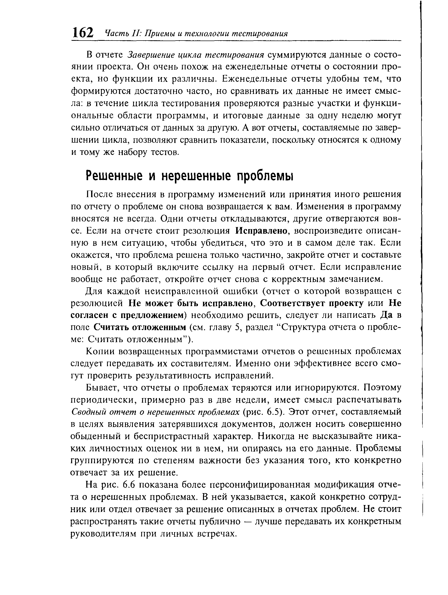


## Отложенные проблемы

Если в вашей компании не проводятся регулярные совещания по пересмотру отложенных проблем, имеет смысл, по крайней мере, каждые две недели распространять среди сотрудников *Сводный отчет об отложенных проблемах* (см. рис. 6.7). В этом отчете перечисляются все проблемы, в отчетах о которых стоит резолюция **Отложено**, наложенная программистом или руководителем проекта. Эти отчеты сможет просмотреть высшее руководство и в случае необходимости изменить решения, принятые по отдельным вопросам. Кроме того, все отложенные проблемы остаются перед глазами сотрудников, и иногда случается, что программист придумывает простое и быстрое решение проблемы, которая была отложена из-за трудоемкости или просто потому, что хорошего способа ее решения до сих пор никто не предложил.

Если же совещания по пересмотру отложенных проблем проводятся в компании регулярно, сводные отчеты будут на них весьма полезны, только стоит добавить в них еще поля **Подробное описание проблемы и как ее воспроизвести** и **Комментарии**. Можно поступить и иначе: распечатать отчет в том виде, в котором он приведен на рис. 6.7, а к нему приложить полные копии всех исходных отчетов. Сводные отчеты лучше раздать участникам совещания заранее, чтобы они могли подготовиться к их обсуждению.

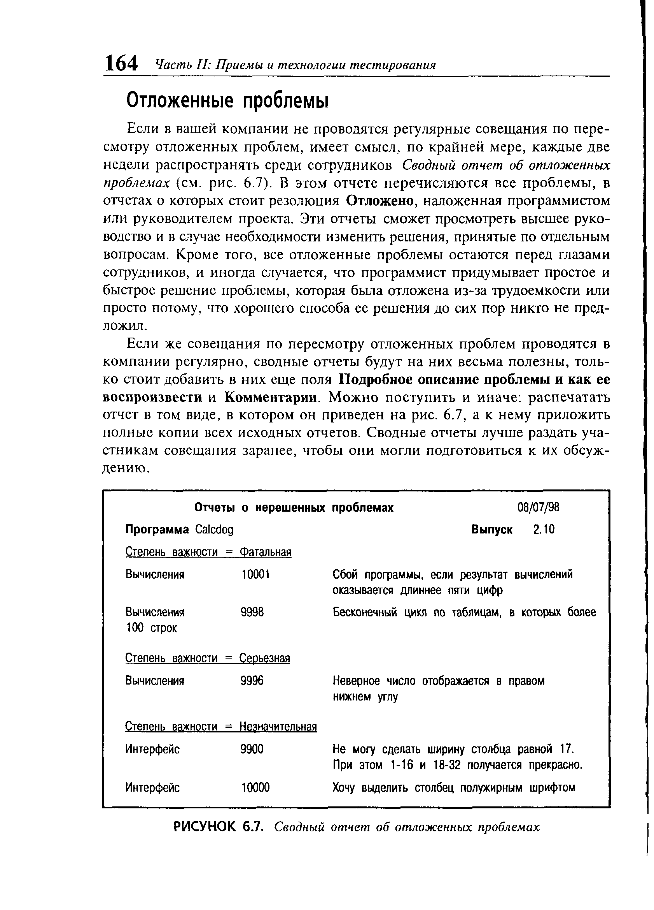

РИСУНОК 6.7. *Сводный отчет об отложенных проблемах*

## Итоговые показатели хода работ

На рис. 6.8 приведен отчет *Еженедельные итоги*, в котором отображается ход работ по тестированию и отладке программного продукта. Этот отчет пополняется новыми сведениями каждую неделю, отражая текущий прогресс, а еще один аналогичный отчет содержит укрупненные итоги, вычисляемые в конце каждого цикла тестирования. Можно составить третий отчет, показывающий, сколько незначительных, серьезных и фатальных проблем было выявлено в течение каждой недели. В четвертом аналогичном отчете выявляемые проблемы можно сгруппировать по функциональным областям.

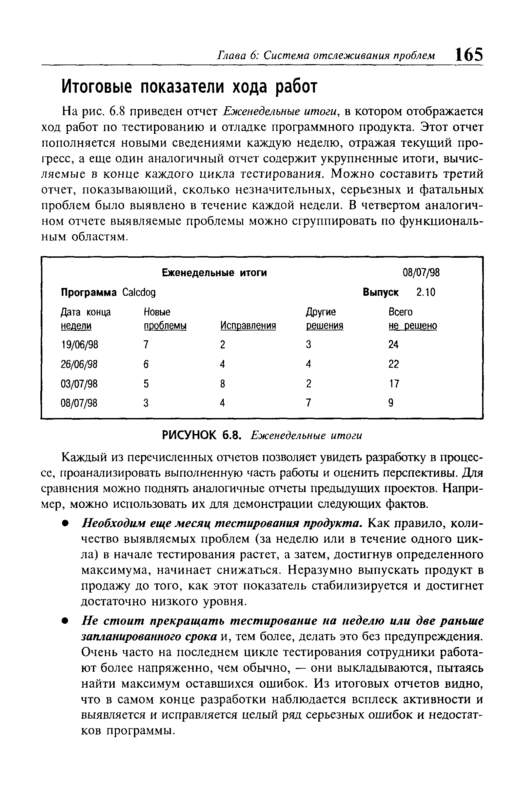

**РИСУНОК 6.8.** *Еженедельные итоги*

Каждый из перечисленных отчетов позволяет увидеть разработку в процессе, проанализировать выполненную часть работы и оценить перспективы. Для сравнения можно поднять аналогичные отчеты предыдущих проектов. Например, можно использовать их для демонстрации следующих фактов.

* **Необходим еще месяц тестирования продукта.** Как правило, количество выявляемых проблем (за неделю или в течение одного цикла) в начале тестирования растет, а затем, достигнув определенного максимума, начинает снижаться. Неразумно выпускать продукт в продажу до того, как этот показатель стабилизируется и достигнет достаточно низкого уровня.
* **Не стоит прекращать тестирование на неделю или две раньше запланированного срока** и, тем более, делать это без предупреждения. Очень часто на последнем цикле тестирования сотрудники работают более напряженно, чем обычно, — они выкладываются, пытаясь найти максимум оставшихся ошибок. Из итоговых отчетов видно, что в самом конце разработки наблюдается всплеск активности и выявляется и исправляется целый ряд серьезных ошибок и недостатков программы.

* Огромное количество отчетов об ошибках пользовательского интерфейса на ранних стадиях проекта является нормальным.

Обязательно распечатывайте отчеты с итоговыми показателями хода работ в конце каждого проекта — в дальнейшем они могут очень пригодиться. Что касается текущих отчетов, то это вопрос личных предпочтений. Генерируйте их по мере необходимости и передавайте тем, кому они потребуются.

Во многих группах принято регулярно представлять итоговые показатели хода работ в виде диаграмм и вместе с еженедельными отчетами о состоянии проекта вывешивать их для всеобщего обозрения.

## Когда разработка завершена

Когда разработка подходит к концу и окончательная версия программного продукта уже практически готова, наступает время для ряда завершающих действий. Прежде всего следует внести в программу все оставшиеся исправления, чтобы не осталось ни одного открытого отчета. Когда продукт будет готов окончательно и вся бумажная работа завершена, составьте *Акт о выпуске* (рис. 6.9).

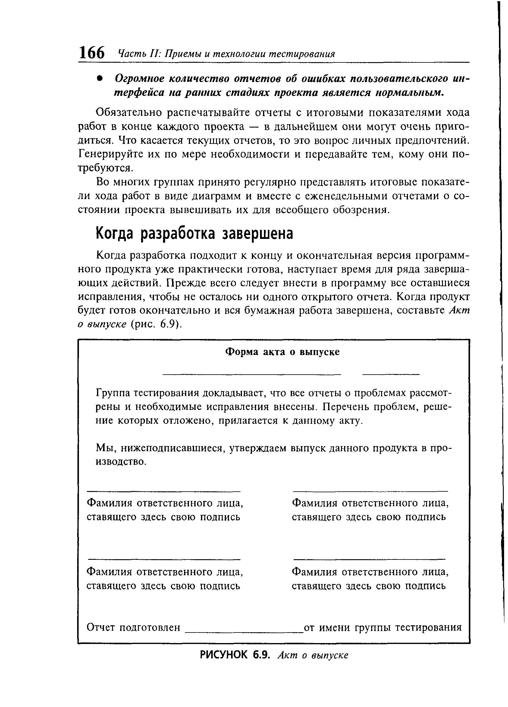

РИСУНОК 6.9. *Акт о выпуске*

В этом акте приводится только одна цифра — количество отложенных проблем. К нему прилагается копия *Сводного отчета о нерешенных проблемах* (см. рис. 6.7). В последний обязательно следует включить поле **Подробное описание проблемы и как ее воспроизвести**, поскольку это последний шанс изменить принятое решение и все-таки исправить программу.

Черновую копию акта о выпуске следует передать каждому, кто должен его подписать. Черновые копии не подписываются (Их поля подписей можно заполнить символами XXX). Раздать их лучше всего за день до того, как будет принято окончательное решение о выпуске продукта в производство, чтобы предоставить ответственным сотрудникам последнюю возможность еще раз пересмотреть все отложенные проблемы и, если необходимо, высказать свои возражения. На следующий день обойдите их всех и соберите их подписи на настоящем экземпляре акта (все подписи должны быть на одном документе).

Кто должен подписать акт о выпуске, решаете не вы — это сделает руководство. Акт подписывают все те сотрудники, которые должны одобрить окончательную версию продукта перед тем, как она уйдет в производство. Тем, кто не может наложить вето на его выпуск, незачем подписывать акт.

Обратите внимание, что подпись руководителя группы тестирования ставится внизу документа, в графе **Акт подготовлен**. Это означает, что вы только составляете данный документ, одобрение выпуска продукта в ваши функции не входит. Вы отвечаете за конкретную техническую часть производства, а все стратегические решения принимает руководство. Если вы чувствуете, что тестирование проведено неадекватно, напишите об этом в докладной записке, приложите ее к акту и в ней же объясните, почему вы так считаете.

## Открытие отложенных отчетов для подготовки следующего выпуска программного продукта

После того как работа над выпуском продукта 2.10 завершена и он отправлен в производство, компания приступает к планированию выпуска 3. И прежде всего, открываются все отчеты с пометками **Отложено**, **Считать отложенным** и, как правило, также **Соответствует проекту**. Это одна из наиболее важных функций системы — гарантировать, что отложенные проблемы не будут забыты. Ведь они отложены не навсегда, а как правило, до следующего выпуска программы, и предполагается, что все они в свое время будут решены.

Программное обеспечение, управляющее базой данных, должно скопировать все отчеты, отложенные в предыдущем выпуске программного продукта, во временные файлы, изменить их, как указано ниже, а затем

поместить в файлы данных нового выпуска. Затем все отчеты должны быть распечатаны.

При переносе в файлы очередного выпуска отчеты модифицируются следующим образом:

* Значение поля **Резолюция** изменяется на **Рассматривается**.
* Изменяются значения полей **Выпуск** и **Версия**.
* Отчетам присваиваются новые номера (поле **Отчет о проблеме №**).
* Очищаются все поля подписей и соответствующих дат, за исключением подписи составителя отчета.
* Очищается поле **Комментарии**.

Значения остальных полей отчетов следует оставить прежними. После помещения в новую базу данных все эти отчеты используются как обычно.

На практике некоторые компании сначала анализируют отчеты и отбирают те, которые подлежат повторному открытию. Но даже авторы данной книги разделились во мнениях, стоит ли осуществлять такой предварительный отбор или лучше открывать все отложенные отчеты.

## Отслеживание заплаток

Некоторые компании в ответ на жалобы пользователей пишут так называемые заплатки. Они представляют собой небольшие изменения, вносимые в программу для исправления конкретной ошибки. При такой технологии работы нетрудно пропустить побочные эффекты, поскольку изменения вносятся на скорую руку и не слишком тщательно тестируются. Заплатки рассылаются пользователям и сохраняются в архивах компании. Новые пользователи по-прежнему получают исходную версию программного обеспечения и при желании могут обратиться в компанию за заплатками.

При подготовке очередного выпуска программного обеспечения в него интегрируются все заплатки предыдущего выпуска. Однако нередко случается, что о какой-нибудь из них просто забывают. Убедиться, что ни одна из заплаток не забыта, обязана группа тестирования нового выпуска.

Если в вашей компании применяется описанная стратегия поддержки программного продукта, в набор возможных резолюций на отчетах о проблемах стоит добавить еще одну — **Написана заплата**. Такая резолюция будет означать, что проблема решена временно и исправления необходимо будет внести в новый выпуск программы. Когда это будет сделано и соответствующий код нового выпуска будет как следует проверен, вы измените резолюцию на **Исправлено**. Чтобы напомнить сотрудникам о необ-[Детальный опис того, що саме намальовано чи показано на картинці](images/Kaner_1999_TestingComputerSoftware/page_167_img_1.png)

ходимости внесения в программу оставшихся заплат, можно периодически распространять сводный отчет Текущие заплаты (рис. 6.10).


РИСУНОК 6.10. *Сводный отчет о текущих заплатах*

## Дополнительные замечания о документировании проблем

Главным принципом построения и эксплуатации системы отслеживания проблем должна быть концентрация на выявлении и устранении ошибок. Никакой политики, никаких оценок, никаких административных функций — только ошибки.

Задачей группы тестирования является выявление максимума проблем, их основательный анализ, составление максимально эффективных отчетов и предоставление тем, кто будет с ними работать, простого и удобного средства их анализа и дополнения. Это средство должно предоставлять пользователю возможность поиска и отбора информации — как итоговой, так и по отдельным отчетам, и в конечном счете максимально способствовать исправлению ошибок и недостатков программы. За годы работы мы усвоили несколько очень важных уроков. О некоторых из них уже рассказывалось в предыдущих разделах этой главы, а сейчас вам предстоит узнать о тех, которые заслуживают особого внимания.

### Выработка критериев оценки важности выявляемых проблем

Каждый тестировщик и вся группа тестирования постоянно подвергаются критике за пропущенные ошибки и отчеты о мелочах, не заслуживающих внимания. В течение разработки руководитель проекта жалуется на излишние отчеты, а после ее завершения, когда начинают приходить жалобы от пользователей, высказывает недовольство по поводу каждой найденной ими ошибки. Руководитель группы тестирования может повысить эффективность работы своих подчиненных, если будет постоянно просматривать отчеты и проводить обучение персонала, но каких бы успехов он ни

добился и какими бы классными специалистами ни стали все без исключения тестировщики, жалобы все равно не прекратятся. Каждый тестировщик периодически сталкивается со спорными особенностями поведения программы, которые можно документировать как ошибочные или непонятные, а можно и пропустить. Если пропустить такую особенность, то в конечном счете может оказаться, что это была самая настоящая ошибка. А если составить отчет, возможно, его рассмотрение будет для других сотрудников пустой потерей времени. В хорошо организованных группах тестирования обсуждению подобных вопросов и выработке оптимальной стратегии принятия решений уделяется достаточно много внимания. Балансируя между риском пропустить ошибку и вероятностью впустую потратить рабочее время сотрудников, специалисты группы тестирования должны заранее расставить приоритеты: какая из этих двух неприятностей будет иметь худшие последствия.

Каждый раз, составляя отчет о проблеме, тестировщик оценивает, стоит ли ли она внесения в базу данных — стоит ли то изменение, которое он предлагает, времени и усилий разработчиков.

* В каких случаях неверное поведение программы стоит документировать? Одни тестировщики считают, что документированию подлежит любое неверное действие программы. Другие впадают в противоположную крайность и документируют только те ошибки, которые вызывают разрушение данных или препятствуют дальнейшей эксплуатации программы. Если же существует обходной путь выполнения необходимых действий, они не документируют найденную ошибку.
* Если в программе вам что-то не нравится или вы считаете, что некоторые пользователи будут недовольны какой-либо ее особенностью, стоит составить отчет и указать в нем, что данная особенность программы может считаться ее недостатком, или описать изменения, которые, на ваш взгляд, значительно ее усовершенствуют.
* Если неверное поведение программы похоже на то, которое уже описано в одном из отчетов, можно не составлять новый отчет до тех пор, пока в ходе дальнейшего тестирования не будут выявлены достаточно значительные различия.
* Если не удается воспроизвести увиденную ошибку, но при этом вы хорошо помните, в чем она заключалась и что вы делали, перед тем как она проявилась, отчет о ней вполне может оказаться полезным.
* Если в процессе эксплуатации программы вы допускаете слишком много ошибок, стоит подумать, не является ли их причиной неудобный или нечеткий интерфейс программы.

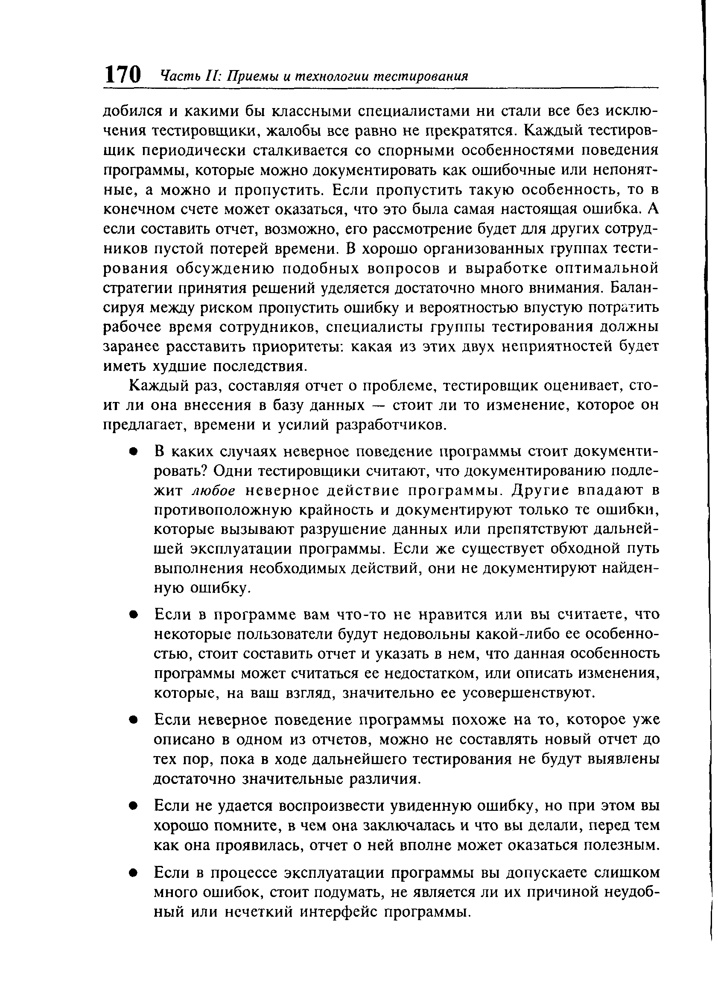

* Стоит ли документировать недостатки интерфейса после того, как этап разработки, на котором разрешено его изменять, завершен?

Критерии оценки необходимости документирования проблем меняются по мере продвижения разработки. На ранних стадиях тестирования, когда программа сбоит каждые несколько минут, возможно, имеет смысл документировать только наиболее серьезные ошибки. По мере того как программа будет становиться все более стабильной, вы будете документировать все больше мелких деталей — все, что покажется вам спорным или неправильным. Ближе к концу разработки можно снова оставить мелкие недостатки интерфейса и сконцентрироваться на наиболее серьезных ошибках кодирования.

Точность и уверенность оценок приходит с опытом. Их критерии приходится несколько корректировать, приспосабливаясь к требованиям каждого нового руководителя проекта или руководителя группы тестирования, стандартам каждой новой компании. Именно взгляды руководства и выбранная им стратегия разработки в конечном счете определяют принципы отбора документируемых проблем.

Однако какими бы ни были выбранные критерии, они не гарантируют для вас полное отсутствие ошибок. Рассмотрим пример, когда найдена ошибка, очень похожая на одну из тех, отчеты о которых уже включены в базу данных. Тут возможны два варианта действий:

1. Вы решите не документировать новую ошибку из-за ее сходности с предыдущей.
   * Если вы правы и действительно имеете дело с одной и той же ошибкой, то сэкономите время сотрудников, читающих ваши отчеты.
   * Однако, если вы ошибаетесь, программист исправит одну ошибку и оставит другую, поскольку никогда о ней не узнает. В результате *рискует пользователь* — он может получить плохо работающую программу.
2. Вы решите, что, вероятнее всего, столкнулись с разными ошибками, и составите новый отчет.
   * Если вы правы, обе ошибки будут исправлены.
   * Если нет, будет зря затрачено время сотрудников компании: ваше — на составление отчета, руководителя проекта — на его чтение и оценку, программиста — на исследование и анализ, в результате которого он выяснит, что ошибка уже исправлена, и снова ваше — на повторное тестирование и закрытие отчета. Это *риск производителя* — ведь в конечном счете все это выливается для него в дополнительные материальные и временные затраты.

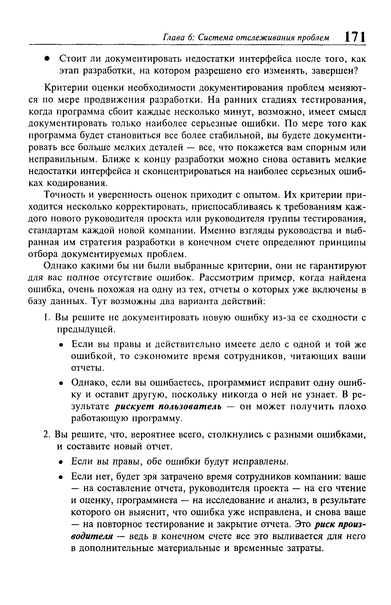

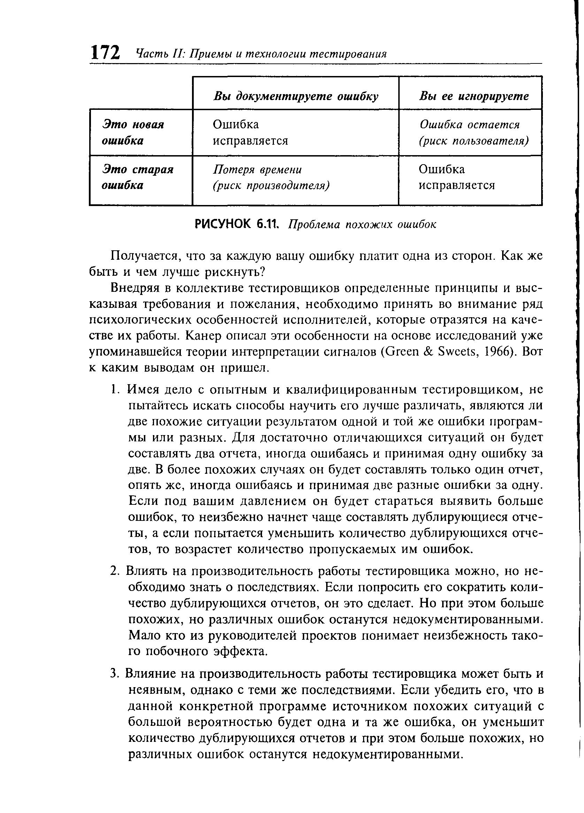

РИСУНОК 6.11. Проблема похожих ошибок

Получается, что за каждую вашу ошибку платит одна из сторон. Как же быть и чем лучше рискнуть?

Внедряя в коллективе тестировщиков определенные принципы и высказывая требования и пожелания, необходимо принять во внимание ряд психологических особенностей исполнителей, которые отразятся на качестве их работы. Канер описал эти особенности на основе исследований уже упоминавшейся теории интерпретации сигналов (Green & Sweets, 1966). Вот к каким выводам он пришел.

1. Имея дело с опытным и квалифицированным тестировщиком, не пытайтесь искать способы научить его лучше различать, являются ли две похожие ситуации результатом одной и той же ошибки программы или разных. Для достаточно отличающихся ситуаций он будет составлять два отчета, иногда ошибаясь и принимая одну ошибку за две. В более похожих случаях он будет составлять только один отчет, опять же, иногда ошибаясь и принимая две разные ошибки за одну. Если под вашим давлением он будет стараться выявить больше ошибок, то неизбежно начнет чаще составлять дублирующиеся отчеты, а если попытается уменьшить количество дублирующихся отчетов, то возрастет количество пропускаемых им ошибок.
2. Влиять на производительность работы тестировщика можно, но необходимо знать о последствиях. Если попросить его сократить количество дублирующихйся отчетов, он это сделает. Но при этом больше похожих, но различных ошибок останутся недокументированными. Мало кто из руководителей проектов понимает неизбежность такого побочного эффекта.
3. Влияние на производительность работы тестировщика может быть и неявным, однако с теми же последствиями. Если убедить его, что в данной конкретной программе источником похожих ситуаций с большой вероятностью будет одна и та же ошибка, он уменьшит количество дублирующихйся отчетов и при этом больше похожих, но различных ошибок останутся недокументированными.

4. Еще одним примером неявного влияния на производительность работы тестировщика может быть сознание различных последствий допускаемых ошибок. Если руководитель проекта не предъявляет особых претензий за пропущенные ошибки, зато очень недоволен, когда в двух отчетах описывается одна и та же проблема, большинство тестировщиков будут реже составлять дублирующиеся отчеты (и пропускать больше похожих, но различных ошибок).

Все сказанное о взятой для примера проблеме похожих ошибок применимо и к любым другим решениям, которые приходится принимать тестировщикам. Каждый из них будет время от времени допускать ошибки, и вам как руководителю проекта или руководителю группы тестирования необходимо решить, последствия каких из этих ошибок будут более серьезными. Что хуже, мусор в базе данных или недокументированные ошибки. Можно ли пропустить серьезную ошибку, которая показалась не стоящей внимания или лучше рискнуть включить в базу данных пустяковый отчет, по которому никто никаких изменений вносить не будет? Можно ли пропустить серьезную ошибку в утвержденной спецификации или лучше рискнуть потратить время сотрудников на рассмотрение вопроса, который поднят слишком поздно. Ответом на все эти вопросы может быть только заранее выработанная политика, которая позволит вам и вашим подчиненным действовать более последовательно и уверенно.

## Похожие отчеты

Как следует поступать, когда неправильные действия программы в двух различных ситуациях очень похожи?

Десяток отчетов об одной и той же проблеме — это явно недопустимая трата времени программиста и руководителя проекта. Если ее можно избежать, следует сделать для этого все возможное.

А вот аргументы в пользу свободного включения в базу данных отчетов о похожих неправильных действиях программы.

* В двух похожих отчетах могут описываться различные ошибки. Если не включать в базу данных один из этих отчетов, соответствующая ошибка не будет исправлена.
* Одна и та же ошибка может быть допущена в двух разных фрагментах кода. Если документировать только один экземпляр, как программист узнает о втором?
* Второй отчет о сложной проблеме может предоставить программисту дополнительную информацию, которая поможет выявить ее источник. Чем самостоятельно решать, какой из отчетов будет полезнее программисту, лучше предоставить ему максимум информации.

* Если возвратить сотруднику отчет с пометкой, что проблема уже зарегистрирована, как ему поступить, столкнувшись с ней повторно? Следует ли составить отчет снова? При работе с сотрудниками, не являющимися членами группы тестирования, следует определиться в этом вопросе.

А вот несколько рекомендаций, относящихся к обязанностям тестировщиков, способствующих улучшению организации работ:

* Каждый тестировщик обязан ознакомиться со всеми проблемами, выявленными в той части кода, которую он тестирует. Он не должен составлять новых отчетов о проблемах, которые уже зарегистрированы в базе данных. Если появилась дополнительная информация, ее можно внести в поле **Комментарии** — для этого оно и предназначено. Второй отчет в этом случае только создаст путаницу. Руководители групп тестирования расходятся во мнениях о том, сколько времени новый сотрудник должен затрачивать на изучение уже имеющихся отчетов. Одни считают, что тестировщик должен ознакомиться со всеми ранее составленными отчетами до того, как составит свой первый отчет. Другие предлагают делать это постепенно по ходу работы и допускают большее количество повторений.
* Тестировщики должны регулярно просматривать базу данных, чтобы быть в курсе всех выявляемых проблем. Столкнувшись с ситуацией, похожей на одну из уже описанных, им следует включать в отчеты перекрестные ссылки (номера связанных отчетов в поле **Комментарии**).
* До того, как будет совершенно точно установлено, что похожие отчеты действительно относятся к одной и той же проблеме, ни один из них не следует закрывать как дублирующийся. Гораздо лучше пользоваться перекрестными ссылками. Не стоит и объединять похожие отчеты в один.

## Регистрация различных мнений

Тестировщики, руководители проекта, программисты и другие члены команды могут очень сильно расходиться во мнениях по поводу отчета о какой-либо проблеме. Иногда их разногласия вызывают отчаянные споры. Чтобы помочь делу, необходимо прежде всего обеспечить возможность регистрации в системе мнения каждого из участников разработки. Вот какими средствами это реализуется:

* **Степень важности** и **Приоритет**. Степень важности проблемы определяет тестировщик, а ее приоритет задает руководитель проекта. Если в системе будет только одно из этих полей, постоянные спо-

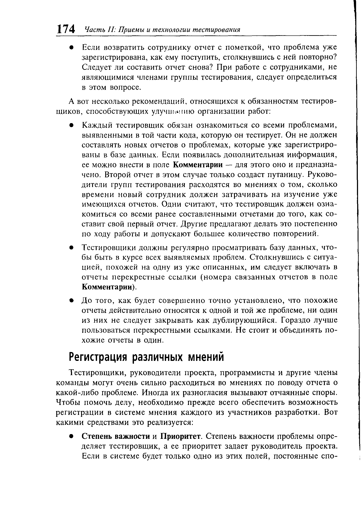

ры между тестировщиками и руководителем проекта неизбежны. Например, тестировщик может посчитать ошибку фатальной, в то время как руководитель проекта по каким-либо соображениям назначит ей низкий приоритет. Если не позволить каждому из них зарегистрировать свое мнение и в ходе обсуждения они не придут к единому выводу, то чья оценка должна победить? И почему вообще одна из них должна побеждать? Не проще ли включить в отчет обе оценки и позволить сортировать отчеты по любому из полей: как по полю **Степень важности**, так и по полю **Приоритет**.

* **Считать отложенным**. Руководитель проекта может наложить резолюцию, по которой проблема не просто откладывается, а вообще не будет решена (например, **Соответствует проекту** или **Не воспроизводится**). Если тестировщик считает, что к отчету необходимо будет еще вернуться, он может воспользоваться отдельным полем — **Считать отложенным**. Если в этом поле отчета написано Да, он считается отложенным и включается во все сводные отчеты об отложенных проблемах.

* **Комментарии**. Для этого поля отчета в базе данных должно быть зарезервировано достаточно места, поскольку оно используется для документирования хода обсуждения проблемы и регистрации различных мнений сотрудников. В однопользовательской системе оно излишне, а вот во многопользовательской применяется чрезвычайно активно. С его помощью просто и эффективно решается большая часть коммуникационных проблем. В частности, оно представляет собой своеобразный электронный форум, где тестировщик может рассказать, почему он считает данную проблему исключительно важной, программист может показать, насколько рискованно корректировать соответствующую часть кода, а руководитель проекта может объяснить, почему нельзя отложить эту проблему до следующего выпуска.

* **Пересмотр отложенных отчетов**. Мы рекомендуем регулярно проводить совещания для пересмотра отчетов, помеченных как **Отложено** и **Считать отложенным**. Ни один из таких отчетов не должен быть закрыт до того, как он будет рассмотрен на одном из совещаний. Если между руководителем проекта, тестировщиками, группой технической поддержки, техническими писателями и менеджером по маркетингу остались хоть какие-то разногласия по поводу конкретного отчета, все они могут быть улажены в ходе общего обсуждения. Участники совещания обсуждают проблему, ее возможные последствия, риск, связанный с исправлением программы, и принимают решение.

* Решено и Закрыто. Руководитель проекта может посчитать проблему решенной, если она отложена или программа исправлена, но закрыть отчет вправе только тестировщик. Если речь идет об исправлении, необходимо еще проверить, правильно ли оно работает, а отложенный отчет должен быть обсужден на соответствующем совещании.

* *Только автор отчета может его исправить*. Большинство людей обижаются, когда кто-нибудь изменяет их отчеты. Но главная причина указанного правила не в обидах, а в том, что исправление отчета не его автором может привести к серьезным недоразумениям и разногласиям. Можно добавить в отчет комментарии, можно попросить его автора что-то изменить, но ни в коем случае не следует делать этого самостоятельно. И автор отчета может внести предложенные изменения, а может и отказаться — это его право, которое не должен нарушать даже руководитель проекта. Единственным исключением из этого правила может быть ситуация, когда отчет предоставлен пользователем или сотрудником, не являющимся членом группы разработки. В этом случае отчет может быть плохо составлен, а его автор заранее готов к тому, что документ будет изменен.

* *Отчеты не должны подвергаться фильтрации*. Некоторые ведущие тестировщики не позволяют вводить в базу данных отчеты, с которыми они не согласны. Такая фильтрация часто выполняется по приказу или с согласия руководителя проекта. Однако наш опыт показывает, что персонал группы технической поддержки, технические писатели и другие ответственные сотрудники компании могут смотреть на вещи иначе, чем ведущий тестировщик, и при этом их мнение может быть очень полезным. Проектирование продукта — не его работа, и, если предложенные кем-то из сотрудников изменения ему не нравятся, это еще не значит, что предложение не может быть хорошим.

## Программа изнутри

Группа программирования может попросить тестировщиков указывать, в каком модуле находится выявленная ошибка или к какой функциональной области программы она относится. Если таких областей 10 или даже 30, это несложно, но если их 50 или 500, задача тестировщика сильно усложняется. Чтобы предоставить программистам нужную информацию, придется заглянуть в программный код.

Само по себе изучение кода программы для ее отладки полезно. Оно позволяет гораздо быстрее выявить некоторые специфические ошибки.

Если определенный модуль очень плохо написан, его можно полностью переписать. Если обнаружить, что программисты постоянно допускают одни и те же ошибки, руководство может организовать занятия для повышения их квалификации.

Однако собрать всю эту информацию не так просто. Быстро найти ошибку может только программист, занимающийся отладкой данного программного продукта. Только он знает, что в каком модуле делается, и только он может точно определить функциональную область, к которой относится выявленная ошибка. Программисты просто не хотят заниматься документированием этих вопросов для системы отслеживания проблем.

> *Опытные и квалифицированные тестировщики могут довольно точно определять, в каком модуле и в какой функциональной области программы произошла ошибка. Однако не всегда их предположения верны — точный ответ на эти вопросы даст только программист, занимающийся отладкой продукта. Наш опыт показывает, что на выяснение тестировщиками подобной информации тратится неоправданно много времени. Мы рекомендуем предоставить эту работу программистам.*

Не стоит изучать программный код, собирая информацию для отчета, разве что в особых случаях. Это работа программистов, и они прекрасно с ней справятся и без вашей помощи.

## Несколько замечаний о форме отчета о проблеме

В пятой главе приводилось подробнейшее описание формы отчета о проблеме. Этот раздел содержит несколько полезных советов, которые пригодятся вам при создании собственной системы отслеживания проблем. Если же вы не собираетесь этим заниматься, можете их смело пропустить.

* Списки названий, имен и допустимых значений полей отчетов лучше хранить в виде отдельных файлов данных. При вводе пользователем данных в поля отчета система должна сразу же проверять их допустимость. Например, это может касаться полей **Программа**, **Функциональная область** и т. п. Для некоторых полей можно разрешить значения **Неизвестно** или **?**. Например, знак вопроса можно поставить в поле **Версия**, если автор отчета не знает точно, в какой версии он обнаружил описанную проблему. Ответ на вопрос **Можете ли вы воспроизвести проблемную ситуацию?** может записываться сокращенно и иметь одно из трех значений: **Д**, **Н**, **И** (Иногда).

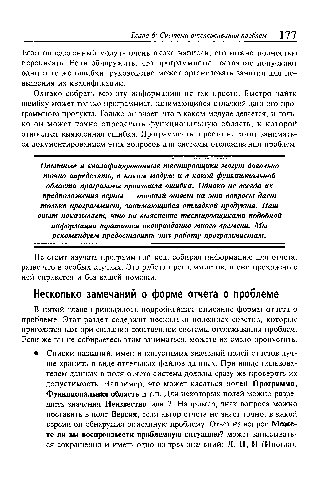

* Для граф отчета **Функциональная область** и **Ответственный** в базе данных лучше иметь по два поля. Первое из них длиной от 3 до 5 символов предназначается для ускорения ввода: в него можно вводить инициалы или аббревиатуру, ассоциированную с полным значением, автоматически подставляемым системой во второе поле. Когда приходится вводить по многу отчетов за раз, это очень экономит время. Поле аббревиатуры можно и пропустить, введя во второе поле полное значение.
* При вводе отчета в систему она должна автоматически присваивать полю **Резолюция** значение **Рассматривается**.
* Никто, кроме тестировщика, не должен иметь право вводить значение **Закрыто** в поле **Состояние**. По умолчанию этому полю должно присваиваться значение **Открыто**.

## Терминология

В этом разделе определяются некоторые ключевые термины организации баз данных.

*Система управления базами данных (СУБД)* представляет собой набор компьютерных программ, позволяющих определить структуру базы данных, вводить и редактировать данные и генерировать отчеты. Скорее всего, вы выберете для разработки системы отслеживания проблем одну из имеющихся на рынке современных СУБД или средств разработки приложений, обладающих возможностями работы с базами данных (это может быть Oracle, MS Access, Delphi и т.п.). По отношению к выбранному инструментальному средству ваша система будет приложением, но для пользователей, считая и вас, ее можно назвать СУБД.

*Файл* — это набор информации, которую операционная система хранит вместе под одним именем. База данных может состоять из множества файлов. Вот упрощенный пример организации данных для системы отслеживания проблем.

* В главном файле данных хранятся все отчеты о проблемах. Если их очень много, можно разделить их на несколько файлов, возможно, по типам или датам.
* В индексных файлах хранится информация о местоположении каждого отчета в главном файле данных. В одном индексном файле эта информация может быть отсортирована по датам отчетов, в другом по функциональным областям и т.д.

* Во вспомогательных файлах хранятся перечни допустимых значений отдельных полей. Они используются для проверки вводимых данных и для предоставления пользователю возможности выбирать значения полей из списка. Отчеты с недопустимыми данными системой отвергаются.

*Поле* — это простейший значимый элемент данных записи. Например, **Дата**, **Приоритет**, **Резолюция** являются полями отчета о проблеме.

*Форма (или Форма ввода данных)* — это аналог бумажной формы, отображенный на экране компьютера. В форме показано, какая информация и куда должна быть введена. Во многих системах пользователи могут заполнять распечатываемые бумажные формы для последующего ввода данных оператором, а могут вводить информацию и самостоятельно.

*Запись* — это логический элемент базы данных. Например, в системе отслеживания проблем записью является отчет о проблеме.

*Отчет* — это сводная или итогая информация, которую можно получить на основе исходных данных. Обычно определение отчета создается один раз с помощью соответствующих инструментальных средств (языка программирования или генератора отчетов), а затем сам отчет формируется периодически или тогда, когда в нем возникает необходимость. Генераторы отчетов позволяют описывать не только информацию, которая должна быть представлена в отчете, но и ее форматирование — отступы, выделения и т.п. Современные средства позволяют генерировать прекрасно оформленные профессиональные отчеты, в которых данные представлены в текстовом виде, а также в виде разнообразных диаграмм.

В системе отслеживания проблем входные данные также называются отчетами. Эта небольшая путаница не должна вас смущать. Для определенности входные данные в книге обычно называются *исходный отчет* или *отчет о проблеме*, а выходные — *сводный* или *итоговый отчет*.

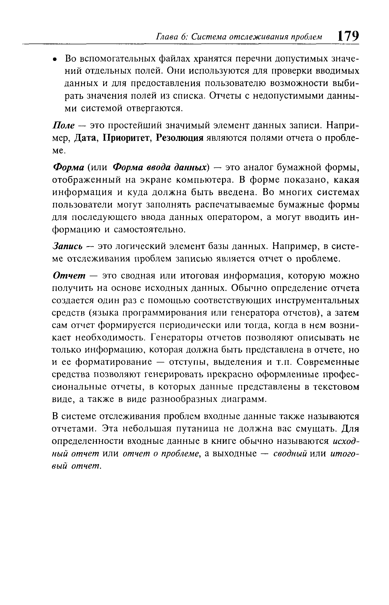

*Глава* 7

# Разработка тестов

### Назначение этой главы

Эта глава посвящена разработке эффективных наборов тестов "черного ящика".

* "Черный ящик" против "стеклянного". Хотя в предыдущих разделах и рассказывалось о методах тестирования "стеклянного ящика", данная книга главным образом посвящена первой технологии. В этой главе подробно рассказывается о том, в чем состоит эта технология и как анализировать программу в целях разработки наиболее оптимальных и эффективных тестов.
* Наборы тестов против плана тестирования. В центре внимания этой главы находятся отдельные тесты и небольшие наборы связанных тестовых примеров. В двенадцатой главе этот рассказ продолжается рассмотрением процесса разработки плана тестирования — набора тестов, охватывающих всю программу. Но чтобы глубже понять и оценить то, о чем в ней рассказывается, стоит сначала на практике изучить технологию данной главы и самостоятельно протестировать хотя бы одну программу.

### Упражнения для читателей (и не только для студентов)

Выберите для тестирования какую-нибудь программу. Вполне подойдет и коммерческий продукт, создатели которого утверждают, что он полностью протестирован. Весь продукт тестировать не нужно, достаточно выбрать пять полей ввода данных — они обычно имеются в любой программе. Наиболее очевидным выбором может быть небольшая база данных, но и текстовый процессор как минимум позволяет ввести размеры отступов, размеры страницы документа и другие параметры настройки программы. Особенно хорошо, если можно вводить такую конфигурационную информацию, как объем памяти, выделяемой для определенной функции программы. Обычно подобные опции протестированы хуже всего, и некоторые их установки могут привести к сбою системы. Поэтому перед экспериментами с памятью,

портами и конфигурированием жесткого диска не забудьте сделать его резервную копию.

Для каждого поля ввода данных выполните следующее:

1. Проанализируйте значения, которые в него можно вводить. Сгруппируйте их в классы.
2. Проанализируйте возможные граничные условия. Их можно описать, исходя из определений классов, но возможно, что в ходе этого анализа добавятся и новые классы значений.
3. Нарисуйте таблицу, в которой перечислите все классы значений для каждого поля ввода и все интересные тестовые примеры (граничные и другие особые значения). Пример такой таблицы приведен на рис. 7.1. Если у вас будет плохо получаться, прочитайте раздел главы 12 "Таблицы граничных значений".
4. Протестируйте программу, используя записанные значения (а если их слишком много, то некоторое их подмножество). Протестировать программу, означает не только запустить ее, ввести данные и посмотреть, не произойдет ли сбой, — важно, чтобы программа правильно *использовала* введенные данные. Получаются ли, например, при печати указанные пользователем отступы? Обязательно придумайте тестовую процедуру, в которой программа использует введенную вами информацию.

## Обзор

Эта глава начинается с анализа характеристик хорошего набора тестов. В ней описываются пять технологий:

* Анализ классов эквивалентности.
* Анализ граничных условий.
* Тестирование переходов между состояниями.
* Тестирование ситуаций гонок и других аспектов работы программы, зависящих от времени.
* Прогнозирование ошибок.

Из данной главы вам предстоит узнать о группе исключительно эффективных технологий, называемых тестированием функциональной эквивалентности. В ней описывается методика проведения регрессионного тестирования — неотъемлемой части любого процесса разработки программного обеспечения.

В завершение рассказа о разработке эффективных тестов приведены несколько замечаний по поводу их выполнения. Иногда у тестировщиков имеются прекрасные идеи, но не доведенные до логического завершения или плохо реализованные, они не выполняют своей задачи, и ошибки остаются ненайденными. В этой работе существует несколько ловушек, о которых следует знать.

## Библиография

О вопросах, освещаемых в этой главе, подробно рассказывается у Майерса (Myers, 1979) — особенно хорошо он пишет о классах и граничных ус-

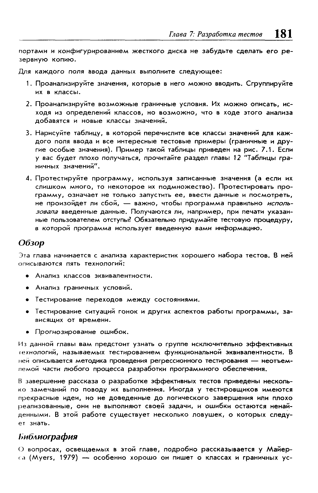

ловиях. О различных технологиях тестирования “черного ящика” можно прочитать в любой из книг Майерса, Данна (Dunn), Хезела (Hetzel), Бейзера (Beizer) или Эванса (Evans). Некоторая полезная информация в понятном изложении имеется и у Йордана (Yourdon, 1975).

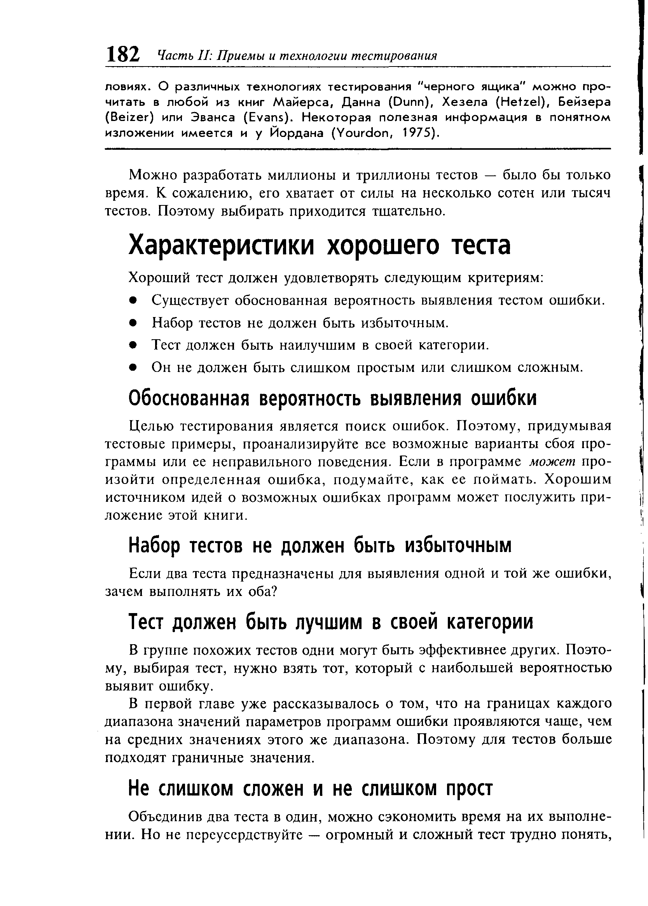

Можно разработать миллионы и триллионы тестов — было бы только время. К сожалению, его хватает от силы на несколько сотен или тысяч тестов. Поэтому выбирать приходится тщательно.

## Характеристики хорошего теста

Хороший тест должен удовлетворять следующим критериям:
* Существует обоснованная вероятность выявления тестом ошибки.
* Набор тестов не должен быть избыточным.
* Тест должен быть наилучшим в своей категории.
* Он не должен быть слишком простым или слишком сложным.

### Обоснованная вероятность выявления ошибки

Целью тестирования является поиск ошибок. Поэтому, придумывая тестовые примеры, проанализируйте все возможные варианты сбоя программы или ее неправильного поведения. Если в программе может произойти определенная ошибка, подумайте, как ее поймать. Хорошим источником идей о возможных ошибках программ может послужить приложение этой книги.

### Набор тестов не должен быть избыточным

Если два теста предназначены для выявления одной и той же ошибки, зачем выполнять их оба?

### Тест должен быть лучшим в своей категории

В группе похожих тестов одни могут быть эффективнее других. Поэтому, выбирая тест, нужно взять тот, который с наибольшей вероятностью выявит ошибку.

В первой главе уже рассказывалось о том, что на границах каждого диапазона значений параметров программ ошибки проявляются чаще, чем на средних значениях этого же диапазона. Поэтому для тестов больше подходят граничные значения.

### Не слишком сложен и не слишком прост

Объединив два теста в один, можно сэкономить время на их выполнении. Но не пересердствуйте — огромный и сложный тест трудно понять,

трудно выполнить и долго создавать. Поэтому лучше всего придерживаться золотой середины, разрабатывая простые, но все же не совсем элементарные тестовые примеры.

Кроме трудоемкости, у сложных тестов есть и более серьезный недостаток. Скомбинировав несколько неверных входных значений, нельзя сказать наверняка, как программа интерпретирует каждое из них. После первого же недопустимого значения поведение программы может выйти из-под контроля, например, она может просто отказаться принимать все остальные данные. Такие примеры иногда строятся и намеренно — если необходимо проверить, как программа реагирует на серию недопустимых значений. Однако для начала лучше протестировать их по отдельности, проверив работу блока обработки каждой из ошибок.

### Некорректное поведение программы проявляется с достаточной очевидностью

Как узнать, прошла ли программа тест? Ответ на этот вопрос не так очевиден, как может показаться на первый взгляд. Тут есть над чем подумать. Даже неверные выходные данные на экране или на бумаге тестировщик может случайно пропустить, не говоря уже о том, что результат ошибки может оказаться скрытым.

* Разрабатывая тест, подробно опишите ожидаемые выходные данные или реакцию программы. Выполняя его, сверяйтесь со своими записями.
* Постарайтесь разрабатывать тесты так, чтобы объем выходных данных был минимальным. В километровой распечатке или огромном файле едва ли легко будет найти неправильную цифру.

## Классы эквивалентности и граничные условия

Одними из ключевых понятий теории тестирования являются классы эквивалентности и граничные условия. Классический тест граничных условий позволяет с наибольшей вероятностью выявить имеющуюся в программе ошибку. Обдумывая наборы таких тестов, специалист разделяет все возможные тесты на группы, выделяя в каждой из них наиболее эффективные.

### Классы эквивалентности

Если от выполнения двух тестов ожидается один и тот же результат, они считаются эквивалентными. Группа тестов представляет собой класс эквивалентности, если выполняются следующие условия.

* Все тесты предназначены для выявления одной и той же ошибки.
* Если один из тестов выявит ошибку, остальные, скорее всего, тоже это сделают.
* Если один из тестов не выявит ошибки, остальные, скорее всего, тоже этого не сделают.

Разумеется, кроме этих абстрактных критериев, необходимы еще и практические, позволяющие отнести к одному классу конкретную группу тестов. Вот на чем может основываться этот отбор.

* Тесты включают значения одних и тех же входных данных.
* Для их проведения выполняются одни и те же операции программы.
* В результате всех тестов формируются значения одних и тех же выходных данных.
* Либо ни один из тестов не вызывает выполнения блока обработки ошибок программы, либо выполнение этого блока вызывается всеми тестами группы.

## Поиск классов эквивалентности

Поиск классов эквивалентности — процесс субъективный. Два человека, анализирующих одну и ту же программу, составят различные перечни классов. Однако постарайтесь все же выявить как можно больше классов эквивалентности: это сэкономит время в дальнейшем и сделает тестирование более эффективным, избавляя вас от ненужного повторения эквивалентных тестов. Разбив все предполагаемые тесты на классы, можно затем выделить в каждом из них один или несколько тестов, которые покажутся вам наиболее эффективными — остальные выполнять ни к чему.

Вот несколько рекомендаций для поиска классов эквивалентности:

* Не забывайте о классах, охватывающих заведомо неверные или недопустимые входные данные.
* Организуйте формируемый перечень классов в виде таблицы или плана.
* Определите диапазоны числовых значений.
* Для полей или параметров, принимающих фиксированные перечни значений, выясните, какие из значений входят в перечень.
* Проанализируйте возможные результаты выбора из списков и меню.
* Поищите переменные, значения которых должны быть равными.
* Поищите классы значений, зависящих от времени.

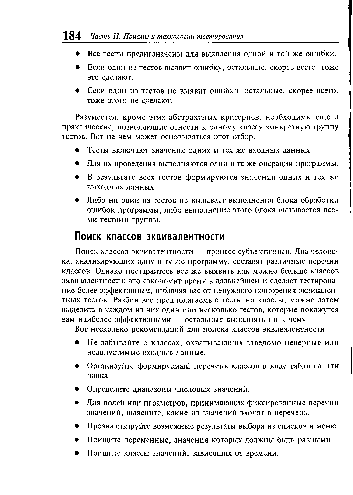

* Выявите группы переменных, совместно участвующих в определенных вычислениях, результат которых ограничивается конкретным набором или диапазоном значений.
* Посмотрите, на какие действия программа отвечает эквивалентными событиями.
* Продумайте варианты операционного окружения.

## Не забывайте о классах, охватывающих заведомо неверные или недопустимые входные данные

Часто недопустимые или неверные входные данные вызывают в программе самые разнообразные ошибки. Лишь очень немногие программисты тщательно продумывают и отлаживают реакцию своих программ на подобные данные. Поэтому, чем больше вы выделите типов неверного ввода, тем больше найдете ошибок. Например, если программа должна принимать числа от 1 до 99, существует как минимум четыре класса эквивалентных тестов.

* Допустим ввод чисел от 1 до 99.
* Любое число меньше 1 слишком мало. Данный диапазон включает 0 и все отрицательные числа.
* Любое число больше 99 слишком велико.
* Если введена нечисловая информация, она не принимается. (Действительно ли это верно для всего, что не является числом?)

## Организуйте формируемый перечень классов в виде таблицы или плана

Обычно классов эквивалентности оказывается очень много, так что не обойтись без удобного и продуманного способа организации собранной информации. Мы используем два подхода. Обычно вся информация сводится в большую таблицу, пример которой приведен на рис. 7.1. Иногда ее можно представить и в форме плана, как на рис. 7.2. Обратите внимание, что в любом случае в перечень включены тесты не только допустимых, но и недопустимых или нестандартных входных данных.

Оба способа организации информации, и таблица и план, достаточно удобны. У каждого из них есть преимущества и недостатки.

Табличный формат информации более понятен, его легче читать, и одним взглядом можно охватить больше информации. В нем более очевидно разделение на допустимые и недопустимые варианты. На наш взгляд,

когда информация представлена в таком виде, ее легче анализировать, чтобы выяснить, все ли недопустимые варианты входных данных охвачены перечисленными классами эквивалентности.

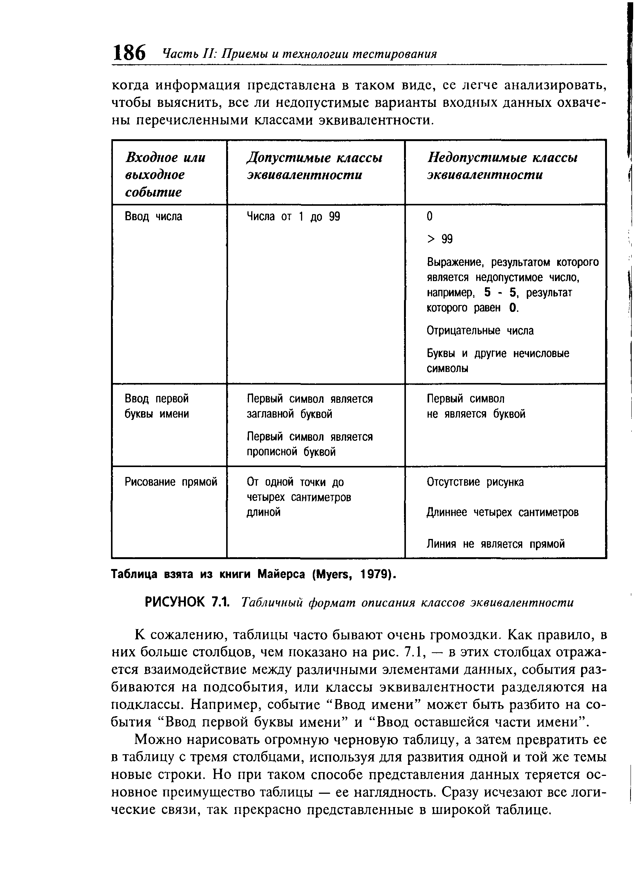

**Таблица взята из книги Майерса (Myers, 1979).**

**РИСУНОК 7.1.** *Табличный формат описания классов эквивалентности*

К сожалению, таблицы часто бывают очень громоздки. Как правило, в них больше столбцов, чем показано на рис. 7.1, — в этих столбцах отражается взаимодействие между различными элементами данных, события разбиваются на подсобытия, или классы эквивалентности разделяются на подклассы. Например, событие “Ввод имени” может быть разбито на события “Ввод первой буквы имени” и “Ввод оставшейся части имени”.

Можно нарисовать огромную черновую таблицу, а затем превратить ее в таблицу с тремя столбцами, используя для развития одной и той же темы новые строки. Но при таком способе представления данных теряется основное преимущество таблицы — ее наглядность. Сразу исчезают все логические связи, так прекрасно представленные в широкой таблице.

1. Ввод числа
1.1 Допустимые варианты
1.1.1 Числа от 1 до 99
1.2 Недопустимые варианты
1.2.1 0
1.2.2 > 99
1.2.3 Выражение, результатом которого является недопустимое число, например, `5 - 5`, результат которого равен `0`.
1.2.4 Отрицательные числа
1.2.5 Буквы и другие нечисловые символы
1.2.5.1 Буквы
1.2.5.2 Арифметические операции, такие как `+`, `*`, `-`
1.2.5.3 Остальные нецифровые символы
1.2.5.3.1 Символы с ASCII-кодами, меньшими кода нуля
1.2.5.3.2 Символы с ASCII-кодами, большими кода девятки
2. Ввод первой буквы имени
2.1 Допустимые варианты
2.1.1 Первый символ является заглавной буквой
2.1.2 Первый символ является прописной буквой
2.2 Недопустимые варианты
2.2.1 Первый символ не является буквой
2.2.1.1 Первый символ имеет ASCII-код, меньший кода буквы "А"
2.2.1.2 Первый символ имеет ASCII-код, лежащий между кодами букв "Я" и "а"
2.2.1.3 Первый символ имеет ASCII-код, больший кода буквы "я"
3. Рисование прямой
3.1 Допустимые варианты
3.1.1 От одной точки до четырех сантиметров длиной
3.2 Недопустимые варианты
3.2.1 Отсутствие рисунка
3.2.2 Длиннее четырех сантиметров
3.2.3 Линия не является прямой
3.2.3.1 Что это может быть??? Кривая? Окружность?


РИСУНОК 7.2. Формат плана классов эквивалентности

Можно рисовать таблицу на большом листе ватмана и вешать на стене, но в бумажном варианте ее трудно дополнять и делать фотокопии. Гораздо удобнее пользоваться электронными таблицами. Если нужно распечатать результат, можно напечатать таблицу полосами, а потом их склеить.

Планы можно также составлять с помощью компьютера. Соответствующее программное обеспечение позволяет их с легкостью дополнять, реорганизовывать, форматировать и печатать.

Планы выглядят компактнее, и в них легче разбивать информацию на составляющие. Однако и повторения при использовании планов случаются чаще.

Мы не считаем ни один из этих двух подходов более эффективным. Они оба достаточно хороши.

Приведенный на рис. 7.2 план иллюстрирует одну практическую проблему. Посмотрите на раздел 1.2.5.2, в котором идет речь об арифметических операторах. Концептуально они представляют собой самостоятельный класс эквивалентности, и программист может именно так их и рассматривать, проверяя работу программы с каждым из операторов. Теперь взгляните на разделы 1.2.5.3.1 и 1.2.5.3.2. В них *тоже* включаются все арифметические операторы.

Как же поступать с пересекающимися классами? Поскольку совершенно неизвестно, как в каждом конкретном случае поступает программист, общего правила, основывающегося на классификации данных программистом, здесь быть не может.

Простейший способ обычно самый лучший. Примечание в схеме, указывающее на подобные накладки, поможет тестировщику избежать повторений при тестировании. Не стоит долго ломать голову над тем, как определить классы, которые бы не пересекались.

## Определите диапазоны числовых значений

Каждый раз, когда обнаруживается новый диапазон значений, вместе с ним появляется и несколько классов эквивалентности. Обычно среди них имеется три недопустимых класса: все числа, которые меньше нижнего граничного значения диапазона, все числа, большие его верхнего граничного значения, и нечисловые данные.

Иногда один из этих классов отсутствует. Например, допускаются числа любой величины. Убедитесь, что это и в самом деле так. Попробуйте ввести очень большое число и посмотрите, что получится.

Посмотрите также, нет ли у значений исследуемого параметра поддиапазонов, как, например, у налоговых ставок. Каждый поддиапазон будет отдельным классом эквивалентности. Недопустимые классы будут располагаться ниже самого нижнего диапазона и выше верхнего из них.

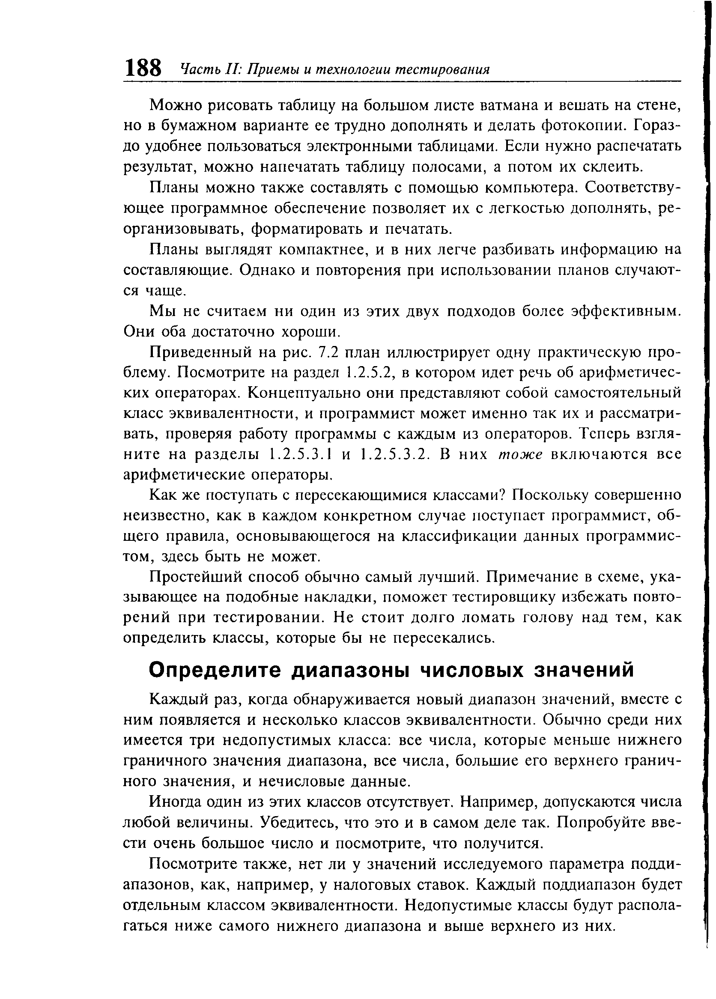](images/Kaner_1999_TestingComputerSoftware/page_187_img_1.png)

### Для полей или параметров, принимающих фиксированные перечни значений, выясните, какие из значений в них входят

Если для параметра допускается только определенный перечень значений, один из классов эквивалентности может включать все значения из этого перечня, а другой — все остальные значения. В дальнейшем эти два класса можно будет разделить на ряд меньших классов.

Например, если в некоторое поле вводится название страны, класс допустимых значений включает названия всех стран планеты. В класс недопустимых значений будет входить любое сочетание символов, которое является названием страны.

Однако как быть с аббревиатурами, ошибками при написании, особенностями национального произношения названий стран или старыми названиями, которые сейчас отсутствуют. Следует ли проверять подобные значения, выделив их в отдельные классы? Вполне вероятно, что, поскольку спецификацией все эти варианты не предусмотрены, при попытке их ввести можно столкнуться с ошибкой.

При вводе названий программа может сразу же проверять вводимые символы. Они должны быть буквами верхнего или нижнего регистра. Все, что не является буквами, относится к классу недопустимых значений. Его, в свою очередь, можно разбить на подклассы. Следует учесть и символы разных языков, в том числе и акцентированные символы, которых тоже достаточно много.

### Проанализируйте возможные результаты выбора из списков и меню

Любой элемент предложенной программой списка опций может, по существу, представлять собой отдельный класс эквивалентности. Каждый элемент меню или списка опций обрабатывается программой особым образом, поэтому все они подлежат проверке. К классу недопустимых значений относятся ответы пользователя, которых нет в списке (если программа позволяет не только выбирать, но и вводить значения опций).

Например, если программа задает вопрос “Вы уверены? (Д/Н)”, один класс эквивалентности должен содержать ответ **Д** (и, межу прочим, также **д**), а второй — ответ **Н** (и **н**). Все остальные ответы являются недопустимыми (хотя вполне возможно, что программа интерпретирует все, что не является положительным ответом, как отрицательный, т.е. как эквивалент ответа **Н**).

А вот другой пример. Американские налогоплательщики разделяются на неженатых, женатых с объединенным доходом, женатых с разделенным доходом, домохозяек и вдов с зависимыми детьми. Некоторые из них от-

казываются описывать свое семейное положение, что также законно. Некоторые люди заявляют, что не подходят ни под одну из перечисленных категорий, и пишут в налоговой декларации примечание, поясняющее причину. Таким образом формально их семейное положение можно отнести к классу недопустимых значений.

### Поищите переменные, значения которых должны быть равны

В свое время Форд утверждал, что готов выпускать автомобили любого цвета, пока они будут оставаться черными. Все не черные цвета в этом примере можно отнести к классу недопустимых значений. Иногда ограничение, налагаемое программой на значения поля, оказывается совершенно неожиданным. Значения, которые обычно вполне приемлемы, но в данном месте программой не принимаются, относятся к отдельному классу эквивалентности.

### Поищите классы значений, зависящих от времени

Предположим, что вы нажимаете клавишу пробела непосредственно перед, во время и сразу после того, как система загрузит программу. Как ни странно, но подобные тесты разрушали некоторые системы. Какие классы эквивалентности можно выделить в подобной ситуации? К первому из них относятся все события, происходящие задолго до выполнения задания, ко второму — события, происходящие в короткий отрезок времени непосредственно перед выполнением задания, к третьему — период его выполнения и т.д.

Подобным образом можно направить задание на принтер, когда тот свободен, занят, сразу после завершения им печати документа. Можно попробовать выполнить то же самое в многопользовательской системе: что, если ваш приоритет выше, чем у пользователя, печатающего в данный момент?

### Выявите группы переменных, совместно участвующих в определенных вычислениях, результат которых ограничивается конкретным набором или диапазоном значений

Введите величины трех углов треугольника. К классу допустимых относятся значения, в сумме дающие 180 градусов. Недопустимые значения можно разделить на два класса эквивалентности: с суммарным значением менее 180 и более 180 градусов.

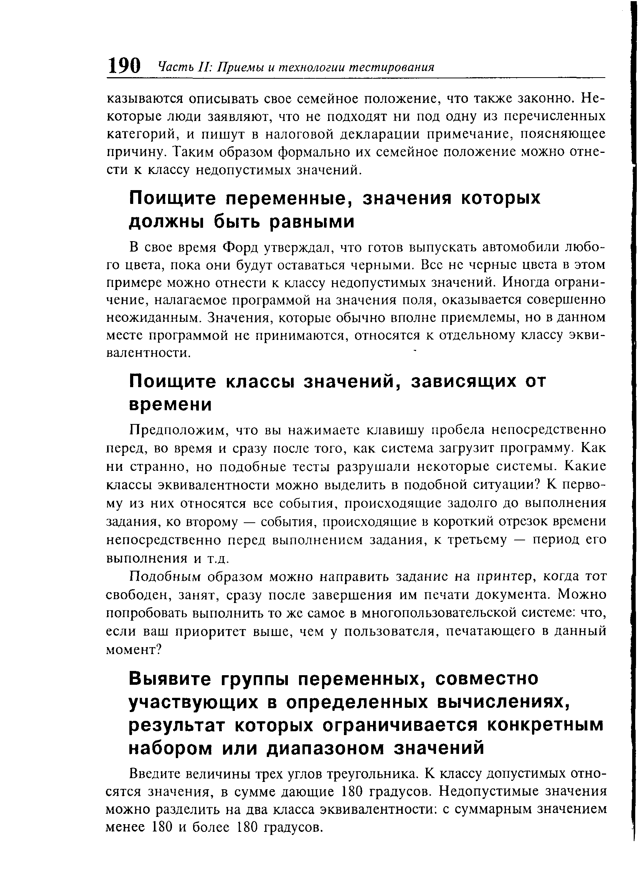

## Посмотрите, на какие действия программа отвечает эквивалентными событиями

До сих пор рассматривались только входные события, поскольку это первое, что приходит в голову, да и анализировать их гораздо легче. Третье событие на рисунках 7.1 и 7.2 является выходным. Программа чертит линию длиной до четырех сантиметров, причем линия предполагается прямой, но может оказаться и другой формы, например, окружностью.

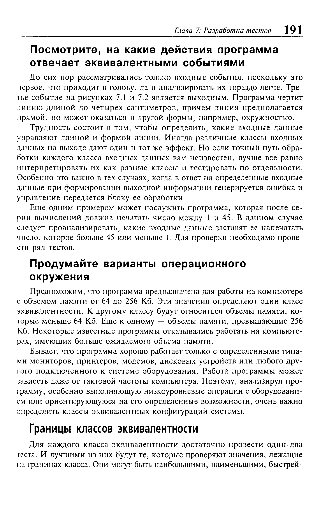

Трудность состоит в том, чтобы определить, какие входные данные управляют длиной и формой линии. Иногда различные классы входных данных на выходе дают один и тот же эффект. Но если точный путь обработки каждого класса входных данных вам неизвестен, лучше все равно интерпретировать их как разные классы и тестировать по отдельности. Особенно это важно в тех случаях, когда в ответ на определенные входные данные при формировании выходной информации генерируется ошибка и управление передается блоку ее обработки.

Еще одним примером может послужить программа, которая после серии вычислений должна печатать число между 1 и 45. В данном случае следует проанализировать, какие входные данные заставят ее напечатать число, которое больше 45 или меньше 1. Для проверки необходимо провести ряд тестов.

### Продумайте варианты операционного окружения

Предположим, что программа предназначена для работы на компьютере с объемом памяти от 64 до 256 Кб. Эти значения определяют один класс эквивалентности. К другому классу будут относиться объемы памяти, которые меньше 64 Кб. Еще к одному — объемы памяти, превышающие 256 Кб. Некоторые известные программы отказывались работать на компьютерах, имеющих больше ожидаемого объема памяти.

Бывает, что программа хорошо работает только с определенными типами мониторов, принтеров, модемов, дисковых устройств или любого другого подключенного к системе оборудования. Работа программы может зависеть даже от тактовой частоты компьютера. Поэтому, анализируя программу, особенно выполняющую низкоуровневые операции с оборудованием или ориентирующуюся на его определенные возможности, очень важно определить классы эквивалентных конфигураций системы.

### Границы классов эквивалентности

Для каждого класса эквивалентности достаточно провести один-два теста. И лучшими из них будут те, которые проверяют значения, лежащие на границах класса. Они могут быть наибольшими, наименьшими, быстрей-

шими, кратчайшими, самыми громкими, самыми красивыми — но в любом случае это должны быть предельные значения параметров класса. Неправильные операторы сравнения (например, $>$ вместо $\ge$) вызывают ошибки только на граничных значениях аргументов. В то же время программа, которая сбоит на промежуточных значениях диапазона, почти наверняка будет сбоить и на граничных.

Необходимо протестировать каждую границу класса эквивалентности, причем с обеих сторон. Программа, которая пройдет эти тесты, скорее всего, пройдет и все остальные, относящиеся к данному классу. Вот ряд примеров.

* Если допустимы значения от $1$ до $99$, для тестирования допустимых данных можно выбрать $1$ и $99$, а для тестирования недопустимых — $0$ и $100$.
* Если программа выписывает чеки на суммы от $\$1$ до $\$99$, то стоит попробовать выписать чек на отрицательную сумму, на $\$0$, на $\$100$.
* Если программа ожидает заглавную английскую букву, введите **A** и **Z**. Проверьте также символ `@`, поскольку его код предшествует коду символа **A**, и символ `]`, код которого следует за кодом символа **Z**. Кроме того, проверьте символы **a** и **z**.
* Если программа рисует линии длиной от одной точки до $4$ сантиметров, нарисуйте одну точку и линию длиной ровно $4$ сантиметра. Пусть программа также попробует нарисовать линию нулевой длины.
* Если сумма входных значений должна равняться $180$, попробуйте ввести значения, дающие в сумме $179$, $180$ и $181$.
* Если программа получает определенное количество входных данных, попробуйте ввести в точности необходимое количество, на единицу меньшее и на единицу большее.
* Если программа принимает ответы **B**, **C** и **D**, попробуйте ввести **A** и **E**.
* Попробуйте отправить на печать файл непосредственно перед и сразу после того, как принтер напечатает еще чье-либо задание.
* После чтения и записи файла на диск проверьте его первый и последний символы.

Анализируя границы диапазонов значений, очень важно учесть все возможные выходные данные. Проанализируйте каждый элемент распечатки или изображения на экране. Каковы допустимые перечни или максимальные и минимальные значения каждого печатаемого параметра? Можно ли заставить программу сформировать данные, выходящие за эти границы, и как это сделать?

Следует иметь в виду, что между граничными значениями входных и выходных данных нет непосредственного соответствия. Показательным примером могут служить простейшие тригонометрические функции.

Многие тестировщики включают в наборы тестовых данных и средние значения диапазонов. Это хорошая практика, особенно когда достаточно времени.

## Тестирование переходов между состояниями

В каждой интерактивной программе осуществляются переходы из одного очевидного состояния в другое. Если изменяется набор предлагаемых пользователю вариантов или меняется изображение на экране, это означает изменение состояния программы. (Более подробно о переходах между состояниями программ можно прочитать у Бейзера (Beizer, 1983).)

Простейшим примером может служить меню. После запуска программы в нем имеется один перечень команд. После выбора одной из них состояние программы меняется и в меню появляются команды, доступные в этом новом состоянии. Кроме того, на экране сменяется информация: отображаются формы ввода данных, их просмотра и т.д.

Необходимо протестировать каждую предлагаемую программой опцию, каждую команду меню. Команда 15 может быть доступна в режиме, открываемом по команде 14 и по команде 27. В этом случае команду 15 придется протестировать дважды — в обоих режимах. Однако команд меню и всевозможных режимов программы и путей перехода в эти режимы может быть так много, что протестировать их все просто нереально: клавиатура сотрется прежде, чем вы проведете все возможные тесты. Поэтому, отбирая тесты для проверки путей выполнения программы, лучше всего руководствоваться следующими критериями.

* Протестируйте все наиболее вероятные последовательности действий пользователей.
* Если можно предположить, что действия пользователя в одном режиме могут воздействовать на представление данных или набор предоставляемых программой возможностей в другом режиме, протестируйте эту зависимость.
* Кроме проведения самых необходимых тестов — из тех, что описаны выше, — стоит поработать с программой в произвольном режиме, случайным образом выбирая путь ее выполнения.

Переходы между состояниями могут быть гораздо более сложными, чем просто выбор команд меню. Содержимое и структура очередной формы 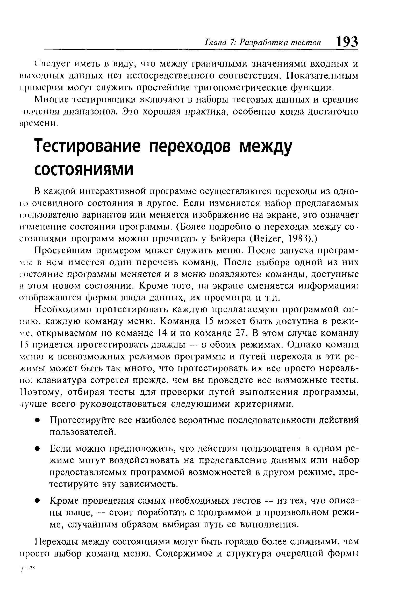

ввода данных может зависеть от информации, введенной в предыдущей форме. Значения одних полей могут определять допустимые значения других. Или же ввод определенной информации может инициировать серию дополнительных запросов. Например, при вводе числа от 1 до 99 программа выводит одну форму, а при вводе любого другого числа — другую. В этом случае вместе с классами эквивалентности и их граничными значениями придется проанализировать и возможные пути выполнения программы, чтобы составить действительно полноценный набор тестов.

Некоторые тестировщики находят полезным составление схем меню. В подобной схеме отражаются все состояния программы и команды, вызывающие переходы между этими состояниями. В нее включаются команды, активизируемые через меню, через графические средства (например, различные кнопки), и команды, выполняемые по нажатию определенных клавиш. Например, в схеме может быть показан путь от меню Файл к команде Открыть, затем к диалоговому окну Открытие файла и назад к основному состоянию программы. Особенно удобны подобные схемы в случае, если структура программы напоминает спагетти: определенное диалоговое окно можно открыть несколькими способами и выйти из него в несколько различных режимов. В этом случае можно нарисовать на схеме все направления переходов и по ним протестировать программу. Это более аккуратный способ, чем работать с программой без всякого плана, рискуя пропустить важные взаимосвязи ее состояний.

## Условия гонок и другие временные зависимости

Может ли программа выполняться слишком быстро или слишком медленно? Чтобы это проверить, можно воспользоваться кнопкой переключения тактовой частоты компьютера (если она есть), попробовать поработать на более скоростном или, наоборот, менее скоростном компьютере либо увеличить нагрузку на собственный компьютер, запустив параллельно на выполнение еще несколько программ.

Попробуйте вмешаться в работу программы, когда она выполняет переход между двумя состояниями. Понажимайте клавиши, особенно командные, или направьте ей программные сообщения, если это возможно. Попробуйте понажимать клавиши или выполнить в программе какие-нибудь действия, когда она выполняет операции обработки данных или ввода/вывода, предложите программе ввести или вывести параллельно еще какую-нибудь информацию. Например, во время печати одного файла попросите ее распечатать еще один.

Если в программе определены ситуации тайм-аута, когда она ждет определенного события в течение заданного времени, а затем переходит в

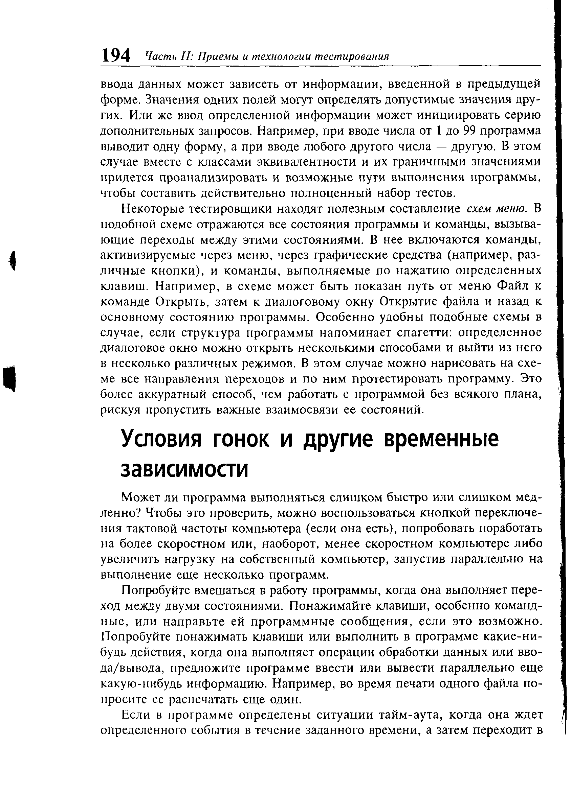

другое состояние, проверьте ее реакцию на действия пользователя, запросы системы или наступление ожидаемого события на границах интервала тайм-аута. Что, если событие произойдет за секунду до того, как программа должна прекратить его ожидание, или через секунду после этого.

Протестируйте систему при повышенной нагрузке. В мультизадачной среде запустите побольше других программ и посмотрите, как поведет себя ваша — успешно ли она справится со своей работой. Отправьте большой файл на принтер, чтобы процессор все время переключался на обслуживание печати. Перейдите на компьютер с меньшей тактовой частотой и меньшим объемом памяти, с менее быстродействующей дисковой системой. Подключите побольше внешних устройств и заставьте их генерировать прерывания так часто, как только удастся. Короче говоря, замедлите и нагрузите компьютер, насколько это возможно. В результате ваша программа будет выполняться медленнее, и, быстро вводя данные, можно попробовать превысить ее возможности приема. Если в нормальном режиме работы сбоя программы добиться не удастся, это может получиться при повышенной нагрузке.

Выполняя "стандартное" тестирование программы на медленной технике или при сильно повышенной нагрузке, можно столкнуться с совершенно неожиданными ситуациями гонок. И если окажется, что программа в этом отношении уязвима, необходимо будет провести в таких условиях полный цикл тестирования. Не поддавайтесь на убеждения руководителя проекта, который скажет, что вы напрасно тратите время на неадекватные тесты и что пользователи *никогда не будут* эксплуатировать программу в подобном режиме. Еще как *будут*! Пользователи будут работать на дешевых маломощных компьютерах. Даже на этих компьютерах они будут запускать программы параллельно, причем большие программы. Поэтому ваша задача — обеспечить такую надежность разрабатываемого программного обеспечения, чтобы оно работало, пусть медленно, но без сбоев в любой системе и при любых дополнительных нагрузках. И по крайней мере, необходимо совершенно точно выяснить, какие конфигурации системы являются предельными для его эксплуатации.

Если окажется, что производительность программного обеспечения в определенной программно-аппаратной среде явно неудовлетворительна и в такой среде его будет эксплуатировать, по крайней мере, часть пользователей, об этом стоит составить отдельный отчет. Отчет лучше всего ввести в базу данных в другой день, чтобы он хранился отдельно от отчетов о сбоях при повышенных нагрузках или на чересчур медленной технике. Так ему наверняка будет уделено больше внимания, чем если руководитель проекта просмотрит его вместе с другими похожими, но гораздо менее важными отчетами.

## Нагрузочные испытания

Важно не забыть протестировать те ограничения возможностей программного продукта, которые определены в его документации. Проверьте размеры файлов, с которыми программа может работать, количество принтеров, терминалов, модемов, которыми она может управлять, объем необходимой ей памяти. Откройте максимальное количество файлов или других структур данных, с которым программа может работать, попробуйте подольше поэксплуатировать ее в таком состоянии. Если в документации ограничения не описаны, но существуют логически допустимые значения каких-либо параметров, проверьте и их. И если программа не справится с достаточно большим числом, которое пользователь вполне может ввести, составьте отчет об ошибке. Если же программа спокойно принимает и обрабатывает и очень маленькие, и очень большие значения параметров, возможно, ограничений на них и в самом деле нет.

Следует проверить, как ведет себя программа, когда исчерпываются различные аппаратные ресурсы: например, переполняется диск или в принтере заканчивается бумага. Посмотрите, что будет, когда в системе останется очень мало свободной памяти. Поработайте с высоко- и низкоскоростными модемами. Нагрузите технику как следует и посмотрите, что получится.

Нагрузочное тестирование — это, по сути дела, один из видов тестирования граничных условий. Схема его проведения абсолютно аналогична. Сначала программу запускают в условиях, в которых она должна работать (например, с максимальным количеством терминалов), а затем в условиях, для которых она не предназначена (добавляют еще один терминал). Имеет смысл проверить и различные комбинации условий. Вполне возможно, что, справившись с различными повышенными нагрузками по отдельности, она не выдержит их все вместе. И еще один важный момент: нагрузив систему, проведите не просто один-два теста, а достаточно длительное и обстоятельное тестирование. Поэксплуатируйте программу в таких условиях некоторое время, возможно, сбой не сразу, но все же произойдет.

## Прогнозирование ошибок

Иногда тестировщик предполагает, что определенный класс тестов вызовет сбой программы, хотя и не может этого логически обосновать. Доверяйте своей интуиции и обязательно включайте подобные тесты в общий план. Существует целый ряд ситуаций и значений, которые, хотя и не являются граничными, но частенько вызывают программные сбои. Типичным примером таких значений является 0. Не стоит тратить время на поиски обоснований того, почему определенное входное значение или место программы кажется вам подозрительным. Просто протестируйте его.

Случается, что в сложных ситуациях интуиция подсказывает гораздо лучшую тактику тестирования, чем тривиальная логика. Бывает, что срабатывает и ассоциативная связь: вы уже находили ошибку в подобных обстоятельствах, хотя можете этого даже не помнить. Как бы там ни было, доверяйте своему внутреннему чувству и учитесь к нему прислушиваться: с опытом оно будет становиться все более развитым и надежным.

# Тестирование функциональной эквивалентности: автоматизация, анализ чувствительности и случайный ввод

При тестировании функциональной эквивалентности сравниваются результаты вычислений разными программами одной и той же математической функции. Этот термин не имеет ничего общего с классами эквивалентности. Если обе программы при вычислении одной и той же функции дают одинаковые результаты, значит, в них применены эквивалентные методы вычислений.

Предположим, что тестируется программа, которая вычисляет математическую функцию и печатает результат. Это может быть простая тригонометрическая функция или гораздо более сложная, инвертирующая матрицу или возвращающая коэффициенты для построения кривой, отражающей некоторый набор данных. Обычно в таких случаях можно найти другую программу, выполняющую те же действия, и при этом достаточно надежную и проверенную временем. Обеим программам предлагается обработать одинаковые наборы входных данных, и, если результаты совпадут, значит, тестируемая программа работает правильно.

## Автоматизация тестирования функциональной эквивалентности

Везде, где возможно применить метод тестирования функциональной эквивалентности, он будет наилучшим выбором. И вот почему.

* Прежде всего, вам не придется вычислять значения вручную. Если функция сложна, это поможет сэкономить огромное количество времени и избежать ошибок, так часто возникающих при неавтоматизированных расчетах.
* Процесс сравнения также, скорее всего, удастся автоматизировать. Простейшим способом может быть вывод результатов расчетов в файлы и их последующее сравнение с помощью соответствующей

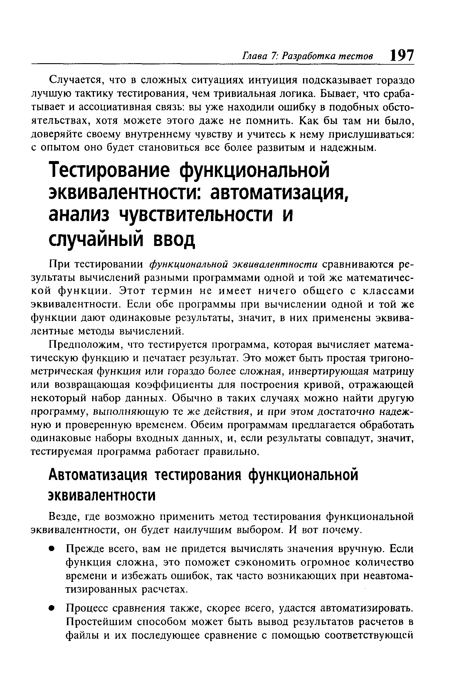

программы. Компьютер выполнит сравнение файлов и быстрее, и аккуратнее, чем вы. Можно определить и допустимые расхождения результатов — например, погрешности округлений.

* Вполне возможно автоматизировать и весь процесс тестирования: от ввода выходных данных до сравнения выходных. Если это получится, процедура тестирования будет выполняться практически мгновенно и исключительно надежно. Даже если на сравнение потребуется много компьютерного времени, вы в это время сможете заниматься другой работой.

Хотя автоматизация подобных тестов — процесс не особенно сложный, он требует некоторого времени. Если программа может считать входные данные из файла, его необходимо подготовить. Кроме того, придется написать небольшие программки, выполняющие сравнение результатов.

Если обе программы ориентированы на ручной ввод данных, автоматизировать их тестирование будет несколько сложнее. Для эмуляции клавиатурного ввода в некоторых случаях удается использовать модем. Одна программа передает через модем данные другой, а та думает, что они поступают с клавиатуры. Несколько неуклюже, но это работает.

Разумеется, тестирование функциональной эквивалентности может потребовать некоторых затрат. Прежде всего, надежная эталонная программа, которая будет использоваться для сверки результатов, может оказаться не такой уж дешевой. К тому же, скорее всего, придется написать кое-какие программки. Может потребоваться и дополнительная техника, например второй компьютер. Разумеется, нельзя определить универсальные критерии того, сколько денежных средств имеет смысл потратить на проведение подобного тестирования. Однако мы настоятельно советуем не пренебрегать им без веских причин.

* Оцените, сколько дней потребуется на тестирование программы вручную. Включите в расчет время планирования, выполнения вычислений и проведения тестов. Не забудьте и о том, что каждый тест придется провести не один раз, поскольку вы будете выявлять ошибки и повторять всю процедуру тестирования с самого начала. Прикиньте, сколько циклов тестирования потребуется провести. Скорее всего, их будет пять или шесть. (Для сравнения можно взять среднее количество циклов, потребовавшееся компании при тестировании предыдущих разработок.)

* Оцените, сколько времени сэкономят автоматизированные средства тестирования. Снова учтите весь процесс: планирование, программирование и отладку тестировочных программ. Постарайтесь оценить необходимое время как можно более реалистично — ведь впоследствии, если работа затянется, вам придется отвечать за свои слова.

* Количество дней, которые предполагается сэкономить, умножьте на свой *двойной оклад*. Сумма оклада умножается на два потому, что в расчет берется еще и выгода, которую компания получает от ускорения процесса тестирования и повышения его надежности. Если ваша оценка верна, полученная сумма — это минимум того, что можно сэкономить при функциональном тестировании с помощью эталонной программы. И если сама программа стоит меньше этой суммы, любой разумный руководитель одобрит ее покупку.
* Подготовьте предложение и презентацию, поясняющую назначение покупаемой эталонной программы и основы расчетов. Если компания не настолько заинтересована в сокращении времени разработки, чтобы вкладывать в нее дополнительные средства, будьте готовы рассказать о том, что вложенные средства гарантированно окупятся благодаря надежности и качеству продукта.

## Анализ чувствительности

Предположим, что функциональное тестирование решено автоматизировать. Это означает, что можно выполнять гораздо больше тестов, чем вручную. Однако отбираться они должны не менее тщательно: ведь количество возможных значений входных данных, скорее всего, по-прежнему слишком велико, чтобы можно было провести абсолютно полное тестирование. У большинства функций количество возможных значений аргументов бесконечно, так что справиться с ними не под силу даже компьютеру.

Разумеется, обязательно нужно будет проверить граничные значения, но теперь можно позволить себе роскошь гораздо более обстоятельного тестирования. Как же отобрать наилучшие тесты? Чаще всего для этого применяется *анализ чувствительности*. Эта процедура состоит в следующем.

* Прежде всего, получают общее представление о поведении функции, вычислив ее значения для ряда параметров, располагающихся вдоль всей области определения.
* Затем ищут участки области определения, на которых небольшие изменения аргументов вызывают значительные скачки результирующих значений. (Например, при приближении $X$ к $90$ градусам значение $\tan(X)$ резко возрастает.) *Именно такие участки наиболее чреваты ошибками.*
* Значения, полученные в результате теста программируемой функции и ее эталона, могут не вполне совпадать. Если в процессе расчетов выполняются операции с плавающей запятой, неизбежны округления или усечения результатов, а значит, и небольшие расхождения. Обычно это не страшно. Необходимо только правильно оценить допустимые погрешности округлений, чтобы можно было зафиксировать превышающие их расхождения, вызванные иными причинами.

Мы рекомендуем равномерно разделить каждый диапазон тестируемых входных значений на ряд поддиапазонов (их может быть около сотни) и протестировать по одному значению внутри каждого из них. Например, если функция получает значения между -1 и 1, введите одно значение, лежащее межу -1 и -0,98, второе — между -0,98 и 096 и т.д. После ввода каждого значения проверяйте, правильный ли получился результат, чтобы не тратить зря времени, если что-то не так.

Получив общую картину поведения функции, проанализируйте его на предмет резких перемен. Если значения функции на отдельных участках области ее определения резко возрастают или уменьшаются либо наблюдаются разрывы и скачки, на них необходимо обратить более пристальное внимание.

Предположим, что на входном диапазоне от 0,4 до 0,46 значения функции (или их расхождение со значениями эталонной функции) резко возрастают. Разделите этот диапазон на 100 равных частей и проверьте по одному значению внутри каждой из них. Если все в порядке, вы убедитесь, что значения тестируемой и эталонной функции для всех тестируемых аргументов совпадают, а если нет, можно будет документировать ошибку.

При профессиональном тестировании математических функций не обойтись без некоторых знаний из теории вероятности. Если речь идет не об одной, а о целом ряде функций, необходимы боле эффективные и научно обоснованные технологии поиска критических участков области определения функции — тех, где ее значения резко меняются или отличаются от эталонных. Их описания можно найти в специальной литературе. Для начала подойдет книга Бека и Арнольда (Beck & Arnold 1977). Кроме того, мы рекомендуем работы таких авторов, как Бард (Bard, 1974) и Чамберс (Chambers, 1977).

## Случайный ввод

Вместо разделения всей тестируемой области определения функции на определенное количество равных участков можно воспользоваться другим способом подбора входных значений — случайным. Случайный выбор значений более эффективен, поскольку гарантирует их полную равноправность. Например, тестируя такую последовательность входных значений, как 0,02; 0,04; 0,06 и т.д., вы никогда не узнаете, как программа обрабатывает нечетные числа — как 0,03 или как числа с большим количеством значащих цифр, такие как 0,1415. В то же время при выборе входных значений случайным образом область определения функции покрывается гораздо более полно, все типы и диапазоны значений входных данных охватываются равномерно.

Если вы затрудняетесь в выборе методики подбора входных данных или не вполне уверены в поведении тестируемой функции, остановитесь на

случайном способе. Он прекрасно подходит и для автоматизированного тестирования.

Не имея четкого обоснования для выбора конкретных входных значений, можно компенсировать этот недостаток количеством проводимых тестов. Здесь нет никаких ограничений — чем больше тестов проводится для каждого из классов эквивалентности, тем лучше. Обычно при автоматизированном тестировании со случайными входными значениями мы проводим как минимум 1000 вычислений.

## Что такое генератор случайных чисел

«Случайный» ввод вовсе не означает «все, что приходит в голову», иначе он будет слишком предвзятым, чтобы претендовать на равномерный охват области определения функции. Здесь больше подойдут таблицы случайных чисел, а еще лучше — компьютерная программа, которая может генерировать такие числа в неограниченном количестве. Однако следует иметь в виду, что алгоритмы, используемые многими подобными программами, вовсе не случайны. Кроме того, нередко в программах даже базовый алгоритм реализован не точно. Поэтому, прежде чем выбрать конкретный генератор случайных чисел, даже написанный вполне авторитетной компанией или встроенный в один из стандартных языков программирования, необходимо выяснить, какой алгоритм положен в основу его работы и подходит ли он для ваших нужд. То, что годится простенькой программке, рисующей на экране разноцветный салют, может совершенно не подойти для профессионального тестирования сложных инженерных программ. Нередко генераторы случайных чисел повторяют их последовательность через определенный интервал — например, после каждых 65 535 чисел все начинается с начала.

Подробный рассказ о теории генераторов случайных чисел в задачи этой книги не входит. На эту тему имеется достаточно литературы, и, в частности, можно прочитать работы таких авторов, как Канер и Воуки (Kaner & Vokey, 1984) и Кнут (Knuth, 1981). Однако несколько советов и предложений вам все же пригодятся.

* Перед тем как приступить к тестированию, почитайте литературу о генераторах случайных чисел. Не доверяйте какой-либо программе просто потому, что она у вас уже есть, а другую еще придется поискать.

Продолжайте чтение до тех пор, пока нижеследующие предложения не покажутся вам вполне понятными. Не обязательно ими пользоваться, но, если вы не можете их даже понять, значит, знаете о предметной области еще слишком мало, чтобы принимать самостоятельные решения. И может оказаться, что, потратив время на тестирование, вы вдруг выясните, что оно проводилось некорректно, поскольку входные данные были вовсе не случайными.

- Если вы собираетесь воспользоваться генератором случайных чисел, встроенным в язык программирования, стоит его немного доработать. Сгенерировав с его помощью достаточно большое количество чисел (100-1000), перемешайте их: измените их порядок с помощью последующих чисел, выдаваемых этим же генератором. Хотя это и замедлит работу, зато результат в случае плохого исходного генератора может быть уже вполне приемлемым.
- Если выбранный вами язык программирования умеет работать с целыми числами большой разрядности (но не с плавающей запятой), имеет смысл написать собственный генератор, алгоритм работы которого будет таким.

$R[N+1] = (A * R[N] + C) \text{ mod } M$

Это означает, что для получения N+1-го числа из N-го нужно умножить его на А, добавить С, а результат взять по модулю М. Чем больше будет число М, тем лучше, хотя вычисления будут выполняться и медленнее. Хорошие значения параметров этого метода приведены на рис. 7.3.

Значение параметра С не является критическим, достаточно, чтобы оно было нечетным. Однако, подбирая его более тщательно, можно уменьшить взаимную корреляцию генерируемых значений. Значение $M=2^{40}$ взято из книги Канера и Воуки (Kaner & Vokey, 1984), остальные — у Кнута (Knuth, 1981). Чтобы показать, насколько важен тщательный подбор параметров, Канер и Воуки протестировали более 30 тысяч значений параметра А и около сотни значений параметра С.

![РИСУНОК 7.3. Таблиця з параметрами деяких відомих генераторів випадкових чисел, що містить стовпчики M, A, C та формулу R[N+1] = (A * R[N] + C) mod M внизу](images/Kaner_1999_TestingComputerSoftware/page_201_img_1.png)

## Применение технологии эквивалентности

Тестирование математических функций — не единственная область применения эталонных программ. Путем сравнения с готовым и проверенным продуктом можно тестировать самые разные аспекты поведения программы. Вот несколько примеров.

* Если разрабатывается программа проверки правописания и в ее основе лежит тот же алгоритм, который используется в одной из уже существующих программ, можно предложить им проверить один и тот же набор слов.
* Если разрабатывается программа автоматического переноса слов и особенно если отрабатывается модификация ее алгоритма для другого языка, возьмите для сверки проверенную программу, продаваемую на том же рынке. Подготовьте узкий столбик текста и предложите его обеим программам.
* Для программы, выполняющей выравнивание текста по ширине строки, необходимо проверить, насколько равномерно она разделяет слова пробелами. Для образца можно взять обычный текстовый процессор и обеим программам предложить один и тот же текст, набранный одинаковыми шрифтами.
* Для отладки посылаемых на принтер управляющих последовательностей можно перенаправить вывод в файл и то же самое сделать в эталонной программе, распечатав в ней точно такой же документ. Затем оба файла можно сравнить — они должны быть идентичны.

Во всех случаях, когда необходимо протестировать выходные данные, которые легко можно направить в файл, и используется еще одна программа, умеющая генерировать те же данные. Их результаты легко можно сравнить. Разумеется, в каждом конкретном случае могут быть собственные аргументы "за" и "против" этой технологии. Например, на ее реализацию может потребоваться слишком много времени, средств или усилий. Кроме того, эталонная программа тоже вполне может содержать ошибки. Но в любом случае методику тестирования эквивалентности следует иметь в виду — во многих случаях ее применение значительно ускоряет работу и во много раз повышает ее эффективность.

Не забывайте включать в отчеты об ошибках выходные данные, полученные от обеих программ. Они очень важны для поиска причины ошибки.

## Регрессионное тестирование: успешно ли исправлена ошибка

Получив отчет об ошибке, программист тщательно анализирует исходный код, находит причину ошибки, исправляет ее и тестирует результат. Однако это идеальный вариант — на практике же так бывает далеко не всегда. Некоторые программисты исправляют только описанные в отчете симптомы. В результате исправления настоящие причины ошибки не устраняются — одно из проявлений ошибки исчезает, но другие остаются. Бывает и так, что программист неправильно поймет отчет и исправит не то, что надо. Некоторые недобросовестные сотрудники вообще не тестируют свою работу: они не глядя вносят исправления и немедленно возвращают программу тестировщикам, не исправив прежнюю ошибку и наделав новых. Этот перечень можно продолжать бесконечно. Главное же — не растеряться, столкнувшись с подобными ситуациями. Опытный тестировщик должен быть готов к ним заранее.

Считается, что около трети вносимых в программу исправлений или не срабатывают, или даже "ломают" то, что уже работало. Мартин и Мак-Клер (Martin & mcClure, 1983) приводят статистику, показывающую, что с первого раза срабатывает менее половины вносимых программистами исправлений.

Вот три задачи, которые ставит перед собой тестировщик, проверяющий внесенные программистом исправления.

* **Проверьте, что ошибка исправлена.** Выполните тот же тест, в котором она проявилась и который был описан в отчете. Если программа его не пройдет, дальнейшее тестирование ни к чему. Если же программа пройдет тест, не торопитесь. Подумайте еще секунду, в самом ли деле вы провели именно нужный тест. Уверены ли вы, что знаете, как воспроизвести ошибку? И при малейших сомнениях загрузите старую версию программы, выполните описанные в отчете действия и убедитесь, что ошибка налицо.

* **Поищите связанные ошибки.** Предположим, что программист устранил описанные в отчете симптомы ошибки, но саму ее не исправил. Можно попробовать воспроизвести ошибку каким-нибудь иным способом. Может быть, в программе есть другие подобные ситуации? Не жалейте времени, если вам кажется, что ошибка могла остаться — потестируйте программу еще час, может быть несколько часов. Проведите как можно больше тестов.

* *Протестируйте оставшуюся часть программы.* Возможно, неожиданные последствия исправления проявятся где-нибудь еще. Их поиск проводится неформально — без заранее подготовленного плана. Просто подумайте, какие части программы могут быть затронуты внесенными исправлениями и проверьте их.

## Регрессионное тестирование: стандартная серия тестов

Некоторое время спустя после начала тестирования программного продукта формируется *библиотека регрессионных тестов*. Это полный набор тестов, охватывающий всю программу и выполняющийся каждый раз, когда программисты сдают ее очередную рабочую версию.

Лучше всего, если тесты полностью автоматизированы. В этом случае все равно придется затратить некоторое время, но вся процедура тестирования гораздо менее трудоемка.

Когда для тестирования предоставляется очередная версия программы и наступает время повторить все тесты библиотеки сначала, возникает ряд вопросов. Насколько велика библиотека, и как вообще попадали в нее тесты? Действительно ли необходимо выполнять их *все* снова и снова?

Не всегда легко заранее определить, какие тесты следует включать в регрессионную библиотеку. Поэтому первоначально в ней может оказаться больше тестов, чем это действительно необходимо. Разумеется, в нее как минимум войдут примеры для проверки граничных условий и временных характеристик. Но стоит ли выполнять их все каждый раз?

Проводить регрессионные тесты обычно не хочется, поскольку вероятность выявления ими ошибок не особенно велика. При первом выполнении некоторые из этих тестов могут выявить ошибки, но после их окончательного исправления проводить их снова и снова кажется пустой потерей времени. Если ошибки больше нет, какова вероятность, что она появится снова? А как быть с тестами, которые проводились уже по нескольку раз и ни разу не выявили ошибок? В некоторых компаниях такие тесты исключают из библиотеки, оставляя только те, в которых проявлялись ошибки.

Вместо того чтобы мучительно обдумывать каждый тест, лучше пойти более простым путем. Включите в регрессионную библиотеку все тесты, которые покажутся вам полезными. Периодически, примерно через каждые три цикла, пересматривайте эту библиотеку и удаляйте те тесты, отсутствие которых не снизит качества работы. Вот несколько полезных тактических приемов.

* *Удалите тесты, которые эквивалентны другим тестам библиотеки.* В идеале такие тесты вообще не должны попадать в библиотеку. Но когда она создается несколькими сотрудниками, подобные накладки вполне возможны.

* *Уменьшите количество тестов, объектом которых является уже исправленная ошибка.* Если ошибка или некоторые ее разновидности проявляются в течение целого ряда циклов тестирования, в библиотеку стоит добавить достаточное количество тестов для их выявления. Это вполне нормально и уместно. Соответствующую часть программы необходимо тщательнотейшим образом тестировать до тех пор, пока в ней не останется и следа ошибки. Однако после этого большую часть тестов, направленных на поиск исправленной ошибки, можно удалить из библиотеки.

* *Комбинируйте тесты.* Если 15 тестов, которые программа, скорее всего, пройдет, можно объединить в один — сделайте это. В начале тестирования так поступать не стоит, но в дальнейшем объединение тестов позволит значительно ускорить работу.

* *По возможности автоматизируйте тестирование.* Если вы уверены, что определенная группа тестов будет выполняться в течение пяти или десяти последующих циклов тестирования, стоит потратить время на их автоматизацию. (В главе 11 этот вопрос будет обсуждаться подробнее.)

* *Выделите часть тестов для периодического выполнения.* Вместо того чтобы проводить все тесты регрессионной библиотеки после каждого изменения программы, можно выполнять их реже — на каждом втором или третьем цикле. На последней стадии тестирования лучше выполнить максимально возможное количество тестов, чтобы убедиться, что программа готова к выпуску. Но до этого в каждом цикле можно выполнять треть или половину всех тестов.

Регрессионная библиотека должна включать все лучшие тесты из тех, что уже разработаны, но, если она будет слишком велика, у вас не останется времени на разработку новых тестов. А ведь именно новейшие тесты с наибольшей вероятностью выявляют еще не найденные ошибки. Поэтому планируйте работу так, чтобы регрессионная библиотека служила средством повышения эффективности тестирования, а не его тормозом.

## Выполнение тестов

Придумать хороший тест — это только половина дела, ведь его еще нужно правильно выполнить. Вот несколько примеров.

* Если вы хотите, чтобы при установке программы на компьютер у пользователя была возможность выбора конфигурации, недостаточно просто запустить программу установки и посмотреть, предоставляет ли она необходимые опции. Выполните каждый вариант установки, каждый раз запуская саму программу и проверяя, действительно ли установлена выбранная конфигурация. Убедитесь, что программа при этом полностью работоспособна.
* Если программа посылает на принтер конфигурационную информацию, не забудьте распечатать документ, в котором используются соответствующие опции форматирования. То же самое касается и любых других внешних устройств.
* Если программа позволяет указать размер печатаемой страницы, отступы и другую подобную информацию, недостаточно удовлетворенно улыбнуться, увидев, что документ правильно выглядит на экране. Его необходимо распечатать.
* Если в программе используются символы из расширенного набора ASCII, недостаточно увидеть их на экране. Они должны правильно печататься, пересылаться через модем и т.д. Необходимо учесть все программное обеспечение, через которое будут проходить выходные данные: драйверы устройств, алгоритмы импорта.

Основное правило, вытекающее из приведенных примеров можно сформулировать так: тестовая процедура должна заставить программу использовать введенные данные и подтвердить, что они используются правильно.

# Глава 8

# Тестирование принтеров и других устройств

---

### Назначение этой главы

В этой главе рассказывается о тестировании программного обеспечения на предмет совместимости с программно-аппаратным окружением. После общего обзора стратегии, применяемой в этой области, весь ход тестирования рассматривается на одном из самых распространенных и понятных примеров — печати данных.

Почти все прикладные программы что-нибудь печатают, поэтому неизбежно возникает вопрос о совместимости (разве что в программе используются только базовые функции принтера, т.е. печать английского текста стандартным шрифтом).

Нам приходилось работать во многих тестировочных лабораториях, и каждый раз мы обучали сотрудников планированию, разработке и выполнению тестов печати. Этот наш опыт и лег в основу данной главы.

* Одной из причин того, что тестирование печати так подробно рассматривается в этой книге, является абсолютная необходимость обучения тестировщиков технологии этой работы. Иначе неизбежны пропущенные ошибки и ненужные потери времени.
* Кроме того, подробный рассказ о работе с принтером показывает, как много нужно знать специалисту, планирующему тестирование на аппаратную совместимость. Например, если вы собираетесь тестировать модемы, придется разобраться в классификации этих

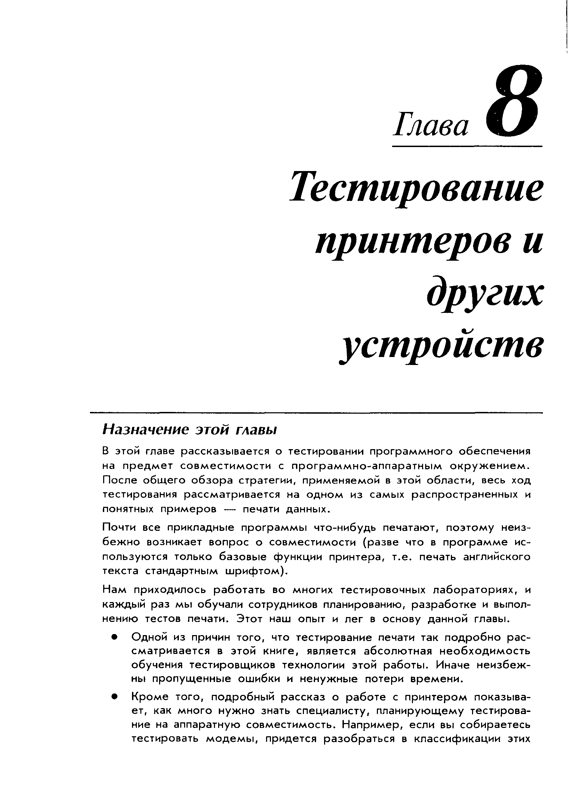

устройств и их драйверов, узнать об их управляющих кодах и типичных проблемах совместимости — точно так же, как это необходимо сделать при тестировании принтеров.

## Обзор

В этой главе рассматриваются следующие вопросы:
* Общий обзор тестирования на аппаратную совместимость.
* Как работают принтеры и как ими управляет программа.
* Стратегия тестирования принтеров и многих других устройств.
  1. Прежде всего выполнятся поиск аппаратно-независимых ошибок программы.
  2. Затем осуществляется поиск ошибок, специфических для тестируемого класса устройств.
  3. Затем наступает черед ошибок, связанных с драйвером.
  4. Только после этого выявляются ошибки, возникающие исключительно при работе с конкретной моделью устройства.
* Организация тестирования одних и тех же функций печати с разными типами устройств.
* Как и зачем протоколировать результаты тестирования.
* Как автоматизировать большую часть работы по тестированию печати.
* Организация и оборудование лаборатории тестирования печати.

## Примечание

В многопользовательской и многозадачной среде тестирование на аппаратную совместимость — работа куда более сложная. И хотя к ней применимо большинство описываемых в этой главе принципов, для полноценного проведения такого тестирования вам потребуются и дополнительные знания. Обратитесь за советами к сотрудникам, уже имеющим подобный опыт.

# Общие вопросы конфигурационного тестирования

Большинство программ предназначены для работы с очень широким диапазоном конфигураций аппаратуры и операционного окружения. Поэтому при их тестировании правомочно задать следующие вопросы:
* С какими принтерами совместима тестируемая программа?
* Какие видеоплаты и наборы микросхем, какие видеорежимы и какие типы мониторов отвечают ее потребностям?
* С какими позиционирующими устройствами она будет работать и с какими их драйверами?
* Каковы характеристики основных необходимых программе аппаратных ресурсов, например, каков минимальный и максимальный

объем необходимой ей памяти, с какими ее типами программа будет работать?

* Для какой аппаратной платформы предназначена программа (например, Macintosh или IBM), с какими моделями совместимых компьютеров она будет работать?
* Для какой программной платформы предназначена программа (какой операционной системы и каких ее версий, какое ей необходимо дополнительное системное программное обеспечение — например, программная оболочка, программы управления памятью, базовые функции из ROM BIOS).

Все перечисленные компоненты составляют конфигурацию системы — стоит изменить один из них, и получится новая конфигурация. Термин *конфигурационное тестирование* означает проверку совместимости программы с теми конфигурациями оборудования и системного программного обеспечения, с которыми она должна работать.

Как ни важна обстоятельность проведения этого вида тестирования, но даже самые элементарные подсчеты показывают, что проверить работу программы со всеми возможными конфигурациями среды абсолютно невозможно. Даже если выбрать только один из аспектов, например тестирование графической программы на совместимость с видеооборудованием, то, исследовав его рынок, вы обнаружите помимо целого ряда стандартов еще и сотни моделей видеоплат и мониторов. А что будет, если проверять еще и совместимость с позиционирующими устройствами? Если отобрать 10 наиболее популярных видеоплат и еще пять наиболее популярных моделей мыши, то получится 50 тестов. Добавьте на каждую мышь по три драйвера — получится 150 тестов. Мониторы также отличаются между собой, и прежде всего следует проверить два их основных типа — монохромные и цветные. Видеоплаты работают с ними по-разному. Поэтому если тестировать еще и два основных типа мониторов, то получится уже 300 тестов.

Как видите, с добавлением каждого нового объекта тестирования общее количество тестов растет в геометрической прогрессии. Даже если выделить только несколько наиболее популярных моделей основных внешних устройств, как быть с бесконечным разнообразием остальных?

Чтобы правильно спланировать и провести конфигурационное тестирование, необходимо очень много знаний. Прежде всего нужно выяснить, какие функции каждого из устройств используются в программе, и как узнать, что программа использует их правильно. Важно знать, в чем может заключаться совместимость или несовместимость подобных устройств и как их различия могут повлиять на тестируемую вами программу. Если выяснить, какие из устройств хорошо эмулируют друг друга, можно сэкономить и время, и деньги, взяв для тестирования по одному представителю каж-

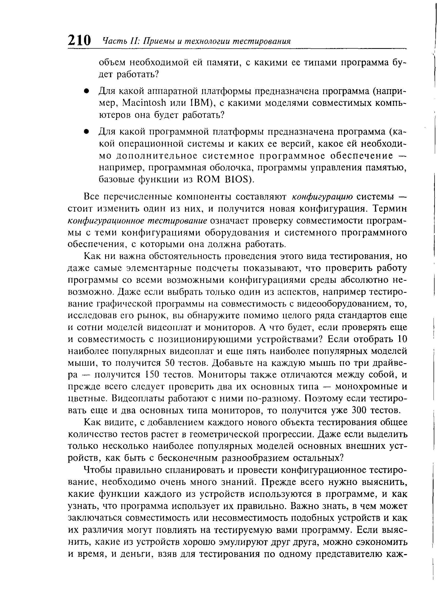

дой группы совместимых между собой устройств. При этом совместимость не обязательно должна быть полной — достаточно, чтобы одинаково работали функции, используемые вашей программой. Однако, классифицируя устройства по степени их совместимости, следует быть осторожным: не стоит доверять утверждениям их изготовителей. Поищите источники независимой информации, иначе вы рискуете, что на одном из видов непротестированного оборудования у пользователей произойдет сбой.

Профессиональная пресса весьма охотно рассказывает о программах, которые не работают с популярным аппаратным обеспечением. Лучше не попадать в их черные списки, иначе подобная статья может лишить программный продукт части рынка, а вас — работы.

На рис. 8.1 приведено общее описание подхода к конфигурационному тестированию. В оставшейся части главы рассказывается, как он применяется к тестированию наиболее распространенного устройства — принтера. Именно о принтерах тестировщики думают прежде всего, и именно с ними чаще всего возникают проблемы у пользователей.

## Тестирование печати

На рынке устройств для персональных компьютеров имеется более тысячи различных принтеров. Этот рынок разделен на несколько частей, представляющих устройства для различных платформ. Самая значительная его доля принадлежит платформе Microsoft.

Не все программы используют функции принтера в полном объеме: некоторые из них не печатают графики, не пользуются различными начертаниями шрифтов (полужирный, подчеркнутый и т.п.), не пользуются пропорциональными или иными специфическими типами шрифтов, не печатают в цвете. Проще говоря, они не печатают ничего, кроме стандартного ASCII-текста по 79 символов в строке. Такие программы совместимы практически со всеми русифицированными принтерами, и для них практически нет нужды в конфигурационном тестировании.

Что касается программ, полноценно использующих пресимущества современных печатающих устройств, то они и не пытаются поддерживать все без исключения принтеры. Постарайтесь протестировать все те принтеры, совместимость с которыми указана в документации программы, а также полностью совместимые с ними модели. Проверьте и наиболее “капризные” и плохо зарекомендовавшие себя принтеры, чаще других вызывающие проблемы программного обеспечения или являющиеся причиной наибольшего количества жалоб пользователей.

Если вам повезет, руководитель проекта даст вам список наиболее популярных или наиболее важных с маркетинговой точки зрения устройств (например, обладающих специальными функциями или обещающих стать популярными в недалеком будущем).

1. **Анализ рынка**
   С какими из устройств данного вида (принтеры, видеоплаты и т.п.) должна работать программа? Где их можно взять? (Информацию об устройствах, совместимость с которыми считается обязательной, что отражено в документации, можно получить у руководителя проекта или менеджера по маркетингу. Однако часто вас будут интересовать не только они, но и критические для тестирования почти полностью совместимые устройства.)

2. **Изучение устройства**
   Как оно работает? Какие из принципов его работы влияют на технологию тестирования? Какие из функций устройства используются в программе?

3. **Анализ способов управления устройством**
   Как разделить все возможные устройства на группы, в которых проявляются одни и те же ошибки?

4. **Экономия времени**
   Протестируйте только по одному устройству из каждой группы. Выявив общие для всей группы ошибки, протестируйте каждое из устройств в отдельности.

5. **Повышение эффективности**
   Конфигурационное тестирование — работа однообразная и утомительная. Подумайте о том, как ее автоматизировать. Очень важную роль играет правильная организация и планирование работ, хорошая система протоколирования результатов тестирования. Все это повысит эффективность взаимодействия с помощниками и отслеживания результатов их работы.

6. **Накопление опыта**
   Исследования и запись результатов тестирования необходимо организовать таким образом, чтобы при работе над следующим проектом можно было использовать накопленный опыт и наработки.

7. **Взаимодействие устройств**
   Используемое программой устройство может взаимодействовать с другими устройствами системы, обмениваясь с ними данными или же, наоборот, нарушая их работу. В подобных случаях необходимо подготовить ряд тестовых примеров, отражающих это взаимодействие.

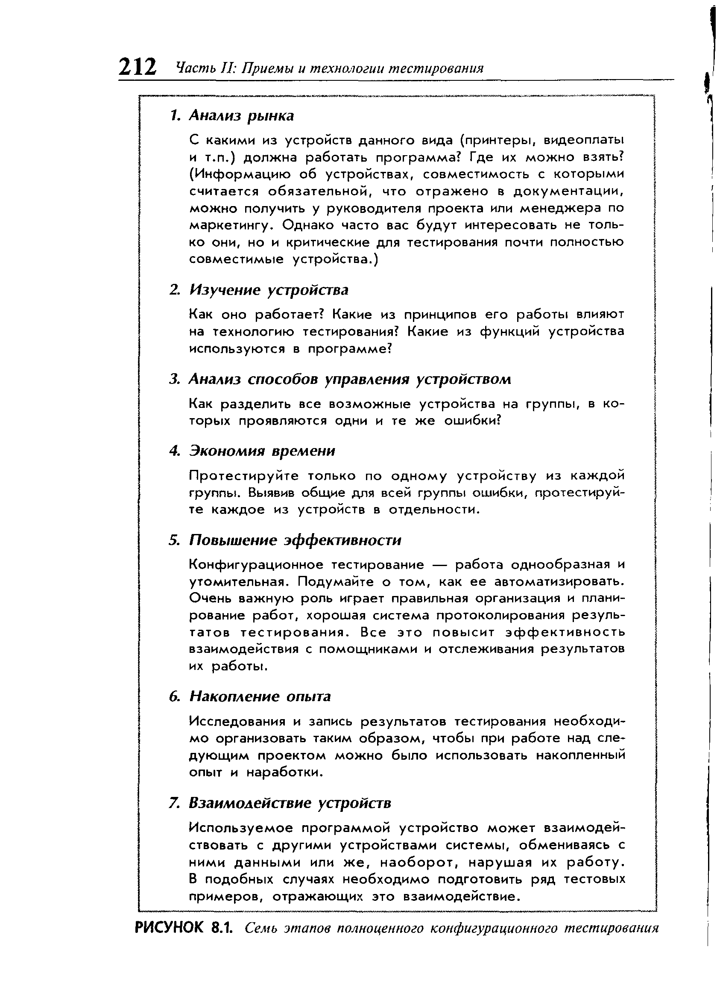

РИСУНОК 8.1. *Семь этапов полноценного конфигурационного тестирования*

Однако не стоит удивляться, если окажется, что вам придется самостоятельно провести маркетинговые исследования. В этом случае можно обратиться к таким популярным источникам актуальной информации, как *Computer Reseller News*, *PC Magazine* (особенно ежегодный выпуск о принтерах) и *MacWorld*.

## Обзор принтеров

Вот каковы основные современные технологии печати.

* *Матричные принтеры* печатают с помощью металлических иголок, расположенных в несколько рядов на печатающей головке. Когда иголка выдвигается из головки и через красящую ленту ударяет по бумаге, получается точка. Если все иголки выдвигаются одновременно, получается вертикальная черточка около трех миллиметров длиной. Принтер печатает букву по частям: головка подводится к ее левому краю, выдвигаются нужные иголки, печатая первую часть буквы, затем головка сдвигается вправо, точно так же печатается следующая часть буквы и т.д. Обычно у матричных принтеров 9 или 24 иголки, но бывают и другие варианты. Есть и такие принтеры, у которых головка, усеянная иголками, имеет ширину полной строки, так что она не перемещается вправо и влево, а печатает всю строку одним ударом иголок. Буква, напечатанная матричным принтером, выглядит зернистой, в ней отчетливо видны отдельные точки. Особенно это заметно у 9-игольчатых принтеров при черновом режиме печати (на самой высокой скорости). С развитием технологии матричной печати производители научились выпускать более совершенные устройства, головки которых перемещаются достаточно быстро, и при этом точки располагаются так близко друг к другу, что практически сливаются. В результате на них можно печатать графику более высокого разрешения, а текст получается гораздо лучшего качества.
* *Струйные принтеры* выпрыскивают на бумагу чернила, образуя маленькие точки. Их главными преимуществами являются бесшумность и высокое качество печати.
* *Страничные принтеры* оперируют не символами и строками, а целыми страницами. По технологии печати они подразделяются на лазерные, светодиодные (LED) и термальные.

## Управляющие коды и языки

Хотя механизм печати сам по себе и интересен, с точки зрения программного обеспечения более важным является набор команд, позволяющий управлять работой принтера. И здесь также существуют значительные различия.

Большинство матричных принтеров управляется сравнительно простыми кодами. Например, чтобы установить полужирное начертание шрифта, достаточно послать принтеру код <Esc> (ASCII-код 27) и один определенный символ. Для смены шрифта потребуется кодовая последовательность, состоящая из кода <Esc> и четырех или пяти символов. Существует ряд стандартных наборов управляющих кодов принтеров, из которых наиболее распространены наборы кодов, предложенные фирмами Epson и IBM (у каждого из них существует множество вариантов).

Страничные и некоторые струйные принтеры управляются более сложными (и длинными) командами. Набор таких команд называют *языком управления принтером*. В настоящее время наиболее распространены языки PostScript и HP PCL (Printer Control Language — язык управления принтером фирмы Hewlett Packard).

## Цветная печать

Возможностями печати в цвете обладают все три типа принтеров, но у матричных качество печати хуже, чем у струйных и страничных. Дело в том, что у матричных принтеров цветные красители наносятся полосами на одну и ту же ленту, и со временем цвета несколько смазываются. У струйных же принтеров цветные чернила хранятся в отдельных емкостях, из которых они выпрыскиваются на бумагу.

## Типы интерфейса

Принтер может подключаться к компьютеру либо через стандартный параллельный или последовательный порт, либо через специфическое соединение, разработанное производителем для конкретного вида техники, либо через сеть. Сетевое подключение является источником особых проблем, о которых будет рассказано далее.

В мире Microsoft и Amiga более распространены параллельные принтеры. При параллельном подключении передача информации принтеру выполняется гораздо быстрее, поскольку за один раз передается 8 битов информации — по восьми параллельным проводникам. При последовательном подключении принтера биты информации передаются по одному. Этот вид подключения несколько сложнее, поскольку для его работы необходимы более сложные протоколы, определяющие, в частности, как выяснить готовность устройства и как обозначить начало и конец последовательности битов. Тестирование последовательных принтеров, основанное на их специфических особенностях, в этой книге не рассматривается.

Главное же, что необходимо знать для тестирования программы, поддерживающей и параллельные и последовательные принтеры, — это то, что придется отдельно протестировать оба эти типа устройств.

Управление принтером

Для начала представьте себе, что вы имеете дело с программой, осуществляющей взаимодействие с принтером абсолютно самостоятельно. Было время, когда программист мог написать программу, привязанную к одному конкретному типу принтеров. Если пользователь подключал еще один принтер, программисту приходилось модифицировать программу, включая в нее команды управления новым принтером. Хотя эта работа и не была особенно сложной, необходимость сопровождать программу в течение долгого времени и обеспечивать ее совместимость со все расширяющимся набором устройств могла превратиться в настоящее мучение.

К счастью, эта проблема давно решена. Спасением программистов стала концепция виртуальных принтеров — абстрактных устройств с фиксированным набором возможностей и команд. Именно эти команды управления виртуальным принтером и включаются в прикладную программу, а за их перевод на язык конкретного устройства отвечает промежуточная программа, называемая драйвером.

В современных операционных системах имя принтера указывается при их настройке. Драйверы устройств являются частью операционной системы и поставляются вместе с ней. Если же драйвера конкретного устройства в системе нет, его можно установить отдельно, и он тоже будет рассматриваться как часть системы. Как правило, производители аппаратного обеспечения включают драйверы своих устройств в комплект их поставки.

Преимущество описанного подхода состоит в том, что прикладная программа ничего не знает об установленном в системе принтере. Она направляет управляющие команды и данные виртуальному принтеру, не заботясь о том, каким образом они будут переданы конкретному устройству и какие преобразования для этого потребуются.

Перед включением в систему все драйверы устройств тщательно тестируются с самым разным программным обеспечением. Поэтому, если программа передает виртуальному принтеру правильную информацию, ее команды будут корректно переведены на язык конкретного устройства и выполнены.

По крайней мере, предполагается, что все должно проходить именно так. И в общем случае эта технология прекрасно работает. Однако в отдельных случаях программисты отступают от описанной технологии и управляют принтером самостоятельно или же выполняют одну часть работы через драйвер, а другую непосредственно.

Иногда это делается для повышения качества печати или для ее ускорения. Или же программист хочет использовать специфические функции устройства, не поддерживаемые стандартным драйвером. В таких случаях код, управляющий работой конкретных типов устройств обычно отделяется от основного кода программы. При ее установке пользователь указывает

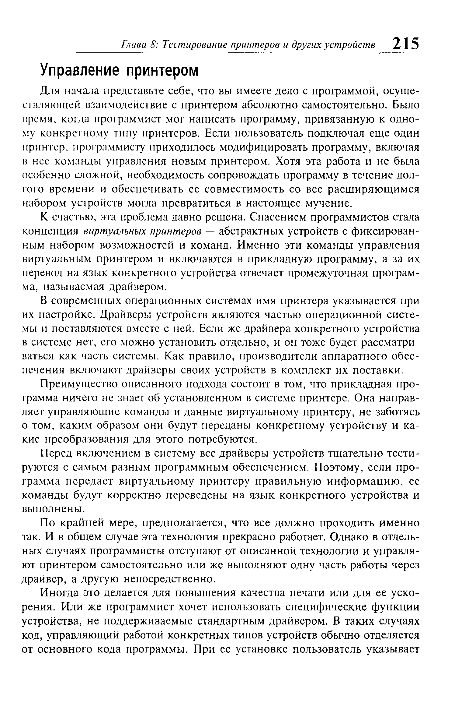

тип своего принтера. Разумеется, подобные программы и тестировать, и сопровождать гораздо сложнее, но в этом подходе нет ничего предосудительного, если он обусловлен объективной необходимостью и ведет к повышению качества и производительности программы — ведь конечного пользователя интересует именно это.

## Общая стратегия тестирования принтеров

Каждая программа по-своему организует печать. Как правило, можно выделить несколько основных уровней ее работы и соответственно разделить и возможные ошибки. Предположим, что тестируется текстовый процессор и в качестве тестового примера он должен распечатать несколько слов курсивом.

* **Ошибка, не зависящая от устройства.** Если программа не посылает виртуальному принтеру команду включения курсива, не передает текст или вместо принтера отсылает его модему, то устройство здесь не причем. Это чисто логическая ошибка, и ее необходимо выявить до того, как вы приступите к тестированию различных принтеров.
* **Ошибка, специфическая для класса принтеров.** Если программа организована так, что с каждым классом принтеров работает отдельный блок кода, возможно, что с одним классом принтеров программа работает правильно, а с другим — нет. Например, она правильно управляет матричными принтерами и принтерами, использующими язык PostScript, но отказывается работать с принтерами LaserJet. Рис. 8.2 иллюстрирует различие между классами принтеров, драйверами и конкретными моделями устройств.


РИСУНОК 8.2. Классификация принтеров

## QMS 810

Хотя такая организация достаточно широко распространена, это еще не означает, что и ваша программа непременно будет организована по той же схеме.

* **Ошибка, специфическая для драйвера.** В программе может быть часть кода или таблица перекодировки команд, применяющаяся для работы с конкретной группой принтеров, проще говоря, встроенный драйвер. Один и тот же драйвер может использоваться для целого ряда однотипных принтеров, например, драйвер Epson FX может работать с принтерами FX-80, FX-85, FX-100 и др. И если в этом драйвере содержится ошибка, она будет проявляться при работе со всеми принтерами данной группы.
* **Ошибка, специфическая для принтера.** Такие ошибки случаются, если данному принтеру не подходит выбранный драйвер или же принтер не вполне совместим со своими собратьями. Нередко компания-производитель анонсирует свой принтер как 100%-но совместимый с принтером Х одной из известных компаний, но на деле это оказывается не совсем так, и отдельные команды или управляющие коды для этого принтера не срабатывают.

Итак, тестирование должно выполняться по принципу "от общего к частному". Сначала подключите один принтер и постарайтесь выявить ошибки, не зависящие от устройства. После того как они будут исправлены, возьмите еще несколько принтеров, относящихся к разным классам, и поищите ошибки, специфические для этих классов. Затем протестируйте по одному принтеру на каждый драйвер, чтобы выявить ошибки, связанные с драйверами. И только после этого приступайте к тестированию всех принтеров, совместимых с вашей программой.

Главное преимущество данной стратегии в том, что она позволяет избежать избыточности — нет никакого смысла смотреть, как полсотни принтеров демонстрируют одну и ту же логическую ошибку программы или ошибку драйвера. Для выявления и исправления подобных ошибок достаточно поработать с одним принтером, а когда в программе все будет чисто, можно будет посмотреть, нет ли отклонений в работе конкретных устройств.

![Блок-схема, оформленная в рамке, с четырьмя этапами тестирования печати: 1. Поиск функциональных ошибок, не зависящих от устройства. Эти ошибки проявятся при работе с любым принтером. 2. Поиск ошибок, общих для класса устройств. Повторите одни и те же тесты для нескольких принтеров, относящихся к разным классам. 3. Поиск ошибок, специфических для драйвера. Проверьте каждую возможность, предоставляемую тестируемым драйвером. 4. Поиск ошибок, специфических для конкретного принтера. Выбрав драйвер, протестируйте каждый управляемый им принтер.](images/Kaner_1999_TestingComputerSoftware/page_216_img_1.png)

РИСУНОК 8.3. Этапы тестирования печати

## Поиск функциональных ошибок

Выберите для этого вида тестирования один-единственный принтер. Это должно быть хорошее и проверенное устройство известного производителя, достаточно современное, чтобы в нем были реализованы все использующиеся программой функции печати.

Составьте полный список функций печати. В нем должны быть учтены выбор шрифта, изменение его начертания, установка параметров страницы и т.п. Лучше всего составить по отдельному списку функций для каждого независимого фрагмента программы, а затем сравнить получившиеся списки.

Проводя тестирование, проверьте работу каждой из функций по отдельности, например, напечатайте фрагмент текста обычным шрифтом, затем курсивом, затем смените шрифт. Убедившись, что по отдельности функции работают, протестируйте их комбинации, например, распечатайте фрагмент текста полужирным курсивом.

В ходе продуманного и обстоятельного тестирования обнаружится ряд ошибок. Некоторые из них будут логическими ошибками программы и проявятся, какой бы принтер вы ни подключили, другие будут ошибками класса, третьи — ошибками драйвера.

Возможно, будут и такие, которые отразят особенности работы единственного принтера. Если вам повезет, то еще до перехода к следующим стадиям тестирования все эти ошибки будут устранены.

## Выявление ошибок, общих для класса устройств

Выберите три или четыре принтера, как можно сильнее отличающихся друг от друга. Если с каждым классом принтеров в программе работает отдельная часть кода, эти принтеры должны относиться к разным классам.

В этом случае вам необходима будет точная информация о классификации принтера, которую сможет предоставить только программист.

Однако данный этап тестирования полезен и не только в том случае, когда в программе определены четко разграниченные классы устройств. Если на первом этапе выявлены ошибки печати, очень полезно повторить соответствующие тесты на разных принтерах.

Тестирование класса устройств проводится не менее обстоятельно, чем поиск функциональных ошибок. Необходимо протестировать все функции печати и все их комбинации на каждом из принтеров (разумеется, в пределах своих физических возможностей).

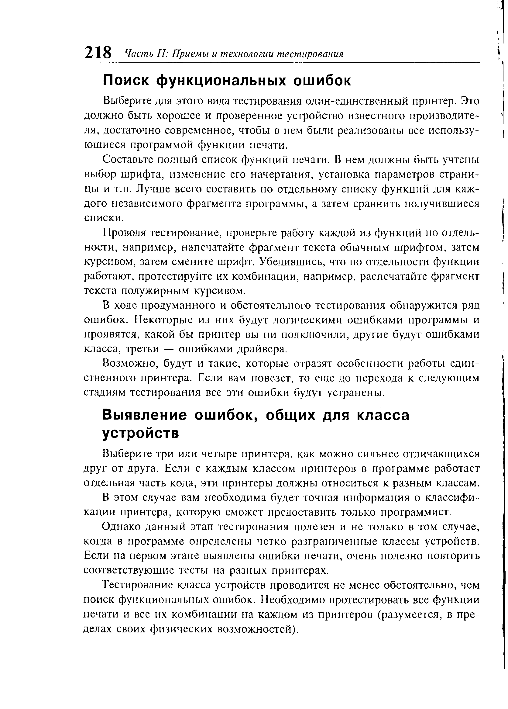

## Поиск ошибок, специфических для драйвера

Предположим, что пользователь может попросить программу распечатать слово курсивом. Чтобы убедиться, что данная команда будет выполнена, тестировщик должен ответить на два вопроса. Во-первых, попытается ли программа распечатать слово курсивом, получив от пользователя соответствующую команду? И во-вторых, знает ли программа, как именно устанавливается курсивное начертание на конкретном принтере?

К тому времени, как вы приступите к поиску ошибок, специфических для драйвера, ответ на первый вопрос будет уже известен, и, более того, он будет положительным. На этом этапе уже не нужно проверять, работает ли, например, курсивный шрифт в каждой области документа (основной его части, верхнем и нижнем колонтитулах и т.п.) Если программе известна правильная команда включения курсива, она сработает везде.

Пройдитесь по составленному вами списку функций печати, включите, выключите и включите снова каждую опцию, проверьте их комбинации. Вполне может оказаться, что у одного из принтеров имеется дефект, проявляющийся только в определенной ситуации — например, при попытке напечатать подчеркнутый символ у самого края страницы печатающая головка идет вразнос. Возможны и иные недостатки устройств, менее драматического характера.

Напоследок поэкспериментируйте с переключателями, расположенными на передней панели принтера, или с его перемычками. Как драйвер определяет, какой шрифт используется принтером по умолчанию? И что получается, когда программа печатает каким-нибудь другим шрифтом? Обязательно проверьте и печать в графическом режиме. Для тестирования возьмите документ с большими участками белого пространства, особенно у краев изображения. Проверьте различные установки количества строк на дюйм. Посмотрите в документации, какие еще параметры печати можно изменить.

## Поиск ошибок, специфических для конкретного принтера

На этом этапе тестирования выполняются те же тесты, что и на предыдущем. Однако сама по себе необходимость его выполнения является спорной. Если вы протестировали принтер А и известно, что принтер Б с ним полностью совместим, зачем его тестировать? Как правило, вы и в самом деле не будете этого делать, однако следующий ряд обстоятельств заслуживает отдельного рассмотрения.

* 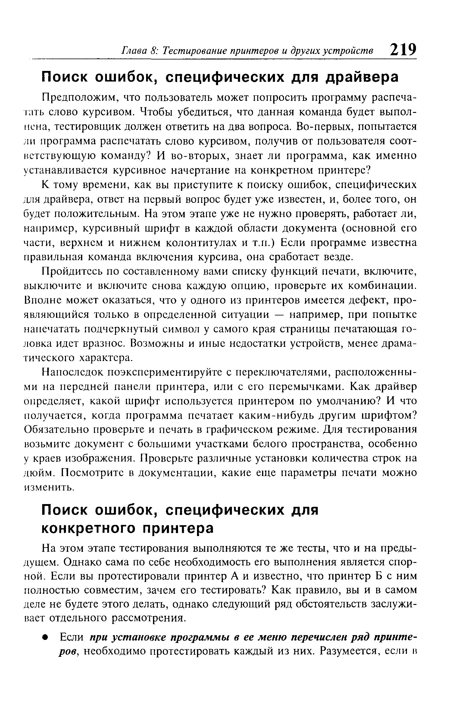 Если *при установке программы в ее меню перечислен ряд принтеров*, необходимо протестировать каждый из них. Разумеется, если в

меню перечислены сотни принтеров, протестировать каждый из них невозможно. Однако некоторый минимальный набор тестов провести все же стоит. Например, если известно, что принтер Б совместим с принтером А, и принтера Б у вас нет, все равно выберите его из меню и распечатайте документ на принтере А. Вы как минимум выясните, что при выборе принтера Б устанавливается правильный драйвер и с программой не происходит ничего плохого.

- *В меню программы необходимо включить дополнительные принтеры.* Во сколько в среднем обходится вашей компании каждый звонок пользователей? Предположим, что принтеры А и Б совместимы и в меню программы имеется принтер А, но отсутствует Б. Пользователи, у которых есть принтер Б, будут звонить и спрашивать, можно ли с ним работать. Или наоборот, кто-то из пользователей подумает, что его принтер совместим с принтером А, и подключит его, а тот откажется работать. Стоимость технической поддержки можно значительно уменьшить, если сразу расширить список устройств (разумеется, при условии, что затраты на приобретение и тестирование этих устройств не окажутся слишком высокими).

- *Популярные модели принтеров могут оказаться несовместимыми.* Когда появились принтеры HP DeskJet, многие разработчики решили, что они совместимы с принтерами HP LaserJet. Однако это оказалось не так — многие их ключевые функции управлялись различными командами. В результате новый принтер, который завоевал огромную популярность, не поддерживался многими программами только потому, что их разработчики не удосужились протестировать с ним свои продукты. Это очень показательнный, но далеко не единственный пример того, насколько важно протестировать разрабатываемое программное обеспечение с каждым устройством, которое либо уже очень популярно у пользователей, либо обещает стать популярным в недалеком будущем. И хотя, как правило, никаких проблем не будет, каждый подобный тест — это все равно, что страховой взнос. Однажды ваша предусмотрительность позволит избежать очень неприятных ошибок.

- *Неудачный представитель популярного класса.* Такое случается: например, все принтеры Epson LQ работают с драйвером, и только один отказывается. Если пользователю попадеется этот злосчастный принтер, он окажется в полном недоумении. К счастью, такие ситуации встречаются редко, хотя за последние 13 лет работы мы столкнулись с десятком подобных примеров.

В заключение можно добавить, что обстоятельность тестирования зависит еще и от конкретной программы: если ее вывод сравнительно простой

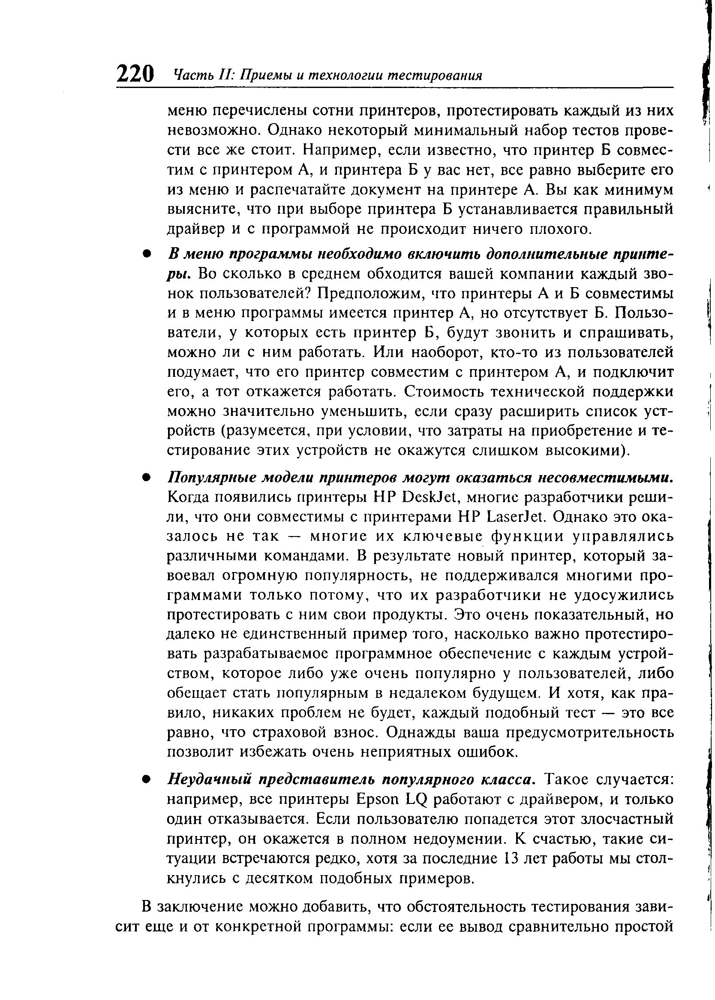

и стандартный, на тестирование можно потратить меньше времени, а вот если она использует специфические особенности принтера и выводит сложные и разнообразные данные, стоит потестировать ее подольше.

### Таблица тестирования принтера

Тестирование принтера — работа очень кропотливая. Приходится проверять столько мелких деталей, что ничего не упустить можно только при очень жесткой организации работ. Если при тестировании любого другого аспекта работы программы ничего не стоит вернуться к уже выполненным тестам или провести важный тест, который случайно был пропущен, то с печатью это совсем не так просто. Придется снова найти нужный принтер или, еще хуже, снова просить его у того, у кого вы его одолжили, проверить установку перемычек и переключателей, подключить принтер к компьютеру, провести тест, а затем вернуть принтер на место или хозяину. Подготовительная работа занимает львиную долю времени тестирования.

Если предстоит тестирование большого количества принтеров, необходимо позаботиться о подготовке тестовых файлов, а также постараться скомбинировать тестируемые функции, чтобы по возможности ускорить процесс.

### Форма тестовой таблицы

Для подготовки схемы тестирования проще всего воспользоваться электронной таблицей. Результат должен выглядеть примерно так, как на рис. 8.4.

При использовании заранее подготовленных тестовых файлов таблица будет проще — вместо отдельных команд в ней будут перечислены имена файлов, которые следует распечатать. На деле вам понадобятся две таблицы. Первая, такая как на рис. 8.4, будет служить для первых двух этапов тестирования — функциональных ошибок и ошибок класса. Когда же вы перейдете к тестированию драйверов и отдельных принтеров, проверять каждую область программы будет не нужно, поэтому таблица станет гораздо короче.

В верхней строке таблицы перечисляются принтеры и их драйверы. Кроме того, можно добавить и другую важную информацию — установки переключателей, объем установленной в принтере памяти и т.п. Для некоторых программ конфигурационная информация может оказаться не менее важной, чем тип принтера.

### Несколько полезных замечаний о тестировании печати

Перечень функций принтера можно найти в прилагаемом к нему руководстве. Хотя обо всех рассказывать в данной книге нет смысла, с некоторыми из них связаны важные для тестирования вопросы.

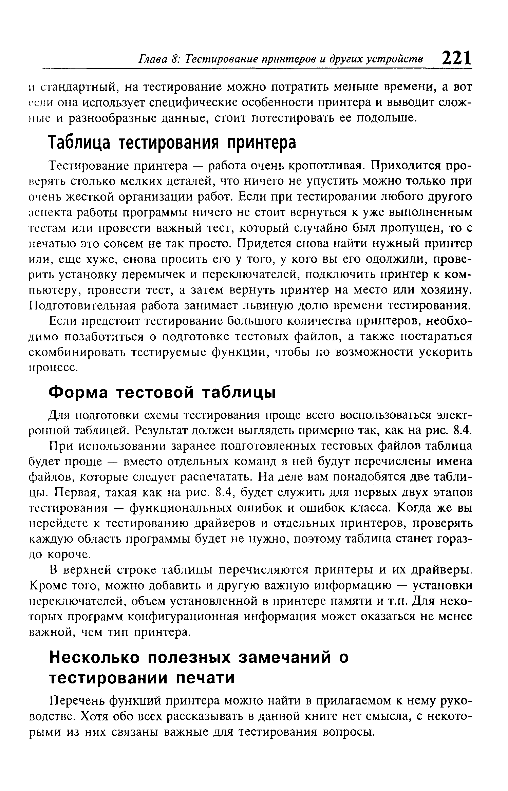


РИСУНОК 8.4. Тестовая таблица

* *Встроенные шрифты.* Есть ли у принтера встроенные шрифты и работает ли с ними тестируемая программа? Если да, пользуется ли программа лучшими из них? Успешно ли выполняется переключение шрифтов программой? Можно ли печатать двумя разными шрифтами в одной строке? А разными начертаниями? Может оказаться, что для смены начертания шрифта необходимо выполнить возврат каретки.
* *Загружаемые шрифты.* Программа может загружать в принтер и собственные шрифты. Эту возможность поддерживают практически все принтеры. Однако здесь возможны проблемы: некоторые символы загружаемого шрифта могут быть определены неправильно, и тогда принтер не будет их печатать. Например, так было с принтером LaserJet II. Для выявления подобных проблем следует подготовить тестовые примеры с полными наборами символов всех размеров.
* *Специальные символы.* Если программа печатает неанглийские символы и графические символы расширенного набора ASCII, убедитесь, что они печатаются правильно. Возможно, принтер необходимо переключить на иной набор символов или загрузить соответствующий шрифт, если встроенных шрифтов нужного языка у принтера нет. Что при этом произойдет с междустрочными и межсимвольными интервалами?
* *Графика.* В этом наиболее распространенном в настоящее время режиме печати тоже существуют сложности. Например, проблему может представлять собой двунаправленная печать на матричных и струйных принтерах. Напечатайте вертикальную линию и посмотрите, получится ли она ровной. Если нет, попробуйте отключить двунаправленную печать. Вторым важным вопросом является разрешение принтера. Поскольку разрешения принтера и экрана различны, очень важно, чтобы при формировании изображения документа для вывода на экран и на бумагу программист правильно учитывал их соотношение — в противном случае на экране и на бумаге документ будет выглядеть по-разному.
* *Разрешение.* Если программа переключает принтер между различными разрешениями, необходимо проверить их все. Если в одном из разрешений печать выполняется нормально, это еще не значит, что так будет и в другом. Особенно тщательно протестируйте печать с самым высоким разрешением сложных документов, содержащих большое количество графики и множество переходов между черным и белым цветами. При этом могут использоваться внутренние процедуры оптимизации принтера и драйверов, которые могут повлиять на качество изображения.

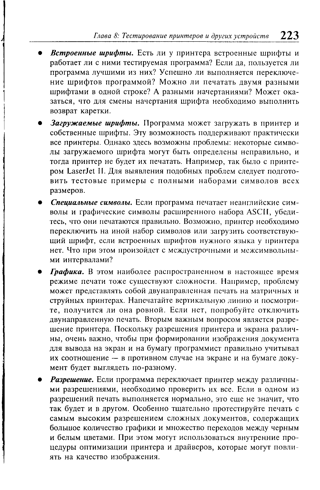

* **Обработка ошибок.** При печати сложного графического документа или текста, набранного очень мелким шрифтом, лазерному принтеру может не хватить памяти, или же его программное обеспечение может не справиться с таким сложным заданием. Что в таком случае будет делать ваша программа? Есть ли в ее руководстве соответствующая информация? Может ли подобная неприятность произойти при нормальном использовании программы или только в случае, если пользователь выполнит некоторые нестандартные действия? Что, если протестировать принтер с минимально возможным объемом памяти или поработать с одной из ранних моделей, в которой функции обработки ошибок гораздо менее совершенны. И наконец, после того как в работе принтера произойдет сбой, перезагрузите его с помощью кнопки Reset (не выключая) и попробуйте распечатать еще что-нибудь. Этот очень важный тест, и, если он окажется неудачным, постарайтесь выяснить, в чем дело — в аппаратуре или в программном обеспечении.

* **Таблицы ширины символов пропорциональных шрифтов.** Если программа работает с пропорциональными шрифтами, возможно, вы столкнетесь со специфическим типом ошибок, связанных со способом формирования изображений символов. Для пропорциональных шрифтов в системе хранятся специальные таблицы со значениями ширины их символов, т.е. количества точек по горизонтали, занимаемых каждым символом. В программах, работающих по принципу WYSIWYG (what you see is what you get — что видите, то и получаете), символы печатаются на основе информации из такой таблицы, и, если в ней содержатся ошибки, символы могут частично накладываться или, наоборот, располагаться слишком далеко друг от друга. Строчки могут получаться неодинаковой длины, в отличие от программ, не относящихся к типу WYSIWYG, в которых окончание строки всегда определяется по суммарной ширине напечатанных символов. Кроме того, у различных принтеров таблицы ширины символов для одного и того же шрифта могут отличаться. Если один матричный принтер является клоном другого, нельзя ручаться, что распечатанный ими один и тот же документ будет выглядеть одинаково.

* **Форматы графики.** Если программа печатает графику различных форматов, лучше проверить каждый из них, причем с книжной и альбомной ориентацией страницы. Выполните такие тесты для каждого класса принтеров, поскольку для них могут использоваться разные подпрограммы формирования изображений.

* **Цвет.** Соответствие между цветами на экране и на бумаге может оказаться весьма приблизительным. Составьте об этом отчет. Программист может подкорректировать драйвер или использовать другие цвета в зависимости от выбранного принтера.

* **Параметры страницы.** Программа может печатать на бумаге самых разных размеров: конвертах, стандартных листах формата А3 и А4 или любых нестандартных. Данные могут впечатываться в форму или распечатываться в определенном месте страницы. Кроме того, возможны два различных варианта печати: на отдельных листах и на сплошном рулоне (программистам со стажем хорошо знакома перфорированная по краям плотная “АЦПУ-шная” бумага). Для этих двух типов бумаги используются различные установки полей. Каждый из типов и размеров бумаги необходимо протестировать отдельно, однако делать это на всех возможных принтерах не обязательно: достаточно взять по одному принтеру каждого класса. Если эти тесты будут выполнены успешно, то, скорее всего, они пройдут и на других принтерах. Впрочем, абсолютной гарантии здесь нет.

* **Дорогостоящие формы и бумага.** Если программа должна впечатывать данные в дорогостоящие формы или печатать их на специальной дорогостоящей бумаге, не стоит сразу использовать их для тестов. Попечатайте на обычной бумаге и ксерокопиях формы или даже пустых листах соответствующего размера, пока не убедитесь, что все работает правильно.

* **Расположение текста и графики.** Страничные и струйные принтеры не могут печатать у самых краев бумаги. Размеры недоступных зон зависят от конкретного принтера. Даже если принтеры совместимы между собой, размеры недоступных зон у них могут оказаться разными. Проверьте, не позволяет ли тестируемая программа располагать текст и графику в тех местах страницы, где они не могут быть распечатаны.

* **Полосы, тени, странный способ заполнения.** Графические алгоритмы программы и принтера могут взаимодействовать между собой, приводя к самым неожиданным результатам. Если заполненный объект (например, большой серый квадрат) странно выглядит на бумаге (обычно при печати на страничном принтере), не стоит сразу предполагать, что все дело в принтере, в частности, в плохом картридже. Даже если программист будет утверждать, что дело именно в этом, попробуйте распечатать такое же изображение из другой программы.

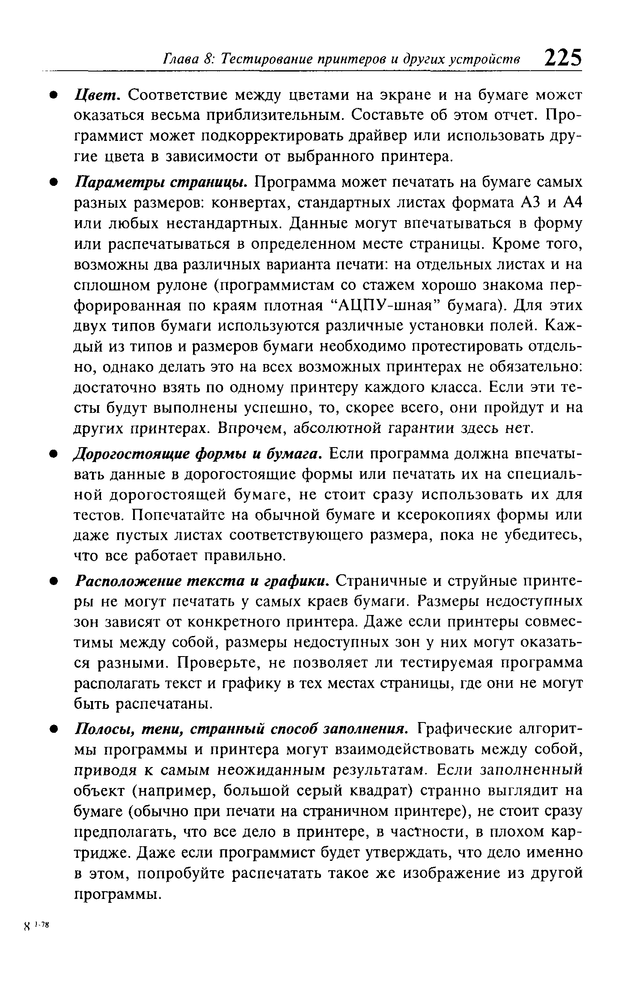

Накапливайте знания и делитесь ими с сотрудниками

В процессе работы тестировщик многое узнает о конкретных моделях принтеров. Одни из устройств оказываются полностью совместимыми, другие, наоборот, не соответствуют утверждениям производителей об их совместимости. Накапливают знания и сотрудники группы технической поддержки, особенно благодаря жалобам пользователей. Много важного узнают программисты, руководители проектов и другие члены команды разработчиков.

И если каждый тестировщик тратит силы и время на выяснение того, что уже выяснил однажды его коллега или предшественник, если он тестирует по отдельности полностью совместимые устройства или пропускает уже известные ошибки, это означает, что работа организована плохо.

Все накопленные сотрудниками знания можно собирать в едином месте, доступ к которомо должен быть простым и удобным. Разработчики, тестировщики, сотрудники групп маркетинга и технической поддержки должны мгновенно получать любые сведения об уже протестированных устройствах.

Разумеется, всеми этими возможностями обладает только централизованная база данных. Каждая запись в ней может описывать либо отдельный принтер, либо группу совместимых устройств, управляемых одним драйвером. В базе данных может храниться информация о возможностях принтеров, их типах, встроенных шрифтах и т. п.

Не стоит включать в запись слишком много полей — ее размер должен быть оптимальным для быстрого заполнения и прочтения. Кроме нескольких полей для стандартной обязательной информации, включите еще пару текстовых полей переменной длины, в которые каждый сможет вписать все, что считает важным.

Например, в таком поле можно привести выдержки из журнальных обзоров, результаты тестирования или результаты исследований, проведенных в ответ на звонки пользователей, сведения о совместимости устройства или сведения, полученные от производителя принтера. Обязательным требованием должно быть сопровождение каждой записи датой и фамилией ее автора.

> *Со временем база данных аппаратно-программных конфигураций станет ценнейшим ресурсом вашей компании.*

Очень важно, чтобы доступ к базе данных был свободным для всех сотрудников компании — ведь каждый из них потенциально может внести в нее ценную информацию. Ограничивая доступ к данным, компания выиграет не много, зато много потеряет.

## Советы по автоматизации тестирования

Наступит момент, когда все принтеры и драйверы наконец будут протестированы и будет выявлено множество ошибок. Затем в программу будут внесены исправления, причем для этого еще должно оставаться достаточно времени. После этого ряд тестов придется повторить, чтобы проверить исправления и выявить новые ошибки, допущенные программистами. Поскольку тестирование печати — процесс наиболее трудоемкий, лучше провести его как можно позднее, когда все другие составляющие программы будут уже полностью отлажены.

Однако не стоит и откладывать его до последней минуты, поскольку ошибок наверняка будет очень много и вы просто не уложитесь в график. Именно поэтому руководитель проекта будет настаивать, чтобы вы занялись принтерами пораньше.

Итак, запланируйте несколько циклов тестирования и начните его как можно позже, но так, чтобы успеть выполнить всю работу. И обязательно придерживайтесь описанной в этой главе последовательности работ, иначе повторное тестирование придется выполнять слишком много раз.

Для ускорения процесса тестирование печати можно значительно автоматизировать. Однако автоматизация имеет и свои издержки.

### О чем следует помнить при автоматизированном тестировании печати

* *Автоматизация требует времени.* Не стоит увлекаться технологиями. Если на автоматизацию работы требуется слишком много времени, ее лучше выполнить вручную.
* *Выходные данные должны поддаваться анализу.* Не переводите тонны бумаги — вы не сможете все это прочесть. Тесты должны быть простыми, с короткими и наглядными результатами. В противном случае сотрудники, особенно неопытные, не смогут правильно их провести и обнаружить ошибки.

Особенно важно проектировать тесты так, чтобы их правильные результаты четко отличались от ошибок. Если дефект печати практически незаметен, то каким бы старательным ни был тестировщик, мало шансов, что он обнаружит эту ошибку.

* *Отслеживайте ошибки, связанные с печатью.* Кроме ошибок в выходных документах, с печатью могут быть связаны и другие проблемы. Они могут быть связаны с параллельным выполнением других функций программы во время печати, выделением буфера для выходных данных и их некорректной записью в этот буфер, выполнением оверлея. Возможные разрушения данных или кода проявятся

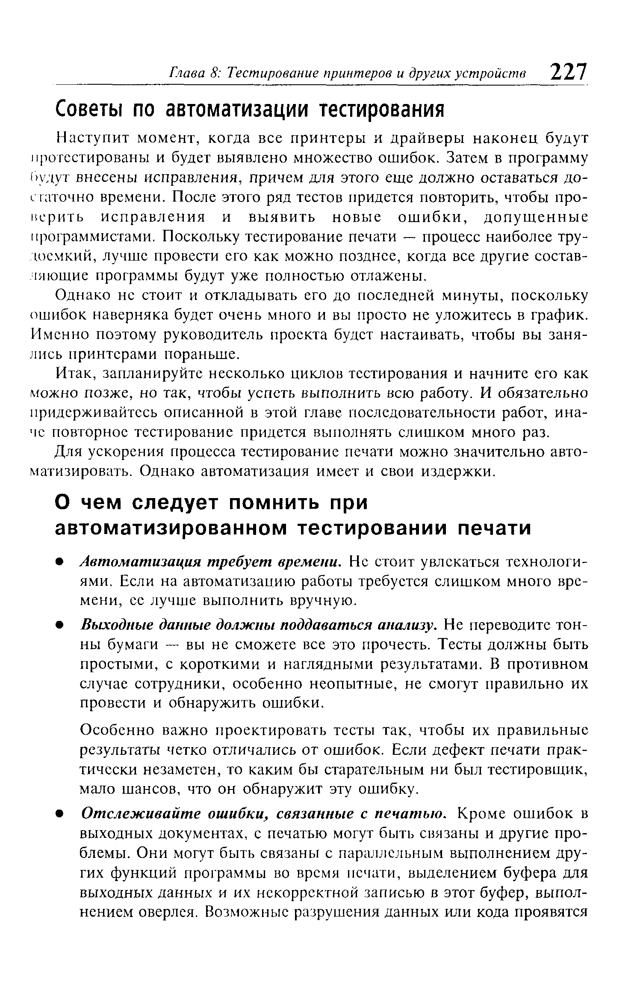

позднее, поэтому необходимо внимательно следить не только за происходящим на экране во время печати, но и за ее последствиями, продолжив работу с программой еще некоторое время.
* *Действуйте гибко*. Не стоит раз за разом повторять одни и те же тесты с одним и тем же принтером. После того как программист исправит ошибку и вы убедитесь, что ее и в самом деле больше нет, старые тесты повторять бессмысленно. Чтобы найти новые ошибки понадобятся новые тестовые примеры. Поработайте с программой, выполняя полезные, а иногда и совершенно нестандартные действия, поэкспериментируйте с ней. Поставьте себе определенную задачу и попробуйте выполнить ее с помощью тестируемой программы. Вы будете удивлены, как много ошибок обнаружится при таком способе тестирования. Разумеется, он не заменяет выполнения формальных плановых тестов, но успешно их дополняет.

## Как сэкономить время и улучшить результаты тестирования

В тестировании печати можно выделить четыре задачи, на выполнение которых уходит больше всего времени. Первой является планирование и разработка тестов. Следующей является поиск принтера (вполне возможно, что его придется одолжить у друзей или сослуживцев), проверка его перемычек и переключателей и подключение к компьютеру.

По окончании тестирования принтер нужно вернуть на место. Если принтер чужой, перед возвращением хозяину необходимо восстановить положение всех его перемычек и переключателей. Вся эта подготовительная и восстановительная работа занимает вдесятеро больше времени, чем само тестирование.

Третьей задачей является выполнение тестов, а четвертой — анализ их результатов. В этом разделе рассказывается, как можно сэкономить время на всех четырех этапах работ. И хотя все описанные ниже способы достаточно эффективны, не все они совместимы между собой, так что вам придется сделать выбор.

### Тестовые файлы

Главным принципом разработки тестовых файлов должна быть их простота и наглядность.
* *Атрибуты текста должны быть очевидны*. Например, если тестируется полужирное начертание, распечатайте что-нибудь вроде следующего:

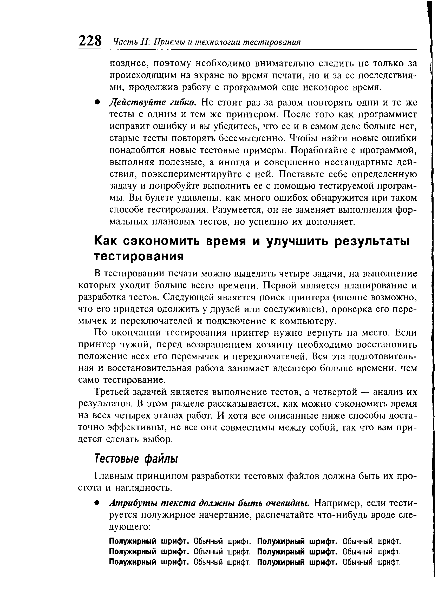

Обычный. *Курсив*. **Полужирный**. ***Полужирный курсiv***. Обычный. *Курсив*. **Полужирный**. *Полужирный курсiv*.
Обычный. *Курсив*. **Полужирный**. ***Полужирный курсiv***. Обычный. *Курсив*. **Полужирный**. *Полужирный курсiv*.
Обычный. *Курсив*. **Полужирный**. ***Полужирный курсiv***. Обычный. *Курсив*. **Полужирный**. *Полужирный курсiv*.

Повторяющиеся шаблоны облегчают анализ результата.

* **Границы области печати должны быть очевидны.** Если можно напечатать рамку, показывающую, где проходит граница области печати, сделайте это. Если графическую рамку распечатать нельзя, заполните страницу текстом. Напечатайте что-нибудь полезное.

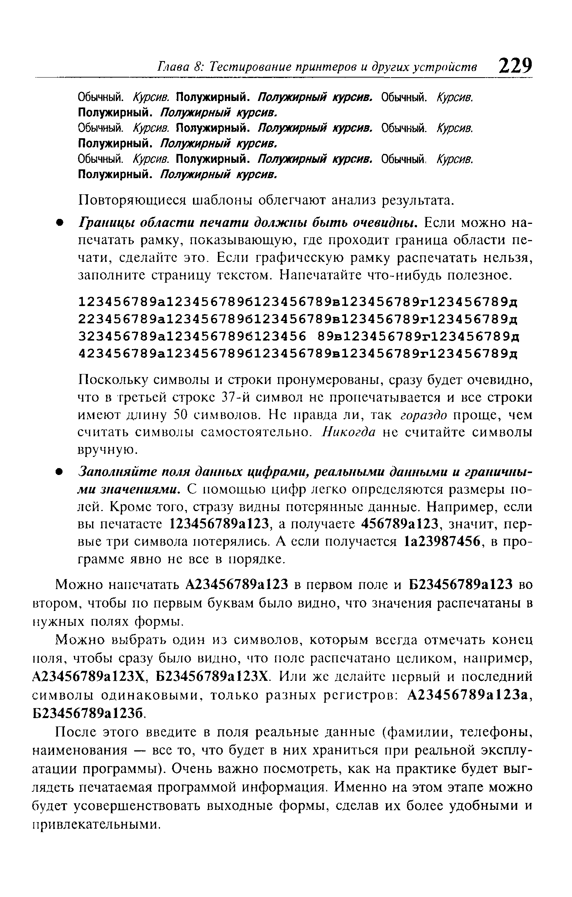

Поскольку символы и строки пронумерованы, сразу будет очевидно, что в третьей строке 37-й символ не пропечатывается и все строки имеют длину 50 символов. Не правда ли, так гораздо проще, чем считать символы самостоятельно. *Никогда не считайте символы вручную.*

* **Заполняйте поля данных цифрами, реальными данными и граничными значениями.** С помощью цифр легко определяются размеры полей. Кроме того, сразу видны потерянные данные. Например, если вы печатаете **123456789a123**, а получаете **456789a123**, значит, первые три символа потерялись. А если получается **1a23987456**, в программе явно не все в порядке.

Можно напечатать **А23456789а123** в первом поле и **Б23456789а123** во втором, чтобы по первым буквам было видно, что значения распечатаны в нужных полях формы.

Можно выбрать один из символов, которым всегда отмечать конец поля, чтобы сразу было видно, что поле распечатано целиком, например, **А23456789а123Х**, **Б23456789а123Х**. Или же делайте первый и последний символы одинаковыми, только разных регистров: **А23456789а123а**, **Б23456789а123б**.

После этого введите в поля реальные данные (фамилии, телефоны, наименования — все то, что будет в них храниться при реальной эксплуатации программы). Очень важно посмотреть, как на практике будет выглядеть печатаемая программой информация. Именно на этом этапе можно будет усовершенствовать выходные формы, сделав их более удобными и привлекательными.

Тестируя пропорциональные шрифты, распечатайте короткую и длинную строчки с одинаковым количеством символов. Вот 20 символов “т” и “Щ”, напечатанных пропорциональным шрифтом.

твтвтвтвтвтвтвтвтвтв
щщщщщщщщщщщщщщщщщщщщ

Чтобы одно и то же поле протестировать с цифрами, стандартными данными, узкими и широкими символами, проще всего заполнить четыре записи таблицы. Аналогичным образом можно распечатать четыре разных изображения или четыре файла.

### Сокращение времени подключения и отключения техники

Чтобы сократить время подключения и отключения техники, необходимо заранее подготовить все принтеры, подключить их к коммутаторам, которые, в свою очередь, подключить к тестовым компьютерам. Именно так работают профессионалы. Щелкаете переключателем на коммутаторе, включаете питание, и можно тестировать. Организация тестовой лаборатории — вопрос очень важный, и мы к нему еще вернемся.

Если же так организовать работу не получится, постарайтесь выполнить на каждом принтере максимум работы и только затем переходите к тестированию следующего устройства. Чтобы это стало возможным, тестирование печати важно начать как можно позже, когда всех остальных ошибок в программе уже не останется. Однако руководитель проекта не позволит вам этого, и потому, тестируя печать пять раз в ходе разработки, вам придется по пять раз подключать и отключать каждый принтер.

* **Печать в файлы.** В самом начале разработки попросите программистов включить в программу команду печати в файл. Результирующий файл должен содержать всю посылаемую на принтер информацию, включая и управляющие коды. Если вывод на принтер Okidata 82 перенаправляется в дисковый файл, при копировании этого файла на принтер Okidata 82 получается точно такой же результат, как и при непосредственной печати из программы.

В первом цикле тестирования одни и те же данные отправьте на принтер и в файл. Во втором цикле снова распечатайте те же данные в файлы. Затем сравните файлы первого и второго циклов. Если они окажутся идентичными, значит, уже найденные ошибки еще не были исправлены. Если же файлы отличаются, их можно распечатать и посмотреть, что изменилось. При этом повторно запускать программу вовсе не нужно — достаточно просто скопировать файлы на принтер. Это очень ускоряет дело.

- *Протестируйте выбор различных устройств на одном совместимом с ними принтере.* Предположим, что принтеры Epson FX-86e и Panasonic 1191 абсолютно совместимы. Не стоит при каждом повторном тестировании печати по очереди подключать их оба. Подсоедините один из них, выберите Epson FX-86e и выполните тестирование. Затем выберите Panasonic 1191 и повторите те же тесты. Если с результирующими данными что-то будет не так, вы это прекрасно увидите и на одном устройстве.
- *Анализируйте результат сразу после его распечатки.* Если проанализировать результаты теста, пока принтер еще подключен к компьютеру, то, обнаружив ошибку, можно провести дополнительное тестирование. При подозрении, что все дело в неверной установке переключателей, их можно тут же проверить. Если вы будете накапливать пачки выходных документов, чтобы просмотреть их через неделю, тогда при необходимости в дополнительных проверках и тестировании принтеры придется подключать снова.
- *Пользуйтесь принтерами, подключенными к сети.* Обычно в корпоративной сети имеется немало принтеров. Если установить программу на одном из компьютеров этой сети с достаточными правами доступа, то можно тестировать печать на целом ряде принтеров безо всякой возни с техникой.

## Ускорение тестирования

Чем меньше вы печатаете, тем меньше времени тратится на тестирование. Однако не стоит увлекаться сокращением объема тестовых примеров — сократив хороший тест, можно получить короткий, но плохой. Сэкономить время лучше на другом: вместо того чтобы стоять над принтером в ожидании, пока он напечатает все, что нужно, можно работать с несколькими принтерами одновременно.

Количество принтеров выбирается так, чтобы оставалось время подойти от одного принтера к другому и проанализировать результат. Слишком много техники включать ни к чему — вы только начнете пропускать ошибки и путать проводимые тесты.

Кроме того, попросите программиста включить в программу управление печатью из командной строки. В качестве параметров программе, скорее всего, понадобятся имя входного файла, который требуется распечатать, информация о принтере и драйвере и некоторые настроечные данные, касающиеся шрифтов, разрешения печати и т.п. После печати программа должна завершать работу. Благодаря этой функции программы можно будет написать пакетный файл, выполняющий следующие действия:

- Передачу программе входного файла, выбор принтера, печать в файл.

* Сравнение полученного файла с предыдущей версией.
* Если файлы отличаются — печать нового файла.
* Передачу программе следующего входного файла, печать, сравнение и т.д.

В результате принтер может работать хоть всю ночь, а утром вам останется только просмотреть результаты. При этом можно печатать на одном принтере, а можно выбирать и разные устройства, перенаправляя весь вывод в файлы. Если же выбираемые устройства полностью совместимы, можно, выбирая их по очереди, печатать все на одном принтере.

### Оценка результатов тестирования

Тесты, которые не выявляют ошибок или выдают такие распечатки, в которых ошибку очень трудно найти, не многого стоят. Поэтому важнее всего правильно спроектировать тестовые примеры.

* *Результаты тестирования должны быть очевидными.* Об этом уже упоминалось при описании разработки тестовых файлов.
* *Не печатайте ничего лишнего.* Например, если выходной файл оказался идентичным файлу, распечатанному на прошлой неделе, его незачем печатать снова. Не печатайте лишних страниц, абзацев, полей — ничего, кроме самого необходимого. Чем больше объем выходных данных, тем легче пропустить в них ошибку.
* *Правильные или прошедшие сравнение распечатки откладывайте вправо, неправильные или не прошедшие сравнение — влево.* Организуйте результаты тестирования таким образом, чтобы в них было легко ориентироваться.
* *Если две версии результирующих файлов не совпадают,* распечатайте их обе и пометьте распечатки. Затем просмотрите результаты, определите, какой из них правильный, и, если проблема решена, проведите дополнительное тестирование, чтобы в этом убедиться.
* *Анализируйте результаты сразу после их распечатки.* Не ждите следующей недели или следующего месяца, когда вы вообще забудете о том, что делали. Будьте готовы сразу оценить результат и при необходимости провести дополнительное тестирование.
* *Выполняйте некоторые тесты самостоятельно.* Если все тесты проводить только автоматизированно, вы рискуете пропустить сопутствующие проблемы (например, мерцание экрана после печати каждого задания).

* Обязательно распечатывайте реальные данные. Документ с реальной информацией и тестовыми примерами может выглядеть по-разному. Если окажется, что с реальными данными документ выглядит плохо или они явно неудачно расположены, составьте отчет об ошибке проектирования. Кроме чисто эстетических недостатков, распечатка реального документа позволяет выявить и более серьезные ошибки, как, например, частично накладывающиеся поля данных.

## Сохраняйте все распечатки

Сохраняйте все распечатки как минимум до тех пор, пока продукт не выйдет в продажу. Последнюю серию распечаток (полученных от каждого протестированного принтера) храните по несколько лет. В некоторых компаниях годами сохраняются и все промежуточные выходные документы. Фактически эта документация отражает ход и результаты разработки, и она еще не раз может пригодиться. Например, сотрудникам группы технической поддержки она может понадобиться для сравнения распечаток пользователей с собственными результатами компании, полученными на тех же принтерах. Кроме того, при разработке следующего выпуска программы у вас будут уже готовые тестовые примеры и их результаты для сравнения.

## Организация и оборудование тестовой лаборатории

На организацию тестовой лаборатории можно потратить все свое состояние. Поэтому давайте считать, что вы готовы выделить на это определенную сумму — столько, сколько абсолютно необходимо для эффективного тестирования, но не более того.

## Принтеры можно одолжить

Никто не покупает все необходимые для тестирования принтеры. Приобретаются только те модели, которые будут постоянно использоваться, другие же вполне можно одолжить на 30, 45 или 90 дней у их производителей. (Если хорошего принтера нет в меню ни одной программы, значит, его производитель не одалживает свои устройства. Никто не станет включать в меню своей программы принтер, который не удалось протестировать, и никто не станет его покупать, если это не сулит значительных преимуществ.)

У многих производителей принтеров имеются программы поддержки независимых производителей программного обеспечения, называемые ISV (Independent Software Vendor). Если вы разрабатываете программные продукты для широкого рынка или бесплатно распространяемые программы, позвоните производителям любимых принтеров и скажите, что хотели бы

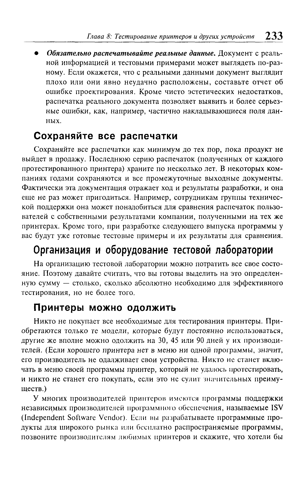

протестировать свои программы на совместимость с некоторыми их устройствами. Можно ли одолжить эти принтеры (подготовьте их список заранее) для тестирования? Вежливо объясните, что не можете позволить себе купить каждый принтер каждого производителя, даже такие замечательные принтеры этой чудесной компании. Приготовьтесь повторять одно и то же нескольким сотрудникам, пока наконец вам не удастся поговорить с представителем программы ISV или администратором из отдела продаж или маркетинга.

Всегда звоните заранее — за несколько недель, чтобы успеть получить, заполнить и отправить обратно соответствующие бумаги. Компании необходимо будет подтверждение, что вы не просто изобретательный студент, придумавший способ бесплатно получить несколько принтеров. Будьте готовы к тому, что первую копию ваших бумаг компания потеряет, и придется высылать вторую.

Некоторые компании периодически выпускают документацию с описанием всех перемычек и переключателей для всех выпускаемых ими принтеров. Доказав, что вы являетесь разработчиком программного обеспечения, можно получить эти издания бесплатно или за очень умеренную цену. Обязательно спросите, имеется ли у фирмы такая документация. Сотрудники, с которыми вы будете говорить, могут просто забыть о ней упомянуть.

Одолжив принтер на 90 дней, стоит проявить вежливость и предусмотрительность и отослать компании некоторые из полученных распечаток. Это нужно сделать не позднее 60 дней с момента получения принтера. Напишите администратору ISV письмо с выражением благодарности за услугу, перечнем тестируемых программных продуктов и примечанием, что к письму прилагаются примеры распечаток. (Не забудьте их приложить!) Получив такое письмо, администратор гораздо охотнее позволит вам оставить принтер у себя еще на 90 дней, если вы не уложитесь в оговоренный срок.

После завершения разработки также предусмотрительно необходимо будет отправить производителям принтеров бесплатные копии программы и письма с благодарностями за одолженные принтеры. Эти письма и копии программ исключительно важны. Их получение от нескольких разработчиков может повлиять на решение о продолжении компанией программы ISV. Кроме того, иногда они могут стать началом более тесного сотрудничества между вашими компаниями.

Информацию о производителях принтеров можно получить из ежегодного альманаха *Computer Industry Almanac* (Juliussen) или ежегодного выпуска *PC Magazine*, посвященного принтерам.

Разумеется, таким образом можно одалживать у производителей не только принтеры, но и любые другие устройства, а также программное обеспечение, совместимость с которым важна для успешного продвижения вашего продукта на рынок.

## Организация тестовой лаборатории

Чем больше у вас компьютеров и принтеров, тем важнее все это правильно организовать. На установку и подключение принтера должно уходить минимум времени и усилий. Если вы никогда не видели по-настоящему хорошо организованной лаборатории, то, вероятно, даже не представляете себе, что это такое и насколько эффективнее выполняется в ней работа.

* *Расположите принтеры на крепких полках.* Так значительно экономится пространство и облегчается доступ к каждому из устройств. Слева и справа от каждого принтера, а также между принтером и стеной должно оставаться достаточно места, чтобы принтеры не перегревались. Кроме того, их должно быть удобно включать, заправлять бумагой и добираться до их кабелей.
* *Располагайте стеллажи на достаточном расстоянии друг от друга. Избегайте беспорядка на полу.* В здании будет выключаться свет, а в тестовой лаборатории обычно нет окон. Поэтому необходимо гарантировать, что сотрудники смогут благополучно добраться до двери, ничего не сломав и не обрушив.
* *Принтеры должны быть готовы к работе.* Бумага должна быть загружена, к принтерам должны быть подключены интерфейсные кабели и питание.
* *Пользуйтесь коммутаторными блоками.* Четыре или более принтера можно подключить к одному коммутаторному блоку, кабель которого, в свою очередь, подключается к компьютеру. Переключатель на коммутаторном блоке позволяют выбрать любой из подключенных к нему принтеров. Таким образом можно работать с несколькими принтерами различных типов.

Однако иногда встречается программное обеспечение, которое отказывается работать с принтером через коммутатор. К счастью, такое случается крайне редко.

* *Если не получается подключить к компьютерам все принтеры,* подключите те, которые тестируются чаще всего. Остальные расположите так, чтобы до них было легко добраться. Оставьте на полках рядом с ними побольше свободного пространства, чтобы любое из устройств можно было без труда снять с полки и положить обратно.

Ни в коем случае не кладите принтеры друг на друга, иначе обязательно что-нибудь сломаете.

* *Стоит потратиться на несколько тележек или столиков на колесах.* Время от времени тестировщики и программисты будут забирать принтеры к себе в комнаты, чтобы поработать с ними подольше в привычной обстановке. Такие тележки не только позволяют легко и без ущерба перемещать оборудование — если на рабочем столе недостаточно места, принтер может так и стоять на тележке, пока не вернется в лабораторию.
* *Сразу же чините все, что ломается.* На починку оборудования всегда уходит масса времени: в мастерских нет нужных запчастей; специалист, умеющий чинить такие принтеры, только что уволился; пришедший на его место новый сотрудник сломал еще что-то, пытаясь починить незнакомое устройство, причем этих новых запчастей тоже не найти.

Огромное количество продуктов продается без необходимого тестирования только потому, что сотрудники тестовой лаборатории вовремя не сдали в ремонт нужные устройства.

* *Держите под рукой некоторое количество запчастей и материалов.* В лаборатории всегда должны быть запасные ленты, картриджи, тонеры, бумага и т.п. Они всегда кончаются не вовремя, например, в пятницу вечером, когда все магазины закрыты, а вы еще собирались поработать. И не стоит пытаться сэкономить, например, на красящей ленте. Бледная печать — это только потерянное время и зрение: ошибки вы все равно попропускаете.
* *Сделайте копии руководств и спрячьте оригиналы.* Документация к принтерам имеет свойство пропадать, причем в самое неподходящее время. Заменить ее трудно, а без нее не обойтись. Поэтому никогда не работайте с оригиналами руководств, держите их в надежном месте, а для работы делайте копии.
* *Наклеивайте на принтеры записки с перечнем установок переключателей для всех тестируемых режимов.*
* *Берегите уши.* Матричные принтеры обычно работают очень громко. Если их много и все они печатают одновременно, создается сильный шум. Постоянно находиться в таких условиях крайне вредно, и, прежде всего, от этого снижается слух.

Выясните, какой уровень шума допускается нормативами и какие законы обязывают компанию позаботиться об условиях вашего труда.

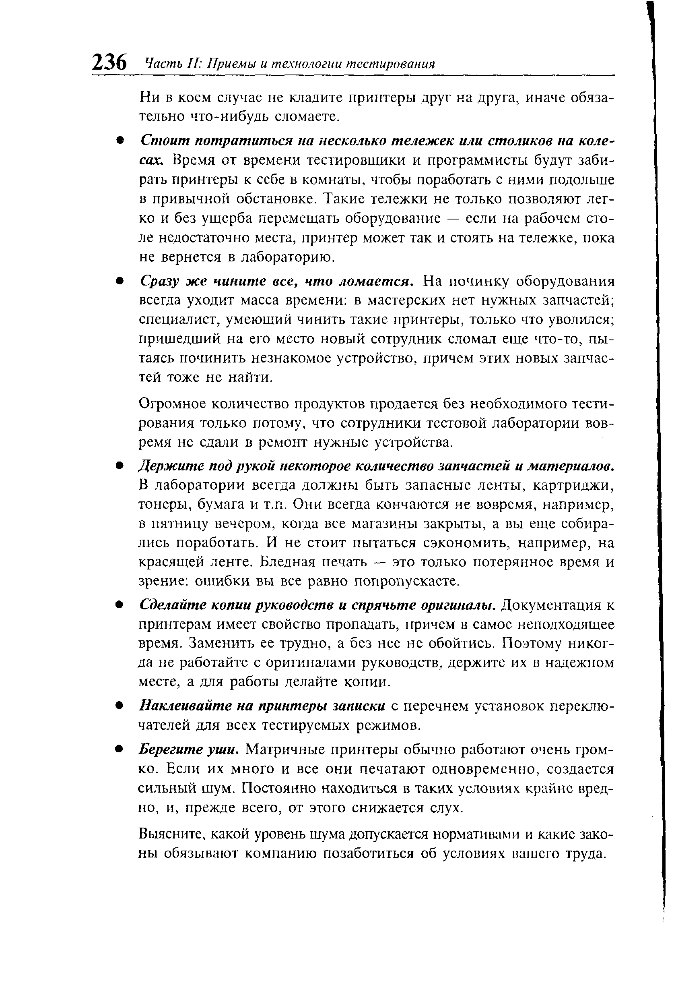

Глава 9

# Адаптационное тестирование

## Назначение этой главы

Программное обеспечение все чаще и чаще переводится на другие языки и экспортируется в другие страны. Однако представление разработчиков о локализации программ по-прежнему остается еще очень наивным. Этот процесс представляет собой нечто гораздо большее чем просто перевод слов с одного языка на другой.

В данной главе рассказывается о том, как много изменений вносится в программу в процессе ее локализации. Тестировщик локализованной версии должен убедиться, что ничего не пропущено. Кроме того, необходимо проверить, не вкрались ли в измененную программу новые ошибки. Надеемся, что наши рекомендации помогут вам успешно справиться с этой работой.

## Библиография

Крупнейшие компании — разработчики программного обеспечения выпускают руководства по его локализации. В качестве примера можно привести следующие документы.

* *National Language Information and design Guide* компании IBM (1987, 1990).
* *Guide to Macintosh Software Localization* и *Macintosh Worldwide Development: Guide to System Software* компании Apple (1992).
* *Developing International User Information* (Jones, Kennelly, Mueller, Sweezy, Thomas, & Velez, 1992) и *Digital Guide to Developing International Software* компании Digital Equipment Corp.
* *Microsoft Windows International Handbook for Software Design* компании Microsoft.

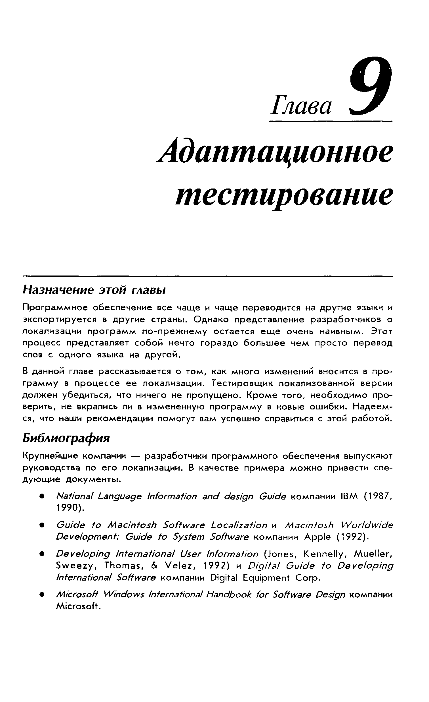

Существует и другая хорошая литература о локализации программного обеспечения. Множество нюансов перевода продуктов Macintosh описаны в книге Картера (Carter, 1990). Ряд полезных сведений мы почерпнули из печатавшихся в периодических изданиях глав будущей книги Эрена, Говарда и Перинотти (Uren, Howard & Perinotty, 1993).

На наш взгляд, лучшим руководством по локализационному тестированию является выпущенная Microsoft книга *Microsoft Windows International Handbook for Software Design*.

Кроме того, разработке международного программного обеспечения посвящен целый ряд стандартов ISO (International Standard Organization). Например, сборником ISO эргономических стандартов для программного обеспечения является Technical Committee 159, Sub-Committee 4, Working Group 5. В этом сборнике есть стандарты для справочных систем, меню, диалоговых окон и многого другого. Почитайте колонку Пат Биллингслей (Pat Billingsley) *The Standards Factor* в журнале Association for Computing Machinery *SIGCHI Bulletin* — в ней вы найдете сведения о разработке новых стандартов на эту тему и изменениях существующих. Обзор UNIX-стандартов с информацией о том, где их можно найти, публиковался организацией 88open Consortium (1991).

Локализация — это процесс адаптации программного обеспечения для нового места эксплуатации. Изменение языка не является его единственной составляющей. Не менее важна, например, и культурная адаптация.

## Изменен ли исходный код?

Это первый вопрос, который вы себе зададите, приступая к тестированию локализованной версии программного продукта. В отдельных случаях, например при адаптации американской программы для Великобритании, может оказаться достаточным изменить несколько внешних файлов, хранящих, например, информацию о единицах измерения. Сама программа не подвергается повторной компиляции и компоновке. В этом случае тестирование локализованной версии может быть довольно поверхностным, с акцентом только на национальных особенностях.

Однако, как правило, адаптация программного продукта требует гораздо более серьезных изменений. И они могут касаться не только перевода надписей и сообщений, включенных прямо в текст программы, — могут появиться новые функции, которых в исходной версии не было вообще, или какие-либо из прежних возможностей программы могут несколько видоизмениться. А раз меняется код и даже появляются его новые фрагменты, значит, не обойтись без полноценного функционального тестирования. Если программа адаптируется для целого ряда стран, после второй или третьей адаптации программисты приобретут некоторый опыт и станут допускать уже меньше ошибок. Однако код по-прежнему будет модифи-

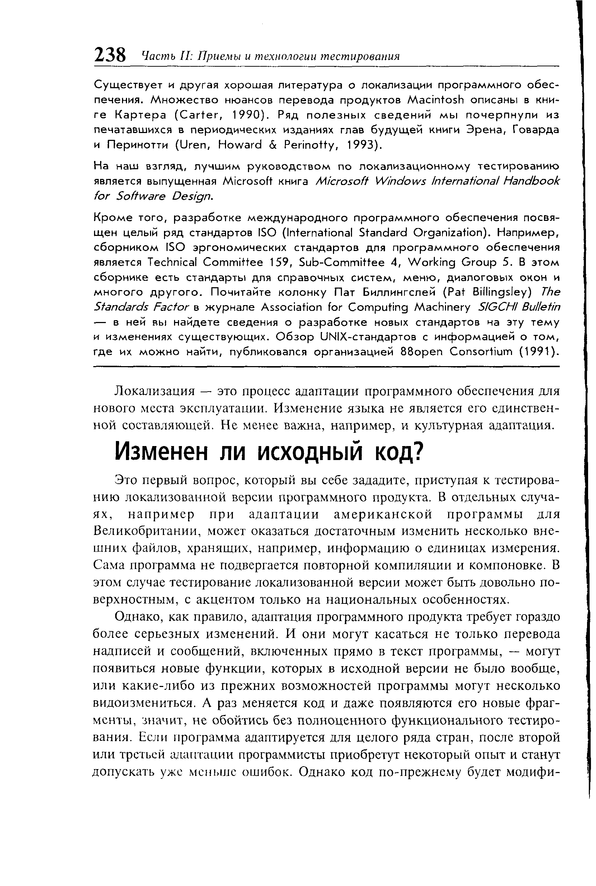

широваться и дополняться, поэтому каждая новая версия должна тестироваться очень обстоятельно.

Сейчас модно критиковать продукты, в которых с самого начала не встраиваются возможности быстрой локализации. Однако у такого подхода существует и ряд недостатков, поскольку он усложняет разработку исходной версии, увеличивая сроки и делая продукт более громоздким. Так что не спешите присоединяться к критике. Вопрос этот имеет стратегический характер и в каждом конкретном случае решается по-своему.

## Привлекайте к работе специалистов, свободно владеющих языком

Когда текст переведен на русский язык человеком, который им плохо владеет, это сразу заметно. Поэтому специалист, занимающийся адаптацией американского продукта, обязательно должен свободно владеть обоими языками, особенно технической терминологией. Необходимо, чтобы и в группе тестирования тоже был человек, свободно владеющий языком, на который переводится продукт, причем желательно, чтобы это был его родной язык.

## Встроен ли текст в программный код?

Если продукт должен переводиться на несколько языков, подавляющая часть его текста, скорее всего, отделена от программного кода. Однако не верьте на слово программисту, утверждающему, что в коде нет ни слова, выводящегося на экран или принтер. Просмотрите файлы сами или воспользуйтесь утилитами, извлекающими из двоичных файлов текстовые строки. Вы наверняка что-нибудь да найдете. Краткие сообщения вроде “Ошибка чтения диска” программисту наверняка было лень считывать из файла ресурсов.

Если критические сообщения об ошибках невозможно или нерационально выносить во внешние файлы, это вовсе не означает, что их нельзя перевести. Программист или переводчик может внести исправления прямо в объектный или исполняемый файл. Хотите более элегантное решение — пожалуйста: программист может написать маленькую утилиту, которая находит в объектном файле текстовые строки и позволяет переводчику ввести новый текст, ограничивая его длину длиной исходной строки.

## Перевод длиннее исходного текста

На многих языках, в том числе и на русском, короткие сообщения и названия команд оказываются длиннее исходных английских эквивалентов. На рис. 9.1 приведены оценки увеличения длины текста при переводе с английского, сделанные специалистами компании IBM. Предполагается, что в тексте отсутствуют аббревиатуры.

При переводе вполне может оказаться, что результирующий текст не помещается в меню или диалоговое окно. Однако его сокращение совершенно недопустимо. Нельзя допустить и того, чтобы удлинение текста привело к переполнению внутренних переменных программы, в которых он хранится, или затиранию других данных. Бывает и так, что после перевода текстовые строки набегают друг на друга на экране или на нем не помещается меню, ставшее слишком широким.


РИСУНОК 9.1. Увеличение длины текста при переводе с английского

## Наборы символов

При адаптации программ необходимо учесть и еще один аспект, связанный с кодировкой символов, не относящихся к базовому набору ASCII (английские буквы, цифры, знаки препинания). Для всех остальных символов, среди которых и буквы русского алфавита, должна быть выбрана та кодовая страница (т.е. набор числовых кодов, использующихся для их хранения), которая будет установлена у пользователей программы. Кроме кодовых страниц, отличаться могут и базовые наборы символов: в мире Microsoft стандартными являются использовавшийся в DOS набор символов ASCII и использующийся в Windows набор ANSI. У Apple собственный набор символов, несовместимый ни с ASCII, ни с ANSI. Кроме того, необходимо позаботиться о том, чтобы информация программы и пользовательские данные отображались шрифтами, в которых имеются нужные символы. Иначе может получится, что в полностью русифицированной программе в текстовом поле с жестко заданным шрифтом правильно отображаются при вводе только английские буквы, а вместо русских появляются странные символы.

## Клавиатура

В разных странах применяются и разные раскладки клавиатуры. Системное программное обеспечение интерпретирует внутренние коды клавиш, ставя им в соответствие коды текущей кодовой страницы. И кодовая страница, и раскладка клавиатуры определяются настройкой системы. На немецкой клавиатуре имеется несколько акцентированных символов, например ä и ö. На французской отсутствуют квадратные скобки. Греческая клавиатура, так же как и русская, переключается между английским и греческим наборами символов. В скандинавском алфавите имеются спе-

цифические символы, такие как $\infty$, которых нет в наборе наиболее распространенной в западной Европе кодовой страницы 850.

На некоторых клавиатурах есть еще одна клавиша, играющая роль <Shift> и помеченная как <Alt-Gr>. Она позволяет ввести третий символ, нарисованный на буквенно-цифровой клавише.

Кроме того, неамериканские клавиатуры поддерживают так называемые мертвые клавиши (dead key). Такие клавиши применяются при вводе акцентированных символов. Они не производят никакого действия, пока пользователь не нажмет следующую клавишу, после чего на экране и появляется соответствующий акцентированный символ.

И еще одно: программа должна предоставлять пользователю доступ к символам, которые отсутствуют на клавиатуре (иначе как итальянец сможет адресовать письмо своему немецкому коллеге?) Убедитесь, что программа позволяет не только вставлять в текст такие символы (например, путем копирования их из другого приложения), но и правильно их отображает.

Полноценно выполненное тестирование предполагает работу с программой на той клавиатуре и с тем системным программным обеспечением, с которым ее будут эксплуатировать пользователи.

## Фильтрация ввода

Программа может, например, допускать ввод в определенное поле только английских букв, отвергая все другие вводимые пользователем символы и управляющие коды. Таким образом она гарантирует, что англоязычный пользователь не сможет ввести в это поле ничего, кроме текста, однако для пользователей с другими национальными алфавитами такое ограничение совершенно неприемлемо.

Поскольку подобные ограничения реализуются программным путем, придется как следует протестировать каждое текстовое поле, проверяя, как программа принимает и отображает все символы национального алфавита, разумеется там, где такие символы действительно должны допускаться.

## Загрузка, сохранение, импорт и экспорт символов основного и расширенного набора ASCII

Создайте текстовые файлы со всеми 255 символами расширенного набора ASCII или тем его подмножеством, которое поддерживается вашей программой. Сохраните их. Посмотрите, что получается при их загрузке с теми кодовыми страницами, которые могут быть установлены у пользователей.

Сохраните полный набор символов во всех поддерживаемых программой файловых форматах; попробуйте прочитать файлы всех этих форматов. Если их много, вполне вероятно, что с одним или двумя программа работает плохо.

Затем проверьте, как выполняется импорт и экспорт проблемных символов. Обратите особое внимание на символы с ASCII-кодами до 32, поскольку они нередко воспринимаются принтерами и различными программами типа текстовых редакторов, не как данные, а как управляющие коды.

Тестируя обмен данными между программами, обратите внимание, чтобы их версии были локализованными. Например, если хотите, чтобы экспортированные программой файлы читались в MS Word, берите его русскую, а не американскую версию.

## Язык и операционная система

Тестировщик должен знать, различаются ли в операционной системе в зависимости от выбранного языка соглашения об именах файлов, их фильтрах, имена команд и т.п.

## Клавиши вызова

Подчеркнутые или иным способом выделенные буквы в названиях элементов меню, как, например Файл, означают, что они используются для быстрого вызова команд. При работе с клавиатурой пользоваться ими гораздо быстрее, чем переходить к нужному пункту меню и нажимать <Enter>. Поскольку в локализованной версии продукта все названия команд меняются, необходимо изменить и все клавиши их вызова. Кроме того, в программе могут использоваться и другие сочетания клавиш — для команд, которых в меню нет. Их тоже придется пересмотреть и протестировать.

## Сборные сообщения

Отображаемое программой сообщение может собираться из нескольких фрагментов. Например, часто используемые фразы и словосочетания могут храниться во внутреннем массиве и подставляться во многие сообщения.

Очень часто в сообщения вставляются имена файлов, даты и другие данные. Однако если перевести фрагменты сообщения с одного языка на другой, а потом их объединить, результат может оказаться неприемлемым. Просмотрите все выдаваемые программой сообщения на предмет неправильного порядка слов, несогласования падежей и бессмысленного текста.

## Идентификаторы сообщений об ошибках

Как бы хорошо ни была организована техническая поддержка в тех странах, куда экспортируется разрабатываемое вами программное обеспечение, некоторые вопросы все равно будут переадресовываться в главный офис. При этом возникает ситуация "испорченного телефона" — пока информация о проблеме дойдет по назначению, она может быть несколько раз искажена. Немного помочь делу могут уникальные идентификаторы для каждого сообщения об ошибке и предупреждения, выдаваемого программой. Достаточно в конце сообщения просто указать в скобках его код, например, (23). Убедитесь, что при переводе программы на другой язык все номера сообщений остались прежними.

## Правила переноса

В разных языках правила переноса слов отличаются, они могут быть различными даже для разных диалектов одного и того же языка, например, американского и британского английского. Существует несколько языков, в которых при написании некоторых слов через дефис меняется их произношение. При удалении переносов программа должна правильно распознавать такие слова.

## Правописание

Правила правописания для разных диалектов одного и того же языка, например американского и британского английского, могут отличаться. Если в программный продукт включена функция проверки правописания, убедитесь, что она работает правильно.

## Порядок сортировки

Правила сортировки текста от страны к стране меняются. Например, во многих языках, и в том числе в русском, бессмысленна сортировка по значениям внутренних кодов символов (ASCII или ANSI).

Хорошая подпрограмма сортировки группирует вместе одинаковые акцентированные символы, например, сначала все **o**, затем все **n**. В некоторых языках при сортировке два символа могут интерпретироваться как один, например, в испанском слове **llama** буквы **ll** считаются за одну. Особые соглашения могут касаться сортировки фамилий. Например, **d'Allesio** может интерпретироваться как **Allesio**, **van Essen** как **Essen**, а **del Zorro** как **Zorro**.

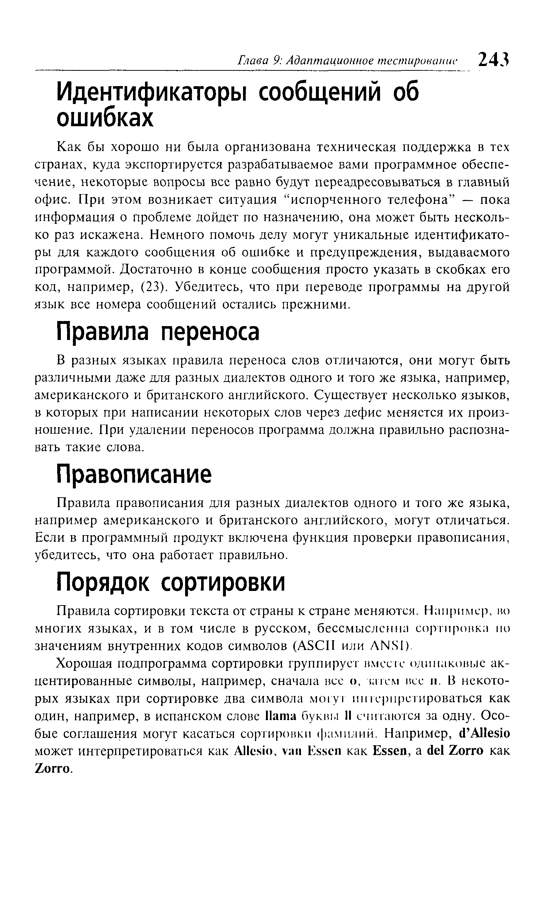

## Преобразование текста к верхнему и нижнему регистру

Только в английском языке для получения прописной буквы из строчной к ее коду достаточно добавить 32. В других языках это не срабатывает. Обратите внимание на ошибки, связанные с преобразованием регистра, особенно распространенные во встроенных функциях поиска и замены текста.

## Правила подчеркивания

В разных странах отличаются и правила подчеркивания. В некоторых из них считается неправильным подчеркивать знаки препинания, пробелы и некоторые другие символы.

## Принтеры

Многие из продаваемых в Европе принтеров точно такие же, как в США. Однако эти рынки различаются, и модели, популярные в одном регионе, могут почти отсутствовать в другом. Существует и ряд принтеров, выпускаемых непосредственно в Европе.

У каждого принтера имеется встроенный набор символов, и большинство из них поддерживают также загружаемые символы. Лазерные и подобные им струйные принтеры в этом отношении являются более гибкими, чем матричные и струйные принтеры, подобные матричным. Если программа должна поддерживать определенный принтер, проверьте, с каким набором символов он продается в интересующем вас регионе. В ROM одной и той же модели устройства могут записываться разные наборы символов в зависимости от того, для какой страны предназначается конкретная партия.

Если принтер не поддерживает необходимую кодовую страницу, как пользователь будет печатать данные? Разумеется, ответить на этот вопрос должны не вы, а руководитель проекта, но ваша обязанность, как тестировщика, поставить перед ним этот вопрос.

## Размеры бумаги

В Европе обычно используют размеры стандарта DIN, особенно A3 и A4. Имейте в виду, что ширина отдельных листов и перфорированных по краям рулонов для этих размеров немного отличается. Поэтому проверьте оба типа бумаги.

## Процессоры и видео

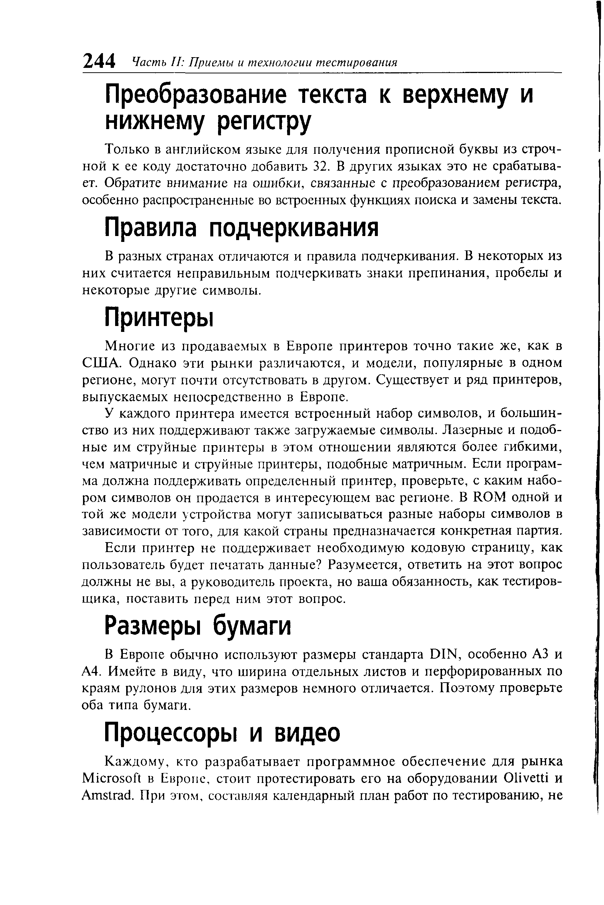

Каждому, кто разрабатывает программное обеспечение для рынка Microsoft в Европе, стоит протестировать его на оборудовании Olivetti и Amstrad. При этом, составляя календарный план работ по тестированию, не

рассчитывайте, что все пройдет гладко с первого раза. Обязательно протестируйте те видеоплаты и видеорежимы, у которых нет хороших американских аналогов.

## Форматы данных и опции настройки

У пользователя должна быть возможность выбрать язык (т.е. русский, а не Pascal) и форматы отображения таких базовых типов данных, как время, дата и денежные суммы. Если все эти установки (или некоторые из них) пользователь делает через операционную систему, программа должна их применять.

* **Формат времени** может быть 12- и 24-часовым, с двоеточиями или иными разделителями. В **датах** могут использоваться как различные разделители (косые, пробелы, дефисы), так и различный порядок чисел, означающих день, месяц и год.
* **Десятичные и порядковые разделители в числах** также меняются от страны к стране. Где одни используют запятые, другие ставят точки и наоборот. В частности, американцы используют в качестве десятичного разделителя точку, а русские запятую. С запятыми связано особенно много ошибок в программном коде. Например, многие подпрограммы автоматически интерпретируют запятую как разделитель элементов списка.
* **Символ #** обычно используется в США для обозначения номера, в то время как в других странах этой цели служат и другие символы, например, очень распространен символ **№**.
* **Отрицательные числа** не во всех странах пишутся со знаком минус. Часто их заключают в скобки, причем на этот счет тоже существуют различные соглашения.
* **Денежные символы** могут записываться перед суммой или после нее, причем это может быть один графический символ или несколько букв (не больше трех).

## Единицы измерения

Хотя американцы предпочитают все измерять в дюймах, в других странах иные правила. Особенна важна поддержка метрической системы (сантиметров), неплохо также встроить в программу поддержку пунктов и пик. Это относится, в частности, к линейкам, диалоговым окнам для ввода линейных параметров, установке размеров сетки и т.п. Любые значения длины, ширины и высоты, которые вычисляются, вводятся или используются для отображения объектов на экране, должны измеряться в удобных для пользователя единицах. И даже если операционная система предлага-

ет выбор метрической системы, возможно, его стоит дополнить или продублировать.

## Изображения, связанные с конкретной культурой

Видеоролики, пиктограммы панелей инструментов, заставки, справочные окна, печатные руководства, упаковки и маркетинговая литература могут содержать изображения, специфические для конкретной культуры. К этому вопросу следует относиться внимательно, поскольку то, что выглядит привлекательно для представителей одной культуры, может оказаться неприемлемым для другой. Кроме того, если изображения связан с определенной культурой, то представителям других стран он может быть непонятен.

## Выходные данные, связанные с конкретной культурой

Жителю другой части планеты вовсе необязательно понравится то, что нравится американцу. Жители разных стран по-разному записывают адреса. Для формата выходных данных, календаря, вида бланка заказа и других подобных вещей могут в каждой стране могут быть свои “стандарты”. Если задуматься, культурой определяются очень многие вещи. И уж во всяком случае европейцу не понравится, если на выходном документе большими буквами будет написано: “Напечатано американской программой!”

## Совместимость с местными продуктами

Не все программное обеспечение разрабатывается в Соединенных Штатах. Если программа импортирует данные из баз данных, электронных таблиц, текстовых процессоров или других систем обработки информации, стоит проверить, имеются ли на том рынке, для которого она предназначается, собственные популярные продукты. Совместима ли с ними ваша локализованная версия?

## Не будьте наивными

То, что программа предназначается для операционной системы Macintosh или Windows, еще не означает, что все проблемы локализации решатся сами собой. Разумеется, эти дружественные операционные системы многое облегчают и решают целый ряд поставленных в этой главе вопросов, но не все и не всегда полностью. Составьте собственный список локализационных требований, независимый от технической документации по конкретному пользовательскому интерфейсу и от спецификации проек-

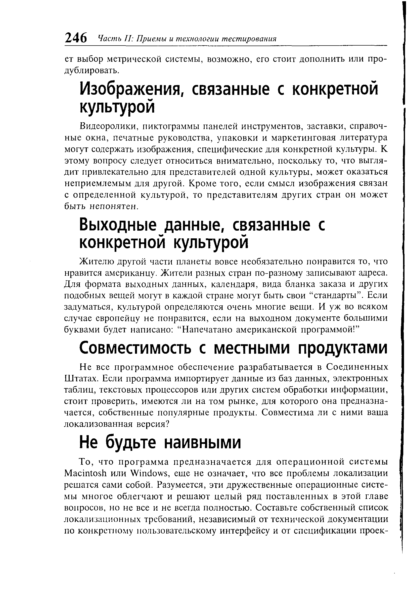

га. Изложенный здесь материал и перечисленная в начале главы дополнительная литература послужат хорошей отправной точкой. Затем самым тщательным образом проверьте программу на соответствие требованиям этого списка. И если что-то не так, обязательно составляйте отчет о проблеме.

## Автоматизированное тестирование

Функции и пользовательский интерфейс локализованной версии программы будут практически такими же, как у исходной версии. Поэтому для нее подойдет большая часть уже готовых тестов, разве что текстовые строки придется поменять. Поэтому у вас наверняка появится искушение с самого начала разработать большое количество автоматизированных регрессионных тестов и применять их для работы со всеми локализованными версиями.

При определенных обстоятельствах такой подход вполне оправдан. Более того, благодаря ему можно гораздо более тщательно протестировать каждую новую версию продукта.

Microsoft рекомендовала (1990) пользоваться программами перехвата и сравнения выходных данных, однако сравнивать только их значимые элементы. Это очень важное ограничение, поскольку текст на экране при переводе программы на другой язык меняется, и если сравнивать его целиком, то программы сравнения постоянно будут выдавать сообщения о расхождениях. Однако все, что не удастся протестировать автоматически, все равно должно быть проверено.

Рекомендуя автоматизировать тестирование, Microsoft добавляет следующие замечания:

* Разработчик тестов должен знать о тестировании и вопросах локализации гораздо больше, чем любой, кто тестирует программу вручную, он должен овладеть всеми тонкостями этого дела.
* Тестовые сценарии сами могут быть источниками ошибок. Поэтому их следует исключительно тщательно отлаживать, прежде чем применять для тестирования локализованной версии программного продукта.

Прежде всего, мы рекомендуем автоматизировать работу по тестированию тех аспектов программы, которые не связаны с пользовательским интерфейсом. Например, можно написать простенькую утилиту для преобразования десятичных точек в десятичные запятые и проверять числовые выходные файлы. Можно автоматически сравнивать сохраняемые и экспортируемые выходные файлы с различными наборами символов. Подумайте, автоматизация каких задач поможет вам значительно сократить время тестирования, особенно если планируется выход локализованных версий продукта для целого ряда стран.

# Глава 10
## Тестирование документации

### Назначение этой главы

Программный продукт — это не только программа. В стоимость большинства продуктов входит документация, упаковка, примеры, а также техническая поддержка (и, возможно, некоторые другие услуги).

Документация, в свою очередь, обычно состоит из руководства пользователя, инструкции по установке, обзорного буклета, README-файла на диске, интерактивной справки и других сведений о том, как пользоваться продуктом. Все это — важные части программного продукта, и все они подлежат обстоятельному тестированию.

### Обзор

В этой главе рассматриваются следующие темы:

* Преимущества хорошей документации.
* Цели тестировщика документации.
* Как тестирование документации повышает надежность программного продукта.
* Распределение персонала.
* Руководство пользователя: стадии разработки.
* Тестирование интерактивной справки.

## Хорошая документация

У хорошо документированного продукта существует ряд преимуществ.

* *Легкость использования.* Если продукт хорошо документирован, им гораздо легче пользоваться. Пользователи его быстрее изучают, делают меньше ошибок, а в результате быстрее и эффективнее выполняют свою работу.
* *Снижение стоимости технической поддержки.* Когда пользователь не может разобраться, как выполнить необходимые ему действия, он звонит производителю продукта. Служба технической поддержки обходится очень дорого. А хорошее руководство помогает пользователям решать возникающие проблемы, и они меньше звонят производителю.
* *Повышение надежности.* Непонятная или неаккуратная документация делает продукт менее надежным, поскольку его пользователи чаще допускают ошибки, а потом им еще и трудно разобраться, в чем причина и как справиться с их последствиями. Особенно важна хорошая документация в тех случаях, когда продукт спроектирован неудачно и отдельные его функции реализованы не самым лучшим образом.
* *Облегчение сопровождения.* Огромное количество денег и времени тратится на анализ проблем, которые оказываются ошибками пользователей. Изменения, вносимые в новые выпуски продуктов зачастую являются просто сменой интерфейса старых функций. Они вносятся для того, чтобы пользователи наконец разобрались, как ими пользоваться, и перестали звонить в службу технической поддержки. Хорошее руководство в значительной степени решает эту проблему, плохое же, наоборот, усложняет ее еще больше.
* *Упрощение установки.* После покупки программного продукта пользователь должен установить его на своем компьютере. Даже если этот процесс полностью автоматизирован, пользователю предстоит ответить на ряд вопросов и принять решения относительно набора и расположения компонентов продукта и настройки его функций.

Обычно установочная утилита пишется в последнюю очередь, причем разработчики относятся к ней менее серьезно, чем к остальным составляющим продукта. Они мотивируют это тем, что пользователю придется устанавливать продукт только однажды (ну, может быть, несколько раз, но уж во всяком случае не каждый день).

Меньше внимания установочным программам уделяется и при их проектировании, и при тестировании. А ведь у пользователя не будет никакого опыта установки продукта, и некоторые вопросы программ мы могут поставить его в тупик. Для компании это опять же будет означать затраты на техническую поддержку. Поэтому четкие и понятные инструкции по установке продукта являются одной из наиболее важных составляющих его документации.

Установка некоторых типов программного обеспечения (таких, например, как телефонные системы) настолько сложна, что пользователи нанимают для этого специалистов. Такие специалисты-установщики работают с очень многими продуктами, и не следует ожидать, что они являются экспертами по каждому из них. Установщик просто обращается к руководству, и при отсутствии четких инструкций ему может быть сложно принять верные решения. Некоторые продавцы вообще отказываются принимать продукты, установка которых обходится им слишком дорого.

Кроме инструкций по установке, программное обеспечение должно сопровождаться и инструкциями по его удалению из системы. В документации также должно поясняться, как изменить параметры настройки, добавить или удалить компоненты продукта и выполнить установку его новой версии поверх предыдущей.

* **Коммерческий успех.** Качество документации является одним из факторов, определяющих коммерческий успех программного продукта. Дилерам, вооруженным хорошей документацией, легче продемонстрировать продукт покупателям и рассказывать о его возможностях. Во многих обзорах программного обеспечения, печатаемых в профессиональной прессе, документации уделяется значительное внимание.
* **Достоверность информации.** В документации не должно быть неверной информации, вводящей пользователей в заблуждение и заставляющей их тратить лишнее время и усилия. Если в документации сказано, что в программе присутствует определенная функция и она работает определенным образом, то так и должно быть.

> *Едва ли суд согласится с утверждением адвоката компании, что не следует принимать документацию всерьез, поскольку этого не делал никто из сотрудников.*

Те сотрудники, которые не понимают важности достоверной рекламы и документации, явно работают не на своем месте.

## Цели тестировщика документации

Читая и анализируя документацию, следует прежде всего уделить внимание ее точности, полноте, ясности, простоте использования и тому, насколько она соответствует духу программного продукта. Вы наверняка найдете проблемы в каждой из этих областей. Поэтому запланируйте многократное тестирование печатного руководства, интерактивной справки и других документов.

Тестировщик, работающий с документацией, отвечает за техническую точность каждого ее слова. Он обязан произвести самую тщательную проверку ее соответствия реальной структуре и поведению программы. И здесь тоже наверняка будет выявлено множество ошибок.

Обращайте внимание на сложные и запутанные места текста. Они могут отражать неудачно спроектированные элементы самой программы. Технический писатель обязан описать продукт таким, каким он является на самом деле. И помочь проблеме может только изменение проекта. Настаивать на таких изменениях важно еще и потому, что в конечном счете они обеспечат не только простоту документирования продукта, но и легкость его использования.

Необходимо проверить, не пропущены ли в документации какие-нибудь функции продукта. Писатели опираются на спецификацию, собственные заметки и слухи.

И хотя разработчики стараются держать технических писателей в курсе дела, они иногда забывают сообщить о новых функциях, только что внесенных в программу. И поскольку тестировщики сталкиваются с этими функциями гораздо раньше технических писателей, стоит позаботиться, чтобы их описания попали в документацию. Кроме того, если определенная функция описана в руководстве, это не значит, что она будет описана на и в интерактивной справке. Вполне вероятно, что их пишут разные люди, и новая информация легко может потеряться.

Однако не забывайте, что вы являетесь тестировщиком, а не техническим писателем. Не стоит думать, что вы знаете, как писать документацию лучше, чем ее авторы. Вы одинаково не имеете права требовать изменений в руководстве, так и в самом проекте. Обязанность тестировщика — выявить проблему, а что с ней делать, решать не вам.

В частности, у тестировщика нет никакого права *требовать* стилистических изменений текста. Можно предложить такие изменения, но технический писатель вправе оставить все как есть, и при этом он не обязан доказывать вам, что поступает правильно. Именно ему, а не вам, платят за принятие решений относительно стиля документации.

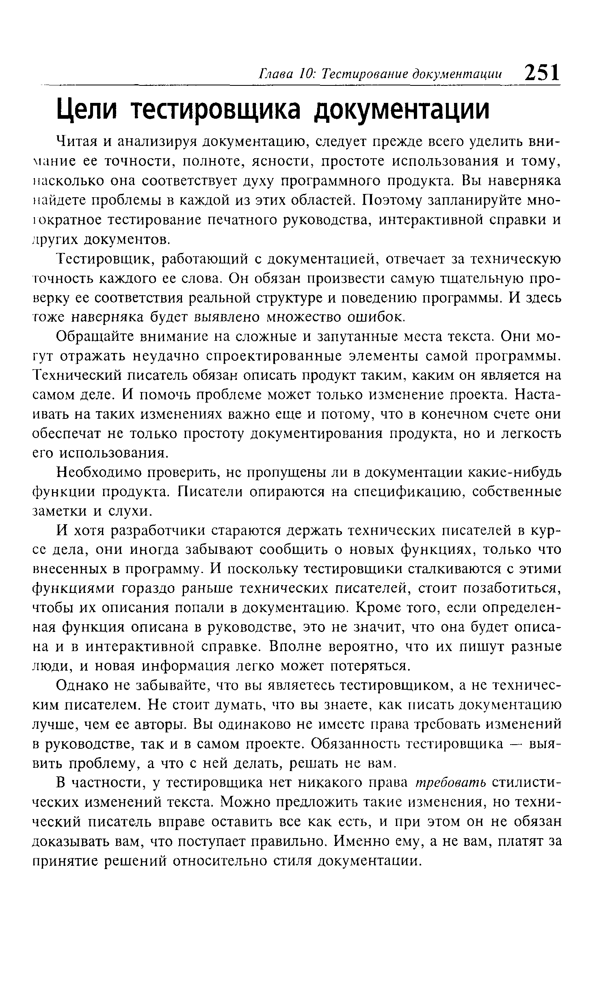

Для взаимодействия с техническими писателями формальная система отслеживания проблем обычно не применяется. Большинство комментариев вносится прямо в копию руководства.

Сохраняйте копии комментариев и проверяйте по ним очередные версии документации. Договоритесь с техническим писателем о том, как будут выделяться в тексте правки и комментарии.

Подумайте, как облегчить вашу совместную работу и какие приемы будут удобны техническому писателю. Если вы вычитываете распечатанный текст, возможно, стоит воспользоваться некоторыми обозначениями, применяемыми профессиональными редакторами. Возможно, стоит попросить технического писателя делать пометки о том, как решаются выявленные проблемы, но только в случае, если они вам действительно полезны.

## Как тестирование документации повышает надежность программного продукта

Многие тестировщики халатно относятся к тестированию документации, считая, что оно отрывает их от “настоящей” работы, заключающейся в тестировании программы. Они очень ошибаются.

* **Вы найдете гораздо больше ошибок, чем предполагаете.** Удивительно, сколько ошибок обнаруживается при тщательном тестировании документации и сверки ее с программой опытным специалистом. Технический писатель видит программу иначе, чем программист или тестировщик, у него своя точка зрения, и потому он нередко выявляет проблемы, которые программисту и тестировщику даже не приходят в голову. Мы столько раз сталкивались с подобными вещами в самых разных проектах, что практически без колебаний можем утверждать, что в ходе тестирования документации будут выявлены очень серьезные ошибки, которых вы не найдете при стандартном тестировании программы.

Не всегда в ходе тестирования документации выявляются серьезные проблемы. Тестировщики, не особенно тщательно выполняющие свою работу, не смогут обнаружить много проблем. Полноценное тестирование руководства обычно требует от одного до трех часов на каждые пять страниц текста. Ускорение этой работы означает снижение ее качества. Об этом следует поставить в известность руководство и при необходимости поднять вопрос о перераспределении и обучении персонала.

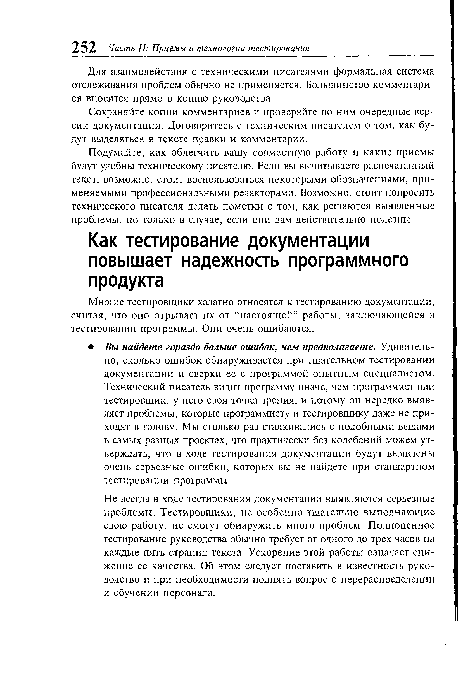

* *Документация является прекрасным источником реальных тестовых примеров.* Не стоит рассчитывать протестировать все возможные комбинации функций и опций продукта — их слишком много. Однако можно протестировать каждую комбинацию, которая описана в документации как интересная или полезная. Если в документации упоминается, что два аспекта программы хорошо работают вместе, обязательно это проверьте.

* *Отчетам об ошибках, выявленных в ходе тестирования документации, уделяется особое внимание.* Руководство представляет собой инструкции компании о том, как использовать программный продукт. И если тестировщик пишет в отчете, что программа сбоит при выполнении инструкций и предложений, записанных в руководстве, никто не скажет, что эта ошибка "неуловима". В данном случае тесты абсолютно просты. Это то, что будут делать очень многие пользователи. И именно о таких ошибках будет злораднее всего объявлять профессиональная пресса. Такие ошибки руководителем проекта отложены не будут. Или изменится программа, или изменится документация, но ситуация обязательно будет исправлена. Нам не раз приходилось сталкиваться с тем, что отложенные ошибки пересматриваются и исправляются после того, как они встретились снова в ходе тестирования документации.

Итак, чтобы протестировать документацию, нужно сесть с ней перед компьютером и выполнить следующее.

* *В точности выполнить все действия, описанные в руководстве.* Каждая указанная в нем клавиша должна быть нажата, каждый пример полностью выполнен.

  Следуя инструкциям, пользователи допускают ошибки. Поэтому работайте "слегка неаккуратно", чтобы посмотреть, как реагирует на это программа. Вопрос о плохой обработке ошибок встанет гораздо серьезнее, если окажется, что программа недопустимым образом реагирует на обычные допускаемые очень многими людьми ошибки, особенно когда они пытаются следовать руководству.

* *Следуйте каждому предложению,* даже если оно сформулировано лишь в общих чертах. Ведь и пользователи попытаются ему последовать.

* *Проверяйте каждое утверждение и каждое его очевидное следствие.* Поскольку руководство в определенном смысле представляет собой окончательную версию спецификации программы, пользователь в первую очередь именно по нему будет проверять, правильно ли она работает.

Привлекая к работе над проектом нового тестировщика, предложите ему для начала протестировать документацию. Это принесет двойную пользу: в документации будут отражены все текущие изменения программы, а новый сотрудник сможет с ней быстро и обстоятельно познакомиться.

## Назначьте технического редактора

Лучше всего, если один из сотрудников группы тестирования будет назначен техническим редактором документации. Этот сотрудник может выполнять и другую работу, но главной его задачей должен быть анализ документации, даже если ее прорабатывают и другие тестировщики.

Часто бывает, что, хотя над продуктом работают несколько человек, никто из них не несет полной ответственности за его качество. В результате продукт не только не выигрывает оттого, что его проверяет большее количество людей, но еще и проигрывает, поскольку каждый подсознательно перекладывает ответственность на другого и ожидает, что ту или иную часть работы выполнят его коллеги (Деминг (Deming, 1982)). Эту проблему и решает назначение редактора, несущего полную ответственность за качество и точность технической документации.

## Работа с руководством в процессе его разработки

Хорошее описание компонентов руководства пользователя можно найти у Мак-Джеи (McGehee, 1984).

Руководство разрабатывается поэтапно. Этот процесс включает следующие основные стадии:

* **Разработка концепции и базовой структуры.** Технический писатель определяет масштаб книги, ее аудиторию, решает, насколько подробно должен быть изложен материал и как он будет организован.
* **Подготовка.** Руководство пишется, анализируется, перерабатывается и т.д. Оно находится на стадии подготовки до тех пор, пока не будет полностью завершено.
* **Производство.** На этом этапе принимаются решения, связанные с подготовкой книги к печати. Подбираются шрифты, параметры страницы, общее оформление и т.п.
* **Публикация.** В завершение руководство печатается и переплетается.

Основные усилия тестировщиков сосредотачиваются на подготовке руководства. Проектированием руководства и его оформлением при подготовке к печати занимаются соответствующие специалисты. То же самое

касается и публикации: автор сам проверяет, все ли страницы на месте, не распечатаны ли они вверх ногами и т.п. Подробнейшее обсуждение процесса разработки и редактирования документации можно найти у таких авторов, как Брокман (Brockmann, 1990), Хастингс и Кинг (Hastings and King, 1986) и Прайс (Price, 1984).

В ходе работы над проектом направление усилий тестировщика документации меняется. В один период технический писатель более охотно работает над точностью изложенной информации, в другой — над стилем, в третий — над организацией руководства. В следующих разделах рассказывается о значении и уместности различных типов комментариев тестировщика в разные периоды разработки документации. Однако все сказанное относится к "типичному" техническому писателю. Поскольку все люди очень разные, обязательно поговорите с тем человеком, с которым придется работать вам, и расспросите его о его личных предпочтениях, нуждах и планах.

### Первый черновик

С первым черновиком руководства вам не часто придется знакомиться. Даже у самых лучших технических писателей первый черновик обычно выглядит не слишком презентабельно, и они его неохотно показывают другим. Скорее к нему можно относиться как к личным заметкам технического писателя. На первом черновике автор экспериментирует, не особенно тщательно прорабатывая его содержание. В нем может быть множество ошибок, как синтаксических, так и фактических, и написан он может быть явно плохо.

Возможна, однако, ситуация, когда вас только что назначили на проект, вы не знаете, как должна работать программа, а спецификацию достать не удается. В этом случае можно попросить технического писателя дать вам хоть какую-нибудь документацию, даже если это пока еще только наброски, и, может быть, он согласится. В этом случае важно понимать, что это еще не документ, а именно наброски, предназначенные только для личного использования. Если технический писатель доверил их вам, то никакая критика в их адрес с вашей стороны неуместна и недопустима.

Однако некоторые комментарии могут быть техническому писателю полезны. Если в тексте содержится явная ошибка, если вам кажется, что технический писатель просто чего-либо не понимает, поделитесь с ним своими знаниями. Однако облеките свои слова в форму обсуждения и совместного изучения продукта, а отнюдь не критики или комментариев. И уж во всяком случае недопустимы комментарии относительно стиля, структуры или организации руководства, если только вас об этом явно не попросили. И даже в этом случае постарайтесь говорить как можно тактичнее.

## Второй черновик

На самом деле это может быть уже двадцать второй черновик — речь идет о первой версии руководства, которая будет передана вам для тестирования. Кроме вас, с ней познакомятся программист и руководитель проекта. Пользователи ее не увидят, разве что те из них, которые официально принимают участие в тестировании продукта. На этом этапе вам предстоит следующая работа.

* *Проанализируйте структуру документа* и как можно раньше составьте свои комментарии. Если вам не нравится порядок глав, если вы думаете, что материал нескольких из них лучше объединить в одну главу или, наоборот, разбить одну главу на несколько, скажите об этом пораньше. С предложениями о перестановке глав можно немного подождать, но слишком затягивать тоже не стоит. Чем дальше, тем труднее будет автору менять структуру книги.

В некоторых группах документирования еще до написания первой строки руководства практикуется совместное обсуждение его плана. В хороший план включены названия всех глав и всех составляющих их разделов. В нем приведено приблизительное количество страниц каждого раздела, причем разделы длиной более 10 страниц обычно разбиты на подразделы. На такое совещание могут пригласить и представителя группы тестирования — для вас это лучшая возможность внести структурные предложения.

Если вам кажется, что какой-либо из аспектов программы очень сложен и требует обстоятельного пояснения, а в плане ему отведено явно мало страниц, спросите почему. Вполне возможно, что технический писатель еще просто недостаточно продумал этот вопрос или мало с ним знаком. Поясните его сложность в деловой и доброжелательной манере, ни в коем случае не допуская критических или саркастических замечаний. Обоснованный и убедительный рассказ о сложности одной из функций программы может принести проекту и дополнительную пользу: выслушав его, руководитель проекта может решить пересмотреть спецификацию и реализовать неудачную функцию более просто и удобно, в лучшем соответствии с общей идеей проекта.

* *Выполните общий анализ руководства.* Прочитайте руководство, обращая внимание на его точность, понятность, полезность и полноту. Не стесняйтесь записывать такие, например, комментарии: “Чтобы понять этот раздел, мне пришлось трижды его прочесть”. Даже если вы не можете объяснить, в чем сложность, все равно техническому писателю важно знать, что внимательный читатель испытывал затруднения при прочтении данного раздела.

* *Подумайте, какие еще вопросы требуют отдельного освещения.* Возможно, в руководстве не описаны некоторые важные функции или особенности продукта. Технический писатель может о них просто не знать, особенно если они только что появились.

* *Проанализируйте руководство на соответствие концепции продукта.* Технический писатель может не понять простых концептуальных связей между функциями продукта и описать каждую из них независимо. При этом могут быть потеряны важные и тщательно продуманные идеи, заложенные в программу разработчиками. Очень важно, чтобы пользователь, читающий руководство, смог увидеть продукт в его концептуальной целостности.

В руководстве может просматриваться неестественность некоторых ограничений программы. В этом случае сообщите об этом разработчикам — вполне возможно, что они пересмотрят проект и упростят интерфейс.

Стратегии, предлагаемые руководством для решения некоторых задач, могут быть неэффективными. Это не значит, что они вообще не работают, но опытный и хорошо знающий продукт пользователь выбрал бы лучший способ их решения. Технический писатель мог не до конца понимать продукт, а возможно, лучшее решение просто не пришло ему в голову. Такие фрагменты руководства с неэффективными инструкциями лучше переписать как можно раньше, даже если они достаточно велики. Технический писатель должен понимать важность подобных изменений.

* *Поищите неточности.* Некоторые примеры или описания могут быть вполне верными, но написанными так, что читатель может неверно их истолковать или необоснованно обобщить. Он может предположить, что функции или возможности программы шире, чем это есть на самом деле, или распространить на всю программу некоторое утверждение, касающееся только очень конкретной ситуации. Возможно и обратное, когда читатель решит, что в программе имеются ограничения, которых на самом деле нет.

Выявить подобные неточности лучше как можно раньше, поскольку они могут означать, что технический писатель и сам неверно понимает продукт, и делает необоснованные обобщения. Лучше поняв программу, технический писатель может внести в руководство значительные изменения.

* *Проверьте сообщения об ошибках.* Скоре всего, технический писатель включил в приложение список сообщений об ошибках с помо

нениями того, почему читатель получил такое сообщение и что ему теперь делать. Если у вас есть собственный список ситуаций, в которых вы получали каждое сообщение об ошибке, он может оказать техническому писателю неоценимую помощь. Технический писатель будет основывать свои пояснения и инструкции на той информации, которую предоставите ему вы, руководитель проекта и сотрудники группы технической поддержки. Для последних исключительно важно, чтобы эти объяснения были как можно более исчерпывающими, чтобы пользователи поменьше донимали их звонками. Поэтому обязательно протестируйте каждое сообщение и соответствующие инструкции — вы наверняка найдете здесь приличное количество ошибок. Если в ходе тестирования выяснится что-нибудь полезное, например, дополнительное значение сообщения, новые ситуации, в которых оно появляется, или новая информация о том, как пользователю избегать подобных ситуаций или исправлять их последствия, то обязательно сообщите об этом техническому писателю, чтобы он дополнил руководство.

- *Поищите фрагменты руководства, отражающие неудачную конструкцию программы*. Если технический писатель не смог достаточно просто и понятно описать какой-либо аспект работы программы, не спишите его осуждать. Возможно, все дело в самой программе. Например, в ней может быть неудачный набор опций, сбивающих пользователя с толку и противоречащих друг другу. Трудно ожидать, что их описание будет понятным. В этом случае проблема адресуется не техническому писателю, а руководителю проекта — о ней необходимо составить отчет как об ошибке проектирования. Если же дело все же в руководстве и вы можете предложить простое и четкое описание группы опций или возможностей, сделайте это. Однако не стоит тратить часы на переписывание разделов руководства — это работа технического писателя, свой же вариант стоит предложить тогда, когда он кажется вам очень удачным и это не занимает у вас слишком много времени.

<div style="border: 1px solid black; padding: 10px; margin: 10px 0;">
*Встретив непоследовательное объяснение, проще всего обвинить автора документации. Но помните, что автор может просто аккуратно описать неудачную функцию программы. Поэтому лучше начать с предположения, что технический писатель компетентен и плохой текст указывает на недостатки самой программы.*
</div>

## Пересмотренные версии руководства

С новыми версиями руководства следует поработать так же, как и с первой, — с акцентом на его точности и эффективности. Поскольку вы будете узнавать об изменениях в программе задолго до технического писателя, сообщайте ему об этом в своих комментариях.

Пересмотренных версий руководства может быть достаточно много. В одной из них автор наведёт красоту, подправит стиль и внесет последние организационные изменения. Вам же не стоит обращать внимание на подобные вещи — гораздо важнее сконцентрироваться на точности руководства и его соответствяи концепции продукта. Придет время, и технический писатель сам исправит все неаккуратности, неловкие фразы и т.п.

## Бета-версия руководства

Это будет последняя версия руководства, которую вы увидите. (Точнее, вы прочтете ее еще раз после внесения последних изменений, предложенных после бета-тестирования.) В тех компаниях, которые не организуют бета-тестирования, последней тестировщикам поступает версия руководства, написанная после запрещения дальнейших изменений пользовательского интерфейса.

Бета-тестировщики не работают в вашей компании. Они, скорее, пользователи, эксплуатирующие продукт так, как будто купили его окончательный выпуск. В их отчетах отражаются трудности, с которыми они столкнулись в процессе эксплуатации, предложения по улучшению продукта и конечно же найденные ошибки. Эти отчеты обязательно следует проанализировать самым тщательным образом, чтобы внести изменения как в программу, так и в документацию.

До этого момента и вы, и программисты, и технические писатели, и сотрудники группы маркетинга только *предполагали*, как пользователи отреагируют на продукт и как они его поймут. Некоторые из этих предположений окажутся неверными. Отдельные аспекты программы, казавшиеся разработчикам такими естественными и понятными, пользователи не поймут или не примут. Значительная часть изменений вносится в руководство именно после бета-тестирования, когда становится известно, что же на самом деле оказалось непонятным пользователям.

Пользователи часто жалуются, что документация не является задачно-ориентированной. (Cop (Sohr, 1983); Шнейдерман (Schneiderman, 1987).) В *задачно-ориентированном руководстве* перечисляется набор задач, которые можно выполнить с помощью программного продукта, и рассказывается, как это сделать. Все функции программы описываются с точки зрения их применения для конкретных практических целей. В противоположность

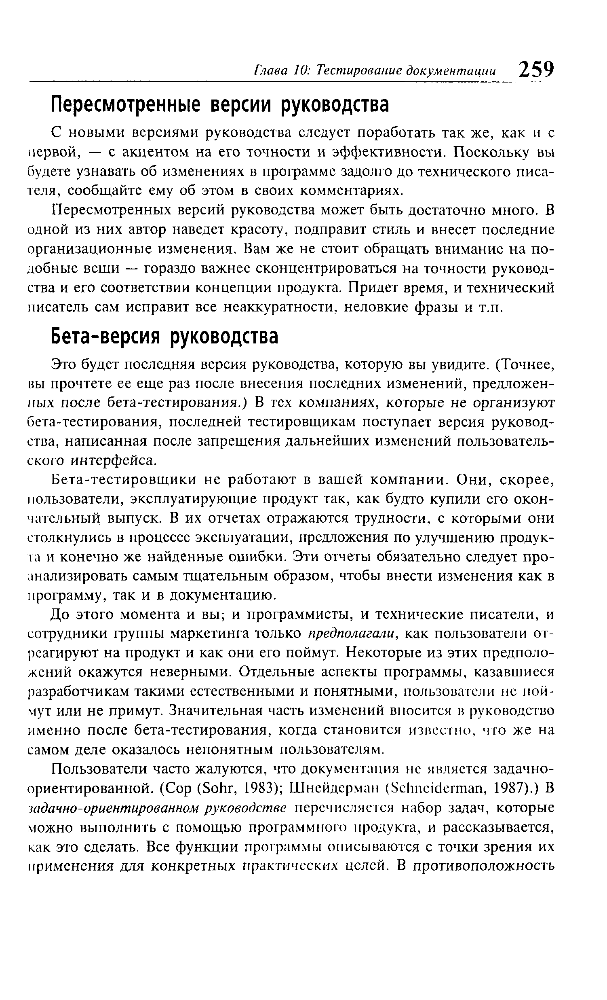

этому в функционально-ориентированном руководстве функции программы описываются сами по себе, нередко просто в алфавитном порядке. Каждый аспект продукта описывается в отдельном разделе и как можно более полно. Брокман (Brockmann, 1990) полагает, что, хотя задачно-ориентированное руководство гораздо длиннее, оно и значительно эффективнее.

Если продукт настолько многофункционален, что с его помощью можно выполнять тысячи различных заданий, писать задачно-ориентированное руководство нет никакого смысла — автор его просто никогда не закончит. Одно это еще не означает, что руководство по такому продукту должно быть полностью функционально-ориентированным. На практике чаще всего принимается компромиссное решение, когда в руководство, базирующееся на описании функций продукта, включаются инструкции по решению ряда наиболее важных или популярных задач. Познакомившись с отзывами бета-тестировщиков, технический писатель может добавить в руководство дополнительные примеры и иллюстрации, предметные указатели или изменить его организацию.

Пользователи высказывают в адрес документации и много других замечаний. Однако тестировщику важно сохранять правильную позицию в отношении этой критики, понимая, что настоящая причина проблем может быть вовсе не в руководстве, а в неудачном интерфейсе или функциональной структуре самого продукта.

## Производство

> *Главной целью тестировщика документации в процессе ее производства является точность информации.*

В группе тестирования обязательно имеется сотрудник, отвечающий за литературное редактирование и верстку документации. Разумеется, если вы заметите орфографическую ошибку или сдвинутый заголовок, вас только поблагодарят, но, вообще, это не ваша работа.

> *Если продукт должен быть выпущен сразу по завершении разработки и тестирования программного обеспечения, производство документации необходимо начать как минимум за 8 (а лучше за 14) недель до окончания работ.*

В течение всех этих недель программа будет изменяться. Из-за этого некоторые разделы руководства придется удалять или переписывать. Кроме того, некоторые ошибки, которые предполагалось исправить, могут

остаться неисправленными, и это тоже повлечет за собой переделку соответствующих фрагментов руководства.

Важно понимать, что все желаемые изменения внесены быть не могут. Часто автор будет ограничиваться лишь минимальными правками — только чтобы сохранить достоверность информации, но не больше. Если хотите, чтобы в документацию были внесены дополнительные изменения, можете помочь техническому писателю сократить их стоимость, самостоятельно продумав текст соответствующего фрагмента.

С того момента, как руководство поступает в производство, это уже не просто организованный набор слов. Теперь это набор страниц, каждая из которых представляет собой отдельный объект, с собственным оформлением, содержанием, возможно, иллюстрациями. На этом этапе изменения текста обходятся очень дорого, и едва ли автор согласится на корректировки, затрагивающие более одной страницы.

С другой стороны, изменения, затрагивающие только одну строку или абзац, пока еще внести несложно. Поэтому, если изменения совершенно необходимы, продумайте, как свести их к минимуму и подобрать такие формулировки, которые не изменят размера корректируемой строки или абзаца.

Формально продумывание формулировок не входит в ваши обязанности. Ваше дело — передать техническому писателю записку с описанием проблемы, и он сам должен решить, вносить ли изменения в текущий выпуск руководства, и если да, то какие именно. Руководитель может даже попросить вас ограничиться этими своими обязанностями и не тратить лишнего времени. Но поскольку жизненные ситуации не укладываются в формальные рамки, в отдельных случаях вы вполне можете поучаствовать в продумывании необходимых изменений, особенно если они очень важны и не займут у вас слишком много времени.

Еще одним важным объектом вашего внимания будет предметный указатель книги. И начать с ним работать лучше как можно раньше. Читая руководство, обращайте внимание на описываемые в нем ключевые понятия и проверяйте, включены ли они в указатель. Если нет, сообщайте об этом техническому писателю.

Завершающая проверка указателя выполняется после завершения работы над текстом книги и подготовки ее к печати. Эта работа поручается либо тестировщику, либо одному из редакторов. Вполне может оказаться, что в окончательной версии предметного указателя отсутствуют ссылки на какую-либо одну главу или они основываются на ее предыдущей версии. Поэтому как минимум необходимо проверить по две записи указателя на каждые пять страниц книги. (Это значит, что можно проверить два элемен-

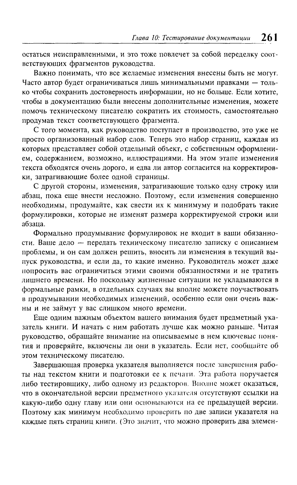

та индекса со ссылками на страницы 1–5, два со ссылками на страницы 5–10 и т.д.)

## Постпроизводственная стадия

В некоторых компаниях руководство не печатается до тех пор, пока не будет завершена работа над программным обеспечением. В таких случаях постпроизводственная стадия тестирования просто отсутствует. (У технических писателей еще остается кое-какая работа, например, они вычитывают первый распечатанный экземпляр книги, но тестировщики этим не занимаются.)

Если компания отправляет руководство в печать еще до завершения работы над программным обеспечением, в обязанности технического писателя может входить составление и еще двух документов. Первый из них, печатное приложение, состоит из поправок, советов по разрешению проблем и описаний дополнительных функций продукта. Этот документ отправляется в печать за несколько дней до того, как начнется размножение дисков. Информация, которая появится в течение этих нескольких дней, в него не попадет и будет помещена прямо на дистрибутивный диск в виде файла README.

Кроме проверки точности информации приложения и README-файла, вашей работой на этой стадии будет подбор советов по решению проблем. Потенциальным кандидатом для этого является любая отложенная ошибка. Если ее можно описать в позитивном тоне и посоветовать пользователю что-нибудь полезное, следует включить это описание в раздел разрешения проблем.

## Интерактивная справка

Большая часть того, что рассказывалось в этой главе о руководстве пользователя, применимо и к интерактивной справке. Сказанное можно дополнить лишь несколькими замечаниями.

* **Точность.** Точность и достоверность интерактивной справки необходимо проверить так же тщательно, как и точность руководства. Как правило, текст справочных файлов не блещет литературными достоинствами, не слишком хорошо продуман и протестирован и не особенно уважается пользователями.
* **Библиография.** Автором лучшей книги, которую нам приходилось читать об интерактивной справке, является Хортон (Horton, 1990).
* **Гипертекстовые связи.** Если в интерактивной справке имеются гиперссылки, все их необходимо проверить. Может оказаться, что одна

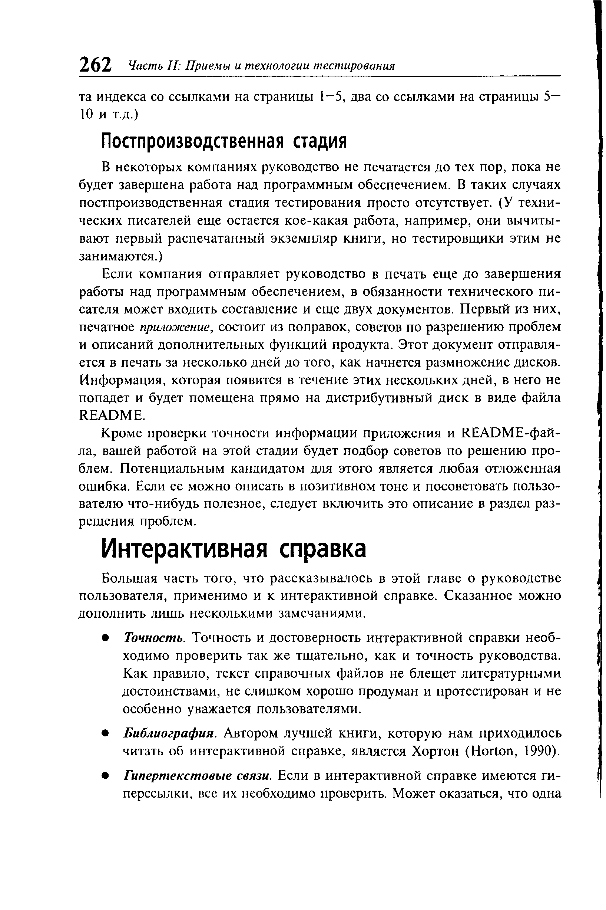

и та же ссылка в нескольких местах справки указывает на разные страницы или же просто содержимое страницы, на которую указывает ссылка, не соответствует ее названию.

* **Указатель.** Если в интерактивной справке имеются содержание и указатель, их тоже необходимо проверить. Каждая строчка указателя должна открывать правильную страницу справки.
* **Еще об указателе.** Кроме элементарной правильности указателя, важно проверить и его содержание. Имеются ли в нем ссылки на каждую страницу справки? Не пропущены ли важные понятия или вопросы? Удачно ли подобраны названия элементов указателя? Если пользователь не сможет найти нужную информацию, едва ли он захочет в дальнейшем пользоваться такой справкой.
* **Стиль.** Мало кто из пользователей последовательно читает всю справку от начала до конца. Как правило, к ней обращаются за ответом на конкретный вопрос, за инструкциями по решению некоторой задачи или информацией о полученном сообщении об ошибке. В такой ситуации читатель справки обычно нетерпелив или даже нервничает или раздражен. Поэтому от справки требуется большая четкость и простота изложения, чем от печатного руководства. (Желательно, чтобы уровень читабельности текста был около 5.) Кроме того, хорошая справка должна быть задачно-ориентированной, пользователь ожидает найти в ней нечто полезное, что он сразу же сможет выполнить. Встретив запутанный или сложный текст, сообщите о нем как о проблеме.

# Глава 11

# Инструментальные средства тестировщика

## Назначение этой главы

Теперь читателю предстоит познакомиться с программными средствами, автоматизирующими процедуру тестирования "черного ящика", узнать, чем они могут быть полезны и каковы пределы их возможностей. Речь пойдет не о конкретных программах, а о классах подобных средств.

## Библиография

В поиске подходящих программных средств могут помочь два известных каталога: Testing Tools Reference Guide: A catalog of Software Quality Support Tools, публикуемый Software Quality Engineering (800-423-8378, 3000-2 Hartley Road, Jacksonville, FL 32257) и Programmer's Shop (800-421-8006, 90 Industrial Park Road, Hingham, MA 02043).

Немало полезной информации можно почерпнуть из книг таких авторов, как Гласс (Glass, 1992), Бейзер (Beizer, 1990), Андриоле (Andriole, 1986), Данн (Dunn, 1984) и Де Милло (DeMillo, 1981). Обзорные статьи и описания конкретных программных средств печатаются во многих журналах. К ним нередко прилагаются CD с описываемыми программами и их последними версиями.

## Обзор

В этой главе обсуждаются следующие вопросы:
* Базовые инструменты тестировщика.
* Автоматизация приемочного и регрессионного тестирования.
* Технологии и инструменты тестирования соответствия стандартам.
* Средства для тестирования "стеклянного ящика".

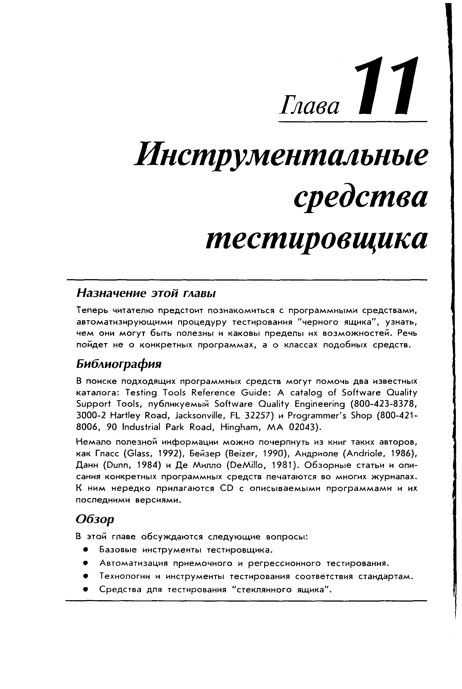

# Базовые инструменты тестировщика

Вот каковы основные инструменты тестировщика:

* *Персональный компьютер, терминал или рабочая станция.* Никогда не пренебрегайте помощью компьютера — обращайтесь к нему каждый раз, когда в этом возникает потребность.

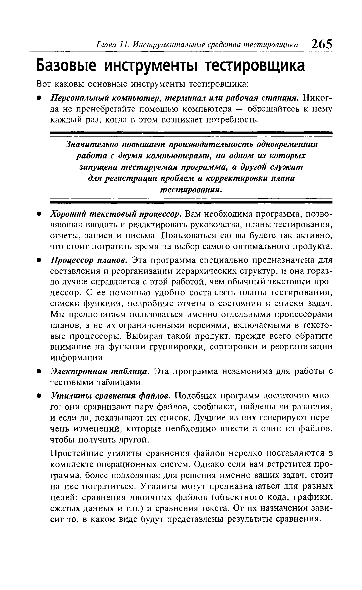

* *Хороший текстовый процессор.* Вам необходима программа, позволяющая вводить и редактировать руководства, планы тестирования, отчеты, записи и письма. Пользоваться ею вы будете так активно, что стоит потратить время на выбор самого оптимального продукта.
* *Процессор планов.* Эта программа специально предназначена для составления и реорганизации иерархических структур, и она гораздо лучше справляется с этой работой, чем обычный текстовый процессор. С ее помощью удобно составлять планы тестирования, списки функций, подробные отчеты о состоянии и списки задач. Мы предпочитаем пользоваться именно отдельными процессорами планов, а не их ограниченными версиями, включаемыми в текстовые процессоры. Выбирая такой продукт, прежде всего обратите внимание на функции группировки, сортировки и реорганизации информации.
* *Электронная таблица.* Эта программа незаменима для работы с тестовыми таблицами.
* *Утилиты сравнения файлов.* Подобных программ достаточно много: они сравнивают пару файлов, сообщают, найдены ли различия, и если да, показывают их список. Лучшие из них генерируют перечень изменений, которые необходимо внести в один из файлов, чтобы получить другой.

Простейшие утилиты сравнения файлов нередко поставляются в комплекте операционных систем. Однако если вам встретится программа, более подходящая для решения именно ваших задач, стоит на нее потратиться. Утилиты могут предназначаться для разных целей: сравнения двоичных файлов (объектного кода, графики, сжатых данных и т.п.) и сравнения текста. От их назначения зависит то, в каком виде будут представлены результаты сравнения.

* **Просмотровщики файлов.** Такие программы позволяют просматривать данные, хранящиеся в файлах самых разнообразных форматов.
* **Конвертеры файлов.** Эти утилиты преобразовывают файлы данных (текстовые, графические и т.п.) из одного формата в другой. Например, текст может быть преобразован из формата одного текстового процессора в формат другого.
* **Утилиты для создания копий экрана.** Эти утилиты позволяют сохранить содержимое экрана или текущего окна в файле на диске. Возможно, вам понадобится даже несколько таких программ, поскольку некоторые из них несовместимы с отдельными типами программного обеспечения. Копии экрана полезны как для анализа ошибок и поиска их источника, так и для того, чтобы показать ошибку программисту. Нередко проще предоставить ему копию экрана, чем описывать его содержимое на словах.
* **Утилиты для поиска текста.** С помощью такой утилиты можно найти в объектном коде программы текстовые строки. Простейшие из них просто прочесывают программный файл и записывают в отдельном текстовом файле все содержащиеся в нем строки ASCII. В результате получается список всего встроенного в программу текста и сообщений об ошибках. Возможно, программист или руководитель проекта будет убеждать вас, что не стоит тратить времени на подобную работу, поскольку весь текст хранится в файлах ресурсов. Однако это утверждение не мешает проверить, поскольку программист может же вставить в программу парочку коротких сообщений, особенно о критических ошибках.
* **Устройства видеозаписи (VCR).** Весь вывод на экран можно записать на видеопленку. Для этого нужен обычный видеомагнитофон и специальная видеоплата с соответствующим выходом. (Имейте в виду, что платы NTSC не сохраняют на ленте весь экран VGA.) Для тестирования неустойчивых программ с трудноуловимыми ошибками записывающие устройства просто незаменимы. Они невероятно облегчают поиск и воспроизведение ошибок, а если ошибку невозможно воспроизвести, видеозапись подтверждает, что она все же произошла, и сохраняет точную хронологию событий. Обычно этого достаточно, чтобы программист мог проанализировать ситуацию и выявить причину сбоя.

Однако, несмотря на всю полезность этого инструмента, его применения может стать для тестировщика сущим бедствием. В восторге от таких возможностей, руководитель проекта может требовать, чтобы видеозапись прилагалась к каждой выявленной ошибке, а это уже серьезно затормозит вашу работу. Поэтому придерживайтесь золотой

середины, применяя это, без сомнения, эффективное средство только там, где оно действительно необходимо.

- *Диагностические программы.* Существует ряд утилит, анализирующих аппаратное и программное обеспечение системы. Они помогут вам выяснить, какие в вашем распоряжении имеются устройства, все ли с ними в порядке и как они работают. В частности, с их помощью можно найти и исключить из использования поврежденные участки жесткого диска или определить, работает ли видеоплата в режиме, позволяющем осуществлять видеозапись работы. Можно также сохранять информацию о состоянии оперативной памяти в момент сбоя — в определенных случаях эта информация может быть очень полезна программисту. Он скажет вам, какой утилитой лучше всего для этого воспользоваться, и предоставит ее в случае необходимости.
- *Таймер.* Иногда необходимо определить длительность какой-либо операции, возможно в десятых или сотых секунды. Для этого прекрасно подойдет программный таймер. Отдельные устройства вроде наручных часов менее удобны, и с их помощью нельзя работать с очень маленькими временными интервалами. Чаще всего измерения времени необходимы при тестировании тайм-аутов, условий гонок, а также задержек реакции системы на действия пользователя и выполнения относительно длительной обработки данных.
- *Система отслеживания проблем.* Это настолько важная тема, что она обсуждалась в отдельной главе.
- *Программист.* Если вам не удается воспроизвести ошибку, вы не знаете, каковы граничные условия процесса или не понимаете, как тестировать какую-либо функцию программы, обращайтесь к программисту. Ложная гордость в этом вопросе совершенно неуместна, вы не можете всегда и на все знать точные ответы. Однако всегда критически анализируйте слова программиста, поскольку сознательно или ненамеренно он может ввести вас в заблуждение. Впрочем, это крайний случай. В основном же программист может сэкономить вам часы и дни работы, либо сразу определив источник проблемы, либо написав специальный диагностический код, либо просто разъяснив некоторые особенности программы и посоветовав, как или какими средствами ее можно эффективнее протестировать.

## Автоматизация приемочного и регрессионного тестирования

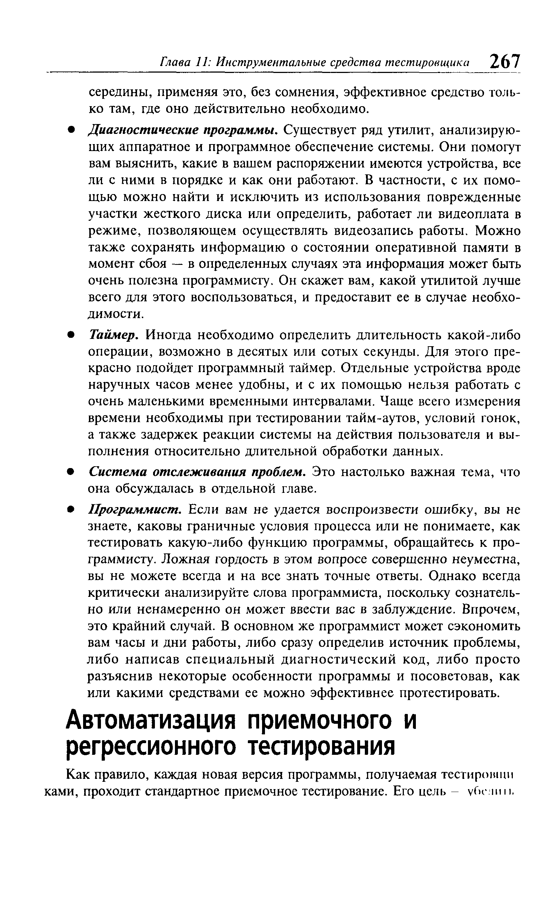

Как правило, каждая новая версия программы, получаемая тестировщиками, проходит стандартное приемочное тестирование. Его цель — убедиться...

ся, что в программе не появилось серьезных проблем и все ее базовые функции успешно работают. Обычно на такое тестирование уходит не более одного дня. В соответствующий набор тестов включаются только базовые и быстровыполнимые примеры, проверка всех возможных граничных условий сюда не входит. В некоторых коллективах практикуется распространение набора приемочных тестов не только среди тестировщиков, но и среди остального заинтересованного персонала. В частности, при необходимости руководитель проекта может лично убедиться, что состояние очередной версии программы удовлетворяет базовым приемочным требованиям.

* В некоторых компаниях программа, не прошедшая приемочного тестирования, вообще не принимается тестировщиками и возвращается обратно программистам на доработку. Особенно часто так бывает на более поздних стадиях разработки, когда программа уже не раз проходила приемочное тестирование, и вдруг очередная версия его не прошла. Обычно это означает, что в процессе корректировки исходного кода или его компиляции программистами была допущена грубая ошибка, которая, однако, легко может быть исправлена.
* Существует и иная практика, когда приемочное тестирование применяется для выявления самых очевидных ошибок очередной версии программы. После выполнения этих тестов становиться очевидно, на какие части программы следует обратить особое внимание, а какие, наоборот, оставить пока в покое, если группа тестирования еще не готова взяться за них со всей серьезностью.
* Приемочное тестирование — процедура довольно утомительная и скучная и к тому же занимает много времени. Поэтому независимо от того, насколько велика разрабатываемая программа, для него назначается относительно небольшое количество тестов. В противном случае оно слишком дорого обходится.

Регрессионное тестирование выполняется после каждого изменения программы. Если программа прошла определенную группу тестов в прошлый раз, то, скорее всего, пройдет и в этот. Однако провести их все равно придется — это неотъемлемая часть общего процесса тестирования.

Итак, и приемочные, и регрессионные наборы тестов выполняются по многу раз — они так и просятся, чтобы их автоматизировали. Это вполне возможно. Задача состоит в том, чтобы объяснить компьютеру, как выполнить тест, собрать результаты, сравнить их с заранее известными правильными результатами и сообщить вам, чем все кончилось. В этой главе главным образом рассматривается автоматизация регрессионного тестирования, но все сказанное в равной мере справедливо и для приемочного.

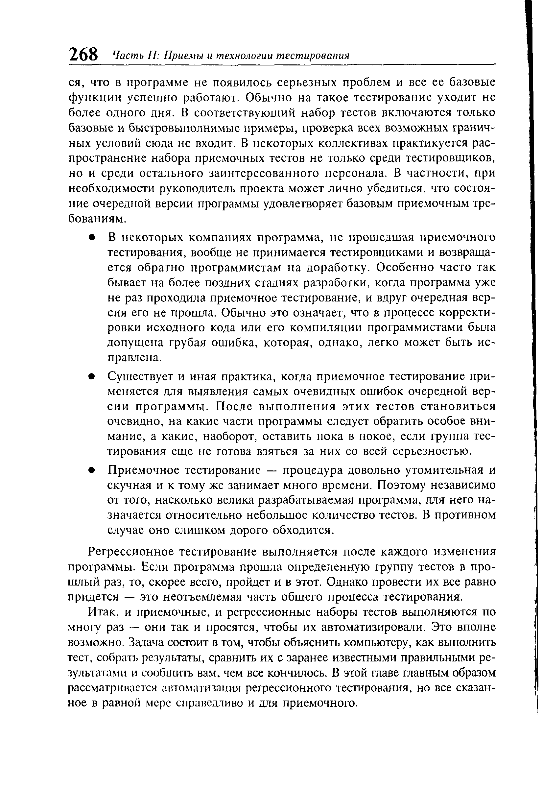

Несколько ранее, в главе 11, рассказывалось об автоматизации тестирования печати. Ряд приводившихся в ней соображений можно распространить и на автоматизацию процесса тестирования в целом.

## Откуда берутся регрессионные тесты

Когда программист исправляет ошибку, существует определенная вероятность, что он исправит не то, что нужно, или допустит новую ошибку, нарушит что-то, что уже работало. Поэтому после каждого такого исправления (или группы исправлений), необходимо, во-первых, проверить, решена ли та проблема, из-за которой вносились исправления, а во-вторых, проверить целостность всей программы.

* *Тесты для граничных условий и другие заранее запланированные тесты*. Среди всех тестов, перечисленных в вашем рабочем плане, необходимо выбрать те, которые с наибольшей вероятностью выявят возможные ошибки.
* *Тесты, уже однажды выявившие ошибку*. То, что однажды починили, нередко ломается снова. Так происходит потому, что в то месте, где в программу внесено исправление, ее код часто выглядит непонятным, непоследовательным или неловким. А если исправления в программу вносил один программист, а продолжает ее доработку другой, то существует большая вероятность того, что исправленный фрагмент будет неверно понят и повторно исправлен.
* *Ошибки, выявленные пользователями*. Ошибки, о которых сообщают пользователи, группа технической поддержки и другой персонал, не входящий в группу тестирования, указывают на дыры в плане работ вашей группы. В некоторых группах тестирования принято добавлять в тестовые планы регрессионные тесты для каждой такой ошибки.
* *Наборы тестовых данных, сгенерированных методами случайного подбора*. Об использовании генератора случайных чисел уже рассказывалось в главе 7 при обсуждении тестирования функциональной эквивалентности. Хотя случайные данные не заменят граничных тестов, они послужат полезным дополнением, позволяющим протестировать программу с более разнообразной входной информацией.

## Снабжение программы входными данными

В чем состоит сложность составления набора регрессионных тестов, так это в огромном количестве тестов — потенциальных кандидатов на звание регрессионных. Все их выполнить просто невозможно. Поэтому в главе 7 подробно описывались принципы отбора тестов, позволяющие составить относительно небольшую, но при этом эффективную группу тестировочных заданий. Теперь же мы рассмотрим способы автоматизации регрессионного тестирования (полной или хотя бы частичной), и, если процесс тестирова

ния удастся успешно автоматизировать, вам не придется отсеивать такое большое количество тестов просто из-за нехватки времени.

Существует несколько способов того, как тестовые данные могут попадать в программу.

* **Файлы данных.** Программа может быть способна считывать тестовые данные из файлов. При этом ее пользовательский интерфейс, разумеется, не тестируется, но зато основательно проверяется ее базовая функциональность. Заранее подготовленные файлы приго­дятся при тестировании загрузки информации программой, ее экспорта и импорта. Разумно составленные файлы позволяют протестировать программу на границах ее возможностей (максимум записей, огромные числа и т.п.). В каждой программе это может быть нечто свое, так что потребуется довольно много времени на подготовку тестовой информации.

Иногда тестовые данные стоит хранить в базе данных. Программа, используемая для управления этой базой данных, должна обладать способностью сохранения информации в различных форматах. Если формат входных данных тестируемой программы изменится, с помощью СУБД можно будет сформировать новые файлы. Впрочем, даже если формат входных данных и не является для вашей программы первоочередным вопросом, СУБД предоставляет целый ряд других полезных возможностей для работы с данными, как, например, удобные средства редактирования и возможность снабжения информации необходимыми комментариями.

* **Пакетные файлы.** Некоторые программы, такие как компиляторы и компоновщики, а также многие программы для математических расчетов, могут считывать с диска абсолютно всю необходимую информацию, включая и команды. Существуют и такие программы, которые предназначены исключительно для пакетного выполнения, они, по определению, читают все входные данные из файлов. Если вам посчастливилось иметь дело именно с такой программой, подготовка тестовых файлов и анализа результатов будет достаточно для тестирования практически всех ее аспектов.

* **Перенаправление ввода.** Если программа ожидает, что команды бу­дут введены с клавиатуры, это еще не означает, что ею невозможно управлять через файл. Просто следует воспользоваться возможностью операционной системы перенаправлять ввод и вывод информации (если, конечно, такая возможность имеется). Суть такого перенаправления состоит в том, программе кажется, будто данные поступают из *стандартного входного устройства* (обычно это клавиатура), в то время как на самом деле они считываются операционной системой из указанного вами файла. Всеми деталями этого механизма управляет операционная система.

Перенаправление ввода подходит не для всех случаев, поскольку его возможности ограничены. Как, например, организовать задержку в 3,2 секунды между двумя нажатиями клавиш?

* **Ввод через последовательный порт.** Еще один трюк, применяемый тестировщиками, как и предыдущий, состоит в подмене входного устройства таким образом, чтобы программа этого не заметила. Однако на этот раз данные поступают не из файла, а из последовательного порта. Существует специальное программное обеспечение, позволяющее одному компьютеру управлять работой другого, связанного с ним через сеть, модем или нуль-модем. В частности, это имеющиеся на рынке персональных компьютеров программы эмуляции терминала.

Соединив два компьютера либо с помощью кабеля, подключенного к их последовательным портам, либо через телефонную линию посредством модемов, можно, сидя за одним из них, управлять вторым так, как будто вы работаете с его клавиатурой и мышью, и видеть на экране отображаемую им информацию. Но главное, что действия пользователя можно определить заранее, так чтобы их эмулировало программное обеспечение. При этом его возможности гораздо шире, чем при вводе данных операционной системой из файла. В частности, можно определить любые необходимые временные задержки и реакцию пользователя на действия тестируемой программы. На рынке имеется целый ряд мощных и дорогостоящих систем для тестирования персональных компьютеров по описанной технологии, и их возможности постоянно расширяются.

* **Перехват и воспроизведение клавиатурного ввода.** Если воспользоваться программой, перехватывающей клавиатурный ввод, можно один раз выполнить и “записать” с ее помощью тест, а затем воспроизводить его сколько угодно раз. Такая программа может записывать не только все нажатия клавиш, но и все манипуляции пользователя с мышью.

Подобная технология не только облегчает работу, освобождая тестировщика от необходимости выполнять утомительные и однообразные действия и позволяя ему полностью сосредоточиться на программе, но и гарантирует, что тест всегда будет выполняться абсолютно одинаково. Однако у нее есть и определенные издержки. Записав тест, необходимо его тут же проиграть, чтобы убедиться, что он записан правильно. Кроме того, определенных усилий требует организация и документирование записанных тестировочных файлов. В общей сложности на запись, проверку, сохранение и документирование теста уходит как минимум в 3, а то и в 10 раз больше времени, чем на его выполнение вручную.

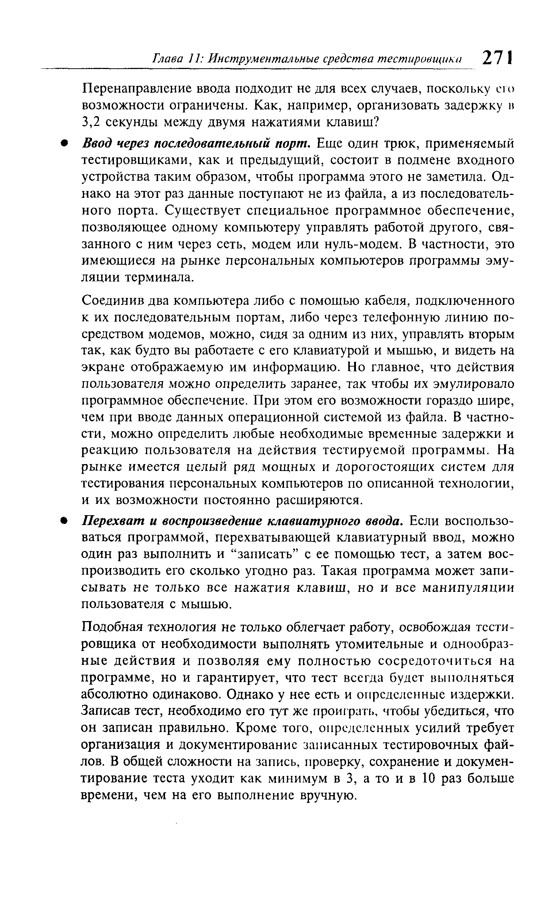

К тому же автоматизированный тест, представляющий собой запись действий пользователя, не сработает, если в программу будут внесены даже самые незначительные изменения, связанные с последовательностью этих действий. Тест придется выполнять и записывать заново. Простейшим примером может быть реорганизация меню программы.

Покупая программу перехвата и воспроизведения ввода, убедитесь, что она записывает не только действия пользователя, но и временные интервалы между ними. Кроме того, проверьте, правильно ли воспроизводятся манипуляции с мышью при различных разрешениях экрана. Хорошо бы убедиться и в ее надежности. Рынок таких программ относительно невелик, и они не всегда тщательно тестируются. Имейте в виду, что покупаемая вами утилита относится к разряду резидентных, а это означает потенциальную возможность проблем не только в ее собственной работе, но и во взаимоотношениях с остальным запущенным программным обеспечением.

## Запись вывода тестируемой программы

Автоматизировать ввод данных для тестируемой программы обычно гораздо проще, чем записать ее выходную информацию в подходящей для анализа форме. Выбор у вас следующий:

* **Файлы выходных данных.** Идеальным случаем является программа, сама сохраняющая свои данные в файлах, причем в формате, подходящем для тестирования.
* **Перенаправление вывода в файл.** В дисковый файл можно, например, перенаправить вывод, предназначенный для принтера. Если это возможно, то перенаправление вывода извне предпочтительнее использования соответствующей функции самой программы, поскольку гарантирует, что в файл попадет в точности та же информация, что и на принтер.

Если программа предназначена для работы в текстовом режиме, то в файл можно перенаправить и то, что она выводит на экран.

* **Вывод через последовательный порт.** Если имеется возможность удаленного управления компьютером либо с терминала, либо со второго компьютера посредством специального программного обеспечения, этот второй компьютер может записывать принимаемые выходные данные в файл для последующего анализа.
* **Перехват экрана.** Существует множество программ, позволяющих сохранить изображение текущего окна и всего экрана. Как будет рассказано чуть позже, мы очень широко пользуемся такими программами.

* **Перехват вывода программы с помощью специальных тестировочных утилит.** Совершенно очевидно, что, если программа разработана специально для тестирования, ее возможности гораздо шире, чем у утилит общего назначения. Хорошая программа позволяет сохранять указанные области экрана, например поля данных, которые меняются от теста к тесту.

## Оценка выходной информации

Записав выходную информацию программы, тестировочная система должна оценить ее правильность. Как это сделать? Существует несколько традиционных подходов.

* **Если существует эталонная программа**, выполняющая то же самое, что и тестируемая, можно сравнить их вывод.
* **Написать параллельную программу**, генерирующую точно такие же результаты, и сравнивать их вывод. На практике проще создать несколько десятков небольших параллельных программ — по одной на каждую тестируемую функцию.
* **Сформировать библиотеку правильных выходных данных.** При этом для каждого нового набора тестов придется создавать и новые эталоны выходных данных. Это довольно долгий и трудоемкий процесс, особенно если данные эталонных файлов придется вводить вручную. И здесь неизбежны издержки по выявлению множества ошибок и опечаток. Однако основной объем работы придется на самое начало, когда необходимо будет сформировать основную массу данных, дальше будет легче. При наличии времени тесты можно будет автоматизировать постепенно, один за другим.
* **Перехват вывода программы.** Сохраняйте результаты каждого теста, какими бы они ни были. Результат теста записывается в отдельный файл, анализируется сразу или позднее и помечается как хороший или плохой.

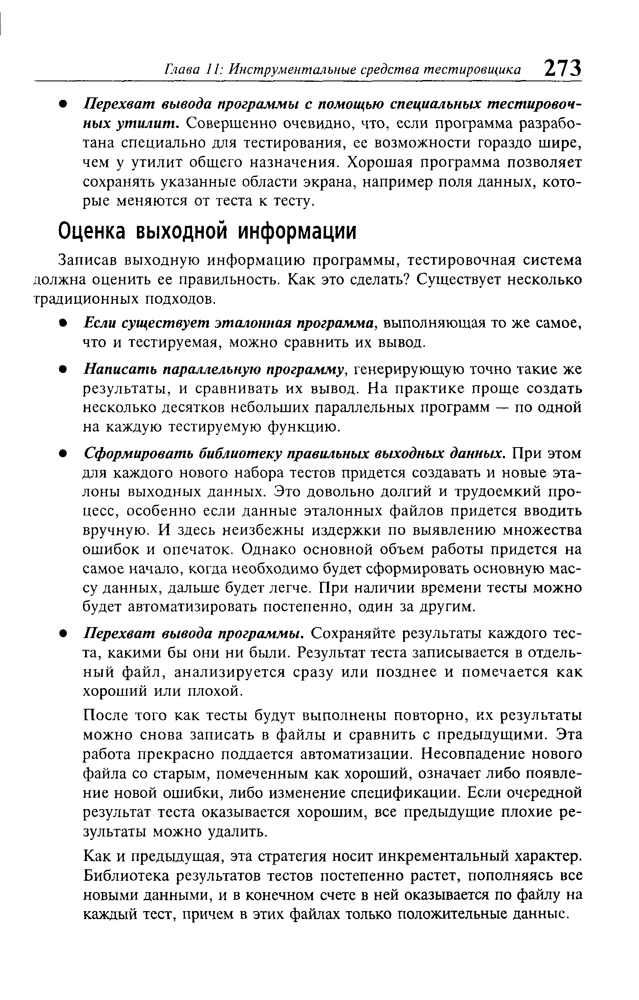

После того как тесты будут выполнены повторно, их результаты можно снова записать в файлы и сравнить с предыдущими. Эта работа прекрасно поддается автоматизации. Несовпадение нового файла со старым, помеченным как хороший, означает либо появление новой ошибки, либо изменение спецификации. Если очередной результат теста оказывается хорошим, все предыдущие плохие результаты можно удалить.

Как и предыдущая, эта стратегия носит инкрементальный характер. Библиотека результатов тестов постепенно растет, пополняясь все новыми данными, и в конечном счете в ней оказывается по файлу на каждый тест, причем в этих файлах только положительные данные.

В организации корректного сравнения выходных данных, особенно сравнения копий экрана, существует целый ряд сложностей. Как, например, обучить программу сравнения игнорировать различающиеся даты? Как быть с изменяющимися заголовками окон? Что, если данные выводятся с различной степенью точности, в различном порядке или в разных местах экрана? К тому же малейшие изменения программы могут оказаться фатальными для огромного количества тестовых файлов.

Некоторые программы перехвата изображений умеют сравнивать только отдельные фрагменты экрана, содержащие важные для тестирования данные, и игнорировать все остальное. Другой прием заключается в том, что программа отображает две копии экрана, старую и новую, и закрашивает белым цветом все, что совпадает, оставляя только различающиеся фрагменты для визуального сравнения.

Нам приходилось видеть программное обеспечение для перехвата и сравнения ввода/вывода, которое производило вполне солидное впечатление. Ряд руководителей групп тестирования говорили нам, что вполне полагаются на эти программы, особенно активно пользуясь ими при выполнении приемочного тестирования. Однако сами мы еще не пользовались подобными средствами, а потому воздерживаемся от каких-либо одобрительных или критических замечаний в их адрес. Вот несколько вопросов, которые следует обдумать, планируя автоматизацию процесса тестирования.

* **Временные затраты.** На создание автоматизированных тестов уходит очень много времени. Как утверждается в Microsoft Test User's Guide (Microsoft, 1992, с. 15), автоматизация тестирования требует самого тщательного планирования и организации и часто наибольших временных затрат.
Предположим, что на проектирование, создание и документирование автоматизированного теста уходит вдесятеро больше времени, чем необходимо на подготовку и выполнение его вручную. Это означает, что временные затраты на автоматизацию окупаются только после десятого или одиннадцатого прогона теста. Все последующие его прогоны не стоят почти ничего, если только тест не придется модифицировать. Получается, что тесты, которые выполняются всего несколько раз, автоматизировать вообще не стоит.

* **Задержки в тестировании.** Если отложить серьезное тестирование до тех пор, пока не будет подготовлена целая “батарея” тестов, можно поставить под угрозу весь проект. Программистам необходима быстрая ответная реакция группы тестирования, состояние проекта всегда должно быть известно. Поэтому с самого начала проекта стоит подумать о расширении группы тестирования, чтобы в то время, когда одна часть персонала занята разработкой автоматизи-

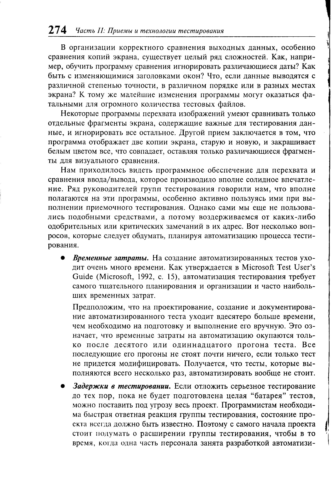

рованных тестов, другая могла выполнять тестирование вручную в нормальном рабочем режиме.

* *Инерция.* Вложения в разработку автоматизированных тестов достаточно велики. Если программист изменит пользовательский интерфейс программы или формат ее входных или выходных данных, огромную часть тестов придется просто-напросто выбросить. Особенно остро эта проблема стоит в тех случаях, когда тесты разрабатываются на самых ранних стадиях проекта, поскольку вероятность последующих значительных изменений в программе при этом сильно увеличивается.

Как правило, изменения вносятся в проект отнюдь не по чьей-либо прихоти. Руководитель проекта соглашается на них потому, что они значительно усовершенствуют или улучшают программу, делают ее более последовательной и простой в использовании. Формат файлов данных обычно меняется ради достижения совместимости или устранения ошибок. А раз так, вы должны приветствовать всякое подобное усовершенствование. Однако если у вас имеется достаточно большое количество необходимых тестов, основанных на старом варианте интерфейса или формате файлов, для группы тестирования изменения могут быть очень нежелательны, и вместо оказания содействия в улучшении качества продукта вы можете невольно стать его противником.

* *Риск пропущенных ошибок.* Microsoft (1990, с. 7.33) предупреждает, что автоматизированные тесты должны планироваться и организовываться очень тщательно, поскольку за их выполнением тестировщик не наблюдает так внимательно, как при выполнении тестов вручную. О том же говорит и наш собственный опыт. Нам случалось видеть, как тестировщики, проводившие автоматизированное тестирование, пропускали очень серьезные и совершенно очевидные ошибки. Майерс (Myers, 1979) также писал о результатах исследований, показывающих, что тестировщики недостаточно внимательно анализируют результаты автоматизированных тестов и пропускают очень много ошибок.

Продумывая тесты, особое внимание уделите тому, чтобы их результаты были как можно короче и представлены в простой и наглядной форме. Никто не будет вычитывать километры распечаток, и уж во всяком случае никто не сможет сделать это достаточно внимательно.

Скорее всего, вам понадобится небольшой журнал тестирования, в котором в одной строке фиксировался бы каждый выполненный тест. Кроме того, в нем должны фиксироваться все сбои программы, и записи о сбоях должны дополняться копиями неверных данных.

Еще одним полезным приемом может быть выдаваемый тестировочной программой звуковой сигнал о неудачном тесте и сообщение, которое остается на экране до тех пор, пока тестировщик с ним не ознакомится. Так вы гарантируете, что будете знать о каждой выявленной ошибке. Однако тут необходима аккуратность, звуковые сигналы не должны выдаваться в тех случаях, когда в сравниваемых файлах различаются незначащие детали, например, даты. Иначе из организующего фактора такая технология работы превратится в бедствие.

* **Частичная автоматизация.** Вовсе необязательно полностью автоматизировать весь процесс тестирования. Часть тестов может быть автоматизирована, в то время как другие лучше по-прежнему проводить вручную. Для начала стоит автоматизировать наиболее подходящие для этого тесты, а также те, которые наверняка будут проводиться десятки раз. Потенциальными кандидатами для автоматизации являются также те тесты, которые требуют большого объема клавиатурного ввода, сложны и утомительны для ручного выполнения.

Что касается отдельных тестов, то их автоматизация также может быть частичной. Например, можно записать и проигрывать клавиатурный ввод, а результаты анализировать визуально. Это сэкономит некоторое время на вводе информации и позволит избежать возни со сравниваемыми выходными файлами.

## Автоматизация приемочного тестирования

Некоторые руководители большую часть средств, выделенных на автоматизацию тестирования, тратят на создание приемочных тестов. Их соображения таковы.

* **Именно эти тесты выполняются чаще всего.** Если обновленная версия программного продукта передается тестировщикам каждую неделю, да плюс еще периодически появляются внеочередные версии с исправлениями наиболее существенных ошибок, за все время разработки комплекс приемочных тестов может быть выполнен пятьдесят и даже сто раз.
* **К каждой функциональной области программы относится сравнительно небольшое количество тестов.** Приемочные тесты быстро прогоняют все основные части программы, ни на чем не останавливаясь подробно. Поэтому, когда одна из составляющих программы меняется, соответствующую группу тестов легко можно переделать.
* **Утомительность процедуры приемочного тестирования ведет к ошибкам.** Тестировщику приходится выполнять одни и те же тесты

множество раз, поэтому неудивительно, что он пропускает некоторые тесты или выполняет их невнимательно. Программа же всегда выполняет тесты одинаково — ведь ей не бывает скучно и она никогда не устает.

## Стандарты

Ваша компания может подписать контракт, по которому программа должна удовлетворять определенным стандартам. Подтверждение соответствия этим стандартам входит в задачи группы тестирования. Программы, выполняющие такую проверку, часто доморощенные и трудно поддаются модификации. Утилиты, анализирующие программу на соответствие стандартам, могут сообщать о следующих ее недостатках.

* **Проблемы с переносимостью.** Программа может использовать расширения языка, несовместимые с другим компилятором, непосредственно записывать или считывать данные из определенных областей памяти или ориентироваться на новые возможности устройств ввода/вывода, которые имеются далеко не во всех системах.
* **Рекурсия.** Программа называется рекурсивной, если в ней имеется подпрограмма, вызывающая сама себя. Этот прием запрещается некоторыми стандартами.
* **Степень вложенности.** Главная программа может вызывать подпрограмму, та — еще одну подпрограмму, та — еще одну и т.д. В конце концов вызывается подпрограмма, выполняющая нужную работу. Сколько же вызовов для этого потребуется? Приемлемо ли такое количество? Аналогичным образом вложенными могут быть циклы и условные операторы. Если язык программирования позволяет определять пользовательские типы данных, насколько допустимо определять переменную, относящуюся к типу, определенному посредством другого типа, определенного посредством другого типа и т.д. Как глубоко придется копать, чтобы выяснить, о каких же в самом деле данных идет речь?
* **Константы в коде.** Предположим, что программа проверяет, действительно ли введенное значение меньше 6. Одни программисты определят именованную константу, например `MAX_VAL`, назначать ей значение 6 и будут использовать это имя в коде для сравнения. Другие же просто будут сравнивать введенное значение с числом 6, поместив его прямо в код. Этот второй способ часто является запрещенным. Недостаток его в том, что при изменении максимального значения с 6 на какое-нибудь другое число придется искать и заме-

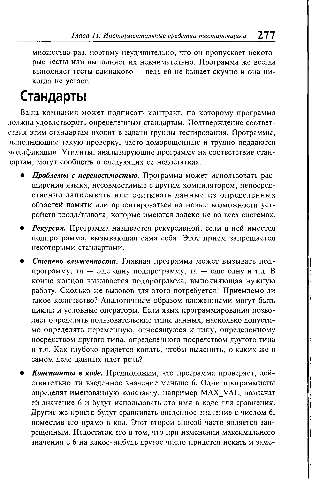

нять шестерки по всему программному коду — ведь сравнение может выполняться и не в одном месте. Если же определить константу и вынести ее в самое начало программного кода, то найти и изменить ее значение будет гораздо проще.

* **Размер модуля.** Сколько строк программного кода может содержать процедура или функция? Нет ли в программе чересчур длинных подпрограмм или, наоборот, слишком коротких, так что программный код становится настолько фрагментированным, что теряется его логика? А как насчет количества подпрограмм в одном файле?
* **Комментарии.** По стандарту на каждые три строки программного кода может требоваться по одному комментарию. Стандартом может определяться формат комментариев, их длина, расположение в файле и другие характеристики.
* **Соглашения об именах.** Стандарт может определять принципы наименования переменных, подпрограмм и файлов.
* **Форматирование.** В стандарте могут быть описаны такие вещи, как отступы, расположение операторов, отмечающих начало и конец блоков кода, или максимальное количество символов в строке.
* **Запрещенные конструкции.** Может быть запрещено применение операторов `GOTO`, операторов прерывания потока типа `EXIT` или вызов подпрограмм, адреса которых хранятся в переменных-указателях. Могут быть запрещены определенные способы протоколирования ошибок или определенные команды ввода/вывода.
* **Запрещенные действия.** Примером таких действий может быть запрет перехода по команде `GOTO` назад по программному коду, в то время как аналогичные переходы вперед могут разрешаться. (Причина такого запрета в том, что переходы назад ведут к большему количеству ошибок, чем переходы вперед.)
* **Псевдонимы.** Если два различных имени относятся к одной и той же переменной, т.е. указывают на одно и то же место памяти, они считаются псевдонимами. Такие вещи могут не допускаться стандартом.
* **Преобразование типов данных.** Одни и те же данные могут по-разному интерпретироваться в различных местах программы. Например, можно объявить массив целых чисел и передать его подпрограмме, которая будет работать с ним как со строкой. Это может быть запрещено стандартом.

Если программа проверки соответствия стандартам может выявлять все эти проблемы, возможно, она может обнаруживать и некоторые типы ошибок. Такие программы часто выявляют следующее.

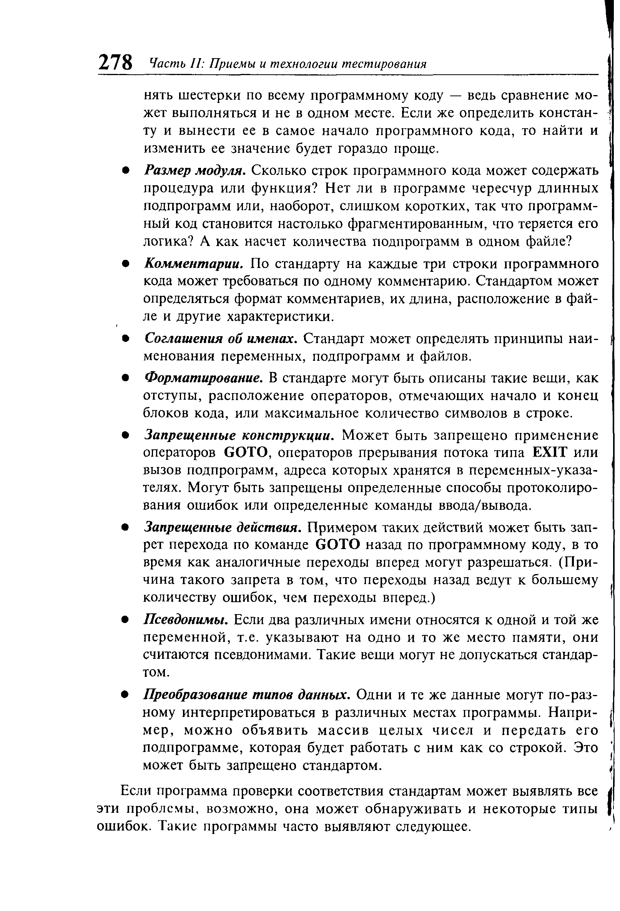

* **Неверный синтаксис.** Компилятор такие ошибки обнаруживает, а вот в интерпретируемой программе они проявляются только во время выполнения соответствующего фрагмента кода.
* **Смешанные вычисления.** Если $A=5$ и $B=2$, тогда возможно, что $A/B=2,5$, если обе переменные являются числами с плавающей запятой, и $A/B=2$, если числа целые. Эти правила определяются языком программирования, но главное, что при этом программист не всегда получает то, чего ожидает. Иногда он может просто не заметить, что смешал в одном выражении различные типы данных.
* **Переменные, определенные в программном коде, но никогда не используемые.** Программа может установить, что $A=5$, но никогда больше не использовать переменную А. Скорее всего, программист предназначал ее для какой-то цели, а потом о ней просто забыл. Хотя такое объявление само по себе совершенно безобидно, в дальнейшем оно может смутить того, кому придется эту программу поддерживать.
* **Переменные, которые используются до их инициализации.** Если программа присваивает переменной В значение А и только после этого присваивает переменной А начальное значение, то что будет в переменной В?
* **Чтение файла до его открытия или после закрытия.** Выявив подобные команды, можно предотвратить сбои при обращении к устройствам ввода/вывода.
* **Код, который никогда не выполняется.** В программе могут быть процедуры, которые никогда не вызываются, или фрагменты кода, которым никогда не передается управление (например, условие ветвления не выполняется ни при каких обстоятельствах).
* **Бесконечные циклы.** Условие выхода из цикла может либо просто никогда не выполняться, либо зависеть от данных, что является потенциальной возможностью зацикливания программы.

Приведенный список можно было бы продолжить. Суть его в том, что программу можно анализировать на предмет стиля, формата, соответствия разнообразным правилам и наличия определенных типов ошибок. Часто последнее слово в таком анализе остается за программистом, который один только и может точно сказать, является ли определенный фрагмент кода ошибочным или просто представляет собой несколько необычную конструкцию. Однако если речь идет о соответствии определенным стандартам, это должна гарантировать группа тестирования.

Необходимо очень тщательно проанализировать вопрос применимости к проекту конкретных стандартов. Сама по себе эта идея неплохая, но на практике чревата целым рядом сложностей.

* Программисты могут пытаться некорректными способами улучшить свои показатели или препятствовать попыткам анализировать их работу. (Керней (Kearney, 1986), Вейнберг (Weinberg, 1971)).
* Чем больше внимания будет уделяться соответствию стандартам, тем меньше времени, людей и сил будет оставаться для реального тестирования программного продукта — анализа его производительности, удобства, эффективности и исправления ошибок.

Иногда *качество продукта* определяют как степень его соответствия определенным стандартам. Однако, на наш взгляд, все, что не связано непосредственно с его функциональностью, с восприятием продукта пользователем, является скорее тормозом в работе по его совершенствованию.

Гласс (Glass, 1992, с. 92) утверждает, и мы полностью с этим согласны, что если оценивать качество продукта в терминах соответствия стандартам, сформированным критериям могут удовлетворять явно плохие продукты. Поэтому, на наш взгляд, лучше избегать включать в договор требование соответствия стандартам. Разумеется, можно и пользоваться средствами анализа на соответствие стандартам, и писать собственные такие средства, но стандарты должны вырабатываться самими разработчиками, а не навязываться извне.

## Тестирование "стеклянного ящика"

При тестировании "стеклянного ящика" тестировщик анализирует программный код. При противоположном подходе — тестировании "черного ящика", которому главным образом посвящена эта книга, тестировщик в код не заглядывает, работая с программой исключительно извне.

Однако иногда программист снабжает тестировщика средствами, позволяющими при тестировании "черного ящика" в некоторой степени опираться и на программный код. Примерами таких средств могут быть следующие виды отладочного кода:

* Для отслеживания путей выполнения программы.
* Для проверки определенных фактов.
* Для отслеживания использования памяти.

Если вы захотите прибегнуть к подобным технологиям работы, обратитесь к такому автору, как Гласс (Glass, 1992).

### Отслеживание путей выполнения программы

Протестировать каждый путь выполнения программы нереально. А вот выполнение хотя бы по одному разу каждой строки программного кода — задача вполне реальная и к тому же совершенно необходимая. (О ней

подробно рассказывалось в главе 3.) Самый очевидный способ ее выполнения — просто сесть перед компьютером с листингом и попытаться выявить все возможные ветви кода.

Однако есть и лучший подход, требующий участия программиста, — добавить в программу специальный отладочный код. Когда программа достигает заданной точки, она печатает определенное сообщение. Все сообщения отличаются. Как правило, их нумеруют, так что всегда можно сказать, в какой точке программного кода они были выданы. Программист размещает отладочные сообщения во всех ключевых точках программы. По завершении цикла тестирования он анализирует распечатки или файл журнала и выясняет, попало ли туда каждое из сообщений хотя бы по одному разу. Если что-нибудь пропущено, значит, соответствующая область программы не была протестирована и можно подсказать тестировщикам, как ее достичь.

Такая технология очень облегчает работу тестировщика, ведь ему больше не нужно анализировать программный код. Да так в конечном счете и надежнее. Отслеживать сообщения по ходу тестирования также ни к чему, они могут и вовсе не выводиться на экран, а просто записываться в файл журнала.

Существуют специальные программные средства мониторинга охвата (*coverage monitors*), вставляющие в код подобные отладочные команды. Эти команды называются зондами (*probes*). Такие программные средства могут не только начинять программу зондами, но и собирать статистику их прохождения, формируя итоговые данные. Получив от средства мониторинга охвата сведения о том, какие ветви программы не были пройдены, можно подготовить и провести дополнительные тесты.

Хотя средства мониторинга охвата предназначены для тестирования "стеклянного ящика", ими можно пользоваться и в обычной работе. В этом случае вы просто узнаете, насколько полно ваши тесты охватывают программный код.

Средств мониторинга охвата на рынке имеется предостаточно. Стоит составить их список, чтобы иметь что предложить программистам. Однако вполне возможно, что вы услышите от них целый ряд разумных возражений. Их основания могут быть такими.

* *Средства мониторинга охвата вставляют в программу отладочный код.* В конечном продукте этого кода быть не должно. В результате вы тестируете программу не в том виде, в каком она будет продаваться, а это потенциальная возможность появления ошибок.
* *Со средствами мониторинга программа медленнее работает.* В результате получаются условия гонок, отличные от реальных, а это снова повышает вероятность появления ошибок.

- Нашпигованная зондами программа сильно увеличивается в размере. Если размер программы имеет критическое значение, это обстоятельство может скрыть тот факт, что ее размер и в самом деле превысил допустимую величину.
- Некоторые из таких программных средств сами полны ошибок. Программистам едва ли понравится, если они проведут пару дней в поисках ошибки и окажется, что ее виновником является средство мониторинга. Поэтому такое средство следует выбирать очень тщательно и при его покупке осведомиться у продавца о наличии списка известных ошибок.

## Проверка утверждений

Обычно в каждой программе есть точки, в которых всегда должны выполняться определенные условия. Чтобы убедиться, что необходимые условия в самом деле выполняются, программист может поместить в эти точки отладочные команды. Это и есть проверка утверждений (*assertion check*). Если условие выполняется, программа не производит никаких нестандартных действий, если же нет, она может выдать на экран соответствующее сообщение или записать его в файл журнала. Возможно также, что программа просто молча выполнит код обработки ошибочной ситуации.

Как правило, тестирование утверждений организуется таким образом, чтобы тестировщик сразу же видел, что что-то идет не так. Для этого все сообщения программы о неверных утверждениях выводятся на экран или распечатываются. Так гораздо легче отслеживать и исправлять ошибочные ситуации — ведь кроме того, в какой точке программы произошла ошибка, необходимо еще знать, как вы туда попали и с какими данными работали. В противном случае ошибочную ситуацию может быть трудно воспроизвести.

## Анализ использования памяти

Работающая программа использует память следующими способами.
- **Часть памяти занимает сам программный код**. За исключением (весьма непопулярных) самомодифицирующихся программ, программа не может писать в собственную область кода.
- **Часть памяти занимают данные**. Программа может считывать и записывать информацию своей области данных, но не может попросить центральный процессор выполнить команду, записанную в этой области.
- **Определенная память связана с аппаратным обеспечением**. Программа может общаться с внешним устройством, считывая и запи-

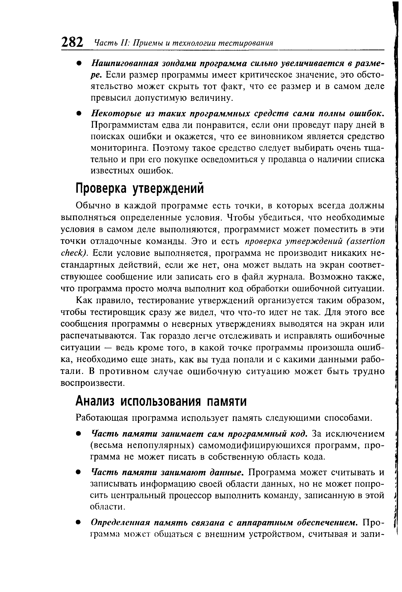

сывая информацию по определенным адресам памяти. Однако прикладные программы, как правило, взаимодействуют с внешними устройствами через промежуточное программное обеспечение, встроенное в BIOS компьютера или операционную систему. Для них считается даже некорректным прямо обращаться к памяти устройств ввода/вывода, минуя установленные драйверы.

* **Недоступная память.** Запуская программу, операционная система выделяет ей некоторый объем памяти. В мультизадачных системах программе обычно недоступна память, выделенная другим программам, работающим одновременно с ней. И уж во всяком случае ни одной программе недоступна память, которая физически отсутствует.

Специальные утилиты, анализирующие использование памяти, могут выявить подозрительные команды программы. Они могут остановить процесс и сохранить в файле дамп памяти, могут перевести программу в режим отладки или просто сообщить о событии и продолжить выполнение программы.

Утилиты, анализирующие использование памяти, могут предоставить программисту и тестировщику множество полезной информации, и в том числе об объеме свободной памяти, размере наибольшего свободного блока, подробный список всех работающих процессов или всех блоков памяти с информацией о том, какой программой используется каждый из них. Все эти данные очень полезны, так как проблемы с использованием памяти являются наиболее трудноуловимыми. С их помощью можно выяснить следующее:

* Какой объем памяти занимает каждая составляющая программы.
* Возвращает ли программа операционной системе ту память, которая ей больше не нужна. Особенно это касается достаточно больших объемов памяти, выделенных, например, под графику. Если нет, то рано или поздно вся свободная память системы будет исчерпана.

Оценивая картину использования памяти по данным подобных утилит, следует учитывать и их собственную роль в этом процессе. Бывает, что именно утилита не позволяет тестировщику воспроизвести произошедшую ошибку. Однако в целом предоставляемая информация может быть просто неоценима. Наш собственный опыт показывает, что из всех отладочных команд, которые программисты встраивают в программный код, наиболее ценны именно команды формирования отчета об использовании памяти.

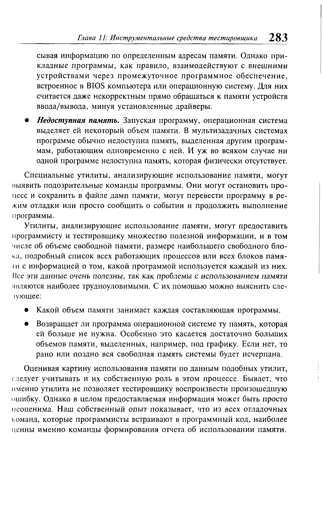

# Глава 12
# Планирование и документация

## Назначение этой главы

Из главы 7 вы узнали о том, как проектировать и оценивать отдельные тесты. В главе 8 рассказывалось о планировании всей работы — на примере тестирования печати, в главе 9 — о планировании локализационного тестирования. А о том, как тестировщик может автоматизировать свою работу, вы прочитали в главе 11.

Теперь, вооружившись всеми этими знаниями, можно приступить к рассмотрению одного из самых серьезных этапов тестирования программного продукта — этапа планирования. Данную главу, в которой рассказывается о целях и стратегии планирования, можно назвать своеобразным центром всей книги, ее связующим звеном, объединяющим материал всех остальных глав.

Планирование тестирования — процесс последовательный. Он включает в себя следующие задачи.

* Разработка тестов с помощью аналитических средств. Специалисты, занимающиеся планированием тестов, прибегают к помощи самых разнообразных аналитических средств — таблиц, диаграмм и других инструментов, позволяющих выделить те аспекты программы, которые подлежат отдельному тестированию, и определить, какие из возможных тестов являются наиболее важными для каждого из этих аспектов (конечно, прежде всего, это тесты граничных условий).
* Выбор стратегии тестирования. В этой и следующей главах рассказывается о том, как исследовать различные области и аспекты программы и определить, какие из них требуют более углубленного тестирования.
* Разработка средств контроля за тестированием. Этот этап включает в себя создание контрольных списков, таблиц, автоматизированных тестов

и других материалов, задающих порядок выполнения тестов и определяющих их входные данные. Эти простые средства позволяют аккуратно организовать работу, определяя ее последовательность и гарантируя, что ничто не будет потеряно или упущено.
- *Распространение информации.* Подготовьте плановые документы, которые позволят другим сотрудникам ознакомиться с принятой стратегией, понять ее цели и смысл. Распространите среди заинтересованных лиц разработанные тесты, данные и другие сопутствующие средства и документы.

## Обзор

В этой главе рассматриваются следующие вопросы:
- Общее назначение тестового плана.
- Цели, преследуемые при планировании тестов и разработке документации.
- Какие типы тестов ("черного ящика") должны отражаться в плановых документах.
- Стратегия создания тестовых планов и их компонентов: поступательная разработка.
- Компоненты тестового плана: простые и иерархические списки, таблицы и матрицы.
- Как документировать тестовые материалы.

---

План тестирования определяется стандартом ANSI/IEEE *(ANSI/IEEE Standard 829-2983 for Software Test Documentation)* следующим образом:

> *Это документ, в котором определены объем, ресурсы, а также описан календарный план работ по тестированию. В нем определяются выполняемые тесты, тестируемые элементы, задачи тестирования, сотрудники, ответственные за выполнение каждой из задач, а также указывается вероятность возникновения непредвиденных обстоятельств и описывается, какие меры нужно при этом принимать.*

Тестовый план — это огромный составной документ. Вам предстоит познакомиться с его назначением и содержанием, а также с целым рядом сопутствующих документов, создаваемых в процессе тестирования программного продукта.

Сколько усилий и внимания уделяется тестовой документации — зависит от конкретной группы тестировщиков и общего объема работ. В одних случаях удовлетворяются несколькими страницами заметок, в других создаются многотомные труды. Не всегда объем документации определяется профессионализмом сотрудников, хотя и это тоже играет определенную роль. Основные стратегические различия связаны с конкретными задачами каждой конкретной группы. Именно эти задачи и определяют, какой будет документация и для чего вообще она разрабатывается.

## Общее назначение тестового плана: продукт или инструмент?

У авторов тестовых планов могут быть две принципиально различные цели: в одних случаях разрабатывается продукт, а в других — рабочий инструмент. Смешать эти цели легко, но такое смешение очень дорого обходится. При этом разработка продукта стоит гораздо дороже, чем разработка инструмента.

### Тестовый план как продукт

Хороший тестовый план помогает организовать и скоординировать усилия сотрудников, разрабатывающих и тестирующих программный продукт. Однако многие тестовые планы не ограничиваются этой исключительно важной задачей. Они разрабатываются как самостоятельные продукты. Формат, структура и уровень детализации подобных планов определяются не только соображениями эффективности тестирования, но и нормами, определяемыми спецификацией. Вот несколько примеров.

* Предположим, что ваша фирма разрабатывает программный продукт, который затем будет перепродаваться телефонной компанией (примером может быть программа учета телефонных звонков). Телефонная компания будет поддерживать этот продукт многие годы. Поэтому ее специалисты будут тщательно анализировать ваш план тестирования и вносить в него необходимые с их точки зрения коррективы. Им необходима гарантия, что продукт будет протестирован самым тщательным образом. Кроме того, если вы по какой-либо причине не сможете поддерживать продукт в дальнейшем (например, ваша компания обанкротится), им придется самим вносить в программу текущие изменения, а значит, и проводить повторное тестирование. Ясность и простота тестового плана, строгость его формата будут в этом случае играть решающую роль.
* Если вы разрабатываете программное обеспечение для военных, то обязательно должны продать им и тестовые планы, причем соответствующие их собственной спецификации. Без таких планов военные просто не купят ни одну программу. То же самое касается и программного обеспечения для медицины.
* Разработчик программного обеспечения может воспользоваться услугами вашего независимого тестового агентства, заказав разработку тестового плана, по которому он сам будет тестировать свой программный продукт. В этом случае план должен быть исключительно строго организованным и подробным, иначе покупатель не сможет им воспользоваться.

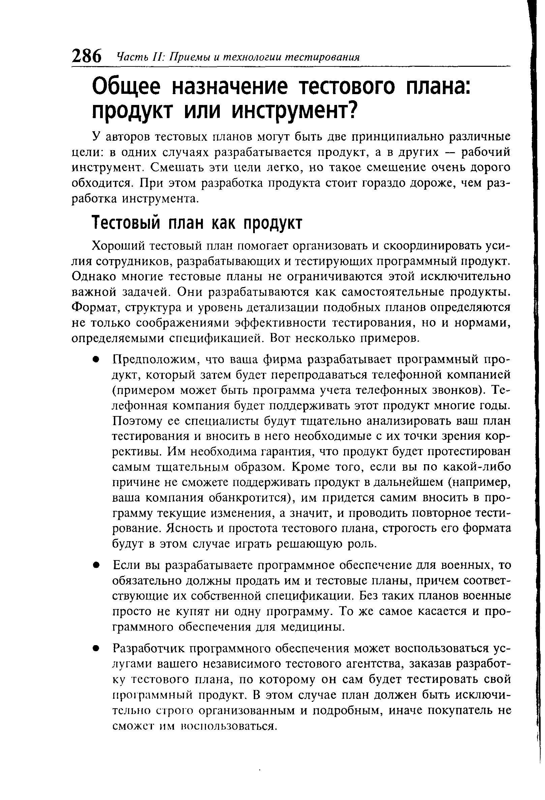

Каждый из описанных выше планов в конечном счете служит для поиска ошибок. Однако важно понимать, что, даже если время, затраченное на его разработку, могло бы быть с большей производительностью использовано для анализа и тестирования программы, вам все равно придется выдержать стандарты и написать тестовый план, полностью соответствующий требованиям заказчика или регулирующей организации.

## Тестовый план как инструмент

По сложившейся традиции вся учебная литература мира информационных технологий обучает читателей и студентов разрабатывать объемную и подробную тестовую документацию. Мы позволим себе не согласиться с этой традицией, поскольку весь наш опыт свидетельствует, что документация не должна быть впечатляющей — она должна быть эффективной. Исключением могут быть только документы, сами являющиеся продуктами.

В официальных стандартах для планов тестирования, таких как ANSI/IEEE 829, можно найти целый комплекс требований к спецификации тестового проекта, спецификации для самих тестов, журналам тестирования, разнообразным идентификаторам, к спецификации для тестовой процедуры, спецификациям ввода/вывода, а также специальные процедурные требования, зависимости между тестами, календарный план, описание распределения работ между персоналом, критерии приостановки и возобновления тестирования и описание массы других бумаг.

Стандарты позволяют быстро генерировать огромное количество документов. Это верно, но так ли все эти документы необходимы? Масса времени уходит на всю эту бумажную работу, но помогают ли эти бумаги быстрее и лучше находить ошибки?

Пользователю требуется нечто, правильно выполняющее необходимые вычисления, издающее ожидаемые звуки, рисующее ожидаемые изображения или печатающее нужный текст в нужном месте. Ему все равно, как вы это будете тестировать. Главное, чтобы программа работала правильно. Для подобных пользователей план тестирования не является продуктом. Это просто невидимый инструмент, которым компания-разработчик пользуется для организации своей работы.

Когда план тестирования разрабатывается не как продукт, а как рабочий инструмент, при его создании лучше всего руководствоваться следующим критерием.

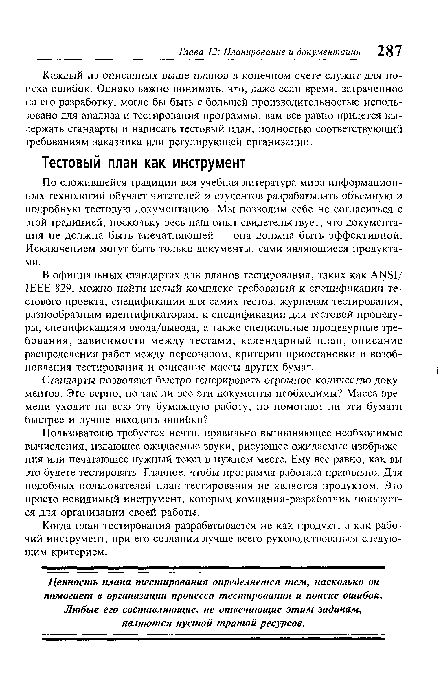

Далее вы увидите, что существует еще целый ряд полезных функций документации, не охваченных этим узконаправленным взглядом на планирование тестирования.

## Цели, преследуемые при планировании тестов и разработке документации

Хорошая документация обладает тремя важнейшими преимуществами, о которых и рассказывается в этом разделе:

* облегчает тестирование;
* помогает организовать взаимодействие между персоналом;
* представляет собой удобную структуру для организации, планирования и управления тестовым проектом.

Лишь в очень немногих организациях сотрудники используют все те преимущества, которые может предоставить имеющийся план тестирования. Разумеется, составляющие его специалисты обычно обладают хотя бы минимальными знаниями по этому вопросу. Но далеко не в каждой группе тестовые планы внимательно анализируются персоналом, и далеко не всегда в работе над планом учитываются мнения о нем других сотрудников группы разработки. Как правило, тестовые планы рассматриваются только как технические документы и не применяются для управления работами по тестированию и отслеживания хода их выполнения.

Вам как тестировщику придется тратить на разработку тестовых планов многие часы. А раз так, стоит извлечь из полученного инструмента максимум пользы. (Гетзел (Hetzel, 1988) излагает иной взгляд на задачи плана тестирования, его анализ этого вопроса также весьма полезен.)

### Тестовая документация облегчает организацию технических аспектов тестирования

Создание хорошего плана тестирования невозможно без самого тщательного исследования программного продукта. Только после этого ваше представление о поставленных задачах станет ясным и четким, что привнесет в работу обстоятельность и сделает ее по-настоящему эффективной. В ходе планирования вы создадите целую серию списков и таблиц, роль которых будет заключаться в следующем.

* *Обеспечить полноту охвата продукта.* Тестовые планы должны включать перечень функций программы. Этот перечень гарантирует, что ни один из аспектов программы не останется непротестированным. Обычно с этой целью составляется список всех генерируемых программой отчетов, сообщений об ошибках, под-

держиваемых устройств, команд меню, диалоговых окон и т.п. Чем подробнее этот список, тем менее вероятно, что одна из функций программы останется непротестированной просто потому, что вы о ней не знали.

* *Избежать лишних повторений и не забыть ничего важного*. Вычеркивая из списка выполненные пункты, вы всегда будете видеть, что уже сделано и что еще осталось.
* *Быстро проанализировать программу и выделить наилучшие тесты*. На рис. 12.5 (глава 12) и подобных ему рисунках из главы 7 приведены примеры таблиц, используемых при анализе классов эквивалентности и граничных условий. Каждое из граничных условий требует отдельного теста, поскольку именно здесь допускается максимальное число ошибок.
* *Подготовить информацию для завершающего тестирования*. Когда весь программный код написан и продукт практически готов, наступает время финального тестирования. Неоценимую помощь при его планировании оказывают заметки, сделанные на предыдущих этапах. К этому моменту психологическое давление возрастает, а времени до выпуска продукта остается совсем мало. Поэтому быстрота и эффективность работы здесь особенно важны. А без заметок придется все держать в голове, при этом можно нечаянно пропустить жизненно важные тесты.
* *Повышение эффективности тестирования*. Такое повышение достигается за счет сокращения количества тестов без уменьшения охвата тестируемых аспектов продукта. А это, в свою очередь, достигается благодаря вычленению и удалению сходных тестов, от которых ожидаются одни и те же результаты. Вот несколько примеров.
  * *Анализ граничных условий*. Обратитесь к седьмой главе, где рассказывается о классах эквивалентности и граничных условиях, а также к разделу данной главы, посвященному компонентам плана тестирования.
  * *Стратегия конфигурационного тестирования*. На рис. 8.1 была представлена стратегическая схема тестирования принтеров. Заключается она в том, что с одним тщательно подобранным принтером тестируются все аспекты программы, связанные с печатью. Затем совместимые принтеры объединяются в группы, и с каждым из них по очереди тестируются все функции печати, но не во всех местах программы, где они встречаются, а только в одном.

Для реализации этой стратегии необходимо составить список всех совместимых с программой принтеров, выделить их классы и 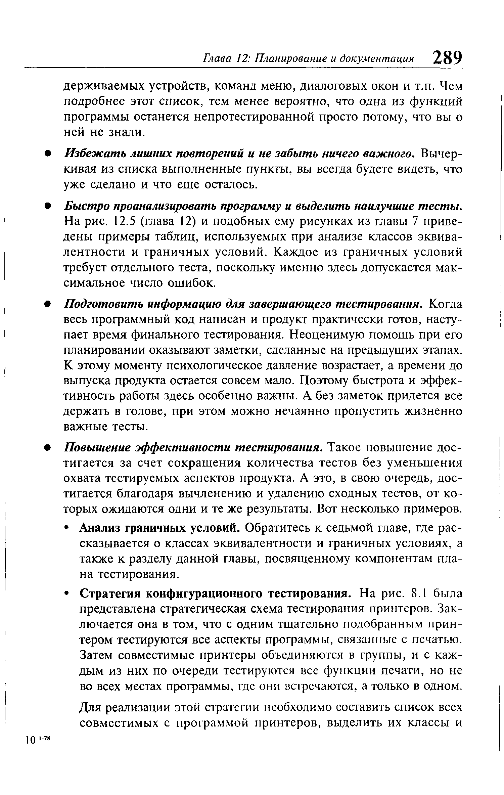

отобрать для первоначального тестирования по одному принтеру каждого класса. Далее потребуется таблица с перечнем функций каждого принтера и тестируемых областей программы. Пример такой рабочей таблицы для тестирования одного принтера показан на рис. 8.4. Чтобы протестировать все остальные принтеры, необходимо сделать аналогичную таблицу для каждого из них. При этом тестированию должна подлежать только одна из всех областей программы, в которых эти функции используются.

* **Одно из группы эквивалентных действий.** Пусть, например, программа выводит на экран диалоговые окна с сообщениями об ошибках. В качестве ответа пользователя принимаются только щелчок мышью на кнопке ОК или нажатие клавиши `<Enter>`. Нажатия всех остальных клавиш и щелчки мышью вне кнопки ОК программой просто игнорируются. Разумеется, вы не сможете протестировать все возможные нажатия клавиш. При этом следует иметь также в виду, что нажатие клавиши, игнорируемое одним диалоговым окном, может разрушить другое. Для работы в такой ситуации очень удобна тестовая матрица, каждая строка которой соответствует одному из сообщений. Каждый столбец матрицы соответствует группе клавиш, отнесенных к одному классу эквивалентности, например, всем буквам нижнего регистра. Для каждого из сообщений следует проверить по одной или нескольким клавиш из каждого класса. Позднее в этой главе мы еще вернемся к этой матрице.

* **Контроль полноты.** Если, работая в соответствии с составленным планом тестирования, вы пропускаете ошибки, значит, ваш план не полон. Пробелы в плане могут быть по следующим причинам.
  * **Пропущенные области программы.** Для полноценного тестирования необходим подробнейший список того, что уже протестировано и что еще предстоит протестировать. В ходе работы обязательно сверяйтесь с этим списком и пополняйте его в случае необходимости. Особенно это важно для программ, которые в ходе разработки претерпевают многочисленные изменения.
  * **Пропущенные классы ошибок.** Умение как следует организовать свою работу и последовательно тестировать программу на предмет всех предсказуемых ошибок — редкое качество. Обычно такое тестирование выполняется достаточно беспорядочно. В приложении А приведены краткие описания около 500 видов часто обнаруживаемых ошибок. Создавая собственный аналогичный список, вы наверняка расширите этот перечень. По нему можно сверять свой тестовый план, чтобы убедиться, что он до-

статочно адекватен. Для этого следует пройтись по списку ошибок, спрашивая себя, *может ли очередная ошибка встретиться в тестируемой программе*. Если да, план должен содержать как минимум один тест, предназначенный для ее выявления.

Анализируя таким образом свои тестовые планы, мы не раз обнаруживали, что пропущены целые классы ошибок. Например, в плане может вообще не оказаться тестов для условий гонок или сообщений об ошибках.

Успешно зарекомендовала себя в этом отношении следующая технология составления тестовых планов. В план включается раздел с перечнем всех ошибок, которые могут присутствовать в тестируемой программе. Этот раздел заполняется первым. Затем на его основе последовательно разрабатываются тесты для поиска этих ошибок и записываются в другой раздел плана. Так ни одна ошибка не выпадает из поля нашего зрения.

* **Пропущенные классы тестов.** Примерами классов тестов могут служить нагрузочные испытания, тесты граничных условий, работа в условиях параллельного выполнения программой нескольких заданий (например, фоновая печать), испытания в режиме реальной эксплуатации и т.д. Включены ли в план все эти виды испытаний? Если нет, тс почему?
* **Простой недосмотр.** Если даже ваш тестовый план в целом абсолютно полон, в нем все же могут быть случайно пропущены отдельные тесты, например, забыто одно из граничных условий. Несколько таких недочетов — обычное дело. Вовремя выполненный анализ проведенных работ позволит выявить и устранить все основные недостатки первоначального тестового плана.

## Документация помогает организовать взаимодействие между персоналом

Тестировщики являются членами команды разработки продукта. Все они зависят друг от друга, и на их работу полагаются остальные члены команды, в частности, менеджеры, программисты и авторы документации. Четко и ясно написанные материалы помогают им ознакомиться с вашей стратегией, понять глубину и масштаб предполагаемого тестирования и узнать о типах планируемых работ. Вот несколько коммуникационных преимуществ, обеспечиваемых распространением тестового плана среди заинтересованного персонала.

* *Совместное обдумывание стратегии тестирования.*
* *Повышение эффективности и полноты тестирования.* Читатели распространяемых материалов смогут привлечь ваше внимание к

упущенным областям программы, ее неправильно понятым аспектам, а также недавним изменениям продукта, еще не отраженным в плане тестирования.

* *Обсуждение объема тестирования*. В тестовом плане отражается как предполагаемый объем работ по тестированию программного продукта, так и уже выполненная его часть. Это помогает руководству и вашим коллегам понять, почему в команде тестировщиков работает столько народу, чем они все занимаются и почему на работу уходит столько времени. Руководитель проекта всегда заинтересован в ускорении и удешевлении работ, поэтому он может принять свои меры, удалив или упростив сложные для тестирования части программы.
* *Обсуждение глубины тестирования и календарного плана работ*. Нередко после создания плана тестирования разворачиваются бурные дебаты по поводу объема работ. В одних случаях руководитель проекта доказывает (возможно, вполне справедливо), что запланированный объем работ чрезмерен и его вполне можно сократить. В других случаях, наоборот, руководитель настаивает на проведении более серьезных испытаний и готов выделить на это дополнительное время и людей.

Еще одним предметом обсуждения часто становится время, выделенное для определенных работ. Например, руководитель проекта или менеджер по маркетингу могут решить провести более длительное тестирование, эмулирующее реальную эксплуатацию продукта пользователем.

В принципе, все эти вопросы могут быть подняты и без документации. Однако план помогает сфокусировать дискуссию, делает ее предмет более наглядным и четко очерченным и тем самым облегчает достижение соглашений. По собственному опыту мы знаем, что при наличии четкого и детализированного плана тестирования обсуждения проходят гораздо более упорядоченно и реалистично и приносят значительно более ощутимые результаты.

* *Распределение работы*. И поручить кому-либо работу, и проследить за ее выполнением всегда гораздо легче, если вручить человеку четкие и подробные печатные инструкции.

## Тестовая документация представляет собой удобную структуру для организации, планирования и управления тестовым проектом

Тестирование продукта представляет собой самостоятельный проект, которым необходимо управлять. И даже если тестирование выполняется

одним-единственным сотрудником, его работа обязательно должна быть строго организована. Итак, план тестирования является средством управления проектом и в качестве такого средства предоставляет руководству следующие преимущества.

* **Достижение соглашений о задачах тестирования.** План работ четко определяет, что должно и что не должно быть выполнено персоналом группы тестирования. Дайте ознакомиться с планом другим сотрудникам компании, включая руководителя проекта, других заинтересованных руководителей, программистов, тестировщиков, маркетологов — всех тех людей, которые в той или иной форме могут в дальнейшем выдвигать собственные требования. Их отзывы позволят заранее определить, обсудить и разрешить все спорные вопросы.
* **Оценка ресурсов.** После того как задачи четко определены, можно оценить ресурсы, необходимые для их выполнения. Сюда входят деньги, время, люди и оборудование.
* **Структуризация.** Определив задачи, вы увидите, что многие из них концептуально связаны. Некоторые из задач лучше всего будет решать совместно — их можно выделить в отдельные группы. Выполнение такой группы задач лучше всего поручить одному человеку или маленькой команде. Анализируя, разрабатывая и выполняя тесты, лучше также концентрировать внимание на их группах, выбирая их одну за другой.
* **Организация.** Полноценный тестовый план определяет, кто, где, когда и какие выполняет тесты, какими он для этого пользуется ресурсами и для чего нужны конкретные тесты и направления работы.
* **Координирование.** Если вы являетесь руководителем группы тестирования или ее ведущим специалистом, тестовый план может быть удобным инструментом распределения работ между сотрудниками. В нем расписано, кому какая поручается работа, в чем конкретно она состоит, и в нем же фиксируется ход ее выполнения. Контролируйте, какие из тестов выполняются в срок и на какие уходит больше времени, чем первоначально запланировано. Это поможет пересмотреть оставшуюся часть плана и при необходимости вовремя перераспределить задания и ресурсы.
* **Эффективное управление работой отдельных сотрудников.**
    * Тестировщик понимает, за что он отвечает. Поручая подчиненному работу, необходимо четко объяснить ему его задачу и свои ожидания. Иначе нечего ждать, что он отнесется к поручению се-

серьезно и выполнит все, что от него требуется. Если, например, сопроводить поручение контрольным списком, сотруднику будет ясно, что его задача — выполнить все пункты этого списка и только после этого сообщить о завершении работы.

* Своевременное выявление всех проблем, связанных с персоналом и планом тестирования. Предположим, что вы назначили тестировщику область программы, за тестирование которой он отвечает, тестировщик сообщил, что работа выполнена, а затем кто-то другой обнаружил в этой области серьезную ошибку. Такое случается достаточно часто. Если план тестирования содержит достаточно подробное описание работ, ничего не стоит выяснить, явился ли причиной инцидента сам план (и, возможно, процесс планирования) или же виноват тестировщик. Может быть, конечно, что проблема и в том, и в другом или же вообще никто не виноват — ведь какое-то количество ошибок в программе остается всегда.

Разбираясь с этим вопросом, прежде всего следует выяснить, имеется ли в плане тест, предназначенный для выявления найденной ошибки. Если да, то сказал ли тестировщик, что этот тест выполнен? Возможно, что тест действительно был выполнен -- тогда следует проверить, с какой версией программы работал тестировщик и действительно ли в ней была ошибка. Только после этого можно высказывать какие бы то ни было оценки его работы и делать какие бы то ни было заключения. Не забывайте, что регрессионное тестирование проводится именно потому, что в ходе работы программисты нередко вносят ошибки в те части программы, которые уже работали. Вполне возможно, что именно с этой проблемой вы и столкнулись, а тестировщик здесь вообще не при чем.

Гораздо чаще, чем можно предположить, тестировщики пропускают отдельные тесты, особенно те из них, которые кажутся им избыточными и утомительными. Они могут говорить, что полностью выполнили серию тестов, когда на самом деле сделали только половину или даже четверть того, что перечислено в контрольном списке. Некоторые из этих людей просто безответственны, однако иногда так поступают и очень талантливые и ответственные сотрудники, действительно заботящиеся о качестве программного продукта. Ваша задача — довести до сознания каждого из них, что такие действия абсолютно неприемлемы. Однако, столкнувшись с подобными вещами, не обвиняйте только тестировщиков. Внимательно проанализируйте тестовый план и


условия работы людей. Возможно вы обнаружите, что некоторые тесты и в самом деле избыточны или же необоснованно сложны и утомительны, сотрудники работают свыше положенного времени (особенно плохо, если они делают это не по своей воле, а под давлением руководства), а возможно, причиной является прессинг чересчур сжатых сроков работы, также усиливаемый постоянным давлением руководства.

Если окажется, что проблема заключается в избыточности тестов, их количество можно сократить до разумного минимума. Нет никакого смысла растрачивать на них драгоценное время. Если же все запланированные тесты абсолютно необходимы, можно пронумеровать их и предложить тестировщику выполнять на одном цикле тестирования все четные тесты, а на втором — все нечетные.

Ваша задача — всячески облегчить работу своих подчиненных, поскольку, даже если они будут аккуратно следовать контрольным спискам, однообразие действий все равно будет снижать их производительность и отражаться на внимании. Ведь можно выполнить тест и все равно пропустить ошибку. Поэтому старайтесь удалять из плана все наиболее трудоемкие и избыточные тесты, а кроме того, время от времени менять тестировщиков местами. Пусть задания передаются между ними по кругу — совершенно незачем заставлять тестировщика неделю за неделей проводить одну и ту же серию тестов. К тому же так вам будет обеспечен постоянно свежий взгляд на тестируемые области программы.

* **Выявление недостатков тестового плана.** Если тестировщик пропустил серьезную ошибку потому, что в плане не было теста для ее выявления, это уже недостаток плана. Однако стоит еще раз подчеркнуть, что такая ситуация, хотя и неприятная, все же совершенно естественна — как любое произведение человеческих рук, план тестирования не может не иметь недостатков. Поэтому не стоит относиться к происшествию как к чему-то трагическому или из ряда вон выходящему. Выясните, полностью ли процедура разработки и утверждения плана соответствовала стандарту, принятому в компании. Если нет, план требует некоторого пересмотра и приведения в соответствие с внутренними стандартами. Возможно, персоналу, занимавшемуся этим планом, требуется пройти профессиональную переподготовку. Если же план разработан в строгом соответствии со стандартами, тратить на него лишнее время означает отнимать это время у другой работы. Если вы станете пересматривать план просто потому, что на этой не-

деле вам политически выгоднее была бы другая схема работы, в целом проект от этого только пострадает (Деминг (Deming, 1986)).

В ситуации, когда серьезные ошибки пропускаются слишком уж часто или когда внутреннее чувство подсказывает вам, что многие из пропущенных ошибок вполне могли бы быть выявлены, стоит еще раз проанализировать процесс планирования. Однако это не значит, что следует переделывать имеющийся план — это решит лишь незначительную часть проблем. Скорее следует сделать выводы на будущее и обсудить этот вопрос на уровне руководства, поскольку речь здесь идет о стратегии компании, а не только о конкретном проекте.

* **Отслеживание состояния проекта и усовершенствование учета работ.** Сравнить предполагаемую скорость выполнения работы с ее реальным продвижением помогают периодические отчеты о ходе разработки и выполнения плана тестирования.

Если начать проект с написания полного плана тестирования, то можно предсказать (разумеется, с некоторой погрешностью), сколько времени займет каждый из запланированных этапов тестирования и каждый из его циклов. В дальнейшем по ходу работы можно периодически генерировать отчеты об уже проделанной работе и сравнивать свои предположения с реальными данными.

Разумеется, тестовые материалы могут разрабатываться и постепенно, параллельно с работами по тестированию. Но и в этом случае вся работа заранее разбивается на ряд этапов, для которых сроки и объемы заданий хотя бы приблизительно определены. Так что возможность контролировать их выполнение все равно останется.

Так или иначе, в начале проекта всегда определяются основные задачи и цели, и в ходе тестирования обязательно контролируется их выполнение. Смысл генерируемых отчетов прежде всего в том, чтобы вовремя корректировать дальнейшие действия, учитывая уже имеющийся опыт, а также выявлять и решать возникающие проблемы. В частности, в критических ситуациях к проекту могут подключаться дополнительно люди и ресурсы, и, если необходимо и возможно, сроки его могут пересматриваться.

## Тесты каких типов следует фиксировать в плановых документах

Хорошие программисты — люди ответственные, они тщательно тестируют свой код. Однако они не выполняют всей той работы, которую проводите вы. Именно поэтому вы находите ошибки, которые они

пропускают, а также потому, что вы всегда видите программу с другой точки зрения.

Программист тестирует и анализирует код изнутри, он выполняет стандартное тестирование "стеклянного ящика". Он, и только он отвечает за анализ путей выполнения программы, только он видит все ее ветви, и он должен гарантировать, что каждый модуль, откуда бы он ни был вызван, выполнится успешно и данные между всеми взаимодействующими модулями будут передаваться правильно.

Вполне возможно, что принять участие в процедуре тестирования "стеклянного ящика" предложат и вам. В этом случае ознакомиться с вопросом вам помогут книги таких авторов, как Хезел (Hetzel, 1988), Бейзер (Beizer, 1990), Гласс (Glass, 1992) и Миллер и Хауден (Miller & Howden, 1981). В такой ситуации было бы очень хорошо воспользоваться средствами мониторинга охвата — тестировочными утилитами, отслеживающими пути выполнения программы, выполняемые ветви и модули.

Тестирование "стеклянного ящика" окружено особым мистическим ореолом. Оно кажется более научным, логическим, более профессиональным и академическим и считается более престижным. Некоторые тестировщики не считают тестирование полноценным до тех пор, пока не будет проведено тестирование "стеклянного ящика".

Однако эксперименты двух весьма уважаемых исследователей показали, что ни один из двух видов тестирования не является более эффективным. Этими исследователями являются Хезел (Hetzel, 1976) и Майерс (Myers, 1978).

Что касается нашего собственного опыта, то, отставив в сторону предрассудки, мы можем сказать, что эти методы являются взаимно дополняющими и каждый из них выявляет свои специфические проблемы.

## Что упускается при тестировании "стеклянного ящика"

Вот три примера ошибок, проявляющихся в системах MS-DOS и не выявляемых при анализе путей и ветвей программы.

* Эта ошибка встречалась в ранних программах (до 1984 года) для ПК. Если в процессе загрузки программы нажать клавишу пробела, в очень многих случаях компьютер выключался из-за прерываний, которые оставались активными в ходе дискового ввода/вывода. Поскольку прерывание было для большинства программ событием совершенно неожиданным, кода для его обработки в программе не оказывалось. Очевидно, что, тестируя имеющиеся ветви программы, нельзя обнаружить, что определенная ветвь вообще отсутствует.
* Если подключить к компьютеру два монитора, монохромный и цветной, и запустить одну из ранних игр под одной из ранних версий MS-

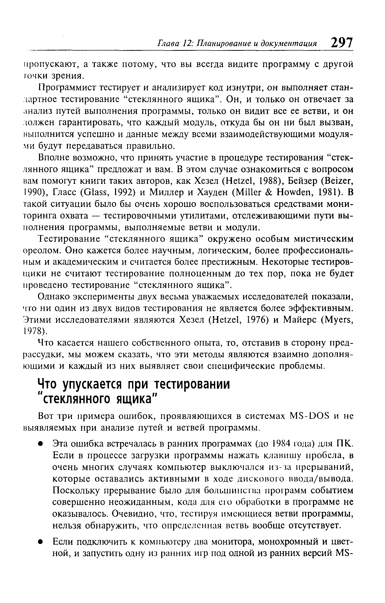

DOS, изображение на монохромном мониторе с большой вероятностью окажется испорченным или же на экране будут странные помехи.
* Подключите к компьютеру принтер, включите его и установите переключатель в Off line. Затем в какой-нибудь старой программе попробуйте выполнить команду печати. Если программа не “зависнет”, проделайте то же самое с другой версией MS-DOS. Очень часто программы сбоят при тестировании с конфигурациями, отличающимися от тех, с которыми они разрабатывались.

Все эти ошибки нелегко обнаружить, поскольку в программном коде они не видны. В программе для них нет путей выполнения, поэтому, выполнив даже каждую строку кода, вы все равно их не найдете. Чтобы выявить такие ошибки, нужно оставить в стороне программный код и подумать, какими способами и с каким оборудованием пользователи могут эксплуатировать программу.

В целом для поиска ошибок, подобных перечисленным на рис. 12.1, тестирование “стеклянного ящика”, без сомнения, является более слабым средством.

> *Эта книга посвящена тестированию работающего кода, тестированию извне, которое осуществляется путем выполнения программы самыми разными способами и с самыми разнообразными нагрузками. Этот подход дополняет подход программиста и позволяет выполнить тесты, которые он едва ли когда-нибудь проведет.*


Важные типы тестирования "черного ящика"

На рис. 12.2 перечислены некоторые наиболее важные составляющие хорошего плана тестирования. Собственно говоря, речь идет не об одном документе, а о целой группе.

Большая часть перечисленных составляющих уже описывалась в этой книге, главным образом в главе 3. Что же касается бета-тестирования, то о нем рассказывается в главе 13. Здесь же мы приведем лишь несколько дополнительных замечаний.


РИСУНОК 12.2. *Важные составляющие плана тестирования "черного ящика"*

- **Приемочное тестирование.** Когда первая версия продукта передается вашей группе, она первым делом проходит приемочное тестирование. Проблема состоит в том, что руководитель проекта стремится передать продукт на тестирование как можно скорее, чтобы пораньше загрузить вас работой. Однако если в группе мало персонала, а продукт еще очень нестабилен, можно вернуть его назад программистам и настаивать на том, чтобы тестирование началось только после достижения разумной степени стабильности.

Приемочные тесты лучше всего распространить среди заинтересованных сотрудников, чтобы ваши критерии были всем известны и программисты могли сами выполнить эти тесты и быть уверенными, что программа готова к более серьезным испытаниям. Перед тем как направить на тестирование очередную версию, приемочные тесты будут выполнять и руководители проекта, особенно если они будут знать, что не прошедшую их программу вы просто никогда не примете.

Приемочные тесты охватывают только наиболее важные действия программы и позволяют выявить самые очевидные ошибки. На их выполнение уходит несколько часов и лишь для особенно сложных систем — до нескольких дней. Именно эти тесты являются первыми кандидатами на автоматизацию.

* **Управление потоком.** Вопрос об управлении потоком — это вопрос о том, как перевести программу из одного состояния в другое. Тестировщики главным образом имеют дело с видимым управлением потоком, а не с внутренней структурой программы. Какими способами можно открыть данное диалоговое окно? Какие последовательности команд меню позволят распечатать информацию? Какие опции и команды позволяют перевести программу в данное состояние?

* **Функциональность.** Анализ функциональности программы позволяет сказать, удовлетворяет ли она требованиям и ожиданиям пользователя. Например, игра может обладать исключительно простым и удобным интерфейсом, не иметь ошибок, мгновенно реагировать на действия пользователя, обладать прекрасным звуком и графикой, но, если при этом играть в нее будет неинтересно, такая игра ничего не стоит и на ее коммерческий успех рассчитывать не придется.

## Стратегия разработки компонентов тестового плана

Изложенные в этой книге сведения можно прекрасно дополнить книгами таких авторов, как Эванс (Evans, 1984) и Хезел (Hetzel, 1988). У них иной, но не менее полезный и практичный подход к планированию тестирования.

### Поступательная разработка тестовых материалов

В традиционной литературе о разработке программного обеспечения утверждается, что настоящая команда разработчиков следует *методу водопада*. Этот метод предполагает, что проект проходит ряд последовательных фаз — от анализа требований до создания проектных документов, за которыми следует кодирование, окончательное тестирование и выпуск.

Однако на практике все не так просто, и далеко не всегда удается придерживаться четкой последовательности этапов. Подробнее об этой проблеме можно прочитать в превосходной книге Тома Гилба (Tom Gilb, *Principles of Software Engeneering Management*, Addison-Wesley, 1988) и его статьях. (Можно также обратиться к таким авторам, как Голд и Льюис (Gould & Lewis, 1985) и Бейкер и Бакстон (Baecker & Buxton, 1987, глава 11)).

В качестве альтернативы традиционному подходу Гилб предлагает разбить программу на маленькие фрагменты и по очереди проектировать, писать и отлаживать каждый из них в комплексе с уже готовой частью программы. Таким образом, у вас постоянно будет целостная и работающая система. Если добавлять к ней функции в порядке их приоритета, вы всегда будете знать, что самая важная работа уже выполнена. Со временем

программа вырастет в надежный и полезный продукт с богатыми возможностями. Вы же сможете постоянно расширять требования и совершенствовать проект, понимая по ходу разработки, каким он должен быть. И обратите внимание, что стоимость этих усовершенствований будет исключительно низкой!

В следующей главе мы еще вернемся к обсуждению методологии разработки продукта, а в этой сосредоточимся главным образом на плане тестирования. Независимо от метода разработки продукта в целом, его тестирование и, в частности, разработку тестового плана лучше всего выполнять эволюционным способом. Вместо того чтобы разрабатывать один большой тестовый план, можно начать с одной из его составляющих и постепенно расширять этот документ, добавляя в него все новые и новые разделы. Разработав первую часть плана, можно приступить к поиску ошибок на его основе. Следующие разделы будут углублять и расширять области поиска. Лучше всего добавлять разделы в план в порядке их приоритета, чтобы к тому моменту, когда руководитель объявит, что тестирование окончено и продукт выходит в свет (а это может случиться в любой момент), вы были уверены, что все наиболее важные тесты уже выполнены.

Такой эволюционный подход, на наш взгляд, гораздо эффективнее традиционного метода водопада, даже если остальная часть команды разработчиков следует этому второму методу. Однако имейте в виду, что это вопрос спорный.

* Канер (Kaner) и Фолк (Folk) полагают, что для тестирования прикладного программного обеспечения эволюционный подход всегда лучше.
* Нгуйен (Nguyen), напротив, рекомендует метод водопада, предлагая сначала написать полный план, утвердить его и только после этого приступать к тестированию. Он считает, что это особенно важно, когда весь процесс разработки ведется по настоящему методу водопада. Настоящий метод водопада означает, что началу разработки тестового плана предшествует утверждение полной и подробной спецификации. В больших проектах часто именно так и бывает. Если же спецификация не так подробна или предполагается, что по ходу дела она без предупреждения будет меняться, Нгуйен также рекомендует эволюционный подход к тестированию.

Похоже, что традиционный взгляд на вещи предполагает обязательное следование методу водопада, независимо от того, как организован весь проект в целом. Это означает, что до тех пор, пока тестовая документация не будет завершена, никто не должен приступать к тестированию продукта, даже если он уже вполне готов к этому. А тестировщики соответствен-

но должны требовать полную спецификацию продукта, иначе они не смогут приступить к разработке своего плана.

К сожалению, традиционный подход не учитывает реалий разработки прикладного программного обеспечения. А эти реалии включают следующие факты.

* Прикладные программы разрабатываются в короткие сроки и нередко довольно неупорядоченно. И разработка, и тестирование начинаются до того, как заканчивается работа над документацией. Более того, спецификация может и вовсе никогда не быть завершена. Изменения требований рынка в любой момент могут повлечь за собой пересмотр ключевых особенностей программы, поскольку главным и фактически единственным важным требованием является ее конкурентоспособность.
* Не во власти тестировщика или даже руководителя группы тестирования изменить философию компании.

Итак, главное, чему следует научиться, — это максимально эффективно выполнять свою работу в существующих условиях. По нашему же опыту лучше всего этому способствует эволюционный подход к тестированию.

Следует упомянуть о двух главных преимуществах эволюционной разработки тестового плана.

* При тестировании методом водопада вы сначала обдумываете и планируете всю работу и только затем приступаете к ее выполнению. На бумаге все выглядит прекрасно, но на деле можно узнать продукт как следует только после его хотя бы краткого тестирования. Не может же планирование работ предшествовать изучению продукта. Таким образом, наиболее последовательным является как раз эволюционный метод, позволяющий проектировать будущую работу на основе уже полученного опыта.
* Предположим, что у вас в руках прекрасная спецификация, написанная в самом начале разработки. (Именно так и должно обстоят дело, если следовать методу водопада.) Вы приступаете к написанию плана параллельно с программированием, чтобы к моменту его завершения быть готовыми начать тестирование. Однако в течение первого года разработки в спецификацию вносятся серьезные изменения, вызванные техническими проблемами и изменениями требований рынка. В результате львиную долю средств, выделенных на тестирование, придется потратить на переработку тестового плана. Этого не случиться, если работать эволюционным методом и планировать тесты по мере того, как будет приближаться их черед выполнения.

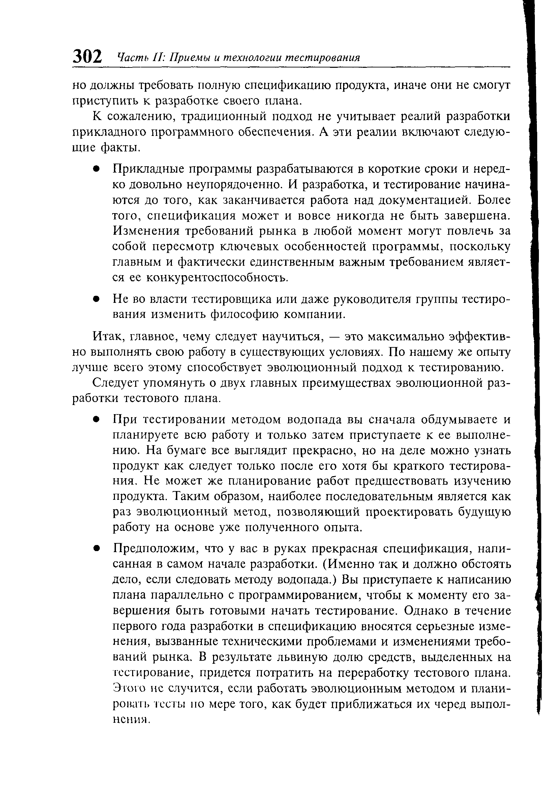

Быстрота реализации проекта является важнейшей составляющей общего качества проведения работ. (Подробное обсуждение этого вопроса можно найти у Джурана (Juran, 1989, с. 49).) Как правило, эволюционный подход к тестированию и разработке тестового плана является наиболее быстрым и дешевым способом, позволяющим приступить к работе сразу же по завершении кодирования и сделать эту работу хорошо.

## Начальная разработка тестовых материалов

Итак, используемый нами подход предполагает проведение тестирования параллельно с работой над его планом. При этом ни одно из этих двух дел не должно слишком далеко уходить вперед. Посвятив день планированию, проведите все же пару часов за компьютером, проверяя свои идеи на деле. А концентрируясь на тестировании, держите под рукой блокнот для записи новых идей. Еще лучше работать сразу с двумя компьютерами, используя один для тестирования, а другой для работы над планом. Таким образом, не пропадет ни одна из хороших идей, пришедших вам в голову в ходе работы, и все они будут реализованы наилучшим образом. Поначалу тестовый план может выглядеть просто как набор заметок. Но со временем, по мере того, как вы будете получать все больший опыт работы с программой, все больше о ней узнавать и находить все больше и больше ошибок — он будет приобретать все более организованный вид.

На рис. 12.3 показаны первые шаги разработки тестового плана. Работа начинается с поверхностного знакомства с программой — выполнения всех ее основных команд и опробования всех основных режимов.


Постарайтесь понять, с какими проблемами столкнутся ее пользователи в течение первых двух часов работы. Эти проблемы лучше всего решить как можно раньше.

* **Тестирование по документации.** Начните со сравнения поведения программы с имеющимся черновиком руководства пользователя. Если у вас есть спецификация, сверьте программу и с ней. Про пройдитесь по руководству строчка за строчкой, делая все, что в нем написано, нажимая каждую упомянутую клавишу. Невероятно, как много

проблем выявляется в ходе этой работы. К тому же ее результаты оказывают неоценимую помощь как программистам, так и техническим писателям.

* *Начните разработку тестовой документации с организационного материала, например, со списка функций программы.* В этот список включается все, что должна делать программа. Старайтесь ничего не упустить, поскольку полнота этого списка будет определять полноту тестирования продукта. Однако поначалу список будет далеко не полным. Вам будет не хватать глубины знания продукта, и к тому же часть его функций будет просто не документирована. В дальнейшем список будет расширяться и в конечном счете охватит все функции программы. Об этом постепенном расширении списка функций мы еще поговорим в одном из следующих разделов.

* *Выполните простейший анализ граничных условий.* Подумайте об ограничениях, которым соответствуют вводимые программой данные. Если программа не разрушается, попробуйте ввести значения, выходящие за эти границы. В черновиках пользовательского руководства ограничения обычно не указаны. Что же касается спецификации, то слишком уж часто разработчики не оставляют от перечисленных в ней требований камня на камне. Поэтому, тестируя программу, придется ориентироваться на реальные границы данных. Запишите, какими они оказались, и покажите свои заметки техническим писателям или программистам, чтобы согласовать окончательный вариант поведения программы и внести изменения либо в нее саму, либо в документацию и собственные тестовые примеры.

Итак, начинайте с построения основ. Для работы с планом выберите инструмент, позволяющий с легкостью просматривать и реорганизовывать его компоненты. На этом первом этапе вы обязательно будете тестировать программу, хотя и не слишком тщательно. Все же это позволит выявить ряд наиболее очевидных проблем, которые лучше всего устранить как можно раньше. А далее план будет углубляться и расширяться, пока не превратится в прекрасно организованную тестовую документацию.

## Что дальше?

Итак, первоначальное знакомство с программой завершено. Что же дальше? Каковы следующие наиболее важные области тестирования? На чем следует сосредоточить внимание и дальнейшие усилия? К сожалению, волшебной формулы здесь нет. Все зависит от ваших знаний и инстинкта тестировщика. Можно только сказать, что скорее всего, вы приступите к работе над одной из шести областей, показанных на рис. 12.4.

**РИСУНОК 12.4.**
*Тактика эволюционного тестирования (2)*


* **Наиболее вероятные ошибки.** Если известно, что в определенной части программы очень много ошибок, поработайте прежде всего с ней. Внутри программы ошибки обитают колониями. В ходе исследований, проведенных Майерсом (Myers) в 1979 году, 47% ошибок было найдено в 4% всех модулей системы. Это пример, иллюстрирующий совершенно реальную тенденцию — чем больше ошибок обнаружено в определенной области программы, тем больше их еще предстоит там найти. И даже вносимые исправления с большей чем обычно вероятностью влекут за собой новые ошибки. Те области, которые в ходе первоначального тестирования показали себя наиболее слабыми, останутся такими и в дальнейшем. Поэтому лучше всего начать с ними работать как можно раньше и как можно обстоятельнее.
* **Наиболее заметные ошибки.** Можно поступить и иначе — прежде всего сконцентрироваться на тех ошибках, которые более всего заметны пользователю или наиболее негативно скажутся на его работе и на его впечатлении о продукте. Подумайте, какие части программы будут использоваться чаще других, какие ее возможности выгодно отличают ее от конкурентов и какие функции наиболее важны для пользователя. Те из функций, которые сами по себе хороши, но не являются жизненно важными компонентами продукта, можно протестировать во вторую очередь. Если они не работают, это, конечно, плохо. Но гораздо хуже, если не функционируют базовые элементы продукта, ведь тогда это вообще не продукт.
* **Наиболее часто используемые области программы.** Ошибки в этих областях повторяются без конца. Поэтому, даже если они не особенно серьезны, пользователь вскоре почувствует раздражение.
* **Отличительные особенности программы.** Если вы продаете базу данных и утверждаете, что она сортирует таблицы в 48 раз быстрее, чем продукты конкурентов, функцию сортировки следует протестировать особенно тщательно. Если сортировка и в самом деле выполняется быстро, но неправильно, вряд ли это понравится пользователям. Высоко оптимизированные фрагменты кода являют-

ся потенциальным источником ошибок, которые к тому же трудно исправлять. Поэтому чем раньше вы сообщите о подобных ошибках, тем лучше.

* **Сложнейшие для тестирования аспекты.** Поговорите с программистом и спросите у него, есть ли в программе особенно сложные области, об ошибках в которых ему не хочется даже думать. Вполне не возможно, что он расскажет вам о таких областях. В этом случае возьмитесь за их тестирование как можно раньше, как минимум за несколько месяцев до окончательного выпуска продукта, чтобы у программиста было достаточно времени на исправление найденных там ошибок. Иначе, если вы найдете в такой области ошибку за неделю до выпуска, у программиста будет инфаркт или он уволится и ошибка так и не будет исправлена.
* **Самые понятные для вас функциональные области.** Возможно, вы читали программный код или хорошо знакомы с продуктами подобного типа. Это значит, что отдельные области программы вам настолько хорошо знакомы, что вы готовы немедленно приступить к их тестированию. Так и поступайте. С остальными составляющими программы вы познакомитесь по ходу тестирования. Работая с наиболее понятной частью программы, постарайтесь разобраться, как она взаимодействует с остальными частями. В результате, даже если выбранная область не является критической, вы приобретете хороший опыт, выявите ряд ошибок и в дальнейшем быстрее разберетесь с остальными составляющими продукта.

## Углубление тестового плана

Тестовый план можно углубить путем добавления к нему разнообразных компонентов: списков функций, других рабочих списков, деревьев принятия решений, диаграмм граничных условий, тестовых матриц и т.д. Все это — ваши средства анализа программы и выделения необходимых тестов.

* В следующем разделе, “Компоненты плана тестирования”, рассказывается о назначении всех этих компонентов и о том, как их разрабатывать. Вы узнаете о том, какую роль в их создании играет эволюционный подход.
* После описания отдельных компонентов речь пойдет об их объединении в различных типах плановых документов.
* Затем предмет дискуссии расширяется, охватывая организацию тестового проекта и назначение приоритетов отдельным задачам. Эти вопросы освещаются в главе 13. В этой же главе, в нескольких разделах, посвященных проведению тестирования после выпуска альфа-версии продукта, продолжается дальнейшее рассмотрение процесса разработки тестового плана.

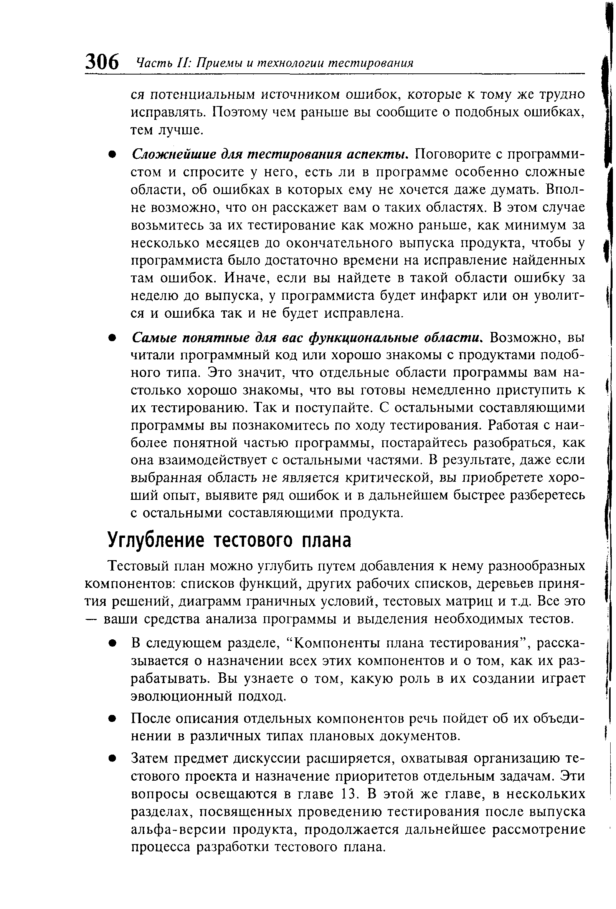

## Компоненты плана тестирования

> **ПРИМЕЧАНИЕ**
> В этом разделе в качестве примера тестируемой программы выбрана система отслеживания проблем. (Кроме того, мы пользуемся и примером системы, выписывающей счета. Нам нужна была программа, на примере которой можно было бы составить таблицы, приведенные на рисунках 12.5–12.11. Поскольку о системе отслеживания проблем рассказывалось в главах 5 и 6, читатель хорошо с ней знаком.)
> 
> Читая эту главу, рассматривайте систему отслеживания проблем не с точки зрения ее разработчиков и пользователей, как вы делали это раньше, а с точки зрения человека, который занимается ее тестированием.
> 
> Пусть вас не смущают некоторые детали системы, о которых в главе 6 ничего не рассказывалось. Они введены здесь просто для примера и могут изменяться от компании к компании.

В этом разделе описываются строительные блоки тестовой документации. Весь процесс планирования организован вокруг четырех базовых типов диаграмм, примеры которых приведены на рис. 12.5:

* списки;
* таблицы;
* планы;
* матрицы.

Все это очень краткие документы. Они показывают, что необходимо знать о тестируемой программе. Эти документы позволяют быстро организовать работу, а также выделите вопросы, которые вы не понимаете, и те, в которых разбираться не обязательно.

Теоретически все эти списки и таблицы можно составить на основе спецификации. Однако на самом деле именно они помогли бы вам выявить "бреши" в спецификации, если бы кто-нибудь попросил вас ее проанализировать.

На самом деле лишь в очень редких случаях спецификации прикладных программных продуктов настолько подробны, чтобы по ним можно было составить все перечисленные документы. В результате на их формирование уходит львиная доля времени, выделенного на планирование вашей работы. Тем не менее, они исключительно важны, а потому мы настоятельно рекомендуем взять их разработку за нерушимое правило.

Увлекшись разработкой списков и таблиц, ничего не стоит выбиться из рабочего графика, так как процесс этот трудоемкий, а анализируемый материал очень объемен.

| Списки | Список отчетов<br>Список входных и выходных переменных<br>Список возможностей и функций<br>Перечень материалов<br>Список файлов программы<br>Список сообщений об ошибках<br>Список совместимого оборудования<br>Список совместимых программ<br>Список конфигураций совместимой операционной среды<br>Список публикуемых документов |
| :--- | :--- |
| Таблицы | Таблица отчетов<br>Таблица входных и выходных значений<br>Таблица ввода/вывода<br>Таблица решений<br>Таблица клавиатурных комбинаций<br>Таблица совместимых принтеров<br>Диаграмма граничных значений |
| Планы<br>(иерархические<br>списки) | Список функций |
| Матрицы | Матрица аппаратной и программной совместимости<br>Матрица аппаратных конфигураций<br>Матрица операционных окружений<br>Матрица комбинаций входных значений<br>Матрица сообщений об ошибках и<br>клавиатурных комбинаций |

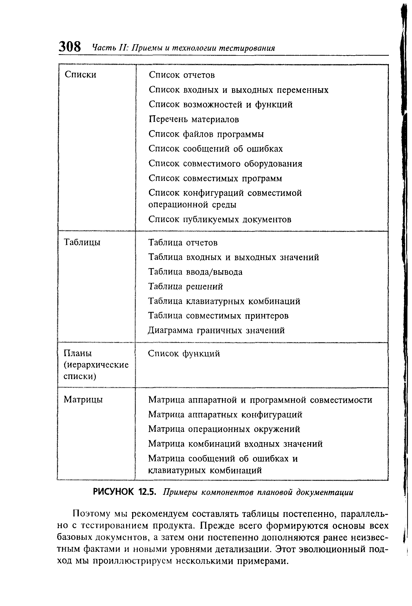

**РИСУНОК 12.5.** *Примеры компонентов плановой документации*

Поэтому мы рекомендуем составлять таблицы постепенно, параллельно с тестированием продукта. Прежде всего формируются основы всех базовых документов, а затем они постепенно дополняются ранее неизвестным фактами и новыми уровнями детализации. Этот эволюционный подход мы проиллюстрируем несколькими примерами.

Большая часть информации попадает в наши таблицы из спецификации, заметок разработчиков, черновиков руководства пользователя и другой документации к продукту, а также из устных бесед с программистами и руководителем проекта. Еще одна значительная часть информации, иногда до 50%, является результатом собственного опыта тестировщиков, полученного в ходе экспериментов с программой. Такова действительность: вы выполняете тесты, ищите граничные условия, комбинируете входные данные и формируете отчеты таких форматов, каких руководитель проекта никогда и не предполагал. Иногда, хотя и далеко не всегда, руководитель может проанализировать полученные вами результаты и сказать, можно ли считать поведение программы правильным. В большинстве случаев вам придется решать это самим. Если вам покажется, что определенные действия программы нелогичны или недопустимы, составляйте отчет об ошибке. Если же вы не уверены в своем впечатлении, пометьте отчет как **Вопрос**.

И последнее замечание. Составив списки и таблицы, передайте их авторам пользовательской и технической документации. Вся эта информация им очень нужна. Скорее всего, они отблагодарят вас, предоставив собственные таблицы и схемы, и будут держать вас в курсе собственных открытий и недокументированных изменений программы.

## Списки

Написать список достаточно легко. Главное, ничего не упустить и включить в него все необходимые элементы. Зато после того, как это сделано, вы будете избавлены от необходимости постоянно о них помнить.

### Списки отчетов и экранных форм

Самым первым делом составляются два важнейших списка, отражающих ключевые функции программы, это списки входных и выходных форм. В первый из них включаются все экранные формы ввода данных, в том числе диалоговые окна. Во второй входят все отчеты — как печатные, так и выводимые на экран или в файлы. Опираясь на эту информацию, можно затем составить список всех переменных, которые программа отображает и печатает, и всех переменных, значения которых вводятся пользователем.

На рис. 12.6 приведен пример списка отчетов системы отслеживания проблем. Этот простой список исключительно важен. Ведь, тестируя систему, придется проверять каждый отчет по многу раз: как минимум по одному разу на каждом цикле. А раз так, вам не обойтись без такого контрольного списка — иначе как гарантировать, что ни один из отчетов не будет пропущен? Кроме того, если отчеты будет генерировать другой тестировщик, вам необходимо будет дать ему их список, особенно если сам он мало знаком с программой.

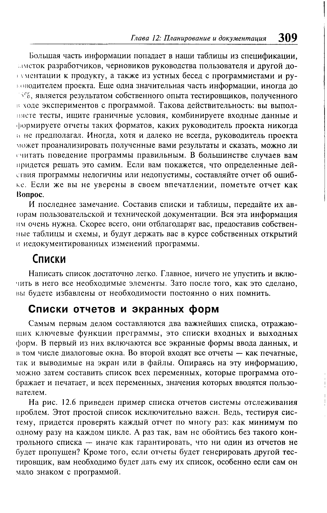

* Отчет о проблеме (рис. 5.1 из главы 5)
* Сводный отчет о новых проблемах (рис. 6.1 из главы 6)
* Состояние проекта (рис. 6.3 из главы 6)
* Завершение цикла тестирования (рис. 6.4 из главы 6)
* Нерешенные проблемы, отсортированные по степеням важности (рис. 6.5 из главы 6)
* Нерешенные проблемы, отсортированные по группам разработки (рис. 6.6 из главы 6)
* Отложенные проблемы (рис. 6.7 из главы 6)
* Еженедельные итоги (рис. 6.8 из главы 6)
* Акт о выпуске (рис. 6.9 из главы 6)
* Заплатки (рис. 6.10 из главы 6)

РИСУНОК 12.6. *Отчеты, имеющиеся в системе отслеживания проблем*

## Список входных и выходных переменных

Составьте список всех переменных, значения которых вводятся программой — будь то через экранные формы, диалоговые окна или каким-либо иным способом. Примером такой переменной может быть **Номер отчета о проблеме**. Этот номер у каждого отчета свой, но у любого отчета он обязательно имеется. Каждое поле отчета о проблеме представляет собой отдельную переменную, значение которой задается при вводе отчета либо вами, либо самой системой.

Тестируя систему отслеживания проблем, вы составляете список всех ее переменных, начиная, конечно, с формы отчета о проблеме (рис. 5.1 из главы 5). Часть их перечислена на рис. 12.7.

Структурой отчета определяется, что одни из его переменных могут содержать только числа, такие как **Номер отчета о проблеме**, другие предназначены для ввода нескольких строк текста, такие как переменная **Подробное описание проблемы и как ее воспроизвести**.

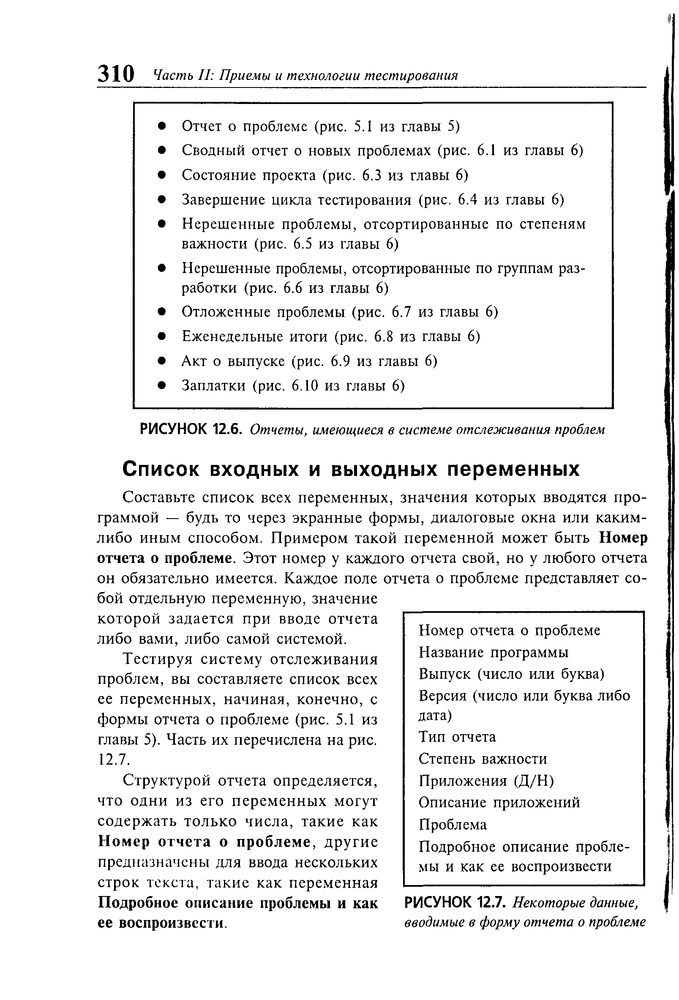

РИСУНОК 12.7. *Некоторые данные, вводимые в форму отчета о проблеме*

Если программа читает данные с диска, выясните у руководителя проекта, какова структура соответствующих файлов. Включите в список и те переменные, значения которых вводятся из файлов. По мере углубления тестирования стоит подумать о написании собственной тестовой программы, непосредственно читающей файлы данных и проверяющей корректность их содержимого. Формат файлов данных нередко меняется в ходе разработки, причем руководитель проекта вполне может забыть вас об этом предупредить, а может и сам быть не в курсе этих изменений. Подобные случаи — прекрасная возможность найти новые ошибки.

Обязательно следует составить список и всех выходных переменных, печатаемых в отчетах, выводимых на экран в ответ на запросы пользователя и передаваемых другим задачам или даже другим компьютерам.

Рассмотренные нами списки представляют собой перечень тех переменных, которые подлежат непосредственному тестированию. Однако они не содержат всех необходимых сведений об этих переменных, и в частности, следующих.

* В списках ничего не сказано о том, где искать перечисленные в них переменные (в каком диалоговом окне или отчете). Эта информация вносится в отдельные таблицы, такие как на рисунках 12.11–12.13.
* Из них не видно, каковы допустимые и недопустимые значения каждой переменной. Для их описания служат диаграммы, подобные приведенным на рис. 12.17.
* В них не отражены взаимосвязи между входными и выходными значениями. (Например, в поле **Проблема** сводного отчета выводятся данные из одноименного поля исходного отчета о проблеме. Разумеется, не всегда выходная переменная имеет то же имя, что и входная, однако выходные данные всегда так или иначе формируются на основе входных, и эти алгоритмы должны быть вам известны.)

Нередко выходная переменная является просто копией одной из входных, однако их связи могут быть и гораздо более сложными. Рассмотрим систему, выписывающую счета за сделанные по почте заказы. Ее входными документами могут быть заказы, а входными переменными — наименования и цены заказываемых товаров. Выставляемый заказчику счет содержит набор выходных переменных. Одна из них — это общая стоимость покупки, вычисленная на основе цен отдельных элементов. Вторая — это сумма налога, которая, хотя и не отражает прямо значения входных переменных, все же вычисляется на их основе. Третьей переменной может быть итоговый баланс, включающий общую стоимость покупки с налогом и, возможно, задолженность после предыдущих покупок. Заметьте, что задолженность извлекается из файла данных, а не из текущего заказа клиента.

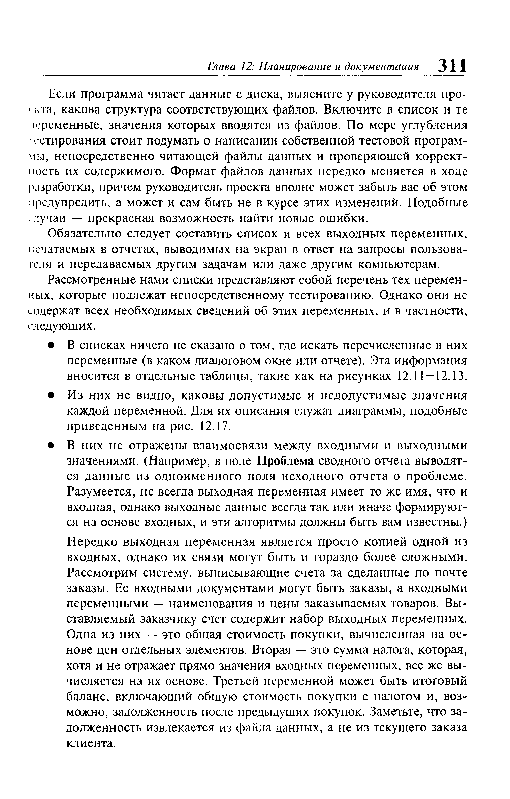

Взаимосвязи между входными и выходными переменными лучше всего описываются в форме таблицы ввода/вывода, примеры которой приведены на рисунках 12.2 и 12.3.

Несмотря на то что в базовом списке переменных отсутствуют подробные сведения о каждой из них, этот список исключительно полезен. Прежде всего, он является основой построения ряда более подробных таблиц. Кроме того, как минимум на первых трех циклах тестирования у вас просто не будет времени на сбор всей этой детализирующей информации. Единственным контрольным средством будут списки переменных ввода/вывода. Тесты для каждой из них придумываются на ходу, а допустимые значения определяются интуитивным и пробным путем. Разумеется, эти тесты не будут такими обстоятельными и элегантными, как те, которые вы затем включите в тщательно продуманные планы, однако для начала они вполне подойдут.

Следует добавить, что на начальных этапах тестирования у вас не будет ни времени, ни достаточного знания программы для того, чтобы составить абсолютно полный список переменных. Рассматривайте то, что получится, лишь как первую версию. В дальнейшем наверняка будут обнаруживаться новые диалоговые окна, новые отчеты, новые файлы данных, а также измененные версии тех диалоговых окон, отчетов и файлов, которые вы уже включили в свои списки.

## Список возможностей и функций

Прежде всего составьте список тех функций программы, которые очевидны для ее пользователя. Включите в него все команды меню, параметры командной строки, всевозможные кнопки и опции и т.п. — все значительные возможности, имеющиеся у программного продукта. Это будет список функций самого верхнего уровня.

Позднее вам предстоит составить список подфункций и подподфункций. В конечном счете получится подробный и строго структурированный перечень всех возможностей продукта. (Мы рекомендуем пользоваться для его создания специальным процессором иерархических списков или планов.)

Полный список функций будет вашим путеводителем по программе и одновременно контрольным инструментом для прохождения каждого цикла тестирования — он поможет ничего не забыть и одновременно позволит отмечать, что уже пройдено и что еще осталось.

В случае с системой отслеживания проблем первый черновик списка функций может выглядеть так, как на рис. 12.8. В нем всего десяток элементов. Однако следующие версии этого списка будут уже гораздо более полными.

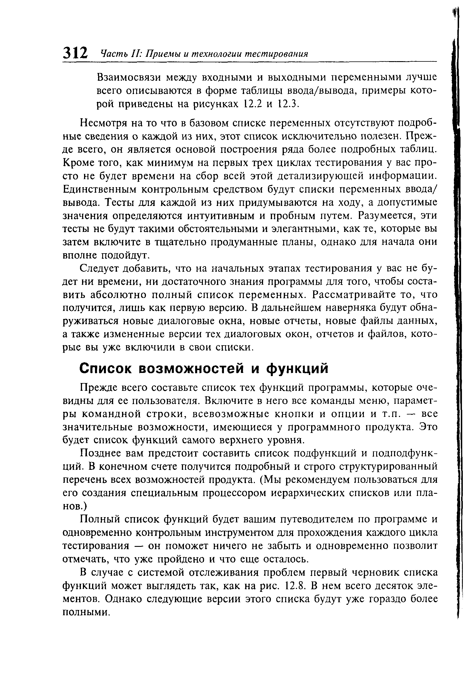

### Список сообщений об ошибках

Составьте список всех генерируемых программой сообщений об ошибках. Если этот список нельзя будет просто получить у руководителя проекта в готовом виде, попробуйте воспользоваться утилитой, которая извлекает текстовые сообщения из исполняемого файла, а перед этим выясните у программистов, имеются ли в программе файлы ресурсов: возможно, что все сообщения последовательно перечислены в одном из таких файлов. Если же сообщений не будет нигде, кроме кода, а он в исполняемом виде по какой-либо причине не поддается анализу с помощью утилит поиска текста, попросите у руководителя проекта, чтобы он предоставил вам исходный код программы.

Вы обязаны протестировать каждое состояние программы, которое приводит к сообщению об ошибке. Обязательно заставьте ее вывести все возможные сообщения. Прочтите их внимательно. Достаточно ли они адекватны и информативны? Как ведет себя программа после вывода сообщения об ошибке? Восстанавливает ли она свою работоспособность и правильно ли она это делает?

Будьте готовы к тому, что обработка ошибочных ситуаций окажется хуже всего сделанной частью программы — непродуманной и кишащей ошибками. Поэтому важно как следует продумать свой инструментарий: лучше всего для тестирования этой части программы подойдет не просто список сообщений об ошибках, а подробная таблица для проверки корректности восстановления программы поле каждой из ошибочных ситуаций. Чуть позже мы рассмотрим пример такой таблицы, чтобы было понятнее, о чем идет речь.


РИСУНОК 12.8. *Первый черновик списка функций системы отслеживания проблем*

### Список файлов программы

Дату и время создания файлов программы и тех их версий, которые описаны в вашей документации, следует периодически сравнивать. Даже если руководитель проекта и будет предоставлять вам списки вносимых в эти файлы изменений (что вполне вероятно), его список может быть непол-

ным. Если вам известно, с какими данными или функциональными областями программы связан каждый из файлов, сравнение их версий позволит быть в курсе изменений программы, а значит, и потенциальных ошибок.

Иногда все файлы программы перечисляются в ее документации. Если в вашем случае это так, сравните этот список со своим и передайте авторам документации перечень расхождений.

> **Перед выпуском программы вы ОБЯЗАНЫ убедиться, что на дистрибутивный диск помещены самые последние версии программных файлов.**

Вы себе даже не представляете, как часто компании распространяют диски не с теми файлами, и вынуждены эти файлы заменять. Это очень неприятно и очень дорого. Конечно, получив комплект дистрибутивных дисков в самую последнюю минуту, *так и хочется отослать их на размножение, выполнив лишь самую поверхностную проверку*. Но не поддавайтесь этому искушению. Проверьте всю информацию самым тщательным образом. Ведь речь идет о результате всей вашей работы!

## Список совместимого оборудования

Составьте список компьютеров, принтеров, мониторов и всех прочих устройств, с которыми должна работать тестируемая вами программа. Обратитесь к главе 8 — в ней вы найдете много полезных сведений о тестировании аппаратного обеспечения.

## Список совместимых программ

Составьте список всех программ, с которыми тестируемая вами программа должна успешно работать. Протестируйте каждую из них на совместимость. Расширяя этот список в ходе дальнейшего тестирования, внесите в него не только программы, но и их взаимодействующие компоненты. Вообще, понятие совместимости двух программ может иметь различный смысл.

* Обе программы сосуществуют в памяти компьютера.
* Одна из программ читает файлы данных другой.
* Программы обмениваются сообщениями.
* Программы должны хранить данные в одном и том же формате.
* В программах одинаковые команды выполняются с помощью одинаковых клавиатурных комбинаций.
* Программы следуют одним и тем же соглашениям о пользовательском интерфейсе.

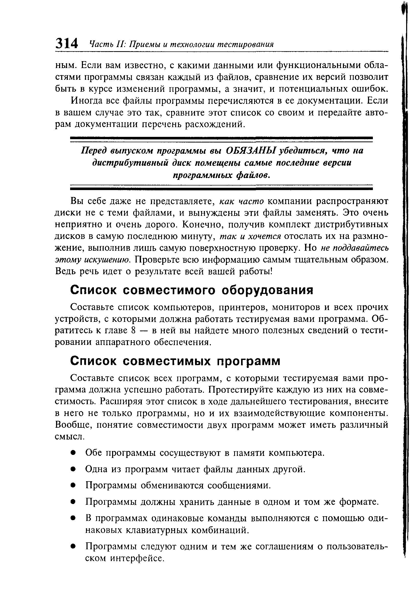

## Список совместимого операционного окружения

Под управлением каких операционных систем может работать тестируемая вами программа? С какими версиями этих систем она совместима? Если ряд версий операционной системы адаптирован к определенному аппаратному обеспечению, с какими из них необходимо протестировать программу? Что, если одна из компаний выпускает операционную систему, совместимую с той, для которой разрабатывается ваш продукт, — следует ли протестировать его с этой системой?

Поверх операционной системы может работать целый ряд резидентных утилит. Эти дополнительные программы управляют сетью, различными внешними устройствами или же расширяют базовый интерфейс ОС. Например, поверх командно-ориентированной операционной системы может работать графическая пользовательская оболочка.

Для полноценного тестирования вам понадобится полный список всех операционных систем, утилит, драйверов и интерфейсных оболочек, с которыми должен работать продукт. Если позволяет время, организуйте информацию в таблицы, отражающие связи между всеми этими компонентами (например, какая оболочка для какой операционной системы должна запускаться).

## Перечень материалов

В перечень материалов включается все, что входит в комплект поставки программного продукта, проще говоря, все, что пользователь найдет в коробке. Это прежде всего все диски, а также все рекламные листовки и буклеты, документация, странички исправлений, наклейки на коробке и все остальное, что является частью программного продукта. *Все перечисленное в списке материалов вы обязаны проверить*. Строго следуя этому списку, вы гарантированно ничего не упустите.

## Список публикуемых документов

Все связанные с программой документы, которые выйдут за пределы вашей компании, также подлежат самой тщательной проверке. Это анонсы, реклама, пользовательская документация, различные буклеты, листки с ответами группы технической поддержки, материалы, рассылаемые по почте, руководства по диагностике и сопровождению продукта, инструкции по его установке, пресс-релизы, копии изображений на коробке и наклейках и многое другое. Список всех этих материалов поможет ничего не забыть и вовремя проверить каждый из них.

## Таблицы

У списков есть один недостаток — информация в них не организована, и связи между их отдельными элементами никак не видны. Свою роль напоминания и контроля они выполняют прекрасно, но там, где важны связи, удобнее воспользоваться табличной формой организации информации.

Для иллюстрации процесса формирования и использования таблиц давайте предположим, что разработчики системы отслеживания проблем модифицировали ее таким образом, что она автоматически печатает отчеты в определенные дни. Это усовершенствование необходимо протестировать, т.е. убедиться, что отчеты действительно печатаются вовремя. Самой естественной схемой для вашей работы и будет приведенная на рис. 12.9 таблица.

### Таблица отчетов

В таблице на рис. 12.9 перечислены те же отчеты, что и в списке на рис. 12.6. Все это — отчеты, генерируемые системой отслеживания проблем. Однако в таблице есть место и для дополнительной информации. В ней показано, когда формируется каждый отчет и сколько его копий печатается программой.

Информация организована в виде строк и столбцов. Обычно все они поименованы.

* В первой строке обычно записываются заголовки столбцов, отражающие вносимую в них информацию. На рис. 12.9 в первом столбце перечислены отчеты, во втором указана частота их формирования, а в третьем — количество копий каждого отчета.
* Первый столбец обычно показывает, какая информация содержится в каждой строке. На рис. 12.9 в нем перечислены все отчеты программы. Вся имеющаяся в строке информация относится к указанному в ней отчету.

Отчеты на рис. 12.9 перечислены в том же порядке, в каком они рассматривались в главе 6. Для начала это удобнее всего, поскольку это гарантирует, что ничего не упущено. Однако для тестирования удобнее сгруппировать вместе все отчеты, печатаемые в один и тот же день, как на рис. 12.10, ведь и проверять их вы, скорее всего, будете вместе.

### Таблица входных и выходных значений

На рис. 12.7 приведен пример таблицы входных значений программы. В первом столбце перечислены переменные — они взяты из списка на рис. 12.7. Во втором столбце указаны названия диалоговых окон или форм ввода данных, в которых пользователь вводит значения этих переменных.

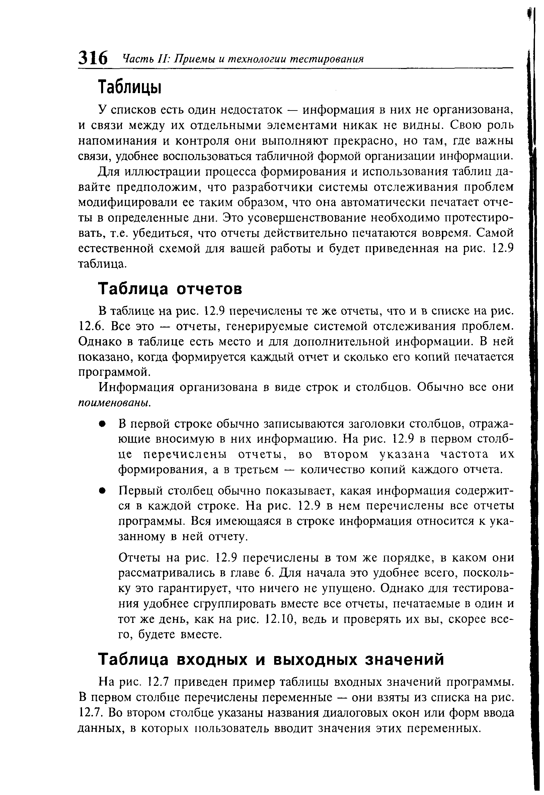

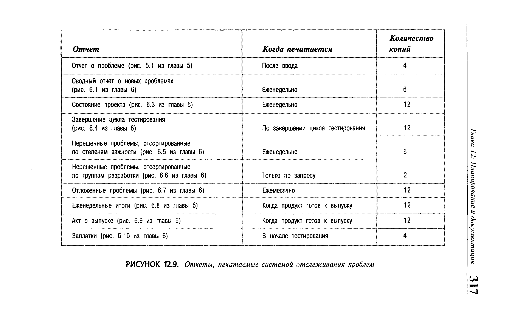

РИСУНОК 12.9. Отчеты, печатаемые системой отслеживания проблем

![Таблиця з розкладом друку звітів системою відстеження проблем. Перша колонка «Когда печатается» (час друку), друга колонка «Отчет» (назва звіту). Наприклад: В начале тестирования — Заплатки (рис. 6.10 из главы 6); После ввода — Отчет о проблеме (рис. 5.1 из главы 5); Еженедельно — Сводный отчет о новых проблемах, Состояние проекта, Нерешенные проблемы; Ежемесячно — Отложенные проблемы; По завершении цикла тестирования — Завершение цикла тестирования; Когда продукт готов к выпуску — Еженедельные итоги, Акт о выпуске; Только по запросу — Нерешенные проблемы, отсортированные по группам разработки](images/Kaner_1999_TestingComputerSoftware/page_317_img_1.png)

**РИСУНОК 12.10.** *Отчеты, печатаемые системой отслеживания проблем, сгруппированные по времени печати*

Этот столбец назван **Источник**. Значение переменной не обязательно вводится в одном-единственном месте программы, поэтому в таблице присутствует еще один столбец, названный **Второй источник**. (См. рис. 12.11.)

Структура таблицы выходных переменных полностью аналогична, разве что вместо окон, в которых данные вводятся (их источников), перечисляются формы, в которых они отображаются или печатаются. При этом заголовок столбца **Источник** заменяется на **Отчет**. Параллельно с печатью и отображением на экране или же вместо этого переменные могут сохраняться в файлах. В этом случае в таблицу выходных переменных можно добавить еще один столбец под названием **Файл**. (См. рис. 12.12.)

## Таблица ввода/вывода

Любые вводимые в программу данные должны ею использоваться. Они могут появиться в отчете, использоваться в вычислениях, для поиска другой нужной программе информации или определения ее дальнейших действий.

Как тестировщику вам необходимо точно знать, как используется значение той или иной входной переменной. Что произойдет, если изменить ее значение? На какие другие данные это повлияет?

То же самое можно сказать и о выходных переменных: вы должны знать, откуда они берутся и как формируются. Почему программа решает напечатать именно это значение, а не какое-нибудь другое? И какие еще переменные вовлечены в процесс принятия ее решения?

Чтобы наглядно представить всю эту информацию, создайте таблицу и в первом ее столбце перечислите входные переменные. Во втором столбце против каждой входной переменной укажите все выходные переменные, которые с ней так или иначе связаны. Суть каждой связи опишите в третьем столбце. Поскольку в системе отслеживания проблем нет хорошего образца такой таблицы, мы обратились к примеру программы, выписывающей счета за заказанные товары. (Эта программа была коротко описана несколько ранее.) Единственной приведенной в таблице входной переменной является цена заказанных товаров. Она связана с несколькими выходными переменными.

Две из четырех перечисленных в таблице выходных переменных основаны на переменной **Общая_стоимость**, которая, в свою очередь, зависит от переменной **Цена_товара**. Будучи выходным значением, **Общая_стоимость** является одновременно и промежуточной переменной, т.е. промежуточным результатом, полученным в ходе формирования выходных данных на основе входных. Ее значение определяется вводом и, в свою очередь, определяет вывод программы.

Иногда полезно отслеживать не только значения входных и выходных данных программы, но и ее промежуточные результаты.


С этой целью в таблицу ввода/вывода добавляется еще один столбец. Что получается в результате в нашем примере со счетами на заказы, показано на рис. 12.13. На этом рисунке в качестве промежуточной переменной выступает переменная **Общая_стоимость**: она записана в таблице рядом с переменной **Налог_с_продажи**, что указывает на их связь.

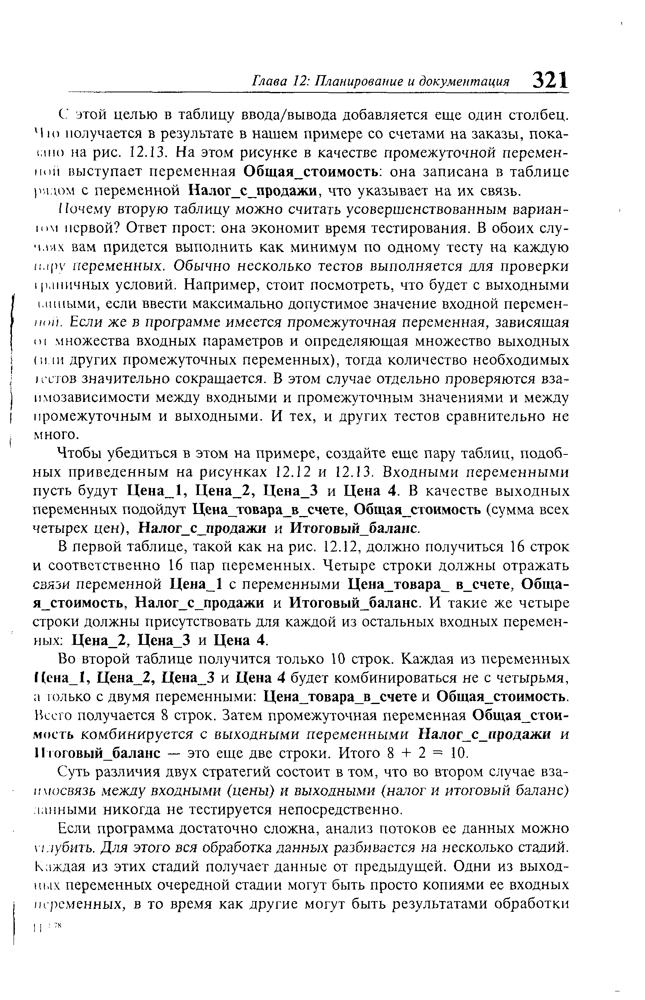

Почему вторую таблицу можно считать усовершенствованным вариантом первой? Ответ прост: она экономит время тестирования. В обоих случаях вам придется выполнить как минимум по одному тесту на каждую пару переменных. Обычно несколько тестов выполняется для проверки граничных условий. Например, стоит посмотреть, что будет с выходными данными, если ввести максимально допустимое значение входной переменной. Если же в программе имеется промежуточная переменная, зависящая от множества входных параметров и определяющая множество выходных (или других промежуточных переменных), тогда количество необходимых тестов значительно сокращается. В этом случае отдельно проверяются взаимозависимости между входными и промежуточным значениями и между промежуточными и выходными. И тех, и других тестов сравнительно не много.

Чтобы убедиться в этом на примере, создайте еще пару таблиц, подобных приведенным на рисунках 12.12 и 12.13. Входными переменными пусть будут **Цена_1**, **Цена_2**, **Цена_3** и **Цена_4**. В качестве выходных переменных подойдут **Цена_товара_в_счете**, **Общая_стоимость** (сумма всех четырех цен), **Налог_с_продажи** и **Итоговый_баланс**.

В первой таблице, такой как на рис. 12.12, должно получиться 16 строк и соответственно 16 пар переменных. Четыре строки должны отражать связи переменной **Цена_1** с переменными **Цена_товара_в_счете**, **Общая_стоимость**, **Налог_с_продажи** и **Итоговый_баланс**. И такие же четыре строки должны присутствовать для каждой из остальных входных переменных: **Цена_2**, **Цена_3** и **Цена_4**.

Во второй таблице получится только 10 строк. Каждая из переменных **Цена_1**, **Цена_2**, **Цена_3** и **Цена_4** будет комбинироваться не с четырьмя, а только с двумя переменными: **Цена_товара_в_счете** и **Общая_стоимость**. Всего получается 8 строк. Затем промежуточная переменная **Общая_стоимость** комбинируется с выходными переменными **Налог_с_продажи** и **Итоговый_баланс** — это еще две строки. Итого $8 + 2 = 10$.

Суть различия двух стратегий состоит в том, что во втором случае взаимосвязь между входными (цены) и выходными (налог и итоговый баланс) данными никогда не тестируется непосредственно.

Если программа достаточно сложна, анализ потоков ее данных можно углубить. Для этого вся обработка данных разбивается на несколько стадий. Каждая из этих стадий получает данные от предыдущей. Одни из выходных переменных очередной стадии могут быть просто копиями ее входных переменных, в то время как другие могут быть результатами обработки

входной информации. Анализ промежуточных значений позволяет тестировщику определить, где и почему что-то в программе пошло не так. Кроме того, они представляют собой поле поиска дополнительных граничных условий и других потенциальных источников ошибок, а в результате — основу для расширения набора тестов.

Итак, у нас вырисовываются три типа таблиц.
* В таблицах первого типа отражаются *все входные переменные*, то, как они используются, где они появляются в качестве промежуточных результатов и как влияют на выходные данные. Для каждой из входных переменных необходимо составить список всех связанных с ней стадий обработки данных и результирующих значений.
* В таблицах второго типа отражаются *все выходные переменные* и то, откуда берутся их значения. Для каждой из выходных переменных необходимо составить список всех связанных с ней стадий обработки данных и результирующих значений.
* В таблицах третьего типа отражаются *все очевидные стадии разработки*. Очевидность стадии означает, что можно просмотреть все ее входные и выходные данные. (На самом деле обработка данных в программе может быть разбита на большее количество этапов, но их входные и выходные данные программой не выводятся, и их никак нельзя увидеть извне — разве что в отладчике.) Для каждой из стадий следует перечислить все ее входные и выходные переменные.

Информация в этих трех таблицах повторяется. Фактически для объединения всех необходимых сведений достаточно и одной из них. Однако это не значит, что составление всех трех таблиц — лишняя работа. Их ценность в том, что они позволяют анализировать программу с разных точек зрения.

Мы очень часто включаем в тестовую документацию диаграммы потоков данных, показывающих, как программа генерирует или откуда получает каждый элемент данных, где она его использует или в каком виде и когда выводит (на печать, экран, диск и т.п.). Вся эта информация занимает множество страниц документации, но она того стоит. Подробнее обо всем этом можно почитать у таких авторов, как Гейн и Сарсон (Gane & Sarson, 1979) и Де Макро (De Macro, 1979).

## Таблицы и деревья решений

В таблице решений отражается логика программы. Каждый ее элемент — это **Д** (да) или **Н** (нет) либо **И** (истина) или **Л** (ложь). Программа постоянно принимает решения, что ей делать дальше. Эти решения зависят от определенных обстоятельств, а точнее, от значений определенных данных. Эти обстоятельства и принимаемые программой решения и описываются в таблице.

Пример таблицы решений приведен на рис. 12.4. Система печатает два сводных отчета. В первом перечисляются все отчеты о проблемах, отложенные в текущем месяце (в июле). Во втором отчете перечислены отложенные проблемы на указанную дату. Формируя эти сводные отчеты, система перебирает все имеющиеся отчеты о проблемах и по каждому из них принимает решение: включать ли его в документы, и в какие именно.

В первых трех строках таблицы перечислены вопросы, ответы на которые определяют решение программы.

* Отложена ли проблема программистом? (Если да, в поле **Код резолюции** должно стоять **3**.)
* Ввел ли тестировщик значение **Да** в поле **Считать отложенным**?
* Была ли резолюция наложена в июле?

Две нижние строки таблицы показывают, какое решение принимается в каждом из случаев. "В каждом из случаев" означает при каждой возможной комбинации ответов на вопросы. Все эти комбинации перечислены в правой части таблицы на рис. 12.4. Такая информация должна присутствовать в любой таблице решений — в ней всегда должны быть приведены все возможные комбинации условий, определяющих решение программы. Кроме того, в ней должны быть перечислены и все возможные решения.

Любую таблицу решений легко можно превратить в дерево. Многим людям даже легче представить эту информацию в виде дерева, а не в виде таблицы. На рис. 12.15 показано дерево решений, эквивалентное таблице на рис. 12.14. Если вам понадобятся дополнительные примеры таблиц и деревьев принятия решений, их приводят в своей книге Гейн и Сарсон (Gane & Sarson, 1979).

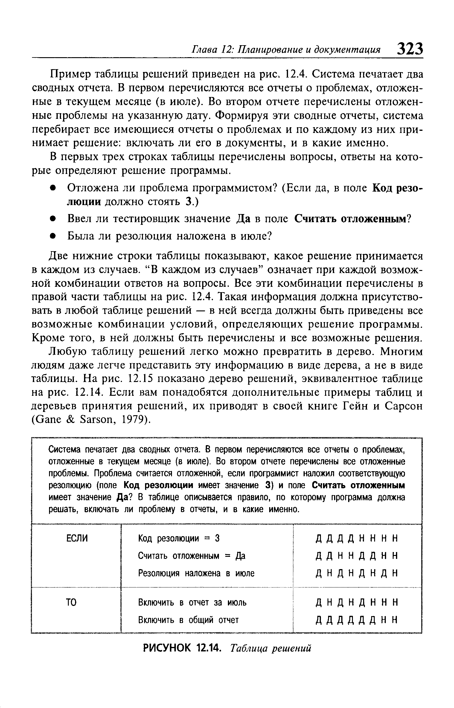

РИСУНОК 12.14. *Таблица решений*

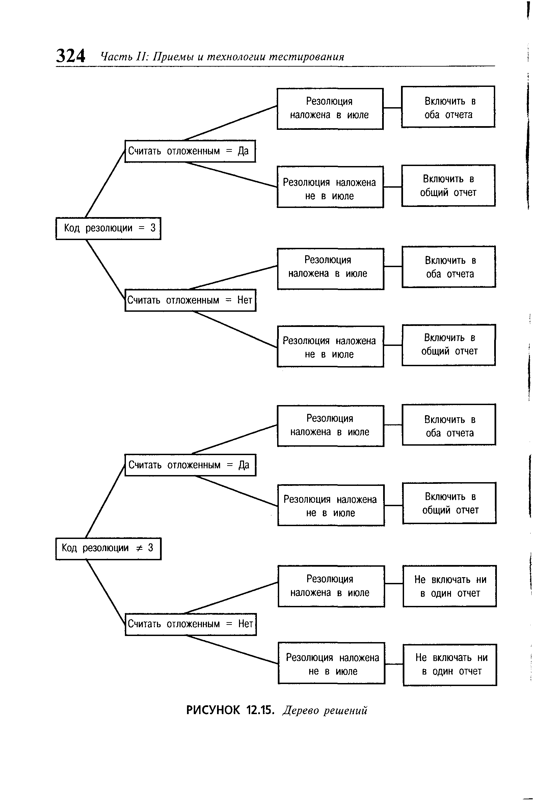

РИСУНОК 12.15. Дерево решений

## Таблица клавиатурных комбинаций

Таблица клавиатурных комбинаций очень велика. Для ее создания лучше всего подойдет электронная таблица. В нее включается информация о реакции в каждом из состояний программы на каждое нажатие клавиши.

Если пользовательский интерфейс программы не согласован, т.е., например, нажатие клавиши `<F1>` в разных местах программы приводит к разным результатам, таблица клавиатурных комбинаций как нельзя лучше позволит выявить все такие несоответствия. Иногда источником подобных вещей является сам проект (или его отсутствие), в других случаях это могут быть просто ошибки кодирования. Заполняя таблицу и тестируя по ней программу, вы наверняка обнаружите некоторые недокументированные аспекты ее поведения. Это могут быть наполовину реализованные идеи, от которых программист отказался, но забыл убрать из программы соответствующий блок (ой, сломалось!), отладочные фрагменты кода, странные сообщения, экзотические ролики или функции, реализацию которых руководство отменило, но кто-то все равно их запрограммировал, никому ничего об этом не сказав.

Каждая строка в таблице посвящена одной клавише (А, а, Б, б, \*, & и т.д.) или комбинации клавиш (`<Alt+A>`, `<Ctrl+Shift+F1>` и т.п.). В таблицу включаются и так называемые немые клавиши неанглийских раскладок.

В первом столбце таблицы перечисляются клавиатурные комбинации. Остальные столбцы связаны со всеми возможными состояниями программы, ее диалоговыми окнами и формами ввода данных. Например, если нажать клавишу `<А>` в форме ввода данных, программа отобразит букву **А** в текущем поле. Поэтому в строке таблицы, соответствующей клавише `<А>` в колонке, относящейся к этой форме ввода, следует поставить букву **А**. Теперь предположим, что в диалоговом окне сообщения об ошибке пользователь для продолжения работы должен нажать клавишу `<Enter>`. Все другие нажатия клавиш этим окном игнорируются. В столбце, соответствующем этому окну, против клавиши `<А>` должно стоять **Игнорируется**.

На практике таблицу клавиатурных комбинаций можно несколько сократить, объединяя все эквивалентные клавиши или комбинации клавиш в одну строчку. Например, можно сгруппировать вместе все буквы нижнего регистра. Однако с критериями группировки следует быть очень аккуратным, поскольку они сильно меняются от программы к программе. И даже после сжатия таблица все равно останется очень большой. К тому же вами или авторами спецификации целый ряд строк таблицы может быть зарезервирован на будущее. К вопросу о группировке клавиатурных комбинаций мы еще вернемся в этой главе.

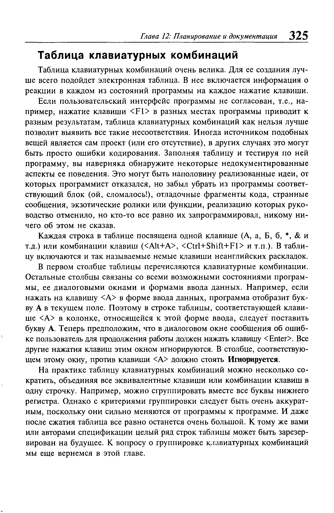

На создание таблицы клавиатурных комбинаций обычно уходит несколько дней. Когда она будет готова, распечатайте ее, пометьте маркером найденные в ней несоответствия, продумайте свои предложения по использованию клавиш, оставшихся незанятыми, и передайте результаты руководителю проекта. Если выполнить эту работу достаточно рано, в пользовательский интерфейс программы обязательно будет внесен ряд изменений и усовершенствований. Очень поблагодарят вас за нее и авторы пользовательской документации.

## Таблица совместимых принтеров

В настоящее время на рынке имеется более 1000 принтеров, и большая их часть эмулирует работу сравнительно небольшого количества принтеров известных марок (т. е. работает так же, как они). Поэтому если 50 принтеров, с которыми должна работать программа, эмулируют Hewlett Packard LaserJet II, не обязательно тестировать их все.

В нашей практике хорошо зарекомендовали себя таблицы, отражающие совместимость тестируемых принтеров. Пример такой таблицы показан на рис. 12.16. (Разумеется, подобные таблицы можно создавать и для любых других устройств. Пример с принтерами выбран только потому, что в главе 8 на этом же примере рассматривалась целая область тестирования — работы программы с аппаратным обеспечением.)

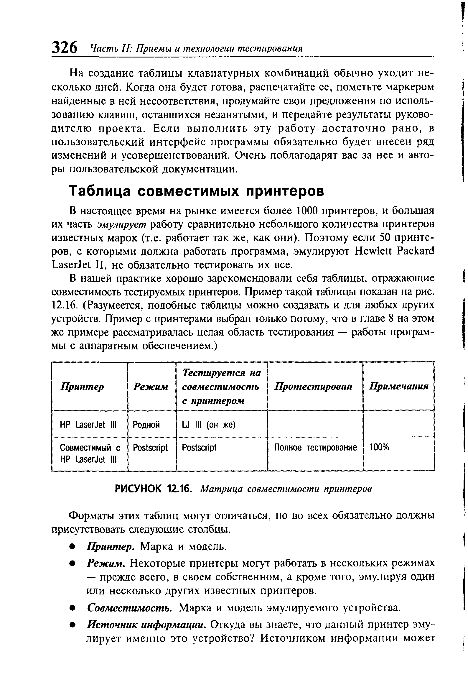

**РИСУНОК 12.16.** *Матрица совместимости принтеров*

Форматы этих таблиц могут отличаться, но во всех обязательно должны присутствовать следующие столбцы.

* **Принтер.** Марка и модель.
* **Режим.** Некоторые принтеры могут работать в нескольких режимах — прежде всего, в своем собственном, а кроме того, эмулируя один или несколько других известных принтеров.
* **Совместимость.** Марка и модель эмулируемого устройства.
* **Источник информации.** Откуда вы знаете, что данный принтер эмулирует именно это устройство? Источником информации может

служить человек, журнальная статья, реклама. При этом не все источники одинаково надежны.

* *Протестирован.* Укажите, протестированы ли принтеры, имеющиеся в вашей лаборатории на совместимость и какие при этом использовались тесты. Проверена ли совместимость графических режимов? Одинаковы ли наборы \<Esc\>-команд? Совпадают ли наборы символов?
* *Примечания.* В этом столбце можно привести перечень причин несовместимости, собственные сомнения, отчеты пользователей и т.п.

## Диаграмма граничных значений

Классы эквивалентности и граничные условия подробно обсуждались в главе 7. Там же описывался процесс разработки таблиц граничных значений. Еще один пример анализа граничных условий, на этот раз для системы отслеживания проблем, приведен на рис. 12.17.

Не ждите, что эта таблица будет полностью завершена в самом начале тестирования. На самом деле вы будете собирать и корректировать необходимую информацию практически до самого конца проекта. Для начала же составьте список всех полей ввода (для чего можно воспользоваться уже имеющимся списком входных переменных). Выясните их функции. По мере изучения программы вносите и уточняйте информацию об их граничных значениях. Однако не пренебрегайте экспериментами и с теми переменными, о которых вы еще мало знаете.

## Иерархические списки: перечень функций программы

Перечень функций охватывает все, что может делать программа. Лучше всего, если он отражает *ваше собственное* видение организации программы, тогда и планировать тестирование, и выполнять его будет гораздо удобнее. Именно этот список является ядром всей документации.

Списков функций программы может быть несколько, и уровень их детализации и полноты может быть самым разным. Наилучшим, на наш взгляд, является инкрементный подход: начните с самого простого, постепенно добавляя все больше и больше информации. Этот подход показан на рис. 12.18.

Программа, которую вы выберете для работы со списком функций, должна обладать достаточно мощными и гибкими средствами для просмотра, редактирования и реорганизации иерархических структур. Лучше всего, если она будет специально предназначена именно для этой цели, поскольку возможности средств, встраиваемых в текстовые процессоры, обычно довольно ограничены.

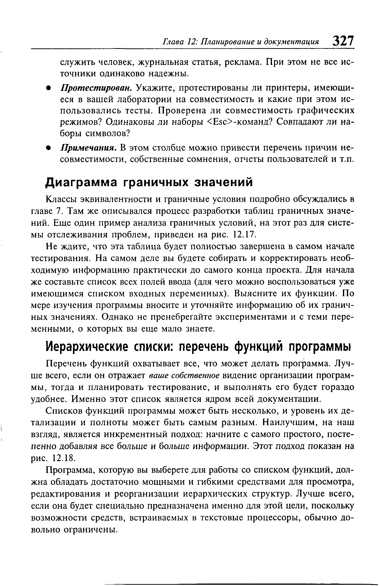

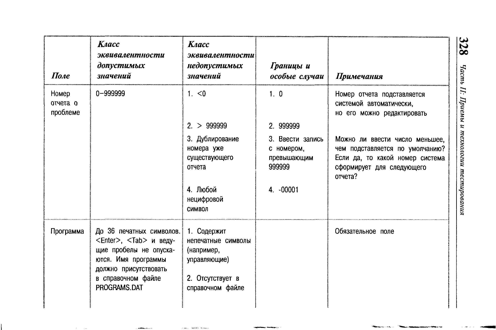


РИСУНОК 12.17. Пример анализа полей ввода данных

На рис. 12.8 был приведен первый черновик перечня функций системы отслеживания проблем. Это скорее основа будущего списка, поскольку в нем отражены лишь функции самого верхнего уровня, очевидные после самого поверхностного знакомства с системой. Однако, несмотря на поверхностность, этот список уже обладает определенной ценностью. Держите его на своем рабочем столе, чтобы каждый раз, когда понадобится проверить, не забыта ли какая-нибудь из функций программы, можно было с ним свериться. Распечатка может служить и контрольным списком, в котором одним цветом можно отмечать устойчивые функции программы, а другим — те, которые пока еще работают плохо.

Второй черновик перечня функций может быть уже более организованным. Выберите такую организацию, которая покажется вам наиболее естественной и удобной. Попробуйте составить алфавитный список всех команд программы. Для команд, активизируемых с помощью меню, скорее всего, больше подойдет иерархическая структура, повторяющая структуру меню. Но это вовсе не обязательно. В качестве альтернативы можно организовать информацию вокруг концептуальной схемы программы, объединяя в группы те функции, которые логически связаны между собой, участвуют в решении общих задач, обработке одних и тех же входных данных или генерации одних и тех же выходных.

На рис. 12.19 приведен второй черновик списка функций системы отслеживания проблем. Большинство функций первой версии оставлены без изменений. Только функция 5, **Работа с файлами данных**, разбита на две составляющих: **Чтение данных из файла** и **Запись данных в файл**. Для первой из этих подфункций в план добавлено подробное описание.


**РИСУНОК 12.18.** *Расширение списка функций программы*

1. Вывод окна заставки (с датой, авторскими правами и т.п.)
2. Ввод имени пользователя
3. Ввод новых отчетов о проблемах
4. Редактирование старых отчетов о проблемах
5. Работа с файлами данных
5.1. Чтение данных из файла
5.1.1. Ввод имени файла и дисковода
5.1.2. Проверка, не добавлен ли уже файл к базе данных
5.1.3. Для каждой записи файла:
5.1.3.1. Чтение записи
5.1.3.2. Переход к следующей записи, если текущая запись помечена как уже добавленная в базу данных
5.1.3.3. Заполнение поля "Номер отчета о проблеме"
5.1.3.4. Если какие-либо из обязательных полей пусты, вывод записи на экран для ввода их значений
5.1.3.5. (Необязательно) Вывод записи на экран для подтверждения пользователем ее добавления в базу данных
5.1.3.6. (Необязательно) Печать записи
5.1.3.7. Добавление записи в базу данных
5.1.3.8. Пометить запись как добавленную в базу данных
5.1.4. Пометить файл как добавленный в базу данных
5.1.5. Возврат в меню "Работа с файлами данных"
5.1.6. Обработка ошибок чтения/редактирования записей файла
5.1.6.1. Неверное имя файла или дисковода
5.1.6.2. Файла нет на диске
5.1.6.3. Ошибка дискового ввода/вывода
5.1.6.4. Файл уже прочитан и добавлен к базе данных
5.1.6.5. Попытка сохранить запись с пустыми обязательными полями
5.1.6.6. Ввод значения поля, отсутствующего в справочном файле
5.1.6.7. Принтер не готов
5.2. Запись данных в файл
6. Работа с файлами приложений
7. Формирование итогового отчета
8. Системные утилиты
9. Разработка новых форм и отчетов
10. Справка

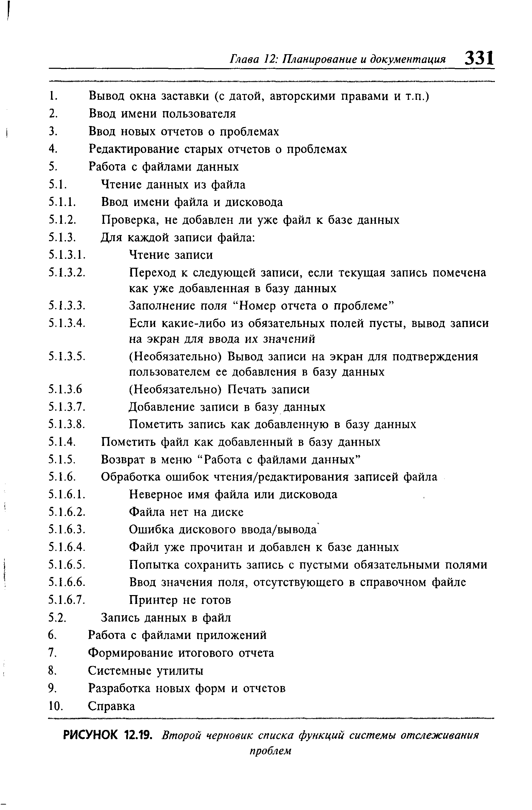

Список функций программы можно расширять все дальше и дальше. Например, его элемент **5.1.3.6 (Необязательно) Печать записи** можно разбить на составляющие, чтобы показать, что программа сначала проверяет, включен ли принтер и готов ли он к печати. Лучше всего расширять список постепенно: если попытаться составить его сразу, вы просто утонете в обилии выполняемых программой мелких операций и у вас не хватит времени на ее тестирование.

На рис. 12.20 развернут третий элемент списка — **Ввод новых отчетов о проблемах**. Такой детализированный и иерархически организованный список заслуживает названия функционального плана программы. Когда список настолько подробный, каждый его элемент соответствует единственной логической операции программы. Это уже почти готовый набор тестовых заданий.

Углубляя составленный план, лучше всего придерживаться следующих направлений анализа.

* *Все функции программы.*
* *Все видимые подфункции.*
* *Все команды, выполняемые программой.*
* *Результаты нажатий каждой командной клавиши в каждом месте программы.*
* *Каждое меню и каждая его команда.* Для отображения этой информации тестировщики обычно пользуются *картами меню* — диаграммами свободной формы. Диаграмма показывает, куда ведет каждая команда. В нее вписываются названия всех меню и экранов.
* *Все способы достижения каждого режима или экрана программы.* Как добраться до конкретного меню, диалогового окна, формы, как перевести программу в заданное состояние? Имеет ли значение, каким способом пользователь попадает в определенный режим, или это все равно?
* *Все способы выхода из каждого режима или экрана программы.* Как перейти к следующему меню, диалоговому окну, форме, состоянию программы? Как затем вернуться назад? Как прерывать ввод данных? Как прерывать выполнение программы из данной точки?
* *Каждая форма ввода данных, диалоговое окно и окно сообщения.* Проанализируйте граничные значения данных, внесите информацию в соответствующую таблицу. Покажите, как попасть в каждую из этих форм, каковы различия, определяемые последовательностью действий пользователя (например, различное поведение программы при первом и втором открытии данного окна). Перечислите специ-

3.1. Отображение первых 24 строк формы отчета
3.1.1. Автоматическое заполнение номера отчета о проблеме
3.1.2. (Необязательно) Если в течение одного сеанса работы вводится более одного отчета, автоматическое заполнение полей “Программа”, “Версия”, “Фамилия” и “Дата” значениями из предыдущего отчета
3.1.3. Перемещение курсора в поле “Тип отчета”
3.2. Назначение клавиш во время редактирования полей
3.2.1. `<F1>` — Отображение меню справки
3.2.2. `<F2>` — Перерисовка экрана
3.2.3. `<F3>` — Печать текущего отчета
3.2.3.1. Проверка готовности принтера к печати
3.2.3.2. (Необязательно) Прогон страницы
3.2.3.3. Печать копии (копий) отчета о проблеме
3.2.4. `<Стрелка вверх>` — перемещение курсора к ближайшему полю над текущим. Игнорируется, когда курсор находится в верхней строке.
3.2.5. `<Стрелка вправо>` — перемещение курсора на один символ назад
3.2.5.1. Если курсор на первом символе поля, перемещение его к последнему символу предыдущего поля
3.2.5.2. Если курсор на первом символе первого поля, нажатие клавиши игнорируется
3.2.6. `<Ctrl+A>` — Игнорируется
3.2.7. `<Ctrl+B>` — Перемещение курсора к предыдущему полю. Если курсор находится на первом поле, нажатие клавиши игнорируется
3.2.8. `<Ctrl+C>` — “Очистить все поля и начать сначала?”
3.2.9. `<Ctrl+D>` Если все обязательные поля заполнены:
“Ввод отчета окончен?”
иначе
“Не введена необходимая информация”.
Перемещение курсора к незаполненному полю.
3.3. Выход из формы без сохранения данных
3.3.1. `<Ctrl+Q>` — “Вы действительно хотите выйти без сохранения данных?”
3.3.2. Выход
3.4. Обработка ошибок
3.4.1. Значение выходит за пределы допустимого диапазона
3.4.2. В справочном файле нет соответствующей записи
3.4.3. Не могу найти справочный файл
3.4.4. Для записи данных на диске нет места
3.4.5. Другая ошибка дискового ввода/вывода

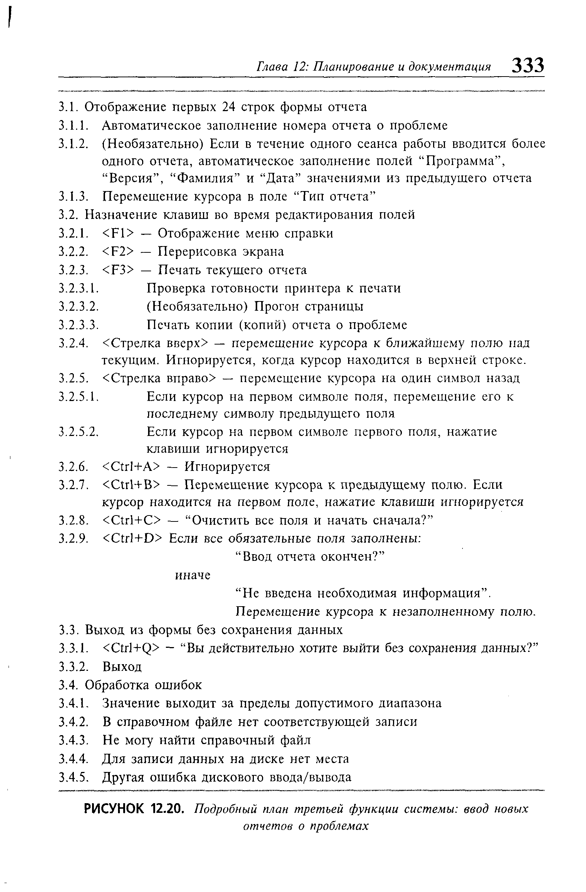

альные команды, выясните, как выйти из данного окна с сохранением и без сохранения информации. Покажите, куда пользователь попадает после этого.

* **Обработка ошибок** в данной части программы. Как правило, удобнее выносить обработку ошибок в отдельный раздел схемы, а не описывать ее внутри каждого подраздела.

## Матрицы

Матрица похожа на таблицу — обе они состоят из строк и столбцов. В самой верхней строке (строке заголовков) показано, какая информация содержится в каждом из столбцов. В первом столбце многих таблиц и всех матриц показано, какая информация содержится в каждой из строк.

Различия между терминами “таблица” и “матрица” состоят в следующем.

* Главная функция *таблицы* — описательная. В ней описывается поведение программы (как на рис. 12.16) 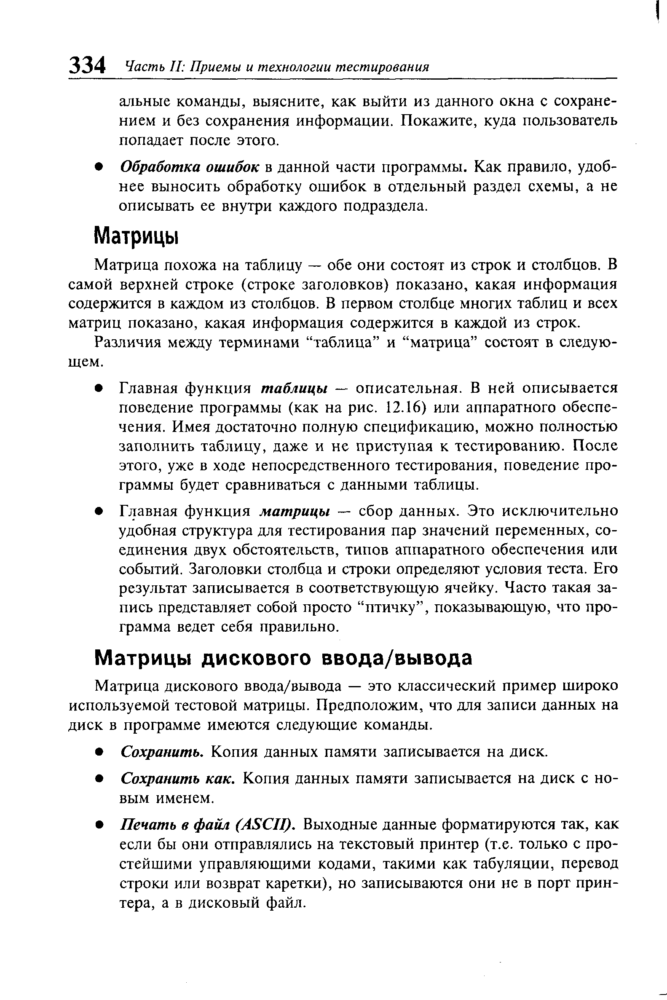 или аппаратного обеспечения. Имея достаточную полную спецификацию, можно полностью заполнить таблицу, даже и не приступая к тестированию. После этого, уже в ходе непосредственного тестирования, поведение программы будет сравниваться с данными таблицы.
* Главная функция *матрицы* — сбор данных. Это исключительно удобная структура для тестирования пар значений переменных, соединения двух обстоятельств, типов аппаратного обеспечения или событий. Заголовки столбца и строки определяют условия теста. Его результат записывается в соответствующую ячейку. Часто такая запись представляет собой просто “птичку”, показывающую, что программа ведет себя правильно.

## Матрицы дискового ввода/вывода

Матрица дискового ввода/вывода — это классический пример широко используемой тестовой матрицы. Предположим, что для записи данных на диск в программе имеются следующие команды.

* ***Сохранить*.** Копия данных памяти записывается на диск.
* ***Сохранить как*.** Копия данных памяти записывается на диск с новым именем.
* ***Печать в файл (ASCII)*.** Выходные данные форматируются так, как если бы они отправлялись на текстовый принтер (т.е. только с простейшими управляющими кодами, такими как табуляции, перевод строки или возврат каретки), но записываются они не в порт принтера, а в дисковый файл.

- *Печать в файл (форматированная).* Выходные данные форматируются так, как если бы они отправлялись на текущий принтер, но записываются в дисковый файл. В файл включаются и все необходимые управляющие коды.

Предположим также, что в программе имеются следующие функции чтения данных с диска.

- *Открыть.* Стирание из памяти информации текущего файла данных (возможно, после ее сохранения) и загрузка в память нового файла.
- *Добавить.* Загрузка содержимого указанного файла в память в конец текущего открытого файла.
- *Вставить.* Загрузка содержимого указанного файла в память со вставкой его в текущую позицию в уже открытом файле.
- *Импортировать текст.* Открыть текстовый файл, созданный другим приложением и хранящийся в формате, не являющимся для программы родным.
- *Импортировать графику.* Загрузить изображение в память.

Теперь допустим, что пользователь пытается сохранить или прочитать файл одного из следующих типов.

- *Очень маленький файл* (1–2 байта).
- *Типичный файл.*
- *Большой файл* (больший доступного объема RAM).

Пусть программа может работать на компьютерах со следующими типами дисков.

- *Дискеты низкой емкости.*
- *Дискеты высокой емкости.*
- *Жесткий диск.*
- *Сетевой диск.*
- *Оптический диск.*
- *RAM-диск.*

И наконец, предположим, что произошло одно из следующих событий.

- *Диск полон* — на нем нет места для записи данных командами *Сохранить, Сохранить как* или *Печать в файл*.
- *Диск почти полон* — он заполняется в процессе записи данных или при создании временного файла для их чтения.
- *Диск защищен от записи.*

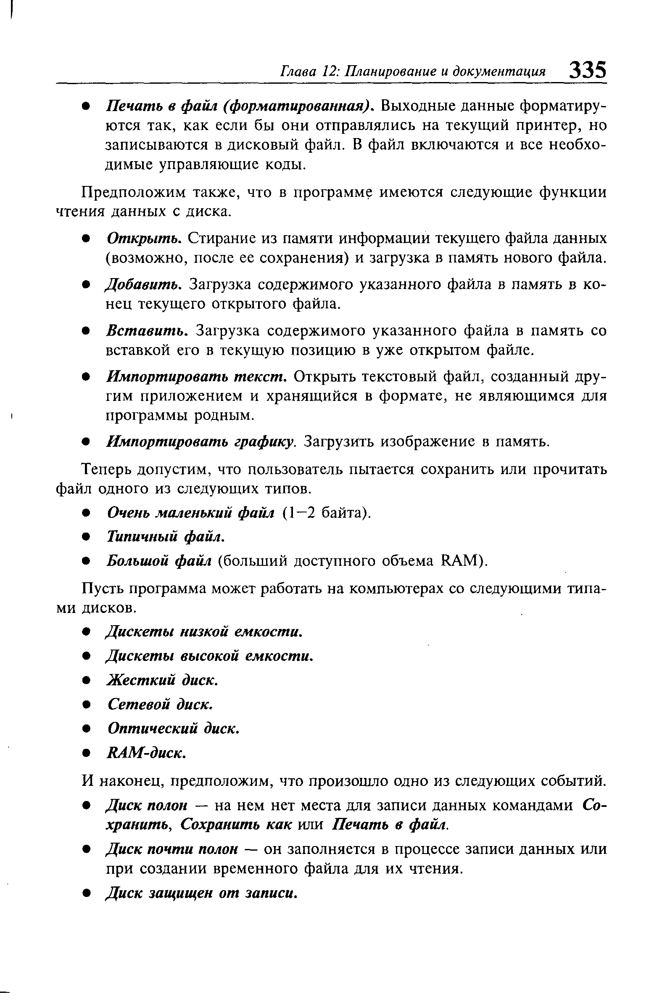

* **Тайм-аут.** Диск (скорее всего, сетевой) слишком долго не отвечает.
* **Сбой или отключение питания.**
* **Клавиатурный ввод.** Нажатие клавиш во время чтения или записи данных.
* **Активность мыши.** Перемещение или щелчки кнопок мыши во время чтения или записи данных.

Вообще, вариантов подобных событий великое множество. Перечисленные примеры можно разбить для анализа на четыре категории.

* **Файловые операции** (такие, как открытие и сохранение).
* **Характеристики файлов**, такие как тип, формат и размер.
* **Аппаратура**, как, например, типы жестких дисков. Сюда может входить и список совместимого оборудования.
* **Условия сбоев**, как, например, заполнение диска или аппаратный сбой.

Организовать эти категории информации в матрицы ввода/вывода можно многими способами. Один из них показан на рис. 12.21.

Составленная матрица станет вашим путеводителем: следуя ей, вы по очереди выполните тесты, соответствующие каждой из ее ячеек, и поставите в них соответствующие отметки. Например, работая по приведенной на рис. 12.21 матрице, тестировщик попытался сохранить данные (вторая строка) на защищенном от записи диске (третий столбец) низкой емкости. Программа выдала корректное сообщение об ошибке, и дальнейшие ее действия были вполне разумны, поэтому тестировщик отметил ячейку, лежащую на пересечении второй строки и третьего столбца (***).

Матрица дискового ввода/вывода — это одна из самых важных диаграмм тестировщика. На наш взгляд, лучше всего сначала составить список для всех четырех перечисленных категорий, соответствующие возможности именно вашей программы, а затем построить таблицы для ввода и вывода.

## Другие матрицы, связанные с аппаратным обеспечением

На рис. 8.4 приводилась тестовая матрица для сравнения различных типов принтеров. Заголовками ее столбцов служили названия принтеров, а заголовками строк — их сравниваемые функции.

В другой матрице можно было бы показать типы принтеров и объемы их оперативной памяти. Для тестирования подошло бы полностраничное графическое изображение. Если программа напечатает такое изображение без сообщения о нехватке памяти принтера, значит, тест пройден.

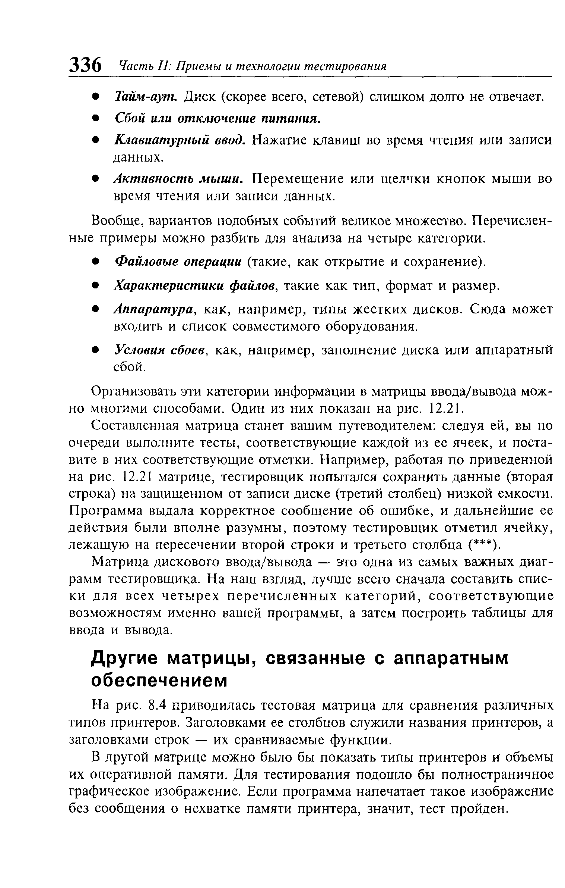

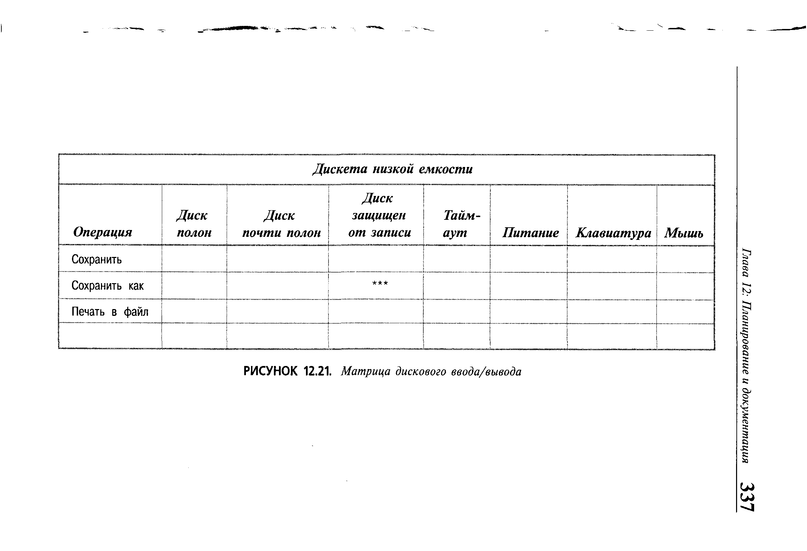

**РИСУНОК 12.21.** *Матриця дискового ввода/вывода*

## Матрица операционного окружения

В этой матрице строки (или столбцы) могут соответствовать переменным окружения — типу и версии операционной системы, диспетчера памяти, языку, стране и т.п.

Столбцы (строки) могут также представлять переменные среды, а могут соответствовать отдельным параметрам, типам аппаратуры, кодам ошибок и всему остальному, что потребует тестирования в комплексе с параметрами операционной среды.

## Матрица комбинаций входных данных

Случается, что ошибки, связанные с вводом, определяются не самими данными или событиями, а их комбинациями. Если программа сбоит только в том случае, когда пользователь вводит 60 символов в третьей строке экрана, после чего нажимает стрелку вправо — налицо ошибка, и эту ошибку ни за что не выявить, тестируя отдельные действия и переменные. К сожалению, в большинстве программ количество возможных комбинаций входных действий и данных столь велико (а чаще и просто бесконечно), что протестировать их все невозможно. Поэтому вопрос состоит в том, как выявить наиболее интересные из них.

Майерсом (Myers, 1979) описан сложный, но комплексный подход к этой задаче, называемый причинно-следственными диаграммами (*Cause-effect Graphing*). Мы не будем описывать его в данной книге, однако тем, кому предстоит серьезно заниматься тестированием, рекомендуется его изучить.

Наш собственный подход носит более экспериментальный характер. Комбинации входных условий мы изучаем прямо по ходу тестирования. Таким образом, в поле нашего зрения попадают не все теоретически возможные варианты, а самые естественные из них. Очень полезно обратиться к программистам со списком переменных программы и спросить у них, какие из этих переменных абсолютно независимы. Но полностью полагаться на их информацию не стоит: во-первых, память может их подводить, а во-вторых, кто-либо из программистов может найти занятным подбросить вам заведомо ложную информацию. Так что для надежности все равно выполните несколько проверочных тестов.

Как следует поработав с программой и почувствовав, что связи между ее данными уже достаточно прояснились, мы приступаем к более последовательному тестированию их комбинаций.

## Матрицы сообщений об ошибках и клавиатурных комбинаций

В этой главе уже рассказывалось о таблице, описывающей реакцию программы на все возможные нажатия клавиш. Настало время более подробно рассмотреть этот вопрос.

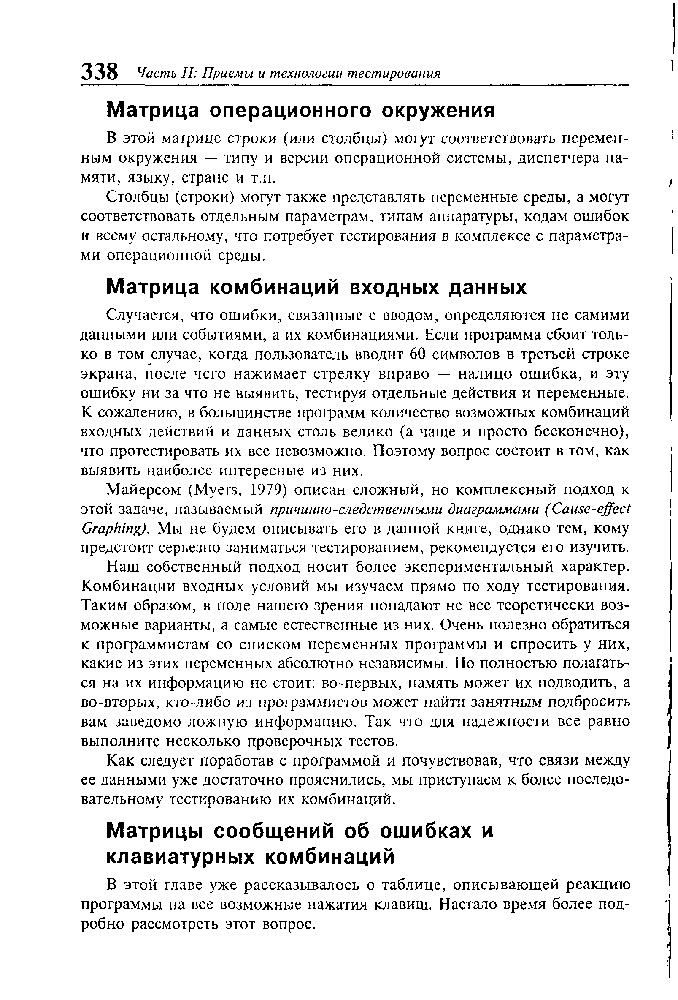

В системах с графическим пользовательским интерфейсом все сообщения об ошибках выводятся в диалоговых окнах. В ответ на сообщение пользователь должен щелкнуть на кнопке ОК или нажать клавишу <Enter>. Любые другие его действия окном игнорируются. Однако на практике даже в системах со встроенной поддержкой диалоговых окон программисты нередко снабжают отдельные окна возможностью реагировать и на другие события.

Тестировщики часто спрашивают, зачем тестировать все окна сообщений в программе для Macintosh, если все они работают одинаково. Если тщательно протестировано одно из окон программы, можно считать, что протестированы все. Однако опытные специалисты знают, что это неверно. Нам не раз приходилось сталкиваться с ситуациями, когда приложения Macintosh, Amiga, Windows и DOS разрушались именно нестандартными действиями пользователя в окне сообщения.

Конечно, невозможно нажать каждую клавишу в каждом диалоговом окне программы, но следует всегда иметь в виду, что нажатие клавиш, не имеющих никакого эффекта в одном диалоговом окне, может разрушить другое. Поэтому мы выработали подход, позволяющий оптимальным образом протестировать программу на предмет подобных ситуаций. В его основе лежит матрица, строки которой связаны с диалоговыми окнами программы, а столбцы — с группами клавиш или их сочетаний. Для каждой строки (т.е. в каждом окне сообщения) проверяется несколько клавиш из каждой группы. Один из способов разбиения клавиш на группы показан на рис. 12.22.

## Документирование тестовых материалов

В этом разделе рассказывается о документах, описывающих процесс тестирования. Это не только плановые документы — в них записывается, что вы делали, почему, когда, какими были результаты и что должно быть сделано далее.

Мы уже говорили о том, каково назначение тестовой документации и какую пользу она может принести, если ее правильно применять. Теперь давайте поговорим о типах плановых документов.

Когда говорят о тестовой документации, вовсе не имеют в виду некую монолитную концепцию. Напротив, возможных типов документов огромное множество. Некоторые из них более полезны, чем другие, некоторые дешевле, некоторые носят более фундаментальный характер. Приступая к каждому новому проекту, вам предстоит решать, какие из всех этих многочисленных документов лучше всего удовлетворят его нуждам.

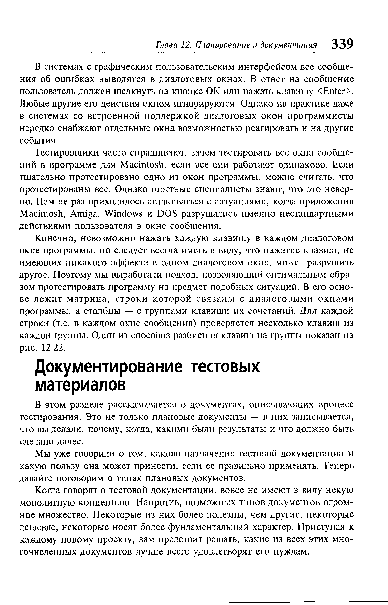

Основной набор ASCII | В него входят комбинации с клавишей `<Ctrl>`. Интересны для тестирования 000-null, 007-бип, 008-BS, 009-Tab, 010-LF, 011-VT/Home, 012-FF, 013-CR, 026-EOF, 027-Esc.
---|---
Не буквенно-цифровые стандартные печатные символы ASCII. Мы часто объединяем их вместе, хотя на самом деле он относятся к четырем различным группам | Не буквенно-цифровые (коды ASCII 32-47) `<Пробел>` `!` `"́` `# $ % & ' ( ) * + , - . /`. Не буквенно-цифровые из середины диапазона кодов (коды ASCII 58-64) `; : < = > ? @`. Следующая серия не буквенно-цифровых символов (коды ASCII 91-96) `[ \ ] ^ _ \`. Следующая серия символов (коды ASCII 123-127) `{ | } ~ <Del>`.
Цифры | (Коды ASCII 48-57) `0 1 2 3 4 5 6 7 8 9`
Буквы верхнего и нижнего регистров | (Коды ASCII 65-90) `A B C D E F G H I J K L M N O P Q R S T U V W X Y Z`.<br>(Коды ASCII 97-122) `a b c d e f g h i j k l m n o p q r s t u v w x y z`.
Расширенный набор ASCII | (Коды ASCII 128-254) Интерпретация этих клавиш определяется приложением
Клавиши-модификаторы | В зависимости от клавиатуры этими клавишами могут быть `<Alt>`, `<Shift>`, `<Ctrl>`, `<Command>`, `<Option>`, `<Left+Amiga>`, `<Right+Amiga>`. Обычно их нажимают в паре с другими клавишами — нажатые самостоятельно, они, как правило, не производят никакого действия. Выясните, какой набор сочетаний клавиш поддерживается вашей операционной системой.<br><br>Обычно имеет смысл протестировать все интересные стандартные значения, а также некоторые другие.<br><br>Разрабатывая таблицу клавиатурных комбинаций, выделите для сочетания тестируемой клавиши с каждым из модификаторов по отдельному столбцу.
Функциональные клавиши | Протестируйте их как по отдельности, так и в сочетании с клавишами-модификаторами
Клавиши управления курсором | Протестируйте их по отдельности и в сочетании с клавишами-модификаторами. Как правило, все эти сочетания будут иметь различный эффект.
Клавиши цифровой клавиатуры | Вовсе не обязательно, что у всех клавиш дополнительного цифрового блока будут эквиваленты в основном блоке клавиатуры.
Европейские клавиатуры | В неанглийских раскладках у левой и правой клавиш `<Alt>` может быть разное действие. Кроме того, в этих раскладках имеются так называемые мертвые клавиши: пользователь нажимает мертвую клавишу, определяющую вид акцента, затем символ, который он хочет акцентировать, и получается акцентированный символ.

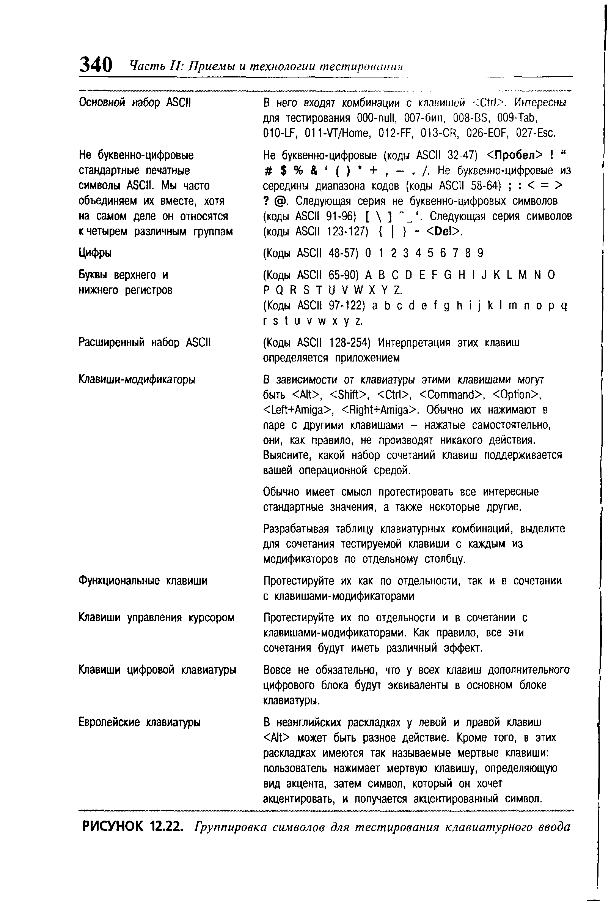

РИСУНОК 12.22. Группировка символов для тестирования клавиатурного ввода

## Кто пользуется тестовой документацией

Главным критерием ценности документа является то, насколько он понятен читателю. Именно на это и ориентируется составитель документа, а потому он должен точно знать, кто его будет читать и какова степень компетентности этого человека. Кроме того, важно, для чего будет использоваться данный документ — в одних случаях достаточно короткого пояснительного описания, а в других требуются четкие и подробные инструкции.

Временные оценки, приведенные в следующих разделах, основаны на опыте нашей собственной работы и, разумеется, очень приблизительны.

### Личные заметки

Это простейшие из документов. Но все же их следует составлять так, чтобы, прочитав их несколько месяцев спустя, можно было разобраться, о чем идет речь, какие и почему выполнялись тесты и какие результаты были получены. Старайтесь писать их как можно аккуратнее, но при этом будьте кратки. Время, затрачиваемое на заметки о проведенных тестах, должно быть в пределах от половины до троекратного объема времени, необходимого для их разработки и выполнения.

Назначение личных заметок может быть следующим.

* *Описание тестов, которые будут проводиться повторно.* Вместо того чтобы заново продумывать каждый тест, можно обратиться к заметкам, сделанным на предыдущем этапе работы. В этих заметках могут описываться достаточно сложные подробности. Если речь идет о комплексном тесте с множеством граничных условий и других специфических значений, опишите их все и не забудьте добавить, каково их назначение. Тогда после изменения программы сразу будет ясно, какие изменения нужно будет внести в такой тест.
* *Напоминание о том, что уже сделано.* Как ни странно, выполнить один и тот же тест десяток раз на протяжении нескольких дней на самом деле ничего не стоит. Иногда тестировщик забывает, что тест уже выполнен, иногда не уверен в этом и на всякий случай выполняет его еще раз. Если аккуратно вести журнал проводимых тестов, всей этой путаницы и потерь времени вполне можно избежать.
* *Напоминание о том, что еще предстоит сделать.* Аккуратно записывайте все идеи о будущем тестировании. В дальнейшем, разрабатывая новые тесты, вы можете обращаться к этим записям.
* *Ответы на вопросы программистов.* Если программисту не удается воспроизвести найденную вами ошибку, он может попросить провести дополнительные тесты, которые, на его взгляд, могут быть

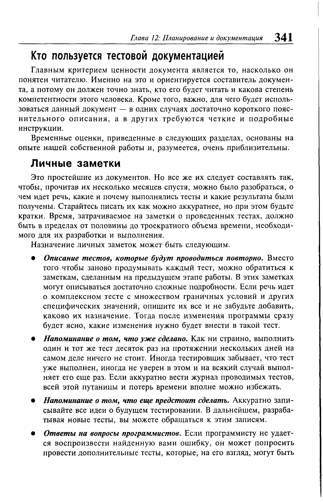

связаны с проблемой. Выполнили ли вы эти тесты? В точности ли те, о которых вас просили? Какими были результаты?

## Заметки для другого члена команды

Речь идет о сотруднике, тестирующем тот же продукт, что и вы. У него могут возникнуть к вам вопросы, или же он может попросить описание одного или нескольких проводимых вами тестов. На составление такого описания может уйти столько времени, сколько необходимо для разработки теста, а даже в 5 раз больше.

В заметках может быть следующая информация.

* *Как выполнить каждый тест*. Это описание может быть коротким, поскольку предназначается для достаточно опытного сотрудника.
* *Ожидаемые результаты каждого теста*. Иногда стоит также описать и вероятные условия сбоя.
* *Смысл каждого значения данных*. Когда программа меняется, а проведенные вами тесты предстоит выполнять другому сотруднику, он может спросить у вас, что следует изменить. И прежде всего ему необходимо будет выяснить назначение данных исходного теста. Во многих случаях вам не придется писать длинных пояснений, поскольку назначение данных будет очевидно из ожидаемого результата.
* *Любые другие специальные инструкции*, например, как долго следует ждать определенного события или как быстро нажимать клавиши для определенного теста.
* *Какие тесты необходимо выполнять регулярно* (регрессионные тесты), какие из них наиболее быстрые и простые и каковы ваши соображения по поводу дальнейшего тестирования.
* *Каково назначение данных тестов*. Какая часть программы ими исследуется? Какие проблемы могут быть выявлены с наибольшей вероятностью? Если выполняются группы связанных тестов, опишите их с этой точки зрения. В частности, можно описать общее назначение группы, затем подробно описать один из тестов, а остальные представить как вариации первого. Так и писать будет быстрее, и понять легче.

## Заметки для другого опытного тестировщика

Разница между этим и предыдущим случаями в том, что на этот раз предполагается, что вас не будет поблизости, чтобы ответить на вопросы. Если, например, вы разрабатываете материалы по контракту, по его завершении к вам уже нельзя будет обратиться. Поэтому на описание каждого

теста планируйте вдесятеро больше времени, чем на его разработку и выполнение.

Вам придется предоставить следующие сведения.

* **Все, что пишется для члена команды**, но в более подробном изложении. Особенно аккуратно следует указывать, какой результат означает сбой, а какой — успешное прохождение теста. Если вам кажется, что определенные инструкции сложны для понимания, попросите кого-нибудь выполнить по ним тест и посмотрите, как он справится и что ему будет непонятно. (Особенно часто подобные сложности возникают при описании тестов, связанных с временными параметрами выполнения программы.)
* **Дополнительные аналитические материалы**, дополнительные описания тестов, их связей, подробные описания групп тестов, а не каждого входящего в них теста по отдельности.
* **Зависимости**. Если, например, программа может читать максимум 80 байтов данных за один раз, вы будете тестировать ее с 80 и 81 байтом. Если затем возможности программы будут расширены до 256 байтов, старые тесты потеряют смысл. Теперь тестируемые объемы данных необходимо будет увеличить до 256 и 257 байтов. В описании этих тестов должно быть явно указано, что они предназначены для программы с потолком в 80 байтов. Это замечание лучше всего вынести в отдельный раздел под названием “Зависимости” или “Предположения”. Тогда вам не придется писать, что делать, если спецификация изменится. Опытный тестировщик прекрасно сообразит это сам — главное, чтобы у него была вся необходимая информация, т.е. чтобы он знал, что с данным параметром программы связаны такие-то и такие-то тесты.

## Заметки для следующего выпуска программы (планируемого, вероятно, через год)

После выпуска программы работа тестировщиков над ней обычно прекращается, чтобы вскоре возобновиться уже над следующим выпуском. При этом вовсе не обязательно, чтобы им занимались те же люди, а потому будущим тестировщикам очень пригодятся любые ваши заметки. Некоторые из тестовых материалов им, возможно, будет трудно понять. Поэтому подготовьте специальный комплекс записей для облегчения их понимания. Эти записи будут подобны описанным в предыдущем разделе.

Представьте себе будущих тестировщиков как археологов. Им придется прокапываться сквозь ворох вашей документации, всевозможных заметок, дисков и т.п. Вполне вероятно, что все, чего они не смогут понять, будет просто отброшено. Или же, что еще хуже, отдельные материалы будут

неверно интерпретированы, и в результате будут пропускаться ошибки. Имейте также в виду, что будущим тестировщикам придется не только выполнять уже готовые тесты, но и модифицировать многие из них, поскольку к тому времени программа наверняка изменится.

Итак, вашим последователям будут крайне необходимы следующие материалы.
* *Подробности о каждом тесте.* Как его выполнить и какие ожидаются результаты.
* *История сбоев программы.* Какие проблемы выявлялись каждым из тестов, как они выглядели и какие изменения были внесены в программу для исправления ситуации.
* *Дополнительные соображения и проблемные вопросы по поводу каждого из тестов,* зависимости тестов от поведения программы и спецификации.

## Сценарий теста для неопытного тестировщика

Этот человек может быть опытным пользователем компьютера (программистом, руководителем, системотехником), а может быть и совсем новичком. Как бы там ни было, опыта тестирования программных продуктов у него нет и с тестируемой программой он абсолютно незнаком. Поэтому ему необходимо подробное пошаговое руководство — сценарий теста.

Назначение сценариев и обеспечиваемые ими выгоды могут быть следующими.
* *Работа по сценариям позволяет сократить размер группы тестирования.* В критической ситуации можно подключить к работе над проектом дополнительный персонал и быстро его обучить. Таким людям необходимо будет просто следовать сценариям — от них не требуется особых знаний и навыков, и их зарплата обычно гораздо меньше, чем у основных специалистов.
* *Сценарии освобождают персонал от самой утомительной работы.* В двадцатый раз выполняя один и тот же тест, кто угодно будет делать его сонно и невнимательно. Во многих случаях превосходным решением проблемы может быть поручение повторяющихся тестов временным сотрудником.
* *Сценарии прекрасно подходят для стандартизованных наборов тестов.* Они могут быть основой регрессионного тестирования, однако самые сложные из тестов не следует поручать дилетантам.
* *Хороший сценарий производит неотразимое впечатление на руководство.* Не следует недооценивать значение этого обстоятельства.

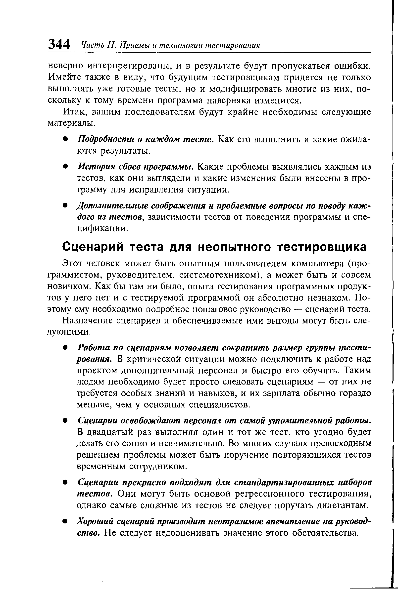

К сожалению, здесь же имеется и целый ряд проблем.

* **Неопытные тестировщики (включая и многих достаточно опытных программистов) — это плохие тестировщики.** 
Для подтверждения этого факта приведем пример из нашей собственной практики. Мы исследовали производительность нескольких прекрасных специалистов из отдела технической поддержки. Эти люди занимались жалобами пользователей, уже купивших наш продукт. Их заинтересованность в поиске проблем была крайне высока. Работали они по подробным и очень тщательно подготовленным сценариям. Параллельно с ними программу тестировали несколько сотрудников нашей группы — ту же версию и по тем же сценариям. Результат был однозначным: опытные тестировщики нашли больше ошибок, причем среди них были такие, которые вообще было трудно пропустить, и все же неспециалисты их пропустили.

  Особенно плохо неопытные тестировщики справляются с трудноуловимыми ошибками или ошибками, связанными с временными параметрами выполнения программы. Они редко документируют ошибки, которые трудно повторить. Кроме того, они не документируют проблемы, которые, как им кажется, могут быть связаны с неверным пониманием программы. Неопытные тестировщики не документируют ошибку, если им кажется, что читатель отчета посчитает ее незначительной. И есть еще много других проблем, которые они пропускают или оставляют недокументированными.

* **Написание хорошего сценария требует много времени.** На написание хорошего сценария и подготовку сопутствующих материалов (копий экрана, файлов и т.п.) уходит в 5-15 раз больше времени, чем на подготовку и выполнение исходного теста.

* **Сценарий ни в коем случае не должен содержать ошибок.** У тестировщиков, которые им руководствуются, нет ни опыта, ни знаний для исправления ошибок в сценарии. Если что-то пойдет не так, как в нем написано, они просто не будут знать, что делать. И если такой тестировщик поймет, что в сценарии есть ошибка, он не будет документировать даже те проблемы, которые увидит, поскольку посчитает, что они связаны со сценарием, а не с самой программой.

Разрабатывая сценарии, следует постоянно иметь в виду, что они пишутся не для опытных тестировщиков, а значит, в них должна быть совершенно иная информация. Скорее всего, вам придется составлять оба типа документов. В сценарии ничего не говорится о назначении тестов и их входных данных. Ведь неопытного тестировщика такая информация только смутит. Главное содержание сценария — это процедура выполнения теста, и в частности, следующая информация.

* **Четкие пошаговые инструкции для выполнения теста.** Его исполнитель не должен догадываться, что и как делать, это должно быть совершенно четко записано в инструкции.
* **Точное описание ожидаемых результатов**, включая и то, что должен видеть тестировщик на каждом этапе инструкции. Очень полезны распечатки копий экрана. Отметьте в них маркером, куда именно следует смотреть.
* **Описание возможных вариантов неудачного прохождения теста программой.** Не вдаваясь во внутренние механизмы работы программы, расскажите, что может быть не так и как это будет выглядеть. Приведите примеры того, что тестировщик может увидеть или услышать в случае сбоя.
* **Квадратики, в которых тестировщик будет отмечать, что тест выполнен.** Сценарий может иметь форму контрольного списка или бланка, в который вписываются ответы на вопросы. Если необходимо, чтобы тестировщик обратил внимание на определенный аспект поведения программы, следует внести в сценарий соответствующий вопрос.

То, как организовать сценарий, может существенно повлиять на результаты работы. Инструкции должны быть отделены от описаний, например, **Что сделать** должно быть записано в отдельном столбце, перед **Что вы увидите**. Не менее важен и порядок заданий. Тестировщик не должен перескакивать между классами тестов. Кроме того, у него не должно быть чувства, что он зря теряет время. Прежде чем передать сценарий временному персоналу, предложите его для опробования опытному тестировщику.

### Заметки для руководителя

Ваш руководитель, вероятнее всего, сам является опытным тестировщиком, и поэтому все ваши тестовые материалы будут ему интересны. Однако лучше думать о нем как об администраторе и оставить в стороне его технический опыт. Прежде всего его интересует продвижение работ и то, насколько хорошо протестирована каждая из составляющих программы. Возможно также, что его заинтересует, когда в последний раз выполнялся определенный тест или когда тестировался тот аспект программы, в котором только что выявлена серьезная ошибка.

В идеале заметки для руководителя проекта должны храниться в базе данных. В ней должно быть по одной записи для каждого теста, а сами записи должны содержать следующую информацию.

* **Имя или номер, однозначно идентифицирующие тест.**
* **Набор классификационных идентификаторов.** Вместе эти идентификаторы указывают, что с помощью данного теста проверяется

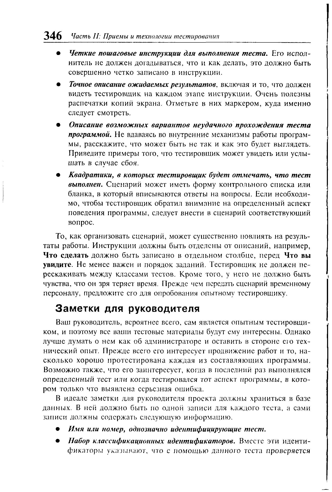

восстановление информации с диска, сортировка, выбор опции из главного меню и отображение сортируемых данных. Благодаря такому количеству идентификаторов при возникновении проблемы легко отыскать все связанные с ней тесты.

* *Список результатов тестирования*. Для каждого из циклов, в которых выполнялся данный тест, в списке указывается тестировщик и номер цикла, а результат теста определяется как **пройден** или **не пройден** (со ссылкой на отчет о проблеме).

Кроме того, программу следует разделить на ряд функциональных областей и для каждой из них оценить приблизительное количество необходимых тестов. Со временем, когда ваш собственный список функций программы будет расширен, можно пересмотреть это разбиение. Это поможет формировать “показательные” отчеты о том, сколько тестов для каждой из областей уже выполнено и сколько еще предстоит.

## Документы для юридического использования

Если клиенты подадут на вашу компанию в суд за ошибки в программе, адвокат должен будет доказать, что тестирование программы проводилось тщательно и на достаточном профессиональном уровне.

Если это и в самом деле так и если сбои программы могут обходиться клиентам очень дорого, ведите записи о проделанной работе. Спросите у юриста компании, какие записи будут ему наиболее полезны.

Подробнее этот вопрос рассматривается в главе 14.

## Типы тестовых документов

В этом разделе описывается несколько типов документов, составляющих тестовые материалы. Многие из них основаны на стандарте *ANSI/IEEE Standard 829-2983 for Software Test Documentation*, в котором предпринята попытка определить универсальный набор документов для промышленного использования. О многих других спецификациях для тестовых документов пишет Шалмейер (Schulmeyer, 1987).

Стандарт 829-2983 можно за несколько долларов заказать по следующему адресу:

> Computer Society of the IEEE
> P. O. Box 80452
> Worldway Postal Center
> Los Angeles, CA 90080

Можно также позвонить в офис IEEE Standards Sales в Нью Джерси по телефону 201-981-0060.

В стандарте 829 ничего не говорится о том, в каких случаях необходим каждый из перечисленных в нем документов. Выбор комплекса докумен-

тов определяется нуждами проекта и личными предпочтениями его руководства, поэтому мы воздерживаемся от каких бы то ни было советов по этому поводу. Единственное, что можно сказать наверняка, — это то, что никто и никогда не станет составлять все перечисленные в стандарте документы. Более того, форма и содержание этих документов также зависят от вашего выбора: если какой-либо из них показался вам полезным, это еще не значит, что нельзя опустить некоторые его составляющие. Стандарт никоим образом не должен вас связывать. Он описан в этой книге потому, что является хорошей основой, которую после тщательного анализа следует адаптировать к собственным нуждам. И последнее: не пытайтесь написать всю документацию до начала тестирования. Первый черновик тестового плана лучше написать заранее, остальное же гораздо эффективнее дорабатывать по ходу тестирования. Кроме того, полезно перед началом тестирования распространить среди заинтересованного персонала комплекс приемочных тестов.

## Тестовый план

В этом документе определяется содержание работ по тестированию программного продукта. Это может быть один-единственный документ, но чаще он представляет собой целый комплекс документов, полный перечень которых приводится в отдельном разделе плана. Вот как разделы тестового плана определяются стандартом IEEE 829.

* **Идентификатор тестового плана.** Это уникальное имя или номер плана. Такой идентификатор полезен при хранении документов в базе данных.
* **Введение.** В этом разделе приводятся ссылки на все связанные юридические документы и стандарты, а также плановые документы самого продукта.
* **Тестируемые элементы.** Речь идет о подлежащих тестированию программных компонентах — функциях, модулях, возможностях и т.п. Можно либо перечислить их прямо здесь, либо сослаться на соответствующий документ. Кроме того, в этот раздел включаются ссылки на спецификации (требования и проектные документы) и документацию к продукту (руководство пользователя, руководство по установке продукта и т.п.).
* **Тестируемые функции.** Снабдите их ссылками на спецификацию комплекса тестов.
* **Нетестируемые функции.** Какие именно и почему.
* **Подход.** Опишите общий подход к тестированию: кем оно выполняется, каковы основные видов планируемых работ, какие технологии и средства применяются для тестирования каждой из основных

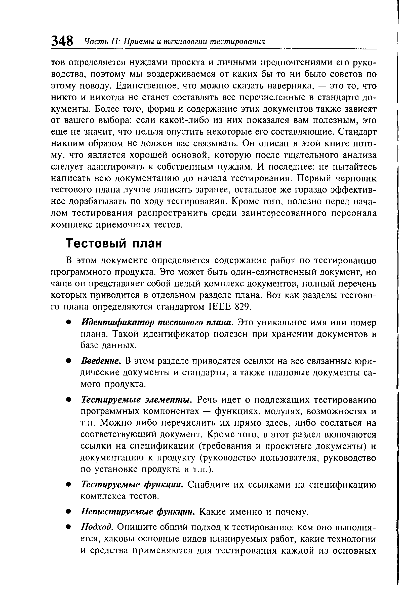

групп функций продукта. Каковы критерии адекватного тестирования каждой группы? Стандартом определяется, что именно здесь, а не в разделе “Календарный план” приводятся базовые требования, включая крайние сроки завершения работ и требования к наличию персонала и тестируемых элементов.

* *Критерии прохождения тестов*. Как тестировщик определяет, прошла ли программа конкретный тест?
* *Критерии приостановки и возобновления работ*. Перечислите все возможные причины, по которым тестирование может быть прекращено до решения проблемы. Что должно быть сделано, чтобы работы можно было продолжить? Какие тесты после этого должны быть проведены повторно?
* *Документация*. Это список всех тестовых документов, которые должны быть составлены для данного продукта.
* *Задачи тестирования*. Перечислите все задачи, которые решаются в ходе подготовки к тестированию и его проведения. Покажите зависимости между задачами, укажите, какие особые навыки или специалисты необходимы для выполнения каждой из них. Здесь же указывается, кто и когда выполняет работы и насколько они трудоемки.
* *Необходимое оборудование*. Здесь перечисляется все необходимое для работы аппаратное и программное обеспечение, тестировочные средства, лабораторное оборудование и т.п.
* *Ответственность*. Это перечень групп и отдельных лиц, ответственных за управление, проектирование, подготовку, выполнение, контроль работ, исправление ошибок, решение проблем, обеспечение необходимого оборудования и т.п.
* *Необходимый персонал и обучение*. Специалисты каких квалификаций и в каком количестве необходимы для решения поставленных задач, какое обучение необходимо пройти имеющимся сотрудникам?
* *Календарный план*. Перечислите ключевые даты, укажите, когда необходимы конкретные ресурсы (люди, техника, инструментальные средства и др.).
* *Риск и непредвиденные обстоятельства*. Каковы наихудшие предположения о выполнении тестового плана? Из-за чего тестировщики могут не уложиться в сроки и что будет предпринято в этом случае?
* *Утверждение*. Кто утверждает тестовый план? Укажите место для их подписей.

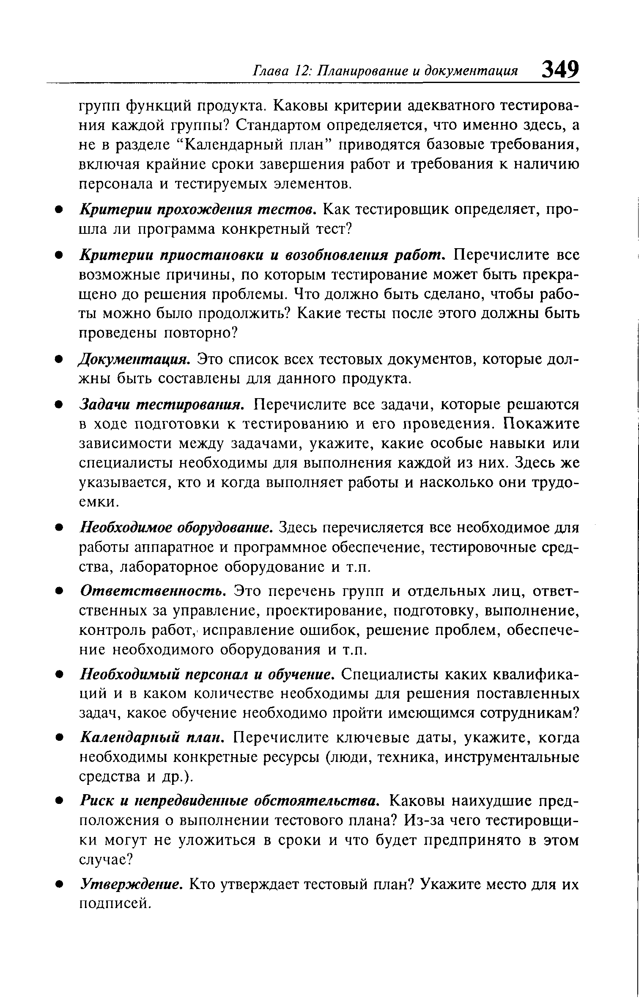

### Список функций

Этого документа в стандарте IEEE 829 нет. О списке функций программы подробно рассказывалось в соответствующем разделе этой главы. Его можно включить в раздел тестового плана "Тестируемые элементы", а можно сделать отдельным документом.

### Критерии приемки на тестирование

Этого документа в стандарте IEEE 829 также нет. 

Приемочные тесты — это небольшой набор тестов, которые должна пройти программа, прежде чем она будет принята тестовой группой для проведения полного цикла тестирования. Если программа не проходит эти тесты, значит, она еще слишком нестабильна, чтобы с ней стоило возиться. На приемочные тесты, как правило, должно уходить меньше получаса, и уж никак не более двух часов.

Если в данном проекте используются приемочные тесты, напишите документ с их точным определением. Передайте его программистам, причем сделайте это заранее — до начала первого цикла тестирования. Этот документ должен быть настолько подробным, чтобы программисты могли самостоятельно тестировать по нему программу еще до того, как передадут ее вам. Это позволит им устранить самые явные ошибки так, чтобы их никто не увидел.

### Спецификация комплекса тестов

Этот документ определяет, как будет тестироваться каждая функция или группа функций программы. В соответствии со стандартом IEEE 829 в него входят следующие разделы.

* **Идентификатор спецификации тестового проекта.** Это уникальное имя или номер документа.
* **Тестируемые функции.** Это область применения данной спецификации.
* **Подход.** Этот раздел дополняет и расширяет соответствующий раздел тестового плана. В нем описываются специфические тестовые технологии. Как анализируются результаты тестов (визуально или программным путем)? На каких граничных и других условиях основывается выбор конкретных тестов? Каковы ограничения и требования, общие для всех (или большинства) тестов?
* **Определения тестов.** Перечислите и коротко опишите все тесты данного комплекса. Если тестируется много различных типов функций, комплексов тестов также может быть достаточно много.
* **Критерии прохождения тестов.** Как тестировщик решает, прошла ли тест данная функция или комбинация функций?

## Спецификация отдельного теста

В соответствии со стандартом 829, спецификация, описывающая отдельный тест, включает следующие разделы.

* *Идентификатор спецификации теста.* Это уникальный номер документа.
* *Тестируемые элементы.* Для каких функций, модулей и т. п. предназначается данный тест? Приведите ссылки на спецификации и руководства.
* *Спецификации ввода.* Приведите значения всех входных данных, их диапазоны или имена файлов. Здесь указывается все, что так или иначе относится ко входным данным теста: содержащие их области оперативной памяти, значения, передаваемые операционной системой, другими программами или базами данных, выводимые на экран запросы, а также взаимосвязи этих элементов данных.

  Сюда же относятся и временные характеристики ввода. Например, если тестировщик должен ввести информацию, пока мигает индикатор активности диска или в течение секунды после получения определенного сообщения, об этом следует написать в данном разделе.
* *Спецификации ввода.* Перечислите все выходные значения и сообщения. Если время ответа имеет значение, указывайте и его.
* *Необходимые ресурсы.* Здесь перечисляются специфические требования к аппаратному и программному обеспечению, другим техническим средствам и персоналу.
* *Особые процедурные требования.* В этом разделе описываются нестандартные действия по настройке и тестированию или специфические формы анализа результатов.
* *Зависимости между тестами.* Какие тесты должны быть выполнены перед данным тестом, почему и что будет, если программа их не пройдет?

## Спецификация процедуры тестирования

В этом документе описывается последовательность действий по выполнению каждого набора тестов и анализу их результатов. В соответствии со стандартом 829 в него включаются следующие разделы.

* *Идентификатор спецификации процедуры тестирования.*
* *Назначение.* Для чего служит данная процедура? В раздел включаются перекрестные ссылки на все связанные с ней тесты.
* *Особые требования.* Здесь приводится перечень всех процедур, которые должны предшествовать данной, специфические навыки тес-

тировщика, особые требования к аппаратно-программной среде и инструментам.
* **Последовательность выполнения процедуры.** В перечень включаются следующие из необходимых действий.
  * **Запись в журнале.** Специальные методы или формат протоколирования результатов или наблюдений.
  * **Настройка.** Подготовка к выполнению процедуры.
  * **Начало.** Как начать выполнение процедуры.
  * **Выполнение.** Перечень действий, выполняемых в данной процедуре.
  * **Измерения.** Как выполняются тестовые измерения (например, как фиксируется время ответа).
  * **Приостановка.** Как приостановить тест в случае необходимости (например, если он слишком длинный и тестировщик хочет уйти домой на ночь).
  * **Возобновление.** С какого места и как процедура возобновляется после приостановки.
  * **Остановка.** Как завершить выполнение процедуры.
  * **Восстановление.** Как вернуть окружение в исходное состояние.
  * **Непредвиденные обстоятельства.** Что делать, если что-то пойдет не так.

## Перечень необходимых элементов

Этот документ сопровождает материалы, необходимые для проведения тестов. В нем сказано, что именно получает тестировщик. В соответствии со стандартом 829 он включает следующие разделы.

* **Идентификатор перечня необходимых элементов.**
* **Передаваемые элементы.** В этом разделе указываются имена и номера версий предоставляемых программ и модулей, а также фамилии людей, ответственных за их предоставление.
* **Местонахождение.** Где будут находиться предоставленные материалы — на диске, ленте, в общем каталоге, в папке? Как они помечены?
* **Состояние.** Изменились ли тестируемые компоненты с тех пор, как вы в последний раз с ними работали? Какие из документированных проблем уже решены? Изменилась ли спецификация или поведение программы? Какие из изменений могли отразиться на надежности программы? Отличаются ли предоставляемые материалы от специ-


фикации или руководства и, если да, какие из документов правильны? Какие еще предстоят значительные изменения?
- *Утверждение.* Сотрудники, ответственные за предоставляемые материалы, должны подписать данный документ, подтверждая, что все элементы готовы к тестированию.

## Тестовый сценарий

Этого документа в стандарте 829 нет. О его назначении и содержании уже рассказывалось в разделе "Сценарий теста для неопытного тестировщика". Вот из чего он состоит.

- *Инструкции общего характера.* Это пояснения о том, как читать и использовать сценарий, как и когда заполнять отчеты о проблемах, где их найти и т.п. Всю эту информацию можно предоставить тестировщику в виде отдельного документа, чтобы не перегружать сценарий, однако в любом случае неопытному тестировщику она абсолютно необходима.
- *Начало.* В этом разделе приводится описание процесса настройки среды и подготовки к выполнению теста.
- *Пошаговые инструкции для выполнения каждого теста.*
- *Квадратики для отметок о прохождении каждого шага и отметок о результатах.*
- *Поля для описания поведения программы, а также для заметок обо всем непонятном и вопросы, ответами на которые должны служить эти описания. Позднее опытный тестировщик проанализирует эти ответы, самостоятельно проанализирует нестандартное поведение программы и, вероятно, напишет целый ряд новых отчетов о проблемах.*

## Журнал тестирования

Этот журнал предназначен для протоколирования процесса тестирования и всех заслуживающих внимания событий. Стандарт 829 определяет, что он должен состоять из следующих разделов.

- *Идентификатор журнала тестирования.*
- *Описание.* Тестируемый объект, включая номер версии, место проведения тестирования, аппаратное обеспечение (тип компьютера, объем памяти, принтер и т.п.), информация о программной конфигурации (операционная система, номер ее версии и т.п.).
- *Действия и события.* Что происходило в процессе тестирования. Запись может включать следующие составляющие.

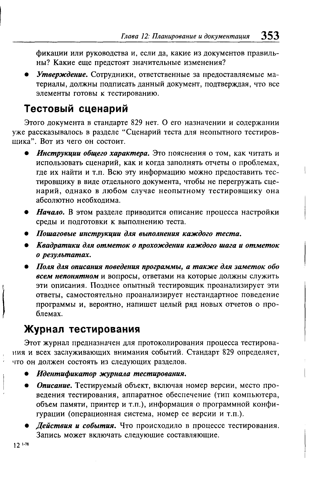

* **Процесс.** Какой была процедура тестирования, кто был свидетелем происходящего и какой была роль этого человека в выполнении теста.
* **Результаты.** Что произошло, что вы видели, слышали и т. п., где записаны выходные данные.
* **Аномальные события.** Неожиданные события (как правило, объясняющиеся ошибками в программе). Что происходило до и после них.
* **Идентификаторы отчетов об инцидентах.** Номера составленных отчетов о проблемах.

## Отчет об инциденте во время тестирования

Это отчет о проблеме. Форма отчета, описанная в данной книге, отличается от стандарта IEEE. По стандарту в отчете должны быть следующие поля: идентификатор отчета, описание, входные данные, ожидаемые результаты, реальные результаты, аномалии, дата и время, шаг процедуры, среда выполнения, попытки повторения теста, тестировщики, наблюдатели, ссылки на тестовые планы и спецификации.

## Итоговый отчет

В конце каждой серии тестов составляется итоговый отчет, и такой же отчет составляется по завершении цикла тестирования. В нем коротко описывается проделанная работа и оцениваются ее результаты. Вот какие разделы определяются для этого отчета стандартом 829.

* **Идентификатор итогового отчета.**
* **Описание.** Что тестировалось (включая номера версий), в какой среде, как вы оцениваете полученные результаты? Приведите ссылки на спецификации тестов.
* **Отклонения.** В чем и почему процедура тестирования отличалась от описанной в спецификации?
* **Оценка адекватности тестирования.** Было ли тестирование настолько полным, как того требует тестовый план? Какие модули, функции, возможности программы или их комбинации протестированы недостаточно и почему?
* **Обобщенное описание результатов.** Какие выявлены проблемы, какие из них устранены, каковы принятые решения? Какие из проблем оставлены нерешенными?
* **Оценка.** Общая оценка каждого из элементов (программ, модулей) на основе результатов его тестирования. Каков риск, связанный с его реальной эксплуатацией, и вероятность сбоев (необязательно)?

* **Затраченные ресурсы.** Сколько людей работало над описанными тестами, сколько затрачено машинного времени, рабочего времени сотрудников, какие еще использованы ресурсы и какие произошли нестандартные события.
* **Утверждение.**

## Документация в файлах данных и управляющих файлах

Создавая файлы входных данных для тестов, старайтесь по возможности включать в них комментарии, поясняющие выбор каждого из значений. То же самое касается и файлов, управляющих выполнением тестов. Если их формой допускаются комментарии, не скупитесь на пояснения к каждому выполняемому этапу.

Лучше всего организовать тестирование таким образом, чтобы, выполняя каждый из тестов, видеть на экране или на бумаге его ожидаемые результаты. Тогда их сразу же можно сравнивать с полученными. В этом случае отображать или распечатывать описания причин выбора того или иного значения данных или той или иной процедуры не следует. Эта информация будет только занимать лишнее место и отвлекать тестировщика от результатов теста. Гораздо лучше, если она просто будет всегда под рукой (например, в файле, который можно открыть в любой момент).

В отношении встроенных комментариев существует одна сложность — по сравнению с документацией они гораздо менее стандартизированы. Фактически их форма отдается на откуп автору, и есть вероятность, что некоторые файлы останутся вообще недокументированными или комментарии в них будут поверхностными и неаккуратными. И уж во всяком случае комментарии редко бывают такими подробными, как распечатанные документы.

Однако есть у комментариев и важное преимущество — их легко обновлять. Когда сотрудник изменяет процедуру тестирования, комментарий находится прямо у него перед глазами. К тому же комментарии не теряются — если у вас есть тестовый файл, значит, есть и текст его описания.

## Заключение

Многие тестировщики слишком увлекаются написанием бумаг, забывая, что их основная работа — поиск и исправление ошибок. В этой главе описан целый ряд документов, но это вовсе не означает, что необходимо составлять их все. Отбирайте только самое необходимое, сообразуясь с нуждами конкретного проекта.

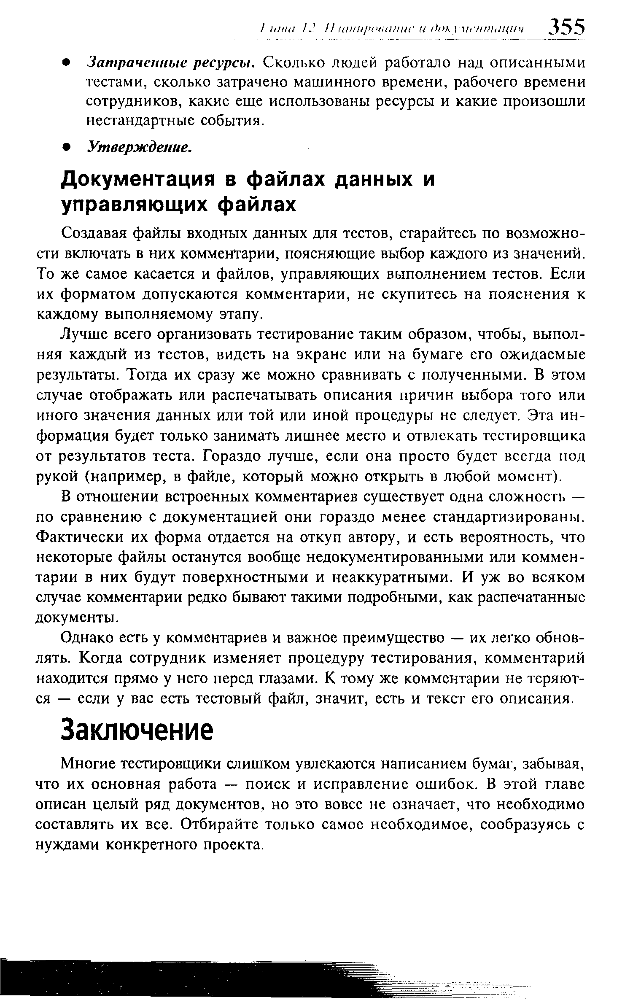


Часть III

# Управление проектами и группами


Глава 13. Объединяющая

Глава 14. Управление группой тестирования

Приложение. Распространенные программные ошибки

Глава 13

# Объединяющая

## Назначение этой главы

Итак, вы уже знаете, как тестировать программное обеспечение, как планировать эту работу, и имеете представление о том, как плановые и проектные документы связаны с ее результатами. Теперь пришло время перейти от технических вопросов к организационно-стратегическим.

Реальный мир полон ограничений. Не только желательную работу никогда не удается выполнить в полном объеме, но даже ту, которую, на ваш взгляд, вы **обязаны** сделать. (Таким был урок второй главы.) Не лучше положение и у руководителя проекта. Он пытается соблюсти разумный компромисс между надежностью продукта, его функциональными возможностями, стоимостью и скоростью разработки. Поэтому, делая упор на качество продукта, он должен идти на уступки в других не менее важных для компании вопросах. В разговорах с руководителем следует обязательно это учитывать и не упорствовать в том, что кажется полезным с точки зрения полноты тестирования — старайтесь, как и он, сохранять широту взгляда на вещи и рассматривать все проблемы с точки зрения пользы для проекта в целом, а не только своего узкого участка работы. Тогда у вас всегда будет взаимопонимание.

С точки зрения реального проекта в реальном мире работа группы тестирования всегда связана с затратами. Они должны окупаться, а окупаться они могут не иначе, как если будут удовлетворены запросы пользователей и повысятся доходы компании. Именно это и является главным критерием оценки результатов вашей работы, и именно это позволит получить дополнительное финансирование — только докажите, что оно окупится. И лучший способ доказать окупаемость своей работы — это показать, что она позволяет снизить другие затраты, связанные с качеством продукта.

В самом начале каждого проекта его руководитель вырабатывает стратегию, позволяющую максимально снизить затраты на разработку и обладающую той степенью гибкости и той направленностью, которые помогут наиболее эффективно решить поставленные задачи. Выбранная руководителем стратегия разработки может оказаться классическим методом водопада, эволюционной

схемой или же его собственной вариацией одного их этих двух методов. Менее вдумчивый менеджер может просто следовать однажды усвоенному подходу, не задумываясь об иных возможностях и их преимуществах. Как бы там ни было, выбранная им модель определяет, когда и в каком порядке выполняются различные виды работ, и в частности, когда продукт тестируется и когда в него вносятся исправления. Вам как руководителю группы тестирования необходимо понимать выбранную модель до мельчайших деталей. Иначе, планируя работу своей группы, вы рискуете наделать серьезных ошибок. Например, если значительная часть тестирования пользовательского интерфейса программы будет проведена на этапе, когда изменить его будет уже нельзя, большинство докуменируемых вами проблем так и останутся нерешенными. Если же некоторые изменения все же будут внесены в программу, это может нарушить планы других сотрудников, работающих над проектом. Так что плохо будет всем.

Итак, для эффективной работы и гладких взаимоотношений с руководством исключительно важно правильно понимать цели, преследуемые руководителем проекта при планировании распределения затрат и направлений основных усилий, выбранную им стратегию разработки, а также видеть полное соотношение составляющих качества продукта и связанных с ними затрат компании. Только тогда вы сможете говорить с руководителем проекта на его языке и только тогда сможете объяснить, а если необходимо, и доказать, что для полноценного тестирования продукта, отвечающего задачам данного проекта, необходимо выполнить такие-то виды работ в таком-то объеме, а если этого не сделать, то возможны такие-то и такие-то последствия.

В данной главе речь пойдет о разбиении проекта на ряд последовательных этапов. Рассказывая о том, какая работа выполняется на каждом из этих этапов, мы основывались на опыте, полученном нами (и нашими коллегами) в ходе множества проектов во множестве компаний. Однако приведенные рекомендации НЕ следует рассматривать как Единственно Правильный Способ организации проекта. Напротив, как и с любым другим способом, с ним связано множество проблем. Однако, скорее всего, структура вашего проекта будет очень похожа на описанную в этой главе. Мы же хотим просто помочь вам в выборе необходимых типов тестирования.

## Обзор

В данной главе рассматриваются следующие вопросы:
* Чем приходится поступаться при разработке программного обеспечения
* Модели разработки
* Затраты, связанные с качеством продукта
* Сроки разработки
* Проект продукта
* Анализ пользовательских данных
* Первоначальная функциональность
* Почти альфа
* Альфа

* Пре-бета
* Бета
* Бета-тестирование вне компании
* Замораживание пользовательского интерфейса
* Перед завершением
* Коэффициенты надежности
* Последняя проверка целостности
* Выпуск продукта
* Анализ продукта после его выпуска

## Библиография

По вопросу о контроле качества программных продуктов можно порекомендовать бестселлер Американского общества контроля качества (American Society for Quality Control) *Principles of Quality Costs* (Campanella, 1990). Он будет очень полезен тем, кто захочет внедрить в своей компании систему контроля затрат на качество продукта. Кроме того, интересны книги таких авторов, как Джуран и Грайне (Juran & Gryna, 1980), а также Фейгенбаум (Feigenbaum, 1991).

В главе 3 уже рассказывалось о стадиях разработки, и многие определенные там концепции используются в данной главе. Гласс (Glass, 1992) рассматривает этапы разработки программного продукта с точки зрения руководителя проекта, помогающего программистам улучшить его качество.

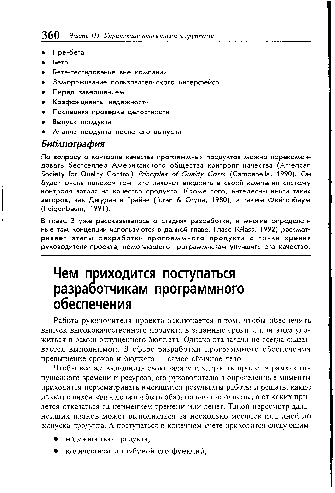

Работа руководителя проекта заключается в том, чтобы обеспечить выпуск высококачественного продукта в заданные сроки и при этом уложиться в рамки отпущенного бюджета. Однако эта задача не всегда оказывается выполнимой. В сфере разработки программного обеспечения превышение сроков и бюджета — самое обычное дело.

Чтобы все же выполнить свою задачу и удержать проект в рамках отпущенного времени и ресурсов, его руководителю в определенные моменты приходится пересматривать имеющиеся результаты работы и решать, какие из оставшихся задач должны обязательно быть выполнены, а от каких придется отказаться за неимением времени или денег. Такой пересмотр дальнейших планов может выполняться за несколько месяцев или дней до выпуска продукта. А поступаться в конечном счете приходится следующим:

* надежностью продукта;
* количеством и глубиной его функций;

* деньгами, необходимыми для выполнения дальнейшей работы;
* сроками выпуска продукта.

В принятии решения, особенно на поздних стадиях разработки, огромную роль играет гибкость выбранной стратегии. Но какой бы ни была эта стратегия, возможности руководителя проекта ускорить и удешевить его разработку будут ограничены рядом естественных факторов.

* **Надежность.** Чтобы удешевить продукт и выпустить его быстрее, проще всего сократить время тестирования и оставить в программе множество ошибок. Однако, даже если этого не делать, в продукте все равно останется некоторое количество ошибок, которые могли бы быть выявлены в ходе дальнейшего тестирования. Ведь тестирование — процесс бесконечный, но так или иначе когда-нибудь приходится остановиться.

* **Функциональность.** Еще один способ сокращения проекта заключается в его упрощении. Если одна из функций продукта плохо спроектирована или закодирована или же техническая сложность ее реализации оказалась недооцененной, руководитель проекта может сэкономить время и деньги, просто отказавшись от этой функции, или оставив ее усеченный вариант. Однако не с каждой функцией программы можно поступить подобным образом. Отсутствие некоторых составляющих может резко снизить ценность продукта для пользователя. То же самое касается и неудобных способов решения определенных задач.

* **Деньги.** Бывает, что для успешного завершения проекта необходимо пойти на дополнительные затраты. Возникшие проблемы можно решить таким образом: купить дополнительный инструментарий, нанять высокопрофессиональных консультантов или подключить дополнительный персонал. Последний вариант используется чаще всего, однако это не всегда помогает. Ведь чем больше людей работает над проектом, тем больше возникает всевозможных проблем и тем выше его стоимость. Руководящие сотрудники вынуждены отвлекаться от своих основных задач, организуя работу нового персонала. В результате это может даже затянуть весь процесс разработки. (См. Брукс (Brooks, 1995).) Это касается дополнительного подключения к работе как программистов, так и тестировщиков. В конце проекта и тот, и другой варианты могут серьезно дестабилизировать работу всей команды.

* **Дата выпуска.** Если проект выбивается из графика, его руководитель может отложить выпуск. Однако это может обойтись компании крайне дорого.

* Непосредственная стоимость продолжения работ. Эти затраты определяются зарплатой всех участников проекта.
* Дополнительные потери. Если работа выполняется по контракту, руководитель может предусмотреть пеню за несоблюдение сроков или значительный бонус за своевременное завершение проекта. Если продукт должен быть выпущен к началу определенного сезона, например, к осени, Рождеству или Новому году, пропустив его, можно потерять часть покупателей. Кроме того, задержка выпуска продукта может привести к тому, что устареет техника, на которую он ориентирован, или на рынке появятся конкурирующие продукты. Очень важно понимать, что рынок завоевывает продукт, появившийся первым, и по количеству продаж он превзойдет более качественные продукты, выпущенные какое-то время спустя. Поэтому задержка выпуска ради повышения качества продукта может его похоронить.
* Потерянные затраты на маркетинг. Если продукт разрекламирован слишком рано, к моменту его выпуска придется все повторять сначала.
* Параллельные проекты. Люди, работающие над проектом сверх срока, могли бы уже выполнять другую работу. Таким образом, задержки одного проекта отражаются и на других.
* Отсутствие ожидаемой прибыли. Если доходы от выпуска продукта должны быть немедленно вложены во что-то другое, если эти деньги срочно нужны компании — тогда у вас большие проблемы.

## Модели разработки программного обеспечения

Модель разработки программного обеспечения — это тот принцип, по которому руководитель проекта составляет план выполнения задач. О классических моделях разработки, их достоинствах и недостатках подробно рассказывалось в главе 12. Пример организации работ по методу водопада приводился в главе 3. Этот же метод мы еще раз рассмотрим с другой точки зрения в главе 14.

У каждой модели свое соотношение возможностей ускорения и удешевления проекта. Поэтому руководитель должен решить, какие его составляющие с наибольшей вероятностью могут подвергнуться изменениям, и выбрать модель, наиболее гибкую именно в этих областях. Если, например, набор функций программы жестко фиксирован и ни одна из них ни в коем случае не может быть удалена, бессмысленно выбирать модель, ориентированную на снижение стоимости продукта за счет сокращения его функций.

Обычно у любого специалиста в этой области имеется четкое представление об относительных преимуществах и недостатках каждой модели. Однако, несмотря на профессиональный опыт и веские логические обоснования, эти представления весьма субъективны. В частности, собственное мнение на этот счет имеется и у каждого из авторов этой книги, однако эти мнения различны. Имея это в виду, никогда не пытайтесь критиковать руководителя проекта за Неверный Выбор Модели разработки.

В следующих двух разделах рассказывается о проблемах и путях их решения, связанных с методом водопада и эволюционной моделью разработки. На их примере мы хотим показать, как следует подходить к анализу любой модели, которая покажется заслуживающей внимания. Попробуйте подобным образом проанализировать методики, используемые в вашей компании.

## Традиционный метод водопада

Метод водопада представляет собой классический подход к управлению проектом. Особенно часто он применяется для крупных разработок. В соответствии с этим методом проект разбивается на ряд последовательных этапов — анализ требований, разработка проектной документации, кодирование, тестирование и выпуск. Подавляющая часть работ каждого этапа завершается до начала следующего. Например, разрабатываются функциональные требования к продукту. Когда этот документ готов, начинается разработка внутренней и внешней спецификации. После завершения и утверждения спецификаций начинается кодирование.

В теории все звучит красиво и очень убедительно. Таков стандартный подход, и руководители многих групп тестирования просят программистов его придерживаться. Тестировщики задолго до начала тестирования получают в руки спецификацию, полностью описывающую продукт и ограничивающую количество его последующих изменений. Спецификация облегчает планирование работ по тестированию, формирование их бюджета, календарного плана, подбор персонала.

Описываемый метод первоначально предназначался для разработки программного обеспечения по контрактам. В этом случае требования к продукту формирует заказчик, и делается это заранее, поскольку на их основе определяется стоимость разработки. Кроме того, заказчик должен проанализировать и одобрить внешний дизайн, спецификации многих потоков данных, определения многих отчетов и еще целый ряд других деталей, причем все эти документы должны быть согласованы до начала кодирования. Только после этого начинается собственно создание продукта. Если требования заказчика к продукту по каким-либо причинам изменятся, эти изменения вносятся в продукт, но вся уже проделанная работа все равно оплачивается. Именно такова юридическая схема действий, но кто сказал, что юристы — хорошие инженеры?

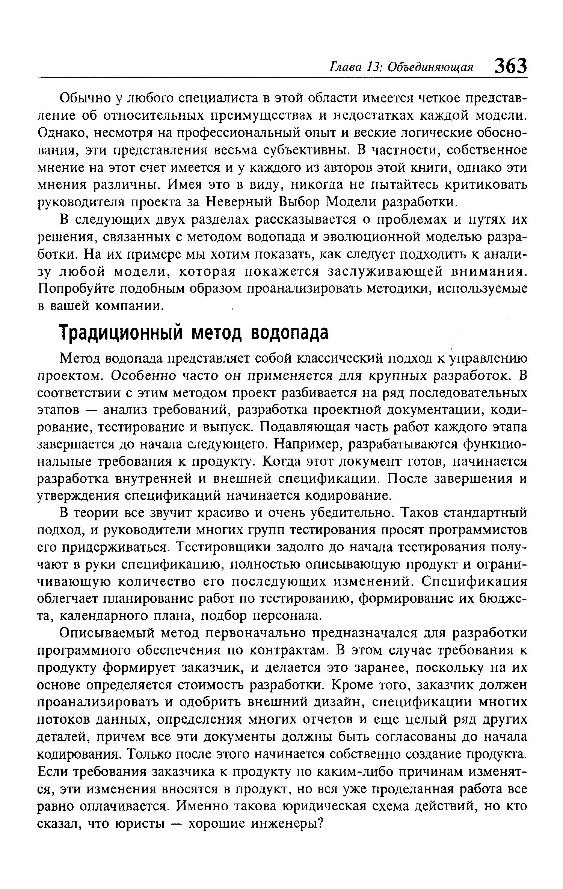

Серьезнейшим недостатком метода водопада является то, что все ключевые конструкторские решения должны быть приняты на этапе, когда сотрудники еще не составили полного представления о продукте. В значительной степени оно формируется в ходе разработки, а до ее начала легко ошибиться в оценках сложности или наилучшего способа реализации отдельных функций. Еще мало изучены конкурирующие программы. Еще не сформировано четкое представление о разрабатываемом продукте — реальном, а не планируемом, поскольку, только поработав с программой достаточно долгое время, можно как следует оценить ее сильные и слабые стороны, почувствовать ее характер. Все это станет возможно только после создания первой работающей версии продукта.

Каковы же возможности руководителя проекта, который близок к завершению, но не укладывается в сроки, если проект разрабатывается по методу водопада?

* **Функциональность.** К этому моменту все требования к продукту уже давно сформированы, спецификация готова, и если продукт находится на тестировании, то и кодирование также завершено. Поэтому удаление функций в общем случае незначительно сокращает время или стоимость разработки.
  Если одна из функций спроектирована или реализована настолько плохо, что всю работу необходимо переделать, тогда ее удаление из продукта может пойти на пользу проекту. Однако, если от неудачной функции зависят другие части продукта, сделать это уже не так просто.
* **Деньги.** Поскольку спецификация полностью готова, ничего не стоит подключить к проекту дополнительных программистов. Получив четкое и ясное представление о поставленной задаче, они могут сходу приступать к кодированию.
* **Дата выпуска.** Когда проделано столько подготовительной работы, жалко от чего-либо отказываться. Поэтому, часто, когда все функции программы уже закодированы, принимается решение продлить сроки разработки и провести все запланированное тестирование.
* **Надежность.** Если все функции уже написаны, подключен дополнительный персонал, а проект по-прежнему не укладывается в сроки, остается только прекратить тестирование и выпустить продукт как есть, со всеми оставшимися в нем ошибками. В этом случае давление на тестировщиков невероятно возрастает, у них остаются считанные дни на то, чтобы либо доказать, что продукт не готов к выпуску, либо подтвердить, что в нем нет слишком серьезных ошибок. Последнее, впрочем, лишь предположение, базирующееся на том факте, что подобных ошибок не выявлено в течение последних дней.

Итак, если проект разрабатывается по методу водопада и не укладывается в график, его руководитель может подключить дополнительный персонал, отложить дату выпуска или выпустить некачественный продукт.

Защитники этого метода утверждают, что многих неприятностей можно избежать, если программисты с самого начала проанализируют требования и проектную документацию и тщательно спланируют свою работу. Если же какую-либо из задач не продумать заранее, ее решение в дальнейшем будет связано с большими проблемами. Тщательность предварительного планирования особенно важна в тех случаях, когда продукт разрабатывается для одного пользователя или когда значительную часть продукта составляет аппаратное обеспечение, которое невероятно дорого перепроектировать.

## Эволюционный метод

При эволюционном подходе к разработке программного продукта функции добавляются к нему последовательно, одна за другой.

Любая программа может обладать минимальным количеством функций, а может быть напичкана всем, что только пришло в голову программисту. При эволюционном подходе продукт развивается в направлении от первой крайности ко второй. Это значит, что вначале продумывается суть будущей программы, ее идеология и основные задачи. Затем программисты пишут ядро программы, спроектированное таким образом, чтобы ее легко можно было расширять, добавляя все новые и новые возможности. Набор функций ядра минимален, однако они все же составляют независимую программу, готовую к тестированию. Ядро тестируется и отлаживается как полноценный продукт до тех пор, пока не получится вполне стабильная программа.

Затем программисты добавляют к продукту новые функции — по одной или небольшими связанными группами. После каждого такого добавления программа проходит новый цикл тестирования и исправляется до тех пор, пока снова не станет достаточно стабильной.

Процесс добавления функций и отладки программы продолжается до тех пор, пока не получится достаточно приемлемый продукт. Это означает, что, если необходимо, его уже можно продавать, хотя и остается еще множество нереализованных функций, которые могли бы сделать его более конкурентоспособным. Но и без них продукт представляет собой полезную программу, которая вполне удовлетворит многих потенциальных пользователей.

Дальше все зависит от наличия времени и денег. Если разработку продукта можно продолжить, его возможности постепенно расширяются все тем же эволюционным методом: добавили функцию — отладили программу, добавили следующую — опять отладили. Благодаря такой стратегии

компания постоянно имеет полноценную и стабильную программу, дальнейшее усовершенствование которой можно прекратить в любой момент, зная, что вся наиболее важная работа уже выполнена. Со временем программа вырастает в надежный и полезный продукт с богатыми возможностями.

При методе водопада группа тестирования находится в состоянии постоянной неопределенности. Как составить реальный календарный план работ, когда никому не известно, сколько еще в программе ошибок и сколько времени понадобится на их поиск и устранение? При эволюционном подходе все гораздо определеннее. Как минимум последняя отлаженная версия продукта всегда готова к выпуску, а в новой версии добавлена только одна функция, так что область поиска ошибок достаточно локализована.

Последним преимуществом эволюционного подхода является его гибкость: по ходу работы и по мере углубления понимания продукта требования к нему можно пересматривать, а это значит, что в конечном счете продукт получается более совершенным.

Вот что можно сделать, если проект, реализуемый эволюционным методом, выбивается из графика.

* **Функциональность.** Как только сформирован минимальный набор функций, образующих приемлемый продукт, от остального можно спокойно отказаться. Раз программисты не проектируют новых функций до тех пор, пока не наступает время их добавления, такой отказ не будет означать, что значительный объем работы по проектированию и написанию документации проделан зря.
* **Деньги.** Вместо того чтобы отказаться от добавления новых функций, можно реализовать их быстрее, подключив дополнительные ресурсы. Узким местом в этом случае станет проектирование продукта, поскольку подключить новых конструкторов гораздо сложнее, чем исполнителей.
* **Дата выпуска.** Главная мощь эволюционного подхода заключается в том, что он предоставляет руководству невероятные возможности контроля за графиком работ. Дата завершения проекта свободно может переноситься в ту или иную сторону в зависимости от требований момента. И нередко руководитель решает выпустить продукт вовремя, не добавляя в него оставшийся десяток функций. При этом, когда бы ни было принято решение о выпуске, сделать это можно буквально в течение нескольких недель, ведь продукт всегда стабилен.
* **Надежность.** Продукты, разрабатываемые эволюционным путем, всегда очень надежны. Поскольку после добавления каждой новой

функции продукт полностью отлаживается, основные усилия по тестированию приходятся на начало проекта. Когда руководство решает прекратить разработку и выпустить программу в свет, необходим лишь незначительный объем завершающего тестирования, чтобы подтвердить ее готовность. При этом, даже если такое решение принимается раньше срока или до того, как все задуманное будет полностью реализовано, нет риска, что выпущенная программа будет содержать серьезные ошибки.

Затраты на тестирование продукта при эволюционном подходе довольно велики, поскольку оно начинается очень рано. Однако ближе к концу разработки объем тестирования гораздо меньше, чем при методе водопада, что несколько уравнивает расходы. К тому же же не приходится тратить время на планирование тестов и тестирование тех функций, от реализации которых руководство откажется в случае цейтнота.

Однако в реализации эволюционного метода разработки существуют и сложности. Одна из них заключается в том, что программистам приходится совмещать написание нового кода с отладкой старого. Если разработка не укладывается в сроки, у них возникает искушение вместо исправления ошибок быстро программировать новые функции. Однако делать этого ни в коем случае нельзя, поскольку прогресс получается только кажущимся. Ошибки будут накапливаться, и это сведет на нет все преимущества выбранной стратегии. В результате руководителю проекта придется делать выбор между выпуском некачественного продукта и переносом даты завершения проекта.

При выборе эволюционного подхода неопытным руководителем существует определенный риск. Руководителю может показаться, что, поскольку продукт развивается со временем, нет нужды проводить тщательное начальное планирование. Это огромная ошибка. Успех всей разработки зависит от гибкости ядра и продуманности основных концепций. А для достижения гибкости необходимо даже более тщательное планирование, чем при методе водопада, ведь должны быть предусмотрены все возможные способы и направления расширения продукта. Если же ядро разработано неудачно, при добавлении каждой новой функции программы его придется переделывать, а это сведет на нет все преимущества выбранного подхода. Кроме того, в конце разработки может оказаться, что не хватает одной из важнейших функций, без которых продукт не будет полноценным, и придется добавлять ее, отодвигая дату выпуска.

Не всегда правильно понимают суть эволюционного метода сотрудники группы маркетинга. Рекламируя продукт, они нередко анонсируют те его функции, которых в конечном варианте может не оказаться. Нет нужды говорить, что такого быть ни в коем случае не должно.

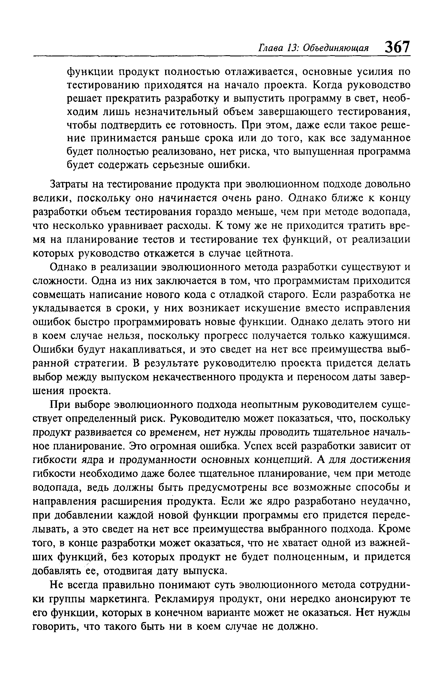

У руководства есть и еще один способ завалить проект, разрабатываемый эволюционным методом. Если не начать тестирование продукта сразу же, как только будет готово его ядро (а такое может случиться, если все тестировщики заняты на другом проекте, выбивающемся из графика), будет нарушена вся стратегия. К тому времени, когда к ядру начнут подключаться новые функции, оно еще не будет полностью отлажено. С ростом сложности продукта тестировщикам и программистам крайне сложно будет наверстать упущенное и привести очередную версию к состоянию полной стабильности. В результате получится нечто похожее на плохо организованный проект, разрабатываемый по методу водопада: тестирование начато достаточно поздно, продукт очень нестабилен, и к тому же спецификация все время пересматривается, к программе добавляются все новые и новые функции, когда и старые еще работают кое-как. Приходится подключать к тестированию дополнительные ресурсы, его стоимость непомерно возрастает, а проект все равно выбивается из графика, и качество результата оставляет желать лучшего.

При любом подходе к разработке от группы тестирования зависит очень многое. Но при эволюционном методе у нее больше всего возможностей завалить работу, и этот риск обязательно следует учитывать.

## Модель разработки и тестирование

Как следует разобравшись в выбранной руководителем проекта модели разработки, следует проанализировать ее влияние на процесс тестирования. Вот что означает для тестировщиков выбор метода водопада.

* *Как можно раньше проанализируйте пользовательский интерфейс.* Можно воспользоваться для этого прототипами программы.
* *Как можно раньше начните разработку тестового плана.* Это позволит критически проанализировать спецификацию (или ее черновики) и выявить возможные проблемы, связанные с тестированием будущего продукта.
* *Нельзя приступить к тестированию раньше, чем продукт будет к нему готов.* Проблема в том, что, если проектирование и кодирование продукта затянется, тестирование тоже будет начато позже срока. Поэтому следует тщательно продумать свои действия в такой ситуации. Во-первых, вы отвечаете за то, чтобы сформированная группа квалифицированных тестировщиков не простаивала. С одной стороны, она должна приступить к работе, как только продукт будет готов. С другой стороны, если программа не будет достаточно стабильна, ее придется вернуть программистам на доработку, а тестировщиков загрузить другой работой, которая позволит ускорить

процесс в дальнейшем. Например, они могут заняться автоматизацией тестов или формированием дополнительных файлов тестовых данных. Необходимо также разработать эффективную стратегию подключения к проекту дополнительных людей, если в последнюю минуту придется прибегнуть к такому варианту. Многие простые, но рутинные операции можно поручить неквалифицированному или не имеющему опыта работы с данной программой персоналу, повысив тем самым отдачу от основного состава группы. Однако задачи для подключаемых людей должны быть определены заранее, и вся схема действий должна быть достаточно продумана, поскольку, когда сроки начнут сильно поджимать, времени на это уже не будет.

* *Тестирование — это наиболее ответственный этап разработки.* К моменту начала тестирования программа уже практически полностью написана. После прекращения поиска ошибок она сразу же выходит в свет. Если проект достаточно велик для подключения нескольких тестировщиков, подумайте о том, чтобы назначить одного-двух человек для постоянного выполнения неформального тестирования. Цель работы такого сотрудника — каждую неделю находить пару настолько серьезных ошибок или недостатков, что выпустить с ними продукт просто невозможно. Во время исправления этих ошибок остальная часть группы будет последовательно "прочесывать" программу в соответствии с планом. Эта тактика особенно хорошо зарекомендовала себя на больших и серьезных проектах, где она позволяет сэкономить очень много времени. (Предупреждение: никогда не откладывайте документирование серьезных ошибок, приберегая их на случай, если за неделю не удастся выявить ничего серьезного. Такие вещи могут очень дорого вам обойтись, особенно если кто-нибудь об этом узнает. Никогда этого не делайте. Никогда об этом даже не думайте.)

А вот каковы следствия выбора эволюционного метода.

* *Планируйте рано начать тестирование.* Как только будет сформирован базовый набор функций программы, необходимо будет приступить к тестированию ее надежности.
* *Планируйте периодическое проведение анализа функциональности и удобства программы.* Если только что добавленная часть программы покажется вам неудачной, у вас будут все шансы добиться ее изменения.
* *Планируйте разработку тестового плана параллельно с тестированием.* Заранее разработать его не удастся — ведь не будет ни предмета тестирования, ни даже спецификации.


Хотя теоретическая модель и важна, не менее важна эффективность ее реализации. Читая о последовательности этапов, вернитесь к этому рисунку.

**РИСУНОК 13.1.** *Цикл разработки продукта*

* *Планируйте выполнить самую серьезную часть тестирования как можно раньше*. Никогда не откладывайте критические тесты “на потом”. Руководитель проекта может в любое время остановить разработку, и они так и останутся невыполненными. Такое действительно случается: двоим авторам этой книги приходилось выпускать продукты за три месяца до запланированного срока.

## Затраты на качество

Затраты на качество продукта — это затраты на предотвращение ошибок, их поиск и исправление. С точки зрения бизнеса деньги вкладываются в тестирование потому, что выпуск продукта с ошибками в конечном счете обходится дороже. Если удастся доказать, что определенный вид тестирования сэкономит компании деньги, его финансирование вам обеспечено.

Продумав, как согласовать работу своей команды с общей стратегией разработки продукта, вы, возможно, захотите включить в свой план работы, которые обычно в компании не практикуются. Например, в компании может быть не принято, чтобы тестировщики анализировали внешний дизайн продукта, или же им может не выделяться для этого достаточно времени. Другими примерами подобных нестандартных работ может быть анализ записей группы поддержки пользователей, автоматизация тестов, выполнение рутинной работы низкоквалифицированными тестировщиками или вообще непрофессионалами, подключаемыми к работе в крайних случаях, тестирование на совместимость с широким диапазоном внешних устройств или организация бета-тестирования. В каждом случае вам придется доказывать руководству, что проведение соответствующих работ позволит предотвратить серьезные потери или затраты в будущем.

Чем больше вам известно о затратах компании, связанных с качеством программного продукта, тем больше у вас шансов доказать необходимость новых тестовых процедур. Обычно эти затраты подразделяются на четыре категории (Кампанелла (Campanella, 1990)).

* *Затраты на предотвращение ошибок*: все расходы на предотвращение ошибок в программном обеспечении и документации.
* *Затраты на исправление программы*: стоимость работ по тестированию и всего остального, что делается компанией для поиска ошибок.
* *Стоимость сбоев, происходящих в стенах компании*: расходы из-за ошибок, обнаруживаемых в процессе разработки и тестирования продукта.
* *Стоимость сбоев, происходящих вне компании*: расходы из-за ошибок, обнаруживаемых (обычно пользователями) после выпуска продукта.

Примеры каждого из этих четырех видов затрат приведены на рис. 13.2. Исследования Фейгенбаума (Feigenbaum, 1991) показали, что типичная компания тратит на предотвращение ошибок от 5 до 10 процентов общих затрат на качество, еще 20–25 процентов уходит на исправление программмы, и оставшиеся 65–75 процентов суммы "съедают" последствия внутренних и внешних сбоев.

| *Предотвращение* | *Исправление* |
| :--- | :--- |
| Пересмотр дизайна | Тестирование "стеклянного ящика" |
| Анализ требований | Тестирование "черного ящика" |
| Пересмотр спецификации | Тестирование группой технической поддержки |
| Обучение программистов допускать меньшее количество ошибок | Обучение тестировщиков тому, как находить больше ошибок |
| Программирование защиты от сбоев (проверка вводимых данных, обработка исключительных ситуаций и т. п.) | Бета-тестирование: собственные пользователи, представители заказчика, независимые пользователи |
| | Приемочное тестирование заказчиком |
| *Внутренние сбои* | *Внешние сбои* |
| Исправление ошибок | Звонки в отдел технической поддержки |
| Регрессионное тестирование исправленных фрагментов программы | Подготовка ответов группы технической поддержки |
| Откладывание тестирования определенных частей программы | Возмещение убытков |
| Потери времени пользователей, если продукт эксплуатируется внутри компании | Замена версии продукта на исправленную |
| Замедление работы технических писателей | Смягчение разгромных статей в периодике (до их появления) |
| Переписывание разделов руководства | Судебные процессы |
| Затраты, связанные с задержкой выпуска продукта | |
| Ресурсы, которые могли бы быть затрачены на другие продукты, если бы данный был выпущен вовремя | |

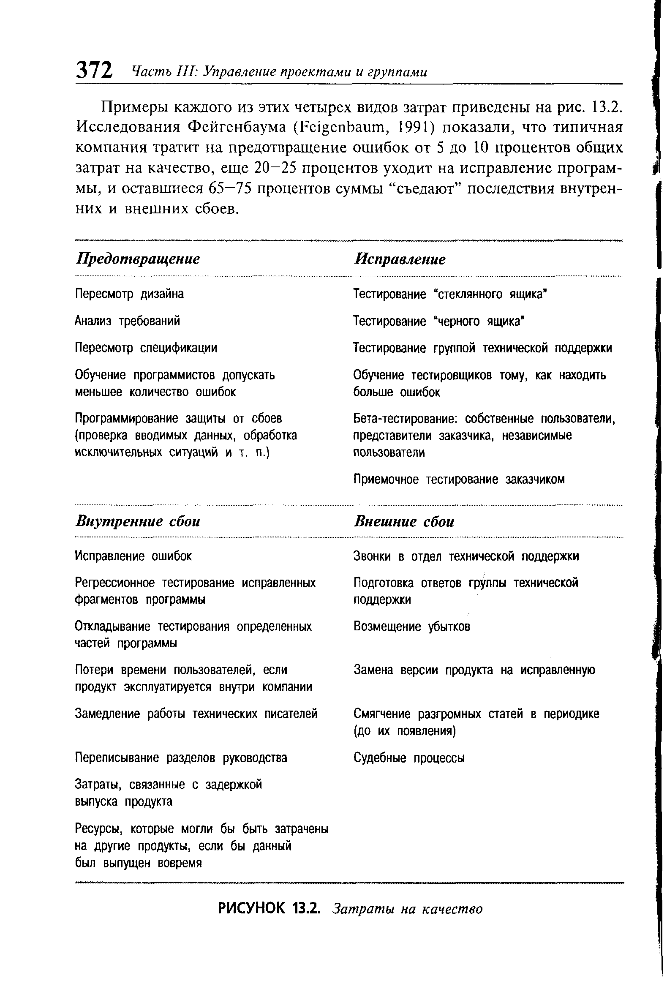

РИСУНОК 13.2. Затраты на качество

Группы контроля качества обычно систематически собирают всю информацию о соответствующих затратах. Если получить к ней доступ не удается, не отчаивайтесь. Многое можно выяснить у сотрудников группы технической поддержки, кое-что может рассказать руководство, а об остальном можно и догадаться. Проанализировав собранную информацию, вы поймете, как повышение затрат на предотвращение и исправление ошибок помогает уменьшить последствия внутренних и внешних сбоев, а значит и снизить соответствующие расходы. На этой основе можно строить собственные аргументы в пользу проведения необходимых видов работ.

## Последовательность этапов проекта

Обычно руководитель проекта публикует календарный план, важнейшие этапы которого носят названия *альфа* и *бета*. Первый из них завершается объявлением о готовности альфа-версии программы, а второй — объявлением о готовности бета-версии. Точные определения этих состояний разработки от компании к компании меняются. В общем случае альфа-версия программы — это полностью завершенный, хотя и еще полный ошибок, продукт, в то время как бета-версия уже почти готова к выпуску. Основные этапы проекта представлены на рис. 13.3.

Разбиение разработки на этапы вовсе не означает, что все поставленные задачи решаются последовательно, одна за другой. Как раз наоборот, многие работы выполняются параллельно, например, в то время как одни части программы только пишутся, другие уже могут тестироваться и описываться в руководстве пользователя. При эволюционном методе разработки в то же самое время может выполняться и разработка требований к продукту, создание его прототипа и написание спецификации.

На рис. 13.4 (*а, б, в и г*) приведен наш вариант календарного плана работ (разумеется, без конкретных сроков).

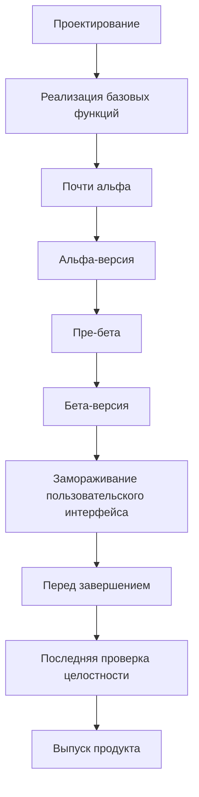
```mermaid
graph TD
    A["Проектирование"] --> B["Реализация базовых функций"]
    B --> C["Почти альфа"]
    C --> D["Альфа-версия"]
    D --> E["Пре-бета"]
    E --> F["Бета-версия"]
    F --> G["Замораживание пользовательского интерфейса"]
    G --> H["Перед завершением"]
    H --> I["Последняя проверка целостности"]
    I --> J["Выпуск продукта"]
```

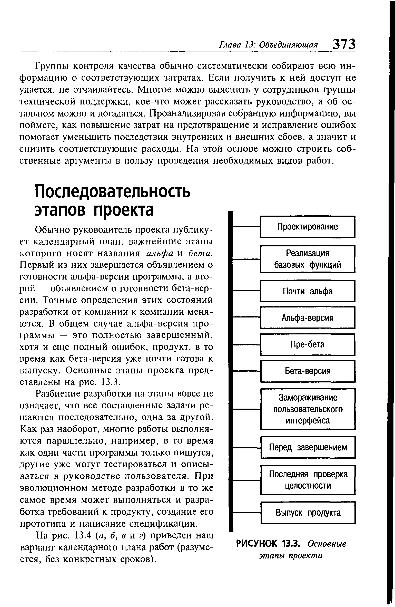

РИСУНОК 13.3. Основные этапы проекта


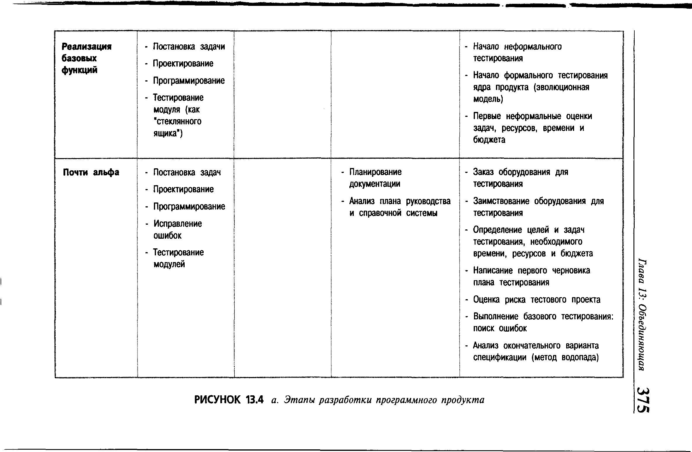

РИСУНОК 13.4 а. Этапы разработки программного продукта

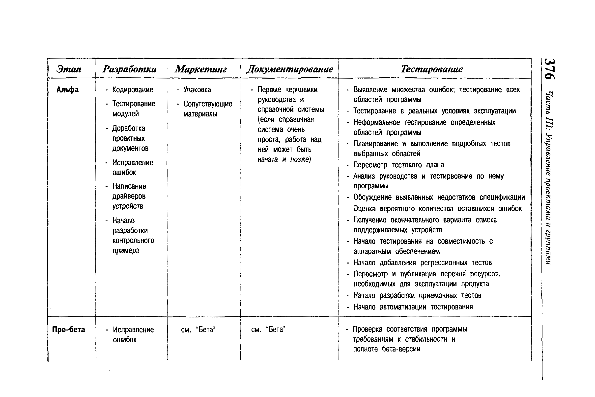

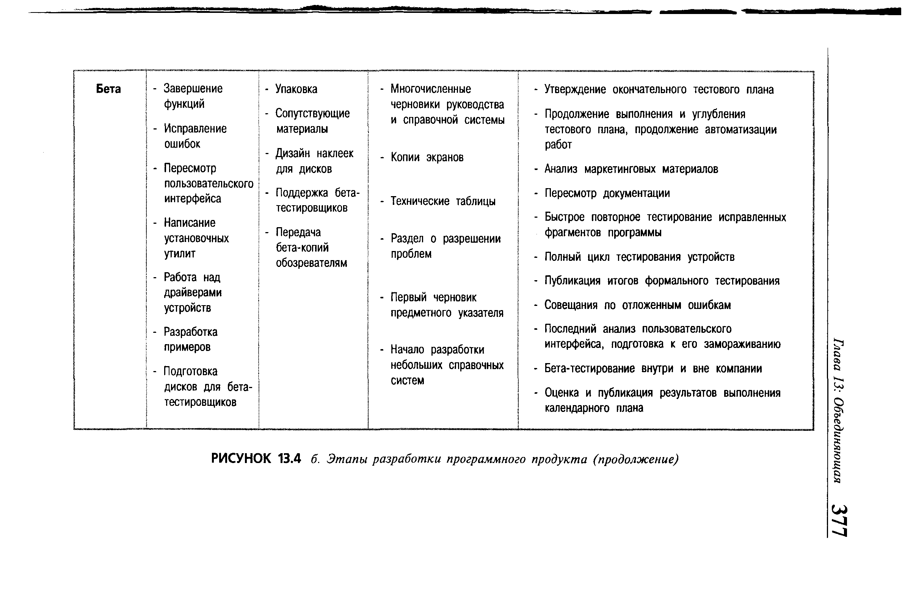

РИСУНОК 13.4 б. Этапы разработки программного продукта (продолжение)


**РИСУНОК 13.4** *в. Этапы разработки программного продукта (продолжение)*


РИСУНОК 13.4 г. Этапы разработки программного продукта (продолжение)

Необходимо подчеркнуть, что это только пример, ни одна известная нам компания не придерживается в точности этой схемы. В каждой компании определяются собственные базовые этапы разработки, но, как правило, они очень похожи на приведенные в этой книге, поскольку это наиболее естественный и логичный порядок решения перечисленных стандартных задач.

Далее в этой главе подробно анализируются приведенные таблицы и рассказывается о том, какие работы по тестированию программного продукта соответствуют каждому из перечисленных этапов. (Примечание: многие из используемых в этой главе терминов определялись в главе 3.)

## Проектирование продукта

Это самый первый этап разработки, на котором определяется, что же будет представлять собой задуманный программный продукт. При проектировании первым делом формулируются требования к продукту, а затем разрабатывается его внутренняя и внешняя структура. Подробное описание этого процесса можно найти у таких авторов, как Де Макро (De Macro, 1979), Гаус и Вейнберг (Gause & Weinberg, 1989), Гилб (Gilb, 1988), Голд и Льюис (Gould & Lewis, 1985), Оулд (Ould, 1990), Вейнберг (Weinberg, 1982), Йордан (Yourdon, 1975), Йордан и Константин (Yourdon & Constantine, 1979).

### Программирование на этапе проектирования продукта

Приступая к проектированию программы, ее конструкторы или представители заказчика прежде всего определяют требования к программе и продумывают свои предложения по их реализации, оформляют все это в виде отдельных документов, после чего составляется контракт. Только после этого может начаться собственно программирование. Если разработка ведется методом водопада, на этапе проектирования разрабатываются внутренняя и внешняя спецификации. Более детальное планирование внутренней и внешней структуры продукта может быть продолжено и позднее.

### Маркетинговая деятельность на этапе проектирования продукта

В это же самое время в отделе маркетинга ведется активная исследовательская работа. Ее цель — помочь конструкторам продукта в формировании его видения, собрав для этого максимум информации о требованиях рынка и нуждах пользователей. Для этого из потенциальных пользователей продукта формируются небольшие дискуссионные группы, которым пред-

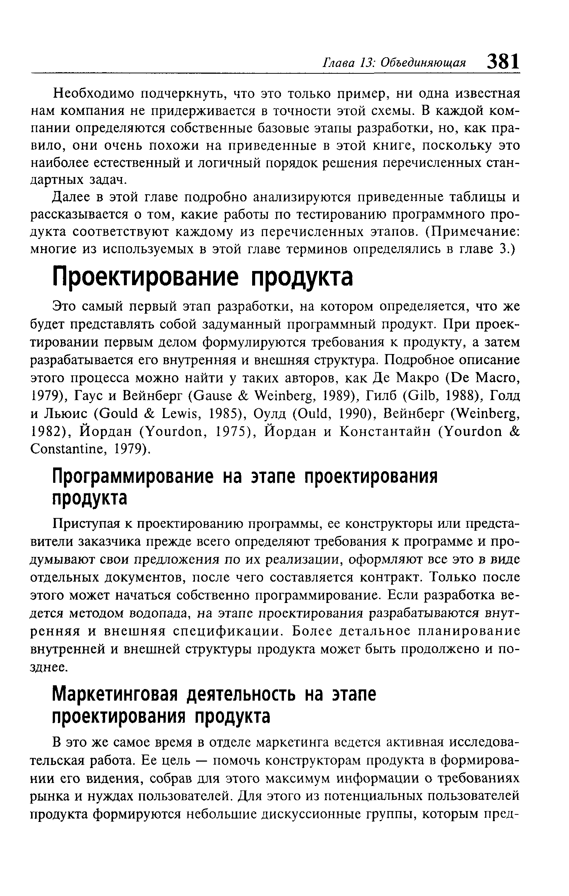

лагается обсудить его возможности, часто на примере прототипов программы.

Сотрудники отдела маркетинга могут провести опрос пользователей, работавших либо с предыдущими версиями разрабатываемого продукта, либо с другими аналогичными программами. Они расспросят пользователей о том, какие функции желательно было бы включить в программу, как они оценивают качество конкурирующих продуктов (и почему) и сколько они могли бы заплатить за подобный продукт. Возможно, что в этой работе потребуется и ваше участие.

### Документирование на этапе проектирования продукта

Некоторые группы документирования на этом этапе помогают составлять спецификации продукта.

### Тестирование на этапе проектирования продукта

Если повезет, вам предложат проанализировать проектные документы, как только они будут написаны. Это прекрасная возможность познакомиться с продуктом и начать планирование собственной работы.

В главе 3 уже рассказывалось о том, какие недостатки может найти в проектной документации тестировщик. Однако на деле тестировщики редко высказывают какие-либо замечания. Они скорее пользуются предоставленной возможностью пораньше ознакомиться с программой. Если же вы все же окажетесь активно вовлеченным в процесс проектирования, обратитесь к книгам таких авторов, как Гаусс и Бейнберг (Gause & Weinberg, 1989) и Фридман и Бейнберг (Freedman & Weinberg, 1982).

Если в компании строго соблюдается принцип водопада, рецензирование проектной документации пользовательского интерфейса может быть для вас единственной возможностью изменить что-то в этой области. В этом случае следует отнестись к делу со всей серьезностью и проанализировать проект продукта самым тщательным образом. Обратитесь в группу технической поддержки за статистической информацией о расходах, связанных с недостатками пользовательского интерфейса предыдущих разработок компании. Это поможет доказать руководству, что время, которое вы собираетесь потратить на анализ проектной документации, будет потрачено не зря.

### Подготовка к автоматизации тестирования

Нередко самое важное, что вы можете сделать на этапе проектирования, — это продумать, какой программный код поможет автоматизировать процесс тестирования или сделать его более эффективным. Этот код может быть включен прямо в продукт или написан в виде отдельных служебных программ. Вовсе не обязательно, что все, о чем вы попросите, будет сде-

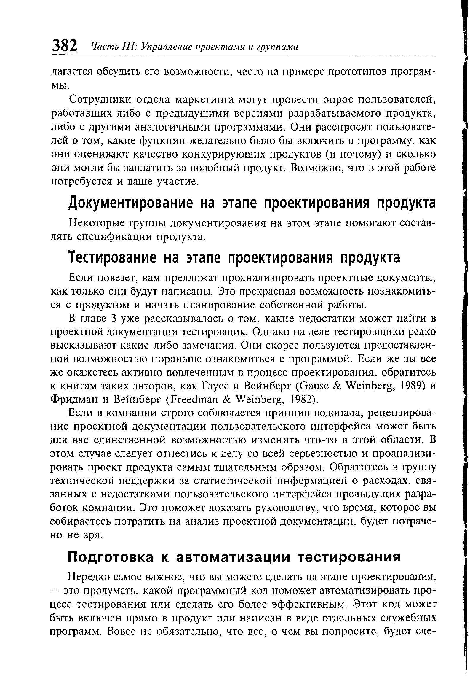

лано. Но если высказать свои пожелания вовремя, т.е. на этапе проектирования, да еще подкрепить их веской аргументацией, четко объяснив назначение каждого средства, тогда у вас будут все шансы получить если не все, то хотя бы часть задуманного. Вот несколько примеров подобного инструментария.

* **Автоматизация печати.** Для этой цели вам потребуется возможность управления печатью из командной строки запуска программы. Это означает, что программа должна принимать как минимум следующие параметры: имя файла, который необходимо распечатать, имя выходного файла, если печать выполняется не на принтер, а в файл, имя принтера (возможно, и его драйвер) и настроечную информацию (шрифт и разрешение печати). По окончании печати программа должна немедленно завершать свою работу. Обладая таким средством, можно сформировать пакетный файл, который запустит программу, передаст ей всю необходимую для печати информацию, сравнит результирующий файл с его предыдущей версией и напечатает результат, после чего запустит следующий тест. В разделе главы 8 “Несколько полезных замечаний о тестировании печати” этот вопрос рассматривается подробнее.
* **Исследование памяти.** Иногда исключительно полезной оказывается возможность в любой точке программы нажать определенную клавишу и получить информацию об использовании и содержимом оперативной памяти. Информация эта может быть самой разной. В одних случаях достаточно выяснить объем свободной памяти. В других может потребоваться перечень свободных блоков памяти и их размеров. Просто невероятно, сколько можно придумать новых тестов и сколько трудновоспроизводимых ошибок можно отловить благодаря одному только знанию доступного объема памяти перед началом определенного процесса, по его ходу и после завершения. Тестировщики просто отказываются этому верить, пока не убедятся на собственном опыте.
* **Клавиши быстрого перемещения.** Речь идет о скрытых командах, позволяющих быстро переместиться в определенную точку программы. Это особенно полезно при тестировании некоторых игр.
* **Копии экрана.** Вам наверняка потребуется быстрый способ копирования содержимого экрана на принтер или в файл (а может быть, и в последовательный порт, если данные анализируются в реальном времени за другим компьютером). Утилита, копирующая экран, должна обладать возможностью перехватывать не только изображение, но и текстовый курсор или указатель мыши. Одной из полезных возможностей такого средства является сохранение копии

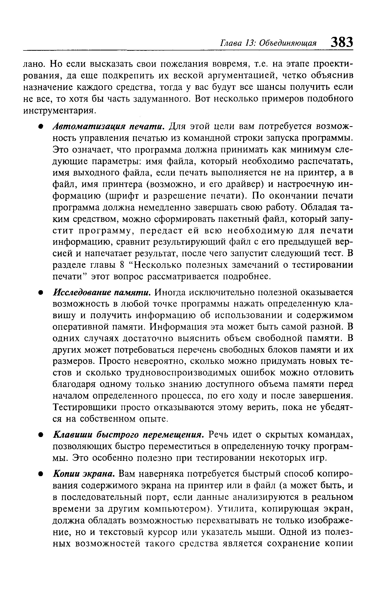

последней информации, выводимой программой при ее разрушении. И если готовой утилиты, способной выполнить подобную работу, найти не удастся, можно попросить программистов создать ее.

## Подготовка тестов для приемки продукта, разработанного по контракту

Если программный продукт разрабатывается по заказу другой компании, исключительно важно включить в контракт приемочные тесты. Набор этих тестов заранее согласовывается с заказчиком и выполняется им по завершении разработки. Если программа проходит приемочные тесты, значит, работы по контракту выполнены и дальнейшие изменения продукта должны оплачиваться отдельно. Приемочные тесты должны быть очень строгими и однозначными. Перед тем как передавать готовый продукт заказчику, их обязательно необходимо выполнить самим, чтобы убедиться, что все в порядке. Ни в коем случае нельзя допустить, чтобы заказчик готовил приемочные тесты самостоятельно, без вашего участия. Не будучи профессионалом в тестировании, он может создать слишком неопределенные, сложные или длительные по времени выполнения тесты либо тесты, для выполнения которых потребуется такой уровень качества программы, который не соответствует стоимости разработки. Посоветуйтесь об этом с корпоративным юристом.

## Анализ стабильности приобретений

Если решено приобрести для целей разработки или тестирования продукты других компаний, все эти продукты должны быть протестированы. Только убедившись, что продукт достаточно стабилен, можно тратить на него деньги. Скольких проблем можно было бы избежать, если бы программы всегда тестировались перед покупкой!

## Анализ пользовательских данных

*Качество* — понятие сложное. Высококачественный программный продукт должен обладать всеми необходимыми пользователю возможностями и при этом не иметь ошибок (Джуран (Juran, 1989)). И прежде всего о качестве продукта позволяют судить отзывы его пользователей.

Если разрабатывается уже не первый выпуск продукта, обязательно проанализируйте информацию, полученную от его пользователей, причем начните эту работу как можно раньше. Для обратной связи с пользователями существует целый ряд способов.

* **Пресса.** Это журнальные и газетные статьи, рецензии, обзоры, группы новостей в Internet.
* **Письма** от пользователей. Читайте все получаемые письма, особенно самые длинные из них.


* *Телефонные звонки пользователей*. Если ваша компания настолько велика, что звонков очень-очень много, попросите у сотрудников группы технической поддержки сводные данные о типах жалоб и количестве звонков по поводу каждой из проблем. Скорее всего, сотрудники этой группы смогут отслеживать до 15 категорий жалоб. Сядьте вместе с ними и сформируйте список наиболее важных для вас проблем.

* *Дискуссионные группы* и другие беседы с выбранными пользователями. Сотрудники группы маркетинга часто интервьюируют небольшие группы пользователей, чтобы выяснить их мнения по отдельным вопросам. Иногда их интересует реакция пользователей на новые идеи, в других же случаях — мнения об уже эксплуатирующемся продукте. По возможности обязательно посещайте все такие обсуждения.

* *Телефонные опросы*. Сотрудники отдела маркетинга могут обзвонить полсотни или сотню пользователей и спросить, какие изменения они хотели бы видеть в следующей версии продукта и что им особенно не нравится в текущей версии. Можно позвонить и просто зарегистрированным пользователям, и тем из них, кто сам звонил с жалобами, и задать им одни и те же вопросы. Основной упор в подобных опросах следует делать на надежность продукта.

Из перечисленных источников можно получить множество полезных сведений о качестве продукта. Например, обозреватели периодических изданий могут указать на отсутствие функций, о которых большинство нынешних пользователей программы пока еще даже и не думают. Однако в этом вопросе было бы опрометчиво ориентироваться на мнение пользователей — через год оно кардинально изменится. В то же время обозреватели часто не упоминают о самых вопиющих ошибках. Как правило, они знакомятся с продуктом поверхностно, не эксплуатируя его в реальном режиме, поэтому большинства ошибок они просто не замечают. Совсем иначе обстоит дело с пользователями — рано или поздно они сталкиваются даже с наиболее скрытыми и редко проявляющимися ошибками. Их звонки и письма гораздо чаще указывают именно на ошибки в программе, а не на ее недостающие возможности.

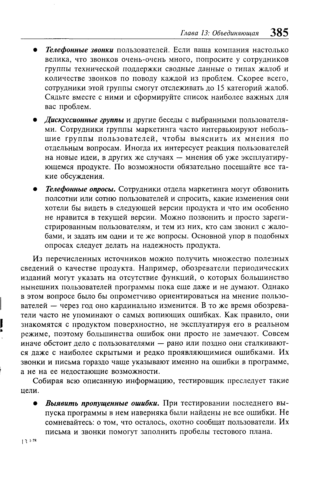

Собирая всю описанную информацию, тестировщик преследует такие цели.

* *Выявить пропущенные ошибки*. При тестировании последнего выпуска программы в нем наверняка были найдены не все ошибки. Не сомневайтесь: о том, что осталось, охотно сообщат пользователи. Их письма и звонки помогут заполнить пробелы тестового плана.

* *Определение важности незамеченных или отложенных проблем.* Выделите 10 или 15 проблем, из-за которых компании пришлось потратить больше всего времени и денег. Если удастся выяснить, во сколько конкретно обошлась поддержка пользователей по поводу каждого из вопросов — замечательно. Руководитель проекта наверняка счастлив будет наконец избавиться от старых и дорогостоящих ошибок и охотно зарезервирует средства для их исправления.
* *Основа для оценки откладываемых проблем.* Во многих программах имеется целый ряд ошибок и недостатков, которых пользователи так никогда и не заметили. Сравнивая список отложенных ошибок предыдущего выпуска программы со списком полученных жалоб пользователей, можно предсказать, какие из ошибок вызовут наихудшую реакцию. Когда руководитель проекта решит отложить проблему, которая, на ваш взгляд, вызовет бурю недовольства пользователей, можно будет показать ему сводки пользовательских звонков по похожим вопросам и то, во сколько это обходится компании.
* *Обоснование затрат на дальнейшее тестирование.* Предположим, что покупка компьютеров для проверки их совместимости с разрабатываемой программой обойдется в $20 тыс. Если предыдущий выпуск программы уже эксплуатируется и никто из пользователей не жалуется на ее несовместимость с этой техникой, нет нужды идти на такие затраты. Если же, напротив, звонки недовольных пользователей этих компьютеров обходятся группе технической поддержки в $40 тыс., приобретение оборудования полностью окупится.

Собранные данные о мнениях, пожеланиях и жалобах пользователей представляют значительный интерес не только для вас, но и для руководителя проекта и персонала отдела маркетинга. Всех их интересуют предложения по усовершенствованию продукта, информация об изменениях демографической или пользовательской базы. И хотя эти вопросы в данной книге не рассматриваются, следует иметь в виду, что ваши изыскания могут быть частью более обширных исследований, проводимых компанией для повышения эффективности ее работы.

Мы рекомендуем составить подробные многостраничные таблицы проблем и вопросов пользователей. Подсчитайте количество обращений по каждому вопросу. Для каждого источника данных заведите отдельную таблицу. Прежде всего просмотрите письма, обзоры и результаты опросов — это поможет идентифицировать проблемы и составить их список. Оставьте в таблицах побольше места для тех вопросов, которые поначалу будут пропущены. Для каждого из проектных предложений подсчитайте, сколько человек одобряет включение в программу данной возможности, а сколько ко не одобряет.

Почти наверняка окажется, что большая часть жалоб связана со сравнительно небольшим количеством проблем. Это хорошо известный принцип Парето (*Pareto Principle*, Джуран и Грайне (Juran & Gryna, 1980), Мак-Кейб и Шалмейер (McCabe & Schulmeyer, 1987)). Собрав данные, отсортируйте жалобы в порядке убывания их частоты. (Не удивляйтесь, если окажется, что этот порядок для разных источников окажется различным. Обозреватели отмечают иные проблемы, нежели пользователи, пишущие письма и звонящие в отдел технической поддержки. А мнения пользователей, отобранных случайным образом и опрошенных сотрудниками компании, будут отличаться от мнений первых двух категорий.) На наш взгляд, самым удобным представлением информации являются таблицы жалоб пользователей, отсортированных по частоте. Но есть и более классический подход — составление диаграммы Парето (*Pareto Chart*), лучше всего описанной в книге Уолтона (Walton, 1986). Если возможно, приведите в таблицах цифры затрат на техническую поддержку (затраты на чтение писем и ответы на них, средняя стоимость телефонного звонка, среднее время телефонного разговора с пользователем о каждой из проблем и т.п.).

## Анализ пользовательского интерфейса

Некоторые тестировщики (и авторы документации) обладают талантом выявлять недостатки пользовательского интерфейса еще на этапе его проектирования. Если среди ваших подчиненных есть такой специалист, подключите его к анализу проектной документации как можно раньше. Пусть у этого сотрудника будет время как следует прочитать ее и обдумать. Это принесет разработке большую пользу.

## Обсуждение даты начала тестирования

В хорошей команде разработчиков тестирование начинается еще до того, как написан весь программный код. Если же работа организована плохо, в начале проекта масса времени тестировщиков тратится зря. Поэтому с самого начала обсудите с руководителем проекта схему действий.

Обычно руководитель охотно пересматривает порядок выполнения программистских задач, с тем чтобы повысить эффективность тестирования. Если вы укажите, какие из частей программы сложнее всего протестировать и какие могут содержать наибольшее количество серьезных ошибок, он согласится, чтобы они были написаны и переданы на тестирование в первую очередь.

Если, например, важнейшей из функций разрабатываемой программы является высококачественная печать и если программа должна безукоризненно работать с самым широким диапазоном принтеров, обсудите с руководителем проекта, какие из частей программы связаны с реализацией этой функции и какие из них могут быть готовы уже в первой версии программы, которая будет передана на тестирование.

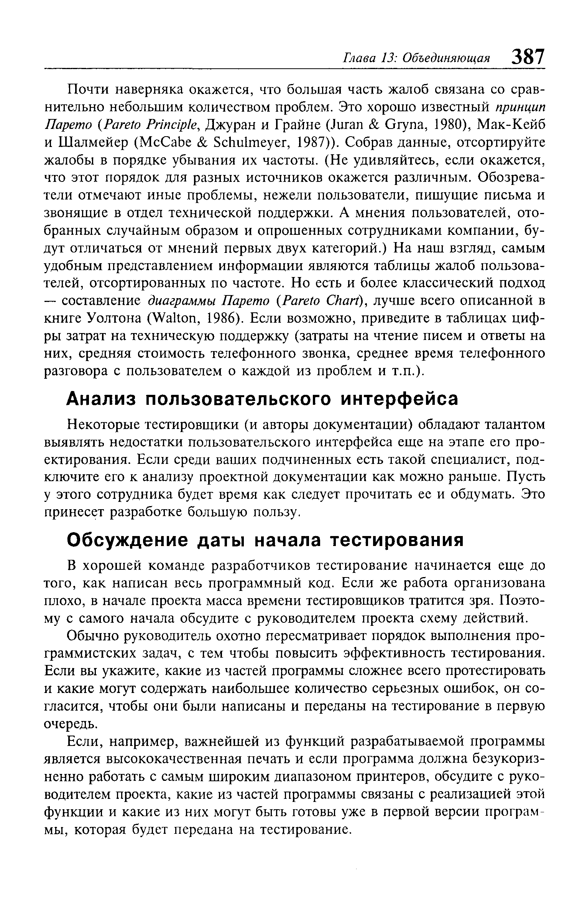

### Что еще включает процесс приготовления к тестированию

Если предполагается тестировать программу с определенными видами оборудования, с его производителями следует связаться как можно раньше. Особенно это важно в тех случаях, когда необходимые устройства предполагается не купить, а взять напрокат (см. главу 8).

Подумайте об исследовании конкурирующих продуктов. Ведущий тестировщик проекта должен знать рынок программ разрабатываемого типа и быть в курсе общих для них всех ошибок.

Начните поиск бета-тестировщиков. Хороших специалистов найти всегда сложно. Вполне возможно, что вы найдете добровольцев среди бета-тестировщиков конкурирующих продуктов. Однако имейте в виду, что они будут рассказывать конкурентам о достоинствах и недостатках вашей программы и о ходе разработки. Некоторые из них передадут копии программы своим друзьям или поместят их в Internet. Так что, во-первых, тщательно отбирайте людей, а во-вторых, будьте готовы ко всем возможным последствиям.

## Реализация базовых функций

На этом этапе программа может работать только в одном видеорежиме. Она может печатать только на одном принтере. В ней может отсутствовать большая часть задуманных возможностей. Она наверняка полна ошибок. А при эволюционном методе разработки на данном этапе вообще готово только ее ядро.

### Программирование после реализации базовых функций

Программисты продолжают определение частных задач, проектируют все новые и новые модули и пишут программный код. Только при методе водопада к этому времени все проектные работы уже завершены. Еще одно исключение составляют программисты-анархисты, которые сначала пишут программный код, а потом его спецификацию.

### Тестирование после реализации базовых функций

Как только ядро программы готово, можно и нужно приступать к тестированию. Программисты, конечно, проверяют свою работу, но кто-то должен делать это извне. Это может быть тот же программист, его помощник или профессиональный тестировщик. На данном этапе тестирование может быть еще достаточно неформальным. Можно просто путешествовать по программе, экспериментировать с ней без какого бы то ни было плана.

Однако если разработка ведется эволюционным методом, именно на данном этапе начинается самое что ни на есть серьезное тестирование, цель которого — добиться полной стабильности ядра программного продукта.

Для начала определите цели тестирования. Набросайте список ключевых задач, подумайте, кто из сотрудников может их решать, и приблизительно оцените, сколько на это потребуется времени. То, что получится, будет первым черновиком календарного плана и бюджета работ. Несмотря на свою приблизительность, этот документ очень важен, поскольку послужит основой для дальнейшей работы.

Как только продукт оказывается в состоянии делать что-то полезное, кто-нибудь из сотрудников компании должен начать его использовать. В одних компаниях этим занимаются главным образом тестировщики, в других — менеджеры. Особого значения это не имеет, главное, чтобы тестировщики были в курсе всех выявляемых проблем и вовремя их документировали. Эксплуатация программы в реальном режиме играет в тестировании очень важную роль. Если не работать с продуктом так, как это делает пользователь, целый ряд проблем ускользнет от вашего внимания. Кроме того, многие ошибки или недостатки интерфейса кажутся незначительными, пока вы не натыкаетесь на них каждый день или каждые пять минут или пока они не затрудняют решение жизненно важной для вас задачи. Именно практика, а не просто эксперименты с программой и одноразовое выполнение ее команд позволяет понять реальную ценность ее возможностей и реальное значение ее недостатков.

## Почти альфа

На этом этапе большая часть программы уже готова, а значит, определился ее стиль и характер.

В некоторых компаниях начало альфа-этапа является определенным рубежом, на котором меняются основные направления работы. Например, с этого момента может начаться планирование и выполнение тестов, написание руководства. Если так организован и ваш проект, ряд подготовительных работ стоит провести заранее, за несколько недель до начала альфа-этапа. Ведущий тестировщик должен поработать с программой и подумать, не осталось ли в ней настолько серьезных проблем и не упущены ли настолько значительные функции, что назвать то, что имеется, полноценной альфа-версией пока еще нельзя. Кроме того, на этом подготовительном этапе ведутся интенсивные обсуждения с руководителем проекта целого ряда ключевых вопросов. Как можно больше времени зарезервируйте для тестирования: ведь необходимо будет убедиться, что все согласованные изменения и исправления успешно внесены. Как правило, окончательная проверка соответствия программы требованиям, предъявляемым к альфа-версии, выполняется руководителем проекта и тестировщиками совместно.

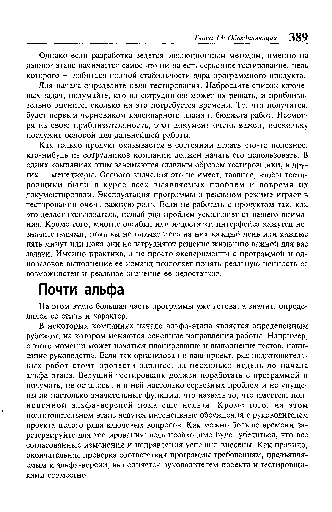](images/Kaner_1999_TestingComputerSoftware/page_388_img_1.png)

Альтернативой проверки состояния программы *перед* официальным объявлением готовности альфа-версии является ее проверка *после* этого события. Однако в этом случае, хотя руководитель проекта искренне верит, что с программой все в порядке, при дальнейшем тестировании, как правило, выявляется еще целый ряд серьезных ошибок.

### Программирование накануне завершения альфа-версии

На этом этапе продолжается постановка задач, проектирование, кодирование, исправление ошибок и тестирование “стеклянного ящика”.

### Документирование накануне завершения альфа-версии

План документации, скорее всего, уже практически готов. В одних компаниях тестировщиков привлекают к работе над этим планом, в других — нет. Если вы будете работать на планом, то, скорее всего, от вас потребуется отдельный анализ руководства, интерактивной справочной системы, учебника и других дополнительных материалов (например, библиотеки файлов примеров). Уделите особое внимание календарному плану работ по документированию продукта — если вам придется в них участвовать, анализ и редактирование документации не должны совпасть с самыми напряженными периодами тестирования.

Как правило, план документации включает ее оглавление и приблизительные оценки объема каждого раздела. Вы можете помочь техническим писателям, указав, объемы каких разделов ими недооценены. Если речь зайдет об особенно сложных функциях программы, их выявление может помочь не только техническим писателям. Если руководитель проекта увидит, что определенная функция настолько сложна, что ее трудно даже описать в руководстве, он может принять решение о переработке проекта программы и упрощении этой функции.

Структурой интерактивной справочной системы может определяться и то, как пользователь будет переходить от одной темы к другой. В большинство современных систем встраиваются перекрестные ссылки, упрощающие работу пользователя, но сильно усложняющие задачу тестировщика. Как протестировать все эти ссылки? Возможно, вы найдете инструментальные средства, упрощающие эту работу.

### Тестирование накануне завершения альфа-версии

Прежде всего позаботьтесь о необходимом для работы оборудовании. Закажите то, что планируется купить, и поищите возможности взять напрокат остальное.

Переговоры с компаниями, у которых можно одолжить необходимую технику, следует начать как можно раньше. Учтите, что придется выполнить ряд формальностей, заполнить бумаги. Могут возникать неожиданные сложности и задержки, и, если времени до выпуска у вас не так уж много, например, месяца три-четыре, вы рискуете не получить того, что задумано.

Если цели и ключевые задачи тестирования еще не определены, откладывать дальше некуда. Оцените, сколько времени и людей потребуется для решения поставленных задач.

Подготовьте первую версию плана тестирования. Начните с самого очевидного, оставив детали “на потом”. Во-первых, они еще не раз могут поменяться, а во-вторых, многие подробности станут очевидны позднее, в ходе освоения объекта тестирования. Прежде всего включите в план следующее.

* *Перечислите поддерживаемые устройства* (такие, как принтеры).
* *Составьте список основных функций программы*, команд меню, опций, т.е. составьте первый вариант списка тестируемых функций.
* *Подготовьте структуру плана тестирования*, перечень его основных разделов. Например, подготовьте место для списка граничных условий, который будет составлен позднее.

Стоит еще раз подчеркнуть, что документации не должно быть слишком много. Это ваш рабочий инструментарий, который должен отвечать практическим задачам. Все, что не требуется для тестирования, не требуется вообще. И не поддавайтесь искушению проводить целые дни, составляя документацию и вообще не занимаясь тестированием. Обязательно проверяйте на деле все, о чем пишете. Так и документация будет точнее, и основное дело — поиск ошибок — будет продвигаться вперед.

Проведите базовое тестирование программы. Выполните самые очевидные тесты, не затрачивая слишком много времени на каждую из областей или функций. На этом этапе больше внимания уделите полноте охвата продукта, а не глубине анализа каждой детали. Если программа предлагает пользователю выбор из нескольких вариантов, проверьте их все, однако если вариантов десяток, протестируйте два-три из них. Не следует также тестировать все возможные комбинации входных значений — для этого время еще не пришло. Введите информацию везде, где это возможно, но не старайтесь нагрузить программу свыше ее возможностей. Если граничные значения данных известны, проверьте их, а если нет — оставьте это на будущее. Посмотрите, как ведет себя программа в нормальном режиме работы, не сбоит ли она даже в тех случаях, когда ее пользователь очень аккуратен. И только если у вас после этого останется еще немного време-

ни, подумайте, что могло бы привести программу к сбою, и попробуйте это выполнить.

Такое весьма поверхностное тестирование позволит выявить огромное количество ошибок. Прежде чем оно будет выполнено, не стоит вдаваться в нюансы работы отдельных функций и тратить время на те фрагменты программы, которые просто написаны пока еще очень поверхностно, без проработки деталей.

## Альфа

Строгого определения альфа-версии программы не существует. Можно выбрать один из предложенных ниже вариантов, а можно сформировать собственные критерии, отвечающие нуждам конкретного проекта.

* В альфа-версии программы имеются практически все ее основные функции. Однако некоторые из них могут еще отсутствовать или работать крайне нестабильно. Индивидуальность программы на этом этапе уже полностью сформирована, виден ее характер и основные возможности. А вот такие детали оформления, как музыка и графика, могут пока еще отсутствовать. Если программа должна поддерживать ряд устройств, форматов данных, взаимодействовать с рядом однотипных приложений и т.п., в альфа-версии может поддерживаться только несколько экземпляров из этого набора.
* В альфа-версии программы имеются все ее функции, хотя в некоторых из них могут еще оставаться серьезные ошибки; поддерживаются все типы устройств, но работает только по нескольку устройств каждого типа. Спецификация и конструкторская документация практически готовы, все основные программистские задачи выполнены. Никаких неожиданных трудностей в дальнейшем не предвидится.
* При эволюционном методе разработки в альфа-версии ядро программы полностью сформировано. Кроме того, написаны все важнейшие функции программы, она представляет собой, хотя и ограниченный в своих возможностях, но уже вполне приемлемый продукт. Им можно пользоваться, видны его идеология и характер, однако многих полезных функций пока еще нет.

### Программирование после завершения альфа-версии

По достижении альфа-рубежа у программистов остается еще очень много работы: доработка функций, исправление ошибок, пересмотр внешнего дизайна и спецификации в ответ на замечания пользователей и тестировщиков, переработка внутренней структуры программы в целях повышения ее производительности. Начинается (или продолжается) рабо-

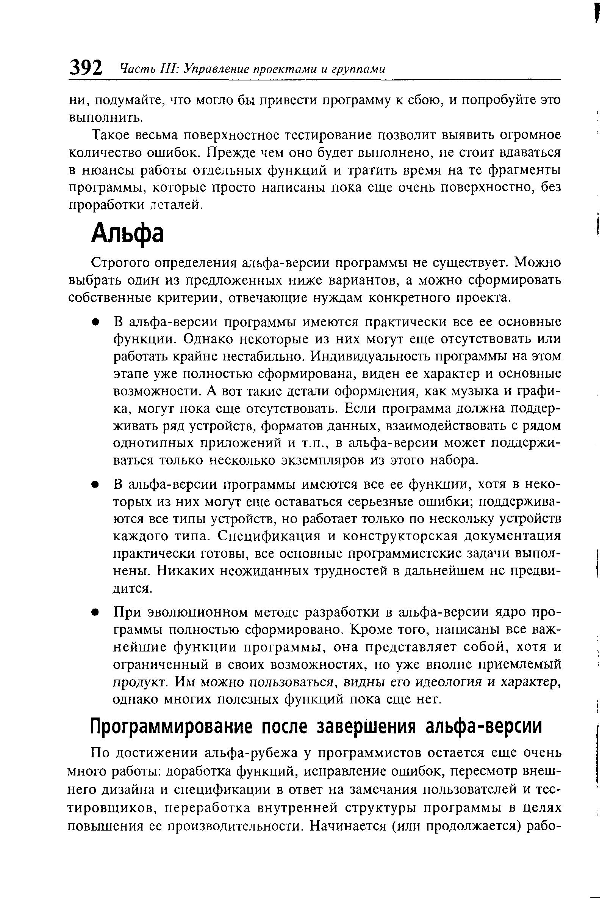

та над файлами данных — шаблонами, примерами, мультимедиа, трансляционными таблицами для драйверов и т.п.

Если в компании принято начинать тестирование только после готовности альфа-версии и между этим рубежом и выпуском продукта остается очень мало времени, руководитель проекта может сознательно объявить о готовности альфа-версии, когда до этого еще явно далеко. Отнеситесь к такому его поступку с пониманием — ведь это фактически его единственный шанс спасти проект, вовремя начав тестирование. Виноват здесь не он, а навязанная ему модель разработки.

## Маркетинговая деятельность после завершения альфа-версии

С этого момента обычно начинается работа над упаковкой продукта и маркетинговой литературой. Собственно говоря, работа эта может начаться несколько раньше или несколько позже — главное, чтобы к выпуску все было готово.

Анализ дизайна упаковки и проверка всей маркетинговой литературы на техническую точность входит в обязанности отдела тестирования. Разумеется, речь не идет о тоне или стиле изложения либо о маркетинговой направленности информации. Вы отвечаете только за техническую сторону вопроса.

Как правило, большинство дат календарного плана отсчитываются от предполагаемой даты выпуска продукта. Это касается и всех маркетинговых материалов, хотя их стараются разработать как можно позже, чтобы в них отражалось реальное состояние программы на момент выпуска, которое может отличаться от первоначально запланированного. То же самое относится и к руководству пользователя: его отправляют в печать заблаговременно, поскольку дело это долгое, однако не настолько рано, чтобы его информация оказалась недостоверной.

Необходимо учитывать тесную взаимосвязь сроков разработки различных составляющих проекта. Если сроки разработки программы затягиваются, должны быть вовремя перенесены все даты, связанные с датой выпуска продукта. Для этого руководитель проекта должен вовремя получать от вас четкие и ясные отчеты о состоянии продукта и объеме оставшейся части работ по тестированию.

## Документирование после завершения альфа-версии

Первый черновик справочной системы и руководства пользователя обычно бывает готов вскоре после завершения альфа-версии. Вам необходимо будет их прочесть и проанализировать, а также протестировать по ним программу, поэтому заранее зарезервируйте для этого время. (Если справочная система очень проста, она может разрабатываться и несколько

позже, чтобы меньше пришлось переделывать в случае изменения программы.)

## Тестирование после завершения альфа-версии

Во многих компаниях тестирование начинается именно с этого времени. Однако лучше начать пораньше, чтобы к моменту готовности альфа-версии работа уже шла полным ходом. Вспомните кривую стоимости исправления ошибок. Чем дальше продвигается работа над проектом, тем эта стоимость выше. В то же время ошибку, найденную достаточно рано, легко исправить, и эти исправления незначительно отражаются на других составляющих продукта и других частях программы. На ранних стадиях тестирования вашей целью является поиск всех наиболее очевидных проблем в каждой области программы. На этом этапе тестирование еще довольно поверхностное, обзорное, без углубления в детали.

Как только в руках у вас окажется первый черновик руководства пользователя, можно будет приступать к его тестированию, точнее, к тестированию программы по этому руководству, поскольку все, о чем говорится в руководстве, необходимо будет выполнить за компьютером. Каждый пример, каждая упомянутая клавиша или команда, каждый способ работы или решения определенной задачи, каждое утверждение и его очевидные следствия — все должно быть скрупулезно проверено.

Первые пару циклов тестирования вам придется работать с очень нестабильной программой, так что выполнить все сказанное в полном объеме будет невозможно. Тем не менее, будет найдено множество ошибок и проблем, и у вас останется достаточно времени на их обдумывание. В течение первого *полного* цикла тестирования должно быть сделано следующее.

* *Начните с активного наступления.* В ходе первого цикла тестирования будут написаны десятки или сотни отчетов, охватывающих все основные аспекты программы и документации, работу всех программистов и технических писателей. Ваша деятельность должна быть видимой, а ее производительность не оставлять сомнений. В исправлении найденных ошибок должны быть задействованы все.
* *Изучите продукт.* Хотя вы и не станете опытным пользователем, каждая функция программы должна быть вами опробована.
* *План тестирования должен быть готов к представлению руководителю проекта.* Это не значит, что план необходимо полностью завершить и проработать все его детали. Этот документ развивается во времени, по мере тестирования он все время углубляется, расширяется и корректируется в соответствии с меняющимся состоянием программы. Составление плана и само тестирование никогда не должны рассматриваться как отдельные процессы.

* Поднимите вопросы о структуре и интерфейсе продукта. Если в этой области имеются проблемы, их необходимо обсудить как можно раньше — как только вы составите первое впечатление о продукте и хоть немного его поэксплуатируете. Если что-то покажется вам явно неудобным или непонятным, сразу же составляйте соответствующий отчет.
* Протестируйте руководство. Проверьте каждый факт и его следствия. После этого передайте техническому писателю копию руководства с пометками. Еще одну такую же копию оставьте себе — вам еще не раз придется с ней сверяться.
* Оцените общее качество продукта.
  * Сформируйте собственное впечатление о стабильности каждой основной области программы. Выделите наиболее слабые из них и укажите руководству, какие функции еще не готовы к тестированию.
  * Оцените надежность программы. Сколько циклов тестирования потребуется для ее отладки? Сколько ошибок предполагается найти? (Конечно же в первый раз эти оценки будут более чем приблизительными. Но от проекта к проекту вы будете набираться опыта и сможете оценивать ситуацию все более точно.)

Вот первое, что следует сделать после завершения альфа-версии программы.
* Получите утвержденный руководителем проекта список поддерживаемых устройств. Включите этот список в план тестирования.
* Начните первый цикл тестирования устройств. К концу альфа-этапа должен быть пройден как минимум один полный цикл этого вида тестирования.
* Начните формирование комплекса регрессионных тестов. Эти тесты будут выполняться в начале каждого цикла тестирования программы или ее части. Набор регрессионных тестов периодически должен пересматриваться и обновляться. Некоторые области программы будут нуждаться в особенно тщательном тестировании, особенно те, в которые вносился целый ряд изменений, накладывающихся одно на другое. Такие латаные-перелатаные фрагменты программы всегда самые ненадежные, поэтому их все следует знать и раз за разом повторять для них обстоятельные регрессионные тесты до тех пор, пока вы не убедитесь в их полной стабильности.
* Пересмотрите потребности в ресурсах и опубликуйте календарный план работ. Еще раз продумайте список задач своей группы, оцени-

те сроки их выполнения и необходимое количество людей. Черновик этого списка может быть уже опубликован, однако после первого предварительного цикла тестирования у вас наверняка возникнут новые соображения. Теперь, имея некоторый опыт работы с программой, можно составить не просто предварительный набросок, а документ, которого вы будете придерживаться в дальнейшем. Поэтому список задач должен быть полным, т.е. в нем не должно быть ничего, что не будет выполнено, и при этом ни одна важная часть работы не должна быть упущена. На выполнение отдельной задачи из этого списка должно уходить от половины дня до недели. Назначьте каждой задаче конкретные сроки. Это нелегкая работа, но она очень важна. Именно по календарному плану руководитель проекта сможет в дальнейшем сверять реальное продвижение работы.

По мере продвижения работ альфа-этапа будет расширяться тестовый план и углубляться тестирование.

* *По мере необходимости разрабатывайте и публикуйте приемочные тесты.* (Приемочный тест — это набор тестов, который должен быть пройден очередной версией программы перед началом нового цикла тестирования.) Во многих компаниях до того, как будет готова бета-версия, программа принимается на тестирование в любом состоянии, независимо от того, прошла ли она приемочные тесты. Это не мешает разработать и опубликовать такие тесты заранее, просто не следует настаивать на их прохождении программой до оговоренного срока.
* *Подготовьте и заполните рабочие списки и схемы.* Среди них могут быть следующие документы.
  * *Перечень всех списков, таблиц, схем и т.п.* Какие виды записей планируется вести в ходе тестирования? Какие виды тестов планируется проводить и какие искать ошибки, не включенные ни в один из рабочих документов? Чтобы проверить, все ли возможные виды ошибок охвачены планом тестирования, воспользуйтесь приложением к этой книге.

Данный перечень поможет вам в формировании исчерпывающего списка задач, выполнение которых будет означать, что программа полностью протестирована. Полезен он будет и при составлении календарного плана, распределении ресурсов и планировании бюджета.

* Диаграммы входных граничных условий.
* Диаграммы выходных граничных условий.

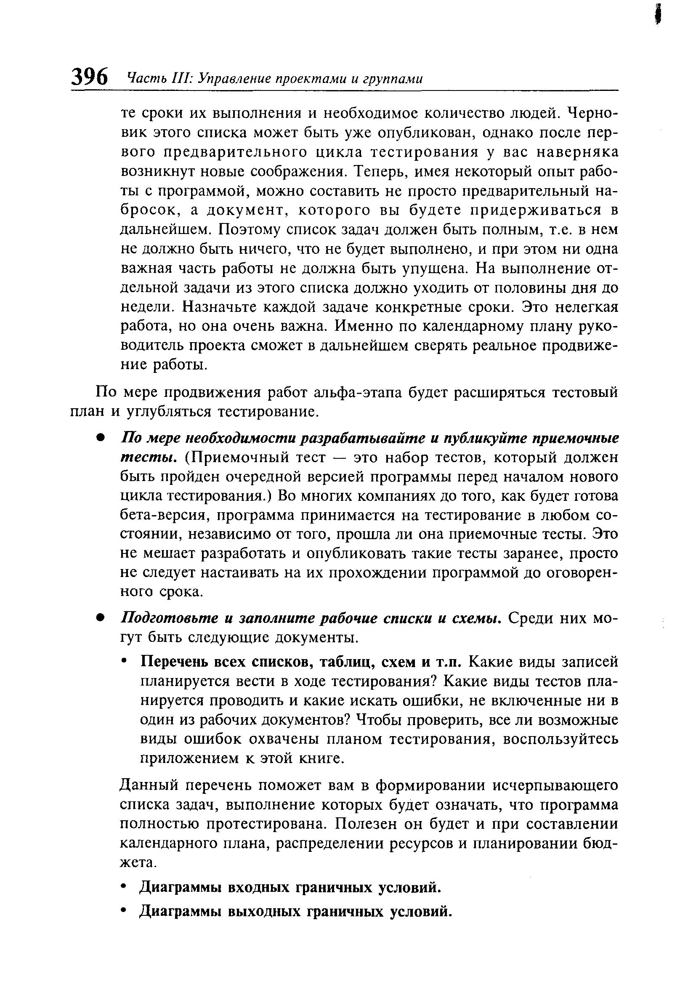

* **Список функций**, включающий стратегии поиска ошибок управления потоком (например, ошибок начальных состояний), описания возможностей и последствий переходов между состояниями, повторного входа в состояния или выхода из состояний без выполнения требуемых действий (например, ввода запрошенных данных).
* **Список всех сообщений об ошибках**.
* **Тестовые матрицы конфигураций устройств**.
* **Таблицы сравнительных данных для тестирования производительности программы** (в сравнении с другими ее версиями или продуктами конкурентов).
* **Описания нагрузочных тестов**.
* **Стратегии тестирования потоков данных и последствий изменения существующих данных**.
* **Таблицы, в которых описываются функции каждой клавиши в каждой области программы**. (Если по всей программе клавиши работают одинаково, эти таблицы будут несложными. Однако данный факт необходимо проверить, поскольку то, что сказал руководитель проекта или программист, еще не значит, что так и есть на самом деле.)
* **Стратегии поиска условий гонок**, проблем, связанных с обменом сообщениями, общими данными, прерываниями, а также других проблем, которые не могут быть обнаружены путем простого линейного тестирования.
* **Матрицы зависимостей** между входными данными или опциями.
* **Диаграммы использования памяти функциями программы**. Это исследовательские средства, в которых вовсе не обязательно возникнет потребность. Они бывают полезны при разработке программ, для которых требования к памяти являются важной характеристикой, или при поиске воспроизводимых ошибок.
* **И многое другое**. В приложении к книге приведен длинный перечень ошибок. Прочитайте его, чтобы убедиться, что планом тестирования охватываются все ошибки, которые могут встретиться в вашей программе.

* **Не пытайтесь выполнить все сразу**. Чередуйте разработку тестовых материалов с непосредственным поиском ошибок. Что бы вы ни делали, всегда оставляйте для этого время. Даже к концу альфа-этапа вся перечисленные материалы готовы не будут. Разрабатывайте их постепенно, сначала прорабатывая структуру списков и таблиц, а затем, по мере освоения определенной области программы, запол-

няйте их информацией. Однако работа по подготовке тестовых материалов все же должна ощутимо продвигаться вперед, ведь это основа фундаментального тестирования.

Кроме планирования и подготовительного тестирования на альфа-этапе автоматизируются некоторые тесты. Прежде всего, это регрессионные тесты, которые могут либо полностью выполняться компьютером, либо автоматизироваться хотя бы частично. Автоматизация регрессионных тестов позволит значительно сэкономить рабочее время: вместо того чтобы тратить его на бесконечное выполнение одних и тех же старых тестов, вы сможете посвятить его разработке и выполнению новых.

* *Архивируйте все нетривиальные файлы данных.* Не забывайте сопровождать файлы короткими заметками об их содержимом и назначении. Не заставляйте себя или сотрудников каждый раз вспоминать, что именно находится в данном файле. При таком обилии информации, похожих версий одних и тех же данных, сходных тестов, нечего полагаться на память. Иначе кончится тем, что придется разрабатывать некоторые тесты сначала. Если комментарии включаются в файлы, подготовьте еще один документ с перечнем всех имеющихся файлов и кратким описанием их назначения, чтобы все материалы, необходимые для проведения каждого теста, можно было быстро найти.
* *Архивируйте все повторно используемые пакетные файлы, файлы данных и сохраненные последовательности нажатий клавиш.* Разделите их на две группы. Самые важные из них, а также те, с которыми могут в дальнейшем работать другие сотрудники, сопроводите подробными комментариями, остальные — более краткими.
* *Подготовьте файлы данных для тестирования печати.* Начните со стандартных файлов, которые подойдут для тестирования всех типов устройств. Попротестируйте программу с их помощью, выводя информацию как на принтер, так и на диск. Подготовьте пакетные файлы, чтобы в следующий раз все эти тесты можно было выполнять автоматически и сравнивать выходные файлы различных версий программы или различных драйверов устройств.
* *Подготовьте конфигурационные тесты.* Составьте полный список возможных составляющих операционной среды программы. В частности, в него войдут версии операционных систем и дополнительного системного программного обеспечения. Количество возможных конфигураций, скорее всего, будет очень велико, так что придется подумать над разработкой нескольких всеохватывающих тестов, позволяющих выявить имеющиеся проблемы с наибольшей вероятностью. Достаньте необходимые модели внешних устройств (модемов,

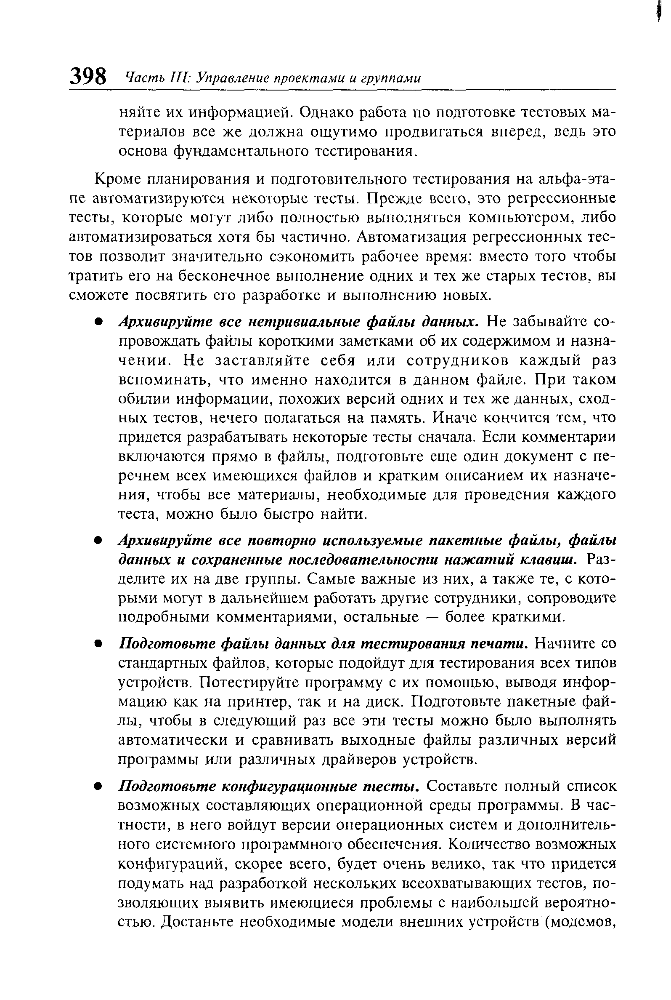

мыши, видеоплат и т.п.) и начните подготовку соответствующих тестовых файлов.

* *Автоматизируйте приемочные тесты*. Если каждый раз, когда будет готова очередная версия программы, планируется выполнять стандартную серию коротких тестов, их стоит автоматизировать. Ведь выполняться эти тесты будут множество раз, и не только тестировщиками, но и другими сотрудниками, в частности, программистами. Для автоматизации этих тестов может потребоваться программное обеспечение для перехвата и воспроизведения клавиатурного и иного ввода, перехвата выходной информации (в частности, изображения на экране) и выделения из нее важных фрагментов. Зафиксировав однажды результаты правильной работы программы, можно сравнивать их с результатами работы каждой новой версии. Имейте в виду, что коммерческие программы подобного рода нередко бывают полны ошибок, так что, приобретая их, требуйте у продавца месячную гарантию.

В автоматизации тестирования, как и во всякой другой работе, имеются свои трудности и издержки. В среднем на автоматизацию теста уходит в 10 раз больше времени, чем на его создание и выполнение вручную.

* *Займитесь автоматизацией тестирования как можно раньше*, иначе эта работа не окупится.
* *На самых ранних этапах тестирования* лучше посвятить время не автоматизации тестов, а их выполнению. Этап предварительного поверхностного тестирования программы очень важен, и выявляемые в его ходе ошибки лучше не откладывать “на потом”.
* *Заранее автоматизированные тесты* позволяют существенно повысить производительность работы в самые напряженные периоды.
* *Не стоит автоматизировать тесты слишком рано*, поскольку программа может настолько измениться, что вся работа окажется проделанной зря.
* *Однако приемочные тесты следует создать заранее*, поскольку они будут выполняться так часто, что каждая минута их автоматизированного выполнения позволит существенно сэкономить время.
* *Рано начатые работы по автоматизации* могут вызвать политические проблемы. На автоматизацию теста требуется так много времени, что эта работа окупается только в случае, если он выполняется более десяти раз. Некоторые руководители проектов утверждают, что их чудесным продуктам достаточно и двух-трех циклов тестирования. И хотя в этом случае руководитель наверняка ошибается, такая

ситуации гонок. Следуя интуиции, старайтесь найти самые слабые места программы.

Цели вашей работы должны быть следующими.

* *Как можно раньше выявить основные ошибки*. На разработку тестов уходит очень много времени. Если из-за серьезных ошибок в программе она будет значительно переделана, часть этого времени может оказаться потраченной зря. С другой стороны, значительную часть ошибок, и в том числе самых серьезных и требующих наибольших переделок, можно выявить в ходе одного массированного рейда по программе или ее выбранной области. Поэтому имеет смысл сначала провести такой рейд, а уж потом браться за скрупулезную проработку нюансов.
* *Дать себе время подумать*. Почитайте и подумайте о выбранной области программы. У вас должно выработаться ясное видение возможных проблем и ошибок, а также типов необходимых тестов. Поэкспериментируйте с областью программы ровно столько, сколько необходимо для выявления самых серьезных проблем. Это даст вам неделю или две на ее обдумывание, прежде чем тестирование будет продолжено (в течение этого времени будут исправляться найденные ошибки).
* *Как можно раньше исправить самые серьезные ошибки*. Чем раньше составить отчет о проблеме, тем раньше и с тем большей вероятностью, она будет решена.
* *Улучшить состояние программы*. Помните, что тестирование программы может быть прекращено в любой момент. Неформальное тестирование гораздо мощнее базового и позволяет выявить гораздо больше проблем. Кроме того, оно выполняется быстро, так что, если с самого начала пройтись таким образом по всем областям программы, можно уже на ранних стадиях тестирования обеспечить определенный уровень ее надежности.

## Интенсивное плановое тестирование

Выберите одну из областей программы и полностью на ней сконцентрируйтесь. После короткого неформального тестирования можно перейти к плановой и скрупулезной работе.

Довольно трудно решить, с какой области программы начать. Тут может быть целый ряд соображений, о которых уже рассказывалось в главе 12. Вот первые кандидаты на тестирование.

* Области программы, которые при предварительном тестировании показались наиболее слабыми.

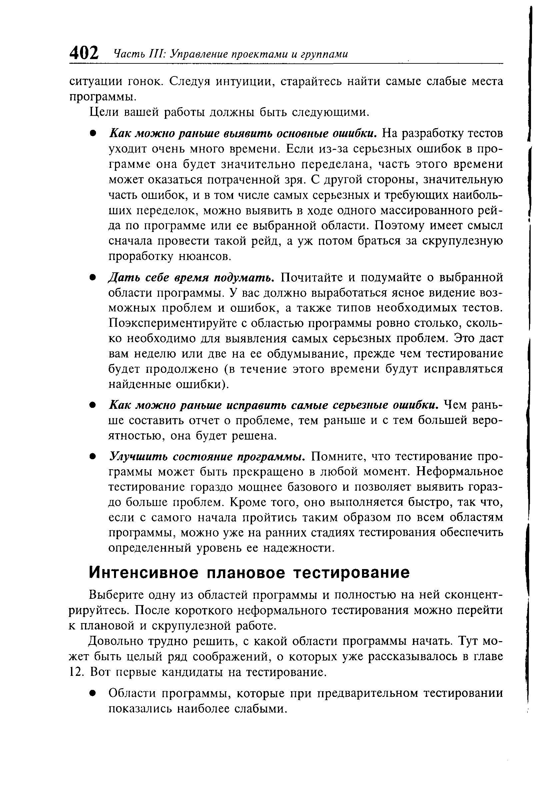

* Области программы, ошибки в которых будут наиболее заметны пользователю.
* Наиболее часто используемые составляющие программы.
* Особенности программы, выделяющие ее среди конкурирующих продуктов.
* Компоненты программы, которые труднее всего исправлять.
* Самые понятные для вас функциональные области.

С чего начинать — это вопрос личных предпочтений. Вместо того чтобы писать подробные планы тестирования слабейших составляющих программы, мы обычно начинаем с их массированного неформального тестирования, а дальше свое дело делает пачка отчетов о проблемах — пока мы в течение нескольких циклов тестируем остальные части программы, состояние ее слабейших участков значительно улучшается.

Впервые тестируя определенную область программы, вы наверняка не успеете полностью спланировать необходимые работы в течение одного цикла. Этого и не требуется. Выполните такой объем бумажной работы, который покажется наиболее разумным, а остальное оставьте для следующих циклов. Ведь не обязательно, чтобы все проводимые тесты были заранее спланированы — что-то можно придумывать прямо по ходу работы.

## Регрессионное тестирование

Один раз тщательно протестировать каждую область программы еще не достаточно — ее тестирование необходимо регулярно повторять. Программа постоянно меняется, возникают новые проблемы, повторно появляются старые ошибки. Регрессионное тестирование должно охватывать программу так же полно, как и первоначальное, однако не требовать так же много времени.

Прежде всего в набор регрессионных тестов включаются проверки всех недавних исправлений программы. Этот набор непостоянен, тесты включаются в него, затем какое-то время спустя удаляются, уступая место новым. Большая часть регрессионных тестов выполняется один-два раза. Однако существует и некоторое более постоянное подмножество тестов, составляющее ядро регрессионного набора.

Регрессионных тестов не должно быть слишком много — только необходимый минимум, полностью покрывающий выбранную область программы. Ими должны по возможности охватываться все аспекты этой области (подпрограммы, граничные условия и т.п.) и все ситуации, чреватые сбоями и ошибками. Кроме того, желательно, чтобы эти тесты были быстрыми.

Конечно, на практике выполнить требование “минимум времени при максимальном охвате” довольно сложно. Включайте в набор самые инте-

ресные и полезные тесты, позволяющие проверить, хорошо ли исправлены выявленные ошибки. Проводя базовое и неформальное тестирование, включайте лучшие из тестов в регрессионный набор. Остальные тесты разрабатывайте в процессе планирования. Как минимум половина его времени должна быть посвящена тестам, которые будут выполняться по нескольку раз.

Подумайте о следующей стратегии выполнения регрессионного тестирования: одна часть тестов выполняется для каждой версии программы, другая — для каждой второй или третьей версии, третья — еще реже. Это поможет ускорить процесс тестирования, сохраняя полноту охвата программы. Ближе к концу разработки, когда новые версии могут передаваться на тестирование все чаще и чаще, описанный прием сослужит вам неоценимую службу.

## Замечание о циклах тестирования

Идеальный цикл — это полное тестирование одной версии продукта. На практике же набор тестов меняется от версии к версии.

В одних компаниях тестирование очередной версии программы начинается только после того, как полностью протестирована предыдущая версия. В других программисты передают программу тестировщикам тогда, когда в нее внесено столько изменений, что работа над предыдущей версией теряет смысл. На ранних стадиях проекта временные интервалы между версиями могут составлять от двух до шести недель. По мере продвижения работы эти интервалы сильно сокращаются, и к концу проекта новые версии могут передаваться на тестирование каждые несколько дней.

Однако слишком короткие циклы — это не работа. Не успеет тестировщик провести приемочные тесты, несколько регрессионных и написать кое-какие заметки, как пора переходить к новой версии программы. Так много ошибок не найти.

Постарайтесь добиться утверждения такого календарного плана работ, при котором 25–30% рабочего времени можно будет тратить на планирование и выполнение новых тестов. Именно они с наибольшей вероятностью позволяют выявить оставшиеся в программе недостатки. На начальных стадиях тестирования это время у вас будет. А вот дальше, когда сформируется целая батарея регрессионных тестов, на новые эксперименты времени будет оставаться все меньше и меньше. Поэтому старайтесь по возможности сократить время регрессионного тестирования и удлинить время каждого цикла.

## Пре-бета

Во многих компаниях готовность бета-версии считается одним из важнейших рубежей разработки. По его достижении принимаются важные

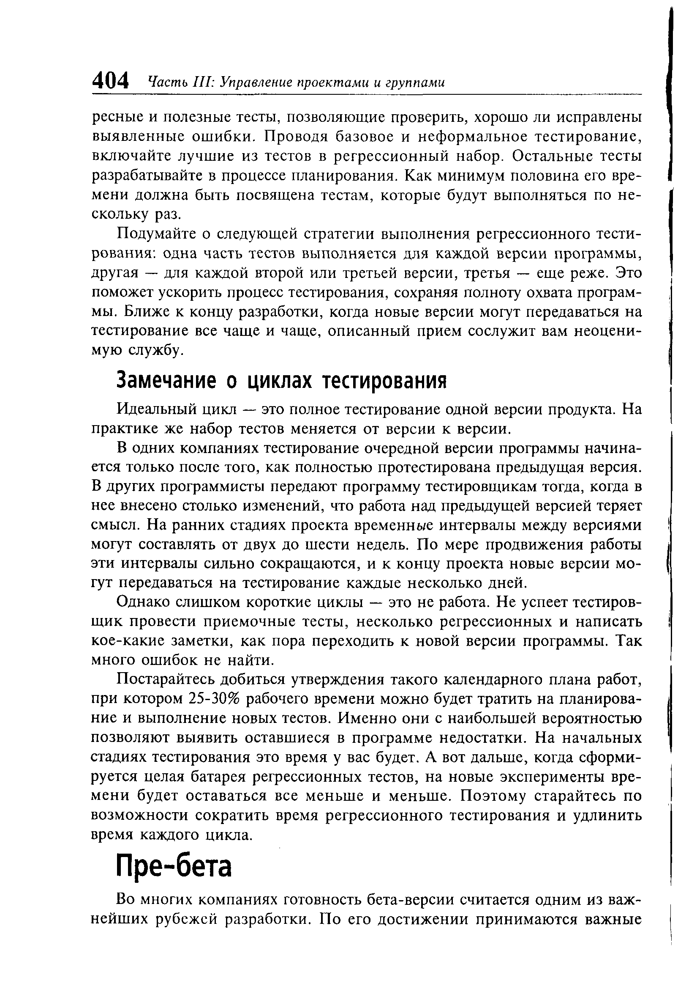

решения, завершаются одни виды работ и начинаются другие. Если так обстоит дело и в вашей компании, за две-три недели до завершения бета-версии стоит заняться кое-какой проверочной работой. Проанализируйте общее состояние программы и ее отдельных функций. Достаточно ли она надежна, и все ли в ней уже на своих местах? Действительно ли имеющаяся версию можно с чистым сердцем назвать “бета”? Как правило, такое проверочное тестирование и общая оценка состояния программы выполняются совместно тестировщиками и руководителем проекта.

В некоторых компаниях в календарный план разработки включается этап, который следует непосредственно за альфа-этапом и называется этапом подготовки бета-версии или просто пре-бета. Он довольно короткий и предназначается для доведения программы до состояния бета-версии. Руководитель проекта решает, что программа готова к испытаниям. Он объявляет об этом коллективу, и после долгих обсуждений, испытаний, исправлений и повторных проверок руководитель группы тестирования наконец соглашается, что бета-версия готова.

В других компаниях утверждение бета-версии проводится не так открыто, но в той или иной форме этот процесс согласования и внесения последних исправлений все равно неизбежен.

Как и перед объявлением альфа-версии, будьте готовы к огромному количеству последних изменений и исправлений. Планируйте свое время так, чтобы проверять их быстро и немедленно сообщать о результатах.

## Бета

Как и у альфа-версии, у бета-версии программы множество определений. Вот несколько примеров.

* Бета-версия — это версия, которую можно передать *бета-тестировщикам*, т.е. людям не работающим в компании, но готовым поэксплуатировать какое-то время ваш не вполне еще отлаженный продукт и сообщить о своих впечатлениях и найденных ошибках.

Будет ли в бета-версии реализован полный набор запланированных функций программы, зависит от выбранной модели разработки. То, что продукт готов к оценке сторонними пользователями, еще не значит, что он полностью завершен.

* В типичной бета-версии программы, разрабатывающейся методом *водопада*, все функции готовы и протестированы, фатальных ошибок нет, серьезных очень мало, несущественные файлы данных готовы, по крайней мере, на 50%, почти завершены файлы для драйверов устройств, готовы все проектные документы и продукт соответствует требованиям.

- В типичной бета-версии программы, разрабатывающейся эволюционным методом, готово ее ядро и тот набор базовых функций, которые делают ее приемлемым продуктом. Программа полностью протестирована, и, возможно, в ней есть даже некоторые дополнительные функции.

При эволюционной модели разработки такое состояние достигается достаточно рано, что позволяет рано передать программу сторонним бета-тестировщикам, а значит, заблаговременно узнать мнение пользователей и сэкономить средства на ее тестировании.

Альфа и бета не обязательно должны быть единственными ключевыми рубежами разработки. Можно определить и еще один рубеж (*гамма?*), на котором в программе уже будет множество разнообразных функций, а отсутствующие не будут иметь значительного влияния на ее маркетинговые характеристики. Этот рубеж будет означать, что разработка подходит к концу и вся основная работа уже выполнена.

После завершения бета-версии программы руководитель проекта определяет окончательную конфигурацию установочных дисков. Составляется список файлов, определяется их формат и то, будут ли они сжатыми. Готовится первая копия дисков, на которых вместо некоторых файлов могут быть просто заглушки — пустые файлы с заранее определенными именами.

## Программирование после завершения бета-версии

Если в программе остались неоконченные элементы, их необходимо доделать. Однако таких составляющих уже не много, и большая часть усилий программистов после завершения бета-версии направляется на исправление ошибок, создание файлов данных, написание установочных утилит и блоков поддержки оставшегося аппаратного и программного обеспечения.

Что касается проектных работ, то их объем и характер на этом этапе зависят от принятого в компании определения бета-версии программы. Возможно, именно теперь наступит время для "наведения красоты" и выполнения пожеланий пользователей, принимавших участие в бета-тестировании. Если же пользовательский интерфейс к этому времени "заморожен" и любые конструкторские изменения запрещены, значит, на этом этапе будут только исправляться ошибки.

Обычно в процесс работы с бета-тестировщиками так или иначе оказывается вовлеченным весь основной персонал проекта — программисты, группа технической поддержки, группа маркетинга и, конечно, группа тестирования. Хотя программисты и не контактируют с бета-тестировщиками непосредственно, они могут заниматься написанием служебного программного кода, необходимого для организации бета-тестирования или

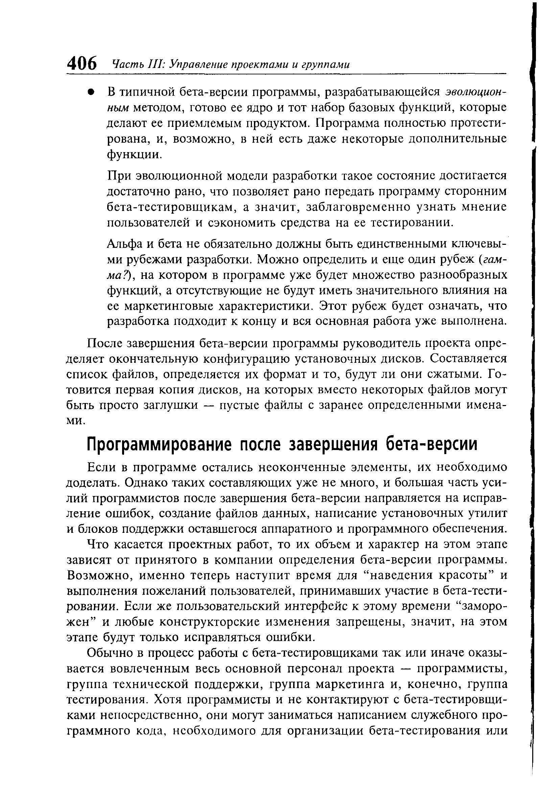

защиты программы от “пиратов”. Последней цели могут служить следующие средства.

* **Бомбы с часовым механизмом**, разрушающие программу после определенной даты.
* **Именные версии**, во многие места кода которых встроено, непосредственно или в зашифрованном виде, имя бета-тестировщика. Его имя отображается такой версией программы на экране, и, если тестировщику вздумается распространять программу тем или иным способом, каждый будет знать, чьих рук это дело. Даже если “пират” удалит свое имя из программного кода, он наверняка пропустит те места, где имя зашифровано. Если после этого он поместит свою копию программы в CompuServe, откуда ее сможет загрузить хоть целый мир, компания сможет доказать в суде, что именно этот человек является виновником все потерь. (Хотя едва ли бета-тестировщик достаточно богат, чтобы компенсировать потери компании, сама угроза раскрытия предотвратит нелегальные действия.)
* **Защита от копирования**, если только удастся найти достаточно эффективное средство.
* **Другие приемы, являющиеся профессиональными секретами.**

Анализируя проблемы, о которых сообщают бета-тестировщики, имейте в виду, что их источником может быть и добавленный в программу защитный код. Поэтому, если ошибка не воспроизводится, проверьте ту версию программы, с которой работал сообщивший о ней тестировщик.

## Маркетинговая деятельность после завершения бета-версии

Если упаковка и дополнительные материалы еще не готовы, работа над ними продолжается. Обложки и этикетки дисков обычно разрабатываются на бета-этапе, так что по его завершении группа тестирования должна быть готова их проверить.

Сотрудники группы маркетинга могут работать с бета-тестировщиками и сообщать руководству об их замечаниях и предложениях. Они же могут отсылать копии продукта обозревателям из периодических изданий и настаивать на тех изменениях, которые поспособствуют их более благоприятным отзывам. Вообще, вокруг таких изменений всегда создается очень напряженная атмосфера. С одной стороны, их политическая важность бесспорна. А с другой стороны, они могут повлечь за собой новые серьезные проблемы и ошибки, которые перед самым выпуском, мягко говоря, нежелательны — из-за них может оказаться под угрозой своевременное завершение проекта.

## Документирование после завершения бета-версии

Полным ходом продолжается разработка пользовательской документации. Она дополняется, корректируется, анализируется и снова корректируется. Технические писатели включают в руководства технические таблицы, советы по разрешению проблем.

Часто, не дожидаясь замораживания пользовательского интерфейса, технические писатели начинают снимать копии экранов. Составляется предметный указатель, пока еще без номеров страниц. Уточняются лицензионные соглашения, авторские права и т.п.

Если справочная система еще не готова, начинается работа над ее текстом.

## Тестирование после завершения бета-версии

Незадолго до завершения бета-версии попросите руководителя проекта подписать план тестирования. Хотя как минимум однажды он уже знакомился с планом работ вашей группы, в ходе предыдущего этапа этот план довольно сильно изменился. Поэтому необходимо еще раз согласовать все ключевые вопросы, касающиеся масштаба и сроков работ, а главное, полноты предполагаемого тестирования. Убедитесь, что вы полностью понимаете друг друга и между вами не осталось никаких противоречий.

Как следует проверьте маркетинговые материалы, перед тем как они уйдут в производство.

Если вы до сих пор не тестировали продукт в *реальном режиме*, пришло время вплотную заняться этой работой. Тестирование продукта в реальном режиме означает его полноценную эксплуатацию, выполнение той работы и решение тех задач, которые будет решать с его помощью пользователь. Если разрабатывается текстовый процессор — составляйте в нем заметки и отчеты. Если тестируется программа для создания презентаций — создайте презентацию, и не пробную, а самую настоящую, для реального совещания. Тестирование в реальном режиме выполняется абсолютно независимо от основного тестового плана. Даже если плановые работы не укладываются в расписание, ни в коем случае не пренебрегайте тестированием программы в реальном режиме, поскольку множество ее недостатков проявляются только при таком способе работы.

Продолжайте выполнение тестового плана, углубляя исследование программы и дополняя формальные тесты нестандартными экспериментами.

* Пришло время подвергнуть программу самым суровым нагрузкам и ***самым бескомпромиссным испытаниям***. К этому времени вы уже прекрасно знаете программу и имеете богатый опыт поиска ошибок. Пришло время для последней массированной атаки на ошибки — дальше будет уже поздно, и лучшие ваши открытия не принесут пользы проекту.

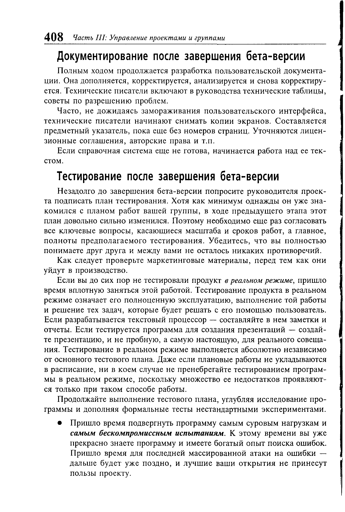

* Еще раз проверьте исправления всех наиболее серьезных ошибок.
* Воспользуйтесь приобретенным опытом для поиска новых ошибок.
* Поработайте над теми трудновоспроизводимыми ошибками, которые до сих пор не исправлены.
* Протестируйте программу на границах допустимых диапазонов, поработайте с ней на большой скорости на самой медленной технике, сгенерируйте нестандартные ситуации, протестируйте обработку ошибок, выполните все, что может привести программу к сбою.
* Если над программой работает несколько тестировщиков, пусть один из них посвятит все свое время поиску новых проблемных областей продукта. Этот сотрудник поможет вывести тестирование за рамки сложившегося круга задач и увидеть пропущенные ранее проблемы и потенциально слабые места программы.
* *Проследите за тем, чтобы вносимые в программу исправления немедленно тестировались.* Это полезное правило в конце разработки приобретает особое значение. Программисты должны узнавать о неудачных исправлениях в течение нескольких дней, пока они еще хорошо помнят каждую написанную строчку кода.
* *Завершите тестирование всех устройств, всех запланированных конфигураций.* Эта работа, начатая на альфа-этапе, вероятно, не была до сих пор окончена из-за выявления все новых и новых ошибок. Но даже если вам удалось провести всю запланированную работу, ее необходимо повторить, чтобы убедиться, что все по-прежнему в порядке. Некоторые сотрудники недоумевают, почему не начинать тестирование устройств после завершения бета-версии, чтобы не приходилось выполнять его дважды. Ответ прост: в этой части программы обычно так много ошибок, что повторное тестирование все равно необходимо, и, если отложить начало работы, заканчивать ее придется на этапе финального тестирования.
* *Продолжайте автоматизацию тестов,* даже если кажется, что эта работа уже не окупится. Нередко для полной отладки программы требуется гораздо больше циклов тестирования, чем ожидалось. И поскольку последние из них приходятся на самый конец проекта, экономия времени может сыграть здесь решающую роль. Автоматизацию можно прекратить только тогда, когда исчезают всякие сомнения в том, что тестирование завершается. Однако не стоит впадать в другую крайность и автоматизировать все подряд. Отбирайте тесты очень тщательно, автоматизируя только те, которые наверняка будут выполняться еще много раз.

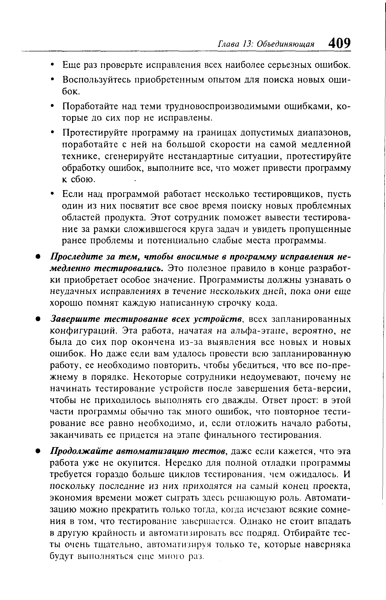](images/Kaner_1999_TestingComputerSoftware/page_406_img_1.png)

* *Протестируйте все файлы данных*, включая мультимедиа, шаблоны, примеры и т.п. Выберите небольшую группу типичных файлов и запишите время, ушедшее на их тестирование. Это позволит оценить длительность одного цикла, чтобы точнее спланировать дальнейшую работу.

Необходимо позаботиться том, чтобы текущее состояние работ всегда было очевидным, а также о том, чтобы составляемые отчеты о проблемах рассматривались вовремя и по ним принимались конструктивные решения.

* *Регулярно предоставляйте руководству отчеты о состоянии проекта* с данными о нерешенных проблемах и важными статистическими сведениями. Эти отчеты регулярно формируются в течение всей разработки, но ближе к ее концу им следует уделять большее внимание.
* *Аккуратно обращайтесь со статистическими данными.* Каждая цифра в отчете и особенно данные о количестве новых и старых проблем должны сопровождаться корректной интерпретацией. Не заставляйте читателя самого догадываться о значении тех или иных показателей. Иначе у руководства может создаться превратное впечатление о ходе работы и состоянии программы.
* *Как следует подумайте, прежде чем подключать к проекту новых тестировщиков перед самым концом разработки.* Чтобы войти в курс дела, им требуется время, и поначалу они могут составлять много бесполезных отчетов и постоянными вопросами отрывать от работы других сотрудников. В результате они скорее замедлят работу, нежели ее ускорят.
* *Распространяйте среди заинтересованных лиц списки отложенных проблем* и регулярно собирайте совещания по их пересмотру. На бета-этапе такие совещания должны стать еженедельными. Еще позже их можно проводить каждые несколько дней. Все важнейшие решения должны приниматься как можно раньше, а не откладываться до самого выпуска. Те проблемы, которые, на ваш взгляд, требуют обязательного решения, выделяйте в распространяемых списках красным карандашом, чтобы сотрудники обдумали их как можно более серьезно.
* *Распространяйте среди заинтересованных лиц списки недостатков пользовательского интерфейса* и неудачных конструкторских решений. Эти списки также должны стать предметом регулярных совещаний, причем необходимо уделить им внимание как можно раньше, чтобы к моменту замораживания пользовательского интерфейса все ключевые изменения уже были внесены.

Как только у вас в руках окажутся черновики руководства пользователя, начинайте с ними работать не откладывая. Получив руководство на бета-этапе, постарайтесь проработать его до того, как бета-версия будет завершена. О тестировании документации подробно рассказывалось в главе 9. Вот ее важнейшие положения.

* Поскольку вы, скорее всего, лучше осведомлены о последних изменениях программы, чем автор документации, ***проверьте ее достоверность.***
* ***Предупредите технического писателя о намечающихся изменениях программы.***
* ***Проверьте, нет ли в программе функций, не описанных в документации или описанных недостаточно полно и понятно.***
* ***Подключая к проекту нового тестировщика, поручите ему прежде всего протестировать программу по последней версии руководства пользователя.*** Как правило, к среднего масштаба проектам новые тестировщики подключаются в промежутке между серединой альфа-этапа и "замораживанием" пользовательского интерфейса.

Постоянно отслеживайте ход работы, сверяя ее результаты по календарному плану. Подводить итоги лучше всего еженедельно. Какие новые задачи поставлены, какие из них уже решены? Как они влияют на выполнение запланированной работы, сколько времени отнимают? Укладываетесь ли вы в сроки? Если нет, то какие меры можно предпринять? Может быть, следует сократить некоторые виды работ или вообще от них отказаться? Не поможет ли делу увеличение числа тестировщиков? А возможно, программисты отстали от графика так сильно, что ваше отставание не имеет значения. Впрочем, последнее соображение не может служить оправданием, и вот почему.

* Если вы работаете слишком медленно, то находите ошибки позднее, чем это было бы сделано в соответствии с планом. Так что давно написанная часть программы оказывается не готова в срок потому, что вы не нашли в ней ошибки вовремя.
* Пытаясь наверстать упущенное, вы начинаете работать быстрее, составляемые отчеты становятся скомканными и неразборчивыми, по ним труднее воспроизводить ошибки, а в результате общая работа затягивается еще больше и ее качество страдает.
* Ошибки могут оставаться в программе потому, что отчеты о них плохо составлены. В этом случае между документированием ошибки и ее исправлением может получиться большая задержка, вызванная тем, что руководитель проекта не сразу понял серьезность проблемы. И это целиком ваша вина.

Итак, ошибки в программе должны выявляться и документироваться вовремя, и их описания в отчетах должны быть четкими и понятными. Только в этом случае руководитель группы тестирования может утверждать, что в задержке выпуска продукта нет его вины.

## Сторонние бета-тестировщики

О реакции пользователей на продукт желательно узнать до его выпуска в продажу. Однако получить необходимую информацию не так просто. Нередко бета-тестирование не дает ожидаемых результатов из-за того, что его цели плохо продуманы, а весь процесс плохо организован. Какой, например, смысл, в проведении тестов, на результаты которых компания не успеет адекватно отреагировать? Составляя задания для бета-тестировщиков, подумайте, какова цель каждого теста и почему его не могут провести сотрудники компании. Подумайте и о том, как узнать, что запланированные тесты действительно проведены, и в полном объеме.

Одной из причин сложностей в организации бета-тестирования является большое разнообразие возможных целей этой работы (рис. 13.5).


**РИСУНОК 13.5.** *Семь целей бета-тестирования вне компании*

* *Получение консультации экспертов.* В первый раз разработчики выясняют мнение экспертов еще на этапе проектирования продукта. Речь тогда идет о его будущих возможностях и структуре, обсуждаемых, возможно, на примере уже созданного прототипа.

Во многих компаниях бытует убеждение, что никто сторонний не должен видеть продукт до самых последних этапов его разработки. К мнению экспертов обращаются после завершения бета-версии, однако от таких консультаций мало толку, поскольку продукт практически готов и вносить в него серьезные изменения уже поздно.

*Если вас интересует мнение экспертов, выясните его как можно раньше.*

* **Обзоры в прессе.** Некоторые профессиональные обозреватели чувствуют себя польщенными, если в продукты вносятся предложенные ими изменения. Таким продуктам гарантированы их благожелательные отзывы. Разумеется, не все обозреватели горят желанием участвовать в разработке продукта. Многие просто знакомятся с ним, не высказывая собственных предложений. Сотрудники группы маркетинга должны знать характер каждого из обозревателей и роль их изданий в формировании мнения потребителя, чтобы решить, кому из них необходимо отправить продукт пораньше, чтобы успеть получить отзыв и внести необходимые изменения, а кому достаточно отправить программу перед самым выпуском.

* **Всевозможные конкурсы и рейтинги.** Некоторые издания и организации объявляют конкурсы на лучший продукт определенной категории. Участие в них может стать важной составляющей рекламы продукта. Сотрудники группы маркетинга отправляют продукт таким организациям либо заранее, чтобы получить их отзывы и внести необходимые изменения, либо незадолго до выпуска, если их рекомендации не важны.

* **Выяснение того, как будет использоваться продукт, и доработка дизайна.** Незадолго до выпуска продукта имеет смысл дать его пользователям и посмотреть, как они будут его эксплуатировать. Это поможет более успешно представить продукт в рекламе. Кроме того, некоторые важные замечания помогут сгладить неровности дизайна, внести полезные усовершенствования. Чтобы это стало возможным, продукт должен пробыть в руках пользователей не меньше месяца, и еще месяц или более необходимо зарезервировать для последующих исправлений.

В общей сложности бета-тестирование должно начаться как минимум за десять недель до выпуска продукта. Только тогда удастся выполнить самую типичную задачу этого этапа — выяснить как будет использоваться продукт и каковы его наиболее серьезные недостатки.

* **Поиск ошибок.** Бета-тестирование вовсе необязательно должно производиться вне компании, когда вы понятия не имеете, что на самом деле делают с программой тестировщики, выполняют ли они ваши поручения, и если да, то в каком объеме. Попробуйте убедить руководство поступить иначе и нанять представителей предполагага-[ 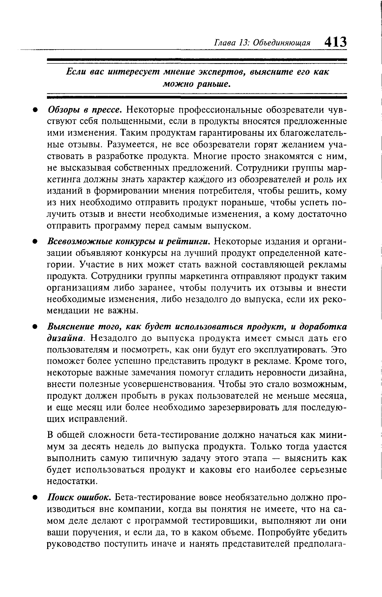 ]

емого рынка, чтобы они выполнили необходимое тестирование в стенах компании и под вашим надзором. Это даст вам целый ряд преимуществ. Прежде всего, поскольку этим людям будут платить, они отработают все положенное время. Программа при этом не выйдет из стен компании, что снизит риск ее нелегального распространения. Вы сможете наблюдать за работой пользователей, а значит, гораздо лучше быть в курсе всех возникающих проблем и того, как эти проблемы решаются. Получив отчет от сторонних бета-тестировщиков, нередко приходится тратить много времени на попытки воспроизвести описанную в нем ситуацию, а если это не удается — подолгу выяснять по телефону, что к чему. Если же все происходит у вас на глазах, подобных потерь времени нет. Бывает также, что некоторые моменты в программе смущают пользователя или оказываются ему непонятными. О таких моментах далеко не все пользователи рассказывают в отчетах, но легко поделятся своими затруднениями, если вы рядом.

* *Анализ производительности и проверка совместимости с конкретным оборудованием.* Привезти в лабораторию все возможные виды принтеров, модемов, компьютеров, мышей, звуковых и видеоплат и т.п., пусть даже на время, просто невозможно. Тем не менее, программа должна работать с огромным количеством устройств. Лучшим, а иногда и единственным решением проблемы может стать отправка программы владельцам интересующего вас оборудования. Все это требует тщательной организации.
    * **Прежде всего напишите для бета-тестировщиков обстоятельный план работ.** Он должен быть простым, понятным, кратким, легко выполнимым. По возможности все результаты работы тестировщиков должны распечатываться или сохраняться в файлах, чтобы вам не приходилось воспроизводить происходящее по их словесным описаниям.
    * **Позвоните каждому из тестировщиков, чтобы убедиться в получении всех отправленных материалов.**
    * **Через неделю позвоните тестировщикам еще раз** и спросите, как продвигается работа. Помните, что не они, а вы заинтересованы в своевременном выходе продукта, а потому должны сделать все от вас зависящее, чтобы вовремя узнать о результатах тестирования.
    * **Тестировщиков должно быть больше необходимого минимума** — по два на каждый тип оборудования или каждый тип тестов. В результате такой предусмотрительности удваивается количество отсылаемых материалов и телефонных звонков, но зато гаранти-

руется своевременность получения результатов. (Конечно, тестировщикам говорить о том, что вы подстраховались, не следует.)
* Тщательно спланируйте время и другие ресурсы, необходимые для поддержки бета-тестировщиков. Примите во внимание поиск людей, подписание соглашений о нераспространении информации, настройку или модификацию программы, написание плана тестирования, подготовку копий продукта, конвертов, телефонные переговоры, ответы на вопросы тестировщиков и их жалобы, получение и анализ результатов их работы. Если сложить все это вместе, получится шесть-восемь часов на каждого тестировщика, и это при условии, что и тесты, и продукт будут достаточно простыми. При их усложнении время, которое придется затратить на поддержку тестировщиков, пропорционально увеличивается.

## Замораживание пользовательского интерфейса

Раньше или позже в разработке наступает момент, когда все дальнейшие изменения пользовательского интерфейса, т.е. практически любые видимые изменения программы запрещаются. Любому видимому исправлению, даже если оно явно лучше, с этого момента предпочитают невидимое. Разумеется, могут быть и исключения из этого правила, но только в самых крайних случаях, когда найдена катастрофическая ошибка и ее никак нельзя исправить, не затронув интерфейса программы.

В некоторых компаниях пользовательский интерфейс “замораживается” одновременно с программным кодом перед самым выпуском программы в производство. Если интерфейс играет в программе ключевую роль, как, например, в играх, где его привлекательность значительно важнее скрупулезной точности руководства, такая стратегия вполне оправдана.

В других компаниях, напротив, интерфейс “замораживается” рано, задолго до готовности бета-версии. Это значительно увеличивает возможности автоматизации тестирования и облегчает работу технических писателей, однако не позволяет усовершенствовать дизайн программы по результатам бета-тестирования.

В следующих разделах предполагается, что пользовательский интерфейс “замораживается” спустя несколько недель после завершения бета-версии и за несколько недель до готовности окончательного варианта продукта.

## Программирование после "замораживания" пользовательского интерфейса

Программисты продолжают исправлять ошибки, но делают это так, чтобы внешне ничего не менялось. Они работают над повышением произ-

водительности программы, разрабатывают образцы файлов данных, пишут установочное программное обеспечение. Зная, что программа установки разрабатывается или, по крайней мере, дорабатывается в последнюю очередь, авторы документации обычно откладывают описание процесса установки программы. Если предполагается распространять демонстрационную версию продукта, то ее разработка обычно также начинается после “замораживания” пользовательского интерфейса.

## Маркетинговая деятельность после "замораживания" пользовательского интерфейса

Поскольку дизайн продукта “заморожен”, обозреватели периодических изданий больше не могут требовать его изменений. Группа маркетинга приступает к массированной подготовке рынка, работая над тем, как эффективнее представить продукт будущим пользователям. Ее сотрудники готовятся к рассылке демонстрационной версии продукта, дорабатывают наклейки, этикетки и прочие графические и текстовые материалы, чтобы то, что написано и нарисовано на коробке, полностью соответствовало ее содержимому и реклама продукта была достоверной.

На этот этап приходится пик активности группы маркетинга, но большая часть ее деятельности никак не касается тестирования. Впрочем, если продукт выйдет позже запланированного срока, вся маркетинговая работа окажется проделанной впустую — пользователи забудут об анонсированном продукте, и всю рекламную деятельность придется начинать сначала.

## Документирование после "замораживания" пользовательского интерфейса

С этого момента может быть “заморожен” и текст справочной системы, хотя чаще это делается несколькими днями или неделями позже. В некоторых компаниях используется прямо противоположная стратегия, когда основная часть текста справочной системы пишется после “замораживания” пользовательского интерфейса.

Это наилучшее время для снятия копий экранов и последней проверки точности руководства. Вслед за этим руководство верстается и отправляется в печать. Одни компании придерживают руководство до тех пор, пока не будет готов окончательный вариант программы, в других готовится первая печатная копия, которая еще раз редактируется перед началом финального тестирования.

## Тестирование после "замораживания" пользовательского интерфейса

Заранее запланируйте время для проверки точности руководства пользователя. Если вы прорабатывали его достаточно тщательно, на этот раз

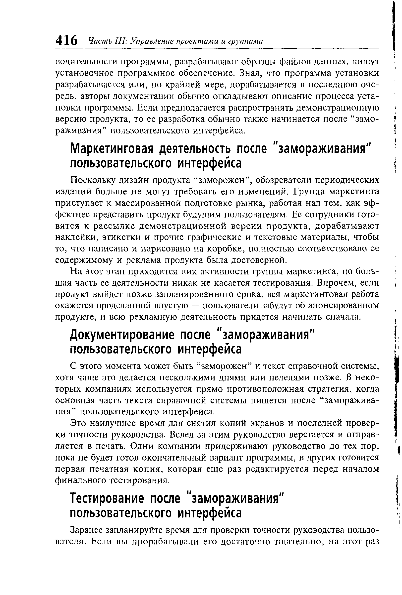

довольно беглого просмотра. Задержитесь только на подробных описаниях процедур или последовательностей событий, пошаговых инструкциях и копиях и описаниях экранов. На проверку каждых десяти страниц должно уходить примерно около часа.

К этому времени каждая область программы уже тщательно вами исследована. Оставшееся время, скорее всего, будет затрачено на регрессионное тестирование. Следуйте своему плану.

Пора пересмотреть сложившийся список регрессионных тестов, особенно для тех областей программы, которые зарекомендовали себя лучше всего.

* **Если пара тестов похожа, слабейший из них можно удалить.** Можно его заархивировать, но попадаться вам на глаза он больше не должен.
* **Проверьте, нет ли в наборе неэффективных тестов.** Если программа постоянно проходит определенные тесты, заархивируйте их и удалите из регрессионного набора. Некоторые из таких тестов можно оставить, но выполнять не на каждом цикле тестирования.

Скорее всего, вы продолжите тестирование некоторых внешних устройств, даже если программа будет уже работать с ними вполне корректно.

А вот поиск недостатков дизайна после его "замораживания" прекращается. Важнее убедиться, что не осталось никаких серьезных функциональных ошибок. Продолжайте добавлять в план важные или интересные тесты. Что касается остальных, то не стоит тратить много времени на их документирование — просто выполняйте их и все.

Пользуясь теперь уже фундаментальными знаниями о программе, поищите пути разрушения данных. Изменяйте их чуть-чуть и очень сильно, меняйте сами данные и их формат по отдельности и вместе. Отслеживайте изменения содержимого и объема памяти программы в поисках возможных предпосылок будущих проблем.

Просмотрите открытые отчеты об ошибках. Почему эти ошибки до сих пор не исправлены?

* **Еще раз протестируйте программу по всем открытым отчетам.** Может быть, какие-то из описанных в них ошибок на самом деле уже исправлены. Однако то, что проблему не удается воспроизвести, еще не значит, что это так. Проверьте, воспроизводится ли ошибка в той версии программы, по которой составлялся отчет. Затем спросите у руководителя проекта, действительно ли ошибка исправлена.
* **Попробуйте упростить оставшиеся отчеты.**

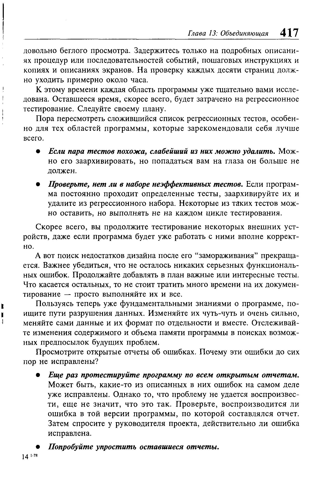

* В ответ на игнорирование ошибок действуйте эффективно. В конце проекта может наметиться тенденция к массовому исчезновению, откладыванию и забыванию отчетов, они могут попадать к программистам с большими задержками. Сознательно или несознательно вся команда, включая и руководителя проекта, может стремиться избавиться от составляемых вами отчетов, вместо того чтобы активнее исправлять описанные в них ошибки. Пусть это послужит вам сигналом, что люди устали и деморализованы бесконечными задержками и проблемами.

Постарайтесь в такой ситуации действовать профессионально. В обстановке, когда общее напряжение достигло предела, эмоции и открытое выражение недовольства только навредят делу.

Вашим оружием в этой битве может стать система отслеживания проблем. Еженедельно составляйте отчеты об отложенных и нерешенных вопросах и направляйте их не только младшему, но и среднему и высшему руководству. Если вашим непосредственным руководителям это не понравится, настаивайте на том, что такое широкое распространение отчетов в конце разработки является стандартной процедурой. Постоянное напоминание о недоделанной работе заставит сотрудников понять, что, пряча голову в песок, ошибок не исправить.

Если эта тактика не сработает, напишите докладную записку и спросите у руководителя, как вам быть. Удачи!

## Подготовка к финальному тестированию

На этом этапе доделывается все, что еще не готово, в частности, дорабатываются файлы данных и установочные утилиты. К его началу не должно остаться ни одного открытого отчета о проблеме. Иногда в начале этого же этапа "замораживается" пользовательский интерфейс.

Тестирование программы, однако, продолжается, и вполне возможно обнаружение еще нескольких серьезных ошибок. После их исправления, когда больше ничего серьезного найти не удается, начинается этап последней проверки целостности.

### Программирование на этапе подготовки к финальному тестированию

Программисты исправляют только те ошибки, о которых распорядится руководитель проекта. Остальные остаются неисправленными, даже если исправить их совсем несложно. Руководитель проекта откладывает эту

работу до следующего выпуска программы, поскольку слишком велик риск, что исправление одной ошибки повлечет за собой другие, которые останутся незамеченными.

## Документирование на этапе подготовки к финальному тестированию

Технические писатели готовят сопутствующие материалы, проспекты, тексты файлов. Все это вам необходимо будет проверить.

Значительная часть информации приложений будет исходить от вас. Прежде всего, это сведения о самых последних изменениях продукта, внесенных уже после того, как руководство пользователя ушло в печать. Техническим писателям важны изменения дизайна продукта (измененные диалоговые окна, меню, команды), новые предупреждения и сообщения об ошибках и изменения возможностей программы (например, максимальное количество одновременно обрабатываемых объектов).

## Тестирование на этапе подготовки финальной версии

Для тестировщиков этап подготовки к выпуску финальной версии является особенно важным. Если в программе остались настолько серьезные ошибки, что ее нельзя выпускать в производство, это ваш последний шанс их найти. Главными направлениями работы сейчас являются следующие.

* *Продолжайте поиск серьезных проблем.* Если в течение определенного времени ни одной такой проблемы найти не удастся, это будет означать, что работа окончена. Дальше будет выполнена последняя проверка целостности продукта, после чего он уйдет в производство. На этом этапе на первый план снова выходит стратегия поиска ошибок под руководством интуиции и опыта, а не формального плана. Проверьте все наиболее слабые точки программы, выполняйте любые тесты, которые кажутся вам наиболее обещающими.
* *Убедитесь, что при последних исправлениях ошибок ничего не нарушилось.* Когда вы получаете по три новых версии в день, а на выполнение тестового плана требуется две человеко-недели, эта задача оказывается не из легких. В этом случае наиболее эффективна следующая технология. Получив очередную версию программы, прежде всего проверьте, как работает последний исправленный фрагмент и ничего ли не нарушено вокруг него. Затем перейдите к общему тестированию по плану, продолжив его с того места, на котором вы остановились, получив данную версию. Выполнив таким образом весь план и меняя версии программы по его ходу, начинайте новый цикл.

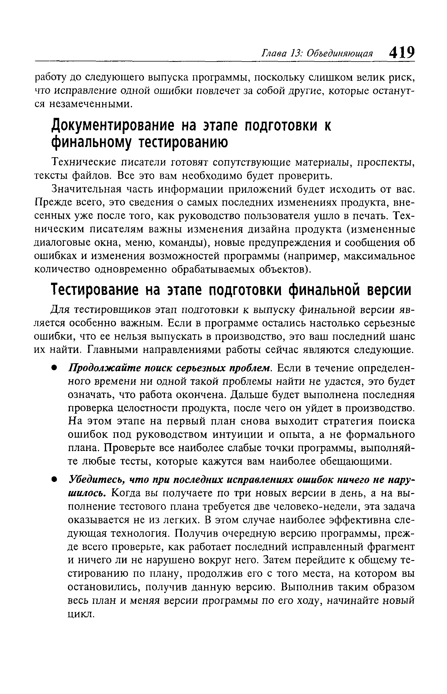

* Поиск упущенного. Возможно, что, еще раз проверив всю документацию, вы найдете несколько невыполненных тестов, не до конца протестированных устройств и другие неоконченные или вообще забытые задачи. По окончании данного этапа ни один критический тест не должен остаться невыполненным.

На бумаге все выглядит просто, но на деле это самый напряженный и изнурительный из всех этапов проекта. Скорее всего, вы найдете несколько достаточно серьезных ошибок, которые придется исправить. После каждого исправления вам будет немедленно передаваться новая версия программы. Это может происходить каждый день или даже дважды либо трижды в день. И тестировать ее необходимо будет немедленно.

Иногда случается, что руководитель проекта забывает сказать вам об изменениях, внесенных в самую последнюю минуту. Поэтому после получения каждой новой версии лучше всего сравнивать все ее файлы с их предыдущими вариантами. Заметив отличие, не связанное с тем изменением, о котором вам сообщили, спросите у руководителя проекта, что оно означает.

Проведите еще один цикл тестирования устройств. Убедитесь, что каждое из них проверено во всех возможных режимах. Прогоните еще раз архивные тесты — программа их почти наверняка пройдет, но убедиться в этом еще раз все же не помешает.

Проверьте, как ведет себя каждая исправленная часть программы, окончательно ли покончено с найденными ошибками.

В последний раз раздайте сотрудникам список отложенных проблем. Поскольку все их команда разработки уже рассматривала на последнем совещании, это чистая проформа. Однако руководство все же должно напоследок еще раз оценить качество выпускаемого продукта.

## Оценка надежности продукта

После окончания последнего этапа тестирования продукта он либо отправляется в производство и затем в продажу, либо передается в руки тех, кому предстоит выполнить его приемочное тестирование.

Перед тем как продукт покинет стены компании, тестировщиков попросят дать оценку качества программы. Готова ли она к выпуску? Руководство компании вполне может проигнорировать ваше мнение на этот счет и поступить по-своему, однако узнать его захочет наверняка.

У качества продукта множество составляющих, включая интерфейс, функциональные возможности, полезность и надежность. Однако руководство, скорее всего, мало интересует, что вы думаете о дизайне программы, ему важно ваше мнение о ее надежности. Поэтому заранее подготовьтесь высказать свою оценку именно этой составляющей качества, возможно, лишь с некоторыми комментариями по поводу дизайна.

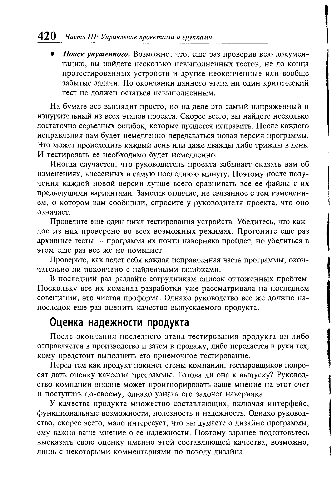

Высокая надежность продукта означает, что пользователи едва ли найдут в нем ошибки. Если же такая вероятность достаточно велика и особенно если в процессе эксплуатации могут проявиться достаточно серьезные ошибки, надежность продукта считается низкой. Обычно большинство руководителей устраивает следующая система оценки.

* *Низкая надежность.* В продукте имеются серьезные ошибки, которые пользователь, скорее всего, обнаружит. Все это известные официально отложенные проблемы.
* *Средняя надежность.* Посредине между высокой и низкой.
* *Высокая надежность.* Продукт хорошо протестирован, и больше ни одной серьезной проблемы в нем найти не удается. Возможно, какие-то проблемы и остались не замеченными тестировщиками, но и пользователи едва ли их заметят.
* *Степень надежности неизвестна.* Программа не была адекватно протестирована, или тестировщики сделали все от них зависящее, ничего ужасного не нашли, но уверены, что некоторые серьезные проблемы еще остались. В этом случае необходимо объяснить, на чем основаны ваши подозрения, и предложить четкий план выявления предполагаемых проблем. Этим планом может предусматриваться помощь сторонних консультантов или аренда необходимого аппаратного обеспечения, причем и то, и другое должно выполняться очень быстро.

## Минимальная надежность

Ни одна компания не выпустит продукт, не соответствующий ее минимальным стандартам качества. Вам эти стандарты могут быть неизвестны, поскольку едва ли они документально зафиксированы. Однако в общем случае как минимум требуется следующее.

* *Все граничные значения входных данных протестированы.* Если программа отвергает определенные значения, она должна делать это корректно.
* *Последняя версия руководства тщательно проверена.* Она правильно описывает поведение программы. Тестировщики выполняли все упомянутые в ней команды, выбирали все возможные значения опций, выполняли все описанные последовательности действий и отвечали на все задаваемые программой вопросы всеми возможными способами. Все это работает, по крайней мере, если речь не идет о каких-либо совершенно неожиданных комбинациях.
* *Протестированы все основные аппаратно-программные конфигурации.* Программа работает как минимум с наиболее распространенны

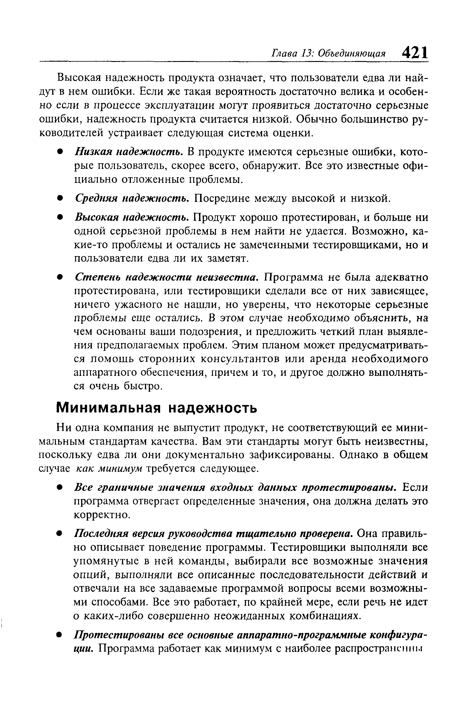

ми типами аппаратуры и системного программного обеспечения из тех, с которыми она должна быть совместима.

* *Редактирование параметров команд, повторение действий и любые их последовательности не должны выводить программу из равновесия.*
* *Система устойчива к любым ошибкам, которые может допускать пользователь.*

На самом деле стандарты компании должны быть гораздо выше, и так оно, скорее всего, и есть. Попробуйте составить свой собственный список, дополняя вышеперечисленные критерии теми, о которых вам удастся узнать. Этот список может стать вашей опорой в обосновании ненадежности выпускаемой программы, если такая необходимость возникнет. Если программа не соответствует какому-либо из перечисленных критериев, степень ее надежности считается неизвестной. Сообщив об этом руководству, вполне можно получить дополнительное время для тестирования ее ненадежной области.

Нередко на рынке появляются продукты, явно не соответствующие даже базовым критериям надежности. На наш взгляд, в этом полностью виноваты тестировщики. Если бы они вовремя поставили руководство в известность о ненадежности определенной области программы, проблема вполне могла бы быть решена.

## Оценка надежности каждой составляющей продукта

Надежность каждой области или составляющей программного продукта имеет смысл оценивать отдельно. Насколько вероятен сбой? Чтобы ответить на этот вопрос, необходимо знать уровень тестирования каждой из областей и то, как программа проходила выполняемые тесты. Можно даже регулярно публиковать отчеты о состоянии продукта с перечнем всех его функциональных областей и классов выявленных проблем и с оценками надежности каждой области.

Если оценка надежности определенной области программы оказывается низкой, перечислите в отчете все проблемы, на которых основано такое заключение. Если, на ваш взгляд, целый ряд проблем еще только предстоит выявить, напишите и об этом. Укажите, сколько примерно времени понадобится для того, чтобы подтвердить или опровергнуть ваши предположения. Будьте готовы объяснить, как вы собираетесь это сделать.

Если определенная область программы не протестирована как следует, степень ее надежности неизвестна. Однако одной констатации этого факта мало. Укажите в отчете, сколько времени потребуется на проведение неформального тестирования, позволяющего хотя бы приблизительно оце-

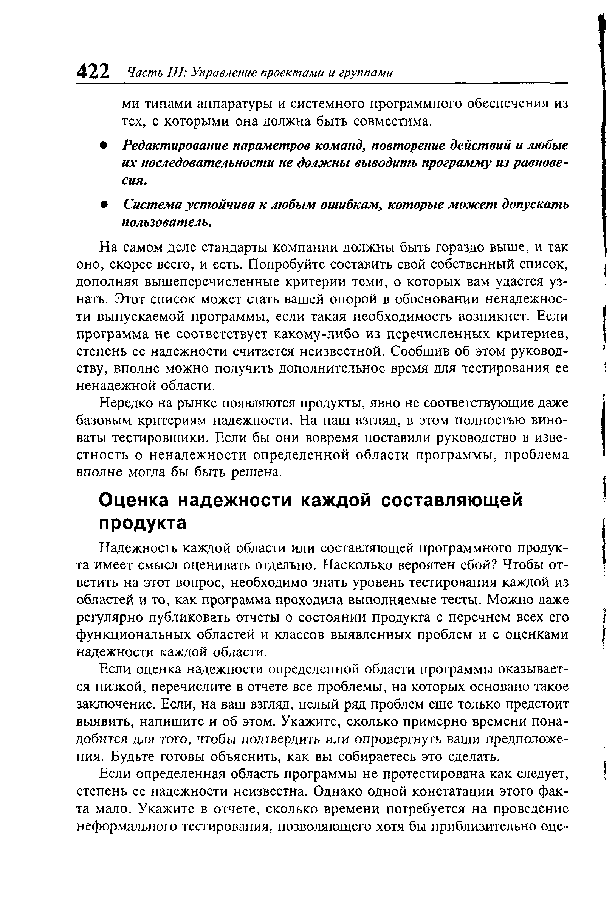

нить надежность данной области. Приведите примеры возможных ошибок. В случае затруднений обратитесь к приложению этой книги. Опишите наиболее серьезные проблемы, которые не могли быть выявлены уже проведенными тестами. Вы не можете утверждать, что в программе имеются конкретные ошибки. Однако если вы пока не уверены в их отсутствии, об этом необходимо сказать.

## Окончательное решение

Последнее слово всегда остается за руководством. Оценивать степень риска и вероятность успеха — это его работа. В одних случаях принимается решение немедленно выпустить несколько несовершенный продукт, в других же — решение выпустить его в следующем году, но зато уж абсолютно безупречным. Факторов, влияющих на принятие того или иного решения, может быть очень много, и прежде всего для этого необходимо глубокое знание рынка и четкое видение собственной позиции и целей компании, которое имеется только у ее руководства.

Работа руководителя группы тестирования заключается в другом — гарантировать правильное понимание руководством степени риска. Во что обойдется этот риск компании, руководство знает и так, как и то, что поставлено на карту. Руководству известно, во что обходится каждая неделя задержки. Ему известна стоимость проводимых работ. От вас ему важно узнать о степени вероятности серьезных сбоев программы, которые могут повлиять на ее популярность или иметь другие неприятные для компании последствия.

Таким образом, ваша обязанность заключается в том, чтобы предоставлять людям, принимающим решения, всю необходимую для этого информацию, касающуюся вашей работы. Информация о качестве продукта должна поступать им вовремя, в понятной и простой форме, не оставляющей возможности для домыслов и недопонимания.

Еще раз: и окончательное решение о выпуске продукта, и стандарты его качества принимаются не вами, а руководством компании. Какого бы мнения вы ни были об этих стандартах, ваша задача выполнить свою работу настолько хорошо, насколько это возможно. И если вы будете следовать описанной в данной главе стратегии, это у вас получится.

## Последняя проверка целостности

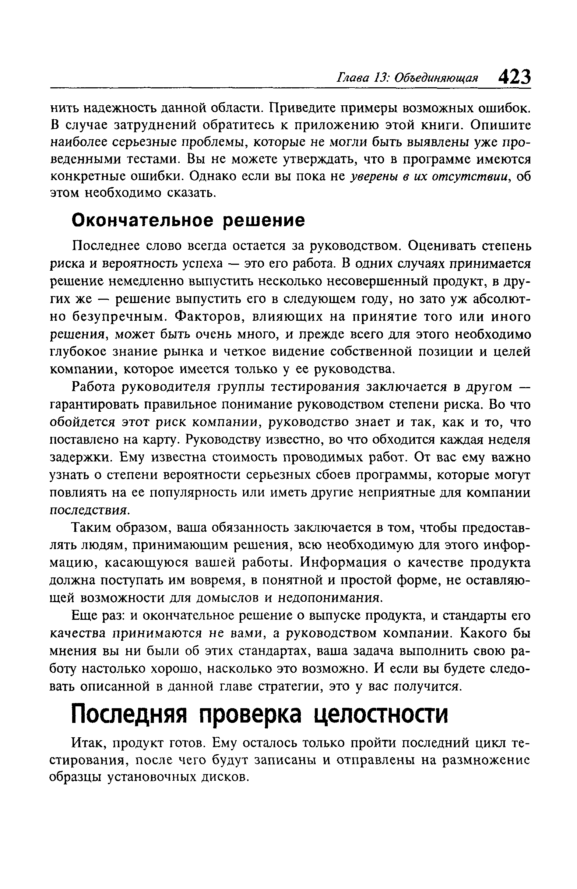

Итак, продукт готов. Ему осталось только пройти последний цикл тестирования, после чего будут записаны и отправлены на размножение образцы установочных дисков.

## Программирование на этапе проверки целостности

Задача программистов по-прежнему остается неизменной — они исправляют ошибки, выявленные на этой последней стадии проекта. Возможно, дорабатывается также демо-версия программы. Затем вся работа архивируется, делаются последние записи, все приводится в порядок.

## Тестирование на этапе проверки целостности

Многие компании к началу этого этапа прекращают тестирование программы. Фактически это просто означает, что описанная в этом разделе работа выполняется на предыдущем этапе.

В других компаниях определяется отдельный этап последнего тестирования продукта перед выпуском его в производство. Такое тестирование часто называют проверкой целостности. Иногда проверку целостности выполняет группа маркетинга или другая группа тестирования. Вот ее цели.

* ***Оценить надежность программы в первый день ее использования.** Для этого с продуктом работают так, как это будет делать сам пользователь в первый день его эксплуатации. Особое внимание уделяется руководству пользователя и другим учебным пособиям. Тестировщики пытаются представить себе проблемы, с которыми может столкнуться большинство новых владельцев программы.*
* ***Предупредить негативные оценки обозревателей.** Это последний шанс что-то исправить до того, как обозреватели наткнутся на оставшиеся огрехи.*

Последняя проверка целостности предполагает базовое, а не нагрузочное тестирование. Тестировщик делает то, что будет делать типичный покупатель или обозреватель, знакомясь с новым продуктом. Он не пытается вывести его из строя, а просто изучает, как он работает. Однако если проверка целостности выполняется кем-то другим, подготовьте для этого человека все тестовые материалы, включая план тестирования, отчеты о проблемах, файлы данных, распечатки результатов и т.п. Возможно, в его задачи будет входить независимая оценка вашей работы. Он может пользоваться списком вероятных ошибок, аналогичным приведенному в конце этой книги. В этом случае он будет по очереди выбирать ошибки из этого списка и выяснять, могли ли они быть выявлены проведенными тестами.

После завершения проверки целостности начинается подготовка установочных дисков. Для этого берутся новые никогда не бывшие в использовании диски, форматируются и проверяются на вирусы и сбойные секторы. Проверяется объем свободного пространства на каждом диске. Затем на диски копируются установочные файлы. Результирующие файлы сверяют с исходными, чтобы убедиться, что копирование прошло полностью успешно. Затем диски снова проверяются на вирусы.

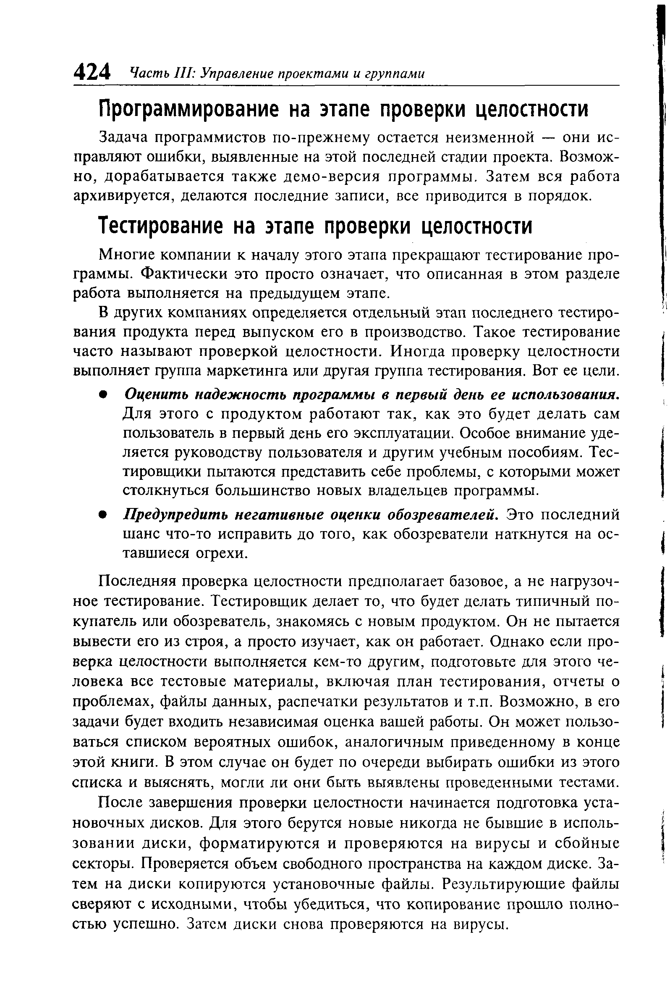

После подготовки образцов дисков программа устанавливается с них на компьютер. Эта процедура гарантирует, что установочная утилита работает правильно и все необходимые ей файлы успешно найдены. (Особенно это важно в случае, если какие-то из файлов не поместились на один диск и в последнюю минуту были перенесены на другой.)

Кроме этой основной работы, в ходе выпуска продукта выполняется следующее:

* Архивация образцов установочных дисков.
* Архивация исходного кода.
* Распространение среди заинтересованных сотрудников последних дополнений списка отложенных проблем и сбор подписей на необходимых для выпуска документах.
* Обычно массовое производство установочных дисков начинается с того, что выпускаются их первые несколько наборов и возвращаются вместе с образцами назад для тестирования. Получив эти первые несколько наборов дисков, прежде всего сравните их с образцами, а затем установите программу на компьютер с одного из них. Скопируйте все файлы с одного из наборов дисков на другие диски, чтобы убедиться в отсутствии ошибок ввода/вывода. И еще раз проверьте их на вирусы.

## Выпуск

Убедившись, что дупликатор правильно копирует диски, можно начинать их массовое производство. Готовые диски упаковываются вместе с другими материалами в коробки и запечатываются.

Если у вас остались хоть какие-то сомнения, продолжайте тестирование! Продукт попадет в руки пользователей не завтра, а значит, у вас есть еще время, возможно, несколько дней или недель. Если за это время будут найдены катастрофические ошибки, можно будет даже остановить производство. Конечно, это дорого обойдется компании, но выпуск некачественного продукта может обойтись значительно дороже.

Другим выходом из ситуации может быть немедленный выпуск новой исправленной версии продукта. Пользователи купят продукт как есть, а вскоре получат его исправления.

Автоматизация тестирования на этом этапе полностью прекращается. Исключение могут составлять лишь тесты, которые просто нельзя выполнить вручную. На этапе выпуска продукта все ваше внимание должно быть сосредоточено только на выполнении тестов — ни планирования, ни документирования.

Еще одной вашей важной задачей на данном этапе является подготовка к тестированию следующего выпуска. Придется ли этим заниматься вам

или кому-то другому, эта работа может, а значит, и должна быть очень хорошо подготовлена. У вас сейчас максимум знаний о продукте, максимум опыта, вы помните каждую деталь. Когда придет время следующего выпуска, многое уже позабудется, тем более, что это может быть не скоро и в промежутке вы будете заняты на другом проекте.

Наведите порядок в документации. Напишите заметки и рекомендации для специалиста, который будет работать после вас. Распечатайте списки имеющихся тестовых материалов, снабдив самые важные записи подробными комментариями. Ваша цель — максимально облегчить тестирование следующего выпуска продукта.

## После выпуска

Во многих компаниях по окончании работ проводится их заключительный анализ. Вас могут попросить подготовить отчет обо всем, что происходило в ходе работы над проектом: что прошло удачно, что нуждается в доработке или усовершенствовании, каковы были самые серьезные проблемы и какие важные работы так и не были выполнены. Этот отчет может быть подан в письменном виде или прочитан на ближайшем совещании.

Для вас как для руководителя группы тестирования заключительный отчет о проведенной работе является важным политическим документом. Будучи правильно составлен, он принесет вам большую пользу, а в противном случае может нанести большой вред. Поэтому, несмотря на крайнюю усталость, подготовьте его очень тщательно. Следующие несколько советов помогут вам выбрать правильный подход.

* Отчет должен быть конструктивным. Главным образом пишите о том, что можно улучшить, а не о том, что было сделано плохо.
* Сделайте особый акцент на достижениях и успехах. Выделите лучшие идеи, расскажите, кто и чем помог облегчить вашу работу.
* Не делайте вид, что проблем не существует вовсе. Если программист, исправляя одно, постоянно портил другое, не стоит утверждать, что исправление ошибок проходило прекрасно и он хорошо делал свою работу. Можно вообще об этом не упоминать или описать проблему в мягкой безличной форме, но не стоит отрицать ее существование и вводить в заблуждение слушателей или читателей отчета. Если человек работал плохо или не выполнял своих обязанностей, утверждать, что все хорошо, было бы неразумно.
* Избегайте жалоб. Не указывайте ни на кого пальцем. Не извиняйтесь и не оправдывайтесь. Не становитесь в позицию защиты.
* Никогда не говорите и не намекайте, что кто-то должен быть уволен.

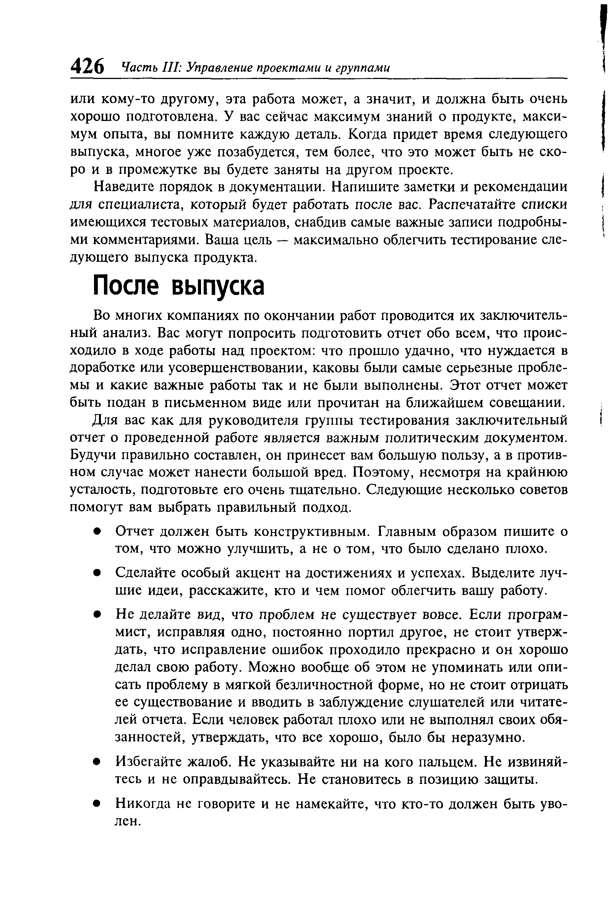

* Не критикуйте дизайн и не вспоминайте о старых ошибках.
* Говорите о проблемах в форме констатации, в нейтральной безэмоциональной манере.
* Если вы считаете выпущенный продукт плохим, хорошо подумайте, прежде чем сказать об этом именно сейчас. Не забывайте, что тестировщик сознательно настраивается на поиск недостатков, это обязательная психологическая составляющая его работы. Тестировщик должен считать продукт плохим, желать его сбоев. Поэтому ваша оценка может быть необъективной, и вполне вероятно, что какое-то время спустя она изменится.

Однако, даже если продукт и в самом деле халтурный, заявлять об этом вовсе не обязательно. Если вы хорошо сделали свою работу, руководству и так об этом известно. Это вопрос его политики и внутренних стандартов качества. Может быть, стоит просто улыбнуться и поискать другую работу.

“Хорошо подумайте” вовсе не означает “никогда не говорите”. Если, на ваш взгляд, вопрос о стандартах качества или процессе разработки может быть конструктивно решен и это пойдет компании на пользу, поднимайте его.

* У слушателей или читателей вашего отчета ни в коем случае не должно сложиться мнение, что вы плохо сделали свою работу. Самокритика полезна, но не в данной ситуации. И она всегда должна сопровождаться конструктивными решениями.
* Будет замечательно, если ваш отчет сможет сначала прочитать хороший друг, мнению которого вы доверяете.

# Глава 14
# Управление группой тестирования

## Назначение этой главы

Поднятые в этой главе вопросы представляют интерес главным образом для руководителей группы тестирования. Однако перед вами вовсе не учебное пособие для руководящего персонала. Скорее, это описание нашего собственного опыта, принципов и приемов, помогавших нам в работе, и ошибок, которых легко можно избежать.

Наше видение роли группы тестирования в обеспечении качества разрабатываемого компанией продукта очень отличается от общепринятого. Традиционно считается, что за качество целиком и полностью отвечает руководство компании. Однако, на наш взгляд, руководителю группы тестирования вовсе не обязательно ограничиваться принятыми в компании стандартами качества, особенно если эти стандарты откровенно невысоки. Именно с позиции личной ответственности тестировщиков за качество их работы и самых высоких критериев его оценки и рассматриваются все поднимаемые в данной главе вопросы.

## Обзор

Говоря о руководстве группой тестирования, необходимо в первую очередь определить ее задачи. Какую роль она играет в компании? Традиционно руководители групп тестирования стремятся осуществлять полный контроль за качеством продукта. Наши представления о собственной роли несколько скромнее — мы рассматриваем группу тестирования как техническую службу, в задачи которой входит выполнение определенных работ и предоставление остальным участникам проекта определенной информации.

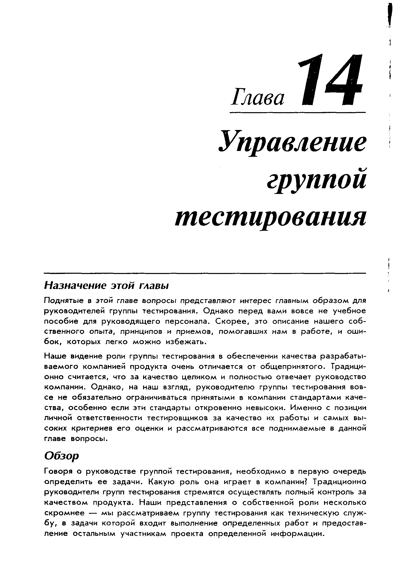

Многие считают, что независимые тестовые лаборатории могут служить хорошим дополнением или даже альтернативой собственным командам тестировщиков. Хорошим дополнением они, возможно, и являются, но уж никак не альтернативой. Группа тестирования держит под контролем все работы по тестированию всех продуктов компании, включая и работу независимых тестовых лабораторий.

Далее в главе рассматривается составление календарного плана работ и способы оценки их производительности. Как оценить время, необходимое для полного тестирования продукта? Как защитить своих подчиненных от авралов, когда приходится либо бесплатно работать день и ночь, либо заслужить репутацию людей, способных отказаться помочь компании в самый трудный момент?

Последняя часть главы посвящена подбору персонала. Каких специалистов необходимо будет нанять? Какой должна быть их квалификация? Как в самых тяжелых ситуациях поднять моральный дух своих подчиненных?

### Библиография

Если вам еще никогда не приходилось занимать руководящие должности, почитайте книгу Друкера (Drucker, 1966).

На наш взгляд, для руководителя группы тестирования понимание современных тенденций в области работы над качеством гораздо важнее, чем дальнейшее изучение литературы по тестированию. Этой теме посвящены книги таких авторов, как Деминг (Deming, 1982), Фейгенбаум (Feigenbaum, 1991), Ишикава (Ishikawa, 1985), Джуран (Juran, 1989).

Техника проведения совещаний хорошо описана в книгах таких авторов, как Дойл и Страус (Doyle & Straus, 1976), Фридман и Бейнберг (Freedman & Weinberg, 1982). Вам наверняка придется вести множество переговоров. Нам нравится, как об этом пишут Фишер и Эри (Fisher & Ury, 1981) и Каррас (Karras, 1986).

Главной работой сотрудников группы тестирования является поиск и документирование ошибок. Бывает, что результаты этой работы заставляют руководство отказаться от проекта. Случается и так, что пересматривается календарный план работ и выпуск продукта откладывается на месяцы и даже годы. Такие задержки могут стоить программистам и их руководителям работы, а начинающей компании — независимости.

Практически любой компании выгодно иметь собственную группу профессиональных тестировщиков. Преимущества, которые она получает, таковы.

* **Компетентность.** Тестировщики специализируются на тестировании, и в этом деле они профессионалы. Они вместе обучаются, конструктивно критикуют друг друга и знают свою работу так, как ее не знает никто другой.

* **Экономия времени.** Когда каждый занимается своим делом: тестировщик — тестированием, программист — программированием, а технический писатель — составлением документации, тогда их рабочее время используется с максимальной эффективностью. Все работы ведутся параллельно, и никто не отрывается от своего основного дела. Ни программист, ни технический писатель все равно не могут протестировать программу как следует, поскольку эта работа требует серьезной подготовки и организации и не может делаться от случая к случаю. Занимаясь тестированием, они бы очень непродуктивно тратили драгоценное время.

* **Независимость.** Поскольку тестировщики подотчетны не руководителю проекта, а своему собственному шефу (компетентному и достаточно независимому), они могут делать свою работу самым наилучшим образом, не заботясь о том, как будет выглядеть руководитель проекта, когда в программе обнаружатся серьезнейшие недостатки.

Руководство группой тестирования — это очень большая ответственность. Это бесконечные проблемы с неопытным персоналом. И очень мало славы. Психологическая нагрузка на руководителей тестовых групп так велика, что они чаще всех других сотрудников меняют место работы. Их политическая роль в компании крайне невыгодна — ведь они изобличают недостатки продукта, которые всегда являются чьими-то недоработками, а значит, сплошь и рядом наживают себе врагов.

Однако не все так мрачно. Можно создать прекрасную команду, которую будут ценить за огромный вклад в повышение качества разрабатываемых продуктов, и при этом сохранить мирные и конструктивные отношения с другими подразделениями компании. Можно сделать это без давления на своих подчиненных, организуя их работу так, чтобы не было авралов и штурмовщины, причем добиться этого не за чужой счет и не жертвуя собственными морально-этическими установками.

В чем же секрет успеха, и что позволит не оступиться на таком трудном пути, когда порой приходится буквально ходить по лезвию бритвы?

Честность, профессионализм и уважение к людям являются главным залогом успеха руководителя группы тестирования.

## Роль группы тестирования

Существует четыре основных типа тестовых групп. У каждой из них своя роль в компании и свои задачи.

* **Группа контроля качества** следит за соблюдением стандартов.
* **Группа обеспечения качества** пытается тем или иным способом гарантировать соблюдение стандартов.

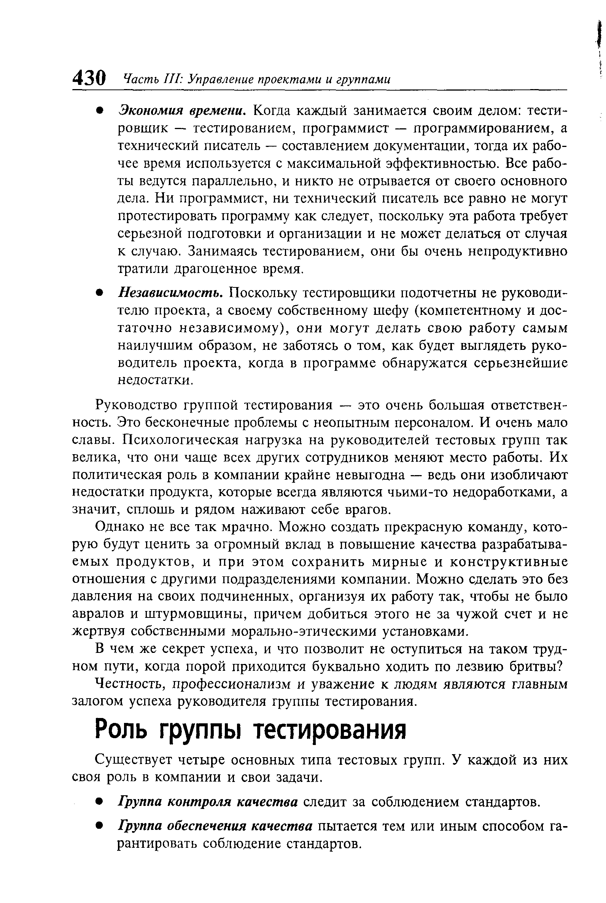

* *Служба тестирования* ищет и документирует ошибки.
* *Служба поддержки разработки* выполняет ряд технических задач, и в том числе тестирование.

## Группа контроля качества

Теоретически это очень влиятельное подразделение. Инспектор *группы контроля качества (Quality Control)* может задержать выпуск продукта до тех пор, пока не будут соблюдены все стандарты и процедуры и исправлены все ошибки. Какой заманчивой кажется сотрудникам служб тестирования и разработки такая власть! Но ничто не дается даром.

Инспектор группы контроля качества не просто снимает с конвейера пару бракованных банок консервов. Он останавливает всю линию, возможно, единственную линию компании, и делает это не на пару минут, а на несколько дней, недель или месяцев. Руководство компании реагирует на такие события немедленно и может запросто отменить решение группы контроля качества и распорядиться выпускать продукт, каким бы ни было его качество.

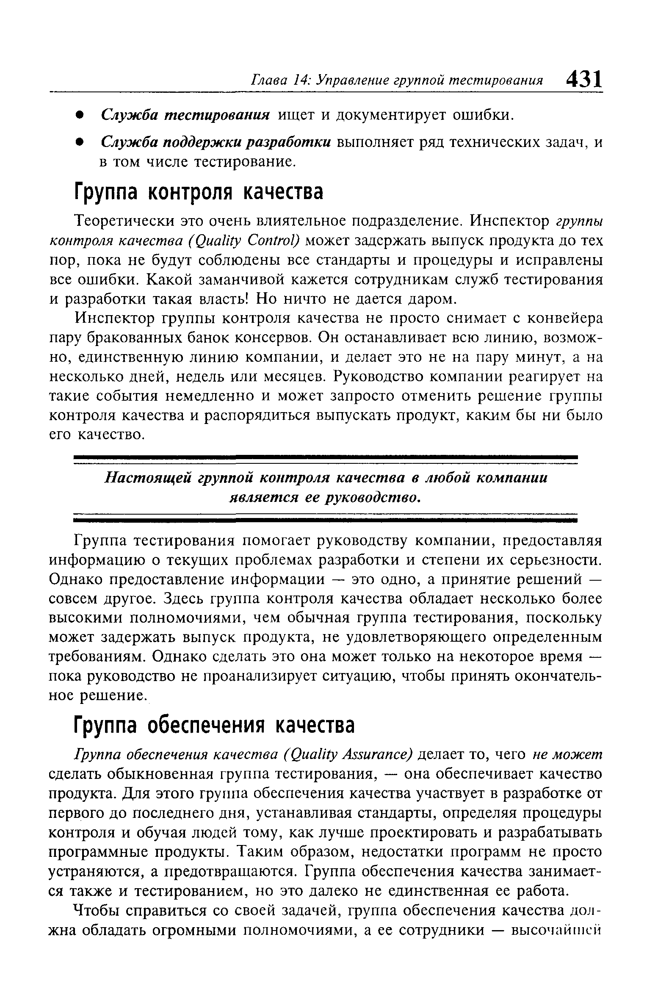

Группа тестирования помогает руководству компании, предоставляя информацию о текущих проблемах разработки и степени их серьезности. Однако предоставление информации — это одно, а принятие решений — совсем другое. Здесь группа контроля качества обладает несколько более высокими полномочиями, чем обычная группа тестирования, поскольку может задержать выпуск продукта, не удовлетворяющего определенным требованиям. Однако сделать это она может только на некоторое время — пока руководство не проанализирует ситуацию, чтобы принять окончательное решение.

## Группа обеспечения качества

*Группа обеспечения качества (Quality Assurance)* делает то, чего не может сделать обыкновенная группа тестирования, — она обеспечивает качество продукта. Для этого группа обеспечения качества участвует в разработке от первого до последнего дня, устанавливая стандарты, определяя процедуры контроля и обучая людей тому, как лучше проектировать и разрабатывать программные продукты. Таким образом, недостатки программ не просто устраняются, а предотвращаются. Группа обеспечения качества занимается также и тестированием, но это далеко не единственная ее работа.

Чтобы справиться со своей задачей, группа обеспечения качества должна обладать огромными полномочиями, а ее сотрудники — высочайшей

квалификацией в целом ряде профессий. Они должны быть высококлассными программистами, техническими писателями, руководителями, проектировщиками и аналитиками. Иначе им просто не будут доверять.

В любой компании имеется группа, отвечающая за определение стандартов, обучение персонала, управление работой и повышение ее эффективности, — это руководство компании. Именно оно обеспечивает качество выпускаемых продуктов.

С политической точки зрения создание в компании отдельной группы обеспечения качества — это палка о двух концах. Ведь за качество продукта должен отвечать каждый, кто так или иначе участвует в разработке, и особенно руководство компании. Если же у людей появляется хоть малейшая возможность переложить эту ответственность на кого-то другого, они немедленно ею пользуются. Даже руководитель проекта может заявить: «Мое дело — вовремя выпустить продукт, а за его качество отвечает соответствующая группа». Любому, кто достаточно долго проработал тестировщиком, наверняка не раз приходилось слышать подобные высказывания.

## Служба тестирования

В задачи службы тестирования (*Testing Services*) входит поиск ошибок и недостатков программы, их описание и предоставление этой информации всем, кому она необходима. Решений относительно выпуска продукта руководитель службы тестирования не принимает, он только предоставляет руководству информацию о том, насколько продукт протестирован и каково его качество.

Роль службы тестирования в разработке продукта может быть различной. В некоторых компаниях основными тестировщиками считаются сами программисты, а служба тестирования им только помогает.

Как бы там ни было, служба тестирования отвечает за техническую сторону этой работы: анализ объекта тестирования, проектирование и подготовку тестов, их выполнение и документирование. Все это требует определенной квалификации, которая имеет полное право быть предметом профессиональной гордости сотрудников службы. Ее руководитель должен поощрять это чувство, которое способствует созданию в коллективе благоприятного психологического климата и профессионального энтузиазма.

Как известно, многим людям свойственно избегать ответственности и по возможности перекладывать ее на других. Именно поэтому руководители проекта часто пытаются переложить ответственность за качество продукта на службу тестирования. Но это в корне неверно. Поэтому, если руководитель проекта утверждает, что программисты вообще не должны тестировать написанный ими код, или хочет, чтобы вы взяли на себя ответственность за каждую имеющуюся в программе ошибку, не поддавайтесь на провокацию.

*За качество продукта отвечает руководитель проекта. Служба тестирования только снабжает его технической информацией, сопровождая данные собственной интерпретацией.*

Все это вовсе не означает, что служба тестирования вообще ни за что не отвечает. Она отвечает за качественное тестирование, интерпретацию его результатов и их своевременное предоставление руководству, документирование своей работы. Но ни контролирующей, ни руководящей роли у нее нет. Участие службы тестирования в управлении проектом скорее косвенное, чем непосредственное. Ее сила заключается в собираемых данных и умении правильно их представить. И сила эта немалая. Переговорами и убеждением нередко удается достичь гораздо большего, чем просто отменой выпуска продукта или вводом новых процедур и стандартов.

Серьезной проблемой, с которой сталкивается руководитель службы тестирования, является узость ее функций. Из-за этого у части персонала группы мало возможностей для профессионального роста. Тестировщики, которые хотят заниматься этой работой всегда, такие возможности имеют: они могут совершенствоваться в своем деле, изучать новые технологии тестирования и его автоматизации, новые подходы к планированию работ, новые стандарты. Но как быть с теми сотрудниками, которые стремятся сделать карьеру, чьи конечные цели лежат далеко за пределами тестирования?

## Служба поддержки разработки

Концепция службы поддержки разработки (*Developing Services*) является расширением концепции службы тестирования. Обе они являются службами, а значит, предоставляют чисто технические услуги — это не административные, не контролирующие и, как правило, аполитичные группы. Они помогают улучшить продукт, созданный другими сотрудниками (программистами), используя для этого профессиональные навыки, которых у программистов нет. Если служба тестирования только тестирует продукт, то у службы поддержки разработки есть и другие задачи. Ее сотрудники принимают в разработке гораздо большее участие, а значит, имеют и больше возможностей для профессионального роста.

Основной задачей службы поддержки разработки остается тестирование. Но в зависимости от нужд конкретной компании могут выполняться следующие задачи.

* Отладка.
* Техническая поддержка пользователей, особенно в первые недели после выпуска продукта.
* Редактирование копии руководства пользователя.

* Техническое редактирование руководства (с правом вносить изменения, которого обычные тестировщики не имеют).
* Анализ эксплуатационных характеристик продукта.
* Сравнительная оценка продукта.
* Изучение пользовательского удовлетворения продуктом.

Такой широкий круг задач позволит большинству тестировщиков расширить свой профессиональный опыт и найти работу по душе. Расспросите своих подчиненных, какая деятельность им больше нравится, и соответственно распределите дополнительные обязанности. Однако имейте в виду, что их выполнение не должно превалировать над тестированием, которое всегда остается основной работой службы поддержки разработки.

## Рекомендации

На наш взгляд, концепция служб гораздо более удачна, чем традиционные концепции групп контроля и обеспечения качества. Идея службы поддержки разработки нам очень нравится, но на деле нам еще ни разу не пришлось опробовать ее полный вариант. Что касается службы тестирования, то это проверенная временем и прекрасно зарекомендовавшая себя структура. Однако ее руководитель должен уделять самое пристальное внимание возможностям карьерного роста своих подчиненных, иначе в группе будет сильная текучесть кадров.

## Группа тестирования — не избавление программистов

Если в подразделении разработки программного обеспечения нет группы тестирования, программисты знают, что правильная работа программы лежит полностью на их ответственности. Однако как только такая группа появляется, программисты расслабляются и некоторые ошибки остаются ими незамеченными. (Собственно говоря, ведь за это тестировщикам и платят, не так ли?)

Эта ситуация не совсем верна. Программисты обязаны тщательно тестировать свои программы, они должны заботиться об их правильности и стабильности. Зная программный код как свои пять пальцев, они находят ошибки гораздо быстрее тестировщиков, причем могут обнаружить такие проблемы, которые тестировщикам самостоятельно не найти. В свою очередь, тестировщики анализируют программу с иной точки зрения и видят те ее недостатки, которых не замечают программисты. Поэтому для полноценного тестирования программы необходимы объединенные усилия обеих сторон.

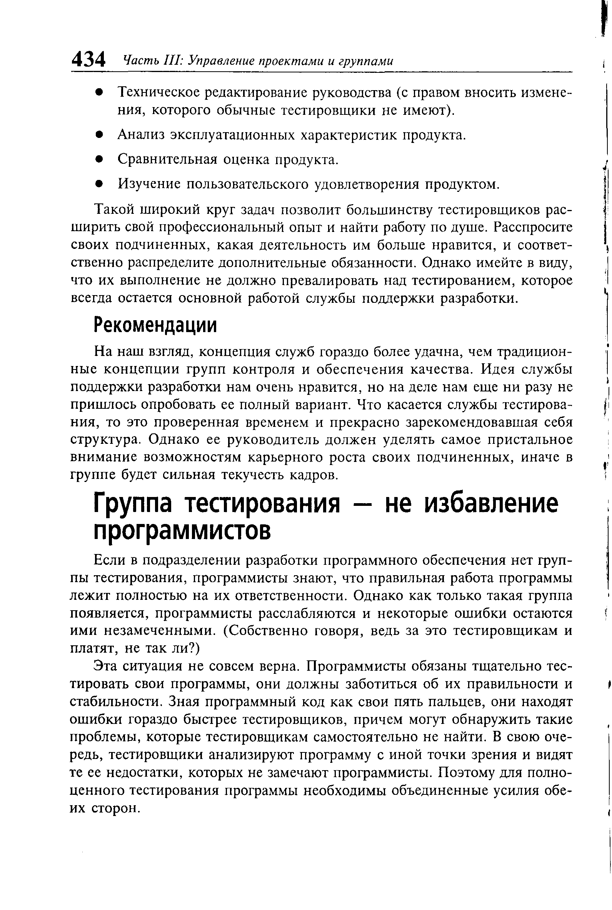

Поиск ошибок программистами сравнительно более дешев. Вспомните рисунок 3.1 из главы 3 — чем раньше проблема выявлена, тем дешевле обходится ее решение. Этому есть несколько причин.

* Программисту нет нужды повторять тесты, чтобы выяснить, что идет не так. Он сразу обращается к программному коду, где быстро находит причину ошибки и немедленно ее исправляет.
* Программисту не приходится описывать проблему для кого-то еще.
* Программист не тратит времени на выяснение того, как должна работать программа. Ему не нужно составлять отчет о проблеме, отслеживать ответные действия и комментарии других сотрудников и печатать итоговые и сводные отчеты. Он не занимается никакой бумажной работой — просто быстро находит и исправляет ошибку.

Нередко в ходе проекта получается, что программисты тестируют свою работу все меньше и меньше. Часто это происходит под давлением не в меру амбициозного руководителя проекта, который таким образом пытается ускорить разработку, невзирая на то, что в результате страдает качество продукта. Когда эта ситуация достигает своего предела, только что написанный программный код сбоит сразу же, как только попадает в руки тестировщиков.

Хотя эта тенденция и мешает разработке, с ней приходится считаться. Набирая команду тестировщиков, имейте в виду, что вам придется выполнять и некоторую лишнюю работу, которую в идеале должны были бы делать программисты. Это одна из причин того, почему мы рекомендуем составлять команду как минимум из троих тестировщиков, не считая их руководителя.

## Альтернатива: независимые тестовые агентства

Вовсе не обязательно, чтобы компания тестировала разрабатываемые программные продукты исключительно своими силами. Можно обратиться к услугам фирмы, специализирующейся на этой работе. Получив программу и черновики руководства, сотрудники этой фирмы проведут ряд циклов тестирования.

Традиционно считается, что продукт будет надежнее, если его протестирует абсолютно независимая компания.

Так утверждается во многих книгах по тестированию программного обеспечения. Теоретически у высокопрофессиональных тестировщиков, которые ни от кого не зависят и не испытывают давления со стороны руководства проекта, гораздо больше возможностей. Но наш собственный опыт этого не подтверждает. Напротив, имея дело с независимыми тестовыми агентствами, мы сталкивались с целым рядом проблем.

* Тестовые агентства не так независимы, как кажется. Они работают по контракту и заинтересованы в его продлении. Следовательно, их главная цель — не протестировать продукт как следует, а удовлетворить заказчика, которым является руководство проекта. И если руководителю проекта хочется, чтобы продукт выглядел лучше или быстрее ушел в производство, независимое агентство будет пропускать проблемы, лишь бы быстрее объявить, что все в порядке.

* Стандарты агентства могут быть недостаточно высоки. В частности, сотрудники агентства едва ли станут критиковать дизайн продукта. Если плохо спроектированная программа полностью соответствует спецификации и руководству пользователя, тестовое агентство выдаст заключение о ее правильности и отсутствии каких бы то ни было проблем.

* Персонал тестового агентства может не обладать достаточной квалификацией. В одном из известных нам агентств работали необученные студенты. Их руководитель имел опыт программирования, но в жизни не прочел ни одного учебника по тестированию. Едва ли он имел хоть какое-нибудь представление о том, что такое граничные значения данных и зачем их тестировать. Хотя сотрудники большинства тестовых агентств более профессиональны, упомянутая фирма до сих пор работает. Так что не стесняйтесь как следует побеседовать с персоналом фирмы, прежде чем подписывать с ней контракт.

Примите во внимание и тот факт, что у тестового агентства большие накладные расходы, так что вы платите за каждого его тестировщика втрое больше, чем он в действительности получает. Если, например, тестовое агентство получает от вас $24 за каждый час работы одного тестировщика, ему будут платить только $8 в час. Таких низкоквалифицированных сотрудников, которые согласились бы работать за эту плату, мы никогда не нанимаем.

Нам приходилось читать огромное количество плохо составленных отчетов о проблемах, предоставленных тестовыми агентствами. В то же время собственнные наши сотрудники проходят специальное обучение и выполняют такую работу всегда качественно.

* Агентства пропускают значительные участки программы. Например, нам никогда не приходилось встречать тестов для условий гонок, разработанных независимыми агентствами. Зато мы видели катастрофические ошибки, которые были вызваны ситуациями гонок и которые тестовые агентства пропустили или неверно документировали.

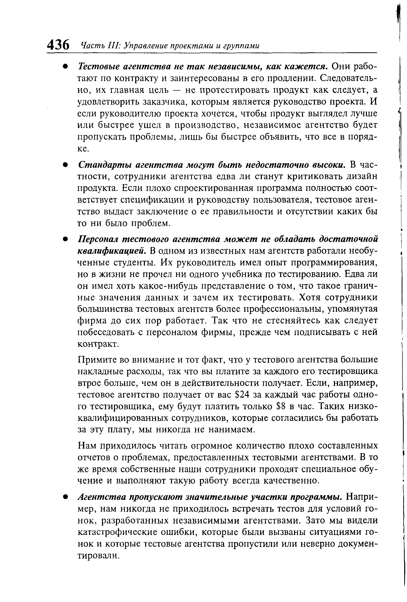

Еще один пример: агентство, получившее $250 тыс. за тестирование продукта средней сложности, практически не проработало его выходные документы. Убедившись, что программа правильно вычисляет выходные значения, сотрудники не удосужились проверить, как она отображает эти значения в графиках и диаграммах, где оказался целый ряд серьезных ошибок.

* *Агентства могут не обеспечивать достаточного контроля и поддержки тестовых работ проекта.* Не думайте, что, как только подписан контракт с независимым агентством, собственных тестировщиков можно тут же перебросить на другой проект. Каким бы хорошим ни было агентство, кто-то должен контролировать его работу, взаимодействовать с его сотрудниками, обучая их принятым в компании стандартам, изучать найденные ими ошибки и следить, чтобы проблемы, о которых они сообщают, вовремя решались.
* *Вовсе не обязательно, что агентство поможет вам реалистически спланировать бюджет тестирования.* Заключая договор на два цикла тестирования, планируйте, что потребуется еще и третий, четвертый и т.д. Кроме того, не ждите, что продукт будет протестирован за меньшее количество циклов, чем понадобилось бы вашей собственной группе.
* *Обычно агентство недостаточно знает тестируемый программный продукт.* Оно может не знать, как должны работать подобные программы, каковы преимущества вашей, не знают требований рынка и того, на какие уступки конструкторы продукта готовы пойти, а на какие — нет. Независимые тестировщики плохо представляют себе процесс реальной эксплуатации продукта и не знают, в чем пользователь может нагружать программу до предела и какие граничные значения данных он может попытаться превысить.

Итак, продумайте, что вы хотите получить от тестового агентства. Учтите, что все это будет стоить немалых денег и времени. Решите, нужны ли вам полностью документированные тестовые материалы, пригодные для повторного использования. Как насчет автоматизированных тестов? Возможно, все, что вам требуется, — это несколько циклов основательного тестирования без подробных сопроводительных материалов. Только четко определив свои нужды и приоритеты, можно приступать к поиску соответствующего тестового агентства и переговорам о контракте.

В целом, на наш взгляд, результаты работы независимых тестовых агентств можно назвать посредственными. Кое-что они делают неплохо, и многие компании успешно пользуются их услугами.

У независимых тестовых агентств есть и определенные достоинства. В частности, их услуги можно использовать как основу для собственной

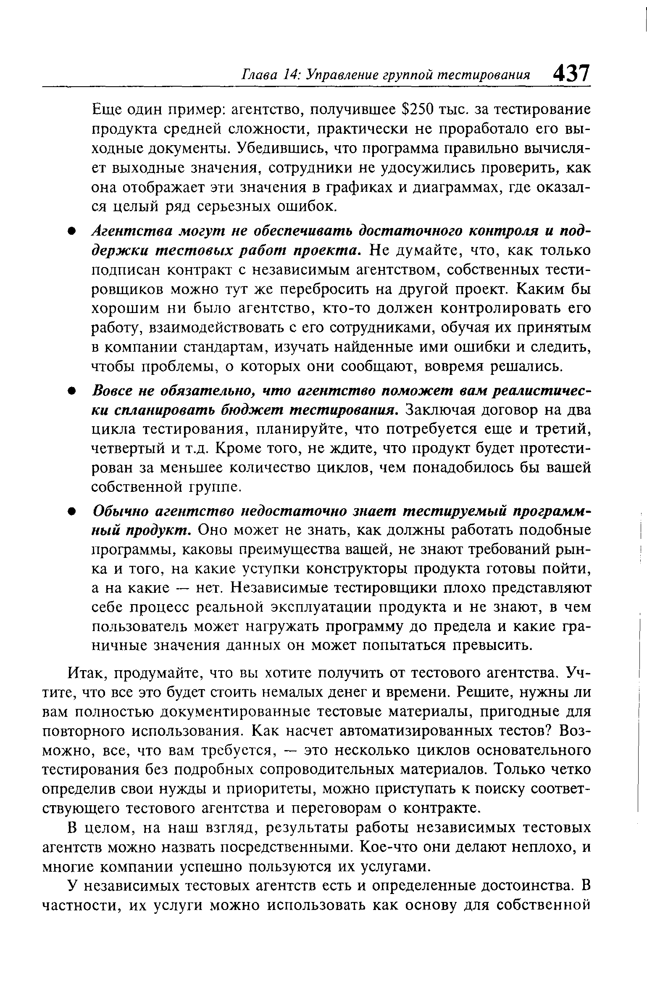

работы. Вместо того чтобы платить за длительное тестирование, можно заказать агентству разработку плана тестирования, наборов тестов и предложений по дальнейшей работе. Это задание достаточно сложное, и агентству придется поручить его своим лучшим специалистам. Однако вы получите то, за что заплатите. У специалистов агентства наверняка гораздо больший опыт тестирования, чем у вас, они работали с большим количеством разнообразных типов программного обеспечения и могут предложить тесты для выявления проблем, которые вам никогда и в голову бы не пришли, или же интересные и нестандартные способы анализа и тестирования программы. Объединив их работу со своей, можно получить прекрасные результаты, а заодно и кое-чему научиться.

Последняя рекомендация: заключая контракт с тестовым агентством, назначьте для тестирования продукта и несколько собственных сотрудников. Их работа будет заключаться в следующем.

* *Воспроизводить каждую ошибку, найденную сотрудниками агентства.* При необходимости ваш персонал должен дополнять отчеты, чтобы четкость описания ошибок соответствовала стандартам компании.
* *Искать связанные проблемы.* Это отнюдь не дублирование работы агентства. Ваш персонал знает продукт и его разработчиков гораздо лучше, а значит, знает, где искать проблемы и какими они могут быть.
* *Критически анализировать пользовательский интерфейс программы* независимо от того, входит ли это в обязанности сторонних тестировщиков. Цели компании и стиль ее продуктов известны вашим сотрудникам лучше, чем сотрудникам агентства, которым трудно судить, соответствует ли данный сомнительный аспект программы стандартам компании или это явная недоработка.
* *Оценивать охват продукта проводимым тестированием.* Все ли важные аспекты и области программы тестируются сотрудниками агентства? Ищутся ли все возможные типы ошибок? В одних случаях ваши сотрудники будут указывать на слабые места в работе тестировщиков агентства, в других — разрабатывать и выполнять недостающие тесты самостоятельно.

Итак, независимое тестовое агентство не решает всех проблем компании и не может от начала и до конца взять на себя ответственность за полноценное тестирование продукта. Найм сторонних специалистов может служить лишь дополнением к вашей собственной работе. Будет ли это дополнение значительным или совсем небольшим, ответственность за качество тестирования целиком лежит на вас и компании все равно необходимо персонал, контролирующий работу тестового агентства и выполняющий то, чего агентство сделать не может.

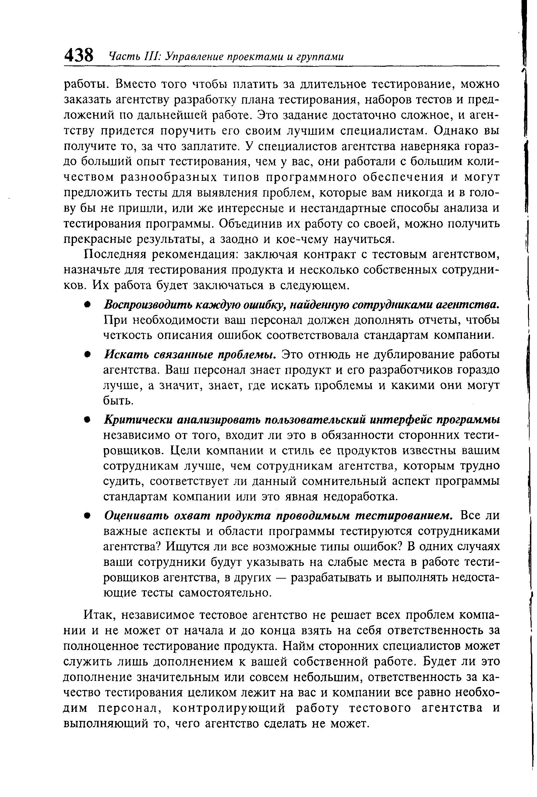

## Советы по планированию

Как руководитель группы тестирования вы отвечаете за часть работ по планированию проекта. Сроки тестовых работ оценивать очень сложно, поскольку они зависят от работы других сотрудников. Если программисты не будут укладываться в график, затянется и работа вашей группы. То же самое случится, если ошибок в программе будет больше, чем предполагалось, или если пользовательский интерфейс будет постоянно меняться. Хотя все эти трудности вполне объективны, прятаться за ними не следует. Обязанность руководителя — предусмотреть все возможные проблемы и составить план работ своей группы с их учетом. Вот каковы его цели.

* *Предоставить необходимую информацию руководителю проекта.* Руководитель проекта должен знать, какие задачи стоят перед группой тестирования и сколько времени потребуется на их выполнение.
* *Продумать возможные экстренные меры для обеспечения своевременного выпуска продукта и выявить ресурсы для его ускорения.* Заранее выделите те задачи программистов и технических писателей, которые могут задержать другие части общей работы и поэтому обязательно должны быть выполнены вовремя. Определите те этапы разработки, на которых дополнительные ресурсы могут значительно ускорить ее ход. Многие руководители проекта охотно идут на выделение этих ресурсов, особенно если речь идет о дополнительных тестировщиках или программистах. Ведь в конечном счете, оплатив определенное количество человеко-дней и выпустив продукт на неделю раньше, компания сэкономит на оплате недельного труда всех тех, кто работает над проектом. И при этом она раньше выйдет на рынок и раньше начнет получать прибыль. Так что подобные затраты окупаются с лихвой.
* *Быть честным со своими подчиненными.* Руководитель проекта может попытаться ускорить выпуск продукта за счет сверхурочной неоплачиваемой работы персонала. Однако полученная при этом дополнительная прибыль может дорого обойтись для вас и вашей компании: вы теряете право называться порядочными людьми, ухудшаете психологический климат в коллективе, качество работы усталых сотрудников оставляет желать лучшего, а текучесть кадров сильно повышается. Зато руководитель, добившийся такой ценой ускорения выпуска продукта, становится героем.

> *Одной из главных обязанностей руководителя группы тестирования является защита своих подчиненных.*

* **Повысить производительность труда.** Люди с готовностью постараются уложиться в жесткий, но выполнимый график. Однако, если плохое планирование приведет к необходимости постоянной сверхурочной работы, не ждите от них энтузиазма. Уставшие сотрудники становятся невнимательными, работают неохотно, перестают предлагать усовершенствования, чтобы не затянуть проект еще сильнее, и наконец, некоторые из них, как правило самые высококлассные специалисты, просто увольняются.

Итак, честные и объективные оценки сроков работ жизненно необходимы и вам, и компании. В следующих разделах приведены советы по их формированию.

### Оценка производительности и продуктивности

В главе 6 рассказывалось о том, почему систему отслеживания проблем ни в коем случае нельзя использовать для оценки производительности труда программистов. Теперь же мы поговорим о том, какую пользу может принести отслеживание производительности собственных подчиненных. Разница здесь в том, что программисты не являются вашими подчиненными. Поэтому любые попытки оценки их деятельности будут восприняты в штыки. С другой стороны наблюдение за производительностью собственного персонала поможет улучшить его работу и не приведет к конфликтам, поскольку результаты наблюдений не выйдут за стены вашей рабочей комнаты.

Страстным приверженцем оценки производительности персонала является такой известный автор, как Деминг (Deming, 1982). Он считает, что получаемые данные позволяют значительно повысить качество работы. Вот какие преимущества может вам дать оценка производительности работы сотрудников группы тестирования.

* Можно определить, сколько времени требуется в среднем на выполнение конкретной задачи. На основе этих данных можно планировать работу в дальнейшем.
* Если например, известно, что в среднем тестировщик находит около 8 ошибок в день, обычно от 1 до 25, вы не удивитесь, если кто-то из сотрудников найдет за день 24 ошибки, но, если их окажется 120, вы сразу поймете, что здесь что-то не так.
* Наблюдая за динамикой показателей производительности подчиненных, можно оценить, каковы результаты ваших собственных усилий по ее повышению. Помогает ли данный тип обучения? Ускоряет ли работу автоматизация определенных тестов или видов деятельности?

Для оценки пользы усовершенствований необходима возможность анализа динамики производительности работ.

Вот несколько примеров того, что можно определить.

* *Среднее количество циклов тестирования.* Наш опыт показывает, что типичная программа достигает коммерчески приемлемого качества после восьми полных циклов тестирования. Однако эта оценка не универсальна — для некоторых продуктов могут потребоваться десятки циклов, а есть и такие простые программы, которые отлаживаются за несколько циклов.
* *Длительность типичного цикла тестирования.* Этот показатель имеет смысл только тогда, когда каждая версия программы или определенной ее части всегда проходит полный цикл тестирования. Если же новая версия программы поступает каждую неделю независимо от того, насколько протестирована предыдущая, данная оценка теряет смысл.
* *Количество ошибок, документируемых за день одним тестировщиком.* Если один тестировщик находит за день в среднем 5 ошибок и вы предполагаете, что всего в программе их будет найдено около 1000, значит, на ее тестирование потребуется 200 человеко-дней.
* *Время тестирования одного устройства.* При этом время настройки устройства следует учитывать отдельно.
* *Количество страниц документации, проверяемых за один час.* Конечно, это время зависит от типа документации и целей ее проверки.
* *Количество сообщений об ошибках, тестируемых за один час.* Сколько времени займет тестирование всего блока обработки ошибок?
* *Часть (количество страниц) плана тестирования, выполняемая за один час.* Сколько времени уйдет на выполнение всего плана?

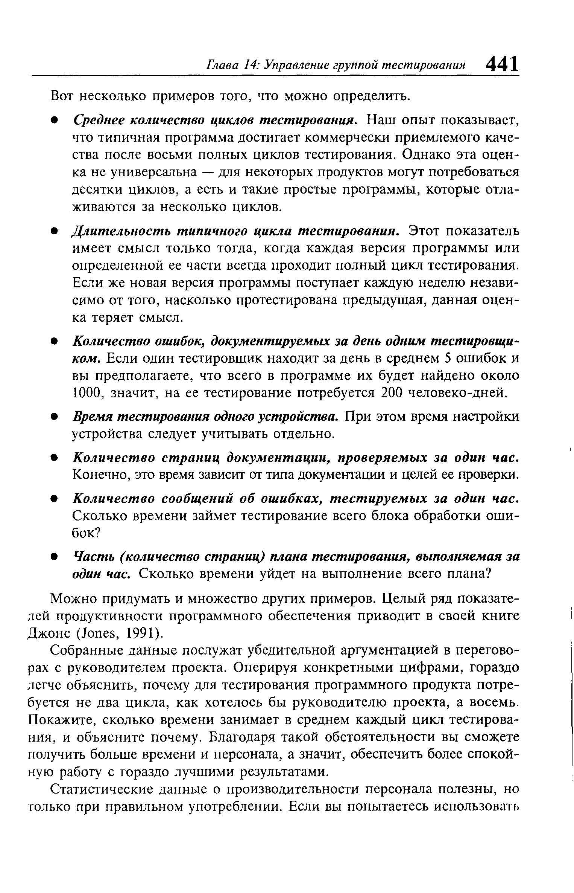

Можно придумать и множество других примеров. Целый ряд показателей продуктивности программного обеспечения приводит в своей книге Джонс (Jones, 1991).

Собранные данные послужат убедительной аргументацией в переговорах с руководителем проекта. Оперируя конкретными цифрами, гораздо легче объяснить, почему для тестирования программного продукта потребуется не два цикла, как хотелось бы руководителю проекта, а восемь. Покажите, сколько времени занимает в среднем каждый цикл тестирования, и объясните почему. Благодаря такой обстоятельности вы сможете получить больше времени и персонала, а значит, обеспечить более спокойную работу с гораздо лучшими результатами.

Статистические данные о производительности персонала полезны, но только при правильном употреблении. Если вы попытаетесь использовать

их для давления на подчиненных, утверждая, что они работают недостаточно быстро, ничего хорошего от этого не ждите. В частности, такой известный автор, как Деминг (Deming, 1982), решительно выступает против подобного использования собранной информации.

> *Если вы работаете в компании, где статистические данные о производительности труда могут быть использованы против отдельных тестировщиков, не собирайте эту информацию.*

## Определение и оценка каждой задачи

Прежде чем пытаться оценить общий объем необходимого тестирования, составьте полный список его задач. В этом списке ничто не должно быть упущено. Понятно, что составить такой список и оценить сроки выполнения каждой из задач не так-то просто, и одному человеку с этим не справиться. Вот хороший способ, как это сделать.

Попросите руководство выделить вам на день или два конференц-зал или большую комнату. Соберите вместе всех тестировщиков, которым предстоит работать над продуктом. Если проект невелик и программу будет тестировать один-единственный сотрудник, пригласите еще кого-нибудь, имеющего опыт тестирования и знающего продукт (возможно, того, кто тестировал его предыдущий выпуск). Принесите на собрание спецификацию, план тестирования, план тестирования предыдущего выпуска, руководства пользователя, заметки и любые другие материалы, которые помогут в определении задач.

Возьмите лист бумаги, запишите на нем все основные задачи тестирования и прикрепите его к стене. У вас может получиться 5, 10 или 20 крупных задач — едва ли больше. Затем для каждой из основных задач перечислите на отдельном листе бумаги все ее составляющие. Эти листы также развесьте по стенам. Некоторые из подзадач могут оказаться настолько сложны, что потребуют дальнейшего разбиения. Их составляющие тоже перечислите на отдельных листах. Придумав еще одну базовую задачу, вы будете дописывать ее в главный список, а затем брать новый лист бумаги и перечислять на нем все ее составляющие.

Когда все будет готово, можно начинать собрание. Вначале каждый сотрудник несколько раз обойдет комнату, переходя от списка к списку и дописывая в него новые элементы. Каждый должен увидеть, что дописали другие, и убедиться, что больше добавить нечего.

Собрание должно проводиться по принципу мозгового штурма. Его первая цель — собрать максимум идей. Поэтому пока не критикуйте ни одну из них. Пусть все, что приходит людям в голову, попадет на бумагу. Отобрать правильные идеи вы сможете позднее.

Составив списки, соберитесь все вместе для группового обсуждения. По очереди выбирая из списка каждую задачу, попытайтесь определить, сколько времени потребуется на ее выполнение. Везде, где только возможно, разбивайте задачи на более мелкие и определяйте время выполнения их составляющих. Оценивая время, записывайте три значения: кратчайший срок, длиннейший и средний.

Нередко оценки, даваемые вашими сотрудниками, будут казаться вам преувеличенными. Это нормально. Поощряйте совершенно свободное выражение людьми своего мнения, только пусть они обязательно обосновывают высказываемые заключения. Ведь в конечном счете должна составиться реальная картина, а не нечто желаемое, но невыполнимое.

> *Не допускайте, чтобы сотрудник, высказавший неверную на чей-либо взгляд оценку, почувствовал себя глупым или виноватым. Напротив, всячески поощряйте свободное выражение сотрудниками собственного мнения. Оно вполне может оказаться верным. Если же нет, они сами поймут это в ходе дискуссии или некоторое время спустя.*

Когда вы сложите время всех предложенных в ходе обсуждения задач, результат окажется огромным. Он может в 5 или 10 раз превышать запланированную длительность всего проекта. Это нормально. А вот если окажется, что предполагаемые работы по тестированию прекрасно укладываются в график проекта, тогда стоит обеспокоиться.

Теперь, имея четкий список задач, можно приступать к принятию решений.

* Выделите задачи, которые не могут быть выполнены.
* Распределите приоритеты между остальными.
* Решите, какие из задач будут выполнены только частично и какие это будут части. (При этом, выбирая тесты, вы в одних случаях будете полагаться на логику, а в других действовать методом случайного отбора.)
* Выделите задачи, требующие наиболее быстрого выполнения (для тех из них, которые к тому же будут часто повторяться, можно запланировать автоматизацию).
* В случае необходимости напишите подробную и убедительную докладную записку, поясняющую, почему тестирование не может быть выполнено в запланированные руководством сроки или почему вам требуются дополнительные тестировщики, а также чего можно достичь при большем количестве времени, людей или денег.

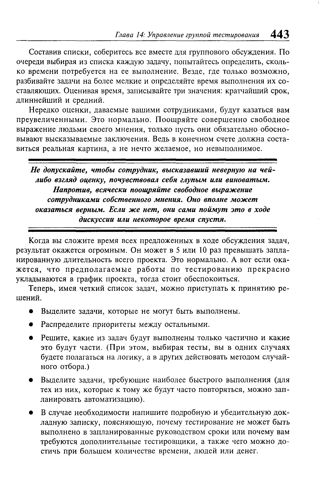

## Классификация проекта

Нередко стоимость работ по тестированию приходится оценивать задолго до того, как у вас появится достаточно информации. Поэтому вам нужна определенная схема классификации проектов с приблизительными оценками их стоимости.

*   *Начните с определения сложности продукта.* Воспользуйтесь трех- или пятибалльной шкалой, от простейшей программы, которую вам когда-либо приходилось тестировать, до многофункционального, сложного для понимания и использования программного продукта.
*   *Затем сделайте предположения о том состоянии, в котором продукт попадет вам в руки.* Снова воспользуйтесь трех- или пятибалльной шкалой. Сколько ошибок предполагается найти в программе? В программах одних руководителей проектов больше ошибок, чем в программах других. То же самое относится и к программистам. Если в давно работающую программу вносится всего несколько исправлений, ошибок будет не много. Если же разрабатывается самый первый выпуск сложного продукта, он будет полон ошибок.
*   Определив шкалы сложности и надежности проектов, можно составить таблицы оценки их стоимости и длительности. Пример такой таблицы с совершенно гипотетическими цифрами приведен на рис. 14.1. Ее данные можно интерпретировать так: на тестирование несложного изменения высоконадежной программы хорошим программистом уходит неделя; более сложное изменение в крайне ненадежной программе (или выполненное плохим программистом) тестируется 64 недели.

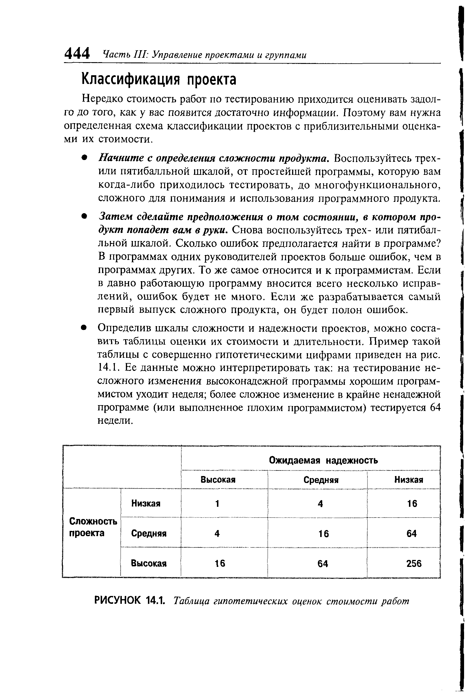

**РИСУНОК 14.1.** *Таблица гипотетических оценок стоимости работ*

Повторяющиеся задачи и задачи, выполняющиеся фиксированное число раз

Одни задачи решаются в ходе проекта только один раз, другие же повторяются многократно.

* **Задачи, выполняющиеся фиксированное число раз.** Большая часть из них выполняется только однажды. Например, только один раз анализируется первый черновик руководства пользователя. Сколько бы еще версий руководства ни проходило через ваши руки, первый черновик тестируется только однажды.
  Бывают и такие задания, которые выполняются заранее известное количество раз. Например, инструкции по установке продукта проверяются обычно трижды: сразу после их написания, перед выходом руководства в печать и в ходе финального тестирования продукта. Сколько бы ни вносилось в программу изменений, насколько бы ни растягивался проект, количество проверок установочных инструкций не меняется.

  Еще одним примером одноразовой работы является написание плана тестирования. Один раз проводится последняя проверка целостности продукта. Однажды выполняются первое приемочное тестирование, сертификация альфа-версии, сертификация бета-версии и многие тесты устройств. Близки к этому типу и многие тесты граничных условий — те, которые выполняются очень редко.

* **Повторяющиеся задачи.** Большая их часть выполняется на каждом цикле тестирования. Например, в большинстве тестовых групп при получении очередной версии программы прежде всего проводится быстрое тестирование ее функциональности.
* **Многие регрессионные тесты** можно проводить на каждом втором или каждом третьем цикле. Это тоже повторяющиеся задачи, и количество их повторений зависит от общей длительности тестирования: если, например, программа пройдет 30 циклов тестирования, эти регрессионные тесты будут выполнены 10 или 15 раз.

Общее количество времени, необходимого для тестирования программы, складывается:
* из суммы длительностей всех фиксированных заданий,
* из среднего количества времени, уходящего на выполнение всех повторяющихся задач в течение одного цикла, умноженного на количество циклов.

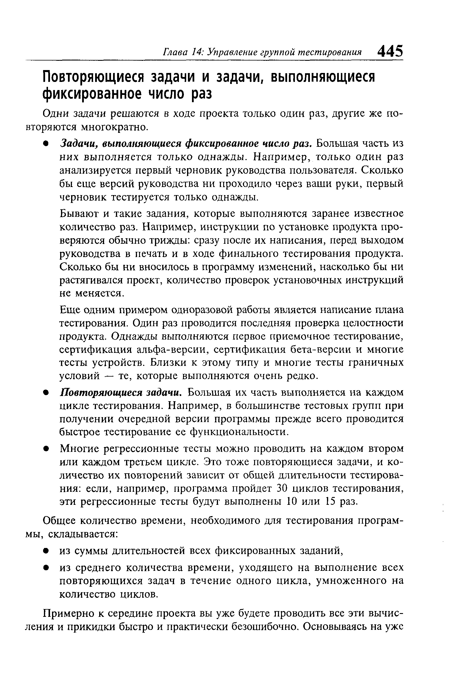

Примерно к середине проекта вы уже будете проводить все эти вычисления и прикидки быстро и практически безошибочно. Основываясь на уже

имеющемся опыте, вы сможете точно оценить количество времени, необходимого для полного завершения тестирования продукта.

## Советы

Вот несколько моментов, которые часто упускают из виду.

* *Если один человек тестирует несколько продуктов*, учтите дополнительное время, которое ему потребуется для переключения между ними. Каждый раз, переходя от одного проекта к другому, такому специалисту необходимо будет вспомнить, на чем он остановился и что делать дальше.
* *Накладные расходы* лучше всего выделить в отдельный список. Кроме основной работы, приличное количество времени уходит на совещания, составление отчетов и прочие подобные дела. Постарайтесь поточнее выяснить, сколько именно, учитывая особенности работы и традиции конкретной компании. Соберите своих людей где-нибудь в кафе в спокойной располагающей обстановке и побеседуйте с ними на эту тему. Подготовьте список затрат времени, неизбежность которых можно убедительно объяснить руководству.

Если ваши подчиненные тратят на тестирование по шесть часов в день, значит, работа прекрасно организована.

* *Изучите индивидуальные особенности своих подчиненных*. Одни люди по природе более быстрые, чем другие. Некоторые охотно остаются после работы. Одни обладают прекрасными способностями к тестированию, а другие лучше справляются с планированием и документированием работы. Кто-то с удовольствием учится новому, а кто-то, напротив, чрезвычайно консервативен. Все это необходимо учитывать при планировании работ и предварительной оценке сроков их выполнения. Разумеется, всегда поручать людям только ту работу, которая им больше всего по душе, вы не сможете, но знать об их желаниях и склонностях просто обязаны.
* *Учтите время, которое потребуется для найма дополнительных сотрудников*. Если, не вкладываясь в график, вы решите нанять новых сотрудников, с ними необходимо будет побеседовать, выполнить стандартные формальности, обучить и ввести их в курс дела. (Подробнее все эти временные издержки описывает в своей книге Брукс (Brooks, 1975).)
* *Если приходится сокращать объем работ, делайте это крайне осмотрительно*. Проведите еще одно планировочное совещание, вернитесь к спискам задач и совместно их пересмотрите, исходя из уже сформировавшегося понимания проекта. Отберите задания, которые не будут выполнены, области программы, которые не будут тести-

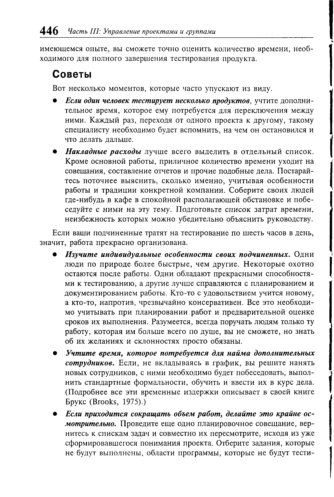](images/Kaner_1999_TestingComputerSoftware/page_443_img_1.png)

роваться со всей обстоятельностью, документы, которые можно не писать. Главным вашим ориентиром должно быть качество продукта: разумеется, оно пострадает, но ущерб должен быть минимальным. Для каждого участника совещания должно быть очевидно, что оставшееся время будет использовано самым наилучшим образом.
- *Совещания.* Совещания — вещь полезная, но не следует проводить их без необходимости или дольше, чем положено. Для тестировщика, напряженно работающего, чтобы уложиться в жесткое расписание, и бесплатно остающегося для этого после работы, каждый час, потраченный на непродуктивном совещании, — это час его сна или времени, которое он мог бы провести с семьей.
Избегайте отчетных собраний. Нет ничего скучнее, чем целый час сидеть и слушать, кто что сделал за истекшую неделю. Если же в компании такие собрания считаются обязательными, разрешайте сотрудникам брать на них с собой какую-нибудь работу.

## Персонал

Управление персоналом — работа не из легких, и вам наверняка пригодятся советы по следующим вопросам:
- Кого нанимать
- Моральная поддержка
- Карьерный рост

### Кого нанимать

Программисты отнюдь не обязательно являются хорошими тестировщиками.

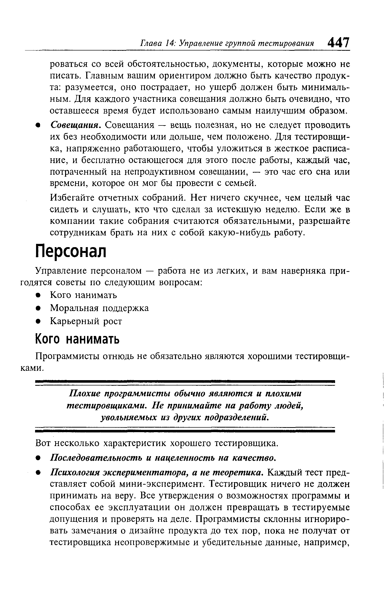

Вот несколько характеристик хорошего тестировщика.
- *Последовательность и нацеленность на качество.*
- *Психология экспериментатора, а не теоретика.* Каждый тест представляет собой мини-эксперимент. Тестировщик ничего не должен принимать на веру. Все утверждения о возможностях программы и способах ее эксплуатации он должен превращать в тестируемые допущения и проверять на деле. Программисты склонны игнорировать замечания о дизайне продукта до тех пор, пока не получат от тестировщика неопровержимые и убедительные данные, например,

информацию о количестве звонков в отдел технической поддержки, вызванных данной проблемой в предыдущем выпуске продукта. Соответственно тестировщик должен уметь найти такие данные, проявить в этом вопросе изобретательность и инициативу.

* *Образование*. Чем его "больше", тем лучше. Особенно ценно университетское образование. Безусловно, полезны исследовательские навыки, особенно в области человеческого фактора, а также все знания и навыки, связанные с компьютером.
* *Некоторый опыт программирования*. Он очень полезен, но все же не является определяющим фактором — целый ряд превосходных тестировщиков, с которыми нам приходилось работать, в жизни не написали ни строчки программного кода. Впрочем, хотя бы один компетентный программист в команде должен быть обязательно. Другие сотрудники смогут время от времени обращаться к нему за советом.
* *Опыт работы со многими компьютерами и разнообразным программным обеспечением*.
* *Знание комбинаторики*. Тестировщик должен уметь приблизительно оценить или же точно вычислить количество тестов, необходимых для полного тестирования определенного аспекта программы. Это бывает полезно во многих случаях, и в частности, позволяет реально соотносить проделанную работу и качество результата.
* *Умение хорошо выражать свои мысли в письменной и устной форме*. Каждому тестировщику постоянно приходится составлять отчеты о выявленных проблемах и устно объяснять их суть — это неотъемлемая часть его работы. Кроме того, он должен уметь предсказать проблемы, которые возникнут у пользователя продукта, увидеть те места в документации и те элементы интерфейса, которые могут быть неверно поняты.
* *Талант поиска ошибок*. Хороший тестировщик никогда не ограничивается рамками формального тестового плана — он копает глубже, он обладает интуицией и воображением, он способен придумывать нестандартные испытания и чувствовать слабые места программы. Этот талант бесценен.
* *Развитое абстрактное мышление*.
* *Умение разрешать сложные и запутанные проблемы, находить выход из тупиковых ситуаций*.
* *Умение эффективно использовать время*. Если этой способности поначалу нет, со временем ее можно развить.

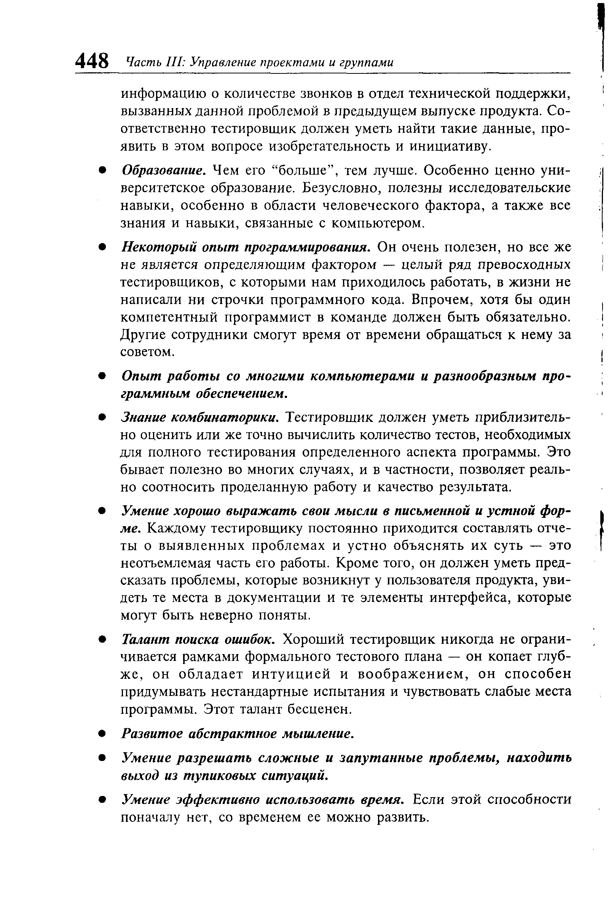

* *Способность к быстрому переключению.* Не всегда тестировщикам приходится часто переключаться между различными заданиями или видами работы, но, как правило, такая необходимость имеется.
* *Навыки планирования* или способность к их развитию.
* *Наблюдательность, терпение, внимание к деталям.*
* *Воображение и способность представить себя на месте другого человека.* Например, тестировщик может спросить себя: “Какие бы у меня возникли сложности, если бы я никогда раньше не работал с компьютером?”
* *Умение читать и писать спецификации.*

Подводя итог, можно сказать, что идеальный тестировщик образован, сообразителен, умеет четко выражать свои мысли, умеет и вникать в детали, и видеть картину в целом, настойчив, но воспитан и обладает здравым смыслом. Он — творческая личность с организаторскими и техническими способностями. Как видите, этот набор качеств несколько отличается от того, который необходим хорошему программисту.

Некоторые асы тестирования являются еще и превосходными программистами, а некоторые талантливые программисты — превосходными тестировщиками. Однако в целом эти два умения не связаны между собой: можно преуспевать на одном поприще и быть посредственностью на другом.

### Моральная поддержка

В пятой главе, рассказывая о составлении отчета о проблеме, мы убеждали читателя всячески щадить чувства программистов. Однако программисты, как и все остальные сотрудники компании, ничуть не заботятся о чувствах тестировщиков. Напротив, вполне разумные люди, имея дело с тестировщиками, часто становятся просто несносны.

Вы будете просить своих подчиненных описывать найденные ошибки очень тактично, сохранять невозмутимость, какие бы отговорки ни находил программист для того, чтобы не исправлять программу. Все это стоит тестировщикам времени и сил. Не удивительно, что люди будут протестовать, особенно в напряженных ситуациях, когда им придется много работать сверхурочно.

Помните, что ваша прямая обязанность — защищать своих подчиненных и оказывать им моральную поддержку.

Поощряйте хорошую работу в личном порядке и публично. Выделяйте наиболее отличившихся сотрудников во время общих совещаний или неформальных мероприятий, отмечайте их успехи записями в личном деле. Если в компании издается газета — прекрасно, пусть об их успехах узна-

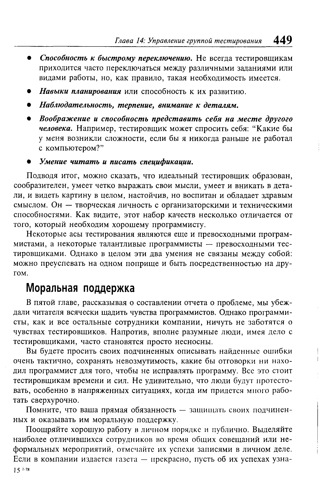

ет вся компания. Если руководство поощряет хорошую работу премиями, обязательно включайте лучших из своих подчиненных в списки кандидатов.

Недостаточно просто следить, чтобы задания выполнялись вовремя. Не ограничивайтесь административным взглядом на вещи — старайтесь вникать в работу каждого из сотрудников, оценивать то, как она выполняется и каково качество результата. Покажите подчиненным, что вы видите и цените, когда кто-то из них:

* проявляет особую дипломатичность;
* составляет особенно подробные и понятные списки функций программы;
* находит особенно интересные ошибки;
* хорошо держится в напряженных ситуациях, сохраняя собранность и высокую работоспособность;
* составляет прекрасные отчеты о проблемах;
* успешно обучает кого-то еще;
* работает сверхурочно;
* берет на себя работу, которой все стараются избежать;
* демонстрирует творческий подход к делу, проявляет инициативу и увлеченность, пытается найти новый способ выполнения определенной задачи, даже если этот способ не срабатывает.

Тестировщикам необходима не только ваша личная поддержка, но и поддержка друг друга. Ваша задача — организовать сплоченный коллектив людей, гордящихся своим профессионализмом, радующихся успехам друга друга и активно поддерживающих своих товарищей. Каждому тестировщику нужен кто-то, с кем можно посоветоваться, обсудить новые идеи, возможно, пожаловаться на свои проблемы или вместе над ними посмеяться. Тестировщик должен чувствовать, что его открытия важны и желанны. В противовес кислой мине руководителя проекта, узнавшего о новой особенно неприятной ошибке, товарищи нашедшего ее тестировщика должны вслух выразить ему свое восхищение.

Для того чтобы в группе можно было создать такую творческую атмосферу энтузиазма и взаимной поддержки, эта группа должна быть достаточно велика — хорошо, если в ней будет как минимум четыре человека.

Постарайтесь оградить тестировщиков от несправедливых нападок со стороны других сотрудников компании. Никогда не повторяйте услышанных жалоб или несправедливых претензий к своим подчиненным. Не говорите им о возможных изменениях графика, пока эти изменения не будут утверждены окончательно. Не заставляйте тестировщиков говорить с неприятными людьми без крайней необходимости.

Дайте руководству компании понять, что каждый раз, когда оно захочет решить свои проблемы за счет ваших подчиненных, ему придется иметь дело с вами и вы будете защищать своих людей всеми возможными способами. Если руководитель проекта хочет, чтобы кто-то из тестировщиков остался работать допоздна, он должен *попросить* вас об этом. Вы, в свою очередь, должны попросить об этом тестировщика, причем в такой форме, чтобы он свободно мог отказаться. И если он откажется, вы сами должны сообщить руководителю проекта, что он не получит желаемого. При этом вы не должны говорить, что выбор был сделан тестировщиком. Ваша обязанность — принять огонь на себя, защищая и оберегая своих людей, где только возможно.

Такой же политики следует придерживаться в отношении изменений графика работ, стандартов, перераспределения заданий между членами команды. Кто бы ни пытался давить на ваших подчиненных, у них всегда должна быть возможность отказаться от ухудшения условий своей работы. Вы же должны активно противостоять такому давлению. Дайте руководству четко понять, что оно никогда и никаким образом не имеет права давить на ваших подчиненных и лишь в самых экстренных случаях может просить их о помощи, выражающейся в более напряженной или сверхурочной работе.

Итак, стойте стеной за своих людей, и пусть они это видят. Тестировщики, как и все остальные люди, делают глупости и совершают ошибки, иногда очень досадные, которые становятся видны всем вокруг. Никогда не высказывайте им свое недовольство публично. Напротив, постарайтесь по возможности сгладить ситуацию, согласитесь, что допущена ошибка, но защитите своих подчиненных. Защищайте их работу, зарплату, должность и положение, их репутацию. Не сомневайтесь, что они это увидят и оценят, а значит, будут больше вам доверять. Только так вы по-настоящему заслужите их уважение.

Прежде чем особенно спорные или политически важные записи и отчеты ваших подчиненных выйдут из стен отдела тестирования, обязательно с ними ознакомьтесь. И если вы согласны с мнением тестировщика, готовьтесь его отстаивать.

Если тестировщик боится идти на какое-то совещание, пойдите вместе с ним. Если это невозможно, пошлите с ним ведущего тестировщика или хотя бы просто приятеля.

Итак, в ответ на честный и самоотверженный труд люди должны чувствовать, что их руководитель поддерживает их во всех, в том числе и рискованных, но правильных действиях, что он поддерживает их и тогда, когда они совершают ошибки, и что его помощь всегда с ними.

## Карьерный рост

Большинство людей хотят профессионально расти. Они хотят учиться новому, приобретать технические навыки, расширять свои профессиональные возможности. Помогите им в этом.

Для многих тестирование является первым шагом в индустрии программного обеспечения. Они планируют стать программистами, техническими писателями, руководителями, консультантами... Вместо того чтобы пытаться удержать их в своей группе, используйте их стремления. Часто талантливые люди или профессионалы с очень нестандартным и ценным опытом оказываются в вашей комнате, ища возможности проверить себя, обогатить свой опыт и знания, изменить направление своей деятельности, а возможно, повторно войти в работу после долгого перерыва. Вы можете предоставить им такую возможность и на полтора-два года получить ценного сотрудника, полного профессионального энтузиазма. Может быть, это прекрасная возможность и для вас?

Интервьюируя очередного кандидата на должность тестировщика, спросите его, почему он выбрал именно это работу. Если это его профессия, подумайте, принесут ли ему пользу полтора-два года работы в вашей компании. Сможет ли он научиться за это время чему-то, что его интересует? Если да, примите этого человека на работу. Не волнуйтесь, если его планы идут гораздо дальше тестирования. Мало кто планирует навсегда остаться тестировщиком. И мало кто из тех, кто надолго остался в этой профессии и стал в ней настоящим асом, предполагал, что будет именно так.

Распределяя работу между членами группы, имейте в виду их планы и стремления. Старайтесь, чтобы люди могли извлечь из каждого занятия максимальную пользу для себя. Иногда можно организовывать сотруднику временную командировку в другую группу, чтобы расширить его профессиональный опыт.

Одни люди будут быстро покидать вас, обучившись всему, что их интересовало. Другие же, напротив, задержатся гораздо дольше, чем планировали. Но все они будут работать с энтузиазмом — а это важнее всего.

Вы будете приобретать новых и новых друзей — навсегда.

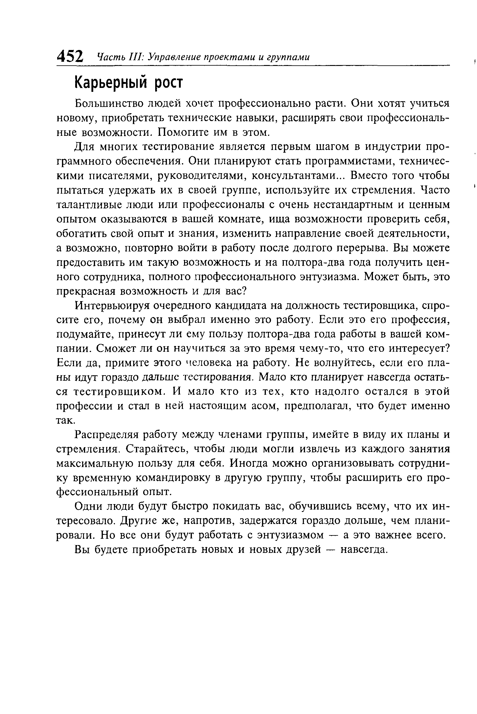

*Приложение*

# Распространенные программные ошибки

### Назначение этого приложения

В данном приложении описано более 400 ошибок. Эти описания очень коротки, в них содержится лишь самая интересная информация.

Список ошибок приведен не только в качестве справочника, но и как основа для дальнейшей работы. Лучше всего прочесть это приложение полностью, от начала до конца, даже если это покажется вам скучным занятием. Если вы всерьез планируете заниматься тестированием программного обеспечения, не пожалейте времени. Вы получите прекрасную практическую базу — широкую и очень полную картину всех возможных проблем и ошибок, с которыми вам когда-либо придется сталкиваться.

> *Набор тестовых материалов — это не что иное, как список проблем и ошибок, которые могут встретиться в конкретной программе, плюс набор процедур, позволяющих определить, имеются ли они на самом деле.*

Формировать список возможных ошибок по ходу работы — плохая практика. Гораздо удобнее и надежнее иметь раз и навсегда составленный готовый список, из которого можно будет отбирать то, что подходит для каждой конкретной программы. Именно такой пример стандартного списка и предлагается вашему вниманию.

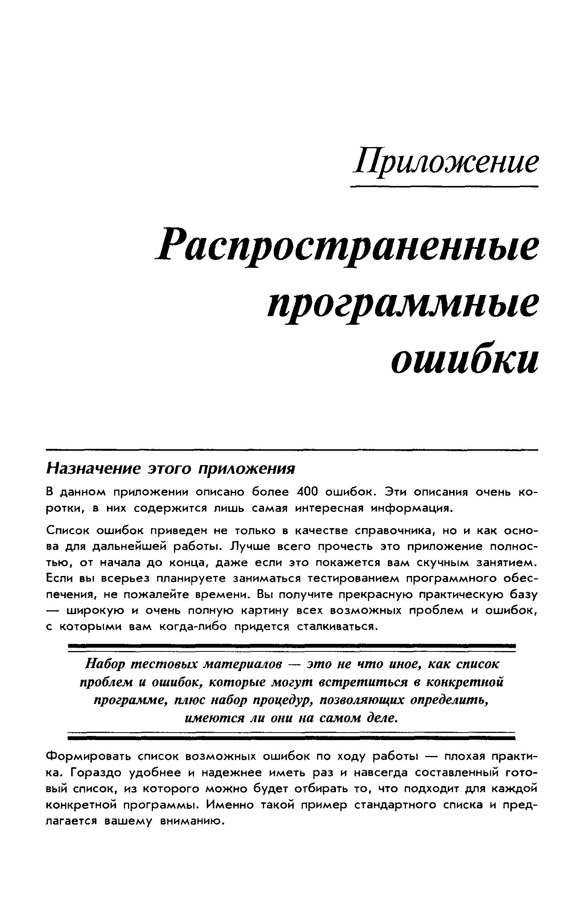

Тестируя новую программу, вы будете не только отбирать подходящие элементы приведенного списка, но и дополнять его новыми описаниями ошибок. Поэтому лучше всего хранить его в электронном виде, чтобы он всегда был под рукой и его без труда можно было редактировать.

Вот несколько примеров использования списка возможных ошибок.

1. Оценка тестовых материалов, разработанных кем-то другим.
   Заключив контракт на разработку тестовых материалов, вы получите несколько объемистых папок с описаниями тестов. Однако, как бы внушительно они ни выглядели, наборы разработанных тестов не будут абсолютно полными. Вам придется тщательно проанализировать все полученные материалы и самостоятельно заполнить пробелы. Наш опыт показывает, что тестовые агентства нередко пропускают целые группы ошибок, например, они часто забывают об условиях гонок. К сожалению, разобраться в готовых тестовых материалах гораздо легче, чем увидеть, чего в них не хватает.

   Вот тут-то вам и придет на помощь готовый список всех возможных ошибок. Формируя на его основе список ошибок для конкретной программы, включайте в него все, что только может в ней встретиться, независимо от того, насколько это вероятно. Затем просмотрите получившийся список и проверьте, имеются ли в плане тесты для выявления каждой ошибки из вашего списка. Вы наверняка быстро обнаружите целые классы пропущенных проблем.

2. Разработка собственных тестов.
   Составьте список ошибок, которые могут встретиться в программе, пользуясь для этого данным приложением. Затем разработайте тесты для выявления каждой из включенных в список ошибок. Если вы сомневаетесь, возможны ли в программе ошибки какого-либо типа, спросите об этом программиста.

   Приведенный список поможет и тем, у кого нет времени на разработку документации. Он может служить заменой плана тестирования, позволяя организовать и упорядочить работу и гарантировать, что ничего не будет упущено, хотя тесты, разумеется, придется придумывать самостоятельно.

3. Невоспроизводимые ошибки.
   Ошибку может быть трудно воспроизвести из-за того, что вы не знаете ее причины или не знаете, какую функцию выполняла программа в момент ее возникновения.

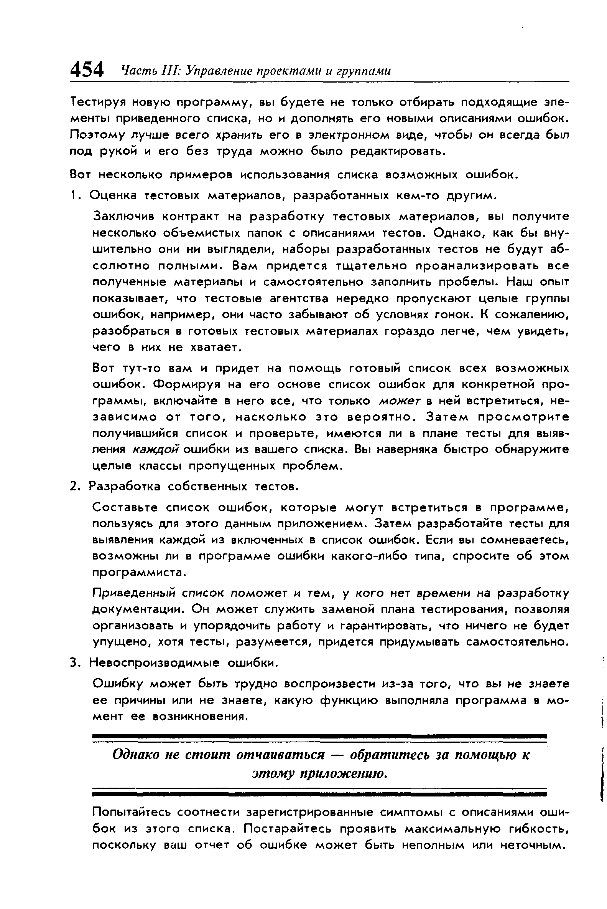

Попытайтесь соотнести зарегистрированные симптомы с описаниями ошибок из этого списка. Постарайтесь проявить максимальную гибкость, поскольку ваш отчет об ошибке может быть неполным или неточным.

4. Неожиданные ошибки.

Если выявленная ошибка оказывается для вас совершенно неожиданной (например, продукт уже готов к выпуску, и вдруг такая неприятность), проверьте, нет ли в программе и других подобных ошибок. Скорее всего дело в том, что вы пропустили определенную группу тестов. Для исправления ситуации вам пригодится приведенный здесь список.

## Ошибки пользовательского интерфейса

Понятие пользовательского интерфейса объединяет все аспекты продукта, с которыми имеет дело его пользователь. Разработчики пользовательского интерфейса пытаются достичь компромисса между такими факторами, как:

* функциональность;
* быстрота изучения программы новым пользователем;
* легкость запоминания необходимых приемов работы;
* производительность;
* вероятность возникновения ошибок пользователя;
* удовлетворенность пользователя программой.

Проектируя пользовательский интерфейс, конструктор программы учитывает опыт и нужды ее будущих пользователей, а также возможности аппаратного обеспечения и доступных программных технологий.

Для достижения разумного баланса между всеми перечисленными характеристиками программы конструктору так или иначе приходится чем-то жертвовать. Поэтому, если в программе встретится одна из перечисленных ниже ошибок пользовательского интерфейса, она вполне может оказаться не случайной ошибкой, а намеренной уступкой, сделанной конструктором ради улучшения другой составляющей качества продукта. Прежде чем составлять отчет об ошибке пользовательского интерфейса, спросите у конструктора, почему программа спроектирована именно так. Возможно, окажется, что он принял в данном вопросе самое оптимальное решение. Подробное обсуждение вопросов, связанных с разработкой пользовательского интерфейса, можно найти у таких авторов, как Бейкер и Бакстон (Baecker & Buxton, 1987), Хеландер (Helander, 1991), Лорел (Laurel, 1990, 1991), Рубенштейн и Херш (Rubenstein & Hersh, 1984), Шнейдерман (Schneiderman, 1987), Смит и Мойзер (Smith & Moiser, 1984).

Это приложение написано так, чтобы его мог понять не только тестировщик программы, но и ее пользователь. Обязательно учитывайте, что с программой могут работать самые разные люди и их проблемы будут от-

личаться от ваших. Поэтому постарайтесь проявить как можно большую гибкость.

### Функциональность

Если с помощью программы трудно, неудобно или невозможно выполнить что-то, чего может обоснованно ожидать от нее пользователь, значит, в ней имеется *функциональная ошибка*.

### Избыточная функциональность

Это ошибка, в которой очень трудно убедить разработчиков (Брукс (Brooks, 1975)). Универсальная система, предназначенная для выполнения слишком большого количества разнообразных задач, сложна и в изучении, и в эксплуатации. Ее пользователи постоянно забывают, как выполнить то или иное действие. К тому же таким системам обычно недостает концептуального единства. Они сопровождаются огромным количеством документации, обширной справочной системой, в которой легко заблудиться; разделы руководств чересчур объемны. Кроме того, многофункциональные системы обычно не отличаются высокой производительностью. Пользователи часто совершают ошибки, а получаемые ими сообщения об этих ошибках бывают расплывчаты и носят чересчур общий характер.

Основным критерием оценки функциональности продукта может быть следующий: если редко используемые функции программы усложняют использование ее базовых возможностей, значит, уровень функциональности программы выходит из-под контроля.

### Ложное впечатление о наборе функций продукта

Руководства и маркетинговая литература ни в коем случае не должны создавать у пользователя впечатление, что программа может больше, чем на самом деле.

### Неадекватность реализации базовых функций

Если к одной из ключевых функций программы невозможно обратиться и если она реализована слишком узко или слишком медленно работает, такая программа не годится для реальной эксплуатации. Например, если система управления базами данных 8 часов сортирует 1000 записей, никто не захочет ею пользоваться.

### Пропущенная функция

В программе отсутствует описанная в спецификации или очевидно необходимая функция.

## Неверно работающая функция

Функция программы должна выполнять одно (как правило, в соответствии со спецификацией), а делает нечто другое.

### Функция должна быть реализована пользователем

“Если система обладает всеми необходимыми пользователю возможностями, но при этом компоненты, реализующие некоторые из этих возможностей, пользователь должен “собрать” сам, то можно сказать, что она является инструментальным набором, а не завершенной программой”. (Рубенштейн и Херш (Rubenstein & Hersh, 1984).)

### Программа не делает того, что ожидает от нее пользователь

Например, если программа должна сортировать список имен, едва ли кто-то станет ожидать что имена будут сортироваться в порядке ASCII. Кроме того, пользователи предположат, что программа не будет учитывать ведущих пробелов и регистра букв. Если же программист хочет убедить, что программа должна работать таким неожиданным образом, он должен отразить это в ее названии и документации, и желательно еще и внести в нее возможность альтернативного способа работы.

### Взаимодействие программы и пользователя

В этом разделе описываются ошибки взаимодействия программы и пользователя. Соответственно предполагается, что речь идет об интерактивной программе, пользователь которой сидит за компьютером или терминалом. Отдельные ошибки могут относиться и к пакетным программам, которые тоже выдают некоторую информацию, например, сообщения об ошибках.

### Пропущенная информация

Все, о чем пользователю *необходимо* знать, должно отображаться на экране. Желательно также, чтобы на экране отображалась информация, которую среднестатистический пользователь найдет полезной.

#### Отсутствие инструкций на экране

Как определить название программы, как из нее выйти, какую клавишу нажать, чтобы получить справочную информацию? Если в программе используется командный язык, как узнать перечень ее команд? Программа может отображать всю эту информацию при запуске, однако в любом

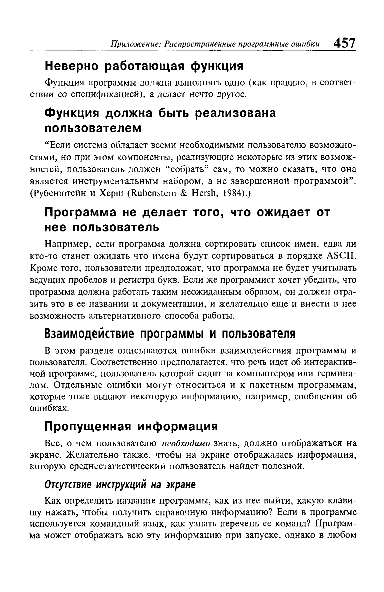

случае пользователь не должен обращаться за ответами на все эти вопросы к руководству.

### Программа рассчитана на то, что у пользователя всегда под рукой печатная документация

Можно ли использовать программу, потеряв руководство? Неопытный пользователь не должен полностью зависеть от печатной документации.

### Недокументированные возможности

Если большинство функций или команд уже перечислены на экране, то позаботьтесь, чтобы были перечислены и *все* остальные. Пропуск нескольких из них может смутить пользователя, или же он просто никогда о них не узнает, решив, что на экране есть все, что нужно, и не догадавшись заглянуть в документацию.

Аналогичным образом, если для некоторых команд программы описано их применение в особых случаях, необходимо позаботиться о таких описаниях и для всех остальных.

### Состояния, из которых сложно найти выход

Если пользователю сложно определить, как выйти из нежелательного состояния программы или прервать нежелательный процесс, это так же плохо, как если бы выход не был предусмотрен вообще.

### Отсутствие курсора

Курсор — один из основных инструментов пользователя. Он указывает на активную точку экрана, а также подтверждает, что программа работает и ждет указаний. Поэтому курсор (текстовый или указатель мыши) должен обязательно постоянно присутствовать в любой интерактивной программе.

### Программа не распознает ввод

Интерактивная программа должна реагировать на ввод информации пользователем. В частности, если пользователь вводит текст, вводимые символы должны немедленно отображаться на экране. Следующие исключения не являются ошибками:

* программа находится в процессе перехода из одного состояния в другое;
* программа игнорирует определенные действия пользователя;
* пользователем дана команда не отображать ввод;
* вводится пароль или другая секретная информация.

*Длительное отсутствие активности*

Выполняя длительное задание (занимающее более двух секунд), программа должна показывать пользователю, что она работает, а не зациклилась или остановилась. Иначе пользователь не будет знать, нужно ли ему перезапустить компьютер или просто немного подождать. Желательно отображать еще и индикатор, показывающий, какая часть задания выполнена и сколько времени еще осталось.

*Невозможность определить, выполнена ли данная программе команда*

Программа может выполнить команду не тогда, когда этого ожидает пользователь, или не отобразить на экране внесенные изменения. Например, удаленные данные могут оставаться на экране до тех пор, пока пользователь не выйдет из текущего режима. Подобные ситуации человек воспринимает как ошибки программы и сам может реагировать на них неправильно, допуская много ошибок.

*Невозможность определить, что один и тот же документ открыт несколько раз*

Программы, позволяющие одновременно открывать несколько документов, должны проверять каждый открываемый документ и сообщать пользователю, если он открывается повторно. Иначе пользователь может запутаться во вносимых в документ изменениях. Кроме того, версии документа должны иметь на экране разные имена. Например, если пользователь дважды открыл файл **My_Doc**, в одном окне этот файл должен иметь имя **My_Doc:1**, а в другом — **My_Doc:2** (или что-то в этом роде). В качестве альтернативы можно вообще не разрешать дважды открывать один документ.

### Неверная или смущающая пользователя информация

Любая встреченная пользователем ошибка тут же подрывает его доверие ко всей программе. Незначительные на первый взгляд ошибки или недостаточно подробные сообщения программы, из-за которых пользователь может сделать неверные обобщения или выводы, — обычно наиболее трудная часть работы тестировщиков, поскольку добиться их исправления сложнее всего.

*Простая фактическая ошибка*

Обычная последовательность переходов по программе — от общего к частному. Поэтому после выбора пользователем определенного режима или

команды на экране нередко остается информация предыдущего режима, большая часть которой излишня или не относится к делу. После каждого видимого изменения состояния программы обязательно проверяйте всю информацию на экране на предмет ее оптимального соответствия новому состоянию.

### Синтаксические ошибки

Программисты не особенно заботятся об ошибках правописания, а вот на пользователя они производят самое неприятное впечатление. Все их необходимо исправлять.

### Неаккуратное упрощение

Пытаясь описать ситуацию или функцию программы как можно проще, автор сообщения может упомянуть только ее важнейший аспект, опустив важные подробности. Не желая пользоваться сленгом, он может перестараться и заменить необходимые профессиональные термины неэквивалентными им и неуклюже звучащими описаниями, что только затруднит понимание сообщения. Обращайте внимание на такие ошибки. Помните, что вы являетесь единственным технически грамотным человеком, анализирующим выводимый программой текст.

### Неудачные метафоры

Метафоры используются для сравнения компьютерных систем с чем-то знакомым пользователю. Они помогают лучше понять систему и предсказывать ее поведение. Однако, если предположения пользователя окажутся неверны, значит, метафора никуда не годится. Например, метафорой является пиктограмма с изображением корзины для бумаг, используемая во многих программах для команды удаления файлов. Если удаленный файл можно вытащить из корзины, метафора верна. Однако, если файл исчезает в корзине навсегда, в качестве метафоры лучше подошел бы измельчитель бумаги.

### Неточные названия команд и функций

Команда СОХРАНИТЬ не должна использоваться для удаления файла или сортировки егодержимого. Если в русском (английском) языке за словом закрепилось определенное значение, названная этим словом команда должна ему соответствовать.

### Несколько названий одной функции

Одна и та же функция не должна иметь в программе несколько названий. Пользователь не должен ломать голову над тем, чем отличаются команды **Тень** и **Наложить тень**.

### Избыточность информации

Некоторые разделы печатной или интерактивной документации содержат столько технических подробностей, что интересующая пользователя информация среди них просто теряется. Если, на ваш взгляд, все эти технические подробности могут быть полезны пользователю, подумайте о том, чтобы поместить их в отдельный раздел или приложение.

В некоторых случаях чересчур подробное руководство является просто попыткой компенсировать неудачное конструкторское решение. Действительно ли пользователю нужна вся приведенная информация? И нет ли способа все же решить проблему, которую программист считает неразрешимой?

### Когда сохраняются данные?

Предположим, что вы вводите информацию, которую программа должна сохранить. Сохраняются ли данные по мере ввода, при выходе, по отдельной команде пользователя, каждые 15 минут или как-то еще? У пользователя должен быть простой способ, позволяющий это выяснить, причем ответ должен быть совершенно однозначным. Если же вы столкнулись с неоднозначностью, ищите ошибки. Возможно, два модуля программы работают в этом вопросе несогласованно.

### Неудачная внешняя структура

Продукт, предоставляемый пользователю, обычно состоит из ряда компонентов. Насколько легко разобраться в назначении каждого из них? Неудачная внешняя структура продукта увеличивает время его изучения и отпугивает новичков. Чем меньше необходимо знать пользователю для выполнения определенной задачи, тем лучше.

## Справочная система и сообщения об ошибках

Их текст часто рассматривается как незначительная составляющая продукта и пишется неопытными программистами или неопытными техническими писателями. Изменения этого текста выполняются в последнюю очередь.

Следует помнить, что пользователь обращается к справочной системе тогда, когда у него возникают проблемы. О сообщениях об ошибках и говорить не приходится. Пользователь расстроен, нервничает, и ему нужна помощь, а не дополнительный повод для раздражения.

### Высокий уровень сложности

С экрана читать труднее, чем с бумаги (Шнейдерман (Schneiderman, 1987)). Исследования показали, что максимально допустимым уровнем сложности текста на экране является уровень 5. И уж во всяком случае

текст интерактивной справочной системы и сообщений об ошибках не должен быть сложнее, чем текст печатного руководства. Сообщения программы должны быть простыми, краткими, предложения должны составляться в утвердительной форме и содержать минимум технических терминов, даже если пользователь программы является компьютерным специалистом.

### Многословность

Сообщения программы должны быть простыми и краткими. Как правило, у пользователя программы нет времени на чтение чьих-то многословных излияний. Если пользователю потребуется получить дополнительную информацию, лучше предоставить к ней отдельный быстрый доступ. Не стоит заставлять его читать полстраницы ради единственной фразы.

### Неуместная эмоциональность

Сообщения программы должны быть эмоционально нейтральными и предельно корректными. Пользователю едва ли понравится, если программа будет тыкать его носом в его промахи. Проверьте, нет ли в программе сообщений, которые могут вызвать у пользователя психологический дискомфорт.

В сообщениях об ошибках не должно быть восклицательных знаков — в одних случаях они могут быть восприняты как насмешка или “недовольство” программы, а в других — как сигнал опасности. Тщательно подбирайте выражения — учтите, что само по себе появление окна с сообщением об ошибке уже заставляет пользователя напрячься. Поэтому тон сообщения должен быть спокойным, деловым и конструктивным. Слова “авария”, “сбой”, “разрушение”, “потеря данных” крайне нежелательны на экране, и даже слово “ошибка” следует употреблять как можно реже. Тем более, что множество так называемых ошибок носят совершенно рабочий характер — это просто ситуации, требующие от пользователя определенных поправок или дополнительных указаний. А многих из них можно было бы избежать, если бы программа была чуточку интеллектуалнее (а программист — предусмотрительнее).

### Фактические ошибки

Нередко в документации и сообщениях программы приводятся неверные примеры того, как правильно выполнить то или иное действие. Одни из них устарели, другие неверны с “рождения”. На одном из последних циклов тестирования все они должны быть тщательно проверены.

### Контекстные ошибки

Контекстно-зависимые справочные системы и подсистемы обработки ошибок должны проверять, что делает программа в момент их вызова. Их

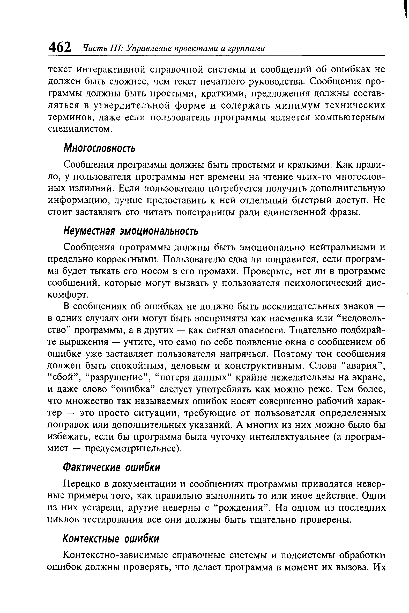

сообщения, меню, рекомендации и т.п. зависят от ситуации. Это замечательная способность программы, если только она работает правильно.

### Неправильное определение источника ошибки

Как минимум в сообщении об ошибке должно быть сказано, что именно произошло не так. Если необходимо, должны быть приведены ошибочные данные. В хорошем сообщении об ошибке указываются также ее причина и способ выхода из ситуации.

### Шестнадцатеричный код — это не сообщение об ошибке

Сообщения вроде `Error 010` в обычных прикладных программах недопустимы. Исключения могут составлять только особые ситуации, когда распечатка полного сообщения об ошибке слишком велика или неуместна, когда этот текст — все, что компьютер успевает вывести перед сбоем или когда программой не пользуется никто, кроме ее автора.

### Отказ в предоставлении ресурсов без объяснения причины

Если программе не удается использовать принтер, модем, дополнительную память или другие ресурсы, она должна не только сообщить пользователю о неудаче, но и объяснить ее причины. Сообщения “Принтер уже используется” и “Принтер не подключен” требуют от пользователя разных действий.

### Сообщения об ошибках, которые не являются таковыми

Сообщения об ошибках должны выдаваться программой в стандартной форме, и только тогда, когда ошибка действительно имеет место. Если же программа в форме сообщений об ошибках будет информировать пользователя о рядовых событиях, он перестанет читать все подобные сообщения.

## Ошибки отображения

Ошибки отображения информации на экране — это то, что может дискредитировать программу при первом же знакомстве с ней пользователя. К сожалению, программисты часто считают их незначительными, полагая, что, если с данными и их обработкой все в порядке, не страшно, если на экране что-то немного не так. А зря, потому что ошибки на экране часто являются признаками более серьезных проблем.

### Два курсора

Плохо, когда, перемещая фокус ввода из одной точки экрана в другую, программист забывает стереть старый курсор. Но еще хуже, если два курсора на экране являются отражением путаницы в программном коде, когда неизвестно, какой из них активен. Тут могут скрываться очень серьезные программные ошибки.

### Исчезновение курсора

Обычно курсор исчезает, когда программист отображает что-то поверх него или, изменив его координаты, забывает его перерисовать. Возможны и другие причины, например, курсор нарисован в той области памяти, которая не отображается на экране. Это плохо, поскольку так ничего не стоит запортить нужные данные.

### Курсор отображается не в том месте

Курсор находится в одном месте экрана, а вводимые пользователем данные отображаются в другом. Эта ошибка очень неприятна для пользователя. Кроме того, она может быть симптомом более серьезной проблемы, когда неправильно интерпретируется ввод или не так сохраняются данные.

### Курсор вне области ввода данных

Такого не должно быть никогда. Обычно это ошибка кодирования, хотя некоторые программисты намеренно позволяют пользователю перемещать курсор в любую точку экрана, что является ошибкой проектирования.

### Отображение ввода не в том месте экрана

Курсор отображается правильно, а вот вводимые данные — где-то в другом месте.

### Недоочищена часть экрана

После ответа пользователя на сообщение окно не исчезает с экрана или удаляется лишь частично. Это неприятно и часто мешает дальнейшей работе.

### Не выделены активные элементы экрана

Если программа обычно выделяет определенные элементы экрана, например активное окно или поле ввода, она должна делать это всегда.

### Не снято выделение

Данные и параметры области их отображения обычно хранятся программой отдельно. Поэтому после удаления выделенных данных занимаемая ими область экрана может остаться выделенной, причем это может быть незаметно до тех пор, пока в этой области не появятся новые данные.

### Отображена неверная или неполная строка

Отображаемое на экране сообщение может содержать "мусор", фрагмент другого, более длинного сообщения или, наоборот, быть урезанным. Такая ситуация может быть следствием как незначительной ошибки в программе (программист забыл очистить переменную, выделил под нее мало памяти и т.п.), так и очень серьезной.

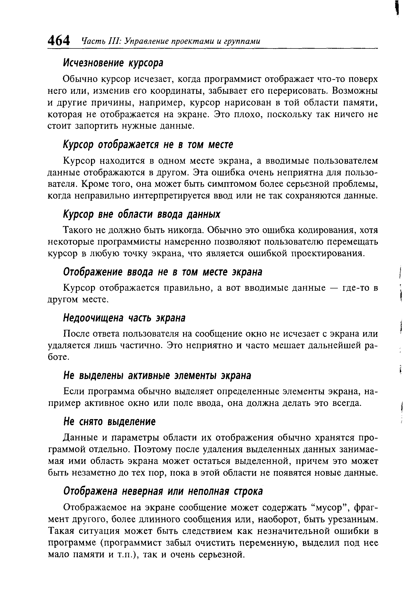

Сообщение остается на экране слишком долго или исчезает слишком быстро

Многие сообщения остаются на экране некоторое время, а затем исчезают, не требуя реакции пользователя. Это время должно быть достаточным, чтобы пользователь успел заметить и прочесть сообщение, и зависит от его важности, длины и от того, как часто оно появляется на экране.

Если одно и то же сообщение в одних случаях остается на экране дольше, чем в других, это должно вызвать у вас подозрение. Причиной может быть ситуация гонок. Постарайтесь определить, в каких случаях получается какая задержка, а затем предложите программисту внимательно проанализировать код.

## Организация экрана

Экран должен выглядеть организованным. Информация не должна быть фрагментирована и разбросана где попало. Различные классы объектов следует располагать отдельно друг от друга, их местоположение должно быть логичным. Существует множество теорий о том, как располагать информацию на экране, но все они сводятся к одному: пользователь должен легко находить нужные элементы.

### Неэстетическое оформление экрана

Это субъективная, но все же достаточно четко распознаваемая характеристика. Пользуйтесь собственным чувством гармонии, а в случае неуверенности обращайтесь к мнению других. Распространенными эстетическими недоработками являются: неудачное сочетание цветов, неравномерное расположение элементов, их непропорциональные размеры, невыровненные строки и столбцы данных.

### Неудачная организация меню

Этот вопрос обстоятельно рассматривается такими авторами, как Шнейдерман (Schнейderman, 1987) и Смит и Мойзер (Smith & Moiser, 1984). Его обсуждение заняло бы множество страниц, но здесь приводится лишь несколько наиболее важных моментов.

* Подобные или концептуально связанные команды меню должны быть объединены в группы. Группы должны четко отделяться одна от другой.
* Способ выбора элемента меню должен быть очевидным или указанным на экране.
* По возможности команды меню должны быть независимыми. Для достижения определенного результата пользователь не должен выбирать по очереди несколько команд.

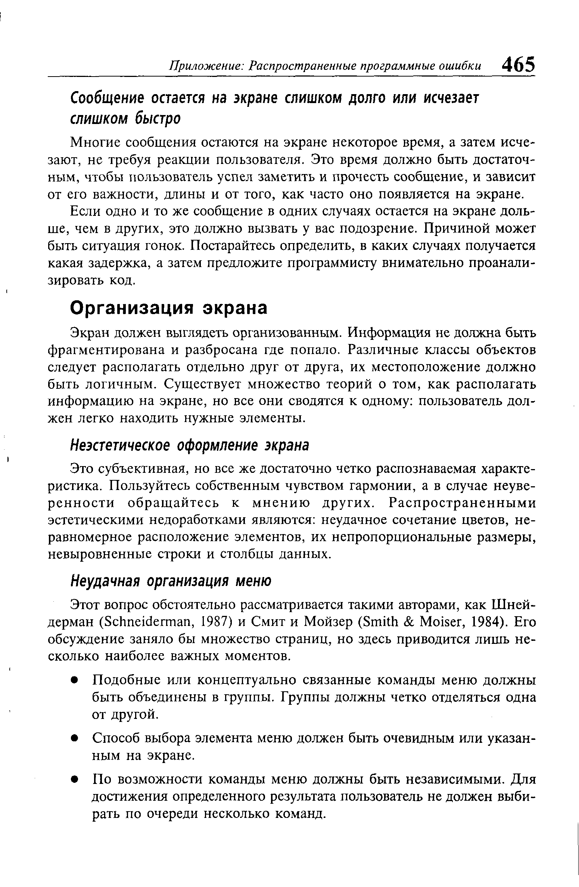

* Выбор элемента меню путем ввода его первой (или другой выделенной) буквы предпочтительнее выбора по номеру. (Если для выбора из меню всегда используются *первые* буквы команд, проследите, чтобы командам не присваивались странные имена.)

### Ошибки организации диалоговых окон

Для изучения этого вопроса мы рекомендуем выпущенные компанией IBM учебные пособия *SAA Advanced Interface Design Guide* (1989) и *SAA Basic Interface Design Guide*, а также пособие компании Apple *Human Interface Guidelines* (1987).

* Диалоговые окна должны иметь стандартизированный интерфейс. Например, они должны выводиться в одном и том же месте экрана, их текст должен отображаться одним и тем же шрифтом и одинаково выравниваться, заголовок окна должен отражать название открывшей его команды. Если для выхода из окон и подтверждения запросов используются клавиши (обычно `<Enter>` и `<Esc>`), они должны быть одинаковыми во всех окнах.
* Элементы диалогового окна должны быть организованы логично. Связанные элементы должны располагаться рядом, а их группы четко отделяться друг от друга.
* Поля ввода и выбора должны быть выровнены вертикально и горизонтально, чтобы пользователь мог перемещаться между ними с помощью клавиш управления курсором.
* Зависимости между диалоговыми окнами должны быть очевидными. Иначе, если действия пользователя в одном диалоговом окне отражатся на доступности опций другого, логически не связанного с ним окна, пользователя это может смутить.

### Труднонаходимые инструкции

Пользователь всегда должен знать, куда посмотреть, чтобы выяснить, что делать дальше. Если экран загроможден информацией, определенная область всегда должна быть зарезервирована для команд и сообщений. Кроме того, хорошим правилом является размещение критической информации в центре экрана.

### Неуместное использование мигания

Мигающее изображение или текст мгновенно привлекает внимание пользователя. Однако ни в коем случае не следует злоупотреблять этим эффектом, поскольку он утомляет и раздражает.

### Пестрые цветовые сочетания

Умелый подбор цветов может сделать программу привлекательной и облегчить ее использование, а неумелый — сделать все наоборот. Цвета должны быть ненавязчивыми, спокойными, их не должно быть много. Задача более ярких элементов — привлекать внимание при необходимости, а не отвлекать его от основной работы. Обратите внимание на гармоничность цветовых сочетаний. По возможности следует предоставлять пользователю альтернативу.

### Использование цветов в качестве смыслового элемента интерфейса

Конструктор программы не должен использовать цвета в качестве индикаторов, если рассчитывает, что она будет эксплуатироваться широким кругом пользователей. Среди них могут быть дальтоники, а кроме того, у некоторых пользователей могут быть монохромные мониторы.

### Несогласованность со стилем операционной среды

Если в операционной среде программы существуют определенные стандарты пользовательского интерфейса, лучше всего их придерживаться. Например, в современных графических средах интерфейс командной строки выглядит анахронизмом.

Даже если конструкторам программы кажется, что они могут предложить лучшее решение, не каждый пользователь захочет обучаться новым соглашениям. Помните, что пользователь работает не с одной, а с целым комплексом программ, и он будет чувствовать себя гораздо комфортнее, если все они будут оформлены в едином стиле, выводить одинаковые диалоговые окна в одних и тех же местах и по возможности управляться одинаковыми командами.

### Невозможность избавиться от избыточной информации на экране

Прекрасно, когда на экране отображается меню программы и панели инструментов, но еще лучше, если опытный пользователь может убрать их с экрана и отображать только в случае необходимости, освободив себе тем самым рабочее пространство.

### Организация команд и способы их ввода

В этом разделе речь идет о том, как организованы команды программы и как они представлены пользователю. Все возможные варианты стилей ввода команд рассматривает в своей работе Шнейдерман (Schneiderman, 1987). Мы же предполагаем, что конструктором программы сделан правильный выбор, и рассматриваем только ошибки его реализации.

## Несоответствия

Чем большему количеству универсальных соглашений подчиняется программа, тем легче ее изучить и тем более профессионально она выглядит. Однако выработать такие универсальные соглашения нелегко, и именно поэтому в программах обычно много несоответствий. Так соблазнительно воплотить каждую идею независимо от других. Однако множество мелких несоответствий, таких незнательных, если рассматривать их по отдельности, могут сделать программу абсолютно непригодной к использованию.

### Неуместная оптимизация

Часто программисты допускают несоответствия в поведении программы ради повышения ее производительности. Однако каждое несоответствие делает программу более сложной. Постарайтесь убедить в этом программиста. Стоит ли ради того, чтобы исключить одно-два нажатия клавиш, делать изучение программы более сложным и рисковать доверием к ней пользователей? Как правило, нет.

### Непоследовательный синтаксис

Синтаксис команд должен быть простым в изучении, таким, чтобы через некоторое время пользователь просто перестал о нем думать. К синтаксису относится, например, следующее:

* порядок указания источника и места назначения копируемой или перемещаемой информации;
* тип используемых разделителей (пробелы, запятые и т.п.);
* порядок следования операторов и операндов (инфиксный (A+B), префиксный (+AB), постфиксный (AB+)).

### Неодинаковый стиль ввода команд

Команду можно выбрать из меню с помощью мыши или клавиш управления курсором, можно ввести ее первую букву, аббревиатуру, номер или воспользоваться функциональной клавишей. В программе должен использоваться единый командный стиль. Если программа предлагает альтернативные способы ввода команд, они должны быть доступны во всех ее меню и режимах. Если же по объективным причинам способ ввода команд в разных частях программы должен быть различным, это должно быть очевидно пользователю.

### Нелогичные сокращения

Если в программе используется командный язык, правила сокращений команд должны быть логичными и легко запоминающимися. Если для


<!-- ВІДНОВЛЕНО ЧЕРЕЗ GEMINI (Стор. 466) -->
команды delete используется сокращение del, а для команды list — ls, как пользователю это запомнить?

### Непоследовательные правила завершения ввода

Правила, по которым пользователь сообщает программе, что ввод данных в поле завершен, должны быть удобными и логичными. Предположим, что в определенное поле можно ввести имя длиной максимум 8 символов. Если введенное пользователем имя состоит из 5 символов, он нажимает <Enter>, чтобы указать программе, что ввод окончен. Если же введены все 8 символов, некоторые программы автоматически предполагают, что ввод завершен, и переходят к следующему действию. Это может смутить пользователя, а иногда и быть неправильным, если пользователь ошибся и хочет что-то исправить или просто еще думает.

### Несоответствие опций

Если определенная опция имеет смысл для нескольких команд, она должна быть доступна для них всех. При этом она должна одинаково называться и задаваться одним и тем же способом.

### Похожие названия команд

Если названия двух команд похожи, их легко спутать.

### Непоследовательная интерпретация регистра

Если интерпретатор команд чувствителен к регистру символов, все названия команд должны соответствовать одним и тем же соглашениям (либо начинаться с большой буквы, либо состоять только из маленьких букв или только из больших).

### Неодинаковое положение команды в меню

Если одна и та же команда встречается в нескольких меню или подменю, ее трудно располагать всегда в одной и той же позиции. Все же, если постараться, этого можно добиться.

### Неодинаковое использование функциональных клавиш

Везде в программе функциональные клавиши должны быть связаны с одними и теми же командами. Перестановки (когда в одном месте <F3> удаляет данные, а <F4> сохраняет, а в другом месте <F3> сохраняет, а <F4> удаляет) совершенно недопустимы.

### Непоследовательные правила обработки ошибок

Встретив ошибку, программа может сообщить о ней пользователю, а может попытаться ее исправить. После этого программа может прекратить работу, перезапуститься или вернуться в предыдущее состояние. Обработ-
<!-- КІНЕЦЬ ВІДНОВЛЕННЯ -->


чик ошибок может сохранить информацию о произошедшей ошибке на диске, дописав ее в имеющийся файл, или записав поверх предыдущей информации. Вариантов множество, но поведение конкретной программы должно быть последовательным и предсказуемым.

### Непоследовательные правила редактирования

Для изменения любых введенных ранее данных должны применяться одни и те же клавиши и команды.

### Непоследовательные правила сохранения данных

Программа должна всегда и везде сохранять данные одинаково, с одними и теми же интервалами времени и по одним и тем же командам. Нельзя допускать, чтобы в одних случаях данные сохранялись по мере ввода, в других — по достижении конца записи или при выходе из окна, а в третьих — вообще только по команде пользователя.

## Потери времени

Программа не должна тратить зря ни одной секунды времени пользователя.

### Прогулки по меню

Если программа заставляет пользователя выполнять выбор за выбором, и в конце длинного пути выясняется, что необходимая ему команда находится в другом месте, не реализована или для ее выполнения необходимо вначале сделать что-то еще, едва ли пользователь останется доволен. Проанализируйте сложные деревья меню на предмет таких ситуаций.

### Выбор, который не может быть сделан

В меню не должно быть команд, которые невозможно выполнить. Как можно просмотреть или удалить данные, которых нет? Как можно распечатать документ при отсутствии принтера? Как почувствует себя пользователь, если на экране будет написано “Для получения справки нажмите <F1>”, а когда он нажмет эту клавишу, программа скажет “К сожалению, справка по данной теме отсутствует”?

### Вы совершенно, совершенно уверены?

Программа обязана запрашивать у пользователя подтверждения критически важных или деструктивных команд. Прежде чем программа переформатирует заполненный данными диск, пользователь должен дважды подтвердить свое намерение. Однако не следует заставлять пользователя подтверждать каждую мелочь. Такая навязчивая предупредительность однажды приведет к тому, что пользователь автоматически нажмет **Да** для серьезной и разрушительной команды.

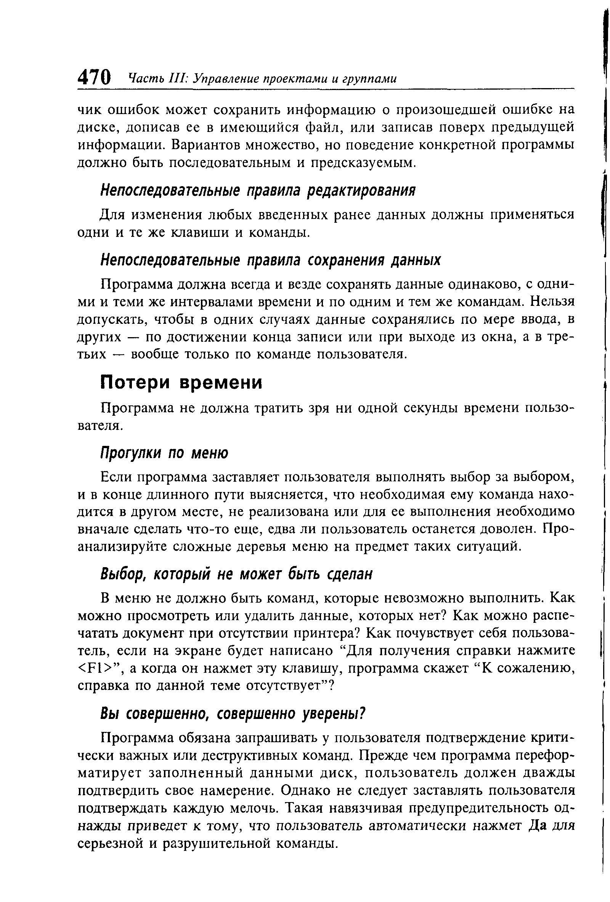

### Непонятные названия команд

Названия команд должны быть информативными. Не следует заставлять пользователя постоянно справляться в руководстве, что делает та или иная команда.

### Меню

Меню должны быть простыми и логичными. Следует избегать длинных меню, подменю неопределенного назначения, в которых пользователю трудно отыскать нужную команду, непонятных пиктограмм и названий. Без тщательного планирования длинные многоуровневые меню становятся настоящей катастрофой.

#### Чересчур сложная иерархия меню

Программисты, создающие многоуровневые меню, обычно следуют правилу, по которому ни в одном меню не должно быть более семи элементов. Однако это правило годится скорее для новичков, чем для профессионалов. Опытный пользователь предпочтет сэкономить время на открытии вложенных меню, длинные же списки команд его ничуть не смущают. Главное, чтобы меню было тщательно спланировано.

Интересные соображения по данному вопросу можно найти в работах таких авторов, как Пейеп и Роуск-Хостранд (Paap & Roske-Hostrand, 1986) и Мак-Грегор, Ли и Лэм (MacGregor, Lee & Lam 1986).

#### Неадекватные правила переходов по меню

Даже в меню среднего уровня вложенности у пользователя в любой момент должна быть возможность вернуться в предыдущее меню, перейти на самый верхний уровень и выйти из программы. Даже если в меню сотни элементов, следует предусмотреть специальные комбинации клавиш для их быстрого выбора.

#### Слишком много путей к одному и тому же месту

Если одни и те же команды присутствуют во множестве меню, программа явно требует реорганизации. Не то чтобы команду никогда нельзя было помещать в нескольких меню — в некоторых случаях это очень удобно, — но существуют определенные пределы. Если создается ощущение, что в программе можно откуда угодно попасть куда угодно, ее внутренняя структура может быть очень запутанной, а значит, и надежность должна вызвать у тестировщика большие сомнения.

#### Невозможность перехода между определенными состояниями

Некоторые программы после выполнения пользователем определенных действий не позволяют ему выйти из того режима, в котором он оказался,

иначе, как перезапустив программу. Как правило, в таком ограничении нет объективной необходимости.

### Связанные команды расположены в различных меню

В сложном меню правильно сгруппировать команды не так-то просто. Конструктор может не подумать о связи между двумя элементами и поместить их в разные меню. Составляя отчет о такой ошибке, поясните, как связаны эти элементы, и предложите, в какое меню их лучше всего поместить.

### Несвязанные команды объединены в одном меню

Некоторые команды оказываются где попало просто потому, что кто-то поленился подумать, к какой группе их лучше всего отнести, и, может быть, реорганизовать все меню или добавить к нему еще один элемент самого верхнего уровня.

## Командные строки

Вводить названия команд сложнее, чем выбирать их из меню. Однако при большом количестве команд и опций опытные пользователи могут предпочесть интерфейс командной строки. Для решения некоторых задач меню-ориентированный интерфейс оказывается слишком громоздким. В этом случае важно, чтобы набор команд был составлен так, чтобы их названия легко запоминались и вероятность ошибок была сведена к минимуму.

### Учет регистра символов

Если при распознавании команд программа учитывает регистр символов, как правило, это неудобно и ведет к ошибкам.

### Перестановка параметров

Наиболее распространенным примером является порядок указания источника и приемника данных. Например, команда **COPY FILE1 FILE2** может означать копирование файла **FILE1** в **FILE2**, а может и наоборот. Сам по себе порядок параметров не имеет значения (люди легко запомнят любой вариант), но для всех команд он должен быть одинаковым. Кроме того, приложения должны следовать правилам, установленным в операционной системе.

### Не распознаются полные имена команд

Сами по себе сокращения — вещь хорошая, но у пользователя всегда должна быть возможность ввести и полное имя команды, например, **delete**, а не **del**. Полные имена запоминаются лучше, чем сокращения, особенно если единого правила для образования сокращений не существует.

### Не допускаются сокращения

У пользователя должна быть возможность ввести, например, `del` вместо `delete`. Хотя такая возможность имеется не во всех системах, без сомнения, она очень удобна.

### Сложная команда в одной строке

Некоторые программы требуют ввода чрезвычайно сложных команд. (Во всех ли случаях, когда **А**, **В** и **С** истинны, а **D** — ложно, истинно **X**?) Пользователь, которому приходится вводить в одной командой сложные логические операторы, делает много ошибок. Для подобных случаев гораздо лучше подходят формы ввода, последовательные запросы и запросы по образцу.

### Отсутствие возможности пакетного ввода

У пользователя должна быть возможность подготовить список команд в текстовом редакторе, а затем предложить его программе для выполнения, как если бы все эти команды были последовательно введены с клавиатуры.

### Отсутствие возможности редактирования команд

У пользователя должна быть возможность редактирования того, что он вводит, как минимум с помощью клавиши `<Back Space>`. Если пользователь попытался выполнить неправильную команду, программа должна сообщить об этом, а затем предоставить возможность отредактировать введенную строку и повторить попытку.

### Нестандартное использование клавиатуры

Если компьютер поставляется со стандартной клавиатурой, за клавишами которой традиционно закреплены определенные команды, программа должна придерживаться этих соглашений.

#### Невозможность использования клавиш управления курсором, функциональных клавиш и клавиш редактирования

Все эти клавиши должны работать, даже если у части пользователей программы их на клавиатуре нет.

#### Нестандартное использование клавиш управления курсором и редактирования

Эти клавиши должны работать так, как привыкли пользователи тех компьютеров, для которых предназначена данная программа.

#### Нестандартное использование функциональных клавиш

Если в большинстве программ клавиша `<F1>` связана с командой **Справка**, не следует связывать ее с командой **Удалить-файл-и-выйти**.

### Принятие недопустимого ввода

Программа должна игнорировать символы, логически недопустимые во вводимых пользователем данных, например, буквы при вводе числовых значений. Она не должна принимать недопустимые символы и отображать их на экране. Сообщения об ошибке в подобных ситуациях тоже излишни.

### Отсутствие индикаторов состояния клавиатуры

У пользователя должна быть возможность в любой момент мгновенно определить состояние клавиатуры (нажата ли клавиша `<CapsLoc>`, активен ли режим замены символов и т.п.). Для этого служат индикаторы на самой клавиатуре, а также подсказки на экране.

### Отсутствие реакции на управляющие клавиши

У пользователя должна быть возможность прервать текущую операцию. Кроме того, программа должна распознавать стандартные системные клавиши, например, `<Print Screen>`, на которые быстро реагируют другие приложения.

### Пропущенные команды

В этом разделе описываются отсутствующие в некоторых программах необходимые команды и функции.

### Переходы между состояниями

Большинство программ осуществляет переходы из одних состояний в другие. После запуска программа находится в одном состоянии. В ответ на выбор пользователем какой-либо команды меню она изменяет свое состояние. Обычно программисты достаточно хорошо тестируют код, чтобы пользователь мог достичь любого желаемого состояния программы. Однако они не всегда предусматривают для пользователя возможность изменить свой выбор.

### Невозможно выйти, ничего не сделав

У пользователя должна быть возможность сообщить программе, что последний выбор сделан им по ошибке и он желает вернуться к предыдущему состоянию.

### Невозможно выйти из подпрограммы

У пользователя должна быть возможность прервать выполнение программой текущего задания и вернуть данные к исходному состоянию. Например, это относится к редактированию или сортировке данных — пользователь может решить отказаться от внесенных изменений и оставить файл таким, каким он был перед началом текущей операции.

### Невозможно прервать выполнение команды

У пользователя должна быть возможность прервать выполнение программой текущей команды. Иногда ему необходимо вернуться к начальной точке и внести некоторые коррективы или же выбрать другую команду.

### Невозможность приостановить работу программы

Существуют программы, ограничивающие время работы пользователя с определенными данными, например, время их ввода. Когда время истекает, программа изменяет свое состояние. Она может отобразить справочную информацию, принять значение по умолчанию или даже завершить свою работу. Хотя эти ограничения обычно обоснованны и полезны, бывает, что пользователь вынужден прервать работу. В этом случае у него должна быть возможность сообщить программе о необходимости сделать перерыв и через некоторое время продолжить работу с того же места.

## Предотвращение неприятностей

В жизни случается все — и системные сбои, и ошибки пользователей. Программы должны сводить их последствия к минимуму.

### Отсутствие возможности резервного копирования

У пользователя должна быть возможность создать резервную копию данных. Во многих случаях программа должна создавать такую копию автоматически (как только пользователь меняет данные), чтобы в случае любых проблем пользователь легко мог к ней вернуться.

### Отсутствие команды отмены

Команда *Отменить* обычно используется для отмены последних изменений или последней выполненной команды, а иногда и группы команд. Ограниченной версией этой команды является команда *Отменить удаление*, восстанавливающая только что удаленные данные. В определенных типах программ обе эти команды могут быть крайне необходимы.

### Отсутствие запросов на подтверждение команд

Если данная пользователем команда удаляет достаточно большое количество информации, отменяет значительный объем выполненной работы или производит иные разрушительные действия, программа обязательно должна запрашивать у пользователя подтверждение его намерений.

### Отсутствие возможности периодического сохранения данных

Если пользователь вводит большое количество данных, программа должна уметь сохранять их через определенные интервалы времени. Это гарантирует, что при любом сбое большая часть введенной информации будет

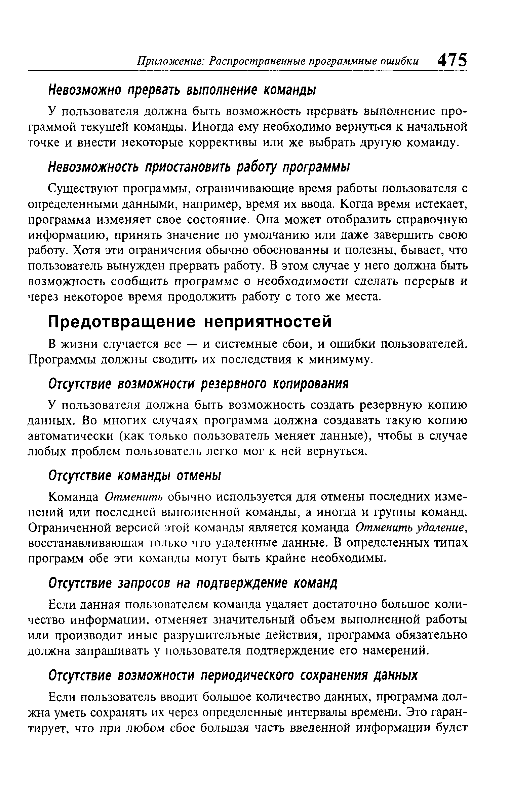

сохранена. Данная функция может включаться и отключаться по желанию пользователя.

## Обработка ошибок пользователем

Приобретая опыт работы с программой, пользователь выясняет, что часто делает ошибки определенного рода. Программа должна по возможности предоставлять ему инструментарий для исправления таких ошибок и встраивания собственных проверочных средств (или условий).

### Не предусмотрены пользовательские условия проверки вводимых данных

Если пользователь сам определяет форму или таблицу для ввода данных, у него должна быть и возможность указать, какие данные допустимы в каждом поле. Например, ввод в определенное поле может быть ограничен только числовыми значениями. Остальные данные программа должна игнорировать или отвергать.

### Сложно исправить допущенную ошибку

Исправление допущенной ошибки не должно вызывать затруднений. Пользователь не должен перезапускать программу только для того, чтобы добраться до окна, в котором он вводил данные, и исправить их. Если на экране отображена форма ввода, то необходимо, чтобы пользователь мог легко вернуться к любому ее полю, если список — изменить любой его элемент, не затрагивая остальные.

### Не предусмотрена возможность записи комментариев

У пользователя должна быть возможность вместе со сделанной работой сохранить и некоторые заметки. Такая функция необходима и в системах разработки, которыми пользуются программисты, и в обычных прикладных программах, служащих для ввода и анализа информации.

### Отсутствуют средства отображения связей между переменными

Если программа предоставляет пользователю возможность работы с рядом связанных между собой переменных, ему необходимы средства визуального анализа этих связей.

## Разное

### Неадекватные средства защиты

То, какая защита необходима программе и ее данным, зависит от ее назначения и требований рынка. В многопользовательских системах обычно требуется возможность защиты данных от доступа других пользователей и даже системных администраторов. Эта защита может предусматривать

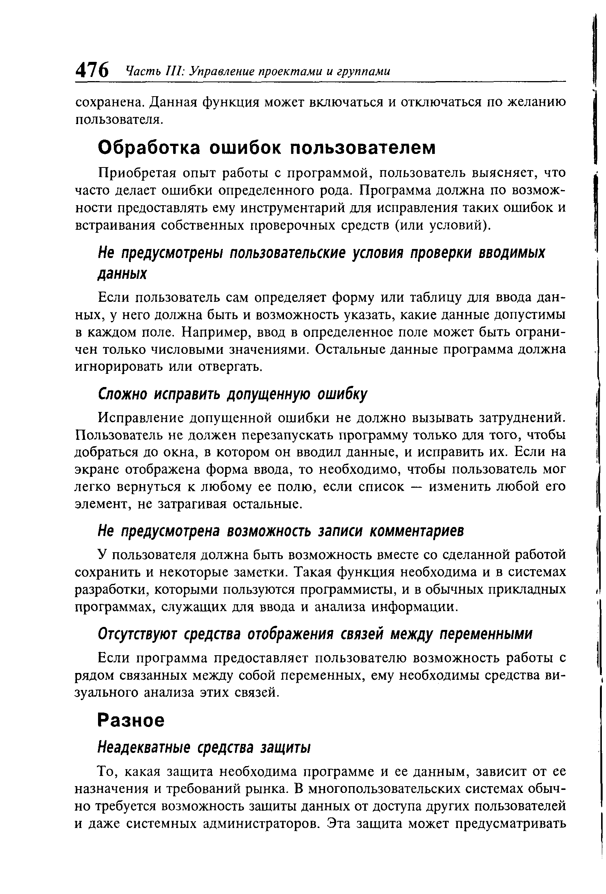

невозможность прочесть информацию или же просто невозможность ее изменить или удалить. Вопросы защиты подробно освещает в своей работе Бейзер (Beizer, 1984).

### Избыточная защита

Средства защиты программы должны быть как можно более ненавязчивыми. Если вы работаете дома за собственным компьютером, не подключенным ни к какой информационной сети, программа не должна заставлять вас без конца вводить пароль.

### Невозможно спрятать меню

Многие программы отображают на экране меню и панели инструментов. Как правило, все или основные команды меню и панелей доступны через определенные сочетания клавиш. Поэтому опытному пользователю удобнее убрать с экрана эти элементы, чтобы освободить место для основной работы (например, для ввода и редактирования текста).

### Отсутствие поддержки стандартных функций операционной системы

Если, например, в ОС используется система каталогов, программа должна позволять хранить данные в любых внешних каталогах. Если в ОС определены символы подстановки (такие, как "\*", заменяющий любую группу символов), программа должна их распознавать.

### Отсутствие поддержки длинных имен файлов

Когда-то, когда памяти компьютеров едва хватало для основной работы, а компиляторы были еще довольно неуклюжими, длина имен файлов ограничивалась шестью или восемью символами. Однако времена эти давно позади. Осмысленные названия файлов являются важным средством документирования, и они обязательно должны поддерживаться приложениями.

## Негибкость программ

Некоторые программы являются очень гибкими. Любой их аспект ничего не стоит изменить. Порядок выполнения различных заданий полностью определяется пользователем. Однако не все программы могут похвастаться такой настраиваемостью. Их разработчики не учли, что у пользователей могут быть разные вкусы и потребности. Из всего комплекса предоставляемых программой функций пользователь часто хочет отобрать определенный набор, который всегда должен быть под рукой, а остальные убрать подальше, чтобы не мешали. Впрочем, негибкость программы — не всегда недостаток. Последовательную систему с фиксированным набором возможностей легче изучить. К тому же настройка программы, функции которой зависят одна от другой, может быть делом достаточно сложным.

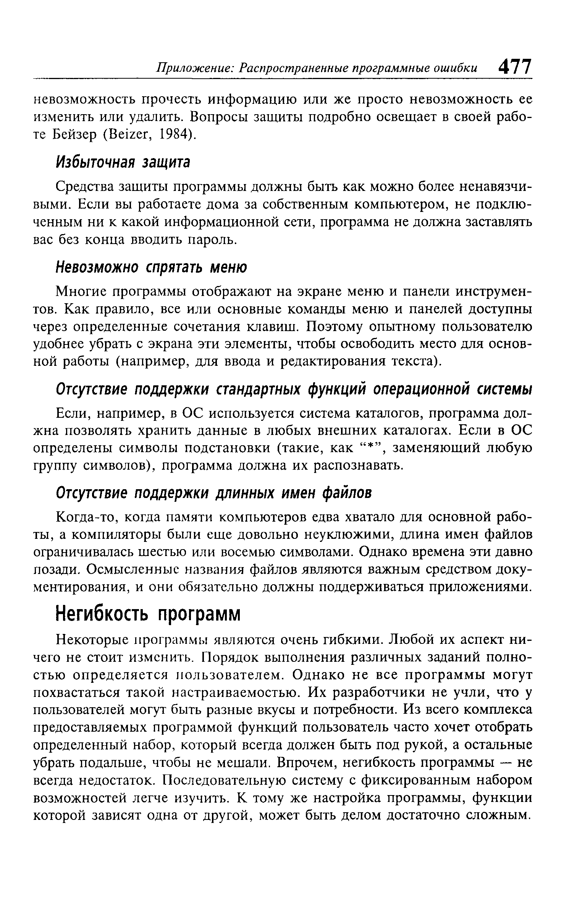

## Настраиваемый интерфейс

Программа должна предоставлять простые и удобные средства настройки тех элементов интерфейса, от конфигурации которых зависит удобство и эффективность работы пользователя.

### Невозможность отключить звук

Многие программы используют в качестве сообщения об ошибке звуковые сигналы или же "озвучивают" клавиатуру, сопровождая каждое прикосновение к ней громким щелчком. В одних случаях это удобно, в других же может раздражать пользователя, а в ситуации, когда в комнате работает несколько человек, вообще недопустимо.

### Отсутствие переключателя учета регистра

Если система способна различать строчные и прописные символы, эта возможность не должна быть жестко закреплена — лучше предоставить пользователю право выбора.

### Несовместимость с аппаратным обеспечением

Программа не должна быть жестко привязана к конкретным типам аппаратного обеспечения. Если пользователь модернизирует свой компьютер, программа должна эффективно использовать его новые возможности.

### Игнорирование инициализации устройств, выполненной извне

Если, например, программа перед печатью посылает на принтер раз и навсегда определенные управляющие коды, это ошибка проектирования. У пользователя должна быть возможность воспользоваться теми средствами настройки, которые предоставляет само устройство или операционная система (например, выбрать один из собственных шрифтов принтера с помощью переключателя на его передней панели).

### Не предусмотрено отключение функции автоматического сохранения

Некоторые программы защищают пользователя от потери информации в случае сбоя, периодически сохраняя вносимые им изменения. Эта исключительно полезная возможность ценна только тогда, когда ее можно по желанию отключать. Пользователь не всегда хочет сохранить данные, иногда такое сохранение может принести вред, а не пользу.

### Невозможность замедлить (ускорить) прокрутку текста

Если на экране автоматически прокручивается текст или сменяются кадры, скорость этого процесса должна быть настраиваемой.

*Отсутствие возможности повторить последнее действие или выяснить, каким оно было*

Пользователю может потребоваться возможность повторить последнюю команду, проанализировать ее или скорректировать.

*Невозможно выполнить только что настроенную команду*

Если программа позволяет пользователю выполнять настройку определенных компонентов, изменения должны вступать в действие немедленно. Если же перезапуск программы совершенно необходим, следует сообщать об этом пользователю. Он не должен гадать, почему не выполняется только что настроенная команда.

*Не сохраняются настроенные параметры программы*

Прекрасно, если программа позволяет пользователю отключить звук. Но главное — чтобы эта установка сохранялась и пользователю не приходилось повторять ее при каждом запуске.

*Побочные эффекты настройки*

Изменение одних функций программы не должно влиять на работу других. Если же такие взаимосвязи неизбежны, они должны быть четко документированы. Кроме того, необходимо сообщать о них пользователю каждый раз, когда он настраивает взаимосвязанные функции.

*Высокая степень настраиваемости*

Существуют настолько гибкие программы, что практически все их аспекты могут быть настроены пользователем. Проектирование таких программ — задача чрезвычайно сложная, поскольку повышение гибкости ни в коем случае не должно быть достигнуто за счет концептуальной целостности и продуманности интерфейса. Конструктор программы должен уметь проанализировать ее с точки зрения опытного пользователя, понять, что ему может быть нужно от программы, как она может быть использована, какие ее аспекты могут потребовать настройки, а какие, наоборот, должны работать раз и навсегда определенным образом.

Следует учитывать, что настройка продукта требует от пользователя его длительного изучения, а также определенных конструкторских способностей. Поэтому программа с самого начала должна иметь вид законченного, целостного и продуманного продукта, чтобы с ней мог работать и неопытный или временный пользователь.

*Кто здесь главный?*

Некоторые программы ведут себя довольно высокомерно. Их сообщения крайне коротки, а стиль абсолютно непростителен — например,

пользователь не может ни отменить свою команду, ни изменить введенные данные. Такие вещи абсолютно недопустимы. Программы должны быть просты в использовании и максимально дружественны. Их задача — облегчать работу людей, а не усложнять ее.

### Навязывание ненужных ограничений

Некоторые программы требуют, чтобы пользователь вводил данные в определенном порядке, завершал одну задачу перед переходом к другой, принимал решения, не проанализировав возможных последствий. Вот примеры.

* Почему, разрабатывая форму ввода, пользователь должен определять имя, тип, ширину и другие характеристики поля до того, как оно будет нарисовано на экране? Все эти параметры необходимо определить до использования формы, но в процессе проектирования ее внешнего вида вполне можно обойтись и без них.
* Описывая задания в системе управления проектом, ее пользователь должен прежде всего перечислить все задачи, затем всех сотрудников, а затем распределить между ними работу. Если система не дает пользователю возможности перераспределять задания между сотрудниками, едва ли она будет пригодна для практического использования.

Очень многие ограничения налагаются программистом просто из-за ошибочного видения работы пользователей. “Для их же пользы” он закрепил в программе “оптимальную” последовательность действий.

### Дружественность к новичкам, создающая неудобства для опытных пользователей

В программе, оптимизированной для новичка, задания могут быть разбиты на множество коротких понятных действий. Однако для опытного пользователя обязательно должен предусматриваться более быстрый способ их выполнения.

### Навязчивая предупредительность и неудачная попытка сделать программу интеллектуальной

Предупредительность и искусственный интеллект программы — это ее способность спрогнозировать дальнейшие действия пользователя и выполнить соответствующие команды, не дожидаясь его указаний. Это замечательная способность, если только предположения программы оказываются верными. Аналогичным образом прекрасной функцией может быть автоматическое исправление ошибок, если только программа не “исправляет”

правильные данные. Люди делают достаточно собственных ошибок, чтобы терпеть еще и постоянные ошибки не в меру предупредительной программы.

Наилучшим решением проблемы является предоставление пользователю возможности подтвердить каждое автоматическое действие программы или отказаться от него.

### Запрос информации без необходимости

Некоторые программы запрашивают у пользователя информацию, которую никогда не используют или просто однажды отображают на экране либо же просят его повторно ввести уже введенные однажды данные (не проверить и подтвердить их правильность, а именно ввести повторно). Как ни странно, такие ошибки чрезвычайно распространены.

### Ненужное повторение действий

Если пользователь допустил ошибку в середине длинной последовательности действий, некоторые программы заставляют его все повторить сначала. Другие заставляют его подтверждать каждый шаг при выполнении каких-либо нестандартных действий. Все это — неоправданные потери времени пользователей.

### Ненужные ограничения

Зачем ограничивать количество полей или записей в базе данных, количество символов в текстовом документе, почему бы не допустить ввод в ячейки электронной таблицы нечисловых данных? В программе не должно быть ограничений, которые никак не влияют на ее производительность или надежность.

## Производительность

Многие опытные пользователи считают производительность программы одной из ее важнейших характеристик. Существует несколько определений производительности.

* *Скорость программы*, т.е. скорость выполнения ею стандартных задач. Например, как быстро текстовый процессор перемещается к концу файла?
* *Производительность работы пользователя*. Эта характеристика относится к быстроте выполнения более крупных заданий. Например, сколько времени потребуется пользователю на ввод и печать письма?
* *Ощущение производительности*. Насколько быстрой программа кажется пользователю?

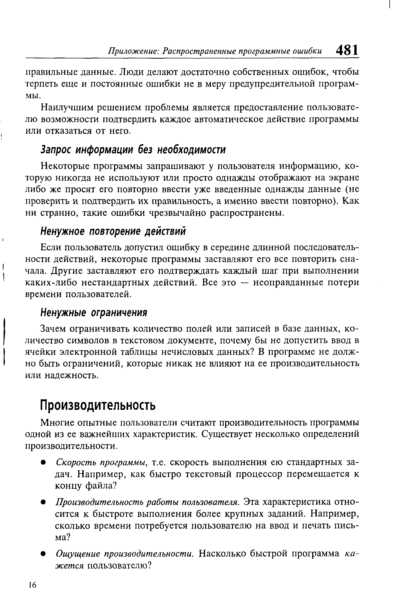

В любом случае работа высокоскоростной программы с неудачным пользовательским интерфейсом кажется медленнее, чем на самом деле.

## Низкоскоростная программа

Многие ошибки проектирования и кодирования приводят к замедлению работы программы. Программа может выполнять ненужную работу, например, инициализировать области памяти, которые перед использованием обязательно будут перезаписаны. Или же программа может без необходимости повторять определенные действия, делать внутри цикла то, что может быть один раз выполнено вне его.

Любая задержка реакции на действия пользователя представляет собой проблему. Даже пауза в четверть секунды может нарушить его концентрацию и привести к существенному увеличению времени выполнения всего задания.

## Медленное реагирование

Программа должна немедленно отображать вводимые пользователем данные. Если пользователь замечает паузу между нажатием клавиши и появлением символа на экране, значит, программа реагирует слишком медленно, а это повышает вероятность ошибки пользователя. Быстрая реакция важна для любых событий — перемещения мыши, светового пера, голосового ввода.

## Как повысить производительность работы пользователя

Даже программу с мгновенной реакцией нельзя назвать производительной, если она замедляет работу пользователя. Вот примеры "узких мест":

* все, что повышает вероятность ошибок пользователя;
* громоздкая схема исправления ошибок, когда программа, например, заставляет пользователя повторно вводить большое количество информации;
* все, что ставит пользователя в тупик, заставляя его обращаться к руководству или справочной системе;
* неоправданное увеличение количества действий, необходимых для достижения определенного результата: отсутствие сокращений, разбиение задач на мелкие подзадачи, требование подтверждения незначительных команд и т.п.

Конкретные ошибки перечисленных типов описаны в других разделах данного приложения. Одним из эффективных методов давления на руководство в целях повышения производительности программы является про-

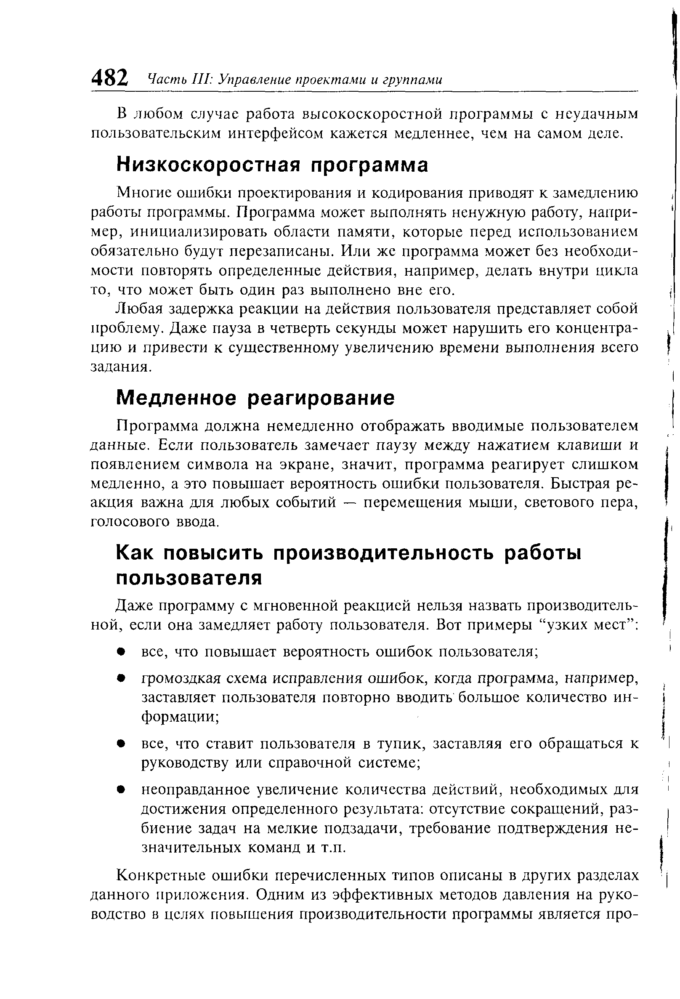

ведение сравнительных испытаний, показывающих преимущество уже имеющихся на рынке аналогичных программ.

### Время ответа

Хорошая программа не должна заставлять пользователя ждать. Она мгновенно распознает команды пользователя и назначает им наивысший приоритет. Например, введите несколько строк текста, пока текстовый процессор переформатирует экран. Он должен немедленно прекратить форматирование и отобразить введенный текст.

### Программа, занятая другими задачами, не распознает ввод

Программа, ориентированная на ввод данных, должна распознавать ввод даже тогда, когда она занята другой работой. Она запоминает вводимые пользователем данные и отображает их чуть позднее.

### Отсутствие предупреждений о длительных операциях

Если на выполнение очередного действия программе потребуется более нескольких секунд, она должна сообщить об этом пользователю и указать предполагаемую длительность процесса, чтобы он мог спланировать собственное время. Кроме того, необходимо предоставить пользователю возможность отмены команды.

### Отсутствие индикаторов хода работы

Выполнение очень длительных заданий желательно сопровождать индикаторами, указывающими, какая часть работы уже выполнена и какая еще осталась.

### Проблемы тайм-аутов

Некоторые программы ограничивают время, выделенное пользователю для ввода данных. За исключением аркадных игр, едва ли найдутся случаи, в которых такое ограничение действительно необходимо.

Тайм-ауты могут быть не только слишком короткими, но и слишком длинными. Например, перед выполнением какого-нибудь длительного задания в программе может быть предусмотрена пауза, в течение которой пользователь может это задание отменить. Если пауза слишком длительна, это тормозит работу.

Кроме того, один и тот же тайм-аут одним людям, ждущим его окончания, может показаться длинным, а другим, вводящим данные, слишком коротким.

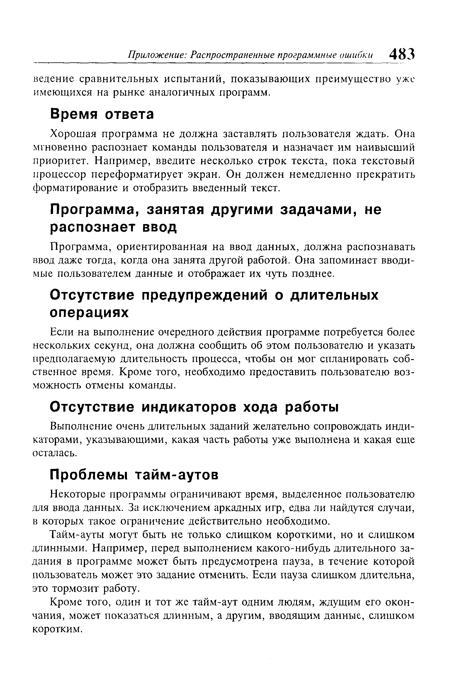

## Надоедливая программа

Бип! Вы уверены?
Бип! Ваш диск заполнен на 85%. Пожалуйста, поскорее его освободите.
Бип! Вы *действительно* уверены?
Бип! За последний час вы ни разу не сохраняли текст.
Бип! Ваш диск заполнен на 86%. Пожалуйста, поскорее его освободите.
Бип! Пожалуйста, введите еще раз свой пароль.
Бип! Вы ничего не вводите вот уже десять минут. Пожалуйста, выйдите из системы.
Бип! Ваш диск заполнен на 86%. Пожалуйста, поскорее его освободите.
Бип! Вы не ответили на 14 сообщений.

Напоминания, предупреждения и вопросы, разумеется, полезны, но во всем следует соблюдать меру.

### Вам действительно нужна справочная информация и графика при скорости обмена 300 бод?

При низкоскоростном соединении с сервером программ и данных, когда компьютер пользователя работает в режиме терминала, программа должна быть написана так, чтобы через соединение передавался минимум информации. Справочная система, длинные меню, красивые картинки — все эти преимущества современного интерфейса могут просто выводить пользователя из себя, когда они медленно-медленно прорисовываются на экране. Нередко в подобных ситуациях наилучшим решением является интерфейс командной строки.

Подобным же образом испытывать терпение пользователя может и красивая, но медленная печать. Для сложных, но не необходимых графических изображений стоит предусматривать быстро печатаемые черновые варианты.

### Вывод

Выходная информация программы должна быть полной и понятной читающему ее человеку или программе. Она должна включать все необходимое пользователю и быть представлена в желаемом им формате. Выходная информация должна направляться на любое указанное пользователем устройство.

### Невозможно получить определенные данные

У пользователя должна быть возможность получить (увидеть и распечатать) любые данные, которые он ввел, включая и техническую информа-

цию, например, формулы, введенные в ячейки электронной таблицы, или определения полей базы данных.

### Невозможно перенаправить вывод

У пользователя должна быть возможность направить вывод программы на указанное им устройство. Например, очень часто возникает необходимость сохранить предназначенные для печати данные в дисковом файле. Затем их можно отредактировать или напечатать в другой программе, более быстрой или удобной.

Программа не должна препятствовать пользователю направлять данные на неожиданные устройства — плоттеры, ленточные накопители и т. п.

### Формат, неподходящий для дальнейшей обработки

Если программа должна сохранять данные в формате, понятном другой программе, необходимо проверить их совместимость. Это означает, что следует раздобыть копию второй программы, сохранить данные в первой и прочитать во второй. Об этом тесте часто забывают, особенно если программы разработаны разными компаниями.

### Слишком мало или слишком много выходной информации

У пользователя должна быть возможность модифицировать отчет, чтобы распечатать только необходимую информацию. Зачем ему просматривать ворох распечаток в поиске двух-трех строчек? Избыток информации является почти таким же серьезным недостатком, как и ее отсутствие.

### Невозможность форматирования выходной информации

Полученные данные пользователь может захотеть представить в удобном ему виде: что-то выделить, подчеркнуть, что-то отделить, перегруппировать определенные данные. Для этого программа может сохранять данные в формате какого-нибудь распространенного текстового процессора.

### Абсурдная степень точности

Глупо представлять результат операции $4,2 + 3,9$ в виде $8,1000000$. Выходные данные, как правило, должны округляться до степени точности входных данных или же просто соответствовать заранее определенному формату.

### Невозможность форматирования заголовков таблиц и подписей рисунков

Следует предоставлять пользователю возможность изменять положение, шрифт и даже текст подписей и заголовков таблиц, диаграмм, графиков и т.п.

### Невозможность изменения масштаба графиков

У пользователя должна быть возможность изменить заданный по умолчанию масштаб формируемых программой графиков и диаграмм.

## Обработка ошибок

Ошибки в подсистемах обработки ошибок чрезвычайно распространены. Программа может не распознавать все возможные ошибки, не предотвращать те из них, которые легко могут быть предотвращены, или плохо справляться с их последствиями.

### Предотвращение ошибок

В книге Йордана (Yourdon, 1975) целая глава посвящена технике предотвращения ошибок. Программы должны быть защищены от недопустимого ввода и неправильной эксплуатации. Простейшим способом защиты является проверка вводимых данных.

### Неверное начальное состояние

Если определенная область памяти должна содержать нули, программе не мешает это проверить, прежде ее использовать.

### Неадекватная проверка пользовательского ввода

Недостаточно просто сказать человеку, что он не должен вводить чисел, состоящих больше чем из трех цифр. Программа должна проверить, действительно ли введенные данные соответствуют этому условию. Если пользователь *может* что-то ввести, программа должна адекватно на это среагировать.

### Неадекватная защита от испорченных данных

Где гарантия, что хранящиеся на диске данные в порядке? Возможно, кто-то редактировал файл, а может быть, он был испорчен в результате аппаратного сбоя. Даже если программист проверил файл после его записи на диск, необходимо удостовериться, что к моменту чтения файл остался в том же состоянии.

## Не выполнена проверка переданных параметров

Подпрограмма не должна предполагать, что ее всегда вызывают правильно. Она должна сама удостовериться в адекватности переданных данных.

## Недостаточная защита от ошибок операционной системы

В операционной системе имеются ошибки. Некоторые из них могут проявляться при обращении приложений к определенным интерфейсным функциям. Если, например, программист знает, что при попытке печати данных сразу после их сохранения на диске операционная система сбоит, он должен гарантировать, что программа ни при каких обстоятельствах не будет этого делать.

## Не выполняется проверка версии

Если исполняемый код хранится в нескольких файлах, кто-то может попытаться использовать новую версию одних файлов со старой версией других. Модернизируя программное обеспечение, пользователи часто допускают подобные ошибки. Поэтому программа должна проверять версии всех своих файлов и сообщать пользователю о несоответствиях.

## Недостаточная защита от неправильного использования

Люди могут намеренно вводить в программу неверные данные, чтобы посмотреть, как она на это отреагирует. Мотиваций всех и каждого не предусмотришь. Утверждение, что ни один разумный человек не станет использовать программу подобным образом не защищает ее от людей неразумных.

## Выявление ошибок

Как правило, у программ достаточно информации для определения правильности данных или их обработки. В этом разделе описаны некоторые часто игнорируемые программистами возможности выявления ошибок.

## Переполнение

Переполнение — это ситуация, когда результаты вычислений слишком велики, чтобы программа могла их обработать. Часто так получается при сложении или умножении очень больших чисел, при делении на нуль или делении очень маленьких чисел. Программа обязательно должна проверять

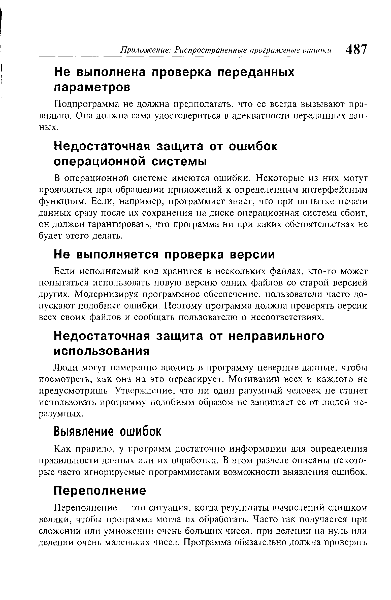

результаты подобных операций, однако некоторые продукты этого не делают.

## Невозможные значения

Программа должна проверять переменные, чтобы удостовериться, что хранящиеся в них данные не являются заведомо неверными. Например, программа не должна принимать такие даты, как 31 февраля. Если программа выполняет одно действие, когда некоторая переменная имеет значение 0, и другое, когда она имеет значение 1, и никаких других значений переменная иметь не может, следует все же проверить ее содержимое перед принятием решения, а не считать, что, если в переменной не 0, значит, 1.

## Непроверенные данные

Кто-то может попытаться снять со своего счета 10 млн долларов, однако программа должна запросить разрешение на такую транзакцию еще у нескольких людей.

## Флаги ошибок

Программа вызывает подпрограмму, в которой происходит сбой. Подпрограмма заносит информацию об этом в определенную переменную, называемую флагом ошибки. После вызова программа может проверить флаг, а может и забыть это сделать — такое случается довольно часто. Возвращенные подпрограммой испорченные данные будут использованы как правильный результат.

## Аппаратные сбои

Программа должна учитывать, что устройства, к которым она подключается, могут сбоить. Многие устройства достаточно интеллектуальны, чтобы сообщить о неудачном выполнении переданных им команд. В этом случае программа должна прекратить взаимодействие с устройством и сообщить о произошедшем пользователю.

## Сравнение данных

Подводя баланс своих доходов и расходов, вы сверяете предполагаемый остаток денег с реальным содержимым своего кошелька. Если суммы не сходятся, значит, в ваших записях допущена ошибка. У программ также часто имеется возможность сверить два набора данных или результаты проведенных двумя способами вычислений.

## Восстановление после ошибок

Происходит ошибка, программа замечает ее и пытается что-то предпринять. Часто код, выполняющий восстановление после нестандартных ситу-

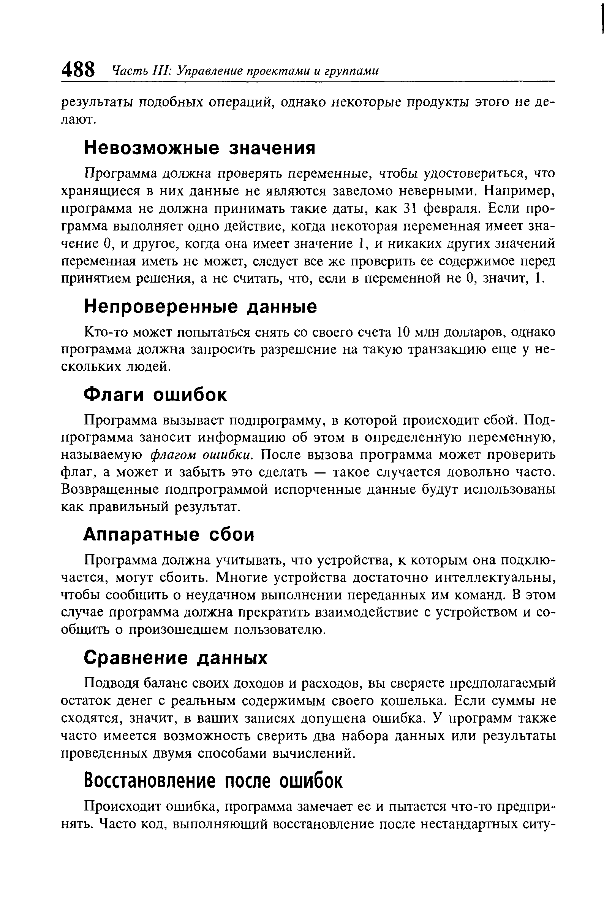

аций, бывает очень плохо отлажен, а иногда даже не протестирован вовсе. В то же время ошибки в подсистемах восстановления обычно имеют крайне неприятные последствия для пользователя.

## Автоматическое исправление ошибок

Некоторые программы способны не только выявлять ошибки, но и исправлять их, никого не беспокоя, на основе других данных или определенных правил. Это замечательная способность при условии, что исправление всегда выполняется правильно.

## Отсутствие сообщения об ошибке

Программа должна обязательно сообщать о любой своей ошибке, даже если ошибка внутренняя и ее последствия исправлены автоматически. Не обязательно сообщать об ошибке пользователю, иногда достаточно сообщить о произошедшем администратору многопользовательской системы или внести запись в файл журнала.

## Не установлен флаг ошибки

Если в подпрограмме происходит ошибка, предполагается, что подпрограмма установит соответствующий флаг. Если она этого не сделает, вызывающая программа будет считать, что возвращенные ей данные верны, что приведет к новым ошибкам.

## Куда возвращается управление?

Если в определенном фрагменте кода происходит сбой, пусть даже правильно обработанный, куда будет передано управление после этого? Особенно остро эта проблема стоит в программах, в которых используются не вызовы подпрограмм, а переходы по команде `GOTO`.

## Прекращение выполнение программы из-за ошибки

Ошибка в программе может быть такой серьезной, что либо программа прекратит свою работу сама, либо это сделает пользователь. Будут ли при этом закрыты все открытые файлы? Будет ли сделана необходимая запись в файле журнала? Короче говоря, завершит ли программа свою работу корректно или оставит после себя полнейший хаос?

## Обработка аппаратных отказов

Программа должна разумно вести себя в случае аппаратных сбоев и отказов. Если диск переполнен, она должна уметь записать данные на другой носитель, а не потерять их. Если устройство долгое время не отве-

чает, она должна предположить, что оно отключено, а не сидеть и ждать вечно.

## Ну нет у меня нужного диска!

Предположим, что программа просит пользователя вставить диск с необходимыми ей файлами. Если пользователь вставляет не тот диск или же диск не читается, программа сообщает об этом и просит вставить другой диск. Однако, если другого диска у пользователя нет, должна быть возможность сообщить об этом программе и продолжить работу, а не перезагружать систему.

## Ошибки, связанные с граничными условиями

Граничное условие определяет поведение программы. Если это условие касается данных, то с одной стороны определяемой условием границы данные обрабатываются одним способом, а с другой — другим. Вот три очень распространенных примера ошибок, связанных с граничными условиями.

* Неправильная обработка граничного значения. Если программа увеличивает на 1 любое число, которое меньше 100, и отвергает числа, которое больше 100, что она будет делать, если пользователь введет число 100?
* Неверное граничное условие. В спецификации сказано, что программа должна увеличивать на 1 любое число, которое меньше 100, но отвергать все числа больше 95.
* Неправильная обработка данных, не соответствующих граничным условиям. Значения с одной стороны границы невозможны, нежелательны, недопустимы или невероятны. Для их обработки вообще не написано никакого кода. Что делает программа, если пользователь вводит число, которое больше 100, — корректно его отвергает или разрушается?

На самом деле концепция граничных условий гораздо шире. Она охватывает не только данные, но вообще любые аспекты поведения программы, к которым может быть применено понятие границ. Любые фрагменты кода, определяющие что-либо как наибольшее, самое старое, первое, самое длинное, произошедшее впервые и т.п., потенциально могут содержать одни и те же ошибки. А раз так, почему бы не применять к ним одинаковые термины.

## Числовые ограничения

Одни числовые ограничения относительно произвольны, другие представляют собой естественные границы обрабатываемых программой значений. У треугольника ровно три стороны (не больше и не меньше). Сумма величин его углов равна 180 градусам. В одном байте могут храниться значения от 0 до 255. Если символ является буквой, его код находится в диапазоне от 65 до 90 или от 97 до 122.

## Ограничения на равенство

Элементы списка могут отличаться, а могут быть и одинаковыми. Как сработает сортировка в каждом из случаев? Если в списке содержатся числа, как на их основе будут вычислены результаты статистических функций, в частности те, алгоритм вычисления которых в случае одинаковых параметров включает деление на 0?

## Количественные ограничения

Длина входной строки не должна превышать 80 символов. Что будет, если пользователь введет 79, 80 или 81 символ?

Может ли в списке быть только один элемент? Ни одного? Какова величина среднего отклонения для списка чисел, состоящего из одного элемента? (Оно может быть нулевым или неопределенным.)

## Пространственные ограничения

Если, например, программа рисует график в прямоугольнике определенного размера, что будет, если одну из точек графика нарисовать вне прямоугольника?

## Ограничения времени

Предположим, что программа отображает запрос, 60 секунд ожидает ответа, а затем, если ответа нет, отображает меню. Что произойдет, если пользователь начнет что-то вводить в процессе отображения меню?

Предположим, что у пользователя есть 30 секунд для ответа на телефонный звонок. Через 30 секунд телефон перестает звонить и вызов перенаправляется оператору. Что будет, если снять трубку на 30-й секунде? Можно ли ответить на звонок по истечении 30 секунд, но до того, как на него ответит оператор?

Предположим, что вы нажимаете на клавишу `<Пробел>` в то время, как операционная система загружает с диска программу. Что произойдет? Информация о нажатии клавиши может быть проигнорирована, сохранена на операционной для загружаемой программы или передана другой активной в этот момент программе. А может быть, произойдет нечто совсем уж неожиданное, например, разрушение системы.

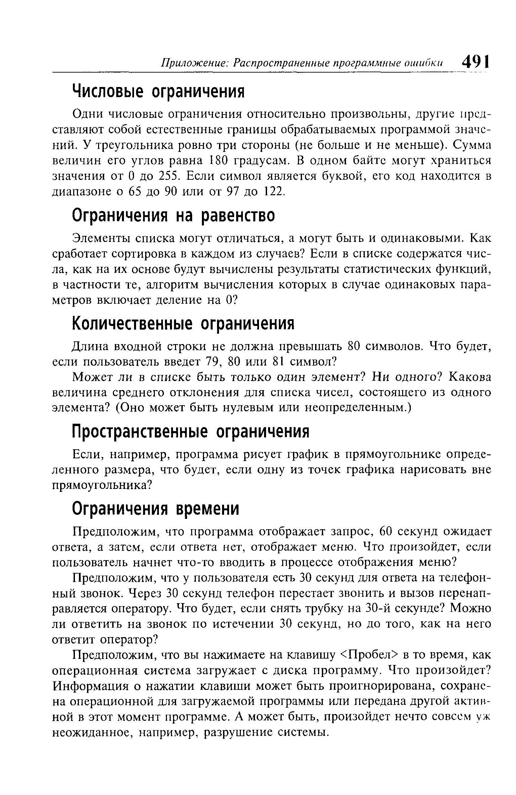

*Условия гонок представляют собой граничные значения времени.*

## Условия циклов

Вот пример цикла:

```text
10 IF CountVar < 45
THEN PRINT "Это цикл"
SET CountVar TO CountVar + 1
GOTO 10
ELSE QUIT
```

Программа печатает слова “Это цикл” и увеличивает значение переменной **CountVar** на 1 до тех пор, пока ее значение не станет равным 45. После этого программа прекращает работу. Выражение **CountVar < 45** является условием выполнения цикла. Граничное значение (в данном случае максимальное) представляет в нем число 45. Возможно также наличие в условии цикла минимального граничного значения, а также обоих: $10 < \text{CountVar} < 45$. О тестировании условий циклов подробно рассказывает Бейзер (Beizer, 1990).

## Ограничения объема памяти

Каковы максимальный и минимальный объемы памяти, с которыми может работать программа? (Да-да, существуют программы, которые не могут работать со слишком большим объемом памяти.) Как программа использует свою память: разбивает на страницы, сегментирует? Не теряются ли первый или последний байты сегмента? (Кстати говоря, начинается ли их нумерация с 0 или с 1?) Используется ли программой виртуальная память, т.е. выгружается ли часть страниц данных на диск? Если да, как выполняется чтение данных? Возможно так: страница — из памяти, страница — с диска, страница — из памяти, страница — с диска и т.д. Как это отражается на производительности программы?

## Ограничения, связанные со структурой данных

Предположим, что программа хранит данные в виде записей. Каждая запись состоит из имени сотрудника, его учетного номера и оклада. Правильно ли программа читает с диска первую запись? Последнюю? Как программа отмечает конец одной записи и начало следующей? Все ли данные соответствуют этому формату? Что, если у двух служащих окажутся одинаковые учетные номера?

## Ограничения, связанные с аппаратным обеспечением

Если мэйнфрейм способен обслуживать до сотни терминалов, что будет при подключении 99, 100, 101-го. Что, если 100 человек одновременно попытаются к нему подключится?

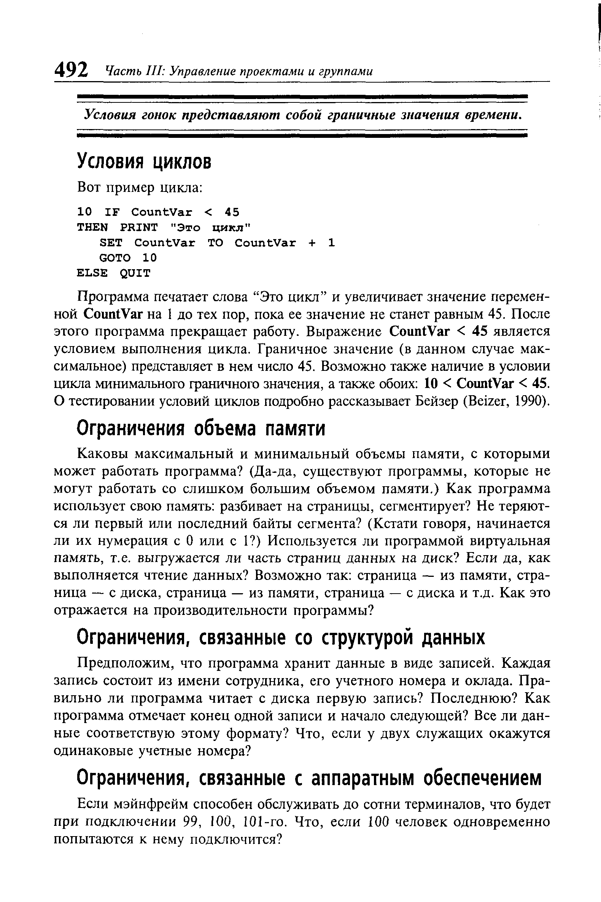

Что произойдет, когда диск заполнится до отказа? Если в каталоге может храниться до 128 файлов, что будет, если попытаться сохранить в нем 127, 128 и 129-й файл? Если у принтера имеется входной буфер, что будет, если программа заполнит его, но у нее останутся еще неотправленные данные? Что будет, если в принтере закончится бумага или картридж?

## Невидимые границы

Не все граничные условия программы видны извне. Например, подпрограмма может вычислять результат по одной формуле, если значение аргумента больше 100, и по другой в противном случае. Очевидно, что 100 в данном случае является граничным значением, но вы можете даже не подозревать об использовании такого алгоритма вычислений.

## Ошибки вычислений

Программа что-то вычисляет и получает неверный результат. Этому могут быть три причины.

* *Неверная логика*. Ее причиной может быть опечатка, например, `A-A` вместо `A+A`. Возможно также, что программист неаккуратно разбил сложное выражение на несколько более простых. Возможно, он воспользовался неверной или неприменимой к данной ситуации формулой. (Это, впрочем, уже ошибка проектирования — код делает именно то, хотел программист, но его представление о том, что должно быть сделано, неверно.)
* *Неправильно выполняются арифметические операции*. Возможно, что допущена ошибка при кодировании базовых функций, например, сложения или умножения. Такая ошибка может проявляться при каждом выполнении данной операции (например, $2+2=5$), а может только в некоторых случаях. Как бы там ни было, при работе программы, использующей неверно закодированную функцию, возможны ошибки.
* *Неточные вычисления*. Если программа выполняет арифметические операции над числами с плавающей запятой, возможны ошибки округления и отсечения. После ряда промежуточных округлений $2+2$ может оказаться равным 5, даже если в программе нет логических ошибок.

Данная область настолько велика, что в этом приложении мы рассматриваем ошибки вычислений лишь самым поверхностным образом. Для начального ознакомления с этим вопросом можно порекомендовать книги таких авторов, как Конте и Де Буа (Conte & deBoor, 1980) и Кнут (Knuth, 1981). Для его дальнейшего изучения подойдут книги Конте и Де Буа, Карнахана (Carnahan), Лютера и Уилкеса (Luter & Wilkes, 1969).

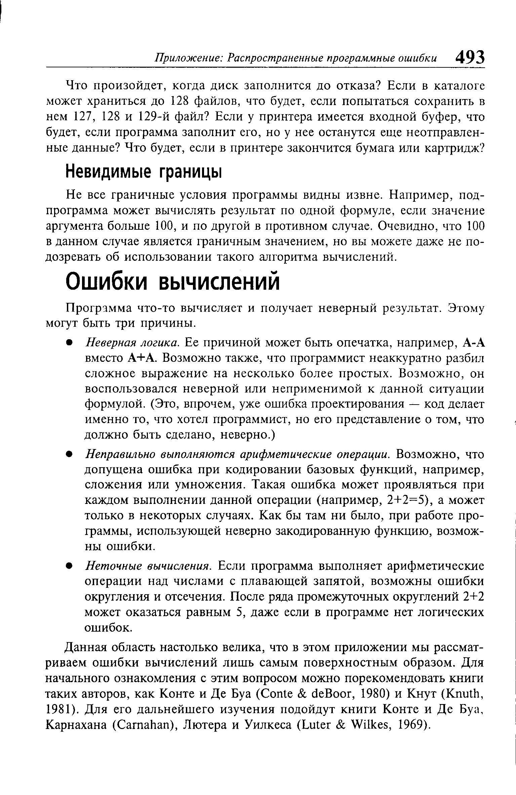

## Устаревшие константы

Иногда константы используются в программах непосредственно. Примерами могут служить следующие значения: к компьютеру может быть подключено до 64 терминалов; длина конфигурационного файла не должна превышать 706 байтов; первыми двумя цифрами года являются 19. Когда эти значения меняются, приходится менять и программу. При этом случается, что, изменив значение в одном месте программы, забывают изменить его в другом, что является источником множества ошибок.

## Ошибки вычислений

Некоторые ошибки очень просты, например, выполнение сложения вместо вычитания или перестановка параметров функции. Исправить их обычно не составляет труда. Если программа запрашивает входные данные, выполняет вычисления, а затем отображает результат, выполните те же вычисления самостоятельно и сравните полученные данные.

## Неверно расставленные скобки

```text
(A + (B + C) * (D + (A / C - B E / (B+ (F + 18 /
(A - F))))))
```

Выражения с обилием скобок очень трудно проверять и в них легко ошибиться, особенно когда некоторое время спустя после написания программы в нее вносятся изменения.

## Неправильный порядок операторов

Программа может выполнять вычисления не в том порядке, в каком ожидает программист. Например, если `**` означает возведение в степень, так что $5 ** 3$ означает 5 в кубе, будет ли $2 * 5 ** 3$ равно 1000 (10 в кубе) или 250 (5 в кубе умноженное на 2)?

## Неверно работает базовая функция

Коммерческие языки и средства разработки программ обычно поставляются с определенным набором базовых функций, таких как функции, выполняющие сложение и умножение. Кроме того, некоторое количество таких функций программисты могут написать самостоятельно, и эти функции могут содержать ошибки, вероятность возникновения которых прямо пропорциональна сложности функции. (Строго говоря, даже встроенные функции языка не гарантированы от ошибок, хотя обычно они очень тщательно протестированы.) Иногда, желая сделать код более быстрым или коротким, программисты пользуются неточными формулами аппроксимации.

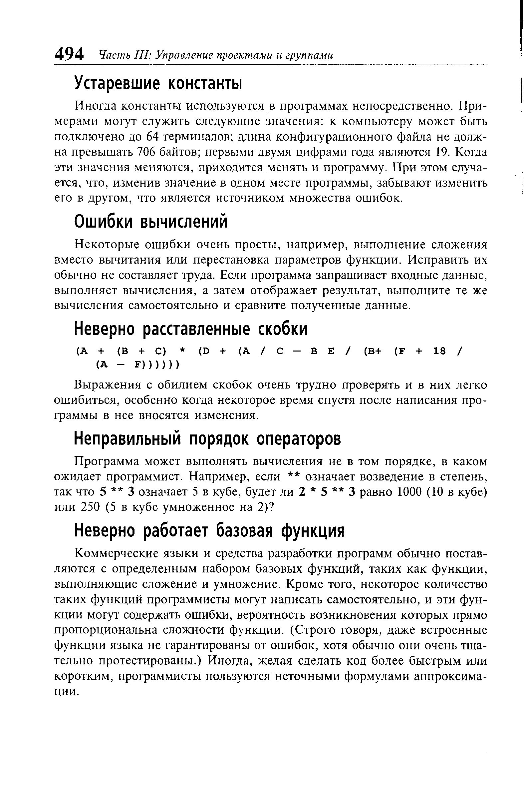

## Переполнение и потеря значащих разрядов

*Переполнение (overflow)* — это ситуация, когда результаты вычислений слишком велики, чтобы программа могла их обработать. Предположим для примера, что программа хранит все числа в целом формате, выделяя для них по одному байту. С числами от 0 до 255 все получается прекрасно. Однако сложить 255 и 255 такая программа не может, поскольку результат не помещается в один байт. Подобные вещи происходят и при вычислениях с плавающей точкой, когда дробная часть оказывается слишком большой.

Переполнение может возникнуть и в случае, когда результат вычисления оказывается слишком маленьким. Как программе сохранить число $0,34674335$, если для хранения дробной части выделен только один байт? В этом случае программы поступают по-разному — отсекают непоместившиеся цифры или преобразуют результат в 0. В обоих случаях имеет место *потеря значащих разрядов (underflow)*.

### Ошибки отсечения и округления

Предположим, что программа может хранить числа длиной не более двух цифр. В числе $5,19$ три цифры. Если программа просто отсечет цифру 9, она сохранит $5,1$. Вместо этого она может округлить число, и тогда будет сохранено $5,2$, что гораздо ближе к исходному значению.

Если язык программирования позволяет хранить до двух десятичных знаков, говорят, что он работает с точностью до двух цифр. Выполняемые им вычисления будут неточными. Например, $2,05^6$ равняется приблизительно 74. Однако если округлить $2,05$ до $2,1$, тогда $2,05^6$ будет равно приблизительно 86. Если отсечь цифру 5, получив $2,0$, результатом возведения в степень будет 64.

Языки, работающие с точностью до двух цифр, нам неизвестны, а вот работающие с точностью до шести цифр встречались. Вычисления такой точности годятся для простых расчетов, но в сложных математических программах они могут привести к очень серьезным ошибкам.

### Путаница с представлением данных

Одно и то же число может быть представлено несколькими способами, которые нельзя путать. Предположим, например, что программа просит вас ввести число между 0 и 9. Вы вводите 1. Программа может сохранить это число в формате с фиксированной точкой в одном байте. В байте 8 битов, так что его содержимое будет таким: `0000 0001`. Программа может поступить и иначе и сохранить ASCII-код введенной цифры. ASCII-код единицы равен 49 или `0011 0001` в двоичном формате. В обоих случаях результат помещается в одном байте. Позднее можно перепутать способы хранения

и интерпретировать содержимое этого байта как число вместо кода или наоборот. Это только один из множества возможных примеров.

## Неправильное преобразование данных из одного формата в другой

Программа просит ввести число между 0 и 9. Вы вводите 1. Это символ, и программа получает его код — 49. Чтобы превратить полученную информацию во введенное вами число, программа должна вычесть из значения кода число 48. Вместо этого она вычитает 49 и получает 0. Каждый фрагмент программного кода, в котором выполняется преобразование формата данных, является потенциальным источником ошибок. Имейте в виду, что обычно в программе выполняется огромное количество преобразований — между различными форматами числовых значений, числами и строками, символами и цифрами и т.п.

## Неверная формула

Во многих программах используются сложные формулы. Программист может ошибиться, переписывая формулу из книги, взять вообще не ту формулу или же неправильно ее запрограммировать.

## Неправильное приближение

Многие формулы для приблизительной оценки значений разработаны задолго до появления компьютеров. Они являются исключительно полезным достижением, позволяющим сократить количество вычислений, но результаты получаются очень неточными. Благодаря вычислительной мощности современной компьютерной техники, в значительной части этих формул больше нет нужды. Однако они присутствуют во многих учебниках и по-прежнему используются многими программистами, отчего страдает точность результатов. Поэтому планируя тестирование программ, в которых много математических и статистических расчетов, позаботьтесь, чтобы в группе был хоть один специалист, основательно разбирающийся в этих вопросах.

## Начальное и последующие состояния

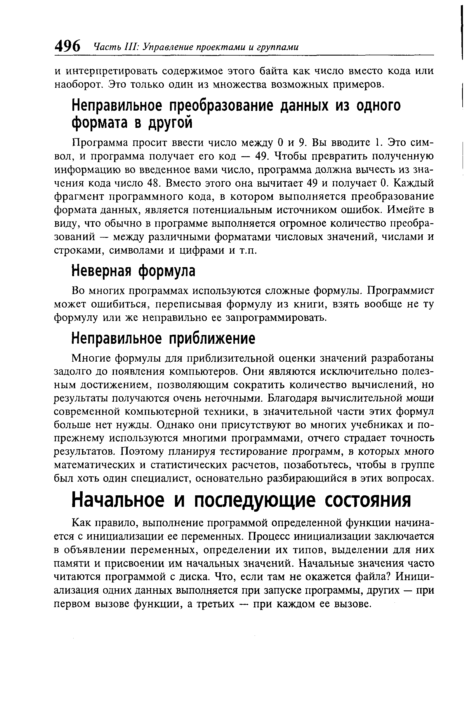

Как правило, выполнение программой определенной функции начинается с инициализации ее переменных. Процесс инициализации заключается в объявлении переменных, определении их типов, выделении для них памяти и присвоении им начальных значений. Начальные значения часто читаются программой с диска. Что, если там не окажется файла? Инициализация одних данных выполняется при запуске программы, других — при первом вызове функции, а третьих — при каждом ее вызове.

Возможные стратегии инициализации данных определяются языком программирования, а их выбор в каждом конкретном случае — нуждами программы. Вот несколько примеров.

* Объявленные в функции переменные могут сохранять свои значения от одного ее вызова до другого. Такие переменные часто называют *статическими*. Их используют для тех данных, которые функция должна сохранить для следующего вызова. Другие переменные эта же функция может инициализировать при каждом своем запуске. Для правильной работы со статическими переменными функция должна определять, была ли она уже вызвана хотя бы раз, и, если нет, инициализировать все эти переменные.
* Локальные переменные функции могут стираться из памяти сразу же после завершения ее работы. Такие переменные называют *динамическими*. Каждый раз, когда функция вызывается, она должна повторно инициализировать все свои динамические переменные.
* За присвоение переменной начального значения может отвечать как компилятор, так и программист. Если программист не присвоил переменной начальное значение, одни компиляторы присваивают ей 0, а другие не заботятся об очищении выделенного переменной участка памяти, и в ней может оказаться все что угодно.

Ошибки инициализации обычно проявляются при первом вызове функции, когда она не инициализировала свои переменные правильно, и при втором, когда она неправильно выполнила повторную инициализацию. Иногда ошибки инициализации зависят от пути выполнения программы. За выполнение инициализации переменных могут отвечать фрагменты кода функции, выполняющиеся в одних случаях, и не выполняющиеся в других.

### Не присвоены начальные значения

Многие компиляторы очищают выделяемую для переменных память, таким образом инициализируя их нулями или пустыми значениями. Однако, когда начальное значение переменной не должно быть нулевым, многие программисты забывают его присвоить. Такая ошибка обычно обнаруживается сразу, как только программа обращается к неправильно инициализированным данным.

### Не инициализирована переменная, управляющая циклом

*Переменная, управляющая циклом*, определяет, сколько раз будут выполнены составляющие его операторы. Например, программа печатает первые 10 строк текстового файла. Как только достигается 11-я строка, програм-

ма останавливается. При следующем запуске функция, выполняющая всю эту работу, должна снова присвоить счетчику строк значение 1.

## Не инициализирован указатель

В переменных-указателях хранятся адреса памяти. Такая переменная может, например, указывать начало определенной строки. Значение указателя может меняться: например, вначале он содержит адрес первого символа строки, затем второго, третьего и т.д. Если указатель неправильно инициализировать или забыть инициализировать вообще, он может содержать неверный адрес. Если программа отображает фрагмент строки, “мусор” или не те элементы массива, скорее всего, ошибка связана с использованием указателей.

## Не очищена строка

В *строковых переменных* хранятся последовательности символов. Если значением числовой переменной может быть **5**, то значением строковой — **Привет, меня зовут Сергей**. Строковые переменные могут отличаться по длине. Переменной, в которой хранилась строка **Привет, меня зовут Сергей** можно присвоить более короткую строку **Пока**. Присваивание может работать по-разному (это зависит от компилятора и выбранного способа). Если программист не допишет в конец новой строки пробелы, в результате может получиться **Покает, меня зовут Сергей**.

## Не инициализированы регистры

Регистрами называются специальные области памяти объемом в несколько байтов, обычно находящиеся внутри центрального процессора. Хранящимися в них данными компьютер манипулирует гораздо быстрее, чем теми, которые записаны в обычной оперативной памяти. Поэтому программисты часто пользуются регистрами для временного хранения данных. Они копируют несколько переменных в регистры, работают с ними, а затем копируют их значения обратно в память. После этого бывает необходимо восстановить исходные значения регистров, о чем часто забывают. Забывают также загрузить данные в один или несколько регистров.

## Не сброшен флаг

*Флаги* — это переменные, значения которых являются сигналами об определенных условиях. Флаг может быть установлен (истинен, включен, равен 1) или сброшен (очищен, ложен, выключен, равен 0 или -1). В нормальном состоянии флаг сброшен. Если одна часть программы хочет сообщить другой о наступлении определенного события — о сбое, инициализации переменной, ее переполнении, о том, что пользователь нажал на клавишу, и т.п., тогда она устанавливает флаг этого события.


Состояние флага всегда должно соответствовать условию, с которым он связан. Например, подпрограмма может сбрасывать свой флаг при вызове и устанавливать при выходе. Таким образом, установленный флаг будет означать, что выполнение процедуры завершено нормально. Разумеется, никакая другая процедура этим флагом пользоваться не должна. Некоторые программы устанавливают и сбрасывают одни и те же флаги во многих местах кода, так что трудно сказать, достоверны их значения или нет.

### Данные должны были инициализироваться в другом месте

Функция может инициализировать не все свои данные. Например, переменные, которые она использует совместно с какой-нибудь другой функцией, могут инициализироваться обеими. Предположим, что несколько функций из одного и того же меню используют несколько переменных, инициализируемых программой при отображении этого меню. Если другого способа вызвать эти функции нет, тогда все в порядке. Но что, если одна из этих функций присутствует и в другом меню либо вызывается из блока обработки ошибки в другой функции или еще откуда-нибудь?

### Не выполнена повторная инициализация

Программист может забыть удостовериться, что при повторном вызове функции в ее переменных содержатся правильные значения. Если, например, переменная сохраняет свое значение от вызова к вызову и при ее создании компилятор автоматически присваивает ей 0, программисту этого делать не нужно. Но только при первом вызове. Когда функция вызвана на второй раз, в переменной, скорее всего, уже не нулевое значение. Ожидает ли программист, что в ней всегда 0?

Имейте в виду, что инициализация не всегда выполняется в самом начале подпрограммы. При одном способе входа в нее или одном пути ее выполнения данные могут быть инициализированы правильно, а при другом — нет.

### Предположение, что данные не были инициализированы

Иногда программа может инициализировать данные несколько раз подряд. Такое повторение в общем не приносит вреда, за исключением потерь времени.

### Путаница со статическими и динамическими переменными

*Динамические* переменные создаются при входе в функцию и разрушаются при выходе из нее, в то время как *статические* создаются при самом

первом входе в функцию и сохраняют свои значения от вызова к вызову. В одних языках программирования локальные переменные функций всегда являются динамическими, в других же программист может при их описании определять и время их жизни. В этом случае программист легко может забыть, как он объявил переменную, и обращаться со статическими данными как с динамическими или наоборот. В результате программа будет работать, исходя из неверных предположений о содержимом переменных.

## Не предполагавшаяся модификация данных, выполняемая другими подпрограммами

После инициализации подпрограмма может использовать переменную, не меняя ее значение. При повторном входе в подпрограмму или после вызова из нее других подпрограмм эта переменная может не инициализироваться, поскольку программист полагает, что ее значение осталось неизменным. Однако для этого переменная должна быть объявлена как локальная для данной функции. Если же программист забыл это сделать или язык программирования не поддерживает концепции локальных переменных, любая другая процедура может изменить значение данной переменной.

## Ошибочная инициализация

Программист может присвоить переменной неверное значение, вместо переменной с плавающей запятой объявить целую, объявить динамическую переменную вместо статической или глобальную вместо локальной. Многие из этих ошибок выявляются компилятором, но некоторые проявляются и в процессе выполнения программы.

## Зависимость от инструментальных средств, которыми пользователь может не уметь пользоваться или которых он может не иметь

Такое случается, хотя и не часто. Главное же, что на ошибки такого рода можно просто не обратить внимание. Например, программист предполагает, что для изменения некоторых аспектов операционной среды пользователь продукта воспользуется определенной утилитой. Тестировщик выполнит необходимую настройку перед первым запуском программы, но потом о ней просто забудет.

## Ошибки управления потоком

Управление потоком — это определение того, в какой последовательности и при каких обстоятельствах выполняются операторы программы. Если очередным действием программы оказывается не то, которое предполагал

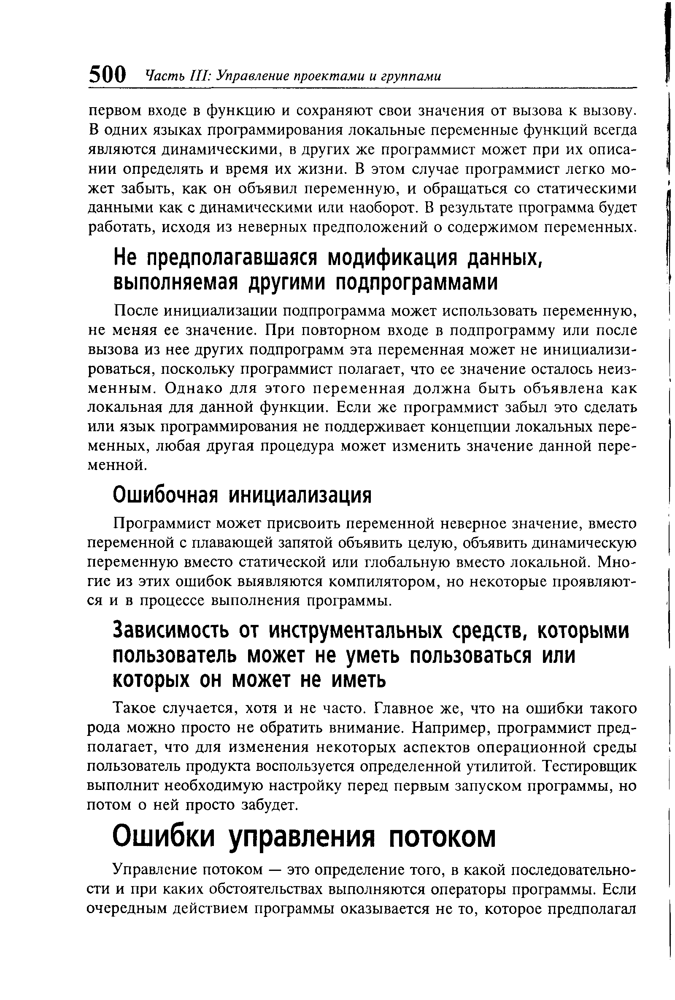

программист, значит, имеет место ошибка управления потоком. Результатом может быть очевидно неверное поведение программы или ее остановка, хотя последствия могут оказаться и не настолько очевидными.

### Очевидно неверное поведение программы

Программа отображает на экране “мусор” или выводит искаженное изображение, сохраняет “мусор” на диске, невпопад начинает печатать или выполняет совершенно неожиданные действия. Все это означает, что программа вышла из-под контроля. Такие ошибки наиболее очевидны, и их легко найти и исправить. Хотя они все выглядят похожими, их причины могут быть различны. Ниже приводится несколько примеров подобных ошибок. Искать их специально не имеет смысла, если только вы не обладаете некоторыми познаниями в программировании и не знакомы с внутренней структурой программы.

### Переход по `GOTO`

Оператор `GOTO` передает управление другой части программы. Если управление передано не туда, возможны самые разнообразные, но, как правило, очевидные последствия. Программа может “зависнуть”, отобразить на экране нечто явно неподходящее и т.п.

У программистов команда `GOTO` крайне непопулярна, и ее использование считается дурным тоном. Сторонники структурного программирования утверждают, что нет такой программы, при написании которой без этих операторов нельзя было бы обойтись. И более того, без них программы более последовательны и читабельны и содержат меньше ошибок (Йордан (Yourdon, 1976)).

Ошибки наиболее вероятны в следующих ситуациях.

* Выполняется переход назад, особенно к оператору, перед которым выполнялась необходимая инициализация данных и устройств;
* Выполняется непрямой переход — по адресу, хранящемуся в переменной. Если значение переменной изменится, программа перейдет к другому месту кода. Читая исходный текст, трудно сказать, правильное ли значение будет находиться в переменной при каждом обращении.

### Логика, основанная на определении вызывающей подпрограммы

Подпрограмма может определять, что ей делать, в зависимости от того, откуда она была вызвана. Если она не правильно определит то или другое, произойдет ошибка. Как правило, при использовании данного приема вызывающая процедура устанавливает флаг или присваивает определенной

переменной значение, позволяющее определить, откуда выполнен вызов. Если этими же флагами и переменными пользуются и другие процедуры, программа становится запутанной и в ней очень вероятны ошибки. Поэтому такая логика программирования крайне непопулярна.

### Использование таблиц переходов

Программы могут пользоваться таблицами адресов, по которым осуществляется переход в той или иной ситуации. Таблица адресов может храниться в дисковом файле, чтобы ее можно было редактировать, не меняя при этом программу. Это очень удобно для дальнейшей поддержки продукта, но связано с определенным риском.

* В таблице могут быть неверные адреса, особенно если она редактируется вручную.
* Если таблица длинная, при ее составлении легко допустить ошибки и к тому же пропустить их в ходе тестирования.
* Предположим, что в таблице пять элементов и программа выбирает один из них в зависимости от значения определенной переменной. Что будет, если значением этой переменной окажется 6?
* После модификации кода можно забыть обновить таблицу переходов.

### Выполнение данных

По содержимому группы байтов невозможно определить, хранится ли в них команда программы либо один или несколько символов, число или адрес памяти. Программа просто держит различные типы информации в разных местах памяти. Если же она попытается выполнить данные как команду, то, скорее всего, “зависнет”. Некоторые компьютеры выявляют попытки выполнения “невозможных” команд и останавливают программу, выдав сообщение об ошибке.

Программа может попытаться выполнить данные вместо команды в следующих случаях.

**(А)** *Данные скопированы в область памяти, зарезервированную для кода. Вот примеры того, как это может произойти.*

* *Указатели* — это переменные, в которых хранятся адреса памяти. Программист может записать определенные данные по адресу, хранящемуся в указателе, но из-за ошибки в логике программы этот указатель может содержать адрес не внутри области данных, а внутри области программного кода.
* Некоторые языки программирования не проверяют границ массивов. Предположим, объявлен массив `MYARRAY` из трех эле-

ментов — `MYARRAY[1]`, `MYARRAY[2]` и `MYARRAY[3]`. Что произойдет, если программа попытается сохранить данные в элементе `MYARRAY[2044]`. Если язык программирования не выявляет таких ошибок, данные будут записаны в область памяти, адрес которой равен адресу массива плюс 2044, и все это умноженное на длину элемента массива в байтах. По этому адресу могут располагаться программный код или данные, память внешних устройств, операционная система, другие программы — все что угодно, но только не массив `MYARRAY`.

(Б) *Программа переходит по адресу, принадлежащему области данных, а не кода.*

* Ошибочная запись в таблице адресов перехода, которой управляется программа.
* Некоторые компьютеры делят память на *сегменты*. Компьютер интерпретирует все содержимое сегмента кода как код и все содержимое сегмента данных как данные. Если программа каким-то образом изменит адреса сегментов, компьютер будет выбирать последующие команды не из того места памяти.

## Переход к подпрограмме, которая отсутствует в памяти

Для экономии памяти компьютеры часто выгружают из памяти фрагменты слишком объемных программ и данных. Такие фрагменты называются *оверлеями* (`overlay`), а используемая технология — *подкачкой* или *свопингом* (`swapping`). Когда программе необходима определенная подпрограмма или данные, компьютер выгружает на диск какой-нибудь ненужный фрагмент, а вместо него загружает в память требующийся.

Если программа сама отвечает за подкачку, перед переходом по определенному адресу она должна удостовериться, что данный фрагмент кода находится в памяти, иначе она выполнит переход не к тому месту кода.

С подкачкой связаны и проблемы производительности. На проверку наличия нужных оверлеев и их считывание с диска тратится компьютерное время. Поэтому важно организовать оверлейную программу таким образом, чтобы не было необходимости выполнять подкачку слишком часто.

## Реентерабельность

*Реентерабельная программа может параллельно использоваться несколькими процессами. Реентерабельная подпрограмма может вызывать сама себя или быть вызвана несколькими параллельными процессами одновременно. Некоторые языки программирования не поддерживают такой возможности, т.е. повторного входа в процедуры, и при попытке его выполнения*

программа разрушается. Но даже если язык программирования позволяет процедуре обслуживать несколько процессов, эта возможность сопряжена с целым рядом проблем. В частности, как раздельно хранить данные, предназначенные для различных процессов, чтобы один процесс не смог разрушить данные другого?

### Имена переменных, содержащие имена команд

Некоторые языки программирования или их диалекты игнорируют пробелы. В таком языке строка `PRINTMYNAME` может быть интерпретирована как `PRINT MYNAME`. Выполняя эту команду, программа попытается распечатать содержимое переменной с именем `MYNAME`. Если программист на самом деле хотел определить переменную с именем `PRINTMYNAME`, эта попытка приведет к ошибке. Как правило, подобные ошибки выявляют сами программисты, но некоторые из них все же сохраняются в программах.

### Неверное предположение о состоянии программы или данных после вызова

Предположим, что в программе имеется процедура, предназначенная для установки определенного параметра внешнего устройства, например, его скорости передачи информации. Программа вызывает эту процедуру и `полагает`, что она успешно выполнила свою работу. Она немедленно начинает передачу данных. Однако на этот раз установка скорости не была выполнена. В результате не удается и передача данных, а программа “зависает” в ожидании ответа устройства.

Другим примером может быть выполнение подпрограммы, масштабирующей данные и возвращающей число между 1 и 10. При определенных обстоятельствах эта подпрограмма ведет себя нестандартно, возвращая масштаб в диапазоне от 0 до 10. Поскольку вызывающая подпрограмма не ожидает получить 0, она аварийно завершается при попытке деления на 0.

### Обработка ошибок выполнения процедур

Предположим, что процедура вычисляет квадратный корень из переданного ей числа. Если ей передано отрицательное число, она ничего не вычисляет и перед завершением устанавливает флаг ошибки. В данном случае флаг ошибки используется для того, чтобы вызывающая процедура сама могла решить, что ей делать с проблемой. В одном случае может быть выведено сообщение об ошибке, в другом отображена подсказка, а в третьем число может быть передано менее скоростной подпрограмме, вычисляющей квадратные корни из комплексных чисел. Процедуры,

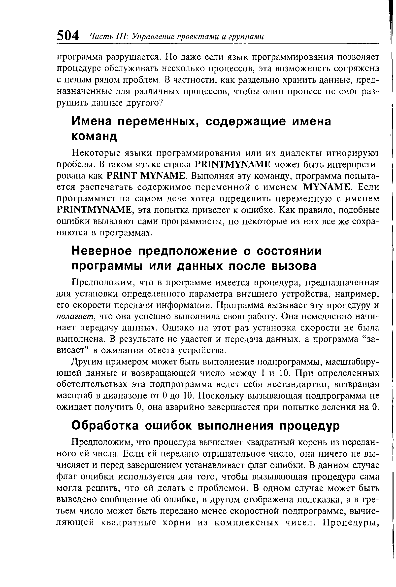

возвращающие информацию об ошибках в виде флагов, могут вызываться в самых разных ситуациях. В любом случае вызывающая подпрограмма обязательно должна проверить, выполнила ли процедура то, что предполагалось программистом. Однако, если ошибка очень маловероятна, программист может забыть о проверке результата. При тестировании, если ошибка все же произойдет, она может показаться невоспроизводимой.

### Возврат не в ту точку кода

Главным отличием между вызовом подпрограммы и переходом по команде **GOTO** является то, что из подпрограммы управление всегда возвращается в точку вызова, в то время как после перехода по **GOTO** возврат вообще не выполняется. Однако иногда управление после вызова подпрограммы может быть возвращено не в то место программного кода.

### Испорченный стек

После завершения работы подпрограммы управление передается команде, непосредственно следующей за командой вызова. Для хранения адреса этой команды используется структура данных, называемая **стеком (stack)**. В верхней ячейке стека хранится адрес, помещенный туда последним. Именно по нему и возвращается управление после завершения подпрограммы. Как правило, стек используется не только для хранения адресов возврата, но и для временного хранения некоторых данных.

Если подпрограмма помещает в стек некоторые данные и не удаляет их перед своим завершением, в верхней ячейке стека будет вовсе не адрес возврата. Однако компьютер этого не узнает и выполнит передачу управления, интерпретировав то, что он найдет в стеке, как адрес. В результате управление будет передано совершенно другому участку памяти. Если там окажутся данные, сбой произойдет немедленно, а если какой-то код, программа начнет делать что-то не то и, скорее всего, тоже вскоре аварийно завершит работу.

### Переполнение и выход за нижнюю границу стека

Стек обычно предназначен для хранения фиксированного количества адресов — например, не более 16, 32 или 128. Предположим, что стек вмещает не более двух адресов. Программа вызывает процедуру 1 и сохраняет в стеке адрес возврата. Затем процедура 1 вызывает процедуру 2 и тоже сохраняет адрес возврата. Когда процедура 2 завершает свою работу, управление возвращается процедуре 1, а по ее завершении — главной программе.

Но что будет, если процедура 2 вызовет процедуру 3? В стеке уже хранятся два адреса, и адрес возврата из процедуры 3 в него не поместится. Такая ситуация называется *переполнением стека (stack overflow)*. Обычно

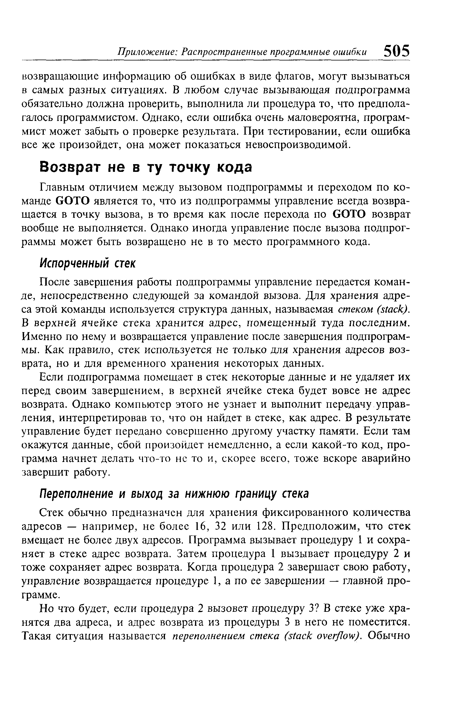

программа или центральный процессор разрешают ее тем, что просто удаляют из стека самое старое из хранящихся в нем значений и помещают в него новое. После этого из подпрограммы 3 управление передается подпрограмме 2, из подпрограммы 2 подпрограмме 1. А далее... куда передавать управление после завершения подпрограммы 1 — неизвестно. Такая ситуация называется выходом за нижнюю границу стека *(stack underflow)*.

### Выход из подпрограммы по GOTO вместо RETURN

Подпрограмма 1 вызывает подпрограмму 2. Последняя, вместо того чтобы нормально завершиться, осуществляет переход в процедуру 1 по команде **GOTO**. При этом адрес возврата из процедуры 2 остается в стеке. После завершения процедуры 1 выполняется переход по хранящемуся в стеке адресу — обратно в процедуру 1! Как правило, это не намеренное действие программиста, а ошибка. Чтобы ее избежать, процедура 2 должна сама удалить из стека свой адрес возврата и только потом осуществить переход в процедуру 1. Такая технология программирования чревата огромным количеством ошибок (выходами за нижнюю границу стека, возвратом не в ту процедуру, путаницей с возвращаемыми данными и т.п.), поэтому лучше всего ею не пользоваться.

### Прерывания

*Прерыванием* называется специальный сигнал, по которому компьютер приостанавливает выполнение текущей программы и передает управление процедуре обработки прерываний. Позднее выполнение программы может быть продолжено. Типичными примерами событий, вызывающих прерывания, являются события ввода/вывода, включая сигналы, поступающие от системного таймера.

### Неверная таблица прерываний

Получив сигнал прерывания, процессор должен найти процедуру его обработки и передать ей управление. Адрес этой процедуры (возможно, вместе с некоторой дополнительной информацией) хранится в определенном месте памяти и называется *вектором прерывания*. По нему и осуществляется переход. Если компьютер различает несколько типов прерываний, в его памяти хранится список адресов процедур их обработки, называемый *таблицей прерываний*.

Если таблица прерываний по каким-то причинам содержит неверную информацию, в ответ на прерывания возможны самые разнообразные ошибки. Если, например, векторы прерываний просто поменялись местами, программа может вести себя странно, пытаясь, например, отобразить на экране введенный символ в ответ на сигнал от системного таймера или реагировать на нажатия клавиш как на сигналы тайм-аута.

Ошибки, связанные с модификацией программы таблицы прерываний

Программа может модифицировать таблицу прерываний, записав в нее новые адреса. Если это делается на время работы определенного модуля, перед завершением он должен восстановить исходные векторы прерываний. Возможно также, что программа запишет в таблицу прерываний неверный адрес или вообще ее испортит. В результате после очередного прерывания компьютер перейдет не к той подпрограмме или вообще "зависнет".

Ошибки, связанные с блокированием прерываний

Программа может блокировать большинство прерываний, в результате чего компьютер перестает на них реагировать. Например, в некоторых случаях большая часть прерываний блокируется перед началом записи данных на диск и разблокируется после ее окончания. Это предотвращает многие ошибки передачи данных.

Неудачное возобновление работы программы после прерывания

Выполнение программы было прервано, а затем возобновлено. В некоторых системах после возобновления программа получает сообщение или иное указание, что она была прервана. В сообщении обычно указывается тип прерывания (от клавиатуры, таймера, модема и т.п.). Это очень полезно. Например, программа может обновить изображение на экране, предполагая, что в ходе обработки прерывания оно могло быть изменено. Однако во встроенном в программу блоке обработки прерывания программист может допустить ошибку, например, передать дальнейшее управление не той подпрограмме. С ошибками такого рода программисты так же не любят иметь дело, как и с ошибками в блоках обработки ошибок, и так же часто их пропускают.

Завершение работы программы

Некоторые языки программирования останавливают программу, когда в ней происходят ошибки определенных типов. Бывает также, что ни язык программирования, ни программист не предполагали остановки программы, но она все же останавливается.

Не каждое прекращение работы программы происходит вследствие ошибки, связанной с управлением потоком. Если завершение работы при определенном условии определяется программным кодом и программа завершается неожиданно для пользователя, значит, речь идет об ошибке пользовательского интерфейса.

### “Зависание” компьютера

“Зависнув”, компьютер прекращает реагировать на клавиатурный и иной ввод, прекращает печатать, индикаторы не меняют своего состояния, но при этом могут и гореть. Единственным способом, позволяющим восстановить работоспособность системы, является аппаратный перезапуск компьютера (выключение и включение питания или нажатие кнопки Reset).

Как правило, причиной “зависания” компьютера становятся бесконечные циклы. Если операционная система позволяет прикладным программам полностью захватывать управление, программа может, например, бесконечно ждать ответа какого-либо устройства. Если же операционная система не позволяет программам блокировать компьютер, у пользователя остается возможность выгрузить “завислую” программу из памяти без перезапуска компьютера и не повредив работе остальных активных приложений.

### Синтаксические ошибки, сообщения о которых отображаются во время выполнения программы

Если программа написана на интерпретируемом языке программирования, синтаксическая проверка ее текста может не выполняться до тех пор, пока программа не будет запущена. Интерпретатор по очереди анализирует и выполняет каждую команду программы. Наткнувшись на команду, не поддающуюся интерпретации, он выводит на экран сообщение об ошибке и останавливает программу. Виновницей ситуации оказывается команда, которая содержит синтаксическую ошибку. Очевидно, что программист ни разу не выполнил данный фрагмент кода.

### Ожидание невозможных условий или комбинаций условий

Программа останавливается (“зависает”) в ожидании события, которое никогда не наступит. Вот несколько распространенных примеров.

* *Проблемы ввода/вывода*. Компьютер посылает данные поломанному выходному устройству и бесконечно ждет его ответа. Подобная ситуация возможна и при обмене данными между двумя процессами, когда один процесс посылает сообщение другому и ждет его ответа, а тот почему-либо не отвечает.
* *Взаимная блокировка*. Это классическая проблема многозадачных систем. Две программы работают параллельно. Обеим нужна одна и та же пара ресурсов (скажем, принтер и дополнительная память под буфер печати). Программы захватывают по одному ресурсу и ждут, пока освободится второй.

- *Простая логическая ошибка.* Например, программа должна вводить числа от 1 до 5, отвергая любые другие данные. Однако в ней запрограммировано следующее условие допустимости числа: `IF INPUT > 5 AND INPUT < 1`. Такому условию не соответствует вообще ни одно число, поэтому программа отвергает любой ввод и ждет бесконечно долго.

Подобным же образом в многозадачной системе один процесс может бесконечно долго ждать получения от другого невозможных данных.

## Неверный приоритет пользователя или процесса

В системах с приоритетной многозадачностью компьютер, параллельно выполняющий несколько программ, периодически переключается между ними. Он некоторое время выполняет одну программу, затем переключается к другой, некоторое время выполняет ее, затем переключается к третьей и т.д. по кругу. Переключение к определенной программе выполняется в случае, когда наступило связанное с ней событие (например, пользователь нажал клавишу) или она просто ждет слишком долго. Если две программы ждут одинаково долго, активизируется та, приоритет которой выше. (Приоритет назначается системой либо самой программе, либо ее пользователю.)

В такой системе задача с низким приоритетом может ожидать своей очереди выполнения несколько часов. Иногда так и должно быть, но возможно, что приоритет просто неправильно назначен. Если задержки в выполнении программы не столь очевидны, ошибку, связанную с неправильным назначением приоритета, крайне трудно заметить, если только она не приведет к ситуации гонок.

## Циклы

Существует несколько разновидностей программных циклов, но все они очень схожи. Вот пример.

```text
1 SET LOOP_CONTROL = 1
2 REPEAT
3     SET VAR = 5
4     PRINT VAR * LOOP_CONTROL
5     SET LOOP_CONTROL = LOOP_CONTROL +1
6 UNTIL LOOP_CONTROL >5
7 PRINT VAR
```

Программа присваивает переменной `LOOP_CONTROL` значение 1, переменной `VAR` значение 5, печатает произведение значений этих двух переменных, увеличивает значение `LOOP_CONTROL` на 1 и затем проверяет, не превысило ли ее значение число 5. Поскольку значением

`LOOP_CONTROL` пока является 2, программа повторяет код тела цикла (команды 3, 4 и 5). Так продолжается до тех пор, пока переменная `LOOP_CONTROL` не получит значение 6. После этого программа переходит к следующей за циклом команде (ее номер 7) и печатает значение переменной `VAR`.

Переменную `LOOP_CONTROL` называют переменной управления циклом. Ее значение определяет, сколько раз выполнится тело цикла. Для управления циклом не обязательно используется одна переменная, нередко после ключевого слова `UNTIL` стоит целое выражение, включающее целый ряд переменных. Но в обоих случаях возможны одни и те же ошибки.

## Бесконечный цикл

Если условие выхода из цикла никогда не наступает, программа может выполнять составляющие его команды бесконечно. Такая ситуация называется зацикливанием. Если модифицировать вышеприведенный фрагмент кода таким образом, чтобы цикл выполнялся, пока значение переменной `LOOP_CONTROL` не станет меньше 0, этот цикл никогда не завершится.

## Неверное начальное значение переменной управления циклом

Предположим, что в вышеприведенной программе далее стоит оператор `GOTO`, передающий управление команде в строке 2. Переменная `LOOP_CONTROL` может иметь теперь какое угодно значение. Если программист предполагал, что тело цикла будет выполнено пять раз (как если бы переход был выполнен не ко второй, а к первой строке), он может быть очень удивлен происходящим.

## Случайное изменение переменной управления циклом

В вышеприведенном примере значение переменной `LOOP_CONTROL` изменяется внутри цикла. В более длинном цикле, особенно если из него вызываются другие подпрограммы, имеющие доступ к переменной `LOOP_CONTROL`, ее значение может изменяться в нескольких местах программы, так что в результате тело цикла выполнится больше или меньше раз, чем задумал программист.

## Ошибочный критерий выхода из цикла

Возможно, цикл должен завершиться при условии $\text{LOOP\_CONTROL} \ge 5$, а не $\text{LOOP\_CONTROL} > 5$. Это очень распространенная ошибка. А если критерий выхода из цикла достаточно сложен, в нем может быть даже несколько ошибок.

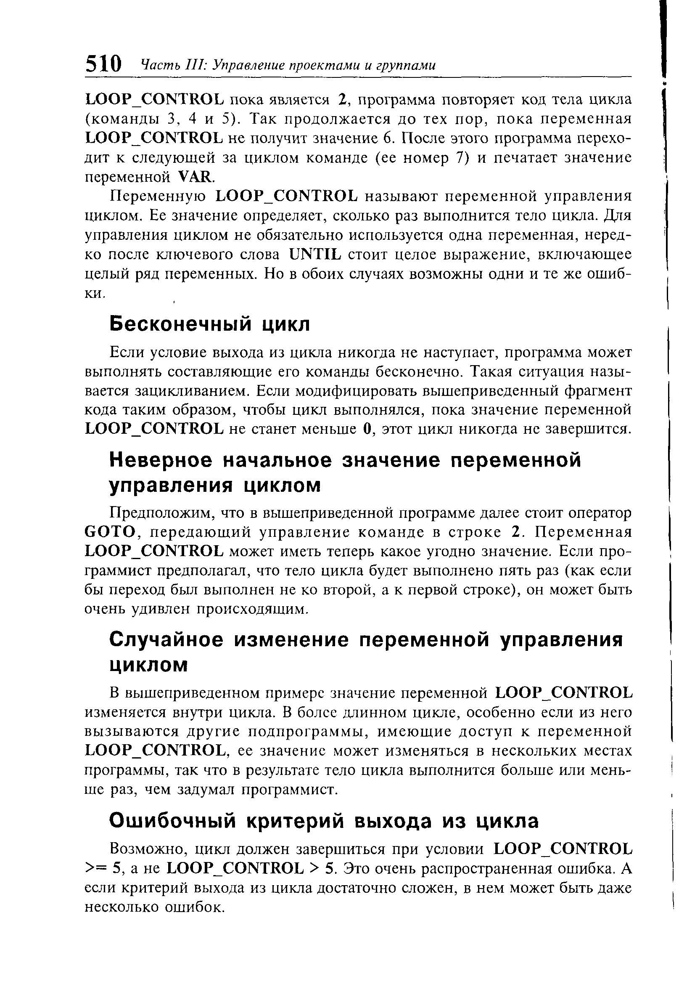

## Команды, которые должны или не должны выполняться внутри цикла

В вышеприведенном примере команда `SET VAR = 5` помещена внутрь цикла. Но поскольку значение переменной `VAR` в ходе выполнения программы не меняется, присвоение ей значения 5 на каждом проходе цикла является пустой потерей времени. Некоторые циклы выполняются тысячи и миллионы раз, и тогда ненужные повторения могут серьезно отразиться на производительности программы.

Вот если бы значение переменной `VAR` менялось в ходе выполнения цикла и перед каждым повторением его команд эта переменная должна была бы снова принимать исходное значение, тогда данная команда присваивания была бы необходима именно внутри цикла, а не перед ним.

## Ошибка вложенности циклов

Один цикл может быть вложен в другой, т.е. полностью включен внутрь него. В этом случае, если только программист не допустил ошибку, невозможно, чтобы цикл начался внутри другого цикла, а завершился вне него.

## Условные операторы

Условный оператор (оператор `IF`) имеет следующую форму.

```text
IF Условие истинно
    THEN выполнить одно действие
    ELSE выполнить другое действие
```

Пример:

```text
IF VAR > 5
    THEN SET VAR_2 = 20
    ELSE SET VAR_2 = 10
```

Команда, следующая за ключевым словом `THEN` (`SET VAR_2 = 20`), выполняется только при условии, что `VAR > 5`. В противном случае выполняется команда, следующая за ключевым словом `ELSE` (`SET VAR_2 = 10`). Условный оператор может и не включать предложения `ELSE`. В этом случае при невыполнении условия, следующего за ключевым словом `IF`, управление передается команде, следующей за условной конструкцией.

## Неправильное сравнение (т.е. $>$ вместо $\ge$)

Проверяемое условие (`VAR > 5`) может быть логически неверным. В частности, программисты нередко забывают о ситуациях, когда значения двух переменных равны.

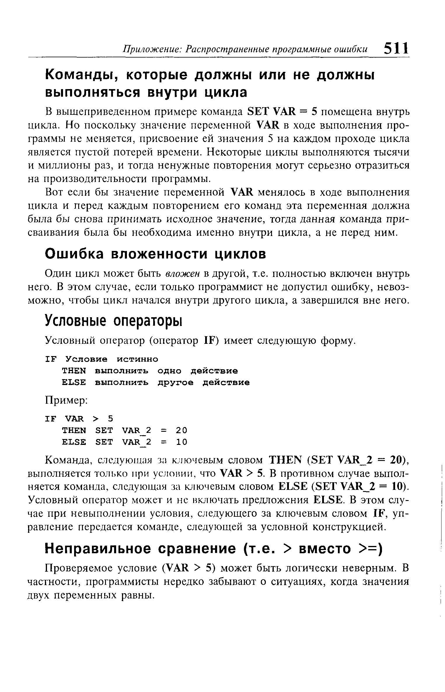

## Неверные результаты сравнений

Предположим, что программист хотел проверить, равны ли между собой значения трех переменных. Для этого он написал `IF (VAR + VAR_2 + VAR_3) / 3 = VAR`.

Если значения трех переменных равны, их среднее арифметическое будет равно первому из этих чисел. Более того, для большинства не равных значений это условие не выполнится. Но не для всех! Если значения переменных равны 2, 1 и 3, тогда $(2+1+3)/3 = 2$. Однако числа 2, 1 и 3 разные. Подобные сокращения и усовершенствования, применяемые вместо самых естественных проверок `((VAR = VAR_2) AND (VAR_2 = VAR_3))`, являются источниками множества ошибок.

## Неравенство против равенства в случае выбора из трех вариантов

Третий вариант выбора часто добавляется в программу в ходе ее поддержки и модификации. Первоначально переменная `VAR` могла принимать только значения 0 и 1, позднее добавилось еще значение 2. В исходной программе проверка `IF VAR = 0` выполнялась прекрасно. Второй вариант выбора обрабатывался предложением `THEN`. Входящие в него операторы предназначались для случая `VAR = 1` и теперь, вероятно, требуют модификации.

## Сравнение значений переменных с плавающей запятой

Вычисления над данными с плавающей запятой всегда чреваты ошибками, прежде всего связанными с округлением и усечением результата. Например, из-за небольшой ошибки результат, который должен быть равным 0, оказывается равным 0,00000008. Расхождение небольшое, но проверку на равенство нулю (`IF VAR = 0`) такой результат не пройдет.

## Спутаны включающее и исключающее ИЛИ

Во многих операторах `IF` проверяется истинность хотя бы одного из нескольких условий (`IF A OR B THEN...`). Однако существует два вида операторов `OR` (ИЛИ):

* *включающее ИЛИ*: результат выражения `A OR B` истинен, если истинен хоть один из операндов;
* *исключающее ИЛИ*: результат выражения `A OR B` истинен, если истинен один из операндов, но не оба сразу;

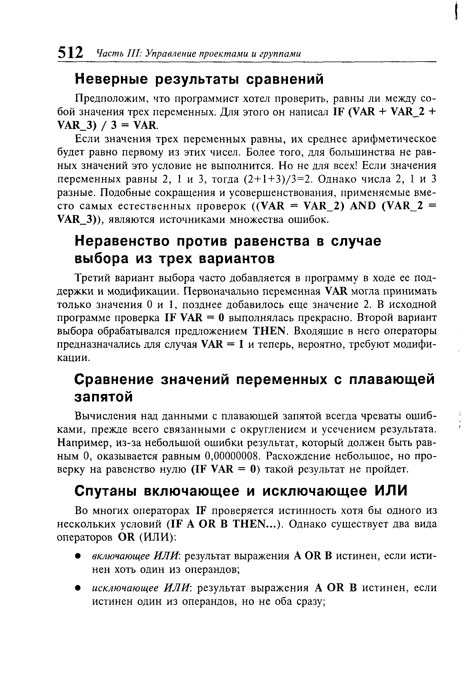

## Неверное отрицание логического выражения

Иногда оператор **IF** принимает форму **IF A не истинно THEN**. Иногда программисты применяют оператор логического отрицания неверно или не задумываются, что означает получившееся выражение. Например, **IF NOT (A OR B) THEN** означает **IF (A = FALSE) AND (B = FALSE) THEN**. Для выполнения следующего за **THEN** оператора необходимо, чтобы ни **A** ни **B** не были истинны.

## Присваивание вместо сравнения

В языке C конструкция **if (VAR = 5)** означает, что переменной **VAR** присваивается значение 5, а затем выполняется проверка равенства результата нулю. Программисты часто пишут так вместо **if (VAR == 5)**, что означает просто проверку равенства значения переменной пяти. Путаница происходит из-за похожести операторов сравнения (**==**) и присваивания (**=**).

## Команды, входящие в предложение THEN или ELSE

Вот пример типичной ошибки.

```text
IF VAR = VAR_2
    THEN SET VAR_2 = 10
SET VAR_2 = 20
```

Очевидно, что команда **SET VAR_2 = 20** должна была бы входить в предложение **ELSE**. Иначе в приведенном фрагменте кода оператор **IF** вообще ни к чему. Каким бы ни было его условие, переменная **VAR_2** все равно получит значение **20**.

## Команды, которые не входят ни в одно из предложений

Иногда программист по ошибке включает в предложение **THEN** или **ELSE** команды, которые должны выполняться при любом значении условия оператора **IF**. Если эти команды повторяются в обоих предложениях, это просто потеря времени, а если только в одном — это уже ошибка управления потоком.

## Не проверен флаг

Пусть, например, программа вызывает подпрограмму, которая должна присвоить значение определенной переменной, а та не делает этого, установив флаг ошибки. Программа не проверяет этот флаг, а действует так, будто все нормально, и проверяет значение переменной в операторе **IF**. Дальнейшие действия программы могут оказаться правильными только по

счастливой случайности. Ведь подпрограмма сообщила (посредством установки флага), что переменная не содержит правильного значения.

## Не сброшен флаг

Когда подпрограмма была вызвана в предыдущий раз, она установила флаг ошибки. Теперь она вызвана снова, и первым делом должна сбросить этот флаг. Однако по ошибке программиста подпрограмма этого не делает. В результате программа игнорирует ее совершенно правильные результаты из-за того, что флаг ошибки так и остался установленным еще с прошлого раза.

## Многочисленные варианты

Оператор `IF` предполагает только два варианта: выражение либо истинно, либо ложно. В тех же случаях, когда возможных вариантов действий программы более двух, используются такие операторы, как `CASE`, `SWITCH`, `SELECT` и оператор перехода на основе вычисляемого значения.

Вот эквивалент типичного оператора данного вида:

```text
IF VAR = 1 DO Задание_1
IF VAR = 2 DO Задание_2
IF VAR = 3 DO Задание_3
IF VAR имеет любое другое значение DO Задание_для_остальных_случаев
```

Задание для остальных случаев не обязательно должно присутствовать.

## Пропущен блок, выполняемый во всех остальных случаях

Программист может ограничить набор действий перечислением конкретных условий и забыть написать, что же делать, если ни одно из условий не выполнится. Переменная `VAR` может принять непредусмотренное значение либо из-за ошибки в программе, либо вследствие ее последующей модификации. Наличие блока обработки нестандартного значения поможет выявить такие ситуации и предотвратить дальнейшие ошибки. В этом блоке программа может, например, выводить неожиданное значение переменной на экран.

## Неверно определены действия для всех остальных случаев

Предположим, что программист полагает, что переменная `VAR` может принимать только четыре значения. Он явно указывает три из них, а четвертое обрабатывает как «остальные». Но будут ли запрограммированные на этот случай действия правильными, если переменная примет пятое или шестое значение?


## Пропущенные варианты

Переменная `VAR` может принимать пять значений, но программист о пятом забыл.

## Требуется подразделение одного варианта на несколько

Иногда одним из условий оператора выбора могут охватываться варианты, требующие различной обработки. Например, определены действия для условия `VAR < 30`, но на самом деле при условии `VAR < 15` программа должна делать одно, а при условии $15 \le \text{VAR} < 30$ — другое. Как правило, такие ошибки допускаются в последнем блоке, предназначенном для всех остальных случаев.

## Пересекающиеся условия

Рассмотрим следующий фрагмент кода.

```text
IF VAR > 5 DO Задание_1
IF VAR > 7 DO Задание_2
```

Первое из указанных условий включает в себя второе. Если переменная примет значение 9, они оба будут истинны — какое же задание должна будет выполнить программа? Это будет зависеть от использованного оператора выбора и языка программирования, но, скорее всего, имеет место просто ошибка программиста. Как правило, условия не должны пересекаться.

## Неверные условия и невозможные случаи

Программа выполняет `Задание_16`, только когда `(VAR < 6) AND (VAR > 18)`. Это означает, что `Задание_16` не выполняется никогда. Подобным же образом программист может определить условие, которое на практике никогда не выполнится, даже если теоретически в нем нет ничего невозможного. Проблемы такого рода видны только при анализе исходного кода. Тем не менее, подобные безобидные ошибки затрудняют чтение программы специалистом, которому предстоит ее поддерживать в дальнейшем, удлиняют код и создают путаницу.

## Ошибки обработки или интерпретации данных

Данные могут передаваться от одной части программы к другой и от одного процесса к другому. В ходе передачи данные могут быть искажены или неверно интерпретированы.

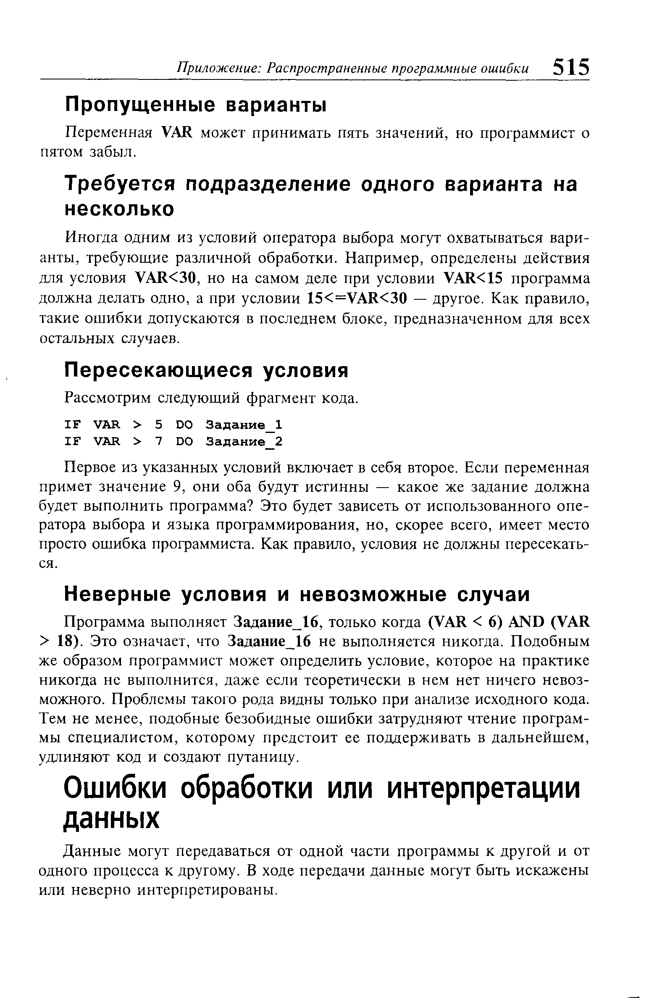

## Проблемы при передаче данных между подпрограммами

Программа вызывает подпрограмму и передает ей данные, например, таким образом:

```text
DO SUB (VAR_1, VAR_2, VAR_3)
```

Все три переменные, **VAR_1**, **VAR_2** и **VAR_3**, передаются основной программой подпрограмме. Они называются *параметрами подпрограммы*. Подпрограмма может обращаться к этим переменным по другим именам. Первая строка определения подпрограммы может быть такой:

```text
SUB (INPUT_1, INPUT _2, INPUT _3)
```

Подпрограмма получает первую переменную из списка (**VAR_1**) и называет ее **INPUT_1**. Вторую переменную (**VAR_2**) она называет **INPUT_2**, третью (**VAR_3**) — **INPUT_3**.

Определения переменных в программе и подпрограмме должны совпадать. Если **VAR_1** определена как целая, такой же должна быть и **INPUT_1**.

### Параметры указаны не в том порядке или пропущены

В программе стоит команда **DO SUB (VAR_1, VAR_2, VAR_3)**, а подпрограмма связывает **INPUT_1** с **VAR_2**, а **INPUT_2** с **VAR_1**. Программисты часто путают порядок параметров подпрограмм, из-за чего возможны самые разнообразные ошибки.

Пропуск параметров менее распространен, поскольку не все языки программирования допускают несоответствие числа параметров и выявляют такие ошибки еще на этапе компиляции.

### Несоответствие типов данных

Предположим, что переменные **VAR_1** и **VAR_2** определены в программе как двухбайтовые целые. При этом в подпрограмме параметры **INPUT_1** и **INPUT_2** определены как однобайтовые целые. Возможность такой ситуации и действия программы в этом случае определяются языком программирования. Вполне возможно, что в переменной **INPUT_1** окажется первый байт значения **VAR_1**, а в переменной **INPUT_2** — второй байт значения **VAR_1**.

Тип данных определяет способ их хранения и обработки. Простейшими примерами типов данных могут служить целые числа, числа с плавающей запятой и строки символов. Более сложными типами данных являются массивы, записи и массивы записей. Существует и множество других — стеки, деревья, связанные списки и т.д.

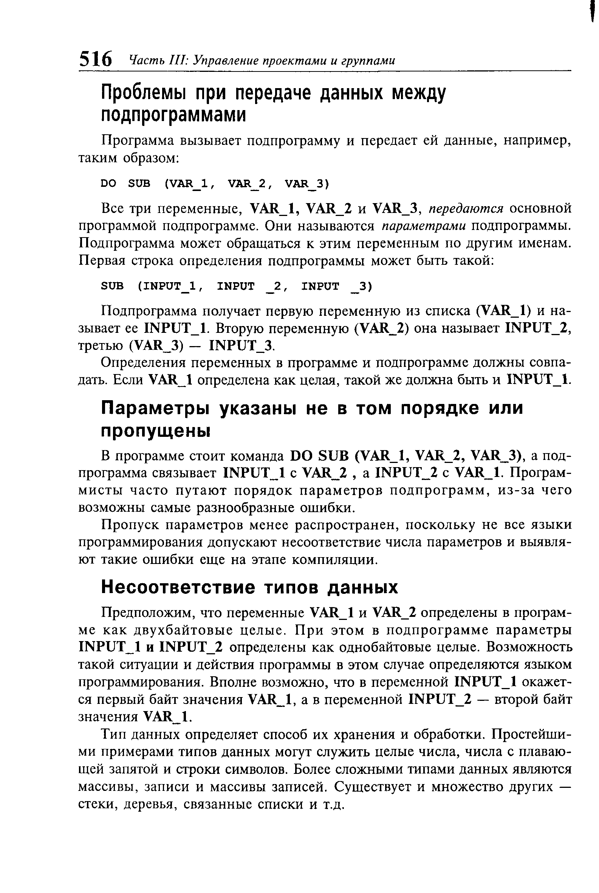

Иногда несоответствие типов данных в вызывающей и вызываемой процедурах является намеренным. Например, вызывающая программа может передать трехмерный массив, который процедура будет интерпретировать как одномерный массив с большим количеством элементов. Аналогичным образом переданный массив символов может интерпретироваться как массив чисел. Некоторые языки программирования не допускают подобных вещей, в других же это считается стандартным и очень удобным приемом программирования. Однако этот прием требует от программиста большой аккуратности, и его беспорядочное применение приводит к огромному количеству ошибок. Как правило, когда общий размер передаваемых и получаемых данных в байтах не совпадает, это уже явная ошибка с довольно неприятными последствиями.

### Псевдонимы и различная интерпретация содержимого одной и той же области памяти

Если два разных имени относятся к одной и той же области памяти, они называются псевдонимами. Если `VAR_1` и `XX` являются друг для друга псевдонимами, после выполнения программой команды `SET XX = 20` значением переменной `VAR_1` также становится `20`.

Некоторые псевдонимы используются еще хитрее. Пусть переменные `VAR_1` и `VAR_2` являются однобайтовыми целыми, а `XX` — двухбайтовым целым, первый байт которого совпадает с переменной `VAR_1`, а второй — с переменной `VAR_2`. В этом случае, если присвоить переменной `XX` значение 20, переменная `VAR_1` получит значение 0, а переменная `VAR_2` — 20.

О существовании псевдонима может забыть даже автор программы, а уж программисту, которому придется ее поддерживать в дальнейшем, ничего не стоит его вовсе не заметить. В результате программист может изменить значение одной переменной, не ожидая, что это повлечет за собой и изменение значения другой. Если же комбинации псевдонимов более сложные — ждите множества ошибок.

### Неправильная интерпретация данных

Программа передает подпрограмме значение температуры по шкале Цельсия, а та интерпретирует его как температуру по Фаренгейту. Другой пример: подпрограмма присваивает флагу ошибки значение 1, желая его сбросить. Программа понимает это значение как "флаг установлен".

### Неадекватная информация об ошибке

Столкнувшись с ошибкой, подпрограмма не установила ее флаг. Или же она выдала сигнал ошибки без сопутствующей информации, в результате чего вызывающая программа не знает, как ее обрабатывать.

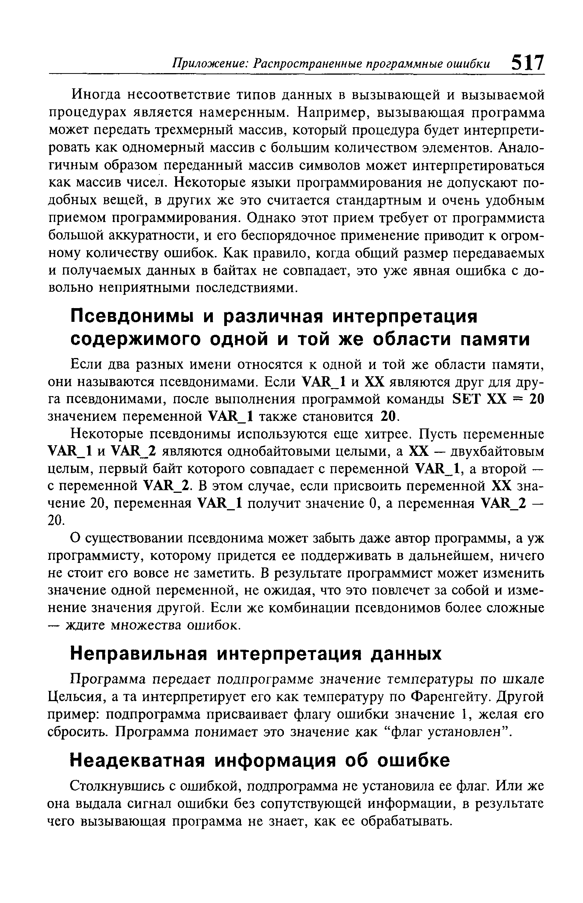

### Перед аварийным выходом из подпрограммы не восстановлено правильное состояние данных

Подпрограмма обнаруживает ошибку или нестандартную ситуацию и завершает свою работу. Желательно, чтобы перед этим она восстановила нормальное состояние данных, которое могла изменить.

### Устаревшие копии данных

Два процесса могут иметь собственные копии общих данных. Так же может быть и с двумя подпрограммами внутри одного и того же процесса. Когда данные меняются, обе копии должны быть обновлены. Однако нередко оказывается, что один из процессов по-прежнему работает со старыми данными, поскольку другой забыл сообщить об их изменении.

### Связанные переменные не синхронизированы

Одна переменная обычно содержит удвоенное значение второй, но в определенный момент первая изменилась, а вторая — нет. Эта ошибка чаще всего возникает при взаимодействии подпрограмм.

### Локальная установка глобальных данных

Глобальная переменная определяется в главной программе. Подпрограммы могут ею пользоваться — читать и изменять ее значение. Однако изменения подпрограммами значения глобальной переменной часто происходят случайно. Программист имел в виду не глобальную переменную, о существовании которой он мог вообще забыть, а локальную переменную процедуры с тем же именем.

### Глобальное использование локальных переменных

Переменная называется локальной для некоторой процедуры, если никакая другая процедура не может ее использовать. Различие между глобальными и локальными переменными существует во многих языках программирования, однако не во всех. Например, в старых версиях языка BASIC все переменные были глобальными. Если программист, пишущий на таком языке, не будет соблюдать предельную аккуратность в наименовании переменных, он может ненамеренно обратиться к локальной переменной из другого места программы.

### Неверная маска битового поля

Чтобы сэкономить несколько байтов или микросекунд, некоторые процессы могут пользоваться битовыми полями. Каждый байт такого поля

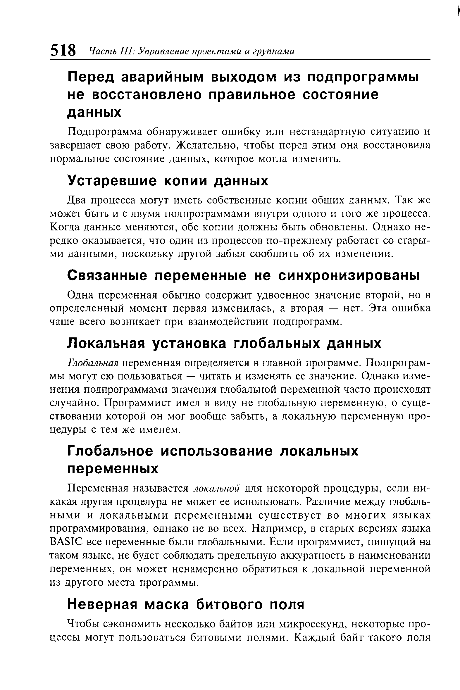

хранит восемь переменных — по одной на каждый бит. Можно также использовать пару битов под одну переменную, еще три под другую и т.д. Маской называется битовый шаблон, позволяющий программисту работать только с интересующими его битами. Если маска неверна, значит программист обращается не к той переменной.

### Неверное значение из таблицы

Данные часто организованы в виде таблиц (простейшими примерами могут быть массивы и записи). Переменная-указатель определяет, какой элемент таблицы будет записываться или считываться. Программа может обратиться не к тому элементу таблицы, или же ее элемент может содержать неправильное значение.

### Границы расположения данных

Программа может пользоваться неправильным адресом начала или конца набора данных.

### Не обозначен конец нуль-терминированной строки

Пусть `STRING_VAR` является строковой переменной. В ней может содержаться строка **Привет** или строка **Я — строковая переменная**, а может быть, нечто гораздо более длинное. Если количество хранящихся в строковой переменной символов не фиксировано, должен быть какой-нибудь индикатор конца строки. Распространенным решением является помещение в конец строки нуль-символа (все его биты нулевые). Этот символ называется *терминатором строки*. В тех языках программирования, в которых используются нуль-терминаторы, все процедуры, работающие со строками, ищут этот символ. Однако по ошибке его может не оказаться (его забыли, поверх него что-то записали или не скопировали его из исходной переменной). Подпрограмма, печатающая такую строку, будет печатать все содержимое памяти до тех пор, пока не найдет нуль-символ или не достигнет конца памяти. Возможно, впрочем, она сразу выдаст сообщение об ошибке. При копировании такой переменной в другое место памяти также возможны неприятности с затиранием нужных данных.

### Неожиданный конец строки

Предполагается, что в переменной `STRING_VAR` должна храниться строка **Я — строковая переменная**, однако подпрограмма, отображающая ее содержимое на экране, выводит только **Я — стр**. Это может означать, что нуль-символ случайно скопирован в середину строки. Если же длина строки хранится в отдельном байте (*байте длины*), возможно, что это значение неправильно вычислено или испорчено.

## Запись/чтение за границами структуры данных или ее элемента

В качестве примера структуры данных лучше всего подойдет массив. Программа может неправильно вычислять длину его элементов и из-за этого неправильно прочитать значение конкретного элемента. При этом она может обратиться по адресу памяти, лежащему далеко за пределами массива. Такое возможно и в случае, если подпрограмма предполагает, что в массиве больше элементов, чем есть на самом деле. Подобные ошибки часто происходят при передаче массива из одной подпрограммы в другую, когда определения этой переменной в подпрограммах не совпадают.

## Чтение за пределами буфера сообщения

Буфером называется область памяти, используемая для временного хранения данных. Буферы часто используются при обмене сообщениями между процессами: передающий процесс включает в сообщение указатель на начало буфера, из которого принимающий процесс может прочитать дополнительную информацию. Процесс-получатель читает данные и освобождает память буфера, после чего операционная система может ее снова использовать.

Если процесс получит неверный адрес буфера или его неверный размер, он прочитает содержимое другого участка памяти.

## Дополнение переменных до полного слова

Слово — это единица, используемая компилятором для операций с памятью. Оно может быть длиной в 12 бит, 1, 2, 3 или 4 байта и т.д. Если длина переменной меньше слова, некоторые компиляторы дополняют ее до полного слова, так что переменная, в которую записано значение 255, на самом деле может хранить 00255. Дополняться могут как отдельные переменные или элементы массива, так и массив целиком — правила зависят исключительно от компилятора. Более того, два компилятора одного и того же языка могут действовать по-разному. Так что, если программист рассчитывает длину определенной структуры данных и основывает некоторые действия программы на этой информации, а затем меняет компилятор, программа может работать неправильно.

## Переполнение и выход за нижнюю границу стека данных

Несколько ранее рассматривались проблемы, связанные с хранением в стеке адресов возврата и параметров вызываемых подпрограмм. Стеки используются программистами не только для этого — в них могут храниться данные.

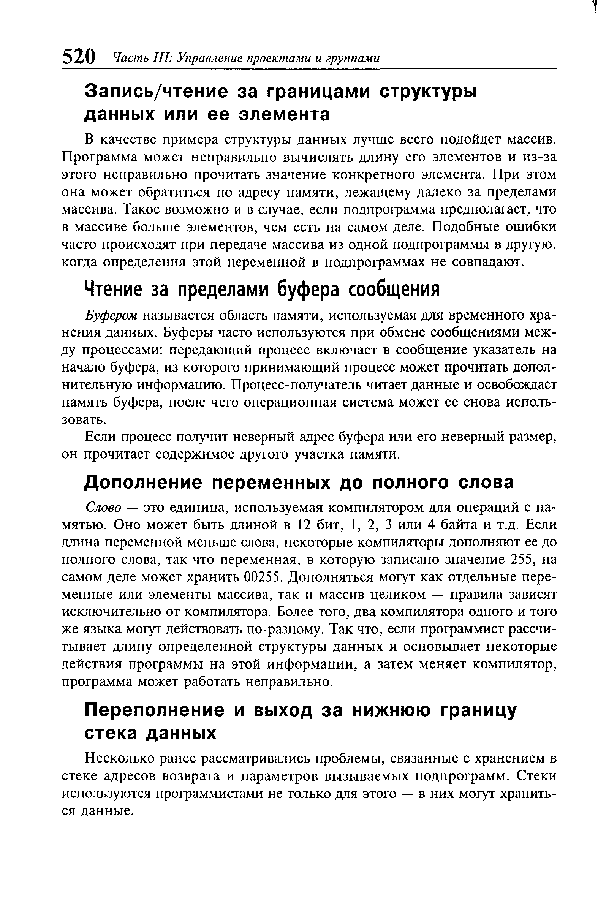

Предположим, что размер стека — 256 байтов, а программист пытается записать в него 300 байтов. Стек переполняется. В нем обычно остаются последние 256 байтов данных, а первые 44 затираются. Когда программа извлекает данные из стека, она получает 256 байтов и выходит на нижнюю границу стека, т.е. обнаруживает, что он пуст.

### Затирание кода или данных другого процесса

Это возможно в случае, если два процесса имеют доступ к одной и той же области памяти. Если при записи данных в эту память одним из процессов произойдет ошибка, например, процесс неверно рассчитает длину структуры данных и запишет больше информации, чем предполагалось, он может затереть данные или код другого процесса.

### Проблемы с обменом сообщений

Наиболее безопасным способом взаимодействия между процессами считается обмен сообщениями. Если вместо этого процессы будут передавать друг другу данные через общую область памяти, ошибка в одном процессе может привести к порче данных обоих, как бы аккуратно ни был написан второй процесс. Что касается обмена сообщениями, то здесь наиболее распространенной ошибкой является ситуация гонок, описываемая в следующем разделе. Кроме того, возможны ошибки, связанные с отправкой и получением включаемых в сообщение данных.

### Отправка сообщения не тому процессу или не в тот порт

Сообщение может не попасть в место назначения. Даже если сообщение будет направлено нужному процессу, он может ожидать его получения только из одного определенного порта (под портом в данном случае понимается виртуальная область памяти для получения данных). Кроме того, для взаимодействия процессы могут пользоваться разными протоколами или разной идентификационной информацией.

### Ошибка распознавания полученного сообщения

Получив сообщение, процесс должен убедиться, что оно предназначено именно для него, содержит правильные идентификаторы и т.п. Ведь полученное сообщение могло попасть в данную область памяти и по ошибке.

### Недостающие или несинхронизированные сообщения

Один процесс может посылать сообщения другому в заранее определенном порядке. Однако иногда получается, что **СООБЩЕНИЕ_1** приходит

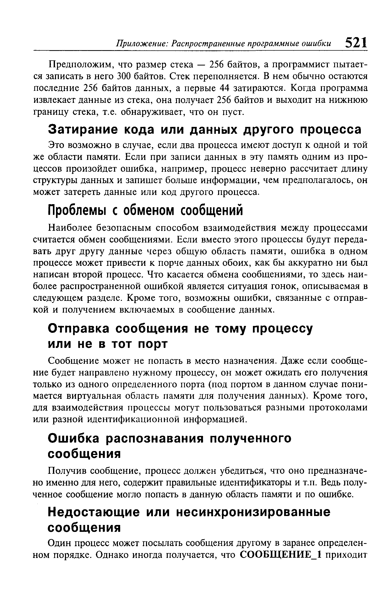

после **СООБЩЕНИЯ_2**. Например, команда записать файл на диск может поступить до сообщения с информацией об имени и местоположении файла. Причин подобных проблем может быть множество, и не все они связаны с ошибками в программе. Получающая программа вполне может справиться с некоторыми из них, сохранив, например, первое из полученных сообщений и дождавшись второго или же сообщив процессу-отправителю, что его сообщение отвергнуто из-за нарушения порядка следования.

Распространенным симптомом ошибок в обмене сообщениями является несоответствие информации о состоянии ресурсов: один процесс считает, что файл открыт, принтер инициализирован и телефонная трубка снята, а в таблице состояний другого записано обратное. Неважно, какой из процессов прав. Такие несоответствия приводят к множеству недоразумений.

### Сообщение передано только N процессам из N+1

Возможно, что несколько процессов хранят копии одних и тех же данных и обновляют свои копии после получения определенного сообщения. Или же несколько пользователей работают за своими терминалами, и с главного компьютера им направляется сообщение, что через три минуты работа системы будет прекращена. Бывает, что один из процессов не получает сообщение. Обычно это процесс, который либо последним активизирован, либо последним запрограммирован.

### Порча данных, хранящихся на внешнем устройстве

Данные могут храниться на дисковых накопителях различных типов, магнитных лентах и т.п. Один из процессов может испортить данные, записав поверх них неверную информацию.

### Потеря изменений

Два процесса работают с одними и теми же данными. Они одновременно считали их с диска. Затем первый процесс сохранил свои изменения, а второй, не зная об этом, сохранил поверх них свою измененную копию данных. В результате изменения, внесенные первым процессом, оказались потерянными. Для предотвращения подобных неприятностей обычно пользуются блокировки отдельных элементов данных (полей, записей, файлов), когда один процесс не может работать с данными, которые в это время модифицируются другим процессом. Однако при реализации этой схемы работы также часто допускаются ошибки.

### Не сохранены введенные данные

Программа запрашивает у пользователя определенные данные и не сохраняет их. Причиной может быть, например, недоступность файла, в котором должна быть сохранена информация.


## Объем данных слишком велик для процесса-получателя

У процесса-получателя могут быть определенные ограничения на объем или скорость поступления данных. Он может отвергать лишние данные, сбоить или выводить сообщение об ошибке.

## Неудачная попытка отмены записи данных

Пользователь вводит данные, но затем пытается предотвратить их запись на диск, остановив программу. Однако программа сохраняет новые (плохие) данные и только затем завершает свою работу.

## Ситуации гонок

В классической ситуации гонок возможны два события. Назовем их **СОБЫТИЕ_1** и **СОБЫТИЕ_2**. Оба они произойдут, но важно, какое произойдет первым. Предполагается, что первым произойдет **СОБЫТИЕ_1**. Однако в некоторых крайне редких или неожиданных ситуациях **СОБЫТИЕ_2** может “выиграть гонки” и произойти первым. Если это приведет к сбою программы, значит, имеет место ошибка, связанная с ситуацией гонок. Программист был уверен, что событие **СОБЫТИЕ_2** не может произойти первым, и не предусмотрел на этот счет адекватных действий программы.

Редко тестировщики ищут подобные ошибки, а столкнувшись с якобы невоспроизводимой ошибкой, мало кто предполагает, что ее причиной могла быть ситуация гонок. Многие вообще находят вопросы, связанные с временными характеристиками процессов, трудными для понимания. Поэтому ниже мы постарались привести как можно больше примеров.

### Гонки при обновлении данных

Предположим, что одна подпрограмма считывает с диска остаток на банковском счете клиента, вычитает из него стоимость последних покупок и записывает на диск новый остаток. Вторая считывает с диска остаток и добавляет к нему последние поступления. А третья учитывает валютные операции. Все эти подпрограммы могут работать одновременно. Процедуры работают так быстро, а одновременность операций так маловероятна, что программист не предусмотрел никаких блокировок. В результате могло получиться следующее.

Клиент банка получил $500 и потратил $100, до этого на его счете было $1000. Первая процедура считала с диска остаток в $1000 и вычла из него $100. До того, как она записала результат на диск, вторая процедура считала остаток и добавила к нему $500. Затем первая процедура записала свой результат, а вторая — свой. В результате вместо $1400 остаток получился

равным $1500$. Это классическая ситуация гонок, когда последовательность событий (чтение остатка одной процедурой до его записи другой) оказалась такой, которой программист не предусмотрел.

### Предположение, что одно задание завершится до начала другого

Примеры этого типа проблем приведены в предыдущем и следующем разделах.

### Предположение, что в течение определенного короткого интервала времени не будет ввода данных

Пользователь вводит символ. Текстовый редактор, в котором он работает, перемещает на экране другие символы, чтобы освободить место для только что введенного, затем отображает его в позиции курсора. После этого программа ждет дальнейших действий пользователя. Поскольку компьютер обычно работает гораздо быстрее человека, он успеет проделать все это до того, как пользователь нажмет следующую клавишу, — по крайней мере, так думал программист. Однако то ли компьютер был перегружен, то ли пользователь попался быстрый, но получилось наоборот — пользователь вводил данные быстрее, чем программа успевала их отобразить. В результате каждый второй введенный символ оказался потерянным.

### Предположение, что в течение определенного короткого интервала времени не будет прерываний

Программа выполняет некоторую чувствительную ко времени операцию, например:

* записывает биты в конкретное место вращающегося диска или движущейся ленты;
* чертит на движущемся листе бумаги;
* быстро отвечает на сообщение.

Программист понимает, что эти операции выполняются очень быстро, поэтому он не блокирует прерывания на время их выполнения, рассчитывая, что накладок не будет. А зря. Однажды прерывание все же произойдет во время выполнения подобной операции — и что же будет тогда?

### Ресурс только что стал недоступен

Двум процессам нужен один и тот же принтер. Один получает к нему доступ. Другой вынужден ждать. Как правило, программы учитывают такую возможность и прекрасно с ней справляются.

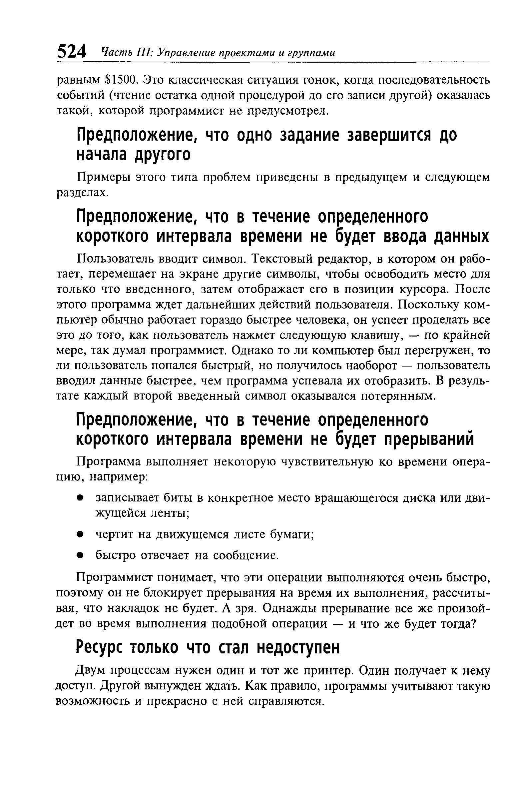

Однако здесь есть один нюанс. Между проверкой доступности принтера и началом его использования программой проходит некоторое время. В этот короткий период другая, более быстрая программа может захватить принтер и начать его использовать.

Некоторые программисты скажут, что это очень маловероятно. Они правы. Однако программа может выполняться пользователями миллионы раз, так что возможно все. А поскольку последствия ошибок, связанных с условиями гонок, бывают очень серьезными, такие ошибки необходимо исправлять, какой бы маленькой ни была вероятность их проявления.

### Предположение, что человек, устройство или процесс ответят быстро

Программа выводит на экран сообщение и несколько секунд ожидает ответа. Если пользователь не отвечает, программа считает, что его нет за компьютером, и прекращает свою работу. Подобным образом другая программа пытается инициализировать принтер и некоторое время ждет его ответа, после чего выдает сообщение, что принтер недоступен. Используются тайм-ауты и при ожидании ответа от другого процесса.

Если тайм-аут слишком короток, вероятно возникновение ситуации гонок, когда процесс, человек или устройство просто не успели ответить.

Если интервал времени очень короткий, не обязательно имеет место классическое условие гонок. Программист, скорее всего, предполагал, что ответ может быть и не получен, и корректно отработал эту ситуацию. Если же интервал лишь чуть короче, чем необходимо, риск ошибки больше. Что произойдет, если ответ на сообщение поступит через несколько миллисекунд после окончания тайм-аута? Может быть, он будет интерпретирован как ответ на следующее сообщение? Это уже серьезная ошибка.

### Реальный набор опций в процессе перерисовки экрана

Компьютер отображает меню и ждет ответа пользователя. Тайм-аут или другое событие (сообщение, получение сигнала от устройства) заставляют программу отобразить другое меню. Пока она перерисовывает экран, пользователь нажимает на клавишу. В этой ситуации возможны два вида ошибок.

* Программа интерпретирует нажатие клавиши как выбор команды старого меню, хотя новое уже на экране.
* Программа интерпретирует нажатие клавиши как выбор команды нового меню, хотя на экране все еще старое.

Эта проблема реальной эксплуатации. Опытный пользователь знает, какое меню сейчас появится на экране, и может нажать на клавишу еще до того, как оно будет прорисовано до конца.

Задание начинается до того, как выполнены подготовительные действия

Программа отсылает данные на принтер до его готовности, пытается записать данные в область памяти, которая ей еще не выделена, и т.п. Возможно, программа должна дождаться определенного сообщения и только после этого начинать выполнение задания. Но, основываясь на другой информации (например, на других сообщениях), программа определяет, что ожидаемое событие вот-вот наступит. Поэтому ради повышения производительности программист идет на то, чтобы не дожидаться подтверждения. Иногда его ожидания не оправдываются.

### Сообщения приходят одновременно или не в том порядке, в котором они были отправлены

Предположим, что на банковском счете пользователя лежит $1000 и он пытается выполнить три действия в следующем порядке:

* снять со счета $1000;
* положить на счет $500;
* снять со счета $100.

Первая операция выполняется, $500 также принимаются. Но когда пользователь пытается снять со счета $100, он получает сообщение, что на его счете нулевой остаток. По какой-то причине операция внесения денег заняла больше времени, чем ожидалось, и к моменту их снятия еще не была завершена.

Проблемы такого рода широко распространены в системах, функционирование которых основано на обмене сообщениями. Сообщения могут передаваться по кругу, они могут проверяться дополнительными запросами, так что далеко не всегда можно сказать с уверенностью, какое из отправленных сообщений достигнет места назначения первым.

Самым неприятным проявлением этой проблемы являются противоречащие друг другу сообщения, которые меняются местами. Один процесс просит другой выполнить некоторое действие. Второй процесс отправляет сообщение, подтверждающее, что он может выполнить задачу (принять $500), а затем обнаруживает, что не может этого сделать (остаток остается нулевым), и посылает второе сообщение. При этом базы данных сообщения достигают в ином порядке, так что ей кажется, что пользователь сначала запрашивает $100, а затем кладет на счет $500. У пользователя же своя картина: он сначала получил сообщение, что $500 положены на счет, а затем попытался снять $100 и получил сообщение о нулевом остатке.

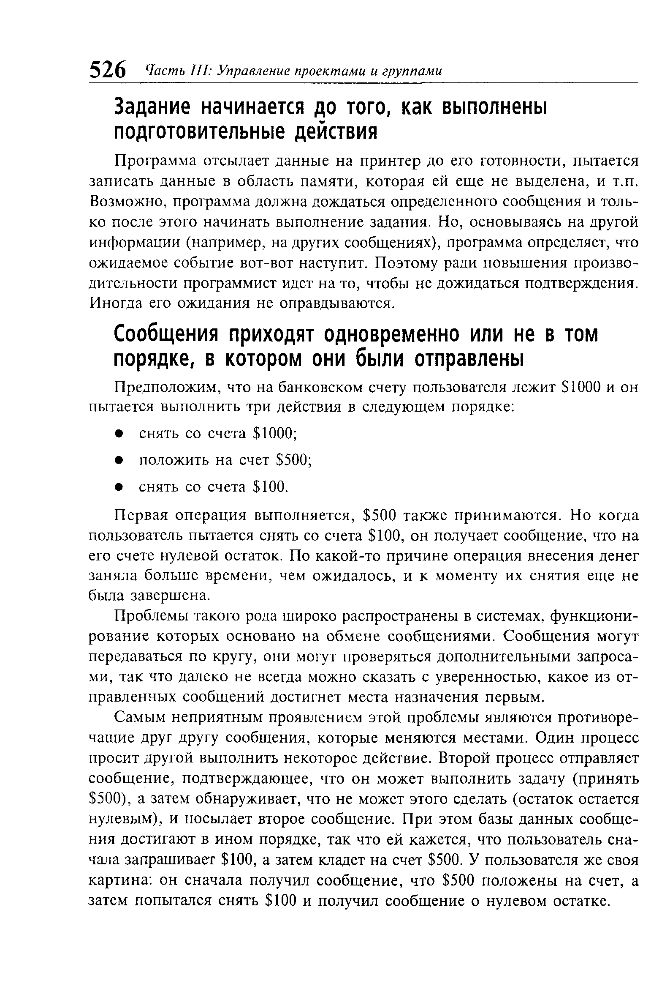

# Повышенные нагрузки

При перегрузках программа может вести себя неожиданным образом. К таким перегрузкам может относиться большое количество работы в течение продолжительного времени или высокая скорость работы. В том и другом случае программе может не хватить определенных ресурсов: например, ей может не хватить памяти или принтер не будет успевать печатать передаваемую ею информацию. Возможности любой программы ограничены. Важно то, насколько вероятно, что пользователь столкнется с этими ограничениями, и какими будут их последствия.

Из-за использования неэффективных алгоритмов некоторые программы сами создают себе проблемы, а в мультипрограммной среде еще и затрудняют работу других приложений.

## Требуемый ресурс недоступен

Программе не удается воспользоваться устройством или иным ресурсом компьютера. Причины могут быть такими:

* Диск полон
* Дисковый каталог полон
* Область памяти заполнена
* Очередь печати заполнена
* Очередь сообщений заполнена
* Стек полон
* Диск отсутствует в дисководе
* Дисковод не работает
* Дисковод отсутствует
* Принтер в режиме off line
* В принтере кончилась бумага
* В принтере нет ленты
* Принтер отсутствует
* Дополнительная память отсутствует

## Не освобожден ресурс

В системе может не быть свободных ресурсов из-за того, что их захватил и не освобождает один из процессов. Программисты тщательно продумывают процедуру получения ресурсов, но они далеко не так аккуратны в вопросе их освобождения. А поскольку ничего особенного с программой не

происходит, когда она не освобождает ресурс в течение долгого времени, проблемы этого типа кажутся менее значительными.

Разрабатывая тесты, подумайте над следующими примерами проблем.

### Нет сигнала об освобождении устройства

Процесс использует принтер. Остальные процессы ждут сигнала о его освобождении. Процесс завершает работу с принтером, но сигнал не отправляет.

### Старый файл не удален с накопителя

Программа не удалила устаревшие резервные копии или временные файлы. Как правило, количество хранящихся копий файлов строго определено: их не должно быть ни больше ни меньше.

### Системе не возвращена неиспользуемая память

В многозадачной системе существует специальный процесс, управляющий памятью и выделяющий ее остальным процессам во временное пользование. Предполагается, что, когда память процессу становится не нужна, он возвращает ее системе, послав ей соответствующее сообщение. Однако не все программисты аккуратны в этом вопросе — проблемы, возникающие из-за блокированной процессами памяти, *исключительно* распространены.

### Лишние затраты компьютерного времени

Процесс периодически проверяет флаг события, которое не может произойти, или выполняет другие действия, которые были необходимы в свое время, но больше не нужны.

### Нет свободного блока памяти достаточного размера

Менеджер памяти должен уметь перераспределять свободную память таким образом, чтобы она составляла блоки достаточного размера, или же в системе должен быть реализован механизм виртуальной памяти, когда память, видимая прикладным процессом как единый блок, на самом деле состоит из расположенных на расстоянии друг от друга фрагментов.

В противном случае возможно, что через некоторое время после начала работы свободная память станет сильно фрагментированной и очередной процесс не сможет получить блок памяти нужного ему размера, хотя общий объем свободной памяти будет вполне достаточным.

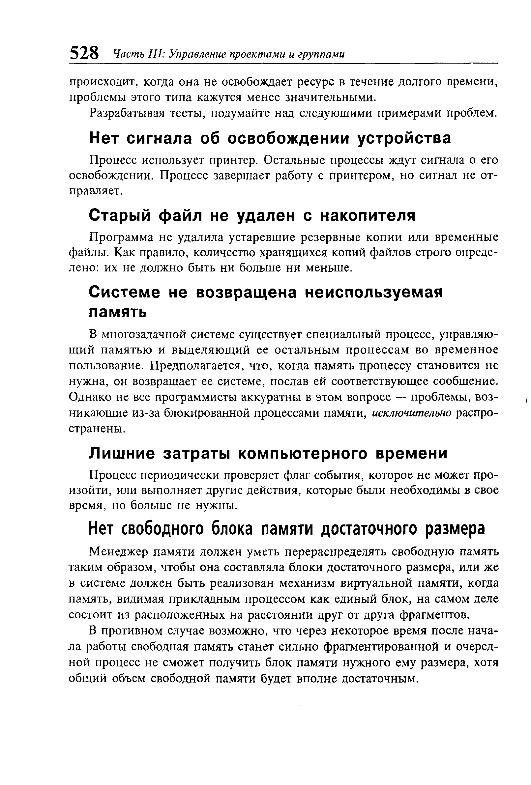

Недостаточный размер буфера ввода или очереди

Процесс может терять информацию о нажатиях клавиш, сообщения или другие данные из-за того, что размер буфера, в который они поступают с большой скоростью, недостаточно велик, чтобы вместить их все.

Если буфер ввода процесса предназначен для хранения 10 символов, что произойдет, когда пользователь введет 11-й символ до того, как процесс успеет обработать хоть один из уже введенных и освободить в буфере место для новых данных? Возможно, программа выдаст звуковой сигнал. Если же данные поступают процессу через модем, он может попросить передающий процесс приостановить передачу.

Аналогичная ситуация возможна и с очередью сообщений (очередь — это буфер определенной структуры). Если сообщение не помещается в очередь, оно может быть просто проигнорировано, возвращено отправителю с кодом ошибки и т.п. В первом случае необходимо выяснить, каковы будут последствия потери сообщения.

## Не очищен элемент очереди, буфера или стека

Предположим, что программа получает сообщения и помещает их в очередь, откуда читает их, когда появляется время. Прочитанное сообщение должно быть удалено из очереди, чтобы освободить место для следующих сообщений. Однако программист может об этом забыть, из-за чего через некоторое время работы программы очередь окажется полностью заполненной и программа не сможет получить больше ни одного сообщения.

В более сложных случаях из очереди не удаляются только некоторые сообщения, так что ошибка проявляется далеко не сразу. Чтобы ее увидеть, программу необходимо тестировать в течение длительного времени без перезапуска. Длительность времени определяется практическими потребностями пользователя. Для тестирования текстового процессора обычно суток непрерывной работы более чем достаточно, в то время как телефонная система может работать без остановки месяцами.

## Потерянные сообщения

Операционная система может терять некоторые сообщения (увы, ничего не поделаешь). Может это делать и процесс-получатель, когда ему одновременно приходит слишком много сообщений. Должен ли процесс-отправитель знать, что его сообщение не обработано и его необходимо через некоторое время отослать повторно?

## Снижение производительности

При высокой загрузке системы (повышении объемов обрабатываемых данных, большом количестве пользователей или процессов) работа всех

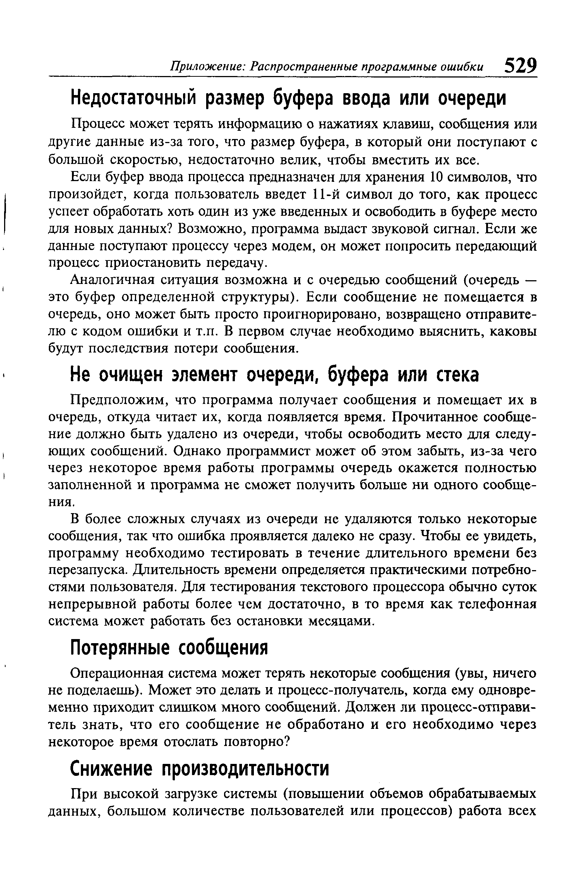

приложений замедляется. Если программа должна отвечать на события с определенной быстротой или обрабатывать определенное количество сообщений в секунду, выполнение этих условий оказывается под угрозой. Другие программы, ориентирующиеся на ее быстрый ответ, также могут не выполнить свою работу.

### Повышение вероятности ситуаций гонок

Со снижением производительности системы вероятность возникновения ситуаций гонок значительно повышается. В классическом условии гонок могут произойти два события, причем первое из них практически всегда предшествует второму. Лишь в очень редких случаях второе событие чуть-чуть обгоняет первое. Однако, когда работа системы замедляется, на генерирование или регистрацию первого события уходит больше времени. При этом замедление может и не коснуться второго события (например, на клавиатурный ввод система может реагировать по-прежнему быстро). В результате второе событие будет опережать первое гораздо чаще, чем обычно.

### При повышенной нагрузке объем необязательных данных не сокращается

Некоторые программы генерируют огромное количество выходных данных. На форматирование всей этой информации и вывод ее на экран или принтер уходит уйма времени. Если компьютер и так перегружен, подобные программы должны сокращать объем выходной информации. Они могут выдавать свои сообщения в сокращенной форме и не печатать их немедленно, а сохранять в файле журнала. Только самые срочные сообщения должны немедленно выводиться на экран или печать.

Предложения по сокращению вывода программы следует тщательно продумать. Например, если программе-планировщику необходимо распечатать план совещания, которое состоится через три минуты, она должна сделать это немедленно и в полном объеме.

### Не распознается сокращенный вывод другого процесса при повышенной загрузке

Представьте себе многопользовательскую систему, в которой все программы передают информацию о своих сбоях и других интересных событиях на консоль системного администратора. Обычно сообщение включает числовой код и текстовое описание. При повышенной загрузке системы передаются только коды, причем в сокращенном виде, так что администратору приходится искать каждый код в справочнике. Неудобно, конечно, но зато трафик системы хоть немного снижается.

Теперь предположим, что сообщения сохраняются на диске. В конце дня (недели, месяца) служебная программа читает их и, возможно, предпринимает в ответ на некоторые из них определенные действия. Эта программа должна уметь распознавать сокращенные коды, записанные программами при повышенной загрузке системы, иначе она не сможет выполнить свою работу.

### Не приостанавливаются задания с низким приоритетом

При повышенной загрузке системы все задания, в которых нет срочной необходимости, должны быть приостановлены. В многозадачных системах процессам и пользователям обычно назначаются приоритеты. Те, у кого приоритет выше, имеют больше прав на использование ресурсов компьютера.

### Задания с низким приоритетом вообще не выполняются

Замену масла в автомобиле можно ненадолго отложить, но все же заменить его нужно. Аналогичным образом можно приостановить выполнение некоторых низкоприоритетных заданий, но рано или поздно они должны быть выполнены. Для таких заданий не разрешается подолгу использовать компьютерное время, когда система загружена, однако понемногу их все же следует выполнять.

## Аппаратное обеспечение

Программы могут отсылать устройствам неверные данные, игнорировать возвращаемые ими коды ошибок, пытаться использовать неподключенные или отсутствующие устройства и т.д. Даже если причиной проблемы является аппаратный сбой, программная ошибка также может присутствовать — она выражается в том, что программа не распознала неработоспособность устройства и не приняла соответствующих мер.

### Неверное устройство

Например, программа выводит данные на экран вместо принтера.

### Неверный адрес устройства

Во многих системах, для того чтобы передать данные устройству, программа должна просто записать их по определенному адресу памяти. За физическую передачу устройству данных из этой области отвечает аппаратное обеспечение. Программа может записать данные не по тому адресу.

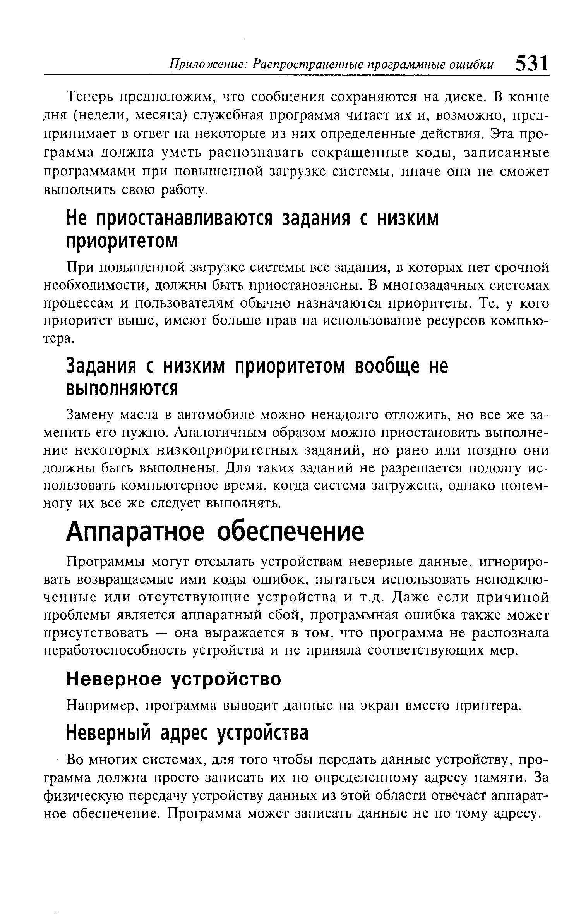

### Устройство недоступно

См. вышеприведенный раздел "Требуемый ресурс недоступен".

### Устройство возвращено не в тот пул

Например, в многозадачной системе может быть много лазерных и матричных принтеров. Программа использует матричный принтер, а затем сообщает, что он свободен. Однако, возвращая его в пул доступных устройств, она по ошибке указывает не пул матричных принтеров, а пул лазерных.

### Данному пользователю или программе использование устройства запрещено

Например, рядовым сотрудникам компании может быть запрещено использование дорогостоящих, сложных или хрупких устройств. Программы, работающие с такими пользователями (пользовательскими ID), должны уметь обрабатывать данный отказ.

### Данный уровень привилегий не позволяет получить доступ к устройству

Эта проблема похожа на предыдущую, только запрет использования устройства определяется не идентификатором пользователя, а его уровнем привилегий, который программа должна сообщить системе.

### Шумы

Программа начинает работу с устройством, например, принтером или модемом. Компьютер связан с этим устройством через коммуникационный канал. Однако электрические наводки, временные проблемы и другие причины могут вызвать искажение передаваемых по каналу сигналов (компьютер отправляет 3, а устройство получает 1). Как программа выявляет ошибки обмена данными и как она о них сообщает? Что она делает для их исправления?

### Прерывание связи

Один компьютер отправляет данные другому через телефонную линию (и модемы с двух сторон). На середине передачи один из модемов отключается. Как каждый из компьютеров узнает, что связь прервана, сколько времени это занимает и что предпринимается далее? Аналогичным образом как компьютер узнает, что принтер, к которому он подключен, перестал печатать?

## Проблемы тайм-аута

Программа посылает устройству сигнал и некоторое время ждет ответа. Не получив его, она решает, что устройство сломано или отключено. Но что, если она просто ждала недостаточно долго?

### Неверный накопитель

Программа ищет данные, записанные на накопитель — дискету, сменный жесткий диск или магнитную ленту. Не найдя необходимых файлов, она может сообщить об этом пользователю и попросить вставить другой накопитель или же сначала поискать данные на другом устройстве. Однако возможен и просто программный сбой. А в одной особенно свирепой операционной системе программы могли разрушить каталог дискеты, пытаясь найти файл, которого там нет.

### Не проверяется содержимое текущего диска

Вставьте один диск, поработайте с ним, затем вытащите его и вставьте в тот же дисковод другой диск. Некоторые операционные системы не замечают замены. Они копируют каталог диска в память и не считывают его повторно до тех пор, пока пользователь об этом явно не попросит. Пытаясь записать данные на диск или считать с диска, такие операционные системы пользуются старой информацией каталога и иногда даже портят файлы или читают неизвестно что.

### Не закрыт файл

Завершив работу с файлом, программа должна его закрыть. В противном случае внесенные ею в файл изменения не будут записаны на диск. При выключении компьютера открытый файл может быть запорчен. Поэтому завершая свою работу, программы обязательно должны закрывать все свои открытые файлы.

### Неожиданный конец файла

Читая файл, программа достигает маркера его конца. Предположим, что программа ожидала найти необходимые данные далее. Как она поступит: возможно, проигнорирует маркер конца файла и продолжит чтение дальше? А может быть, произойдет сбой?

### Ошибки, связанные с длиной файлов и дисковыми секторами

Информация хранится на дисках небольшими фрагментами фиксированного размера, называемыми секторами. Их размер обычно составляет несколько килобайтов. Некоторые программы сбоят при попытке сохране-

ния или чтения файла, размер которого кратен размеру сектора. Например, если размер сектора равен 1 Кб, программе не удастся правильно сохранить файлы размером в 1, 2, 3 Кб и т.д.

Последний символ каждого сектора или последний символ файла может быть скопирован неправильно, скопирован дважды или потерян. Иногда программа даже портит весь записываемый файл и файл, следующий за ним на диске.

### Неверный код операции или команды

Программа посылает терминалу команду сдвинуть курсор на экране, а он вместо этого меняет видеорежим. Программа посылает принтеру команду прогона страницы, а он выполняет перевод строки.

Устройства не стандартизированы. Для выполнения одного и того же действия два принтера могут использовать разные команды. То же касается и любых других устройств. Поэтому программа должна знать, с каким именно устройством она работает, и передавать ему правильные команды.

### Неверно интерпретирован код состояния или возврата

Программа посылает принтеру команду включить курсив. Принтер может ответить, сообщив, возможно или нет выполнение этой команды. Он также может сообщить о причине неудачи (отсутствует бумага, лента, неизвестная команда, не установлен дополнительный модуль). Многие программы игнорируют коды ошибок или ищут их в устаревшем или неверном списке.

### Ошибка протокола обмена с устройством

Коммуникационный протокол, используемый для взаимодействия компьютера и внешнего устройства или пары компьютеров определяет, когда компьютер отправляет данные, с какой скоростью и каковы их характеристики (четность, стоповые биты и т.п.). Кроме того, протокол определяет, как устройство сообщает о получении данных и готовности принимать следующие или о необходимости приостановки передачи.

Устройства могут отправлять данные и отвечать невпопад, или же формат данных может быть неверным.

### Неполное использование возможностей устройства

Если принтер может печатать полужирным шрифтом, зачем пытаться имитировать этот шрифт, печатая каждую строку по нескольку раз? Программа может быть разработана для старых устройств и не изменена с расширением их возможностей.

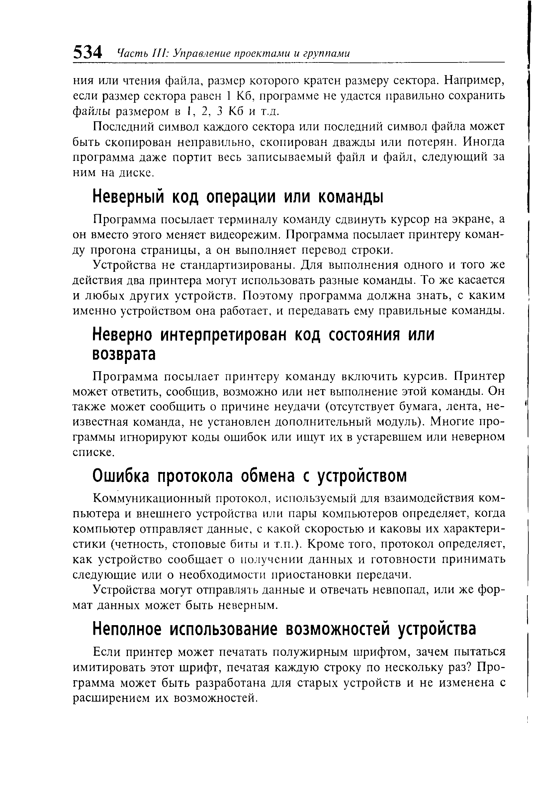

Устройство может иметь собственные встроенные шрифты, набор кодов ошибок и т.д., но программа не распознает его сообщений и не использует расширенных возможностей.

Проблема может быть и в другом. Программист знает о возможностях устройств, но все они управляются разными командами, и реализация полноценного управления ими всеми обходится слишком дорого.

## Игнорируется или неправильно используется механизм страничный управления памятью

Память компьютера может быть логически разделена на участки, называемые страницами. Однако программа может неверно переключаться между страницами или неправильно с ними обращаться.

Страницы часто используются для организации виртуальной памяти. Программа обращается к данным по определенному адресу, не зная, находятся ли они в оперативной памяти или выгружены на диск. Если программа обращается к отсутствующей странице, происходит ошибка, в ответ на которую страница считывается в память. Впрочем, операционные системы обычно скрывают от программ механизм организации виртуальной памяти, хотя некоторые программы пытаются реализовывать его самостоятельно. В этом случае программа может случайно затереть содержимое страницы в памяти, не сохранив его на диске.

## Игнорирование ограничений канала

Примеры:

* Программа пытается пересылать данные со скоростью 100 символов в секунду, в то время как через соединение может передаваться только 10 символов в секунду.
* Программа может пересылать данные с большой скоростью, пока входной буфер устройства не заполнится. Затем она должна прекратить передачу до тех пор, пока устройство не освободит буфер. Некоторые программы не распознают сигналов устройств и продолжают передачу.

## Предположения о наличии или отсутствии устройства или его инициализации

Перед отправкой текста на печать текстовый процессор посылает принтеру инициализирующее сообщение, в котором говорится, что данные должны печататься с таким-то разрешением и таким-то шрифтом. Необходимо ли это сообщение? Возможно, что принтер уже инициализирован.

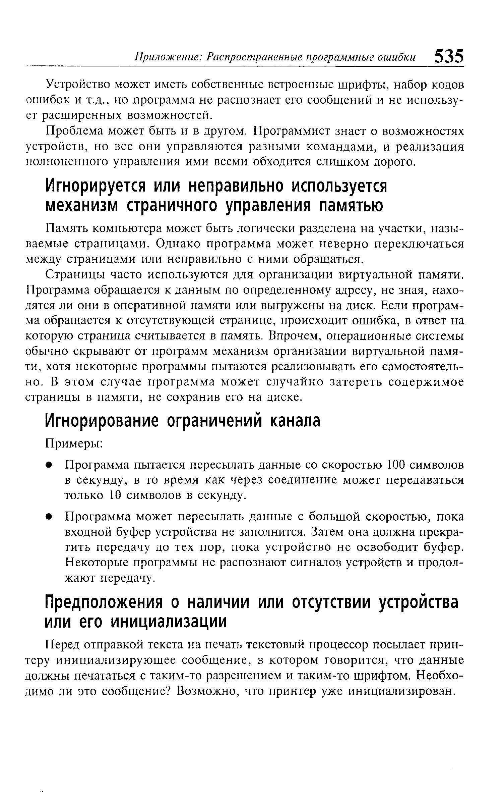

## Программируемые функциональные клавиши

Программируемые функциональные клавиши могут генерировать при нажатии любую заданную последовательность кодов. Эта последовательность должна быть правильно запрограммирована и соответствовать текущему режиму программы. Например, если на экране написано: "Для печати нажмите <PF-1>", — генерируемая при нажатии этой клавиши последовательность кодов должна инициировать печать, а не выход из программы.

Если программа полагается на программируемые клавиши, при ее запуске необходимо убедиться, что с ними связаны правильные последовательности кодов.

## Контроль версий и идентификаторов

Если предполагается, что ваша версия программы имеет номер 2.43, и при этом одни ее составляющие относятся к версии 2.42, а другие — к версии 2.44, то у вас, скорее всего, проблемы. Тестировщик должен знать, что у него за версия, и это должно быть возможно определить на основании программного кода. Если это не так, документируйте ошибку.

Некоторые люди называют подобные ошибки бюрократическими. Ведь только бюрократы станут беспокоиться о таких вещах, как версии файлов. Однако беспокоиться об этом надо, иначе пользователи могут получить не то, что ожидали.

## Таинственным образом появляются старые ошибки

Старые проблемы могут появиться по той простой причине, что программист скомпоновал старую версию одной подпрограммы с новыми версиями остальных. Многие программы состоят из десятков и сотен файлов — не мудрено запутаться в их версиях. Программисты, которые сохраняют старые версии файлов, часто компонуют их с новыми.

## Обновление не всех копий данных или программных файлов

Некоторые программисты включают один и тот же код во множество программных модулей. Изменив этот код, они должны обновить несколько десятков его копий. Не удивительно, если в некоторые из них они забудут внести изменения. В результате ошибка может быть исправлена в двадцати местах и остаться еще в пяти.

## Отсутствие заголовка

Запустив программу, пользователь должен видеть, с чем он работает. В ее верхней строке должно быть написано, что на экране электронная таблица Сергея Петрова, а не база данных Василия Иванова.

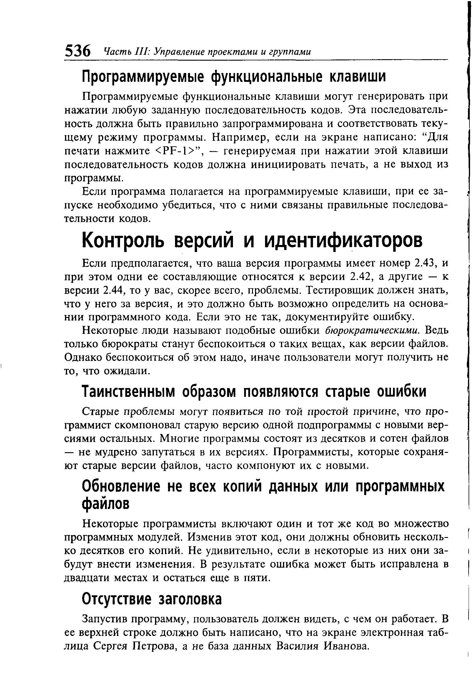

## Отсутствие номера версии

Программа должна предоставить пользователю возможность узнать номер ее версии. Обычно номер версии отображается в заставке в процессе запуска программы, а также по специальной команде пользователя. Необходимо, чтобы эту команду можно было легко найти, тогда пользователь или тестировщик сможет сообщить программисту об обнаруженной ошибке.

Если программный продукт состоит из нескольких достаточно независимых компонентов, желательно, чтобы у каждого из них был свой номер версии, который также легко было бы определить. Однако если у вас нет твердой поддержки руководства, не настаивайте, чтобы программисты назначали компонентам продукта отдельные номера версий.

## Неверный номер версии в заголовке экрана

Обычно номер версии программы отображается в ее заголовке или в диалоговом окне "О программе". Меняя код, программист иногда забывает менять отображаемые номера версий.

## Отсутствующая или неверная информация об авторских правах

Информация об авторских правах на программу обычно отображается при ее первом запуске, а также в диалоговом окне "О программе". Она должна быть достоверной.

## Программа, скомпилированная из архивной копии, не соответствует проданному варианту

Перед выпуском продукта его исходный код архивируется. Если пользователь находит ошибку, программисты исправляют ее в исходном коде и повторно компилируют программу. Однако для начала исходный код компилируется как есть, и проверяется совпадение результата с имеющейся у пользователя программой. Если программы не одинаковы, как вносить изменения?

Все это кажется очевидным, но вы не поверите, как много компаний не могут воссоздать проданные ими продукты. Архивные копии исходного кода у них есть, но не той версии программы. Это очень серьезная проблема.

Составляя отчет о несовпадении архивной копии кода с той, которая предназначена для продажи, назначьте ему наивысший приоритет.

## Готовые диски содержат неверный код или данные

После массового производства дисков, когда продукт будет практически готов к выпуску, проверьте несколько из них. Если на дисках имеются ошибки, их поиск входит в обязанности группы тестирования.

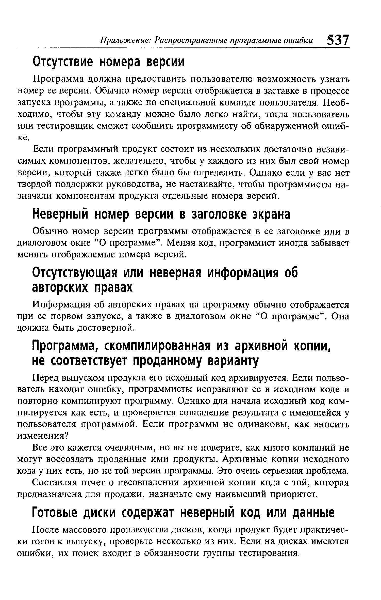

Дупликаторы могут выпускать чистые диски — такое случается. И случается даже, что эти чистые диски уходят в продажу. За последние три года я трижды получал как пользователь чистые диски (от различных компаний). Производственный отдел может размножить не ту версию программы или даже вообще не ту программу.

## Ошибки тестирования

В этом разделе рассказывается о технических и процедурных ошибках и ошибках в документации, допускаемых сотрудниками группы тестирования. Хотя это и не ошибки программы, вам не раз придется столкнуться с ними в ходе работы.

## Пропущены ошибки в программе

Вы всегда будете пропускать ошибки, поскольку все возможные тесты выполнить невозможно. Однако пропущенных ошибок будет больше, чем ожидается. Поэтому, обнаружив ошибку, которая давно могла быть выявлена, особенно на поздних стадиях тестирования, ищите пути усовершенствования процедуры тестирования.

## Не замечена проблема

Выявленную тестом ошибку можно не увидеть по следующим причинам.

* *Тестировщик не знает, каким должен быть правильный результат.* По возможности включайте в описания тестов и предполагаемые результаты. Если тест автоматизирован, лучше всего рядом с его результатом вывести образец правильных данных.
* *Ошибка затерялась в большом объеме выходных данных.* Постарайтесь, чтобы выходные данные тестов были как можно более короткими. Если это невозможно, направьте их в файл и подготовьте программу, которая проверяет их автоматически.
* *Тестировщик не ожидал такого результата теста.* Бывает, что тест, предназначенный для одной маленькой части программы, выявляет ошибку совсем в другой ее части. Будьте к этому готовы.
* *Тестировщик устал и невнимателен, ему скучно.* Старайтесь организовать работу так, чтобы никто не выполнял один и тот же тест больше трех раз. Передавайте тесты между сотрудниками по кругу.
* *Механизм выполнения теста настолько сложен, что тестировщик уделяет ему больше внимания, чем результатам.*

## Пропуск ошибок на экране

Не легко заметить такие вещи, как ошибки правописания, пропущенные элементы меню и невыровненный текст, если вы сосредоточенны

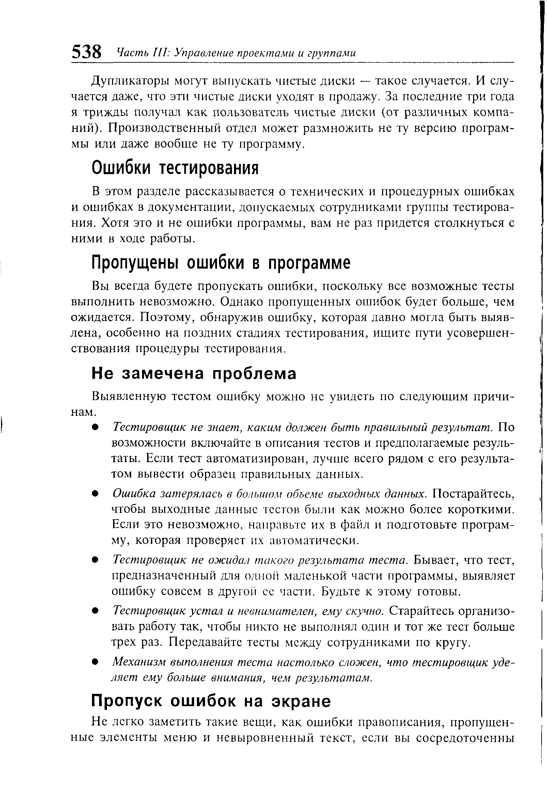

главным образом на правильности выводимых программой данных и ее действий. Поэтому выделяйте время специально для внимательного изучения всего содержимого экрана.

## Не документирована проблема

Отчет о найденной проблеме может быть не составлен по следующим причинам.

* Тестировщик неаккуратно ведет записи.
* Тестировщик не уверен в том, что данные действия программы являются ошибочными, и боится выглядеть глупым.
* Ошибка показалась тестировщику слишком незначительной, или он считает, что она не будет исправлена.
* Тестировщика просили не документировать больше подобные ошибки.

Все эти причины неприемлемы. Если вы не уверены, что видите ошибку, напишите об этом в отчете. Обратитесь к руководству за разрешением споров о незначительных или политически неугодных ошибках. Вы отвечаете за то, чтобы о каждой найденной в программе ошибке был составлен отчет. Намеренное же сокрытие ошибок приводит к недоразумениям, портит моральный климат в коллективе, а в конечном счете ведет к снижению качества продукта. Кроме того, вы немедленно вовлекаетесь в политические дрязги и интриги, от которых всегда лучше держаться подальше.

## Не выполнен запланированный тест

Запланированный тест может быть не выполнен по следующим причинам.

* *Тестовые материалы и записи плохо организованы. Последовательность действий нарушена, и тесты перепутаны.*
* *Тестировщику скучно. Серии тестов повторяются по многу раз, из-за чего тестировщик выполняет некоторые из них в сокращенном виде или пропускает те, которые кажутся ему похожими на предыдущие. Постарайтесь сократить количество повторений, комбинируя примеры, сокращая менее важные тесты или выполняя их только на каждом втором или третьем цикле.*
* *В одном тесте объединено слишком много действий. Если один тест включен в другой и один из них не удастся, второй тоже, скорее всего, не будет выполнен. Постарайтесь избегать сложных комбинаций тестов, ведущих к пропускам некоторых из них.*

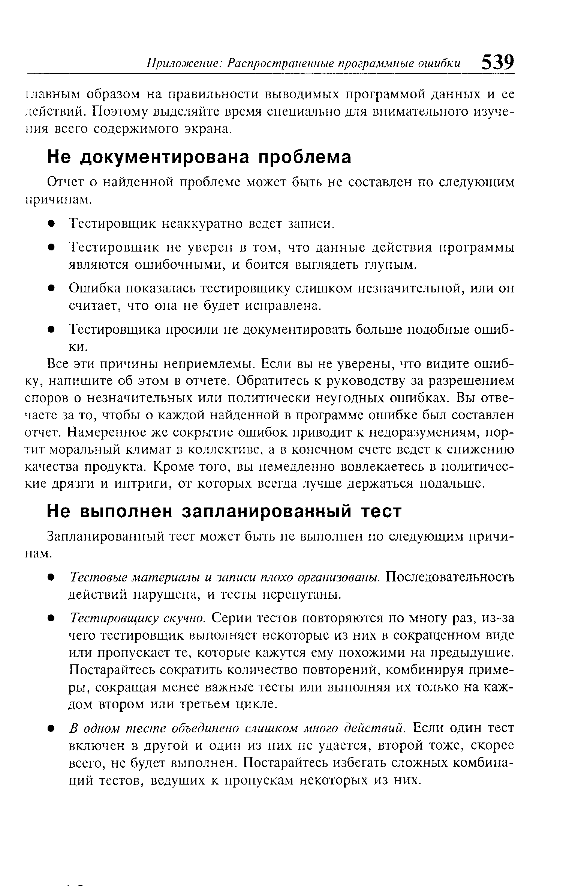

## Не описаны временные зависимости

Тестировщик может не заметить, что для воспроизведения ошибки необходимо нажимать клавиши с интервалами в миллисекунды, или наоборот, ждать как минимум пять минут перед нажатием следующей клавиши. Иногда он даже не понимает, что имеет дело с ситуацией гонок или другой ошибкой, связанной со временем. Заметив зависимость работы программы от времени, обязательно напишите об этом в отчете. А столкнувшись с невоспроизводимой ошибкой, подумайте, не вызвана ли она ситуацией гонок.

## Сложные условия

Тестировщики часто выполняют сложные комбинированные тесты ради экономии времени. Однако, выявив ошибку, следует найти как можно более простой способ ее воспроизведения и именно его и описать в отчете.

## Преувеличения

Не делайте из маленького недостатка большую проблему. Старайтесь сохранять объективность и здравый смысл, иначе вы заслужите репутацию нудного и придирчивого человека.

## Личные выпады

Не отзывайтесь плохо о работе программиста. Не жалуйтесь, что он не исправляет ошибки, даже если они достаточно серьезны. Старайтесь сохранять с сотрудниками мирные и деловые отношения и искать конструктивные пути решения проблем.

## Ошибка выявлена и забыта

Найдя ошибку, недостаточно просто составить о ней отчет. Необходимо проследить за дальнейшей судьбой этого отчета и гарантировать, что об ошибке узнают все заинтересованные сотрудники и она не останется в программе просто потому, что о ней забыли.

## Не составлен итоговый отчет

Не думайте, что, если вы передали программисту отчет об ошибке, он его прочел и принял необходимые меры. Некоторые программисты теряют отчеты. Другие делают из них самолетики или заворачивают в них рыбу. А кое-кто даже прячет отчеты от руководителя. Каждую неделю или две обязательно составляйте и передавайте руководству сводные отчеты с перечнем всех нерешенных проблем и неисправленных ошибок. Эта проце-

дура должна быть стандартной. Отчет должен охватывать абсолютно все ошибки и быть составлен в безличностной некритической форме.

### Серьезная проблема не документирована повторно

Если ошибка серьезна, не удовлетворяйтесь резолюцией **Отложено** или **Соответствует спецификации**. Подумайте, как описать ее в такой форме, чтобы руководитель проекта понял ее важность, и составьте новый отчет. Если это не сработает, передайте отчет вышестоящему руководству.

### Не проверено исправление

Программист сообщает, что ошибка исправлена. Не верьте ему на слово. До трети всех исправлений либо неправильны, либо решают лишь часть проблемы. Кроме того, программист может исправить не то, что нужно. Иногда вместо истинной причины ошибки исправляются ее последствия, и тогда ошибка может проявиться где-нибудь еще. Если не провести тщательного регрессионного тестирования, нельзя гарантировать, что ошибка исправлена и больше ничего не нарушено.

### Перед выпуском не проанализирован список нерешенных проблем

Непосредственно перед выпуском продукта еще раз проанализируйте список всех неисправленных ошибок и отложенных проблем. Мы настоятельно рекомендуем взять это за твердое правило и убедиться, что по всем отчетам о проблемах, по крайней мере, приняты определенные решения. Это ваш последний шанс напомнить людям о серьезных ошибках.

