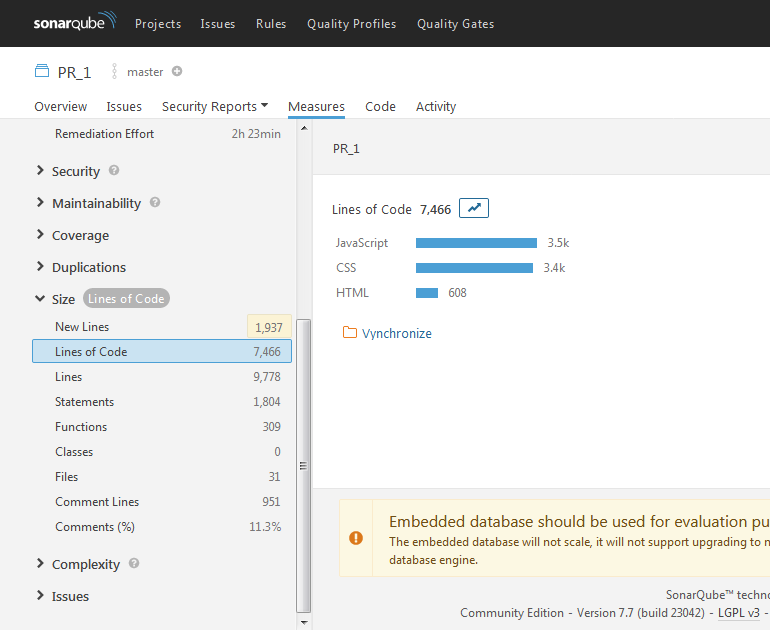
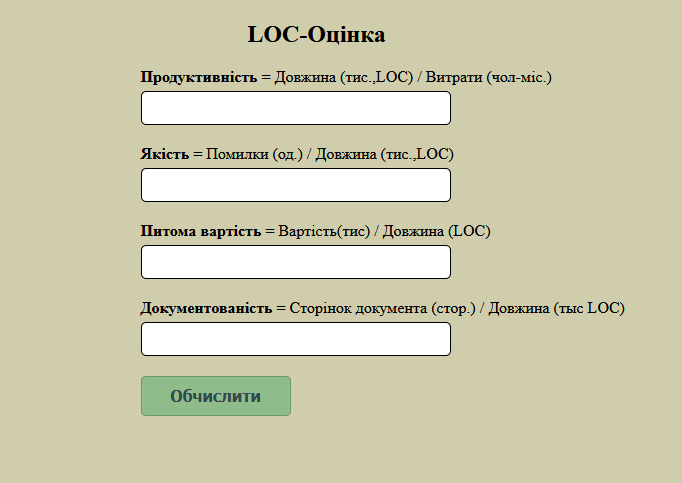
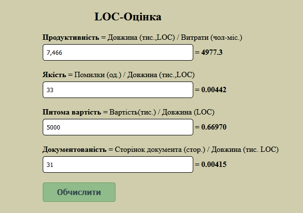
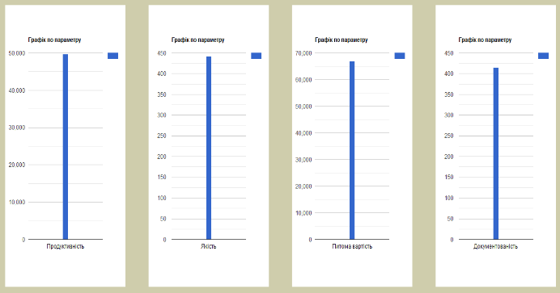

# 228753-Текст статті-520872-1-10-20210407.pdf

<!-- ВІДНОВЛЕНО ЛОКАЛЬНО (Стор. 1) -->
_Інформаційні технології управління_ 

## **DOI: 10.32347/2412-9933.2020.44.49-55** 

УДК 005.8 

# **Катаєва Євгенія Юріївна** 

Кандидат технічних наук, доцент, доцент кафедри програмного забезпечення автоматизованих систем, _orcid.org/0000-0003-1277-8031_ 

_Черкаський державний  технологічний університет, Черкаси_ 

# **Одокієнко Світлана Миколаївна** 

Кандидат технічних наук, доцент кафедри інформаційно-комп’ютерних технологій та фундаментальних дисциплін, _orcid.org/0000-0002-3893-6512_ 

_Київський національний університет технологій та дизайну, Київ_ 

# **Люта Майя В'ячеславівна** 

Старший викладач кафедри інформаційно-комп’ютерних технологій та фундаментальних дисциплін, _orcid.org/0000-0002-0248-0461_ 

_Київський національний університет технологій та дизайну, Київ_ 

# **Савченко Ярослав Сергійович** 

Магістр кафедри інформаційно-комп’ютерних технологій та фундаментальних дисциплін, _orcid.org/0000-0001-5125-2441_ 

_Київський національний університет технологій та дизайну, Київ_ 

# **ПРАКТИЧНИЙ АНАЛІЗ ЯКОСТІ ПРОГРАМНОГО ЗАБЕЗПЕЧЕННЯ З ВІДКРИТИМ КОДОМ** 

**_Анотація._** _Успіх будь-якого проєкту визначається його здатністю задовольнити потреби споживача, а тому забезпечення високого рівня якості є необхідним завданням будь-якого виробництва, в т. ч. програмної інженерії. Недостатня якість створюваного ПЗ потребує багато IT-організації, до 70% бюджету інформаційної системи резервувати на етап супроводу. При цьому до 60% всіх модифікацій ПЗ виконується для усунення помилок, а тільки решту 40%_ − _для корекції ПЗ в рамках бізнес-процесу, вдосконалення тих чи інших показників якості ПЗ, або для запобігання потенційних проблем. Якість ПЗ_ − _поняття комплексне. Стандарти виділяють якість процесів розробки, внутрішню і зовнішню якість програмного продукту, якість програмного продукту на стадії використання. Для кожного з компонентів якості можна навести набір метрик, що визначають якість програмного продукту. Отримана структура називається моделлю якості програмного забезпечення. Метрика програмного забезпечення_ − _це захід, що допомагає отримати чисельне значення деякої властивості програмного забезпечення або його специфікацій, а також метод її підрахунку. Метрики дають змогу отримати чисельні значення кожної властивості програмного забезпечення або його специфікацій. Особливий інтерес представляють метрики складності програмного забезпечення. Складність є важливим фактором, від якого залежать інші параметри якості ПЗ, такі як точність, коректність, надійність, зручність супроводу. Наявність методів і алгоритмів автоматичного розрахунку метрик складності ПЗ за допомогою програмних засобів допомагає отримати комплексний формальний звіт про якість ПЗ за короткий час. Це дає змогу проводити об'єктивний моніторинг рівня якості ПЗ протягом всього життєвого циклу проєкту, вносити корективи в план проєкту, а також своєчасно приймати рішення про необхідність проведення рефакторингу._ 

**_Ключові слова: якість програмного забезпечення; тестування; метрики якості_** 

# **Вступ** 

Тестування програмного забезпечення (Software Testing) − це одна з технік контролю якості, що включає в себе активності з планування робіт (Test Management), проєктування тестів (Test Design), виконання тестування (Test Execution) і аналізу отриманих результатів (Test Analysis). 

Цілі тестування: 

− виявлення дефектів; 

- підвищення рівня якості; 

- надання інформації для прийняття рішень; 

- запобігання появи дефектів; 

− надання інформації про якість ПЗ кінцевому замовнику. 

Життєвий цикл тестування є частиною життєвого циклу програмного забезпечення, тож вони повинні бути синхронізовані один з одним. Проєктування і розроблення тестування може бути настільки ж складним і трудомістким завданням, як і розроблення самого програмного продукту. Якщо не виконати тестування разом з першими випусками програмного забезпечення, то багато неполадок 

©  Є. Ю. Катаєва, С. М. Одокієнко, М. В. Люта, Я. С. Савченко 

49
<!-- КІНЕЦЬ ВІДНОВЛЕННЯ -->

будуть виявлятися на більш пізніх стадіях розроблення. Часто, внаслідок цього, випуск продукту відкладається через довгий період виправлення помилок програми, що практично зводить нанівець переваги ітеративної розробки. Ітерація — це є завершений цикл розробки, що приводить до випуску кінцевого продукту або деякої її скороченої версії, яка розширюється від ітерації до ітерації, щоб, врешті-решт, стати закінченою системою.

### Мета статті

Мета — представлення розробленого програмного забезпечення, основною функцією якого є обрахування метрики, які будуть представляти якість програмного коду.

### Виклад основного матеріалу

Розглянемо детальніше визначення поняття «тестування».

У різний час і в різних джерелах тестування розглядалось різними визначеннями. Розглянемо декілька з них.

Лайза Кріспін та Джанет Грегори розглядали тестування як процес виконання програми з метою знаходження помилок [2].

Канер Кем визначив, що тестування це інтелектуальна дисципліна, що має на меті одержання надійного програмного забезпечення без зайвих зусиль на його перевірку [3].

Гленфорд Майерс, Том Баджетт, Корі Сандлер зазначили, що тестування це перевірка відповідності між реальною поведінкою програми і її очікуваною поведінкою на кінцевому наборі тестів, виконаних у певний спосіб [1].

Калбертсон Роберт, Браун Кріс та Кобб Гері в своїй книзі «Швидке тестування» описали процес тестування як процес спостереження за виконанням програми в спеціальних умовах і винесення на цій основі оцінки будь-яких аспектів її роботи [4].

У підручнику «Верифікація програмного забезпечення» тестування — це процес, який має на меті виявлення ситуацій, в яких поведінка програми є неправильною, небажаною або не відповідає специфікації [5].

Бейзер у своїй праці відмітив, що тестування — це процес, що містить у собі всі активності життєвого циклу, як динамічні, так і статичні, що стосуються планування, підготовки та оцінки програмного продукту і пов'язаних з цим результатів робіт з метою визначити, що вони відповідають описаним вимогам, показати, що вони підходять для заявлених цілей і для визначення дефектів [6].

Одне з видів тестування — це автоматизоване тестування. Автоматизоване тестування використовує програмні засоби для виконання тестів і перевірки коректності результатів виконання, що спрощує тестування і скорочує його тривалість. Головна перевага автоматизованого тестування полягає в можливості повторного прогону тестів без участі людини. Традиційний і найбільш популярний серед розробників спосіб полягає в організації автоматизації тестування на рівні коду. Другий спосіб автоматизації тестування полягає в імітації дій користувача з використанням спеціальних інструментальних засобів (GUI-тестування).

На сьогодні є різні підходи до автоматизації тестування. Комплексна стратегія тестування включає в себе три рівні автоматизації:

1. Рівень модульного тестування (Unit Tests Layer) — компонентні тести, звичайíи́ť пишуться розробниками.
2. Рівень функціонального тестування (Functional Test Layer, or Service / API Tests Layer) — тестування через доступ до функціоналу, минаючи призначений для користувача інтерфейс.
3. Рівень тестування користувацького інтерфейсу, або через призначений для користувача інтерфейс (GUI Test Layer) — дає можливість тестувати не тільки сам інтерфейс користувача, а й реалізовувати функціональне тестування, виконуючи операції, що використовують бізнес-логіку програми.

Розглянемо поняття якості програмного продукту. Вивчення якості програмного продукту на стадії розроблення передбачає роботи з такими метриками:

- складність;
- коректність;
- зручність використання;
- надійність;
- продуктивність;
- мобільність.

З цих метрик саме «складність» найкраще піддається формальній оцінці. Більш того, управління складністю є ключем до отримання прийнятних значень інших метрик, таких як коректність, надійність, продуктивність.

Чим грамотніше спроектовано ПЗ, тим нижче його складність; чим нижче складність, тим простіше програмісту орієнтуватися в програмі і писати новий код, нижча ймовірність занесення помилки і більший шанс виявити наявну. Зниження складності ПЗ помітно знижує час його розробки та вартість супроводу.

Метрики складності програм прийнято розділяти на три основні групи:

- метрики розміру програм;
- метрики складності потоку керування програм;

– метрики складності потоку даних програм.

Як основні статистичні характеристики розподілу метрик для класів у складі збірки використані центральні моменти.

Математичне сподівання — середнє значення випадкової величини:

$$x = \frac{1}{n} \sum_{i=1}^{n} x_i.$$

Дисперсія — показник розсіювання значень випадкової величини щодо її математичного сподівання:

$$x^2 = \frac{1}{n-1} \sum_{i=1}^{n} (x_i - \bar{x})^2.$$

Показник асиметричності характеризує випадки, коли ті чи інші причини сприяють більшій чстій появі значень, які вище або, навпаки, нижче середнього. При лівобічній (або позитивній) асиметрії в розподілі частіше зустрічаються більш низькі значення ознаки, а при правобічній (або негативній) — вищі:

$$A = \frac{\sum_{i}(x_i - \bar{x})^3}{n\sigma^3}.$$

Показник ексцесу Е характеризує міру гостроти піку розподілу випадкової величини і визначається за формулою:

$$E = \frac{\sum_{i}(x_i - \bar{x})^4}{n\sigma^4} - 3.$$

Мінімальне значення метрики.
Максимальне значення метрики.

Розмірно-орієнтовані метрики прямо вимірюють програмний продукт і процес його розроблення. Найпоширенішою метрикою вихідного коду ПЗ, що відображає розмір програмного проєкту, є показник кількості рядків коду (Source Lines Of Code, SLOC).

**SLOC – оцінка (Source Lines Of Code)**

Спочатку SLOC застосовувався в умовах, коли мови програмування володіли відносно простою структурою і для них характерною була відповідність одного рядка коду одній команді мови. Згодом мови програмування еволюціонували, стали набагато гнучкішими, і ця відповідність для них більше не виконувалася — один рядок коду тепер може містити кілька команд мови. З огляду на це виокремлювалися і два основні різновиди показника SLOC:

1. Кількість «фізичних» SLOC (використовувані абревіатури: LOC, SLOC, KLOC, KSLOC, DSLOC) — визначається як загальне число рядків вихідного коду, включаючи коментарі і порожні рядки (при вимірюванні показника на число порожніх рядків, як правило, вводиться обмеження —

враховується їх кількість, що не перевищує 25% загального числа рядків у вимірюваному блоці коду).

2. Кількість «логічних» SLOC (використовувані абревіатури: LSI, DSI, KDSI, де SI — Source Instructions) — визначається як число команд і залежить від використовуваного мови програмування. У тому випадку, якщо мова не допускає розміщення на одному рядку декількох команд, кількість «логічних» SLOC буде відповідати числу «фізичних» за винятком порожніх рядків і рядків коментарів. Якщо ж мова програмування підтримує розміщення кількох команд на одному рядку, то один «фізичний» рядок має бути врахованим як кілька «логічних», якщо він містить більше однієї команди мови.

Що стосується обчислення показника SLOC, то тут слід зазначити, що не існує єдиного загальновизнаного підходу, прийнятного для різних мов програмування і орієнтованого на універсальне застосування. Найчастіше SLOC визначається як загальне число рядків коду за винятком порожніх рядків і коментарів. У більшості випадків підраховується саме число «фізичних» SLOC, а наявність декількох операторів на одному рядку не враховується.

Для метрики SLOC є багато похідних, покликаних отримати окремі показники проєкту. Основними серед них є:
– число порожніх рядків (Blank Lines Of Code, BLOC);
– число рядків, що містять коментарі (Comment Lines Of Code, CLOC);
– число рядків, що містять вихідний код і коментарі (Lines with Both Code and Comments, C & SLOC);
– число рядків, що містять декларативний вихідний код;
– число рядків, що містять імперативний вихідний код;
– відсоток коментарів (число рядків коментарів, помножене на 100 і поділене на число рядків коду);
– середнє число рядків для функцій (методів);
– середня кількість рядків, що містять вихідний код для функцій (методів);
– середнє число рядків для модулів;
– середнє число рядків для класів.

Вихідні дані для розрахунку LOC-метрик:

$$\text{Продуктивність} = \text{Довжина (тис., LOC)} / \text{Витрати (чол-міс.)}$$

$$\text{Якість} = \text{Помилки (од.)} / \text{Довжина (тис., LOC)}$$

$$\text{Питома вартість} = \text{Вартість (тис.)} / \text{Довжина (LOC)}$$

$$\text{Документованість} = \frac{\text{Сторінок документа}}{\text{(стор.)} / \text{Довжина (тис. LOC)}};$$

Розглянемо ще декілька метрик.

### Метрики Джилбі

Досить практичними є метрики програмного забезпечення, запропоновані Томасом Джилбі (Thomas Jilb), засновані на результатах аналізу текстів програмних продуктів. Найціннішим для практики є те, що така оцінка може бути отримана вручну на основі здорового аналізу тексту програми, або автоматично за допомогою спеціально розроблених програмних аналізаторів, причому відносно нескладних. Абсолютна логічна складність, на думку автора метрик, має задаватися числом незвичайних виходів з операторів, в яких відбувається прийняття рішень. Джилбі припустив, що логічна складність має бути значущою, якщо не визначальним фактором для оцінки вартості програми на початкових етапах її проєктування.

Логічна складність програми Джилбі визначає як насиченість програми умовними операторами типу IF-THEN-ELSE і операторами циклу (при цьому слід враховувати, що фактичний запис умов і циклів у різних мовах програмування може бути представлена в різній формі при збереженні зазначеного сенсу операторів). При цьому вводяться такі характеристики програмного засобу:

* $\text{CL}$ — абсолютна складність програми, яка характеризується кількістю операторів умов;
* $\text{cl}$ — відносна складність програми, яка визначає насиченість програми операторами умови (відносна складність програми $\text{cl}$ обчислюється як відношення абсолютної складності $\text{CL}$ до загальної кількості операторів $\text{L}$).

Крім зазначених показників, Джилбі запропонував застосовувати такі характеристики програми:

* кількість операторів циклу $\text{L}_{\text{loop}}$;
* кількість операторів умови $\text{L}_{\text{IF}}$;
* число модулів або підсистем $\text{L}_{\text{mod}}$;
* відношення числа зв'язків між модулями до числа модулів

$$f = \frac{N_{\text{sv}}^4}{\text{L}_{\text{mod}}};$$

* відношення числа ненормальних виходів з множини операторів до загальної кількості операторів

$$f = \frac{N_{\text{sv}}^*}{L}.$$

### Метрика Чепіна

Мірою складності розуміння програм на основі вхідних і вихідних даних є метрика Н. Чепіна (Ned Chapin). Сенс методу, який запропонував Чепін, полягає в оцінці інформаційної міцності окремо взятого програмного модуля на основі результатів аналізу характеру використання змінних, що входять до складу списку введення і виведення. Список введення-виведення розбивається на чотири функціональні групи:

* $P$ — введені змінні для розрахунків і для забезпечення виведення;
* $M$ — модифіковані, або створювані всередині програми, змінні;
* $C$ — змінні, що беруть участь в управлінні роботою програмного модуля (керуючі змінні);
* $T$ — Не використовувані в програмі (так звані паразитні) змінні.

Початковий вираз для визначення метрики Чепіна записується в такому вигляді:

$$Q = a_1 \cdot P + a_2 \cdot M + a_3 \cdot C + a_4 \cdot T,$$

де $a_1$, $a_2$, $a_3$ і $a_4$ — вагові коефіцієнти.

Вагові коефіцієнти в розрахунковому вираженні значення метрики застосовуються для відображення різного впливу на складність програми кожної функціональної групи змінних.

Вагові коефіцієнти інших груп Чепін розподіляє таким чином:

* $a_1 = 1$;
* $a_2 = 2$;
* $a_4 = 0{,}5$.

З урахуванням вагових коефіцієнтів розрахунковий вираз метрики Чепіна набуває такого вигляду:

$$Q = P + 2 \cdot M + 3 \cdot C + 0{,}5 \cdot T.$$

Слід зазначити, що метрика складності програми Чепіна також заснована на аналізі вихідних текстів програм, що забезпечує єдиний підхід до автоматизації їх розрахунку і може бути розрахована з використанням спеціально розробленого програмного аналізатора.

### Опис розробленого програмного забезпечення

У процесі аналізу середовищ для написання автотестів обрано середовище Selenium IDE.

**Selenium IDE** (інтегроване середовище розробки) — просте у використанні розширення для браузера, яке допомагає розробляти тестові сценарії вебсторінок. Цей інструмент допомагає записувати певний сценарій поведінки користувача на сайті, а потім відтворювати записані дії в автоматичному режимі і редагувати їх пізніше відповідно до вимог.

При написанні складного проєкту тримати весь код в одному файлі стає незручно, і тому його починають розбивати на окремі складові — модулі.

Щоб зібрати всі ці модулі воєдино застосовується збірка. Крім того, в процес складання можна включити компілятори і замість js / css використовувати їх діалекти (coffeescript, SCSS, less, sass).

Jenkins — інструмент безперервної інтеграції з відкритим вихідним кодом, написаний на Java. Проєкт був роздвоєний після суперечки з Oracle. Jenkins надає послуги безперервної інтеграції для розробки програмного забезпечення.

Для реалізації і запуску автотесту обрано веббраузер Mozilla Firefox і встановлено розширення Selenium IDE. Відкривши середовище Selenium, є можливість відразу створити новий проєкт і почати записувати дії для виконання.

Після створення проєкту було задано адресу для стартового початку виконання дій. Це адреса локального хоста, за якою перебуває Jenkins.

Після відкриття сторінки за вказаною адресою необхідно увімкнути запис дій, які будуть виконуватись користувачем через інтерфейс сайту, натиснувши на кнопку Start recording (Почати запис) у вікні середовища Selenium. В режимі запису дій необхідно в Jenkins відкрити проєкт і зібрати нову збірку з останніми змінами в коді, дочекатися поки виконається збірка і перейти за номером останньої її версії. Потім необхідно відкрити в консоль і перейти за посиланням на SonarQube, де можна відкрити і побачити в деталях результати сканування проєкту (рис. 1).

_Рисунок 1 — Вікно з результатами сканування проєкту в SonarQube_

Тепер слід скопіювати необхідні дані для запису їх в код автотесту. Для цього потрібно увімкнути інспектор в інтерфейсі вікна Selenium і вибрати дані, які потрібно зберегти для їх подальшого опрацювання. Після вибору даних на сайті через інспектор, у поточний крок в коді автотесту записується елемент коду сайту, в якому перебувають необхідні дані, і при кожному наступному запуску автотесту на даному кроці будуть копіюватися нові дані, які будуть відображатися в цьому елементі коду сайту.

Після збереження в Selenium необхідних даних потрібно задати перехід на сторінку, на якій перебуває форма для введення збережених даних, щоб провести обчислення над цими даними за формулою відповідно до обраної метрики (рис. 2). У поля для введення потрібно ввести раніше збережені дані із SonarQube, такі як:
- продуктивність;
- якість;
- питома вартість;
- документованість.

_Рисунок 2 — Форма для вводу даних для обчислення_

Для обчислення даних за результатами аналізу коду проєкту в SonarQube обрано SLOC-метрику. Розмірно-орієнтовані метрики вимірюють програмний продукт і процес його розроблення. Вони ґрунтуються на LOC-оцінках (Lines of code).

Отримані дані з SonarQube тепер можна обчислити за формулою SLOC-метрики. Ці дані потрібно записати в змінні в Selenium IDE, щоб їх можна було підставити у формулу для обчислення даних. Передачу даних в поля для вводу можна зробити ідентифікувавши кожне поле ідентифікатором і передавати відповідні дані у відповідні поля. Щоб запустити функцію, яка буде проводити обчислення даних з полів на формі, потрібно створити кнопку для обчислення і назначити на неї подію, яка буде запускати функцію обчислення кожного разу після натиснення на кнопку.

Для візуалізації даних можна відображати отримані результати в діаграмі. Було вирішено підключити діаграмку від Google на цю саму сторінку, де розміщується форма введення даних для обчислення, і передавати отримані результати в діаграму, яка створюється для кожного результату обчислення (рис. 3). Google Charts надає ідеальний спосіб візуалізації даних на розроблюваному сайті (від простих лінійних діаграм до складних ієрархічних деревовидних карт).

її налаштування і, нарешті, створити об'єкт діаграми з ідентифікатором. Щоб побачити діаграму на вебсторінці, потрібно створити блок `
` з ідентифікатором діаграми (рис. 4).

Рисунок 3 – Результати обчислень за формулою SLOC-метрики

Рисунок 4 – Діаграми по параметрах за результатами обчислень

Найбільш поширений спосіб використання Google Charts — це простий JavaScript код, який потрібно підключити на свою вебсторінку, завантажити деякі бібліотеки Google Chart, передати необхідні дані для діаграми, вибрати параметри для

Отже, можна зробити висновок, що за допомогою розробленої системи можна буде розраховувати метрики, які будуть представляти якість програмного коду.

## Список літератури

1. Майерс Гленфорд, Баджетт Том, Сандлер Кори. Искусство тестирования программ. Москва : Диалектика, 2012. 272 с.
2. Криспин Лайза, Грегори Джанет Гибкое тестирование: практическое руководство для тестировщиков ПО и гибких команд. Москва : Вильямс, 2010. 464 с.
3. Канер Кем, Фолк Джек, Нгуен. Енг Кек Тестирование программного обеспечения. Фундаментальные концепции менеджмента бизнес-приложений. Киев : ДиаСофт, 2001. 544 с.
4. Калбертсон Роберт, Браун Крис, Кобб Гэри Быстрое тестирование. Москва : Вильямс, 2002. 374 с.
5. Синицын С. В., Налютин Н. Ю. Верификация программного обеспечения. Москва : БИНОМ, 2008. 368 с.
6. Бейзер Б. Тестирование чёрного ящика. Технологии функционального тестирования программного обеспечения и систем. Санкт-Петербург: Питер. 2004. 320 с.
7. Модульне тестування. URL: https: // msn. khnu. km. ua / pluginfile. Php / 208290 / mod_resource / content/2/%D0%9B%D0%A0%20%E2%84%9694. pdf (дата звернення 01.11.2020).
8. Модульне тестування. URL: https://studfile.net/preview/14533269/ (дата звернення 01.11.2020).
9. Види тестування та відмінності між ними. URL: https://www.quality-assurance-group.com/vydy-testuvannya-ta-vidminnosti-mizh-nymy-shpargalka-z-testuvannya-chastyna-4/ (дата звернення 01.11.2020).
10. Системный контекст программного обеспечения. URL: https://stepik.org/lesson/106620/step/1?unit=81144 (дата звернення 01.11.2020).
11. Принципы тестирования. URL: https://qalight.com.ua/baza-znaniy/pochemu-testirovanie-neobhodimo/ (дата звернення 01.11.2020).

*Стаття надійшла до редколегії 03.11.2020*

**Kataieva Yevheniia**  
PhD (Eng.), Associate Professor, Department of software for automated systems, *orcid.org/0000-0003-1277-8031*  
*Cherkasy State Technological University, Cherkasy*  
**Odokienko Svetlana**  
PhD (Eng.), Associate professor, Department of information and computer technologies and fundamental disciplines, *orcid.org/0000-0002-3893-6512*  
*Kyiv national university of technology and design, Kyiv*  
**Luta Maya**  
Teacher, Department of information and computer technologies and fundamental disciplines, *orcid.org/0000-0002-0248-0461 Kyiv national university of technology and design, Kyiv*  
**Savchenko Yaroslav**  
Master, Department of information and computer technologies and fundamental disciplines, *orcid.org/0000-0001-5125-2441*  
*Kyiv national university of technology and design, Kyiv*

54

<!-- ВІДНОВЛЕНО ЛОКАЛЬНО (Стор. 7) -->
_Інформаційні технології управління_ 

# **PRACTICAL ANALYSIS OF THE SOURCE OF SOURCE SOFTWARE SOFTWARE** 

_Abstract. The success of any project is determined by its ability to meet the needs of the consumer, and therefore ensuring a high level of quality is a necessary task of any production, including software engineering. Insufficient quality of the created software requires many IT-organizations, up to 70% of the budget of the information system to reserve for the maintenance stage, with up to 60% of all software modifications performed to eliminate errors, and only the remaining 40% - to correct software within the business process, improvement certain indicators of software quality, or to prevent potential problems. Software quality is a complex concept. Standards highlight the quality of development processes, internal and external quality of the software product, the quality of the software product at the stage of use. For each of the components of quality can be called a set of metrics that determine the quality of the software product. The resulting structure is called the software quality model. Software metrics are a measure that allows you to get the numerical value of a property of software or its specifications, as well as the method of its calculation. Metrics allow you to get numeric values for each property of the software or its specifications. Of particular interest are software complexity metrics. Complexity is an important factor on which other parameters of software quality depend, such as accuracy, correctness, reliability, convenience of support. The existence of methods and algorithms for automatic calculation of software complexity metrics using software allows you to get a comprehensive formal report on the quality of software in a short time. This allows for objective monitoring of the quality of software throughout the project life cycle, make adjustments to the project plan, as well as make timely decisions about the need for refactoring._ 

# **_Keywords: software quality; testing; quality metrics_** 

# **References** 

   1. Majers, Glenford, Badzhett, Tom, Sandler, Kory. (2012). The art of software testing. Moscow: Dialektika. 

2. Kryspyn, Lajza, Gregory, Janet. (2010). Agile Testing: A Practical Guide for Software Testers and Agile Teams. Moscow: 

Viliams. 

3. Kaner, Kem, Folk, Jack, Nguen, Eng Kek. (2001). Software testing. Fundamental Concepts of Business Application 

Management. Kyiv: DiaSoft. 

4. Kalbertson, Robert, Braun, Krys, Kobb, Gery. (2002). Rapid testing. Moscow: Viliams. 

5. Synyczin, S.V., Nalyuty`n, N.Yu. (2008). Software verification. Moscow: Binom. 

6. Bejzer, B. (2004). Functional testing technologies for software and systems. Piter: SPb 

7. Modulne testuvannya [electronic source]. Available: 

https://msn.khnu.km.ua/pluginfile.php/208290/mod_resource/content/2/%D0%9B%D0%A0%20%E2%84%964.pdf 

8. Modulne testuvannya [electronic source]. Available: https://studfile.net/preview/14533269/. 

9. Vydy testuvannya ta vidminnosti mizh nymy [electronic source]. Available: https://www.quality-assurancegroup.com/vydy-testuvannya-ta-vidminnosti-mizh-nymy-shpargalka-z-testuvannya-chastyna-4/. 

10. Systemnшj kontekst programmnogo obespechenyya [electronic source]. Available: 

https://stepik.org/lesson/106620/step/1?unit=81144. 

11. Pryncypш testyrovanyya [electronic source]. Available: https://qalight.com.ua/baza-znaniy/pochemu-testirovanieneobhodimo/. 

# **Посилання на публікацію** 

- APA Kataieva, Yevheniia, Odokienko, Svetlana, Luta, Maya & Savchenko, Yaroslav. (2020). Practical analysis of the source of source software software. _Management of Development of Complex Systems._ Kyiv: KNUBA, 44, 49 – 55, dx.doi.org\10.32347/2412-9933.2020.44.49-55. 

- ДСТУ Катаєва Є. Ю., Одокієнко С. М., Люта М. В., Савченко Я. С. Практичний аналіз якості програмного забезпечення з відкритим кодом. _Управління розвитком складних систем._ Київ, 2020. № 44. С. 49 – 55, dx.doi.org\10.32347/2412-9933.2020.44.49-55. 

55
<!-- КІНЕЦЬ ВІДНОВЛЕННЯ -->

