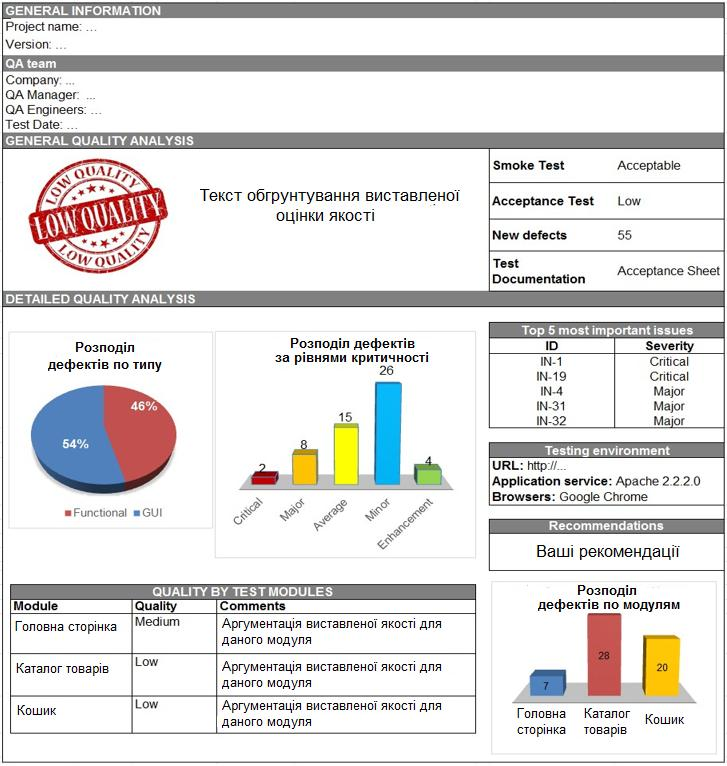

# Мет вказівки Тестування та верифікація ПЗ 2020.pdf

МІНІСТЕРСТВО ОСВІТИ І НАУКИ УКРАЇНИ

НТУ «ДНІПРОВСЬКА ПОЛІТЕХНІКА»

ФАКУЛЬТЕТ ІНФОРМАЦІЙНИХ ТЕХНОЛОГІЙ

Кафедра програмного забезпечення комп'ютерних систем

**МЕТОДИЧНІ ВКАЗІВКИ**  
**ДО ПРАКТИЧНИХ РОБІТ**  
**ПО КУРСУ**  
**«ТЕСТУВАННЯ ТА ВЕРИФІКАЦІЯ ПЗ»**

для студентів факультету інформаційних технологій  
спеціальності  
121 «Інженерія програмного забезпечення»

Дніпро  
НТУ «ДП»  
2020

<!-- ВІДНОВЛЕНО ЧЕРЕЗ GEMINI (Стор. 2) -->
МІНІСТЕРСТВО ОСВІТИ І НАУКИ УКРАЇНИ

НТУ «ДНІПРОВСЬКА ПОЛІТЕХНІКА»

МЕТОДИЧНІ ВКАЗІВКИ  
ДО ПРАКТИЧНИХ РОБІТ  
ПО КУРСУ  
«ТЕСТУВАННЯ ТА ВЕРИФІКАЦІЯ ПЗ»

для студентів факультету інформаційних технологій  
спеціальності  
121 «Інженерія програмного забезпечення»

Дніпро  
НТУ «Дніпровська політехніка»  
2020
<!-- КІНЕЦЬ ВІДНОВЛЕННЯ -->

Методичні вказівки до практичних робіт по курсу «Тестування та верифікація ПЗ» / Коротенко Г.М., Коротенко Л.М., Шевцова О.С.; М-во освіти і науки України, Нац. техн. ун-т “Дніпровська політехніка”. – Дніпро : НТУ «ДП»,– 2020. – 62 с.

Автори:
Г.М. Коротенко, д.т.н., проф., пр.раб. №1-3;
Л.М. Коротенко, канд. техн. наук, доц., пр..раб. № 4-6;
О.С. Шевцова, асист., пр.. раб. №7.

Затверджено методичною комісією за спеціальністю 121 Інженерія програмного забезпечення (протокол № _ від \_\_.\_\_.2020) за поданням кафедри програмного забезпечення комп’ютерних систем (протокол №_ від \_\_.\_\_.2020).

Методичні вказівки присвячені питанням аналізу, планування, проведення тестових випробувань і оцінки якості програмного забезпечення на всіх стадіях його життєвого циклу.

Призначено для студентів факультету інформаційних технологій, які навчаються за спеціальністю 121 «Інженерія програмного забезпечення».

Відповідальний за випуск завідувач кафедри програмного забезпечення комп’ютерних систем, канд. техн. наук, доц. І.М. Удовик.

**Зміст**

Вступ ..................................................................................................................... 5

Практична робота №1 Види тестування. планування тестування .................... 6

Практична робота №2 Розробка вимог ............................................................... 15

Практична робота №3 Тестування вимог ........................................................... 21

Практична робота №4 Тестування програмного забезпечення: розробка тестів ....................................................................................................................... 28

Практична робота №5 Пошук і документування дефектів ................................ 41

Практична робота №6 Документування результатів тестування ....................... 49

Практична робота №7 Тестування юзабіліті ....................................................... 54

Література ................................................................................................................ 61

**Вступ**

Методичні вказівки призначені для проведення практичних робіт з дисципліни «Тестування і верифікація ПЗ» для студентів всіх форм навчання факультету інформаційних технологій, які навчаються за спеціальністю 121 «Інженерія програмного забезпечення», а також для студентів інших спеціальностей, спрямованих на підготовку інженерів-програмістів зі знаннями основ забезпечення якості програмних продуктів.

Методичні вказівки присвячені питанням аналізу, планування, проведення тестових випробувань і оцінки якості програмного забезпечення на всіх стадіях його життєвого циклу.

Детально розкривається тема класифікації видів тестування. Вивчаються основи планування тестування, розробки робочої тестової документації, пошуку і опису дефектів, оцінки якості та документування результатів тестування. Окрему увагу приділено юзабіліті тестуванню програмного забезпечення.

**Практична робота №1**

**Види тестування. Планування тестування**

**Мета:** вивчити класифікацію видів тестування, розробити перевірки для різних видів тестування, навчитися планувати тестові активності в залежності від особливостей продукції, що поставляється на тестування функціональності.

**План заняття:**
1. Вивчити теоретичні відомості.
2. Виконати практичне завдання з лабораторної роботи.
3. Оформити звіт і відповісти на контрольні питання.

**Теоретичні відомості**
Тестування (Testing) – процес аналізу програмних засобів та супутньої документації з метою виявлення дефектів і підвищення якості продукту [1].

Кінцевою метою тестування є надання користувачу якісного програмного забезпечення (ПЗ) [2].

Якість (Quality) – ступінь, з якою компонент, система або процес відповідає зафіксованим вимогам і/або очікуванням і потребам користувача або замовника [3].

Дефект (defect, bug, помилка) – ключовий термін тестування, що означає відхилення фактичного результату від очікуваного. Для виявлення дефекту необхідно виконати три умови: знати фактичний результат, знати очікуваний результат, зафіксувати факт різниці між фактичним і очікуваним результатом.

Процес тестування як процес пошуку дефектів зводиться до наступної послідовності дій:
1. Дізнаємося очікуваний результат.
2. Дізнаємося фактичний результат.
3. Порівнюємо очікуваний і фактичний результати.

Джерелом очікуваного результату є специфікація – детальний опис того, як має працювати ПЗ.

У загальному випадку будь-який дефект є відхиленням від специфікації. Важливо виявити ці дефекти до того, як їх знайдуть кінцеві користувачі.

Тестування можна класифікувати по дуже великій кількості ознак. Далі наведено узагальнений список видів тестування по різних підставах.
1. Види тестування в залежності від об'єкта тестування: функціональні, прикордонні, нефункціональні (рис. 1.1).

Розглянемо функціональні види тестування.

Функціональне тестування (Functional Testing) – тестування, засноване на порівняльному аналізі специфікації і функціональності компонента або системи.

```mermaid
graph TD
    Root["Класифікація видів тестування"] --> ByObject["По об'єкту"]
    
    ByObject --> Functional["Функціональні"]
    ByObject --> Borderline["Прикордонні"]
    ByObject --> NonFunctional["Нефункціональні"]
    
    Functional --> T1["Функціональне тестування (Functional Testing)"]
    Functional --> T2["Тестування безпеки (Safety testing)"]
    Functional --> T3["Тестування захищеності (Security testing)"]
    
    Borderline --> T4["Тестування сумісності (Compatibility Testing)"]
    T4 --> T4_1["кросбраузерне тестування"]
    T4 --> T4_2["кросплатформенне тестування"]
    
    NonFunctional --> T5["Тестування вимог (Requirements Testing)"]
    NonFunctional --> T6["Тестування прототипу (Prototyte Testing)"]
    NonFunctional --> T7["Тестування користувацького інтерфейсу (GUI)"]
    NonFunctional --> T8["Тестування зручності використання (UsabilityTesting)"]
    NonFunctional --> T9["Тестування доступності (Accessibility Testing)"]
    NonFunctional --> T10["Тестування інтернаціоналізації (Internationalization Testing)"]
    NonFunctional --> T11["Тестування локалізації (Localization Testing)"]
    NonFunctional --> T12["Тестування установки (Installability Testing) і ліцензування"]
    NonFunctional --> T13["Тестування продуктивності (Performance Testing)"]
    
    T13 --> T13_1["тестування навантаженням"]
    T13 --> T13_2["стресове тестування"]
    T13 --> T13_3["об'ємне тестування"]
    T13 --> T13_4["тестування стабільності і надійності"]
```

<!-- ВІДНОВЛЕНО ЧЕРЕЗ GEMINI (Стор. 7) -->

Рис. 1.1. Класифікація видів тестування в залежності від об'єкта

Тестування безпеки (Safety Testing) – тестування програмного продукту з метою визначити його здатність при використанні обумовленим чином залишатися в рамках прийнятного ризику заподіяння шкоди здоров'ю, бізнесу, програмами, власності або навколишньому середовищу.

Тестування захищеності (Security Testing) – тестування з метою оцінити захищеність програмного продукту від зовнішніх впливів (від проникнень). На практиці найчастіше під терміном тестування безпеки розуміють в тому числі і тестування захищеності.

Розглянемо примежові види тестування.

Тестування сумісності (Compatibility Testing) – перевірка працездатності програми в різних середовищах (браузери і їх версії, операційні системи, їх типу, версії і розрядність). Види тестування сумісності: кросбраузерності тестування (різні браузери або версії браузерів), кросплатформне тестування (різні операційні системи або версії операційних систем).

Розглянемо нефункціональні види тестування, спрямовані на перевірку характеристик або властивостей програми (зовнішній вигляд, зручність використання, швидкість роботи і т.п.).

Тестування вимог (Requirements Testing) – перевірка вимог на відповідність основних атрибутів якості.

Тестування прототипу (Prototyte Testing) – метод виявлення структурних, логічних помилок і помилок проектування на ранній стадії розвитку продукту до початку фактичної розробки.
<!-- КІНЕЦЬ ВІДНОВЛЕННЯ -->

Тестування для користувача інтерфейсу (GUI Testing) — тестування, яке виконується шляхом взаємодії з системою через графічний інтерфейс користувача (правопис виведеної інформації; розташування і вирівнювання елементів GUI; відповідність назв форм/елементів GUI їх призначенням; уніфікація стилю, кольору, шрифту; вікна повідомлень; зміна розмірів вікна, поведінка курсора і гарячі клавіші)

Тестування зручності використання (Usability Testing) — тестування з метою визначення ступеня зрозумілості, легкості у вивченні і використанні, привабливості програмного продукту для користувача за умови використання в заданих умовах експлуатації (на цьому рівні звертають увагу на візуальне оформлення, навігацію, логічність, наявність зворотного зв'язку та ін.).

Тестування доступності (Accessibility Testing) — тестування, яке визначає ступінь легкості, з якою користувачі з обмеженими здібностями можуть використовувати систему або її компоненти.

Тестування інтернаціоналізації (Internationalization Testing) — тестування адаптації продукту до мовних і культурних особливостей цілого ряду регіонів, в яких потенційно може використовуватися продукт.

Тестування локалізації (Localization Testing) — тестування адаптації продукту до мовних і культурних особливостей конкретного регіону, відмінного від того, в якому розроблявся продукт.

Тестування продуктивності (Performance Testing) — процес тестування з метою визначення продуктивності програмного продукту. В рамках тестування продуктивності виділяють тестування навантаження, об'ємне тестування, тестування стабільності і надійності, стресове тестування.

Тестування навантаження (Performance and Load Testing) — вид тестування продуктивності, що проводиться з метою оцінки поведінки компонента або системи при зростаючій навантаженні, наприклад кількості паралельних користувачів та/або операцій, а також визначення яке навантаження може витримати компонент або система;

Об'ємне тестування (Volume Testing) — дозволяє отримати оцінку продуктивності при збільшенні обсягів даних в базі даних програми;

Тестування стабільності і надійності (Stability/Reliability Testing) — дозволяє перевіряти працездатність додатку при тривалому (багатогодинному) тестуванні із середнім рівнем навантаження.

Стресове тестування (Stress Testing) — вид тестування продуктивності, що оцінює систему або компонент на граничних значеннях робочих навантажень або за їх межами, або ж в стані обмежених ресурсів, таких як пам'ять або доступ до сервера.

Тестування на відмову і відновлення (Failover and Recovery Testing) — тестування за допомогою емуляції відмов системи або реально викликаних відмов в керованому оточенні.

Тестування установки (Installability Testing) і ліцензування — процес тестування установки програмного продукту. Включає формальний тест програми установки програми (перевірка призначеного для користувача

інтерфейсу, навігації, зручності використання, відповідності загальноприйнятим стандартам оформлення); функціональний тест програми установки; тестування механізму ліцензування та функцій захисту від піратства; перевірку стабільності додатку після установки.

2. Види тестування в залежності від знання коду: білий ящик, сірий ящик, чорний ящик.

Білий ящик (White Box Testing) — тестування, засноване на аналізі внутрішньої структури компонентів або системи (у тестувальника є доступ до внутрішньої структури та коду додатка).

Сірий ящик (Grey Box Testing) — комбінація методів білого і чорного ящика, яка полягає в тому, що доступ до частини коду архітектури у тестувальника є, а до частини коду — немає.

Чорний ящик (Black Box Testing) — тестування системи без знання внутрішньої структури і компонентів системи (у тестувальника немає доступу до внутрішньої структури та коду програми або в процесі тестування він не звертається до них).

3. Види тестування в залежності від ступеня автоматизації: ручне, автоматизоване тестування.

Ручне тестування — таке тестування, в якому тест-кейси виконуються тестувальником вручну без використання засобів автоматизації.

Автоматизоване тестування (Automated Testing) — набір технік, підходів і інструментальних засобів, що дозволяє виключити людину з виконання деяких завдань в процесі тестування. Тест-кейси частково або повністю виконуються спеціальним інструментальним засобом.

4. Види тестування в залежності від ступеня ізольованості тестованих компонентів: модульне, інтеграційне, системне тестування.

Модульне тестування (Unit/Component Testing) — тестуються окремі частини (модулі) системи.

Інтеграційне тестування (Integration Testing) — тестується взаємодія між окремими модулями.

Системне тестування (System Testing) — тестується працездатність системи в цілому.

5. Види тестування в залежності від підготовленості: інтуїтивне тестування, дослідницьке тестування, тестування по документації.

Інтуїтивне тестування виконується без підготовки до тестів, без визначення очікуваних результатів, проєктування тестових сценаріїв.

Дослідницьке тестування — метод проєктування тестових сценаріїв під час виконання цих сценаріїв.

Тестування по документації — тестування з підготовленими тестовими сценаріями, керівництвом щодо здійснення тестів.

6. Види тестування в залежності від місця і часу проведення тестування: приймальне тестування, альфа-тестування, бета-тестування.

Приймальне тестування (User Acceptance Testing, UAT) — формальне тестування по відношенню до потреб, вимог і бізнес процесів користувача, що

проводиться з метою визначення відповідності системи критеріям приймання і дати можливість користувачам, замовникам або іншим авторизованим особам визначити, приймати систему.

Альфа-тестування (Alpha Testing) – модельоване або дійсне функціональне тестування, виконується в організації, що розробляє продукт, але не проєктною командою (це може бути незалежна команда тестувальників, потенційні користувачі, замовники). Альфа тестування часто застосовується до коробкового програмного забезпечення в якості внутрішнього приймального тестування.

Бета-тестування (Beta Testing) – експлуатаційне тестування потенційними або існуючими клієнтами / замовниками на зовнішній стороні (в середовищі, де продукт буде використовуватися) ніяк не пов'язаними з розробниками, з метою визначення чи дійсно компонент або система задовольняє вимогам клієнта / замовника і вписується в бізнес-процеси. Бета-тестування часто проводиться як форма зовнішнього приймального тестування готового програмного забезпечення для того, щоб отримати відгуки ринку.

7. Види тестування в залежності від глибини тестового покриття: Smoke, MAT, AT.

Тестове покриття – одна з метрик оцінки якості тестування, що вдає із себе щільність покриття тестами вимог або виконуваного коду.

Smoke Test – поверхневе тестування для визначення придатності збірки для подальшого тестування, має покривати базові функції програмного забезпечення; рівень якості: Acceptable/Unacceptable.

Minimal Acceptance Test (MAT, Positive Test) – тестування системи або її частини тільки на коректних даних/сценаріях; рівень якості: High/Medium/Low.

Acceptance Test (AT) – повне тестування системи або її частини як на коректних (Positive Test), так і на некоректних даних / сценаріях (Negative Test); рівень якості: High/Medium/Low. Тест на цьому рівні покриває всі можливі сценарії тестування: перевірку працездатності модулів при введенні коректних значень; перевірку при введенні некоректних значень; використання форматів даних відмінних від тих, які вказані у вимогах; перевірку виняткових ситуацій, повідомлення про помилки; тестування на різних комбінаціях вхідних параметрів; перевірку всіх класів еквівалентності; тестування граничних значень інтервалів; сценарії не передбачені специфікацією і т.д.

8. Види тестування в залежності від тестових активностей: NFT, RT, DV.

Дана класифікація тестування інакше називається видами тестування в залежності від ширини тестового покриття.

Тестування нових функціональностей (New Feature Test, NFT) – визначення якості поставленої на тестування нової функціональності, яка раніше не тестувалася. Даний тип тестування включає в себе: проведення повного тесту (AT) безпосередньо нової функціональності; тестування нової функціональності на відповідність документації; перевірку всіляких взаємодій раніше реалізованої функціональності з новими модулями і функціями.

Регресійне тестування (Regression Testing, RT) проводиться з метою оцінки

якості раніше реалізованої функціональності. Включає в себе перевірку стабільності раніше реалізованої функціональності після внесення змін, наприклад додавання нових функцій, виправлення дефектів, оптимізація коду, розгортання програми на новому оточенні. Регресійне тестування як правило виконується на рівні МАТ.

Валідація дефектів (Defect Validation, DV) — перевірка результатів виправлення дефектів; може включати елементи регресійного тестування; рівень перевірки не визначається.

Процес тестування програмного продукту включає наступні етапи:
1. Вивчення та аналіз предмета тестування.
2. Планування тестування.
3. Виконання тестування.

Вивчення та аналіз предмета тестування починається ще до затвердження специфікації і триває на стадії розробки (кодування) програмного забезпечення. Кінцевою метою етапу вивчення і аналізу предмета тестування є отримання відповідей на два питання: які функціональності належить протестувати, як ці функціональності працюють.

Планування тестування відбувається на стадії розробки (кодування) програмного забезпечення. На стадії планування тестування перед тестувальником стоїть завдання пошуку компромісу між обсягом тестування, який можливий в теорії, і обсягом тестування, який можливий на практиці. На даній стадії необхідно відповісти на питання: як будемо тестувати? Результатом планування тестування є тестова документація.

Виконання тестування відбувається на стадії тестування і являє собою практичний пошук дефектів з використанням тестової документації, складеної раніше.

Для всіх програмних продуктів виконують такі типи тестів і їх композиції.

Для першої поставки програмного забезпечення рекомендується проводити $\text{Smoke+RT}_{\text{AT}}$ готової функціональності: поверхневе тестування (Smoke Test) виконується для визначення придатності збірки для подальшого тестування; повне тестування системи або її частини як на коректних, так і на некоректних даних / сценаріях (Acceptance Test, AT) дозволяє виявити дефекти і внести запис про них у багтрекінгову систему.

Для подальших поставок програмного забезпечення композиції тестів можуть бути наступними.

Якщо не була додана нова функціональність, то: $\text{DV+RT}_{\text{MAT}}$. Тобто, виконується перевірка виправлення дефектів програмістом (Defect Validation, DV), а також перевірка працездатності решти функціональності після виправлення дефектів на позитивних сценаріях (Minimal Acceptance Test, $\text{MAT}$).

Якщо була додана нова функціональність, то: Smoke+DV+NFTAT+RTMAT. Зокрема, виконується поверхневе тестування (Smoke Test), перевірка виправлення дефектів програмістом (Defect Validation, DV), тестування нових функціональностей (New Feature Testing, NFT),

перевірка старих функціональностей, тобто регресійне тестування (Regression Test).

Якщо була додана нова функціональність, то можливий також варіант: $\text{DV} + \text{NFT}_{\text{АТ}} + \text{RT}_{\text{МАТ}}$, тобто без виконання Smoke Test.

Таким чином, для другої і наступних поставок узагальнена схема композиції тестів виглядає наступним чином: $(\text{Smoke}) + \text{DV} + (\text{NFT}_{\text{АТ}}) + \text{RT}_{\text{МАТ}}$.

Залежно від типу і специфіки додатку (web, desktop, mobile) виконують спеціалізовані тести (наприклад, кросбраузерності або кросплатформне тестування, тестування локалізації та інтернаціоналізації та ін.).

**Практичне завдання:**

1. Обрати об'єкт реального світу (наприклад, олівець, стіл, чашка, клавіатура, сумка та ін.) З метою подальшої розробки тестових перевірок для нього.
2. Розробити різні перевірки відповідно до класифікації видів тестування для вибраного об'єкта реального світу. Результати внести в таблицю 1.1.

Таблиця 1.1

**Тестові перевірки для різних видів тестування**

| Об'єкт тестування: *вказати* | | |
| :--- | :--- | :--- |
| **Вид тестування** | **Коротке визначення виду тестування** | **Тестові перевірки** |
| Functional Testing | | |
| Safety Testing | | |
| Security Testing | | |
| Compatibility Testing | | |
| GUI Testing | | |
| Usability Testing | | |
| Accessibility Testing | | |
| Internationalization Testing | | |
| Performance Testing | | |
| Stress Testing | | |
| Negative Testing | | |
| Black Box Testing | | |
| Automated Testing | | |
| Unit/Component Testing | | |
| Integration Testing | | |

3. Розробити композицію тестів для першої поставки програмного

забезпечення (build 1), що складається з трьох модулів (модуль 1, модуль 2, модуль 3).
4. Розробити композицію тестів для другої поставки програмного забезпечення (build 2): виправлені заведені дефекти, доставлена нова функціональність – модуль 4.
5. Розробити композицію тестів для третьої поставки програмного забезпечення (build 3): замовник вирішив розширювати ринки збуту і просить здійснити підтримку програмного забезпечення на англійській мові.
6. Розробити композицію тестів для четвертої поставки програмного забезпечення (build 4): замовник хоче переконатися, що програмне забезпечення витримає навантаження в 2000 користувачів.
7. Оформити звіт і захистити лабораторну роботу.

**Зміст звіту:**
1. Мета роботи.
2. Розроблені перевірки обраного об'єкта реального світу для різних видів тестування.
3. Тестові активності для сформованих завдань.
4. Висновки по роботі.

**Контрольні питання:**
1. Що таке тестування?
2. Що таке якість програмного забезпечення?
3. Що таке дефект?
4. Назвіть три умови виявлення дефекту.
5. Які існують види тестування залежно від об'єкта тестування? Дайте характеристику кожному.
6. Які існують види функціонального тестування? Дайте характеристику кожному.
7. Які існують види нефункціонального тестування? Дайте характеристику кожному.
8. Які існують види тестування залежно від глибини покриття? Дайте характеристику кожному.
9. Які існують тестові активності? Дайте характеристику кожному.
10. Які існують види тестування залежно від знання коду? Дайте характеристику кожному.
11. Які існують види тестування залежно від ступеня автоматизації? Дайте характеристику кожному.
12. Які існують види тестування залежно від ізольованості компонентів? Дайте характеристику кожному.
13. Які існують види тестування залежно від підготовленості? Дайте характеристику кожному.
14. Які існують види тестування залежно від місця і часу проведення?

<!-- ВІДНОВЛЕНО ЧЕРЕЗ GEMINI (Стор. 14) -->
Дайте характеристику кожному.
15. Які етапи становлять процес тестування?
16. Яка композиція тестів виконується для першої поставки програмного продукту?
17. Яка композиція тестів виконується для наступних поставок програмного продукту?
<!-- КІНЕЦЬ ВІДНОВЛЕННЯ -->

Практична робота №2  
Розробка вимог

**Мета:** виявити і описати призначені для користувача вимоги у вигляді варіантів використання (Use Cases).

**План заняття:**  
1. Вивчити теоретичні відомості.  
2. Виконати практичне завдання з лабораторної роботи.  
3. Оформити звіт і відповісти на контрольні питання.

**Теоретичні відомості**  
Вимога (Requirement) – опис того, які функції і з дотриманням яких умов повинен виконувати програмний продукт в процесі вирішення корисною для користувача завдання.  
Значення вимог:  
1. Дозволяють зрозуміти, що і з дотриманням яких умов система повинна робити.  
2. Представляють можливість оцінити масштаб змін та керувати змінами.  
3. Є основою для формування плану проекту (в тому числі плану тестування).  
4. Допомагають запобігати або вирішувати конфліктні ситуації.  
5. Спрощують розстановку пріоритетів в наборі завдань.  
6. Дозволяють об'єктивно оцінити ступінь прогресу в розробці проекту.  
Робота над вимогами включає наступні етапи: виявлення вимог, аналіз вимог (моделювання бізнес-процесів, прототипування інтерфейсів, пріоритизація вимог, результат етапу – візуалізація вимог), документування вимог (результат етапу – специфікація), тестування (валідація) вимог. Роботу з вимогами на етапах виявлення, аналізу, документування, як правило, виконує бізнес-аналітик. Тестування вимог виконує тестувальник.  
В ієрархії вимог існує три рівні: рівень бізнес-вимог, рівень призначених для користувача вимог, рівень продуктних вимог (функціональні і нефункціональні вимоги).  
Бізнес-вимоги виражають мету, заради якої розробляється продукт (навіщо він потрібен, яка від нього очікується користь).  
Призначені для користувача вимоги описують завдання, які користувач може виконувати за допомогою розроблюваної системи, і за своєю суттю є недеталізовані функціональні вимоги. Оскільки тут уже з'являється опис поведінки системи, вимоги цього рівня можуть бути використані для оцінки обсягу робіт, вартості проекту, часу розробки. Призначені для користувача вимоги оформляються у вигляді варіантів використання (Use Cases), призначених для користувача історій (User Stories), призначених для користувача сценаріїв (User Scenarios).

<!-- ВІДНОВЛЕНО ЧЕРЕЗ GEMINI (Стор. 16) -->
Функціональні вимоги описують поведінку системи, тобто її дії (обчислення, перетворення, перевірки, обробку і т.д.). Нефункціональні вимоги описують властивості системи (зручність використання, безпеку, надійність, розширюваність і т.д.), якими вона повинна володіти при реалізації своєї поведінки.

Виявлення та опис вимог: Use Case.

Варіант використання (Use Case) продукту описує послідовність взаємодії системи і зовнішнього дійової особи. Дійовою особою може бути людина, інша система ПЗ або апаратний пристрій, що взаємодіє з системою для досягнення якоїсь мети.

Варіанти використання змінюють традиційний підхід до збору інформації: користувачів не питають, що з їх точки зору, повинна робити система, а з'ясовують, які завдання збирається з її допомогою вирішувати користувач. Мета такого підходу – описати всі подібні завдання. До включення кожного варіанту використання в затверджену версію вимог зацікавлені в проекті особи перевіряють, чи не виходить він за межі проекту. Теоретично в кінцевий набір варіантів використання повинна входити вся бажана функціональність системи.

Опис варіанту використання включає наступні категорії:
- унікальний ідентифікатор;
- ім'я, коротко описує завдання користувача в форматі «дієслово + об'єкт», наприклад «розмістити замовлення»;
- короткий текстовий опис на природній мові;
- список попередніх умов, які повинні бути задоволені до початку розробки варіанту використання;
- вихідні умови, що описують стан системи після успішного завершення розробки варіанту використання;
- пронумерований список дій, що ілюструє послідовність етапів взаємодії особи і системи від попередніх умов до вихідних умов.

Існує кілька сценаріїв варіантів використання (див. Таблицю 2.1). Один сценарій вважається нормальним напрямком розвитку (normal course) варіант використання, його також називають основним напрямком, головним успішним сценарієм і сприятливим шляхом. Нормальне напрямок для варіанту використання «Запит хімікату» – запит хімікату, який є на складі. Приклад варіанту використання наведено в таблиці 2.1.

Інші допустимі сценарії з варіанту використання, називаються альтернативними напрямками (alternative courses) або вторинними сценаріями (secondary scenarios). Вони також можуть привести до успішного виконання завдання і задовольняють вихідним умовам варіантів використання. Однак вони представляють варіації рішення задачі або діалогової послідовності, необхідної для виконання завдання. В певній точці прийняття рішень в діалоговій послідовності нормальний напрямок може перейти в альтернативне, а потім повернутися назад в нормальне.
<!-- КІНЕЦЬ ВІДНОВЛЕННЯ -->

Таблиця 2.1

**Приклад варіанту використання**

| Ідентифікатор і назва: | UC-4 Запросити хімікат |
| :--- | :--- |
| Основна діюча особа: | Співробітник, який розмістив замовлення на хімікат. |
| Опис: | Співробітник, який розмістив замовлення на хімікат, вказує в запиті необхідний хімікат, вводячи його назву або ідентифікатор або імпортуючи його структуру з відповідного графічного пристрою. Система виконує запит, пропонуючи контейнер з хімікатом зі складу або дозволяючи створити запит на замовлення у постачальника. |
| Тригер: | Співробітник вказує, що хоче замовити хімікат. |
| Попередні умови: | PRE-1. Особистість користувача а проходить аутентифікацію. PRE-2. Користувач має право запитувати хімікати. PRE-3. База даних по запасах хімікатів в даний момент доступна. |
| Вихідні умови: | POST-1. Запит зберігається в Chemical Tracking System. POST-2. Запит відправлений на склад хімікатів або постачальнику. |
| Нормальний напрямок розвитку варіанту використання: | 4.0. Запросити хімікат зі складу 1. Співробітник вказує необхідний хімікат. 2. Система перераховує контейнери з необхідним хімікатом, наявні на складі. 3. Співробітник може переглянути історію будь-якого контейнера. 4. Співробітник вибирає певний контейнер або просить відправити запит постачальнику (див. п. 4.1). 5. Співробітник вводить іншу інформацію, щоб завершити запит. 6. Система зберігає запит і відправляє його на склад хімікатів. |
| Альтернативний напрякм розвитку варіанту використання: | 4.1. Запросити хімікат у постачальника 1. Співробітник шукає хімікат по каталогам постачальника (див. 4.1.Е1). 2. Система відображає список постачальників, де також вказані розміри, клас і ціна контейнерів. 3. Співробітник вибирає постачальника, розмір, клас і кількість контейнерів. 4. Співробітник вводить іншу інформацію, необхідну для запиту. 5. Система зберігає запит і перенаправляє його |

постачальнику. |
| Винятки: | 4.1.E1. Хімікату немає в продажу   1. Система відображає повідомлення «У постачальників немає такого хімікату».   2. Система пропонує співробітнику запросити інший хімікат або вийти з програми.   3a. Співробітник просить запросити інший хімікат.   4а. Система заново починає нормальне напрямок варіанти використання.   3б. Співробітник вирішує вийти з системи.   4б. Система завершує варіант використання. |
| Бізнес-правила: | BR-28, BR-31 |

Умови, що перешкоджають успішному завершенню завдання, називаються винятками (exceptions). Якщо в процесі збору інформації не вказано, як обробляти виключення, то можливі два шляхи: 1) розробники запропонують найкращий на їхню думку спосіб обробки винятків; 2) при генерації користувачем невірного умови станеться збій системи, так як ніхто не передбачив такої ситуації. Іноді виключення розглядаються як тип альтернативного напрямку, однак ці поняття слід розрізняти. Не обов'язково реалізовувати кожний альтернативний напрям, який визначають для варіанту використання; крім того, можна відкласти його реалізацію до наступного випуску. Однак необхідно реалізувати виключення, через які завершення сценаріїв може виявитися невдалим.

**Розширення (extend) і включення (include)**. При складанні варіантів використання часто можна зіткнутися з ситуацією, коли альтернативний напрям варіанти використання саме по собі можна виділити в автономний варіант використання. В такому випадку можна розширити (extention) нормальний напрямок, включивши цей окремий варіант використання в нормальний потік.

Приклад: Варіант використання "Запитати хімікат" може включати в себе пошук по каталогу постачальника. Але при цьому запросити хімікат можна і без пошуку по каталогах, а пошук по каталогу може виконуватися як окрема бізнес-завдання користувачів. Тому логічно розширити варіант використання "Запитати хімікат" окремим варіантом "Пошук по каталогам постачальника". Такий зв'язок буде означати, що при виконанні варіанти використання "Запитати хімікат" може виконуватися, а може і не виконуватися варіант використання "Пошук по каталогам постачальника.

Іноді ж кілька варіантів використання мають загальні набори етапів. Щоб уникнути повторення цих етапів в будь-якому вигляді використання, можна визначити окремий варіант використання і вказати, що він включений (include) в інші варіанти використання як підваріант.

Приклад: Якщо покупець здійснює покупку товару, то він обов'язково повинен його сплатити. Ні випадку, коли покупець просто за щось платить

(тобто оплата товару не є окремою незалежною діяльністю покупця), але при цьому процес оплати сам по собі досить складний, що включає різні кроки і альтернативні варіанти (оплата різними способами). Тому логічно його виділити в окремий варіант використання, при цьому включити в варіант використання "Покупка товару". Такий зв'язок буде означати, що при виконанні варіанти використання "Купити товар" обов'язково буде задіяний і варіант використання "Оплатити товар".

Визначення варіантів використання.

Визначити варіанти використання можна декількома способами:

– спочатку визначити дійові особи, а потім бізнес-процеси, в яких кожна особа бере участь;

– висловити бізнес-процеси в термінах певних сценаріїв, узагальнити сценарії в варіанти використання і визначити дійові особи для кожного варіанта; визначити зовнішні події, на які система повинна реагувати, а потім співвіднести ці події з беруть участь особами і певними варіантами використання;

– визначити можливі варіанти використання на основі функціональних вимог; якщо будь-які вимоги неможливо простежити до будь-якого варіанту використання, необхідно задуматися, чи потрібні вони.

Як правило, користувачі спочатку визначають найважливіші варіанти використання, тому порядок пропонованих тем дозволить отримати уявлення про пріоритети.

Переваги застосування варіантів використання полягають у тому, що кожен варіант зосереджений на поставленому завданню і користувача. Ретельне вивчення етапів взаємодії особи і системи допомагає ще на ранніх стадіях розробки виявити неясності і неточності, а також дозволяє скласти варіанти тестування на основі варіантів використання. Спосіб із застосуванням варіантів використання дозволяє виявити функціональні вимоги, за допомогою яких користувачі будуть виконувати конкретні завдання. Крім іншого варіанти використання полегшують розстановку пріоритетів вимог. Вищим пріоритетом мають ті функціональні вимоги, які створені на основі варіантів використання з вищим пріоритетом. Вищий пріоритет призначається з наступних причин:

– варіанти використання описують один з основних бізнес-процесів, активізується системою;

– багато користувачів часто звертаються до них;

– їх запросив привілейований клас користувачів;

– вони надають можливості, необхідні для відповідності вимогам;

– функції інших систем залежать від їх наявності.

Існують також і переваги технічного характеру. За допомогою варіанту використання можна виявити деякі важливі об'єкти предметної області та їх взаємини. Розробники, що використовують об'єктно орієнтовані методи проектування, можуть перетворити варіанти використання в об'єктні моделі, такі, як діаграми класів і діаграми послідовностей.

**Практичне завдання:**
1. Отримати у викладача завдання, що містить ідею і бізнес-ціль яка підлягає розробці програмного продукту.
2. Визначити діючі особи і сформулювати найбільш ймовірні варіанти використання які підлягають розробці програмного продукту.
3. Повністю описати три варіанти використання які підлягають розробці програмного продукту.
4. Для кожного варіанту використання вказати унікальний ідентифікатор; ім'я в форматі «дієслово+об'єкт»; короткий текстовий опис; попередні умови; вихідні умови; пронумерований список дій нормального напрямку розвитку.
5. Для кожного варіанту використання при необхідності вказати пронумерований список дій альтернативного напрямку (напрямків) розвитку.
6. Для кожного варіанту використання при необхідності вказати виключення.
7. Оформити звіт і захистити лабораторну роботу.

**Зміст звіту:**
1. Мета роботи.
2. Опис варіантів використання підлягає розробці програмного продукту.
3. Висновки по роботі.

**Контрольні питання:**
1. Що таке вимога?
2. Які значення мають вимоги на проекті?
3. Які існують етапи роботи над вимогами?
4. Хто виконує роботу з вимогами?
5. Які існують рівні вимог?
6. Що таке варіант використання?
7. Для чого потрібен варіант використання?
8. Які елементи входять до складу опису варіанта використання?
9. Що таке основний сценарій варіанта використання?
10. Що таке альтернативний сценарій варіанта використання?
11. Що описують в винятки варіанти використання?
12. У чому відмінність альтернативного сценарію від виключення в описі варіанту використання?
13. Які існують переваги у варіантів використання як одного із способів опису вимог?

**Практична робота №3**  
**Тестування вимог**

**Мета:** вивчити критерії якості вимог, виконати тестування вимог до програмного забезпечення.

**План заняття:**  
1. Вивчити теоретичні відомості.  
2. Виконати практичне завдання з лабораторної роботи.  
3. Оформити звіт і відповісти на контрольні питання.

**Теоретичні відомості**  
Якість програмного забезпечення багато в чому залежить від якості сформованих вимог, тому що вимоги до програмного продукту є базою для розробки і подальшого тестування.  
Тестування вимог виконується на предмет їх відповідності критеріям якості вимог (рис. 3.1).

Рис. 3.1. Критерії якості вимог

Завершеність (completeness). Вимога є повною і закінченою з точки зору уявлення в ньому всієї необхідної інформації, ніщо не пропущено з міркувань «це і так всім зрозуміло».  
Типові проблеми з завершеністю:  
– Відсутні нефункціональні складові вимоги або посилання на відповідні нефункціональні вимоги (наприклад: «паролі повинні зберігатися в

зашифрованому вигляді», а який алгоритм шифрування?).
– Вказана лише частина деякого перерахування (наприклад: «експорт здійснюється в форматі PDF, PNG і т.д.», а що слід розуміти під «і т.д.»?).
– Наведені посилання неоднозначні (наприклад: «див. Вище» замість «див. 123.45.b»).

Атомарність, одиничність (atomicity). Вимога є атомарною, якщо її не можна розбити на окремі вимоги без втрати завершеності і воно описує одну і тільки одну ситуацію.

Типові проблеми з атомарністю:
– В одній вимозі, фактично, міститься кілька незалежних (наприклад: «кнопка «Restart» не повинна відображатися при зупиненому сервісі, вікно «Log» має вміщувати не менше 20-ти записів щодо діяльності останнього користувача»: тут в одному реченні описані зовсім різні елементи інтерфейсу в абсолютно різних контекстах).
– Вимога допускає різночитання в силу граматичних особливостей мови (наприклад: «якщо користувач підтверджує замовлення і редагує замовлення або відкладає замовлення, повинен видаватися запит на оплату»: тут описані три різні випадки, і цю вимогу необхідно розбити на три окремих вимоги, щоб уникнути плутанини). Таке порушення атомарності часто тягне за собою виникнення суперечностей.
– В одній вимозі об'єднано опис декількох незалежних ситуацій (наприклад: «коли користувач входить в систему, має відображатися вітання; коли користувач увійшов в систему, має відображатися ім'я користувача; коли користувач виходить з системи, має відображатися прощання»: всі ці три ситуації заслуговують того, щоб бути описаними окремими і більш стильними вимогами).

Несуперечливість, послідовність (consistency). Вимога не повинна містити внутрішніх протиріч і суперечностей іншим вимогам і документам.

Типові проблеми з суперечністю:
– Суперечності всередині однієї вимоги (наприклад: «після успішного входу в систему користувача, який не має права входити в систему ...»: а як користувач увійшов в систему, якщо не мав такого права?).
– Протиріччя між двома і більше вимог, між таблицею і текстом, малюнком і текстом, вимогою і прототипом і т.д. (Наприклад: «712.а Кнопка «Close» завжди повинна бути червоною» і «36452.x Кнопка «Close» завжди повинна бути синьою»: так все ж червоною або синьою?).
– Використання невірної термінології або використання різних термінів для позначення одного і того ж об'єкта або явища (наприклад: «у разі, якщо дозвіл вікна становить менше 800x600 ...»: роздільна здатність дисплея, у вікна є розмір).

– Недвозначність (unambiguousness, clearness). Вимога описана без використання жаргону, неочевидних абревіатур і розпливчастих формулювань і допускає тільки однозначне об'єктивне розуміння. Вимога в атомарному в плані неможливість різного трактування поєднання окремих фраз.

Типові проблеми з недвозначністю:
– Використання термінів або фраз, що допускають суб'єктивне тлумачення (наприклад: «додаток повинен підтримувати передачу великих обсягів даних»: наскільки «великих»?) Ось лише невеликий перелік слів і виразів, які можна вважати вірними ознаками двозначності: адекватно, бути здатним, легко, забезпечувати, як мінімум, бути здатним, ефективно, своєчасно, може бути застосовано, якщо можливо, буде визначено пізніше, у міру необхідності, якщо це доцільно, але не обмежуючись, бути здатне, мати можливість, нормально, мінімізувати, максимізувати, оптимізувати, швидко, зручно, просто, часто, зазвичай, великий, гнучкий, стійкий, за останнім словом техніки, покращений, результативно.
– Використання неочевидних або двозначних абревіатур без розшифровки (наприклад: «доступ до ФП здійснюється за допомогою системи прозорого шифрування» і «ФП надає можливість фіксувати повідомлення в їх поточному стані зі зберіганням історії всіх змін»: ФП тут позначає файлову систему або який-небудь «Фіксатор повідомлень»?)
– Формулювання вимог з міркувань, що щось повинно бути всім очевидним (наприклад: «Система конвертує вхідний файл з формату PDF в вихідний файл формату PNG» і при цьому автор вважає цілком очевидним, що імена файлів система отримує з командного рядка, а багатосторінковий PDF конвертується в кілька PNG-файлів, до імен яких додається «page-1», «page-2» і т.д.). Ця проблема перегукується з порушенням коректності.

Здійсненість (feasibility). Вимога технологічно здійсними і може бути реалізована в рамках бюджету і термінів розробки проекту.

Типові проблеми зі здійсненням:
– Так зване «озолочення» (gold plating) – вимоги, які вкрай довго та/або дорого реалізуються і при цьому практично не приносять користі для кінцевих користувачів (наприклад: «налаштування параметрів для підключення до бази даних повинна підтримувати розпізнавання символів з жестів, отриманих з пристроїв тривимірного введення»).
– Технічно не реалізовуються на сучасному рівні розвитку технологій вимоги (наприклад: «аналіз договорів повинен виконуватися із застосуванням штучного інтелекту, який буде виносити однозначне коректне висновок про ступінь вигоди від укладення договору»).
– В принципі не реалізовуються вимоги (наприклад: «система пошуку повинна заздалегідь передбачати всі можливі варіанти пошукових запитів і кешувати їх результати»).

Обов'язковість, потрібність (obligation) і актуальність (up-to-date). Якщо вимога не є обов'язковою до реалізації, воно повинно бути просто виключено з набору вимог. Якщо вимога потрібне, але «не дуже важливе», для вказівки цього факту використовується вказівка пріоритету. Також виключені (або перероблені) повинні бути вимоги, що втратили актуальність.

Типові проблеми з обов'язковістю і актуальністю:

– Вимога була додана «про всяк випадок», хоча реальної потреби в ньому не було і немає.
– Вимозі виставлені невірні значення пріоритету за критеріями важливості та/або терміновості.
– Вимога застаріла, але не була переробленою або видаленою.

Відстеження (traceability). Відстеження буває вертикальним і горизонтальним. Вертикальне дозволяє співвідносити між собою вимоги на різних рівнях вимог, горизонтальне дозволяє співвідносити вимогу з тест-планом, тест-кейсами, архітектурними рішеннями і т.д.

Для забезпечення простежуваності часто використовуються спеціальні інструменти з управління вимогами та/або матриці простежуваності.

Типові проблеми з простежуваності:
– Вимоги не пронумеровані, не структуровані, не мають змісту, не мають працюючих перехресних посилань.
– При розробці вимог не були використані інструменти і техніки управління вимогами.
– Набір вимог неповний, носить уривчастий характер з явними «пробілами».

Можливість модифікацій (modifiability). Ця властивість характеризує простоту внесення змін в окремі вимоги і в набір вимог. Можна говорити про наявність модифікованості в тому випадку, якщо при доопрацюванні вимог шукану інформацію легко знайти, а її зміна не призводить до порушення інших описаних в цьому переліку властивостей.

Типові проблеми з модифікується:
– Вимоги неатомарні (див. «Атомарність») і невідсліджувані, а тому їх зміна з високою ймовірністю породжує суперечливість.
– Вимоги спочатку суперечливі. У такій ситуації внесення змін (не пов'язаних з усуненням суперечливості) тільки погіршує ситуацію, збільшуючи суперечливість і знижуючи простежуваність.
– Вимоги представлені в незручній для обробки формі (наприклад, не використані інструменти управління вимогами, і в підсумку команді доводиться працювати з десятками величезних текстових документів).

Проранжированість за важливістю, стабільністю, терміновістю (ranked for importance, stability, priority). Важливість характеризує залежність успіху проєкту від успіху реалізації вимоги. Стабільність характеризує ймовірність того, що в доступному для огляду майбутньому в вимогу не буде внесено ніяких змін. Терміновість визначає розподіл в часі зусиль проєктної команди по реалізації тієї чи іншої вимоги.

Типові проблеми з проранжированістю полягають в її відсутності або невірній реалізації і призводять до наступних наслідків.
– Проблеми з проранжированістю по важливості підвищують ризик невірного розподілу зусиль проєктної команди, напрями зусиль на другорядні

завдання і кінцевого провалу проекту із-за нездатності продукту виконувати ключові завдання з дотриманням ключових умов.

– Проблеми з проранжированістю по стабільності підвищують ризик виконання безглуздої роботи по вдосконаленню, реалізації і тестуванню вимог, які в самий найближчий час можуть зазнати кардинальні зміни (аж до повної втрати актуальності).

– Проблеми з проранжированістю по терміновості підвищують ризик порушення бажаної замовником послідовності реалізації функціональності і введення цієї функціональності в експлуатацію.

Коректність (correctness) і перевіреність (verifiability). Фактично ці властивості витікають з дотримання усіх вищеперелічених (або можна сказати, що вони не виконуються, якщо порушене хоч би одно з вищеперелічених). На додачу можна відмітити, що перевіреність має на увазі можливість створення об'єктивного тест-кейса (тест-кейсів), що однозначно показує, що вимога реалізована вірно і поведінка додатка в точності відповідає вимозі.

До типових проблем з коректністю також можна віднести:
– опичатки (особливо небезпечні помилки в абревіатурах, що перетворюють одну осмислену абревіатуру на іншу також осмислену, але таку, що не має відношення до деякого контексту; такі помилки украй складно помітити);
– наявність неаргументованих вимог до дизайну і архітектури;
– погане оформлення тексту і супутньої графічної інформації;
– граматичні, пунктуаційні і інші помилки в тексті;
– невірний рівень деталізації (наприклад, занадто глибока деталізація вимоги на рівні бізнес-вимог або недостатня деталізація на рівні вимог до продукту);
– вимоги до користувача, а не до додатка (наприклад: "користувач має бути в змозі відправити повідомлення": ми не можемо впливати на стан користувача).

Техніки тестування вимог.
1. Однією з найбільш використовуваних технік аналізу вимог є перегляд або рецензування. Ця техніка може бути реалізована у формі:
– біглого перегляду (показ автором своєї роботи колезі — найшвидший, найдешевший і найширше використовуваний вид перегляду);
– технічного перегляду (виконується групою фахівців, кожен з яких представляє свою галузь знань: продукт, що переглядається, не може вважатися досить якісним, поки хоч би у того, що одного, що переглядає залишаються зауваження);
– формальною інспекцією (структурований, систематизований і документований підхід до аналізу документації, для виконання якого притягується велика кількість фахівців, саме виконання займає досить багато

часу, і тому цей варіант перегляду використовується досить рідко: як правило, при отриманні на супроводі і доопрацювання проекту, створенням якого раніше займалася інша компанія).

2. Наступною технікою тестування і підвищення якості вимог є (повторне) використання такої техніки виявлення вимог, як формулювання питань. Якщо хоч щось у вимогах викликає нерозуміння або підозру – ставте питання.

3. Правильну вимогу можна перевірити, тобто повинні існувати об'єктивні способи визначення того, чи вірно реалізована вимога. Продумування чек листів або навіть повноцінних тест-кейсів в процесі аналізу вимог дозволяє визначити, наскільки вимога перевіряється. Окрім використання для тестування вимог надалі такі чек-листи і тест-кейси можуть скласти основу тестової документації.

4. Малюнки, схеми. Щоб побачити загальну картину вимог цілком, дуже зручно використати малюнки, схеми, діаграми, інтелект-карти і так далі. Графічне представлення зручне одночасно своєю наочністю і стислістю (наприклад, UML-схема бази даних, що займає один екран, може бути описана декількома десятками сторінок тексту).

5. Дослідження поведінки і прототипування. Можна сказати, що прототипування часто є наслідком створення графічного представлення і аналізу поведінки системи. З використанням спеціальних інструментів можна дуже швидко зробити нариси призначених для користувача інтерфейсів, оцінити застосовність тих або інших рішень і навіть створити не просто "прототип заради прототипу", а заготовку для подальшої розробки, якщо виявиться, що реалізація в прототипі (можливо, з невеликими доопрацюваннями) влаштовує замовника.

**Практичне завдання:**

1. Отримати у викладача специфікацію з вимогами до програмного продукту.
2. Протестувати специфікацію методом перегляду на предмет відповідності критеріям якості вимог.
3. Для виявлених дефектів вказати, який критерій якості порушений, і аргументувати свою точку зору.
4. Для виявлених дефектів сформулювати уточнювальні питання до замовника для вироблення якісних вимог.
5. Оформити звіт і захистити лабораторну роботу.

**Зміст звіту:**
1. Мета роботи.
2. Звіт по тестуванню специфікації.
3. Висновки по роботі.

<!-- ВІДНОВЛЕНО ЧЕРЕЗ GEMINI (Стор. 27) -->
**Контрольні питання:**
1. Як виглядає життєвий цикл проекту?
2. Які виділяють критерії якості?
3. Які вимоги вважаються перевірємими?
4. Які вимоги вважаються модифікуючимися?
5. Які вимоги вважаються коректними?
6. Які вимоги вважаються недвозначними?
7. Які вимоги вважаються повними?
8. Які вимоги вважаються несуперечливими?
9. Які вимоги вважаються впорядкованими по важливості і стабільності?
10. Які вимоги вважаються трасованими?
11. Які існують методи тестування вимог?
<!-- КІНЕЦЬ ВІДНОВЛЕННЯ -->

**Практична робота №4**

**Тестування програмного забезпечення: розробка тестів**

**Мета:** розробити робочу тестову документацію для тестування web додатку.

**План заняття:**
1. Вивчити теоретичні відомості.
2. Виконати практичне завдання по лабораторній роботі.
3. Оформити звіт і відповісти на контрольні питання.

**Теоретичні відомості**

Робоча тестова документація значно покращує якість подальшого тестування за рахунок аналізу і детального планування тестів. Після завершення тестування наявність тестової документації дозволяє оцінити, наскільки успішно були проведені усі етапи тестування, а для замовника є підтвердженням реального об'єму робіт.

Робочу тестову документацію тестувальник може розробляти виключно на основі специфікації ще до постачання програмного забезпечення. В цьому випадку після постачання на тестування версії програмного продукту фахівець з тестування може відразу приступити до пошуку дефектів.

Існують наступні види робочої тестової документації (таблиця 4.1) :
1. Check List.
2. Acceptance Sheet.
3. Test Survey.
4. Test Cases.

Основні чинники вибору тестової документації – складність бізнес-логіки проекту, терміни проекту, розмір команди і об'єм проекту.

На одному проекті можуть комбінуватися декілька типів тестової документації. Наприклад, для усього проекту складений Acceptance Sheet, але для найбільш складних частин складені Test Cases. Якщо які-небудь модулі програмного продукту піддаватимуться автоматизованому тестуванню, то для таких модулів в обов'язковому порядку складаються Test Cases.

Приклади фрагментів робочої тестової документації наведені в таблиці 4.2.

При складанні робочої тестової документації необхідно вказати номер тестованої збірки, тип виконуваної тестової активності, період часу тестування, ПІБ тестувальника, тестове оточення (операційна система, браузер, ін.).

Таблиця 4.1

**Види робочої тестової документації і їх характеристика**

| Тип документації | Що описують | Коли використовують |
| :--- | :--- | :--- |
| Checklist | Допоміжний тип документації, що містить список основних перевірок. | Для типової функціональності. |
| Acceptance Sheet | Перелік усіх модулів і функцій додатка, що підлягають перевірці. | Невеликі (до 3 місяців), прості по бізнес-логіці проекти. |
| Test Survey | Перелік усіх модулів і функцій, а також конкретні перевірки для них. Може містити очікуваний результат. | Середні або великі проекти із зрозумілою бізнес-логікою. |
| Test Cases | Набір вхідних значень, передумов, покроковий опис і постумови для кожної перевірки. Завжди містить очікуваний результат. | Великі і довгострокові проекти, проекти із складною бізнес-логікою, проекти з великою командою. |

Робоча тестова документація є переліком усіх перевірок для модулів/підмодулів додатка. Одним модулем як правило виступає робоче вікно додатка, в якості підмодулів – логічно завершені блоки цього вікна.

Для кожного модуля в обов'язковому порядку виконується тестування GUI, а також загальні функціональні перевірки (General). Далі у рамках модуля функціональними перевірками виступають дії над активними елементами призначеного для користувача інтерфейсу (полями, кнопками, чекбоксами і так далі). Міра деталізації кожної з таких функціональних перевірок залежить від вибраного типу тестової документації (Acceptance Sheet, Test Survey, Test Cases). Зокрема, для Acceptance Sheet усі активні елементи призначеного для користувача інтерфейсу тільки перераховують. Для Test Survey для кожного елементу приводять позитивні і негативні перевірки, джерелом яких є базові перевірки (у вигляді чеклиста) для тих, що відповідають елементів GUI.

Для Test Cases кожну з позитивних і негативних перевірок описують у вигляді послідовності кроків з вказівкою очікуваного результату.

Для Test Survey, Test Cases навпроти кожної перевірки вказується глибина тестування: Smoke, МАТ, АТ. Для Acceptance Sheet в якості глибини тестування завжди вказується АТ.

Таблиця 4.2

**Приклади робочої тестової документації**

| Checklist | Acceptance Sheet | Test Survey | Test Cases |
| :--- | :--- | :--- | :--- |
| Протестувати форму авторизації | Форма авторизації 1. GUI. 2. General. 3. Поле "Зл.адреса або телефон". 4. Поле "Пароль". 5. Кнопка "Увійти". 6. Чекбокс "Не виходити з системи". 7. Посилання "Забули пароль". | Форма авторизації : 1. GUI. 2. General. 3. Валідна ел.адреса + валідний пароль. 4. Валідний телефон + валідний пароль. 5. Валідна ел.адреса + невалідний пароль. 6. Валідний телефон + невалідний пароль. 7. Невалідна ел.адреса або телефон + валідний пароль. 8. Невалідна ел.адреса або телефон + невалідний пароль. 9. Запам'ятати дані: вийти з системи і зайти повторно. 10. Посилання "Забули пароль". | Авторизація з допомогою e-mail: 1. Відкрити сторінку abc.com. 2. Ввести в поле "Зл.адреса або телефон" e-mail abc@mail.ru. 3. Ввести в поле "Пароль" пароль qwerty. 4. Натиснути на кнопку "Увійти". Очікуваний результат: користувач переходить на свою домашню сторінку. |

Фрагмент Acceptance Sheet для головної сторінки web застосування приведений на рис. 4.1.

Далі розглянемо детально базові перевірки графічного інтерфейсу користувача і функціональності web, desktop i mobile застосувань.

Для будь-якого застосування виконується тестування графічного інтерфейсу користувача (таблиця 4.3).

Рис. 4.1. Фрагмент Acceptance Sheet

Таблиця 4.3

Перелік основних GUI перевірок для усього додатку

| Назва перевірки | Опис перевірки |
| :--- | :--- |
| 1. Правопис | Лексичні, граматичні і пунктуаційні помилки |
| 2. Розташування і вирівнювання | Вирівнювання по лівому або правому краю (залежно від вимог додатка), відступи, ідентичність відстаней між назвою і полем. Коректне розташування тексту, довгий текст не виходить за межі поля при введенні. |

<!-- ВІДНОВЛЕНО ЧЕРЕЗ GEMINI (Стор. 32) -->
Продовж. табл. 4.3

| 3. Довгі назви | Довгі назви коректно обрізуються за допомогою багатокрапки у кінці, при наведенні виникають хінти з повнотекстовим варіантом. |
| :--- | :--- |
| 4. Відповідність назв форм / елементів GUI їх призначенню | Перевірка назв форм / елементів GUI з точки зору їх смислового навантаження. |
| 5. Уніфікація (стилю, кольору, шрифту, назв) | Одноманітність кольору, шрифту, розмірів (висоти/ширини), вирівнювання полів, назв полів, категорій меню та ін. у рамках усього застосування. |
| 6. Ефект "натиснення" | Зміна виду посилань, кнопок, позицій меню та ін. при наведенні курсора. Зміна виду курсора при наведенні на посилання, кнопки, позиції меню та ін. |
| 7. Хінти | Перевірка спливаючих підказок з точки зору правопису, вирівнювання, відповідність призначенню та ін. |
| 8. Повідомлення про успішне/невдале завершення дії, про підтвердження дії | Перевірка верхньої панелі (логотипу і назви) форми з повідомленням.   Якщо присутня кнопка "Відміна", то в правому верхньому кутку форми з повідомленням є присутнім "хрестик" для альтернативної можливості закрити форму.   Повідомлення про підтвердження видалення за умовчанням активовані на кнопку "ні". |
| 9. Зміна розмірів вікна, зміна масштабу сторінки | Поява скролінгу при зменшенні розміру вікна.   Збереження взаємного розташування елементів при зменшенні вікна, зміні масштабу).   Перерозподіл елементів зі збереженням пропорцій при зміні масштабу сторінки. |

Загальні перевірки функціональності для усіх типів додатків, а також загальні перевірки для web застосувань приведені в таблицях 4.4, 4.5.
<!-- КІНЕЦЬ ВІДНОВЛЕННЯ -->

Таблиця 4.4  
**Перелік загальних перевірок функціональності для будь-якого типу додатка**

| Назва перевірки | Опис перевірки |
| :--- | :--- |
| 1. Табуляція | Переміщення за допомогою клавіатури повинне здійснюватися зверху вниз зліва направо. Недоступні поля повинні пропускатися. |
| 2. «Хлібні крихти» | «Хлібні крихти» — елемент навігації, що є ознакою зручності користування додатком в цілому і переміщенням по його структурі. |
| 3. Скролінг | Відсутність скролінгу у разі, якщо текст вміщується на сторінці без прокрутки. Відповідні зміни тексту при використанні скролінгу. Можливість зміни положення скролінгу за допомогою миші, кнопок Page up/down, Home/End. |
| 4. Взаємозв'язок компонентів | Поведінка одного компонента при зміні/видаленні іншого (наприклад, при видаленні категорії товару не повинні видалятися усі товари в цій категорії). |
| 5. Фокус на кнопці для виконання дій | Введення даних $\rightarrow$ натиснення Enter $\rightarrow$ дія здійснилася. |

Таблиця 4.5  
**Перелік загальних перевірок функціональності для web застосувань**

| Назва перевірки | Опис перевірки |
| :--- | :--- |
| 1. Підготовка до тестування | Перед тестуванням кожної нової збірки необхідно здійснити очищення кеша і cookies. Для цього можна скористатися додатком CCleaner. |
| 2. 404 Error | Перехід за некоректною адресою повинен вести на сторінку з Error 404, а не на сторінку Page cannot be found, наприклад. Сторінка Error 404 має бути реалізована в загальному дизайні тестованого застосування. |
| 3. Логотип | Логотип має бути посиланням на головну сторінку. |
| 4. Email нотифікації | Перевірка працездатності відправки email нотифікацій (як адміністраторові, так і користувачеві), якщо тільки відсутність листів не є специфікою проекту. |
| 5. Відображення flash-елементів при відключеному або невстановленому у браузері flash-плеєрі | Користувачеві повинно бути запропоновано викачати і встановити останню версію flash-плеєра; на місці flash-об'єкту повинне відображатися альтернативне зображення. |

<!-- ВІДНОВЛЕНО ЧЕРЕЗ GEMINI (Стор. 34) -->
6. Перевірка працездатності додатка при відключеному JavaScript | Основна функціональність і навігація повинні працювати.

Для будь-якого застосування перевіряють функціональність елементів призначеного для користувача інтерфейсу : поле для введення даних, поле для завантаження файлів, поле для введення дати, поле зі списком/випадний список, кнопка, радіобаттон, чекбокс, меню, таблиця, календар, посилання, повідомлення, поп-ап (спливаючі вікна). У таблицях 4.6-4.15 приведені основні перевірки для вказаних елементів призначеного для користувача інтерфейсу.

Таблиця 4.6  
**Перелік основних перевірок для поля введення даних**

| Functional Test | GUI Test |
| :--- | :--- |
| 1. Обов'язковість введення. | 1. Назва поля (правопис, відповідність назви тематиці модуля/сторінки). |
| 2. Обробка тільки пробілів. | 2. Вирівнювання назв полів (вирівнювання по лівому або правому краю залежно від вимог додатка, відступи, ідентичність відстаней між назвою і полем). |
| 3. Використання пробілів в тексті (3.1. пробілів на початку і у кінці рядка повинні відсікатися при збереженні, 3.2. пробіли усередині тексту відсікатися не повинні). | |
| 4. Мінімальна/максимально допустима кількість символів. | 3. Коректне розташування тексту, довгий текст не виходить за межі поля при введенні. |
| 5. Формат даних (виходячи з його логічного призначення і вимог додатка). | |
| 6. Формат числових даних (якщо допускаються): негативні, дробові з точкою і комою. | 4. Уніфікація дизайну по відношенню до усього застосування (колір, шрифт, розмір (висота/ширина), вирівнювання полів). |
| 7. Використання спеціальних символів (введені символи повинні відобразитися в тому ж вигляді, в якому вони були введені, якщо тільки введення спец. символів не заборонений вимогами додатку) | |
| 8. Можливість редагування введених значень. | 5. Розташування тексту, що вводиться, усередині поля (уніфікація, вирівнювання). |
| 9. Коректний розподіл тексту по рядках (перехід на новий рядок автоматично). | |
| 10. Унікальні дані (наприклад, унікальність логіна, email). | |
| 11. Автоматична постановка курсора в перше поле для введення при відкритті форми. | |
| 12. Введення тегів і скриптів (введені теги і скрипти повинні відобразитися в тому ж вигляді, в якому вони були введені). | |
<!-- КІНЕЦЬ ВІДНОВЛЕННЯ -->

Таблиця 4.7
**Перелік основних перевірок для поля завантаження файлів**

| Functional Test | GUI Test |
| :--- | :--- |
| 1. Обов'язковість вибору файлу. 2. Формати: коректні/некоректні. 3. Коректний формат, але відсутнє/модифіковано розширення. 4. Обмеження на розмір (включаючи завантаження файлів нульового розміру, великого розміру). 5. Завантаження виконуваних файлів (EXE, PHP, JSP ін.). 6. Завантаження перейменованого EXE-файлу. 7. Шлях до файлу менше 259 символів. 8. Шлях до файлу дорівнює 260 символів. 9. Шлях до файлу більше 260 символів. 10. Коректний шлях введений з клавіатури. 11. Імітувати збій завантаження (наприклад, з використанням флешки). 12. Одночасне завантаження декількох файлів. | 1. Уніфікація дизайну по відношенню до усього застосування (колір, шрифт, висота/ширина). 2. Вирівнювання назв завантажених файлів. |

Таблиця 4.8
**Перелік основних перевірок для радіобаттона**

| Functional Test | GUI Test |
| :--- | :--- |
| 1. Функціональність: включення/виключення. 2. Не може бути менше двох радіобаттонів. 3. За замовчуванням один радіобаттон має бути включений. 4. Не може бути включено більше за одного радіобаттона. 5. При переході на наступну сторінку і поверненні назад вибраний радіобаттон не повинен скидатися. 6. Активація шляхом натиснення як на символ, так і на текст. | 1. Уніфікація дизайну по відношенню до усього застосування. 2. Вирівнювання розташування радіобаттона з відповідною назвою. 3. Вирівнювання розташувань радіобаттонів. 4. Зміна радіобаттона при наведенні курсора. 5. Зміна курсора при наведенні на радіобаттон. |

Таблиця 4.9

**Перелік основних перевірок для чекбоксів**

| Functional Test | GUI Test |
| :--- | :--- |
| 1. Функціональність: включення/виключення. | 1. Уніфікація дизайну по відношенню до усього застосування. |
| 2. Наявність додаткового чекбокса, що виставляє/знімає усі чекбокси за наявності більше 10 чекбоксів. | 2. Вирівнювання розташування чекбокса з відповідною назвою. |
| 3. При переході на наступну сторінку і поверненні назад вибраний чекбокс не повинен скидатися. | 3. Зміна чекбокса при наведенні курсора. |
| 4. Активація шляхом натиснення як на символ, так і на текст. | 4. Зміна курсора при наведенні на чекбокс. |

Таблиця 4.10

**Перелік основних перевірок для поля зі списком**

| Functional Test | GUI Test |
| :--- | :--- |
| 1. Сортування за алфавітом або по сенсу. | 1. Правопис. |
| 2. У разі, якщо значення виходять за межі списку, і немає можливості збільшення розміру списку, то потрібне відображення хінтів (спливаючих підказок). | 2. Підсвічування при виборі кожного зі значень, при виборі декількох значень одночасно. |
| 3. Вибір пункту списку після натиснення відповідної першої букви на клавіатурі. | 3. Уніфікація дизайну (колір, шрифт, розмір |
| 4. Можливість введення значень вручну (якщо це дозволяє додаток) або вибору значення зі списку як за допомогою миші, так і з клавіатури. | 4. (висота/ширина), колір підсвічування, вирівнювання). |

Таблиця 4.11

**Перелік основних перевірок для меню**

| Functional Test | GUI Test |
| :--- | :--- |
| 1. Здійснення відповідного переходу при виборі пункту меню. | 1. Підсвічування категорії меню при наведенні курсора. |
| 2. Візуальна відмінність у момент роботи на певній вкладці (підсвічування, підкреслення). | 2. Зміна курсора при наведенні на категорію меню. |
| | 3. Якщо в даний момент виконується робота у вибраній вкладці, то в меню вона відрізняється візуально і являється неклікабельною. |
| | 4. Збіг назв категорій меню у разі, якщо меню дублюється в декількох місцях. |

<!-- ВІДНОВЛЕНО ЧЕРЕЗ GEMINI (Стор. 37) -->
Таблиця 4.12

**Перелік основних перевірок для посилання**
| Functional Test | GUI Test |
| :--- | :--- |
| 1. Функціонування посилання (повинен здійснитися перехід на відповідну сторінку). | 1. Уніфікація стилів (у відповідність з дизайном сайту). |
| 2. Перехід по завантаженому посиланню повинен здійснюватися в новій вкладці або в спливаючому вікні. | 2. Розташування посилань (у відповідність з дизайном сайту). Наприклад, розташування усіх посилань ліворуч або праворуч від елементів. |
| 3. Формати посилань і префіксів. | 3. Назви (уніфікація, ідентичність назв посилань однакового призначення, спелінг, відповідність з відкритим модулем або сторінкою, вмістимість назви посилання у відведеному блоці). |
| 4. Спрацьовування посилання тільки при кліці на саме посилання, а не на порожню область біля нього. | 4. Изменение виду курсора при наведении на посилання. |
| | 5. Зміна виду посилання при наведенні курсора (підкреслення). |

Таблиця 4.13

**Перелік основних перевірок для таблиці**
| Functional Test | GUI Test |
| :--- | :--- |
| 2. 1. При появі декількох сторінок є кнопки Вперед, Назад, На першу, На останню сторінку (пагінація). | 1. Уніфікація дизайну для усього застосування (колір, шрифт, розмір (висота/ширина), вирівнювання). |
| 3. Перевірка сортувань, у тому числі сортування за умовчанням. | 3. Назва (відповідність з поточним модулем, спелінг). |
| 4. Оновлення значень таблиці після додавання, зміни, видалення даних. | 4. Вирівнювання іконок сортування в назві колонок. |
| 5. Одиничне/множинне виділення декількох значень. | 5. Вирівнювання назв колонок, значень усередині таблиці. |
| | 6. Коректне відображення довгих назв (відповідні переходи на нові рядки, скорочення назв (поява три крапки або скорочення по слову). |
| | 7. Коректне відображення даних після використання сортування (розміри колонок і стовпців фіксовані, текст не розбиває структуру таблиці). |
<!-- КІНЕЦЬ ВІДНОВЛЕННЯ -->

Таблиця 4.14

**Перелік основних перевірок для повідомлень**

| Functional Test | GUI Test |
| :--- | :--- |
| 1. Користувач має бути інформований про дії, що відбуваються в системі за допомогою повідомлень про успішне завершення операції. 2. На безповоротні дії, такі як видалення, мають бути підтверджувальні повідомлення. | 1. Правопис повідомлень. 2. Відповідність повідомлень сенсу виконуваної дії. 3. Відповідність назв полів в повідомленнях назв полів, форм, таблиць, кнопок, і так далі. 4. Уніфікація стилів (колір, розмір) для усього застосування. 5. Якщо є присутньою кнопка "Відміна", то в правому верхньому кутку форми з повідомленням |
| 3. Введені у форму дані не повинні скидатися після появи повідомлення. | є присутнім "хрестик" для альтернативної можливості закрити форму. 6. Повідомлення про підтвердження видалення за умовчанням активовані на кнопку "ні". 7. Відповідність кольору типу повідомлення (червоний для повідомлень про помилки, зелений для повідомлень про успішне завершення операції, якщо це не суперечить специфічним вимогам додатка. 8. Невалидне значення не повинне відображатися в повідомленні про помилку (неправильно: "Email 2309234@@mail.ru не відповідає допустимому формату"). 9. Узгодження і пов'язаного з ним іменника чисельника повинне дотримуватися (наприклад, "1 день", "2 дні", "5 днів"). |

Таблиця 4.15

**Перелік основних перевірок для календаря**

| Functional Test | GUI Test |
| :--- | :--- |
| 1. Введення дати за допомогою календаря. 2. Введення дати вручну: перевірити різні формати, номер місяця : > 12, день: > 31 (+ для лютого). 3. Логіка роботи поля (наприклад, підрахунок віку після введення дати народження; неможливість ввести дату народження зверху поточного дня і так далі). | 1. Уніфікація дизайну для усього застосування (колір, шрифт, розмір (висота/ширина), вирівнювання). 2. Відображення календаря поряд з полем. 3. Коректне вирівнювання усіх елементів і посилань в календарі. |

**Практичне завдання:**

1. Отримати у викладача специфікацію з вимогами до web застосування.
2. Залежно від складності бізнес-логіки web застосування вибрати найбільш відповідний вид робочої тестової документації (Acceptance Sheet, Test Survey, Test Cases).
3. Аналізоване web застосування розбити на модулі і підмодулі.
4. Розробити робочу тестову документацію для усіх модулів і підмодулів web застосування.
5. Вказати номер тестованого складання, назву додатка, тип виконуваної тестової активності, період часу тестування, ПІБ тестувальника, тестове оточення (операційна система, браузер).
6. Передбачити перевірки GUI для кожного модуля.
7. Передбачити загальні функціональні перевірки (General) для кожного модуля.
8. У рамках кожного модуля передбачити функціональні перевірки. Міра деталізації кожної з функціональних перевірок повинна відповідати вибраному на етапі 1 типу тестової документації.
9. Для кожної перевірки вказати глибину тестового покриття (Smoke, МАТ, АТ) з урахуванням вибраного на етапі 1 типу тестової документації.
10. Оформити звіт і захистити лабораторну роботу.

**Зміст звіту:**

1. Ціль роботи.
2. Рабоча тестова документація.
3. Всновки по роботі.

**Контрольні питання:**
1. Які існують різновиди робочої тестової документації?
2. Check List: що описують і коли використовують?
3. Acceptance Sheet: що описують і коли використовують?
4. Test Survey: що описують і коли використовують?
5. Test Cases: що описують і коли використовують?
6. Від чого залежить міра деталізації кожної функціональної перевірки?
7. Яка глибина тестування вказується для перевірок в Acceptance Sheet?
8. Яка глибина тестування вказується для перевірок в Test Survey, Test Cases?
10. Які перевірки виконують при тестуванні GUI?
11. Які загальні функціональні перевірки виконують для усього застосування?
12. Які загальні функціональні перевірки виконують для web застосування?
13. Перерахуйте базові перевірки для поля введення даних.
14. Перерахуйте базові перевірки для поля завантаження файлів.
15. Перерахуйте базові перевірки для введення дати.
16. Перерахуйте базові перевірки для поля зі списком.
17. Перерахуйте базові перевірки для радіобаттона.
18. Перерахуйте базові перевірки для чекбокса.
19. Перерахуйте базові перевірки для меню.
20. Перерахуйте базові перевірки для таблиць.
21. Перерахуйте базові перевірки для посилань.
22. Перерахуйте базові перевірки для повідомлень.

**Практична робота №5**

**Пошук і документування дефектів**

**Мета:** протестувати web-застосунок і описати знайдені дефекти.

**План заняття:**
1. Вивчити теоретичні відомості.
2. Виконати практичне завдання по лабораторній роботі.
3. Оформити звіт і відповісти на контрольні питання.

**Теоретичні відомості**
Дефекти, виявлені тестувальником, мають бути коректно і зрозуміло описані, щоб розробник зміг відтворити цей дефект і усунути його. Опис кожного дефекту зберігається в спеціалізованій — багтрекінговій — системі (наприклад, JIRA, Bugzilla, Mantis, Redmine та ін.) або в заздалегідь створеному в програмному середовищі Microsoft Excel файлі (приклад наведений в таблиці 5.1).

Таблиця 5.1

**Приклад опису дефекту**

| № | Назва дефекту | Важливість | Алгоритм відтворення | Фактичний результат | Очікуваний результат | Додаток | Примітка |
|---|---|---|---|---|---|---|---|
| 1 | Адміністраторська частина: Файли: Вибір файлу : Посилання "Сказати файл": Адміністратор не має можливості скачати завантажені студентом файли. | Critical | Кроки по відтворенню: 1. Входимо на web сайт... 2. Проходимо авторизацію: admin/admin. 3. Вибираємо в меню категорію "Файли". 4. Вибираємо підкатегорію меню "Вибір файлу". 5. Вибираємо в полі "Огляд файлу" будь-який доступний файл. 6. Натискаємо на посилання "Скачати файл". | Перехід до сторінки "HTTP Status 404". | Відбувається скачування вибраного файлу. |  | REQ-26 |

Опис дефекту включає наступні обов'язкові поля:

1. Headline – назва дефекту.
2. Severity – міра критичності (важливість дефекту).
3. Description – алгоритм відтворення.
4. Result – фактичний результат.
5. Expected result – очікуваний результат.
6. Attachment – прикріплені файли (додаток).

У батрекінгових системах для кожного дефекту автоматично генерується його унікальний номер, у разі використання Microsoft Excel номер дефекту необхідно привласнювати вручну.

Вимогу специфікації, яка порушує виявлений дефект, можна додатково винести в примітку.

Додатково в описі дефекту може бути вказана Priority – міра терміновості виправлення дефекту розробником.

Розглянемо детально кожну категорію опису дефекту.

Headline (назва дефекту). Мета складання заголовка дефекту – надати коротку і в теж час зрозумілу інформацію про те, де, що і внаслідок чого сталося. Характеристиками якісного заголовка є стислість, інформативність, точна ідентифікація проблеми.

Заголовок дефекту повинен відповідати на три питання:

1. Де? У якому місці інтерфейсу користувача знаходиться проблема. У цій частині заголовка слід також додатково вказати особливості тесту, якщо це допоможе розібратися в проблемі (версія операційної системи, браузеру, сторонніх застосувань, які мають відношення до тестованого програмного засобу).
2. Що? Що відбувається або не відбувається згідно із специфікацією або уявленням про нормальну роботу програмного продукту. При цьому необхідно вказувати на наявність проблеми, а не на її зміст (його вказують в описі). Якщо зміст проблеми варіюється, усі відомі варіанти вказуються в описі.
3. Коли (за яких умов)? У який момент роботи програми або по настанню якої події проблема проявляється. Приклад: в додатку є діалог «Перетворити дані» з кнопкою «Перетворити». При натисненні цієї кнопки з'являється повідомлення про помилку – «Помилка 315». Заголовок дефекту за описаною методикою складається так:
– Де?: Діалог «Перетворити дані».
– Що?: Показується повідомлення про помилку.
– Коли?: При натисненні кнопки «Перетворити».

Підсумковий заголовок матиме наступний вигляд: Діалог «Перетворити дані» показує повідомлення про помилку при натисненні кнопки «Перетворити». Приберемо зайві слова, додамо код помилки для зручності пошуку: Діалог «Перетворити дані»: повідомлення про помилку 315 при натисненні кнопки «Перетворити».

Якщо сформулювати заголовок по формулі Де? Що? Коли (за яких умов)? важко, то можна скористатися наступним алгоритмом дій :

1. Пропустіть заголовок дефекту.

<!-- ВІДНОВЛЕНО ЧЕРЕЗ GEMINI (Стор. 43) -->
2. Напишіть опис дефекту, фактичний і очікуваний результати.
3. Виділіть ключові моменти, керуючись формулою Де? Що? Коли (за яких умов)?
4. Складіть ці ключові моменти разом.
Те, що вийде у результаті, і складатиме заголовок дефекту. Severity (міра критичності). Міра критичності (серйозності, важливості) показує міру збитку, який наноситься проекту існуванням дефекту.
У загальному випадку виділяють наступні градації критичності дефектів (таблиця 5.2) :
- Critical (критичний);
- Major (значний);
- Average (середній значущості);
- Minor (незначний);
- Enhancement (пропозиція по поліпшенню);
- Description (алгоритм відтворення).
Мета складання алгоритму відтворення дефекту - послідовно описати кроки для повторення дефекту. Description має бути оформлений у вигляді списку перерахування дій :
1. Крок #1.
2. Крок #2.
...
n. Крок #n.
У разі, якщо для відтворення дефекту потрібно ряд початкових умов (наприклад, має бути створений певний набір документів, користувач або група користувачів з особливими правами), то ці передумови мають бути винесені в початок опису :
Передумови.
1. Крок #1.

2. Крок #2.

...
n. Крок #n.
При складанні Description необхідно наслідувати приведені нижче рекомендації.
Description - це чіткий алгоритм, в якому вітаються короткі, зрозумілі фрази і нумерація.
Не можна використати особисті пропозиції формату "Я думаю, що так буде кращий", "Я зайшов на сторінку". і так далі.
Можна використати спеціальні символи "+", "=", "<>" які допоможуть зробити подібність навігації : File > Open, DOC + XLS. Проте не рекомендується писати кроки в рядок через символи переходу : це ускладнює сприйняття дефекту.
<!-- КІНЕЦЬ ВІДНОВЛЕННЯ -->

Таблиця 5.2

### Рівні критичності дефектів

| Severity | Описание | Примеры |
| :--- | :--- | :--- |
| Critical (критичний) | Функціональна помилка, яка блокує роботу частини функціонала або усього застосування. Функціональна помилка, яка порушує ключову (з точки зору кінцевого користувача або бізнесу замовника) функціональність додатка. | Заблокована вкладка категорія меню). Неправильно підраховується підсумкова сума при введенні скидочного промокода. Розкривається конфіденційна інформація. |
| Major (значний) | Функціональна помилка, яка порушує нормальну роботу додатка, але не блокує роботу частини функціонала в цілому. | Неможливо завантажити відео-файли на персональній сторінці. Не працює система e-mail нотифікації. Не працює інтеграція з соціальними мережами. Необхідно перезапускати додаток при виконанні типових сценаріїв роботи |
| Average (середньої значимості) | Не дуже важлива функціональна помилка. Критичні дефекти GUI. | Не працює сортування. "Поїхав" текст за межі вікна. |
| Minor (незначний) | Незначні функціональні дефекти, що рідко зустрічаються. 90 % дефектів GUI. | Введені необов'язкові для заповнення поля, яких немає в специфікації. Граматичні, пунктуаційні помилки. |
| Enhancement (пропозиції по поліпшенню) | Функціональні пропозиції, ряді з поліпшення дизайну (оформлення), навігації та ін. Такий дефект є необов'язковим для виправлення. | Додати кнопку "Вгору" на довгих формах. Збільшити розмір шрифту. |

Слід вказувати специфічні умови відтворення дефекту, якщо такі є. Наприклад, під яким користувачем ви працюєте (якщо це важливо).
Опис пропозицій щодо поліпшення має бути максимально повним і

аргументованим.

Result (фактичний результат). Мета написання Result — чітко описати отриманий результат.

Expected result (очікуваний результат). Мета написання Expected result — привести аргументи розробникам, як саме має працювати додаток.

У Expected result має бути чітке обґрунтування, чому саме так повинен працювати додаток. Найкраще, якщо в ньому наведено посилання на конкретний пункт специфікації.

Якщо в Expected result наводиться посилання на специфікацію, сам тестувальник додатково цитує текст специфікації, щоб скоротити час розробника на аналіз документа і однозначно вказати на спосіб вирішення проблеми.

Якщо функція працює, але некоректно, то в Expected Result обов'язково повинно бути опис того, як вона повинна працювати коректно.

Якщо зроблена помилка в напису або інтерфейсі проєкту, необхідно грамотно і повністю вказати, як вона повинна бути виправлена — написати напис без помилки або описати необхідні зміни інтерфейсу.

Expected Result завжди слід заповнювати. Не варто покладатися на очевидність уявлень про правильну поведінку програми.

Текст Expected result рекомендується писати закінченими повними безособовими пропозиціями.

Attachment (додаток). Attachment — це прикріплений до дефекта файл, що доповнює опис: скріншот, файли, необхідні для відтворення дефекту, логи програми, відео помилки і т.д. Attachment є допоміжним засобом передачі інформації про проблему. Для всіх GUI дефектів attachment обов'язковий.

Якщо до дефекта прикріплюється файл, про це обов'язково повинно бути вказано в описі дефекту («See the file / screenshot / log / video attached»). Прикріплений файл не повинен бути надто великим за розміром (особливо це стосується відео: до 10 мегабайт), а також повинен ставитися саме до описаної помилки (наприклад, з балки додатки варто скопіювати в прикріплюється файл тільки дані про помилку). Формат файлу скріншота — PNG. Файл скріншота рекомендується робити числовим, нейтральним — 1.png, 25.png і т.п.

Скріншот повинен містити наступні елементи: сама помилка, виділення місця помилки, стрілка до прямокутника, опис помилки: «Спостережуваний результат» і / або «Очікуваний результат». Текст на скріншоті також необхідно виділити: обвести в прямокутник і набрати шрифтом, помітно відрізняється від шрифту програми. Якісно підготовлений скріншот повинен давати можливість зрозуміти сенс дефекту без необхідності читати його опис (рис. 5.1).

Робити знімок всього вікна програми необов'язково: на знімку повинна бути видна помилка і місце, в якому вона знаходиться. Якщо для розуміння дефекту необхідний контекст, то крім власне помилки фіксують необхідну інформацію (браузер, в якому відкрито web додаток, все вікно програми в фоні з назвою діалогового вікна, де ця помилка з'явилася). Якщо необхідно привести знімки декількох сторінок проєкту, пов'язаних між собою, краще зробити це на

<!-- ВІДНОВЛЕНО ЧЕРЕЗ GEMINI (Стор. 46) -->
одному скріншоті, поєднавши зображення по горизонталі і при необхідності зазначивши стрілками переходи значень, полів і т.п. Далі наведені рекомендації по опису дефектів.

Рис. 5.1. Приклад скріншота, пояснюючий виявлений дефект

Часто повідомлення про помилку перетворюється в скорочений запис тільки основних дій, необхідних для відтворення помилки, опускаючи все несуттєві. Але, будучи незнайомим з внутрішньою структурою додатку, тестувальник не може знати, які з виконаних ним дій найбільш істотні для діагностування цієї помилки. Нехтуючи діями, які здаються незначним, підвищується ризик втрати важливої інформації. Кращий спосіб уникнути цієї проблеми полягає в тому, щоб просто перерахувати всі дії, які необхідні для відтворення помилкової поведінки, починаючи з відкриття потрібної форми в проекті.

Якщо є підозра на повторення дефекту в декількох модулях проекту, цей факт потрібно досліджувати ще до внесення дефекту і при його описі вказати всі місця, де дефект відтворюється.

Дефект не повинен містити фразу: «Це не працює», дефект повинен показати, що і за яких умов не працює.

Щоб внести дефект, його слід відтворити мінімум два рази, причому починаючи з самих нейтральних умов відтворення, і тільки після гарантованого повторення описати послідовність дій.

Не можна не описувати дефекти тільки тому, що їх не виходить відтворити. Факт неможливості з'ясувати причину дефекту в такому випадку обов'язково повинен бути зазначений в описі дефекту.

Дефекти доцільно групувати, однак робити це необхідно відповідно до наведених нижче правил.

GUI дефекти можуть групуватися в один за ознакою форми, на якій вони знаходяться, тобто якщо одна форма містить кілька GUI дефектів з однаковим
<!-- КІНЕЦЬ ВІДНОВЛЕННЯ -->

рівнем Severity (критичності), то їх можна об'єднати.

Функціональні дефекти групуються в тому випадку, якщо мова йде про однотипні дефекти, які відтворюються в різних модулях, сторінках або полях (наприклад, динамічне оновлення не працює в модулях 1, 2 і 4 або відсутній валідації на спецсимволи на всіх полях сторінки).

Групування функціональних дефектів за ознакою форми, на якій вони знайдені, не застосовується.

Неприпустимо поєднувати в один дефекти різного типу, наприклад, функціональні і GUI. В такому випадку пишуться кілька дефектів на кожен тип.

Рекомендації по хорошому опису дефектів:

1. Кроки відтворення, фактичний і очікуваний результати повинні бути докладно описані.
2. Дефект повинен бути зрозуміло описаний (з використанням загальнодоступної лексики, точних назв програмних засобів).
3. Необхідно давати посилання на відповідну вимогу, до порушення якого призводить фактичний результат роботи програмного засобу.
4. Якщо існує будь-яка інформація, яка допоможе швидше виявити або виправити дефект, необхідно повідомити цю інформацію.
5. Оточення (ОС, браузер, настройки і т.п.), під яким виникла помилка, має бути чітко вказано.
6. Створювати дефект і описувати його необхідно відразу ж, як тільки він був виявлений. Відкладання «на потім» призводить до ризику забути про дефект або й будь-яких деталях його відтворення. Несвоєчасне створення дефекту не дозволяє проєктній команді реагувати на її виявлення в реальному часі.
7. Після опису дефекту необхідно ще раз перечитати його: переконатися, що всі необхідні поля заповнені, і все написано вірно.

Крім власне опису дефектів результати тестування вносять в робочу тестову документацію (Acceptance Sheet, Test Survey, Test Cases). Для цього навпроти виконаної перевірки вказують ступінь критичності виявленого дефекту, його номер і заголовок. Якщо за результатами конкретної перевірки виявлено кілька дефектів, то перелічують номери всіх дефектів, а в якості міри критичності і заголовка вказують найбільш серйозний дефект (рис. 5.2).

Рис. 5.2. Фрагмент Acceptance Sheet з внесеними після тестування дефектами

**Практичне завдання:**
1. Вибрати об'єкт реального світу (наприклад, холодильник, блендер, ліфт та ін.), виділити в ньому модулі.
2. Розробити 20 і більше тестових перевірок для обраного об'єкта реального світу із зазначенням модуля, що тестується і глибини тестового покриття (Smoke, MAT, AT).
3. Сформулювати по два можливих дефекту на кожен рівень Severity (Critical, Major, Average, Minor, Enhancement) для обраного об'єкта реального світу.
4. Описати по одному дефекту на кожен рівень Severity (Critical, Major, Average, Minor, Enhancement) для обраного об'єкта реального світу.
5. Протестувати web-додаток відповідно до складеної раніше тестової документації.
6. Описати всі знайдені дефекти в звіті про дефекти в середовищі Microsoft Excel.
7. У звіті про дефекти вказати номер тестованої збірки, назву програми, період часу тестування, ПІБ тестувальника, тестове оточення (операційна система, браузер).
8. Для кожного дефекта вказати його порядковий номер, заголовок, важливість, алгоритм відтворення, фактичний результат, очікуваний результат, додаток, примітку.
9. Для кожного дефекта обов'язково зробити скріншоти.
10. До робочої тестової документації внести результати тестування із зазначенням навпроти відповідної перевірки ступеня критичності виявленого дефекту, його номера та заголовка.
11. Оформити звіт та захистити лабораторну роботу.

**Зміст звіту:**
1. Мета роботи.
2. Звіт про результати тестування вибраного об'єкта реального світу з перерахуванням тестових перевірок, сформульованих дефектів на кожен рівень Severity, опису дефектів.
3. Звіт про знайдені дефекти web додатку.
4. Робоча тестова документація з внесеними дефектами web додатку.
5. Висновки по роботі.

**Контрольні питання:**
1. Що таке дефект?
2. Які характеристики необхідно вказати при описі дефекту?
3. Що таке Headline / Summary в описі дефекту?
4. На які три питання повинен відповідати Headline / Summary?
5. Що таке Severity в описі дефекту?
6. Які існують ступеня Severity? Наведіть приклади.
7. Що таке Description в описі дефекту?
8. Що таке Expected result в описі дефекту?
9. Навіщо потрібен Attachment при описі дефекту?
10. Які існують рекомендації по опису дефектів?

**Практична робота №6**  
**Документування результатів тестування**

**Мета:** скласти підсумковий звіт про результати тестування web додатку.

**План заняття:**  
1. Вивчити теоретичні відомості.  
2. Виконати практичне завдання з лабораторної роботи.  
3. Оформити звіт та відповісти на контрольні питання.

**Теоретичні відомості**  
Підсумковий звіт про якість перевіреного функціоналу є невід'ємною частиною роботи, яку кожен тестувальник повинен виконати після завершення тестування.  
Підсумковий звіт можна розділити на частини з відповідною інформацією:  
1. Загальна інформація.  
2. Відомості про те, хто і коли тестував програмний продукт.  
3. Тестове оточення.  
4. Загальна оцінка якості додатку.  
5. Обґрунтування виставленої якості.  
6. Графічне представлення результатів тестування.  
7. Деталізований аналіз якості по модулях.  
8. ТОП-5 найбільш критичних дефектів.  
9. Рекомендації.  

Приклад підсумкового звіту наведено на рисунку 6.1.  
Далі розглянемо детальніше кожну частину підсумкового звіту. Загальна інформація включає:  
– назву проекту,  
– номер збірки,  
– модулі, які піддалися тестуванню (в разі, якщо тестувався не весь проект),  
– види тестів по глибині покриття (Smoke Test, Minimal Acceptance Test, Acceptance Test), тестові активності (New Feature Test, Regression Testing, Defect Validation),  
– кількість виявлених дефектів,  
– вид робочої тестової документації (Acceptance Sheet, Test Survey, Test Cases).  

Відомості про те, хто і коли тестував програмний продукт, включають інформацію про команду тестування із зазначенням контактних даних та часового інтервалу тестування.  
Тестове оточення містить: посилання на проект, браузер, операційну систему і іншу інформацію, конкретизують особливості конфігурації.

Рис. 6.1. Приклад підсумкового звіту про результати тестування

Загальна оцінка якості додатку виставляється на підставі загального враження від роботи з додатком і внесених дефектів (кількість, важливість). Обов'язково враховується етап розробки проєкту — те, що не критично на початку роботи, стає важливим в момент випуску програмного продукту. Рівні якості: Високий (High), Середній (Medium), Низький (Low).

Обґрунтування виставленої якості є найбільш важливою частиною звіту, тому що тут відображається загальний стан збірки, а саме:
- якість збірки на поточний момент,
- фактори, що вплинули на виставлення саме такої якості збірки: вказівка функціоналу, який заблокований для перевірки, перерахування найбільш критичних дефектів і пояснення їх важливості для користувача або бізнесу замовника,
- аналіз якості перевіреного функціоналу: покращено воно або

50

погіршилося в порівнянні з попередньою версією,
– якщо якість збірки погіршилося, то обов'язково повинні бути вказані регресивні місця,
– найбільш нестабільні частини функціоналу з вказанням причин, за якими вони такими є.

В даному розділі показується аналітична робота тестувальника, найбільш слабкі місця і найбільш критичні дефекти, динаміка зміни якості проекту.

Графічне представлення результатів тестування сприяє більш повному і швидкому розумінню текстової інформації (рис. 4.1).

Якщо необхідно продемонструвати процентне співвідношення, то доцільно використовувати кругові діаграми (наприклад, процентне співвідношення функціональних дефектів і дефектів GUI).

Стовпчасті діаграми краще підійдуть там, де важливо візуалізувати кількість дефектів в залежності від ступеня їх критичності або в залежності від локалізації (розподіл дефектів за модулями).

Відобразити в підсумковому звіті динаміку якості за всіма збірками найкраще вдасться за допомогою лінійного графіка.

Деталізований аналіз якості по модулях.

У цій частині звіту описується більш докладна інформація про перевірені частини функціоналу, встановлюється якість кожної перевіреної частини функціоналу (модуля) окремо, дається аргументація виставленого рівня якості. Як правило, цей розділ звіту представляється в табличній формі. Залежно від виду проведених тестових активностей, ця частина звіту буде відрізнятися.

При оцінці якості функціоналу на рівні Smoke тесту, воно може бути або Прийнятним (Acceptable), або Неприйнятним (Unacceptable). Якщо всі найбільш важливі функції працюють коректно, то якість всього функціоналу на рівні Smoke може бути оцінено, як Прийнятне.

Якщо це релізний або предрелізна збіркка, то для виставлення Прийнятної якості на рівні Smoke не повинно бути знайдено функціональних дефектів.

У частині про деталізовану інформацію якості збірки слід більш детально описати проблеми, які були знайдені під час тесту.

При оцінці якості функціоналу на рівні Defect Validation вказується якість про проведення валідації дефектів, а саме:
– загальна кількість всіх дефектів, які надійшли на перевірку;
– кількість невиправлених дефектів і їх відсоток від загальної кількості;
– список дефектів, які не були перевірені та причини, за якими цього не було зроблено;
– наочна таблиця з невиправленими дефектами.

За вищевказаним результатами виставляється якість тесту. Якщо відсоток невиправлених дефектів $<10\%$, то якість Прийнятна (Acceptable), якщо $>10\%$, то якість Неприпустима (Unacceptable).

При оцінці якості функціоналу на рівні New Feature Test (повний тест нового функціоналу) якість окремо перевіреного функціоналу може бути: Висока (High), Середня (Medium), Низька (Low).

<!-- ВІДНОВЛЕНО ЧЕРЕЗ GEMINI (Стор. 52) -->
Важливо окремо вказувати інформацію про якість кожного модуля нового функціоналу з аргументацією виставленої оцінки.

При оцінці якості функціоналу на рівні Regression Testing потрібно аналізувати динаміку зміни якості перевіреної функціональності в порівнянні з більш ранніми версіями збірки. Для цього наводиться порівняльна характеристика кожної з частин функціонала в порівнянні з попередніми версіями збірки, даються ясні пояснення про виставлення відповідної якості кожної функції окремо. Також як і у попереднього виду тестів, якість цих може бути: Високою (High), Середньою (Medium), Низькою (Low).

ТОП-5 найбільш критичних дефектів містить список посилань на найбільш критичні дефекти із зазначенням їх назви та рівня критичності.

Рекомендації включають коротку інформацію про всі проблеми, характерних збірці, з поясненнями, наскільки не виправлені проблеми є критичними для кінцевого користувача. Обов'язково вказують функціонал і дефекти, якнайшвидше виправлення яких є найбільш пріоритетним. Крім того, якщо збірка є релізною або предрелізною, то будь-яке погіршення якості є критичним і важливо це позначити.

**Практичне завдання:**
1. Скласти підсумковий звіт за результатами тестування web додатку.
2. Вказати загальну інформацію про тестований продукт (назва, номер збірки, види виконаних тестів, кількість виявлених дефектів, вид робочої тестової документації).
3. Вказати, хто і коли тестував програмний продукт.
4. Описати тестове оточення (посилання на web додаток, браузер).
5. Вказати загальну оцінку якості протестованого додатку і детально її обґрунтовувати.
6. Графічно (у вигляді кругової діаграми) відобразити процентне співвідношення дефектів GUI і функціональних дефектів.
7. Графічно (у вигляді стовпчастий діаграми) відобразити розподіл дефектів за різними ступенями критичності.
8. Графічно (у вигляді стовпчастий діаграми) відобразити розподіл дефектів за модулями.
9. Провести детальний аналіз якості всіх модулів протестированного додатки з аргументацією виставлених рівнів якості.
10. Привести список пяти найбільш критичних дефектів.
11. Сформулювати рекомендації щодо поліпшення якості програмного продукту.
12. Оформити звіт та захистити лабораторну роботу.

**Зміст звіту:**
1. Мета роботи.
2. Підсумковий звіт про результати тестування web додатку.
3. Висновки по роботі.
<!-- КІНЕЦЬ ВІДНОВЛЕННЯ -->

**Контрольні питання:**

1. Яка структура підсумкового звіту про результати тестування?
2. Що міститься в розділі Загальна інформація?
3. Що міститься в розділі Тестове оточення?
4. Як виставляється загальна оцінка якості програми?
5. Як обгрунтувати виставлену оцінку якості?
6. Для чого використовується графічне представлення результатів тестування в підсумковому звіті?
7. Що міститься в розділі Деталізований аналіз якості?
8. Що міститься в розділі Рекомендації?

Практична робота №7
Тестування юзабіліті

**Мета:** вивчити і реалізувати на практиці експертний та користувацький підходи юзабіліті-тестування.

**План заняття:**
1. Вивчити теоретичні відомості.
2. Виконати практичне завдання з лабораторної роботи.
3. Оформити звіт та відповісти на контрольні питання.

**Теоретичні відомості**

Юзабіліті — ступінь, з якою продукт може бути використаний певними користувачами при певному контексті для досягнення певних цілей з належною ефективністю, результативністю і задоволеністю. Юзабіліті відображає зручність у користуванні програмного продукту кінцевими користувачами. Так як взаємодія користувача і програмного забезпечення здійснюється за допомогою призначених для користувача інтерфейсів, то поняття юзабіліті перш за все відноситься до процесу розробки призначених для користувача інтерфейсів.

Юзабіліті-тестування дозволяє зробити програмний продукт більш простим і зручним у використанні, тим самим не тільки підвищуючи ефективність роботи кінцевих користувачів і бізнес-процесів в цілому, але і покращуючи враження від взаємодії з програмним забезпеченням.

Для виявлення проблем зручності використання, в тому числі на ранніх етапах планування та розробки програмних продуктів, використовуються два основні підходи (рис. 7.1):

1. Перевірка відповідності принципам забезпечення зручності користування і коректного візуального представлення в контексті функціональних вимог за допомогою експертної оцінки (експертний підхід).
2. Вивчення досвіду взаємодії користувача з додатком через імітацію поведінки користувачів (користувацький підхід).

Для юзабіліті-тестування одного програмного забезпечення можуть застосовуватися обидва підходи (методика подвійної перевірки).

Далі розглянемо вищевказані техніки юзабіліті-тестування більш докладно.

**Експертний підхід юзабіліті-тестування.** При експертному підході в якості користувачів виступають два і більше експертів (оптимальна кількість 5-6 чоловік). Експерти проходять основні сценарії поведінки користувачів і аналізують їх з точки зору:
- стандартів юзабіліті для конкретного типу програмного продукту (наприклад, Android Material Design для мобільних додатків на платформі Android);
- загальних принципів юзабіліті (евристики Якоба Нільсена);

– здорового глузду та досвіду.

Рис. 7.1. Карта емпатії

За результатами проходження призначених для користувача сценаріїв складається звіт про дефекти.
Переваги експертного підходу:
– швидкий в застосуванні;
– експерти гарантовано розуміють загальні завдання програмного продукту.
Недолік даного підходу – суб'єктивізм (експерти не є реальними користувачами).
Нижче наведені основні принципи юзабіліті, сформульовані Якобом Нільсеном:
1. Інформованість про стан системи. Користувач завжди повинен орієнтуватися і чітко розуміти, що відбувається в системі. Взаємодія між користувачем і системою повинна бути якомога більш логічною і швидкою. Для цього доцільно реалізувати зворотний зв'язок у вигляді повідомлень підтвердження успішності виконання дій, запитів на підтвердження видалення, повідомлень про помилки та ін.
2. Схожість системи з реальним світом. Система повинна спілкуватися з користувачем на зрозумілій йому мові. Використання іконографіки, слів, фраз і понять, знайомих користувачеві в реальному світі, набагато краще, ніж використання спеціалізованих термінів.
3. Свобода дій. Необхідно надати користувачам можливість скасування

<!-- ВІДНОВЛЕНО ЧЕРЕЗ GEMINI (Стор. 56) -->
дій, а також повернення до раніше здійснених дій.
4. Одноманітність і стандарти. Не слід вводити в оману користувача, описуючи одні й ті ж речі різними словами і термінами.
5. Запобігання помилок. Важливо звести до мінімуму кількість умов, в яких можуть бути допущені помилки. Наприклад, можна давати користувачам підказки, що пояснюють, яку інформацію треба вводити в текстові поля.
6. На увазі, а не в пам'яті. Не слід змушувати користувача запам'ятовувати велику кількість об'єктів, дій і опцій. Вся необхідна інформація повинна бути розміщена в межах доступності для користувача.
7. Гнучкість і ефективність. Не слід навантажувати користувачів зайвою інформацією — надайте їм можливість здійснювати часто повторювані дії якомога швидше і простіше.
8. Естетичний і мінімалістичний дизайн. Тексти не повинні містити марної або застарілої інформації. Кожне зайве слово робить сприйняття все більш важким і позбавляє користувача можливості досягти мети.
9. Розуміння проблем та їх вирішення. Повідомлення про помилки повинні бути виражені зрозумілою користувачеві мовою, як можна більш точно описувати проблему і надавати можливі варіанти її вирішення.
10. Довідкові матеріали і документація. Навіть якщо система може використовуватися без документації, в процесі роботи з нею все ж може знадобитися довідкова інформація. Подібні документи повинні бути складені таким чином, щоб в них легко було знайти необхідне.

**Користувацький підхід.** Користувачам (3-5 чоловік з кожного сегмента цільової аудиторії), котрі погодилися брати участь в тестуванні, пропонують пройти найбільш поширені і найбільш проблемні сценарії. Експерт протоколює дії користувача, фіксує все в відеоформаті, щоб відстежити реакцію (емоції) користувача, але ніяк не впливає на дії користувача.

**Переваги користувацького підходу:**
- об'єктивні результати (беруть участь реальні користувачі);
- процес легко вимірюється;

Можливі вимірювання при юзабіліті-тестуванні:
- час виконання завдання;
- успішність виконання завдання;
- ефект першого враження (наприклад, скільки разів посміхнувся).

**Недоліки користувацького підходу:**
- тривалий за часом;
- дорогий (якщо користувачів залучають на платній основі);
- велику увагу слід приділити підбору користувачів.

Для реалізації користувацького підходу юзабіліті-тестування необхідно провести попередню роботу, яка включає наступні етапи:
1. Визначення мети користувача, цілі бізнесу.
2. Дослідження цільової аудиторії, складання її загального портрета, сегментація на групи, опис персонажів як яскравих представників кожної групи.
<!-- КІНЕЦЬ ВІДНОВЛЕННЯ -->

3. Виявлення контексту — ситуацій, при яких користувач звертається до програмного продукту.
4. Складання користувацьких сценаріїв.
Розглянемо особливості перерахованих етапів.

Цілі користувача і мети бізнесу з'ясовують за допомогою спілкування з замовником і потенційними споживачами, аналізу специфікації, дослідження існуючих аналогів.

Дослідження цільової аудиторії необхідно для проектування взаємодії в цілому і коригування елементів інтерфейсу.

Цільова аудиторія — група користувачів, на яку орієнтовано зміст програмного продукту. При дослідженні цільової аудиторії на першому етапі необхідно скласти її загальний портрет, вказавши наступні характеристики:

1. Соціально-демографічні характеристики: стать, вік, освіта, рівень доходу, сфера діяльності, сімейний стан.

2. Психографічні характеристики: стиль життя, особливості особистості, риси характеру, життєва позиція, система цінностей. Більш цінна інформація для проектування, ніж перша група критеріїв. Наприклад, якщо відомо, що цільова аудиторія найбільше цінує час, можна спроектувати простий інтерфейс і дати можливість отримувати не весь контент, а найцінніше для конкретної цільової групи, або надати інструменти персоналізації кожної людини.

3. Поведінкові характеристики: привід для реєстрації, шукані вигоди, частота відвідуваності конкурентів, ступінь готовності до переходу на інший продукт, ставлення до проекту (якщо він не новий) і т.д. Поведінкові характеристики цільової аудиторії допомагають зрозуміти звички, мотивацію, коло інтересів, проблеми, надії і очікування користувача (як саме людина робить вибір, що впливає на рішення купити продукт або відмовитися від покупки, який параметр є головним: якість товару, відома марка, вартість, думка друзів). Збирати ці дані дуже складно. Ця інформація може бути у замовника або конкурента, якщо проектується нова версія вже існуючого проекту, або її потрібно буде збирати через опитування цільової аудиторії або складання карт емпатії.

4. Географічні характеристики: країна, місто, район. Якщо стоїть завдання з проектування національних продуктів або продуктів з геолокації, то важливість цих характеристик різко зростає.

Для отримання даних, що становлять загальний портрет цільової аудиторії, використовують різні способи збору інформації:

1. Статистика запитів пошукових систем: дозволяє оцінити величину цільової аудиторії за кількістю пошукових запитів.
2. Аналіз даних із соціальних мереж та інших публічних джерел.
3. Опитування аудиторії (анкетування користувачів, використання опитувальної форми або реєстрації на вже функціонуючому сайті);
4. Дані лічильника відвідувань: для вже функціонуючих веб-ресурсів дозволяють вивчити всі дії користувачів і конкретизувати розподіл аудиторії по регіонах, часу та ін.;

<!-- ВІДНОВЛЕНО ЧЕРЕЗ GEMINI (Стор. 58) -->
5. Складання карти емпатії (рис. 7.1).

Емпатія — це психологічний термін, який відображає здатність розуміти почуття і настрої інших людей, вміння поставити себе на місце іншого.

Карта емпатії — це метод дослідження цільової аудиторії, спрямований на складання докладного портрета типового користувача для конкретного програмного продукту. Карта емпатії є діаграмою профілю користувача. Блоки «що бачить» і «що чує покупець» виявляють оптимальні канали поширення інформації про розробляється. Особливу увагу слід приділяти останнім двом блокам карти емпатії: підсумковий програмний продукт повинен розвіяти всі сумніви і тривоги, укладені в блоці «біль», і максимально підкреслювати здатність допомогти в реалізації цілей з блоку «досягнення». Важливо приділити увагу можливому конфлікту між тим, що людина «говорить і робить» на публіці, і тим, як він «думає і відчуває» насправді.

Після загального опису цільової аудиторії виконується її деталізація (якщо вона неоднорідна) за допомогою сегментації на групи із загальними параметрами.

Візуалізація кожної групи проводиться за допомогою складання конкретних «персонажів» (персон) як типових представників різних груп цільової аудиторії. Персонаж — це реалістичний збірний образ користувача, який представляє один сегмент цільової аудиторії. Портрет персонажа включає: фотографію, ім'я, вік, стать, освіта, фах, сімейний стан, особистісні характеристики, які можуть вплинути на взаємодію з програмним забезпеченням, погляди та інтереси. При взаємодії персонажа з інформаційною системою він переслідує конкретні цілі, які необхідно виявити і відобразити в портреті персонажа. Опис особливостей взаємодії персонажа з програмним продуктом доцільно побудувати у вигляді відповідей на питання: в якій обстановці персонаж буде використовувати розробляється продукт; як часто він буде звертатися до даного продукту; чи був досвід використання подібних інформаційних систем; які очікувані результати від взаємодії. Після опису персонажів необхідно перевірити їх на повноту і надмірність опису.

Серед сформованих персонажів важливо відрізняти ключових (саме для них буде відбуватися проектування інформаційної системи) і другорядних (їх потреби необхідно враховувати, але реалізація цих потреб не повинна заважати ключовим персонажам реалізовувати свої цілі). Завершальним підготовчим етапом для користувацького підходу юзабіліті-тестування є розробка карти сценаріїв. Сценарій поведінки — це ситуація взаємодії персонажа з продуктом. Опис сценарію включає назву, кроки, вхідні / вихідну інформацію, побажання / пропозиції, емоції, коментарі. Сценарії потрібно описати повністю (від початку до логічного завершення) і максимально правдоподібно.

Після виконання вищеописаних етапів для кожного сегмента цільової аудиторії підбирають 3-5 представників, у відповідності з укладеними персонажами, і приступають власне до тестування: користувачі проходять поширені і найбільш проблемні сценарії під наглядом експерта, який фіксує час і успішність виконання сценарію, емоційні враження. За результатами
<!-- КІНЕЦЬ ВІДНОВЛЕННЯ -->

тестування подається звіт.

**Практичне завдання:**
1. Вибрати програмне забезпечення для проведення юзабіліті-тестування.
2. Провести юзабіліті-тестування на основі експертного підходу керуючись евристиками Якоба Нільсена.
3. За результатами юзабіліті-тестування на основі експертного підходу скласти звіт про дефекти.
4. Провести юзабіліті-тестування на основі користувацького підходу.
5. В рамках користувацького підходу визначити мету замовника, мету користувача.
6. Скласти загальну характеристику цільової аудиторії.
7. Розробити карту емпатії для типового представника цільової аудиторії відповідно до рисунку 7.1.
8. Сегментувати цільову аудиторію в залежності від параметрів, які найбільше впливають на досліджувану інформаційну систему (стать, вік, рід занять, і ін.).
9. Для кожного сегмента цільової аудиторії відповідно до таблиці 7.1 скласти портрет персонажа – найбільш типового представника даної групи.

Таблиця 7.1

**Профіль персонажа**

| <Категорія цільової аудиторії> |
| :--- |
| <Роль персони> |
|  | Опис    <В описі вказуються такі характеристики: ПІБ, стать, вік, рід занять, сімейний стан, освіту, захоплення, соціальний статус, місце роботи> |
| Особисті характеристики |
| Цілі:  <Перелік цілей, які користувач прагне досягти під час використання системи> |
| Взаємодія з продуктом  <Робочий процес і контекст (оточення)> |
| Незадоволеності та очікування  <Опис виняткових ситуацій та похідних від них проблем, додаткових можливостей програмного продукту> |

1. Розробити типові сценарії взаємодії ключового персонажа з програмним продуктом відповідно до таблиці 7.2.

Таблиця 7.2

**Опис сценарію**

| Крок: | <Назва кроку 1> |
| :--- | :--- |
| Питання: | <перерахувати всі питання, які можуть виникнути у персонажа при роботі з продуктом на даному етапі> |
| Побажання: | <перерахувати побажання, які можуть виникнути у персонажа при роботі з продуктом на даному етапі> |
| Емоції: | <які емоції виникнуть у персонажа від взаємодії з продуктом> |
| Коментарі: | <опис оточення, вихідних даних> |

2. Відібрати по одному представнику від кожної виділеної групи цільової аудиторії у відповідності з укладеними персонажами.
3. Поспостерігати за тим, як потенційні користувачі виконують типові сценарії взаємодії з программним забезпеченням.
4. За результатами спостережень скласти звіт із зазначенням часу і успішності виконання сценаріїв, емоційних вражень користувачів.
5. Оформити звіт і захистити лабораторну роботу.

**Зміст звіту:**
1. Мета роботи.
2. Звіт про дефекти за результатами юзабіліті-тестування на основі експертного підходу.
3. Результати підготовки до юзабіліті-тестування на основі призначеного для користувача підходу: загальний опис цільової аудиторії, карта емпатії типового представника цільової аудиторії, сегментування цільової аудиторії, портрети персонажів кожного сегмента, типові сценарії взаємодії користувачів з програмним забезпеченням.
4. Звіт про результати юзабіліті-тестування на основі призначеного для користувача підходу.
5. Висновки по роботі.

**Контрольні питання:**
1. Що таке юзабіліті?
2. Які існують підходи до юзабіліті-тестування?
3. Охарактеризуйте експертний підхід юзабіліті-тестування.
4. Охарактеризуйте користувацький підхід юзабіліті-тестування.
5. Що таке цільова аудиторія?
6. Для чого необхідно вивчати цільову аудиторію?
7. Які існують способи збору інформації про цільову аудиторію?
8. Які дані про сегменти цільової аудиторії необхідно вказувати після проведення дослідження?
9. Що таке емпатія? Що таке карта емпатії?
10. З яких характеристик складається профіль персонажа?
11. Якого персонажа називають ключовим, а якого другорядним?
12. Що таке сценарій?

**Література**

1. Jena Ajay Kumar, Das Himansu, Mohapatra Durga Prasad (eds.). Automated Software Testing: Foundations, Applications and Challenges. – New York: Springer, 2020. – 173 p.
2. Mili Ali, Tchier Fairouz. Software Testing: Concepts and Operations. – Wiley, 2015. – 400 p.
3. O'Regan O. Concise Guide to Software Testing. – New York: Springer, 2019. – 309 p.
4. Верификация программного обеспечения / Синицын Н.В., Налютин Н.Ю. – М.: Национальный Открытый Университет «ИНТУИТ», 2016. – 445 с.
5. Основы тестирования программного обеспечения / Котляров В.П. – М.: Национальный Открытый Университет «ИНТУИТ!, 2016. – 249 с.
6. Пероцкая, В. Н. Основы тестирования обеспечения: учеб. пособие / Пероцкая В.Н., Градусов Д.А.. – Владимир: Изд-во ВлГУ, 2017. – 100 с.
7. ISTQB Стандартный глоссарий терминов, используемых в тестировании программного обеспечения. – 2014. – 73 с.

<!-- ВІДНОВЛЕНО ЧЕРЕЗ GEMINI (Стор. 62) -->
Упорядники

**Коротенко** Григорій Михайлович
**Коротенко** Леонід Михайлович
**Шевцова** Ольга Сергіївна

# МЕТОДИЧНІ ВКАЗІВКИ
## ДО ПРАКТИЧНИХ РОБІТ
### ПО КУРСУ
«ТЕСТУВАННЯ ТА ВЕРИФІКАЦІЯ ПЗ»

**для студентів факультету інформаційних технологій**
**спеціальності**
**121 «Інженерія програмного забезпечення»**

Відповідальний за випуск І.М. Удовик

Видано в редакції авторів

Підписано до друку \_\_.\_\_.2020 р. Формат 30x42/4.
Папір офсетний. Ризографія. Ум. друк. арк. \_\_.
Обл.-вид. арк. \_\_. Тираж 50 пр. Зам. № \_\_.

Підготовлено до друку та видруковано
в НТУ «Дніпровська політехніка»
Свідоцтво про внесення до Державного реєстру ДК № 1842 від 11.06.2004.

49005, м. Дніпро, просп. Д. Яворницького, 19.
<!-- КІНЕЦЬ ВІДНОВЛЕННЯ -->

