# Крепич С. Я. Якість програмного забезпечення та тестування 2020.pdf

Крепич С.Я., Співак І.Я.

# Якість програмного забезпечення та тестування: базовий курс

**Навчальний посібник**

Тернопіль, 2020

УДК 004.05

*Якість програмного забезпечення та тестування: базовий курс.* Навчальний посібник / За ред. Крепич С.Я., Співак І.Я. / для бакалаврів галузі знань 12 «Інформаційні технології» спеціальності 121 «Інженерія програмного забезпечення». – Тернопіль: ФОП Паляниця В.А., 2020. – 478с.

**Відповідальний за випуск:** Пукас Андрій Васильович, к.т.н., доцент, завідувач кафедри комп’ютерних наук ЗУНУ

**Рецензенти:** 
доктор фізико-математичних наук, професор, завідувач кафедри програмної інженерії Тернопільського національного технічного університету ім. І.Пулюя Петрик М.Р.

доктор технічних наук, професор, професор кафедри комп’ютерних систем та мереж Тернопільського національного технічного університету ім. І.Пулюя Лупенко С.А.

кандидат технічних наук, доцент, доцент кафедри комп’ютерних технологій Тернопільського національного педагогічного університету ім. В.Гнатюка Франко Ю.П.

У навчальному посібнику розглядаються основні поняття в області забезпечення якості програмних систем та тестування. Розглядаються питання рівнів та видів тестування, технік ручного тестування, особливостей тестування веб-додатків, мобільних додатків, автоматизоване тестування тощо.

Навчальний посібник призначений для студентів, які навчаються за спеціальністю 121 «Інженерія програмного забезпечення», а також може бути корисним усім, чия діяльність пов'язана з тестуванням програмного забезпечення.

*Затверджено на засіданні вченої ради Західноукраїнського національного університету (протокол № 3 від 25 листопада 2020 року)*

**ЗМІСТ**

ВСТУП ...................................................................................................... 11  
1 Поняття якості програмного забезпечення ....................................... 13  
1.1. Забезпечення якості програмного забезпечення — основні поняття та визначення ............................................................................................ 13  
1.2. Модель якості програмного забезпечення за Макколом ................. 15  
1.3. Модель якості програмного забезпечення за Боємом ...................... 17  
1.4. Модель якості програмного забезпечення FURPS .......................... 18  
1.5. Модель якості програмного забезпечення Гецци ............................ 19  
1.6. Модель якості програмного забезпечення SATC ........................... 20  
1.7. Модель якості програмного забезпечення ISO 9126. ....................... 20  
1.8. Додаткові моделі якості програмного забезпечення ......................... 22  
1.8.1. Модель Дромі .................................................................................... 22  
1.8.2. Модель якості програмного забезпечення QMOOD ..................... 22  
1.8.3. Модель якості програмного забезпечення SQuaRE ...................... 23  
1.9. Види якості програмного забезпечення .............................................. 26  
1.10. З чого розпочати забезпечення якості? ............................................. 28  
Контрольні запитання .............................................................................. 31  
2 Життєвий цикл програмного забезпечення ...................................... 33  
2.1. Що таке життєвий цикл програмного забезпечення? ..................... 33  
2.2. Типи та призначення моделей життєвого циклу програмного забезпечення .................................................................................................... 34  
2.3. Моделі послідовного виконання стадій життєвого циклу програмного забезпечення ................................................................................. 35  
2.3.1. Каскадна модель життєвого циклу ................................................. 35  
2.3.2. Каскадна модель із зворотнім зв'язком життєвого циклу ............. 37  
2.3.3. V-подібна модель життєвого циклу програмного забезпечення .... 38

2.3.4. Каскадна модель з прототипуванням (пилоподібна модель) 40
життєвого циклу програмного забезпечення
2.4. Моделі ітераційного виконання стадій життєвого циклу 42
програмного забезпечення
2.4.1. Ітераційні моделі з приростом життєвого циклу програмного 42
забезпечення
2.4.2. Еволюційні моделі життєвого циклу програмного 44
забезпечення
2.4.2.1. Спіральна модель життєвого циклу програмного забезпечення 45
2.4.2.2. Модель еволюційного прототипування життєвого циклу 50
програмного забезпечення
Контрольні запитання 54
3 Фундаментальний етап тестування 56
3.1. Звідки беруться помилки в програмному забезпеченні? 56
3.2. Чому тестування необхідно? 60
3.3. Коли починати і завершувати тестування? 62
3.4. Стадії циклу розробки програмного забезпечення у розрізі 63
тестування
3.4.1. Аналіз вимог 63
3.4.2. Проєктування 64
3.4.3. Розробка та програмування 65
3.4.4. Документація 65
3.4.5. Тестування 66
3.4.6. Впровадження та супровід 67
3.5. Фундаментальний процес тестування 67
3.5.1. Планування і управління 68
3.5.2. Аналіз та проєктування 69
3.5.3. Впровадження і реалізація 69

3.5.4. Оцінка критеріїв виходу і написання звітів .................................... 70

3.5.5. Дії по завершенні тестування ................................................................ 70

Контрольні запитання ............................................................................ 71

4 Аналіз вимог та тестування ............................................................................ 73

4.1. Аналіз вимог ............................................................................................ 73

4.2. Характеристики вимог ............................................................................ 78

4.3. Характеристики специфікації вимог .................................................... 80

4.4. Техніки тестування документації та вимог .......................................... 81

4.5. Аксіоми тестування ................................................................................ 83

4.6. Місце тестування в циклі розробки програмного забезпечення 92

4.7. Чому виникають помилки? .................................................................... 94

4.8. Ціна помилок ............................................................................................ 95

4.9. Принципи тестування програмного забезпечення ............................... 97

Контрольні запитання ............................................................................ 107

5 Знайомство з інструментами та гнучкими практиками ................................ 109

5.1. Agile development .................................................................................... 109

5.2. Scrum ........................................................................................................ 110

5.2.1. Процес Scrum ........................................................................................ 111

5.2.2. Особливості Scrum ................................................................................ 113

5.2.3. Переваги і недоліки Scrum ................................................................... 114

5.3. Kanban ...................................................................................................... 115

5.4. Що таке Issue Tracking System? .............................................................. 120

5.4.1. JIRA ....................................................................................................... 121

5.4.2. Bugzilla .................................................................................................. 124

5.4.3. Redmine ................................................................................................. 125

5.4.4. YouTrack ............................................................................................... 127

Контрольні запитання ............................................................................ 128

6 Життєвий цикл тестування програмного забезпечення .............................. 130


<!-- ВІДНОВЛЕНО ЧЕРЕЗ GEMINI (Стор. 6) -->
6.1. | Що таке життєвий цикл тестування програмного забезпечення? | 130
|---|---|---|
| | Контрольні запитання | 133
7 | Тестові результати в тестуванні програмного забезпечення | 135
7.1. | Тестові результати (Test Deliverables): визначення та види | 135
7.2. | Стратегія тесту (Test Strategy) | 138
7.3. | План тесту (Test Plan) | 142
7.3.1. | Опис тест плану та його шаблон | 142
7.3.2. | Види тест планів | 148
7.4. | Тестові випадки/набори/Сценарії | 150
7.4.1. | Визначення тест-кейсу, його структура та види | 150
7.4.2. | Життєвий цикл тест-кейсу | 156
7.4.3. | Атрибути (поля) тест-кейсу | 159
7.4.4. | Властивості якісних тест-кейсів | 162
7.5. | Набір тест-кейсів | 163
7.6. | Матриця відстеження вимог | 165
| | Контрольні запитання | 168
8 | Чек-листи та ментальні карти | 172
8.1. | Чек-лист | 172
8.2. | Ментальні карти | 177
8.2.1. | Характеристика ментальних карт | 177
8.2.2. | MindMap в тестуванні | 179
8.2.3. | Приклад створення Mind Map | 179
| | Контрольні запитання | 186
9 | Типи тестування | 188
9.1. | Рівні тестування | 188
9.2. | Види тестування | 192
9.2.1. | Функціональні види тестування програмного забезпечення | 194
<!-- КІНЕЦЬ ВІДНОВЛЕННЯ -->


9.2.1.1. Фундаментальне тестування (Functional testing) 194

9.2.1.2. Тестування безпеки (Security and Access Control Testing) 194

9.2.1.3. Тестування взаємодії (Interoperability Testing) 196

9.2.2. Нефункціональні види тестування програмного забезпечення 196

9.2.3. Види тестування, пов'язані зі змінами. Кросбраузерність. 199

9.3. Класифікація видів тестування 202

9.3.1. За ступенями ізольованості компонентів 202

9.3.2. За часом проведення тестування 202

9.3.3. За ступенями автоматизації 203

9.3.4. За позитивністю сценаріїв 203

9.3.5. За суб'єктом тестування 204

9.3.6. За об'єктом тестування 204

9.3.7. За статичністю 208

9.3.8. За знанням системи 208

9.4. Приклад складання плану перевірки 210

Контрольні запитання 212

10 Тест-дизайн 214

10.1. Визначення «тест-дизайну» 214

10.2. Статична та динамічна методика тестування 214

10.2.1. Статична технологія тестування 215

10.2.1.1. Основи статичного тестування 215

10.2.1.2. Процес рецензування 217

10.2.1.2.1. Типи рецензування 220

10.2.1.2.2. Методи рецензування 222

10.2.1.3. Статичний аналіз 224

10.2.2. Динамічна технологія тестування 228

10.2.2.1. Specification based техніки тестування 229

10.2.2.2. Structure based техніки тестування 249


<!-- ВІДНОВЛЕНО ЧЕРЕЗ GEMINI (Стор. 8) -->
10.2.2.3. Grey Box testing ......................................................................... 255

10.2.2.4. Experienced based техніки тестування ........................................ 257

Контрольні запитання ................................................................ 261

11 Виконання тестових випадків та звітність ................................. 264

11.1. Баг-репорт ........................................................................................ 264

11.1.1. Дефект ............................................................................................ 264

11.1.2. Шаблон баг-репорту ....................................................................... 264

11.1.3. Серйозність та пріоритет дефекта .................................................. 267

11.1.3.1. Градація серйозності дефекту .................................................... 267

11.1.3.2. Градація пріоритету дефекту ...................................................... 269

11.1.4. Основні помилки при написанні баг репортів ............................ 269

11.1.5. Життєвий цикл бага ....................................................................... 270

11.1.6. Рекомендації по написанню баг репортів. ..................................... 274

11.2. Найпоширеніші системи управління тест-кейсами .................... 275

11.2.1. TESTRAIL ..................................................................................... 276

11.2.2. TESTLINK ..................................................................................... 277

11.2.3. JIRA+ZEPHYR .............................................................................. 279

11.2.4. PRACTITEST ................................................................................. 280

11.2.5. QTEST ............................................................................................ 281

Контрольні запитання ................................................................ 282

12 Особливості тестування Web-додатків ....................................... 284

12.1. Визначення та основні складові веб-додатку .................................. 284

12.2. Особливості тестування веб-додатків ............................................. 287

12.3. Особливості архітектури: «під прицілом» клієнт .......................... 289

12.4. Особливості архітектури: «під прицілом» сервер .......................... 292

12.5. Особливості архітектури: «під прицілом» база даних ................... 294

12.6. Запити ................................................................................................ 295

12.7. Відмінність веб-додатку від десктопного ...................................... 299
<!-- КІНЕЦЬ ВІДНОВЛЕННЯ -->


<!-- ВІДНОВЛЕНО ЧЕРЕЗ GEMINI (Стор. 9) -->
12.8. Практичні поради .................................................................................... 302

Контрольні запитання ............................................................................ 304

13 Особливості тестування мобільних додатків .................................................... 306

13.1. Тестування мобільних додатків .................................................................... 306

13.2. Класифікація інструментів для тестування мобільних додатків ............ 311

13.3. Ключові моменти в стратегії тестування мобільного сайту .................... 319

Контрольні запитання ............................................................................ 320

14 Тестування веб-сервісів .................................................................................... 322

14.1. Що таке веб-сервіси? .................................................................................... 322

14.2. Протоколи веб-сервісів ................................................................................ 323

14.3. Що таке API та його тестування? ................................................................ 331

14.4. Що таке JSON? ............................................................................................. 334

Контрольні запитання ............................................................................ 339

15 Автоматизоване тестування програмного забезпечення ................................. 340

15.1. Основні визначення автоматизованого тестування 340
програмного забезпечення

15.2. Тестування навантаження ............................................................................ 341

15.2.1. Термінологія в тестуванні навантаження ................................................ 341

15.2.2. Цілі навантажувального тестування ........................................................ 343

15.2.3. Етапи проведення навантажувального тестування ................................ 344

Контрольні запитання ............................................................................ 356

16 Метрики тестування програмного забезпечення ............................................. 358

16.1. Види метрик тестування програмного забезпечення ................................. 358

16.1.1. Метрики процесів (Process metrics) .......................................................... 358

16.1.2. Метрики продукту (Product metrics) ........................................................ 361

16.2. Метрики із забезпечення якості програмного забезпечення .................... 363

Контрольні запитання ............................................................................ 365

17 Дослідницьке тестування. Методика турів Віттакера ................................. 367
<!-- КІНЕЦЬ ВІДНОВЛЕННЯ -->


17.1. Методика турів Віттакера ........................................................................ 367  
17.1.1. Тури по бізнес-центру (Tours of the Business District) ............................... 367  
17.1.2. Тури по історичним районам (Tours Through the ...................................... 377  
Historical District)  
17.1.3. Тури по розважальним районам (Tours Through the ................................. 380  
Entertainment District)  
17.1.4. Тури по туристичним районам (Tours Through the Tourist ....................... 385  
District)  
17.1.5. Тури по готельним районам (Tours Through the Hotel District) ................ 390  
17.1.6. Тури по зубожілим районам (Tours Through the Seedy District) ............... 393  
Контрольні запитання ....................................................................................... 398  
ВИСНОВКИ ....................................................................................................... 400  
Контрольні тестові завдання ............................................................................ 402  
СПИСОК ВИКОРИСТАНИХ ДЖЕРЕЛ .............................................................. 463


# ВСТУП

Програмне забезпечення повинно виконувати свої функції, відповідати заданим критеріям якості, безпеки, надійності. Оцінка продукту, вимог до нього, проєктної документації — задача інженерів із забезпечення якості, або QA-інженерів.

Забезпечення якості програмного забезпечення включає в себе дії, котрі проводяться на кожній стадії його розробки. Ціль — надати гарантію того, що продукт відповідає функціональним та не функціональним вимогам.

На перший погляд, «якість програмного забезпечення» може здаватись абстрактним поняттям. Проте для менеджерів проєкту, програмістів, спеціалістів з тестування, QA-інженерів та інших учасників процесу розробки продукту критерії якості прозорі та вимірювані.

Отже, якість програмного забезпечення — це комплекс характеристик програмного продукту, який визначає здатність виконувати покладені на нього функції.

Терміни «тестування» та «забезпечення якості», безумовно, пов'язані між собою, але не тотожні. У чому відмінність?

Забезпечення якості відповідає за весь процес розробки та інтегрується у всі його етапи: від створення вимог до майбутнього рішення до тестування, релізу продукту та його пост-релізного обслуговування.

Тестування — це перевірка програмного забезпечення на відповідність вимогам.

Таким чином бачимо, що забезпечення якості — більш ширше поняття, котре включає в себе роботи з тестування.

Інженери з тестування готують стратегії з тестування та план, оснований на особливостях проєкту та вимогах до рішення, створюють і в майбутньому


оптимізують набір тест-кейсів, здійснюють пошук дефектів, створюють на
направляють звіти про виявлені дефекти розробникам, перевіряють усунення
дефекту.

Функція забезпечення якості може виконуватись внутрішнім відділом
компанії, а може делегуватись незалежному підряднику, котрий об'єктивно
оцінить саме рішення, налаштує процеси забезпечення якості і тим самим
дозволить випустити на ринок продукт високої якості, який відповідає бізнес-
вимогам та очікуванням користувачів.

У навчальному посібнику, який орієнтований на студентів спеціальності
«Інженерія програмного забезпечення» авторами подано матеріал, зібраний із
багатьох літературних джерел, професійних сайтів та практичних курсів. Однак,
варто пам'ятати, швидку зміну одного програмного забезпечення іншим, однієї
доктрини- іншою. Тому до кожного терміна можна знайти альтернативне
визначення, до будь-якої рекомендації — контраргументи. І це є нормально. З
часом ви почнете розуміти контекст ситуації та її застосовність, а можливо щось
зміните чи розробите власноруч.


## 1.1. Забезпечення якості програмного забезпечення — основні поняття та визначення

**Якість (Quality)** — ступінь відповідності системи, компоненту або процесу заданим вимогам, потребам або очікуванням користувача. З метою визначення добротності системи, компоненту або процесу використовують так звані атрибути якості — характеристики, що відображають дану властивість.


Що таке якісне програмне забезпечення? Якщо запитати про це досить широку групу людей, що мають справу з розробкою, продажем і використанням програмного забезпечення, можна отримати такі відповіді:

- легко використовувати;
- висока продуктивність;
- немає помилок;
- можна використати на різних платформах;
- може працювати 24 години на добу й 7 днів на тиждень;
- легко додавати нові можливості;
- задовольняє потреби користувачів.

Всі ці відповіді виділяють характеристики, важливі для конкретного користувача, розробника програмного забезпечення або групи таких осіб. Однак для підвищення ступеня задоволення всіх користувачів програмного забезпечення, для досягнення ним стабільного становища на ринку й підвищення потенціалу розвитку важливо враховувати всі характеристики. Таким чином, якість програмного забезпечення може бути описана великою кількістю різноманітних характеристик.

*Характеристики програмного забезпечення*

1. **Функціональність (Functionality)** – визначається здатністю програмного забезпечення вирішувати задачі, котрі відповідають зафіксованим та пропонованим потребам користувача при заданих умовах використання програмного забезпечення. Тобто це характеристика відповідає за те, що програмне забезпечення працює справно та точно, функціонально сумісне, відповідає стандартам галузі та захищене від несанкціонованого доступу.
2. **Надійність (Reliability)** – здатність програмного забезпечення виконувати необхідні задачі у визначених умовах протягом заданого проміжку часу чи вказану кількість операцій. Атрибути даної характеристики – це завершеність та цілісність усієї системи, здатність самостійно та коректно відновлюватись після збоїв в роботі, відмовостійкість.
3. **Зручність використання (Usability)** – можливість легкого розуміння, вивчення, використання та привабливості програмного забезпечення для користувачів.
4. **Ефективність (Efficiency)** – здатність програмного забезпечення забезпечувати необхідний рівень продуктивності у відповідності із виділеними ресурсами, часом та іншими визначеними умовами.
5. **Зручність супроводу (Maintainability)** – легкість з якою програмне забезпечення може аналізуватись, тестуватись, змінюватись для

виправлення дефектів, для реалізації нових вимог, для полегшення подальшого обслуговування та адаптуватись до змін навколишнього середовища.

6. **Портативність (Portability)** — характеризує програмне забезпечення з точки зору легкості його переносу з одного оточення в інше.

Виходить, поняття якості програми багатопланове й може бути виражене адекватно тільки деякою структурованою системою характеристик або атрибутів. Така система характеристик називається моделлю якості.

## 1.2. Модель якості програмного забезпечення за Макколом.

Першою широко відомою моделлю якості програмного забезпечення стала запропонована в 1977 році Макколом й іншими модель. У ній характеристики якості розділені на три групи:

- фактори (factors), що описують програмне забезпечення з позицій користувача та заданих вимог;
- критерії (criteria), що описуються програмне забезпечення з позицій розробника й задаються як цілі;
- метрики (metrics), що використовуються для кількісного опису й вимірювання якості.

Фактори якості, яких було виділено 11, групуються в три групи відповідно до роду роботи людей з програмним забезпеченням. Отримана структура зображується у вигляді трикутника Маккола. Критерії якості - це числові рівні факторів, поставлені як цілі при розробці. Об'єктивно оцінити або виміряти фактори якості досить важко. Тому Маккол використав метрики якості, які дозволяють легше вимірювати й оцінювати. Оцінки за шкалою набувають значень від 0 до 10.

Метрики якості:
- зручність перевірки на відповідність стандартам (audiability);

- точність управління й обчислень (accuracy);
- ступінь стандартності інтерфейсів (communication commonality);
- функціональна повнота (completeness);
- однорідність використовуваних правил проектуванняй документації (consistency);
- ступінь стандартності форматів даних (data commonality);
- стійкість до помилок (error tolerance);
- ефективність роботи (execution efficiency);
- розширюваність (expandability);
- широта сфери потенційного використання (generality);
- незалежність від апаратної платформи (hardware independence);
- повнота протоколювання помилок й інших подій (instrumentation);
- модульність (modularity);
- зручність роботи (operability);
- захищеність (security);
- само документованість (selfdocumentation);
- простота роботи (simplicity);
- незалежність від програмної платформи (software system independence);
- можливість порівняння проекту з вимогами (traceability);
- зручність навчання (training).

Кожна метрика впливає на оцінку декількох факторів якості. Числове вираження фактора являє собою лінійну комбінацію значень метрик, що впливають на нього. Коефіцієнти вираження визначаються по різному відповідно до різних організацій, команд розробки, видів програмного забезпечення.


Рисунок 1.1 – Трикутник Маккола

**1.3. Модель якості програмного забезпечення за Боємом.**

В 1978 році Боєм запропонував свою модель, власне кажучи, вона являла собою розширену модель Маккола. Атрибути якості класифікуються за способами використання програмного забезпечення. Визначено 19 проміжних атрибутів, що включають всі 11 факторів якості за Макколом. Проміжні атрибути розділяються на примітивні, які у свою чергу можуть бути оцінені на основі метрик.

На додаток до факторів Маккола атрибути якості за Боємом включаються таке:

- яскість (clarity);
- зручність внесення змін (modifiability);
- документованість (documentation);
- здатність до відновлення функцій (resilience);
- зрозумілість (understandability);

- адекватність (validity);
- функціональність (functionality);
- універсальність (generality);
- економічну ефективність (economy).

## 1.4. Модель якості програмного забезпечення FURPS

У 1987 році компанія Hewlett Packard запропонувала нову модель якості, так би мовити індустріальну інтерпретацію моделей Маккола та Боема, FURPS.

Модель містить 5 атрибутів, відповідно до назви, а саме:
- функціональність (functionality);
- зручність використання (usability);
- надійність (reliability);
- продуктивність (performance);
- супроводжуваність (supportability).

Сучасна модель FURPS+ містить додаткові атрибути: вимоги до проекту (Design rquirements), вимоги до реалізації (Implementation requirements), вимоги до інтерфейсу (Interface requirements), вимоги до фізичних компонент (Physical requirements).

Модель якості програмного забезпечення FURPS, яка була запропонована Грейді та Hewlett Packard, як вже зазначалось, побудована на основі моделей Маккола та Боема, але на відміну від них складається з двох шарів: перший з яких визначає характеристики, а другий пов'язаний із атрибутами. Основною концепцією, яка лежить в основі моделі, є декомпозиція характеристик програмного забезпечення на дві категорії вимог, а саме, функціональні (F) та не функціональні (URPS) вимоги. Ці виділені категорії можуть бути використані як в якості вимог до програмного продукту, так і в якості оцінки якості програмного продукту. На даний момент модель FURPS+ широко застосовується у розробці програмного забезпечення та при ідентифікації вимог

до розроблюваної системи доцільне використання цієї моделі у якості універсального контрольного переліку характеристик програмного забезпечення.

До недоліків даної моделі якості програмного забезпечення можна віднести наступне:

- вказану модель варто було б доповнити атрибутами якості, які мають безпосереднє відношення до веб-додатків: доступність, знаходжуваність та правову відповідність;
- вказана модель не приділяє достатньої уваги переносимості програмного забезпечення.

## 1.5 Модель якості програмного забезпечення Гецци

Карло Гецци та його співавтори розрізнять якість продукту та процесу. Згідно моделі Гецци до якості програмного забезпечення відносяться наступні характеристики програмного забезпечення:

- цілісність;
- надійність та стійкість;
- продуктивність;
- практичність;
- верифікованість;
- супроводжуваність;
- можливість багаторазового використання;
- мобільність;
- зрозумілість;
- можливість взаємодії;
- ефективність;
- своєчасність реагування;
- видимість процесу розробки.

**1.6. Модель якості програмного забезпечення SATC**

В Центрі забезпечення якості програмного забезпечення NASA (Software Assurance Technology Center, SATC) була розроблена програма метрик, яка забезпечувала оцінку ризиків проекту, якості продукції та ефективність процесів. Програма SATC рекомендує окремо відслідковувати якість вимог, якість програмного забезпечення та інших продуктів (документації), якість тестування та якість виконання процесів. Модель якості SATC визначає набір цілей, пов'язаних із програмним продуктом та атрибути процесів у відповідності до структури моделі якості програмного забезпечення ISO 9126-1.

**1.7. Модель якості програмного забезпечення ISO 9126.**

У 1991 році стандартною була прийнята модель якості програмного забезпечення ISO 9126. Ця модель не є прямим розширенням раніше запропонованих. У ній оцінка якості програмного забезпечення заснована на таких характеристиках:

- мета (goals) – те, що ми хочемо бачити в програмному забезпеченні;
- атрибути (attributes) – властивості програмного забезпечення, що показують наближення до мети;
- метрики (metrics) – кількісні характеристики ступеня наявності атрибутів.

Виділено шість цілей:

- функціональність (functionality);
- надійність (realibility);
- практичність або зручність використання (usability);
- ефективність (efficiency);
- супроводжуваність (maintainability);
- мобільність (portability).

В 2001 році цей стандарт був переглянутий і розширений. У нього було додано шість додаткових атрибутів якості: привабливість як атрибут

практичності й ступінь відповідності стандартам. Повний список атрибутів якості ПЗ за стандартом ISO 9126:

- функціональність (functionality);
- надійність (realibility);
- практичність або зручність використання (usability);
- ефективність (efficiency);
- супроводжуваність (maintainability);
- мобільність (portability).

![Схема ієрархії атрибутів якості програмного забезпечення згідно ISO 9126, де в центрі розташовано блок «Якість програмного забезпечення», від якого відходять шість навколишніх блоків-шестикутників: «Функціональність» (з підпунктами захищеність, точність, здатність до взаємодії, функціональна придатність, відповідність стандартам), «Надійність» (зрілість, здатність до відновлення, стійкість до відмов, відповідність стандартам), «Зручність використання» (відповідність стандартам, зручність навчання, привабливість, зручність роботи, зрозумілість), «Продуктивність» (відповідність стандартам, часова ефективність, ефективність використання ресурсів), «Зручність супроводжування» (зручність змін, зручність перевірки, аналізованість, стабільність, відповідність стандартам) та «Переносимість» (адаптованість, зручність заміни, здатність до співіснування, зручність встановлення, відповідність стандартам)](images/Krepich_2020_Software_Quality_And_Testing/page_21_img_1.jpeg)

Рисунок 1.2 – Характеристики і атрибути якості програмного забезпечення згідно ISO 9126


<!-- ВІДНОВЛЕНО ЧЕРЕЗ GEMINI (Стор. 22) -->
1.8. Додаткові моделі якості програмного забезпечення

### 1.8.1. Модель Дромі

Модель якості Дромі базована на критеріях оцінки. Вона намагається оцінити якість системи в той час як кожний програмний продукт має якість відміну від інших. Модель Дромі допомагає в попередженні дефектів програмного забезпечення та вказує на ті властивості програмного забезпечення, нехтування якими може призвести до появи дефектів. Ця модель базується на відношеннях між характеристиками якості та під характеристиками, між властивостями програмного забезпечення та характеристиками якості програмного забезпечення.

### 1.8.2. Модель якості програмного забезпечення QMOOD

Джагдіш Банзія та Карл Девіс запропонували ієрархічну модель якості для об'єктно-орієнтованого проектування (QMOOD), котра розширює методологію моделі якості Дромі та включає в себе чотири рівні:

1) Визначення показників якості проекту: набір атрибутів якості проекту, котрі використовуються в QMOOD для опису характеристик об'єктно-орієнтованих систем включають: функціональність, ефективність, зрозумілість, масштабованість, можливість багаторазового використання та гнучкість.

2) Визначення об'єктно-орієнтованих властивостей проекту: властивості проекту можуть бути визначені у процесі використання внутрішньої та зовнішньої структури, функціональності компонент проекту, атрибутів, методів та класів. Структурною та об'єктно-орієнтованою множиною властивостей проекту, котрі використовуються в QMOOD, є: розмір проекту, ієрархічна структура, інкапсуляція, зв'язність, склад проекту, наслідування, поліморфізм, обмін інформацією, складність.

3) Визначення об'єктно-орієнтованих метрик проекту: різноманітні об'єктно-орієнтовані метрики проекту.
<!-- КІНЕЦЬ ВІДНОВЛЕННЯ -->


<!-- ВІДНОВЛЕНО ЧЕРЕЗ GEMINI (Стор. 23) -->
4) Визначення об'єктно-орієнтованих властивостей проекту: компоненти проекту були визначення для визначення архітектури об'єктно-орієнтованого проекту.

Ця модель визначає парадигму, а також вводить ряд нових об'єктно-орієнтованих метрик.

### 1.8.3. Модель якості програмного забезпечення SQuaRE

В додаток до ISO9126 випущений стандарт ISO/IEC 14598, який регламентує способи оцінки цих характеристик. В сукупності вони утворюють модель якості, відому під назвою SQuaRE (Software Quality Reguirements and Evaluation).

Загальний підхід до моделювання якості програмного забезпечення заклечається в тому, щоб спочатку ідентифікувати невеликий набір атрибутів якості самого вищого рівня абстракції а далі в напрямку «зверху вниз» розбивати ці атрибути на набори підлеглих атрибутів. Стандарт ISO 9126 є типовим прикладом такого підходу.

В рамках моделі SQuaRE виділяються наступні шість основних характеристик якості:

- функціональність (точність, погоджуваність, інтероперабельність, безпека, придатність). Функціональні вимоги традиційно складають основний предмет специфікації, моделювання, реалізації та атестації програмного забезпечення. Вони формулюються у вигляді тверджень в імперативній модальності, що описує поведінку системи. Використання формальних методів дозволяє довести рівень відхилення фактичної поведінки системи від необхідної практично до нуля. Це досягається шляхом вираження функціональних вимог у вигляді пропозицій відповідних формальних обчислень, так що верифікація зводиться до суворого доведення.
<!-- КІНЕЦЬ ВІДНОВЛЕННЯ -->


- надійність (стійкість, завершеність, відновлюваність). Показники надійності характеризують поведінку системи при виході за межі штатних значень параметрів функціонування по причині збою в оточенні або в самій системі. При оцінці атрибутів надійності застосовуються методи теорії імовірності та математичної статистики. Вимоги до надійності особливо важливі при розробці критичних систем забезпечення безпеки життєдіяльності. Хоча використання формальних методів сприяє зниженню кількості внутрішніх помилок, забезпечення надійності в цілому потребує спеціальних підходів, які враховують специфіку різних типів систем.

- зручність (ефективність освоєння, ергономічність, зрозумілість). Відповідність системи вимогам до зручності надзвичайно важко піддається оцінці. Пропоновані підходи включають заміри витрат нормативних одиниць праці (норма-годин), які витрачають користувачі на оволодіння системою, а також проведення та аналіз експертних оцінок, в тому числі із застосуванням методів нечіткої логіки. В контексті використання формальних методів найкращим рішенням представляється початкова орієнтація на формалізми, які здатні максимально точно відобразити структуру вихідної предметної області. Наприклад, при створенні комп'ютерних систем критерієм адекватності формалізму є підтримка абстрактної математичної мови, яка не залежить від концептуальних обмежень, які накладаються комп'ютерними технологіями.

- ефективність (за ресурсами та за часом). Атрибути ефективності традиційно відносяться до числа важливих кількісних показників якості програмних систем. Їх значення підлягають фіксації в експлуатаційній документації до програмних та апаратних виробів. Є високо розвинутий інструментарій для вимірювання цих значень. Розроблені також методики, які дозволяють прогнозувати інтегральні значення показників ефективності системи виходячи із значень цих показників для компонентів самої системи та її оточення. Вибору формальних методів забезпечення ефективності варто

приділяти особливу увагу. При цьому варто мати на увазі, що, хоча є тісний взаємозв'язок між продуктивність та ресурсоємністю, підходи до забезпечення кожної з цих вимог в загальному випадку мають різну природу.

- супроводжуваність (простота аналізу, змінність, стабільність, перевірочність). Вимоги до супроводжуваності направлені в першу чергу на мінімізацію зусиль із супроводження та модернізації системи, які витрачаються експлуатаційним персоналом. Для їх оцінки використовуються різні методики прогнозування витрат на виконання типових процедур супроводження. Інтегральна вартість супроводження довго живучих систем може суттєво перевищувати вартість їх розробки. Супроводження суттєво спрощується у випадку, коли розробка проводилась із використанням формальних методів, оскільки мається у визначеному сенсі вичерпний комплект технологічної документації та перевірочних тестів.

- переносимість (адаптованість, узгодження із стандартами та правилами, гнучкість інсталяції, замінність). Переносимість системи характеризує степінь свободи у виборі компонентів системного оточення, необхідних для її функціонування. Оцінка переносимості ускладнюється принципіальною незавершеною, динамічністю списку можливих варіантів оточення, обумовленою швидким прогресом у сфері інформаційних технологій. Системи, розроблені із використанням формальних методів, як правило, відрізняються високим рівнем переносимості. Зокрема, якщо така система не підтримує деяку цільову технологічну платформу, створення «клона» реалізації її абстрактної моделі із використання цільових засобів програмування потребує істотно менших витрат, ніж заміна самої системи чи платформи.

Модель якості, яка створюється в рамках даного стандарту, визначається загальними характеристиками продукту. Характеристики ж в свою чергу можуть бути уточнені, іншими словами, ієрархічно розбити на під характеристики як простота аналізу, змінність, стабільність, перевірочність.

І, нарешті, нижній рівень ієрархії представляють безпосередньо атрибути програмного забезпечення, які піддаються точному опису та виміру. Вимоги якості в свою чергу можуть бути представлені як обмеження на модель якості. Оцінка якості продукту в такому випадку відбувається за наступною схемою. Спочатку оцінюються атрибути програмного виробу. Для цього вибирається метрика та градується шкала оцінки в залежності від можливих степенів відповідності атрибута обмеженням, що накладаються. Для кожної окремої оцінки атрибута градація зазвичай вибирається заново та залежить від вимог якості, що накладаються на нього. Набір «виміряних» атрибутів представляє собою критерій для оцінки якості продукту в цілому.

## 1.9. Види якості програмного забезпечення

Розрізняються поняття **внутрішньої якості**, пов'язаної з характеристиками програмного забезпечення самого по собі, без урахування його поведінки; **зовнішньої якості**, що характеризує програмне забезпечення з точки зору його поведінки і **якості програмного забезпечення при використанні** в різних контекстах — тієї якості, яку відчуває користувач при конкретних сценаріях роботи програмного забезпечення.

Для всіх цих аспектів якості введені метрики, що дозволяють оцінити їх. Крім того, для створення добротного програмного забезпечення істотною є якість технологічних процесів його розробки. Взаємини між цими аспектами якості за схемою, прийнятою ISO 9126, показано на рисунку 1.3.

У сфері управління якістю відомі гуру Джозеф Джуран, Філіп Кросбі і Едвард Демінг. У кожного з них є своє визначення якості, але у всіх є спільне — це відношення клієнта до якості продукту.

Джозеф Джуран свого часу (1988р.), ввів визначення якості як придатність до використання («Фітнес для використання») — якість для замовника.

Другий елемент у визначенні Джураном якості полягає в продукції, вільної від дефектів. За Джураном ці недоліки поставляють неприємності клієнтам і, отже, вони стають незадоволеними.

Визначення Джураном поняття якості відображає його тверду спрямованість на те, щоб задовольнити очікування клієнта.


Рисунок 1.3 – Представлення якості в стандарті ISO 9126

Філіп Кросбі визначає якість як відповідність вимогам («Вимоги сумісності», 1979). За Кросбі якість або є, або її немає. Немає такого явища, як різні рівні якості.

Загалом, підсумовуючи, можна визначити два види якості:

**Зовнішня якість** – якість для замовника (це зручність у використанні, відсутність помилок, хороша продуктивність тощо).

**Внутрішня якість** – це якість для розробників програмного продукту (відповідність вимогам, зручна архітектура, простота зміни тощо).

Стандарт ISO 9126 пропонує використовувати для опису внутрішньої і зовнішньої якості ПЗ багаторівневу модель. На верхньому рівні виділено 6

основних характеристик якості програмного забезпечення. Кожна характеристика описується за допомогою декількох атрибутів, що входять до неї. Для кожного атрибута визначається набір метрик, що дозволяють його оцінити. Безліч характеристик і атрибутів якості згідно ISO 9126 показано на рисунку 1.3. Визначення цих характеристик і атрибутів подано в стандарті ISO 9126:2001.

Перераховані характеристики і атрибути якості програмного забезпечення дозволяють систематично описувати вимоги до нього, визначаючи, які властивості програмного забезпечення по даній характеристиці можуть бачити зацікавлені сторони.

Наведені атрибути якості визначені в стандартах, але це не означає, що вони цілком вичерпують поняття якості програмного забезпечення. Так, в стандарті ISO 9126 відсутні характеристики, пов'язані з мобільністю ПЗ, тобто здатність програми працювати при фізичних переміщеннях машини на якій вона працює.

Замість надійності багато дослідників воліють розглядати більш загальне поняття добротності (dependability), що описує здатність програмного забезпечення підтримувати визначені показники якості за основними характеристиками (функціональності, продуктивності, зручності використання) із заданими ймовірностями виходу за їх рамки та визначеним максимальним збитком від можливих порушень. Крім того, активно досліджуються поняття зручності використання, безпеки і захищеності програмного забезпечення — вони здаються більшості фахівців набагато більш складними, ніж це описується даним стандартом.

## 1.10. З чого розпочати забезпечення якості?

Створення організації із забезпечення якості розпочинається з наступних кроків. Їх відносно легко реалізувати і вони приносять дійсно відчутну користь:

- домовтесь про загальні шаблони;
- визначте послідовність дій;
- переконайтеся, що стандарти і процеси використовуються;
- проводьте аналіз виконаних проектів;
- аналізуйте та навчайтесь, використовуючи дані дефектів;
- використовуйте те, що ви вивчили.

Якщо ваша компанія реалізує щось із вище перерахованого, тоді ви вже на шляху до організації, дійсно розуміючої важливість якості у процесі розробки програмного забезпечення. Але для отримання максимальної користі, вам необхідно буде впровадити та постійно покращувати якомога більше видів діяльності, направлених на покращення якості.


*Створення та використання шаблонів*

**Загальні шаблони** надають усім членам команди важливу основу для співробітництва. Коли кожна людина виконує задачу своїм способом, про співпрацю можна забути.

**Види діяльності із Контролю Якості (аналіз, рецензії та тестування)** принесуть більше користі та будуть більш продуктивні, якщо продукт буде зроблено, використовуючи загальну модель.

**Загальні шаблони сприяють покращенню технічної роботи.** Розробник, який виконує задачі своїм власним способом, може із легкістю пропустити важливі деталі чи інформацію. Коли робота стандартизована, не виникає запитань, що пророблена робота повинна в себе включати.

*Створення інструкцій та визначення послідовності дій*

В заголовку не сказано, що вам необхідно використовувати стандарти чи процеси. Хоча у вас вже скоріш за все є певні напрацьовані процедури, ви повинні самі у себе запитати:

1. Чи відповідають вони вашим потребам?
2. Чи часто ви їх використовуєте у відповідних ситуаціях?

Перше запитання звертає увагу безпосередньо на якість самих процесів. Досить часто люди недостатньо добре знають процеси, котрі самі ж і використовують. Тим не менше, видимі високоякісні процеси сприяють більш плавному плину речей. Вони стимулюють підвищення майстерності, дозволяючи гнучко адаптуватись до унікальних потреб кожного проекту.

Друге запитання звертає увагу на якість дотримання слідування встановленим процесам. Тобто якість в даному випадку проявляється у чіткості дотримання кожною людиною послідовності процесів, знання коли і як їх робити і суворо цього дотримується. Звісно, що така поведінка очікується від усієї команди.

*Використання стандартів та процесів*

Інтегрована модель зрілості процесів програмного забезпечення (CMMI – Capability Maturity Model Integration) реалізує це за допомогою аудитів. При використанні гнучких методик, наприклад, Extreme Programming або SCRUM для цієї цілі наймають інструктора. Неважливо, як відбувається сама перевірка і як ви це у себе називаєте – все це приносить лише якісну користь.

*Аналіз минулих проектів*

Вивчені уроки чи пост програми – це один із самих потужних інструментів попереджувального покращення якості вашої роботи. Ретроспектива – це окремо виділений відрізок часу із ціллю звернути свій погляд на пророблену роботу, вивчити отриманий досвід та задати собі наступні запитання: «Що було добре і як це зробити у майбутньому?» та «Що було не так і як цього можна уникнути?».

Не дивлячись на те, що ретроспектива відноситься до кращих практик, її використовують досить рідко.

*Використання даних дефекту*

Інформація про дефекти, котра може бути корисна для покращення якості, включає наступні запитання:

- Що було не так? Вирішувати потрібно саму проблему, а не її симптом. Наприклад, зациклення — це симптом, а зміна індексу циклу — це проблема;
- Коли була створена ця проблема? Яка саме дія при розробці була її джерелом?
- Коли проблема була виявлена?
- Яким чином була знайдена дана проблема?
- Чи можливо було виявити її раніше?
- Скільки вартувало усунення даної проблеми? Цей момент дуже важко недооцінити.
- Якого роду була ця проблема? Коли у вас була велика кількість дефектів, їх категоризація полегшує аналіз та навчання.

<u>Використані у розділі літературні джерела – [1-37].</u>


# Контрольні запитання

1. Наведіть визначення якості програмного забезпечення
2. Перерахуйте характеристики якості програмного забезпечення.
3. Охарактеризуйте модель якості програмного забезпечення Маккола
4. Охарактеризуйте модель якості програмного забезпечення Боема
5. Охарактеризуйте модель якості програмного забезпечення ISO 9126
6. Приведіть коротку характеристику інших моделей якості програмного забезпечення.

7. Назвіть види якості програмного забезпечення
8. Охарактеризуйте процес забезпечення якості програмного забезпечення
9. Як використання стандартів та шаблоні покращує якість програмного забезпечення?
10. Що таке ретроспектива і для чого вона потрібна?
11. Чому необхідно проводити аналіз минулих проєктів?
12. Які дані про дефекти можуть допомогти при майбутніх розробках?


## Тема 2. Життєвий цикл програмного забезпечення

### 2.1. Що таке життєвий цикл програмного забезпечення?

Тестування - це не ізольований процес. Це частина моделі життєвого циклу програмного забезпечення (Software Development Life Cycle, SDLC). Саме тому вибір засобів і методик тестування буде прямо залежати від обраної моделі розробки. У цій темі ми розглянемо найбільш часто застосовувані підходи до розробки програмного забезпечення.


При цьому на кожному етапі циклу виконуються різні дії. Життєвий цикл програмного забезпечення поділяється на впорядковані стадії, основні з яких:

- визначення потреб;
- аналіз вимог і оформлення концепції;
- розробка;
- виробництво;
- впровадження/продаж;
- експлуатація;
- супровід і підтримка;
- вилучення з експлуатації.

Всередині кожної із стадій відбувається подальша деталізація по більш дрібним стадіям. Моделі життєвого циклу програмного забезпечення описують взаємозв'язки стадій. Далі будемо розглядати стадії життєвого циклу, які

безпосередньо пов'язані із процесом розробки програмного забезпечення.
Основні з яких:
- аналіз вимог;
- проєктування (попереднє і детальне);
- реалізація;
- тестування.

## 2.2. Типи та призначення моделей життєвого циклу програмного забезпечення

Найбільш відомі типи моделей життєвого циклу: **послідовні та ітераційні**. Ці моделі на практиці можуть змішуватись та утворювати змішані моделі життєвого циклу програмного забезпечення.

*Призначення моделей розробки*

Моделі життєвого циклу можуть використовуватись для:
- організації, планування. Розподілення ресурсів (затрат праці і часу) і керування проєктом розробки;
- організації взаємодії замовника і визначення складу моментів (робочих документів), які розробляються на кожній стадії;
- аналізу і оцінювання розподілу ресурсів і затрат протягом усього життєвого циклу;
- наочного опису або в якості основи для проведення фінансових розрахунків із замовниками;
- проведення емпіричних досліджень з метою визначення впливу моделей на ефективність розробки і загальну якість програмного продукту.

Цикл розробки пропонує шаблон, використання якого полегшує проєктування, створення і випуск якісного програмного забезпечення. Це методологія, що визначає процеси і засоби, необхідні для успішного завершення проєкту.


<!-- ВІДНОВЛЕНО ЧЕРЕЗ GEMINI (Стор. 35) -->
Хоча реалізація принципів побудови моделі життєвого циклу для різних компаній може істотно відрізнятися, існують стандарти, такі як ISO/IEC 12207, що визначають прийняті практики розробки і супроводу програмного забезпечення.

Мета використання моделі життєвого циклу - створити ефективний, економічно вигідний і якісний програмний продукт.

## 2.3. Моделі послідовного виконання стадій життєвого циклу програмного забезпечення

### 2.3.1. Каскадна модель життєвого циклу

Класична каскадна модель (дис.рис. 2.1.), не дивлячись на отриману в останній час негативну оцінк, справно слугувала спеціалістам з програмної інженерії багато років поспіль. Розуміння її сильних сторін та недоліків покращує оціночний аналіз інших, часто більш ефективних моделей життєвого циклу, базованих на даній моделі.

Початковий етап реалізації каскадної моделі проілюстровано в верхньому лівому куті рисунку 2.1. Продовження процессу виконання реалізується за допомогою впорядкованої послідовності кроків. В моделі передбачено, що кожна наступна фаза розпочинається тільки тоді, коли повністю заверешене виконання попередньої фази. Кожна фаза каскадної моделі має свої певні критерії входу та виходу: вхідні та вихідні дані. Спроби оптимізації каскадної моделі життєвого циклу програмного забезпечення привели до виникнення інших циклів розробки программного забезпечення. Протитипування програм дозволяє забезпечити повне розуміння вимог, в той час як інкрементні та спіральні моделі дозволяють повторно повертатись до фаз, відповідних класичній каскадній моделі, перш ніж отриманий продукт буде визнано завершеним.
<!-- КІНЕЦЬ ВІДНОВЛЕННЯ -->


Рисунок 2.1 – Каскадна модель життєвого циклу програмного забезпечення

**Переваги каскадної моделі життєвого циклу:**

- розгорнуте документування кожного етапу розробки;
- чітке планування термінів і витрат;
- абсолютна прозорість усіх процесів розробки для замовника.

**Недоліки каскадної моделі життєвого циклу:**

- необхідність погодження повного об'єму вимог до системи ще на першому етапі;
- якщо постає необхідність внесення змін до вимог на пізніших етапах, то відбувається повернення до найпершої стадії і переробка заново всієї виконаної роботи;
- збільшення об'єму витрат коштів і часу при необхідності зміни вимог.

**Коли варто використовувати каскадну модель:**

- у проектах із чітко визначеними вимогами, для яких не передбачається їх змін у процесі розробки;
- для проектів, які мігрують з однієї платформи на іншу. Тобто, вимоги залишаються ті ж самі, змінюється тільки системне оточення і/або мова програмування;

- коли від компанії-розробника не потрібно проводити тестування - наприклад, його забезпечення займеться сам замовник або стороння фірма.

### 2.3.2. Каскадна модель із зворотнім зв'язком життєвого циклу

Ця модель (див. рис. 2.2.) розширює стандартну каскадну модель шляхом включення в неї циклів зворотного зв'язку із поверненням на попередню стадію при зміні вимог, проекту і за результатами інспекції або дій по верифікації та валідації (V&V).


Рисунок 2.2 – Каскадна модель із зворотнім зв'язком життєвого циклу програмного забезпечення

Процеси V&V, які виконуються після завершення кожної стадії розробки, грають в цій моделі важливу роль.

**Характеристики каскадної моделі із зворотнім зв'язком життєвого циклу:**
- послідовне впорядкування стадій;
- формальні перевірки по завершенні кожної стадії (інспекції, технічні огляди);
- наявність документальних вимог і проекту.

**Переваги каскадної моделі із зворотнім зв'язком життєвого циклу:**
- застосування формальних перевірок дозволяє вчасно виявляти дефекти;

- чіткі критерії початку і завершення стадій;
- чіткі вимоги і цілі проекту.

### 2.3.3. V-подібна модель життєвого циклу програмного забезпечення

V-подібна (V-shape) модель життєвого циклу програмного забезпечення (див. рис. 2.3.) була створена з метою допомогти працюючій над проєктом команді в плануванні із забезпеченням подальшої можливості тестування системи. В цій моделі особливе значення приділяється діям, направленим на верифікацію та атестацію продукту. Вона демонструє, що тестування продукту обговорюється, проектується та планується на ранніх етапах життєвого циклу розробки програмного забезпечення. План випробування прийомки замовником розробляється на етапі планування, а компонентного випробування системи — на фазах аналізу, розробки проекту тощо.

На практиці задачі тестування програмного забезпечення і системного тестування часто об'єднуються в один процес, однак для складних програмних систем тестування технічних характеристик має виконуватись окремо.

**Характеристики V-подібної моделі життєвого циклу:**
- перевірка і оцінювання придатності вимог до тестування на ранніх стадіях розробки (з допомогою аналізу, який виконується під час тестування);
- наявність документованих тестових вимог.

**Переваги V-подібної моделі життєвого циклу:**
- забезпечує зворотний зв'язок з користувачем на ранніх стадіях життєвого циклу;
- покращує планування і розподіл витрат на тестування;
- чіткі документовані цілі тестування.

**Недоліки V-подібної моделі життєвого циклу:**
- за допомогою даної моделі важко вирішити завдання з паралельними подіями;


Рисунок 2.3 – V-подібна модель життєвого циклу програмного забезпечення

- в ній не враховуються ітерації поміж фазами;
- у моделі не передбачено внесенн вимог динамічних змін на різних етапах життєвого циклу;
- тестування вимог в життєвому циклу відбувається надто пізно, внаслідок чого неможливо внести зміни, не вплинувши при цьому на графік виконання проекту.

**Коли краще застосувати V-подібну модель:**
- коли вся інформація про вимоги доступна заздалегідь;
- коли доступними є інформація про метод реалізації рішення та технологія, а персонал володіє необхідними знаннями та досвідом в робочі з даною технологією;
- коли потребується висока надійність розроблюваного програмного продукту.

**2.3.4. Каскадна модель з прототипуванням (пилоподібна модель) життєвого циклу програмного забезпечення**

Модель (див.рис.2.4.) є модифікацією V-подібної моделі життєвого циклу шляхом включення в неї прототипів для моделювання вимог і проекту.

Прототипи використовують для демонстрації та після розробки проекту вони знищуються, а сама реалізація проекту може виконуватись у зовсім іншому середовищі.

**Характеристика каскадної моделі з прототипуванням життєвого циклу:**
- для аналізу і моделювання проектних рішень застосовуються прототипи.

**Переваги каскадної моделі з прототипуванням життєвого циклу:**
- усуває проблеми, пов'язані з неповнотою і нечіткістю вимог.

**Недоліки застосування послідовних моделей:**
- вимоги не повністю зрозумілі;

- система занадто велика, щоб бути реалізованою одразу;
- швидкі зміни в технологіях;
- часта зміна вимог;
користувач не може використовувати проміжні результати.


Рисунок 2.4 – Каскадна модель з прототипуванням або пилоподібна модель життєвого циклу програмного забезпечення

**Коли краще застосувати послідовну модель:**

1. Вимоги до системи зрозумілі і суттєвих змін не передбачають.
2. Система зазвичай невеликого розміру та складності.
3. Усі можливості проектованої системи повинні бути реалізовані одразу.
4. Нова система розробляється на заміну старій і потрібно повністю замінити стару систему.

2.4. Моделі ітераційного виконання стадій життєвого циклу програмного забезпечення

Ітераційні моделі загалом можна розділити на два класи: моделі з приростом (incremental) та еволюційні (evolutionary).

У відповідності з цими моделями програмний продукт розробляється ітераціями і кожна ітерація закінчується випуском працездатної версії програмного продукту. Основна відмінність між моделями — підхід до визначення вимог.

2.4.1. Ітераційні моделі з приростом життєвого циклу програмного забезпечення

Ітераційна розробка представляє собою процес часткової реалізації системи та повільного нарощування функціональних можливостей. Цей підхід дозволяє зменшити витрати, які витрачаються до моменти досягнення рівня вихідної продуктивності. За допомогою цієї моделі пришвидшується процес створення функціонуючої системи. Цьому сприяє застосовуваний принцип компонування з стандартних блоків, завдяки якому забезпечується контроль над процесом розробки змінних вимог. Ітераційна модель діє за принципом каскадної моделі розробки з перекриттям, завдяки чому функціональні можливості продукту, які придатні до експлуатації, формуються заздалегідь. Для цього може знадобитись повний наперед сформований набір вимог, котрі виконуються у вигляді послідовних, невеликих за розміром проектів, або ж виконання проекту може розпочатись із формування загальних цілей, котрі потім уточнюються та реалізуються групами розробників.

Ітераційні моделі з приростом життєвого циклу програмного забезпечення (див. рис. 2.5) широко використовуються для розробки комерційних програмних продуктів, які розвиваються протягом довгого періоду часу або для яких зовнішні вимоги змінюються слабо.


Рисунок 2.5 – Ітераційна модель з приростом життєвого циклу програмного забезпечення

**Характеристики ітераційних моделей з приростом життєвого циклу:**
- аналіз і проектування виконуються для усієї системи;
- базові функціональні вимоги реалізуються першими;
- інші вимоги реалізуються в наступних версіях;
- проміжні версії придатні для використання.

**Переваги ітераційних моделей з приростом життєвого циклу:**
- критичні функції реалізуються в першу чергу та тестуються значно ретельніше;
- найменш критичні задачі реалізуються останніми, що мінімізує наслідки відмови через дефекти;
- завершення першої версії остаточно затверджує вимоги і проект;
раннє планування виконання тестування та виявлення дефектів користувачами.

**Недоліки ітераційної моделі з приростом життєвого циклу:**
- вимоги не повністю зрозумілі та не стабільні;
- усі можливості мають бути реалізовані одразу;

- швидкі зміни в технології;
- замовник повинен усвідомлювати, що загальні вивтрати на виконання проекту не будуть знижені;
- використання на етапі аналізу загальних цілей, замість повністю сформульованих вимог, може виявитись незручним для керівництва;
- може виникнути тенденція до відстрочення рішень важких проблем на майбутнє із ціллю продемонструвати керівництву успіх, отриманий на ранніх етапах розробки.

**Коли краще застосовувати ітераційну модель з приростом життєвого циклу:**

- коли вимагається швидка реалізація основних можливостей розроблюваної системи;
- якщо проект системи можна природним чином поділити на незалежні частини;
- для проектів, на виконання яких передбачено великий період часу розробки, як правило, один рік;
- при рівномірному розподілі властивостей різної степені важливості;
- при розробці програм, які пов'язані з низькою чи середньою ступіню ризику;
- коли однопрохідна розробка системи пов'язана із великою ступіню ризику;
- коли результативні дані отримуються через регулярні інтервали часу.

### 2.4.2. Еволюційні моделі життєвого циклу програмного забезпечення

На відміну від моделей з приростом, еволюційні моделі застосовуються в тих випадках, коли усі вимоги не можуть бути визначені одразу або відомо, що вони можуть змінитися. Розробка проекту за цими моделями також виконується ітераціями. Але кожна ітерація охоплює усі стадії розробки — від аналізу

вибраного набору вимог до випуску версії. На кожній ітерації виконується прототипування вимог і проекту.

До найбільш відомих еволюційних моделей відноситься спіральна модель і модель еволюційного прототипування.

**2.4.2.1. Спіральна модель життєвого циклу програмного забезпечення**

Спіральна модель життєвого циклу (див. рис. 2.6.) була розроблена Боємом. Дана модель вміщує в собі переваги каскадної моделі. При цьому в ній також закладені аналіз ризиків, управління нними, а також процеси підтримки та менеджменту. Також в ній передбачено розробку програмного продукту при використані методу прототипування чи швидкої розробки додатків шляхом застосування мов програмування та засобів четвертого покоління (і далі).

Модель відображає базову концепцію, котра полягає в тому, що кожний цикл являє собою набір операцій, котрому відповідає така ж кількість стадій, як і в моделі каскадного процесу. При чому приймається до уваги кожна складова частини продукту та кожний рівень скла доносі, починаючи із загального формулювання потреб та завершуючи кодуванням кожної окремої програми.

Стадії розробки спіральної моделі:

Як показано на рисунку в кожний квадрат моделі входять цільові та допоміжні дії. Нижче перераховані ці квадранти:

1. **Визначення цілей, альтернатив та обмежень.** Виконується визначення цілей, таких як робоча характеристика, виконувані функції, можливість внесення змін, факторів досягнення успіху та апаратного/програмного інтерфейсу. Визначаються альтернативні способи реалізації цієї частини продукту (конструювання, повторне використання, купівля, субдоговір тощо).


Рисунок 2.6 – Спіральна модель життєвого циклу програмного забезпечення

Визначаються обмеження, які накладаються на застосування альтернативних варіантів (витрати, графік виконання, інтерфейс, обмеження, які відносяться до середовища, тощо). Створюється документація, яка підтверджує ризики, які пов'язані з браком досвіду в даній сфері, застосування нової технології, жорсткими графіками, погано організованими процесами тощо.

**2. Оцінка альтернатив, ідентифікація та розв'язування ризиків.** Виконується оцінка альтернативних варіантів, які відносяться до цілей та обмежень. Виконується визначення та вирішення ризиків (менеджмент ризиків, методика економічно вигідного вибору джерел вирішення, оцінка решти ситуацій, пов'язаних з ризиками, коли гроші можуть бути втрачені через продовження розробки системи).

**3. Розробка і перевірка продукту наступного рівня.** Типові дії, які виконуються на цій стадії, можуть включати в себе створення проекту, критичний аналіз проекту, розробку коду, перевірку коду, тестування та компонування продукту. Перша версія продукту базується на тому, що потрапляє в поле зору замовника. Потім починається фаза планування: програма повертається в вихідне положення з ціллю врахування реакції клієнтів. Кожна наступна версія більш точно втілює вимоги замовника. Ступінь змін, що вносяться, від одної версії програми до наступної зменшується, що в кінцевому результаті приводить до отримання функціональної системи.

**4. Планування наступних стадій.** Типові дії на цій стадії можуть включати в себе розробку плану проекту, розробку плану менеджменту конфігурацією, розробку плану тестування та розробку плану встановлення програмного продукту.

**Характеристики спіральної моделі життєвого циклу:**
- перший прототип моделює концепцію. Результатом є план вимог. Перед переходом до розробки другого прототипу виконується аналіз ризику;


<!-- ВІДНОВЛЕНО ЧЕРЕЗ GEMINI (Стор. 48) -->
- другий прототип моделює вимоги до програмного забезпечення. Результатом є план розробки. Виконується аналіз ризику;
- третій прототип моделює проект. В результаті створюється інтегрований і протестований прототип. Виконується аналіз ризику;
- останній прототип (робочий) використовується як основа для детального проектування, кодування та тестування.

**Переваги спіральної моделі життєвого циклу:**
- дозволяє користувачам «побачити» систему на ранніх етапах;
- забезпечується визначення непоборних ризиків без особливих додаткових витрат;
- підвищується продуктивність завдяки використанню придатних до повторного використання властивостей;
- підвищується імовірність передбачуваної поведінки системи за допомогою уточнення поставлених цілей;
- не потрібно розподіляти заздалегідь всі необхідні для виконання проекту фінансові ресурси;
- можна часто виконувати оцінку сукупних витрат, а зменшення ризиків пов'язане із витратами.

**Недоліки спіральної моделі життєвого циклу:**
- усі можливості мають бути реалізовані одразу;
- проект неможна природним чином розділити на незалежні частини;
- серйозна потреба у високопрофесійних знаннях для оцінки ризиків;
- велика кількість проміжних стадій може привести до необхідності в обробці внутрішньої додаткової та зовнішньої документації;
- можуть виникнути складнощі при виконанні цілей та стадій, які вказують на готовність продовжувати процес розробки на наступні ітерації;
- відсутність хорошого засобу чи методу прототипування можуть зробити використання моделі незручним.
<!-- КІНЕЦЬ ВІДНОВЛЕННЯ -->


**Коли краще застосовувати спіральну модель життєвого циклу:**

- коли є масштабний складний проект, вимоги до якого не можуть бути визначені одразу;
- коли присутня нова технологія і вимагається її вивчення;
- коли користувачі не можуть чітко та однозначно поставити вимоги до продукту;
- коли від розробників вимагається рання демонстрація можливостей.

Подальшим розвитком цієї моделі є Win-Win Spiral Model.

*Win-win Spiral Model*

Дана модель містить в собі більше фаз, в яких увага сконцентрована на участі замовника в процесі розробки. Це досягається шляхом додавання до початкової фази кожного циклу так званих дій Теорії W (Theory W activities). Теорія W – це принципи менеджменту, при реалізації якого особливе значення надається ключовим організаторам спільної праці, які виконують розробку системи (користувач, замовник, розробник, налагоджувач, створювач інтерфейсу тощо).

В цьому методі, базованому на постійному погодженні, цикли складаються з наступних стадій:

- визначення учасників наступного рівня;
- визначення умов, які необхідні для отримання учасниками перемоги;
- погодження «переможних» умов;
- формулювання цілей, обмежень та альтернативних варіантів наступного рівня;
- оцінка альтернативних варіантів на рівні продукту та процесу, вирішення ризиків;
- визначення наступного рівня продукту та процесу, включаючи сегментацію;
- обумовленість визначень продукту та процесу;
- огляд та коментарі.

**Переваги Win-win Spiral Model:**

- більш швидка розробка програмного забезпечення завдяки впливу, який проявляють учасники проекту;
- зменшення вартості програм завдяки зменшенню об'єму переробок та поточного супроводу;
- більш високий рівень задоволення зі сторони учасників проекту;
- дослідження великої кількості варіантів побудови архітектури на ранніх стадіях розробки.

### 2.4.2.2. Модель еволюційного прототипування життєвого циклу програмного забезпечення

Ця модель (див. рис. 2.7) основана на застосуванні еволюційного прототипування в рамках усього життєвого циклу розробки, а не тільки на стадії моделювання вимог. В літературі вона часто називається моделлю швидкої розробки програм (RAD – Rapid application development).

Прототипування – це процес побудови робочої моделі системи. Прототип – це еквівалент експериментальної моделі чи «макету» у світі апаратного забезпечення. Виконання еволюційних програм відбувається у рамках контексту плану, націленого на досягнення високої продуктивності. Цей метод також передбачає, що розробка інкрементів програми очевидна для користувача, котрий приймає участь протягом усього процесу розробки.

«Швидка» часткова реалізація системи створюється перед чи протягом етапу визначення вимог. Кінцеві користувачі системи використовують пришвидшений прототи, а далі шляхом зворотного зв'язку повідомляють про своє досягнення команді, яка працює над проектом, для подальшого уточнення вимог до системи. Процес уточнення продовжується до тих пір, поки користувач не отримає те, що його потрібно. Після завершення процесу визначення вимог шляхом розробки пришвидшених прототипів, отримують детальний проект

системи, а пришвидшений прототип регулюється при використанні коду чи зовнішніх утиліт, в результаті чого отримують кінцевий робочий продукт.

Ця модель застосовується для розробки не критичних бізнес-програм для яких найбільш важливими є функціональні можливості. Її застосування передбачає тісну взаємодію розробника і користувача.


Рисунок 2.7 – Модель еволюційного прототипуванням життєвого циклу програмного забезпечення

**Характеристики моделі еволюційного прототипування життєвого циклу:**

- гнучкість. Можливість швидко реагувати на зміни і розширення вимог;
- пріоритети функціональних характеристик перед технічними (якості).

**Переваги моделі еволюційного прототипування життєвого циклу:**

- раннє виявлення дефектів в інтерфейсі;
- швидка демонстрація функціональних можливостей;
- знижується можливість виникнення плутанини, викривлення інформації чи непорозумінь при визначенні системних вимог;
- в процес розробки можна внести нові та неочікувані вимоги користувачів;
- модель представляє собою формальну специфікацію, реалізовану в робочу модель;
- очікувана якість продукту визначається при активній участі користувачів в процесі на ранніх стадіях розробки;
- забезпечується управління ризиками;
- документація зосереджена на кінцевому продукті а не на його розробці.

**Недоліки моделі еволюційного прототипування життєвого циклу:**

- від розробника вимагається хороше володіння CASE-засобами та інструментами, та їх наявність;
- програма не може бути критичною;
- при використанні моделі вирішення складних проблем може відсуватись на майбутнє;
- несумісність уявлень замовника та розробків про використання прототипу може привести до створення іншого користувацького інтерфейсу;
- прототипування викликає залежність та може тривати надто довго;
- на замовників може проявити негативний вплив той факт, що вони не володіють інформацією про точну кількість ітерацій, котрі будуть необхідні.

**Коли краще застосовувати модель еволюційного прототипування:**
- коли користувачі не можуть чітко сформулювати вимоги;
- коли вимагається рання демонстрація можливостей;
- коли вимоги не відомі наперед, вони непостійні чи можуть бути невірно трактовані чи невдало сформульовані;
- коли потрібна перевірка концепції;
- коли алгоритми чи системні інтерфейси ускладнені;
- коли потребуется продемонструвати технічну здійсненність, коли технічний ризик надто високий.

Отже, широко розповсюджені такі основні класи моделей життєвого циклу програмного забезпечення:
1. Каскадні:
   - стандартна;
   - із зворотним зв'язком;
   - пилоподібна.
2. Ітераційні:
   - з приростом;
   - еволюційні:
     - спіральна;
     - швидкої розробки програм (RAD).

Вибір моделі життєвого циклу програмного забезпечення (див. рис. 2.8) суттєво залежить від двох факторів:

А) чи можна спочатку визначити практично повний набір функцій, які необхідно реалізувати в програмному продукті;

Б) чи мають усі жадані функції постачатись замовнику одночасно.


Рисунок 2.8 – Вибір моделі життєвого циклу програмного забезпечення

Якщо А і Б, то вибираємо каскадні моделі; А і не Б – вибирається ітераційна модель з приростом; Не А і Б, а також бажана розробка прототипів для моделювання вимог – спіральна модель; Не А і не Б – модель швидкої розробки програм, при умові, що строки розробки не будуть чітко встановлені.

Використані у розділі літературні джерела – [38-50].

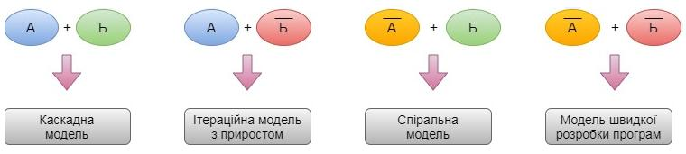

### Контрольні запитання

1. Що таке життєвий цикл програмного забезпечення?
2. Перелічіть основні стадії життєвого циклу програмного забезпечення.
3. Наведіть стадії життєвого циклу програмного забезпечення, які безпосередньо відносяться до процесу розробки.
4. Які найбільш відомі типи моделей життєвого циклу програмного забезпечення?
5. Охарактеризуйте каскадну модель життєвого циклу програмного забезпечення.
6. Охарактеризуйте каскадну модель із зворотнім зв'язком життєвого циклу програмного забезпечення.

7. Охарактеризуйте каскадну модель з прототипуванням життєвого циклу програмного забезпечення.

8. Яку іншу назву має каскадна модель з прототипуванням?

9. Охарактеризуйте V-подібну модель життєвого циклу програмного забезпечення.

10. Перерахуйте ризики та переваги застосування послідовних моделей життєвого циклу програмного забезпечення.

11. Скільки виділяють класів ітераційних моделей?

12. Охарактеризуйте ітераційну модель з приростом життєвого циклу програмного забезпечення.

13. Охарактеризуйте каскадну модель життєвого циклу програмного забезпечення.

14. Охарактеризуйте спіральну модель життєвого циклу програмного забезпечення.

15. Охарактеризуйте каскадну модель життєвого циклу програмного забезпечення.

16. Як називається модель, яка стала продовженням спіральної моделі життєвого циклу програмного забезпечення?

17. Охарактеризуйте модель еволюційного прототипування життєвого циклу програмного забезпечення.

18. Наведіть переваги та недоліки використання ітераційних моделей життєвого циклу програмного забезпечення.

19. Скільки кроків включає моделювання із використанням моделі еволюційного прототипування життєвого циклу програмного забезпечення.

20. Від яких факторів залежить вибір моделі життєвого циклу програмного забезпечення?

21. Що означає RAD?


## 3.1. Звідки беруться помилки в програмному забезпеченні?

Чому буває так, що програми працюють неправильно? Все дуже просто — вони створюються і використовуються людьми. Якщо користувач припуститься помилки, це може привести до проблеми в роботі програми — вона використовується неправильно, а значить, може повести себе не так, як очікувалося.


Однак програми розробляються і створюються людьми, які також можуть допускати (і допускають) помилки. Це означає, що недоліки є і в самому програмному забезпеченні. Вони називаються дефектами або багами (обидва позначення рівносильні). Тут важливо пам'ятати, що програмне забезпечення — щось більше, ніж просто код.


Дефект, виявлений під час виконання програми, може викликати відмову окремого компонента або всієї системи.

При виконанні коду програми дефекти, закладені ще під час його написання, можуть проявитися в наступному: програма може не робити того, що повинна або навпаки - робити те, чого не повинна, тобто відбувається збій.


Збій в роботі програми може бути індикатором наявності в ній дефекту.

Таким чином, баг існує при одночасному виконанні трьох умов:

- відомий очікуваний результат;
- відомий фактичний результат;
- фактичний результат відрізняється від очікуваного результату.

Важливо розуміти, що не всі баги стають причиною збоїв, — деякі з них можуть ніяк себе не проявляти і залишатися непоміченими (або проявлятися тільки при дуже специфічних обставинах).

Причиною збоїв можуть бути не тільки дефекти, але також і умови навколишнього середовища: наприклад, радіація, електромагнітні поля або забруднення також можуть впливати на роботу як програмного, так і апаратного забезпечення.

Всього існує кілька джерел дефектів і, відповідно, збоїв:

- помилки в специфікації, дизайні або реалізації програмної системи;
- помилки використання системи;
- несприятливі умови навколишнього середовища;
- умисне заподіяння шкоди;
- потенційні наслідки попередніх помилок, умов або навмисних дій.

Дефекти можуть виникати на різних рівнях, і від того, чи будуть вони виправлені і коли, буде прямо залежати якість системи (див. рис.3.1).


Зазвичай це очікування передбачається або є обов'язковим.


Рисунок 3.1 — Схема залежності якості системи від часу усунення дефектів

У першому випадку все було зроблено правильно і ми отримали продукт, який повністю відповідає очікуванням замовника і задовольняє критеріям якості.

У другому випадку помилки були допущені вже при кодуванні, що призвело до порушення нормальної роботи в готовому продукті. Але на цьому рівні баги досить легко виявити і виправити, оскільки ми бачимо невідповідність вимогам.

Третій варіант гірше - тут помилки були допущені на етапі проектування системи. Помітити це можна лише провівши ретельну звірку зі специфікацією.

Виправити такі дефекти теж непросто - потрібно заново переробляти дизайн продукту.

У четвертому випадку дефекти були закладені ще на етапі формування вимог; вся подальша розробка і навіть тестування пішли по спочатку неправильному шляху. Під час тестування ми не знайдемо багів - програма пройде всі тести, але може бути забракована замовником.

Умовно, можна виділити п'ять причин появи дефектів в програмному коді.

1. Недолік або відсутність спілкування в команді. Найчастіше, бізнес вимоги просто не доходять до команди розробки. У замовника є розуміння того, яким він хоче бачити готовий продукт, але, якщо належним чином не пояснити його ідею розробникам і тестувальникам, результат може виявитися не таким як передбачалося. Вимоги повинні бути доступні і зрозумілі всім учасникам процесу розробки програмного забезпечення.

2. Складність програмного забезпечення. Сучасне програмне забезпечення складається із безлічі компонентів, які об'єднуються в складні програмні системи. Багатопотокові програми, клієнт-серверна і розподілена архітектура, багаторівневі бази даних - програми стають все складніше в написанні і підтримці, і тим важче стає робота програмістів. А чим важче робота, тим більше помилок може допустити виконуюча її людина.

3. Зміни вимог. Навіть незначні зміни вимог на пізніх етапах розробки вимагають великого обсягу робіт по внесенню змін до системи. Змінюється дизайн та архітектура додатку, що, в свою чергу, вимагає внесення змін до початкового коду і принципів взаємодії програмних модулів. Такі поточні зміни найчастіше стають джерелом важковідстежуваних дефектів. Проте, часто мінливі вимоги в сучасному бізнесі - швидше правило, ніж виняток, тому безперервне тестування і контроль ризиків в таких умовах - прямий обов'язок фахівців відділу забезпечення якості.

4. Погано документований код. Складно підтримувати і змінювати погано написаний і слабо документований програмний код. У багатьох компаніях існують спеціальні правила щодо написання та документування коду програмістами. Хоча на практиці часто буває так, що розробники змушені писати програми в першу чергу швидко і це позначається на якості продукту.

5. Засоби розробки програмного забезпечення. Засоби візуалізації, бібліотеки, компілятори, генератори скриптів та інші допоміжні інструменти розробки — теж часто погано працюють і слабо документуються у програмі та можуть стати джерелом дефектів у готовому продукті.

## 3.2. Чому тестування необхідно?

У цьому пункті і наступних ми розглянемо базові поняття та принципи, які використовуються в процесі тестування. Ми дізнаємося, що ж, власне, являє собою тестування, навіщо воно потрібно і хто ним займається. Розглянемо цілі, принципи та основні етапи тестування. Відчуємо, яким повинен бути психологічний настрій справжнього тестувальника і розвінчаємо наостанок кілька міфів про тестування. Впевнені, Вам буде цікаво. Почнемо з того, що ж таке «тестування». Для початку, давайте абстрагуємося від сухих академічних визначень і подивимося на це поняття з точки зору повсякденного використання.

Коли ми щось тестуємо, то задаємо собі просте запитання: «Чи працює це так, як ми очікуємо?» або, іншими словами «Чи відповідає реальна поведінка об'єкта тестування нашим очікуванням?». Якщо відповідь позитивна — чудово, якщо ні, — ми обмануті у своїх очікуваннях, а значить щось потрібно виправляти.

Тестування необхідно тому, що всі ми робимо помилки. Деякі з них можуть бути незначними, в той час як інші - мати руйнівні наслідки. Все, що виробляється людиною, може містити помилки (так вже ми, люди, влаштовані). Саме тому будь-який продукт потребує перевірки - тестування, перш ніж його можна буде ефективно і безпечно використовувати.

Те ж саме справедливо і для програмного забезпечення.

Комп'ютерні технології все глибше проникають в наше повсякденне життя. Програмне забезпечення управляє роботою безлічі речей, які нас оточують, — від мобільних телефонів і комп'ютерів до пральних машин і кредитних карт. У будь-якому випадку, всі ми стикалися з тими чи іншими помилками в програмах: текстовий редактор, намертво завис при роботі над дипломним проектом, банкомат «з'їв» картку або просто сайт, який ніяк не завантажиться, — все це аж ніяк не полегшує нам життя.

Однак не всі помилки однаково небезпечні - для різних програмних систем рівні ризику можуть відрізнятися.


Крім того, рівень ризику буде залежати від ймовірності настання негативних наслідків.

Наприклад, одна і та ж незначна помилка, скажімо помилка, може мати абсолютно різні рівні ризику для різних програм:

- помилка в описі інтересів на персональній сторінці в соціальній мережі навряд чи буде мати істотні наслідки, хіба що викличе посмішку у ваших друзів;
- така ж проста помилка, допущена в описі діяльності великої компанії, розміщеному на її сайті, вже небезпечна, так як побічно свідчить про непрофесіоналізм її співробітників;
- помилка в коді програми, яка підраховує вплив, спричинений при роботі рентгенівського апарату (наприклад, 100 замість 10) може мати дуже сумнівні наслідки - шкода, завдана здоров'ю і безпеці людей, виллється у втрату довіри до компанії і судові позови з багатьма нулями.

3.3. Коли починати і завершувати тестування?

На рисунку 3.2 проілюстровано графік вартості дефектів.


Рисунок 3.2 – Вартість дефектів

Як бачимо, чим пізніше дефект був виявлений, тим дорожче обійдеться його виправлення і тим більше зусиль для цього буде потрібно. Крім того, як ми пам'ятаємо, дефекти, закладені в систему на ранніх рівнях проектування особливо підступні - їх важко відстежити і правильно інтерпретувати. Висновок напрошується сам собою: чим раніше в життєвому циклі програми почнеться тестування, тим більшою мірою ми можемо бути впевнені в її якості.

Більшість фахівців сходяться в думці, що тестування потрібно починати ще на етапі складання вимог до системи. Хоча тут все буде залежати від обраної моделі розробки. Наприклад, в каскадній моделі тестування проводиться на спеціально виділеному для нього етапі. Ітераційна ж модель дозволяє здійснювати тестування практично паралельно з розробкою нового функціоналу.

На різних етапах життєвого циклу програмного забезпечення тестування проводиться в різних формах:

- на етапі визначення вимог: їх аналіз та верифікація також можуть вважатися тестуванням;
- контроль процесу проектування на етапі розробки дизайну системи - це теж форма тестування;
- як уже згадувалося, розробники теж беруть участь в тестуванні на рівні модульного тестування.

Важче визначити критерій закінчення тестування, оскільки, згідно з принципами тестування, ми ніколи не можемо бути впевнені в тому, що програма на 100% вільна від дефектів. Тому використовуються інші умови, зокрема:
1. граничні терміни, встановлені заздалегідь;
2. виконання всіх передбачених тест-кейсів;
3. досягнення певного рівня тестового покриття;
4. коли після певного моменту, ми практично не знаходимо нових багів або критичних дефектів;
5. рішення менеджменту.

**3.4. Стадії циклу розробки програмного забезпечення у розрізі тестування**

**3.4.1. Аналіз вимог**

Життєвий цикл розробки програмного забезпечення починається зі стадії аналізу, під час якого учасники процесу обговорюють вимоги, що пред'являються до кінцевого продукту. Мета цієї стадії - визначення детальних вимог до системи. Крім цього, необхідно переконатися в тому, що всі учасники правильно зрозуміли поставлені завдання і те, як саме кожна вимога буде реалізована на практиці.

Найчастіше, в обговоренні беруть участь також і фахівці з тестування, які вже на стадії розробки вимог можуть вносити власні побажання і, при необхідності, коригувати процес.

Залежно від обраної моделі розробки, можуть відрізнятися підходи до визначення моменту переходу з однієї стадії на іншу. Наприклад, в каскадній або V-подібній моделі стадія аналізу вимог закріплюється в документі – **специфікації вимог** до програмного забезпечення (Software Requirement Specification, SRS), оформлення якого повинне бути закінчене до переходу на наступну стадію.

Таким чином, цей етап передбачає **збір вимог** щодо розроблюваного програмного забезпечення, їх **систематизацію**, **документування**, **аналіз**, а також **виявлення та розв'язання суперечностей**.

### 3.4.2. Проектування

На стадії проектування (званої також стадією дизайну і архітектури) програмісти і системні архітектори, керуючись вимогами, розробляють високорівневий дизайн системи.

Різноманітні технічні питання, що виникають в процесі проектування, обговорюються з усіма зацікавленими сторонами, включаючи замовника. Визначаються технології, які будуть використовуватися в проекті, завантаження команди, обмеження, тимчасові рамки і бюджет. Відповідно до уточнених вимог вибираються найбільш підходящі проектні рішення.

Затверджений дизайн системи визначає перелік розроблюваних програмних компонентів, взаємодія з третіми сторонами, функціональні характеристики програми, бази даних і багато іншого. Дизайн, як правило, закріплюється окремим документом – **дизайн-специфікацією** до програмного забезпечення (Design Specification Document, DSD).

На цьому етапі для спрощення візуалізації процесу проектування використовуються так звані **нотації** - схематичне вираження характеристик розроблюваної системи. Основні використовувані нотації:
- блок-схеми;

- ER-діаграми;
- UML-діаграми;
- макети - наприклад, намальований у фотошопі прототип сайту.

### 3.4.3. Розробка та програмування

Після того, як вимоги та дизайн продукту затверджені, відбувається перехід до наступної стадії життєвого циклу — безпосередньо розробці. Тут починається написання програмістами коду програми відповідно до раніше визначених вимог.

Системні адміністратори налаштовують програмне оточення, front-end програмісти розробляють призначений для користувача інтерфейс програми і логіку її взаємодії із сервером.

Крім того, програмісти пишуть Unit-тести для перевірки правильності роботи коду кожного компонента системи, проводять рев'ю написаного коду, створюють білди і розгортають готове програмне забезпечення в програмному середовищі. Цей цикл повторюється до тих пір, доки усі вимоги не будуть реалізовані.

Програмування передбачає чотири основні стадії:

1) розробка алгоритмів - фактично, створення логіки роботи програми;
2) написання вихідного коду;
3) компіляція - перетворення в машинний код;
4) тестування та налагодження - мова, головним чином, про юніт-тестування.

### 3.4.4. Документація

Цей етап виділяють достатньо умовно, оскільки, як ми бачили, ті чи інші документи створюються на всіх стадіях життєвого циклу програми. Проте, крім проєктної документації та супроводжуючих розробку записів, існують також і

інші текстові документи, що описують, наприклад, функції програми і способи її використання.

Всього існує **чотири рівні документації**:

- **архітектурна (проектна)** – наприклад, дизайн-специфікація. Це документи, що описують моделі, методології, інструменти та засоби розробки, вибрані для даного проекту;

- **технічна** — вся документація, що супроводжує розробку. Сюди входять різні документи, що пояснюють роботу системи на рівні окремих модулів. Як правило, пишеться у вигляді коментарів до вихідного коду, які згодом структуруються у вигляді HTML-документів;

- **призначена для користувача** — включає довідкові і пояснювальні матеріали, необхідні кінцевому користувачу для роботи з системою. Це, наприклад, Read me i User guide, розділ довідки за програмою;

- **маркетингова** - включає рекламні матеріали, які супроводжують випуск продукту. Її мета – в яскравій формі представити функціональність і конкурентні переваги продукту.

### 3.4.5. Тестування

Основні етапи тестування ми розглянемо нижче у пункті «Фундаментальний процес тестування».

Тестувальники займаються пошуком дефектів в програмному забезпеченні і порівнюють описану у вимогах поведінку системи із реальною.

Під час фази тестування виявляються пропущені при розробці баги. При виявленні дефекту, тестувальник складає звіт про помилку, який передається розробникам. Останні його виправляють, після чого тестування повторюється, але на цей раз для того, щоб переконатися, що проблема була виправлена, і саме виправлення не стало причиною появи нових дефектів в продукті.

Тестування повторюється до тих пір, доки не будуть досягнуті **критерії його закінчення**.

Види, методи і техніки тестування микладно розглянемо далі в цьому посібнику.

### 3.4.6. Впровадження та супровід

Коли програма протестована і в ній більше не залишилося серйозних дефектів, приходить час релізу і передачі її кінцевим користувачам.

Після випуску нової версії програми в роботу включається відділ технічної підтримки. Його співробітники забезпечують зворотний зв'язок з користувачами, їх консультування та підтримку.

У разі виявлення користувачами тих чи інших пост-релізних багів, інформація про них передається у вигляді звітів про помилки команді розробки, яка, в залежності від серйозності проблеми, або негайно випускає виправлення (так званий hot-fix), або відкладає його до наступної версії програми.

Крім того, команда технічної підтримки допомагає збирати і систематизувати різні метрики – показники роботи програми в реальних умовах.

Отже, усі стадії життєвого циклу програмного забезпечення, представлені вище, застосовуються в будь-якій моделі розробки, але їх тривалість і порядок проходження можуть відрізнятися.

### 3.5. Фундаментальний процес тестування

Як ми побачили, виконання тестів необхідно, але не менш важливі і супроводжуючі дії — планування і документування процесу. В обов'язки тестувальників входить розробка тестових сценаріїв, а також підготовка тестування і оцінка його результатів. Становлення ідеї фундаментального тестового процесу на всіх рівнях тестування зайняло роки. В рамках цього процесу можна виділити ключові кроки:

- планування і управління;
- аналіз і проектування;
- впровадження та реалізація;
- оцінка критеріїв виходу і написання звітів;
- дії по завершенню тестування.

Тут дії описані в логічній послідовності, але в умовах реального проекту вони можуть накладатися, відбуватися одночасно або навіть повторюватися. Зазвичай, відбувається адаптація цих кроків під потреби конкретної системи або проекту. Розглянемо ці кроки детально.

### 3.5.1. Планування і управління

Планування тестування включає дії, спрямовані на визначення основних цілей тестування і завдань, виконання яких необхідне для досягнення цих цілей.

У процесі планування ми переконуємося в тому, що ми правильно зрозуміли цілі і побажання замовника і об'єктивно оцінили рівень ризику для проекту, після чого ставимо мету і завдання для, власне, тестування.

Для більш ясного опису цілей і завдань тестування складаються такі документи як тест-політика, тест-стратегія і тест-план.


Крім іншого тест-план, визначає інструменти тестування, функціональність, яку потрібно протестувати, розподіл ролей в команді, тестове оточення, використовувані техніки тест-дизайну, критерії початку і закінчення тестування і ризики. Тобто, це докладний опис всього процесу тестування.

У будь-якій діяльності, управління не закінчується плануванням. Нам потрібно контролювати і вимірювати прогрес. Саме тому управління тестуванням - безперервний процес.


У свою чергу, дані, отримані в ході контролю над процесом, враховуються при плануванні подальших дій.

### 3.5.2. Аналіз та проектування

Аналіз і проектування тестів - це процес написання тестових сценаріїв і умов на основі загальних цілей тестування.

У процесі аналізу і проектування ми розробляємо тестові сценарії на підставі загальних цілей тестування, визначених під час планування.


### 3.5.3. Впровадження і реалізація

Під час виконання тестування відбувається написання тест-кейсів, на основі написаних раніше тестових сценаріїв, збирається необхідна для проведення тестів інформація, готується тестове оточення і запускаються тести.


### 3.5.4. Оцінка критеріїв виходу і написання звітів

Критерії виходу визначають, коли можна завершувати тестування. Вони необхідні для кожного рівня тестування, оскільки нам необхідно знати, чи достатньо було проведено тестів.

При оцінці критеріїв виходу необхідно:

- перевірити, чи було проведено достатню кількість тестів, чи досягнута потрібна ступінь забезпечення якості системи;
- переконатися в тому, що немає необхідності проводити додаткові тести. Якщо ж таки така необхідність є, можливо, буде потрібно змінити встановлений критерій виходу.

Після закінчення тестування відбувається написання звіту, який буде доступний всім зацікавленим сторонам. Адже не тільки тестувальники повинні знати результати виконання тестів, — ця інформація може бути необхідна багатьом учасникам процесу створення програмного забезпечення.

### 3.5.5. Дії по завершенні тестування

По завершенні тестування ми збираємо, систематизуємо і аналізуємо інформацію про його результати. Вона може стати в нагоді пізніше — під час випуску готового продукту. Можуть бути й інші причини для згортання

тестування, наприклад, дострокове закриття проекту або завершення певного етапу розробки.

Основні цілі цього етапу:

- переконатися, що вся запланована функціональність дійсно була реалізована;
- перевірити, що всі звіти про помилки, подані раніше, були, так чи інакше, закриті;
- завершення роботи тестового забезпечення, тестового оточення та інфраструктури;
- оцінити загальні результати тестування і проаналізувати досвід, отриманий в його процесі.

Використані у розділі літературні джерела – [37, 38, 49, 51-57].

## Контрольні запитання


1. Що таке помилка у програмному забезпеченні?
2. Дайте визначення дефекту програми.
3. Що таке збій програмного забезпечення?
4. Перелічіть умови при одночасному виконанні яких існує баг.
5. Назвіть джерела появи дефектів у програмах.
6. Дайте визначення якості програмного забезпечення.
7. Що таке вимога до програмного забезпечення?
8. Назвіть причини появи дефектів у програмному забезпеченні.
9. Що таке ризик?
10. Назвіть критерії завершення тестування.
11. Коротко охарактеризуйте стадію аналізу вимог життєвого циклу програмного забезпечення.

12. Яким документом підкріплюється стадія аналізу вимог?

13. Охарактеризуйте стадію проектування життєвого циклу програмного забезпечення.

14. Яким документом підкріплюється стадія проектування?

15. Які види нотацій використовуються на стадії проектування?

16. Назвіть чотири основні стадії етапу реалізації життєвого циклу програмного забезпечення.

16. Скільки рівнів документації існує? Коротко охарактеризуйте кожний рівень.

17. З скількох стадій складається фундаментальний процес тестування?

18. Наведіть визначення управління тестуванням.

19. Що таке тест-політика?

20. Що таке тест-стратегія?

21. Дайте визначення тест-плану.

22. Що таке тестовий сценарій?

23. Що таке тестове оточення?

24. Дайте визначення тест-кейсу.

25. Коротко охарактеризуйте стадії завершення тестування та написання звітів.


## 4.1. Аналіз вимог

IEEE Standard Glossary of Software Engineering Terminology визначає вимоги як:

1. Умови чи можливості, необхідні користувачеві для рішення проблем чи досягнення цілей.
2. Умови чи можливості, якими повинна володіти система чи системні компоненти, щоб виконати контракт чи задовольнити стандарти, специфікації чи інші формальні документи.
3. Документоване представлення умов чи можливостей для пунктів 1 та 2.

Вимоги до програмного забезпечення складаються із трьох рівнів:
- бізнес-вимоги;
- вимоги користувачів;
- функціональні вимоги.

На додачу кожна система має свої нефункціональні вимоги.

*Бізнес-вимоги (business requirements)* містять високорівневі цілі організації та замовників системи. Як правило, їх висловлюють ті, хто фінансує проєкт, покупці системи, менеджер реальних користувачів, відділ маркетингу. В цьому документів пояснюється, чому організації потрібна така система, тобто описані цілі, котрі організація планує досягнути з її допомогою. Бізнес-вимоги часто записують у формі документу про образ та межі проєкту, котрий ще іноді називають **уставом проєкту** (project charter) чи **документом ринкових вимог** (market requirements document). Визначення меж проєкту являє собою перший етап управління проблемами збільшення об'єму робіт.

*Вимоги користувачів* (*user requirements*) описують цілі і задачі, які користувачам надасть система. До хороших способів представлення цього виду вимог відносяться варіанти використання, сценарії та таблиці «подія-відгук». Таким чином, в цьому документі зазначено, що клієнти зможуть робити за допомогою системи.

*Функціональні вимоги* (*functional requirements*) визначають функціональність програмного забезпечення, яку розробники повинні побудувати, щоб користувачі змогли виконати свої задачі в межах бізнес-вимог. Іноді вони називаються ще **вимогами поведінки** (*behavioral requirements*). Вони містять положення до традиційних «повинен» чи «повинна»: «Система повинна по електронній пошті відправляти користувачу підтвердження про замовлення».

Функціональні вимоги документуються в специфікації вимог до програмного забезпечення (SRS), де описується так повно, як необхідно, очікувана поведінка системи.

*Системні вимоги* (*system requirements*) — це високорівневі вимоги до продукту, котрі містять більшість підсистем. Говорячи про систему, ми розуміємо програмне забезпечення чи підсистеми програмного забезпечення та обладнання. Люди — частина системи, тому певні функції системи можуть розподілятись і на людей.

*Бізнес-правила* (*business rules*) включають корпоративні політики, урядові постанови, промислові стандарти та обрахункові алгоритми. Бізнес-правила не є вимогам до програмного забезпечення, тому що вони знаходяться за межами будь-якої системи. Однак вони часто накладають обмеження, визначаючи, що можете виконувати особисто Ви, чи диктувати якими функціями повинна володіти система, що підкорюється відповідним правилам. Іноді бізнес-правила стають джерелом атрибутів якості, котрі реалізуються в функціональності. Відповідно, ви можете відстежити природу конкретних функціональних вимог до відповідних їм бізнес-правил.

*Нефункціональні вимоги* описують цілі та атрибути якості. Атрибути якості (quality attributes) представляють собою додатковий опис функцій продукту, виражений через опис його характеристик, важливих для користувачів чи розробників. До таких характеристик відносяться:

- легкість та простота використання;
- легкість переміщення;
- цілісність;
- ефективність та стійкість до відмов;
- зовнішня взаємодія між системою та зовнішнім світом;
- обмеження дизайну та реалізації. Обмеження (constraints) стосуються вибору можливості розробки зовнішнього виду та структури продукту.


В області комерційного програмного забезпечення характеристика являє собою впізнавану усіма зацікавленими особами групу вимог, котрі важливі при прийнятті рішення про покупку – елемент маркованого списку в описі продукту.

Тестування вимог є необхідною та дуже важливою процедурою, котра в подальшому допоможе оптимізувати роботу команди та уникнути непорозумінь, а також дозволяє розуміти, чи можна в принципі виконати дані вимоги – із точки зору часу, ресурсів та бюджету.

На рисунку 4.1 проілюстрована діаграма кількості прояви помилок програмного забезпечення в залежності від стадії розробки.

Дивлячись на діаграму, бачимо, що більшість помилок тягнеться саме від етапу вимог до програмного забезпечення, тому потрібно із цим якось боротись, тобто робити так, щоб не було наступних проблем:

- незрозумілість вимог;
- часта зміна вимог;

- зміни, які вносяться в останній момент;
- неправдиве трактування вимог.

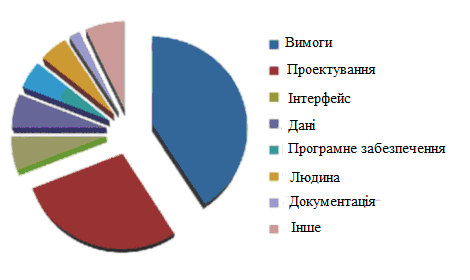

Рисунок 4.1 – Діаграма відсотку прояви помилок із множини можливих в залежності від стадії розробки

Через все вище зазначене може відбутись наступне:
- зрив строку проекту;
- буде зроблено не те і не так як потрібно;
- зміни не контролюються і команда не знає, що робити.

В процесі тестування документації важливо долучати різноманітних спеціалістів: тестувальників, прожект-менеджерів, бізнес-аналітиків, розробників. Якщо помилка у вимогах буде виявлена на етапі тестування вимог, її рішення може бути лише у виправленні декількох слів у тексті, у той же час коли знайдений дефект у вже реалізованому програмному продукті, може призвести до закриття проекту.

*Приклади дефектів, які часто зустрічаються у документації:*
- протиріччя пунктів/розділів в документі один одному;
- недостатня деталізація вимог, їх неоднозначне трактування;

- відсутність глосарія, де могли бути вказані всі відомі терміни.

*Ціль тестування документації:*

- перевірка коректності вимог на предмет повноти вимог, їх однозначності, здійсненності, несуперечливості тощо;
- зменшення ризиків невідповідності реалізованого функціоналу, згідно прописаним вимогам. Наявність таких дефектів в документації приводить до значного збільшення витрат в часі, витраченому на виправлення допущених помилок;
- попередити допущення помилок розробником при написанні коду;
- зменшення ризиків передачі в експлуатацію програмного продукту з неякісною документацією.

*Перспективи використання тестування документації:*

- підвищення якості реалізації;
- розвиває аналітичні навички тестувальників;
- диференціює навантаження на тестувальників (виявлення потенційно можливих помилок може суттєво зменшити час на тестування конкретно цієї функціональності, відповідно, цей час можна витратити на проведення, наприклад, дослідницького тестування).

Брайан Хенкс у своїх матеріалах на тему вимог “Requirements in the Real World” підкреслює, що:

- вимоги дозволяють зрозуміти що і з дотриманням яких умов повинна робити система;
- вимоги беруть за основу зіставлення тестової документації;
- вимоги попереджають потенційні проблеми;
- допомагають розставити пріоритети в роботі;
- дозволяють об'єктивно оцінити прогрес в роботі проекту.

*Коли тестування документації найбільш актуальне:*

- замовник активно приймає участь в розробці проекту, він приймає кожний новий реліз;
- замовник має доступ до документації та може контролювати її актуальний стан.

Поміж зменшення ризиків, усунення невідповідностей, тестування документації може вирішувати важливі питання, які стосуються бізнес-цілей проекту:

- зменшення витрат на технічну підтримку (за рахунок швидкого знаходження відповідей в документації);
- чим детальніше описана функціональність, тим простіше буде її протестувати у повному об'ємі;
- зменшення витрат на розробку нової функціональності за рахунок зменшення витрат, у випадку неякісного опису вимог в документації.

Документації, які підлягають тестуванню:

- продуктна документація — це план проекту, вимоги до програмного продукту, функціональні специфікації, архітектура та дизайн, тест-кейси, технічні специфікації;
- проектна документація — включає в себе продуктну документацію, а також користувацьку та супровідну документацію, маркетингову документацію.

## 4.2. Характеристики вимог

Характеристики якості хороших вимог:

- **Повнота.** Кожна вимога повинна описувати функціональність, котру варту реалізувати в продукті. Тобто вона повинна містити всю інформацію, необхідну для розробників, щоб тим вдалось створити цей фрагмент функціональності. Якщо ви розумієте, що даних певного виду бракує, використовуйте помітку TBD (to be determined — потрібно визначити) на полях

як стандартний прапорець для виділення такого місця. Заповніть всі пробіли в кожному фрагменті вимог, перш ніж приступати до побудови цієї функції.

- **Коректність.** Кожна вимога повинна чітко описувати бажану функціональність. Для дотримання коректності необхідний зв'язок із джерелами вимог, наприклад із побажаннями користувачів чи високорівневими системними вимогами. Вимоги до програмного забезпечення, котрі конфліктують із батьківськими вимогами, неможна рахувати коректними. Однак основна оцінка тут за представниками користувачів, ось чому їм чи їх безпосереднім заступникам необхідно представляти вимоги для перегляду.

- **Здійсненність.** Необхідна можливість реалізовувати кожну вимогу при відомих умовах та обмеженнях системи чи операційної системи. Щоб не придумувати недосягненні положення, забезпечте взаємодію розробників з маркетологами та аналітиками вимог на період всього вилучення вимог. Розробники реально оцінять, що можна виконати технічно, а що ні, що зробити можна, але при додатковому фінансуванні. Інкрементальна розробка та підтверджуючі концепцію прототипи дозволяють перевірити здійсненність вимог.

- **Необхідність.** Кожна вимога повинна відображати можливість, котра дійсно необхідна користувачам чи котра потрібна для відповідності зовнішнім системним вимогам чи стандартам. Крім того, вона повинна іти від особи, котра має повноваження на запис ситуації. Відслідкуйте кожну вимогу аж до стадії зібрання думок користувачів, коли виявлялись варіанти використання, бізнес-правила чи інші джерела.

- **Призначення пріоритетів.** Призначте пріоритети кожній функціональній вимозі, характеристиці та варіанту використання, щоб визначити, що необхідно для кожної версії продукту. Якщо всі положення однаково важливі, менеджеру проекту буде важко справитись із зменшенням бюджету, порушенням строків, втратою персоналу чи додаванням нових вимог у процесі розробки.

* **Несуперечність.** Не повинно бути суперечливих вимог, які б конфліктували між собою.
* **Однозначність.** Всі читачі вимог повинні інтерпретувати їх однаково, але природна мова часто грішить багатозначністю. Пишіть документацію просто, коротко і точно, застосовуючи лексику, зрозумілу користувачам. «Ясність» - ціль якості вимог, пов'язана із точністю: читачі повинні чітко розуміти кожне положення. Занесіть всі спеціальні та заплутані терміни у словник.
* **Перевірочність.** Спробуйте розробити декілка тестів чи застосуйте інші прийоми для перевірки, наприклад експертизу чи демонстрації, щоб встановити, чи дійсно в продукту реалізована кожна вимога. Якщо вимога не перевіряється, запитання її коректної реалізації стає предметом заключення, а не ціллю аналізу. Неповні, непогоджені, не виконувані чи двозначні вимоги також не перевіряються.

### 4.3. Характеристики специфікації вимог

Набір вимог, який складає специфікацію, повинен відповідати наступним характеристикам:

* **Повнота.** Жодні вимоги чи необхідні дані не повинні бути пропущені.
* **Погоджуваність.** Погоджені вимоги не конфліктують із іншими вимогами такого ж типу чи із високорівневими користувацькими, системними чи бізнес-вимогами. Непогоджуваність документів варто усувати до початку процесу розробки. Ви не завжди знаєте, яке саме положення некоректне (якщо якесь некоректне), поки не виконаєте дослідження. Рекомендується записувати автора кожної вимоги, щоб знати, хто її висунув, якщо конфлікт все-таки буде виявлено.
* **Спосіб до модифікації.** Необхідно забезпечити можливість переробки вимог, якщо знадобиться, і підтримувати історію змін для кожного положення. Для цього всі вони повинні бути унікально помічені та позначені, щоб ви могли

посилатись на них однозначно. Кожна вимога повинна бути записана в специфікацію тільки один раз. Інакше ви легко отримаєте непогоджуваність, змінивши тільки одне положення із двох однакових. Краще використовуйте посилання на першочергові ствердження, а не дублюйте положення. Модифікація специфікації стане значно легше, якщо ви складете зміст документу та вказівник. Збереження специфікації в базу даних комерційного інструменту управління вимогами зробить їх придатними для повторного використання.

* **Трасованість.** Трасованість, чи можливість для аналізу, можна реалізувати як в напрямку назад до першоджерел, так і вперед до елементів дизайну та вихідного коду, котрий його реалізує, а також до варіантів використання, котрі дозволяють перевірити коректність реалізації. Трасовані вимоги помічені відповідними ідентифікаторами. Вони записані в структурованій, деталізованій формі, на противагу параграфам у довгій розповідальній формі. Уникайте поєднання множини вимог в одну грудку, окремі вимоги можна трасувати до різних елементів дизайну і коду.

Під час розробки проекту все, що стосується розроблюваного продукту, будь то нариси маркером на дошці, переписка у скапі, поштова переписка — все є свого роду документацією. І все повинно підлягати тестуванню. Важливо перечитувати листи, котрі Ви надсилаєте замовнику, щоб не відбулось помилки та не впустити важливе.

## 4.4. Техніки тестування документації та вимог

Тестування документації та вимог відноситься до розряду не функціонального тестування.

Існують спеціальні техніки для тестування документації та вимог:
1. *Review вимог:*

- проміжний перегляд - це показ своєї роботи колегам з метою отримання зворотного зв'язку, питань та зауважень. Всі відгуки та зауваження допоможуть покращити роботу;

- технічний перегляд - це вичитування документу групою спеціалістів, які представляють різні області. Документ/вимоги не можуть бути якісними, доки хоча б у одного із спеціалістів є зауваження.

- формальна інспекція - це рідко використовувана техніка (наприклад, при отриманні проекту, створенням котрого займалась інша компанія, на супроводження та доопрацювання), котра являє собою систематизований підхід до аналізу документації.

2. *Запитання* – це одна із найбільш простих та ефективних технік виявлення вимог. Якщо щось в документах залишається незрозумілим — задавайте запитання. Для отримання відповідей на запитання, можна звернутись до менеджера, більш досвідченого спеціаліста, котрий раніше отримав відповідну інформацію від замовника або безпосередньо до самого замовника.

3. *Тест-кейси* – вимога повинна бути такою, що перевіряється, це означає що повинні існувати способи перевірки коректності реалізованої вимоги. Чим детальніше продуманий чек-ліст, тим імовірніше визначення перевіреності вимоги. Перш ніж записувати можливі тест-кейси, переконайтесь в тому, що ви розумієте вимогу. Для хорошого розуміння конкретної вимоги допоможе аналіз інших вимог, котрі можливо будуть певним чином пов'язані. Але, якщо вимогу так і не вдалось зрозуміти, швидше за все в ній є неточність або помилка. Коли всі вимоги будуть добре сформульовані та протестовані, можна продовжувати використання цієї техніки, суміщаючи розробку тест-кейсів з додатковим тестуванням.

4. *Дослідження поведінки системи* – тестувальник моделює процес роботи системи, створеною за тестованими вимогами та шукає неоднозначні варіанти поведінки системи.

5. *Графічне представлення* — для того, щоб побачити всі вимоги повністю, дуже зручно буде використовувати рисунки, схеми, мокапи. На рисунках досить просто замітити неточності, нестиковку елементів. Після доробки всіх неточностей, вийде гарний додаток до текстових вимог.

6. *Прототипування* — зробивши накиди користувацького інтерфейсу, легко оцінити та застосувати ті чи інші користувацькі рішення.

## 4.5. Аксіоми тестування

З моменту виявлення першого багу, тестування програмного забезпечення пройшло великий шлях. Як усілякий новий практичний напрям, воно динамічно розвивалося, не уникнувши і тупикових гілок, невдалих спроб адаптації та перенесення методологій, стандартів і концепцій з вже існуючих областей. Додатковою особливістю цього процесу стала залежність тестування від власне програмного забезпечення, чиї технології, методи та інструменти самі переживають період стрімкого й інтенсивного вдосконалення. Також слід відзначити, що не маючи за спиною багатого досвіду теоретичних досліджень, система забезпечення якості програмного забезпечення, а услід за нею і тестування, протягом довгого часу обростали всілякими міфами і попадали під вплив різних ідейних течій. Мета даного пункту — розвіяти деякі з ілюзій, пов'язаних з тестуванням.

### 1. Неможливо повністю протестувати програму

Початківець у сфері тестування здатен вважати, що можна обробити програмне забезпечення повністю протестувавши його, знайшовши всі помилки, і підсумувавши, що програмне забезпечення ідеальне. Нажаль, це неможливо, навіть для найпростіших програм, через наступні чотири ключові причини:

1. Кількість можливих вхідних даних дуже велика.
2. Кількість можливих результатів дуже велика.
3. Кількість проходів по програмному забезпеченні дуже велика.

4. Специфікація програмного забезпечення суб'єктивна. Можна сказати, що помилка — це зовсім не помилка, так і було задумано.

Підсумовуючи ці причини, отримуємо набір умов тестування, який занадто великий, щоб його здолати.

Ілюстративним прикладом може служити калькулятор Windows: Нехай поставлене завдання на тестування калькулятору Microsoft Windows. Почнемо з операцій додавання. Крок перший: $1+0=$? Одержуєте відповідь $1$. Коректно Крок другий: $1+1=$? Одержали $2$. Коректно. Скільки таких кроків потрібно? Калькулятор приймає 32-х розрядне число, отже, необхідно перевірити всі можливі варіанти до $1+99999999999999999999999999999999=$. Закінчивши цю послідовність, треба перейти до $2+0=$, $2+1=$, $2+2=$ та інші. Останнім варіантом буде $99999999999999999999...+999999999999999999...=$ Далі необхідно перевірити коректність додавання дробі: $1.0+0.1$, $1.0+0.2$ та інші.

Після перевірки того, що коректні дані додаються правильно, залишається ввести некоректні дані. Це дасть змогу переконатися, що вони грамотно оброблюються. Нагадаємо, що можна використовувати не лише цифри на екрані, але й набирати символи з клавіатури. Важливо перевірити можливість введення $1+\text{a}$, $\text{в}+1$, $1\text{a}1+2?\%\dots$, Скільки буде таких варіантів?

Виправлення введення також повинно бути протестовано. Калькулятор Windows дозволяє використовувати Backspace і Delete, отже, належить перевірити і їх. Всі вищезазначені перевірки мають бути повторенні з використанням клавіші Backspace для кожного введення, для кожних двох введень і так далі.

Після закінчення цього етапу можна перейти до додавання трьох чисел, потім чотирьох і так далі.

Це приклади лише для операції додавання, а залишаються ще різниця, множення, ділення, відсоток тощо. Вочевидь, що через кількість контрольних

прикладів неможливо завершити повне тестування навіть такої програми як калькулятор. Перейдемо до розгляду наступної аксіоми.

**2. Тестування – це процес, що містить ризики.**

Попередній приклад показав, що перебрати всі варіанти неможливо, треба чимось нехтувати. Якщо приймається рішення не тестувати всі можливі сценарії, то вибирається деякий ризик. У прикладі з калькулятором, що буде, якщо вирішити не перевіряти 1024+1024=2048? Існує ймовірність того, що програміст зробив помилку, яка впливає саме на цю ситуацію. Якщо не протестувати її, користувач рано чи пізно з нею стикнеться. Ця помилка може коштувати дуже дорого, адже вона буде знайдена, коли програмне забезпечення вже знаходиться в експлуатації, а тому на вилучення та заміну версії, що містить баг, мають бути витрачені значні зусилля.

Таким чином, маємо протиріччя – неможливо протестувати все, проте якщо не протестувати, то виникає ймовірність пропущення помилок. Перед розробником стоять суперечливі цілі – продукт повинен бути реалізований, отже, необхідно закінчити тестування, але якщо закінчити його занадто швидко, то залишаться не протестовані частини.

Тестеру необхідно навчитися скорочувати величезну область всіх можливих тестів до керованого набору та приймати, враховуючи ризик, розумні рішення що важливо для тестування, а що ні.

На рисунку 4.2 проілюстровано залежність між обсягом тестування та якістю проекту у сенсі кількості знайдених помилок. Якщо спробувати протестувати абсолютно все, ціна різко зросте, а кількість пропущених помилок спаде до нуля.

Якщо сильно скоротити тестування або приймати хибні рішення відносно того, що саме тестувати, ціна зменшиться, але залишиться велика кількість помилок. Мета – це знайти оптимальний обсяг тестувань.


Рисунок 4.2 – Кожен проєкт має оптимальний обсяг тестування

### 3. Тестування не може показати, що помилок немає

Ця аксіома була висунута професором Е. Дейкцрою в 1972 році. Проілюструємо її. Уявіть роботу винищувача, що шукає в будинку жуків. Він перевіряє будинок і знаходить їх — можливо живих, мертвих або навіть гніздо. Можна спокійно стверджувати, що в будинку є жуки. Потім винищувач відвідує інший будинок та не знаходить в ньому присутності жуків. Він дивиться в усіх передбачуваних місцях, але не виявляє ніяких ознак навали. Можливо, буде знайдено кілька мертвих жуків або старих гнізд, але нема нічого, що могло б свідчити про присутність живих жуків. Чи можна однозначно та впевнено заявити, що в будинку жуків немає? Все, що можна сказати — це те, що пошук не виявив жуків. І поки не буде розібрано будинок на частини аж до фундаменту, не можна бути впевненим в тому, що жуків просто випадково не помітили.

Тестування програмного забезпечення дуже схоже до пошуку жуків. Воно може показати наявність жуків, але не може показати, що їх немає. Можна провести тестування, знайти й доповісти про помилки, але не можна

стверджувати, що їх більше немає. Можна тільки продовжити тестування й, по можливості, знайти інші помилки.

4. **Чим більше помилок знаходить тестер, тим більше їх існує**

Існує багато подібностей між реальними жуками й несправностями (bugs) у програмному забезпеченні. І ті, і інші мають тенденцію появлятись групами – якщо була помічена одна, імовірно поблизу є ще. Часто тестер досить довго не може нічого знайти. Потім він раптом знаходить одну помилку, потім дуже швидко наступну і наступну. От кілька причин цього:

- як і в усіх нас, у програмістів бувають невдалі дні. Код, написаний в один день, може бути ідеальним; коди написаний в інші невдалим. Одна помилка може бути маячком, що показує – тут поруч є ще;
- програмісти часто роблять ті самі помилки. В усіх є звички. Програміст, схильний до певних помилок, буде часто повторювати їх;
- деякі помилки дійсно тільки вершина айсбергу. Дуже часто проект або архітектура програмного забезпечення мають фундаментальні проблеми. Тестер знаходить помилки, які на перший погляд здаються не зв'язаними, але, в остаточному підсумку, указують на одну серйозну первинну причину.

Важливо відзначити, що зворотне твердження до «помилки випливають за помилками» також правдиво. Якщо тестер, попри всі зусилля, не зміг знайти помилки, це, з великою ймовірністю, значить, що програмне забезпечення було акуратно написане, у ньому міститься всього кілька помилок, які можна знайти.

5. **Парадокс пестицидів**

В 1990 році Борис Бейзер у свої книзі «Техніки тестування програмного забезпечення» запропонував термін парадокс пестицидів – чим більше тестер тестує програмне забезпечення, тим більше воно стає вразливим до тестувань. Аналогічне відбувається з комахами при використанні пестицидів (див. рис.4.3.). Якщо використовувати ті самі пестициди, у комах виробляється захист, і пестициди більше не діють.


Рисунок 4.3. – Програмне забезпечення під дією однакових повторюваних тестів стає стійким до них

Для подолання парадокса пестицидів, тестери програмного забезпечення повинні писати нові, різноманітні тести, що дозволить знаходити більше помилок.

**6. Не всі знайдені помилку будуть виправлені**

Одна із реалій тестування програмного забезпечення полягає в тому, що, навіть після наполегливої роботи, не всі помилки будуть виправлені. Це не означає, що тестер не досяг своєї мети, або що команда в цілому випустила поганий продукт. Іноді треба знаходити компроміс та йти на ризик, приймаючи рішення щодо того виправляти помилку, чи ні. Наведемо деякі причини, з яких помилка може бути не виправленою:

- **Недостатньо часу**. У кожному проекті завжди є багато специфікацій та нюансів (іноді занадто багато, щоб написати до них код і протестувати його у зазначений час) і не досить можливостей, що б закінчити їх усі.
- **Це насправді не помилка**. Часто від розробників можна почути: «Це не помилка, це — властивість!». Це незвично, але помилки тестування або

зміни у специфікації можуть призвести до того, що несправності будуть залишені, як властивості.

- **Занадто ризиковано виправляти.** Нажаль, саме так буває дуже часто. Програмне забезпечення іноді схоже на спагеті: виправлення однієї помилки може спричинити виникнення нових. Під тиском реалізації та щільного графіка може бути занадто ризиковано змінювати програмне забезпечення, тому краще залишити відому помилку, чим ризикувати створити нову, невідому.
- **Це просто не варто виправляти.** Можливо, це звучить грубо, але це реальність. Помилки, які виникають нерегулярно або в мало використовуваних функціях можуть бути опущені. Причина цього – бізнес рішення, що базуються на ризику.

Для прийняття рішень звичайно необхідні тестери програмного забезпечення, керівник проекту та програмісти. Кожний піклується про своє бачення майбутнього помилки, має свої дані та думку – чому треба або не треба її виправляти.

Що відбувається коли приймається неправильне рішення?

Можна згадати рішення Intel Pentium, коли тестери Intel знайшли помилку при обробці чисел з плаваючою крапкою раніше, ніж чіп був випущений, але команда проектувальників вважала, що вона є незначною і її не обов'язково виправляти. У них був дуже тісний графік, тому вони вирішили продовжувати проект за планом, а знайдену помилку виправляти в наступних версіях. На жаль, помилка була виявлена користувачами, і компанія понесла великі фінансові збитки.

**7. Іноді складно сказати чи є помилка помилкою**

Якщо в програмному забезпеченні є проблема, але її не було знайдено ні програмістами, тестерами, ні навіть користувачами – чи помилка це?

Якщо задати це питання групі тестерів, то можна побачити вражаючу дискусію. У кожного з них буде свою власна думка й кожний зможе добре та яскраво її аргументувати. Проблема в тому, що певної відповіді на це питання не існує. Вона полягає у тому, що на певний час краще для тестерів та команди розробників.

Твердження, що програмне забезпечення робить або не робить чогось припускає, що воно було запущено, щось протестовано або ж недолік чогось був очевидний. Пізніше не можливо буде доповісти про те, чого не видно та не можна відтворити. Визнавайте помилку помилкою, тільки якщо вона спостерігається.

Про це можна подумати і по-іншому. Зовсім не дивно, що дві людини мають зовсім різні думки про якість програмного забезпечення. Один може сказати, що програма містить жахливо багато помилок, інший – що вона ідеальна. Як обоє можуть бути праві? Відповідь на це проста – один користується програмою так, що появляються помилки, а інший - що ні.

### 8. Специфікація розробки ніколи не завершується

Спочатку необхідно розібратися з терміном: специфікація розробки.

Специфікація розробки, іноді звана просто специфікацією – це домовленість між членами команди розробників програмного забезпечення. Вона визначає продукт, що вони створюють, деталізує, яким він буде, як буде працювати, що буде робити й чого не буде. Ця домовленість може варіюватися: від простої усної згоди до формалізованого записаного документа.

У розробників програмного забезпечення є проблема. Індустрія розвивається так швидко, що найпередовіші розробки минулого року в цьому вже є застарілими. Програмне забезпечення стає більшим, складнішим й містить у собі все більше функцій, отже, як результат, подовжуються й подовжуються списки для його розробки.

Не існує іншого шляху реагування на настільки швидкі зміни. Припустимо, що продукт має закриту, закінчену і не підлягаючу зміні специфікацію. На середині дворічного циклу виробництва продукту А, головний супротивник випускає дуже схожий продукт В з декількома корисними властивостями, яких немає в А. Що робити далі з продуктом А? Продовжувати роботу за специфікацією й випустити через рік другосортний продукт? Або перегрупувати команду, переписати специфікацію і працювати над виправленою розробкою? У більшості випадків розумно останнє.

Тестер програмного забезпечення повинен засвоїти, що специфікація буде мінятися. Властивості й функції будуть додаватися, не зважаючи на те, що спочатку вони не мали бути протестовані. Вони будуть змінюватися або взагалі видалятися, хоча вже були протестовані та позбавлені частини помилок.

### 9. Тестери програмного забезпечення не самі популярні члени команди розробників

Мета тестера програмного забезпечення — якомога раніше знаходити помилки і робити так, щоб вони були виправлені. Тобто робота тестера полягає в тому, що він змушений перевіряти та контролювати своїх колег, знаходити їхні проблеми і оголошувати їх. От кілька варіантів, як підтримувати мир із членами команди:

- **знаходити помилки якомога раніше**. Набагато меншим збитком для всіх і набагато більшим плюсом тестеру буде, якщо він знайде серйозну помилку за три місяці, а не за день, до випуску програми;
- **стримувати захват**. Добре, якщо тестер дуже полюбляє свою роботу та приходить у захват, коли знаходить серйозну помилку. Але, якщо він увірветься до кімнати програмістів з яскравою посмішкою і скаже їм, що знайшов в їхній частині коду найжахливішу помилку з усіх, вони не будуть щасливі;

- **приносити не тільки погані новини**. Якщо завжди казати погане, то згодом люди почнуть уникати тестера, щоб не отримувати поганих звісток. Тому, якщо він знайшов шматочок коду без помилок, то буде краще сказати усім про це. Зрідка можна заходити до програмістів просто задля того, щоб побалакати.

## 4.6. Місце тестування в циклі розробки програмного забезпечення

В попередніх темах йшлося про помилки програмного забезпечення. Дуже часто називаючи усі проблеми програмного забезпечення «помилками» (bugs), тепер треба розкрити суть цього поняття.

Повернемось до визначення некоректної роботи програмного забезпечення:

1) програмне забезпечення не робить чогось, що відповідно до специфікації воно повинно робити;
2) програмне забезпечення робить щось, що відповідно до специфікації воно не повинно робити;
3) програмне забезпечення робить щось, що не згадується в специфікації;
4) програмне забезпечення не робить чогось, що не згадується в його специфікації, а повинне;
5) програмне забезпечення складно зрозуміти, важко використовувати, воно повільне, або — на думку тестерів програмного забезпечення — буде сприйнято кінцевими користувачами, як явно неправильне.

Проілюструємо роботу цих правил на прикладі калькулятора:

Нехай у специфікації калькулятора зазначено, що він має правильно виконувати операції `+`, `-`, `*`, `/`. Якщо тестер, одержавши калькулятор, натискає кнопку «+» і нічого не відбувається, то це помилка відповідно до правила №1. Якщо надана відповідь буде неправильною, то це теж буде помилка №1.


<!-- ВІДНОВЛЕНО ЛОКАЛЬНО (Стор. 93) -->
Специфікація може містити вимогу, що калькулятор ніколи не повинен зависати. Якщо тестер щось увів і калькулятор перестав реагувати на всі подальші дії, це помилка відповідно до пункту №2. 

Припустимо, тестер одержав калькулятор на тестування й виявив, що крім +, -, *, /, він також містить квадратний корінь. Ніде в специфікації цього не було – честолюбний програміст просто додав його, оскільки вирішив, що це буде корисна функція. Це не функція – це скоріш за все помилка відповідно до правила №3. 

Правило №4, можливо, звучить дивно з подвійним запереченням, але його завдання – вловити нюанси, які були упущені в специфікації. Тестер почав тестувати калькулятор не замислювався, як повинен поводитися калькулятор у таких випадках. Поганим рішенням була б розробка програмного забезпечення з розрахунком на те, що батарея повинна завжди бути повністю зарядженою. Тестер очікував, що зможе продовжити свою роботу, доки батарея не сяде остаточно, або хоча б доки там не залишиться зовсім трошки заряду. Калькулятор рахує не правильно з батареєю, що розряджається, але ніде не записано, як він повинен поводитись в такій ситуації. Це помилка відповідно до правила №4. 

Правило №5 дуже узагальнене. Тестер – перша людина, що користується програмою. Якщо це буде не він, то першими користувачами стануть покупці. Якщо тестер знайде щось, що здається йому неправильним, не важливо чому, - це помилка. У випадку з калькулятором, можливо, він знайде, що кнопки замалі, через що натискати їх незручно. Можливо, при яскравому освітленні складно розібрати, що на екрані. Все це помилки відносно правила №5. 

Зауважимо, що кожна людина, яка використовує програмне забезпечення, буде мати різні сподівання і свою думку щодо того, як воно повинно працювати. Це неможливо написати програмне забезпечення, яке всі користувачі назвуть 

93
<!-- КІНЕЦЬ ВІДНОВЛЕННЯ -->


ідеальним. Тестер програмного забезпечення повинен завжди пам'ятати про це, застосовуючи правило №5 у своїй роботі.

## 4.7. Чому виникають помилки?

Треба зауважити, що більшість помилок виникають не через помилки програмістів. Аналіз великої кількості розробок виявив: головна причина виникнення помилок у програмному забезпеченні — це специфікація (див. рис.4.4).

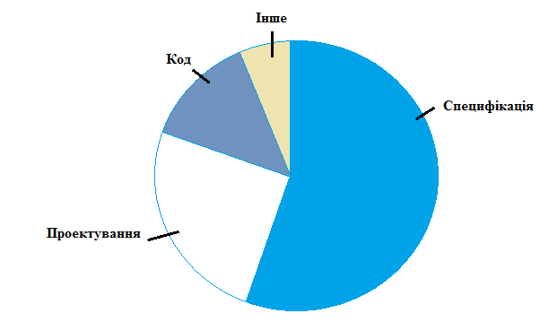

Рисунок 4.4 – Помилки виникають на багатьох етапах розробки, але найбільше — на етапі специфікації

Є кілька причин, які роблять специфікацію основним «постачальником» помилок. Інколи її просто не існує, інколи — вона неповна, або занадто часто змінюється. Написання та аналіз специфікацій необхідна та найголовніша частина циклу розробки програмного забезпечення. Якщо цей етап пропущено чи здійснено некоректно, помилки будуть виникати.


<!-- ВІДНОВЛЕНО ЛОКАЛЬНО (Стор. 95) -->
Наступним джерелом виникнення помилок є проектування. Неправильно розроблена архітектура програмного забезпечення через поспіх, непродуманість, відсутність досвіду, непослідовність та інше. може мати величезні наслідки. 

Помилки в коді виникають через складність програмного забезпечення, бідність документації, високу щільність графіка або випадково. Важливо відзначити, що у більшості випадків помилки, які виникли на поверхні, указують на проблеми специфікації та проектування. 

Остання категорія містить у собі все, що залишилось. Деякі помилки можуть виявлятися помилками, що з якихось причин були прийняті за них, але ними не були. Можуть бути повторювані помилки, скопійовані із одного джерела. Деякі помилки зазвичай становлять настільки малий відсоток від інших, що не варто особливо хвилюватися з цього приводу. 

# **4.8. Ціна помилок** 

Програмне забезпечення не виникає миттєво – в його основі лежать планування й методики процесу розробки. Починаючи з виникнення ідеї, далі в процесі планування, програмування й тестування та закінчуючи використанням цього програмного забезпечення користувачами, потенційно можуть бути знайдені помилки. 

На рисунку 4.8 проілюстровано скільки коштує виправити помилку, знайдену на різних етапах. 

Ціна логарифмічна – тому із часом вона зростає десятикратно. Помилка, виправлена на самому початку, тобто на етапі специфікації, нічого не коштує, або 10 центів, як у прикладі. Та ж помилка, не знайдена до написання коду й тестування програмного забезпечення, може коштувати від $1  до $10. А якщо її знайдуть користувачі, то вартість виправлення легко перевищить $100. 

95
<!-- КІНЕЦЬ ВІДНОВЛЕННЯ -->


<!-- ВІДНОВЛЕНО ЛОКАЛЬНО (Стор. 96) -->
Рисунок 4.8 – Ціна виправлення помилки 

Наглядним прикладом є випадок з компанією Дісней, а саме її грою «Король Лев». 

Восени 1994 року, компанія Дісней реалізувала на компакт-диску свою першу мультимедійну гру для дітей «Король Лев, анімована збірка розповідей». Не дивлячись на те, що багато інших компаній займалися продажем дитячих програм роками, це була перша розробка Діснея, що поступала на ринок, тому вона була відмінно представлена і розрекламована. Продажі були величезні – це була «гра, яку варто купити для дітей на свята». Проте те, що трапилося пізніше, було колосальним розгромом. 26 грудня, тобто на наступний день після Різдва, телефони підтримки покупців Діснея захлинулися від дзвінків розлючених батьків з дітьми, які не могли змусити програму працювати. 

Виявилось, що Дісней не протестував належним чином свою програму на різних версіях персональних комп’ютерів, представлених на ринку. Програма працювала всього в декількох системах – подібних тій, яку розробники Діснея 

96
<!-- КІНЕЦЬ ВІДНОВЛЕННЯ -->


<!-- ВІДНОВЛЕНО ЛОКАЛЬНО (Стор. 97) -->
використовували для створення гри, – але не в найбільш поширених, які були у більшості покупців. 

Якби на етапі аналізу вимог було досліджено, які персональні комп’ютери користуються попитом, та вписано в специфікацію, що гра повинна розроблятися і тестуватися на їх конфігурації, помилки б не виникло. Якщо це не було зроблено на етапі специфікації, тестери мусили б зібрати всі популярні моделі персональних комп’ютерів і протестувати на них гру. Тоді вони б знайшли помилку, але вона, безумовно, коштувала б дорожче, тому що програмне забезпечення було б вже написано, налагоджене й протестовано. Команда розроблювачів також могла зробити бета тест і розіслати першу версію програмного забезпечення невеликій кількості користувачів. Ці користувачі, обрані представляти величезний ринок із задоволення знайшли б помилку. Як виявилося, незважаючи ні на що, помилка лишилась непоміченою, а багато тисяч дисків були створені й продані. Компанія Дісней, врешті решт, сплачувала витрати на телефонну підтримку користувачів, повернення продукту, заміну дисків та інше. Отже, можна побачити, як легко втратити весь дохід від розробки, якщо серйозна помилка дійде до користувачів. 

# **4.9. Принципи тестування програмного забезпечення** 

Принципи і правила грають важливу роль у всіх інженерних дисциплінах. Принципи тестування важливі для спеціалістів/інженерів-тестерів, оскільки вони забезпечують основу для надбання знань і навичок в цій сфері. 

Слово «принцип» має декілька значень: 

- загальний або фундаментальний закон, доктрина або допущення; 

- правило або кодекс поведінки; 

- закони або факти, які складають основу роботи штучного пристрою. 

Застосовуючи ці визначення до сфери розробки програмного забезпечення, можна сказати, що її принципи лежать в законах, правилах і доктринах, що 

97
<!-- КІНЕЦЬ ВІДНОВЛЕННЯ -->


<!-- ВІДНОВЛЕНО ЛОКАЛЬНО (Стор. 98) -->
відносяться до систем програмного забезпечення, способів їх  побудови та їх поведінці. У сфері програмного забезпечення до принципів також можуть бути віднесені правила і кодекси поведінки професіоналів, що проектують, розробляють, тестують та управляють системами програмного забезпечення. Тестування, як етап розробки програмного забезпечення, також має особливий набір принципів необхідних для тестера. Вони вказують, як перевіряти системи програмного забезпечення і визначають правила поведінки тестерапрофесіонала. Гленфорд Майерс в своїй книзі «Мистецтво тестування програмного забезпечення» виділив список обов’язкових принципів. Вони описані нижче. Принципи, що представлені в таблиці 4.1 праворуч, взяті з оригінального списку Майерса. Ліворуч представлені видозмінені правила відповідно до еволюції тестування від мистецтва до одного з процесів інженерної дисципліни, що безпосередньо відноситься до якості. Треба зауважити, що описані нижче принципи відносяться лише до тестування, заснованого на виконанні програмного забезпечення. Принципи, які відносяться до переглядів, сертифікації, доказу коректності в рамках тесту не розглядаються. Більшість з приведених принципів може здаватися очевидною, тим не менше, часто про них забувають. 

Таблиця 4.1 

Принципи тестування ПЗ 

|**Нові принципи**|**Оригінальні принципи**|
|---|---|
|Принцип 1: Тестування – це процес<br>випробування програм за допомогою<br>вибраного набору варіантів тесту з<br>метою: 1) виявити помилки; 2) оцінити<br>якість.|Принцип<br>1:<br>Необхідна<br>складова<br>контрольного прикладу – визначення<br>очікуваного результату та вихідних<br>даних|
|Принцип 2: Якщо мета тесту –<br>визначити помилки, то якісний варіант<br>тесту той, що найімовірніше виявить<br>незнайдену досі помилку|Принцип 2: Програмісту слід уникати<br>спроб<br>тестувати<br>свою<br>власну<br>програму.|


98
<!-- КІНЕЦЬ ВІДНОВЛЕННЯ -->


<!-- ВІДНОВЛЕНО ЧЕРЕЗ GEMINI (Стор. 99) -->
| 1 | 2 |
| :--- | :--- |
| Принцип 3: Результати тесту повинні бути ретельно перевірені | Принцип 3: Компанія, яка займається розробкою коду, не слід тестувати свої власні програми |
| Принцип 4: Контрольний приклад повинен містити очікуваний результат та вихідні дані | Принцип 4: Треба ретельно досліджувати результати кожного тесту |
| Принцип 5: Тести повинні розроблятися як для коректних вхідних даних, так і для некоректних. | Принцип 5: Тести повинні писатися як для некоректних і неочікуваних вхідних даних, так і для коректних і очікуваних |
| Принцип 6: Існування більшого числа помилок пропорційне кількості знайдених помилок в компоненті. | Принцип 6: Дослідження програми на правильність функціонування — лише половина роботи. Друга половина — виявити зайву функціональність програми. |
| Принцип 7: Тестування повинне проводитися групою людей, незалежною від розробників | Принцип 7: Краще уникати одноразових варіантів тестів, якщо сама програма не одноразового використання. |
| Принцип 8: Тести повинні передбачати багаторазове виконання. | Принцип 8: Не слід планувати тестування негласно вважаючи, що помилок немає. |
| Принцип 9: Тестування слід планувати | Принцип 9: Існування більшого числа дефектів пропорційно кількості знайдених дефектів в компоненті. |
| Принцип 10: Слід включати процес тестування в життєвий цикл ПЗ | Принцип 10: Тестування, це завдання, що вимагає творчості та розумової праці. |
| Принцип 11: Тестування, це завдання, що вимагає творчості та розумової праці. | |

Проаналізуємо наведені принципи:

Принцип 1. в оригіналі принцип 6.

Цей очевидний принцип — одна з помилок, що найбільш часто зустрічається в тестуванні. Знову таки, це наслідок людської психології. Якщо очікуваний
<!-- КІНЕЦЬ ВІДНОВЛЕННЯ -->


<!-- ВІДНОВЛЕНО ЛОКАЛЬНО (Стор. 100) -->
результат варіанту тесту не представлений, існує імовірність, що правдоподібний, проте некоректний результат вважатимуть правильним через принцип «очі бачать те, що хочуть». Іншими словами, незважаючи на чітке визначення тестування, підсвідомо тестер бажає побачити правильний результат. Один із способів боротьби з цим – уважно перевіряти вихідні дані, заздалегідь точно сформулювавши очікуваний результат. Таким чином, варіант тесту повинен складатися з двох частин: 

- опис вхідних даних програми; 

- точний опис правильних вихідних даних при зазначених вхідних. 

Розробники програмного забезпечення набули значних навичок в запобіганні та знищенні дефектів та помилок. Тим не менш останні трапляються і негативно впливають на якість програм. Для виявлення наявності дефектів до того, як програма буде випущена на ринок, необхідні тестери. Цей принцип підтверджує той факт, що тестування засноване на виконанні програми. Це і визначає відмінність тестування від відлагодження, метою якого є знаходження місця дефекту і його усунення. 

Тестування може бути розглянуте як «динамічний процес виконання програми із цінними вхідними даними». Такий підхід, разом із визначенням тестування, наданим вище, припускає, що тестування не лише виявляє дефекти, але і використовується для оцінки якості програмного забезпечення. У такому разі тестер виконує програму, використовуючи контрольні приклади, для оцінки таких характеристик, як надійність, зручність використання, рівень продуктивності та інші. Результати тесту дозволяють порівняти поточну якість з рівнем, описаним з документації. Неможливість досягти необхідної якості або будь-які відхилення обов’язково повинні бути розглянуті. 

Принцип 2 в оригіналі принцип 8. 

Принцип 2 підтримує акуратну розробку тесту та задає критерії оцінки контрольного прикладу і ефективності тесту в тих випадках, коли мета – 

100
<!-- КІНЕЦЬ ВІДНОВЛЕННЯ -->


<!-- ВІДНОВЛЕНО ЛОКАЛЬНО (Стор. 101) -->
виявлення дефектів. Тестеру потрібно визначити ціль кожного контрольного прикладу, тобто виділити тип шуканого дефекту. Таким чином, тестер виконує перевірки аналогічно вченому, який проводить експеримент. У вченого існує гіпотеза, яку він повинен підтвердити або спростувати експериментальним шляхом. У тестера гіпотеза пов’язана  з можливою наявністю конкретних типів дефекту. Мета тесту – довести/спростувати тезу, тобто визначити наявність/відсутність  конкретного дефекту. На основі тези обираються вхідні і визначаються правильні вихідні дані тесту, після чого він проводиться. Результати аналізуються для доказу/спростування тези. Потрібно розуміти, що на процес тестування витрачається багато ресурсів, включаючи ресурси для розробки контрольних прикладів, їх виконання, запису і аналізу результатів. За допомогою ретельної розробки тесту відповідно до принципу 2 тестер може добитись мінімальної втрати ресурсів. 

Принцип 3 в оригіналі принцип 4. 

Тестеру необхідно ретельно досліджувати й аналізувати результати тесту. Інакше можливі несприятливі наслідки. Наприклад: 

- Може бути пропущено критичну помилку, при цьому тест вважатиметься пройденим, хоча програма його провалила. Тестування може продовжитися з урахуванням неправильного результату і, навіть якщо дефект буде виявлено на пізнішій стадії тесту, його усунення виявиться важчим та більш ресурсоємним. 

- Виникне припущення про критичну помилку, якої не існує. У такому разі тест вважатиметься проваленим. Значну кількість часу  і ресурсів буде витрачено на виявлення неіснуючого дефекту. І лише повторна перевірка покаже, що помилки не було. 

- Вихідні дані тесту на якість будуть інтерпретовані невірно, що може призвести до непотрібної переробки або пропуску критичної помилки. 

Отже, без відповідної уваги до результатів процес тестування вимагатиме більше фінансових та часових ресурсів. 

101
<!-- КІНЕЦЬ ВІДНОВЛЕННЯ -->


<!-- ВІДНОВЛЕНО ЛОКАЛЬНО (Стор. 102) -->
Принцип  4 в оригіналі принцип 1. 

Зазвичай зрозуміло, що вхідні дані – це складова частина контрольного прикладу. Проте, доки відсутній докладний опис очікуваних вхідних даних або результатів, наприклад, значення конкретної змінної або підсвічування потрібної кнопки на панелі, контрольний приклад не може вважатися повноцінним. Очікувані вихідні дані дозволяють тестеру визначити: 

- 1) чи виявлено дефект; 

- 2) чи пройдено/провалено тест. 

Дуже важливо чітко описувати вихідні дані, щоб не витрачати час на уточнення дрібниць. Визначення конкретних вхідних і вихідних даних повинно бути частиною процесу розробки тесту. В разі тестування на оцінку якості, має сенс описати цільовий рівень якості кількісними даними в спеціальному документів з вимогами. Це дасть тестерам змогу порівнювати поточну якість програми з тим рівнем, що вимагається. 

Принцип 5 в оригіналі принцип 5. 

Тестер не повинен вважати, що програма на тесті повинна забезпечуватися лише коректними вхідними даними. З деяких причин це не так. Наприклад, користувачі можуть не бути обізнані про те, які дані можна вводити. До того ж, вони часто роблять друкарські помилки навіть за наявності повних/коректних вхідних даних. Некоректні вхідні дані також можуть бути наслідком несправності програмного забезпечення чи системи в цілому. Використання контрольних прикладів із некоректними вхідними даними корисно для виявлення дефектів, оскільки у такому разі виконується нестандартним способом і примушує програму поводитись несподівано. Некоректні вхідні дані також допомагають розробникам і тестерам оцінити надійність програми, її здатність відновлюватися (у разі помилкового введення). 

Зауважимо, що представлена пара принципів підтверджує необхідність залучення до тестування незалежної групи тестерів, яка згадується в принципі 7, 

102
<!-- КІНЕЦЬ ВІДНОВЛЕННЯ -->


<!-- ВІДНОВЛЕНО ЛОКАЛЬНО (Стор. 103) -->
бо розробник програмного компоненту може бути схильний вибирати лише коректні вхідні дані для демонстрації працездатності програми. Незалежний тестер схильний обирати також і некоректні вхідні дані. 

Принцип 6 в оригіналі принцип 9. 

Принцип стверджує, що чим більше дефектів вже знайдено в компоненті, тим імовірніше виявлення додаткових дефектів при подальшому тестуванні. Наприклад, якщо тестери знайшли 20 дефектів в компоненті А і 3 в компоненті В, імовірність існування додаткових дефектів в А більше, ніж у В. Дефекти часто виявляються в класах і в неякісно написаному коді з високим рівнем складності. За наявності таких компонентів розробники і тестери повинні вирішити, чи кинути поточну версію і переробити її або виділяти більше ресурсів на тестування доки компонент не відповідатиме вимогам якості. Такі випадки критичні для важливих компонентів, наприклад тих, що відповідають за безпеку. Принцип 7 в оригіналі принципи 2 та 3. 

Кожен письменник знає або повинен знати, що намагатися виправляти або коректувати власну роботу, погана ідея. Ви пам’ятаєте, що мали на увазі в тій або іншій частині і можете не помітити, що вона містить ще щось. І вже точно ви не хочете шукати в своїй роботі помилки. Цей підхід стосується і авторів програм. 

Більш того, тестування має на меті іншу задачу ніж написання коду – в його основі лежить «деструктивний» підхід: треба довести, що програма не працює. А програмісту, який написав програму, дуже складно переключитися на її випробування, що носять «руйнівний» характер. 

Багато господарів знають, що видалення шпалер зі стін (руйнівний процес) – нелегка справа, яка перетворюється на муку, якщо шпалери були поклеєні власноруч. Аналогічно, більшість програмістів не в змозі ефективно тестувати власні програми, оскільки вони не можуть зосередитися на спробах знайти помилки. До того ж, програміст може підсвідомо уникати знаходження помилок 

103
<!-- КІНЕЦЬ ВІДНОВЛЕННЯ -->


<!-- ВІДНОВЛЕНО ЛОКАЛЬНО (Стор. 104) -->
через страх перед покаранням з боку керівництва, клієнта або власника програми, що розробляється. Додатково з цими психологічними перешкодами існує і ще одна значна проблема: програма може містити помилки через нерозуміння програмістом постановки задачі або специфікацій. В такому разі нерозуміння, ймовірно, пошириться і на тести. Це не означає, що програмісту заборонено тестувати свою програму. Проте процес буде ефективнішим і успішнішим, якщо ним займеться стороння людина. 

Зауважимо, що ці аргументи не стосуються відлагодження (виправленню відомих помилок); її ефективніше проводити програмісту – автору, бо розбиратися в чужому коді значно складніше. 

Потреба організації в незалежній групі, що тестує, може бути задоволена декількома способами. Група, що тестує, може бути виділена в повністю самостійний відділ організації. Альтернативою цьому може стати група тестерів з групи забезпечення якості програмного забезпечення або група розробників, що спеціалізується на тестуванні, але в останньому випадку вона повинна бути максимально об’єктивною. Первинні обов’язки члена будь-якої з цих груп – тестування, а не розробка. 

Нарешті, незалежність групи, що тестує, не має на увазі ворожих відносин з програмістами. Тестерам не варто грати в «квача» з розробниками. Вони повинні співпрацювати, щоб забезпечити покупцю продукт найвищої якості. 

Для того, щоб мати змогу перейти від ручного тестування до автоматичного була сформульована наступна пара принципів. 

Принцип 8 в оригіналі принцип 7. 

Представлений вище принцип 2 закликав тестера розглядати свою роботу, як роботу ученого-експериментатора. Принцип 8 вимагає точного запису умов тесту, всіх важливих подій, що виникли під час тесту, і уважного аналізу результату. Ця інформація безцінна для розробників при поверненні коду на відлагодження, бо вона дає змогу відтворити умови тесту. Також вона корисна 

104
<!-- КІНЕЦЬ ВІДНОВЛЕННЯ -->


<!-- ВІДНОВЛЕНО ЛОКАЛЬНО (Стор. 105) -->
для повторних тестів після виправлення дефекту. Багаторазове виконання тесту відбувається і при регресивному тестуванні (повторне тестування зміненої програми) нових версій програмного забезпечення. Вчені знають, що їх експерименти повторюватимуть інші люди, це повинні знати і тестери. 

Принцип 9. 

План треба розробляти для кожного етапу тестування, а мета повинна бути описана у відповідній його частині. Вона має бути задана настільки чітко, наскільки це можливо. Плани з описаною в них метою необхідні для адекватного розподілу часу і ресурсів на тести, а також для спостереження і управління процесом тестування. Планування тесту повинно бути внесено в життєвий цикл програми (принцип10) і скоординовано із плануванням проекту. Тестери не зможуть працювати над компонентом в заздалегідь обумовлений день, якщо розробники на той час не доробили. Тому повинні бути обумовлені ризики тестування. Наприклад, імовірність затримки надання програмних компонентів, наявність компонентів складних для тесту, потреба в додатковому навчанні використанню нових інструментів. Шаблон плану тесту повинен бути доступний керівнику для грамотної розробки плану відповідно до політики і стандартів організації. Уважне планування тестів включає некорисні одноразові тести та неефективні, незаплановані цикли «тест-виправлення –повторний тест», які часто затримують терміни виходу програми. 

Принцип 10. 

Якщо розпочинати тестування лише після того як програмний код вже повністю написано, то з точки зору часових та фінансових витрат, воно буде достатньо ефективним. Планування процесу тестування, як стверджує принцип 10, повинно бути включено в життєвий цикл програми, починаючи з етапу аналізу вимог і проводитися надалі, паралельно розробці. Додатково до планування, можна проводити різні тести на ранніх етапах, використовуючи прототипи, наприклад, перевірки на зручність використання. Ці процеси можуть 

105
<!-- КІНЕЦЬ ВІДНОВЛЕННЯ -->


тривати до самого випуску програми. Можливо використання різних моделей впровадження тестування в життєвий цикл програмного забезпечення.

Останній принцип є узагальненим і відображає підхід до роботи тестера.

Принцип 11 (10).

Труднощі роботи тестера, якщо їх деталізувати, полягають у наступному:
- тестеру необхідно мати вичерпні знання в області програмної інженерії;
- тестеру необхідно мати досвід і системні знання в області специфіки, проектування і розробки програмного забезпечення;
- тестер повинен справлятися з багатьма дрібними задачами;
- тестер повинен розбиратися у видах помилок і знати, де вони найчастіше можуть зустрічатися;
- тестер повинен міркувати як вчений, висловлюючи припущення про наявність конкретних типів дефектів;
- тестер повинен орієнтуватися в характеристиках для тестованого програмного забезпечення, дефектах. Це можливо при якісній освіті і досвіді тестування;
- тестер повинен створювати і документувати контрольні приклади. Для розробки тестів необхідно вибирати вхідні дані з дуже широкого спектру. Вибрані дані повинні з найбільшою імовірністю виявити дефект (принцип 2). Необхідні обізнаність в цій області;
- тестер повинен розробляти і зберігати процедури тесту для його виконання;
- тестер повинен планувати оптимальну витрату ресурсів;
- тестер повинен проводити всі випробування і протоколювати результати;
- тестер повинен аналізувати результати і вирішувати, вважати тест успішним чи ні. Це вимагає розуміння та відстеження величезної кількості детальної інформації. Тестеру також потрібно збирати і аналізувати пов'язані з тестами вимірювання;

- тестер повинен вчитися використовувати різні інструменти тестування, включаючи новітні розробки;
- тестеру необхідно співпрацювати з інженерами, дизайнерами і розробниками. Також слід підтримувати контакт із клієнтами і користувачами;
- тестер повинен підтримувати свої знання на високому рівні, регулярно підвищуючи свою кваліфікацію.

Використані у розділі літературні джерела – [58-69].


## Контрольні запитання

1. Як визначаються вимоги за IEEE Standard Glossary of Software Engineering Terminology?
2. Що таке бізнес-вимоги?
3. Що описують вимоги користувачів?
4. Що визначають функціональні вимоги?
5. Де документуються функціональні вимоги?
6. Охарактеризуйте системні вимоги.
7. Що включають в себе бізнес-правила?
8. Що таке не функціональні вимоги? Наведіть приклади.
9. Дайте визначення «характеристика продукту».
10. На якій стадії життєвого циклу програмного забезпечення виявляється найбільша кількість помилок?
11. Наведіть приклади дефектів, які часто зустрічаються у документації.
12. Охарактеризуйте ціль та перспективи тестування документації.
13. Хто автор матеріалів «Requirements in the real world»?
14. Якими характеристиками повинні володіти хороші вимоги?
15. Якими характеристиками повинні володіти специфікації вимог?

16. Який значок потрібно використовувати як прапорець на полях навпроти вимоги, якщо даних про неї бракує?
17. Перерахуйте техніки для тестування документації.
18. Назвіть методи тестування, що відносяться до review вимог.
19. Які нотації зручно використовувати при графічному представленні тестування документації?
20. Що таке аксіоми тестування?
21. Яким професором та у якому році була висунута аксіома тестування «Тестування не може показати, що помилок немає»?
22. Яку аксіому тестування в 1990 році Б.Бейзер описав у своїй книзі «Техніки тестування програмного забезпечення»?
23. Які причини правдивості аксіоми тестування «Не всі знайдені помилки будуть виправлені»?
24. Які дії потрібно робити тестеру аби аксіома тестування «Тестери програмного забезпечення не самі популярні члени команди розробників» ніколи не справджувалась?
25. Чому виникають помилки у програмному забезпеченні?
26. Яка може бути ціна помилки?
27. Хто написав книгу «Мистецтво тестування програмного забезпечення» та є першочерговим автором принципів тестування?
28. Скільки є оригінальних та змінених принципів тестування?
29. Коротко охарактеризуйте принципи тестування програмного забезпечення.

## 5.1. Agile development

*Agile Manifesto*

Ми постійно відкриваємо для себе досконаліші методи розробки програмного забезпечення, займаючись розробкою безпосередньо та допомагаючи у цьому іншим. Завдяки цій роботі ми змогли зрозуміти, що:

**Люди та співпраця** важливіші за процеси та інструменти

**Працюючий продукт** важливіший за вичерпну документацію

**Співпраця із замовником** важливіша за обговорення умов контракту

**Готовність до змін** важливіша за дотримання плану

Тобто, хоча, цінності, що справа важливі, ми все ж цінуємо більше те, що зліва.

*Основні принципи Agile-маніфесту*

1. Найвищим пріоритетом для нас є задоволення потреб замовника, шляхом завчасного та регулярного постачання програмного забезпечення.
2. Схвальне ставлення до змін, навіть на заключних стадіях розробки. Agile-процеси надають можливість використовувати зміни задля забезпечення конкурентоспроможності замовника.
3. Працюючий продукт слід випускати якомога частіше, з періодичністю від пари тижнів до пари місяців.
4. Впродовж усього проекту розробники і представники бізнесу повинні працювати разом щодня.
5. Над проектом повинні працювати вмотивовані професіонали. Щоб робота була виконана, створіть їм умови, надайте підтримку і повністю на них покладіться.

6. Особиста комунікація — найефективніший та найпрактичніший метод як донести інформацію до команди, так і поширити її всередині.

7. Працюючий продукт — головний показник прогресу.

8. Інвестори, розробники і користувачі повинні мати можливість підтримувати постійний ритм як завгодно довго. Agile допомагає налагодити такий сталий процес розробки.

9. Постійна увага до технічної досконалості і якості проєктування підвищує гнучкість проєкту.

10. Простота — мистецтво мінімізації зайвої роботи — вкрай необхідна.

11. Найкращі вимоги, архітектурні та технічні рішення виникають у командах, що здатні самоорганізовуватись.

12. Команда регулярно намагається знайти способи підвищення ефективності та відповідно корегує свою роботу.

## 5.2. Scrum

Scrum (Скрам) - це не абревіатура, термін взятий із регбі, який означає сутичку навколо м'яча. Сам термін можна визначити як методологію управління проєктами, яка побудована на принципах тайм-менеджменту.

Scrum є однією з найбільш популярних «методологій» розробки програмного забезпечення. Згідно із визначенням, скрам - це каркас розробки, із використанням якого люди можуть вирішувати проблеми по мірі надходження, при цьому продуктивно і виробляючи продукти найвищої значущості.

У класичному скрам існує 3 базові ролі:

- Product Owner;
- Scrum Master;
- Команда розробки (Development Team).

**Product Owner (PO)** є сполучною ланкою між командою розробки та замовником. Завдання PO — максимальне збільшення цінності продукту, що

розробляється і роботи команди. Одним з основних *інструментів* PO є Product Backlog. Product Backlog містить необхідні для виконання робочі завдання (такі як Story, Bug, Task тощо), відсортовані у порядку пріоритету (терміновості).

**Scrum Master (SM)** є «службовим лідером» (англ. Servant-leader). Завдання Scrum Master - допомогти команді максимізувати її ефективність за допомогою усунення перешкод, допомоги, навчання та мотивації команди, а також допомоги PO.

**Команда розробки (Development Team, DT)** складається з фахівців, які роблять безпосередню роботу над продуктом. Згідно The Scrum Guide (документу, що є офіційним описом Scrum від його авторів), DT повинна володіти такими якостями і характеристиками:

- бути самоорганізованою. Ніхто (включаючи SM і PO) не може вказувати команді яким чином перетворити Product Backlog в працюючий продукт;
- бути багатофункціональними, володіти усіма необхідними навичками для випуску працюючого продукту;
- за виконувану роботу відповідає вся команда, а не її індивідуальні члени.

Рекомендований розмір команди - 7 (плюс-мінус 2) людини. Згідно ідеологам скрам, команди більшого розміру вимагають занадто великих ресурсів на комунікації, в той час як команди меншого розміру підвищують ризики (за рахунок можливої відсутності необхідних навичок) і зменшують розмір роботи, який команда може виконати в одиницю часу.

### 5.2.1. Процес Scrum

Основою скрам є Sprint, протягом якого виконується робота над продуктом. По закінченню Sprint повинна бути отримана нова робоча версія продукту. Sprint завжди обмежений в часі (1-4 тижні) і має однакову тривалість протягом всього життя продукту.

Перед початком кожного Sprint складається Sprint Planning, на якому проводиться оцінка вмісту Product Backlog і формування Sprint Backlog, який містить завдання (Story, Bugs, Tasks), які повинні бути виконані у поточному спринті. Кожен спринт повинен мати *мету*, яка є мотивуючим фактором і досягається за допомогою виконання завдань з Sprint Backlog.

Кожного дня проводиться Daily Scrum, на якому кожний член команди відповідає на запитання «Що я зробив учора?», «Що я планую зробити сьогодні?», «Які перешкоди під час роботи я зустрів?». Завдання Daily Scrum – визначення статусу і прогресу роботи над Sprint, раннє виявлення перешкод, що виникли, вироблення рішень щодо зміни стратегії, необхідних для досягнення цілей Sprint'a.

На рисунку 5.1. представлена діаграма згорання задач (Burndown Chart).


Рисунок 5.1 – Діаграма згорання задач

Діаграма, яка ілюструє кількість зробленої роботи та роботи, яка ще залишилась. Оновлюється щоденно для того, щоб у простій формі показати просування в роботі над спринтом. Графік повинен бути загальнодоступним.

Існують різні види діаграми:

- діаграма згорання робіт для спринта – показує, скільки вже задач зроблено і скільки ще залишається зробити в поточному спринті;
- діаграма згорання роботі для випуску проекту – показує, скільки вже задач зроблено і скільки ще залишається зробити до випуску продукту (зазвичай будується на базі декількох спринтів).

По завершенню Sprint'а складається Sprint Review і Sprint Retrospective, завдання яких оцінити ефективність (продуктивність) команди в минулому Sprint'і, спрогнозувати очікувану ефективність (продуктивність) в наступному спринті, виявити наявні проблеми, оцінити ймовірності завершення всіх необхідних робіт по продукту і інше .

### 5.2.2. Особливості Scrum

Особливості Scrum, які варто пам'ятати і на які часто скаржаться:

1. *Скрам застосовується невірно або не повністю.*

Згідно авторам Scrum, емпіричний досвід є головним джерелом достовірної інформації. Необхідність повного і точного виконання скрам вказана в The Scrum Guide і обумовлена нетиповою організацією процесу, відсутністю формального лідера і керівника.

2. *Недооцінена важливість роботи по забезпеченню мотивації команди.*

Одним з основних принципів Scrum є самоорганізовані, багатофункціональні команди. Згідно з дослідженнями соціологів, чисельність самовмотивованих співробітників, здатних на самоорганізацію не перевищує 15% від працездатного населення.

Таким чином, лише невелика частина співробітників здатна ефективно працювати в Scrum без істотних змін в ролях Scrum Master і Product Owner, що суперечить ідеології Scrum, і потенційно призводить до невірного або неповного використання Scrum.

3. *Scrum застосовується для продукту, вимоги до якого суперечать ідеології Scrum*.

Scrum відноситься до сімейства Agile, так Scrum вітає зміни у вимогах в будь-який момент (Product backlog може бути змінений в будь-який момент). Це ускладнює використання Scrum в fixed-cost/fixed-time проектах. Ідеологія Scrum стверджує, що заздалегідь неможливо передбачити усі зміни, таким чином немає сенсу завчасно планувати увесь проект, обмежившись лише just-in-time плануванням, тобто планувати тільки ту роботу, яка повинна бути виконана в поточному Sprint.

### 5.2.3. Переваги і недоліки Scrum

**Переваги:**

1. Скрам орієнтований на клієнта, адаптивний, дає клієнтові можливість робити зміни у вимогах у будь-який момент часу (але не гарантує того, що ці зміни будуть виконані). Можливість зміни вимог приваблива для багатьох замовників програмного забезпечення.

2. Scrum досить простий у вивченні, дозволяє економити час, за рахунок усунення не критичних активностей. Scrum дозволяє отримати потенційно робочий продукт в кінці кожного Sprint'y.

3. Скрам робить акцент на самоорганізованій, багатофункціональній команді, здатній вирішити необхідні завдання з мінімальною координацією. Це особливо привабливо для малих компаній і стартапів, оскільки позбавляє від необхідності наймати або навчати спеціалізованого персоналу керівників.

**Недоліки:**

1. Скрам відноситься до сімейства Agile, в Scrum не прийнято, наприклад, створення плану комунікацій та реагування на ризики. Таким чином, роблячи складною або неможливою формальну (юридична або адміністративна) протидію порушенням правил Scrum.

2. Іншою слабкою особливістю скрам є акцент на самоорганізовану, багатофункціональну команду. При, так би мовити зниженні витрат на координацію команди, це призводить до підвищення витрат на відбір персоналу, його мотивацію, навчання. При певних умовах ринку праці, формування повноцінної, ефективної Scrum команди може бути неможливим.

## 5.3. Kanban

Цей термін прийшов з Японії завдяки широко відомої у вузьких колах виробничої системи Тойота. Хотілося б, щоб якомога більше людей прочитало про цю систему і основні її принципи - бережливе виробництво, постійний розвиток, орієнтацію на клієнта і т.д. Всі ці принципи описані в книзі Тайіті Оно «Виробнича система Тойоти».

Термін **Канбан** має дослівний переклад: "Кан" означає видимий, візуальний, і "бан" означає картка або дошка.

На заводах Тойота картки Канбан використовуються повсюди для того, щоб не захаращувати склади і робочі місця заздалегідь створеними запчастинами. Наприклад, уявіть, що ви ставите двері на Тойоти Королли. У вас біля робочого місця знаходиться пачка з 10 дверей. Ви їх ставите одну за одною на нові машини і, коли в пачці залишається 5 дверей, то ви знаєте, що пора замовити нові двері. Ви берете картку Канбан, пишете на ній замовлення на 10 дверей і відносите її тому, хто робить двері. Ви знаєте, що він їх зробить якраз до того моменту, як у вас закінчаться решта 5 дверей. І саме так і відбувається – коли ви ставите останні двері, прибуває пачка з 10 нових дверей. І так постійно – ви замовляєте нові двері тільки тоді, коли вони вам потрібні.

А тепер уявіть, що така система діє на всьому заводі. Ніде немає складів, де запчастини лежать тижнями і місяцями. Всі працюють тільки за запитом і виробляють саме стільки запчастин, скільки запрошено. Якщо раптом замовлень стало більше або менше – система сама легко підлаштовується під зміни.

Основне завдання карт Канбан в цій системі - це зменшувати кількість «роботи, яка виконується в даний момент» (work in progress).

Наприклад, на всю виробничу лінію може бути виділено рівно 10 карток для дверей. Це означає, що в кожен момент часу на лінії не буде більше 10 готових дверей. Коли замовляти нові двері і скільки — це завдання для того, хто їх встановлює. Тільки він знає свої потреби, і тільки він може розміщувати замовлення виробнику дверей, але він завжди обмежений числом 10.

Цей метод Бережливого виробництва (Lean manufacturing) був придуманий в Тойоті і зараз багато виробничих компаній по всьому світу його впроваджують або вже впровадили.

***Відмінності між Канбан і SCRUM:***

- у Канбан немає таймбоксів ні на що (ні на завдання, ні на спринти);
- у Канбан завдання більше і їх менше;
- у Канбан оцінки термінів на завдання опційні або взагалі їх немає;
- у Канбан «швидкість роботи команди» відсутня і вважається тільки середній час на повну реалізацію завдання.

Канбан розробка відрізняється від SCRUM в першу чергу орієнтацією на завдання. Якщо в SCRUM основна орієнтація команди - це успішне виконання спринтів (треба визнати, що це так), то в Канбан на першому місці завдання.

Спринтів ніяких немає, команда працює над завданням з самого початку і до завершення. Деплоймент завдання робиться тоді, коли воно готове. Презентація виконаної роботи - теж. Команда не повинна оцінювати час на виконання завдання, бо це має мало сенсу і майже завжди помилково спочатку.

Якщо менеджер вірить команді, то навіщо мати оцінку часу? Завдання менеджера - це створити пріоритетувати пул завдань, а завдання команди - виконати якомога більше завдань з цього пулу. Усе. Ніякого контролю не потрібно. Все, що потрібно від менеджера, — це додавати завдання в цей пул або міняти їм пріоритет. Саме так він керує проектом.

Команда для роботи використовує Канбан-дошку. Наприклад, вона може виглядати так (див. рис.5.2).


Рисунок 5.2. – Приклад Канбан-дошки

Стовпці зліва направо:

**Цілі проекту:**
Необов'язковий, але корисний стовпець. Сюди можна помістити високорівневі цілі проекту, щоб команда їх бачила і все про них знала. Наприклад, «Збільшити швидкість роботи на 20%» або «Додати підтримку Linux».

**Черга завдань:**
Тут зберігаються завдання, які готові до того, щоб почати їх виконувати. Завжди для виконання береться верхня, пріоритетна задача і її картка переміщується в наступний стовпець.

**Опрацювання дизайну:** *(цей і інші стовпці до «Закінчено» можуть змінюватися, тому що саме команда вирішує, які кроки проходить завдання до стану «Закінчено»)*

Наприклад, в цьому стовпці можуть перебувати завдання, для яких дизайн коду або інтерфейсу ще не зрозумілий і обговорюється. Коли обговорення закінчені, завдання пересувається в наступний стовпець.

**Розробка:**

Тут завдання висить до тих пір, доки розробка фічі не завершена. Після завершення воно пересувається в наступний стовпець.

Або, якщо архітектура не вірна або не точна - завдання можна повернути в попередній стовпець.

**Тестування:**

У цьому стовпці завдання знаходиться, доки воно тестується. Якщо знайдені помилки - повертається в Розробку. Якщо немає - пересувається далі.

**Деплоймент:**

У всіх проєктів свій деплоймент. У когось це значить викласти нову версію продукту на сервер, а у когось - просто закомітити код в репозиторій.

**Завершено:**

Сюди завдання попадає тільки тоді, коли всі роботи по задачі завершені повністю.

В будь-якій роботі трапляються **термінові** завдання. Заплановані чи ні, але такі, які треба зробити прямо зараз. Для таких можна виділити спеціальне місце (на зображенні відзначено, як «Expedite»). У Expedite можна помістити одне термінове завдання і команда повинна почати його виконувати негайно і завершити якомога швидше. Але може бути тільки одна така задача! Якщо з'являється ще одна - вона повинна бути додана в «Чергу завдань».

А тепер найважливіше. Бачите цифри під кожним стовпцем? Це число завдань, які можуть бути одночасно в цих стовпцях. Цифри підбираються

експериментально, але вважається, що вони **повинні залежати від числа розробників в команді.**

Наприклад, якщо ви маєте 8 програмістів в команді, то в рядок «Розробка» ви можете помістити цифру 4. Це означає, що одночасно програмісти будуть робити не більше 4-х завдань, а значить у них буде багато причин для спілкування і обміну досвідом. Якщо ви поставите туди цифру 2, то 8 програмістів, які займаються двома завданнями, можуть занудьгувати або втрачати занадто багато часу на обговореннях. Якщо поставити 8, то кожен буде займатися своїм завданням і деякі завдання будуть затримуватися на дошці надовго, але ж головне завдання **Канбан** - це зменшення часу проходження завдання від початку до стадії готовності.

Ніхто не дасть точної відповіді, які повинні бути ці ліміти, але спробуйте для початку розділити число розробників на 2 і подивитися, як це працює в вашій команді. Потім ці числа можна підігнати під вашу команду.

Під «розробниками» я розумію не тільки програмістів, але й інших фахівців. Наприклад, для стовпця «Тестування» розробники - це тестери, тому що тестування - це їхній обов'язок.

### Що нового і корисного дає така дошка з лімітами?

По-перше, **зменшення числа паралельно виконуваних завдань сильно зменшує час виконання кожної окремої задачі.** Немає потреби перемикати контекст між завданнями, відстежувати різні сутності, планувати їх і т.д. — робиться тільки те, що потрібно. Немає потреби влаштовувати спринт пленінги та 5% воркшопи, тому що планування вже зроблено в стовпці «Черга завдань», а детальне опрацювання завдання починається тільки тоді, коли завдання починає виконуватися.

По-друге, **одразу видно заминки.** Наприклад, якщо тестери не справляються з тестуванням, то вони дуже скоро заповнять весь свій стовпець і

програмісти, які закінчили нову задачу, вже не зможуть перемістити її в стовпець тестування, тому що він заповнений. Що робити? Тут час згадати, що «ми - команда» і вирішити цю проблему. Наприклад, програмісти можуть допомогти тестерам завершити одну з задач тестування і тільки тоді пересунути нову задачу на місце, що звільнилося. Це дозволить виконати обидва завдання швидше.

По-третє, **можна обчислити час на виконання усередненої задачі**. Ми можемо позначати на картці дату, коли вона потрапила в чергу завдань, потім дату, коли її взяли в роботу і дату, коли її завершили. За цим трьом точкам для хоча б 10 завдань можна вже порахувати середній час очікування в черзі завдань і середній час виконання завдання. А з цих цифр менеджер або Product Owner може вже розраховувати все, що йому завгодно.

Весь Канбан можна описати всього *трьома основними правилами*:

1. Візуалізуйте виробництво
- розділіть роботу на завдання, кожне завдання напишіть на картці і помістіть на стіну або дошку;
- використовуйте названі стовпці, щоб показати положення завдання у виробництві.

2. Обмежуйте WIP (work in progress або роботу, виконувану одночасно) на кожному етапі виробництва.

3. Виміряйте час циклу (середній час на виконання одного завдання) і оптимізуйте постійно процес, щоб зменшити цей час.

## 5.4. Що таке Issue Tracking System?

Баг трекер — рахується різновидом системи управління задачами (task management system).Класичними зразками task management system являються Trello та Google Task Manager.


Дуже важливо щоб сучасний bug tracker tool мав фічу Issue Tracking System (ITS). Не слід плутати Issue з багами! По-суті Issue це питання пов'язані з багами та розробкою. Issue присвоюються різним відповідальним особам, які контролюють їх обробку. У ITS трекається скільки часу вони витрачають, щоб забезпечити відповідність внутрішнім робочим процесам, виконується статистичний аналіз. На вигляд Issue Tracking System і по логіці схожа на Канбан дошку. Issue Tracking System – атрибут Agile.

Отже, Багтрекерів є багато, але найпопулярніші багтрекери, що є у всіх на слуху це **JIRA, Redmine, Bugzilla, Asana, YouTrack** тощо.

### 5.4.1. JIRA

**Jira** – платна програма, яка дозволяє управляти не тільки помилками й тікетами, але також і проектами в цілому. Jira підтримує технології Agile методології. За допомогою інтерактивної дошки можна стежити за процесом переміщення тасків, таким чином регулюючи загальну тенденцію роботи по проекту. Jira розроблена компанією Atlassian Software Systems. Назва системи отримана шляхом усічення слова «Gojira» у відповідь на не менш популярний в минулому баг трекер **Bugzilla** – його оглянемо і про нього ми поговоримо пізніше. Баг трекер Jira використовується у більш аніж 15 000 компаній по всьому світу. Серед її користувачів: Microsoft, BBC, Nokia, Boeing та ін. відомі компанії.

У даної програми надзвичайно широкий функціонал. Як чогось із функціоналу у Jira не вистачає, можна його доставити за рахунок плагінів. Зупинимося на безпосередньому призначенні Jira, як багтрекеру (див. рис. 5.3).

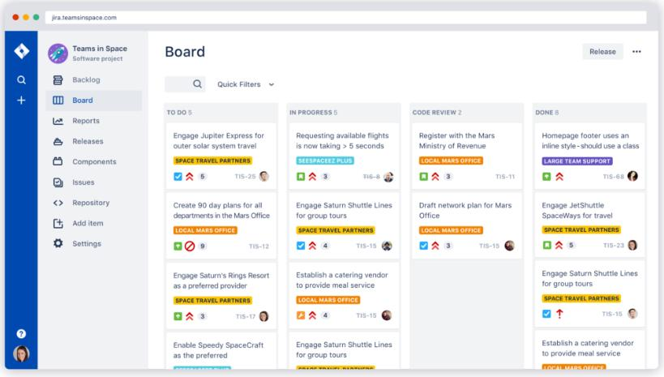

Рисунок 5.3 – Робоча область баг трекера Jira

Jira заповнюється задачами (від англ. tickets або issues) (див. рис. 5.4). Задача містить наступні компоненти:

* назва проекту
* тайл
* тип
* пріоритет
* версії
* компоненти
* підкомпоненти
* статус
* резолюція
* зміст

- додатки (фото, відео, документ)
- коментарі
- саб-таски (якщо є).

Компоненти завдання можуть бути розширені додатковими полями або обмежені налаштуваннями меню програми Jira. Завдання може редагуватися або просто змінювати статус, наприклад, з «відкритий» на «закритий». Які переходи між станами можливі, визначається робочим процесом (бізнес-процесом) (workflow). Загалом за допомогою Jira можна управляти робочим процесом на проєкті, визначати ролі і т.д. Будь-які зміни в задачі записуються у журнал.

Jira має велику кількість можливостей конфігурації: для кожної програми може бути визначений окремий тип задач з власним workflow, набором статусів, одним або декількома видами представлення (англ. screens). Детально фічі за посиланням шматка документації, де розписані усі можливості Jira у якості системи відстеження помилок. Крім того, за допомогою так званих «схем» можна визначити для кожного індивідуального Jira-проєкту власні права доступу, поведінку, видимість полів і багато іншого.


Рисунок 5.4 – Створення завдання в Jira

### 5.4.2. Bugzilla

**Bugzilla** — опенсорсна система відслідковування багів від Mozilla.org. Це безкоштовний bugtracker tool. Bugzilla являється базою даних обліку багів і запитів щодо поліпшення Firefox, Thunderbird, SeaMonkey, Camino та інших проектів mozilla.org.

Скажімо так, Багзілла, хороший баг трекер для початківців. Даний баг трекер найпростіший з усіх перерахованих і володіє найменшим функціоналом, що одночасно і добре, і погано. З одного боку, Bugzilla досить простий, з іншого боку, там є все потрібне для типового проекту. Головне завдання bug tracking systems — виконує на відмінно! Головний мінус Bugzilla — інтерфейс. Він, легко кажучи, так собі не дуже User-Friendly, у порівнянні з конкурентами. Також неможливо регулювати workflow. І багтрекер Bugzilla не вийде використовувати для великих складних проектів, але для навчання, для малих і простих проектів — цілком.

Таск менеджер у даному баг трекері виглядає наступним чином, як це проілюстровано на рисунку 5.5, і з 2015 року він практично не змінився.

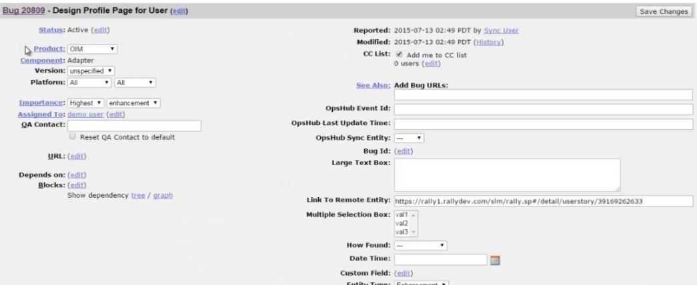

Рисунок 5.5 — Робоча область бак трекеру Bugzilla

Основними пунктами у Bugzilla є:

- тайл;
- статус;
- severity / priority;
- ключові слова;
- посилання на ресурс;
- attachment;
- кому призначений;
- оточення.

### 5.4.3. Redmine

**Redmine** — це безкоштовний веб-додаток на основі відомого веб-фреймворку Ruby on Rails з платними розширеннями плагінами (69\$ -999\$).

Redmine — це не тільки баг трекер, але і безкоштовний хмарний (SAAS) веб-додаток для ефективного управління проектами для малого та великого бізнесу. А можливості як баг трекеру Redmine одні з найбільш прогресивних, хоча у ньому не має наворотів, як от у попередньо розглянутій Jira. У використанні Redmine досить-таки простий і зрозумілий. Якщо звикнути користуватися Redmine, він не знадобиться у якості системи відстеження помилок, то може легко знадобитися для якихось інших задач у бізнесі.

Redmine надає такі можливості:

- робота з декількома проектами;
- облік часових витрат;
- діаграми Ганта;
- система доступу по ролях;
- для кожного проекту є форуми обговорення;
- календар;
- система Redmine для відстеження помилок;

- інтеграція з іншими системами управління.

Головна перевага системи, яку найбільше позиціонує Redmine, окрім відсутності оплати, – багатомовний інтерфейс.

Особливостями Redmine можна назвати використання діаграми Ганта, опція створення форумів для кожного існуючого проекту, самостійна реєстрація нових користувачів, обмеження доступу до певних завдань проекту, підтримка Agile технологій. Із мінусів, у деяких користувачів по правах відсутнє оповіщення по пошті про те, що в задачі зроблені зміни.

На рисунку 5.6 проілюстровано приклад завдання в баг трекері Redmine.


Рисунок 5.6 – Приклад завдання в Redmine

Складові задачі у Redmine наступні:
- трекер (визначає вид завдання);
- тема;
- опис;
- статус завання;
- пріоритет;

- категорія (до чого відноситься завдання);
- версія;
- додаток.

### 5.4.4. YouTrack

**YouTrack** – відверто кажучи цей баг трекер більше для розробників програмістів, які перейшли в управління проектами (див. рис. 5.7). YouTrack початково повноцінно розроблений під Agile. Чеська компанія JetBrains відома перш за все своїми IDE (Інтегровані Середовища розробки): **IntelliJ IDEA** – IDE для мови програмування Java, **PyCharm** – IDE для Python, **PhpStorm** – IDE для PHP, **RubyMine** – IDE для Ruby і Ruby on Rails та інші.

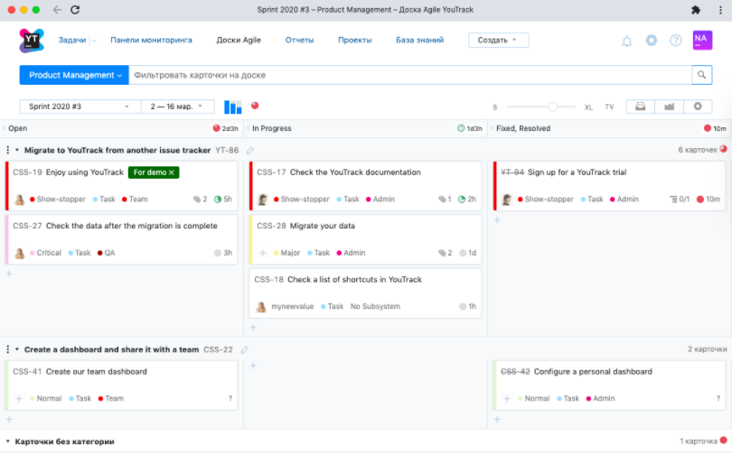

Рисунок 5.7 – Робоча область баг трекера YouTrack

Безкоштовний YouTrack відносно. JetBrains надає свій YouTrack для безкоштовного використання розробникам відкритих проектів і для навчання. YouTrack доступний також у вигляді сервісу (SaaS), під назвою YouTrack InCloud, безкоштовно в базовій конфігурації.

Обмеження безкоштовної версії YouTrack:
* Обмеження до десяти користувачів;
* Хмарна версія має обмеження на зберігання 5 ГБ;
* Хмарна версія не дозволяє створювати приватні проекти;
* Вартість оновлення: найнижча платна версія рішення SaaS від YouTrack складає 200 доларів США на рік для максимум 15 користувачів.

<u>Використані у розділі літературні джерела – [70-79].</u>

## Контрольні запитання 

1. Назвіть чотири правила Agile Manifesto.
2. Перерахуйте принципи Agile Manifesto.
3. Що таке Scrum?
4. Скільки та які ролі виділяються в Scrum?
5. Хто є «службовим лідером» в Scrum та які його обов’язки?
6. Якими характеристиками повинна володіти команда розробки в Scrum?
7. Який повинен бути рекомендований розмір команди в Scrum?
8. Коротко охарактеризуйте процес роботи за Scrum методологією.
9. Озвучте переваги та недоліки використання Scrum методології.
10. Звідки прийшов термін Канбан та яка його історія?
11. Яке основне завдання карт Канбан?
12. Озвучте відмінності між методологіями Scrum та Канбан.
13. Приведіть приклад Канбан-дошки. Що означає кожний стовпець на цій дошці?

14. Що переміщується в область Expedite на дошці завдань Канбан?
15. Що означають цифри під кожним стовпцем на Канбан дошці?
16. Що корисного надає користувачеві Канбан-дошка?
17. Що таке Issue Tracking System?
18. Різновидом чого рахується баг трекер?
19. Наведіть приклади баг трекових систем та коротко охарактеризуйте їх.


## 6.1. Що таке життєвий цикл тестування програмного забезпечення (Software Testing Life Cycle)?

Життєвий цикл тестування програмного забезпечення (STLC) визначає, які тестові дії виконувати та коли виконувати ці тестові дії. Хоча тестування відрізняється між організаціями, існує життєвий цикл тестування (див. рис. 6.1).

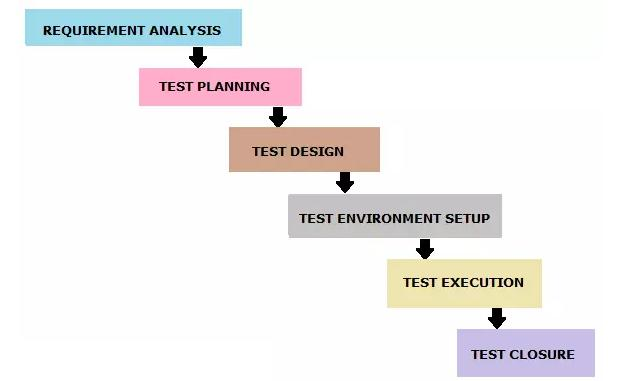

Рисунок 6.1 – Життєвий цикл тестування програмного забезпечення

Виділяють такі фази життєвого циклу тестування програмного забезпечення як:

1. Аналіз вимог

2. Планування тесту
3. Тестова конструкція
4. Налаштування тестового середовища
5. Виконання тесту
6. Закриття тесту

Кожна фаза життєвого циклу тестування програмного забезпечення має певні критерії входу та виходу.

*Аналіз вимог (Requirement analysis)*

Критеріями вступу на цей етап є документ SRS (специфікація вимог). Під час цієї фази тестова група вивчає та аналізує вимоги з точки зору тестування. Цей етап допомагає визначити, чи є вимоги перевіреними чи ні. Якщо будь-яка вимога не піддається контролю, тестова група може спілкуватися з різними зацікавленими сторонами (Клієнт, Бізнес-аналітик, Технічні керівники, Системні архітектори тощо) під час цього етапу, задля розробки стратегії дій.

**Критерії вступу**: SRS (специфікація вимог).

**Результати**: Перелік усіх вимог, що перевіряються, Звіт техніко-економічного обґрунтування автоматизації (Automation feasibility report) (якщо застосовується).

*Планування тесту (Test Planning)*

Планування тестів – це перший крок процесу тестування. На цій фазі, як правило, Test Manager/Test Lead передбачає визначення зусиль та кошторису витрат на весь проєкт. Підготовка плану тестування (Test Plan) буде здійснюватися на основі аналізу вимог. На цій фазі здійснюються такі заходи, як планування ресурсів, визначення ролей та обов'язків, підбір інструментів (якщо автоматизація), вимоги до навчання тощо. Результати цього етапу - це документи випробувального плану та зусиль (Test Plan & Effort).

**Критерії вступу**: Документи щодо вимог (Requirements Documents).

**Результати**: Стратегія тесту (Test Strategy), План тесту (Test Plan) та Документ з оцінки тестових зусиль (Test Effort estimation document).

### *Тест – дизайн (Test Design)*

На цій фазі команда тестерів починає діяльність з розробки test cases. Тестова група готує test cases, test scripts (якщо автоматизоване тестування) та тестові дані. Після того, як test cases будуть готові, вони переглядаються членами групи або керівниками групи. Також тестова група готує матрицю відстеження вимог (Requirement Traceability Matrix - RTM). RTM відслідковує вимоги до test cases, які необхідні для перевірки виконання цих вимог.

**Критерії вступу**: Документи вимог (Requirement Documents) (Оновлена версія незрозумілих або відсутніх вимог).

**Результати**: test cases, test scripts (if automation), test data (тестові дані).

### *Налаштування тестового середовища (Test Envoronment Setup)*

Цю фазу можна розпочати паралельно з етапом проектування тесту. Налаштування тестового середовища проводиться на основі списку вимог до апаратного та програмного забезпечення. У деяких випадках тестова група може не брати участь у цій фазі. Команда розробників або замовник забезпечує тестове середовище. Тим часом тестова група повинна підготувати test case для «димового тестування» (smoke test case), щоб перевірити готовність даного тестового середовища.

**Критерії вступу**: test plan, smoke test cases, test data.

**Результати**: test environment, результати smoke test cases.

### *Виконання тесту (Test Execution)*

Тестова група починає виконувати test cases на основі запланованих попередньо. Якщо результатом тестового випадку є Pass/Fail, те саме слід оновити у test cases. Звіт про дефекти повинен бути підготовлений для невдалих тестових випадків і повинен бути повідомлений команді розробників через

інструмент відстеження помилок для виправлення дефектів. Перевірка буде проведена після виправлення дефекту.

**Критерії вступу**: test plan, test cases, test data, test environment.

**Результати**: Звіт про виконання test cases (Test case execution report), bug report, RTM.

### *Закриття тесту (Test Closure)*

Заключний етап, коли готується звіт про закриття тесту, тестові метрики.

Команда тестування буде запрошена на зустріч для оцінки критеріїв завершення циклу на основі покриття тесту, якості, часу, вартості, програмного забезпечення, бізнес-цілей. Команда тестерів аналізує артефакти тестів (наприклад, test cases, звіти про дефекти тощо), щоб визначити стратегії, які мають бути впроваджені в майбутньому, що допоможе усунути вузькі місця технологічних процесів у майбутніх проектах. Тестові показники та звіт про закриття тесту будуть підготовлені на основі вищезазначених критеріїв.

**Критерії вступу**: Звіт про виконання тестових випадків (переконайтеся, що немає відкритих дефектів високої серйозності), звіт про дефекти.

**Результати**: Звіт про закриття тесту (Test Closure report), Тестові метрики.

Використані у розділі літературні джерела – [80].


## Контрольні запитання

1. Що визначає життєвий цикл тестування програмного забезпечення?
2. Які стадії виділяються в життєвому циклі тестування програмного забезпечення?
3. Охарактеризуйте стадію «Аналіз вимог».
4. Що є критеріями входу для стадії «Аналіз вимог»?
5. Які документи є результатами стадії «Аналіз вимог»?

6. Хто, як правило, на стадії «Планування тесту» визначає зусилля та кошторис витрат на проект?
7. Які документи є результатами стадії «Планування тесту»?
8. Охарактеризуйте стадію «Тест-дизайн».
9. Що є критеріями входу для стадії «Тест-дизайн»?
10. Які документи є результатами стадії «Тест-дизайн»?
11. На якій стадії тестування тестова група в деяких випадках може не брати участі?
12. Для якого виду тестування тестова група складає тест-кейси, щоб перевірити готовність тестового середовища?
13. Охарактеризуйте стадію «Виконання тесту».
14. Що є критеріями входу для стадії «Виконання тесту»?
15. Які документи є результатами стадії «Виконання тесту»?
16. Охарактеризуйте стадію «Закриття тесту».
17. Що є критеріями входу для стадії «Закриття тесту»?
18. Які документи є результатами стадії «Закриття тесту»?


## 7.1. Тестові результати (Test Deliverables): визначення та види


Програмний проект, який слідує через увесь SDLC, проходить різні етапи, перш ніж бути доставленим замовнику. У цьому процесі будуть досягнуті певні результати на кожній фазі. Частина результатів надається до початку фази тестування, частина надається під час фази тестування та решта — після завершення етапу тестування.

Кожне програмне забезпечення проходить різні фази SDLC та STLC. У процесі розробки програмного забезпечення команди тестерів готують різні документи для поліпшення спілкування між членами групи та іншими зацікавленими сторонами. Ці документи також відомі як тестові продукти, оскільки вони доставляються клієнтові разом із кінцевим продуктом програмного забезпечення.

Тестові результати, підготовлені в процесі тестування програмного забезпечення представлені на рисунку 7.1.

1. **Стратегія тесту (Test Strategy).**

Стратегія тесту — це документ високого рівня (статичний документ) і зазвичай розробляється керівником проекту. Це документ, який відображає підхід щодо того, як ми проходимо тестування продукту та досягаємо цілі. Зазвичай він походить із специфікації вимог. Документи, такі як Test Plan готуються, зберігаючи цей документ як базовий.


2. **План тесту (Test Plan).**

Документ плану випробування — це документ, який містить план усіх заходів тестування, які необхідно виконати для доставки якісного продукту. Документ "Test Plan" виходить із Документів Опису продукту (Product Description), SRS або Use Case для всіх майбутніх дій щодо проекту. Зазвичай він готується Test Lead чи Test Manager.

3. **Звіт про оцінку зусиль (Effort Estimation Report).**

У цьому звіті зазвичай група тестерів згадує зусилля, докладені до завершення процесу тестування.

4. **Тестові сценарії (Test Scenarios).**

Тестовий сценарій дає уявлення про те, що ми маємо перевірити. Тестовий сценарій - це як тестовий випадок високого рівня.

5. **Тестові випадки/Сценарії (Test Cases/Scripts).**

Тестові випадки – це сукупність позитивних та негативних виконуваних кроків тестового сценарію, який містить набір попередніх умов, тестових даних, очікуваного результату, пост-умов та фактичних результатів.

6. **Дані тесту (Test Data).**

Дані тесту – це дані, які тестери використовують для запуску тестових випадків. Під час виконання тестових випадків тестерам потрібно ввести деякі вхідні дані. Для цього тестери готують дані тесту. Його можна приготувати вручну, а також за допомогою інструментів.

*Наприклад, для перевірки основної функціональності входу, що містить ідентифікатор користувача та поле пароля, необхідно ввести деякі дані в ці поля. Тому ці дані нам потрібно зібрати заздалегідь.*

7. **Матриця відстеження вимог (Requirement Traceability Matrix).**

RTM використовується для відстеження вимог до тестів, які необхідні для перевірки того, чи вимоги є виконані.

8. **Звіт про дефекти/звіт про помилку (Defect Report/Bug Report).**

Мета використання шаблону звіту про дефекти або шаблону звіту про помилки полягає в тому, щоб донести розробникам детальну інформацію про помилки. Це дозволяє розробникам легко копіювати помилки.

9. **Звіт про виконання тесту (Test Execution Report).**

Він містить результати тестів та підсумок діяльності з виконання тесту.

10. **Графіки та метрики (Graphs and Metrics).**

Тестова метрика програмного забезпечення - це моніторинг та контроль процесу та продукту. Він допомагає рухати проект до намічених цілей без відхилень. Показники відповідають на різні запитання. Важливо вирішити, на які питання ви хочете відповісти.

11. **Зведений звіт тесту (Test summary report).**

Він містить підсумок тестових дій та кінцеві результати тесту.

12. **Звіт про тестування інцидентів (Test incident report).**

Він містить усі інциденти (вирішені або невирішені), які виявляються під час тестування програмного забезпечення.

13. **Звіт про закриття тесту (Test closure report).**

Він дає детальний аналіз виявлених помилок, усунених помилок та розбіжностей, виявлених у програмному забезпеченні.

14. **Примітка до випуску (Release Note).**

Примітки до випуску будуть надіслані клієнту, замовнику або зацікавленим сторонам разом із збіркою (build). Вона містить список нових випусків, виправлені помилки.

15. **Посібник із встановлення/налаштування (Installation/configuration guide).**

Цей посібник допомагає встановити або налаштувати компоненти, що складають систему та її вимоги до апаратного та програмного забезпечення.

16. **Посібник користувача (User guide).**

Цей посібник надає допомогу кінцевому користувачеві щодо доступу до програмного забезпечення.

17. **Звіт про стан тесту (Test status report).**

Призначений для відстеження стану тестування. Він готується періодично або щотижня. Він містить роботу, що вже виконана до певної дати, і роботу, яка ще залишається на розгляді.

18. **Щотижневий звіт про стан (Weekly status report).**

Він схожий на звіт про стан перевірки, але генерується щотижня.

## 7.2. Стратегія тесту (Test Strategy)

Хоча тестування відрізняється між організаціями, практично всі організації з розробки програмного забезпечення дотримуються документа Тест-стратегії для досягнення цілей та дотримання найкращої практики.

Зазвичай тестова група починає писати детальний план тестування та продовжує подальші етапи тестування, коли стратегія тестування буде готова. У світі Agile деякі компанії не витрачають часу на підготовку плану тестування через мінімальний час для кожного випуску, але вони зберігають документ про стратегію тестування. Збереження цього документа для всього проекту призводить до зменшення непередбачених ризиків.

Це один із важливих документів у тестових результатах. Як і інші результати тестів, тестова група ділиться ним із зацікавленими сторонами для кращого розуміння обсягу проекту, тестових підходів та інших важливих аспектів.

Нижче наведено розділи документа про стратегію тестування:

1. Сфера застосування та огляд (Scope and overview)
2. Тестовий підхід (Testing Approach)
3. Інструменти для тестування (Testing tools)
4. Галузеві стандарти, яких слід дотримуватися (Industry standards to follow)
5. Тестові результати (Test deliverables)
6. Тестування метрик (Testing Metrics)
7. Матриця відстеження вимог (RTM)
8. Ризик та послаблення (Risk and mitigation)
9. Інструмент звітності (Reporting tool)
10. Підсумок тесту (Test summary)

Коротко розглянемо кожен розділ Тест-стратегії.

***Сфера застосування та огляд (Scope and overview).***

У цьому розділі ми описуємо сферу тестових дій (що тестувати та чому тестувати) та огляд автоматизованого тестування.

*Приклад: Створення нової програми (Say Google Mail), яка пропонує послуги електронної пошти. Перевірити функціональність електронних листів і переконатися, що вона надає значення клієнту.*

*Тестовий підхід (Testing Approach).*

У цьому розділі ми зазвичай визначаємо наступне:
- тестові рівні;
- види тестів;
- ролі та обов'язки;
- вимоги до навколишнього оточення.

У таблиці 7.1 наведено пояснення кожного елемента розділу «Тестовий підхід».

Таблиця 7.1.

Складові елементи розділу «Тестовий підхід»

| Назва | Пояснення |
| :--- | :--- |
| Тестові рівні | У цьому пункті перераховані рівні тестування, які будуть проведені під час тестування. Рівні тестування, такі як тестування модуля, тестування інтеграції, тестування системи та приймальне тестування. Тестери відповідають за тестування інтеграції, тестування системи та приймальне тестування. |
| Види тестів | У цьому пункті перераховані типи тестування, які будуть виконуватися під час тестування. |
| Ролі та обов'язки | У цьому пункті описані ролі та обов'язки Project Manager, Project Lead, окремих тестерів. |
| Вимоги до навколишнього оточення | У цьому пункті перераховано технічне та програмне забезпечення для тестового середовища з метою початку тестування. |

*Інструменти для тестування (Testing tools).*

У цьому розділі описано інструменти тестування, необхідні для проведення тестів

*Приклад: Назва інструменту управління тестом, назва інструменту відстеження помилок, назва інструмента автоматизації тощо.*

*Галузеві стандарти, яких слід дотримуватися (Industry standards to follow).*

У цьому розділі описано галузевий стандарт на виробництво високоякісної системи, яка відповідає або перевищує очікування клієнтів. Зазвичай керівник проекту вирішує моделі тестування та процедури, яких необхідно дотримуватися для досягнення цілей проекту.

*Тестові результати (Test deliverables).*

У цьому розділі перераховані результати, які необхідно підготувати до, під час та в кінці тестування.

*Тестування метрик (Testing Metrics).*

У цьому розділі описані показники, які слід використовувати в проекті для аналізу стану проекту.

*Матриця відстеження вимог (RTM).*

Матриця відстеження вимог використовується для відстеження вимог до тестів, які необхідні для перевірки того, чи вимоги були виконані.

*Ризик та послаблення (Risk and mitigation).*

Визначте всі ризики тестування, які впливатимуть на процес тестування, та вкажіть план послаблення ризику.

*Інструмент звітності (Reporting tool).*

У цьому розділі викладено спосіб відстеження дефектів та проблем за допомогою інструменту звітності.

*Підсумок тесту (Test summary).*

У цьому розділі перераховано, який тип підсумкових звітів про випробування буде випускатися із певною частотою. Підсумкові звіти про тести

формуватимуться щодня, щотижня або щомісяця, залежно від того, наскільки важливим є проєкт.

Документ про стратегію тестування дає чітке бачення того, що тестова група буде робити для всього проекту. Цей статичний документ означає, що він не буде змінюватися протягом життєвого циклу проекту. Той, хто готує цей документ, повинен мати хороший досвід у галузі продукту, оскільки це документ, який буде керувати всією командою, і він не зміниться протягом життєвого циклу проекту (це статичний документ). Документ про стратегію тестування повинен бути розісланий всій групі тестування до початку тестування. Складання хорошої стратегії тестування покращує повний процес тестування та призводить до створення високоякісної системи.

## 7.3. План тесту (Test Plan)

### 7.3.1. Опис тест плану та його шаблон

Зазвичай його готує Test Lead або Test Manager, і основним завданням документа є опис того, що потрібно або не потрібно тестувати, як тестувати, коли проводити тестування та хто буде тестувати. Крім того, він включає середовище та необхідні інструменти, розподіл ресурсів, методику тестування, яку слід дотримуватися, план ризиків та надзвичайних ситуацій. План тестування — це динамічний документ, і ми завжди повинні його оновлювати. Документ плану тестування вказує нам, як тестування повинне проходити. Успіх проекту тестування повністю залежить від плану тестування.

План тестування є одним із документів, отриманих у тестових результатах. Як і інші результати випробувань, документ плану випробувань також ділиться із зацікавленими сторонами. Зацікавлені сторони знайомляться з масштабом, підходом, завданнями та графіком тестування програмного забезпечення, яке потрібно виконати.

**1. Як підготувати ефективний план тесту?**

В певній мірі це почати підготовку плану тесту на початку STLC, підтримувати план тесту коротким і простим для розуміння, а також переглядати та поновлювати його на певну дату.

**2. Хто готує шаблон плану тесту**

Зазвичай Test Lead готує тест план із залученням до процесу підготовки тестерів. Після успішної підготовки тест плану тестери розпочинають роботу над створенням test scenarios та test cases, базуючись на тест плані.

**3. Розділи шаблону тестового плану**

Наведено розділи документа плану випробувань відповідно до стандарту IEEE 829.

*    **Ідентифікатор плану тесту(Test Plan Identifier)**

    Ідентифікатор плану тесту - це унікальний номер для ідентифікації плану тесту.

    *Example: ProjectName_0001*

*    **Посилання (References)**

    У цьому розділі потрібно вказати весь перелік документів, які підтримують тестовий план, який зараз розробляється.

    *Example: SRS, Use Case Documents, Test Strategy, Project Plan, Project Guidelines etc.*

*   **Вступ (Introduction)**

    Вступ або резюме включає мету та обсяг проекту.

    *Example: The objective of this document is to test the functionality of the 'ProjectName'.*

- ***Тестові задачі (Test Items)***
  Список тестових задач, які будуть протестовані.
  *Example: Testing should be done on both front end and back end of the application on the Windows/Linux environments.*

- ***Особливості, що тестуються (Features To Be Tested)***
  У цьому розділі ми перераховуємо всі функції, які будуть перевірені в рамках проекту.
  *Example: The features which are to be tested are Login Page, Dashboard, Reports.*

- ***Особливості, що не тестуються (Features Not To Be Tested)***
  У цьому розділі ми перераховуємо функції, які не входять до проекту.
  *Example: Payment using PayPal features is above to remove from the application. There is no need to test this feature.*

- ***Підхід (Approach)***
  Загальна стратегія способів тестування. Він містить детальну інформацію, наприклад методику, типи випробувань, методи випробувань тощо.
  *Example: We follow Agile Methodology in this project.*

- ***Критерії проходження/провалу (Pass/Fail Criteria)***
  У цьому розділі ми визначаємо критерії, які будуть використані для визначення відсотка проходження або відмови тестових задач.
  *Example: All the major functionality of the application should work as intended and the pass percentage of test cases should be more than 95% and there should not be any critical bugs.*

-  **Критерії зупинки (Suspension Criteria)**

  У цьому розділі ми вказуємо, коли припинити тестування.

  *Example: If any of the major functionalities are not functional or system experiences login issues then testing should suspend.*

-  **Тестові результати (Test Deliverables)**

  Перелік документів, які потрібно подавати на кожному етапі життєвого циклу тестування. Список усіх тестових артефактів.

  *Examples: Test Cases, Bug Report*

- **Задачі тестування (Testing Tasks)**

  У цьому розділі ми визначаємо перелік завдань тестування, які нам потрібно виконати в поточному проекті.

  *Example: Test environment should be ready prior to test execution phase. Test summary report needs to be prepared.*

- **Потреби навколишнього оточення (Environmental Needs)**

  Список апаратного, програмного забезпечення та будь-яких інших інструментів, необхідних для тестового середовища.

- **Обов'язки (Responsibilities)**

  Визначаємо перелік ролей та обов'язків кожної тестової задачі.

  *Example: Test plan should be prepared by Test Lead. Preparation and execution of tests should be carried out by testers.*

- **Потреби у персоналі та навчанні (Staffing and Training Needs)**

  Планування навчального курсу для вдосконалення навичок людських ресурсів проекту для досягнення бажаних цілей.

 **Розклад (Schedule)**

Повні відомості про те, коли слід розпочати, закінчити і скільки часу повинно пройти кожне завдання.

*Example: Perform test execution – 120 man-hours, Test Reporting – 30 man-hours*

 **Ризики та непередбачені ситуації (Risks and Contingencies)**

У цьому розділі ми визначаємо ймовірність ризиків та непередбачених випадків задля їх подолання.

*Example: Risk – In case of a wrong budget estimation, the cost may overrun. Contingency Plan – Establish the scope before beginning the testing tasks and pay attention in the project planning and also track the budget estimates constantly.*

 **Схвалення (Approvals)**

Хто повинен підписатись та затвердити проєкт тестування.

*Example: Project manager should agree on completion of the project and determine the steps to proceed further.*

Кожна методологія чи процес намагаються нав'язати свої формати оформлення планів тестування. Як приклад, можна навести шаблони RUP (Rational Unified Process) та стандарт IEEE 829, який був розглянутий вище.

Порівнявши два шаблони можна сказати, що описують вони одне і те ж, але в різній формі. З досвіду можна сказати, що **хороший тест план** повинен як мінімум описувати моменти наведені у таблиці 7.2.

Давши відповіді у вашому тест плані на вказані у таблиці запитання, можна рахувати, що у вас на руках вже є хороший чорновик документу по плануванню тестування.

Таблиця 7.2

Питання, які повинен описувати тест план

| № | Питання | Опис |
|---|---|---|
| 1. | **Що потрібно тестувати?** | Опис об'єкта тестування: системи, додатку, обладнання |
| 2. | **Що будете тестувати?** | Список функцій та опис тестованої системи та її компонент поокремо |
| 3. | **Як будете тестувати?** | Стратегія тестування, а саме види тестування та їх застосування по відношенню до об'єкта тестування |
| 4. | **Коли будете тестувати?** | Послідовність проведення робіт: підготовка (Test Preparation), тестування (Testing), аналіз результатів (Test Result Analisys) в розрізі запланованих фаз розробки |
| 5. | **Критерії початку тестування:** | 1. готовність тестової платформи (тестового стенду)<br>2. завершеність розробки потрібного функціоналу<br>3. наявність всієї необхідної документації |
| 6. | **Критерії завершення тестування:** | Результати тестування задовольняють критеріям якості продукту:<br>- вимоги до кількості відкритих багів виконані;<br>- витримка певного періоду без змін вихідного коду додатку Code Freeze (CF)<br>- витримка певного періоду без відкриття нових багів Zero Bug Bounce (ZBB) |

Далі, щоб документ набув більш менш серйозного виду, пропонуємо доповнити його наступними пунктами:

- оточення тестованої системи (опис програмно-апаратних засобів);
- необхідне для тестування обладнання та програмні засоби (тестовий стенд і його конфігурація, програми для автоматизованого тестування та ін.);

- ризики та шляхи їх вирішення.

### 7.3.2. Види тест планів

Частіше за все на практиці зустрічаються наступні види тест планів:

1. **Мастер Тест План (Master Plan or Master Test Plan)**
2. **Тест план** так би мовити детальний тест план.
3. **План випробувань прийомки (Product Acceptance Plan)** – документ, який описує набір дій пов'язаних з тестуванням прийомки (стратегія, дата проведення, відповідальні робітники та ін.)

Відмінністю між Мастер тест планом та просто тест планом є те, що **мастер тест план є більш статичним** в силу того, що містить в собі високорівневу інформацію, котра не підлягає частій зміні в процесі тестування та перегляду вимог. Сам же детальний тест план, котрий містить більш конкретну інформацію по стратегії, видам тестування, розкладом виконання робіт, є «живим» документом, котрий постійно змінюється, відбиваючи в собі реальний стан справ на проєкті.

Загалом на проєкті може бути один Мастер Тест план і декілька детальних тест планів, котрі описують окремі модулі одного додатку.

### Рецензія та погодження

Для збільшення цінності вашого тест плану рекомендуємо проводити його періодичне рецензування зі сторони учасників проєктної групи. Це можна зробити або просто домовившись між собою або ж реалізувати у вигляді процедури ствердження. Для прикладу наведемо список учасників проєктної групи, ствердження яких вважатимемо необхідним:

- ведучий тестувальник;
- тест менеджер (менеджер по якості);
- керівник розробки;
- менеджер проєкту.

В більшості випадків тест-план буде відігравати більш формальну роль, але все ж таки, його присутність має багато переваг. Наприклад:

- можливість пріоритизації задач по тестуванню;
- побудова стратегії тестування, погоджена всією командою;
- можливість вести облік всіх необхідних ресурсів, як технічних, так і людських;
- планування використання ресурсів на тестування;
- розрахунок ризиків, можливих при проведенні тестування.

У таблиці 7.3 приведено порівняння між Тест стратегією та Тест планом.

Таблиця 7.3.

Різниця між Test Strategy та Test Plan

| № | Test Strategy | Test Plan |
|---|---|---|
| 1 | Тест-стратегія - це документ високого рівня, який відображає підхід щодо тестування продукту та досягнення цілей. | Тест план - це документ, який містить план усіх заходів тестування, які необхідно виконати для доставки якісного продукту. |
| 2 | Компоненти Test Strategy включають сферу застосування та огляд, тестовий підхід, інструменти тестування, галузеві стандарти, яких слід дотримуватися, результати тестування, метрики тестування, матрицю відстеження вимог, ризик та послаблення наслідків, інструмент звітності, резюме тесту. | Компоненти Test Plan включають ідентифікатор плану тесту, функції, що повинні і не повинні перевірятись, підхід, критерії проходження/провалу, критерії зупинки, результати випробувань, відповідальність, потреби у персоналі та навчанні, ризики та непередбачувані ситуації тощо. |

| 1 | 2 | 3 |
| :---: | :--- | :--- |
| 3 | Розробляється Project Manager | Розробляється Test Lead або Test Manager |
| 4 | Він походить із специфікацій бізнес-вимог (BRS) | Він отриманий з Product Description, SRS або Use case документів |
| 5 | Це статичний документ. Після затвердження – він незмінний | Це динамічний документ, в який можна вносити зміни |
| 6 | Він визначений на рівні організації і може використовуватися для інших проектів подібного характеру | Він визначається на рівні проекту |

## 7.4. Тестові випадки/набори/Сценарії (Test Cases/Suits/Scripts)

### 7.4.1. Визначення тест-кейсу, його структура та види


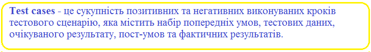

Припустимо нам необхідно написати тестові випадки для сценарію - (Verify the login of Gmail account).

Маємо наступні test cases (див. рис.7.2.):
1. Enter valid User Name and valid Password
2. Enter valid User Name and invalid Password
3. Enter invalid User Name and valid Password
4. Enter invalid User Name and invalid Password

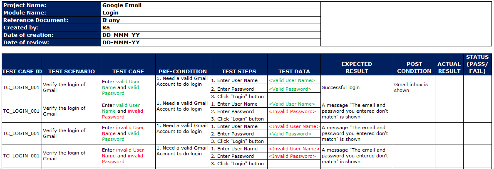

Рисунок 7.2 – Приклад оформлення тест кейсу

У таблиці 7.4 наведено пояснення основних полів тест-кейсу представленого на рисунку 7.2.

Таблиця 7.4.

Поля тест-кейсу та їх значення

| № | Поле тест-кейсу | Значення поля тест-кейсу |
| :--- | :--- | :--- |
| 1 | PROJECT NAME | назва проекту, до якого належать test cases |
| 2 | MODULE NAME | назва модуля, до якого належать test cases |
| 3 | REFERENCE <br> DOCUMENT | наводиться черговість довідкових документів <br> (if any such as Requirement Document, Test Plan, <br> Test Scenarios etc.,) |
| 4 | CREATED BY | автор test cases |
| 5 | DATE OF CREATION | дата створення test cases |
| 6 | REVIEWED BY | ім'я тестера, хто переглянув test cases |
| 7 | DATE OF REVIEW | дата перегляду test cases |
| 8 | EXECUTED BY | ім'я тестера, хто виконав test cases |
| 9 | DATE OF EXECUTION | дата виконання test cases |
| 10 | TEST CASE ID | кожний тест кейс повинен мати свій ідентифікатор |
| 11 | TEST SCENARIO | ідентифікатор сценарію тесту або назва тестового <br> сценарію |
| 12 | TEST CASE | назва тесту |
| 13 | PRE-CONDITION | умови, які необхідно виконати перед виконанням <br> test case |
| 14 | TEST STEPS | наведіть усі кроки відтворення тесту детально <br> та в порядку, як це можна було б виконати. |
| 15 | TEST DATA | дані, які будуть використані для введення тестів. |

Продовження таблиці 7.4.

| 1 | 2 | 3 |
| :--- | :--- | :--- |
| 16 | EXPECTED RESULT | результат, якого ми очікуємо, коли test cases будуть виконані. Це може бути що-небудь, наприклад Home Page, Relevant screen, Error message тощо |
| 17 | POST-CONDITION | умови, яких потрібно досягти, коли test case успішно виконаний |
| 18 | ACTUAL RESULT | результат, який система показує, коли test case виконаний |
| 19 | STATUS | Якщо фактичні та очікувані результати однакові, відзначте це як Пройдено (Passed). Інакше відзначте – Провалено (Failed) . Якщо тест не вдається, він повинен пройти життєвий цикл помилок для виправлення. |

Тестовий випадок (Test Case) – це артефакт, який описує сукупність кроків, конкретних умов та параметрів, необхідних для перевірки реалізації тестованої функції чи її частин.

Під найпростішим тест кейсом розуміється структура виду:
Action > Expected Result > Test Result

Приклад.

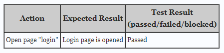

**Види Тестових Випадків**

Тест кейси поділяються за очікуваним результатом на позитивні та негативні:

- **позитивний тест кейс** використовує тільки коректні дані та перевіряє, що додаток правильно виконав викликану функцію;
- **негативний тест кейс** оперує як коректними, так і некоректними даними (мінімум 1 некоректний параметр) і ставить ціллю перевірку виключних ситуацій (спрацювання валідаторів), а також перевіряє чи викликана додатком функція не виконується при спрацюванні валідатора.

**Структура Тестових Випадків (Test Case Structure)**

Кожний тест кейс повинен мати 3 частини, які наведені у таблиці 7.5.

Таблиця 7.5.

Частини тест-кейсу

| № | Частина тест-кейсу | Пояснення |
|---|---|---|
| 1 | PreConditions | Список дій, котрі приводять систему до стану придатного для проведення основної перевірки або список умов, виконання котрих говорить про те, що система знаходиться в придатному для проведення основного тесту стану. |
| 2 | Test Case Description | Список дій, котрі переводять систему з одного стану в інший, для отримання результату, на основі якого можна зробити висновок про задоволення реалізації поставленим вимогам |
| 3 | Post Conditions | Список дій, які переводять систему в першочерговий стан (стан до проведення тест кейсу) |

**Примітка.** **Post Condirions** не є обов'язковим елементом. Це швидше за все правило «хорошого тону» — «насмітив — прибери за собою». Це особливо актуально при автоматизованому тестуванні, коли за один прогін можна наповнити базу даних сотнями чи тисячами некоректних документів.

На рисунку 7.3 наведено приклад найпростішого тест-кейсу.

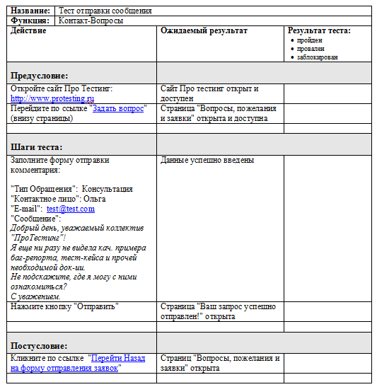

Рисунок 7.3 — Приклад тест-кейсу

На додаток хочеться сказати, що рішення про вигляд тест кейсу та деталізацію його опису приймає людина відповідальна за його створення – Тест Дизайнер чи Тест Аналітик, який володіє необхідним досвідом і який знає тест дизайн та має досвід його практичного застосування.


**Ціль написання тест-кейсів:**

- структурувати та систематизувати підхід до тестування;
- обчислювати метрики тестового покриття та приймати міри по його збільшенню;
- відслідковувати відповідність поточної ситуації до плану;
- підтримати взаєморозуміння між замовником, розробниками та тестувальниками;
- зберігати інформацію для довготривалого використання та обміну досвідом між співробітниками та командами;
- проводити регресійне тестування та повторне тестування;
- підвищувати якість вимог;
- швидко вводити в курс справ нового співробітника.

### 7.4.2. Життєвий цикл тест-кейсу

В даному випадку мова іде про набір станів притаманних тест-кейсу. На рисунку 7.4 наведено життєвий цикл тест-кейсу. Розглянемо детально кожний із станів життєвого циклу тест-кейсу.


Рисунок 7.4 – Життєвий цикл тест кейсу

1. Створений (new) — типовий початковий стан практично будь-якого артефакту. Тест-кейс автоматично переходить в цей стан після створення.
2. Запланований (planned, ready for testing) — в цьому стані тест-кейс знаходитися, коли він або явно доданий в план найближчої ітерації тестування, або як мінімум готовий для виконання.
3. Не виконаний (not tested) — в деяких системах управління тест-кейсами цей стан замінює собою попередній («запланований»). Знаходження тест-кейсу в даному стані означає, що він готовий до виконання, але ще не був виконаний.
4. Виконується (work in progress) — якщо тест-кейс потребує довгого часу на виконання, він може бути переведений в цей стан для підкреслення того факту, що робота почата, і швидко можна очікувати її результатів. Якщо виконання тест-кейсу займає мало часу, цей стан, як правило, пропускається, а тест-кейс одразу переводиться в один з трьох наступних станів — «провалений», «завершений успішно» та «заблокований».
5. Пропущений (skipped) — бувають ситуації, коли виконання тест-кейсу відміняється згідно нестачі часу чи зміни логіки тестування.
6. Провалений (failed) — даний стан означає, що в процесі виконання тест-кейсу був виявлений дефект, який полягав у тому, що результат як мінімум за одним кроком тест-кейсу не співпадає з фактичним результатом. Якщо в процесі виконання тест-кейсу був «випадково» виявлений дефект, ніяким чином не пов'язаний з кроками тест-кейсу та їх очікуваними результатами, тест-кейс вважається пройденим успішно (при цьому звісно про знайдений дефект створюється звіт).
7. Продейний успішно (passed) — даний стан означає, що в процесі виконання тест-кейсу не було виявлено дефектів, пов'язаних з розходженням очікуваних та фактичних результатів його кроків.

8. Заблокований (blocked) – даний стан означає, що по якійсь причині виконання тест-кейсу неможливе (як правило, такою причиною є наявність дефекту, який не дозволяє реалізувати деякий користувацький сценарій).

9. Закритий (closed) – дуже рідкісний випадок, так як тест-кейс, як правило, залишають в стані «провалений/проведений успішно/заблокований /пропущений». В даний стан в деяких системах управління тест-кейсами тест-кейс переводять, щоб підкреслити той факт, що на даній ітерації тестування всі дії з ним завершені.

10. Потребує доопрацювання (not ready) – як видно із схеми, в цей стан (а також і з нього) тест-кейс може бути приведений в будь-який момент часу, якщо в ньому буде знайдена помилка, якщо зміняться вимоги, за якими він був написаний чи настане інша ситуація, яка не дозволяє рахувати тест-кейс придатним для виконання і переведення в інші стани.

### 7.4.3. Атрибути (поля) тест-кейсу

Як вже зазначалось, термін «тест-кейс» може відноситись до формального запису тест-кейсу у вигляді технічного документу. Цей запис має загальноприйняту структуру, компоненти якої називаються атрибутами(полями) тест-кейса.

В залежності від інструменту управління тест-кейсами зовнішній вигляд їх запису може дещо відрізнятись, можуть бути додані та забрані окремі поля, але концепція залишається незмінною.

Загальний вид всієї структури тест-кейсу представлено на рисунку 7.5.

**Ідентифікатор (identifier)** представляє собою унікальне значення, котре дозволяє однозначно відрізнити один тест-кейс від іншого і використовується у все можливих посиланнях. В загальному випадку ідентифікатор тест-кейсу

може представляти собою просто унікальний номер, але може бути і більш складніше представлення.


Рисунок 7.5 – Загальний вид тест-кейсу

**Пріоритет (priority)** показує важливість тест-кейса. Він може бути виражений літерами, цифрами, словами чи іншим зручним способом. Кількість градацій так само не фіксоване, але частіше варіюється від 3 до 5.

Пріоритет тест-кейсу може корелюватись з:
- важливістю вимог, користувацького сценарію чи функції, з якою пов'язаний тест-кейс;
- потенційною важливістю дефекту, на пошук якого направлений тест-кейс;
- ступенем ризику, пов'язаною з перевірочним тест-кейсом вимогою, сценарієм чи функцією.

**Пов'язана з тест-кейсом вимога (requirement)** показує ту основну вимогу, перевірці виконання котрої присвячений тест-кейс (основну — адже один тест-кейс може зачіпати декілька вимог).

**Модуль та підмодуль додатку (module and submodule)** вказують на частини додатку, до яких відноситься тест-кейс, і дозволяє краще розуміти його ціль.

**Заголовок (зміст) тест-кейсу (title)** покликаний спростити та пришвидшити розуміння основної ідеї (цілі) тест-кейса без звернення до його основних атрибутів. Саме це поле є найбільш інформативним при перегляді списку тест-кейсів.

Заголовок тест-кейсу може бути повноцінним реченням, фразою, набором словосполучень — головне, щоб виконувались наступні вимоги:
- інформативність;
- хоча б відносна унікальність.

**Вихідні дані, необхідні для виконання тест-кейса (precondition, preparation, initital data, setup)** дозволяють описати все те, що повинне бути підготовлене до початку виконання тест-кейса, наприклад:
- стан бази даних;
- стан файлової системи та її об'єктів;
- стан серверів та мережевої інфраструктури тощо.

**Кроки тест-кейса (steps)** описують послідовність дій, котрі необхідно реалізувати в процесі виконання тест-кейсу. Загальні рекомендації по написанню кроків такі:
- починайте із зрозумілого та явного місця, не пишіть зайвих початкових кроків (запуск додатку, явні операції із інтерфейсом тощо);
- навіть якщо в тест-кейсі один крок, нумеруйте його, інакше збільшується ймовірність в майбутньому випадково «приклеїти» опис цього кроку до нового тексту;

- співвідносьте степінь деталізації кроків та їх параметрів з ціллю тест-кейсу, його складністю, рівнем тощо;
- посилайтесь на попередні кроки та їх діапазони для зменшення об'єму тексту (наприклад «повтори кроки 3-5 зі значеннями...»);
- пишіть кроки послідовно, без умовних конструкцій виду «якщо..то..».

**Очікувані результати (expected results)** по кожному кроці тест-кейсу описують реакцію додатку на дії, описані в полі «Кроки тест-кейсу». Номер кроку відповідає номеру результату. По написанню очікуваних результатів можна рекомендувати наступне:
- описуйте поведінку системи так, щоб виключити суб'єктивне трактування (наприклад, «додаток працює вірно» - погано, «з'являється вікно з написом...» - добре);
- пишіть очікуваний результат по всім крокам без виключення, якщо навіть у вас є хоч маленький сумнів в тому, що результат деякого кроку буде цілком тривіальним та очевидним;
- пишіть коротко, але не в збиток інформативності;
- уникайте умовних конструкцій виду «якщо...то...».

### 7.4.4. Властивості якісних тест-кейсів

Навіть правильно оформлений тест-кейс може виявитись неякісним, якщо в ньому порушена одна із наступних властивостей:

1. Правильна технічна мова, точність та однозначність формулювань.
2. Баланс між специфічністю та загальністю.
3. Баланс між простотою та складністю.
4. Послідовність в досягненні цілі.
5. Відсутність зайвих дій.
6. Ненадмірність по відношенню до інших тест-кейсів.
7. Демонстративність.

8. Прослідковуваність.
9. Можливість повторного використання.
10. Повторюваність.
11. Відповідність прийнятим шаблонам оформлення та традиціям.

## 7.5. Набір тест-кейсів


Іноді в такій сукупності результати завершення одного тест-кейсу стають вхідним станом, додатком для наступного тест-кейсу.

В загальному випадку набори тест-кейсів можна розділити на:

- вільні (порядок виконання тест-кейсів не важливий);
- послідовні (порядок виконання тест-кейсів важливий).

Переваги **вільних наборів**:

- тест-кейси можна виконувати в будь-якому порядку, а також створювати «набори всередині наборів»;
- якщо якийсь тест-кейс завершивсь помилкою, це не впливає на можливість виконання інших тест-кейсів.

Переваги **послідовних наборів**:

- кожний наступний в наборі тест-кейс в якості вхідного стану додатку отримує результат роботи попереднього тест-кейсу, що дозволяє сильно скоротити кількість кроків в окремих тест-кейсах;
- тривалі послідовності дій куди краще імітують роботу реальних користувачів, ніж окремі «точкові» впливи на додаток.

Якщо говорити про найбільш типові підходи до створення наборів тест-кейсів, то можна позначити наступне:

1. На основі розбиття додатку на модулі та підмодулі.

2. За принципом перевірки самих важливих, менш важливих і решти функцій додатку.
3. За принципом групування тест-кейсів для перевірки деякого рівня вимог та типу вимог, групи вимог чи окремої вимоги.
4. За принципом частоти виявлення тест-кейсами дефектів в додатку (наприклад, ми бачимо, що деякі тест-кейси раз за разом завершуються невдачею, значить, ми можемо об'єднати їх в набір, умовно названий «проблемні місця в додатку»).
5. За архітектурним принципом.
6. За областю внутрішньої роботи додатку
7. За видами тестування.

У таблиці 7.6 приведена порівняння між тест-кейсом та тест-сценарієм.

Таблиця 7.6.

Різниця між Test Cases та Test Scenario

| № | Test Cases | Test Scenario |
| :--- | :--- | :--- |
| 1 | Test Case складається з назви тестового випадку, передумови, етапів тестування, очікуваного результату та умови постачання | Тестовий сценарій є одним вкладишем (однією функціональністю), але він пов'язаний з декількома test cases |
| 2 | Спрямовує користувача на тему "Як тестувати?" | Спрямовує користувача на тему "Що тестувати?" |
| 3 | Програмні програми часто змінюються. Це призводить до зміни дизайну сторінок і додавання нових функціональних можливостей. Важко підтримувати test cases | Тестові сценарії прості в обслуговуванні завдяки високому рівні дизайну |

Продовження таблиці 7.6

| 1 | 2 | 3 |
|---|---|---|
| 4 | Мета - перевірити сценарій тестування, виконавши набір кроків | Мета – протестувати певні функціональності програмного забезпечення |
| 5 | Більше витрата часу порівняно з тестовими сценаріями | Менше споживання часу порівняно з тестовими випадками |
| 6 | Допомагають у вичерпному тестуванні програм | Допомагають в гнучкому способі тестування функціональності |
| 7 | Тестові випадки отримані з тестових сценаріїв | Тестові сценарії виходять із випадків використання |
| 8 | Тестові справи - це дії низького рівня | Тестові сценарії - це дії високого рівня |

### 7.6. Матриця відстеження вимог (Requirements Traceability Matrix – RTM)

*Ціль матриці відстеження вимог вияснити:*
* які вимоги «покриті» тестами, а які ні;
* надлишковість тестів (одна функціональна вимога покрита великою кількістю тестів).

*Перевага RTM:*
* 100% тестовий покрив;
* дозволяє легко виявити відсутні функціональності;
* дозволяє виявити тестові випадки, які необхідно оновити у разі зміни вимог;
* легко відстежувати загальний стан виконання тесту.

*Як підготувати матрицю відстеження вимог (RTM):*
* зберіть усі наявні документи із вимогами;

* виділіть унікальний ідентифікатор для кожної вимоги;
* створіть test cases для кожної вимоги та зв'яжіть ідентифікатори test cases із відповідним ідентифікатором вимоги.

Як і всі інші тестові артефакти, матриця відстеження вимог теж відрізняється між організаціями. Більшість організацій використовують лише ідентифікатори вимог та test cases у матриці відстеження вимог. Можна використовувати і інші поля, такі як опис вимог (Requirement Description), фаза тестування (Test Phase), результат тестового випадку (Test Case result), власник документа (Document Owner) тощо. Необхідно оновлювати RTM кожного разу, коли є зміни у вимогах.

Наступні ілюстрації дадуть вам основне уявлення про матрицю відстеження вимог (RTM).

Припустимо, у нас є 5 вимог, що проілюстровано на рисунку 7.6.

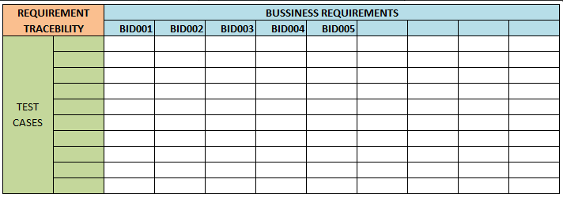

Рисунок 7.6 – Визначення вимог у матриці відстеження вимог

Припустимо, загалом виділено 10 test cases, як це проілюстровано на рисунку 7.7.

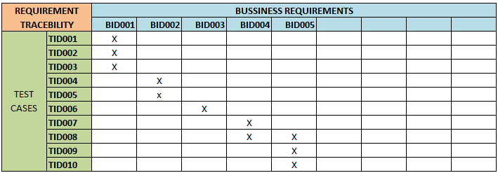

Рисунок 7.7 – Призначення тест-кейсу для перевірки певної вимоги

Щоразу, коли ми пишемо нові test cases, їх потрібно оновлювати в RTM.

Додавання нового ідентифікатора test case TID011 та відображення його до ідентифікатора вимоги BID005, представлено на рисунку 7.8.

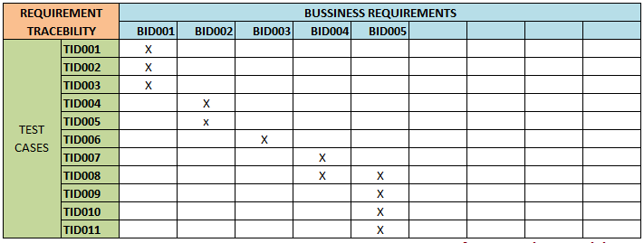

Рисунок 7.8 – Додавання у матрицю відстеження вимог нового тест-кейсу

*Типи Матриць відстеження вимог (RTM):*

* **Відстеження вперед (Forward Traceability Matrix).** Використовується для впевненості що проєкт рухається в потрібному напрямку. Це гарантує, що кожна вимога тестується ретельно.
* **Зворотне або протилежне відстеження (Backward or Reverse Traceability).** Використовується для впевненості що поточний продукт залишається на правильному шляху. Це гарантує, що ми не розширюємо сферу проєкту, додаючи функціонал, який не визначений у вимогах.
* **Двонаправлене відстеження (вперед+назад) (Bi-directional Traceability).** Використовується для впевненості що усі зазначені вимоги мають відповідні тестові випадки та навпаки.

Використані у розділі літературні джерела – [81-88]. 

## Контрольні запитання

1. Що таке тестові результати (Test Deliverables)?
2. Скільки існує видів тестових артефактів?
3. Що таке Effort Estimation Report?
4. Яка мета використання звіту про помилку?
5. Що таке Test Execution Report?
6. Що таке тестова метрика програмного забезпечення?
7. Що містить зведений звіт тесту?
8. Що містить в собі звіт про тестування інцидентів?
9. Який тип тестових результатів дає детальний аналіз виявлених помилок, усунених помилок та розбіжностей, виявлених у програмному забезпеченні?
10. Що містить у собі Примітка до випуску?
11. Кому разом із збіркою (build) надсилається Примітка до випуску?

12. За що відповідає тестовий результат Посібник із встановлення/налаштування?

13. Що надає кінцевому користувачеві Посібник користувача?

14. Для чого призначений Звіт про стан тесту?

15. Як часто готується Звіт про стан тесту?

16. Чим відрізняється Weekly status report від Test status report?

17. Якого документу для дотримання найкращої практики дотримуються майже всі організації з розробки програмного забезпечення?

18. Скільки розділів налічує Стратегія тестування?

19. Що описується у розділі Сфера застосування та огляд?

20. Скільки пунктів налічує Тестовий підхід?

21. Що перераховується у «Вимогах до навколишнього оточення» розділу Тестовий підхід Стратегії тестування?

22. Коротко охарактеризуйте розділи Галузеві стандарти, яких слід дотримуватись, Тестові результати та Тестування метрик Стратегії тестування?

23. Що таке RTM? Для чого вона використовується?

24. Охарактеризуйте розділи Ризик та послаблення, Інструмент звітності та Підсумок тесту Стратегії тестування?

25. Якого виду документ Стратегія тестування – статичний чи динамічний?

26. Що є основним завданням Плану тестування?

27. Хто зазвичай готує План тестування?

28. Якого виду документ План тестування – статичний чи динамічний?

29. Як підготувати ефективний План тестування?

30. Наведіть розділи документу Плану тестування відповідно до стандарту IEEE 829.

31. Що описується в пункті Підхід шаблону Плану тестування?

32. Що описується в пунктах Тестові результати та Задачі тестування Плану тестування?

33. Коротко охарактеризуйте пункти Потреби у персоналі та навчанні, Розклад і Ризики та непередбачувані ситуації Плану тестування?

34. Який ще шаблон тестування, окрім IEEE 829, є широко відомим?

35. Які пункти як мінімум повинен описувати хороший тест план?

36. Скільки та які види Планів тестування існують?

37. Який із видів Планів тестування можна назвати Стратегією тестування?

38. Хто має прорецензувати та погодити розроблені Плани тестування?

39. Що таке шаблон тестового випадку?

40. Наведіть визначення тест-кейсу.

41. Назвіть та охарактеризуйте основні поля розгорнутого тест-кейсу.

42. Структура якого виду розуміється під найпростішим тест-кейсом?

43. Які є види тестових випадків за очікуваним результатом?

44. Яка частина тестового випадку є правилом «хорошого тону» - «насмітив – прибери за собою»?

45. Хто приймає рішення про вигляд тест-кейсу та деталізацію його опису?

46. Що таке специфікація тест-кейсу?

47. Приведіть визначення тест-сценарію.

48. Яка ціль написання тест-кейсів?

49. Що таке життєвий цикл тест-кейсу?

50. Скільки станів життєвого циклу тест-кейсу існує?

51. Який стан є дуже рідкісним випадком у життєвому циклі тест-кейсу?

52. В який стан тест-кейс може перейти із будь-якого іншого?

53. Які рекомендації можна надати по написанню атрибутів тест-кейсу Кроки тест-кейсу та Очікувані результати?

54. Назвіть властивості якісних тест-кейсів.

55. Що таке набір тест-кейсів?

56. Які існують види тестових наборів та які їх переваги?

57. Скільки існує підходів та які саме для створення наборів тест-кейсів?

58. Які цілі матриці відстеження вимог?

59. Як підготувати матрицю відстеження вимог?

60. Назвіть типи матриць відстеження вимог.


## 8.1. Чек-лист

> 

Позначаючи пункти списку, команда чи один тестувальник можуть знати про поточний стан виконання роботи та про якість продукту. Працюючи над проектом по чек-листі, виключена імовірність повторної перевірки по тим самим тест-кейсам, а також підвищується якість тестування, так як імовірність залишити без уваги якийсь функціонал значно зменшується. Тому дуже важливо знати з яких елементів складається чек-лист та вміти ним ефективно користуватись. Як правило, чек-листи створюються в Гугл-таблиці для забезпечення загального диспуту всім QA-спеціалістам.

Чек-листи влаштовані дуже просто. Будь-який з них містить перелік блоків, секцій, сторінок, інших лементів, які необхідно протестувати. На рисунку 8.1 проілюстровано приклад переліку блоків чек-листа.

Пункти можуть містити як лінійну, так і деревовидну, з розділами/підрозділами структуру. Пункти повинні бути однозначні, щоб їх не можна було трактувати ніяким іншим чином. Всі пункти повинні бути оформлені на одній мові: англійській чи українській.

Як правило, кожний чек-лист має декілька стовпців. Кожний стовпець призначений для тестування на окремій платформі. Варто завжди зазначати назви пристроїв, браузерів та версії як це проілюстровано на рисунку 8.2.


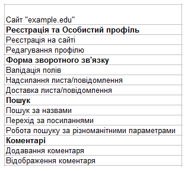

Рисунок 8.1 – Перелік блоків(секцій) чек-листа

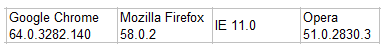

Рисунок 8.2 – Стовпці чек-листа

Тестувати додаток може декілька людей одночасно. В такому випадку кожний тестувальник бере собі по одній чи декілька платформ. При цьому варто над кожною платформою вказати тестувальника, котрий виконує вказаний об'єм робіт, як це проілюстровано на рисунку 8.3.

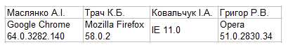

Рисунок 8.3 – Розподіл робіт за відповідними тестерами

При проходженні чек-листів тестувальник відмічає статус навпроти кожного тестованого пункту. Для більшої наочності кожний статус має свій колір, як це проілюстровано на рисунку 8.4.

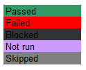

Рисунок 8.4 – Статус пройденого блоку чек-листа

Після завершення тестування не повинно бути клітинок відмічених як «Not run». Всі заведені по чек-листу баг-репорти повинні бути додані в примітках до клітинок зі статусом «Failed», як це проілюстровано на рисунку 8.5.


Рисунок 8.5 – Баг-репорти в примітках до клітинок зі статусом “Failed”

Відмітимо декілька основних моментів, котрі варто враховувати при роботі з чек-листами:

1. По завершенню проходження чек-листа не повинно залишатись клітинок зі статусом «Not run».
2. Всі клітинки зі статусом «Failed» та «Blocked» повинні мати примітки із посиланнями на баг-репорти.
3. Статус «Passed» встановлюється тільки для пунктів, котрі перевірені та не містять помилок.

*Правила зіставлення чек-листів.*

1. **Один пункт — одна операція.** Пункти чек-листа — це однозначні атомарні і повні операції. Наприклад, додавання товару в корзину чи оплата замовлення — дві різні задачі. В спискові перевірок подібні операції оформлені окремими пунктами: доданий товар в корзину, оплата надіслана.
2. **Пункти починаються з іменника.** Ціль чек-листа — врахувати всі дії для найбільш повного покриття тестами програмного забезпечення, тому складаючи пункти варто притримуватись уніфікованої мови. Для зрозумілого і однозначного представлення пункти краще починати з іменників — «Перевірка», «Додавання», «Відправлення» чи дієслова невизначеної форми — «Перевірити», «Додати», «Відправити».
3. **Складання чек-листа за рівнями деталізації.** Для зручності проходження чек-листа краще за все складати тести в такому вигляді, котрий буде послідовним, виходячи із логіки використання функціоналу. В рамках розділу «Реєстрація та Особистий профіль»: реєстрація на сайті, редагування профілю. Розділ «Форма зворотного зв'язку»: валідація полів, надсилання листа, доставка листа (див. рис.8.6).


Рисунок 8.6 – Приклад оформленого чек-листа

**Переваги використання чек-листів:**

- використання чек-листів сприяє структуруванню інформації у співробітника;
- при правильному записі необхідних дій у співробітника з'являється однозначне розуміння задач. Це сприяє підвищенню швидкості навчання нових співробітників;
- чек-листи допомагають уникнути невизначеності і помилок пов'язаних з людським фактором. Збільшується покриття тестами програмного продукту;
- підвищується степінь взаємозамінності співробітників;
- економія робочого часу. Написав чек-лист один раз і його можна використовувати повторно, враховуючи актуальність інформації;

Використання чек-листів – один із прийомів підвищення *бас фактора*. В області розробки програмного забезпечення бас фактор проекту – це міра зосередження інформації серед окремих членів команди.

8.2. Ментальні карти

8.2.1. Характеристика ментальних карт

**Mind Map (ментальна карта)** – це відображення ефективного способу думати, запам'ятовувати, згадувати, вирішувати творчі завдання, а також можливість представити і наочно висловити свої внутрішні процеси обробки інформації, вносити в них зміни, вдосконалювати. Інтелект-карти – це інструмент, що дозволяє:

* простіше працювати з інформацією: запам'ятовувати, розуміти, відновлювати логіку;
* зручно використовувати для презентації матеріалу і наочного пояснення своєї позиції співрозмовникам;
* дозволяє простіше приймати рішення, створювати плани, розробляти проекти.

Зміст Mind Map полягає у декомпозиції основної концепції або кінцевої цілі з метою її кращого розуміння і її покрокового досягнення відповідно. Це свого роду засіб організації інформації з урахуванням взаємозв'язків, який допомагає створити цілісну й систематизовану картину проблеми. А виглядає він деревовидною схемою, на якій в центрі розташовується основна система, а всі відгалуження є її підсистемами.

Для того, щоб такий поділ був ефективним, варто притримуватись наступних правил:

1) Система розподіляється на всіх рівнях по єдиному принципу. Тобто всі підсистеми мають відповідати на одне і теж питання по відношенню до «материнської» категорії. Якщо це зробити складно, що часто буває у випадку тестування програмного забезпечення, то доцільно застосовувати це правило для елементів, які знаходяться на одному рівні.

2) Підсистеми мають взаємно виключати одна одну, а разом створювати цілісний продукт. Підсистеми мають взаємодіяти між собою. Якщо

якісь елементи складно згрупувати, допускається їх виокремлення в категорію «Інше».

3) На кожному рівні доцільно виділяти 5-7 підсистем. У такому разі інформація представлена в максимально наочному вигляді. При цьому не виникає плутанини і перенасичення схеми.

4) Глибина декомпозиції визначається рівнем кваліфікації і досвідченості кожного конкретного спеціаліста. Якщо з таким проектом тестувальник працює не вперше, то рівнів інтелект-карти буде значно менше. Якщо ж це зовсім нова система для працівника, то ступінь деталізації повинна бути максимальною до виокремлення найменших елементів.

5) Взаємопов'язані завдання доцільно групувати за допомогою виділення одним кольором або виділення їх у блоки.

При використанні ментальних карт команда може виявити, що насправді завдань дуже багато, тому використовують пріоритети, щоб уникнути відтермінування проекту та збільшення кількості працівників. У випадку тестування завдання оцінюються згідно таких категорій:

**Вимоги клієнта:** замовник завжди орієнтується на просування продукту на ринок і свій прибуток, тому врахування його побажань обов'язкове.

**Рівень ризику:** найбільш важливий функціонал, збій в роботі якого, завдасть найбільшу шкоду роботі програмного забезпечення та фінансові втрати замовнику, а отже потрібно тестувати в першу чергу.

**Складність системи:** тестування необхідно розпочинати з найскладнішого функціоналу. Це дозволяє заощадити час та уникнути надлишкових витрат.

**Обмеження у часі:** потрібно тестувати у повній мірі лише той функціонал, який запланований на наступний реліз.

На інтелект-картах можна створити спеціальні позначки для пріоритетних завдань, виділяти їх іншим кольором тощо.

8.2.2. MindMap в тестуванні

Зазвичай на проектах використовуються чек-листи, однак для командної роботи вони є не досить зручними, тому часто їх заміняють на інтелектуальні карти. Основними перевагами цих карт є:

1. На інтелект-карті можна побачити цілісну картину та прослідкувати взаємозв'язки між елементами.
2. Мозок користувача ментальної карти може сконцентруватися на першочергових завданнях, розуміючи логіку пріоризації.
3. Наочно помітні накладки, протиріччя, «вузькі місця» проекту.
4. Зручність відстеження пройдених етапів.
5. Можливість вносити зміни до проекту, редагувати його чи доповнювати.

При виявленні нової інформації достатньо домалювати додаткові гілки чи блоки.

6. Відсутність єдиних правил оформлення та структурування.
7. Стимулювання розумової активності, творчого пошуку нових рішень.

8.2.3. Приклад створення Mind Map

Створювати карту можна як для усього проекту так і для окремого розділу.

Для початку розмістіть назву проекту посередині і створіть гілки для кожної категорії, наприклад для тестування функціональності, мережі, платежів тощо, як це проілюстровано на рисунку 8.7.

Після чого кожну гілку розбивають на завдання, які потрібно виконати.

Категорія Інтерфейс користувача, напевне, одна із найбільш важливих категорій будь-якого розроблюваного програмного продукту. Перевірки, які стосуватимуться цієї категорії проілюстровано на рисунку 8.8.

Категорія Функціональність перевіряється, якщо не самою першою, то в їх числі. На рисунку 8.9 проілюстровано види перевірок функціональності, які необхідні для переконання правильності роботи програмного забезпечення.


Рисунок 8.7 – Назва проекту та його категорії


Рисунок 8.8 – Планові перевірки категорії Інтерфейс

![Схема планування перевірок для категорії "Функціональність". У центрі знаходиться блок "Функціональність", від якого відходять розгалуження з пунктирними лініями до багатьох інших блоків, що описують різні аспекти тестування, такі як: всі варіанти А/В тесту, прапорець девелопера вкл/викл, серверний конфіг для фічі, комунікація з сервером, новий користувач, існуючий користувач з даними, оновлення з даними в cache, чистий cache, what's new скрін, background activities, інші додатки із загальним кодом, повідомлення, галерея, камера, локація, мікрофон, обробка серверних помилок, зламані лінки, модерація, заблоковані користувачі, системні обмеження, чи виконує фіча все, що потрібно?, позитивні сценарії, всі категорії вхідних даних, основні версії iOS, локація, дата і час, всі вимоги PRD](images/Krepich_2020_Software_Quality_And_Testing/page_181_img_1.jpeg)

Рисунок 8.9 – Планові перевірки категорії Функціональність

Якщо розглядати мобільний додаток, потрібно обов'язково протестувати можливість навігації, різних входів тощо, що проілюстровано на рисунку 8.10.

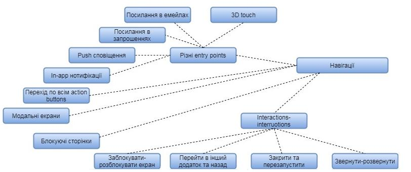

Рисунок 8.10 – Планові перевірки категорії Навігації

Оскільки в А/В тестуванні рішення про те чи тест пройшов успішно роблять спеціалісти DataScience, тому необхідно, щоб статистика була достовірною. Планові перевірки категорії Статистика наведено на рисунку 8.11.

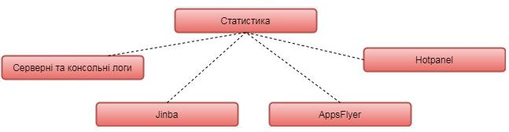

Рисунок 8.11 – Планові перевірки категорії Статистика

Також потрібно перевірити роботу системи при різних умовах підключення до мережі, щоб переконатись, що реакція на погіршення зв'язку буде адекватною. Вказані перевірки приведено на рисунку 8.12.

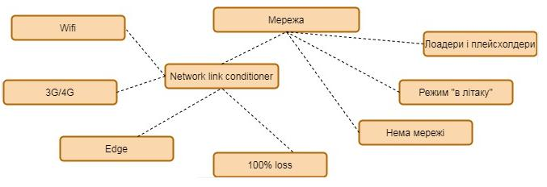

Рисунок 8.12 – Планові перевірки категорії Мережа

Автоматизоване тестування також виносять в окрему групу (див. рис. 8.13).


Рисунок 8.13 – Планові перевірки категорії Автоматизація

Якщо система розроблена на різні операційні системи, необхідно перевірити чи поведінки в них однакові (див. рис. 8.14).

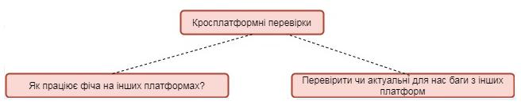

Рисунок 8.14 – Планові перевірки категорії Кросплатформні перевірки

Гілка платежів повинна бути особливо ретельно перевірена для усунення як публічної, так і юридичної відповідальності. Планові перевірки для цієї гілки приведено на рисунку 8.15.


Рисунок 8.15 – Планові перевірки категорії Платежі

Гілка комунікації відповідає за визначення відповідальних осіб, які відповідають за те, що всі частини системи коректно співпрацюють між собою (див. рис. 8.16).


Рисунок 8.16 – Планові перевірки категорії Комунікації

І наостанок, в категорію «інше» ми відносимо усе, що ще потрібно буде протестувати, проте не може бути згруповано в одну категорію (або ж замала кількість для відокремлення в окрему гілку) (див. рис. 8.17).

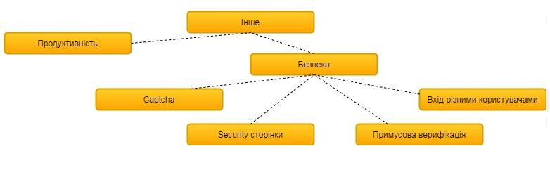

Рисунок 8.17 – Планові перевірки категорії Інше

Готова карта поєднує у собі всі розписані категорії (рисунки 8.7-8.17). Для створення карт можна використовувати наступні ресурси:

1. https://coggle.it/
2. https://www.xmind.net/
3. https://sourceforge.net/projects/freemind/

4. https://mindnode.com/
5. https://bubbl.us/
6. https://www.mindmeister.com/ru
7. https://www.mapul.com/
8. http://wisemapping.com/
9. https://www.mindomo.com/ru/
10. https://simplemind.eu/
11. https://www.mindmaple.com/

Отже, MindMap дуже корисна річ у тестуванні програмного забезпечення, оскільки допомагає наглядно відобразити усе, що потрібно перевірити. Також вони є досить зручними для розуміння навіть новому учаснику проекту.

<u>Використані у розділі літературні джерела – [89-95].</u>

## Контрольні запитання


1. Дайте визначення терміну «чек-лист».
2. Що позначається в рядках та стовпцях чек-листа?
3. Де як правило створюються чек-листи?
4. Яку структуру можуть мати пункти чек-листа?
5. Скільки осіб може тестувати додаток одночасно?
6. Що ставить тестувальник навпроти кожного пункту чек-листа при проходженні відповідного тест-кейсу?
7. До клітинок з яким статусом повинні бути заведені по чек-листу в примітках баг-репорти?
8. Клітинок з яким статусом не повинно залишатись після завершення проходження чек-листа?
9. Озвучте основні правила зіставлення чек-листів.
10. Наведіть переваги використання чек-листів.

11. Що таке бас-фактор?
12. Що таке ментальна карта?
13. У чому полягає зміст MindMap?
14. Назвіть правила, яких варто дотримуватись, щоб поділ тестованої системи на підсистеми був оптимальним.
15. Згідно яких категорій оцінюють тестування із використанням ментальних карт, щоб уникнути відтермінування проекту чи збільшення кількості працівників?
16. Назвіть переваги використання ментальних карт.
17. Наведіть невеликий приклад тестування будь-якої системи чи підсистеми із використанням ментальних карт.

## Тема 9. Типи тестування

### 9.1. Рівні тестування

Тестування на різних рівнях проводиться протягом усього життєвого циклу розробки і супроводу програмного забезпечення. Рівень тестування визначає те, над чим виробляються тести: над окремим модулем, групою модулів або системою в цілому. Проведення тестування на всіх рівнях системи — це запорука успішної реалізації та здачі проекту.

**Рівні тестування (Testing levels):**

* Компонентне або Модульне тестування (Component testing or Unit testing)
* Інтеграційне тестування (Integration testing)
* Системне тестування (System testing)
* Приймальне тестування (Acceptance testing)

**Компонентне тестування** перевіряє функціональність і шукає дефекти в частинах програми, які доступні і можуть бути протестовані окремо (модулі програми, об'єкти, функції і т.д.)

Зазвичай компонентне (модульне) тестування проводиться викликаючи код, який необхідно перевірити чи за підтримки середовищ розробки, таких як фреймовки (каркаси) для модульного тестування або інструменти для дебагу. Всі знайдені дефекти, як правило виправляються в коді без формального їх опису в системі багів (Bug Tracking System). Один з найбільш ефективних підходів до компонентного (модульного) тестування — це підготовка автоматизованих тестів до початку основного кодування програмного забезпечення. Це називається розробка від тестування (test-driven development) або підхід тестування спочатку (test first approach). При цьому підході створюються і інтегруються невеликі шматки коду, навпроти яких запускаються

тести, написані до початку кодування. Розробка ведеться до тих пір поки всі тести не будуть успішними.

<u>Інструменти Unit Testing</u>: Junit, NUinit, JMockit, EMMA, PHPUnit тощо.

**Інтеграційне тестування** призначено для перевірки зв'язку між компонентами, а також взаємодії з різними частинами системи (операційної системи, обладнанням, будь-якого зв'язку між різними системами).

Рівні інтеграційного тестування:
* Компонентний інтеграційний рівень (Component Integration testing) перевіряє взаємодію між різними системами після проведення компонентного тестування.
* Системний інтеграційний рівень (System Integration testing) перевіряє взаємодію між різними системами після проведення системного тестування.

Інтегреційне тестування поділяється на:
- підхід великого вибуху (Bing Bang Approach);
- підхід зверху вниз (Top Down Approach);
- підхід знизу догори (Bottom Up Approach);
- сендвіч або гібридний інтеграційний підхід (комбінація зверху вниз та знизу вгору) (Sandwich or Hybrid Integration Approach).

Цей процес здійснюється за допомогою фіктивних програм під назвою Stubs and Drivers. Заглушки та драйвери не реалізують всю логіку програмування програмного модуля, а просто імітують передачу даних з викликовим модулем.

• *Знизу вгору (Bottom Up Approach )*

Всі низькорівневі модулі, процедури або функції збираються воєдино і потім тестуються. Після чого збирається наступний рівень модулів для проведення інтеграційного тестування. Даний підхід вважається корисним, якщо всі або практично всі модулі рівня, що розробляється, готові.Також даний

підхід допомагає визначити за результатами тестування рівень готовності програми
* *Зверху вниз (Top Down Approach)*

 Спочатку тестуються всі високорівневий модулі і поступово один за одним додаються низькорівневі. Всі модулі більш низького рівня симулюються заглушками з аналогічною функціональністю, навіщо в міру готовності вони замінюються реальними активними компонентами. Таким чином ми проводимо тестування зверху вниз.
* *Великий вибух ("Big Bang" Approach)*

 Всі або практично всі розроблені модулі збираються разом у вигляді закінченої системи або її основної частини, і потім проводиться інтеграційне тестування. Такий підхід дуже хороший для збереження часу. Однак якщо тест- кейси і їх результати записані не вірно, то сам процес інтеграції сильно ускладниться, що стане перешкодою для команди тестування при досягненні основної мети інтеграційного тестування.

 Інструменти Integration testing: Citrus Integration Testing, Vector CAST/C++, FitNesse, Validata тощо.

**Системне тестування** – основним завданням є перевірка як функціональних, так і не функціональних вимог у системі в цілому. При цьому виявляються такі дефекти як невірне використання ресурсів системи, непередбачені комбінації даних рівня користувача, несумісність з оточенням, непередбачені сценарії використання, відсутня або невірна функціональність, незручність використання і т.д. Для мінімізації ризиків, пов'язаних з особливостями поведінки системи в тому чи іншому середовищі, під час тестування рекомендується використовувати оточення максимально наближене до того, на яке буде встановлений продукт після релізу.

Існує два підходи до системного тестування:

* **На базі вимог** (requirements based) – для кожної вимоги пишуться тестові випадки (test cases), перевіряючи виконання даної вимоги.
* **На базі випадків використання** (use case based) – на основі уявлення про способи використання продукту створюються випадки використання системи (Use Cases). По конкретному випадку використання можна визначити один або більше сценаріїв. На перевірку кожного сценарію пишуться тест-кейси (test cases), які повинні бути протестовані.

**Приймальне тестування** проводиться з метою визначення чи задовольняє система приймальні критерії та винесення рішення замовником або іншою уповноваженою особою приймається програма чи ні. Приймальне тестування виконується відповідно до Плану приймальних Робіт. Рішення про проведення приймального тестування приймається, коли продукт досягнув необхідного рівня якості та замовник ознайомлений з Планом приймальних Робіт (Product Acceptance Plan) або іншим документом, де описаний набір дій, пов'язаних з проведенням приймального тестування, датою проведення, відповідальності і т.д.

**Методи приймального тестування:**
* Тестування замовником самостійно. Це ризиковано в тому сенсі, що у замовника може не бути творчих ресурсів, а завантаження по поточним завданням може розтягти процес приймання.
* Тестування (Аудит) третьою стороною. Наймається спеціалізована компанія на тестування або підписується договір з конкурентом постачальника на надання послуг аудиту. Оптимально.
* Спільне тестування за сценаріями із замовником. Постачальник допомагає готувати пакет матеріалів для приймального тестування, готує команду замовника до методичного приймального тестування, контролює хід приймального тестування і терміни його виконання. Присутність інженера з

тестування з боку виконавця допоможе краще зафіксувати розбіжності, зауваження та виявлені дефекти.

Фаза приймального тестування триває до тих пір, доки замовник не виносить рішення про відправлення програми на доопрацювання або реліз програми.

Незважаючи на те, що приймання знаходиться в кінці етапу (а в невеликих проектах і в кінці проекту) – готуватися до нього потрібно заздалегідь і перший прогін потрібно робити трохи раніше – щоб визначитися з повнотою і якістю робочого набору артефактів приймання, привчити до нього замовника, заздалегідь виявити можливі проблеми в приймальних тестах або в продукті.

## 9.2. Види тестування

Всі види тестування програмного забезпечення, залежно від переслідуваних цілей, можна умовно розділити на наступні групи:
* Функціональні (Functional testing).
* Нефункціональні (Non-functional testing).
* Пов'язані зі змінами (Regression testing).

### Функціональні види тестування

Функціональні тести базуються на функціях і особливостях, а також взаємодії з іншими системами, і можуть бути представлені на всіх рівнях тестування: компонентному або модульному (Component/Unit testing), інтеграційному (Integration testing), системному (System testing) і приймальному (Acceptance testing).

Функціональні види тестування розглядають зовнішню поведінку системи. Далі перераховані одні з найпоширеніших видів функціональних тестів, а саме:
- функціональне тестування (Functional testing);
- тестування безпеки (Security and Access Control Testing);

- тестування взаємодії (Interoperability Testing).

**Нефункціональні види тестування**

Нефункціональне тестування описує тести, необхідні для визначення характеристик програмного забезпечення, які можуть бути виміряні різними величинами. В цілому, це тестування того, “Як” система працює. Далі перераховані основні види нефункціональних тестів, а саме:

- всі види тестування продуктивності:
  - тестування навантаження (Performance and Load Testing);
  - стресове тестування (Stress Testing);
  - тестування стабільності або надійності (Stability / Reliability Testing);
- об'ємне тестування (Volume Testing);
- тестування установки (Installation testing);
- тестування зручності користування (Usability Testing);
- тестування на відмову і відновлення (Failover and Recovery Testing);
- конфігураційне тестування (Configuration Testing).

**Тестування, пов'язане зі змінами**

Після проведення необхідних змін, таких як виправлення бага/дефекту, програмне забезпечення повинне бути перетестоване для підтвердження того факту, що проблема була дійсно вирішена. Нижче перераховані види тестування, які необхідно проводити після установки програмного забезпечення, для підтвердження працездатності програми або правильності здійсненого виправлення дефекту, а саме:

- димове тестування (Smoke Testing);
- регресійне тестування (Regression Testing);
- тестування збірки (Build Verification Test);
- санітарне тестування або перевірка узгодженості/справності (Sanity Testing).

9.2.1. Функціональні види тестування програмного забезпечення

9.2.1.1. Функціональне тестування (Functional testing)

Тестування функціональності може проводитися у двох аспектах:

* вимоги;
* бізнес-процеси.

Тестування в аспекті «вимоги» використовує специфікацію функціональних вимог до системи як основу для дизайну тестових випадків (Test Cases). У цьому випадку необхідно зробити список того, що буде тестуватися, а що ні, пріоритезувати вимоги на основі ризиків (якщо це не зроблено в документі з вимогами), а на основі цього пріоритезувати тестові сценарії (test cases). Це дозволить сфокусуватися і не упустити при тестуванні найбільш важливий функціонал.

Тестування в аспекті «бізнес-процеси» використовує знання цих самих бізнес-процесів, які описують сценарії щоденного використання системи. У цьому випадку тестові сценарії (test scripts), як правило, ґрунтуються на випадках використання системи (use cases).

<u>Перевагою</u> функціонального тестування є імітація фактичного використання системи.

<u>Недоліки</u> функціонального тестування:

- можливість упущення логічних помилок у програмному забезпеченні;
- ймовірність надмірного тестування.

Досить поширеною є автоматизація функціонального тестування.

9.2.1.2. Тестування безпеки (Security and Access Control Testing)

Тестування безпеки – це стратегія тестування, що використовується для перевірки безпеки системи, а також для аналізу ризиків, пов'язаних із забезпеченням цілісного підходу до захисту додатків, атак хакерів, вірусів, несанкціонованого доступу до конфіденційних даних.

Загальна стратегія безпеки ґрунтується на трьох основних принципах: конфіденційність, цілісність, доступність.

**Конфіденційність** – це приховування певних ресурсів або інформації. Під конфіденційністю можна розуміти обмеження доступу до ресурсу деякої категорії користувачів, або іншими словами, за яких умов авторизований користувач має отримати доступ до даного ресурсу.

**Цілісність** – існує два основних критерії при визначенні поняття цілісності:
*Довіра* – очікується, що ресурс буде змінений тільки відповідним способом та певною групою користувачів.
*Пошкодження і відновлення* – у разі коли дані пошкоджуються або неправильно змінюються авторизованим або неавторизованим користувачем, потрібно визначити наскільки важливою є процедура відновлення даних.

**Доступність** являє собою вимоги про те, що ресурси повинні бути доступні авторизованому користувачеві, внутрішньому об'єкту або пристрою. Як правило, чим більш критичний ресурс тим вище рівень доступності.

Види тестування безпеки:

Існує сім основних типів тестування безпеки:
- *Сканування вразливості (Vulnerability Scanning)* – при скануванні на вразливість визначається і повідомляється про вразливість за допомогою інструментів сканування вразливості. Це перший крок до підвищення безпеки системи. Звіт про оцінку вразливості повинен містити заголовок, опис та вираженість вразливості.
- *Сканування безпеки (Security Scanning)* – проводиться для того, щоб знайти слабкі місця в безпеці мережі та системи, а також пропонує рішення для зменшення цих ризиків.
- *Тестування на проникнення (Penetration Testing)* – у процесі тестування на проникнення (Pen Test) ми виявляємо вразливості та намагаємось їх використовувати за допомогою інструментів тестування на проникнення. Ми

повторюємо однакові тести на проникнення, поки система не стане негативною для всіх цих тестів.

- *Оцінка ризику (Risk Assessment)* — включає перегляд та аналіз ризиків для безпеки, які далі будуть пріоритизовані як низький, середній та високий. Він також рекомендує можливі способи запобігання ризику.

- *Аудит безпеки (Security Auditing)* — це процедура визначення вад безпеки. Це внутрішня перевірка систем з метою виявлення недоліків безпеки. У деяких випадках аудит проводиться за допомогою покрокової перевірки коду.

- *Етичний злом (Ethical Hacking)* - робиться в системі з наміром знайти та викрити проблеми безпеки в системі. Етичне хакерство здійснює хакер з «білим капелюхом». Хакер з «білим капелюхом» - професіонал із безпеки, який використовує свої навички на законний спосіб, щоб виявити вади системи.

- *Оцінка стану (Posture Assessment)* — це поєднання сканування безпеки, етичного злому та оцінки ризику для представлення безпеки системи чи організації.

### 9.2.1.3. Тестування взаємодії (Interoperability Testing)

Тестування взаємодії — це функціональне тестування, що перевіряє здатність програми взаємодіяти з одним і більше компонентами або системами і включає в себе тестування сумісності (compatibility testing) і інтеграційне тестування (integration testing).

### 9.2.2. Нефункціональні види тестування програмного забезпечення

**Тестування навантаження або тестування продуктивності** — це автоматизоване тестування, що імітує роботу певної кількості бізнес-користувачів на ресурсі.

Завданням тестування продуктивності є визначення масштабованості програми під навантаженням, при цьому відбувається:

* вимір часу виконання обраних операцій при певних інтенсивностях виконання цих операцій;
* визначення кількості користувачів, що одночасно працюють з додатком;
* визначення меж прийнятної продуктивності при збільшенні навантаження (при збільшенні інтенсивності виконання цих операцій);
* дослідження продуктивності на високих, граничних, стресових навантаженнях.

До основних видів тестування продуктивності, окрім тестування навантаження, також відносяться наступні:

**1. Стресове тестування** (Stress Testing)

Стресове тестування дозволяє перевірити наскільки додаток і система в цілому працездатні в умовах стресу і також оцінити здатність системи до регенерації, тобто повернення до нормального стану після припинення впливу стресу. Стресом в даному контексті може бути підвищення інтенсивності виконання операцій до дуже високих значень або аварійна зміна конфігурації сервера.

**2. Тестування стабільності або надійності** (Stability / Reliability Testing)

Завданням тестування стабільності (надійності) є перевірка працездатності програми при тривалому (багатогодинному) тестуванні з середнім рівнем навантаження. Часи виконання операцій можуть грати в даному вигляді тестування другорядну роль. При цьому на перше місце виходить відсутність втрат пам'яті, перезапусків серверів під навантаженням та інших аспектів, що впливають саме на стабільність роботи.

**Об'ємне тестування** (Volume Testing). Завданням об'ємного тестування є отримання оцінки продуктивності при збільшенні обсягів даних в базі даних програми, при цьому відбувається:

* вимір часу виконання обраних операцій при певних інтенсивностях виконання цих операцій;

* може проводитися визначення кількості користувачів, що одночасно працюють з додатком.

**Тестування установки** (Installation Testing). Тестування установки направлено на перевірку успішної інсталяції і настройки, а також оновлення або видалення програмного забезпечення.

**Тестування зручності користування** (Usability Testing). Для того, щоб додаток був популярним, йому мало бути функціональним – воно має бути ще й зручним. Тестування зручності користування – це метод тестування, спрямований на встановлення ступеня зручності використання, зрозумілості та привабливості для користувачів розроблюваного продукту в контексті заданих умов.

Тестування зручності користування дає оцінку рівня зручності використання програми за наступними пунктами:

* продуктивність, ефективність (efficiency) – скільки часу і кроків знадобиться користувачеві для завершення основних завдань програми, наприклад, розміщення новини, реєстрації, купівлі товару і т.д. (менше – краще);
* правильність (accuracy) – скільки помилок зробив користувач під час роботи з додатком (менше – краще);
* активізація в пам'яті (recall) – як багато користувач пам'ятає про роботу програми після призупинення роботи з ним на тривалий період часу (повторне виконання операцій після перерви повинно проходити швидше ніж у нового користувача);
* емоційна реакція (emotional response) – як користувач себе почуває після завершення завдання – розгублений, випробував стрес? Порекомендує користувач систему своїм друзям? (позитивна реакція – краще).

**Тестування на відмову і відновлення** (Failover and Recovery Testing) перевіряє тестований продукт з точки зору здатності протистояти і успішно

відновлюватися після можливих збоїв, що виникли у зв'язку з помилками програмного забезпечення, відмовами обладнання або проблемами зв'язку (наприклад, відмова мережі). Метою даного виду тестування є перевірка систем відновлення (або дублюючих основний функціонал систем), які, у разі виникнення збоїв, забезпечать збереження і цілісність даних тестованого продукту. Методика подібного тестування полягає в симулюванні різних умов збою і наступному вивченні та оцінці реакції захисних систем. У процесі подібних перевірок з'ясовується, чи була досягнута необхідна ступінь відновлення системи після виникнення збою.

**Конфігураційне тестування** (Configuration Testing) називається тестування сумісності продукту, що випускається (програмне забезпечення) з різними апаратними і програмними засобами.

Основні цілі — визначення оптимальної конфігурації і перевірка сумісності програми з необхідним оточенням (обладнанням, операційною системою тощо).

### 9.2.3. Види тестування, пов'язані зі змінами. Кросбраузерність.

Після проведення необхідних змін, таких як виправлення бага/дефекту, програмне забезпечення повинне бути перетестоване для підтвердження того факту, що проблема була дійсно вирішена. Нижче перераховані види тестування, які необхідно проводити після установки програмного забезпечення, для підтвердження працездатності програми або правильності здійсненого виправлення дефекту:

* регресійне тестування (Regression Testing);
* димове тестування (Smoke Testing);
* санітарне тестування або перевірка узгодженості / справності (Sanity Testing);
* Тестування збірки (Build Verification Test).

**Регресійне тестування (Regression Testing)** — це вид тестування, спрямований на перевірку змін, зроблених в додатку або середовищі (лагодження дефекту, злиття коду, міграція на іншу операційну систему, базу даних, веб сервер або сервер додатку), для підтвердження того факту, що існуюча раніше функціональність працює як і раніше. Регресійними можуть бути як функціональні, так і нефункціональні тести. Як правило, для регресійного тестування використовуються тест-кейси, написані на ранніх стадіях розробки і тестування. Це дає гарантію того, що зміни в новій версії програми не пошкодили вже існуючу функціональність. Рекомендується робити автоматизацію регресійних тестів для прискорення подальшого процесу тестування і виявлення дефектів на ранніх стадіях розробки програмного забезпечення. Сам по собі термін “Регресійне тестування”, залежно від контексту використання може мати різний зміст. Сем Канер, наприклад, описав 3 основних типи регресійного тестування:

* регресія багів (Bug regression) — спроба довести, що виправлена помилка насправді не виправлена;
* регресія старих багів (Old bugs regression) — спроба довести, що недавня зміна коду чи даних зламала виправлення старих помилок, тобто старі баги стали знову відтворюватися;
* регресія побічного ефекту (Side effect regression) — спроба довести, що недавня зміна коду чи даних зламала інші частини продукту.

**Димове тестування (Smoke Testing)**. Поняття пішло з інженерного середовища: “При введенні в експлуатацію нового обладнання вважалося, що тестування пройшло вдало, якщо з установки не пішов дим”. В області ж тестування програмного забезпечення, воно застосовується для поверхневої перевірки всіх модулів програми на предмет працездатності і наявності швидкого знаходження критичних і блокуючих дефектів.

**Санітарне тестування (Sanity Testing).** Це вузьконаправлене тестування, достатнє для доказу того, що конкретна функція працює згідно заявленим в специфікації вимогам. Є підмножиною регресійного тестування. Використовується для визначення працездатності певної частини програми після змін вироблених в ній або навколишньому середовищі. Зазвичай виконується вручну.

**Тестування збірки (Build Verification Test).** Тестування спрямоване на визначення відповідності випущеної версії критеріям якості для початку тестування. За своїми цілями є аналогом димового тестування, спрямованого на приймання нової версії в подальше тестування або експлуатацію. Вглиб воно може проникати далі, залежно від вимог до якості випущеної версії.

**Відмінність санітарного тестування від димового**. У деяких джерелах помилково вважають, що санітарне та димове тестування — це одне і теж. Ми ж вважаємо, що ці види тестування мають "вектори руху", що спрямовані в різні боки. На відміну від димового (Smoke testing), санітарне тестування (Sanity testing) направлено вглиб функції, що перевіряється, в той час як димове направлено вшир, для покриття тестами якомога більшого функціоналу в найкоротші терміни.

**Кросбраузерність (Cross-browser)** — властивість сайту відображатися і працювати у всіх популярних браузерах ідентично. Під ідентичністю розуміється відсутність недоліків верстки і здатність відображати матеріал з однаковим ступенем читабельності.

Тестування сайту на кроссбраузерность необхідно проводити:
- у різних браузерах (сімейство Mozilla, Internet Explorer, Opera, Safari, Мобільні браузери);
- при різних розширеннях екрану (зазвичай $640 * 480, 800 * 600, 1024 * 768$, $1280 * 800, 1280 * 1024, 1366 * 768$);
- в різних операційних системах (Mac OS, Linux, Win).

9.3. Класифікація видів тестування
1. За ступенем ізольованості компонентів
2. За часом проведення тестування
3. За ступенем автоматизації
4. За позитивністю сценаріїв
5. За суб'єктом тестування
6. За об'єктом тестування
7. За статичністю
8. За знанням системи

9.3.1. За ступенями ізольованості компонентів
За ступенем ізольованості компонентів розрізняють:
* компонентне (модульне) тестування (component/unit testing);

*Приклад: Тестування однієї операції або одного модуля (реєстрація користувача, кабінет користувача, вибір товару).*
* інтеграційне тестування (integration testing);

*Приклад: Тестування взаємодії двох компонентів (користувач зареєструвався і побачив свої дані в особистому кабінеті).*
* системне тестування (system/end-to-end testing).

*Приклад: Тестування 3 і більше компонент або систем, які при зв'язці дозволяють провести бізнес транзакцію. (Користувач зареєструвався, залогінився, поклав товари в кошик, додав кредитну карту, оплатив товари кредитною карткою, отримав підтвердження на електронну пошту).*

9.3.2. За часом проведення тестування
При розгляді в площині часу проведення тестування виділяють:
* «димове тестування» (Smoke testing) – тестуються основні сценарії і відтворюваність відомих критичних багів протягом 5-15 хвилин, щоб зрозуміти,

чи не пошкоджений основний функціонал (логін, кабінет, додавання в корзину, пошук - для сайту інтернет магазину);

- тестування нової функціональності (New feature testing);
- регресійне тестування (Regression testing) – виконується при виході нової версії програмного продукту з метою перевірки, чи не був пошкоджений старий працюючий функціонал новими змінами. У нього входить перевірка основних бізнес транзакцій і перевірка раніше знайдених найбільш критичних багів. Найчастіше підлягає автоматизації;
- тестування прийомки (Acceptance testing) – тестування із заздалегідь підготовленими сценаріями з боку замовника. Найчастіше проводиться перед виходом в Production (використання продукту широкими масами або конкретними користувачами).

### 9.3.3. За ступенями автоматизації

При розгляді в площині ступеня автоматизації тестування виділяють:

- ручне тестування (Manual testing) – виконується людиною без використання додаткових інструментів, що автоматизують процес тестування;
- автоматизоване тестування (Automated testing) – виконується без участі людини за допомогою спеціальних інструментів (програми для тестування швидкості і надійності системи, програми для регресивного тестування ...);
- напівавтоматизоване тестування (Semi automated testing) - суміш попередніх двох видів (наприклад за допомогою інструменту автоматизації створюємо аккаунт користувача в системі, а потім вручну створюємо покупки в інтернет-магазині).

### 9.3.4. За позитивністю сценаріїв

При розгляді в площині позитивності сценаріїв тестування виділяють:

* позитивне тестування (Positive testing) — перевіряє сценарії, які передбачають нормальне («правильне») використання і/або роботу системи;
* негативне тестування (Negative testing) — протилежність позитивному, перевіряє сценарії пов'язані із потенційною помилкою або з потенційним дефектом в системі.

## 9.3.5. За суб’єктом тестування

При розгляді в площині суб'єкта тестування виділяють:

* альфа тестування (Alpha tester) — тестування, яке проводять люди, що беруть участь в тестуванні і працюють усередині компанії (тестувальники, програмісти, бізнес аналітики, HR, ...). Виконують свої тести до релізу;
* бета тестування (Beta tester) — тестування, яке проводять люди, що беруть участь в тестуванні, але не працюють в компанії. Зазвичай це користувачі програмного забезпечення (замовники або обрана «target group»). Виконують свої тести до релізу;
* гамма тестування (Gamma testing) — тестування, яке проводиться, коли програмне забезпечення готове до випуску із заданими вимогами. Робиться це на стороні клієнта. Робиться безпосередньо без урахування усіх внутрішніх тестувальних дій.

## 9.3.6. За об’єктом тестування

При розгляді в площині об'єкта тестування виділяють функціональне і нефункціональне тестування.

*Функціональне тестування* - це тестування програмного забезпечення з метою перевірки можливості бути реалізованими функціональних вимог, тобто здатності програмного забезпечення в певних умовах вирішувати завдання, потрібні користувачам. Функціональні вимоги визначають, що саме робить програмне забезпечення, які завдання воно вирішує.

Функціональні тести базуються на функціях і особливостях, а також взаємодії з іншими системами, і можуть бути представлені на всіх рівнях тестування. Функціональні види тестування розглядають зовнішню поведінку системи.

Тестування функціональності може проводитися в двох аспектах:
- вимоги – requirements;
- бізнес-процеси – use cases (див. рис. 9.1).

*Приклад: Високорівневі вимоги при тестуванні магазину з прокату відео - дисків*


Рисунок 9.1 – Тестування функціональності на основі Use Case

***Нефункціональне тестування*** описує тести, необхідні для визначення характеристик програмного забезпечення, які можуть бути виміряні різними величинами.

***Види нефункціонального тестування:***

* Тестування продуктивності (Performance Testing)
* Об'ємне тестування (Volume Testing)
* Тестування установки (Installation testing)
* Тестування зручності користування (Usability Testing)
* Тестування на відмову і відновлення (Failover and Recovery Testing)
* Конфігураційне тестування (Configuration Testing)
* Тестування локалізації (Localization testing)
* Тестування сумісності (Compatibility testing)

***Тестування продуктивності (Performance testing) включає:***

1. Навантажувальне тестування (Load testing)
2. Стрес тестування (Stress testing)
3. Тестування стабільності (Stability testing)

***Приклад:*** В системі можуть одночасно знаходитись 500 користувачів (банківська система).

***Тестування навантаження (Load testing)***

*У систему входять поступово 1, 2, 5, 10, 20, 50, 100, 200, 300, 400, 500 користувачів. Йде поступове навантаження до максимуму*

*Знімаються показники: Час відгуку системи, завантаження процесора і оперативної пам'яті.*

***Стрес тестування (Stress testing)***

*У систему входять 1000, 2000, 4000 користувачів. Збільшення максимуму в 2, 4, 8 разів*

*Знімаються показники: Час відгуку системи, завантаження процесора і оперативної пам'яті, перевірка на стійкість*

***Тестування стабільності (Stability testing)***

*У систему входять 250 користувачів і працюють 8 годин*

***Usability testing*** передбачає перевірку зручності користування інтерфейсом desktop або web додатку.

*Приклад: чи зручний інтерфейс, навігація, зрозумілість, чи не болять очі від кольорів сайту, чи немає мільйона кроків для виконання простої операції.*

***GUI testing*** - перевірка всіх елементів (controls) додатку (сторінки, посилання, кнопки, форми, radio-buttons, check-boxes). Також перевіряється фірмовий стиль, колірна гамма і логіка присутності/відсутності елементів.

При ***Security testing*** (тестуванні безпеки) тестуються конфіденційність, цілісність і доступність даних.

*Приклад: тестування логіна, прав і обмежень користувача, безпеки протоколу передачі даних, Cache, Cookies.*

При ***Localization testing*** (тестування локалізації) тестуються інтерфейс користувача і файли з даними.

Основні об'єкти:
* Operating System - операційна система.
* Keyboards - розкладки клавіатури.
* Text Filters - текстові фільтри.
* Hot keys - гарячі клавіші.
* Spelling Rules - правила написання.
* Sorting Rules - правила сортування.
* Upper and Lower case conversions - правила використання заголовних букв.

* Printers - друк на принтері.
* Size of Papers - розміри паперу.
* Mouse - налаштування миші.
* Date formats - формати дат.
* Restricted content - доступність даних в різних країнах.

При *Compatibility testing* (тестування сумісності) тестуються наступні області:

1. Різні операційні системи (xp, 7, 8, mac, ubuntu).
2. Бази даних (MS SQL, Oracle, DB2).
3. x86 і x64 (32 і 64 бітні версії операційних систем).
4. Різні браузери (ie7, ie8, ie9, ff, opera, safari).

### 9.3.7. За статичністю

При розгляді в площині статичності тестування виділяють;

* статичне тестування (Static testing) не вимагає запуску програмного коду (тестування документації, вимог, запуск аналізаторів коду);
* динамічне тестування (Dynamic testing) мається на увазі у всіх видах тестування при яких програмний продукт працює.

### 9.3.8. За знанням системи

Виділяють три види тестування за знанням системи, а саме:

* тестування Чорної скриньки (Black-Box testing) - тестування програмного забезпечення у тому вигляді, в якому його буде використовувати кінцевий користувач.
* тестування Білої скриньки (White-Box testing) - тестування вихідного коду програмного забезпечення і його внутрішньої структури.

* тестування Сірої скриньки (Grey-Box testing) - тестування програмного забезпечення з урахуванням знань внутрішньої структури і коду.

При тестуванні чорної скриньки, тестувальник має доступ до програмного забезпечення тільки через ті ж інтерфейси, що і замовник або користувач (Front-End, Browser, Desktop form), або через зовнішні інтерфейси (Web services, спеціалізовані служби), що дозволяють іншому комп'ютеру або іншому процесу підключитися до системи для тестування.

При цьому підході не використовується знання про внутрішній устрій тестованого об'єкта.

Як правило, тестування чорної скриньки ведеться:

* з використанням Functional Specification, SRS, TD, що описують вимоги до системи;
* якщо документація відсутня - то на підставі Product Backlog, який містить побажання замовника до створюваної системи;
* якщо немає вимог ні в якому вигляді, то:
  - вони повинні бути створені на основі комунікацій із замовником (дзвінки, зустрічі, листи, візити);
  - або ж написані бізнес-аналітиком або тест-дизайнером і затверджені із замовником.

Повний цикл тестування включає в себе:


**9.4. Приклад складання плану перевірки**

Досить часто при проходженні співбесіди на посаду тестера, людині пропонують озвучити(написати) план перевірки будь-якого предмета — олівця, телевізора, праски тощо.

Нижче приведено короткий зразок підходу до написання плану перевірки дверей.

**План перевірки дверей**

**1. Функціональні перевірки.**

1.1. Перевірити, що двері відкриваються.

1.2. Перевірити, що двері зачиняються.

1.3. Спробувати закрити вже закриті двері.

1.4. Спробувати відкрити вже відкриті двері.

**2. GUI (інтерфейс користувача)**

2.1. Перевірити табличку на дверях.

2.2. Перевірити пофарбування дверей.

2.3. Перевірити наявність дверної ручки.

**3. Permissions**

3.1. Перевірити, що правильним ключем двері відчиняються.

3.2. Перевірити, що неправильним ключем двері не відчиняються.

3.3. Перевірити, що зачинені на ключ двері не можливо відчинити.

3.4. Перевірити, що не хачинені на ключ двері можна відчинити без ключа.

3.4. Подзвонити в двері. Якщо там нікого нема, двері не повинні відчинятись самі.

3.5. Постукати у двері. Якщо так хтось є і він запитає «Хто?», відповісти «Поліція». Двері повинні відчинитись.

**4. Stress/Loading**

4.1. Відкривайте та зачиняйте двері зі швидкістю 120 циклів за хвилину.

4.2. Відкривайте та закривайте двері зі швидкістю 6 разів за хвилину протягом 48 годин.

4.3. Стукайте в двері з частотою 1200 ударів в хвилину.

4.4. Стукайте в двері з частотою 10 ударів в хвилину протягом 24 годин.

4.5. Відкривайте та закривайте двері ключем протягом 12 годин.

**5. End to end**

5.1. Постукати в двері. Подзвонити в дзвінок. Відкрити ключем. Відкрити двері. Зачинити двері. Закрити двері ключем. Прочитати табличку на дверях. Нічого не відвалилось, не звенить, не вибухає?

**6. Usability**

6.1. Перевірити, що ручка дверей вміщається в долоню.

6.2. Перевірити, що ручка знаходиться саме на дверях, а не на сусідній стіні на висоті 20 см.

6.3. Перевірити, що висота дверей більше середньостатистичного людського зросту.

**На додачу**

1. Розпочати із використанням дверей однією людиною. Збільшувати кількість користувачів з кроком 5 людей в 5 секунд. Збільшувати навантаження, доки двері не зламаються.

2. Перевірка документації до дверей — інструкції користувача, технічного паспорта тощо.

3. Перевірка серцебиття та тиску людини, яка відчиняє двері. Дії з відкривання/зачинення не повинні забирати в користувача всі сили та ресурси.

4. Перевірити вплив функціонування дверей на появу тріщин у стіні.

5. White box tests: перевірити волокна дерев'яного полотна на паралельність. Перевірити окремі елементи (класи) на предмет надлишковості (а можливо в дверях присутні 6 замкових щілин). Перевірка алгоритму зачинення дверей.

**В релізі не перевірено**

Відсутні перевірки на стресовість (удар ногою чи головою)

Відсутні перевірки на кріплення дверей до одвірків

Відсутні перевірки сусіднього модуля – одвірка (проміжки між ним та дверима)

Відсутні перевірки між дверима та підлогою тощо.

Використані у розділі літературні джерела – [96-102].


## Контрольні запитання

1. Скільки рівнів тестування існує?
2. Коротко охарактеризуйте компонентне тестування.
3. Назвіть інструменти модульного тестування.
4. Коротко охарактеризуйте інтеграційне тестування.
5. Скільки рівнів інтеграційного тестування виділяють та яких?
6. На які види поділяються інтеграційне тестування? Коротко охарактеризуйте кожний вид.
7. Назвіть інструменти інтеграційного тестування.
8. Коротко охарактеризуйте системне тестування.
9. Які два підходи до системного тестування виділяють?
10. Коротко охарактеризуйте приймальне тестування.
11. Відповідно до якого документу проводиться приймальне тестування?
12. Назвіть методи приймального тестування.
13. Скільки часу триває фаза приймального тестування?
14. Які види (групи) тестування існують?
15. Перерахуйте функціональні види тестування.
16. Перерахуйте не функціональні види тестування
17. Перерахуйте види тестування пов'язаного зі змінами.

18. У яких двох аспектах проводиться функціональне тестування?

19. Що таке тестування безпеки?

20. На яких принципах ґрунтується загальна стратегія безпеки?

21. Назвіть критерії для визначення поняття цілісності системи.

22. Скільки основних типів тестування безпеки існує? Охарактеризуйте кожний тип.

23. Що таке тестування взаємодії?

24. Які види тестування продуктивності ви знаєте? Охарактеризуйте їх.

25. Охарактеризуйте Usability testing.

26. Охарактеризуйте тестування на відмову та відновлення.

27. Охарактеризуйте конфігураційне тестування.

28. Коротко охарактеризуйте регресійне тестування.

29. Які три типи регресійного тестування виділяє Сем Канер?

30. Коротко охарактеризуйте димова тестування.

31. Коротко охарактеризуйте санітарне тестування.

32. Чим відрізняється димове тестування від санітарного?

33. Коротко охарактеризуйте тестування збірки.

34. Які види тестування класифікують за ступенем ізольованості компонентів?

35. Які види тестування класифікують за часом проведення тестування?

36. Які види тестування класифікують за ступенем автоматизації?

37. Які види тестування класифікують за позитивністю сценаріїв?

38. Які види тестування класифікують за суб'єктом тестування?

39. Які види тестування класифікують за об'єктом тестування?

40. Які види тестування класифікують за статичністю

41. Які види тестування класифікують за знанням системи?


**Тема 10.**
**Тест-дизайн**

**10.1. Визначення «тест-дизайну»**


Техніки містять теоретичну частину (деякі рекомендації по складанню тестів), але головна їх мета — практична. Тобто, кожна техніка тест-дизайну повинна надати практичні поради щодо організації правильного процесу тестування. Тому особливо важливо не тільки вивчити техніку, а й спробувати проробити її на практиці.

Техніки можуть містити рекомендації не тільки по тест-дизайну (розробки тестів), але і по виконанню тестів.

Технік тест-дизайну існує незліченна кількість. Кожен тестувальник має право використовувати підходи, які вважає доцільними в тій чи іншій ситуації на свій розсуд. Навіть вигадати свій власний метод розробки тестів ніхто тест-інженеру не забороняє.

**10.2. Статична та динамічна методика тестування**

Різні технології тестування можуть бути класифіковані, як статична та динамічна техніки тестування.

10.2.1. Статична технологія тестування

10.2.1.1. Основи статичного тестування


**Рецензування** – оцінка стану продукту чи проєкту з ціллю встановлення відмінностей із запланованими результатами і для висунення пропозицій з удосконалення. Прикладами рецензування можуть бути: управлінське рецензування, неформальне рецензування, тезнічний аналіз, інспекція та розбір.

**Статичний аналіз** – аналіз артефактів розробки програмного забезпечення, таких як вимоги чи програмний код, що проводиться без виконання цих програмних артефактів.

Статичний аналіз зазвичай виконується за допомогою додаткових інструментів.

Практично будь-який продукт може бути досліджено із використанням статичного тестування, наприклад:

- специфікації, включаючи бізнес-вимоги, функціональні вимоги та вимоги безпеки;
- користувацькі історії, критерії прийомки;
- архітектура та проєктні специфікації;
- код;
- тестова документація, включаючи тест-плани, тест-кейси, тестові процедури та автоматизовані тестові сценарії;
- керівництво користувача;
- веб-сторінки;
- контракти, проєктні плани, графіки та бюджети.

Переваги статичного тестування:

1. Виявлення та виправлення дефектів більш ефективно до проведення динамічного тестування.

2. Ідентифікація дефектів, котрі важко виявити при динамічному тестуванні.

3. Попереджуть дефекти дизайну чи кодування шляхом виявлення невідповідностей, неоднозначностей, протиріч, неточностей та надлишковості вимог.

4. Збільшення продуктивності розробки, включаючи покращення дизайну та супроводжуваності коду.

5. Зменшення витрат та часу на розробку.

6. Зменшення витрат та часу на тестування.

7. Зниження загальної вартості якості протягом всього строку роботи програмного забезпечення через меншу кількість збоїв у життєвому циклі після постачання в експлуатацію.

8. Покращення комунікації між членами команди у процесі участі в рецензуванні.

Типові дефекти, котрі легше та дешевше виявити та виправити за допомогою статичного тестування:

- дефекти вимог (наприклад, невідповідності, неоднозначності, протиріччя, неточності та надлишковість);

- конструктивні дефекти ( наприклад, неефективні алгоритми чи структури бази даних);

- неправильні специфікації інтерфейсу (наприклад, різні одиниці виміру);

- відхилення від стандартів (наприклад, недотримання стандартів кодування);

- вразливість системи (наприклад, вразливість переповнення буферу);

- пробіли та неточності у відслідковуванні та охопленні тестової бази (наприклад, відсутність тестів для критеріїв прийомки).

**10.2.1.2. Процес рецензування**

Способи проведення рецензування програмного забезпечення описані в станарті IEEE Std 1028 – 2008 IEEE Standatd for Software Reviews and Audits. Ціллю даного стандарту є визначення систематичних перевірок та аудитів, які застосовуються до придбання, постачання, розробки та обслуговування програмного забезпечення.

Процес рецензування включає наступні основні етапи:

- планування;
- ініціювання;
- індивідуальна підготовка;
- комунікація та аналіз;
- внесення змін та звітність.

*Планування:*

1. Визначення об'єму роботи, котрий включає ціль рецензування, які документи та частини документу підлягають розгляду та характеристики якості, які підлягають оцінці.
2. Оцінка тривалості та витрат на працю.
3. Визначення характеристик рецензування, таких як тип рецензування, ролі, дії та чек-листи.
4. Вибір людей для участі в рецензуванні та розподіл ролей.
5. Визначення критеріїв входу та виходу для більш формальних типів рецензування (наприклад, інспекцій).
6. Перевірка відповідності критеріїв входу.

*Ініціювання:*

1. Розповсюдження робочого продукту (фізично чи електронним чисном) і таких матеріалів, як бланки опису дефектів, чек-листи та пов'язані з ними робочі продукти.

2. Пояснення охоплення, цілей, процесів, ролей та робочого продукту учасникам процесу.
3. Відповіді на будь-які запитання, які виникають у учасників при рецензуванні.

*Індивідуальна підготовка:*

1. Рецензування всього чи частини робочого продукту.
2. Визначення потенційних недоліків, рекомендацій та питань.

*Комунікація та аналіз:*

1. Повідомлення виявлених потенційних дефектів (наприклад, на нараді з рецензування).
2. Аналіз потенційних дефектів, призначення їх та встановлення статусу.
3. Оцінка та документування характеристик якості.
4. Оцінка результатів рецензування за критеріями виходу для прийняття рішення за результатами огляду (відхилений; необхідні зміни; прийняти, можливо з незначними змінами).

*Внесення змін та звітність:*

1. Створення звітів про дефекти для тих результатів, котрі потребують змін.
2. Виправлення виявлених при рецензуванні дефектів (як правило виконується автором).
3. Обговорення дефектів з відповідною особою чи командою.
4. Реєстрація оновленого стану дефектів.
5. Збір метрик (для формальних типів рецензування).
6. Перевірка виконання критеріїв виходу (для формальних типів рецензування).
7. Прийняття робочого продукту при досягненні критеріїв виходу.

*Ролі та відповідальності формальному рецензуванні:*

***Автор.***
- створює робочий продукт, що розглядається;

- виправляє дефекти в продукті, що розглядається.

***Менеджер**.*

- відповідає за планування рецензування;

- приймає рішення про проведення рецензування;

- визначає персонал, бюджет та час;

- відслідковує поточку економічну ефективність;

- приймає управлінські рішення у випадку неадекватних результатів.

***Ведучий (модератор)**.*

- забезпечує ефективне проведення рецензування;

- при необхідності забезпечує посередництво між різними точками зору;

- часто це саме та людина, від якої залежить успіх рецензування.

***Керівник рецензування (лідер)**.*

- бере на себе загальну відповідальність за рецензування;

- вирішує, хто буде приймати участь, організовувати час та місце проведення.

***Рецензенти**.*

- можуть бути предметними експертами, особами, які працюють в проекті, зацікавленими сторонами, і/або особами з вузькими технічними чи бізнес-знаннями;

- визначають потенційні дефекти в продукті, що розглядається;

- можуть представляти різні погляди на продукт (наприклад, тестер, програміст, користувач, оператор, бізнес-аналітик, експерт з експлуатації тощо).

***Секретар (чи реєстратор)**.*

- збирає потенційні дефекти, виявлені під час індивідуальної перевірки;

- записує нові потенційні дефекти, відкриті запитання та рішення на нараді з рецензування (під час проведення).

У деяких типах рецензування одна людина може відігравати більш, ніж одну роль, а дії, пов'язані з однією роллю, також можуть варіюватись в залежності від типу рецензування.

10.2.1.2.1. Типи рецензування

На рисунку 10.1 схематично приведені існуючі типи рецензування.


Рисунок 10.1 – Типи рецензування

**Неформальне рецензування** – рецензування, котре не базується на формальній процедурі (наприклад, партнерська перевірка, парне рецензування).

Особливості неформального рецензування:
- основна ціль – виявлення потенційних дефектів;
- можливі додаткові цілі – генерація нових ідей та рішень, швидке рішення дрібних проблем;
- не базується на формальному (документованому процесі);
- може не включати оглядові зустріч;
- може бути виконаний колегою автора (партнерська перевірка) чи іншими людьми;
- результати можуть бути задокументовані;
- корисність залежить від рецензентів;

- необов'язково використовувати чек-листи.

**Покроковий розбір** – розбір, який проводиться автором документу для збору інформації та забезпечення однакового розуміння вмісту документу.

Особливості покрокового розбору:

- основні цілі – знайти дефекти, покращити програмний продукт, розглянути альтернативні варіанти реалізації, оцінити відповідність стандартам та специфікаціям;
- можливі додаткові цілі – обмін ідеями про техніки та варіанти стилю, навчання учасників, досягнення консенсусу;
- індивідуальна підготовка необов'язкова;
- оглядова зустріч зазвичай проводиться автором програмного продукту;
- секретар необхідний;
- може приймати форму сценаріїв, пробних прогонів чи імітацій;
- можуть бути отримані записи потенційних дефектів.

**Технічний аналіз** – обговорення, яке має ціллю виробити єдиний підхід до технічного процесу, і яке проводиться рівноправними учасниками.

Особливості технічного аналізу:

- основні цілі – досягнення консенсусу, виявлення потенційних дефектів;
- можливі подальші цілі – оцінка кості та закріплення довіри до робочого продукту, генерація нових ідей, мотивація авторів, розгляд альтернативних варіантів реалізації;
- рецензенти повинні бути спеціалістами тої ж галузі, що і автор, а технічні експерти – спеціалістами в тій же чи іншій дисципліні;
- необхідна індивідуальна підготовка перед зібранням з рецензування;
- зазвичай отримують записи потенційних дефектів та звіти з рецензування.

**Інспекція** – тип рівноправного аналізу, оснований на візуальній перевірці документів для пошуку помилок. Наприклад, порушення стандартів розробки та

невідповідність документації більш високого рівня. Найбільш формальна методика рецензування і тому завжди базується на документуванні процедури.

Особливості інспекції:

- основні цілі — виявлення потенційних дефектів, оцінка якості та закріплення довіри до робочого продукту, попередження аналогічних дефектів в майбутньому за допомогою навчання автора та аналізу основних причин появи дефектів;
- можливі подальші цілі — мотивувати авторів, дати авторам можливість покращити робочий продукт і процес розробки в майбутньому, досягнення консенсусу;
- виконується конкретний процес з формальними документами на основі правил та чек-листів;
- використовуються чітко визначені ролі;
- необхідна індивідуальна підготовка перед зібранням з огляду;
- рецензенти — спеціалісти тої ж галузі, що і автор або експерти в інших дисциплінах, що мають відношення до робочого продукту;
- вказані критерії входу та виходу;
- секретар обов'язковий;
- нарада з рецензування проводиться спеціальним ведучим;
- автор не може виступати в якості керівника рецензування;
- створюються записи про дефекти та звіти про рецензування;
- збираються критерії та використовуються для покращення всього процесу розробки програмного забезпечення, включаючи процес перевірки.

**10.2.1.2.2. Методи рецензування**

На рисунку 10.2 наведені методи рецензування.

**Вільне рецензування.** При вільному рецензуванні представляється невелике чи взагалі відсутнє керівництво з виконання. Рецензенти часто

послідовно читають продукт, ідентифікуючи та документуючи проблеми, з якими вони зіштовхуються. Вільне рецензування — це часто використовуваний метод, який потребує невеликої підготовки. Ця техніка в значній мірі залежить від навиків рецензента та може привести до запитань, що повторюються у різних рецензентів.


Рисунок 10.2 – Методи рецензування

**Рецензування базоване на чек-листах.** Представляє собою систематичний метод, при якому рецензенти виявляють проблеми, базовані на чек-листах., які розповсюджуються на початку огляду. Чек-лист складається з набору запитань, які основані на потенційних дефектах, визначених виходячи з їх досвіду. Основною перевагою методики, базованої на чек-листах, є систематизоване покриття характерних типів дефектів. Потрібно слідкувати за тим, щоб шукати дефекти не лише за чек-листом, але і за його межами.

**Рецензування за сценарієм та сухі прогони.** В рецензуванні за сценарієм рецензентам надаються структуровані рекомендації про те, як потрібно розглядати робочий продукт. Сценадний підхід підтримує рецензентів при виконанні сухих прогонів робочого продукту, базованих на очікуваному

використанні продукту. Ці сценарії, на відміну від чек-листів, дають рецензентам більш чітку уяву про те, як ідентифікувати специфічні типи дефектів.

**Рольове рецензування.** Рольове рецензування — це метод, в якому рецензенти оцінюють робочий продукт з точки зору окремих ролей зацікавлених сторін. Типові ролі — це конкретні типи кінцевих користувачів (досвідчені, недосвідчені, дорослий, дитина тощо), а також конкретні ролі в організації (адміністратор, системний адміністратор тощо).

**Рецензування на основі точки зору.** При аналізі на основі точки зору, аналогічним рольовому аналізу, рецензенти беруть на себе різні точки зору зацікавлених сторін при індивідуальному розгляді. Типові точки зору зацікавлених сторін включають в себе кінцевого користувача, маркетолога, дизайнера, тестера чи оператора. Наприклад, тестер намагається згенерувати приймальне тестування на основі точки зору за вимогами, щоб взнати, чи достатньо інформації по продукту було включено.

### 10.2.1.3. Статичний аналіз


Інструментальні засоби статичного аналізу аналізують код програми (наприклад, потоки управління та потоки даних), а також згенерований код. У таблиці 10.1 наведена залежність щільності помилок в залежності від розміру проекту.

Переваги статичного аналізу:
- раннє виявлення дефектів до виконання тестів;
- раннє попередження про підозрілі аспекти в коді чи дизайні за допомогою обчислення метрик, таких як коефіцієнт складності;

- визначення дефектів, котрі важко виявити за допомогою динамічного тестування;
- визначення залежностей та порушень цілісності в моделях програмного забезпечення, наприклад посилань;
- покращення придатності до супроводження коду і дизайну;
- попередження дефектів шляхом засвоєння уроків, отриманих під час розробки.

Таблиця 10.1.

Щільність помилок в залежності від розміру проекту

| Розмір проекту (число стрічок коду) | Типова щільність помилок |
| :--- | :--- |
| Менше 2K | 0-25 помилок на 1000 стрічок коду |
| 2K-16K | 0-40 помилок на 1000 стрічок коду |
| 16K-64K | 0.5-50 помилок на 1000 стрічок коду |
| 64K-512K | 2-70 помилок на 1000 стрічок коду |
| 512K і більше | 4-100 помилок на 1000 стрічок коду |

Типові дефекти, котрі можуть бути виявлені при статичному аналізі:
- звернення до змінної, котрій не присвоєне значення;
- невідповідність інтерфейсів між модулями та компонентами;
- змінні, котрі не використовуються чи некоректно оголошені;
- невиконувані гілки коду;
- пропущена або невірна логіка (наприклад, безкінечні цикли);
- надто важкі конструкції;
- відхилення від стандартів програмування;
- вразливість в безпеці;
- порушення синтаксису в коду та моделях програмного забезпечення.

На рисунку 10.3 схематично приведені види статичного аналізу.

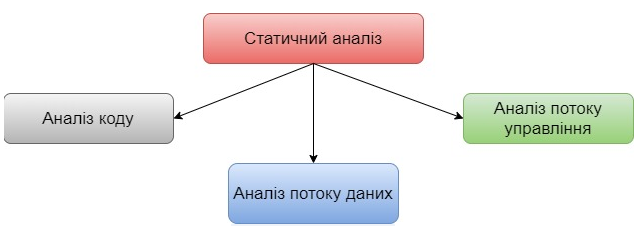

Рисунок 10.3 – Види статичного аналізу

**Статичний аналіз коду** – аналіз вихідного коду без його виконання. Всі компілятори виконують статичний аналіз тексту програми, перевіряючи, чи використовується правильний синтаксис мови програмування. Більшість компіляторів преставляє додаткову інформацію, котра може бути отримана шляхом статичного аналізу. Крім компіляторів, існують і інші інструменти, так звані аналізатори. Вони використовуються для виконання спеціальних аналізів та груп аналізів. Статичний аналізатор коду – інструмент, який забезпечує статичний аналіз коду. Даний інструмент перевіряє властивості вихідного коду, такі як відповідність стандартам оформлення коду, параметри якості та відхилення потоків даних.

**Аналіз потоку даних** – вид статичного аналізу, оснований на визначенні та використанні змінних. Аналіз потоку даних часто використовує граф потоку управління, схожий до блок-схеми, яка показує всі можливі шляхи даних через програму. Прикладом аномалій потоку даних є код, котрий використовує змінні без попередньої ініціалізації, чи код, котрий взагалі не використовує значення змінної. Аналіз перевіряє використання кожної змінної. Не кожна аномалія веде безпосередньо до неправильної поведінки.

**Аналіз потоку управління** — вид статичного аналізу, оснований на представленні унікальних шляхів (послідовності подій) в процесі виконання компонента чи системи. Аналіз потоку управління оцінює цілісність структур потоку управління, виявляючи можливі аномалії потоку управління, так як закриті цикли чи логічно недосягнуті кроки. На рисунку 10.4 приведено приклад графу потоку управління

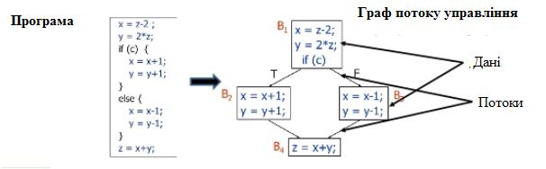

Рисунок 10.4 – Приклад графу потоку управління

**Метрики в статичному аналізі.**

**Цикломатична складність програми** — структурна міра складності комп'ютерної програми (кількість лінійно незалежних маршрутів через програмний код). Міра була розроблена Томасом Дж.Маккейбом в 1976 році.

При обчисленні цикломатичної складності використовується граф потоку управління програми. Обчислюється за формулою:

$$M=E-N-2P,$$

де $M$ – цикломатична складність;
$E$ – кількість ребер в графі;
$N$ – кількість вузлів в графі;
$P$ – кількість компонент зв'язності.

Згідно Маккейба цикломатична складність не повинна перевищувати 10, в іншому випадку код потребує доопрацювання.

Для тестування цикломатична складність вказує кількість незалежних шляхів в програмному забезпеченні. Для 100% покриття кожний шлях повинен бути виконаний хоча б 1 раз. Таким чином нам потрібно 3 теста з різними вхідними даними.

## 10.2.2. Динамічна технологія тестування


В динамічній технології тестування виділяють чотири групи технік тестування, зокрема:

1. Specification based — також називається тестуванням Blackbox Testing. Це техніки тестування, які включають тестування на основі володіння інформацією по специфікації існуючої системи, але без знання її внутрішньої архітектури.

2. Structure based — методика проектування тестів відома ще під назвою White Box Testing. У цій техніці дизайну, на відміну від попередньої, необхідне знання коду або внутрішньої архітектури системи для проведення тестування.

3. Grey Box testing — при тестуванні Сірої скриньки поєднуються прийоми, використані при тестуванні чорної і білої скриньки. Поєднання відбувається таким чином: ззовні на продукт дивимося як на чорну скриньку, але вибір тестів базуємо на знанні внутрішньої будови програми та знанні її коду.

4. Experienced based — це техніки дизайну тестів, які повністю базуються на досвіді або інтуїції тестера. Дві найбільш поширені форми тестування з досвіду — Ad-hoc тестування та Exploratory testing.

10.2.2.1. **Specification based** техніки тестування

Лі Копланд виділяє наступні дизайн техніки BlackBox Testing: (Lee Copeland «A Practitioner’s Guide to Software Test Design»)

- **еквівалентний поділ** (equivalence partitioning) — полягає у групуванні тестових даних у логічні групи або класи еквівалентності з поступовим зменшенням кількості тестів і урахуванням того, що будь-які елементи даних, що лежать у класах, матимуть однаковий вплив на додаток. Наприклад, для тестування програми піднесення до квадрата, який друкує квадрат числа — класи еквівалентності можуть бути: набір від'ємних чисел, набір додатніх чисел, набір цілих чисел, набір десяткових чисел, набір простих чисел.

  *Правила використання:*
  1. класи можуть бути визначені для будь-яких даних, які відносяться до об'єкту тестування;
  2. будь-який клас може бути при необхідності розділений на підкласи;
  3. кожне значення повинно належати тільки одному класу еквівалентності;
  4. щоб уникнути маскування дефектів негативні класи еквівалентності в тестових сценаріях варто використовувати окремо, тобто уникати комбінацій одних негативних класів з іншими;

  *Приклад: В поле можна ввести значення від 0 до 10 включно, і від 40 до 60 включно.*

  *Запитання: Скільки класів еквівалентності потрібно протестувати?*

  *Відповідь: 5 класів*

Є два класи коректних значень, і три класи некоректних значень. На рисунку 10.5 проілюстровані класи еквівалентності для даного прикладу.

Тестуємо кілька значень із діапазонів $<0$, від 10 до $40,>60$ не включаючи межі.

*Тестуємо кілька значень з діапазонів $(0, 10)$ і $(40, 60)$ включно межі.*


Рисунок 10.5 – Ілюстрація класів еквівалентності

- **аналіз граничного значення** (boundary value analysis) – тестування з використанням крайніх граничних значень класів еквівалентності, прийнятих як тестовий вхід. Діапазон значень, як правило, це клас еквівалентності. А крайні значення (кінець і початок) і є границями діапазонів. І на них створюються 3 тест-кейси: перший перевіряє валідність граничного значення, другий – значення нижче границі, третій – значення вище границі.

*Правила використання:*

1. некоректна поведінка більш ймовірна на границях класу, ніж всередині;
2. аналіз граничних значень може використовуватись на будь якому рівні тестування;
3. даний метод застосовується при тестуванні вимог, в яких присутні діапазони значень (включаючи дати та час);
4. покриття обчислюється як відношення числа тестованих граничних значень до загального числа граничних значень і частіше всього виражається в процентах;

*Наприклад: у інтернет-магазині є в наявності 1000 олівців. При купівлі до 100 олівців діє роздрібна ціна 10 грн, від 100 олівців до 500 дрібно-гуρтова ціна 8 грн, від 500 олівців гуртова ціна 5 грн. Виходячи з умови, формуємо класи*


<!-- ВІДНОВЛЕНО ЛОКАЛЬНО (Стор. 231) -->
_еквівалентності, акуратно щоб не вийшло помилок слідкуємо, щоб діапазони граничних значень не повторювались на кінцях:_ 

- _1-99 олівців – 10 грн;_ 

- _100-499 олівців – 8 грн;_  _500 – 1000 олівців – 5 грн._ 

_Аналіз граничних значень буде включати такі вхідні дані: {-1,0,1}, {99,100,101}, {499,500,501}, {999,1000,1001}.;_ 

- **доменний аналіз** (domain analysis testing) – це дизайн техніка, яка теж ґрунтується на розбитті діапазону можливих значень змінних (або самих змінних) на піддіапазони (або домени), з подальшим вибором одного або кількох значень з кожного домену для тестування. На відміну від попередньо описаного методу, доменне тестування не обмежується тільки граничними значеннями. Доменний аналіз включає в себе аналіз залежностей між змінними, пошук значень змінних, які несуть у собі великий ризик (не тільки на крайніх точках); 

- **таблиці рішень** (decision tables) – тестування з використанням таблиці рішень. Таблиця рішень відображає поведінку програми на основі різного поєднання вхідних значень. У таблицях рішень представлений набір умов, одночасне виконання яких повинно привести до певної дії. Цей метод хороший для упорядкування  складних бізнес-вимог або у випадку, якщо узагалі не має адекватної документації, – таблиці дозволяють тестінженеру самостійно більш-менш структурувати розрізнену інформацію. Приклад таблиці рішень наведено у таблиці 10.2. 

_Правила використання:_ 

1. повна таблиця рішень містить по стовпцю на кожну комбінацію умов; 

231
<!-- КІНЕЦЬ ВІДНОВЛЕННЯ -->


2. таблицю можна скоротити, забравши стовпці, котрі містять неіснуючі комбінації чи комбінації, які не впливають на результат;
3. стандарт покриття для таблиць рішень має на увазі наявність хоча б одного тесту для кожного стовпця таблиці;
4. переваги методу полягають в тому, що він виявляє комбінації умов, котрі могли б бути не перевірені при тестуванні;

Таблиця 10.2

Приклад таблиці рішень

| Умова | Тест 1 | Тест 2 | Тест 3 | Тест 4 |
| :--- | :---: | :---: | :---: | :---: |
| Знижка по дисконтній картці 5% | так | ні | так | ні |
| Додаткова знижка 10% (по смс) | так | так | ні | ні |
| Дія: | | | | |
| Разом знижка? | 15 | 10 | 5 | 0 |

*Останній стовпець ми навіть можемо видалити, оскільки дія не можлива, знижка не надається. Тут, він нам не заважає, але у таблицях з великими масивами комбінацій, краще зайве видаляти, щоб не плутатись;*

- **графік причинно-наслідкового впливу** (cause-effect graph) — техніка тестування, яка відображає вхідні дані (причину) і відповіді системи (наслідок) у комбінації. Цей метод використовує різні оператори, котрі відображають взаємозв'язки: AND, OR, NOT тощо. А умови приводять до виводу.

*Наприклад, Ви перевіряєте можливість додати клієнта на сайт клієнтської бази інтернет магазину. Для цього вам необхідно ввести кілька полів, таких як «ім'я», «адреса», «номер телефону», а потім натиснути кнопку*

«додати» - це «причина». Після натискання кнопки «додати», система додає клієнта в базу даних і показує його ID номер у відповідь – це й є наслідок.

Приклад графічного представлення графіка причинно-наслідкового впливу наведено на рисунку 10.6.


Рисунок 10.6 – Приклад оформлення графіків причинно-наслідкового зв'язку

- **перевірка станів і переходів** (state transition testing) – система переходить у той чи інший стан в залежності, які операції над нею виконуються. Функціонал системи найчастіше описують діаграмами переходів і, опираючись на цю схему, вже прописуються тест-кейси. Позначення, які містяться на діаграмі, мають наступні значення:
  - стан (state, представлено у вигляді квадратика на діаграмі) – це стан додатку, в якому воно очікує одне або більше подій. Стан пам'ятає вхідні

дані, отримані до цього, і показує, як додаток буде реагувати на отримані події. Події можуть викликати зміну стану і/або ініціювати дії;

- перехід (transition, представлено у вигляді стрілки на діаграмі) - це перетворення одного стану в інший, що відбувається за подією;
- подія (event, може бути представлена ярликом над стрілкою) - це щось, що змушує додаток поміняти свій стан. Події можуть надходити ззовні додатку, через інтерфейс самого додатку. Сам додаток також може генерувати події (наприклад подія «закінчився таймер»). У нашому випадку правильне/неправильне значення Pin. Коли відбувається подія, додаток може поміняти (або не міняти) стан і виконати (або не виконатн) дію. Події можуть додатково мати параметри (наприклад подія «оплата» може мати параметри «готівка», «чек», «дебетова картка» або «кредитна картка»);
- дія (action, представлено після «/» в ярлику над переходом) ініціюється зміною стану («1 спроба»; «2 спроба» тощо). Зазвичай дії створюють щось, що є вихідними даними системи. Дії виникають при переходах. Сам по собі стан пасивний;
- точка входу позначається чорним кружечком;
- точка виходу показується на діаграмі у вигляді мішені.

*Правила використання:*
1. тести створюються для покриття типової послідовності станів, покриття кожного можливого стану, покриття кожного можливого переходу, перевірки специфічних послідовностей переходів чи для перевірки недійсних переходів;
2. діаграми станів і переходів зазвичай показують лише дійсні переходи і виключають недійсні переходи;
3. тестування за допомогою таблиці переходів найбільш поширене в сфері вбудованого програмного забезпечення та при тестуванні програмних меню;

Розберемо приклад резервування авіа білетів.

Спочатку ми як клієнти надаємо авіакомпанії інформацію для резервації – місце відправлення, місце прибуття, дату та час відправлення. Працівник авіакомпанії слугує інтерфейсом між нами і системою резервації авіаквитків та використовує надану нами інформацію для створення резервації. Після цього наша резервація знаходиться в стані «Made» (Створена). На додачу, після створення резервації, система резервації запускає таймер. Якщо таймер завершується, а зарезервований квиток не оплачений – система відміняє резервування. У вигляді діаграми станів-переходів це буде мати вигляд, представлений на рисунку 10.7.

Коло являє собою стан системи резервування авіаквитків у нашому випадку це стан «Made». Стрілка показує перехід в стан «Made». Опис під стрілкою («giveInfo») це подія, яка відбувається за межами системи. Команда, в описі під стрілкою (після «/»), говорить нам, що система виконала певну дію у відповідь на подію, у нашому випадку це запуск таймера. Чорна крапка позначає початок/кінець діаграми.

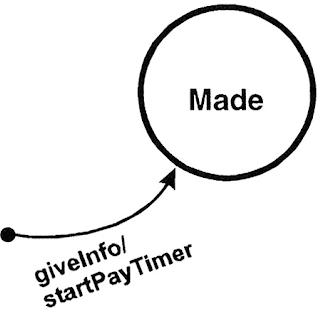

Рисунок 10.7 – Перший стан резервації квитка

Якщо таймер на завершується і ми оплатити зарезервований квиток, то система набуває стану «Paid» (оплачено). Це показано стрілкою «payMoney» (заплатити гроші) та переходом з стану «Made» в стан «Paid» як це проілюстровано на рисунку 10.8.

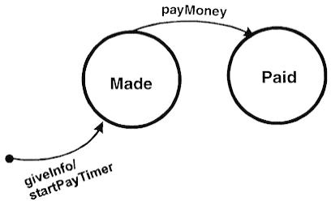

Рисунок 10.8 – Перехід із стану «Made» в стан «Paid»

Із стану «Paid» повинен бути перехід в стан «Ticketed» (отриманий квиток), коли квиток буде надрукований та переданий нам в руки. Зверніть увагу, що при переході в стан «Ticketed», авіаквиток (Ticket) є вхідними даними стану (див. рис. 10.9).

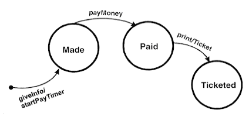

Рисунок 10.9 – Перехід із стану «Paid» в стан «Ticketed»

Із стану «Ticketed» ми переходимо в стан «Used» (використаний), коли віддаємо свій квиток персоналу аеропорту, при посадці на літак (див. рис. 10.10).

Після певної дії (в цей раз не зазначеного на діаграмі) шлях діаграми завершується символом мішені (див. рис. 10.11).

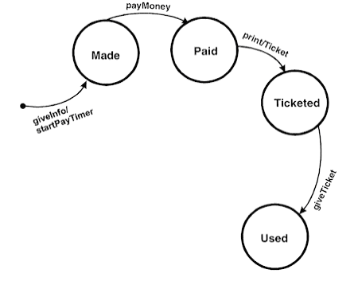

Рисунок 10.10 – Перехід із стану «Ticketed» в стан «Used»

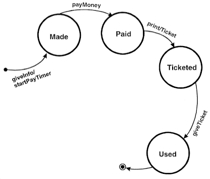

Рисунок 10.11 – Завершення діаграми станів і переходів

Але така діаграма показує ще не всі можливі стани та переходи в життєвому циклі резервування. Почнемо доповнення.

Якщо резервування не оплачено по завершенню таймера, то воно відміняється як не оплачене (див. рис. 10.12).

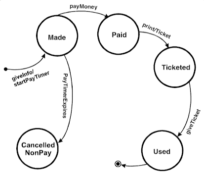

Рисунок 10.12 – Перехід із стану «Made» в стан «Cancelled NonPay»

Іноді клієнти анулюють замовлення із стану «Made». Для такого випадку потребується ще один стан «Cancelled By Customer» (див. рис. 10.13).

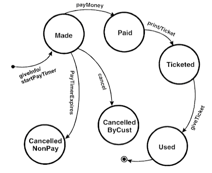

Рисунок 10.13 – Перехід із стану «Made» в стан «Cancelled ByCust»

Також клієнт може відмінити резервування із стану «Paid». В такому випадку стан також стає «Cancelled By Customer» і вартість квитка клієнту відшкодовують (див. рис. 10.14).

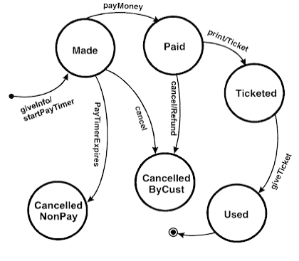

Рисунок 10.14 – Перехід із стану «Paid» в стан «Cancelled ByCust»

Відмінити резервування можна і зі стану «Ticketed». В цьому випадку стан знову стане «Cancelled By Customer» і авіакомпанія відшкодовує вартість квитка клієнту (див. рис. 10.15). Але, компанія відшкодовує вартість у випадку повернення клієнтом білету. Цей випадок являє собою ще один не описаний елемент діаграми – квадратні дужки «[ ]», котрі являють собою умови для переходу. Перехід в стан в даному випадку відбудеться тільки, якщо умова (те що в «[ ]») = true.


Рисунок 10.15 — Перехід із стану «Ticketed» в стан «Cancelled ByCust»

Діаграма ще не завершена в силу того, що немає виходу із стану «Cancelled By Customer» в стан виходу, але для прикладу даної діаграми достатньо.

Кожний стан такої діаграми детально описується за допомогою Decision Table.

*State-Transition Tables* має не такий наглядний вигляд, але більш повний та систематизований. Складається із 4 стовпців — Поточний стан (Current State), Подія (Event), Дія (Action) та Наступний стан (Next State).

Опишемо розглянутий процес резервування квитка за допомогою *State-Transition Tables (див. табл. 10.3).*

Таблиця 10.3

State-Transition Table для процесу резервування квитка

| Поточний стан | Подія | Дія | Наступний стан |
| :--- | :--- | :--- | :--- |
| null | giveInfo | startPayTimer | Made |
| null | payMoney | - | null |

| null | print | - | null |
| :---: | :---: | :---: | :---: |
| null | giveTicket | - | null |
| null | cancel | - | null |
| null | PayTimerExpires | - | null |
| | | | |
| Made | giveInfo | - | Made |
| Made | giveMoney | - | Paid |
| Made | Print | - | Made |
| Made | giveTicket | - | Made |
| Made | cancel | - | Can-Cust |
| Made | PayTimerExpires | - | Can-NonPay |
| | | | |
| Paid | giveInfo | - | Paid |
| Paid | payMoney | - | Paid |
| Paid | print | Ticket | Ticketed |
| Paid | giveTicket | - | Paid |
| Paid | cancel | Refund | Can-Cust |
| Paid | PayTimerExpires | - | Paid |
| | | | |
| Ticketed | giveInfo | - | Ticketed |
| Ticketed | payMoney | - | Ticketed |
| Ticketed | print | - | Ticketed |
| Ticketed | giveTicket | - | Used |
| Ticketed | cancel | Refund | Can-Cust |
| Ticketed | PayTimerExpires | - | Ticketed |
| | | | |
| Used | giveInfo | - | Used |
| Used | payMoney | - | Used |
| Used | print | - | Used |
| Used | giveTicket | - | Used |
| Used | cancel | - | Used |
| Used | PayTimerExpires | - | Used |
| | | | |
| Can-NonPay | giveInfo | - | Can-NonPay |
| Can-NonPay | payMoney | - | Can-NonPay |
| Can-NonPay | print | - | Can-NonPay |
| Can-NonPay | giveTicket | - | Can-NonPay |
| Can-NonPay | cancel | - | Can-NonPay |
| Can-NonPay | PayTimerExpires | - | Can-NonPay |

Продовження таблиці 10.3

| | | | |
|---|---|---|---|
| Can-Cust | giveInfo | - | Can-Cust |
| Can-Cust | payMoney | - | Can-Cust |
| Can-Cust | print | - | Can-Cust |
| Can-Cust | giveTicket | - | Can-Cust |
| Can-Cust | cancel | - | Can-Cust |
| Can-Cust | PayTimerExpires | - | Can-Cust |

Переваги State-Transition Tables в тому, що вони визначають усі можливі State-Transition варіанти, а не лише валідні. Тому State-Transition Tables часто приводять до знаходження не визначених, не документованих State-Transition Tables комбінацій, котрі краще знаходити перед початком написання коду.

### Створення тест-кейсів

State-Transition Diagrams можуть бути легко використані для створення тест-кейсів. Необхідно створити тест-кейс, котрий повинен пройти по всім переходам хоча б один раз (див. рис.10.16).

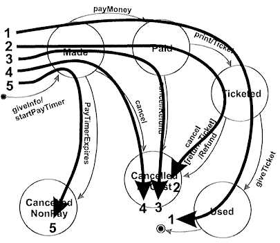

Рисунок 10.16 – Спосіб створення тест-кейсів за State-Transition Diagram

- **сценарії тестування** (use-case testing) — тестування проводиться з використанням use case. Сценарій використання системи – послідовність операцій у взаємодії актора та компонента чи системи із значущим результатом, при якій актором може бути як користувач, так і всі, хто може обмінюватись інформацією із системою.

*Приклад сценарію тестування наведено у таблиці 10.4.*

Таблиця 10.4.

Сценарій тестування

| Короткий опис | Замовлення парфумів |
| :--- | :--- |
| **Первинні актори** | Користувач (авторизований чи неавторизований) |
| **Передумови** | Відкрита картка товару з каталогу |
| **Постумови** | Замовлення надіслане адміністратору |
| **Основний сценарій** | |
| № кроку | Дія |
| 1 | Користувач відкриває сторінку «Парфуми» |
| 2 | Система відображає каталог парфумів (за замовчуванням парфуми відображаються в порядку зменшення популярності) |
| 3 | -- |
| **Альтернативний сценарій №1 – Користувач обирає варіант доставки «самовивіз»** | |
| № кроку | Підкрок | Дія |
| 7 | 7а | - |
| 8 | 8а | - |
| **Виключення №1 – Вибрані парфуми відсутні у наявності** | |
| № кроку | Підкрок | Дія |
| 7 | 7б | - |

*Правила використання:*

1. сценарій використання може бути описаний взаємодіями та активностями, передумовами та посту мовами чи природною мовою, якщо це можливо;

2. взаємодія між учасниками та суб’єктом можуть привоити до зміни стану суб’єкту; вони можуть ображатись графічно, за допомогою діаграм чи моделей бізнес-процесів;
3. сценарій використання може відображати різні варіанти поведінки, включаючи виключні ситуації та обробку помилок;
4. тести розробляються із ціллю перевірки різних варіантів поведінки (базового, виключного, альтернативного, обробки помилок);

- **метод парного тестування** (pairwise testing) – це тести, які перевіряють один або кілька параметрів у комбінації. Він розроблений на основі спостережень про те, що більшість дефектів викликано взаємодією не більше як двох факторів (дефекти, які виникають при взаємодії трьох та більше факторів, як правило менш критичні). Відповідно вибирається пара двох тестових параметрів і всі можливі пари цих двох параметрів є вхідними параметрами для тестування. Метод парного тестування зменшує загальну кількість тест-кейсів, тим самим зменшуючи час та витрати на тестування. Робиться це за допомогою математики ортогональних таблиць, і автоматизованих інструментів, які використовують алгоритм AllPairs. Зокрема, цикл цього алгоритму можна запустити різними мовами програмування.

*Тестування за допомогою ортогональних матриць* – дана техніка тест-дизайну використовується у випадку оперування великою кількістю вхідних даних, відповідно вичерпне тестування є недосяжним. Приклад. Нехай в нас є 2 значення – $x$ та $y$. Для них існують наступні можливі комбінації: $(x,x)$, $(x,y)$, $(y,y)$, $(y,x)$. Додамо до цих значень 3 вхідні параметри 1, 2 та 3, котрі можуть приймати значення $x$ та $y$. Шляхом нескладних маніпуляцій ми отримаємо всі можливі комбінації вхідних даних (див. рис. 10.17).

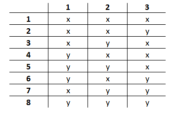

Рисунок 10.17 – Приклад комбінації 3 параметрів із 2 значень

Для того, щоб побудувати ортогональну матрицю для цього прикладу необхідно зробити так, щоб два будь-які стовпці (у нашому випадку параметри 1, 2 та 3) містили в собі всі можливі комбінації тільки один раз (див. рис.10.18).

Таким чином, ортогональна матриці для даного прикладу матиме такий вигляд:

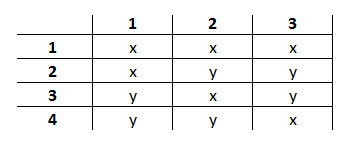

Рисунок 10.18 – Приклад ортогональної матриці для 3 параметрів із 2 значень

Як ми бачимо у стовпчиках 1 та 2 є всі можливі згадані вище комбінації x та y. Для стовпчиків 2 та 3, а також 1 та 3 вказані комбінації також присутні.

**All-pairs testing** – комбінаторний метод тестування програмного забезпечення, який перевіряє всі можливі дискретні комбінації параметрів для

кожної пари вхідних параметрів системи. Виходячи з цього, ми отримаємо меншу кількість комбінацій, чим при використанні ортогональних матриць.

Розглянемо приклад. Припустимо нам необхідно протестувати додаток для Купівлі/продажу вживаних ноутбуків, і ми маємо відповідно наступні змінні:

1. *Категорія замовлення* – купівля, продаж;
2. *Місцезнаходження* – Київ, Харків;
3. *Марка ноутбука* – HP, Lenovo, Asus;
4. *Операційна система* – доступна, недоступна;
5. *Тип розрахунку* – готівковий та безготівковий;
6. *Тип доставки* – поштою або особиста зустріч.

Якщо ми захочемо протестувати всі можливі комбінації , то нам необхідно буде скласти $2*2*3*2*2=96$ тест-кейси. Забагато.

Далі нам необхідно організувати змінні та значення у табличну форму (див. табл. 10.5).

Таблиця 10.5.

Таблиця значень вхідних змінних

| № | Категорія замовлення | Місцезнаходження | Марка ноутбука | Операційна система | Тип розрахунку | Тип доставки |
|:---:|:---:|:---:|:---:|:---:|:---:|:---:|
| 1 | купівля | Київ | HP | + | готівковий | поштою |
| 2 | продаж | Харків | Lenovo | - | безготівковий | зустріч |
| 3 | | | Asus | | | |

Щоб почати заповнювати таблицю необхідно організувати стовпці таким чином, щоб перший з них мав найбільшу кількість змінних, а останній – найменшу. Таким чином, перший стовпчик в нашій таблиці – марка ноутбука. Першим чином записуємо три значення Марки (так як стовпчик з найбільшим числом значень) по два рази ( два – це кількість змінних наступного стовпчика, наприклад категорія замовлення). Це має вигляд таблиці 10.6.

Таблиця 10.6.

Перший крок методу тестування All-pairs

| Марка ноутбука | Категорія замовлення | Місцезнаходження | Операційна система | Тип розрахунку | Тип доставки |
| :---: | :---: | :---: | :---: | :---: | :---: |
| HP | купівля | | | | |
| HP | продаж | | | | |
| | | | | | |
| Lenovo | купівля | | | | |
| Lenovo | продаж | | | | |
| | | | | | |
| Asus | купівля | | | | |
| Asus | продаж | | | | |

Для кожного набору в першому стовпці ми розміщуємо обидва значення стовпця 2. Те саме повторюємо з третім стовпчиком (див. табл. 10.7).

Таблиця 10.7.

Другий крок методу тестування All-pairs

| Марка ноутбука | Категорія замовлення | Місцезнаходження | Операційна система | Тип розрахунку | Тип доставки |
| :---: | :---: | :---: | :---: | :---: | :---: |
| HP | купівля | Київ | | | |
| HP | продаж | Харків | | | |
| | | | | | |
| Lenovo | купівля | Київ | | | |
| Lenovo | продаж | Харків | | | |
| | | | | | |
| Asus | купівля | Київ | | | |
| Asus | продаж | Харків | | | |

У нас є комбінації «Купівля&Київ» та «Продаж&Харків», але нема комбінації «Продаж&Київ» та «Купівля&Харків». Виправимо це, замінивши місцями значення в другому наборі третього стовпчику (див. табл. 10.8).

Таблиця 10.8. Уточнений другий крок методу тестування All-pairs

| Марка ноутбука | Категорія замовлення | Місцезнаходження | Операційна система | Тип розрахунку | Тип доставки |
| :--- | :--- | :--- | :--- | :--- | :--- |
| HP | купівля | Київ | | | |
| HP | продаж | Харків | | | |
| | | | | | |
| Lenovo | купівля | Харків | | | |
| Lenovo | продаж | Київ | | | |
| | | | | | |
| Asus | купівля | Київ | | | |
| Asus | продаж | Харків | | | |

Повторюємо ті ж маніпуляції для стовпчиків 4 та 5 (див. табл. 10.9).

Таблиця 10.9. Третій та четвертий крок методу тестування All-pairs

| Марка ноутбука | Категорія замовлення | Місцезнаходження | Операційна система | Тип розрахунку | Тип доставки |
| :--- | :--- | :--- | :--- | :--- | :--- |
| HP | купівля | Київ | + | готівковий | |
| HP | продаж | Харків | - | безготівковий | |
| | | | | | |
| Lenovo | купівля | Харків | + | готівковий | |
| Lenovo | продаж | Київ | - | безготівковий | |
| | | | | | |
| Asus | купівля | Київ | - | готівковий | |
| Asus | продаж | Харків | + | безготівковий | |

Колонка «Доставка» є більш проблематичною, адже нам не вистачає комбінацій на «Купівля&зустріч» та «Продаж&поштою», щоб не порушувати відсортовані дані, потрібно ввести ще 2 тестованих випадки для цих комбінацій. Зірочкою ми маркуємо змінні, котрі є довільними (див. табл.10.10).

Таблиця 10.10.  
Третій та четвертий крок методу тестування All-pairs

| Марка ноутбука | Категорія замовлення | Місцезнаходження | Операційна система | Тип розрахунку | Тип доставки |
| :---: | :---: | :---: | :---: | :---: | :---: |
| HP | купівля | Київ | + | готівковий | поштою |
| HP | продаж | Харків | - | безготівковий | зустріч |
| \*HP | купівля | \*Харків | \*- | \*безготівковий | зустріч |
| Lenovo | купівля | Харків | + | готівковий | поштою |
| Lenovo | продаж | Київ | - | безготівковий | зустріч |
| \*HP | продаж | \*Київ | \*+ | \*готівковий | поштою |
| Asus | купівля | Київ | - | готівковий | поштою |
| Asus | продаж | Харків | + | безготівковий | зустріч |

Таким чином ми отримали 8 тест-кейсів замість 96.

_Утіліти для автоматизації pairwise testing._ Існує ряд програмного забезпечення, котре допоможе вам не лише якісно, але і швидко створити тест-кейси із великої кількості параметрів, самі популярні з них це: **PICT (Pairwise Independent Combinatorial Testing), IBM FoCuS (Functional Coverage Unified Solution), ACTS (Advanced Combinatorial Testing System), Hexawise, Jenny, VPTag free All-Pair Testing Tool.**

**10.2.2.2. Structure based техніки тестування**

**Структурне тестування** доповнює функціональне тестування і сценарні техніки тестування. Логічно, цей вид тестування можливий для рівня не вище рівня програмного модуля. Чимось схожий на Юніт тестування, яким зазвичай займаються розробники, при якому тестуються тільки окремі частини системи.

Звідси *мета* структурних технік тестування — максимально покрити тестами код, точніше код сценаріїв і їх розгалужень. Виконання функціонального і структурного тестування системи може бути здійснене незалежно одне від одного.

**Розрізняють наступні види White Box testing:**
- **statement testing** (тестування операторів) — це коли тестові скрипти розробляються для виконання виразів коду, а покриття — це міра підрахунку рядків коду пройдених тестовим скриптом. Сто відсоткове покриття має місце, коли покриті всі рядки та всі твердження коду. В іншому випадку береться до уваги покриття у процентному відношення. Хорошим показником statement coverage вважається 60-75%;

Кожен оператор програми повинен бути виконаний (покритий) хоча б один раз. На рисунку 10.19 приведено приклад програми, а на рисунку 10.20 приклад тестування операторів.

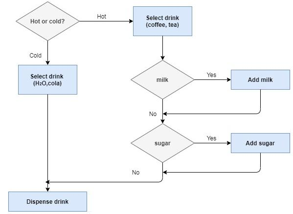

Рисунок 10.19 – Приклад програми

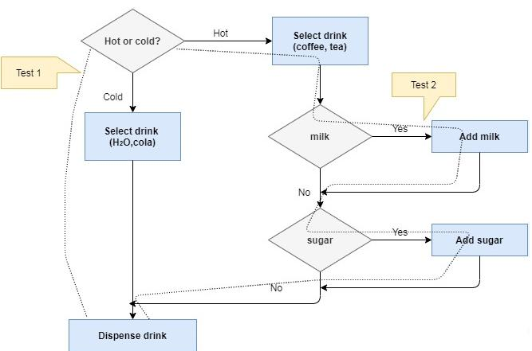

Рисунок 10.20 – Приклад покриття тестами програми на основі техніки тестування операторів

Цей критерій є найбільш слабким з використовуваних у структурному тестуванні, тому що проходження всіх операторів не гарантує перевірку правильності послідовності попарних переходів між ними.

- **decision testing/branch testing** (тестування рішень/гілок) – це вже більш високий рівень, котрий охоплює усі типи ієрархій (if-else, switch операторів, викликів методів). Вимірює відсоток точок рішень, що виконуються у розрахунку із загальної кількості умов в аплікації. Показник повинен варіюватися в межах 40-60%;

**Кожна гілка алгоритму (кожний перехід між вершинами) має бути пройдена (виконана) хоча б один раз** (див. рис.10.21).

Виконання даного критерію, у загальному випадку, забезпечує й покриття операторів, проте цей критерій не є ідеальним. Так, наприклад, він не

забезпечує перевірку правильності обробки операторів логічних переходів та циклів.

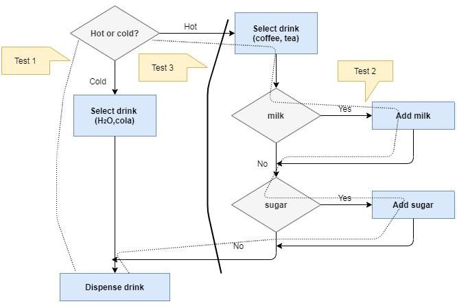

Рисунок 10.21 – Приклад покриття тестами програми на основі техніки тестування рішень/гілок

- **condition testing** (тестування умов) – коли при тестуванні виконуються умови (true or false). Таким чином отримання 100% умовного покриття вимагає виконання кожної умови для отримання таких результатів як істинне чи хибне, використовуючи тестові скрити (за N умов ми отримуємо $2*N$ тестових сценаріїв). Головні логічні оператори тут (AND, OR, NOT);
- **multiple condition testing** (тестування кількох умов) – це коли тестуємо різні комбінації вхідних умов. Таким чином для 100% покриття ми будемо мати $2^n$ тестових сценаріїв. Досягти 100% покриття нереально;

*Приклад.*
Є комбінована умова: $x > 3$ АБО $y < 5$.

*Можливі чотири комбінації тестових випадків:*

$x=6\ (Істинне),\ y=3(Істинне)$ \
$Вираз\ x>3\ АБО\ y<5\ (Істинне)$

$x=6\ (Істинне),\ y=8(Хибне)$ \
$Вираз\ x>3\ АБО\ y<5\ (Істинне)$

$x=2\ (Хибне),\ y=3(Істинне)$ \
$Вираз\ x>3\ АБО\ y<5\ (Істинне)$

$x=2\ (Хибне),\ y=8(Хибне)$ \
$Вираз\ x>3\ АБО\ y<5\ (Хибне)$

*Дана техніка дуже дорога через збільшуване число часткових станів, котрі приводять до експоненціального зростання числа можливих комбінацій.*

- **condition determination testing** (тестування визначених умов) – це більш математично оптимізований тип тестування кількох умов, у якому комбінації, які не впливають на результат, відкидаються;
- **path testing** (тестування маршрутів) – тестування набору незалежних шляхів та розгалужень у системі по яких може пройти програма. Теоретично таких шляхів нескінченна кількість, враховуючи цикли;
- **loop coverage** (тестування циклів) – наявність циклів у програмних модулях здатне різко збільшувати складність їхнього тестування. На складність тестування циклу впливає його структура та два параметри: число маршрутів у тілі циклу та число ітерацій циклу. Одним словом, то є складна математика і алгоритми: зростання на квадратичну, експоненціальну та логарифмічну складність.

У таблиці 10.11 наведено порівняльну характеристику між двома групами тестування Specification based та Structure based тестування.

Таблиця 10.11.

Різниця між White Box & Black Box Testing

| № | Black Box | White Box |
| :--- | :--- | :--- |
| 1 | Для початку тестування необхідно чекати створення користувацького інтерфейсу | Тестування може розпочатися на більш ранніх етапах циклу розробки програмного забезпечення |
| 2 | Виконують тестувальники. Може виконуватися користувачами і методом спроб та помилок | Може виконуватися як фаховими тестувальниками, так і розробниками |

Продовження таблиці 10.11.

| | | |
|---|---|---|
| 3 | Відповідає на питання: What? Що програма робить, виконуючи тести | Відповідає на питання: How? Як програма робить певну дію? Тобто тестувальник за такого виду тестування виступає в ролі механіка, який намагається всередині машини розібратися чому програма не працює? |
| 4 | Тестувальник не володіє інформацією про внутрішню будову системи або її компонентів | Дизайн, внутрішня структура компонентів тестувальнику є відомі. Наприклад, з аналізу коду можна визначити, скільки контрольних тестів потрібно виконати для того, щоб у процесі тестування всі оператори виконалися принаймні один раз |
| 5 | Тестувальники більше зосереджені на функціональному тестуванні — дослідженні. Хоча тестування безпеки, перфоманс, конфігураційне, тестування інсталяції відносяться до тестування Чорної скриньки. | Більше зосереджені на структурі програми, її коді, гілках, циклах тощо. |
| 6 | Здебільшого тестування Чорної скриньки — це тестування цілісної системи. System testing, Acceptance testing | Тестування Білої скриньки — це модульне тестування, таке як Unit Testing, Integration testing |
| 7 | Може проводитися незалежними зовнішніми тестувальниками | Зазвичай таке тестування проводять внутрішні тестувальники |
| 8 | Може бути проведене без знання жодної з мов програмування | Необхідні знання якоїсь з мов програмування, автоматизованого тестування, спеціалізованих інструментів |
| 9 | Поведінка системи може бути не очікувана | Оскільки ми знаємо внутрішню будову поведінка для нас завжди буде очікуваною. Тестери навіть можуть впливати на дизайн програми |
| 10 | Не підходить для тестування алгоритмами | Потрібне хоча б базове знання поширених алгоритмів |

| 11 | Більша залежність від людського фактору | Можна провести більш якісне тестування, з покриттям великої кількості шляхів та гілок, які виконує програма |
| :--- | :--- | :--- |
| 12 | Дешевше і легше налагодити | Більш трудомістке та дороге |
| 13 | Основа для тест-кейсів специфікація вимог | Потрібна більша детальна інформація, де описується архітектура. Наприклад проектна документація |

## 10.2.2.3. Grey Box testing

Цей метод часто використовується для тестування веб-додатків, тестування бази даних, тестування будь-яких інших додатків, де є доступ до вихідного коду.

*Приклад застосування:*
- *використовується перегляд коду (Пункт View page source контекстного меню);*
- *використовується sniffer (аналізатор трафіку);*
- *використовується Firebug (надбудова для Firefox).*

Метод сірої скриньки використовується при CRUD tests.

*Приклад: Тестування функціональності реєстрації користувача і входу в систему*

*CREATE:*

Через інтерфейс (десктоп або веб) реєструється новий користувач. Далі шляхом спеціального запиту в базу (зазвичай такі запити виглядають приблизно так

```sql
SELECT * from users where login = 'userlogin';
```

проводиться перевірка успішності реєстрації та занесення нового користувача в базу.

*READ:*

Через інтерфейс (десктоп або веб) новий користувач входить в систему. Далі шляхом спеціального запиту в базу (зазвичай такі запити виглядають приблизно так

```sql
SELECT * from userSessions u where u.login = 'userlogin'
```

проводиться перевірка того, що користувач зайшов в систему.

*UPDATE:*

Через інтерфейс (десктоп або веб) новий користувач входить в систему. Через функціональність користувача Аккаунт або Особистий Кабінет користувач змінює свої дані, наприклад, e-mail. Далі шляхом спеціальних запитів до бази (зазвичай такі запити виглядають приблизно так:

```sql
SELECT * from Users where email = 'oldemail';

SELECT * from Users where email = 'newemail';
```

проводиться перевірка того, що користувач поміняв свій e-mail - перший запит поверне нульовий результат, а другий - поверне рядок з новим значенням поля e-mail.

*DELETE:*

Через адмінську частину сайту (back - end) або через відповідну функціональність на Front - End адміністратор видаляє користувача. Далі шляхом спеціального запиту в базу (зазвичай такі запити виглядають приблизно так

```sql
SELECT * from users u where login = 'userlogin';
```

проводиться перевірка відсутності користувача в базі. При цьому в таблиці userSessions записи активності даного користувача можуть зберегтися, а можуть бути видалені.

10.2.2.4. Experienced based техніки тестування

**Вільне тестування** (ad-hoc testing) — це вид тестування, котрий виконується без підготовки до тестування продукту, без визначення очікуваних результатів, проєктування тестових сценаріїв. Це неформальне, імпровізоване тестування. Воно не потребує жодної документації, планування процесів, котрих потрібно притримуватись при виконанні тестування. Такий спосіб тестування в більшості випадків дає більшу кількість зведених звітів про помилки. Це обумовлено тим, що тестувальник на перших кроках починає з тестування основної функціональної частини продукту і виконує як позитивні, так і негативні варіанти можливих сценаріїв.

Частіш за все таке тестування виконується, коли власник продукту не володіє конкретними цілями, проєктною документацією та раніше поставленими задачами. При цьому тестувальник покладається лише на своє загальне уявлення про продукт, порівняння зі схожими продуктами, власний досвід. Однак, при тестуванні ad-hoc має зміст володіти загальною інформацією про продукт, особливо якщо проєкт складний та великий. Тому потрібна гарна уява про цілі проєкту, його призначення та основні функції та можливості. А далі вже можна приступати до ad-hoc тестування.

***Види вільного тестування:***

- ***buddy testing*** — процес, коли 2 людини, як правило розробник та тестувальник, працюють паралельно і знаходять дефекти в одному і тому ж модулі тестованого продукту. Такий вид тестування допомагає тестувальнику виконувати необхідні перевірки, а розробнику виправляти більшість дефектів на ранніх етапах;

- ***pair testing*** — процес, коли 2 тестувальники перевіряють один модуль і допомагають один одному. Для прикладу, один може шукати дефекти, а інший їх документувати. Таким чином, у одного тестера буде функція, скажімо так, шукача, а у іншого — описувача;

- **monkey testing** — випадкове тестування продукту з ціллю якомога швидше, застосовуючи різноманітні варіації вхідних даних, пошкодити роботу програми і викликати її зупинку (простими словами — зламати).

  *Відмінність між Buddy Testing і Pair Testing:*
1. **Buddy Testing** (Сумісне тестування) — це поєднання модульного тестування та системного тестування між розробником та тестувальником.
2. **Pair Testing** (Парне тестування) — виконується тільки тестувальниками з різним рівнем знань та досвіду (таке поєднання допомагає ділитись поглядами та ідеями).

  *Основні переваги ad-hoc testing:*
- нема необхідності витрачати час на підготовку документації;
- самі важливі дефекти часто виявляються на ранніх етапах;
- часто застосовується, коли беруть нового співробітника. За допомогою даного методу, людина освоює за 3 дні те, що, розбираючись з тестовими випадками, освоював би тиждень. Це називається форсоване навчання нових співробітників;
- можливість знайти важковідтворювані та важко вловимі дефекти, котрі неможливо було б знайти, використовуючи стандартні сценарії перевірок.

  *Приклад вільного тестування. Візьмемо звичайний похід в супермаркет.* Після входу в супермаркет одразу на вході ви можете знайти корзину/візок для продуктів, але якщо її не виявиться в звичному для вас місці — це можна буде рахувати багом. При виборі молока зверніть увагу на строк придатності і, якщо молоко виявиться простроченим, знову ж таки це буде баг. Також і з іншими продуктами. І в кінцевому випадку. При оплаті покупок на касі, пляшка води, на якій був цінник 20, виявиться ціною в 50, це також буде багом.

  Якщо вам потрібно провести *ad-hoc testing* інтернет магазину, то це короткий список вам допоможе:

- всі можливості сайту доступні без реєстрації;
- коректність відображення картинок та анімацій;
- всі можливості сайту доступні після реєстрації;
- процес реєстрації;
- процес додавання/видалення із корзини;
- процес оплати покупок;
- зручність у користуванні для новачків, простота, підказки, допомога.

*Способи підвищення ефективності ad-hoc testing:*

1. **Підготовка.** Проаналізувати дефекти в схожих додатках, таким чином підвищивши ймовірність виявлення подібних дефектів в тестованому додатку.
2. **Формування чернетки.** Це не повинен бути детальний план тестування, а лише тезисні репліки, з чого почати і які проблеми шукати.
3. **Тестування сесіями.** Тестувати різноманітний функціонал продукту по черзі, тобто не одразу. Це допомагає краще фокусуватись та розуміти проблему.
4. **Приділяти увагу цільовим областям.** В пергу чергу перевірити ті області, котрі не покриті тест-дизайном чи тестовою документацією.
5. **Використання різних допоміжних програм.** Деякі дефекти можна виявити використовуючи дебагери, профайлери та моніторинги. Знання таких утиліт допомагає в тестуванні.
6. **Записувати результати тестування.** Записи того, які баги були знайдені. В яких частинах додатку їх більше тощо. Це може допомогти як розробникам, так і тестувальникам наступних версій додатку. Також можна записати те, що не працює, так як аналітикам може бути корисно побачити, що працювало добре.

**Дослідницьке тестування (Exploratory testing)** – це одночасне вивчення програмного продукту, проектування тестів та їх виконання. Це неформальний

метод проектування тестів, при якому тестувальник активно контролює проектування тестів в той час, коли ці тести виконуються, і використовує отриману під час тестування інформацію для проектування нових тестів.

Якщо кожний наступний тест, котрий виконує тестувальник, обирається за результатами попереднього тесту, це значить, що ми використовуємо дослідницьке тестування.

Головне, що потрібно пам'ятати в даному тестуванні це те, що саме по собі воно не є методикою тестування. Це швидше за все *підхід* котрий можна застосувати до будь-якого виду тестування. Ще один важливий момент заключається в тому, що дослідницьке тестування — це не лише виконання тестів. Тестувальники можуть застосовувати дослідницький підхід і при розробці нових тестів на початку ітерації, і при аналізі уже завершених тестів. Також, дослідницьке тестування не повинно виконуватись недбало, швидко та без підготовки. Дослідницький підхід може потребувати дуже довгого приготування до певних тестів, а накопичені за багато років знання та вміння тестувальника, який застосовує даний підхід, часто невидимий, але є важливою формою підготовки. Дослідницьке тестування може проводитись вручну, а може здійснюватись із використанням засобів автоматизації.

Коли варто застосовувати дослідницьке тестування?

- коли потрібно забезпечити швидкий зворотній зв'язок для нового продукту чи нової функціональності продукту;
- коли потрібно швидко ознайомитись з продуктом;
- коли вже були проведені основні види тестування і час дозволяє урізноманітнити методи тестування;
- коли потрібно знайти дефект, локалізований у певному модулі в найближчий час;
- коли перевіряється робота іншого спеціаліста по тестуванню;

- коли потрібно вивчити стан конкретного ризику для прийняття рішення про необхідність покриття конкретної області тестами.

Детальніше види дослідницького тестування будуть розглянуті далі в окремому розділі.

Використані у розділі літературні джерела – [103-116].


## Контрольні запитання

1. Дайте визначення терміну «тест-дизайн».
2. Що таке техніка тест-дизайну?
3. Скільки існує технік тест-дизайну?
4. Скільки існує технологій тестування? Назвіть їх.
5. Що являє собою статична технологія тестування?
6. Що таке рецензування?
7. Які види рецензування існують?
8. Які методи рецензування існують?
9. Які види статичного аналізу існують?
10. Що являє собою динамічна технологія тестування?
11. На які основні групи технік поділяється динамічна технологія тестування?
12. Охарактеризуйте Specification based техніки тестування.
13. Охарактеризуйте Structure based техніки тестування.
14. Охарактеризуйте Grey Box техніки тестування.
15. Охарактеризуйте Experienced based техніки тестування.
16. Хто в своїй книзі «A Practitioner's Guide to Software Test Design» охарактеризував Specification based техніки тестування?
17. Яка друга поширена назва Specification based технік тестування?
18. Коротко охарактеризуйте техніку еквівалентного поділу. Наведіть приклад.

19. Коротко охарактеризуйте техніку аналізу граничного значення. Наведіть приклад.

20. Коротко охарактеризуйте техніку доменного аналізу.

21. Коротко охарактеризуйте техніку таблиці рішень. Наведіть приклад.

22. Коротко охарактеризуйте техніку графік причинно-наслідкового впливу. Наведіть приклад.

23. Які оператори використовує вище згадана дана техніка тестування?

24. Що означає «стан» та «перехід» у техніці тестування перевірки станів і переходів?

25. Що означає «подія» та «дія» у техніці тестування перевірки станів і переходів?

26. Як схематично позначаються точки входу та виходу при техніці тестування перевірки станів та переходів?

27. Що таке State-Transition Tables?

28. Що являє собою техніка «сценарії тестування»?

29. Охарактеризуйте метод парного тестування. Які техніки виділяються в рамках цього методу?

30. Охарактеризуйте тестування за допомогою ортогональних матриць.

31. Що таке All-pairs testing?

32. Яким чином складаються тести за допомогою вище згаданого методу?

33. Яка мета структурних технік тестування?

34. Яка друга поширена назва Structure based технік тестування?

35. Охарактеризуйте техніку «тестування операторів».

36. Охарактеризуйте техніки «тестування рішень/гілок».

37. Охарактеризуйте техніки «тестування умов» та «тестування кількох умов».

38. Охарактеризуйте техніки «тестування визначених умов».

39. Охарактеризуйте техніки «тестування маршрутів».

40. Охарактеризуйте техніки «тестування циклів».

41. Яка різниця між White Box та Black Box Testing?
42. Яка техніка тестування використовується при CRUD тестах?
43. Охарактеризуйте специфіку Ad-hoc testing?
44. Які є види вільного тестування?
45. Яка відмінність між Buddy Testing та Pair Testing?
46. Які переваги вільного тестування?
47. Назвіть способи підвищення ad-hoc testing.
48. Охарактеризуйте дослідницьке тестування.
49. У яких випадках варто застосовувати дослідницьке тестування?


## 11.1. Баг-репорт

### 11.1.1. Дефект

> **Дефект (баг)** - це невідповідність фактичного виконання програми до очікуваного результату.
*(images/Krepich_2020_Software_Quality_And_Testing/page_264_img_2.png)*

Дефекти виявляються на етапі тестування програмного забезпечення, коли тестувальник проводить порівняння отриманих результатів роботи програми (компонента чи дизайну) з очікуваним результатом, описаним в специфікації вимог.

Отже, одразу при виявленні бага, необхідно його задокументувати для продовження життєвого циклу дефекту, який ми розглянемо згодом.

### 11.1.2. Шаблон баг-репорту

> **Баг-репорт** - це документ, котрий описує ситуацію чи послідовність дій, які привели до некоректної роботи об'єкту тестування із зазначенням причин та очікуваного результату.
*(images/Krepich_2020_Software_Quality_And_Testing/page_264_img_3.png)*

Баг репорт повинен містити правильну, єдину термінологію, котра описує елементи користувацького інтерфейсу та події даних елементів, які призводять до виникнення бага.

Різні системи менеджменту дефектів пропонують різні поля для заповнення та різні структури опису дефектів. Нижченаведена таблиця — це спроба рекомендації її можливого використання у вигляді **шаблону баг репорту**
*(images/Krepich_2020_Software_Quality_And_Testing/page_264_img_4.jpeg)*

(див. табл. 11.1). *Курсивом виділені поля обов'язкові для заповнення у баг репорті.*

Таблиця 11.1.

Шаблон баг репорту

| Шапка | |
| :--- | :--- |
| | (відповідальний за заповнення поля) |
| *Короткий опис*<br>*(Summary)* | Короткий опис проблеми, явно вказуючий на причину та тип помилкової ситуації<br>(автор баг репорта – зазвичай тестувальник) |
| Проєкт (Project) | Назва тестованого проєкту<br>(автор баг репорта – зазвичай тестувальник) |
| Компонент додатку<br>*(Component)* | Назва частини чи функції тестованого продукту<br>(автор баг репорта – зазвичай тестувальник) |
| Номер версії<br>*(Version)* | Версія на якій була знайдена помилка<br>(автор баг репорта – зазвичай тестувальник) |
| *Серйозність*<br>*(Severity)* | Найбільш розповсюджена п'ятирівнева система градації серйозності дефекту<br>(автор баг репорта – зазвичай тестувальник, але може бути змінений менеджером вищим за посадою) |
| Пріоритет (Priority) | Пріоритет дефекту<br>(менеджер проєкту чи менеджер відповідальний за розробку компоненти, на яку написаний баг репорт) |
| Статус (Status) | Статус бага. Залежить від використовуваної процедури та життєвого циклу бага<br>(автор баг репорта – зазвичай тестувальник, але багато систем бак трекінгу проставляють статус по замовчуванню) |

Продовження таблиці 11.1.

| Автор (Author) | Творець баг репорту <br> (встановлюється по замовчуванню, якщо ні, <br> то вказується ім'я автора баг репорта) |
| --- | --- |
| Призначений на <br> (Assigned To) | Ім'я співробітника, призначеного на рішення проблеми <br> (менеджер проекту чи менеджер відповідальний <br> за розробку компоненті, на яку написаний баг <br> репорт) |
| **Оточення** | |
| ОС/ Сервіс Пак/ <br> Браузер+версія <br> тощо | Інформація про оточення, на якому був знайдений баг: <br> операційна система, сервіс пак, для WEB тестування – ім’я <br> та версія браузера тощо <br> (автор баг репорта – зазвичай тестувальник) |
| ... | |
| **Опис** | |
| *Кроки відтворення* <br> *(Steps to Reproduce)* | Кроки за якими можна легко відтворити ситуацію, яка <br> привела до помилки <br> (автор баг репорта – зазвичай тестувальник) |
| *Фактичний* <br> *результат (Result)* | Результат, отриманий після проходження кроків до <br> відтворення <br> (автор баг репорта – зазвичай тестувальник) |
| *Очікуваний* <br> *результат* <br> *(Expected Result)* | Очікуваний правильний результат <br> (автор баг репорта – зазвичай тестувальник) |
| **Доповнення** | |

Продовження таблиці 11.1.

| Прикріплений файл (Attachment) | Файл з логами, скріншоти чи будь-який інший документ, котрий може допомогти прояснити причину помилки чи вказати на спосіб рішення проблеми <br><br>(автор баг репорта — зазвичай тестувальник, а також будь-який член командної групи, котрий рахує, що прикріплені дані допоможуть у виправленні бага) |

### 11.1.3. Серйозність та пріоритет дефекта

Різні системи баг трекінгу пропонують нам різні шляхи опису серйозності та пріоритету баг репорту. Незмінним залишається лише зміст, який вкладається в ці поля. Всі знають такий баг-трекер, як JIRA. В ньому, починаючи з певної версії замість одночасного використання полів Severity та Priority, залишили лише Priority, котре залишило в собі властивості обох полів. Таким чином, тим, хто звик працювати з JIRA, не завжди зрозуміла різниця між цими поняттями, так як не мали досвіду їх сумісного використанням.


Можна сказати, що це інструмент менеджера по плануванню робіт. Чим вище пріоритет, тим швидше потрібно виправити дефект.

### 11.1.3.1. Градація серйозності дефекту

Розрізняють наступну градацію серйозності дефекту:

- **S1 Блокуюча (Blocker)**

Блокуюча помилка, яка приводить додаток в неробочий стан, в результаті якого подальша робота з тестованою системою чи її ключовими функціями стає неможливою. Рішення проблеми необхідно для подальшого функціонування системи.

- **S2 Критична (Critical)**

Критична помилка, неправильно працююча ключова бізнес-логіка, дірка в системі безпеки, проблема, котра привела до тимчасового падіння сервера чи в неробочий стан деяку частину системи, без можливості рішення проблеми, використовуючи інші вхідні точки. Рішення проблеми необхідне для подальшої роботи з ключовими функціями тестованої системи.

- **S3 Значна (Major)**

Значна помилка, частина основної бізнес-логіки працює некоректно. Помилка не критична або є можливість для роботи з тестованою функцією, використовуючи інші вхідні точки.

- **S4 Незначна (Minor)**

Незначна помилка, не порушує бізнес-логіку тестованої частини додатку, очевидна проблема користувацького інтерфейсу.

- *S5 Незручність (Tweak)*

Незручність, очевидна проблема користувацького інтерфейсу. Означає, що потрібне підвищення ступеня дружності інтерфейсу.

- *S6 Текст/опечатка (Text)*

Незначна текстова помилка/опечатка. Пунктуаційна чи орфографічна помилка.

- **S7 Тривіальна (Trivial)**

Тривіальна помилка, не стосується бізнес-логіки додатку, погано відтворювана проблема, малопомітна засобами користувацького інтерфейсу,

проблема сторонніх бібліотек чи сервісів, проблема, яка не проявляє ніякого впливу на загальну якість продукту.

### 11.1.3.2. Градація пріоритету дефекту

Розрізняють наступну градацію пріоритету дефекту:

**P1 Високий (High)** – помилка повинна бути виправлена якомога швидше, так як її наявність є критичною для проекту.

**P2 Середній (Medium)** – помилка повинна бути виправлена, її наявність не є критичною, але потребує обов'язкового рішення.

**P3 Низький (Low)** – помилка повинна бути виправлена, її наявність не є критичною і не потребує термінового рішення.

Порядок виправлення помилок за їх пріоритетами: **High – Medium – Low**.

Вимоги до кількості відкритих багів:

- наявність відкритих дефектів P1, P2 та S1, S2 рахується неприйнятним для проекту. Всі подібні ситуації потребують термінового рішення та ідуть під контроль до менеджерів проектів;
- наявність суворо обмеженої кількості відкритих помилок P3 та S3, S4, S5 не є критичним для проекту та допускається в додатку, що здається. Кількість ж відкритих помилок залежить від розміру проекту та встановлених критеріїв якості.

### 11.1.4. Основні помилки при написанні баг репортів

Можливі помилки при написанні баг репортів наступні:

1. **Недостатність представлених даних**. Не завжди одна і та сама проблема проявляється при всіх вхідних значеннях і при будь-якому користувачеві, який зайшов у систему, тому рекомендується вносити всі необхідні дані в баг репорт.

2. **Визначення серйозності.** Досить часто відбувається або завищення або заниження серйозності дефекту, що може призвести до неправильної черговості при вирішенні проблеми.

3. **Мова опису.** Часто при описі проблеми використовується неправильна термінологія чи складні звороти речень, котрі можуть ввести в оману людину, відповідального за рішення проблеми.

4. **Відсутність очікуваного результату.** У випадках, якщо ви не вказали, що ж повинно бути очікуваною поведінкою системи, ви витрачаєте час розробника на пошук даної інформації, там самим сповільнюючи виправлення дефекту. Ви повинні вказати пункт у вимогах, написаний тест кейс чи ваша власна думка, якщо ця ситуація не була задокументована.

## 11.1.5. Життєвий цикл бага

Перед початком опису елементарного життєвого циклу бага пропонуємо розглянути наступну блок-схему, яка ілюструє основні статуси та можливі переходи від статусу до статусу у процесі їх існування.

Звіт про дефект (і сам дефект разом з ним) проходить визначені стадії життєвого циклу, котрі схематично проілюстровані на рисунку, а саме:

- **виявлений (submitted)** — початковий стан звіту (іноді називається «новий»), в якому він знаходиться одразу після створення. Деякі засоби також дозволяють спочатку створювати чернетку і лише потім публікувати звіт;
- **призначений (assigned)** — в цей стан звіт переходить від моменту, коли хтось із команди проекту призначається відповідальним за виправлення дефекту. Призначення відповідального відбувається за рішенням лідера команди розробки або колегіально, або за принципом «добровольця», або іншим прийнятим у команді чином чи виконується автоматично на основі певних правил;


Рисунок 11.1 – Життєвий цикл звіту про дефект з найбільш типовими переходами між станами

- **виправлений (fixed)** – в цей стан звіт переводить відповідальний за виправлення дефекту член команди після виконання відповідних дій по виправленню;
- **перевірений (verified)** – в цей стан звіт переводить тестувальник, який впевнився, що дефект насправді був усунутий. Як правило, таку перевірку виконує тестувальник, початково створивший звіт про дефект;
- **закритий (closed)** – стан звіту, котрий означає, що по даному дефекту не планується ніяких подальших дій. Тут є деякі розбіжності в життєвому циклі, прийнятому у різноманітних інструментальних засобах управління звітами про дефекти:
  - в деяких засобах існує обидва стани – «перевірений» та «закритий», щоб підкреслити, що в стані «перевірений» ще можуть знадобитися певні додаткові дії (обговорення, додаткові перевірки в нових білдах тощо), в

той час як стан «закритий» означає «з дефектом завершено, більше до даного питання не повертаємось»;
- в деяких засобах одного із станів нема (він поглинається іншим);
- в деяких засобах в стан «закритий» чи «відхилений» звіт про дефект може бути переведений з множини попередніх станів із резолюціями виду:
  - «не є дефектом» - додаток так і повинен працювати, описана поведінку не є аномальною;
  - «дублікат» - даний дефект вже описаний в іншому звіті;
  - «не вдалось відтворити» - розробникам не вдалось відтворити проблему на своєму обладнанні;
  - «не буде виправлено» - дефект є, але за певних серйозних причин його вирішено не виправляти;
  - «неможливо виправити» - непереборна причина дефекту знаходиться поза зоною повноважень команди розробників, наприклад існує проблема в операційній системі чи апаратному забезпеченні, вплив якої усунути розумними способами неможливо.

Як було щойно підкреслено, в деяких засобах звіт про дефект в подібних випадках буде переведений в стан «закритий», в деяких — в стан «відхилений», в деяких — частина випадків закріплена за станом «закритий», частина — за «відхилений».

- **відкритий заново (reopened)** — в цей стан (як правило, із стану «виправлений») звіт переводить тестувальник, який впевнився, що дефект як і раніше відтворюється на білді, в котрому він вже повинен бути виправлений;
- **рекомендований до відхилення (to be declined)** — в цей стан звіт про дефект може бути переведений з множини інших станів з ціллю винести

на розгляд питання про відхилення звіту по тій чи іншій причині. Якщо рекомендація є обумовленою, звіт переводиться в стан «відхилений»;
- **відхилений (declined)** – в цей стан звіт переводиться у випадках, детально описаних у пункті «закритий», якщо засіб керування звітами про дефекти використовує цей стан замість стану «закритий» для тих чи інших резолюцій по звіту;
- **відкладений (deferred)** – в цей стан звіт переводиться у випадку, якщо виправлення дефекту ближчим часом є нераціональним або не є можливим, однак є підстава вважати, що в майбутньому ситуація виправиться (вийде нова версія бібліотеки, повернеться з відпустки спеціаліст по певним технологіям, зміняться вимоги замовника тощо).

Для повноти розуміння даної підтеми приведемо приклад життєвого циклу, прийнятого по замовчуванню в інструментальному засобі управління дефектами JIRA.


Рисунок 11.2 – Життєвий цикл дефекту у баг-трекінговій системі JIRA

11.1.6. Рекомендації по написанню баг репортів.

1. **Кроки, які були раніше:** щоб виправити помилки, розробникам необхідно відтворити увесь робочий процес, котрий виконує тестер та система. Тому не забувайте описувати кроки конкретно та інформативно.
2. **Бути конкретним:** ви повинні писати такі ж імена полів, кнопок та інших елементів, як в додатку. Якщо ви хочете описати повідомлення, скопіюйте та вставте увесь текст повідомлення в опис баг-репорта.
   - Меню: слідуйте послідовності меню, розділених символом «/», наприклад «File/Save As…».
   - Вікна: перегляньте назву вікна та вкажіть його.
   - Кнопки та вкладки: скопіюйте та вставте точний текст.
   - Посилання: скопіюйте та вставте всю URL-адресу.
3. **Не переходьте на особистості:** коли ви повідомляєте про помилку, не забувайте, що ви повідомляєте про дефект програмного забезпечення, а не про дефект розробника. Будьте коректні та ввічливі. Розробники можуть ігнорувати повідомлення про помилки з наступним та емоційним тоном.
4. **Приєднати чи скопіювати та вставити:** ви повинні долучити якомога більше скріншотів, відео, повідомлень тощо. Це допоможе розробникам легше та швидше знайти проблему та виправити її.
5. **Одна помилка – один баг-репорт:** ні більше, ні менше. Один баг в репорті може допомогти уникнути дублювання та плутанини. Якщо ви описали занадто багато дефектів. Деякі з них можуть бути пропущені.
6. **Відтворіть помилки перед написанням баг репорту:** переконайтесь, що ваші дії приводять до відтворення цієї помилки. Дефект повинен бути відтворюваним.
7. **Напишіть хороший заголовок:** розробнику буде простіше аналізувати природу помилок.

11.2. Найпоширеніші системи управління тест-кейсами

Завжди при роботі зі складними програмними системами ми стикаємось з необхідністю створення більшої кількості проєктно-технічної документації. Її структурний склад у більшості випадків однаковий: це спеціальні вимоги до різноманітних підсистем, детальний опис архітектур, програмного коду, API, структур даних та алгоритмів, а також багаточисленні проєктні плани, звіти тощо.

Ідея будь-якого проєкту починається з детального планування. Керівнику відділу тестування необхідно зібрати цілісну команду, кваліфіковано розділити поточні обов'язки, призначити всередині команди задачі для виконання, підібрати необхідний базис перевірених технічних інструментів, якими буде користуватись кожний її учасник протягом всього циклу тестування програмного забезпечення.

Вибір технік та програм завжди обумовлений порівнянням поточних характеристик, вартості та відгуків про даний продукт. Так, щоб підібрати найбільш придатний інструмент для управління тест-кейсами, можна керуватись такими принципами:

- **управління тестуванням** — створення та підтримка тестових артефактів (тест планів, тестових випадків, тестових сценаріїв та користувацьких історій);
- **планування циклу тестування** — розподіл ролей та обов'язків членів команди тестування, можливість пріоритизації тест-кейсів, встановлення чіткого прослідковування між вимогами, тест-кейсами та дефектами;
- **проведення тестування** — зручний інтерфейс для відмітки результатів виконання тест-кейсів, можливість додавати нові тести під час тестування, збереження покрокової історії виконання тест-кейсів;

- **створення протоколу тестування** – можливість збору метрик по кількості зроблених маніпуляцій, візуалізації звітів за допомогою графіків;
- **інструментарії виконання задач** – можливість інтеграції з системами відслідковування помилок; створення, редагування та відслідковування дефектів безпосередньо з системи управління тест-кейсами;
- **допоміжні опції** – можливості експорту та імпорту даних, інтеграція зі сторонніми додатками, робота з краш-логами та інше.

На основі всього вище описаного, виокремимо 5 найбільш ефективних та популярних в 2019 році інструментів для управління тест-кейсами.

## 11.2.1. TESTRAIL

Продукт TestRail (розробник Gurick Software GmbH Company) – найбільш успішний продукт з усього переліку того, що було випущено під брендом даної фірми з початку 2004 року (див. рис. 11.3).

Перевага TestRail полягає в тому, що увесь заявлений функціонал реалізований досить якісно та має велику кількість налаштувань. Сервіс володіє досить цікавим та логічно зрозумілим інтерфейсом, усі кнопки та поля розміщуються в інтуїтивно зрозумілому сегменті.

Крім створення якісних тест-кейсів, в TestRail можна:
- виконувати тестування на основі раніше створених сценаріїв;
- інтегрувати сторонні баг-трекери, для прикладу, YouTrack, Jira, GitHub;
- вести звітність по тестуванню;
- кастомізувати можливості системи під персональні потреби, застосовуючи відкритий API TestRail.


Рисунок 11.3 – Робоче вікно TESTRAIL

### 11.2.2. TESTLINK

Єдина система управління тест-кейсами з всього списку представлених додатків з відкритим програмним забезпеченням, що і послугувало включити її в цей список. В даної системи дуже простий графічний інтерфейс та «робочий» дизайн без зайвих вишуканостей (див. рис. 11.4). Не дивлячись на те, що при установці системи можуть виникнути деякі труднощі, даним сервісом користуються більшість розробників та QA-спеціалістів. Перший етап життєвого циклу починається з побудови проекту, додавання обраних виконавців та призначення їм відповідних ролей. В принципі все так само, як і в інших інструментах.


Рисунок 11.4 – Робоче вікно TESTLINK

Деякі технічні можливості TESTLINK:

- набір функцій для створення та редагування вимог до створюваного продукту;
- створення тест-кейсів на базі таких вимог;
- можливості групування тест-кейсів в тестові набори;
- призначення виконання тест-кейсів на потрібного тестувальника;
- розвинута система ролей;
- робота із звітами по завершенню тестового прогону.

11.2.3. JIRA+ZEPHYR

Звісно, ці інструменти спокійно можна розглядати і поокремо. Для прикладу, у JIRA є пара корисних рішень для тест-кейсів, але в «тісному тандемі» із Zephyr всім бажаючим відкривається дуже ефективна та багатогранна система управління тест-кейсami. Більшість IT-спеціалістів знає про JIRA, як про ефективну систему відслідковування помилок, котра повноцінно націлена на повний контроль за виконанням задач, працею над дефектами та іншими допоміжними можливостями. Zephyr – один з багатьох плагінів для JIRA, котрий максимально збільшує її технічні можливості (див. рис.11.5).

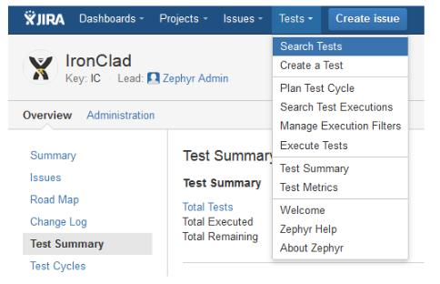

Рисунок 11.5 – Робоче вікно системи JIRA

Якщо використовувати подібний тандем, можна отримати першокласний сервіс з максимальним набором найбільш корисних функцій таких як:

- створення тест-плана;
- редагування тест-кейсів;
- побудова процесу тестування;
- створення деталізованих звітів;
- можливість оперативно ввести дефект.

## 11.2.4. PRACTITEST

Наступним у списку буде PractiTest — популярний хмарний сервіс (див. рис. 11.6).

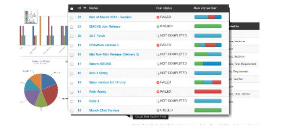

Рисунок 11.6 – Робоче вікно PRACTITEST

З його допомогою користувач може:
- розробляти тестову бібліотеку;
- створювати та редагувати тестові сценарії;
- підтримувати раніше створені тестові сценарії;
- редагувати першочергові вимоги;

- створювати тестову вибірку, призначати відповідального тестувальника та задавати точні строки для виконання тестів;
- створювати дефекти та задачі.

Даний додаток можна дуже просто інтегрувати з Jira, Pivotal Tracker, Redmine, Bugzilla та з іншими популярними системами. З його допомогою можна проганяти автоматизовані тести із використанням бібліотек Selenium чи взаємодіяти за допомогою зовнішнього API.

## 11.2.5. QTEST

Додаток розроблено фірмою QASymphony. Його базова задача – допомагати не лише команді тестувальників, але і іншим членам групи розробників. Багато QA-спеціалістів цінують додаток за простий та зрозумілий візуальний інтерфейс (див. рис. 11.7).


Рисунок 11.7 – Робоче вікно QTEST

Можливості системи:
- робота із створеними тест-планами;
- редагування, експорт та імпорт технічних вимог;
- створення декількох версій тестових випадків для легкого повторного використання;
- робота з фільтрами на основі заданих параметрів;
- інтеграція з CI/CD процесами за допомогою таких інструментів як Bamboo та Jenkins;
- наявність виділеного баг-трекера.

Використані у розділі літературні джерела – [117-121].

## Контрольні запитання


1. Що таке дефект?
2. Коли виявляються дефекти у програмному забезпеченні?
3. Дайте визначення баг-репорту.
4. Охарактеризуйте шаблон оформлення баг-репорту.
5. Які поля є обов'язковими для заповнення баг-репорту?
6. Що таке серйозність дефекту?
7. Яка є градація серйозності дефекту?
8. Що таке пріоритет дефекту?
9. Яка є градація пріоритету дефекту?
10. Назвіть вимоги до кількості відкритих багів у програмному забезпеченні.
11. Озвучте основні помилки при написанні баг-репортів.
12. Охарактеризуйте життєвий цикл бага.
13. Охарактеризуйте стани життєвого цикла бага «виявлений», «призначений» та «виправлений».
14. Охарактеризуйте стани життєвого цикла бага «перевірений» та «закритий».

15. Охарактеризуйте стани життєвого цикла бага «відкритий заново» та «рекомендований до відхилення».

16. Охарактеризуйте стани життєвого цикла бага «відхилений» та «відкладений».

17. Озвучте рекомендації з написання баг-репортів.

18. Що таке система управління тест-кейсами?

19. Озвучте принципи, якими необхідно керуватись, для вибору найбільш придатного інструменту для управління тест-кейсами.

20. Коротко охарактеризуйте систему управління тест-кейсами TESTRAIL.

21. Коротко охарактеризуйте систему управління тест-кейсами TESTLINK.

22. Коротко охарактеризуйте систему управління тест-кейсами JIRA+ZEPHYR.

23. Коротко охарактеризуйте систему управління тест-кейсами PRACTITEST.

24. Коротко охарактеризуйте систему управління тест-кейсами QTEST.


<!-- ВІДНОВЛЕНО ЛОКАЛЬНО (Стор. 284) -->
# **12.1. Визначення та основні складові веб-додатку.** 

**Веб-додатки** – сфера, яка динамічно розвивається. Не усі підходи та методи, які застосовуються для тестування класичних додатків можуть бути використанні при тестуванні веб-додатків. 


На рисунку 12.1 наведена структура веб-додатку. 


Рисунок 12.1. – Структура веб-додатку 

Веб-додаток представлений наступними складовими («сторонами»): 

1. **_Клієнт._** Як правило клієнт – це браузер, але зустрічаються і виключення (в тих випадках, коли один веб-сервер виконує запит до іншого, роль клієнта виконує перший сервер). В класичній ситуації (коли роль клієнта виконує браузер) для того, щоб користувач побачив графічний інтерфейс додатку у вікні браузера, останній повинен обробити отриману відповідь веб-сервера, в якій 

284
<!-- КІНЕЦЬ ВІДНОВЛЕННЯ -->


<!-- ВІДНОВЛЕНО ЛОКАЛЬНО (Стор. 285) -->
буде міститись інформація, реалізована із застосуванням HTML, CSS, JS (найбільш застосовувані технології). Саме ці технології «дають зрозуміти» браузеру, як саме необхідно «відтворити» все, що він отримав у відповіді. 

2. **_Сервер._** Веб-сервер – це сервер, який приймає НТТР-запити від клієнтів та віддає їм НТТР-відповіді. Щоб уникнути можливої плутанини, відмітимо, що веб-сервером називають як програмне забезпечення, що виконує функції вебсервера, так і безпосередньо комп’ютер, на якому це програмне забезпечення працює. Найбільш розповсюдженими видами програмного забезпечення вебсерверів є Apache, IIS та NGINX. На веб-сервері функціонує тестований додаток, який може бути реалізований із застосуванням самих різноманітних мов програмування: PHP, Python, Ruby, Java, Perl та інші. 

3. **_База даних._** В класичній теорії мова іде про дві «сторони» веб-додатку, однак, якщо уважно подивитись на весь процес роботи додатку, ми можемо відповісти, що в алгоритмі роботи веб невидимо, але доволі активно приймає участь ще одна «сторона» - база даних. Фактично вона не є частиною вебсервера, але більшість додатків просто не можуть виконувати всі покладені на них функції без неї, так як саме в базі даних зберігається вся динамічна інформація додатку (звітні, користувацькі дані та інші). 

База даних – доволі широке поняття, котре використовується не лише в сфері інформаційних технологій. В даному контексті – це інформаційна модель, котра дозволяє впорядковано зберігати дані про об’єкт чи групу об’єктів, які володіють набором властивостей, котрі можна категоризувати. База даних функціонує під керівництвом так званих систем керування базами даних (СУБД). Найбільш популярними СУБД є MySQL, MS SQL Server, PostgreSQL, Oracle (все веб-серверні). 

Також існують вбудовані та файл-серверні СУБД. Для загального розвитку відмічу лише одну найбільш популярні вбудовану СУБД – SQLite, котра використовуються в деяких браузерах, Android API, Skype та інших відомих 

285
<!-- КІНЕЦЬ ВІДНОВЛЕННЯ -->


<!-- ВІДНОВЛЕНО ЛОКАЛЬНО (Стор. 286) -->
додатках. Взаємодія з перерахованими СУБД основана на спеціальній мові структурованих запитів – SQL. 

Майже всі сучасні програми орієнтовані на роботу з мережею. Збереження даних веб-додатків здійснюється зазвичай на сервері, обмін інформацією відбувається по мережі. Коли ми бачимо помилку в мережевому середовищі, то досить часто важко впевнено сказати, де саме вона відбувалась, і тому режим роботи чи повідомлення про помилку, яке ми отримуємо, може бути результатом помилок, які виникли в різних частинах мережі. 

Маючи багато спільного із тестуванням класичного додатку, тестування веб-орієнтованих додатків має свої особливості, пов’язані в першу чергу із середовищем функціонування. Маючи компонентні, структурні та технологічні особливості, веб-додаткам притаманні особливості режимів роботи, інсталяції, запуску, зупинки та видалення, а також формування інтерфейсів. Працюючи завжди з мережею та великою кількістю користувачів, веб-додатки мають на увазі під собою різноманітні права доступу для різних користувачів. 

Логіка веб-додатку розподілена між сервером та клієнтом, зберігання даних здійснюється на сервері, обмін інформацією відбувається по мережі. Однією із переваг підходу є той факт, що клієнти не залежать від конкретної операційної системи користувача, тому веб-додатки є міжплатформними сервісами. 

Те, що веб-розробки будуть продовжувати збільшувати темпи свого розвитку, підтверджується і набираючим силу «мейнстрімом»: все «переміщується» в хмару. Хмарні технології стають реальністю сучасного Інтернету: навіть колись звичні нам десктопні Word та Excel сьогодні представлені у вигляді веб-альтернатив від Microsoft. Виходячи із сказаного, можна стверджувати, що необхідність в деяких інженерах по забезпеченню якості, які спеціалізуються на веб-продуктах, буде лише збільшуватись. 

286
<!-- КІНЕЦЬ ВІДНОВЛЕННЯ -->


<!-- ВІДНОВЛЕНО ЛОКАЛЬНО (Стор. 287) -->
**12.2. Особливості тестування веб-додатків** 

**_1. Технологічні відмінності._** Класичний додаток працює із використанням однієї чи сімейства споріднених технологій. 

**_2. Структурні відмінності._** Класичний додаток «монолітний». Складається з одного чи невеликої кількості модулів. Не використовує сервери бази даних, веб-сервери та інше. Веб-додаток – «багатокомпонентний». Складається з великої кількості модулів. Обов’язково використовує сервери бази даних, веб-сервери та сервери додатків. 

**_3. Відмінності режимів роботи._** Класичний додаток працює в _режимі реального часу,_ тобто відомо про дії користувача одразу ж, як тільки вони були виконані. Веб-додаток працює в режимі «запит-відповідь», тобто відомо про деякий набір дій тільки після запиту на сервер (див.рис.12.2). 


Рисунок 12.2 – Режим роботи веб-додатку 

**_4. Відмінності формування інтерфейсу._** Класичний додаток використовує для формування інтерфейсу користувача відносно усталені та стандартизовані технології. Веб-додатки використовують для формування 

287
<!-- КІНЕЦЬ ВІДНОВЛЕННЯ -->


<!-- ВІДНОВЛЕНО ЛОКАЛЬНО (Стор. 288) -->
користувацького інтерфейсу технології, які стрімко розвиваються, більшість яких конкурують між собою. 

**_5. Відмінності роботи з мережею._** Класичний додаток практично не використовує мережеві канали передачі даних. Веб-додаток активно використовує мережеві канали передачі даних. 

**_6. Відмінності запуску та зупинки._** Класичний додаток запускається та зупиняється рідко. Веб-додаток запускається та зупиняється по факту поступлення кожного запиту, тобто дуже часто. 

**_7. Різниця в кількості користувачів._** Класичний додаток: кількість користувачів, які одночасно використовують додаток, контрольована, обмежена та легко прогнозована. Веб-додаток: кількість користувачів, які одночасно використовують додаток, важкопрогнозована і може стрибкоподібно змінюватись в широких діапазонах. 

**_8. Особливості збоїв та відмов._** Класичний додаток: вихід із ладу тих чи інших компонент одразу стає очевидним. Веб-додаток: вихід з ладу деяких компонент дає непередбачуваний вплив на працездатність додатку вцілому. 

**_9. Відмінності в інсталяції._** Класичний додаток – процес інсталяції стандартизований та максимально орієнтований на широку аудиторію користувачів. Не потребує специфічних знань. Додавання компонент додатку виконується стандартним способом із використанням одного і того ж інсталятора. Веб-додаток – процес інсталяції часто недоступний кінцевому користувачеві. Інсталяція потребує специфічних знань. Процес зміни компоненти додатку не передбачає або потребує кваліфікації користувачів, інсталятор відсутній. 

- **_10.Відмінності в деінсталяції._** Класичний додаток: процес деінсталяції стандартизований та виконується автоматично чи напівавтоматично. Вебдодаток: процес деінсталяції потребує специфічних знань для втручання 

288
<!-- КІНЕЦЬ ВІДНОВЛЕННЯ -->


<!-- ВІДНОВЛЕНО ЛОКАЛЬНО (Стор. 289) -->
адміністратора і часто поєднаний із зміною коду середовища функціонування додатку, бази даних, налаштування системної операційної системи. 

**_11.Особливості середовища функціонування._** Класичний додаток: середовище функціонування стандартизоване та не сильно впливає на функціонування додатку. Веб-додаток: середовище функціонування дуже різноманітне і може проявляти серйозний вплив на дієздатність як серверної, так і клієнтської частини. 

# **12.3. Особливості архітектури: «під прицілом» клієнт** 

Ми зазначали клієнта як першу складову архітектури. В класичній ситуації клієнт представлений браузером, а тому питання тестування кросбраузерності досить актуальний. Ми також розглянемо тестування форм, які заповнюються та тексту, як основного джерела інформації, що отримується від клієнта. 

_Кросбраузерність: різноманіття клієнтів_ 

Що ми розуміємо під тестуванням на кросбраузерність? Це перевірка на правильність (відповідність вимогам і стандартам) відображення та функціонування веб-додатку в різних браузерах та на різних операційних системах. В сучасному світі стандартизація приймає глобальні масштаби, а тому більшість популярних браузерів однаково обробляють код. При цьому необхідність в кросбраузерному тестуванні не зникає, так як далеко не всі проблеми вирішуються стандартизацією. 

Перед початком робіт рекомендовано взнавати у відповідальних людей необхідний для тестованого програмного забезпечення набір браузерів. Можна самим зібрати статистику по цільовій аудиторії вашого продукту та обмежити кросбраузерне тестування набором найбільш популярних в цій аудиторії браузерів. В умовах регресійного тестування, коли обмежені часові та людські 

289
<!-- КІНЕЦЬ ВІДНОВЛЕННЯ -->


<!-- ВІДНОВЛЕНО ЛОКАЛЬНО (Стор. 290) -->
ресурси, також можна застосовувати практику розподілу браузерів: закріпляючи за кожним тестувальником певний браузер, ви зможете «покрити» більший відсоток кросбраузерних дефектів.  Цей метод має і свої недоліки: він найбільш результатиний у великій команді тестувальників, але стає практично незастосовуваним при наявності одного тестувальника. 

Що необхідно перевіряти при кросбраузерному тестуванні: 

- функціональні можливості продукту, які реалізуються на стороні клієнта; 

- правильність відображення елементів графіки; 

- шрифти та розміри текстових символів; 

- доступність та функціональність різноманітних форм, включаючи їх інтерактивність. 

Тестування потребують всі основні (серед користувацької аудиторії) браузери, але особливу увагу необхідно приділити Internet Explorer, якщо він входить в їх кількість. Саме в ньому дуже часто виникають проблеми, котрі відсутні в інших браузерах: так як в Internet Explorer додатково рекомендується звертати особливу увагу на масштабованість, фокус полів та роботу JS. 

Окремо варто не забувати про різного роду валідаторів верстки. Навіть якщо у вас достатньо знань, щоб оцінити відповідність верстки стандартам, можна використати для цього автоматичні засоби і, проаналізувавши результат, вказати розробникам на самі серйозні «огріхи». Не варто забувати, що інколи валідатори звертають увагу на самі «дрібні дрібниці», котрі ніхто і ніколи виправляти не буде. Якщо ви і заносите баг-репорти на подібні зауваження, то зручніше буде зібрати їх в окремий документ та прикріпити до репорта. До такого роду «дрібниць» можна віднести всі можливі рекомендації, котрі не мають свого впливу на відображення та функціонування контенту. 

_Веб-форми на стороні клієнта_ 

Однією із важливих складових інтернет-додатків є форми заповнення, взаємодію із якими користувач здійснює за допомогою все того ж клієнта. 

290
<!-- КІНЕЦЬ ВІДНОВЛЕННЯ -->


<!-- ВІДНОВЛЕНО ЛОКАЛЬНО (Стор. 291) -->
Однак, дані форми дуже часто слугують джерелом дефектів, котрі, розмістившись у «продакшині», можуть принести великі фінансові і репутаційні збитки компанії. 

Як ж не пропустити дефекти у формах на продакшен? Розглянемо декілька простих кроків: 

1. Ретельно перевіряємо обов’язковість заповнення полів та наявність відповідного маркування у них. 

2. Заповнивши та надіславши форму, впевнюємось у тому, що з даними відбувається саме те, що заплановано. Якщо дані повинні бути внесені в базу даних, перевіряємо коректність внесення. 

3. Використовуємо чіт-листи для тестування форм. 

Чіт-лист (Cheat-sheet) – список перевірок, що повторюються. Читлисти складаються із ціллю їх наступного багаторазового використання. У зв’язку з цим такі списки складаються по відношенню до розповсюджених та часто зустрічних складових програмного забезпечення, з яким належить працювати неодноразово не лише в поточному проекті, але і в наступних. 

Кожний окремий спеціаліст розширює перелік перевірок у своїх чітлистах із досвідом. На сьогодні багато автоматизованих систем управління тест-кейсами також містять і функціонал підтримки списків чіт-листів, що в значній мірі спрощує їх створення, наступні підтримки та практичне застосування. 

4. Перевіряємо чи виводяться зрозумілі користувачу інформаційні повідомлення про необхідність заповнення пустих полів після спроби надіслати форму. 

5. Звертаємо увагу на реалізацію екранування символів в полях форм, які є потенційним джерелом вразливості для додатку та користувачів. Екранування повинно здійснюватись на рівні не лише клієнта, але і сервера, вимкнути який в клієнті досить просто (наприклад за 

291
<!-- КІНЕЦЬ ВІДНОВЛЕННЯ -->


<!-- ВІДНОВЛЕНО ЛОКАЛЬНО (Стор. 292) -->
допомогою спеціальних плагінів, котрі знімають всі можливі обмеження в декілька кліків). 

6. Впевнюємось, що після заповнення форми, користувачу приходить підтверджувальний лист з вказуванням відповідного відправника, а саме тіло листа відповідає вимогам. 

7. Використовуємо допоміжні спеціальні інструменти для тестування форм, наприклад Web Developer Toolbar. 

_Текст, як основне джерело інформації при роботі через клієнт_ 

Основною цінністю мережі Інтернет є те, що вона являється практично безмежним джерелом інформації. Частина цієї інформації представлена у вигляді текстів, з якими, знову ж таки, користувач взаємодіє за допомогою клієнту. Більшість веб-ресурсів в тому чи іншому об’ємі потребують перевірки текстів на предмет відсутності граматичних та друкарських помилок. 

Звісно, значимість цього тестування не така велика порівняно з функціональним напрямком, але нехтувати ним не потрібно. На практиці бувають серйозні друкарські помилки: на продакшині одного з великих інтернет-гіпермаркетів була допущена помилка, яка змінила назву міста на лайливе слово, яке було видно не лише мешканцям цього міста. Так, часу на вичитування всього тексту буває замало, тоді в таких випадках на допомогу приходять «SpellCheker» (програми для перевірки орфографії, онлайн або у вигляді плагінів для браузерів). 

# **12.4. Особливості архітектури: «під прицілом» сервер** 

Тестування частини веб-додатку, розміщеної на веб-сервері, можна провести оминувши графічний(клієнтський) інтерфейс, однак це потребує від спеціаліста визначеного рівня знань та навиків технічного характеру, а також застосування додаткових інструментів. Розглянемо веб-сервер з точки зору тестування навантаження та інсталяції. 

292
<!-- КІНЕЦЬ ВІДНОВЛЕННЯ -->


<!-- ВІДНОВЛЕНО ЛОКАЛЬНО (Стор. 293) -->
_Інсталяція на веб-сервер_ 

Отже, перед тим як почати тестувати, ми повинні встановити веб-додаток на веб-сервер. Відповідно тут є схожість з тестуванням десктоп додатків, але існує і відмінність в нюансах, котрі необхідно врахувати та протестувати, особливо якщо це стосується програмного забезпечення, розповсюджуваного для локальної інсталяції на веб-сервери користувачів. 

В чому нюанси: 

1. Більша частина веб-додатків потребує для інсталяції специфічних знань в адмініструванні операційних систем. Спробуйте встановити додаток на декількох веб-серверах. В оптимальному випадку це будуть самі популярні технології серед ваших користувачів, для встановлення списку яких необхідно попереднє дослідження. 

2. Інсталюючи веб-додаток, звертайте увагу на те, чи дійсно додаток встановлюється у вказану вами директорію, базу даних, використовує обраний вами префікс та дотримується інших конфігураційних моментів. 

3. Переконайтесь, що додаток можна встановити як localhost, так і віддалено. 

4. Якщо процес інсталяції є ітерактивний, і кожний вибір користувача на певному кроці впливає на наступні дії, то необхідно буде пройти всі гілки, так як саме інсталяція є першим кроком користувача при роботі з вашим додатком. 5. Не забувайте про негативні тести: перевірка в умовах нестачі ресурсів (місця на дискові, оперативної пам'яті) чи привілегій, переривання процесу встановлення під час активної його фази (наприклад, надсилаючи сервер на перезаванатаження). 

_Тестування навантаження_ 

Тестування навантаження імітує роботу з додатком певної кількості користувачів. Цей вид тестування здійснюється за допомогою спеціальних інструментів (наприклад jMeter), головна ціль яких – визначити профілі навантажень та штучно створити для них навантаження, які визначають 

293
<!-- КІНЕЦЬ ВІДНОВЛЕННЯ -->


<!-- ВІДНОВЛЕНО ЛОКАЛЬНО (Стор. 294) -->
граничні можливості додатку (чи сервера) в умовах роботи з ним того чи іншого користувача. 

Отримана інформація підлягає детальному аналізу з наступним виявленням «вузьких місць» та граничних програмних чи апаратних можливостей, котрі в подальшому використовуються для забезпечення стабільності веб-сервера та самого додатку, що на ньому працює. 

Наведемо приклад з практики функціонування великого комерційного продукту, котрий довший час працював з різноманітними типами договорів. Одного разу в реліз випустили черговий особливо очікуваний тип договору, і на наступний день система повністю перестала працювати, а служба підтримки була завалена величезною кількістю звернень. Всьому виною став прорахунок в тестуванні: команда перевіряла одночасну роботу з десятками тисяч договорів, але ніхто не зміг передбачити, що на практиці мова піде про сотні тисяч, а іноді і про мільйони договорів. Тестування навантаження дозволяє виявити потенційні проблеми такого характеру ще на етапі тестування. 

# **12.5. Особливості архітектури: «під прицілом» база даних** 

Ще однією раніше розглянутою складовою веб-додатків є база даних, в якій додаток зберігає всю необхідну інформацію. Для того, щоб база даних служила гідним сховищем інформації для вашого додатку, при тестуванні необхідно звертати увагу на такі основні моменти: 

1. Інформація, внесена через інтерфейс, повинна бути збережена в базі даних в незмінному (первісному) вигляді. 

2. Збережена в базі даних інформація повинна відображатися в будь-якій частині програми однаково (якщо іншого не вимагає бізнес-логіка програми). 

3. Назви таблиць і структура бази даних повинні відповідати проектній документації. 

294
<!-- КІНЕЦЬ ВІДНОВЛЕННЯ -->


<!-- ВІДНОВЛЕНО ЛОКАЛЬНО (Стор. 295) -->
4. Потрібно стежити за тим, щоб запити не оброблялись надто довго, а кількість з'єднань було достатнім. Моніторинг стану бази даних - один із важливих моментів тестування. 

5. Варто враховувати, що видалення запису з бази даних не завжди супроводжується повним видаленням сутності. Іноді використовується так зване «псевдовидалення», і потрібно перевірити, чи правильно воно виконується. 

6. Порожню базу даних на тестовому стенді рекомендується або заповнювати згенерованими випадковими даними, або знімати дамп з продакшена і після обфускації  (обфускація – це процес, в результаті якого код програми чи інших даних набуває вигляду, важкого для аналізу) даних «заливати» їх в тестовану базу даних. Іноді кваліфікація тестувальника (або інша причина) не дозволяє виконати цей процес самостійно: в такому випадку рекомендується звернутися за допомогою до фахівців інфраструктури або розробникам. 

# **12.6. Запити** 

Всі складові веб-додатів повинні взаємодіяти між собою і відбувається це за допомогою НТТР. Без НТТР наша багатостороння система не функціонувала б взагалі, так як НТТР – це протокол передачі даних, який займає одне із основних місць в нашій архітектурі. 

Взаємодія здійснюється через повідомлення: на надісланий запит від клієнта повинна прийти відповідь сервера. Класичний запит/відповідь складається з 3 складових: 

- стартова стрічка; 

- заголовок; 

- текст повідомлення. 

295
<!-- КІНЕЦЬ ВІДНОВЛЕННЯ -->


<!-- ВІДНОВЛЕНО ЛОКАЛЬНО (Стор. 296) -->
При роботі з відповідями спеціаліст по тестуванню в першу чергу повинен звертати увагу на методи та коди станів, котрі присутні в стартовій стрічці. 

Найпопулярнішими методами є GET, HEAD і POST: 

1. Метод GET. Використовується для запиту вмісту, розміщеного на сервері (наприклад, GET/path/resource?рaram1=value1¶m2 = value2 HTTP/1.1). 

2. Метод HEAD. За своєю суттю не відрізняється від вищезгаданого методу, однак відповідь сервера на такий запит позбавлений «тіла», а практичне застосування орієнтоване на полегшене використання з метою отримання мінімальної інформації про сервер/продукт або його статус. 

3. Метод POST. Даний метод використовується для передачі даних на сервер, однак його основа «ховається» в тіло, що відрізняє його від GET. Під час публікації цієї статті, наприклад весь текст поміщений в тіло POST-запиту; після обробки його сервером на сайт буде додано статтю. 

Існують і інші методи: PUT, DELETE, CONNECT, TRACE, PATCH тощо. 

Те, що складові веб-додатку взаємодіють між собою за допомогою HTTP, є гарною новиною для фахівця з тестування, так як це дозволяє не просто відстежувати спілкування, вникаючи в логіку роботи і звіряючи її з технічними вимогами, але і впливати безпосередньо на додаток, прикладаючи свою руку до відправлених запитів 

Класичними додатками, які можна використовувати для генерації запитів, є Fiddler або Postman. Використовуючи Fiddler, можна з легкістю відстежувати всі запити від клієнта і відповіді, переглядати їх деталі, а також вносити свої зміни і відправляти модифіковані запити на сервер, оцінюючи поведінку системи в такому випадку. 

_На що звертати увагу при запитах?_ 

1. Чи правильний метод використовується для того чи іншого запиту? Якщо ви відправляєте повідомлення, а на сервер йде тільки GET-запит, то щось тут явно не так. 

296
<!-- КІНЕЦЬ ВІДНОВЛЕННЯ -->


<!-- ВІДНОВЛЕНО ЛОКАЛЬНО (Стор. 297) -->
2. Здавалося б, клік по одній і тій же функціональній клавіші генерує один і той же запит. Але є прецеденти, коли клік по кнопці приводив до ситуації, в якій JavaScript переписував запит кнопки, розміщеної поруч, таким чином змінюючи її призначення. 

3. Вникайте у запити, які надсилаються. У них досить легко розібратися, особливо якщо це GET - вони логічно зрозумілі навіть пересічному користувачеві. Аналіз запитів - це можливість виявити прихований дефект набагато швидше, ніж здійснюючи його пошук в інтерфейсі. 

4. Моніторте трафік на предмет запитів на інші (не ваші) сервера. Приклад з життя: фронтенд сайту робив фріланс-розробник, по завершенню роботи якого взялася за тестування фірма. Тестувальник мав звичку моніторити весь трафік тестованої програми: це дозволило виявити, що вищезгаданий розробник безсоромно сховав у «фронт» сайту запити, які працювали на благо його особистого інтернет-магазину. 

5. Моніторте трафік, уважно стежте за кодами станів. Трішки докладніше зупинимося на цьому пункті. 

_Коди станів очима адепта якості_ 

Кожна відповідь на будь-який запит несе в собі масу корисної для розробників і фахівців з тестування програмного забезпечення інформації. Одним з джерел такої інформації може стати код стану: за цим кодом клієнт дізнається про результати його запиту і визначає, які дії йому робити далі. Набір кодів стану є стандартом, він описаний у відповідних документах RFC. Кожен раз, коли ви створюєте баг-репорт про непрацюючі посилання, інші елементи веб-сторінки або системні помилки, обов'язково вказуйте відповіді сервера: вони заощадять час розробнику при визначенні причин дефекту. 

Всі коди можна поділити на групи (соті, двохсоті, трьохсот, чотирьохсоті і п'ятисоті) кожна група-«сотня» несе свій тип інформації (див.табл.12.1). 

297
<!-- КІНЕЦЬ ВІДНОВЛЕННЯ -->


Таблиця 12.1.

Коди станів

| Код | Тип інформації коду | Призначення |
| :--- | :--- | :--- |
| 1xx | Інформаційні | Інформують про передачу повідомлення. Самі повідомлення від сервера містять тільки стартову стрічку відповіді і, якщо необхідно, декілька специфічних для відповіді полів заголовку. |
| 2xx | Повідомляючі про успішні операції | Інформування про успішну обробку запиту клієнта. Самим класичним та поширеним є «200 OK» |
| 3xx | Перенаправляючі | Повідомляє, що для успішного виконання операції необхідно зробити інший запит. З даного типу п'ять кодів: 301,302,303,305 та 307 відносяться безпосередньо до перенаправлення. Адреса, за якою клієнту варто проводити запит, сервер вказує в заголовку Location |
| 4xx | Помилка на стороні клієнта (запит) | Вказує на помилки на стороні клієнта. При використанні всіх методів, крім HEAD, сервер повертає пояснення причини |
| 5xx | Помилка на стороні сервера (відповідь) | Говорить про помилки виконання операції за виною веб-сервера |

На практиці, використовуючи при тестуванні спеціальні додатки (той самий Fiddler), ви без зусиль зможете впорядкувати свої запити і відповіді за кодом стану і відібрати, наприклад, всі 400-і і 500-і з подальшим їх аналізом.


<!-- ВІДНОВЛЕНО ЛОКАЛЬНО (Стор. 299) -->
Таким чином дуже швидко «відловлюються» дефекти з «відваленими» стилями, скриптами, файлами, функціями додатку тощо. 

# **12.7. Відмінність веб-додатку від десктопного** 

_Багатокористувацька сутність веб-додатків._ 

Широта аудиторії додатків накладає свій відбиток на специфіку роботи. 

1. Один додаток одночасно може використовуватися величезною кількістю людей. Ми вже розглядали питання навантажувального тестування, але також слід звернути увагу на те, що в число користувачів можуть входити представники різних культур, мов і релігій. Нам необхідно пам'ятати про це, особливо якщо мова йде про тестування міжнародного додатка. 

2. Кожен користувач може мати свої рівні доступу. В ідеальному варіанті тестувальник створює для себе матрицю рівнів доступу і тестує кожен доступ окремо (див.рис.12.3). 


Рисунок 12.3 – Приклад матриці рівнів доступу 

299
<!-- КІНЕЦЬ ВІДНОВЛЕННЯ -->


<!-- ВІДНОВЛЕНО ЛОКАЛЬНО (Стор. 300) -->
3. Користувачі з одним рівнем доступу можуть звертатися до одних і тих же сутностей, що призводить до конкурентного доступу. Тестується це досить просто. Для прикладу розглянемо систему, що має справу з договорами, які можна створювати, публікувати, редагувати, анулювати. Алгоритм роботи такий: під декількома вікнами в режимі інкогніто авторизуємося в додатку під користувачами з різними рівнями доступу; далі обрану для тесту сутність відкриваємо на редагування, а під другим обліковим записом цю ж сутність пробуємо перевести в статус «Анульовано» - на цьому етапі повинен спрацювати контроль на конкурентний доступ. Операція анулювання блокується, а користувачу видається повідомлення про те, що сутність редагується іншим користувачем (поведінка і пріоритет дій визначається відповідно до вимог і особливостей продукту, але логіка не змінюється). 

4. Широта аудиторії говорить про те, що за монітором може перебувати людина, що має злий намір щодо вашого програмного забезпечення. 

_Мережеві пристрасті: веб-додаток в різних умовах передачі даних_ 

Веб-додатки активно використовують мережу, і це є джерелом можливих проблем. Такою, наприклад, є використання додатку в умовах низької швидкості передачі даних (в браузер Google Chrome, наприклад, вбудована функція Throttling, яка дозволяє сильно занижувати швидкість передачі даних), в умовах втрати пакетів або при відключенні мережі під час активної фази роботи програми (спосіб імітації: спочатку робимо швидкість передачі даних за допомогою Throttling мінімальною, а потім перериваємо мережеве з'єднання під час обробки запиту). 

У будь-якому з описаних вище випадків програма має працювати коректно. При «падінні» запиту (time out) або іншої проблеми ми повинні, перезавантаживши сторінку, знову отримати повністю працюючий веб-додаток без будь-якого натяку на щойно пережиту «шкоду». Чи для всіх функцій програми необхідні подібні тести? Ні в якому разі! В майбутньому можете 

300
<!-- КІНЕЦЬ ВІДНОВЛЕННЯ -->


<!-- ВІДНОВЛЕНО ЛОКАЛЬНО (Стор. 301) -->
орієнтуватися на свій досвід, а на перших етапах в цих питаннях краще проконсультуватися з розробниками. 

_Тестування безпеки веб-додатків_ 

Тестування безпеки - окремий напрямок тестування, яке вимагає від фахівця фундаментальних знань технічного характеру і хорошої профільної кваліфікації. Зазначимо ряд загальних моментів, які можуть допомогти будьякому тестувальнику знаходити класичні уразливості, не допускаючи їх вихід на продакшен. Питання безпеки додатків регламентуються OWASP Guide, CHECK, ISACA, NIST Guideline, OSSTMM. 

Існує ряд принципів безпеки, до яких відносяться конфіденційність, цілісність і доступність: 

1) Конфіденційність - обмеження доступу до тієї чи іншої інформації для певної категорії користувачів (або навпаки надання доступу лише обмеженій категорії). 

2) Цілісність включає в себе: 

а) можливість відновити дані в повному обсязі при їх пошкодженні; 

б) доступ на зміну інформації тільки певної категорії користувачів. 

3) Доступність - ієрархія рівнів доступу і чітке їх дотримання. 

Перерахуємо класичні уразливості сучасних веб-додатків: 

1. XSS - генерація на сторінці продукту скриптів, які становлять небезпеку для користувачів продукту; 

2. XSRF - вразливість, при якій користувач переходить з довіреної сторінки на шкідливу, де крадуться цінні для користувача дані; 

3. Сode injection (PHP, SQL) - ін'єкція частини виконавчого коду, яка робить можливим отримати несанкціонований доступ до програмного коду або бази даних і вносити в них зміни; 

301
<!-- КІНЕЦЬ ВІДНОВЛЕННЯ -->


<!-- ВІДНОВЛЕНО ЛОКАЛЬНО (Стор. 302) -->
4. authorization bypass - це вид уразливості, при якому можна отримати несанкціонований доступ до облікового запису або документів іншого користувача; 

5. переповнення буфера - явище, якого можна досягти у шкідливих цілях, по своїй суті являє використання місця для запису даних далеко за межами виділеного буфера пам'яті. 

При тестуванні рекомендовано використовувати чіт-листи вразливостей XSS Filter Evasion Cheat Sheet і MySQL SQL Injection Cheat Sheet. 

# **12.8. Практичні поради** 

_З чого починати тестувати?_ 

Закцентувати вашу увагу на необхідності узгодити всі ключові аспекти з відповідальними особами (аналітиками, проектними менеджерами, розробниками) ще до початку тестування. Необхідно заздалегідь з'ясувати наступні моменти: 


   - мета тестування (з їхньої точки зору); 

   - види тестування, які необхідно провести; 

   - специфіку програми та її цільову аудиторію; 

   - перелік пристроїв, на яких необхідно проводити тестування; 

   - список операційних систем і браузерів для тестування; 

   - роздільну здатність екранів на яких необхідно перевірити додаток; 

- чи передбачені вимоги до різного роду форм, чи є стайл-гайд, актуальне 

- технічне завдання; 

- необхідність надання конкретної документації за результатами тестування 

- (звіт, чек-листи, тест-кейси тощо). 

Отримавши відповіді на ці питання, про які часто забувають новачки, ви заощадите свій час. Далі переходите до безпосередньої підготовки оточення і формування стратегії тестування. 

302
<!-- КІНЕЦЬ ВІДНОВЛЕННЯ -->


<!-- ВІДНОВЛЕНО ЛОКАЛЬНО (Стор. 303) -->
_Ніколи думати, потрібно тестувати!_ 

Будь-яке тестування вимагає змістовного підходу із застосуванням технік тест-аналізу і тест-дизайну. В іншому випадку ви ризикуєте назавжди залишитися «monkey-тестером», цінність праці якого буде мізерна. В цілому, ключові положення тест-аналізу і тест-дизайну застосовні як до тестування десктоп-додатків, так і до веб, але з суттєвим застереженням: ви повинні враховувати всі згадані в статті нюанси. Окремо закцентувати увагу на тому, що без стійкого розуміння методик і способів застосування тест-аналізу і тестдизайну тестувати якісно програмне забезпечення практично неможливо. 

Розглянемо класичний набір методик тест-дизайну, які можна застосовувати при тестуванні веб-додатків: 


розбиття на класи еквівалентності; 

попарне тестування; 

- тестування переходів станів; 

аналіз граничних значень; 

- тестування за допомогою таблиць рішень; 

методика тест-турів Віттакер і безліч інших. 

Остання методика тестування відноситься до дослідницького тестування і буде розглянута у окремому тематичному розділі далі. 

_Подай ключ «на 13»._ 

В даний час існує величезна безліч різноманітних інструментів, які спрощують життя всім учасникам розробки нового програмного забезпечення. Отже, не варто забувати про те, що крім розвитку особистих якостей, технічних знань і навичок, ми повинні вміти добре користуватися допоміжними інструментами, кожен раз випробовуючи все нові і нові. 

Зазначимо лише деякі з них: 

**Ресайзер** - оперативна зміна усіляких налаштувань розмірів відображення, перегляд метрик, перемикання орієнтацій відображення. 

303
<!-- КІНЕЦЬ ВІДНОВЛЕННЯ -->


<!-- ВІДНОВЛЕНО ЛОКАЛЬНО (Стор. 304) -->
**Opera Mobile Classic Emulator** - класичний однойменний емулятор. 

**Mobile Phone Emulator** - класичний емулятор. 

**Fiddler** – програмне забезпечення для відстеження всього вашого трафіку. За допомогою цієї програми можна відправляти помилкові запити на сервер з потрібними вам параметрами. 

**Xenu Link Evaluator** (альтернатива - Black Widow) - «чекер» веб-додатку на предмет наявності в ньому «битих» посилань. Також можна використовувати його для формування карти додатку. 


**Skipfish** - активний сканер вразливостей веб-додатків. 

**OpenVAS** - безкоштовний сканер вразливостей. 

**Nikto** - веб-сканер, який перевіряє веб-сервери на найчастіші помилки, що виникають зазвичай через людський фактор. 

<u>Використані у розділі літературні джерела – [122-127].</u> 

# Контрольні запитання 


1. Що таке веб-додаток? 

2. Якими складовими (сторонами) представлений веб-додаток? 

3. Охарактеризуйте сторону «клієнт» веб-додатку. 

4. Охарактеризуйте сторону «сервер» веб-додатку. 

5. Охарактеризуйте сторону «база даних» веб-додатку. 

6. Назвіть особливості тестування веб-додатків. 

7. Які відмінності режимів роботи веб-додатку та десктопного додатку? 

8. В чому різниця кількості користувачів веб-додатку та десктопного додатку? 

9. Що розуміється під тестуванням на кросбраузерність веб-додатку? 

10. Назвіть особливості тестування веб-форм на стороні клієнта. 

304
<!-- КІНЕЦЬ ВІДНОВЛЕННЯ -->


11. Чому необхідно тестувати текстову інформацію? Які засоби приходять на підтримку для вичитування великих обсягів інформації?

12. Особливості інсталяції веб-серверів.

13. Чому необхідно проводити тестування навантаження серверів?

14. На що потрібно звертати увагу при тестуванні бази даних?

15. З скількох складових складається класичний запит?

16. Які найпопулярніші методи присутні в стартовій стрічці?

17. Які класичні додатки використовуються для генерації запитів?

18. На що звертати уваги при запитах?

19. В якому документі детально описаний набір кодів станів?

20. Скільки груп (сотень) кодів станів налічується?

21. Охарактеризуйте тестування безпеки веб-додатків.

22. Які є класичні вразливості веб-додатків?

23. Що потрібно наперед з'ясувати із відповідальними особами перед початком тестування веб-додатку?

24. Які класичні методики тест-дизайну варто застосовувати при тестуванні веб-додатків?

25. Назвіть, які допоміжні інструменти доцільно використовувати при тестуванні веб-додатків.

## Тема 13. Особливості тестування мобільних додатків

### 13.1. Тестування мобільних додатків

Тестування додатків на мобільних пристроях в цілому відповідає загальним принципам тестування, але також присутній ряд відмінностей, котрі характерні саме для тестування мобільних додатків.

Для того, щоб зрозуміти особливості тестування додатків на мобільних пристроях, необхідно враховувати фактори, котрі відрізняють мобільний додаток від десктопного, а саме: специфічні та різноманітні операційні системи для мобільних платформ, різноманітні конфігурації комплектуючих, функціональність таких пристроїв як комунікатори тощо.

У зв'язку із цими факторами підхід до тестування додатків на мобільних пристроях достатньо сильно відрізняється від десктопного. З'являється велика кількість додаткових нюансів та вимог, котрі необхідно протестувати.

*Отже, при розробці мобільних додатків та при їх тестуванні, слід зважати на ряд моментів:*

* на відміну від монітора комп'ютера, екран мобільних пристроїв може змінювати орієнтацію;
* існує певний список обов'язкових функціональних параметрів мобільних додатків, що приписуються кожним конкретним виробником пристроїв. Їм слідувати потрібно обов'язково;
* мобільний пристрій постійно знаходиться у русі, тому слід очікувати, випадкових дій на пристрої (якщо він не заблокований, якщо мокрими руками чи в рукавичках натискаєш кнопки або хтось штовхає);
* девайс постійно перебуває в стані пошуку мережі;

* при тестуванні слід перевірити роботу програми на неоднакових швидкостях передачі даних;
* при розробці WEB/Mobile програм потрібно також враховувати перебування в різних погодних умовах. При різному світлі слід використовувати контрастні кольори;
* необхідно не забувати, що основним завданням, наприклад телефону, як й раніше є дзвінки, і додаток ніяк не повинен заважати цій головній, прямій функції пристрою;
* відмінні мобільні девайси мають на додачу ще всілякі примочки. І наповнення вашого застосунку, звісно повинно їм відповідати;
* якщо у вас є можливість під час тестування мобільних додатків, радимо нехтувати емуляторами. Справа в тім, що їх функціонал не завжди відповідає усім реальним можливостям мобільного апарату.

І враховуючи усі вищенаведені моменти, якщо додаток вашого конкурента теоретично працюватиме краще вашого то, на жаль, користувач вибере його, а не вас, оскільки зацікавлений у якості і комфорті! Аби цього не сталося слід намагатися мінімізувати ризик, максимально підлаштовуючи продукт під потреби цільового користувача. Зробіть мобільний додаток інтуїтивно зрозумілим, зручним, працездатним безперебійно, безпечним, здатним цілодобово й досить швидко реагувати на дії користувача.

Давайте розглянемо основні моменти, на які варто звертати особливу увагу саме при тестуванні додатків на мобільних пристроях.

*Розмір екрану та touch-інтерфейс:*

1. Розміри всіх елементів графічного інтерфейсу користувача.
2. Перевірка можливості використання всіх активних елементів (кнопок, посилань тощо).
3. Швидкість відгуку активних елементів повинна бути достатньо високою.

4. Перевірка того, що багаторазове натискання на кнопку не викличе аварійне завершення додатку.

5. Підтримка мультитача – одночасне натискання декількох кнопок.

6. Підтримка горизонтального (landscape) та вертикального (portrait) розміщення.

7. Перевірка використання в додатку спеціальних жестів (double tap, swipe, pinch in/out тощо).

*Ресурси телефону:*

1. Необхідно проконтролювати можливі витоки пам'яті. Часто це відбувається в додатках з вікнами, котрі містять велику кількість інформації. Також витік пам'яті може бути присутнім під час тривалої роботи додатку.

2. Перевірка обробки ситуацій браку пам'яті для функціонування операційних систем під час роботи додатку в активному та фоновому режимах.

3. Брак місця для встановлення та роботи додатку.

4. Встановлення на SD-карту.

5. Перевірка роботи батареї (акумулятора) пристрою при запущеному додатку, робота у фоновому режимі, при включеному Wi-Fi, 3G, Internet, без підключення до мережі тощо.

*Різноманітні роздільні здатності екрану та версії операційної системи:*

1. Необхідно перевірити роботу додатку на пристроях з різноманітними роздільними здатностями екрану. На екранах з високою роздільною здатністю (наприклад, ретина-екран) елементи інтерфейсу та текст відображаються дрібніше, при роботі додатку на пристрої з екраном низької роздільної здатності елементи інтерфейсу можуть стати надто великими.

2. Необхідно переконатись, що додаток не може бути встановлено на не підтримуваних пристроях. При цьому обов'язково тестування додатку на всіх заявлених підтримуваних пристроях.

3. Установка додатку на конкретну версію операційної системи.

4. Перевірити різні функції на девайсах: відсутність/наявність камери, авто фокусу, відсутність/наявність GPS, робота карт тощо.

*Реакція додатку на зовнішні переривання:*

1. Вхідні та вихідні sms та mms.
2. Вхідні та вихідні дзвінки.
3. Нагадування, будильник тощо.
4. Відключення та підключення Wi-Fi. Наприклад, додаток може екстрено завершити свою роботу при запуску в авіа режимі при відключеному Wi-Fi. При втраті сигналу та одночасному виконанні операції може відображатись безмежне завантаження додатку, замість коректного повідомлення про відсутність інтернет-підключення.
5. Часто виникають проблеми з переходом в онлайн-режим після офлайн-режиму.
6. Відключення та підключення SD-карти.
7. Відключення/підключення мобільного пристрою до зарядного пристрою.
8. Робота з фізичною клавіатурою (якщо в списку підтримуваних моделей є такі).
9. Робота у фоновому (background) режимі. Для відправлення в фоновий режим, додаток запускається, потім натискається кнопка home. При повторному запуску додатку в результаті бувають помилки, екстрені завершення роботи, неправильне відображення останнього відкритого вікна. Також при довготривалій бездіяльності додатку буває екстрене завершення роботи чи помилки.
10. Робота додатку після виходу з сплячого режиму.
11. Сумісність з іншими додатками.

*Перевірка типу покупок:*

1. Перевірка відповідності фактичної/заявленої вартості додатку.

2. Перевірка відновлення покупки незалежно від девайсу, а з прив’язкою до облікового запису.

*Перевірка роботи зворотного зв’язку:*

1. Повідомлення при завантаженні контенту/прогрес.
2. Повідомлення про помилку доступу до мережі.
3. Наявність повідомлень при спробі видалити важливу інформацію.
4. Наявність екрану/повідомлення при закінченні процесу/гри, наприклад (екран Game over).

*Перевірка роботи оновлень:*

1. Перевірка різних шляхів оновлень (Wi-Fi, bluetooth, USB).
2. Перевірка роботи встановлених змін, місць, куди вони вносилися.
3. Переконатися в підтримувані оновлень старішими операційними системами, щоб елементи, які на новій системі працюють добре, не падали на старіших версіях.

*Реклама в мобільному додатку:*

1. Реклама не повинна перекривати кнопки управління додатком.
2. Реклама повинна мати доступну кнопку закриття, тому що найчастіше користувач її не шукає, а просто видаляє додаток з кінцями.

*Перевірка локалізації:*

1. Іншими словами на екрані повинно вистачати місця для тексту.
2. Дати повинні відповідати формату встановленого регіону.
3. Тимчасові налаштування повинні дотримуватися.

*Перевірка енергоспоживання:*

1. Необхідно перевіряти наскільки сильно додаток спустошує батарею пристрою, адже, швидше за все, користувач видалить програму, через яку мобільний пристрій доведеться підзаряджати занадто часто.

Користувач мобільного пристрою очікує, що встановлювані ним додатки прості, інтуїтивно зрозумілі, працюють завжди та всюди без збоїв. Якщо

очікування невиправдані, то користувач просто встановлює аналогічний додаток від іншого розробника, котрих у сфері мобільних розробок завжди достатньо. Тому якість додатку є одним із головних факторів його популярності.

**13.2. Класифікація інструментів для тестування мобільних додатків**

Існують різні інструменти тестування мобільних додатків. Умовно їх можна поділити на інструменти для ручного та автоматизованого тестування. Також можна класифікувати і за такою схемою:

**1) Ручне і автоматизоване мобільне тестування.**

На сьогодні багато фахівців підтримують думку про те, що ручне тестування в кінцевому підсумку перестане використовуватися. Швидше за все, це неправда. Ми не можемо обійтися без автоматизації тестування, однак є ситуації, коли надають перевагу ручному тестуванню. Чому?

*Переваги ручного тестування мобільних додатків:*

* Це більш економічно вигідно в короткостроковій перспективі.
* Ручне тестування більш гнучке.
* Найкраще моделювання дій користувача.

*Недоліки ручного тестування мобільних додатків:*

* Ручні тестові приклади важко використовувати повторно.
* Менш ефективне виконання певного постійного завдання.
* Процес тестування повільний.
* Деякі типи тестових випадків не можуть бути виконані вручну (тестування навантаження).

*Переваги автоматизованого тестування додатків:*

* Процес тестування займає мало часу.
* Економічність в довгостроковій перспективі використання.
* Автоматизовані тестові випадки легко використовувати повторно.

- Єдине рішення для деяких видів тестування (тестування продуктивності).
- Результати випробувань легкодоступні.

*Недоліки автоматизованого тестування додатків:*

- У деяких мобільних засобів тестування є обмеження.
- Процес тестування займає багато часу.
- Автоматизоване тестування найменш ефективне у визначенні зручності користування.

**2) Симулятори та емулятори**

Часто плутають значення слів «емулятор» і «симулятор». Фактично, емулятор — це оригінальна заміна пристрою. У вас немає можливості модифікувати програми і додатки, але ви можете їх запускати. Симулятор, в свою чергу, не копіює апаратне забезпечення пристрою, однак у вас є можливість налаштувати аналогічне середовище, таке як в операційній системі оригінального пристрою. Таким чином, краще використовувати мобільні симулятори для тестування мобільного додатка. Емулятори більше підходять для тестування мобільних сайтів.

*Переваги використання симуляторів для тестування мобільного додатка:*

- Просте налаштування.
- Швидка дія.
- Допомагає перевіряти і тестувати поведінку вашого мобільного додатка.
- Економічно вигідно.

*Недоліки використання симуляторів для тестування мобільного додатка:*

- Апаратне обладнання не враховується.
- Можливі помилкові спрацьовування.
- Отримання неповних даних про результати моделювання, що створює певні труднощі для повного аналізу результатів тестувань.

3) Хмарні та он-лайн сервіси

Тестування мобільних додатків з використанням хмарних інструментів, мабуть, є оптимальним вибором. Це може допомогти вам уникнути недоліків реальних пристроїв і симуляторів.

*Основні переваги цього підходу:*

• Легка доступність.

• Можливість запуску мобільних пристроїв на декількох системах.

• Можливість не тільки тестувати, а й оновлювати, а також керувати програмами в хмарі.

• Економічно вигідно.

• Висока масштабність.

• Один і той самий скрипт можна запускати на одному пристрої паралельно.

*Недоліки хмарного мобільного тестування:*

• Менше контролю.

• Немає такого високого рівня безпеки.

• Залежність від інтернет-з'єднання.

Деякі корисні хмарні інструменти, які можуть допомогти вам протестувати мобільний додаток — це Xamarin Test Cloud, Perfecto Mobile Continuous Quality Lab, Keynote Mobile Testing.

Інтерфейси для он-лайн тестування:

API (application programming interface) — основний інтерфейс для взаємодії з іншими програмами.

GUI (graphic user interface) — графічний інтерфейс, використовується для взаємодії з користувачем.

Net (networking interface) — працює через мережу і використовується як просунутими користувачами, так і програмами.

Тести можуть використовувати всі ці інтерфейси для взаємодії з додатком. *При ручному тестуванні посередником між тестами і додатком є тестувальник: він перетворює текст тест-кейсів на дієвий з одним із інтерфейсів програми.*

*Для автоматизації потрібно замінити тестувальника на інструменти, які вміють взаємодіяти з одним або декількома інтерфейсами програми. Також будуть потрібні утиліти для запуску і формування набору тестів.*

Разом всі ці інструменти називаються *стеком автотестування*. Щоб зрозуміти, як вони взаємодіють в стеці, необхідно їх класифікувати. Представлена класифікація умовна і необхідна в першу чергу для розуміння інструментів та їх поєднання.

*Всього існує чотири групи інструментів:*
- драйвери;
- надбудови;
- фреймворки;
- комбайни.

Розглянемо їх докладніше.

*Драйвер* - утиліти автотестування, як і інші програми, можуть взаємодіяти з додатком тільки через програмний інтерфейс – по-іншому вони не вміють. Для роботи через інші інтерфейси існують спеціальні програми – драйвери.

Драйвер – програма, яка надає API для одного з інтерфейсів програми (див. рис. 13.1).

Для кожного інтерфейсу, крім, власне, API, необхідний свій драйвер. Наприклад, коли ви даєте драйверу для GUI команду “Натиснути на кнопку Menu”, він сприймає її через API і відсилає в тестований додаток, де ця команда перетворюється в клік по графічній кнопці Menu. Для взаємодії з API додатка драйвери не потрібні або майже не потрібні – взаємодія програмна. А ось при роботі з іншими інтерфейсами без них не обійтися.

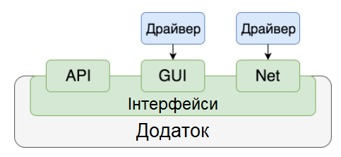

Рисунок 13.1 – Приклад використання драйверу

Найбільш складними зазвичай є драйвери для GUI, оскільки цей інтерфейс дуже відрізняється від звичайного для програми спілкування кодом. При цьому в автоматизованому тестуванні мобільних додатків GUI вважається найбільш актуальним, тому в інтеграційному тестуванні використовувати найчастіше доводиться саме його. Найбільш популярні драйвера для GUI в мобільному тестуванні – UIAutomator і Espresso для Android, XCUITest – для iOS.

***Надбудова***

Коли функціоналу драйвера не вистачає або він незручний і складний, над ним з'являється ще один рівень, який називається надбудовою.

Надбудова – програма, яка взаємодіє з додатком через один або кілька драйверів, підвищуючи зручність їх використання або розширюючи їх можливості (див. рис.13.2).

У надбудови можуть бути наступні функції:

* Модифікація поведінки (без зміни API). Наприклад, додаткове протоколювання, валідація даних, очікування виконання дії протягом певного часу.

* Підвищення зручності і/або рівня абстракції API через використання синтаксично зручніших назв функцій, більших коротких звернень до них, уніфікованого стилю написання тестів; неявне управління драйвером, коли, наприклад, він ініціалізується автоматично, без необхідності прописувати кожну таку дію вручну; спрощення складних команд на кшталт вибору події з календаря або роботи зі списками, які прокручуються; реалізацію альтернативних стилів програмування, таких як процедурний стиль або fluent.
* Уніфікація API драйверів. Тут надбудова надає єдиний інтерфейс для роботи відразу з декількома драйверами. Це дозволяє, наприклад, використовувати один і той самий код для тестів на iOS і Android, як у популярній надбудові Appium.


Рисунок 13.2 – Приклад використання надбудови

*Фреймворк*

З іншого боку тестів знаходиться фреймворк запуску.

Фреймворк — це програма для формування, запуску і збору результатів запуску набору тестів (див. рис. 13.3).

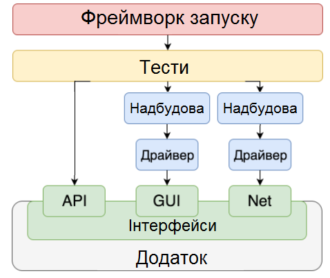

Рисунок 13.3 – Приклад використання фреймворку

До завдань фреймворка входять:
* формування, угруповання і упорядкування набору тестів;
* розпаралелення набору (опціонально);
* створення фікстур;
* запуск тестів;
* збір результатів їх виконання;
* формування звітів про виконання (опціонально).

Можна помітити, що ці функції не пов'язані з тестуванням тільки мобільних додатків – їх можна успішно застосовувати і в тестуванні десктоп- і веб-додатків. Справа в тому, що фреймворк не повинен забезпечувати взаємодію тестів і додатку – він працює тільки з тестами, і тип програми не має значення.

Якщо драйвери і надбудови знаходяться між тестами і додатком, то фрейворк знаходиться над тестами, організовуючи їх запуск. Тому важливо не плутати поняття “драйвер” і “фреймворк”. Звичайно, в деяких фреймворках є власні драйвери для роботи з додатками, але це зовсім необов'язкова умова. Найпомітніші фреймворки в мобільному тестуванні – xUnit і Cucumber.

*Комбайни*

Нарешті, ще одна група утилітів, що використовуються для автоматизації тестування мобільних додатків, – це комбайни (див. рис.13.4), які поєднують в собі і фреймворки, і драйвери (причому не тільки мобільні), і навіть можливості розробки. Xamarin, UITest, Squish, Ranorex – всі вони підтримують автоматизацію тестування iOS-, Android-, веб-додатків, а два останніх – ще й десктоп-додатків.

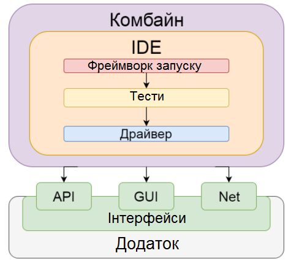

Рисунок 13.4 – Приклад використання комбайну

13.3. Ключові моменти в стратегії тестування мобільного сайту

Безсумнівно, реальний пристрій — найкраще рішення, якщо ви хочете протестувати мобільний додаток. Тестування на реальному пристрої завжди дає вам максимальну точність результатів. Насправді нелегко вибрати найбільш підходящий пристрій. У будь-якому випадку, ось деякі дії, які ви повинні зробити при виборі пристрою для мобільного тестування:

1) Проаналізуйте і визначте найпопулярніші і використовувані гаджети на ринку.

2) Виберіть пристрої з різною операційною системою.

3) Виберіть пристрої з різними розширеннями екрану.

4) Зверніть увагу на наступні чинники: сумісність, об'єм пам'яті, можливість підключення і т. д.

*Переваги для тестування мобільних додатків на реальних пристроях:*

• Висока точність результату тестування.

• Проста реплікація помилок. Такі моменти, як: ємність батареї, геолокація, push-повідомлення, вбудовані датчики пристроїв, легко тестуються.

• Можливість перевірки вхідних переривань (дзвінків, SMS).

• Можливість тестування мобільного застосування в реальних умовах.

• Немає помилкових спрацьовувань.

*Недоліки тестування мобільних додатків на реальних пристроях:*

• Існує величезна кількість часто використовуваних пристроїв.

• Додаткові витрати на обслуговування пристроїв.

• Обмежений доступ до пристроїв, які часто використовуються в зарубіжних країнах.

Звичайно, не існує однозначних відповідей на те, яку стратегію краще всього обрати. Поєднання різних варіантів є найбільш оптимальним рішенням. Наприклад, ви можете використовувати симулятори на початкових етапах вашого тестування. Але краще використовувати реальні пристрої (фізичні або

хмарні) на заключних етапах. Автоматизоване тестування краще для навантажувального і регресійного тестування.

Використані у розділі літературні джерела – [128-132].

## Контрольні запитання 

1. На які моменти слід зважати при тестуванні мобільних додатків?
2. Які перевірки необхідно робити на відповідність розміру екрану та підтримку touch-інтерфейсу?
3. Які ресурси мобільного пристрою необхідно протестувати?
4. Чому необхідно тестувати різноманітні роздільні здатності екрану та версії операційних систем?
5. Що включають в себе перевірки мобільного пристрою на реакцію додатку на зовнішні переривання?
6. Що включають в себе перевірки типу покупок, роботи зворотного зв'язку та оновлень?
7. Що включають в себе перевірки локалізації, реклами в мобільному додатку та енергоспоживання?
8. Проаналізуйте переваги та недоліки ручного тестування мобільних додатків.
9. Проаналізуйте переваги та недоліки автоматизованого тестування мобільних додатків.
10. Що таке «емулятор»?
11. Що таке «стимулятор»?
12. Що краще використовувати для тестування мобільного додатка, а що для мобільного сайту?
13. Проаналізуйте переваги та недоліки використання хмарних та он-лайн сервісів для тестування мобільних додатків.

14. Які он-лайн інтерфейси використовуються для взаємодії із додатком під час тестування?
15. Що таке «стек» автотестування?
16. На які групи класифікують інструменти автоматизованого тестування?
17. Що таке драйвер?
18. Назвіть найбільш популярні драйвери для GUI в мобільному тестуванні.
19. Що таке надбудова?
20. Які функції притаманні надбудові?
21. Що таке фреймворк?
22. Які завдання фреймворка?
23. Які найпопулярніші фреймворки у мобільному тестуванні?
24. Що таке комбайн? Назвіть найпопулярніші комбайни для мобільного тестування.
25. Підсумуйте ключові моменти в стратегії тестування мобільного додатку.


<!-- ВІДНОВЛЕНО ЛОКАЛЬНО (Стор. 322) -->
# **14.1. Що таке веб-сервіси?** 

Перш за все, веб-сервіси (або веб-служби) - це технологія. І, як і будь-яка інша технологія, вони мають досить чітке окреслене середовище застосування. 

Якщо подивитися на веб-сервіси в розрізі стека мережевих протоколів, ми побачимо, що це, в класичному випадку, не що інше, як ще одна надбудова над протоколом HTTP. 

З іншого боку, якщо гіпотетично розділити Інтернет на кілька шарів, ми зможемо виділити, як мінімум, два концептуальних типу додатків - обчислювальні вузли, які реалізують нетривіальні функції, та прикладні вебресурси. При цьому другі, часто зацікавлені в послугах перших. 

Але і сам Інтернет - різнорідний. Різні додатки на різних вузлах мережі функціонують на різних апаратно-програмних платформах і використовують різні технології і мови. 

Щоб зв'язати все це і надати можливість одним додаткам обмінюватися даними з іншими, і були придумані веб-сервіси. 


Саме з появою веб-сервісів розвинулася ідея SOA - сервіс-орієнтованої архітектури веб-додатків (Service Oriented Architecture). 

322
<!-- КІНЕЦЬ ВІДНОВЛЕННЯ -->


<!-- ВІДНОВЛЕНО ЛОКАЛЬНО (Стор. 323) -->
# **14.2. Протоколи веб-сервісів** 

На сьогоднішній день найбільшого поширення набули такі протоколи реалізації веб-сервісів: 

SOAP (Simple Object Access Protocol) - по суті це трійка стандартів SOAP / WSDL / UDDI. 

REST (Representational State Transfer) 

XML-RPC (XML Remote Procedure Call) 

Насправді, SOAP пішов від XML-RPC і є наступним етапом його розвитку. У той час як REST - це концепція, в основі якої лежить швидше архітектурний стиль, ніж нова технологія, що базується на теорії маніпуляції об'єктами CRUD (Create Read Update Delete) в контексті концепцій WWW. 

Безумовно, існують і інші протоколи, але, оскільки вони не набули широкого поширення, ми зупинимося в цьому короткому огляді на двох основних - SOAP і REST. XML-RPC з огляду на те, що є дещо «застарілим», ми розглядати детально не будемо. 

Нас в першу чергу цікавлять питання створення нових веб-служб, а не реалізація клієнтів до існуючих (як правило постачальники веб-сервісів поставляють пакети з функціями API і документацією, тому питання побудови клієнтів до існуючих веб-служб менш цікавий з точки зору автора). 

**SOAP проти REST** 

SOAP більш застосовний в складних архітектурах, де взаємодія з об'єктами виходить за рамки теорії CRUD, а ось в тих додатках, які не покидають межі цієї теорії, цілком прийнятним може виявитися саме REST через свою простоту і прозорість. Дійсно, якщо будь-яким об'єктам вашого сервісу не потрібні більш складні взаємовідносини, крім: «Створити», «Прочитати», «Змінити», «Видалити» (як правило - в 99% випадків цього достатньо), можливо, саме REST стане правильним вибором. Крім того, REST в порівнянні з SOAP, може виявитися і більш продуктивним, так як не вимагає витрат на розбір складних 

323
<!-- КІНЕЦЬ ВІДНОВЛЕННЯ -->


<!-- ВІДНОВЛЕНО ЛОКАЛЬНО (Стор. 324) -->
XML команд на сервері (виконуються звичайні HTTP запити - PUT, GET, POST, DELETE). Хоча SOAP, в свою чергу, більш надійний і безпечний. 

У будь-якому випадку вам вирішувати, що більше підійде вашому додатку. Цілком ймовірно, ви навіть захочете реалізувати обидва протоколи, щоб залишити вибір за користувачами служби і –  це ваше право. 

**Практичне застосування веб-сервісів** 

Оскільки мова йде про практичне застосування, нам потрібно вибрати платформу для побудови веб-служби та поставити завдання. Виберемо РНР в якості технології для побудови служби, а в якості завдання приймемо наступні вимоги. 

_Припустимо, нам необхідно створити службу, яка надає доступ до інформації про курси валют, яка збирається нашим додатком, і накопичується в базі даних. Далі за допомогою веб-сервісу, дана інформація передається стороннім додаткам для відображення в зручному для них вигляді._ 

Як бачимо завдання досить просте і, з точки зору самої служби, обмежується лише читанням інформації, але в практичних цілях нам цього буде достатньо. 

# **_Реалізація додатку збору інформації про курси валют._** 

Інформацію про курси валют будемо збирати із сторінок сайту НБУ щоденно та складати їх в базу даних під керівництвом СУБД MySQL. 

Створемо структуру даних. 

Таблиця валют (currency):                 Таблиця номіналів обміну (exchange): 


324
<!-- КІНЕЦЬ ВІДНОВЛЕННЯ -->


Для роботи із базою даних скористаємось ORM рівнем в базі пакету PHP Doctrine. Реалізуємо граббер:

*Клас Grubber (models/Grabber.php):*

```php
<?php
/*
 * @package Currency_Service
 */
class Grabber {
    /**
     * Extracts data from outer web resource and returns it
     *
     * @param void
     * @return array
     */
    public static function getData() {
        /**
         * Extracting data drom outer web-resource
         */
        $content = file_get_contents(
'http://www.bank.gov.ua/Fin_ryn/OF_KURS/Currency/FindByDate.aspx');
        if(preg_match_all( '/(\d+)<\/td>([A-
Z]+)<\/td>(\d+)<\/td>(.+)<\/td>(\d+\.\d+)<\/td>/i', $content, $m) ==
false) {
            throw new Exception( 'Can not parse data!');
        }
        /**
         * Preformatting data to return;
         */
        $data = array();
        foreach ($m[1] as $k => $$code) {
            $data[] = array(
                'code'          => $code,
                'charcode'      => $m[2] [$k],
                'value'         => $m[3] [$k],
                'description'   => $m[4] [$k],
                'rate_value'    => $m[5] [$k]
            );
        }
        return $data;
    }


    public static function run() {
        $data = self::getData();
        /**
         * Sets default currency if not exists
         */
        if (!Doctrine::getTable( 'Currency')->find( 980)) {
            $currency = new Currency();
            $currency->setCode( 980)
                     ->setCharcode( 'UAH')
                     ->setDescription( 'українська гривня')
```

```php
            ->setValue( 1 )
            ->setBase( 1 )
            ->save();
    }

    foreach ($data as $currencyData) {
        /**
         * Updating table of currencies with found values
         */
        if (!Doctrine::getTable( 'Currency')->find(
$currencyData['code'])) {
            $currency = new Currency();
            $currency->setCode( $currencyData['code'])
                    ->setCharcode( $currencyData['charcode'])
                    ->setDescription( $currencyData['description'])
                    ->setValue( $currencyData['value'])
                    ->setBase( 0 )
                    ->save();
        }
        /**
         * Updating exchange rates
         */
        $date = date( 'Y-m-d 00:00:00');
        $exchange = new Exchange();
        $exchange->setRateDate( $date)
                 ->setRateValue( $currencyData['rate_value'])
                 ->setCode( $currencyData['code'])
                 ->save();
      }
   }
}
?>
```

І сам граббер (`grabber.php`):

```php
<?php
require_once('config.php');
Doctrine::loadModels('models');
Grabber::run();
?>
```

Тепер змусимо наш граббер працювати раз на добу в 10:00 ранку, шляхом додавання команди запуску граббера в таблиці cron:

```bash
0 10 * * * /usr/bin/php /path/to/grabber.php
```

Все — в нас є достатньо корисний сервіс.

Тепер реалізуємо веб-сервіс, котрий дозволить іншим додаткам видобувати дані із нашої бази.


<!-- ВІДНОВЛЕНО ЛОКАЛЬНО (Стор. 327) -->
# **Реалізація SOAP сервісу** 

Для реалізації веб-сервісу на базі SOAP протоколу, ми скористаємося вбудованим пакетом в PHP для роботи з SOAP. 

Оскільки наш веб-сервіс буде публічним, хорошим варіантом буде створення WSDL файлу, який описує структуру нашого веб-сервісу. 

WSDL (Web Service Definition Language) - вдає із себе XML файл певного формату. 

На практиці буде зручно скористатися функцією автоматичної генерації файлу, яку надає IDE Zend Studio for Eclipse. Ця функція дозволяє генерувати WSDL файл з класів PHP. Тому, перш за все, треба написати клас, який реалізує функціональність сервісу. 

_клас CurrencyExchange (models / CurrencyExchange.php):_ 

```
<?php
/**
 * Class providing web-service with all necessary methods
 * to provide information about currency exchange values
 *
 * @package Currency_Service
 */
class CurrencyExchange {
    /**
     * Retrievs exchange value for a given currency
     *
     * @param  integer $code - currency code
     * @param  string $data - currency exchange rate date
     * @return float - rate value
     */
    public function getExchange( $code, $date) {
        $currency = Doctrine::getTable( 'Currency')->find( $code);
        $exchange = $currency->getExchange( $date);
        return $exchange ? (float)$exchange->getRateValue() : null;
    }
    /**
     * Retrievs all available currencies
     *
     * @return array - list of all available currencies
     */
    public function getCurrencyList() {
        return Doctrine::getTable( 'Currency')->findAll()->toArray();
    }
}
?>
```

327
<!-- КІНЕЦЬ ВІДНОВЛЕННЯ -->


<!-- ВІДНОВЛЕНО ЛОКАЛЬНО (Стор. 328) -->
Відзначимо, що для автоматичної генерації WSDL, необхідно написати коментарі в стилі javadoc, тому що саме в них прописуємо інформацію про типи прийнятих аргументів і значень. Непогано також описувати в декількох словах роботу методів - адже WSDL послужить описом API для сторонніх розробників, які будуть використовувати ваш веб-сервіс. 

Тепер в Zend Studio входимо в меню File-> Export ..., вибираємо PHP-> WSDL, додаємо наш клас, прописуємо URL-адресу сервісу і створюємо WSDLфайл. 

Якщо ви будете додавати нову функціональність в ваш веб-сервіс, вам потрібно буде перетворити WSDL-файл. Але тут не так все легко. Слід враховувати, що SOAP-клієнт, який вже запитував ваш WSDL файл, кешує його на своїй стороні. Тому, якщо ви заміните старий  вміст новим в WSDL файлі, деякі клієнти його не прочитають. А значить, при додаванні нової функціональності, дописуйте версію в ім'я вашого файлу. І не забудьте забезпечити сумісність для старих клієнтів, особливо якщо ви не є їх постачальником. 

З іншого боку, WSDL досить жорстко задає структуру веб-сервісу, а це значить, що, якщо існує необхідність обмежити функціональність клієнта в порівнянні з сервером, ви можете не включати певні методи ваших класів в WSDL. Таким чином вони не зможуть бути викликані, незважаючи на те, що існують. 

Реалізація ж самого серверу не представляє тепер ніякої складності: _файл index.php:_ 

```
<?php
require_once('config.php');
Doctrine::loadModels('models');
```

```
$server = new SoapServer(
'http://mikhailstadnik.com/ctws/currency.wsdl');
```

```
$server->setClass( 'CurrencyExchange');
```

```
$server->handle();
```

328
<!-- КІНЕЦЬ ВІДНОВЛЕННЯ -->


<!-- ВІДНОВЛЕНО ЛОКАЛЬНО (Стор. 329) -->
```
?>
```

Код найпростішого клієнту може бути наступним: 

```
<?php
```

```
$client = new SoapClient(
'http://mikhailstadnik.com/ctws/currency.wsdl');
echo 'USD exchange: ' . $client->getExchange( 840, date( 'Y-m-d'));
?>
```

# **Реалізація REST сервісу** 

REST - це не стандарт і не специфікація, а архітектурний стиль, побудований на існуючих, добре відомих і контрольованих консорціумом W3C стандартах, таких, як HTTP, URI (Uniform Resource Identifier), XML і RDF (Resource Description Format). У REST-сервісах акцент зроблений на доступ до ресурсів, а не на виконання віддалених сервісів; в цьому їх кардинальна відмінність від SOAP-сервісів. 

І все ж віддалений виклик процедур застосуємо і в REST. Він використовує методи PUT, GET, POST, DELETE HTTP протоколу для маніпуляції об'єктами. Кардинальна відмінність його від SOAP в тому, що REST залишається HTTPзапитом. 

Оскільки в PHP поки ще немає реалізації REST, ми скористаємося Zend Framwork, в який включена реалізація як REST клієнта, так і REST сервера. 

Скористаємося вже готовим класом CurrencyExchange. Напишемо сам сервер: 

_rest.php:_ 

```
<?php
require_once 'config.php';
require_once 'Zend/Rest/Server.php';
Doctrine::loadModels('models');
$server = new Zend_Rest_Server();
$server->setClass( 'CurrencyExchange');
$server->handle();
?>
```

Як бачите все дуже схоже і просто. 

329
<!-- КІНЕЦЬ ВІДНОВЛЕННЯ -->


<!-- ВІДНОВЛЕНО ЛОКАЛЬНО (Стор. 330) -->
Однак, слід домовитися про те, що наш REST-сервіс менш захищений, ніж SOAP-сервіс, так як будь-який доданий метод в клас CurrencyExchange при його виклику відпрацює (сам клас визначає структуру сервісу). 

Перевіримо роботу нашого сервісу. Для цього достатньо передати параметри виклику методу в терміні GET-запиту: `?method=getExchange&code=840&date=2008-11-29` 

чи 

```
?method=getExchange&arg1=840&arg2=2008-11-29
```

При бажанні або необхідності ви можете самостійно задавати структуру ваших XML відповідей для сервісу REST. В цьому випадку, також буде необхідно подбати і про створення визначення типу вашого XML документа (DTD - Document Type Definition). Це буде мінімальним описом API вашого сервісу. 

Найпростіший тестовий клієнт до REST сервісу може бути в нашому випадку таким: 

```
<?php
$client = new Zend_Rest_Client(
'http://mikhailstadnik.com/ctws/rest.php');
$result = $client->getExchange( 840, date( 'Y-m-d'))->get();
if ($result->isSuccess()) {
    echo 'USD exchange: ' . $result->response;
}
?>
```

В принципі, Zend_Rest на сьогоднішній день не можна назвати найбільш точною реалізацією принципів REST. Перебільшуючи, можна говорити про те, що ця реалізація звелася до віддаленого виклику процедур (RPC), хоча філософія REST набагато ширше. 

330
<!-- КІНЕЦЬ ВІДНОВЛЕННЯ -->


<!-- ВІДНОВЛЕНО ЛОКАЛЬНО (Стор. 331) -->
# **14.3. Що таке АРІ та його тестування?** 


Своїми словами, API надає нам можливість використовувати чужі напрацювання в своїх цілях. Сучасні API часто приймають форму веб-сервісів, які надають користувачам (як людям, так і іншим веб-сервісам) якусь інформацію. Зазвичай процедура обміну інформацією і формат передачі даних структуровані, щоб обидві сторони знали, як взаємодіяти між собою. 

За посиланням (https://github.com/hhru/api) ви зможете прочитати детальний опис взаємодії клієнтів та сервісів HeadHunter API. 

_Формати передачі даних._ Існує багато форматів даних за допомогою яких користувачі взаємодіють з АРІ, зокрема XML  та JSON. 

Щоб вказати потрібну дію, яку необхідно зробити з ресурсом, в HTTP означено набір _методів запиту_ **_(_** _request methods_ **_)._** Ці методи іноді називають HTTP- _дієсловами_ , незважаючи на те, що вони можуть бути іменниками. Кожен з них реалізує іншу семантику, але вони мають деякі спільні риси, за якими їх поділяють на групи: наприклад методи запиту можуть бути safe, <u>idempotent,</u> або cacheable. 

**<u>GET</u>** 

Метод `GET` запитує представлення вказаного ресурсу. Запити, які використовують `GET` , повинні лише отримувати дані. 

**<u>HEAD</u>** 

Метод `HEAD` запитує відповідь, ідентичну запиту `GET` , але без тіла. 

# **<u>POST</u>** 

Метод `POST` використовується для відправки об'єкта на вказаний ресурс, часто викликаючи зміну стану або побічних ефектів на сервері. 

331
<!-- КІНЕЦЬ ВІДНОВЛЕННЯ -->


<!-- ВІДНОВЛЕНО ЛОКАЛЬНО (Стор. 332) -->
# **<u>PUT</u>** 

Метод `PUT` замінює всі поточні представлення цільового ресурсу на корисне навантаження, що вказане в запиті. 

**<u>DELETE</u>** 

Метод `DELETE` видаляє вказаний ресурс. 

# **<u>CONNECT</u>** 

Метод `CONNECT` встановлює тунель до сервера, ідентифікованого цільовим ресурсом. 

# **<u>OPTIONS</u>** 

Метод `OPTIONS` використовується для опису варіантів зв'язку до цільового ресурсу. 

# **<u>TRACE</u>** 

Метод `TRACE` виконує тест зворотного зв'язку по шляху до цільового ресурсу. 

# **<u>PATCH</u>** 

Метод `PATCH` використовується для застосування часткових модифікацій в ресурсі. 

_НТТР коди відповідей_ 

Сервер може надсилати різні коди у відповідь на запис користувачів. Це можуть бути коди помилок чи просто коди, які інформують користувачів про стан сервера. (Див.тему «Особливості тестування веб-додатків»). 

REST API – це ідеологія побудови АРІ, розшифровується як Representation State Transfer API. Вона основується на наступних принципах, сформульованих її творцем Роєм Філдінгом: 

1. Клієнт-серверна архітектура. 

2. Stateless сервер. 

3. Кешованість. 

4. Багатошарова структура. 

332
<!-- КІНЕЦЬ ВІДНОВЛЕННЯ -->


<!-- ВІДНОВЛЕНО ЛОКАЛЬНО (Стор. 333) -->
5. Єдиний інтерфейс. 

6. Код за вимогою. 

Детальніше з вимогами до АРІ можна ознайомитись за посиланням (https://secl.com.ua/article_rest_api_web.html). 

_Аутентифікація_ 

Зазвичай для використання API потрібен спеціальний ключ, за допомогою якого сервер пізнає користувача. У відкритих API ключ може бути відсутнім або надаватися за запитом (наприклад, після реєстрації на сайті). 

Для інтеграції сервісів один з одним широко використовується протокол аутентифікації OAuth (докладніше про нього можна почитати в статті http://m.geektimes.ru/post/77648/). 

_Інструменти для роботи з API_ 

Звичайні GET запити можна надсилати за допомогою браузера. Але існує безліч спеціальних інструментів, які призначені для розробки і тестування API. Вони надають можливість не тільки відправляти різні типи запитів, але і зберігати запити, показувати результати в різних форматах, виступати в ролі proxy сервера. І багато багато іншого. 

Серед таких інструментів: 

**Postman** . Розширення для Google Chrome, яке в безкоштовній версії дозволяє посилати запити, записувати їх, показувати історію. Зручно і зрозуміло. 

**jMeter** . Інструмент, який здобув популярність перш за все завдяки навантажувального тестування, яке можна проводити з його допомогою. Але це лише одна з безлічі його застосувань. 

**Fiddler** . Дозволяє переглядати надіслані HTTP запити. І ще багато чого. 

**SoapUI.** Потужний продукт для розробки і тестування веб-додатків. 

**Advanced REST Client** . Ще одне розширення для Chrome для роботи з API (конструкція запитів, їх показ в зручному вигляді і інше). 

333
<!-- КІНЕЦЬ ВІДНОВЛЕННЯ -->


<!-- ВІДНОВЛЕНО ЛОКАЛЬНО (Стор. 334) -->
_Тестування API_ 

А тепер - дуже коротко про те, як тестувати API. 

Звичайно, тут є своя специфіка, але ми можемо використовувати такі загальноприйняті техніки, як: 

_Аналіз граничних значень._ В API запитах в явному вигляді можуть передаватися значення параметрів. Це відмінний привід виділити кордони вхідних і вихідних значень і перевірити їх. 

_Розбиття на класи еквівалентності_ . Навіть у невеликого API є безліч варіантів використання і безліч комбінацій вхідних і вихідних змінних. Тому ми можемо зайвий раз використовувати наші навички виділення еквівалентних класів. 

Як мені здається, при тестуванні потрібно враховувати, що API створюються багато в чому для інтеграції сервісів. І працюють з ними часто не люди, а інші програмні системи. Тому потрібно оцінювати API з позиції зручності його використання іншими продуктами, з позиції легкої інтеграції з ним. Поважаючий себе API повинен також мати зрозумілу і детальну документацію. 

Можна зробити висновок, що всі види тестування, до яких ми звикли - функціональне тестування, навантажувальне, тестування безпеки, юзабіліті, тестування документації - не чужі при тестуванні API. В принципі, це не дивно, тому що API є повноцінним самостійним продуктом. 

# **14.4. Що таке JSON?** 

JSON або JavaScript Object Notation - це формат, який реалізує неструктуроване текстове представлення структурованих даних, засноване на принципі пар ключ-значення і упорядкованих списках. Хоча JSON почав своє поширення з JavaScript, він підтримується в більшості мов, або спочатку, або за 

334
<!-- КІНЕЦЬ ВІДНОВЛЕННЯ -->


<!-- ВІДНОВЛЕНО ЛОКАЛЬНО (Стор. 335) -->
допомогою спеціальних бібліотек. Зазвичай Json використовується для обміну інформацією між веб-клієнтами і веб-сервером. 

За останні 15 років JSON став формальним стандартом обміну даними і використовується практично скрізь в інтернеті. Сьогодні він використовується практично всіма веб-серверами. До такої популярності привело ще й те, що багато баз даних підтримували JSON. Сучасні реляційні бази даних, такі як PostgreSQL і MySQL тепер підтримують зберігання і експорт даних в JSON. Бази даних, такі як MongoDB і Neo4j також підтримують JSON, хоча MongoDB використовує злегка модифіковану версію JSON. У цій статті ми розглянемо що таке JSON, його переваги над XML, його недоліки, а також коли його краще використовувати. 

Щоб зрозуміти навіщо потрібен формат JSON і як він працює не обійтися без практики. Спочатку давайте розглянемо такий приклад: 

{ “firstName”: “Jonathan”, “lastName”: “Freeman”, “loginCount”: 4, “isWriter”: true, “worksWith”: [“Spantree Technology Group”, “InfoWorld”], “pets”: [ { “name”: “Lilly”, “type”: “Raccoon” }  ] } 

У цій структурі ми чітко визначили деякі атрибути людини. Спочатку ми визначили ім'я, прізвище, кількість авторизацій в системі, чи є ця людина письменником, список компаній, з якими він працює і список домашніх тварин. Така або схожа структура може бути передана з сервера в веб-браузер або мобільний додаток, яке вже може робити все що потрібно з цими даними, наприклад, відобразити їх або зберегти. 

335
<!-- КІНЕЦЬ ВІДНОВЛЕННЯ -->


<!-- ВІДНОВЛЕНО ЛОКАЛЬНО (Стор. 336) -->
JSON - це загальний формат даних з мінімальною кількістю типів значень - рядки, числа, булеві значення (одиниця або нуль), списки, об'єкти і нуль. Незважаючи на те, що JSON є підмножиною JavaScript, такі типи даних є в більшості популярних мов програмування, що робить JSON хорошим кандидатом для передачі даних між програмами, написаними на різних мовах. 

**Чому варто використовувати JSON?** 

Щоб зрозуміти корисність і важливість JSON нам потрібно трохи розібратися в історії інтерактивності в інтернет. На початку 2000 років інтерактивність роботи веб-сайтів почала змінюватися. У той час браузер служив тільки для відображення інформації, а всю роботу по підготовці контенту до відображення виконував веб-сервер. Коли користувач натискав кнопку в браузері, запит вирушав на сервер, де збиралася і відправлялася сторінка HTML, готова для відображення. Такий механізм був повільним і неефективним. Це вимагало, щоб браузер повторно перемальовував все на сторінці, навіть, якщо змінилася невелика частина даних. 

У той час передача тарифікація виконувалася за кількість переданих даних, тому розробники розуміли, що перезавантаження цілої сторінки обходиться дуже дорого і розглядали нові технології для поліпшення користувальницького інтерфейсу. Тоді можливість створення веб-запитів в фоновому режимі, яка була додана в Internet Explorer 5 виявилася досить життєздатним підходом до поетапного завантаження даних для відображення. Замість перезавантаження сторінки, натискання на кнопку просто виконає веб-запит, який буде працювати у фоновому режимі. Вміст буде оновлено, як тільки завантажиться. Ним можна управляти за допомогою JavaScript, універсальної мови програмування для браузерів. 

Спочатку дані передавалися в форматі XML, але він був складним для використання в JavaScript. В JavaScript вже були об'єкти, які використовувалися для представлення даних в мові, тому Дуглас Крокфорд взяв синтаксис об'єктів 

336
<!-- КІНЕЦЬ ВІДНОВЛЕННЯ -->


<!-- ВІДНОВЛЕНО ЛОКАЛЬНО (Стор. 337) -->
JS і використав його в якості специфікації нового формату обміну даними, який називався JSON. Цей формат було набагато простіше читати і розбирати в браузері на JavaScript. Незабаром розробники почали використовувати JSON замість XML. 

Зараз швидкий обмін даними JSON є стандартом де-факто для передачі даних між сервером і клієнтом, мобільними додатками і навіть внутрішніми системними службами. 

**JSON проти XML** 

Як говорилось вище, основною альтернативою JSON був і є XML. Однак XML стає все менш поширеним в нових системах. І дуже легко зрозуміти чому. Нижче наведено приклад запису даних, які ви бачили вище в Json через XML: 

<?xml version="1.0"?> <person> <first_name>Jonathan</first_name> <last_name>Freeman</last_name> <login_count>4</login_count> <is_writer>true</is_writer> <works_with_entities> <works_with>Spantree Technology Group</works_with> <works_with>InfoWorld</works_with> </works_with_entities> <pets> <pet> <name>Lilly</name> <type>Raccoon</type> </pet> </pets> </person> 

На додаток до надмірності коду, по суті запис даних зайняв в два рази більше місця, XML ще вводить деяку двозначність при аналізі структури даних. Перетворення XML в об'єкт JavaScript може зайняти від десятків до сотень рядків коду і вимагає тонкої настройки для кожного аналізованого об'єкта. 

337
<!-- КІНЕЦЬ ВІДНОВЛЕННЯ -->


<!-- ВІДНОВЛЕНО ЛОКАЛЬНО (Стор. 338) -->
Перетворення JSON в об'єкт JavaScript виконується в один рядок і не потребує будь-яких попередніх знань про аналізований об'єкт. 

# **Обмеження JSON** 

Хоча JSON відносно стислий і гнучкий формат даних, з яким легко працювати на багатьох мовах програмування, у нього є деякі недоліки. Ось деякі обмеження: 

**1. Відсутність структури** . З однієї сторони, це означає, що є повна гнучкість для представлення даних будь-яким чином. З іншої, ви можете легко зберігати неструктуровані дані. **2. Тільки один тип чисел** . Підтримується формат з плаваючою комою і подвійною точністю IEEE-754. Це досить багато, але ви не можете використовувати ту різноманітність числових типів, що є в інших мовах. 

**3. Відсутність типу дати** . Розробники повинні використовувати рядкові представлення дат, що може викликати невідповідність форматування. Або ж використовувати в якості дати кількість мілісекунд, що пройшли з початку епохи Unix (1 січня 1970). 

**4. Відсутність коментарів** . Ви не зможете робити нотації для полів, які вимагають цього прямо в коді. 

**5. Детальність** . Хоча JSON менш детальний, ніж XML, це не самий стислий формат обміну даними. Для високопродуктивних або спеціалізованих служб ви захочете використовувати більш ефективні формати. 

**Коли слід використовувати JSON?** 

Якщо ви розробляєте пограмне забезпечення, яке взаємодіє з браузером або мобільним додатком, вам краще використовувати JSON. Використання XML вважається застарілим. Для зв'язку між серверами JSON може бути не дуже ефективним і краще використовувати інфраструктуру серіалізації, схожу на Apache Avro або Apache Thrift. Навіть тут JSON - це не поганий вибір і він може давати все, що вам потрібно. Але немає точної відповіді, що вибрати. 

338
<!-- КІНЕЦЬ ВІДНОВЛЕННЯ -->


<!-- ВІДНОВЛЕНО ЛОКАЛЬНО (Стор. 339) -->
Якщо ви використовуєте бази даних MySQL, ваша програма буде в великій мірі залежати від того, що робиться в базі даних. У реляційних базах даних, які підтримують JSON вважається хорошим тоном використовувати його якомога менше. Реляційні бази даних були розроблені для даних певної схеми. Хоча більшість з них зараз підтримує формат даних JSON, продуктивність роботи з ним буде значно нижче. 

<u>Використані у розділі літературні джерела – [133-141].</u> 

Контрольні запитання 


1. Що таке веб-сервіс? 

2. Які протоколи реалізації веб-сервісів на сьогодні набули найбільшої популярності? 

3. Охарактеризуйте SOAP сервіс. 

4. Охарактеризуйте REST сервіс. 

5. Що таке АРІ? 

6. За допомогою яких форматів передачі даних користувачі взаємодіють із АРІ? 

7. Назвіть методи запитів визначених в НТТР для визначення певної діїі, яку необхідно зробити з ресурсом? 

8. Назвіть принципи REST API сформульовані Роєм Філдінгом. 

9. Назвіть інструменти для розробки і тестування АРІ. 

10. Які техніки тестування зручно використовувати для тестування АРІ? 

11. Що таке JSON? 

12. В чому перевага JSON проти XML? 

13. Які є обмеження JSON? 

14. Коли варто використовувати JSON? 

339
<!-- КІНЕЦЬ ВІДНОВЛЕННЯ -->


**15.1. Основні визначення автоматизоване тестування програмного забезпечення**

**Автоматизоване тестування програмного забезпечення (Software Automation Testing)** - це процес верифікації програмного забезпечення, при якому основні функції та кроки тесту, такі як запуск, ініціалізація, виконання, аналіз і видача результату, виконуються автоматично за допомогою інструментів для автоматизованого тестування.

**Спеціаліст з автоматизованого тестування програмного забезпечення (Software Automation Tester)** - це технічний фахівець (тестувальник або розробник програмного забезпечення), що забезпечує створення, налагодження та підтримку працездатного стану тест скриптів, тестових наборів та інструментів для автоматизованого тестування.

**Інструмент для автоматизованого тестування (Automation Test Tool)** - це програмне забезпечення, за допомогою якого фахівець з автоматизованого тестування здійснює створення, налагодження, виконання та аналіз результатів прогону тест скриптів.

**Тест Скрипт (Test Script)** - це набір інструкцій, для автоматичної перевірки певної частини програмного забезпечення.

**Тестовий набір (Test Suite)** - це комбінація тест скриптів, для перевірки певної частини програмного забезпечення, об'єднаної загальною функціональністю або цілями, переслідуваними запуском даного набору.

**Тести для запуску (Test Run)** - це комбінація тест скриптів або тестових наборів для подальшого спільного запуску (послідовного або паралельного, в

залежності від переслідуваних цілей і можливостей інструменту для автоматизованого тестування).

**15.2. Тестування навантаження**

Сучасне програмне забезпечення просто зобов'язане безперебійно працювати під колосальними навантаженнями. Будь-які проблеми, пов'язані з поганою продуктивністю, можуть стати причиною відмови клієнтів від використання вашого програмного забезпечення. У зв'язку з цим, проведення якісного тестування навантаження повинне стати обов'язковим, для забезпечення стабільності роботи ваших додатків.

**Тестування навантаження (Load Testing) або тестування продуктивності (Performance Testing)** - це автоматизоване тестування, що імітує роботу певної кількості бізнес користувачів на якомусь загальному ресурсі, яким користуються усі користувачі.

Починаючи роботу в області навантажувального тестування, слід чітко розуміти, що це не просто запис і прогін (Record and Playback) скриптів, а більш складний процес:

*По-перше*, тестування навантаження - це серйозна дослідницька та аналітична робота

*По-друге* - це реальне автоматизоване тестування, що вимагає серйозних навичок програмування, а також знання мережевих протоколів і різних серверів додатків і баз даних

*По-третє* - існують різні види тестування навантаження, що ставлять перед собою різні цілі.

**15.2.1. Термінологія в тестуванні навантаження**

Як приклад можна привести роботу співробітників сучасного банку, в якому всі працюють з одними і тими ж програмними додатками, встановленими

на банківських серверах. Або використання програмного додатка веб-магазин, в даному випадку відвідувачами, навантажуючими сервера, будуть користувачі інтернету.

Моделювання навантаження відбувається за допомогою спеціальних продуктів і технік. Що ж, чим і як ми збираємося моделювати? Для того щоб розібратися в цьому і потрібно визначитися з термінологією:

**Віртуальний користувач (Virtual User)** - програмний процес, який циклічно виконує операції, що моделюються.

**Ітерація (Iteration)** - це один повтор виконуваної в циклі операції.

**Інтенсивність виконання операції (Operation Intensity)** - частота виконання операції в одиницю часу, в тестовому скрипті задається інтервалом часу між ітераціями.

**Навантаження (Loading)** - сукупне виконання операцій на загальному ресурсі.

**Продуктивність (Performance)** - кількість виконуваних операцій за період часу (N операцій за М годин)

**Масштабованість додатку (Application Scalability)** - пропорційне зростання продуктивності при збільшенні навантаження

**Профіль навантаження (Performance Profile)** - це набір операцій з заданими інтенсивностями, отриманий на основі збору статистичних даних або визначений шляхом аналізу вимог до тестованої системи.

**Навантажувальною точкою** називається розрахована (або задана замовником) кількість віртуальних користувачів в групах, що виконують операції з певними інтенсивностями.

Тепер розглянемо як ці сутності пов'язані між собою. Виразивши інтенсивність через інтервал часу між ітераціями, бачимо що зростання інтенсивності виконуваних операцій це скорочення інтервалу часу. Зростання навантаження пропорційне зростанню інтенсивності. Природно також, що при

збільшенні інтенсивності зростає продуктивність. При цьому збільшується ступінь використання (завантаженості) ресурсів. З якогось моменту зростання продуктивності припиняється (а навантаження може продовжувати рости), відбувається насичення і потім деградація системи. На додаток можна помітити, що при тестуванні зміна інтенсивності операцій може підкорятися якомусь закону (наприклад, Пуассона) або бути рівномірною протягом усього тесту.

### 15.2.2. Цілі навантажувального тестування

Основними цілями навантажувального тестування є:

* Оцінка продуктивності і працездатності додатку на етапі розробки і передачі в експлуатацію.
* Оцінка продуктивності і працездатності додатку на етапі випуску нових релізів, патч-сетів.
* Оптимізація продуктивності додатка, включаючи налаштування серверів і оптимізацію коду.
* Підбір відповідної для цього додатка апаратної (програмної платформи) і конфігурації сервера.

Зауважимо, що в рамках однієї мети можуть використовуватися різні види тестів продуктивності і навантаження, наприклад, для першої, другої та третьої мети потрібно робити як тестування продуктивності, так і тестування стабільності. Але при плануванні навантажувального тестування логічніше все ж відштовхуватися від **технічних цілей** (а не комерційних, перерахованих вище), які досягаються в результаті тестування і класифікувати тести по ним:

1. Якщо цікавить *дослідження продуктивності додатка*, а саме часи відгуку для операцій на різних навантаженнях в досить широких діапазонах, включаючи стресові навантаження, то це все ж таки *тестування продуктивності* (Performance Testing)

2. Якщо ціллю є розуміння наскільки додаток стійкий в режимі тривалого використання (виключення витоків пам'яті, некоректних конфігураційних налаштувань і т.д.) то проводиться довгий навантажувальний тест - *це тестування стабільності* (Stability Testing). При цьому аналіз часів відгуку може мати місце, але не бути першим пріоритетом, головне, щоб система "не впала".

3. *Стрес тестування* (*Stress Testing*) має на меті перевірити чи повертається система після позамежного навантаження (і як скоро) до нормального режиму, також цілями стресового тестування можуть бути перевірки поведінки системи у випадках коли, один з серверів додатку в пулі перестає працювати, аварійно змінилася апаратна конфігурація сервера бази даних і т.д. Відзначимо також, що при стресовому тестуванні перевіряється не продуктивність системи, а її здатність до регенерації після понад навантаження.

Головне, все-таки, в тому, щоб розуміти цілі того чи іншого тестування і намагатися їх досягти.

## 15.2.3. Етапи проведення навантажувального тестування

Розглядаючи етапи проведення навантажувального тестування, хотілося б відзначити наступні, на наш погляд обов'язкові:

### 1. Аналіз вимог і збір інформації про тестовану систему

При аналізі вимог основну увагу необхідно звернути на визначення основних критеріїв успішності проведених тестів. Для цього необхідно виділити наступні характеристики:

* **Час відгуку** — час, необхідний для відкриття сторінки або отримання очікуваного результату.
* **Інтенсивність** — число запитів в секунду (Qps)
* **Використовувані ресурси** — завантаження процесора, кількість використовуваної пам'яті, дисковий і мережевий I/O.

**Максимальна кількість користувачів** — визначає число користувачів, здатних працювати з системою в умовах заданої конфігурації.

А також **деякі метрики пов'язані з роботою бізнес сценаріїв** (наприклад, кількість бізнес операцій в одиницю часу, час виконання бізнес операції і т.д.)

Задані у вимогах характеристики, будуть **базовими навантажувальними точками** тестової програми. Всі одержані результати будуть порівнюватися з ними для прийняття рішення про завершення тестування або надалі профілювання продуктивності.

## 2. Конфігурація тестового стенда для навантажувального тестування

Відзначимо ті частини конфігурації, які вимагають особливої уваги:

*   Hardware:
    *   процесор (тип, частота, кількість ядер і т.д.);
    *   оперативна пам'ять (тип, об'єм, таймінг, ефективна частота і т.д.);
    *   жорсткі диски (тип, швидкість і т.д.).
*   Software:
    *   операційна система;
    *   драйвера.
*   Network:
    *   топологія мережі;
    *   пропускна спроможність;
    *   протокол передачі даних.
*   Application:
    *   архітектура;
    *   база даних (структура + дані);
    *   програмне забезпечення, необхідне для роботи програми (наприклад, для Java додатків - JVM).

У самому ідеальному випадку тестовий стенд один до одного дублює конфігурацію реального сервера, на якому працює або ж буде працювати

додаток. Однак, як ми з вами знаємо, ідеальних випадків практично не буває (то пам'яті мало, то процесора такої частоти немає в наявності, то операційна система не тієї версії, то вартість деякого серверного програмного забезпечення не вкладається в бюджет). Перелічимо основні причини, через які не завжди виходить продублювати конфігурацію системи на тестовому стенді:

1. Складність дублювання дорогого серверного заліза для тестових потреб.
2. Обмеження на використання ліцензій необхідного програмного забезпечення.
3. Закритість архітектури додатку з боку замовника із міркувань безпеки.
4. Труднощі відтворення або транспортування бази даних програми.
5. Складність відтворення необхідної архітектури мережі.
6. І багато іншого (все перерахувати вкрай складно через велику кількість нюансів, що впливають на конфігурацію системи).

Доцільність ж відтворення інфраструктури необхідно оцінити з урахуванням виділених ресурсів, часу і зусиль, так як не завжди результат буде виправдовувати засоби.

**3. Розробка моделі навантаження**

Далі ознайомимось із наступними пунктами, які крок за кроком розкривають специфіку розробки моделі навантаження:

1) Вивчення додатку

Будемо називати тестоване програмне забезпечення "додатком". Щоб виділити частини програми, а саме операції, які будуть тестуватися, необхідно провести роботу пов'язану з вивченням програми. Дуже велику користь при цьому повинні надати розробники програми, якщо мова йде про тестування в процесі розробки, або бізнес користувачі і системні адміністратори, якщо додаток знаходиться в процесі експлуатації. Під час цієї роботи розумно зробити такі кроки:

* описати компоненти програми та скласти схеми взаємодії між ними;

* виділити критичні з точки зору передбачуваного тестування операції. В якості таких можуть бути обрані:
  * операції з "важкими" запитами до бази даних, процеси генерації звітів;
  * операції, що виконуються великою кількістю користувачів або з високою інтенсивністю;
  * операції критичні з точки зору бізнесу, і до того ж задовольняють умовам двох верхніх пунктів.

Ще раз хочеться зауважити, що опитування бізнес користувачів або спільне дослідження з розробниками і адміністраторами системи може значно полегшити завдання. Якщо додаток знаходиться в експлуатації, то можна провести моніторинг завантаження компонентів апаратних серверів (процесора, пам'ять, диски) і проаналізувати системні журнали веб серверів (зняти stats pack, якщо в якості сервера бази даних, наприклад, використовується Oracle). Системні журнали можуть показати піки високої активності користувачів впродовж дня і дати кількісні оцінки того скільки транзакцій (хітів) виконується в одиницю часу. Відповідно до *закону Паретто* або *принципу 20/80*, *20%* операцій додатку генерують *80%* навантаження в системі, тому потрібно намагатися вибрати для моделювання саме ці 20% операцій.

2) Визначення профілю навантаження

Ключовим моментом в моделі навантаження є вибрані для тестування *операції або профіль навантаження*. Природно виконуватися ці операції в тесті повинні одночасно. Профілів навантаження для програми може бути кілька і це виправдано. Адже бізнес користувачі можуть виконувати різні набори операцій в різний час. Наприклад, початок операційного дня і кінець дня, початок місяця (кварталу) і відповідно завершення можуть відрізнятися. Таким чином отримуємо різні набори операцій перегляд програм, які одночасно і відповідно створюють різне навантаження. До речі, змінюватися можуть не тільки самі операції, але і їх інтенсивності. *У першому наближенні моделлю навантаження*

є набір профілів навантаження, де кожен профіль відрізняється від іншого або набором операцій або інтенсивностями виконання цих операцій.

3) Розрахунок навантажувальних точок

Оскільки в профілі навантаження як правило присутні кілька операцій – це означає, що у нас буде кілька груп користувачів. Бажано моделювати кожну операцію окремою групою віртуальних користувачів (хоча в житті часто буває навпаки, один бізнес користувач може відповідати за виконання кількох операцій). Проте, якщо призначити одному віртуальному користувачеві виконання однієї операції, то так легше витримати певну інтенсивність (і відповідно продуктивність) для цієї операції в тесті, ніж у випадку, коли віртуальному користувачеві призначається послідовний ланцюжок операцій. Знаючи інтенсивність виконання операції потрібно визначити кількість віртуальних користувачів в групі, що виконують цю операцію. **Ідеальний випадок**, коли робота з додатком аналогічна роботі заводського конвеєра, і є **точні оцінки скільки операцій в день робить один користувач**. Найчастіше буває не так і відомо тільки загальну кількість операцій, яку виконують протягом дня. Так само може виявитися, що інтенсивність виконання операції кожним користувачем дуже низька, наприклад, один користувач виконує операцію раз в день або раз в два дні.

Моделювання роботи з перерахунком інтенсивностей в цьому випадку можна проілюструвати так

*ПРИКЛАД: (для однієї операції)*

*Кількість операцій = 200 за 4 години*

*Кількість бізнес користувачів = 20*

*1. Визначаємо кількість операцій для кожного користувача*

$200 / 20 = 10$

*2. За годину кожен користувач виконує 2.5 операції*

$10 / 4 = 2.5$

3. Визначаємо період повторення операції (інтенсивність) для кожного користувача

$60 / 2.5 = 24 \text{ хвилини}$

4. Щоб зменшити час тесту до години, і при цьому отримати хоч якусь статистику щодо виконання операцій, а так само поліпшити "перемішування" операцій під час тесту, можна збільшити інтенсивність в 4 рази, при цьому зменшивши кількість користувачів так само в 4 рази .

$24/4 = 6 \text{ хв.} = 360 \text{ секунд}$

Таким чином, 5 віртуальних користувачів, виконуючи операцію з періодом 6 хвилин, забезпечать за 4 години задану продуктивність рівну 200 операцій.

Що дає такий перерахунок:

*По-перше*, є можливість знизити час тесту, не втрачаючи статистики виконання операцій, а відтак і вірогідності результатів тесту.

*По-друге*, можна знизити кількість модельованих користувачів там, де їх число сягає за кілька тисяч і таким чином знизити вимоги до кількості ресурсів навантажувальних комп'ютерів (1VU може вимагати до 10 Мб оперативної пам'яті навантажувального комп'ютера), а в деяких випадках і виконати умови ліцензійної угоди (вартість ліцензії для тестового інструментарію залежить від кількості віртуальних користувачів)

*Які є обмеження:*

Для деяких додатків, може бути критичною кількість одночасно відкритих з'єднань між клієнтом і сервером. Зустрічалися ситуації, коли запити до бази даних починали працювати значно повільніше, якщо при роботі з додатком збільшується кількість саме різних користувачів (різні логіни), а не інтенсивність запитів. І нарешті, збільшення інтенсивності виконання операцій не повинно призводити до ситуації, коли період повторення стає меншим за час виконання самої операції.

У будь-якому випадку, незважаючи на деякі обмеження, такий розрахунок може допускати варіювання кількістю віртуальних користувачів і інтенсивністю виконання ними операцій. При цьому продуктивність і відповідно навантаження не повинна змінюватися і відрізнятися від заданої. Отже, навантажувальна точка включає в себе розрахунки віртуальних користувачів і інтенсивностей по всіх операціях профілю навантаження.

4) Baseline навантажувальна точка

Хочеться відмітити, що розрахунок навантажувальної точки, описаний вище, заснований на зібраній для працюючого додатку статистики (або на очікуваному обсязі роботи для знову розробленого додатка), є вихідним для подальшого зростання навантаження, а сама **розрахована навантажувальна точка може вважатися базовою або baseline точкою**. Тепер можна збільшувати навантаження, рухаючись з деяким кроком, збільшуючи при цьому тільки кількість віртуальних користувачів в групах, не змінюючи інтенсивності виконання операцій для одного віртуального користувача.

**Повна модель навантаження** - це набір профілів навантаження з усіма навантажувальними точками для кожного профілю. При розробці тестових сценаріїв повинні бути коректно реалізовані всі навантажувальні точки. Ще хотілося б додати, що *навантажувальних точок для кожного профілю має бути не менше трьох*, щоб можна було оцінити залежність часу відгуку виконуваних операцій від зростання навантаження. Очевидно, що чим лінійніша така залежність тим краща масштабованість додатку і вища передбачуваність його поведінки під навантаженням.

### 4. Вибір інструмента для навантажувального тестування

Комерційні інструменти для автоматизованого тестування навантаження:

* Hewlett-Packard (Mercury Interactive)
* HP Performance Center (включає HP LoadRunner)
* IBM Rational
* Rational Performance Tester
* Borland (Segue)
* Silk Performer

Окремим пунктом виділимо безкоштовні інструменти для автоматизованого тестування навантаження **Jmeter** та **Grinder**.

# 5. Створення та налагодження тестових скриптів

## 1. Введення

Для отримання зручного у користуванні і супроводі набору тестових скриптів, необхідно впровадити прийоми забезпечення якості: використання стандартів, шаблонів і інструкцій. Необхідно домовитися про спільне використання однакової структури каталогів, архітектури скриптів, іменування функцій, змінних і транзакцій. В результаті кожен учасник групи, що відповідає за тестування навантаження, буде знати архітектуру тестового набору, а також без зайвих зусиль зможе прочитати і внести необхідні зміни в скрипт, написаний іншим тестувальником.

## 2. Стандартизація тестового набору для тестування продуктивності

Розробляючи скрипти для навантажувального тестування, ми виконуємо роботу притаманну програмісту/розробнику, і тому повинні слідувати їх правилам, виконуючи все для забезпечення якості і надійності коду тестів. Дуже часто для цього варто провести консультації з розробниками і з їх допомогою виробити основні правила створення тестових скриптів.

У будь-якому випадку, свою увагу варто звернути на такі аспекти:

* структура каталогів;
* архітектура (структура) тест скриптів;
* іменування об'єктів.

### 2.1 Структура каталогів тестового набору

Наявність однакової структури каталогів значно полегшує роботу. Ви завжди будете знати, де і що знаходиться. Вам не доведеться шукати, де ж

знаходяться, наприклад, параметри для тестового набору, написаного іншим тестувальником. Пропонуємо структуру каталогів представлену на рисунку 15.1, де:

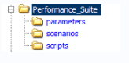

Рисунок 15.1 – Структура каталогів

- **parameters** - диреторій глобальних параметрів тестового сценарію;
- **scripts** - диреторій зберігання тестових скриптів;
- **scenarios** - диреторій зберігання сценаріїв або тестової моделі.

*2.2 Архітектура тест скриптів*

Аналогічно зі структурою тест кейсів, скрипти для навантажувального тестування так само рекомендується розділяти на 3 частини: precondition, test case action, postcondition. Цей поділ дуже зручний, тому що різні частини тестів мають різну частоту виконання.

Тестові скрипти в **HP LoadRunner** спочатку розділені на 3 частини:

**Init** - використовується для ініціалізації VUser, тобто в нього доцільно поміщати ті частини скрипта, які не вимагають постійних повторень, такі як вхід в тестовану систему, звичайно, якщо ми не тестуємо саме цю частину програми. *(Може бути порожнім)*

**Action** - робоча частина скрипта. У нього поміщають ті дії, які будуть виконуватися, і результати яких будуть вимірюватися і зберігатися, а в наслідку аналізуватися. (Кількість блоків Action може бути різною, залежно від архітектури тестового скрипта)

**End** - коректне завершення тесту. *(Може бути порожнім)*

2.3 Угода про іменування

Програмуючи на різних мовах, ми використовуємо правила найменування (об'єктів, змінних, функцій) властиві даній мові. В автоматизованому тестуванні, а зокрема в тестуванні продуктивності, є деякі специфічні сутності, які необхідно підвести під єдину систему найменувань. Розглянемо основні:

1. назва скриптів
2. назви параметрів
3. назва транзакцій

2.3.1 Назви тест скриптів

Для зручності роботи з скриптами рекомендується всім членам команди використовувати однаковий формат назв скриптів:

- формат - починається з назви тестованої дії, потім компонента. Кожне слово починається з великої літери, без пробілів;
- символи - англійський алфавіт, цифри, підкреслення.

**Приклад**: назва скрипта по створенню компаній буде `AddCompaign`. Якщо компанії треба створювати для заздалегідь заданої кількості користувачів (припустимо - 100), то назва буде наступною: `AddCompaign_100`

2.3.2 Назви параметрів

Дуже часто різні скрипти містять однакові параметри. А якщо враховувати, що параметри зберігаються в файлах, то ми можемо отримати деяку кількість однакових файлів для декількох VUserv. Від цього можна і навіть потрібно позбуватися, тому що дублювання однакової інформації не кращий патерн.

Умовно розіб'ємо параметри на 2 типи:

- **глобальні** - параметри, що використовуються у великій кількості скриптів всередині сценарію, наприклад: хост тестованої програми, параметри доступу до бази даних і т.д. Глобальні параметри зберігаються в каталозі `parameters` проєктної директорії. В скрипті ж, шлях до файлу параметрів задаємо відносно папки скрипта, а саме: `".. \ parameters \"`

- **локальні** - параметри конкретного тестового скрипта. Зберігаються всередині директорії кожного конкретного скрипта VUser.

Назви параметрам рекомендуємо давати з маленької літери, з можливим підкресленням як роздільником кейвордів.

*2.3.3 Назва транзакцій*

Для вимірювання продуктивності, необхідно визначити необхідні транзакції. Кожна транзакція вимірює час, необхідний для отримання відповіді сервера на запит віртуального користувача. Для зручності читання рекомендується транзакції називати з великої літери, починаючи з кейворда TX, кожний наступний кейворд розділений підкресленням.

*Приклад:* за аналогією з прикладом з пункту 2.3.1, назва транзакцій буде *TX_ADD_COMPAIGN* і *TX_ADD_COMPAIGN_100* відповідно.

3. *Порядок дій при розробці сценаріїв для тестування продуктивності*

Умовно розіб'ємо процес розробки тестового набору на 3 фази:

1. Підготовка.
2. Створення та налагодження.
3. Зберігання.

На кожній фазі перед розробником скриптів для тестування буде стояти ряд завдань, тільки після вирішення яких можна перейти до наступної стадії.

Далі розглянемо більш докладний опис фаз розробки тестових скриптів для навантажувального тестування.

### 3.1 Підготовка

Завдання:

* аналіз тестової моделі навантаження;
* аналіз функціональної частини скрипта, з ціллю зрозуміти, що тест повинен робити і як;
* вибір варіанта створення скрипта:

- ручний, коли розробник сам пише функції, що використовуються в скрипті;
- автоматичний, коли скрипт записується спеціальним інструментом;
- комбінований, коли скрипт спочатку записується, а потім параметризується і вдосконалюється вручну.

*3.2 Створення та налагодження*

Завдання:
- створення шаблону скрипта (під шаблоном мається на увазі не параметризований скрипт, без будь-яких перевірок);
- параметризація параметрів скрипта;
- додавання перевірок в скрипт;
- налаштування параметрів VUsers (скриптів) і оточення;
- налагодження при 1 ітерації;
- налагодження при Х ітераціях;
- додавання скрипта в загальний сценарій;
- оновлення глобальних параметрів (при необхідності).

*3.3 Зберігання*

Завдання:
- збереження глобальних параметрів - папка `\ parameters \`;
- збереження сценаріїв- папка `\ scenarios \`;
- збереження скриптів - папка `\ scripts \`.

*4. Конфігурація тестового набору для тестування продуктивності*

Тестові набори або сценарії тестування конфігуруються на підставі наявних моделей навантаження. Для цього, зберігаються в репозиторії скрипти, групують в сценарії і призначають необхідну кількість віртуальних користувачів, для отримання потрібного навантаження (в *HP LoadRunner* для

цих цілей використовується *Controller*). Отримані файли з конфігурацією сценаріїв зберігають, також як і скрипти, в репозиторії - папка ` \ scenarios \ `.

Зауважимо, що передумовою для конфігурації тестового набору є підготовка необхідних скриптів.

Завдання:
* створення тестового набору (сценарію) для навантажувального тестування;
* конфігурація тестового набору;
* налагодження роботи сценарію;
* збереження тестового набору в репозиторії.

6. **Проведення тестування**
7. **Аналіз результатів**
8. **Підготовка, відправка і публікація звіту з проведеного тестування навантаження.**

<u>Використані у розділі літературні джерела – [142-145].</u>

## Контрольні запитання


1. Дайте визначення автоматизованого тестування програмного забезпечення.
2. Хто такий спеціаліст з автоматизованого тестування програмного забезпечення?
3. Що таке інструмент для автоматизованого тестування?
4. Що таке Тест скрипт та тестовий набір?
5. Що таке тести для запуску?
6. Дайте визначення тестуванню навантаження.
7. Що таке Віртуальний користувач в тестуванні навантаження?

8. Що таке Ітерація та Інтенсивність виконання операцій в тестуванні навантаження?

9. Що таке Навантаження та Продуктивність в тестуванні навантаження?

10. Що таке Масштабованість додатку та Профіль навантаження в тестуванні навантаження?

11. Дайте визначення Навантажувальної точки.

12. Які цілі навантажувального тестування?

13. Перерахуйте етапи проведення навантажувального тестування.

14. Дайте визначення поняттям «час відгуку», «інтенсивність».

15. Дайте визначення поняттям «використовувані ресурси», «максимальна кількість користувачів».

16. Що таке базова навантажувальна точка?

17. Що таке тестовий стенд навантажувального тестування?

18. Чому не завжди виходить продублювати конфігурацію системи на тестовому стенді?

19. Про що говорить Закон Паретто?

20. Яким чином розраховуються навантажувальні точки?

21. Дайте визначення поняттю «повна модель навантаження».

22. Які інструменти використовуються при навантажувальному тестуванні?

23. Озвучте основні правила створення тестових скриптів.

24. Яка повинна бути структура каталогів тестового набору?

25. Яким чином потрібно називати скрипти, параметри та транзакції?

26. На які три фази розбивається процес підготовки тестового набору?

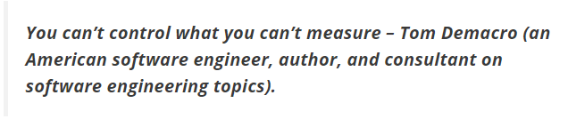

*You can't control what you can't measure – Tom Demacro (an American software engineer, author, and consultant on software engineering topics).*

## 16.1. Види метрик тестування програмного забезпечення

Методика тестування програмного забезпечення - це відстеження та контроль процесу та продукту Це допомагає рухати проект до намічених цілей без відхилень.

Метрики відповідають на різні запитання. Важливо вирішити, на які питання ви хочете відповісти.

Показники тестування програмного забезпечення класифікуються на два типи:

1. Метрики процесів (Process metrics)
2. Метрики продукту (Product metrics)

## 16.1.1. Метрики процесів (Process metrics)

Тестові метрики, що використовуються в процесі підготовки тесту (Test Preparation) та етапу виконання тесту (Test Execution) в STLC.

На етапі підготовки тесту вирізняють такі метрики:

<u>*Продуктивність підготовки тесту (Test Case Preparation Productivity):*</u>

Використовується для обчислення кількості підготовлених test cases та зусиль, витрачених на їх підготовку.

**Formula:**

Test Case Preparation Productivity = $$\text{(No of Test Case)} / \text{(Effort spent for Test Case Preparation)}$$

***Example:***
*No. of Test cases = 240*
*Effort spent for Test case preparation (in hours) = 10*
*Test Case preparation productivity = 240/10 = 24 test cases/hour*

<u>Покриття тестового дизайну (Test Design Coverage):</u>

Допомагає виміряти відсоток покриття тестового випадку щодо кількості вимог.

**Formula:**
Test Design Coverage = $$\text{((Total number of requirements mapped to test cases)} / \text{(Total number of requirements))} * 100$$

***Example:***
*Total number of requirements: 100*
*Total number of requirements mapped to test cases: 98*
*Test Design Coverage = (98/100) * 100 = 98%*

На етапі виконання тесту вирізняються такі метрики:

<u>Продуктивність виконання тесту (Test Execution Productivity):</u>

Визначає кількість тестових випадків, які можна виконати за годину.

**Formula:**
Test Execution Productivity = $$\text{(No of Test cases executed)} / \text{(Effort spent for execution of test cases)}$$

***Example:***
*No of Test cases executed = 180*
*Effort spent for execution of test cases = 10*
*Test Execution Productivity = 180/10 = 18 test cases/hour*

_Покриття виконання тесту (Test Execution Coverage):_

Полягає у вимірюванні кількості test cases, виконаних у порівнянні з кількістю запланованих test cases.

**Formula:**

Test Execution Coverage = (Total no. of test cases executed / Total no. of test cases planned to execute)*100

***Example:***

*Total no. of test cases planned to execute = 240*

*Total no. of test cases executed = 160*

*Test Execution Coverage = (180/240)*100 = 75%*

_Пройдені тестові випадки (Test Cases Passed):_

Полягає у вимірюванні відсотку успішно пройдених тестових випадків.

**Formula:**

Test Cases Pass = (Total no. of test cases passed / Total no. of test cases executed) *100

***Example:***

*Total no. of test cases passed = 80*

*Total no. of test cases executed = 90*

*Test Cases Pass = (80 / 90)*100=88.8=89%*

_Провалені тестові випадки (Test Cases Failed):_

Полягає у вимірюванні відсотку провалених тестових випадків.

**Formula:**

Test Cases Failed = (Total no. of test cases failed / Total no. of test cases executed) * 100

*Example:*

*Total no. of test cases failed = 10*

*Total no. of test cases executed = 90*

*Test Cases Failed = (10 / 90) * 100 = 11.1 = 11%*

<u>Заблоковані тестові випадки (Test Cases Blocked):</u>

Полягає у вимірюванні відсотку заблокованих тестових випадків.

**Formula:**

Test Cases Blocked = (Total no. of test cases blocked / Total no. of test cases executed) * 100

*Example:*

*Total no. of test cases blocked = 5*

*Total no. of test cases executed = 90*

*Test Cases Blocked = (5 / 90) * 100 = 5.5 = 6%*

### 16.1.2. Метрики продукту (Product metrics)

Тестові метрики, що використовуються в процесі аналізу дефектів в STLC.

<u>Показник виявлення помилок (Error Discovery Rate):</u>

Призначений для визначення ефективності тестових випадків.

**Formula:**

Error Discovery Rate = (Total no. of defects found / Total no. of test cases executed) * 100

*Example:*

*Total no. of defects found = 60*

*Total no. of test cases executed = 240*

*Error Discovery Rate = (60 / 240) * 100 = 25%*

<u>Показник виправлених дефектів (Defect Fix Rate):</u>

Допомагає знати якість build з точки зору виправлення дефектів.

**Formula:**

$$\text{Defect Fix Rate} = \frac{\text{Total no. of defects reported as fixed} - \text{Total no. of defects reopened}}{\text{Total no. of defects reported as fixed} + \text{Total no. of new Bugs due to fix}} * 100$$

* **Example:**
  * $\text{Total no. of defects reported as fixed} = 10$
  * $\text{Total no. of defects reopened} = 2$
  * $\text{Total no. of new Bugs due to fix} = 1$
  * $\text{Defect Fix Rate} = ((10-2)/(10+1))*100 = (8/11)*100 = 72.7 = 73\%$

---

<u>Щільність дефекту (Defect Density):</u>

Визначається як відношення дефектів до вимог. Щільність дефекту визначає стабільність додатку.

**Formula:**

$$\text{Defect Density} = \frac{\text{Total no. of defects identified}}{\text{Actual Size (requirements)}}$$

* **Example:**
  * $\text{Total no. of defects identified} = 80$
  * $\text{Actual Size} = 10$
  * $\text{Defect Density} = 80/10 = 8$

---

<u>Витік дефектів (Defect Leakage):</u>

Використовується для огляду ефективності процесу тестування перед тестуванням прийомки.

**Formula:**

Defect Leakage = ((Total no. of defects found in UAT) / (Total no. of defects found before UAT)) * 100

*Example:*

*Total no. of defects found in UAT = 20*

*Total no. of defects found before UAT = 120*

*Defect Leakage = (20/120) * 100 = 16.6 = 17%*

<u>Ефективність видалення дефектів (Defect Removal Efficiency):</u>

Дозволяє порівняти загальну ефективність усунення дефектів.

**Formula:**

Defect Removal Efficiency = ((Total no. of defects found pre-delivery) / (Total no. of defects found pre-delivery + Total no. of defects found post-delivery)) * 100

*Example:*

*Total no. of defects found pre-delivery = 80*

*Total no. of defects found post-delivery = 10*

*Defect Removal Efficiency = (80 / (80 + 10)) * 100 = (80 / 90) * 100 = 88.8 = 89%*

**16.2. Метрики із забезпечення якості програмного забезпечення**

Згідно міжнародного стандарту ISO 14598:


Ввід та використання метрик необхідно для покращення контролю над процесом розробки, а саме над процесом тестування. *Ціль* контролю тестування полягає в отриманні зворотного зв'язку та візуалізації процесу тестування. Необхідну для контролю інформацію збирають (як вручну, так і автоматично) та використовують для оцінки стану і прийняття рішень, таких як покриття

(наприклад, покриття вимог чи коду тестами) чи критерії виходу (наприклад, критерій завершення тестування). Метрики також можуть бути використані для оцінки прогресу виконання запланованих робіт та освоєння бюджету.

*Створення, використання та аналіз метрик*

Для більшої наочності метрики згруповані по типам сутностей, які приймають участь в забезпеченні якості та тестуванні програмного забезпечення, а саме:

1. Метрики по тестовим випадкам (див. табл. 16.1).
2. Метрики по багам/дефектам (див. табл. 16.2).
3. Метрики по задачам (див. табл. 16.3).

Отож, коротко про кожну групу метрик розглянемо у таблицях $16.1 - 16.3$.

Таблиця 16.1.

Метрики по тест кейсам

| № | Назва | Опис |
| :---: | :--- | :--- |
| 1 | Passed/Failed Test Cases | Метрика показує результати проходження тест кейсів, а саме відношення кількості вдало пройдених до завершених з помилкою тест кейсів. В ідеалі, до кінця проекту, кількість провальних тестів наближається до нуля. |
| 2 | Not Run Test Cases | Метрика показує кількість тест кейсів, які ще необхідно виконати в даній фазі тестування. Маючи дану інформацію, ми можемо проаналізувати та виявити причини за якими тести не були проведені. |

Таблиця 16.2.

Метрики по багам/дефектам

| № | Назва | Опис |
| :---: | :--- | :--- |
| 1 | Open/Closed Bugs | Метрика, яка показує відношення кількості відкритих багів до закритих. |
| 2 | Reopened/Closed Bugs | Метрика, яка показує відношення кількості перевідкритих багів до закритих . |
| 3 | Rejected/Opened Bugs | Метрика, яка показує відношення кількості відхилених багів до відкритих. |
| 4 | Bugs by Severity | Кількість багів за серйозністю. |
| 5 | Bugs by Priority | Кількість багів по пріоритету. |

Варто відмітити, що метрики Open/Closed Bugs, Bugs by Severity та Bugs by Priority гарно візуалізують ступінь приближення продукту до досягнення критеріїв якості по багам. Маючи вимоги до кількості відкритих багів, після кожної ітерації тестування ми порівнюємо їх з реальними даними, тим самим бачачи місця, де потрібно додати для швидшого досягнення цілі.

Метрики Reopened/Closed Bugs та Rejected/Opened Bugs націлені на відслідковування роботи окремих учасників груп розробки та тестування.

Таблиця 16.3.

Метрики по задачам

| № | Назва | Опис |
| :---: | :--- | :--- |
| 1 | Deployment tasks | Метрика, яка показує кількість та результати установок додатку. У випадку, якщо кількість відхилених командою тестувань версій буде критично високою, рекомендується терміново проаналізувати та виявити причини, а також ближчим часом вирішити наявну проблему. |
| 2 | Still Opened | Метрика, яка показує кількість все ще відкритих задач. |

| Tasks | По завершенню проекту всі задачі повинні бути закриті. Під задачами розуміється наступні види робіт: написання документації (архітектура, вимоги, плани), імплементація нових модулів чи зміна існуючих за запитами на зміни, роботи по налаштуванню стендів, різноманітні дослідження та багато інших. |
|---|---|

Метрики по задачам можуть бути різноманітні, це лише частина з них.

Використані у розділі літературні джерела – [146-151].

## Контрольні запитання

1. Що таке методика тестування програмного забезпечення?
2. Що таке метрика?
3. На які два типи класифікуються показники тестування програмного забезпечення?
4. Наведіть визначення та формулу метрик «Продуктивність підготовки тесту», «Покриття тестового дизайну» та «Продуктивність виконання тесту».
5. Наведіть визначення та формулу метрик «Покриття виконання тесту» та «Пройдені тестові випадки».
6. Наведіть визначення та формулу метрик «Провалені тестові випадки» та «Заблоковані тестові випадки».
7. Наведіть визначення та формулу метрик «Показник виявлення помилок» та «Показник виправлених дефектів».
8. Наведіть визначення та формулу метрик «Щільність дефекту», «Витік дефектів» та «Ефективність видалення дефектів».


9. На які три види поділяються метрики із забезпечення якості програмного забезпечення?

10. Охарактеризуйте метрики по тест кейсам.

11. Охарактеризуйте метрики по багам/дефектам.

12. Охарактеризуйте метрики по задачам.


## 17.1. Методика турів Віттакера

За методикою турів додаток виступає у ролі незнайомого міста, а тестер — у ролі туриста. У туриста мало часу, тому він виконує конкретну задачу, ні на що інше не відволікаючись. Він бігає по казино, чи оглядає пам'ятки архітектури, чи відвідує діловий семінар. Що завгодно, але щось одне.

Як користуватись методикою?

Вибрати тур із списку. Вивчити цілі даного туру. Поставити таймер на 2 години (годину, півгодини тощо). Далі провести дослідження системи суворо за ціллями туру. Ні на що не відволікаючись, тільки «місія» туру. За необхідності — повторити.

### 17.1.1. Тури по бізнес-центру (Tours of the Business District)

Діловий центр — це місце, де робиться бізнес. Як правило, це район не привабливий для туристів, де зосередженні банки, офісні будівлі.

При дослідженні програмного забезпечення все навпаки. Діловий центр — це ті функції, заради яких користувачі купують та використовують додаток. Це ті killer-feature, котрі описують маркетологи і котрі вкаже будь який з ваших користувачів при опитуванні, навіщо їм ваш додаток.

Тур по діловому центрі фокусує увагу на головних частинах вашого додатку і показує сценарії їх використання вашими клієнтами.

**Тур за путівником (The Guidebook Tour)**

В путівнику представлені фешенебельні готелі, краще магазини, самі популярні пам’ятки міста. Інформація коротка, без зайвих детелей.

З путівника турист взнає найважливіше і може сміливо прогулюватись по запропонованим місцям. Навколо головних пам'яток міста чисто і безпечно, щоб туристи не боялися сюди приходити та витрачати гроші.


В тестуванні аналогічним артефактом є керівництво користувача. Воно може бути окремо від системи чи знаходитись безпосередньо в ній (наприклад, «допомога» F1). В цьому турі ми слідуємо вказівникам керівництва користувача як обережний турист, не відхиляючись від написаного, все чітко за інструкцією.

Важливо пам'ятати, на чому робити акцент, і де не захоплюватись. В путівнику написано лише саме основне, без додаткових опцій. Тому при тестуванні важливо приділити час основним сценаріям, не сильно заглиблюючись. Якщо це інструкція з реєстрації в системі, необхідно перевірити всі вказані в ній позитивні кейси. Не варто захоплюватись негативним «а якщо сюди цифри ввести чи спец символи?».

*Ціль туру:* знайти всі інструкції в додатку та виконати їх.

*Типові баги:*
- невідповідність описаних кроків в довідці роботи додатку;
- невідповідність скриншотів в довідці і самого додатку;
- помилки (від орфографічних до логічних) в довідці;
- помилки зручності використання довідки: довга чи коротка, незрозуміла чи примітивна, не відповідаюча на ті запитання, котрі пропонують прочитати користувачі;
- помилки зручності використання додатку.

**Грошовий тур (The Money Tour)**

В туристів повинна бути вагома причина приїхати в конкретне місце. В Лас-Вегасі це казино, в Амстердамі — кавові магазини та вулиця червоних

ліхтарів, в Єгипті – піраміди тощо. Заберіть ці пам’ятки і туристи підуть витрачати гроші в інше місце.

В програмному забезпеченні аналогічно – у користувача повинна бути вагома приична для купівлі конкретного продукту. Знайдіть «функції, що продають» додатку. Запитайте маркетологів, котрі проводять демонстрації, що потрібно користувачам.


Тестер грошового туру ходить на демонстрації, дивиться відеоролики, що продають продукт, спілкується з замовниками. Він знає, що показують користувачам. І, якщо нова функція зламала сценарій демонстрації, він вкаже на цю проблему. Так, це може бути не самий критичний чи цікавий баг, однак виправте його – і колеги не будуть червоніти на демонстраціях.

Потужна варіація туру – *Тур Скептичного Замовника (Sceptical Sustomer Tour)*. Виконуємо грошовий тур, але уявляємо, що амовник постійно зупиняє демонстрацію та запитує «А що, якщо...?» - «А що, якщо я захочу зробити ось так?..».

Запитання відхилють демонстрацію від вихідного сценарію. Виступаючий імпровізує та показує нові функції. Буде дивно, якщо такі запитання поставлят в глухий кут, адже це нормальна ситуація, котра часто зустрічається на реальних демонстраціях. Саме тому це потужний шлях до складання тест-кейсів, важливих для кінцевого користувача.

*Ціль туру:* знайти функції, котрі заставляють людей витрачати гроші на ваше програмне забезпечення та перевірити їх роботу.

*Типові баги:*
- зовсім відсутні в додатку деякі описані в промо-матеріалах можливості;

- невідповідність інформації в рекламних матеріалах та роботи самого додатку;
- функціональні помилки в роботі додатку, які впливають на демонстрацію;
- застарілі скріншоти додатків;
- лінгвістичні помилки (від орфографічних до логічних).

### Тур за орієнтирами (The Landmark Tour)

Варто навести приклад з мультфільму «Балто» в якому зграя собак вирушила за ліками для вмираючих дітей в сусіднє містечко і, через зненацька налетівшу заметіль, загубились на зворотному шляху. Тоді до лісу вирушив Балто і, щоб знайти дорогу назад, він помічає дерева на своєму шляху. Мітки – це і є орієнтири, що «Я тут був».

Орієнтири необхідні аби не збитись із шляху. Віттакер, автор турів, виріс серед лісів та полів і в дитинстві брат навчив його використовувати компас – шукаєш північ і йдеш туди. Можна обирати будь який напрямок, головне суворо його слідувати і, якщо довго іти по прямій, обов'язково вийдеш до дороги.

Однак є одне але, якщо постійно дивитись на компас, можна отримати гілкою по чолі або втрапити в яму. Тоді як ж дотримуватись безпечно одного напрямку?

План дій наступний:

1. Знайти на компасі, де північ.
2. Знайти на шляху елемент, орієнтир, який притягує погляд.
3. Дійти до орієнтиру.
4. Звіритись з компасом та знайти новий орієнтир.
5. Повторювати кроки 3 та 4 до прибуття на місце призначення.


Для тестера тур за орієнтирами схожий – обираємо орієнтир та їдемо до нього через додаток. Орієнтирами за Віттакером в даному випадку можуть бути функції, отримані на турах за путівником.

План дій для тестера:
1. Обрати набір орієнтирів та визначити їх порядок.
2. Дослідити додаток, переходячи від одного орієнтиру до іншого, доки не відвідали всі орієнтири зі списку.
3. Відслідкувати, які орієнтири відвідали, і створити карту покриття операторів.

Тестер може обрати перші декілька орієнтирів, виконати тур, а згодом збільшити кількість орієнтирів та змінити порядок їх проходження, таким чином змінюючи для себе тур.. Важливо пам'ятати, що в лісі орієнтир – це дещо, що одразу запам'ятовується. Неможна взяти за орієнтир сосну, яка схожа на інші сосни, обов'язково має бути якась унікальність – крива гілка, дупло у формі яблука тощо.

*Ціль туру:*

*Метод Віттакера, «дорога вперед»* - намітити список орієнтирів та досліджувати додаток, переходячи від одного до іншого.

*Метод «Балто», «дорога назад»* - зберігати свої дії, щоб можна було вернутись до них у будь-який момент. Робити закладки, зберігати налаштування. Іти далеко вглиб додатку, а потім вертатись по закладкам.

*Типові баги:*
- блокуючи, критичні проблеми в роботі додатку.

**Інтелектуальний тур (The Intellectual Tour)**

Одного разу Віттакер подорожував Лондоном з групою туристів, яку водив гід – поважний джентльмен років 50, який запевняв, що все життя прожив у Лондоні та знає про місто все.

Здавалось — звичайна фраза для гіда. Проте в цій екскурсії йому не пощастило, адже серед туристів були школярі, які вивчали історію Великої Британії. Кожний раз, коли гід розповідав про будівлю чи історичні події, школярі задавали «складні» запитання. Гід відбивавсь з важкістю і вже до середини туру боявся щось казати. Школярі домінували і гід нарешті капітулював, признавшись, що живе у Лондоні лише 5 років і просто вивчив одну лекцію. Це була фантастична бага!

В рамках тестування по туру ми задаємо додатку складні запитання. Як ми можемо заставити програмне забезпечення працювати так важко, як тільки можливо? Які функції навантажують додаток до межі? Які вхідні значення і дані викличуть максимальне навантаження? Які вхідні значення можуть ввести в оману перевірки на помилкові дані? Які зовнішні та внутрішні дані приводять до специфічних результатів?


Звісно запитання, які ми задаємо, сильно залежать від додатку:
- при тестуванні процесів створюйте найбільш складні документи, заповнюйте їх графічними зображеннями, таблицями, примітками тощо;
- при тестуванні інтернет-магазину спробуйте винайти саме складне замовлення. Чи можемо ми замовити 200 одиниць товару? Чи можемо ми відкласти декілька однакових товарів? Чи можемо ми змінити свою думку про те, яку кредитну картку використовувати? Чи можемо ми допустити помилку в кожному полі форми для вводу даних?

Цей тій різний для різних додатків, але ідея одна — задавайті програмі складні запитання.

Варіацією цього туру є *Тур Зарозумілого Американця (Arrogant American Tour)*, котрий представляє думку про співгромадян Віттакера, подорожуючих світом: замість того аби задавати складні запитання, ми задаємо надзвичай дурні питання, тільки для того, аби притягнути до себе увагу; спеціально ставимо перешкоди, аби подивитись на реакцію додатку; замість найбільш складних документів ми робимо найбільш кольорові, інвертуємо кожну сторінку, друкуємо лише краще сторінки; на шопінг сайти ми можете обрати найбільш дорогі речі тільки для того, щоб той же часу їх повернути. Це не піддається здоровому глузду – ми робимо це для тому, що можемо.

*Ціль туру:* задавати додатку «складні» запитання, навантажуючи його по максимуму. Або навпаки, задавати дурні питання для залучення уваги.

*Типові баги:*
- креші додатку при виході за граничні значення;
- автоматичні переривання поточних процесів, зміна станів додатку;
- недопрацювання в логіці;
- низька продуктивність, повільна робота додатку;
- втрата даних;
- примітивні помилки у зручності використання (наприклад, в файловому менеджері мало місця відведено під назву документу і нема можливості його переглянути іншим чином).

### Тур служби доставки (The FedEx Tour)

FedEx – символ доставок по всьому світі. Перебуваючи в будь-якій точці планети, можна надіслати відправлення рідним і нам не важливо, через скільки проміжних складів вона пройде, адже ми впевнені, що рідні отримають вантаж цілим та збереженим. В FedEx відправлення подорожують навколо світу. В тестуванні дані проходять скрізь додаток, подорожуючи його закутками. Дані починають своє життя як inputs (вхідні дані), зберігаються у внутрішні змінні, змінюються і використовуються в обчисленнях. Далі більшість даних


<!-- ВІДНОВЛЕНО ЧЕРЕЗ GEMINI (Стор. 375) -->
доставляються як outputs (вихідні дані) деякому користувачеві чи частині додатку. В FedEx-турі ми дивимось на ці дані.

Спробуйте ідентифікувати вхідні дані, котрі зберігаються в системі, і прослідкуйте за ними по додатку:


1. Коли адреса вводиться в інтернет-магазині, де вона відображається? Які функції використовують її ?
2. Якщо вона використовується як білінг-адреса, перевірте функцію білінгу.
3. Якщо вона використовується як адреса доставки, використайте функцію доставки.
4. Якщо її можна оновити – оновіть.
5. Якщо можна вивести на друк – виведіть.
6. Якщо вона очищується чи якось обробляється – обробіть.

Спробуйте знайти всі функції, котрі мають відношення до вхідних даних. Як FedEx керує своїми відправленнями, так і ви включайтесь у кожний етап життя даних.

*Ціль туру:* прослідкувати за шляхом вхідних даних. Знайти та перевірити всі функції, котрі їх використовують: зберігають, змінюють, виводять.

*Типові баги:*
- зовсім різні – від критичних функціональних до багів у зручності використання, інтерфейсі, локалізації (підтримка форматів різних країн).
<!-- КІНЕЦЬ ВІДНОВЛЕННЯ -->


### Позаурочний тур (The After-Hour Tour)

В 6 годині вечора бізнес зупиняється і робочі роз'їжджаються по домівках. Це час тисняви у транспорті та на вулицях міста. Туристи надають перевагу триматись осторонь від бізнес-районів в цей час доби.

Охнак не тестери. Коли основні функції вже давно не працюють, багато додатків продовжують працювати. Вони виконують задачі підтримки та моніторингу: архівують інформацію, створюють бекапи. Іноді додатки роблять ці речі автоматично, іноді тестер може запустити їх вручну. Можете запустити — запустіть. Якщо сайт збирає статистику, перевірте його в рамках цього туру.


Що буде, якщо «вбити» фоновий процес? Або самий додаток, доки він працює у фоні? Якщо він надсилає дані на сервер, можна «вбити» не самий додаток, а лише інтернет. Чи завдадуть подібні дії невиправну біду?

Варіацією даного туру є *Тур ранньої дороги на роботу (Morning-Commute Tour)*, ціль якого — протестувати скрипти запуску додатку.

Якщо є окремий встановлювач — перевірте його. Якщо потрібні ручні маніпуляції — перевірте інструкцію з встановлення, наявність всіх потрібних файлів та їх дієздатність.

*Ціль туру:*

*Позаурочний тур* — перевірити всі задачі, які виконуються у фоновому режимі.

*Тур ранньої дороги на роботу* — перевірити встановлення додатку.

*Типові баги:*

- проблеми неефективного використання ресурсів (нераціональне використання трафіку, місця на дискові, процесорі, витік пам'яті тощо);
- функціональні помилки, які іноді приводять до зупинки роботи додатку.

**Тур збирача сміття (The Garbage Collector Tour)**

Люди, які збирають сміття із узбіч, часто знають сусідів (місцевість, район, оточення) краще, ніж жителі чи поліція, адже вони ідуть вулиця за вулицею, дім за домом і знайомляться з кожною вибоїною на дорозі. Вони проходять місцевість в методичній манері, зупиняючись біля кожного будинку на декілька хвилин перед тим, як піти далі. Проте, так як вони поспішають, вони не залишаються на одному місці надто довго.


В тестуванні тур — методична перевірка. Ми можемо вирішити дослідити інтерфейс, де ми проходимо екран за екраном, діалогове вікно за діалоговим вікном (надаючи перевагу, як збирач сміття, коротшій дорозі) і не зупиняючись для тестування в деталях, однак перевіряючи очевидні речі. Ми також можемо використовувати цей тур, досліджуючи фічу за фічею, модуль за модулем, чи взявши інший орієнтир, специфічний для нашого додатку.

*Ціль туру:* обрати цілі (наприклад, всі пункти меню, всі повідомлення про помилки, всі діалогові вікна) і відвідувати кожний пункт найкоротшим шляхом, не зупиняючись для детального тестування, однак помічаючи очевидні речі.

*Типові баги:*

- в залежності від обраного сценарію. Якщо він пов'язаний із текстом, то баги, в основному, лінгвістичні, з функціоналом — функціональні і т.д.

17.1.2. Тури по історичним районам (Tours Through the Historical District)

Історичні райони — частини міста, які містять старі будівлі та пам'ятки архітектури. В Бостоні вони розкидані по усьому місті і поєднані тільки пішохідними доріжками. В Кельні є «старе місто» - одна частина міста, котрої не торкнулась сучасна забудова.

В програмному забезпечення райони можуть бути також слабо поєднані, як в Бостоні і зосереджені в одному місці, як в Кельні. Історичні райони в програмному забезпечення представляють собою наступне:

- спадковий код (legacy code);
- функції, створені в попередніх версіях;
- виправлення багів.

Останні особливо важливі, адже баги істоти соціальні і люблять накопичуватись в одному місці. Важливі секції в скоді потрібно тестувати особливо ретельно. Тури по історичним районам перевіряють стару функціональність та виправлення помилок.

**Тур по поганому району (The Bad-Neighborhood Tour)**


В кожному місті є «погані» райони — злочинні. В програмному забезпеченні також є погані райони — розділи коду, які населені багами. Різниця між звичайною людиною та тестером заклечається в тому, що перші намагаються уникати поганих районих, тоді як інші приділяють їм настільки багато часу, наскільки це можливо.

За місяць до початку роботи важко сказати, які райони коду будуть «поганими». Чим складніше функціональність, тим імовірніше помилки. Чим слабший розробник, тим імовірніше баги в коду.


<!-- ВІДНОВЛЕНО ЧЕРЕЗ GEMINI (Стор. 379) -->
Використовуйте баг-трекер для аналізу. Перегляньте в якому компоненті більше всього помилок, там і шукайте. Більш того, виявивши важливу ділянку коду, рекомендується пройтись туруом збирача сміття по найближчим районам, щоб переконатись, що фікс помилки не зламав ще чогось.

*Ціль туру:* знайти компонент в баг-трекері, в якому більше всього задач та дослідити його. Знайти нову властивість чи покращення, з якою пов'язано найбільше всього багів (якщо в баг-трекері розставляють зв'язки між задачами) та дослідити її.

*Типові баги:*

- функціональні.

### Музейний тур (The Museum Tour)

Музеї з антикваріатом — улюблене місце туристів. Вони збирають декілька тисяч відвідувачів в день. Антикваріант в коді заслуговує такої ж кількості уваги від тестера. В даному випадку під антикваріанто ми розуміємо legacy code («застарілий код»).


Нечіпаний legacy code легко знайти швидким переглядом дати і часу створення в репозиторії (місце зберігання коду). Багато репозиторіїв також підтримують зміни, таким чином тестер може зробити невелике дослідження, щоб побачити, яка частина старого коду недавно змінилась.

Старий код, змінений в новій збірці — плодовитий ґрунт для пошуку багів, так як початковий розробник міг піти та документація зазвичай бідна, legacy code важко змінювати, важко переглядати, і розробники ухиляються від покриття його юніт-тестами, котрі вони зазвичай пишуть для нового коду.
<!-- КІНЕЦЬ ВІДНОВЛЕННЯ -->


<!-- ВІДНОВЛЕНО ЧЕРЕЗ GEMINI (Стор. 380) -->
Складно повірити – а ви спробуйте повернутись до багів, котрі написали рік-два тому назад. Чи до тест-кейсів. А тепер уявіть собі розробника. Навіть якщо він писав цей код, він вже давно забув, що там написано та яким чином, адже тепер використовує зовсім інші, нові, модні, менш важливі патерни розробки.

*Ціль туру:* знайти старий код в системі зберігання версій, котрий давно створений і більше не змінювався, або давно створений і недавно оновився, а далі протестувати функціональність закладену в код.

*Типові баги:*
- креші;
- функціональні помилки;
- невідповідність стандартам чи гайдлайнам;
- збільшення розміру додатку.

### Тур попередньої версії (The Prior Version Tour)


Реліз продукту простими словами – це надбудова оновлень поверх попередньої весірії. Було б непогано при релізі виконувати всі сценарії та тест-кейсu, котрі були доступні в попередній версії. Ми повинні переконатись, що функціональність, котру користувачі вже використовують, продовжить працювати у новій версії.

Якщо функціональність змінилась – перевіримо всі сценарії використання функціоналу. Не лише основні сценарії, але і альтернативні гілки. Все повинно працювати.

Якщо функціонал був видалений – перевіримо, що все пов'язане із ним, працює. Що видалення ніяким чином не вплинуло на систему.
<!-- КІНЕЦЬ ВІДНОВЛЕННЯ -->


<!-- ВІДНОВЛЕНО ЧЕРЕЗ GEMINI (Стор. 381) -->
*Ціль туру:* регресійне тестування — перевіряємо, що функціональність, котра працювала до нової версії, продовжує працювати.

*Типові баги:*
- помилки юзабіліті;
- функціональні помилки, пов'язані з втратою функціональності, втратою даних, помилками у логіці.

## 17.1.3. Тури по розважальним районам (Tours Through the Entertainment District)

В кожній відпустці туристам необхідна перерва у їх щільному графіку. Відвідування розважального району, шоу чи довга тиха вечеря поза основного шляху створюють такі перерви. Туристи приходять у розважальний район заради відпочинку, а не пам'яток архітектури.

В більшості додатків є схожі функції. Наприклад, діловий район для текстового редактора — набір функцій для створення документу, підготовки тексту, вставки графіки, таблиць та рисунків. Розважальний район — функції для розмітки сторінки, форматування, зміна фону. Іншими словами, робота полягає у створенні документу, а розвага — в наведені краси.

Тури по розважальним районам досліджуються скоріш другорядні, ніж основні функції, та переконуються, що вони доповнюють одна одну без протиріч.

### Тур актора другого плану (The Supporting Actor Tour)

Додатки завертають в красиву обгортку та ретельно «ведуть» користувача потрібним шляхом: «Натисни сюди — побачиш красиве плаття. Тепер клікни сюди та оформи замовлення. Оформи замовлення!!!». Проте це не цікаво. Тестери знають все про непередбачуваного користувача. Саме тому вони задають додатку коварні запитання «А що якщо так?», не беручи до уваги типовий шаблон.
<!-- КІНЕЦЬ ВІДНОВЛЕННЯ -->


<!-- ВІДНОВЛЕНО ЧЕРЕЗ GEMINI (Стор. 382) -->
Віттакер знайшов аналогію під час екскурсії по Лондону. Екскурсовод видавав туристам нудний текст про будови навкруги, притягуючи сон та тугу. Діти малювали сердечка на вікнах, а дорослі рахували стовпці.

«Я зрозумів, що мене більше приваблюють будинки, про які гід не розповідав. Коли він розповідав про знамениту церкву з її історичною вагою, я спіймав себе на тому, що рахую ряд будинків із заокругленими дверима і максимум 5 футів у висоту. На іншій запинці гід розповідав історію про пеліканів, котру я знайшов нудною. Проте в маленькому острові водойми росла верба із структурою, яка виглядала як зуб дракона. Це мені сподобалось більше!».


Чи відрізняється демонстрація програмного забезпечення від лекцій гіда? Не дуже. Коли продавці демонструють продукт, користувачі просять показати детальніше «он ту функцію поруч». Це тур заохочує тестерів фокусувати увагу на тих функціях, котрі розміщені на тому ж екрані, що і функції, котрі, як ми очікуємо, будуть використовувати більшість. Близькість до головного функціоналу збільшує їх видимість. Буд помилко віддати їм менше уваги, ніж вони заслуговують.

Прикладом є посилання на схожі продукти, котру більшість людей ігнорують, клікаючи на продукт, котрий вони шукали.

Якщо відображається меню елементів і другий елемент найбільш популярний, виберіть третій. Всюди, де дивляться інші тестери, поверніть свою увагу на декілька градусів лівіше чи правіше і переконайтесь, що другий план отримав ту увагу, котру заслуговує.
<!-- КІНЕЦЬ ВІДНОВЛЕННЯ -->


<!-- ВІДНОВЛЕНО ЧЕРЕЗ GEMINI (Стор. 383) -->
*Ціль туру:* перевірити функції, котрі не головні, але знаходяться поруч з ними.

*Типові баги:*
- різні, але більше інтерфейс, лінгвістика чи некритичні функціональні помилки.

### Тур глухого провулку (The Black Alley Tour)

Як поїхати у відпустку? Що таке «хороший» тур? Якщо думати лінь, беріть тур по знаменитим місцям, не прогадаєте. Опозицією таким турам є відвідування місць, в котрі більше ніхто би не захотів піти. Ну, наприклад, тур публічними туалетами. Іншою, більш приємною аналогією до «глухого провулку» відносяться тури «за сцену» у місцях типу Діснейленду чи студії запису фільмів, де ми можемо подивитись, як це все працює, і піти туди, куди звичайні туристи на ходять.

В термінах дослідницького тестування тур глухого провулку – найменш привабливі для користувачів функції.


Якщо ваша компанія відслідковує використання функцій, в цьому турі ви зосереджуєтесь на функціях в самому кінці списку. Якщо ви відслідковуєте покриття коду, ваша задача – покрити раніше непокритий код.

Цікава варіація даного туру – *Тур змішаного місця призначення (Mixed-Destination Tour)*. Відвідайте комбінації самих знаменитих і найменш популярних місць. Це може привести до того, що ви виявите функції, котрі взаємодіють такими шляхами, про які ви навіть не здогадувались, тому що розробники не очікували, що їх змішають в одному сценарії.
<!-- КІНЕЦЬ ВІДНОВЛЕННЯ -->


<!-- ВІДНОВЛЕНО ЧЕРЕЗ GEMINI (Стор. 384) -->
*Ціль туру:*

*Тур глузого перевулку* — перевірити найменш використовувані функції. Всюди, де бачиш список – бери самий низ по пріоритету.

*Тур змішаного місця призначення* — поєднати самі використовувані і найменш використовувані функції.

*Типові баги:*

- некритичні функціональні помилки;
- визначення місць і фіч, призначення яких користувач взагалі не розуміє без підказки чи довідки;
- помилки юзабіліті: приклади дивної, нелогічної поведінки;
- помилки лінгвістики;
- помилки інтерфейсу.

**Тур любителя нічного життя (The All-Nighter Tour or Clubbing Tour)**

Любителі клубів не ідуть ввечері додому, вони ідуть в нічні клуби та відпочивають там всю ніч. Тур не повинен зупинятись — завжди буде ще один клуб і ще один останій келих вина. Деякі вірять, що такі тури перевіряють характер – чи зможеш протриматись всю ніч?

В дослідницькому тестуванні запитання ті самі — чи може додаток протриматись? Як довго він може працювати та обробляти дані перед тим, як розвалиться?


В додатку стрес та челендж. Адже, якщо збільшувати дані в пам'яті, постійно читати з диску і писати на нього — можуть відбутись погані речі: memory leaks, data corruption, race condition... Якщо закрити додаток і знову його відкрити — внутрішня пам'ять очиститься. Це як під час туру по клубам хитро пробратись в
<!-- КІНЕЦЬ ВІДНОВЛЕННЯ -->


<!-- ВІДНОВЛЕНО ЧЕРЕЗ GEMINI (Стор. 385) -->
віп-кімнату і поспати. Челендж зіпсоту. Тому під час опівнічного туру ніколи не закривайте додаток. Краще навантажуйте його все новими і новими функціями, не зупиняючи роботу старих.

Рекомендації любителю клубів:
- тримайте додаток постійно працюючим;
- відкривайте файли та не закривайте їх;
- не зберігайте файли (щоб уникнути будь-якого прояву ефекту перезавантаження пам'яті);
- підключайтесь до віддалених ресурсів та ніколи не відключайтесь;
- запустіть багато всього та проводьте інші тсти, інші тури, перевіряйте помилки, досліджуйте новий функціонал, робіть що завгодно;
- використовуючи віртуалки, ніколи не виключайте їх і запускайте автоматичні тести в циклі.

Виконуючи рекомендації, ви знайдете такі баги, про які інші тільки мріють.

Тур особливо важливий для мобільних девайсів. Ви давно перезавантажували свій iPad? Якщо додаток тихо поглинає пам'ять, через пару днів роботи телефон зависне. Користувач обуриться і звісно виною буде ваше програмне забезпечення у його очах. Не забувайте про даний тур при тестуванні мобільних телефонів.

Альтернативою є тур «навпаки», тур *чашки кави*. Це коли ви виключаєте додаток і довго з ним не працюєте. А потім намагаєтесь знову запустити його і продовжити. Припустимо ми грали в гру та забули. Пройшло півроку, вийшло 10 оновлень, розрахованих на те, що їх ставлять поступово. А тут ви, такий красивий, повернулись і намагаєтесь оновити одразу все.

Якщо не вимикати додаток, виходить розширення туру опівнічника. Навантажили програмне забезпечення і пішли пити каву. Повернулись і намагаємось працювати із формою, яку закинули перед відлученням.
<!-- КІНЕЦЬ ВІДНОВЛЕННЯ -->


<!-- ВІДНОВЛЕНО ЧЕРЕЗ GEMINI (Стор. 386) -->
*Ціль туру*: перевірити, як довго додаток буде працювати, залишаючись включеним. Відкрийте додаток і не закривайте його. Працюйте з ним, навантажуючи його, однак не закриваючи.

*Типові помилки*:
- проблеми продуктивності та ефективності такі як витік пам'яті, повільна швидкість роботи;
- втрата даних;
- функціональні помилки.

**17.1.4. Тури по туристичним районам (Tours Through the Tourist District)**

В кожному місті є райони притягнення туристів. Там багато сувенірних крамниць, ресторанів та інших місць для максимізації часу проведення туристів і збільшення прибутків місцевих продавців. Тут можна знайти магнітики на холодильники та предмети колекціонування, поринути в атмосферу: спробувати страви національної кухні чи місцеві послуги та розваги.

Тури по туристичним районам мають декілька різновидів. Це і короткі забіги для купівлі сувенірів, аналог коротких тест-кейсів дл тестування специфічних функцій. Це і довгі поїздки для відвідування списку місць, котрі хочеться побачити. Це тури не про те, як заставити додаток працювати, а про те, як відвідати функціональність швидко, лише для того аби сказати «ми тут були».

**Тур колекціонера (The Collector Tour)**

*Ціль колекціонера* — зібрати повну колекцію: метеликів кожного виду чи віку. Аналогічно і в тестуванні — обираємо, що будемо колекціонувати і збираємо повний комплект.

*Ідея туру* — пройтись у додатку всюди, де тільки можливо, та задокументувати всі вихідні дані.

Збираємо колекцію для блокнота. Він може:
<!-- КІНЕЦЬ ВІДНОВЛЕННЯ -->


<!-- ВІДНОВЛЕНО ЧЕРЕЗ GEMINI (Стор. 387) -->
- друкувати;
- проводити перевірку орфографії;
- форматувати текст тощо.

Ворд? Можна створити документ за всіма можливими структурами, таблицями та графіками.

Он-лайн магазин? Можна купити із будь-якої країни, будь-якого міста, будь-якою кредитною картою. Можна замовити товар маленький (відправлення обійдеться дорожче), великий (не влізе в типову коробку), дорогий чи дешевий...


Будь-які можливі вихідні дані потрібно перевірити, поки не переконаєтесь, що побували всюди, побачили все і зібрали повну колекцію. Це великий тур, тому краще використовувати його для групи тестерів. Зібрали колекцію, а, оли вийде нова версія із новими функціями, поповнили.

*Ціль туру:* пройтись всюди, де тільки можна, в додатку та задокументувати всі вихідні дані. Зібрати повну колекцію.

*Типові баги:*
- в основному некритичні функціональні помилки.

**Тур одинокого бізнесмена (The Lonely Businessman Tour)**

У автора турів є товариш, котрий часто подорожує по бізнес-справам. Він відвідав багато великих країн світу, але більшість з них тільки з аеропорту, отелю чи офісу. Щоб виправити ситуацію, він став замовляти готель якомога далі від місця зустрічі. І потім прогулювався містом, катався на велосипеді та брав таксі до офісу, що допомагало йому хоча б трішки побачити місто.
<!-- КІНЕЦЬ ВІДНОВЛЕННЯ -->


<!-- ВІДНОВЛЕНО ЧЕРЕЗ GEMINI (Стор. 388) -->
В тестуванні схожий підхід дуже ефективний. Ідея в тому, щоб відвідати (і, звісно, протестувати) функції, котрі розміщені якнайдалі від точки входу в додаток. Які функції збирають більше всього кліків, щоб до них дістатись? Виберіть одну з таких та протестуйте шлях до неї. У яких функціях потрібно знайти максимальне число екранів, щоб отримати результат? Виберіть їх та протестуйте. Ідея в тому, щоб подорожувати скрізь додаток якомога триваліше, перш ніж досягнути місця призначення. Надавайте перевагу довшим шляхам. Виберіть сторінку, яка розміщена найдалі в додатку.

*Ціль туру:* відвідати (і, звісно, протестувати) функції, котрі розміщені якнайдалі від точки входу в додаток. Подорожувати скрізь додаток якомога далі, перш ніж досягнути місця призначення. Надавайте перевагу довшим шляхам. Виберіть сторінку, яка розміщена найдалі в додатку.


*Типові баги:*
- різні — від функціональних (частіше некритичних) до багів у зручності використання, інтерфейсі, локалізації, продуктивності чи в неповноті довідки.

### Тур супермоделі (The Supermodel Tour)

«Зустрічають по одежі, проводжають за розумом» - крилата фраза на віки. Однак сьогодні розум та внутрішній світ нас не цікавлять, ми звертаємо увагу тільки на перше враження. Такий принцип туру супермоделі. Ззовні вона прекрасна, а от яка всередині — добра чи мила, чи страшна і конфліктна, 98% підписників не стосується, адже вони ніколи не зустрінуться за ланчем.

В цьому турі ви повинні думати поверхнево. Щоб ви не робили, не занурюйтесь глибоко. Цей тур не перевіряє функції чи процедури, він перевіряє
<!-- КІНЕЦЬ ВІДНОВЛЕННЯ -->


<!-- ВІДНОВЛЕНО ЧЕРЕЗ GEMINI (Стор. 389) -->
те, як додаток виглядає та яке перше враження виробляє. Не фокусуйтесь на функціональності чи реальній взаємодії. Тільне на інтерфейс. Проходьте тур і дивіться на елементи інтерфейсу: чи гарно вони виглядають? Працюють правильно? Якщо клікнути мишкою на кнопку система зреагує миттєво? Якщо щось змінити, користувацький інтерфейс оновиться? Чи правильно оновиться чи появляться непримітні артефакти на екрані? Панелі користувацького інтерфейсу відповідають тому, що про них написано? Чи порушує інтерфейс погодження чи стандарти?


Додаток, який пройшов цей тур, може і далі залишати купу баг по іншим пунктам, але як супермодель — виглядає прекрасно.

*Ціль туру*: перевірити, як додаток виглядає і яке перше враження проявляє.

*Типові баги*:

- проблеми інтерфейсу та зручності використання.

### Тур шопоголіка (The TOGOF Tour)

Цей тур – гра в акроніми для Buy One Get One Free (BOGOF), що дуже популярне в інтернет-магазинах. В тестуванні ми не будемо нічого купувати, змінюємо лише акронім на Test One Get One Free (TOGOF).

TOGOF – простий тур, створений тільки для тестування багаторазово повторюваних копій одного додатку, запущених одночасно. Розпочніть тур із запуску на них функцій, котрі забирають пам'ять або пишуть на диск. Спробуйте використати всі різні копії для того, щоб відкрити один файл чи одночасно передати дані в мережу. Можливо, вони наштовхнуться одні на одні чи зроблять
<!-- КІНЕЦЬ ВІДНОВЛЕННЯ -->


<!-- ВІДНОВЛЕНО ЧЕРЕЗ GEMINI (Стор. 390) -->
щось неправильне, коли всі будуть намагатись прочитати один файл чи записати туди щось.

При тестуванні веб-додатків відкрийте одну сторінку в декількох вкладках, виконайте паралельно операції CRUD:
- змініть фото в профілі;
- відредагуйте прізвище;
- видаліть один і той же товар з корзини.


*Ціль туру:* перевірте, як додаток працює в мультипоточному режимі. Запустіть додаток, потім запустіть другу копію, потім третю….

Тепер запустіть на них функції, котрі забирають пам'ять, пишуть на диск чи блокують файл.

*Типові баги:*
- недопрацювання в логіці, які приводять як до некритичних, так і до критичних баг;
- незрозумілі для користувача повідомлення про помилки (формату «error 784»);
- проблеми продуктивності.

**Тур шотландського пабу (The Scorrish Pub Tour)**

Зі слів автора турів: «Мій друг Адам зустрівся в Амстердамі з групою шотландських туристів – спідниці видавали їх національність не гірше акценту. Хлопці були членами pub-crawling troupe (група, яка досліджує місцеві паби) з інтернаціональними смаками. Адам приєднався до них в турі по пабам міста. Він з готовністю признає, що в багато місць не потрапив би без наводки. Паби розміщені в маленьких, зубожілих домах на відшибі. Повз такий проскочиш швидко, озираючись з пересторогрою по сторонам. І ніколи не вгадаєш, що саме так можна випити прекраснішого пива».
<!-- КІНЕЦЬ ВІДНОВЛЕННЯ -->


<!-- ВІДНОВЛЕНО ЧЕРЕЗ GEMINI (Стор. 391) -->
В тестуванні як і в житті. Якщо додаток великий, то в ньому обов'язково будуть класні функції, про які мало хто знає. Приклади з життя — Microsoft Office, eBay, Amazon, MSDN.

Це не значить, що функції важко використовувати, їх просто складно віднайти. Не складно з'їсти смачну закуску в пабі, якщо ти знайшов заклад з гарною їжею. Але тестери не можуть залежати від шансу зустріти в готелі одягнених в спідниці гідів. Ми повинні відшувати гідів самостійно. Це означає знайти та розпитати групи користувачів, прочитати індустріальні блоги, витратити частину тура на вивчення глибини додатку.


*Ціль туру:* знайти та протестувати функції, котрі важко знайти, якщо зарання про них не знаєш. Ці функції передаються «із вуст у вуста» навчені досвідом колеги, їх можна погуглити. Але одразу користувач їх не віднайде.

*Типові баги:*
- зовсім різні.

### 17.1.5. Тури по готельним районам (Tours Through the Hotel District)

Готель — пристанок для туриста. Це місце, куди можна втікти від тисняви та суєти популярних місць для невеликого відпочинку та розслаблення.

Сюди приходить тестер, який іде від головної функціональності, щоб протестувати другорядні чи супутні основним фічам функції, котрі часто ігноруються в тест-плані.

#### Тур відмінений через дощ (The Rained-Out Tour)

В травні в Таїланді починається сезон дощів — час неочікуваних відмін екскурсій. Місцеві сміливо продають білети і запевняють, що переживати не
<!-- КІНЕЦЬ ВІДНОВЛЕННЯ -->


<!-- ВІДНОВЛЕНО ЧЕРЕЗ GEMINI (Стор. 392) -->
потрібно — «Дощі ще не великі, тур на відміниться». А за день до початку телефонують — «Пробачте, через дощ екскурсія переноситься на три дні». А потім ще на три, і ще . І ось вже відпустка завершена, пора додому. А ви так і не поїхали на екскурсію, тому що ішов дощ і вона відмінилась…

Для туриста відміна — погано. Для тестера — прекрасно! Тестер просто зобов'язаний використовувати відміну завжди і всюди, де тільки можливо.


Ідея туру в тому, щоб почати операцію та зупинити її.

Бачите дані для пошуку авіаквитка, натисніть «Знайти» і тут же відмініть пошук. Надішліть документ на друк, почекайте до середини процесу та відмініть його. Якщо програма робить щось триваліше пари секунд — відмініть дію. Якщо бачите кнопку відміни — тисніть її.

Способи відміни:
- «Відміна» чи «Назад» в додатку;
- «Esc» на клавіатурі;
- «Назад» в браузері;
- Shift+F4;
- «X» - хрест в правому верхньому кутку браузера.

Баги, знайдені за допомогою даного туру, зазвичай пов'язані з неможливістю додатку почистити за собою:
- залишені відкритими файли;
- старі дані, збережені у внутрішніх змінних.
<!-- КІНЕЦЬ ВІДНОВЛЕННЯ -->


<!-- ВІДНОВЛЕНО ЧЕРЕЗ GEMINI (Стор. 393) -->
Іноді додаток входить в стан «ступору», в якому неможна більше нічого робити, будь-яка дія викликає помилку. Тому, після відміни операції, покликайте навкруги, переконайтесь, що додаток і далі працює коректно. Переконайтесь в тому, що будь-яку операцію можна повторити після відміни. Користувач може передумати – це нормально.

*Ціль туру*: знати функції котрі працюють триваліше пари секунд, запустити та відмінити; почати операцію та відмінити; почати операцію, потім почати її знову без зупинки першої; почати операцію, відмінити та повторити.

*Типові баги*:
- критичні і некритичні функціональні помилки;
- проблеми цілісності даних;
- юзабіліті помилки про неможливість відмінити процес.

### Тур домосіда (The Couch Potato Tour)

В групі завжди знайдеться одна людина, яка не приймає участі в екскурсії. Вона стоїть позаду натовпу. Їй сумно, у неї нема енергії та сил. Вона думає «Навіщо я взагалі платила за поїздку?! Посиділа б вдома, відпочила...» . Гіду приходиться «вистрибувати зі штанів», щоб зацікавити нудьгуючого домосіда.


Домосід заставляє гіда працювати інтенсивніше. А як це в програмному забезпеченні? Часто неактивність заставляє додаток працювати активніше, тому що вона виконує гілку «Else» умови в If-Then-Else циклі. А що робити, якщо користувач заповнив поля та пішов в астрал? А якщо не заповнив нічого, яка буде «дефолтна» логіка?

Це тур означає роботи так мало роботи, як тільки можливо:
<!-- КІНЕЦЬ ВІДНОВЛЕННЯ -->


<!-- ВІДНОВЛЕНО ЧЕРЕЗ GEMINI (Стор. 394) -->
- погоджуватись з усіма дефолтними значеннями;
- залишати поля пустими;
- заповнювати у формі мінімум значень;
- ніколи не клікати на «детальніше»;
- перемикати вкладки без вводу даних;
- і так далі.

Якщо в додатку є декілька шляхів досягнути цілі, домосід завжди обере шлях найменшого супротиву. Те, що тестер робить мало роботи, не говорить про те, що додаток не працює. Додаток повинен обробляти дефолтні дані і запустити кол, котрий працює із пустими вхідними даними.

*Ціль туру:* Лінитись. Робити так мало роботи, як тільки можливо:
- погоджуватись з усіма дефолтними значеннями;
- залишати поля пустими;
- заповнювати у формі мінімум значень;
- ніколи не клікати на «детальніше»;
- перемикати вкладки без вводу даних тощо.

*Типові баги:*
- проблеми юзабіліті;
- функціональні помилки.

### 17.1.6. Тури по зубожілим районам (Tours Through the Seedy District)

Це не привабливі місця, про які розкаже рідкісний гід. Вони кишать крадіями та сумнівними особами, і краще микати їх стороною. Тим не менше, вони приваблюють окремий клас туристів.

Для тестера обов’язковий тур цими районами для виявлення тих небезпек, котрі можуть підстерігати користувачів продукту. Для туру відмінно підійдуть вхідні дані, які ламають додаток чи здатні яким-небудь чином йому нашкодити.
<!-- КІНЕЦЬ ВІДНОВЛЕННЯ -->


<!-- ВІДНОВЛЕНО ЧЕРЕЗ GEMINI (Стор. 395) -->
### Тур диверсанта (The Saboteur Tour)

В турі диверсанта ми будемо підривати додаток (порушувати його роботу) всіма можливими способами. Ми попросимо додаток прочитати інформацію з файлу на дискові, а потім підлаштуємо все так, щоб операція провалилась — зіпсуємо файл, відключимо диск, розірвемо з'єднання...


Ми попросимо додаток виконати якусь операцію, яка інтенсивно працюює з пам'яттю, на машині з дуже маленькою кількістю пам'яті. Чи коли інший додаток працює в бекграунді і вже з'їв велику кількість ресурсів.

Тур легко зрозуміти:
- змусити додаток виконувати якусь дію;
- зрозуміти, які ресурси необхідні для успішного виконання цієї дії;
- видалити чи заховати ці ресурси.

Під час туру тестер може виявити, що є багато способів підлаштувати диверсію шляхом додавання чи видалення файлів, зміни прав доступу, відключення мережевого кабелю, запуску інших додатків у фоновому режимі тощо.

*Ціль туру:* саботувати роботу додатку — запустити дії та відібрати ресурси, які необхідні для її виконання.

*Типові баги:*
- креші;
- незрозумілі для користувача за формулюванням повідомлення про помилку;
- функціональні помилки середньої критичності.
<!-- КІНЕЦЬ ВІДНОВЛЕННЯ -->


<!-- ВІДНОВЛЕНО ЧЕРЕЗ GEMINI (Стор. 396) -->
### Тур несоціальної людини (Tha Antisocial Tour)

Анисоціальна людина робить все «назло», особливо якщо його насильно поміщають в противний соціум.

Яскравий приклад – жінка, яку чоловік бере за компанію в тур по пабам. А вона не хоче бути частиною цього туру. Коли чоловік заходить в паб, вона залишається назовні. А коли він завершив та збирається їти, вона заходить всередину і замовляє напій. Якщо вони їдуть разом на екскурсію, жінка продовжує вести себе «всім назло». Всі любуються пейзажем – вона ж милою білочкою. Всі пішли в розаріум – вона стоїть на вході та важко дихає. Вона все робить не як всі і під кінець її чоловіку візитку дає адвокат із розлучень. Дістала вже, краще б взагалі нікуди не їхала…

Юристи бачать в цьому гумор, а автор турів знаходить її антисоціальну поведінку натхненням із точки зору тестування. Тестери часто намагаються спеціально щось зламати, а бути милою, доброю та слідувати за натовпом рідко допомагає досягнути цілі. Тестер повинен бути антисоціальним. Так що, якщо розробник дає тобі візитку адвоката із розлучень, ти можеш вважати це найвищим компліментом.


Антисоціальний тур потребує вводити найменш хороші вхідні дані і/або наперед погані. Якщо реальний користувач повинен робити Х, тестер в антисоціальному турі ніколи не повинен робити Х, і замість цього знайти найменш значимі вхідні дані.

Є 3 специфічних шляхи досягнути антисоціальної поведінки, котрі автор організував у 3 підтури:
<!-- КІНЕЦЬ ВІДНОВЛЕННЯ -->


<!-- ВІДНОВЛЕНО ЧЕРЕЗ GEMINI (Стор. 397) -->
1. **Opposite tour** (**тур опозиції**) виконується шляхом вводу найменш хороших вхідних даних всюди, де тільки можна. Обирайте вхідні дані, котрі виходять із контексту, явно дурні чи повністю абсурдні.

- Як багато предметів ти хочеш купити в магазині? 14,5

- Як багато сторінок надрукувати? -3.

Ідея в тому, щоб вводити дурню. Проводячи таке тестування, ви тестуєте здатність обробляти помилки. Думайте про це, як про тестування терпіння додатку.

2. **Illegal inputs** (**нелегальний ввід**) з яким ми зустрічались в турі поганого району. Ідея тут в тому, щоб вводити значення, котрі не повинні бути введені.

Не можна уявити туриста, котрий пінту в турі по пабам. Але в кримінальному районі це нормальна поведінка. Антисоціальний тип робить незаконні речі, котрі не повинен тільки тому, що він антисоціальний.

Порушення законом туриста відправить його за ґрати чи приведе до неприємностей. Порушення закона тестером приведе до багатьох повідомлень про помилки.

Використовуйте тур для виклику повідомлень про помилки і якщо вони не з'явились, значить у вас в руках баг. Вводьте вхідні дані невірного типу, невірного формату, надто довгі, надто короткі тощо. Думайте в термінах «які обмеження пов'язані із цими вхідними даними» і потім порушуйте ці обмеження. Якщо додаток просить додатне число, дайте його від'ємне. Якщо він хоче integer, дайте йому character.

3. Інший аспект антисоціальної поведінки полягає в **wrong turn tour**, під час якого тестер виконує дії в неправильному порядку. Візьміть групу правильних дій та перемішайте їх так, щоб послідовність виявилась невірною:

- спробуйте оплатити товар перед тим, як покласти його в корзину;

- спробуйте вернути предмет, котрий не замовляли;

- спробуйте змінити опції доставки до того, як завершите купівлю.
<!-- КІНЕЦЬ ВІДНОВЛЕННЯ -->


<!-- ВІДНОВЛЕНО ЧЕРЕЗ GEMINI (Стор. 398) -->
*Ціль туру:*

*opposite tour* — вводити найменш хороші вхідні дані всюди, де тільки можна — дані, котрі виходять з контексту, явно дурні та повністю абсурдні;

*illegal tour* — вводити значення, котрі не повинні бути введені. Вхіні дані невірного типу, невірного формату, надто довгі, надто короткі тощо. Аналогічно туру по поганому району;

*wrong turn tour* - виконуйте дії в неправильному порядку. Візьміть групу правильних дій та змішайте їх так, щоб послідовність виявилась невірною.

*Типові баги:*
- креші та інші функціональні помилки;
- вразливість у захисті;
- незрозумілі для користувача за формулюванням повідомлення про помилки;
- проблеми в юзабіліті.

**Обсесивно-компульсивний тур або тур невротика (The Obsessive-Compulsive Tour)**

В зубожілий район автор додав тур просто за назвою. В реальному житті важко уявити собі ситуацію, в якій OCD (Obsessive-compulsive disorder) допомагає жити. Але бути обсесивним в тестуванні — вигідно! OCD тестери вводять однакові значення знову та знову. Вони виконують одну дію знову і знову. Вони повторюють, відміняють, копіюють та вставляють. Знову і знову, знову і знову. 

Гра така — «повторение, мать учения»:
- покладіть товар в корзину і потім покладіть його знову, щоб перевірити чи спрацює скидка повторно;
<!-- КІНЕЦЬ ВІДНОВЛЕННЯ -->


<!-- ВІДНОВЛЕНО ЧЕРЕЗ GEMINI (Стор. 399) -->
- видаліть товар з корзини, і знову його видаліть;
- введіть дані у форму, щоб потім повернутись і знову їх ввести.

Це ті дії, про які розробники зазвичай не думають і не обробляють їх. Розробники зазвичай рахують, що користувачі роблять щось в специфічному порядку і використовують софт тільки по призначенню. Але користувачі можуть помилятись та вертатись. Вони часто не розуміють, який специфічний шлях очікують від них розробники і створюють сві.

*Ціль туру:* повторювати одну дію знову і знову. Вводити однакові значення, поки не набридне.

*Типові баги:*
- некритичні функціональні помилки;
- проблеми продуктивності;
- витік пам'яті.

<u>Використані у розділі літературні джерела – [152-153].</u>

## Контрольні запитання 

1. Яка основна ідея методики турів Віттакера?
2. На скільки груп турів поділяється вказана методика?
3. Які тури входять в групу Тури по бізнес-центру? Їх основна специфіка?
4. Охарактеризуйте тур за путівником, його основні цілі та типові баги.
5. Охарактеризуйте грошовий тур, його основні цілі та типові баги.
6. Охарактеризуйте тур за орієнтирами, його основні цілі та типові баги.
7. Охарактеризуйте інтелектуальний тур, його основні цілі та типові баги.
8. Охарактеризуйте тур служби доставки, його основні цілі та типові баги.
9. Охарактеризуйте позаурочний тур, його основні цілі та типові баги.
10. Охарактеризуйте тур збирача сміття, його основні цілі та типові баги.
<!-- КІНЕЦЬ ВІДНОВЛЕННЯ -->


<!-- ВІДНОВЛЕНО ЧЕРЕЗ GEMINI (Стор. 400) -->
11. Які тури входять в групу Тури по історичним районам? Їх основна специфіка?

12. Охарактеризуйте тур по поганому району, його основні цілі та типові баги.

13. Охарактеризуйте музейний тур, його основні цілі та типові баги.

14. Охарактеризуйте тур попередньої версії, його основні цілі та типові баги.

15. Які тури входять в групу Тури по розважальним районам? Їх основна специфіка?

16. Охарактеризуйте тур актора другого плану, його основні цілі та типові баги.

17. Охарактеризуйте тур глухого переулку, його основні цілі та типові баги.

18. Охарактеризуйте тур любителя нічного життя, його основні цілі та типові баги.

19. Які тури входять в групу Тури по туристичним районам? Їх основна специфіка?

20. Охарактеризуйте тур колекціонера, його основні цілі та типові баги.

21. Охарактеризуйте тур одинокого бізнесмена, його основні цілі та типові баги.

22. Охарактеризуйте тур супермоделі, його основні цілі та типові баги.

23. Охарактеризуйте тур шопоголіка, його основні цілі та типові баги.

24. Охарактеризуйте тур шотландського пабу, його основні цілі та типові баги.

25. Які тури входять в групу Тури по готельним районам? Їх основна специфіка?

26. Охарактеризуйте тур відмінений через дощ, його основні цілі та типові баги.

27. Охарактеризуйте тур домосіда, його основні цілі та типові баги.

28. Які тури входять в групу Тури по зубожілим районам? Їх основна специфіка?

29. Охарактеризуйте тур диверсанта, його основні цілі та типові баги.

30. Охарактеризуйте тур несоціальної людини, його основні цілі та типові баги.

31. Охарактеризуйте обсесивно-компульсивний тур, його основні цілі та типові баги.
<!-- КІНЕЦЬ ВІДНОВЛЕННЯ -->


<!-- ВІДНОВЛЕНО ЧЕРЕЗ GEMINI (Стор. 401) -->
Будь-який програмний продукт повинен виконувати ті функції, для яких від безпосередньо розроблявся. Якісне програмне забезпечення повинне володіти рядом властивостей, які дозволяють успішно його використовувати протягом тривалого часу.

Якість програмного забезпечення — це сукупність його характеристик та рис, котрі впливають на здатність програмного продукту задовольняти задані потреби користувача. Проте це не означає, що різні програмні продукти повинні володіти одним і тим самим набором властивостей із однаковими значеннями кількісних показників. Як і у випадку технічних приладів, показники якості є суперечливими, що означає: покращення одних показників якості може бути досягнуто за рахунок погіршення інших. Якість програмного забезпечення є достатньою, якщо кількісні показники гарантують успішне його використання.

Тестування програмного забезпечення — це спосіб перевірити, чи відповідає фактичний програмний продукт очікуваним вимогам і забезпечити відсутність дефектів програмного продукту. Процес тестування передбачає виконання програмних/системних компонент за допомогою ручних або автоматизованих інструментів тестування для оцінки однієї або декількох цікавих властивостей програмного забезпечення. Метою тестування програмного забезпечення є виявлення помилок, прогалин або відсутності вимог у програмному продукту у порівнянні із фактично заявленими.

Тестування програмного забезпечення має важливе значення, адже, якщо в програмному забезпеченні є дефекти або помилки, то їх можна виявити завчасно та вирішити цю проблему завчасно ще перед доставкою програмного продукту замовнику або кінцевому користувачу. Правильно протестований
<!-- КІНЕЦЬ ВІДНОВЛЕННЯ -->


<!-- ВІДНОВЛЕНО ЛОКАЛЬНО (Стор. 402) -->
програмний продукт забезпечує надійність, безпеку та високу продуктивність, що надалі призводить до економії часу, грошової ефективності та задоволення користувачів. 

Тестування є надзвичайно важливим етапом життєвого циклу розробки програмного забезпечення, оскільки помилки програмного забезпечення можуть бути надто дорогими або навіть небезпечними. Помилки програмного забезпечення потенційно можуть спричинити грошові або навіть людські втрати, і історія таких втрат надто багата. 

Зважаючи на вище зазначене, до переваг тестування програмного забезпечення варто віднести: 

- економічну – це одна з важливих переваг тестування програмного забезпечення. Своєчасне тестування будь-якого ІТ-проекту допоможе заощадити ваші гроші на тривалий термін. У разі виявлення помилок на попередньому етапі тестування програмного забезпечення, виправлення коштує менше. 

- безпека – це найбільш вразлива і чутлива перевага тестування програмного забезпечення. Користувачі перш за все шукають товари, які будуть надійними та безпечними.  Отже вказана переваги дозволяє усунути ризики та проблеми значно раніше. 

- якість продукту – це основна вимога будь-якого програмного продукту. Тестування гарантує, що користувачам буде доставлено саме якісний продукт. 

- задоволеність клієнтів – основна мета будь-якого товару – задовольнити своїх клієнтів. Тестування UI/UX забезпечить найкращі рекомендації та відгуки від користувачів. 

402
<!-- КІНЕЦЬ ВІДНОВЛЕННЯ -->


<!-- ВІДНОВЛЕНО ЧЕРЕЗ GEMINI (Стор. 403) -->
# Контрольна тестова перевірка

1. Скільки елементів повинна містити елементарна структура тест-кейсу?  
A. 2  
B. 3  
C. 4  
D. 5  


2. У випадку перевірки правильності оплати платіжною карткою перевіряється:  
A. front end та back end  
B. front end  
C. back end  
D. жодної правильної відповіді  

3. В який стан найчастіше переходять тест-кейси?  
A. закритий  
B. вимагає доопрацювання  
C. заблокований  
D. провалений  

4. Початковий стан тест-кейсу –  
A. запланований  
B. створений  
C. описаний  
D. актуальний  

5. Як називається тест-кейс, виконання якого відмінено через брак часу або зміну логіки тестування?  
A. пропущений  
B. не виконаний  
C. провалений  
D. закритий
<!-- КІНЕЦЬ ВІДНОВЛЕННЯ -->


<!-- ВІДНОВЛЕНО ЧЕРЕЗ GEMINI (Стор. 404) -->
6. Якою UML діаграмою зручно описати життєвий цикл програмного забезпечення?
А. активності
В. варіантів використання
С. станів
D. послідовності дій

7. Test case це
А. Action - Expected Result - Steps -Test Result
В. Action - Test Result - Expected Result
С. тестовий артефакт
D. усі відповіді вірні

8. Скільки вирізняють видів тест-кейсів за очікуваним результатом:
А. 2
В. 3
С. 4
D. такого поділу не існує

9. Правило "хорошого тону" - "насмітив - прибери за собою" стосується:
А. Post-condition
В. status
С. reference dodument
D. test scenario

10. Якщо тестер повністю відповідає за один тест-кейс, то скільки разів буде записано його ім'я при його створенні?
А. 1
В. 2
С. 3
D. жодного
<!-- КІНЕЦЬ ВІДНОВЛЕННЯ -->


<!-- ВІДНОВЛЕНО ЧЕРЕЗ GEMINI (Стор. 405) -->
11. Документ, який описує набір тест-кейсів для тестового елементу:
A. специфікація тест-кейсу;
B. тестовий сценарій;
C. тестовий набір;
D. тестовий артефакт

12. Test script – це те саме що і
A. test case
B. test scenario
C. test suite
D. test specification

13. Скільки станів тест-кейсу може бути:
A. 5
B. 10
C. 15
D. 12

14. Якщо виконання тест-кейсу по якійсь причині неможливе то цей тест-кейс
A. blocked
B. closed
C. not ready
D. skipped

15. Скільки видів пріоритету тест-кейсів є:
A. від 2 до 4
B. від 3 до 5
C. від 4 до 6
D. від 5 до 7

16. Номер кроку тест-кейсу відповідає
A. номеру результату
B. номеру очікуваного результату
<!-- КІНЕЦЬ ВІДНОВЛЕННЯ -->


<!-- ВІДНОВЛЕНО ЧЕРЕЗ GEMINI (Стор. 406) -->
C. номеру ітерації
D. жодної відповіді правильної

17. Яку властивість якісних тест-кейсів варто поставити на перше місце?
А. однозначність
В. простота
С. послідовність в досягненні цілі
D. демонстративність

18. Набори тест-кейсів умовно поділяються на _____ типи.
А. 2
В. 3
С. 4
D. поділу немає

19. "Набори всередині наборів" можна створювати у
А. вільних наборах
В. послідовних наборах
С. ітераційних наборах
D. паралельних наборах

20. Скільки існує типових підходів до створення тест-кейсів?
А. 3
В. 5
С. 6
D. 7

21. На скільки умовних видів можна поділити test scenario?
А. 2
В. 3
С. 4
D. такого поділу немає
<!-- КІНЕЦЬ ВІДНОВЛЕННЯ -->


<!-- ВІДНОВЛЕНО ЧЕРЕЗ GEMINI (Стор. 407) -->
22. Перевага чек-листів:
A. легко підтримувати
B. можна довірити виконання новачку
C. швидкість зіставлення
D. усі відповіді вірні

23. Виберіть вірний опис кроків:
A. відкрити сайт- клікнути по кнопці - ввести дані у форму - нажати ок
B. загрузити файл з опечатками
C. відкрити файл - клікнути по кнопці- попити чаю- перевірити пошту - отримати помилку
D. завантажити надто великий файл

24. Стандартна поширена помилка при оформленні тест-кейсів
A. не вказують фактичний результат
B. не прикріплюють скріншот
C. абстракна назва
D. незначна деталізація

25. Що таке Test Suite?
A. набір з більш як двох тестових випадків
B. набір із тестових випадків, які покривають кожну функцію одного модуля
C. набір із тестових випадків, які покривають кожний оператор одного модуля
D. набір із довільної кількості тестових випадків

26. Для чого використовуються Traceability Matrix в тестовій документації?
A. для зручного та швидкого пошуку необхідних тест кейсів в їх множині
B. для наочності покриття функціоналу (вимог) тест кейсами
C. для зручного пошуку в специфікації опису даного функціоналу (вимоги)
D. для виключення еквівалентних тест кейсів

27. Пункти чек-листа можуть містити ______ структуру
A. каскадну
<!-- КІНЕЦЬ ВІДНОВЛЕННЯ -->


<!-- ВІДНОВЛЕНО ЧЕРЕЗ GEMINI (Стор. 408) -->
В. згорткову
С. лінійну
D. кругову

28. Чек-лист – це:
A. список, що містить ряд необхідних перевірок під час тестування програмного продукту
B. пріоритетний список виконання тест кейсів
C. метод створювання тестових випадків
D. усе перераховане

29. Напроти кожного тестованого пункту у чек-листі тестувальник відмічає
A. дату виконання
B. фактичний результат
C. статус
D. вимогу, пов'язану з тест кейсом

30. Після завершення тестування у чек-листі не повинно лишитись клітинок
A. Not Run
B. Failed
C. Blocked
D. Skipped

31. До яких клітинок чек-листа повинні бути додані баг-репорти?
A. Failed
B. Blocked
C. Failed and Blocked
D. Failed, Blocked and Skipped

32. Статус "Passed" встановлюється для клітинки чек-листа у випадку коли
A. тест кейс виконано
B. пункт чек-листа не містить помилок
C. перевірка функціональності пройшла успішно
<!-- КІНЕЦЬ ВІДНОВЛЕННЯ -->


<!-- ВІДНОВЛЕНО ЧЕРЕЗ GEMINI (Стор. 409) -->
D. усі відповіді правильні

33. Перше правило зіставлення чек-листів:
A. один пункт - одна операція
B. пункти починаються з іменника
C. складання чек-листа за рівнями деталізації
D. чітка структура - запорука успіху

34. Бас фактор - це
A. міра зосередження інформації серед окремих членів команди
B. міра зосередження інформації серед розробників
C. міра поширення інформації серед членів команди
D. міра заспоєння інформації про попередні помилки серед команди

35. Абревіатура матриці відстеження вимог
A. RTM
B. RMT
C. MTR
D. TRM

36. Ціллю матриці відстеження вимог є виявлення
A. надлишковості тестів
B. покриття тестів вимогами
C. дві відповіді вірні
D. жодної вірної відповіді

37. Перевага матриці відстеження вимог:
A. значний відсоток тестового покриття
B. дозволяє виявити усі функціональності
C. дозволяє виявити тестові випадки, які необхідно оновити у разі зміни вимог
D. швидка заміна вимог та тест кейсів
<!-- КІНЕЦЬ ВІДНОВЛЕННЯ -->


<!-- ВІДНОВЛЕНО ЧЕРЕЗ GEMINI (Стор. 410) -->
38. Що з переліченого можна використовувати для складання матриці відстеження вимог?  
A. Document Owner  
B. Test Phase  
C. Test Case Result  
D. усі відповіді вірні  

39. Скільки є типів матриць відстеження вимог?  
A. 1  
B. 2  
C. 3  
D. 4  

40. Що відмічається у стрічках чек-листів?  
A. виконавець  
B. платформа виконання  
C. ідентифікатор тест-кейсу  
D. жодної правильної відповіді  

41. Оберіть саму старішу методологію?  
A. інкрементна  
B. екстремальне програмування  
C. прототипування  
D. водопадна  

42. Яка ціль у тестера?  
A. впевнитись, що програма працює  
B. знайти максимально можливу кількість помилок в програмі  
C. знайти всі помилки програми  
D. виконати всі тест-кейси за всіма вимогами до програми  

43. Що таке ітеративна модель?  
A. модель, котра не потребує повної специфікації вимог для початку розробки
<!-- КІНЕЦЬ ВІДНОВЛЕННЯ -->


<!-- ВІДНОВЛЕНО ЧЕРЕЗ GEMINI (Стор. 411) -->
В. модель в котрій повні вимоги до системи діяляться на різноманітні зборки  
С. модель, основний акцент в якій робиться на аналізі та проектування  
D. жодної вірної відповіді  

44. З чого починається SDLC?  
A. розробки тест кейсів  
В. з досліницького тестування  
С. з вивчення готового продукту  
D. аналізу вимог  

45. Що таке верифікація?  
А. перевірка, що програмне забезпечення реалізоване у відповідності із дизайном  
В. перевірка, що програмне забезпечення задовольняє вимоги та очікування замовника  
С. перевірка, що програмне забезпечення задовольняє вимоги та очікування користувачів  
D. перевірка, що програмне забезпечення реалізоване у відповідності з очікуваними вимогами  

46. Які дії необхідні, коли документація не актуальна?  
А. потрібно актуалізувати вимоги та тести  
В. потрібно актуалізувати тільки тести, вимоги не задача тестера  
С. відновити частину тестів, так як відновити всі не вийде  
D. потрібно актуалізувати та поновити тільки вимоги  

47. Чи змінюються принципи тестування в залежності від методології розробки?  
А. ні, тестування не залежить від методології  
В. принципи тестування залежать лише від мови програмування  
С. так, у кожної методології свої принципи та підходи до тестування  
D. принципи тестування повинні бути якомога точніше адаптовані під методологію
<!-- КІНЕЦЬ ВІДНОВЛЕННЯ -->


<!-- ВІДНОВЛЕНО ЧЕРЕЗ GEMINI (Стор. 412) -->
48. Виберіть критерій завершення тестування:
A. перевірено виконання майже всіх вимог
B. знайдено більше 10% помилок
C. завершився час на тестування
D. всі відповіді вірні

49. Виберіть перевірку рівня бізнес-правил.
A. при наведені на кнопку, курсор мишки повинен змінюватись на руку
B. при натискненні на кнопку, відкриється вікно з формою для реєстрації
C. покупцям, які замовили дві та більше книг, пропонується безплатна доставка
D. жодної вірної відповіді

50. Що таке ефект доміно?
A. один баг сам по собі не може бути
B. при знаходженні одного багу, поруч знайдемо ще
C. виправлення одного багу може викликати появу нових багів
D. виправити всі баги не можливо

51. Що перевіряють тестувальники в документації на етапі розробки вимог до продукту (функціональності)(декілька правильних відповідей)?
A. правильність алгоритмів; орфографічні помилки
B. помилки в архітектурі; непротиріччя вимог
C. можливість перевірки вимог на практиці; непротиріччя вимог; помилки у вимогах
D. орфографічні помилки ; правильність алгоритмів; помилки у вимогах

52. На яких фазах проекту можуть застосовуватись практики QA?
A. управління випуском версій програмного забезпечення
B. кодування
C. проектування системи
D. проведення code-review
E. усі відповіді вірні
<!-- КІНЕЦЬ ВІДНОВЛЕННЯ -->


<!-- ВІДНОВЛЕНО ЧЕРЕЗ GEMINI (Стор. 413) -->
53. Що таке Bing-Bang тестування?  
A. тестування, виконане після збою системи;  
B. форма інтеграційного тестування, при якій тестування не проводиться до повного об'єднання всіх компонент системи воєдино  
C. цілісний підхід до тестування, в якому система та всі її підсистеми тестуються разом  
D. підхід до тестування, при якому ствиться ціль виявити ті помилки, котрі можуть привести до повного краху системи  
E. тестування системи після наміреного виклику системного збою  

54. Що є основним критерієм при проведені приймального тестування (acceptance testing)?  
A. вимоги  
B. тестовий випадок  
C. звіт по review програмного коду  
D. тест-план  

55. Якість програмного продукту може бути описане як?  
A. продукт придатний для промислової експлуатації  
B. продукт задовольняє вимогам та очікуванням замовника  
C. продукт зроблений у відповідності з планом розробки  
D. продукт покритий тестами на 100%  

56. У якому році була вперше запропонована перша модель якості програмного забезпечення?  
A. 1976  
B. 1977  
C. 1978  
D. 1979  

57. Ким була запропонована перша модель якості програмного забезпечення?
<!-- КІНЕЦЬ ВІДНОВЛЕННЯ -->


<!-- ВІДНОВЛЕНО ЧЕРЕЗ GEMINI (Стор. 414) -->
A. розробниками стандарту ISO
B. розробниками стандарту IEEE
C. Боемом
D. жодної правильної відповіді

58. На які групи поділені характеристики якості за Макколом:
A. factors and criteria
B. factors and metrics
C. factors, criteria and metrics
D. factors, goals and metrics

59. У 1991 році була прийнята модель якості програмного забезпечення ISO ...
A. 9126
B. 9216
C. 2196
D. 2169

60. Трикутником позначається модель якості за ...
A. стандартом ISO
B. стандартом IEEE
C. Боемом
D. Макколом

61. У якому році стандарт ISO від 1991 року був переглянутий та доповнений?
A. 1999
B. 2000
C. 2001
D. 2002

62. Якість для розробників програмного продукту це:
A. зовнішня якість
B. внутрішня якість
C. такого терміну не існує взагалі
<!-- КІНЕЦЬ ВІДНОВЛЕННЯ -->


<!-- ВІДНОВЛЕНО ЧЕРЕЗ GEMINI (Стор. 415) -->
D. відповідь А та Б вцілому

63. Скільки атрибутів якості виділяється в останньому стандарті якості програмного забезпечення?
A. 3
B. 6
C. 11
D. 21

64. Maintainability це:
A. функціональність
B. надійність
C. супроводжуваність
D. мобільність

65. Який атрибут якості був доданий останнім в доповнений стандарт ISO?
A. надійність
B. мобільність
C. практичність
D. ефективність

66. Скільки етапів життєвого циклу програмного забезпечення безпосередньо пов'язані з етапом розробки програмного забезпечення:
A. 3
B. 4
C. 6
D. 7

67. Умовна схема, що включає окремі етапи, які представляють стадії процесу створення програмного забезпечення це:
A. ISO
B. SRS
C. SDLC
<!-- КІНЕЦЬ ВІДНОВЛЕННЯ -->


<!-- ВІДНОВЛЕНО ЧЕРЕЗ GEMINI (Стор. 416) -->
D. RAD

68. Моделі життєвого циклу програмного забезпечення можуть використовуватись для:
A. калькулювання та прогнозування затрат праці та часу на проекті;
B. організації взаємодії замовника і визначення складу моментів, які розроблюються на кожній стадії;
C. проведення стохастичних досліджень з метою визначення впливу ефективності розробки на загальну кількість програмного продукту;
D. усі відповіді правильні

69. Найбільш відомі типи моделей життєвого циклу програмного забезпечення:
A. послідовні та паралельні;
B. каскадні та спіральні;
C. ітераційні та швидкої розробки;
D. послідовні та ітераційні

70. V-подібна модель відноситься до групи
A. послідовних моделей
B. каскадних моделей
C. ітераційних моделей
D. спіральних моделей

71. Що таке V&V?
A. алгоритм програмування
B. процес перевірки та підтвердження, що кінцевий програмний продукт відповідає призначенню і відповідає вимогам замовника;
C. стандарт якості програмного забезпечення
D. різновид моделі життєвого циклу програмного забезпечення

72. Модель яка розширює стандартну послідовні модель шляхом включення в неї циклів із поверненням на попередньо стадію це:
A. ітераційна модель
<!-- КІНЕЦЬ ВІДНОВЛЕННЯ -->


<!-- ВІДНОВЛЕНО ЧЕРЕЗ GEMINI (Стор. 417) -->
В. спіральна модель
С. каскадна модель із зворотнім зв'язком
D. RAD модель

73. Чіткі вимоги і цілі проекту це найбільші переваги моделі
A. каскадна із зворотнім зв'язком
B. каскадна із прототипуванням
C. V-подібна
D. спіральна

74. Пилоподібна модель це різновид:
A. спіральної моделі
B. ітераційної моделі
C. каскадна модель
D. V-подібна

75. До еволюційних моделей відносяться
A. спіральна та каскадна
B. RAD та спіральна
C. спіральна та V-подібна
D. спіральна та пилоподібна

76. Ким розроблена спіральна модель
A. Макколом
B. Боемом
C. Крісбі
D. Демінг

77. Win-win це різновид
A. спіральної моделі
B. пилоподібної моделі
C. моделі еволюційного прототипування
D. каскадної моделі із зворотнім зв'язком
<!-- КІНЕЦЬ ВІДНОВЛЕННЯ -->


<!-- ВІДНОВЛЕНО ЧЕРЕЗ GEMINI (Стор. 418) -->
78. Від чого залежить вибір моделі життєвого циклу програмного забезпечення  
A. чи потрібно буде певні функції постачати замовнику протягом певного періоду  
B. чи можна спочатку визначити практично повний набір функції, які потрібні для розробки програмного продукту  
C. відповідь А та В правильні  
D. жодної правильної відповіді  

79. Коли краще застосовувати послідовну модель:  
A. нова технологія і вимагається її вивчення  
B. вимагається рання демонстрація можливостей  
C. вимагається швидка реалізація основних можливостей  
D. усі можливості мають бути реалізовані відразу  

80. Чим завершується кожна ітерація при розробці програмного забезпечення за допомогою ітераційної моделі:  
A. атестацією  
B. переглядом вимог  
C. випуском працездатної версії  
D. аналізом  

81. Дефект це синонім поняття  
A. "error"  
B. "bug"  
C. "failure"  
D. "quality"  

82. Баг існує при одночасному виконанні скількох умов:  
A. 2  
B. 3  
C. 4  
D. немає конкретно визначеної кількості умов
<!-- КІНЕЦЬ ВІДНОВЛЕННЯ -->


<!-- ВІДНОВЛЕНО ЧЕРЕЗ GEMINI (Стор. 419) -->
83. Що з переліченого не відноситься до джерел дефектів
А. помилки в специфікації
B. умисне заподіяння шкоди
C. несприятливі умови навколишнього середовища
D. усі відповіді вірні

84. Якість – це:
А. ступінь в якій сукупність притаманних характеристик відповідає вимогам
B. сукупність характеристик програмного забезпечення, що відображають його здатність задовольняти встановлені і передбачувані потреби
C. ступінь відповідності системи компоненту або процесу потребам або очікуванням користувача
D. усі відповіді правильні

85. Скільки умовно можна виділити причин появи дефектів у програмному коді
А. 3
B. 5
C. безліч
D. залежить від програмного продукту

86. Фактор, який може привести до негативних наслідків в майбутньому це
А. помилка
B. дефект
C. збій
D. ризик

87. Що не відноситься до умов закінчення тестування?
А. коли ми знаходимо одиничні нові баги
B. рішення менеджменту
C. досягнення певного рівня тестового покриття
D. виконання всіх передбачених тест-кейсів
<!-- КІНЕЦЬ ВІДНОВЛЕННЯ -->


<!-- ВІДНОВЛЕНО ЧЕРЕЗ GEMINI (Стор. 420) -->
88. Що таке SRS?
A. стандарт якості
B. модель життєвого циклу
C. специфікація вимог
D. систематизація ризиків

89. Яким документом закріплюється етап проектування програмного забезпечення у розрізі тестування?
A. специфікацією вимог
B. дизайн-специфікацією
C. архітектурною специфікацією
D. проектною специфікацією

90. ER-діаграма у процесі тестування це
A. специфікація
B. макет
C. блок-схема
D. нотація

91. На якому рівні здебільшого проводять юніт-тестування?
A. проектування
B. розробка
C. документування
D. тестування

92. Рекламні матеріали, які супроводжують випуск продукту включає в себе ___ документація.
A. користувацька
B. прийомна
C. маркетингова
D. рекламна
<!-- КІНЕЦЬ ВІДНОВЛЕННЯ -->


<!-- ВІДНОВЛЕНО ЧЕРЕЗ GEMINI (Стор. 421) -->
93. Високорівневий документ, що містить опис рівнів тестування і підходів до тестування в межах цих рівнів це
A. тест-політика
B. тест-стратегія
C. тест-план
D. тест кейс

94. Апаратне і програмне забезпечення та інші засоби, необхідні для виконання тестів це
A. тестовий набір
B. тестовий сценарій
C. тестове оточення
D. тестовий інструментарій

95. Скільки рівнів тестування існує?
A. 3
B. 4
C. 5
D. 6

96. Рівень тестування на якому проводиться тестування усієї системи або додатку, що готове до потенційного релізу.
A. продуктивності
B. системний
C. приймальний
D. димовий

97. Що важливіше за вичерпну інформацію за Agile Manifesto?
A. готовність до змін
B. люди та співпраця
C. співпраця із замовником
D. працюючий продукт
<!-- КІНЕЦЬ ВІДНОВЛЕННЯ -->


<!-- ВІДНОВЛЕНО ЧЕРЕЗ GEMINI (Стор. 422) -->
98. Що важливіше за дотримання плану за Agile Manifesto?  
A. готовність до змін  
B. люди та співпраця  
C. співпраця із замовником  
D. працюючий продукт  

99. Скільки є основних принципів Agile Manifesto?  
A. 10  
B. 12  
C. 22  
D. 21  

100. Agile-процеси надають можливість використовувати зміни задля забезпечення  
A. регулярного постачання програмного забезпечення  
B. конкурентоспроможності замовника  
C. вмотивованості професіоналів  
D. налагодження сталого процесу з мінімізації зайвої роботи  

101. Головний показник прогресу за принципом Agile це  
A. простота  
B. особиста комунікація  
C. працюючий продукт  
D. самоорганізація  

102. Впродовж усього проекту розробники і замовники повинні спілкуватись  
A. щогодини  
B. щодня  
C. щотижня  
D. такого принципу не існує взагалі  

103. Кращі вимоги, технічні рішення виникають при  
A. постійній увазі до технічної досконалості
<!-- КІНЕЦЬ ВІДНОВЛЕННЯ -->


<!-- ВІДНОВЛЕНО ЧЕРЕЗ GEMINI (Стор. 423) -->
B. підвищенні комунікації в команді
C. підтримці постійного ритму роботи
D. здатності команди самоорганізовуватись

104. Scrum – це:
A. сутичка навколо м'яча
B. методологія управління проектами
C. каркас розробки
D. усі відповіді вірні

105. Скільки базових ролей існує у класичному Scrum?
A. 3
B. 4
C. 5
D. залежно від проекту

106. Хто є сполучною ланкою між командою розробки та замовником?
A. Product Manager
B. Product Owner
C. Scrum Master
D. Human Resources

107. Хто такий Servant-leader в методології Agile?
A. PO
B. DT
C. HR
D. SM

108. Одним із основних інструментів PO в Agile є
A. Product Story
B. Product Backlog
C. Scrum Instruction
D. Sprint Backlog
<!-- КІНЕЦЬ ВІДНОВЛЕННЯ -->


<!-- ВІДНОВЛЕНО ЧЕРЕЗ GEMINI (Стор. 424) -->
109. Одна із характеристик якими повинні володіти члени DT це  
А. індивідуальна відповідальність  
B. постійний діалог із SM та PO  
C. самоорганізація в межах команди  
D. володіти на високому рівні знаннями іноземної мови  

110. Рекомендований розмір команди на думку ідеологів Scrum?  
A. 5-9 чоловік  
B. менше 7 чоловік  
C. не менше 7 чоловік  
D. 5 чоловік і більше  

111. Час протягом якого виконується роботи над продуктом в Scrum це  
A. Backlog  
B. Task  
C. Sprint  
D. Story  

112. Тривалість Sprint складає  
А. до тижня часу  
В. від тижня до місяця часу  
С. залежно від проекту  
D. всі відповіді вірні  

113. Завдання Daily Scrum  
А. оцінити ефективність команди  
В. спрогнозувати очікувані продуктивність  
С. дві відповіді вірні  
D. жодної вірної відповіді  

114. Який досвід згідно авторів Scrum є головним джерелом достовірно інформації  
А. аналітичний
<!-- КІНЕЦЬ ВІДНОВЛЕННЯ -->


<!-- ВІДНОВЛЕНО ЧЕРЕЗ GEMINI (Стор. 425) -->
В. статистичний
С. практичний
D. емпіричний

115. Який відсоток людей згідно із дослідженнями соціологів здатних на самоорганізацію?
A. 5%
B. 10%
C. 15%
D. 25%

116. У якій книзі дослівно описані принципи Канбан?
A. Виробнича система Toyota
B. Виробнича система Suzuki
C. Виробнича система Mazda
D. Виробнича система Honda

117. Що означає слово "Кан" в дослівному перекладі?
A. дошка
B. тримач
C. видимий
D. ефективний

118. Основне завдання карт Канбан це
A. зменшувати кількість work in progress
B. оптимізація за рахунок людських ресурсів
C. зменшення часу виконання work in progress
D. збільшення часу виконання work in progress

119. Основна відмінність Канбан від Скрам це орієнтація
A. на результат
B. на команду
C. на завдання
<!-- КІНЕЦЬ ВІДНОВЛЕННЯ -->


<!-- ВІДНОВЛЕНО ЧЕРЕЗ GEMINI (Стор. 426) -->
D. на час

120. Скільки орієнтовано стовпців-рівнів є в стандартному Канбан-процесі?
A. 3
B. 5
C. 7
D. 9

121. Скільки завдань одночасно може бути поміщено в блок "expedite" (Канбан)?
A. 1
B. 3
C. 5
D. залежно від рішення менеджменту

122. Якщо надійшло дві термінові задачі на вирішення (Канбан) куди вони будуть додані?
A. expedite and goals
B. expedite
C. expedite and story queue
D. story queue

123. Який ліміт пропонується поставити на кількість одночасно виконуваних задач якщо ваша команда налічує 12 членів?
A. 6
B. 3
C. залежно, які розробники маються на увазі (дизайнери, розробники, тестери і т.д.)
D. 12

124. Що корисного дає дошка із лімітами Kanban?
A. немає потреби перемикати контекст між завданнями
B. одразу видно заминки
<!-- КІНЕЦЬ ВІДНОВЛЕННЯ -->


<!-- ВІДНОВЛЕНО ЧЕРЕЗ GEMINI (Стор. 427) -->
C. не потрібно планувати різні сутності
D. усі відповіді вірні

125. Що таке час циклу в методології Канбан?
A. WIP
B. середній час виконання одного завдання
C. час знаходження завдання в Expedite
D. час реалізації усіх завдань

126. Що таке ITS?
A. Issue Tracking System
B. Innovative Tracking System
C. Issue Tasking System
D. Innovative Tasking System

127. Серед користувачів якої ITS є BBC та Nokia?
A. Readmine
B. Asana
C. Jira
D. Youtrack

128. Яка із баг-трекінгових систем є безкоштовною?
A. Readmine
B. Bugzilla
C. Jira
D. Youtrack

129. Використання діаграми Ганта та створення форумів для кожного існуючого проекту це характеристики
A. Readmine
B. Bugzilla
C. Jira
D. Youtrack
<!-- КІНЕЦЬ ВІДНОВЛЕННЯ -->


<!-- ВІДНОВЛЕНО ЧЕРЕЗ GEMINI (Стор. 428) -->
130. Не дуже User-Friendly інтерфейс це недолік
A. Readmine
B. Bugzilla
C. Jira
D. Youtrack

131. Баг трекер для розробників програмістів, що перейшли в управління проектами це
A. Readmine
B. Bugzilla
C. Jira
D. Youtrack

132. Весь процес тестування програмного забезпечення можна описати в :
A. SRS
B. SDLC
C. STLC
D. SRL

133. Скільки фаз налічує життєвий цикл тестування?
A. 6
B. 8
C. 12
D. 18

134. Кожна фаза життєвого циклу програмного забезпечення має свої критерії
A. входу та виходу
B. зупинки
C. виконання
D. налагодження процесів

135. Що здійснюється на етапі планування тесту?
A. визначення ролей та обов'язків
<!-- КІНЕЦЬ ВІДНОВЛЕННЯ -->


<!-- ВІДНОВЛЕНО ЧЕРЕЗ GEMINI (Стор. 429) -->
B. вимоги до навчання
C. усі відповіді вірні
D. жодної вірної відповіді

136. Requirement Documents вхідний документ для етапу
A. Test Design
B. Test Plan
C. усі відповіді вірні
D. жодної вірної відповіді

137. RTM готується на етапі
A. Test Plan
B. Test Design
C. Requirements Analysis
D. усі відповіді вірні

138. На Test Environment Setup тестова група
A. не приймає участі
B. складає тестові випадки для smoke testing
C. підбирає інструменти
D. всі відповіді вірні

139. Що відбувається на заключному етапі життєвого циклу тестування програмного забезпечення?
A. аналіз артефактів тесту
B. виправлення дефектів
C. формування RTM
D. планування наступного етапу тестування

140. Що таке Test Deliverable?
A. етап тестування
B. тестовий артефакт
C. тестовий випадок
<!-- КІНЕЦЬ ВІДНОВЛЕННЯ -->


<!-- ВІДНОВЛЕНО ЧЕРЕЗ GEMINI (Стор. 430) -->
D. тестовий сценарій

141. Скільки існує тестових результатів?  
A. 10  
B. 14  
C. 18  
D. 3  

142. Зусилля, які були докладені до завершення етапу тестування описуються в  
A. Test Execute  
B. Effort Estimation Report  
C. Defect Report  
D. Test Summary Report  

143. Що не належить до тест-кейс?  
A. pre-condition  
B. summary  
C. obtained result  
D. expected result  

144. Тестовий випадок високого рівня це  
A. Test case  
B. Test script  
C. Test scenario  
D. Test plan  

145. Для відстеження вимо до тестів використовується  
A. Bug report  
B. RTM  
C. SRS  
D. Metrics
<!-- КІНЕЦЬ ВІДНОВЛЕННЯ -->


<!-- ВІДНОВЛЕНО ЧЕРЕЗ GEMINI (Стор. 431) -->
146. Кінцеві результати тестів містить
A. Test Execution Report
B. Bug report
C. Test Closure Report
D. Test Summary Report

150. Документ, який надсилається клієнту разом із build та містить виправлені помилк це
A. Release Note
B. Incident Report
C. Closure Report
D. Status Report

151. Роботу, що ще залишається на розгляді про стан тест-кейсів,які ще залишаються на розгляді містить
A. Status Report
B. Incident Report
C. Execution Report
D. Defect Report

152. Тест стратегія розробляється та погоджується із зацікавленими сторонами для кращого розуміння
A. методики тестування
B. тестових підходів
C. координації роботи
D. швидкості реалізації

153. Тест стратегія це \_\_\_\_\_\_ документ
A. зайвий, не важливий та громіздкий
B. статичний та дуже рідко змінний
C. динамічний та часто оновлюваний
D. стохастичний, емпірично та детально продуманий
<!-- КІНЕЦЬ ВІДНОВЛЕННЯ -->


<!-- ВІДНОВЛЕНО ЧЕРЕЗ GEMINI (Стор. 432) -->
154. У розділі тестові підхід документу Тестова стратегія ми описуємо  
A. вимоги до навколишнього середовища  
B. галузеві стандарти  
C. тестові метрики  
D. тестові випадки  

155. Скільки розділів налічує стратегія тестування?  
A. 5  
B. 10  
C. 15  
D. 18  

156. Графік тестування програмного забезпечення представлений в  
A. Test Strategy  
B. Test Schedule  
C. Test Plan  
D. Test Execution  

157. Як підготувати ефективний тест-план?  
A. розпочати його на ранній стадії STDL  
B. погоджувати його із розробниками програмного забезпечення  
C. до кожного етапу писати детальні пояснення, робити примітки  
D. усі відповіді вірні  

158. Хто зазвичай готує шаблон тест плану?  
A. Test Manager  
B. Test Lead  
C. Test Team  
D. Test Coordinator  

159. Шаблон якого тест плану детально наведений у посібнику?  
A. IEEE  
B. ISO
<!-- КІНЕЦЬ ВІДНОВЛЕННЯ -->


<!-- ВІДНОВЛЕНО ЧЕРЕЗ GEMINI (Стор. 433) -->
C. RUP
D. IEC

160. Обсяг проекту описується у розділі Тест плану під назвою
А. Вступ
B. Огляд
C. Тестові задачі
D. Посилання

161. Test Items це
А. тестові артефакти
B. тестові особливості
C. тестові випадки
D. тестові задачі

162. Perform test execution - 120 man/hours – це приклад для опису
A. Schedule
B. Contingencies
C. Approvals
D. Responsibilities

163. У порівнянні шаблонів тест планів скільки мінімум кроків має налічувати хороший тест план?
А. 6
B. 10
C. 12
D. 16

164. Скільки видів тест-планів зустрічається на практиці?
А. 1
B. 2
C. 3
D. залежно від проекту
<!-- КІНЕЦЬ ВІДНОВЛЕННЯ -->


<!-- ВІДНОВЛЕНО ЧЕРЕЗ GEMINI (Стор. 434) -->
165. Скіль видів тест-стратегій зустрічається на практиці?
A. 1
B. 2
C. 3
D. вид стратегії залежить від компанії-розробника

166. Який вид тест-плану можна назвати тест-стратегією?
A. Master Plan
B. Product Plan
C. Acceptance Plan
D. всі відповіді вірні

167. Test Strategy в основному і в більшості орієнтований на _____ документ?
A. BRS
B. SRS
C. Product Description
D. Use case

168. Test Strategy має таку особливість як:
A. визначений на рівні організації
B. включати тестовий підхід, резюме тесту, результати тестування
C. може використовуватись для інших проєктів
D. усі відповіді вірні

169. Бета-тестування проводиться:
A. розробниками
B. тестерами
C. користувачами

170. Тип тестування, який направлений на пошук відсутньої чи невірно працюючої функціональності, помилок в доступі до бази даних, помилки ініціалізації, проблеми з продуктивністю, помилки інтерфейсу, виключення:
A. White Box Testing
<!-- КІНЕЦЬ ВІДНОВЛЕННЯ -->


<!-- ВІДНОВЛЕНО ЧЕРЕЗ GEMINI (Стор. 435) -->
B. Black Box Testing
C. Open Box Testing

171. Ad-hoc тестування відноситься до:
A. модульного тестування
B. регресійного тестування
C. дослідницького тестування
D. тестування продуктивності

172. Що характерно для низхідного інтеграційого тестування (може бути декілька відповідей)?
A. Тестування починається з верхніх рівнів системи
B. Відсутні на даний момент модулі заміняються драйверами
C. тестування починається з нижніх рівнів системи
D. Відсутні на даний момент модулі заміняються "заглушками"

173. Чи обов'язково автоматизоване тестування повинно бути проведене до початку ручного тестування?
A. так
B. ні
ANSWER: B

174. Назвіть основні артефакти, що використовуються в процесі тестування (може бути декілька відповідей):
A. план тестування
B. тестовий сценарій
C. набір тестових сценаріїв чи випадків
D. дефекти
E. звіт про тестування
F. всі відповіді вірні

175. Типом інтеграційного тестування є:
A. Big Bang Testing
<!-- КІНЕЦЬ ВІДНОВЛЕННЯ -->


<!-- ВІДНОВЛЕНО ЧЕРЕЗ GEMINI (Стор. 436) -->
B. Bottom Up Testing
C. Top Down Testing
D. всі відповіді вірні
E. жодної вірної відповіді

176. Вкажіть всі обов'язкові атрибути звіту про помилки (може бути декілька відповідей):
A. ідентифікатор
B. теги
C. короткий опис
D. серйозність
E. пріоритет
F. додаток

177. Не функціональне тестування, проводиться з ціллю перевірити чи є продукт зрозумілим і легким у використанні:
A. Usability Testing
B. Security Testing
C. GUI Testing
D. Black Box Testing
E. User Testing

178. White Box дозволяє скласти тестові випадки, котрі можуть покрити всі гілки потоку виконання програми:
A. так
B. ні

179. Регресійні помилки це коли (може бути декілька правильних):
A. функціональні можливості програмного забезпечення, котрі раніше працювали, перестали працювати;
B. новий функціонал програмного забезпечення на працює так, як планувалось;
C. старий функціонал програмного забезпечення більше не працює так, як планувалось;
<!-- КІНЕЦЬ ВІДНОВЛЕННЯ -->


<!-- ВІДНОВЛЕНО ЧЕРЕЗ GEMINI (Стор. 437) -->
D. жодної вірної відповіді
E. всі відповіді вірні

180. Який метод тестування використовується для визначення можливості масштабованості додатку, наприклад, при додаванні нових користувачів?
A. інтеграційне тестування
B. тестування продуктивності
C. регресійне тестування
D. тестування стабільності

181. Що з перерахованого є недоліками тестування методом "чорної скриньки"?
A. важко знайти та відтворити рідко зустрічні помилки
B. вхідні дані тесту повинні бути із великого простору вибірок
C. неможливо знайти взаємокомпенсовані помилки
D. необхідно занняння специфіки реалізації програми
E. складно відслідковувати час виконання команд

182. Термін "Еквівалентне розбиття" асоціюється з:
A. тестування методом White Box
B. модульне тестування
C. системне тестування
D. тестування методом Black Box

183. Що вірне по відношенню до граничного аналізу?
A. він здатний виявляти потенційні проблеми "користувацького інтерфейсу"/"користувацького вводу"
B. він дає зрозумілі рекомендації для написання тестових випадків
C. нічого з вище перерахованого
D. всі відповіді вірні

184. Поверхневу експертизу всіх основних компонентів програмної системи з ціллю гарантувати їх функціонування, називають?
A. Fuzz testing
<!-- КІНЕЦЬ ВІДНОВЛЕННЯ -->


<!-- ВІДНОВЛЕНО ЧЕРЕЗ GEMINI (Стор. 438) -->
B. Black Box Testing
C. Smoke Testing
D. Fade Testing

185. Unit Testing в основному проводиться
A. замовниками
B. розробниками
C. тестерами
D. користувачами

186. Тестування програмного забезпечення без планування та документації називається (вкажіть всі відповіді які підходять):
A. Ad-hoc Testing
B. Functional Testing
C. Regression Testing
D. Exploratory Testing
E. Unit Testig
F. Usability Testing

187. Тести, котрі приводять до одного і того ж результату, об'єднуються в:
A. тест-кейс
B. тест-план
C. класи еквівалентності
D. їх не поєднують

188. Що перевіряють тестувальники в документації на етапі розробки вимог до продукту (функціональності)?
A. правильність алгоритмів
B. помилки в архітектурі
C. можливість перевірки вимог на практиці
D. помилки у вимогах
E. орфографічні помилки
F. несуперечність вимог
<!-- КІНЕЦЬ ВІДНОВЛЕННЯ -->


<!-- ВІДНОВЛЕНО ЧЕРЕЗ GEMINI (Стор. 439) -->
189. Що таке Bing-Bang Testing?
A. тестування, виконане після збою системи
B. форма інтеграційного тестування, при якій тестування не відбувається до повного об'єднання всіх компонент системи разом
C. цілісний підхід до тестування, в якому система та всі її підсистеми тестуються разом
D. підхід до тестування, при якому ставиться ціль виявити ті помилки, котрі можуть привести до повного краху системи
E. тестування системи після навмисно викликаного системного збою

190. Які існують підходи до організації інтеграційного тестування?
А. зверху вниз, знизу вгору, монолітний
B. мінімальний, максимальний, збалансований
С. фазу інтеграційного тестування, як правило, не розбивають на типи

191. На якому етапі життєвого циклу програмного продукту не можуть провитись дефекти?
А. написання програмного коду
B. проектування системи
C. тестування системи
D. використання системи
Е. можуть проявитись у всіх випадках

192. Що є основним критерієм при проведені тестування прийомки?
А. вимоги
B. тестовий випадок
C. звіт по review програмного коду
D. тест-план

193. Що являє собою контроль якості в сфері IT?
А. планування процесів, направлених на забезпечення якості програмного продукту
B. моніторинг якості програмного продукту
<!-- КІНЕЦЬ ВІДНОВЛЕННЯ -->


<!-- ВІДНОВЛЕНО ЧЕРЕЗ GEMINI (Стор. 440) -->
С. моніторинг процесів та методів, направлених на забезпечення якості програмного продукту

194. Чи визначає якість покриття тестами програмного коду кількість тестів?
А. так
В. ні

195. Яке з наступних тверджень про Black Box тестування вірне?
А. це тестування, котре не використовує знання про внутрішню будову тестованої системи для підготовки тестів
В. це тестування, котре використовує знання про внутрішню будову тестованої системи для підготовки тестів
С. це тестування, котре для заданих діапазонів вхідних параметрів тестує всі можливі комбінації цих параметрів

196. Яка різниця між статичним та динамічним тестуванням?
А. статичне тестування включає в себе модифікацію програмного коду
В. статичне тестування полягає у тестуванні коду наперед створеним набором тестів
С. статичне тестування полягає у підході при якому "тестування" проводиться шляхом вивчення та аналізу програмного коду без його запуску

197. Тестування - це... (виберіть найбільш підходящий варіант)
А. набір запланованих дій, котрі виконуються над продуктом і направлені на покращення якості продукту
В. набір запланованих дій, котрі виконуються над продуктом, ціль яких впевнитись, що подукт задовольняє поставленим до нього вимогам
С. набір запланованих дій, котрі виконуються над продуктом, ціль яких взнати, наскільки продукт задовольняє поставленим до нього вимогам

198. Що з наступного може бути задано більшістю інструментів для стрес-тестування?
А. дисковий простір
<!-- КІНЕЦЬ ВІДНОВЛЕННЯ -->


<!-- ВІДНОВЛЕНО ЧЕРЕЗ GEMINI (Стор. 441) -->
B. об'єм оперативної пам'яті  
C. кількість використовуваних процесорів  
D. нічого з перерахованого  

199. Що з перерахованого не може використовуватись в якості аналітичного інструменту?  
А. калькулятор  
В. програма для порівняння вмістимості файлів  
С. системний таймер  
D. все з перерахованого можна використовувати  

200. Що таке димове тестування?  
А. оцінка вразливості програмного забезпечення до різного роду атакам та несанкціонованим діям  
В. тестування для аналізу роботи системи в умовах різного роду навантаження, тобто визначення залежності продуктивності системи від робочого навантаження  
С. поверхнева перевірка всіх модулів системи на наявність критичних та блокуючих помилок  
D. збиральне визначення для всіх видів тестування, направлених на перевірку вже протестованої системи (чи частини), здійснюється після внесення у вже протестоване програмне забезпечення будь-яких змін  

201. Якого із перелічених методів тестування не існує?  
А. White Box Testing  
B. Black Box Testing  
C. Green Box Testing  
D. Grey Box Testing  

202. До яких методів аналізу програмного забезпечення відноситься дедуктивна верифікація та верифікація на основі перевірки моделі?  
А. ручні методи  
В. динамічні методи
<!-- КІНЕЦЬ ВІДНОВЛЕННЯ -->


<!-- ВІДНОВЛЕНО ЧЕРЕЗ GEMINI (Стор. 442) -->
C. статичні методи  
D. гібридні методи  

203. Від якої проблеми в тест кейсі потрібно позбуватись першим чином?  
А. залежність тест-кейсів один від одного  
В. нечітке формулювання кроків  
С. нечітке формулювання ідеї і/чи очікуваного результату  
D. неможливість автоматизувати тест-кейс  

204. Що потрібно зробити, якщо треба написати тест-кейси на певний функціонал/додаток, але можлива кількість тестових сценаріїв надто велика?  
А. зробити список всіх комбінацій (сценаріїв) та обрати ті, котрі ідуть першими  
В. зробити список всіх комбінацій (сценаріїв) та обрати певну кількість випадковим чином  
С. оцінити ризики та обрати невелику кількість сценаріїв, котрі знизили б максимальні ризики та знайшли б найбільшу кількість дефектів  
D. вибрати тести, котрі легко написати та виконати  
Е. нічого не тестувати, тобто кількість комбінацій надто велика та витрати на тестування перебільшать розмір суми повернення інвестицій  

205. Які з перерахованих типів тестувань відносяться до нефункціонального тестування?  
А. конфігураційне тестування  
В. регресійне тестування  
С. автоматизоване тестування  
D. юзабіліті тестування  
Е. немає правильної відповіді  

206. Що таке методологія розробки програмного забезпечення?  
А. правила ведення документації  
В. правила написання коду  
С. система принципів, ідей, понять, методів, що визначають стиль розробки програмного забезпечення
<!-- КІНЕЦЬ ВІДНОВЛЕННЯ -->


<!-- ВІДНОВЛЕНО ЧЕРЕЗ GEMINI (Стор. 443) -->
207. Що таке Sprint в гнучкій методології розробки?  
А. стиль написання коду  
В. одна із методологій розробки  
С. часовий проміжок, протягом якого створюється придатне до використання та випуску ікремент продукту  

208. Виберіть техніки тест-дизайну, які дозволяють зменшити кількість тестів, але при цьому не пропускають серйозних помилок:  
А. метод турів  
В. класи еквівалентності  
С. перебір значень  
D. граничні значення  

209. Життєвий цикл тестування –  
А. розробка тестів- виконання тестів – оцінка результатів  
В. аналіз вимог – розробка тестів – виконання тестів – оцінка результатів  
С. аналіз вимог – планування – розробка тестів – виконання тестів – оцінка результатів  

210. Виберіть водоспадну модель  
А. проектування, дизайн, кодування, тестування, підтримка. Кожна стадія іде паралельно  
В. проектування, дизайн, кодування, тестування, підтримка. Кожна стадія незалежна від іншої  
С. проектування, дизайн, кодування, тестування, підтримка. Кожна стадія повинна завершуватись до початку наступної  

211. Оберіть стрес-тестування:  
А. перевірка роботи сайту протягом 2 хвилин на 30 користувачах  
В. перевірка роботи сайту протягом 24 годин на 2 користувачах  
С. перевірка роботи сайту при вводі некоректних даних
<!-- КІНЕЦЬ ВІДНОВЛЕННЯ -->


<!-- ВІДНОВЛЕНО ЧЕРЕЗ GEMINI (Стор. 444) -->
212. Тест-комплект – що це?  
А. це набір тест-кейсів, котрі тестують тільки одну функціональність  
В. це набір інструментів для тестування певних видів функціональності  
С. це набір тест-кейсів, котрі об'єднані по функціональності, типу чи пріоритету  

213. Виберіть динамічні види тестування  
А. тестування вимог  
В. review коду  
С. модульне тестування  
D. інтеграційне тестування  

214. Виберіть алгоритм використання техніки граничних значень  
А. перевірити до границі  
В. перевірити одразу після границі  
С. перевірити +2 значення після границі  
D. перевірити на границі  
Е. перевірити -2 значення після границі  
F. визначити границі  

215. Які тести вважаються еквівалентними?  
А. якщо один із тестів ловить помилку, то інший не піймає  
В. якщо один із тестів не ловить помилку, то інший впіймає  
С. тестують одну і ту саму річ  

216. Відомі наступні техніки тестування чорної скриньки  
А. комбінаторне покриття умов  
В. покриття умов  
С. тестування станів та переходів  
D. доменний аналіз  

217. Формування тестової стратегії складається з послідовних кроків:  
А. аналіз інформації – прийняття рішень – доробка – презентація – збір інформації
<!-- КІНЕЦЬ ВІДНОВЛЕННЯ -->


<!-- ВІДНОВЛЕНО ЧЕРЕЗ GEMINI (Стор. 445) -->
В. доробка – презентація – аналіз інформації – прийняття рішень – збір інформації  
С. презентація – доробка – збір інформації – аналіз інформації – прийняття рішень  
D. збір інформації – аналіз інформації – прийняття рішень – презентація – доробка  

218. Функціональні вимог до програмного продукту включають в себе:  
А. системні вимоги  
В. вимоги до сумісності  
С. бізнес-вимоги  
D. вимоги до ергономіки  

219. Елементами діаграми станів і переходів є  
А. дія (action)  
В. подія (event)  
С. звіт (report)  
D. фіксація (fixation)  

220. Таблиці прийняття рішень є:  
А. технікою чорної скриньки  
В. технікою сірої скриньки  
С. не є технікою прийняття рішень  
D. технікою білої скриньки  

221. До метрик ефективності тестування відносяться:  
А. середня ставка залученого тестера  
В. середній час виконання тестування  
С. середній час написання тестової документації  
D. процент покриття вимог тестами  

222. Визначення тестового покриття дає відповіді на наступні запитання:  
А. яку команду необхідно залучити для тестування?
<!-- КІНЕЦЬ ВІДНОВЛЕННЯ -->


<!-- ВІДНОВЛЕНО ЧЕРЕЗ GEMINI (Стор. 446) -->
В. як можна покращити тестування?  
С. на скільки якісно проводиться тестування?  
D. які інструментальні засоби потрібно використовувати?  
ANSWER: B, C  

223. На яку максимальну кількість рівнів декомпозиції можна розбити додаток?  
А. 8  
В. 4  
С. не визначено  
D. 1  

224. Відомі наступні підходи до виміру тестового покриття:  
А. покриття шляхів — метод, оснований на аналізі потоків керування в програмі та перевірці шляхів програмного коду  
В. покриття вимог — оцінка покриття функціональних та не функціональних вимог шляхом побудови матриці трасованості  
С. покриття тест-кейсів — метод, оснований на аналізі отриманих тест-кейсів  
D. покриття коду — оцінка покриття тестами виконуваного коду додатку, основана на відстеженні непокритих тестами частин коду  

225. Стратегія тестування відповідає на запитання:  
А. хто і коли буде проводити тестування?  
В. коли тестування повинне починатись?  
С. коли ми отримаємо результати тестування?  
D. коли необхідно провести перший та останній релізи додатку?  

226. В діаграмах станів та переходів елемент Стан означає:  
А. стан додатку, в котрому він очікує 1 чи більше подій  
В. те, що змушує додаток змінити свій стан  
С. перехід одного стану в інший, що відбувається за подією  
D. дія, ініційована зміною стану
<!-- КІНЕЦЬ ВІДНОВЛЕННЯ -->


<!-- ВІДНОВЛЕНО ЧЕРЕЗ GEMINI (Стор. 447) -->
227. Стратегія доменного тестування, при якій досліджуються границі класів еквівалентності та перевіряються елементи, близькі до границі, це:  
А. аналіз граничних значень  
В. спеціальні значення для тестування  
С. аналіз границь вхідних значень  
D. метод пропорційного разбиття  

228. Користувацькі вимоги це:  
А. описують вимоги до взаємодії окремих підсистем програмного забезпечення, як програмних, так і апаратних  
В. описують безпосередньо функції програмної системи, котрі повинні бути реалізовані розробниками та дозволять користувачам виконувати визначені дії в рамках користувацьких вимог  
С. опис можливостей, котрі система повинна надавати користувачам  
D. опис бізнес-функцій системи (програмного продукту)  

229. Техніка тестування білої скриньки, при котрій проводять таке число тестів, щоб всі можливі результати кожної умови в рішенні виконувались хоча б один раз називається:  
А. покриття операторів  
В. комбінаторне покриття умов  
С. покриття умов  
D. покриття рішень  

230. Дефект програмного забезпечення – це:  
А. вада в розроблюваному програмному забезпеченні, котра може привести компонент чи систему в цілому до неможливості виконати потрібну функцію чи до неправильного виконання функції, що не відповідає вимозі  
В. повідомлення про ваду, її прояви на графічному інтерфейсі, що поступило від користувача системи через службу технічної підтримки  
С. дії користувача системи, котрі приводять до збою чи дефекту програмного забезпечення
<!-- КІНЕЦЬ ВІДНОВЛЕННЯ -->


<!-- ВІДНОВЛЕНО ЧЕРЕЗ GEMINI (Стор. 448) -->
D. прояв вади в розроблюваному програмному забезпеченні, котрий може привести компонент чи систему в цілому до неможливості виконати потрібну функцію чи до неправильного виконання функції, що не відповідає вимозі

231. Сутність системного підходу полягає в тому, що:
А. діяльність будь-якої частини системи проявляє вплив на діяльність всіх інших частин
B. діяльність будь-якої частини системи розробляється окремо від всіх інших частин
С. діяльність будь-якої частини системи не вплив на діяльність всіх інших частин
D. діяльність будь-якої частини системи аналізується окремо від всіх інших частин

232. Регресійне тестування це
А. перевірка нового функціоналу
B. перевірка виправлення багів
С. перевірка раніше розробленого функціоналу

233. Основні атрибути план тестування
А. як треба тестувати
B. чому треба тестувати
С. що треба тестувати
D. коли треба тестувати

234. Що таке тестування?
А. перевірка, що програма працює
B. перевірка відповідності реальних та очікуваних результатів поведінки програми
С. перевірка, що в програмі нема помилок

235. Виберіть не функціональні види тестування
А. реєстрація користувача на сайті
<!-- КІНЕЦЬ ВІДНОВЛЕННЯ -->


<!-- ВІДНОВЛЕНО ЧЕРЕЗ GEMINI (Стор. 449) -->
B. авторизація в електронній пошті
C. код review
D. встановлення додатку

236. Який вид тестування дозволяє максимально здешевити виправлення багів?
A. функціональне тестування
B. юзабіліті тестування
C. тестування вимог

237. Яке буває регресійне тестування?
A. вибіркове регресійне тестування
B. повне регресійне тестування
C. регресія нової функціональності
D. smoke регресія

238. Виберіть правильний заголовок помилки
A. при авторизації через твіттер виводиться помилка 500
B. подвоюється поле
C. не грузиться файл
D. взломали форму запису

239. Покриття вимог можна розрахувати по формулі:
A. $\text{Tcov} = (\text{Ltc} / \text{Lcode}) / 100\%$, де: $\text{Tcov}$ — тестове покриття, $\text{Ltc}$ — кількість стрічок коду, покритих тестами, $\text{Lcode}$ — загальна кількість стрічок коду
B. $\text{Tcov} = (\text{Lcov} / \text{Ltotal}) * 100\%$, де: $\text{Tcov}$ — тестове покриття, $\text{Lcov}$ — кількість вимог, покритих тест-кейсами, $\text{Ltotal}$ — загальна кількість вимог
C. $\text{Tcov} = (\text{Lcov} * \text{Ltotal}) / 100\%$, де: $\text{Tcov}$ — тестове покриття, $\text{Lcov}$ — кількість вимог, покритих тест-кейсами, $\text{Ltotal}$ — загальна кількість вимог
D. $\text{Tcov} = (\text{Ltc} / \text{Lcode}) * 100\%$, де: $\text{Tcov}$ — тестове покриття, $\text{Ltc}$ — кількість стрічок коду, покритих тестами, $\text{Lcode}$ — загальна кількість стрічок коду

240. Декомпозиція вимог необхідна для
A. підготовка звітної документації
<!-- КІНЕЦЬ ВІДНОВЛЕННЯ -->


<!-- ВІДНОВЛЕНО ЧЕРЕЗ GEMINI (Стор. 450) -->
B. підготовка тест-кейсів та тест-сценаріїв
С. підготовка середовища тестування
D. аналіз розміру команди тестування

241. Системні вимоги це:
А. опис можливостей, котрі система повинна надати користувачам
В. опис бізнес-функцій системи (програмного продукту)
С. описують безпосередньо функції програмної системи, котрі повинні бути реалізовані розробниками та дозволять користувачам виконувати визначені дії в рамках бізнес-вимог та користувацьких вимог
D. описують вимоги до взаємодії окремих підсистем програмного забезпечення, як програмних, так і апаратних

242. Ціль тест-дизайну:
А. протестувати набори тестових випадків, які забезпечують оптимальне тестове покриття
В. створити набори тестових випадків, які забезпечують оптимальне тестове покриття
С. вибрати оптимальні види та глибину тестування програмного забезпечення
D. створити набори тестових випадків, які покривають всі функціональні задачі тестованого програмного забезпечення

243. Функціональні вимоги це:
А. опис можливостей, котрі система повинна надати користувачам
В. опис бізнес-функцій системи (програмного продукту)
С. описують безпосередньо функції програмної системи, котрі повинні бути реалізовані розробниками та дозволять користувачам виконувати визначені дії в рамках бізнес-вимог та користувацьких вимог
D. описують вимоги до взаємодії окремих підсистем програмного забезпечення, як програмних, так і апаратних

244. Діаграми станів та переходів, містять наступні точки:
А. точку неповернення
<!-- КІНЕЦЬ ВІДНОВЛЕННЯ -->


<!-- ВІДНОВЛЕНО ЧЕРЕЗ GEMINI (Стор. 451) -->
B. точку переходу
C. точку виходу
D. точку входу

245. Які бувають звіти?
A. багаторазові
B. одноразові
C. підсумкові
D. проміжні

246. Виберіть перевірку рівня технічних деталей?
A. покласти дві книги в корзину, ввести адресу та впевнитись, що доставка безкоштовна
B. перейти на сторінку «/book», клікнути на першому зображенні з CSS-класом «book»
C. при натисненні на кнопку, відкриється вікно з формою для реєстрації

247. Переваги дослідницького підходу?
A. весь час виділено лише на проведення тестування
B. легко оцінити тестове покриття
C. зменшення часу на освоєння продукту
D. багато волі у тестера
Е. пришвидшення процесу регресійного тестування

248. Баг-репорт - це
A. невідповідність фактичного результату виконання програми до очікуваного результату
B. атрибут, який характеризує вплив дефекту на дієздатність додатку
C. документ, котрий описує ситуацію чи послідовність дій, які привели до некоректної роботи об'єкту тестування із зазначенням причин та очікуваного результату
D. документ, який відображає підхід щодо того, як ми проходимо тестування продукту та досягнення цілей
<!-- КІНЕЦЬ ВІДНОВЛЕННЯ -->


<!-- ВІДНОВЛЕНО ЧЕРЕЗ GEMINI (Стор. 452) -->
249. Яке поле із перелічених є необов'язковим для заповнення у баг-репорті?
A. короткий опис
B. серйозність
С. пріоритет
D. кроки відтворення
Е. очікуваний результат

250. Атрибут, який характеризує вплив дефекту на дієздатність додатку це:
A. серйозність
В. пріоритет
С. критичність
D. важливість

251. Атрибут, який вказує на черговість виконання задачі чи усунення дефекту це:
A. серйозність
В. пріоритет
С. критичність
D. важливість

252. Градація серйозності дефектів загалом налічує ____ видів.
A. 5
В. 6
С. 7
D. 8

253. Дефект із найнезначнішою серйозністю має назву
A. блокуючий
В. значний
С. тривіальний
D. незручність
<!-- КІНЕЦЬ ВІДНОВЛЕННЯ -->


<!-- ВІДНОВЛЕНО ЧЕРЕЗ GEMINI (Стор. 453) -->
254. Дефект із найзначнішою серйозністю має назву
A. блокуючий
B. значний
C. тривіальний
D. незручність

255. Градація пріоритету дефектів загалом налічує ___ видів.
A. 2
B. 3
C. 5
D. 7

256. Наявність яких відкритих дефектів рахується неприйнятним для проекту згідно вимог щодо кількості відкритих багів у проекті?
A. P1, P2 та S1, S2
B. P1 та S2
C. P1, P2 та S1
D. P1, P2 та S1, S2, S3

257. Що не відноситься до основних помилок при написанні баг репортів?
A. недостатність представлення даних
B. мова опису
C. відсутність очікуваного результату
D. визначення пріоритетності

258. Який статус присвоюється найперше присвоюється дефекту?
A. новий
B. виявлений
C. визначений
D. призначений
<!-- КІНЕЦЬ ВІДНОВЛЕННЯ -->


<!-- ВІДНОВЛЕНО ЧЕРЕЗ GEMINI (Стор. 454) -->
259. В який стан переходить дефект, якщо виправлення дефекту ближчим часом є нераціональним або неможливим?
A. відкладений
B. закритий
C. відхилений
D. рекомендований до відхилення

260. Що з переліченого не відноситься до рекомендацій із написання баг-репортів?
A. конкретність
B. одна помилка - один баг-репорт
C. перехід на особистості
D. відтворення помилки перед написанням баг-репорту

261. Який з плагінів для JIRA максимально збільшує її технічні можливості?
A. ZEPHYR
B. PRACTITEST
C. QTEST
D. REDMINE

262. Що відноситься до особливостей тестування веб-додатків? (відповідей може бути декілька)
A. перевірка локалізації
B. первірка зовнішніх переривань
C. перевірка запуску та зупинки
D. перевірка кількості користувачів
E. перевірка інсталяції
F. перевірка роздільної здатності екрану
G. перевірка енергоспоживання

263. Які напрямки тестування веб-додатків найбільш актуальні у розрізі архітектури клієнта? (відповідей може бути декілька)
A. інсталяція
<!-- КІНЕЦЬ ВІДНОВЛЕННЯ -->


<!-- ВІДНОВЛЕНО ЧЕРЕЗ GEMINI (Стор. 455) -->
B. навантаження  
C. тестування форм  
D. запити  
E. текст  
F. безпека  
G. кросбразерність  

264. Що відноситься до особливостей тестування мобільних додатків? (відповідей може бути декілька)  
A. перевірка локалізації  
B. первірка зовнішніх переривань  
C. перевірка запуску та зупинки  
D. перевірка кількості користувачів  
E. перевірка інсталяції  
F. перевірка роздільної здатності екрану  
G. перевірка енергоспоживання  

265. Які напрямки тестування веб-додатків найбільш актуальні у розрізі архітектури сервера? (відповідей може бути декілька)  
A. інсталяція  
B. навантаження  
C. тестування форм  
D. запити  
E. текст  
F. безпека  
G. кросбразерність  

266. Що таке "SpellCheker"?  
A. програма для перевірки орфографії онлайн  
B. вид тестування перевірки реакції додатку на голосові повідомлення  
C. одна із функціональностей веб-додатку  
D. інструмент навантажувального тестування
<!-- КІНЕЦЬ ВІДНОВЛЕННЯ -->


<!-- ВІДНОВЛЕНО ЧЕРЕЗ GEMINI (Стор. 456) -->
267. Які напрямки тестування веб-додатків найбільш актуальні у розрізі звернень до бази даних? (відповідей може бути декілька)
A. інсталяція
B. навантаження
C. тестування форм
D. запити
E. текст
F. безпека
G. кросбразерність

268. Який із інструментів навантажувального тестування імітує роботу з додатком певної кількості користувачів?
A. jMeter
B. OpenVAS
C. Fiddler
D. Skipfish

269. З скількох складових складається класичний запит/відповідь?
A. 2
B. 3
C. 4
D. 5

270. Який класичний додаток для генерування запитів можна використовувати при тестуванні веб-додатків?
A. jMeter
B. OpenVAS
C. Fiddler
D. Skipfish

271. Що описується у документі RFC?
A. специфікація тестування веб-додатків
B. набір кодів станів
<!-- КІНЕЦЬ ВІДНОВЛЕННЯ -->


<!-- ВІДНОВЛЕНО ЧЕРЕЗ GEMINI (Стор. 457) -->
C. види запитів до бази даних
D. види тестування уразливостей додатку

272. Скільки груп (сотень) кодів станів існує?
A. 4
B. 5
C. 6
D. 7

273. Що не відноситься до принципів тестування безпеки?
A. конфіденційність
B. цілісність
C. доступність
D. захищеність

274. Що не відноситься до класичних уразливостей сучасних веб-додатків?
A. XSS
B. authorization bypass
C. open authorization
D. Code injection

275. Оригінальна заміна тестованого пристрою це:
A. емулятор
B. симулятор
C. комбайн
D. надбудова

276. Скільки груп інструментів хмарного онлайн тестування існує?
A. 3
B. 4
C. 5
D. 2
<!-- КІНЕЦЬ ВІДНОВЛЕННЯ -->


<!-- ВІДНОВЛЕНО ЧЕРЕЗ GEMINI (Стор. 458) -->
277. Програма, яка надає API для одного з інтерфейсів програми це:  
A. емулятор  
B. надбудова  
C. драйвер  
D. комбайн  

278. Програма для формування, запуску і збору результатів запуску наборів тестів це:  
A. фреймворк  
B. драйвер  
C. надбудова  
D. комбайн  

279. Cucumber та xUnit у мобільному тестуванні це найпоширеніші  
A. надбудови  
B. драйвери  
C. фреймворки  
D. комбайни  

280. Група утиліт, що використовуються для автоматизації тестування мобільних додатків, та поєднують у собі фреймворки, драйвери і навіть можливості розробки це  
A. емулятори  
B. надбудови  
C. симулятори  
D. комбайни  

281. Що таке веб-сервіс?  
A. реалізація інтерфейсів обміну даними між різними додатками, які написані не тільки на різних мовах, але і розподілені на різних вузлах мережі  
B. реалізація інтерфейсів обміну даними виключно між клієнтом та севером  
C. реалізація інтерфейсу обміну даними в межах одного додатку
<!-- КІНЕЦЬ ВІДНОВЛЕННЯ -->


<!-- ВІДНОВЛЕНО ЧЕРЕЗ GEMINI (Стор. 459) -->
D. реалізація інтерфейсів обміну даними між додатками, які розміщені в межах одного вузла мережі

282. Протокол веб-сервісів в основі якої лежить архітектурний стиль та базується на теорії маніпуляції об'єктами CRUD це:
A. REST
B. SOAP
C. XML
D. WSDL

283. Набір готових класів, процедур, функцій, структур та констант, наданих додатком для використання в зовнішніх програмних продуктах це:
A. веб-сервіс
B. API
C. jSON
D. XML

284. Хто є творцем REST API?
A. Р. Філдінг
B. Г. Майєрс
C. Е. Дейкстра
D. Б. Бейзер

285. На скількох принципах базується ідеологія REST API?
A. 3
B. 5
C. 6
D. 8

286. Оберить правильний JSON формат запису даних.
A. "Publisher": [(InfoWorld),(SonnyGroup)],
B. "Publisher": ["InfoWorld","SonnyGroup"],
C. <Publisher>: [<InfoWorld>,<SonnyGroup>],
<!-- КІНЕЦЬ ВІДНОВЛЕННЯ -->


<!-- ВІДНОВЛЕНО ЧЕРЕЗ GEMINI (Стор. 460) -->
D. "Publisher": ("InfoWorld","SonnyGroup"),

287. Оберіть правильний XML формат запису даних.
A. <name> Mike </name>
B. <"name"> Mike <"name">
C. "name" Mike "/name"
D. <name> Mike <|name>

288. Що не відноситься до обмежень JSON?
A. відсутність структури
B. відсутність коментарів
C. відсутність типу дати
D. відсутність числового типу

289. Програмний процес, який циклічно виконує операції, що моделюються це
A. віртуальний користувач
B. навантажувальна точка
C. профіль навантаження
D. конфігураційний стенд

290. Сукупне виконання операцій на загальному ресурсі це
A. інтенсивність виконання операцій
B. навантаження
C. продуктивність
D. профіль навантаження

291. Масштабованість додатку це:
A. пропорційне зростання продуктивності при збільшенні навантаження
B. кількість виконуваних операцій за період часу
C. розрахована кількість віртуальних користувачів
D. набір операцій із заданими інтенсивностями
<!-- КІНЕЦЬ ВІДНОВЛЕННЯ -->


<!-- ВІДНОВЛЕНО ЧЕРЕЗ GEMINI (Стор. 461) -->
292. Навантажувальна точка це:
А. набір операцій із заданими інтенсивностями, отриманий на основі збору статистичних даних або визначений шляхом аналізу вимог до тестованої системи
В. кількість виконуваних операцій за період часу
С. розрахована кількість віртуальних користувачів в групах, що виконують операції з певними інтенсивностями
D. програмний процес, який циклічно виконує операції, що моделюються

293. Який вид навантажувального тестування доцільно використовувати для перевірки некоректних конфігураційних налаштувань?
А. тестування продуктивності
В. тестування стабільності
С. стрес тестування

294. Який вид навантажувального тестування доцільно використовувати для перевірки виключення витоків пам'яті?
А. тестування продуктивності
В. тестування стабільності
С. стрес тестування

295. На скільки умовних етапів поділяється процес проведення навантажувального тестування?
А. 5
В. 7
С. 8
D. 10

296. Число запитів у секунду у базовій навантажувальній точці це
А. інтенсивність
В. час відгуку
С. швидкодія
D. продуктивність
<!-- КІНЕЦЬ ВІДНОВЛЕННЯ -->


<!-- ВІДНОВЛЕНО ЧЕРЕЗ GEMINI (Стор. 462) -->
300. Як називається дублювання реальної конфігурації системи для проведення тестування навантаження?  
A. конфігураційний стенд  
B. тестовий стенд  
C. стенд-макет  
D. навантежувальна точка  

301. 20% операцій додатку генерують 80% навантаження в системі це  
A. закон Паретто  
B. принцип 80/20  
C. розрахункова точка  
D. нічого з переліченого  

302. Набір профілів навантаження з усіма навантажувальними точками для кожного профілю це  
A. повна модель навантаження  
B. конфігураційний тестовий стенд  
C. базова навантажувальна точка  
D. профіль тестування  

303. Для кожного профілю повинно бути не менше \_\_\_\_ навантажувальних точок.  
A. 2  
B. 3  
C. 4  
D. такого правила не існує  

304. На скільки частин рекомендується розділяти скрипти для навантажувального тестування?  
A. 2  
B. 3  
C. 4  
D. 5
<!-- КІНЕЦЬ ВІДНОВЛЕННЯ -->


<!-- ВІДНОВЛЕНО ЧЕРЕЗ GEMINI (Стор. 463) -->
305. Крилатий вислів "You can't control what you can't measure" належить
А. деМакро
B. Бейзер
С. Кросбі
D. Джуран

306. На скільки типів поділяються показники тестування програмного забезпечення?
А. 2
B. 3
С. 4
D. 5

307. Метрика це:
А. кількісний масштаб та метод, котрий використовується для виміру
B. оцінка прогресу виконання запланованих робіт
С. дві вірні відповіді
D. жодної вірної відповіді

308. На скільки видів поділяються метрики по забезпеченню якості?
А. 2
B. 3
С. 4
D. 5
<!-- КІНЕЦЬ ВІДНОВЛЕННЯ -->


<!-- ВІДНОВЛЕНО ЧЕРЕЗ GEMINI (Стор. 464) -->
# Список використаних джерел

1. Афанасьева Т.В. Основы управления качеством программных средств: учебное пособие/ Т.В. Афанасьева, А.Н.Афанасьев. – Ульяновск: УлГТУ, 2017. – 85с.
2. Основные факторы качества программных систем [Электронный ресурс]. – Режим доступа к ресурсу: http://www.protesting.ru/qa/quality.html 
3. Генельт А.Е. Управление качеством разработки программного обеспечения: учебно-методическое пособие/ А.Е.Генельт. – Санкт-Петербург: Изд-во ИТМО, 2007. – 187с.
4. Lars Lundberg. Software quality attributes and trade-offs. / Lars Lundberg, Michael Mattson, Claes Wohlin. – Blekinge Institute of Technology, 2005.
5. Черников Б.В. Управление качеством программного обеспечения: ученик/ Б.В.Черником. – Москва: ИД «Форум»: ИНФРА-М, 2012. – 240с.
6. Бураков В.В. Управление качеством программных средств / В.В. Бураков. – Санкт-Петербургский государственный университет аэрокосмического приборостроения. – 2009. – 287с.
7. Ефимов В.В. Основы обеспечения качества: учебное пособие/ В.В. Ефимов, М.В. Самсонова. – Ульяновск, УлГТУ. – 2008.
8. Орлик С. Введение в программную инженерию и управление жизненным циклом программного обеспечения. Программная инженерия. Качество обеспечения. 2004-2005. систем [Электронный ресурс]. – Режим доступа к ресурсу: http://msk.software-testing.ru/files/se/3-10-software_engineering_quality .pdf
9. ISO/IEC 9126-1:2001. Software engineering – Software product quality – Part 1: Quality model.
<!-- КІНЕЦЬ ВІДНОВЛЕННЯ -->


<!-- ВІДНОВЛЕНО ЧЕРЕЗ GEMINI (Стор. 465) -->
10. Коцюба И.О. Методы оценки и измерения характеристик информационных систем. Учебное пособие / И.О. Коцюба, А.В. Чунаев, А.Н. Шиков. – СПб:Университет ИТМО, 2015. – 264с.

11. Абакумов В.Л. Бизнес-анализ информации. Статистические методы / В.Л. Абакумов, Т.А. Лезина – М.: ЗАО «Издательство «Экономика», 2009. – 374с.

12. Білас О.Є. Якість програмного забезпечення та тестування. Навчальний посібник / О.Є. Білас – Львів: Видавництво Львівської політехніки, 2011. 216с.

13. Лаврищева Е.М. Методы и средства инженерии программного обеспечения / Е.М. Лаврищева, В.А. Петрухин. – Москва, 2006. 304с.

14. Лавріщева К.М. Програмна інженерія / К.М. Лавріщева – Київ, 2008. 319с.

15. Моргун І.А. Метод експертної оцінки якості програмного забезпечення / І.А. Моргун // Матеріали міжнародної науково-практичної конференції аспірантів і студентів «Інженерія програмного забезпечення», №2(6), 2011. С. 33-37

16. Козак О.Л. Опорний конспект лекцій з курсу «Якість програмного забезпечення та тестування» для студентів напрямку підготовки «Програмна інженерія» / О.Л. Козак – Тернопіль, 2012. 72с.

17. Скляр В.В. Оценка качества и экспертиза программного обеспечения. Лекционный материал / В.В. Скляр – Харьков: НАУ «ХАИ», 2008. 204с.

18. Харченко В.С. Верификация программного обеспечения / В.С. Харченко, В.В. Скляр, А.А. Гордеев – Харьков: НАУ «ХАИ», 2006. 132с.

19. Коцовський В.М. Супровід програмних систем: Методичний посібник для студентів спеціальності «Інженерія програмного забезпечення» / В.М. Коцовський. – Ужгород: Видавництво УжНУ «Говерла», 2016. – 52с.

20. Синицын С.В. Верификация программного обеспечения / С.В. Синицын, Н.Ю. Налютин. – М.: БИНОМ, 2008. 368с.

22. Качество программного обеспечения (Software Quality) [Электронный ресурс]. – Режим доступа к ресурсу: https://analytics.infozone.pro/software-quality/
<!-- КІНЕЦЬ ВІДНОВЛЕННЯ -->


<!-- ВІДНОВЛЕНО ЧЕРЕЗ GEMINI (Стор. 466) -->
23. Жарко Е.Ф. Сравнение моделей качества программного обеспечения: аналитический подход/ Труды XII Всероссийского совещания по проблемам управления (ВСПУ-2014). – Москва: ИПУ РАН. – 2014. – С.4585-4594.

24. Fitzpatrick R. Software Quality: Definitions and Strategic Issues./ R. Fitzpatrick. – Stafffordshire University, School of Computing Report, 1996. – 34p.

25. McCall J.A. Factors in Software Quality: Concept and Definitions of Software Quality. / J.A. McCall, P.K. Richards, G.F. Walters. – Final Technical Report. Vol.1. National Technical Information Service, Springfield. – 1977.

26. McCall J.A. Factors in Software Quality: Metric Data Collection and Validation. / J.A. McCall, P.K. Richards, G.F. Walters. – Final Technical Report. Vol.2. National Technical Information Service, Springfield. – 1977.

27. McCall J.A. Factors in Software Quality: Preliminary Handbook on Software Quality for an Acquisition Manager. / J.A. McCall, P.K. Richards, G.F. Walters. – Final Technical Report. Vol.3. National Technical Information Service, Springfield. – 1977.

28. Boehm B.W. Characteristics of Software Quality./ B.W. Boehm, J.R. Brown, H. Kaspar, M. Lipow, G.J. MacLeod, M.J. Merritt. – TRW Series of Software Technology, Amsterdam, North Holland, 1978. – 166p.

29. Grady R.B. Software Metrics: Establishing a Company-Wide Program./ R.B. Grady, D.L. Caswell. – Prentice-Hall, NJ, USA, 1987. – 275p.

30. Ghezzi C. Fundamental of Software Engineering./ C. Ghezzi, M. Jazayeri, D. Mandrioli. – Prentice-Hall, NJ, USA, 1991.

31. Dromey G.R. A model for software product quality/ G.R. Dromey. – Transactions of Software Engineering, Vol.21, No.2, 1995. – P.146-162.

32. Hyatt L.E. A Software Quality Model and Metrics for Identifying Project Risks and Assessing Software Quality/ L.E. Hyatt, L.H. Rosenberg. – Proceedings of Product Assurance Symposium and Software Product Assurance Workshop. Noordwijk, 1996. – P.209-212.
<!-- КІНЕЦЬ ВІДНОВЛЕННЯ -->


<!-- ВІДНОВЛЕНО ЧЕРЕЗ GEMINI (Стор. 467) -->
33. ISO/IEC TR 9126-2:2003 Software engineering – Product quality – Part2: External metrics.

34. ISO/IEC TR 9126-3:2003 Software engineering – Product quality – Part3: Interval metrics.

35. ISO/IEC TR 9126-4:2004 Software engineering – Product quality – Part4: Quality in use metrics.

36. Bansiya J. A Hierarchical Model for Object-Oriented Quality Assessment./ J. Bansiya, C.Davis. – IEEE Transactions on Software Engineering, Vol.28, No.1, – 2002. – P. 4-17.

37. Табунщик Г.В. Інженерія якості програмного забезпечення: навчальний посібник / Г.В. Табунщик, Р.К. Кудерметов, Т.І. Брагіна. – Запоріжжя: ЗНТУ, 2013. 180с.

38. Савенко И.И. Технология разработки программного обеспечения: конспект лекций./ И.И. Савенко. – Томск: Изд-во Томского политехнического университета, 2014. – 67с.

39. Липаев В.В. Проектирование и производство сложных заказных программных продуктов / В.В. Липаев. – Москва: СИНТЕГ, 2011.

40. Firesmith D.G. Common concepts underlying safety, security and survivability. / D. G. Firesmith. – Carnegie Mellon Software Engineering Institute. – 2003.

41. С. Орлов. Технологии разработки программного обеспечения. Учебник / С.Орлов – СПб.: Питер, 2002. 464с.

42. О.М. Бевз, В.М. Папінов, Ю.А. Скидан. Проектування програмних засобів систем управління. [Електронний ресурс] – Режим доступу до ресурсу: https://web.posibnyky.vntu.edu.ua/fksa/4bevz_proektuvannya_programnyh_zasobiv_system_upravlinnya/2.htm

43. Загальносистемні принципи та етапи створення програм. Життєвий цикл програмного виробу. [Електронний ресурс] – Режим доступу до ресурсу: http://lib.mdpu.org.ua/e-book/vstup/L7.htm
<!-- КІНЕЦЬ ВІДНОВЛЕННЯ -->


<!-- ВІДНОВЛЕНО ЧЕРЕЗ GEMINI (Стор. 468) -->
44. Процеси та системи підтримки якості програмних систем [Електронний ресурс] – Режим доступу до ресурсу: https://dspace.uzhnu.edu.ua/jspui/bitstream/lib/16456/1/

45. Моделі життєвого циклу, принципи і методології розробки програмного забезпечення [Електронний ресурс] – Режим доступу до ресурсу: https://evergreens.com.ua/ua/articles/software-development-metodologies.html

46. Моделі життєвого циклу ПЗ [Електронний ресурс] – Режим доступу до ресурсу: https://pidru4niki.com/1701120547727/informatika/modeli_zhittyevogo_tsiklu

47. Моделі життєвого циклу ПЗ [Електронний ресурс] – Режим доступу до ресурсу: https://ppt-online.org/435976

48. Проектування інформаційних систем [Електронний ресурс] – Режим доступу до ресурсу: https://elearning.sumdu.edu.ua/free_content/lectured:de1c9452f2a161439391120eef364dd8ce4d8e5e/20160217112601/165292/index.html

49. Алєксенко О.В. Технології програмування та створення програмних продуктів: конспект лекцій / О.В. Алєксенко. – Суми: Сумський державний університет, 2013. 133с.

50. Обзор моделей жизненного цикла разработки программного обеспечения [Электронный ресурс]. – Режим доступа к ресурсу: https://works.doklad.ru/view/zIwvbvYHvq4/all.html

51. Майерс Г. Искусство тестирования программ / Г.Майерс, Т.Баджетт, К.Сандлер. – М.: «Диалектика», 2012. 272с.

52. Криспин Л. Гибкое тестирование: практическое руководство для тестировщиков ПО и гибких команд / Л.Криспин, Дж.Грегори. – М.: «Вильямс», 2010. 464с.
<!-- КІНЕЦЬ ВІДНОВЛЕННЯ -->


<!-- ВІДНОВЛЕНО ЧЕРЕЗ GEMINI (Стор. 469) -->
53. Канер К. Тестирование программного обеспечения. Фундаментальные концепции менеджмента бизнес-приложений / К.Канер, Дж.Фолк, Е.Нгуен. – Киев: ДиаСофт, 2001. 544с.

54. Савин Р. Тестирование Дот Ком или Пособие по жесткому обращению с багами в интернет-стартапах / Р.Савин. – М.: Дело, 2007. 312с.

55. Котляров В.П. Основы тестирования программного обеспечения / В.П. Котляров, Т.В. Коликова. – М.: Интернет-Университет Информационных Технологий; БИНОМ. Лаборатория знаний, 2006. 285с.

56. Куликов С.С. Тестирование программного обеспечения. Базовый курс. – Минск: Четыре четверти, 2017. 312с.

57. Стадії циклу розробки ПЗ [Електронний ресурс] – Режим доступу до ресурсу: https://mango-test.qalight.com.ua/ua/baza-znaniy/stadiyi-tsiklu-rozrobki-pz/

58. Халл Э. Разработка и управление требованиями. Практическое руководство пользователя (Второе издание) / Э. Халл, К. Джексон, Д. Дик – Л: Спрингер. – 2005, 240с.

59. Леффингуэлл Д. Принципы работы с требованиями к программному обеспечению. Унифицированный подход: Пер. с англ. / Д. Леффингуэлл, Д. Уидриг – М.: Издательский дом «Вильямс», 2002. – 448с.

60. Ralph R. Young. The Tequirements Engineering Handbook / Ralph R. Young – L: Artech House, 2004. P.275

61. Guide to Software Engineering Base of Knowledge (SWEBOK). IEEE Computer Society, 2004.

62. Григораш В. Планирование требований. Этап, который все забывают. [Электронный ресурс]. – Режим доступа к ресурсу: http://analyzeit-journal.ru/issue2overview

63. Юняев А. Выявление требований. Интервьюирование. [Электронный ресурс]. – Режим доступа к ресурсу: http://analyzeit-journal.ru/issue03overview
<!-- КІНЕЦЬ ВІДНОВЛЕННЯ -->


<!-- ВІДНОВЛЕНО ЧЕРЕЗ GEMINI (Стор. 470) -->
64. Козак О.Л. Опорний конспект лекцій з курсу «Аналіз вимог до програмного забезпечення» для студентів напрямку підготовки «Програмна інженерія» / О.Л. Козак. – Тернопіль, 2011. 56с.

65. Специфікація вимог до ПЗ [Електронний ресурс] – Режим доступу до ресурсу: https://studfile.net/preview/5375896/

66. Аналіз вимог до програмного забезпечення. Лекції 1-2. Визначення вимог до програмних систем [Електронний ресурс] – Режим доступу до ресурсу: http://baklaniv.at.ua/ANALIZ_VYMOG/lekcija_1-2.pdf

67. Принципи встановлення вимог розробки системи [Електронний ресурс] – Режим доступу до ресурсу: http://org2.knuba.edu.ua/pluginfile.php/28593/mod_resource/content/1

68. Краткий конспект полезных знаний по тестированию документации [Электронный ресурс]. – Режим доступа к ресурсу: https://qaevolution.ru/yuzabiliti-testirovanie/kratkij-konspekt-poleznyx-znanij-po-testirovaniyu-dokumentacii/

69. Тестирование требований [Электронный ресурс]. – Режим доступа к ресурсу: https://qaevolution.ru/testirovanie-po/vidy-testirovaniya-po/testirovanie-trebovanij/

70. J. Krebs. Agile Portfolio Management. / J.Krebs. – Microsoft Press, Redmond, Washington, 2009.

71. Кон М. Scrum: Гибкая разработка ПО / М.Кон. – М.: Вильямс, 2011. 576с.

72. Мартин Р.С. Быстрая разработка программ. Принципы, примеры, практика / Р.С. Мартин, Дж.В.Ньюкирк, Р.С.Косс. – М.: Вильямс, 2004. 752с.

73. Гнатовська Г.А. Конспект лекцій з дисципліни «Технологія створення програмних продуктів» для студентів 3 курсу денної форми навчання напряму підготовки 6.05010101 «Комп'ютерні науки» / Г.А. Гнатовська. – Одеса: Одеський державний екологічний університет, 2015. 98с.
<!-- КІНЕЦЬ ВІДНОВЛЕННЯ -->


<!-- ВІДНОВЛЕНО ЧЕРЕЗ GEMINI (Стор. 471) -->
74. Agile-маніфест розробки програмного забезпечення [Електронний ресурс] – Режим доступу до ресурсу: https://agilemanifesto.org/iso/uk/manifesto.html

75. Scrum чи не-Scrum – який підхід обрати? [Електронний ресурс] – Режим доступу до ресурсу: https://worksection.com/ua/blog/scrum.html

76. Тестирование. Фундаментальная теория. Часть 2 – Методологии разработки ПО. [Электронный ресурс]. – Режим доступа к ресурсу: https://dou.ua/forums/topic/14015/

77. SCRUM. Управление проектами [Электронный ресурс]. – Режим доступа к ресурсу: http://xn--b1acuoifv.xn--p1ai/2016/10/20/scrum/

78. Сидоренко В. Тестирование в Agile. [Электронный ресурс]. – Режим доступа к ресурсу: https://dou.ua/lenta/articles/agile-testing/

79. Лучшие системы управления тестированием 2019 [Электронный ресурс]. – Режим доступа к ресурсу: https://habr.com/ru/post/461205/

80. What is Software Testing Life Cycle (STLC)? [Electronic resource] - Resource access mode: https://www.softwaretestingmaterial.com/stlc-software-testing-life-cycle/

81. TOP 13 ошибок тестировщиков. Часть I. Требования. Тест-кейсы. [Электронный ресурс]. – Режим доступа к ресурсу: https://software-testing.ru/library/5-testing/66-top-13----i----

82. Тест-кейсы. [Электронный ресурс]. – Режим доступа к ресурсу: https://sergeygavaga.gitbooks.io/kurs-lektsii-testirovanie-programnogo-obespecheni/content/lektsiya-4-ch3.html

83. Тест План (План тестирования) [Электронный ресурс]. – Режим доступа к ресурсу: http://www.protesting.ru/testing/plan.html

84. Тестування та якість програмного забезпечення [Електронний ресурс] – Режим доступу до ресурсу: https://kpi-fict-ip32.github.io/Blog/s07/software_quality.html
<!-- КІНЕЦЬ ВІДНОВЛЕННЯ -->


<!-- ВІДНОВЛЕНО ЧЕРЕЗ GEMINI (Стор. 472) -->
85. Принятие решений в тестировании на примере тестовой стратегии [Электронный ресурс]. – Режим доступа к ресурсу: https://sqadays.com/ru/talk/35090

86. Software Testing – Documentation [Electronic resource] - Resource access mode: https://www.tutorialspoint.com/software_testing/software_testing_documentation.htm

87. Test Deliverables in Software Testing – Detailed Explanation [Electronic resource] - Resource access mode: https://www.softwaretestingmaterial.com/test-deliverables/

88. Что такое тест-кейс и как его писать [Электронный ресурс]. – Режим доступа к ресурсу: http://okiseleva.blogspot.com/2014/08/blog-post.html

89. Чек-лист Контрольный список (Checklist) [Электронный ресурс]. – Режим доступа к ресурсу: https://www.qastart.by/mainterms/51-chek-list-shecklist

90. Что такое чек-листы и как с ними работать [Электронный ресурс]. – Режим доступа к ресурсу: https://training.qatestlab.com/blog/technical-articles/work-with-checklist/

91. Check-list [Электронный ресурс]. – Режим доступа к ресурсу: https://tmguru.ru/baza-znanij/upravlenie-testami/check-list/

92. Как составлять чек-лист для тестирования программы [Электронный ресурс]. – Режим доступа к ресурсу: https://victorz.ru/202005021160

93. Новий погляд на MindMap в тестуванні [Електронний ресурс] – Режим доступу до ресурсу: https://habr.com/ru/company/cit/blog/263159/

94. E. Zagroba. How to use MindMaps to develop clarity with your software testing strategy [Electronic resource] - Resource access mode: https://www.ministryoftesting.com/dojo/lessons/mind-maps-made-easy

95. P. Hedge. Mindmap: A killer way to increase your test coverage [Electronic resource] - Resource access mode: https://www.linkedin.com/pulse/mindmap-killer-way-increase-your-test-coverage-prashant-hegde/
<!-- КІНЕЦЬ ВІДНОВЛЕННЯ -->


<!-- ВІДНОВЛЕНО ЧЕРЕЗ GEMINI (Стор. 473) -->
96. Тестирование безопасности или Security and Access Control Testing [Электронный ресурс]. – Режим доступа к ресурсу: http://www.protesting.ru/testing/types/security.html

97. QA питання по теорії [Електронний ресурс] – Режим доступу до ресурсу: https://quizlet.com/306571379/qa-питання-по-теорії-flash-cards/

98. Пов'язані зі змінами види тестування [Електронний ресурс] – Режим доступу до ресурсу: http://ni.biz.ua/8/8_5/8_59549_svyazannie-s-izmeneniyami-vidi-testirovaniya.html

99. Ревенчук І.А. Методичні вказівки до лабораторних робіт з дисципліни «Якість та тестування программного забезпечення» для студентів усіх форм навчання напряму 7.05010302 – «Інженерія програмного забезпечення» / І.А. Ревенчук, Т.С. Ткачова. – Харків: ХНУРЕ, 2010. 41с.

100. Тестування. Фундаментальна теорія [Електронний ресурс] – Режим доступу до ресурсу: https://yankulskiselsovet.ru/uk/testirovanie-vozmozhnostei-chislovye-testy-funkcionalnye-vidy-testirovaniya/

101. Sandwich Testing [Electronic resource] - Resource access mode: https://www.geeksforgeeks.org/sandwich-testing-software-testing/

102. Тестування програмного продукту [Електронний ресурс] – Режим доступу до ресурсу: http://lib.mdpu.org.ua/e-book/vstup/L11.htm

103. Бейзер Б. Тестирование черного ящика. Технологии функционального тестирования программного обеспечения и систем/ Б.Бейзер. – СПб.: Питер, 2004. 320с.

104. Тестування чорного і білого ящика [Електронний ресурс] – Режим доступу до ресурсу: https://studopedia.ru/19_19075_testuvannya-chornogo-i-bilogo-yashchika.html

105. Lee Copeland. A Practitioner's Guide to Software Test Design / Lee Copeland. – London: Artech House Publishers, 2003. 430c.
<!-- КІНЕЦЬ ВІДНОВЛЕННЯ -->


<!-- ВІДНОВЛЕНО ЧЕРЕЗ GEMINI (Стор. 474) -->
106. Техники анализа классов эквивалентности и граничных значений [Электронный ресурс]. – Режим доступа к ресурсу: http://33testers.blogspot.com/2013/07/blog-post_27.html

107. AD-HOC Testing [Электронный ресурс]. – Режим доступа к ресурсу: https://qaevolution.ru/testirovanie-po/vidy-testirovaniya-po/ad-hoc-testing/

108. State-Transition testing [Electronic resource] - Resource access mode: https://flylib.com/books/en/2.156.1/state_transition_testing.html

109. Техники тест-дизайна [Электронный ресурс]. – Режим доступа к ресурсу: https://www.slideshare.net/ISsoft/test-design-updated

110. Тестирование методом черного ящика [Электронный ресурс]. – Режим доступа к ресурсу: https://habr.com/ru/post/462837/

111. Особенности тестирования «серого ящика» [Электронный ресурс]. – Режим доступа к ресурсу: https://software-testing.ru/library/testing/other-testing/2581-key-principles-of-gray-box-testing

112. White/Black/Grey Box – тестирование [Электронный ресурс]. – Режим доступа к ресурсу: https://qalight.com.ua/baza-znaniy/white-black-grey-box-testirovanie/

113. Бульба Е. Методы проектирования тестов. [Электронный ресурс]. – Режим доступа к ресурсу: https://www.slideshare.net/EvhenBulba/istqb-lesson-4

114. Сташенко С. Техники тест-дизайна [Электронный ресурс]. – Режим доступа к ресурсу: https://docplayer.ru/62040264-Tehniki-test-dizayna-sergey-stashenko.html

115. Техніки тестування –super-puper шпаргалка для qa(частина 2) [Електронний ресурс] – Режим доступу до ресурсу: https://www.quality-assurance-group.com/tehniky-testuvannya-shpargalka-dlya-qa-chastyna-2/

116. Авраменко А.С. Тестування програмного забезпечення. Навчальний посібник / А.С. Авраменко, В.С. Авраменко, Г.В. Косенюк.– Черкаси: ЧНУ імені Богдана Хмельницького, 2017. 284с.
<!-- КІНЕЦЬ ВІДНОВЛЕННЯ -->


<!-- ВІДНОВЛЕНО ЧЕРЕЗ GEMINI (Стор. 475) -->
117. Написание баг репорта [Электронный ресурс]. – Режим доступа к ресурсу: http://www.protesting.ru/testing/bugwriting.html

118. Что такое баг репорт? [Электронный ресурс]. – Режим доступа к ресурсу: http://alexeybulat.blogspot.com/2008/06/bug-report.html

119. Основные поля баг/дефект репорта [Электронный ресурс]. – Режим доступа к ресурсу: https://studfile.net/preview/5609201/page:8/

120. Bug report [Электронный ресурс]. – Режим доступа к ресурсу: https://qalight.com.ua/baza-znaniy/bug-report/

121. 10 лучших систем управления тест-кейсами в 1019 году [Электронный ресурс]. – Режим доступа к ресурсу: https://testmatick.com/ru/10-luchshih-sistem-upravleniya-test-kejsami-v-2019-godu/

122. Особливості web-додатків [Електронний ресурс] – Режим доступу до ресурсу: http://sites.znu.edu.ua/webprog/lect/1191.ukr.html

123. Кросбраузерная совместимость сайта — что это, и как ее проверить [Электронный ресурс]. – Режим доступа к ресурсу: https://sebweo.com/ru/krossbrauzernaya-sovmestimost-sajta-chto-eto-i-kak-ee-proverit/

124. Тестування інтерфейсу веб додатків. Статичні і динамічні операційні середовища відрізняються один від одного. Тестування бази даних [Електронний ресурс] – Режим доступу до ресурсу: https://beasthackerz.ru/uk/audio/testirovanie-interfeisa-veb-prilozhenii-staticheskie-i-dinamicheskie-operacionnye-sredy-otlichayutsya-dru.html

125. Особливості тестування веб-додатків [Електронний ресурс] – Режим доступу до ресурсу: http://dynamic-design.com.ua/novosti/uk/brauzer-osoblivosti-testuvanna-veb-dodatkiv/

126. Грабко О. Особенности тестирования веб-приложений [Электронный ресурс]. – Режим доступа к ресурсу: https://quality-lab.ru/blog/key-principles-of-web-testing/
<!-- КІНЕЦЬ ВІДНОВЛЕННЯ -->


<!-- ВІДНОВЛЕНО ЧЕРЕЗ GEMINI (Стор. 476) -->
127. Особенности тестирования WEB-приложений [Электронный ресурс]. – Режим доступа к ресурсу: https://qaevolution.ru/osobennosti-testirovaniya-web-prilozhenij/

128. Як тестувати мобільний додаток? [Електронний ресурс] – Режим доступу до ресурсу: http://elit-odessa.com.ua/uk/bezopasnost-ak-testuvati-mobilnij-dodatok.html

129. Путеводитель по инструментам автотестирования мобильных приложений [Электронный ресурс]. – Режим доступа к ресурсу: https://habr.com/ru/company/badoo/blog/347986/

130. Особливості тестування мобільних додатків [Електронний ресурс] – Режим доступу до ресурсу: https://www.quality-assurance-group.com/osoblyvosti-testuvannya-mobilnyh-dodatkiv/

131. Класифікація інструментів для тестування мобільних додатків [Електронний ресурс] – Режим доступу до ресурсу: https://www.quality-assurance-group.com/klasyfikatsiya-instrumentiv-dlya-testuvannya-mobilnyh-dodatkiv/

132. Особенности тестирования приложений на мобильных устройствах [Электронный ресурс]. – Режим доступа к ресурсу: https://training.qatestlab.com/blog/technical-articles/testing-mobile-devices/

133. QALight Club “Тестування веб-сервісів» [Електронний ресурс] – Режим доступу до ресурсу: https://dou.ua/calendar/28300/

134. Мова json. Дивитися що таке «JSON» в інших словниках. [Електронний ресурс] – Режим доступу – Режим доступу: https://school38vrn.ru/uk/yazyk-json-smotret-chto-takoe-json-v-drugih-slovaryah-sozdaem-stroku-json-iz.html

135. А. Шальнев. Освоение тестирования REST API [Электронный ресурс]. – Режим доступа к ресурсу: https://quality-lab.ru/blog/rest-api-testing/

136. Коротко о API и его тестировании [Электронный ресурс]. – Режим доступа к ресурсу: http://33testers.blogspot.com/2015/07/api.html
<!-- КІНЕЦЬ ВІДНОВЛЕННЯ -->


<!-- ВІДНОВЛЕНО ЧЕРЕЗ GEMINI (Стор. 477) -->
137. What are Web Services? Architecture, Types, Example [Electronic resource] - Resource access mode: https://www.guru99.com/web-service-architecture.html

138. Json повідомлення. Json синтаксис. Синтаксис і структура Json [Електронний ресурс] – Режим доступу до ресурсу: https://subcase.ru/uk/json-soobshchenie-json-sintaksis-sintaksis-i-struktura-json.html

139. Веб-сервисы в теории и на практике для начинающих [Электронный ресурс]. – Режим доступа к ресурсу: https://habr.com/ru/post/46374/

140. HTTP-методи запиту [Електронний ресурс] – Режим доступу до ресурсу: https://developer.mozilla.org/uk/docs/Web/HTTP/Methods

141. Что такое JSON? [Электронный ресурс]. – Режим доступа к ресурсу: https://losst.ru/chto-takoe-json#_JSON-2

142. Конфигурация тестового стенда для нагрузочного тестирования [Электронный ресурс]. – Режим доступа к ресурсу: http://www.protesting.ru/automation/practice/test_stand_configuration.html

143. Инструменты для нагрузочного тестирования [Электронный ресурс]. – Режим доступа к ресурсу: http://www.protesting.ru/automation/load/loadtesttools.html

144. Основные аспекты создания скриптов для нагрузочного тестирования [Электронный ресурс]. – Режим доступа к ресурсу: http://alexeybulat.blogspot.com/2011/05/record-playback.html

145. Automation Testing Tutorial: What is Automated Testing? [Electronic resource] - Resource access mode: https://www.guru99.com/automation-testing.html

146. Метрики по обеспечению качества [Электронный ресурс]. – Режим доступа к ресурсу: http://www.protesting.ru/qa/metrics.html

147. Кулаков К.А. Верификация ПО. Обеспечение качества [Электронный ресурс]. – Режим доступа к ресурсу: https://cs.petrsu.ru/~kulakov/courses/testing/lectures/09.quality.pdf
<!-- КІНЕЦЬ ВІДНОВЛЕННЯ -->


<!-- ВІДНОВЛЕНО ЧЕРЕЗ GEMINI (Стор. 478) -->
148. Какая польза от метрик? [Электронный ресурс]. — Режим доступа к ресурсу: https://www.slideshare.net/spbsqagroup/ss-9764149

149. Метрики коду програмного забезпечення. Метрика програмного забезпечення [Електронний ресурс] — Режим доступу до ресурсу: https://beasthackerz.ru/uk/programmy/metriki-koda-programmnogo-obespecheniya-metrika-programmnogo-obespecheniya.html

150. Бахтинзин В.В., Глухова В.А. Применение метрик сложности при разработке программных средств [Электронный ресурс]. — Режим доступа к ресурсу: http://www.giac.unibel.by\docs\pdf\1-2005\s10-1-2005.pdf

151. Поморова О.В. Аналіз та опрацювання метрик якості програмного забезпечення на етапі проектування / О.В. Поморова, Т.О. Говорущенко, С.Я. Тарасек// Інформатика, обчислювальна техніка та автоматизація. Кібернетика, №1, 2010. С.54-62

152. Исследовательское тестирование и исследовательские туры Виттакера [Электронный ресурс]. — Режим доступа к ресурсу: https://www.software-testing.by/blog/exploratory-testing-exploratory-tours/

153. Как искать багги — исследовательские туры Виттакера [Электронный ресурс]. — Режим доступа к ресурсу: http://okiseleva.blogspot.com/2015/01/blog-post_64.html
<!-- КІНЕЦЬ ВІДНОВЛЕННЯ -->


<!-- ВІДНОВЛЕНО ЧЕРЕЗ GEMINI (Стор. 479) -->
Крепич С.Я., Співак І.Я.

# Якість програмного забезпечення та тестування: базовий курс

## Навчальний посібник

Якість програмного забезпечення та тестування: базовий курс. Навчальний посібник / За ред. Крепич С.Я., Співак І.Я. / для бакалаврів галузі знань 12 «Інформаційні технології» спеціальності 121 «Інженерія програмного забезпечення». – Тернопіль: ФОП Паляниця В.А., 2020. – 478с.

**ISBN**

Підписано до друку 27.11.2020. Формат 60/90, 1/16  
Друк лазерний. Папір офсетний. Гарнітура TimesNewRoman  
Умовно-друк. арк. 24. Наклад – 300 прим.  
Замовлення №  

Друк ФОП Паляниця В.А.  
Свідоцтво ДК№4870 від 20.03.2015р.  
м.Тернопіль, вул. Б.Хмельницького, 9а, оф.38  
тел. (0352) 528 - 777
<!-- КІНЕЦЬ ВІДНОВЛЕННЯ -->


