# Куликов Тестирование программного обеспечения. Базовый курс 2020.pdf

Святослав Куликов

# ТЕСТИРОВАНИЕ ПРОГРАММНОГО ОБЕСПЕЧЕНИЯ

## БАЗОВЫЙ КУРС

3-е ИЗДАНИЕ


С. С. КУЛИКОВ

# ТЕСТИРОВАНИЕ ПРОГРАММНОГО ОБЕСПЕЧЕНИЯ

БАЗОВЫЙ КУРС

3-е ИЗДАНИЕ

МИНСК
ИЗДАТЕЛЬСТВО «ЧЕТЫРЕ ЧЕТВЕРТИ»
2020

УДК 004.4’6
ББК 32.973.26-018.2
К90

К90
**Куликов, С. С.**
Тестирование программного обеспечения. Базовый курс / С. С. Куликов. — 3-е изд. — Минск: Четыре четверти, 2020. — 312 с.
ISBN 978-985-581-362-1.

В основу книги положен многолетний опыт проведения тренингов для тестировщиков, позволивший обобщить типичные для многих начинающих специалистов вопросы, проблемы и сложности. Эта книга будет полезна как тем, кто только начинает заниматься тестированием программного обеспечения, так и опытным специалистам — для систематизации уже имеющихся знаний и организации обучения в своей команде.

УДК 004.4’6
ББК 32.973.26-018.2

**ISBN 978-985-581-362-1**

© Куликов С. С., 2020
© Оформление. ОДО «Издательство “Четыре четверти”», 2020

СОДЕРЖАНИЕ

Предисловие от автора, или Зачем нужна эта книга .................................................... 6

Раздел 1: ТЕСТИРОВАНИЕ И ТЕСТИРОВЩКИ ........................................................... 8

1.1. ЧТО ТАКОЕ ТЕСТИРОВАНИЕ И ОТКУДА ОНО ПОЯВИЛОСЬ ....................................... 8
1.2. КТО ТАКОЙ ТЕСТИРОВЩИК И ЧТО ОН ДЕЛАЕТ ....................................................... 11
1.3. ЧТО НУЖНО ЗНАТЬ И УМЕТЬ И ЧЕМУ МОЖНО НАУЧИТЬСЯ ................................... 13
1.4. МИФЫ И ЗАБЛУЖДЕНИЯ О ТЕСТИРОВАНИИ .......................................................... 18

Раздел 2: ОСНОВНЫЕ ЗНАНИЯ И УМЕНИЯ ............................................................... 20

2.1. ПРОЦЕССЫ ТЕСТИРОВАНИЯ И РАЗРАБОТКИ ПО .................................................... 20
2.1.1. Модели разработки ПО ............................................................................ 20
2.1.2. Жизненный цикл тестирования ................................................................ 30

2.2. ТЕСТИРОВАНИЕ ДОКУМЕНТАЦИИ И ТРЕБОВАНИЙ ................................................ 32
2.2.1. Что такое «требование» ............................................................................ 32
2.2.2. Важность требований ............................................................................... 33
2.2.3. Источники и пути выявления требований ................................................ 37
2.2.4. Уровни и типы требований ........................................................................ 39
2.2.5. Свойства качественных требований ......................................................... 43
2.2.6. Техники тестирования требований ............................................................ 50
2.2.7. Пример анализа и тестирования требований ............................................ 53
2.2.8. Типичные ошибки при анализе и тестировании требований ...................... 62

2.3. ВИДЫ И НАПРАВЛЕНИЯ ТЕСТИРОВАНИЯ ............................................................... 66
2.3.1. Упрощённая классификация тестирования ................................................ 66
2.3.2. Подробная классификация тестирования .................................................. 68
2.3.2.1. Схема классификации тестирования ............................................... 68
2.3.2.2. Классификация по запуску кода на исполнение ............................... 72
2.3.2.3. Классификация по доступу к коду и архитектуре приложения ........... 73
2.3.2.4. Классификация по степени автоматизации ..................................... 75
2.3.2.5. Классификация по уровню детализации приложения
(по уровню тестирования) ............................................................. 77
2.3.2.6. Классификация по (убыванию) степени важности тестируемых функций
(по уровню функционального тестирования) .................................... 80

2.3.2.7. Классификация по принципам работы с приложением .................... 83  
2.3.2.8. Классификация по природе приложения ................................ 84  
2.3.2.9. Классификация по фокусировке на уровне архитектуры приложения .......... 85  
2.3.2.10. Классификация по привлечению конечных пользователей .............. 86  
2.3.2.11. Классификация по степени формализации .............................. 87  
2.3.2.12. Классификация по целям и задачам .................................... 88  
2.3.2.13. Классификация по техникам и подходам ................................ 95  
2.3.2.14. Классификация по моменту выполнения (хронологии) ..................... 103  
2.3.3. Альтернативные и дополнительные классификации тестирования ............. 105  
2.3.4. Классификация по принадлежности к тестированию по методу белого  
и чёрного ящиков .................................................... 112  

2.4. ЧЕК-ЛИСТЫ, ТЕСТ-КЕЙСЫ, НАБОРЫ ТЕСТ-КЕЙСОВ ........................... 117  
2.4.1. Чек-лист .......................................................... 117  
2.4.2. Тест-кейс и его жизненный цикл ........................................ 122  
2.4.3. Атрибуты (поля) тест-кейса .......................................... 126  
2.4.4. Инструментальные средства управления тестированием .................... 132  
2.4.5. Свойства качественных тест-кейсов .................................... 138  
2.4.6. Наборы тест-кейсов ................................................. 148  
2.4.7. Логика создания эффективных проверок ................................. 153  
2.4.8. Типичные ошибки при разработке чек-листов, тест-кейсов  
и наборов тест-кейсов ................................................ 161  

2.5. ОТЧЁТЫ О ДЕФЕКТАХ ..................................................... 167  
2.5.1. Ошибки, дефекты, сбои, отказы и т.д. ..................................... 167  
2.5.2. Отчёт о дефекте и его жизненный цикл ................................. 171  
2.5.3. Атрибуты (поля) отчёта о дефекте ...................................... 175  
2.5.4. Инструментальные средства управления отчётами о дефектах ............... 184  
2.5.5. Свойства качественных отчётов о дефектах ............................... 192  
2.5.6. Логика создания эффективных отчётов о дефектах .......................... 197  
2.5.7. Типичные ошибки при написании отчётов о дефектах ........................ 201  

2.6. ОЦЕНКА ТРУДОЗАТРАТ, ПЛАНИРОВАНИЕ И ОТЧЁТНОСТЬ .................... 206  
2.6.1. Планирование и отчётность ............................................ 206  
2.6.2. Тест-план и отчёт о результатах тестирования ............................. 209  
2.6.3. Оценка трудозатрат ................................................... 226  

2.7. ПРИМЕРЫ ИСПОЛЬЗОВАНИЯ РАЗЛИЧНЫХ ТЕХНИК ТЕСТИРОВАНИЯ .... 232  
2.7.1. Позитивные и негативные тест-кейсы .................................... 232  
2.7.2. Классы эквивалентности и граничные условия ............................ 235  
2.7.3. Доменное тестирование и комбинации параметров .......................... 241  
2.7.4. Попарное тестирование и поиск комбинаций ............................... 244  
2.7.5. Исследовательское тестирование ....................................... 248  
2.7.6. Поиск причин возникновения дефектов .................................. 253

Раздел 3: АВТОМАТИЗАЦИЯ ТЕСТИРОВАНИЯ ............................. 257

3.1. ВЫГОДЫ И РИСКИ АВТОМАТИЗАЦИИ .................................... 257  
&nbsp;&nbsp;&nbsp;&nbsp;3.1.1. Преимущества и недостатки автоматизации ...................... 257  
&nbsp;&nbsp;&nbsp;&nbsp;3.1.2. Области применения автоматизации .............................. 261  

3.2. ОСОБЕННОСТИ АВТОМАТИЗИРОВАННОГО ТЕСТИРОВАНИЯ ................. 264  
&nbsp;&nbsp;&nbsp;&nbsp;3.2.1. Необходимые знания и навыки ................................... 264  
&nbsp;&nbsp;&nbsp;&nbsp;3.2.2. Особенности тест-кейсов в автоматизации ........................ 266  
&nbsp;&nbsp;&nbsp;&nbsp;3.2.3. Технологии автоматизации тестирования ........................... 270  

3.3. АВТОМАТИЗАЦИЯ ВНЕ ПРЯМЫХ ЗАДАЧ ТЕСТИРОВАНИЯ ...................... 280  

Раздел 4: ПРИЛОЖЕНИЯ .................................................... 281  

4.1. КАРЬЕРА ТЕСТИРОВЩИКА .............................................. 282  
4.2. КОММЕНТАРИИ К ЗАДАНИЯМ ............................................ 283  
4.3. КОМАНДНЫЕ ФАЙЛЫ ДЛЯ WINDOWS И LINUX,  
АВТОМАТИЗИРУЮЩИЕ ВЫПОЛНЕНИЕ ДЫМОВОГО ТЕСТИРОВАНИЯ ..................... 286  
4.4. ПРИМЕР ДАННЫХ ДЛЯ ПОПАРНОГО ТЕСТИРОВАНИЯ ............................ 301  
4.5. СПИСОК ОСНОВНЫХ ОПРЕДЕЛЕНИЙ ....................................... 305  

Раздел 5: ЛИЦЕНЗИЯ И РАСПРОСТРАНЕНИЕ ................................... 310


<!-- ВІДНОВЛЕНО ЛОКАЛЬНО (Стор. 7) -->
**6** 

# _ПРЕДИСЛОВИЕ ОТ АВТОРА, или ЗАЧЕМ НУЖНА ЭТА КНИГА_ 

_Выражаю огромную благодарность коллегам из EPAM Soft ware Testing Division за ценные замечания и рекомендации в процессе подготовки материала._ 

_Особую благодарность выражаю тем тысячам читателей, которые присылали вопросы, пожелания, замечания — благодаря вашему вкладу книга стала лучше._ 

В основу этой книги положен пятнадцатилетний опыт проведения тренингов для тестировщиков. За это время накопилась огромная коллекция вопросов от слушателей, и стали отчётливо видны типичные для многих начинающих проблемы и сложности. Представляется разумным обобщить этот материал в виде книги, которая поможет начинающим тестировщикам быстрее погрузиться в профессию и избежать многих досадных ошибок. 

С момента выхода первого и второго изданий в книгу было внесено множество правок, основанных на отзывах читателей и переосмыслении автором отдельных идей и формулировок. Благодаря вопросам читателей и дискуссиям на тренингах удалось уточнить и сгладить спорные моменты, прояснить определения и дать пояснения там, где это оказалось необходимым. Идеал недостижим, но хочется верить, что в его направлении был сделан большой шаг. 

Эта книга не ставит своей задачей полноценное раскрытие всей предметной области со всеми её нюансами, потому не воспринимайте её как учебник или справочник — за десятилетия развития тестирование накопило такой объём данных, что для его формального представления не хватит и десятка книг. Также прочтения лишь этой одной книги вовсе не достаточно, чтобы стать «гуру тестирования». 

Тогда зачем же нужна эта книга!? 

Во-первых, эту книгу стоит прочитать, если вы твёрдо решили заниматься тестированием, — она будет полезна как «совсем начинающим», так и имеющим некоторый опыт в тестировании. 

Во-вторых, эту книгу можно и нужно использовать как опорный материал во время тренингов. Здесь можно и нужно много чёркать, дописывать, отмечать непонятное, записывать вопросы и т.д. 

В-третьих, эта книга — своего рода «карта», в которой есть ссылки на множество внешних источников информации (которые могут оказаться полезными даже опытным тестировщикам), а также много примеров с пояснениями.
<!-- КІНЕЦЬ ВІДНОВЛЕННЯ -->


Прежде чем мы приступим к изучению основного материала, давайте определимся с условными обозначениями:
В приложении^{\{283\}} есть комментарии ко многим заданиям, но не спешите туда заглядывать — сначала поработайте самостоятельно.

В тексте вы встретите два вида сносок в виде чисел: если число не взято в фигурные скобки^{12345} — это обычная сноска, которую нужно искать внизу страницы; если число взято в фигурные скобки^{\{12345\}} — оно представляет собой номер страницы, где представлены дополнительные сведения (в электронной версии книги такая сноска является ссылкой).

В дополнение к тексту данной книги рекомендуется пройти бесплатный онлайн-курс (http://svyatoslav.biz/urls/stc_online/), содержащий серию видео-уроков, тестов и заданий для самоподготовки.

Напоследок: ничто в этой книге не является догмой, к любому термину вы можете найти альтернативное определение, к любой рекомендации — контраргументы. И это нормально. Со временем вы станете понимать контекст ситуации и применимость (полезность!) той или иной информации. Итак, приступим!

# 1 РАЗДЕЛ

# ТЕСТИРОВАНИЕ И ТЕСТИРОВЩИКИ

## 1.1. ЧТО ТАКОЕ ТЕСТИРОВАНИЕ И ОТКУДА ОНО ПОЯВИЛОСЬ

В первую очередь дадим определение тестирования ПО, чтобы чётче понимать, о чём пойдёт речь.

> **Тестирование программного обеспечения** — процесс анализа программного средства и сопутствующей документации с целью выявления дефектов и повышения качества продукта.

> В глоссарии ISTQB¹ нет термина «тестирование ПО», который широко используется в русском языке. Там есть лишь термин «тестирование (testing²)».

На протяжении десятилетий развития разработки ПО к вопросам тестирования и обеспечения качества подходили очень и очень по-разному. Можно выделить несколько основных «эпох тестирования».

**В 50–60-х годах** прошлого века процесс тестирования был предельно формализован, отделён от процесса непосредственной разработки ПО и «математизирован». Фактически тестирование представляло собой скорее отладку программ (debugging³). Существовала концепция т.н. «исчерпывающего тестирования (exhaustive testing⁴)» — проверки всех возможных путей выполнения кода со всеми возможными входными данными. Но очень скоро было выяснено, что исчерпывающее тестирование невозможно, т.к. количество возможных путей и входных данных очень велико, а также при таком подходе сложно найти проблемы в документации.

---

¹ International Software Testing Qualifications Board Glossary. [http://www.istqb.org/downloads/glossary.html]  
² **Testing.** The process consisting of all lifecycle activities, both static and dynamic, concerned with planning, preparation and evaluation of software products and related work products to determine that they satisfy specified requirements, to demonstrate that they are fit for purpose and to detect defects. [ISTQB Glossary]  
³ **Debugging.** The process of finding, analyzing and removing the causes of failures in software. [ISTQB Glossary]  
⁴ **Complete testing, exhaustive testing.** A test approach in which the test suite comprises all combinations of input values and preconditions. [ISTQB Glossary]

**Задание 1.1.a:** представьте, что ваша программа по трём введённым целым числам определяет, может ли существовать треугольник с такими длинами сторон. Допустим, что ваша программа выполняется в некой изолированной идеальной среде, и вам всего-то осталось проверить корректность её работы на трёх 8-битовых знаковых целых числах. Вы используете автоматизацию, и компьютер может провести 100 миллионов проверок в секунду. Сколько займёт проверка всех вариантов?

А задумались ли вы, как подготовить для этого теста проверочные данные (на основе которых можно определить, верно ли сработала программа в каждом конкретном случае)?

**В 70-х годах** фактически родились две фундаментальные идеи тестирования: тестирование сначала рассматривалось как процесс доказательства работоспособности программы в некоторых заданных условиях (positive testing$^5$), а затем — строго наоборот: как процесс доказательства неработоспособности программы в некоторых заданных условиях (negative testing$^6$). Это внутреннее противоречие не только не исчезло со временем, но и в наши дни многими авторами совершенно справедливо отмечается как две взаимодополняющие цели тестирования.

Отметим, что «*процесс доказательства неработоспособности программы*» ценится чуть больше, т.к. не позволяет закрывать глаза на обнаруженные проблемы.

Внимание! Скорее всего, именно из этих рассуждений проистекает **неверное** понимание того, что негативные тест-кейсы должны заканчиваться возникновением сбоев и отказов в приложении. Нет, это не так. Негативные тест-кейсы пытаются вызвать сбои и отказы, но корректно работающее приложение выдерживает это испытание и продолжает работать верно. Также отметим, что ожидаемым результатом негативных тест-кейсов является именно корректное поведение приложения, а сами негативные тест-кейсы считаются пройденными успешно, если им не удалось «поломать» приложение. (См. подробности в главе «Чек-листы, тест-кейсы, наборы тест-кейсов»$^{[117]}$).

Много «классики тестирования» можно почерпнуть из книги «Искусство тестирования программ» Гленфорда Майерса (издания 1979, 2004, 2011 годов). Однако большинство критиков отмечает, что эта книга мало подходит для начинающих и куда больше ориентирована на программистов, чем на тестировщиков. Что, впрочем, не умаляет её ценности. В оригинале книга называется «The art of software testing» (Glenford J. Myers).

Итак, ещё раз самое важное, что тестирование «приобрело» в 70-е годы:
- тестирование позволяет удостовериться, что программа соответствует требованиям;
- тестирование позволяет определить условия, при которых программа ведёт себя некорректно.

**В 80-х годах** произошло ключевое изменение места тестирования в разработке ПО: вместо одной из финальных стадий создания проекта тестирование стало применяться на протяжении всего цикла разработки (software lifecycle$^7$) (также см. описание итерационной инкрементальной модели разработки ПО в главе «Модели разработки ПО»$^{[20]}$), что позволило в очень многих случаях не только быстро обнаруживать и устранять проблемы, но даже предсказывать и предотвращать их появление.

---

$^5$ **Positive Testing.** Testing aimed at showing software works. Also known as «test to pass». [aptest.com]

$^6$ **Negative testing.** Testing aimed at showing software does not work. Also known as «test to fail». [aptest.com]

$^7$ **Software lifecycle.** The period of time that begins when a software product is conceived and ends when the software is no longer available for use. The software lifecycle typically includes a concept phase, requirements phase, design phase, implementation phase, test phase, installation and checkout phase, operation and maintenance phase, and sometimes, retirement phase. Note these phases may overlap or be performed iteratively. [ISTQB Glossary]

В этот же период времени отмечено бурное развитие и формализация методологий тестирования и появление первых элементарных попыток автоматизировать тестирование.

**В 90-х годах** произошёл переход от тестирования как такового к более всеобъемлющему процессу, который называется «обеспечение качества (quality assurance$^8$)», охватывает весь цикл разработки ПО и затрагивает процессы планирования, проектирования, создания и выполнения тест-кейсов, поддержку имеющихся тест-кейсов и тестовых окружений. Тестирование вышло на качественно новый уровень, который естественным образом привёл к дальнейшему развитию методологий, появлению достаточно мощных инструментов управления процессом тестирования и инструментальных средств автоматизации тестирования, уже вполне похожих на своих нынешних потомков.

Хорошим источником дополнительной информации о процессах тестирования является книга Рекса Блэка «Ключевые процессы тестирования» («Critical Testing Processes», Rex Black).

**В нулевые годы** нынешнего века развитие тестирования продолжалось в контексте поиска всё новых и новых путей, методологий, техник и подходов к обеспечению качества. Серьёзное влияние на понимание тестирования оказало появление гибких методологий разработки и таких подходов, как «разработка под управлением тестированием$^9$ (test-driven development$^{10}$, TDD)». Автоматизация тестирования уже воспринималась как обычная неотъемлемая часть большинства проектов, а также стали популярны идеи о том, что во главу процесса тестирования следует ставить не соответствие программы требованиям, а её способность предоставить конечному пользователю возможность эффективно решать свои задачи.

**О современном этапе** развития тестирования мы будем говорить на протяжении всего остального материала. Если же отметить вкратце основные характеристики, то получится примерно такой список: гибкие методологии и гибкое тестирование, глубокая интеграция с процессом разработки, широкое использование автоматизации, колоссальный набор технологий и инструментальных средств, кроссфункциональность команды (когда тестировщик и программист во многом могут выполнять работу друг друга).

Воистину подробнейшую историю развития тестирования ПО (начиная с 1822 года, не шутка) можно найти в статье «The History of Software Testing»$^{11}$ на ресурсе «Testing References». Также немалый интерес представляет статья «The Growth of Software Testing»$^{12}$ (David Gelperin, Bill Hetzel).

**Задание 1.1.b:** если вам не очень хорошо знакомы такие понятия как TDD, BDD, DDT, KDT, — найдите их описание в Интернете и изучите. Конечно же, это задание относится и к любым другим непонятным терминам.

___

$^8$ **Quality assurance.** Part of quality management focused on providing confidence that quality requirements will be fulfilled. [ISTQB Glossary]

$^9$ Да, грамматически корректно будет «разработка под управлением тестирования», но традиционно так сложилось, что целый ряд подобных подходов «под управлением...» называют, используя творительный падеж: т.е. «...тестированием», «...данными», «...ключевыми словами» и т.д.

$^{10}$ **Test-driven development.** A way of developing software where the test cases are developed, and often automated, before the software is developed to run those test cases. [ISTQB Glossary]

$^{11}$ «The History of Software Testing» [http://www.testingreferences.com/testinghistory.php]

$^{12}$ «The Growth of Software Testing», David Gelperin, Bill Hetzel [http://www.clearspecs.com/downloads/ClearSpecs16V01_GrowthOfSoftwareTest.pdf]

## 1.2. КТО ТАКОЙ ТЕСТИРОВЩИК И ЧТО ОН ДЕЛАЕТ

Если поискать информацию по ключевым фразам из названия этой главы, можно найти уйму совершенно противоречивых ответов. И дело здесь в первую очередь в том, что авторы большинства «должностных обязанностей» приписывают всей профессии некий утрированный набор характеристик отдельных её представителей.

В то же время даже в ЕКСД разделены должности «специалиста по тестированию программного обеспечения» и «тестировщика программного обеспечения».

Если вам интересно, почитайте документ «Постановление Министерства труда и социальной защиты Республики Беларусь № 148 от 15 декабря 2009 г. О внесении изменений и дополнений в выпуск 1 Единого квалификационного справочника должностей служащих (ЕКСД)».

Теперь вернёмся к исходному вопросу и посмотрим на него с двух точек зрения: какова квалификация тестировщика, и где он работает.

Упрощённо отразим это в таблице 1.2.а.

*Таблица 1.2.а — Типичные виды деятельности тестировщика.*

| | Небольшие фирмы | Большие фирмы |
| :--- | :--- | :--- |
| **Низкая квалификация** | Подмастерье, часто предоставленный сам себе в решении задач. | Рядовой участник проектов, одновременно проходящий интенсивное повышение квалификации. |
| **Высокая квалификация** | Мастер на все руки с богатым, но не всегда структурированным опытом. | Эксперт в одной или нескольких областях, консультант, руководитель направления. |

Поскольку чем выше квалификация специалиста{282}, тем шире его выбор мест работы (даже в рамках одной крупной фирмы), основное внимание уделим именно квалификационным особенностям работы тестировщика.

В начале карьеры любой специалист (и тестировщик не является исключением) является исполнителем и учеником. Достаточно хорошо понимать, что такое тест-кейсы, отчёты о дефектах, уметь читать требования, пользоваться парой инструментальных средств и хорошо уживаться в команде.

Постепенно тестировщик начинает погружаться во все стадии разработки проекта, понимая их всё полнее и полнее, начинает не только активно использовать, но и разрабатывать проектную документацию, принимать всё более ответственные решения.

Если выразить образно главную цель тестировщика, то она будет звучать так: «понимать, что в настоящий момент необходимо проекту, получает ли проект это необходимое в должной мере, и, если нет, как изменить ситуацию к лучшему». Звучит похоже на цель руководителя проекта, верно? Верно. Начиная с некоторого уровня развития, IT-специалисты, по большому счёту, различаются лишь наборами технических навыков и основной областью приложения этих навыков.

Так какие же технические навыки нужны, чтобы успешно начать работать тестировщиком? Прежде чем приступить к самому перечислению, оговорим особо: этот список рассчитан в пер-

вую очередь на тех, кто приходит в тестирование из нетехнических профессий (хотя часто его же приходится озвучивать и студентам технических вузов).

0) Знание иностранных языков. Да, это нетехнический навык. Но тем не менее он идёт под номером «ноль». Можете считать это аксиомой: «нет знания английского — нет карьеры в ІТ». Другие иностранные языки тоже приветствуются, но английский первичен.

> **Задание 1.2.а:** если вы сомневаетесь в том, достаточен ли ваш уровень английского, проверьте себя: если вы можете без труда читать технические статьи хотя бы в Википедии, минимально достаточный уровень у вас есть.

1) Уверенное владение компьютером на уровне по-настоящему продвинутого пользователя и желание постоянно развиваться в этой области. Можете ли вы представить себе профессионального повара, который не может пожарить картошку (не «не обязан», а «не умеет в принципе»)? Выглядит странно? Не менее странно выглядит «ІТ'шник» (именно так, в кавычках), неспособный набрать вменяемо отформатированный текст, скопировать файл по сети, развернуть виртуальную машину или выполнить любое иное повседневное рутинное действие.

2) Программирование. Оно на порядки упрощает жизнь любому ІТ'шнику — и тестировщику в первую очередь. Можно ли тестировать без знания программирования? Да, можно. Можно ли это делать по-настоящему хорошо? Нет. И сейчас самый главный (почти религиозно-философский) вопрос: какой язык программирования изучать? C/C++/C#, Java, PHP, JavaScript, Python, Ruby и т.д. — начинайте с того, на чём написан ваш проект. Если проекта пока ещё нет, начинайте с JavaScript (на текущий момент — самое универсальное решение).

3) Базы данных и язык SQL. Здесь от тестировщика тоже не требуется квалификация на уровне узких специалистов, но минимальные навыки работы с наиболее распространёнными СУБД и умение писать простые запросы можно считать обязательными.

4) Понимание принципов работы сетей и операционных систем. Хотя бы на минимальном уровне, позволяющем провести диагностику проблемы и решить её своими силами, если это возможно.

5) Понимание принципов работы веб-приложений и мобильных приложений. В наши дни почти всё пишется именно в виде таких приложений, и понимание соответствующих технологий становится обязательным для эффективного тестирования.

Надеюсь, вы обратили внимание на то, что самого тестирования в списке нет. Всё верно, ведь ему посвящена вся эта книга целиком, так что позволим себе не копировать её сюда.

В завершение главы также отметим личностные качества, позволяющие тестировщику быстрее стать отличным специалистом:

1) повышенная ответственность и исполнительность;
2) хорошие коммуникативные навыки, способность ясно, быстро, чётко выражать свои мысли;
3) терпение, усидчивость, внимательность к деталям, наблюдательность;
4) хорошее абстрактное и аналитическое мышление;
5) способность ставить нестандартные эксперименты, склонность к исследовательской деятельности.

Да, сложно найти человека, который бы в равной мере обладал всеми перечисленными качествами, но всегда полезно иметь некий ориентир для саморазвития.

> Очень часто можно услышать вопрос о том, обязательно ли тестировщику иметь техническое высшее образование. Не обязательно. Хотя при его наличии на первых этапах карьеры, конечно, легче. Но со временем разница между теми, у кого такое образование есть, и теми, у кого нет, становится практически незаметной.

## 1.3. ЧТО НУЖНО ЗНАТЬ И УМЕТЬ И ЧЕМУ МОЖНО НАУЧИТЬСЯ

В предыдущей главе мы осознанно не обсуждали конкретный перечень необходимых начинающему тестировщику знаний и умений, т.к. он заслуживает отдельного рассмотрения.

Показанные ниже данные представляют собой адаптированную выжимку из карты компетенций тестировщика. Все навыки здесь условно разделены на три группы:

* Профессиональные — это именно «тестировщицкие», ключевые навыки, отличающие тестировщика от других IT-специалистов.
* Технические — это общие навыки в области IT, которыми тем не менее должен обладать и тестировщик.
* Личностные — в русском языке термин «soft skills» часто переводят как «навыки межличностного общения», но исходный термин несколько шире.

> **Задание 1.3.а:** в процессе чтения приведённых здесь перечней компетенций отмечайте непонятные вещи, ищите дополнительную информацию и добивайтесь у себя понимания описанного хотя бы на уровне «знаю, о чём идёт речь».

### ПРОФЕССИОНАЛЬНЫЕ НАВЫКИ

*Таблица 1.3.а — Профессиональные навыки тестировщика*

| Предметная область | Начальный уровень | Уровень младшего или среднего специалиста |
| :--- | :--- | :--- |
| **Процессы тестирования и разработки программного обеспечения** |
| Процесс тестирования ПО | Этому вопросу посвящена глава «Процессы тестирования и разработки ПО»{20} | Глубокое понимание стадий процесса тестирования, их взаимосвязи и взаимовлияния, умение планировать собственную работу в рамках полученного задания в зависимости от стадии тестирования |
| Процесс разработки ПО | Общее понимание моделей разработки ПО, их связи с тестированием, умение расставлять приоритеты в собственной работе в зависимости от стадии развития проекта |
| **Работа с документацией** |
| Анализ требований | Этому вопросу посвящена глава «Тестирование документации и требований»{32} | Умение определять взаимосвязи и взаимозависимость между различными уровнями и формами представления требований, умение формулировать вопросы с целью уточнения неясных моментов |
| Тестирование требований | Знание свойств хороших требований и наборов требований, умение анализировать требования с целью выявления их недостатков, умение устранять недостатки в требованиях, умение применять техники повышения качества требований |

*Таблица 1.3.а [продолжение]*

| Предметная область | Начальный уровень | Уровень младшего или среднего специалиста |
| :--- | :--- | :--- |
| Управление требованиями | Не требуется | Общее понимание процессов выявления, документирования, анализа и модификации требований |
| Бизнес-анализ | Общее понимание процессов выявления и документирования различных уровней и форм представления требований |
| **Оценка и планирование** |
| Создание плана тестирования | Эти вопросы частично затронуты в главе «Оценка трудозатрат, планирование и отчётность»{206}, но их глубокое понимание требует отдельного длительного изучения | Общее понимание принципов планирования в контексте тестирования, умение использовать готовый тест-план для планирования собственной работы |
| Создание стратегии тестирования | Общее понимание принципов построения стратегии тестирования, умение использовать готовую стратегию для планирования собственной работы |
| Оценка трудозатрат | Общее понимание принципов оценки трудозатрат, умение оценивать собственные трудозатраты при планировании собственной работы |
| **Работа с тест-кейсами** |
| Создание чек-листов | Этому вопросу посвящена глава «Чек-листы, тест-кейсы, наборы тест-кейсов»{117} | Твёрдое умение использовать техники и подходы к проектированию тестовых испытаний, умение декомпозировать тестируемые объекты и поставленные задачи, умение создавать чек-листы |
| Создание тест-кейсов | Твёрдое умение оформлять тест-кейсы согласно принятым шаблонам, умение анализировать готовые тест-кейсы, обнаруживать и устранять имеющиеся в них недостатки |
| Управление тест-кейсами | Не требуется | Общее понимание процессов создания, модификации и повышения качества тест-кейсов |
| **Методологии тестирования** |
| Функциональное и доменное тестирование | Этому вопросу посвящена глава «Подробная классификация тестирования»{68} | Знание видов тестирования, твёрдое умение использовать техники и подходы к проектированию тестовых испытаний, умение создавать чек-листы и тест-кейсы, умение создавать отчёты о дефектах |

*Таблица 1.3.а [окончание]*

| Предметная область | Начальный уровень | Уровень младшего или среднего специалиста |
| :--- | :--- | :--- |
| Тестирование интерфейса пользователя | | Умение проводить тестирование интерфейса пользователя на основе готовых тестовых сценариев или в рамках исследовательского тестирования |
| Исследовательское тестирование | | Общее умение использовать матрицы для быстрого определения сценариев тестирования, общее умение проводить новые тесты на основе результатов только что выполненных |
| Интеграционное тестирование | Не требуется | Умение проводить интеграционное тестирование на основе готовых тестовых сценариев |
| Локализационное тестирование | | Умение проводить локализационное тестирование на основе готовых тестовых сценариев |
| Инсталляционное тестирование | | Умение проводить инсталляционное тестирование на основе готовых тестовых сценариев |
| Регрессионное тестирование | | Общее понимание принципов организации регрессионного тестирования, умение проводить регрессионное тестирование по готовым планам |
| | Работа с отчётами о дефектах | |
| Создание отчётов о дефектах | Этому вопросу посвящена глава «Отчёты о дефектах»{167} | Твёрдое знание жизненного цикла отчёта об ошибке, твёрдое умение создавать отчёты о дефектах согласно принятым шаблонам, умение анализировать готовые отчёты, обнаруживать и устранять имеющиеся в них недостатки |
| Анализ причин возникновения ошибки | Не требуется | Базовое умение исследовать приложение с целью выявления источника (причины) ошибки, элементарное умение формировать рекомендации по устранению ошибки |
| Использование баг-трекинговых систем | | Умение использовать баг-трекинговые системы на всех стадиях жизненного цикла отчётов о дефектах |
| | Работа с отчётами о результатах тестирования | |
| Создание отчётов о результатах тестирования | Не требуется, но частично рассмотрено в главе «Оценка трудозатрат, планирование и отчётность»{206} | Умение предоставлять необходимую информацию для формирования отчёта о результатах тестирования, умение анализировать готовые отчёты о результатах тестирования с целью уточнения планирования собственной работы |

ТЕХНИЧЕСКИЕ НАВЫКИ

*Таблица 1.3.b — Технические навыки тестировщика*

| Предметная область | Начальный уровень | Уровень младшего или среднего специалиста |
| :--- | :---: | :--- |
| Операционные системы | | |
| Windows | Использование на уровне уверенного пользователя | Установка, использование и администрирование, решение проблем, конфигурирование с целью настройки тестового окружения и выполнения тест-кейсов |
| Linux | Общее знакомство | Установка, использование и администрирование, решение проблем, конфигурирование с целью настройки тестового окружения и выполнения тест-кейсов |
| Mac OS | Не требуется | Общее знакомство |
| Виртуальные машины | Использование на уровне начинающего пользователя | Установка, использование и администрирование, решение проблем, конфигурирование с целью настройки тестового окружения и выполнения тест-кейсов |
| Базы данных | | |
| Реляционная теория | Не требуется | Общее понимание, умение читать и понимать схемы баз данных в общепринятых графических нотациях |
| Реляционные СУБД | Умение устанавливать, настраивать и использовать для настройки тестового окружения и выполнения тест-кейсов |
| Язык SQL | Умение писать и выполнять простые запросы с использованием инструментальных средств работы с БД/СУБД$^{13}$ |
| Компьютерные сети | | |
| Сетевые протоколы | Не требуется | Общее понимание принципов работы стека TCP/IP, умение конфигурировать локальные сетевые настройки операционной системы |
| Сетевые утилиты | Общее понимание и умение использовать утилиты диагностики состояния и неполадок в сети |
| Веб-технологии | | |
| Веб-серверы | Не требуется | Общее понимание принципов работы веб-серверов, умение устанавливать и настраивать |
| Серверы приложений | Общее понимание принципов работы серверов приложений, умение устанавливать и настраивать |
| Веб-сервисы | Общее понимание принципов работы веб-сервисов и способов диагностики неполадок в их работе |
| Языки разметки | Общее представление об HTML и CSS | Умение использовать HTML и CSS для создания простых страниц |

<hr>

$^{13}$ «Работа с MySQL, MS SQL Server и Oracle в примерах», Святослав Куликов [http://svyatoslav.biz/database_book/]

*Таблица 1.3.b [окончание]*

| Предметная область | Начальный уровень | Уровень младшего или среднего специалиста |
| :--- | :--- | :--- |
| Протоколы передачи данных | Не требуется | Общее понимание принципов работы протоколов прикладного уровня OSI-модели, общее понимание принципов диагностики возникших неполадок |
| Языки веб-программирования | Начальные знания хотя бы в одном языке программирования, используемом для создания веб-приложений |
| Мобильные платформы и технологии |
| Android | Не требуется | Использование на уровне начинающего пользователя |
| iOS | Использование на уровне начинающего пользователя |
| Windows Phone | Использование на уровне начинающего пользователя |

## ЛИЧНОСТНЫЕ НАВЫКИ

*Таблица 1.3.c — Личностные навыки тестировщика*

| Предметная область | Начальный уровень | Уровень младшего или среднего специалиста |
| :--- | :--- | :--- |
| Коммуникативные навыки |
| Деловое использование e-mail | Минимальные навыки | Понимание и строгое следование правилам делового общения с использованием e-mail и сервисов мгновенных сообщений |
| Устное деловое общение | Минимальные навыки | Понимание и строгое следование правилам устного делового общения |
| Прохождение собеседований | Не требуется | Начальный опыт прохождения собеседований |
| Навыки самоорганизации |
| Планирование собственного времени | Минимальные навыки, общие представления | Развитые навыки планирования собственного времени, умение пользоваться соответствующими инструментами, умение оценивать трудозатраты в рамках полученных заданий |
| Отчётность о своей работе | Начальные навыки | Развитые навыки отчётности о своей работе, умение пользоваться соответствующими инструментами |

Возможно, вы заметили, что в этом перечне навыков нет отдельного списка, посвящённого автоматизации тестирования. Он не включён в данную книгу по трём причинам: а) он огромен; б) он постоянно меняется; в) эта книга всё же о тестировании вообще, хоть в ней и есть краткие сведения об автоматизации (см. раздел «Автоматизация тестирования»\({}^{\{257\}}\)). Если же сказать в двух словах, то автоматизатор должен знать всё то же, что и «классический» тестировщик, а также уметь программировать на 3–5 языках — хотя бы немного. И всё. Инструменты на начальном уровне можно освоить за несколько дней.

## 1.4. МИФЫ И ЗАБЛУЖДЕНИЯ О ТЕСТИРОВАНИИ

Возможно, здесь вы ожидали прочитать нечто наподобие «Семи бед тестирования» Джеймса Виттакера (см. ниже). Нет, здесь будут «мифы», которые актуальны не для состоявшихся профессионалов, а для новичков и тех, кто ещё только собирается обучаться тестированию.

Текст этой главы составлен в основном по итогам бесед со слушателями тренингов, а если точнее — по фразам, начинающимся с «а я думал(а), что...» или «а правда ли, что...»

Обязательно почитайте прекрасный цикл статей «The 7 Plagues of Software Testing»14 (James Whittaker).

Итак: «А я думал(а), что...» / «А правда ли, что...»

### НЕ НАДО РАЗБИРАТЬСЯ В КОМПЬЮТЕРАХ

Без комментариев. Нет, возможно, существуют некие ничтожно малые доли процента деятельности тестировщика, которую можно реализовать «на пальцах». Но этой бесконечно малой величиной можно пренебречь.

### ОБЯЗАТЕЛЬНО НАДО ХОРОШО ЗНАТЬ ПРОГРАММИРОВАНИЕ

Очень больно относить эту мысль к мифам. Хорошо, когда тестировщик знает программирование. Ещё лучше, когда он знает его хорошо. Но даже общих отдалённых представлений о программировании хватает для начала карьеры. А дальше уже — по обстоятельствам.

### В ТЕСТИРОВАНИИ ВСЁ ПРОСТО

Если развить аналогию, то и в кулинарии всё просто, если мы говорим о заваривании чая в пакетике. Но как подобным чаем не заканчивается кулинария, так и тестирование не заканчивается случаями «ой, тут вот картинка не загрузилась». Даже на исключительно практическом уровне задачи тестирования могут быть сопоставимы по сложности с задачами проектирования и разработки программ (хм, почему ж нет мифа «программирование — это просто», ведь «Hello, world» написать не тяжело). А если мы посмотрим на «надёжность программного обеспечения» с научной точки зрения, то перспективы роста сложности вообще ничем не ограничены. Обязательно ли каждому тестировщику «лезть в эти дебри»? Нет. Но если хочется — можно. К тому же это очень интересно.

---

14 «The plague of repetitiveness», James Whittaker [http://googletesting.blogspot.com/2009/06/by-james.html]
«The Plague of Amnesia», James Whittaker [http://googletesting.blogspot.com/2009/07/plague-of-amnesia.html]
«The Plague of Boredom», James Whittaker [http://googletesting.blogspot.com/2009/07/plague-of-boredom.html]
«The Plague of Homelessness», James Whittaker [http://googletesting.blogspot.com/2009/07/plague-of-homelessness.html]
«The Plague of Blindness», James Whittaker [http://googletesting.blogspot.com/2009/07/plague-of-blindness.html]
«The 7th Plague and Beyond», James Whittaker [http://googletesting.blogspot.com/2009/09/7th-plague-and-beyond.html]
«The Plague of Entropy», James Whittaker [http://googletesting.blogspot.com/2009/09/plague-of-entropy.html]

## 1.4. МИФЫ И ЗАБЛУЖДЕНИЯ О ТЕСТИРОВАНИИ

### В ТЕСТИРОВАНИИ КУЧА РУТИНЫ И СКУКИ

Не больше и не меньше, чем в иных IT-профессиях. Остальное зависит от конкретного тестировщика и того, как он организует свою работу.

### ТЕСТИРОВЩИКА ДОЛЖНЫ ВСЕМУ-ВСЕМУ НАУЧИТЬ

Не должны. И уж тем более «всему-всему». Да, если мы говорим о явно обозначенном учебном процессе, то его организаторы (будь то предмет в университете, учебный курс в некоем тренинговом центре или отдельный тренинг внутри компании) часто берут на себя определенные «педагогические обязательства». Но подобная учебная деятельность никогда не заменит саморазвития (хотя и может в нужный момент помочь в выборе направления пути). IT-отрасль меняется очень интенсивно и непрерывно. Учиться придётся до пенсии.

### В ТЕСТИРОВЩИКИ ИДУТ ТЕ, КТО НЕ СМОГ СТАТЬ ПРОГРАММИСТОМ

А в скрипачи — те, кто не смог стать пианистом? Я думаю, что некий небольшой процент «не ставших программистами» в тестировании есть. Но он теряется на фоне тех, кто шёл в тестирование изначально и сознательно, а также тех, кто пришёл в тестирование из программирования.

### В ТЕСТИРОВАНИИ СЛОЖНО ПОСТРОИТЬ КАРЬЕРУ

При должном старании карьера в тестировании оказывается едва ли не самой динамичной (по сравнению с другими IT-направлениями). Тестирование само по себе — очень бурно развивающаяся отрасль IT, и здесь всегда можно выбрать что-то, что будет вам нравиться и хорошо получаться — а в таких условиях стать профессионалом и достичь успеха легко.

### ТЕСТИРОВЩИК «ВИНОВАТ ВО ВСЁМ», Т.Е. С НЕГО СПРОС ЗА ВСЕ ОШИБКИ

Только если признать, что в болезни пациента виновен термометр, показывающий высокую температуру. Скорее с тестировщиков будет спрос за те ошибки, что были найдены пользователем, т.е. проявились уже на стадии реальной эксплуатации продукта. Но и здесь нет однозначного вывода — за конечный успех продукта отвечает вся команда, и было бы глупо перекладывать ответственность лишь на одну её часть.

### ТЕСТИРОВЩИКИ СКОРО БУДУТ НЕ НУЖНЫ, Т.К. ВСЁ БУДЕТ АВТОМАТИЗИРОВАНО

Как только по улицам забегают терминаторы — да, этот миф станет правдой: программы научатся обходиться без людей. Но тогда у нас всех будут другие проблемы. А если кроме шуток, человечество уже сотни лет идёт по пути автоматизации, которая накладывает свой отпечаток на всю нашу жизнь и чаще всего позволяет переложить самую простую и не требующую квалификации работу на машины. Но кто же заставляет вас оставаться на уровне исполнителя такой работы? Начиная с некоторого уровня, тестирование превращается в гармоничное сочетание науки и искусства. А многих ли учёных или творцов заменила автоматизация?

 **Просьба:** возможно, у вас есть какие-то мысли из разряда «А я думал(а), что в тестировании...» / «А правда ли, что в тестировании...». Если так, поделитесь ими, пожалуйста, в анонимном опросе: http://svyatoslav.biz/software_testing_book_poll/

# 2 РАЗДЕЛ. ОСНОВНЫЕ ЗНАНИЯ И УМЕНИЯ

## 2.1. ПРОЦЕССЫ ТЕСТИРОВАНИЯ И РАЗРАБОТКИ ПО

### 2.1.1. МОДЕЛИ РАЗРАБОТКИ ПО

Чтобы лучше разобраться в том, как тестирование соотносится с программированием и иными видами проектной деятельности, для начала рассмотрим самые основы — модели разработки (lifecycle model^15^) ПО (как часть жизненного цикла (software lifecycle^16^) ПО). При этом сразу подчеркнём, что разработка ПО является лишь частью жизненного цикла ПО, и здесь мы говорим именно о разработке.

Материал данной главы относится скорее к дисциплине «управление проектами», потому здесь рассмотрен крайне сжато: пожалуйста, не воспринимайте его как исчерпывающее руководство — здесь едва ли рассмотрена и сотая доля процента соответствующей предметной области.

**Модель разработки ПО** (Software Development Model, SDM) — структура, систематизирующая различные виды проектной деятельности, их взаимодействие и последовательность в процессе разработки ПО. Выбор той или иной модели зависит от масштаба и сложности проекта, предметной области, доступных ресурсов и множества других факторов.

Выбор модели разработки ПО серьёзно влияет на процесс тестирования, определяя выбор стратегии, расписание, необходимые ресурсы и т.д.

Моделей разработки ПО много, но в общем случае классическими можно считать водопадную, v-образную, итерационную инкрементальную, спиральную и гибкую.

---

^15^ **Lifecycle model.** A partitioning of the life of a product or project into phases. [ISTQB Glossary]

^16^ **Software lifecycle.** The period of time that begins when a software product is conceived and ends when the software is no longer available for use. The software lifecycle typically includes a concept phase, requirements phase, design phase, implementation phase, test phase, installation and checkout phase, operation and maintenance phase, and sometimes, retirement phase. Note these phases may overlap or be performed iteratively. [ISTQB Glossary]

Перечень моделей разработки ПО (с краттким описанием), рекомендуемых к изучению тестировщиками, можно найти в статье «What are the Software Development Models?»17.

Знать и понимать модели разработки ПО нужно затем, чтобы уже с первых дней работы осознавать, что происходит вокруг, что, зачем и почему вы делаете. Многие начинающие тестировщики отмечают, что ощущение бессмысленности происходящего посещает их, даже если текущие задания интересны. Чем полнее вы будете представлять картину происходящего на проекте, тем яснее вам будет виден ваш собственный вклад в общее дело и смысл того, чем вы занимаетесь.

Ещё одна важная вещь, которую следует понимать, состоит в том, что никакая модель не является догмой или универсальным решением. Нет идеальной модели. Есть та, которая хуже или лучше подходит для конкретного проекта, конкретной команды, конкретных условий.

Частая ошибка! Единственное, от чего стоит предостеречь уже сейчас, так это от фривольной трактовки модели и перекраивания её «на свой вкус» без кристально чёткого понимания, что и зачем вы делаете. О том, что бывает при нарушении логики модели, прекрасно сказал в своём слайдкасте «Scrum Tailoring»18 Максим Дорофеев.

**Водопадная модель** (waterfall model19) сейчас представляет скорее исторический интерес, т.к. в современных проектах практически неприменима. Она предполагает однократное выполнение каждой из фаз проекта, которые, в свою очередь, строго следуют друг за другом (рисунок 2.1.а). Очень упрощённо можно сказать, что в рамках этой модели в любой момент времени команде «видна» лишь предыдущая и следующая фаза. В реальной же разработке ПО приходится «видеть весь проект целиком» и возвращаться к предыдущим фазам, чтобы исправить недоработки или что-то уточнить.

К недостаткам водопадной модели принято относить тот факт, что участие пользователей ПО в ней либо не предусмотрено вообще, либо предусмотрено лишь косвенно на стадии однократного сбора требований. С точки зрения же тестирования эта модель плоха тем, что тестирование в явном виде появляется здесь лишь с середины развития проекта, достигая своего максимума в самом конце.

Тем не менее водопадная модель часто интуитивно применяется при выполнении относительно простых задач, а её недостатки послужили прекрасным отправным пунктом для создания новых моделей. Также эта модель в несколько усовершенствованном виде используется на крупных проектах, в которых требования очень стабильны и могут быть хорошо сформулированы в начале проекта (аэрокосмическая область, медицинское ПО и т.д.).

Относительно краткое и притом хорошее описание водопадной модели можно найти в статье «What is Waterfall model advantages, disadvantages and when to use it?»20.

Великолепное описание истории развития и заката водопадной модели было создано Максимом Дорофеевым в виде слайдкаста «The Rise And Fall Of Waterfall», который можно посмотреть21 в его ЖЖ.

___

17 «What are the Software Development Models?» [http://istqbexamcertification.com/what-are-the-software-development-models/]
18 «Scrum Tailoring», Максим Дорофеев [http://cartmendum.livejournal.com/10862.html]
19 In a **waterfall model**, each phase must be completed fully before the next phase can begin. This type of model is basically used for the project which is small and there are no uncertain requirements. At the end of each phase, a review takes place to determine if the project is on the right path and whether or not to continue or discard the project. [http://istqbexamcertification.com/what-is-waterfall-model-advantages-disadvantages-and-when-to-use-it/]
20 «What is Waterfall model advantages, disadvantages and when to use it?» [http://istqbexamcertification.com/what-is-waterfall-model-advantages-disadvantages-and-when-to-use-it/]
21 ЖЖ Максима Дорофеева. [http://cartmendum.livejournal.com/44064.html]

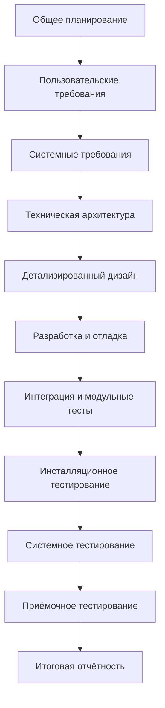

_Рисунок 2.1.а — Водопадная модель разработки ПО_

**V-образная модель** (V-model$^{22}$) является логическим развитием водопадной. Можно заметить (рисунок 2.1.b), что в общем случае как водопадная, так и v-образная модели жизненного цикла ПО могут содержать один и тот же набор стадий, но принципиальное отличие заключается в том, как эта информация используется в процессе реализации проекта.

Очень упрощённо можно сказать, что при использовании v-образной модели на каждой стадии «на спуске» нужно думать о том, что и как будет происходить на соответствующей стадии «на подъёме». Тестирование здесь появляется уже на самых ранних стадиях развития проекта, что позволяет минимизировать риски, а также обнаружить и устранить множество потенциальных проблем до того, как они станут проблемами реальными.

---
$^{22}$ **V-model.** A framework to describe the software development lifecycle activities from requirements specification to maintenance. The V-model illustrates how testing activities can be integrated into each phase of the software development lifecycle. [ISTQB Glossary]

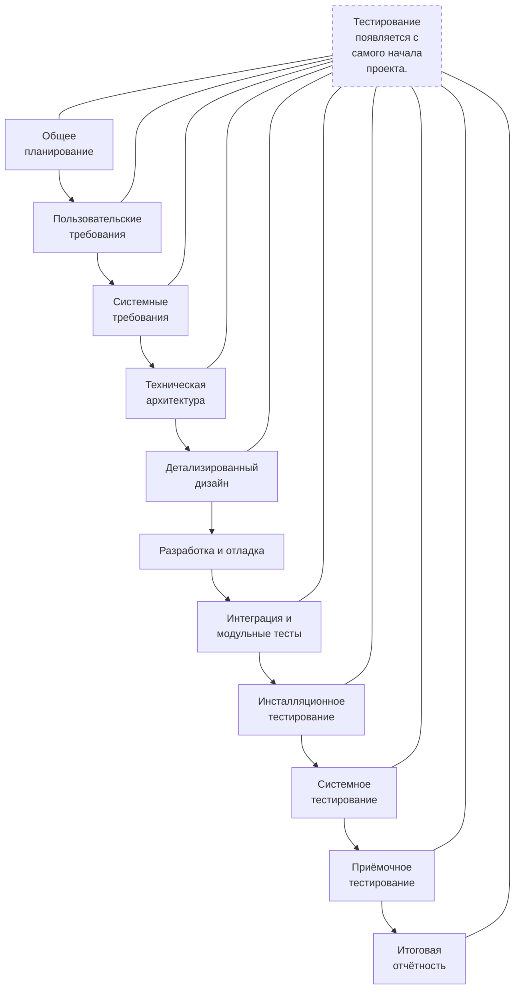

*Рисунок 2.1.b — V-образная модель разработки ПО*

Краткое описание v-образной модели можно найти в статье «What is V-model advantages, disadvantages and when to use it?»<sup>23</sup>. Пояснение по использованию v-образной модели в тестировании можно найти в статье «Using V Models for Testing»<sup>24</sup>.

**Итерационная инкрементальная модель** (iterative model<sup>25</sup>, incremental model<sup>26</sup>) является фундаментальной основой современного подхода к разработке ПО. Как следует из названия модели, ей свойственна определённая двойственность (а ISTQB-глоссарий даже не приводит единого определения, разбивая его на отдельные части):
* с точки зрения жизненного цикла модель является **итерационной**, т.к. подразумевает многократное повторение одних и тех же стадий;
* с точки зрения развития продукта (приращения его полезных функций) модель является **инкрементальной**.

Ключевой особенностью данной модели является разбиение проекта на относительно небольшие промежутки (итерации), каждый из которых в общем случае может включать в себя все классические стадии, присущие водопадной и v-образной моделям (рисунок 2.1.c). Итогом итерации является приращение (инкремент) функциональности продукта, выраженное в промежуточном билде (build<sup>27</sup>).

---

<sup>23</sup> «What is V-model advantages, disadvantages and when to use it?» [http://istqbexamcertification.com/what-is-v-model-advantages-disadvantages-and-when-to-use-it/]  
<sup>24</sup> «Using V Models for Testing», Donald Firesmith [http://blog.sei.cmu.edu/post.cfm/using-v-models-testing-315]  
<sup>25</sup> **Iterative development model.** A development lifecycle where a project is broken into a usually large number of iterations. An iteration is a complete development loop resulting in a release (internal or external) of an executable product, a subset of the final product under development, which grows from iteration to iteration to become the final product. [ISTQB Glossary]  
<sup>26</sup> **Incremental development model.** A development lifecycle where a project is broken into a series of increments, each of which delivers a portion of the functionality in the overall project requirements. The requirements are prioritized and delivered in priority order in the appropriate increment. In some (but not all) versions of this lifecycle model, each subproject follows a 'mini V-model' with its own design, coding and testing phases. [ISTQB Glossary]  
<sup>27</sup> **Build.** A development activity whereby a complete system is compiled and linked, so that a consistent system is available including all latest changes. [На основе определения термина «daily build» из ISTQB Glossary]

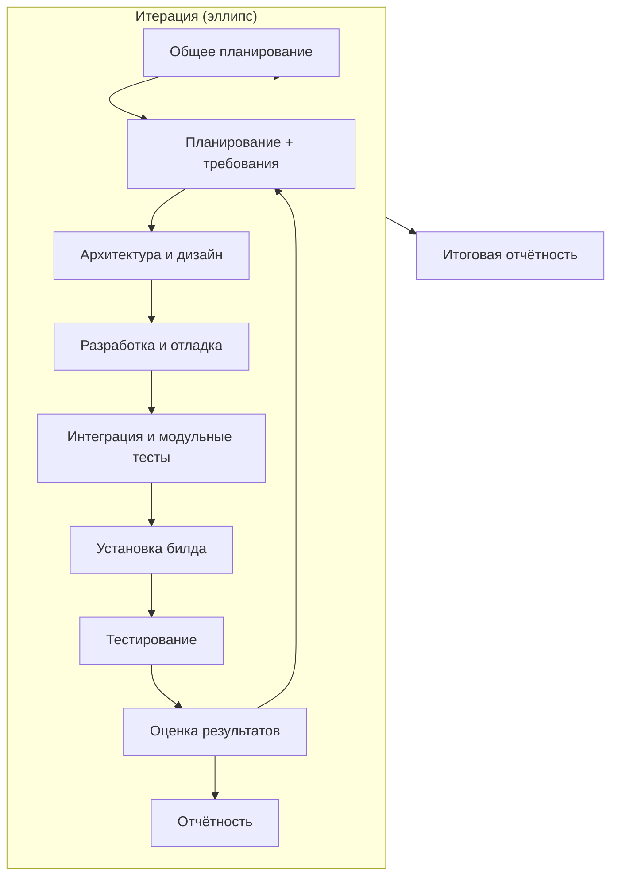

*Рисунок 2.1.c — Итерационная инкрементальная модель разработки ПО*

Длина итераций может меняться в зависимости от множества факторов, однако сам принцип многократного повторения позволяет гарантировать, что и тестирование, и демонстрация продукта конечному заказчику (с получением обратной связи) будет активно применяться с самого начала и на протяжении всего времени разработки проекта.

Во многих случаях допускается распараллеливание отдельных стадий внутри итерации и активная доработка с целью устранения недостатков, обнаруженных на любой из (предыдущих) стадий.

Итерационная инкрементальная модель очень хорошо зарекомендовала себя на объёмных и сложных проектах, выполняемых большими командами на протяжении длительных сроков. Однако к основным недостаткам этой модели часто относят высокие накладные расходы, вызванные высокой «бюрократизированностью» и общей громоздкостью модели.

Относительно краткие и хорошие описания итерационной инкрементальной модели можно найти в статьях «What is Iterative model advantages, disadvantages and when to use it?»$^{28}$ и «What is Incremental model advantages, disadvantages and when to use it?»$^{29}$.

**Спиральная модель** (spiral model$^{30}$) представляет собой частный случай итерационной инкрементальной модели, в котором особое внимание уделяется управлению рисками, в особенности влияющими на организацию процесса разработки проекта и контрольные точки.

---

28 «What is Iterative model advantages, disadvantages and when to use it?» [http://istqbexamcertification.com/what-is-iterative-model-advantages-disadvantages-and-when-to-use-it/]

29 «What is Incremental model advantages, disadvantages and when to use it?» [http://istqbexamcertification.com/what-is-incremental-model-advantages-disadvantages-and-when-to-use-it/]

30 **Spiral model.** A software lifecycle model which supposes incremental development, using the waterfall model for each step, with the aim of managing risk. In the spiral model, developers define and implement features in order of decreasing priority. [http://dictionary.reference.com/browse/spiral+model]

```mermaid
graph TD
    classDef default fill:#fff,stroke:#333,stroke-width:1px;

    subgraph Спиральная модель разработки ПО
        A[Проработка целей, альтернатив и ограничений]
        B[Анализ рисков и прототипирование]
        C[Разработка (промежуточной версии) продукта]
        D[Планирование следующего цикла]
        
        %% Внутренние кольца и квадранты
        E[Общей концепции]
        F[Уточненных требований]
        G[Архитектуры]
        H[Дизайна]
        I[Интеграция]
        J[Тестирование]
        
        K[Проекта и продукта]
        L[Жизненного цикла]
        M[Разработки, интеграции и тестирования]
        N[Внедрения и сопровождения]
        O[Эксплуатации продукта]
    end
```

*Рисунок 2.1.d — Спиральная модель разработки ПО*

Схематично суть спиральной модели представлена на рисунке 2.1.d. Обратите внимание на то, что здесь явно выделены четыре ключевые фазы:

* проработка целей, альтернатив и ограничений;
* анализ рисков и прототипирование;
* разработка (промежуточной версии) продукта;
* планирование следующего цикла.

С точки зрения тестирования и управления качеством повышенное внимание рискам является ощутимым преимуществом при использовании спиральной модели для разработки концептуальных проектов, в которых требования естественным образом являются сложными и нестабильными (могут многократно меняться по ходу выполнения проекта).

Автор модели Barry Boehm в своих публикациях31, 32 подробно раскрывает эти вопросы и приводит множество рассуждений и рекомендаций о том, как применять спиральную модель с максимальным эффектом.

Относительно краткие и очень хорошие описания спиральной модели можно найти в статьях «What is Spiral model- advantages, disadvantages and when to use it?»33 и «Spiral Model»34.

**Гибкая модель** (agile model35) представляет собой совокупность различных подходов к разработке ПО и базируется на т.н. «agile-манифесте»36:

* Люди и взаимодействие важнее процессов и инструментов.
* Работающий продукт важнее исчерпывающей документации.
* Сотрудничество с заказчиком важнее согласования условий контракта.
* Готовность к изменениям важнее следования первоначальному плану.

Данная тема является настолько большой, что ссылок на статьи недостаточно, а потому стоит почитать эти книги:
* «Agile Testing» (Lisa Crispin, Janet Gregory).
* «Essential Scrum» (Kenneth S. Rubin).

Как несложно догадаться, положенные в основу гибкой модели подходы являются логическим развитием и продолжением всего того, что было за десятилетия создано и опробовано в водопадной, V-образной, итерационной инкрементальной, спиральной и иных моделях. Причём здесь впервые был достигнут ощутимый результат в снижении бюрократической составляющей и максимальной адаптации процесса разработки ПО к мгновенным изменениям рынка и требований заказчика.

Очень упрощённо (почти на грани допустимого) можно сказать, что гибкая модель представляет собой облегчённую с точки зрения документации смесь итерационной инкрементальной и спиральной моделей (рисунки 2.1.e37, 2.1.f); при этом следует помнить об «agile-манифесте» и всех вытекающих из него преимуществах и недостатках.

Главным недостатком гибкой модели считается сложность её применения к крупным проектам, а также частое ошибочное внедрение её подходов, вызванное недопониманием фундаментальных принципов модели.

Тем не менее можно утверждать, что всё больше и больше проектов начинают использовать гибкую модель разработки.

Очень подробное и элегантное изложение принципов применения гибкой модели разработки ПО можно найти в статье «The Agile System Development Life Cycle»38.

---

31 «A Spiral Model of Software Development and Enhancement», Barry Boehm [http://csse.usc.edu/csse/TECHRPTS/1988/usccse88-500/usccse88-500.pdf]
32 «Spiral Development: Experience, Principles, and Refinements», Barry Boehm. [http://www.sei.cmu.edu/reports/00sr008.pdf]
33 «What is Spiral model- advantages, disadvantages and when to use it?» [http://istqbxamcertification.com/what-is-spiral-model-advantages-disadvantages-and-when-to-use-it/]
34 «Spiral Model», Amir Ghahrai. [http://www.testingexcellence.com/spiral-model/]
35 **Agile software development**. A group of software development methodologies based on EITP iterative incremental development, where requirements and solutions evolve through collaboration between self-organizing cross-functional teams. [ISTQB Glossary]
36 «Agile-манифест» [http://agilemanifesto.org/iso/ru/manifesto.html]
37 Оригинал рисунка и исходный материал: http://www.gtagile.com/GT_Agile/Home.html
38 «The Agile System Development Life Cycle» [http://www.ambysoft.com/essays/agileLifecycle.html]

```mermaid
graph TD
    %% Основные уровни гибкой модели разработки ПО
    Ценности --> Адаптивность
    Ценности --> Прозрачность
    Ценности --> Простота
    Ценности --> Единство

    СТРАТЕГИЯ --> Бюджет
    СТРАТЕГИЯ --> Соглашения
    СТРАТЕГИЯ --> Цели
    СТРАТЕГИЯ --> Видение

    ВЫПУСК --> Оценка
    ВЫПУСК --> План выпуска
    ВЫПУСК --> «Бэклог»

    ИТЕРАЦИЯ --> Планирование
    ИТЕРАЦИЯ --> Ретроспектива
    ИТЕРАЦИЯ --> Оценка

    ЕЖЕДНЕВНО --> «Стендап» собрание
    ЕЖЕДНЕВНО --> Тестирование
    ЕЖЕДНЕВНО --> Билд

    НЕПРЕРЫВНО --> TDD
    НЕПРЕРЫВНО --> Билд
    НЕПРЕРЫВНО --> Рефакторинг
    НЕПРЕРЫВНО --> Интеграция
    НЕПРЕРЫВНО --> Сотрудничество

     Наглядность --> Осталось сделать
    Наглядность --> Производительность
    Наглядность --> Сделано
    Наглядность --> Тесты
```

Рисунок 2.1.е — Суть гибкой модели разработки ПО

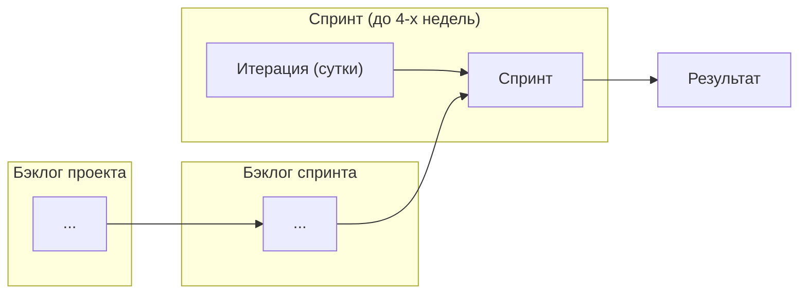

*Рисунок 2.1.f — Итерационный подход в рамках гибкой модели и scrum*

**Вкратце** можно выразить суть моделей разработки ПО таблицей 2.1.а.

*Таблица 2.1.а — Сравнение моделей разработки ПО*

| Модель | Преимущества | Недостатки | Тестирование |
| :--- | :--- | :--- | :--- |
| Водопадная | • У каждой стадии есть чёткий проверяемый результат.<br>• В каждый момент времени команда выполняет один вид работы.<br>• Хорошо работает для небольших задач. | • Полная неспособность адаптировать проект к изменениям в требованиях.<br>• Крайне позднее создание работающего продукта. | • С середины проекта. |
| V-образная | • У каждой стадии есть чёткий проверяемый результат.<br>• Внимание тестированию уделяется с первой же стадии.<br>• Хорошо работает для проектов со стабильными требованиями. | • Недостаточная гибкость и адаптируемость.<br>• Отсутствует раннее прототипирование.<br>• Сложность устранения проблем, пропущенных на ранних стадиях развития проекта. | • На переходах между стадиями. |

*Таблица 2.1.а [окончание]*

| Модель | Преимущества | Недостатки | Тестирование |
| :--- | :--- | :--- | :--- |
| Итерационная инкрементальная | • Достаточно раннее прототипирование.<br>• Простота управления итерациями.<br>• Декомпозиция проекта на управляемые итерации. | • Недостаточная гибкость внутри итераций.<br>• Сложность устранения проблем, пропущенных на ранних стадиях развития проекта. | • В определённые моменты итераций.<br>• Повторное тестирование (после доработки) уже проверенного ранее. |
| Спиральная | • Глубокий анализ рисков.<br>• Подходит для крупных проектов.<br>• Достаточно раннее прототипирование. | • Высокие накладные расходы.<br>• Сложность применения для небольших проектов.<br>• Высокая зависимость успеха от качества анализа рисков. | |
| Гибкая | • Максимальное вовлечение заказчика.<br>• Много работы с требованиями.<br>• Тесная интеграция тестирования и разработки.<br>• Минимизация документации. | • Сложность реализации для больших проектов.<br>• Сложность построения стабильных процессов. | • В определенные моменты итераций **и в любой необходимый момент**. |

Ещё два кратких и информативных сравнения моделей жизненного цикла ПО можно найти в статьях «Project Lifecycle Models: How They Differ and When to Use Them»<sup>39</sup> и «Блок-схема выбора оптимальной методологии разработки ПО»<sup>40</sup>. А общий обзор всех моделей в контексте тестирования ПО представлен в статье «What are the Software Development Models?»<sup>41</sup>.

**Задание 2.1.а:** представьте, что на собеседовании вас попросили назвать основные модели разработки ПО, перечислить их преимущества и недостатки с точки зрения тестирования. Не ждите собеседования, ответьте на этот вопрос сейчас, а ответ запишите.

---

<sup>39</sup> «Project Lifecycle Models: How They Differ and When to Use Them» [http://www.business-esolutions.com/islm.htm]  
<sup>40</sup> «Блок-схема выбора оптимальной методологии разработки ПО» [http://megamozg.ru/post/23022/]  
<sup>41</sup> «What are the Software Development Models?» [http://istqbexamcertification.com/what-are-the-software-development-models/]

## 2.1.2. ЖИЗНЕННЫЙ ЦИКЛ ТЕСТИРОВАНИЯ

Следуя общей логике итеративности, превалирующей во всех современных моделях разработки ПО, жизненный цикл тестирования также выражается замкнутой последовательностью действий (рисунок 2.1.g).

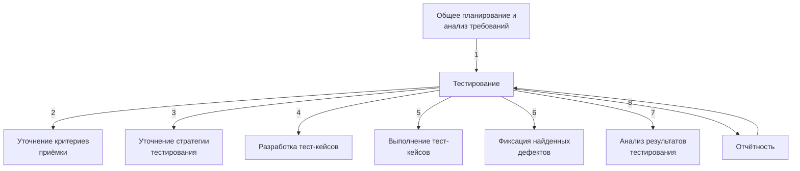

*Рисунок 2.1.g — Жизненный цикл тестирования*

Важно понимать, что длина такой итерации (и, соответственно, степень подробности каждой стадии) может варьироваться в широчайшем диапазоне — от единиц часов до десятков месяцев. Как правило, если речь идёт о длительном промежутке времени, он разбивается на множество относительно коротких итераций, но сам при этом «тяготеет» к той или иной стадии в каждый момент времени (например, в начале проекта больше планирования, в конце — больше отчётности).

Также ещё раз подчеркнём, что приведённая схема — не догма, и вы легко можете найти альтернативы (например, здесь$^4$ и здесь$^43$), но общая суть и ключевые принципы остаются неизменными. Их и рассмотрим.

**Стадия 1** (общее планирование и анализ требований) объективно необходима как минимум для того, чтобы иметь ответ на такие вопросы, как: что нам предстоит тестировать; как много будет работы; какие есть сложности; всё ли необходимое у нас есть и т.п. Как правило, получить ответы на эти вопросы невозможно без анализа требований, т.к. именно требования являются первичным источником ответов.

---

42 «Software Testing Life Cycle» [http://softwaretestingfundamentals.com/software-testing-life-cycle/]  
43 «Software Testing Life Cycle» [http://www.softwaretestingmentor.com/software-testing-life-cycle/]

**Стадия 2** (уточнение критериев приёмки) позволяет сформулировать или уточнить метрики и признаки возможности или необходимости начала тестирования (entry criteria$^{44}$), приостановки (suspension criteria$^{45}$) и возобновления (resumption criteria$^{46}$) тестирования, завершения или прекращения тестирования (exit criteria$^{47}$).

**Стадия 3** (уточнение стратегии тестирования) представляет собой ещё одно обращение к планированию, но уже на локальном уровне: рассматриваются и уточняются те части стратегии тестирования (test strategy$^{48}$), которые актуальны для текущей итерации.

**Стадия 4** (разработка тест-кейсов) посвящена разработке, пересмотру, уточнению, доработке, переработке и прочим действиям с тест-кейсами, наборами тест-кейсов, тестовыми сценариями и иными артефактами, которые будут использоваться при непосредственном выполнении тестирования.

**Стадия 5** (выполнение тест-кейсов) и **стадия 6** (фиксация найденных дефектов) тесно связаны между собой и фактически выполняются параллельно: дефекты фиксируются сразу по факту их обнаружения в процессе выполнения тест-кейсов. Однако зачастую после выполнения всех тест-кейсов и написания всех отчётов о найденных дефектах проводится явно выделенная стадия уточнения, на которой все отчёты о дефектах рассматриваются повторно с целью формирования единого понимания проблемы и уточнения таких характеристик дефекта, как важность и срочность.

**Стадия 7** (анализ результатов тестирования) и **стадия 8** (отчётность) также тесно связаны между собой и выполняются практически параллельно. Формулируемые на стадии анализа результатов выводы напрямую зависят от плана тестирования, критериев приёмки и уточнённой стратегии, полученных на стадиях 1, 2 и 3. Полученные выводы оформляются на стадии 8 и служат основой для стадий 1, 2 и 3 следующей итерации тестирования. Таким образом, цикл замыкается.

В жизненном цикле тестирования пять из восьми стадий так или иначе связаны с управлением проектами, рассмотрение которого не входит в наши планы, потому обо всём, что касается планирования и отчётности, мы кратко поговорим в главе «Оценка трудозатрат, планирование и отчётность»$^{[206]}$. А сейчас мы переходим к ключевым навыкам и основным видам деятельности тестировщиков и начнём с работы с документацией.

---

$^{44}$ **Entry criteria**. The set of generic and specific conditions for permitting a process to go forward with a defined task, e.g. test phase. The purpose of entry criteria is to prevent a task from starting which would entail more (wasted) effort compared to the effort needed to remove the failed entry criteria. [ISTQB Glossary]

$^{45}$ **Suspension criteria**. The criteria used to (temporarily) stop all or a portion of the testing activities on the test items. [ISTQB Glossary]

$^{46}$ **Resumption criteria**. The criteria used to restart all or a portion of the testing activities that were suspended previously. [ISTQB Glossary]

$^{47}$ **Exit criteria**. The set of generic and specific conditions, agreed upon with the stakeholders for permitting a process to be officially completed. The purpose of exit criteria is to prevent a task from being considered completed when there are still outstanding parts of the task which have not been finished. Exit criteria are used to report against and to plan when to stop testing. [ISTQB Glossary]

$^{48}$ **Test strategy**. A high-level description of the test levels to be performed and the testing within those levels for an organization or program (one or more projects). [ISTQB Glossary]

## 2.2. ТЕСТИРОВАНИЕ ДОКУМЕНТАЦИИ И ТРЕБОВАНИЙ

### 2.2.1. ЧТО ТАКОЕ «ТРЕБОВАНИЕ»

Как мы только что рассмотрели в главе, посвящённой жизненному циклу тестирования, всё так или иначе начинается с документации и требований.

**Требование (requirement**$^{49}$) — описание того, какие функции и с соблюдением каких условий должно выполнять приложение в процессе решения полезной для пользователя задачи.

Небольшое «историческое отступление»: если поискать определения требований в литературе 10-20-30-летней давности, то можно заметить, что изначально о пользователях, их задачах и полезных для них свойствах приложения в определении требования не было сказано. Пользователь выступал некоей абстрактной фигурой, не имеющей отношения к приложению. В настоящее время такой подход недопустим, т.к. он не только приводит к коммерческому провалу продукта на рынке, но и многократно повышает затраты на разработку и тестирование.

Хорошим кратким предисловием ко всему тому, что будет рассмотрено в данной главе, можно считать небольшую статью «What is documentation testing in software testing»$^{50}$.

---

$^{49}$ **Requirement.** A condition or capability needed by a user to solve a problem or achieve an objective that must be met or pos-sessed by a system or system component to satisfy a contract, standard, specification, or other formally imposed document. [ISTQB glossary]

$^{50}$ «What is documentation testing in software testing». [http://istqbexamcertification.com/what-is-documentation-testing/]

## 2.2.2. ВАЖНОСТЬ ТРЕБОВАНИЙ

Требования являются отправной точкой для определения того, что проектная команда будет проектировать, реализовывать и тестировать. Элементарная логика говорит нам, что если в требованиях что-то «не то», то и реализовано будет «не то», т.е. колоссальная работа множества людей будет выполнена впустую. Эту мысль иллюстрирует рисунок 2.2.а.

![График зависимости стоимости исправления ошибки от момента её обнаружения, где по вертикальной оси отложена «Стоимость исправления ошибки» (со значениями 0, 20, 500, 1000), а по горизонтальной — «Время, затраченное на проект», разделенное на этапы: Общее планирование, Пользовательские требования, Системные требования, Техническая архитектура, Детализированный дизайн, Разработка и отладка, Интеграция и модульные тесты, Инсталляционное тестирование, Системное тестирование, Приёмочное тестирование, Итоговая отчётность, Эксплуатация. Кривая стоимости стремительно растет вверх на поздних этапах проекта.](image_path.png)

*Рисунок 2.2.а — Стоимость исправления ошибки в зависимости от момента её обнаружения*

Брайан Хэнкс, описывая важность требований$^{51}$, подчёркивает, что они:
* Позволяют понять, что и с соблюдением каких условий система должна делать.
* Предоставляют возможность оценить масштаб изменений и управлять изменениями.
* Являются основой для формирования плана проекта (в том числе плана тестирования).
* Помогают предотвращать или разрешать конфликтные ситуации.
* Упрощают расстановку приоритетов в наборе задач.
* Позволяют объективно оценить степень прогресса в разработке проекта.

Вне зависимости от того, какая модель разработки ПО используется на проекте, чем позже будет обнаружена проблема, тем сложнее и дороже будет её решение. А в самом начале («водопада», «спуска по букве v», «итерации», «витка спирали») идёт планирование и работа с требованиями.

Если проблема в требованиях будет выяснена на этой стадии, её решение может свестись к исправлению пары слов в тексте, в то время как недоработка, вызванная пропущенной проблемой в требованиях и обнаруженная на стадии эксплуатации, может даже полностью уничтожить проект.

Если графики вас не убеждают, попробуем проиллюстрировать ту же мысль на простом примере. Допустим, вы с друзьями составляете список покупок перед поездкой в гипермаркет. Вы

---
$^{51}$ «Requirements in the Real World», Brian F. Hanks, February 28, 2002.

поедете покупать, а друзья ждут вас дома. Сколько «стоит» дописать, вычеркнуть или изменить пару пунктов, пока вы только-только составляете список? Нисколько. Если мысль о несовершенстве списка настигла вас по пути в гипермаркет, уже придётся звонить (дёшево, но не бесплатно). Если вы поняли, что в списке «что-то не то» в очереди в кассу, придётся возвращаться в торговый зал и тратить время. Если проблема выяснилась по пути домой или даже дома, придётся вернуться в гипермаркет. И, наконец, клинический случай: в списке изначально было что-то уж совсем неправильное (например, «100 кг конфет — и всё»), поездка совершена, все деньги потрачены, конфеты привезены и только тут выясняется, что «ну мы же пошутили».

**Задание 2.2.a:** представьте, что ваш с друзьями бюджет ограничен, и в списке требований появляются приоритеты (что-то купить надо обязательно, что-то, если останутся деньги, и т.п.). Как это повлияет на риски, связанные с ошибками в списке?

Ещё одним аргументом в пользу тестирования требований является то, что, по разным оценкам, в них зарождается от $\frac{1}{2}$ до $\frac{3}{4}$ всех проблем с программным обеспечением. В итоге есть риск, что получится так, как показано на рисунке 2.2.b.

Поскольку мы постоянно говорим «документация и требования», а не просто «требования», то стоит рассмотреть перечень документации, которая должна подвергаться тестированию в процессе разработки ПО (также далее мы будем концентрироваться именно на требованиях).

В общем случае документацию можно разделить на два больших вида в зависимости от времени и места её использования (здесь будет очень много сносок с определениями, т.к. по видам

![Комікс із 10 кадрів, що ілюструє іронічну історію про те, як різне розуміння проєкту різними ролями призводить до абсурдного кінцевого результату. Кадри показують послідовно: 1) Як клієнт пояснив, чего он хочет (гойдалка на дереві з трьома дошками); 2) Так клієнта поняв менеджер проекта (гойдалка з двома дошками); 3) Так аналитик описал проект (дошка на гілці дерева); 4) Так программист реализовал проект (дерево пропиляне насквозь і зв'язане мотузками); 5) Так проект был прорекламирован консультантами (розкішне крісло на дереві); 6) Так проект был задокументирован (гойдалка закопана в землю); 7) Так проект был сдан в эксплуатацию (шматок мотузки на гілці); 8) В такую сумму проект обошлся заказчику (гірки-американські з петлями замість дерева); 9) Так работала техническая поддержка (пеньок замість дерева); 10) Что на самом деле было нужно клиенту (одна шина на мотузці).](image_path)

*Рисунок 2.2.b — Типичный проект с плохими требованиями*

документации очень часто возникает множество вопросов и потому придётся рассмотреть некоторые моменты подробнее).

* **Продуктная документация** (product documentation, development documentation$^{52}$) используется проектной командой во время разработки и поддержки продукта. Она включает:
  * План проекта (project management plan$^{53}$) и в том числе тестовый план (test plan$^{54}$).
  * Требования к программному продукту (product requirements document, PRD$^{55}$) и функциональные спецификации (functional specifications$^{56}$ document, FSD$^{57}$; software requirements specification, SRS$^{58}$).
  * Архитектуру и дизайн (architecture and design$^{59}$).
  * Тест-кейсы и наборы тест-кейсов (test cases$^{60}$, test suites$^{61}$).
  * Технические спецификации (technical specifications$^{62}$), такие как схемы баз данных, описания алгоритмов, интерфейсов и т.д.

---

$^{52}$ **Development documentation.** Development documentation comprises those documents that propose, specify, plan, review, test, and implement the products of development teams in the software industry. Development documents include proposals, user or customer requirements description, test and review reports (suggesting product improvements), and self-reflective documents written by team members, analyzing the process from their perspective. [«Documentation for Software and IS Development», Thomas T. Barker, «Encyclopedia of Information Systems» (Elsevier Press, 2002, pp. 684-694.)]

$^{53}$ **Project management plan.** A formal, approved document that defines how the project is executed, monitored and controlled. It may be summary or detailed and may be composed of one of more subsidiary management plans and other planning documents. [PMBOK, 3$^{\text{rd}}$ edition]

$^{54}$ **Test plan.** A document describing the scope, approach, resources and schedule of intended test activities. It identifies amongst others test items, the features to be tested, the testing tasks, who will do each task, degree of tester independence, the test environment, the test design techniques and entry and exit criteria to be used, and the rationale for their choice, and any risks requiring contingency planning. It is a record of the test planning process. [ISTQB Glossary]

$^{55}$ **Product requirements document, PRD.** The PRD describes the product your company will build. It drives the efforts of the entire product team and the company's sales, marketing and customer support efforts. The purpose of the product requirements document (PRD) or product spec is to clearly and unambiguously articulate the product's purpose, features, functionality, and behavior. The product team will use this specification to actually build and test the product, so it needs to be complete enough to provide them the information they need to do their jobs. [«How to write a good PRD», Martin Cagan]

$^{56}$ **Specification.** A document that specifies, ideally in a complete, precise and verifiable manner, the requirements, design, behavior, or other characteristics of a component or system, and, often, the procedures for determining whether these provisions have been satisfied. [ISTQB Glossary]

$^{57}$ **Functional specifications document, FSD.** См. «Software requirements specification, SRS».

$^{58}$ **Software requirements specification, SRS.** SRS describes as fully as necessary the expected behavior of the software system. The SRS is used in development, testing, quality assurance, project management, and related project functions. People call this deliverable by many different names, including business requirements document, functional spec, requirements document, and others. [«Software Requirements (3$^{\text{rd}}$ edition)», Karl Wiegers and Joy Beatty]

$^{59}$ **Architecture. Design.** A software *architecture* for a system is the structure or structures of the system, which comprise elements, their externally-visible behavior, and the relationships among them. ... *Architecture is design*, but not all design is architecture. That is, there are many design decisions that are left unbound by the architecture, and are happily left to the discretion and good judgment of downstream designers and implementers. The architecture establishes constraints on downstream activities, and those activities must produce artifacts (finer-grained designs and code) that are compliant with the architecture, but architecture does not define an implementation. [«Documenting Software Architectures», Paul Clements и др.]

$^{60}$ **Test case.** A set of input values, execution preconditions, expected results and execution postconditions, developed for a particular objective or test condition, such as to exercise a particular program path or to verify compliance with a specific requirement. [ISTQB Glossary]

$^{61}$ **Test suite.** A set of several test cases for a component or system under test, where the post condition of one test is often used as the precondition for the next one. [ISTQB Glossary]

$^{62}$ **Technical specifications.** Scripts, source code, data definition language, etc. [PMBOK, 3$^{\text{rd}}$ edition] Также см. «Specification».


Рисунок 2.2.с — Соотношение понятий «продуктная документация» и «проектная документация»

* **Проектная документация** (project documentation$^{63}$) включает в себя как продуктную документацию, так и некоторые дополнительные виды документации и используется не только на стадии разработки, но и на более ранних и поздних стадиях (например, на стадии внедрения и эксплуатации). Она включает:
  * Пользовательскую и сопроводительную документацию (user and accompanying documentation$^{64}$), такую как встроенная помощь, руководство по установке и использованию, лицензионные соглашения и т.д.
  * Маркетинговую документацию (market requirements document, MRD$^{65}$), которую представители разработчика или заказчика используют как на начальных этапах (для уточнения сути и концепции проекта), так и на финальных этапах развития проекта (для продвижения продукта на рынке).

В некоторых классификациях часть документов из продуктной документации может быть перечислена в проектной документации — это совершенно нормально, т.к. понятие проектной документации по определению является более широким. Поскольку с этой классификацией связано очень много вопросов и непонимания, отразим суть ещё раз — графически (см. рисунок 2.2.c) — и напомним, что мы договорились классифицировать документацию по признаку того, где (для чего) она является наиболее востребованной.

Степень важности и глубина тестирования того или иного вида документации и даже отдельного документа определяется большим количеством факторов, но неизменным остаётся общий принцип: всё, что мы создаём в процессе разработки проекта (даже рисунки маркером на доске, даже письма, даже переписку в скайпе), можно считать документацией и так или иначе подвергать тестированию (например, вычитывание письма перед отправкой — это тоже своего рода тестирование документации).

---

$^{63}$ **Project documentation.** Other expectations and deliverables that are not a part of the software the team implements, but that are necessary to the successful completion of the project as a whole. [«Software Requirements (3$^\text{rd}$ edition)», Karl Wiegers and Joy Beatty]

$^{64}$ **User documentation.** User documentation refers to the documentation for a product or service provided to the end users. The user documentation is designed to assist end users to use the product or service. This is often referred to as user assistance. The user documentation is a part of the overall product delivered to the customer. [На основе статей doc-department.com]

$^{65}$ **Market requirements document, MRD.** An MRD goes into details about the target market segments and the issues that pertain to commercial success. [«Software Requirements (3$^\text{rd}$ edition)», Karl Wiegers and Joy Beatty]

2.2.3. ИСТОЧНИКИ И ПУТИ ВЫЯВЛЕНИЯ ТРЕБОВАНИЙ

Требования начинают свою жизнь на стороне заказчика. Их сбор (gathering) и выявление (elicitation) осуществляются с помощью следующих основных техник$^6$ (рисунок 2.2.d).

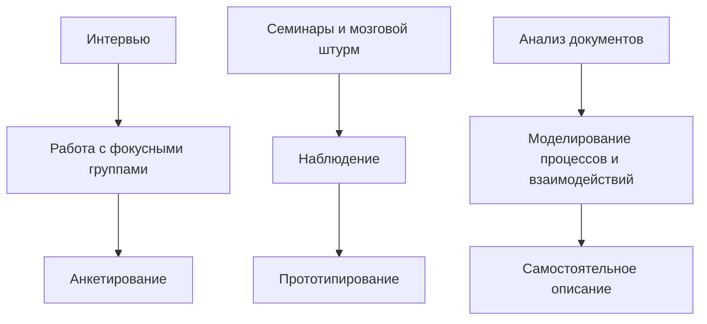
*Рисунок 2.2.d — Основные техники сбора и выявления требований*

**Интервью.** Самый универсальный путь выявления требований, заключающийся в общении проектного специалиста (как правило, специалиста по бизнес-анализу) и представителя заказчика (или эксперта, пользователя и т.д.). Интервью может проходить в классическом понимании этого слова (беседа в виде «вопрос-ответ»), в виде переписки и т.п. Главным здесь является то, что ключевыми фигурами выступают двое — интервьюируемый и интервьюер (хотя это и не исключает наличия «аудитории слушателей», например, в виде лиц, поставленных в копию переписки).

**Работа с фокусными группами.** Может выступать как вариант «расширенного интервью», где источником информации является не одно лицо, а группа лиц (как правило, представляющих собой целевую аудиторию, и/или обладающих важной для проекта информацией, и/или уполномоченных принимать важные для проекта решения).

**Анкетирование.** Этот вариант выявления требований вызывает много споров, т.к. при неверной реализации может привести к нулевому результату при объёмных затратах. В то же время при правильной организации анкетирование позволяет автоматически собрать и обработать огромное количество ответов от огромного количества респондентов. Ключевым фактором успеха является правильное составление анкеты, правильный выбор аудитории и правильное преподнесение анкеты.

**Семинары и мозговой штурм.** Семинары позволяют группе людей очень быстро обменяться информацией (и наглядно продемонстрировать те или иные идеи), а также хорошо сочетаются

$^6$ Здесь можно почитать подробнее о том, в чём разница между сбором и выявлением требований: «Requirements Gathering vs. Elicitation» (Laura Brandenburg): http://www.bridging-the-gap.com/requirements-gathering-vs-elicitation/

с интервью, анкетированием, прототипированием и моделированием — в том числе для обсуждения результатов и формирования выводов и решений. Мозговой штурм может проводиться и как часть семинара, и как отдельный вид деятельности. Он позволяет за минимальное время сгенерировать большое количество идей, которые в дальнейшем можно не спеша рассмотреть с точки зрения их использования для развития проекта.

**Наблюдение.** Может выражаться как в буквальном наблюдении за некими процессами, так и во включении проектного специалиста в эти процессы в качестве участника. С одной стороны, наблюдение позволяет увидеть то, о чём (по совершенно различным соображениям) могут умолчать интервьюируемые, анкетируемые и представители фокусных групп, но с другой — отнимает очень много времени и чаще всего позволяет увидеть лишь часть процессов.

**Прототипирование.** Состоит в демонстрации и обсуждении промежуточных версий продукта (например, дизайн страниц сайта может быть сначала представлен в виде картинок, и лишь затем свёрстан). Это один из лучших путей поиска единого понимания и уточнения требований, однако он может привести к серьёзным дополнительным затратам при отсутствии специальных инструментов (позволяющих быстро создавать прототипы) и слишком раннем применении (когда требования ещё не стабильны, и высока вероятность создания прототипа, имеющего мало общего с тем, что хотел заказчик).

**Анализ документов.** Хорошо работает тогда, когда эксперты в предметной области (временно) недоступны, а также в предметных областях, имеющих общепринятую устоявшуюся регламентирующую документацию. Также к этой технике относится и просто изучение документов, регламентирующих бизнес-процессы в предметной области заказчика или в конкретной организации, что позволяет приобрести необходимые для лучшего понимания сути проекта знания.

**Моделирование процессов и взаимодействий.** Может применяться как к «бизнес-процессам и взаимодействиям» (например: «договор на закупку формируется отделом закупок, визируется бухгалтерией и юридическим отделом...»), так и к «техническим процессам и взаимодействиям» (например: «платёжное поручение генерируется модулем “Бухгалтерия”, шифруется модулем “Безопасность” и передаётся на сохранение в модуль “Хранилище”»). Данная техника требует высокой квалификации специалиста по бизнес-анализу, т.к. сопряжена с обработкой большого объёма сложной (и часто плохо структурированной) информации.

**Самостоятельное описание.** Является не столько техникой выявления требований, сколько техникой их фиксации и формализации. Очень сложно (и даже нельзя!) пытаться самому «придумать требования за заказчика», но в спокойной обстановке можно самостоятельно обработать собранную информацию и аккуратно оформить её для дальнейшего обсуждения и уточнения.

Часто специалисты по бизнес-анализу приходят в свою профессию из тестирования. Если вас заинтересовало это направление, стоит ознакомиться со следующими книгами:
* «Требования для программного обеспечения: рекомендации по сбору и документированию» (Илья Корнипаев).
* «Business Analysis Techniques. 72 Essential Tools for Success» (James Cadle, Debra Paul, Paul Turner).
* «Business Analysis (Second Edition)» (Debra Paul, Donald Yeates, James Cadle).

## 2.2.4. УРОВНИ И ТИПЫ ТРЕБОВАНИЙ

Форма представления, степень детализации и перечень полезных свойств требований зависят от уровней и типов требований$^{67}$, которые схематично представлены на рисунке 2.2.$e^{68}$.

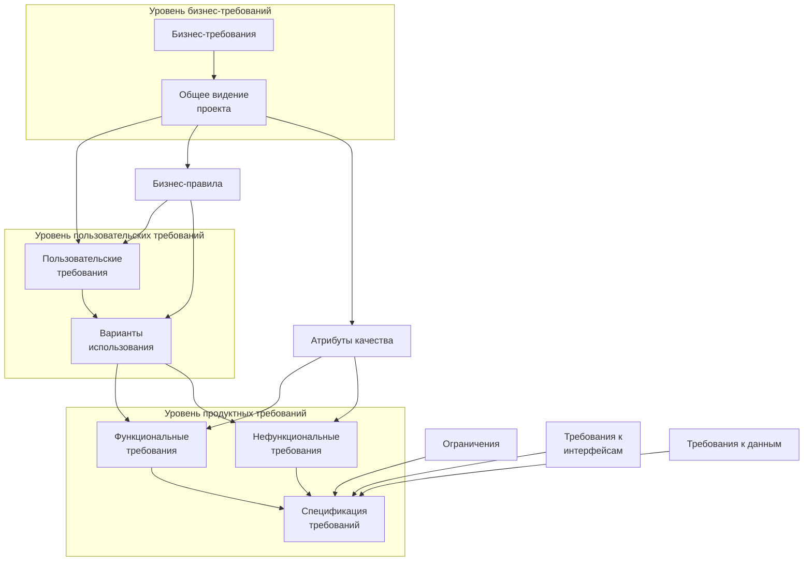

*Рисунок 2.2.e — Уровни и типы требований*

**Бизнес-требования** (business requirements$^{69}$) выражают цель, ради которой разрабатывается продукт (зачем вообще он нужен, какая от него ожидается польза, как заказчик с его помощью будет получать прибыль). Результатом выявления требований на этом уровне является общее видение (vision and scope$^{70}$) — документ, который, как правило, представлен простым текстом и таблицами. Здесь нет детализации поведения системы и иных технических характеристик, но вполне могут быть определены приоритеты решаемых бизнес-задач, риски и т.п.

Несколько простых, изолированных от контекста и друг от друга примеров бизнес-требований:
* Нужен инструмент, в реальном времени отображающий наиболее выгодный курс покупки и продажи валюты.
* Необходимо в два-три раза повысить количество заявок, обрабатываемых одним оператором за смену.

---

$^{67}$ Очень подробное описание уровней и типов требований (а также их применения) можно найти в статье «Software Requirements Engineering: What, Why, Who, When, and How», Linda Westfall [http://www.westfallteam.com/Papers/The_Why_What_Who_When_and_How_Of_Software_Requirements.pdf]

$^{68}$ В основу данного рисунка положены идеи, представленные в книге «Software Requirements (3rd edition)» (Karl Wiegers and Joy Beatty).

$^{69}$ **Business requirement**. Anything that describes the financial, marketplace, or other business benefit that either customers or the developing organization wish to gain from the product. [«Software Requirements (3rd edition)», Karl Wiegers and Joy Beatty]

$^{70}$ **Vision and scope**. The vision and scope document collects the business requirements into a single deliverable that sets the stage for the subsequent development work. [«Software Requirements (3rd edition)», Karl Wiegers and Joy Beatty]

* Нужно автоматизировать процесс выписки товарно-транспортных накладных на основе договоров.

**Пользовательские требования** (user requirements$^{71}$) описывают задачи, которые пользователь может выполнять с помощью разрабатываемой системы (реакцию системы на действия пользователя, сценарии работы пользователя). Поскольку здесь уже появляется описание поведения системы, требования этого уровня могут быть использованы для оценки объёма работ, стоимости проекта, времени разработки и т.д. Пользовательские требования оформляются в виде вариантов использования (use cases$^{72}$), пользовательских историй (user stories$^{73}$), пользовательских сценариев (user scenarios$^{74}$). (Также см. создание пользовательских сценариев$^{\{148\}}$ в процессе выполнения тестирования.)

Несколько простых, изолированных от контекста и друг от друга примеров пользовательских требований:
* *При первом входе пользователя в систему должно отображаться лицензионное соглашение.*
* *Администратор должен иметь возможность просматривать список всех пользователей, работающих в данный момент в системе.*
* *При первом сохранении новой статьи система должна выдавать запрос на сохранение в виде черновика или публикацию.*

**Бизнес-правила** (business rules$^{75}$) описывают особенности принятых в предметной области (и/или непосредственно у заказчика) процессов, ограничений и иных правил. Эти правила могут относиться к бизнес-процессам, правилам работы сотрудников, нюансам работы ПО и т.д.

Несколько простых, изолированных от контекста и друг от друга примеров бизнес-правил:
* *Никакой документ, просмотренный посетителями сайта хотя бы один раз, не может быть отредактирован или удалён.*
* *Публикация статьи возможна только после утверждения главным редактором.*
* *Подключение к системе извне офиса запрещено в нерабочее время.*

**Атрибуты качества** (quality attributes$^{76}$) расширяют собой нефункциональные требования и на уровне пользовательских требований могут быть представлены в виде описания ключевых для проекта показателей качества (свойств продукта, не связанных с функциональностью, но являющихся важными для достижения целей создания продукта — производительность, масштабируемость, восстанавливаемость). Атрибутов качества очень много$^{77}$, но для любого проекта реально важными является лишь некоторое их подмножество.

Несколько простых, изолированных от контекста и друг от друга примеров атрибутов качества:
* *Максимальное время готовности системы к выполнению новой команды после отмены предыдущей не может превышать одну секунду.*

---

$^{71}$ **User requirement.** User requirements are general statements of user goals or business tasks that users need to perform. [«Software Requirements ($3^{\text{rd}}$ edition)», Karl Wiegers and Joy Beatty]
$^{72}$ **Use case.** A sequence of transactions in a dialogue between an actor and a component or system with a tangible result, where an actor can be a user or anything that can exchange information with the system. [ISTQB Glossary]
$^{73}$ **User story.** A high-level user or business requirement commonly used in agile software development, typically consisting of one or more sentences in the everyday or business language capturing what functionality a user needs, any non-functional criteria, and also includes acceptance criteria. [ISTQB Glossary]
$^{74}$ **A scenario** is a hypothetical story, used to help a person think through a complex problem or system. «An Introduction to Scenario Testing», Cem Kaner. [http://www.kaner.com/pdfs/ScenarioIntroVer4.pdf]
$^{75}$ **Business rule.** A business rule is a statement that defines or constrains some aspect of the business. It is intended to assert business structure or to control or influence the behavior of the business. A business rule expresses specific constraints on the creation, updating, and removal of persistent data in an information system. [«Defining Business Rules — What Are They Really», David Hay и др.]
$^{76}$ **Quality attribute.** A feature or characteristic that affects an item's quality. [ISTQB Glossary]
$^{77}$ Даже в Википедии их список огромен: http://en.wikipedia.org/wiki/List_of_system_quality_attributes

* Внесённые в текст статьи изменения не должны быть утеряны при нарушении соединения между клиентом и сервером.
* Приложение должно поддерживать добавление произвольного количества неиероглифических языков интерфейса.

**Функциональные требования** (functional requirements$^{78}$) описывают поведение системы, т.е. её действия (вычисления, преобразования, проверки, обработку и т.д.). В контексте проектирования функциональные требования в основном влияют на дизайн системы.

Стоит помнить, что к поведению системы относится не только то, что система должна делать, но и то, что она **не** должна делать (например: «приложение **не** должно выгружать из оперативной памяти фоновые документы в течение 30 минут с момента выполнения с ними последней операции»).

Несколько простых, изолированных от контекста и друг от друга примеров функциональных требований:
* *В процессе инсталляции приложение должно проверять остаток свободного места на целевом носителе.*
* *Система должна автоматически выполнять резервное копирование данных ежедневно в указанный момент времени.*
* *Электронный адрес пользователя, вводимый при регистрации, должен быть проверен на соответствие требованиям RFC822.*

**Нефункциональные требования** (non-functional requirements$^{79}$) описывают свойства системы (удобство использования, безопасность, надёжность, расширяемость и т.д.), которыми она должна обладать при реализации своего поведения. Здесь приводится более техническое и детальное описание атрибутов качества. В контексте проектирования нефункциональные требования в основном влияют на архитектуру системы.

Несколько простых, изолированных от контекста и друг от друга примеров нефункциональных требований:
* *При одновременной непрерывной работе с системой 1000 пользователей, минимальное время между возникновением сбоев должно быть более или равно 100 часов.*
* *Ни при каких условиях общий объём используемой приложением памяти не может превышать 2 ГБ.*
* *Размер шрифта для любой надписи на экране должен поддерживать настройку в диапазоне от 5 до 15 пунктов.*

Следующие требования в общем случае могут быть отнесены к нефункциональным, однако их часто выделяют в отдельные подгруппы (здесь для простоты рассмотрены лишь три таких подгруппы, но их может быть и гораздо больше; как правило, они проистекают из атрибутов качества, но высокая степень детализации позволяет отнести их к уровню требований к продукту).

**Ограничения** (limitations, constraints$^{80}$) представляют собой факторы, ограничивающие выбор способов и средств (в том числе инструментов) реализации продукта.

Несколько простых, изолированных от контекста и друг от друга примеров ограничений:
* *Все элементы интерфейса должны отображаться без прокрутки при разрешениях экрана от 800x600 до 1920x1080.*
* *Не допускается использование Flash при реализации клиентской части приложения.*

---

$^{78}$ **Functional requirement.** A requirement that specifies a function that a component or system must perform. [ISTQB Glossary] Functional requirements describe the observable behaviors the system will exhibit under certain conditions and the actions the system will let users take. [«Software Requirements (3$^{\text{rd}}$ edition)», Karl Wiegers and Joy Beatty]

$^{79}$ **Non-functional requirement.** A requirement that does not relate to functionality, but to attributes such as reliability, efficiency, usability, maintainability and portability. [ISTQB Glossary]

$^{80}$ **Limitation, constraint.** Design and implementation constraints legitimately restrict the options available to the developer. [«Software Requirements (3$^{\text{rd}}$ edition)», Karl Wiegers and Joy Beatty]

* Приложение должно сохранять способность реализовывать функции с уровнем важности «критический» *при отсутствии у клиента поддержки* JavaScript.

**Требования к интерфейсам** (external interfaces requirements$^{81}$) описывают особенности взаимодействия разрабатываемой системы с другими системами и операционной средой.

Несколько простых, изолированных от контекста и друг от друга примеров требований к интерфейсам:

* Обмен данными между клиентской и серверной частями приложения при осуществлении фоновых AJAX-запросов должен быть реализован в формате JSON.
* Протоколирование событий должно вестись в журнале событий операционной системы.
* Соединение с почтовым сервером должно выполняться согласно RFC3207 («SMTP over TLS»).

**Требования к данным** (data requirements$^{82}$) описывают структуры данных (и сами данные), являющиеся неотъемлемой частью разрабатываемой системы. Часто сюда относят описание базы данных и особенностей её использования.

Несколько простых, изолированных от контекста и друг от друга примеров требований к данным:

* Все данные системы, за исключением пользовательских документов, должны храниться в БД под управлением СУБД MySQL, пользовательские документы должны храниться в БД под управлением СУБД MongoDB.
* Информация о кассовых транзакциях за текущий месяц должна храниться в операционной таблице, а по завершении месяца переноситься в архивную.
* Для ускорения операций поиска по тексту статей и обзоров должны быть предусмотрены полнотекстовые индексы на соответствующих полях таблиц.

**Спецификация требований** (software requirements specification, $\text{SRS}^{83}$) объединяет в себе описание всех требований уровня продукта и может представлять собой весьма объёмный документ (сотни и тысячи страниц).

Поскольку требований может быть очень много, а их приходится не только единожды написать и согласовать между собой, но и постоянно обновлять, работу проектной команды по управлению требованиями значительно облегчают соответствующие инструментальные средства (requirements management tools$^{84, 85}$).

> Для более глубокого понимания принципов создания, организации и использования набора требований рекомендуется ознакомиться с фундаментальной работой Карла Вигерса «Разработка требований к программному обеспечению» («Software Requirements ($3^\text{rd}$ Edition) (Developer Best Practices)», Karl Wiegers, Joy Beatty). В этой же книге (в приложениях) приведены крайне наглядные учебные примеры документов, описывающих требования различного уровня.

---

$^{81}$ **External interface requirements.** Requirements in this category describe the connections between the system and the rest of the universe. They include interfaces to users, hardware, and other software systems. [«Software Requirements ($3^\text{rd}$ edition)», Karl Wiegers and Joy Beatty]

$^{82}$ **Data requirements.** Data requirement describe the format, data type, allowed values, or default value for a data element; the composition of a complex business data structure; or a report to be generated. [«Software Requirements ($3^\text{rd}$ edition)», Karl Wiegers and Joy Beatty]

$^{83}$ **Software requirements specification, SRS.** SRS describes as fully as necessary the expected behavior of the software system. The SRS is used in development, testing, quality assurance, project management, and related project functions. People call this deliverable by many different names, including business requirements document, functional spec, requirements document, and others. [«Software Requirements ($3^\text{rd}$ edition)», Karl Wiegers and Joy Beatty]

$^{84}$ **Requirements management tool.** A tool that supports the recording of requirements, requirements attributes (e.g. priority, knowledge responsible) and annotation, and facilitates traceability through layers of requirements and requirements change management. Some requirements management tools also provide facilities for static analysis, such as consistency checking and violations to predefined requirements rules. [ISTQB Glossary]

$^{85}$ Обширный список инструментальных средств управления требованиями можно найти здесь: http://makingofsoftware.com/resources/list-of-rm-tools

## 2.2.5. СВОЙСТВА КАЧЕСТВЕННЫХ ТРЕБОВАНИЙ

В процессе тестирования требований проверяется их соответствие определённому набору свойств (рисунок 2.2.f).

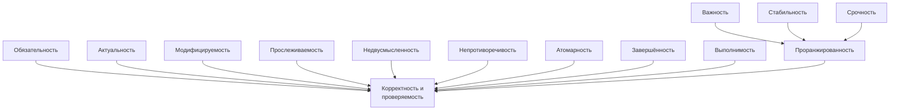

*Рисунок 2.2.f — Свойства качественного требования*

**Завершённость** ($\text{completeness}^{86}$). Требование является полным и законченным с точки зрения представления в нём всей необходимой информации, ничто не пропущено по соображениям «это и так всем понятно».

Типичные проблемы с завершённостью:
* Отсутствуют нефункциональные составляющие требования или ссылки на соответствующие нефункциональные требования (например: *«пароли должны храниться в зашифрованном виде»* — каков алгоритм шифрования?).
* Указана лишь часть некоторого перечисления (например: *«экспорт осуществляется в форматы PDF, PNG и т.д.»* — что мы должны понимать под «и т.д.»?).
* Приведённые ссылки неоднозначны (например: *«см. выше»* вместо *«см. раздел 123.45.b»*).

| Способы обнаружения проблем | Способы устранения проблем |
| :--- | :--- |
| Применимы почти все техники тестирования требований$^{\{50\}}$, но лучше всего помогает задавание вопросов и использование графического представления разрабатываемой системы. Также очень помогает глубокое знание предметной области, позволяющее замечать пропущенные фрагменты информации. | Как только было выяснено, что чего-то не хватает, нужно получить недостающую информацию и дописать её в требования. Возможно, потребуется небольшая переработка требований. |

---

86 Each requirement must contain all the information necessary for the reader to understand it. In the case of functional requirements, this means providing the information the developer needs to be able to implement it correctly. No requirement or necessary information should be absent. [«Software Requirements ($3^{\text{rd}}$ edition)», Karl Wiegers and Joy Beatty]

**Атомарность, единичность** (atomicity87). Требование является атомарным, если его нельзя разбить на отдельные требования без потери завершённости и оно описывает одну и только одну ситуацию.

Типичные проблемы с атомарностью:
* В одном требовании, фактически, содержится несколько независимых (например: «кнопка “Restart” не должна отображаться при остановленном сервисе, окно “Log” должно вмещать не менее 20-ти записей о последних действиях пользователя» — здесь зачем-то в одном предложении описаны совершенно разные элементы интерфейса в совершенно разных контекстах).
* Требование допускает разночтение в силу грамматических особенностей языка (например: «если пользователь подтверждает заказ и редактирует заказ или откладывает заказ, должен выдаваться запрос на оплату» — здесь описаны три разных случая, и это требование стоит разбить на три отдельных во избежание путаницы). Такое нарушение атомарности часто влечёт за собой возникновение противоречивости.
* В одном требовании объединено описание нескольких независимых ситуаций (например: «когда пользователь входит в систему, ему должно отображаться приветствие; когда пользователь вошёл в систему, должно отображаться имя пользователя; когда пользователь выходит из системы, должно отображаться прощание» — все эти три ситуации заслуживают того, чтобы быть описанными отдельными и куда более детальными требованиями).

| Способы обнаружения проблем | Способы устранения проблем |
| :--- | :--- |
| Обдумывание, обсуждение с коллегами и здравый смысл: если мы считаем, что некий раздел требований перегружен и требует декомпозиции, скорее всего, так и есть. | Переработка и структурирование требований: разбиение их на разделы, подразделы, пункты, подпункты и т.д. |

**Непротиворечивость, последовательность** (consistency88). Требование не должно содержать внутренних противоречий и противоречий другим требованиям и документам.

Типичные проблемы с непротиворечивостью:
* Противоречия внутри одного требования (например: «после успешного входа в систему пользователя, не имеющего права входить в систему...» — тогда как он успешно вошёл в систему, если не имел такого права?)
* Противоречия между двумя и более требованиями, между таблицей и текстом, рисунком и текстом, требованием и прототипом и т.д. (например: «712.а Кнопка “Close” всегда должна быть красной» и «3645.2.х Кнопка “Close” всегда должна быть синей» — так всё же красной или синей?)
* Использование неверной терминологии или использование разных терминов для обозначения одного и того же объекта или явления (например: «в случае, если разрешение окна составляет менее 800х600...» — разрешение есть у экрана, у окна есть размер).

---
87 Each requirement you write represents a single market need that you either satisfy or fail to satisfy. A well written requirement is independently deliverable and represents an incremental increase in the value of your software. [«Writing Good Requirements — The Big Ten Rules», Tyner Blain: http://tynerblain.com/blog/2006/05/25/writing-good-requirements-the-big-ten-rules/]

88 Consistent requirements don't conflict with other requirements of the same type or with higher-level business, user, or system requirements. [«Software Requirements (3rd edition)», Karl Wiegers and Joy Beatty]

## 2.2. ТЕСТИРОВАНИЕ ДОКУМЕНТАЦИИ И ТРЕБОВАНИЙ

| Способы обнаружения проблем | Способы устранения проблем |
| :--- | :--- |
| Лучше всего обнаружить противоречивость помогает хорошая память 😊, но даже при её наличии незаменимым инструментом является графическое представление разрабатываемой системы, позволяющее представить всю ключевую информацию в виде единой согласованной схемы (на которой противоречия очень заметны). | После обнаружения противоречия нужно прояснить ситуацию с заказчиком и внести необходимые правки в требования. |

**Недвусмысленность** (unambiguousness$^{89}$, clearness). Требование должно быть описано без использования жаргона, неочевидных аббревиатур и расплывчатых формулировок, должно допускать только однозначное объективное понимание и быть атомарным в плане невозможности различной трактовки сочетания отдельных фраз.

Типичные проблемы с недвусмысленностью:

* Использование терминов или фраз, допускающих субъективное толкование (например: «приложение должно поддерживать передачу больших объёмов данных» — насколько «больших»?) Вот лишь небольшой перечень слов и выражений, которые можно считать верными признаками двусмысленности: адекватно (adequate), быть способным (be able to), легко (easy), обеспечивать (provide for), как минимум (as a minimum), быть способным (be capable of), эффективно (effectively), своевременно (timely), применимо (as applicable), если возможно (if possible), будет определено позже (to be determined, TBD), по мере необходимости (as appropriate), если это целесообразно (if practical), но не ограничиваясь (but not limited to), быть способной (capability of), иметь возможность (capability to), нормально (normal), минимизировать (minimize), максимизировать (maximize), оптимизировать (optimize), быстро (rapid), удобно (user-friendly), просто (simple), часто (often), обычно (usual), большой (large), гибкий (flexible), устойчивый (robust), по последнему слову техники (state-of-the-art), улучшенный (improved), результативно (efficient). Вот утрированный пример требования, звучащего очень красиво, но совершенно нереализуемого и непонятного: *«В случае необходимости оптимизации передачи больших файлов система должна эффективно использовать минимум оперативной памяти, если это возможно»*.
* Использование неочевидных или двусмысленных аббревиатур без расшифровки (например: «доступ к ФС осуществляется посредством системы прозрачного шифрования» и «ФС предоставляет возможность фиксировать сообщения в их текущем состоянии с хранением истории всех изменений» — ФС здесь обозначает файловую систему? Точно? А не какой-нибудь «Фиксатор Сообщений»?)
* Формулировка требований из соображений, что нечто должно быть всем очевидно (например: «Система конвертирует входной файл из формата PDF в выходной файл формата PNG» — и при этом автор считает совершенно очевидным, что имена файлов система получает из командной строки, а многостраничный PDF конвертируется в несколько PNG-файлов, к именам которых добавляется «page-1», «page-2» и т.д.). Эта проблема перекликается с нарушением корректности.

---

$^{89}$ Natural language is prone to two types of ambiguity. One type I can spot myself, when I can think of more than one way to interpret a given requirement. The other type of ambiguity is harder to catch. That's when different people read the requirement and come up with different interpretations of it. [«Software Requirements (3$^\text{rd}$ edition)», Karl Wiegers and Joy Beatty]


<!-- ВІДНОВЛЕНО ЛОКАЛЬНО (Стор. 47) -->
**46** 

# Ðàçäåë 2: **ÎÑÍÎÂÍÛÅ ÇÍÀÍÈß È ÓÌÅÍÈß** 

|**Способы обнаружения проблем**|**Способы устранения проблем**|
|---|---|
|Увидеть в требованиях двусмысленность<br>хорошо помогают перечисленные выше<br>слова-индикаторы. Столь же эффектив-<br>ным является продумывание проверок:<br>очень тяжело придумать объективную|Самый страшный враг двусмысленности – числа<br>и формулы: если что-то можно выразить в фор-<br>мульном или числовом виде (вместо словесного<br>описания), обязательно стоит это сделать. Если<br>это невозможно, стоит хотя бы использовать мак-|
|проверку для требования, допускающего|симально точные технические термины, отсылки|
|разночтение.|к стандартам и т.п.|


**Выполнимость** (feasibility<sup>90</sup> ). Требование должно быть технологически выполнимым и реализуемым в рамках бюджета и сроков разработки проекта. 

Типичные проблемы с выполнимостью: 

- Так называемое «озолочение» (gold plating) — требования, которые крайне долго и/или дорого реализуются и при этом практически бесполезны для конечных пользователей (например: « _настройка параметров для подключения к базе данных должна поддерживать распознавание символов из жестов, полученных с устройств трёхмерного ввода_ »). 

- Технически нереализуемые на современном уровне развития технологий требования (например: « _анализ договоров должен выполняться с применением искусственного интеллекта, который будет выносить однозначное корректное заключение о степени выгоды от заключения договора_ »). 

- В принципе нереализуемые требования (например: « _система поиска должна заранее предусматривать все возможные варианты поисковых запросов и кэшировать их результаты_ »). 

|**Способы обнаружения проблем**|**Способы устранения проблем**|
|---|---|
|Увы, здесь есть только один путь: максималь-<br>но нарабатывать опыт и исходить из него. Не-<br>возможно понять, что некоторое требование<br>«стоит» слишком много или вовсе невыполни-|При обнаружении невыполнимости требова-<br>ния не остаётся ничего другого, как подробно<br>обсудить ситуацию с заказчиком и или изме-<br>нить требование (возможно – отказаться от|
|мо, если нет понимания процесса разработки|него), или пересмотреть условия выполнения|
|ПО, понимания предметной области и иных<br>сопутствующих знаний.|проекта (сделав выполнение данного требова-<br>ния возможным).|


**Обязательность, нужность** (obligatoriness<sup>91</sup> ) и **актуальность** (up-to-date). Если требование не является обязательным к реализации, оно должно быть просто исключено из набора требований. Если требование нужное, но «не очень важное», для указания этого факта используется указание приоритета (см. «проранжированность по…»). Также исключены (или переработаны) должны быть требования, утратившие актуальность. 

Типичные проблемы с обязательностью и актуальностью: 

- Требование было добавлено «на всякий случай», хотя реальной потребности в нём не было и нет. 

- Требованию выставлены неверные значения приоритета по критериям важности и/или срочности. 

- Требование устарело, но не было переработано или удалено. 

> 90 It must be possible to implement each requirement within the known capabilities and limitations of the system and its operating environment, as well as within project constraints of time, budget, and staff . [«Soft ware Requirements (3<sup>rd</sup> edition)», Karl Wiegers and Joy Beatty] 

> 91 Each requirement should describe a capability that provides stakeholders with the anticipated business value, diff erentiates the product in the marketplace, or is required for conformance to an external standard, policy, or regulation. Every requirement should originate from a source that has the authority to provide requirements. [«Soft ware Requirements (3<sup>rd</sup> edition)», Karl Wiegers and Joy Beatty]
<!-- КІНЕЦЬ ВІДНОВЛЕННЯ -->


2.2. ТЕСТИРОВАНИЕ ДОКУМЕНТАЦИИ И ТРЕБОВАНИЙ

| Способы обнаружения проблем | Способы устранения проблем |
| :--- | :--- |
| Постоянный (периодический) пересмотр требований (желательно – с участием заказчика) позволяет заметить фрагменты, потерявшие актуальность или ставшие низкоприоритетными. | Переработка требований (с устранением фрагментов, потерявших актуальность) и переработкой фрагментов, у которых изменился приоритет (часто изменение приоритета ведёт и к изменению формулировки требования). |

**Прослеживаемость** ($\text{traceability}^{92, 93}$). Прослеживаемость бывает вертикальной ($\text{vertical traceability}^{94}$) и горизонтальной ($\text{horizontal traceability}^{95}$). Вертикальная позволяет соотносить между собой требования на различных уровнях требований, горизонтальная позволяет соотносить требование с тест-планом, тест-кейсами, архитектурными решениями и т.д.

Для обеспечения прослеживаемости часто используются специальные инструменты по управлению требованиями ($\text{requirements management tool}^{96}$) и/или матрицы прослеживаемости ($\text{traceability matrix}^{97}$).

Типичные проблемы с прослеживаемостью:
* Требования не пронумерованы, не структурированы, не имеют оглавления, не имеют работающих перекрёстных ссылок.
* При разработке требований не были использованы инструменты и техники управления требованиями.
* Набор требований неполный, носит обрывочный характер с явными «пробелами».

| Способы обнаружения проблем | Способы устранения проблем |
| :--- | :--- |
| Нарушения прослеживаемости становятся заметны в процессе работы с требованиями, как только у нас возникают **остающиеся без ответа** вопросы вида «откуда взялось это требование?», «где описаны сопутствующие (связанные) требования?», «на что это влияет?». | Переработка требований. Возможно, придётся даже менять структуру набора требований, но всё точно начнётся с расстановки множества перекрёстных ссылок, позволяющих осуществлять быструю и прозрачную навигацию по набору требований. |

---

$^{92}$ **Traceability.** The ability to identify related items in documentation and software, such as requirements with associated tests. [ISTQB Glossary]

$^{93}$ A traceable requirement can be linked both backward to its origin and forward to derived requirements, design elements, code that implements it, and tests that verify its implementation. [«Software Requirements (3rd edition)», Karl Wiegers and Joy Beatty]

$^{94}$ **Vertical traceability.** The tracing of requirements through the layers of development documentation to components. [ISTQB Glossary]

$^{95}$ **Horizontal traceability.** The tracing of requirements for a test level through the layers of test documentation (e.g. test plan, test design specification, test case specification and test procedure specification or test script). [ISTQB Glossary]

$^{96}$ **Requirements management tool.** A tool that supports the recording of requirements, requirements attributes (e.g. priority, knowledge responsible) and annotation, and facilitates traceability through layers of requirements and requirements change management. Some requirements management tools also provide facilities for static analysis, such as consistency checking and violations to predefined requirements rules. [ISTQB Glossary]

$^{97}$ **Traceability matrix.** A two-dimensional table, which correlates two entities (e.g., requirements and test cases). The table allows tracing back and forth the links of one entity to the other, thus enabling the determination of coverage achieved and the assessment of impact of proposed changes. [ISTQB Glossary]

**Модифицируемость** (modifiability$^{98}$). Это свойство характеризует простоту внесения изменений в отдельные требования и в набор требований. Можно говорить о наличии модифицируемости в том случае, если при доработке требований искомую информацию легко найти, а её изменение не приводит к нарушению иных описанных в этом перечне свойств.

Типичные проблемы с модифицируемостью:
* Требования неатомарны (см. «атомарность») и непрослеживаемы (см. «прослеживаемость»), а потому их изменение с высокой вероятностью порождает противоречивость (см. «непротиворечивость»).
* Требования изначально противоречивы (см. «непротиворечивость»). В такой ситуации внесение изменений (не связанных с устранением противоречивости) только усугубляет ситуацию, увеличивая противоречивость и снижая прослеживаемость.
* Требования представлены в неудобной для обработки форме (например, не использованы инструменты управления требованиями, и в итоге команде приходится работать с десятками огромных текстовых документов).

| Способы обнаружения проблем | Способы устранения проблем |
| :--- | :--- |
| Если при внесении изменений в набор требований, мы сталкиваемся с проблемами, характерными для ситуации потери прослеживаемости, значит – мы обнаружили проблему с модифицируемостью. Также модифицируемость ухудшается при наличии практически любой из рассмотренных в данном разделе проблем с требованиями. | Переработка требований с первостепенной целью повысить их прослеживаемость. Параллельно можно устранять иные обнаруженные проблемы. |

**Проранжированность по важности, стабильности, срочности** (ranked$^{99}$ for importance, stability, priority). Важность характеризует зависимость успеха проекта от успеха реализации требования. Стабильность характеризует вероятность того, что в обозримом будущем в требование не будет внесено никаких изменений. Срочность определяет распределение во времени усилий проектной команды по реализации того или иного требования.

Типичные проблемы с проранжированностью в её отсутствии или неверной реализации и приводят к следующим последствиям.
* Проблемы с проранжированностью по важности повышают риск неверного распределения усилий проектной команды, направления усилий на второстепенные задачи и конечного провала проекта из-за неспособности продукта выполнять ключевые задачи с соблюдением ключевых условий.
* Проблемы с проранжированностью по стабильности повышают риск выполнения бессмысленной работы по совершенствованию, реализации и тестированию требований, которые в самое ближайшее время могут претерпеть кардинальные изменения (вплоть до полной утраты актуальности).
* Проблемы с проранжированностью по срочности повышают риск нарушения желаемой заказчиком последовательности реализации функциональности и ввода этой функциональности в эксплуатацию.

---
$^{98}$ To facilitate modifiability, avoid stating requirements redundantly. Repeating a requirement in multiple places where it logically belongs makes the document easier to read but harder to maintain. The multiple instances of the requirement all have to be modified at the same time to avoid generating inconsistencies. Cross-reference related items in the SRS to help keep them synchronized when making changes. [«Software Requirements (3$^{\text{rd}}$ edition)», Karl Wiegers and Joy Beatty]

$^{99}$ Prioritize business requirements according to which are most important to achieving the desired value. Assign an implementation priority to each functional requirement, user requirement, use case flow, or feature to indicate how essential it is to a particular product release. [«Software Requirements (3$^{\text{rd}}$ edition)», Karl Wiegers and Joy Beatty]

| Способы обнаружения проблем | Способы устранения проблем |
| :--- | :--- |
| Как и в случае с актуальностью и обязательностью требований, здесь лучшим способом обнаружения недоработок является постоянный (периодический) пересмотр требований (желательно – с участием заказчика), в процессе которого можно обнаружить неверные значения показателей срочности, важности и стабильности обсуждаемых требований. | Прямо в процессе обсуждения требований с заказчиком (во время пересмотра требований) стоит вносить правки в значения показателей срочности, важности и стабильности обсуждаемых требований. |

**Корректность** ($\text{correctness}^{100}$) и **проверяемость** ($\text{verifiability}^{101}$). Фактически эти свойства вытекают из соблюдения всех вышеперечисленных (или можно сказать, что они не выполняются, если нарушено хотя бы одно из вышеперечисленных). В дополнение можно отметить, что проверяемость подразумевает возможность создания объективного тест-кейса (тест-кейсов), однозначно показывающего, что требование реализовано верно и поведение приложения в точности соответствует требованию.

К типичным проблемам с корректностью также можно отнести:
* опечатки (особенно опасны опечатки в аббревиатурах, превращающие одну осмысленную аббревиатуру в другую также осмысленную, но не имеющую отношения к некоему контексту; такие опечатки крайне сложно заметить);
* наличие неаргументированных требований к дизайну и архитектуре;
* плохое оформление текста и сопутствующей графической информации, грамматические, пунктуационные и иные ошибки в тексте;
* неверный уровень детализации (например, слишком глубокая детализация требования на уровне бизнес-требований или недостаточная детализация на уровне требований к продукту);
* требования к пользователю, а не к приложению (например: «пользователь должен быть в состоянии отправить сообщение» — увы, мы не можем влиять на состояние пользователя).

| Способы обнаружения проблем | Способы устранения проблем |
| :--- | :--- |
| Поскольку здесь мы имеем дело с «интегральной» проблемой, обнаруживается она с использованием ранее описанных способов. Отдельных уникальных методик здесь нет. | Внесение в требования необходимых изменений — от элементарной правки обнаруженной опечатки, до глобальной переработки всего набора требований. |

Хорошее краткое руководство по написанию качественных требований представлено в статье «Writing Good Requirements — The Big Ten Rules»$^{102}$.

---

$^{100}$ Each requirement must accurately describe a capability that will meet some stakeholder's need and must clearly describe the functionality to be built. [«Software Requirements ($3^{\text{rd}}$ edition)», Karl Wiegers and Joy Beatty]  
$^{101}$ If a requirement isn't verifiable, deciding whether it was correctly implemented becomes a matter of opinion, not objective analysis. Requirements that are incomplete, inconsistent, infeasible, or ambiguous are also unverifiable. [«Software Requirements ($3^{\text{rd}}$ edition)», Karl Wiegers and Joy Beatty]  
$^{102}$ «Writing Good Requirements — The Big Ten Rules», Tyner Blain [http://tynerblain.com/blog/2006/05/25/writing-good-requirements-the-big-ten-rules/]

## 2.2.6. ТЕХНИКИ ТЕСТИРОВАНИЯ ТРЕБОВАНИЙ

Тестирование документации и требований относится к разряду нефункционального тестирования (non-functional testing$^103$). Основные техники такого тестирования в контексте требований таковы.

**Взаимный просмотр** (peer review$^104$). Взаимный просмотр («рецензирование») является одной из наиболее активно используемых техник тестирования требований и может быть представлен в одной из трёх следующих форм (по мере нарастания его сложности и цены):

* **Беглый просмотр** (walkthrough$^105$) может выражаться как в показе автором своей работы коллегам с целью создания общего понимания и получения обратной связи, так и в простом обмене результатами работы между двумя и более авторами с тем, чтобы коллега высказал свои вопросы и замечания. Это самый быстрый, дешёвый и часто используемый вид просмотра.  
  Для запоминания: аналог беглого просмотра — это ситуация, когда вы в школе с одноклассниками проверяли перед сдачей сочинения друг друга, чтобы найти описки и ошибки.
* **Технический просмотр** (technical review$^106$) выполняется группой специалистов. В идеальной ситуации каждый специалист должен представлять свою область знаний. Тестируемый продукт не может считаться достаточно качественным, пока хотя бы у одного просматривающего остаются замечания.  
  Для запоминания: аналог технического просмотра — это ситуация, когда некий договор визирует юридический отдел, бухгалтерия и т.д.
* **Формальная инспекция** (inspection$^107$) представляет собой структурированный, систематизированный и документируемый подход к анализу документации. Для его выполнения привлекается большое количество специалистов, само выполнение занимает достаточно много времени, и потому этот вариант просмотра используется достаточно редко (как правило, при получении на сопровождение и доработку проекта, созданием которого ранее занималась другая компания).  
  Для запоминания: аналог формальной инспекции — это ситуация генеральной уборки квартиры (включая содержимое всех шкафов, холодильника, кладовки и т.д.).

**Вопросы.** Следующей очевидной техникой тестирования и повышения качества требований является (повторное) использование техник выявления требований, а также (как отдельный вид деятельности) — задавание вопросов. Если хоть что-то в требованиях вызывает у вас непонимание или подозрение — задавайте вопросы. Можно спросить представителей заказчика, можно обратиться к справочной информации. По многим вопросам можно обратиться к более опытным коллегам при условии, что у них имеется соответствующая информация, ранее полученная

---

$^103$ **Non-functional testing**. Testing the attributes of a component or system that do not relate to functionality, e.g. reliability, efficiency, usability, maintainability and portability. [ISTQB Glossary]  
$^104$ **Peer review**. A review of a software work product by colleagues of the producer of the product for the purpose of identifying defects and improvements. Examples are inspection, technical review and walkthrough. [ISTQB Glossary]  
$^105$ **Walkthrough**. A step-by-step presentation by the author of a document in order to gather information and to establish a common understanding of its content. [ISTQB Glossary]  
$^106$ **Technical review**. A peer group discussion activity that focuses on achieving consensus on the technical approach to be taken. [ISTQB Glossary]  
$^107$ **Inspection**. A type of peer review that relies on visual examination of documents to detect defects, e.g. violations of development standards and non-conformance to higher level documentation. The most formal review technique and therefore always based on a documented procedure. [ISTQB Glossary]

от заказчика. Главное, чтобы ваш вопрос был сформулирован таким образом, чтобы полученный ответ позволил улучшить требования.

Поскольку здесь начинающие тестировщики допускают уйму ошибок, рассмотрим подробнее. В таблице 2.2.а приведено несколько плохо сформулированных требований, а также примеров плохих и хороших вопросов. Плохие вопросы провоцируют на бездумные ответы, не содержащие полезной информации.

_Таблица 2.2.а — Пример плохих и хороших вопросов к требованиям_

| Плохое требование | Плохие вопросы | Хорошие вопросы |
| :--- | :--- | :--- |
| «Приложение должно быстро запускаться». | «Насколько быстро?» (На это вы рискуете получить ответы в стиле «очень быстро», «максимально быстро», «нууу... просто быстро»).<br>«А если не получится быстро?» (Этим вы рискуете просто удивить или даже разозлить заказчика.)<br>«Всегда?» («Да, всегда». Хм, а вы ожидали другого ответа?) | «Каково максимально допустимое время запуска приложения, на каком оборудовании и при какой загруженности этого оборудования операционной системой и другими приложениями? На достижение каких целей влияет скорость запуска приложения? Допускается ли фоновая загрузка отдельных компонентов приложения? Что является критерием того, что приложение закончило запуск?» |
| «Опционально должен поддерживаться экспорт документов в формат PDF». | «Любых документов?» (Ответы «да, любых» или «нет, только открытых» вам всё равно не помогут.)<br>«В PDF какой версии должен производиться экспорт?» (Сам по себе вопрос хорош, но он не даёт понять, что имелось в виду под «опционально».)<br>«Зачем?» («Нужно!» Именно так хочется ответить, если вопрос не раскрыт полностью.) | «Насколько возможность экспорта в PDF важна? Как часто, кем и с какой целью она будет использоваться? Является ли PDF единственным допустимым форматом для этих целей или есть альтернативы? Допускается ли использование внешних утилит (например, виртуальных PDF-принтеров) для экспорта документов в PDF?» |
| «Если дата события не указана, она выбирается автоматически». | «А если указана?» (То она указана. Логично, не так ли?)<br>«А если дату невозможно выбрать автоматически?» (Сам вопрос интересен, но без пояснения причин невозможности звучит как издевка.)<br>«А если у события нет даты?» (Тут автор вопроса, скорее всего, хотел уточнить, обязательно ли это поле для заполнения. Но из самого требования видно, что обязательно: если оно не заполнено человеком, его должен заполнить компьютер.) | «Возможно, имелось в виду, что дата **генерируется** автоматически, а не **выбирается**? Если да, то какому алгоритму она генерируется? Если нет, то из какого набора выбирается дата и как генерируется этот набор? P.S. Возможно, стоит использовать текущую дату?» |

**Тест-кейсы и чек-листы.** Мы помним, что хорошее требование является проверяемым, а значит, должны существовать объективные способы определения того, верно ли реализовано требование. Продумывание чек-листов или даже полноценных тест-кейсов в процессе анализа требований позволяет нам определить, насколько требование проверяемо. Если вы можете быстро придумать несколько пунктов чек-листа, это ещё не признак того, что с требованием всё хорошо (например, оно может противоречить каким-то другим требованиям). Но если никаких идей по тестированию требования в голову не приходит — это тревожный знак.

Рекомендуется для начала убедиться, что вы понимаете требование (в том числе прочесть соседние требования, задать вопросы коллегам и т.д.). Также можно пока отложить работу с данным конкретным требованием и вернуться к нему позднее — возможно, анализ других требований позволит вам лучше понять и это конкретное. Но если ничто не помогает — скорее всего, с требованием что-то не так.

Справедливости ради надо отметить, что на начальном этапе проработки требований такие случаи встречаются очень часто — требования сформированы очень поверхностно, расплывчато и явно нуждаются в доработке, т.е. здесь нет необходимости проводить сложный анализ, чтобы констатировать непроверяемость требования.

На стадии же, когда требования уже хорошо сформулированы и протестированы, вы можете продолжать использовать эту технику, совмещая разработку тест-кейсов и дополнительное тестирование требований.

**Исследование поведения системы.** Эта техника логически вытекает из предыдущей (продумывания тест-кейсов и чек-листов), но отличается тем, что здесь тестированию подвергается, как правило, не одно требование, а целый набор. Тестировщик мысленно моделирует процесс работы пользователя с системой, созданной по тестируемым требованиям, и ищет неоднозначные или вовсе неописанные варианты поведения системы. Этот подход сложен, требует достаточной квалификации тестировщика, но способен выявить нетривиальные недоработки, которые почти невозможно заметить, тестируя требования по отдельности.

**Рисунки** (графическое представление). Чтобы увидеть общую картину требований целиком, очень удобно использовать рисунки, схемы, диаграммы, интеллект-карты$^{108}$ и т.д. Графическое представление удобно одновременно своей наглядностью и краткостью (например, UML-схема базы данных, занимающая один экран, может быть описана несколькими десятками страниц текста). На рисунке очень легко заметить, что какие-то элементы «не стыкуются», что где-то чего-то не хватает и т.д. Если вы для графического представления требований будете использовать общепринятую нотацию (например, уже упомянутый UML), вы получите дополнительные преимущества: вашу схему смогут без труда понимать и дорабатывать коллеги, а в итоге может получиться хорошее дополнение к текстовой форме представления требований.

**Прототипирование.** Можно сказать, что прототипирование часто является следствием создания графического представления и анализа поведения системы. С использованием специальных инструментов можно очень быстро сделать наброски пользовательских интерфейсов, оценить применимость тех или иных решений и даже создать не просто «прототип ради прототипа», а заготовку для дальнейшей разработки, если окажется, что реализованное в прототипе (возможно, с небольшими доработками) устраивает заказчика.

---

$^{108}$ «Mind map» [http://en.wikipedia.org/wiki/Mind_map]

2.2.7. ПРИМЕР АНАЛИЗА И ТЕСТИРОВАНИЯ ТРЕБОВАНИЙ

Поскольку наша задача состоит в том, чтобы сформировать понимание логики анализа и тестирования требований, мы будем рассматривать предельно краткий и простой их набор.

Отличный подробный пример требований можно найти в приложениях к книге Карла Вигерса «Разработка требований к программному обеспечению» («Software Requirements (3rd Edition) (Developer Best Practices)», Karl Wiegers, Joy Beatty).

Допустим, что у некоего клиента есть проблема: поступающие в огромном количестве его сотрудникам текстовые файлы приходят в разных кодировках, и сотрудники тратят много времени на перекодирование («ручной подбор кодировки»). Соответственно, он хотел бы иметь инструмент, позволяющий автоматически приводить кодировки всех текстовых файлов к некоей одной. Итак, на свет появляется проект с кодовым названием «Конвертер файлов».

**Уровень бизнес-требований.** Бизнес-требования (см. главу «Уровни и типы требований»$^{39}$) изначально могут выглядеть так: «Необходим инструмент для автоматического приведения кодировок текстовых документов к одной».

Здесь мы можем задать множество вопросов. Для удобства приведём как сами вопросы, так и *предполагаемые ответы клиента*.

**Задание 2.2.b:** прежде чем читать приведённый ниже список вопросов, сформулируйте собственный.

* В каких форматах представлены текстовые документы (обычный текст, HTML, MD, что-то иное)? *(Понятия не имею, я в этом не разбираюсь.)*
* В каких кодировках приходят исходные документы? *(В разных.)*
* В какую кодировку нужно преобразовать документы? *(В самую удобную и универсальную.)*
* На каких языках написан текст в документах? *(Русский и английский.)*
* Откуда и как поступают текстовые документы (по почте, с сайтов, по сети, как-то иначе)? *(Это неважно. Поступают отовсюду, но мы их складываем в одну папку на диске, нам так удобно.)*
* Каков максимальный объём документа? *(Пара десятков страниц.)*
* Как часто появляются новые документы (например, сколько максимум документов может поступить за час)? *(200–300 в час.)*
* С помощью чего сотрудники просматривают документы? *(Notepad++.)*

Даже таких вопросов и ответов достаточно, чтобы переформулировать бизнес-требования следующим образом (обратите внимание, что многие вопросы были заданы на будущее и не привели к появлению в бизнес-требованиях лишней технической детализации).

**Суть проекта:** разработка инструмента, устраняющего проблему множественности кодировок в текстовых документах, расположенных в локальном дисковом хранилище.

**Цели проекта:**
* Исключение необходимости ручного подбора кодировок текстовых документов.
* Сокращение времени работы с текстовым документом на величину, необходимую для ручного подбора кодировки.

**Метрики достижения целей:**

* Полная автоматизация определения и преобразования кодировки текстового документа к заданной.
* Сокращение времени обработки текстового документа в среднем на 1–2 минуты на документ за счёт устранения необходимости ручного подбора кодировки.

**Риски:**

* Высокая техническая сложность безошибочного определения исходной кодировки текстового документа.

Почему мы решили, что среднее время на подбор кодировки составляет 1–2 минуты? Мы провели наблюдение. Также мы помним ответы заказчика на вопросы об исходных форматах документов, исходных и конечной кодировках (заказчик честно сказал, что не знает ответа), а потому мы попросили его предоставить нам доступ к хранилищу документов и выяснили:

* Исходные форматы: plain text, HTML, MD.
* Исходные кодировки: CP1251, UTF8, CP866, KOI8R.
* Целевая кодировка: UTF8.

На данном этапе мы вполне можем решить, что стоит заняться детализацией требований на более низких уровнях, т.к. появившиеся там вопросы позволят нам вернуться к бизнес-требованиям и улучшить их, если в этом возникнет необходимость.

**Уровень пользовательских требований.** Пришло время заняться уровнем пользовательских требований (см. главу «Уровни и типы требований» {39}). Проект у нас несколько специфичный — результатами работы программного средства будет пользоваться большое количество людей, но само программное средство при этом они использовать не будут (оно будет просто выполнять свою работу «само по себе» — запущенное на сервере с хранилищем документов). Потому под пользователем здесь мы будем понимать человека, настраивающего работу приложения на сервере.

Для начала мы создадим небольшую диаграмму вариантов использования, представленную на рисунке 2.2.g (да, иногда её создают **после** текстового описания требований, но иногда и **до** — нам сейчас удобнее сделать это сначала). В реальных проектах подобные схемы могут быть на несколько порядков более сложными и требующими подробной детализации каждого варианта использования. У нас же проект миниатюрный, потому схема получилась элементарной, и мы сразу переходим к описанию требований.

Внимание! Это — ПЛОХИЕ требования. И мы далее будем их улучшать.

**Системные характеристики**

* СХ-1: Приложение является консольным.
* СХ-2: Для работы приложение использует интерпретатор PHP.
* СХ-3: Приложение является кроссплатформенным.

**Пользовательские требования**

* Также см. диаграмму вариантов использования.
* ПТ-1: Запуск и остановка приложения.
  * ПТ-1.1: Запуск приложения производится из консоли командой «PHP converter.php параметры».
  * ПТ-1.2: Остановка приложения производится выполнением команды Ctrl+C.

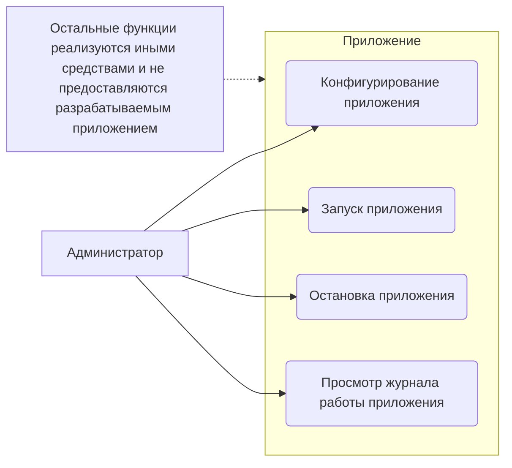

*Рисунок 2.2.г — Диаграмма вариантов использования*

* ПТ-2: Конфигурирование приложения.
  * ПТ-2.1: Конфигурирование приложения сводится к указанию путей в файловой системе.
  * ПТ-2.2: Целевой кодировкой является UTF8.
* ПТ-3: Просмотр журнала работы приложения.
  * ПТ-3.1: В процессе работы приложение должно выводить журнал своей работы в консоль и лог-файл.
  * ПТ-3.2: При первом запуске приложения лог-файл создаётся, а при последующих — дописывается.

**Бизнес-правила**
* БП-1: Источник и приёмник файлов
  * БП-1.1: Каталоги, являющиеся источником исходных и приёмником конечных файлов не должны совпадать.
  * БП-1.2: Каталог, являющийся приёмником конечных файлов, не может быть подкаталогом источника.

* Системные характеристики
  * СХ-1: Приложение является консольным.
  * СХ-2: Для работы приложение использует *интерпретатор PHP* ???
  * СХ-3: Приложение является *кроссплатформенным*.

* Пользовательские требования
  * Также см. диаграмму вариантов использования.
  * ПТ-1: Запуск и остановка приложения.
    * ПТ-1.1: Запуск приложения производится из консоли командой *"PHP php converter.php параметры"*.
    * ПТ-1.2: Остановка приложения производится выполнением команды Ctrl+C *в окне консоли, из которого было запущено приложение*.
  * ПТ-2: Конфигурирование приложения.
    * ПТ-2.1: Конфигурирование приложения сводится к указанию *путей в файловой системе*.
    * ПТ-2.2: *Целевой кодировкой является UTF-8*.
  * ПТ-3: Просмотр журнала работы приложения.
    * ПТ-3.1: *В процессе работы приложение должно выводить журнал своей работы в консоль и лог-файл*.
    * ПТ-3.2: *При первом запуске приложения лог-файл создаётся, а при последующих — дописывается*.

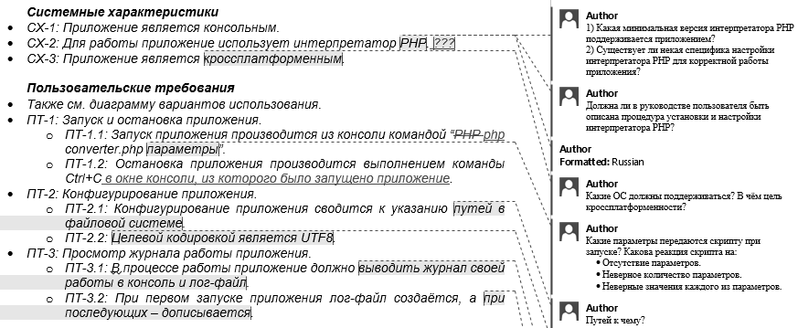

*Рисунок 2.2.h — Использование средств Word для работы с требованиями*

### Атрибуты качества

* АК-1: Производительность
  * АК-1.1: Приложение должно обеспечивать скорость обработки данных 5 МБ/сек.
* АК-2: Устойчивость к входным данным
  * АК-2.1: Приложение должно обрабатывать входные файлы размером до 50 МБ включительно.
  * АК-2.2: Если входной файл не является текстовым, приложение должно произвести обработку.

Как будет сказано в главе «Типичные ошибки при анализе и тестировании требований»<sup>{62}</sup>, не стоит изменять исходный формат файла и форматирование документа, потому мы используем встроенные средства Word для отслеживания изменений и добавления комментариев. Примерный вид результата показан на рисунке 2.2.h.

К сожалению, мы не можем в данном тексте применить эти средства (результат будет отображаться некорректно, т.к. вы сейчас, скорее всего, читаете этот текст не в виде DOCX-документа), а потому применим второй классический способ — будем вписывать свои вопросы и комментарии прямо внутрь текста требований.

Проблемные места требований отмечены <u>подчёркиванием</u>, наши вопросы отмечены *курсивом*, предполагаемые ответы заказчика (даже, если точнее, технического специалиста заказчика) — **жирным**. В процессе анализа текст требований примет вот такой вид.

**Задание 2.2.с:** проанализируйте предложенный набор требований с точки зрения свойств качественных требований<sup>{43}</sup>, сформулируйте свои вопросы заказчику, которые позволят улучшить этот набор требований.

### Системные характеристики

* СХ-1: Приложение является консольным.
* СХ-2: Для работы приложение использует <u>интерпретатор PHP</u>.
  * *Какая минимальная версия интерпретатора PHP поддерживается приложением?* (**5.5.x**)
  * *Существует ли некая специфика настройки интерпретатора PHP для корректной работы приложения?* (**Наверное, должен работать mbstring.**)

* Настаиваете ли вы на реализации приложения именно на PHP? Если да, то почему. **(Да, только PHP. У нас есть сотрудник, который его знает.)**
* Должна ли в руководстве пользователя быть описана процедура установки и настройки интерпретатора PHP? **(Нет.)**

* CX-3: Приложение является кроссплатформенным.
  * Какие ОС должны поддерживаться? **(Любая, где работает PHP.)**
  * В чём вообще цель кроссплатформенности? **(Мы ещё не знаем, на чём будет работать сервер.)**

**Пользовательские требования**

* Также см. диаграмму вариантов использования.
* ПТ-1: Запуск и остановка приложения.
  * ПТ-1.1: Запуск приложения производится из консоли командой «PHP *(возможно, здесь опечатка: должно быть php (в нижнем регистре))*» **(Да, ОК.)** `converter.php параметры`.
    * *Какие параметры передаются скрипту при запуске?* **(Каталог с исходными файлами, каталог с конечными файлами.)**
    * *Какова реакция скрипта на:*
      * *отсутствие параметров;* **(Пишет хелп.)**
      * *неверное количество параметров;* **(Пишет хелп и поясняет, что не так.)**
      * *неверные значения каждого из параметров.* **(Пишет хелп и поясняет, что не так.)**
  * ПТ-1.2: Остановка приложения производится выполнением команды `Ctrl+C` *(предлагаем дополнить это выражение фразой «в окне консоли, из которого было запущено приложение»)* **(Да, ОК.)**.
* ПТ-2: Конфигурирование приложения.
  * ПТ-2.1: Конфигурирование приложения сводится к указанию путей в файловой системе.
    * *Путей к чему?* **(Каталог с исходными файлами, каталог с конечными файлами.)**
  * ПТ-2.2: Целевой кодировкой является UTF8.
    * *Предполагается ли указание иной целевой кодировки, или UTF8 используется в качестве целевой всегда?* **(Только UTF8, других не надо.)**
* ПТ-3: Просмотр журнала работы приложения.
  * ПТ-3.1: В процессе работы приложение должно выводить журнал своей работы в консоль и лог-файл.
    * *Каков формат журнала?* **(Дата-время, что и с чем делали, что получилось. Гляньте в логе апача, там нормально написано.)**
    * *Различаются ли форматы журнала для консоли и лог-файла?* **(Нет.)**
    * *Как определяется имя лог-файла?* **(Третий параметр при запуске. Если не указан — пусть будет `converter.log` рядом с `php`-скриптом.)**
  * ПТ-3.2: При первом запуске приложения лог-файл создаётся, а при последующих — дописывается.
    * *Как приложение различает свой первый и последующие запуски?* **(Никак.)**
    * *Какова реакция приложения на отсутствие лог-файла в случае, если это не первый запуск?* **(Создаёт. Тут идея в том, чтобы оно не затирало старый лог — и всё.)**

Бизнес-правила

* БП-1: Источник и приёмник файлов
  * БП-1.1: Каталоги, являющиеся источником исходным *(опечатка, исходных)* (Да.) и приёмником конечных файлов, **не должны совпадать**.
    * *Какова реакция приложения в случае совпадения этих каталогов?* (**Пишет хелп и поясняет, что не так.**)
  * БП-1.2: Каталог, являющийся приёмником конечных файлов, не может быть подкаталогом **источника** *(предлагаем заменить слово «источника» на фразу «каталога, являющегося источником исходных файлов»)*. (**Хорошо, пусть будет так.**)

Атрибуты качества

* АК-1: Производительность
  * АК-1.1: Приложение должно обеспечивать скорость обработки данных 5 МБ/сек.
    * *При каких технических характеристиках системы?* (**i7, 4GB RAM**)
* АК-2: Устойчивость к входным данным
  * АК-2.1: Приложение должно обрабатывать входные файлы размером до 50 МБ включительно.
    * *Какова реакция приложения на файлы, размер которых превышает 50 МБ?* (**Не трогает.**)
  * АК-2.2: Если входной файл не является текстовым, приложение должно произвести обработку.
    * *Обработку чего должно произвести приложение?* (**Этого файла. Не важно, что станет с файлом, лишь бы скрипт не умер.**)

Здесь есть несколько важных моментов, на которые стоит обратить внимание:

* Ответы заказчика могут быть менее структурированными и последовательными, чем наши вопросы. Это нормально. Он может позволить себе такое, мы — нет.
* Ответы заказчика могут содержать противоречия (в нашем примере сначала заказчик писал, что параметрами, передаваемыми из командной строки, являются только два имени каталога, а потом сказал, что там же указывается имя лог-файла). Это тоже нормально, т.к. заказчик мог что-то забыть или перепутать. Задача — свести эти противоречивые данные воедино (если это возможно) и задать уточняющие вопросы (если это необходимо).
* В случае если с нами общается технический специалист, в его ответах вполне могут проскакивать технические жаргонизмы (как «хелп» в нашем примере). Не надо переспрашивать его о том, что это такое, если жаргонизм имеет однозначное общепринятое значение, но при доработке текста наша задача — написать то же самое строгим техническим языком. Если жаргонизм всё же непонятен — тогда лучше спросить (так, «хелп» — это всего лишь краткая помощь, выводимая консольными приложениями как подсказка о том, как их использовать).

**Уровень продуктных требований** (см. главу «Уровни и типы требований»\({}^{\{39\}}\)). Применим т.н. «самостоятельное описание» (см. главу «Источники и пути выявления требований»\({}^{\{37\}}\)) и улучшим требования. Поскольку мы уже получили много специфической технической информации, можно параллельно писать полноценную спецификацию требований. Во многих случаях, когда для оформления требований используется простой текст, для удобства формируется единый документ, который интегрирует в себе как пользовательские требования, так и детальные спецификации. Теперь требования принимают следующий вид.

Системные характеристики

* СХ-1: Приложение является консольным.
* СХ-2: Приложение разрабатывается на языке программирования PHP (причина выбора языка PHP отражена в пункте O-1 раздела «Ограничения», особенности и важные настройки интерпретатора PHP отражены в пункте ДС-1 раздела «Детальные спецификации»).
* СХ-3: Приложение является кроссплатформенным с учётом пункта О-4 раздела «Ограничения».

Пользовательские требования

* Также см. диаграмму вариантов использования.
* ПТ-1: Запуск и остановка приложения.
  * ПТ-1.1: Запуск приложения производится из консоли командой «php converter.php SOURCE_DIR DESTINATION_DIR [LOG_FILE_NAME]» (описание параметров приведено в разделе ДС-2.1, реакция на ошибки при указании параметров приведена в разделах ДС-2.2, ДС-2.3, ДС-2.4).
  * ПТ-1.2: Остановка приложения производится выполнением команды Ctrl+C в окне консоли, из которого было запущено приложение.
* ПТ-2: Конфигурирование приложения.
  * ПТ-2.1: Конфигурирование приложения сводится к указанию параметров командной строки (см. ДС-2).
  * ПТ-2.2: Целевой кодировкой преобразования текстов является кодировка UTF8 (также см. О-5).
* ПТ-3: Просмотр журнала работы приложения.
  * ПТ-3.1: В процессе работы приложение должно выводить журнал своей работы в консоль и лог-файл (см. ДС-4), имя которого определяется правилами, указанными в ДС-2.1.
  * ПТ-3.2: Формат журнала работы и лог файла указан в ДС-4.1, а реакция приложения на наличие или отсутствие лог-файла указана в ДС-4.2 и ДС-4.3 соответственно.

Бизнес-правила

* БП-1: Источник и приёмник файлов
  * БП-1.1: Катологи, являющиеся источником исходных и приёмником конечных файлов, не должны совпадать (см. также ДС-2.1 и ДС-3.2).
  * БП-1.2: Каталог, являющийся приёмником конечных файлов, не может находиться внутри каталога, являющегося источником исходных файлов или его подкаталогов (см. также ДС-2.1 и ДС-3.2).

Атрибуты качества

* АК-1: Производительность
  * АК-1.1: Приложение должно обеспечивать скорость обработки данных не менее 5 МБ/сек на аппаратном обеспечении, эквивалентном следующему: процессор i7, 4 ГБ оперативной памяти, средняя скорость чтения/записи на диск 30 МБ/сек. Также см. О-6.
* АК-2: Устойчивость к входным данным
  * АК-2.1: Требования относительно форматов обрабатываемых файлов изложены в ДС-5.1.
  * АК-2.2: Требования относительно размеров обрабатываемых файлов изложены в ДС-5.2.
  * АК-2.3: Поведение приложения в ситуации обработки файлов с нарушениями формата определено в ДС-5.3.

**Ограничения**

* O-1: Приложение разрабатывается на языке программирования PHP, использование которого обусловлено возможностью заказчика осуществлять поддержку приложения силами собственного IT-отдела.
* O-2: Ограничения относительно версии и настроек интерпретатора PHP отражены в пункте ДС-1 раздела «Детальные спецификации».
* O-3: Процедуры установки и настройки интерпретатора PHP выходят за рамки данного проекта и **не описываются** в документации.
* O-4: Кросcплатформенные возможности приложения сводятся к способности работать под ОС семейства Windows и Linux, поддерживающих работу интерпретатора PHP версии, указанной в ДС-1.1.
* O-5: Целевая кодировка UTF8 является жёстко заданной, и её изменение в процессе эксплуатации приложения не предусмотрено.
* O-6: Допускается невыполнение АК-1.1 в случае, если невозможность обеспечить заявленную производительность обусловлена объективными внешними причинами (например, техническими проблемами на сервере заказчика).

Созданные на основе таких пользовательских требований детальные спецификации имеют следующий вид.

**Детальные спецификации**

**ДС-1: Интерпретатор PHP**

ДС-1.1: Минимальная версия — 5.5.
ДС-1.2: Для работы приложения должно быть установлено и включено расширение mbstring.

**ДС-2: Параметры командной строки**

ДС-2.1: При запуске приложение оно получает из командной строки три параметра:
* `SOURCE_DIR` — обязательный параметр, определяет путь к каталогу с файлами, которые необходимо обработать;
* `DESTINATION_DIR` — обязательный параметр, определяет путь к каталогу, в который необходимо поместить обработанные файлы (этот каталог не может находиться внутри каталога `SOURCE_DIR` или в его подкаталогах (см. БП-1.1 и БП-1.2));
* `LOG_FILE_NAME` — необязательный параметр, определяет полное имя лог-файла (по умолчанию лог-файл с именем «converter.log» размещается по тому же пути, по которому находится файл скрипта `converter.php`);

ДС-2.2: При указании недостаточного количества параметров командной строки приложение должно завершить работу, выдав сообщение об использовании (ДС-3.1).
ДС-2.3: При указании излишнего количества параметров командной строки приложение должно игнорировать все параметры командной строки, кроме указанных в пункте ДС-2.1.
ДС-2.4: При указании неверного значения любого из параметров командной строки должно завершить работу, выдав сообщение об использовании (ДС-3.1), а также сообщив имя неверно указанного параметра, его значение и суть ошибки (см. ДС-3.2).

**ДС-3: Сообщения**

ДС-3.1: Сообщение об использовании: «USAGE `converter.php` `SOURCE_DIR` `DESTINATION_DIR` `LOG_FILE_NAME`».
ДС-3.2: Сообщения об ошибках:
* `Directory not exists or inaccessible.`
* `Destination dir may not reside within source dir tree.`
* `Wrong file name or inaccessible path.`

ДС-4: Журнал работы
ДС-4.1: Формат журнала работы одинаков для отображения в консоли и записи в лог-файл: YYYY-MM-DD HH:II:SS имя_операции параметры_операции результат_операции.
ДС-4.2: В случае если лог-файл отсутствует, должен быть создан новый пустой лог-файл.
ДС-4.3: В случае если лог-файл уже существует, должно происходить добавление новых записей в его конец.

ДС-5: Форматы и размеры файлов
ДС-5.1: Приложение должно обрабатывать текстовые файлы на русском и английском языках в следующих исходных кодировках: WIN1251, CP866, KOI8R.
Обрабатываемые файлы могут быть представлены в следующих форматах, определяемых расширениями файлов:
* Plain Text (TXT);
* Hyper Text Markup Language Document (HTML);
* Mark Down Document (MD).

ДС-5.2: Приложение должно обрабатывать файлы размером до 50 МБ (включительно), игнорируя любой файл, размер которого превышает 50 МБ.
ДС-5.3: Если файл с расширением из ДС-5.1 содержит внутри себя данные, не соответствующие формату файла, допускается повреждение таких данных.

**Задание 2.2.d:** заметили ли вы, что в исправленном варианте требований «потерялась» диаграмма вариантов использования (равно как и активная ссылка на неё)? (Просто тест на внимательность, не более.)

Итак, мы получили набор требований, с которым уже вполне можно работать. Он не идеален (и никогда вы не встретите идеальных требований), но он вполне пригоден для того, чтобы разработчики смогли реализовать приложение, а тестировщики — протестировать его.

**Задание 2.2.e:** протестируйте этот набор требований и найдите в нём хотя бы 3–5 ошибок и неточностей, задайте соответствующие вопросы заказчику.

## 2.2.8. ТИПИЧНЫЕ ОШИБКИ ПРИ АНАЛИЗЕ И ТЕСТИРОВАНИИ ТРЕБОВАНИЙ

Для лучшего понимания и запоминания материала рассмотрим типичные ошибки, совершаемые в процессе анализа и тестирования требований.

**Изменение формата файла и документа.** По какой-то непонятной причине очень многие начинающие тестировщики стремятся полностью уничтожить исходный документ, заменив текст таблицами (или наоборот), перенеся данные из Word в Excel и т.д. Это можно сделать только в одном случае: если вы предварительно договорились о подобных изменениях с автором документа. В противном случае вы полностью уничтожаете чью-то работу, делая дальнейшее развитие документа крайне затруднительным.

Самое худшее, что можно сделать с документом, — это сохранить его в итоге в некоем формате, предназначенном скорее для чтения, чем для редактирования (PDF, набор картинок и тому подобное).

Если требования изначально создаются в некоей системе управления требованиями, этот вопрос неактуален, но высокоуровневые требования большинства заказчиков привыкли видеть в обычном DOCX-документе, а Word предоставляет такие прекрасные возможности работы с документом, как отслеживание изменений (см. рисунок 2.2.i) и комментарии (см. рисунок 2.2.j).


*Рисунок 2.2.i — Активация отслеживания изменений в Word*

В итоге получается результат, представленный на рисунке 2.2.j: исходный формат сохраняется (а автор к нему уже привык), все изменения хорошо видны и могут быть приняты или отклонены в пару кликов мыши, а типичные часто повторяющиеся вопросы вы можете помимо указания в комментариях вынести в отдельный список и поместить его в том же документе.

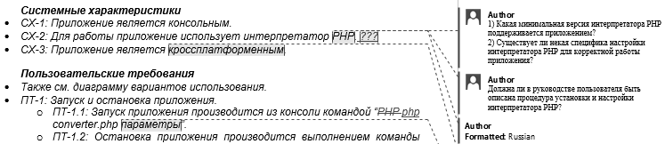

*Рисунок 2.2.j — Правильно выглядящий документ с правками*

И ещё два маленьких, но неприятных момента относительно таблиц:

* Выравнивание ВСЕГО текста в таблице по центру. Да, выравнивание по центру хорошо смотрится в заголовках и ячейках с парой-тройкой слов, но если так выровнен весь текст, читать его становится сложно.
* Отключение границ ячеек. Такая таблица намного хуже читается.

**Отметка того факта, что с требованием всё в порядке**. Если у вас не возникло вопросов и/или замечаний к требованию — не надо об этом писать. Любые пометки в документе подсознательно воспринимаются как признак проблемы, и такое «одобрение требований» только раздражает и затрудняет работу с документом — сложнее становится заметить пометки, относящиеся к проблемам.

**Описание одной и той же проблемы в нескольких местах**. Помните, что ваши пометки, комментарии, замечания и вопросы тоже должны обладать свойствами хороших требований (настолько, насколько эти свойства к ним применимы). Если вы много раз в разных местах пишете одно и то же об одном и том же, вы нарушаете как минимум свойство модифицируемости. Постарайтесь в таком случае вынести ваш текст в конец документа, укажите в нём же (в начале) перечень пунктов требований, к которым он относится, а в самих требованиях в комментариях просто ссылайтесь на этот текст.

**Написание вопросов и комментариев без указания места требования, к которым они относятся**. Если ваше инструментальное средство позволяет указать часть требования, к которому вы пишете вопрос или комментарий, сделайте это (например, Word позволяет выделить для комментирования любую часть текста — хоть один символ). Если это невозможно, цитируйте соответствующую часть текста. В противном случае вы порождаете неоднозначность или вовсе делаете вашу пометку бессмысленной, т.к. становится невозможно понять, о чём вообще идёт речь.

**Задавание плохо сформулированных вопросов**. Эта ошибка была подробно рассмотрена выше (см. раздел «Техники тестирования требований»{50} и таблицу 2.2.a{51}). Однако добавим, что есть ещё три вида плохих вопросов:

* Первый вид возникает из-за того, что автор вопроса не знает общепринятой терминологии или типичного поведения стандартных элементов интерфейса (например, «что такое чек-бокс?», «как в списке можно выбрать несколько пунктов?», «как подсказка может всплывать?»).
* Второй вид плохих вопросов похож на первый из-за формулировок: вместо того, чтобы написать «что вы имеете в виду под {чем-то}?», автор вопроса пишет «что такое {что-то}?». То есть вместо вполне логичного уточнения получается ситуация, очень похожая на рассмотренную в предыдущем пункте.
* Третий вид сложно привязать к причине возникновения, но его суть в том, что к некорректному и/или невыполнимому требованию задаётся вопрос наподобие «что будет, если мы это сделаем?». Ничего не будет, т.к. мы это точно не сделаем. И вопрос должен быть совершенно иным (каким именно — зависит от конкретной ситуации, но точно не таким).

И ещё раз напомним о точности формулировок: иногда одно-два слова могут на корню уничтожить отличную идею, превратив хороший вопрос в плохой. Сравните: «Что такое формат даты по умолчанию?» и «Каков формат даты по умолчанию?». Первый вариант просто показывает некомпетентность автора вопроса, тогда как второй — позволяет получить полезную информацию.

К этой же проблеме относится непонимание контекста. Часто можно увидеть вопросы в стиле «о каком приложении идёт речь?», «что такое система?» и им подобные. Чаще всего автор таких вопросов просто вырвал требование из контекста, по которому было совершенно ясно, о чём идёт речь.

**Написание очень длинных комментариев и/или вопросов.** История знает случаи, когда одна страница исходных требований превращалась в 20–30 страниц текста анализа и вопросов. Это плохой подход. Все те же мысли можно выразить значительно более кратко, чем сэкономить как своё время, так и время автора исходного документа. Тем более стоит учитывать, что на начальных стадиях работы с требованиями они весьма нестабильны, и может получиться так, что ваши 5–10 страниц комментариев относятся к требованию, которое просто удалят или изменят до неузнаваемости.

**Критика текста или даже его автора.** Помните, что ваша задача — сделать требования лучше, а не показать их недостатки (или недостатки автора). Потому комментарии вида «плохое требование», «неужели вы не понимаете, как глупо это звучит», «надо переформулировать» неуместны и недопустимы.

**Категоричные заявления без обоснования.** Как продолжение ошибки «критика текста или даже его автора» можно отметить и просто категоричные заявления наподобие «это невозможно», «мы не будем этого делать», «это не нужно». Даже если вы понимаете, что требование бессмысленно или невыполнимо, эту мысль стоит сформулировать в корректной форме и дополнить вопросами, позволяющими автору документа самому принять окончательное решение. Например, «это не нужно» можно переформулировать так: «Мы сомневаемся в том, что данная функция будет востребована пользователями. Какова важность этого требования? Уверены ли вы в его необходимости?»

**Указание проблемы с требованиями без пояснения её сути.** Помните, что автор исходного документа может не быть специалистом по тестированию или бизнес-анализу. Потому просто пометка в стиле «неполнота», «двусмысленность» и т.д. могут ничего ему не сказать. Поясняйте свою мысль.

Сюда же можно отнести небольшую, но досадную недоработку, относящуюся к противоречивости: если вы обнаружили некие противоречия, сделайте соответствующие пометки во всех противоречащих друг другу местах, а не только в одном из них. Например, вы обнаружили, что требование 20 противоречит требованию 30. Тогда в требовании 20 отметьте, что оно противоречит требованию 30, и наоборот. И поясните суть противоречия.

**Плохое оформление вопросов и комментариев.** Старайтесь сделать ваши вопросы и комментарии максимально простыми для восприятия. Помните не только о краткости формулировок, но и об оформлении текста (см., например, как на рисунке 2.2.j вопросы структурированы в виде списка — такая структура воспринимается намного лучше, чем сплошной текст). Перечитайте свой текст, исправьте опечатки, грамматические и пунктуационные ошибки и т.д.

**Описание проблемы не в том месте, к которому она относится.** Классическим примером может быть неточность в сноске, приложении или рисунке, которая почему-то описана не там, где она находится, а в тексте, ссылающемся на соответствующий элемент. Исключением может считаться противоречивость, при которой описать проблему нужно в обоих местах.

**Ошибочное восприятие требования как «требования к пользователю».** Ранее (см. «Корректность» в «Свойства качественных требований») мы говорили, что требования в стиле «пользователь должен быть в состоянии отправить сообщение» являются некорректными. И это так. Но бывают ситуации, когда проблема намного менее опасна и состоит только в формулировке. Например, фразы в стиле «пользователь может нажать на любую из кнопок», «пользователю должно быть видно главное меню» на самом деле означают «все отображаемые кнопки должны быть доступны для нажатия» и «главное меню должно отображаться». Да, эту недоработку тоже стоит исправить, но не следует отмечать её как критическую проблему.

**Скрытое редактирование требований.** Эту ошибку можно смело отнести к разряду крайне опасных. Её суть состоит в том, что тестировщик произвольно вносит правки в требования,

никак не отмечая этот факт. Соответственно, автор документа, скорее всего, не заметит такой правки, а потом будет очень удивлён, когда в продукте что-то будет реализовано совсем не так, как когда-то было описано в требованиях. Потому простая рекомендация: если вы что-то правите, обязательно отмечайте это (средствами вашего инструмента или просто явно в тексте). И ещё лучше отмечать правку как предложение по изменению, а не как свершившийся факт, т.к. автор исходного документа может иметь совершенно иной взгляд на ситуацию.

**Анализ, не соответствующий уровню требований.** При тестировании требований следует постоянно помнить, к какому уровню они относятся, т.к. в противном случае появляются следующие типичные ошибки:

* Добавление в бизнес-требования мелких технических подробностей.
* Дублирование на уровне пользовательских требований части бизнес-требований (если вы хотите увеличить прослеживаемость набора требований, имеет смысл просто использовать ссылки).
* Недостаточная детализация требований уровня продукта (общие фразы, допустимые, например, на уровне бизнес-требований, здесь уже должны быть предельно детализированы, структурированы и дополнены подробной технической информацией).


<!-- ВІДНОВЛЕНО ЛОКАЛЬНО (Стор. 67) -->
Ðàçäåë 2: **ÎÑÍÎÂÍÛÅ ÇÍÀÍÈß È ÓÌÅÍÈß** 

**66** 

# **2.3. ÂÈÄÛ È ÍÀÏÐÀÂËÅÍÈß ÒÅÑÒÈÐÎÂÀÍÈß** 

## **2.3.1. ÓÏÐÎÙ¨ÍÍÀß ÊËÀÑÑÈÔÈÊÀÖÈß ÒÅÑÒÈÐÎÂÀÍÈß** 

Тестирование можно классифицировать по очень большому количеству признаков, и практически в каждой серьёзной книге о тестировании автор показывает свой (безусловно имеющий право на существование) взгляд на этот вопрос. 

Соответствующий материал достаточно объёмен и сложен, а глубокое понимание каждого пункта в классификации требует определённого опыта, потому мы разделим данную тему на две: сейчас мы рассмотрим самый простой, минимальный набор информации, необходимый начинаю щему тестировщику, а в следующей главе приведём подробную классификацию. 

Используйте нижеприведённый список как очень краткую «шпаргалку для запоминания». Итак, тестирование можно классифицировать: 


<!-- Start of picture text -->
Упрощённая классификация тестирования<br>По запуску кода на исполнение По доступу к коду и архитектуре приложения По степени автоматизации<br>Статическое Динамическое Метод белого ящика Метод чёрного ящика Метод серого ящика Ручное Автоматизированное<br>По уровню детализации приложения По (убыванию) степени важности тестируемых функций По принципам работы с приложением<br>Модульное Интеграционное Системное «Дымовое» («смоук») Критического пути Расширенное Позитивное Негативное<br><!-- End of picture text -->

_Рисунок 2.3.a —_ **_Упрощённая классификация тестирования_** 

- По запуску кода на исполнение: 

   - º Статическое тестирование — без запуска. 

   - º Динамическое тестирование — с запуском. 

- По доступу к коду и архитектуре приложения: 

   - º Метод белого ящика — доступ к коду есть. 

   - º Метод чёрного ящика — доступа к коду нет. 

   - º Метод серого ящика — к части кода доступ есть, к части — нет. 

- По степени автоматизации: 

   - º Ручное тестирование — тест-кейсы выполняет человек. 

   - º Автоматизированное тестирование — тест-кейсы частично или полностью выполняет специальное инструментальное средство.
<!-- КІНЕЦЬ ВІДНОВЛЕННЯ -->


* По уровню детализации приложения (по уровню тестирования):
  * Модульное (компонентное) тестирование — проверяются отдельные небольшие части приложения.
  * Интеграционное тестирование — проверяется взаимодействие между несколькими частями приложения.
  * Системное тестирование — приложение проверяется как единое целое.
* По (убыванию) степени важности тестируемых функций (по уровню функционального тестирования):
  * Дымовое тестирование (обязательно изучите этимологию термина — хотя бы в Википедии$^{109}$) — проверка самой важной, самой ключевой функциональности, неработоспособность которой делает бессмысленной саму идею использования приложения.
  * Тестирование критического пути — проверка функциональности, используемой типичными пользователями в типичной повседневной деятельности.
  * Расширенное тестирование — проверка всей (остальной) функциональности, заявленной в требованиях.
* По принципам работы с приложением:
  * Позитивное тестирование — все действия с приложением выполняются строго по инструкции без никаких недопустимых действий, некорректных данных и т.д. Можно образно сказать, что приложение исследуется в «тепличных условиях».
  * Негативное тестирование — в работе с приложением выполняются (некорректные) операции и используются данные, потенциально приводящие к ошибкам (классика жанра — деление на ноль).


Внимание! Очень частая ошибка! Негативные тесты НЕ предполагают возникновения в приложении ошибки. Напротив — они предполагают, что верно работающее приложение даже в критической ситуации поведёт себя правильным образом (в примере с делением на ноль, например, отобразит сообщение «Делить на ноль запрещено»).

Часто возникает вопрос о том, чем различаются «тип тестирования», «вид тестирования», «способ тестирования», «подход к тестированию» и т.п. Если вас интересует строгий формальный ответ, посмотрите в направлении таких вещей как «таксономия$^{110}$» и «таксон$^{111}$», т.к. сам вопрос выходит за рамки тестирования как такового и относится уже к области науки.

Но исторически так сложилось, что как минимум «тип тестирования» (testing type) и «вид тестирования» (testing kind) давно стали синонимами.

---

109 «Smoke test», Wikipedia [http://en.wikipedia.org/wiki/Smoke_testing_(electrical)]
110 «Таксономия», Wikipedia [https://ru.wikipedia.org/wiki/Таксономия]
111 «Таксон», Wikipedia [https://ru.wikipedia.org/wiki/Таксон]

## 2.3.2. ПОДРОБНАЯ КЛАССИФИКАЦИЯ ТЕСТИРОВАНИЯ

### 2.3.2.1. СХЕМА КЛАССИФИКАЦИИ ТЕСТИРОВАНИЯ

Теперь мы рассмотрим классификацию тестирования максимально подробно. Настоятельно рекомендуется прочесть не только текст этой главы, но и все дополнительные источники, на которые будут приведены ссылки.

На рисунках 2.3.b и 2.3.c приведена схема, на которой все способы классификации показаны одновременно. Многие авторы, создававшие подобные классификации$^{112}$, использовали интеллект-карты, однако такая техника не позволяет в полной мере отразить тот факт, что способы классификации пересекаются (т. е. некоторые виды тестирования можно отнести к разным способам классификации). На рисунках 2.3.b и 2.3.c самые яркие случаи пересечений отмечены цветом (см. полноразмерный электронный вид рисунка$^{115}$) и границей блоков в виде набора точек. Если вы видите на схеме подобный блок — ищите одноименный где-то в другом виде классификации.

Настоятельно рекомендуется в дополнение к материалу этой главы прочесть:
* прекрасную статью «Классификация видов тестирования»$^{112}$;
* также классическую книгу Ли Коупленда «Практическое руководство по разработке тестов» (Lee Copeland, «A Practitioner's Guide to Software Test Design»);
* очень интересную заметку «Types of Software Testing: List of 100 Different Testing Types»$^{113}$.

Зачем вообще нужна классификация тестирования? Она позволяет упорядочить знания и значительно ускоряет процессы планирования тестирования и разработки тест-кейсов, а также позволяет оптимизировать трудозатраты за счёт того, что тестировщику не приходится изобретать очередной велосипед.

При этом ничто не мешает создавать собственные классификации — как вообще придуманные с нуля, так и представляющие собой комбинации и модификации представленных ниже классификаций.

Если вас интересует некая «эталонная классификация», то... её не существует. Можно сказать, что в материалах$^{114}$ ISTQB приведён наиболее обобщённый и общепринятый взгляд на этот вопрос, но и там нет единой схемы, которая объединяла бы все варианты классификации.

Так что, если вас просят рассказать о классификации тестирования, стоит уточнить, согласно какому автору или источнику спрашивающий ожидает услышать ваш ответ.

Сейчас вы приступите к изучению одного из самых сложных разделов этой книги. Если вы уже имеете достаточный опыт в тестировании, можете отталкиваться от схемы, чтобы систематизировать и расширить свои знания. Если вы только начинаете заниматься тестированием, рекомендуется сначала прочитать текст, следующий за схемой.

---

112 «Классификация видов тестирования» [http://habrahabr.ru/company/npo-comp/blog/223833/]
113 «Types of Software Testing: List of 100 Different Testing Types» [http://www.guru99.com/types-of-software-testing.html]
114 International Software Testing Qualifications Board, Downloads. [http://www.istqb.org/downloads.html]

По поводу схем, которые вы сейчас увидите на рисунках 2.3.b и 2.3.c, часто поступают вопросы, почему функциональное и нефункциональное тестирование не связано с соответствующими подвидами. Тому есть две причины:

1) Несмотря на то что те или иные виды тестирования принято причислять к функциональному или нефункциональному тестированию, в них всё равно присутствуют обе составляющие (как функциональная, так и нефункциональная), пусть и в разных пропорциях. Более того: часто проверить нефункциональную составляющую невозможно, пока не будет реализована соответствующая функциональная составляющая.

2) Схема превратилась бы в непроглядную паутину линий.

Потому было решено оставить рисунки 2.3.b и 2.3.c в том виде, в каком они представлены на следующих двух страницах. Полноразмерный вариант этих рисунков можно скачать здесь$^{115}$.

Итак, тестирование можно классифицировать...

---

$^{115}$ Полноразмерный вариант рисунков 2.3.b [http://svyatoslav.biz/wp-pics/software_testing_classification_ru.png] и 2.3.c [http://svyatoslav.biz/wp-pics/software_testing_classification_en.png]

```mermaid
graph TD
    %% Основной корневой блок
    Root["Классификация тестирования"] --> L1_1["По запуску кода на исполнение"]
    Root --> L1_2["По доступу к коду и архитектуре приложения"]
    Root --> L1_3["По степени автоматизации"]
    Root --> L1_4["По уровню детализации приложения<br>(по уровню тестирования)"]
    Root --> L1_5["По (убыванию) степени важности тестируемых<br>функций (по уровню функционального тестирования)"]
    Root --> L1_6["По природе приложения"]
    Root --> L1_7["По фокусировке на уровне архитектуры приложения"]
    Root --> L1_8["По привлечению конечных пользователей"]
    Root --> L1_9["По степени формализации"]

    %% Ветвление: По запуску кода на исполнение
    L1_1 --> S1_1["Статическое<br>тестирование"]
    L1_1 --> S1_2["Динамическое<br>тестирование"]

    %% Ветвление: По доступу к коду и архитектуре
    L1_2 --> S2_1["Метод белого<br>ящика"]
    L1_2 --> S2_2["Метод чёрного<br>ящика"]
    L1_2 --> S2_3["Метод серого<br>ящика"]

    %% Ветвление: По степени автоматизации
    L1_3 --> S3_1["Ручное"]
    L1_3 --> S3_2["Автоматизированное<br>(и «автоматическое»)"]

    %% Ветвление: По уровню детализации приложения
    L1_4 --> S4_1["Модульное<br>тестирование"]
    L1_4 --> S4_2["Интеграционное<br>тестирование"]
    L1_4 --> S4_3["Системное<br>тестирование"]

    %% Ветвление: По степени важности функций
    L1_5 --> S5_1["«Дымовое»<br>(«смоук»)"]
    L1_5 --> S5_2["Критического<br>пути"]
    L1_5 --> S5_3["Расширенное"]

    %% Ветвление: По природе приложения
    L1_6 --> S6_1["Веб"]
    L1_6 --> S6_2["Мобильное"]
    L1_6 --> S6_3["Настольное"]
    L1_6 --> S6_4["..."]

    %% Ветвление: По фокусировке на уровне архитектуры
    L1_7 --> S7_1["Уровень<br>представления"]
    L1_7 --> S7_2["Уровень<br>бизнес-логики"]
    L1_7 --> S7_3["Уровень<br>данных"]

    %% Ветвление: По привлечению конечных пользователей
    L1_8 --> S8_1["Альфа-<br>тестирование"]
    L1_8 --> S8_2["Бета-<br>тестирование"]
    L1_8 --> S8_3["Гамма-<br>тестирование"]

    %% Ветвление: По степени формализации
    L1_9 --> S9_1["На основе тест-<br>кейсов"]
    L1_9 --> S9_2["Исследовательское"]
    L1_9 --> S9_3["Свободное<br>(интуитивное)"]

    %% Блоки целей и задач
    Root --> Targets["По целям и задачам"]
    Targets --> T_Princ["По принципам работы<br>с приложением"]
    T_Princ --> TP_Pos["Позитивное"]
    T_Princ --> TP_Neg["Негативное"]

    Targets --> T_Func["Функциональное"]
    Targets --> T_NonFunc["Нефункциональное"]

    Targets --> T_Inst["Инсталляционное"]
    Targets --> T_Reg["Регрессионное"]
    Targets --> T_Rep["Повторное"]
    Targets --> T_Priyom["Приёмочное"]

    %% Множество нефункциональных и прочих видов тестирования
    T_NonFunc --> U1["Удобства использования"]
    T_NonFunc --> U2["Доступности"]
    T_NonFunc --> U3["Интерфейса"]
    T_NonFunc --> U4["Безопасности"]
    T_NonFunc --> U5["Интернационализации"]
    T_NonFunc --> U6["Локализации"]
    T_NonFunc --> U7["Совместимости"]
    T_NonFunc --> U8["Конфигурационное"]
    T_NonFunc --> U9["Кроссбраузерное"]
    T_NonFunc --> U10["Сравнительное"]
    T_NonFunc --> U11["Демонстрационное"]
    T_NonFunc --> U12["Избыточное"]

    T_NonFunc --> N1["Надёжности"]
    T_NonFunc --> N2["Восстанавливаемости"]
    T_NonFunc --> N3["Отказоустойчивости"]
    T_NonFunc --> N4["Данных и баз данных"]
    T_NonFunc --> N5["Использования ресурсов"]
    T_NonFunc --> N6["Производительности"]
    T_NonFunc --> N7["Нагрузочное"]
    T_NonFunc --> N8["Масштабируемости"]
    T_NonFunc --> N9["Объёмное"]
    T_NonFunc --> N10["Стрессовое"]
    T_NonFunc --> N11["Конкурентное"]

    %% Техники и подходы
    Root --> Methods["По техникам и подходам"]
    Methods --> M_Pos["Позитивное"]
    Methods --> M_Neg["Негативное"]

    Methods --> M_Exp["На основе опыта тестировщика,<br>сценариев, чек-листов"]
    M_Exp --> M_Exp_1["Исследовательское"]
    M_Exp --> M_Exp_2["Свободное<br>(интуитивное)"]

    Methods --> M_Err["На основе (знания) источников ошибок"]
    M_Err --> ME_1["Предугадывание ошибок"]
    M_Err --> ME_2["Эвристическая оценка"]
    M_Err --> ME_3["Добавление ошибок"]
    M_Err --> ME_4["Мутационное"]

    Methods --> M_Int["По степени вмешательства в работу<br>приложения"]
    M_Int --> MI_1["Инвазивное"]
    M_Int --> MI_2["Неинвазивное"]

    Methods --> M_Env["На основе среды выполнения"]
    M_Env --> M_Env_1["Тестирование в процессе разработки"]
    M_Env --> M_Env_2["Операционное тестирование"]

    Methods --> M_Data["На основе выбора входных данных"]
    M_Data --> MD_1["На основе классов эквивалентности"]
    M_Data --> MD_2["На основе граничных условий"]
    M_Data --> MD_3["Доменное"]
    M_Data --> MD_4["Попарное"]
    M_Data --> MD_5["На основе ортогональных массивов"]

    Methods --> M_Model["На основе (моделей) поведения<br>приложения"]
    M_Model --> MM_1["По таблице принятия решений"]
    M_Model --> MM_2["По диаграмме или таблице<br>состояний"]
    M_Model --> MM_3["По спецификациям"]
    M_Model --> MM_4["По моделям поведения приложения"]
    M_Model --> MM_5["На основе вариантов использования"]
    M_Model --> MM_6["Параллельное"]
    M_Model --> MM_7["На основе случайных данных"]
    M_Model --> MM_8["A / B"]

    Methods --> M_Auto["По техникам<br>автоматизации"]
    M_Auto --> MA_1["Под управлением<br>данными"]
    M_Auto --> MA_2["Под управлением<br>ключевыми<br>словами"]
    M_Auto --> MA_3["Под управлением<br>поведением"]

    Methods --> M_Code["На основе структур<br>кода"]
    M_Code --> MC_1["Выражений"]
    M_Code --> MC_2["Ветвей"]
    M_Code --> MC_3["Условий"]
    M_Code --> MC_4["Комбинаций<br>условий"]
    M_Code --> MC_5["Решений"]
    M_Code --> MC_6["Решающих<br>условий"]
    M_Code --> MC_7["Путей"]

    Methods --> M_BaseCode["На основе кода"]
    M_BaseCode --> MBC_1["По потоку управления"]
    M_BaseCode --> MBC_2["По потоку данных"]
    M_BaseCode --> MBC_3["По диаграмме или таблице<br>состояний"]
    M_BaseCode --> MBC_4["Инспекция (аудит) кода"]

    %% Момент выполнения (хронология)
    Root --> Cron["По моменту выполнения (хронология)"]
    Cron --> C_Logic["Общая универсальная логика последовательности<br>тестирования"]
    C_Logic --> CL_1["Позитивное<br>(простое)"]
    C_Logic --> CL_2["Негативное<br>(простое)"]
    C_Logic --> CL_3["Позитивное<br>(сложное)"]
    C_Logic --> CL_4["Негативное<br>(сложное)"]

    Cron --> C_Hier["По иерархии компонентов"]
    C_Hier --> CH_1["Восходящее"]
    C_Hier --> CH_2["Нисходящее"]
    C_Hier --> CH_3["Гибридное"]

    Cron --> C_Conc["По концентрации внимания на требованиях и их<br>составляющих"]
    C_Conc --> CC_1["Тестирование<br>требований"]
    C_Conc --> CC_2["Тестирование<br>функциональных<br>составляющих"]
    C_Conc --> CC_3["Тестирование<br>нефункциональных<br>составляющих"]

    %% Типичные общие сценарии
    Root --> Scen["Типичные общие сценарии"]
    Scen --> Sc_1["Типичный общий сценарий 1"]
    Sc_1 --> S1_Sub1["«Дымовое»<br>(«смоук»)"]
    Sc_1 --> S1_Sub2["Критического<br>пути"]
    Sc_1 --> S1_Sub3["Расширенное"]

    Scen --> Sc_2["Типичный общий сценарий 2"]
    Sc_2 --> S2_Sub1["Модульное<br>тестирование"]
    Sc_2 --> S2_Sub2["Интеграционное<br>тестирование"]
    Sc_2 --> S2_Sub3["Системное<br>тестирование"]
    Sc_2 --> S2_Sub4["Гибридное тестирование"]

    Scen --> Sc_3["Типичный общий сценарий 3"]
    Sc_3 --> S3_Sub1["Альфа-<br>тестирование"]
    Sc_3 --> S3_Sub2["Бета-<br>тестирование"]
    Sc_3 --> S3_Sub3["Гамма-<br>тестирование"]
    S3_Sub3 --> S3_Sub4["Приёмочное тестирование<br>Операционное тестирование"]
```

Рисунок 2.3.b — Подробная классификация тестирования (русскоязычный вариант)

## 2.3. ВИДЫ И НАПРАВЛЕНИЯ ТЕСТИРОВАНИЯ

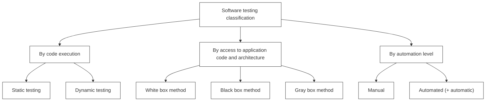

Рисунок 2.3.с — Подробная классификация тестирования (англоязычный вариант)

## 2.3.2.2. КЛАССИФИКАЦИЯ ПО ЗАПУСКУ КОДА НА ИСПОЛНЕНИЕ

Далеко не всякое тестирование предполагает взаимодействие с работающим приложением. Потому в рамках данной классификации выделяют:

* **Статическое тестирование** (static testing$^{116}$) — тестирование без запуска кода на исполнение. В рамках этого подхода тестированию могут подвергаться:
  * Документы (требования, тест-кейсы, описания архитектуры приложения, схемы баз данных и т.д.).
  * Графические прототипы (например, эскизы пользовательского интерфейса).
  * Код приложения (что часто выполняется самими программистами в рамках аудита кода (code review$^{117}$), являющегося специфической вариацией взаимного просмотра$^{[50]}$ в применении к исходному коду). Код приложения также можно проверять с использованием техник тестирования на основе структур кода$^{[98]}$.
  * Параметры (настройки) среды исполнения приложения.
  * Подготовленные тестовые данные.
* **Динамическое тестирование** (dynamic testing$^{118}$) — тестирование с запуском кода на исполнение. Запускаться на исполнение может как код всего приложения целиком (системное тестирование$^{[78]}$), так и код нескольких взаимосвязанных частей (интеграционное тестирование$^{[77]}$), отдельных частей (модульное или компонентное тестирование$^{[77]}$) и даже отдельные участки кода. Основная идея этого вида тестирования состоит в том, что проверяется реальное поведение (части) приложения.

---

$^{116}$ Static testing. Testing of a software development artifact, e.g., requirements, design or code, without execution of these artifacts, e.g., reviews or static analysis. [ISTQB Glossary]

$^{117}$ Jason Cohen, «Best Kept Secrets of Peer Code Review (Modern Approach. Practical Advice.)». Официально распространяемую электронную версию книги можно взять здесь: http://smartbear.com/SmartBear/media/pdfs/best-kept-secrets-of-peer-code-review.pdf

$^{118}$ Dynamic testing. Testing that involves the execution of the software of a component or system. [ISTQB Glossary]

## 2.3.2.3. Классификация по доступу к коду и архитектуре приложения

* **Метод белого ящика** (white box testing$^{119}$, open box testing, clear box testing, glass box testing) — у тестировщика есть доступ к внутренней структуре и коду приложения, а также есть достаточно знаний для понимания увиденного. Выделяют даже сопутствующую тестированию по методу белого ящика глобальную технику — тестирование на основе дизайна (design-based testing$^{120}$). Для более глубокого изучения сути метода белого ящика рекомендуется ознакомиться с техниками исследования потока управления$^{\{98\}}$ или потока данных$^{\{98\}}$, использования диаграмм состояний$^{\{98\}}$. Некоторые авторы склонны жёстко связывать этот метод со статическим тестированием, но ничто не мешает тестировщику запустить код на выполнение и при этом периодически обращаться к самому коду (а модульное тестирование$^{\{77\}}$ и вовсе предполагает запуск кода на исполнение и при этом работу именно с кодом, а не с «приложением целиком»).

* **Метод чёрного ящика** (black box testing$^{121}$, closed box testing, specification-based testing) — у тестировщика либо нет доступа к внутренней структуре и коду приложения, либо недостаточно знаний для их понимания, либо он сознательно не обращается к ним в процессе тестирования. При этом абсолютное большинство перечисленных на рисунках 2.3.b и 2.3.c видов тестирования работают по методу чёрного ящика, идею которого в альтернативном определении можно сформулировать так: тестировщик оказывает на приложение воздействия (и проверяет реакцию) тем же способом, каким при реальной эксплуатации приложения на него воздействовали бы пользователи или другие приложения. В рамках тестирования по методу чёрного ящика основной информацией для создания тест-кейсов выступает документация (особенно $\\$ требования (requirements-based testing$^{122}$)) и общий здравый смысл (для случаев, когда поведение приложения в некоторой ситуации не регламентировано явно; иногда это называют «тестированием на основе неявных требований», но канонического определения у этого подхода нет).

* **Метод серого ящика** (gray box testing$^{123}$) — комбинация методов белого ящика и чёрного ящика, состоящая в том, что к части кода и архитектуры у тестировщика доступ есть, а к части — нет. На рисунках 2.3.b и 2.3.c этот метод обозначен особым пунктиром и серым цветом потому, что его явное упоминание — крайне редкий случай: обычно говорят о методах белого или чёрного ящика в применении к тем или иным частям приложения, при этом понимая, что «приложение целиком» тестируется по методу серого ящика.

---

$^{119}$ **White box testing.** Testing based on an analysis of the internal structure of the component or system. [ISTQB Glossary]  
$^{120}$ **Design-based Testing.** An approach to testing in which test cases are designed based on the architecture and/or detailed design of a component or system (e.g. tests of interfaces between components or systems). [ISTQB Glossary]  
$^{121}$ **Black box testing.** Testing, either functional or non-functional, without reference to the internal structure of the component or system. [ISTQB Glossary]  
$^{122}$ **Requirements-based Testing.** An approach to testing in which test cases are designed based on test objectives and test conditions derived from requirements, e.g. tests that exercise specific functions or probe non-functional attributes such as reliability or usability. [ISTQB Glossary]  
$^{123}$ **Gray box testing** is a software testing method, which is a combination of Black Box Testing method and White Box Testing method. ... In Gray Box Testing, the internal structure is partially known. This involves having access to internal data structures and algorithms for purposes of designing the test cases, but testing at the user, or black-box level. [«Gray Box Testing Fundamentals», http://softwaretestingfundamentals.com/gray-box-testing].

Важно! Некоторые авторы$^{124}$ определяют метод серого ящика как противопоставление методам белого и чёрного ящика, особо подчёркивая, что при работе по методу серого ящика внутренняя структура тестируемого объекта известна частично и выясняется по мере исследования. Этот подход, бесспорно, имеет право на существование, но в своём предельном случае он вырождается до состояния «часть системы мы знаем, часть — не знаем», т.е. до всё той же комбинации белого и чёрного ящиков.

Если сравнить основные преимущества и недостатки перечисленных методов, получается следующая картина (см. таблицу 2.3.a).

Методы белого и чёрного ящика не являются конкурирующими или взаимоисключающими — напротив, они гармонично дополняют друг друга, компенсируя таким образом имеющиеся недостатки.

*Таблица 2.3.а — Преимущества и недостатки методов белого, чёрного и серого ящиков*

| | Преимущества | Недостатки |
| :--- | :--- | :--- |
| Метод белого ящика | • Показывает скрытые проблемы и упрощает их диагностику.<br>• Допускает достаточно простую автоматизацию тест-кейсов и их выполнение на самых ранних стадиях развития проекта.<br>• Обладает развитой системой метрик, сбор и анализ которых легко автоматизируется.<br>• Стимулирует разработчиков к написанию качественного кода.<br>• Многие техники этого метода являются проверенными, хорошо себя зарекомендовавшими решениями, базирующимися на строгом техническом подходе. | • Не может выполняться тестировщиками, не обладающими достаточными знаниями в области программирования.<br>• Тестирование сфокусировано на реализованной функциональности, что повышает вероятность пропуска нереализованных требований.<br>• Поведение приложения исследуется в отрыве от реальной среды выполнения и не учитывает её влияние.<br>• Поведение приложения исследуется в отрыве от реальных пользовательских сценариев$^{148}$. |
| Метод чёрного ящика | • Тестировщик не обязан обладать (глубокими) знаниями в области программирования.<br>• Поведение приложения исследуется в контексте реальной среды выполнения и учитывает её влияние.<br>• Поведение приложения исследуется в контексте реальных пользовательских сценариев$^{148}$.<br>• Тест-кейсы можно создавать уже на стадии появления стабильных требований.<br>• Процесс создания тест-кейсов позволяет выявить дефекты в требованиях.<br>• Допускает создание тест-кейсов, которые можно многократно использовать на разных проектах. | • Возможно повторение части тест-кейсов, уже выполненных разработчиками.<br>• Высока вероятность того, что часть возможных вариантов поведения приложения останется непротестированной.<br>• Для разработки высокоэффективных тест-кейсов необходима качественная документация.<br>• Диагностика обнаруженных дефектов более сложна в сравнении с техниками метода белого ящика.<br>• В связи с широким выбором техник и подходов затрудняется планирование и оценка трудозатрат.<br>• В случае автоматизации могут потребоваться сложные дорогостоящие инструментальные средства. |
| Метод серого ящика | Сочетает преимущества и недостатки методов белого и чёрного ящика. | |

---
$^{124}$ «Gray box testing (gray box) definition», Margaret Rouse [http://searchsoftwarequality.techtarget.com/definition/gray-box]

### 2.3.2.4. КЛАССИФИКАЦИЯ ПО СТЕПЕНИ АВТОМАТИЗАЦИИ

* **Ручное тестирование** (manual testing$^{125}$) — тестирование, в котором тест-кейсы выполняются человеком вручную без использования средств автоматизации. Несмотря на то что это звучит очень просто, от тестировщика в те или иные моменты времени требуются такие качества, как терпеливость, наблюдательность, креативность, умение ставить нестандартные эксперименты, а также умение видеть и понимать, что происходит «внутри системы», т.е. как внешние воздействия на приложение трансформируются в его внутренние процессы.

* **Автоматизированное тестирование** (automated testing, test automation$^{126}$) — набор техник, подходов и инструментальных средств, позволяющий исключить человека из выполнения некоторых задач в процессе тестирования. Тест-кейсы частично или полностью выполняет специальное инструментальное средство, однако разработка тест-кейсов, подготовка данных, оценка результатов выполнения, написания отчётов об обнаруженных дефектах — всё это и многое другое по-прежнему делает человек.


Некоторые авторы$^{112}$ говорят отдельно о «полуавтоматизированном» тестировании как варианте ручного с частичным использованием средств автоматизации и отдельно об «автоматизированном» тестировании (носящом туда области тестирования, в которых компьютер выполняет ощутимо большой процент задач). Но т.к. без участия человека всё равно не обходится ни один из этих видов тестирования, не станем усложнять набор терминов и ограничимся одним понятием «автоматизированное тестирование».

---

$^{125}$ **Manual testing** is performed by the tester who carries out all the actions on the tested application manually, step by step and indicates whether a particular step was accomplished successfully or whether it failed. Manual testing is always a part of any testing effort. It is especially useful in the initial phase of software development, when the software and its user interface are not stable enough, and beginning the automation does not make sense. (SmartBear TestComplete user manual, https://support.smartbear.com/testcomplete/docs/testing-with/deprecated/manual/index.html)

$^{126}$ **Test automation** is the use of software to control the execution of tests, the comparison of actual outcomes to predicted outcomes, the setting up of test preconditions, and other test control and test reporting functions. Commonly, test automation involves automating a manual process already in place that uses a formalized testing process. (Ravinder Veer Hooda, "An Automation of Software Testing: A Foundation for the Future")

У автоматизированного тестирования есть много как сильных, так и слабых сторон (см. таблицу 2.3.b).

*Таблица 2.3.b — Преимущества и недостатки автоматизированного тестирования*

| Преимущества | Недостатки |
| :--- | :--- |
| • Скорость выполнения тест-кейсов может в разы и на порядки превосходить возможности человека.<br>• Отсутствие влияния человеческого фактора в процессе выполнения тест-кейсов (усталости, невнимательности и т.д.).<br>• Минимизация затрат при многократном выполнении тест-кейсов (участие человека здесь требуется лишь эпизодически).<br>• Способность средств автоматизации выполнять тест-кейсы, в принципе непосильные для человека в силу своей сложности, скорости или иных факторов.<br>• Способность средств автоматизации собирать, сохранять, анализировать, агрегировать и представлять в удобной для восприятия человеком форме колоссальные объёмы данных.<br>• Способность средств автоматизации выполнять низкоуровневые действия с приложением, операционной системой, каналами передачи данных и т.д. | • Необходим высококвалифицированный персонал в силу того факта, что автоматизация — это «проект внутри проекта» (со своими требованиями, планами, кодом и т.д.)<br>• Высокие затраты на сложные средства автоматизации, разработку и сопровождение кода тест-кейсов.<br>• Автоматизация требует более тщательного планирования и управления рисками, т.к. в противном случае проекту может быть нанесён серьёзный ущерб.<br>• Средств автоматизации крайне много, что усложняет проблему выбора того или иного средства и может повлечь за собой финансовые затраты (и риски), необходимость обучения персонала (или поиска специалистов).<br>• В случае ощутимого изменения требований, смены технологического домена, переработки интерфейсов (как пользовательских, так и программных) многие тест-кейсы становятся безнадёжно устаревшими и требуют создания заново. |

Если же выразить все преимущества и недостатки автоматизации тестирования одной фразой, то получается, что автоматизация позволяет ощутимо увеличить тестовое покрытие (test coverage$^127$), но при этом столь же ощутимо увеличивает риски.

---

$^127$ **Coverage, Test coverage.** The degree, expressed as a percentage, to which a specified coverage item has been exercised by a test suite. [ISTQB Glossary]

2.3.2.5. КЛАССИФИКАЦИЯ ПО УРОВНЮ ДЕТАЛИЗАЦИИ ПРИЛОЖЕНИЯ (ПО УРОВНЮ ТЕСТИРОВАНИЯ)

Внимание! Возможна путаница, вызванная тем, что единого общепринятого набора классификаций не существует, и две из них имеют очень схожие названия:
* «По уровню детализации приложения» = «по уровню тестирования».
* «По (убыванию) степени важности тестируемых функций» = «по уровню функционального тестирования».

* **Модульное (компонентное) тестирование** (unit testing, module testing, component testing$^{128}$) направлено на проверку отдельных небольших частей приложения, которые (как правило) можно исследовать изолированно от других подобных частей. При выполнении данного тестирования могут проверяться отдельные функции или методы классов, сами классы, взаимодействие классов, небольшие библиотеки, отдельные части приложения. Часто данный вид тестирования реализуется с использованием специальных технологий и инструментальных средств автоматизации тестирования$^{75}$, значительно упрощающих и ускоряющих разработку соответствующих тест-кейсов.

Из-за особенностей перевода на русский язык теряются нюансы степени детализации: «юнит-тестирование», как правило, направлено на тестирование атомарных участков кода, «модульное» — на тестирование классов и небольших библиотек, «компонентное» — на тестирование библиотек и структурных частей приложения. Но эта классификация не стандартизирована, и у различных авторов можно встретить совершенно разные взаимоисключающие трактовки.

* **Интеграционное тестирование** (integration testing$^{129}$, component integration testing$^{130}$, pairwise integration testing$^{131}$, system integration testing$^{132}$, incremental testing$^{133}$, interface testing$^{134}$, thread testing$^{135}$) направлено на проверку взаимодействия между несколькими частями приложения (каждая из которых, в свою очередь, проверена отдельно на стадии модульного тестирования). К сожалению, даже если мы работаем с очень качественными отдельными компонентами, «на стыке» их взаимодействия часто возникают проблемы. Именно эти проблемы и выявляет интеграционное тестирование. (См. также техники восходящего, нисходящего и гибридного тестирования в хронологической классификации по иерархии компонентов$^{103}$.)

---

$^{128}$ **Module testing, Unit testing, Component testing.** The testing of individual software components. [ISTQB Glossary]
$^{129}$ **Integration testing.** Testing performed to expose defects in the interfaces and in the interactions between integrated components or systems. [ISTQB Glossary]
$^{130}$ **Component integration testing.** Testing performed to expose defects in the interfaces and interaction between integrated components. [ISTQB Glossary]
$^{131}$ **Pairwise integration testing.** A form of integration testing that targets pairs of components that work together, as shown in a call graph. [ISTQB Glossary]
$^{132}$ **System integration testing.** Testing the integration of systems and packages; testing interfaces to external organizations (e.g. Electronic Data Interchange, Internet). [ISTQB Glossary]
$^{133}$ **Incremental testing.** Testing where components or systems are integrated and tested one or some at a time, until all the components or systems are integrated and tested. [ISTQB Glossary]
$^{134}$ **Interface testing.** An integration test type that is concerned with testing the interfaces between components or systems. [ISTQB Glossary]
$^{135}$ **Thread testing.** An approach to component integration testing where the progressive integration of components follows the implementation of subsets of the requirements, as opposed to the integration of components by levels of a hierarchy. [ISTQB Glossary]

* **Системное тестирование** (system testing$^{136}$) направлено на проверку всего приложения как единого целого, собранного из частей, проверенных на двух предыдущих стадиях. Здесь не только выявляются дефекты «на стыках» компонентов, но и появляется возможность полноценно взаимодействовать с приложением с точки зрения конечного пользователя, применяя множество других видов тестирования, перечисленных в данной главе.

С классификацией по уровню детализации приложения связан интересный печальный факт: если предыдущая стадия обнаружила проблемы, то на следующей стадии эти проблемы точно нанесут удар по качеству; если же предыдущая стадия не обнаружила проблем, это ещё никоим образом не защищает нас от проблем на следующей стадии.

Для лучшего запоминания степень детализации в модульном, интеграционном и системном тестировании показана схематично на рисунке 2.3.d.

Если обратиться к словарю ISTQB и прочитать определение уровня тестирования (test level$^{137}$), то можно увидеть, что аналогичное разбиение на модульное, интеграционное и системное тестирование, к которым добавлено ещё и приёмочное тестирование$^{\{89\}}$, используется в контексте разделения областей ответственности на проекте. Но такая классификация больше относится к вопросам управления проектом, чем к тестированию в чистом виде, а потому выходит за рамки рассматриваемых нами вопросов.

Самый полный вариант классификации тестирования по уровню тестирования можно посмотреть в статье «What are Software Testing Levels?$^{138}$». Для улучшения запоминания отразим эту идею на рисунке 2.3.е, но отметим, что это скорее общий теоретический взгляд.

***

$^{136}$ **System testing.** The process of testing an integrated system to verify that it meets specified requirements. [ISTQB Glossary]

$^{137}$ **Test level.** A group of test activities that are organized and managed together. A test level is linked to the responsibilities in a project. Examples of test levels are component test, integration test, system test and acceptance test. [ISTQB Glossary]

$^{138}$ «What are Software Testing Levels?» [http://istqbexamcertification.com/what-are-software-testing-levels/]

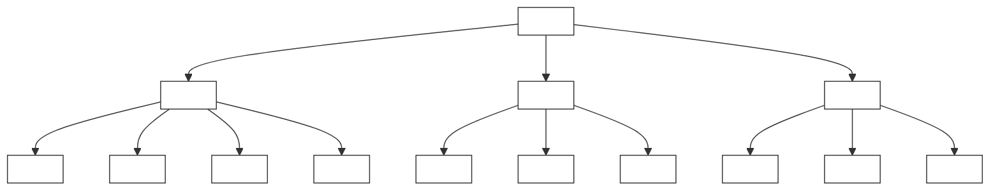

Рисунок 2.3.d — Схематичное представление классификации тестирования по уровню детализации приложения

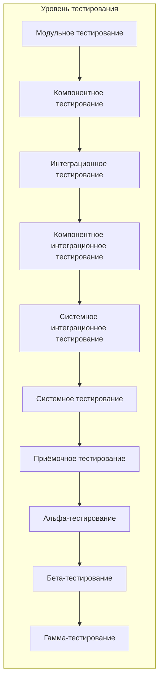

Рисунок 2.3.e — Самый полный вариант классификации тестирования по уровню тестирования

2.3.2.6. КЛАССИФИКАЦИЯ ПО (УБЫВАНИЮ) СТЕПЕНИ ВАЖНОСТИ ТЕСТИРУЕМЫХ ФУНКЦИЙ  
(ПО УРОВНЮ ФУНКЦИОНАЛЬНОГО ТЕСТИРОВАНИЯ)

В некоторых источниках эту разновидность классификации также называют «по глубине тестирования».

> Внимание! Возможна путаница, вызванная тем, что единого общепринятого набора классификаций не существует, и две из них имеют очень схожие названия:
> * «По уровню детализации приложения» = «по уровню тестирования».
> * «По (убыванию) степени важности тестируемых функций» = «по уровню **функционального** тестирования».

* **Дымовое тестирование** (smoke test$^{139}$, intake test$^{140}$, build verification test$^{141}$) направлено на проверку самой главной, самой важной, самой ключевой функциональности, неработоспособность которой делает бессмысленной саму идею использования приложения (или иного объекта, подвергаемого дымовому тестированию).

> Внимание! Очень распространённая проблема! Из-за особенности перевода на русский язык под термином «приёмочное тестирование» часто может пониматься как «smoke test»$^{\{80\}}$, так и «acceptance test»$^{\{89\}}$, которые изначально не имеют между собою ничего общего. Возможно, в том числе поэтому многие тестировщики почти не используют русский перевод «дымовое тестирование», а так и говорят — «смоук-тест».

Дымовое тестирование проводится после выхода нового билда, чтобы определить общий уровень качества приложения и принять решение о (не)целесообразности выполнения тестирования критического пути и расширенного тестирования. Поскольку тест-кейсов на уровне дымового тестирования относительно немного, а сами они достаточно просты, но при этом очень часто повторяются, они являются хорошими кандидатами на автоматизацию. В связи с высокой важностью тест-кейсов на данном уровне пороговое значение метрики их прохождения часто выставляется равным $100\%$ или близким к $100\%$.

Очень часто можно услышать вопрос о том, чем «smoke test» отличается от «sanity test». В глоссарии ISTQB сказано просто: «sanity test: See smoke test». Но некоторые авторы утверждают$^{142}$, что разница$^{143}$ есть и может быть выражена следующей схемой (рисунок 2.3.f):

---

$^{139}$ **Smoke test, Confidence test, Sanity test.** A subset of all defined/planned test cases that cover the main functionality of a component or system, to ascertaining that the most crucial functions of a program work, but not bothering with finer details. [ISTQB Glossary]  
$^{140}$ **Intake test.** A special instance of a smoke test to decide if the component or system is ready for detailed and further testing. An intake test is typically carried out at the start of the test execution phase. [ISTQB Glossary]  
$^{141}$ **Build verification test.** A set of automated tests which validates the integrity of each new build and verifies its key/core functionality, stability and testability. It is an industry practice when a high frequency of build releases occurs (e.g., agile projects) and it is run on every new build before the build is released for further testing. [ISTQB Glossary]  
$^{142}$ «Smoke Vs Sanity Testing — Introduction and Differences» [http://www.guru99.com/smoke-sanity-testing.html]  
$^{143}$ «Smoke testing and sanity testing — Quick and simple differences» [http://www.softwaretestinghelp.com/smoke-testing-and-sanity-testing-difference/]


*Рисунок 2.3.f* — Трактовка разницы между smoke test и sanity test

* **Тестирование критического пути** (critical path$^144$ test) направлено на исследование функциональности, используемой типичными пользователями в типичной повседневной деятельности. Как видно из определения в сноске к англоязычной версии термина, сама идея позаимствована из управления проектами и трансформирована в контексте тестирования в следующую: существует большинство пользователей, которые чаще всего используют некое подмножество функций приложения (см. рисунок 2.3.g). Именно эти функции и нужно проверить, как только мы убедились, что приложение «в принципе работает» (дымовой тест прошёл успешно). Если по каким-то причинам приложение не выполняет эти функции или выполняет их некорректно, очень многие пользователи не смогут достичь множества своих целей. Пороговое значение метрики успешного прохождения «теста критического пути» уже немного ниже, чем в дымовом тестировании, но всё равно достаточно высоко (как правило, порядка 70–80 % — в зависимости от сути проекта).


*Рисунок 2.3.g* — Суть тестирования критического пути

---

$^144$ **Critical path.** Longest sequence of activities in a project plan which must be completed on time for the project to complete on due date. An activity on the critical path cannot be started until its predecessor activity is complete; if it is delayed for a day, the entire project will be delayed for a day unless the activity following the delayed activity is completed a day earlier. [http://www.businessdictionary.com/definition/critical-path.html]

* **Расширенное тестирование** (extended test$^{145}$) направлено на исследование всей заявленной в требованиях функциональности — даже той, которая низко проранжирована по степени важности. При этом здесь также учитывается, какая функциональность является более важной, а какая — менее важной. Но при наличии достаточного количества времени и иных ресурсов тест-кейсы этого уровня могут затронуть даже самые низкоприоритетные требования.

Ещё одним направлением исследования в рамках данного тестирования являются нетипичные, маловероятные, экзотические случаи и сценарии использования функций и свойств приложения, затронутых на предыдущих уровнях. Пороговое значение успешного прохождения расширенного тестирования существенно ниже, чем в тестировании критического пути (иногда можно увидеть даже значения в диапазоне 30–50 %, т.к. подавляющее большинство найденных здесь дефектов не представляет угрозы для успешного использования приложения большинством пользователей).

К сожалению, часто можно встретить мнение, что дымовое тестирование, тестирование критического пути и расширенное тестирование напрямую связаны с позитивным$^{[83]}$ тестированием и негативным$^{[83]}$ тестированием, и негативное появляется только на уровне тестирования критического пути. Это не так. Как позитивные, так и негативные тесты могут (а иногда и обязаны) встречаться на всех перечисленных уровнях. Например, деление на ноль в калькуляторе явно должно относиться к дымовому тестированию, хотя это яркий пример негативного тест-кейса.

Для лучшего запоминания отразим эту классификацию графически:

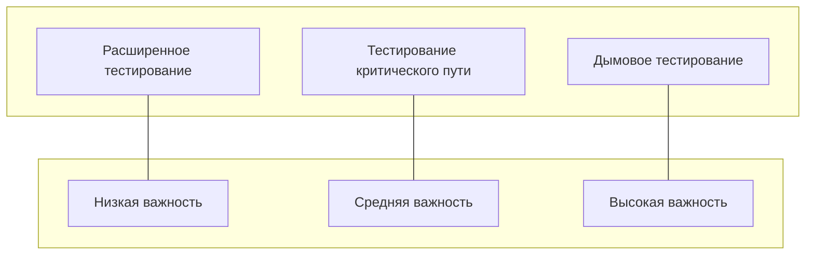

*Рисунок 2.3.h — Классификация тестирования по (убыванию) степени важности тестируемых функций (по уровню функционального тестирования)*

---

$^{145}$ **Extended test.** The idea is to develop a comprehensive application system test suite by modeling essential capabilities as extended use cases. [By «Extended Use Case Test Design Pattern», Rob Kuijt]

2.3.2.7. КЛАССИФИКАЦИЯ ПО ПРИНЦИПАМ РАБОТЫ С ПРИЛОЖЕНИЕМ

* **Позитивное тестирование** (positive testing$^{146}$) направлено на исследование приложения в ситуации, когда все действия выполняются строго по инструкции без каких бы то ни было ошибок, отклонений, ввода неверных данных и т.д. Если позитивные тест-кейсы завершаются ошибками, это тревожный признак — приложение работает неверно даже в идеальных условиях (и можно предположить, что в неидеальных условиях оно работает ещё хуже). Для ускорения тестирования несколько позитивных тест-кейсов можно объединять (например, перед отправкой заполнить все поля формы верными значениями) — иногда это может усложнить диагностику ошибки, но существенная экономия времени компенсирует этот риск.
* **Негативное тестирование** (negative testing$^{147}$, invalid testing$^{148}$) — направлено на исследование работы приложения в ситуациях, когда с ним выполняются (некорректные) операции и/или используются данные, потенциально приводящие к ошибкам (классика жанра — деление на ноль). Поскольку в реальной жизни таких ситуаций значительно больше (пользователи допускают ошибки, злоумышленники осознанно «ломают» приложение, в среде работы приложения возникают проблемы и т.д.), негативных тест-кейсов оказывается значительно больше, чем позитивных (иногда — в разы или даже на порядки). В отличие от позитивных негативные тест-кейсы не стоит объединять, т.к. подобное решение может привести к неверной трактовке поведения приложения и пропуску (необнаружению) дефектов.

---

$^{146}$ **Positive testing** is testing process where the system validated against the valid input data. In this testing tester always check for only valid set of values and check if application behaves as expected with its expected inputs. The main intention of this testing is to check whether software application not showing error when not supposed to & showing error when supposed to. Such testing is to be carried out keeping positive point of view & only execute the positive scenario. Positive Testing always tries to prove that a given product and project always meets the requirements and specifications. [http://www.softwaretestingclass.com/positive-and-negative-testing-in-software-testing/]

$^{147}$ **Negative testing.** Tests aimed at showing that a component or system does not work. Negative testing is related to the testers' attitude rather than a specific test approach or test design technique, e.g. testing with invalid input values or exceptions. [ISTQB Glossary]

$^{148}$ **Invalid testing.** Testing using input values that should be rejected by the component or system. [ISTQB Glossary]

2.3.2.8. КЛАССИФИКАЦИЯ ПО ПРИРОДЕ ПРИЛОЖЕНИЯ

Данный вид классификации является искусственным, поскольку «внутри» речь будет идти об одних и тех же видах тестирования, отличающихся в данном контексте лишь концентрацией на соответствующих функциях и особенностях приложения, использованием специфических инструментов и отдельных техник.

* **Тестирование веб-приложений** (web-applications testing) сопряжено с интенсивной деятельностью в области тестирования совместимости{91} (в особенности — кросс-браузерного тестирования{92}), тестирования производительности{93}, автоматизации тестирования с использованием широкого спектра инструментальных средств.
* **Тестирование мобильных приложений** (mobile applications testing) также требует повышенного внимания к тестированию совместимости{91}, оптимизации производительности{93} (в том числе клиентской части с точки зрения снижения энергопотребления), автоматизации тестирования с применением эмуляторов мобильных устройств.
* **Тестирование настольных приложений** (desktop applications testing) является самым классическим среди всех перечисленных в данной классификации, и его особенности зависят от предметной области приложения, нюансов архитектуры, ключевых показателей качества и т.д.

Эту классификацию можно продолжать очень долго. Например, можно отдельно рассматривать тестирование консольных приложений (console applications testing) и приложений с графическим интерфейсом (GUI-applications testing), серверных приложений (server applications testing) и клиентских приложений (client applications testing) и т.д.

2.3.2.9. КЛАССИФИКАЦИЯ ПО ФОКУСИРОВКЕ НА УРОВНЕ АРХИТЕКТУРЫ ПРИЛОЖЕНИЯ

Данный вид классификации, как и предыдущий, также является искусственным и отражает лишь концентрацию внимания на отдельной части приложения.

* **Тестирование уровня представления** (presentation tier testing) сконцентрировано на той части приложения, которая отвечает за взаимодействие с «внешним миром» (как пользователями, так и другими приложениями). Здесь исследуются вопросы удобства использования, скорости отклика интерфейса, совместимости с браузерами, корректности работы интерфейсов.
* **Тестирование уровня бизнес-логики** (business logic tier testing) отвечает за проверку основного набора функций приложения и строится на базе ключевых требований к приложению, бизнес-правил и общей проверки функциональности.
* **Тестирование уровня данных** (data tier testing) сконцентрировано на той части приложения, которая отвечает за хранение и некоторую обработку данных (чаще всего — в базе данных или ином хранилище). Здесь особый интерес представляет тестирование данных, проверка соблюдения бизнес-правил, тестирование производительности.

 Если вы не знакомы с понятием многоуровневой архитектуры приложений, ознакомьтесь с ним хотя бы по материалу$^{149}$ из Википедии.

---

$^{149}$ «Multitier architecture», Wikipedia [http://en.wikipedia.org/wiki/Multitier_architecture]

2.3.2.10. КЛАССИФИКАЦИЯ ПО ПРИВЛЕЧЕНИЮ КОНЕЧНЫХ ПОЛЬЗОВАТЕЛЕЙ

Все три перечисленных ниже вида тестирования относятся к операционному тестированию$^{\{90\}}$.

* **Альфа-тестирование** (alpha testing$^{150}$) выполняется внутри организации-разработчика с возможным частичным привлечением конечных пользователей. Может являться формой внутреннего приёмочного тестирования$^{\{89\}}$. В некоторых источниках отмечается, что это тестирование должно проводиться без привлечения команды разработчиков, но другие источники не выдвигают такого требования. Суть этого вида вкратце: продукт уже можно периодически показывать внешним пользователям, но он ещё достаточно «сырой», поэтому основное тестирование выполняется организацией-разработчиком.
* **Бета-тестирование** (beta testing$^{151}$) выполняется вне организации-разработчика с активным привлечением конечных пользователей/заказчиков. Может являться формой внешнего приёмочного тестирования$^{\{89\}}$. Суть этого вида вкратце: продукт уже можно открыто показывать внешним пользователям, он уже достаточно стабилен, но проблемы всё ещё могут быть, и для их выявления нужна обратная связь от реальных пользователей.
* **Гамма-тестирование** (gamma testing$^{152}$) — финальная стадия тестирования перед выпуском продукта, направленная на исправление незначительных дефектов, обнаруженных в бета-тестировании. Как правило, также выполняется с максимальным привлечением конечных пользователей/заказчиков. Может являться формой внешнего приёмочного тестирования$^{\{89\}}$. Суть этого вида вкратце: продукт уже почти готов, и сейчас обратная связь от реальных пользователей используется для устранения последних недоработок.

---

$^{150}$ **Alpha testing.** Simulated or actual operational testing by potential users/customers or an independent test team at the developers' site, but outside the development organization. Alpha testing is often employed for off-the-shelf software as a form of internal acceptance testing. [ISTQB Glossary]

$^{151}$ **Beta testing.** Operational testing by potential and/or existing users/customers at an external site not otherwise involved with the developers, to determine whether or not a component or system satisfies the user/customer needs and fits within the business processes. Beta testing is often employed as a form of external acceptance testing for off-the-shelf software in order to acquire feedback from the market. [ISTQB Glossary]

$^{152}$ **Gamma testing** is done when software is ready for release with specified requirements, this testing done directly by skipping all the in-house testing activities. The software is almost ready for final release. No feature development or enhancement of the software is undertaken and tightly scoped bug fixes are the only code. Gamma check is performed when the application is ready for release to the specified requirements and this check is performed directly without going through all the testing activities at home. [http://www.360logica.com/blog/2012/06/what-are-alpha-beta-and-gamma-testing.html]

2.3.2.11. КЛАССИФИКАЦИЯ ПО СТЕПЕНИ ФОРМАЛИЗАЦИИ

* **Тестирование на основе тест-кейсов** (scripted testing$^{153}$, test case based testing) — формализованный подход, в котором тестирование производится на основе заранее подготовленных тест-кейсов, наборов тест-кейсов и иной документации. Это самый распространённый способ тестирования, который также позволяет достичь максимальной полноты исследования приложения за счёт строгой систематизации процесса, удобства применения метрик и широкого набора выработанных за десятилетия и проверенных на практике рекомендаций.
* **Исследовательское тестирование** (exploratory testing$^{154}$) — частично формализованный подход, в рамках которого тестировщик выполняет работу с приложением по выбранному сценарию$^{148}$, который, в свою очередь, дорабатывается в процессе выполнения с целью более полного исследования приложения. Ключевым фактором успеха при выполнении исследовательского тестирования является именно работа по сценарию, а не выполнение разрозненных бездумных операций. Существует даже специальный сценарный подход, называемый сессионным тестированием (session-based testing$^{155}$). В качестве альтернативы сценариям при выборе действий с приложением иногда могут использоваться чек-листы, и тогда этот вид тестирования называют тестированием на основе чек-листов (checklist-based testing$^{156}$).

> Дополнительную информацию об исследовательском тестировании можно получить из статьи Джеймса Баха «Что такое исследовательское тестирование?»$^{157}$

* **Свободное (интуитивное) тестирование** (ad hoc testing$^{158}$) — полностью неформализованный подход, в котором не предполагается использования ни тест-кейсов, ни чек-листов, ни сценариев — тестировщик полностью опирается на свой профессионализм и интуицию (experience-based testing$^{159}$) для спонтанного выполнения с приложением действий, которые, как он считает, могут обнаружить ошибку. Этот вид тестирования используется редко и исключительно как дополнение к полностью или частично формализованному тестированию в случаях, когда для исследования некоторого аспекта поведения приложения (пока?) нет тест-кейсов.

> Ни в коем случае не стоит путать исследовательское и свободное тестирование. Это разные техники исследования приложения с разной степенью формализации, разными задачами и областями применения.

---

$^{153}$ **Scripted testing.** Test execution carried out by following a previously documented sequence of tests. [ISTQB Glossary]  
$^{154}$ **Exploratory testing.** An informal test design technique where the tester actively controls the design of the tests as those tests are performed and uses information gained while testing to design new and better tests. [ISTQB Glossary]  
$^{155}$ **Session-based Testing.** An approach to testing in which test activities are planned as uninterrupted sessions of test design and execution, often used in conjunction with exploratory testing. [ISTQB Glossary]  
$^{156}$ **Checklist-based Testing.** An experience-based test design technique whereby the experienced tester uses a high-level list of items to be noted, checked, or remembered, or a set of rules or criteria against which a product has to be verified. [ISTQB Glossary]  
$^{157}$ «What is Exploratory Testing?», James Bach [http://www.satisfice.com/articles/what_is_et.shtml]  
$^{158}$ **Ad hoc testing.** Testing carried out informally; no formal test preparation takes place, no recognized test design technique is used, there are no expectations for results and arbitrariness guides the test execution activity. [ISTQB Glossary]  
$^{159}$ **Experience-based Testing.** Testing based on the tester’s experience, knowledge and intuition. [ISTQB Glossary]

## 2.3.2.12. КЛАССИФИКАЦИЯ ПО ЦЕЛЯМ И ЗАДАЧАМ

* **Позитивное тестирование** (рассмотрено ранее$^{[83]}$).
* **Негативное тестирование** (рассмотрено ранее$^{[83]}$).
* **Функциональное тестирование** (functional testing$^{160}$) — вид тестирования, направленный на проверку корректности работы функциональности приложения (корректность реализации функциональных требований$^{[41]}$). Часто функциональное тестирование ассоциируют с тестированием по методу чёрного ящика$^{[73]}$, однако и по методу белого ящика$^{[73]}$ вполне можно проверять корректность реализации функциональности.

Часто возникает вопрос, в чём разница между функциональным тестированием (functional testing$^{160}$) и тестированием функциональности (functionality testing$^{161}$). Подробнее о функциональном тестировании можно прочесть в статье «What is Functional testing (Testing of functions) in software?»$^{162}$, а о тестировании функциональности в статье «What is functionality testing in software?»$^{163}$.

Если вкратце, то:
* функциональное тестирование (как антоним нефункционального) направлено на проверку того, какие функции приложения реализованы, и что они работают верным образом;
* тестирование функциональности направлено на те же задачи, но акцент смещён в сторону исследования приложения в реальной рабочей среде, после локализации и в тому подобных ситуациях.

* **Нефункциональное тестирование** (non-functional testing$^{164}$) — вид тестирования, направленный на проверку нефункциональных особенностей приложения (корректность реализации нефункциональных требований$^{[41]}$), таких как удобство использования, совместимость, производительность, безопасность и т.д.
* **Инсталляционное тестирование** (installation testing, installability testing$^{165}$) — тестирование, направленное на выявление дефектов, влияющих на протекание стадии инсталляции (установки) приложения. В общем случае такое тестирование проверяет множество сценариев и аспектов работы инсталлятора в таких ситуациях, как:
  * новая среда исполнения, в которой приложение ранее не было инсталлировано;
  * обновление существующей версии («апгрейд»);
  * изменение текущей версии на более старую («даунгрейд»);
  * повторная установка приложения с целью устранения возникших проблем («переинсталляция»);
  * повторный запуск инсталляции после ошибки, приведшей к невозможности продолжения инсталляции;

---

$^{160}$ **Functional testing.** Testing based on an analysis of the specification of the functionality of a component or system. [ISTQB Glossary]  
$^{161}$ **Functionality testing.** The process of testing to determine the functionality of a software product (the capability of the soft-ware product to provide functions which meet stated and implied needs when the software is used under specified conditions). [ISTQB Glossary]  
$^{162}$ «What is Functional testing (Testing of functions) in software?» [http://istqbexamcertification.com/what-is-functional-testing-of-functions-in-software/]  
$^{163}$ «What is functionality testing in software?» [http://istqbexamcertification.com/what-is-functionality-testing-in-software/]  
$^{164}$ **Non-functional testing.** Testing the attributes of a component or system that do not relate to functionality, e.g. reliability, efficiency, usability, maintainability and portability. [ISTQB Glossary]  
$^{165}$ **Installability testing.** The process of testing the installability of a software product. Installability is the capability of the software product to be installed in a specified environment. [ISTQB Glossary]

* удаление приложения;
* установка нового приложения из семейства приложений;
* автоматическая инсталляция без участия пользователя.

* **Регрессионное тестирование** (regression testing$^{166}$) — тестирование, направленное на проверку того факта, что в ранее работоспособной функциональности не появились ошибки, вызванные изменениями в приложении или среде его функционирования. Фредерик Брукс в своей книге «Мифический человеко-месяц»$^{167}$ писал: «Фундаментальная проблема при сопровождении программ состоит в том, что исправление одной ошибки с большой вероятностью (20–50 %) влечёт появление новой». Поэтому регрессионное тестирование является неотъемлемым инструментом обеспечения качества и активно используется практически в любом проекте.

* **Повторное тестирование** (re-testing$^{168}$, confirmation testing) — выполнение тест-кейсов, которые ранее обнаружили дефекты, с целью подтверждения устранения дефектов. Фактически этот вид тестирования сводится к действиям на финальной стадии жизненного цикла отчёта о дефекте$^{171}$, направленным на то, чтобы перевести дефект в состояние «проверен» и «закрыт».

* **Приёмочное тестирование** (acceptance testing$^{169}$) — формализованное тестирование, направленное на проверку приложения с точки зрения конечного пользователя/заказчика и вынесения решения о том, принимает ли заказчик работу у исполнителя (проектной команды). Можно выделить следующие подвиды приёмочного тестирования (хотя упоминают их крайне редко, ограничиваясь в основном общим термином «приёмочное тестирование»):
  * **Производственное приёмочное тестирование** (factory acceptance testing$^{170}$) — выполняемое проектной командой исследование полноты и качества реализации приложения с точки зрения его готовности к передаче заказчику. Этот вид тестирования часто рассматривается как синоним альфа-тестирования$^{[86]}$.
  * **Операционное приёмочное тестирование** (operational acceptance testing$^{171}$, production acceptance testing) — операционное тестирование$^{[90]}$, выполняемое с точки зрения выполнения инсталляции, потребления ресурсов, совместимости с программной и аппаратной платформой и т.д.
  * **Итоговое приёмочное тестирование** (site acceptance testing$^{172}$) — тестирование конечными пользователями (представителями заказчика) приложения в реальных условиях эксплуатации с целью вынесения решения о том, требует ли приложение доработок или может быть принято в эксплуатацию в текущем виде.

---

$^{166}$ **Regression testing.** Testing of a previously tested program following modification to ensure that defects have not been introduced or uncovered in unchanged areas of the software, as a result of the changes made. It is performed when the software or its environment is changed. [ISTQB Glossary]
$^{167}$ Frederick Brooks, «The Mythical Man-Month».
$^{168}$ **Re-testing, Confirmation testing.** Testing that runs test cases that failed the last time they were run, in order to verify the success of corrective actions. [ISTQB Glossary]
$^{169}$ **Acceptance Testing.** Formal testing with respect to user needs, requirements, and business processes conducted to determine whether or not a system satisfies the acceptance criteria and to enable the user, customers or other authorized entity to determine whether or not to accept the system. [ISTQB Glossary]
$^{170}$ **Factory acceptance testing.** Acceptance testing conducted at the site at which the product is developed and performed by employees of the supplier organization, to determine whether or not a component or system satisfies the requirements, normally including hardware as well as software. [ISTQB Glossary]
$^{171}$ **Operational acceptance testing, Production acceptance testing.** Operational testing in the acceptance test phase, typically performed in a (simulated) operational environment by operations and/or systems administration staff focusing on operational aspects, e.g. recoverability, resource-behavior, installability and technical compliance. [ISTQB Glossary]
$^{172}$ **Site acceptance testing.** Acceptance testing by users/customers at their site, to determine whether or not a component or system satisfies the user/customer needs and fits within the business processes, normally including hardware as well as software. [ISTQB Glossary]

* **Операционное тестирование** (operational testing$^{173}$) — тестирование, проводимое в реальной или приближенной к реальной операционной среде (operational environment$^{174}$), включающей операционную систему, системы управления базами данных, серверы приложений, веб-серверы, аппаратное обеспечение и т.д.

* **Тестирование удобства использования** (usability$^{175}$ testing) — тестирование, направленное на исследование того, насколько конечному пользователю понятно, как работать с продуктом (understandability$^{176}$, learnability$^{177}$, operability$^{178}$), а также на то, насколько ему нравится использовать продукт (attractiveness$^{179}$). И это не оговорка — очень часто успех продукта зависит именно от эмоций, которые он вызывает у пользователей. Для эффективного проведения этого вида тестирования требуется реализовать достаточно серьёзные исследования с привлечением конечных пользователей, проведением маркетинговых исследований и т.д.

> Важно! Тестирование удобства использования (usability$^{175}$ testing) и тестирование интерфейса пользователя (GUI testing$^{184}$) — не одно и то же! Например, корректно работающий интерфейс может быть неудобным, а удобный может работать некорректно.

* **Тестирование доступности** (accessibility testing$^{180}$) — тестирование, направленное на исследование пригодности продукта к использованию людьми с ограниченными возможностями (слабым зрением и т.д.).

* **Тестирование интерфейса** (interface testing$^{181}$) — тестирование, направленное на проверку интерфейсов приложения или его компонентов. По определению ISTQB-глоссария этот вид тестирования относится к интеграционному тестированию$^{[77]}$, и это вполне справедливо для таких его вариаций как тестирование интерфейса прикладного программирования (API testing$^{182}$) и интерфейса командной строки (CLI testing$^{183}$), хотя последнее может выступать и как разновидность тестирования пользовательского интерфейса, если через командную строку с приложением взаимодействует пользователь, а не другое приложение. Однако многие источники предлагают включить в состав тестирования интерфейса и тестирование непосредственно интерфейса пользователя (GUI testing$^{184}$).

---

$^{173}$ **Operational testing.** Testing conducted to evaluate a component or system in its operational environment. [ISTQB Glossary]

$^{174}$ **Operational environment.** Hardware and software products installed at users' or customers' sites where the component or system under test will be used. The software may include operating systems, database management systems, and other applications. [ISTQB Glossary]

$^{175}$ **Usability.** The capability of the software to be understood, learned, used and attractive to the user when used under specified conditions. [ISTQB Glossary]

$^{176}$ **Understandability.** The capability of the software product to enable the user to understand whether the software is suitable, and how it can be used for particular tasks and conditions of use. [ISTQB Glossary]

$^{177}$ **Learnability.** The capability of the software product to enable the user to learn its application. [ISTQB Glossary]

$^{178}$ **Operability.** The capability of the software product to enable the user to operate and control it. [ISTQB Glossary]

$^{179}$ **Attractiveness.** The capability of the software product to be attractive to the user. [ISTQB Glossary]

$^{180}$ **Accessibility testing.** Testing to determine the ease by which users with disabilities can use a component or system. [ISTQB Glossary]

$^{181}$ **Interface Testing.** An integration test type that is concerned with testing the interfaces between components or systems. [ISTQB Glossary]

$^{182}$ **API testing.** Testing performed by submitting commands to the software under test using programming interfaces of the application directly. [ISTQB Glossary]

$^{183}$ **CLI testing.** Testing performed by submitting commands to the software under test using a dedicated command-line interface. [ISTQB Glossary]

$^{184}$ **GUI testing.** Testing performed by interacting with the software under test via the graphical user interface. [ISTQB Glossary]


<!-- ВІДНОВЛЕНО ЛОКАЛЬНО (Стор. 92) -->
**2.3. ÂÈÄÛ È ÍÀÏÐÀÂËÅÍÈß ÒÅÑÒÈÐÎÂÀÍÈß** 

**91** 


Важно! Тестирование интерфейса пользователя (GUI testing<sup>184</sup> ) и тестирование удобства использования (usability<sup>175</sup> testing) — не одно и то же! Например, удобный интерфейс может работать некорректно, а корректно работающий интерфейс может быть неудобным. 

- **Тестирование безопасности** (security testing<sup>185</sup> ) — тестирование, направленное на проверку способности приложения противостоять злонамеренным попыткам получения доступа к данным или функциям, права на доступ к которым у злоумышленника нет. 


Подробнее про этот вид тестирования можно почитать в статье «What is Security testing in soft ware testing?»<sup>186</sup> . 

- **Тестирование интернационализации** (internationalization testing, i18n testing, globalization<sup>187</sup> testing, localizability<sup>188</sup> testing) — тестирование, направленное на проверку готовности продукта к работе с использованием различных языков и с учётом различных национальных и культурных особенностей. Этот вид тестирования не подразумевает проверки качества соответствующей адаптации (этим занимается тестирование локализации, см. следующий пункт), оно сфокусировано именно на проверке возможности такой адаптации (например: что будет, если открыть файл с иероглифом в имени; как будет работать интерфейс, если всё перевести на японский; может ли приложение искать данные в тексте на корейском и т.д.). 

- **Тестирование локализации** (localization testing<sup>189</sup> , l10n) — тестирование, направленное на проверку корректности и качества адаптации продукта к использованию на том или ином языке с учётом национальных и культурных особенностей. Это тестирование следует за тестированием интернационализации (см. предыдущий пункт) и проверяет корректность перевода и адаптации продукта, а не готовность продукта к таким действиям. 

- **Тестирование совместимости** (compatibility testing, interoperability testing<sup>190</sup> ) — тестирование, направленное на проверку способности приложения работать в указанном окружении. Здесь, например, может проверяться: 

   - º Совместимость с аппаратной платформой, операционной системой и сетевой инфраструктурой (конфигурационное тестирование, confi guration testing<sup>191</sup> ). 

- 185 **Security testing.** Testing to determine the security of the soft ware product. [ISTQB Glossary] 

> 186 «What is Security testing in soft ware testing?» [http://istqbexamcertifi cation.com/what-is-security-testing-in-soft ware/] 

> 187 **Globalization.** Th e process of developing a program core whose features and code design are not solely based on a single language or locale. Instead, their design is developed for the input, display, and output of a defi ned set of Unicode-supported language scripts and data related to specifi c locales. [«Globalization Step-by-Step», https://msdn.microsoft .com/en-us/goglobal/ bb688112] 

> 188 **Localizability.** Th e design of the soft ware code base and resources such that a program can be localized into diff erent language editions without any changes to the source code. [«Globalization Step-by-Step», https://msdn.microsoft .com/en-us/ goglobal/bb688112] 

> 189 **Localization testing** checks the quality of a product’s localization for a particular target culture/locale. Th is test is based on the results of globalization testing, which verifi es the functional support for that particular culture/locale. Localization testing can be executed only on the localized version of a product. [«Localization Testing», https://msdn.microsoft .com/en-us/ library/aa292138%28v=vs.71%29.aspx] 

190 **Compatibility Testing, Interoperability Testing.** Th e process of testing to determine the interoperability of a soft ware product (the capability to interact with one or more specifi ed components or systems). [ISTQB Glossary] 

> 191 **Confi guration Testing, Portability Testing.** Th e process of testing to determine the portability of a soft ware product (the ease with which the soft ware product can be transferred from one hardware or soft ware environment to another). [ISTQB Glossary]
<!-- КІНЕЦЬ ВІДНОВЛЕННЯ -->


* Совместимость с браузерами и их версиями (кросс-браузерное тестирование, cross-browser testing$^{192}$). (См. также тестирование веб-приложений$^{[84]}$).
* Совместимость с мобильными устройствами (mobile testing$^{193}$). (См. также тестирование мобильных приложений$^{[84]}$).
* И так далее.

В некоторых источниках к тестированию совместимости добавляют (хоть и подчёркивая, что это — не его часть) т.н. тестирование соответствия (compliance testing$^{194}$, conformance testing, regulation testing).

Рекомендуется ознакомиться с дополнительным материалом по тестированию совместимости с мобильными платформами в статьях «What is Mobile Testing?»$^{195}$ и «Beginner's Guide to Mobile Application Testing»$^{196}$.

* **Тестирование данных** (data quality$^{197}$ testing) и **баз данных** (database integrity testing$^{198}$) — два близких по смыслу вида тестирования, направленных на исследование таких характеристик данных, как полнота, непротиворечивость, целостность, структурированность и т.д. В контексте баз данных исследованию может подвергаться адекватность модели предметной области, способность модели обеспечивать целостность и консистентность данных, корректность работы триггеров, хранимых процедур и т.д.
* **Тестирование использования ресурсов** (resource utilization testing$^{199}$, efficiency testing$^{200}$, storage testing$^{201}$) — совокупность видов тестирования, проверяющих эффективность использования приложением доступных ему ресурсов и зависимость результатов работы приложения от количества доступных ему ресурсов. Часто эти виды тестирования прямо или косвенно примыкают к техникам тестирования производительности$^{[93]}$.

---

$^{192}$ **Cross-browser testing** helps you ensure that your web site or web application functions correctly in various web browsers. Typically, QA engineers create individual tests for each browser or create tests that use lots of conditional statements that check the browser type used and execute browser-specific commands. [http://support.smartbear.com/viewarticle/55299/]

$^{193}$ **Mobile testing** is a testing with multiple operating systems (and different versions of each OS, especially with Android), multiple devices (different makes and models of phones, tablets, phablets), multiple carriers (including international ones), multiple speeds of data transference (3G, LTE, Wi-Fi), multiple screen sizes (and resolutions and aspect ratios), multiple input controls (including BlackBerry's eternal physical keypads), and multiple technologies — GPS, accelerometers — that web and desktop apps almost never use. [http://smartbear.com/all-resources/articles/what-is-mobile-testing/]

$^{194}$ **Compliance testing, Conformance testing, Regulation testing.** The process of testing to determine the compliance of the component or system (the capability to adhere to standards, conventions or regulations in laws and similar prescriptions). [ISTQB Glossary]

$^{195}$ «What is Mobile Testing?» [http://smartbear.com/all-resources/articles/what-is-mobile-testing/]

$^{196}$ «Beginner's Guide to Mobile Application Testing» [http://www.softwaretestinghelp.com/beginners-guide-to-mobile-application-testing/]

$^{197}$ **Data quality.** An attribute of data that indicates correctness with respect to some pre-defined criteria, e.g., business expectations, requirements on data integrity, data consistency. [ISTQB Glossary]

$^{198}$ **Database integrity testing.** Testing the methods and processes used to access and manage the data(base), to ensure access methods, processes and data rules function as expected and that during access to the database, data is not corrupted or unexpectedly deleted, updated or created. [ISTQB Glossary]

$^{199}$ **Resource utilization testing, Storage testing.** The process of testing to determine the resource-utilization of a software product. [ISTQB Glossary]

$^{200}$ **Efficiency testing.** The process of testing to determine the efficiency of a software product (the capability of a process to produce the intended outcome, relative to the amount of resources used). [ISTQB Glossary]

$^{201}$ **Storage testing.** This is a determination of whether or not certain processing conditions use more storage (memory) than estimated. [«Software Testing Concepts And Tools», Nageshwar Rao Pusuluri]

* **Сравнительное тестирование** (comparison testing$^{202}$) — тестирование, направленное на сравнительный анализ преимуществ и недостатков разрабатываемого продукта по отношению к его основным конкурентам.

* **Демонстрационное тестирование** (qualification testing$^{203}$) — формальный процесс демонстрации заказчику продукта с целью подтверждения, что продукт соответствует всем заявленным требованиям. В отличие от приёмочного тестирования$^{89}$ этот процесс более строгий и всеобъемлющий, но может проводиться и на промежуточных стадиях разработки продукта.

* **Исчерпывающее тестирование** (exhaustive testing$^{204}$) — тестирование приложения со всеми возможными комбинациями всех возможных входных данных во всех возможных условиях выполнения. Для сколь бы то ни было сложной системы нереализуемо, но может применяться для проверки отдельных крайне простых компонентов.

* **Тестирование надёжности** (reliability testing$^{205}$) — тестирование способности приложения выполнять свои функции в заданных условиях на протяжении заданного времени или заданного количества операций.

* **Тестирование восстанавливаемости** (recoverability testing$^{206}$) — тестирование способности приложения восстанавливать свои функции и заданный уровень производительности, а также восстанавливать данные в случае возникновения критической ситуации, приводящей к временной (частичной) утрате работоспособности приложения.

* **Тестирование отказоустойчивости** (failover testing$^{207}$) — тестирование, заключающееся в эмуляции или реальном создании критических ситуаций с целью проверки способности приложения задействовать соответствующие механизмы, предотвращающие нарушение работоспособности, производительности и повреждения данных.

* **Тестирование производительности** (performance testing$^{208}$) — исследование показателей скорости реакции приложения на внешние воздействия при различной по характеру и интенсивности нагрузке. В рамках тестирования производительности выделяют следующие подвиды:

---

$^{202}$ **Comparison testing.** Testing that compares software weaknesses and strengths to those of competitors' products. [«Software Testing and Quality Assurance», Jyoti J. Malhotra, Bhavana S. Tiple]

$^{203}$ **Qualification testing.** Formal testing, usually conducted by the developer for the consumer, to demonstrate that the software meets its specified requirements. [«Software Testing Concepts And Tools», Nageshwar Rao Pusuluri]

$^{204}$ **Exhaustive testing.** A test approach in which the test suite comprises all combinations of input values and preconditions. [ISTQB Glossary]

$^{205}$ **Reliability Testing.** The process of testing to determine the reliability of a software product (the ability of the software product to perform its required functions under stated conditions for a specified period of time, or a specified number of operations). [ISTQB Glossary]

$^{206}$ **Recoverability Testing.** The process of testing to determine the recoverability of a software product (the capability of the software product to re-establish a specified level of performance and recover the data directly affected in case of failure). [ISTQB Glossary]

$^{207}$ **Failover Testing.** Testing by simulating failure modes or actually causing failures in a controlled environment. Following a failure, the failover mechanism is tested to ensure that data is not lost or corrupted and that any agreed service levels are maintained (e.g., function availability or response times). [ISTQB Glossary]

$^{208}$ **Performance Testing.** The process of testing to determine the performance of a software product. [ISTQB Glossary]

* **Нагрузочное тестирование** (load testing$^{209}$, capacity testing$^{210}$) — исследование способности приложения сохранять заданные показатели качества при нагрузке в допустимых пределах и некотором превышении этих пределов (определение «запаса прочности»).
* **Тестирование масштабируемости** (scalability testing$^{211}$) — исследование способности приложения увеличивать показатели производительности в соответствии с увеличением количества доступных приложению ресурсов.
* **Объёмное тестирование** (volume testing$^{212}$) — исследование производительности приложения при обработке различных (как правило, больших) объёмов данных.
* **Стрессовое тестирование** (stress testing$^{213}$) — исследование поведения приложения при нештатных изменениях нагрузки, значительно превышающих расчётный уровень, или в ситуациях недоступности значительной части необходимых приложению ресурсов. Стрессовое тестирование может выполняться и вне контекста нагрузочного тестирования: тогда оно, как правило, называется «тестированием на разрушение» (destructive testing$^{214}$) и представляет собой крайнюю форму негативного тестирования$^{83}$.
* **Конкурентное тестирование** (concurrency testing$^{215}$) — исследование поведения приложения в ситуации, когда ему приходится обрабатывать большое количество одновременно поступающих запросов, что вызывает конкуренцию между запросами за ресурсы (базу данных, память, канал передачи данных, дисковую подсистему и т.д.). Иногда под конкурентным тестированием понимают также исследование работы многопоточных приложений и корректность синхронизации действий, производимых в разных потоках.

В качестве отдельных или вспомогательных техник в рамках тестирования производительности могут использоваться тестирование использования ресурсов$^{92}$, тестирование надёжности$^{93}$, тестирование восстанавливаемости$^{93}$, тестирование отказоустойчивости$^{93}$ и т.д.

Подробное рассмотрение нескольких видов тестирования производительности приведено в статье «Автоматизация тестирования производительности: основные положения и области применения»$^{216}$.

---

$^{209}$ **Load Testing.** A type of performance testing conducted to evaluate the behavior of a component or system with increasing load, e.g. numbers of parallel users and/or numbers of transactions, to determine what load can be handled by the component or system. [ISTQB Glossary]

$^{210}$ **Capacity Testing.** Testing to determine how many users and/or transactions a given system will support and still meet performance goals. [https://msdn.microsoft.com/en-us/library/bb924357.aspx]

$^{211}$ **Scalability Testing.** Testing to determine the scalability of the software product (the capability of the software product to be upgraded to accommodate increased loads). [ISTQB Glossary]

$^{212}$ **Volume Testing.** Testing where the system is subjected to large volumes of data. [ISTQB Glossary]

$^{213}$ **Stress testing.** A type of performance testing conducted to evaluate a system or component at or beyond the limits of its anticipated or specified workloads, or with reduced availability of resources such as access to memory or servers. [ISTQB Glossary]

$^{214}$ **Destructive software testing** assures proper or predictable software behavior when the software is subject to improper usage or improper input, attempts to crash a software product, tries to crack or break a software product, checks the robustness of a software product. [«Towards Destructive Software Testing», Kiumi Akingbehin]

$^{215}$ **Concurrency testing.** Testing to determine how the occurrence of two or more activities within the same interval of time, achieved either by interleaving the activities or by simultaneous execution, is handled by the component or system. [ISTQB Glossary]

$^{216}$ «Автоматизация тестирования производительности: основные положения и области применения» [http://svyatoslav.biz/technologies/performance_testing/]

2.3.2.13. КЛАССИФИКАЦИЯ ПО ТЕХНИКАМ И ПОДХОДАМ

* **Позитивное тестирование** (рассмотрено ранее{83}).
* **Негативное тестирование** (рассмотрено ранее{83}).
* Тестирование на основе опыта тестировщика, сценариев, чек-листов:
  * **Исследовательское тестирование** (рассмотрено ранее{87}).
  * **Свободное (интуитивное) тестирование** (рассмотрено ранее{87}).
* Классификация по степени вмешательства в работу приложения:
  * **Инвазивное тестирование** (intrusive testing{217}) — тестирование, выполнение которого может повлиять на функционирование приложения в силу работы инструментов тестирования (например, будут искажены показатели производительности) или в силу вмешательства (level of intrusion{218}) в сам код приложения (например, для анализа работы приложения было добавлено дополнительное протоколирование, включён вывод отладочной информации и т.д.). Некоторые источники рассматривают{219} инвазивное тестирование как форму негативного{83} или даже стрессового{94} тестирования.
  * **Неинвазивное тестирование** (nonintrusive testing{220}) — тестирование, выполнение которого незаметно для приложения и не влияет на процесс его обычной работы.
* Классификация по техникам автоматизации:
  * **Тестирование под управлением данными** (data-driven testing{221}) — способ разработки автоматизированных тест-кейсов, в котором входные данные и ожидаемые результаты выносятся за пределы тест-кейса и хранятся вне его — в файле, базе данных и т.д.
  * **Тестирование под управлением ключевыми словами** (keyword-driven testing{222}) — способ разработки автоматизированных тест-кейсов, в котором за пределы тест-кейса выносится не только набор входных данных и ожидаемых результатов, но и логика поведения тест-кейса, которая описывается ключевыми словами (командами).
  * **Тестирование под управлением поведением** (behavior-driven testing{223}) — способ разработки автоматизированных тест-кейсов, в котором основное внимание уделяется корректности работы бизнес-сценария, а не отдельным деталям функционирования приложения.

---

{217} **Intrusive Testing.** Testing that collects timing and processing information during program execution that may change the behavior of the software from its behavior in a real environment. Intrusive testing usually involves additional code embedded in the software being tested or additional processes running concurrently with software being tested on the same processor. [http://encyclopedia2.thefreedictionary.com/intrusive+testing]

{218} **Level of intrusion.** The level to which a test object is modified by adjusting it for testability. [ISTQB Glossary]

{219} Intrusive testing can be considered a type of interrupt testing, which is used to test how well a system reacts to intrusions and interrupts to its normal workflow. [http://www.techopedia.com/definition/7802/intrusive-testing]

{220} **Nonintrusive Testing.** Testing that is transparent to the software under test, i.e., does not change its timing or processing characteristics. Nonintrusive testing usually involves additional hardware that collects timing or processing information and processes that information on another platform. [http://encyclopedia2.thefreedictionary.com/nonintrusive+testing]

{221} **Data-driven Testing (DDT).** A scripting technique that stores test input and expected results in a table or spreadsheet, so that a single control script can execute all of the tests in the table. Data-driven testing is often used to support the application of test execution tools such as capture/playback tools. [ISTQB Glossary]

{222} **Keyword-driven Testing (KDT).** A scripting technique that uses data files to contain not only test data and expected results, but also keywords related to the application being tested. The keywords are interpreted by special supporting scripts that are called by the control script or the test. [ISTQB Glossary]

{223} **Behavior-driven Testing (BDT).** Behavior-driven Tests focuses on the behavior rather than the technical implementation of the software. If you want to emphasize on business point of view and requirements then BDT is the way to go. BDT are Given-when-then style tests written in natural language which are easily understandable to non-technical individuals. Hence these tests allow business analysts and management people to actively participate in test creation and review process. [Jyothi Rangaiah, http://www.womentesters.com/behaviour-driven-testing-an-introduction/]


<!-- ВІДНОВЛЕНО ЛОКАЛЬНО (Стор. 97) -->
Ðàçäåë 2: **ÎÑÍÎÂÍÛÅ ÇÍÀÍÈß È ÓÌÅÍÈß** 

**96** 

- Классификация на основе (знания) источников ошибок: 

   - º **Тестирование предугадыванием ошибок** (error guessing<sup>224</sup> ) — техника тестирования, в которой тесты разрабатываются на основе опыта тестировщика и его знаний о том, какие дефекты типичны для тех или иных компонентов или областей функциональности приложения. Может комбинироваться с техникой т.н. «ошибкоориентированного» тестирования (failure-directed testing<sup>225</sup> ), в котором новые тесты строятся на основе информации о ранее обнаруженных в приложении проблемах. 

   - º **Эвристическая оценка** (heuristic evaluation<sup>226</sup> ) — техника тестирования удобства использования<sup>{90}</sup> , направленная на поиск проблем в интерфейсе пользователя, представляющих собой отклонение от общепринятых норм. 

   - º **Мутационное тестирование** (mutation testing<sup>227</sup> ) — техника тестирования, в которой сравнивается поведение нескольких версий одного и того же компонента, причём часть таких версий может быть специально разработана с добавлением ошибок (что позволяет оценить эффективность тест-кейсов — качественные тесты обнаружат эти специально добавленные ошибки). Может комбинироваться со следующим в этом списке видом тестирования (тестированием добавлением ошибок). 

   - º **Тестирование добавлением ошибок** (error seeding<sup>228</sup> ) — техника тестирования, в которой в приложение специально добавляются заранее известные, специально продуманные ошибки с целью мониторинга их обнаружения и устранения и, таким образом, формирования более точной оценки показателей процесса тестирования. Может комбинироваться с предыдущим в этом списке видом тестирования (мутационным тестированием). 

- Классификация на основе выбора входных данных: 

   - º **Тестирование на основе классов эквивалентности** (equivalence partitioning<sup>229</sup> ) — техника тестирования, направленная на сокращение количества разрабатываемых и выполняемых тест-кейсов при сохранении достаточного тестового покрытия. Суть техники состоит в выявлении наборов эквивалентных тест-кейсов (каждый из которых проверяет одно и то же поведение приложения) и выборе из таких наборов небольшого подмножества тест-кейсов, с наибольшей вероятностью обнаруживающих проблему. 

   - º **Тестирование на основе граничных условий** (boundary value analysis<sup>230</sup> ) — инструментальная техника тестирования на основе классов эквивалентности, позволяющая выявить специфические значения исследуемых параметров, относящиеся к границам классов эквивалентности. Эта техника значительно упрощает выявление наборов эквивалентных тест-кейсов и выбор таких тест-кейсов, которые обнаружат проблему с наибольшей вероятностью. 

224 **Error Guessing.** A test design technique where the experience of the tester is used to anticipate what defects might be present in the component or system under test as a result of errors made, and to design tests specifi cally to expose them. [ISTQB Glossary] 

225 **Failure-directed Testing.** Soft ware testing based on the knowledge of the types of errors made in the past that are likely for the system under test. [http://dictionary.reference.com/browse/failure-directed+testing]. 

226 **Heuristic Evaluation.** A usability review technique that targets usability problems in the user interface or user interface design.With this technique, the reviewers examine the interface and judge its compliance with recognized usability principles (the «heuristics»). [ISTQB Glossary] 

227 **Mutation Testing, Back-to-Back Testing.** Testing in which two or more variants of a component or system are executed with the same inputs, the outputs compared, and analyzed in cases of discrepancies. [ISTQB Glossary] 

228 **Error seeding.** Th e process of intentionally adding known faults to those already in a computer program for the purpose of monitoring the rate of detection and removal, and estimating the number of faults remaining in the program. [ISTQB Glossary] 

229 **Equivalence partitioning.** A black box test design technique in which test cases are designed to execute representatives from equivalence partitions. In principle test cases are designed to cover each partition at least once. [ISTQB Glossary] 

230 **Boundary value analysis.** A black box test design technique in which test cases are designed based on boundary values (input values or output values which are on the edge of an equivalence partition or at the smallest incremental distance on either side of an edge, for example the minimum or maximum value of a range). [ISTQB Glossary]
<!-- КІНЕЦЬ ВІДНОВЛЕННЯ -->


<!-- ВІДНОВЛЕНО ЛОКАЛЬНО (Стор. 98) -->
**2.3. ÂÈÄÛ È ÍÀÏÐÀÂËÅÍÈß ÒÅÑÒÈÐÎÂÀÍÈß** 

**97** 

- º **Доменное тестирование** (domain analysis<sup>231</sup> , domain testing) — техника тестирования на основе классов эквивалентности и граничных условий, позволяющая эффективно создавать тест-кейсы, затрагивающие несколько параметров (переменных) одновременно (в том числе с учётом взаимозависимости этих параметров). Данная техника также описывает подходы к выбору минимального множества показательных тест-кейсов из всего набора возможных тест-кейсов. 

- º **Попарное тестирование** (pairwise testing<sup>232</sup> ) — техника тестирования, в которой тест-кейсы строятся по принципу проверки пар значений параметров (переменных) вместо того, чтобы пытаться проверить все возможные комбинации всех значений всех параметров. Эта техника является частным случаем N-комбинационного тестирования (n-wise testing<sup>233</sup> ) и позволяет существенно сократить трудозатраты на тестирование (а иногда и вовсе сделать возможным тестирование в случае, когда количество «всех комбинаций всех значений всех параметров» измеряется миллиардами). 


Попарное тестирование (pairwise testing<sup>232</sup> ) — это НЕ парное тестирование (pair testing<sup>234</sup> )! 

º **Тестирование на основе ортогональных массивов** (orthogonal array testing<sup>235</sup> ) — инструментальная техника попарного и N-комбинационного тестирования, основанная на использовании т.н. «ортогональных массивов» (двумерных массивов, обладающих следующим свойством: если взять две любые колонки такого массива, то получившийся «подмассив» будет содержать все возможные попарные комбинации значений, представленных в исходном массиве). 


Ортогональные массивы — это НЕ ортогональные матрицы. Это совершенно разные понятия! Сравните их описания в статьях «Orthogonal array»<sup>236</sup> и «Orthogonal matrix»<sup>237</sup> . 

Также см. комбинаторные техники тестирования<sup>{109}</sup> , которые расширяют и дополняют только что рассмотренный список видов тестирования на основе выбора входных данных. 


Крайне подробное описание некоторых видов тестирования, относящихся к данной классификации, можно найти в книге Ли Коупленда «Практическое руководство по разработке тестов» (Lee Copeland, «A Practitioner’s Guide to Soft ware Test Design»), в частности: 

- Тестирование на основе классов эквивалентности — в главе 3. 

- Тестирование на основе граничных условий — в главе 4. 

- Доменное тестирование — в главе 8. 

- Попарное тестирование и тестирование на основе ортогональных массивов — в главе 6. 

> 231 **Domain analysis.** A black box test design technique that is used to identify effi  cient and eff ective test cases when multiple variables can or should be tested together. It builds on and generalizes equivalence partitioning and boundary values analysis. [ISTQB Glossary] 

232 **Pairwise testing.** A black box test design technique in which test cases are designed to execute all possible discrete combinations of each pair of input parameters. [ISTQB Glossary] 

> 233 **N-wise testing.** A black box test design technique in which test cases are designed to execute all possible discrete combinations of any set of n input parameters. [ISTQB Glossary] 

> 234 **Pair testing.** Two persons, e.g. two testers, a developer and a tester, or an end-user and a tester, working together to fi nd de-fects. Typically, they share one computer and trade control of it while testing. [ISTQB Glossary] 

> 235 **Orthogonal array testing.** A systematic way of testing all-pair combinations of variables using orthogonal arrays. It signifi cantly reduces the number of all combinations of variables to test all pair combinations. See also combinatorial testing, n-wise testing, pairwise testing. [ISTQB Glossary] 

> 236 «Orthogonal array», Wikipedia. [http://en.wikipedia.org/wiki/Orthogonal_array] 

> 237 «Orthogonal matrix», Wikipedia. [http://en.wikipedia.org/wiki/Orthogonal_matrix]
<!-- КІНЕЦЬ ВІДНОВЛЕННЯ -->


Важно! Большинство этих техник входит в «джентльменский набор любого тестировщика», потому их понимание и умение применять можно считать обязательным.

* Классификация на основе среды выполнения:
  * **Тестирование в процессе разработки** (development testing$^{238}$) — тестирование, выполняемое непосредственно в процессе разработки приложения и/или в среде выполнения, отличной от среды реального использования приложения. Как правило, выполняется самими разработчиками.
  * **Операционное тестирование** (рассмотрено ранее$^{90}$).

* **Тестирование на основе кода** (code based testing). В различных источниках эту технику называют по-разному (чаще всего — тестированием на основе структур, причём некоторые авторы смешивают в один набор тестирование по потоку управления и по потоку данных, а некоторые строго разделяют эти стратегии). Подвиды этой техники также организуют в разные комбинации, но наиболее универсально их можно классифицировать так:
  * **Тестирование по потоку управления** (control flow testing$^{239}$) — семейство техник тестирования, в которых тест-кейсы разрабатываются с целью активации и проверки выполнения различных последовательностей событий, которые определяются посредством анализа исходного кода приложения. Дополнительное подробное пояснение см. дальше в этом разделе (см. тестирование на основе структур кода$^{98}$).
  * **Тестирование по потоку данных** (data-flow testing$^{240}$) — семейство техник тестирования, основанных на выборе отдельных путей из потока управления с целью исследования событий, связанных с изменением состояния переменных. Дополнительное подробное пояснение см. дальше в этом разделе (в части, где тестирование по потоку данных пояснено с точки зрения стандарта ISO/IEC/IEEE 29119-4$^{110}$).
  * **Тестирование по диаграмме или таблице состояний** (state transition testing$^{241}$) — техника тестирования, в которой тест-кейсы разрабатываются для проверки переходов приложения из одного состояния в другое. Состояния могут быть описаны диаграммой состояний (state diagram$^{242}$) или таблицей состояний (state table$^{243}$).

Хорошее подробное пояснение по данному виду тестирования можно прочесть в статье «What is State transition testing in software testing?»$^{244}$.

Иногда эту технику тестирования также называют «тестированием по принципу конечного автомата» (finite state machine$^{245}$ testing). Важным преимуществом этой тех-

---

$^{238}$ **Development Testing.** Formal or informal testing conducted during the implementation of a component or system, usually in the development environment by developers. [ISTQB Glossary]
$^{239}$ **Control Flow Testing.** An approach to structure-based testing in which test cases are designed to execute specific sequences of events. Various techniques exist for control flow testing, e.g., decision testing, condition testing, and path testing, that each have their specific approach and level of control flow coverage. [ISTQB Glossary]
$^{240}$ **Data Flow Testing.** A white box test design technique in which test cases are designed to execute definition-use pairs of variables. [ISTQB Glossary]
$^{241}$ **State Transition Testing.** A black box test design technique in which test cases are designed to execute valid and invalid state transitions. [ISTQB Glossary]
$^{242}$ **State Diagram.** A diagram that depicts the states that a component or system can assume, and shows the events or circumstances that cause and/or result from a change from one state to another. [ISTQB Glossary]
$^{243}$ **State Table.** A grid showing the resulting transitions for each state combined with each possible event, showing both valid and invalid transitions. [ISTQB Glossary]
$^{244}$ «What is State transition testing in software testing?» [http://istqbexamcertification.com/what-is-state-transition-testing-in-software-testing/]
$^{245}$ **Finite State Machine.** A computational model consisting of a finite number of states and transitions between those states, possibly with accompanying actions. [ISTQB Glossary]

ники является возможность применения в ней теории конечных автоматов (которая хорошо формализована), а также возможность использования автоматизации для генерации комбинаций входных данных.

* **Инспекция (аудит) кода** (code review, code inspection$^{246}$) — семейство техник повышения качества кода за счёт того, что в процессе создания или совершенствования кода участвуют несколько человек. Степень формализации аудита кода может варьироваться от достаточно беглого просмотра до тщательной формальной инспекции. В отличие от техник статического анализа кода (по потоку управления и потоку данных) аудит кода также улучшает такие его характеристики, как понятность, поддерживаемость, соответствие соглашениям об оформлении и т.д. Аудит кода выполняется в основном самими программистами.
* Тестирование на основе структур кода (structure-based techniques) предполагает возможность исследования логики выполнения кода в зависимости от различных ситуаций и включает в себя:
  * **Тестирование на основе выражений** (statement testing$^{247}$) — техника тестирования (по методу белого ящика), в которой проверяется корректность (и сам факт) выполнения отдельных выражений в коде.
  * **Тестирование на основе ветвей** (branch testing$^{248}$) — техника тестирования (по методу белого ящика), в которой проверяется выполнение отдельных ветвей кода (под ветвью понимается атомарная часть кода, выполнение которой происходит или не происходит в зависимости от истинности или ложности некоторого условия).
  * **Тестирование на основе условий** (condition testing$^{249}$) — техника тестирования (по методу белого ящика), в которой проверяется выполнение отдельных условий (условием считается выражение, которое может быть вычислено до значения «истина» или «ложь»).
  * **Тестирование на основе комбинаций условий** (multiple condition testing$^{250}$) — техника тестирования (по методу белого ящика), в которой проверяется выполнение сложных (составных) условий.
  * **Тестирование на основе отдельных условий, порождающих ветвления («решающих условий»)** (modified condition decision coverage testing$^{251}$) — техника тестирования (по методу белого ящика), в которой проверяется выполнение таких отдельных условий в составе сложных условий, которые в одиночку определяют результат вычисления всего сложного условия.
  * **Тестирование на основе решений** (decision testing$^{252}$) — техника тестирования (по методу белого ящика), в которой проверяется выполнение сложных ветвлений (с двумя

---

$^{246}$ **Inspection.** A type of peer review that relies on visual examination of documents to detect defects, e.g. violations of development standards and non-conformance to higher level documentation. The most formal review technique and therefore always based on a documented procedure. [ISTQB Glossary]  
$^{247}$ **Statement Testing.** A white box test design technique in which test cases are designed to execute statements (statement is an entity in a programming language, which is typically the smallest indivisible unit of execution). [ISTQB Glossary]  
$^{248}$ **Branch Testing.** A white box test design technique in which test cases are designed to execute branches (branch is a basic block that can be selected for execution based on a program construct in which one of two or more alternative program paths is available, e.g. case, jump, go to, if-then-else.). [ISTQB Glossary]  
$^{249}$ **Condition Testing.** A white box test design technique in which test cases are designed to execute condition outcomes (condition is a logical expression that can be evaluated as True or False, e.g. A > B). [ISTQB Glossary]  
$^{250}$ **Multiple Condition Testing.** A white box test design technique in which test cases are designed to execute combinations of single condition outcomes (within one statement). [ISTQB Glossary]  
$^{251}$ **Modified Condition Decision Coverage Testing.** Technique to design test cases to execute branch condition outcomes that independently affect a decision outcome and discard conditions that do not affect the final outcome. [«Guide to Advanced Software Testing, Second Edition», Anne Mette Hass].  
$^{252}$ **Decision Testing.** A white box test design technique in which test cases are designed to execute decision outcomes (decision is program point at which the control flow has two or more alternative routes, e.g. a node with two or more links to separate branches). [ISTQB Glossary]

и более возможными вариантами). Несмотря на то что «два варианта» сюда также подходит, формально такую ситуацию стоит отнести к тестированию на основе условий.
* **Тестирование на основе путей** ($\text{path testing}^{253}$) — техника тестирования (по методу белого ящика), в которой проверяется выполнение всех или некоторых специально выбранных путей в коде приложения.

Если говорить строго научно, то определения большинства видов тестирования на основе структур кода должны звучать чуть-чуть иначе, т.к. в программировании условием считается выражение без логических операторов, а решением — выражение с логическими операторами. Но глоссарий ISTQB не делает на этом акцента, а потому приведённые выше определения можно считать корректными. Однако, если вам интересно, рекомендуется ознакомиться с заметкой «What is the difference between a Decision and a Condition?»$^{254}$.

Кратко вся суть видов тестирования на основе структур кода показана в таблице 2.3.с.

*Таблица 2.3.с — Виды тестирования на основе структур кода*

| Русскоязычное название | Англоязычное название | Суть (что проверяется) |
| :--- | :--- | :--- |
| Тестирование на основе выражений | Statement testing | Отдельные атомарные участки кода, например $\text{x} = 10$ |
| Тестирование на основе ветвей | Branch testing | Проход по ветвям выполнения кода. |
| Тестирование на основе условий | Condition testing, Branch Condition Testing | Отдельные условные конструкции, например $\text{if } (\text{a} == \text{b})$ |
| Тестирование на основе комбинаций условий | Multiple condition testing, Branch Condition Combination Testing | Составные условные конструкции, например $\text{if } ((\text{a} == \text{b}) \parallel (\text{c} == \text{d}))$ |
| Тестирование на основе отдельных условий, порождающих ветвление («решающих условий») | Modified Condition Decision Coverage Testing | Отдельные условия, в одиночку влияющие на итог вычисления составного условия, например в условии $\text{if } ((\text{x} == \text{y}) \ \&\& \ (\text{n} == \text{m}))$ ложное значение в каждом из отдельных условий само по себе приводит к результату $\text{false}$ вне зависимости от результата вычисления второго условия |
| Тестирование на основе решений | Decision testing | Сложные ветвления, например оператор $\text{switch}$ |
| Тестирование на основе путей | Path testing | Все или специально выбранные пути |

---

$^{253}$ **Path testing**. A white box test design technique in which test cases are designed to execute paths. [ISTQB Glossary]  
$^{254}$ «What is the difference between a Decision and a Condition?» [http://www-01.ibm.com/support/docview.wss?uid=swg21129252]

* Тестирование на основе (моделей) поведения приложения (application behavior/model-based testing):
    * **Тестирование по таблице принятия решений** (decision table testing$^{255}$) — техника тестирования (по методу чёрного ящика), в которой тест-кейсы разрабатываются на основе т.н. таблицы принятия решений, в которой отражены входные данные (и их комбинации) и воздействия на приложение, а также соответствующие им выходные данные и реакции приложения.
    * **Тестирование по диаграмме или таблице состояний** (рассмотрено ранее$^{98}$).
    * **Тестирование по спецификациям** (specification-based testing, black box testing) (рассмотрено ранее$^{73}$).
    * **Тестирование по моделям поведения приложения** (model-based testing$^{256}$) — техника тестирования, в которой исследование приложения (и разработка тест-кейсов) строится на некой модели: таблице принятия решений$^{101}$, таблице или диаграмме состояний$^{98}$, пользовательских сценариев$^{148}$, модели нагрузки$^{94}$ и т.д.
    * **Тестирование на основе вариантов использования** (use case testing$^{257}$) — техника тестирования (по методу чёрного ящика), в которой тест-кейсы разрабатываются на основе вариантов использования. Варианты использования выступают в основном источником информации для шагов тест-кейса, в то время как наборы входных данных удобно разрабатывать с помощью техник выбора входных данных$^{96}$. В общем случае источником информации для разработки тест-кейсов в этой технике могут выступать не только варианты использования, но и другие пользовательские требования$^{40}$ в любом виде. В случае если методология разработки проекта подразумевает использование пользовательских историй, этот вид тестирования может быть заменён тестированием на основе пользовательских историй (user story testing$^{258}$).
    * **Параллельное тестирование** (parallel testing$^{259}$) — техника тестирования, в которой поведение нового (или модифицированного) приложения сравнивается с поведение эталонного приложения (предположительно работающего верно). Термин «параллельное тестирование» также может использоваться для обозначения способа проведения тестирования, когда несколько тестировщиков или систем автоматизации выполняют работу одновременно, т.е. параллельно. Очень редко (и не совсем верно) под параллельным тестированием понимают мутационное тестирование$^{96}$.
    * **Тестирование на основе случайных данных** (random testing$^{260}$) — техника тестирования (по методу чёрного ящика), в которой входные данные, действия или даже сами

---

$^{255}$ **Decision Table Testing.** A black box test design technique in which test cases are designed to execute the combinations of inputs and/or stimuli (causes) shown in a decision table (a table showing combinations of inputs and (causes) with their associated outputs and/or actions (effects), which can be used to design test cases). [ISTQB Glossary]  
$^{256}$ **Model-based Testing.** Testing based on a model of the component or system under test, e.g., reliability growth models, usage models such as operational profiles or behavioral models such as decision table or state transition diagram. [ISTQB Glossary]  
$^{257}$ **Use case testing.** A black box test design technique in which test cases are designed to execute scenarios of use cases. [ISTQB Glossary]  
$^{258}$ **User story testing.** A black box test design technique in which test cases are designed based on user stories to verify their correct implementation. [ISTQB Glossary]  
$^{259}$ **Parallel testing.** Testing a new or an altered data processing system with the same source data that is used in another system. The other system is considered as the standard of comparison. [ISPE Glossary]  
$^{260}$ **Random testing.** A black box test design technique where test cases are selected, possibly using a pseudo-random generation algorithm, to match an operational profile. This technique can be used for testing non-functional attributes such as reliability and performance. [ISTQB Glossary]

тест-кейсы выбираются на основе (псевдо)случайных значений так, чтобы соответствовать операционному профилю (operational profile$^{261}$) — подмножеству действий, соответствующих некоей ситуации или сценарию работы с приложением. Не стоит путать этот вид тестирования с т.н. «обезьяньим тестированием» (monkey testing$^{262}$).

- **А/В-тестирование** (A/B testing, split testing$^{263}$) — техника тестирования, в которой исследуется влияние на результат выполнения операции изменения одного из входных параметров. Однако куда чаще можно встретить трактовку А/В-тестирования как технику тестирования удобства использования$^{\{90\}}$, в которой пользователям случайным образом предлагаются разные варианты элементов интерфейса, после чего оценивается разница в реакции пользователей.

Крайне подробное описание некоторых видов тестирования, относящихся к данной классификации, можно найти в книге Ли Коупленда «Практическое руководство по разработке тестов» (Lee Copeland, «A Practitioner's Guide to Software Test Design»):
* Тестирование по таблице принятия решений — в главе 5.
* Тестирование по диаграмме или таблице состояний — в главе 7.
Тестирование на основе вариантов использования — в главе 9.

---

$^{261}$ **Operational profile.** The representation of a distinct set of tasks performed by the component or system, possibly based on user behavior when interacting with the component or system, and their probabilities of occurrence. A task is logical rather that physical and can be executed over several machines or be executed in non-contiguous time segments. [ISTQB Glossary]

$^{262}$ **Monkey testing.** Testing by means of a random selection from a large range of inputs and by randomly pushing buttons, ignorant of how the product is being used. [ISTQB Glossary]

$^{263}$ **Split testing** is a design for establishing a causal relationship between changes and their influence on user-observable behavior. [«Controlled experiments on the web: survey and practical guide», Ron Kohavi]

2.3.2.14. КЛАССИФИКАЦИЯ ПО МОМЕНТУ ВЫПОЛНЕНИЯ (ХРОНОЛОГИИ)

Несмотря на многочисленные попытки создать единую хронологию тестирования, предпринятые многими авторами, по-прежнему можно смело утверждать, что общепринятого решения, которое в равной степени подходило бы для любой методологии управления проектами, любого отдельного проекта и любой его стадии, просто не существует.

Если попытаться описать хронологию тестирования одной общей фразой, то можно сказать, что происходит постепенное наращивание сложности самих тест-кейсов и сложности логики их выбора.

* Общая универсальная логика последовательности тестирования состоит в том, чтобы начинать исследование каждой задачи с простых позитивных тест-кейсов, к которым постепенно добавлять негативные (но тоже достаточно простые). Лишь после того, как наиболее типичные ситуации покрыты простыми тест-кейсами, следует переходить к более сложным (опять же, начиная с позитивных). Такой подход — не догма, но к нему стоит прислушаться, т.к. углубление на начальных этапах в негативные (к тому же — сложные) тест-кейсы может привести к ситуации, в которой приложение отлично справляется с кучей неприятностей, но не работает на элементарных повседневных задачах. Ещё раз суть универсальной последовательности:
  1) простое позитивное тестирование;
  2) простое негативное тестирование;
  3) сложное позитивное тестирование;
  4) сложное негативное тестирование.

* Последовательность тестирования, построенная по иерархии компонентов:
  * **Восходящее тестирование** (bottom-up testing$^{264}$) — инкрементальный подход к интеграционному тестированию$^{[77]}$, в котором в первую очередь тестируются низкоуровневые компоненты, после чего процесс переходит на всё более и более высокоуровневые компоненты.
  * **Нисходящее тестирование** (top-down testing$^{265}$) — инкрементальный подход к интеграционному тестированию$^{[77]}$, в котором в первую очередь тестируются высокоуровневые компоненты, после чего процесс переходит на всё более и более низкоуровневые компоненты.
  * **Гибридное тестирование** (hybrid testing$^{266}$) — комбинация восходящего и нисходящего тестирования, позволяющая упростить и ускорить получение результатов оценки приложения.


Поскольку термин «гибридное» является синонимом «комбинированное», под «гибридным тестированием» может пониматься практически любое сочетание двух и более видов, техник или подходов к тестированию. Всегда уточняйте, о гибриде чего именно идёт речь.

---

$^{264}$ **Bottom-up testing.** An incremental approach to integration testing where the lowest level components are tested first, and then used to facilitate the testing of higher level components. This process is repeated until the component at the top of the hierarchy is tested. [ISTQB Glossary]

$^{265}$ **Top-down testing.** An incremental approach to integration testing where the component at the top of the component hierarchy is tested first, with lower level components being simulated by stubs. Tested components are then used to test lower level components. The process is repeated until the lowest level components have been tested. [ISTQB Glossary]

$^{266}$ **Hybrid testing, Sandwich testing.** First, the inputs for functions are integrated in the bottom-up pattern discussed above. The outputs for each function are then integrated in the top-down manner. The primary advantage of this approach is the degree of support for early release of limited functionality. [«Integration testing techniques», Kratika Parmar]

* Последовательность тестирования, построенная по концентрации внимания на требованиях и их составляющих:
    1) Тестирование требований, которое может варьироваться от беглой оценки в стиле «всё ли нам понятно» до весьма формальных подходов, в любом случае первично по отношению к тестированию того, как эти требования реализованы.
    2) Тестирование реализации функциональных составляющих требований логично проводить до тестирования реализации нефункциональных составляющих, т.к. если что-то просто не работает, то проверять производительность, безопасность, удобство и прочие нефункциональные составляющие бессмысленно, а чаще всего и вовсе невозможно.
    3) Тестирование реализации нефункциональных составляющих требований часто становится логическим завершением проверки того, как реализовано то или иное требование.

* Типичные общие сценарии используются в том случае, когда не существует явных предпосылок к реализации иной стратегии. Такие сценарии могут видоизменяться и комбинироваться (например, весь «типичный общий сценарий 1» можно повторять на всех шагах «типичного общего сценария 2»).
    * Типичный общий сценарий 1:
        1) Дымовое тестирование${}^{\{80\}}$.
        2) Тестирование критического пути${}^{\{81\}}$.
        3) Расширенное тестирование${}^{\{82\}}$.
    * Типичный общий сценарий 2:
        1) Модульное тестирование${}^{\{77\}}$.
        2) Интеграционное тестирование${}^{\{77\}}$.
        3) Системное тестирование${}^{\{78\}}$.
    * Типичный общий сценарий 3:
        1) Альфа-тестирование${}^{\{86\}}$.
        2) Бета-тестирование${}^{\{86\}}$.
        3) Гамма-тестирование${}^{\{86\}}$.

В завершение ещё раз подчеркнём, что рассмотренные здесь классификации тестирования не являются чем-то каноническим и незыблемым. Они лишь призваны упорядочить огромный объём информации о различных видах деятельности тестировщиков и упростить запоминание соответствующих фактов.


<!-- ВІДНОВЛЕНО ЧЕРЕЗ GEMINI (Стор. 106) -->
2.3.3. АЛЬТЕРНАТИВНЫЕ И ДОПОЛНИТЕЛЬНЫЕ КЛАССИФИКАЦИИ ТЕСТИРОВАНИЯ

Для полноты картины остаётся лишь показать альтернативные взгляды на классификацию тестирования. Одна из них (рисунки 2.3.i и 2.3.j) представляет не более чем иную комбинацию ранее рассмотренных видов и техник. Вторая (рисунки 2.3.k и 2.3.l) содержит много новых определений, но их подробное изучение выходит за рамки данной книги, и потому будут даны лишь краткие пояснения (при необходимости вы можете ознакомиться с первоисточниками, которые указаны для каждого определения в сноске).

 Ещё раз подчеркнём: здесь приведены лишь определения. Соответствующим видам и техникам тестирования в первоисточниках посвящены десятки и сотни страниц. Пожалуйста, не ожидайте от этого раздела подробных пояснений, их не будет, т.к. это — «очень дополнительный» материал.

```mermaid
graph TD
    %% Корневой узел
    Test["Тестирование"] --> Static["Статическое"]
    Test --> Dynamic["Динамическое"]

    %% Ветвь: Статическое
    Static --> NonFormal["Неформальный<br>просмотр"]
    Static --> QuickReview["Беглый просмотр"]
    Static --> TechReview["Технический просмотр"]
    Static --> Inspection["Формальная инспекция"]
    Static --> StaticAnalysis["Статический анализ"]
    
    StaticAnalysis --> FlowControl["По потоку<br>управления"]
    StaticAnalysis --> FlowData["По потоку данных"]

    %% Ветвь: Динамическое
    Dynamic --> ExpBased["На основе опыта<br>тестировщика"]
    Dynamic --> SpecBased["На основе<br>спецификаций"]
    Dynamic --> CodeBased["На основе структур<br>кода"]

    %% Подветвь: На основе опыта
    ExpBased --> ErrorGuess["Предугадывание<br>ошибок"]
    ExpBased --> Exploratory["Исследователь-<br>ское тестирование"]

    %% Подветвь: На основе спецификаций
    SpecBased --> EquivClass["На основе классов<br>эквивалентности"]
    SpecBased --> BoundaryValue["На основе<br>граничных условий"]
    SpecBased --> DecisionTable["По таблице<br>принятия решений"]
    SpecBased --> StateTransition["По диаграмме<br>состояний"]
    SpecBased --> UseCase["По вариантам<br>использования"]

    %% Подветвь: На основе структур кода
    CodeBased --> Statement["Выражений"]
    CodeBased --> Branch["Переходов"]
    CodeBased --> Condition["Условий"]
    CodeBased --> MultipleCondition["Комбинаций<br>условий"]
```

Рисунок 2.3.i — Классификация тестирования согласно книге «Foundations of Software Testing: ISTQB Certification» (Erik Van Veenendaal, Isabel Evans) (русскоязычный вариант)
<!-- КІНЕЦЬ ВІДНОВЛЕННЯ -->


```mermaid
graph TD
    TT["Testing Techniques"] --> Static["Static"]
    TT --> Dynamic["Dynamic"]

    Static --> Informal["Informal Review"]
    Static --> Walkthrough["Walkthrough"]
    Static --> TechRev["Technical Review"]
    Static --> Inspection["Inspection"]
    Static --> StaticAn["Static Analysis"]

    StaticAn --> ControlFlow["Control Flow"]
    StaticAn --> DataFlow["Data Flow"]

    Dynamic --> ExpBased["Experience-based"]
    Dynamic --> SpecBased["Specification-based"]
    Dynamic --> StructBased["Structure-based"]

    ExpBased --> ErrorGuessing["Error Guessing"]
    ExpBased --> Exploratory["Exploratory Testing"]

    SpecBased --> Equiv["Equivalence Partitioning"]
    SpecBased --> Boundary["Boundary Value Analisys"]
    SpecBased --> DecTables["Decision Tables"]
    SpecBased --> StateTrans["State Transition"]
    SpecBased --> UseCase["Use Case Testing"]

    StructBased --> Statement["Statement"]
    StructBased --> Decision["Decision"]
    StructBased --> Condition["Condition"]
    StructBased --> MultCondition["Multiple Condition"]
```

*Рисунок 2.3.j* — Классификация тестирования согласно книге «Foundations of Software Testing: ISTQB Certification» (Erik Van Veenendaal, Isabel Evans) (англоязычный вариант)

В следующей классификации встречаются как уже рассмотренные пункты, так и ранее не рассмотренные (отмечены пунктирной линией). Краткие определения не рассмотренных ранее видов тестирования представлены после рисунков 2.3.k и 2.3.l.

```mermaid
graph TD
    Root["Техники тестирования"] --> Spec["На основе спецификаций"]
    Root --> Exp["На основе опыта тестировщика"]
    Root --> Code["На основе структур кода"]

    Spec --> Spec1["На основе классов эквивалентности"]
    Spec --> Spec2["На основе дерева классификаций"]
    Spec --> Spec3["На основе граничных условий"]
    Spec --> Spec4["На основе синтаксиса"]
    Spec --> Spec5["Комбинаторные техники"]
    Spec --> Spec6["По таблице принятия решений"]
    Spec --> Spec7["По графу причинно-следственных связей"]
    Spec --> Spec8["По диаграмме состояний"]
    Spec --> Spec9["На основе сценариев"]
    Spec --> Spec10["На основе случайных данных"]

    Spec5 --> Comb1["Всех комбинаций"]
    Spec5 --> Comb2["Попарное"]
    Spec5 --> Comb3["С выбором значений-представителей"]
    Spec5 --> Comb4["С выбором базового набора значений"]

    Spec9 --> Spec9_1["На основе вариантов использования"]

    Exp --> Exp1["Предугадывание ошибок"]

    Code --> Code1["На основе выражений"]
    Code --> Code2["На основе ветвей"]
    Code --> Code3["На основе решений"]
    Code --> Code4["На основе условий"]
    Code --> Code5["На основе комбинаций условий"]
    Code --> Code6["На основе отдельных условий, порождающих ветвление"]
    Code --> Code7["По потоку данных"]

    Code7 --> Flow1["Проверка использования всех объявлений"]
    Code7 --> Flow2["Проверка всех вычислений на основе всех объявлений"]
    Code7 --> Flow3["Проверка всех ветвлений на основе всех объявлений"]
    Code7 --> Flow4["Проверка всех вычислений и ветвлений на основе всех объявлений"]
    Code7 --> Flow5["Проверка использования всех объявлений и всех путей без переобъявлений (без циклов или с однократными повторениями циклов)"]

    style Root fill:#fff,stroke:#333,stroke-width:1px
    style Spec fill:#fff,stroke:#333,stroke-width:1px
    style Exp fill:#fff,stroke:#333,stroke-width:1px
    style Code fill:#fff,stroke:#333,stroke-width:1px
```

*Рисунок 2.3.k — Классификация тестирования согласно ISO/IEC/IEEE 29119-4 (русскоязычный вариант)*

```mermaid
flowchart TD
    classDef solidBox fill:#fff,stroke:#333,stroke-width:1px;
    classDef dashedBox fill:#fff,stroke:#333,stroke-width:1px,stroke-dasharray: 5 5;

    Root["Test Design Techniques"]:::solidBox

    %% Top Level Branches
    Root --> Spec["Specification-based<br>Techniques"]:::solidBox
    Root --> Exp["Experience-based<br>Techniques"]:::solidBox
    Root --> Struct["Structure-based<br>Techniques"]:::solidBox

    %% Experience-based Techniques children
    Exp --> Error["Error Guessing"]:::solidBox

    %% Specification-based Techniques children
    Spec --> Equiv["Equivalence Partitioning"]:::solidBox
    Spec --> ClassTree["Classification Tree Method"]:::dashedBox
    Spec --> BVA["Boundary Value Analysis"]:::solidBox
    Spec --> Syntax["Syntax Testing"]:::dashedBox
    Spec --> CombTech["Combinatorial Test<br>Techniques"]:::dashedBox
    Spec --> DecTable["Decision Table Testing"]:::solidBox
    Spec --> CauseEffect["Cause Effect Graphing"]:::dashedBox
    Spec --> StateTrans["State Transition Testing"]:::solidBox
    Spec --> Scenario["Scenario Testing"]:::solidBox
    Spec --> Random["Random Testing"]:::solidBox

    %% Scenario children
    Scenario --> UseCase["Use Case Testing"]:::solidBox

    %% Combinatorial Test Techniques children
    CombTech --> AllComb["All Combinations<br>Testing"]:::dashedBox
    CombTech --> PairWise["Pair-Wise Testing"]:::solidBox
    
    PairWise --> EachChoice["Each Choice<br>Testing"]:::dashedBox
    PairWise --> BaseChoice["Base Choice<br>Testing"]:::dashedBox

    %% Structure-based Techniques children
    Struct --> Stmt["Statement Testing"]:::solidBox
    Struct --> Branch["Branch Testing"]:::solidBox
    Struct --> Decision["Decision Testing"]:::solidBox
    Struct --> BranchCond["Branch Condition Testing"]:::solidBox
    Struct --> BranchCondComb["Branch Condition<br>Combination Testing"]:::solidBox
    Struct --> ModCondDec["Modified Condition Decision<br>Coverage Testing"]:::solidBox
    Struct --> DataFlow["Data Flow Testing"]:::solidBox

    %% Data Flow Testing children
    DataFlow --> AllDef["All-definitions<br>Testing"]:::dashedBox
    DataFlow --> AllCUses["All-C-uses Testing"]:::dashedBox
    DataFlow --> AllPUses["All-P-uses Testing"]:::dashedBox
    DataFlow --> AllUses["All-uses Testing"]:::dashedBox
    DataFlow --> AllDUPaths["All-DU-paths<br>Testing"]:::dashedBox
```

*Рисунок 2.3.1 — Классификация тестирования согласно ISO/IEC/IEEE 29119-4 (англоязычный вариант)*

* **Тестирование на основе дерева классификаций** (classification tree$^{267}$ method$^{268}$) — техника тестирования (по методу чёрного ящика), в которой тест-кейсы создаются на основе иерархически организованных наборов эквивалентных входных и выходных данных.
* **Тестирование на основе синтаксиса** (syntax testing$^{269}$) — техника тестирования (по методу чёрного ящика), в которой тест-кейсы создаются на основе определения наборов входных и выходных данных.
* **Комбинаторные техники или комбинаторное тестирование** (combinatorial testing$^{270}$) — способ выбрать подходящий набор комбинаций тестовых данных для достижения установленного уровня тестового покрытия в случае, когда проверка всех возможных наборов значений тестовых данных невозможна за имеющееся время. Существуют следующие комбинаторные техники:
  * **Тестирование всех комбинаций** (all combinations testing$^{271}$) — тестирование всех возможных комбинаций всех значений всех тестовых данных (например, всех параметров функции).
  * **Попарное тестирование** (рассмотрено ранее$^{[97]}$).
  * **Тестирование с выбором значений-представителей** (each choice testing$^{272}$) — тестирование, при котором по одному значению из каждого набора тестовых данных должно быть использовано хотя бы в одном тест-кейс.
  * **Тестирование с выбором базового набора значений** (base choice testing$^{273}$) — тестирование, при котором выделяется набор значений (базовый набор), который используется для проведения тестирования в первую очередь, а далее тест-кейсы строятся на основе выбора всех базовых значений, кроме одного, которое заменяется значением, не входящим в базовый набор.

  Также см. классификацию тестирования на основе выбора входных данных$^{[96]}$, которая расширяет и дополняет данный список.
* **Тестирование по графу причинно-следственных связей** (cause-effect graphing$^{274}$) — техника тестирования (по методу чёрного ящика), в которой тест-кейсы разрабатываются на основе графа причинно-следственных связей (графического представления входных данных и воздействий со связанными с ними выходными данными и эффектами).

---

$^{267}$ **Classification tree.** A tree showing equivalence partitions hierarchically ordered, which is used to design test cases in the classification tree method. [ISTQB Glossary]  
$^{268}$ **Classification tree method.** A black box test design technique in which test cases, described by means of a classification tree, are designed to execute combinations of representatives of input and/or output domains. [ISTQB Glossary]  
$^{269}$ **Syntax testing.** A black box test design technique in which test cases are designed based upon the definition of the input domain and/or output domain. [ISTQB Glossary]  
$^{270}$ **Combinatorial testing.** A means to identify a suitable subset of test combinations to achieve a predetermined level of coverage when testing an object with multiple parameters and where those parameters themselves each have several values, which gives rise to more combinations than are feasible to test in the time allowed. [ISTQB Glossary]  
$^{271}$ **All combinations testing.** Testing of all possible combinations of all values for all parameters. [«Guide to advanced software testing, 2nd edition», Anne Matte Hass].  
$^{272}$ **Each choice testing.** One value from each block for each partition must be used in at least one test case. [«Introduction to Software Testing. Chapter 4. Input Space Partition Testing», Paul Ammann & Jeff Offutt]  
$^{273}$ **Base choice testing.** A base choice block is chosen for each partition, and a base test is formed by using the base choice for each partition. Subsequent tests are chosen by holding all but one base choice constant and using each non-base choice in each other parameter. [«Introduction to Software Testing. Chapter 4. Input Space Partition Testing», Paul Ammann & Jeff Offutt]  
$^{274}$ **Cause-effect graphing.** A black box test design technique in which test cases are designed from cause-effect graphs (a graphical representation of inputs and/or stimuli (causes) with their associated outputs (effects), which can be used to design test cases). [ISTQB Glossary]

* **Тестирование по потоку данных** (data-flow testing$^{275}$) — семейство техник тестирования, основанных на выборе отдельных путей из потока управления с целью исследования событий, связанных с изменением состояния переменных. Эти техники позволяют обнаружить такие ситуации, как: переменная определена, но нигде не используется; переменная используется, но не определена; переменная определена несколько раз до того, как она используется; переменная удалена до последнего случая использования.

Здесь придётся немного погрузиться в теорию. Над переменной в общем случае может выполняться несколько действий (покажем на примере переменной $\mathbf{x}$):

* объявление (declaration): `int x;`
* определение (definition, d-use): $\mathbf{x} = 99$;
* использование в вычислениях (computation use, c-use): $\mathbf{z} = \mathbf{x} + 1$;
* использование в условиях (predicate use, p-use): if ($\mathbf{x} > 17$) $\{ \dots \}$;
* удаление (kill, k-use): $\mathbf{x} = \text{null}$;

Теперь можно рассмотреть техники тестирования на основе потока данных. Они крайне подробно описаны в разделе 3.3 главы 5 книги Бориса Бейзера «Техники тестирования ПО» («Software Testing Techniques, Second Edition», Boris Beizer), мы же приведём очень краткие пояснения:

* **Проверка использования всех объявлений** (all-definitions testing$^{276}$) — тестовым набором проверяется, что для каждой переменной существует путь от её определения к её использованию в вычислениях или условиях.
* **Проверка всех вычислений на основе всех объявлений** (all-c-uses testing$^{277}$) — тестовым набором проверяется, что для каждой переменной существует путь от её определения к её использованию в вычислениях.
* **Проверка всех ветвлений на основе всех объявлений** (all-p-uses testing$^{278}$) — тестовым набором проверяется, что для каждой переменной существует путь от каждого её определения к её использованию в условиях.
* **Проверка всех вычислений и ветвлений на основе всех объявлений** (all-uses testing$^{279}$) — тестовым набором проверяется, что для каждой переменной существует хотя бы один путь от каждого её определения к каждому её использованию в вычислениях и в условиях.
* **Проверка использования всех объявлений и всех путей без переобъявлений (без циклов или с однократными повторениями циклов)** (all-du-paths testing$^{280}$) — тестовым набором для каждой переменной проверяются все пути от каждого её определения к каждому её использованию в вычислениях и в условиях (самая мощная стратегия, которая в то же время требует наибольшого количества тест-кейсов).

---

$^{275}$ **Data flow testing.** A white box test design technique in test cases are designed to execute definition-use pairs of variables. [ISTQB Glossary]  
$^{276}$ **All-definitions strategy.** Test set requires that every definition of every variable is covered by at least one use of that variable (c-use or p-use). [«Software Testing Techniques, Second Edition», Boris Beizer]  
$^{277}$ **All-computation-uses strategy.** For every variable and every definition of that variable, include at least one definition-free path from the definition to every computation use. [«Software Testing Techniques, Second Edition», Boris Beizer]  
$^{278}$ **All-predicate-uses strategy.** For every variable and every definition of that variable, include at least one definition-free path from the definition to every predicate use. [«Software Testing Techniques, Second Edition», Boris Beizer]  
$^{279}$ **All-uses strategy.** Test set includes at least one path segment from every definition to every use that can be reached by that definition. [«Software Testing Techniques, Second Edition», Boris Beizer]  
$^{280}$ **All-DU-path strategy.** Test set includes every du path from every definition of every variable to every use of that definition. [«Software Testing Techniques, Second Edition», Boris Beizer]

Для лучшего понимания и запоминания приведём оригинальную схему из книги Бориса Бейзера (там она фигурирует под именем «Figure 5.7. Relative Strength of Structural Test Strategies»), показывающую взаимосвязь стратегий тестирования на основе потока данных (рисунок 2.3.т).

```mermaid
graph TD
    AP["All-Paths"] --> ADU["All-DU-Paths"]
    ADU --> AU["All-Uses"]
    AU --> ACUS["All-C-Uses/Some-P-Uses"]
    AU --> APUS["All-P-Uses/Some-C-Uses"]
    ACUS --> ACC["All-C-Uses"]
    ACUS --> AD["All-Defs"]
    APUS --> AD
    APUS --> APP["All-P-Uses"]
    APP --> B["Branch"]
    B --> S["Statement"]
```

*Рисунок 2.3.т* — Взаимосвязь и относительная мощность стратегий тестирования на основе потока данных (по книге Бориса Бейзера «Техники тестирования ПО»)

2.3.4. КЛАССИФИКАЦИЯ ПО ПРИНАДЛЕЖНОСТИ К ТЕСТИРОВАНИЮ ПО МЕТОДУ БЕЛОГО И ЧЁРНОГО ЯЩИКОВ

Типичнейшим вопросом на собеседовании для начинающих тестировщиков является просьба перечислить техники тестирования по методу белого и чёрного ящиков. Ниже представлена таблица 2.3.d, в которой все вышерассмотренные виды тестирования соотнесены с соответствующим методом. Эту таблицу можно использовать также как справочник по видам тестирования (они представлены в той же последовательности, в какой описаны в данной главе).

Важно! В источниках наподобие ISTQB-глоссария многие виды и техники тестирования жёстко соотнесены с методами белого или чёрного ящика. Но это не значит, что их невозможно применить в другом, не отмеченном методе. Так, например, тестирование на основе классов эквивалентности отнесено к методу чёрного ящика, но оно прекрасно подходит и для написания модульных тест-кейсов, являющихся ярчайшими представителями тестирования по методу белого ящика.

Воспринимайте данные из представленной ниже таблицы не как «этот вид тестирования может применяться только для...», а как «чаще всего этот вид тестирования применяется для...»

*Таблица 2.3.d — Виды и техники тестирования в контексте методов белого и чёрного ящиков*

| Вид тестирования (русскоязычное название) | Вид тестирования (англоязычное название) | Белый ящик | Чёрный ящик |
| :--- | :--- | :---: | :---: |
| Статическое тестирование{72} | Static testing | Да | Нет |
| Динамическое тестирование{72} | Dynamic testing | Изредка | Да |
| Ручное тестирование{75} | Manual testing | Мало | Да |
| Автоматизированное тестирование{75} | Automated testing | Да | Да |
| Модульное (компонентное) тестирование{77} | Unit testing, Module testing, Component testing | Да | Нет |
| Интеграционное тестирование{77} | Integration testing | Да | Да |
| Системное тестирование{78} | System testing | Мало | Да |
| Дымовое тестирование{80} | Smoke test, Intake test, Build verification test | Мало | Да |
| Тестирование критического пути{81} | Critical path test | Мало | Да |
| Расширенное тестирование{82} | Extended test | Мало | Да |
| Позитивное тестирование{83} | Positive testing | Да | Да |
| Негативное тестирование{83} | Negative testing, Invalid testing | Да | Да |
| Тестирование веб-приложений{84} | Web-applications testing | Да | Да |
| Тестирование мобильных приложений{84} | Mobile applications testing | Да | Да |
| Тестирование настольных приложений{84} | Desktop applications testing | Да | Да |

*Таблица 2.3.d [продолжение]*

| Вид тестирования<br>(русскоязычное название) | Вид тестирования<br>(англоязычное название) | Белый<br>ящик | Чёрный<br>ящик |
| :--- | :--- | :---: | :---: |
| Тестирование уровня представления{85} | Presentation tier testing | Мало | Да |
| Тестирование уровня бизнес-логики{85} | Business logic tier testing | Да | Да |
| Тестирование уровня данных{85} | Data tier testing | Да | Мало |
| Альфа-тестирование{86} | Alpha testing | Мало | Да |
| Бета-тестирование{86} | Beta testing | Почти<br>никогда | Да |
| Гамма-тестирование{86} | Gamma testing | Почти<br>никогда | Да |
| Тестирование на основе тест-кейсов{87} | Scripted testing,<br>Test case based testing | Да | Да |
| Исследовательское тестирование{87} | Exploratory testing | Нет | Да |
| Свободное (интуитивное)<br>тестирование{87} | Ad hoc testing | Нет | Да |
| Функциональное тестирование{88} | Functional testing | Да | Да |
| Нефункциональное тестирование{88} | Non-functional testing | Да | Да |
| Инсталляционное тестирование{88} | Installation testing | Изредка | Да |
| Регрессионное тестирование{89} | Regression testing | Да | Да |
| Повторное тестирование{89} | Re-testing, Confirmation testing | Да | Да |
| Приёмочное тестирование{89} | Acceptance testing | Крайне<br>редко | Да |
| Операционное тестирование{90} | Operational testing | Крайне<br>редко | Да |
| Тестирование удобства<br>использования{90} | Usability testing | Крайне<br>редко | Да |
| Тестирование доступности{90} | Accessibility testing | Крайне<br>редко | Да |
| Тестирование интерфейса{90} | Interface testing | Да | Да |
| Тестирование безопасности{91} | Security testing | Да | Да |
| Тестирование интернационализации{91} | Internationalization testing | Мало | Да |
| Тестирование локализации{91} | Localization testing | Мало | Да |
| Тестирование совместимости{91} | Compatibility testing | Мало | Да |
| Конфигурационное тестирование{91} | Configuration testing | Мало | Да |
| Кросс-браузерное тестирование{92} | Cross-browser testing | Мало | Да |
| Тестирование данных и баз данных{92} | Data quality testing<br>and Database integrity testing | Да | Мало |
| Тестирование использования<br>ресурсов{92} | Resource utilization testing | Крайне<br>редко | Да |
| Сравнительное тестирование{93} | Comparison testing | Нет | Да |
| Демонстрационное тестирование{93} | Qualification testing | Нет | Да |
| Исчерпывающее тестирование{93} | Exhaustive testing | Крайне<br>редко | Нет |

*Таблица 2.3.d [продолжение]*

| Вид тестирования (русскоязычное название) | Вид тестирования (англоязычное название) | Белый ящик | Чёрный ящик |
| :--- | :--- | :---: | :---: |
| Тестирование надёжности<sup>{93}</sup> | Reliability testing | Крайне редко | Да |
| Тестирование восстанавливаемости<sup>{93}</sup> | Recoverability testing | Крайне редко | Да |
| Тестирование отказоустойчивости<sup>{93}</sup> | Failover testing | Крайне редко | Да |
| Тестирование производительности<sup>{93}</sup> | Performance testing | Крайне редко | Да |
| Нагрузочное тестирование<sup>{94}</sup> | Load testing, Capacity testing | Крайне редко | Да |
| Тестирование масштабируемости<sup>{94}</sup> | Scalability testing | Крайне редко | Да |
| Объёмное тестирование<sup>{94}</sup> | Volume testing | Крайне редко | Да |
| Стрессовое тестирование<sup>{94}</sup> | Stress testing | Крайне редко | Да |
| Конкурентное тестирование<sup>{94}</sup> | Concurrency testing | Крайне редко | Да |
| Инвазивное тестирование<sup>{95}</sup> | Intrusive testing | Да | Да |
| Неинвазивное тестирование<sup>{95}</sup> | Nonintrusive testing | Да | Да |
| Тестирование под управлением данными<sup>{95}</sup> | Data-driven testing | Да | Да |
| Тестирование под управлением ключевыми словами<sup>{95}</sup> | Keyword-driven testing | Да | Да |
| Тестирование предугадыванием ошибок<sup>{96}</sup> | Error guessing | Крайне редко | Да |
| Эвристическая оценка<sup>{96}</sup> | Heuristic evaluation | Нет | Да |
| Мутационное тестирование<sup>{96}</sup> | Mutation testing | Да | Да |
| Тестирование добавлением ошибок<sup>{96}</sup> | Error seeding | Да | Да |
| Тестирование на основе классов эквивалентности<sup>{96}</sup> | Equivalence partitioning | Да | Да |
| Тестирование на основе граничных условий<sup>{96}</sup> | Boundary value analysis | Да | Да |
| Доменное тестирование<sup>{97}</sup> | Domain testing, Domain analysis | Да | Да |
| Попарное тестирование<sup>{97}</sup> | Pairwise testing | Да | Да |
| Тестирование на основе ортогональных массивов<sup>{97}</sup> | Orthogonal array testing | Да | Да |
| Тестирование в процессе разработки<sup>{98}</sup> | Development testing | Да | Да |

*Таблица 2.3.d [продолжение]*

| Вид тестирования (русскоязычное название) | Вид тестирования (англоязычное название) | Белый ящик | Чёрный ящик |
| :--- | :--- | :---: | :---: |
| Тестирование по потоку управления{98} | Control flow testing | Да | Нет |
| Тестирование по потоку данных{98} | Data flow testing | Да | Нет |
| Тестирование по диаграмме или таблице состояний{98} | State transition testing | Изредка | Да |
| Инспекция (аудит) кода{99} | Code review, code inspection | Да | Нет |
| Тестирование на основе выражений{99} | Statement testing | Да | Нет |
| Тестирование на основе ветвей{99} | Branch testing | Да | Нет |
| Тестирование на основе условий{99} | Condition testing | Да | Нет |
| Тестирование на основе комбинаций условий{99} | Multiple condition testing | Да | Нет |
| Тестирование на основе отдельных условий, порождающих ветвление{99} («решающих условий») | Modified condition decision coverage testing | Да | Нет |
| Тестирование на основе решений{99} | Decision testing | Да | Нет |
| Тестирование на основе путей{100} | Path testing | Да | Нет |
| Тестирование по таблице принятия решений{101} | Decision table testing | Да | Да |
| Тестирование по моделям поведения приложения{101} | Model-based testing | Да | Да |
| Тестирование на основе вариантов использования{101} | Use case testing | Да | Да |
| Параллельное тестирование{101} | Parallel testing | Да | Да |
| Тестирование на основе случайных данных{101} | Random testing | Да | Да |
| А/В-тестирование{102} | A/B testing, Split testing | Нет | Да |
| Восходящее тестирование{103} | Bottom-up testing | Да | Да |
| Нисходящее тестирование{103} | Top-down testing | Да | Да |
| Гибридное тестирование{103} | Hybrid testing | Да | Да |
| Тестирование на основе дерева классификаций{109} | Classification tree method | Да | Да |
| Тестирование на основе синтаксиса{109} | Syntax testing | Да | Да |
| Комбинаторные техники{109} (комбинаторное тестирование) | Combinatorial testing | Да | Да |
| Тестирование всех комбинаций{109} | All combinations testing | Да | Нет |
| Тестирование с выбором значений-представителей{109} | Each choice testing | Да | Нет |

| Вид тестирования<br>(русскоязычное название) | Вид тестирования<br>(англоязычное название) | Белый<br>ящик | Чёрный<br>ящик |
| :--- | :--- | :---: | :---: |
| Тестирование с выбором базового набора значений$^{\{109\}}$ | Base choice testing | Да | Нет |
| Тестирование по графу причинно-следственных связей$^{\{109\}}$ | Cause-effect graphing | Мало | Да |
| Проверка использования всех объявлений$^{\{110\}}$ | All-definitions testing | Да | Нет |
| Проверка всех вычислений на основе всех объявлений$^{\{110\}}$ | All-c-uses testing | Да | Нет |
| Проверка всех ветвлений на основе всех объявлений$^{\{110\}}$ | All-p-uses testing | Да | Нет |
| Проверка всех вычислений и ветвлений на основе всех объявлений$^{\{110\}}$ | All-uses testing | Да | Нет |
| Проверка использования всех объявлений и всех путей без переобъявлений$^{\{110\}}$<br>(без циклов или с однократными повторениями циклов) | All-du-paths testing | Да | Нет |

## 2.4. ЧЕК-ЛИСТЫ, ТЕСТ-КЕЙСЫ, НАБОРЫ ТЕСТ-КЕЙСОВ

### 2.4.1. ЧЕК-ЛИСТ

Как легко можно понять из предыдущих глав, тестировщику приходится работать с огромным количеством информации, выбирать из множества вариантов решения задач и изобретать новые. В процессе этой деятельности объективно невозможно удержать в голове все мысли, а потому продумывание и разработку тест-кейсов рекомендуется выполнять с использованием «чек-листов».

**Чек-лист (checklist$^281$)** — набор идей [тест-кейсов]. Последнее слово не зря взято в скобки$^282$, т.к. в общем случае чек-лист — это просто набор идей: идей по тестированию, идей по разработке, идей по планированию и управлению — любых идей.

Чек-лист чаще всего представляет собой обычный и привычный нам список:

* в котором последовательность пунктов не имеет значения (например, список значений некоего поля);
* в котором последовательность пунктов важна (например, шаги в краткой инструкции);
* структурированный (многоуровневый) список, который позволяет отразить иерархию идей.

Важно понять, что нет и не может быть никаких запретов и ограничений при разработке чек-листов — главное, чтобы они помогали в работе. Иногда чек-листы могут даже выражаться графически (например, с использованием ментальных карт$^283$ или концепт-карт$^284$), хотя традиционно их составляют в виде многоуровневых списков.

Поскольку в разных проектах встречаются однотипные задачи, хорошо продуманные и аккуратно оформленные чек-листы могут использоваться повторно, чем достигается экономия сил и времени.

---

$^281$ Понятие «чек-листа» не завязано на тестирование как таковое — это совершенно универсальная техника, которая может применяться в любой без исключения области жизни. В русском языке вне контекста информационных техно-логий чаще используется понятное и привычное слово «список» (например, «список покупок», «список дел» и т.д.), но в тестировании прижилась калькированная с английского версия — «чек-лист».

$^282$ Если у вас возник вопрос «почему тут использованы квадратные скобки», ознакомьтесь с синтаксисом «расширенной формы Бэкуса-Наура», который де-факто является стандартом описания выражений в ИТ. См. «Extended Backus-Naur form», Wikipedia. [https://en.wikipedia.org/wiki/Extended_Backus%E2%80%93Naur_form]

$^283$ «Mind map», Wikipedia. [http://en.wikipedia.org/wiki/Mind_map]

$^284$ «Concept map», Wikipedia. [http://en.wikipedia.org/wiki/Concept_map]

Внимание! Очень частым является вопрос о том, нужно ли в чек-листах писать ожидаемые результаты. В классическом понимании чек-листа – нет (хоть это и не запрещено), т.к. чек-лист – это набор идей, а их детализация в виде шагов и ожидаемых результатов будет в тест-кейсах. Но ожидаемые результаты могут добавляться, например, в следующих случаях:

* в некоем пункте чек-листа рассматривается особое, нетривиальное поведение приложение или сложная проверка, результат которой важно отметить уже сейчас, чтобы не забыть;
* в силу сжатых сроков и/или нехватки иных ресурсов тестирование проводится напрямую по чек-листам без тест-кейсов.

Для того чтобы чек-лист был действительно полезным инструментом, он должен обладать рядом важных свойств.

**Логичность.** Чек-лист пишется не «просто так», а на основе целей и для того, чтобы помочь в достижении этих целей. К сожалению, одной из самых частых и опасных ошибок при составлении чек-листа является превращение его в свалку мыслей, которые никак не связаны друг с другом.

**Последовательность и структурированность.** Со структурированностью всё достаточно просто — она достигается за счёт оформления чек-листа в виде многоуровневого списка. Что до последовательности, то даже в том случае, когда пункты чек-листа не описывают цепочку действий, человеку всё равно удобнее воспринимать информацию в виде неких небольших групп идей, переход между которыми является понятным и очевидным (например, сначала можно написать идеи простых позитивных тест-кейсов$^{\{83\}}$, потом идеи простых негативных тест-кейсов, потом постепенно повышать сложность тест-кейсов, но не стоит писать эти идеи вперемешку).

**Полнота и неизбыточность.** Чек-лист должен представлять собой аккуратную «сухую выжимку» идей, в которых нет дублирования (часто появляется из-за разных формулировок одной и той же идеи), и в то же время ничто важное не упущено.

Правильно создавать и оформлять чек-листы также помогает восприятие их не только как хранилища наборов идей, но и как «требования для составления тест-кейсов». Эта мысль приводит к пересмотру и переосмыслению свойств качественных требований (см. главу «Свойства качественных требований»$^{\{43\}}$) в применении к чек-листам.

> **Задание 2.4.а:** перечитайте главу «Свойства качественных требований»$^{\{43\}}$ и подумайте, какие свойства качественных требований можно также считать и свойствами качественных чек-листов.

Итак, рассмотрим процесс создания чек-листа. В главе «Пример анализа и тестирования требований»$^{\{53\}}$ приведён пример итоговой версии требований$^{\{59\}}$, который мы и будем использовать.

Поскольку мы не можем сразу «протестировать всё приложение» (это слишком большая задача, чтобы решить её одним махом), нам уже сейчас нужно выбрать некую логику построения чек-листов — да, их будет несколько (в итоге их можно будет структурированно объединить в один, но это не обязательно).

Типичными вариантами такой логики является создание отдельных чек-листов для:
* типичных пользовательских сценариев$^{\{148\}}$;
* различных уровней функционального тестирования$^{\{80\}}$;
* отдельных частей (модулей и подмодулей)$^{\{127\}}$ приложения;
* отдельных требований, групп требований, уровней и типов требований$^{\{39\}}$;
* частей или функций приложения, наиболее подверженных рискам.

Этот список можно расширять и дополнять, можно комбинировать его пункты, получая, например, чек-листы для проверки наиболее типичных сценариев, затрагивающих некую часть приложения.

Чтобы проиллюстрировать принципы построения чек-листов, мы воспользуемся логикой разбиения функций приложения по степени их важности на три категории (см. классификацию по убыванию степени важности функций приложения${}^{\{80\}}$):

* Базовые функции, без которых существование приложения теряет смысл (т.е. самые важные — то, ради чего приложение вообще создавалось), или нарушение работы которых создаёт объективные серьёзные проблемы для среды исполнения. (См. «Дымовое тестирование»${}^{\{80\}}$).
* Функции, востребованные большинством пользователей в их повседневной работе. (См. «Тестирование критического пути»${}^{\{81\}}$).
* Остальные функции (разнообразные «мелочи», проблемы с которыми не сильно повлияют на ценность приложения для конечного пользователя). (См. «Расширенное тестирование»${}^{\{82\}}$).

**ФУНКЦИИ, БЕЗ КОТОРЫХ СУЩЕСТВОВАНИЕ ПРИЛОЖЕНИЯ ТЕРЯЕТ СМЫСЛ**

Сначала приведём целиком весь чек-лист для дымового тестирования, а потом разберём его подробнее.

* Конфигурирование и запуск.
* Обработка файлов:

| | Форматы входных файлов | | |
| :---: | :---: | :---: | :---: |
| | TXT | HTML | MD |
| Кодировки входных файлов | WIN1251 | + | + | + |
| CP866 | + | + | + |
| KOI8R | + | + | + |

* Остановка.

Да, и всё. Здесь перечислены все ключевые функции приложения.

**Конфигурирование и запуск.** Если приложение невозможно настроить для работы в пользовательской среде, оно бесполезно. Если приложение не запускается, оно бесполезно. Если на стадии запуска возникают проблемы, они могут негативно отразиться на функционировании приложения и потому также заслуживают пристального внимания.

*Примечание:* в нашем примере мы столкнулись со скорее нетипичным случаем — приложение конфигурируется параметрами командной строки, а потому разделить операции «конфигурирования» и «запуска» не представляется возможным; в реальной жизни для подавляющего большинства приложений эти операции выполняются раздельно.

**Обработка файлов.** Ради этого приложение и разрабатывалось, потому здесь даже на стадии создания чек-листа мы не поленились создать матрицу, отражающую все возможные комбинации допустимых форматов и допустимых кодировок входных файлов, чтобы ничего не забыть и подчеркнуть важность соответствующих проверок.

**Остановка.** С точки зрения пользователя эта функция может не казаться столь уж важной, но остановка (и запуск) любого приложения связаны с большим количеством системных операций, проблемы с которыми могут привести к множеству серьёзных последствий (вплоть до невозможности повторного запуска приложения или нарушения работы операционной системы).

ФУНКЦИИ, ВОСТРЕБОВАННЫЕ БОЛЬШИНСТВОМ ПОЛЬЗОВАТЕЛЕЙ

Следующим шагом мы будем выполнять проверку того, как приложение ведёт себя в обычной повседневной жизни, пока не затрагивая экзотические ситуации. Очень частым вопросом является допустимость дублирования проверок на разных уровнях функционального тестирования{80} — можно ли так делать. Одновременно и «нет», и «да». «Нет» в том смысле, что не допускается (не имеет смысла) повторение тех же проверок, которые только что были выполнены. «Да» в том смысле, что любую проверку можно детализировать и снабдить дополнительными деталями.

* Конфигурирование и запуск:
  * С верными параметрами:
    * Значения `SOURCE_DIR`, `DESTINATION_DIR`, `LOG_FILE_NAME` указаны и содержат пробелы и кириллические символы (повторить для форматов путей в Windows и \*nix файловых системах, обратить внимание на имена логических дисков и разделители имён каталогов (`/` и `\`)).
    * Значение `LOG_FILE_NAME` не указано.
  * Без параметров.
  * С недостаточным количеством параметров.
  * С неверными параметрами:
    * Недопустимый путь `SOURCE_DIR`.
    * Недопустимый путь `DESTINATION_DIR`.
    * Недопустимое имя `LOG_FILE_NAME`.
    * `DESTINATION_DIR` находится внутри `SOURCE_DIR`.
    * Значения `DESTINATION_DIR` и `SOURCE_DIR` совпадают.
* Обработка файлов:
  * Разные форматы, кодировки и размеры:

| Кодировки входных файлов | Форматы входных файлов | | |
| :---: | :---: | :---: | :---: |
| | TXT | HTML | MD |
| WIN1251 | 100 КБ | 50 МБ | 10 МБ |
| CP866 | 10 МБ | 100 КБ | 50 МБ |
| KOI8R | 50 МБ | 10 МБ | 100 КБ |
| Любая | 0 байт | | |
| Любая | 50 МБ + 1 Б | 50 МБ + 1 Б | 50 МБ + 1 Б |
| - | Любой недопустимый формат | | |
| Любая | Повреждения в допустимом формате | | |

  * Недоступные входные файлы:
    * Нет прав доступа.
    * Файл открыт и заблокирован.
    * Файл с атрибутом «только для чтения».
* Остановка:
  * Закрытием окна консоли.
* Журнал работы приложения:
  * Автоматическое создание (при отсутствии журнала).
  * Продолжение (дополнение журнала) при повторных запусках.
* Производительность:
  * Элементарный тест с грубой оценкой.

Обратите внимание, что чек-лист может содержать не только «предельно сжатые тезисы», но и вполне развёрнутые комментарии, если это необходимо — лучше пояснить суть идеи подробнее, чем потом гадать, что же имелось в виду.

Также обратите внимание, что многие пункты чек-листа носят весьма высокуровневый характер, и это нормально. Например, «повреждения в допустимом формате» (см. матрицу с кодировками, форматами и размерами) звучит расплывчато, но этот недочёт будет устранён уже на уровне полноценных тест-кейсов.

**ОСТАЛЬНЫЕ ФУНКЦИИ И ОСОБЫЕ СЦЕНАРИИ**

Пришло время обратить внимание на разнообразные мелочи и хитрые нюансы, проблемы с которыми едва ли сильно озаботят пользователя, но формально всё же будут считать ошибками.

* Конфигурирование и запуск:
  * Значения SOURCE_DIR, DESTINATION_DIR, LOG_FILE_NAME:
    * В разных стилях (Windows-пути + *nix-пути) — одно в одном стиле, другое — в другом.
    * С использованием UNC-имён.
    * LOG_FILE_NAME внутри SOURCE_DIR.
    * LOG_FILE_NAME внутри DESTINATION_DIR.
  * Размер LOG_FILE_NAME на момент запуска:
    * 2–4 ГБ.
    * 4+ ГБ.
  * Запуск двух и более копий приложения с:
    * Одинаковыми параметрами SOURCE_DIR, DESTINATION_DIR, LOG_FILE_NAME.
    * Одинаковыми SOURCE_DIR и LOG_FILE_NAME, но разными DESTINATION_DIR.
    * Одинаковыми DESTINATION_DIR и LOG_FILE_NAME, но разными SOURCE_DIR.
* Обработка файлов:
  * Файл верного формата, в котором текст представлен в двух и более поддерживаемых кодировках одновременно.
  * Размер входного файла:
    * 2–4 ГБ.
    * 4+ ГБ.

**Задание 2.4.b:** возможно, вам захотелось что-то изменить в приведённых выше чек-листах — это совершенно нормально и справедливо: нет и не может быть некоего «единственно верного идеального чек-листа», и наши идеи вполне имеют право на существование, потому составьте свой собственный чек-лист или отметьте недостатки, которые вы заметили в приведённом выше чек-листе.

Как мы увидим в следующей главе, создание качественного тест-кейса может потребовать длительной кропотливой и достаточно монотонной работы, которая при этом не требует от опытного тестировщика сильных интеллектуальных усилий, а потому переключение между работой над чек-листами (творческая составляющая) и расписыванием их в тест-кейсы (механическая составляющая) позволяет разнообразить рабочий процесс и снизить утомляемость. Хотя, конечно, написание сложных и притом качественных тест-кейсов может оказаться ничуть не менее творческой работой, чем продумывание чек-листов.

## 2.4.2. Тест-кейс и его жизненный цикл

### Терминология и общие сведения

Для начала определимся с терминологией, поскольку здесь есть много путаницы, вызванной разными переводами англоязычных терминов на русский язык и разными традициями в тех или иных странах, фирмах и отдельных командах.

Во главе всего лежит термин «тест». Официальное определение звучит так.

> **Тест** ($\text{test}^{285}$) — набор из одного или нескольких тест-кейсов.

Поскольку среди всех прочих терминов этот легче и быстрее всего произносить, в зависимости от контекста под ним могут понимать и отдельный пункт чек-листа, и отдельный шаг в тест-кейс, и сам тест-кейс, и набор тест-кейсов и… продолжать можно долго. Главное здесь одно: если вы слышите или видите слово «тест», воспринимайте его в контексте.

Теперь рассмотрим самый главный для нас термин — «тест-кейс».

> **Тест-кейс** ($\text{test case}^{286}$) — набор входных данных, условий выполнения и ожидаемых результатов, разработанный с целью проверки того или иного свойства или поведения программного средства.

Под тест-кейсом также может пониматься соответствующий документ, представляющий формальную запись тест-кейса.

Мы ещё вернёмся к этой мысли$^{153}$, но уже сейчас критически важно понять и запомнить: если у тест-кейса не указаны входные данные, условия выполнения и ожидаемые результаты, и/или не ясна цель тест-кейса — это плохой тест-кейс (иногда он не имеет смысла, иногда его и вовсе невозможно выполнить).

*Примечание:* иногда термин «test case» на русский язык переводят как «тестовый случай». Это вполне адекватный перевод, но из-за того, что «тест-кейс» короче произносить, наибольшее распространение получил именно этот вариант.

Остальные термины, связанные с тестами, тест-кейсами и тестовыми сценариями, на данном этапе можно прочитать просто в ознакомительных целях. Если вы откроете ISTQB-глоссарий на букву «Т», вы увидите огромное количество терминов, тесно связанных друг с другом перекрёстными ссылками: на начальном этапе изучения тестирования нет необходимости глубоко рассматривать их все, однако некоторые всё же заслуживают внимания. Они представлены ниже.

---

$^{285}$ **Test.** A set of one or more test cases. [ISTQB Glossary]  
$^{286}$ **Test case.** A set of input values, execution preconditions, expected results and execution postconditions, developed for a particular objective or test condition, such as to exercise a particular program path or to verify compliance with a specific requirement. [ISTQB Glossary]

**Высокоуровневый тест-кейс** (high level test case$^{287}$) — тест-кейс без конкретных входных данных и ожидаемых результатов.

Как правило, ограничивается общими идеями и операциями, схож по своей сути с подробно описанным пунктом чек-листа. Достаточно часто встречается в интеграционном тестировании$^{[77]}$ и системном тестировании$^{[78]}$, а также на уровне дымового тестирования$^{[80]}$. Может служить отправной точкой для проведения исследовательского тестирования$^{[87]}$ или для создания низкоуровневых тест-кейсов.

**Низкоуровневый тест-кейс** (low level test case$^{288}$) — тест-кейс с конкретными входными данными и ожидаемыми результатами.

Представляет собой «полностью готовый к выполнению» тест-кейс и вообще является наиболее классическим видом тест-кейсов. Начинающих тестировщиков чаще всего учат писать именно такие тесты, т.к. прописать все данные подробно — намного проще, чем понять, какой информацией можно пренебречь, при этом не снизив ценность тест-кейса.

**Спецификация тест-кейса** (test case specification$^{289}$) — документ, описывающий набор тест-кейсов (включая их цели, входные данные, условия и шаги выполнения, ожидаемые результаты) для тестируемого элемента (test item$^{290}$, test object$^{291}$).

**Спецификация теста** (test specification$^{292}$) — документ, состоящий из спецификации тест-дизайна (test design specification$^{293}$), спецификации тест-кейса (test case specification$^{289}$) и/или спецификации тест-процедуры (test procedure specification$^{294}$).

**Тест-сценарий** (test scenario$^{295}$, test procedure specification, test script) — документ, описывающий последовательность действий по выполнению теста (также известен как «тест-скрипт»).

> ⚠️ Внимание! Из-за особенностей перевода очень часто под термином «тест-сценарий» («тестовый сценарий») имеют в виду набор тест-кейсов$^{[148]}$.

### ЦЕЛЬ НАПИСАНИЯ ТЕСТ-КЕЙСОВ

Тестирование можно проводить и без тест-кейсов (не нужно, но можно; да, эффективность такого подхода варьируется в очень широком диапазоне в зависимости от множества факторов). Наличие же тест-кейсов позволяет:

* Структурировать и систематизировать подход к тестированию (без чего крупный проект почти гарантированно обречён на провал).

---

$^{287}$ **High level test case (logical test case).** A test case without concrete (implementation level) values for input data and expected results. Logical operators are used; instances of the actual values are not yet defined and/or available. [ISTQB Glossary]

$^{288}$ **Low level test case.** A test case with concrete (implementation level) values for input data and expected results. Logical operators from high level test cases are replaced by actual values that correspond to the objectives of the logical operators. [ISTQB Glossary]

$^{289}$ **Test case specification.** A document specifying a set of test cases (objective, inputs, test actions, expected results, and execution preconditions) for a test item. [ISTQB Glossary]

$^{290}$ **Test item.** The individual element to be tested. There usually is one test object and many test items. [ISTQB Glossary]

$^{291}$ **Test object.** The component or system to be tested. [ISTQB Glossary]

$^{292}$ **Test specification.** A document that consists of a test design specification, test case specification and/or test procedure specification. [ISTQB Glossary]

$^{293}$ **Test design specification.** A document specifying the test conditions (coverage items) for a test item, the detailed test approach and identifying the associated high level test cases. [ISTQB Glossary]

$^{294}$ **Test procedure specification (test procedure).** A document specifying a sequence of actions for the execution of a test. Also known as test script or manual test script. [ISTQB Glossary]

$^{295}$ **Test scenario.** A document specifying a sequence of execution of a test. Also known as test script or manual test script. [ISTQB Glossary]

* Вычислять метрики тестового покрытия ($\text{test coverage}^{296}$ metrics) и принимать меры по его увеличению (тест-кейсы здесь являются главным источником информации, без которого существование подобных метрик теряет смысл).
* Отслеживать соответствие текущей ситуации плану (сколько примерно понадобится тест-кейсов, сколько уже есть, сколько выполнено из запланированного на данном этапе количества и т.д.).
* Уточнить взаимопонимание между заказчиком, разработчиками и тестировщиками (тест-кейсы зачастую намного более наглядно показывают поведение приложения, чем это отражено в требованиях).
* Хранить информацию для длительного использования и обмена опытом между сотрудниками и командами (или как минимум — не пытаться удержать в голове сотни страниц текста).
* Проводить регрессионное тестирование$^{\{89\}}$ и повторное тестирование$^{\{89\}}$ (которые без тест-кейсов было бы вообще невозможно выполнить).
* Повышать качество требований (мы это уже рассматривали: написание чек-листов и тест-кейсов — хорошая техника тестирования требований$^{\{52\}}$).
* Быстро вводить в курс дела нового сотрудника, недавно подключившегося к проекту.

## ЖИЗНЕННЫЙ ЦИКЛ ТЕСТ-КЕЙСА

В отличие от отчёта о дефекте, у которого есть полноценный развитый жизненный цикл$^{\{171\}}$, для тест-кейса речь скорее идёт о наборе состояний (см. рисунок 2.4.a), в которых он может находиться (**жирным шрифтом** отмечены наиболее важные состояния).

* **Создан (new)** — типичное начальное состояние практически любого артефакта. Тест-кейс автоматически переходит в это состояние после создания.
* **Запланирован (planned, ready for testing)** — в этом состоянии тест-кейс находится, когда он или явно включён в план ближайшей итерации тестирования, или как минимум готов для выполнения.
* **Не выполнен (not tested)** — в некоторых системах управления тест-кейсами это состояние заменяет собой предыдущее («запланирован»). Нахождение тест-кейса в данном состоянии означает, что он готов к выполнению, но ещё не был выполнен.
* **Выполняется (work in progress)** — если тест-кейс требует длительного времени на выполнение, он может быть переведён в это состояние для подчёркивания того факта, что работа идёт, и скоро можно ожидать её результатов. Если выполнение тест-кейса занимает мало времени, это состояние, как правило, пропускается, а тест-кейс сразу переводится в одно из трёх следующих состояний — «провален», «пройден успешно» или «заблокирован».
* **Пропущен (skipped)** — бывают ситуации, когда выполнение тест-кейса отменяется по соображениям нехватки времени или изменения логики тестирования.
* **Провален (failed)** — данное состояние означает, что в процессе выполнения тест-кейса был обнаружен дефект, заключающийся в том, что ожидаемый результат по как минимум одному шагу тест-кейса не совпадает с фактическим результатом. Если в процессе выполнения тест-кейса был «случайно» обнаружен дефект, никак не связанный с шагами тест-кейса и их ожидаемыми результатами, тест-кейс считается пройденным успешно (при этом, естественно, по обнаруженному дефекту создаётся отчёт о дефекте).
* **Пройден успешно (passed)** — данное состояние означает, что в процессе выполнения тест-кейса не было обнаружено дефектов, связанных с расхождением ожидаемых и фактических результатов его шагов.

---
$^{296}$ **Coverage (test coverage).** The degree, expressed as a percentage, to which a specified coverage item (an entity or property used as a basis for test coverage, e.g. equivalence partitions or code statements) has been exercised by a test suite. [ISTQB Glossary]

```mermaid
graph TD
    %% Основний потік станів
    Created["Создан"] --> Planned["Запланирован"]
    Planned --> InProgress["Выполняется"]
    InProgress --> Failed["Провален"]
    InProgress --> Passed["Пройден успешно"]
    InProgress --> Blocked["Заблокирован"]
    Failed --> Closed["Закрыт"]
    Passed --> Closed["Закрыт"]
    Blocked --> Closed["Закрыт"]

    %% Альтернативні гілки та цикли
    Unexecuted["Не выполнен"] --- Planned
    Skipped["Пропущен"] --- InProgress
    
    %% Цикл повернення на доопрацювання
    Planned -->|Требует доработки| Created
    InProgress -->|Требует доработки| Created
    Failed -->|Требует доработки| Created
    Passed -->|Требует доработки| Created
    Blocked -->|Требует доработки| Created
```

*Рисунок 2.4.а — Жизненный цикл (набор состояний) тест-кейса*

* **Заблокирован (blocked)** — данное состояние означает, что по какой-то причине выполнение тест-кейса невозможно (как правило, такой причиной является наличие дефекта, не позволяющего реализовать некий пользовательский сценарий).
* **Закрыт (closed)** — очень редкий случай, т.к. тест-кейс, как правило, оставляют в состояниях «провален / пройден успешно / заблокирован / пропущен». В данное состояние в некоторых системах управления тест-кейс переводят, чтобы подчеркнуть тот факт, что на данной итерации тестирования все действия с ним завершены.
* **Требует доработки (not ready)** — как видно из схемы, в это состояние (и из него) тест-кейс может быть переведён в любой момент времени, если в нём будет обнаружена ошибка, если изменятся требования, по которым он был написан, или наступит иная ситуация, не позволяющая считать тест-кейс пригодным для выполнения и перевода в иные состояния.

Ещё раз подчеркнём, что в отличие от жизненного цикла дефекта, который достаточно стандартизирован и формализован, для тест-кейса описанное выше носит общий рекомендательный характер, рассматривается скорее как разрозненный набор состояний (а не строгий жизненный цикл) и может сильно отличаться в разных компаниях (в связи с имеющимися традициями и/или возможностями систем управления тест-кейсами).

## 2.4.3. АТРИБУТЫ (ПОЛЯ) ТЕСТ-КЕЙСА

Как уже было сказано выше, термин «тест-кейс» может относиться к формальной записи тест-кейс в виде технического документа. Эта запись имеет общепринятую структуру, компоненты которой называются атрибутами (полями) тест-кейса.

В зависимости от инструмента управления тест-кейсами внешний вид их записи может немного отличаться, могут быть добавлены или убраны отдельные поля, но концепция остаётся неизменной.

Общий вид всей структуры тест-кейса представлен на рисунке 2.4.b.

```mermaid
graph TD
    %% Узлы верхнего уровня (указатели)
    Id("Идентификатор") --> Col1["UG_U1.12"]
    Prio("Приоритет") --> Col2["A"]
    Req("Связанное с тест-кейсом требование") --> Col3["R97"]
    Title("Заглавие (суть) тест-кейса") --> Col5["Галерея, загрузка файла, имя со спец-символами"]
    ExpRes("Ожидаемый результат по каждому шагу тест-кейса") --> Col6["1. Появляется окно загрузки картинки.<br/>2. Появляется диалоговое окно браузера выбора файла для загрузки.<br/>3. Имя выбранного файла появляется в поле «Файл».<br/>4. Диалоговое окно файла закрывается, в поле «Файл» появляется полное имя файла.<br/>5. Выбранный файл появляется в списке файлов галереи."]

    %% Узлы среднего/нижнего уровня
    Mod("Модуль и подмодуль приложения") --> Col4["Галерея"]
    Data("Исходные данные, необходимые для выполнения тест-кейса") --> Col4
    Steps("Шаги тест-кейса") --> Col4

    subgraph Table ["Структура тест-кейса в табличном виде"]
        Col1
        Col2
        Col3
        Col4["Галерея<br/>Загрузка файла<br/>Приготовления: создать непустой файл с именем #$%^&.jpg.<br/>1. Нажать кнопку «Загрузить картинку».<br/>2. Нажать кнопку «Выбрать».<br/>3. Выбрать из списка приготовленный файл.<br/>4. Нажать кнопку «ОК».<br/>5. Нажать кнопку «Добавить в галерею»."]
        Col5
        Col6
    end

    style Table fill:#fff,stroke:#333,stroke-width:1px
```

*Рисунок 2.4.b — Общий вид тест-кейса*

Теперь рассмотрим каждый атрибут подробно.

**Идентификатор** (identifier) представляет собой уникальное значение, позволяющее однозначно отличить один тест-кейс от другого и используемое во всевозможных ссылках. В общем случае идентификатор тест-кейса может представлять собой просто уникальный номер, но (если позволяет инструментальное средство управления тест-кейсами) может быть и куда сложнее: включать префиксы, суффиксы и иные осмысленные компоненты, позволяющие быстро определить цель тест-кейса и часть приложения (или требований), к которой он относится (например: UR216_S12_DB_Neg).

**Приоритет** (priority) показывает важность тест-кейса. Он может быть выражен буквами (A, B, C, D, E), цифрами (1, 2, 3, 4, 5), словами («крайне высокий», «высокий», «средний», «низкий», «крайне низкий») или иным удобным способом. Количество градаций также не фиксировано, но чаще всего лежит в диапазоне от трёх до пяти.

Приоритет тест-кейса может коррелировать с:

* важностью требования, пользовательского сценария^{\{148\}} или функции, с которыми связан тест-кейс;
* потенциальной важностью дефекта^{\{180\}}, на поиск которого направлен тест-кейс;
* степенью риска, связанного с проверяемым тест-кейсом требованием, сценарием или функцией.

Основная задача этого атрибута — упрощение распределения внимания и усилий команды (более высокоприоритетные тест-кейсы получают их больше), а также упрощение планирования и принятия решения о том, чем можно пожертвовать в некой форс-мажорной ситуации, не позволяющей выполнить все запланированные тест-кейсы.

**Связанное с тест-кейсом требование** (requirement) показывает то основное требование, проверке выполнения которого посвящён тест-кейс (основное — потому, что один тест-кейс может затрагивать несколько требований). Наличие этого поля улучшает такое свойство тест-кейса, как прослеживаемость^{\{145\}}.

Частые вопросы, связанные с заполнением этого поля, таковы:

* Можно ли его оставить пустым? Да. Тест-кейс вполне мог разрабатываться вне прямой привязки к требованиям, и (пока?) значение этого поля определить сложно. Хоть такой вариант и не считается хорошим, он достаточно распространён.
* Можно ли в этом поле указывать несколько требований? Да, но чаще всего стараются выбрать одно самое главное или «более высокоуровневое» (например, вместо того, чтобы перечислять R56.1, R56.2, R56.3 и т.д., можно просто написать R56). Чаще всего в инструментах управления тестами это поле представляет собой выпадающий список, где можно выбрать только одно значение, и этот вопрос становится неактуальным. К тому же многие тест-кейсы всё же направлены на проверку строго одного требования, и для них этот вопрос также неактуален.

**Модуль и подмодуль приложения** (module and submodule) указывают на части приложения, к которым относится тест-кейс, и позволяют лучше понять его цель.

Идея деления приложения на модули и подмодули проистекает из того, что в сложных системах практически невозможно охватить взглядом весь проект целиком, и вопрос «как протестировать это приложение» становится недопустимо сложным. Тогда приложение логически разделяется на компоненты (модули), а те, в свою очередь, на более мелкие компоненты (подмодули). И вот уже для таких небольших частей приложения придумать чек-листы и создать хорошие тест-кейсы становится намного проще.

Как правило, иерархия модулей и подмодулей создаётся как единый набор для всей проектной команды, чтобы исключить путаницу из-за того, что разные люди будут использовать разные подходы к такому разделению или даже просто разные названия одних и тех же частей приложения.

Теперь — самое сложное: как выбираются модули и подмодули. В реальности проще всего отталкиваться от архитектуры и дизайна приложения. Например, в уже знакомом нам приложении^{\{59\}} можно выделить такую иерархию модулей и подмодулей:

* Механизм запуска:
  * механизм анализа параметров;
  * механизм сборки приложения;
  * механизм обработки ошибочных ситуаций.

* Механизм взаимодействия с файловой системой:
    * механизм обхода дерева SOURCE_DIR;
    * механизм обработки ошибочных ситуаций.
* Механизм преобразования файлов:
    * механизм определения кодировок;
    * механизм преобразования кодировок;
    * механизм обработки ошибочных ситуаций.
* Механизм ведения журнала:
    * механизм записи журнала;
    * механизм отображения журнала в консоли;
    * механизм обработки ошибочных ситуаций.

Согласитесь, что такие длинные названия с постоянно повторяющимся словом «механизм» читать и запоминать сложно. Перепишем:

* Стартер:
    * анализатор параметров;
    * сборщик приложения;
    * обработчик ошибок.
* Сканер:
    * обходчик;
    * обработчик ошибок.
* Преобразователь:
    * детектор;
    * конвертер;
    * обработчик ошибок.
* Регистратор:
    * дисковый регистратор;
    * консольный регистратор;
    * обработчик ошибок.

Но что делать, если мы не знаем «внутренностей» приложения (или не очень разбираемся в программировании)? Модули и подмодули можно выделять на основе графического интерфейса пользователя (крупные области и элементы внутри них), на основе решаемых приложением задач и подзадач и т.д. Главное, чтобы эта логика была одинаковым образом применена ко всему приложению.


Внимание! Частая ошибка! Модуль и подмодуль приложения — это НЕ действия, это именно структурные части, «куски» приложения. В заблуждение вас могут ввести такие названия, как, например, «печать, настройка принтера» (но здесь имеются в виду именно части приложения, отвечающие за печать и за настройку принтера (и названы они отглагольными существительными), а не процесс печати или настройки принтера).

Сравните (на примере человека): «дыхательная система, лёгкие» — это модуль и подмодуль, а «дыхание», «сопение», «чихание» — нет; «голова, мозг» — это модуль и подмодуль, а «кивание», «думание» — нет.

Наличие полей «Модуль» и «Подмодуль» улучшает такое свойство тест-кейса, как прослеживаемость$^{\{145\}}$.

**Заглавие (суть) тест-кейса** (title) призвано упростить и ускорить понимание основной идеи (цели) тест-кейса без обращения к его остальным атрибутам. Именно это поле является наиболее информативным при просмотре списка тест-кейсов.

Сравните.

| Плохо | Хорошо |
| :--- | :--- |
| Тест 1 | Запуск, одна копия, верные параметры |
| Тест 2 | Запуск одной копии с неверными путями |
| Тест 78 (улучшенный) | Запуск, много копий, без конфликтов |
| Остановка | Остановка по Ctrl+C |
| Закрытие | Остановка закрытием консоли |
| ... | ... |

Заглавие тест-кейса может быть полноценным предложением, фразой, набором словосочетаний — главное, чтобы выполнялись следующие условия:

* Информативность.
* Хотя бы относительная уникальность (чтобы не путать разные тест-кейсы).

> Внимание! Частая ошибка! Если инструмент управления тест-кейсами не требует писать заглавие, его **всё равно надо писать**. Тест-кейсы без заглавий превращаются в мешанину информации, использование которой сопряжено с колоссальными и совершенно бессмысленными затратами.

И ещё одна небольшая мысль, которая может помочь лучше формулировать заглавия. В дословном переводе с английского «test case» обозначает «тестовый случай (ситуация)». Так вот, заглавие как раз и описывает этот случай (ситуацию), т.е. что происходит в тест-кейсе, какую ситуацию он проверяет.

**Исходные данные, необходимые для выполнения тест-кейса** (precondition, preparation, initial data, setup), позволяют описать всё то, что должно быть подготовлено до начала выполнения тест-кейса, например:

* Состояние базы данных.
* Состояние файловой системы и её объектов.
* Состояние серверов и сетевой инфраструктуры.

То, что описывается в этом поле, готовится БЕЗ использования тестируемого приложения, и таким образом, если здесь возникают проблемы, нельзя писать отчёт о дефекте в приложении. Эта мысль очень и очень важна, потому поясним её простым жизненным примером. Представьте, что вы дегустируете конфеты. В поле «исходные данные» можно прописать «купить конфеты таких-то сортов в таком-то количестве». Если таких конфет нет в продаже, если закрыт магазин, если не хватило денег и т.д. — всё это НЕ проблемы вкуса конфет, и нельзя писать отчёт о дефекте конфет вида «конфеты невкусные потому, что закрыт магазин».

Некоторые авторы не следуют этой логике и допускают в разделе «приготовления» работу с тестируемым приложением. И здесь нет «правильного варианта» — просто в одной традиции решено одним образом, в другой — другим. Во многом это — ещё и терминологическая проблема: «preparation», «initial data» и «setup» вполне логично выполнять без участия тестируемого приложения, в то время как «precondition» по смыслу ближе к описанию состояния тестируемого приложения. В реальной рабочей обстановке вам достаточно будет прочитать несколько тест-кейсов, уже созданных вашими коллегами, чтобы понять, какой точки зрения на данный вопрос они придерживаются.

**Шаги тест-кейса** (steps) описывают последовательность действий, которые необходимо реализовать в процессе выполнения тест-кейса. Общие рекомендации по написанию шагов таковы:
* начинайте с понятного и очевидного места, не пишите лишних начальных шагов (запуск приложения, очевидные операции с интерфейсом и т.п.);
* даже если в тест-кейсе всего один шаг, нумеруйте его (иначе возрастает вероятность в будущем случайно «приклеить» описание этого шага к новому тексту);
* если вы пишете на русском языке, используйте безличную форму (например, «открыть», «ввести», «добавить» вместо «откройте», «введите», «добавьте»), в английском языке не надо использовать частицу «to» (т.е. «запустить приложение» будет «start application», не «to start application»);
* соотносите степень детализации шагов и их параметров с целью тест-кейса, его сложностью, уровнем{80} и т.д. — в зависимости от этих и многих других факторов степень детализации может варьироваться от общих идей до предельно чётко прописанных значений и указаний;
* ссылайтесь на предыдущие шаги и их диапазоны для сокращения объёма текста (например, «повторить шаги 3–5 со значением…»);
* пишите шаги последовательно, без условных конструкций вида «если… то…».

Внимание! Частая ошибка! Категорически запрещено ссылаться на шаги из других тест-кейсов и другие тест-кейсы целиком: если те, другие тест-кейсы будут изменены или удалены, ваш тест-кейс начнёт ссылаться на неверные данные или в пустоту, а если в процессе выполнения те, другие тест-кейсы или шаги приведут к возникновению ошибки, вы не сможете закончить выполнение вашего тест-кейса.

**Ожидаемые результаты** (expected results) по каждому шагу тест-кейса описывают реакцию приложения на действия, описанные в поле «шаги тест-кейса». Номер шага соответствует номеру результата.

По написанию ожидаемых результатов можно порекомендовать следующее:
* описывайте поведение системы так, чтобы исключить субъективное толкование (например, «приложение работает верно» — плохо, «появляется окно с надписью…» — хорошо);
* пишите ожидаемый результат по всем шагам без исключения, если у вас есть хоть малейшие сомнения в том, что результат некоего шага будет совершенно тривиальным и очевидным (если вы всё же пропускаете ожидаемый результат для какого-то тривиального действия, лучше оставить в списке ожидаемых результатов пустую строку — это облегчает восприятие);
* пишите кратко, но не в ущерб информативности;
* избегайте условных конструкций вида «если… то…».

Внимание! Частая ошибка! В ожидаемых результатах ВСЕГДА описывается КОРРЕКТНАЯ работа приложения. Нет и не может быть ожидаемого результата в виде «приложение вызывает ошибку в операционной системе и аварийно завершается с потерей всех пользовательских данных».

При этом корректная работа приложения вполне может предполагать отображение сообщений о неверных действиях пользователя или неких критических ситуациях. Так, сообщение «Невозможно сохранить файл по указанному пути: на целевом носителе недостаточно свободного места» — это не ошибка приложения, это его совершенно нормальная и правильная работа. Ошибкой приложения (в этой же ситуации) было бы отсутствие такого сообщения, и/или повреждение, или потеря записываемых данных.

Для более глубокого понимания принципов оформления тест-кейсов рекомендуется прямо сейчас ознакомиться с главой «Типичные ошибки при разработке чек-листов, тест-кейсов и наборов тест-кейсов»{161}.

## 2.4.4. ИНСТРУМЕНТАЛЬНЫЕ СРЕДСТВА УПРАВЛЕНИЯ ТЕСТИРОВАНИЕМ

Инструментальных средств управления тестированием (test management tool²⁹⁷) очень много²⁹⁸, к тому же многие компании разрабатывают свои внутренние средства решения этой задачи.

Не имеет смысла заучивать, как работать с тест-кейсами в том или ином инструментальном средстве — принцип везде един, и соответствующие навыки нарабатываются буквально за пару дней. Что на текущий момент важно понимать, так это общий набор функций, реализуемых такими инструментальными средствами (конечно, то или иное средство может не реализовывать какую-то функцию из этого списка и/или реализовывать не вошедшие в список функции):

* создание тест-кейсов и наборов тест-кейсов;
* контроль версий документов с возможностью определить, кто внёс те или иные изменения, и отменить эти изменения, если требуется;
* формирование и отслеживание реализации плана тестирования, сбор и визуализация разнообразных метрик, генерирование отчётов;
* интеграция с системами управления дефектами, фиксация взаимосвязи между выполнением тест-кейсов и созданными отчётами о дефектах;
* интеграция с системами управления проектами;
* интеграция с инструментами автоматизированного тестирования, управление выполнением автоматизированных тест-кейсов.

Иными словами, хорошее инструментальное средство управления тестированием берёт на себя все рутинные технические операции, которые объективно необходимо выполнять в процессе реализации жизненного цикла тестирования³⁰. Огромным преимуществом также является способность таких инструментальных средств отслеживать взаимосвязи между различными документами и иными артефактами, взаимосвязи между артефактами и процессами и т.д., подчиняя эти действия системе разграничения прав доступа и гарантируя сохранность и корректность информации.

Для общего развития и лучшего закрепления темы об оформлении тест-кейсов¹²⁶ мы сейчас рассмотрим несколько картинок с формами из разных инструментальных средств.

Здесь вполне сознательно не приведено никакого сравнения или подробного описания — подобных обзоров достаточно в Интернете, и они стремительно устаревают по мере выхода новых версий обозреваемых продуктов.

Но интерес представляют отдельные особенности интерфейса, на которые мы обратим внимание в каждом из примеров (важно: если вас интересует подробное описание каждого поля, связанных с ним процессов и т.д., обратитесь к официальной документации — здесь будут лишь самые краткие пояснения).

---

²⁹⁷ Test management tool. A tool that provides support to the test management and control part of a test process. It often has sev-eral capabilities, such as testware management, scheduling of tests, the logging of results, progress tracking, incident man-agement and test reporting. [ISTQB Glossary]

²⁹⁸ «Test management tools» [http://www.opensourcetesting.org/testmgt.php]

QAComplete$^299$

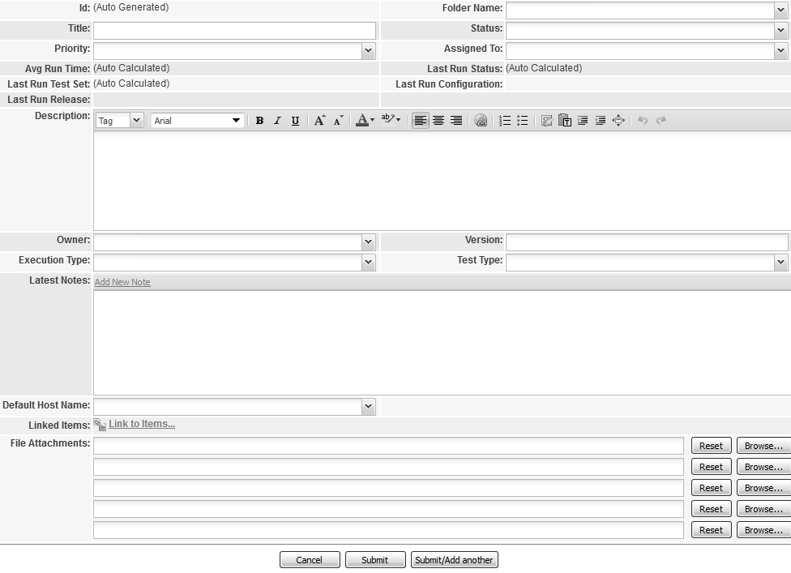

*Рисунок 2.4.с — Создание тест-кейса в QAComplete*

1. Id (идентификатор), как видно из соответствующей надписи, автогенерируемый.
2. Title (заглавие), как и в большинстве систем, является обязательным для заполнения.
3. Priority (приоритет) по умолчанию предлагает на выбор значения high (высокий), medium (средний), low (низкий).
4. Folder name (расположение) является аналогом полей «Модуль» и «Подмодуль» и позволяет выбрать из выпадающего древовидного списка соответствующее значение, описывающее, к чему относится тест-кейс.
5. Status (статус) показывает текущее значение тест-кейса: new (новый), approved (утверждён), awaiting approval (на рассмотрении), in design (в разработке), outdated (устарел), rejected (отклонён).
6. Assigned to (исполнитель) указывает, кто в данный момент является «основной рабочей силой» по данному тест-кейсу (или кто должен принять решение о, например, утверждении тест-кейса).
7. Last Run Status (результат последнего запуска) показывает, прошёл ли тест успешно (passed) или завершился неудачей (failed).
8. Last Run Configuration (конфигурация, использованная для последнего запуска) показывает, на какой аппаратно-программной платформе тест-кейс выполнялся в последний раз.

9. Avg Run Time (среднее время выполнения) содержит вычисленное автоматически среднее время, необходимое на выполнение тест-кейса.
10. Last Run Test Set (в последний раз выполнялся в наборе) содержит информацию о наборе тест-кейсов, в рамках которого тест-кейс выполнялся последний раз.
11. Last Run Release (последний раз выполнялся на выпуске) содержит информацию о выпуске (билде) программного средства, на котором тест-кейс выполнялся последний раз.
12. Description (описание) позволяет добавить любую полезную информацию о тест-кейс (включая особенности выполнения, приготовления и т.д.).
13. Owner (владелец) указывает на владельца тест-кейса (как правило — его автора).
14. Execution Type (способ выполнения) по умолчанию предлагает только значение manual (ручное выполнение), но при соответствующих настройках и интеграции с другими продуктами список можно расширить (как минимум добавить automated (автоматизированное выполнение)).
15. Version (версия) содержит номер текущей версии тест-кейса (фактически — счётчик того, сколько раз тест-кейс редактировали). Вся история изменений сохраняется, предоставляя возможность вернуться к любой из предыдущих версий.
16. Test Type (вид теста) по умолчанию предлагает такие варианты, как negative (негативный), positive (позитивный), regression (регрессия), smoke-test (дымовой).
17. Default host name (имя хоста по умолчанию) в основном используется в автоматизированных тест-кейсах и предлагает выбрать из списка имя зарегистрированного компьютера, на котором установлен специальный клиент.
18. Linked Items (связанные объекты) представляют собой ссылки на требования, отчёты о дефектах и т.д.
19. File Attachments (вложения) могут содержать тестовые данные, поясняющие изображения, видеоролики и т.д.

Для описания шагов исполнения и ожидаемых результатов после сохранения общего описания тест-кейса становится доступным дополнительный интерфейс:

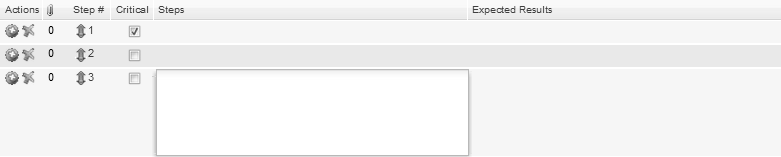

*Рисунок 2.4.d — Добавление шагов тест-кейса в QAComplete*

При необходимости можно добавить и настроить свои дополнительные поля, значительно расширяющие исходные возможности системы.

TestLink$^{300}$


*Рисунок 2.4.е — Создание тест-кейса в TestLink*

1. Title (заглавие) здесь тоже является обязательным для заполнения.
2. Summary (описание) позволяет добавить любую полезную информацию о тест-кейс (включая особенности выполнения, приготовления и т.д.).
3. Steps (шаги выполнения) позволяет описать шаги выполнения.
4. Expected Results (ожидаемые результаты) позволяет описать ожидаемые результаты, относящиеся к шагам выполнения.
5. Available Keywords (доступные ключевые слова) содержит список ключевых слов, которые можно проассоциировать с тест-кейсом для упрощения классификации и поиска тест-кейсов. Это ещё одна вариация идеи «Модулей» и «Подмодулей» (в некоторых системах реализованы оба механизма).
6. Assigned Keywords (назначенные ключевые слова) содержит список ключевых слов, проассоциированных с тест-кейсом.

Как видите, инструментальные средства управления тест-кейсами могут быть и достаточно миниалистичными.

---
$^{300}$ TestLink [http://sourceforge.net/projects/testlink/]

TestRail$^301$

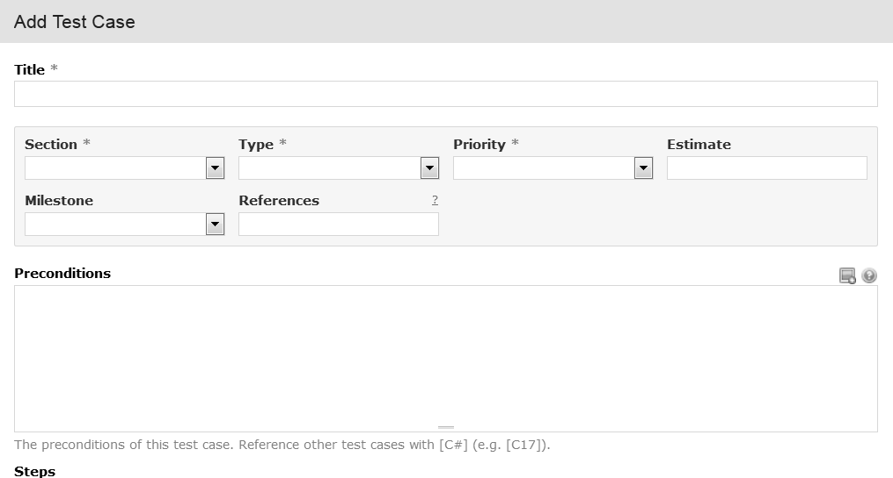

*Рисунок 2.4.f — Создание тест-кейса в TestRail*

1. Title (заглавие) здесь тоже является обязательным для заполнения.
2. Section (секция) — очередная вариация на тему «Модуль» и «Подмодуль», позволяющая создавать иерархию секций, в которых можно размещать тест-кейсы.
3. Type (тип) здесь по умолчанию предлагает выбрать один из вариантов: automated (автоматизированный), functionality (проверка функциональности), performance (производительность), regression (регрессионный), usability (удобство использования), other (прочее).
4. Priority (приоритет) здесь представлен числами, по которым распределены следующие словесные описания: must test (обязательно выполнять), test if time (выполнять, если будет время), don't test (не выполнять).

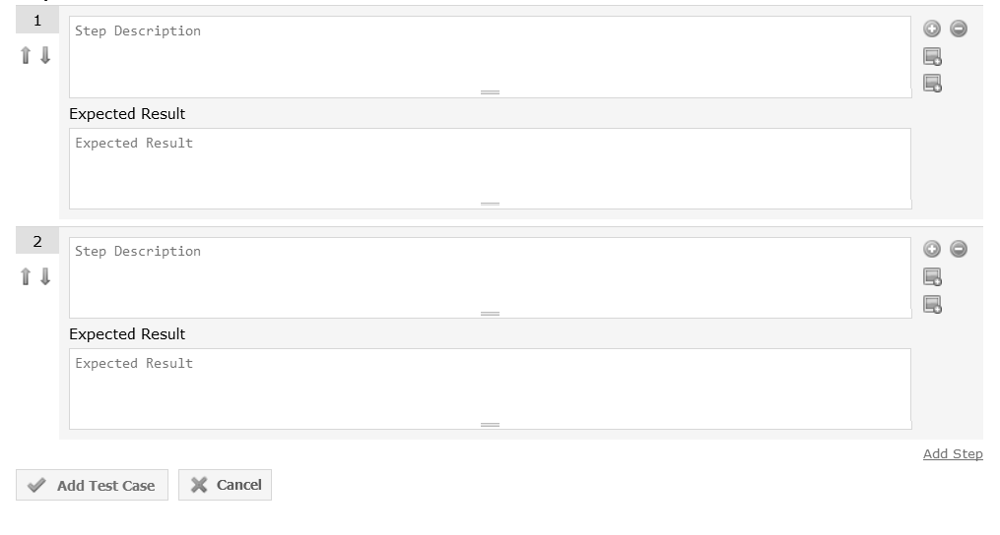

$^301$ TestRail [http://www.gurock.com/testrail/]

5. Estimate (оценка) содержит оценку времени, которое необходимо затратить на выполнение тест-кейса.
6. Milestone (ключевая точка) позволяет указать ключевую точку проекта, к которой данный тест-кейс должен устойчиво показывать положительный результат (выполняться успешно).
7. References (ссылки) позволяет хранить ссылки на такие артефакты, как требования, пользовательские истории, отчёты о дефектах и иные документы (требует дополнительной настройки).
8. Preconditions (приготовления) представляет собой классику описания предварительных условий и необходимых приготовлений к выполнению тест-кейса.
9. Step Description (описание шага) позволяет добавлять описание отдельного шага тест-кейса.
10. Expected Results (ожидаемые результаты) позволяет описать ожидаемый результат по каждому шагу.

**Задание 2.4.с:** изучите ещё 3–5 инструментальных средств управления тест-кейсами, почитайте документацию по ним, посоздавайте в них несколько тест-кейсов.

2.4.5. СВОЙСТВА КАЧЕСТВЕННЫХ ТЕСТ-КЕЙСОВ

Даже правильно оформленный тест-кейс может оказаться некачественным, если в нём нарушено одно из следующих свойств.

**Правильный технический язык, точность и единообразие формулировок.** Это свойство в равной мере относится и к требованиям, и к тест-кейсам, и к отчётам о дефектах — к любой документации. Основные идеи уже были описаны (см. главу «Атрибуты (поля) тест-кейсов»{126}), а из самого общего и важного напомним и добавим:

* пишите лаконично, но понятно;
* используйте безличную форму глаголов (например, «открыть» вместо «откройте»);
* обязательно указывайте точные имена и технически верные названия элементов приложения;
* не объясняйте базовые принципы работы с компьютером (предполагается, что ваши коллеги знают, что такое, например, «пункт меню» и как с ним работать);
* везде называйте одни и тем же вещи одинаково (например, нельзя в одном тест-кейсе некий режим работы приложения назвать «графическое представление», а в другом тот же режим — «визуальное отображение», т.к. многие люди могут подумать, что речь идёт о разных вещах);
* следуйте принятому на проекте стандарту оформления и написания тест-кейсов (иногда такие стандарты могут быть весьма жёсткими: вплоть до регламентации того, названия каких элементов должны быть приведены в двойных кавычках, а каких — в одинарных).

**Баланс между специфичностью и общностью.** Тест-кейс считается тем более специфичным, чем более детально в нём расписаны конкретные действия, конкретные значения и т.д., т.е. чем в нём больше конкретики. Соответственно, тест-кейс считается тем более общим, чем в нём меньше конкретики.

Рассмотрим поля «шаги» и «ожидаемые результаты» двух тест-кейсов (подумайте, какой тест-кейс вы бы посчитали хорошим, а какой — плохим и почему):

Тест-кейс 1:

| Шаги | Ожидаемые результаты |
| :--- | :--- |
| **Конвертация из всех поддерживаемых кодировок**<br>Приготовления:<br>• Создать папки C:/A, C:/B, C:/C, C:/D.<br>• Разместить в папке C:/D файлы 1.html, 2.txt, 3.md из прилагаемого архива.<br>1. Запустить приложение, выполнив команду «php converter.php c:/a c:/b c:/c/converter.log».<br>2. Скопировать файлы 1.html, 2.txt, 3.md из папки C:/D в папку C:/A.<br>3. Остановить приложение нажатием Crtl+C. | 1. Отображается консольный журнал приложения с сообщением «текущее_время started, source dir c:/a, destination dir c:/b, log file c:/c/converter.log», в папке C:/C появляется файл converter.log, в котором появляется запись «текущее_время started, source dir c:/a, destination dir c:/b, log file c:/c/converter.log».<br>2. Файлы 1.html, 2.txt, 3.md появляются в папке C:/A, затем пропадают оттуда и появляются в папке C:/B. В консольном журнале и файле C:/C/converter.log появляются сообщения (записи) «текущее_время processing 1.html (KOI8-R)», «текущее_время processing 2.txt (CP-1251)», «текущее_время processing 3.md (CP-866)».<br>3. В файле C:/C/converter.log появляется запись «текущее_время closed». Приложение завершает работу. |

Тест-кейс 2:

| Шаги | Ожидаемые результаты |
| :--- | :--- |
| **Конвертация из всех поддерживаемых кодировок**<br>1. Выполнить конвертацию трёх файлов допустимого размера в трёх разных кодировках всех трёх допустимых форматов. | 1. Файлы перемещаются в папку-приёмник, кодировка всех файлов меняется на UTF-8. |

Если вернуться к вопросу «какой тест-кейс вы бы посчитали хорошим, а какой — плохим и почему», то ответ таков: оба тест-кейс плохие потому, что первый является слишком специфичным, а второй — слишком общим. Можно сказать, что здесь до абсурда доведены идеи низкоуровневых$^{\{123\}}$ и высокоуровневых$^{\{123\}}$ тест-кейсов.

Почему плоха излишняя специфичность (тест-кейс 1):
* при повторных выполнениях тест-кейса всегда будут выполняться строго одни и те же действия со строго одними и теми же данными, что снижает вероятность обнаружения ошибки;
* возрастает время написания, доработки и даже просто прочтения тест-кейса;
* в случае выполнения тривиальных действий опытные специалисты тратят дополнительные мыслительные ресурсы в попытках понять, что же они упустили из виду, т.к. они привыкли, что так описываются только самые сложные и неочевидные ситуации.

Почему плоха излишняя общность (тест-кейс 2):
* тест-кейс сложен для выполнения начинающими тестировщиками или даже опытными специалистами, лишь недавно подключившимися к проекту;
* недобросовестные сотрудники склонны халатно относиться к таким тест-кейсам;
* тестировщик, выполняющий тест-кейс, может понять его иначе, чем было задумано автором (и в итоге будет выполнен фактически совсем другой тест-кейс).

Выход из этой ситуации состоит в том, чтобы придерживаться золотой середины (хотя, конечно же, какие-то тесты будут чуть более специфичными, какие-то — чуть более общими). Вот пример такого срединного подхода:

Тест-кейс 3:

| Шаги | Ожидаемые результаты |
| :--- | :--- |
| **Конвертация из всех поддерживаемых кодировок**<br><br>Приготовления:<br>• Создать в корне любого диска четыре отдельные папки для входных файлов, выходных файлов, файла журнала и временного хранения тестовых файлов.<br>• Распаковать содержимое прилагаемого архива в папку для временного хранения тестовых файлов.<br><br>1. Запустить приложение, указав в параметрах соответствующие пути из приготовления к тесту (имя файла журнала — произвольное).<br>2. Скопировать файлы из папки для временного хранения в папку для входных файлов.<br>3. Остановить приложение. | 1. Приложение запускается и выводит сообщение о своём запуске в консоль и файл журнала.<br>2. Файлы из папки для входных файлов перемещаются в папку для выходных файлов, в консоли и файле журнала отображаются сообщения о конвертации каждого из файлов с указанием его исходной кодировки.<br>3. Приложение выводит сообщение о завершении работы в файл журнала и завершает работу. |

В этом тест-кейсé есть всё необходимое для понимания и выполнения, но при этом он стал короче и проще для выполнения, а отсутствие строго указанных значений приводит к тому, что при многократном выполнении тест-кейса (особенно — разными тестировщиками) конкретные параметры будут менять свои значения, что увеличивает вероятность обнаружения ошибки.

Ещё раз главная мысль: сами по себе специфичность или общность тест-кейса не являются чем-то плохим, но резкий перекос в ту или иную сторону снижает качество тест-кейса.

**Баланс между простотой и сложностью.** Здесь не существует академических определений, но принято считать, что простой тест-кейс оперирует одним объектом (или в нём явно виден главный объект), а также содержит небольшое количество тривиальных действий; сложный тест-кейс оперирует несколькими равноправными объектами и содержит много нетривиальных действий.

Преимущества простых тест-кейсов:
* их можно быстро прочесть, легко понять и выполнить;
* они понятны начинающим тестировщикам и новым людям на проекте;
* они делают наличие ошибки очевидным (как правило, в них предполагается выполнение повседневных тривиальных действий, проблемы с которыми видны невооружённым взглядом и не вызывают дискуссий);
* они упрощают начальную диагностику ошибки, т.к. сужают круг поиска.

Преимущества сложных тест-кейсов:
* при взаимодействии многих объектов повышается вероятность возникновения ошибки;
* пользователи, как правило, используют сложные сценарии, а потому сложные тесты более полноценно эмулируют работу пользователей;
* программисты редко проверяют такие сложные случаи (и они совершенно не обязаны это делать).

Рассмотрим примеры.

Слишком простой тест-кейс:

| Шаги | Ожидаемые результаты |
| :--- | :--- |
| **Запуск приложения**<br>1. Запустить приложение. | 1. Приложение запускается. |

Слишком сложный тест-кейс:

| Шаги | Ожидаемые результаты |
| :--- | :--- |
| **Повторная конвертация**<br>Приготовления:<br>- Создать в корне любого диска три отдельные папки для входных файлов, выходных файлов, файла журнала.<br>- Подготовить набор из нескольких файлов максимального поддерживаемого размера поддерживаемых форматов с поддерживаемыми кодировками, а также нескольких файлов допустимого размера, но недопустимого формата.<br>1. Запустить приложение, указав в параметрах соответствующие пути из приготовления к тесту (имя файла журнала — произвольное).<br>2. Скопировать в папку для входных файлов несколько файлов допустимого формата.<br>3. Переместить сконвертированные файлы из папки с результирующими файлами в папку для входных файлов.<br>4. Переместить сконвертированные файлы из папки с результирующими файлами в папку с набором файлов для теста.<br>5. Переместить все файлы из папки с набором файлов для теста в папку для входных файлов.<br>6. Переместить сконвертированные файлы из папки с результирующими файлами в папку для входных файлов. | 2. Файлы постепенно перемещаются из входной в выходную папку, в консоли и файле журнала появляются сообщения об успешной конвертации файлов.<br>3. Файлы постепенно перемещаются из входной в выходную папку, в консоли и файле журнала появляются сообщения об успешной конвертации файлов.<br>5. Файлы постепенно перемещаются из входной в выходную папку, в консоли и файле журнала появляются сообщения об успешной конвертации файлов допустющего формата и сообщения об игнорировании файлов недопустимого формата.<br>6. Файлы постепенно перемещаются из входной в выходную папку, в консоли и файле журнала появляются сообщения об успешной конвертации файлов допустимого формата и сообщения об игнорировании файлов недопустимого формата. |

Этот тест-кейс одновременно является слишком сложным по избыточности действий и по спецификации лишних данных и операций.

**Задание 2.4.d:** перепишите этот тест-кейс, устранив его недостатки, но сохранив общую цель (проверку повторной конвертации уже ранее сконвертированных файлов).

Примером хорошего простого тест-кейса может служить тест-кейс $3^{\{140\}}$ из пункта про специфичность и общность.

Пример хорошего сложного тест-кейса может выглядеть так:

| Шаги | Ожидаемые результаты |
| :--- | :--- |
| **Много копий приложения, конфликт файловых операций**<br><br>Приготовления:<br>• Создать в корне любого диска три отдельные папки для входных файлов, выходных файлов, файла журнала.<br>• Подготовить набор из нескольких файлов максимального поддерживаемого размера поддерживаемых форматов с поддерживаемыми кодировками.<br>1. Запустить первую копию приложения, указав в параметрах соответствующие пути из приготовления к тесту (имя файла журнала — произвольное).<br>2. Запустить вторую копию приложения с теми же параметрами (см. шаг 1).<br>3. Запустить третью копию приложения с теми же параметрами (см. шаг 1).<br>4. Изменить приоритет процессов второй (“high”) и третьей (“low”) копий.<br>5. Скопировать подготовленный набор исходных файлов в папку для входных файлов. | 3. Все три копии приложения запускаются, в файле журнала появляются последовательно три записи о запуске приложения.<br><br>5. Файлы постепенно перемещаются из входной в выходную папку, в консоли и файле журнала появляются сообщения об успешной конвертации файлов, а также (возможно) сообщения вида:<br>&nbsp;&nbsp;&nbsp;&nbsp;a. “source file inaccessible, retrying”.<br>&nbsp;&nbsp;&nbsp;&nbsp;b. “destination file inaccessible, retrying”.<br>&nbsp;&nbsp;&nbsp;&nbsp;c. “log file inaccessible, retrying”.<br><br>Ключевым показателем корректной работы является успешная конвертация всех файлов, а также появление в консоли и файле журнала сообщений об успешной конвертации каждого файла (от одной до трёх записей на каждый файл).<br><br>Сообщения (предупреждения) о недоступности входного файла, выходного файла или файла журнала также являются показателем корректной работы приложения, однако их количество зависит от многих внешних факторов и не может быть спрогнозировано заранее. |

Иногда более сложные тест-кейсы являются также и более специфичными, но это лишь общая тенденция, а не закон. Также нельзя по сложности тест-кейса однозначно судить о его приоритете (в нашем примере хорошего сложного тест-кейса он явно будет иметь очень низкий приоритет, т.к. проверяемая им ситуация является искусственной и крайне маловероятной, но бывают и сложные тесты с самым высоким приоритетом).

Как и в случае специфичности и общности, сами по себе простота или сложность тест-кейсов не являются чем-то плохим (более того — рекомендуется начинать разработку и выполнение тест-кейсов с простых, а затем переходить ко всё более и более сложным), однако излишняя простота и излишняя сложность также снижают качество тест-кейса.

«**Показательность**» (**высокая вероятность обнаружения ошибки**). Начиная с уровня тестирования критического пути^[81], можно утверждать, что тест-кейс является тем более хорошим, чем он более показателен (с большей вероятностью обнаруживает ошибку). Именно поэтому мы считаем непригодными слишком простые тест-кейсы — они непоказательны.

Пример непоказательного (плохого) тест-кейса:

| Шаги | Ожидаемые результаты |
| :--- | :--- |
| **Запуск и остановка приложения**<br>1. Запустить приложение с корректными параметрами.<br>2. Завершить работу приложения. | 1. Приложение запускается.<br>2. Приложение завершает работу. |

Пример показательного (хорошего) тест-кейса:

| Шаги | Ожидаемые результаты |
| :--- | :--- |
| **Запуск с некорректными параметрами, несуществующие пути**<br>1. Запустить приложение со всеми тремя параметрами (SOURCE_DIR, DESTINATION_DIR, LOG_FILE_NAME), значения которых указывают на несуществующие в файловой системе пути (например: z:\src\, z:\dst\, z:\log.txt при условии, что в системе нет логического диска z). | 1. В консоли отображаются нижеуказанные сообщения, приложение завершает работу.<br>Сообщения:<br>&nbsp;&nbsp;&nbsp;&nbsp;a. Сообщение об использовании.<br>&nbsp;&nbsp;&nbsp;&nbsp;b. SOURCE_DIR [z:\src]: directory not exists or inaccessible.<br>&nbsp;&nbsp;&nbsp;&nbsp;c. DESTINATION_DIR [z:\dst]: directory not exists or inaccessible.<br>&nbsp;&nbsp;&nbsp;&nbsp;d. LOG_FILE_NAME [z:\log.txt]: wrong file name or inaccessible path. |

Обратите внимание, что показательный тест-кейс по-прежнему остался достаточно простым, но он проверяет ситуацию, возникновение ошибки в которой несравненно более вероятно, чем в ситуации, описываемой плохим непоказательным тест-кейсом.

Также можно сказать, что показательные тест-кейсы часто выполняют какие-то «интересные действия», т.е. такие действия, которые едва ли будут выполнены просто в процессе работы с приложением (например: «сохранить файл» — это обычное тривиальное действие, которое явно будет выполнено не одну сотню раз даже самими разработчиками, а вот «сохранить файл на носитель, защищённый от записи», «сохранить файл на носитель с недостаточным объёмом свободного пространства», «сохранить файл в папку, к которой нет доступа» — это уже гораздо более интересные и нетривиальные действия).

**Последовательность в достижении цели.** Суть этого свойства выражается в том, что все действия в тест-кейсе направлены на следование единой логике и достижение единой цели и не содержат никаких отклонений.

Примерами правильной реализации этого свойства могут служить представленные в этом разделе в избытке примеры хороших тест-кейсов. А нарушение может выглядеть так:

| Шаги | Ожидаемые результаты |
| :--- | :--- |
| **Конвертация из всех поддерживаемых кодировок**<br>Приготовления:<br>• Создать в корне любого диска четыре отдельные папки для входных файлов, выходных файлов, файла журнала и временного хранения тестовых файлов.<br>• Распаковать содержимое прилагаемого архива в папку для временного хранения тестовых файлов.<br>1. Запустить приложение, указав в параметрах соответствующие пути из приготовления к тесту (имя файла журнала — произвольное).<br>2. Скопировать файлы из папки для временного хранения в папку для входных файлов.<br>3. Остановить приложение.<br>4. Удалить файл журнала.<br>5. Повторно запустить приложение с теми же параметрами.<br>6. Остановить приложение. | 1. Приложение запускается и выводит сообщение о своём запуске в консоль и файл журнала.<br>2. Файлы из папки для входных файлов перемещаются в папку для выходных файлов, в консоли и файле журнала отображаются сообщения о конвертации каждого из файлов с указанием его исходной кодировки.<br>3. Приложение выводит сообщение о завершении работы в файл журнала и завершает работу.<br>5. Приложение запускается и выводит сообщение о своём запуске в консоль и заново созданный файл журнала.<br>6. Приложение выводит сообщение о завершении работы в файл журнала и завершает работу. |

Шаги 3–5 никак не соответствуют цели тест-кейса, состоящей в проверке корректности конвертации входных данных, представленных во всех поддерживаемых кодировках.

**Отсутствие лишних действий.** Чаще всего это свойство подразумевает, что не нужно в шагах тест-кейса долго и по пунктам расписывать то, что можно заменить одной фразой:

| Плохо | Хорошо |
| :--- | :--- |
| 1. Указать в качестве первого параметра приложения путь к папке с исходными файлами.<br>2. Указать в качестве второго параметра приложения путь к папке с конечными файлами.<br>3. Указать в качестве третьего параметра приложения путь к файлу журнала.<br>4. Запустить приложение. | 1. Запустить приложение со всеми тремя корректными параметрами (например, `c:\src`, `c:\dst`, `c:\log.txt` при условии, что соответствующие папки существуют и доступны приложению). |

Вторая по частоте ошибка — начало каждого тест-кейса с запуска приложения и подробного описания по приведению его в то или иное состояние. В наших примерах мы рассматриваем каждый тест-кейс как существующий в единственном виде в изолированной среде, и потому вынуждены осознанно допускать эту ошибку (иначе тест-кейс будет неполным), но в реальной жизни на запуск приложения будут свои тесты, а длинный путь из многих действий можно описать как одно действие, из контекста которого понятно, как это действие выполнить.

Следующий пример тест-кейса не относится к нашему «Конвертеру файлов», но очень хорошо иллюстрирует эту мысль:

| Плохо | Хорошо |
| :--- | :--- |
| 1. Запустить приложение.<br>2. Выбрать в меню пункт «Файл».<br>3. Выбрать подпункт «Открыть».<br>4. Перейти в папку, в которой находится хотя бы один файл формата DOCX с тремя и более страницами. | 1. Открыть DOCX-файл с тремя и более страницами. |

И сюда же можно отнести ошибку с повторением одних и тех же приготовлений во множестве тест-кейсов (да, по описанным выше причинам в примерах мы снова вынужденно делаем так, как в жизни делать не надо). Куда удобнее объединить тесты в набор{148} и указать приготовления один раз, подчеркнув, нужно или нет их выполнять перед каждым тест-кейсом в наборе.

 Проблема с подготовительными (и финальными) действиями идеально решена в автоматизированном модульном тестировании{302} с использованием фреймворков наподобие JUnit или TestNG — там существует специальный «механизм фиксаций» (fixture), автоматически выполняющий указанные действия перед каждым отдельным тестовым методом (или их совокупности) или после него.

**Неизбыточность по отношению к другим тест-кейсам.** В процессе создания множества тест-кейсов очень легко оказаться в ситуации, когда два и более тест-кейса фактически выполняют одни и те же проверки, преследуют одни и те же цели, направлены на поиск одних и тех же проблем. Способ минимизации количества таких тест-кейсов подробно описан в главе «Виды и направления тестирования{66}» (см. такие техники тестирования, как использование классов эквивалентности{96} и граничных условий{96}).

---
{302} **Unit testing (component testing).** The testing of individual software components. [ISTQB Glossary]

Если вы обнаруживаете несколько тест-кейсов, дублирующих задачи друг друга, лучше всего или удалить все, кроме одного, самого показательного, или перед удалением остальных на их основе доработать этот выбранный самый показательный тест-кейс.

**Демонстративность (способность демонстрировать обнаруженную ошибку очевидным образом).** Ожидаемые результаты должны быть подобраны и сформулированы таким образом, чтобы любое отклонение от них сразу же бросалось в глаза и становилось очевидным, что произошла ошибка. Сравните выдержки из двух тест-кейсов.

Выдержка из недемонстративного тест-кейса:

| Шаги | Ожидаемые результаты |
| :--- | :--- |
| 5. Разместить в файле текст «Пример длинного текста, содержащего символы русского и английского алфавита вперемешку.» в кодировке KOI8-R (в слове «Пример» буквы «р» — английские).<br>6. Сохранить файл под именем «test. txt» и отправить файл на конвертацию.<br>7. Переименовать файл в «test.txt». | 6. Приложение игнорирует файл.<br>7. Текст принимает корректный вид в кодировке UTF-8 с учётом английских букв. |

Выдержка из демонстративного тест-кейса:

| Шаги | Ожидаемые результаты |
| :--- | :--- |
| 5. Разместить в файле текст «ЁTT╔╤╨╙╘╦╚» (Эти символы представляют собой словосочетание «Пример текста.» в кодировке KOI8-R, прочитанной как CP866).<br>6. Отправить файл на конвертацию. | 6. Текст принимает вид: «Пример текста.» (кодировка UTF8). |

В первом случае тест-кейс плох не только расплывчатостью формулировки «корректный вид в кодировке UTF-8 с учётом английских букв», там также очень легко допустить ошибки при выполнении:
* забыть сконвертировать вручную входной текст в KOI8-R;
* не заметить, что в первый раз расширение начинается с пробела;
* забыть заменить в слове «Пример» буквы «р» на английские;
* из-за расплывчатости формулировки ожидаемого результата принять ошибочное, но выглядящее правдоподобно поведение за верное.

Второй тест-кейс чётко ориентирован на свою цель по проверке конвертации (не содержит странной проверки с игнорированием файла с неверным расширением) и описан так, что его выполнение не представляет никаких сложностей, а любое отклонение фактического результата от ожидаемого будет сразу же заметно.

**Прослеживаемость.** Из содержащейся в качественном тест-кейсе информации должно быть понятно, какую часть приложения, какие функции и какие требования он проверяет. Частично это свойство достигается через заполнение соответствующих полей тест-кейса\textsuperscript{\{126\}} («Ссылка на требование», «Модуль», «Подмодуль»), но и сама логика тест-кейса играет не последнюю роль, т.к. в случае серьёзных нарушений этого свойства можно долго с удивлением смотреть, например, на какое требование ссылается тест-кейс, и пытаться понять, как же они друг с другом связаны.

Пример непрослеживаемого тест-кейса:

| Требование | Модуль | Подмодуль | Шаги | Ожидаемые результаты |
| :--- | :--- | :--- | :--- | :--- |
| ПТ-4 | Приложение | | **Совмещение кодировок**<br>Приготовления: файл с несколькими допустимыми и недопустимыми кодировками.<br>1. Передать файл на конвертацию. | 1. Допустимые кодировки конвертируются верно, недопустимые остаются без изменений. |

Да, этот тест-кейс плох сам по себе (в качественном тест-кейсе сложно получить ситуацию непрослеживаемости), но в нём есть и особые недостатки, затрудняющие прослеживаемость:
* Ссылка на несуществующее требование (убедитесь сами, требования ПТ-4 нет{$^{59}$}).
* В поле «Модуль» указано значение «Приложение» (по большому счёту можно было оставлять это поле пустым — это было бы столь же информативно), поле «Подмодуль» не заполнено.
* По заглавию и шагам можно предположить, что этот тест-кейс ближе всего к ДС-5.1 и ДС-5.3, но сформулированный ожидаемый результат не следует явно из этих требований.

Пример прослеживаемого тест-кейса:

| Требование | Модуль | Подмодуль | Шаги | Ожидаемые результаты |
| :--- | :--- | :--- | :--- | :--- |
| ДС-2.4,<br>ДС-3.2 | Стартер | Обработчик ошибок | **Запуск с некорректными параметрами, несуществующие пути**<br>1. Запустить приложение со всеми тремя параметрами, значения которых указывают на несуществующие в файловой системе пути. | 1. В консоли отображаются нижеуказанные сообщения, приложение завершает работу. Сообщения<br>a. `SOURCE_DIR [путь]: directory not exists or inaccessible`.<br>b. `DESTINATION_DIR [путь]: directory not exists or inaccessible`.<br>c. `LOG_FILE_NAME [имя]: wrong file name or inaccessible path`. |

Можно подумать, что этот тест-кейс затрагивает ДС-2 и ДС-3 целиком, но в поле «Требование» есть вполне чёткая конкретизация, к тому же указанные модуль, подмодуль и сама логика тест-кейса устраняют оставшиеся сомнения.

Некоторые авторы также подчёркивают, что прослеживаемость тест-кейса связана с его не- избыточностью{$^{144}$} по отношению к другим тест-кейсам (намного проще дать ссылку на один уникальный тест-кейс, чем выбирать из нескольких очень похожих).

**Возможность повторного использования.** Это свойство редко выполняется для низкоуровневых тест-кейсов{$^{123}$}, но при создании высокоуровневых тест-кейсов{$^{123}$} можно добиться таких формулировок, при которых:
* тест-кейс будет пригодным к использованию с различными настройками тестируемого приложения и в различных тестовых окружениях;

* тест-кейс практически без изменений можно будет использовать для тестирования аналогичной функциональности в других проектах или других областях приложения.

Примером тест-кейса, который тяжело использовать повторно, может являться практически любой тест-кейс с высокой специфичностью.

Не самым идеальным, но очень наглядным примером тест-кейса, который может быть легко использован в разных проектах, может служить следующий тест-кейс:

| Шаги | Ожидаемые результаты |
| :--- | :--- |
| **Запуск, все параметры некорректны** | 1. Приложение запускается, после чего выводит сообщение с описанием сути проблемы с каждым из параметров и завершает работу. |
| 1. Запустить приложение, указав в качестве всех параметров заведомо некорректные значения. | |

**Повторяемость.** Тест-кейс должен быть сформулирован таким образом, чтобы при многократном повторении он показывал одинаковые результаты. Это свойство можно разделить на два подпункта:

* во-первых, даже общие формулировки, допускающие разные варианты выполнения тест-кейса, должны очерчивать соответствующие явные границы (например: «ввести какое-нибудь число» — плохо, «ввести целое число в диапазоне от -273 до +500 включительно» — хорошо);
* действия (шаги) тест-кейса по возможности не должны приводить к необратимым (или сложно обратимым) последствиям (например: удалению данных, нарушению конфигурации окружения и т.д.) — не стоит включать в тест-кейс такие «разрушительные действия», если они не продиктованы явным образом целью тест-кейса; если же цель тест-кейса обязывает нас к выполнению таких действий, в самом тест-кейсе должно быть описание действий по восстановлению исходного состояния приложения (данных, окружения).

**Соответствие принятым шаблонам оформления и традициям.** С шаблонами оформления, как правило, проблем не возникает: они строго определены имеющимся образцом или вообще экранной формой инструментального средства управления тест-кейсами. Что же касается традиций, то они отличаются даже в разных командах в рамках одной компании, и тут невозможно дать иного совета, кроме как «почитайте уже готовые тест-кейсы перед тем как писать свои».

В данном случае обойдёмся без отдельных примеров, т.к. выше и без того приведено много правильно оформленных тест-кейсов, а что касается нарушений этого свойства, то они прямо или косвенно описаны в главе «Типичные ошибки при разработке чек-листов, тест-кейсов и наборов тест-кейсов»{161}.

## 2.4.6. НАБОРЫ ТЕСТ-КЕЙСОВ

### ТЕРМИНОЛОГИЯ И ОБЩИЕ СВЕДЕНИЯ

**Набор тест-кейсов** (test case suite$^{303}$, test suite, test set) — совокупность тест-кейсов, выбранных с некоторой общей целью или по некоторому общему признаку. Иногда в такой совокупности результаты завершения одного тест-кейса становятся входным состоянием приложения для следующего тест-кейса.

Внимание! Из-за особенностей перевода очень часто вместо «набор тест-кейсов» говорят «тестовый сценарий». Формально это можно считать ошибкой, но это явление приобрело настолько широкое распространение, что стало вариантом нормы.

Как мы только что убедились на примере множества отдельных тест-кейсов, крайне неудобно (более того, это ошибка!) каждый раз писать в каждом тест-кейсе одни и те же приготовления и повторять одни и те же начальные шаги.

Намного удобнее объединить несколько тест-кейсов в набор или последовательность. И здесь мы приходим к классификации наборов тест-кейсов.

В общем случае наборы тест-кейсов можно разделить на свободные (порядок выполнения тест-кейсов не важен) и последовательные (порядок выполнения тест-кейсов важен).

Преимущества свободных наборов:

* Тест-кейсы можно выполнять в любом удобном порядке, а также создавать «наборы внутри наборов».
* Если какой-то тест-кейс завершился ошибкой, это не повлияет на возможность выполнения других тест-кейсов.

Преимущества последовательных наборов:

* Каждый следующий в наборе тест-кейс в качестве входного состояния приложения получает результат работы предыдущего тест-кейса, что позволяет сильно сократить количество шагов в отдельных тест-кейсах.
* Длинные последовательности действий куда лучше имитируют работу реальных пользователей, чем отдельные «точечные» воздействия на приложение.

### ПОЛЬЗОВАТЕЛЬСКИЕ СЦЕНАРИИ (СЦЕНАРИИ ИСПОЛЬЗОВАНИЯ)

В данном случае речь НЕ идёт о use cases (вариантах использования), представляющих собой форму требований$^{[39]}$. Пользовательские сценарии как техника тестирования куда менее формализованы, хотя и могут строиться на основе вариантов использования.

К отдельному подвиду последовательных наборов тест-кейсов (или даже неоформленных идей тест-кейсов, таких как пункты чек-листа) можно отнести пользовательские сценарии$^{304}$

---

$^{303}$ **Test case suite (test suite, test set)**. A set of several test cases for a component or system under test, where the post condition of one test is often used as the precondition for the next one. [ISTQB Glossary]  
$^{304}$ A scenario is a hypothetical story, used to help a person think through a complex problem or system. [Cem Kaner, «An Introduction to Scenario Testing», http://www.kaner.com/pdfs/ScenarioIntroVer4.pdf]

(или сценарии использования), представляющие собой цепочки действий, выполняемых пользователем в определённой ситуации для достижения определённой цели.

Поясним это сначала на примере, не относящемся к «Конвертеру файлов». Допустим, пользователь хочет распечатать табличку на дверь кабинета с текстом «Идёт работа, не стучать!». Для этого ему нужно:
1) Запустить текстовый редактор.
2) Создать новый документ (если редактор не делает это самостоятельно).
3) Набрать в документе текст.
4) Отформатировать текст должным образом.
5) Отправить документ на печать.
6) Сохранить документ (спорно, но допустим).
7) Закрыть текстовый редактор.

Вот мы и получили пользовательский сценарий, пункты которого могут стать основой для шагов тест-кейса или целого набора отдельных тест-кейсов.

Сценарии могут быть достаточно длинными и сложными, могут содержать внутри себя циклы и условные ветвления, но при всём этом они обладают рядом весьма интересных преимуществ:
* Сценарии показывают реальные и понятные примеры использования продукта (в отличие от обширных чек-листов, где смысл отдельных пунктов может теряться).
* Сценарии понятны конечным пользователям и хорошо подходят для обсуждения и совместного улучшения.
* Сценарии и их части легче оценивать с точки зрения важности, чем отдельные пункты (особенно низкоуровневых) требований.
* Сценарии отлично показывают недоработки в требованиях (если становится непонятно, что делать в том или ином пункте сценария, — с требованиями явно что-то не то).
* В предельном случае (нехватка времени и прочие форс-мажоры) сценарии можно даже не прописывать подробно, а просто именовать — и само наименование уже подскажет опытному специалисту, что делать.

Последний пункт проиллюстрируем на примере. Классифицируем потенциальных пользователей нашего приложения (напомним, что в нашем случае «пользователь» — это администратор, настраивающий работу приложения) по степени квалификации и склонности к экспериментам, а затем дадим каждому «виду пользователя» запоминающееся имя.

*Таблица 2.4.а — Классификация пользователей*

| | Низкая квалификация | Высокая квалификация |
| :--- | :--- | :--- |
| **Не склонен к экспериментам** | «Осторожный» | «Консервативный» |
| **Склонен к экспериментам** | «Отчаянный» | «Изощрённый» |

Согласитесь, уже на этой стадии не составляет труда представить себе отличия в логике работы с приложением, например, «консервативного» и «отчаянного» пользователей.

Но мы пойдём дальше и озаглавим для них сами сценарии, например, в ситуациях, когда такой пользователь позитивно и негативно относится к идее внедрения нашего приложения:

*Таблица 2.4.b — Сценарии поведения на основе классификации пользователей*

| | «Осторожный» | «Консервативный» | «Отчаянный» | «Изощрённый» |
| :--- | :--- | :--- | :--- | :--- |
| **Позитивно** | «А можно вот так?» | «Начнём с инструкции!» | «Гляньте, что я придумал!» | «Я всё оптимизирую!» |
| **Негативно** | «Я ничего не понимаю.» | «У вас вот здесь несоответствие...» | «Всё равно поломаю!» | «А я говорил!» |

Проявив даже самую малость воображения, можно представить, что и как будет происходить в каждой из получившихся восьми ситуаций. Причём на создание пары таких таблиц уходит всего несколько минут, а эффект от их использования на порядки превосходит бездумное «кликанье по кнопкам в надежде найти баг».

Куда более полное и техничное объяснение того, что такое сценарное тестирование, как его применять и выполнять должным образом, можно прочесть в статье Сэма Канера «An Introduction to Scenario Testing»$^{305}$.

## ПОДРОБНАЯ КЛАССИФИКАЦИЯ НАБОРОВ ТЕСТ-КЕЙСОВ

Представленный здесь материал сложно отнести к категории «для начинающих» (и вы можете сразу перейти к пункту «Принципы построения наборов тест-кейсов»$^{\{151\}}$). Но если вам любопытно, взгляните на подробную классификацию, которая представлена ниже.

Подробная классификация наборов тест-кейсов может быть выражена следующей таблицей.

*Таблица 2.4.с — Подробная классификация наборов тест-кейсов*

| | По изолированности тест-кейсов друг от друга | |
| :---: | :---: | :---: |
| | **Изолированные** | **Обобщённые** |
| **По образованию тест-кейсами строгой последовательности** | **Свободные** | Изолированные свободные | Обобщённые свободные |
| | **Последовательные** | Изолированные последовательные | Обобщённые последовательные |

* Набор изолированных свободных тест-кейсов (рисунок 2.4.g): действия из раздела «приготовления» нужно повторить перед каждым тест-кейсом, а сами тест-кейсы можно выполнять в любом порядке.
* Набор обобщённых свободных тест-кейсов (рисунок 2.4.h): действия из раздела «приготовления» нужно выполнить один раз (а потом просто выполнять тест-кейсы), а сами тест-кейсы можно выполнять в любом порядке.
* Набор изолированных последовательных тест-кейсов (рисунок 2.4.i): действия из раздела «приготовления» нужно повторить перед каждым тест-кейсом, а сами тест-кейсы нужно выполнять в строго определённом порядке.
* Набор обобщённых последовательных тест-кейсов (рисунок 2.4.j): действия из раздела «приготовления» нужно выполнить один раз (а потом просто выполнять тест-кейсы), а сами тест-кейсы нужно выполнять в строго определённом порядке.

Главное преимущество изолированности: каждый тест-кейс выполняется в «чистой среде», на него не влияют результаты работы предыдущих тест-кейсов.

Главное преимущество обобщённости: приготовления не нужно повторять (экономия времени).

Главное преимущество последовательности: ощутимое сокращение шагов в каждом тест-кейс, т.к. результат выполнения предыдущего тест-кейса является начальной ситуацией для следующего.

Главное преимущество свободы: возможность выполнять тест-кейсы в любом порядке, а также то, что при провале некоего тест-кейса (приложение не пришло в ожидаемое состояние) остальные тест-кейсы по-прежнему можно выполнять.

---

$^{305}$ «An Introduction to Scenario Testing», Cem Kaner [http://www.kaner.com/pdfs/ScenarioIntroVer4.pdf]

```mermaid
graph TD
    subgraph " "
        P1["Приготовления"] --> T1["Тест 1"]
        P2["Приготовления"] --> T3["Тест 3"]
        P3["Приготовления"] --> T2["Тест 2"]
    end
```
*Рисунок 2.4.g — Набор изолированных свободных тест-кейсов*

```mermaid
graph TD
    subgraph " "
        P["Приготовления"] --> T1["Тест 1"]
        P --> T3["Тест 3"]
        P --> T2["Тест 2"]
    end
```
*Рисунок 2.4.h — Набор обобщённых свободных тест-кейсов*

```mermaid
graph TD
    subgraph " "
        P1["Приготовления"] --> T1["Тест 1"]
        T1 --> P2["Приготовления"]
        P2 --> T2["Тест 2"]
        T2 --> P3["Приготовления"]
        P3 --> T3["Тест 3"]
    end
```
*Рисунок 2.4.i — Набор изолированных последовательных тест-кейсов*

```mermaid
graph TD
    subgraph " "
        P["Приготовления"] --> T1["Тест 1"]
        T1 --> T2["Тест 2"]
        T2 --> T3["Тест 3"]
    end
```
*Рисунок 2.4.j — Набор обобщённых последовательных тест-кейсов*

## ПРИНЦИПЫ ПОСТРОЕНИЯ НАБОРОВ ТЕСТ-КЕЙСОВ

Теперь — о самом главном: как формировать наборы тест-кейсов. Правильный ответ звучит очень кратко: логично. И это не шутка. Единственная задача наборов — повысить эффективность тестирования за счёт ускорения и упрощения выполнения тест-кейсов, увеличения глубины исследования некой области приложения или функциональности, следования типичным пользовательским сценариям{148} или удобной последовательности выполнения тест-кейсов и т.д.

Набор тест-кейсов всегда создаётся с какой-то целью, на основе какой-то логики, и по этим же принципам в набор включаются тесты, обладающие подходящими свойствами.

Если же говорить о наиболее типичных подходах к составлению наборов тест-кейсов, то можно обозначить следующее:

* На основе чек-листов. Посмотрите внимательно на примеры чек-листов{118}, которые мы разработали в соответствующем разделе{117}: каждый пункт чек-листа может превратиться в несколько тест-кейсов — и вот мы получаем готовый набор.

* На основе разбиения приложения на модули и подмодули{127}. Для каждого модуля (или его отдельных подмодулей) можно составить свой набор тест-кейсов.
* По принципу проверки самых важных, менее важных и всех остальных функций приложения (именно по этому принципу мы составляли примеры чек-листов{118}).
* По принципу группировки тест-кейсов для проверки некоего уровня требований или типа требований{39}, группы требований или отдельного требования.
* По принципу частоты обнаружения тест-кейсами дефектов в приложении (например, мы видим, что некоторые тест-кейсы раз за разом завершаются неудачей, значит, мы можем объединить их в набор, условно названный «проблемные места в приложении»).
* По архитектурному принципу (см. «многоуровневая архитектура»{149} самостоятельно): наборы для проверки пользовательского интерфейса и всего уровня представления, для проверки уровня бизнес-логики, для проверки уровня данных.
* По области внутренней работы приложения, например: «тест-кейсы, затрагивающие работу с базой данных», «тест-кейсы, затрагивающие работу с файловой системой», «тест-кейсы, затрагивающие работу с сетью», и т. д.
* По видам тестирования (см. главу «Подробная классификация тестирования»{68}).

Не нужно заучивать этот список. Это всего лишь примеры — грубо говоря, «первое, что приходит в голову». Важен принцип: если вы видите, что выполнение некоторых тест-кейсов в виде набора принесёт вам пользу, создавайте такой набор.

Примечание: без хороших инструментальных средств управления тест-кейсами работать с наборами тест-кейсов крайне тяжело, т.к. приходится самостоятельно следить за приготовлениями, «недостающими шагами», изолированностью или обобщённостью, свободностью или последовательностью и т.д.

2.4.7. ЛОГИКА СОЗДАНИЯ ЭФФЕКТИВНЫХ ПРОВЕРОК

Теперь, когда мы рассмотрели принципы построения чек-листов{117} и оформления тест-кейсов{126}, свойства качественных тест-кейсов{138}, а также принципы объединения тест-кейсов в наборы{151}, настало время перейти к самой сложной, «философской» части, в которой мы будем рассуждать уже не о том, что и как писать, а о том, как думать.

Ранее уже было сказано: если у тест-кейса не указаны входные данные, условия выполнения и ожидаемые результаты, и/или не ясна **цель** тест-кейса — это плохой тест-кейс. И здесь во главе угла стоит цель. Если мы чётко понимаем, что и зачем мы делаем, мы или быстро находим всю остальную недостающую информацию, или столь же быстро формулируем правильные вопросы и адресуем их правильным людям.

Вся суть работы тестировщика в конечном итоге направлена на повышение качества (процессов, продуктов и т. д.). Но что такое качество? Да, существует сухое официальное определение$^{306}$, но даже там сказано про «user/customer needs and expectations» (потребности и ожидания пользователя/заказчика).

И здесь проявляется главная мысль: **качество — это некая ценность для конечного пользователя** (заказчика). Человек в любом случае платит за использование продукта — деньгами, своим временем, какими-то усилиями (даже если вы не получаете эту «оплату», человек вполне обоснованно считает, что что-то уже на вас потратил, и он прав). Но получает ли он то, на что рассчитывал (предположим, что его ожидания — здравы и реалистичны)?

Если мы подходим к тестированию формально, мы рискуем получить продукт, который по документам (метрикам и т. д.) выглядит идеально, но в реальности никому не нужен.

Поскольку практически любой современный программный продукт представляет собой непростую систему, среди широкого множества её свойств и функций объективно есть самые важные, менее важные и совсем незначительные по важности для пользователей.

Если усилия тестировщиков будут сконцентрированы на первой и второй категории (самом важном и чуть менее важном), наши шансы создать приложение, удовлетворяющее заказчика, резко увеличиваются.

Есть простая логика:
* Тесты ищут ошибки.
* Но все ошибки найти невозможно.
* Значит, наша задача — найти максимум ВАЖНЫХ ошибок за имеющееся время.

Под важными ошибками здесь мы понимаем такие, которые приводят к нарушению важных для пользователя функций или свойств продукта. Функции и свойства разделены не случайно — безопасность, производительность, удобство и т. д. не относятся к функциям, но играют ничуть не менее важную роль в формировании удовлетворённости заказчика и конечных пользователей.

Ситуация усугубляется следующими фактами:
* в силу множества экономических и технических причин мы не можем выполнить «все тесты, что придут нам в голову» (да ещё и многократно) — приходится тщательно выбирать, что и как мы будем тестировать, принимая во внимание только что упомянутую мысль: качество — это некая ценность для конечного пользователя (заказчика);

---
$^{306}$ **Quality.** The degree to which a component, system or process meets specified requirements and/or user/customer needs and expectations. [ISTQB Glossary]

* никогда в реальной жизни (как бы мы ни старались) мы не получим «совершенного и идеального набора требований» — там всегда будет некоторое количество недоработок, и это тоже надо принимать во внимание.

Однако существует достаточно простой алгоритм, позволяющий нам создавать эффективные проверки даже в таких условиях. Приступая к продумыванию чек-листа, тест-кейса или набора тест-кейсов, задайте себе следующие вопросы и получите чёткие ответы:

* Что перед вами? Если вы не понимаете, что вам предстоит тестировать, вы не уйдёте дальше бездумных формальных проверок.
* Кому и зачем оно нужно (и насколько это важно)? Ответ на этот вопрос позволит вам быстро придумать несколько характерных сценариев использования$^{\{148\}}$ того, что вы собираетесь тестировать.
* Как оно обычно используется? Это уже детализация сценариев и источник идей для позитивного тестирования$^{\{83\}}$ (их удобно оформить в виде чек-листа).
* Как оно может сломаться, т.е. начать работать неверно? Это также детализация сценариев использования, но уже в контексте негативного тестирования$^{\{83\}}$ (их тоже удобно оформить в виде чек-листа).

К этому алгоритму можно добавить ещё небольшой перечень универсальных рекомендаций, которые позволят вам проводить тестирование лучше:

* Начинайте как можно раньше — уже с момента появления первых требований можно заниматься их тестированием и улучшением, можно писать чек-листы и тест-кейсы, можно уточнять план тестирования, готовить тестовое окружение и т.д.
* Если вам предстоит тестировать что-то большое и сложное, разбивайте его на модули и подмодули, функциональность подвергайте функциональной декомпозиции$^{307}$ — т.е. добейтесь такого уровня детализации, при котором вы можете без труда удержать в голове всю информацию об объекте тестирования.
* Обязательно пишите чек-листы. Если вам кажется, что вы сможете запомнить все идеи и потом легко их воспроизвести, вы ошибаетесь. Исключений не бывает.
* По мере создания чек-листов, тест-кейсов и т.д. прямо в текст вписывайте возникающие вопросы. Когда вопросов накопится достаточно, соберите их отдельно, уточните формулировки и обратитесь к тому, кто может дать ответы.
* Если используемое вами инструментальное средство позволяет использовать косметическое оформление текста — используйте (так текст будет лучше читаться), но старайтесь следовать общепринятым традициям и не раскрашивать каждое второе слово в свой цвет, шрифт, размер и т.д.
* Используйте технику беглого просмотра$^{\{50\}}$ для получения отзыва от коллег и улучшения созданного вами документа.
* Планируйте время на улучшение тест-кейсов (исправление ошибок, доработку по факту изменения требований и т.д.).
* Начинайте проработку (и выполнение) тест-кейсов с простых позитивных проверок наиболее важной функциональности. Затем постепенно повышайте сложность проверок, помня не только о позитивных$^{\{83\}}$, но и о негативных$^{\{83\}}$ проверках.
* Помните, что в основе тестирования лежит цель. Если вы не можете быстро и просто сформулировать цель созданного вами тест-кейса, вы создали плохой тест-кейс.
* Избегайте избыточных, дублирующих друг друга тест-кейсов. Минимизировать их количество вам помогут техники классов эквивалентности$^{\{96\}}$, граничных условий$^{\{96\}}$, доменного тестирования$^{\{97\}}$.

---
$^{307}$ «Functional decomposition», Wikipedia [http://en.wikipedia.org/wiki/Functional_decomposition]

* Если показательность$^{\{142\}}$ тест-кейса можно увеличить, при этом не сильно изменив его сложность и не отклонившись от исходной цели, сделайте это.
* Помните, что очень многие тест-кейсы требуют отдельной подготовки, которую нужно описать в соответствующем поле тест-кейса.
* Несколько позитивных тест-кейсов$^{\{83\}}$ можно безбоязненно объединять, но объединение негативных тест-кейсов$^{\{83\}}$ почти всегда запрещено.
* Подумайте, как можно оптимизировать созданный вами тест-кейс (набор тест-кейсов и т.д.) так, чтобы снизить трудозатраты на его выполнение.
* Перед тем как отправлять финальную версию созданного вами документа, ещё раз перечитайте написанное (в доброй половине случаев найдёте опечатку или иную недоработку).

> **Задание 2.4.е:** дополните этот список идеями, которые вы почерпнули из других книг, статей и т.д.

### ПРИМЕР РЕАЛИЗАЦИИ ЛОГИКИ СОЗДАНИЯ ЭФФЕКТИВНЫХ ПРОВЕРОК

Ранее мы составили подробный чек-лист$^{\{117\}}$ для тестирования нашего «Конвертера файлов»$^{\{59\}}$. Давайте посмотрим на него критически и подумаем: что можно сократить, чем мы в итоге пожертвуем и какой выигрыш получим.

Прежде чем мы начнём оптимизировать чек-лист, важно отметить, что решение о том, что важно и что неважно, стоит принимать на основе ранжирования требований по важности, а также согласовывать с заказчиком.

Что для пользователя САМОЕ важное? Ради чего создавалось приложение? Чтобы конвертировать файлы. Принимая во внимание тот факт, что настройку приложения будет выполнять квалифицированный технический специалист, мы можем даже «отодвинуть на второй план» реакцию приложения на ошибки стадии запуска и завершения.

И на первое место выходит:
* Обработка файлов, разные форматы, кодировки и размеры:

*Таблица 2.4.d — Форматы, кодировки и размеры файлов*

| Кодировки входных файлов | Форматы входных файлов | | |
| :---: | :---: | :---: | :---: |
| | TXT | HTML | MD |
| WIN1251 | 100 КБ | 50 МБ | 10 МБ |
| CP866 | 10 МБ | 100 КБ | 50 МБ |
| KOI8R | 50 МБ | 10 МБ | 100 КБ |
| Любая | \- | 0 байт | \- |
| Любая | 50 МБ + 1 Б | 50 МБ + 1 Б | 50 МБ + 1 Б |
| \- | Любой недопустимый формат | | |
| Любая | Повреждения в допустимом формате | | |

Можем ли мы как-то ускорить выполнение этих проверок (ведь их много)? Можем. И у нас даже есть два взаимодополняющих инструмента:
* дальнейшая классификация по важности;
* автоматизация тестирования.

Сначала поделим таблицу на две — чуть более важное и чуть менее важное.  
В «чуть более важное» попадает:

*Таблица 2.4.е — Форматы, кодировки и размеры файлов*

| Кодировки входных файлов | Форматы входных файлов | | |
| :---: | :---: | :---: | :---: |
| | TXT | HTML | MD |
| WIN1251 | 100 КБ | 50 МБ | 10 МБ |
| CP866 | 10 МБ | 100 КБ | 50 МБ |
| KOI8R | 50 МБ | 10 МБ | 100 КБ |

Подготовим 18 файлов — 9 исходных + 9 сконвертированных (в любом текстовом редакторе с функцией конвертации кодировок), чтобы в дальнейшем сравнивать работу нашего приложения с эталоном.

Для «чуть менее важного» осталось:
* Файл размером 0 байт (объективно для него не важна такая характеристика, как «кодировка»). *Подготовим один файл размером 0 байт.*
* Файл размером 50 МБ + 1 Б (для него тоже не важна кодировка). *Подготовим один файл размером 52'428'801 байт.*
* Любой недопустимый формат:
  * По расширению (файл с расширением, отличным от .txt, .html, .md). *Берём любой произвольный файл, например картинку (размер от 1 до 50 МБ, расширение .jpg).*
  * По внутреннему содержанию (например, .jpg переименовали в .txt). *Копии файла из предыдущего пункта даём расширение .txt.*
* Повреждения в допустимом формате. Вычёркиваем. Вообще. Даже крайне сложные дорогие редакторы далеко не всегда способны восстановить повреждённые файлы своих форматов, наше же приложение — это просто миниатюрная утилита конвертации кодировок, и не стоит ждать от неё возможностей профессионального инструментального средства восстановления данных.

Что мы получили в итоге? Нам нужно подготовить следующие 22 файла (поскольку у файлов всё равно есть имена, усилидим этот набор тестовых данных, представив в именах файлов символы латиницы, кириллицы и спецсимволы).

*Таблица 2.4.f — Итоговый набор файлов для тестирования приложения*

| № | Имя | Кодировка | Размер |
| :---: | :--- | :--- | :--- |
| 1 | «Мелкий» файл в WIN1251.txt | WIN1251 | 100 КБ |
| 2 | «Средний» файл в CP866.txt | CP866 | 10 МБ |
| 3 | «Крупный» файл в KOI8R.txt | KOI8R | 50 МБ |
| 4 | «Крупный» файл в win-1251.html | WIN1251 | 50 МБ |
| 5 | «Мелкий» файл в cp-866.html | CP866 | 100 КБ |
| 6 | «Средний» файл в koi8-r.html | KOI8R | 10 МБ |
| 7 | «Средний» файл в WIN_1251.md | WIN1251 | 10 МБ |
| 8 | «Крупный» файл в CP_866.md | CP866 | 50 МБ |
| 9 | «Мелкий» файл в KOI8_R.md | KOI8R | 100 КБ |
| 10 | «Мелкий» эталон WIN1251.txt | UTF8 | 100 КБ |
| 11 | «Средний» эталон CP866.txt | UTF8 | 10 МБ |
| 12 | «Крупный» эталон KOI8R.txt | UTF8 | 50 МБ |
| 13 | «Крупный» эталон в win-1251.html | UTF8 | 50 МБ |
| 14 | «Мелкий» эталон в cp-866.html | UTF8 | 100 КБ |

*Таблица 2.4.f [окончание]*

| № | Имя | Кодировка | Размер |
| :---: | :--- | :--- | :--- |
| 15 | «Средний» эталон в koi8-r.html | UTF8 | 10 МБ |
| 16 | «Средний» эталон в WIN_1251.md | UTF8 | 10 МБ |
| 17 | «Крупный» эталон в CP_866.md | UTF8 | 50 МБ |
| 18 | «Мелкий» эталон в KOI8_R.md | UTF8 | 100 КБ |
| 19 | Пустой файл.md | - | 0 Б |
| 20 | Слишком большой файл.txt | - | 52'428'801 Б |
| 21 | Картинка.jpg | - | ~ 1 МБ |
| 22 | Картинка в виде TXT.txt | - | ~ 1 МБ |

И только что мы упомянули автоматизацию как способ ускорения выполнения тест-кейсов. В данном случае мы можем обойтись самыми тривиальными командными файлами. В приложении «Командные файлы для Windows и Linux, автоматизирующие выполнение дымового тестирования»{286} приведены скрипты, полностью автоматизирующие выполнение всего уровня дымового тестирования{80} над представленным выше набором из 22 файлов.


**Задание 2.4.f:** доработайте представленные в приложении{286} командные файлы так, чтобы их выполнение заодно проверяло работу тестируемого приложения с пробелами, кириллическими символами и спецсимволами в путях к входному каталогу, выходному каталогу и файлу журнала. Оптимизируйте получившиеся командные файлы так, чтобы избежать многократного дублирования кода.

Если снова вернуться к чек-листу, то оказывается, что мы уже подготовили проверки для всего уровня дымового тестирования{80} и части уровня тестирования критического пути{81}.

Продолжим оптимизацию. Большинство проверок не представляет особой сложности, и мы разберёмся с ними по ходу дела, но есть в чек-листе пункт, вызывающий особую тревогу: производительность.

Тестирование и оптимизация производительности{93} — это отдельный вид тестирования со своими достаточно непростыми правилами и подходами, к тому же разделяющийся на несколько подвидов. Нужно ли оно нам в нашем приложении? Заказчик в АК-1.1 определил минимальную производительность приложения как способность обрабатывать входные данные со скоростью не менее 5 МБ/сек. Грубые эксперименты на указанном в АК-1.1 оборудовании показывают, что даже куда более сложные операции (например, архивирование видеофайла с максимальной степенью сжатия) выполняются быстрее (пусть и ненамного). Вывод? Вычёркиваем. Вероятность встретить здесь проблему ничтожно мала, а соответствующее тестирование требует ощутимых затрат сил и времени, а также наличия соответствующих специалистов.

Вернёмся к чек-листу:
* Конфигурирование и запуск:
  * С верными параметрами:
    * Значения `SOURCE_DIR`, `DESTINATION_DIR`, `LOG_FILE_NAME` указаны и содержат пробелы и кириллические символы (повторить для форматов путей в Windows и \*nix файловых системах, обратить внимание на имена логических дисков и разделители имён каталогов ("/" и "\")): **(Уже учтено при автоматизации проверки работы приложения с 22 файлами.)**
    * Значение `LOG_FILE_NAME` не указано: **(Объединить с проверкой ведения самого файла журнала.)**
  * Без параметров.
  * С недостаточным количеством параметров.

* С неверными параметрами:
    * Недопустимый путь SOURCE_DIR.
    * Недопустимый путь DESTINATION_DIR.
    * Недопустимое имя LOG_FILE_NAME.
    * DESTINATION_DIR находится внутри SOURCE_DIR.
    * Значения DESTINATION_DIR и SOURCE_DIR совпадают.
* Обработка файлов:
    * ~~Разные форматы, кодировки и размеры.~~ (**Уже сделано.**)
    * Недоступные входные файлы:
        * Нет прав доступа.
        * Файл открыт и заблокирован.
        * Файл с атрибутом «только для чтения».
* Остановка:
    * ~~Закрытием окна консоли.~~ (**Вычёркиваем. Не настолько важная проверка, а если и будут проблемы — технология PHP не позволит их решить.**)
* Журнал работы приложения:
    * Автоматическое создание (при отсутствии журнала), имя журнала указано явно.
    * Продолжение (дополнение журнала) при повторных запусках, имя журнала не указано.
* Производительность:
    * ~~Элементарный тест с грубой оценкой.~~ (**Ранее решили, что наше приложение явно уложится в весьма демократичные требования заказчика.**)

Перепишем компактно то, что у нас осталось от уровня тестирования критического пути{81}. Внимание! Это — НЕ тест-кейс! Это всего лишь ещё одна форма записи чек-листа, более удобная на данном этапе.

*Таблица 2.4.g — Чек-лист для уровня критического пути*

| Суть проверки | Ожидаемая реакция |
| :--- | :--- |
| Запуск без параметров. | Отображение инструкции к использованию. |
| Запуск с недостаточным количеством параметров. | Отображение инструкции к использованию и указание имён недостающих параметров. |
| Запуск с неверными значениями параметров: <br>◦ Недопустимый путь SOURCE_DIR.<br>◦ Недопустимый путь DESTINATION_DIR.<br>◦ Недопустимое имя LOG_FILE_NAME.<br>◦ DESTINATION_DIR находится внутри SOURCE_DIR.<br>◦ Значения DESTINATION_DIR и SOURCE_DIR совпадают. | Отображение инструкции к использованию и указание имени неверного параметра, значения неверного параметра и пояснения сути проблемы. |
| Недоступные входные файлы:<br>◦ Нет прав доступа.<br>◦ Файл открыт и заблокирован.<br>◦ Файл с атрибутом «только для чтения». | Отображение сообщения в консоль и файл журнала, дальнейшее игнорирование недоступных файлов. |
| Журнал работы приложения:<br>◦ Автоматическое создание (при отсутствии журнала), имя журнала указано явно.<br>◦ Продолжение (дополнение журнала) при повторных запусках, имя журнала не указано. | Создание или продолжение ведения файла журнала по указанному или вычисленному пути. |

Наконец, у нас остался уровень расширенного тестирования$^{\{82\}}$. И сейчас мы сделаем то, чего по всем классическим книгам учат не делать, — мы откажемся от всего этого набора проверок целиком.

* ~~Конфигурирование и запуск:~~
  * ~~Значения SOURCE_DIR, DESTINATION_DIR, LOG_FILE_NAME:~~
    * ~~В разных стилях (Windows-пути + *nix-пути) — одно в одном стиле, другое — в другом.~~
    * ~~С использованием UNC-имён.~~
    * ~~LOG_FILE_NAME внутри SOURCE_DIR.~~
    * ~~LOG_FILE_NAME внутри DESTINATION_DIR.~~
  * ~~Размер LOG_FILE_NAME на момент запуска:~~
    * ~~2–4 ГБ.~~
    * ~~4+ ГБ.~~
  * ~~Запуск двух и более копий приложения с:~~
    * ~~Одинаковыми параметрами SOURCE_DIR, DESTINATION_DIR, LOG_FILE_NAME.~~
    * ~~Одинаковыми SOURCE_DIR и LOG_FILE_NAME, но разными DESTINATION_DIR.~~
    * ~~Одинаковыми DESTINATION_DIR и LOG_FILE_NAME, но разными SOURCE_DIR.~~
* Обработка файлов:
  * Файл верного формата, в котором текст представлен в двух и более поддерживаемых кодировках одновременно.
  * Размер входного файла:
    * 2–4 ГБ.
    * 4+ ГБ.

Да, мы сейчас действительно повысили риск пропустить какой-то дефект. Но — дефект, вероятность возникновения которого мала в силу малой вероятности возникновения описанных в этих проверках ситуаций. При этом по самым скромным прикидкам мы на треть сократили общее количество проверок, которые нам нужно будет выполнять, а значит — высвободили силы и время для более тщательной проработки типичных каждодневных сценариев использования$^{\{148\}}$ приложения.

Весь оптимизированный чек-лист (он же — и черновик для плана выполнения проверок) теперь выглядит так:

1) Подготовить файлы (см. таблицу 2.4.f).
2) Для «дымового теста» использовать командные файлы (см. приложение «Командные файлы для Windows и Linux, автоматизирующие выполнение дымового тестирования»$^{\{286\}}$).
3) Для основных проверок использовать файлы из пункта 1 и следующие идеи (таблица 2.4.h).

*Таблица 2.4.h — Основные проверки для приложения «Конвертер файлов»*

| Суть проверки | Ожидаемая реакция |
| :--- | :--- |
| Запуск без параметров. | Отображение инструкции к использованию. |
| Запуск с недостаточным количеством параметров. | Отображение инструкции к использованию и указание имён недостающих параметров. |
| Запуск с неверными значениями параметров:<br>° Недопустимый путь SOURCE_DIR.<br>° Недопустимый путь DESTINATION_DIR.<br>° Недопустимое имя LOG_FILE_NAME.<br>° DESTINATION_DIR находится внутри SOURCE_DIR.<br>° Значения DESTINATION_DIR и SOURCE_DIR совпадают. | Отображение инструкции к использованию и указание имени неверного параметра, значения неверного параметра и пояснения сути проблемы. |
| Недоступные входные файлы:<br>° Нет прав доступа.<br>° Файл открыт и заблокирован.<br>° Файл с атрибутом «только для чтения». | Отображение сообщения в консоль и файл журнала, дальнейшее игнорирование недоступных файлов. |
| Журнал работы приложения:<br>° Автоматическое создание (при отсутствии журнала), имя журнала указано явно.<br>° Продолжение (дополнение журнала) при повторных запусках, имя журнала не указано. | Создание или продолжение ведения файла журнала по указанному или вычисленному пути. |

4) В случае наличия времени использовать первоначальную редакцию чек-листа для уровня расширенного тестирования<sup>{82}</sup> как основу для выполнения исследовательского тестирования<sup>{87}</sup>.

И почти всё. Остаётся только ещё раз подчеркнуть, что представленная логика выбора проверок не претендует на то, чтобы считаться единственно верной, но она явно позволяет сэкономить огромное количество усилий, при этом практически не снизив качество тестирования наиболее востребованной заказчиком функциональности приложения.

> **Задание 2.4.g:** подумайте, какие проверки из таблицы 2.4.h можно автоматизировать с помощью командных файлов. Напишите такие командные файлы.

2.4.8. ТИПИЧНЫЕ ОШИБКИ ПРИ РАЗРАБОТКЕ
ЧЕК-ЛИСТОВ, ТЕСТ-КЕЙСОВ
И НАБОРОВ ТЕСТ-КЕЙСОВ

**ОШИБКИ ОФОРМЛЕНИЯ И ФОРМУЛИРОВОК**

**Отсутствие заглавия тест-кейса или плохо написанное заглавие.** В абсолютном большинстве систем управления тест-кейсами поле для заглавия вынесено отдельно и является обязательным к заполнению — тогда эта проблема отпадает. Если же инструментальное средство создать тест-кейс без заглавия, возникает риск получить N тест-кейсов, для понимания сути каждого из которых нужно прочитать десятки строк вместо одного предложения. Это гарантированное убийство рабочего времени и снижение производительности команды на порядок.

Если заглавие тест-кейса приходится вписывать в поле с шагами и инструментальное средство допускает форматирование текста, заглавие стоит писать **жирным шрифтом**, чтобы его было легче отделять от основного текста.

Продолжением этой ошибки является создание одинаковых заглавий, по которым объективно невозможно отличить один тест-кейс от другого. Более того, возникает подозрение, что одинаково озаглавленные тест-кейсы и внутри одинаковы. Потому следует формулировать заглавия по-разному, при этом подчёркивая в них суть тест-кейса и его отличие от других, похожих тест-кейсов.

И, наконец, в заглавии недопустимы «мусорные слова» вида «проверка», «тест» и т.д. Ведь это заглавие тест-кейса, т.е. речь по определению идёт о проверке, и не надо этот факт подчёркивать дополнительно. Также см. более подробное пояснение этой ошибки ниже в пункте «Постоянное использование слов «проверить» (и ему подобных) в чек-листах».

**Отсутствие нумерации шагов и/или ожидаемых результатов** (даже если таковой всего лишь один). Наличие этой ошибки превращает тест-кейс в «поток сознания», в котором нет структурированности, модифицируемости и прочих полезных свойств (да, многие свойства качественных требований{43} в полной мере применимы и к тест-кейсам) — становится очень легко перепутать, что к чему относится. Даже выполнение такого тест-кейса усложняется, а доработка и вовсе превращается в каторжный труд.

**Ссылка на множество требований.** Иногда высокоуровневый тест-кейс{123} действительно затрагивает несколько требований, но в таком случае рекомендуется писать ссылку на максимум 2–3 самых ключевых (наиболее соответствующих цели тест-кейса), а ещё лучше — указывать общий раздел этих требований (т.е. не ссылаться, например, на требования 5.7.1, 5.7.2, 5.7.3, 5.7.7, 5.7.9, 5.7.12, а просто сослаться на раздел 5, включающий в себя все перечисленные пункты). В большинстве инструментальных средств управления тест-кейсами это поле представляет собой выпадающий список, и там эта проблема теряет актуальность.

**Использование личной формы глаголов.** Если вы пишете требования на русском, то пишите «нажать» вместо «нажмите», «ввести» вместо «введите», «перейти» вместо «перейдите» и т.д. В технической документации вообще не рекомендуется «переходить на личности», а также существует мнение, что личная форма глаголов подсознательно воспринимается как «чужие бессмысленные команды» и приводит к повышенной утомляемости и раздражительности.

**Использование прошедшего или будущего времени в ожидаемых результатах.** Это не очень серьёзная ошибка, но всё равно «введённое значение отображается в поле» читается лучше, чем «введённое значение отобразилось в поле» или «введённое значение отобразится в поле».

Постоянное использование слов «проверить» (и ему подобных) в чек-листах. В итоге почти каждый пункт чек-листа начинается с «проверить ...», «проверить...», «проверить...». Но ведь весь чек-лист — это и есть список проверок! Зачем писать это слово? Сравните:

| Плохо | Хорошо |
| :--- | :--- |
| Проверить запуск приложения. | Запуск приложения. |
| Проверить открытие корректного файла. | Открытие корректного файла. |
| Проверить модификацию файла. | Модификация файла. |
| Проверить сохранение файла. | Сохранение файла. |
| Проверить закрытие приложения. | Закрытие приложения. |

Сюда же относится типичное слово «попытаться» в негативных тест-кейсах («попытаться поделить на ноль», «попытаться открыть несуществующий файл», «попытаться ввести недопустимые символы»): «деление на ноль», «открытие несуществующего файла», «ввод спецсимволов» намного короче и информативнее. А реакцию приложения, если она не очевидна, можно указать в скобках (так будет даже информативнее): «деление на ноль» (сообщение «Division by zero detected»), «открытие несуществующего файла» (приводит к автоматическому созданию файла), «ввод спецсимволов» (символы не вводятся, отображается подсказка).

**Описание стандартных элементов интерфейса вместо использования их устоявшихся названий.** «Маленький крестик справа вверху окна приложения» — это системная кнопка «Закрыть» (system button «Close»), «быстро-быстро дважды нажать на левую клавишу мыши» — это двойной щелчок (double click), «маленькое окошечко с надписью появляется, когда наводишь мышь» — это всплывающая подсказка (hint).

**Пунктуационные, орфографические, синтаксические и им подобные ошибки.** Без комментариев.

### ЛОГИЧЕСКИЕ ОШИБКИ

**Ссылка на другие тест-кейсы или шаги других тест-кейсов.** За исключением случаев написания строго оговорённого явно обозначенного набора последовательных тест-кейсов$^{\{150\}}$ это запрещено делать. В лучшем случае вам повезёт, и тест-кейс, на который вы ссылались, будет просто удалён — повезёт потому, что это будет сразу заметно. Не повезёт в случае, если тест-кейс, на который вы ссылаетесь, будет изменён — ссылка по-прежнему ведёт в некое существующее место, но описано там уже совершенно не то, что было в момент создания ссылки.

**Детализация, не соответствующая уровню функционального тестирования$^{\{80\}}$.** Например, не нужно на уровне дымового тестирования$^{\{80\}}$ проверять работоспособность каждой отдельной кнопки или прописывать некий крайне сложный, нетривиальный и редкий сценарий — поведение кнопок и без явного указания будет проверено множеством тест-кейсов, объективно задействующих эти кнопки, а сложному сценарию место на уровне тестирования критического пути$^{\{81\}}$ или даже на уровне расширенного тестирования$^{\{82\}}$ (в которых, напротив, недостатком можно считать излишнее обобщение без должной детализации).

**Расплывчатые двусмысленные описания действий и ожидаемых результатов.** Помните, что тест-кейс с высокой вероятностью будете выполнять не вы (автор тест-кейса), а другой сотрудник, и он — не телепат. Попробуйте догадаться по этим примерам, что имел в виду автор:

* «Установить приложение на диск C». (Т.е. в «C:\»? Прямо в корень? Или как?)
* «Нажать на иконку приложения». (Например, если у меня есть ico-файл с иконкой приложения, и я по нему кликну — это оно? Или нет?)

* «Окно приложения запустится». (Куда?)
* «Работает верно». (Ого! А верно — это, простите, как?)
* «ОК». (И? Что «ОК»?)
* «Количество найденных файлов совпадает». (С чем?)
* «Приложение отказывается выполнять команду». (Что значит «отказывается»? Как это выглядит? Что должно происходить?)

**Описание действий в качестве наименований модуля/подмодуля.** Например, «запуск приложения» — это НЕ модуль или подмодуль. Модуль или подмодуль$^{127}$ — это всегда некие части приложения, а не его поведение. Сравните: «дыхательная система» — это модуль человека, но «дыхание» — нет.

**Описание событий или процессов в качестве шагов или ожидаемых результатов.** Например, в качестве шага сказано: «Ввод спецсимволов в поле Х». Это было бы сносным заглавием тест-кейса, но не годится в качестве шага, который должен быть сформулирован как «Ввести спецсимволы (перечень) в поле Х».

Куда страшнее, если подобное встречается в ожидаемых результатах. Например, там написано: «Отображение скорости чтения в панели Х». И что? Оно должно начаться, продолжиться, завершиться, не начинаться, неким образом измениться (например, измениться должна размерность данных), как-то на что-то повлиять? Тест-кейс становится полностью бессмысленным, т.к. такой ожидаемый результат невозможно сравнить с фактическим поведение приложения.

**«Выдумывание» особенностей поведения приложения.** Да, часто в требованиях отсутствуют самоочевидные (без кавычек, они на самом деле самоочевидные) вещи, но нередко встречаются и некачественные (например, неполные) требования, которые нужно улучшать, а не «телепатически компенсировать».

Например, в требованиях сказано, что «приложение должно отображать диалоговое окно сохранения с указанным по умолчанию каталогом». Если из контекста (соседних требований, иных документов) ничего не удается узнать об этом таинственном «каталоге по умолчанию», нужно задать вопрос. Нельзя просто записать в ожидаемых результатах «отображается диалоговое окно сохранения с указанным по умолчанию каталогом» (как мы проверим, что выбран именно указанный по умолчанию каталог, а не какой-то иной?). И уж тем более нельзя в ожидаемых результатах писать «отображается диалоговое окно сохранения с выбранным каталогом “C:/SavedDocuments”» (откуда взялось это «C:/SavedDocuments», — не ясно, т.е. оно явно выдумано из головы и, скорее всего, выдумано неправильно).

**Отсутствие описания приготовления к выполнению тест-кейса.** Часто для корректного выполнения тест-кейса необходимо каким-то особым образом настроить окружение. Предположим, что мы проверяем приложение, выполняющее резервное копирование файлов. Если тест выглядит примерно так, то выполняющий его сотрудник будет в замешательстве, т.к. ожидаемый результат кажется просто бредом. Откуда взялось «~200»? Что это вообще такое?

| Шаги выполнения | Ожидаемые результаты |
| :--- | :--- |
| 1. Нажать на панели «Главная» кнопку «Быстрая дедубликация». | 1. Кнопка «Быстрая дедубликация» переходит в утопленное состояние и меняет цвет с серого на зелёный. |
| 2. Выбрать каталог «C:/MyData». | 2. На панели «Состояние» в поле «Дубликаты» отображается «~200». |

И совсем иначе этот тест-кейс воспринимался бы, если бы в приготовлениях было сказано: «Создать каталог “C:/MyData” с произвольным набором подкаталогов (глубина вложенности не менее пяти). В полученном дереве каталогов разместить 1000 файлов, из которых 200 имеют одинаковые имена и размеры, но НЕ внутреннее содержимое».

Полное дублирование (копирование) одного и того же тест-кейса на уровнях дымового тестирования, тестирования критического пути, расширенного тестирования. Многие идеи естественным образом развиваются от уровня к уровню$^{\{80\}}$, но они должны именно развиваться, а не дублироваться. Сравните:

| | Дымовое тестирование | Тестирование критического пути | Расширенное тестирование |
| :--- | :--- | :--- | :--- |
| **Плохо** | Запуск приложения. | Запуск приложения. | Запуск приложения. |
| **Хорошо** | Запуск приложения. | Запуск приложения из командной строки.<br>Запуск приложения через ярлык на рабочем столе.<br>Запуск приложения через меню «Пуск». | Запуск приложения из командной строки в активном режиме.<br>Запуск приложения из командной строки в фоновом режиме.<br>Запуск приложения через ярлык на рабочем столе от имени администратора.<br>Запуск приложения через меню «Пуск» из списка часто запускаемых приложений. |

**Слишком длинный перечень шагов, не относящихся к сути (цели) тест-кейса.** Например, мы хотим проверить корректность одностороннего режима печати из нашего приложения на дуплексном принтере. Сравните:

| Плохо | Хорошо |
| :--- | :--- |
| **Односторонняя печать**<br>1. Запустить приложение.<br>2. В меню выбрать «Файл» -> «Открыть».<br>3. Выбрать любой DOCX-файл, состоящий из нескольких страниц.<br>4. Нажать кнопку «Открыть».<br>5. В меню выбрать «Файл» -> «Печать».<br>6. В списке «Двусторонняя печать» выбрать пункт «Нет».<br>7. Нажать кнопку «Печать».<br>8. Закрыть файл.<br>9. Закрыть приложение. | **Односторонняя печать**<br>1. Открыть любой DOCX-файл, содержащий три и более непустых страницы.<br>2. В диалоговом окне «Настройка печати» в списке «Двусторонняя печать» выбрать «Нет».<br>3. Произвести печать документа на принтере, поддерживающем двустороннюю печать. |

Слева мы видим огромное количество действий, не относящихся непосредственно к тому, что проверяет тест-кейс. Тем более что запуск и закрытие приложения, открытие файла, работа меню и прочее или будут покрыты другими тест-кейсами (со своими соответствующими целями), или на самом деле являются самоочевидными (логично ведь, что нельзя открыть приложение файл, если приложение не запущено) и не нуждаются в описании шагов, которые только создают информационный шум и занимают время на написание и прочтение.

**Некорректное наименование элементов интерфейса или их свойств.** Иногда из контекста понятно, что автор тест-кейса имел в виду, но иногда это становится реальной проблемой. Например, мы видим тест-кейс с заглавием «Закрытие приложения кнопками «Close» и «Close window»». Уже тут возникает недоумение по поводу того, в чём же различие этих кнопок, да и о чём вообще идёт речь. Ниже (в шагах тест-кейса) автор поясняет: «В рабочей панели внизу экрана нажать «Close window»». Ага! Ясно. Но «Close window» — это НЕ кнопка, это пункт системного контекстного меню приложения в панели задач.

Ещё один отличный пример: «Окно приложения свернётся в окно меньшего диаметра». Хм. Окно круглое? Или должно стать круглым? А, может, тут и вовсе речь про два разных окна, и одно должно будет оказаться внутри второго? Или же «размер окна уменьшается» (кстати, насколько?), а его геометрическая форма остаётся прямоугольной?

И, наконец, пример, из-за которого вполне можно написать отчёт о дефекте на вполне корректно работающее приложение: «В системном меню выбрать “Фиксация расположения”». Казалось бы, что ж тут плохого? Но потом выясняется, что имелось в виду главное меню приложения, а вовсе не системное меню.

**Непонимание принципов работы приложения и вызванная этим некорректность тест-кейсов.** Классикой жанра является закрытие приложения: тот факт, что окно приложения «исчезло» (сюрприз: например, оно свернулось в область уведомления панели задач (system tray, taskbar notification area)), или приложение отключило интерфейс пользователя, продолжив функционировать в фоновом режиме, вовсе не является признаком того, что оно завершило работу.

**Проверка типичной «системной» функциональности.** Если только ваше приложение не написано с использованием каких-то особенных библиотек и технологий и не реализует какое-то нетипичное поведение, нет необходимости проверять системные кнопки, системные меню, сворачивание-разворачивание окна и т.д. Вероятность встретить здесь ошибку стремится к нулю. Если всё же очень хочется, можно вписать эти проверки как уточнения некоторых действий на уровне тестирования критического пути<sup>{81}</sup>, но создавать для них отдельные тест-кейсы не нужно.

**Неверное поведение приложения как ожидаемый результат.** Такое не допускается по определению. Не может быть тест-кейса с шагом в стиле «поделить на ноль» с ожидаемым результатом «крах приложения с потерей пользовательских данных». Ожидаемые результаты всегда описывают правильное поведение приложения — даже в самых страшных стрессовых тест-кейсах.

**Общая некорректность тест-кейсов.** Может быть вызвана множеством причин и выражаться множеством образов, но вот классический пример:

| Шаги выполнения | Ожидаемые результаты |
| :--- | :--- |
| ... | ... |
| 4. Закрыть приложение нажатием Alt+F4.<br>5. Выбрать в меню «Текущее состояние». | 4. Приложение завершает работу.<br>5. Отображается окно с заголовком «Текущее состояние» и содержимым, соответствующим рисунку 999.99. |

Здесь или не указано, что вызов окна «Текущее состояние» происходит где-то в другом приложении, или остаётся загадкой, как вызвать это окно у завершившего работу приложения. Запустить заново? Возможно, но в тест-кейсе этого не сказано.

**Неверное разбиение наборов данных на классы эквивалентности.** Действительно, иногда классы эквивалентности<sup>{96}</sup> могут быть очень неочевидными. Но ошибки встречаются в довольно простых случаях. Допустим, в требованиях сказано, что размер некоего файла может быть от 10 до 100 КБ (включительно). Разбиение по размеру 0–9 КБ, 10–100 КБ, 101+ КБ **ошибочно**, т.к. килобайт не является неделимой единицей. Такое ошибочное разбиение не учитывает, например, размеры в 9.5 КБ, 100.1 КБ, 100.7 КБ и т.д. Потому здесь стоит применять неравенства: $0 \text{ КБ} \le \text{размер} < 10 \text{ КБ}$, $10 \text{ КБ} \le \text{размер} \le 100 \text{ КБ}$, $100 \text{ КБ} < \text{размер}$. Также можно писать с использованием синтаксиса скобок: $[0, 10) \text{ КБ}$, $[10, 100] \text{ КБ}$, $(100, \infty) \text{ КБ}$, но вариант с неравенствами более привычен большинству людей.

**Тест-кейсы, не относящиеся к тестируемому приложению.** Например, нам нужно протестировать фотогалерею на сайте. Соответственно, следующие тест-кейсы никак не относятся

к фотогалерее (они тестируют браузер, операционную систему пользователя, файловый менеджер и т.д. — но НЕ наше приложение, ни его серверную, ни даже клиентскую часть):
* Файл с сетевого диска.
* Файл со съёмного носителя.
* Файл, заблокированный другим приложением.
* Файл, открытый другим приложением.
* Файл, к которому у пользователя нет прав доступа.
* Вручную указать путь к файлу.
* Файл из глубоко расположенной поддиректории.

**Формальные и/или субъективные проверки.** Чаще всего данную ошибку можно встретить в пунктах чек-листа. Возможно, у автора в голове и был чёткий и подробный план, но из следующих примеров совершенно невозможно понять, что будет сделано с приложением, и какой результат мы должны ожидать:
* «Сконвертировать».
* «Проверить метод getMessage()».
* «Некорректная работа в корректных условиях».
* «Скорость».
* «Объём данных».
* «Должно работать быстро».

В отдельных исключительных ситуациях можно возразить, что из контекста и дальнейшей детализации становится понятно, что имелось в виду. Но чаще всего никакого контекста и никакой дальнейшей детализации нет, т.е. приведённые примеры оформлены как отдельные полноправные пункты чек-листа. Так — нельзя. Как можно и нужно — см. в примере чек-листа{118} и всём соответствующем разделе{117}.

Теперь для лучшего закрепления рекомендуется заново прочитать про оформление атрибутов тест-кейсов{126}, свойства качественных тест-кейсов{138} и логику построения{153} качественных тест-кейсов и качественных наборов тест-кейсов.

2.5. ОТЧЁТЫ О ДЕФЕКТАХ

## 2.5.1. ОШИБКИ, ДЕФЕКТЫ, СБОИ, ОТКАЗЫ И Т. Д.

### УПРОЩЁННЫЙ ВЗГЛЯД НА ПОНЯТИЕ ДЕФЕКТА

Далее в этой главе мы глубоко погрузимся в терминологию (она действительно важна!), а потому начнём с очень простого: дефектом упрощённо можно считать любое расхождение ожидаемого (свойства, результата, поведения и т.д., которое мы ожидали увидеть) и фактического (свойства, результата, поведения и т.д., которое мы на самом деле увидели). При обнаружении дефекта создаётся отчёт о дефекте.

* **Дефект** — расхождение ожидаемого и фактического результата.
* **Ожидаемый результат** — поведение системы, описанное в требованиях.
* **Фактический результат** — поведение системы, наблюдаемое в процессе тестирования.

ВАЖНО! Эти три определения приведены в предельно упрощённой (и даже искажённой) форме с целью первичного ознакомления. Полноценные формулировки см. далее в этой же главе.

Поскольку столь простая трактовка не покрывает все возможные формы проявления проблем с программными продуктами, мы сразу же переходим к более подробно рассмотрению соответствующей терминологии.

### РАСШИРЕННЫЙ ВЗГЛЯД НА ТЕРМИНОЛОГИЮ, ОПИСЫВАЮЩУЮ ПРОБЛЕМЫ

Разберёмся с широким спектром синонимов, которыми обозначают проблемы с программными продуктами и иными артефактами и процессами, сопутствующими их разработке.

В силлабусе ISTQB написано$^{308}$, что человек совершает ошибки, которые приводят к возникновению дефектов в коде, которые, в свою очередь, приводят к сбоям и отказам приложения (однако сбои и отказы могут возникать и из-за внешних условий, таких как электромагнитное воздействие на оборудование и т.д.).

---

$^{308}$ A human being can make an error (mistake), which produces a defect (fault, bug) in the program code, or in a document. If a defect in code is executed, the system may fail to do what it should do (or do something it shouldn't), causing a failure. Defects in software, systems or documents may result in failures, but not all defects do so. Defects occur because human beings are fallible and because there is time pressure, complex code, complexity of infrastructure, changing technologies, and/or many system interactions. Failures can be caused by environmental conditions as well. For example, radiation, magnetism, electronic fields, and pollution can cause faults in firmware or influence the execution of software by changing the hardware conditions. [ISTQB Syllabus]

Таким образом, упрощённо можно изобразить следующую схему:

```mermaid
graph LR
    A["Ошибка"] --> B["Дефект"] --> C["Сбой или отказ"]
```

*Рисунок 2.5.а — Ошибки, дефекты, сбои и отказы*

Если же посмотреть на англоязычную терминологию, представленную в глоссарии ISTQB и иных источниках, можно построить чуть более сложную схему:

```mermaid
graph LR
    A["Error (Mistake)"] --> B["Defect<br>(Problem, Bug,<br>Fault)"] --> C["Failure,<br>Interruption"]
    A <--> D["Anomaly, Incident (Deviation)"]
    B <--> D
    C <--> D
```

*Рисунок 2.5.b — Взаимосвязь проблем в разработке программных продуктов*

Рассмотрим все соответствующие термины.

 **Ошибка** (error$^{309}$, mistake) — действие человека, приводящее к некорректным результатам.

Этот термин очень часто используют как наиболее универсальный, описывающий любые проблемы («ошибка человека», «ошибка в коде», «ошибка в документации», «ошибка выполнения операции», «ошибка передачи данных», «ошибочный результат» и т.п.) Более того, куда чаще вы сможете услышать «отчёт об ошибке», чем «отчёт о дефекте». И это нормально, так сложилось исторически, к тому же термин «ошибка» на самом деле очень широкий.

 **Дефект** (defect$^{310}$, bug, problem, fault) — недостаток в компоненте или системе, способный привести к ситуации сбоя или отказа.

Этот термин также понимают достаточно широко, говоря о дефектах в документации, настройках, входных данных и т.д. Почему глава называется именно «отчёты о дефектах»? Потому что этот термин как раз стоит посередине — бессмысленно писать отчёты о человеческих ошибках, равно как и почти бесполезно просто описывать проявления сбоев и отказов — нужно докопаться до их причины, и первым шагом в этом направлении является именно описание дефекта.

---

$^{309}$ **Error, Mistake**. A human action that produces an incorrect result. [ISTQB Glossary]

$^{310}$ **Defect, Bug, Problem, Fault**. A flaw in a component or system that can cause the component or system to fail to perform its required function, e.g. an incorrect statement or data definition. A defect, if encountered during execution, may cause a fail-ure of the component or system. [ISTQB Glossary]

2.5. ОТЧЁТЫ О ДЕФЕКТАХ

**Сбой** ($\text{interruption}^{311}$) или **отказ** ($\text{failure}^{312}$) — отклонение поведения системы от ожидаемого.

В ГОСТ 27.002-89 даны хорошие и краткие определения сбоя и отказа:

**Сбой** — самоустраняющийся отказ или однократный отказ, устраняемый незначительным вмешательством оператора.

**Отказ** — событие, заключающееся в нарушении работоспособного состояния объекта.

Эти термины скорее относятся к теории надёжности и нечасто встречаются в повседневной работе тестировщика, но именно сбои и отказы являются тем, что тестировщик замечает в процессе тестирования (и отталкиваясь от чего, проводит исследование с целью выявить дефект и его причины).

**Аномалия** ($\text{anomaly}^{313}$) или **инцидент** ($\text{incident}^{314}$, deviation) — любое отклонение наблюдаемого (фактического) состояния, поведения, значения, результата, свойства от ожиданий наблюдателя, сформированных на основе требований, спецификаций, иной документации или опыта и здравого смысла.

Итак, мы вернулись к тому, с чего начинали в части этой главы, описывающей предельно упрощённый взгляд на дефекты. Ошибки, дефекты, сбои, отказы и т.д. являются проявлением аномалий — отклонений фактического результата от ожидаемого. Стоит отметить, что ожидаемый результат действительно может основываться на опыте и здравом смысле, т.к. поведение программного средства никогда не специфицируют до уровня базовых элементарных приёмов работы с компьютером.

Теперь, чтобы окончательно избавиться от путаницы и двусмысленности, договоримся, что мы будем считать дефектом в контексте данной книги:

**Дефект** — отклонение ($\text{deviation}^{314}$) фактического результата ($\text{actual result}^{315}$) от ожиданий наблюдателя ($\text{expected result}^{316}$), сформированных на основе требований, спецификаций, иной документации или опыта и здравого смысла.

Отсюда логически вытекает, что дефекты могут встречаться не только в коде приложения, но и в любой документации, в архитектуре и дизайне, в настройках тестируемого приложения или тестового окружения — где угодно.

___

$^{311}$ **Interruption**. A suspension of a process, such as the execution of a computer program, caused by an event external to that process and performed in such a way that the process can be resumed. [http://www.electropedia.org/iev/iev.nsf/display?openform&ievref=714-22-10]

$^{312}$ **Failure**. Deviation of the component or system from its expected delivery, service or result. [ISTQB Glossary]

$^{313}$ **Anomaly**. Any condition that deviates from expectation based on requirements specifications, design documents, user documents, standards, etc. or from someone's perception or experience. Anomalies may be found during, but not limited to, review-ing, testing, analysis, compilation, or use of software products or applicable documentation. See also bug, defect, deviation, error, fault, failure, incident, problem. [ISTQB Glossary]

$^{314}$ **Incident, Deviation**. Any event occurring that requires investigation. [ISTQB Glossary]

$^{315}$ **Actual result**. The behavior produced/observed when a component or system is tested. [ISTQB Glossary]

$^{316}$ **Expected result, Expected outcome, Predicted outcome**. The behavior predicted by the specification, or another source, of the component or system under specified conditions. [ISTQB Glossary]

Важно понимать, что приведённое определение дефекта позволяет лишь поднять вопрос о том, является ли некое поведение приложения дефектом. В случае, если из проектной документации не следует однозначного положительного ответа, обязательно стоит обсудить свои выводы с коллегами и добиться донесения поднятого вопроса до заказчика, если его мнение по обсуждаемому «кандидату в баги» неизвестно.

Хорошее представление о едва-едва затронутой нами теме теории надёжности можно получить, прочитав книгу Рудольфа Стапелберга «Руководство по надёжности, доступности, ремонтопригодности и безопасности в инженерном проектировании» (Rudolph Frederick Stapelberg, «Handbook of Reliability, Availability, Maintainability and Safety in Engineering Design»).

А краткую, но достаточно подробную классификацию аномалий в программных продуктах можно посмотреть в стандарте «IEEE 1044:2009 Standard Classification For Software Anomalies».

## 2.5.2. ОТЧЁТ О ДЕФЕКТЕ И ЕГО ЖИЗНЕННЫЙ ЦИКЛ

Как было сказано в предыдущей главе, при обнаружении дефекта тестировщик создаёт отчёт о дефекте.

**Отчёт о дефекте** (defect report$^{317}$) — документ, описывающий и приоритизирующий обнаруженный дефект, а также содействующий его устранению.

Как следует из самого определения, отчёт о дефекте пишется со следующими основными целями:

* предоставить информацию о проблеме — уведомить проектную команду и иных заинтересованных лиц о наличии проблемы, описать суть проблемы;
* приоритизировать проблему — определить степень опасности проблемы для проекта и желаемые сроки её устранения;
* содействовать устранению проблемы — качественный отчёт о дефекте не только предоставляет все необходимые подробности для понимания сути случившегося, но также может содержать анализ причин возникновения проблемы и рекомендации по исправлению ситуации.

На последней цели следует остановиться подробнее. Есть мнение, что «хорошо написанный отчёт о дефекте — половина решения проблемы для программиста». И действительно, как мы увидим далее (и особенно в главе «Типичные ошибки при написании отчётов о дефектах»$^{201}$), от полноты, корректности, аккуратности, подробности и логичности отчёта о дефекте зависит очень многое — одна и та же проблема может быть описана так, что программисту останется буквально исправить пару строк кода, а может быть описана и так, что сам автор отчёта на следующий день не сможет понять, что же он имел в виду.

ВАЖНО! «Сверхцель» написания отчёта о дефекте состоит в быстром исправлении ошибки (а в идеале — и недопущении её возникновения в будущем). Потому качеству отчётов о дефекте следует уделять особое, повышенное внимание.

Отчёт о дефекте (и сам дефект вместе с ним) проходит определённые стадии жизненного цикла, которые схематично можно показать так (рисунок 2.5.с):

* Обнаружен (submitted) — начальное состояние отчёта (иногда называется «Новый» (new)), в котором он находится сразу после создания. Некоторые средства также позволяют сначала создавать черновик (draft) и лишь потом публиковать отчёт.
* Назначен (assigned) — в это состояние отчёт переходит с момента, когда кто-то из проектной команды назначается ответственным за исправление дефекта. Назначение ответственного производится или решением лидера команды разработки, или коллегиально, или по добровольному принципу, или иным принятым в команде способом или выполняется автоматически на основе определённых правил.

---
$^{317}$ **Defect report, Bug report.** A document reporting on any flaw in a component or system that can cause the component or system to fail to perform its required function. [ISTQB Glossary]

* Исправлен (fixed) — в это состояние отчёт переводит ответственный за исправление дефекта член команды после выполнения соответствующих действий по исправлению.
* Проверен (verified) — в это состояние отчёт переводит тестировщик, удостоверившийся, что дефект на самом деле был устранён. Как правило, такую проверку выполняет тестировщик, изначально написавший отчёт о дефекте.

По поводу того, должен ли проверять факт устранения дефекта именно тот тестировщик, который его обнаружил, или обязательно другой, есть много «священных войн». Сторонники второго варианта утверждают, что свежий взгляд человека, ранее не знакомого с данным дефектом, позволяет ему в процессе верификации с большой вероятностью обнаружить новые дефекты.

Несмотря на то, что такая точка зрения имеет право на существование, всё же отметим: при грамотной организации процесса тестирования поиск дефектов эффективно происходит на соответствующей стадии работы, а верификация силами тестировщика, обнаружившего данный дефект, всё же позволяет существенно сэкономить время.

```mermaid
graph TD
    Обнаружен --> Назначен
    Назначен --> Исправлен
    Исправлен --> Проверен
    
    Исправлен --> Открыт заново
    Проверен --> Закрыт
    
    Назначен --> Отложен
    Назначен --> Рекомендован_к_отклонению[Рекомендован к отклонению]
    
    Отложен --> Обнаружен
    Отложен --> Назначен
    
    Рекомендован_к_отклонению --> Отклонён
    Рекомендован_к_отклонению --> Открыт заново
    
    Открыт заново --> Исправлен
    
    Отклонён --> Обнаружен
```

*Рисунок 2.5.с — Жизненный цикл отчёта о дефекте с наиболее типичными переходами между состояниями*

Набор стадий жизненного цикла, их наименование и принцип перехода от стадии к стадии может различаться в разных инструментальных средствах управления жизненным циклом отчётов о дефектах. Более того — многие такие средства позволяют гибко настраивать эти параметры. На рисунке 2.5.с показан лишь общий принцип.

* Закрыт (closed) — состояние отчёта, означающее, что по данному дефекту не планируется никаких дальнейших действий. Здесь есть некоторые расхождения в жизненном цикле, принятом в разных инструментальных средствах управления отчётами о дефектах:

* В некоторых средствах существуют оба состояния — «Проверен» и «Закрыт», чтобы подчеркнуть, что в состоянии «Проверен» ещё могут потребоваться какие-то дополнительные действия (обсуждения, дополнительные проверки в новых билдах и т.д.), в то время как состояние «Закрыт» означает «с дефектом покончено, больше к этому вопросу не возвращаемся».
* В некоторых средствах одного из состояний нет (оно поглощается другим).
* В некоторых средствах в состояние «Закрыт» или «Отклонён» отчёт о дефекте может быть переведён из множества предшествующих состояний с резолюциями наподобие:
  * «Не является дефектом» — приложение так и должно работать, описанное поведение не является аномальным.
  * «Дубликат» — данный дефект уже описан в другом отчёте.
  * «Не удалось воспроизвести» — разработчикам не удалось воспроизвести проблему на своём оборудовании.
  * «Не будет исправлено» — дефект есть, но по каким-то серьёзным причинам его решено не исправлять.
  * «Невозможно исправить» — непреодолимая причина дефекта находится вне области полномочий команды разработчиков, например существует проблема в операционной системе или аппаратном обеспечении, влияние которой устранить разумными способами невозможно.

Как было только что подчеркнуто, в некоторых средствах отчёт о дефекте в подобных случаях будет переведён в состояние «Закрыт», в некоторых — в состояние «Отклонён», в некоторых — часть случаев закреплена за состоянием «Закрыт», часть — за «Отклонён».

* Открыт заново (reopened) — в это состояние (как правило, из состояния «Исправлен») отчёт переводит тестировщик, удостоверившийся, что дефект по-прежнему воспроизводится на билде, в котором он уже должен быть исправлен.
* Рекомендован к отклонению (to be declined) — в это состояние отчёт о дефекте может быть переведён из множества других состояний с целью вынести на рассмотрение вопрос об отклонении отчёта по той или иной причине. Если рекомендация является обоснованной, отчёт переводится в состояние «Отклонён» (см. следующий пункт).
* Отклонён (declined) — в это состояние отчёт переводится в случаях, подробно описанных в пункте «Закрыт», если средство управления отчётами о дефектах предполагает использование этого состояния вместо состояния «Закрыт» для тех или иных резолюций по отчёту.
* Отложен (deferred) — в это состояние отчёт переводится в случае, если исправление дефекта в ближайшее время является нерациональным или не представляется возможным, однако есть основания полагать, что в обозримом будущем ситуация исправится (выйдет новая версия библиотеки, вернётся из отпуска специалист по некоей технологии, изменятся требования заказчика и т.д.).

Для полноты рассмотрения данной подтемы приведём пример жизненного цикла, принятого по умолчанию в инструментальном средстве управления отчётами о дефектах $\text{JIRA}^{318}$ (рисунок 2.5.d).

---
318 «What is Workflow». [https://confluence.atlassian.com/display/JIRA/What+is+Workflow]

```mermaid
graph TD
    Start(( )) --> Open["Открыт"]
    
    Open -->|"Исправление"| Fixed["Исправлен"]
    Open -->|"Закрытие"| Closed["Закрыт"]
    Open -->|"Начало работы"| InProgress["В работе"]
    
    Fixed -->|"Закрытие"| Closed
    Fixed -->|"Повторное открытие"| Reopened["Открыт заново"]
    Fixed -->|"Исправление"| Open
    
    InProgress -->|"Остановка работы"| Open
    InProgress -->|"Исправление"| Open
    InProgress -->|"Закрытие"| Closed
    
    Reopened -->|"Начало работы"| InProgress
    Reopened -->|"Закрытие"| Closed
    Reopened -->|"Исправление"| Fixed
    
    Closed -->|"Повторное открытие"| Reopened
```

*Рисунок 2.5.d — Жизненный цикл отчёта о дефекте в JIRA*

2.5.3. АТРИБУТЫ (ПОЛЯ) ОТЧЁТА О ДЕФЕКТЕ

В зависимости от инструментального средства управления отчётами о дефектах внешний вид их записи может немного отличаться, могут быть добавлены или убраны отдельные поля, но концепция остаётся неизменной.

Общий вид всей структуры отчёта о дефекте представлен на рисунке 2.5.е.

```mermaid
graph TD
    %% Структура отчета о дефекте (табличное представление)
    subgraph Верхняя часть
        A1["Идентификатор"]
        A2["Краткое описание"]
        A3["Подробное описание"]
        A4["Шаги по воспроизведению"]
    end

    subgraph Нижняя часть
        B1["Воспроизводимость"]
        B2["Важность"]
        B3["Срочность"]
        B4["Симптом"]
        B5["Возможность обойти"]
        B6["Комментарий"]
        B7["Приложения"]
    end
```

*Примечание к таблице на рисунке 2.5.е:*
* **Идентификатор:** 19
* **Краткое описание:** Бесконечный цикл обработки входного файла с атрибутом «только для чтения».
* **Подробное описание:** Если у входного файла выставлен атрибут «только для чтения», после обработки приложению не удаётся переместить его в каталог-приёмник: создаётся копия файла, но оригинал не удаляется, и приложение снова и снова обрабатывает этот файл и безуспешно пытается переместить его в каталог-приёмник.
**Ожидаемый результат:** после обработки файл перемещён из каталога-источника в каталог-приёмник.
**Фактический результат:** обработанный файл копируется в каталог-приёмник, но его оригинал остаётся в каталоге-источнике.
**Требование:** ДС-2.1.
* **Шаги по воспроизведению:** 
  1. Поместить в каталог-источник файл допустимого типа и размера.
  2. Установить данному файлу атрибут «только для чтения».
  3. Запустить приложение.
  Дефект: обработанный файл появляется в каталоге-приёмнике, но не удаляется из каталога-источника, файл в каталоге-приёмнике непрерывно обновляется (видно по значению времени последнего изменения).
* **Воспроизводимость:** Всегда
* **Важность:** Средняя
* **Срочность:** Обычная
* **Симптом:** Некорректная операция
* **Возможность обойти:** Нет
* **Комментарий:** Если заказчик не планирует использовать установку атрибута «только для чтения» файлам в каталоге-источнике для достижения неких своих целей, можно просто снимать этот атрибут и спокойно перемещать файл.
* **Приложения:** -

Рисунок 2.5.е — Общий вид отчёта о дефекте

**Задание 2.5.а:** как вы думаете, почему этот отчёт о дефекте можно по формальным признакам отклонить с резолюцией «не является дефектом»?

Теперь рассмотрим каждый атрибут подробно.

**Идентификатор** (identifier) представляет собой уникальное значение, позволяющее однозначно отличить один отчёт о дефекте от другого и используемое во всевозможных ссылках. В общем случае идентификатор отчёта о дефекте может представлять собой просто уникальный номер, но (если позволяет инструментальное средство управления отчётами) может быть и куда сложнее: включать префиксы, суффиксы и иные осмысленные компоненты, позволяющие быстро определить суть дефекта и часть приложения (или требований), к которой он относится.

**Краткое описание** (summary) должно в предельно лаконичной форме давать исчерпывающий ответ на вопросы «Что произошло?», «Где это произошло?» и «При каких условиях это произошло?». Например: «Отсутствует логотип на странице приветствия, если пользователь является администратором»:

* Что произошло? Отсутствует логотип.
* Где это произошло? На странице приветствия.
* При каких условиях это произошло? Если пользователь является администратором.

Одной из самых больших проблем для начинающих тестировщиков является именно заполнениe поля «краткое описание», которое одновременно должно:

* содержать предельно краткую, но в то же время достаточную для понимания сути проблемы информацию о дефекте;
* отвечать на только что упомянутые вопросы («что, где и при каких условиях случилось») или как минимум на те 1–2 вопроса, которые применимы к конкретной ситуации;
* быть достаточно коротким, чтобы полностью помещаться на экране (в тех системах управления отчётами о дефектах, где конец этого поля обрезается или приводит к появлению скроллинга);
* при необходимости содержать информацию об окружении, под которым был обнаружен дефект;
* по возможности не дублировать краткие описания других дефектов (и даже не быть похожими на них), чтобы дефекты было сложно перепутать или посчитать дубликатами друг друга;
* быть законченным предложением русского или английского (или иного) языка, построенным по соответствующим правилам грамматики.

Для создания хороших кратких описаний дефектов рекомендуется пользоваться следующим алгоритмом:

1. Полноценно понять суть проблемы. До тех пор, пока у тестировщика нет чёткого, кристально чистого понимания того, «что сломалось», писать отчёт о дефекте вообще едва ли стоит.
2. Сформулировать подробное описание (description) дефекта — сначала без оглядки на длину получившегося текста.
3. Убрать из получившегося подробного описания всё лишнее, уточнить важные детали.
4. Выделить в подробном описании слова (словосочетания, фрагменты фраз), отвечающие на вопросы, «что, где и при каких условиях случилось».
5. Оформитьчившееся в пункте 4 в виде законченного грамматически правильного предложения.
6. Если предложение получилось слишком длинным, переформулировать его, сократив длину (за счёт подбора синонимов, использования общепринятых аббревиатур и сокращений). К слову, в английском языке предложение всегда будет короче русского аналога.

Рассмотрим несколько примеров применения этого алгоритма.

**Ситуация 1.** Тестированию подвергается некое веб-приложение, поле описания товара должно допускать ввод максимум 250 символов; в процессе тестирования оказалось, что этого ограничения нет.

1. Суть проблемы: исследование показало, что ни на клиентской, ни на серверной части нет никаких механизмов, проверяющих и/или ограничивающих длину введённых в поле «О товаре» данных.
2. Исходный вариант подробного описания: в клиентской и серверной части приложения отсутствуют проверка и ограничение длины данных, вводимых в поле «О товаре» на странице http://testapplication/admin/goods/edit/.
3. Конечный вариант подробного описания:
   - Фактический результат: в описании товара (поле «О товаре», http://testapplication/admin/goods/edit/) отсутствуют проверка и ограничение длины вводимого текста (MAX= 250 символов).
   - Ожидаемый результат: в случае попытки ввода 251+ символов выводится сообщение об ошибке.
4. Определение «что, где и при каких условиях случилось»:
   - Что: отсутствуют проверка и ограничение длины вводимого текста.
   - Где: описание товара, поле «О товаре», http://testapplication/admin/goods/edit/.
5. При каких условиях: — (в данном случае дефект присутствует всегда, вне зависимости от каких бы то ни было особых условий).
6. Первичная формулировка: отсутствуют проверка и ограничение максимальной длины текста, вводимого в поле «О товаре» описания товара.
7. Сокращение (итоговое краткое описание): нет ограничения максимальной длины поля «О товаре». Английский вариант: no check for «О товаре» max length.

**Ситуация 2.** Попытка открыть в приложении пустой файл приводит к краху клиентской части приложения и потере несохранённых пользовательских данных на сервере.

1. Суть проблемы: клиентская часть приложения начинает «вслепую» читать заголовок файла, не проверяя ни размер, ни корректность формата, ничего; возникает некая внутренняя ошибка, и клиентская часть приложения некорректно прекращает работу, не закрыв сессию с сервером; сервер закрывает сессию по таймауту (повторный запуск клиентской части запускает новую сессию, так что старая сессия и все данные в ней в любом случае утеряны).
2. Исходный вариант подробного описания: некорректный анализ открываемого клиентом файла приводит к краху клиента и необратимой утере текущей сессии с сервером.
3. Конечный вариант подробного описания:
   - Фактический результат: отсутствие проверки корректности открываемого клиентской частью приложения файла (в том числе пустого) приводит к краху клиентской части и необратимой потере текущей сессии с сервером (см. BR852345).
   - Ожидаемый результат: производится анализ структуры открываемого файла; в случае обнаружения проблем отображается сообщение о невозможности открытия файла.
4. Определение «что, где и при каких условиях случилось»:
   - Что: крах клиентской части приложения.
   - Где: – (конкретное место в приложении определить едва ли возможно).
   - При каких условиях: при открытии пустого или повреждённого файла.
5. Первичная формулировка: отсутствие проверки корректности открываемого файла приводит к краху клиентской части приложения и потере пользовательских данных.
6. Сокращение (итоговое краткое описание): крах клиента и потеря данных при открытии повреждённых файлов. Английский вариант: client crash and data loss on damaged/empty files opening.

**Ситуация 3.** Крайне редко по совершенно непонятным причинам на сайте нарушается отображение всего русского текста (как статических надписей, так и данных из базы данных, генерируемых динамически и т.д. — всё «становится вопросиками»).

1. Суть проблемы: фреймворк, на котором построен сайт, подгружает специфические шрифты с удалённого сервера; если соединение обрывается, нужные шрифты не подгружаются, и используются шрифты по умолчанию, в которых нет русских символов.
2. Исходный вариант подробного описания: ошибка загрузки шрифтов с удалённого сервера приводит к использованию локальных несовместимых с требуемой кодировкой шрифтов.
3. Конечный вариант подробного описания:
   * Фактический результат: периодическая невозможность загрузить шрифты с удалённого сервера приводит к использованию локальных шрифтов, несовместимых с требуемой кодировкой.
   * Ожидаемый результат: необходимые шрифты подгружаются всегда (или используется локальный источник необходимых шрифтов).
4. Определение «что, где и при каких условиях случилось»:
   * Что: используются несовместимые с требуемой кодировкой шрифты.
   * Где: — (по всему сайту).
   * При каких условиях: в случае ошибки соединения с сервером, с которого подгружаются шрифты.
5. Первичная формулировка: периодические сбои внешнего источника шрифтов приводят к сбою отображения русского текста.
6. Сокращение (итоговое краткое описание): неверный показ русского текста при недоступности внешних шрифтов. Английский вариант: wrong presentation of Russian text in case of external fonts inaccessibility.

Для закрепления материала ещё раз представим эти три ситуации в виде таблицы 2.5.а.

*Таблица 2.5.а — Проблемные ситуации и формулировки кратких описаний дефектов*

| Ситуация | Русский вариант краткого описания | Английский вариант краткого описания |
| :--- | :--- | :--- |
| Тестированию подвергается некое веб-приложение, поле описания товара должно допускать ввод максимум 250 символов; в процессе тестирования оказалось, что этого ограничения нет. | Нет ограничения максимальной длины поля «О товаре». | No check for «О товаре» max length. |
| Попытка открыть в приложении пустой файл приводит к краху клиентской части приложения и потере несохранённых пользовательских данных на сервере. | Крах клиента и потеря данных при открытии повреждённых файлов. | Client crash and data loss on damaged/empty files opening. |
| Крайне редко по совершенно непонятным причинам на сайте нарушается отображение всего русского текста (как статических надписей, так и данных из базы данных, генерируемых динамически и т.д. — всё «становится вопросиками»). | Неверный показ русского текста при недоступности внешних шрифтов. | Wrong presentation of Russian text in case of external fonts inaccessibility. |

Возвращаемся к рассмотрению полей отчёта о дефекте.

2.5. ОТЧЁТЫ О ДЕФЕКТАХ

**Подробное описание** (description) представляет в развёрнутом виде необходимую информацию о дефекте, а также (обязательно!) описание фактического результата, ожидаемого результата и ссылку на требование (если это возможно).

Пример подробного описания:

> Если в систему входит администратор, на странице приветствия отсутствует логотип.
> Фактический результат: логотип отсутствует в левом верхнем углу страницы.
> Ожидаемый результат: логотип отображается в левом верхнем углу страницы.
> Требование: R245.3.23b.

В отличие от краткого описания, которое, как правило, является одним предложением, здесь можно и нужно давать подробную информацию. Если одна и та же проблема (вызванная одним источником) проявляется в нескольких местах приложения, можно в подробном описании перечислить эти места.

**Шаги по воспроизведению** (steps to reproduce, STR) описывают действия, которые необходимо выполнить для воспроизведения дефекта. Это поле похоже на шаги тест-кейса, за исключением одного важного отличия: здесь действия прописываются максимально подробно, с указанием конкретных вводимых значений и самых мелких деталей, т.к. отсутствие этой информации в сложных случаях может привести к невозможности воспроизведения дефекта.

Пример шагов воспроизведения:

> 1. Открыть http://testapplication/admin/login/.
> 2. Авторизоваться с именем «defaultadmin» и паролем «dapassword».
> 
> Дефект: в левом верхнем углу страницы отсутствует логотип (вместо него отображается пустое пространство с надписью «logo»).

**Воспроизводимость** (reproducibility) показывает, при каждом ли прохождении по шагам воспроизведения дефекта удаётся вызвать его проявление. Это поле принимает всего два значения: всегда (always) или иногда (sometimes).

Можно сказать, что воспроизводимость «иногда» означает, что тестировщик не нашёл настоящую причину возникновения дефекта. Это приводит к серьёзным дополнительным сложностям в работе с дефектом:

* Тестировщику нужно потратить много времени на то, чтобы удостовериться в наличии дефекта (т.к. однократный сбой в работе приложения мог быть вызван огромным количеством посторонних причин).
* Разработчику тоже нужно потратить время, чтобы добиться проявления дефекта и убедиться в его наличии. После внесения исправлений в приложение разработчик фактически должен полагаться только на свой профессионализм, т.к. даже многократное прохождение по шагам воспроизведения в таком случае не гарантирует, что дефект был исправлен (возможно, через ещё 10–20 повторений он бы проявился).
* Тестировщику, верифицирующему исправление дефекта и вовсе остаётся верить разработчику на слово по той же самой причине: даже если он попытается воспроизвести дефект 100 раз и потом прекратит попытки, может так случиться, что на 101-й раз дефект всё же воспроизвёлся бы.

Как легко догадаться, такая ситуация является крайне неприятной, а потому рекомендуется один раз потратить время на тщательную диагностику проблемы, найти её причину и перевести дефект в разряд воспроизводимых всегда.

**Важность** (severity) показывает степень ущерба, который наносится проекту существованием дефекта.

В общем случае выделяют следующие градация важности:

* **Критическая (critical)** — существование дефекта приводит к масштабным последствиям катастрофического характера, например: потеря данных, раскрытие конфиденциальной информации, нарушение ключевой функциональности приложения и т.д.
* **Высокая (major)** — существование дефекта приносит ощутимые неудобства многим пользователям в рамках их типичной деятельности, например: недоступность вставки из буфера обмена, неработоспособность общепринятых клавиатурных комбинаций, необходимость перезапуска приложения при выполнении типичных сценариев работы.
* **Средняя (medium)** — существование дефекта слабо влияет на типичные сценарии работы пользователей, и/или существует обходной путь достижения цели, например: диалоговое окно не закрывается автоматически после нажатия кнопок «OK»/«Cancel», при распечатке нескольких документов подряд не сохраняется значение поля «Двусторонняя печать», перепутаны направления сортировок по некоему полю таблицы.
* **Низкая (minor)** — существование дефекта редко обнаруживается незначительным процентом пользователей и (почти) не влияет на их работу, например: опечатка в глубоко вложенном пункте меню настроек, некое окно сразу при отображении расположено неудобно (нужно перетянуть его в удобное место), неточно отображается время до завершения операции копирования файлов.

**Срочность** (priority) показывает, как быстро дефект должен быть устранён.

В общем случае выделяют следующие градация срочности:

* **Наивысшая (ASAP, as soon as possible)** срочность указывает на необходимость устранить дефект настолько быстро, насколько это возможно. В зависимости от контекста «настолько быстро, насколько возможно» может варьироваться от «в ближайшем билде» до единиц минут.
* **Высокая (high)** срочность означает, что дефект следует исправить вне очереди, т.к. его существование или уже объективно мешает работе, или начнёт создавать такие помехи в самом ближайшем будущем.
* **Обычная (normal)** срочность означает, что дефект следует исправить в порядке общей очередности. Такое значение срочности получает большинство дефектов.
* **Низкая (low)** срочность означает, что в обозримом будущем исправление данного дефекта не окажет существенного влияния на повышение качества продукта.

**Несколько дополнительных рассуждений о важности и срочности** стоит рассмотреть отдельно.

Один из самых частых вопросов относится к тому, какая между ними связь. Никакой. Для лучшего понимания этого факта можно сравнить важность и срочность с координатами X и Y точки на плоскости. Хоть «на бытовом уровне» и кажется, что дефект с высокой важностью следует исправить в первую очередь, в реальности ситуация может выглядеть совсем иначе.

Чтобы проиллюстрировать эту мысль подробнее, вернёмся к перечню градаций: заметили ли вы, что для разных степеней важности примеры приведены, а для разных степеней срочности — нет? И это не случайно.

Зная суть проекта и суть дефекта, его важность определить достаточно легко, т.к. мы можем проследить влияние дефекта на критерии качества, степень выполнения требований той или

иной важности и т.д. Но срочность исправления дефекта можно определить только в конкретной ситуации.

Поясним на жизненном примере: насколько для жизни человека важна вода? Очень важна, без воды человек умирает. Значит, важность воды для человека можно оценить как критическую. Но можем ли мы ответить на вопрос «Как быстро человеку нужно выпить воды?», не зная, о какой ситуации идёт речь? Если рассматриваемый человек умирает от жажды в пустыне, срочность будет наивысшей. Если он просто сидит в офисе и думает, не попить ли чая, срочность будет обычной или даже низкой.

Вернёмся к примерам из разработки программного обеспечения и покажем четыре случая сочетания важности и срочности в таблице 2.5.b.

*Таблица 2.5.b — Примеры сочетания важности и срочности дефектов*

| | | Важность | |
|---|---|---|---|
| | | **Критическая** | **Низкая** |
| **Срочность** | **Наивысшая** | Проблемы с безопасностью во введённом в эксплуатацию банковском ПО. | На корпоративном сайте повредилась картинка с фирменным логотипом. |
| | **Низкая** | В самом начале разработки проекта обнаружена ситуация, при которой могут быть повреждены или вовсе утеряны пользовательские данные. | В руководстве пользователя обнаружено несколько опечаток, не влияющих на смысл текста. |

**Симптом** (symptom) — позволяет классифицировать дефекты по их типичному проявлению. Не существует никакого общепринятого списка симптомов. Более того, далеко не в каждом инструментальном средстве управления отчётами о дефектах есть такое поле, а там, где оно есть, его можно настроить. В качестве примера рассмотрим следующие значения симптомов дефекта.

* **Косметический дефект** (cosmetic flaw) — визуально заметный недостаток интерфейса, не влияющий на функциональность приложения (например, надпись на кнопке выполнена шрифтом не той гарнитуры).
* **Повреждение/потеря данных** (data corruption/loss) — в результате возникновения дефекта искажаются, уничтожаются (или не сохраняются) некоторые данные (например, при копировании файлов копии оказываются повреждёнными).
* **Проблема в документации** (documentation issue) — дефект относится не к приложению, а к документации (например, отсутствует раздел руководства по эксплуатации).
* **Некорректная операция** (incorrect operation) — некоторая операция выполняется некорректно (например, калькулятор показывает ответ 17 при умножении 2 на 3).
* **Проблема инсталляции** (installation problem) — дефект проявляется на стадии установки и/или конфигурирования приложения (см. инсталляционное тестирование{88}).
* **Ошибка локализации** (localization issue) — что-то в приложении не переведено или переведено неверно на выбранный язык интерфейса (см. локализационное тестирование{91}).
* **Нереализованная функциональность** (missing feature) — некая функция приложения не выполняется или не может быть вызвана (например, в списке форматов для экспорта документа отсутствует несколько пунктов, которые там должны быть).
* **Проблема масштабируемости** (scalability) — при увеличении количества доступных приложению ресурсов не происходит ожидаемого прироста производительности приложения (см. тестирование производительности{93} и тестирование масштабируемости{94}).
* **Низкая производительность** (low performance) — выполнение неких операций занимает недопустимо большое время (см. тестирование производительности{93}).

* Крах системы (system crash) — приложение прекращает работу или теряет способность выполнять свои ключевые функции (также может сопровождаться крахом операционной системы, веб-сервера и т.д.).
* Неожиданное поведение (unexpected behavior) — в процессе выполнения некоторой типичной операции приложение ведёт себя необычным (отличным от общепринятого) образом (например, после добавления в список новой записи активной становится не новая запись, а первая в списке).
* Недружественное поведение (unfriendly behavior) — поведение приложения создаёт пользователю неудобства в работе (например, на разных диалоговых окнах в разном порядке расположены кнопки «ОК» и ««Cancel»).
* Расхождение с требованиями (variance from specs) — этот симптом указывают, если дефект сложно соотнести с другими симптомами, но тем не менее приложение ведёт себя не так, как описано в требованиях.
* Предложение по улучшению (enhancement) — во многих инструментальных средствах управления отчётами о дефектах для этого случая есть отдельный вид отчёта, т.к. предложение по улучшению формально нельзя считать дефектом: приложение ведёт себя согласно требованиям, но у тестировщика есть обоснованное мнение о том, как ту или иную функциональность можно улучшить.

Часто встречается вопрос о том, может ли у одного дефекта быть сразу несколько симптомов. Да, может. Например, крах системы очень часто ведёт к потере или повреждению данных. Но в большинстве инструментальных средств управления отчётами о дефектах значение поля «Симптом» выбирается из списка, и потому нет возможности указать два и более симптома одного дефекта. В такой ситуации рекомендуется выбирать либо симптом, который лучше всего описывает суть ситуации, либо «наиболее опасный» симптом (например, недружественное поведение, состоящее в том, что приложение не запрашивает подтверждения перезаписи существующего файла, приводит к потере данных; здесь «потеря данных» куда уместнее, чем «недружественное поведение»).

**Возможность обойти** (workaround) — показывает, существует ли альтернативная последовательность действий, выполнение которой позволило бы пользователю достичь поставленной цели (например, клавиатурная комбинация Ctrl+P не работает, но распечатать документ можно, выбрав соответствующие пункты в меню). В некоторых инструментальных средствах управления отчётами о дефектах это поле может просто принимать значения «Да» и «Нет», в некоторых при выборе «Да» появляется возможность описать обходной путь. Традиционно считается, что дефектам без возможности обхода стоит повысить срочность исправления.

**Комментарий** (comments, additional info) — может содержать любые полезные для понимания и исправления дефекта данные. Иными словами, сюда можно писать всё то, что нельзя писать в остальные поля.

**Вложения** (attachments) — представляет собой не столько поле, сколько список прикреплённых к отчёту о дефекте приложений (копий экрана, вызывающих сбой файлов и т.д.).

Общие рекомендации по формированию приложений таковы:
* Если вы сомневаетесь, делать или не делать приложение, лучше сделайте.
* Обязательно прилагайте т.н. «проблемные артефакты» (например, файлы, которые приложение обрабатывает некорректно).
* Если вы прилагаете копию экрана:
  * Чаще всего вам будет нужна копия активного окна (Alt+PrintScreen), а не всего экрана (PrintScreen).
  * Обрежьте всё лишнее (используйте Snipping Tool или Paint в Windows, Pinta или XPaint в Linux).

* Отметьте на копии экрана проблемные места (обведите, нарисуйте стрелку, добавьте надпись — сделайте всё необходимое, чтобы с первого взгляда проблема была заметна и понятна).
* В некоторых случаях стоит сделать одно большое изображение из нескольких копий экрана (разместив их последовательно), чтобы показать процесс воспроизведения дефекта. Альтернативой этого решения является создание нескольких копий экрана, названных так, чтобы имена образовывали последовательность, например: `br_9_sc_01.png`, `br_9_sc_02.png`, `br_9_sc_03.png`.
* Сохраните копию экрана в формате JPG (если важна экономия объёма данных) или PNG (если важна точная передача картинки без искажений).
* Если вы прилагаете видеоролик с записью происходящего на экране, обязательно оставляйте только тот фрагмент, который относится к описываемому дефекту (это будет буквально несколько секунд или минут из возможных многих часов записи). Старайтесь подобрать настройки кодеков так, чтобы получить минимальный размер ролика при сохранении достаточного качества изображения.
* Поэкспериментируйте с различными инструментами создания копий экрана и записи видеороликов с происходящим на экране. Выберите наиболее удобное для вас программное обеспечение и приучите себя постоянно его использовать.

Для более глубокого понимания принципов оформления отчётов о дефектах рекомендуется прямо сейчас ознакомиться с главой «Типичные ошибки при написании отчётов о дефектах»^[201].

2.5.4. ИНСТРУМЕНТАЛЬНЫЕ СРЕДСТВА УПРАВЛЕНИЯ ОТЧЁТАМИ О ДЕФЕКТАХ

Так называемые «инструментальные средства управления отчётами о дефектах» в обычной разговорной речи называют «баг-трекинговыми системами», «баг-трекерами» и т.д. Но мы здесь по традиции будем придерживаться более строгой терминологии.

Инструментальных средств управления отчётами о дефектах (bug tracking system, defect management tool$^{319}$) очень много$^{320}$, к тому же многие компании разрабатывают свои внутренние средства решения этой задачи. Зачастую такие инструментальные средства являются частями инструментальных средств управления тестированием$^{132}$.

Как и в случае с инструментальными средствами управления тестирования, здесь не имеет смысла заучивать, как работать с отчётами о дефектах в том или ином средстве. Мы лишь рассмотрим общий набор функций, как правило, реализуемых такими средствами:
* Создание отчётов о дефектах, управление их жизненным циклом с учётом контроля версий, прав доступа и разрешённых переходов из состояния в состояние.
* Сбор, анализ и предоставление статистики в удобной для восприятия человеком форме.
* Рассылка уведомлений, напоминаний и иных артефактов соответствующим сотрудникам.
* Организация взаимосвязей между отчётами о дефектах, тест-кейсами, требованиями и анализ таких связей с возможностью формирования рекомендаций.
* Подготовка информации для включения в отчёт о результатах тестирования.
* Интеграция с системами управления проектами.

Иными словами, хорошее инструментальное средство управления жизненным циклом отчётов о дефектах не только избавляет человека от необходимости внимательно выполнять большое количество рутинных операций, но и предоставляет дополнительные возможности, облегчающие работу тестировщика и делающие её более эффективной.

Для общего развития и лучшего закрепления темы об оформлении отчётов о дефектах мы сейчас рассмотрим несколько картинок с формами из разных инструментальных средств.

Здесь вполне сознательно не приведено никакого сравнения или подробного описания — подобных обзоров достаточно в Интернете, и они стремительно устаревают по мере выхода новых версий обозреваемых продуктов.

Но интерес представляют отдельные особенности интерфейса, на которые мы обратим внимание в каждом из примеров (важно: если вас интересует подробное описание каждого поля, связанных с ним процессов и т.д., обратитесь к официальной документации — здесь будут лишь самые краткие пояснения).

---

$^{319}$ **Defect management tool, Incident management tool.** A tool that facilitates the recording and status tracking of defects and changes. They often have workflow-oriented facilities to track and control the allocation, correction and re-testing of defects and provide reporting facilities. See also incident management tool. [ISTQB Glossary]

$^{320}$ «Comparison of issue-tracking systems», Wikipedia [http://en.wikipedia.org/wiki/Comparison_of_issue-tracking_ systems]

Jira$^{321}$

1. Project (проект) позволяет указать, к какому проекту относится дефект.
2. Issue type (тип записи/артефакта) позволяет указать, что именно представляет собой создаваемый артефакт. JIRA позволяет создавать не только отчёты о дефектах, но и множество других артефактов$^{322}$, типы которых можно настраивать$^{323}$. По умолчанию представлены:
   * Improvement (предложение по улучшению) — было описано подробно в разделе, посвященном полям отчёта о дефекте (см. описание поля «симптом», значение «предложение по улучшению»$^{[182]}$).
   * New feature (новая особенность) — описание новой функциональности, нового свойства, новой особенности продукта.
   * Task (задание) — некое задание для выполнения тем или иным участником проектной команды.
   * Custom issue (произвольный артефакт) — как правило, это значение при настройке JIRA удаляют, заменяя своими вариантами, или переименовывают в Issue.
3. Summary (краткое описание) позволяет указать краткое описание дефекта.
4. Priority (срочность) позволяет указать срочность исправления дефекта. По умолчанию JIRA предлагает следующие варианты:
   * Highest (самая высокая срочность).
   * High (высокая срочность).
   * Medium (обычная срочность).
   * Low (низкая срочность).
   * Lowest (самая низкая срочность).
   Обратите внимание: по умолчанию поля severity (важность) нет. Но его можно добавить.
5. Components (компоненты) содержит перечень компонентов приложения, затронутых дефектом (хотя иногда здесь перечисляют симптомы дефектов).
6. Affected versions (затронутые версии) содержит перечень версий продукта, в которых проявляется дефект.
7. Environment (окружение) содержит описание аппаратной и программной конфигурации, в которой проявляется дефект.
8. Description (подробное описание) позволяет указать подробное описание дефекта.
9. Original estimate (начальная оценка времени исправления) позволяет указать начальную оценку того, сколько времени займёт устранение дефекта.
10. Remaining estimate (расчётное остаточное время исправления) показывает, сколько времени осталось от начальной оценки.
11. Story points (оценочные единицы) позволяет указать сложность дефекта (или иного артефакта) в специальных оценочных единицах, принятых в гибких методологиях управления проектами.
12. Labels (метки) содержит метки (теги, ключевые слова), по которым можно группировать и классифицировать дефекты и иные артефакты.
13. Epic/Theme (история/область) содержит перечень высокоуровневых меток, описывающих относящиеся к дефекту крупные области требований, крупные модули приложения, крупные части предметной области, объёмные пользовательские истории и т.д.
14. External issue id (идентификатор внешнего артефакта) позволяет связать отчёт о дефекте или иной артефакт с внешним документом.

---

$^{321}$ «JIRA — Issue & Project Tracking Software» [https://www.atlassian.com/software/jira/]  
$^{322}$ «What is an Issue» [https://confluence.atlassian.com/display/JIRA/What+is+an+Issue]  
$^{323}$ «Defining Issue Type Field Values» [https://confluence.atlassian.com/display/JIRA/Defining+Issue+Type+Field+Values]


Рисунок 2.5.f — Создание отчёта о дефекте в JIRA

15. Epic link (ссылка на историю/область) содержит ссылку на историю/область (см. пункт 13), наиболее близко относящуюся к дефекту.
16. Has a story/s (истории) содержит ссылки и/или описание пользовательских историй, связанных с дефектом (как правило, здесь приводятся ссылки на внешние документы).
17. Tester (тестировщик) содержит имя автора описания дефекта.
18. Additional information (дополнительная информация) содержит полезную дополнительную информацию о дефекте.
19. Sprint (спринт) содержит номер спринта (2–4-недельной итерации разработки проекта в терминологии гибких методологий управления проектами), во время которого был обнаружен дефект.

Многие дополнительные поля и возможности становятся доступными при других операциях с дефектами (просмотром или редактированием созданного дефекта, просмотре отчётов и т.д.).

Bugzilla$^{324}$

1. Product (продукт) позволяет указать, к какому продукту (проекту) относится дефект.
2. Reporter (автор отчёта) содержит e-mail автора описания дефекта.
3. Component (компонент) содержит указание компонента приложения, к которому относится описываемый дефект.
4. Component description (описание компонента) содержит описание компонента приложения, к которому относится описываемый дефект. Эта информация загружается автоматически при выборе компонента.
5. Version (версия) содержит указание версии продукта, в которой был обнаружен дефект.
6. Severity (важность) содержит указание важности дефекта. По умолчанию предложены такие варианты:
   * Blocker (блокирующий дефект) — дефект не позволяет решить с помощью приложения некоторую задачу.
   * Critical (критическая важность).
   * Major (высокая важность).
   * Normal (обычная важность).
   * Minor (низкая важность).
   * Trivial (самая низкая важность).
   * Enhancement (предложение по улучшению) — было описано подробно в разделе, посвящённом полям отчёта о дефекте (см. описание поля «симптом», значение «предложение по улучшению»{182}).
7. Hardware (аппаратное обеспечение) позволяет выбрать профиль аппаратного окружения, в котором проявляется дефект.
8. OS (операционная система) позволяет указать операционную систему, под которой проявляется дефект.
9. Priority (срочность) позволяет указать срочность исправления дефекта. По умолчанию Bugzilla предлагает следующие варианты:
   * Highest (самая высокая срочность).
   * High (высокая срочность).
   * Normal (обычная срочность).
   * Low (низкая срочность).
   * Lowest (самая низкая срочность).
10. Status (статус) позволяет установить статус отчёта о дефекте. По умолчанию Bugzilla предлагает следующие варианты статусов:

---
$^{324}$ «Bugzilla» [https://www.bugzilla.org]


Рисунок 2.5.g — Создание отчёта о дефекте в Bugzilla

* Unconfirmed (не подтверждено) — дефект пока не изучен, и нет гарантии того, что он действительно корректно описан.
* Confirmed (подтверждено) — дефект изучен, корректность описания подтверждена.
* In progress (в работе) — ведётся работа по изучению и устранению дефекта.

В официальной документации рекомендуется сразу же после установки Bugzilla сконфигурировать набор статусов и правила жизненного цикла отчёта о дефектах в соответствии с принятыми в вашей компании правилами.

11. Assignee (ответственный) указывает e-mail участника проектной команды, ответственного за изучение и исправление дефекта.
12. CC (уведомлять) содержит список e-mail адресов участников проектной команды, которые будут получать уведомления о происходящем с данным дефектом.
13. Default CC (уведомлять по умолчанию) содержит e-mail адрес(а) участников проектной команды, которые по умолчанию будут получать уведомления о происходящем с любыми дефектами (чаще всего здесь указываются адреса рассылок).
14. Original estimation (начальная оценка) позволяет указать начальную оценку того, сколько времени займёт устранение дефекта.
15. Deadline (крайний срок) позволяет указать дату, к которой дефект обязательно нужно исправить.
16. Alias (псевдоним) позволяет указать короткое запоминающееся название дефекта (возможно, в виде некоей аббревиатуры) для удобства упоминания дефекта в разнообразных документах.
17. URL (URL) позволяет указать URL, по которому проявляется дефект (особенно актуально для веб-приложений).
18. Summary (краткое описание) позволяет указать краткое описание дефекта.
19. Description (подробное описание) позволяет указать подробное описание дефекта.
20. Attachment (вложение) позволяет добавить к отчёту о дефекте вложения в виде прикреплённых файлов.
21. Depends on (зависит от) позволяет указать перечень дефектов, которые должны быть устранены до начала работы с данным дефектом.
22. Blocks (блокирует) позволяет указать перечень дефектов, к работе с которыми можно будет приступить только после устранения данного дефекта.

**Mantis**$^3$

1. Category (категория) содержит указание проекта или компонента приложения, к которому относится описываемый дефект.
2. Reproducibility (воспроизводимость) дефекта. Mantis предлагает нетипично большое количество вариантов:
   * Always (всегда).
   * Sometimes (иногда).
   * Random (случайным образом) — вариация на тему «иногда», когда не удалось установить никакой закономерности проявления дефекта.
   * Have not tried (не проверено) — это не столько воспроизводимость, сколько статус, но Mantis относит это значение к данному полю.
   * Unable to reproduce (не удалось воспроизвести) — это не столько воспроизводимость, сколько резолюция к отклонению отчёта о дефекте, но в Mantis тоже отнесено к данному полю.
   * N/A (non-applicable, неприменимо) — используется для дефектов, к которым не применимо понятие воспроизводимости (например, проблемы с документацией).


Рисунок 2.5.h — Создание отчёта о дефекте в Mantis

3. Severity (важность) содержит указание важности дефекта. По умолчанию предложены такие варианты:
   * Block (блокирующий дефект) — дефект не позволяет решить с помощью приложения некоторую задачу.
   * Crash (критическая важность) — как правило, относится к дефектам, вызывающим неработоспособность приложения.
   * Major (высокая важность).
   * Minor (низкая важность).

* Tweak (доработка) — как правило, косметический дефект.
* Text (текст) — как правило, дефект относится к тексту (опечатки и т.д.).
* Trivial (самая низкая важность).
* Feature (особенность) — отчёт представляет собой не описание дефекта, а запрос на добавление/изменение функциональности или свойств приложения.

4. Priority (срочность) позволяет указать срочность исправления дефекта. По умолчанию Mantis предлагает следующие варианты:
    * Immediate (незамедлительно).
    * Urgent (самая высокая срочность).
    * High (высокая срочность).
    * Normal (обычная срочность).
    * Low (низкая срочность).
    * None (нет) — срочность не указана или не может быть определена.

5. Select profile (выбрать профиль) позволяет выбрать из заранее подготовленного списка профиль аппаратно-программной конфигурации, под которой проявляется дефект. Если такого списка нет или он не содержит необходимых вариантов, можно вручную заполнить поля 6–7–8 (см. ниже).
6. Platform (платформа) позволяет указать аппаратную платформу, под которой проявляется дефект.
7. OS (операционная система) позволяет указать операционную систему, под которой проявляется дефект.
8. OS Version (версия операционной системы) позволяет указать версию операционной системы, под которой проявляется дефект.
9. Product version (версия продукта) позволяет указать версию приложения, в которой был обнаружен дефект.
10. Summary (краткое описание) позволяет указать краткое описание дефекта.
11. Description (подробное описание) позволяет указать подробное описание дефекта.
12. Steps to reproduce (шаги по воспроизведению) позволяет указать шаги по воспроизведению дефекта.
13. Additional information (дополнительная информация) позволяет указать любую дополнительную информацию, которая может пригодиться при анализе и устранении дефекта.
14. Upload file (загрузить файл) позволяет загрузить копии экрана и тому подобные файлы, которые могут быть полезны при анализе и устранении дефекта.
15. View status (статус просмотра) позволяет управлять правами доступа к отчёту о дефекте и предлагает по умолчанию два варианта:
    * Public (публичный).
    * Private (закрытый).
16. Report stay (остаться в режиме добавления отчётов) — отметка этого поля позволяет после сохранения данного отчёта сразу же начать писать следующий.

> **Задание 2.5.b:** изучите ещё 3–5 инструментальных средств управления жизненным циклом отчётов о дефектах, почитайте документацию по ним, посоздавайте в них несколько отчётов о дефектах.

## 2.5.5. СВОЙСТВА КАЧЕСТВЕННЫХ ОТЧЁТОВ О ДЕФЕКТАХ

Отчёт о дефекте может оказаться некачественным (а следовательно, вероятность исправления дефекта понизится), если в нём нарушено одно из следующих свойств.

**Тщательное заполнение всех полей точной и корректной информацией**. Нарушение этого свойства происходит по множеству причин: недостаточный опыт тестировщика, невнимательность, лень и т.д. Самыми яркими проявлениями такой проблемы можно считать следующие:

* Часть важных для понимания проблемы полей не заполнена. В результате отчёт превращается в набор обрывочных сведений, использовать которые для исправления дефекта невозможно.
* Предоставленной информации недостаточно для понимания сути проблемы. Например, из такого плохого подробного описания вообще не ясно, о чём идёт речь: «Приложение иногда неверно конвертирует некоторые файлы».
* Предоставленная информация является некорректной (например, указаны неверные сообщения приложения, неверные технические термины и т.д.). Чаще всего такое происходит по невнимательности (последствия ошибочного copy-paste и отсутствия финальной вычитки отчёта перед публикацией).
* «Дефект» (именно так, в кавычках) найден в функциональности, которая ещё не была объявлена как готовая к тестированию. То есть тестировщик констатирует, что неверно работает то, что и не должно было (пока!) верно работать.
* В отчёте присутствует жаргонная лексика: как в прямом смысле — нелитературные высказывания, так и некие технические жаргонизмы, понятные крайне ограниченному кругу людей. Например: «Фигово подцепились чартники». (Имелось в виду: «Не все таблицы кодировок загружены успешно».)
* Отчёт вместо описания проблемы с приложением критикует работу кого-то из участников проектной команды. Например: «Ну каким дураком надо быть, чтобы такое сделать?!»
* В отчёте упущена некая незначительная на первый взгляд, но по факту критичная для воспроизведения дефекта проблема. Чаще всего это проявляется в виде пропуска какого-то шага по воспроизведению, отсутствию или недостаточной подробности описания окружения, чрезмерно обобщённом указании вводимых значений и т.п.
* Отчёту выставлены неверные (как правило, заниженные) важность или срочность. Чтобы избежать этой проблемы, стоит тщательно исследовать дефект, определять его наиболее опасные последствия и аргументированно отстаивать свою точку зрения, если коллеги считают иначе.
* К отчёту не приложены необходимые копии экрана (особенно важные для косметических дефектов) или иные файлы. Классика такой ошибки: отчёт описывает неверную работу приложения с некоторым файлом, но сам файл не приложен.
* Отчёт написан безграмотно с точки зрения человеческого языка. Иногда на это можно закрыть глаза, но иногда это становится реальной проблемой, например: «Not keyboard in parameters accepting values» (это реальная цитата; и сам автор так и не смог пояснить, что же имелось в виду).

**Правильный технический язык**. Это свойство в равной мере относится и к требованиям, и к тест-кейсам, и к отчётам о дефектах — к любой документации, а потому не будем повторяться — см. описанное ранее{138}.

Сравните два подробных описания дефекта:

| Плохое подробное описание | Хорошее подробное описание |
| :--- | :--- |
| Когда мы как будто бы хотим убрать папку, где что-то внутри есть, оно не спрашивает, хотим ли мы. | Не производится запрос подтверждения при удалении непустого подкаталога в каталоге SOURCE_DIR.<br>**Act**: производится удаление непустого подкаталога (со всем его содержимым) в каталоге SOURCE_DIR без запроса подтверждения.<br>**Exp**: в случае, если в каталоге SOURCE_DIR приложение обнаруживает непустой подкаталог, оно прекращает работу с выводом сообщения «Non-empty subfolder [имя подкаталога] in SOURCE_DIR folder detected. Remove it manually or restart application with --force_file_operations key to remove automatically».<br>**Req**: UR.56.BF.4.c. |

**Специфичность описания шагов**. Говоря о тест-кейсах, мы подчёркивали, что в их шагах стоит придерживаться золотой середины между специфичностью и общностью. В отчётах о дефектах предпочтение, как правило, отдаётся специфичности по очень простой причине: нехватка какой-то мелкой детали может привести к невозможности воспроизведения дефекта. Потому, если у вас есть хоть малейшее сомнение в том, важна ли какая-то деталь, считайте, что она важна.

Сравните два набора шагов по воспроизведению дефекта:

| Недостаточно специфичные шаги | Достаточно специфичные шаги |
| :--- | :--- |
| 1. Отправить на конвертацию файл допустимого формата и размера, в котором русский текст представлен в разных кодировках.<br><br>Дефект: конвертация кодировок производится неверно. | 1. Отправить на конвертацию файл в формате HTML размером от 100 КБ до 1 МБ, в котором русский текст представлен в кодировках UTF8 (10 строк по 100 символов) и WIN-1251 (20 строк по 100 символов).<br><br>Дефект: текст, который был представлен в UTF8, повреждён (представлен нечитаемым набором символов). |

В первом случае воспроизвести дефект практически нереально, т.к. он заключается в особенностях работы внешних библиотек по определению кодировок текста в документе, в то время как во втором случае данных достаточно если и не для понимания сути происходящего (дефект на самом деле очень «хитрый»), то хотя бы для гарантированного воспроизведения и признания факта его наличия.

Ещё раз главная мысль: в отличие от тест-кейса отчёт о дефекте может обладать повышенной специфичностью, и это будет меньшей проблемой, чем невозможность воспроизведения дефекта из-за излишне обобщённого описания проблемы.

**Отсутствие лишних действий и/или их длинных описаний**. Чаще всего это свойство подразумевает, что не нужно в шагах по воспроизведению дефекта долго и по пунктам расписывать то, что можно заменить одной фразой:

| Плохо | Хорошо |
| :--- | :--- |
| 1. Указать в качестве первого параметра приложения путь к папке с исходными файлами.<br>2. Указать в качестве второго параметра приложения путь к папке с конечными файлами.<br>3. Указать в качестве третьего параметра приложения путь к файлу журнала.<br>4. Запустить приложение.<br><br>Дефект: приложение использует первый параметр командной строки и как путь к папке с исходными файлами, и как путь к папке с конечными файлами. | 1. Запустить приложение со всеми тремя корректными параметрами (особенно обратить внимание, чтобы `SOURCE_DIR` и `DESTINATION_DIR` не совпадали и не были вложены друг в друга в любом сочетании).<br><br>Дефект: приложение прекращает работу с сообщением «`SOURCE_DIR and DESTINATION_DIR may not be the same!`» (судя по всему, первый параметр командной строки используется для инициализации имён обоих каталогов.) |

Вторая по частоте ошибка — начало каждого отчёта о дефекте с запуска приложения и подробного описания по приведению его в то или иное состояние. Вполне допустимой практикой является написание в отчёте о дефекте приготовлений (по аналогии с тест-кейсами) или описание нужного состояния приложения в одном (первом) шаге.

Сравните:

| Плохо | Хорошо |
| :--- | :--- |
| 1. Запустить приложение со всеми верными параметрами.<br>2. Подождать более 30 минут.<br>3. Передать на конвертацию файл допустимого формата и размера.<br><br>Дефект: приложение не обрабатывает файл. | Предусловие: приложение запущено и проработало более 30 минут.<br><br>1. Передать на конвертацию файл допустимого формата и размера.<br><br>Дефект: приложение не обрабатывает файл. |

**Отсутствие дубликатов**. Когда в проектной команде работает большое количество тестировщиков, может возникнуть ситуация, при которой один и тот же дефект будет описан несколько раз разными людьми. А иногда бывает так, что даже один и тот же тестировщик уже забыл, что когда-то давно уже обнаруживал некую проблему, и теперь описывает её заново. Избежать подобной ситуации позволяет следующий набор рекомендаций:

* Если вы не уверены, что дефект не был описан ранее, произведите поиск с помощью вашего инструментального средства управления жизненным циклом отчётов о дефектах.
* Пишите максимально информативные краткие описания (т.к. поиск в первую очередь проводят по ним). Если на вашем проекте накопится множество дефектов с краткими описаниями в стиле «Кнопка не работает», вы потратите очень много времени, раз за разом перебирая десятки таких отчётов в поисках нужной информации.
* Используйте по максимуму возможности вашего инструментального средства: указывайте в отчёте о дефекте компоненты приложения, ссылки на требования, расставляйте теги и т.д. — всё это позволит легко и быстро сузить в будущем круг поиска.
* Указывайте в подробном описании дефекта текст сообщений от приложения, если это возможно. По такому тексту можно найти даже тот отчёт, в котором остальная информация приведена в слишком общем виде.

* Старайтесь по возможности участвовать в т.н. «собраниях по прояснению» (clarification meetings$^{326}$), т.к. пусть вы и не запомните каждый дефект или каждую пользовательскую историю дословно, но в нужный момент может возникнуть ощущение «что-то такое я уже слышал», которое заставит вас произвести поиск и подскажет, что именно искать.
* Если вы обнаружили какую-то дополнительную информацию, внесите её в уже существующий отчёт о дефекте (или попросите сделать это его автора), но не создавайте отдельный отчёт.

**Очевидность и понятность.** Описывайте дефект так, чтобы у читающего ваш отчёт не возникло ни малейшего сомнения в том, что это действительно дефект. Лучше всего это свойство достигается за счёт тщательного объяснения фактического и ожидаемого результата, а также указания ссылки на требование в поле «Подробное описание».

Сравните:

| Плохое подробное описание | Хорошее подробное описание |
| :--- | :--- |
| Приложение не сообщает об обнаруженных подкаталогах в каталоге SOURCE_DIR. | Приложение не уведомляет пользователя об обнаруженных в каталоге SOURCE_DIR подкаталогах, что приводит к необоснованным ожиданиям пользователями обработки файлов в таких подкаталогах.<br>**Act:** приложение начинает (продолжает) работу, если в каталоге SOURCE_DIR находятся подкаталоги.<br>**Exp:** в случае если в каталоге SOURCE_DIR приложение при запуске или в процессе работы обнаруживает пустой подкаталог, оно автоматически его удаляет (**логично ли это?**), если же обнаружен непустой подкаталог, приложение прекращает работу с выводом сообщения «Non-empty subfolder [имя подкаталога] in SOURCE_DIR folder detected. Remove it manually or restart application with --force_file_operations key to remove automatically.»<br>**Req:** UR.56.BF.4.c. |

В первом случае после прочтения подробного описания очень хочется спросить: «И что? А оно разве должно уведомлять?» Второй же вариант подробного описания даёт чёткое пояснение, что такое поведение является ошибочным согласно текущему варианту требований. Более того, во втором варианте отмечен вопрос (а в идеале нужно сделать соответствующую отметку и в самом требовании), призывающий пересмотреть алгоритм корректного поведения приложения в подобной ситуации: т.е. мы не только качественно описываем текущую проблему, но и поднимаем вопрос о дальнейшем улучшении приложения.

**Прослеживаемость.** Из содержащейся в качественном отчёте о дефекте информации должно быть понятно, какую часть приложения, какие функции и какие требования затрагивает дефект. Лучше всего это свойство достигается правильным использованием возможностей инструментального средства управления отчётами о дефектах: указывайте в отчёте о дефекте компоненты

---
$^{326}$ **Clarification meeting.** A discussion that helps the customers achieve “advance clarity” — consensus on the desired behavior of each story — by asking questions and getting examples. [«Agile Testing», Lisa Crispin, Janet Gregory]

приложения, ссылки на требования, тест-кейсы, смежные отчёты о дефектах (похожих дефектах; зависимых и зависящих от данного дефектах), расставляйте теги и т.д.

Некоторые инструментальные средства даже позволяют строить визуальные схемы на основе таких данных, что позволяет управление прослеживаемостью даже на очень больших проектах превратить из непосильной для человека задачи в тривиальную работу.

**Отдельные отчёты для каждого нового дефекта.** Существует два незыблемых правила:
* В каждом отчёте описывается **ровно один** дефект (если один и тот же дефект проявляется в нескольких местах, эти проявления перечисляются в подробном описании).
* При обнаружении нового дефекта создаётся новый отчёт. **Нельзя** для описания **нового** дефекта править **старые** отчёты, переводя их в состояние «открыт заново».

Нарушение первого правила приводит к объективной путанице, которую проще всего проиллюстрировать так: представьте, что в одном отчёте описано два дефекта, один из которых был исправлен, а второй — нет. В какое состояние переводить отчёт? Неизвестно.

Нарушение второго правила вообще порождает хаос: мало того, что теряется информация о ранее возникших дефектах, так к тому же возникают проблемы со всевозможными метриками и банальным здравым смыслом. Именно во избежание этой проблемы на многих проектах правом перевода отчёта из состояния «закрыт» в состояние «открыт заново» обладает ограниченный круг участников команды.

**Соответствие принятым шаблонам оформления и традициям.** Как и в случае с тест-кейсами, с шаблонами оформления отчётов о дефектах проблем не возникает: они определены имеющимся образцом или экранной формой инструментального средства управления жизненным циклом отчётов о дефектах. Но что касается традиций, которые могут различаться даже в разных командах в рамках одной компании, то единственный совет: почитайте уже готовые отчёты о дефектах, перед тем как писать свои. Это может сэкономить вам много времени и сил.

2.5.6. ЛОГИКА СОЗДАНИЯ ЭФФЕКТИВНЫХ ОТЧЁТОВ О ДЕФЕКТАХ

При создании отчёта о дефекте рекомендуется следовать следующему алгоритму:
0. Обнаружить дефект J.
1. Понять суть проблемы.
2. Воспроизвести дефект.
3. Проверить наличие описания найденного вами дефекта в системе управления дефектами.
4. Сформулировать суть проблемы в виде «что сделали, что получили, что ожидали получить».
5. Заполнить поля отчёта, начиная с подробного описания.
6. После заполнения всех полей внимательно перечитать отчёт, исправив неточности и добавив подробности.
7. Ещё раз перечитать отчёт, т.к. в пункте 6 вы точно что-то упустили J.

Теперь — о каждом шаге подробнее.

### ПОНЯТЬ СУТЬ ПРОБЛЕМЫ

Всё начинается именно с понимания происходящего с приложением. Только при наличии такого понимания вы сможете написать по-настоящему качественный отчёт о дефекте, верно определить важность дефекта и дать полезные рекомендации по его устранению. В идеале отчёт о дефекте описывает именно суть проблемы, а не её внешнее проявление.

Сравните два отчёта об одной и той же ситуации (приложение «Конвертер файлов» не различает файлы и символические ссылки на файлы, что приводит к серии аномалий в работе с файловой системой).

Плохой отчёт, при написании которого суть проблемы не понята:

| Краткое описание | Подробное описание | Шаги по воспроизведению |
| :--- | :--- | :--- |
| Обрабатываются файлы вне SOURCE_DIR. | Иногда по непонятным причинам приложение обрабатывает случайные файлы вне каталога SOURCE_DIR.<br>**Act**: обрабатываются отдельные файлы вне SOURCE_DIR.<br>**Exp**: обрабатываются только файлы, находящиеся в SOURCE_DIR.<br>**Req**: ДС-2.1. | К сожалению, не удалось обнаружить последовательность шагов, приводящих к появлению этого дефекта. |

| Воспроизводимость | Важность | Срочность | Симптом | Возможность обойти | Комментарий |
| :--- | :--- | :--- | :--- | :--- | :--- |
| Иногда | Высокая | Высокая | Некорректная операция | Нет | |

Хороший отчёт, при написании которого суть проблемы понята:

| Краткое описание | Подробное описание | Шаги по воспроизведению |
| :--- | :--- | :--- |
| Приложение не различает файлы и символические ссылки на файлы. | Если в каталог `SOURCE_DIR` поместить символическую ссылку на файл, возникает следующее ошибочное поведение:<br>а) Если символическая ссылка указывает на файл внутри `SOURCE_DIR`, файл обрабатывается дважды, а в `DESTINATION_DIR` перемещается как сам файл, так и символическая ссылка на него.<br>б) Если символическая ссылка указывает на файл вне `SOURCE_DIR`, приложение обрабатывает этот файл, перемещает символическую ссылку и сам файл в `DESTINATION_DIR`, а затем продолжает обрабатывать файлы в каталоге, в котором изначально находился обработанный файл.<br>**Act**: приложение считает символические ссылки на файлы самими файлами (см. подробности выше).<br>**Exp**: в случае если в каталоге `SOURCE_DIR` приложение обнаруживает символическую ссылку, оно прекращает работу с выводом сообщения «Symbolic link [имя символической ссылки] in `SOURCE_DIR` folder detected. Remove it manually or restart application with `--force_file_operations` key to remove automatically.»<br>**Req**: UR.56.BF.4.e. | 1. В произвольном месте создать следующую структуру каталогов:<br>/SRC/<br>/DST/<br>/X/<br>2. Поместить в каталоги SRC и X несколько произвольных файлов допустимого формата и размера.<br>3. Создать в каталоге SRC две символические ссылки: а) на любой из файлов внутри каталога SRC;<br>б) на любой из файлов внутри каталога X.<br>4. Запустить приложение.<br><br>Дефект: в каталог DST перемещены как файлы, так и символические ссылки; содержимое каталога X обработано и перемещено в каталог DST. |

| Воспроизводимость | Важность | Срочность | Симптом | Возможность обойти | Комментарий |
| :--- | :--- | :--- | :--- | :--- | :--- |
| Всегда | Высокая | Обычная | Некорректная операция | Нет | Быстрый взгляд на код показал, что вместо `is_file()` используется `file_exists()`. Похоже, проблема в этом. Также этот дефект приводит к попытке обработать каталоги как файлы (см. BR-999.99). В алгоритме обработки `SOURCE_DIR` явно есть логическая ошибка: ни при каких условиях приложение не должно обрабатывать файлы, находящиеся вне `SOURCE_DIR`, т.е. что-то не так с генерацией или проверкой полных имён файлов. |

**ВОСПРОИЗВЕСТИ ДЕФЕКТ**

Это действие не только поможет в дальнейшем правильно заполнить поле «Воспроизводимость»${}^{\{179\}}$, но и позволит избежать неприятной ситуации, в которой за дефект приложения будет принят некий кратковременный сбой, который (скорее всего) произошёл где-то в вашем компьютере или в иной части ИТ-инфраструктуры, не имеющей отношения к тестируемому приложению.

**ПРОВЕРИТЬ НАЛИЧИЕ ОПИСАНИЯ НАЙДЕННОГО ВАМИ ДЕФЕКТА**

Обязательно стоит проверить, нет ли в системе управления дефектами описания именно того дефекта, который вы только что обнаружили. Это простое действие, не относящееся непосредственно к написанию отчёта о дефекте, но значительно сокращающее количество отчётов, отклоненных с резолюцией «дубликат».

**СФОРМУЛИРОВАТЬ СУТЬ ПРОБЛЕМЫ**

Формулировка проблемы в виде «что сделали (шаги по воспроизведению), что получили (фактический результат в подробном описании), что ожидали получить (ожидаемый результат в подробном описании)» позволяет не только подготовить данные для заполнения полей отчёта, но и ещё лучше понять суть проблемы.

В общем же случае формула «что сделали, что получили, что ожидали получить» хороша по следующим причинам:

* Прозрачность и понятность: следуя этой формуле, вы готовите именно данные для отчёта о дефекте, не скатываясь в пространные отвлечённые рассуждения.
* Лёгкость верификации дефекта: разработчик, используя эти данные, может быстро воспроизвести дефект, а тестировщик после исправления дефекта удостовериться, что тот действительно исправлен.
* Очевидность для разработчиков: ещё до попытки воспроизведения дефекта видно, на самом ли деле описанное является дефектом, или тестировщик где-то ошибся, записав в дефекты корректное поведение приложения.
* Избавление от лишней бессмысленной коммуникации: подробные ответы на «что сделали, что получили, что ожидали получить» позволяют решать проблему и устранять дефект без необходимости запроса, поиска и обсуждения дополнительных сведений.
* Простота: на финальных стадиях тестирования с привлечением конечных пользователей можно ощутимо повысить эффективность поступающей обратной связи, если объяснить пользователям суть этой формулы и попросить их придерживаться её при написании сообщений об обнаруженных проблемах.

Информация, полученная на данном этапе, становится фундаментом для всех дальнейших действий по написанию отчёта.

**ЗАПОЛНИТЬ ПОЛЯ ОТЧЁТА**

Поля отчёта о дефекте мы уже рассмотрели ранее${}^{\{175\}}$, сейчас лишь подчеркнём, что начинать лучше всего с подробного описания, т.к. в процессе заполнения этого поля может выявиться множество дополнительных деталей, а также появятся мысли по поводу формулировки сжатого и информативного краткого описания.

Если вы понимаете, что для заполнения какого-то поля у вас не хватает данных, проведите дополнительное исследование. Если и оно не помогло, опишите в соответствующем поле (если оно текстовое), почему вы затрудняетесь с его заполнением, или (если поле представляет собой список) выберите значение, которое, на ваш взгляд, лучше всего характеризует проблему (в не-

которых случаях инструментальное средство позволяет выбрать значение наподобие «неизвестно», тогда выберите его).

Если у вас нет идей по поводу устранения дефекта, или он настолько тривиален, что не нуждается в подобных пояснениях, не пишите в комментариях «текст ради текста»: комментарии вида «рекомендую устранить этот дефект» не просто бессмысленны, но ещё и раздражают.

### ПЕРЕЧИТАТЬ ОТЧЁТ (И ЕЩЁ РАЗ ПЕРЕЧИТАТЬ ОТЧЁТ)

После того как всё написано, заполнено и подготовлено, ещё раз внимательно перечитайте написанное. Очень часто вы сможете обнаружить, что в процессе доработки текста где-то получились логические нестыковки или дублирование, где-то вам захочется улучшить формулировки, где-то что-то поменять.

Идеал недостижим, и не стоит тратить вечность на один отчёт о дефекте, но и отправлять невычитанный документ — тоже признак дурного тона.

После оформления отчёта о дефекте рекомендуется дополнительно исследовать ту область приложения, в которой вы только что обнаружили дефект. Практика показывает, что дефекты часто проявляются группами.

2.5.7. ТИПИЧНЫЕ ОШИБКИ ПРИ НАПИСАНИИ ОТЧЁТОВ О ДЕФЕКТАХ

Перед прочтением этого текста рекомендуется перечитать раздел с описанием типичных ошибок при составлении тест-кейсов и чек-листов{161}, т.к. многие описанные там проблемы актуальны и для отчётов о дефектах (ведь и то, и другое — специфическая техническая документация).

**ОШИБКИ ОФОРМЛЕНИЯ И ФОРМУЛИРОВОК**

**Плохие краткие описания (summary).** Формально эта проблема относится к оформлению, но фактически она куда опаснее: ведь чтение отчёта о дефекте и осознание сути проблемы начинается именно с краткого описания. Ещё раз напомним его суть:
* Отвечает на вопросы «что?», «где?», «при каких условиях?».
* Должно быть предельно кратким.
* Должно быть достаточно информативным для понимания сути проблемы.

Посмотрите на эти краткие описания и попробуйте ответить себе на вопрос о том, что за проблема возникает, где она возникает, при каких условиях она возникает:
* *«Неожиданное прерывание».*
* *«Найдено 19 элементов».*
* *«Поиск по всем типам файлов».*
* *«Неинформативная ошибка».*
* *«В приложении красный шрифт».*
* *«Error when entering just the name of computer disk or folder».*
* *«No reaction to 'Enter' key».*

Иногда ситуацию спасает поле «подробное описание», из которого можно понять суть проблемы, но даже в этом случае сначала нужно приложить немало усилий, чтобы соотнести такое краткое описание с подробным, где представлено совершенно иное и иначе.

Перечитайте ещё раз раздел про формулировку качественных кратких описаний{176}.

**Идентичные краткое и подробное описания (summary и description).** Да, изредка бывают настолько простые дефекты, что для них достаточно одного краткого описания (например, «Опечатка в имени пункта главного меню “File” (сейчас “Fille”)»), но если дефект связан с неким более-менее сложным行为 (поведением) приложения, стоит продумать как минимум три способа описания проблемы:
* краткий для поля «краткое описание» (его лучше формулировать в самом конце размышлений);
* подробный для поля «подробное описание» (поясняющий и расширяющий информацию из «краткого описания»);
* ещё один краткий для последнего шага в шагах по воспроизведению дефекта.

И это не интеллектуальные игры от переизбытка свободного времени, это вполне рабочий инструмент для формирования понимания сути проблемы (поверьте, вы едва ли сможете объяснить тремя разными способами то, что не понимаете).

**Отсутствие в подробном описании явного указания фактического результата, ожидаемого результата и ссылки на требование**, если они важны, и их представляется возможным указать.

Да, для мелочей наподобие опечаток в надписях этого можно не делать (и всё равно: при наличии времени лучше написать).

Но что можно понять из отчёта о дефекте, в кратком и подробном описании которого сказано только «приложение показывает содержимое OpenXML-файлов»? А что, не должно показывать? В чём вообще проблема? Ну, показывает и показывает — разве это плохо? Ах, оказывается (!), приложение должно не показывать содержимое этих файлов, а открывать их с помощью соответствующей внешней программы. Об этом можно догадаться из опыта. Но догадка — плохой помощник в случае, когда надо переписывать приложение, — можно сделать только хуже. Это также можно (наверное) понять, вдумчиво читая требования. Но давайте будем реалистами: отчёт о дефекте будет склонён с резолюцией «описанное поведение не является дефектом» («not a bug»).

**Игнорирование кавычек, приводящее к искажению смысла.** Как вы поймёте такое краткое описание, как «запись исчезает при наведении мыши»? Какая-то запись исчезает при наведении мыши? А вот и нет, оказывается, «поле “Запись” исчезает при наведении мыши». Даже если не дописать слово «поле», кавычки подскажут, что имеется в виду имя собственное, т.е. название некоего элемента.

**Общие проблемы с формулировками фраз на русском и английском языках.** Да, нелегко сразу научиться формулировать мысль одновременно очень кратко и информативно, но не менее сложно читать подобные творения (цитаты дословные):

* «Поиск не работает нажатием кнопки Enter».
* «По умолчанию в поле где искать стоит +».
* «При поиске файлов в обширном каталоге приложение ненадолго “зависает”».
* «При закрытии ошибки программа закрывается».
* «*The application doesn't work with the from keyboard by the user in the field «What to search»*».

**Лишние пункты в шагах воспроизведения.** Не стоит начинать «с сотворения мира», большинство проектной команды достаточно хорошо знает приложение, чтобы «опознать» его ключевые части, потому — сравните:

| Плохо | Хорошо |
| :--- | :--- |
| 1. Запустить приложение.<br>2. Открыть пункт меню «Файл».<br>3. Выбрать пункт меню «Новый».<br>4. Заполнить текстом не менее трёх страниц.<br>5. Открыть пункт меню «Файл».<br>6. Открыть подпункт меню «Печать».<br>7. Открыть вкладку «Параметры печати».<br>8. Выбрать в списке «Двусторонняя печать» значение «Нет».<br>9. Распечатать документ на принтере, поддерживающем дуплексную печать.<br><br>Дефект: печать по-прежнему двусторонняя. | 1. Создать или открыть файл с тремя и более непустыми страницами.<br>2. Выбрать «Файл» -> «Печать» -> «Параметры» -> «Двусторонняя печать» -> «Нет».<br>3. Распечатать документ на принтере, поддерживающем дуплексную печать.<br><br>Дефект: печать по-прежнему двусторонняя. |

**Копии экрана в виде «копий всего экрана целиком».** Чаще всего нужно сделать копию какого-то конкретного окна приложения, а не всего экрана — тогда поможет Alt+PrintScreen. Даже если важно захватить больше, чем одно окно, практически любой графический редактор позволяет отрезать ненужную часть картинки.

**Копии экрана, на которых не отмечена проблема.** Если обвести проблемную область красной линией, это в разы повысит скорость и простоту понимания сути проблемы в большинстве случаев.

## 2.5. ОТЧЁТЫ О ДЕФЕКТАХ

**Копии экрана и иные артефакты, размещённые на сторонних серверах.** Эта ошибка заслуживает особого упоминания: категорически запрещено использовать для прикрепления к отчёту о дефекте копий экрана и других файлов ставшие распространеёнными в последнее время сервисы обмена изображениями, файлами и т.д. Причин здесь две:

* в большинстве случаев на размещение изображения или иного файла на таких сервисах есть ограничения по времени хранения и/или количеству обращений (скачиваний) — иными словами, через некоторое время файл может стать недоступным;
* размещение информации о проекте на сторонних сервисах является раскрытием конфиденциальной информации, права на которую принадлежат заказчику.

Поэтому для хранения любых подобных артефактов следует использовать саму систему управления дефектами. Если в силу неких причин таковая не используется, все вложения стоит разместить прямо в том документе, в котором вы описываете дефект (изображения можно разместить просто «в виде картинок», иные артефакты — в виде внедрённого документа).

**Откладывание написания отчёта «на потом».** Стремление сначала найти побольше дефектов, а уже потом их описывать приводит к тому, что какие-то важные детали (а иногда и сами дефекты!) забываются. Если «на потом» измеряется не минутами, а часами или даже днями, проектная команда не получает важную информацию вовремя. Вывод простой: описывайте дефект сразу же, как только обнаружили его.

**Пунктуационные, орфографические, синтаксические и им подобные ошибки.** Без комментариев.

### ЛОГИЧЕСКИЕ ОШИБКИ

**Выдуманные дефекты.** Одной из наиболее обидных для тестировщика причин отклонения отчёта о дефекте является так называемое «описанное поведение не является дефектом» («not a bug»), когда по какой-то причине корректное поведение приложения описывается как ошибочное.

Но ещё хуже, когда «якобы ожидаемое поведение» просто... придумывается из головы. То есть нигде в требованиях не сказано, что приложение должно что-то такое делать, но при этом создаётся отчёт о дефекте из-за того, что приложение этого не делает. И ладно бы это были некие спорные случаи или случайно попавшие в отчёты о дефектах предложения по улучшению, но нет — от приложения начинают требовать каких-то совершенно нелогичных, нерациональных, безумных вещей. Откуда это? Зачем? Просто не делайте так.

**Отнесение расширенных возможностей приложения к дефектам.** Самым ярким примером этого случая является описание как дефекта того факта, что приложение запускается под операционными системами, не указанными явно в списке поддерживаемых. Лишь в очень редких случаях при разработке неких системных утилит и тому подобного ПО, крайне зависящего от версии ОС и потенциально способного «поломать» неподдерживаемую, это можно считать ошибкой (с точки зрения общего здравого смысла такое приложение действительно должно показывать предупреждение или даже сообщение об ошибке и завершать работу на неподдерживаемой ОС). Но что плохого в том, что детская игрушка запустилась на ОС предыдущего поколения? Это реально проблема?! Сомнительно.

**Неверно указанные симптомы.** Это не смертельно, всегда можно подправить, но если изначально отчёты будут сгруппированы по симптомам, их неверное указание создаёт множество раздражающих неудобств.

**Чрезмерно заниженные (или завышенные) важность и срочность**. С этой бедой достаточно эффективно борются проведением общих собраний и пересмотром отчётов о дефектах силами всей команды (или хотя бы нескольких человек), но если эти показатели занижены именно **чрезмерно**, есть высокая вероятность, что пройдёт очень много времени, прежде чем до такого отчёта просто дойдёт очередь на следующих собраниях по пересмотру.

**Концентрация на мелочах в ущерб главному**. Здесь стоит упомянуть хрестоматийный пример, когда тестировщик нашёл проблему, приводящую к краху приложения с потерей пользовательских данных, но записал её как косметический дефект (в сообщении об ошибке, которое «перед смертью» показывало приложение, была опечатка). Всегда думайте о том, как произошедшая с приложением неприятность повлияет на пользователей, какие сложности они могут из-за этого испытать, насколько это для них важно, — тогда шанс увидеть реальную проблему резко повышается.

**Техническая безграмотность**. Да, вот так безапелляционно и жёстко. В некоторых случаях она просто вызывает грустную улыбку, но в некоторых... Представьте себе краткое описание (оно же идентично продублировано в подробном, т.е. это и всё описание дефекта): «Количество найденных файлов не соответствует реальной глубине вложенности каталога». А что, должно? Это ведь почти то же самое, что «цвет кошки не соответствует её размеру».

Ещё несколько показательных примеров (это примеры из разных, никак не связанных между собой отчётов о дефектах):

* Краткое описание: «По умолчанию выбран каталог аудиозаписи». (На самом деле в выпадающем списке «Что искать» выбрано значение «Аудиофайлы».)
* Пояснение в подробном описании: «У каталога не может быть даты и времени создания». (Хм. Может.)
* Ожидаемый результат: «Приложение верно распознало неподдерживаемую файловую систему и показало список файлов». (Ого! С этим приложением, скорее всего, можно будет и на философские темы побеседовать, если оно способно на такую магию.)

**Указание в шагах воспроизведения информации, неважной для воспроизведения ошибки**. Стремление прописать всё максимально подробно иногда принимает нездоровую форму, когда в отчёт о дефекте начинает попадать чуть ли не информация о погоде за окном и курс национальной валюты. Сравните:

| Плохо | Хорошо |
| :--- | :--- |
| 1. Создать на диске «J:» каталог «Data».<br>2. Разместить в созданном каталоге «Data» прилагаемые файлы «song1.mp3» размером 999.99 Kb и «song2.mp3» размером 888.88 Kb.<br>3. В поле «Где искать» указать «J:\Data».<br>4. В выпадающем списке «Что искать» выбрать «Аудиофайлы».<br>5. Нажать кнопку «Искать». | 1. В произвольном месте на локальном диске разместить один (или более) файл с расширением «.mp3».<br>2. Установить параметры поиска («Что искать» -> «Аудиофайлы», «Где искать» -> место расположения файла(ов) из пункта 1).<br>3. Произвести поиск. |
| Дефект: указанные в пункте 2 файлы не найдены. | Дефект: приложение не обнаруживает файлы с расширением «.mp3». |

Действительно ли для воспроизведения дефекта важно, чтобы поиск производился на диске «J:»? Действительно ли важно производить поиск именно файлов с такими именами и размерами в таком каталоге? Возможно, в некоем бесконечно маловероятном случае и да, тогда вопрос снимается. Но, скорее всего, это совершенно не важно, и нет никакой необходимости записывать эту информацию. Для большей уверенности можно провести дополнительное исследование.

**Отсутствие в шагах воспроизведения информации, важной для воспроизведения дефекта.** Нет, мы не издеваемся, этот пункт действительно строго противоположен предыдущему. Дефекты бывают разными. Очень разными. Иногда какой-то ключевой «мелочи» не хватит, чтобы разработчику удалось воспроизвести дефект или даже просто понять его суть. Несколько реальных примеров (<ins>подчёркнуты</ins> те детали, отсутствие которых долго не позволяло воспроизвести дефект):

* Приложение не сохраняло пользовательские настройки в случае, если в пути к каталогу для их сохранения были пробелы (<ins>два и более подряд пробела</ins>).
* Приложение некорректно завершало работу при открытии файлов, <ins>размер которых не позволял прочитать их целиком в оперативную память, доступный объём которой, в свою очередь, определяется значением параметра memory_limit в настройках среды исполнения</ins>.
* Приложение отображало неверную статистику работы пользователей, <ins>если в системе был хотя бы один пользователь, роль которого не была явно указана (NULL-значение в таблице БД, неверная работа подзапроса</ins>).

Как понять, насколько подробно надо описывать такие детали? Исследованием. Мало просто обнаружить некий единичный случай неверного поведения приложения, нужно понять закономерность такого поведения и его источник. Тогда необходимая степень детализации становится очевидной.

Сюда же можно отнести пресловутую воспроизводимость «иногда». Нужно продолжать искать причины, смотреть код, консультироваться с коллегами, проводить дополнительные тесты, исследовать похожую функциональность в других частях приложения, исследовать аналогичные приложения, «гуглить» и т. д. и т.п. Да, часть дефектов оказывается сильнее даже самых упорных тестировщиков, но вот процент таких дефектов можно очень сильно приблизить к нулю.

**Игнорирование т.н. «последовательных дефектов».** Иногда один дефект является следствием другого (допустим, файл повреждается при передаче на сервер, а затем приложение некорректно обрабатывает этот повреждённый файл). Да, если файл будет передан без повреждений, второй дефект может не проявиться. Но может и проявиться в другой ситуации, т.к. проблема никуда не исчезла: приложение некорректно обрабатывает повреждённые файлы. Потому стоит описать оба дефекта.

## 2.6. ОЦЕНКА ТРУДОЗАТРАТ, ПЛАНИРОВАНИЕ И ОТЧЁТНОСТЬ

### 2.6.1. ПЛАНИРОВАНИЕ И ОТЧЁТНОСТЬ

В главе «Логика создания эффективных проверок»$^{\{153\}}$ мы на примере «Конвертера файлов» рассуждали о том, как при минимальных трудозатратах получить максимальный эффект от тестирования. Это было достаточно просто, т.к. наше приложение смехотворно по своим масштабам. Но давайте представим, что тестировать приходится реальный проект, где требования в «страничном эквиваленте» занимают сотни и даже тысячи страниц. Также давайте вспомним главу «Подробная классификация тестирования»$^{\{68\}}$ с её несколькими десятками видов тестирования (и это без учёта того факта, что их можно достаточно гибко комбинировать, получая новые варианты) и подумаем, как применить все эти знания (и открываемые ими возможности) в крупном проекте.

Даже если допустить, что мы идеально знаем все технические аспекты предстоящей работы, неотвеченными остаются такие вопросы, как:

* Когда и с чего начать?
* Всё ли необходимое для выполнения работы у нас есть? Если нет, где взять недостающее?
* В какой последовательности выполнять разные виды работ?
* Как распределить ответственность между участниками команды?
* Как организовать отчётность перед заинтересованными лицами?
* Как объективно определять прогресс и достигнутые успехи?
* Как заранее увидеть возможные проблемы, чтобы успеть их предотвратить?
* Как организовать нашу работу так, чтобы при минимуме затрат получить максимум результата?

Эти и многие подобные им вопросы уже лежат вне технической области — они относятся к управлению проектом. Эта задача сама по себе огромна, поэтому мы рассмотрим лишь малую её часть, с которой многим тестировщикам приходится иметь дело, — планирование и отчётность.

Вспомним жизненный цикл тестирования$^{\{30\}}$: каждая итерация начинается с планирования и заканчивается отчётностью, которая становится основой для планирования следующей итерации — и так далее (см. рисунок 2.6.а). Таким образом, планирование и отчётность находятся в тесной взаимосвязи, и проблемы с одним из этих видов деятельности неизбежно приводят к проблемам с другим видом, а в конечном итоге и к проблемам с проектом в целом.

Если выразить эту мысль чётко и по пунктам, получается:

* Без качественного планирования не ясно, кому и что нужно делать.
* Когда не ясно, кому и что нужно делать, работа выполняется плохо.
* Когда работа выполнена плохо и не ясны точные причины, невозможно сделать правильные выводы о том, как исправить ситуацию.
* Без правильных выводов невозможно создать качественный отчёт о результатах работы.

```mermaid
graph LR
    A["Отчётность"] --> B["Планирование"]
    B --> C["Работа"]
    C --> A
```

*Рисунок 2.6.а — Взаимосвязь (взаимозависимость) планирования и отчётности*

* Без качественного отчёта о результатах работы невозможно создать качественный план дальнейшей работы.
* Всё. Порочный круг замкнулся. Проект умирает.

Казалось бы, так и в чём же сложность? Давайте будем хорошо планировать и писать качественные отчёты — и всё будет хорошо. Проблема в том, что соответствующие навыки развиты в достаточной мере у крайне небольшого процента людей. Если вы не верите, вспомните, как учили материал в ночь перед экзаменом, как опаздывали на важные встречи и... повторяли это раз за разом, так и не сделав выводов. (Если в вашей жизни такого не было, можно надеяться, что вам повезло оказаться в том небольшом проценте людей, у которых соответствующие навыки развиты хорошо.)

Корень проблемы состоит в том, что планированию и отчётности в школах и университетах учат достаточно поверхностно, при этом (увы) на практике часто выхолащивая эти понятия до пустой формальности (планов, на которые никто не смотрит, и отчётов, которые никто не читает; опять же, кому-то повезло увидеть строго обратную ситуацию, но явно немногим).

Итак, к сути. Сначала рассмотрим классические определения.

**Планирование** (planning$^{327}$) — непрерывный процесс принятия управленческих решений и методической организации усилий по их реализации с целью обеспечения качества некоторого процесса на протяжении длительного периода времени.

---
$^{327}$ **Planning** is a continuous process of making entrepreneurial decisions with an eye to the future, and methodically organizing the effort needed to carry out these decisions. There are four basic reasons for project planning: to eliminate or reduce uncer-tainty; to improve efficiency of the operation; to obtain a better understanding of the objectives; to provide a basis for monitor-ing and controlling work. [«Project Management: A Systems Approach to Planning, Scheduling, and Controlling», Harold Kerzner]

К высокоуровневым задачам планирования относятся:

* снижение неопределённости;
* повышение эффективности;
* улучшение понимания целей;
* создание основы для управления процессами.

**Отчётность** (reporting$^{328}$) — сбор и распространение информации о результатах работы (включая текущий статус, оценку прогресса и прогноз развития ситуации).

К высокоуровневым задачам отчётности относятся:

* сбор, агрегация и предоставление в удобной для восприятия форме объективной информации о результатах работы;
* формирование оценки текущего статуса и прогресса (в сравнении с планом);
* обозначение существующих и возможных проблем (если такие есть);
* формирование прогноза развития ситуации и фиксация рекомендаций по устранению проблем и повышению эффективности работы.

Как и было упомянуто ранее, планирование и отчётность относятся к области управления проектом, которая выходит за рамки данной книги.

Если вас интересуют детали, рекомендуется ознакомиться с двумя фундаментальными источниками информации:

* «Project Management: A Systems Approach to Planning, Scheduling, and Controlling», Harold Kerzner.
* PMBOK («Project Management Body of Knowledge»).

Мы же переходим к более конкретным вещам, с которыми приходится работать (пусть и на уровне использования, а не создания) даже начинающему тестировщику.

---

$^{328}$ **Reporting** — collecting and distributing performance information (including status reporting, progress measurement, and forecasting). [PMBOK, 3$^{\text{rd}}$ edition]


<!-- ВІДНОВЛЕНО ЛОКАЛЬНО (Стор. 210) -->
**2.6. ÎÖÅÍÊÀ ÒÐÓÄÎÇÀÒÐÀÒ, ÏËÀÍÈÐÎÂÀÍÈÅ È ÎÒרÒÍÎÑÒÜ** 

**209** 

# **2.6.2. ÒÅÑÒ-ÏËÀÍ È ÎÒ×¨Ò Î ÐÅÇÓËÜÒÀÒÀÕ ÒÅÑÒÈÐÎÂÀÍÈß** 

## **ТЕСТ-ПЛАН** 


**Тест-план** (test plan<sup>329</sup> ) — документ, описывающий и регламентирующий перечень работ по тестированию, а также соответствующие техники и подходы, стратегию, области ответственности, ресурсы, расписание и ключевые даты. 

К низкоуровневым задачам планирования в тестировании относятся: 

- оценка объёма и сложности работ; 

- определение необходимых ресурсов и источников их получения; 

- определение расписания, сроков и ключевых точек; 

- оценка рисков и подготовка превентивных контрмер; 

- распределение обязанностей и ответственности; 

- согласование работ по тестированию с деятельностью участников проектной команды, занимающихся другими задачами. 

Как и любой другой документ, тест-план может быть качественным или обладать недостатками. Качественный тест-план обладает большинством свойств качественных требований<sup>{43}</sup> , а также расширяет их набор следующими пунктами: 

- Реалистичность (запланированный подход реально выполним). 

- Гибкость (качественный тест-план не только является модифицируемым с точки зрения работы с документом, но и построен таким образом, чтобы при возникновении непредвиденных обстоятельств допускать быстрое изменение любой из своих частей без нарушения взаимосвязи с другими частями). 

- Согласованность с общим проектным планом и иными отдельными планами (например, планом разработки). 

Тест-план создаётся в начале проекта и дорабатывается по мере необходимости на протяжении всего времени жизни проекта при участии наиболее квалифицированных представителей проектной команды, задействованных в обеспечении качества. Ответственным за создание тест-плана, как правило, является ведущий тестировщик («тест-лид»). 

В общем случае тест-план включает следующие разделы (примеры их наполнения будут показаны далее, потому здесь — только перечисление). 

- **Цель** (purpose). Предельно краткое описание цели разработки приложения (частично это напоминает бизнес-требования<sup>{39}</sup> , но здесь информация подаётся в ещё более сжатом виде и в контексте того, на что следует обращать первостепенное внимание при организации тестирования и повышения качества). 

- **Области, подвергаемые тестированию** (features to be tested). Перечень функций и/или нефункциональных особенностей приложения, которые будут подвергнуты тестированию. В некоторых случаях здесь также приводится приоритет соответствующей области. 

> 329 **Test plan.** A document describing the scope, approach, resources and schedule of intended test activities. It identifi es amongst others test items, the features to be tested, the testing tasks, who will do each task, degree of tester independence, the test environment, the test design techniques and entry and exit criteria to be used, and the rationale for their choice, and any risks requiring contingency planning. It is a record of the test planning process. [ISTQB Glossary]
<!-- КІНЕЦЬ ВІДНОВЛЕННЯ -->


* **Области, не подвергаемые тестированию** (features not to be tested). Перечень функций и/или нефункциональных особенностей приложения, которые не будут подвергнуты тестированию. Причины исключения той или иной области из списка тестируемых могут быть самыми различными — от предельно низкой их важности для заказчика до нехватки времени или иных ресурсов. Этот перечень составляется, чтобы у проектной команды и иных заинтересованных лиц было чёткое единое понимание, что тестирование таких-то особенностей приложения не запланировано — такой подход позволяет исключить появление ложных ожиданий и неприятных сюрпризов.
* **Тестовая стратегия** (test strategy$^{330}$) **и подходы** (test approach$^{331}$). Описание процесса тестирования с точки зрения применяемых методов, подходов, видов тестирования, технологий, инструментальных средств и т.д.
* **Критерии** (criteria). Этот раздел включает следующие подразделы:
  * **Приёмочные критерии, критерии качества** (acceptance criteria$^{332}$) — любые объективные показатели качества, которым разрабатываемый продукт должен соответствовать с точки зрения заказчика или пользователя, чтобы считаться готовым к эксплуатации.
  * **Критерии начала тестирования** (entry criteria$^{333}$) — перечень условий, при выполнении которых команда приступает к тестированию. Наличие этого критерия страхует команду от бессмысленной траты усилий в условиях, когда тестирование не принесёт ожидаемой пользы.
  * **Критерии приостановки тестирования** (suspension criteria$^{334}$) — перечень условий, при выполнении которых тестирование приостанавливается. Наличие этого критерия также страхует команду от бессмысленной траты усилий в условиях, когда тестирование не принесёт ожидаемой пользы.
  * **Критерии возобновления тестирования** (resumption criteria$^{335}$) — перечень условий, при выполнении которых тестирование возобновляется (как правило, после приостановки).
  * **Критерии завершения тестирования** (exit criteria$^{336}$) — перечень условий, при выполнении которых тестирование завершается. Наличие этого критерия страхует команду как от преждевременного прекращения тестирования, так и от продолжения тестирования в условиях, когда оно уже перестаёт приносить ощутимый эффект.
* **Ресурсы** (resources). В данном разделе тест-плана перечисляются все необходимые для успешной реализации стратегии тестирования ресурсы, которые в общем случае можно разделить на:

---

<small>
$^{330}$ **Test strategy.** A high-level description of the test levels to be performed and the testing within those levels (group of test activities that are organized and managed together, e.g. component test, integration test, system test and acceptance test) for an organization or program (one or more projects). [ISTQB Glossary]  
$^{331}$ **Test approach.** The implementation of the test strategy for a specific project. It typically includes the decisions made that follow based on the (test) project's goal and the risk assessment carried out, starting points regarding the test process, the test design techniques to be applied, exit criteria and test types to be performed. [ISTQB Glossary]  
$^{332}$ **Acceptance criteria.** The exit criteria that a component or system must satisfy in order to be accepted by a user, customer, or other authorized entity. [ISTQB Glossary]  
$^{333}$ **Entry criteria.** The set of generic and specific conditions for permitting a process to go forward with a defined task, e.g. test phase. The purpose of entry criteria is to prevent a task from starting which would entail more (wasted) effort compared to the effort needed to remove the failed entry criteria. [ISTQB Glossary]  
$^{334}$ **Suspension criteria.** The criteria used to (temporarily) stop all or a portion of the testing activities on the test items. [ISTQB Glossary]  
$^{335}$ **Resumption criteria.** The criteria used to restart all or a portion of the testing activities that were suspended previously. [ISTQB Glossary]  
$^{336}$ **Exit criteria.** The set of generic and specific conditions, agreed upon with the stakeholders for permitting a process to be officially completed. The purpose of exit criteria is to prevent a task from being considered completed when there are still outstanding parts of the task which have not been finished. Exit criteria are used to report against and to plan when to stop testing. [ISTQB Glossary]
</small>


<!-- ВІДНОВЛЕНО ЛОКАЛЬНО (Стор. 212) -->
**2.6. ÎÖÅÍÊÀ ÒÐÓÄÎÇÀÒÐÀÒ, ÏËÀÍÈÐÎÂÀÍÈÅ È ÎÒרÒÍÎÑÒÜ** 

**211** 

   - º программные ресурсы (какое ПО необходимо команде тестировщиков, сколько копий и с какими лицензиями (если речь идёт о коммерческом ПО)); 

   - º аппаратные ресурсы (какое аппаратное обеспечение, в каком количестве и к какому моменту необходимо команде тестировщиков); 

   - º человеческие ресурсы (сколько специалистов какого уровня и со знаниями в каких областях должно подключиться к команде тестировщиков в тот или иной момент времени); 

   - º временные ресурсы (сколько по времени займёт выполнение тех или иных работ); 

   - º финансовые ресурсы (в какую сумму обойдётся использование имеющихся или получение недостающих ресурсов, перечисленных в предыдущих пунктах этого списка); во многих компаниях финансовые ресурсы могут быть представлены отдельным документом, т.к. являются конфиденциальной информацией. 

- **Расписание** (test schedule<sup>337</sup> ). Фактически это календарь, в котором указано, что и к какому моменту должно быть сделано. Особое внимание уделяется т.н. «ключевым точкам» (milestones), к моменту наступления которых должен быть получен некий значимый ощутимый результат. 

- Р **оли и ответственность** (roles and responsibility). Перечень необходимых ролей (например, «ведущий тестировщик», «эксперт по оптимизации производительности») и область ответственности специалистов, выполняющих эти роли. 

- **Оценка рисков** (risk evaluation). Перечень рисков, которые с высокой вероятностью могут возникнуть в процессе работы над проектом. По каждому риску даётся оценка представляемой им угрозы и приводятся варианты выхода из ситуации. 

- **Документация** (documentation). Перечень используемой тестовой документации с указанием, кто и когда должен её готовить и кому передавать. 

- **Метрики** (metrics<sup>338</sup> ). Числовые характеристики показателей качества, способы их оценки, формулы и т.д. На этот раздел, как правило, формируется множество ссылок из других разделов тест-плана. 

Метрики в тестировании являются настолько важными, что о них мы поговорим отдельно. Итак. 


**Метрика** (metric<sup>338</sup> ) — числовая характеристика показателя качества. Может включать описание способов оценки и анализа результата. 

Сначала поясним важность метрик на тривиальном примере. Представьте, что заказчик интересуется текущим положением дел и просит вас кратко охарактеризовать ситуацию с тестированием на проекте. Общие слова в стиле «всё хорошо», «всё плохо», «нормально» и тому подобное его, конечно, не устроят, т.к. они предельно субъективны и могут быть крайне далеки от реальности. И совсем иначе выглядит ответ наподобие такого: «Реализовано 79 % требований (в т.ч. 94 % важных), за последние три спринта тестовое покрытие выросло с 63 % до 71 %, а общий показатель прохождения тест-кейсов вырос с 85 % до 89 %. Иными словами, мы полностью укладываемся в план по всем ключевым показателям, а по разработке даже идём с небольшим опережением». 

Чтобы оперировать всеми этими числами (а они нужны не только для отчётности, но и для организации работы проектной команды), их нужно как-то вычислить. Именно это и позволяют сделать метрики. Затем вычисленные значения можно использовать для: 

337 **Test schedule.** A list of activities, tasks or events of the test process, identifying their intended start and fi nish dates and/or times, and interdependencies. [ISTQB Glossary] 

338 **Metric.** A measurement scale and the method used for measurement. [ISTQB Glossary]
<!-- КІНЕЦЬ ВІДНОВЛЕННЯ -->


* принятия решений о начале, приостановке, возобновлении или прекращении тестирования (см. выше раздел «Критерии» тест-плана);
* определения степени соответствия продукта заявленным критериям качества;
* определения степени отклонения фактического развития проекта от плана;
* выявления «узких мест», потенциальных рисков и иных проблем;
* оценки результативности принятых управленческих решений;
* подготовки объективной информативной отчётности;
* и т. д.

Метрики могут быть как прямыми (не требуют вычислений), так и расчётными (вычисляются по формуле). Типичные примеры прямых метрик — количество разработанных тест-кейсов, количество найденных дефектов и т. д. В расчётных метриках могут использоваться как совершенно тривиальные, так и довольно сложные формулы (см. таблицу 2.6.1).

*Таблица 2.6.1 — Примеры расчётных метрик*

| Простая расчётная метрика | Сложная расчётная метрика |
| :--- | :--- |
| $$T^{SP} = \frac{T^{Success}}{T^{Total}} \cdot 100\% \text{, где}$$ | $$T^{SC} = \sum_{Level}^{MaxLevel} \frac{(T^{Level} \cdot I)^{R^{Level}}}{B^{Level}} \text{, где}$$ |
| $T^{SP}$ — процентный показатель успешного прохождения тест-кейсов,<br>$T^{Success}$ — количество успешно выполненных тест-кейсов,<br>$T^{Total}$ — общее количество выполненных тест-кейсов.<br><br>Минимальные границы значений:<br>• Начальная фаза проекта: $10\ \%$<br>• Основная фаза проекта: $40\ \%$<br>• Финальная фаза проекта: $85\ \%$. | $T^{SC}$ — интегральная метрика прохождения тест-кейсов во взаимосвязи с требованиями и дефектами,<br>$T^{Level}$ — степень важности тест-кейса,<br>$I$ — количество выполнений тест-кейса,<br>$R^{Level}$ — степень важности требования, проверяемого тест-кейсом,<br>$B^{Level}$ — количество дефектов, обнаруженных тест-кейсом.<br><br>Способ анализа:<br>• Идеальным состоянием является непрерывный рост значения $T^{SC}$.<br>• В случае отрицательной динамики уменьшение значения $T^{SC}$ на $15\ \%$ и более за последние три спринта может трактоваться как недопустимое и являться достаточным поводом для приостановки тестирования. |

В тестировании существует большое количество общепринятых метрик, многие из которых могут быть собраны автоматически с использованием инструментальных средств управления проектами. Например$^{339}$:

* процентное отношение (не) выполненных тест-кейсов ко всем имеющимся;
* процентный показатель успешного прохождения тест-кейсов (см. «Простая расчётная метрика» в таблице 2.6.1);
* процентный показатель заблокированных тест-кейсов;
* плотность распределения дефектов;
* эффективность устранения дефектов;
* распределение дефектов по важности и срочности;
* и т. д.

---

$^{339}$ «Important Software Test Metrics and Measurements — Explained with Examples and Graphs» [http://www.softwaretestinghelp.com/software-test-metrics-and-measurements/]

2.6. ОЦЕНКА ТРУДОЗАТРАТ, ПЛАНИРОВАНИЕ И ОТЧЁТНОСТЬ

Как правило, при формировании отчётности нас будет интересовать не только текущее значение метрики, но и её динамика во времени, которую очень удобно изображать графически (что тоже могут выполнять автоматически многие средства управления проектами).

Некоторые метрики могут вычисляться на основе данных о расписании, например метрика «сдвига расписания»:

$$ScheduleSlippage = \frac{DaysToDeadline}{NeededDays} - 1, \text{ где}$$

* $ScheduleSlippage$ — значение сдвига расписания,
* $DaysToDeadline$ — количество дней до запланированного завершения работы,
* $NeededDays$ — количество дней, необходимое для завершения работы.

Значение $ScheduleSlippage$ не должно становиться отрицательным.

Таким образом, мы видим, что метрики являются мощнейшим средством сбора и анализа информации. И вместе с тем здесь кроется опасность: ни при каких условиях нельзя допускать ситуации «метрик ради метрик», когда инструментальное средство собирает уйму данных, вычисляет множество чисел и строит десятки графиков, но... никто не понимает, как их трактовать. Обратите внимание, что к обеим метрикам в таблице 2.6.1 и к только что рассмотренной метрике $ScheduleSlippage$ прилагается краткое руководство по их трактовке. И чем сложнее и уникальнее метрика, тем более подробное руководство необходимо для её эффективного применения.

И, наконец, стоит упомянуть про так называемые «метрики покрытия», т.к. они очень часто упоминаются в различной литературе.

 **Покрытие** ($coverage^{340}$) — процентное выражение степени, в которой исследуемый элемент ($coverage\ item^{341}$) затронут соответствующим набором тест-кейсов.

Самыми простыми представителями метрик покрытия можно считать:

* Метрику покрытия требований (требование считается «покрытым», если на него ссылается хотя бы один тест-кейс):

$$R^{SimpleCoverage} = \frac{R^{Covered}}{R^{Total}} \cdot 100\%, \text{ где}$$

* $R^{SimpleCoverage}$ — метрика покрытия требований,
* $R^{Covered}$ — количество требований, покрытых хотя бы одним тест-кейсом,
* $R^{Total}$ — общее количество требований.

* Метрику плотности покрытия требований (учитывается, сколько тест-кейсов ссылается на несколько требований):

$$R^{DensityCoverage} = \frac{\Sigma T_i}{T^{Total} \cdot R^{Total}} \cdot 100\%, \text{ где}$$

* $R^{DensityCoverage}$ — плотность покрытия требований,
* $T_i$ — количество тест-кейсов, покрывающих $i$-е требование,
* $T^{Total}$ — общее количество тест-кейсов,
* $R^{Total}$ — общее количество требований.

---

$^{340}$ **Coverage, Test coverage.** The degree, expressed as a percentage, to which a specified coverage item has been exercised by a test suite. [ISTQB Glossary]

$^{341}$ **Coverage item.** An entity or property used as a basis for test coverage, e.g. equivalence partitions or code statements. [ISTQB Glossary]

* Метрику покрытия классов эквивалентности (анализируется, сколько классов эквивалентности затронуто тест-кейсами).
  $$E^{Coverage} = \frac{E^{Covered}}{E^{Total}} \cdot 100\%, \text{ где}$$
  $E^{Coverage}$ — метрика покрытия классов эквивалентности,
  $E^{Covered}$ — количество классов эквивалентности, покрытых хотя бы одним тест-кейсом,
  $E^{Total}$ — общее количество классов эквивалентности.

* Метрику покрытия граничных условий (анализируется, сколько значений из группы граничных условий затронуто тест-кейсами).
  $$B^{Coverage} = \frac{B^{Covered}}{B^{Total}} \cdot 100\%, \text{ где}$$
  $B^{Coverage}$ — метрика покрытия граничных условий,
  $B^{Covered}$ — количество граничных условий, покрытых хотя бы одним тест-кейсом,
  $B^{Total}$ — общее количество граничных условий.

* Метрики покрытия кода модульними тест-кейсами. Таких метрик очень много, но вся их суть сводится к выявлению некоей характеристики кода (количество строк, ветвей, путей, условий и т.д.) и определению, какой процент представителей этой характеристики покрыт тест-кейсами.

> Метрик покрытия настолько много, что даже в ISTQB-глоссарии дано определение полутора десяткам таковых. Вы можете найти эти определения, выполнив в файле ISTQB-глоссария поиск по слову «coverage».

На этом мы завершаем теоретическое рассмотрение планирования и переходим к примеру — учебному тест-плану для нашего приложения «Конвертер файлов$^{\{59\}}$». Напомним, что приложение является предельно простым, потому и тест-план будет очень маленьким (однако, обратите внимание, сколь значительную его часть будет занимать раздел метрик).

**ПРИМЕР ТЕСТ-ПЛАНА**

Для того чтобы заполнить некоторые части тест-плана, нам придётся сделать допущения о составе проектной команды и времени,ведённом на разработку проекта. Поскольку данный тест-план находится внутри текста книги, у него нет таких типичных частей, как заглавная страница, содержание и т.п. Итак.

**Цель**
Корректное автоматическое преобразование содержимого документов к единой кодировке с производительностью, значительно превышающей производительность человека при выполнении аналогичной задачи.

**Области, подвергаемые тестированию**
(См. соответствующие разделы требований.)
* ПТ-1.\*: дымовой тест.
* ПТ-2.\*: дымовой тест, тест критического пути.
* ПТ-3.\*: тест критического пути.
* БП-1.\*: дымовой тест, тест критического пути.
* АК-2.\*: дымовой тест, тест критического пути.
* О-4: дымовой тест.

* О-5: дымовой тест.
* ДС-*: дымовой тест, тест критического пути.

**Области, не подвергаемые тестированию**
* СХ-1: приложение разрабатывается как консольное.
* СХ-2, О-1, О-2: приложение разрабатывается на PHP указанной версии.
* АК-1.1: заявленная характеристика находится вблизи нижней границы производительности операций, характерных для разрабатываемого приложения.
* О-3: не требует реализации.
* О-6: не требует реализации.

**Тестовая стратегия и подходы**

Общий подход.

Специфика работы приложения состоит в однократном конфигурировании опытным специалистом и дальнейшем использовании конечными пользователями, для которых доступна только одна операция — размещение файла в каталоге-приёмнике. Потому вопросы удобства использования, безопасности и т.п. не исследуются в процессе тестирования.

Уровни функционального тестирования:
* Дымовой тест: автоматизированный с использованием командных файлов ОС Windows и Linux.
* Тест критического пути: выполняется вручную.
* Расширенный тест не производится, т.к. для данного приложения вероятность обнаружения дефектов на этом уровне пренебрежимо мала.

В силу кроссфункциональности команды значительного вклада в повышение качества можно ожидать от аудита кода, совмещённого с ручным тестированием по методу белого ящика. Автоматизация тестирования кода не будет применяться в силу крайне ограниченного времени.

**Критерии**
* Приёмочные критерии: успешное прохождение 100 % тест-кейсов уровня дымового тестирования и 90 % тест-кейсов уровня критического пути (см. метрику «Успешное прохождение тест-кейсов») при условии устранения 100 % дефектов критической и высокой важности (см. метрику «Общее устранение дефектов»). Итоговое покрытие требований тест-кейсами (см. метрику «Покрытие требований тест-кейсами») должно составлять не менее 80 %.
* Критерии начала тестирования: выход билда.
* Критерии приостановки тестирования: переход к тесту критического пути допустим только при успешном прохождении 100 % тест-кейсов дымового теста (см. метрику «Успешное прохождение тест-кейсов»); тестирование может быть приостановлено в случае, если при выполнении не менее 25 % запланированных тест-кейсов более 50 % из них завершились обнаружением дефекта (см. метрику «Стоп-фактор»).
* Критерии возобновления тестирования: исправление более 50 % обнаруженных на предыдущей итерации дефектов (см. метрику «Текущее устранение дефектов»).
* Критерии завершения тестирования: выполнение более 80 % запланированных на итерацию тест-кейсов (см. метрику «Выполнение тест-кейсов»).

**Ресурсы**
* Программные ресурсы: четыре виртуальных машины (две с ОС Windows 7 Ent x64, две с ОС Linux Ubuntu 14 LTS x64), две копии PHP Storm 8.
* Аппаратные ресурсы: две стандартных рабочих станции (8GB RAM, i7 3GHz).

* Человеческие ресурсы:
  * Старший разработчик с опытом тестирования (100%-я занятость на всём протяжении проекта). Роли на проекте: лидер команды, старший разработчик.
  * Тестировщик со знанием PHP (100%-я занятость на всём протяжении проекта). Роль на проекте: тестировщик.
* Временные ресурсы: одна рабочая неделя (40 часов).
* Финансовые ресурсы: согласно утверждённому бюджету. Дополнительные финансовые ресурсы не требуются.

**Расписание**
* 25.05 — формирование требований.
* 26.05 — разработка тест-кейсов и скриптов для автоматизированного тестирования.
* 27.05–28.05 — основная фаза тестирования (выполнение тест-кейсов, написание отчётов о дефектах).
* 29.05 — завершение тестирования и подведение итогов.

**Роли и ответственность**
* Старший разработчик: участие в формировании требований, участие в аудите кода.
* Тестировщик: формирование тестовой документации, реализация тестирования, участие в аудите кода.

**Оценка рисков**
* Персонал (вероятность низкая): в случае нетрудоспособности какого-либо из участников команды можно обратиться к представителям проекта «Катализатор» для предоставления временной замены (договорённость с менеджером «Катализатора» Джоном Смитом достигнута).
* Время (вероятность высокая): заказчиком обозначен крайний срок сдачи 01.06, потому время является критическим ресурсом. Рекомендуется приложить максимум усилий к тому, чтобы фактически завершить проект 28.05 с тем, чтобы один день (29.05) остался в запасе.
* Иные риски: иных специфических рисков не выявлено.

**Документация**
* Требования. Ответственный — тестировщик, дата готовности 25.05.
* Тест-кейсы и отчёты о дефектах. Ответственный — тестировщик, период создания 26.05–28.05.
* Отчёт о результатах тестирования. Ответственный — тестировщик, дата готовности 29.05.

**Метрики**
* Успешное прохождение тест-кейсов:
  $$T^{SP} = \frac{T^{Success}}{T^{Total}} \cdot 100\%, \text{где}$$

  $T^{SP}$ — процентный показатель успешного прохождения тест-кейсов,
  
  $T^{Success}$ — количество успешно выполненных тест-кейсов,
  
  $T^{Total}$ — общее количество выполненных тест-кейсов.

  Минимальные границы значений:
  * Начальная фаза проекта: 10%.
  * Основная фаза проекта: 40%.
  * Финальная фаза проекта: 80%.

* Общее устранение дефектов:
  $$D_{Level}^{FTP} = \frac{D_{Level}^{Closed}}{D_{Level}^{Found}} \cdot 100\%, \text{ где}$$
  $D_{Level}^{FTP}$ — процентный показатель устранения дефектов уровня важности $Level$ за время существования проекта
  $D_{Level}^{Closed}$ — количество устранённых за время существования проекта дефектов уровня важности $Level$,
  $D_{Level}^{Found}$ — количество обнаруженных за время существования проекта дефектов уровня важности $Level$.

Минимальные границы значений:

| Фаза проекта | Важность дефекта | | | |
| :---: | :---: | :---: | :---: | :---: |
| | Низкая | Средняя | Высокая | Критическая |
| Начальная | 10% | 40% | 50% | 80% |
| Основная | 15% | 50% | 75% | 90% |
| Финальная | 20% | 60% | 100% | 100% |

* Текущее устранение дефектов:
  $$D_{Level}^{FCP} = \frac{D_{Level}^{Closed}}{D_{Level}^{Found}} \cdot 100\%, \text{ где}$$
  $D_{Level}^{FCP}$ — процентный показатель устранения в текущем билде дефектов уровня важности $Level$, обнаруженных в предыдущем билде,
  $D_{Level}^{Closed}$ — количество устранённых в текущем билде дефектов уровня важности $Level$,
  $D_{Level}^{Found}$ — количество обнаруженных в текущем билде дефектов уровня важности $Level$.

Минимальные границы значений:

| Фаза проекта | Важность дефекта | | | |
| :---: | :---: | :---: | :---: | :---: |
| | Низкая | Средняя | Высокая | Критическая |
| Начальная | 60% | 60% | 60% | 60% |
| Основная | 65% | 70% | 85% | 90% |
| Финальная | 70% | 80% | 95% | 100% |

* Стоп-фактор:
  $$S = \begin{cases} Yes, T^E \ge 25\% \ \&\& \ T^{SP} < 50\% \\ No, T^E < 25\% \ || \ T^{SP} \ge 50\% \end{cases}, \text{ где}$$
  $S$ — решение о приостановке тестирования,
  $T^E$ — текущее значение метрики $T^E$,
  $T^{SP}$ — текущее значение метрики $T^{SP}$.

* Выполнение тест-кейсов:
  $$T^E = \frac{T^{Executed}}{T^{Planned}} \cdot 100\%, \text{ где}$$
  $T^E$ — процентный показатель выполнения тест-кейсов,
  $T^{Executed}$ — количество выполненных тест-кейсов,
  $T^{Planned}$ — количество тест-кейсов, запланированных к выполнению.

Уровни (границы):
- Минимальный уровень: 80 %.
- Желаемый уровень: 95–100 %.

- Покрытие требований тест-кейсами:
  $$R^{C} = \frac{R^{Covered}}{R^{Total}} \cdot 100\%, где$$

  $R^{C}$ — процентный показатель покрытия требования тест-кейсами,
  $R^{Covered}$ — количество покрытых тест-кейсами требований,
  $R^{Total}$ — общее количество требований.

  Минимальные границы значений:
  - Начальная фаза проекта: 40 %.
  - Основная фаза проекта: 60 %.
  - Финальная фаза проекта: 80 % (рекомендуется 90 % и более).

**Задание 2.6.а:** поищите в Интернет более развёрнутые примеры тест-планов. Они периодически появляются, но и столь же быстро удаляются, т.к. настоящие (не учебные) тест-планы, как правило, являются конфиденциальной информацией.

На этом мы завершаем обсуждение планирования и переходим к отчётности, которая завершает цикл тестирования.

## ОТЧЁТ О РЕЗУЛЬТАТАХ ТЕСТИРОВАНИЯ

**Отчёт о результатах тестирования** (test progress report342, test summary report343) — документ, обобщающий результаты работ по тестированию и содержащий информацию, достаточную для соотнесения текущей ситуации с тест-планом и принятия необходимых управленческих решений.

К низкоуровневым задачам отчётности в тестировании относятся:
- оценка объёма и качества выполненных работ;
- сравнение текущего прогресса с тест-планом (в том числе с помощью анализа значений метрик);
- описание имеющихся сложностей и формирование рекомендаций по их устранению;
- предоставление лицам, заинтересованным в проекте, полной и объективной информации о текущем состоянии качества проекта, выраженной в конкретных фактах и числах.

Как и любой другой документ, отчёт о результатах тестирования может быть качественным или обладать недостатками. Качественный отчёт о результатах тестирования обладает многими свойствами качественных требований^[43], а также расширяет их набор следующими пунктами:
- Информативность (в идеале после прочтения отчёта не должно оставаться никаких открытых вопросов о том, что происходит с проектом в контексте качества).
- Точность и объективность (ни при каких условиях в отчёте не допускается искажение фактов, а личные мнения должны быть подкреплены твёрдыми обоснованиями).

---
^[342] **Test progress report.** A document summarizing testing activities and results, produced at regular intervals, to report progress of testing activities against a baseline (such as the original test plan) and to communicate risks and alternatives requiring a decision to management. [ISTQB Glossary]
^[343] **Test summary report.** A document summarizing testing activities and results. It also contains an evaluation of the corre-sponding test items against exit criteria. [ISTQB Glossary]

Отчёт о результатах тестирования создаётся по заранее оговорённому расписанию (зависящему от модели управления проектом) при участии большинства представителей проектной команды, задействованных в обеспечении качества. Большое количество фактических данных для отчёта может быть легко извлечено в удобной форме из системы управления проектом. Ответственным за создание отчёта, как правило, является ведущий тестировщик («тест-лид»). При необходимости отчёт может обсуждаться на небольших собраниях.

Отчёт о результатах тестирования в первую очередь нужен следующим лицам:

* **менеджеру проекта** — как источник информации о текущей ситуации и основа для принятия управленческих решений;
* **руководителю команды разработчиков («дев-лиду»)** — как дополнительный объективный взгляд на происходящее на проекте;
* **руководителю команды тестировщиков («тест-лиду»)** — как способ структурировать собственные мысли и собрать необходимый материал для обращения к менеджеру проекта по насущным вопросам, если в этом есть необходимость;
* **заказчику** — как наиболее объективный источник информации о том, что происходит на проекте, за который он платит свои деньги.

В общем случае отчёт о результатах тестирования включает следующие разделы (примеры их наполнения будут показаны далее, потому здесь — только перечисление).

> Важно! Если по поводу тест-плана в сообществе тестировщиков есть более-менее устоявшееся мнение, то формы отчётов о результатах тестирования исчисляются десятками (особенно, если отчёт привязан к некоторому отдельному виду тестирования). Здесь приведён наиболее универсальный вариант, который может быть адаптирован под конкретные нужды.

* **Краткое описание** (summary). В предельно краткой форме отражает основные достижения, проблемы, выводы и рекомендации. В идеальном случае прочтения краткого описания может быть достаточно для формирования полноценного представления о происходящем, что избавит от необходимости читать весь отчёт (это важно, т.к. отчёт о результатах тестирования может попадать в руки очень занятым людям).

> Важно! Различайте краткое описание отчёта о результатах тестирования и краткое описание отчёта о дефекте$^{\{176\}}$! При одинаковом названии они создаются по разным принципам и содержат разную информацию!

* **Команда тестировщиков** (test team). Список участников проектной команды, задействованных в обеспечении качества, с указанием их должностей и ролей в подотчётный период.
* **Описание процесса тестирования** (testing process description). Последовательное описание того, какие работы были выполнены за подотчётный период.
* **Расписание** (timetable). Детализированное расписание работы команды тестировщиков и/или личные расписания участников команды.
* **Статистика по новым дефектам** (new defects statistics). Таблица, в которой представлены данные по обнаруженным за подотчётный период дефектам (с классификацией по стадии жизненного цикла и важности).
* **Список новых дефектов** (new defects list). Список обнаруженных за подотчётный период дефектов с их краткими описаниями и важностью.
* **Статистика по всем дефектам** (overall defects statistics). Таблица, в которой представлены данные по обнаруженным за всё время существования проекта дефектам (с классификацией по стадии жизненного цикла и важности). Как правило, в этот же раздел добавляется график, отражающий такие статистические данные.

* **Рекомендации** (recommendations). Обоснованные выводы и рекомендации по принятию тех или иных управленческих решений (изменение тест-плана, запросу или освобождению ресурсов и т.д.). Здесь этой информации можно отвести больше места, чем в кратком описании (summary), сделав акцент именно на том, что и почему рекомендуется сделать в имеющейся ситуации.
* **Приложения** (appendixes). Фактические данные (как правило, значения метрик и графическое представление их изменения во времени).

## ЛОГИКА ПОСТРОЕНИЯ ОТЧЁТА О РЕЗУЛЬТАТАХ ТЕСТИРОВАНИЯ

Для того чтобы отчёт о результатах тестирования был действительно полезным, при его создании следует постоянно помнить об универсальной логике отчётности (см. рисунок 2.6.b), особенно актуальной для таких разделов отчёта о результатах тестирования, как краткое описание (summary) и рекомендации (recommendations):
* Выводы строятся на основе целей (которые были отражены в плане).
* Выводы дополняются рекомендациями.
* Как выводы, так и рекомендации строго обосновываются.
* Обоснование опирается на объективные факты.

```mermaid
graph TD
    A["На основе <br> целей"] -.-> B["Выводы"]
    B --> C["Рекомендации"]
    C --> D["Обоснование"]
    D --> E["Фактический материал"]
```

*Рисунок 2.6.b — Универсальная логика отчётности*

**Выводы** должны быть:
* Краткими. Сравните:

| Плохо | Хорошо |
| :--- | :--- |
| 1.17. Как показал глубокий анализ протоколов о выполнении тестирования, можно сделать достаточно уверенные выводы о том, что основная часть функций, отмеченных заказчиком как наиболее важные, функционирует в рамках допустимых отклонений от согласованных на последнем обсуждении с заказчиком метрик качества. | 1.11. Базовая функциональность полностью работоспособна (см. 2.1–2.2).<br><br>1.23. Существуют некритические проблемы с детализацией сообщений в файле журнала (см. 2.3–2.4).<br><br>1.28. Тестирование приложения под ОС Linux не удалось провести из-за недоступности сервера SR-85 (см. 2.5). |

* Информативными. Сравните:

| Плохо | Хорошо |
| :--- | :--- |
| 1.8. Результаты обработки файлов с множественными кодировками, представленными в сопоставимых пропорциях, оставляют желать лучшего. | 1.8. Обнаружены серьёзные проблемы с библиотекой распознавания кодировок (см. BR 834). |
| 1.9. Приложение не запускается при некоторых значениях параметров командной строки. | 1.9. Нарушена функциональность анализа параметров командной строки (см. BR 745, BR 877, BR 878). |
| 1.10. Непонятно, что происходит с анализом изменения содержимого входного каталога. | 1.10. Выявлена нестабильность в работе модуля «Сканер», проводятся дополнительные исследования. |

* Полезными для читающего отчёт. Сравните:

| Плохо | Хорошо |
| :--- | :--- |
| 1.18. Некоторые тесты прошли на удивление хорошо. | **Представленного в колонке «Плохо» просто не должно быть в отчёте!** |
| 1.19. В процессе тестирования мы не испытывали сложности с настройкой среды автоматизации. | |
| 1.20. По сравнению с результатами, которые были получены вчера, ситуация немного улучшилась. | |
| 1.21. С качеством по-прежнему есть некоторые проблемы. | |
| 1.22. Часть команды была в отпуске, но мы всё равно справились. | |

**Рекомендации** должны быть:
* Краткими. Да, мы снова говорим о краткости, т.к. её отсутствием страдает слишком большое количество документов. Сравните:

| Плохо | Хорошо |
| :--- | :--- |
| 2.98. Мы рекомендуем рассмотреть возможные варианты исправления данной ситуации в контексте поиска оптимального решения при условии минимизации усилий разработчиков и максимального повышения соответствия приложения заявленным критериям качества, а именно: исследовать возможность замены некоторых библиотек их более качественными аналогами. | 2.98. Необходимо изменить способ определения кодировки текста в документе. Возможные решения: <br> • [сложно, надёжно, очень долго] написать собственное решение; <br> • [требует дополнительного исследования и согласования] заменить проблемную библиотеку «cflk_n_r_coding» аналогом (возможно, коммерческим). |

* Реально выполнимыми. Сравните:

| Плохо | Хорошо |
| :--- | :--- |
| 2.107. Использовать механизм обработки слов, аналогичный используемому в Google.<br><br>2.304. Не загружать в оперативную память информацию о файлах во входном каталоге.<br><br>2.402. Полностью переписать проект без использования внешних библиотек. | 2.107. Реализовать алгоритм приведения слов русского языка к именительному падежу (см. описание по ссылке ...)<br><br>2.304. Увеличить размер доступной скрипту оперативной памяти на 40–50% (в идеале — до 512 МБ).<br><br>2.402. Заменить собственными решениями функции анализа содержимого каталога и параметров файлов библиотеки «cflk_n_r_flstm». |

* Дающими как понимание того, что надо сделать, так и некоторое пространство для принятия собственных решений. Сравните:

| Плохо | Хорошо |
| :--- | :--- |
| 2.212. Рекомендуем поискать варианты решения этого вопроса.<br><br>2.245. Использовать только дисковую сортировку.<br><br>2.278. Исключить возможность передачи некорректных имён файла журнала через параметр командной строки. | 2.212. Возможные варианты решения:<br>а) ...<br>б) [рекомендуем!] ...<br>в) ...<br><br>2.245. Добавить функциональность определения оптимального метода сортировки в зависимости от количества доступной оперативной памяти.<br><br>2.278. Добавить фильтрацию имени файла журнала, получаемого через параметр командной строки, с помощью регулярного выражения. |

**Обоснование** выводов и рекомендаций — промежуточное звено между предельно сжатыми результатами анализа и огромным количеством фактических данных. Оно даёт ответы на вопросы наподобие:
* «Почему мы так считаем?»
* «Неужели это так?!»
* «Где взять дополнительные данные?»

Сравните:

| Плохо | Хорошо |
| :--- | :--- |
| 4.107. Покрытие требований тест-кейсами достаточно. | 4.107. Покрытие требований тест-кейсами вышло на достаточный уровень (значение $R^C$ составило $63\ \%$ при заявленном минимуме $60\ \%$ для текущей стадии проекта). |
| 4.304. Необходимо больше усилий направить на регрессионное тестирование. | |
| 4.402. От сокращения сроков разработки стоит отказаться. | 4.304. Необходимо больше усилий направить на регрессионное тестирование, т. к. две предыдущих итерации выявили $21$ дефект высокой важности (см. список в $5.43$) в функциональности, в которой ранее не обнаруживалось проблем. |
| | 4.402. От сокращения сроков разработки стоит отказаться, т. к. текущее опережение графика на $30$ человеко-часов может быть легко поглощено на стадии реализации требований $\text{R84}.^*$ и $\text{R89}.^*$. |

**Фактический** материал содержит самые разнообразные данные, полученные в процессе тестирования. Сюда могут относиться отчёты о дефектах, журналы работы средств автоматизации, созданные различными приложениями наборы файлов и т. д. Как правило, к отчёту о результатах тестирования прилагаются лишь сокращённые агрегированные выборки подобных данных (если это возможно), а также приводятся ссылки на соответствующие документы, разделы системы управления проектом, пути в хранилище данных и т. д.

На этом мы завершаем теоретическое рассмотрение отчётности и переходим к примеру — учебному отчёту о результатах тестирования нашего приложения «Конвертер файлов»$^{\{59\}}$. Напомним, что приложение является предельно простым, потому и отчёт о результатах тестирования будет очень маленьким.

### ПРИМЕР ОТЧЁТА О РЕЗУЛЬТАТАХ ТЕСТИРОВАНИЯ

Для того, чтобы заполнить некоторые части отчёта, нам придётся сделать допущения о текущем моменте развития проекта и сложившейся ситуации с качеством. Поскольку данный отчёт находится внутри текста книги, у него нет таких типичных частей, как обложка, содержание и т. п. Итак.

Краткое описание. За период 26–28 мая было выпущено четыре билда, на последнем из которых успешно прошло $100\ \%$ тест-кейсов дымового тестирования и $76\ \%$ тест-кейсов тестирования критического пути. $98\ \%$ требований высокой важности реализовано корректно. Метрики качества находятся в зелёной зоне, потому есть все основания рассчитывать на завершение проекта в срок (на текущий момент реальный прогресс в точности соответствует плану). На следующую итерацию (29 мая) запланировано выполнение оставшихся низкоприоритетных тест-кейсов.

**Команда тестировщиков.**

| Имя | Должность | Роль |
| :--- | :--- | :--- |
| Джо Блэк | Тестировщик | Ответственный за обеспечение качества |
| Джим Уайт | Старший разработчик | Ответственный за парное тестирование и аудит кода |

**Описание процесса тестирования.** Каждый из четырёх выпущенных за подотчётный период билдов (3–6) был протестирован под ОС Windows 7 Ent x64 и ОС Linux Ubuntu 14 LTS x64 в среде исполнения PHP 5.6.0. Дымовое тестирование (см. http://projects/FC/Testing/SmokeTest) выполнялось с использованием автоматизации на основе командных файлов (см. \\PROJECTS\FC\Testing\Aut\Scripts). Тестирование критического пути (см. http://projects/FC/Testing/CriticalPathTest) выполнялось вручную. Регрессионное тестирование показало высокую стабильность функциональности (обнаружен только один дефект с важностью «средняя»), а повторное тестирование показало ощутимый прирост качества (исправлено 83 % обнаруженных ранее дефектов).

**Расписание.**

| Имя | Дата | Деятельность | Продолжительность, ч |
| :--- | :--- | :--- | :---: |
| Джо Блэк | 27.05.2015 | Разработка тест-кейсов | 2 |
| Джо Блэк | 27.05.2015 | Парное тестирование | 2 |
| Джо Блэк | 27.05.2015 | Автоматизация дымового тестирования | 1 |
| Джо Блэк | 27.05.2015 | Написание отчётов о дефектах | 2 |
| Джим Уайт | 27.05.2015 | Аудит кода | 1 |
| Джим Уайт | 27.05.2015 | Парное тестирование | 2 |
| Джо Блэк | 28.05.2015 | Разработка тест-кейсов | 3 |
| Джо Блэк | 28.05.2015 | Парное тестирование | 1 |
| Джо Блэк | 28.05.2015 | Написание отчётов о дефектах | 2 |
| Джо Блэк | 28.05.2015 | Написание отчёта о результатах тестирования | 1 |
| Джим Уайт | 28.05.2015 | Аудит кода | 1 |
| Джим Уайт | 28.05.2015 | Парное тестирование | 1 |

**Статистика по новым дефектам.**

| Статус | Количество | Важность | | | |
| :--- | :---: | :---: | :---: | :---: | :---: |
| **Низкая** | **Средняя** | **Высокая** | **Критическая** |
| Найдено | 23 | 2 | 12 | 7 | 2 |
| Исправлено | 17 | 0 | 9 | 6 | 2 |
| Проверено | 13 | 0 | 5 | 6 | 2 |
| Открыто заново | 1 | 0 | 0 | 1 | 0 |
| Отклонено | 3 | 0 | 2 | 1 | 0 |

**Список новых дефектов.**

| Идентификатор | Важность | Описание |
| :--- | :--- | :--- |
| BR 21 | Высокая | Приложение не различает файлы и символические ссылки на файлы. |
| BR 22 | Критическая | Приложение игнорирует файлы .md во входном каталоге. |
| *И так далее — описание всех 23 найденных дефектов.* | | |

Статистика по всем дефектам.

| Статус | Количество | Важность | | | |
| :--- | :---: | :---: | :---: | :---: | :---: |
| | | Низкая | Средняя | Высокая | Критическая |
| Найдено | 34 | 5 | 18 | 8 | 3 |
| Исправлено | 25 | 3 | 12 | 7 | 3 |
| Проверено | 17 | 0 | 7 | 7 | 3 |
| Открыто заново | 1 | 0 | 0 | 1 | 0 |
| Отклонено | 4 | 0 | 3 | 1 | 0 |

Статистика по всем дефектам


**Рекомендации.** В настоящий момент никаких изменений не требуется.

**Приложение.** График изменения значений метрик.

Метрики


**Задание 2.6.b:** поищите в Интернете более развёрнутые примеры отчётов о результатах тестирования. Они периодически появляются, но столь же быстро удаляются, т.к. настоящие (не учебные) отчёты, как правило, являются конфиденциальной информацией.

## 2.6.3. ОЦЕНКА ТРУДОЗАТРАТ

В завершение данной главы мы снова возвращаемся к планированию, но уже куда более простому — к оценке трудозатрат.

 **Трудозатраты** ($\text{man-hours}^{344}$) — количество рабочего времени, необходимого для выполнения работы (выражается в человеко-часах).

Каждый раз, когда вы получаете задание или выдаёте кому-то задание, явно или неявно возникают вопросы наподобие следующих:
- Как много времени понадобится на выполнение работы?
- Когда всё будет готово?
- Можно ли гарантированно выполнить работу к такому-то сроку?
- Каковы наиболее оптимистичный и пессимистичный прогнозы по времени?

Рассмотрим несколько соображений относительно того, как производится оценка трудозатрат.

**Любая оценка лучше её отсутствия.** Даже если область предстоящей работы для вас совершенно нова, даже если вы ошибётесь в своей оценке на порядок, вы как минимум получите опыт, который сможете использовать в будущем при возникновении подобного рода задач.

**Оптимизм губителен.** Как правило, люди склонны недооценивать сложность незнакомых задач, что приводит к занижению оценки трудозатрат.

Но даже при достаточно точном определении самих трудозатрат люди без опыта выполнения оценки склонны рассматривать предстоящую работу как некую изолированную деятельность, забывая о том, что на протяжении любого рабочего дня «чистую производительность труда» будут снижать такие факторы, как переписка по почте, участие в собраниях и обсуждениях, решение сопутствующих технических вопросов, изучение документации и обдумывание сложных частей задачи, форс-мажорные обстоятельства (неотложные дела, проблемы с техникой и т.д.).

Таким образом, обязательно стоит учитывать, что в реальности вы сможете заниматься поставленной задачей не 100 % рабочего времени, а меньше (насколько меньше — зависит от конкретной ситуации, в среднем принято считать, что на поставленную задачу из каждых восьми рабочих часов вы сможете потратить не более шести). Учитывая этот факт, стоит сделать соответствующие поправки в оценке общего времени, которое понадобится на выполнение работы (а именно оно чаще всего интересует постановщика задачи).

**Оценка должна быть аргументирована.** Это не значит, что вы всегда должны пускаться в подробные пояснения, но вы должны быть готовы объяснить, почему вы считаете, что та или иная работа займёт именно столько времени. Во-первых, продумывая эти аргументы, вы получаете дополнительную возможность лучше оценить предстоящую работу и скорректировать оценку. Во-вторых, если ваша оценка не соответствует ожиданиям постановщика задачи, вы сможете отстоять свою точку зрения.

**Простой способ научиться оценивать — оценивать.** В специализированной литературе (см. ниже небольшой список) приводится множество технологий, но первична сама привычка выполнять оценку предстоящей работы. В процессе выработки этой привычки вы естественным образом встретитесь с большинством типичных проблем и через некоторое время научитесь делать соответствующие поправки в оценке, даже не задумываясь.

---

$^{344}$ **Man-hour.** A unit for measuring work in industry, equal to the work done by one man in one hour. [http://dictionary.reference.com/browse/man-hour]

Что оценивать? Что угодно. Сколько времени у вас уйдёт на прочтение новой книги. За сколько времени вы доедете домой новым маршрутом. За сколько времени вы напишете курсовую или дипломную работу. И так далее. Не важно, что именно вы оцениваете, важно, что вы повторяете это раз за разом, учитывая накапливающийся опыт.

> Если вас заинтересовал профессиональный подход к формированию оценки трудозатрат, рекомендуется ознакомиться со следующими источниками:
> * «The Mythical Man Month», Frederick Brooks.
> * «Controlling Software Projects», Tom De Marco.
> * «Software engineering metrics and models», Samuel Conte.

**Алгоритм обучения формированию оценки:**
* Сформируйте оценку. Ранее уже было отмечено, что нет ничего страшного в том, что полученное значение может оказаться очень далёким от реальности. Для начала оно просто должно быть.
* Запишите полученную оценку. Обязательно именно запишите. Это застрахует вас как минимум от двух рисков: забыть полученное значение (особенно, если работа заняла много времени), соврать себе в стиле «ну, я как-то примерно так и думал».
* Выполните работу. В отдельных случаях люди склонны подстраиваться под заранее сформированную оценку, ускоряя или замедляя выполнение работы, — это тоже полезный навык, но сейчас такое поведение будет мешать. Однако если вы будете тренироваться на десятках и сотнях различных задач, вы физически не сможете «подстроиться» под каждую из них и начнёте получать реальные результаты.
* Сверьте реальные результаты с ранее сформированной оценкой.
* Учтите ошибки при формировании новых оценок. На этом этапе очень полезно не просто отметить отклонение, а подумать, что привело к его появлению.
* Повторяйте этот алгоритм как можно чаще для самых различных областей жизни. Сейчас цена ваших ошибок крайне мала, а наработанный опыт от этого становится ничуть не менее ценным.

**Полезные идеи по формированию оценки трудозатрат:**
* Добавляйте небольшой «буфер» (по времени, бюджету или иным критическим ресурсам) на непредвиденные обстоятельства. Чем более дальний прогноз вы строите, тем большим может быть этот «буфер» — от 5–10 % до 30–40 %. Но ни в коем случае не стоит осознанно завышать оценку в разы.
* Выясните свой «коэффициент искажения»: большинство людей в силу особенности своего мышления склонны постоянно или занижать, или завышать оценку. Многократно формируя оценку трудозатрат и сравнивая её впоследствии с реальностью, вы можете заметить определённую закономерность, которую вполне можно выразить числом. Например, может оказаться, что вы склонны занижать оценку в 1.3 раза. Попробуйте в следующий раз внести соответствующую поправку.
* Принимайте во внимание не зависящие от вас обстоятельства. Например, вы точно уверены, что выполните тестирование очередного билда за N человеко-часов, вы учли все отвлекающие факторы и т.д. и решили, что точно закончите к такой-то дате. А потом в реальности выпуск билда задерживается на два дня, ваш прогноз по моменту завершения работы оказывается нереалистичным.
* Задумывайтесь заранее о необходимых ресурсах. Так, например, необходимую инфраструктуру можно (и нужно!) подготовить (или заказать) заранее, т.к. на подобные вспомогательные задачи может быть потрачено много времени, к тому же основная работа часто не может быть начата, пока не будут завершены все приготовления.

* Ищите способы организовать параллельное выполнение задач. Даже если вы работаете один, всё равно какие-то задачи можно и нужно выполнять параллельно (например, уточнение тест-плана, пока происходит разворачивание виртуальных машин). В случае если работа выполняется несколькими людьми, распараллеливание работы можно считать жизненной необходимостью.
* Периодически сверяйтесь с планом, вносите корректировки в оценку и уведомляйте заинтересованных лиц о внесённых изменениях заблаговременно. Например, вы поняли (как в упомянутом выше примере с задержкой билда), что завершите работу как минимум на два дня позже. Если вы оповестите проектную команду немедленно, у ваших коллег появляется шанс скорректировать свои собственные планы. Если же вы в «час икс» преподнесете сюрприз о сдвигах срока на два дня, вы создадите коллегам объективную проблему.
* Используйте инструментальные средства — от электронных календарей до возможностей вашей системы управления проектом: это позволит вам как минимум не держать в памяти кучу мелочей, а как максимум — повысит точность формируемой оценки.

**Оценка с использованием структурной декомпозиции**

С другими техниками формирования оценки вы можете ознакомиться в следующей литературе:
* «Essential Scrum», Kenneth Rubin.
* «Agile Estimating and Planning», Mike Cohn.
* «Extreme programming explained: Embrace change», Kent Beck.
* PMBOK («Project Management Body of Knowledge»).
* Краткий перечень основных техник с пояснениями можно посмотреть в статье «Software Estimation Techniques — Common Test Estimation Techniques used in $\text{SDLC}^{345}$».

**Структурная декомпозиция** (work breakdown structure, $\text{WBS}^{346}$) — иерархическая декомпозиция объёмных задач на всё более и более малые подзадачи с целью упрощения оценки, планирования и мониторинга выполнения работы.

В процессе выполнения структурной декомпозиции большие задачи делятся на всё более и более мелкие подзадачи, что позволяет нам:
* описать весь объём работ с точностью, достаточной для чёткого понимания сути задач, формирования достаточно точной оценки трудозатрат и выработки показателей достижения результатов;
* определить весь объём трудозатрат как сумму трудозатрат по отдельным задачам (с учётом необходимых поправок);
* от интуитивного представления перейти к конкретному перечню отдельных действий, что упрощает построение плана, принятие решений о распараллеливании работ и т.д.

Сейчас мы рассмотрим применение структурной декомпозиции в сочетании с упрощённым взглядом на оценку трудозатрат на основе требований и тест-кейсов.

---

<small><sup>345</sup> «Software Estimation Techniques - Common Test Estimation Techniques used in SDLC» [http://www.softwaretestingclass.com/software-estimation-techniques/]</small>

<small><sup>346</sup> The WBS is a deliverable-oriented hierarchical decomposition of the work to be executed by the project team, to accomplish the project objectives and create the required deliverables. The WBS organizes and defines the total scope of the project. The WBS subdivides the project work into smaller, more manageable pieces of work, with each descending level of the WBS rep-resenting an increasingly detailed definition of the project work. The planned work contained within the lowest-level WBS components, which are called work packages, can be scheduled, cost estimated, monitored, and controlled. [PMBOK, 3<sup>rd</sup> edi-tion]</small>

С подробной теорией по данному вопросу можно ознакомиться в следующих статьях:
* «Test Effort Estimation Using Use Case Points$^{347}$», Suresh Nageswaran.
* «Test Case Point Analysis$^{348}$», Nirav Patel.

Если абстрагироваться от научного подхода и формул, то суть такой оценки сводится к следующим шагам:
* декомпозиции требований до уровня, на котором появляется возможность создания качественных чек-листов;
* декомпозиции задач по тестированию каждого пункта чек-листа до уровня «тестировщиких действий» (создание тест-кейсов, выполнение тест-кейсов, создание отчётов о дефектах и т. д.);
* выполнению оценки с учётом собственной производительности.

Рассмотрим этот подход на примере тестирования требования ДС-2.4$^{60}$: «При указании неверного значения любого из параметров командной строки приложение должно завершить работу, выдав сообщение об использовании (ДС-3.1), а также сообщив имя неверно указанного параметра, его значение и суть ошибки (см. ДС-3.2)».

Это требование само по себе является низкоуровневым и почти не требует декомпозиции, но чтобы проиллюстрировать суть подхода, проведём разделение требования на составляющие:
* Если все три параметра командной строки указаны верно, сообщение об ошибке не выдаётся.
* Если указано неверно от одного до трёх параметров, то выдаётся сообщение об использовании, имя (или имена) неверно указанного параметра и неверное значение, а также сообщение об ошибке:
  * Если неверно указан `SOURCE_DIR` или `DESTINATION_DIR`: «Directory not exists or inaccessible».
  * Если `DESTINATION_DIR` находится в `SOURCE_DIR`: «Destination dir may not reside within source dir tree».
  * Если неверно указан `LOG_FILE_NAME`: «Wrong file name or inaccessible path».

Создадим чек-лист и здесь же пропишем **примерное** количество тест-кейсов на каждый пункт из предположения, что мы будем проводить достаточно глубокое тестирование этого требования:
* Все параметры корректные {1 тест-кейс}.
* Несуществующий/некорректный путь для:
  * `SOURCE_DIR` {3 тест-кейс};
  * `DESTINATION_DIR` {3 тест-кейса}.
* Недопустимое имя файла `LOG_FILE_NAME` {3 тест-кейс}.
* Значения `SOURCE_DIR` и `DESTINATION_DIR` являются корректными именами существующих каталогов, но `DESTINATION_DIR` находится внутри `SOURCE_DIR` {3 тест-кейса}.
* Недопустимые/несуществующие имена объектов ФС указаны в более чем одном параметре {5 тест-кейсов}.
* Значения `SOURCE_DIR` и `DESTINATION_DIR` не являются корректными/существующими именами каталогов, и при этом `DESTINATION_DIR` находится внутри `SOURCE_DIR` {3 тест-кейс}.

---
$^{347}$ «Test Effort Estimation Using Use Case Points», Suresh Nageswaran [http://www.bfpug.com.br/Artigos/UCP/Nageswaran-Test_Effort_Estimation_Using_UCP.pdf]  
$^{348}$ «Test Case Point Analysis», Nirav Patel [http://www.stickyminds.com/sites/default/files/article/file/2013/XUS373692file1_0.pdf]

У нас получилось примерно 22 тест-кейса. Также давайте для большей показательности примера предположим, что часть тест-кейсов (например, 5) уже была создана ранее.

Теперь сведём полученные данные в таблицу 2.6.а, где также отразим количество проходов. Этот показатель появляется из соображения, что некоторые тест-кейсы будут находить дефекты, что потребует повторного выполнения тест-кейса для верификации исправления дефекта; в некоторых случаях дефекты будут открыты заново, что потребует повторной верификации. Это относится лишь к части тест-кейсов, потому количество проходов может быть дробным, чтобы оценка была более точной.

Количество проходов для тестирования новой функциональности в общем случае можно грубо оценивать так:
* Простая функциональность: 1–1.5 (не все тесты повторяются).
* Функциональность средней сложности: 2.
* Сложная функциональность: 3–5.

*Таблица 2.6.а — Оценка количества создаваемых и выполняемых тест-кейсов*

| | Создание | Выполнение |
| :--- | :---: | :---: |
| **Количество** | 12 | 22 |
| **Повторения (проходы)** | 1 | 1.2 |
| **Общее количество** | 12 | 26.4 |
| **Время на один тест-кейс** | | |
| **Итоговое время** | | |

Осталось заполнить ячейки со значениями времени, необходимого на разработку и выполнение одного тест-кейса. К сожалению, не существует никаких магических способов выяснения этих параметров — только накопленный опыт о вашей собственной производительности, на которую среди прочего влияют следующие факторы (по каждому из них можно вводить коэффициенты, уточняющие оценку):

* ваш профессионализм и опыт;
* сложность и объёмность тест-кейсов;
* производительность тестируемого приложения и тестового окружения;
* вид тестирования;
* наличие и удобство средств автоматизации;
* стадия разработки проекта.

Тем не менее существует простой способ получения интегральной оценки вашей собственной производительности, при котором влиянием этих факторов можно пренебречь: нужно измерять свою производительность на протяжении длительного периода времени и фиксировать, сколько создать и выполнить тест-кейсов вы можете в час, день, неделю, месяц и т.д. Чем больший промежуток времени будет рассмотрен, тем меньше на результаты измерений будут влиять кратковременные отвлекающие факторы, появление которых сложно предсказывать.

Допустим, что для некоторого выдуманного тестировщика эти значения оказались следующими — за месяц (28 рабочих дней) ему удаётся:

* Создать 300 тест-кейсов (примерно 11 тест-кейсов в день, или 1.4 в час).
* Выполнить 1000 тест-кейсов (примерно 36 тест-кейсов в день, или 4.5 в час).

Подставим полученные значения в таблицу 2.6.а и получим таблицу 2.6.b.

*Таблица 2.6.b — Оценка трудозатрат*

| | Создание | Выполнение |
| :--- | :---: | :---: |
| **Количество** | 12 | 22 |
| **Повторения (проходы)** | 1 | 1.2 |
| **Общее количество** | 12 | 26.4 |
| **Время на один тест-кейс, ч** | 0.7 | 0.2 |
| **Итоговое время, ч** | 8.4 | 5.2 |
| **ИТОГО** | **13.6 часа** | |

Если бы оценка производительности нашего выдуманного тестировщика производилась на коротких отрезках времени, полученное значение нельзя было бы использовать напрямую, т.к. в нём не было бы учтено время на написание отчётов о дефектах, участие в различных собраниях, переписку и прочие виды деятельности. Но мы потому и ориентировались на итоги измерений за месяц, что за 28 типичных рабочих дней все эти факторы многократно проявляли себя, и их влияние уже учтено в оценке производительности.

Если бы мы всё же опирались на краткосрочные исследования, можно было бы ввести дополнительный коэффициент или использовать допущение о том, что работе с тест-кейсами за один день удаётся посвятить не 8 часов, а меньше (например, 6).

Итого у нас получилось 13.6 часа, или 1.7 рабочих дня. Помня идею о закладке небольшого «буфера», можем считать, что за два полных рабочих дня наш выдуманный тестировщик точно справится с поставленной задачей.

В заключение этой главы ещё раз отметим, что для уточнения собственной производительности и улучшения своих навыков оценки трудозатрат стоит формировать оценку, после чего выполнять работу и сравнивать фактический результат с оценкой. И повторять эту последовательность шагов раз за разом.

 **Задание 2.6.c:** разработайте на основе итогового чек-листа{159}, представленного в разделе 2.4, тест-кейсы и оцените свою производительность в процессе выполнения этой задачи.

## 2.7. ПРИМЕРЫ ИСПОЛЬЗОВАНИЯ РАЗЛИЧНЫХ ТЕХНИК ТЕСТИРОВАНИЯ

### 2.7.1. ПОЗИТИВНЫЕ И НЕГАТИВНЫЕ ТЕСТ-КЕЙСЫ

Ранее мы уже рассматривали {154} алгоритм продумывания идей тест-кейсов, в котором предлагается ответить себе на следующие вопросы относительно тестируемого объекта:

* Что перед вами?
* Кому и зачем оно нужно (и насколько это важно)?
* Как оно обычно используется?
* Как оно может сломаться, т.е. начать работать неверно?

Сейчас мы применим этот алгоритм, сконцентрировавшись на двух последних вопросах, т.к. именно ответы на них позволяют нам придумать много позитивных {83} и негативных {83} тест-кейсов. Продолжим тестировать наш «Конвертер файлов» {59}, выбрав для исследования первый параметр командной строки — `SOURCE_DIR` — имя каталога, в котором приложение ищет файлы, подлежащие конвертации.

**Что перед нами?** Путь к каталогу. Казалось бы, просто, но стоит вспомнить, что наше приложение должно работать {60} как минимум под управлением Windows и Linux, что приводит к необходимости освежить в памяти принципы работы файловых систем в этих ОС. А ещё может понадобиться работа с сетью.

**Кому и зачем оно нужно (и насколько это важно)?** Конечные пользователи не занимаются конфигурированием приложения, т.е. этот параметр нужен администратору (предположительно, это человек квалифицированный и не делает явных глупостей, но из его же квалификации вытекает возможность придумать такие варианты использования, до которых не додумается рядовой пользователь). Важность параметра критическая, т.к. при каких-то проблемах с ним есть риск полной потери работоспособности приложения.

**Как оно обычно используется?** Здесь нам понадобится понимание принципов работы файловых систем.

* Корректное имя существующего каталога:
  * Windows:
    * `X:\dir`
    * `“X:\dir with spaces”`
    * `.\dir`
    * `..\dir`
    * `\\host\dir`


<!-- ВІДНОВЛЕНО ЛОКАЛЬНО (Стор. 234) -->
**2.7. ÏÐÈÌÅÐÛ ÈÑÏÎËÜÇÎÂÀÍÈß ÐÀÇËÈ×ÍÛÕ ÒÅÕÍÈÊ ÒÅÑÒÈÐÎÂÀÍÈß** 

**233** 

■Всё вышеперечисленное с “\” в конце пути. 

■X:\ 

º Linux: 

■/dir ■“/dir with spaces” 

- ■host:/dir 

- ■smb://host/dir 

- ■./dir 

- ■../dir ■Всё вышеперечисленное с “/” в конце пути. ■/ 

И всё, т.е. в данном конкретном случае существует единственный вариант верного использования первого параметра — указать корректное имя существующего каталога (пусть вариантов таких корректных имён и много). Фактически мы получили чек-лист для позитивного тестирования. Все ли варианты допустимых имён мы учли? Может быть, и не все. Но эту проблему мы рассмотрим в следующей главе, посвящённой классам эквивалентности и граничным условиям<sup>{235}</sup> . 

В настоящий момент важно ещё раз подчеркнуть мысль о том, что сначала мы проверяем работу приложения на позитивных тест-кейсах, т.е. в корректных условиях. Если эти проверки не пройдут, в некоторых совершенно допустимых и типичных ситуациях приложение будет неработоспособным, т.е. ущерб качеству будет весьма ощутимым. 

**Как оно может сломаться, т.е. начать работать неверно?** Негативных тест-кейсов (за редчайшим исключением) оказывается намного больше, чем позитивных. Итак, какие проблемы с именем каталога-источника (и самим каталогом-источником) могут помешать нашему приложению? 

- Указанный путь не является корректным именем каталога: 

   - º Пустое значение (“”). 

º Слишком длинное имя: 

- ■Для Windows: более 256 символов. (Важно! Путь к каталогу длиной в 256 символов допустим, но надо учесть ограничение на полное имя файла, т.к. его превышение может быть достигнуто естественным образом, что приведёт к возникновению сбоя.) 

■Для Linux: более 4096 байт. 

º Недопустимые символы, например: ? < > \ * | « \0. 

º Недопустимые комбинации допустимых символов, например: “....\dir”. 

- Каталог не существует: 

º На локальном диске. 

º В сети. 

- Каталог существует, но к нему нет прав доступа. 

- Доступ к каталогу утерян после запуска приложения: 

º Каталог удалён или переименован. º Изменены права доступа. 

º Потеря соединения с удалённым компьютером. 

- Использование зарезервированного имени: 

º Для Windows: com1-com9, lpt1-lpt9, con, nul, prn. º Для Linux: “..”. 

- Проблемы с кодировками, например: имя указано верно, но не в той кодировке.
<!-- КІНЕЦЬ ВІДНОВЛЕННЯ -->


Если погружаться в детали поведения отдельных операционных систем и файловых систем, данный список можно значительно расширить. И тем не менее открытыми будут оставаться два вопроса:

* Все ли эти варианты надо проверить?
* Не упустили ли мы что-то важное?

На первый вопрос ответ можно найти, опираясь на рассуждения, описанные в главе «Логика создания эффективных проверок»{153}. Ответ на второй вопрос помогут найти рассуждения, описанные в двух следующих главах, т.к. классы эквивалентности, граничные условия и доменное тестирование значительно упрощают решение подобных задач.

 **Задание 2.7.а:** как вы думаете, почему в вышеприведённых чек-листах мы не учли требование о том, что SOURCE_DIR не может содержать внутри себя DESTINATION_DIR?

2.7.2. КЛАССЫ ЭКВИВАЛЕНТНОСТИ И ГРАНИЧНЫЕ УСЛОВИЯ

В данной главе мы рассмотрим примеры упомянутых ранее техник тестирования на основе классов эквивалентности\textsuperscript{\{96\}} и граничных условий\textsuperscript{\{96\}}. Если уточнить определения, получается:

**Класс эквивалентности** ($\text{equivalence class}^{349}$) — набор данных, обрабатываемых одинаковым образом и приводящих к одинаковому результату.

**Граничное условие** ($\text{border condition, boundary condition}^{350}$) — значение, находящееся на границе классов эквивалентности.

Иногда под классом эквивалентности понимают набор тест-кейсов, полное выполнение которого является избыточным. Это определение не противоречит предыдущему, т.к. показывает ту же ситуацию, но с другой точки зрения.

В качестве пояснения идеи рассмотрим тривиальный пример. Допустим, нам нужно протестировать функцию, которая определяет, корректное или некорректное имя ввёл пользователь при регистрации.

Требования к имени пользователя таковы:
* От трёх до двадцати символов включительно.
* Допускаются цифры, знак подчёркивания, буквы английского алфавита в верхнем и нижнем регистрах.

Если попытаться решить задачу «в лоб», нам для позитивного тестирования придётся перебрать все комбинации допустимых символов длиной $[3, 20]$ (это 18-разрядное 63-ричное число, т.е. $2.4441614509104\text{E}+32$). А негативных тест-кейсов здесь и вовсе будет бесконечное количество, ведь мы можем проверить строку длиной в 21 символ, 100, 10000, миллион, миллиард и т.д.

Представим графически классы эквивалентности относительно требований к длине (см. рисунок 2.7.а).

```mermaid
graph TD
    subgraph Axis [" "]
        direction LR
        A["Недопустимо<br>0 2"] --- B["Допустимо<br>3 20"]
        B --- C["Недопустимо<br>21"]
    end
    
    classDef default fill:#fff,stroke:#000,stroke-width:1px;
```

*Рисунок 2.7.а — Классы эквивалентности для значений длины имени пользователя*

Поскольку для длины строки невозможны дробные и отрицательные значения, мы видим три недостижимых области, которые можно исключить, и получаем окончательный вариант (см. рисунок 2.7.b).

---
\textsuperscript{349} An **equivalence class** consists of a set of data that is treated the same by a module or that should produce the same result. [Lee Copeland, «A practitioner's guide to software test design»]  
\textsuperscript{350} The **boundaries** — the «edges» of each equivalence class. [Lee Copeland, «A practitioner's guide to software test design»]

Мы получили три класса эквивалентности:

* $[0, 2]$ — недопустимая длина;
* $[3, 20]$ — допустимая длина;
* $[21, \infty]$ — недопустимая длина.

```mermaid
graph LR
    subgraph Недопустимо
        A["0 2"]
    end
    subgraph Допустимо
        B["3"]
    end
    subgraph Недопустимо
        C["20 21"]
    end
```

*Рисунок 2.7.b — Итоговое разбиение на классы эквивалентности значений длины имени пользователя*

Обратите внимание, что области значений $[0, 2]$ и $[21, \infty]$ относятся к разным классам эквивалентности, т.к. принадлежность длины строки к этим диапазонам проверяется отдельными условиями на уровне кода программы.

Граничные условия уже отмечены на рисунке 2.7.b — это 2, 3, 20 и 21. Значение 0 тоже стоит включить в этот набор на всякий случай, т.к. в программировании ноль, NULL, нулевой байт и т.п. исторически являются «опасными значениями».

В итоге мы получаем следующий набор входных данных для тест-кейсов (сами символы для составления строк можно выбирать из набора допустимых символов случайным образом, но желательно учесть все типы символов, т.е. буквы в обоих регистрах, цифры, знак подчёркивания).

*Таблица 2.7.а — Значения входных данных для тест-кейсов (реакция на длину имени пользователя)*

| | Позитивные тест-кейсы | Негативные тест-кейсы |
| :--- | :--- | :--- |
| **Значение** | AAA | 123_zzzzzzzzzzzzzzzz | AA | Пустая строка | 1234_zzzzzzzzzzzzzzzzz |
| **Пояснение** | Строка минимальной допустимой длины | Строка максимальной допустимой длины | Строка недопустимой длины по нижней границе | Строка недопустимой длины, учтена для надёжности | Строка недопустимой длины по верхней границе |

Осталось решить вопрос с недопустимыми символами. К сожалению, столь же наглядно, как с длиной, здесь не получится. Даже если подойти строго научно, т.е. выбрать кодировку и по её кодовой таблице определить диапазоны кодов символов (на рисунке 2.7.c приведён пример такого разделения для ASCII-таблицы), у нас нет никакой гарантии, что символы с кодами из каждого диапазона трактуются единообразно.

Здесь мы видим ярчайший пример случая, в котором тестирование по методу белого ящика сильно облегчило бы нам жизнь. Если бы мы видели, как в коде приложения реализована проверка на допустимые и недопустимые символы, мы могли бы подобрать очень показательныe значения входных данных.

*Рисунок 2.7.c — Неудачный способ поиска классов эквивалентности для наборов допустимых и недопустимых символов (коды символов приведены по ASCII-таблице)*

Раз оказалось, что по кодам символов подбирать классы эквивалентности в нашем случае нерационально, посмотрим на ситуацию по-другому (и намного проще). Поделим символы на недопустимые и допустимые, а последние, в свою очередь, — на группы (см. рисунок 2.7.d).

```mermaid
graph TD
    Root[" "] --> Допустимо
    Root --> Недопустимо
    
    subgraph Группа допустимых
        Допустимо -->|" " больш
        Допустимо -->|" " а-Z
        Допустимо -->|" " а-z
        Допустимо -->|" " Цифры
        Допустимо -->|" " Знак _
    end
    
    subgraph Недопустимо
        Недопустимо --> Все["Все остальные символы"]
    end
```

*Рисунок 2.7.d — Классы эквивалентных допустимых и недопустимых символов*

Интересующие нас комбинации допустимых символов (с представителями всех групп) мы уже учли при проверке реакции приложения на имена пользователя допустимых и недопустимых длин, потому остаётся учесть только вариант с допустимой длиной строки, но недопустимыми символами (которые можно выбирать случайным образом из соответствующего набора). В таблицу 2.7.а добавим одну колонку и получим таблицу 2.7.b.

*Таблица 2.7.b — Значения всех входных данных для тест-кейсов*

| | Позитивные тест-кейсы | | | Негативные тест-кейсы | |
| :--- | :--- | :--- | :--- | :--- | :--- | :--- |
| **Значение** | AAA | 123_zzzzzzzzzzzzzz | AA | Пустая строка | 1234_zzzzzzzzzzzzzz | #$% |
| **Пояснение** | Строка минимальной допустимой длины | Строка максимальной допустимой длины | Строка недопустимой длины по нижней границе | Строка недопустимой длины, учтена для надёжности | Строка недопустимой длины по верхней границе | Строка допустимой длины, недопустимые символы |

Конечно, в случае критически важных приложений (например, системы управления ядерным реактором) мы бы проверили с помощью средств автоматизации реакцию приложения на каждый недопустимый символ. Но предположив, что перед нами некое тривиальное приложение, мы можем считать, что одной проверки на недопустимые символы будет достаточно.

Теперь мы возвращаемся к «Конвертеру файлов»{59} и ищем ответ на вопрос{234} о том, не упустили ли мы какие-то важные проверки в главе «Позитивные и негативные тест-кейсы»{232}.

Начнём с того, что выделим группы свойств $\text{SOURCE\_DIR}$, от которых зависит работа приложения (такие группы называются «измерениями»):

* Существование каталога (изначальное и во время работы приложения).
* Длина имени.
* Наборы символов в имени.
* Комбинации символов в имени.
* Расположение каталога (локальный или сетевой).
* Права доступа к каталогу (изначальные и во время работы приложения).
* Зарезервированные имена.
* Поведение, зависящее от операционной системы.
* Поведение, зависящее от работы сети.

> **Задание 2.7.b:** какие ещё группы свойств вы бы добавили в этот список и как бы вы выделили подгруппы у уже имеющихся в списке свойств?

Очевидно, что отмеченные группы свойств оказывают взаимное влияние. Графически его можно отобразить в виде концепт-карты{351} (рисунок 2.7.e).

Чтобы иметь возможность применить стандартную технику классов эквивалентности и граничных условий, нам нужно по рисунку 2.7.e дойти от центрального элемента («SOURCE_DIR») до любого конечного, однозначно относящегося к позитивному или негативному тестированию.

Один из таких путей на рисунке 2.7.e отмечен кружками. Словесно его можно выразить так: $\text{SOURCE\_DIR} \to \text{Windows} \to \text{Локальный каталог} \to \text{Имя} \to \text{Свободное} \to \text{Длина} \to \text{В кодировке UTF16} \to \text{Допустимая или недопустимая}$.

Максимальная длина пути для Windows в общем случае равна 256 символам: $[\text{диск}][\backslash][\text{путь}][\text{null}] = 1 + 2 + 256 + 1 = 260$. Минимальная длина равна 1 символу (точка обозначает «текущий каталог»). Казалось бы, всё очевидно и может быть представлено рисунком 2.7.f.

```mermaid
graph LR
    subgraph Легенда
        D1["Недопустимо"] --- D2["Допустимо"] --- D3["Недопустимо"]
    end
```

*[Схема классов эквивалентности и граничных условий для длины пути, показывающая числовые диапазоны от 0 до 257 с отметками «Недопустимо» для нуля, «Допустимо» в диапазоне от 1 до 256, и «Недопустимо» для 257 и более. На оси отмечены точки 0, 1, 256 и 257.]](image_path_placeholder)*

*Рисунок 2.7.f — Классы эквивалентности и граничные условия для длины пути*

Но если почитать внимательно спецификацию{352}, выясняется, что «физически» путь может быть длиной до $32'767$ символов, а ограничение в 260 символов распространяется лишь на т.н. «полное имя». Поэтому возможна, например, ситуация, когда в каталог с полным именем длиной 200 символов помещается файл с именем длиной 200 символов, и длина полного имени файла получается равной 400 символам (что очевидно больше 260).

Так мы подошли к ситуации, в которой для проведения тестирования нужно либо знать внутреннюю реализацию поведения приложения, либо вносить правки в требования, вводя искус-

---
351 «Concept map», Wikipedia [http://en.wikipedia.org/wiki/Concept_map]
352 «Naming Files, Paths, and Namespaces», MSDN [https://msdn.microsoft.com/en-us/library/aa365247.aspx#maxpath]

```mermaid
flowchart TD
    %% Узлы верхнего уровня
    PE["Права есть"]
    PN["Прав нет"]
    EX["Существует"]
    NEX["Не существует"]

    INI["Изначально"]
    WORK["Во время работы"]

    ACCESS["Права доступа"]
    NET_FEAT["Особенности работы\nсети"]

    OS_FEAT["Особенности работы\nОС"]
    EXIST["Существование"]

    SD["SOURCE_DIR"]

    LOC["Локальный"]
    NET["Сетевой"]
    NAME["Имя"]
    RES["Зарезервированное"]

    ENC["Кодировки"]
    FREE["Свободное"]
    SYM["Символы"]
    LEN["Длина"]

    SYM_BAD["Недопустимые"]
    SYM_OK["Допустимые"]
    LEN_OK["Допустимая"]
    LEN_BAD["Недопустимая"]

    SYM_BAD2["Недопустимые"]
    COMB["Комбинации символов"]
    COMB_OK["Допустимые"]

    %% Связи (упрощенная топология для отражения концепт-карты)
    INI --> PE
    INI --> PN
    INI --> EX
    INI --> NEX

    WORK --> PE
    WORK --> PN
    WORK --> EX
    WORK --> NEX

    ACCESS --> INI
    ACCESS --> WORK
    
    OS_FEAT --> SD
    SD --> LOC
    SD --> NAME
    
    NET_FEAT --> NET
    NET --> EXIST
    
    LOC --> NAME
    NAME --> RES
    NAME --> FREE
    NAME --> SYM
    NAME --> LEN

    ENC --> SYM
    FREE --> LEN

    SYM --> SYM_BAD
    SYM --> SYM_OK
    
    LEN --> LEN_OK
    LEN --> LEN_BAD

    SYM_OK --> COMB
    COMB --> COMB_OK
    COMB --> SYM_BAD2
```

*Рисунок 2.7.е — Концепт-карта взаимовлияния групп свойств каталога*

ственные ограничения (например, длина имени SOURCE_DIR не может быть более 100 символов, а длина имени любого файла в SOURCE_DIR не может быть более 160 символов, что в сумме может дать максимальную длину в 260 символов).

Ввод искусственных ограничений — плохая идея, потому с точки зрения качества мы вполне вправе считать представленное на рисунке 2.7.f разбиение корректным, а сбои в работе приложения (если таковые будут), вызванные описанной выше ситуацией вида «200 символов + 200 символов», — дефектом.

*Таблица 2.7.c — Значения всех входных данных для тест-кейсов по проверке выбранного на рисунке 2.7.e пути*

| | Позитивные тест-кейсы | Негативные тест-кейсы |
| :--- | :--- | :--- |
| **Значение** | `. (точка)` | $\text{C:\vphantom{\strut}}_{256 \text{ символов}}$ | Пустая строка | $\text{C:\vphantom{\strut}}_{257 \text{ символов}}$ |
| **Пояснение** | Имя с минимальной допустимой длиной | Имя с максимальной допустимой длиной | Имя с недопустимой длиной, учтено для надёжности | Имя с недопустимой длиной |

Итак, с одним путём на рисунке 2.7.e мы разобрались. Но их там значительно больше, и потому в следующей главе мы рассмотрим, как быть в ситуации, когда приходится учитывать влияние на работу приложения большого количества параметров.

2.7.3. ДОМЕННОЕ ТЕСТИРОВАНИЕ И КОМБИНАЦИИ ПАРАМЕТРОВ

Уточним данное ранее$^{\{97\}}$ определение:

> **Доменное тестирование** (domain testing, domain analysis$^{353}$) — техника создания эффективных и результативных тест-кейсов в случае, когда несколько переменных могут или должны быть протестированы одновременно.

В качестве инструментов доменного тестирования активно используются техники определения классов эквивалентности и граничных условий, которые были рассмотрены в соответствующей$^{\{235\}}$ главе. Потому мы сразу перейдём к практическому примеру.

На рисунке 2.7.e кружками отмечен путь, один из вариантов которого мы рассмотрели в предыдущей главе, но вариантов может быть много:

* Семейство ОС
    * Windows
    * Linux
* Расположение каталога
    * Локальный
    * Сетевой
* Доступность имени
    * Зарезервированное
    * Свободное
* Длина
    * Допустимая
    * Недопустимая

Чтобы не усложнять пример, остановимся на этом наборе. Графически комбинации вариантов можно представить в виде иерархии (см. рисунок 2.7.g). Исключив совсем нетипичную для нашего приложения экзотику (всё же мы не разрабатываем сетевую утилиту), вычеркнем из списка случаи зарезервированных сетевых имён (отмечены на рисунке 2.7.g серым).

Легко заметить, что при всей своей наглядности графическое представление не всегда удобно в обработке (к тому же мы пока ограничились только общими идеями, не отметив конкретные классы эквивалентности и интересующие нас значения граничных условий).

Альтернативным подходом является представление комбинаций в виде таблицы, которое можно получать последовательно за несколько шагов.

Сначала учтём комбинации значений первых двух параметров — семейства ОС и расположения каталога. Получается таблица 2.7.d.

*Таблица 2.7.d — Комбинации значений первых двух параметров*

| | Windows | Linux |
| :--- | :---: | :---: |
| **Локальный путь** | + | + |
| **Сетевой путь** | + | + |

---

$^{353}$ **Domain analysis** is a technique that can be used to identify efficient and effective test cases when multiple variables can or should be tested together. [Lee Copeland, «A practitioner's guide to software test design»]

```mermaid
graph TD
    SD["SOURCE_DIR"] --> Win["Windows"]
    SD --> Lin["Linux"]

    %% Windows branch
    Win --> WinLoc["Локальный"]
    Win --> WinNet["Сетевой"]

    WinLoc --> WinLocFree["Свободное"]
    WinLoc --> WinLocRes["Зарезерви-<br>рованное"]

    WinLocFree --> WinLocFree1["Допустимая"]
    WinLocFree --> WinLocFree2["Недопус-<br>тимая"]

    WinLocRes --> WinLocRes1["Допустимая"]
    WinLocRes --> WinLocRes2["Недопус-<br>тимая"]

    WinNet --> WinNetFree["Свободное"]
    WinNet --> WinNetRes["Зарезерви-<br>рованное"]

    WinNetFree --> WinNetFree1["Допустимая"]
    WinNetFree --> WinNetFree2["Недопус-<br>тимая"]

    WinNetRes --> WinNetRes1["Допустимая"]
    WinNetRes --> WinNetRes2["Недопус-<br>тимая"]

    %% Linux branch
    Lin --> LinNet["Сетевой"]
    Lin --> LinLoc["Локальный"]

    LinNet --> LinNetRes["Зарезерви-<br>рованное"]
    LinNet --> LinNetFree["Свободное"]

    LinNetRes --> LinNetRes1["Недопус-<br>тимая"]
    LinNetRes --> LinNetRes2["Допустимая"]

    LinNetFree --> LinNetFree1["Недопус-<br>тимая"]
    LinNetFree --> LinNetFree2["Допустимая"]

    LinLoc --> LinLocRes["Зарезерви-<br>рованное"]
    LinLoc --> LinLocFree["Свободное"]

    LinLocRes --> LinLocRes1["Недопус-<br>тимая"]
    LinLocRes --> LinLocRes2["Допустимая"]

    LinLocFree --> LinLocFree1["Недопус-<br>тимая"]
    LinLocFree --> LinLocFree2["Допустимая"]
```

Рисунок 2.7.g — Графическое представление комбинаций параметров

На пересечении строк и столбцов можно отмечать необходимость выполнения проверки (в нашем случае таковая есть, потому там стоит «+») или её отсутствие, приоритет проверки, отдельные значения параметров, ссылки и т.д.

Добавим третий параметр (признак зарезервированного имени) и получим таблицу 2.7.е.

*Таблица 2.7.е — Комбинации значений трёх параметров*

| | | **Windows** | **Linux** |
| :--- | :--- | :---: | :---: |
| \multirow{2}{*}{\textbf{Зарезервированное имя}} | **Локальный путь** | + | + |
| | **Сетевой путь** | - | - |
| \multirow{2}{*}{\textbf{Свободное имя}} | **Локальный путь** | + | + |
| | **Сетевой путь** | + | + |

Добавим четвёртый параметр (признак допустимости длины) и получим таблицу 2.7.f.

Чтобы таблица равномерно увеличивалась по высоте и ширине, удобно добавлять каждый последующий параметр попеременно — то как строку, то как столбец (при формировании таблиц 2.7.е и 2.7.f третий параметр мы добавили как строку, четвёртый — как столбец).

*Таблица 2.7.f — Комбинации значений четырёх параметров*

| | | \textbf{Недопустимая длина |} | \textbf{Допустимая длина |} |
| :--- | :--- | :---: | :---: | :---: | :---: |
| | | **Windows** | **Linux** | **Windows** | **Linux** |
| \multirow{2}{*}{\textbf{Зарезервированное имя}} | **Локальный путь** | - | - | + | + |
| | **Сетевой путь** | - | - | - | - |
| \multirow{2}{*}{\textbf{Свободное имя}} | **Локальный путь** | + | + | + | + |
| | **Сетевой путь** | + | + | + | + |

Такое представление по сравнению с графическим оказывается более компактным и позволяет очень легко увидеть комбинации значений параметров, которые необходимо подвергнуть тестированию. Вместо знаков «+» в ячейки можно поставить ссылки на другие таблицы (хотя иногда все данные совмещают в одной таблице), в которых будут представлены классы эквивалентности и граничные условия для каждого выбранного случая.

Как несложно догадаться, при наличии большого количества параметров, каждый из которых может принимать много значений, таблица наподобие 2.7.f будет состоять из сотен строк и столбцов. Даже её построение займёт много времени, а выполнение всех соответствующих проверок и вовсе может оказаться невозможным в силу нехватки времени. В следующей главе мы рассмотрим ещё одну технику тестирования, призванную решить проблему чрезмерно большого количества комбинаций.

2.7.4. ПОПАРНОЕ ТЕСТИРОВАНИЕ И ПОИСК КОМБИНАЦИЙ

Уточним данное ранее$^{[97]}$ определение:

**Попарное тестирование** (pairwise testing$^{354}$) — техника тестирования, в которой вместо проверки всех возможных комбинаций значений всех параметров проверяются только комбинации значений каждой пары параметров.

Выбрать и проверить пары значений — звучит вроде бы просто. Но как выбирать такие пары? Существует несколько тесно взаимосвязанных математических методов создания комбинаций всех пар:
- на основе ортогональных массивов$^{355, 359}$;
- на основе латинских квадратов$^{356}$;
- IPO (in parameter order) метод$^{357}$;
- на основе генетических алгоритмов$^{358}$;
- на основе рекурсивных алгоритмов$^{359}$.

Глубоко в основе этих методов лежит серьёзная математическая теория$^{359}$. В упрощённом виде на примерах суть и преимущества этого подхода показаны в книге Ли Коупленда$^{360}$ и статье Майкла Болтона$^{355}$, а справедливая критика — в статье Джеймса Баха$^{361}$.

Итак, суть проблемы: если мы попытаемся проверить все сочетания всех значений всех параметров для более-менее сложного случая тестирования, мы получим количество тест-кейсов, превышающее все разумные пределы.

Если представить изображённую на рисунке 2.7.e схему в виде набора параметров и количества их значений, получается ситуация, представленная таблицей 2.7.g. Минимальное количество значений получено по принципу «расположение: локально или в сети», «существование: да или нет», «семейство ОС: Windows или Linux» и т.д. Вероятное количество значений оценено исходя из необходимости учитывать несколько классов эквивалентности. Количество значений с учётом полного перебора получено исходя из технических спецификаций операционных систем, файловых систем и т.д. Значение нижней строки получено перемножением значений в соответствующей колонке.

---
$^{354}$ The answer is not to attempt to test all the combinations for all the values for all the variables but to test **all pairs** of variables. [Lee Copeland, «A practitioner's guide to software test design»]
$^{355}$ «Pairwise Testing», Michael Bolton [http://www.developsense.com/pairwiseTesting.html]
$^{356}$ «An Improved Test Generation Algorithm for Pair-Wise Testing», Soumen Maity and oth. [http://www.iiserpune.ac.in/~soumen/115-FA-2003.pdf]
$^{357}$ «A Test Generation Strategy for Pairwise Testing», Kuo-Chung Tai, Yu Lei [http://www.cs.umd.edu/class/spring2003/cmsc838p/VandV/pairwise.pdf]
$^{358}$ «Evolutionary Algorithm for Prioritized Pairwise Test Data Generation», Javier Ferrer and oth. [http://neo.lcc.uma.es/staff/javi/files/gecco12.pdf]
$^{359}$ «On the Construction of Orthogonal Arrays and Covering Arrays Using Permutation Groups», George Sherwood [http://testcover.com/pub/background/cover.htm]
$^{360}$ «A Practitioner's Guide to Software Test Design», Lee Copeland.
$^{361}$ «Pairwise Testing: A Best Practice That Isn't», James Bach [http://citeseerx.ist.psu.edu/viewdoc/download?doi=10.1.1.105.3811&rep=rep1&type=pdf].

*Таблица 2.7.g — Список параметров, влияющих на работу приложения*

| Параметр | Минимальное количество значений | Вероятное количество значений | Количество значений с учётом полного перебора |
| :--- | :---: | :---: | :---: |
| Расположение | 2 | 25 | 32 |
| Существование | 2 | 2 | 2 |
| Наличие прав доступа | 2 | 3 | 155 |
| Семейство ОС | 2 | 4 | 28 |
| Зарезервированное или свободное имя | 2 | 7 | 23 |
| Кодировки | 2 | 3 | 16 |
| Длина | 2 | 4 | 4096 |
| Комбинации символов | 2 | 4 | 82 |
| **ИТОГО тест-кейсов** | **256** | **201'600** | **34'331'384'872'960** |

Конечно, мы не будем перебирать все возможные значения (для того нам и нужны классы эквивалентности), но даже 256 тест-кейсов для проверки всего лишь одного параметра командной строки — это много. И куда вероятнее, что придётся выполнять около 200 тысяч тест-кейсов. Если делать это вручную и выполнять по одному тесту в пять секунд круглосуточно, понадобится около 11 суток.

Но мы можем применить технику попарного тестирования для генерации оптимального набора тест-кейсов, учитывающего сочетание пар каждого значения каждого параметра. Опишем сами значения. Обратите внимание, что уже на этой стадии мы провели оптимизацию, собрав в один набор информацию о расположении, длине, значении, комбинации символов и признаке зарезервированного имени. Это сделано потому, что сочетания вида «длина 0, зарезервированное имя com1» не имеют смысла. Также мы усилили часть проверок, добавив русскоязычные названия каталогов.

*Таблица 2.7.h — Список параметров и их значений*

| Параметр | Значения |
| :--- | :--- |
| Расположение / длина / значение / комбинация символов / зарезервированное или свободное | 1. X:\<br>2. X:\dir<br>3. “X:\пробелы и русский”<br>4. .\dir<br>5. ..\dir<br>6. \\host\dir<br>7. [256 символов только для Windows]<br>+ Пункты 2-6 с “\” в конце пути.<br>8. /<br>9. /dir<br>10. “/пробелы и русский”<br>11. host:/dir<br>12. smb://host/dir<br>13. ./dir<br>14. ../dir<br>15. [4096 символов только для Linux]<br>+ Пункты 9-14 с “/” в конце пути. |

*Таблица 2.7.h [окончание]*

| Параметр | Значения |
| :--- | :--- |
| | Недопустимое имя.<br>16. [0 символов]<br>17. [4097 символов только для Linux]<br>18. [257 символов только для Windows]<br>19. "<br>20. //<br>21. \\<br>22. ..<br>23. com1-com9<br>24. lpt1-lpt9<br>25. con<br>26. nul<br>27. prn |
| Существование | 1. Да<br>2. Нет |
| Наличие прав доступа | 1. К каталогу и егодержимому<br>2. Только к каталогу<br>3. Ни к каталогу, ни к егодержимому |
| Семейство ОС | 1. Windows 32 bit<br>2. Windows 64 bit<br>3. Linux 32 bit<br>4. Linux 64 bit |
| Кодировки | 1. UTF8<br>2. UTF16<br>3. OEM |

Количество потенциальных тест-кейсов уменьшилось до 2736 ($38 * 2 * 3 * 4 * 3$), что уже много меньше 200 тысяч, но всё равно нерационально.

Теперь воспользуемся любым из представленных в огромном количестве инструментальных средств$^{362}$ (например, PICT) и сгенерируем набор комбинаций на основе попарного сочетания всех значений всех параметров. Пример первых десяти строк результата представлен в таблице 2.7.i. Всего получилось 152 комбинации, т.е. в 1326 раз меньше ($201'600 / 152$) исходной оценки или в 18 раз меньше ($2736 / 152$) оптимизированного варианта.

---
$^{362}$ «Pairwise Testing, Available Tools» [http://www.pairwise.org/tools.asp]

*Таблица 2.7.i — Наборы значений, полученные методом попарных комбинаций*

| № | Расположение / длина / значение / комбинация символов / зарезервированное или свободное | Существование | Наличие прав доступа | Семейство ОС | Кодировки |
| :---: | :--- | :---: | :--- | :--- | :---: |
| 1 | X:\ | Да | К каталогу и егодержимому | Windows 64 bit | UTF8 |
| 2 | smb://host/dir/ | Нет | Ни к каталогу, ни к егодержимому | Windows 64 bit | UTF16 |
| 3 | / | Нет | Только к каталогу | Windows 32 bit | OEM |
| 4 | [0 символов] | Да | Только к каталогу | Linux 32 bit | UTF8 |
| 5 | smb://host/dir | Нет | К каталогу и его содержимому | Linux 32 bit | UTF16 |
| 6 | ../dir | Да | Ни к каталогу, ни к его содержимому | Linux 64 bit | OEM |
| 7 | [257 символов только для Windows] | Да | Только к каталогу | Windows 64 bit | OEM |
| 8 | [4096 символов только для Linux] | Нет | Ни к каталогу, ни к его содержимому | Windows 32 bit | UTF8 |
| 9 | [256 символов только для Windows] | Нет | Ни к каталогу, ни к его содержимому | Linux 32 bit | OEM |
| 10 | /dir/ | Да | Только к каталогу | Windows 32 bit | UTF16 |

Если исследовать набор полученных комбинаций, можно исключить из них те, которые не имеют смысла (например, существование каталога с именем нулевой длины или проверку под Windows характерных только для Linux случаев — см. строки 4 и 8). Завершив такую операцию, мы получаем 124 комбинации. По соображениям экономии места эта таблица не будет приведена, но в приложении «Пример данных для попарного тестирования»{301} представлен конечный итог оптимизации (из таблицы убраны ещё некоторые комбинации, например, проверка под Linux имён, являющихся зарезервированными для Windows). Получилось 85 тест-кейсов, что даже немного меньше минимальной оценки в 256 тест-кейсов, и при этом мы учли куда больше опасных для приложения сочетаний значений параметров.

**Задание 2.7.c:** в представленной в приложении «Пример данных для попарного тестирования»{301} в колонке «Наличие прав доступа» иногда отсутствуют значения. Как вы думаете, почему? Также в этой таблице всё ещё есть «лишние» тесты, выполнение которых не имеет смысла или представляет собой крайне маловероятный вариант стечения событий. Найдите их.

Итак, на протяжении последних четырёх глав мы рассмотрели несколько техник тестирования, позволяющих определить наборы данных и идей для написания эффективных тест-кейсов. Следующая глава будет посвящена ситуации, когда времени на столь вдумчивое тестирование нет.

2.7.5. ИССЛЕДОВАТЕЛЬСКОЕ ТЕСТИРОВАНИЕ

Исследовательское\textsuperscript{\{87\}} и свободное\textsuperscript{\{87\}} тестирование уже было упомянуто ранее на уровне определения. Для начала ещё раз подчеркнём, что это разные виды тестирования, пусть в каждом из них степень формализации процесса значительно меньше, чем в тестировании на основе тест-кейсов\textsuperscript{\{87\}}. Сейчас мы будем рассматривать применение именно исследовательского тестирования.

Сэм Канер определяет\textsuperscript{363} исследовательское тестирование как стиль, основанный на свободе и ответственности тестировщика в непрерывной оптимизации своей работы за счёт выполняемых параллельно на протяжении всего проекта и взаимодополняющих изучения, планирования, выполнения проверок и оценки их результатов. Если сказать короче, исследовательское тестирование — это одновременное изучение, планирование и тестирование.

Кроме очевидной проблемы с тестированием на основе тест-кейсов, состоящей в высоких затратах времени, существует ещё одна — существующие техники оптимизации направлены на то, чтобы максимально исследовать приложение во всех учтённых ситуациях, которые мы можем контролировать — но невозможно учесть и проконтролировать всё. Эта идея визуально представлена на рисунке 2.7.h.

```mermaid
graph TD
    subgraph Left [Неучтенные факторы]
        A["Неучтённые состояния ОС и<br/>среды выполнения"]
        B["Неучтённые состояния<br/>компонентов приложения"]
        C["Подготовленные<br/>данные и команды"]
        D["Неучтённые состояния<br/>конфигураций и ресурсов"]
        E["Неучтённые воздействия<br/>других приложений"]
    end

    F["Приложение"]

    subgraph Right [Контролируемые факторы]
        G["Неучтённые состояния ОС и<br/>среды выполнения"]
        H["Неучтённые состояния<br/>компонентов приложения"]
        I["Контролируемое<br/>поведение"]
        J["Неучтённые воздействия на<br/>разнообразные ресурсы"]
        K["Неучтённые воздействия на<br/>другие приложения"]
    end

    A --> F
    B --> F
    C --> F
    D --> F
    E --> F

    F --> G
    F --> H
    F --> I
    F --> J
    F --> K
```

*Рисунок 2.7.h — Факторы, которые могут быть пропущены тестированием на основе тест-кейсов\textsuperscript{363}*

Исследовательское же тестирование часто позволяет обнаружить дефекты, вызванные этими неучтёнными факторами. К тому же оно прекрасно показывает себя в следующих ситуациях:
* Отсутствие или низкое качество необходимой документации.
* Необходимость быстрой оценки качества при нехватке времени.
* Подозрение на неэффективность имеющихся тест-кейсов.
* Необходимость проверить компоненты, разработанные «третьими сторонами».
* Верификация устранения дефекта (для проверки, что он не проявляется при незначительном отступлении от шагов воспроизведения).

\textsuperscript{363} «A Tutorial in Exploratory Testing», Cem Kaner [http://www.kaner.com/pdfs/QAIExploring.pdf]

В своей работе$^{363}$ Сэм Канер подробно показывает способы проведения исследовательского тестирования с использованием базовых методов, моделей, примеров, частичных изменений сценариев, вмешательства в работу приложения, проверки обработки ошибок, командного тестирования, сравнения продукта с требованиями, дополнительного исследования проблемных областей и т.д.

Вернёмся к нашему «Конвертеру файлов»$^{[59]}$. Представим следующую ситуацию: разработчики очень уж быстро выпустили первый билд, тест-кейсов (и всех тех наработок, что были рассмотрены ранее в этой книге) у нас пока нет, а проверить билд нужно. Допустим, в уведомлении о выходе билда сказано: «Реализованы и готовы к тестированию требования: СХ-1, СХ-2, СХ-3, ПТ-1.1, ПТ-1.2, ПТ-2.1, ПТ-3.1, ПТ-3.2, БП-1.1, БП-1.2, ДС-1.1, ДС-2.1, ДС-2.2, ДС-2.3, ДС-2.4, ДС-3.1, ДС-3.2 (текст сообщений приведён к информативному виду), ДС-4.1, ДС-4.2, ДС-4.3».

Ранее мы отметили, что исследовательское тестирование — это тесно взаимосвязанные изучение, планирование и тестирование. Применим эту идею.

### ИЗУЧЕНИЕ

Представим полученную от разработчиков информацию в виде таблицы 2.7.j и проанализируем соответствующие требования, чтобы понять, что нам нужно будет сделать.

*Таблица 2.7.j — Подготовка к исследовательскому тестированию*

| Требование | Что и как будем делать |
| :--- | :--- |
| CX-1 | Не требует отдельной проверки, т. к. вся работа с приложением будет выполняться в консоли. |
| CX-2 | Не требует отдельной проверки, видно по коду. |
| CX-3 | Провести тестирование под Windows и Linux. |
| ПТ-1.1 | Стандартная проверка реакции консольного приложения на различные варианты указания параметров. Учесть, что обязательными являются первые два параметра из трёх (третий принимает значение по умолчанию, если не задан). См. «Идеи», пункт 1. |
| ДС-2.1 | |
| ДС-2.2 | |
| ДС-2.3 | |
| ДС-2.4 | |
| ПТ-1.2 | См. «Идеи», пункт 2. |
| ПТ-2.1 | Не требует отдельной проверки, покрывается другими тестами. |
| ПТ-3.1 | На текущий момент можно только проверить факт ведения лога и формат записей, т. к. основная функциональность ещё не реализована. См. «Идеи», пункт 4. |
| ПТ-3.2 | |
| ДС-4.1 | |
| ДС-4.2 | |
| ДС-4.3 | |
| БП-1.1 | См. «Идеи», пункт 3. |
| БП-1.2 | |
| ДС-1.1 | Тестирование проводить на PHP 5.5. |
| ДС-3.1 | Проверять выводимые сообщения в процессе выполнения пунктов 1-2 (см. «Идеи»). |
| ДС-3.2 | |

### ПЛАНИРОВАНИЕ

Частично планированием можно считать колонку «Что и как будем делать» таблицы 2.7.j, но для большей ясности представим эту информацию в виде обобщённого списка, который для простоты назовём «идеи» (да, это — вполне классический чек-лист).

Идеи:
1. Проверить сообщения в ситуации запуска:
   a. Без параметров.
   b. С верно указанными одним, двумя, тремя параметрами.
   c. С неверно указанными первым, вторым, третьим, одним, двумя, тремя параметрами.
2. Остановить приложение по Ctrl+C.
3. Проверить сообщения в ситуациях запуска:
   a. Каталог-приёмник и каталог-источник в разных ветках ФС.
   b. Каталог-приёмник внутри каталога-источника.
   c. Каталог-приёмник, совпадающий с каталогом-источником.
4. Проверить содержимое лога.
5. Посмотреть в код классов, отвечающих за анализ параметров командной строки и ведение лога.


**Задание 2.7.d:** сравните представленный набор идей с ранее рассмотренными подходами $\{153\}, \{232\}, \{235\}, \{241\}, \{244\}$ — какой вариант вам кажется более простым в разработке, а какой в выполнении и почему?

Итак, список идей есть. Фактически, это почти готовый сценарий, если пункт 2 (про остановку приложения) повторять в конце проверок из пунктов 1 и 3.

### ТЕСТИРОВАНИЕ

Можно приступать к тестированию, но стоит отметить, что для его проведения нужно привлекать специалиста, имеющего богатый опыт работы с консольными приложениями, иначе тестирование будет проведено крайне формально и окажется неэффективным.

Что делать с обнаруженными дефектами? Для начала — фиксировать в таком же формате, т.е. как список идей: переключение между прохождением некоего сценария и написанием отчёта о дефекте сильно отвлекает. Если вы опасаетесь что-то забыть, включите запись происходящего на экране (отличный трюк — записывать весь экран так, чтобы были видны часы, а в списках идей отмечать время, когда вы обнаружили дефект, чтобы потом в записи его было проще найти).

Список «идей дефектов» можно для удобства оформлять в виде таблицы (см. таблицу 2.7.k).

Выводы по итогам тестирования (которое, к слову, заняло около получаса):

* Нужно подробно обсудить с заказчиком форматы и содержание сообщений об использовании приложения и об ошибках, а также формат записей лог-файла. Разработчики предложили идеи, выглядящие куда более адекватно, чем изначально описано в требованиях, но всё равно нужно согласование.
* Под Windows серьёзных дефектов не обнаружено, приложение вполне работоспособно.
* Под Linux есть критическая проблема с исчезновением «/» в начале пути, что не позволяет указывать абсолютные пути к каталогам.
* Если обобщить вышенаписанное, то можно констатировать, что дымовой тест успешно пройден под Windows и провален под Linux.

Цикл «изучение, планирование, тестирование» можно многократно повторить, дополняя и рассматривая список обнаруженных проблем (таблица 2.7.k) как новую информацию для изучения, ведь каждая такая проблема даёт пищу для размышлений и придумывания дополнительных тест-кейсов.

*Таблица 2.7.k — Список «идей дефектов»*

| № | Что делали | Что получили | Что ожидали / Что не так |
| :--- | :--- | :--- | :--- |
| 0 | а) Во всех случаях сообщения приложения вполне корректны с точки зрения происходящего и информативны, но противоречат требованиям (обсудить с заказчиком изменения в требованиях).<br>б) Лог ведётся, формат даты-времени верный, но нужно уточнить, что в требованиях имеется в виду под «имя_операции параметры_операции результат_операции», т. к. для разных операций единый формат не очень удобен — нужно ли приводить всё к одному формату или нет? | | |
| 1 | `php converter.php` | Error: Too few command line parameters.<br>USAGE: php converter.php SOURCE_DIR DESTINATION_DIR [LOG_FILE_NAME]<br>Please note that DESTINATION_DIR may NOT be inside SOURCE_DIR. | Сообщение совершенно не соответствует требованиям. |
| 2 | `php converter.php zzz:/ c:/` | Error: SOURCE_DIR name [zzz:] is not a valid directory. | Странно, что от «zzz:/» осталось только «ZZZ:». |
| 3 | `php converter.php "c:/non/existing/directory/" c:/` | Error: SOURCE_DIR name [c:\non\existing\directory] is not a valid directory. | Слэши заменены на бэк-слеши, конечный бэк-слеш удалён: так и надо? Глянуть в коде, пока не ясно, дефект это или так и задумано. |
| 4 | `php converter.php c:/ d:/` | 2015.06.12 13:37:56 Started with parameters: SOURCE_DIR=[C:\], DESTINATION_DIR=[D:\], LOG_FILE_NAME=[.\converter.log] | Буквы дисков приведены к верхнему регистру, слэши заменены на бэк-слеши. Почему имя лог-файла относительное? |
| 5 | `php converter.php c:/ c:/` | Error: DESTINATION_DIR [C:\] and SOURCE_DIR [C:\] **mat** NOT be the same dir. | Опечатка в сообщении. Явно должно быть must или may. |
| 6 | `php converter.php "c:/каталог с русским именем/" c:/` | Error: SOURCE_DIR name [c:\[ърЄрыую ё Ёёëёшь шьхэхь] is not a valid directory. | Дефект: проблема с кодировками. |
| 7 | `php converter.php / c:/Windows/ Temp` | Error: SOURCE_DIR name [] is not a valid directory. | Проверить под Linux: маловероятно, конечно, кто-то прямо в `/` будет что-то рабочее хранить, но имя «/» урезано до пустой строки, что допустимо для Windows, но не для Linux. |
| 8 | Примечание: «e:» -- DVD-привод.<br>`php converter.php c:/ e:/` | `file_put_contents(e:f41c7142310c5910e2cfb57993b4d004620aa3b8): failed to open stream: Permission denied in \classes\CLPAnalyser.class.php at line 70`<br>Error: DESTINATION_DIR [e] is not writeable. | Дефект: сообщение от PHP не перехвачено. |
| 9 | `php converter.php /var/www /var/www/1` | Error: SOURCE_DIR name [/var/www] is not a valid directory. | Дефект: в Linux обрезается начальный «/» в имени каталога, т. е. можно смело считать, что под Linux приложение неработоспособно (можно задавать только относительные пути, начинающиеся с «.» или «..»). |

**Задание 2.7.e:** опишите дефекты, представленные в таблице 2.7.k в виде полноценных отчётов о дефектах.

В данной главе в таблице 2.7.k некоторые пункты представляют собой очевидные дефекты. Но что их вызывает? Почему они возникают, как могут проявляться и на что влиять? Как описать их максимально подробно и правильно в отчётах о дефектах? Ответам на эти вопросы посвящена следующая глава, в которой мы поговорим о поиске и исследовании причин возникновения дефектов.

2.7.6. ПОИСК ПРИЧИН ВОЗНИКНОВЕНИЯ ДЕФЕКТОВ

Ранее мы отмечали{$^{168}$}, что используем слово «дефект» для обозначения проблемы потому, что описание конечного симптома несёт мало пользы, а выяснение исходной причины может быть достаточно сложным. И всё же наибольший эффект приносит как раз определение и устранение первопричины, что позволяет снизить риск появления новых дефектов, обусловленных той же самой (ненайденной и неустранённой) недоработкой.

 **Анализ первопричин (root cause analysis$^{364}$)** — процесс исследования и классификации первопричин возникновения событий, негативно влияющих на безопасность, здоровье, окружающую среду, качество, надёжность и производственный процесс.

Как видно из определения, анализ первопричин не ограничивается разработкой программ, но нас он будет интересовать всё же в ИТ-контексте. Часто ситуация, в которой тестировщик пишет отчёт о дефекте, может быть отражена рисунком 2.7.i.

```mermaid
graph BT
    A["Наблюдаемое проявление\nпроблемы"] --> B["Причина N"]
    B --> C["Причина N-1"]
    C --> D["..."]
    D --> E["Первопричина"]
    E --> F["Условия, способствовавшие\nвозникновению первопричины"]
    
    A -.-> G["Симптом"]

    style E fill:#b0b0b0,stroke:#333,stroke-width:1px
```

*Рисунок 2.7.i — Проявление и причины дефекта*

В самом худшем случае проблема вообще будет пропущена (не замечена), и отчёт о дефекте не будет написан. Чуть лучше выглядит ситуация, когда отчёт описывает исключительно внешние проявления проблемы. Приемлемым может считаться описание лежащих на поверхности причин. Но в идеале нужно стремиться добраться до двух самых нижних уровней — первопричины.

---
{$^{364}$} **Root cause analysis** (RCA) is a process designed for use in investigating and categorizing the root causes of events with safety, health, environmental, quality, reliability and production impacts. [James Rooney and Lee Vanden Heuvel, «Root Cause Analysis for Beginners», https://www.env.nm.gov/aqb/Proposed_Regs/Part_7_Excess_Emissions/NMED_Exhibit_18-Root_Cause_Analysis_for_Beginners.pdf]

и условий, способствовавших её возникновению (хоть последнее часто и лежит в области управления проектом, а не тестирования как такового).

Вкратце вся эта идея выражается тремя простыми пунктами. Нам нужно понять:
* **Что** произошло.
* **Почему** это произошло (найти первопричину).
* **Как снизить вероятность повторения** такой ситуации.

Сразу же рассмотрим практический пример. В таблице 2.7.k в строке с номером $9^{\{251\}}$ есть упоминание крайне опасного поведения приложения под Linux — из путей, переданных приложению из командной строки, удаляется начальный символ «/», что для Linux приводит к некорректности любого абсолютного пути.

Пройдём по цепочке, представленной рисунком 2.7.i, и отразим этот путь таблицей 2.7.1:

*Таблица 2.7.1 — Пример поиска первопричины*

| Уровень анализа | Наблюдаемая ситуация | Рассуждения и выводы |
| :--- | :--- | :--- |
| Наблюдаемое проявление проблемы | Тестировщик выполнил команду «php converter.php /var/www /var/www/1» и получил такой ответ приложения: «Error: SOURCE_DIR name [/var/www] is not a valid directory.» в ситуации, когда указанный каталог существует и доступен для чте-ния. | Сразу же бросается в глаза, что в сообщении об ошибке имя каталога отличается от заданного — отсутствует начальный «/». Несколько контрольных проверок подтверждают догадку — во всех параметрах командной строки начальный «/» удаляется из полного пути. |

На этом этапе очень часто начинающие тестировщики описывают дефект как «неверно распознаётся имя каталога», «приложение не обнаруживает доступные каталоги» и тому подобными словами. Это плохо как минимум по двум причинам: а) описание дефекта некорректно; б) программисту придётся самому проводить всё исследование.

*Таблица 2.7.1 [продолжение]*

| Уровень анализа | Наблюдаемая ситуация | Рассуждения и выводы |
| :--- | :--- | :--- |
| Причина N | Факт: во всех параметрах командной строки начальный «/» удаляется из полного пути. Проверка с относительными путями («php converter.php . .») и проверка под Windows («php converter. php c:\ d:\») показывает, что в таких ситуациях приложение работает. | Дело явно в обработке введённых имён: в некоторых случаях имя обрабатывается корректно, в некоторых — нет.<br>Гипотеза: убираются начальные и концевые «/» (может быть, ещё и «\»). |
| Причина N-1 | Проверки «php converter.php \\\\c:\\\\\\\\ \\\\\\\\d:\\\\\\\\» и «php converter.php /////c:///// /////d://///» показывают, что приложение под Windows запускается, корректно распознав правильные пути: «Started with parameters: SOURCE_DIR=[C:\], DESTINATION_DIR=[D:\]» | Гипотеза подтвердилась: из имён каталогов приложение убирает все «/» и «\», в любом количестве присутствующие в начале или конце имени. |

В принципе, на этой стадии уже можно писать отчёт о дефекте с кратким описанием в стиле «Удаление краевых “/” и “\” из параметров запуска повреждает абсолютные пути в Linux ФС». Но что нам мешает пойти ещё дальше?


<!-- ВІДНОВЛЕНО ЛОКАЛЬНО (Стор. 256) -->
**2.7. ÏÐÈÌÅÐÛ ÈÑÏÎËÜÇÎÂÀÍÈß ÐÀÇËÈ×ÍÛÕ ÒÅÕÍÈÊ ÒÅÑÒÈÐÎÂÀÍÈß** 

**255** 

_Таблица 2.7.l [окончание]_ 

|**Уровень**<br>**анализа**|**Наблюдаемая ситуация**|**Рассуждения и выводы**|
|---|---|---|
|Причина<br>N-2|Гипотеза: где-то в коде есть первичный фильтр по-<br>лученных значений путей, который обрабатывает их<br>до начала проверки каталога на существование. Этот<br>фильтр работает некорректно. Откроем код класса,<br>отвечающего за анализ параметров командной стро-<br>ки. Очень быстро мы обнаруживаем метод, который<br>виновен в происхо дящем:<br>private function getCanonicalName($name)<br>{<br>$name = str_replace(ꞌ\\ꞌ, ꞌ/ꞌ, $name);<br>$arr = explode(ꞌ/ꞌ, $name);<br>**$name = trim(implode(DIRECTORY_SEPARATOR,**<br>**$arr), DIRECTORY_SEPARATOR);**<br>return $name;<br>}|<br>Мы нашли конкретное место<br>в коде приложения, которое<br>является первопричиной об-<br>наруженного дефекта. Ин-<br>формацию об имени файла,<br>номере строки и выдержку<br>самого кода с пояснениями,<br>что в нём неверно, можно<br>приложить в комментарии к<br>отчёту о дефекте. Теперь про-<br>граммисту намного проще<br>устранить проблему.|


**Задание 2.7.f** : представьте, что программист исправил проблему сменой удаления крае вых «/» и «\» на концевые (т.е. теперь они удаляются только в конце имени, но не в начале). Хорошее ли это решение? 

Обобщённый алгоритм поиска первопричин можно сформулировать следующим образом (см. рисунок 2.7.j): 

- Определить проявление проблемы 

º Что именно происходит? 

º Почему это плохо? 

- Собрать необходимую информацию 

º Происходит ли то же самое в других ситуациях? 

º Всегда ли оно происходит одинаковым образом? 

º От чего зависит возникновение или исчезновение проблемы? 

- Выдвинуть гипотезу о причине проблемы 

º Что может являться причиной? 

º Какие действия или условия могут приводить к проявлению проблемы? 

º Какие другие проблемы могут быть причинами наблюдаемой проблемы? 

- Проверить гипотезу 

º Провести дополнительное исследование. 

º Если гипотеза не подтвердилась, проработать другие гипотезы. 

- Убедиться, что обнаружена именно первопричина, а не очередная причина в длинной цепи событий 

º Если обнаружена первопричина — сформировать рекомендации по её устранению. º Если обнаружена промежуточная причина, повторить алгоритм для неё.
<!-- КІНЕЦЬ ВІДНОВЛЕННЯ -->


Здесь мы рассмотрели очень узкое применение поиска первопричин. Но представленный алгоритм универсален: он работает и в разных предметных областях, и в управлении проектами, и в работе программистов (как часть процесса отладки).

```mermaid
graph TD
    A["Определить проявление проблемы"] --> B["Собрать необходимую информацию"]
    B --> C["Выдвинуть гипотезу о причине проблемы"]
    C --> D["Проверить выдвинутую гипотезу"]
    D --> E{"Гипотеза подтвердилась?"}
    E -- "Нет" --> A
    E -- "Да" --> F{"Это первопричина?"}
    F -- "Нет" --> B
    F -- "Да" --> G["Сформировать рекомендации по устранению"]
```

*Рисунок 2.7.j — Алгоритм поиска первопричины дефекта*

На этом мы завершаем основную часть данной книги, посвящённую «тестированию в принципе». Далее будет рассмотрена автоматизация тестирования как совокупность техник, повышающих эффективность работы тестировщика по многим показателям.

# 3 РАЗДЕЛ

# АВТОМАТИЗАЦИЯ ТЕСТИРОВАНИЯ

## 3.1. ВЫГОДЫ И РИСКИ АВТОМАТИЗАЦИИ

### 3.1.1. ПРЕИМУЩЕСТВА И НЕДОСТАТКИ АВТОМАТИЗАЦИИ

В разделе, посвящённом подробной классификации тестирования{68}, мы кратко рассматривали, что собой представляет автоматизированное тестирование{75}: это набор техник, подходов и инструментальных средств, позволяющий исключить человека из выполнения некоторых задач в процессе тестирования. В таблице 2.3.b{76} был приведён краткий список преимуществ и недостатков автоматизации, который сейчас мы рассмотрим подробно.

* Скорость выполнения тест-кейсов может в разы и на порядки превосходить возможности человека. Если представить, что человеку придётся вручную сверять несколько файлов размером в несколько десятков мегабайт каждый, оценка времени ручного выполнения становится пугающей: месяцы или даже годы. При этом 36 проверок, реализуемых в рамках дымового тестирования командными скриптами{286}, выполняются менее чем за пять секунд и требуют от тестировщика только одного действия — запустить скрипт.
* Отсутствует влияние человеческого фактора в процессе выполнения тест-кейсов (усталости, невнимательности и т.д.). Продолжим пример из предыдущего пункта: какова вероятность, что человек ошибётся, сравнивая (посимвольно!) даже два обычных текста размером в 100 страниц каждый? А если таких текстов 10? 20? И проверки нужно повторять раз за разом? Можно смело утверждать, что человек ошибётся гарантированно. Автоматика не ошибётся.
* Средства автоматизации способны выполнить тест-кейсы, в принципе непосильные для человека в силу своей сложности, скорости или иных факторов. И снова наш пример со сравнением больших текстов является актуальным: мы не можем позволить себе потратить годы, раз за разом выполняя крайне сложную рутинную операцию, в которой мы к тому же будем гарантированно допускать ошибки. Другим прекрасным примером непосильных для человека тест-кейсов является исследование производительности{93}, в рамках которого не-

обходимо с высокой скоростью выполнять определённые действия, а также фиксировать значения широкого набора параметров. Сможет ли человек, например, сто раз в секунду измерять и записывать объём оперативной памяти, занимаемой приложением? Нет. Автоматика сможет.

* Средства автоматизации способны собирать, сохранять, анализировать, агрегировать и представлять в удобной для восприятия человеком форме колоссальные объёмы данных. В нашем примере с дымовым тестированием «Конвертера файлов» объём данных, полученный в результате тестирования, невелик — его вполне можно обработать вручную. Но если обратиться к реальным проектным ситуациям, журналы работы систем автоматизированного тестирования могут занимать десятки гигабайт по каждой итерации. Логично, что человек не в состоянии вручную проанализировать такие объёмы данных, но правильно настроенная среда автоматизации сделает это сама, предоставив на выход аккуратные отчёты в 2–3 страницы, удобные графики и таблицы, а также возможность погружаться в детали, переходя от агрегированных данных к подробностям, если в этом возникнет необходимость.
* Средства автоматизации способны выполнять низкоуровневые действия с приложением, операционной системой, каналами передачи данных и т. д. В одном из предыдущих пунктов мы упоминали такую задачу, как «сто раз в секунду измерить и записать объём оперативной памяти, занимаемой приложением». Подобная задача сбора информации об используемых приложением ресурсах является классическим примером. Однако средства автоматизации могут не только собирать подобную информацию, но и воздействовать на среду исполнения приложения или само приложение, эмулируя типичные события (например, нехватку оперативной памяти или процессорного времени) и фиксируя реакцию приложения. Даже если у тестировщика будет достаточно квалификации, чтобы самостоятельно выполнить подобные операции, ему всё равно понадобится то или иное инструментальное средство — так почему не решить эту задачу сразу на уровне автоматизации тестирования?

Итак, с использованием автоматизации мы получаем возможность увеличить тестовое покрытие{213} за счёт:

* выполнения тест-кейсов, о которых раньше не стоило и думать;
* многократного повторения тест-кейсов с разными входными данными;
* высвобождения времени на создание новых тест-кейсов.

Но всё ли так хорошо с автоматизацией? Увы, нет. Очень наглядно одну из серьёзных проблем можно представить рисунком 3.1.а:

```mermaid
flowchart TD
    subgraph Ручное тестирование
        A[Разработка] --> B1[Выполнение]
        B1 --> B2[Выполнение]
        B2 --> B3[Выполнение]
        B3 --> B4[Выполнение]
        B4 --> B5[...]
        B5 --> B6[Выполнение]
    end

    t([t]) --> C

    subgraph Автоматизированное тестирование
        C[Разработка и отладка] --> D[Выполнение]
    end

    style t fill:none,stroke:none
```

*Рисунок 3.1.а — Соотношение времени разработки и выполнения тест-кейсов в ручном и автоматизированном тестировании*

В первую очередь следует осознать, что автоматизация не происходит сама по себе, не существует волшебной кнопки, нажатием которой решаются все проблемы. Более того, с автоматизацией тестирования связана серия серьёзных недостатков и рисков:

* Необходимость наличия высококвалифицированного персонала в силу того факта, что автоматизация — это «проект внутри проекта» (со своими требованиями, планами, кодом и т.д.). Даже если забыть на мгновение про «проект внутри проекта», техническая квалификация сотрудников, занимающихся автоматизацией, как правило, должна быть ощутимо выше, чем у их коллег, занимающихся ручным тестированием.
* Разработка и сопровождение как самих автоматизированных тест-кейсов, так и всей необходимой инфраструктуры занимает очень много времени. Ситуация усугубляется тем, что в некоторых случаях (при серьёзных изменениях в проекте или в случае ошибок в стратегии) всю соответствующую работу приходится выполнять заново с нуля: в случае ощутимого изменения требований, смены технологического домена, переработки интерфейсов (как пользовательских, так и программных) многие тест-кейсы становятся безнадёжно устаревшими и требуют создания заново.
* Автоматизация требует более тщательного планирования и управления рисками, т.к. в противном случае проекту может быть нанесён серьёзный ущерб (см. предыдущий пункт про переделку с нуля всех наработок).
* Коммерческие средства автоматизации стоят ощутимо дорого, а имеющиеся бесплатные аналоги не всегда позволяют эффективно решать поставленные задачи. И здесь мы снова вынуждены вернуться к вопросу ошибок в планировании: если изначально набор технологий и средств автоматизации был выбран неверно, придётся не только переделывать всю работу, но и покупать новые средства автоматизации.
* Средств автоматизации крайне много, что усложняет проблему выбора того или иного средства, затрудняет планирование и определение стратегии тестирования, может повлечь за собой дополнительные временные и финансовые затраты, а также необходимость обучения персонала или найма соответствующих специалистов.

Итак, автоматизация тестирования требует ощутимых инвестиций и сильно повышает проектные риски, а потому существуют специальные подходы<sup>365, 366, 367, 368</sup> по оценке применимости и эффективности автоматизированного тестирования. Если выразить всю их суть очень кратко, то в первую очередь следует учесть:

* Затраты времени на ручное выполнение тест-кейсов и на выполнение этих же тест-кейсов, но уже автоматизированных. Чем ощутимее разница, тем более выгодной представляется автоматизация.
* Количество повторений выполнения одних и тех же тест-кейсов. Чем оно больше, тем больше времени мы сможем сэкономить за счёт автоматизации.
* Затраты времени на отладку, обновление и поддержку автоматизированных тест-кейсов. Этот параметр сложнее всего оценить, и именно он представляет наибольшую угрозу успеху автоматизации, потому здесь для проведения оценки следует привлекать наиболее опытных специалистов.
* Наличие в команде соответствующих специалистов и их рабочую загрузку. Автоматизацией занимаются самые квалифицированные сотрудники, которые в это время не могут решать иные задачи.

---

<sup>365</sup> «Implementing Automated Software Testing — Continuously Track Progress and Adjust Accordingly», Thom Garrett [http://www.methodsandtools.com/archive/archive.php?id=94]  
<sup>366</sup> «The Return of Investment (ROI) of Test Automation», Stefan Münch and others.[https://www.ispe.org/pe-ja/roi-of-test-automation.pdf]  
<sup>367</sup> «The ROI of Test Automation», Michael Kelly [http://www.sqetrainings.com/sites/default/files/articles/XDD8502filelistfilename1_0.pdf]  
<sup>368</sup> «Cost Benefits Analysis of Test Automation», Douglas Hoffman [http://www.softwarequalitymethods.com/papers/star99%20model%2020paper.pdf]

В качестве небольшого примера беглой оценки эффективности автоматизации можно привести следующую формулу$^{369}$:

$$A_{effect} = \frac{N \cdot T_{manual}^{overall}}{N \cdot T_{automated}^{run\ and\ analyse} + T_{automated}^{development\ and\ support}}, \text{где}$$

$A_{effect}$ — коэффициент выгоды от использования автоматизации,

$N$ — планируемое количество билдов приложения;

$T_{manual}^{overall}$ — расчётное время разработки, выполнения и анализа результатов ручного тестирования;

$T_{automated}^{run\ and\ analyse}$ — расчётное время выполнения и анализа результатов автоматизированного тестирования;

$T_{automated}^{development\ and\ support}$ — расчётное время разработки и сопровождения автоматизированного тестирования.

Чтобы нагляднее представить, как эта формула может помочь, изобразим график коэффициента выгоды в зависимости от количества билдов (рисунок 3.1.b). Допустим, что в некотором проекте значения параметров таковы:

$T_{manual}^{overall} = 30$ часов на каждый билд;

$T_{automated}^{run\ and\ analyse} = 5$ часов на каждый билд;

$T_{automated}^{development\ and\ support} = 300$ часов на весь проект.


*Рисунок 3.1.b — Коэффициент выгоды автоматизации в зависимости от количества билдов*

Как видно на рисунке 3.1.b, лишь к 12-му билду автоматизация окупит вложения и с 13-го билда начнёт приносить пользу. И тем не менее существуют области, в которых автоматизация даёт ощутимый эффект почти сразу. Их рассмотрению посвящена следующая глава.

---
$^{369}$ «Introduction to automation», Vitaliy Zhyrytskyy.

3.1.2. ОБЛАСТИ ПРИМЕНЕНИЯ АВТОМАТИЗАЦИИ

Сначала мы ещё раз посмотрим на список задач, решить которые помогает автоматизация:
* Выполнение тест-кейсов, непосильных человеку.
* Решение рутинных задач.
* Ускорение выполнения тестирования.
* Высвобождение человеческих ресурсов для интеллектуальной работы.
* Увеличение тестового покрытия.
* Улучшение кода за счёт увеличения тестового покрытия и применения специальных техник автоматизации.

Эти задачи чаще всего встречаются и проще всего решаются в следующих случаях (см. таблицу 3.1.а).

*Таблица 3.1.а — Случаи наибольшей применимости автоматизации*

| Случай / задача | Какую проблему решает автоматизация |
| :--- | :--- |
| Регрессионное тестирование$^{\{89\}}$. | Необходимо выполнять вручную тесты, количество которых неуклонно растёт с каждым билдом, но вся суть которых сводится к проверке того факта, что ранее работавшая функциональность продолжает работать корректно. |
| Инсталляционное тестирование$^{\{88\}}$ и настройка тестового окружения. | Множество часто повторяющихся рутинных операций по проверке работы инсталлятора, размещения файлов в файловой системе, содержимого конфигурационных файлов, реестра и т.д. Подготовка приложения в заданной среде и с заданными настройками для проведения основного тестирования. |
| Конфигурационное тестирование$^{\{91\}}$ и тестирование совместимости$^{\{91\}}$. | Выполнение одних и тех же тест-кейсов на большом множестве входных данных, под разными платформами и в разных условиях. Классический пример: есть файл настроек, в нём сто параметров, каждый может принимать сто значений: существует $100^{100}$ вариантов конфигурационного файла — все их нужно проверить. |
| Использование комбинаторных техник тестирования$^{\{109\}}$ (в т.ч. доменного тестирования$^{\{97\}, \{241\}}$). | Генерация комбинаций значений и многократное выполнение тест-кейсов с использованием этих сгенерированных комбинаций в качестве входных данных. |
| Модульное тестирование$^{\{77\}}$. | Проверка корректности работы атомарных участков кода и элементарных взаимодействий таких участков кода — практически невыполнимая для человека задача при условии, что нужно выполнить тысячи таких проверок и нигде не ошибиться. |
| Интеграционное тестирование$^{\{77\}}$. | Глубокая проверка взаимодействия компонентов в ситуации, когда человеку почти нечего наблюдать, т.к. все представляющие интерес и подвергаемые тестированию процессы проходят на уровнях более глубоких, чем пользовательский интерфейс. |

*Таблица 3.1.а [окончание]*

| Случай / задача | Какую проблему решает автоматизация |
| :--- | :--- |
| Тестирование безопасности{91}. | Необходимость проверки прав доступа, паролей по умолчанию, открытых портов, уязвимостей текущих версий ПО и т.д., т.е. быстрое выполнение очень большого количества проверок, в процессе которого нельзя что-то пропустить, забыть или «не так понять». |
| Тестирование производительности{93}. | Создание нагрузки с интенсивностью и точностью, недоступной человеку. Сбор с высокой скоростью большого набора параметров работы приложения. Анализ большого объёма данных из журналов работы системы автоматизации. |
| Дымовой тест{80} для крупных систем. | Выполнение при получении каждого билда большого количества достаточно простых для автоматизации тест-кейсов. |
| Приложения (или их части) без графического интерфейса. | Проверка консольных приложений на больших наборах значений параметров командной строки (и их комбинаций). Проверка приложений и их компонентов, вообще не предназначенных для взаимодействия с человеком (веб-сервисы, серверы, библиотеки и т.д.). |
| Длительные, рутинные, утомительные для человека и/или требующие повышенного внимания операции. | Проверки, требующие сравнения больших объёмов данных, высокой точности вычислений, обработки большого количества размещённых по всему дереву каталогов файлов, ощутимо большого времени выполнения и т.д. Особенно, когда такие проверки повторяются очень часто. |
| Проверка «внутренней функциональности» веб-приложений (ссылок, доступности страниц и т.д.) | Автоматизация предельно рутинных действий (например, проверить все 30'000+ ссылок на предмет того, что все они ведут на реально существующие страницы). Автоматизация здесь упрощается в силу стандартности задачи — существует много готовых решений. |
| Стандартная, однотипная для многих проектов функциональность. | Даже высокая сложность при первичной автоматизации в таком случае окупится за счёт простоты многократного использования полученных решений в разных проектах. |
| «Технические задачи». | Проверки корректности протоколирования, работы с базами данных, корректности поиска, файловых операций, корректности форматов и содержимого генерируемых документов и т.д. |

С другой стороны, существуют случаи, в которых автоматизация, скорее всего, приведёт только к ухудшению ситуации. Вкратце — это все те области, где требуется человеческое мышление, а также некоторый перечень технологических областей.

Чуть более подробно список выглядит так (таблица 3.1.b):

*Таблица 3.1.b — Случаи наименьшей применимости автоматизации*

| Случай / задача | В чём проблема автоматизации |
| :--- | :--- |
| Планирование{206}. | < rowspan="4">Компьютер пока не научился думать. |
| Разработка тест-кейсов{122}. | |
| Написание отчётов о дефектах{171}. | |
| Анализ результатов тестирования и отчётность{206}. | |

*Таблица 3.1.b [окончание]*

| Случай / задача | В чём проблема автоматизации |
| :--- | :--- |
| Функциональность, которую нужно (достаточно) проверить всего несколько раз. | |
| Тест-кейсы, которые нужно выполнить всего несколько раз (если человек может их выполнить). | Затраты на автоматизацию не окупятся. |
| Низкий уровень абстракции в имеющихся инструментах автоматизации. | Придётся писать очень много кода, что не только сложно и долго, но и приводит к появлению множества ошибок в самих тест-кейсах. |
| Слабые возможности средства автоматизации по протоколированию процесса тестирования и сбору технических данных о приложении и окружении. | Есть риск получить данные в виде «что-то где-то сломалось», что не помогает в диагностике проблемы. |
| Низкая стабильность требований. | Придётся очень много переделывать, что в случае автоматизации обходится дороже, чем в случае ручного тестирования. |
| Сложные комбинации большого количества технологий. | Высокая сложность автоматизации, низкая надёжность тест-кейсов, высокая сложность оценки трудозатрат и прогнозирования рисков. |
| Проблемы с планированием и ручным тестированием. | Автоматизация хаоса приводит к появлению автоматизированного хаоса, но при этом ещё и требует трудозатрат. Сначала стоит решить имеющиеся проблемы, а потом включаться в автоматизацию. |
| Нехватка времени и угроза срыва сроков | Автоматизация не приносит мгновенных результатов. Поначалу она лишь потребляет ресурсы команды (в том числе время). Также есть универсальный афоризм: «лучше руками протестировать хоть что-то, чем автоматизированно протестировать ничего». |
| Области тестирования, требующие оценки ситуации человеком (тестирование удобства использования{90}, тестирование доступности{90} и т.д.) | В принципе, можно разработать некие алгоритмы, оценивающие ситуацию так, как её мог бы оценить человек. Но на практике живой человек может сделать это быстрее, проще, надёжнее и дешевле. |

Вывод: стоит помнить, что эффект от автоматизации наступает не сразу и не всегда. Как и любой дорогостоящий инструмент, автоматизация при верном применении может дать ощутимую выгоду, но при неверном принесёт лишь весьма ощутимые затраты.

## 3.2. ОСОБЕННОСТИ АВТОМАТИЗИРОВАННОГО ТЕСТИРОВАНИЯ

### 3.2.1. НЕОБХОДИМЫЕ ЗНАНИЯ И НАВЫКИ

Во множестве источников, посвящённых основам автоматизации тестирования, можно встретить схемы наподобие представленной на рисунке 3.2.а — то есть автоматизация тестирования представляет собой сочетание программирования и тестирования в разных масштабах (в зависимости от проекта и конкретных задач).

```mermaid
graph TD
    subgraph top [" "]
        A1["Програм-<br>мирование"] --- B1["Тестиро-<br>вание"]
    end
    
    Center["Автоматизация<br>тестирования"] --> top
    
    subgraph bottom [" "]
        A2["Програм-мирование"] --> B2["Тестиро-<br>вание"]
        C2["Програм-<br>мирование"] --> D2["Тестиро-<br>вание"]
    end
    
    Center --> bottom
```

*Рисунок 3.2.а — Сочетание программирования и тестирования в автоматизации тестирования*

Отсюда следует простой вывод, что специалист по автоматизации тестирования должен сочетать в себе навыки и умения как программиста, так и тестировщика. Но этим перечень не заканчивается: умение администрировать операционные системы, сети, различные серверы, умение работать с базами данных, понимание мобильных платформ и т.д. — всё это может пригодиться.

Но даже если остановиться только на навыках программирования и тестирования, в автоматизации тоже есть свои особенности — набор технологий. В классическом ручном тестировании

развитие происходит постепенно и эволюционно — проходят годы и даже десятилетия между появлением новых подходов, завоёвывающих популярность. В программировании прогресс идёт чуть быстрее, но и там специалистов выручает согласованность и схожесть технологий.

В автоматизации тестирования ситуация выглядит иначе: десятки и сотни технологий и подходов (как заимствованных из смежных дисциплин, так и уникальных) появляются и исчезают очень стремительно. Количество инструментальных средств автоматизации тестирования уже исчисляется тысячами и продолжает неуклонно расти.

Потому к списку навыков тестировщика можно смело добавить крайне высокую обучаемость и способность в предельно сжатые сроки самостоятельно найти, изучить, понять и начать применять на практике совершенно новую информацию из, возможно, ранее абсолютно незнакомой области. Звучит немного пугающе, но одно можно гарантировать: скучно не будет точно.

О нескольких наиболее распространённых технологиях мы поговорим в главе «Технологии автоматизации тестирования»\textsuperscript{\{270\}}.

## 3.2.2. ОСОБЕННОСТИ ТЕСТ-КЕЙСОВ В АВТОМАТИЗАЦИИ

Часто (а в некоторых проектах и «как правило») автоматизации подвергаются тест-кейсы, изначально написанные простым человеческим языком (и, в принципе, пригодные для выполнения вручную) — т. е. обычные классические тест-кейсы, которые мы уже рассматривали подробно в соответствующей главе$^{[122]}$.

И всё же есть несколько важных моментов, которые стоит учитывать при разработке (или доработке) тест-кейсов, предназначенных для дальнейшей автоматизации.

Главная проблема состоит в том, что компьютер — это не человек, и соответствующие тест-кейсы не могут оперировать «интуитивно понятными описаниями», а специалисты по автоматизации совершенно справедливо не хотят тратить время на то, чтобы дополнить такие тест-кейсы необходимыми для выполнения автоматизации техническими подробностями, — у них хватает собственных задач.

Отсюда следует список рекомендаций по подготовке тест-кейсов к автоматизации и непосредственно самой автоматизации:

* Ожидаемый результат в автоматизированных тест-кейсах должен быть описан предельно чётко с указанием конкретных признаков его корректности. Сравните:

| Плохо | Хорошо |
| :--- | :--- |
| ...<br>7. Загружается стандартная страница поиска. | ...<br>7. Загружается страница поиска: title = «Search page», присутствует форма с полями «input type="text"», «input type="submit" value="Go!"», присутствует логотип «logo.jpg» и отсутствуют иные графические элементы («img»). |

* Поскольку тест-кейс может быть автоматизирован с использованием различных инструментальных средств, следует описывать его, избегая специфических для того или иного инструментального средства решений. Сравните:

| Плохо | Хорошо |
| :--- | :--- |
| 1. Кликнуть по ссылке «Search».<br>2. Использовать `clickAndWait` для синхронизации тайминга. | 1. Кликнуть по ссылке «Search».<br>2. Дождаться завершения загрузки страницы. |

* В продолжение предыдущего пункта: тест-кейс может быть автоматизирован для выполнения под разными аппаратными и программными платформами, потому не стоит изначально прописывать в него что-то, характерное лишь для одной платформы. Сравните:

| Плохо | Хорошо |
| :--- | :--- |
| ...<br>8. Отправить приложению сообщение `WM_CLICK` в любое из видимых окон. | ...<br>8. Передать фокус ввода любому из не свёрнутых окон приложения (если таких нет — развернуть любое из окон).<br>9. Проэмулировать событие «клик левой кнопкой мыши» для активного окна. |

Одной из неожиданно проявляющихся проблем до сих пор является синхронизация средства автоматизации и тестируемого приложения по времени: в случаях, когда для человека ситуация является понятной, средство автоматизации тестирования может среагировать неверно, «не до-

ждавшись» определённого состояния тестируемого приложения. Это приводит к завершению неудачей тест-кейсов на корректно работающем приложении. Сравните:

| Плохо | Хорошо |
| :--- | :--- |
| 1. Кликнуть по ссылке «Expand data». | 1. Кликнуть по ссылке «Expand data». |
| 2. Выбрать из появившегося списка значение «Unknown». | 2. Дождаться завершения загрузки данных в список «Extended data» (select id="extended_data"): список перейдёт в со-стояние enabled. |
| | 3. 3. Выбрать в списке «Extended data» значение «Unknown». |

* Не стоит искушать специалиста по автоматизации на вписывание в код тест-кейса константных значений (т.н. «хардкодинг»). Если вы можете понятно описать словами значение и/или смысл некоей переменной, сделайте это. Сравните:

| Плохо | Хорошо |
| :--- | :--- |
| 1. Открыть http://application/. | 1. Открыть главную страницу приложения. |

* По возможности следует использовать наиболее универсальные способы взаимодействия с тестируемым приложением. Это значительно сократит время поддержки тест-кейсов в случае, если изменится набор технологий, с помощью которых реализовано приложение. Сравните:

| Плохо | Хорошо |
| :--- | :--- |
| ... | ... |
| 8. Передать в поле «Search» набор событий WM_KEY_DOWN, {знак}, WM_KEY_UP, в результате чего в поле должен быть введён поисковый запрос. | 8. Проэмулировать ввод значения поля «Search» с клавиатуры (не годится вставка значения из буфера или прямое присваивание значения!) |

* Автоматизированные тест-кейсы должны быть независимыми. Из любого правила бывают исключения, но в абсолютном большинстве случаев следует предполагать, что мы не знаем, какие тест-кейсы будут выполнены до и после нашего тест-кейса. Сравните:

| Плохо | Хорошо |
| :--- | :--- |
| 1. Из файла, созданного предыдущим тестом... | 1. Перевести чек-бокс «Use stream buffer file» в состояние checked. |
| | 2. Активировать процесс передачи данных (кликнуть по кнопке «Start»). |
| | 3. Из файла буферизации прочитать... |

* Стоит помнить, что автоматизированный тест-кейс — это программа, и стоит учитывать хорошие практики программирования хотя бы на уровне отсутствия т.н. «магических значений», «хардкодинга» и тому подобного. Сравните:

| Плохо | Хорошо |
| :--- | :--- |
| ```php<br>if ($date_value == '2015.06.18')<br>{<br>    ...<br>    }<br>``` <br> | ```php<br>if ($date_value == date('Y.m.d'))<br>{<br>    ...<br>}<br>``` <br> |
| ```php<br>if ($status == 42)<br>{<br>    ...<br>}<br>``` <br> | ```php<br>if (POWER_USER == $status)<br>{<br>    ...<br>}<br>``` <br> |

* Стоит внимательно изучать документацию по используемому средству автоматизации, чтобы избежать ситуации, когда из-за неверно выбранной команды тест-кейс становится ложноположительным, т.е. успешно проходит в ситуации, когда приложение работает неверно.

> Так называемые ложноположительные тест-кейсы — едва ли не самое страшное, что бывает в автоматизации тестирования: они вселяют в проектную команду ложную уверенность в том, что приложение работает корректно, т.е. фактически прячут дефекты, вместо того, чтобы обнаруживать их.

Поскольку для многих начинающих тестировщиков первым учебным средством автоматизации тестирования является Selenium IDE$^{370}$, приведём пример с его использования. Допустим, в некотором шаге тест-кейса нужно было проверить, что чек-бокс с `id=cb` выбран (checked). По какой-то причине тестировщик выбрал неверную команду, и сейчас на этом шаге проверятся, что чек-бокс позволяет изменять своё состояние (enabled, editable), а не что он выбран.

| Плохо (неверная команда) | Хорошо (верная команда) |
| :--- | :--- |
| ... | ... |
| `verifyEditable` | `id=cb` |
| `verifyChecked` | `id=cb` |
| ... | ... |

* И напоследок рассмотрим ошибку, которую по какой-то мистической причине совершает добрая половина начинающих автоматизаторов — это замена проверки действием и наоборот. Например, вместо проверки значения поля они изменяют значение. Или вместо изменения состояния чек-бокса проверяют его состояние. Здесь не будет примеров на «плохо/хорошо», т.к. хорошего варианта здесь нет — такого просто не должно быть, т.к. это — грубейшая ошибка.

Кратко подытожив рассмотренное, отметим, что тест-кейс, предназначенный для автоматизации, будет куда более похож на миниатюрное техническое задание по разработке небольшой программы, чем на описание корректного поведения тестируемого приложения, понятное человеку.

И ещё одна особенность автоматизированных тест-кейсов заслуживает отдельного рассмотрения — это источники данных и способы их генерации. Для выполняемых вручную тест-кейсов эта проблема не столь актуальна, т.к. при выполнении 3–5–10 раз мы также вручную вполне можем подготовить нужное количество вариантов входных данных. Но если мы планируем выполнить тест-кейс 50–100–500 раз с разными входными данными, вручную столько данных мы не подготовим. Источниками данных в такой ситуации могут стать:

* Случайные величины: случайные числа, случайные символы, случайные элементы из некоторого набора и т.д.
* Генерация (случайных) данных по алгоритму: случайные числа в заданном диапазоне, строки случайной длины из заданного диапазона из случайных символов из определённого набора (например, строка длиной от 10 до 100 символов, состоящая только из букв), файлы с увеличивающимся по некоему правилу размером (например, 10 КБ, 100 КБ, 1000 КБ и т.д.).
* Получение данных из внешних источников: извлечение данных из базы данных, обращение к некоему веб-сервису и т.д.
* Собранные рабочие данные, т.е. данные, созданные реальными пользователями в процессе их реальной работы (например, если бы мы захотели разработать собственный текстовый

редактор, тысячи имеющихся у нас и наших коллег doc(x)-файлов были бы такими рабочими данными, на которых мы бы проводили тестирование).
* Ручная генерация — да, она актуальная и для автоматизированных тест-кейсов. Например, вручную создать по десять (да даже и по 50–100) корректных и некорректных e-mail-адресов получится куда быстрее, чем писать алгоритм их генерации.

Применение некоторых из этих идей по генерации данных мы рассмотрим подробнее в следующей главе.

## 3.2.3. ТЕХНОЛОГИИ АВТОМАТИЗАЦИИ ТЕСТИРОВАНИЯ

В данной главе мы рассмотрим несколько высокоуровневых технологий автоматизации тестирования, каждая из которых, в свою очередь, базируется на своём наборе технических решений (инструментальных средствах, языках программирования, способах взаимодействия с тестируемым приложением и т.д.).

Начнём с краткого обзора эволюции высокоуровневых технологий, при этом подчеркнув, что «старые» решения по-прежнему используются (или как компоненты «новых», или самостоятельно в отдельных случаях).

*Таблица 3.2.а — Эволюция высокоуровневых технологий автоматизации тестирования*

| № | Подход | Суть | Преимущества | Недостатки |
|---|---|---|---|---|
| 1 | Частные решения. | Для решения каждой отдельной задачи пишется отдельная программа. | Быстро, просто. | Нет системности, много времени уходит на поддержку. Почти невозможно повторное использование. |
| 2 | Тестирование под управлением данными{95} (DDT). | Из тест-кейса вовне выносятся входные данные и ожидаемые результаты. | Один и тот же тест-кейс можно повторять многократно с разными данными. | Логика тест-кейса по-прежнему строго определяется внутри, а потому для её изменения тест-кейс надо переписывать. |
| 3 | Тестирование под управлением ключевыми словами{95} (KDT). | Из тест-кейса вовне выносится описание его поведения. | Концентрация на высокоуровневых действиях. Данные и особенности поведения хранятся вовне и могут быть изменены без изменения кода тест-кейса. | Сложность выполнения низкоуровневых операций. |
| 4 | Использование фреймворков. | Конструктор, позволяющий использовать остальные подходы. | Мощность и гибкость. | Относительная сложность (особенно — в создании фреймворка). |
| 5 | Запись и воспроизведение (Record & Playback). | Средство автоматизации записывает действия тестировщика и может воспроизвести их, управляя тестируемым приложением. | Простота, высокая скорость создания тест-кейсов. | Крайне низкое качество, линейность, неподдерживаемость тест-кейсов. Требуется серьёзная доработка полученного кода. |

*Таблица 3.2.а [окончание]*

| № | Подход | Суть | Преимущества | Недостатки |
| :---: | :--- | :--- | :--- | :--- |
| 6 | Тестирование под управлением поведением$^{95}$ (BDT). | Развитие идей тестирования под управлением данными и ключевыми словами. Отличие — в концентрации на бизнес-сценариях без выполнения мелких проверок. | Высокое удобство проверки высокоуровневых пользовательских сценариев. | Такие тест-кейсы пропускают большое количество функциональных и нефункциональных дефектов, а потому должны быть дополнены классическими более низкоуровневыми тест-кейсами. |

На текущем этапе развития тестирования представленные в таблице 3.2.а технологии иерархически можно изобразить следующей схемой (см. рисунок 3.2.b):

```mermaid
graph TD
    A["Тестирование под управлением<br>поведением"] --> B["Комбинация тестирование под управлением<br>данными и ключевыми словами"]
    B --> C["Тестирование под управлением<br>ключевыми словами"]
    C --> D["Тестирование под<br>управлением данными"]
    D --> E["Запись и<br>воспроизведение"]
    E --> F["Использование<br>фреймворков"]
```

*Рисунок 3.2.b — Иерархия технологий автоматизации тестирования*

Сейчас мы рассмотрим эти технологии подробнее и на примерах, но сначала стоит упомянуть один основополагающий подход, который находит применение практически в любой технологии автоматизации, — функциональную декомпозицию.

### ФУНКЦИОНАЛЬНАЯ ДЕКОМПОЗИЦИЯ

**Функциональная декомпозиция** (functional decomposition$^{371}$) — процесс определения функции через её разделение на несколько низкоуровневых подфункций.

Функциональная декомпозиция активно используется как в программировании, так и в автоматизации тестирования с целью упрощения решения поставленных задач и получения возможности повторного использования фрагментов кода для решения различных высокоуровневых задач.

---
$^{371}$ **Functional decomposition.** The process of defining lower-level functions and sequencing relationships. [«System Engineer-ing Fundamentals», Defense Acquisition University Press]

```mermaid
flowchart TD
    A["Произвести авторизацию"]
    
    A --> B1["Ввести имя пользователя"]
    A --> B2["Ввести пароль"]
    A --> B3["Отправить данные"]
    A --> B4["Проверить результат"]
    
    B1 --> C1["Найти поле"]
    B1 --> C2["Заполнить поле"]
    
    B2 --> C3["Найти поле"]
    B2 --> C4["Заполнить поле"]
    
    B3 --> C5["Найти кнопку"]
    B3 --> C6["Нажать кнопку"]
    
    B4 --> C7["Найти надпись"]
    B4 --> C8["Сравнить надпись"]
```

*Рисунок 3.2.с* — Пример функциональной декомпозиции в программировании и тестировании

Рассмотрим пример (рисунок 3.2.с): легко заметить, что часть низкоуровневых действий (поиск и заполнение полей, поиск и нажатие кнопок) универсальна и может быть использована при решении других задач (например, регистрация, оформление заказа и т.д.).

Применение функциональной декомпозиции позволяет не только упростить процесс решения поставленных задач, но и избавиться от необходимости самостоятельной реализации действий на самом низком уровне, т.к. они, как правило, уже решены авторами соответствующих библиотек или фреймворков.

Возвращаемся к технологиям автоматизации тестирования.

### ЧАСТНЫЕ РЕШЕНИЯ

Иногда перед тестировщиком возникает уникальная (в том плане, что такой больше не будет) задача, для решения которой нет необходимости использовать мощные инструментальные средства, а достаточно написать небольшую программу на любом из высокоуровневых языков программирования (Java, C#, PHP и т.д.) или даже воспользоваться возможностями командных файлов операционной системы или подобными тривиальными решениями.

Ярчайшим примером такой задачи и её решения является автоматизация дымового тестирования нашего «Конвертера файлов» (код командных файлов для Windows и Linux приведён в соответствующем приложении $^{(286)}$). Также сюда можно отнести задачи вида:

* Подготовить базу данных, наполнив её тестовыми данными (например, добавить в систему миллион пользователей со случайными именами).
* Подготовить файловую систему (например, создать структуру каталогов и набор файлов для выполнения тест-кейсов).
* Перезапустить набор серверов и/или привести их в требуемое состояние.

Удобство частных решений состоит в том, что их можно реализовать быстро, просто, «вот прямо сейчас». Но у них есть и огромный недостаток — это «кустарные решения», которыми может воспользоваться всего пара человек. И при появлении новой задачи, даже очень похожей на ранее решённую, скорее всего, придётся всё автоматизировать заново.

Более подробно преимущества и недостатки частных решений в автоматизации тестирования показаны в таблице 3.2.b.

*Таблица 3.2.b — Преимущества и недостатки частных решений в автоматизации тестирования*

| Преимущества | Недостатки |
| :--- | :--- |
| • Быстрота и простота реализации. <br>• Возможность использования любых доступных инструментов, которыми тестировщик умеет пользоваться. <br>• Эффект от использования наступает незамедлительно. <br>• Возможность нахождения очень эффективных решений в случае, когда основные инструменты, используемые на проекте для автоматизации тестирования, оказываются малопригодными для выполнения данной отдельной задачи. <br>• Возможность быстрого создания и оценки прототипов перед применением более тяжеловесных решений. | • Отсутствие универсальности и, как следствие, невозможность или крайняя сложность повторного использования (адаптации для решения других задач). <br>• Разрозненность и несогласованность решений между собой (разные подходы, технологии, инструменты, принципы решения). <br>• Крайне высокая сложность развития, поддержки и сопровождения таких решений (чаще всего, кроме самого автора никто вообще не понимает, что и зачем было сделано, и как оно работает). <br>• Является признаком «кустарного производства», не приветствуется в промышленной разработке программ. |

## ТЕСТИРОВАНИЕ ПОД УПРАВЛЕНИЕМ ДАННЫМИ (DDT)

Обратите внимание, как много раз в командных файлах$^{[286]}$ повторяются строки, выполняющие одно и то же действие над набором файлов (и нам ещё повезло, что файлов немного). Ведь куда логичнее было бы каким-то образом подготовить список файлов и просто передать его на обработку. Это и будет тестированием под управлением данными. В качестве примера приведём небольшой скрипт на PHP, который читает CSV-файл с тестовыми данными (именами сравниваемых файлов) и выполняет сравнение файлов.

```php
function compare_list_of_files($file_with_csv_data)
{
    $data = file($file_with_csv_data);
    foreach ($data as $line)
    {
        $parsed = str_csv($line);
        if (md5_file($parsed[0]) === md5_file($parsed[1])) {
            file_put_contents('smoke_test.log',
            "OK! File '".$parsed[0]."' was processed correctly!\n");
        } else {
            file_put_contents('smoke_test.log',
            "ERROR! File '".$parsed[0]."' was NOT
            processed correctly!\n");
        }
    }
}
```

**Пример CSV-файла (первые две строки):**

`Test_ETALON/«Мелкий» эталон WIN1251.txt, OUT/«Мелкий» файл в WIN1251.txt`  
`Test_ETALON/«Средний» эталон CP866.txt, OUT/«Средний» файл CP866.txt`

Теперь нам достаточно подготовить CSV-файл с любым количеством имён сравниваемых файлов, а код тест-кейса не увеличится ни на байт.

К другим типичным примерам использования тестирования под управлением данными относится:
* Проверка авторизации и прав доступа на большом наборе имён пользователей и паролей.
* Многократное заполнение полей форм разными данными и проверка реакции приложения.
* Выполнение тест-кейса на основе данных, полученных с помощью комбинаторных техник (пример таких данных представлен в соответствующем приложении$^{\{301\}}$).

Данные для рассматриваемого подхода к организации тест-кейсов могут поступать из файлов, баз данных и иных внешних источников или генерироваться в процессе выполнения тест-кейса (см. описание источников данных для автоматизированного тестирования$^{\{268\}}$).

Преимущества и недостатки тестирования под управлением данными показаны в таблице 3.2.с.

*Таблица 3.2.с — Преимущества и недостатки тестирования под управлением данными*

| Преимущества | Недостатки |
| :--- | :--- |
| • Устранение избыточности кода тест-кейсов.<br>• Удобное хранение и понятный человеку формат данных.<br>• Возможность поручения генерации данных сотруднику, не имеющему навыков программирования.<br>• Возможность использования одного и того же набора данных для выполнения разных тест-кейсов.<br>• Возможность повторного использования набора данных для решения новых задач.<br>• Возможность использования одного и того же набора данных в одном и том же тест-кейсе, но реализованном под разными платформами | • При изменении логики поведения тест-кейса его код всё равно придётся переписывать.<br>• При неудачно выбранном формате представления данных резко снижается их понятность для неподготовленного специалиста.<br>• Необходимость использования технологий генерации данных.<br>• Высокая сложность кода тест-кейса в случае сложных неоднородных данных.<br>• Риск неверной работы тест-кейсов в случае, когда несколько тест-кейсов работают с одним и тем же набором данных, и он был изменён таким образом, на который не были рассчитаны некоторые тест-кейсы.<br>• Слабые возможности по сбору данных в случае обнаружения дефектов.<br>• Качество тест-кейса зависит от профессионализма сотрудника, реализующего код тест-кейса. |

## ТЕСТИРОВАНИЕ ПОД УПРАВЛЕНИЕМ КЛЮЧЕВЫМИ СЛОВАМИ

Логическим развитием идеи о вынесении вовне тест-кейса данных является вынесение вовне тест-кейса команд (описания действий). Разовьём только что показанный пример, добавив в CSV-файл ключевые слова, являющиеся описанием выполняемой проверки:
* `moved` — файл отсутствует в каталоге-источнике и присутствует в каталоге-приёмнике;
* `intact` — файл присутствует в каталоге-источнике и отсутствует в каталоге-приёмнике;
* `equals` — содержимое файлов идентично.

```php
function execute_test($scenario)
{
    $data = file($scenario);
    foreach ($data as $line)
    {
        $parsed = str_csv($line);
        switch ($parsed[0])
        {
```

```php
        // Проверка перемещения файла
        case 'moved':
            if (is_file($parsed[1])&&(!is_file($parsed[2]))) {
                file_put_contents('smoke_test.log',
                    "OK! '". $parsed[0]."' file was processed!\n");
            } else {
                file_put_contents('smoke_test.log',
                    "ERROR! '". $parsed[0]."' file was
                    NOT processed!\n");
            }
            break;

        // Проверка отсутствия перемещения файла
        case 'intact':
            if (!is_file($parsed[1]))||(is_file($parsed[2]))) {
                file_put_contents('smoke_test.log',
                    "OK! '". $parsed[0]."' file was processed!\n");
            } else {
                file_put_contents('smoke_test.log',
                    "ERROR! '". $parsed[0]."' file was
                    NOT processed!\n");
            }
            break;

        // Сравнение файлов
        case 'equals':
            if (md5_file($parsed[1]) === md5_file($parsed[2])) {
                file_put_contents('smoke_test.log',
                    "OK! File '". $parsed[0]."' Was
                    processed correctly!\n");
            } else {
                file_put_contents('smoke_test.log',
                    "ERROR! File '". $parsed[0]."' Was
                    NOT processed correctly!\n");
            }
            break;
    }
}
```

**Пример CSV-файла (первые пять строк):**

```text
moved,IN/«Мелкий» эталон WIN1251.txt,OUT/«Мелкий» файл в WIN1251.txt
moved,IN/«Средний» эталон CP866.txt,OUT/«Средний» файл CP866.txt
intact,IN/Картинка.jpg,OUT/Картинка.jpg
equals,Test_ETALON/«Мелкий» эталон WIN1251.txt,OUT/«Мелкий» файл в WIN1251.txt
equals,Test_ETALON/«Средний» эталон CP866.txt,OUT/«Средний» файл CP866.txt
```

Ярчайшим примером инструментального средства автоматизации тестирования, идеально следующего идеологии тестирования под управлением ключевыми словами, является Selenium IDE$^{370}$, в котором каждая операция тест-кейса описывается в виде:

| Действие (ключевое слово) | Необязательный параметр 1 | Необязательный параметр 2 |
| :--- | :--- | :--- |

Тестирование под управлением ключевыми словами стало тем переломным моментом, начиная с которого стало возможным привлечение к автоматизации тестирования нетехнических специалистов. Согласитесь, что нет необходимости в знаниях программирования и тому подобных технологий, чтобы наполнять подобные только что показанному CSV-файлы или (что очень часто практикуется) XLSX-файлы.

Вторым естественным преимуществом тестирования под управлением ключевыми словами (хотя она вполне характерна и для тестирования под управлением данными) стала возможность использования различных инструментов одними и теми же наборами команд и данных. Так, например, ничто не мешает нам взять показанные CSV-файлы и написать новую логику их обработки не на PHP, а на C#, Java, Python или даже с использованием специализированных средств автоматизации тестирования.

Преимущества и недостатки тестирования под управлением ключевыми словами показаны в таблице 3.2.d.

*Таблица 3.2.d — Преимущества и недостатки тестирования под управлением ключевыми словами*

| Преимущества | Недостатки |
| :--- | :--- |
| • Максимальное устранение избыточности кода тест-кейсов.<br>• Возможность построения мини-фреймворков, решающих широкий спектр задач.<br>• Повышение уровня абстракции тест-кейсов и возможность их адаптации для работы с разными техническими решениями.<br>• Удобное хранение и понятный человеку формат данных и команд тест-кейса.<br>• Возможность поручения описания логики тест-кейса сотруднику, не имеющему навыков программирования.<br>• Возможность повторного использования для решения новых задач.<br>• Расширяемость (возможность добавления нового поведения тест-кейса на основе уже реализованного поведения). | • Высокая сложность (и, возможно, длительность) разработки.<br>• Высокая вероятность наличия ошибок в коде тест-кейса.<br>• Высокая сложность (или невозможность) выполнения низкоуровневых операций, если фреймворк не поддерживает соответствующие команды.<br>• Эффект от использования данного подхода наступает далеко не сразу (сначала идёт длительный период разработки и отладки самих тест-кейсов и вспомогательной функциональности).<br>• Для реализации данного подхода требуется наличие высококвалифицированного персонала.<br>• Необходимо обучить персонал языку ключевых слов, используемых в тест-кейсах. |

### ИСПОЛЬЗОВАНИЕ ФРЕЙМВОРКОВ

Фреймворки автоматизации тестирования представляют собой не что иное, как успешно развившиеся и ставшие популярными решения, объединяющие в себе лучшие стороны тестирования под управлением данными, ключевыми словами и возможности реализации частных решений на высоком уровне абстракции.

Фреймворков автоматизации тестирования очень много, они очень разные, но их объединяет несколько общих черт:

* высокая абстракция кода (нет необходимости описывать каждое элементарное действие) с сохранением возможности выполнения низкоуровневых действий;
* универсальность и переносимость используемых подходов;
* достаточно высокое качество реализации (для популярных фреймворков).

Как правило, каждый фреймворк специализируется на своём виде тестирования, уровне тестирования, наборе технологий. Существуют фреймворки для модульного тестирования (например, семейство xUnit), тестирования веб-приложений (например, семейство Selenium), тестирования мобильных приложений, тестирования производительности и т.д.

Существуют бесплатные и платные фреймворки, оформленные в виде библиотек на некотором языке программирования или в виде привычных приложений с графическим интерфейсом, узко- и широко специализированные и т.д.

> К сожалению, подробное описание даже одного фреймворка может по объёму быть сопоставимо со всем текстом данной книги. Но если вам интересно, начните хотя бы с изучения Selenium WebDriver$^{372}$.

Преимущества и недостатки фреймворков автоматизации тестирования показаны в таблице 3.2.е.

*Таблица 3.2.е — Преимущества и недостатки фреймворков автоматизации тестирования*

| Преимущества | Недостатки |
| :--- | :--- |
| • Широкое распространение. <br>• Универсальность в рамках своего набора технологий. <br>• Хорошая документация и большое сообщество специалистов, с которыми можно проконсультироваться. <br>• Высокий уровень абстракции. <br>• Наличие большого набора готовых решений и описаний соответствующих лучших практик применения того или иного фреймворка для решения тех или иных задач. | • Требуется время на изучение фреймворка. <br>• В случае написания собственного фреймворка де-факто получается новый проект по разработке ПО. <br>• Высокая сложность перехода на другой фреймворк. <br>• В случае прекращения поддержки фреймворка тест-кейсы рано или поздно придётся переписывать с использованием нового фреймворка. <br>• Высокий риск выбора неподходящего фреймворка. |

### ЗАПИСЬ И ВОСПРОИЗВЕДЕНИЕ (RECORD & PLAYBACK)

Технология записи и воспроизведения (Record & Playback) стала актуальной с появлением достаточно сложных средств автоматизации, обеспечивающих глубокое взаимодействие с тестируемым приложением и операционной системой. Использование этой технологии, как правило, сводится к следующим основным шагам:

1. Тестировщик вручную выполняет тест-кейс, а средство автоматизации записывает все его действия.
2. Результаты записи представляются в виде кода на высокоуровневом языке программирования (в некоторых средствах — специально разработанном).
3. Тестировщик редактирует полученный код.
4. Готовый код автоматизированного тест-кейса выполняется для проведения тестирования в автоматизированном режиме.

> Возможно, вам приходилось записывать макросы в офисных приложениях. Это тоже технология записи и воспроизведения, только лишённая для автоматизации решения офисных задач.

---

$^{372}$ Selenium WebDriver Documentation [http://docs.seleniumhq.org/docs/03_webdriver.jsp]

Сама технология при достаточно высокой сложности внутренней реализации очень проста в использовании и по самой своей сути, потому часто применяется для обучения начинающих специалистов по автоматизации тестирования. Её основные преимущества и недостатки показаны в таблице 3.2.f.

*Таблица 3.2.f — Преимущества и недостатки технологии записи и воспроизведения*

| Преимущества | Недостатки |
| :--- | :--- |
| • Предельная простота освоения (достаточно буквально нескольких минут, чтобы начать использовать данную технологию).<br>• Быстрое создание «скелета тест-кейса» за счёт записи ключевых действий с тестируемым приложением.<br>• Автоматический сбор технических данных о тестируемом приложении (идентификаторов и локаторов элементов, надписей, имён и т.д.).<br>• Автоматизация рутинных действий (заполнения полей, нажатий на ссылки, кнопки и т.д.).<br>• В отдельных случаях допускает использование тестировщиками без навыков программирования. | • Линейность тест-кейсов: в записи не будет циклов, условий, вызовов функций и прочих характерных для программирования и автоматизации явлений.<br>• Запись лишних действий (как просто ошибочных случайных действий тестировщика с тестируемым приложением, так и (во многих случаях) переключений на другие приложения и работы с ними).<br>• Так называемый «хардкодинг», т.е. запись внутрь кода тест-кейса конкретных значений, что потребует ручной доработки для перевода тест-кейса на технологию тестирования под управлением данными.<br>• Неудобные имена переменных, неудобное оформление кода тест-кейса, отсутствие комментариев и прочие недостатки, усложняющие поддержку и сопровождение тест-кейса в будущем.<br>• Низкая надёжность самих тест-кейсов в силу отсутствия обработки исключений, проверки условий и т.д. |

Таким образом, технология записи и воспроизведения не является универсальным средством на все случаи жизни и не может заменить ручную работу по написанию кода автоматизированных тест-кейсов, но в отдельных ситуациях может сильно ускорить решение простых рутинных задач.

**ТЕСТИРОВАНИЕ ПОД УПРАВЛЕНИЕМ ПОВЕДЕНИЕМ**

Рассмотренные выше технологии автоматизации максимально сфокусированы на технических аспектах поведения приложения и обладают общим недостатком: с их помощью сложно проверять высокоуровневые пользовательские сценарии (а именно в них и заинтересованы заказчики и конечные пользователи). Этот недостаток призвано исправить тестирование под управлением поведением, в котором акцент делается не на отдельных технических деталях, а на общей работоспособности приложения при решении типичных пользовательских задач.

Такой подход не только упрощает выполнение целого класса проверок, но и облегчает взаимодействие между разработчиками, тестировщиками, бизнес-аналитиками и заказчиками, т.к. в основе подхода лежит очень простая формула «given-when-then»:

* Given («имея, предполагая, при условии») описывает начальную ситуацию, в которой находится пользователь в контексте работы с приложением.
* When («когда») описывает набор действий пользователя в данной ситуации.
* Then («тогда») описывает ожидаемое поведение приложения.

Рассмотрим на примере нашего «Конвертера файлов»:

* **При условии**, что приложение запущено.
* **Когда** я помещаю во входной каталог файл поддерживаемого размера и формата.
* **Тогда** файл перемещается в выходной каталог, а текст внутри файла перекодируется в UTF-8.

Такой принцип описания проверок позволяет даже участникам проекта, не имеющим глубокой технической подготовки, принимать участие в разработке и анализе тест-кейсов, а для специалистов по автоматизации упрощается создание кода автоматизированных тест-кейсов, т.к. такая форма является стандартной, единой и при этом предоставляет достаточно информации для написания высокоуровневых тест-кейсов. Существуют специальные технические решения (например, Behat, JBehave, NBehave, Cucumber), упрощающие реализацию тестирования под управлением поведением.

Преимущества и недостатки тестирования под управлением поведением показаны в таблице 3.2.g.

*Таблица 3.2.g — Преимущества и недостатки тестирования под управлением поведением*

| Преимущества | Недостатки |
| :--- | :--- |
| • Фокусировка на потребностях конечных пользователей.<br>• Упрощение сотрудничества между различными специалистами.<br>• Простота и скорость создания и анализа тест-кейсов (что, в свою очередь, повышает полезный эффект автоматизации и снижает накладные расходы). | • Высокоуровневые поведенческие тест-кейсы пропускают много деталей, а потому могут не обнаружить часть проблем в приложении или не предоставить необходимой для понимания обнаруженной проблемы информации.<br>• В некоторых случаях информации, предоставленной в поведенческом тест-кейсе, недостаточно для его непосредственной автоматизации. |

К классическим технологиям автоматизации тестирования также можно отнести разработку под управлением тестированием (Test-driven Development, TDD) с её принципом «красный, зелёный, улучшенный» (Red-Green-Refactor), разработку под управлением поведением (Behavior-driven Development), модульное тестирование (Unit Testing) и т.д. Но эти технологии уже находятся на границе тестирования и разработки приложений, потому выходят за рамки данной книги.

3.3. АВТОМАТИЗАЦИЯ ВНЕ ПРЯМЫХ ЗАДАЧ ТЕСТИРОВАНИЯ

На протяжении данного раздела мы рассматривали, как автоматизация может помочь в создании и выполнении тест-кейсов. Но все те же принципы можно перенести и на остальную работу тестировщика, в которой также бывают длительные и утомительные задачи, рутинные задачи или задачи, требующие предельного внимания, но не связанные с интеллектуальной работой. Всё перечисленное также можно автоматизировать.

Да, это требует технических знаний и первоначальных затрат сил и времени на реализацию, но в перспективе такой подход может экономить до нескольких часов в день. К самым типичным решениям из данной области можно отнести:

* Использование командных файлов для выполнения последовательностей операций — от копирования нескольких файлов из разных каталогов до развёртывания тестового окружения. Даже в рамках многократно рассмотренных примеров по тестированию «Конвертера файлов» запуск приложения через командный файл, в котором указаны все необходимые параметры, избавляет от необходимости вводить их каждый раз вручную.
* Генерация и оформление данных с использованием возможностей офисных приложений, баз данных, небольших программ на высокоуровневых языках программирования. Нет картины печальнее, чем тестировщик, руками нумерующий три сотни строк в таблице.
* Подготовка и оформление технических разделов для отчётов. Можно тратить часы на скрупулёзное вычитывание журналов работы некоего средства автоматизации, а можно один раз написать скрипт, который будет за мгновение готовить документ с аккуратными таблицами и графиками, и останется только запускать этот скрипт и прикреплять результаты его работы к отчёту.
* Управление своим рабочим местом: создание и проверка резервных копий, установка обновлений, очистка дисков от устаревших данных и т.д. и т.п. Компьютер всё это может (и должен!) делать сам, без участия человека.
* Сортировка и обработка почты. Даже раскладывание входящей корреспонденции по подпапкам гарантированно занимает у вас несколько минут в день. Если предположить, что настройка специальных правил в вашем почтовом клиенте сэкономит вам полчаса в неделю, за год экономия составит примерно сутки.
* Виртуализация как способ избавления от необходимости каждый раз устанавливать и настраивать необходимый набор программ. Если у вас есть несколько заранее подготовленных виртуальных машин, их запуск займёт секунды. А в случае необходимости устранения сбоев разворачивание виртуальной машины из резервной копии заменяет весь процесс установки и настройки с нуля операционной системы и всего необходимого программного обеспечения.

Иными словами, автоматизация объективно облегчает жизнь любого ИТ-специалиста, а также расширяет его кругозор, технические навыки и способствует профессиональному росту.

# РАЗДЕЛ 4

# ПРИЛОЖЕНИЯ

# 4.1. КАРЬЕРА ТЕСТИРОВЩИКА

```mermaid
graph TD
    %% Верхній рівень
    A1["Управление ресурсами"] --> A2["Менеджер"]
    B1["Управление проектами"] --> A2
    C1["Разработка решений"] --> C2["Эксперт"]
    
    A2 --> D1["Опытный специалист"]
    C2 --> D1
    
    D1 --> E1["Дальнейшее развитие и/или специализация"]
    E1 --> F1["Опыт проектной работы"]

    %% Основний блок кар'єрного дерева
    subgraph CareerTree ["Карьера тестировщика"]
        F1 --> G1["Разработка и адаптация инструментов"]
        F1 --> G2["Специальные технологии"]
        
        G1 --> H1["BDD"]
        G1 --> H2["DDT"]
        
        H1 --> I1["Cucumber"]
        H1 --> I2["JBehave"]
        H2 --> I3["TDD"]
        
        F1 --> J1["Тестирование мобильных приложений"]
        J1 --> K1["Selenium Android Driver"]
        J1 --> K2["Selenium iOS Driver"]
        
        K1 --> L1["Java"]
        K1 --> L2["C#"]
        K1 --> L3["Python"]
        K1 --> L4["JavaScript"]
        K1 --> L5["VBScript"]
        K1 --> L6["Ruby"]
        K1 --> L7["Scala"]
        K1 --> L8["4Tests"]
        K1 --> L9["JScript"]
        K1 --> L10["XML"]
        K1 --> L11["HTML"]
        K1 --> L12["WSDL"]
        K1 --> L13["SOAP"]
        K1 --> L14["SQL"]

        F1 --> M1["Тестирование веб-приложений и веб-сервисов"]
        M1 --> N1["Selenium IDE"]
        M1 --> N2["Selenium RC & Grid"]
        M1 --> N3["HtmlUnit"]
        M1 --> N4["Selenium Web Driver"]
        M1 --> N5["Soap UI"]
        M1 --> N6["JAXB & JAX-WS"]

        F1 --> O1["Тестирование настольных приложений"]
        O1 --> P1["SilkTest"]
        O1 --> P2["QTP"]
        O1 --> P3["TestComplete"]
        O1 --> P4["AutoIt"]

        F1 --> Q1["Модульное тестирование"]
        Q1 --> R1["TestNG"]
        Q1 --> R2["JMock"]
        Q1 --> R3["JUnit"]
        Q1 --> R4["NUnit"]

        F1 --> S1["Инструменты автоматизированного тестирования"]
        
        T1["Тестирование производительности"] --> S1
        T2["Основы автоматизации тестирования"] --> S1
        T3["Программирование на Java/C#/etc."] --> T2
        T4["Программирование"] --> T3
    end

    %% Функціональне тестування
    subgraph FunctionalTesting ["Функциональное тестирование"]
        U1["Бизнес-анализ"] --> U2["Основы программирования"]
        U2 --> U3["Оценка трудозатрат"]
        U3 --> U4["Тестирование веб-приложений"]
        
        U3 --> V1["Функциональное и доменное тестирование"]
        U3 --> V2["Отчётность о результатах тестирования"]
        U3 --> V3["Методы и методологии тестирования"]
        U3 --> V4["Виды тестирования"]
        U3 --> V5["Основы планирования в тестировании"]

        V1 --> W1["Интернет-технологии"]
        V2 --> W2["Базы данных и язык SQL"]
        V2 --> W3["Использование различных ОС"]
        V3 --> W4["Поиск и документирование дефектов"]
        V3 --> W5["Разработка тестов"]
        V5 --> W6["Тестирование документации и требований"]
        V5 --> W7["Основы тестирования"]

        W4 --> X1["Работа с багтрекинговыми системами"]
        W5 --> X2["Работа с системами управления тестами"]
        W6 --> X3["Работа с системами управления требованиями"]
        W7 --> X4["Чтение специальной литературы"]
        
        V4 --> Y1["Коммуникативные навыки"]
    end

    %% Базова самопідготовка
    subgraph SelfStudy ["Базовая самоподготовка"]
        Z1["Работа с офисными программами"] --> Z2["Английский язык"]
        Z2 --> Z3["Формирование представлений об IT-специализации"]
    end
```


# 4.2. КОММЕНТАРИИ К ЗАДАНИЯМ

| Задание | Комментарий |
| :--- | :--- |
| 1.1.a{9} | Ответ: около 2e+42 лет, т.е. примерно в 1.66e+32 раза больше, чем текущий возраст Вселенной.<br>Решение: $(2^{64} * 2^{64} * 2^{64}) / (100'000'000 * 31536000 \text{ примерно секунд в году}) =$ $1.9904559029003934436313386045179\mathrm{e}+42$ лет. |
| 1.1.b{10} | Для знакомства с широчайшим спектром терминологии тестирования рекомендуется внимательно изучить ISQB Glossary:<br>http://www.istqb.org/downloads/glossary.html |
| 1.2.a{12} | Для очень примерной оценки своего уровня владения английским языком можно воспользоваться представленными в широком ассортименте онлайн-тестами, например вот этим:<br>http://www.cambridgeenglish.org/test-your-english/ |
| 1.3.a{13} | Пожалуйста, записывайте свои вопросы. Это не шутка. Сотнями исчисляются случаи, когда на тренинге звучит что-то в стиле «Я ж такое (!!!) хотел(а) спросить и забыл(а) ☹». |
| 2.1.a{29} | Если есть ощущение, что многое непонятно или забылось, используйте как источник данные отсюда http://istqbexamcertification.com/what-are-the-software-development-models и попытайтесь сделать что-то наподобие собственного конспекта. |
| 2.2.a{34} | Учли ли вы при составлении списка не только возможность ваших собственных недоработок, но и объективные факторы риска? Например, цена на некоторый товар выросла, товара не оказалось в наличии. Продумали ли вы, кто уполномочен принимать решение в ситуации, когда «посовещаться со всеми» невозможно или слишком долго? |
| 2.2.b{53} | При составлении списка вопросов рекомендуется опираться на две мысли: а) Как сделать продукт, максимально удовлетворяющий потребности заказчика. б) Как реализовать и протестировать то, что требует заказчик.<br>Игнорирование любого из этих пунктов может привести к созданию бесполезного продукта, либо к работе в ситуации неопределённости, когда по-прежнему не до конца ясно, что же разрабатывать и как это тестировать. |
| 2.2.c{56} | После того как вы выполнили это задание, проверьте себя с помощью материала главы «Типичные ошибки при анализе и тестировании требований»{62}. Если вы обнаружили в своей работе какие-то из перечисленных там ошибок, исправьте их. |
| 2.2.d{61} | В продолжение теста на внимательность: заметили ли вы в тексте этой книги сколько-нибудь опечаток? Поверьте, они здесь есть. |
| 2.2.e{61} | По мере детализации набора требований ваши вопросы могут становиться всё более и более конкретными. Также помните, что стоит постоянно держать в голове всю общую картину требований, т.к. на низком уровне может проявиться проблема, затрагивающая обширную часть требований и влияющая на весь проект. |
| 2.3.a{76} | После того, как у вас закончатся собственные идеи, вы можете прибегнуть к небольшой хитрости: поищите в Интернете (и книгах, на которые приведено множество ссылок) описание различных видов тестирования, изучите области их применимости и дополните свой список на основе полученных знаний. |

*[продолжение]*

| Задание | Комментарий |
| :--- | :--- |
| 2.4.a{118} | После того, как вы составите список свойств качественных требований, характерных для чек-листов, подумайте, какими свойствами должен обладать чек-лист, чтобы быть универсальным (т.е. чтобы его можно было использовать повторно на другом проекте). |
| 2.4.b{121} | На чём базировались ваши правки существующего чек-листа? Можете ли вы аргументированно доказать преимущества предложенного вами варианта? |
| 2.4.c{137} | Возможно, кто-то из ваших знакомых тестировщиков может рекомендовать вам то или иное инструментальное средство, исходя из собственного опыта. Если такого источника информации у вас нет, возьмите список соответствующего ПО из Википедии и/или многочисленных обзоров в Интернете. |
| 2.4.d{141} | Насколько приоритетным будет данный тест-кейс? Если он обнаружит ошибку в приложении, какое значение важности вы ей присвоите? (Примечание: сама идея «повторной конвертации» бессмысленна, т.к. повторная конвертация файла, кодировка которого была приведена к UTF8, ничем по сути не отличается от просто первичной конвертации файла, изначально находящегося в этой кодировке. Потому весь этот тест-кейс можно удалить, добавив в один из других тест-кейсов файл в кодировке UTF8 на вход конвертации.) |
| 2.4.e{155} | Заметили ли вы отличия в рекомендациях по написанию тест-кейсов и вообще по проведению тестирования в проектах, реализуемых по «классическим» и гибким методологиям? |
| 2.4.f{157} | Если вы хорошо знаете какой-то язык программирования, можете написать программу, автоматизирующую представленные в данных командных файлах проверки. |
| 2.4.g{160} | Можно ли сделать ваши автоматизированные проверки более универсальными? Можно ли вынести за пределы командных файлов наборы данных? А логику обработки данных? |
| 2.5.a{175} | Ответ: в отчёте приведена ссылка на требование ДС-2.1, в котором сказано, что обработанные файлы помещаются в каталог-приёмник, а не перемещаются туда. Конечно, это дефект требований, но если подходить строго формально, то в требованиях нигде не сказано о перемещении обработанного файла, а потому отчёт о дефекте приложения может быть закрыт, хотя повторная обработка одного и того же файла явно противоречит здравому смыслу. Однако! Может выясниться, что заказчик имел в виду, что приложение должно создавать в каталоге-приёмнике обработанные копии всех файлов из каталога-источника... и тут придётся многое переписывать, т.к. между «обработать и переместить все файлы» и «обработать и скопировать все новые файлы, не затрагивая повторно никакие ранее обработанные файлы» есть существенная разница (вплоть до того, что придётся вычислять и хранить контрольные суммы всех файлов, т.к. нет никакой гарантии, что в каталоге-приёмнике какой-то файл не был заменён одноимённым). |
| 2.5.b{191} | Возможно, кто-то из ваших знакомых тестировщиков может рекомендовать вам то или иное инструментальное средство, исходя из собственного опыта. Если такого источника информации у вас нет, возьмите список соответствующего ПО из Википедии и/или многочисленных обзоров в Интернете. |
| 2.6.a{218} | Для начала можно ознакомиться с этим примером: `http://www.softwaretestingclass.com/wp-content/uploads/2013/01/Sample-Test-Plan-Template.pdf` |

*[окончание]*

| Задание | Комментарий |
| :--- | :--- |
| 2.6.b{225} | Для начала можно ознакомиться с этим примером: https://www.assess.com/xcart/skin1/downloads/Sample_I4_output.pdf |
| 2.6.c{231} | Какие отвлекающие факторы снижали вашу производительность? Что у вас занимало больше всего времени (обдумывание тест-кейсов, оформление или что-то иное)? Как вы считаете, повысилась или понизилась бы ваша производительность, если бы вы провели за изучением требований к проекту несколько часов или даже дней? |
| 2.7.a{234} | Ответ: потому, что здесь мы бы уже проверяли фактически взаимодействие двух параметров. Это хорошая идея, но она выходит за рамки тестирования отдельной изолированной функциональности. |
| 2.7.b{238} | Самым эффективным способом доработки представленного списка является... программирование. Если вы достаточно хорошо знаете какой-нибудь язык программирования, напишите небольшую программу, которая всего лишь будет получать из командной строки имя каталога и проверять его наличие и доступность для чтения. А затем протестируйте вашу программу и дополните представленный в задаче список идеями, которые придут к вам в процессе тестирования. |
| 2.7.c{247} | В колонке «Наличие прав доступа» иногда отсутствуют значения, т.к. если каталог отсутствует, к нему неприменимо понятие «права доступа». Что касается лишних проверок, то, например, в строках 18 и 22 пути приведены с «/» в качестве разделителя имён каталогов, что характерно для Linux, но не для Windows (хотя и сработает в большинстве случаев). Такие проверки можно оставлять, но можно и убирать как низкоприоритетные. |
| 2.7.d{250} | А если, кроме сложности, оценить также время на разработку тест-кейсов и проведение тестирования? А потом учесть необходимость повторять те же проверки многократно? |
| 2.7.e{252} | Можно использовать приведённый на рисунке 2.5.e{175} пример описания дефекта как шаблон для решения этого задания. |
| 2.7.f{255} | Ответ: это плохое решение, т.к. теперь приложение будет пропускать имена каталогов вида «/////C:/dir/name/». Конечно, при проверке существования такой каталог не будет найден, но фильтрация данных всё равно нарушена. А вот имя «/» всё равно превратится в пустую строку. |

## 4.3. КОМАНДНЫЕ ФАЙЛЫ ДЛЯ WINDOWS И LINUX, АВТОМАТИЗИРУЮЩИЕ ВЫПОЛНЕНИЕ ДЫМОВОГО ТЕСТИРОВАНИЯ

### CMD-СКРИПТ ДЛЯ WINDOWS

```cmd
rem Переключение кодовой таблицы консоли
rem (чтобы корректно обрабатывались спецсимволы в командах):
chcp 65001

rem Удаление файла журнала от прошлого запуска:
del smoke_test.log /Q

rem Очистка входного каталога приложения:
del IN\*.* /Q

rem Запуск приложения:
start php converter.php IN OUT converter.log

rem Размещение тестовых файлов во входном каталоге приложения:
copy Test_IN\*.* IN > nul

rem Таймаут в 10 секунд, чтобы приложение успело обработать файлы:
timeout 10

rem Остановка приложения:
taskkill /IM php.exe

rem ======================================================================================
rem Проверка появления в выходном каталоге файлов,
rem которые должны быть обработаны,
rem и непоявления файлов, которые не должны быть обработаны:
echo Processing test: >> smoke_test.log

IF EXIST "OUT\«Мелкий» файл в WIN1251.txt" (
    echo OK! '«Мелкий» файл в WIN1251.txt' file was processed! >> smoke_test.log
)
```

```bat
) ELSE (
    echo ERROR! '«Мелкий» файл в WIN1251.txt' file was NOT processed! >> smoke_test.log
)

IF EXIST "OUT\«Средний» файл в CP866.txt" (
    echo OK! '«Средний» файл в CP866.txt' file was processed! >> smoke_test.log
) ELSE (
    echo ERROR! '«Средний» файл в CP866.txt' file was NOT processed! >> smoke_test.log
)

IF EXIST "OUT\«Крупный» файл в KOI8R.txt" (
    echo OK! '«Крупный» файл в KOI8R.txt' file was processed! >> smoke_test.log
) ELSE (
    echo ERROR! '«Крупный» файл в KOI8R.txt' file was NOT processed! >> smoke_test.log
)

IF EXIST "OUT\«Крупный» файл в win-1251.html" (
    echo OK! '«Крупный» файл в win-1251.html' file was processed! >> smoke_test.log
) ELSE (
    echo ERROR! '«Крупный» файл в win-1251.html' file was NOT processed! >> smoke_test.log
)

IF EXIST "OUT\«Мелкий» файл в cp-866.html" (
    echo OK! '«Мелкий» файл в cp-866.html' file was processed! >> smoke_test.log
) ELSE (
    echo ERROR! '«Мелкий» файл в cp-866.html' file was NOT processed! >> smoke_test.log
)

IF EXIST "OUT\«Средний» файл в koi8-r.html" (
    echo OK! '«Средний» файл в koi8-r.html' file was processed! >> smoke_test.log
) ELSE (
    echo ERROR! '«Средний» файл в koi8-r.html' file was NOT processed! >> smoke_test.log
)

IF EXIST "OUT\«Средний» файл в WIN_1251.md" (
    echo OK! '«Средний» файл в WIN_1251.md' file was processed! >> smoke_test.log
) ELSE (
    echo ERROR! '«Средний» файл в WIN_1251.md' file was NOT processed! >> smoke_test.log
)

IF EXIST "OUT\«Крупный» файл в CP_866.md" (
    echo OK! '«Крупный» файл в CP_866.md' file was processed! >> smoke_test.log
) ELSE (
    echo ERROR! '«Крупный» файл в CP_866.md' file was NOT processed! >> smoke_test.log
)
```

```cmd
IF EXIST "OUT\«Мелкий» файл в KOI8_R.md" (
    echo OK! '«Мелкий» файл в KOI8_R.md' file was processed! >> smoke_test.log
) ELSE (
    echo ERROR! '«Мелкий» файл в KOI8_R.md' file was NOT processed! >> smoke_test.log
)

IF EXIST "OUT\Слишком большой файл.txt" (
    echo ERROR! 'Too big' file was processed! >> smoke_test.log
) ELSE (
    echo OK! 'Too big' file was NOT processed! >> smoke_test.log
)

IF EXIST "OUT\Картинка.jpg" (
    echo ERROR! Picture file was processed! >> smoke_test.log
) ELSE (
    echo OK! Picture file was NOT processed! >> smoke_test.log
)

IF EXIST "OUT\Картинка в виде TXT.txt" (
    echo ERROR! Picture file with TXT extension was processed! >> smoke_test.log
) ELSE (
    echo OK! Picture file with TXT extension was NOT processed! >> smoke_test.log
)

IF EXIST "OUT\Пустой файл.md" (
    echo OK! Empty was processed! >> smoke_test.log
) ELSE (
    echo ERROR! Empty file was NOT processed! >> smoke_test.log
)
rem ======================================================================================

rem ======================================================================================
rem Проверка удаления из входного каталога файлов,
rem которые должны быть обработаны,
rem и неудаления файлов, которые не должны быть обработаны:
echo. >> smoke_test.log
echo Moving test: >> smoke_test.log

IF NOT EXIST "IN\«Мелкий» файл в WIN1251.txt" (
    echo OK! '«Мелкий» файл в WIN1251.txt' file was moved! >> smoke_test.log
) ELSE (
    echo ERROR! '«Мелкий» файл в WIN1251.txt' file was NOT moved! >> smoke_test.log
)
```

```cmd
IF NOT EXIST "IN\<Средний> файл в CP866.txt" (
    echo OK! '«Средний» файл в CP866.txt' file was moved! >> smoke_test.log
) ELSE (
    echo ERROR! '«Средний» файл в CP866.txt' file was NOT moved! >> smoke_test.log
)

IF NOT EXIST "IN\<Крупный> файл в KOI8R.txt" (
    echo OK! '«Крупный» файл в KOI8R.txt' file was moved! >> smoke_test.log
) ELSE (
    echo ERROR! '«Крупный» файл в KOI8R.txt' file was NOT moved! >> smoke_test.log
)

IF NOT EXIST "IN\<Крупный> файл в win-1251.html" (
    echo OK! '«Крупный» файл в win-1251.html' file was moved! >> smoke_test.log
) ELSE (
    echo ERROR! '«Крупный» файл в win-1251.html' file was NOT moved! >> smoke_test.log
)

IF NOT EXIST "IN\<Мелкий> файл в cp-866.html" (
    echo OK! '«Мелкий» файл в cp-866.html' file was moved! >> smoke_test.log
) ELSE (
    echo ERROR! '«Мелкий» файл в cp-866.html' file was NOT moved! >> smoke_test.log
)

IF NOT EXIST "IN\<Средний> файл в koi8-r.html" (
    echo OK! '«Средний» файл в koi8-r.html' file was moved! >> smoke_test.log
) ELSE (
    echo ERROR! '«Средний» файл в koi8-r.html' file was NOT moved! >> smoke_test.log
)

IF NOT EXIST "IN\<Средний> файл в WIN_1251.md" (
    echo OK! '«Средний» файл в WIN_1251.md' file was moved! >> smoke_test.log
) ELSE (
    echo ERROR! '«Средний» файл в WIN_1251.md' file was NOT moved! >> smoke_test.log
)

IF NOT EXIST "IN\<Крупный> файл в CP_866.md" (
    echo OK! '«Крупный» файл в CP_866.md' file was moved! >> smoke_test.log
) ELSE (
    echo ERROR! '«Крупный» файл в CP_866.md' file was NOT moved! >> smoke_test.log
)

IF NOT EXIST "IN\<Мелкий> файл в KOI8_R.md" (
    echo OK! '«Мелкий» файл в KOI8_R.md' file was moved! >> smoke_test.log
)
```

```cmd
) ELSE (
    echo ERROR! '«Мелкий» файл в КОІ8_R.md' file was NOT moved! >> smoke_test.log
)

IF NOT EXIST "IN\Слишком большой файл.txt" (
    echo ERROR! 'Too big' file was moved! >> smoke_test.log
) ELSE (
    echo OK! 'Too big' file was NOT moved! >> smoke_test.log
)

IF NOT EXIST "IN\Картинка.jpg" (
    echo ERROR! Picture file was moved! >> smoke_test.log
) ELSE (
    echo OK! Picture file was NOT moved! >> smoke_test.log
)

IF NOT EXIST "IN\Картинка в виде TXT.txt" (
    echo OK! Picture file with TXT extension was moved! >> smoke_test.log
) ELSE (
    echo ERROR! Picture file with TXT extension was NOT moved! >> smoke_test.log
)
rem ===============================================================================

cls

rem ===============================================================================
rem Проверка конвертации файлов путём сравнения
rem результатов работы приложения с эталонными файлами:
echo. >> smoke_test.log
echo Comparing test: >> smoke_test.log

:st1
fc "Test_ETALON\«Мелкий» эталон WIN1251.txt" "OUT\«Мелкий» файл в WIN1251.txt" /B > nul
IF ERRORLEVEL 1 GOTO st1_fail
echo OK! File '«Мелкий» файл в WIN1251.txt' was processed correctly! >> smoke_test.log
GOTO st2
:st1_fail
echo ERROR! File '«Мелкий» файл в WIN1251.txt' was NOT processed correctly! >> smoke_test.log

:st2
fc "Test_ETALON\«Средний» эталон CP866.txt" "OUT\«Средний» файл в CP866.txt" /B > nul
IF ERRORLEVEL 1 GOTO st2_fail
```

```cmd
echo OK! File '«Средний» файл в CP866.txt' was processed correctly! >> smoke_test.log
GOTO st3
:st2_fail
echo ERROR! File '«Средний» файл в CP866.txt' was NOT processed correctly! >> smoke_test.log

:st3
fc "Test_ETALON\«Крупный» эталон КОI8R.txt" "OUT\«Крупный» файл в KOI8R.txt" /B > nul
IF ERRORLEVEL 1 GOTO st3_fail
echo OK! File '«Крупный» файл в КОI8R.txt' was processed correctly! >> smoke_test.log
GOTO st4
:st3_fail
echo ERROR! File '«Крупный» файл в КОI8R.txt' was NOT processed correctly! >> smoke_test.log

:st4
fc "Test_ETALON\«Крупный» эталон в win-1251.html" "OUT\«Крупный» файл в win-1251.html" /B > nul
IF ERRORLEVEL 1 GOTO st4_fail
echo OK! File '«Крупный» файл в win-1251.html' was processed correctly! >> smoke_test.log
GOTO st5
:st4_fail
echo ERROR! File '«Крупный» файл в win-1251.html' was NOT processed correctly! >> smoke_test.log

:st5
fc "Test_ETALON\«Мелкий» эталон в ср-866.html" "OUT\«Мелкий» файл в ср-866.html" /B > nul
IF ERRORLEVEL 1 GOTO st5_fail
echo OK! File '«Мелкий» файл в ср-866.html' was processed correctly! >> smoke_test.log
GOTO st6
:st5_fail
echo ERROR! File '«Мелкий» файл в ср-866.html' was NOT processed correctly! >> smoke_test.log

:st6
fc "Test_ETALON\«Средний» эталон в koi8-r.html" "OUT\«Средний» файл в koi8-r.html" /B > nul
IF ERRORLEVEL 1 GOTO st6_fail
echo OK! File '«Средний» файл в koi8-r.html' was processed correctly! >> smoke_test.log
GOTO st7
:st6_fail
echo ERROR! File '«Средний» файл в koi8-r.html' was NOT processed correctly! >> smoke_test.log

:st7
fc "Test_ETALON\«Средний» эталон в WIN_1251.md" "OUT\«Средний» файл в WIN_1251.md" /B > nul
IF ERRORLEVEL 1 GOTO st7_fail
echo OK! File '«Средний» файл в WIN_1251.md' was processed correctly! >> smoke_test.log
GOTO st8
```

```bat
:st7_fail
echo ERROR! File '«Средний» файл в WIN_1251.md' was NOT processed correctly! >> smoke_test.log

:st8
fc "Test_ETALON\<Крупный> эталон в CP_866.md" "OUT\<Крупный> файл в CP_866.md" /B > nul
IF ERRORLEVEL 1 GOTO st8_fail
echo OK! File '<Крупный> файл в CP_866.md' was processed correctly! >> smoke_test.log
GOTO st9
:st8_fail
echo ERROR! File '<Крупный> файл в CP_866.md' was NOT processed correctly! >> smoke_test.log

:st9
fc "Test_ETALON\<Мелкий> эталон в KOI8_R.md" "OUT\<Мелкий> файл в KOI8_R.md" /B > nul
IF ERRORLEVEL 1 GOTO st9_fail
echo OK! File '<Мелкий> файл в KOI8_R.md' was processed correctly! >> smoke_test.log
GOTO st10
:st9_fail
echo ERROR! File '<Мелкий> файл в KOI8_R.md' was NOT processed correctly! >> smoke_test.log

:st10
fc "Test_ETALON\Пустой файл.md" "OUT\Пустой файл.md" /B > nul
IF ERRORLEVEL 1 GOTO st10_fail
echo OK! File 'Пустой файл.md' was processed correctly! >> smoke_test.log
GOTO end
:st10_fail
echo ERROR! File 'Пустой файл.md' was NOT processed correctly! >> smoke_test.log

:end
echo WARNING! File 'Картинка в виде TXT.txt' has NO etalon decision, and it's OK for this file
to be corrupted. >> smoke_test.log
rem ======================================================================================
```

## BASH-СКРИПТ ДЛЯ LINUX

```bash
#!/bin/bash


# Удаление файла журнала от прошлого запуска:
rm -f smoke_test.log


# Очистка входного каталога приложения:
rm -r -f IN/*
```

```bash
# Запуск приложения:
php converter.php IN OUT converter.log &

# Размещение тестовых файлов во входном каталоге приложения:
cp Test_IN/* IN/

# Таймаут в 10 секунд, чтобы приложение успело обработать файлы:
sleep 10

# Остановка приложения:
killall php

# =====================================================================
# Проверка появления в выходном каталоге файлов, которые должны быть обработаны,
# и непоявления файлов, которые не должны быть обработаны:
echo "Processing test:" >> smoke_test.log

if [ -f "OUT/«Мелкий» файл в WIN1251.txt" ]
then
    echo "OK! '<Мелкий> файл в WIN1251.txt' file was processed!" >> smoke_test.log
else
    echo "ERROR! '<Мелкий> файл в WIN1251.txt' file was NOT processed!" >> smoke_test.log
fi

if [ -f "OUT/«Средний» файл в CP866.txt" ]
then
    echo "OK! '<Средний> файл в CP866.txt' file was processed!" >> smoke_test.log
else
    echo "ERROR! '<Средний> файл в CP866.txt' file was NOT processed!" >> smoke_test.log
fi

if [ -f "OUT/«Крупный» файл в KOI8R.txt" ]
then
    echo "OK! '<Крупный> файл в KOI8R.txt' file was processed!" >> smoke_test.log
else
    echo "ERROR! '<Крупный> файл в KOI8R.txt' file was NOT processed!" >> smoke_test.log
fi

if [ -f "OUT/«Крупный» файл в win-1251.html" ]
then
    echo "OK! '<Крупный> файл в win-1251.html' file was processed!" >> smoke_test.log
else
    echo "ERROR! '<Крупный> файл в win-1251.html' file was NOT processed!" >> smoke_test.log
fi
```

```bash
if [ -f "OUT/«Мелкий» файл в ср-866.html" ]
then
    echo "OK! '«Мелкий» файл в ср-866.html' file was processed!" >> smoke_test.log
else
    echo "ERROR! '«Мелкий» файл в ср-866.html' file was NOT processed!" >> smoke_test.log
fi

if [ -f "OUT/«Средний» файл в koi8-r.html" ]
then
    echo "OK! '«Средний» файл в koi8-r.html' file was processed!" >> smoke_test.log
else
    echo "ERROR! '«Средний» файл в koi8-r.html' file was NOT processed!" >> smoke_test.log
fi

if [ -f "OUT/«Средний» файл в WIN_1251.md" ]
then
    echo "OK! '«Средний» файл в WIN_1251.md' file was processed!" >> smoke_test.log
else
    echo "ERROR! '«Средний» файл в WIN_1251.md' file was NOT processed!" >> smoke_test.log
fi

if [ -f "OUT/«Крупный» файл в CP_866.md" ]
then
    echo "OK! '«Крупный» файл в CP_866.md' file was processed!" >> smoke_test.log
else
    echo "ERROR! '«Крупный» файл в CP_866.md' file was NOT processed!" >> smoke_test.log
fi

if [ -f "OUT/«Мелкий» файл в KOI8_R.md" ]
then
    echo "OK! '«Мелкий» файл в KOI8_R.md' file was processed!" >> smoke_test.log
else
    echo "ERROR! '«Мелкий» файл в KOI8_R.md' file was NOT processed!" >> smoke_test.log
fi

if [ -f "OUT/Слишком большой файл.txt" ]
then
    echo "ERROR! 'Too big' file was processed!" >> smoke_test.log
else
    echo "OK! 'Too big' file was NOT processed!" >> smoke_test.log
fi

if [ -f "OUT/Картинка.jpg" ]
then
    echo "ERROR! Picture file was processed!" >> smoke_test.log
```

```bash
else
    echo "OK! Picture file was NOT processed!" >> smoke_test.log
fi

if [ -f "OUT/Картинка в виде TXT.txt" ]
then
    echo "OK! Picture file with TXT extension was processed!" >> smoke_test.log
else
    echo "ERROR! Picture file with TXT extension was NOT processed!" >> smoke_test.log
fi

if [ -f "OUT/Пустой файл.md" ]
then
    echo "OK! Empty file was processed!" >> smoke_test.log
else
    echo "ERROR! Empty file was NOT processed!" >> smoke_test.log
fi
# ======================================================================

# ======================================================================
# Проверка удаления из входного каталога файлов, которые должны быть обработаны,
# и неудаления файлов, которые не должны быть обработаны:
echo "" >> smoke_test.log
echo "Moving test:" >> smoke_test.log

if [ ! -f "IN/«Мелкий» файл в WIN1251.txt" ]
then
    echo "OK! '«Мелкий» файл в WIN1251.txt' file was moved!" >> smoke_test.log
else
    echo "ERROR! '«Мелкий» файл в WIN1251.txt' file was NOT moved!" >> smoke_test.log
fi

if [ ! -f "IN/«Средний» файл в CP866.txt" ]
then
    echo "OK! '«Средний» файл в CP866.txt' file was moved!" >> smoke_test.log
else
    echo "ERROR! '«Средний» файл в CP866.txt' file was NOT moved!" >> smoke_test.log
fi

if [ ! -f "IN/«Крупный» файл в KOI8R.txt" ]
then
    echo "OK! '«Крупный» файл в KOI8R.txt' file was moved!" >> smoke_test.log
else
    echo "ERROR! '«Крупный» файл в KOI8R.txt' file was NOT moved!" >> smoke_test.log
fi
```

```bash
if [ ! -f "IN/«Крупный» файл в win-1251.html" ]
then
    echo "OK! '«Крупный» файл в win-1251.html' file was moved!" >> smoke_test.log
else
    echo "ERROR! '«Крупный» файл в win-1251.html' file was NOT moved!" >> smoke_test.log
fi

if [ ! -f "IN/«Мелкий» файл в ср-866.html" ]
then
    echo "OK! '«Мелкий» файл в ср-866.html' file was moved!" >> smoke_test.log
else
    echo "ERROR! '«Мелкий» файл в ср-866.html' file was NOT moved!" >> smoke_test.log
fi

if [ ! -f "IN/«Средний» файл в koi8-r.html" ]
then
    echo "OK! '«Средний» файл в koi8-r.html' file was moved!" >> smoke_test.log
else
    echo "ERROR! '«Средний» файл в koi8-r.html' file was NOT moved!" >> smoke_test.log
fi

if [ ! -f "IN/«Средний» файл в WIN_1251.md" ]
then
    echo "OK! '«Средний» файл в WIN_1251.md' file was moved!" >> smoke_test.log
else
    echo "ERROR! '«Средний» файл в WIN_1251.md' file was NOT moved!" >> smoke_test.log
fi

if [ ! -f "IN/«Крупный» файл в CP_866.md" ]
then
    echo "OK! '«Крупный» файл в CP_866.md' file was moved!" >> smoke_test.log
else
    echo "ERROR! '«Крупный» файл в CP_866.md' file was NOT moved!" >> smoke_test.log
fi

if [ ! -f "IN/«Мелкий» файл в KOI8_R.md" ]
then
    echo "OK! '«Мелкий» файл в KOI8_R.md' file was moved!" >> smoke_test.log
else
    echo "ERROR! '«Мелкий» файл в KOI8_R.md' file was NOT moved!" >> smoke_test.log
fi

if [ ! -f "IN/Слишком большой файл.txt" ]
then
    echo "ERROR! 'Too big' file was moved!" >> smoke_test.log
```

```bash
else
    echo "OK! 'Too big' file was NOT moved!" >> smoke_test.log
fi

if [ ! -f "IN/Картинка.jpg" ]
then
    echo "ERROR! Picture file was moved!" >> smoke_test.log
else
    echo "OK! Picture file was NOT moved!" >> smoke_test.log
fi

if [ ! -f "IN/Картинка в виде TXT.txt" ]
then
    echo "OK! Picture file with TXT extension was moved!" >> smoke_test.log
else
    echo "ERROR! Picture file with TXT extension was NOT moved!" >> smoke_test.log
fi

if [ ! -f "IN/Пустой файл.md" ]
then
    echo "OK! Empty file was moved!" >> smoke_test.log
else
    echo "ERROR! Empty file was NOT moved!" >> smoke_test.log
fi

# ==============================================================================

clear

# ==============================================================================
# Проверка конвертации файлов путём сравнения результатов
# работы приложения с эталонными файлами:
echo "" >> smoke_test.log
echo "Comparing test:" >> smoke_test.log

if cmp -s "Test_ETALON/«Мелкий» эталон WIN1251.txt" "OUT/«Мелкий» файл в WIN1251.txt"
then
    echo "OK! File '«Мелкий» файл в WIN1251.txt' was processed correctly!" >> smoke_test.log
else
    echo "ERROR! File '«Мелкий» файл в WIN1251.txt' was NOT processed correctly!" >> smoke_test.log
fi

if cmp -s "Test_ETALON/«Средний» эталон CP866.txt" "OUT/«Средний» файл CP866.txt"
then
    echo "OK! File '«Средний» файл CP866.txt' was processed correctly!" >> smoke_test.log
```

```bash
else
    echo "ERROR! File '«Средний» файл CP866.txt' was NOT processed correctly!" >> smoke_test.log
fi

if cmp -s "Test_ETALON/«Крупный» эталон KOI8R.txt" "OUT/«Крупный» файл KOI8R.txt"
then
    echo "OK! File '«Крупный» файл KOI8R.txt' was processed correctly!" >> smoke_test.log
else
    echo "ERROR! File '«Крупный» файл KOI8R.txt' was NOT processed correctly!" >> smoke_test.log
fi

if cmp -s "Test_ETALON/«Крупный» файл в win-1251.html" "OUT/«Крупный» файл в win-1251.html"
then
    echo "OK! File '«Крупный» файл в win-1251.html' was processed correctly!" >> smoke_test.log
else
    echo "ERROR! File '«Крупный» файл в win-1251.html' was NOT processed correctly!" >> smoke_test.log
fi

if cmp -s "Test_ETALON/«Мелкий» эталон в cp-866.html" "OUT/«Мелкий» файл в сp-866.html"
then
    echo "OK! File '«Мелкий» файл в сp-866.html' was processed correctly!" >> smoke_test.log
else
    echo "ERROR! File '«Мелкий» файл в сp-866.html' was NOT processed correctly!" >> smoke_test.log
fi

if cmp -s "Test_ETALON/«Средний» эталон в koi8-r.html" "OUT/«Средний» файл в koi8-r.html"
then
    echo "OK! File '«Средний» файл в koi8-r.html' was processed correctly!" >> smoke_test.log
else
    echo "ERROR! File '«Средний» файл в koi8-r.html' was NOT processed correctly!" >> smoke_test.log
fi

if cmp -s "Test_ETALON/«Средний» эталон в WIN_1251.md" "OUT/«Средний» файл в WIN_1251.md"
then
    echo "OK! File '«Средний» файл в WIN_1251.md' was processed correctly!" >> smoke_test.log
else
    echo "ERROR! File '«Средний» файл в WIN_1251.md' was NOT processed correctly!" >> smoke_test.log
fi

if cmp -s "Test_ETALON/«Крупный» эталон в CP_866.md" "OUT/«Крупный» файл в CP_866.md"
then
    echo "OK! File '«Крупный» файл в CP_866.md' was processed correctly!" >> smoke_test.log
else
    echo "ERROR! File '«Крупный» файл в CP_866.md' was NOT processed correctly!" >> smoke_test.log
fi
```

```bash
if cmp -s "Test_ETALON/<Мелкий> эталон в KOI8_R.md" "OUT/<Мелкий> файл в KOI8_R.md"
then
    echo "OK! File '<Мелкий> файл в KOI8_R.md' was processed correctly!" >> smoke_test.log
else
    echo "ERROR! File '<Мелкий> файл в KOI8_R.md' was NOT processed correctly!" >> smoke_test.log
fi

if cmp -s "Test_ETALON/Пустой файл.md" "OUT/Пустой файл.md"
then
    echo "OK! File 'Пустой файл.md' was processed correctly!" >> smoke_test.log
else
    echo "ERROR! File 'Пустой файл.md' was NOT processed correctly!" >> smoke_test.log
fi

echo "WARNING! File 'Картинка в виде TXT.txt' has NO etalon decision, and it's OK for this file to be corrupted." >> smoke_test.log
# =========================================================================================
```

ПРИМЕР РЕЗУЛЬТАТОВ ВЫПОЛНЕНИЯ
(НА ОДНОМ ИЗ ПЕРВЫХ БИЛДОВ, СОДЕРЖАЩИХ МНОЖЕСТВО ДЕФЕКТОВ)

```text
Processing test:
OK! '<Мелкий> файл в WIN1251.txt' file was processed!
OK! '<Средний> файл в CP866.txt' file was processed!
OK! '<Крупный> файл в KOI8R.txt' file was processed!
OK! '<Крупный> файл в win-1251.html' file was processed!
OK! '<Мелкий> файл в сp-866.html' file was processed!
OK! '<Средний> файл в koi8-r.html' file was processed!
OK! '<Средний> файл в WIN_1251.md' file was processed!
OK! '<Крупный> файл в CP_866.md' file was processed!
OK! '<Мелкий> файл в KOI8_R.md' file was processed!
OK! 'Too big' file was NOT processed!
OK! Picture file was NOT processed!
OK! Picture file with TXT extension was processed!

Moving test:
ERROR! '<Мелкий> файл в WIN1251.txt' file was NOT moved!
ERROR! '<Средний> файл в CP866.txt' file was NOT moved!
ERROR! '<Крупный> файл в KOI8R.txt' file was NOT moved!
ERROR! '<Крупный> файл в win-1251.html' file was NOT moved!
ERROR! '<Мелкий> файл в сp-866.html' file was NOT moved!
ERROR! '<Средний> файл в koi8-r.html' file was NOT moved!
ERROR! '<Средний> файл в WIN_1251.md' file was NOT moved!
```

```text
ERROR! '«Крупный» файл в CP_866.md' file was NOT moved!
ERROR! '«Мелкий» файл в KOI8_R.md' file was NOT moved!
OK! 'Too big' file was NOT moved!
OK! Picture file was NOT moved!
ERROR! Picture file with TXT extension was NOT moved!

Comparing test:
ERROR! File '«Мелкий» файл в WIN1251.txt' was NOT processed correctly!
ERROR! File '«Средний» файл в CP866.txt' was NOT processed correctly!
ERROR! File '«Крупный» файл в KOI8R.txt' was NOT processed correctly!
ERROR! File '«Крупный» файл в win-1251.html' was NOT processed correctly!
ERROR! File '«Мелкий» файл в cp-866.html' was NOT processed correctly!
ERROR! File '«Средний» файл в koi8-r.html' was NOT processed correctly!
ERROR! File '«Средний» файл в WIN_1251.md' was NOT processed correctly!
ERROR! File '«Крупный» файл в CP_866.md' was NOT processed correctly!
ERROR! File '«Мелкий» файл в KOI8_R.md' was NOT processed correctly!
OK! File 'Пустой файл.md' was processed correctly!
WARNING! File 'Картинка в виде TXT.txt' has NO etalon decision, and it's OK for this file to be corrupted.
```

## 4.4. ПРИМЕР ДАННЫХ ДЛЯ ПОПАРНОГО ТЕСТИРОВАНИЯ

| № | Расположение / длина / значение / комбинация символов / зарезервированное или свободное | Существование | Наличие прав доступа | Семейство ОС | Кодировки |
|---|---|---|---|---|---|
| 1. | X:\ | Да | К каталогу и его содержимому | Windows 64 bit | UTF8 |
| 2. | smb://host/dir | Нет | | Linux 32 bit | UTF16 |
| 3. | ../dir | Да | Ни к каталогу, ни к его содержимому | Linux 64 bit | OEM |
| 4. | [257 символов только для Windows] | Да | Только к каталогу | Windows 64 bit | OEM |
| 5. | smb://host/dir/ | Да | К каталогу и его содержимому | Linux 64 bit | UTF8 |
| 6. | nul | Да | Ни к каталогу, ни к его содержимому | Windows 64 bit | OEM |
| 7. | \\ | Нет | | Linux 64 bit | UTF16 |
| 8. | /dir | Да | Ни к каталогу, ни к его содержимому | Linux 32 bit | OEM |
| 9. | ./dir/ | Нет | | Linux 32 bit | OEM |
| 10. | ./dir | Нет | К каталогу и его содержимому | Linux 64 bit | UTF8 |
| 11. | smb://host/dir | Да | Только к каталогу | Linux 64 bit | UTF8 |
| 12. | \\host\dir\ | Да | К каталогу и его содержимому | Linux 32 bit | UTF8 |
| 13. | host:/dir | Нет | | Windows 32 bit | UTF8 |
| 14. | .\dir\ | Нет | | Windows 64 bit | UTF8 |
| 15. | [0 символов] | Нет | | Windows 32 bit | UTF16 |
| 16. | [4097 символов только для Linux] | Нет | | Linux 32 bit | UTF16 |
| 17. | ..\dir\ | Нет | | Windows 32 bit | UTF16 |
| 18. | "/пробелы и русский/" | Да | К каталогу и его содержимому | Windows 32 bit | OEM |
| 19. | smb://host/dir/ | Да | Только к каталогу | Linux 32 bit | OEM |
| 20. | nul | Да | | Windows 32 bit | UTF8 |
| 21. | "/пробелы и русский" | Нет | | Linux 32 bit | OEM |
| 22. | host:/dir/ | Да | Только к каталогу | Windows 64 bit | UTF8 |
| 23. | ../dir | Нет | | Windows 64 bit | UTF16 |

*[продолжение]*

| № | Расположение / длина / значение / комбинация символов / зарезервированное или свободное | Существование | Наличие прав доступа | Семейство ОС | Кодировки |
|---|---|---|---|---|---|
| 24. | ./dir/ | Нет | | Linux 64 bit | UTF16 |
| 25. | [257 символов только для Windows] | Нет | | Windows 32 bit | UTF16 |
| 26. | "/пробелы и русский/" | Нет | | Linux 64 bit | UTF8 |
| 27. | .. | Нет | | Windows 32 bit | UTF8 |
| 28. | host:/dir/ | Нет | | Linux 64 bit | OEM |
| 29. | X:\dir\ | Да | К каталогу и его содержимому | Windows 64 bit | UTF8 |
| 30. | \\ | Да | Ни к каталогу, ни к его содержимому | Windows 64 bit | UTF8 |
| 31. | // | Нет | Только к каталогу | Windows 64 bit | UTF8 |
| 32. | ..\dir\ | Нет | Ни к каталогу, ни к его содержимому | Windows 64 bit | OEM |
| 33. | X:\dir | Нет | Только к каталогу | Windows 64 bit | OEM |
| 34. | "X:\пробелы и русский\" | Да | Только к каталогу | Windows 32 bit | UTF16 |
| 35. | \\host\dir\ | Нет | Только к каталогу | Windows 32 bit | UTF16 |
| 36. | [256 символов только для Windows] | Да | К каталогу и его содержимому | Windows 32 bit | UTF8 |
| 37. | [4096 символов только для Linux] | Нет | Только к каталогу | Linux 64 bit | UTF16 |
| 38. | /dir/ | Да | К каталогу и его содержимому | Linux 64 bit | UTF8 |
| 39. | [256 символов только для Windows] | Да | К каталогу и его содержимому | Windows 64 bit | OEM |
| 40. | .\dir | Нет | К каталогу и его содержимому | Windows 32 bit | UTF8 |
| 41. | // | Да | Ни к каталогу, ни к его содержимому | Windows 32 bit | OEM |
| 42. | prn | Да | Ни к каталогу, ни к его содержимому | Windows 64 bit | UTF16 |
| 43. | ..\dir | Нет | Ни к каталогу, ни к его содержимому | Windows 64 bit | UTF16 |
| 44. | \\host\dir\ | Нет | Только к каталогу | Windows 64 bit | UTF16 |
| 45. | ../dir/ | Да | Ни к каталогу, ни к его содержимому | Linux 64 bit | UTF8 |
| 46. | .. | Да | Только к каталогу | Linux 32 bit | OEM |
| 47. | ..\dir | Да | Только к каталогу | Windows 32 bit | UTF8 |
| 48. | /dir | Да | Только к каталогу | Linux 64 bit | UTF8 |
| 49. | " | Нет | Только к каталогу | Windows 32 bit | UTF8 |

*[продолжение]*

| № | Расположение / длина / значение / комбинация символов / зарезервированное или свободное | Существование | Наличие прав доступа | Семейство ОС | Кодировки |
| :--- | :--- | :---: | :--- | :--- | :--- |
| 50. | ../dir/ | Нет | К каталогу и егодержимому | Linux 32 bit | UTF16 |
| 51. | .\dir | Да | Только к каталогу | Windows 64 bit | OEM |
| 52. | host:/dir/ | Нет | Ни к каталогу, ни к его содержимому | Linux 32 bit | UTF16 |
| 53. | "/пробелы и русский" | Нет | К каталогу и егодержимому | Linux 64 bit | UTF16 |
| 54. | com1-com9 | Да | Ни к каталогу, ни к его содержимому | Windows 64 bit | UTF16 |
| 55. | lpt1-lpt9 | Да | Только к каталогу | Windows 32 bit | UTF8 |
| 56. | [0 символов] | Нет | Только к каталогу | Linux 64 bit | UTF16 |
| 57. | \\host\dir | Да | Ни к каталогу, ни к его содержимому | Windows 32 bit | UTF8 |
| 58. | "X:\пробелы и русский" | Да | Только к каталогу | Windows 64 bit | UTF16 |
| 59. | \\host\dir | Нет | Только к каталогу | Linux 64 bit | UTF8 |
| 60. | lpt1-lpt9 | Да | Только к каталогу | Windows 64 bit | UTF8 |
| 61. | "X:\пробелы и русский" | Нет | К каталогу и его содержимому | Windows 32 bit | OEM |
| 62. | host:/dir | Да | К каталогу и его содержимому | Linux 32 bit | OEM |
| 63. | X:\ | Да | Только к каталогу | Windows 32 bit | OEM |
| 64. | \\ | Нет | Только к каталогу | Windows 32 bit | OEM |
| 65. | [4096 символов только для Linux] | Да | К каталогу и его содержимому | Linux 32 bit | UTF8 |
| 66. | \\host\dir | Нет | К каталогу и его содержимому | Windows 64 bit | OEM |
| 67. | " | Нет | Ни к каталогу, ни к его содержимому | Linux 32 bit | OEM |
| 68. | con | Нет | К каталогу и его содержимому | Windows 32 bit | UTF16 |
| 69. | ../dir | Нет | Только к каталогу | Linux 32 bit | UTF16 |
| 70. | X:\dir | Да | К каталогу и его содержимому | Windows 32 bit | OEM |
| 71. | ./dir | Да | К каталогу и его содержимому | Linux 32 bit | UTF16 |
| 72. | // | Да | К каталогу и его содержимому | Linux 32 bit | UTF16 |
| 73. | host:/dir | Нет | Ни к каталогу, ни к его содержимому | Linux 64 bit | UTF8 |

*[окончание]*

| № | Расположение / длина / значение / комбинация символов / зарезервированное или свободное | Существование | Наличие прав доступа | Семейство ОС | Кодировки |
| :---: | :--- | :---: | :--- | :--- | :--- |
| 74. | / | Нет | К каталогу и егодержимому | Linux 64 bit | UTF8 |
| 75. | "X:\пробелы и русский\" | Да | Ни к каталогу, ни к его содержимому | Windows 32 bit | OEM |
| 76. | .\dir\ | Да | Ни к каталогу, ни к его содержимому | Windows 32 bit | OEM |
| 77. | // | Нет | Только к каталогу | Linux 64 bit | OEM |
| 78. | X:\dir\ | Да | Только к каталогу | Windows 32 bit | UTF8 |
| 79. | " | Да | Ни к каталогу, ни к его содержимому | Linux 64 bit | UTF16 |
| 80. | / | Да | К каталогу и егодержимому | Linux 32 bit | UTF16 |
| 81. | .. | Да | К каталогу и его содержимому | Windows 64 bit | UTF16 |
| 82. | com1-com9 | Да | Ни к каталогу, ни к его содержимому | Windows 32 bit | OEM |
| 83. | .. | Да | Ни к каталогу, ни к его содержимому | Linux 64 bit | OEM |
| 84. | /dir/ | Да | К каталогу и его содержимому | Linux 32 bit | UTF16 |
| 85. | [4097 символов только для Linux] | Нет | К каталогу и его содержимому | Linux 64 bit | UTF16 |

## 4.5. СПИСОК ОСНОВНЫХ ОПРЕДЕЛЕНИЙ

Для удобства поиска термины приведены в алфавитном порядке со ссылками на то место в книге, где находится их подробное рассмотрение. Здесь представлены только самые важные, самые ключевые определения из двух с лишним сотен, что рассмотрены в книге.

| Термин (по-русски) | Термин (по-английски) | Определение |
| :--- | :--- | :--- |
| Автоматизированное тестирование{75} | Automated testing | Набор техник, подходов и инструментальных средств, позволяющий исключить человека из выполнения некоторых задач в процессе тестирования. |
| Альфа-тестирование{86} | Alpha testing | Тестирование, которое выполняется внутри организации-разработчика с возможным частичным привлечением конечных пользователей. Может являться формой внутреннего приёмочного тестирования. |
| Анализ первопричин{253} | Root cause analysis | Процесс исследования и классификации первопричин возникновения событий, негативно влияющих на безопасность, здоровье, окружающую среду, качество, надёжность и производственный процесс. |
| Бета-тестирование{86} | Beta testing | Тестирование, которое выполняется вне организации-разработчика с активным привлечением конечных пользователей/заказчиков. |
| Граничное условие{235} | Border condition, boundary condition | Значение, находящееся на границе классов эквивалентности. |
| Дефект{169} | Defect, anomaly | Отклонение фактического результата от ожиданий наблюдателя, сформированных на основе требований, спецификаций, иной документации или опыта и здравого смысла. |
| Динамическое тестирование{72} | Dynamic testing | Тестирование с запуском кода на исполнение. |
| Дымовое тестирование{80} | Smoke test | Тестирование, которое направлено на проверку самой главной, самой важной, самой ключевой функциональности, неработоспособность которой делает бессмысленной саму идею использования приложения (или иного объекта, подвергаемого дымовому тестированию). |
| Инспекция (аудит) кода{99} | Code review, code inspection | Семейство техник повышения качества кода за счёт того, что в процессе создания или совершенствования кода участвуют несколько человек. В отличие от техник статического анализа кода (по потоку управления и потоку данных), аудит кода также улучшает такие характеристики как понятность, поддерживаемость, соответствие соглашениям об оформлении и т.д. Аудит кода выполняется в основном самими программистами. |

*[продолжение]*

| Термин (по-русски) | Термин (по-английски) | Определение |
| :--- | :--- | :--- |
| Интеграционное тестирование$^{\{77\}}$ | Integration testing | Тестирование, которое направлено на проверку взаимодействия между несколькими частями приложения (каждая из которых, в свою очередь, проверена отдельно на стадии модульного тестирования). |
| Класс эквивалентности$^{\{235\}}$ | Equivalence class | Набор данных, обрабатываемых одинаковым образом и приводящих к одинаковому результату. |
| Метод белого ящика$^{\{73\}}$ | White box testing | Метод тестирования, в рамках которого у тестировщика есть доступ к внутренней структуре и коду приложения, а также есть достаточно знаний для понимания увиденного. |
| Метод серого ящика$^{\{73\}}$ | Gray box testing | Комбинация методов белого ящика и чёрного ящика, состоящая в том, что к части кода и архитектуры у тестировщика доступ есть, а к части — нет. (См. пояснения по альтернативному определению здесь: $^{\{73\}}$.) |
| Метод чёрного ящика$^{\{73\}}$ | Black box testing | Метод тестирования, в рамках которого у тестировщика либо нет доступа к внутренней структуре и коду приложения, либо недостаточно знаний для их понимания, либо он сознательно не обращается к этим данным в процессе тестирования. |
| Метрика$^{\{211\}}$ | Metric | Числовая характеристика показателя качества. Может включать описание способов оценки и анализа результата. |
| Модель разработки ПО$^{\{20\}}$ | Software Development Model | Структура, систематизирующая различные виды проектной деятельности, их взаимодействие и последовательность в процессе разработки ПО. Выбор той или иной модели зависит от масштаба и сложности проекта, предметной области, доступных ресурсов и множества других факторов. |
| Модульное (компонентное) тестирование$^{\{77\}}$ | Unit testing, component testing | Тестирование, направленное на проверку отдельных небольших частей приложения, которые (как правило) можно исследовать изолированно от других подобных частей. |
| Набор тест-кейсов$^{\{148\}}$ | Test case suite, test suite, test set | Совокупность тест-кейсов, выбранных с некоторой общей целью или по некоторому общему признаку. |
| Негативное тестирование$^{\{83\}}$ | Negative testing | Тестирование, направленное на исследование работы приложения в ситуациях, когда с ним выполняются (некорректные) операции и/или используются данные, потенциально приводящие к ошибкам. |
| Нефункциональное тестирование$^{\{88\}}$ | Non-functional testing | Тестирование, направленное на проверку нефункциональных особенностей приложения (корректность реализации нефункциональных требований), таких как удобство использования, совместимость, производительность, безопасность и т.д. |

*[продолжение]*

| Термин (по-русски) | Термин (по-английски) | Определение |
| :--- | :--- | :--- |
| Нефункциональные требования$^{\{41\}}$ | Non-functional requirements | Требования, описывающие свойства системы (удобство использования, безопасность, надёжность, расширяемость и т.д.), которыми она должна обладать при реализации своего поведения. |
| Отчёт о дефекте$^{\{171\}}$ | Defect report | Документ, описывающий и приоритизирующий обнаруженный дефект, а также содействующий его устранению. |
| Отчёт о результатах тестирования$^{\{218\}}$ | Test progress report, test summary report | Документ, обобщающий результаты работ по тестированию и содержащий информацию, достаточную для соотнесения текущей ситуации с тест-планом и принятия необходимых управленческих решений. |
| Отчётность$^{\{208\}}$ | Reporting | Сбор и распространение информации о результатах работы (включая текущий статус, оценку прогресса и прогноз развития ситуации). |
| Планирование$^{\{207\}}$ | Planning | Непрерывный процесс принятия управленческих решений и методической организации усилий по их реализации с целью обеспечения качества некоторого процесса на протяжении длительного периода времени. |
| Позитивное тестирование$^{\{83\}}$ | Positive testing | Тестирование, направленное на исследование приложения в ситуации, когда все действия выполняются строго по инструкции без каких бы то ни было ошибок, отклонений, ввода неверных данных и т.д. |
| Покрытие$^{\{213\}}$ | Coverage | Процентное выражение степени, в которой исследуемый элемент затронут соответствующим набором тест-кейсов. |
| Приёмочное тестирование$^{\{89\}}$ | Acceptance testing | Формализованное тестирование, направленное на проверку приложения с точки зрения конечного пользователя/заказчика и вынесения решения о том, принимает ли заказчик работу у исполнителя (проектной команды). |
| Расширенное тестирование$^{\{82\}}$ | Extended test | Тестирование, направленное на исследование всей заявленной в требованиях функциональности — даже той, которая низко проранжирована по степени важности. |
| Регрессионное тестирование$^{\{89\}}$ | Regression testing | Тестирование, направленное на проверку того факта, что в ранее работоспособной функциональности не появились ошибки, вызванные изменениями в приложении или среде его функционирования. |
| Ручное тестирование$^{\{75\}}$ | Manual testing | Тестирование, в котором тест-кейсы выполняются человеком вручную без использования средств автоматизации. |
| Системное тестирование$^{\{78\}}$ | System testing | Тестирование, направленное на проверку всего приложения как единого целого, собранного из частей, проверенных на стадиях модульного и интеграционного тестирования. |

*[продолжение]*

| Термин (по-русски) | Термин (по-английски) | Определение |
| :--- | :--- | :--- |
| Статическое тестирование$^{\{72\}}$ | Static testing | Тестирование без запуска кода на исполнение. |
| Структурная декомпозиция$^{\{228\}}$ | Work breakdown structure, WBS | Иерархическая декомпозиция объёмных задач на всё более и более малые подзадачи с целью упрощения оценки, планирования и мониторинга выполнения работы. |
| Тест$^{\{122\}}$ | Test | Набор из одного или нескольких тест-кейсов. |
| Тестирование критического пути$^{\{81\}}$ | Critical path test | Тестирование, направленное на исследование функциональности, используемой типичными пользователями в типичной повседневной деятельности. |
| Тестирование под управлением данными$^{\{95\}}$ | Data-driven testing | Способ разработки автоматизированных тест-кейсов, в котором входные данные и ожидаемые результаты выносятся за пределы тест-кейса и хранятся вне его — в файле, базе данных и т.д. |
| Тестирование под управлением ключевыми словами$^{\{95\}}$ | Keyword-driven testing | Способ разработки автоматизированных тест-кейсов, в котором за пределы тест-кейса выносится не только набор входных данных и ожидаемых результатов, но и логика поведения тест-кейса, которая описывается ключевыми словами (командами). |
| Тестирование под управлением поведением$^{\{95\}}$ | Behavior-driven testing | Способ разработки автоматизированных тест-кейсов, в котором основное внимание уделяется корректности работы бизнес-сценариев, а не отдельным деталям функционирования приложения. |
| Тестирование программного обеспечения$^{\{8\}}$ | Software testing | Процесс анализа программного средства и сопутствующей документации с целью выявления дефектов и повышения качества продукта. |
| Тестирование производительности$^{\{93\}}$ | Performance testing | Исследование показателей скорости реакции приложения на внешние воздействия при различной по характеру и интенсивности нагрузке. |
| Тест-кейс$^{\{122\}}$ | Test case | Набор входных данных, условий выполнения и ожидаемых результатов, разработанный с целью проверки того или иного свойства или поведения программного средства. Под тест-кейсом также может пониматься соответствующий документ, представляющий формальную запись тест-кейса. |
| Тест-план$^{\{209\}}$ | Test plan | Документ, описывающий и регламентирующий перечень работ по тестированию, а также соответствующие техники и подходы, стратегию, области ответственности, ресурсы, расписание и ключевые даты. |
| Требование$^{\{32\}}$ | Requirement | Описание того, какие функции и с соблюдением каких условий должно выполнять приложение в процессе решения полезной для пользователя задачи. |
| Трудозатраты$^{\{226\}}$ | Man-hours | Количество рабочего времени, необходимого для выполнения работы (выражается в человеко-часах). |

4.5. СПИСОК ОСНОВНЫХ ОПРЕДЕЛЕНИЙ

_[окончание]_

| Термин<br>(по-русски) | Термин<br>(по-английски) | Определение |
| :--- | :--- | :--- |
| Функциональная<br>декомпозиция{271} | Functional<br>decomposition | Процесс определения функции через её разделение на<br>несколько низкоуровневых подфункций. |
| Функциональное<br>тестирование{88} | Functional testing | Тестирование, направленное на проверку корректности<br>работы функциональности приложения (корректность<br>реализации функциональных требований). |
| Функциональные<br>требования{41} | Functional<br>requirements | Требования, описывающие поведение системы, т.е. её<br>действия (вычисления, преобразования, проверки, об-<br>работку и т.д.). |
| Чек-лист{117} | Checklist | Набор идей [тест-кейсов]. Последнее слово не зря взято в<br>скобки, т.к. в общем случае чек-лист — это просто набор<br>идей: идей по тестированию, идей по разработке, идей<br>по планированию и управлению — **любых** идей. |

# Раздел 5: ЛИЦЕНЗИЯ И РАСПРОСТРАНЕНИЕ


Данная книга распространяется под лицензией «Creative Commons Attribution-NonCommercial-ShareAlike 4.0 International»$^{374}$.

Текст книги периодически обновляется и дорабатывается. Если вы хотите поделиться этой книгой, пожалуйста, делитесь ссылкой на самую актуальную версию, доступную здесь: http://svyatoslav.biz/software_testing_book/.

Задать вопросы, сообщить о найденных ошибках или поделиться впечатлениями от прочитанного можно по адресу stb@svyatoslav.biz.

***


Если вам понравилась эта книга, обратите внимание на ещё одну, написанную в том же стиле: **«Работа с MySQL, MS SQL Server и Oracle в примерах»**.

В книге: 3 СУБД, 50+ примеров, 130+ задач, 500+ запросов с пояснениями и комментариями. От `SELECT *` до поиска кратчайшего пути в ориентированном графе; никакой теории, только схемы и код, много кода. Будет полезно тем, кто: когда-то изучал язык SQL, но многое забыл; имеет опыт работы с одним диалектом SQL, но хочет быстро переключиться на другой; хочет в предельно сжатые сроки научиться писать типичные SQL-запросы.

Скачать: http://svyatoslav.biz/database_book/

В дополнение к тексту данной книги рекомендуется пройти [бесплатный онлайн-курс](http://svyatoslav.biz/urls/stc_online/), содержащий серию видео-уроков, тестов и заданий для самоподготовки.

Курс рассчитан примерно на 100 часов, из которых около половины времени у вас должно уйти на выполнение практических заданий.

Пройти курс: http://svyatoslav.biz/urls/stc_online/

---

$^{374}$ «Creative Commons Attribution-NonCommercial-ShareAlike 4.0 International». [https://creativecommons.org/licenses/by-nc-sa/4.0/legalcode](https://creativecommons.org/licenses/by-nc-sa/4.0/legalcode)

*Производственно-практическое издание*

**Куликов** Святослав Святославович

# ТЕСТИРОВАНИЕ ПРОГРАММНОГО ОБЕСПЕЧЕНИЯ

Базовый курс

*Публикуется в авторской редакции*

Дизайн обложки *Р. В. Щуцкий*  
Компьютерная вёрстка *В. В. Аниух*

12+

Подписано в печать 03.01.2020.  
Формат 60×84/8. Бумага офсетная. Печать цифровая.  
Усл. печ. л. 34,18. Уч.-изд. л. 23,75.  
Тираж 1000 экз. Заказ 733.

Издатель и полиграфическое исполнение:  
ОДО «Издательство “Четыре четверти”».  
Свидетельство о государственной регистрации  
издателя, изготовителя и распространителя печатных изданий  
№ 1/139 от 08.01.2014, № 3/219 от 21.12.2013.  
Ул. Б. Хмельницкого, 8-215, 220013, г. Минск.  
Тел./факс: (+375 17) 331 25 42. E-mail: info@4-4.by

Об авторе:


Святослав Куликов

Специалист по подготовке персонала EPAM Systems, кандидат технических наук, доцент Белорусского государственного университета информатики и радиоэлектроники.

Автор и ведущий тренингов “Основы функционального тестирования”, “Автоматизация тестирования”, “Веб-разработка с использованием PHP”.

Более двадцати лет в IT, более десяти лет опыта подготовки тестировщиков и веб-разработчиков.

Блог автора: http://svyatoslav.biz

