# Software Testing - Base Course (Svyatoslav Kulikov) - 3rd edition - EN.pdf

Svyatoslav Kulikov

# SOFTWARE TESTING

BASE COURSE

3rd EDITION

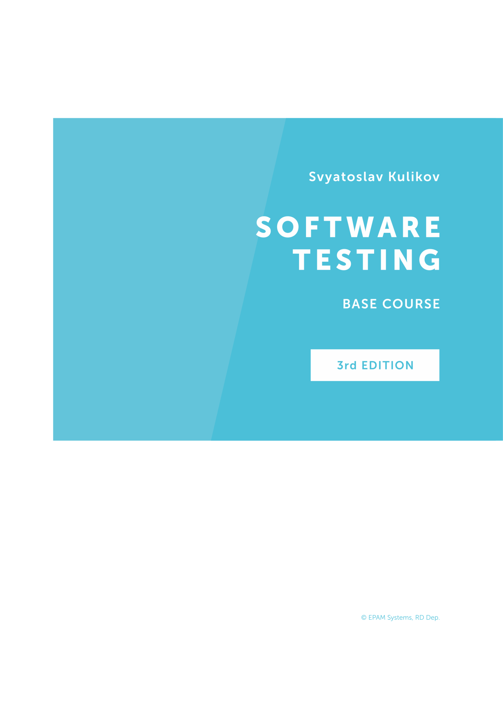

# Software Testing

## Base course

**(3$^{\text{rd}}$ edition)**

# Table of Contents

FOREWORD FROM THE AUTHOR, OR WHAT IS THIS BOOK FOR .............................................................. 4  
CHAPTER 1: TESTING AND TESTERS .............................................................................................................. 6  
1.1. WHAT TESTING IS AND WHERE IT CAME FROM ........................................................................ 6  
1.2. WHO IS A TESTER AND WHAT IS THEIR WORK ......................................................................... 9  
1.3. WHAT YOU NEED TO KNOW AND BE ABLE TO LEARN ........................................................... 11  
1.4. MYTHS AND MISCONCEPTIONS ABOUT TESTING ................................................................... 15  
CHAPTER 2: GENERAL KNOWLEDGE AND SKILLS ...................................................................................... 17  
2.1. SOFTWARE TESTING AND SOFTWARE DEVELOPMENT PROCESSES ................................. 17  
2.1.1. Software development models ........................................................................................... 17  
2.1.2. Software testing lifecycle ................................................................................................... 26  
2.1.3. Software testing principles ................................................................................................. 28  
2.2. DOCUMENTATION AND REQUIREMENTS TESTING ...................................................................... 31  
2.2.1. What a "requirement" is ..................................................................................................... 31  
2.2.2. The importance of requirements ........................................................................................ 32  
2.2.3. Ways of requirements gathering ........................................................................................ 36  
2.2.4. Requirements levels and types .......................................................................................... 38  
2.2.5. Good requirements properties ........................................................................................... 42  
2.2.6. Requirements testing techniques ....................................................................................... 49  
2.2.7. Examples of requirements analysis and testing ................................................................. 52  
2.2.8. Common mistakes in requirements analysis and testing .................................................... 61  
2.3. SOFTWARE TESTING CLASSIFICATION .......................................................................................... 65  
2.3.1. Simplified testing classification .......................................................................................... 65  
2.3.2. Detailed testing classification ............................................................................................. 67  
2.3.2.1. Testing classification scheme ................................................................................... 67  
2.3.2.2. Classification by code execution ............................................................................... 70  
2.3.2.3. Classification by access to application code and architecture ................................... 71  
2.3.2.4. Classification by automation level ............................................................................. 73  
2.3.2.5. Classification by specification level (by testing level) ............................................... 75  
2.3.2.6. Classification by functions under test importance (decreasingly)  
(by functional testing level) ........................................................................................... 77  
2.3.2.7. Classification by ways of dealing with application .................................................... 80  
2.3.2.8. Classification by application nature ........................................................................... 81  
2.3.2.9. Classification by architecture tier ............................................................................... 82  
2.3.2.10. Classification by end-user participation ................................................................... 83  
2.3.2.11. Classification by formalization level ......................................................................... 84  
2.3.2.12. Classification by aims and goals .............................................................................. 85  
2.3.2.13. Classification by techniques and approaches .......................................................... 91  
2.3.2.14. Classification by execution chronology .................................................................... 98  
2.3.3. Alternative and additional testing classifications ............................................................... 100  
2.3.4. Classification by reference to white box and black box testing ....................................... 105  
2.4. CHECKLISTS, TEST CASES, TEST SUITES .................................................................................... 108  
2.4.1. Checklist .......................................................................................................................... 108  
2.4.2. Test case and its lifecycle ................................................................................................ 113  
2.4.3. Test case attributes ........................................................................................................... 117  
2.4.4. Test management tools .................................................................................................... 122  
2.4.5. Good test case properties ................................................................................................. 128  
2.4.6. Test suites ........................................................................................................................ 137  
2.4.7. The logic for creating effective checks ............................................................................ 142  
2.4.8. Typical mistakes in writing checklists, test cases and test suites ....................................... 149

2.5. DEFECT REPORTS ......................................................................................................................... 155
    2.5.1. Errors, defects, malfunctions, failures, etc. .................................................................... 155
    2.5.2. Defect report and its lifecycle ........................................................................................ 158
    2.5.3. Defect report fields (attributes) ....................................................................................... 162
    2.5.4. Defects management (bug-tracking) tools ...................................................................... 170
    2.5.5. Good defect report properties ........................................................................................ 177
    2.5.6. Logic for creating effective defect reports ...................................................................... 182
    2.5.7. Typical mistakes in writing defect reports ..................................................................... 186

2.6. WORKLOAD ESTIMATION, PLANNING AND REPORTING ........................................................ 191
    2.6.1. Planning and reporting .................................................................................................... 191
    2.6.2. Test plan and test result report ....................................................................................... 194
    2.6.3. Workload estimation ........................................................................................................ 210

2.7. EXAMPLES OF VARIOUS TESTING TECHNIQUES USAGE ........................................................... 216
    2.7.1. Positive and negative test cases ....................................................................................... 216
    2.7.2. Equivalence classes and boundary conditions ............................................................... 218
    2.7.3. Domain testing and parameters combinations ............................................................... 223
    2.7.4. Pairwise testing and combinations search ....................................................................... 226
    2.7.5. Exploratory testing .......................................................................................................... 230
    2.7.6. Root cause analysis .......................................................................................................... 234

CHAPTER 3: TEST AUTOMATION ............................................................................................................ 238

3.1. AUTOMATION BENEFITS AND RISKS ............................................................................................ 238
    3.1.1. Automation advantages and disadvantages ................................................................... 238
    3.1.2. Areas of test automation high and low efficiency .......................................................... 242

3.2. AUTOMATED TESTING FEATURES ................................................................................................. 244
    3.2.1. Required knowledge and skills ....................................................................................... 244
    3.2.2. Features of automated test cases ..................................................................................... 245
    3.2.3. Test automation technologies ......................................................................................... 248

3.3. AUTOMATION BEYOND DIRECT TESTING TASKS ......................................................................... 258

CHAPTER 4: APPENDIXES ........................................................................................................................ 259

4.1. TESTER'S CAREER ............................................................................................................................. 259

4.2. TASKS COMMENTS ........................................................................................................................... 260

4.3. WINDOWS AND LINUX BATCH FILES TO AUTOMATE SMOKE TESTING ................................. 263

4.4. PAIRWISE TESTING DATA SAMPLE ................................................................................................ 272

4.5. LIST OF KEY DEFINITIONS ............................................................................................................... 275

CHAPTER 5: LICENSE AND DISTRIBUTION ............................................................................................ 278

## Foreword from the author, or what is this book for

<div align="right">
Many thanks to colleagues in the<br>
EPAM Software Testing Division for their valuable comments and<br>
recommendations during the preparation of the material.
<br><br>
My special thanks go to the thousands of readers who<br>
have sent in questions, suggestions and comments —<br>
your input has made the book better.
</div>

This book is based on fifteen years of experience in training testers. During this time, a great collection of questions from trainees has been gathered, and the typical problems and difficulties of many beginners have become clear. It seems reasonable to summarize this material in a book that will help novice testers immerse themselves in their profession more quickly and avoid many frustrating mistakes.

Since the first and second editions were published, the book has undergone numerous revisions based on feedback from readers and the author’s reconsideration of certain ideas and formulations. Thanks to questions from readers and discussions at training sessions, it has been possible to clarify and smooth out controversial points, clarify definitions and provide explanations where this has proved necessary. The perfection is unattainable, but we want to believe that a big step has been taken in its direction.

This book is not intended to be a full study of the entire subject area with all its intricacies, so do not take it as a textbook or reference book — over decades of evolution the testing has accumulated so much data that even a dozen books are not enough for its formal presentation. Also, reading only this one book is not enough to become a “testing guru”.

So, why do you need this book!?

Firstly, this book is worth reading if you are determined to do testing — it will be useful for “very beginners” as well as for those who have some experience in testing.

Secondly, this book may and should be used as reference material during training sessions. Here you may and should do a lot of scribbling, writing, marking things you don’t understand, writing down questions, etc.

Thirdly, this book is a kind of “map”, with references to many external sources (which may be useful even for experienced testers) and many examples with explanations.

Before we get into the material itself, let’s define the symbols:

| | |
| :---: | :--- |
|  | Definitions and other important information to remember. Will often be found next to the following sign. |
|  | Extra information or reference to relevant sources. Everything that is useful to know. Some definitions will be footnoted. |
|  | Warnings and frequent mistakes. It is not enough to show the “right way”; examples of the wrong approach are often of great benefit. |
|  | Tasks for self-study. It is strongly recommended that you do them (even if you think they are very easy).<br>The appendix<sup>(260)</sup> contains commentary on many of the exercises, but don’t rush to look there — work on your own first. |

You will find two kinds of footnotes in the text as numbers: if the number is not in curly brackets<sup>12345</sup> it is a standard footnote that should be looked up from the bottom of the page; if the number is in curly brackets<sup>{12345}</sup> it is a page number on which additional information is available (in the electronic version of the book it is a clickable link)

In addition to the text in this book, a [free online course](https://example.com) with a series of video tutorials, tests and self-study exercises is recommended.

Finally, nothing in this book is rigid; you can find alternative definitions to any term, and counterarguments to any recommendation. And that's okay. Over time, you will begin to understand the context of the situation and the applicability (usefulness!) of this or that information. So, let's get started!

## Chapter 1: Testing and testers

### 1.1. What testing is and where it came from

First of all, let's define software testing so that we have a clearer understanding of what we are talking about.

>  **Software testing** is a process of analyzing software and accompanying documentation in order to identify defects and improve the quality of the product.

>  The ISTQB¹ glossary does not contain the term “software testing”. There is only the term “testing”².

Throughout the decades of software development, testing and quality assurance have been approached in very different ways. Several major “eras of testing” can be distinguished.

**In the 1950s and 1960s**, the testing process was very formalized, separated from the software development process and was “mathematised”. In fact, testing was more like debugging³. The concept of exhaustive testing⁴ (checking all possible ways of code execution with all possible input data) was around. However, it soon became clear that exhaustive testing was impossible because the number of possible paths and input data was very large and it was difficult to find problems in the documentation with this approach.

>  **Task 1.1.a:** imagine that your program determines from the three entered integer numbers whether a triangle with these lengths of sides can exist. Suppose your program runs in some isolated ideal environment and all you have to do is check it works correctly on three 8-byte integers. You're using automation and the computer can do 100 million checks per second. How long does it take to check all the variations?
>
> Have you thought about how to prepare verification data for this test (which can be used to determine if the program worked correctly in each case)?

In fact, **in the 1970's** two fundamental ideas of testing were born: testing was first seen as a process of proving the operability of a program under some given conditions (positive testing⁵), and then exactly the opposite: as a process of proving the inoperability of a program under some given conditions (negative testing⁶). Not only this internal contradiction has not disappeared with time but nowadays many authors stress it justly as two complementary purposes of testing.

It should be noted that *“the process of proving that the program is not working”* is a bit more challenging, as it does not allow you to turn a blind eye to the problems that are detected.

---

<small>
¹ International Software Testing Qualifications Board Glossary. [http://www.istqb.org/downloads/glossary.html](http://www.istqb.org/downloads/glossary.html)</small>

<small>
² **Testing.** The process consisting of all lifecycle activities, both static and dynamic, concerned with planning, preparation and evaluation of software products and related work products to determine that they satisfy specified requirements, to demonstrate that they are fit for purpose and to detect defects. [ISTQB Glossary]</small>

<small>
³ **Debugging.** The process of finding, analyzing and removing the causes of failures in software. [ISTQB Glossary]</small>

<small>
⁴ **Complete testing, exhaustive testing.** A test approach in which the test suite comprises all combinations of input values and preconditions. [ISTQB Glossary]</small>

<small>
⁵ **Positive Testing.** Testing aimed at showing software works. Also known as “test to pass”. [aptest.com]</small>

<small>
⁶ **Negative testing.** Testing aimed at showing software does not work. Also known as “test to fail”. [aptest.com]</small>

 Warning! It is likely to be a **misconception** that negative test cases should end with application failures and malfunctions. No, they don't. Negative test cases try to cause failures and malfunctions but a correctly functioning application withstands the test and continues to work correctly. Note also that the expected outcome of negative test cases is exactly the correct behavior of the application, while negative test cases are considered to have passed successfully if they failed to "break" the application. (See "Checklists, test cases, test suites"^{\{108\}} chapter for details).

 A lot of "testing classics" may be taken from the book "The Art of Software Testing" by Glenford J. Myers (editions of 1979, 2004, 2011). However, most critics note that this book is hardly suitable for beginners and is much more oriented to programmers than to testers. Which, however, does not compromise its value.

So, once again, the most important things that testing "acquired" in the 70s:
* Testing ensures that the program meets the requirements.
* Testing identifies conditions under which the software performs incorrectly.

**In the 1980s**, there was a key change in the place of testing in software development: instead of one of the final stages of project creation, testing was applied throughout the software lifecycle$^7$ (see also the description of the iterative incremental software development model in "Software development models"^{(17)} chapter), which allowed in a great number of cases not only to quickly detect and fix problems, but even to predict and prevent their occurrence.

The same period also marked the rapid development and formalization of testing methodologies and the first basic attempts to automate testing.

**In the 1990s**, there was a transition from testing as such to a more comprehensive process called "quality assurance" $^8$, which covers the entire software development cycle and involves planning, design, creation and execution of test cases, support of existing test cases and test environments.

Testing reached a new quality level, which naturally led to further development of methodologies, appearance of sufficiently powerful tools for controlling the testing process and test automation tools, already quite similar to their contemporary descendants.

 Rex Black's book "Critical Testing Processes" is a good source of additional information on testing processes.

**In the noughties** of the current century, the development of testing continued in the context of the search for new ways, methodologies, techniques, and approaches to quality assurance. The rise of agile development methodologies and approaches such as "test-driven development" (TDD$^9$) have had a major impact on the understanding of testing. Test automation was already seen as a normal part of most projects. The idea that the focus of the testing process should not be on the suitability of the software, but on its ability to provide the end-user with the ability to perform their tasks effectively became popular.

---

$^7$ **Software lifecycle.** The period of time that begins when a software product is conceived and ends when the software is no longer available for use. The software lifecycle typically includes a concept phase, requirements phase, design phase, implementation phase, test phase, installation and checkout phase, operation and maintenance phase, and sometimes, retirement phase. Note these phases may overlap or be performed iteratively. [ISTQB Glossary]

$^8$ **Quality assurance.** Part of quality management focused on providing confidence that quality requirements will be fulfilled. [ISTQB Glossary]

$^9$ **Test-driven development.** A way of developing software where the test cases are developed, and often automated, before the software is developed to run those test cases. [ISTQB Glossary]

We will talk about the **current stage** of testing throughout the rest of this book. If we briefly mention its main characteristics, the following list appears: agile methodologies and agile testing, deep integration with the development process, wide use of automation, a huge set of technologies and tools, cross-functionality of the team (when tester and programmer can do each other's work in many ways).

 A really comprehensive history of software testing (since 1822, no joke) can be found in the article “The History of Software Testing”$^{10}$ at Testing References. “The Growth of Software Testing”$^{11}$ (by David Gelperin, Bill Hetzel) is also of great interest.

 **Task 1.1.b:** if you are not very familiar with terms like TDD, BDD, DDT, KDT — find their description on the internet and study them. Of course, this task also applies to any other terms you don't understand.

---
$^{10}$ “The History of Software Testing” [http://www.testingreferences.com/testinghistory.php]  
$^{11}$ “The Growth of Software Testing”, David Gelperin, Bill Hetzel [https://www.researchgate.net/publication/234808293_The_growth_of_software_testing]

## 1.2. Who is a tester and what is their work

If you look up information by the keywords from the title of this chapter, you may find a raft of completely contradictory answers. And the point here is that the authors of most "job descriptions" attribute a certain exaggerated set of characteristics of its individual representatives to the entire profession.

At the same time, in some countries even on the state level, the positions of "software testing specialist" and "software tester" are separated.

Now let's return to the original question and look at it from two points of view: what the qualification of the tester is, and where they work.

For a simplified description, see table 1.2.a.

Table 1.2.a — Typical activities of a tester.

| | Small companies | Large companies |
| :--- | :--- | :--- |
| **Low qualification** | An apprentice, often left to his own devices to do tasks. | An average project participant, at the same time undergoing intensive professional development. |
| **High qualification** | Highly skilled jack of all trades, with broad, but not always structured experience | An expert in one or several areas, an adviser, a competency head. |

Since the higher the qualification of a specialist\textsuperscript{(259)}, the wider his choice of jobs is (even within one large company), let us focus on the qualification peculiarities of a tester's work.

At the beginning of their career, any specialist (and the tester is no exception) is a doer and an apprentice. It is enough to have good understanding of test cases, defect reports, know how to read requirements, use a couple of tools, and get along well in a team.

Gradually the tester begins to immerse himself in all the stages of project development, understanding them more and more fully, begins not only to actively use, but also develop project documentation, making increasingly responsible decisions.

If one were to express figuratively the main goal of the tester, it would sound like: "to understand what the project needs at the moment, whether the project gets it right, and if not, how to change the situation for the better". Sounds like a project manager's goal, right? Right. Starting at some level of development, IT professionals, by and large, differ only in their technical skill sets and the primary application area of those skills.

So, what technical skills do you need to successfully start working as a tester? Before proceeding to the list itself, let us stipulate especially: this list is designed primarily for those who come to testing from non-technical professions (although it often has to be announced to engineering students as well).

0) Ability to speak foreign languages. Yes, it is a non-technical skill. But nevertheless, it comes in at number zero. You can take it as an axiom: "no English — no career in IT". Other foreign languages are also welcome, but English comes first.

 **Task 1.2.a:** if you have doubts whether your level of English is sufficient, check yourself: if you can easily read technical articles on Wikipedia at least, you have a minimum of sufficient level

1) A good PC skillset at a truly advanced level and a willingness to continuously develop in this area. Can you imagine a professional chef who can't fry potatoes (not "doesn't have to", but "can't do it in principle")? Does it look strange? Equally strange looks "IT person" (that's right, in quotes), who is unable to type a properly formatted text, copy a file across a network, set up a virtual machine or do any other everyday chore.
2) Programming. It makes life a whole lot easier for any IT person — and a tester first and foremost. Is it possible to test without programming knowledge? Yes, it is. Is it **really** possible to do it well? No. And now the most important (nearly religious-philosophical) question: what programming language to study? C/C++/C#, Java, PHP, JavaScript, Python, Ruby, etc. — Start with whatever your project is developed with. If you don't have a project yet, start with JavaScript (currently the most versatile solution).
3) Databases and SQL. Here, the tester is also not required to be highly skilled, but minimal skills in working with the most common DBMSes and the ability to write simple queries can be considered mandatory.
4) Understanding of networks and operating systems. At least at a minimum level to be able to diagnose the problem and solve it on your own, if possible.
5) Understanding the principles of web and mobile applications. These days, almost everything is built as such applications, and an understanding of the relevant technologies is essential for effective testing.

I hope you noticed that testing itself is not on the list. That's right, because the whole book is devoted to it, so let's not copy it here.

At the end of the chapter, let's also mention the personal qualities that allow a tester to become an excellent professional quicker:
1) increased responsibility and diligence;
2) good communication skills, the ability to express thoughts clearly, quickly, and distinctly;
3) patience, concentration, attention to detail, observation;
4) good abstract and analytical thinking;
5) the ability to conduct unconventional experiments, aptitude for research.

Of course, it is difficult to find someone who possesses all these qualities equally, but it is always useful to have a reference point for self-development.


## 1.3. What you need to know and be able to learn

In the previous chapter we deliberately did not discuss a specific list of skills and knowledge that a novice tester needs, because they deserve separate consideration.

The tables below are the adapted extract from the tester's competence map. All skills here are nominally divided into three groups:
* Professional — these are the "testers" skills, the key skills that distinguish a tester from other IT professionals.
* Technical — these are general IT skills that a tester should possess nonetheless.
* Soft skills — these are skills that help any professional to be a good team-player, to communicate with colleagues in effective and efficient way.

>  **Task 1.3.a:** While reading the lists of skills given here, mark things you do not understand, look for additional information and make yourself understand at least to the level of "I know what it is all about".

### Professional skills

Table 1.3.a — Tester's professional skills

| Subject area | Entry level | Junior or Middle specialist level |
| :--- | :--- | :--- |
| **Testing and software development processes** |
| Testing process | This is the subject of "Software testing and software development processes"<sup>{17}</sup> chapter | Profound understanding of the stages of the testing process, their interrelationship and mutual influence, ability to plan their own work within the given task depending on the stage of the test |
| Software development process | A general understanding of software development models, their relationship to testing, and the ability to prioritize your own work depending on the stage of project development |
| **Documentation work** |
| Requirement analysis | This is the subject of "Documentation and requirements testing"<sup>{31}</sup> chapter | The ability to identify connections and interdependencies between different levels and forms of presentation of requirements, the ability to formulate questions to clarify ambiguities |
| Requirements testing | Awareness of the properties of good requirements and sets of requirements, ability to analyze requirements to identify their shortcomings, ability to eliminate shortcomings in requirements, ability to apply techniques to improve the quality of requirements |
| Requirement management | Not required | General understanding of the processes for identifying, documenting, analyzing and modifying requirements |
| Business analysis | General understanding of the processes for identifying and documenting different levels and forms of submission of requirements |
| **Estimations and planning** |
| Creating a test plan | These issues are partly covered in "Workload estimation, planning and reporting"<sup>{191}</sup> chapter, but their in-depth understanding requires a separate lengthy study | General understanding of planning principles in the testing context, ability to use a ready-made test plan to plan your own work |
| Creating a test strategy | General understanding of the principles of building a testing strategy, ability to use a ready-made strategy to plan your own work |
| Workload estimations | General understanding of the principles of workload estimation, ability to estimate your own workload when planning your own work |

| Subject area | Entry level | Junior or Middle specialist level |
| --- | --- | --- |
| **Working with test cases** |
| Creating checklists | This is the subject of "Checklists, test cases, test suites"<sup>(108)</sup> chapter | Strong ability to use test design techniques and approaches, the ability to decompose the objects to be tested and the tasks to be performed, the ability to create checklists |
| Creating test cases | Strong ability to design test cases according to accepted templates, to analyze ready-made test cases and to detect and correct deficiencies in them |
| Test case management | Not required | General understanding of the processes for creating, modifying and improving the quality of test cases |
| **Testing methodologies** |
| Functional and domain testing | This is the subject of "Detailed testing classification"<sup>(67)</sup> chapter | Knowledge of test types, strong ability to use test design techniques and approaches, ability to create checklists and test cases, ability to create defect reports |
| User interface testing | Not required | Ability to test the user interface on the basis of ready-made test scripts or as part of exploratory testing |
| Exploratory testing | General ability to use matrices to quickly define test scenarios, general ability to carry out new tests based on the results of just completed tests |
| Integration testing | Ability to carry out integration testing based on ready-made test scripts |
| Localization testing | Ability to carry out localization testing on the basis of ready-made test scripts |
| Installation testing | Ability to carry out installation testing on the basis of ready-made test scripts |
| Regression testing | General understanding of how regression testing is organized, ability to carry out regression testing by means of ready-made plans |
| **Working with defect reports** |
| Creating defect reports | This is the subject of "Defect reports"<sup>(155)</sup> chapter | Strong knowledge of the lifecycle of a defect report, strong ability to produce defect reports according to accepted templates, ability to analyze final reports, to detect and correct deficiencies in reports |
| Defect root cause analysis | Not required | The basic skill of examining an application to identify the source (cause) of an error, the elementary skill of making recommendations to correct the error |
| Using bug-tracking systems | Ability to use bug-tracking systems at all stages of the defect reporting lifecycle |
| **Working with test result reports** |
| Creating test result reports | Not required, but it is partly dealt with in "Workload estimation, planning and reporting"<sup>(191)</sup> chapter | The ability to provide the necessary information to form the test results report, and the ability to analyze completed test results reports to refine own work planning |

## Technical skills

### Table 1.3.b — Tester's technical skills

| Subject area | Entry level | Junior or Middle specialist level |
| :--- | :---: | :--- |
| **Operating systems** |
| Windows | Using at an advanced level | Installation, use and administration, problem solving, configuration in order to set up a test environment and perform test cases |
| Linux | General familiarity | Installation, use and administration, problem solving, configuration in order to set up a test environment and perform test cases |
| Mac OS | Not required | General familiarity |
| Virtual machines | Using at the beginner level | Installation, use and administration, problem solving, configuration in order to set up a test environment and perform test cases |
| **Databases** |
| Relational theory | Not required | General understanding and the ability to read and understand database schemes in common graphical notation$^{12}$ |
| Relational DBMSes | The ability to install, configure and use the test environment to set up and execute test cases |
| SQL | Ability to create and execute simple queries using database/DBMS tools$^{13}$ |
| **Computer networks** |
| Network protocols | Not required | General understanding of the TCP/IP stack, ability to configure local operating system network settings |
| Network utilities | General understanding and ability to use utilities to diagnose network conditions and faults |
| **Web technologies** |
| Web servers | Not required | General understanding of web servers, installation and configuration skills |
| Application servers | General understanding of application servers, installation and configuration skills |
| Web services | A general understanding of how web services work and how to diagnose problems with them |
| Markup languages | A general awareness of HTML and CSS | Ability to use HTML and CSS to create simple pages |
| Communication protocols | Not required | General understanding of OSI model application layer protocols, general understanding of troubleshooting principles |
| Web programming languages | Basic knowledge of at least one programming language used to create web applications |
| **Mobile platforms and technologies** |
| Android | Not required | Using at the beginner level |
| iOS | Using at the beginner level |

<br>

$^{12}$ [For now, this book is still in Russian, nevertheless a lot of schemas and examples there is still useful.] "Relational Databases by examples", Svyatoslav Kulikov [https://svyatoslav.biz/relational_databases_book/]  
$^{13}$ [For now, this book is still in Russian, nevertheless a lot of SQL there is still useful.] "Using MySQL, MS SQL Server and Oracle by examples", Svyatoslav Kulikov [http://svyatoslav.biz/database_book/]

## Soft skills

Table 1.3.c — Tester's soft skills

| Subject area | Entry level | Junior or Middle specialist level |
| :--- | :--- | :--- |
| Communication skills | | |
| Business e-mailing | Minimum skills | Understanding and strict adherence to the rules of business communication using e-mail and instant messenger services |
| Oral business communication | Minimum skills | Understanding and strict adherence to the rules of oral business communication |
| Getting interviews | Not required | Initial interviewing experience |
| Self-management skills | | |
| Time management | Minimum skills, general concepts | Developed time management skills, the use of appropriate tools and the ability to estimate the workload of the tasks assigned |
| Reporting on their work | Basic skills | Developed skills to report on their work, ability to use appropriate tools |

You have probably noticed that this list of skills does not include a separate list dedicated to test automation. It is not included in this book for three reasons:
* it is huge;
* it is constantly changing;
* this book is still about testing in general, although there is brief information about test automation (see "Test automation"\(^{238}\) chapter).

To put it in a nutshell, an "automatizer" must know everything what a "classic" tester knows and be able to code in 3–5 languages, at least a little. That's all. Entry-level tools can be mastered in a few days.

## 1.4. Myths and misconceptions about testing

Perhaps you were expecting to read something like James Whittaker's "The 7 Plagues of Software Testing" (see below). No, there are "myths" here that are relevant not to experienced professionals, but to beginners and those who are just about to learn how to test.

The text for this chapter is drawn mainly from conversations with participants in the trainings, and more specifically from phrases beginning with "But I thought that..." or "Isn't it true that..."


So: "But I thought that..." / "Isn't it true that..."

### It is not necessary to know about computers

No comment. No, there may be some infinitesimal percentage of the tester's activity that can be realized "handwavy". But this percentage can be neglected.

### It is essential to be really good at programming

It is heartbreaking to attribute this thought to myths. It is good when a tester knows programming. It is even better when he knows it well. But even a general approximate knowledge of programming is enough to start a career. After that, it's up to the situation.

### Testing is easy

If we take the analogy, cooking is also easy, if we're talking about brewing tea in a bag. But just as such tea does not end in cooking, so testing does not end in cases of "oops, this picture won't load". Even on a purely practical level, testing tasks can be comparable in complexity to tasks of program design and development (hmm, why is there no myth "programming is easy", although "Hello world" is not hard to code). And if we look at "software reliability" from the scientific point of view, the prospects of increasing complexity are not limited by anything at all. Does every tester have to "get into this maze"? No. But if you want to, you can. Besides, it is very entertaining.

### Testing is heaps of routine and boredom

No more and no less than in other IT professions. The rest depends on the individual tester and how they organize their work.

### Tester should be taught all sorts of things

They shouldn't. Certainly not "all sorts of thing". Yes, when we are talking about an explicit learning process, its organizers (whether it is a university course, a training course in some kind of training center or a separate training within a company) often undertake a certain "pedagogical commitment". But such learning activities are never a substitute for self-development (although they may, in due time, help to choose the right path). The IT industry is changing very intensively and continuously. So, testers have to educate **themselves** till grey hairs.

---

[^14] "The Plague of Aimlessness", James Whittaker [https://testing.googleblog.com/2009/06/7-plagues-of-software-testing.html](https://testing.googleblog.com/2009/06/7-plagues-of-software-testing.html)  
"The Plague of Repetitiveness", James Whittaker [http://googletesting.blogspot.com/2009/06/by-james.html](http://googletesting.blogspot.com/2009/06/by-james.html)  
"The Plague of Amnesia", James Whittaker [http://googletesting.blogspot.com/2009/07/plague-of-amnesia.html](http://googletesting.blogspot.com/2009/07/plague-of-amnesia.html)  
"The Plague of Boredom", James Whittaker [http://googletesting.blogspot.com/2009/07/plague-of-boredom.html](http://googletesting.blogspot.com/2009/07/plague-of-boredom.html)  
"The Plague of Homelessness", James Whittaker [http://googletesting.blogspot.com/2009/07/plague-of-homelessness.html](http://googletesting.blogspot.com/2009/07/plague-of-homelessness.html)  
"The Plague of Blindness", James Whittaker [http://googletesting.blogspot.com/2009/07/plague-of-blindness.html](http://googletesting.blogspot.com/2009/07/plague-of-blindness.html)  
"The 7th Plague and Beyond", James Whittaker [http://googletesting.blogspot.com/2009/09/7th-plague-and-beyond.html](http://googletesting.blogspot.com/2009/09/7th-plague-and-beyond.html)  
"The Plague of Entropy", James Whittaker [http://googletesting.blogspot.com/2009/09/plague-of-entropy.html](http://googletesting.blogspot.com/2009/09/plague-of-entropy.html)

### Testers are those who could not become programmers

And violinists are those who couldn't become pianists, aren't they? I think that there is a certain small percentage of "those who failed to become programmers" in testing. This small percentage is overshadowed by those who originally and deliberately started in testing, and those who came into testing from programming.

### Testing is a difficult career to build

With the proper diligence, a career in testing is perhaps the most dynamic (as compared to other IT fields). Testing itself is a very fast-paced IT industry, and there's always something that you're passionate about and good at, and it's easy to become proficient and successful in that environment.

### Testers are always “at fault”, i.e., they are to be held responsible for all bugs

This is only true if we accept that the patient's illness is caused by the thermometer showing a high temperature. The testers are more likely to be held responsible for those defects, which were found by the user, i.e., appeared already at the stage of real product operation. However, even in this situation there is no clear-cut conclusion — the whole team is responsible for the final success of the product, and it would be foolish to shift the responsibility to just one part of it.

### Testers will soon be redundant as everything will be automated

Once terminators start running around the streets — yes, this myth will become true: programs will learn how to function without humans. But then we will all have other problems. And joking aside, humanity has been on the road to automation for hundreds of years now, which has been imprinting itself on all our lives and, in most cases, allowing the simplest and most unskilled work to be transferred to machines. But who makes you stay at the level of the doer of such work? Starting at a certain level, testing becomes a harmonious combination of science and art. And have many scientists or creators been replaced by automation?

 **Please:** you may have some thoughts along the lines of "I thought that in testing..." / "Is it true that in testing..." If so, please share them in the anonymous survey: [https://svyatoslav.biz/software_testing_book_poll_eng/](https://svyatoslav.biz/software_testing_book_poll_eng/)

## Chapter 2: General knowledge and skills

### 2.1. Software testing and software development processes

#### 2.1.1. Software development models

To get a better understanding of how testing relates to programming and other project activities, let's start by looking at the basics — lifecycle models$^{15}$ as a part of the software lifecycle$^{16}$. It is important to note that software development is only a part of the software lifecycle, and we are talking about **development** here.

The information in this chapter belongs more to the discipline of project management and is therefore very brief: please do not take it as an exhaustive guide — it barely covers one hundredth of a percent of the relevant subject area.

> 
> **Software development model (SDM)** is a framework that systematizes the various project activities, their interaction and consistency in the software development process. The choice of one or another model depends on the scale and complexity of the project, the subject area, available resources, and many other variables.

The choice of software development model has a major impact on the testing process, determining the choice of strategy, schedule, resources required, etc.

There are many software development models, but in general, waterfall model, v-model, iterative incremental model, spiral model and agile model can be considered classic.

> 
> A list of software development models (with brief descriptions) recommended for testers to learn can be found in "What are the Software Development Models?"$^{17}$ article.

Knowing and understanding software development models is necessary in order to be aware from the very first days of work of what is going on around you, and why you are doing it. Many beginner testers have noted that a sense of meaninglessness about the process is overwhelming, even if the tasks at hand are interesting. The more fully you can visualize what is happening on a project, the clearer you will see your own contribution to the overall project and the meaning of what you are doing.

Another important thing to understand is that no model is a dogma or a one-size-fits-all solution. There is no perfect model. There is one that is worse or better suited to a specific project, a specific team and specific conditions.

> 
> A common mistake! The only thing worth warning against right now is the frivolous interpretation of the model and rearranging it "to your own taste" without a crystal-clear understanding of what you are doing and why. What happens when the logic of the model is violated, was well described by Maxim Dorofeev in his slidecast "Scrum Tailoring" $^{18}$.

---

$^{15}$ **Lifecycle model.** A partitioning of the life of a product or project into phases. [ISTQB Glossary]  
$^{16}$ **Software lifecycle.** The period of time that begins when a software product is conceived and ends when the software is no longer available for use. The software lifecycle typically includes a concept phase, requirements phase, design phase, implementation phase, test phase, installation and checkout phase, operation and maintenance phase, and sometimes, retirement phase. Note these phases may overlap or be performed iteratively. [ISTQB Glossary]  
$^{17}$ “What are the Software Development Models?” [http://istqbexamcertification.com/what-are-the-software-development-models/](http://istqbexamcertification.com/what-are-the-software-development-models/)  
$^{18}$ “Scrum Tailoring”, Maxim Dorofeev [http://cartmendum.livejournal.com/10862.html](http://cartmendum.livejournal.com/10862.html)

The **waterfall model**$^{19}$ is now mostly of historical interest, as it is hardly applicable in modern projects. It assumes that each of the project phases is executed once, and that they strictly follow each other (figure 2.1.a). In a very simplified way, it can be said that within this model the team “sees” only the previous and the next phases at any single moment of time. In real software development, however, one has to “see the whole project” and return to the previous phases to correct deficiencies or to clarify something.

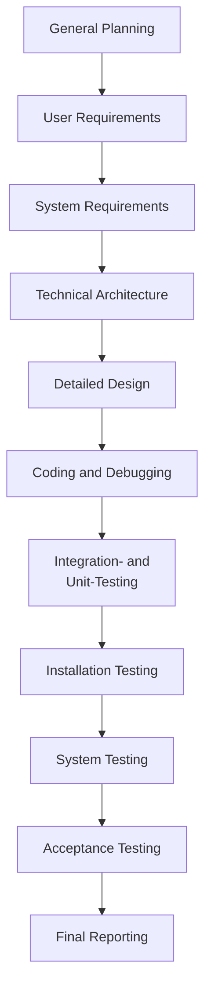
```mermaid
graph TD
    GP["General Planning"] --> UR["User Requirements"]
    UR --> SR["System Requirements"]
    SR --> TA["Technical Architecture"]
    TA --> DD["Detailed Design"]
    DD --> CD["Coding and Debugging"]
    CD --> IU["Integration- and<br>Unit-Testing"]
    IU --> IT["Installation Testing"]
    IT --> ST["System Testing"]
    ST --> AT["Acceptance Testing"]
    AT --> FR["Final Reporting"]
```

Figure 2.1.a — Waterfall model

The disadvantages of the waterfall model include the fact that end-user participation is either not foreseen at all, or is only indirectly foreseen at the one-time requirements gathering stage. In terms of testing, this model is bad in that testing explicitly appears only in the middle of project development, reaching its peak at the very end.

---

$^{19}$ In a **waterfall model**, each phase must be completed fully before the next phase can begin. This type of model is basically used for the project which is small and there are no uncertain requirements. At the end of each phase, a review takes place to determine if the project is on the right path and whether or not to continue or discard the project. [http://istqbexamcertification.com/what-is-waterfall-model-advantages-disadvantages-and-when-to-use-it/](http://istqbexamcertification.com/what-is-waterfall-model-advantages-disadvantages-and-when-to-use-it/)

However, the waterfall model is often used intuitively for relatively simple tasks, and its shortcomings have served as an excellent starting point for new models. Also, this model, in a slightly improved form, is used on large projects where the requirements are very stable and can be well formulated at the beginning of the project (aerospace, medical software, etc.)

> A relatively brief and yet good description of the waterfall model can be found in the "What is Waterfall model advantages, disadvantages and when to use it?"$^2$$^0$ article.
> 
> An excellent description of the history of the development and downfall of the waterfall model was created by Maxim Dorofeev in the form of a slidecast "The Rise And Fall Of Waterfall"$^2$$^1$, which can be viewed in his LiveJournal.

**V-model**$^2$$^2$ is a logical development of the waterfall model. It is notable (figure 2.1.b) that in general both waterfall and v-model software lifecycle models can contain the same set of stages, but the fundamental difference lies in how this information is used in the project implementation process.

In very broad terms, using the v-model, at each stage "on the way down" you need to think about what will happen and how it will happen at the corresponding stage "on the way up". Testing here appears at the earliest stages of project development to minimize risks and to detect and correct many potential problems before they become real problems.


Figure 2.1.b — V-model

> A brief description of the v-model can be found in the "What is V-model advantages, disadvantages and when to use it?"$^2$$^3$ article. An explanation of using the v-model in testing can be found in the "Using V Models for Testing"$^2$$^4$ article.

---

$^2$$^0$ "What is Waterfall model advantages, disadvantages and when to use it?" [http://istqbexamcertification.com/what-is-waterfall-model-advantages-disadvantages-and-when-to-use-it/](http://istqbexamcertification.com/what-is-waterfall-model-advantages-disadvantages-and-when-to-use-it/)

$^2$$^1$ LJ of Maxim Dorofeev. [http://cartmendum.livejournal.com/44064.html](http://cartmendum.livejournal.com/44064.html)

$^2$$^2$ **V-model**. A framework to describe the software development lifecycle activities from requirements specification to maintenance. The V-model illustrates how testing activities can be integrated into each phase of the software development lifecycle. [ISTQB Glossary]

$^2$$^3$ "What is V-model advantages, disadvantages and when to use it?" [http://istqbexamcertification.com/what-is-v-model-advantages-disadvantages-and-when-to-use-it/](http://istqbexamcertification.com/what-is-v-model-advantages-disadvantages-and-when-to-use-it/)

$^2$$^4$ "Using V Models for Testing", Donald Firesmith [https://insights.sei.cmu.edu/sei_blog/2013/11/using-v-models-for-testing.html](https://insights.sei.cmu.edu/sei_blog/2013/11/using-v-models-for-testing.html)

Software development models

Iterative^25 incremental^26 model is fundamental to the modern approach to software development. As evidenced by its name, the model is characterized by a certain duality (and the ISTQB glossary does not even provide a single definition, breaking it up into separate parts):

* In terms of lifecycle, the model is **iterative** because it involves repeating the same stages many times.
* In terms of product development (increase in its useful functions), the model is **incremental**.

A key feature of this model is the division of the project into relatively small intervals (iterations), each of which can generally include all the classical stages inherent in the waterfall and V models (figure 2.1.c). The result of an iteration is an incremental increase in product functionality, expressed as an intermediate build^27.

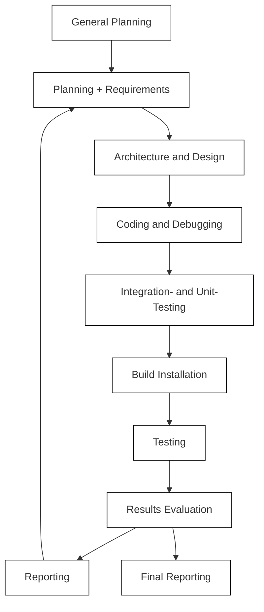
```mermaid
graph TD
    GP["General Planning"] --> PR["Planning + Requirements"]
    PR --> AD["Architecture and Design"]
    AD --> CD["Coding and Debugging"]
    CD --> IUT["Integration- and Unit-Testing"]
    IUT --> BI["Build Installation"]
    BI --> T["Testing"]
    T --> RE["Results Evaluation"]
    RE --> Rep["Reporting"]
    Rep --> PR
    
    RE --> FR["Final Reporting"]
    
    style GP fill:#fff,stroke:#000,stroke-width:1px
    style PR fill:#fff,stroke:#000,stroke-width:1px
    style AD fill:#fff,stroke:#000,stroke-width:1px
    style CD fill:#fff,stroke:#000,stroke-width:1px
    style IUT fill:#fff,stroke:#000,stroke-width:1px
    style BI fill:#fff,stroke:#000,stroke-width:1px
    style T fill:#fff,stroke:#000,stroke-width:1px
    style RE fill:#fff,stroke:#000,stroke-width:1px
    style Rep fill:#fff,stroke:#000,stroke-width:1px
    style FR fill:#fff,stroke:#000,stroke-width:1px
```

Figure 2.1.c — Iterative incremental model

The length of iterations can vary depending on many factors, but the principle of repetition itself ensures that both testing and demonstrating the product to the end-user (with feedback) is actively applied from the start and throughout the entire development of the project.

In many cases, it is acceptable to parallelize individual stages within an iteration and to actively refine in order to eliminate deficiencies found in any of the (previous) stages.

The iterative incremental model has worked very well for large and complex projects, carried out by large teams over long periods of time. However, the main disadvantages of this model often include high overheads due to the high "bureaucracy" and overall cumbersomeness of the model.

---

^25 **Iterative development model.** A development lifecycle where a project is broken into a usually large number of iterations. An iteration is a complete development loop resulting in a release (internal or external) of an executable product, a subset of the final product under development, which grows from iteration to iteration to become the final product. [ISTQB Glossary]
^26 **Incremental development model.** A development lifecycle where a project is broken into a series of increments, each of which delivers a portion of the functionality in the overall project requirements. The requirements are prioritized and delivered in priority order in the appropriate increment. In some (but not all) versions of this lifecycle model, each subproject follows a 'mini V-model' with its own design, coding and testing phases. [ISTQB Glossary]
^27 **Build.** A development activity whereby a complete system is compiled and linked, so that a consistent system is available including all latest changes. [Based on "daily build" term from ISTQB Glossary]

Rather brief and very good descriptions of the iterative incremental model can be found in the articles "What is Iterative model advantages, disadvantages and when to use it?"$^28$ and "What is Incremental model advantages, disadvantages and when to use it?"$^29$.

**Spiral model**$^30$ is a special case of the iterative incremental model, which emphasizes the management of risks, especially those affecting the organisation of the project development process and the milestones.

A schematic representation of the spiral model is shown in figure 2.1.d. Note that four key phases are clearly highlighted there:
* Elaboration of objectives, alternatives and constraints.
* Risk analysis, and prototyping.
* Product development (interim versions).
* Planning the next cycle.

From the point of view of testing and quality assurance, the increased focus on risk is a tangible advantage when using the spiral model for conceptual design, where requirements are naturally complex and unstable (can change many times in the course of the project).

Barry Boehm, the author of the model, elaborates on these issues in his publications$^{31,\ 32}$ and provides many insights and recommendations on how to apply the spiral model to maximum effect.

Rather brief and very good descriptions of the spiral model can be found in the articles "What is Spiral model — advantages, disadvantages and when to use it?"$^33$ and "Spiral Model"$^34$.

---

$^28$ "What is Iterative model advantages, disadvantages and when to use it?" [http://istqbexamcertification.com/what-is-iterative-model-advantages-disadvantages-and-when-to-use-it/]  
$^29$ "What is Incremental model advantages, disadvantages and when to use it?" [http://istqbexamcertification.com/what-is-incremental-model-advantages-disadvantages-and-when-to-use-it/]  
$^30$ **Spiral model.** A software lifecycle model which supposes incremental development, using the waterfall model for each step, with the aim of managing risk. In the spiral model, developers define and implement features in order of decreasing priority. [https://www.geeksforgeeks.org/software-engineering-spiral-model/]  
$^31$ "A Spiral Model of Software Development and Enhancement", Barry Boehm [http://www.scf.usc.edu/~csci201/lectures/Lecture11/boehm1988.pdf]  
$^32$ "Spiral Development: Experience, Principles, and Refinements", Barry Boehm. [http://www.sei.cmu.edu/reports/00sr008.pdf]  
$^33$ "What is Spiral model — advantages, disadvantages and when to use it?" [http://istqbexamcertification.com/what-is-spiral-model-advantages-disadvantages-and-when-to-use-it/]  
$^34$ "Spiral Model" [https://searchsoftwarequality.techtarget.com/definition/spiral-model]

Software development models


Figure 2.1.d — Spiral model

**Agile model**$^{35}$ is a collection of different approaches to software development and is based on the so-called "agile manifesto"$^{36}$ that describes fundamental values of Agile Software Development:
* Individuals and interactions over processes and tools.
* Working software over comprehensive documentation.
* Customer collaboration over contract negotiation.
* Responding to change over following a plan.

> This topic is so extensive that references to articles are insufficient, and therefore it is worth reading these books:
> * "Agile Testing" (Lisa Crispin, Janet Gregory).
> * "Essential Scrum" (Kenneth S. Rubin).

---

$^{35}$ **Agile software development.** A group of software development methodologies based on EITP iterative incremental development, where requirements and solutions evolve through collaboration between self-organizing cross-functional teams. [ISTQB Glossary]
$^{36}$ "Manifesto for Agile Software Development" [http://agilemanifesto.org/iso/en/manifesto.html]

As it is easy to guess, the approaches underlying the agile model are the logical development and continuation of everything that has been created and tested in the waterfall, v-model, iterative incremental model, spiral model and other models for ten years. Moreover, for the first time a significant result was achieved in the reduction of bureaucratic component and maximum adaptation of the software development process to the instantaneous changes of the market and customer requirements.

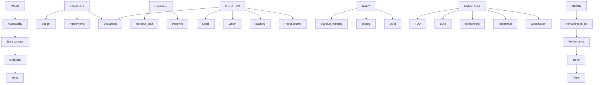
```mermaid
graph TD
    Values --> Adaptability
    Adaptability --> Transparency
    Transparency --> Simplicity
    Simplicity --> Unity

    STRATEGY --> Budget
    STRATEGY --> Agreements
    STRATEGY --> Evaluation

    RELEASE --> Release_plan
    RELEASE --> Planning

    ITERATION --> Goals
    ITERATION --> Vision
    ITERATION --> Backlog
    ITERATION --> Retrospective
    ITERATION --> Evaluation

    DAILY --> Standup_meeting
    DAILY --> Testing
    DAILY --> Build

    CONSTANLY --> TDD
    CONSTANLY --> Build_const["Build"]
    CONSTANLY --> Refactoring
    CONSTANLY --> Integration
    CONSTANLY --> Cooperation

    Visibility --> Remaining_to_do
    Remaining_to_do --> Performance
    Performance --> Done
    Done --> Tests
```

Figure 2.1.e — The essence of the agile model

In a very simplified (almost borderline) way, the agile model is a documentation-light mixture of iterative incremental and spiral models (figures 2.1.c and 2.1.d); however, the "agile manifesto" and all of its advantages and disadvantages should be kept in mind.


Figure 2.1.f — Iterative approach within the agile model and scrum

The main disadvantage of the agile model is considered to be the difficulty of applying it to complex projects and the frequent misapplication of its approaches due to a misunderstanding of the fundamental principles of the model.

Nevertheless, it is possible to ascertain that more and more projects are starting to use an agile development model.

> A very detailed and elegant summary of the principles of the agile software development model can be found in the "The Agile System Development Lifecy-cle"³⁷ article.

The **essence** of software development models can be summarized in table 2.1.a.

Table 2.1.a (part 1) — Comparison of software development models

| Model | Advantages | Disadvantages | Testing |
| :--- | :--- | :--- | :--- |
| Waterfall | • Each stage has a clear verifiable outcome.<br>• At each moment, the team performs one type of work.<br>• Works well for minor tasks. | • Total inability to adapt the project to changes in requirements.<br>• Extremely late creation of a working product. | • From the middle of the project. |
| V-model | • Each stage has a clear verifiable outcome.<br>• Testing is given attention from the very first stage.<br>• Works well for projects with stable requirements. | • Lack of flexibility and adaptability.<br>• No early prototyping.<br>• Difficulty in fixing problems missed in the early stages of project development. | • In the transitions between stages. |

---
³⁷ “The Agile System Development Life Cycle” [http://www.ambysoft.com/essays/agileLifecycle.html]

Table 2.1.a (part 2) — Comparison of software development models

| Model | Advantages | Disadvantages | Testing |
| :--- | :--- | :--- | :--- |
| Iterative incremental model | • Quite early prototyping.<br>• Easy management of iterations.<br>• Decomposition of the project into manageable iterations. | • Lack of flexibility within iterations.<br>• Difficulty in fixing problems missed in the early stages of project development. | • At certain points in the iterations.<br>• Re-testing (after refinement) what has already been tested before. |
| Spiral model | • In-depth risk analysis.<br>• Suitable for major projects.<br>• Quite early prototyping. | • High overhead costs.<br>• Difficult to apply for minor projects.<br>• High dependence of success on the quality of risk analysis. | |
| Agile model | • Maximum customer involvement.<br>• A lot of work with requirements.<br>• Tight integration of testing and development.<br>• Minimization of documentation. | • Difficult to implement for major projects.<br>• Difficulty in creating stable processes. | • At certain moments of iterations and **at any necessary moment.** |

 One more brief and informative comparison of software lifecycle models can be found in "Project Lifecycle Models: How They Differ and When to Use Them"38 article. And a general overview of all models in the context of software testing is provided in "What are the Software Development Models?"39 article.

 **Task 2.1.a:** Imagine that at a job interview you are asked to name the main software development models and list their advantages and disadvantages in terms of testing. Don't wait for the interview, answer the question now and write down your answer.

---

38 "Project Lifecycle Models: How They Differ and When to Use Them" [http://www.business-esolutions.com/islm.htm]
39 "What are the Software Development Models?" [http://istqbexamcertification.com/what-are-the-software-development-models/]

## 2.1.2. Software testing lifecycle

Following the general iterative logic prevailing in all modern software development models, the testing lifecycle is also expressed as a closed-loop sequence of operations (figure 2.1.g).

It is important to realize that the length of such an iteration (and hence the degree of detailedness of each stage) can vary enormously, from a few hours to tens of months. Generally, when it is a long period of time, it is divided into many relatively short iterations, but itself "tends" to one or another stage at any given time (for example, more planning at the beginning of the project, more reporting at the end).

Once again, the scheme is not a dogma and you can easily find alternatives (for example, here$^{40}$ and here$^{41}$), but the overall essence and key principles remain the same. These are what we are going to consider.

```mermaid
graph TD
    subgraph Lifecycle
        direction CLOCKWISE
        P["1<br>General planning and<br>requirements analysis"] --> A["2<br>Acceptance criteria<br>establishment"]
        A --> S["3<br>Test strategy establishment"]
        S --> C["4<br>Test cases creation"]
        C --> E["5<br>Test cases execution"]
        E --> D["6<br>Defect reporting"]
        D --> RA["7<br>Test results analysis"]
        RA --> RR["8<br>Test results reporting"]
        RR --> P
    end
    
    T(("Testing"))
```

Figure 2.1.g — Software testing lifecycle

**Stage 1** (general planning and requirements analysis) is objectively required at least to answer questions such as: what will be tested, how much work will be involved, what are the difficulties, do we have everything we need, etc. Normally it is not possible to answer these questions without a requirements analysis, because it is the requirements that are the primary source of answers.

---

40 "Software Testing Life Cycle" [http://softwaretestingfundamentals.com/software-testing-life-cycle/]
41 "Software Testing Life Cycle" [http://www.softwaretestingmentor.com/software-testing-life-cycle/]

**Stage 2** (acceptance criteria establishment) helps to formulate or refine the metrics and indicators of whether testing can or should be started (entry criteria$^{42}$), suspended (suspension criteria$^{43}$) and resumed (resumption criteria$^{44}$), completed or terminated (exit criteria$^{45}$).

**Stage 3** (test strategy establishment) is another reference to planning, but at a local level: those parts of the test strategy$^{46}$ which are relevant for the current iteration are reviewed and refined.

**Stage 4** (test cases creation) deals with the development, revision, refinement, redesign, and other activities with test cases, test suites, test scenarios, and other artefacts that will be used in testing itself.

**Stage 5** (test cases execution) and **stage 6** (defect reporting) are closely related and in fact run in parallel: defects are reported as soon as they are found during the execution of the test cases. However, after all test cases have been executed and all defect reports prepared, there is an explicit clarification stage in which all defect reports are re-examined to develop a common understanding of the problem and to clarify defect characteristics such as severity and priority.

**Stage 7** (test results analysis) and **stage 8** (test results reporting) are also closely related and run almost in parallel. The conclusions of the results analysis depend on the testing plan, the acceptance criteria and the refined strategy from Stages 1, 2 and 3. Conclusions are documented at Stage 8 and serve as a basis for Stages 1, 2, and 3 in the upcoming iteration of the test.

This completes the cycle.

Five of the eight stages in the testing lifecycle involve project management, which we're not going to discuss, so we'll talk briefly about all the planning and reporting in "Workload estimation, planning and reporting"(191) chapter. And now we move on to the key skills and core activities of testers and will begin with working with documentation.

---

$^{42}$ **Entry criteria.** The set of generic and specific conditions for permitting a process to go forward with a defined task, e.g., test phase. The purpose of entry criteria is to prevent a task from starting which would entail more (wasted) effort compared to the effort needed to remove the failed entry criteria. [ISTQB Glossary]  
$^{43}$ **Suspension criteria.** The criteria used to (temporarily) stop all or a portion of the testing activities on the test items. [ISTQB Glossary]  
$^{44}$ **Resumption criteria.** The criteria used to restart all or a portion of the testing activities that were suspended previously. [ISTQB Glossary]  
$^{45}$ **Exit criteria.** The set of generic and specific conditions, agreed upon with the stakeholders for permitting a process to be officially completed. The purpose of exit criteria is to prevent a task from being considered completed when there are still outstanding parts of the task which have not been finished. Exit criteria are used to report against and to plan when to stop testing. [ISTQB Glossary]  
$^{46}$ **Test strategy.** A high-level description of the test levels to be performed and the testing within those levels for an organization or program (one or more projects). [ISTQB Glossary]

### 2.1.3. Software testing principles

The principles presented in this chapter are described (one way or another) throughout the rest of this book, but since interviewers often require beginner testers to “list and explain the principles of testing$^{47}$”, here we will briefly consider them all together.

#### Testing shows the presence of defects, not their absence

It is very difficult to find something about which we do not know nothing: neither “where is it”, nor “what it looks like”, nor even “whether it exists at all”. It’s kind of like trying to “remember if I forgot something”.

Due to the fact that it is not physically possible to check the behavior of a complex software product in all possible situations and conditions, testing cannot guarantee that in a given situation, under certain circumstances, a defect will not occur.

What testing can do is use a colossal set of techniques, approaches, tools, and solutions to test the most likely, most sought after situations and detect defects when they occur.

Such defects will be eliminated, which will significantly improve the quality of the product, but still does not guarantee against the occurrence of problems in the remaining, unverified situations and conditions.

#### Exhaustive testing is impossible

Exhaustive testing$^{[89]}$ in theory is designed to test the application “with all possible combinations of all possible inputs under all possible execution conditions”. But as just emphasized in the previous principle, this is physically impossible.

As will be shown in chapter 2.7.2$^{[218]}$ (“Equivalence classes and boundary conditions”), even for a single simple username input field, there can be something about $2.4^{32}$ positive checks and an infinite number of negative checks.

Therefore, due to the laws of physics, there is not the slightest chance to test the software product completely, “exhaustively”.

However, this does not mean that testing as such is not effective. Thoughtful requirements analysis, risk assessment, prioritization, subject matter analysis, modeling, working with end users, the use of special testing techniques — these and many other approaches allow testers to identify those areas or conditions of product that require special attention.

And since the amount of work here is disproportionately less, such testing is no longer just possible, but is also performed on an everyday basis.

#### Early testing is more effective

This principle encourages not to postpone testing “for later” or “to the last moment”. Of course, too early testing can be ineffective and even force us to re-do a lot of work, but testing started on time (without delay) has the greatest effect.

Visually, this idea is shown in figure 2.2.a$^{[32]}$ in one of the following chapters: early testing helps to eliminate or reduce costly changes.

This principle has a great analogy from everyday life. Imagine that you are going on a trip and are thinking of a list of things that you need to take with you.

At the “thinking” stage any addition, deletion, any change of any item in this list costs nothing. At the “shopping” stage defects in the list may require a second trip to the

---
$^{47}$ At the moment it is difficult to determine who and when first formulated these principles. Many sources simply copy their description from each other, therefore, for simplicity, we will provide a link to such a source: “7 Principles of Software Testing” [https://www.interviewbit.com/blog/principles-of-software-testing/](https://www.interviewbit.com/blog/principles-of-software-testing/)

store. At the “departure” stage flaws in the list of things will clearly lead to a noticeable loss of nerves, time and money. And if some fatal defect in that list of things becomes clear only upon arrival to the destination, it may turn out that the whole trip is now meaningless.

### Defect clustering

Defects don’t “just happen”. And even more, a lot of defects don’t “just happen” in some “problem area” of the application (no wonder it is called a “problem area”).

Perhaps some new or sophisticated technology is being used here. Maybe here the application has to work in adverse conditions or interact with external unreliable components. Or maybe it so happened that the corresponding part of the requirements was not scrutinized properly. Or even (alas, this happens) insufficiently responsible or insufficiently competent people were implementing this part of the application.

Anyway, the “clustering” of defects according to some obvious feature is a good reason to continue researching this area of the software product: most likely, this is where even more defects will be found.

Yes, detecting such tendencies towards clustering (and especially the global root cause analysis) often requires certain knowledge and experience, but if such a “cluster” is identified, this allows testers to significantly minimize efforts and at the same time significantly improve the quality of the application.

### The pesticide paradox

The name of this principle comes from a well-known phenomenon in agriculture: if the same pesticide is sprayed on crops for a long time, insects soon develop immunity, which makes the pesticide ineffective.

The same is true for software testing, where the pesticide paradox manifests itself in repeating the same (or just similar) checks over and over again: over time, these checks will stop finding new defects.

To overcome the pesticide paradox, it is necessary to regularly review and update test cases, diversify testing approaches, apply various testing techniques, keep a “fresh look” at the situation (perhaps with the involvement of those team members who have not previously worked with this particular area of software product).

### Testing depends on the context

For sure you will approach differently the preparation of “a bite to eat” for yourself and the organization of a family dinner on some very solemn occasion.

In testing, the logic is the same: software products can belong to different subject matter areas, can be built using different technologies, can be used to solve more or less “risky” tasks, etc. — all this and much more affects how the testing process should be organized.

The set of characteristics of a software product affects the thoroughness of testing, the set of techniques and tools used, the principles of testers’ work organization, etc.

The main idea of this principle is that it is impossible to develop some “universal approach to testing” for all occasions, and even just thoughtlessly copying testing approaches from one project to another often does not end in anything good.

If we take into account both the general and unique properties of the current project and build testing accordingly, it turns out to be the most effective and efficient.

## Absence of defects is a fallacy

Imagine that you bought someone an orange. The ideal orange. The best orange in the world. The orange worthy of becoming the standard for oranges for all time. But the “customer” is disappointed — he asked for a grapefruit.

Similarly, a software product must not only be free from defects (as far as possible), but also satisfy the requirements of the customer and end users — otherwise it will become unusable.

Often the violation of this principle consists in insufficient development and implementation of non-functional requirements^[40] for the product, and that entails fair criticism from end users and a general decline in the popularity of the product.

If you combine this principle with the previous one, it turns out that understanding the context of the product and the needs of users allows testers to choose the best strategy and achieve the best results.

Although these testing principles are not in themselves a magical guarantee of success, keeping them in mind should allow you to better understand and assimilate the material presented further in this book.

## 2.2. Documentation and requirements testing

### 2.2.1. What a "requirement" is

As we have just discussed in the chapter on the testing lifecycle, it all starts one way or another with documentation and requirements.

|  | **Requirement**$^4$ is a description of what functions and under what conditions an application has to perform while solving a useful task for the user. |
| :--- | :--- |
|  | A slight "historical journey": if you search for requirements definitions in literature from 10–20–30 years ago, you will notice that initially the definition of requirements did not refer to users, their tasks, or the application's features that were useful to them. The user was an abstract figure, irrelevant to the application. This approach is now unacceptable, as it not only leads to the commercial failure of the product in the market, but also increases development and testing costs manifold. |
|  | A good short introduction to all that is covered in this chapter can be found in the short article "What is documentation testing in software testing"$^9$. |

---

$^4$ **Requirement.** A condition or capability needed by a user to solve a problem or achieve an objective that must be met or possessed by a system or system component to satisfy a contract, standard, specification, or other formally imposed document. [ISTQB glossary]  
$^9$ “What is documentation testing in software testing”. [http://istqbexamcertification.com/what-is-documentation-testing-testing/]

## 2.2.2. The importance of requirements

The requirements are the baseline for determining what the project team designs, implements and tests. Elementary logic dictates that if the requirements are wrong, then the implementation becomes wrong, i.e., a lot of human work will be done in vain. Figure 2.2.a illustrates this point.

Brian Hanks, describing the importance of the requirements$^{50}$, emphasizes that they:

* Make it possible to understand what the system should do and under what conditions.
* Provide an opportunity to assess the extent of the changes and manage them.
* Provide the basis for a project plan (including a test plan).
* Help to prevent or resolve conflict situations.
* Make it easier to prioritize a task suite.
* Enable an objective assessment of the extent of progress in project development.

Regardless of which software development model is used on the project, the later the problem is discovered, the more complex and expensive the solution will be. At the beginning (of "waterfall", of "the way down in V-model", of an "iteration", of a "spiral coil") is the planning and working with requirements.

If a problem in the requirements is identified at this stage, its solution may be limited to revising a couple of words in the text, whereas an omission caused by a problem in the requirements and discovered during the operational phase may even destroy the project completely.

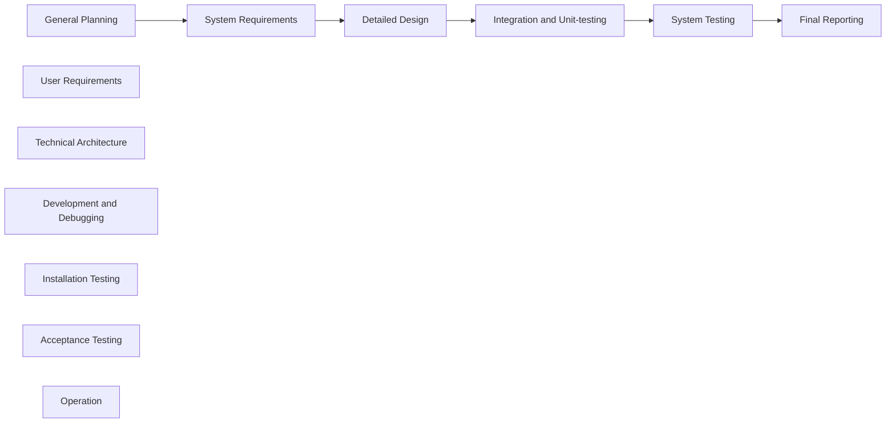
```mermaid
graph LR
    GP["General Planning"] --> SR["System Requirements"] --> DD["Detailed Design"] --> IUT["Integration and Unit-testing"] --> ST["System Testing"] --> FR["Final Reporting"]
    
    sub_UR["User Requirements"]
    sub_TA["Technical Architecture"]
    sub_DD["Development and Debugging"]
    sub_IT["Installation Testing"]
    sub_AT["Acceptance Testing"]
    sub_OP["Operation"]
```

Figure 2.2.a — Cost of error correction depending on when the error is detected

If the charts don't convince you, let's try to illustrate the same point with a simple example. Suppose you and your friends are making a shopping list before you decide to go to the mall. You go shopping and your friends are waiting for you at home. How much does it "cost" to add, subtract or change a few items while you're still making the list? None.

---
$^{50}$ "Requirements in the Real World", Brian F. Hanks, February 28, 2002.

The importance of requirements

If the thought of an erratic list catches up with you on your way to the mall, you'll already have to make a phone call (cheap, but not free). If you realize there's "something wrong" with the list in the queue at the cash register, you'll have to go back to the sales floor and waste time. If you realize the problem on the way home, or even at home, you have to go back to the mall.

And finally, the clinical case: something on the list was originally completely wrong (e.g., “100 kg of chocolates — that's it”), the trip is made, all the money is spent, the chocolates are delivered and only then it turns out that “well, we were just joking”.

|  | **Task 2.2.a:** Imagine you and your friends are on a tight budget and your list of requirements is prioritized (something is mandatory, something should be bought if there is money available, etc.). How does this affect the risks associated with mistakes in the list? |
|---|---|

Another argument in favor of requirements testing is that it has been estimated that $\frac{1}{2}$ to $\frac{3}{4}$ of all software problems originate there. As a result, there is a risk that it will turn out as it is shown in figure 2.2.b.

Since we always say “documentation and requirements” rather than just “requirements”, it is worth considering the list of documentation that should be tested during software development (although we will concentrate especially on the requirements below).

|  |  |  |  |  |
| :---: | :---: | :---: | :---: | :---: |
| How the client explained what he wanted | How the project manager understood the client | How the analyst described the project | How the developer implemented the project | How the project was promoted by the consultants |

|  |  |  |  |  |
| :---: | :---: | :---: | :---: | :---: |
| How the project has been documented | How the project was handed over | How much the project cost the client | How technical support worked | What the client really needed |

Figure 2.2.b — A typical project with poor requirements

Basically, documentation can be divided into two major types depending on when and where it is used (there will be a lot of footnotes with definitions, because lots of questions often arise about the types of documentation, so we will have to go into some more detail).

- **The product documentation** (or development documentation$^{51}$) is used by the project team during product development and maintenance. It includes:
  - Project management plan$^{52}$ (including test plan$^{53}$).
  - Product requirements document (PRD$^{54}$) and functional specifications$^{55}$ document (FSD$^{56}$), software requirements specification (SRS$^{57}$).
  - Architecture and design$^{58}$.
  - Test cases$^{59}$ and test suites$^{60}$.
  - Technical specifications$^{61}$, such as database schemas, descriptions of algorithms and interfaces, etc.

- **Project documentation$^{62}$** includes both product documentation and some additional types of documentation and is used not only in the development phase but also in earlier and later phases (e.g., implementation and operation). It includes:
  - User and accompanying documentation$^{63}$, such as built-in help, installation and usage guidelines, license agreements, etc.
  - Market requirements document (MRD$^{64}$), which is used by the developer or customer representatives both at the initial stages (to clarify the concept of the project) and at the final stages of project development (to promote the product on the market).

---

$^{51}$ **Development documentation.** Development documentation comprises those documents that propose, specify, plan, review, test, and implement the products of development teams in the software industry. Development documents include proposals, user or customer requirements description, test and review reports (suggesting product improvements), and self-reflective documents written by team members, analyzing the process from their perspective. ["Documentation for Software and IS Development", Thomas T. Barker, "Encyclopedia of Information Systems" (Elsevier Press, 2002, pp. 684-694.)]

$^{52}$ **Project management plan.** A formal, approved document that defines how the project is executed, monitored and controlled. It may be summary or detailed and may be composed of one of more subsidiary management plans and other planning documents. [PMBOK, 3$^{rd}$ edition]

$^{53}$ **Test plan.** A document describing the scope, approach, resources and schedule of intended test activities. It identifies amongst others test items, the features to be tested, the testing tasks, who will do each task, degree of tester independence, the test environment, the test design techniques and entry and exit criteria to be used, and the rationale for their choice, and any risks requiring contingency planning. It is a record of the test planning process. [ISTQB Glossary]

$^{54}$ **Product requirements document, PRD.** The PRD describes the product your company will build. It drives the efforts of the entire product team and the company's sales, marketing and customer support efforts. The purpose of the product requirements document (PRD) or product spec is to clearly and unambiguously articulate the product's purpose, features, functionality, and behavior. The product team will use this specification to actually build and test the product, so it needs to be complete enough to provide them the information they need to do their jobs. ["How to write a good PRD", Martin Cagan]

$^{55}$ **Specification.** A document that specifies, ideally in a complete, precise and verifiable manner, the requirements, design, behavior, or other characteristics of a component or system, and, often, the procedures for determining whether these provisions have been satisfied. [ISTQB Glossary]

$^{56}$ **Functional specifications document, FSD.** See "Software requirements specification, SRS".

$^{57}$ **Software requirements specification, SRS.** SRS describes as fully as necessary the expected behavior of the software system. The SRS is used in development, testing, quality assurance, project management, and related project functions. People call this deliverable by many different names, including business requirements document, functional spec, requirements document, and others. ["Software Requirements (3$^{rd}$ edition)", Karl Wiegers and Joy Beatty]

$^{58}$ **Architecture. Design.** A *software architecture* for a system is the structure or structures of the system, which comprise elements, their externally-visible behavior, and the relationships among them. .... *Architecture is design*, but not all design is architecture. That is, there are many design decisions that are left unbound by the architecture, and are happily left to the discretion and good judgment of downstream designers and implementers. The architecture establishes constraints on downstream activities, and those activities must produce artifacts (finer-grained designs and code) that are compliant with the architecture, but architecture does not define an implementation. ["Documenting Software Architectures", Paul Clements and others.]

$^{59}$ **Test case.** A set of input values, execution preconditions, expected results and execution postconditions, developed for a particular objective or test condition, such as to exercise a particular program path or to verify compliance with a specific requirement. [ISTQB Glossary]

$^{60}$ **Test suite.** A set of several test cases for a component or system under test, where the post condition of one test is often used as the precondition for the next one. [ISTQB Glossary]

$^{61}$ **Technical specifications.** Scripts, source code, data definition language, etc. [PMBOK, 3$^{rd}$ edition] See also "Specification".

$^{62}$ **Project documentation.** Other expectations and deliverables that are not a part of the software the team implements, but that are necessary to the successful completion of the project as a whole. ["Software Requirements (3$^{rd}$ edition)", Karl Wiegers and Joy Beatty]

$^{63}$ **User documentation.** User documentation refers to the documentation for a product or service provided to the end users. The user documentation is designed to assist end users to use the product or service. This is often referred to as user assistance. The user documentation is a part of the overall product delivered to the customer. [Based on doc-department.com]

$^{64}$ **Market requirements document, MRD.** An MRD goes into details about the target market segments and the issues that pertain to commercial success. ["Software Requirements (3$^{rd}$ edition)", Karl Wiegers and Joy Beatty]

In some of the classifications, part of the product documentation may be listed in the project documentation — this is completely appropriate, as the concept of project documentation is, by definition, broader. Since there are many questions and misunderstandings about this classification, let us reflect it again — graphically (see figure 2.2.c) — and recollect that we have agreed to classify documentation according to where (why) it is most needed.

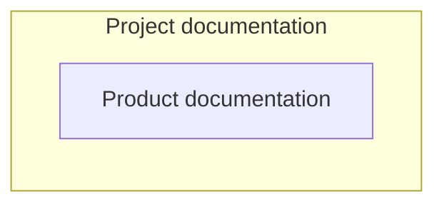
```mermaid
graph TD
    subgraph Project documentation
        direction TB
        PD["Product documentation"]
    end
```

Figure 2.2.c — Relationship between "product documentation" and "project documentation"

The importance and depth of testing a particular type of documentation or even a single document depends on numerous factors, but the general principle remains the same: everything we create during project development (even whiteboard sketches, even letters, even some instant messaging) can be considered documentation and can be subjected to testing in one way or another (for example, proofreading an e-mail before sending it is also a kind of documentation testing).

### 2.2.3. Ways of requirements gathering

Requirements begin their existence on the customer's side. Their gathering and elicitation are carried out using the following basic techniques$^65$ (figure 2.2.d).

**Interview.** The most common way of identifying requirements is through communication between a project specialist (usually a business analyst) and a customer representative (or expert, user, etc.). The interview may take place in the classical sense of the word (as a question-and-answer session), in the form of correspondence, etc. The important thing here is that the key players are two — the interviewee and the interviewer (although this does not exclude the presence of an "audience of listeners", for example, in the form of persons in the correspondence CC).

**Work with focus groups.** Can stand for "extended interviews", where the source of information is not one person but a group of people (usually representing the target audience, and/or those with important information for the project, and/or those authorized to make important decisions for the project).

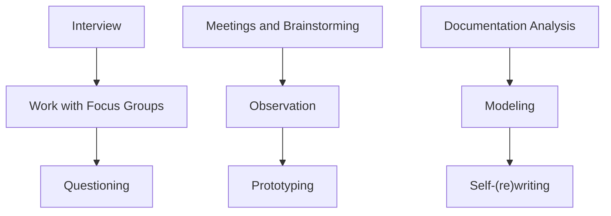
```mermaid
graph TD
    A["Interview"] --> B["Work with Focus Groups"] --> C["Questioning"]
    D["Meetings and Brainstorming"] --> E["Observation"] --> F["Prototyping"]
    G["Documentation Analysis"] --> H["Modeling"] --> I["Self-(re)writing"]

    %% Layout styling to match a grid appearance
    subs1[ ]
    style subs1 height:0px;
```

Figure 2.2.d — Ways of requirements gathering

**Questioning.** This type of requirement elicitation is highly controversial because, if implemented incorrectly, it can lead to zero results at a high cost. At the same time, if properly organized, questionnaires can automatically collect and process a huge number of responses from a large number of respondents. The key to success is the right design of the questionnaire, the right choice of audience and the right presentation of the questionnaire.

**Meetings and brainstorming.** Meetings and workshops allow a group of people to exchange information rapidly (and visualize certain ideas) and they also can be combined well with interviews, questionnaires, prototyping and modelling — including for discussing results and forming conclusions and decisions. Brainstorming can be done as part of a workshop or as a separate activity. It allows a large number of ideas to be generated in a minimum amount of time, which can then be considered without haste in terms of their use in developing the project.

---
$^65$ See some additional details here: "Requirements Gathering vs. Elicitation" (Laura Brandenburg): [http://www.bridging-the-gap.com/requirements-gathering-vs-elicitation/](http://www.bridging-the-gap.com/requirements-gathering-vs-elicitation/)

**Observation.** It can be either the literal observation of some processes or the inclusion of the project specialist as a participant in these processes. On the one hand, observation allows us to see what (for quite different reasons) interviewees, respondents and focus group representatives may possibly remain silent about, but on the other hand, it is very time-consuming and most often allows us to see only part of the processes.

**Prototyping.** It consists of demonstration and discussion of intermediate versions of the product (for example, the design of web pages can first be presented in the form of images and only then be finalized). This is one of the best ways to ensure a common understanding and clarification of requirements, but it can lead to serious additional costs in the absence of specific tools (that allow rapid prototyping) and too early application (when the requirements are not stable yet, and it is highly likely to create a prototype that has little in common with the customer's wishes).

**Documentation analysis.** It works well when subject area experts are (temporarily) unavailable and in subject areas that already have generally accepted, well-established regulatory documentation. This technique also includes simply studying the documents regulating the business processes in the customer’s subject area or in a particular entity, which allows us to acquire the knowledge necessary to understand the project better.

**Modeling.** Can be applied to both “business processes and interactions” (e.g.: “*a purchase contract is generated by the purchasing department, approved by the accounting and legal departments...*”) and “technical processes and interactions” (e.g.: “*the payment order is generated by the Accounting module, encrypted by the Security module and transferred for storage to the Storage module*”). This technique requires a highly skilled business analyst, as it involves processing a large amount of complex (and often poorly structured) information.

**Self-(re)writing.** It is not so much a technique for elicitation requirements as a technique for their fixation and formalization. It is very difficult (and even impossible!) to try to “think up requirements for the customer”, but in peace of mind it is possible to process the collected information on your own and formalize it carefully for further discussion and refinement.

|  | Business analysts often come to their profession from testing. If you are interested in this area, the following books are worth reading: <br> • “Business Analysis Techniques. 72 Essential Tools for Success” (James Cadle, Debra Paul, Paul Turner). <br> • “Business Analysis (Second Edition)” (Debra Paul, Donald Yeates, James Cadle). |
| :---: | --- |

## 2.2.4. Requirements levels and types

The presentation, level of detail and list of useful features of the requirements depend on the levels and types of requirements, as shown schematically in figure 2.2.e⁶⁶.

**Business requirements⁶⁷** express the purpose for which the product is being developed (why the product is needed at all, what benefits are expected from it, how the customer can make a profit with it). The output of the requirements definition at this level is the vision and scope⁶⁸, a document which is typically drawn up in plain text and spreadsheets. It does not include details on system implementation and other technical specifications, but it may well define priorities for the business tasks to be performed, risks, etc.

A few simple examples of business requirements isolated from context and from each other:
* *There is a need for a tool that displays in real time the most favorable exchange rate for buying and selling a currency.*
* *There needs to be a two- or three-fold increase in the number of orders processed by one operator per shift.*
* *There is a need to automate the process of issuing waybills based on contracts.*

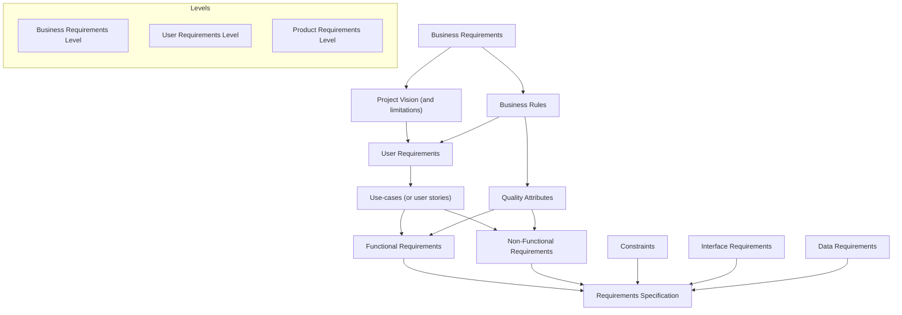
```mermaid
graph TD
    subgraph Levels
    direction TB
    BR_L["Business Requirements Level"]
    UR_L["User Requirements Level"]
    PR_L["Product Requirements Level"]
    end

    BR["Business Requirements"] --> PV["Project Vision (and limitations)"]
    PV --> UR["User Requirements"]
    UR --> UC["Use-cases (or user stories)"]
    
    BR --> BRules["Business Rules"]
    BRules --> UR
    BRules --> QA["Quality Attributes"]
    
    UC --> FR["Functional Requirements"]
    UC --> NFR["Non-Functional Requirements"]
    QA --> FR
    QA --> NFR
    
    FR --> RS["Requirements Specification"]
    NFR --> RS
    
    Constraints["Constraints"] --> RS
    InterfaceRequirements["Interface Requirements"] --> RS
    DataRequirements["Data Requirements"] --> RS
```

Figure 2.2.e — Requirements levels and types

---

⁶⁶ Based on ideas from "Software Requirements (3ʳᵈ edition)" (by Karl Wiegers and Joy Beatty).
⁶⁷ **Business requirement.** Anything that describes the financial, marketplace, or other business benefit that either customers or the developing organization wish to gain from the product. ["Software Requirements (3ʳᵈ edition)", Karl Wiegers and Joy Beatty]
⁶⁸ **Vision and scope.** The vision and scope document collects the business requirements into a single deliverable that sets the stage for the subsequent development work. ["Software Requirements (3ʳᵈ edition)", Karl Wiegers and Joy Beatty]

**User requirements**$^{69}$ describe the tasks that the user can perform with the system being developed (reaction of the system to user actions, user scenarios). As the system behavior is being described here, the requirements at this level can be used to estimate the scope of work, project cost, development time, etc. User requirements are formalized as use cases$^{70}$, user stories$^{71}$, and user scenarios$^{72}$. (See also “creating user scenarios”$^{[137]}$).

A few simple examples of user requirements, isolated from context and from each other:
* *The first time a user logs on to the system, the license agreement should be displayed.*
* *The administrator should be able to view a list of all users currently working on the system.*
* *The first time a new article is saved, the system should prompt to save as a draft or publish.*

**Business rules**$^{73}$ describe the specifics of the subject area (and/or those adopted directly by the customer) processes, constraints and other rules. These rules may relate to business processes, personnel rules, the details of software operation, etc.

A few simple examples of business rules isolated from context and from each other:
* *No document that has been viewed at least once by visitors to this website can be edited or deleted.*
* *An article can only be published after approval by the editor-in-chief.*
* *Connection to the system from outside the office is forbidden during non-working hours.*

**Quality attributes**$^{74}$ extend non-functional requirements and can be described as project-specific quality attributes (product properties that are not related to functionality, but are important for achieving product goals — performance, scalability, recoverability). There are many quality attributes$^{75}$, but only some subset is really important for any project.

A few simple examples of quality attributes isolated from context and from each other:
* *The maximum time for the system to be ready to execute a new command after a previous command has been cancelled cannot exceed one second.*
* *Changes made to the text of an article must not be lost when the connection between the client and the server is broken.*
* *The application must support the addition of any number of non-hieroglyphic interface languages.*

___

$^{69}$ **User requirement.** User requirements are general statements of user goals or business tasks that users need to perform. [“Software Requirements ($3^{\text{rd}}$ edition)”, Karl Wiegers and Joy Beatty]
$^{70}$ **Use case.** A sequence of transactions in a dialogue between an actor and a component or system with a tangible result, where an actor can be a user or anything that can exchange information with the system. [ISTQB Glossary]
$^{71}$ **User story.** A high-level user or business requirement commonly used in agile software development, typically consisting of one or more sentences in the everyday or business language capturing what functionality a user needs, any non-functional criteria, and also includes acceptance criteria. [ISTQB Glossary]
$^{72}$ A scenario is a hypothetical story, used to help a person think through a complex problem or system. “An Introduction to Scenario Testing”, Cem Kaner. [http://www.kaner.com/pdfs/ScenarioIntroVer4.pdf]
$^{73}$ **Business rule.** A business rule is a statement that defines or constrains some aspect of the business. It is intended to assert business structure or to control or influence the behavior of the business. A business rule expresses specific constraints on the creation, updating, and removal of persistent data in an information system. [“Defining Business Rules — What Are They Really”, David Hay and others.]
$^{74}$ **Quality attribute.** A feature or characteristic that affects an item’s quality. [ISTQB Glossary]
$^{75}$ Even the Wikipedia provides a huge list: [http://en.wikipedia.org/wiki/List_of_system_quality_attributes](http://en.wikipedia.org/wiki/List_of_system_quality_attributes)

**Functional requirements**$^{76}$ describe the behavior of the system, i.e., its activities (calculations, transformations, checks, processing, etc.) In the planning context, the functional requirements mainly influence the system design.

It is worth remembering that system behavior refers not only to what the system should do, but also to what it **should not** do (e.g.: "the application **should not** dump background documents from RAM within 30 minutes of the last operation on them").

A few simple examples of functional requirements, isolated from context and from each other:
* *During installation, the application should check the remaining free space on the target drive.*
* *The system shall automatically back up the data daily at the specified time.*
* *The user's e-mail address entered during registration must be verified to comply with RFC822.*

**Non-functional requirements**$^{77}$ describe the properties of the system (usability, security, reliability, scalability, etc.) that it must have when implementing its behavior. Here you can find a more technical and detailed description of the quality attributes. In the design context, the non-functional requirements have a major influence on the system architecture.

A few simple examples of non-functional requirements, isolated from context and from each other:
* *If 1,000 users are operating the system simultaneously, the minimum time between failures must be more than or equal to 100 hours.*
* *Under no circumstances may the total amount of memory used by the application exceed 2 GB.*
* *The font size for any screen text shall support a setting range of 5 to 15 points.*

The following requirements can generally be categorized as non-functional requirements, but they are often put in separate subgroups (for simplicity only three such subgroups are considered here, but there may be many more; they generally arise from quality attributes, but a high level of detail allows them to be put at the product requirement level).

**Limitations or constraints**$^{78}$ are factors that limit the choice of ways and means (including tools) to develop a product.

A few simple examples of limitations isolated from context and from each other:
* *All interface elements should be displayed without scrolling at screen resolutions from 800x600 to 1920x1080.*
* *Flash must not be used in the client-side implementation of the application.*
* *The application must retain the ability to implement functions with the “critical” level of importance if the client does not support JavaScript.*

---

$^{76}$ **Functional requirement.** A requirement that specifies a function that a component or system must perform. [ISTQB Glossary]
Functional requirements describe the observable behaviors the system will exhibit under certain conditions and the actions the system will let users take. [“Software Requirements (3$^\text{rd}$ edition)”, Karl Wiegers and Joy Beatty]

$^{77}$ **Non-functional requirement.** A requirement that does not relate to functionality, but to attributes such as reliability, efficiency, usability, maintainability and portability. [ISTQB Glossary]

$^{78}$ **Limitation, constraint.** Design and implementation constraints legitimately restrict the options available to the developer. [“Software Requirements (3$^\text{rd}$ edition)”, Karl Wiegers and Joy Beatty]

Requirements levels and types

**External interfaces requirements**$^{79}$ describe the interaction of the system under development with other systems and дер operating environment.

A few simple examples of interface requirements, isolated from context and from each other:
* *Background AJAX data exchange between the client and the server should be implemented in JSON format.*
* *Event logging must be maintained in the operating system event log.*
* *Connection to the mail server must be in accordance with RFC3207 ("SMTP over TLS").*

**Data requirements**$^{80}$ describe the data structures (and the data itself) that are an integral part of the system under development. This often includes a description of the database and the features of its use.

A few simple examples of data requirements isolated from context and from each other:
* *All system data, except for user documents, should be stored in a database managed by MySQL; user documents should be stored in a database managed by MongoDB.*
* *Information about cash transactions during the current month should be stored in an operational table and transferred to an archive table at the end of the month.*
* *Full-text indexes on the corresponding table fields should be provided to speed up text search operations on articles and reviews.*

**Software requirements specification** (SRS$^{81}$) summarizes all product-level requirements and can be a very lengthy document (hundreds or thousands of pages).

As there can be so many requirements, and as they not only have to be written and agreed upon once, but also constantly updated, the work of the project team in requirements management is greatly facilitated by suitable requirements management tools$^{82, 83}$.

 For a more comprehensive understanding of how to create, organize and use a set of requirements it is advisable to read Karl Wiegers’ seminal work “Software Requirements (3$^{\text{rd}}$ Edition) (Developer Best Practices)” (Karl Wiegers, Joy Beatty). In the same book (in the appendices) there is a highly visual tutorial of examples of documents describing different levels of requirements.

---

$^{79}$ **External interface requirements.** Requirements in this category describe the connections between the system and the rest of the universe. They include interfaces to users, hardware, and other software systems. [“Software Requirements (3rd edition)”, Karl Wiegers and Joy Beatty]
$^{80}$ **Data requirements.** Data requirement describe the format, data type, allowed values, or default value for a data element; the composition of a complex business data structure; or a report to be generated. [“Software Requirements (3rd edition)”, Karl Wiegers and Joy Beatty]
$^{81}$ **Software requirements specification, SRS.** SRS describes as fully as necessary the expected behavior of the software system. The SRS is used in development, testing, quality assurance, project management, and related project functions. People call this deliverable by many different names, including business requirements document, functional spec, requirements document, and others. [“Software Requirements (3rd edition)”, Karl Wiegers and Joy Beatty]
$^{82}$ **Requirements management tool.** A tool that supports the recording of requirements, requirements attributes (e.g., priority, knowledge responsible) and annotation, and facilitates traceability through layers of requirements and requirements change management. Some requirements management tools also provide facilities for static analysis, such as consistency checking and violations to predefined requirements rules. [ISTQB Glossary]
$^{83}$ An extensive list of requirements management tools can be found at: [http://makingofsoftware.com/resources/list-of-rm-tools](http://makingofsoftware.com/resources/list-of-rm-tools)

## 2.2.5. Good requirements properties

During testing, the requirements are checked against a certain set of properties (figure 2.2.f).

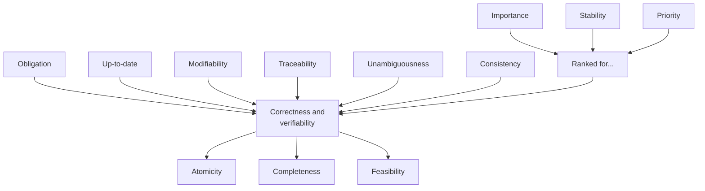
```mermaid
graph TD
    Obligation --> A
    Up-to-date --> A
    
    Modifiability --> A
    Traceability --> A
    Unambiguousness --> A
    Consistency --> A
    
    A["Correctness and\nverifiability"]

    A --> Atomicity
    A --> Completeness
    A --> Feasibility

    Importance --> B
    Stability --> B
    Priority --> B
    B["Ranked for..."] --> A
```

Figure 2.2.f — Good requirements properties

**Completeness**$^8^4$. The requirement is complete and final in the sense of providing all the necessary information, nothing is omitted for the reason of “it is obvious to everyone”.

Typical completeness problems:
* There are no non-functional requirements or references to relevant non-functional requirements (e.g.: "*passwords must be encrypted*" — what is the encryption algorithm?)
* Only a part of some enumeration is specified (e.g.: "*export to PDF, PNG, etc.*" — what does "*etc.*" mean here?)
* The references given are ambiguous (e.g.: "*see above*" instead of "*see section 123.45.b*").

| Ways of detecting problems | Ways of fixing problems |
| :--- | :--- |
| Almost all requirements testing techniques are applicable$^{(49)}$, but asking questions and using a graphical representation of the system being developed helps the most. It also helps to have an in-depth knowledge of the subject area so that missing pieces of information can be noticed. | Once it has been discovered that something is missing, the missing information should be retrieved and added to the requirements. The requirements may need to be revised slightly. |

---
$^8^4$ Each requirement must contain all the information necessary for the reader to understand it. In the case of functional requirements, this means providing the information the developer needs to be able to implement it correctly. No requirement or necessary information should be absent. [“Software Requirements (3rd edition)”, Karl Wiegers and Joy Beatty]

Good requirements properties

**Atomicity**$^{85}$. A requirement is atomic if it cannot be split into separate requirements without loss of completeness, and describes the one and only situation.

* Typical atomicity problems:
* In fact, one requirement contains several independent requirements (e.g.: *“the ‘Restart’ button should not be displayed when the service is stopped, the ‘Log’ window should contain at least 20 records of the user's recent actions”* — here, for some reason, completely different interface elements in completely different contexts are described in the same sentence).
* The requirement is subject to variation due to grammatical features of the language (e.g., *“if the user confirms an order and edits or postpones the order, a request for payment should be issued”* — this describes three different cases and should be split into three separate paragraphs to avoid confusion). Such problems with atomicity often lead to inconsistency.
* A single requirement combines the description of several independent situations (e.g., *“when the user logs in, a greeting should be displayed; when the user has logged in, the username should be displayed; when the user logs out, a farewell message should be displayed”* — all three of these situations are worthy of being described in separate and far more detailed requirements).

| Ways of detecting problems | Ways of fixing problems |
| :--- | :--- |
| Thinking, discussion with colleagues and common sense: if we think a certain section of requirements is overloaded and needs to be decomposed, it is probably so. | Rework and/or restructuring of the requirements: dividing them into sections, subsections, paragraphs, sub-paragraphs, etc. |

**Consistency**$^{86}$. The requirement must not be internally inconsistent or in conflict with other requirements and documents.

* Typical consistency problems:
* Inconsistencies within a single requirement (e.g.: *“after successful login of a user who does not have the right to log in...”* — How did the user successfully log in if he had no such permissions?)
* Inconsistencies within two or more requirements, between a table and a text, a figure and a text, a requirement and a prototype, etc. (e.g.: *“712.a: The ‘Close’ button is always red”* and *“36452.x: The ‘Close’ button is always blue”* — so is it red or blue?)
* The use of incorrect terminology or the use of different terms for the same object or phenomenon (e.g.: *“if the resolution of the window is less than 800x600...”* — the screen has a resolution, the window has a size).

| Ways of detecting problems | Ways of fixing problems |
| :--- | :--- |
| The best way to detect inconsistencies is to have good memory ☺, but even then, a graphical representation of the system under development is an indispensable tool to present all the key information in a single coherent diagram (where inconsistencies are clearly visible). | Once the inconsistency has been identified, the situation should be clarified with the customer and the necessary changes should be made to the requirements. |

---
$^{85}$ Each requirement you write represents a single market need that you either satisfy or fail to satisfy. A well written requirement is independently deliverable and represents an incremental increase in the value of your software. ["Writing Good Requirements — The Big Ten Rules", Tyner Blain: http://tynerblain.com/blog/2006/05/25/writing-good-requirements-the-big-ten-rules/]  
$^{86}$ Consistent requirements don't conflict with other requirements of the same type or with higher-level business, user, or system requirements. ["Software Requirements (3rd edition)", Karl Wiegers and Joy Beatty]

**Unambiguousness**$^{87}$ (clearness). The requirement should be described without the use of slang, non-obvious acronyms and vague language, should allow only an unambiguous objective understanding and should be atomic in that no combination of individual phrases can be interpreted differently.

Typical unambiguousness problems:
* The use of subjective terms or phrases (e.g., *“the application should support the transfer of large amounts of data”* — how much is “large”?) Here is just a small list of words and phrases that can be considered valid signs of ambiguity: *adequate, be able to, easy, provide for, as a minimum, be capable of, effectively, timely, as applicable, if possible, to be determined, TBD, as appropriate, if practical, but not limited to, to be capable of, capability to, normal, minimize, maximize, optimize, rapid, user-friendly, simple, often, usual, large, flexible, robust, state-of-the-art, improved, efficient*. This is an exaggerated example of a requirement, which sounds very nice but is totally unrealistic and difficult to understand: *“If large file transfer optimization is required, the system should effectively use a minimum of memory, if possible”*.
* The use of non-obvious or ambiguous acronyms without deciphering (e.g.: “FS is accessed by via transparent encryption system” and “FS provides the ability to record messages in their current state along with the history of all changes” — does FS mean a “file system” here? Does it? Not some kind of “File Searcher” or “Fixation Service”?
* The wording of the requirements assumes that something should be obvious to everyone (e.g., *“The system converts a PDF input file to a PNG output file”* — and the author thinks it's perfectly obvious that the system gets the file names from the command line, while a multipage PDF is converted into several PNG files with “page-1”, “page-2”, etc. added to the file names). This problem also echoes the incorrectness.

| Ways of detecting problems | Ways of fixing problems |
| :--- | :--- |
| The above-mentioned indicator words are a good way to see ambiguity in a requirement. It's just as effective to think of checks (tests): it's quite complicated to come up with an objective check for a requirement that is ambiguous. | The greatest enemies of ambiguity are numbers and formulas: if something can be expressed in formulaic or numeric form (instead of verbal description), it is worth doing so. If this is not possible, you should at least use the most precise technical terms, references to standards, etc. |

**Feasibility**$^{88}$. The requirement should be technologically feasible and implementable within the budget and project development timeframe.

Typical feasibility problems:
* So-called “gold plating” — requirements which are extremely long and/or expensive to implement and yet practically useless for end-users (e.g.: *“parameters settings for connecting to a database must support character recognition from gestures received from the 3D input device”*).

---

$^{87}$ Natural language is prone to two types of ambiguity. One type I can spot myself, when I can think of more than one way to interpret a given requirement. The other type of ambiguity is harder to catch. That's when different people read the requirement and come up with different interpretations of it. ["Software Requirements (3rd edition)", Karl Wiegers and Joy Beatty]

$^{88}$ It must be possible to implement each requirement within the known capabilities and limitations of the system and its operating environment, as well as within project constraints of time, budget, and staff. ["Software Requirements (3rd edition)", Karl Wiegers and Joy Beatty]

Good requirements properties

* Technically infeasible requirements at the current level of technology (e.g., “contract analysis should be performed by an artificial intelligence that makes an unambiguous and correct judgement on the extent of the benefit of the contract”).
* Fundamentally unrealistic requirements (e.g.: “the search engine should predict all possible search options and cache their results”).

| Ways of detecting problems | Ways of fixing problems |
| :--- | :--- |
| Alas, there is only one way to go here: maximize experience and build on it. It is impossible to realize that a certain requirement “costs” too much or is not feasible at all if there is no understanding of the software development process, no understanding of the subject area and no other related knowledge. | If a requirement is found to be infeasible, there is no other option than to discuss the situation in detail with the customer and/or to change the requirement (maybe even to remove it), or to revise the terms of the project (enabling the requirement to be implemented). |

**Obligatoriness**⁸⁹ and **up-to-date** state. If a requirement is not mandatory, it should simply be excluded from the set of requirements. If a requirement is necessary but “not very important”, a priority ranking should be used to indicate this fact (see “ranking for...”). Requirements that are no longer relevant should also be excluded (or revised).

Typical obligatoriness and up-to-date state problems:
* The requirement was added “just in case” even though there was no real need for it.
* Requirement is not correctly ranked according to the importance and/or priority criteria.
* The requirement is obsolete, but has not been revised or removed.

| Ways of detecting problems | Ways of fixing problems |
| :--- | :--- |
| A continuous (periodic) review of the requirements (preferably with the customer participation) makes it possible to identify those parts that are no longer relevant or have become of low priority. | Redrafting the requirements (eliminating the parts that are no longer relevant) and redrafting the parts that have changed priority (often the change in priority also leads to a change in the wording of the requirement). |

**Traceability**⁹⁰, ⁹¹. There are vertical traceability⁹² and horizontal traceability⁹³. Vertical traceability enables the correlation of requirements at different levels of requirements, while horizontal traceability enables the correlation of a requirement with the test plan, test cases, architectural solutions, etc.

---

⁸⁹ Each requirement should describe a capability that provides stakeholders with the anticipated business value, differentiates the product in the marketplace, or is required for conformance to an external standard, policy, or regulation. Every requirement should originate from a source that has the authority to provide requirements. [“Software Requirements (3rd edition)”, Karl Wiegers and Joy Beatty]
⁹⁰ **Traceability**. The ability to identify related items in documentation and software, such as requirements with associated tests. [ISTQB Glossary]
⁹¹ A traceable requirement can be linked both backward to its origin and forward to derived requirements, design elements, code that implements it, and tests that verify its implementation. [“Software Requirements (3rd edition)”, Karl Wiegers and Joy Beatty]
⁹² **Vertical traceability**. The tracing of requirements through the layers of development documentation to components. [ISTQB Glossary]
⁹³ **Horizontal traceability**. The tracing of requirements for a test level through the layers of test documentation (e.g., test plan, test design specification, test case specification and test procedure specification or test script). [ISTQB Glossary]

Special requirements management tools$^9^4$ and/or traceability matrices$^9^5$ are often used to ensure traceability.

* Typical traceability problems:
  * Requirements are not numbered, not structured, have no table of contents, no working cross-references.
  * Requirements management tools and techniques have not been used in requirements development.
  * The set of requirements is incomplete, sketchy, with obvious “gaps”.

| Ways of detecting problems | Ways of fixing problems |
| :--- | :--- |
| Traceability failures become apparent in the requirements processing as soon as we have the **unanswered** questions like “where did this requirement come from?”, “where are the associated (related) requirements described?”, “what does it affect?” | Reworking the requirements. It may even be necessary to change the structure of the requirements set, but we will definitely start with a lot of cross-referencing to allow fast and transparent navigation through the requirements set. |

**Modifiability**$^9^6$. This property describes the ease of modifying individual requirements or a set of requirements. Modifiability can be considered present if, when the requirements are revised, the information sought is easy to find and its modification does not violate any of the other properties described in this list.

* Typical modifiability problems:
  * The requirements are neither atomic (see “atomicity”) nor traceable (see “traceability”), so changing them is very likely to produce inconsistency (see “consistency”).
  * The requirements are initially inconsistent (see “consistency”). In such a situation, changes (not related to the elimination of inconsistency) only exacerbate the situation increasing inconsistency and reducing traceability.
  * The requirements are presented in an uncomfortable form (e.g., no requirements management tools are used, and the team ends up having to work with dozens of huge text documents).

| Ways of detecting problems | Ways of fixing problems |
| :--- | :--- |
| If, when making changes to a set of requirements, we are faced with problems typical of a loss of traceability situation, then we have found a problem with modifiability. Also, modifiability is impaired whenever almost any of the requirements’ problems discussed in this section are present. | Reworking the requirements with the primary aim of improving their traceability. At the same time, other identified problems can be rectified. |

---

$^9^4$ **Requirements management tool.** A tool that supports the recording of requirements, requirements attributes (e.g., priority, knowledge responsible) and annotation, and facilitates traceability through layers of requirements and requirements change management. Some requirements management tools also provide facilities for static analysis, such as consistency checking and violations to predefined requirements rules. [ISTQB Glossary]

$^9^5$ **Traceability matrix.** A two-dimensional table, which correlates two entities (e.g., requirements and test cases). The table allows tracing back and forth the links of one entity to the other, thus enabling the determination of coverage achieved and the assessment of impact of proposed changes. [ISTQB Glossary]

$^9^6$ To facilitate modifiability, avoid stating requirements redundantly. Repeating a requirement in multiple places where it logically belongs makes the document easier to read but harder to maintain. The multiple instances of the requirement all have to be modified at the same time to avoid generating inconsistencies. Cross-reference related items in the SRS to help keep them synchronized when making changes. [“Software Requirements (3rd edition)”, Karl Wiegers and Joy Beatty]

Good requirements properties

**Ranked**$^{97}$ **for importance, stability, priority**. Importance describes the dependence of the success of the project on the success of the requirement implementation. Stability describes the likelihood that no changes will be made to the requirement in the foreseeable future. Priority determines the allocation of the project team's efforts in time to implement a requirement.

Typical problems with ranking consist of a lack of ranking or incorrect ranking with the following consequences:
* Problems with ranking for importance increase the risk of misallocation of the project team's efforts, of directing efforts towards secondary tasks and of eventual project failure due to the product's inability to perform key tasks in compliance with key conditions.
* Problems with ranking for stability increase the risk of doing pointless work to improve, implement and test requirements that may soon undergo drastic changes (up to becoming completely irrelevant).
* Problems with ranking for priority increase the risk of disrupting the customer's desired sequence of functionality implementation and usage.

| Ways of detecting problems | Ways of fixing problems |
| :--- | :--- |
| As in the case of up-to-date state and obligatoriness of the requirements, the best way to detect deficiencies is to review the requirements on an ongoing (periodic) basis (preferably with the customer participation), which may reveal incorrect values for the priority, importance and stability of the requirements under discussion. | Right in the course of discussing the requirements with the customer (during the reworking of the requirements), it is worth making adjustments to the priority, importance and stability of the requirements under discussion. |

**Correctness**$^{98}$ **and verifiability**$^{99}$. In fact, these properties are derived from compliance with all of the above (or it can be said that they are not met if at least one of the above is violated). In addition, verifiability implies the ability to create objective test case(s) which unambiguously show that the requirement is implemented correctly and that the behavior of the application exactly meets the requirement.

Typical problems with correctness also include:
* Misprints (misprints in acronyms are especially risky, transforming one meaningful acronym into another meaningful but irrelevant to some context; they are extremely difficult to spot).
* Presence of unreasoned design and architectural requirements.
* Poor layout of the text and accompanying graphics; grammar, punctuation and other mistakes in the text.
* Incorrect detailing level (e.g., too much details at the business requirement level or insufficient details at the product requirement level).
* Requirements for the user, not the application (e.g.: “*user must be able to send a message*” — alas, we cannot influence the user's condition).

---

$^{97}$ Prioritize business requirements according to which are most important to achieving the desired value. Assign an implementation priority to each functional requirement, user requirement, use case flow, or feature to indicate how essential it is to a particular product release. [“Software Requirements (3rd edition)”, Karl Wiegers and Joy Beatty]
$^{98}$ Each requirement must accurately describe a capability that will meet some stakeholder's need and must clearly describe the functionality to be built. [“Software Requirements (3rd edition)”, Karl Wiegers and Joy Beatty]
$^{99}$ If a requirement isn't verifiable, deciding whether it was correctly implemented becomes a matter of opinion, not objective analysis. Requirements that are incomplete, inconsistent, infeasible, or ambiguous are also unverifiable. [“Software Requirements (3rd edition)”, Karl Wiegers and Joy Beatty]

| Ways of detecting problems | Ways of fixing problems |
| :--- | :--- |
| Since here we are dealing with an “integral” problem, it is usually detected using the previously described methods. There are no separate unique techniques. | Making the necessary changes to the requirements — from a simple correction of a detected typo, to a global redesign of the entire set of requirements. |

|  | A good quick guide to writing good requirements is given in “Writing Good Requirements — The Big Ten Rules”$^{100}$ article. |
| :--- | :--- |

---
$^{100}$ “Writing Good Requirements — The Big Ten Rules”, Tyner Blain [http://tynerblain.com/blog/2006/05/25/writing-good-requirements-the-big-ten-rules/]

## 2.2.6. Requirements testing techniques

Documentation and requirements testing is categorized as non-functional testing$^{101}$. The basic techniques of such testing in terms of requirements are as follows.

**Peer review**$^{102}$. Peer review is one of the most widely used techniques in requirements testing and can take one of the following three forms (as its complexity and cost increase):

* **Walkthrough**$^{103}$ can take the form of an author showing their work to colleagues in order to build a shared understanding and to obtain feedback, or it can take the form of a simple exchange of results between two or more authors for a colleague to ask questions or make comments. It is the fastest, cheapest and most frequently used form of review.  
  *To remember:* the equivalent of a walkthrough is when you and your classmates at school used to check each other's essays before handing them in, to look for typos and mistakes.
* **Technical review**$^{104}$ is carried out by a team of experts. Ideally, each reviewer should represent their area of expertise. The product under test cannot be considered to be of sufficient quality as long as at least one reviewer has reservations.  
  *To remember:* the equivalent of a technical review is a situation where a contract is reviewed by the legal department, accounting department, etc.
* **Inspection**$^{105}$ is a structured, systematic and documented approach to documentation review. It involves a large number of specialists and is quite time-consuming, which is why this review option is rarely used (generally, when a project previously developed by another company is received for maintenance and revision).  
  *To remember:* the analogue of a formal inspection is the situation of a general cleaning of a flat (including the contents of all cabinets, refrigerators, storerooms etc.)

**Questions.** The next obvious technique for testing and improving the quality of the requirements is the (repeated) use of requirements elicitation techniques, and (as a separate activity) asking questions. If there is anything in the requirements that makes you unclear or suspicious, ask questions. You can ask the customer's representatives, or you can refer to background information. For many issues you can ask your more experienced colleagues if they have the relevant information from the customer. The important thing is to formulate your question in such a way that the answer can improve the requirements.

Since entry-level testers make a lot of mistakes here, let's take a closer look. Table 2.2.a shows some poorly worded requirements, as well as examples of good and bad questions. Bad questions provoke thoughtless answers with no useful information.

***

$^{101}$ **Non-functional testing.** Testing the attributes of a component or system that do not relate to functionality, e.g., reliability, efficiency, usability, maintainability and portability. [ISTQB Glossary]  
$^{102}$ **Peer review.** A review of a software work product by colleagues of the producer of the product for the purpose of identifying defects and improvements. Examples are inspection, technical review and walkthrough. [ISTQB Glossary]  
$^{103}$ **Walkthrough.** A step-by-step presentation by the author of a document in order to gather information and to establish a common understanding of its content. [ISTQB Glossary]  
$^{104}$ **Technical review.** A peer group discussion activity that focuses on achieving consensus on the technical approach to be taken. [ISTQB Glossary]  
$^{105}$ **Inspection.** A type of peer review that relies on visual examination of documents to detect defects, e.g., violations of development standards and non-conformance to higher level documentation. The most formal review technique and therefore always based on a documented procedure. [ISTQB Glossary]

Table 2.2.a — Example of bad and good questions for requirements

| Poor requirement | Bad questions | Good questions |
| :--- | :--- | :--- |
| "The application has to start quickly" | "How quickly?" (You risk getting answers like "very quickly", "as quickly as possible", "well... just quickly").<br>“What if it's not fast?” (You risk just surprising or even angering the customer.)<br>“Always?” ("Yes, always." Hmm. Did you expect a different answer?) | "What is the maximum permissible start-up time for the application, on what hardware and with what load on that hardware with the operating system and other applications? What objectives are influenced by the start-up speed of the application? Are some components allowed to be loaded in the background? What is the criterion that the application has finished starting up?" |
| "Optionally, export of documents to PDF format should be supported." | "Any documents?" (Answering "yes, any" or "no, only open ones" won't help you anyway.)<br>“Which PDF version should a document be exported to?” (The question itself is good, but it doesn't make it clear what "optional" meant.)<br>“Why?” ("It's just necessary!" is what one wants to answer if the question is not fully clarified.) | "How important is the ability to export to PDF? How often, by whom and for what purpose will it be used? Is PDF the only acceptable format for this purpose or are there alternatives? Is it acceptable to use external utilities (e.g., virtual PDF printers) to export documents to PDF?" |
| "If no event date is specified, it is selected automatically". | "And if it's specified?" (It is specified. Makes sense, doesn't it?)<br>“What if the date cannot be selected automatically?” (The question itself is interesting, but without explaining why it cannot be selected, it sounds like a mockery.)<br>“What if the event has no date?” (Here the author of the question probably wanted to clarify whether this field is mandatory. But from the requirement itself, it is obligatory: if it is not filled in by a person, the computer must fill it in.) | "Did you mean that the date is automatically **generated** rather than **selected**? If so, what is the algorithm used to generate it? If not, from which set is the date selected and how is this set generated? P.S. Perhaps the current date should be used?" |

**Test cases and checklists.** We remember that a good requirement is testable, so there must be objective ways of determining whether a requirement has been implemented correctly. Thinking about checklists or even comprehensive test cases as we analyze the requirements allows us to determine whether or not the requirement is testable. If you can quickly come up with a few items on a checklist, it still does not mean that the requirement is fine (for example, it may conflict with some other requirement). But if you can't think of any ideas for testing the requirement, this is a red flag.

It is advisable to start by making sure you understand the requirement (including reading neighboring requirements, asking questions of colleagues, etc.). You could also postpone working on this particular requirement for a while and come back to it later — perhaps an analysis of other requirements will give you a better understanding of this particular one as well. But if nothing helps, there is probably something wrong with the requirement.

It is fair to say that this is very common at the beginning of the requirements processing — the requirements are very superficial, vague and obviously in need of improvement, i.e., there is no need for a complex analysis to establish that the requirement is not testable.

At the stage where the requirements are already well formulated and tested, you can continue to use this technique, combining test case development and additional requirements testing.

**Researching system behavior.** This technique logically follows from the previous one (thinking of test cases and checklists), but differs in the fact that in this case, as a rule, not a single requirement, but a whole set is tested. Tester mentally simulates how the user works with the system created according to tested requirements and look for ambiguous or at all undescribed variants of system behavior. This approach is complex, it requires considerable qualification of the tester, but it reveals non-trivial defects that are almost impossible to notice while testing the requirements separately.

**Figures** (graphical representation). Figures, diagrams, mind-maps$^{106}$, charts, etc. are very useful to see the whole picture of the requirements. Graphical representation is convenient both because of its clarity and brevity (for example, UML-schema of a database, in one screen, can be described by several dozens of pages of text).

It is pretty easy to see in the figure that some elements "don't fit together", that something is missing somewhere, etc. If you use a generally accepted notation (such as the already mentioned UML) for graphical representation of requirements, you will get additional benefits: your schema can be easily understood and modified by colleagues, and the result can be a good complement to the text form of requirements representation.

**Prototyping.** Prototyping is often the consequence of creating a graphical representation and analyzing the system behavior. Using special tools, you can quickly sketch user interfaces, evaluate the applicability of a solution, and even create not just a "prototype for prototype's sake", but a template for further development, if it turns out that the implemented prototype (with minor modifications, perhaps) suits the customer.

<br>
<hr>

$^{106}$ "Mind map" [http://en.wikipedia.org/wiki/Mind_map](http://en.wikipedia.org/wiki/Mind_map)

### 2.2.7. Examples of requirements analysis and testing

Since our aim is to build an understanding of the logic of requirements analysis and testing, we will consider a very brief and simple set of them.

>  An excellent detailed example of requirements can be found in the annexes of Karl Wiegers' book "Software Requirements (3rd Edition) (Developer Best Practices)", Karl Wiegers, Joy Beatty.

Let's imagine that a customer has a problem: their employees receive a huge number of text files in different encodings, and the employees spend a lot of time recoding them (with "manual file encoding detection"). Consequently, the customer would like to have a tool to automatically convert all text files into a certain encoding. Hence, a project codenamed "File Converter" is born.

**Business requirements level.** Business requirements (see "Requirements levels and types"^(38) chapter) may originally be as follows: "We need a tool to automatically convert text documents to the same encoding".

There are plenty of questions we can ask here. For ease of reference, here are both the questions themselves and the *customer's expected answers*.

>  **Task 2.2.b:** before reading the list of questions below, formulate your own one, write it down.

* What formats are text documents in (plain text, HTML, MD, something else)? *(I have no idea, I'm not good at it.)*
* What encodings do the source documents come in? *(Different encodings.)*
* Which encoding should the documents be converted to? *(To the most convenient and universal one.)*
* In which languages is the text in the documents written? *(English and Russian.)*
* Where and how do text documents come from (by e-mail, from websites, over the network, some other way)? *(It doesn't matter. They come from everywhere, but we put them in one folder on the drive because it is convenient for us.)*
* What is the maximum length of a document? *(A couple of dozen pages.)*
* How often do new documents appear (e.g., what is the maximum number of documents that can be received in an hour)? *(200–300 per hour.)*
* What do employees use to review documents? *(Notepad++.)*

Even these questions and answers are enough to reformulate the business requirements as follows (note that many questions have been asked for the future and have not resulted in unnecessary technical detail in the business requirements).

**Project scope:** development of a tool to eliminate encoding multiplicity in text documents stored locally.

**Main goals:**
* Eliminate the necessity for manual detection and conversion of encoding in text documents.
* Decrease document-processing time by the amount needed for manual encoding detection and conversion.

**Criteria for main goals achievement:**
* Full automation of encoding detection and conversion.
* Document-processing time reduction by 1–2 minutes (average) due to elimination the necessity for manual encoding detection and conversion.

**Risks:**
- High complexity of accurate detection of text document initial encoding.

Why did we decide that the average time to detect an encoding is 1–2 minutes? We made an observation. We also remember the customer’s answers to questions about source document formats, source and destination encodings (the customer honestly said they did not know the answer), so we asked them to give us access to the document repository and found out the following:
- Source formats: plain text, HTML, MD.
- Source encodings: CP1251, UTF8, CP866, KOI8R.
- Target encoding: UTF8.

At this stage we may reasonably decide that it is worth going into the detail of the requirements at lower levels, as the issues there will allow us to go back to the business requirements and improve them, should this become necessary.

**User requirements level.** Now it is time to deal with the user requirements level (see "Requirements levels and types"^(38) chapter). The project is somewhat specific — a large number of people will use the results of the software, but they will not use the software itself (it will just do its job "by itself" — running on a server with a document repository). The end-user is therefore the person who configures the application on the server.

To begin, we will create the small use case diagram shown in figure 2.2.g (yes, sometimes this is created **after** the textual description of the requirements, but sometimes **before** — it is more convenient to do it first for now). In real projects, such diagrams can be far more complex and require more detail for each use case. Our project is a miniature one, so the scheme is elementary and we go straight to describing the requirements.

Attention! These are BAD requirements. And we will improve them further.

**System characteristics**
- SC-1: The application is a console one.
- SC-2: The application uses a PHP interpreter to run.
- SC-3: The application is a cross-platform one.

**User requirements**
- Also see the use case diagram.
- UR-1: Starting and stopping the application.
  - UR-1.1: The application is started from the command line with the command "PHP converter.php parameters".
  - UR-1.2: The application is stopped by executing Ctrl+C command.
- UR-2: Configuring the application.
  - UR-2.1: Configuring the application is simply a matter of specifying paths in the file system.
  - UR-2.2: The target encoding is UTF8.
- UR-3: Viewing the application log.
  - UR-3.1: While running, the application should output a log of its work to the console and a log file.
  - UR-3.2: The first time the application is started the log file is created and the next time it is appended.

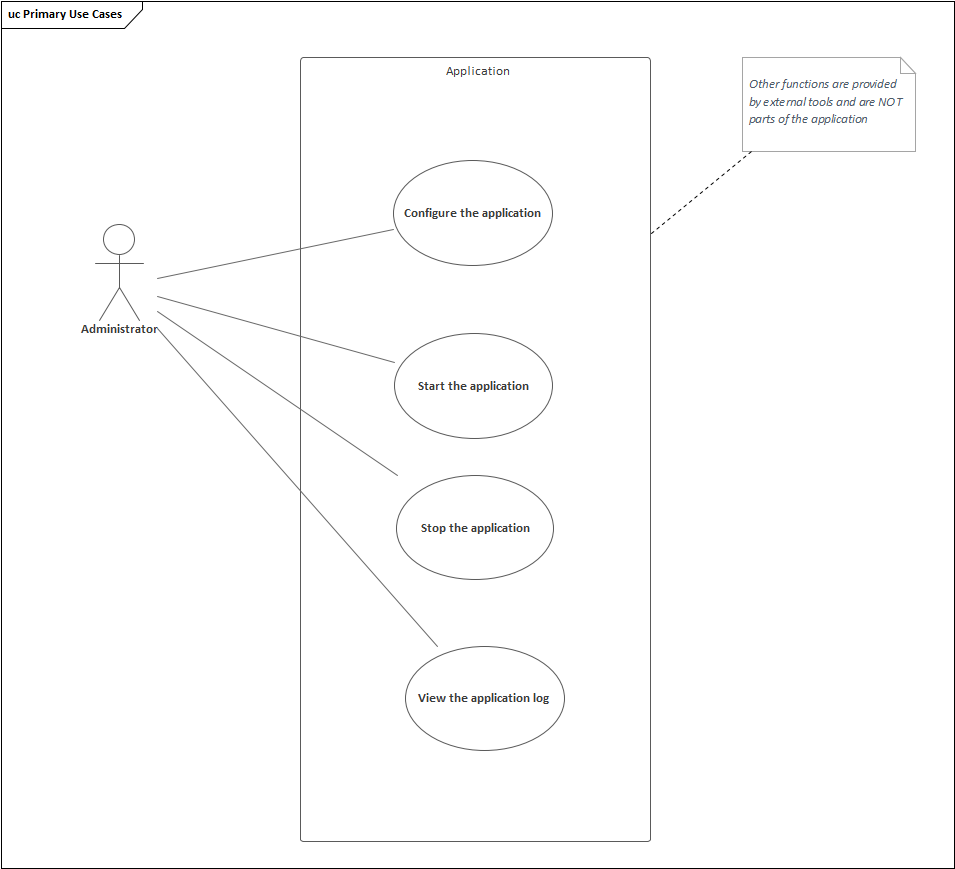

Figure 2.2.g — Use case diagram

**Business rules**
* BR-1: Files sourse$^{107}$ and destination.
  * BR-1.1: The source and destination directories of the final files must not be the same.
  * BR-1.2: The destination directory cannot be a source directory's subdirectory.

**Quality attributes**
* QA-1: Performance.
  * QA-1.1: The application must provide a data processing capacity of 5 MB/sec.
* QA-2: Resilience to input data.
  * QA-2.1: The application must handle input files of up to and including 50 MB in size.
  * QA-2.2: If the input file is not a text file, the application must perform processing.

---
$^{107}$ Yes, it's a typo. It is here for a reason ☺.

As will be covered in "Common mistakes in requirements analysis and testing"^(61) chapter, it is not a good idea to change the original file format and formatting of the document, so we use the built-in Word tools to track changes and add comments. An example of the result is shown in figure 2.2.h.

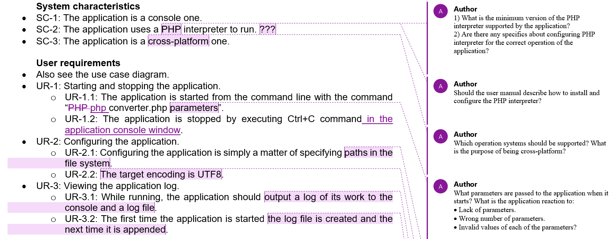

Figure 2.2.h — Using Word tools to deal with requirements

Unfortunately, we can't use these tools in this text (the result won't be displayed correctly, as you're probably reading this text as a non-DOCX document), so we'll use the second classic method of putting our questions and comments directly into the text of the requirements.

The issue areas of the requirements are <u>underlined</u>, our questions are *italicized*, and the expected responses of the customer (even more precisely, the customer's technician) are **bold**. During the analysis the text of the requirements turns out like this.

 **Task 2.2.c:** analyze the proposed set of requirements in terms of good requirements^(42), formulate your questions to the customer to improve this set of requirements.

**System characteristics**
* SC-1: The application is a console one.
* SC-2: The application uses a <span style="color: red;">PHP interpreter</span> to run.
  * *What is the minimum version of the PHP interpreter supported by the application? (**5.5.x**)*
  * *Are there any specifics about configuring PHP interpreter for the correct operation of the application? (**Probably mbstring should be enabled.**)*
  * *Do you insist on implementing the application in PHP? If so, why? (**Yes, PHP only. We have an employee who knows it.**)*
  * *Should the user manual describe how to install and configure the PHP interpreter? (**No.**)*
* SC-3: The application is a <span style="color: red;">cross-platform</span> one.
  * *Which operation systems should be supported? (**Any OS PHP supports.**)*
  * *What is the purpose of being cross-platform? (**We don't yet know what OS the server will run on.**)*

**User requirements**
* Also see the use case diagram.
* UR-1: Starting and stopping the application.
  * UR-1.1: The application is started from the command line with the command “<span style="color:red">PHP</span> <span style="color:#0070c0">(There may be a typo: it should be **php** (lower case))</span> <span style="color:green">(Yes, OK.)</span> converter.php <span style="color:red">parameters</span>”.
    * <span style="color:#0070c0">*What parameters are passed to the application when it starts?*</span> <span style="color:green">*(Directory with source files, directory with destination files.)*</span>
    * <span style="color:#0070c0">*What is the application reaction to:*</span>
      * <span style="color:green">*Lack of parameters. (Shows help.)*</span>
      * <span style="color:green">*Wrong number of parameters. (Shows help and explains what's wrong.)*</span>
      * <span style="color:green">*Invalid values of each of the parameters. (Shows help and explains what's wrong.)*</span>
  * UR-1.2: The application is stopped by executing Ctrl+C command <span style="color:#0070c0">*(Suggest adding “in the console window which holds the running application” to this phrase)*</span> <span style="color:green">(OK, agree.)</span>
* UR-2: Configuring the application.
  * UR-2.1: Configuring the application is simply a matter of specifying <span style="color:red">paths in the file system</span>.
    * <span style="color:#0070c0">*Paths to what objects?*</span> <span style="color:green">(Directory with source files, directory with destination files.)</span>
  * UR-2.2: The <span style="color:red">target encoding is UTF8</span>.
    * <span style="color:#0070c0">*Is a different target encoding to be specified, or is UTF8 always used as the target?*</span> <span style="color:green">(UTF8 only, no others.)</span>
* UR-3: Viewing the application log.
  * UR-3.1: While running, the application should <span style="color:red">output a log of its work to the console and a log file</span>.
    * <span style="color:#0070c0">*What is the log format?*</span> <span style="color:green">(Date and time, what was done and with what, what was accomplished. Look in the “Apache httpd” log, it's fine there.)</span>
    * <span style="color:#0070c0">*Are log formats different for console and log file?*</span> <span style="color:green">(No.)</span>
    * <span style="color:#0070c0">*How is the name of the log file determined?*</span> <span style="color:green">(The third parameter at startup. If not specified, make it converter.log next to the php script.)</span>
  * UR-3.2: The <span style="color:red">first time</span> the application is started the <span style="color:red">log file is created</span> and the <span style="color:red">next time it is appended</span>.
    * <span style="color:#0070c0">*How does the application distinguish between its first and subsequent starts?*</span> <span style="color:green">*(It doesn't.)*</span>
    * <span style="color:#0070c0">*What is the reaction of the application to the absence of a log file in case it is not the first run?*</span> <span style="color:green">*(It creates one. The idea is that it doesn't overwrite the old log — that's all.)*</span>

**Business rules**
* BR-1: Files source and destination.
  * BR-1.1: The sour<span style="color:red">s</span>e <span style="color:#0070c0">(a typo, source)</span> <span style="color:green">(Yes)</span> and destination directories of the final files <span style="color:red">must not be the same</span>.
    * <span style="color:#0070c0">*What is the reaction of the application when these directories are the same?*</span> <span style="color:green">(Shows help and explains what's wrong.)</span>
  * BR-1.2: The destination directory cannot be a <span style="color:red">source directory’s subdirectory</span>. <span style="color:#0070c0">*(Suggest replacing the words “source directory’s subdirectory” with “subdirectory of the directory that is the source of the source files”).*</span> <span style="color:green">(OK, let it be so.)</span>

* **Quality attributes**
  * QA-1: Performance.
    * QA-1.1: The application must provide a data processing capacity of <span style="color: red;">5 MB/sec</span>.
      * <span style="color: blue;">*At what hardware specifications?*</span> (<span style="color: green;">i7, 4GB RAM</span>)
  * QA-2: Resilience to input data.
    * QA-2.1: The application must handle input files of <span style="color: red;">up to and including 50 MB in size</span>.
      * <span style="color: blue;">*How does the application react to files larger than 50MB?*</span> (<span style="color: green;">It doesn't touch them.</span>)
    * QA-2.2: If the input file is not a text file, the application must perform <span style="color: red;">processing</span>.
      * <span style="color: blue;">*What should the application process?*</span> (<span style="color: green;">This file. It doesn't matter what happens to the file as long as the script doesn't crash.</span>)

There are some important points to pay attention to in this case:
* The customer's answers may be less structured and consistent than our questions. This is fine. They can afford it, we can't.
* The customer's answers may be inconsistent (in our case, the customer first wrote that the parameters sent from the command line are only two directory names, and then mentioned that the name of the log file is also specified there). This is also normal, as the customer could have forgotten or confused something. Our task is to reconcile these contradictory data (if possible) and ask clarifying questions (if necessary).
* If we are talking to a technician, technical jargon (like "shows help" in our example) may well slip into their answers. We don't need to ask them what they mean if the jargon has an unambiguous, generally accepted meaning, but when refining the text, our job is to write the same thing in strictly technical language. If the jargon is still incomprehensible — then it is better to ask (thus, "shows help" is just a short usage message output by console applications as a hint on how to use them).

**Product requirements level** (see "Requirements levels and types"<sup>(38)</sup> chapter). 
Let's apply the so-called "self-writing" (see "Ways of requirements gathering"<sup>(36)</sup> chapter) and improve the requirements.

Since we have already received a lot of specific technical information, it is possible to write a full requirements specification in the meantime. In many cases where plain text is used for the requirements, a single document that integrates both user requirements and detailed specifications is formed for convenience.

Now the requirements will turn as follows.

**System characteristics**
* SC-1: The application should be a console one.
* SC-2: The application should be developed using PHP (see [L-1](#) for the explanation; PHP-related details are described in [DS-1](#)).
* SC-3: The application should be a multi-platform one (taking into account [L-4](#)).

**User requirements**
* See also the use cases diagram below for details.
* UR-1: Start and stop of the application.
  * UR-1.1: The application start should be performed by the following console command: "php converter.phar SOURCE_DIR DESTINATION_DIR [LOG_FILE_NAME]" (see DS-2.1 for parameters description, see DS-2.2, DS-2.3, and DS-2.4 for error messages on any misconfiguration situation).
  * UR-1.2: The application stop (shutdown) should be performed by applying Ctrl+C to the console window, which holds the running application.
* UR-2: Configuration of the application.
  * UR-2.1: The only configuration available is through command line parameters (see DS-2).
  * UR-2.2: Target encoding for text file conversion is UTF8 (see also L-5).
* UR-3: Application log.
  * UR-3.1: The application should output its log both to the console and to a log-file (see DS-4). Log file name should comply with the rules described in DS-2.1.
  * UR-3.2: Log contents and format are described in DS-4.1, the application reaction to log file presence/absence is described in DS-4.2 and DS-4.3 accordingly.

**Business rules**
* BR-1: The source directory and the destination directory.
  * BR-1.1: The source directory and the destination directory may NOT be the same directory (see also DS-2.1 and DS-3.2).
  * BR-1.2: The destination directory may NOT by inside the source directory or any its subdirectories (see also DS-2.1 and DS-3.2).

**Quality attributes**
* QA-1: Performance.
  * QA-1.1: The application should provide the processing speed of at least 5 MB/sec with the following (or equivalent) hardware: CPU i7, RAM 4 GB, average disc read/write speed 30 MB/sec. See also L-6.
* QA-2: Resilience to input data.
  * QA-2.1: See DS-5.1 for the requirements to input file formats.
  * QA-2.2: See DS-5.2 for the requirements to input file size.
  * QA-2.3: See DS-5.3 for the details on application reaction on incorrect input file format.

**Limitations**
* L-1: The application should be developed using PHP as the customer is going to support the application with their own IT-department.
* L-2: See DS-1 for PHP version and configuration details.
* L-3: PHP setup and configuration process are out of this project scope and therefore **are NOT described** in any product/project documentation.
* L-4: Multi-platform capabilities of the application are the next: it should work with Windows and Linux assuming that proper PHP version (see DS-1.1) works there.
* L-5: The target encoding (UTF8) is fixed. There is no option to change it.
* L-6: The QA-1.1 may be violated in case of objective reasons (e.g., system overload, low-performing hardware and so on).

The Detailed specifications created on the basis of such user requirements are as follows.

**Detailed specifications**
**DS-1: PHP interpreter**
DS-1.1: The minimum version is 5.5.
DS-1.2: The mbstring extension should be installed and enabled.

**DS-2: Command line parameters**
DS-2.1: The application receives three command line parameters during the start process:
* SOURCE_DIR — mandatory parameter, points to the directory with files to be processed;
* DESTINATION_DIR — mandatory parameter, points to the directory to store converted files (see also BR-1.1 and BR-1.2));
* LOG_FILE_NAME — optional parameter, points to the log file (if omitted, "converter.log" file should be created in the same directory where "converter.phar" is located);

DS-2.2: If some mandatory command line parameter is omitted, the application should shut down displaying standard usage message (see DS-3.1).
DS-2.3: If more than three command line parameters are passed to the application, it should ignore any parameter except listed in DS-2.1.
DS-2.4: If the value of any command line parameter is incorrect, the application should shut down displaying standard usage-message (see DS-3.1) and incorrect parameter name, value, and proper error message (see DS-3.2).

**DS-3: Messages**
DS-3.1: Usage message: "USAGE converter.phar SOURCE_DIR DESTINATION_DIR [LOG_FILE_NAME]".
DS-3.2: Error messages:
* Directory not exists or inaccessible.
* Destination dir may not reside within source dir tree.
* Wrong file name or inaccessible path.

**DS-4: Log**
DS-4.1: The log format is the same for the console and the log file: YYYY-MM-DD HH:II:SS operation_name operation_parameters operation_result.
DS-4.2: If the log file is missing, a new empty one should be created.
DS-4.3: If the log file exists, the application should append new records to its tail.

**DS-5: File format and size**
DS-5.1: The application should process input files in English and Russian languages with the following encodings: WIN1251, CP866, and KOI8R.
Supported file formats (defined by extension) are:
* Plain Text (TXT);
* Hyper Text Markup Language Document (HTML);
* Mark Down Document (MD).

DS-5.2: The application should process files up to 50 MB (inclusive), the application should ignore any file with the size larger than 50 MB.
DS-5.3: If a file with supported format (see DS-5.1) contains format-incompatible data, such data may be damaged during file processing, and this situation should be treated as correct application work.

Examples of requirements analysis and testing

>  **Task 2.2.d:** did you notice that the use case diagram (as well as the corresponding reference to it) was “lost” in the revised version of the requirements? (Just a test of attentiveness, nothing more.)

So, we have a set of requirements that we can work with. It's not perfect (and you'll never find perfect requirements), but it's good enough for developers to implement the application and for testers to test it.

>  **Task 2.2.e:** test this set of requirements and find at least 3–5 mistakes and inaccuracies, and formulate the relevant questions to the customer.

## 2.2.8. Common mistakes in requirements analysis and testing

For better understanding and memorization, let's look at common mistakes made during requirements analysis and testing.

**Changing the file format and the document.** For some unknown reason a lot of novice testers tend to completely destroy the original document, replacing text with tables (or vice versa), moving data from Word to Excel, etc. There is only one way to do it: you have a prior agreement with the author of the document about such changes. Otherwise, you may be destroying someone else's work, making further development of the document very difficult.

The worst thing you can do with a document is to save it in a format that is intended more for reading rather than editing (PDF, picture set, etc.).

If the requirements are initially created in some kind of requirements management system, this issue is irrelevant, but most customers are used to seeing high-level requirements in a standard DOCX document, and Word provides excellent document handling features such as changes tracking (see figure 2.2.i) and comments (see figure 2.2.j).

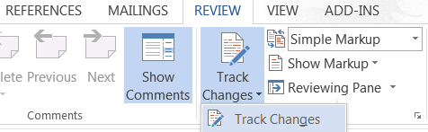

Figure 2.2.i — Changes tracking activation in Word

The result is as shown in figure 2.2.j: the original layout is preserved (and the author is used to it), all changes are clearly visible and can be accepted or rejected in a couple of mouse clicks, and typical frequently asked questions can be put in a separate list and placed in the same document in addition to the instructions in the comments.

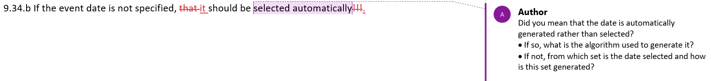

Figure 2.2.j — Properly looking document with changes

And two more slight but unpleasant things about the tables:

* Centre alignment of ALL text in the table **is terrible**. Yes, center alignment looks good in headings and cells with a couple or three words, but if the whole text is aligned this way, it becomes difficult to read.
* Disabling cell borders makes a table much less readable.

**A note indicating that there is nothing wrong with the requirement.** If you have no questions and/or reservations about a requirement, you don't need to write about it. Any notes in the document are subconsciously perceived as an indication of a problem and this "requirements endorsement" is irritating and makes working with the document more difficult — it makes it harder to see the notes that are relevant to the problem.

**Description of the same problem in several places.** Remember that your notes, comments, observations and questions should also have the properties of good requirements (as far as they apply to them). If you write the same thing about the same thing many times in different places, you are violating at least the property of modifiability. In such a case try to put your text at the end of the document, indicate at the beginning of that text the list of requirements that are descripted, and simply refer to that text in your commentary on the requirements.

**Writing questions and comments without specifying the place of the requirement to which they relate.** If your requirements management tool allows you to specify the part of the text to which you are writing a question or comment, do so (for example, Word allows you to select any part of the text — even a single character — for commenting). If this is not possible, quote the relevant part of the text. Otherwise, you will create ambiguity or make your comment meaningless, because it becomes impossible to understand what you are talking about.

**Asking poorly worded questions.** This mistake has been discussed in detail above (see table 2.2.a^(50) in "Requirements testing techniques"^(49) chapter). However, we should mention that there are three other types of bad questions:
* The first kind occurs because the questioner does not know the common terminology or typical behavior of standard interface elements (e.g., "what is a checkbox?", "how can I select several items in a list?", "how can a tooltip bubble up?").
* The second kind of bad question is similar to the first because of the wording: instead of writing "what do you mean by {something}?", the questioner writes "what is {something}?" So instead of a perfectly logical clarification, we get a situation very similar to the one discussed in the previous paragraph.
* The third type is difficult to relate to the cause, but the idea is that an incorrect and/or unfeasible requirement is asked a question such as "what happens if we do it?" Nothing will happen, because we certainly won't do it. And the question should be completely different (which one — depends on the specific situation, but definitely different).

And once again, a reminder of the accuracy of wording: sometimes one or two words can ruin a great idea, turning a good question into a bad one. Compare: "What is a default date format?" and "What default date format should be used?" The first simply shows the incompetence of the questioner, whereas the second provides useful information.

This is also a problem of not understanding the context. You will often see questions such as "what application do you mean?", "what is the system?" and so on. Most of the time, the author of such questions has simply pulled the requirement out of context, where it was perfectly clear what the issue was.

**Writing very long comments and/or questions.** History knows of cases where one page of initial requirements has turned into 20–30 pages of analysis and questions. This is not a good approach. All the same thoughts can be expressed much more succinctly, saving both your time and that of the author of the source document. Moreover, it is worth bearing in mind that in the early stages of working with requirements they are very unstable and it may happen that your 5–10 pages of comments relate to a requirement that will simply be deleted or changed beyond recognition.

**Criticizing the text or even its author.** Remember that your task is to make the requirements better, not to show their imperfections (or the author's ones). So, comments such as "bad requirement", "don't you see how stupid that sounds", "need to reword" are inappropriate and unacceptable.

**Strong statements without justification.** As an extension of the “criticizing the text or even its author” mistake, we would like to mention some categorical statements such as “it can’t be done”, “we won’t do it”, “it’s not necessary”. Even if you realize that the requirement makes no sense or is unfeasible, it is worth formulating the message correctly and supplementing it with questions that allow the author to make the final decision themselves. For example, “it is not necessary” can be reworded as, “We have doubts that this feature will be popular with users. What is the importance of this requirement? Are you sure it is necessary?”

**Specifying a problem with requirements without explaining what it is.** Remember that the author of the source document may not be an expert in testing or business analysis. So simply stating “incomplete”, “ambiguous”, etc. may not tell him anything. Make your point clear.

This also includes a small but unfortunate flaw relating to inconsistency: if you find something inconsistent, make a note of all the inconsistencies, not just one of them. For example, you may find that Requirement 20 conflicts with Requirement 30. Then mark in Requirement 20 that it conflicts with Requirement 30, and vice versa. And explain the nature of the contradiction.

**Poor question and comment layout.** Try to make your questions and comments as easy to understand as possible. Remember not only to keep the wording short, but also the layout of the text (see for example how in figure 2.2.j the questions are structured as a list — this structure is much more readable than solid text). Rewrite your text, correct typos, grammatical and punctuation mistakes, etc.

**Describing a problem in the wrong place.** A classic example would be an inaccuracy in a footnote, an appendix or a figure, which for some reason is not described where it is, but in the text referring to the relevant item. An exception to this would be an inconsistency where the problem needs to be described in both places.

**Misconception of a requirement as a “requirement for the user”.** Previously (see “Correctness” in “Good Requirements Properties”) we said that the requirements like “the user must be able to send the e-mail” are incorrect. And this is true. But there are situations where the problem is much less serious and only the wording is the problem. For example, phrases like “the user can click any of the buttons” and “the user must be able to see the main menu” really mean “all displayed buttons must be clickable” and “the main menu must be visible”. Yes, this flaw should also be corrected, but it should not be marked as a critical problem.

**Hidden requirement editing.** This mistake is considered to be one of the most dangerous. Its essence is that the tester makes some arbitrary changes to the requirements without noting this fact in any way. So, the author of the document most likely won't notice such changes, and then they will be very surprised when something in the product will be implemented in a quite different way than it was described in the requirements at that moment. Therefore, a simple recommendation: if you do something, do mark it (by means of your tool or just explicitly in the text). It is even better to mark a change as a suggestion for change rather than as a fait accompli, because the author of the original document may have a completely different view of the situation.

**Analysis that does not meet the level of requirements.** When testing requirements, always remember which level they belong to, otherwise the following typical errors will occur:

* Adding minor technical details to the business requirements.
* Duplicating some of the business requirements at the user requirements level (if you want to increase the traceability of a set of requirements, it makes sense to just use links).
* Lack of detail in product requirements (general phrases that are acceptable, e.g., at the business requirement level, must be very detailed, structured and supplemented by detailed technical information).

## 2.3. Software testing classification

### 2.3.1. Simplified testing classification

Testing can be classified in a large number of ways, and in almost every solid book on testing the author shows their own (certainly legitimate) view of the issue.

The relevant material is quite extensive and complex, and a deep understanding of each item in the classification requires a certain experience, so we will divide this topic into two: now we look at the simplest, the minimum set of information necessary for the beginner tester, and in the next chapter will give a detailed classification.

Use the list below as a very brief "cheat sheet to remember". So, testing can be categorized as:

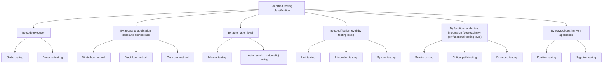
```mermaid
graph TD
    Root["Simplified testing classification"] --> A["By code execution"]
    Root --> B["By access to application code and architecture"]
    Root --> C["By automation level"]
    
    A --> A1["Static testing"]
    A --> A2["Dynamic testing"]
    
    B --> B1["White box method"]
    B --> B2["Black box method"]
    B --> B3["Gray box method"]
    
    C --> C1["Manual testing"]
    C --> C2["Automated (+ automatic) testing"]

    Root --> D["By specification level (by testing level)"]
    D --> D1["Unit testing"]
    D --> D2["Integration testing"]
    D --> D3["System testing"]

    Root --> E["By functions under test importance (decreasingly) (by functional testing level)"]
    E --> E1["Smoke testing"]
    E --> E2["Critical path testing"]
    E --> E3["Extended testing"]

    Root --> F["By ways of dealing with application"]
    F --> F1["Positive testing"]
    F --> F2["Negative testing"]
```

Figure 2.3.a — Simplified testing classification

* By code execution:
  * Static testing — without running the code.
  * Dynamic testing — with running the code.
* By access to application code and architecture:
  * White box method — there is access to the code.
  * Black box method — there is no access to the code.
  * Gray box method — some of the code is accessible, some of it is not.
* By automation level:
  * Manual testing — test cases are performed by a person.
  * Automated testing — test cases are partially or fully performed by a special testing tool.
* By specification level (by testing level):
  * Unit testing — individual small parts of an application are tested.
  * Integration testing — the interaction between several parts of the application is tested.
  * System testing — the application is tested as a whole.
* By functions under test importance (decreasingly) (by functional testing level):
  * Smoke testing (be sure to study the etymology of the term — at least on Wikipedia$^{108}$) — testing of the most important, most crucial functionality, the failure of which renders the very idea of using the application meaningless.
  * Critical path testing — testing the functionality used by typical users in typical daily activities.
  * Extended testing — testing all (remaining) functionality stated in the requirements.

---
$^{108}$ "Smoke test", Wikipedia [http://en.wikipedia.org/wiki/Smoke_testing_(electrical)](http://en.wikipedia.org/wiki/Smoke_testing_(electrical))

* By ways of dealing with application:
    * Positive testing — all actions with the application are performed strictly according to the instructions without any unacceptable actions, incorrect data, etc. You can figuratively say that the application is tested in “greenhouse conditions”.
    * Negative testing — when working with the application, operations (including incorrect ones) are performed and data are used that potentially lead to errors (a classic of the genre — division by zero).

 **Attention: a very frequent mistake!** Negative tests do NOT imply an error in the application. On the contrary, they assume that a correctly working application will behave correctly even in a critical situation (in the example with division by zero, for example, the message "Division by zero is forbidden" is displayed).

The question often arises about the difference between “testing type”, “testing kind”, “testing method”, “testing approach”, etc. If you are interested in a strict formal answer, then look in such things as “taxonomy$^{109}$” and “taxon$^{110}$”, because the question itself goes beyond testing as such and belongs already to the field of science.

But historically, at a minimum, “testing type” and “testing kind” have long been synonymous (and even more — in English “testing type” is the prevailing unified term).

---
$^{109}$ “Taxonomy”, Wikipedia [https://en.wikipedia.org/wiki/Taxonomy](https://en.wikipedia.org/wiki/Taxonomy)
$^{110}$ “Taxon”, Wikipedia [https://en.wikipedia.org/wiki/Taxon](https://en.wikipedia.org/wiki/Taxon)

## 2.3.2. Detailed testing classification

### 2.3.2.1. Testing classification scheme

Here we will consider the classification of testing in as much detail as possible. It is highly recommended that you read not only the text of this chapter, but also all the additional sources that will be referred to.

Figure 2.3.b shows a diagram in which all classification approaches are shown simultaneously. Many authors who have created such classifications have used mind-maps, but this technique does not fully reflect the fact that classification methods overlap (i.e., some types of testing can be classified in different ways). In figure 2.3.b, the most striking cases of such overlap are marked in color (see full-size electronic view of figure$^{113}$) and the block border as a set of dots. If you see such a block in the diagram — look for a block of the same name somewhere in another type of classification.

|  | In addition to the material in this chapter, it is highly recommended that you read:<br>• Lee Copeland's classic book "A Practitioner's Guide to Software Test Design".<br>• A very interesting article "Types of Software Testing: List of 100 Different Testing Types" $^{111}$. |
| :--- | :--- |

Why do we need a testing classification at all? It streamlines knowledge and greatly speeds up the process of test planning and test case development, and optimizes workload so that the tester does not have to reinvent the wheel.

However, there is nothing to prevent you from creating your own classifications, either from scratch or as a combination or modification of the classifications presented below.

|  | If you are interested in some kind of "etalon classification", then... there is no such a thing. The ISTQB materials$^{112}$ provide the most generalized and accepted view on the issue, but there is no single scheme that unites all classifications.<br><br>So, if (during an interview) you are asked to talk about the classification of testing, it is worth specifying according to which author or source they expect to hear your answer. |
| :--- | :--- |

You are now going to study one of the most difficult sections of this book. If you already have a fair amount of experience in testing, you can build on the diagram to systematize and expand your knowledge. If you begin with testing, it is recommended that you first read the text that follows the diagram.

---
$^{111}$ "Types of Software Testing: List of 100 Different Testing Types" [http://www.guru99.com/types-of-software-testing.html]  
$^{112}$ International Software Testing Qualifications Board, Downloads. [http://www.istqb.org/downloads.html]

Detailed testing classification

 In relation to the diagram, you are about to see in figure 2.3.b, there are often questions as to why functional and non-functional testing are not linked to their respective sub-types. There are two reasons for this:
1) Although it is common to categorize certain types of testing as functional or non-functional, they still contain both components (both functional and non-functional, albeit in different proportions. Moreover: it is often impossible to test the non-functional component until the corresponding functional component has been completed.
2) The diagram would have become an impenetrable web of lines.

Therefore, we decided to leave figure 2.3.b as shown on the next page. A full-size version of this figure can be downloaded here$^{113}$.

So, testing can be classified by...

---
$^{113}$ Full-size version of figure 2.3.b [http://svyatoslav.biz/wp-pics/software_testing_classification_en.png]


```mermaid
graph TD
    classDef default fill:#fff,stroke:#333,stroke-width:1px,color:#000;
    classDef dashed fill:#fff,stroke:#333,stroke-width:1px,stroke-dasharray: 5 5,color:#000;
    classDef orange fill:#fff,stroke:#ff8c00,stroke-width:1px,color:#ff8c00;
    classDef redDashed fill:#fff,stroke:#ff0000,stroke-width:1px,stroke-dasharray: 5 5,color:#ff0000;
    classDef blue fill:#fff,stroke:#0000ff,stroke-width:1px,color:#0000ff;

    Root["Software testing classification"]

    sub-root1["By code execution"] --> Static["Static testing"]
    sub-root1 --> Dynamic["Dynamic testing"]

    sub-root2["By access to application code and architecture"] --> White["White box method"]
    sub-root2 --> Black["Black box method"]
    sub-root2 --> Gray["Gray box method"]:::dashed

    sub-root3["By automation level"] --> Manual["Manual"]
    sub-root3 --> Automated["Automated<br>(+ automatic)"]

    sub-root4["By specification level<br>(by testing level)"] --> Unit["Unit testing"]
    sub-root4 --> Integration["Integration<br>testing"]
    sub-root4 --> System["System testing"]

    sub-root5["By functions under test importance (decreasingly)<br>(by functional testing level)"] --> Smoke["Smoke testing"]
    sub-root5 --> Critical["Critical path<br>testing"]:::orange
    sub-root5 --> Extended["Extended testing"]:::orange

    sub-root6["By application nature"] --> Web["Web app<br>testing"]
    sub-root6 --> Mobile["Mobile app<br>testing"]
    sub-root6 --> Desktop["Desktop app<br>testing"]
    sub-root6 --> Dots["..."]

    sub-root7["By architecture tier"] --> Presentation["Presentation tier<br>testing"]
    sub-root7 --> Business["Business-logic<br>tier testing"]
    sub-root7 --> DataTier["Data tier testing"]

    sub-root8["By end users participation"] --> Alpha["Alpha testing"]:::orange
    sub-root8 --> Beta["Beta testing"]:::orange
    sub-root8 --> Gamma["Gamma testing"]:::orange

    sub-root9["By formalization level"] --> TestBased["Test case based"]
    sub-root9 --> Exploratory["Exploratory"]:::orange
    sub-root9 --> AdHoc["Ad hoc"]:::orange

    %% Aims and goals section
    Aims["By aims and goals"] --> Ways["By ways of dealing with<br>application"]
    Ways --> Pos1["Positive testing"]:::blue
    Ways --> Neg1["Negative testing"]:::blue
    Ways --> OpTest["Operational testing"]:::redDashed

    Aims --> Func["Functional testing"]
    Aims --> NonFunc["Nonfunctional testing"]

    Aims --> Install["Installation testing"]
    Aims --> Regress["Regression testing"]
    Aims --> ReTest["Re-testing"]
    Aims --> Accept["Acceptance testing"]:::blue

    Aims --> Usab["Usability testing"]
    Aims --> Access["Accessibility testing"]
    Aims --> Inter["Interface testing"]
    Aims --> Sec["Security testing"]
    Aims --> Internat["Internationalization testing"]
    Aims --> Local["Localization testing"]
    Aims --> Compat["Compatibility testing"]
    Aims --> Config["Configuration<br>testing"]
    Aims --> Cross["Cross-browser<br>testing"]
    Aims --> Compar["Comparison testing"]
    Aims --> Qual["Qualification testing"]
    Aims --> Exhaus["Exhaustive testing"]:::redDashed

    Aims --> Reliab["Reliability testing"]
    Aims --> Recover["Recoverability testing"]
    Aims --> Fail["Failover testing"]
    Aims --> DataQual["Data quality testing and<br>Database integrity testing"]
    Aims --> ResUtil["Resource utilization testing"]

    Aims --> Perf["Performance testing"]
    Aims --> Load["Load testing<br>(Capacity testing)"]
    Aims --> Scal["Scalability testing"]
    Aims --> Vol["Volume testing"]
    Aims --> Stress["Stress testing"]
    Aims --> Concurr["Concurrency testing"]

    %% Techniques and approaches
    Tech["By techniques and approaches"] --> PosTech["Positive testing"]:::blue
    Tech --> NegTech["Negative testing"]:::blue
    Tech --> ExpCheck["Based on tester's experience, scenarios,<br>checklists"]
    ExpCheck --> Exp2["Exploratory"]:::orange
    ExpCheck --> AdHoc2["Ad hoc"]:::orange

    Tech --> ErrorSource["By error source (knowledge)"]
    ErrorSource --> Guess["Error guessing"]
    ErrorSource --> Heur["Heuristic evaluation"]
    ErrorSource --> Seed["Error seeding"]
    ErrorSource --> Mut["Mutation testing"]

    Tech --> Intrusion["By intrusion to application work process"]
    Intrusion --> Intrusive["Intrusive testing"]
    Intrusion --> NonIntrusive["Nonintrusive testing"]

    Tech --> OpEnv["By operational environment"]
    OpEnv --> DevEnv["Development testing"]
    OpEnv --> OpEnvTest["Operational testing"]:::redDashed

    Tech --> InputSel["By input data selection techniques"]
    InputSel --> Equiv["Equivalence partitioning"]
    InputSel --> Bound["Boundary value analysis"]
    InputSel --> Domain["Domain testing"]
    InputSel --> Pair["Pairwise testing"]
    InputSel --> Orthog["Orthogonal array testing"]

    Tech --> AppBehavior["By application behavior (models)"]
    AppBehavior --> DecisionTab["Decision table testing"]
    AppBehavior --> StateTrans["State transition testing"]:::orange
    AppBehavior --> SpecBased["Specification-based testing"]
    AppBehavior --> ModelBased["Model-based testing"]
    AppBehavior --> UseCase["Use case testing"]
    AppBehavior --> Parallel["Parallel testing"]
    AppBehavior --> Random["Random testing"]
    AppBehavior --> AB["A / B testing"]

    Tech --> AutoTech["By automation techniques"]
    AutoTech --> DataDrive["Data-driven<br>testing"]
    AutoTech --> KeyDrive["Keyword-driven<br>testing"]
    AutoTech --> BehDrive["Behavior-driven<br>testing"]

    Tech --> CodeStruct["By code structures"]
    CodeStruct --> Statement["Statement<br>testing"]
    CodeStruct --> Branch["Branch testing"]
    CodeStruct --> Cond["Condition testing"]
    CodeStruct --> MultCond["Multiple<br>condition testing"]
    CodeStruct --> Decision["Decision testing"]
    CodeStruct --> ModCond["Modified<br>condition<br>decision testing"]
    CodeStruct --> Path["Path testing"]

    Tech --> ByCode["By code"]
    ByCode --> ControlFlow["Control flow testing"]
    ByCode --> DataFlow["Data flow testing"]
    ByCode --> StateTransCode["State transition testing"]:::orange
    ByCode --> CodeRev["Code review"]

    %% Chronology
    Chron["By chronology"] --> GenChron["General chronology"]
    GenChron --> PosSim["Positive<br>(simple)"]:::orange
    GenChron --> NegSim["Negative<br>(simple)"]:::orange
    GenChron --> PosComp["Positive<br>(complex)"]:::orange
    GenChron --> NegComp["Negative<br>(complex)"]:::orange

    Chron --> CompHier["By component hierarchy"]
    CompHier --> BottomUp["Bottom-up<br>testing"]
    CompHier --> TopDown["Top-down<br>testing"]
    CompHier --> Hybrid["Hybrid<br>testing"]

    Chron --> AttReq["By attention to requirements and requirements' components"]
    AttReq --> ReqTest["Requirements<br>testing"]
    AttReq --> FuncComp["Functional<br>components testing"]
    AttReq --> NonFuncComp["Nonfunctional<br>components testing"]

    %% General typical scenarios
    GenScen["General typical scenarios"] --> Scen1["Typical scenario 1"]
    Scen1 --> SmokeS1["Smoke testing"]:::orange
    Scen1 --> CritS1["Critical path<br>testing"]:::orange
    Scen1 --> ExtS1["Extended testing"]:::orange

    GenScen --> Scen2["Typical scenario 2"]
    Scen2 --> UnitS2["Unit testing"]
    Scen2 --> IntS2["Integration<br>testing"]
    Scen2 --> SysS2["System testing"]
    Scen2 --> HybS2["Hybrid<br>testing"]

    GenScen --> Scen3["Typical scenario 3"]
    Scen3 --> AlphaS3["Alpha testing"]:::orange
    Scen3 --> BetaS3["Beta testing"]:::orange
    Scen3 --> GammaS3["Gamma testing"]:::orange
    Scen3 --> AcceptS3["Acceptance testing"]:::blue
    Scen3 --> OpS3["Operational testing"]:::redDashed
```

Figure 2.3.b — Detailed testing classification

## 2.3.2.2. Classification by code execution

It is not always the case that all testing involves interaction with a running application. For this reason, this classification includes:

* **Static testing**$^{114}$ — testing without code execution. Under this approach, the following objects can be tested:
  * Documents (requirements, test cases, application architecture descriptions, database schemas, etc.)
  * Graphic prototypes (e.g., sketches of the user interface).
  * Application code (which is often done by the programmers themselves as part of code review$^{115}$), which is a specific variation of peer review$^{[49]}$ (as applied to source code). The application code can also be tested using code structure-based testing techniques$^{95}$.
  * Application runtime environment settings.
  * Prepared testing data.
* **Dynamic testing**$^{116}$ — testing with code execution. There may be execution of the entire application code (system testing$^{[75]}$), of several related parts (integration testing$^{[75]}$), of individual parts (unit or component testing$^{[75]}$) or even of individual code sections. The basic idea behind this type of testing is that the actual behavior of the application (its parts) is tested.

---

$^{114}$ **Static testing.** Testing of a software development artifact, e.g., requirements, design or code, without execution of these artifacts, e.g., reviews or static analysis. [ISTQB Glossary]  
$^{115}$ Jason Cohen, "Best Kept Secrets of Peer Code Review (Modern Approach. Practical Advice.)" [https://static1.smartbear.co/smartbear/media/pdfs/best-kept-secrets-of-peer-code-review_redirected.pdf]  
$^{116}$ **Dynamic testing.** Testing that involves the execution of the software of a component or system. [ISTQB Glossary]

### 2.3.2.3. Classification by access to application code and architecture

* **White box testing**$^{117}$ (open box testing, clear box testing, glass box testing) — the tester has access to the internal structure and application code, and has sufficient knowledge to understand what they see. In addition to white box testing, there is even an accompanying global technique called design-based testing$^{118}$). To get a deeper insight into the white box method, we recommend becoming familiar with control-flow$^{94}$ or data-flow$^{94}$, and using state-transition diagrams$^{94}$. Some authors tend to rigidly link this method to static testing, but nothing prevents the tester from executing the code and accessing it periodically (while unit testing$^{75}$) even envisages executing the code itself and not the "whole application").
* **Black box testing**$^{119}$ (closed box testing, specification-based testing) — the tester either does not have access to the internal structure and the application code, or does not have enough knowledge to understand them, or does not deliberately address them in the testing process. At the same time, the vast majority of the types of testing described in figure 2.3.b operate on a black box basis, the idea of which in an alternative definition may be formulated as follows: the tester influences the application (and checks its response) in the same way that users or other applications would influence the application in its real operation. The main sources of information for creating test cases in black box testing are documentation (especially — requirements (requirements-based testing$^{120}$)) and general common sense (for cases where the application behavior in some situation is not explicitly regulated; this is sometimes called "implicit requirements-based testing", but there is no native definition of this approach).
* **Gray box testing**$^{121}$ — is a combination of white box and black box methods, which means that the tester has access to some of the code and architecture, but not to others. In figure 2.3.b this method is shown with a special dashed frame and colored gray because it is very rarely mentioned explicitly: usually people speak of white box or black box methods when applied to different parts of an application and realize that the whole application is tested using the gray box method.

|  | Important! Some authors$^{122}$ define the gray box method as an opposition to white box and black box methods, emphasizing that the internal structure of the tested object is partially known in the gray box method and is being revealed together with the process of research. This approach, undoubtedly, has the right to exist, but in its utmost case it falls back to a situation "we know some part of a system, we do not know some other part of it", i.e., to all the same combination of white and black boxes. |
| :---: | :--- |

If we compare the main advantages and disadvantages of these methods, we come up with the following situation (see table 2.3.a).

---

$^{117}$ **White box testing.** Testing based on an analysis of the internal structure of the component or system. [ISTQB Glossary]  
$^{118}$ **Design-based Testing.** An approach to testing in which test cases are designed based on the architecture and/or detailed design of a component or system (e.g., tests of interfaces between components or systems). [ISTQB Glossary]  
$^{119}$ **Black box testing.** Testing, either functional or non-functional, without reference to the internal structure of the component or system. [ISTQB Glossary]  
$^{120}$ **Requirements-based Testing.** An approach to testing in which test cases are designed based on test objectives and test conditions derived from requirements, e.g., tests that exercise specific functions or probe non-functional attributes such as reliability or usability. [ISTQB Glossary]  
$^{121}$ **Gray box testing** is a software testing method, which is a combination of Black Box Testing method and White Box Testing method. ... In Gray Box Testing, the internal structure is partially known. This involves having access to internal data structures and algorithms for purposes of designing the test cases, but testing at the user, or black-box level. ["Gray Box Testing Fundamentals", [http://softwaretestingfundamentals.com/gray-box-testing](http://softwaretestingfundamentals.com/gray-box-testing)].  
$^{122}$ "Gray box testing (gray box definition)", Margaret Rouse [http://searchsoftwarequality.techtarget.com/definition/gray-box-box](http://searchsoftwarequality.techtarget.com/definition/gray-box-box)

The white box and black box methods are not opposing or mutually exclusive — on the contrary, they complement each other harmoniously, thus compensating for their disadvantages.

Table 2.3.a — White box, black box and gray box methods pros and cons

| | Advantages | Disadvantages |
| :--- | :--- | :--- |
| **White box method** | • Reveals hidden problems and makes it easier to diagnose them.<br>• Allows for quite simple test cases automation and their execution at the earliest stages of project development.<br>• Has a well-developed system of metrics, which can be easily automated for collection and analysis.<br>• Encourages developers to write good code.<br>• Many of the techniques in this method are proven, well-established solutions based on a rigorous technical approach. | • Cannot be performed by testers lacking sufficient programming knowledge.<br>• Testing focuses on the functionality already implemented, which increases the chance of omission of unimplemented requirements.<br>• The application behavior is examined apart from the real execution environment and does not take its impact into account.<br>• The application behavior is examined in isolation from real user scenarios$^{[137]}$. |
| **Black box method** | • There is no need for the tester to have (in-depth) knowledge of programming.<br>• The application behavior is examined in the context of the actual runtime environment and its impact is taken into account.<br>• The application behavior is examined in the context of real user scenarios$^{[137]}$.<br>• Test cases can already be created at the emergence of stable requirements.<br>• The test case creation process allows to identify requirements defects.<br>• Allows for the creation of test cases that can be used repeatedly on different projects. | • It is likely to repeat some of the test cases that have already been carried out by the developers.<br>• It is highly likely that some of the possible application behavior will remain untested.<br>• Proper documentation is essential for the development of effective and efficient test cases.<br>• The diagnosis of detected defects is more complex compared to white box method.<br>• The wide range of techniques and approaches makes it harder to plan and estimate the workload.<br>• In the case of automation, complex and expensive tools may be required. |
| **Gray box method** | Combines the advantages and disadvantages<br>of white box and black box methods. | |

### 2.3.2.4. Classification by automation level

* **Manual testing**$^{123}$ — testing, where test cases are performed manually by a human being without the use of automation. Although it sounds very simple, a tester sometimes needs such qualities as patience, observation, creativity, the ability to conduct non-standard experiments, and the ability to see and understand what is happening "inside the system", i.e., how the external impacts on the application are transformed into its internal processes.
* **Automated testing** (test automation$^{124}$) — a set of techniques, approaches and tools that allow a person to be excluded from some tasks in the testing process. Test cases are partially or fully performed by a special tool, but test case development, data preparation, performance evaluation, defect reporting — all this and much more is still done by a human.


Automated testing has many advantages and disadvantages (see table 2.3.b).

Table 2.3.b — Automated testing pros and cons

| Advantages | Disadvantages |
| :--- | :--- |
| • The speed of test cases execution can exceed human capabilities by orders of magnitude.<br>• No human factor influences the test cases (like fatigue, inattention, etc.)<br>• The costs of repeated test case execution are minimized (as human involvement is only required occasionally).<br>• Automation tools are able to perform test cases that are just beyond human capabilities due to their complexity, speed or other factors.<br>• Automation tools are able to gather, store, analyze, aggregate and present enormous amounts of data in a human-readable form.<br>• Automation tools are able to perform low-level actions on the application, operating system, data transfer channels, etc. | • Highly qualified personnel are needed due to the fact that automation is a "project within a project" (with its own requirements, plans, code, etc.)<br>• The costs of automation increase the costs of overall project (due to spendings on complex automation tools, test case code development and maintenance).<br>• Automation requires more careful planning and risk management, as otherwise the project could be severely damaged.<br>• There are too many automation tools to choose from, which makes the choice of one tool or another difficult and can entail financial costs (and risks), the need to train the staff (or look for specialists).<br>• When requirements change significantly, or the technology domain changes, or interfaces (both user and software) are redesigned, many test cases become hopelessly obsolete and need to be re-created. |

---

$^{123}$ **Manual testing** is performed by the tester who carries out all the actions on the tested application manually, step by step and indicates whether a particular step was accomplished successfully or whether it failed. Manual testing is always a part of any testing effort. It is especially useful in the initial phase of software development, when the software and its user interface are not stable enough, and beginning the automation does not make sense. (SmartBear TestComplete user manual, [https://support.smartbear.com/testcomplete/docs/testing-with/deprecated/manual/index.html](https://support.smartbear.com/testcomplete/docs/testing-with/deprecated/manual/index.html))

$^{124}$ **Test automation** is the use of software to control the execution of tests, the comparison of actual outcomes to predicted outcomes, the setting up of test preconditions, and other test control and test reporting functions. Commonly, test automation involves automating a manual process already in place that uses a formalized testing process. (Ravinder Veer Hooda, “An Automation of Software Testing: A Foundation for the Future”)

If we put all the advantages and disadvantages of testing automation into a single phrase, we can say that automation allows a significant increase in test coverage$^{125}$, but also a significant increase in risk.

|  | **Task 2.3.a:** create a similar table with the advantages and disadvantages of manual testing. Hint: it is not enough to simply swap the column headings with the advantages and disadvantages of test automation. |
| :---: | :--- |

<br>

---
$^{125}$ **Coverage, Test coverage.** The degree, expressed as a percentage, to which a specified coverage item has been exercised by a test suite. [ISTQB Glossary]

### 2.3.2.5. Classification by specification level (by testing level)

>  Warning! There may be confusion due to the fact that there is no single universally accepted set of classifications, and two of them have very similar names:
> * “By testing level” = “by specification level”.
> * “By **functional** testing level” = “by functions under test importance (decreasing)”.

* **Unit testing** (module testing, component testing$^{126}$) is aimed at testing individual small parts of an application which (usually) can be tested in isolation from other small parts. Individual functions or class methods, classes themselves, class interactions, small libraries, or parts of an application may be tested. This type of testing is often implemented using special technologies and test automation$^{(73)}$ tools, that simplify and accelerate the development of test cases.
* **Integration testing$^{127}$** (component integration testing$^{128}$, pairwise integration testing$^{129}$, system integration testing$^{130}$, incremental testing$^{131}$, interface testing$^{132}$, thread testing$^{133}$) is aimed at testing the interaction between several parts of an application (each of the parts, in turn, is tested separately in the unit testing phase). Unfortunately, even when we are dealing with very high quality individual components there are often problems at the joint between them. That’s what integration testing reveals. (See also bottom-up, top-down and hybrid testing techniques in chronological classification by component hierarchy$^{(98)}$.)
* **System testing$^{134}$** is aimed at checking the entire application as a whole, assembled from the parts tested in the previous two stages. It not only identifies defects at the junctions between components, but also provides an opportunity to fully interact with the application from the end-user's point of view, applying many of the other types of testing listed in this chapter.

There is an unfortunate fact about the classification by specification level: if the previous stage detected problems, then the next stage is sure to have problems; if the previous stage detected no problems, this does not protect us from problems in the next stage.

To help you remember the level of detail in unit, integration and system testing is shown schematically in figure 2.3.c.

---

$^{126}$ **Module testing, Unit testing, Component testing.** The testing of individual software components. [ISTQB Glossary]
$^{127}$ **Integration testing.** Testing performed to expose defects in the interfaces and in the interactions between integrated components or systems. [ISTQB Glossary]
$^{128}$ **Component integration testing.** Testing performed to expose defects in the interfaces and interaction between integrated components. [ISTQB Glossary]
$^{129}$ **Pairwise integration testing.** A form of integration testing that targets pairs of components that work together, as shown in a call graph. [ISTQB Glossary]
$^{130}$ **System integration testing.** Testing the integration of systems and packages; testing interfaces to external organizations (e.g., Electronic Data Interchange, Internet). [ISTQB Glossary]
$^{131}$ **Incremental testing.** Testing where components or systems are integrated and tested one or some at a time, until all the components or systems are integrated and tested. [ISTQB Glossary]
$^{132}$ **Interface testing.** An integration test type that is concerned with testing the interfaces between components or systems. [ISTQB Glossary]
$^{133}$ **Thread testing.** An approach to component integration testing where the progressive integration of components follows the implementation of subsets of the requirements, as opposed to the integration of components by levels of a hierarchy. [ISTQB Glossary]
$^{134}$ **System testing.** The process of testing an integrated system to verify that it meets specified requirements. [ISTQB Glossary]


Figure 2.3.c — Scheme of testing classification by specification level

If we refer to the ISTQB Dictionary and read the definition of test level$^{135}$, we see that a similar division into unit, integration and system testing, to which acceptance testing$^{(86)}$ is also added, is used in the context of dividing areas of responsibility on a project. But this classification relates more to project management issues than to testing in its pure form, and is therefore outside the scope of the issues we are considering.

> For the most comprehensive classification of testing by test level, see the article "What are Software Testing Levels?$^{136}$". To make it easier to remember, let's reflect this idea in figure 2.3.d., but note that this is mostly a general theoretical view.

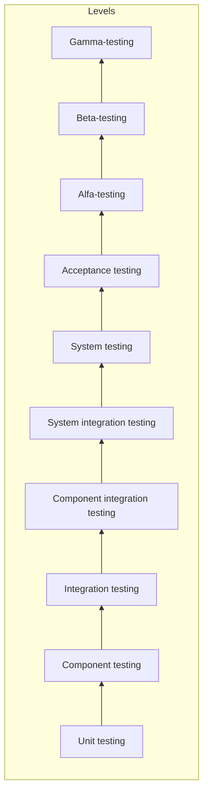
```mermaid
graph BT
    subgraph Levels
        direction BT
        UT["Unit testing"] --> CT["Component testing"]
        CT --> IT["Integration testing"]
        IT --> CIT["Component integration testing"]
        CIT --> SIT["System integration testing"]
        SIT --> ST["System testing"]
        ST --> AT["Acceptance testing"]
        AT --> AFT["Alfa-testing"]
        AFT --> BT["Beta-testing"]
        BT --> GT["Gamma-testing"]
    end
```

Figure 2.3.d — The most comprehensive classification of testing by testing level

---

$^{135}$ **Test level.** A group of test activities that are organized and managed together. A test level is linked to the responsibilities in a project. Examples of test levels are component test, integration test, system test and acceptance test. [ISTQB Glossary]
$^{136}$ "What are Software Testing Levels?" [http://istqbexamcertification.com/what-are-software-testing-levels/](http://istqbexamcertification.com/what-are-software-testing-levels/)

### 2.3.2.6. Classification by functions under test importance (decreasingly) (by functional testing level)

Some sources also refer to this type of classification as “by testing depth classification”.

> 🛑 **Warning!** There may be confusion due to the fact that there is no single universally accepted set of classifications, and two of them have very similar names:
> * “By testing level” = “by specification level”.
> * “By **functional** testing level” = “by functions under test importance (decreasingly)”.

* **Smoke test**$^{137}$ (intake test$^{138}$, build verification test$^{139}$) is aimed at testing the most basic, most important, most key functionality, the failure of which renders the very idea of using an application (or other object under testing) meaningless.

Smoke test is performed after the release of a new build to determine the overall quality level of the application and to decide whether it is (un)advisable to perform the critical path test and the extended test. Because smoke test cases are relatively few in number, and because they are relatively simple yet frequently repetitive, they are good candidates for automation. Because of the high importance of test cases at this level, the threshold value of their passing metric is often set at or close to $100\%$.

It is very common to hear the question of “What is the difference between ‘smoke test’ and ‘sanity test’?”. The ISTQB glossary says simply: “sanity test: See smoke test”. But some authors argue$^{140}$ that there is a difference$^{141}$, and it can be expressed in the following diagram (figure 2.3.e):


Figure 2.3.e — The difference between smoke test and sanity test

---

$^{137}$ **Smoke test, Confidence test, Sanity test.** A subset of all defined/planned test cases that cover the main functionality of a component or system, to ascertaining that the most crucial functions of a program work, but not bothering with finer details. [ISTQB Glossary]  
$^{138}$ **Intake test.** A special instance of a smoke test to decide if the component or system is ready for detailed and further testing. An intake test is typically carried out at the start of the test execution phase. [ISTQB Glossary]  
$^{139}$ **Build verification test.** A set of automated tests which validates the integrity of each new build and verifies its key/core functionality, stability and testability. It is an industry practice when a high frequency of build releases occurs (e.g., agile projects) and it is run on every new build before the build is released for further testing. [ISTQB Glossary]  
$^{140}$ “Smoke Vs Sanity Testing — Introduction and Differences” [http://www.guru99.com/smoke-sanity-testing.html](http://www.guru99.com/smoke-sanity-testing.html)  
$^{141}$ “Smoke testing and sanity testing — Quick and simple differences” [http://www.softwaretestinghelp.com/smoke-testing-and-sanity-testing-difference/](http://www.softwaretestinghelp.com/smoke-testing-and-sanity-testing-difference/)

Detailed testing classification

* **Critical path**$^{142}$ **test** is aimed at examining the functionality used by typical users in a typical day-to-day activity. As can be seen from the definition in the footnote$^{142}$, the idea itself is borrowed from project management and transformed in the context of testing to the following: there are most users who most often use some subset of application functions (see figure 2.3.f). Those are exactly the functions that need to be tested, once we have ensured that the application "generally works" (the smoke test was successful). If for some reason the application does not perform these functions, or performs them incorrectly, a great many users will not be able to achieve many of their goals. The threshold for a successful "critical path test" metric is already slightly lower than for the smoke test, but still quite high (typically around 70–80–90% — depending on the nature of the project).


Figure 2.3.f — The essence of critical path test

* **Extended test**$^{143}$ focuses on all of the functionality stated in the requirements, even those that are ranked low in terms of importance. However, it also takes into account which functionality is more important and which is less important. But with sufficient time and other resources, test cases at this level can address even the lowest-priority requirements.

  Another research area within this functional testing level is atypical, unlikely, exotic cases and scenarios of use of application features and properties touched upon in the previous levels. The threshold of the metric for success in extended test is significantly lower than in critical path test (sometimes you even see values in the 30–50% range, as the vast majority of defects found here do not threaten the usability of the application for the vast majority of users).

> Unfortunately, it is often thought that test cases at smoke test, critical path test and extended test are directly related to positive$^{(80)}$ testing and negative$^{(80)}$ testing, and that the negative only appears at the critical path test level. This is not the case. Both positive and negative test cases can (and sometimes must) occur at all these levels. For example, dividing by zero in a calculator should clearly be in a smoke test, although this is a prime example of a negative test case.

$^{142}$ **Critical path.** Longest sequence of activities in a project plan which must be completed on time for the project to complete on due date. An activity on the critical path cannot be started until its predecessor activity is complete; if it is delayed for a day, the entire project will be delayed for a day unless the activity following the delayed activity is completed a day earlier. [https://ever-hour.com/blog/how-to-calculate-critical-path/]

$^{143}$ **Extended test.** The idea is to develop a comprehensive application system test suite by modeling essential capabilities as extended use cases. [By "Extended Use Case Test Design Pattern", Rob Kuijt]

In order to make it easier to remember, we will illustrate this classification in a diagram:

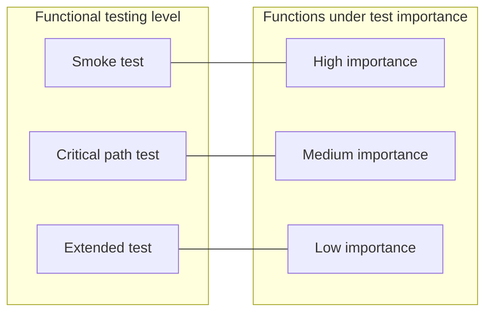
```mermaid
graph LR
    subgraph "Functional testing level"
        direction BT
        T3["Extended test"]
        T2["Critical path test"]
        T1["Smoke test"]
    end

    subgraph "Functions under test importance"
        direction BT
        I1["High importance"]
        I2["Medium importance"]
        I3["Low importance"]
    end

    T1 --- I1
    T2 --- I2
    T3 --- I3
```

Figure 2.3.g — Testing classification by functions under test importance (decreasingly) (by functional testing level)

### 2.3.2.7. Classification by ways of dealing with application

* **Positive testing**$^{144}$ examines the application in a situation where all activities are carried out strictly as instructed, with no errors, deviations, incorrect data input etc. If positive test cases end with errors, this is a red flag — the application is not working properly even under ideal conditions (and can be expected to work even worse under non-ideal conditions). To speed up testing, several positive test cases can be combined (e.g., "*before submitting, fill in all form fields with correct values*"). This can sometimes make defect diagnosis more difficult, but the significant reduction in time will compensate for this risk.
* **Negative testing**$^{145}$ (invalid testing$^{146}$) is aimed at testing the application in situations when whether operations (sometimes incorrect ones) performed or data used may potentially lead to errors. (Classic of the genre — division by zero). As in real life there are much more such situations (users make mistakes, intruders deliberately “break” the application, problems arise in the application environment, etc.), negative test cases turn out to be significantly more numerous than positive ones (sometimes by times or even orders of magnitude). Unlike positive test cases, negative ones should not be combined because such an approach may lead to an incorrect interpretation of application behavior and omission (non-detection) of defects.

---

$^{144}$ **Positive testing** is testing process where the system validated against the valid input data. In this testing tester always check for only valid set of values and check if application behaves as expected with its expected inputs. The main intention of this testing is to check whether software application not showing error when not supposed to & showing error when supposed to. Such testing is to be carried out keeping positive point of view & only execute the positive scenario. Positive Testing always tries to prove that a given product and project always meets the requirements and specifications. [http://www.softwaretestingclass.com/positive-and-negative-testing-in-software-testing/]

$^{145}$ **Negative testing.** Tests aimed at showing that a component or system does not work. Negative testing is related to the testers' attitude rather than a specific test approach or test design technique, e.g., testing with invalid input values or exceptions. [ISTQB Glossary]

$^{146}$ **Invalid testing.** Testing using input values that should be rejected by the component or system. [ISTQB Glossary]

### 2.3.2.8. Classification by application nature

This type of classification is artificial, since within there will be described the same types of testing, differing from each other in this context only in the focus on the relevant functions and features of the application, the use of specific tools and individual techniques.

* **Web-applications testing** involves intensive activities in the area of compatibility testing$^{(88)}$ (cross-browser testing$^{(88)}$ in particular), performance testing$^{(90)}$, testing automation using a wide range of tools.
* **Mobile applications testing** also requires increased attention to compatibility testing$^{(88)}$, performance optimization$^{(90)}$ (including client-side power consumption reduction), testing automation using mobile device emulators.
* **Desktop applications testing** is the most basic of the listed categories, and its features depend on the subject area of the application, architectural nuances, key quality indicators, etc.

This classification can go on forever. For example, you could consider console applications testing and GUI applications testing, server applications testing and client applications testing, etc.

2.3.2.9. Classification by architecture tier

This type of classification, like the previous one, is also artificial and represents only a concentration on a single part of the application.

* **Presentation tier testing** focuses on the part of the application which is responsible for the interaction with the "outer world" (both users and applications). Usability, responsiveness, compatibility with browsers, and correctness of interfaces are tested here.
* **Business logic tier testing** is required to test a key set of application functions and is based on key application requirements, business rules and general functionality testing.
* **Data tier testing** focuses on the part of the application that is responsible for storing and certain processing of data (usually in a database or other storage). Of particular interest here is data testing, checking that business rules are complied with, and performance testing.

>  If you’re not familiar with the concept of multi-tier application architecture, at least look it up on Wikipedia$^{147}$.

---

$^{147}$ “Multitier architecture”, Wikipedia [http://en.wikipedia.org/wiki/Multitier_architecture]

## 2.3.2.10. Classification by end-user participation

All three of the following types of testing belong to operational testing$^{(86)}$.

- **Alpha testing**$^{148}$ is performed within a development organisation with possible partial involvement of end-users. It may be a form of internal acceptance testing$^{(86)}$. Some sources note that this testing should be done without a development team, but other sources do not make such a requirement. Briefly, the essence of this testing type: the product can already be presented periodically to external users, but it's still quite "raw", so the main testing is performed by the development organisation.

- **Beta testing**$^{149}$ is performed outside the development organisation with the active involvement of end-users and/or customers. It may be a form of external acceptance testing$^{(86)}$. The essence of this testing type in brief: the product can already be openly presented to external users, it is already stable enough, but there may still be problems and development organisation needs feedback from real users to identify those problems.

- **Gamma testing**$^{150}$ is the final stage of testing before a product is released, aimed at fixing minor defects discovered in beta testing. Usually, it is also performed with maximum end-user and/or customer involvement. It may be a form of external acceptance testing$^{(86)}$. The essence of this testing type in brief: the product is almost ready, and now feedback from real users is being used to fix the latest imperfections.

---

$^{148}$ **Alpha testing.** Simulated or actual operational testing by potential users/customers or an independent test team at the developers' site, but outside the development organization. Alpha testing is often employed for off-the-shelf software as a form of internal acceptance testing. [ISTQB Glossary]

$^{149}$ **Beta testing.** Operational testing by potential and/or existing users/customers at an external site not otherwise involved with the developers, to determine whether or not a component or system satisfies the user/customer needs and fits within the business processes. Beta testing is often employed as a form of external acceptance testing for off-the-shelf software in order to acquire feedback from the market. [ISTQB Glossary]

$^{150}$ **Gamma testing** is done when software is ready for release with specified requirements, this testing done directly by skipping all the in-house testing activities. The software is almost ready for final release. No feature development or enhancement of the software is undertaken and tightly scoped bug fixes are the only code. Gamma check is performed when the application is ready for release to the specified requirements and this check is performed directly without going through all the testing activities at home. [http://www.360logica.com/blog/2012/06/what-are-alpha-beta-and-gamma-testing.html]

### 2.3.2.11. Classification by formalization level

* **Scripted testing**$^{151}$ (test case based testing) is a formalized approach in which testing is performed on the basis of previously prepared test cases, test suites, and other documentation. This is the most wide-spread method of testing, which also allows for maximum completeness of the application research due to strict systematization of the process, convenient metrics applying and wide set of guidelines developed over the decades and tested in practice.
* **Exploratory testing**$^{152}$ is a partially formalized approach in which a tester performs work on an application based on a selected scenario$^{(137)}$, which can be further refined over the course of execution to explore the application more extensively. The key to success in exploratory testing is to follow a scenario rather than doing a random piecemeal operation. There is even a special scenario-based approach called session-based testing$^{153}$. As an alternative to scenarios, checklists may sometimes be used to specify application actions, and this type of testing is called checklist-based testing$^{154}$.

  |  | For more information on exploratory testing, see James Bach's article “What is exploratory testing?”$^{155}$ |
  | :--- | :--- |

* **Ad hoc testing**$^{156}$ is a completely informalized approach in which no test cases, checklists or scripts are expected — the tester relies entirely on their own professionalism and intuition (experience-based testing$^{157}$) to spontaneously perform actions with the application that they believe can detect a defect. This type of testing is used rarely and only as a complement to fully or partially formalized testing when no test cases are available (yet?) to examine some aspect of application behavior.

  |  | In no way should "exploratory testing" and "ad hoc testing" be confused. They are different application research techniques with different degrees of formalization, different tasks and different areas of application. |
  | :--- | :--- |

---

$^{151}$ **Scripted testing.** Test execution carried out by following a previously documented sequence of tests. [ISTQB Glossary]  
$^{152}$ **Exploratory testing.** An informal test design technique where the tester actively controls the design of the tests as those tests are performed and uses information gained while testing to design new and better tests. [ISTQB Glossary]  
$^{153}$ **Session-based Testing.** An approach to testing in which test activities are planned as uninterrupted sessions of test design and execution, often used in conjunction with exploratory testing. [ISTQB Glossary]  
$^{154}$ **Checklist-based Testing.** An experience-based test design technique whereby the experienced tester uses a high-level list of items to be noted, checked, or remembered, or a set of rules or criteria against which a product has to be verified. [ISTQB Glossary]  
$^{155}$ “What is Exploratory Testing?”, James Bach [http://www.satisfice.com/articles/what_is_et.shtml]  
$^{156}$ **Ad hoc testing.** Testing carried out informally; no formal test preparation takes place, no recognized test design technique is used, there are no expectations for results and arbitrariness guides the test execution activity. [ISTQB Glossary]  
$^{157}$ **Experience-based Testing.** Testing based on the tester's experience, knowledge and intuition. [ISTQB Glossary]

## 2.3.2.12. Classification by aims and goals

* **Positive testing** (previously discussed\textsuperscript{(80)}).
* **Negative testing** (previously discussed\textsuperscript{(80)}).
* **Functional testing**\textsuperscript{158} is a testing that verifies that the application functionality works correctly (the correct implementation of functional requirements\textsuperscript{(40)}). Functional testing is often associated with black box testing\textsuperscript{(71)}, but white box testing\textsuperscript{(71)} can also be used to verify that functionality has been implemented correctly.


* **Non-functional testing**\textsuperscript{162} is a testing of non-functional features of an application (correct implementation of non-functional requirements\textsuperscript{(40)}), such as usability, compatibility, performance, security, etc.
* **Installation testing** (installability testing\textsuperscript{163}) is a testing aimed to identify defects that affect the installation phase of an application. In general, it tests a variety of scenarios and aspects of the installer in situations such as:
  * a new runtime environment in which the application has not previously been installed;
  * changing the current version to a newer one ("upgrade");
  * changing the current version to an older one ("downgrade");
  * reinstalling the application in order to eliminate problems that have occurred ("reinstallation");
  * restarting the installation after an error has resulted in the failure to continue the installation;
  * uninstalling an application;
  * installing a new application from an application family;
  * automatic installation without user participation.

---

\textsuperscript{158} **Functional testing.** Testing based on an analysis of the specification of the functionality of a component or system. [ISTQB Glossary]
\textsuperscript{159} **Functionality testing.** The process of testing to determine the functionality of a software product (the capability of the software product to provide functions which meet stated and implied needs when the software is used under specified conditions). [ISTQB Glossary]
\textsuperscript{160} "What is Functional testing (Testing of functions) in software?" [http://istqbexamcertification.com/what-is-functional-testing-testing-of-functions-in-software/]
\textsuperscript{161} "What is functionality testing in software?" [http://istqbexamcertification.com/what-is-functionality-testing-in-software/]
\textsuperscript{162} **Non-functional testing.** Testing the attributes of a component or system that do not relate to functionality, e.g., reliability, efficiency, usability, maintainability and portability. [ISTQB Glossary]
\textsuperscript{163} **Installability testing.** The process of testing the installability of a software product. Installability is the capability of the software product to be installed in a specified environment. [ISTQB Glossary]

Detailed testing classification

* **Regression testing**$^{164}$ is a testing aimed at verifying the fact that previously working functionality has not been affected by errors caused by changes in the application or its environment. Frederick Brooks in his book “The Mythical Man-Month$^{165}$” wrote: “The fundamental problem with program maintenance is that fixing a defect has a substantial (20–50 percent) chance of introducing another. (p. 122)”. That is why regression testing is an indispensable quality assurance tool and is actively used in almost any project.
* **Re-testing**$^{166}$ (confirmation testing) is the execution of test cases that have previously detected defects in order to confirm that the defect has been resolved. In fact, this type of testing boils down to actions in the final stage of the defect report lifecycle$^{[158]}$ aimed at moving the defect to a “verified” and “closed” state.
* **Acceptance testing**$^{167}$ is a formalized testing aimed at verifying an application from the end-user and/or customer's point of view and deciding whether the customer accepts the work from the developer (project team). The following subtypes of acceptance testing can be distinguished (although they are mentioned very rarely, being mostly limited to the generic term “acceptance testing”):
    * **Factory acceptance testing**$^{168}$ is an examination of the completeness and quality of an application's realization in terms of its readiness to be handed over to the customer, carried out by the project team. This type of testing is often considered synonymous with alpha testing$^{[83]}$.
    * **Operational acceptance testing**$^{169}$ (production acceptance testing) is an operational testing$^{[86]}$ carried out in terms of installation performance, application resource consumption, software and hardware compatibility, etc.
    * **Site acceptance testing**$^{170}$ is a testing by end-users (customer representatives) of an application under real-life conditions to determine whether the application requires modifications or can be accepted for use in its current form.
* **Operational testing**$^{171}$ is a testing carried out in a real or near-real operational environment$^{172}$ including operating system, database systems, application servers, web servers, hardware, etc.

---

$^{164}$ **Regression testing.** Testing of a previously tested program following modification to ensure that defects have not been introduced or uncovered in unchanged areas of the software, as a result of the changes made. It is performed when the software or its environment is changed. [ISTQB Glossary]
$^{165}$ Frederick Brooks, “The Mythical Man-Month”.
$^{166}$ **Re-testing, Confirmation testing.** Testing that runs test cases that failed the last time they were run, in order to verify the success of corrective actions. [ISTQB Glossary]
$^{167}$ **Acceptance Testing.** Formal testing with respect to user needs, requirements, and business processes conducted to determine whether or not a system satisfies the acceptance criteria and to enable the user, customers or other authorized entity to determine whether or not to accept the system. [ISTQB Glossary]
$^{168}$ **Factory acceptance testing.** Acceptance testing conducted at the site at which the product is developed and performed by employees of the supplier organization, to determine whether or not a component or system satisfies the requirements, normally including hardware as well as software. [ISTQB Glossary]
$^{169}$ **Operational acceptance testing, Production acceptance testing.** Operational testing in the acceptance test phase, typically performed in a (simulated) operational environment by operations and/or systems administration staff focusing on operational aspects, e.g., recoverability, resource-behavior, installability and technical compliance. [ISTQB Glossary]
$^{170}$ **Site acceptance testing.** Acceptance testing by users/customers at their site, to determine whether or not a component or system satisfies the user/customer needs and fits within the business processes, normally including hardware as well as software. [ISTQB Glossary]
$^{171}$ **Operational testing.** Testing conducted to evaluate a component or system in its operational environment. [ISTQB Glossary]
$^{172}$ **Operational environment.** Hardware and software products installed at users' or customers' sites where the component or system under test will be used. The software may include operating systems, database management systems, and other applications. [ISTQB Glossary]

Detailed testing classification

* **Usability**$^{173}$ **testing** is a testing whether the end-user understands how to use the product (understandability$^{174}$, learnability$^{175}$, operability$^{176}$), as well as how much the end user enjoys using the product (attractiveness$^{177}$). We did not missay — quite often the success of a product depends on the emotions it arouses in its users. Conducting this type of testing effectively requires a fair amount of research involving end-users, market research, etc.

  >  **Important!** Usability testing$^{173}$ testing and GUI testing$^{182}$ are not the same thing! For example, a properly working GUI can be uncomfortable and a usable one can work incorrectly.

* **Accessibility testing**$^{178}$ is a testing aimed at investigating the suitability of a product to be used by people with disabilities (visually impaired, etc.)

* **Interface testing**$^{179}$ is a testing aimed at checking the interfaces of an application or its components. According to the ISTQB glossary, this type of testing refers to integration testing$^{[75]}$, and this is quite true for its variations such as API testing$^{180}$ and command line interface (CLI) testing$^{181}$, although the latter can also act as a form of user interface testing if the user, and not another application, communicates with the application through the command line. However, many sources suggest including GUI testing$^{182}$ in interface testing.

  >  **Important! Once again!** Usability testing$^{173}$ testing and GUI testing$^{182}$ are not the same thing! For example, a properly working GUI can be uncomfortable and a usable one can work incorrectly.

* **Security testing**$^{183}$ is a testing of an application's ability to withstand illicit attempts to access data or functions that an intruder is not authorized to access.

  >  You can read more about this type of testing in the article "What is security testing in software testing?"$^{184}$.

---

$^{173}$ **Usability.** The capability of the software to be understood, learned, used and attractive to the user when used under specified conditions. [ISTQB Glossary]
$^{174}$ **Understandability.** The capability of the software product to enable the user to understand whether the software is suitable, and how it can be used for particular tasks and conditions of use. [ISTQB Glossary]
$^{175}$ **Learnability.** The capability of the software product to enable the user to learn its application. [ISTQB Glossary]
$^{176}$ **Operability.** The capability of the software product to enable the user to operate and control it. [ISTQB Glossary]
$^{177}$ **Attractiveness.** The capability of the software product to be attractive to the user. [ISTQB Glossary]
$^{178}$ **Accessibility testing.** Testing to determine the ease by which users with disabilities can use a component or system. [ISTQB Glossary]
$^{179}$ **Interface Testing.** An integration test type that is concerned with testing the interfaces between components or systems. [ISTQB Glossary]
$^{180}$ **API testing.** Testing performed by submitting commands to the software under test using programming interfaces of the application directly. [ISTQB Glossary]
$^{181}$ **CLI testing.** Testing performed by submitting commands to the software under test using a dedicated command-line interface. [ISTQB Glossary]
$^{182}$ **GUI testing.** Testing performed by interacting with the software under test via the graphical user interface. [ISTQB Glossary]
$^{183}$ **Security testing.** Testing to determine the security of the software product. [ISTQB Glossary]
$^{184}$ "What is Security testing in software testing?" [http://istqbexamcertification.com/what-is-security-testing-in-software/](http://istqbexamcertification.com/what-is-security-testing-in-software/)

Detailed testing classification

* **Internationalization testing** (i18n testing, globalization$^{185}$ testing, localizability$^{186}$ testing) is a testing aimed to ensure that the product is ready to work in different languages and with different national and cultural characteristics. This type of testing does not check the quality of the adaptation (this is done by localization testing, see the next point), but focuses on checking if the adaptation is possible (for example: what happens if a user opens a file with a hieroglyph name; how the interface works if a user switches it to Japanese; can the application look up data in Korean text, etc.)
* **Localization testing$^{187}$** (l10n testing) is a testing aimed to ensure the correctness and quality of the adaptation of the product for use in a particular language, taking into account national and cultural characteristics. This testing follows the internationalization testing (see the previous point) and checks the correctness of the translation and adaptation of the product rather than the product's readiness for such an action.
* **Compatibility testing** (interoperability testing$^{188}$) is a testing aimed to check the ability of an application to work in a specified environment. Here, for example, the following can be tested:
  * Compatibility with hardware platform, operating system and network infrastructure (configuration testing$^{189}$).
  * Compatibility with browsers and browser versions (cross-browser testing$^{190}$). (See also web applications testing$^{(81)}$).
  * Compatibility with mobile devices (mobile testing$^{191}$). (See also mobile applications testing$^{(81)}$).
  * And so on.

Some sources add to compatibility testing (although stressing that it is not part of it) so-called compliance testing$^{192}$ (conformance testing, regulation testing).


---

$^{185}$ **Globalization.** The process of developing a program core whose features and code design are not solely based on a single language or locale. Instead, their design is developed for the input, display, and output of a defined set of Unicode-supported language scripts and data related to specific locales. ["Globalization Step-by-Step", https://docs.microsoft.com/en-us/globalization/]  
$^{186}$ **Localizability.** The design of the software code base and resources such that a program can be localized into different language editions without any changes to the source code. ["Globalization Step-by-Step", https://docs.microsoft.com/en-us/globalization/]  
$^{187}$ **Localization testing** checks the quality of a product's localization for a particular target culture/locale. This test is based on the results of globalization testing, which verifies the functional support for that particular culture/locale. This testing can be executed only on the localized version of a product. ["Globalization Step-by-Step", https://docs.microsoft.com/en-us/globalization/]  
$^{188}$ **Compatibility Testing, Interoperability Testing.** The process of testing to determine the interoperability of a software product (the capability to interact with one or more specified components or systems). [ISTQB Glossary]  
$^{189}$ **Configuration Testing, Portability Testing.** The process of testing to determine the portability of a software product (the ease with which the software product can be transferred from one hardware or software environment to another). [ISTQB Glossary]  
$^{190}$ **Cross-browser testing** helps you ensure that your web site or web application functions correctly in various web browsers. Typically, QA engineers create individual tests for each browser or create tests that use lots of conditional statements that check the browser type used and execute browser-specific commands. [https://www.browserstack.com/cross-browser-testing]  
$^{191}$ **Mobile testing** is a testing with multiple operating systems (and different versions of each OS, especially with Android), multiple devices (different makes and models of phones, tablets, phablets), multiple carriers (including international ones), multiple speeds of data transference (3G, LTE, Wi-Fi), multiple screen sizes (and resolutions and aspect ratios), multiple input controls (including BlackBerry's eternal physical keypads), and multiple technologies — GPS, accelerometers — that web and desktop apps almost never use. [https://www.perfecto.io/blog/mobile-testing]  
$^{192}$ **Compliance testing, Conformance testing, Regulation testing.** The process of testing to determine the compliance of the component or system (the capability to adhere to standards, conventions or regulations in laws and similar prescriptions). [ISTQB Glossary]  
$^{193}$ "What Is Mobile Testing?" [https://www.browserstack.com/blog/mobile-testing]  
$^{194}$ "Beginner's Guide to Mobile Application Testing" [http://www.softwaretestinghelp.com/beginners-guide-to-mobile-application-testing/]

Detailed testing classification

* **Data quality**$^{195}$ **testing** and **database integrity testing**$^{196}$ are two closely related types of testing aimed at examining such data characteristics as completeness, consistency, integrity, structuredness, etc. In the context of databases, the examination may cover the adequacy of the model to the subject area, the ability of the model to ensure the integrity and consistency of data, the correctness of triggers and stored procedures, etc.
* **Resource utilization testing**$^{197}$ (efficiency testing$^{198}$, storage testing$^{199}$) is a set of testing techniques that verify the efficiency of an application's utilization of the resources available to it and dependencies of the application's performance on the resources available to it. These types of testing are often directly or indirectly related to performance testing$^{(90)}$ techniques.
* **Comparison testing**$^{200}$ is a testing that is focused on comparative analysis of the advantages and disadvantages of the product being developed in relation to its main competitors.
* **Qualification testing**$^{201}$ is the formal process of demonstrating the product to the customer to confirm that it meets all the stated requirements. Unlike acceptance testing$^{(86)}$ this process is more rigorous and comprehensive, but it can also be carried out in the intermediate stages of product development.
* **Exhaustive testing**$^{202}$ is a testing of an application with all possible combinations of all possible inputs under all possible execution conditions. Not feasible for a complex system, but can be used to test some very simple components.
* **Reliability testing**$^{203}$ is a testing of the application's ability to perform its functions under specified conditions for a given time or a given number of operations.
* **Recoverability testing**$^{204}$ is a testing of the application's ability to restore its functions and performance levels, and to recover data in the event of a critical situation leading to a temporary (partial) loss of application operability.

---

$^{195}$ **Data quality.** An attribute of data that indicates correctness with respect to some pre-defined criteria, e.g., business expectations, requirements on data integrity, data consistency. [ISTQB Glossary]
$^{196}$ **Database integrity testing.** Testing the methods and processes used to access and manage the data(base), to ensure access methods, processes and data rules function as expected and that during access to the database, data is not corrupted or unexpectedly deleted, updated or created. [ISTQB Glossary]
$^{197}$ **Resource utilization testing, Storage testing.** The process of testing to determine the resource-utilization of a software product. [ISTQB Glossary]
$^{198}$ **Efficiency testing.** The process of testing to determine the efficiency of a software product (the capability of a process to produce the intended outcome, relative to the amount of resources used). [ISTQB Glossary]
$^{199}$ **Storage testing.** This is a determination of whether or not certain processing conditions use more storage (memory) than estimated. ["Software Testing Concepts And Tools", Nageshwar Rao Pusuluri]
$^{200}$ **Comparison testing.** Testing that compares software weaknesses and strengths to those of competitors' products. ["Software Testing and Quality Assurance", Jyoti J. Malhotra, Bhavana S. Tiple]
$^{201}$ **Qualification testing.** Formal testing, usually conducted by the developer for the consumer, to demonstrate that the software meets its specified requirements. ["Software Testing Concepts And Tools", Nageshwar Rao Pusuluri]
$^{202}$ **Exhaustive testing.** A test approach in which the test suite comprises all combinations of input values and preconditions. [ISTQB Glossary]
$^{203}$ **Reliability Testing.** The process of testing to determine the reliability of a software product (the ability of the software product to perform its required functions under stated conditions for a specified period of time, or for a specified number of operations). [ISTQB Glossary]
$^{204}$ **Recoverability Testing.** The process of testing to determine the recoverability of a software product (the capability of the software product to re-establish a specified level of performance and recover the data directly affected in case of failure). [ISTQB Glossary]

Detailed testing classification

* **Failover testing**$^{205}$ is a testing that involves emulating or actually creating critical situations in order to test the application's ability to engage the appropriate mechanisms to prevent possible degradation of availability, performance and data corruption.
* **Performance testing**$^{206}$ is the study of an application's responsiveness to external stimuli under varying load types and intensities. Performance testing is divided into the following sub-types:
  * **Load testing**$^{207}$ (capacity testing$^{208}$) is an examination of the application's ability to maintain the specified quality characteristics under load within the permissible limits and some exceeding of these limits (determination of the "margin of safety").
  * **Scalability testing**$^{209}$ is an examination of the application's ability to increase performance according to the increase in resources available to the application.
  * **Volume testing**$^{210}$ is an examination of the application's performance when processing different (usually large) volumes of data.
  * **Stress testing**$^{211}$ is an examination of the application's behavior under abnormal load changes that are significantly higher than expected, or in situations where a significant portion of the resources required by the application is unavailable. Stress testing can also be done outside the context of load testing: in this case it is usually called "destructive testing"$^{212}$ and is an extreme form of negative testing$^{(80)}$.
  * **Concurrency testing**$^{213}$ is an examination of the application's behavior in a situation where it has to process a large number of simultaneously incoming requests, which causes competition between the requests for resources (database, memory, data transfer channel, disk subsystem, etc.). Sometimes concurrency testing is understood as an examination of multithreaded applications and correctness of synchronization of actions performed in different threads.

As separate or auxiliary techniques, performance testing may include resource utilization testing$^{(89)}$, reliability testing$^{(89)}$, recoverability testing$^{(89)}$, failover testing$^{(90)}$, etc.

---

$^{205}$ **Failover Testing.** Testing by simulating failure modes or actually causing failures in a controlled environment. Following a failure, the failover mechanism is tested to ensure that data is not lost or corrupted and that any agreed service levels are maintained (e.g., function availability or response times). [ISTQB Glossary]  
$^{206}$ **Performance Testing.** The process of testing to determine the performance of a software product. [ISTQB Glossary]  
$^{207}$ **Load Testing.** A type of performance testing conducted to evaluate the behavior of a component or system with increasing load, e.g., numbers of parallel users and/or numbers of transactions, to determine what load can be handled by the component or system. [ISTQB Glossary]  
$^{208}$ **Capacity Testing.** Testing to determine how many users and/or transactions a given system will support and still meet performance goals. [https://msdn.microsoft.com/en-us/library/bb924357.aspx]  
$^{209}$ **Scalability Testing.** Testing to determine the scalability of the software product (the capability of the software product to be upgraded to accommodate increased loads). [ISTQB Glossary]  
$^{210}$ **Volume Testing.** Testing where the system is subjected to large volumes of data. [ISTQB Glossary]  
$^{211}$ **Stress testing.** A type of performance testing conducted to evaluate a system or component at or beyond the limits of its anticipated or specified workloads, or with reduced availability of resources such as access to memory or servers. [ISTQB Glossary]  
$^{212}$ **Destructive software testing** assures proper or predictable software behavior when the software is subject to improper usage or improper input, attempts to crash a software product, tries to crack or break a software product, checks the robustness of a software product. ["Towards Destructive Software Testing", Kiumi Akingbehin]  
$^{213}$ **Concurrency testing.** Testing to determine how the occurrence of two or more activities within the same interval of time, achieved either by interleaving the activities or by simultaneous execution, is handled by the component or system. [ISTQB Glossary]

### 2.3.2.13. Classification by techniques and approaches

* **Positive testing** (previously discussed$^{(80)}$).
* **Negative testing** (previously discussed$^{(80)}$).
* Testing based on tester's experience, scenarios, checklists:
  * **Exploratory testing** (previously discussed$^{(84)}$).
  * **Ad hoc testing** (previously discussed$^{(84)}$).
* Classification by intrusion to application's work process:
  * **Intrusive testing**$^{214}$ is a testing, the execution of which may affect the application's functionality due to the operation of the testing tools (e.g., performance indicators may become distorted) or due to intrusion (level of intrusion$^{215}$) into the application code itself (e.g., additional logging may be added to analyze the application's performance, debugging information may be output, etc.). Some sources consider$^{216}$ intrusive testing as a form of negative$^{(80)}$ or even stress testing$^{90}$.
  * **Nonintrusive testing**$^{217}$ is a testing that is invisible to the application and does not affect its normal operation.
* Classification by automation techniques:
  * **Data-driven testing**$^{218}$ is a way of automated test case development where the input data and expected results are taken outside the test case and stored outside it — in a file, database, etc.
  * **Keyword-driven testing**$^{219}$ is a way of automated test case development where not only the input data and expected results are taken outside the test case but also the logic of the test case behavior, which is described by keywords (commands).
  * **Behavior-driven testing**$^{220}$ is a way of automated test case development where the focus is on the correctness of business scenarios rather than on individual details of application functioning.

---

$^{214}$ **Intrusive testing.** Testing that collects timing and processing information during program execution that may change the behavior of the software from its behavior in a real environment. Intrusive testing usually involves additional code embedded in the software being tested or additional processes running concurrently with software being tested on the same processor. [http://encyclopedia2.thefreedictionary.com/intrusive+testing]  
$^{215}$ **Level of intrusion.** The level to which a test object is modified by adjusting it for testability. [ISTQB Glossary]  
$^{216}$ Intrusive testing can be considered a type of interrupt testing, which is used to test how well a system reacts to intrusions and interrupts to its normal workflow. [http://www.techopedia.com/definition/7802/intrusive-testing]  
$^{217}$ **Nonintrusive Testing.** Testing that is transparent to the software under test, i.e., does not change its timing or processing characteristics. Nonintrusive testing usually involves additional hardware that collects timing or processing information and processes that information on another platform. [http://encyclopedia2.thefreedictionary.com/nonintrusive+testing]  
$^{218}$ **Data-driven Testing (DDT).** A scripting technique that stores test input and expected results in a table or spreadsheet, so that a single control script can execute all of the tests in the table. Data-driven is often used to support the application of test execution tools such as capture/playback tools. [ISTQB Glossary]  
$^{219}$ **Keyword-driven Testing (KDT).** A scripting technique that uses data files to contain not only test data and expected results, but also keywords related to the application being tested. The keywords are interpreted by special supporting scripts that are called by the control script or the test. [ISTQB Glossary]  
$^{220}$ **Behavior-driven Testing (BDT).** Behavior-driven Tests focuses on the behavior rather than the technical implementation of the software. If you want to emphasize on business point of view and requirements then BDT is the way to go. BDT are Given-when-then style tests written in natural language which are easily understandable to non-technical individuals. Hence these tests allow business analysts and management people to actively participate in test creation and review process. [Jyothi Rangaiah, http://www.womentesters.com/behaviour-driven-testing-an-introduction/]

Detailed testing classification

* Classification by error source (knowledge):
  * **Error guessing**$^{221}$ is a testing technique where tests are developed based on the tester's experience and knowledge of what defects are typical in certain components or functionality areas of an application. It can be combined with so-called failure-directed testing$^{222}$, where new tests are developed based on information about previously discovered problems in an application.
  * **Heuristic evaluation**$^{223}$ is a usability testing technique$^{(87)}$, aimed at finding problems in the user interface that constitute deviations from generally accepted norms.
  * **Mutation testing**$^{224}$ is a testing technique that compares the behavior of several versions of the same component, some of which may be specially designed with the addition of defects (this allows us to evaluate the effectiveness of test cases — good tests will detect these specially added defects). It can be combined with the next type of testing in this list — error seeding.
  * **Error seeding**$^{225}$ is a testing technique where pre-known, specially designed errors are specifically added to an application in order to monitor their detection and elimination and thus form a more accurate assessment of the testing process performance. It can be combined with the previous type of testing in this list (mutation testing).

* Classification by input data selection techniques:
  * **Equivalence partitioning**$^{226}$ is a testing technique aimed at reducing the number of test cases developed and executed while maintaining sufficient test coverage. The essence of this technique is to identify equivalent test suites (each testing the same application behavior) and to select from such suites a small subset of test cases that are most likely to detect the problem.
  * **Boundary value analysis**$^{227}$ an instrumental technique of testing based on equivalence classes, which makes it possible to identify specific values of the parameters under study that belong to the boundaries of equivalence classes. This technique makes it much easier to identify sets of equivalent test cases and to select those test cases that detect the problem with the highest probability.

---

$^{221}$ **Error Guessing.** A test design technique where the experience of the tester is used to anticipate what defects might be present in the component or system under test as a result of errors made, and to design tests specifically to expose them. [ISTQB Glossary]
$^{222}$ **Failure-directed Testing.** Software testing based on the knowledge of the types of errors made in the past that are likely for the system under test. [https://www.techopedia.com/definition/7129/failure-directed-testing].
$^{223}$ **Heuristic Evaluation.** A usability review technique that targets usability problems in the user interface as the user interface design. With this technique, the reviewers examine the interface and judge its compliance with recognized usability principles (the “heuristics”). [ISTQB Glossary]
$^{224}$ **Mutation Testing, Back-to-Back Testing.** Testing in which two or more variants of a component or system are executed with the same inputs, the outputs compared, and analyzed in cases of discrepancies. [ISTQB Glossary]
$^{225}$ **Error seeding.** The process of intentionally adding known faults to those already in a computer program for the purpose of monitoring the rate of detection and removal, and estimating the number of faults remaining in the program. [ISTQB Glossary]
$^{226}$ **Equivalence partitioning.** A black box test design technique in which test cases are designed to execute representatives from equivalence partitions. In principle test cases are designed to cover each partition at least once. [ISTQB Glossary]
$^{227}$ **Boundary value analysis.** A black box test design technique in which test cases are designed based on boundary values (input values or output values which are on the edge of an equivalence partition or at the smallest incremental distance on either side of an edge, for example the minimum or maximum value of a range). [ISTQB Glossary]

* **Domain analysis**$^{228}$ (domain testing) is a testing technique based on equivalence classes and boundary conditions that allows us to develop test cases efficiently by taking into account several parameters (variables) simultaneously (including the interdependence of these parameters). This technique also describes approaches to choosing the minimal set of test cases from the whole set of possible test cases.
* **Pairwise testing**$^{229}$ is a testing technique in which test cases are built on the principle of testing pairs of values of parameters (variables) instead of trying to test all possible combinations of all values of all parameters. This technique is a special case of n-wise testing$^{230}$ allows to significantly reduce the testing effort (and sometimes even to make testing possible when the number of “all combinations of all values of all parameters” is measured in billions).

 Pairwise testing$^{229}$ and pair testing$^{231}$ **are NOT the same** thing! It may sound similar but has nothing in common!

* **Orthogonal array testing**$^{232}$ is an instrumental technique of pairwise and n-wise testing based on the use of so-called “orthogonal arrays” (two-dimensional arrays with the following property: if you take any two columns of such an array, the resulting “sub-array” will contain all possible pairwise combinations of values presented in the original array).

 Orthogonal arrays are **NOT** orthogonal matrices! These are completely different terms! Compare their descriptions in the articles “Orthogonal array”$^{233}$ and “Orthogonal matrix”$^{234}$.

Also see combinatorial testing techniques$^{[102]}$, which extend and complement the list of input-based types of testing just discussed.

> An extremely detailed description of some of the types of testing that fall under this classification can be found in Lee Copeland’s book “A Practitioner’s Guide to Software Test Design”, in particular:
> - Chapter 3 — Equivalence Class Testing.
> - Chapter 4 — Boundary Value Testing.
> - Chapter 8 — Domain Analysis Testing.
> - Chapter 6 — Pairwise and orthogonal array testing.

Most of these techniques are part of “Any tester’s gentleman's kit”, so understanding and being able to apply them can be considered a must.

---

$^{228}$ **Domain analysis.** A black box test design technique that is used to identify efficient and effective test cases when multiple variables can or should be tested together. It builds on and generalizes equivalence partitioning and boundary values analysis. [ISTQB Glossary]  
$^{229}$ **Pairwise testing.** A black box test design technique in which test cases are designed to execute all possible discrete combinations of each pair of input parameters. [ISTQB Glossary]  
$^{230}$ **N-wise testing.** A black box test design technique in which test cases are designed to execute all possible discrete combinations of any set of n input parameters. [ISTQB Glossary]  
$^{231}$ **Pair testing.** Two persons, e.g., two testers, a developer and a tester, or an end-user and a tester, working together to find defects. Typically, they share one computer and trade control of it while testing. [ISTQB Glossary]  
$^{232}$ **Orthogonal array testing.** A systematic way of testing all-pair combinations of variables using orthogonal arrays. It significantly reduces the number of all combinations of variables to test all pair combinations. See also combinatorial testing, n-wise testing, pairwise testing. [ISTQB Glossary]  
$^{233}$ “Orthogonal array”, Wikipedia. [http://en.wikipedia.org/wiki/Orthogonal_array](http://en.wikipedia.org/wiki/Orthogonal_array)  
$^{234}$ “Orthogonal matrix”, Wikipedia. [http://en.wikipedia.org/wiki/Orthogonal_matrix](http://en.wikipedia.org/wiki/Orthogonal_matrix)

Detailed testing classification

* Classification by operational environment:
  * **Development testing$^{235}$** is a testing performed directly during the development of an application and/or in a runtime environment other than that in which the application is actually used. Typically carried out by the developers themselves.
  * **Operational testing** (previously discussed$^{(86)}$).
* **Code based testing**. Various sources refer to this technique in different ways (most commonly as structure-based testing, whereas some authors mix control flow and data-flow testing into one set, and others strictly separate these strategies). Subtypes of this technique can also be organized in various combinations, but most universally they can be categorized as follows:
  * **Control flow testing$^{236}$** is a family of testing techniques in which test cases are developed to activate and verify the execution of different event sequences, which are determined through analysis of the application source code. For a further detailed explanation, see structure-based testing$^{(95)}$ later in this section.
  * **Data-flow testing$^{237}$** is a family of testing techniques based on selecting individual paths from the control flow in order to investigate events associated with changes in the state of variables. For a further detailed explanation see the part where data-flow testing is explained in terms of ISO/IEC/IEEE 29119-4$^{(102)}$ later in this section.
  * **State transition testing$^{238}$** is a testing technique in which test cases are developed to test application transitions from one state to another. The states can be described by state diagram$^{239}$ or state table$^{240}$.


This testing technique is sometimes also called “finite state machine$^{242}$ testing”. An important advantage of this technique is its applicability of finite state machine theory (which is well formalized) and the ability to use automation to generate combinations of input data.

---

$^{235}$ **Development testing.** Formal or informal testing conducted during the implementation of a component or system, usually in the development environment by developers. [ISTQB Glossary]
$^{236}$ **Control Flow Testing.** An approach to structure-based testing in which test cases are designed to execute specific sequences of events. Various techniques exist for control flow testing, e.g., decision testing, condition testing, and path testing, that each have their specific approach and level of control flow coverage. [ISTQB Glossary]
$^{237}$ **Data Flow Testing.** A white box test design technique in which test cases are designed to execute definition-use pairs of variables. [ISTQB Glossary]
$^{238}$ **State Transition Testing.** A black box test design technique in which test cases are designed to execute valid and invalid state transitions. [ISTQB Glossary]
$^{239}$ **State Diagram.** A diagram that depicts the states that a component or system can assume, and shows the events or circumstances that cause and/or result from a change from one state to another. [ISTQB Glossary]
$^{240}$ **State Table.** A grid showing the resulting transitions for each state combined with each possible event, showing both valid and invalid transitions. [ISTQB Glossary]
$^{241}$ “What is State transition testing in software testing?” [http://istqbbexamcertification.com/what-is-state-transition-testing-in-software-testing/](http://istqbbexamcertification.com/what-is-state-transition-testing-in-software-testing/)
$^{242}$ **Finite State Machine.** A computational model consisting of a finite number of states and transitions between those states, possibly with accompanying actions. [ISTQB Glossary]

Detailed testing classification

* **Code review** (code inspection$^{243}$) is a family of techniques for improving code quality by involving several people in the process of creating or improving code. The degree of formalization of code review can range from a fairly cursory peer-review to a thorough formal inspection. In contrast to static code analysis techniques (control flow and data-flow), code review also improves such characteristics as code comprehensibility, maintainability, conformance with a design specification, etc. Code review is mainly performed by the developers themselves.

* **Structure-based techniques** assume the ability to investigate the logic of code execution depending on different situations and include:
    * **Statement testing$^{244}$** is a white box testing technique, which checks whether individual expressions in the code are executed correctly and the fact of their execution itself.
    * **Branch testing$^{245}$** is a white box testing technique which checks the execution of individual branches of code (a branch is defined as an atomic part of code whose execution either happens or doesn't happen depending on the truth or falsity of some condition).
    * **Condition testing$^{246}$** is a white box testing technique in which the execution of a separate condition is tested (a condition is an expression that can be evaluated to the “true” or “false” value).
    * **Multiple condition testing$^{247}$** is a white box testing technique in which the execution of multiple (complex) conditions is tested.
    * **Modified condition decision coverage testing$^{248}$** is a white box testing technique in which individual conditions within complex conditions are tested, which alone determine the result of calculating the whole complex condition.
    * **Decision testing$^{249}$** is a white box testing technique in which complex branching (with two or more possible choices) is tested. Although “two choices” also fits here, formally this situation should be referred to condition-based testing.
    * **Path testing$^{250}$** is a white box testing technique in which all or some specifically selected paths in the application code are tested.

---

$^{243}$ **Inspection.** A type of peer review that relies on visual examination of documents to detect defects, e.g., violations of development standards and non-conformance to higher level documentation. The most formal review technique and therefore always based on a documented procedure. [ISTQB Glossary]  
$^{244}$ **Statement Testing.** A white box test design technique in which test cases are designed to execute statements (statement is an entity in a programming language, which is typically the smallest indivisible unit of execution). [ISTQB Glossary]  
$^{245}$ **Branch Testing.** A white box test design technique in which test cases are designed to execute branches (branch is a basic block that can be selected for execution based on a program construct in which one of two or more alternative program paths is available, e.g., case, jump, go to, if-then-else.). [ISTQB Glossary]  
$^{246}$ **Condition Testing.** A white box test design technique in which test cases are designed to execute condition outcomes (condition is a logical expression that can be evaluated as True or False, e.g. A > B). [ISTQB Glossary]  
$^{247}$ **Multiple Condition Testing.** A white box test design technique in which test cases are designed to execute combinations of single condition outcomes (within one statement). [ISTQB Glossary]  
$^{248}$ **Modified Condition Decision Coverage Testing.** Technique to design test cases to execute branch condition outcomes that independently affect a decision outcome and discard conditions that do not affect the final outcome. [“Guide to Advanced Software Testing, Second Edition”, Anne Mette Hass].  
$^{249}$ **Decision Testing.** A white box test design technique in which test cases are designed to execute decision outcomes (decision is program point at which the control flow has two or more alternative routes, e.g., a node with two or more links to separate branches). [ISTQB Glossary]  
$^{250}$ **Path testing.** A white box test design technique in which test cases are designed to execute paths. [ISTQB Glossary]

Detailed testing classification

 Strictly scientifically, the definitions of most structure-based testing should sound a bit different, because in programming a condition is an expression without logical operators and a solution is an expression with logical operators. But the ISTQB glossary doesn't focus on this and therefore the above definitions can be considered correct. However, if you are interested, we recommend you to read "What is the difference between a Decision and a Condition?"251.

A summary of all types of structure-based testing is shown in table 2.3.c.

Table 2.3.c — Types of structure-based testing

| Name | The gist (what is being tested) |
| :--- | :--- |
| Statement testing | Individual atomic parts of the code, e.g., “x = 10” |
| Branch testing | Passing through the branches of code execution |
| Condition testing, Branch Condition Testing | Individual conditional constructions, e.g., “if (a == b)” |
| Multiple condition testing, Branch Condition Combination Testing | Complex conditional constructions, e.g., “if ((a == b) || (c == d))” |
| Modified Condition Decision Coverage Testing | Separate conditions that alone affect the result of calculating a complex condition, for example in the condition “if ((x == y) && (n == m))” a false value in each of the separate conditions by itself results in false regardless of the result of calculating the second condition |
| Decision testing | Complex branching, such as the “switch” operator |
| Path testing | All or specifically chosen paths |

* Application behavior/model-based testing:
  * **Decision table testing**$^{252}$ is a black box testing technique in which test cases are developed on the basis of a so-called decision table, in which the input data (and combinations thereof) and impacts on the application are recorded, as well as the corresponding output data and application responses.
  * **State transition testing** (previously discussed$^{[94]}$).
  * **Specification-based testing** (black box testing) (previously discussed$^{[71]}$).
  * **Model-based testing**$^{253}$ is a testing technique in which application investigation (and test case development) is based on a particular model: decision table$^{[96]}$, state table or diagram$^{[94]}$, user scenarios$^{[137]}$, load model$^{[90]}$, etc.
  * **Use case testing**$^{254}$ is a black box test design technique in which test cases are developed based on use cases. The use cases serve mainly as a source of information for test case steps, while input data sets are conveniently developed using input data selection techniques$^{[92]}$. In general, the source of information for test case development in this technique may be not only use cases but also other user requirements$^{[39]}$ in any form. If the methodology of project development implies the use of user stories, this type of testing may be replaced by user story testing$^{255}$.

---

$^{251}$ "What is the difference between a Decision and a Condition?" [http://www-01.ibm.com/support/docview.wss?uid=swg21129252](http://www-01.ibm.com/support/docview.wss?uid=swg21129252)  
$^{252}$ **Decision Table Testing.** A black box test design technique in which test cases are designed to execute the combinations of inputs and/or stimuli (causes) shown in a decision table (a table showing combinations of inputs and/or stimuli (causes) with their associated outputs and/or actions (effects), which can be used to design test cases). [ISTQB Glossary]  
$^{253}$ **Model-based Testing.** Testing based on a model of the component or system under test, e.g., reliability growth models, usage models such as operational profiles or behavioral models such as decision table or state transition diagram. [ISTQB Glossary]  
$^{254}$ **Use case testing.** A black box test design technique in which test cases are designed to execute scenarios of use cases. [ISTQB Glossary]  
$^{255}$ **User story testing.** A black box test design technique in which test cases are designed based on user stories to verify their correct implementation. [ISTQB Glossary]

* **Parallel testing**$^{256}$ is a testing technique in which the behavior of a new (or modified) application is compared with that of a reference application (assumed to be be working correctly). The term parallel testing may also be used to refer to a way of conducting testing when several testers or automation systems perform the work simultaneously, i.e., in parallel. Very rarely (and incorrectly) parallel testing is understood as mutation testing$^{(92)}$.
* **Random testing**$^{257}$ is a black box testing technique in which input data, actions or even test cases themselves are selected on the basis of (pseudo)random values so that they correspond to an operational profile$^{258}$ — a subset of actions corresponding to some situation or application scenario. This type of testing should not be confused with so-called “monkey testing”$^{259}$.
* **A/B testing** (split testing$^{260}$) is a testing technique that examines the influence of a change in one of the input parameters on the result of an operation. However, more often we can see A/B testing as a usability testing technique$^{(87)}$, where users are randomly offered different variants of interface elements and then the difference in user reactions is evaluated.


An extremely detailed description of some of the types of testing that fall under this classification can be found in Lee Copeland's book "A Practitioner's Guide to Software Test Design", in particular:
* Chapter 5 — Decision Table Testing.
* Chapter 7 — State-Transition Testing.
* Chapter 9 — Use Case Testing.

---

$^{256}$ **Parallel testing.** Testing a new or an altered data processing system with the same source data that is used in another system. The other system is considered as the standard of comparison. [ISPE Glossary]

$^{257}$ **Random testing.** A black box test design technique where test cases are selected, possibly using a pseudo-random generation algorithm, to match an operational profile. This technique can be used for testing non-functional attributes such as reliability and performance. [ISTQB Glossary]

$^{258}$ **Operational profile.** The representation of a distinct set of tasks performed by the component or system, possibly based on user behavior when interacting with the component or system, and their probabilities of occurrence. A task is logical rather than physical and can be executed over several machines or be executed in non-contiguous time segments. [ISTQB Glossary]

$^{259}$ **Monkey testing.** Testing by means of a random selection from a large range of inputs and by randomly pushing buttons, ignorant of how the product is being used. [ISTQB Glossary]

$^{260}$ **Split testing** is a design for establishing a causal relationship between changes and their influence on user-observable behavior. [“Controlled experiments on the web: survey and practical guide”, Ron Kohavi]

### 2.3.2.14. Classification by execution chronology

In spite of numerous attempts by many authors to create a unified testing chronology, it is still true that there is no universally accepted solution that would be equally suitable for any project management methodology, any individual project, or any stage thereof.

If we try to describe the chronology of testing in one general phrase, we can say that there is a gradual increase in the complexity of the test cases themselves and in the complexity of their selection logic.

* The general universal logic of the test sequence is to start each task with simple positive test cases, to which negative (but also reasonably simple) test cases are gradually added. Only when the most typical situations are covered by simple test cases should we move on to more complex ones (again, starting with positive ones). This isn’t a dogma, but it’s worth taking heed of, because delving too deeply into negative (and also complicated) test cases in the early stages can lead to a situation where the application handles a lot of troubles perfectly but fails on the most basic, everyday tasks. Once again, the essence of universal consistency:
  1) simple positive testing;
  2) simple negative testing;
  3) complex positive testing;
  4) complex negative testing.
* Testing chronology based on component hierarchy:
  * **Bottom-up testing**$^{261}$ is an incremental approach to integration testing$^{[75]}$, in which low-level components are tested first, after which the process moves on to higher and higher-level components.
  * **Top-down testing**$^{262}$ is an incremental approach to integration testing$^{[75]}$, in which high-level components are tested first, after which the process moves on to increasingly lower-level components.
  * **Hybrid testing**$^{263}$ is a combination of bottom-up and top-down testing, allowing for simpler and quicker results of the evaluation of the application.


---

$^{261}$ **Bottom-up testing.** An incremental approach to integration testing where the lowest level components are tested first, and then used to facilitate the testing of higher-level components. This process is repeated until the component at the top of the hierarchy is tested. [ISTQB Glossary]

$^{262}$ **Top-down testing.** An incremental approach to integration testing where the component at the top of the component hierarchy is tested first, with lower-level components being simulated by stubs. Tested components are then used to test lower-level components. The process is repeated until the lowest level components have been tested. [ISTQB Glossary]

$^{263}$ **Hybrid testing, Sandwich testing.** First, the inputs for functions are integrated in the bottom-up pattern discussed above. The outputs for each function are then integrated in the top-down manner. The primary advantage of this approach is the degree of support for early release of limited functionality. [“Integration testing techniques”, Kratika Parmar]

Detailed testing classification

* Testing chronology based on attention to requirements and requirements’ components:
  1) Requirements testing, which can range from a cursory assessment like "we understand everything" to a very formal approach, is in any case primary to testing how the requirements are implemented.
  2) It is logical to test the implementation of functional requirements before testing the implementation of non-functional requirements, because if something simply doesn't work, then testing performance, security, usability and other non-functional requirements is meaningless, and often impossible.
  3) Testing the implementation of the non-functional requirements' components is often the logical conclusion to testing the requirements' implementation.

* Typical generic scenarios are used when there are no explicit prerequisites for implementing a different strategy. Such scenarios can be modified and combined (e.g., the whole "typical generic scenario 1" can be repeated in all steps of "typical generic scenario 2").
    * Typical generic scenario 1:
        1) Smoke testing$^{(77)}$.
        2) Critical path testing$^{(78)}$.
        3) Extended testing$^{(78)}$.
    * Typical generic scenario 2:
        1) Unit testing$^{(75)}$.
        2) Integration testing$^{(75)}$.
        3) System testing$^{(75)}$.
    * Typical generic scenario 3:
        1) Alpha testing$^{(83)}$.
        2) Beta testing$^{(83)}$.
        3) Gamma testing$^{(83)}$.

In conclusion, it should be reiterated that the testing classifications discussed here are not canonical and immutable. They are merely intended to organize the vast amount of information about the various activities of testers and to make it easier to remember the relevant facts.

### 2.3.3. Alternative and additional testing classifications

To complete the picture, it only remains to show alternative views on the testing classification. One of them (figure 2.3.h) represents no more than a different combination of the types and techniques previously discussed. The second one (figure 2.3.i) contains many new definitions, but it is beyond the scope of this book to explore them in detail, and therefore only brief explanations will be given (if necessary, you can consult the original sources, which are indicated for each definition in a footnote).

> Once again, these are only definitions. There are tens or hundreds of pages devoted to the relevant types and techniques of testing in primary sources. Please do not expect detailed explanations from this section, there will be none, as it is "very supplementary" material.


Figure 2.3.h — Testing classification according to the "Foundations of Software Testing: ISTQB Certification" (Erik Van Veenendaal, Isabel Evans)

In the following classification, both the items already considered and the ones not considered previously (indicated by the dotted line) are found. Brief definitions of the types of testing not considered previously are presented after figures 2.3.h and 2.3.i.

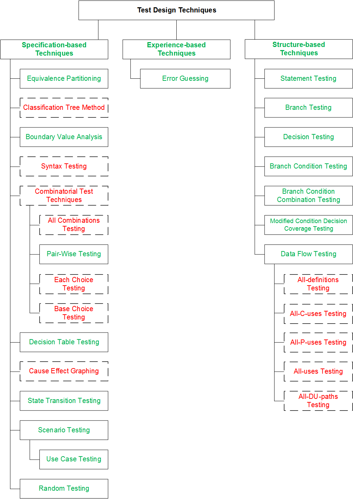

Figure 2.3.i — ISO/IEC/IEEE 29119-4 testing classification

Alternative and additional testing classifications

* **Classification tree**$^{264}$ **method**$^{265}$ is a black box testing technique in which test cases are created from hierarchically organized sets of equivalent input and output data.
* **Syntax testing**$^{266}$ is a black box testing technique in which test cases are created based on the determination of input and output data sets.
* **Combinatorial testing**$^{267}$ is a way to select an appropriate set of test data combinations to achieve a certain level of test coverage when it is not possible to test all possible sets of test data values in the time available. There are the following combinatorial techniques:
    * **All combinations testing**$^{268}$ is a testing of all possible combinations of all values of all test data (e.g., all function parameters).
    * **Pairwise testing** (previously discussed$^{(93)}$).
    * **Each choice testing**$^{269}$ is a testing where one value from each test data set has to be used in at least one test case.
    * **Base choice testing**$^{270}$ is a testing where a set of values (base set) is allocated and used for testing first, and then test cases are built based on the selection of all but one of the base values, which is replaced by a value that is not in the base set.

    Also see the classification of testing based on input data selection$^{(92)}$, which extends and supplements this list.

* **Cause-effect graphing**$^{271}$ is a black box testing technique in which test cases are developed based on a cause-effect graph (a graphical representation of inputs and effects with associated outputs and effects).
* **Data-flow testing**$^{272}$ is a family of testing techniques based on selecting individual paths from the control flow in order to investigate events associated with changes in the state of variables. These techniques detect situations such as: a variable is defined but not used anywhere; a variable is used but not defined; a variable is defined several times before it is used; a variable is killed before it was last used.

---

$^{264}$ **Classification tree.** A tree showing equivalence partitions hierarchically ordered, which is used to design test cases in the classification tree method. [ISTQB Glossary]
$^{265}$ **Classification tree method.** A black box test design technique in which test cases, described by means of a classification tree, are designed to execute combinations of representatively of input and/or output domains. [ISTQB Glossary]
$^{266}$ **Syntax testing.** A black box test design technique in which test cases are designed based upon the definition of the input domain and/or output domain. [ISTQB Glossary]
$^{267}$ **Combinatorial testing.** A means to identify a suitable subset of test combinations to achieve a predetermined level of coverage when testing an object with multiple parameters and where those parameters themselves each have several values, which gives rise to more combinations than are feasible to test in the time allowed. [ISTQB Glossary]
$^{268}$ **All combinations testing.** Testing of all possible combinations of all values for all parameters. [“Guide to advanced software testing, 2nd edition”, Anne Matte Hass].
$^{269}$ **Each choice testing.** One value from each block for each partition must be used in at least one test case. [“Introduction to Software Testing. Chapter 4. Input Space Partition Testing”, Paul Ammann & Jeff Offutt]
$^{270}$ **Base choice testing.** A base choice block is chosen for each partition, and a base test is formed by using the base choice for each partition. Subsequent tests are chosen by holding all but one base choice constant and using each non-base choice in each other parameter. [“Introduction to Software Testing. Chapter 4. Input Space Partition Testing”, Paul Ammann & Jeff Offutt]
$^{271}$ **Cause-effect graphing.** A black box test design technique in which test cases are designed from cause-effect graphs (a graphical representation of inputs and/or stimuli (causes) with their associated outputs (effects), which can be used to design test cases). [ISTQB Glossary]
$^{272}$ **Data flow testing.** A white box test design technique in which test cases are designed to execute definition-use pairs of variables. [ISTQB Glossary]

Here we have to delve a bit deeper into the theory. In general, a variable can be manipulated in several ways (let's take the variable $\mathbf{x}$ as an example):
* declaration: `int` $\mathbf{x}$;
* definition, d-use: $\mathbf{x} = 99$;
* computation use, c-use: $\text{z} = \mathbf{x} + 1$;
* predicate use, p-use: `if` $(\mathbf{x} > 17)$ `{ ... }`;
* kill, k-use: $\mathbf{x} = \text{null}$;

We can now consider data-flow based testing techniques. These are described in great detail in Section 3.3 of Chapter 5 of Boris Beizer's book "Software Testing Techniques, Second Edition":
* **All-definitions testing**$^{273}$ — the test set checks that for each variable there is a path from its definition to its use in computations or predications.
* **All-c-uses testing**$^{274}$ — the test set checks that for each variable there is a path from its definition to its use in computations.
* **All-p-uses testing**$^{275}$ — the test set checks that for each variable there is a path from its definition to its use in predications.
* **All-uses testing**$^{276}$ — the test set checks that for each variable there is at least one path from each of its definitions to each of its uses in computations and predications.
* **All-du-paths testing**$^{277}$ — for each variable, the test suite checks all paths from each variable definition to each use of the variable in computations and predications (the most powerful strategy, which at the same time requires the greatest number of test cases).

For better understanding and memorability, here is the original diagram from Boris Beizer's book (referred to there as "Figure 5.7. Relative Strength of Structural Test Strategies"), showing the correlation of data-flow based test strategies (figure 2.3.j).

---

$^{273}$ **All-definitions strategy.** Test set requires that every definition of every variable is covered by at least one use of that variable (c-use or p-use). ["Software Testing Techniques, Second Edition", Boris Beizer]
$^{274}$ **All-computation-uses strategy.** For every variable and every definition of that variable, include at least one definition-free path from the definition to every computation use. ["Software Testing Techniques, Second Edition", Boris Beizer]
$^{275}$ **All-predicate-uses strategy.** For every variable and every definition of that variable, include at least one definition-free path from the definition to every predicate use. ["Software Testing Techniques, Second Edition", Boris Beizer]
$^{276}$ **All-uses strategy.** Test set includes at least one path segment from every definition to every use that can be reached by that definition. ["Software Testing Techniques, Second Edition", Boris Beizer]
$^{277}$ **All-DU-path strategy.** Test set includes every du path from every definition of every variable to every use of that definition. ["Software Testing Techniques, Second Edition", Boris Beizer]

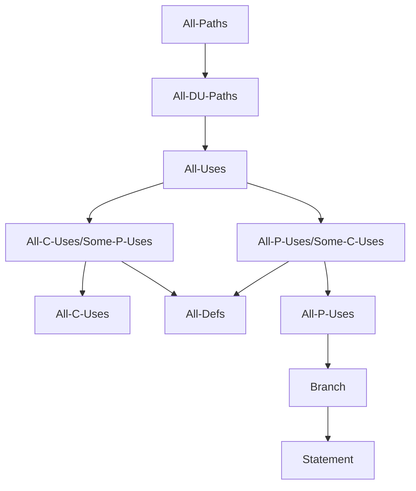
```mermaid
flowchart TD
    A["All-Paths"] --> B["All-DU-Paths"]
    B --> C["All-Uses"]
    C --> D["All-C-Uses/Some-P-Uses"]
    C --> E["All-P-Uses/Some-C-Uses"]
    D --> F["All-C-Uses"]
    D --> G["All-Defs"]
    E --> G
    E --> H["All-P-Uses"]
    H --> I["Branch"]
    I --> J["Statement"]
```

Figure 2.3.j — The correlation and relative strength of data-flow based testing strategies (from Boris Beizer's book "Software Testing Techniques")

### 2.3.4. Classification by reference to white box and black box testing

The most typical interview question for beginning testers is to ask them to list white box and black box testing techniques. Table 2.3.d is provided below, in which all of the above types of testing are related to the appropriate method. This table can also be used as a guide to types of testing (they are presented in the same order as described in this chapter).

>  Important! In such sources as the ISTQB-Glossary, many types and techniques of testing are strictly related to white box or black box methods. This does not mean that they cannot be applied to another, unspecified method. For example, equivalence partitioning is black box testing, but it's also suitable for creating unit test cases, which are the brightest representatives of white box testing.
> 
> Take the data in the table below not as "this type of testing can only be used for...", but as "most often this type of testing is used for...".

Table 2.3.d — Testing types and techniques in the context of white box and black box methods

| Testing type | White box | Black box |
| :--- | :---: | :---: |
| Static testing$^{\{70\}}$ | Yes | No |
| Dynamic testing$^{\{70\}}$ | Occasionally | Yes |
| Manual testing$^{\{73\}}$ | Seldom | Yes |
| Automated testing$^{\{73\}}$ | Yes | Yes |
| Unit testing, Module testing, Component testing$^{\{75\}}$ | Yes | No |
| Integration testing$^{\{75\}}$ | Yes | Yes |
| System testing$^{\{75\}}$ | Seldom | Yes |
| Smoke test, Intake test, Build verification test$^{\{77\}}$ | Seldom | Yes |
| Critical path test$^{\{78\}}$ | Seldom | Yes |
| Extended test$^{\{78\}}$ | Seldom | Yes |
| Positive testing$^{\{80\}}$ | Yes | Yes |
| Negative testing, Invalid testing$^{\{80\}}$ | Yes | Yes |
| Web-applications testing$^{\{81\}}$ | Yes | Yes |
| Mobile applications testing$^{\{81\}}$ | Yes | Yes |
| Desktop applications testing$^{\{81\}}$ | Yes | Yes |
| Presentation tier testing$^{\{82\}}$ | Seldom | Yes |
| Business logic tier testing$^{\{82\}}$ | Yes | Yes |
| Data tier testing$^{\{82\}}$ | Yes | Seldom |
| Alpha testing$^{\{83\}}$ | Seldom | Yes |
| Beta testing$^{\{83\}}$ | Almost never | Yes |
| Gamma testing$^{\{83\}}$ | Almost never | Yes |
| Scripted testing, Test case based testing$^{\{84\}}$ | Yes | Yes |
| Exploratory testing$^{\{84\}}$ | No | Yes |
| Ad hoc testing$^{\{84\}}$ | No | Yes |
| Functional testing$^{\{85\}}$ | Yes | Yes |
| Non-functional testing$^{\{85\}}$ | Yes | Yes |
| Installation testing$^{\{85\}}$ | Occasionally | Yes |

Classification by reference to white box and black box testing

| | | |
| :--- | :---: | :---: |
| Regression testing$^{\{86\}}$ | Yes | Yes |
| Re-testing, Confirmation testing$^{\{86\}}$ | Yes | Yes |
| Acceptance testing$^{\{86\}}$ | Extremely rare | Yes |
| Operational testing$^{\{86\}}$ | Extremely rare | Yes |
| Usability testing$^{\{87\}}$ | Extremely rare | Yes |
| Accessibility testing$^{\{87\}}$ | Extremely rare | Yes |
| Interface testing$^{\{87\}}$ | Yes | Yes |
| Security testing$^{\{87\}}$ | Yes | Yes |
| Internationalization testing$^{\{88\}}$ | Seldom | Yes |
| Localization testing$^{\{88\}}$ | Seldom | Yes |
| Compatibility testing$^{\{88\}}$ | Seldom | Yes |
| Configuration testing$^{\{88\}}$ | Seldom | Yes |
| Cross-browser testing$^{\{88\}}$ | Seldom | Yes |
| Data quality testing and Data-base integrity testing$^{\{89\}}$ | Yes | Seldom |
| Resource utilization testing$^{\{89\}}$ | Extremely rare | Yes |
| Comparison testing$^{\{89\}}$ | No | Yes |
| Qualification testing$^{\{89\}}$ | No | Yes |
| Exhaustive testing$^{\{89\}}$ | Extremely rare | No |
| Reliability testing$^{\{89\}}$ | Extremely rare | Yes |
| Recoverability testing$^{\{89\}}$ | Extremely rare | Yes |
| Failover testing$^{\{90\}}$ | Extremely rare | Yes |
| Performance testing$^{\{90\}}$ | Extremely rare | Yes |
| Load testing, Capacity testing$^{\{90\}}$ | Extremely rare | Yes |
| Scalability testing$^{\{90\}}$ | Extremely rare | Yes |
| Volume testing$^{\{90\}}$ | Extremely rare | Yes |
| Stress testing$^{\{90\}}$ | Extremely rare | Yes |
| Concurrency testing$^{\{90\}}$ | Extremely rare | Yes |
| Intrusive testing$^{\{91\}}$ | Yes | Yes |
| Nonintrusive testing$^{\{91\}}$ | Yes | Yes |
| Data-driven testing$^{\{91\}}$ | Yes | Yes |
| Keyword-driven testing$^{\{91\}}$ | Yes | Yes |
| Error guessing$^{\{92\}}$ | Extremely rare | Yes |
| Heuristic evaluation$^{\{92\}}$ | No | Yes |
| Mutation testing$^{\{92\}}$ | Yes | Yes |
| Error seeding$^{\{92\}}$ | Yes | Yes |
| Equivalence partitioning$^{\{92\}}$ | Yes | Yes |
| Boundary value analysis$^{\{92\}}$ | Yes | Yes |
| Domain testing, Domain analysis$^{\{93\}}$ | Yes | Yes |
| Pairwise testing$^{\{93\}}$ | Yes | Yes |
| Orthogonal array testing$^{\{93\}}$ | Yes | Yes |
| Development testing$^{\{94\}}$ | Yes | Yes |
| Control flow testing$^{\{94\}}$ | Yes | No |
| Data flow testing$^{\{94\}}$ | Yes | No |

Classification by reference to white box and black box testing

| | | |
| :--- | :---: | :---: |
| State transition testing$^{\{94\}}$ | Occasionally | Yes |
| Code review, code inspection$^{\{95\}}$ | Yes | No |
| Statement testing$^{\{95\}}$ | Yes | No |
| Branch testing$^{\{95\}}$ | Yes | No |
| Condition testing$^{\{95\}}$ | Yes | No |
| Multiple condition testing$^{\{95\}}$ | Yes | No |
| Modified condition decision coverage testing$^{\{95\}}$ | Yes | No |
| Decision testing$^{\{95\}}$ | Yes | No |
| Path testing$^{\{95\}}$ | Yes | No |
| Decision table testing$^{\{96\}}$ | Yes | Yes |
| Model-based testing$^{\{96\}}$ | Yes | Yes |
| Use case testing$^{\{96\}}$ | Yes | Yes |
| Parallel testing$^{\{97\}}$ | Yes | Yes |
| Random testing$^{\{97\}}$ | Yes | Yes |
| A/B testing, Split testing$^{\{97\}}$ | No | Yes |
| Bottom-up testing$^{\{98\}}$ | Yes | Yes |
| Top-down testing$^{\{98\}}$ | Yes | Yes |
| Hybrid testing$^{\{98\}}$ | Yes | Yes |
| Classification tree method$^{\{102\}}$ | Yes | Yes |
| Syntax testing$^{\{102\}}$ | Yes | Yes |
| Combinatorial testing$^{\{102\}}$ | Yes | Yes |
| All combinations testing$^{\{102\}}$ | Yes | No |
| Each choice testing$^{\{102\}}$ | Yes | No |
| Base choice testing$^{\{102\}}$ | Yes | No |
| Cause-effect graphing$^{\{102\}}$ | Seldom | Yes |
| All-definitions testing$^{\{103\}}$ | Yes | No |
| All-c-uses testing$^{\{103\}}$ | Yes | No |
| All-p-uses testing$^{\{103\}}$ | Yes | No |
| All-uses testing$^{\{103\}}$ | Yes | No |
| All-du-paths testing$^{\{103\}}$ | Yes | No |

## 2.4. Checklists, test cases, test suites

### 2.4.1. Checklist

As can be easily understood from the previous chapters, the tester has to work with a huge amount of information, choose from a variety of solutions to problems and invent new ones. It is objectively impossible to keep all thoughts in one's head during this activity, so it is advisable to use “checklists” to think through and develop test cases.

>  **Checklist**$^{278}$ is a set of ideas [for test cases]. The last phrase is bracketed$^{279}$, for a reason, because in general a checklist is just a collection of ideas: ideas for testing, ideas for development, ideas for planning and management — in other words, a collection of any ideas.

A checklist is most often a simple and familiar list:
* where the sequence of items is not important (e.g., a list of values for a field);
* where the sequence of items is important (e.g., steps in a brief instruction);
* a structured (multi-level) list that reflects a hierarchy of ideas.

It is important to understand that there are not and cannot be any prohibitions or limitations when developing checklists — the main thing is that they are helpful in the work. Sometimes checklists can even be expressed graphically (e.g., using mind maps$^{280}$ or concept maps$^{281}$), although traditionally they are made as multi-level lists.

Since there are many similar tasks in different projects, well-designed and accurate checklists can be used repeatedly, thus saving time and effort.

>  **Attention!** A very common question is whether the checklist should include expected results. Not in the classic sense of a checklist (although it is not forbidden), because a checklist is a set of ideas and their detailing in the form of steps and expected results will be in the test cases. But expected results can be added, for example, in the following cases:
> * a particular item on the checklist deals with special, non-trivial application behavior or a complex check, the result of which is important to note now, so as not to forget;
> * due to tight deadlines and/or lack of other resources, testing is done directly from checklists without test cases.

---

$^{278}$ The concept of a “checklist” is not tied to testing as such — it is a completely universal technique that can be used in any area of life without exception.  
$^{279}$ If you're wondering “why square brackets are used here”, check out the syntax of the “Extended Backus-Naur form”, which is the de facto standard for describing expressions in IT. See “Extended Backus-Naur form”, Wikipedia. [https://en.wikipedia.org/wiki/Extended_Backus%E2%80%93Naur_form](https://en.wikipedia.org/wiki/Extended_Backus%E2%80%93Naur_form)  
$^{280}$ “Mind map”, Wikipedia. [http://en.wikipedia.org/wiki/Mind_map](http://en.wikipedia.org/wiki/Mind_map)  
$^{281}$ “Concept map”, Wikipedia. [http://en.wikipedia.org/wiki/Concept_map](http://en.wikipedia.org/wiki/Concept_map)

For a checklist to be a truly useful tool, it should have a number of important features.

**Logicality.** The checklist is not written "just for fun", but on the basis of goals and to help achieve those goals. Unfortunately, one of the most common and dangerous mistakes in writing a checklist is to turn it into a pile of thoughts that are not connected to each other in any way.

**Consistency and structure.** Structuring is quite simple — it is achieved by designing the checklist as a multi-level list. As for consistency, even when the checklist items do not describe a chain of actions, it is still easier for a person to perceive information in the form of small groups of ideas, the transition between which is clear and obvious (for example, you can first write ideas of simple positive test cases$^{(80)}$, then ideas of simple negative test cases, then gradually increase the complexity of test cases, but do not write these ideas in a jumble).

**Completeness and non-redundancy.** A checklist should be a neat summary of ideas that do not overlap (often due to different formulations of the same idea) and at the same time do not leave out anything important.

It also helps to think of checklists not only as a repository of sets of ideas but also as "requirements for making test cases". This idea leads to a reconsideration and rethinking of good requirements properties (see "Good requirements properties"$^{(42)}$ chapter) as applied to checklists.

 **Task 2.4.a:** reread "Good requirements properties"$^{(42)}$ chapter and consider which good requirements properties can also be considered properties of good checklists.

So, let's look at the process of creating a checklist. In "Examples of requirements analysis and testing"$^{(52)}$ chapter there is an example of a final version of requirements$^{(57)}$, which we will use.

Since we cannot "test the whole application" at once (it is too huge a task to be done in one go), we already need to choose some logic for building checklists — yes, there will be several (eventually they can be structurally combined into one, but this is not necessary).

Typical variations of this logic are the creation of separate checklists for:
* typical user scenarios$^{(137)}$;
* different levels of functional testing$^{(77)}$;
* separate application parts (modules and submodules)$^{(118)}$;
* separate requirements, groups of requirements, levels and types$^{(38)}$ of requirements;
* the parts or functions of the application that are most at risk.

This list can be expanded and supplemented, and items can be combined to produce, for example, checklists for checking the most common scenarios affecting a part of an application.

To illustrate the principles of checklists, we will use the logic of dividing application functions by their importance into three categories (see classification by functions under test importance$^{(77)}$):

* Basic functions without which the existence of the application becomes meaningless (i.e. the most important ones — what the application was created for), or whose failure causes objectively serious problems for the runtime environment (see "Smoke test"$^{(77)}$).

* Functions demanded by most users in their daily work (see "Critical path test"^(78)).
* The rest of the features (various "little things", problems with which will not affect the value of the application to the end-user very much) (see "Extended test"^(78)).

### Functions without which the existence of an application becomes meaningless

Let's first give the whole checklist for smoke testing, and then we'll go through it in more detail.

* Configuration and start-up.
* File processing:

| | Input file formats | | |
|---|:---:|:---:|:---:|
| | TXT | HTML | MD |
| Input file encodings | WIN1251 | + | + | + |
| CP866 | + | + | + |
| KOI8R | + | + | + |

* Stopping.

Yes, and that's it. All the key functions of the app are listed here.

**Configuration and start-up.** If an application cannot be configured to run in a user environment, it is useless. If the application cannot be started, it is useless. If problems arise during the start-up phase, they can affect the functioning of the application and therefore also deserve close attention.

Note: this is a rather atypical case of an application being configured with command line parameters and therefore it is not possible to separate the "configuration" and "start-up" operations; in real life, the vast majority of applications perform these operations separately.

**File processing.** This is what the application is all about, so even at the checklist stage we took the trouble to create a matrix showing all possible combinations of acceptable input file formats and encodings, so as not to forget anything and to emphasize the importance of the relevant tests.

**Stopping.** It may not seem that important from a user's point of view, but stopping (and starting) any application involves a lot of system operations, problems with which can lead to many serious consequences (up to the inability to restart the application or the crash of the operating system).

### Functions demanded by most users

The next step will be to test how the application behaves in normal everyday life, avoiding exotic situations for now. A very common question is whether it is OK to duplicate checks at different levels of functional testing$^{[77]}$. There is both a “no” and a “yes”. “No” in the sense that it is not acceptable (makes no sense) to duplicate the same tests that have just been done. “Yes”, in the sense that any test can be detailed and supplemented with additional elements.

* Configuration and start-up:
    * With correct parameters:
        * SOURCE_DIR, DESTINATION_DIR, LOG_FILE_NAME values are entered and contain spaces and Cyrillic characters (repeat for path formats in Windows and \*nix file systems, note logical drive names and directory name separators ("/" and "\")).
        * LOG_FILE_NAME value is not passed.
    * Without parameters.
    * With a lack of parameters.
    * With incorrect parameters:
        * Invalid SOURCE_DIR path.
        * Invalid DESTINATION_DIR path.
        * Invalid LOG_FILE_NAME value.
        * DESTINATION_DIR is a subdirectory of SOURCE_DIR.
        * DESTINATION_DIR and SOURCE_DIR are the same.
* File processing:
    * Different formats, encodings and sizes:

| | | Input file formats | | |
| :---: | :---: | :---: | :---: | :---: |
| | | TXT | HTML | MD |
| Input file encodings | WIN1251 | 100 KB | 50 MB | 10 MB |
| | CP866 | 10 MB | 100 KB | 50 MB |
| | KOI8R | 50 MB | 10 MB | 100 KB |
| | Any | 0 bytes | | |
| | Any | 50 MB + 1 B | 50 MB + 1 B | 50 MB + 1 B |
| | - | Any unacceptable format | | |
| | Any | Acceptable format, damaged file | | |

    * Inaccessible input files:
        * No access permission.
        * File is open and locked.
        * File with read-only attribute.
* Stopping:
    * By closing the console window.
* Application log:
    * Automatic creation (in the absence of a log file).
    * Continuing (appending the log) on restarts.
* Performance:
    * Elementary test with raw assessment.

Note that the checklist can contain not only “very brief bullet points” but also quite detailed comments, if necessary — it is better to explain the idea in more detail than to guess later what was meant.

Also note that many of the checklist items are very high-level, which is fine. For example, “acceptable format, damaged file” (see matrix with encodings, formats and sizes) sounds vague, but this deficiency will be corrected at the level of proper test cases.

## Other functions and special scenarios

It is time to pay attention to the various little things and tricky nuances, problems with which are unlikely to be of great concern to the user, but still formally count as defects.

* Configuration and start-up:
  * `SOURCE_DIR`, `DESTINATION_DIR`, `LOG_FILE_NAME` values:
    * In different styles (Windows paths + *nix paths) --- one in one style, the other in another.
    * Using UNC names.
    * `LOG_FILE_NAME` inside the `SOURCE_DIR`.
    * `LOG_FILE_NAME` inside the `DESTINATION_DIR`.
  * Size of `LOG_FILE_NAME` at the start-up:
    * 2--4 GB.
    * 4+ GB.
  * Running two or more copies of an application with:
    * The same `SOURCE_DIR`, `DESTINATION_DIR`, `LOG_FILE_NAME` parameters.
    * The same `SOURCE_DIR` and `LOG_FILE_NAME`, but different `DESTINATION_DIR`.
    * The same `DESTINATION_DIR` and `LOG_FILE_NAME`, but different `SOURCE_DIR`.
* File processing:
  * A correct format file in which text is represented in two or more supported encodings at the same time.
  * Input file size:
    * 2--4 GB.
    * 4+ GB.

 **Task 2.4.b:** you might want to change something about the above checklist and this is perfectly normal and fair: there is no “the only perfect checklist” and your ideas are valid, so make your own checklist or point out any shortcomings you notice in the above checklist.

As we will see in the next chapter, creating a good test case can require long and tedious, fairly monotonous work, which does not require a skilled tester to make significant intellectual efforts, and therefore switching between working on checklists (the creative component) and formulating them into test cases (the mechanical component) allows one to diversify the work process and reduce fatigue. Although, of course, writing complex and high-quality test cases may turn out to be no less creative work than thinking through checklists.

## 2.4.2. Test case and its lifecycle

### Terminology and general information

Let’s start with the terminology, as there is a lot of confusion caused by different traditions in different countries, companies and individual teams.

At the heart of it all is the term “test”. The official definition goes like this.

>  **Test**$^{282}$ is a set of one or more test cases.

As it is the easiest and fastest of all other terms to pronounce, depending on the context, it can be understood as a single item on a checklist, a single step in a test case, a test case itself, a test suite, and... we may go on for a long time. One thing is important: if you hear or see the word “test” take it in context.

Now let’s look at the most important term for us — “test case”.

>  **Test case**$^{283}$ is a set of input data, execution conditions and expected results designed to test a feature or behavior of a software tool.
> 
> A test case may also be understood as an appropriate document representing a formal record of a test case.

We will come back to this thought$^{\{142\}}$, but it is already critically important to understand and remember: if a test case has no input data, execution conditions and expected results, and/or the purpose of the test case is not clear, it is a bad test case (sometimes it makes no sense, sometimes it cannot be executed at all).

> The rest of the terms related to tests, test cases and test scenarios can be read at this stage simply for familiarization purposes. If you open the ISTQB glossary to the letter “T” you will see many terms which are closely cross-referenced with each other: at this early stage of learning about testing there is no need to look at them all in depth, but some are worth reading. They are presented below.

**High level test case**$^{284}$ is a test case without specific input data and expected results.

Generally limited to general ideas and operations, similar in nature to the detailed checklist item. It is quite common in integration testing$^{\{75\}}$ and system testing$^{\{75\}}$, as well as at the smoke test$^{\{77\}}$ level. It can serve as a starting point for exploratory testing$^{\{84\}}$ or for creating low-level test cases.

**Low level test case**$^{285}$ is a test case with specific inputs and expected results.

This is a fully “ready-to-run” test case and is generally the most classic type of test case. Beginner testers are most often taught to write this type of tests, because it is much easier to describe all the data in detail than to understand what information can be neglected without diminishing the value of the test case.

---

$^{282}$ **Test.** A set of one or more test cases. [ISTQB Glossary]  
$^{283}$ **Test case.** A set of input values, execution preconditions, expected results and execution postconditions, developed for a particular objective or test condition, such as to exercise a particular program path or to verify compliance with a specific requirement. [ISTQB Glossary]  
$^{284}$ **High level test case (logical test case).** A test case without concrete (implementation level) values for input data and expected results. Logical operators are used; instances of the actual values are not yet defined and/or available. [ISTQB Glossary]  
$^{285}$ **Low level test case.** A test case with concrete (implementation level) values for input data and expected results. Logical operators from high level test cases are replaced by actual values that correspond to the objectives of the logical operators. [ISTQB Glossary]

**Test case specification**\({}^{286}\) is a document describing a test suite (including its objectives, input data, execution conditions and steps, expected results) for a test item\({}^{287}\) or test object\({}^{288}\).

**Test specification**\({}^{289}\) is a document consisting of test design specification\({}^{290}\), test case specification\({}^{286}\) and/or test procedure specification\({}^{291}\).

**Test scenario**\({}^{292}\) (test procedure specification, test script) is a document that describes the sequence of steps for running a test.

### The purpose of writing test cases

Testing can also be done without test cases (inadvisable, but possible; yes, the effectiveness of this approach varies widely depending on a number of factors). Having test cases, on the other hand, allows to:

* Structure and systematize the approach to testing (without which a major project is almost guaranteed to fail).
* Calculate test coverage\({}^{293}\) metrics and take measures to increase coverage (test cases are the main source of information, without which such metrics are meaningless).
* Monitor the current situation against the plan (how many test cases are needed, how many are already in hand, how many have been completed of the number planned at this stage, etc.)
* Clarify the understanding between customer, developers and testers (test cases often show the application's behavior much more clearly than is reflected in the requirements).
* Store information of long-term use and experience exchange between staff and teams (or at least not trying to keep hundreds of pages of text in your head).
* Perform regression testing\({}^{\{86\}}\) and re-testing\({}^{\{86\}}\) (which would not have been possible at all without the test cases).
* Improve the requirements quality (we have already discussed this: writing checklists and test cases is a good requirements testing technique\({}^{\{50\}}\)).
* quickly bring on board a new team member who has recently joined the project.

---

\({}^{286}\) **Test case specification.** A document specifying a set of test cases (objective, inputs, test actions, expected results, and execution preconditions) for a test item. [ISTQB Glossary]  
\({}^{287}\) **Test item.** The individual element to be tested. There usually is one test object and many test items. [ISTQB Glossary]  
\({}^{288}\) **Test object.** The component or system to be tested. [ISTQB Glossary]  
\({}^{289}\) **Test specification.** A document that consists of a test design specification, test case specification and/or test procedure specification. [ISTQB Glossary]  
\({}^{290}\) **Test design specification.** A document specifying the test conditions (coverage items) for a test item, the detailed test approach and identifying the associated high level test cases. [ISTQB Glossary]  
\({}^{291}\) **Test procedure specification (test procedure).** A document specifying a sequence of actions for the execution of a test. Also known as test script or manual test script. [ISTQB Glossary]  
\({}^{292}\) **Test scenario.** A document specifying a sequence of actions for the execution of a test. Also known as test script or manual test script. [ISTQB Glossary]  
\({}^{293}\) **Coverage (test coverage).** The degree, expressed as a percentage, to which a specified coverage item (an entity or property used as a basis for test coverage, e.g., equivalence partitions or code statements) has been exercised by a test suite. [ISTQB Glossary]

## Test case lifecycle

Unlike a defect report, which has a full developed lifecycle$^{(158)}$, for a test case it is more a set of states (see figure 2.4.a) in which it can be (the most important states are in **bold**).

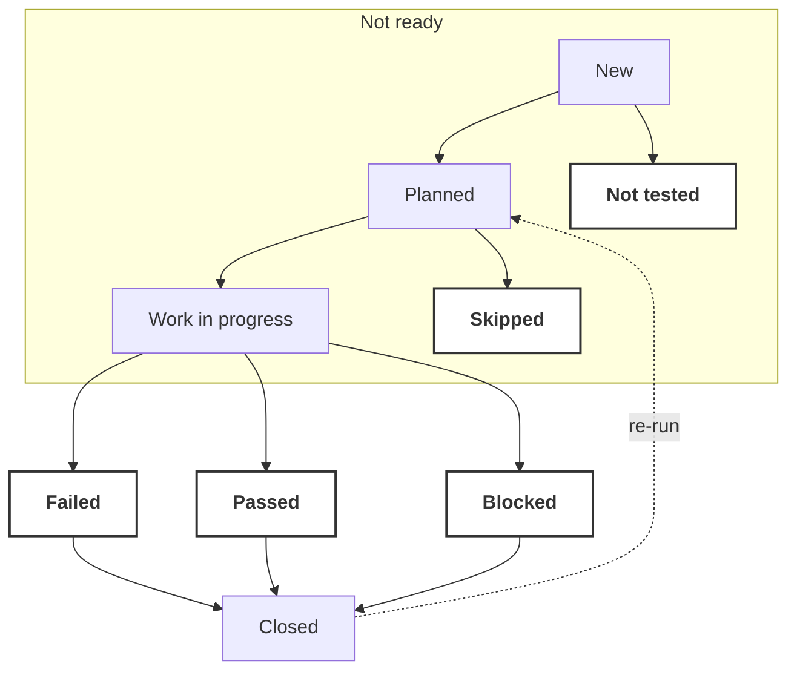
```mermaid
graph TD
    subgraph Not ready
        direction TB
        New["New"] --> Planned["Planned"]
        New --> NotTested["Not tested"]
        Planned --> WorkInProgress["Work in progress"]
        Planned --> Skipped["Skipped"]
    end
    
    WorkInProgress --> Failed["Failed"]
    WorkInProgress --> Passed["Passed"]
    WorkInProgress --> Blocked["Blocked"]
    
    Failed --> Closed["Closed"]
    Passed --> Closed["Closed"]
    Blocked --> Closed["Closed"]

    Closed -.->|re-run| Planned
    
    style NotTested fill:#fff,stroke:#333,stroke-width:2px,font-weight:bold
    style Skipped fill:#fff,stroke:#333,stroke-width:2px,font-weight:bold
    style Failed fill:#fff,stroke:#333,stroke-width:2px,font-weight:bold
    style Passed fill:#fff,stroke:#333,stroke-width:2px,font-weight:bold
    style Blocked fill:#fff,stroke:#333,stroke-width:2px,font-weight:bold
```

Figure 2.4.a — Test case lifecycle (set of states)

* **New** — is the typical initial state of almost any artefact. The test case automatically enters this state after creation.
* **Planned (ready for testing)** — in this state a test case is in when it is either explicitly included in the plan for the next test iteration, or at least ready for execution.
* **Not tested** — in some test case management systems this state replaces the previous state ("planned"). When a test case is in this state, it means that it is ready to run, but has not yet been executed.
* **Work in progress** — if a test case takes a long time to complete, it may be placed in this state to emphasize the fact that work is in progress and results can be expected soon. If a test case does not take long to complete, this state is normally skipped and the test case is immediately switched to one of the three following states: "failed", "passed", or "blocked".
* **Skipped** — there are situations where the execution of a test case is cancelled due to the shortage of time or a change in test logic.
* **Failed** — this state means that a defect was detected while running a test case, i.e., the expected result of at least one test case step does not match the actual result. If a defect is detected "accidentally" while running a test case, which has nothing to do with the test case steps and their expected results, the test case is considered passed (of course a defect report is generated for the detected defect).

* **Passed** — this state means that no defects related to the discrepancy between the expected and actual results of the test case steps have been detected during the execution of the test case.
* **Blocked** — this state means that for some reason the test case cannot be executed (usually a defect that prevents some user scenario from being implemented).
* **Closed** — is a very rare case, as test cases are usually left in the states Failed / Passed / Blocked / Skipped. In some test case management systems test case is put in this state to emphasize the fact that in the given testing iteration all operations with it are completed.
* **Not ready** — as can be seen from the diagram, a test case can be transferred to (and from) this state at any time if an error is detected in it, if the requirements for which it was written change, or if some other situation occurs that makes it impossible to consider the test case suitable for execution and transition to other states.

Again, unlike the defect lifecycle, which is sufficiently standardized and formalized, the above described for a test case is of a general advisory nature, considered as a discrete set of states (rather than a strict lifecycle) and can vary greatly from company to company (due to the traditions and/or features of test case management systems at hand).

### 2.4.3. Test case attributes

As mentioned above, the term “test case” can refer to a formal record of a test case in the form of a technical document. This record has a generally accepted structure, the components of which are called attributes (fields) of the test case.

Depending on the test case management tool, the appearance of the test case record may vary slightly, some fields may be added or removed, but the concept remains the same.

The overall view of the entire test case structure is shown in figure 2.4.b.

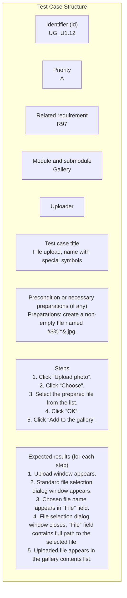
```mermaid
graph TD
    %% Define nodes with labels
    id["Identifier (id)<br>UG_U1.12"]
    priority["Priority<br>A"]
    req["Related requirement<br>R97"]
    module["Module and submodule<br>Gallery"]
    uploader["Uploader"]
    title["Test case title<br>File upload, name with special symbols"]
    pre["Precondition or necessary preparations (if any)<br>Preparations: create a non-empty file named #$%'^&.jpg."]
    steps["Steps<br>1. Click “Upload photo”.<br>2. Click “Choose”.<br>3. Select the prepared file from the list.<br>4. Click “OK”.<br>5. Click “Add to the gallery”."]
    expected["Expected results (for each step)<br>1. Upload window appears.<br>2. Standard file selection dialog window appears.<br>3. Chosen file name appears in “File” field.<br>4. File selection dialog window closes, “File” field contains full path to the selected file.<br>5. Uploaded file appears in the gallery contents list."]

    %% Logical grouping / layout reflection
    subgraph Test Case Structure
        id
        priority
        req
        module
        uploader
        title
        pre
        steps
        expected
    end
```

Figure 2.4.b — Key test case attributes

Now let's consider each attribute in detail.

**Identifier** is a unique value to clearly distinguish one test case from another and is used in all kinds of references. In general, a test case identifier may simply be a unique number, but (if the test case management tool permits) it may be much more complex: it may include prefixes, suffixes and other meaningful components that quickly identify the purpose of the test case and the application part (or requirements) it belongs to (for example: UR216_S12_DB_Neg).

**Priority** shows the importance of the test case. It can be expressed in letters (A, B, C, D, E), numbers (1, 2, 3, 4, 5), words (“extremely high”, “high”, “medium”, “low”, “extremely low”) or another convenient way. The number of grades is also not fixed, but usually ranges from three to five.

The priority of the test case can correlate with:
* the importance of the requirement, user scenario<sup>{137}</sup> or function to which the test case is related;
* the potential importance of the defect<sup>{166}</sup>, that the test case aims to find;
* the level of risk associated with the test case requirement, scenario or function being tested.

The main purpose of this attribute is to simplify the allocation of team attention and effort (higher-priority test cases receive more of it), and to make it easier to plan and decide what can be sacrificed in some force majeure situation that does not allow all pre-planned test cases to be completed.

**Related requirement** shows the core requirement that the test case is intended to verify (core — because a single test case may contain multiple requirements). This field improves the traceability[134] of the test case.

Frequent questions about filling in this field are:
* Can it be left blank? Yes. The test case may have been developed outside the direct requirements, and (yet?) the meaning of this field is difficult to determine. Although it is not considered good, it is quite common.
* Can more than one requirement be listed in this field? Yes, but most often one tries to choose one most important or “higher level” one (e.g., instead of listing R56.1, R56.2, R56.3 etc. one can just write R56). Most often in test management tools, this field is a drop-down list where only one value can be selected, and this question becomes irrelevant. In addition, many test cases are still aimed at checking strictly one requirement, and for them this question is also irrelevant.

**Module and submodule** indicate the parts of the application to which the test case relates and allow a better understanding of its purpose.

The idea of dividing an application into modules and submodules stems from the fact that in complex systems it is almost impossible to look at the whole project, and the question “how to test this application” becomes unacceptably difficult. The application is then logically divided into components (modules), which in turn are divided into smaller components (submodules). And it becomes much easier to come up with checklists and create good test cases for such small parts of the application.

Generally, the hierarchy of modules and submodules is created as a single set for the whole project team in order to avoid confusion due to different people using different approaches to this division or even just different names for the same parts of the application.

Now for the hard part: how modules and submodules are selected. In reality, the easiest way to go about this is based on the architecture and design of the application. For example, in an application that we’re already familiar with[57] there is a hierarchy of modules and submodules:

* Start-up mechanism:
  * parameter analysis mechanism;
  * application build mechanism;
  * error handling mechanism.
* File system interaction mechanism:
  * SOURCE_DIR tree traversal mechanism;
  * error handling mechanism.
* File conversion mechanism:
  * encoding detection mechanism;
  * encodings conversion mechanism;
  * error handling mechanism.
* Logging mechanism:
  * log recording mechanism;
  * console logging mechanism;
  * error handling mechanism.

Agree that such long names with the word “mechanism” constantly repeated are difficult to read and remember. Let's rewrite:

* Starter:
  * parameter analyzer;
  * application builder;
  * error handler.
* Scanner:
  * traverser;
  * error handler.
* Converter:
  * detector;
  * converter;
  * error handler.
* Logger:
  * disk logger;
  * console logger;
  * error handler.

But what do we do if we don't know the “guts” of an application (or if we're not very good at programming)? Modules and submodules can be allocated based on the graphical user interface (large areas and elements within them), based on the tasks and subtasks the application solves, etc. The main thing is that this logic should be applied in the same way to the whole application.

>  **Warning!** A common mistake! A module and a submodule of an application are **NOT actions**, they are just **structural parts**, “chunks” of the application. You may be misled by names such as “print, printer setup” (but here we mean the parts of the application that are responsible for printing and printer setup (and they are named with verbal nouns) and not the printing or printer setup process).
> 
> Compare (using a human example): “respiratory system, lungs” is a module and submodule, but “breathing”, “sniffing”, “sneezing” are not; “head, brain” is a module and submodule, but “nodding”, “thinking” are not.

The presence of “Module” and “Submodule” fields improves the traceability$^{(134)}$ of a test case.

**Title** is designed to make it easier and quicker to understand the main idea (purpose) of a test case without referring to its other attributes. It is this field that is most informative when browsing the list of test cases.

Compare.

| Bad | Good |
| :--- | :--- |
| Test 1 | Start-up, one copy, correct parameters |
| Test 2 | One copy start-up with invalid paths |
| Test 78 (improved) | Start-up, multiple copies, no conflicts |
| Shutdown | Ctrl+C shutdown |
| Closing | Shutdown by closing the console |
| ... | ... |

Test case attributes

The title of a test case can be a full sentence, a phrase, a set of phrases — the main thing is that the following conditions must be met:
- Informativeness.
- At least relative uniqueness (so as not to confuse different test cases).

>  Warning! A common mistake! If the test case management tool does not require a title, **you should write one anyway**. Test cases without a title turn into a mishmash of information, the use of which is enormously costly and completely pointless.

And there is one more thing that may help with title formulation. A “test case” is a “**test case**” for real. So, a test case title describes that **case** a “test case” is designed to check.

**Precondition** (preparation, initial data, setup) allows you to describe everything that needs to be prepared before the test case can start, for example:
- Database state.
- File system and its objects state.
- Servers and network infrastructure state.

What is described in this field is prepared **WITHOUT using the application** under test, so if there is a problem here, one cannot write a defect report about the application.

This point is very, very important, so let's explain it with a simple real-life example. Imagine that you are tasting a chocolate. In the “initial data” you can write “buy chocolate of such and such varieties in such quantity”. If that kind of chocolate is not available, if the shop is closed, if there is not enough money, etc. — these are **NOT flavor problems**, and you cannot write a defect report like “the chocolate is tasteless because the shop is closed”.

>  Some authors do not follow this logic and allow for the “preparation” section to work with the application under test. And there is no “right way” here — it's just that one tradition decides one way, another decides another. In many ways, this is also a terminological problem: “preparation”, “initial data” and “setup” are logical to perform without an application under test, while “precondition” is closer to describing the state of an application under test. In a real working environment, you only need to read a few test cases already created by your peers to understand their views on the matter.

**Steps** describe the sequence of activities that need to be implemented during the test case execution. General guidelines for writing the steps are as follows:
- start from a clear and obvious point, don't write unnecessary initial steps (application start-up, obvious interface operations, etc.);
- even if there is only one step in the test case, number it (otherwise there is an increased chance of accidentally “sticking” the description of this step to the new text in the future);
- use an impersonal form (e.g., “open”, “enter”, “add”), do not use the particle “to” (i.e., “start application”, not “to start application”);
- relate the degree of detail of the steps and their parameters to the purpose of the test case, its complexity, the functional testing level$^{[77]}$ etc. — depending on these and many other factors, the level of detail can range from general ideas to very clear values and guidelines;
- refer to previous steps and their ranges to reduce the length of the text (e.g., “repeat steps 3–5 with the value of...”);
- write the steps sequentially, without conditionalities such as “if... then...”.

Test case attributes

 **Warning! A common mistake!** It is strictly forbidden to refer to steps from other test cases and to other test cases in their entirety: if those other test cases are changed or deleted, your test case will refer to wrong data or to a void, and if during execution those other test cases or steps cause an error you will not be able to finish your test case.

**Expected results** for each test case step describe the response of the application to the actions described in the "Steps". The step number corresponds to the result number.

The following recommendations can be made on the writing of the expected results:

* describe the system's behavior in a way that excludes subjective interpretation (e.g., "the application works correctly" is bad, "a window saying ... appears" is good);
* write the expected result of all steps, without exception, if you have the slightest doubt that the result of a step will be completely trivial and obvious (if you do omit the expected result of a trivial action, it is better to leave a blank line in the list of expected results — this makes it easier to read);
* write briefly, but not compromising on the informativeness;
* avoid conditionalities such as "if... then...".

 **Warning! A common mistake!** The expected results ALWAYS describe the CORRECT operation of the application. There is not and cannot be an expected result like "the application causes an error in the operating system and crashes with loss of all user data".

However, the correct operation of an application may well involve the display of messages about incorrect user actions or some critical situation. For example, the message "Unable to save file to specified path: not enough free space on target drive" is not an application error, but it's perfectly normal and correct operation. An application error (in the same situation) would be no such message, and/or data corruption or loss.

For a deeper understanding of test case design, we recommend reading "Typical mistakes in writing checklists, test cases and test suites"<sup>(149)</sup> chapter right now.

## 2.4.4. Test management tools

There are a lot of test management tools$^{294}$, furthermore, many companies are developing their own internal means of dealing with this task.

There's no point in learning how to work with test cases in a particular tool — the principle is the same everywhere, and the relevant skills are built up in just a couple of days. What's important to understand is the common set of functions implemented by such tools (of course, one or another tool may not implement some function from this list and/or implement the functions not included in the list):

* creating test cases and test suites;
* document version control with the ability to identify who has made changes and to undo them if necessary;
* formation and tracking of test plan implementation, collection and visualization of a variety of metrics, generation of reports;
* integration with bug-tracking tools, capturing the relationship between test case execution result and the defect reports generated (if any);
* integration with project management systems;
* integration with testing automation tools, managing the execution of automated test cases.

In other words, a good test management tool takes care of all the routine technical operations that objectively need to be performed during the implementation of the testing lifecycle$^{(26)}$. A great advantage is also the ability of such tools to track correlations between different documents and other artefacts, correlations between artefacts and processes, etc., making these actions subject to a system of access permissions and guaranteeing the integrity and correctness of the information.

For a general overview and to better consolidate the topic of test case attributes$^{(117)}$ design, we will now look at a few pictures of forms from different tools.

There is quite deliberately no comparison or detailed description given here — there are plenty of such reviews on the Internet, and they are rapidly becoming outdated as new versions of the products reviewed are released.

But of interest are the individual features of the interface, which we will focus on in each of the examples (important: if you are interested in a detailed description of each field, its associated processes, etc., please refer to the official documentation — only the briefest explanations will be given here).

QAComplete$^{295}$

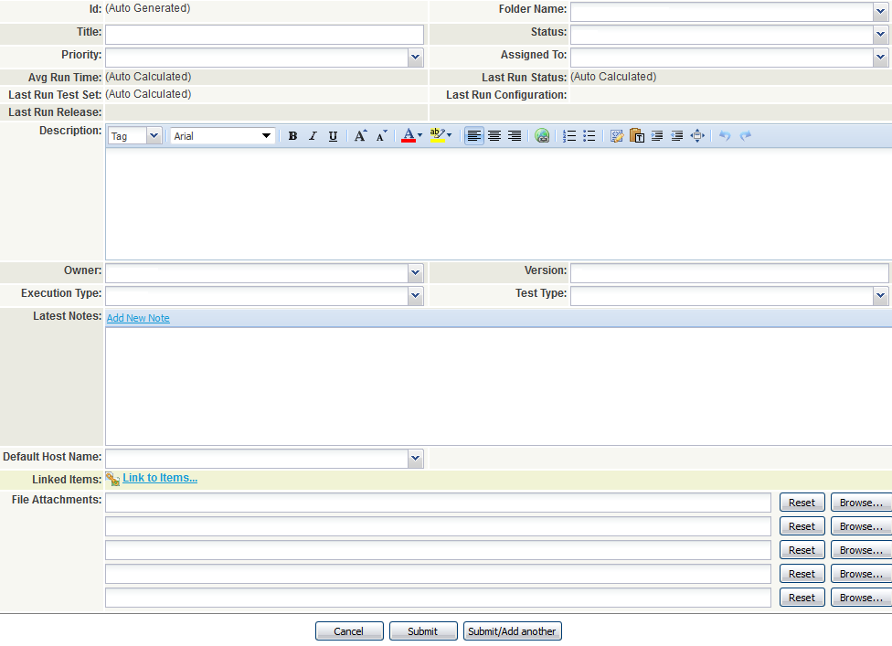

Figure 2.4.c — Test case creation with QAComplete

1. "Id", as can be seen from the relevant caption, is autogenerated.
2. "Title", as with most systems, is mandatory.
3. "Priority offers a choice of high, medium, low by default.
4. "Folder name" is the equivalent of the fields "Module" and "Sub-module" and allows one to select from a drop-down tree list the appropriate value describing what the test case belongs to.
5. "Status" shows the current status of the test case: new, approved, awaiting approval, in design, outdated, rejected.
6. "Assigned to" indicates who is currently the "main workforce" for this test case (or who should make the decision to, for example, approve the test case).
7. "Last run status" shows whether the test passed or failed.
8. "Last run configuration" shows on which hardware and software platform the test case was last run.
9. "Avg run time" contains the automatically calculated average time required to execute a test case.
10. "Last run test set" contains information about the test suite in which the test case was last run.
11. "Last run release" contains information about the release (build) of the software on which the test case was last run.

$^{295}$ QAComplete [http://smartbear.com/product/test-management-tool/qacomplete/]

12. “Description” allows one to add any useful information about the test case (including execution details, preparation, etc.).
13. “Owner” indicates the owner of the test case (usually the author of the test case).
14. “Execution type” by default only offers manual execution, but with appropriate settings and integration with other products the list can be extended (at least by adding automated execution).
15. “Version” contains the information about the current version of the test case (basically it is a counter to how many times the test case has been edited). All history of changes is stored, allowing one to return to any of the previous versions.
16. By default, the “Test type” offers options such as negative, positive, regression, smoke test.
17. “Default host name” is mainly used in automated test cases and suggests selecting from a list the name of the registered computer on which the special client is installed.
18. “Linked items” are links to requirements, defect reports, etc.
19. “File attachments” can contain test data, explanatory pictures, videos, etc.

For a description of the execution steps and expected results, an additional interface is available after the general description of the test case has been saved:

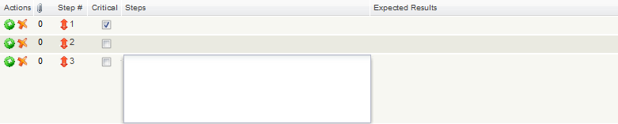

Figure 2.4.d — Adding test case steps with QAComplete

If required, you can add and customize additional fields, greatly extending the original capabilities of the tool.

### TestLink$^{296}$

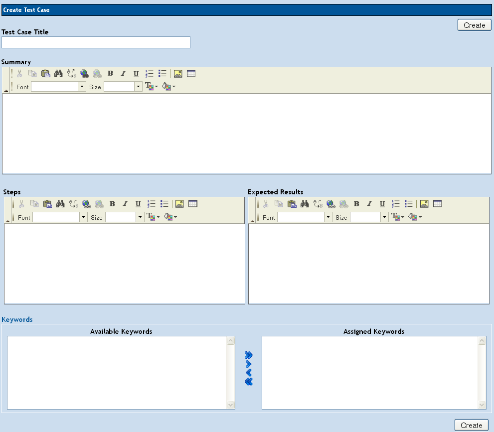

Figure 2.4.e — Test case creation with TestLink

1. "Title" is also mandatory here.
2. "Summary" allows one to add any useful information about the test case (including execution details, preparation, etc.).
3. "Steps" allows one to describe the execution steps.
4. "Expected results" allows one to describe the expected results related to the execution steps.
5. "Available keywords" contains a list of keywords that can be associated with a test case to facilitate classification and search for test cases. This is another variation on the idea of "Modules" and "Sub-modules" (some systems implement both mechanisms).
6. "Assigned keywords" contains a list of keywords associated with the test case.

As you can see, test case management tools can also be quite minimalistic.

TestRail$^{297}$

Add Test Case

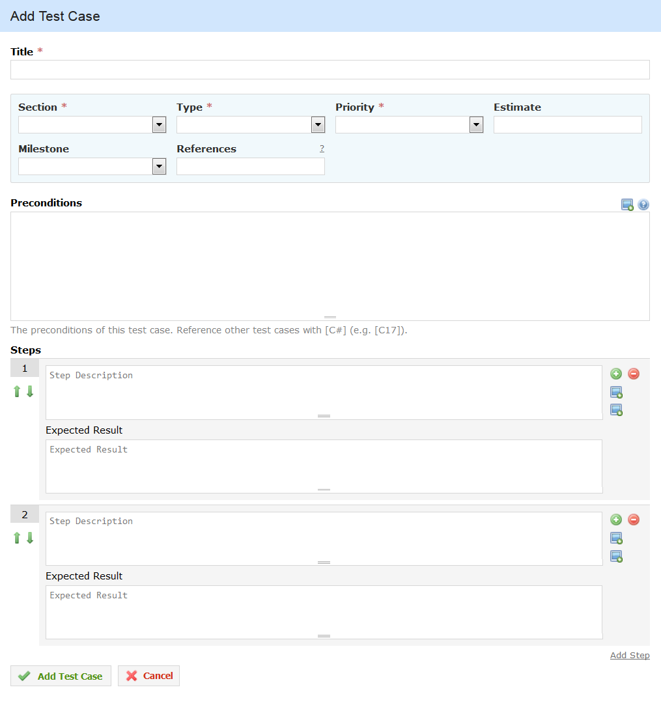

Figure 2.4.f — Test case creation with TestRail

1. "Title" is also mandatory here.
2. "Section" is another variation on the "Module" and "Sub-module" topic, allowing the creation of a hierarchy of sections in which test cases can be placed.
3. "Type" offers the following options by default: automated, functionality, performance, regression, usability, other.
4. "Priority" is represented here by numbers with the following verbal descriptions: must test, test if time, don't test.
5. "Estimate" provides an estimate of the time needed to complete the test case.
6. "Milestone" allows one to specify the key point in the project by which this test case should consistently show a positive result (i.e., to be executed successfully).

7. "References" allows one to store references to artefacts such as requirements, user stories, defect reports and other documents (this requires additional configuration).
8. "Preconditions" is a classic description of the preconditions and necessary preparations for a test case.
9. "Step description" allows one to add a description of each individual step in a test case.
10. "Expected results" allows one to describe the expected results for each step.

 **Task 2.4.c:** study 3–5 more test case management tools, read their documentation, create some test cases with them.

### 2.4.5. Good test case properties

Even a properly designed test case can be of poor quality if one of the following properties is defective.

**Proper technical language, accuracy and uniformity of wording.** This property applies equally to requirements, test cases, defect reports — any documentation. The basic ideas have already been described (see "Test case attributes"\(117\) chapter), and of the most general and important, let us remind and add:

* write briefly but clearly;
* be sure to use the exact labels and technically correct names of the application elements;
* do not explain the basics of computer use (assume that your colleagues know what a "menu item" is and how to use it, for example);
* name the same things the same way everywhere (e.g., you can't name some application state "graphical representation" in one test case and "visual display" in another, because many people might think those are different things);
* follow the project's standard for writing test cases (sometimes these standards can be very strict, going as far as stipulating which item names should be in double quotes and which should be in single quotes).

**Balance between specificity and generality.** The more specific a test case is, the more detailed it is about specific actions, specific values, etc., i.e., the more precise it is. Correspondingly, a test case is considered more general the less specific it is.

Let's consider the "steps" and "expected results" fields of the two test cases (think about which test case you would consider good and which you would consider bad and why):

Test Case 1:

| Steps | Expected Results |
| :--- | :--- |
| **Conversion from all supported encodings**<br>Preparations:<br>* Create the following folders: C:/A, C:/B, C:/C, C:/D.<br>* Place the 1.html, 2.txt, 3.md files from the attached archive in the C:/D folder.<br>1. Start the application by running the "php converter.php c:/a c:/b c:/c/converter.log" command.<br>2. Copy 1.html, 2.txt, 3.md files from the C:/D folder to the C:/A folder.<br>3. Stop the application by executing Ctrl+C command. | 1. The application console log is displayed with the message "current_time started, source dir c:/a, destination dir c:/b, log file c:/c/converter.log", the converter.log file appears (in the C:/C folder), in that log file the entry "current_time started, source dir c:/a, destination dir c:/b, log file c:/c/converter.log" appears.<br>2. 1.html, 2.txt, 3.md files appear in C:/A folder, then disappear from there and appear in C:/B folder. In the console log and in the C:/C/converter.log file the messages (entries) "current_time processing 1.html (KOI8-R)", "current_time processing 2.txt (CP-1251)", "current_time processing 3.md (CP-866)" appear.<br>3. The "current_time closed" message appears in the C:/C/converter.log file. The application is shut down. |

Test Case 2:

| Steps | Expected Results |
| :--- | :--- |
| **Conversion from all supported encodings**<br>1. Convert three files of acceptable size of three different encodings of all three acceptable formats. | 1. The files are moved to the destination folder and all files are encoded to UTF-8. |

If we return to the question "which test case would you consider good and which would you consider bad and why", the answer is that both test cases are bad because the first is too specific and the second too general. It could be said that the ideas of low-level^[113] and high-level^[113] test cases have been taken to the point of absurdity here.

Why excessive specificity is bad (test case 1):
* when a test case is repeated, the same actions will always be performed with exactly the same data, making it less likely that an error will be detected;
* the time required to write, revise or even just read the test case increases;
* in the case of trivial actions, experienced professionals spend extra thinking resources trying to understand what they have overlooked, because they are used to describing only the most complex and non-obvious situations in this way.

Why excessive generality is bad (test case 2):
* the test case is difficult for beginning testers, or even for experienced testers who have only recently joined a project;
* unscrupulous team members tend to be negligent about such test cases;
* the tester executing the test case may understand it differently than it was intended by the author (and end up executing actually a different test case).

The way out of this situation is to stick to the “golden mean” (although of course some tests will be a little more specific, some a little more general). Here is an example of this “golden mean” approach:

Test Case 3:

| Steps | Expected Results |
| :--- | :--- |
| **Conversion from all supported encodings**<br>Preparations:<br>* Create four separate folders in the root of any drive for input files, output files, log files and temporary storage of test files.<br>* Extract the contents of the attached archive to a folder for temporary storage of test files.<br>1. Start the application with the relevant paths from the test preparation in the parameters (the name of the log file is arbitrary).<br>2. Copy the files from the temporary storage folder to the input folder.<br>3. Stop the application. | 1. The application starts and displays a start-up message in the console and a log file.<br>2. Files in the input folder are moved to the output folder and the console and log file show conversion messages for each of the files, indicating their original encoding.<br>3. The app displays a shutdown message in the log file and terminates. |

This test case has everything you need to understand and execute it, but it is shorter and easier to execute, and the lack of strictly defined values means that when a test case is repeatedly executed (especially by different testers), specific parameters will change their values, which increases the chance of detecting a defect.

Once again, the main point: the specificity or generality of a test case itself is not a bad thing, but a sharp bias in one direction or another reduces the quality of the test case.

**Balance between simplicity and complexity.** There are no academic definitions here, but it is generally accepted that a simple test case operates with a single object (or in which the main object is clearly visible) and contains a few trivial actions; a complex test case operates with several equal objects and contains many non-trivial actions.

* Advantages of simple test cases:
  * they can be read quickly, easily understood and executed;
  * they are understandable to beginning testers and new people in the project;
  * they make the error evident (they usually involve the performance of everyday trivial actions, problems with which can be seen with the naked eye and are not debatable);
  * they simplify the initial diagnostics of the problem, because they narrow down the search.

* Advantages of complex test cases:
  * when many objects interact, there is an increased likelihood of an error occurring;
  * users tend to use complex scenarios, and therefore complex tests emulate users’ work more fully;
  * developers rarely check such complex cases (and they are absolutely not obliged to do so).

Let’s take a look at examples.

Too simple test case:

| Steps | Expected Results |
| :--- | :--- |
| **Starting the application** | 1. The application starts up. |
| 1. Start the application. | |

Too complex test case:

| Steps | Expected Results |
| :--- | :--- |
| **Reconversion**<br>Preparations:<br>• Create three separate folders in the root of any drive for input files, output files, log files.<br>• Prepare a set of several files of the maximum supported size of supported formats with supported encodings, as well as several files of an acceptable size but of an unsupported format. | 2. Files are gradually moved from the input folder to the output folder and messages indicating successful conversion appear in the console and in the log file.<br>3. Files are gradually moved from the input folder to the output folder and messages indicating successful conversion appear in the console and in the log file. |
| 1. Start the application with the relevant paths from the test preparation in the parameters (the name of the log file is arbitrary).<br>2. Copy several files of acceptable format into the input folder.<br>3. Move the converted files from the output folder to the input folder.<br>4. Move the converted files from the output folder to the folder with set of files for the test.<br>5. Move all files from the folder with set of files for the test to the input folder.<br>6. Move the converted files from the output folder to the input folder. | 5. Files are gradually moved from the input folder to the output folder, messages indicating successful conversion of files in an acceptable format and messages indicating that invalid files are ignored appear in the console and in the log file.<br>6. Files are gradually moved from the input folder to the output folder, messages indicating successful conversion of files in an acceptable format and messages indicating that invalid files are ignored appear in the console and in the log file. |

This test case is both too complex in its redundancy of actions and in its specification of redundant data and operations.

 **Task 2.4.d:** rewrite this test case, eliminating its shortcomings but retaining the overall objective (checking that previously converted files are reconverted).

An example of a good simple test case is Test Case $3^{[129]}$ from the point about specificity and generality.

An example of a good complex test case might look like this:

| Steps | Expected Results |
| :--- | :--- |
| **Multiple copies of the application, file operations conflict**<br>Preparations:<br><ul><li>Create three separate folders in the root of any drive for input files, output files, log files.</li><li>Prepare a set of several files of the maximum supported file sizes of supported formats with supported encodings.</li></ul>1. Run the first copy of the application, specifying in the parameters the relevant paths from the test preparation (log file name is arbitrary).<br>2. Run a second copy of the application with the same parameters (see step 1).<br>3. Run a third copy of the application with the same parameters (see step 1).<br>4. Change the process priority of the second ("high") and third ("low") copies.<br>5. Copy the prepared set of input files into the folder for the input files. | 3. All three application copies are started and three application start-up records consecutively appear in the log file.<br><br>5. The files are gradually moved from the input folder to the output folder, the console and log file display messages indicating successful conversion, and (possibly) messages such as:<br>a. “source file inaccessible, retrying”.<br>b. “destination file inaccessible, retrying”.<br>c. “log file inaccessible, retrying”.<br><br>A key indicator of correct operation is that all files have been successfully converted, and that the console and log file show that each file has been successfully converted (one to three entries per file).<br><br>Warning messages about the unavailability of an input file, output file or log file are also an indication that the application is working correctly, but their number depends on many external factors and cannot be predicted in advance. |

Sometimes more complex test cases are also more specific, but this is only a general trend, not a law. It is also impossible to judge uniquely by the complexity of a test case about its priority (in our example of a good complex test case it will obviously have a very low priority because the situation it tests is artificial and highly improbable, but there are complex tests with the highest priority).

As with specificity and generality, simplicity or complexity of test cases is not a bad thing in itself (in fact, it is recommended to start with simple test cases and then progress to more and more complex ones), but excessive simplicity and excessive complexity also reduce the quality of the test case.

**“Indicativeness” (high probability of detecting an error)**. Starting at the critical path functional testing level $^{[77]}$, it can be stated that the better a test case is, the more demonstrative it is (the more likely it is to detect an error). This is why we consider too simple test cases unsuitable — they are not indicative.

An example of not indicative (bad) test case:

| Steps | Expected Results |
| :--- | :--- |
| **Starting and stopping an application**<br>1. Start the application with the correct parameters.<br>2. Terminate the application. | 1. The application starts up.<br>2. The application terminates. |

An example of indicative (good) test case:

| Steps | Expected Results |
| :--- | :--- |
| **Starting with incorrect parameters, non-existing paths**<br>1. Run the application with all three parameters (`SOURCE_DIR`, `DESTINATION_DIR`, `LOG_FILE_NAME`), whose values refer to non-existent paths in the file system (for example: `z:\src\`, `z:\dst\`, `z:\log.txt` assuming the system has no logical drive "z:"). | 1. The following messages are displayed in the console and the application is terminated<br>Messages:<br>&nbsp;&nbsp;&nbsp;&nbsp;a. Usage message.<br>&nbsp;&nbsp;&nbsp;&nbsp;b. `SOURCE_DIR [z:\src]`: directory not exists or inaccessible.<br>&nbsp;&nbsp;&nbsp;&nbsp;c. `DESTINATION_DIR [z:\dst]`: directory not exists or inaccessible.<br>&nbsp;&nbsp;&nbsp;&nbsp;d. `LOG_FILE_NAME [z:\log.txt]`: wrong file name or inaccessible path. |

Note that the indicative test case is still fairly simple, but it tests a situation where an error is incomparably more likely to occur than in the situation described by a bad (not indicative) test case.

It can also be said that indicative test cases often perform some “interesting actions”, i.e. actions which are unlikely to be performed simply in the process of working with the application (e.g.: “save file” is a trivial action, which will obviously be performed more than a hundred times, even by the developers themselves, but “save file to a write-protected drive”, “save file to a drive with insufficient free space”, “save file to a folder that cannot be accessed” are much more interesting and non-trivial actions).

**Consistency of purpose.** The essence of this property is that all actions in a test case are aimed at following a single logic and achieving a single goal, and do not contain any deviations.

The many examples of good test cases presented in this chapter are good examples of how to implement this property correctly. And an infringement might look like this:

| Steps | Expected Results |
| :--- | :--- |
| **Conversion from all supported encodings**<br>Preparations:<br>• Create four separate folders in the root of any drive for input files, output files, log files and temporary storage of test files.<br>• Extract the contents of the attached archive to a folder for temporary storage of test files.<br>1. Start the application with the relevant paths from the test preparation in the parameters (the name of the log file is arbitrary).<br>2. Copy the files from the temporary storage folder to the input folder.<br><span style="color:red">3. Stop the application.</span><br><span style="color:red">4. Delete the log file.</span><br><span style="color:red">5. Restart the application with the same parameters.</span><br>6. Stop the application. | 1. The application starts and displays a start-up message in the console and a log file.<br>2. Files in the input folder are moved to the output folder and the console and log file show conversion messages for each of the files, indicating their original encoding.<br><span style="color:red">3. The app displays a shutdown message in the log file and terminates.</span><br><span style="color:red">5. The application starts and displays a start-up message in the console and a newly created log file.</span><br>6. The application displays a completion message in the log file and terminates. |

Steps 3–5 are not in any way relevant to the purpose of the test case, which is to verify that the conversion of input data provided in all supported encodings is correct.

**Absence of redundant actions.** Usually, this property implies that there is no need for a long, point-by-point description of what can be replaced by a single phrase in the steps of a test case:

| Bad | Good |
| :--- | :--- |
| 1. Specify as the first application parameter the path to the source folder.<br>2. Specify as the second application parameter the path to the destination folder.<br>3. Specify as the third application parameter the path to the log file.<br>4. Start the application. | 1. Start the application with all three correct parameters (e.g., `c:\src\`, `c:\dst\`, `c:\log.txt` provided the corresponding folders exist and are accessible to the application). |

The second most common mistake is to start each test case by launching the application and describing in detail how to bring it to one state or another. In our examples, we consider each test case as existing in a single form in an isolated environment, and therefore we have to consciously make this mistake (otherwise the test case will be incomplete), but in real life, there will be specific tests for launching an application, and a long path of many actions can be described as one action whose context makes it clear how to perform that action.

The following test case example does not relate to our "File Converter", but illustrates the point very well:

| Bad | Good |
| :--- | :--- |
| 1. Start the application.<br>2. Select "File" from the menu.<br>3. Select "Open".<br>4. Go to the folder containing at least one DOCX file with three or more pages. | 1. Open a DOCX file with three or more pages. |

This also includes the mistake of repeating the same preparations in multiple test cases (yes, for the reasons described above, in the examples we are again forced to do things that should not be done in life). It is much more convenient to combine the tests into a suite\textsuperscript{{137}} and specify the preparations once, underlining whether or not they should be done before each test case in the suite.


**Non-redundancy in relation to other test cases.** In the process of creating multiple test cases, it is very easy to find yourself in a situation where two or more test cases actually perform the same tests, pursue the same goals, and search for the same problems. A way to minimize the number of such test cases is described in detail in "Software testing classification"\textsuperscript{{65}} chapter (see testing techniques such as using equivalence classes\textsuperscript{{92}} and border conditions\textsuperscript{{92}}).

If you find several test cases duplicating each other's tasks, it is best to either delete all but one of the most indicative test cases, or refine this selected most indicative test case on their basis before deleting the others.

\textsuperscript{298} **Unit testing (component testing).** The testing of individual software components. [ISTQB Glossary]

Good test case properties

**Demonstrativeness (the ability to demonstrate a detected error in an obvious way).** The expected results should be selected and formulated in such a way that any deviation from them is immediately apparent and it becomes obvious that an error has occurred. Compare extracts from two test cases.

Extract from the non-demonstrative test case:

| Steps | Expected Results |
| :--- | :--- |
| 5. Place the text “Example of a long text containing mixed Russian and English characters.” in the KOI8-R encoding (in the word “Example” the letter “p” is Russian). | 6. Application ignores the file.<br>7. Text becomes correct in UTF-8 encoding, including Russian letters. |
| 6. Save the file as “test. txt” and send the file for conversion. | |
| 7. Rename the file to “test.txt”. | |

Extract from the demonstrative test case:

| Steps | Expected Results |
| :--- | :--- |
| 5. Place the text “Ё╦╨╙╟ ╨╦╘╦╜╙.” (These characters represent the word-combination “Пример текста.” in Russian in KOI8-R, read as CP866). | 6. The text changes to: “Пример текста.” (UTF8 encoding). |
| 6. Send the file for conversion. | |

In the first case, the test case is not only bad because of the vague wording “correct UTF-8 encoding including Russian letters”, it is also very easy to make mistakes when executing:
* forget to manually convert the input text to KOI8-R;
* fail to notice that the first time the extension starts with a space;
* forget to replace the “p” in “Example” with the Russian letter;
* because of the vagueness of the wording of the expected outcome, it is possible to mistake erroneous but plausible behavior for correct behavior.

The second test case is clearly focused on its purpose of testing the conversion (without the weird check to ignore a file with an invalid extension) and is described in such a way that its execution is straightforward, and any deviation of the actual result from the expected one will be immediately noticeable.

**Traceability.** It should be clear from the information contained in the good test case which part of the application, which functions and which requirements it tests. This is partly achieved by filling in the relevant fields of the test case$^{(117)}$ (“Reference to requirement”, “Module”, “Sub-module”), but also the logic of the test case itself plays a significant role, because in the case of serious violations of this feature one may wonder for a long time which requirement the test case refers to and try to understand how they relate to each other.

Example of an untraceable test case:

| Requir-ement | Module | Sub-module | Steps | Expected results |
| :--- | :--- | :--- | :--- | :--- |
| UR-4 | Applica-tion | | **Encoding combination**<br>Preparations: file with several supported and unsupported encodings.<br>1. Send the file for conversion. | 1. The supported encodings are converted correctly, the unsupported ones remain unchanged. |

Yes, this test case is bad in itself (in a good test case it is difficult to get an untraceable situation), but it also has specific shortcomings that make traceability difficult:
* Reference to a non-existing requirement (see for yourself, there is no UR-4 requirement $^{(57)}$).
* The "Module" field says "Application" (basically, you could have left it blank, it would have been just as informative), the "Sub-module" field is empty.
* The title and steps suggest that this test case is closest to DS-5.1 and DS-5.3, but the formulated expected result does not follow explicitly from these requirements.

Example of a traceable test case:

| Requirement | Module | Sub-module | Steps | Expected results |
| :--- | :--- | :--- | :--- | :--- |
| DS-2.4,<br>DS-3.2 | Starter | Error handler | **Start-up with incorrect parameters, non-existing paths**<br>1. Run the application with all three parameters whose values indicate non-existing paths in the file system. | 1. The following messages are displayed in the console and the application is terminated. Messages:<br>&nbsp;&nbsp;&nbsp;&nbsp;a. SOURCE_DIR [path]: directory not exists or inaccessible.<br>&nbsp;&nbsp;&nbsp;&nbsp;b. DESTINATION_DIR [path]: directory not exists or inaccessible.<br>&nbsp;&nbsp;&nbsp;&nbsp;c. LOG_FILE_NAME [name]: wrong file name or inaccessible path. |

One would think that this test case would cover the DS-2 and DS-3 as a whole, but the "Requirement" field is quite specific, and the specified module, sub-module and the logic of the test case itself remove any remaining doubts.

Some authors also emphasize that the traceability of a test case is related to its non-redundancy $^{(133)}$ in relation to other test cases (it is much easier to refer to one unique test case than to choose from several very similar ones).

**Reusability.** This property is rarely fulfilled for low-level test cases $^{(113)}$, but when creating high-level test cases $^{(113)}$ it is possible to achieve formulations such that:
* the test case will be usable with different settings of the application under test and in different test environments;
* the test case can be used almost without change to test similar functionality in other projects or other areas of the application.

An example of a test case that is hard to reuse would be almost any test case with high specificity.

The following test case is not the most ideal, but a very clear example of a test case that can easily be used in different projects:

| Steps | Expected Results |
| :--- | :--- |
| **Start-up, all parameters are incorrect**<br>1. Run the application with all parameters set to intentionally invalid values. | 1. The application starts, then displays a message describing the nature of the problem with each of the parameters and terminates. |

**Repeatability.** The test case should be formulated in such a way that it shows the same results when repeated many times. This property can be divided into two sub-items:
* firstly, even general wording that allows for different ways of doing a test case should outline appropriate explicit boundaries (e.g.: “enter a number” is bad, “enter an integer between -273 and +500 inclusive” is good);
* test case actions (steps) should, as far as possible, not lead to irreversible (or hardly reversible) consequences (e.g.: deletion of data, disruption of the environment, etc.) — we should not include such “disruptive actions” unless they are explicitly dictated by the test case objective; if the test case objective obliges us to perform such actions, the test case should describe actions to restore the original application (data, environment).

**Compliance with accepted layout patterns and traditions.** There is usually no problem with layout templates: they are strictly defined by an existing template or generally by the on-screen form of the test case management tool. As for traditions, they differ even between teams in the same company and there is no other advice than “read ready-made test cases before you write your own”.

We will omit individual examples here, as there are already many correctly designed test cases above, and as for violations of this feature, they are described directly or indirectly in “Typical mistakes in writing checklists, test cases and test suites” $^({149})$ chapter.

## 2.4.6. Test suites

### Terminology and general information

| | |
| --- | --- |
|  | **Test case suite**$^{299}$ (test suite, test set) is a suite of test cases selected with some common purpose or by some common feature. Sometimes the results of completion of one test case in such a suite become the initial application state for the next test case. |
|  | Attention! Due to the peculiarities of interpretation, it is very common to say "test suite" instead of "test scenario". Technically, this can be considered a mistake, but it has become so widespread that it has become a variant of the norm. |

As we have just seen with many individual test cases, it is extremely inconvenient (indeed, it is a mistake!) to write the same preparations and repeat the same initial steps in each test case every time.

It is much more convenient to combine several test cases into a suite or sequence. This is where we come to the classification of test suites.

In general, test suites can be divided into free (the order in which the test cases are executed is not important) and linked (the order in which the test cases are executed is important).

* Advantages of free suites:
  * test cases can be run in any order you like, and you can also create "suites within suites";
  * if a test case fails, this will not affect the ability to execute other test cases.
* Advantages of linked suites:
  * each subsequent test case in the suite takes the result of the previous test case as the input state, which greatly reduces the number of steps in individual test cases;
  * long sequences of actions are much better at simulating the work of real users than single impacts on the application.

### User scenarios (use scenarios)

| | |
| --- | --- |
|  | We are NOT talking about use cases, which are a form of requirements$^{(38)}$. User scenarios as a testing technique are far less formalized, although they can be built on a use case basis. |

A separate subset of linked test suites (or even raw test case ideas, such as checklist items) can include user scenarios$^{300}$ (or use scenarios), which are a chain of actions performed by a user in a certain situation to achieve a certain goal.

Let's first explain this with an example, not related to the "File Converter". Suppose a user wants to print a sign on the office door that says "Work in progress, no knocking!" To do this the user has to:

1) Run a text editor.
2) Create a new document (*if the text editor does not do it by itself*).
3) Type text in the document.
4) Format the text properly.
5) Print the document.

---

$^{299}$ **Test case suite (test suite, test set).** A set of several test cases for a component or system under test, where the post condition of one test is often used as the precondition for the next one. [ISTQB Glossary]  
$^{300}$ A scenario is a hypothetical story, used to help a person think through a complex problem or system. [Cem Kaner, “An Introduction to Scenario Testing”, http://www.kaner.com/pdfs/ScenarioIntroVer4.pdf]

6) Save the document (*debatable, but acceptable*).
7) Close the text editor.

Here we have a user scenario, the items of which can become the basis for the steps of a test case or a suite of individual test cases.

Scenarios can be quite long and complex, and may contain loops and conditional branching, but they still have some very interesting advantages:

* Scenarios show real and understandable examples of how to use the product (as opposed to extensive checklists where the meaning of individual points can get lost).
* The scenarios are clear to end users and are well suited to discussion and improvement.
* Scenarios and parts of scenarios are easier to assess in terms of priority than individual items of (especially low-level) requirements.
* Scenarios are great at showing requirements' shortcomings (if it becomes unclear what to do at a particular point in a scenario — there is clearly something wrong with the requirements).
* In the extreme case (lack of time and other force majeure), scenarios may not even be written out in detail, but simply named — and the name itself will tell an experienced professional what to do.

Let's illustrate this last point with an example. Let's classify the potential users of our application (recall that in our case the “user” is the administrator who configures the application) by skill level and tendency to experiment, and then give each “type of user” a memorable name.

Table 2.4.a — User classification

| | Low qualification | High qualification |
| :--- | :--- | :--- |
| **Not prone to experiments** | “Cautious” | “Conservative” |
| **Prone to experiments** | “Desperate” | “Sophisticated” |

Agree that already at this stage it is not difficult to imagine differences in the logic of working with an application between, for example, “conservative” and “desperate” users.

But we will go further and give a title for the scenarios themselves, e.g., in situations where such a user has a positive and negative attitude towards the idea of our application usage:

Table 2.4.b — Behavioral scenarios based on user classification

| | “Cautious” | “Conservative” | “Desperate” | “Sophisticated” |
| :--- | :--- | :--- | :--- | :--- |
| **Positively** | “Can I do like this?” | “Let's start with a manual!” | “Look what I came up with!” | “I'm optimizing everything!” |
| **Negatively** | “I don't understand anything.” | “You have a discrepancy here...” | “I'll break it anyway!” | “I told you so!” |

With a little creativity, you can imagine what will happen in each of the eight situations. It takes only a few minutes to create a couple of such tables, and the effect they produce is orders of magnitude greater than mindlessly “clicking the buttons in the hope of finding a bug”.

 For a much more comprehensive and technical explanation of what scenario testing is, how to use it and how to do it properly, see Sam Kaner's article “An Introduction to Scenario Testing”$^{301}$.

---
$^{301}$ “An Introduction to Scenario Testing”, Cem Kaner [http://www.kaner.com/pdfs/ScenarioIntroVer4.pdf]

## Detailed classification of test suites

> It is difficult to categorize the material presented here as "beginner's material" (and you can skip straight to "Principles for building a test suite"$^{(141)}$). But if you are more curious, take a look at the detailed classification below.

A detailed classification of test suites can be expressed in the following table.

Table 2.4.c — Detailed classification of test suites

| | | By isolation of test cases from each other |
| :---: | :---: | :--- | :--- |
| **On the formation of a strict sequence of test cases** | **Free** | Free isolated | Free generalized |
| **Linked** | Linked isolated | Linked generalized |

* A free isolated test suite (figure 2.4.g): the steps in the "preparations" section must be repeated before each test case, and the test cases themselves can be performed in any order.
* A free generalized test suite (figure 2.4.h): the steps in the "preparations" section need to be done once (and then you just do the test cases), and the test cases themselves can be done in any order.
* A linked isolated test suite (figure 2.4.i): the steps in the "preparations" section must be repeated before each test case, and the test cases themselves must be carried out in a strictly defined order.
* A linked generalized test suite (figure 2.4.j): the steps in the "preparations" section need to be done once (and then just do the test cases), and the test cases themselves need to be done in a strictly defined order.

The main advantage of isolation is that each test case is run in a "clean environment" and is not affected by the results of previous test cases.

The main advantage of generalization: preparations do not have to be repeated (saving time).

The main advantage of a linked approach is the tangible reduction of steps in each test case, as the result of the previous test case is the starting situation for the next one.

The main advantage of a free approach is the ability to execute test cases in any order, and the fact that if a test case fails (the application did not reach the expected state), the remaining test cases can still be executed.


Figure 2.4.g — A free isolated test suite

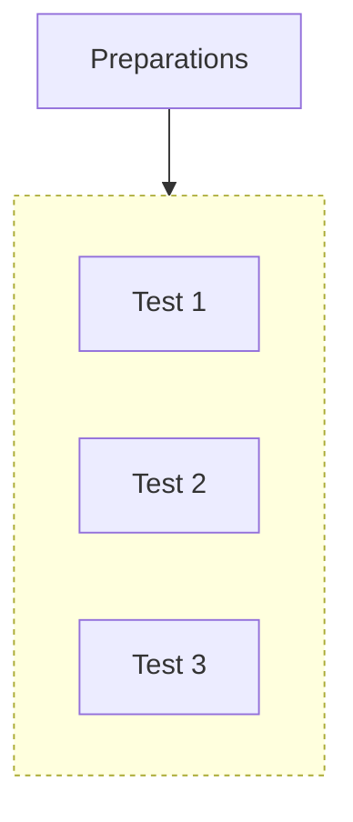
```mermaid
graph TD
    Prep1["Preparations"] --> Sub1[" "]
    subgraph Sub1 [" "]
        Test1["Test 1"]
        Test2["Test 2"]
        Test3["Test 3"]
    end

    style Sub1 stroke-dasharray: 3 3
```

Figure 2.4.h — A free generalized test suite

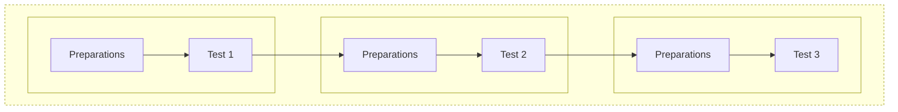
```mermaid
graph TD
    subgraph Sub2 [" "]
        subgraph Box1 [" "]
            P1["Preparations"]
            T1["Test 1"]
        end
        P1 --> T1
        T1 --> P2["Preparations"]
        subgraph Box2 [" "]
            P2
            T2["Test 2"]
        end
        P2 --> T2
        T2 --> P3["Preparations"]
        subgraph Box3 [" "]
            P3
            T3["Test 3"]
        end
        P3 --> T3
    end

    style Sub2 stroke-dasharray: 3 3
```

Figure 2.4.i — A linked isolated test suite

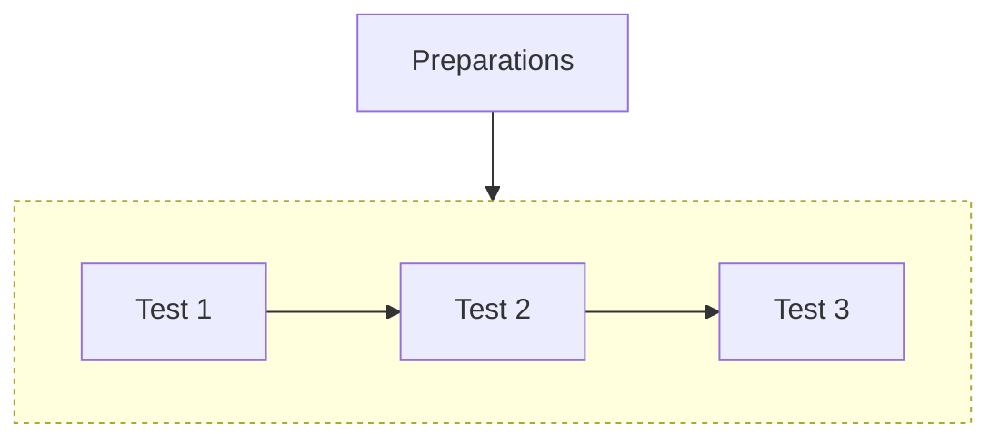
```mermaid
graph TD
    Prep2["Preparations"] --> Sub3[" "]
    subgraph Sub3 [" "]
        Test4["Test 1"] --> Test5["Test 2"]
        Test5 --> Test6["Test 3"]
    end

    style Sub3 stroke-dasharray: 3 3
```

Figure 2.4.j — A linked generalized test suite

## Principles for building a test suite

Now for the most important part: how to form test suites. The correct answer is very short: logically. And this is no joke. The only purpose of test suites is to increase testing efficiency through speeding up and simplifying test cases, increasing the depth of study of some application area or functionality, following typical user scenarios$^{(137)}$ or convenient sequencing of test cases, etc.

A test suite is always created for a purpose, based on some kind of logic, and by the same principles, tests with suitable properties are included in the suite.

As for the most typical approaches to compiling a test case set, the following can be identified:

* Based on checklists. Look closely at the examples of checklists$^{(109)}$ we have developed in the relevant section$^{(108)}$: each checklist item can turn into several test cases — and here we have a ready-made suite.
* Based on the division of the application into modules and submodules$^{(118)}$. For each module (or its individual submodules) a different test suite can be created.
* Based on the principle of checking the most important, less important and all other functions of the application (this is the principle we used to compile sample checklists$^{(109)}$).
* By grouping test cases to test a certain level or type of requirement$^{(38)}$, a group of requirements or an individual requirement.
* Based on the frequency of test cases detecting defects in the application (e.g., we see that some test cases fail time after time, so we can combine them into a suite, conventionally called "application problem areas").
* By architectural principle (see “multi-tier architecture”$^{(147)}$ yourself): suites for testing the user interface and the entire presentation level, for testing the business logic level, for testing the data level.
* By area of internal application operation, e.g.: “test cases involving database work”, “test cases involving file system work”, “test cases involving network work”, etc.
* By type of testing (see “Detailed testing classification”$^{(67)}$ chapter).

There is no need to memorize this list. These are just examples — bluntly speaking, “the first thing that comes to mind”. The important principle is that if you see that combining some test cases in a suite will benefit you, create such a suite.

Note: without good test case management tools, it is extremely difficult to work with test case suites, because you have to keep track of preparations, “missing steps”, isolation or generality, free/linked approach, etc.

## 2.4.7. The logic for creating effective checks

Now that we have looked at the principles of creating checklists\textsuperscript{(108)} and test cases\textsuperscript{(117)}, the properties of good test cases\textsuperscript{(128)}, and the principles of combining test cases into suites\textsuperscript{(141)}, it's time to get to the tricky part, the "philosophical" part, in which we will talk not about what and how to write, but about how to think.

It has already been said before: if a test case has no input data, execution conditions and expected results, and/or the goal of the test case is not clear, it is a bad test case. And this is where the **goal** is paramount. If we are clear about what we are doing and why, we are either quick to find all the other missing information, or equally quick to formulate the right questions and address them to the right people.

The whole point of a tester's work is ultimately to improve quality (of processes, products, etc.). But what is quality? Yes, there is a short official definition\textsuperscript{302}, but even it talks about "user/customer needs and expectations".

This is where the main idea comes in: **quality is a certain value for the end user (customer)**. A person pays for the use of a product anyway — with money, their time, some effort (even if you don't receive this "payment", the person quite rightly believes that they've already spent something on you, and they're right). But does the person get what they expect (assuming that their expectations are reasonable and realistic)?

If we approach testing formally, we risk getting a product which looks perfect according to documents (metrics, etc.), but which nobody needs in reality.

As almost any modern software product is not a simple system, among the wide variety of its features and functions there are objectively the most important, less important and completely insignificant to users.

If testers concentrate their efforts on the first and second categories (the most important and slightly less important), our chances of creating an application, satisfying the customer, increase dramatically.

* There's a simple logic:
* Test cases help us to find defects.
* But it's impossible to find ALL defects.
* So, we have to find as many IMPORTANT defects as we may with the time available.

By important errors we mean here those that result in the failure of functions or product features that are important to the user. Functions and features are not separated by chance — safety, performance, usability, etc. are not functions, but play an equally important role in shaping customer and end-user satisfaction.

The situation is exacerbated by the following facts:
* for many economic and technical reasons, we cannot do "all the tests we can think of" (and do them repeatedly) — we have to choose carefully what and how we test, bearing in mind the idea just mentioned: quality is a value for the end user (customer);
* there will never be a "perfect and flawless set of requirements" in real life (no matter how hard we try) — there will always be a certain number of flaws and this too must be taken into account.

However, there is a fairly simple algorithm that allows one to create effective tests even in such circumstances. When thinking about a checklist, test case or test suite, ask yourself the following questions and get clear answers:
* "What is this?" If you don't understand what you have to test, you won't get any further than mindless formal checks.

---
\textsuperscript{302} **Quality.** The degree to which a component, system or process meets specified requirements and/or user/customer needs and expectations. [ISTQB Glossary]

The logic for creating effective checks

* "Who needs it and what for (and how important is it)?" The answer to this question will allow you to quickly come up with some typical user scenarios^{\{137\}} for what you are about to test.
* "What is the usage process?" It is already a scenario detail and a source of ideas for positive testing^{\{80\}} (these are conveniently described as a checklist).
* "How can something go wrong?" This also details usage scenarios, but already in the context of negative testing^{\{80\}} (these too can be conveniently described as a checklist).

This algorithm can be supplemented by a small list of other universal guidelines to help you do testing better:

* Start testing as early as possible — as soon as the first requirements appear, you can start testing and improving them, you can write checklists and test cases, you can refine the test plan, prepare the test environment, etc.
* If you have something large and complex to test, break it down into modules and sub-modules, use functional decomposition^{303} — i.e., achieve a level of detail at which you can easily keep all the information about the object under test in mind.
* Be sure to write checklists. If you think you can memorize all the ideas and then easily reproduce them, you are wrong. There are no exceptions.
* As you create checklists, test cases, etc., put the questions that arise directly into the text. When enough questions have accumulated, collect them separately, specify the wording and contact someone who can answer them.
* If the tool you are using allows you to use cosmetic text layout, do so (it makes the text easier to read), but try to follow the conventions and not paint every other word a different color, font, size, etc.
* Use peer review techniques^{\{49\}} to get feedback from colleagues and improve the document you have created.
* Plan for time to improve test cases (to fix defects, to refine as requirements change, etc.)
* Start with simple positive tests for the most important functionality. Then gradually increase the complexity of tests, keeping in mind not only positive^{\{80\}}, but also negative^{\{80\}} tests.
* Remember that the heart of testing is the **goal**. If you cannot quickly and simply define the goal of the test case you have created, you have created a bad test case.
* Avoid redundant, overlapping test cases. The techniques of equivalence classes^{\{92\}}, border conditions^{\{92\}}, domain testing^{\{93\}} help to eliminate such test cases.
* If the test case “Indicativeness”^{\{131\}} can be increased without greatly changing its complexity or deviating from the original objective, do so.
* Remember that far too many test cases require separate preparation, which should be described in the relevant field of the test case.
* Several positive test cases^{\{80\}} can safely be combined, but combining negative test cases^{\{80\}} is almost always forbidden.
* Think about how you can optimize the test case (test suite, etc.) you have created in a way that reduces the workload associated with it.
* Before submitting the final version of the document you have created, reread what you have written (in at least half the cases you will find a typo or some other flaw).

 **Task 2.4.e:** supplement this list with ideas you have picked up from other books, articles, etc.

---
^{303} "Functional decomposition", Wikipedia [http://en.wikipedia.org/wiki/Functional_decomposition]

## The implementation of the logic for creating effective checks

Earlier we made a detailed checklist $^{(108)}$ to test our “File Converter” $^{(57)}$. Let’s look at it critically and think of what can be reduced, what will be sacrificed and what will be the gain.

Before we begin to optimize the checklist, it is important to note that the decision on what is important and what is not important should be made on the basis of a ranking of requirements by importance, and in agreement with the customer.

What is the MOST important thing to the user? What is the purpose of the application? To convert files. Given the fact that the application will be set up by a qualified technician, we can even “sideline” the application’s reaction to errors in the start-up and shut-down phases.

And in the first place comes the following:
* File processing, different formats, encodings and sizes:

Table 2.4.d — Formats, encodings and file sizes

| | | Input file formats | | |
| :--- | :---: | :---: | :---: | :---: |
| | | TXT | HTML | MD |
| **Input files encodings** | WIN1251 | 100 KB | 50 MB | 10 MB |
| | CP866 | 10 MB | 100 KB | 50 MB |
| | KOI8R | 50 MB | 10 MB | 100 KB |
| | Any | 0 bytes | | |
| | Any | 50 MB + 1 B | 50 MB + 1 B | 50 MB + 1 M |
| | - | Any unsupported format | | |
| | Any | Supported format, damaged file | | |

Is there anything we can do to speed up these checks (because there are a lot of them)? We can. And we even have two complementary techniques:
* further classification by priority;
* test automation.

First, we divide the table into two, the slightly more important and the slightly less important.

The “slightly more important” includes:

Table 2.4.e — Formats, encodings and file sizes

| | | Input file formats | | |
| :--- | :---: | :---: | :---: | :---: |
| | | TXT | HTML | MD |
| **Input files encodings** | WIN1251 | 100 KB | 50 MB | 10 MB |
| | CP866 | 10 MB | 100 KB | 50 MB |
| | KOI8R | 50 MB | 10 MB | 100 KB |

*Let’s prepare 18 files — 9 source files + 9 converted (in any text editor with encoding conversion function) in order to compare the results of our application work with these references in the future.*

For the “slightly less important” remain:
* The file with 0 bytes size (objectively, the “encoding” characteristic is not important for it). *Prepare one file of 0 bytes size.*
* File size $50\text{ MB} + 1\text{ B}$ (encoding is not important for it either). *Prepare one file of size $52'428'801\text{ bytes}$.*

The logic for creating effective checks

* Any unsupported format:
  * By extension (a file with an extension other than .txt, .html, .md). *Take any arbitrary file, e.g., a picture (size from 1 to 50 MB, extension .jpg).*
  * By internal content (e.g. .jpg renamed to .txt). *Give the copy of the file from the previous point a .txt extension.*
* Supported format, damaged file. *Cross it out. At all. Even very sophisticated and expensive editors are not always able to recover corrupted files of their formats, while our application is just a miniature encoding conversion utility, and you should not expect it to have the capabilities of a professional data recovery tool.*

What did we end up with? We need to prepare the following 22 files (since the files have names anyway, let's strengthen this test data set by introducing Latin, Cyrillic and special characters in the file names).

Table 2.4.f — Final file set for testing the application

| № | Name | Encoding | Size |
| :---: | :--- | :--- | :--- |
| 1 | Small file in WIN1251.txt | WIN1251 | 100 KB |
| 2 | Medium file in CP866.txt | CP866 | 10 MB |
| 3 | Large file in KOI8R.txt | KOI8R | 50 MB |
| 4 | Large file in win-1251.html | WIN1251 | 50 MB |
| 5 | Small file in cp-866.html | CP866 | 100 KB |
| 6 | Medium file in koi8-r.html | KOI8R | 10 MB |
| 7 | Medium file in WIN_1251.md | WIN1251 | 10 MB |
| 8 | Large file in CP_866.md | CP866 | 50 MB |
| 9 | Small file in KOI8_R.md | KOI8R | 100 KB |
| 10 | Small benchmark WIN1251.txt | UTF8 | 100 KB |
| 11 | Medium benchmark CP866.txt | UTF8 | 10 MB |
| 12 | Large benchmark KOI8R.txt | UTF8 | 50 MB |
| 13 | Large benchmark in win-1251.html | UTF8 | 50 MB |
| 14 | Small benchmark in cp-866.html | UTF8 | 100 KB |
| 15 | Medium benchmark in koi8-r.html | UTF8 | 10 MB |
| 16 | Medium benchmark in WIN_1251.md | UTF8 | 10 MB |
| 17 | Large benchmark in CP_866.md | UTF8 | 50 MB |
| 18 | Small benchmark in KOI8_R.md | UTF8 | 100 KB |
| 19 | Empty файл.md *(yes, some Cyrillic letters here)* | - | 0 B |
| 20 | Too big файл.txt *(yes, some Cyrillic letters here)* | - | 52'428'801 B |
| 21 | Картинка$.jpg *(yes, some Cyrillic letters here)* | - | ~ 1 MB |
| 22 | Picture as TXT.txt | - | ~ 1 MB |

And we have just mentioned — automation as a way of speeding up the execution of test cases. In this case, we can make do with the most trivial of command files. In “Windows and Linux batch files to automate smoke testing”{263} appendix there are scripts that completely automate the execution of the entire smoke test level{77} of the 22 file set presented above.

 **Task 2.4.f:** refine the command files in the appendix{263} so that they also test the application under test with spaces, Cyrillic characters and special characters in the input directory, output directory and log file paths. Optimize the resulting command files to avoid multiple code duplications.

If we go back to the checklist again, it appears that we have already prepared checks for the whole smoke test level{77} and part of the critical path test level{78}.

Let’s continue with the optimization. Most of the checks are straightforward, and we will deal with them as we go along, but there is one item on the checklist that is particularly worrying: performance.

Performance testing and optimization^[90] is a separate type of testing with its own rather complex rules and approaches, and is divided into several branches. Do we need it in our application? The customer defined in QA-1.1 the minimum performance of the application as an ability to process input data at a minimum of 5 MB/sec. Rough experiments on the hardware specified in QA-1.1 show that even much more complex operations (e.g., archiving a video file at maximum compression) perform faster (albeit slightly faster). Conclusion? Cross it out. The probability of encountering a problem here is negligible, and the corresponding testing requires a considerable investment of effort and time, as well as the availability of appropriate specialists.

Let’s get back to the checklist:

* Configuration and start:
    * ~~With correct parameters:~~
        * ~~`SOURCE_DIR`, `DESTINATION_DIR`, `LOG_FILE_NAME` values are passed and contain spaces and Cyrillic characters (repeat for path formats in Windows and *nix file systems, note logical drive names and directory name separators ("/" and "\")).~~ **(Already taken into account when automating the check of the application work with 22 files.)**
        * ~~`LOG_FILE_NAME` value is not passed.~~ **(Merge with checking the log file itself.)**
    * Without parameters.
    * With a lack of parameters.
    * With incorrect parameters:
        * Invalid `SOURCE_DIR` path.
        * Invalid `DESTINATION_DIR` path.
        * Invalid `LOG_FILE_NAME` value.
        * `DESTINATION_DIR` is a subdirectory of `SOURCE_DIR`.
        * `DESTINATION_DIR` and `SOURCE_DIR` are the same.
* File processing:
    * Different formats, encodings and sizes. **(Already done.)**
    * Inaccessible input files:
        * No access permission.
        * File is open and locked.
        * File with read-only attribute.
* ~~Stopping:~~
    * ~~By closing the console window.~~ **(Cross it out. Not that important of a check, and if there are any problems, PHP technology will not solve them.)**
* Application log:
    * Automatic creation (in the absence of a log file) the name of the log is specified explicitly.
    * Continuing (appending the log) on restarts, no log name specified.
* ~~Performance:~~
    * ~~Elementary test with raw assessment.~~ **(We had previously decided that our application would clearly fit within the customer’s very democratic requirements.)**

Let’s compactly rewrite what’s left of the critical path test level^[78]. Attention! This is NOT a test case! It is just another form of writing a checklist, more convenient at this stage.

Table 2.4.g — Checklist for the critical path level

| The essence of the check | Expected response |
| :--- | :--- |
| Start without parameters. | Display of usage message. |
| Start with insufficient parameters. | Display of usage message and indication of missing parameter names. |
| Start with incorrect parameters:<br>○ Invalid `SOURCE_DIR` path.<br>○ Invalid `DESTINATION_DIR` path.<br>○ Invalid `LOG_FILE_NAME` value.<br>○ `DESTINATION_DIR` is a subdirectory of `SOURCE_DIR`.<br>○ `DESTINATION_DIR` and `SOURCE_DIR` are the same. | Display of usage message and indication of incorrect parameter name, incorrect parameter value and explanation of the nature of the problem. |
| Inaccessible input files:<br>○ No access permission.<br>○ File is open and locked.<br>○ File with read-only attribute. | Display message to console and log file, further ignore inaccessible files. |
| Application log:<br>○ Automatic creation (in the absence of a log file) the name of the log is specified explicitly.<br>○ Continuing (appending the log) on restarts, no log name specified. | Create or continue a log file along a specified or calculated path. |

Finally, we are left with the extended testing\(^{(78)}\) level. And now we are going to do what all the classic books teach us not to do — we are going to do away with this whole set of checks.

* Configuration and start:
  * `SOURCE_DIR`, `DESTINATION_DIR`, `LOG_FILE_NAME` values:
    * In different styles (Windows paths + *nix paths) — one in one style, the other in another.
    * Using UNC names.
    * `LOG_FILE_NAME` inside the `SOURCE_DIR`.
    * `LOG_FILE_NAME` inside the `DESTINATION_DIR`.
  * Size of `LOG_FILE_NAME` at the start up:
    * 2–4 GB.
    * 4+ GB.
  * Running two or more copies of an application with:
    * The same `SOURCE_DIR`, `DESTINATION_DIR`, `LOG_FILE_NAME` parameters.
    * The same `SOURCE_DIR` and `LOG_FILE_NAME`, but different `DESTINATION_DIR`.
    * The same `DESTINATION_DIR` and `LOG_FILE_NAME`, but different `SOURCE_DIR`.
* File processing:
  * A correct format file in which text is represented in two or more supported encodings at the same time.
  * Input file size:
    * 2–4 GB.
    * 4+ GB.

Yes, we have now indeed increased the risk of missing a defect. But it is a defect a low probability of occurrence (due to the low probability of occurrence of the situations described in these checks). At the very least, we’ve reduced the total number of checks we have to run by a third, which frees up time and energy for more thorough scrutiny of typical day-to-day application use cases\(^{(137)}\).

The entire optimized checklist (which is also a draft for the test execution plan) now looks like this:

1) Prepare the files (see table 2.4.f).
2) Use command files for the "smoke test" (see appendix "Command files for Windows and Linux to automate the smoke test"{263}).
3) Use the files from point 1 and the following ideas for the main checks (table 2.4.h).

Table 2.4.h — Basic checks for the "File Converter" application

| The essence of the check | Expected response |
| :--- | :--- |
| Start without parameters. | Display of usage message. |
| Start with insufficient parameters. | Display of usage message and indication of missing parameter names. |
| Startup with incorrect parameters:<br>- Invalid SOURCE_DIR path.<br>- Invalid DESTINATION_DIR path.<br>- Invalid LOG_FILE_NAME value.<br>- DESTINATION_DIR is a subdirectory of SOURCE_DIR.<br>- DESTINATION_DIR and SOURCE_DIR are the same. | Display of usage message and indication of incorrect parameter name, incorrect parameter value and explanation of the nature of the problem. |
| Inaccessible input files:<br>- No access permission.<br>- File is open and locked.<br>- File with read-only attribute. | Display message to console and log file, further ignore inaccessible files. |
| Application log:<br>- Automatic creation (in the absence of a log file) the name of the log is specified explicitly.<br>- Continuing (appending the log) on restarts, no log name specified. | Create or continue a log file along a specified or calculated path. |

4) If time permits, use the original version of the extended test level checklist{78} as the basis for carrying out exploratory testing{84}.

That's pretty much it. It remains to be emphasized once again that this logic of test selection does not pretend to be the only correct one, but it obviously allows us to save an enormous amount of effort, while practically not reducing the quality of application functionality testing that is in high demand by the customer.

 **Task 2.4.g:** consider which of the checks in table 2.4.h can be automated using command files. Write such command files.

## 2.4.8. Typical mistakes in writing checklists, test cases and test suites

### Mistakes in layout and wording

**Absence of test case title or poorly written title.** In the vast majority of test case management systems, the field for the title is separate and obligatory — then this problem disappears. If a tool allows you to create a test case without a title, you run the risk of getting N test cases and reading dozens of lines instead of one sentence to understand each test case. This is a guaranteed time killer and decreases the productivity of the team by an order of magnitude.

If the title of the test case has to be written in a box with steps and the tool allows formatting of the text, the title should be written **in bold** to make it easier to separate it from the main text.

A continuation of this mistake is the creation of identical titles, by which it is objectively impossible to distinguish one test case from another. Moreover, there is a suspicion that similarly titled test cases are the same inside. Therefore, titles should be formulated differently, while emphasizing the essence of the test case and how it differs from other similar test cases.

Finally, the title should not contain “trash words” like “check”, “test”, etc. After all, this is a test case title, i.e., it is by definition about testing, so there is no need to emphasize this further. Also see the more detailed explanation of this mistake below under “Constant use of the word ‘check’ (and similar) in checklists”.

**Absence of numbering of steps and/or expected results** (even if there is only one). The presence of this error turns a test case into a “stream of thought”, which lacks structure, modifiability, and other useful features (yes, many properties of good requirements^[42] are fully applicable to test cases) — it becomes very easy to confuse what relates to what. Even the execution of such a test case becomes more difficult, and revision becomes hard work altogether.

**Referencing multiple requirements.** Sometimes a high-level test case^[113] does involve several requirements, but in that case, it is recommended to refer to a maximum of 2–3 of the most key requirements (those most relevant to the purpose of the test case), or better yet, to a common section of these requirements (i.e. do not, for example, refer to requirements 5.7.1, 5.7.2, 5.7.3, 5.7.7, 5.7.9, 5.7.12, but simply refer to section 5.7, which includes all the items listed). In most test case management tools, this field is a drop-down list, and this problem becomes irrelevant there.

**The use of “to-infinitives”.** If you write requirements in English, write “press” instead of “to press”, “enter” instead of “to enter”, “go” instead of “to go”, etc. It is not recommended at all in technical documentation to overload the text with particles “to”.

**The use of the past or future tense in the expected results.** This is not a serious mistake, but still “entered value is displayed in the field” reads better than “entered value has been displayed in the field” or “entered value will be displayed in the field”.

**Constant use of the word “check” (and similar) in checklists.** As a result, almost every item on the checklist starts with “check...”, “check...”, “check...”. But the whole checklist is a list of checks! Why would you write that word? Compare:

| Bad | Good |
| :--- | :--- |
| Check that the application starts. | Application start. |
| Check that the correct file is opened. | Correct file opening. |
| Check that the file has been modified. | File modification. |
| Check that the file is saved. | File saving. |
| Check that the application is closed. | Application shutdown. |

This also includes the typical word “try” in negative test cases (“try to divide by zero”, “try to open a non-existing file”, “try to enter invalid characters”): “division by zero”, “opening a non-existent file”, “entering special characters” are much shorter and more informative. And the reaction of the application, if it is not obvious, can be specified in brackets (this is even more informative): “division by zero” (message “Division by zero detected”), “open non-existing file” (causes automatic creation of file), “enter special characters” (characters are not entered, a hint is displayed).

**Description of standard interface elements instead of using their established names.** “The little cross at the top right of the application window” is the “Close” system button, “Quickly, quickly double-click on the left mouse button” is a double click, “A small box appearing when you point the mouse” is a hint.

**Punctuation, spelling, syntax and similar mistakes.** No comments.

### Logical mistakes

**Referencing other test cases or the steps of other test cases.** Unless you are writing a strictly defined explicit suite of sequential test cases$^{(139)}$ you are not allowed to do this. In the best-case scenario, you will get lucky and the test case you referenced will simply be removed — lucky because you will notice it straight away. You will be out of luck if the test case you reference is modified — the link still leads to some existing location but says something completely different from what it says when the link was made.

**Details that do not correspond to the functional testing level$^{(77)}$.** For example, there’s no need to test every single button at the smoke test level$^{(77)}$ or prescribe a highly complex, non-trivial, and rare scenario — button behavior can be checked with multiple test cases objectively involving the buttons without being explicitly stated, and the complex scenario has a place at the critical path test level$^{(78)}$ or even at the extended testing level$^{(78)}$ (where, conversely, over-generalization without the necessary detail can be considered a disadvantage).

**Vague, ambiguous descriptions of actions and expected results.** Remember that it is highly likely that you (the test case author) will not be doing the test case, another employee will be doing it, and they are not mind readers. Try to guess from these examples what the author meant:

* “Install the application on the C drive”. (You mean in “C:\”? Straight to the root? Or what?)
* “Click on the application icon”. (For example, if I have an ico-file with an application icon and I click on it — is that it? Or not?)
* “The application window will start up”. (Where?)
* “Works right”. (Whoa! And what, I’m sorry, is that right?)
* “OK”. (So what? What’s “OK”?)
* “The number of files found matches”. (Matches what?)
* “The application refuses to execute the command”. (What does “refuses” mean? What does it look like? What should happen?)

**Actions as module/submodule names.** For example, “Application start” is NOT a module or submodule. A module or sub-module$^{(118)}$ is always some part of an application, not its behavior. Compare: “lungs” are a human module, but “breathing” is not.

**Description of events or processes as steps or expected results.** For example, as a step it says: “Entering special characters into field X”. This would be a passable title for a test case, but is not suitable as a step which should be phrased as “Enter special characters (list) in the field X”.

It is much worse if this is found in the expected results. For example, it says: “Displays reading speed in X panel”. So? It should start, continue, terminate, not start, change in some way (for example, the data dimension should change), or somehow affect something? The test case becomes completely meaningless, because this expected result cannot be compared to the actual behavior of the application.

**“Making up” features of the application’s behavior.** Yes, there are often self-evident (no quotes, they are in fact self-evident) things missing from requirements, but there are also often bad (e.g., incomplete) requirements that need to be improved, not “telepathically compensated”.

For example, the requirements state that “the application must display a save dialog with a default directory”. If you cannot find anything out from the context (neighboring requirements, other documents) about this mysterious “default directory”, you need to ask a question. You can’t just write “the default directory is selected in the save dialog” in the expected results (how can we be sure that the default directory is selected, and not some other?). And of course, the expected result cannot say “the save dialog box is shown with the default directory “C:/SavedDocuments” selected” (where this “C:/SavedDocuments” came from is unclear, i.e., it is obviously made up from your head and most likely made up incorrectly).

**Absence of description of the preparation for execution of a test case.** It is often necessary to set up the environment in some special way in order to correctly execute a test case. Suppose we are testing an application that backs up files. If the test looks like this, the tester is confused because the expected result is nonsense. Where does “~200” come from? What does it mean?

| Steps | Expected results |
| :--- | :--- |
| 1. Click the “Quick deduplication” button in the “Home” bar.<br>2. Select the “C:/MyData” directory | 1. The “Quick deduplication” button goes into “pressed” state and changes color from grey to green.<br>2. The “Status” bar shows “~200” in the “Duplicates” field. |

This test case would be perceived very differently if the preparations said: “Create a directory “C:/MyData” with an arbitrary set of subdirectories (nesting depth not less than five). In the resulting directory tree place 1000 files of which 200 have the same name and size but NOT the content inside”.

**Complete duplication (copying) of the same test case at the smoke test, critical path test, extended test levels.** Many ideas naturally develop from level to level[77], but they should be developed rather than duplicated. Compare:

| | Smoke test | Critical path testing | Extended testing |
| :--- | :--- | :--- | :--- |
| **Bad** | Application start | Application start | Application start |
| **Good** | Application start | Application start from the command line.<br>Application start via a shortcut on the desktop.<br>Application start via the Start menu. | Application start from the command line in active mode.<br>Application start from the command line in the background<br>Application start via a shortcut on the desktop “as administrator”.<br>Application start via the Start menu from the list of recent applications. |

**Too long a list of steps, irrelevant to the goal (purpose) of the test case.** For example, we want to check that single-sided printing from our application is correct on a duplex printer. Compare:

| Bad | Good |
| :--- | :--- |
| **Single-sided printing**<br>1. Start the application.<br>2. Select “File” -> “Open” from the menu.<br>3. Select any DOCX file consisting of several pages.<br>4. Click the “Open” button.<br>5. Select “File” -> “Print” from the menu.<br>6. From the “Duplex printing” list, select “No”.<br>7. Press the “Print” button.<br>8. Close the file.<br>9. Close the application. | **Single-sided printing**<br>1. Open any DOCX file containing three or more non-empty pages.<br>2. In the Print Setup dialog box, select “No” from the “Duplex printing” list.<br>3. Print the document on a printer that supports duplex printing. |

On the left, we see a huge number of actions that are not directly related to what the test case is testing. All the more so that starting and closing an application, opening a file, operating a menu, etc. are either covered by other test cases (with their respective purposes) or are in fact self-evident (it is logical that an application cannot open a file if the application is not running) and do not need to be described in the steps, which only create information noise and take time to write and read.

**Incorrect naming of interface elements or their properties.** Sometimes it is clear from the context what the test case author had in mind, but sometimes it becomes a real problem. For example, we see a test case with the title “Close an application with the ‘Close’ and ‘Close window’ buttons”. Already there is some confusion as to what the difference between these buttons is, and what we are talking about in general. Below (in the steps of the test case) the author explains: “In the working panel at the bottom of the screen click ‘Close window’”. Aha! I see. But “Close window” is NOT a button, it’s an item of system context menu in the taskbar.

Another great example: “The application window will roll up into a window with a smaller diameter”. Hmm. Is the window round? Or should it be round? Or maybe we’re talking about two different windows, and one should be inside the other? Or is it “the size of the window decreases” (how much, by the way?), but its geometric shape stays rectangular?

And finally, an example that could very well cause a defect report to be written on a perfectly functioning application: “Select ‘Fix location’ in the system menu”. One would think, what’s wrong with that? But Then it turns out that it was the application’s main menu and not the system menu at all.

**Misunderstanding of how the application works and the resulting incorrectness of test cases.** A classic of the genre is to close an application: the fact that an application window has “disappeared” (surprise: for example, it has minimized to the system tray (taskbar notification area), or an application has turned off the user interface and continued to operate in the background, is not at all a sign that it has finished working.

**Checking typical “system” functionality.** Unless your application is written using some special libraries and technologies and implements some atypical behavior, there is no need to check system buttons, system menus, roll-up and roll-down windows, etc. The probability of encountering an error here tends to zero. If you really want to, you can write these checks as refinements for some actions at critical path testing level(78), but there is no need to create separate test cases for them.

**Incorrect application behavior as an expected result**. This is not allowed per se. There can be no “divide by zero” style test case with an expected result of “application crash with loss of user data”. The expected results always describe the correct behavior of the application — even in the worst stress test cases.

**General test case incorrectness**. Can be caused by a multitude of reasons and expressed in a multitude of ways, but here is a classic example:

| Steps | Expected results |
| :--- | :--- |
| ... | ... |
| 4. Close the application by Alt+F4. | 4. The app terminates the work. |
| 5. Select “Current status” from the menu. | 5. The window with the “Current status” heading and the contents as shown in figure 999.99 is displayed. |

It is either not stated here that the “Current status” window is being invoked somewhere in another application, or it remains a mystery how to invoke this window in an application that has terminated. Should it be restarted? Possibly, but the test case doesn’t say so.

**Incorrect division of data sets into equivalence classes**. Surely, sometimes equivalence classes$^{(92)}$ can be very unobvious. But errors also occur in fairly simple cases. Suppose the requirements say that the size of a file can be between 10KB and 100KB (inclusive). Splitting by size 0–9 KB, 10–100 KB, 101+ KB is **wrong** because kilobytes are not indivisible units. This erroneous division does not account for sizes like 9.5KB, 100.1KB, 100.7KB and so on. Therefore, the following inequalities should apply: $0\text{KB} \le \text{size} < 10\text{KB}$, $10\text{KB} \le \text{size} \le 100\text{KB}$, $100\text{KB} < \text{size}$. Bracketed syntax is even better here: $[0, 10]\text{ KB}$, $[10, 100]\text{ KB}$, $(100, \infty)\text{ KB}$, yet inequalities are more common for most people.

**Test cases not related to the application under test**. For example, we need to test a photo gallery on a website. Accordingly, the following test cases have nothing to do with the photo gallery (they test the browser, the user’s operating system, the file manager, etc. — but NOT our application, not its server or even client side):
* A file from a network drive.
* A file from an external storage device.
* A file locked by another application.
* A file opened by another application.
* F file to which the user has no access rights.
* A manually specified path.
* A file from a deep subdirectory.

**Formal and/or subjective checks**. This error is most often found in the checklist items. The author may have had a clear and detailed plan in mind, but the following examples make it completely impossible to understand what will be done with the application and what result we should expect:
* “Convert”.
* “Check getMessage() method”.
* “Incorrect operation under correct conditions”.
* “Speed”.
* “Data volume”.
* “Should work fast”.

In some exceptional situations it can be argued that the idea is clear from the context and further details. In most cases, however, there is no context and no further details, i.e., the examples are presented as separate, full-fledged checklist items. It is not allowed. See the example checklist$^{(109)}$ and the entire relevant section$^{(108)}$.

It is now recommended to read again about test case attributes{117}, good test cases’ properties{128} and the logic of creating{142} good test cases and good test case suites to remember all this information better.

## 2.5. Defect reports

### 2.5.1. Errors, defects, malfunctions, failures, etc.

#### A simplified view of the concept of defect

Later in this chapter we will dive deeper into the terminology (which is really important!), and so we will start very simply: a defect can simplistically be any discrepancy between something expected (property, result, behavior, etc., which we expected to see) and something actual (property, result, behavior, etc., which we actually saw). When a defect is detected, a defect report is created.

| | |
| --- | --- |
|  | **A defect** is a discrepancy between the expected and actual result.<br>**An expected result** is the system behavior described in the requirements.<br>**An actual result** is the system behavior observed during testing. |
|  | IMPORTANT: These three definitions are given in an extremely simplified (and even distorted) form for the sake of initial familiarization. For the full definitions, see later in this chapter. |

Since such a simple interpretation does not cover all possible forms of problems with software products, we move straight on to a more detailed discussion of the relevant terminology.

#### An expanded view of the terminology

Let's look at the wide range of synonyms used to refer to problems with software products and other artefacts and processes involved in their development.

The ISTQB syllabus states³⁰⁴ that humans make errors that lead to defects in code, which in turn lead to application failures and faults (but failures and faults can also be caused by external conditions such as electromagnetic interference with equipment, etc.)

Thus, in a simplified way, the following diagram can be depicted:

```mermaid
graph LR
    Error --> Defect
    Defect --> "Failure or<br>Interruption"
```

Figure 2.5.a — Errors, defects, failures or interruptions

---

³⁰⁴ A human being can make an error (mistake), which produces a defect (fault, bug) in the program code, or in a document. If a defect in code is executed, the system may fail to do what it should do (or do something it shouldn't), causing a failure. Defects in software, systems or documents may result in failures, but not all defects do so. Defects occur because human beings are fallible and because there is time pressure, complex code, complexity of infrastructure, changing technologies, and/or many system interactions. Failures can be caused by environmental conditions as well. For example, radiation, magnetism, electronic fields, and pollution can cause faults in firmware or influence the execution of software by changing the hardware conditions. [ISTQB Syllabus]

Looking at the terminology provided in the ISTQB glossary and other sources, it is possible to construct a slightly more complex scheme:


Figure 2.5.b — Interconnection of problems in software product development

Let's look at all the relevant terms.

> **Error$^{305}$ (mistake)** is a human action that leads to incorrect results.

This term is very often used as the most general term to describe any problem ("human error", "code error", "documentation error", "operation error", "data transmission error", "erroneous result", etc.) Moreover, you will hear "error report" much more often than "defect report". This is normal, historically, and the term "error" is actually a very broad one.

> **Defect$^{306}$ (bug, problem, fault)** is a flaw in a component or system that could lead to a failure or interruption.

The term is also understood quite broadly, referring to defects in documentation, settings, input data, etc. Why is the chapter called "defect reports" exactly? Because the term is right in the middle — it makes no sense to write reports about human errors, just as it is almost useless to simply describe failures and interruptions — you need to get to the bottom of them, and the first step in this direction is to describe the defect.

> **Interruption$^{307}$** or **failure$^{308}$** is a deviation from the expected behavior of the system.

These terms belong rather to reliability theory and are not often encountered in the day-to-day work of the tester, but failures and interruptions are what the tester notices during testing (and from which the tester investigates in order to identify the defect and its causes).

> **Anomaly$^{309}$** or **incident$^{310}$ (deviation)** is any deviation of an observed (actual) condition, behavior, value, result, property from the observer's expectations (formed on the basis of requirements, specifications, other documentation or experience and common sense).

---

$^{305}$ **Error, Mistake.** A human action that produces an incorrect result. [ISTQB Glossary]  
$^{306}$ **Defect, Bug, Problem, Fault.** A flaw in a component or system that can cause the component or system to fail to perform its required function, e.g., an incorrect statement or data definition. A defect, if encountered during execution, may cause a failure of the component or system. [ISTQB Glossary]  
$^{307}$ **Interruption.** A suspension of a process, such as the execution of a computer program, caused by an event external to that process and performed in such a way that the process can be resumed. [http://www.electropedia.org/iev/iev.nsf/display?open-form&ievref=714-22-10]  
$^{308}$ **Failure.** Deviation of the component or system from its expected delivery, service or result. [ISTQB Glossary]  
$^{309}$ **Anomaly.** Any condition that deviates from expectation based on requirements specifications, design documents, user documents, standards, etc. or from someone's perception or experience. Anomalies may be found during, but not limited to, reviewing, testing, analysis, compilation, or use of software products or applicable documentation. See also bug, defect, deviation, error, fault, failure, incident, problem. [ISTQB Glossary]  
$^{310}$ **Incident, Deviation.** Any event occurring that requires investigation. [ISTQB Glossary]

So, we are back to where we started in the part of this chapter describing an extremely simplified view of defects. Errors, defects, malfunctions, interruptions, etc. are manifestations of anomalies — deviations of the actual result from the expected result. It is worth noting that the expected results can indeed be based on experience and common sense, since the behavior of a software tool is never specified to the level of basic, elementary computer skills.

Now, to finally get rid of the confusion and ambiguity, let's agree on what we will consider to be a defect in the context of this book:

 **Defect** is a deviation$^{310}$ of an actual result$^{311}$ from the observer's expected result$^{312}$ (that are formed on the basis of requirements, specifications, other documentation or experience and common sense).

It logically follows that defects can occur not only in the application code, but also in any documentation, in the architecture and design, in the settings of the application under test or the test environment — anywhere.

 It is important to understand that the above definition of a defect helps to raise the question of whether some behavior of the application is a defect. If there is no clear positive answer from the project documentation, it is definitely worth discussing your conclusions with your colleagues and getting the issue raised to the customer if their opinion on the "defect candidate" under discussion is not known.

 A good introduction to the barely touched upon topic of reliability theory can be obtained by reading Rudolph Frederick Stapelberg's book "Handbook of Reliability, Availability, Maintainability and Safety in Engineering Design".

For a brief but quite detailed classification of anomalies in software products, see "IEEE 1044:2009 Standard Classification For Software Anomalies".

---

$^{311}$ **Actual result.** The behavior produced/observed when a component or system is tested. [ISTQB Glossary]  
$^{312}$ **Expected result, Expected outcome, Predicted outcome.** The behavior predicted by the specification, or another source, of the component or system under specified conditions. [ISTQB Glossary]

### 2.5.2. Defect report and its lifecycle

As mentioned in the previous chapter, when a defect is detected, a tester creates a defect report.

> **Defect report**$^3^{13}$ is a document that describes and prioritizes the defect detected, and promotes its elimination.

As the definition itself suggests, a defect report is written for the following main purposes:

* provide information about the problem — notify the project team and other stakeholders of the problem and describe the nature of the problem;
* prioritize the problem — identify the risk of the problem to the project and the desired timeframe for fixing it;
* promote elimination of the problem — a good defect report not only provides all the details needed to understand what happened, but can also provide an analysis of the causes of the problem and recommendations for further actions.

The latter goal should be discussed in more detail. There is an opinion that "a well-written defect report is half the solution to a problem for a programmer". And indeed, as we will see later (and especially in "Typical mistakes in writing defect reports"$^{(186)}$ chapter), a lot depends on the completeness, correctness, accuracy, detail, and logic of a defect report — the same problem could be described in such a way that a programmer could literally fix a couple lines of code, or it could be described in way that the next day the report author will not understand what they really meant.

>  IMPORTANT: The "super goal" of writing a defect report is to quickly fix the error (and ideally prevent it from occurring in the future). Special attention should therefore be paid to the quality of defect reports.

The defect report (and the defect itself) goes through certain lifecycle stages, which can be shown schematically as follows (figure 2.5.c).

>  The set of lifecycle stages, their names and the principle of transition from stage to stage may differ in different defect report lifecycle management tools ("bug-tracking tools"). Moreover, many such tools allow for flexible customization of these parameters. Figure 2.5.c shows only the general principle.

So, the list of stages is as follows:

* "Submitted" — this is the initial state of the report (sometimes called "new"), which is the state it is in immediately after being created. Some tools also allow you to draft a report before publishing it.
* "Assigned" — the report enters this state when someone on the project team is assigned to be responsible for fixing the defect. The assignment is done either by the development team leader, by the team, voluntarily, or in another way accepted in the team, or automatically, based on certain rules.
* "Fixed" — the team member responsible for fixing the defect sets the report in this state once the corrective action has been carried out.

---
$^3^{13}$ **Defect report, Bug report.** A document reporting on any flaw in a component or system that can cause the component or system to fail to perform its required function. [ISTQB Glossary]


Figure 2.5.c — Defect report lifecycle with the most typical transitions between states

* "Verified" — the report is put in this state by the tester, who has verified that the defect was indeed fixed. This is usually done by the tester who originally wrote the defect report.

> There are many “holy wars” over whether the tester who discovered the defect should verify the fact that the defect has been fixed, or necessarily another tester should. Proponents of the second option argue that the fresh eyes of someone previously unfamiliar with the defect in question make it more likely that they will discover new defects in the verification process.
> 
> Though this point of view is valid, let's note that if the testing process is well organized and the search for defects is performed efficiently at an appropriate stage of work, verification by a tester who has found the defect nevertheless saves much time.

* "Closed" — this is the state of the report, which means that no further action is planned for the defect (although of course nothing prevents the defect from being “reopened” in the future). There are some differences in the lifecycle adopted by different defect report management tools ("bug-tracking tools"):
  * In some tools there are both “Verified” and “Closed” states, to emphasize that in the “Verified” state some additional action may still be needed (discussions, additional checks in new builds, etc.), while the “Closed” state means “we are done with the defect, don't come back to this issue”.
  * In some tools, one of the states is absent (it is absorbed by the other).
  * In some tools, a defect report can be transferred to the “Closed” or “Declined” state from multiple previous states with resolutions such as:
    * "Not a defect" — the application works as it should work, the described behavior is not anomalous.
    * "Duplicate" — this defect has already been described in another report.
    * "Unable to reproduce" — the developers were unable to reproduce the problem on their equipment.
    * "Won't fix" — there is a defect, but for some serious reason it has

been decided not to fix it.
* "Cannot be fixed" — the insurmountable cause of the defect is outside the remit of the development team, for example there is a problem in the operating system or hardware, the effect of which cannot be remedied by reasonable means.

As just highlighted, in some tools the defect report in such cases will be transferred to the "Closed" status, in some cases to the "Declined" status, in some cases part of the cases are assigned to the "Closed" status, and part to the "Rejected" status.

* "Reopened" — the report is put into this state (usually from "Fixed" state) by a tester who has verified that the defect is still being reproduced on the build in which it should already be fixed.
* "To be declined" — a defect report may be moved to this state from a number of other states in order to submit a report for rejection for one reason or another. If the recommendation is justified, the report is placed in the "Declined" state (see next paragraph).
* "Declined" — the report is put in this state in the cases detailed at "Closed" if the defect report management tool expects to use this state instead of "Closed" for certain resolutions on the report.
* "Deferred" — the report is put in this state if fixing the defect in the near future is not reasonable or possible, but there is a reason to believe that the situation will improve in the foreseeable future (a new version of some library will be released, a technology expert will return from holiday, the customer's requirements will change, etc.).

For a complete discussion of this subtopic, here is an example of the default lifecycle in the JIRA$^{314}$ defect report management tool (figure 2.5.d).

---
$^{314}$ "What is Workflow". [https://confluence.atlassian.com/jira063/what-is-workflow-683542483.html](https://confluence.atlassian.com/jira063/what-is-workflow-683542483.html)

```mermaid
stateDiagram-v2
    [*] --> Open: Create
    Open --> Resolved: Resolve
    Open --> In_progress: Start progress
    Open --> Closed: Close
    In_progress --> Open: Stop progress
    In_progress --> Closed: Close
    In_progress --> Reopened: Resolve
    Resolved --> Closed: Close
    Resolved --> Reopened: Reopen
    Reopened --> Open: Resolve
    Reopened --> In_progress: Start progress
    Reopened --> Closed: Close
    Closed --> Reopened: Reopen
```

Figure 2.5.d — Defect report lifecycle in JIRA

## 2.5.3. Defect report fields (attributes)

Depending on the defect report management tool, the appearance of the record may vary slightly, and individual fields may be added or removed, but the concept remains the same.

An overview of the entire defect report structure is shown in figure 2.5.e.


Figure 2.5.e — General overview of the defect report

> **Task 2.5.a:** why do you think this defect report can be rejected on a technicality with a “not a defect” resolution?

Now let's consider each attribute in detail.

**Identifier** is a unique value to distinguish one defect report from another, and is used in all kinds of references. In general, an identifier for a defect report can simply be a unique number, but, if the report management tool permits, it can be much more complex, using prefixes, suffixes or other meaningful components to quickly identify the defect and the application part or requirements to which it relates.

**Summary** should answer three questions (“What happened?” “Where did it happen?” “Under what circumstances did it happen?”) as succinctly as possible. For example: “There is no logo on the welcome page if the user is an administrator”:
* “What happened?” There is no logo.
* “Where did it happen?” On the welcome page.
* “Under what circumstances did it happen?” If the user is an administrator.

Defect report fields (attributes)

One of the biggest problems for novice testers is filling in the Summary field, which must at the same time:

* provide information about the defect that is as brief as possible, but sufficient to understand the problem;
* answer the questions just mentioned ("what, where and under what circumstances happened") or at least those questions that apply to a specific situation;
* be short enough to fit entirely on the screen (in those defect report management systems where the end of this field is cut off or causes scrolling);
* if necessary, contain information about the environment under which the defect was detected;
* do not duplicate summaries of other defects (or even be similar to them), so that defects are difficult to confuse or think of as duplicates of one another;
* be a complete sentence in English (or other) language, built according to appropriate grammatical rules.

The following algorithm is recommended for creating good defect summaries:

1. Formulate a detailed description of the defect — at first, without regard to the length of the resulting text.
2. Eliminate all unnecessary things from the description, specify the important details.
3. In a detailed description, pick out words (or phrases, fragments of phrases) which answer the questions "what happened, where and under what circumstances".
4. Formulate what follows in paragraph 4 as a complete grammatically correct sentence.
5. If the sentence is too long, reformulate it by reducing its length (by choosing synonyms, using common abbreviations). By the way, in English a sentence will almost always be shorter than in most other languages.

Let's look at some examples of this algorithm.

**Situation 1.** A web application is being tested, the "About product" field should allow a maximum of 250 characters; the test reveals that this limit does not exist.

1. The gist of the problem: research has shown that neither the client nor the server side has any mechanisms to check and/or limit the length of the data entered in the "About product" field.
2. Original detailed description: the client and server parts of the application do not check and limit the length of the data entered in the "About product" field on the page `http://testapplication/admin/goods/edit/`.
3. Final version of the detailed description:
   * Actual result: The product description ("About product", `http://testapplication/admin/goods/edit/`) does not check or limit the length of the entered text (MAX=250 characters).
   * Expected result: an error message is displayed if an attempt is made to enter 251+ characters.
4. Determining "what happened, where and under what circumstances":
   * What: there is no check and no limit on the length of text entered.
   * Where: product description, "About product" field, `http://testapplication/admin/goods/edit/`.
   * Under what circumstances: — (in this case, the defect is always present, regardless of any special circumstances).
5. Primary wording: *"There is no check and no limit to the maximum length of the text entered in the ‘About product’ field of the product description"*
6. Summary: *"No check for ‘About product’ max length"*.

**Situation 2.** Attempting to open an empty file in an application causes the client side of the application to crash and the loss of unsaved user data on the server.
1. The gist of the problem: the client side of the application starts reading the file header blindly, without checking the size, format or anything; an internal error occurs and the client side of the application stops working incorrectly, without closing the session with the server; the server closes the session by timeout (restarting the client side starts a new session, so the old session and all data in it are lost in any case).
2. Original detailed description: incorrect analysis of a file opened by the client causes the client to crash and the current session with the server to be irretrievably lost.
3. Final version of the detailed description:
   - Actual result: failure to check if a file opened by the client side of the application is correct (including an empty file) causes the client side to crash and the current session to the server to be irreversibly lost (see BR852345).
   - Expected result: the structure of the file being opened is analyzed; if a problem is detected, a message indicating that the file cannot be opened is displayed.
4. Determining “what happened, where and under what circumstances”:
   - What: crash of the client side of the application.
   - Where: – (it is hardly possible to identify a specific location in the application).
   - Under what circumstances: when opening an empty or damaged file.
5. Primary wording: *“Failure to check that the file being opened is correct will cause the client side of the application to crash and user data to be lost”*.
6. Summary: *“Client crash and data loss on damaged/empty files opening”*.

**Situation 3.** Very rarely, for reasons completely unclear, the site breaks the display of all Russian text (both static lettering and data from the database, dynamically generated, etc. — everything “becomes question marks”).
1. The gist of the problem: the framework on which the website is built loads specific fonts from a remote server; if the connection is broken, the required fonts are not loaded, and default fonts are used, which do not have Russian characters.
2. Original detailed description: an error downloading fonts from a remote server results in the use of local fonts incompatible with the required encoding.
3. Final version of the detailed description:
   - Actual result: periodic failure to download fonts from a remote server results in the use of local fonts incompatible with the required encoding.
   - Expected result: required fonts are always downloaded (or a local source of required fonts is used).
4. Determining “what happened, where and under what circumstances”:
   - What: fonts incompatible with the required encoding are used.
   - Where: – (across the site).
   - Under what circumstances: in the event of a connection error with the server from which the fonts are downloaded.
5. Primary wording: *“Periodic failures of an external font source cause Russian text to be displayed incorrectly”*.
6. Summary: *“Wrong presentation of Russian text in case of external fonts inaccessibility”*.

To reinforce this, let’s present the three situations again in table 2.5.a.

Defect report fields (attributes)

Table 2.5.a — Problem situations and wording of defects summaries

| Situations | Summary |
| :--- | :--- |
| A web application is being tested, the “About product” field should allow a maximum of 250 characters; the test reveals that this limit does not exist. | No check for “About product” max length. |
| Attempting to open an empty file in an application causes the client side of the application to crash and the loss of unsaved user data on the server. | Client crash and data loss on damaged/empty files opening. |
| Very rarely, for reasons completely unclear, the site breaks the display of all Russian text (both static lettering and data from the database, dynamically generated, etc. — everything “becomes question marks”). | Wrong presentation of Russian text in case of external fonts inaccessibility. |

Let's go back to looking at the defect report fields.

**Description** provides detailed information on the defect and (mandatory!) a description of the actual result, the expected result and a reference to the requirement (if possible).

Here is an example of such a description:


In contrast to a summary, which is usually a single sentence, detailed information can and should be given here. If the same problem (caused by the same source) occurs at several locations in an application, you can list these locations in the description.

**Steps to reproduce (STR)** describe the actions to be taken to reproduce the defect. This field is similar to the test case steps, except for one important difference: here the actions are described in as much detail as possible, with specific input values and the smallest details, because the absence of this information in complex cases may lead to an impossibility to reproduce the defect.

Here is an example of steps to reproduce:


**Reproducibility** shows whether the defect can be caused every time you go through the steps to reproduce. This field accepts only two values: “always” or “sometimes”.

We can say that reproducibility “sometimes” means that the tester has not found the real cause of the defect. This leads to serious additional difficulties in dealing with the defect:

* The tester needs to spend a lot of time making sure that the defect is present (as a single application failure could be caused by a huge number of extraneous causes).
* The developer also has to take the time to make sure that the bug is there, and to make sure that it exists. After fixing the application the developer actually has to rely only on their own professionalism, because even going through the replay steps many times in such a case does not guarantee that the defect has been fixed (perhaps after 10–20 more replayings it would have appeared).

Defect report fields (attributes)

* The tester who verifies the correction of the defect may only trust the developer's word for the same reason: even if he tries to reproduce the defect 100 times and then stops trying, it may happen that on the $101^{\text{st}}$ time the defect would have been reproduced anyway.

As you can easily guess, such a situation is extremely unpleasant, so it is advisable to take the time to thoroughly diagnose the problem once, find the cause and move the defect to the category of one that is always reproducible.

**Severity** shows the degree of damage to the project caused by the existence of the defect.
In general, the following gradations of severity are distinguished:
* **Critical** — the existence of a defect leads to catastrophic consequences on a large scale, for example: loss of data, disclosure of confidential information, disruption of key application functionality, etc.
* **Major** — defects cause significant inconvenience to many users in their typical activities, for example: clipboard inaccessibility, common keyboard shortcuts do not work, application has to be restarted when performing typical work scenarios.
* **Medium** — the existence of defect has little effect on typical user work scenarios, and/or there is a workaround to achieve the goal, for example: a dialog box does not close automatically after pressing "OK"/"Cancel" buttons, when printing several documents in a row the value of "Duplex printing" field value is not saved, sorting directions of a table field are mixed up.
* **Minor** — the existence of a defect is rarely detected by a small percentage of users and (almost) does not affect their work, for example: a typo in a deeply nested menu item, some window at once is displayed awkwardly (one needs to drag it to a convenient place), inaccurately displayed time to complete copying operations files.

**Priority** indicates how quickly the defect must be fixed.
In general, the following gradations of urgency are distinguished:
* **ASAP** (as soon as possible) — indicates the need to fix the defect as quickly as possible. Depending on the context, "as soon as possible" can range from "in the nearest build" to minutes.
* **High** — the defect should be fixed out of turn, as it is either already objectively disruptive or will become so in the near future.
* **Normal** — the defect has to be fixed in the general order of priority. Most defects have this "Priority" field value.
* **Low** — fixing this defect will not have a significant impact on product quality in the foreseeable future.

**A few additional considerations about severity and priority** are worth exploring separately.

One of the most frequent questions relates to the relationship between the two. There is none. For a better understanding of this fact, we can compare severity and priority to the X and Y coordinates of a point on a plane. While it may seem at a mundane level that defects of high severity should be dealt with first, the reality may be quite different.

To illustrate this point further, let's go back to the list of gradations: did you notice that there are examples for different degrees of severity and none for different degrees of priority? There is a reason for that.

Knowing the nature of the project and the nature of the defect, its severity is quite easy to determine, because we can trace the impact of the defect on the quality criteria, the degree to which the requirements of one or another importance are fulfilled, etc. The priority of the defect, however, can only be determined in a specific situation.

Defect report fields (attributes)

Let’s explain with an example from life: how necessary is water for human life? Very necessary, without water a man dies. So, the severity of water absence for a human can be estimated as “Critical”. But can we answer the question “How quickly does a person need to drink water?” without knowing the situation in question? If the person in question is dying of thirst in the desert, the priority will be the highest. If they are just sitting in their office wondering if they need a cup of tea, the priority will be normal or even low.

Let’s go back to examples from software development and show the four cases of combination of priority and severity in table 2.5.b.

Table 2.5.b — Examples of defect priority and severity combinations

| | | Severity | |
|---|---|---|---|
| | | **Critical** | **Minor** |
| **Priority** | **ASAP** | Security problems in active banking software. | A picture of the corporate logo on the corporate website got damaged. |
| | **Low** | At the very beginning of project development, a situation was discovered in which user data could be damaged or even lost completely | The user manual contains several typos that do not affect the meaning of the text. |

**Symptom** allows one to classify defects by their typical manifestation. There is no universally accepted list of symptoms. Moreover, not every defect report management tool has such a field, and where it does, it can be customized. As an example, consider the following defect symptom values.

* **Cosmetic flaw** — a visually noticeable defect in the interface that does not affect the application’s functionality (e.g., a button label is in the wrong font).
* **Data corruption/loss** — a defect causes some data to be corrupted, destroyed (or not saved) (for example, copying a file causes the copy to be corrupted).
* **A documentation issue** — the defect is not in the application, but in the documentation (for example, a user manual section is missing).
* **Incorrect operation** — some operation is not performed correctly (e.g., a calculator shows the answer 17 when multiplying 2 by 3).
* **Installation problem** — the defect occurs during the installation and/or configuration phase of the application (see installation testing(85)).
* **Localization issue** — something in the application is not translated or not correctly translated into the selected language (see localization testing(88)).
* **Missing feature** — an application function is not running or cannot be accessed (e.g., several items that should be there are missing from the list of formats for a file export).
* **Scalability problem** — as the number of resources available to an application increases, the expected performance gain is not achieved (see performance testing(90) and scalability testing(90)).
* **Low performance** — some operations take an unacceptably long time to complete (see performance testing(90)).
* **System crash** — an application stops working or loses the ability to perform its key functions (may also be accompanied by a crash of the operating system, web server, etc.).
* **Unexpected behavior** — during execution of some typical operation the application behaves in an unusual (different from the common) way (for example, after adding a new record to the list it is the first record in the list, not the new one, that becomes active).

Defect report fields (attributes)

* Unfriendly behavior — the behavior of the application causes inconvenience to the user in their work (for example, the "OK" and "Cancel" buttons are located in a different order on different dialog boxes).
* Variance from specs — this symptom is used if the defect is difficult to correlate with other symptoms, but the application doesn't behave as described in the requirements.
* Enhancement — many defect reporting tools have a separate report form for this, because an enhancement suggestion is not technically a defect: the application behaves as specified, but the tester has a valid opinion on how to improve it.

A common question is whether one defect can have more than one symptom at the same time. Yes, it can. For example, a system crash very often leads to data loss or corruption. In most defect reporting tools, however, the "Symptom" field is selected from a list and it is not possible to specify two or more symptoms for the same defect. In such a situation it is advisable to select either the symptom that best describes the situation, or the "most dangerous" symptom (for example, unfriendly behavior, such as "an application not asking for confirmation when overwriting an existing file", results in loss of data; "data loss" is much more appropriate than "unfriendly behavior" here).

**Workaround** indicates whether there is an alternative workflow which would allow the user to achieve the goal (e.g., keyboard shortcut Ctrl+P does not work, but the document can be printed by selecting the appropriate items from the menu). In some defect report management tools this field may simply take the values "Yes" and "No"; in some, selecting "Yes" gives the option of describing a workaround. Defects without a workaround are traditionally considered to have a higher priority for fixing.

**Comments** (additional info) can contain any data useful for understanding and fixing the defect. In other words, it can contain anything that cannot be written in the other fields.

**Attachments** — this is not so much a field as it is a list of attachments to the defect report (screenshots, files that causes problems, etc.).

The general guidelines for the formation of attachments are as follows:

* If you are in doubt about whether or not to make an attachment, it is better to do.
* Be sure to attach so-called "problem artefacts" (e.g., files that the application does not handle correctly).
* If you attach a screenshot:
  * More often than not, you will need a copy of the active window (Alt+Print-Screen) rather than the whole screen (PrintScreen).
  * Trim off any excess (use Snipping Tool or Paint in Windows, Pinta or XPaint in Linux).
  * Mark the problem areas on the screenshot (circle it, draw an arrow, add a caption — do whatever is necessary to make the problem visible and understandable at a glance).
  * In some cases, it is worth making one large image from several screenshots (placing them sequentially) to show the defect reproduction process. An alternative to this solution is to make several screenshots, named in such a way that the names form a sequence, e.g.: `br_9_sc_01.png`, `br_9_sc_02.png`, `br_9_sc_03.png`.
  * Save a screenshot in JPG format (if space saving is important) or PNG format (if accurate reproduction of the picture without distortion is important).

Defect report fields (attributes)

* If you attach a video recording of what is happening on the screen, be sure to leave only the portion that relates to the defect being described (it will be just a few seconds or minutes of the possible many hours of recording). Try to adjust your codecs to obtain the smallest video clip possible while maintaining sufficient image quality.
* Experiment with different tools for creating screenshots and recording videos of what's happening on the screen. Choose the software that works best for you and make a habit of using it all the time.

For a better understanding of the principles of defect reporting, it is recommended that you read "Typical mistakes in writing defect reports" (186) chapter.

### 2.5.4. Defects management (bug-tracking) tools

> So-called “defect management tools” are colloquially referred to as “bug-tracking systems” (BTS), “bug trackers”, etc. But we will here, by tradition, stick to the stricter terminology.


There are many$^{315}$ defect management tools$^{316}$ (bug tracking systems) and many companies have developed their own internal tools to handle this task. Often these tools are part of the test management tools$^{[122]}$.

As with test management tools, there is no point in memorizing how to work with defect reports in any particular tool. We will only look at a common set of functions, usually implemented by such tools:

* Create defect reports, manage their lifecycle, taking into account version control, access permissions and state transitions.
* Collect, analyze and present statistics in a human-readable form.
* Dispatch notifications, reminders and other artefacts to the staff concerned.
* Organize links between defect reports, test cases, requirements and analyze these links with the possibility of making recommendations.
* Preparation of information to be included in the test result report.
* Integration with project management tools.

In other words, a good defect report lifecycle management tool not only relieves the individual from having to carefully perform a large number of routine operations, but also provides additional features that make the tester's work easier and more efficient.

For a general overview and a better understanding of how to write defect reports, we will now look at a few pictures of forms from different tools.

There is quite deliberately no comparison or detailed description given here — there are plenty of such reviews on the Internet, and they are rapidly becoming outdated as new versions of the products reviewed are released.

But of interest are the individual features of the interface, which we will focus on in each of the examples (important: if you are interested in a detailed description of each field, its associated processes, etc., please refer to the official documentation — only the briefest explanations will be given here).

<hr/>

$^{315}$ “Comparison of issue-tracking systems”, Wikipedia [http://en.wikipedia.org/wiki/Comparison_of_issue-tracking_systems]  
$^{316}$ **Defect management tool, Incident management tool.** A tool that facilitates the recording and status tracking of defects and changes. They often have workflow-oriented facilities to track and control the allocation, correction and re-testing of defects and provide reporting facilities. See also incident management tool. [ISTQB Glossary]

**Jira**$^{317}$

1. "Project" allows one to specify to which project the defect relates.
2. "Issue type" allows one to specify exactly what the artefact is. JIRA has capabilities to create not only defect reports, but also many other artefacts$^{318}$ with customizable$^{319}$ types. The default artefact types are:
   * "Improvement" — has been described in detail in the section on defect report fields (see description of the "symptom" field, "enhancement" $^{(168)}$ value).
   * "New feature" — description of a new functionality, new capability, new product feature.
   * "Task" — a task to be carried out by a member of the project team.
   * "Custom issue" — usually this value is deleted while configuring JIRA, or replaced with custom options, or renamed to just "Issue".
3. "Summary" allows one to specify a brief description of the defect.
4. "Priority" allows one to specify the priority for correcting the defect. By default, JIRA offers the following options: highest, high, medium, low, lowest.

   **Please note:** by default, there is no "Severity" field. But it can be added.
5. "Components" lists the components of the application affected by the defect (although sometimes symptoms of defects are listed here).
6. "Affected versions" lists the versions of the product in which the defect occurs.
7. "Environment" describes the hardware and software configuration in which the defect occurs.
8. "Description" allows one to specify a detailed description of the defect.
9. "Original estimate" allows one to specify an initial estimate of how long it will take to correct the defect.
10. "Remaining estimate" shows how much time is left of the original estimate.
11. "Story points" allow one to specify the complexity of a defect (or other artefact) in specific evaluation units adopted in agile project management methodologies.
12. "Labels" contains labels (tags, keywords) by which defects and other artefacts can be grouped and categorized.
13. "Epic/Theme" contains a list of high-level tags describing major requirement areas, major application modules, major parts of the subject area, extensive user scenarios, etc. related to the defect.
14. "External issue id" allows one to link a defect report or other artefact to an external document.
15. "Epic link" contains a link to the epic/theme (see point 13) most closely related to the defect.
16. "Has a story/s" contains references and/or descriptions of user scenarios related to the defect (usually links to external documents are provided here).
17. "Tester" contains the name of the author of the defect report.
18. "Additional information" contains useful additional information about the defect.
19. "Sprint" contains the number of the sprint (2–4 week project development iteration in terms of agile project management methodologies) during which the defect was detected.

Many additional fields and features become available in other defect operations (viewing or editing the defect created, viewing reports, etc.).

---

$^{317}$ "JIRA — Issue & Project Tracking Software" [https://www.atlassian.com/software/jira/]
$^{318}$ "What is an Issue" [https://confluence.atlassian.com/jira063/what-is-an-issue-683542485.html]
$^{319}$ "Defining Issue Type Field Values" [https://confluence.atlassian.com/display/JIRA/Defining+Issue+Type+Field+Values]

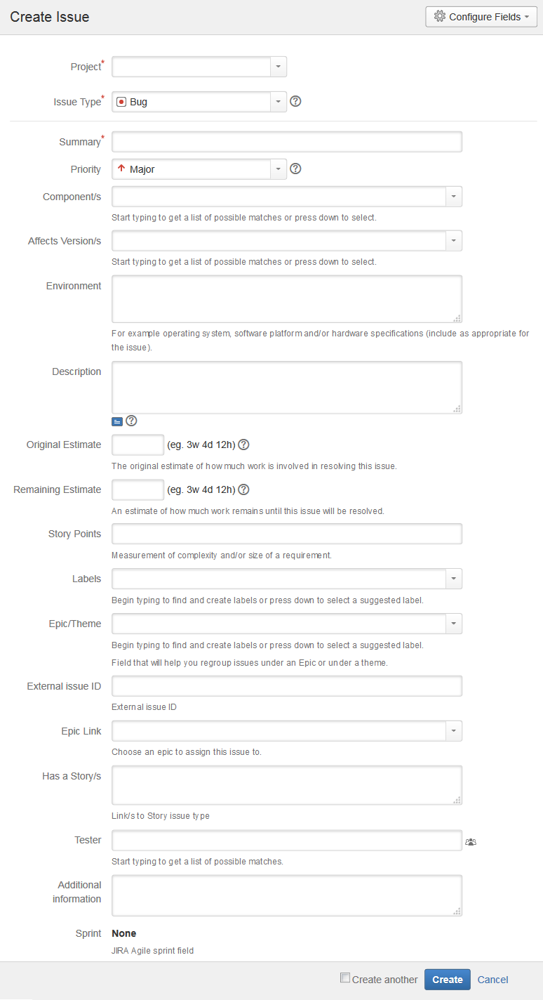

Figure 2.5.f — Defect report creation with JIRA

**Bugzilla**$^{320}$

1. "Product" allows one to specify to which product (project) the defect relates.
2. "Reporter" contains the e-mail address of the author of the defect report.
3. "Component" contains an indication of the application component to which the defect being described relates.
4. "Component description" contains a description of the application component to which the defect being described relates. This information is automatically loaded when the component is selected.
5. "Version" contains the version of the product in which the defect was detected.
6. "Severity" contains an indication of the severity of the defect. The default options are as follows: blocker (the defect does not allow a certain task to be solved by the application), critical, major, normal, minor, trivial, enhancement (has been described in detail in the section on defect report fields (see description of the "symptom" field, "enhancement"'$^{(168)}$ value)).
7. "Hardware" allows one to select the hardware environment profile in which the defect occurs.
8. "OS" (operating system) allows one to specify the operating system under which the defect occurs.
9. "Priority" allows one to specify the priority for fixing the defect. By default, Bugzilla offers the following options: highest, high, normal, low, lowest.
10. "Status" allows one to set the status of the defect report. By default, Bugzilla offers the following status options:
    * "Unconfirmed" — the defect has not yet been studied, and there is no guarantee that it is actually correctly described.
    * "Confirmed" — the defect has been studied; the correctness of the report has been confirmed.
    * "In progress" — work is underway to further investigate and fix the defect.

The official documentation recommends that, immediately after installing Bugzilla, you should configure the status set and defect reporting lifecycle rules according to your company's rules.

11. "Assignee" gives the e-mail address of the project team member responsible for investigating and fixing the defect.
12. "CC" contains a list of e-mail addresses of project team members who will receive notifications of what is happening with this defect.
13. "Default CC" contains the e-mail address(es) of the project team members who will be notified by default when any defects occur (most often e-mail addresses are specified here).
14. "Original estimation" allows one to specify an original estimate of how long it will take to fix the defect.
15. "Deadline" allows one to specify the date by which the defect must be fixed.
16. "Alias" allows one to specify a short, memorable name for the defect (perhaps in the form of an acronym) for easy reference in a variety of documents.
17. "URL" allows one to specify the URL where the defect appears (particularly relevant to web applications).

---
$^{320}$ "Bugzilla" [https://www.bugzilla.org](https://www.bugzilla.org)

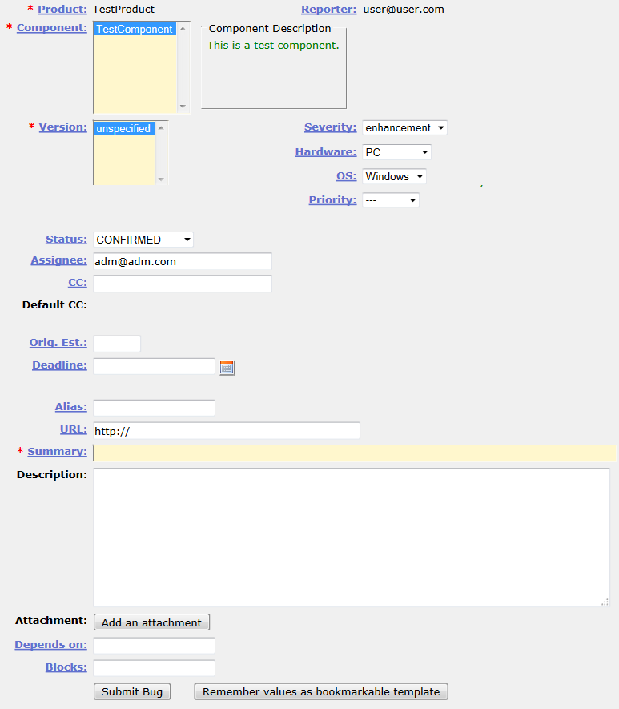

Figure 2.5.g — Defect report creation with Bugzilla

18. "Summary" allows one to specify a brief description of the defect.
19. "Description" allows one to specify a detailed description of the defect.
20. "Attachment" allows one to add attachments to the defect report.
21. "Depends on" allows one to specify a list of defects that must be fixed before the team can work on the defect in question.
22. "Blocks" allows one to specify a list of defects that can only be dealt with after the defect has been fixed.

Mantis$^{321}$

1. "Category" contains an indication of the project or application component to which the defect being described relates.
2. "Reproducibility" indicates the possibility to reproduce the defect. Mantis offers an atypically large number of options:
   * "Always".
   * "Sometimes".
   * "Random" — a variation on the "sometimes" idea, where no pattern of the defect occurrence could be established.
   * "Have not tried" — is not so much reproducibility as status, but Mantis attributes this value to this field.
   * "Unable to reproduce" — it is not so much reproducibility as it is the resolution to reject the defect report, but in Mantis it is also referred to this field.
   * "N/A" (non-applicable) — is used for defects to which the concept of reproducibility does not apply (e.g., documentation problems).
3. "Severity" contains an indication of the severity of the defect. The default options are as follows:
   * "Block" — the defect does not allow a certain task to be completed by the application.
   * "Crash" — generally refers to defects that cause an application to fail to work.
   * "Major".
   * "Minor".
   * "Tweak" — usually a cosmetic defect.
   * "Text" — the defect usually relates to the text (typos, etc.)
   * "Trivial".
   * "Feature" — the report is not a description of a defect, but a request to add/change functionality or properties to the application.
4. "Priority" allows one to specify the priority for fixing the defect. By default, Mantis offers the following options: immediate, urgent, high, normal, low, none (priority is not specified or cannot be determined).
5. "Select profile" allows one to select the hardware and software configuration profile under which the defect occurs from a predefined list. If there is no such list or it does not contain the necessary options, one can manually fill in fields 6–7–8 (see below).
6. "Platform" allows one to specify the hardware platform under which the defect occurs.
7. "OS" (operating system) allows one to specify the operating system under which the defect occurs.
8. "OS Version" allows one to specify the version of the operating system under which the defect occurs.
9. "Product version" allows one to specify the version of the application in which the defect was detected.
10. "Summary" allows one to specify a brief description of the defect.
11. "Description" allows one to specify a detailed description of the defect.
12. "Steps to reproduce" allows one to specify the steps to reproduce the defect.
13. "Additional information" allows one to specify any additional information that may be useful when analyzing and fixing the defect.

---
$^{321}$ "Mantis Bug Tracker" [https://www.mantisbt.org](https://www.mantisbt.org)


Figure 2.5.h — Defect report creation with Mantis

14. "Upload file" allows one to upload screenshots and similar files that may be useful in analyzing and fixing the defect.
15. "View status" allows one to manage the access permissions to the defect report and offers by default two options: public, private.
16. "Report stay" — ticking this box allows one to immediately start writing the next report after saving the current one.

---

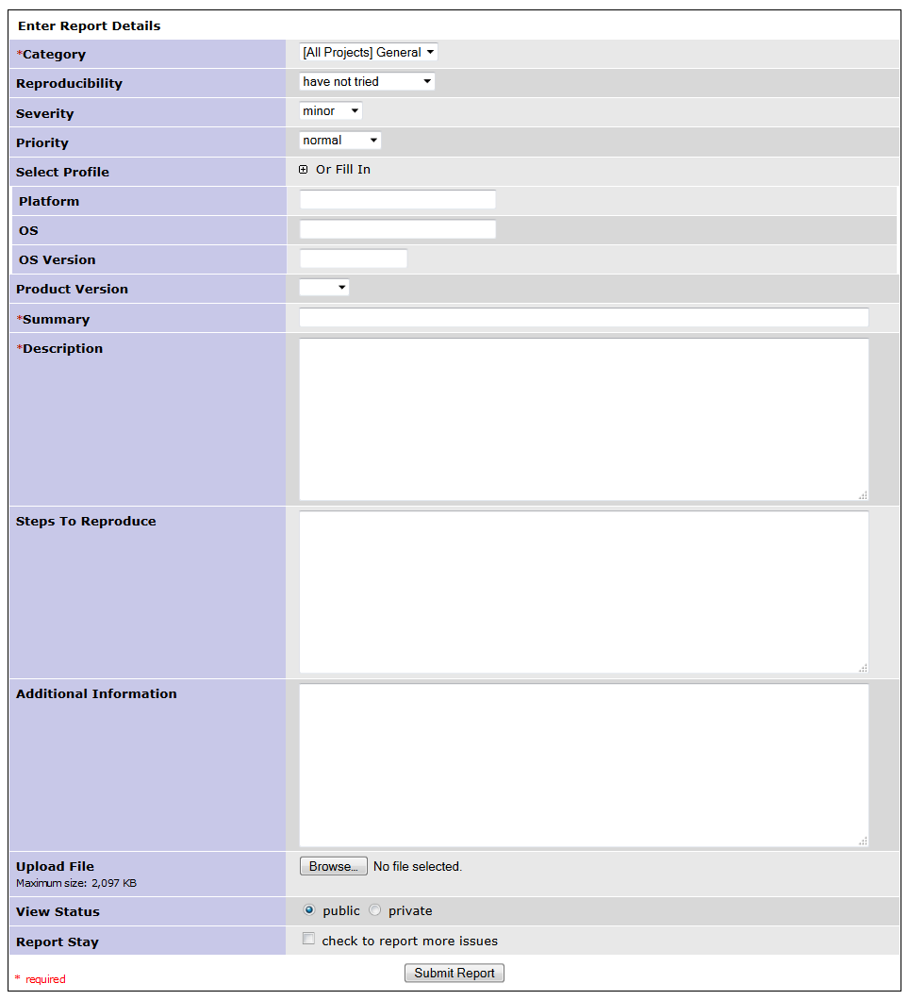 **Task 2.5.b:** study 3–5 more defect report lifecycle management tools, read their documentation, create some defect reports in them.

### 2.5.5. Good defect report properties

A defect report may be imperfect (and therefore a described defect less likely to be fixed) if one or more of the following properties are unsound.

**All fields must be filled in accurately and correctly.** There are a number of reasons why this property may be compromised: inexperience of the tester, inattention, laziness, etc.

The most striking manifestations of such a problem usually are:

* Some of the fields that are important for understanding the problem are not filled in. As a result, the report becomes a collection of scattered information, which cannot be used to correct the defect.
* The information provided is insufficient to understand the problem. For example, from such a poorly detailed description it is not at all clear what the problem is: "The app sometimes converts some files incorrectly".
* The information provided is incorrect (e.g., invalid application messages, incorrect technical terms etc.). This most often happens due to inattention (consequences of erroneous copy-paste and lack of final proofreading of the report before submitting).
* A "defect" (in quotes) is found in functionality, which has not yet been declared ready for testing. That is, the tester states that something doesn't work correctly, but that something shouldn't (yet!) work correctly.
* The report contains jargon: both in the literal sense (dirty words) and/or some technical jargon, understood by an extremely limited circle of people. For example: "The chartniks have got it badly" (meaning: "Not all of the encoding tables are loaded successfully").
* The report, instead of describing a problem with the application, criticizes the work of someone on the project team. For example: "How dumb do you have to be to do that?".
* The report omits a seemingly insignificant problem, but in fact it is critical to reproduce the defect. More often than not, this is seen as skipping a reproduction step, missing or insufficiently detailed environment descriptions, overgeneralized input values, etc.
* The report has the wrong (usually underestimated) priority or severity. In order to avoid such problems, it is worthwhile to examine the problem thoroughly and define the most serious consequences of the defect and defend your position if your colleagues think otherwise.
* The report is not accompanied by the necessary screenshots (especially important for cosmetic defects) or other files. A classic example of such a mistake: the report describes incorrect operation of an application with some file, but the file itself is not attached.
* The report is written illiterately from the human language point of view. Sometimes this can be overlooked, but sometimes it becomes a real problem, e.g.: "Not keyboard in parameters accepting values" (this is a real quote; and the author himself could not explain what was meant by it).

**Proper technical language.** This property applies equally to requirements, test cases, defect reports — any documentation, so let's not repeat it — see earlier$^{(128)}$.

Compare the two detailed descriptions of the defect:

| Bad description | Good description |
| :--- | :--- |
| When it's as if we want to remove a folder with something inside it, it doesn't ask if we want to. | No confirmation request when deleting a non-empty subdirectory in the SOURCE_DIR directory.<br>**Act:** Deleting a non-empty subdirectory (with all its contents) in the SOURCE_DIR directory without asking for confirmation.<br>**Exp:** If the application detects a non-empty sub-folder in the SOURCE_DIR folder, it will stop with the message: "Non-empty subfolder [subfolder name] in SOURCE_DIR folder detected. Remove it manually or restart application with `--force_file_operations` key to remove automatically."<br>**Req:** UR.56.BF.4.c. |

**Specificity of "steps to reproduce" descriptions.** When talking about test cases, we emphasized that it is worth keeping a balance between specificity and generality in their steps. In defect reports, specificity is usually preferred for a very simple reason: the lack of a specific detail can make it impossible to reproduce the defect. So, if you have even the slightest doubt about whether a detail is important, consider it important.

Compare two sets of steps to reproduce the defect:

| Insufficiently specified steps | Pretty specified steps |
| :--- | :--- |
| 1. Send a file of an acceptable format and size, where the Ukrainian text is in different encodings, to be converted.<br><br>Defect: the encodings are not converted correctly. | 1. Send an HTML file with 100KB to 1MB size, where Ukrainian text is encoded in UTF8 (10 lines of 100 characters) and KOI8-U (20 lines of 100 characters).<br><br>Defect: text that was presented in UTF8 is corrupted (presented with an unreadable characters). |

In the first case it is basically impossible to reproduce the defect, because it is caused by peculiarities of external libraries in determining text encodings in the document, while in the second case the data is sufficient if not to understand what is going on (the defect is actually very "tricky"), then at least to guarantee the reproducibility and acknowledge the fact of defect's presence.

Once again, the main point: unlike a test case, a defect report can have increased specificity, and this will be less of a problem than not being able to reproduce the defect because of an over-generalized description of the problem.

**Absence of unnecessary actions and/or lengthy descriptions.** More often than not, this property implies that there is no need to describe the steps to reproduce the defect in a long, point-by-point way, which can be replaced by a single phrase:

| Bad | Good |
| :--- | :--- |
| 1. Specify the path to the folder containing the source files as the first parameter of the application.<br>2. Specify the path to the destination folder as the second parameter of the application.<br>3. Specify the path to the log file as the third application parameter.<br>4. Run the application.<br><br>Defect: The application uses the first command line parameter as both the path to the source files folder and the path to the destination files folder. | 1. Run the application with all three correct parameters (especially make sure that `SOURCE_DIR` and `DESTINATION_DIR` do not overlap and are not nested in any combination).<br><br>Defect: The application stops with the message “`SOURCE_DIR` and `DESTINATION_DIR` may not be the same!” (The first command line parameter seems to be used to initialize both directory names). |

The second most common mistake is to start every defect report by starting the application and describing in detail how to bring it to a particular state. It is good practice to write preparations (similar to test cases) in the defect report, or to describe the desired application state in one (first) step.

Compare:

| Bad | Good |
| :--- | :--- |
| 1. Start the application with all the correct parameters.<br>2. Wait more than 30 minutes.<br>3. Send a file in a suitable format and size for conversion.<br><br>Defect: The application does not process the file. | Prerequisite: The app is running and has been running for more than 30 minutes.<br>1. Send a file in a suitable format and size for conversion.<br><br>Defect: The application does not process the file. |

**Absence of duplicates.** When a project team has a large number of testers, a situation may arise when one and the same defect is described several times by different people. And sometimes it happens that even the same tester has already forgotten that they discovered some problem long time ago and is now describing it anew. The following set of recommendations allows you to avoid this situation:

* If you are not sure if a defect has not been previously described, search with your defect management tool.
* Write short descriptions that are as informative as possible (since they are the first thing you search for). If your project has too many defects with short descriptions like "Button doesn’t work", you will waste a lot of time going over dozens of defect reports over and over again in search of relevant information.
* Make the most of your toolkit’s capabilities: include application components, references to requirements, tagging and more in the defect report. — all this will help you quickly and easily narrow down your search in the future.
* In the detailed description of the defect, include the text of messages from the application, if possible. Even a report in which the rest of the information is too general can be found using such text.
* Try to participate in clarification meetings$^{322}$, whenever possible, because you may not remember every defect or user scenario verbatim, but at the right time you may get the feeling "I’ve heard it before", which will make you search for it and tell you what to look for.

---
$^{322}$ **Clarification meeting.** A discussion that helps the customers achieve "advance clarity" — consensus on the desired behavior of each story — by asking questions and getting examples. [“Agile Testing”, Lisa Crispin, Janet Gregory]

* If you find any additional information, add it to an existing defect report (or ask its author to do so), but do not create a separate report.

**Clarity and comprehensibility.** Describe the defect so that the reader of your report will not have the slightest doubt that it is indeed a defect. This is best achieved by carefully explaining the actual and expected outcomes and by referring to the requirement in the “Description” field.

Compare:

| Bad description | Good description |
| :--- | :--- |
| The application does not indicate detected subdirectories in the SOURCE_DIR directory. | The application does not notify the user about subdirectories found in the SOURCE_DIR directory, resulting in unreasonable expectations for users to process files in such subdirectories.<br>**Act:** the application starts (continues) if there are subdirectories in the SOURCE_DIR directory.<br>**Exp:** If the application detects an empty subdirectory in the SOURCE_DIR directory at startup or during operation, it deletes it automatically (<span style="color:red">is that logical?</span>), but if a non-empty subdirectory is detected, the application will stop and display the message “Non-empty subfolder [subdirectory name] in SOURCE_DIR folder detected. Remove it manually or restart application with `--force_file_operations` key to remove automatically.”<br>**Req:** UR.56.BF.4.c. |

In the first case, after reading the description, one is tempted to ask: “So what? Is it supposed to notify?” The second version of the description, however, makes it clear that such behavior is wrong according to the current version of the requirements. Furthermore, the second option asks (and ideally should ask the requirement itself) for a review of how the application should behave correctly in such a situation, i.e., not only does it qualitatively describe the current problem, but it also raises the question of how to further improve the application.

**Traceability.** It should be clear from the information in a good defect report which part of the application, which functions and which requirements are affected by the defect. This property is best achieved by making good use of the features of the defect report management tool: include in the defect report application components, references to requirements, test cases, related defect reports (similar defects; dependent and affiliated defects), tagging, etc.

Some tools even allow you to build visual diagrams based on such data, making traceability management, even on very large projects, a trivial job rather than a humanly impossible task.

* **Separate reports for each new defect.** There are two immutable rules:
* Each report describes **exactly one** defect (if the same defect occurs in more than one location, these occurrences are listed in the detailed description).
* When a new defect is detected, a new report is generated. You **cannot** edit **old** reports to describe a **new** defect by putting them in the “reopen” state.

Violation of the first rule leads to objective confusion, which is best illustrated as follows: imagine that one report describes two defects, one of which has been corrected and the other has not. Which state would you put the report in? We don’t know.

Violation of the second rule creates chaos: not only the information about previous defects is lost, but there are also problems with all kinds of metrics and common sense. To avoid this problem, on many projects only a limited number of team members have the right to move a defect report from “closed” to “reopen” state.

**Compliance with accepted layout templates and traditions.** As with test cases, there is no problem with the layout templates for defect reports: they are defined by an existing template or by the screen form of the defect report management tool. However, the only advice would be to read ready-made defect reports before writing your own, as traditions may differ even between teams in the same company. This can save you a lot of time and effort.

2.5.6. Logic for creating effective defect reports

The following procedure is recommended for creating an effective defect report:

0. Detect a defect ☺.
1. Understand the problem.
2. Reproduce the defect.
3. Check if the defect is already described in the defect management system (i.e., check for duplicates).
4. Formulate the essence of the problem as "what was done, what was the result, what was expected".
5. Fill in the fields of the report, starting with the "Description" field.
6. After completing all the fields, carefully reread the report, correcting inaccuracies and adding details.
7. Reread the report again, as you have definitely missed something in point 6 ☺.

Now more about each step.

### Understand the problem

It all starts with understanding what is going on with the application. Only with this understanding can you write a really good defect report, correctly identify the importance of the defect, and give useful recommendations on how to fix it. Ideally, a defect report should describe the nature of the problem, not its external appearance.

Compare two reports for the same situation (the "File Converter" application does not distinguish between files and symbolic links to files, which leads to a series of anomalies in the file system).

A bad report written without having understood the problem:

| Summary | Description | Steps to reproduce |
| --- | --- | --- |
| Files outside the SOURCE_DIR are processed. | Sometimes, for unknown reasons, an application processes random files outside the SOURCE_DIR directory.<br><br>**Act:** individual files outside SOURCE_DIR are processed.<br><br>**Exp:** only files in SOURCE_DIR are processed.<br><br>**Req:** DS-2.1. | Unfortunately, it was not possible to discover the sequence of steps leading up to this defect. |

| Reproducibility | Priority | Severity | Symptom | Workaround | Comments |
| --- | --- | --- | --- | --- | --- |
| Some-times | High | High | Incorrect operation | No | |

A good report written having understood the problem:

| Summary | Description | Steps to reproduce |
| :--- | :--- | :--- |
| The app does not distinguish between files and symbolic links to files. | If a symbolic link to a file is placed in the SOURCE_DIR directory, the following erroneous behavior will occur:<br>a) If a symbolic link refers to a file inside SOURCE_DIR, the file is processed twice and both the file and the symbolic link are moved to DESTINATION_DIR.<br>b) If a symbolic link points to a file outside the SOURCE_DIR, the application processes the file, moves the symbolic link and the file itself to DESTINATION_DIR and then continues to process files in the directory that originally contained the processed file.<br>**Act:** the application considers symbolic links to files as files themselves (see details above).<br>**Exp:** if the application finds a symbolic link in the SOURCE_DIR directory, it will terminate with the following message “Symbolic link [symbolic link name] in SOURCE_DIR folder detected. Remove it manually or restart application with --force_file_operations key to remove automatically.”<br>**Req:** UR.56.BF.4.e. | 1. Create the following directory structure at an arbitrary location:<br>   /SRC/<br>   /DST/<br>   /X/<br>2. Place several arbitrary files (of an acceptable format and size) in the SRC and X directories.<br>3. Create two symbolic links in the SRC directory: a) to any of the files within the SRC directory; b) to any of the files within the X directory.<br>4. Run the application.<br><br>Defect: both files and symbolic links have been moved to the DST directory; the contents of directory X have been processed and moved to the DST directory. |

| Reproducibility | Priority | Severity | Symptom | Workaround | Comments |
| :--- | :--- | :--- | :--- | :--- | :--- |
| Always | High | Normal | Incorrect operation | No | A quick look at the code showed that `file_exists()` is used instead of `is_file()`. This seems to be the problem. This defect also causes an attempt to treat directories as files (see BR-999.99). There is a logical error in the SOURCE_DIR processing algorithm: the application shouldn't process files that are not in the SOURCE_DIR range, so there is something wrong with generating or checking for qualified filenames. |

## Reproduce the defect

This will not only help you to fill in the “Reproducibility^[165]^” field correctly, but will also help you avoid the unpleasant situation of mistaking an application defect for a momentary failure that (most likely) occurred somewhere on your computer or in another part of your IT infrastructure that is not related to the application under test.

## Check if the defect is already described (check for duplicates)

It is a good idea to check whether the defect management system already has a description of the exact defect you have just found. This is a simple action, not directly related to writing the defect report, but it significantly reduces the number of reports declined as “duplicate”.

### Formulate the essence of the problem

Formulating the problem as “what was done (future “Steps to reproduce” field contents), what was the result (future “actual result” in the “Description” field), what was expected (future “expected result” in the “Description” filed)” not only allows you to prepare the data for the defect report fields, but also to understand the problem even better.

In general, the formula “what was done, what was the result, what was expected” is good for the following reasons:

* Transparency and clarity: by following this formula, you prepare exactly the data for the defect report, without getting bogged down in long, abstract considerations.
* Easy to verify the defect: with this data, the developer can quickly reproduce the defect (and the tester in the future can verify that the defect is fixed).
* Obviousness for developers: even before trying to reproduce the defect it is obvious if what is described is a real defect or if the tester made a mistake somewhere, putting the correct behavior of the application into defects.
* Eliminate unnecessary and meaningless communication: detailed “what was done, what was the result, what was expected” description enable problem solving and defect resolution without the need for querying, searching, and discussing additional information.
* Simplicity: in the final stages of testing involving end-users, the effectiveness of incoming feedback can be greatly improved by explaining the formula to users and asking them to adhere to it when reporting problems.

The information gathered at this stage becomes the foundation for all further report writing activities.

### Fill in the fields of defect report

The fields of the defect report have already been covered earlier^[162], now we just want to stress that it is best to start with the “Description” filed, as the process of completing this field may reveal many additional details and also give you ideas about how to formulate a brief and informative “Summary” filed contents.

If you realize that you don’t have enough data to fill in some field, do some more research. If that does not work, describe in the field (if it is a text filed) why you are having difficulty completing it, or (if it is a drop-down) select the value that you think best describes the problem (in some cases, the tool allows you to select a value like “unknown”, then select it).

If you have no useful idea for “Comments” filed (or if the defect is so trivial that it doesn't need any explanation), don’t write “text for text’s sake”: comments like “I recommend fixing it” are not just meaningless, they’re annoying as well.

## Reread the report (and reread the report again)

Once everything is written, completed and ready, reread it carefully. Often you will find that there are logical inconsistencies or overlaps in the text, you might want to improve the wording or change things.

The perfection is unattainable, and you shouldn't spend eternity on a single defect report, but it's also a mean thing to submit an unread document.

|  | After submitting a defect report, it is advisable to further investigate the area of the application in which you have just found the defect. Practice shows that defects often occur in groups. |
| :---: | :--- |

## 2.5.7. Typical mistakes in writing defect reports

Before reading this text, it is advisable to reread the section on typical mistakes in writing test cases and checklists{149}, as many of the problems described there are also relevant to defect reports (both are specific technical documents).

### Layout and wording mistakes

**Bad “Summaries”.** Formally, this is a layout problem, but in fact it is a much more dangerous one, because reading a defect report and understanding the nature of the problem starts with the “Summary” field. Once again, its essence is that it:
* Answers the questions “what?”, “where?”, “under what conditions?”.
* Must be extremely brief.
* Must be informative enough to understand the essence of the problem.

Look at these summaries and try to answer yourself what the problem is, where it occurs, under what conditions it occurs:
* “Unexpected interruption”.
* “19 items found”.
* “Searching through all file types”.
* “Uninformative error”.
* “Application has red font”.
* “Error when entering just the name of computer disk or folder”.
* “No reaction to 'Enter' key”.

Sometimes it is the “Description” field which can help one to understand the problem, but even then, it is a hell-of-a-job to relate such summary to a description that contains something essentially different.

Reread the section on wording good summaries again{162}.

**Identical “Summary” and “Description”.** Yes, occasionally there are defects so simple that a summary will suffice (e.g., “A typo in the name of the main menu item ‘File’ (now ‘Fille’)”), but if the defect is related to some more or less complex application behavior, you should think of at least three ways of describing the problem:
* brief for the “Summary” field (best formulated at the very end of the defect description process);
* detailed for the “Description” field (explaining and expanding the information from the “Summary”);
* another short one for the last “step” in the “Steps to reproduce” filed.

This is not an intellectual game of too much free time, but a working tool for forming an understanding of the problem (believe it, you can hardly explain in three different ways what you don’t understand).

**Lack of an explicit indication of the actual result, the expected result and a reference to the requirement in the “Description”,** if they are important and it is possible to specify them.

Yes, for minor things like typos in captions, you don’t have to do that (and still: if you have time, you’d better write it; also write it if you have a multi-lingual project team).

But what can be understood from a defect report, whose brief and detailed description only says “the application shows the contents of OpenXML files”? Shouldn’t it show? What’s the problem, anyway? Well, it shows and let it be — is that bad? Ah, it turns out (!) that the application must not show the contents of these files, but must open them with a suitable external program. This can be guessed from experience. But guessing is a bad

assistant when you have to rewrite the application — you can only make things worse. This can also (probably) be understood by reading the requirements thoughtfully. But let’s be realistic: a defect report will be declined with the resolution “the behavior described is not a bug”).

**Ignoring quotes, resulting in a distortion of meaning.** How would you understand a “Summary” such as “The record disappears on mouseover”? Some record disappears on mouseover? No, it’s “the ‘Record’ field disappears on mouseover”. Even if you don’t add the word “field” to it, the quotes let you know that it’s a proper name, i.e., the name of an element. Also don’t ignore capital letters in proper nouns.

**General problems with phrasing.** Yes, it’s not easy to learn to formulate a thought at once in a very concise and informative way, but it’s equally difficult to read similar creations (quotes verbatim):
* “Search does not work by Enter button”.
* “The default for field where to search is +”.
* “When searching for files in a large directory, the app briefly ‘hangs’”.
* “When the error closes, the application closes”.
* “The application doesn’t work with the from keyboard by the user in the field “What to search””.

**Superfluous items in the “Steps to reproduce”.** You don’t have to start “from scratch”; most project members know the application well enough to “identify” its key parts, so compare:

| Bad | Good |
| :--- | :--- |
| 1. Run the application.<br>2. Open the “File” menu item.<br>3. Select “New” from the menu.<br>4. Fill at least three pages with text.<br>5. Open the “File” menu item.<br>6. Open the “Print” menu item.<br>7. Open the “Print settings” tab.<br>8. Select “No” from the “Duplex printing” list.<br>9. Print the document on a printer that supports duplex printing.<br><br>Defect: printing is still duplex. | 1. Create or open a file with three or more non-empty pages.<br>2. Select “File” -> “Print” -> “Print settings” -> “Duplex printing” -> “No”.<br>3. Print the document on a printer that supports duplex printing.<br><br>Defect: printing is still duplex. |

**Screenshots as “copies of the whole screen”.** More often than not, you want to make a copy of a particular application window rather than the whole screen, so Alt+Print-Screen will help. Even if it is important to capture more than one window, almost any graphical editor allows you to cut off the unwanted part of the picture.

Typical mistakes in writing defect reports

**Screenshots where the problem is not highlighted.** Drawing a red line around the problem area will make it much quicker and easier to understand the problem in most cases.


**Putting off writing a report "for later".** The desire to find more defects before describing them leads to some important details (and sometimes the defects themselves!) being forgotten. If the “later” is measured in hours or even days rather than minutes, the project team will not receive important information in time. The conclusion is simple: describe the defect as soon as you find (and investigate) it.

**Punctuation, spelling, syntax and similar mistakes.** No comments.

### Logical mistakes

**Imaginary defects.** One of the most frustrating reasons for a defect report to be declined is so-called “not a bug”, when for some reason the correct behavior of an application is described as defective.

But even worse is when the “supposedly expected behavior” is just... invented out of your head. That is, nowhere in the requirements does it say that the application should do something like that, but a defect report is generated because the application doesn't do it.

Sometimes it could be some questionable cases or occasional suggestions for improvement that show up in the defect report. That's bad, but one can at least understand that.

But sometimes, for some unknown reason, the application is “required” (according to the defect report) to do something completely illogical, irrational and insane. Where does it come from? Why? Just don't do it that way.

**Categorizing an application’s advanced features as a defect.** The clearest example of this case is when an application is described as defective by the fact that it can run under operating systems not explicitly listed as supported. Only in some rare cases this situation may be considered a defect (when developing some system utilities or similar software, that is highly dependent on the OS version and potentially can “break” an unsupported one; from the common-sense point of view such application really should show a warning or even error message and exit working on unsupported OS). But what's wrong with a child's game running on a previous generation OS? Is that really a problem?! Doubtful.

Incorrect **“Symptom”** value. This is not fatal and can always be corrected, but if the reports are initially grouped by symptom, it is an annoying inconvenience to get them wrong.

Excessively low (or overrated) **“Priority”** and **“Severity”**. This problem is dealt with quite effectively by holding clarification meetings and reviewing defect reports by the whole team (or at least a few key people), but if “Priority” and “Severity” are **excessively** low, it is highly likely that it will be a long time before the report is simply given a turn at the next review meeting.

Focusing on the minutiae to the detriment of the essentials. A paradigmatic example should be mentioned here, where a tester found a problem that caused an application to crash with loss of user data, but reported it as a cosmetic defect (there was a typo in the error message that the application showed “before it died”). Always think about how the problem will affect your users, what difficulties they might experience, and how important it is to them — then you have a much better chance of seeing the real problem.

Technical illiteracy. Yes, it’s so unapologetic and harsh. In some cases, it just makes you smile sadly, but in some... Imagine such a “Summary” (it is identically duplicated in the description, i.e., it is the whole description of the defect): “The number of files found does not correspond to the actual nesting depth of the directory”. Why, should it? It’s almost the same as “the color of the cat does not match its size”.

A few more illustrative examples (these are examples from different, unrelated defect reports):
* Summary: “Audio directory selected by default”. (In fact, “Audio files” is selected in the “What to search” drop-down.)
* Explanation in the description: “The directory cannot have a date and time of creation”. (Hmm. It can.)
* Expected result: “The app correctly detected an unsupported file system and showed a list of files”. (Wow! You could probably have a philosophical conversation with this application, if it’s capable of such magic.)

Specification in the **“Steps to reproduce”** information that is not important **for the defect reproducibility**. The desire to describe everything in as much detail as possible sometimes takes a morbid form when the defect report is almost filled with information about the weather outside the window and the national currency exchange rate.

Compare:

| Bad | Good |
| :--- | :--- |
| 1. Create the “Data” directory on the “J:” drive.<br>2. Place the attached files “song1.mp3” of 999.99 KB and “song2.mp3” of 888.88 KB in the created “Data” directory.<br>3. Enter “J:\Data” in the “Where to search” field.<br>4. From the “What to search” drop-down list select “Audio files”.<br>5. Press the “Search” button.<br><br>Defect: the files specified in point 2 were not found. | 1. Place one (or more) files with the “.mp3” extension at an arbitrary location on the local drive.<br>2. Set search options (“What to search” -> “Audio files”, “Where to search” -> location of file(s) from step 1).<br>3. Perform a search.<br><br>Defect: the application cannot detect files with the “.mp3” extension. |

Is it really important to search the “J:” drive in order to reproduce the defect? Is it really important to search exactly for files with those names and sizes in that exact directory? Perhaps in some infinitesimally unlikely case it is, then the question goes away. But in all probability, it does not matter at all, and there is no need to record this information. To be more certain, you may want to do some more research.

**Not specification in the “Steps to reproduce” information that is important for the defect reproducibility.** No, we’re not mocking, this point is really the exact opposite of the previous one. Defects can be different. Very different. Sometimes a key “chip” is not enough for the developer to reproduce the defect or even just understand its essence. Some real examples (__underline__ the details, the absence of which for a long time did not allow some developers to reproduce the defect):

* The application did not save user settings if there were spaces in the directory path to save them (__two or more consecutive spaces__).
* The application did not terminate correctly __when opening files whose size did not allow them to be read in their entirety into RAM, the available capacity of which is determined by the *memory limit* parameter in the runtime settings.__
* The application displayed incorrect user statistics __if there was at least one user in the system whose role was not explicitly specified (NULL value in database table, invalid subquery operation).__

How do you know how deep to describe such details? By research. It is not enough to find a single instance of misbehavior in an application, it is necessary to understand the pattern of misbehavior and its source. Then the necessary level of detail becomes clear.

This also includes the notorious reproducibility of “sometimes”. You need to keep looking for causes, review the code, consult with colleagues, run more tests, investigate similar functionality in other parts of the application, investigate similar applications, “google”, etc., etc. Yes, some defects turn out to be stronger than even the most diligent testers, but the percentage of such defects can be very close to zero.

**Ignoring so-called “sequential defects”.** Sometimes one defect is a consequence of another (let’s say a file gets corrupted in transmission to the server, and then the application processes the corrupted file incorrectly). Yes, if the file is transferred without corruption, the second defect may not occur. But it could also show up in a different situation, because the problem is still there: the application does not correctly handle corrupted files. It is therefore worth describing both defects.

## 2.6. Workload estimation, planning and reporting

### 2.6.1. Planning and reporting

In "The logic for creating effective checks"\(142\) chapter we reasoned about how to get the maximum effect from testing with minimal effort on the example of "File Converter" project. It was simple enough, since our application is ridiculous in its size. But let us imagine that we have to test a real project where requirements in the "page equivalent" take hundreds or even thousands of pages. Let's also recall "Detailed testing classification"\(67\) chapter with its several dozens of types of testing (and this without taking into account the fact that they can be flexibly combined, obtaining new options) and think about how to apply all this knowledge (and the opportunities they open) in a large project.

Even if we assume that we know perfectly all the technical aspects of the work to be done, questions as the following remain unanswered:

* When and what to start with?
* Do we have everything we need to get the job done? If not, where can we get what we need?
* In what order should we perform the different types of work?
* How do we distribute responsibility among the team members?
* How do we organize the reporting to stakeholders?
* How can we objectively measure progress and achievements?
* How can we see possible problems in advance, so that we have time to prevent them?
* How do we organize our work so that for a minimum of expenses we get the maximum result?

These and many other similar questions are outside the technical domain — they are related to project management. This task itself is huge, so we will consider only a small part of it, which many testers have to deal with — planning and reporting.

Recall the testing lifecycle\(26\): each iteration starts with planning and ends with reporting, which becomes the basis for planning the next iteration — and so on (see figure 2.6.a). Thus, planning and reporting are closely related, and problems with one of these activities inevitably lead to problems with the other, and eventually to problems with the project as a whole.

```mermaid
graph LR
    Reporting --> Planning
    Planning --> WP[Work process]
    WP --> Reporting
```

Figure 2.6.a — Interrelation (interdependence) of planning and reporting

If we express this thought more clearly and point by point, it turns out:
* Without good planning, it's not clear who needs to do what.
* When it is not clear who needs to do what, the work is done poorly.
* When the work is done poorly and the exact reasons are not clear, it is impossible to make correct conclusions about how to fix the situation.
* Without the right conclusions, it is impossible to create a good work report.
* Without a good work report, it is impossible to create a good plan for further work.
* That's it. The vicious circle has closed. The project dies.

It would seem, so what's the problem? Let's plan well and write good reports, and everything will be fine. The problem is that a very small percentage of people have these skills sufficiently developed. If you don't believe this, think back to studying the material the night before an exam, being late for important meetings, and... repeating it over and over without ever drawing a conclusion. (If that hasn't happened in your life, you're lucky to be in the small percentage of people who have developed those skills well.)

The root of the problem is that planning and reporting are taught rather superficially in schools and universities, while (alas) in practice they are often reduced to mere formality (plans that no one looks at, and reports that no one reads; then again, some are lucky enough to see the exact opposite, but obviously not many).

So, to the point. First, let's look at the classic definitions.

> **Planning**$^{323}$ is a continuous process of making management decisions and methodically organizing efforts to implement them in order to ensure the quality of some process over a long period of time.

High-level planning tasks include:
* reducing uncertainty;
* improving efficiency;
* improving goal understanding;
* creating a basis for process management.

> **Reporting**$^{324}$ is a process of collecting and distributing performance information (including status reporting, progress measurement, and forecasting).

High-level reporting tasks include:
* collecting, aggregating, and providing objective information about the results of the work in an easy-to-understand form;
* formation of an assessment of the current status and progress (in comparison with the plan);
* outlining the existing and possible problems (if any);
* formation of the forecast of the situation development and fixation of recommendations on elimination of problems and improvement of work efficiency.

As mentioned earlier, planning and reporting belong to the area of project management, which is beyond the scope of this book.

---

$^{323}$ **Planning** is a continuous process of making entrepreneurial decisions with an eye to the future, and methodically organizing the effort needed to carry out these decisions. There are four basic reasons for project planning: to eliminate or reduce uncertainty; to improve efficiency of the operation; to obtain a better understanding of the objectives; to provide a basis for monitoring and controlling work. [“Project Management: A Systems Approach to Planning, Scheduling, and Controlling”, Harold Kerzner]

$^{324}$ **Reporting** — collecting and distributing performance information (including status reporting, progress measurement, and forecasting). [PMBOK, $3^{\text{rd}}$ edition]

 If you are interested in the details, two fundamental sources of information are recommended:
* “Project Management: A Systems Approach to Planning, Scheduling, and Controlling”, Harold Kerzner.
* PMBOK (“Project Management Body of Knowledge”).

We move on to more specific things that even a novice tester has to work with (albeit at the level of use rather than creation).

### 2.6.2. Test plan and test result report

#### Test plan

>  **Test plan**$^{325}$ is a document that describes and regulates a list of testing activities, as well as related techniques and approaches, strategy, areas of responsibility, resources, timetable and milestones.

Low-level test planning tasks include:
* assessing the scope and complexity of the work;
* determination of the necessary resources and their sources;
* definition of the schedule, deadlines and milestones;
* risk assessment and preparation of preventive countermeasures;
* allocation of duties and responsibilities;
* coordination of testing activities with the activities of project team members engaged in other tasks.

Like any other document, a test plan can be good or have shortcomings. A good test plan has most of the properties of the good requirements$^{[42]}$, and also expands their set with the following items:
* Realism (the planned approach is feasible).
* Flexibility (a good test plan is not only modifiable in terms of working with the document, but also designed so that, when unforeseen circumstances arise, to allow a rapid change in any of its parts without breaking the relationship with other parts).
* Consistency with the overall project plan and other individual plans (e.g., the development plan).

The test plan is created at the beginning of the project and is refined as needed throughout the project lifecycle with the participation of the most qualified representatives of the project team involved in quality assurance. The person responsible for creating the test plan is usually the lead tester ("test lead").

In general, the test plan includes the following sections (examples of their filling will be shown later, so here — only a list):
* **Purpose** (project scope and main goals). An extremely brief description of the purpose of application development (partly reminiscent of the business requirements$^{[38]}$), but here the information is presented in an even more concise form and in the context of what should be the primary focus of testing and quality improvement).
* **Features (requirements) to be tested**. A list of functions and/or non-functional features of the application to be tested. In some cases, the priority of the corresponding area is also listed here.
* **Features (requirements) not to be tested**. A list of functions and/or non-functional features of the application that will not be tested. Reasons for excluding a particular area from the list of areas to be tested may vary from their extremely low priority for the customer to a lack of time or other resources. This list is compiled for the project team and other stakeholders to have a clear common understanding that testing of such and such features of an application is not planned — this approach allows to avoid false expectations and unpleasant surprises.

---
$^{325}$ **Test plan.** A document describing the scope, approach, resources and schedule of intended test activities. It identifies amongst others test items, the features to be tested, the testing tasks, who will do each task, degree of tester independence, the test environment, the test design techniques and entry and exit criteria to be used, and the rationale for their choice, and any risks requiring contingency planning. It is a record of the test planning process. [ISTQB Glossary]

* **Test strategy**$^{326}$ and **Test approach**$^{327}$. Description of the testing process in terms of methods, approaches, types of testing, technologies, tools, etc.
* **Criteria.** This section includes the following subsections:
    * **Acceptance criteria**$^{328}$ — any objective quality indicators that the product to be developed must meet from the customer's or user's point of view in order to be considered ready for use.
    * **Entry criteria**$^{329}$ — a list of conditions under which the team starts testing. Having these criteria ensures the team from wasting effort in circumstances where testing will not bring the expected benefits.
    * **Suspension criteria**$^{330}$ — a list of conditions under which testing is suspended. The presence of this criteria also ensures the team from wasting efforts in conditions when testing will not bring the expected benefit.
    * **Resumption criteria**$^{331}$ — a list of conditions under which testing is resumed (usually after suspension).
    * **Exit criteria**$^{332}$ — a list of conditions under which testing is terminated. The presence of this criteria insures the team against premature termination of testing, as well as against continuation of testing in conditions when it no longer brings tangible results.
* **Resources.** This section of the test plan lists all the resources required for a successful test strategy implementation and in general can be divided into:
    * software resources (which software is needed by the testers team, how many copies and with what licenses (if we are talking about commercial software));
    * hardware resources (which hardware, in what quantity and at what time the testers team needs);
    * human resources (how many specialists at what level and with knowledge in what areas should join the testing team at any given time);
    * time resources (how long it will take to perform certain works);
    * financial resources (how much it will cost to use the existing resources or to obtain the missing resources listed in the previous items on this list); in many companies, financial resources can be presented as a separate document, since they are confidential information.
* **Test schedule**$^{333}$. In fact, it is a calendar that specifies what must be done and by when. Particular attention is paid to the so-called "milestones" (key dates), by the time of which some significant tangible result should be obtained.

---

$^{326}$ **Test strategy.** A high-level description of the test levels to be performed and the testing within those levels (group of test activities that are organized and managed together, e.g., component test, integration test, system test and acceptance test) for an organization or program (one or more projects). [ISTQB Glossary]
$^{327}$ **Test approach.** The implementation of the test strategy for a specific project. It typically includes the decisions made that follow based on the (test) project's goal and the risk assessment carried out, starting points regarding the test process, the test design techniques to be applied, exit criteria and test types to be performed. [ISTQB Glossary]
$^{328}$ **Acceptance criteria.** The exit criteria that a component or system must satisfy in order to be accepted by a user, customer, or other authorized entity. [ISTQB Glossary]
$^{329}$ **Entry criteria.** The set of generic and specific conditions for permitting a process to go forward with a defined task, e.g., test phase. The purpose of entry criteria is to prevent a task from starting which would entail more (wasted) effort compared to the effort needed to remove the failed entry criteria. [ISTQB Glossary]
$^{330}$ **Suspension criteria.** The criteria used to (temporarily) stop all or a portion of the testing activities on the test items. [ISTQB Glossary]
$^{331}$ **Resumption criteria.** The criteria used to restart all or a portion of the testing activities that were suspended previously. [ISTQB Glossary]
$^{332}$ **Exit criteria.** The set of generic and specific conditions, agreed upon with the stakeholders for permitting a process to be officially completed. The purpose of exit criteria is to prevent a task from being considered completed when there are still outstanding parts of the task which have not been finished. Exit criteria are used to report against and to plan when to stop testing. [ISTQB Glossary]
$^{333}$ **Test schedule.** A list of activities, tasks or events of the test process, identifying their intended start and finish dates and/or times, and interdependencies. [ISTQB Glossary]

* **Roles and responsibility.** A list of required roles (e.g., “lead tester”, “performance optimization expert”) and the area of responsibility of specialists performing these roles.
* **Risk evaluation.** A list of risks that are likely to arise during the work on the project. For each risk, an assessment of the threat posed by it is given and options for dealing with the situation are provided.
* **Documentation.** A list of the test documentation used, specifying who should prepare it and when, and to whom it should be handed over.
* **Metrics$^{334}$.** Numerical characteristics of quality indicators, methods of their evaluation, formulas, etc. This section, as a rule, has many “incoming” references from other sections of the test plan.

Metrics in testing are so important that we will talk about them separately. So.

>  **Metric$^{334}$** is a numerical characteristics of a quality indicator. It may include a description of how to evaluate and analyze the result.

First, let us explain the importance of metrics on a trivial example. Imagine that a customer is interested in the current situation and asks you to briefly describe the testing situation on the project. Generic words in the style of “all is well”, “all is bad”, “it's OK” and so on will not satisfy the customer, of course, since they are extremely subjective and may be very far from reality. And an answer like this looks completely different: “We have implemented 79 % of requirements (including 94 % of important ones), over the last three sprints test coverage grew from 63 % to 71 %, and the overall test case pass rate grew from 85 % to 89 %. In other words, we are fully on track for all key indicators, and we are even slightly ahead of schedule in development”.

In order to operate with all these numbers (and they are needed not only for reporting, but also for organizing the work of the project team), they need to be somehow calculated. This is what metrics allow you to do. Then the calculated values can be used for:

* making decisions about starting, suspending, resuming, or terminating testing (see the “Criteria” section of the test plan above);
* determining the extent to which the product meets the stated quality criteria;
* determining the degree of deviation of actual project development from the plan;
* identification of “bottlenecks”, potential risks, and other problems;
* evaluating the effectiveness of management decisions;
* preparation of objective informative reporting;
* etc.

Metrics can be both direct (do not require calculations) and calculated (calculated by formula). Typical examples of direct metrics are the number of test cases developed, the number of defects found, etc. Calculated metrics can use both completely trivial and quite complex formulas (see table 2.6.1).

---
$^{334}$ **Metric.** A measurement scale and the method used for measurement. [ISTQB Glossary]

Table 2.6.1 — Examples of calculated metrics

| Simple calculated metrics | Complex calculated metrics |
| :--- | :--- |
| $$T^{SP} = \frac{T^{\text{Success}}}{T^{\text{Total}}} \cdot 100\% \text{, where}$$ | $$T^{SC} = \sum_{\text{Level}}^{\text{MaxLevel}} \frac{(T^{\text{Level}} \cdot I)^{R^{\text{Level}}}}{B_{\text{Level}}} \text{, where}$$ |
| $T^{SP}$ — percentage of successfully passed test cases, <br> $T^{\text{Success}}$ — quantity of successfully passed test cases, <br> $T^{\text{Total}}$ — total quantity of executed test cases. | $T^{SC}$ — integral metric of successfully passed test cases in relation to requirements and defects, <br> $T^{\text{Level}}$ — the level of test case priority, <br> $I$ — number of test case executions, <br> $R^{\text{Level}}$ — priority of the requirement tested (covered) by the test case, <br> $B_{\text{Level}}$ — the number of defects detected by the test case. |
| Minimum value boundaries: <br> • Beginning project phase: 10 %. <br> • Main project phase: 40 %. <br> • Final project phase: 85 %. | Method of analysis: <br> • The ideal state is a continuous growth of the $T^{SC}$ value. <br> • In the case of a negative trend, a decrease of 15 % or more in the $T^{SC}$ value over the last three sprints may be considered unacceptable and is sufficient reason to suspend testing. |

There are a large number of common metrics in testing, many of which can be collected automatically using project management tools. For example$^{335}$:
* percentage of (not) completed test cases to all available test cases;
* percentage of successfully passed test cases (see “Simple Calculated Metrics” in table 2.6.1);
* percentage of blocked test cases;
* the density of the defect distribution;
* efficiency of defect elimination;
* defect distribution by priority and severity;
* etc.

Usually, when generating reports, we will be interested not only in the current metric value, but also in its dynamics over time, which is very convenient to depict graphically (which many project management tools can also do automatically).

Some metrics can be calculated based on schedule data, e.g., “schedule slippage” metric:

$$ScheduleSlippage = \frac{DaysToDeadline}{NeededDays} - 1 \text{, where}$$

$ScheduleSlippage$ — the value of schedule slippage,  
$DaysToDeadline$ — the number of days until the scheduled completion of the work,  
$NeededDays$ — the number of days needed to complete the work.  
$ScheduleSlippage$ value should not become negative.

Thus, we see that metrics are a powerful tool for collecting and analyzing information. And at the same time there is a danger here: under no circumstances should we allow the situation of “metrics for the sake of metrics”, when a tool collects a lot of data, calculates many numbers and builds dozens of graphs, but... no one understands how to interpret them. Note that both of the metrics in table 2.6.1 and the *ScheduleSlippage* metric just discussed are accompanied by a quick guide on how to interpret them. And the more complex and unique the metric is, the more detailed guidance is needed to apply it effectively.

---
$^{335}$ “Important Software Test Metrics and Measurements — Explained with Examples and Graphs” [http://www.softwaretestinghelp.com/software-test-metrics-and-measurements/]

Finally, it is worth mentioning the so-called “coverage metrics”, because they are very often mentioned in various literature.

> **Coverage**$^{336}$ is a percentage expression of the degree to which the coverage item$^{337}$ is affected by the corresponding test suite.

The simplest representatives of coverage metrics are:

* Requirements' coverage metric (a requirement is considered “covered” if it is referenced by at least one test case):
  $$R^{SimpleCoverage} = \frac{R^{Covered}}{R^{Total}} \cdot 100\% \text{, where}$$
  $R^{SimpleCoverage}$ — requirements' coverage by tests (percentage),
  $R^{Covered}$ — the quantity of requirements covered by at least one test case,
  $R^{Total}$ — total quantity of requirements.

* Requirements' coverage density metric (takes into “account how many test cases refer to more than one requirement”):
  $$R^{DensityCoverage} = \frac{\sum T_i}{T^{Total} \cdot R^{Total}} \cdot 100\% \text{, where}$$
  $R^{DensityCoverage}$ — requirements' coverage density,
  $T_i$ — the quantity of test cases covering the $i$-th requirement,
  $T^{Total}$ — total quantity of test cases,
  $R^{Total}$ — total quantity of requirements.

* Equivalence classes' coverage metric (analyses “how many equivalence classes are affected by test cases”):
  $$E^{Coverage} = \frac{E^{Covered}}{E^{Total}} \cdot 100\% \text{, where}$$
  $E^{Coverage}$ — equivalence classes' coverage metric,
  $E^{Covered}$ — the quantity of equivalence classes covered by at least one test case,
  $E^{Total}$ — total quantity of equivalence classes.

* Boundary conditions' coverage metric (analyze “how many values from a group of boundary conditions are affected by the test cases”):
  $$B^{Coverage} = \frac{B^{Covered}}{B^{Total}} \cdot 100\% \text{, where}$$
  $B^{Coverage}$ — boundary conditions' coverage metric,
  $B^{Covered}$ — the quantity of boundary conditions covered by at least one test case,
  $B^{Total}$ — total quantity of boundary conditions.

* Metrics of code coverage (by unit tests). There are a lot of such metrics, but the whole point of them is to identify some code characteristic (number of lines, branches, paths, conditions, etc.) and define what percentage of representatives of this characteristic are covered by unit tests.

> There are so many coverage metrics that even the ISTQB Glossary defines around fifteen of them. You can find these definitions by searching in the ISTQB glossary file for the word “coverage”.

This concludes the theoretical planning and moves on to an example, the sample test plan for our “File Converter$^{(57)}$” application. Recall that the application is very simple, so the test plan will be very small (however, note how much of it will be in the metrics section).

---

$^{336}$ **Coverage, Test coverage.** The degree, expressed as a percentage, to which a specified coverage item has been exercised by a test suite. [ISTQB Glossary]
$^{337}$ **Coverage item.** An entity or property used as a basis for test coverage, e.g., equivalence partitions or code statements. [ISTQB Glossary]

## Test plan sample

In order to fill in some parts of the test plan, we will have to make assumptions about the composition of the project team and the time available for project development. Because this test plan is inside the text of the book, it does not have the typical parts such as the title page, table of contents, etc.

So.

### Project scope and main goals
Automated conversion of text documents in different source encodings to one destination encoding with performance significantly higher than human performance during the same actions.

#### Requirements to be tested
(See corresponding sections of the requirements.)
* UR-1.\*: smoke test.
* UR-2.\*: smoke test, critical path test.
* UR-3.\*: critical path test.
* BR-1.\*: smoke test, critical path test.
* QA-2.\*: smoke test, critical path test.
* L-4: smoke test.
* L-5: smoke test.
* DS-\*: smoke test, critical path test.

#### Requirements NOT to be tested
* SC-1: the application is a console one by design.
* SC-2, L-1, L-2: the application is developed with proper PHP version.
* QA-1.1: this performance characteristic is at the bottom border of typical operations performance for such applications.
* L-3: no implementation required.
* L-6: no implementation required.

### Test strategy and approach

#### General approach.
The specifics of the application are that it is configured once by an experienced technician and then used by end-users, for whom only one operation is available — placing the file in the source directory. Usability, security, etc. are therefore not considered in the testing process.

#### Functional testing levels:
* Smoke test: automated with batch files under Windows and Linux.
* Critical path test: executed manually.
* Extended test: not executed as the probability of defects detection on this level is negligibly small.

Due to the team cross-functionality, a significant contribution to quality improvement can be expected from the code review combined with manual testing using the white box method. Unit-testing will not be applied due to extreme time limitations.

### Criteria
* Acceptance criteria: 100 % success of test cases on Smoke Test level and 90 % success of test cases on Critical Path Test level (see “Test cases success percentage” metric) if 100 % of critical and major bugs are fixed (see “Overall defects fixed percentage” metric). Final requirements coverage by tests (see “Requirements coverage by tests” metric) should be at least 80 %.
* Testing start criteria: new build.
* Testing pause criteria: critical path test must begin only after 100 % success of test cases on the Smoke Test (see “Test cases success percentage” metric) ; test process may be paused if with at least 25 % test cases executed there is at least 50 % failure rate (see “Stop-factor” metric).
* Testing resumption criteria: more than 50 % of defects found during the previous iteration are fixed (see “Ongoing defects fixed percentage” metric).
* Testing finish criteria: more than 80 % planned for the current iteration test cases are executed (see “Test cases execution percentage” metric).

### Resources
* Software: four virtual machines (two with Windows 10 Ent x64, two with Linux Ubuntu 18 LTS x64), two PHP Storm licenses (latest version available).
* Hardware: two standard workstations (8GB RAM, i7 3GHz).
* Personnel:
  * One senior developer with testing experience (100 % workload during all project time). Roles: team lead, senior developer.
  * One tester with PHP knowledge (100 % workload during all project time). Role: tester.
* Time: one workweek (40 work hours).
* Finances: according to the approved budget.

### Schedule
* 25.05 — requirements testing and finalizing.
* 26.05 — test cases and scripts for automated testing creation.
* 27.05–28.05 — main testing stage (test cases execution, defect reports creation).
* 29.05 — testing finalization, reporting.

### Roles and responsibilities
* Senior developer: participation in requirements testing and code review.
* Tester: documentation creation, test cases execution, participation in code-review.

### Risk evaluation
* Personnel (low probability): if any team member is inaccessible, we can contact the representatives of the “Cataloger” project to get a temporary replacement (the commitment from the “Cataloger” PM John Smith was received).
* Time (high probability): the customer has indicated a deadline of 01.06, therefore time is a critical resource. It is recommended to do our best to complete the project by 28.05 so that one day (29.05) remains available for any unexpected issues.
* Other risks: no other specific risks have been identified.

### Documentation
* Requirements. Responsible person — tester, deadline — 25.05.
* Test cases and defect reports. Responsible — tester, creation period — 26.05–28.05.
* Test result report. Responsible person — tester, deadline — 29.05.

## Metrics

* Test cases' success percentage:
  $T^{SP} = \frac{T^{Success}}{T^{Total}} \cdot 100\%$, where

  $T^{SP}$ — percentage of successfully passed test cases,
  $T^{Success}$ — quantity of successfully passed test cases,
  $T^{Total}$ — total quantity of executed test cases.

  Minimally acceptable borders:
  * Beginning project phase: 10 %.
  * Main project phase: 40 %.
  * Final project phase: 80 %.

* Overall defects fixed percentage:
  $D_{Level}^{FTP} = \frac{D_{Level}^{Closed}}{D_{Level}^{Found}} \cdot 100\%$, where

  $D_{Level}^{FTP}$ — overall defects fixation percentage by *Level* during all project lifetime,
  $D_{Level}^{Closed}$ — quantity of defects of *Level* fixed during all project lifetime,
  $D_{Level}^{Found}$ — quantity of defects of *Level* found during all project lifetime.

  Minimally acceptable borders:

| | | Defect severity | | | |
|---|---|:---:|:---:|:---:|:---:|
| | | Minor | Medium | Major | Critical |
| Project | Beginning | 10 % | 40 % | 50 % | 80 % |
| phase | Main | 15 % | 50 % | 75 % | 90 % |
| | Final | 20 % | 60 % | 100 % | 100 % |

* Ongoing defects fixed percentage:
  $D_{Level}^{FCP} = \frac{D_{Level}^{Closed}}{D_{Level}^{Found}} \cdot 100\%$, where

  $D_{Level}^{FCP}$ — defects fixation percentage by *Level* (defects found in the previous build and fixed in the current build),
  $D_{Level}^{Closed}$ — quantity of defects of *Level* fixed in the current build,
  $D_{Level}^{Found}$ — quantity of defects of *Level* found in the previous build.

  Minimally acceptable borders:

| | | Defect severity | | | |
|---|---|:---:|:---:|:---:|:---:|
| | | Minor | Minor | Minor | Minor |
| Project | Beginning | 60 % | 60 % | 60 % | 60 % |
| phase | Main | 65 % | 70 % | 85 % | 90 % |
| | Final | 70 % | 80 % | 95 % | 100 % |

* Stop-factor:
  $S = \begin{cases} Yes, T^E \ge 25\% \text{ \&\& } T^{SP} < 50\% \\ No, T^E < 25\% \text{ || } T^{SP} \ge 50\% \end{cases}$, where

  $S$ — decision to pause the testing process,
  $T^E$ — current $T^E$ value,
  $T^{SP}$ — current $T^{SP}$ value.

* Test cases execution percentage:
  $$T^E = \frac{T^{\text{Executed}}}{T^{\text{Planned}}} \cdot 100\%, \text{ where}$$

  $T^E$ — test cases execution percentage,
  $T^{\text{Executed}}$ — quantity of executed test cases,
  $T^{\text{Planned}}$ — quantity of planned (to execution) test cases.

  Levels (borders):
  * Minimal: $80\%$.
  * Desired: $95-100\%$.

* Requirements coverage by tests:
  $$R^C = \frac{R^{\text{Covered}}}{R^{\text{Total}}} \cdot 100\%, \text{ where}$$

  $R^C$ — requirements coverage by tests (percentage),
  $R^{\text{Covered}}$ — quantity of requirements covered by test cases,
  $R^{\text{Total}}$ — overall quantity of requirements.

  Minimally acceptable borders:
  * Beginning project phase: $40\%$.
  * Main project phase: $60\%$.
  * Final project phase: $80\%$ ($90\%+$ recommended).

 **Task 2.6.a:** search the Internet for more detailed examples of test plans. These appear periodically, but are just as quickly deleted, as real (not study) test plans are usually confidential information.

This concludes the planning discussion and moves on to reporting, which completes the testing cycle.

## Test progress report (test result report)

> **Test progress report** (test result report$$^{338}$$, test summary report$$^{339}$$, test result report) is a document that summarizes the results of the test work and provides information sufficient to compare the current situation with the test plan and to make necessary managerial decisions.

Low-level reporting tasks in testing include:
* assessing the scope and quality of the work done;
* comparing the current progress against the test plan (including metrics analysis);
* describing the difficulties encountered and making recommendations for their elimination;
* providing project stakeholders with complete and objective information on the current status of project quality, expressed in concrete facts and figures.

Like any other document, a test progress report can be good or have flaws. A good test progress report has many of the characteristics of a good requirement$$^{(42)}$$, but it also extends them with the following items:
* Informativeness (ideally, after reading the report, there should be no open questions about what is happening to the project in the context of quality).
* Accuracy and objectivity (no misrepresentation of facts is allowed in the report under any circumstances, and personal opinions must be supported by solid reasoning).

A test progress report is prepared according to a predetermined schedule (depending on the project management model) with the involvement of most of the project team involved in quality assurance. A lot of factual data for the report can easily be extracted in a convenient form from the project management system. The person responsible for preparing the report is usually the lead tester (“test-lead”). If necessary, the report can be discussed in small meetings.

The following people are the first to need a test progress report:
* the project manager — as a source of information on the current situation and a basis for management decisions;
* the development team leader (“dev-lead”) — as an additional objective view of what is happening on the project;
* the test team leader (“test-lead”) — as a way of structuring their own thoughts and gathering the necessary material to address the project manager on the issues at hand if necessary;
* the customer — as the most objective source of information about what is happening on the project for which they are paying their money.

In general, the test progress report includes the following sections (examples of how to fill them in will be shown later, so here is just a list).

> Important! While there is a more or less well-established opinion in the testing community about the test plan, there are dozens of forms for test progress report (especially if the report is tied to a particular type of testing). Here is the most universal version, which can be adapted to suit specific needs.

---

$$^{338}$$ **Test progress report.** A document summarizing testing activities and results, produced at regular intervals, to report progress of testing activities against a baseline (such as the original test plan) and to communicate risks and alternatives requiring a decision to management. [ISTQB Glossary]

$$^{339}$$ **Test summary report.** A document summarizing testing activities and results. It also contains an evaluation of the corresponding test items against exit criteria. [ISTQB Glossary]

* **Summary**. This summarizes the main achievements, problems, conclusions and recommendations in an extremely concise form. Ideally, a summary would be enough to form a complete picture of what is going on, thus avoiding the need to read the whole report (this is important, as the test progress report can fall into the hands of very busy people).


* **Test team**. A list of project team members involved in quality assurance, indicating their positions and roles during the reporting period.
* **Testing process description**. A consistent description of what work has been carried out during the reporting period.
* **Timetable**. A detailed timetable of the testing team and/or personal schedules of team members.
* **New defects statistics**. A table showing data on defects detected during the reporting period (categorized by lifecycle stage and priority).
* **New defects list**. A list of defects detected during the reporting period with brief descriptions and their priority.
* **Overall defects statistics**. A table presenting data on defects detected over the project lifecycle (categorized by life lifecycle stage and priority). A graph showing these statistics is usually added to the same section.
* **Recommendations**. Some reasoned conclusions and recommendations for managerial decisions (changing the test plan, requesting or releasing resources, etc.). This information can be given with more specifics here (rather than in the Summary), emphasizing exactly what is recommended to be done in the current situation and why.
* **Appendixes (attachments)**. An actual data (usually metrics values and a graphical representation of their change over time).

### Test progress report logic

In order for a test progress report to be really useful, the universal reporting logic (see figure 2.6.b) should always be kept in mind, especially for parts of the test progress report such as Summary and Recommendations:

* The conclusions are based on the goals (which have been covered in the plan).
* The conclusions are complemented by recommendations.
* Both conclusions and recommendations are rigorously justified.
* The justification is based on objective facts.

```mermaid
graph TD
    A["Based on goals"] -.-> B["Conclusions"]
    B --> C["Recommendations"]
    B --> D["Justification"]
    D --> E["Actual data"]
```

Figure 2.6.b — Universal reporting logic

Conclusions should be:
* Brief. Compare:

| Bad | Good |
| :--- | :--- |
| 1.17. An in-depth analysis of the test execution protocols shows that most of the functions identified by the customer as most important are operating within the tolerance range of the quality metrics agreed upon at the last discussion with the customer. | 1.11. Basic functionality is fully usable (see 2.1–2.2).<br><br>1.23. There are non-critical problems with message details in the log file (see 2.3–2.4).<br><br>1.28. Testing of application under Linux could not be performed due to unavailability of SR-85 server (see 2.5). |

* Informative. Compare:

| Bad | Good |
| :--- | :--- |
| 1.8. The results of processing files with multiple encodings represented in comparable proportions leave much to be desired.<br><br>1.9. The application fails to start with some command line parameters.<br><br>1.10. It's unclear what happens to the analysis of input directory changes. | 1.8 Serious problems with encoding recognition library detected (see BR 834).<br><br>1.9. Functionality of command line parameter analysis is broken (see BR 745, BR 877, BR 878).<br><br>1.10. The "Scanner" module is unstable, additional investigations are being carried out. |

* Useful for the report reader. Compare:

| Bad | Good |
| :--- | :--- |
| 1.18. Some of the tests went surprisingly well.<br><br>1.19. We had no difficulty in setting up the automation environment during the tests.<br><br>1.20. Compared to the results we had yesterday, it is a little better.<br><br>1.21. There are still some problems with quality.<br><br>1.22. Part of the team was on holiday, but we got through it anyway. | **What is presented in the "bad" column simply should not be in the report!** |

**Recommendations** should be:
* Brief. Yes, we are talking about brevity again, as too many documents suffer from its absence. Compare:

| Bad | Good |
| :--- | :--- |
| 2.98. We recommend that you consider possible solutions to this situation in the context of finding an optimal solution, while minimizing the developers' efforts and maximizing the application's compliance with the stated quality criteria, namely: investigating the possibility of replacing some libraries with higher-quality analogues. | 2.98. It is necessary to change the way the text encoding in the document is detected. Possible solutions:<br>• [difficult, reliable, but very long] write our own solution;<br>• [requires further research and agreement] replace the problematic "cflk_n_r_coding" library with an analogue (possibly commercial). |

* Realistically feasible. Compare:

| Bad | Good |
| :--- | :--- |
| 2.107. Use a word processing mechanism similar to the one used by Google.<br><br>2.304. Do not load file information in the input directory into RAM.<br><br>2.402. Completely rewrite the project without using external libraries. | 2.107. Implement the algorithm for the nominative case of Russian words (see the description at ...).<br><br>2.304. Increase size of RAM available to the script by 40–50 % (ideally, up to 512 MB).<br><br>2.402. Replace with our own solutions the directory contents and file parameters analysis functions of the “cflk_n_r_flstm” library. |

* Giving both an understanding of what needs to be done and some space to make your own decisions. Compare:

| Bad | Good |
| :--- | :--- |
| 2.212. We recommend searching for options to resolve this issue.<br><br>2.245. Use only disk-based sorting.<br><br>2.278. Eliminate possibility of passing invalid log file names via command line parameter. | 2.212. Possible solutions:<br>a) ...<br>b) [recommend! ...<br>c) ...<br><br>2.245. Add functionality to determine the optimal sorting method depending on the amount of available RAM.<br><br>2.278. Add filtering of log file name retrieved via command line parameter using regular expression. |

Recommendations and conclusions **justification** — a middle ground between an extremely concise analysis and a wealth of factual data. It answers questions like:
* "Why do we think so?"
* "Is it really so?!"
* "Where to get additional data?"

Compare:

| Bad | Good |
| :--- | :--- |
| 4.107. Requirements coverage by test cases is sufficient.<br><br>4.304. More effort should be devoted to regression testing.<br><br>4.402. Reduced development time should be abandoned. | 4.107. The requirements coverage by test cases has reached a sufficient level ($R^C$ value was 63 % with a stated minimum of 60 % for the current stage of the project).<br><br>4.304. More effort should be directed towards regression testing, as the previous two iterations identified 21 defects of high priority (see list in 5.43) in functionality in which no problems had previously been detected.<br><br>4.402. Reducing development time should be abandoned as the current 30 man hours ahead of schedule could easily be absorbed by the R84.* and R89.* requirements implementation phase. |

**Actual data** contains a wide variety of data from the testing process. This can include defect reports, test automation logs, files created by various applications, etc. As a rule, only shortened aggregated samples of such data (if possible) are attached to the test results report, and links to relevant documents, project management system sections, data repository paths, etc. are provided.

This brings us to the end of the reporting theory and we move on to the sample report on the test results of our "File Converter" $^{(57)}$ application. Recall that the application is very simple, so the test progress report (test result report) will be very small.

### Test result report sample

In order to fill in some parts of the report, we have to make assumptions about the current status of the project and the current quality situation. As this report is inside the text of the book, it does not have the typical parts such as the cover, the table of contents, etc.

So.

**Summary.** During May 26–28 four builds were released. The latest build has successfully passed 100 % of the Smoke Test, and 76 % of the Critical Path Test. 98 % of the requirements of high importance are implemented correctly. All key quality metrics are in the green zone, so there is every reason to expect the project completion on time (at the moment, real progress exactly corresponds to the plan). At the next iteration (starting May 29) the remaining low-priority test cases are scheduled for execution.

**Test team.**

| Name | Position | Role |
| :--- | :--- | :--- |
| Joe Black | Tester | Documentation creation, test cases execution, participation in code-review |
| Jane White | Senior developer | Participation in requirements testing and code review |

**Testing process description.** Each of the four builds (3–6) released during the reporting period was tested under Windows 10 Ent x64 and Linux Ubuntu 18 LTS x64 in the PHP 7.4.0 runtime environment. The Smoke Test (see `http://projects/FC/Testing/SmokeTest`) was performed using automation based on batch files (see `\\PROJECTS\FC\Testing\Aut\Scripts`). The Critical Path Test (see `http://projects/FC/Testing/CriticalPathTest`) was performed manually. Regression testing shows high stability of functionality (only one defect was found with the severity of “medium”). Re-testing shows a noticeable quality increase (83 % of previously detected defects were fixed).

**Timetable.**

| Name | Date | Activity | Duration, h |
| :--- | :--- | :--- | :--- |
| Joe Black | 27.05.2015 | Test cases creation | 2 |
| Joe Black | 27.05.2015 | Pair testing | 2 |
| Joe Black | 27.05.2015 | Smoke test automation | 1 |
| Joe Black | 27.05.2015 | Defect reporting | 2 |
| Jane White | 27.05.2015 | Code review | 1 |
| Jane White | 27.05.2015 | Pair testing | 2 |
| Joe Black | 28.05.2015 | Test cases creation | 3 |
| Joe Black | 28.05.2015 | Pair testing | 1 |
| Joe Black | 28.05.2015 | Defect reporting | 2 |
| Joe Black | 28.05.2015 | Test result reporting | 1 |
| Jane White | 28.05.2015 | Code review | 1 |
| Jane White | 28.05.2015 | Pair testing | 1 |

**New defects statistics.**

| Status | Quantity | Severity | | | |
| :--- | :---: | :---: | :---: | :---: | :---: |
| | | **Low** | **Medium** | **Major** | **Critical** |
| Submitted | 23 | 2 | 12 | 7 | 2 |
| Fixed | 17 | 0 | 9 | 6 | 2 |
| Verified | 13 | 0 | 5 | 6 | 2 |
| Reopened | 1 | 0 | 0 | 1 | 0 |
| Declined | 3 | 0 | 2 | 1 | 0 |

**New defects list.**

| ID | Severity | Summary |
| :--- | :--- | :--- |
| BR 21 | Major | The app does not distinguish files and symbolic links to files |
| BR 22 | Critical | The app ignores `.md` input files |
| _And so on for all the 23 submitted defects..._ | | |

**Overall defects statistics.**

| Status | Quantity | Severity | | | |
| :--- | :---: | :---: | :---: | :---: | :---: |
| | | **Low** | **Medium** | **Major** | **Critical** |
| Submitted | 34 | 5 | 18 | 8 | 3 |
| Fixed | 25 | 3 | 12 | 7 | 3 |
| Verified | 17 | 0 | 7 | 7 | 3 |
| Reopened | 1 | 0 | 0 | 1 | 0 |
| Declined | 4 | 0 | 3 | 1 | 0 |

---

### Overall defects statistics

```mermaid
xychart-beta
    title "Overall defects statistics"
    x-axis ["26.05.2015\n1", "26.05.2015\n2", "27.05.2015\n3", "27.05.2015\n4", "28.05.2015\n5", "28.05.2015\n6"]
    y-axis "Quantity" 0 --> 40
    line [6, 4, 7, 5, 5, 6]
    line [7, 2, 1, 9, 3, 4]
    line [7, 11, 19, 24, 29, 34]
    line [6, 8, 9, 18, 17, 25]
```

*(Submitted / Fixed / Total submitted / Total fixed)*

---

**Recommendations.** No significant changes are required at the current moment.

**Attachments.** Metrics through time changes.


**Task 2.6.b:** search the Internet for more detailed examples of test progress reports. These appear periodically, but are just as quickly deleted, as real (not study) test plans are usually confidential information.

### 2.6.3. Workload estimation

At the end of this chapter, we return to planning again, but in a much simpler way — to workload estimation.

> **Workload** (man-hours$^{340}$) is an amount of working time needed to do the work (expressed in man-hours).

Every time you receive a task or give someone a task, explicitly or implicitly there are questions like the following:
* How long will it take to complete the work?
* When will it be ready?
* Can the work be guaranteed to be completed by a certain date (time)?
* What are the most optimistic and pessimistic time estimates?

Let's look at a few considerations on how the workload is estimated.

**Any estimation is better than no estimation at all.** Even if the area of the work to be done is completely new to you, even if you are wrong in your estimation by an order of magnitude, you will at least gain experience — that you can use in the future when similar tasks arise.

**Optimism is ruinous.** Generally, people tend to underestimate the complexity of unfamiliar tasks, which leads to an underestimation of the workload.

But even with a reasonably accurate estimation, people without experience of the effort itself tend to regard the task at hand as an isolated activity, forgetting that throughout the working day, "net productivity" will be reduced by such things as correspondence, meetings and discussions, dealing with technical issues, studying documentation and thinking through complex parts of the task, and force majeure (urgent matters, problems with equipment, etc.).

So, you should remember that in reality you will be able to deal with the task not $100\ \%$ of your working time but less (how much less — depends on the situation, on average it is accepted to calculate that for the task itself you can spend no more than six hours out of every eight working hours). Given this fact, it is worth making appropriate adjustments to the estimation of the total time that will be needed to complete the work (and this is what the task-maker is most often interested in).

**The estimation must be reasoned.** This does not mean that you always have to go into detailed explanations, but you should be prepared to explain why you think a particular piece of work will take that time. Firstly, by thinking through these arguments, you have an additional opportunity to better assess the work to be done and to adjust your estimate. Secondly, if your estimate does not meet the task-maker's expectations, you will be able to defend your point of view.

---

$^{340}$ **Man-hour.** A unit for measuring work in industry, equal to the work done by one man in one hour. [http://dictionary.reference.com/browse/man-hour](http://dictionary.reference.com/browse/man-hour)

**A simple way to learn to estimate is to estimate.** There are many techniques in the specialized literature (see small list below), but it is the habit of estimating the work to be done that is primary. In the process of developing this habit you will naturally encounter most of the typical problems and after a while you will learn to make appropriate corrections in the estimate without even thinking about it.

Estimate what? Anything. How long it will take you to read a new book. How long it will take you to get home on a new route. How long it will take you to write your course paper or graduation thesis. And so on. It doesn't matter what you estimate, what matters is that you repeat it over and over again, given the accumulated experience.

 If you are interested in a professional approach to workload estimation, you are advised to consult the following sources:
- "The Mythical Man Month", Frederick Brooks.
- "Controlling Software Projects", Tom De Marco.
- "Software engineering metrics and models", Samuel Conte.

**Algorithm for learning how to estimate:**
- Generate an estimation. It was noted earlier that there is nothing wrong with a value that may be very far from reality. It just has to be to begin with.
- Write down the estimation. Make sure you write it down. This insures you against at least two risks: forgetting the value (especially if the work takes a lot of time), and lying to yourself in the style of "well, that's kind of what I thought".
- Get the job done. On occasion, people tend to adjust to a pre-formed estimation by speeding up or slowing down — this is also a useful skill, but now this behavior will get in the way. However, if you train on dozens or hundreds of different tasks, you will not physically be able to "adjust" to each one and start getting real results.
- Check the actual results against the estimation you formed earlier.
- Take mistakes into account when forming new estimations. At this stage it is very useful just not to note the deviation, but to think about what caused it.
- Repeat this algorithm as often as possible for a variety of areas of life. The cost of your mistakes is now extremely low, and the experience you have gained is no less valuable.

**Useful ideas for workload estimation:**
- Add a small "buffer" (in time, budget or other critical resources) for contingencies. The farther ahead you make your forecast, the bigger this "buffer" can be — from 5–10 % to 30–40 %. But under no circumstances should you deliberately inflate your estimate by many times.
- Find out your "distortion factor": most people, due to the nature of their thinking, tend to constantly either underestimate or overestimate. If you repeatedly make workload estimations and then compare them with reality, you may recognize a pattern that you can put in a number. For example, you may find that you tend to underestimate the workload by a factor of 1.3. Try to make an appropriate adjustment next time.
- Take into account circumstances beyond your control. For example, you are sure that you will make testing of the next build in N man-hours, you took into account all the distractions and so on and decided that you will finish it by so-and-so date. And then the reality is that the build release is delayed by two days, and your forecast for the time of completion is unrealistic.

Workload estimation

* Think ahead about the resources you’ll need. For example, you can (and should!) prepare (or order) the necessary infrastructure in advance, since such auxiliary tasks can take a long time, and the main work often can't start until all preparations are completed.
* Look for ways to organize tasks in parallel. Even if you're working alone, some tasks can and should be done in parallel (for example, refining the test plan, while deploying virtual machines). If the work is done by more than one person, paralleling the work may be considered a vital necessity.
* Check the plan periodically, make adjustments to the estimations, and notify stakeholders in advance of any changes. For example, you have realized (as in the delayed build example mentioned above) that you will complete the work at least two days late. If you notify the project team immediately, your colleagues have a chance to adjust their own plans. If you surprise them at the "X" hour with a two-day shift in deadline, you will create an objective problem for your colleagues.
* Use tools (ranging from electronic calendars to the capabilities of your project management system): this will allow you at least not to keep a lot of details in your memory, and at most it will increase the accuracy of the estimations you make.

### Estimation using work breakdown structure


For other estimation techniques, see the following literature:
* “Essential Scrum”, Kenneth Rubin.
* “Agile Estimating and Planning”, Mike Cohn.
* “Extreme programming explained: Embrace change”, Kent Beck.
* PMBOK (“Project Management Body of Knowledge”).
* For a brief list of basic techniques and explanations, see “Software Estimation Techniques — Common Test Estimation Techniques used in SDLC$^{\text{341}}$”.


**Work breakdown structure$^{\text{342}}$ (WBS)** is a hierarchical decomposition of voluminous tasks into progressively smaller subtasks in order to simplify evaluation, planning and performance monitoring.

In the process of hierarchical decomposition, large tasks are divided into smaller and smaller subtasks, which allows us to:
* describe the entire scope of work with sufficient accuracy to clearly understand the essence of the tasks, form a fairly accurate workload estimation and develop indicators of achievement;
* determine the total amount of the workload as the sum of the workload for the individual tasks (taking into account the necessary adjustments);
* move from an intuitive view to a specific list of individual actions, which simplifies the construction of the plan, making decisions about the paralleling of work, etc.

---

<small>
$^{\text{341}}$ “Software Estimation Techniques - Common Test Estimation Techniques used in SDLC” [<a href="http://www.softwaretestingclass.com/software-estimation-techniques/">http://www.softwaretestingclass.com/software-estimation-techniques/</a>]</br>
$^{\text{342}}$ The WBS is a deliverable-oriented hierarchical decomposition of the work to be executed by the project team, to accomplish the project objectives and create the required deliverables. The WBS organizes and defines the total scope of the project. The WBS subdivides the project work into smaller, more manageable pieces of work, with each descending level of the WBS representing an increasingly detailed definition of the project work. The planned work contained within the lowest-level WBS components, which are called work packages, can be scheduled, cost estimated, monitored, and controlled. [PMBOK, 3$^{\text{rd}}$ edition]
</small>

We will now look at the application of hierarchical decomposition combined with a simplified view of workload estimation based on requirements and test cases.

> Detailed theory on the subject can be found in the following articles:
> * “Test Effort Estimation Using Use Case Points$^{343}$”, Suresh Nageswaran.
> * “Test Case Point Analysis$^{344}$”, Nirav Patel.

If we abstract from the scientific approach and formulas, the essence of this assessment boils down to the following steps:
* decomposition of requirements to the level at which it becomes possible to create good checklists;
* decomposition of testing tasks for each item on the checklist to the level of “testing actions” (creation of test cases, execution of test cases, creation of defect reports, etc.);
* making an estimation, taking into account one's own performance.

Let us consider this approach on the example of testing the DS-2.4$^{59}$ requirement: *"If the value of any command line parameter is incorrect, the application should shut down displaying standard usage message (DS-3.1) and incorrect parameter name, value, and proper error message (DS-3.2)."*.

This requirement itself is low-level and requires almost no decomposition, but to illustrate the essence of the approach, let's divide the requirement into components:
* If all three command line parameters are specified correctly, no error message is displayed.
* If one to three values are specified incorrectly, a usage message, the name (or names) of the incorrectly specified parameter and the incorrect value, as well as an error message will be displayed:
  * If SOURCE_DIR or DESTINATION_DIR is incorrect: “Directory not exists or inaccessible”.
  * If DESTINATION_DIR is a SOURCE_DIR subdirectory: “Destination directory may not reside within source directory tree”.
  * If LOG_FILE_NAME is incorrect: “Wrong file name or inaccessible path”.

Let's create a checklist and here we will write an **approximate** number of test cases for each item on the assumption that we will conduct sufficiently in-depth testing of this requirement:
* All values are correct {1 test case}.
* Non-existing/incorrect path for:
  * SOURCE_DIR {3 test cases};
  * DESTINATION_DIR {3 test cases}.
* Invalid file name LOG_FILE_NAME {3 test cases}.
* SOURCE_DIR and DESTINATION_DIR values are correct names of existing directories, but DESTINATION_DIR is a SOURCE_DIR subdirectory {3 test cases}.
* Invalid/non-existing FS object names are specified in more than one parameter {5 test cases}.
* SOURCE_DIR and DESTINATION_DIR values are not valid/existing directory names, and DESTINATION_DIR a SOURCE_DIR subdirectory {3 test cases}.

---

<small>
$^{343}$ “Test Effort Estimation Using Use Case Points”, Suresh Nageswaran [http://citeseerx.ist.psu.edu/viewdoc/download?doi=10.1.1.597.6800&rep=rep1&type=pdf]<br>
$^{344}$ “Test Case Point Analysis”, Nirav Patel [http://www.stickyminds.com/sites/default/files/article/file/2013/XUS373692file1_0.pdf]
</small>

We have approximately 22 test cases. Let's also assume, for the sake of clarity of the example, that part of the test cases (for example, 10) has already been created earlier.

Now let's sum up the data obtained in table 2.6.a, where we also reflect the number of passes. This figure appears from the consideration that some test cases will find defects, which will require re-running the test case to verify the defect correction; in some cases, defects will be reopened, which will require reverification. This only applies to a portion of test cases, so the number of passes may be fractional to make the evaluation more accurate.

The number of passes for testing of new functionality in the general case can be roughly estimated as follows:
- Simple functionality: 1–1.5 (not all tests are repeated).
- Medium complexity functionality: 2.
- Complex functionality: 3–5.

Table 2.6.a — Evaluation of the number of test cases created and executed

| | Creation | Execution |
| :--- | :---: | :---: |
| **Number** | 12 | 22 |
| **Repeats (passes)** | 1 | 1.2 |
| **Total number** | 12 | 26.4 |
| **Time per test case** | | |
| **Total time** | | |

It remains to fill in the cells with the values of the time required to develop and execute one test case. Unfortunately, there are no magic ways to find out these parameters — only accumulated experience about your own productivity, which is influenced, among other things, by the following factors (for each of them you can enter refining coefficients):
- your professionalism and experience;
- the complexity and volume of the test cases;
- the performance of the application under test and the test environment;
- type of testing;
- availability and convenience of automation tools;
- stage of project development.

However, there is a simple way to get an integral estimate of your own productivity in which the influence of these factors can be neglected: you need to measure your productivity over a long period of time and record how many test cases you can create and complete in an hour, day, week, month, etc. The longer the period of time will be considered, the less the measurement results will be affected by short-term distractions, the appearance of which is difficult to predict.

Let's assume that for some imaginary tester these values are as follows — in a month (28 working days) he manages to:
- Create 300 test cases (about 11 test cases per day, or 1.4 per hour).
- Execute 1,000 test cases (approximately 36 test cases per day, or 4.5 per hour).

Let's insert these values into table 2.6.a and obtain table 2.6.b.

Table 2.6.b — Workload estimation

| | Creation | Execution |
| :--- | :---: | :---: |
| **Number** | 12 | 22 |
| **Repeats (passes)** | 1 | 1.2 |
| **Total number** | 12 | 26.4 |
| **Time per test case, h** | 0.7 | 0.2 |
| **Total time, h** | 8.4 | 5.2 |
| **Total** | **13.6 hours** | |

If the productivity of our fictional tester had been measured over short periods of time, the resulting value could not have been used directly, because it would not have included time for writing defect reports, participating in various meetings, correspondence, and other activities. However, this is why we used monthly measurements, because all of these factors were present multiple times during a typical 28 working days, and their influence is already factored into our productivity estimates.

If we were still relying on short-term studies, we could have introduced an additional coefficient or used the assumption that working with test cases for one day is not 8 hours, but less (for example, 6).

Altogether we have 13.6 hours, or 1.7 working days. Keeping in mind the idea of laying a small “buffer”, we can assume that our fictitious tester will be able to solve the problem in two full working days.

In conclusion of this chapter, let us mention once again that in order to clarify your own productivity and improve your workload estimation skills, you should form an estimation, then perform the work and compare the actual result to the estimation. And repeat this sequence of steps over and over again.

 **Task 2.6.c:** based on the final checklist$^{(148)}$, presented in Section 2.4, create test cases and evaluate your performance on this task.

## 2.7. Examples of various testing techniques usage

### 2.7.1. Positive and negative test cases

Earlier we have already considered\textsuperscript{(142)} an algorithm for thinking up test case ideas, in which you are asked to answer yourself the following questions about the object to be tested:
- "What is this?"
- "Who needs it and what for (and how important is it)?"
- "What is the usage process?"
- "How can something go wrong?"

Now we will apply this algorithm, concentrating on the last two questions, since it is the answers to them that allow us to come up with many positive\textsuperscript{(80)} and negative\textsuperscript{(80)} test cases. Let's continue testing our "File Converter"\textsuperscript{(57)}, and choose for the research the first parameter of the command line, SOURCE_DIR, the name of the directory where the application searches for files to be converted.

**What is this?** The path to the directory. Seemingly simple, but it is worth remembering that our application should work\textsuperscript{(58)} at least under Windows and Linux, which leads to the need to refresh your memory on the principles of file systems in these operating systems. And network support (i.e., accessing files on LAN) may also be needed.

**Who needs it and what for (and how important is it)?** End users do not configure the application, i.e., the administrator needs this parameter (presumably, this person is qualified and does not do explicit nonsense, but from his qualifications it follows the possibility to think up uses that the average user would not think up). The priority of this parameter is critical, because if there are any problems with it, there is a risk of complete loss of functionality of the application.

**What is the usage process?** Here we need to understand how file systems work.
- Correct name of the existing directory:
  - Windows:
    - X:\dir
    - "X:\dir with spaces"
    - .\dir
    - ..\dir
    - \\host\dir
    - All abovementioned with "\" at the end of the path.
    - X:\
  - Linux:
    - /dir
    - "/dir with spaces"
    - host:/dir
    - smb://host/dir
    - ./dir
    - ../dir
    - All abovementioned with "/" at the end of the path.
    - /

That's it, i.e., in this particular case there is only one way to correctly use the first parameter — to specify the correct name of the existing directory (even if there are many variants of such correct names). In fact, we got a checklist for positive testing. Have we considered all variants of valid names? Maybe not all of them. But we will consider this problem in the next chapter on equivalence classes and boundary conditions$^{(218)}$.

At this point, it is important to reiterate the idea that we first test the application on positive test cases, i.e., under correct conditions. If these checks fail, in some perfectly acceptable and typical situations the application will be inoperable, i.e., the damage to quality will be quite tangible.

**How can something go wrong?** Negative test cases (with the rarest of exceptions) far outnumber positive ones. So, what problems with the source directory name (and the source directory itself) could interfere with our application?

* The specified path is not a valid directory name:
  * Blank value ("").
  * Too long name:
    * For Windows: more than 256 bytes. (Important! A "real path" of 256 bytes (and more) is acceptable, but be aware of the limitation of the full file name, as exceeding this can be achieved naturally and will lead to a crash.)
    * For Linux: more than 4096 bytes.
  * Invalid characters, for example: ? < > \ * | " \0.
  * Invalid combinations of valid characters, for example: "....\dir".
* Directory does not exist:
  * on the local drive;
  * on the network.
* A directory exists, but the application has no permission to access it.
* Directory access is lost after launching the application:
  * directory deleted or renamed;
  * access permission was revoked;
  * loss of connection to the remote computer has happened.
* Use of a reserved name:
  * for Windows: com1–com9, lpt1–lpt9, con, nul, prn;
  * for Linux: "..".
* Encoding problems, e.g.: the name is correct, but is in the wrong encoding.

If you dive into the details of the behavior of individual operating system and file system, this list can be greatly expanded. Nevertheless, two questions will remain in play:

* Do all of these options need to be checked?
* Aren’t we missing something important?

The answer to the first question can be found based on the reasoning described in “The logic for creating effective checks”$^{(142)}$ chapter. The answer to the second question can be found using the reasoning described in the next two chapters, since equivalence classes, boundary conditions, and domain testing greatly simplify the solution of such problems.


## 2.7.2. Equivalence classes and boundary conditions

In this chapter, we consider examples of the previously mentioned testing techniques based on equivalence classes $^{(92)}$ and boundary conditions $^{(92)}$. If we refine the definitions, it turns out:

> **Equivalence class**$^{345}$ is a set of data processed in the same way and leading to the same result.

> **Boundary condition**$^{346}$ (border condition) is a value that is on the boundary of the equivalence classes.

> Sometimes the equivalence class is understood as a test suite, the full execution of which is redundant. This definition does not contradict the previous one, because it shows the same situation, but from a different point of view.

As an explanation of the idea, let's consider a trivial example. Suppose we need to test a function that determines whether the user entered the correct or incorrect name during registration.

The requirements for the username are as follows:
* Three to twenty characters inclusive.
* Numbers, underscores, upper- and lower-case letters of English alphabet are allowed.

If we try to solve the problem directly, we have to try all combinations of valid characters with length $[3, 20]$ (this is an 18-bit 63-digit number, i.e., $2.4441614509104E+32$) for a positive test. And there will be an infinite number of negative test cases here, because we can test a string of 21 characters long, 100, 10000, a million, a billion, etc.

Let us represent the equivalence classes graphically with respect to length requirement (see figure 2.7.a).


Figure 2.7.a — Equivalence classes for username length values

Since fractional and negative values are impossible for the string length, we see three unattainable areas that can be excluded, and we get the final version (see figure 2.7.b).

We got three equivalence classes:
* $[0, 2]$ — invalid length;
* $[3, 20]$ — valid length;
* $[21, \infty]$ — invalid length.

---

$^{345}$ An **equivalence class** consists of a set of data that is treated the same by a module or that should produce the same result. [Lee Copeland, "A practitioner's guide to software test design"]
$^{346}$ The **boundaries** — the "edges" of each equivalence class. [Lee Copeland, "A practitioner's guide to software test design"]


Figure 2.7.b — The final division into equivalence classes for username length values

Note that the value ranges $[0, 2]$ and $[21, \infty]$ belong to different equivalence classes, because the string length belonging to these ranges is checked by separate conditions at the level of the program code.

The boundary conditions are already marked in figure 2.7.b: 2, 3, 20, and 21. The value 0 is also worth including in this set "just in case", because in programming zero, NULL, zero byte, etc. are historically "dangerous values".

As a result, we get the following set of input data for test cases (the characters themselves to make up strings can be chosen from the set of allowed characters randomly, but it is desirable to take into account all types of characters, i.e., letters in both registers, numbers, the underscore sign).

Table 2.7.a — Input data values for test cases (response to username length)

| | Positive test cases | Negative test cases |
| :--- | :--- | :--- |
| **Value** | AAA | 123_zzzzzzzzzzzzzzz | AA | Blank string | 1234_zzzzzzzzzzzzzzz |
| **Explanation** | String of the minimum valid length | String of maximum valid length | String of invalid length at the lower boundary | String of invalid length, taken into account for reliability | String of invalid length by the upper boundary |

It remains to solve the issue of invalid characters. Unfortunately, such clarity as with the length is not possible here. Even if we approach strictly scientifically, i.e., choose an encoding and use its code table to determine character code ranges (figure 2.7.c shows an example of such separation for an ASCII table), we have no guarantee that the characters with codes from each range are interpreted uniformly.

> Here we see the clearest example of a case where white box testing would make our lives a lot easier. If we could see how the check for valid and invalid characters is implemented in the application code, we could choose very indicative values for the input data.


Figure 2.7.c — Bad way to find equivalence classes for sets of valid and invalid characters (character codes are given by ASCII table)

Equivalence classes and boundary conditions

Since it turned out to be irrational to select equivalence classes by character codes in our case, let us look at the situation in a different (and much simpler) way. Let us divide symbols into invalid and valid ones, and the latter, in turn, into groups (see figure 2.7.d).


Figure 2.7.d — Equivalence classes for valid and invalid characters

We have already taken into account all combinations of valid characters (with representatives of all groups) we are interested in when checking the application’s reaction to user names of valid and invalid lengths, so it remains to consider only the variant with valid string length, but invalid characters (which can be chosen randomly from the corresponding set). Let’s add one column to table 2.7.a and get table 2.7.b.

Table 2.7.b — All input data values for test cases

| Value | Positive test cases | Negative test cases |
| :--- | :--- | :--- |
| AAA | 123_zzzzzzzzzzzzzzz | AA | Blank string | 1234_zzzzzzzzzzzzzzzz | #$% |
| **Explanation** | String of the minimum length | String of maximum valid length | String of invalid length at the lower boundary | String of invalid length, taken into account for reliability | String of invalid length by the upper boundary | String of valid length, invalid characters |

> Of course, in the case of critically important applications (e.g., a nuclear reactor control system), we would use automation tools to check the application's response to each invalid character. But assuming that we have a trivial application in front of us, we can assume that a single check for invalid characters will be enough.

Now we go back to “File Converter”\textsuperscript{(57)} and look for an answer to the question\textsuperscript{(217)} of whether we missed any important checks in “Positive and negative test cases”\textsuperscript{(216)} chapter.

Let’s start by identifying the SOURCE_DIR property groups that the application depends on (these groups are called “dimensions”):
* Existence of the directory (initial and during application operation).
* Length of the name.
* Character sets in the name.
* Combinations of characters in the name.
* Location of the directory (local or network).
* Directory access permissions (initial and during application operation).
* Reserved names.
* Operating system specific behavior.
* Network specific behavior.

**Task 2.7.b:** what other property groups would you add to this list and how would you define subgroups of the properties that are already in the list?

Obviously, the noted property groups have a reciprocal influence. Graphically it can be displayed as a concept map$^{347}$ (figure 2.7.e).


Figure 2.7.e — Concept map of the mutual influence of the directory property groups

---
$^{347}$ “Concept map”, Wikipedia [http://en.wikipedia.org/wiki/Concept_map]

To be able to apply the standard technique of equivalence classes and boundary conditions, we need to go from the central element ("SOURCE_DIR") in figure 2.7.e to any end element, unambiguously related to the positive or negative test.

One of such paths in figure 2.7.e is marked with circles. It can be expressed verbally as follows: SOURCE_DIR $\rightarrow$ Windows $\rightarrow$ Local directory $\rightarrow$ Name $\rightarrow$ Free $\rightarrow$ Length $\rightarrow$ In UTF16 encoding $\rightarrow$ Valid or invalid.

The maximum path length for Windows is generally 256 bytes, so: $[\text{disk}][:]\backslash[\text{path}][\text{null}] = 1 + 2 + 256 + 1 = 260$. The minimum length is 1 byte (the dot represents the "current directory"). Everything seems obvious and can be represented by figure 2.7.f.

```mermaid
graph LR
    subgraph Invalid_1 [Invalid]
        direction TB
        style Invalid_1 fill:none,stroke:#000,stroke-width:1px
    end
    subgraph Valid_1 [Valid]
        direction TB
        style Valid_1 fill:none,stroke:#000,stroke-width:1px
    end
    subgraph Invalid_2 [Invalid]
        direction TB
        style Invalid_2 fill:none,stroke:#000,stroke-width:1px
    end

    classDef transparent fill:none,stroke:none;
```

Figure 2.7.f — Equivalence classes and boundary conditions for path length

However, if you read the specification$^{348}$ carefully, it turns out that the "physical" path can be up to $32'767$ characters long, while the 260-character limit applies only to the so called "full name". That is why it is possible, for example, when a directory with a 200 characters long name can hold a file with a 200 characters long name, and the full-name becomes 400 characters long (which is obviously longer than 260).

We have come to a situation where we need either to know the internal behavior of the application in order to test it, or we need to modify the requirements, introducing artificial constraints (for example, the length of SOURCE_DIR name cannot exceed 100 characters, and the length of a name of a file in SOURCE_DIR cannot exceed 160 characters, that in total can give the maximum length of 260 characters).

Introducing artificial constraints is a bad idea, so from the quality point of view we have the right to consider the division shown in figure 2.7.f correct, and failures in the application (if any), caused by the "200 symbols + 200 symbols" situation described above, as a defect.

Table 2.7.c — All input data values for test cases to test the chosen path in figure 2.7.e

| | Positive test cases | Negative test cases |
| :---: | :--- | :--- |
| **Value** | . (dot) | $\text{C:}\backslash_{256bytes}$ | $\text{Blank string}$ | $\text{C:}\backslash_{257bytes}$ |
| **Ex-planation** | Name with the minimum valid length | Name with the maximum valid length | Name with invalid length, taken into account for reliability | Name with invalid length |

So, we have dealt with one path in figure 2.7.e. But there are considerably more, and so, in the next chapter, we will consider how to deal with a situation where we have to take into account the effect of a large number of parameters on the application.

---
$^{348}$ "Naming Files, Paths, and Namespaces", MSDN [https://msdn.microsoft.com/en-us/library/aa365247.aspx#maxpath](https://msdn.microsoft.com/en-us/library/aa365247.aspx#maxpath)

## 2.7.3. Domain testing and parameters combinations

Let us clarify the definition given earlier$^{(93)}$:

> **Domain testing** (domain analysis$^{349}$) is a technique for creating effective and efficient test cases when several variables can or must be tested simultaneously.

The techniques for determining equivalence classes and boundary conditions, which were discussed in the corresponding $^{(218)}$ chapter, are actively used as tools for domain testing. Therefore, we turn at once to a practical example.

In figure 2.7.e the circles indicate the path, one of the options we considered in the previous chapter, but there can be many variants:

* OS family
  * Windows
  * Linux
* Directory location
  * Local
  * Network
* Name availability
  * Reserved
  * Free
* Length
  * Valid
  * Invalid

In order not to complicate the example, let us stop at this set. Graphically, the combinations of options can be represented as a hierarchy (see figure 2.7.g). Excluding the quite atypical exotics for our application (we are not developing a network utility, after all), let us cross out the cases of reserved network names (marked gray in figure 2.7.g).

It is easy to see that, for all its clarity, the graphical representation is not always easy to handle (besides, we have so far limited ourselves to general ideas, without mentioning specific equivalence classes and boundary condition values that interest us).

An alternative approach is to represent the combinations in the form of a table, which can be obtained sequentially in several steps.

First, we take into account combinations of values of the first two parameters, the OS family and the directory location. We get table 2.7.d.

Table 2.7.d — Values combinations of the first two parameters

| | Windows | Linux |
| :--- | :---: | :---: |
| **Local path** | + | + |
| **Network path** | + | + |

At the intersection of rows and columns you can mark the need for testing (in our case it is, so there is a “+”) or its absence, the priority of the test, individual parameter values, links, etc.

---

$^{349}$ **Domain analysis** is a technique that can be used to identify efficient and effective test cases when multiple variables can or should be tested together. [Lee Copeland, "A practitioner's guide to software test design"]

```mermaid
graph TD
    SOURCE_DIR --> Windows
    SOURCE_DIR --> Linux

    Windows --> Local
    Windows --> Network

    Linux --> Network
    Linux --> Local

    Local --> Free
    Local --> Reserved

    Network --> Free
    Network --> Reserved

    Free --> Valid1["Valid"]
    Free --> Invalid1["Invalid"]

    Reserved --> Valid2["Valid"]
    Reserved --> Invalid2["Invalid"]

    Free --> Valid3["Valid"]
    Free --> Invalid3["Invalid"]

    Network --> Free2["Free"]
    Network --> Reserved2["Reserved"]

    Free2 --> Valid4["Valid"]
    Free2 --> Invalid4["Invalid"]

    Reserved2 --> Valid5["Valid"]
    Reserved2 --> Invalid5["Invalid"]
```

Figure 2.7.g — Graphical representation of parameter combinations

Let's add a third parameter (the reserved name feature) and get table 2.7.e.

Table 2.7.e — Combinations of values of three parameters

| | | Windows | Linux |
| --- | --- | :---: | :---: |
| \multirow{2}{*}{\textbf{Reserved name}} | \textbf{Local path} | + | + |
| | \textbf{Network path} | - | - |
| \multirow{2}{*}{\textbf{Free name}} | \textbf{Local path} | + | + |
| | \textbf{Network path} | + | + |

Add a fourth parameter (length validity feature) and you get table 2.7.f.
To make the table grow evenly in height and width, it is convenient to add each subsequent parameter alternately as a row or a column (when forming tables 2.7.e and 2.7.f, we added the third parameter as a row, the fourth as a column).

Table 2.7.f — Combinations of values of four parameters

| | | Valid length | | Invalid length | |
| :--- | :--- | :---: | :---: | :---: | :---: |
| | | \textbf{Windows} | \textbf{Linux} | \textbf{Windows} | \textbf{Linux} |
| \multirow{2}{*}{\textbf{Reserved name}} | \textbf{Local path} | - | - | + | + |
| | \textbf{Network path} | - | - | - | - |
| \multirow{2}{*}{\textbf{Free name}} | \textbf{Local path} | + | + | + | + |
| | \textbf{Network path} | + | + | + | + |

Such a representation is more compact than a graphical one and makes it very easy to see the combinations of parameter values to be tested. Instead of "+" signs, the cells can contain references to other tables (although sometimes all data are combined in one table), which will present equivalence classes and boundary conditions for each selected case.

As you can easily guess, with many parameters, each of which can take many values, a table like 2.7.f will consist of hundreds of rows and columns. It would take a lot of time even to build it, and it may not be possible to do all the checks at all, because of time constraints.

In the next chapter we will look at another testing technique to solve the problem of too many combinations.

## 2.7.4. Pairwise testing and combinations search

Let us clarify the definition given earlier$^{(93)}$:

>  **Pairwise testing**$^{350}$ is a testing technique in which instead of checking all possible combinations of all parameter values, only combinations of values of each pair of parameters are checked.

Selecting and checking value pairs sounds simple. But how does one choose these pairs? There are several closely related mathematical methods for creating combinations of all pairs:
- based on orthogonal arrays$^{351, 355}$;
- based on Latin squares$^{352}$;
- IPO (in parameter order) method$^{353}$;
- based on evolutionary algorithms$^{354}$;
- based on recursive algorithms$^{355}$.

>  Deeply underlying these methods is serious mathematical theory$^{355}$. In simplified examples, the essence and advantages of this approach are shown in Lee Copeland's$^{356}$ book and Michael Bolton's article$^{351}$, and a fair critique is given in James Bach's article $^{357}$.

So, the essence of the problem: if we try to test all combinations of all values of all parameters for a more or less complex test case, we will get a number of test cases that exceeds all reasonable limits.

If we represent the scheme shown in figure 2.7.e as a set of parameters and the number of their values, we get the situation shown in table 2.7.g. The minimum number of values is obtained on the basis of “location: local or network”, “existence: yes or no”, “OS family: Windows or Linux”, etc. The probable number of values is estimated on the basis of the necessity to consider several equivalence classes. The number of values, taking into account the complete enumeration was obtained from the technical specifications of operating systems, file systems, etc. The value of the bottom line is obtained by multiplying the values in the corresponding column.

---

$^{350}$ The answer is not to attempt to test all the combinations for all the values for all the variables but to test **all pairs** of variables. [Lee Copeland, “A practitioner's guide to software test design”]  
$^{351}$ “Pairwise Testing”, Michael Bolton [http://www.developsense.com/pairwiseTesting.html]  
$^{352}$ “An Improved Test Generation Algorithm for Pair-Wise Testing”, Soumen Maity and oth. [https://citeseerx.ist.psu.edu/viewdoc/download?doi=10.1.1.147.2164&rep=rep1&type=pdf]  
$^{353}$ “A Test Generation Strategy for Pairwise Testing”, Kuo-Chung Tai, Yu Lei [https://citeseerx.ist.psu.edu/viewdoc/download?doi=10.1.1.106.8350&rep=rep1&type=pdf]  
$^{354}$ “Evolutionary Algorithm for Prioritized Pairwise Test Data Generation”, Javier Ferrer and oth. [https://neo.lcc.uma.es/staff/javi/files/gecco12.pdf]  
$^{355}$ “On the Construction of Orthogonal Arrays and Covering Arrays Using Permutation Groups”, George Sherwood [http://testcover.com/pub/background/cover.htm]  
$^{356}$ “A Practitioner's Guide to Software Test Design”, Lee Copeland.  
$^{357}$ “Pairwise Testing: A Best Practice That Isn't”, James Bach [http://citeseerx.ist.psu.edu/viewdoc/download?doi=10.1.1.105.3811&rep=rep1&type=pdf].

Table 2.7.g — List of parameters affecting the application

| Parameter | Minimum number of values | Probable number of values | Number of values for “brute force” approach |
| :--- | :---: | :---: | :---: |
| Location | 2 | 25 | 32 |
| Existence | 2 | 2 | 2 |
| Permissions | 2 | 3 | 155 |
| OS family | 2 | 4 | 28 |
| Reserved or free name | 2 | 7 | 23 |
| Encodings | 2 | 3 | 16 |
| Length | 2 | 4 | 4096 |
| Character combinations | 2 | 4 | 82 |
| **TOTAL test cases** | **256** | **201’600** | **34’331’384’872’960** |

Of course, we won’t go through all possible values (that’s why we need equivalence classes), but even 256 test cases to check just one command line parameter is a lot. And it’s much more likely that you’ll have to run about 200’000 test cases. If you were to do it manually and run one test every five seconds around the clock, that would take about 11 days.

But we can apply a pairwise testing technique to generate an optimal set of test cases, taking into account the combination of pairs of each value of each parameter. Let us describe the values themselves. Note that already at this stage we have performed optimization, gathering into a single set information about the location, length, value, character combination, and sign of the reserved name. We did this because combinations like “length 0, reserved name com1” don’t make sense. We also strengthened some of the checks by adding Russian-language directory names.

Table 2.7.h — List of parameters and their values

| Parameter | Values |
| --- | --- |
| Location / length / value / character combination / reserved or free | 1. X:\<br>2. X:\dir<br>3. "X:\spaces and кириллические символы"<br>4. .\dir<br>5. ..\dir<br>6. \\host\dir<br>7. [256 bytes for Windows only]<br>&nbsp;&nbsp;&nbsp;&nbsp;+ Points 2–6 with "\" at the end of the path.<br><br>8. /<br>9. /dir<br>10. "/spaces and кириллические символы"<br>11. host:/dir<br>12. smb://host/dir<br>13. ./dir<br>14. ../dir<br>15. [4096 bytes for Linux only]<br>&nbsp;&nbsp;&nbsp;&nbsp;+ Points 9–14 with "/" at the end of the path.<br><br>&nbsp;&nbsp;&nbsp;&nbsp;Invalid name.<br>16. [0 characters]<br>17. [4097 bytes for Linux only]<br>18. [257 bytes for Windows only]<br>19. "<br>20. //<br>21. \\<br>22. ..<br>23. com1–com9<br>24. lpt1–lpt9<br>25. con<br>26. nul<br>27. prn |
| Existence | 1. Yes<br>2. No |
| Permissions | 1. To the directory and its contents<br>2. To the directory only<br>3. Neither to the directory nor to its contents |
| OS family | 1. Windows 32 bit<br>2. Windows 64 bit<br>3. Linux 32 bit<br>4. Linux 64 bit |
| Encodings | 1. UTF8<br>2. UTF16<br>3. OEM |

The number of potential test cases decreased to 2736 ($38*2*3*4*3$), which is already much less than 200'000, but still is irrational.

Now let's use any of the tools³⁵⁸ (for example, PICT) and generate a set of combinations based on a pairwise combination of all parameter values. An example of the first ten lines of the result is shown in table 2.7.i. A total of 152 combinations is obtained, i.e., 1'326 times less (201'600 / 152) than the original estimate or 18 times less (2'736 / 152) than the optimized variant.

___

³⁵⁸ “Pairwise Testing, Available Tools” [https://jaccz.github.io/pairwise/tools.html](https://jaccz.github.io/pairwise/tools.html)

Table 2.7.i — Sets of values obtained by the method of pairwise combination

| № | Location / length / value / character combination / reserved or free | Existence | Permissions | OS Family | Encodings |
|---|---|---|---|---|---|
| 1 | X:\ | Yes | To the directory and its contents | Windows 64 bit | UTF8 |
| 2 | smb://host/dir/ | No | Neither to the directory nor to its contents | Windows 64 bit | UTF16 |
| 3 | / | No | To the directory only | Windows 32 bit | OEM |
| 4 | [0 characters] | Yes | To the directory only | Linux 32 bit | UTF8 |
| 5 | smb://host/dir | No | To the directory and its contents | Linux 32 bit | UTF16 |
| 6 | ../dir | Yes | Neither to the directory nor to its contents | Linux 64 bit | OEM |
| 7 | [257 bytes for Windows only] | Yes | To the directory only | Windows 64 bit | OEM |
| 8 | [4096 bytes for Linux only] | No | Neither to the directory nor to its contents | Linux 32 bit | UTF8 |
| 9 | [256 bytes for Windows only] | No | Neither to the directory nor to its contents | Linux 32 bit | OEM |
| 10 | /dir/ | Yes | To the directory only | Windows 32 bit | UTF16 |

If we examine the set of combinations obtained, we can exclude from them those that do not make sense (for example, the existence of a directory with a zero-length name or checking under Windows for cases typical only for Linux — see lines 4 and 8).

Completing such an operation, we get 124 combinations. For reasons of space saving, this table will not be given, but "Pairwise testing data sample"<sup>[272]</sup> appendix presents the final result of the optimization (some other combinations have been removed from the table, e.g. checking under Linux of names that are reserved for Windows).

We got 85 test cases, which is even a little less than the minimum score of 256 test cases, and we took into account much more dangerous for the application combinations of parameter values.

 **Task 2.7.c:** the "Permissions" column in "Pairwise testing data sample"<sup>[272]</sup> presented in the appendix is sometimes missing values. Why do you think that is? Also, there are still "superfluous" tests in this table, the execution of which makes no sense or represents an extremely unlikely scenario. Find them.

So, in the last four chapters, we've looked at several testing techniques for identifying data sets and ideas for writing effective test cases. The next chapter will be devoted to the situation when there is no time for such thoughtful testing.

## 2.7.5. Exploratory testing

Exploratory$^{\{84\}}$ and ad-hoc$^{\{84\}}$ testing have already been mentioned earlier at the definition level. To begin with, let us emphasize once again that these are different kinds of testing, even if in each of them the degree of formalization of the process is much less than in test case based testing$^{\{84\}}$. Now we will consider the use of exploratory testing.

Cem Kaner defines$^{359}$ exploratory testing as an approach based on the freedom and responsibility of the tester to continuously optimize their work through concurrent and complementary study, planning, test execution and assessment of results throughout the project. In short, exploratory testing is all about studying, planning and testing at the same time.

Besides the obvious problem with test case based testing, which is a time-consuming approach, there is another one: existing optimization techniques try to maximize application testing in all the considered situations that we can control, but it is impossible to control everything.

This idea is represented visually in figure 2.7.h.

```mermaid
graph TD
    subgraph Left [Inputs / Environment]
        MO1["Missing OS and runtime environment states"]
        MA1["Missing application components states"]
        II["Intended inputs (and data)"]
        MC1["Missing configurations and resources states"]
        MI1["Missing impacts from other applications"]
    end

    App["Application"]

    subgraph Right [Outputs / Effects]
        MO2["Missing OS and runtime environment states"]
        MA2["Missing application components states"]
        MOUT["Monitored outputs (and results)"]
        MC2["Missing impacts on a variety of resources"]
        MI2["Missing impacts on other applications"]
    end

    MO1 ==> App
    MA1 ==> App
    II ==> App
    MC1 ==> App
    MI1 ==> App

    App ==> MO2
    App ==> MA2
    App ==> MOUT
    App ==> MC2
    App ==> MI2
```

Figure 2.7.h — Factors that may be missed by test case based testing$^{359}$

Exploratory testing often reveals defects caused by these missing factors. In addition, it works perfectly in the following situations:

* Lack of or poor quality of necessary documentation.
* The need for rapid quality assessment when time is short.
* Suspicion of ineffectiveness of existing test cases.
* The need to test components developed by "third parties".
* Verification of defect elimination (to verify that the defect does not appear with a slight deviation from the reproduction steps).

In his research$^{359}$ Cem Kaner shows in detail how to conduct exploratory testing using basic methods, models, examples, partial scripting changes, application intervention, error handling checks, team testing, product-to-requirements comparison, additional investigation of problem areas, etc.

---

$^{359}$ “A Tutorial in Exploratory Testing”, Cem Kaner [http://www.kaner.com/pdfs/QAIExploring.pdf]

But let’s return to our “File Converter”(57). Let’s imagine the following situation: the developers released the first build very quickly, we don’t have test cases (and all those ideas that were discussed earlier in this book) yet, but we need to check the build.

Let’s say, the build release notice says: “The following requirements are implemented and ready for testing: SC-1, SC-2, SC-3, UR-1.1, UR-1.2, UR-2.1, UR-3.1, UR-3.2, BR-1.1, BR-1.2, DS-1.1, DS-2.1, DS-2.2, DS-2.3, DS-2.4, DS-3.1, DS-3.2 (text messages are made informative), DS-4.1, DS-4.2, DS-4.3”.

We noted earlier that exploratory testing is a closely related study, planning, and testing. Let’s apply this idea.

### Study

Let’s present the information received from the developers in the form of table 2.7.j and analyze the relevant requirements to understand what we will need to do.

Table 2.7.j — Preparation for exploratory testing

| Requirement | What we will do and how we will do it |
| :--- | :--- |
| SC-1 | Does not require a separate check, because all work with the application will be done in the console. |
| SC-2 | Does not require a separate check, observable in the code. |
| SC-3 | Test under Windows and Linux. |
| UR-1.1 | Standard test of the reaction of the console application to the different options of specifying parameters. Note that the first two parameters of the three are mandatory (the third takes on a default value if not specified). See “Ideas”, point 1. |
| DS-2.1 | |
| DS-2.2 | |
| DS-2.3 | |
| DS-2.4 | |
| UR-1.2 | See “Ideas”, point 2. |
| UR-2.1 | Does not require a separate check, covered by other tests. |
| UR-3.1 | At the moment, we can only check the fact of logging and format of records, because the basic functionality is not yet implemented. See “Ideas”, point 4. |
| UR-3.2 | |
| DS-4.1 | |
| DS-4.2 | |
| DS-4.3 | |
| BR-1.1 | See “Ideas”, point 3. |
| BR-1.2 | |
| DS-1.1 | Test it with PHP 5.5. |
| DS-3.1 | Check the output messages while executing points 1–2 (see “Ideas”). |
| DS-3.2 | |

### Planning

The "What we will do and how we will do it" column in table 2.7.j can be considered a part of the planning, but for clarity we will present this information as a generalized list, which for simplicity we will call "Ideas" (yes, this is quite a classic checklist).

Ideas:
1. Messages in startup situations:
   a. Without parameters.
   b. With one, two, three correct parameters.
   c. With incorrect first, second, third, one, two, three parameters.
2. Stop the application by Ctrl+C.
3. Messages in startup situations:
   a. Destination directory and source directory are in different branches of the FS.
   b. Destination directory within the source directory.
   c. Destination directory matches the source directory.
4. Log contents.
5. Look into the code responsible for analyzing command line parameters and logging.

 **Task 2.7.d:** compare the presented set of ideas with the previously considered approaches <sup>(142), {216}, {218}, {223}, {226}</sup> — which option do you find simpler to develop and which one to implement, and why?

So, there is a list of ideas. In fact, it's almost a finished scenario, if point 2 (about stopping the application) is repeated at the end of the checks from points 1 and 3.

### Testing

We can start testing, but it is worth noting that it should involve a specialist with extensive experience with console applications, otherwise testing will be very formal and will be ineffective.

What to do with detected defects? First, record in the same format, i.e., as "a list of ideas", as switching between going through some kind of scenario and writing a report on the defect is very distracting. If you are afraid of forgetting something, record what is happening on the screen (a great trick is to record the whole screen so that you can see the clock, and in the idea lists mark the time when you found the defect, so that it is easier to find it later in the record).

For convenience, the list of "ideas of defects" can be arranged in the form of a table (see table 2.7.k).

Table 2.7.k — List of "ideas of defects"

| # | What we did | What we got | What we expected / What's wrong |
|---|---|---|---|
| 0 | a) In all cases, the application messages are quite correct in terms of what is happening and informative, but contrary to the requirements *(discuss with the customer changes in the requirements)*.<br>b) The log is created, the date-time format is correct, but we need to clarify what the requirements mean by "operation_name operation_parameters operation_result", because for different operations a single format is not very convenient *(whether it is necessary to bring everything to one format or not?)* | | |
| 1 | php converter.php | Error: Too few command line parameters.<br>USAGE: php converter.php SOURCE_DIR DESTINATION_DIR [LOG_FILE_NAME]<br>Please note that DESTINATION_DIR may NOT be inside SOURCE_DIR. | The message is completely irrelevant. |

| 2 | php converter.php zzz:/ c:/ | Error: SOURCE_DIR name [zzz:] is not a valid directory. | Strangely, the only thing left of "zzz:/" is "zzz:." |
| --- | --- | --- | --- |
| 3 | php converter.php "c:/non/exist-ing/directory/" c:/ | Error: SOURCE_DIR name [c:\non\exist-ing\directory] is not a valid directory. | The slashes have been replaced with backslashes, the final back-slash has been removed: is this correct? Look in the code, it is not clear if this is a defect or the intention. |
| 4 | php converter.php c:/ d:/ | 2015.06.12 13:37:56 Started with parameters: SOURCE_DIR=[C:/\], DESTINATION_DIR=[D:/\], LOG_FILE_NAME=[.\converter.log] | Drive letters are uppercase, slashes are replaced by back-slashes. Why is the name of a log file relative (not fully qualified)? |
| 5 | php converter.php c:/ c:/ | Error: DESTINATION_DIR [C:\] and SOURCE_DIR [C:\] **mat** NOT be the same dir. | There is a misprint in a message. It must be "must" or "may". |
| 6 | php converter.php "c:/каталог с кириллическими символами/" с:/ | Error: SOURCE_DIR name [c:\ырЄрыую ё ъшЁшыўхӏёшьш ёшь-тюырып] is not a valid directory. | Encoding problem. |
| 7 | php converter.php / c:/Windows/Temp | Error: SOURCE_DIR name [] is not a valid directory. | Check under Linux: it is unlikey that someone would store something working directly in /, but the name "/" is cut to an empty string, which is acceptable for Windows, but not for Linux. |
| 8 | Note: “e:” is a DVD-drive. php converter.php c:/ e:/ | file_put_contents(e:f41c7142310c5910e2cfb57993b4d004620aa3b8): failed to open stream: Permission denied in \classes\CLPanalyser.class.php at line 70 Error: DESTINATION_DIR [e] is not writeable. | A message from PHP interpreted is not handled. |
| 9 | php converter.php /var/www /var/www/1 | Error: SOURCE_DIR name [var/www] is not a valid directory. | In Linux the initial "/" in the directory name is cut off, i.e., you can safely consider that under Linux the application does not work (only relative paths starting with "." or "." can be specified). |

* The conclusions of the test (which, by the way, took about half an hour):
* The formats and contents of application usage and error messages, as well as the format of log files, must be discussed in detail with the customer. The developers have suggested ideas which look much more adequate than originally described in the requirements, but still need to be agreed upon.
* Under Windows no serious defects were found, the application is quite stable.
* Under Linux there is a critical problem with disappearance of “/” at the beginning of the path, which does not allow to specify absolute paths to directories.
* If we summarize the above, we can state that the Smoke Test successfully passed under Windows and failed under Linux.

One can repeat the “study, planning, testing” cycle many times, supplementing and reviewing the list of problems found (table 2.7.k) as new information to study, because each problem gives mental food and comes up with additional test cases.

 **Task 2.7.e:** describe the defects presented in table 2.7.k in the form of complete defect reports.

In this chapter in table 2.7.k, some items are obvious defects. But what causes them? Why do they occur, how can they appear, and what do they affect? How to describe them in as much detail and as correctly as possible in defect reports? The next chapter is devoted to answering these questions, where we will talk about finding and investigating the causes of defects.

### 2.7.6. Root cause analysis

We noted earlier [156] that we use the word "defect" to refer to a problem because describing the end symptom is of little use, and identifying the root cause can be quite difficult. And yet, it is the identification and elimination of the root cause that has the greatest effect, reducing the risk of new defects arising from the same (undetected and not eliminated) flaw.

> **Root cause analysis**$^{360}$ is a process of investigating and categorizing the root causes of events with safety, health, environmental, quality, reliability and production impacts.

As you can see from the definition, root cause analysis is not limited to software development, but we will be interested in it in the IT context. Often the situation in which a tester writes a defect report can be shown in figure 2.7.i.


Figure 2.7.i — Defect manifestation and causes

In the worst case, the problem will be missed (not detected) at all, and the defect report will not be written. A slightly better situation is when the report describes only the external manifestations of the problem. A description of the underlying causes may be considered acceptable. But ideally you should try to get to the two lowest levels — the root cause and the conditions that led to its emergence (although the latter is often in the field of project management, rather than testing as such).

In a nutshell, this whole idea is expressed in three simple points. We need to understand:

* **What** had happened.
* **Why** did it happened (find the root cause).
* How to **reduce the likelihood** of such a situation recurring.

---

$^{360}$ **Root cause analysis** (RCA) is a process designed for use in investigating and categorizing the root causes of events with safety, health, environmental, quality, reliability and production impacts. [James Rooney and Lee Vanden Heuvel, “Root Cause Analysis for Beginners”, https://www.abs-group.com/content/documents/rca_for_begineers.pdf]

Root cause analysis

Let’s look at a practical example right away. In table 2.7.k, line number 9^[233]^ mentions a very dangerous behavior for Linux applications: the initial character “/” is removed from the paths passed to the application from the command line, which makes any full path invalid for Linux.

Let’s walk through the chain shown in figure 2.7.i and reflect this path in table 2.7.l:

Table 2.7.l — Example of a root cause analysis

| Analysis level | Observed situation | Reasoning and conclusions |
| :--- | :--- | :--- |
| Observable manifestation of the problem | Tester executed the “php converter.php <br> `/var/www` /var/www/1” command and got the following application response: “Error: SOURCE_DIR name [`/var/www`] is not a valid directory.” in a situation when the specified directory exists and is accessible. | It is immediately noticeable that the directory name in the error message is different from the specified one: the initial “/” is missing. Several tests confirm the guess — in all command line parameters the initial “/” is deleted from the full path. |

|  | At this stage, very often beginner testers describe the defect as “the directory name is not recognized correctly”, “the application does not detect available directories” and similar words.<br>This is bad for at least two reasons:<br>a) the description of the defect is incorrect;<br>b) the developer will have to do all the investigation themselves. |
| :--- | :--- |

Table 2.7.l [continued]

| Analysis level | Observed situation | Reasoning and conclusions |
| :--- | :--- | :--- |
| Cause N | Fact: in all command line parameters the initial “/” is removed from the full path. Checking with relative paths (“php converter.php . .”) and checking under Windows (“php converter.php c:\ d:\”) shows that in such situations the application works. | The problem is clearly in the processing of entered names: in some cases the name is processed correctly, in some cases it is not.<br>Hypothesis: initial and final “/” (maybe also “\”) are removed. |
| Cause N-1 | Checks of “php converter.php \\\\\c:\\\\\\\\\\\\d:\\\\” and “php converter.php ////c:///// ////d://///” show that the Windows application starts, correctly recognizing the correct paths:<br>“Started with parameters:<br>SOURCE_DIR=[C:J], DESTINATION_DIR=[D:\]” | The hypothesis was confirmed: the application removes all “/” and “\” present in any quantity in the beginning and at the end of the directory name. |

Generally, at this stage it is already possible to write a report about the defect with a summary like “Removing the leading and trailing “/” and “\” from the startup parameters corrupts the full paths under Linux”. But what prevents us from going even deeper?

Table 2.7.l [continued]

| Analysis level | Observed situation | Reasoning and conclusions |
| :--- | :--- | :--- |
| Cause N-2 | Hypothesis: somewhere in the code there is a primary filter of path values, which processes them before the directory is checked for existence. This filter doesn't work correctly. Let's open the code that is responsible for command line parameters analysis. Very quickly we find the method which is to blame for what's going on:<br><br>```php<br>private function getCanonicalName($name)<br>{<br>$name = str_replace('\\', '/', $name);<br>$arr = explode('/', $name);<br>$name = trim(implode(DIRECTORY_SEPARATOR,<br>$arr), DIRECTORY_SEPARATOR);<br>return $name;<br>}<br>``` | We have found the specific place in the application code which is the root cause of the detected defect. The information about the file name, line number and an excerpt of the code itself with explanations of what is wrong in it can be attached to the defect report comment. Now it is much easier for the developer to fix the problem. |

 **Task 2.7.f:** imagine that the developer fixed the problem by changing the leading and trailing "/" and "\" deletion to only trailing "\" deletion (i.e., now they are deleted only at the end of the directory name, but not at the beginning). Is this a good solution?

A generalized root cause search algorithm can be formulated as follows (see figure 2.7.j):

* Identify the problem manifestation:
  * What exactly happens?
  * Why is it bad?
* Gather the necessary information:
  * Does the same thing happen in other situations?
  * Does it always happen in the same way?
  * What makes a problem appear or go away?
* Hypothesize the cause of the problem:
  * What could be the cause?
  * What actions or conditions might cause the problem to manifest itself?
  * What other problems might be causing the observed problem?
* Check the hypothesis:
  * Carry out additional research.
  * If the hypothesis is not confirmed, work on other hypotheses.
* Make sure that the root cause (and not just another cause in a long chain of events) is found:
  * If the root cause is found, make recommendations to eliminate it.
  * If an intermediate cause is found, repeat the algorithm for it.

 Here we have considered a very specific application of root cause search. But the presented algorithm is universal: it works in different subject areas, in project management, and in developers' work (as part of the debugging process).

```mermaid
flowchart TD
    A["Identify the problem\nmanifestation"] --> B["Gather the necessary\ninformation"]
    B --> C["Hypothesize the cause\nof the problem"]
    C --> D["Check the hypothesis"]
    D --> E{"Is the hypothesis\nconfirmed?"}
    E -- No --> A
    E -- Yes --> F{"Is it a root cause?"}
    F -- No --> B
    F -- Yes --> G["Make\nrecommendations on\nelimination"]
```

Figure 2.7.j — Root cause analysis algorithm

This concludes the main part of this book, which is devoted to "testing in general". Next, we will consider test automation as a set of techniques that increase the efficiency of the tester's work in many respects.

## Chapter 3: test automation

### 3.1. Automation benefits and risks

#### 3.1.1. Automation advantages and disadvantages

In the section devoted to the detailed testing classification\textsuperscript{(67)} we briefly considered what automated testing\textsuperscript{(73)} is: a set of techniques, approaches and tools that allow a person to be excluded from some tasks in the testing process. In table 2.3.b\textsuperscript{(73)} a short list of advantages and disadvantages of automation was given, which we will now consider in detail.

* The speed of execution of test cases can exceed human capabilities by orders of magnitude. If you imagine that a person has to manually check several files of several tens of megabytes each, the estimate of the manual execution time becomes frightening: months or even years. At the same time, the 36 checks, implemented in the Smoke Test batch scripts\textsuperscript{(263)} are performed in less than five seconds and require the tester to do only one thing — run the script.
* There is no influence of the human factor in the process of test cases execution (fatigue, inattention, etc.). Let's continue the example from the previous paragraph: what is the probability that a person will make a mistake comparing (character by character!) even two ordinary texts of 100 pages each? And if there are 10 such texts? 20? And the checks need to be repeated over and over again? It is safe to say that a human error is guaranteed. Automation will not make such a mistake.
* Automation tools are capable of performing test cases which are, in principle, beyond human control due to their complexity, speed, or other factors. Again, our example with the comparison of large texts is relevant: we cannot afford to spend years doing an extremely complex routine over and over again, in which we are also guaranteed to make mistakes. Another excellent example of test cases that are beyond human capabilities is performance testing\textsuperscript{(90)}, in which one must perform certain actions at high speed and also record the values of a wide set of parameters. Can a human, for example, measure and record the amount of RAM occupied by an application a hundred times per second? No. Automation can.
* Automation tools are capable of collecting, storing, analyzing, aggregating, and presenting enormous amounts of data in a human-readable form. In our example with the "File Converter" Smoke Test, the amount of data obtained as a result of testing is not large — it can well be handled manually. But if we turn to real project situations, the logs of automated testing systems can occupy tens of gigabytes at each iteration. It is logical that a human being is not able to analyze such data volumes manually, but a properly customized automation environment will do it by itself, providing the output of neat 2–3 page reports, handy graphs and tables, as well as the ability to dive into specifics, moving from aggregated data to details, if the need arises.
* Automation tools are capable of performing low-level actions with the application, operating system, data transmission channels, etc. In one of the previous paragraphs, we mentioned a task such as "measure and record the amount of RAM occupied by an application a hundred times per second". Such a task of collecting information about the resources used by an application is a classic example. But automation tools can not only collect such information, they can also influence the execution environment of an application or the application itself by emulating typical events (for example, insufficiency of RAM or CPU power) and recording the reaction of the application. Even if a tester is skilled enough to perform such operations on his own, he will still need one or another tool, so why not solve this task at the level of test automation?

So, by using automation, we are able to increase test coverage(198) by:
* executing test cases that we shouldn't have thought of before;
* repeating test cases multiple times with different input data;
* freeing up time to create new test cases.

But is everything so good with automation? Alas, no. One of the serious problems can be visualized in figure 3.1.a:

```mermaid
graph TD
    subgraph Manual testing
        direction LR
        TC["Test cases<br>development"] --> E1["Execu-<br>tion"]
        E1 --> E2["Execu-<br>tion"]
        E2 --> E3["Execu-<br>tion"]
        E3 --> E4["Execu-<br>tion"]
        E4 --> DOT["..."]
        DOT --> E5["Execu-<br>tion"]
    end

    t((t)) --> T_AXIS[" "]

    subgraph Automated testing
        direction LR
        TCD["Test cases development and debugging"] --> AE["Execu-<br>tion"]
    end
```

Figure 3.1.a — Ratio of test case development and execution time in manual and automated testing

The first thing to realize is that automation does not happen by itself, there is no magic button that solves all problems. Moreover, there are a series of serious drawbacks and risks associated with test automation:
* The need for highly skilled personnel due to the fact that automation is a "project within a project" (with its own requirements, plans, code, etc.). Even if we forget for a moment about the "project within a project", the technical qualifications of the staff involved in automation should generally be noticeably higher than those of their colleagues involved in manual testing.
* The development and maintenance of both the automated test cases themselves and the entire necessary infrastructure takes a very long time. The situation is aggravated by the fact that in some cases (when a project undergoes major changes or in case of errors in the strategy) all the relevant work has to be done from scratch: if there are significant changes in requirements, a change in the technology domain, redesign of interfaces (both user and software) many automated test cases become hopelessly outdated and need to be created anew.
* Automation requires more careful planning and risk management, because otherwise the project can be seriously damaged (see the previous point about redoing all the developments from scratch).
* Commercial automation tools are tangibly expensive, and the available free analogues do not always allow us to effectively solve the tasks. And here we are forced to return to the question of errors in planning: if the initial set of technologies and automation tools was not chosen correctly, we will have not only to redo all the work, but also buy new automation tools.
* There are a lot of automation tools, which complicates the problem of choosing one or another tool, complicates the planning and definition of testing strategy, may entail additional time and financial costs, as well as the need to train personnel or hire the appropriate specialists.

So, test automation requires tangible investments and greatly increases project risks, and therefore there are special approaches$^{361, 362, 363}$ for evaluating the applicability and effectiveness of automated testing. If we express their essence very briefly, first of all it is necessary to take into account:

* Time spent on manual execution of test cases and on the execution of the same automated test cases. The greater the difference, the more profitable automation seems to be.
* Number of repetitions of the same test cases. The more it is, the more time we can save due to automation.
* The amount of time spent on debugging, updating and supporting automated test cases. This parameter is the most difficult to estimate, and it is it that represents the greatest threat to the success of automation, so it is necessary to involve the most experienced professionals to make an estimation here.
* The presence of appropriate specialists in the team and their workload. Automation is done by the most qualified employees, who are not able to solve other tasks at the same time.

As a small example of a cursory evaluation of the automation effectiveness is the following formula$^{364}$:

$$A_{effect} = \frac{N \cdot T_{manual}^{overall}}{N \cdot T_{automated}^{run\ and\ analyse} + T_{automated}^{development\ and\ support}}, \text{ where}$$

$A_{effect}$ — benefit ratio from the use of automation,  
$N$ — planned number of application builds;  
$T_{manual}^{overall}$ — estimated time of manual test cases development and execution, and results analysis;  
$T_{automated}^{run\ and\ analyse}$ — estimated time of automated test cases execution, and results analysis;  
$T_{automated}^{development\ and\ support}$ — estimated time of automated test cases development and support.

To visualize how this formula can help, let's graph the coefficient of automation benefit depending on the number of builds (figure 3.1.b). Suppose that in some project the parameter values are as follows:

$T_{manual}^{overall} = 30$ hours per build;  
$T_{automated}^{run\ and\ analyse} = 5$ hours per build;  
$T_{automated}^{development\ and\ support} = 300$ hours for the entire project.

---

$^{361}$ “Implementing Automated Software Testing — Continuously Track Progress and Adjust Accordingly”, Thom Garrett [http://www.methodsandtools.com/archive/archive.php?id=94]  
$^{362}$ “The ROI of Test Automation”, Michael Kelly [https://www.stickyminds.com/sites/default/files/presentation/file/2013/04STRER_W12.pdf]  
$^{363}$ “Cost Benefits Analysis of Test Automation”, Douglas Hoffman [https://www.cmcrossroads.com/sites/default/files/article/file/2014/Cost-Benefit%20Analysis%20of%20Test%20Automation.pdf]  
$^{364}$ “Introduction to automation”, Vitaliy Zhyrytskyy.

Figure 3.1.b — Automation benefit ratio depending on the number of builds

As you can see in figure 3.1.b, only by the $12^{\text{th}}$ build will automation pay back the investment, and from the $13^{\text{th}}$ build it begins to bring benefits. Nevertheless, there are areas where automation has a tangible effect almost immediately. We'll look at them in the next chapter.

### 3.1.2. Areas of test automation high and low efficiency

First, we look again at the list of tasks that automation helps to solve:
* Executing test cases that are beyond human capabilities.
* Solving routine tasks.
* Accelerating test execution.
* Releasing human resources for intellectual work.
* Increasing test coverage.
* Improving code by increasing test coverage and using specific test cases.

These tasks are most common and easiest to solve in the following cases (see table 3.1.a).

Table 3.1.a — Cases of greatest automation applicability

| Case / Task | What problem automation solves |
| :--- | :--- |
| Regression testing$^{\{86\}}$. | The need to manually perform tests, the number of which steadily grows with each build, but the whole point of which is to verify that the previously worked functionality continues to work correctly. |
| Installation testing$^{\{85\}}$ and test environment setup. | A lot of repetitive routine operations to check the installer, files' location in the file system, the contents of configuration files, the registry entries, etc. Preparation of the application in a specified environment and with specified settings for basic testing. |
| Configuration testing$^{\{88\}}$ and compatibility testing$^{\{88\}}$. | Execution of the same test cases on a large set of input data, under different platforms and in different conditions. A classic example: there is a configuration file, it contains a hundred parameters, each can take a hundred values: there are $100^{100}$ variants of the configuration file — all of them need to be tested. |
| The use of combinatorial testing techniques$^{\{102\}}$ (including domain testing$^{\{93\}}$, $\{223\}$). | Generation of combinations of values and multiple execution of test cases using these generated combinations as input data. |
| Unit testing$^{\{75\}}$. | The check of correctness of atomic code sections and elementary interactions of such code sections is a practically impossible task for a human being on condition that it is necessary to do thousands of such checks and not to make a mistake anywhere. |
| Integration testing$^{\{75\}}$. | Deep testing of interaction of components in a situation when a person has almost nothing to watch, as all the processes of interest and being tested take place at levels deeper than the user interface. |
| Security testing$^{\{87\}}$. | The need to check access permissions, default passwords, open ports, vulnerabilities of current software versions, etc., i.e., to perform a very large number of checks quickly, during which nothing can be missed, forgotten or "misunderstood". |
| Performance testing$^{\{90\}}$. | Creating a load with an intensity and accuracy inaccessible to humans. Collecting a large set of application operation parameters at high speed. Analyzing a large amount of data from the automation system's logs. |
| Smoke test$^{\{77\}}$ for large systems. | Executing a large number of test cases, simple enough to automate, on each build. |
| Applications (or their parts) without a graphical interface. | Validating console applications against large sets of command line parameters (and their combinations). Validation of applications and their components that are not intended to interact with humans at all (web services, servers, libraries, etc.). |
| Operations that are long, routine, tedious for a person and/or require a high level of attention. | Checks that require comparison of large amounts of data, high calculation accuracy, processing a large number of files located throughout the directory tree, a noticeably large execution time, etc. Especially when such checks are repeated very often. |

Areas of test automation high and low efficiency

| | |
| --- | --- |
| Checking the “internal functionality” of web applications (links, page accessibility, etc.). | Automation of very routine operations (e.g., checking all 30’000+ links to make sure that they all lead to corresponding pages). Automation is simplified here due to the standard nature of the task — there are many off-the-shelf solutions. |
| Standard, same-type functionality for many projects. | Even the high complexity of primary automation in this case will pay off due to the ease of reuse of the solution in different projects. |
| “Technical tasks”. | Checks for the correctness of logging, database manipulation, search, file operations, correctness of formats and contents of the generated documents, etc. |

On the other hand, there are cases where automation is likely to make things worse. In a nutshell, these are all the areas where human thinking is required, as well as some list of technological areas.

In a little more detail, the list looks like this (table 3.1.b):

Table 3.1.b — Cases of least automation applicability

| Case / Task | What is the problem of automation |
| :--- | :--- |
| Planning\textsuperscript{\{191\}}. | The computer has not yet learned to think. |
| Test cases development\textsuperscript{\{113\}}. | |
| Writing defect reports\textsuperscript{\{158\}}. | |
| Analysis of test progress results, and reporting\textsuperscript{\{191\}}. | |
| Functionality that only needs (is enough) to be tested a few times. | The cost of automation will not pay off. |
| Test cases that only need to be executed a few times (if a person can execute them). | |
| Low level of abstraction in the available automation tools. | We will have to write a lot of code, which is not only complicated and time-consuming, but also leads to a lot of errors in the test cases themselves. |
| Poor capabilities of the automation tool to log the testing process and collect technical data about the application and the environment. | There is a risk of getting data in the form of “something is broken somewhere”, which doesn’t help diagnose the problem. |
| Low stability of requirements. | We will have to redo a lot of things, which in the case of automation is more expensive than in the case of manual testing. |
| Complex combinations of a large number of technologies. | High complexity of automation, low reliability of test cases, high difficulty in estimating workloads and predicting risks. |
| Problems with planning and/or manual testing. | The automation of chaos leads to automated chaos, but it also requires manpower. It is worth solving existing problems first, and then engaging the automation. |
| Time constraints and the threat of missed deadlines. | Automation does not bring instant results. It only consumes team resources (including time) at first. There is also a universal aphorism: “it is better to test something manually than to test nothing automatically”. |
| Testing areas that require human evaluation of the situation (usability testing\textsuperscript{\{87\}}, accessibility testing\textsuperscript{\{87\}}, etc.). | Generally, it is possible to develop some algorithms that evaluate the situation the way a human could evaluate it. But in practice, a living person can do it faster, easier, more reliably, and cheaper. |

Conclusion: it is worth remembering that the effect of automation comes not immediately and not always. Like any expensive tool, automation, if used correctly, can provide tangible benefits, but if used incorrectly it will only bring very tangible costs.

## 3.2. Automated testing features

### 3.2.1. Required knowledge and skills

In many sources on the basics of test automation, you can find a scheme like the one in figure 3.2.a — which means that test automation is a combination of programming and testing at different scales (depending on the project and specific tasks).

```mermaid
graph TD
    A["Program-<br>ming"]
    B["Testing"]
    C["Test automation"]
    
    A --> C
    B --> C
    
    subgraph top
    A --- B
    end
    
    subgraph bottoml
    A1["Program-<br>ming"] --> B1["Testing"]
    end
    
    subgraph bottomr
    A2["Program-<br>ming"] --- B2["Testing"]
    end
    
    C --> bottoml
    C --> bottomr
```

Figure 3.2.a — The combination of programming and testing in test automation

It follows a simple conclusion that a specialist in test automation must combine the skills and knowledge of both a programmer and a tester. But the list does not end there: the ability to administer operating systems, networks, various servers, the ability to work with databases, understanding of mobile platforms, etc. — all of this can come in handy.

But even if we stop only at programming and testing skills, automation also has its own characteristics — a set of technologies. In classical manual testing, progress is gradual and evolutionary — years and even decades pass between the appearance of new approaches, gaining popularity. In programming, progress is slightly faster, but even there specialists benefit from the consistency and similarity of technology.

The situation looks different in test automation: dozens and hundreds of technologies and approaches (both borrowed from related disciplines, and unique) appear and disappear very quickly. The number of test automation tools is already counted in thousands and continues to grow steadily.

Therefore, you can easily add a very high teachability and ability to find, study, understand and start to apply in a very short time absolutely new information from possibly earlier absolutely unknown area to the list of tester skills. It sounds a little intimidating, but one thing is for sure: you won't get bored.

We will discuss several of the most common technologies in "Test automation technologies"^[248]^ chapter.

## 3.2.2. Features of automated test cases

Often (and in some projects “usually”) test cases are originally written in plain human language (and, in principle, suitable for manual execution) — i.e. the usual classic test cases that we have already considered in detail in the relevant chapter$^{(113)}$ are subjected to automation.

Still, there are a few important points to keep in mind when developing (or refining) test cases for further automation.

The main problem is that the computer is not a human, and the corresponding test cases cannot operate with “intuitive descriptions”, and automation specialists quite rightly do not want to spend time on supplementing such test cases with the technical details necessary to perform automation — they have enough tasks of their own.

Hence the list of recommendations for preparing test cases for automation and for automation itself:

* The expected result in automated test cases should be described very clearly with specific indications of its correctness. Compare:

| Bad | Good |
| :--- | :--- |
| ...<br>7. The standard search page loads. | ...<br>7. The search page loads: title = “Search page”, there is a form with fields “input type='text'”, “input type=’submit’ value='Go!'”, there is a logo “logo.jpg” and no other graphic elements (“img”). |

* Since a test case can be automated using a variety of tools, you should describe it, avoiding tool-specific solutions. Compare:

| Bad | Good |
| :--- | :--- |
| 1. Click the “Search” link.<br>2. Use clickAndWait to synchronize the timing. | 1. Click the “Search” link.<br>2. Wait for the page to load. |

* To continue the previous point: test case can be automated to run under different hardware and software platforms, so do not initially prescribe it something specific to only one platform. Compare:

| Bad | Good |
| :--- | :--- |
| ...<br>8. Send the application a WM_CLICK message in any of the visible windows. | ...<br>8. Pass the focus to any of the application windows that are not minimized (if there are no such windows, maximize any of the windows).<br>9. Emulate the “left mouse button click” event for the active window. |

* One of the unexpected problems encountered so far is the timing of the automation tool and the application under test: in cases where the situation is clear to a human, the test automation tool may react incorrectly, “not waiting” for a certain state of the application under test. This causes test cases to fail on a correctly working application. Compare:

| Bad | Good |
| :--- | :--- |
| 1. Click the “Expand data” link.<br>2. Select “Unknown” from the list appeared. | 1. Click the “Expand data” link.<br>2. Wait until the “Extended data” list is loaded (select id="extended_data"): the list will go into enabled state.<br>3. Select “Unknown” from the “Extended data” list. |

Features of automated test cases

* Don't tempt an automation specialist to put constant values (so called “hardcod-ing”) into their test cases code. If you can clearly describe in words the value and/or meaning of a variable, do so. Compare:

| Bad | Good |
| :--- | :--- |
| 1. Open http://application/. | 1. Open the application main page. |

* If possible, you should use the most universal ways to interact with the application under test. This will significantly reduce the time of test case support in case the set of technologies by which the application is implemented changes. Compare:

| Bad | Good |
| :--- | :--- |
| ...<br>8. Send the set of events WM_KEY_DOWN,<br>{character}, WM_KEY_UP to the “Search”<br>field, as a result of which a search query<br>should be entered into the field. | ...<br>8. Emulate typing the value of the “Search”<br>field from the keyboard (pasting from the clip-<br>board or direct assignment of a value is not<br>suitable!) |

* Automated test cases should be independent. There are exceptions to any rule, but in the vast majority of cases we should assume that we do not know which test cases will be executed before and after our test case. Compare:

| Bad | Good |
| :--- | :--- |
| 1. From the file created by the previous test<br>... | 1. Set the “Use stream buffer file” checkbox to<br>checked.<br>2. Activate the data transfer process (click the<br>“Start” button).<br>3. From the buffer file read ... |

* It is worth remembering that an automated test case is a program, and it is worth considering good programming practices at least at the level of absence of so-called “magic values”, “hardcoding” and the like. Compare:


* It is worth carefully studying the documentation for the automation tool used, to avoid a situation where due to an incorrectly selected command, the test case becomes a “false positive”, i.e., successfully passes in a situation where the application does not work correctly.

> 🚫 “False positive” test cases are probably the worst thing that can happen in test automation: they give the project team a false confidence that the application works correctly, i.e., they actually hide defects instead of detecting them.

Since Selenium $\text{IDE}^{365}$ is the first test automation tool for many beginner testers, here is an example with its use. Suppose that at some step of the test case we needed to check that the checkbox with id=cb is checked. For some reason the tester selected a wrong command, and now this step is used to check that the checkbox allows to change its state (enabled, editable) and not that it is checked.

| Bad (wrong command) | Good (correct command) |
| :--- | :--- |
| ... | ... |
| verifyEditable | id=cb |
| ... | ... |

- And finally, let's consider a mistake that, for some mystical reason, a half of beginner "automators" make — replacing check with action and vice versa. For example, instead of checking the value of a field, they change the value. Or, instead of changing the state of a checkbox, they uncheck it. There will be no examples of good/bad here, because there is no good variant here — it simply shouldn't be, because it's a gross mistake.

To summarize briefly, we note that a test case designed for automation will be much more like a miniature "set of requirements" for the development of a small program than a description of the correct behavior of the application under test, understandable to humans.

And one more feature of automated test cases deserves separate consideration — these are data sources and ways of data generation. For manually executed test cases this problem is not so relevant, because when we execute a test case $3-5-10$ times we can also manually prepare the required number of input data variants. But if we plan to run a test case $50-100-500$ times with different input data, we will not be able to prepare so much variants manually.

The sources of data in this situation may be:
- Random values: random numbers, random symbols, random elements from a set, etc.
- Generation of (random) data according to an algorithm: random numbers in a given range, strings of random length from a given range of random characters from a certain set (for example, a string of $10$ to $100$ characters long, consisting only of letters), files with increasing size by some rule (for example, $10\text{ KB}$, $100\text{ KB}$, $1000\text{ KB}$, etc.).
- Getting data from external sources: retrieving data from a database, accessing a web service, etc.
- Collected working data, that is, data created by real users in the course of their real work (for example, if we wanted to develop our own text editor, the thousands of $\text{doc(x)}$-files available to us and our colleagues would be such working data on which we would test).
- Manual generation — yes, it is also relevant for automated test cases. For example, it's much faster to manually generate ten (or even $50-100$) correct and incorrect e-mail addresses than to write an algorithm for generating them.

We'll explore some of these data generation ideas in more detail in the next chapter.

---
$^{365}$ Selenium IDE. [https://www.selenium.dev/selenium-ide/](https://www.selenium.dev/selenium-ide/)

## 3.2.3. Test automation technologies

In this chapter we consider several high-level test automation technologies, each of which, in turn, is based on a different set of technical solutions (tools, programming languages, ways of interacting with the application under test, etc.).

Let us start with a brief overview of the evolution of high-level technologies, emphasizing that "old" solutions are still used (either as components of "new" ones, or independently in some cases).

Table 3.2.a — Evolution of high-level test automation technologies

| # | Approach | Essence | Advantages | Disadvantages |
|---|---|---|---|---|
| 1 | Particular solutions | A separate program is written for each individual task. | Fast, simple. | There is no systematicity, a lot of time is spent on support. Almost impossible to re-use. |
| 2 | Data-driven testing (DDT). | Test case input data and expected results are taken outside the test case. | The same test case can be repeated many times with different data. | The logic of the test case is still strictly internally defined, and therefore to change it, the test case must be rewritten. |
| 3 | Keyword-driven testing (KDT). | Test case behavior specification is taken outside the test case. | Concentration on high-level actions. Data and behaviors are stored externally and can be changed without changing test case code. | Complexity of performing low-level operations. |
| 4 | Use of frameworks. | It is a "Lego" allowing other approaches to be used. | Power and flexibility. | Relative complexity (especially in the framework creation). |
| 5 | Record and playback. | Automation tool records the tester's actions and can reproduce them, controlling the application under test. | Easy, high speed test case creation. | Extremely low quality, linearity unsupportable test cases. Serious revision of the resulting code is required. |

| 6 | Behavior-driven testing$^{(91)}$ (BDT). | Development of testing ideas under data management and keywords. The difference is in focusing on business scenarios without performing minor checks. | High ease of testing high-level user scenarios. | Such test cases miss a large number of functional and non-functional defects, and therefore should be supplemented by classical lower-level test cases. |

At the current stage of testing evolution, the technologies presented in table 3.2.a can be represented hierarchically as follows (see figure 3.2.b):


Figure 3.2.b — Hierarchy of test automation technologies

Now we will consider these technologies in more detail and with examples, but first it is worth mentioning a fundamental approach that finds application in almost any automation technology — functional decomposition.

### Functional decomposition

> **Functional decomposition**$^{366}$ is a process of function determination by dividing a function into several low-level subfunctions.

Functional decomposition is actively used both in programming and in test automation in order to simplify the solution of given tasks and to make it possible to reuse code fragments for solving different high-level tasks.

Let's take an example (figure 3.2.c): it is easy to see that some of the low-level actions (searching and filling in fields, searching and clicking buttons) are universal and can be used to solve other problems (for example, registration, ordering, etc.).

---

$^{366}$ **Functional decomposition.** The process of defining lower-level functions and sequencing relationships. ["System Engineering Fundamentals", Defense Acquisition University Press]

```mermaid
graph TD
    Auth["Authorization"] --> InUser["Input username"]
    Auth --> InPass["Input password"]
    Auth --> SendData["Send data"]
    Auth --> CheckRes["Check result"]

    InUser --> FindField1["Find<br>the<br>field"]
    InUser --> FillField1["Fill in<br>the<br>field"]

    InPass --> FindField2["Find<br>the<br>field"]
    InPass --> FillField2["Fill in<br>the<br>field"]

    SendData --> FindButton["Find<br>the<br>button"]
    SendData --> ClickButton["Click<br>the<br>button"]

    CheckRes --> FindLabel["Find<br>the<br>label"]
    CheckRes --> CompareLabel["Com-<br>pare the<br>label"]
```

Figure 3.2.c — Example of functional decomposition in programming and testing

Application of functional decomposition allows us not only to simplify the process of solving tasks, but also to get rid of the need for independent implementation of actions at the lowest level, as they, as a rule, have already been solved by the authors of appropriate libraries or frameworks.

Back to test automation technologies.

### Particular solutions

Sometimes a tester faces a unique (in the sense that there won't be such a task anymore) task, for the solution of which there is no need to use powerful tools, but rather write a small program in any of the high-level programming languages (Java, C#, PHP, etc.) or even use the capabilities of the operating system's batch files or similar trivial solutions.

The most vivid example of such a problem and its solution is the automation of the smoke testing of our "File Converter" (the code of batch files for Windows and Linux is given in the respective appendix$^{(263)}$). This can also include tasks of the following kind:
* Prepare a database by filling it with test data (for example, adding a million users with random names to the system).
* Prepare a file system (e.g., create a directory structure and a set of files for test cases).
* Restart a set of servers and/or bring them to the required state.

The convenience of particular solutions is that they can be implemented quickly, simply, "right now". But they also have a huge disadvantage — they are "artisanal solutions" that only a couple of people can use. And when a new problem appears, even if it's very similar to a previously solved one, you're likely to have to automate everything all over again.

In more detail the advantages and disadvantages of particular solutions in test automation are shown in table 3.2.b.

Table 3.2.b — Advantages and disadvantages of particular solutions in test automation

| Advantages | Disadvantages |
| :--- | :--- |
| • Quick and easy to implement.<br>• Ability to use any available tools that the tester knows how to use.<br>• The effect is immediate.<br>• Possibility to find very effective solutions when basic tools used on a project for test automation prove to be of little use for this particular task.<br>• The ability to quickly create and evaluate prototypes before using more heavyweight solutions | • Lack of universality and, as a consequence, impossibility or extreme complexity of reuse (adaptation for solving other problems).<br>• Fragmentation and inconsistency of solutions among themselves (different approaches, technologies, tools, solution principles).<br>• Extremely high complexity of development, support and maintenance of such solutions (in most cases nobody understands what and why it was made and how it works, except the author).<br>• It is a sign of “artisanal production”, it is not welcomed in industrial software development. |

## Data-driven testing (DDT)

Notice how many lines performing the same action on a set of files there are in the batch files^[263] (and we're lucky that there aren't too many files). After all, it would be much more logical to prepare a list of files in some way and just submit it for processing. This would be data-driven testing. As an example, here is a small PHP script that reads a CSV file with test data (names of "files being compared") and performs file comparison.

```php
function compare_list_of_files($file_with_csv_data)
{
    $data = file($file_with_csv_data);
    foreach ($data as $line)
    {
        $parsed = str_csv($line);
        if (md5_file($parsed[0]) === md5_file($parsed[1])) {
            file_put_contents('smoke_test.log',
                "OK! File '".$parsed[0]."' was processed correctly!\n");
        } else {
            file_put_contents('smoke_test.log',
                "ERROR! File '".$parsed[0]."' was NOT
                processed correctly!\n");
        }
    }
}
```

An example of a CSV file (the first two lines):

`Test_REFERENCE/«Small» reference WIN1251.txt,OUT/«Small» file WIN1251.txt`
`Test_REFERENCE /«Medium» reference CP866.txt,OUT/«Medium» file CP866.txt`

Now we just need to prepare a CSV file with any number of names of the files being compared, and the test case code will not increase by a single byte.

Other typical examples of data-driven testing include:
* Checking authentication and authorization on a large set of usernames and passwords.
* Repeatedly filling in form fields with different data and checking the application response.
* Test case execution based on data obtained through combinatorial techniques (an example of such data is presented in the respective appendix^[272]).

Data for the data-driven test cases may come from files, databases, and other external sources, or even be generated while the test case is running (see description of data sources for automated testing^[247]).

The advantages and disadvantages of data-driven testing are shown in table 3.2.c.

Table 3.2.c — Advantages and disadvantages of data-driven testing

| Advantages | Disadvantages |
| :--- | :--- |
| • Elimination of redundancy in test case code.<br>• Convenient storage and human-understandable data format.<br>• Possibility to assign data generation to a co-worker with no programming skills.<br>• Possibility to use one and the same dataset to perform different test cases.<br>• Ability to reuse the dataset to solve new problems.<br>• Ability to use the same dataset in one and the same test case but implemented under different platforms. | • If we have to change the logic of the test case behavior, its code still has to be rewritten.<br>• If the format of data presentation is chosen poorly, its comprehensibility for an untrained specialist is greatly reduced.<br>• Necessity to use data generation technologies.<br>• High complexity of test case code in case of complex heterogeneous data.<br>• The risk of test cases working incorrectly when several test cases work with the same dataset and it has been modified in a way that some test cases were not designed for.<br>• Weak data collection capabilities in case of defect detection.<br>• The quality of a test case depends on the professionalism of the person implementing the test case code. |

## Keyword-driven testing

A logical development of the idea of putting the data outside the test case is to put the commands (action specification) outside the test case. Let's extend the example just shown by adding keywords describing the check to be performed to the CSV file:

* `moved` — the file is missing in the source directory and present in the destination directory;
* `intact` — the file is present in the source directory and is missing in the destination directory;
* `equals` — file contents are identical.

Here is the test case code.

```php
function execute_test($scenario)
{
    $data = file($scenario);
    foreach ($data as $line)
    {
        $parsed = str_csv($line);
        switch ($parsed[0])
        {
            // Checking that a file was moved
            case 'moved':
                if (is_file($parsed[1]))&&(!is_file($parsed[2])) {
                    file_put_contents('smoke_test.log',
                    "OK! '". $parsed[0]."' file was processed!\n");
                } else {
                    file_put_contents('smoke_test.log',
                    "ERROR! '". $parsed[0]."' file was
                    NOT processed!\n");
                }
                break;

            // Checking that a file was NOT moved
            case 'intact':
                if (!is_file($parsed[1]))||(is_file($parsed[2])) {
                    file_put_contents('smoke_test.log',
                    "OK! '". $parsed[0]."' file was processed!\n");
                } else {
                    file_put_contents('smoke_test.log',
                    "ERROR! '". $parsed[0]."' file was
                    NOT processed!\n");
                }
                break;

            // Files comparison
            case 'equals':
                if (md5_file($parsed[1]) === md5_file($parsed[2])) {
                    file_put_contents('smoke_test.log',
                    "OK! File '". $parsed[0]."' Was
                    processed correctly!\n");
                } else {
                    file_put_contents('smoke_test.log',
                    "ERROR! File '". $parsed[0]."' Was
                    NOT processed correctly!\n");
                }
                break;
        }
    }
}
```

An example of a CSV file (the first five lines):

```csv
moved,IN/«Small» reference WIN1251.txt,OUT/«Small» file WIN1251.txt
moved,IN/«Medium» reference CP866.txt,OUT/«Medium» file CP866.txt
intact,IN/Picture.jpg,OUT/Picture.jpg
equals,Test_ETALON/«Small» reference WIN1251.txt,OUT/«Small» file WIN1251.txt
equals,Test_ETALON/«Medium» reference CP866.txt,OUT/«Medium» file CP866.txt
```

The brightest example of a test automation tool that perfectly follows the ideology of keyword-driven testing is Selenium IDE365, in which each operation of a test case is described as:

| Action (keyword) | Optional parameter 1 | Optional parameter 2 |
| :--- | :--- | :--- |

Keyword-driven testing was the turning point from which it became possible to involve non-technical experts in test automation. Agree that it is not necessary to have knowledge of programming and similar technologies in order to fill in CSV-files like the one just shown, or (which is very often practiced) XLSX-files.

The second obvious advantage of keyword-driven testing (although it is quite typical for data-driven testing as well) is the ability to use different tools with the same sets of commands and data. So, for example, nothing prevents us from taking the shown CSV files and writing new logic for their processing not in PHP, but in C#, Java, Python, or even using specialized test automation tools.

The advantages and disadvantages of keyword-driven testing are shown in table 3.2.d.

Table 3.2.d — advantages and disadvantages of keyword-driven testing

| Advantages | Disadvantages |
| :--- | :--- |
| - Maximum elimination of redundancy of test case code.<br>- Possibility to build mini-frameworks to solve a wide range of tasks.<br>- Increasing the level of abstraction of test cases and the possibility to adapt them to work with different technical solutions.<br>- Convenient storage and human-understandable format of test case data and commands.<br>- The possibility to assign the description of test case logic to an employee with no programming skills.<br>- Ability to reuse for new tasks.<br>- Expandability (ability to add new test case behavior on the basis of already implemented behavior). | - High complexity (and possibly duration) of development.<br>- High probability of errors in the test case code.<br>- High complexity (or inability) to perform low-level operations if the framework does not support the corresponding commands.<br>- The effect of using this approach is not immediate (at first, there is a long period of development and debugging of test cases and auxiliary functionality).<br>- The implementation of this approach requires highly qualified personnel.<br>- It is necessary to train personnel in the language of keywords used in test cases. |

## Use of frameworks

Test automation frameworks are nothing more than successfully developed and popular solutions that combine the best aspects of data-driven, keyword-driven testing and the ability to implement particular solutions at a high level of abstraction.

There are a lot of test automation frameworks, and they are very different, but they have a few things in common:
* high code abstraction (no need to describe each elementary action) while still being able to perform low-level actions;
* universality and transferability of the approaches used;
* sufficiently high quality of implementation (for popular frameworks).

Generally, each framework specializes in its own type of testing, level of testing, and set of technologies. There are frameworks for unit testing (for example, the xUnit family), web application testing (for example, the Selenium family), mobile application testing, performance testing, etc.

There are free and paid frameworks, designed in the form of libraries in a programming language or as a familiar application with a graphical interface, highly and widely specialized, etc.

Unfortunately, a detailed description of even one framework can be comparable in volume to the entire text of this book. But if you’re interested, start with at least studying Selenium WebDriver$^{367}$.

The advantages and disadvantages of test automation frameworks are shown in table 3.2.e.

Table 3.2.e — Advantages and disadvantages of test automation framework

| Advantages | Disadvantages |
| :--- | :--- |
| • Widespread distribution.<br>• Versatility within its set of technologies.<br>• Good documentation and a large community of experts to consult with.<br>• High level of abstraction.<br>• Availability of a large set of ready-made solutions and descriptions of corresponding best practices of application of this or that framework to solve certain problems. | • It takes time to study a framework.<br>• If you write your own framework, you get a de-facto new software development project.<br>• High complexity of migration to another framework.<br>• If support for a framework is discontinued, test cases will sooner or later have to be rewritten using a new framework.<br>• High risk of choosing the wrong framework. |

## Record and playback

Record and playback technology became relevant with the appearance of quite sophisticated automation tools that provide deep interaction with the application under test and the operating system. Usually, the use of this technology is reduced to the following basic steps:

1. The tester executes the test case manually, and the automation tool records all of their actions.
2. The results of the recording are presented in the form of code in a high-level programming language (in some tools — a specially designed language).
3. The tester edits the resulting code.
4. The final code of the automated test case is executed for testing in the automated mode.

You may have recorded macros in office applications. This is also a record and playback technology, only used to automate office tasks.

The technology itself, with a fairly high complexity of internal implementation, is very easy to use by its very nature, so it is often used to train beginners in test automation. Its main advantages and disadvantages are shown in table 3.2.f.

---
$^{367}$ Selenium WebDriver Documentation [https://www.selenium.dev/documentation/en/webdriver/]

Table 3.2.f — Advantages and disadvantages of record and playback technology

| Advantages | Disadvantages |
| :--- | :--- |
| • Extreme ease of learning (it takes just a few minutes to start using this technology).<br>• Quick creation of a "test case skeleton" by recording the key actions with the application being tested.<br>• Automatic collection of technical data about the application being tested (identifiers and locators for elements, labels, names, etc.).<br>• Automation of routine actions (filling in fields, clicking links, buttons, etc.).<br>• In some cases, it can be used by testers without programming skills. | • Linearity of test cases: there will be no loops, conditions, function calls and other phenomena typical of programming and automation.<br>• Recording unnecessary actions (both just erroneous accidental actions of the tester with the application under test, and (in many cases) switching to other applications and working with them).<br>• So-called "hardcoding", i.e., writing specific values inside the test case code that will require manual revision to switch the test case to data-driven testing technology.<br>• Inconvenient variable names, inconvenient test case code formatting, lack of comments and other drawbacks that complicate test case maintenance in the future.<br>• Low reliability of test cases due to the lack of exception handling, condition checking, etc. |

Thus, the technology of record and playback is not a universal tool for all occasions and cannot replace manual work on writing automated test cases code, but in some situations can greatly accelerate the solution of simple routine tasks.

## Behavior-driven testing

The automation technologies considered above focus as much as possible on technical aspects of application behavior and have one common drawback: they are difficult to test high-level user scenarios (which is exactly what customers and end users are interested in). This gap is addressed by behavior-driven testing, which focuses not on specific technical details but rather on overall application actions in solving typical user tasks.

This approach not only simplifies the execution of a whole class of checks, but also facilitates interaction between developers, testers, business analysts and the customer, since the approach is based on a very simple formula "given-when-then":
* "Given" describes the initial situation in which the user finds himself in the context of working with the application.
* "When" describes a set of user actions in a given situation.
* "Then" describes the expected behavior of the application.

Let's take our "File Converter" as an example:
* **Given**, the application is running.
* **When** I place a file of a supported size and format in the input directory.
* **Then** the file is moved to the output directory and the text inside the file is converted to UTF-8.

This principle of test description allows even project participants without deep technical background to participate in test case development and analysis, and for automation specialists it is easier to create automated test case code, because this form is standard, unified and yet provides enough information to write high-level test cases. There are special technical solutions (e.g., Behat, JBehave, NBehave, Cucumber) that simplify implementation of behavior-driven testing.

The advantages and disadvantages of behavior-driven testing are shown in table 3.2.g.

Table 3.2.g — advantages and disadvantages of behavior-driven testing

| Advantages | Disadvantages |
| :--- | :--- |
| • Focusing on end-user needs.<br>• Simplification of cooperation between different specialists.<br>• Easy and fast creation and analysis of test cases (which, in turn, increases the net effect of automation and reduces overhead costs). | • High-level behavioral test cases miss a lot of detail, and therefore may not detect some of the problems in the application or do not provide the necessary information to understand the detected problem.<br>• In some cases, the information provided in the behavioral test case is not enough for its direct automation. |

 Classical test automation technologies also include Test-driven Development (TDD) with its Red-Green-Refactor principle, Behavior-driven Development, Unit Testing, etc. But these technologies are already on the border of testing and development, so they are beyond the scope of this book.

## 3.3. Automation beyond direct testing tasks

Throughout this chapter, we have looked at how automation can help in the creation and execution of test cases. But all the same principles can be transferred to the rest of a tester's work, in which there are also long and tedious tasks, routine tasks, or tasks that require the utmost attention but do not involve intellectual work. All of the above can also be automated.

Yes, it requires technical knowledge and initial effort and time to implement, but in the long run this approach can save up to several hours per day. The most typical solutions in this area are:

* Using batch files to perform sequences of operations, from copying several files from different directories to deploying a test environment. Even within the scope of the repeatedly considered examples on "File Converter" testing, launching an application through a batch file, in which all the necessary parameters are specified, saves you from having to enter them manually every time.
* Data generation and layout using the capabilities of office applications, databases, small programs in high-level programming languages. There is no sadder picture than a tester manually numbering three hundred lines in a table.
* Preparation and design of technical sections for reports. You can spend hours on scrupulous scrolling through the logs of some automation tool, or you can write a script that will produce a document with accurate tables and graphs in a moment, and all you need to do is to run this script and attach the results of its work to the report.
* Manage your workplace: create and check backups, install updates, clean up disks from outdated data, etc., etc. The computer can (and should!) do all this by itself, without human intervention.
* Mail sorting and processing. Even sorting incoming mail into subfolders is guaranteed to take you several minutes a day. Assuming that setting up special rules in your mail client will save you half an hour per week, you could save a day or so over the course of a year.
* Virtualization as a way to get rid of the need to install and configure the necessary set of programs every time. If you have several pre-configured virtual machines, it takes seconds to launch them. And if you need to troubleshoot a failure, deploying a virtual machine from a backup replaces the entire process of installing and configuring the operating system and all the necessary software from scratch.

In other words, automation objectively facilitates the life of any IT specialist, as well as broadens their horizons, technical skills and contributes to professional growth.

# Chapter 4: appendixes

## 4.1. Tester's career

```mermaid
graph TD
    subg1[" "]
        RM["Resource<br>management"] --> M["Manager"]
        PM["Project<br>management"] --> M
        SA["Solutions<br>architecture"] --> E["Expert"]
        M --> ES["Experienced<br>specialist"]
        E --> ES
        ES --> FD["Further development<br>and/or specialization"]
        FD --> PE["Project<br>experience"]
        
        PE --> TT["Tool development<br>and adaptation"]
        PE --> ST["Special<br>technologies"]
        TT --> BDD
        TT --> DDT
        TT --> TDD
        
        subgBDD["BDD"]
            Cucumber
            JBehave
        end
        subgDDT["DDT"]
            DDT
        end
        subgTDD["TDD"]
            TDD
        end
        
        PE --> MAT["Mobile applications<br>testing"]
        MAT --> SAD["Selenium Android Driver"]
        MAT --> SID["Selenium iOS Driver"]
        
        PE --> WAT["Web applications and<br>web services testing"]
        WAT --> SIDE["Selenium IDE"]
        WAT --> SWD["Selenium<br>Web Driver"]
        WAT --> SRC["Selenium RC<br> & Grid"]
        WAT --> SI["Soap UI"]
        WAT --> HU["HtmlUnit"]
        WAT --> JAX["Jaxb &<br>Jax-ws"]
        
        PE --> DAT["Desktop applications<br>testing"]
        DAT --> ST1["SilkTest"]
        DAT --> TC["TestComplete"]
        DAT --> QTP["QTP"]
        DAT --> AO["AutoIt"]
        
        PE --> UT["Unit<br>testing"]
        UT --> TN["TestNG"]
        UT --> JU["JUnit"]
        UT --> JM["JMock"]
        UT --> NU["NUnit"]
        
        Java
        CSharp["C#"]
        Python
        JavaScript["JavaScript"]
        VBScript
        Ruby
        Scala
        Test4["4Test"]
        JScript["JScript"]
        XML
        HTML
        WSDL
        SOAP
        SQL
        
        PE --> ATT["Automated testing<br>tools"]
        PE --> ATB["Automated testing<br>basics"]
        PE --> JC["Java/C#/<br>etc.programming"]
        PE --> P["Programming"]
        
        PE --> BA["Business<br>analysis"]
        PE --> PB["Programming<br>basics"]
        
        BA --> WE["Workload<br>estimation"]
        BA --> FT["Functional and<br>domain testing"]
        BA --> CS["Communication<br>skills"]
        BA --> TMM["Testing methods and<br>methodologies"]
        BA --> TT2["Testing types"]
        BA --> TPB["Test planning<br>basics"]
        BA --> TM["Time<br>management"]
        
        WE --> WAP["Web applications<br>testing"]
        FT --> N["Networks"]
        FT --> DAS["Databases and<br>SQL"]
        CS --> TR["Test results<br>reporting"]
        CS --> DO["Different OSes"]
        TMM --> DHD["Defect-hunting and<br>defect-reporting"]
        TT2 --> TCC["Test cases<br>creation"]
        TPB --> DRT["Documentation and<br>requirements testing"]
        TPB --> TB["Testing<br>basics"]
        
        DHD --> BTB["Bug-tracking<br>systems usage"]
        TCC --> TMS["Test management<br>systems usage"]
        DRT --> RMS["Requirements<br>management<br>systems usage"]
        TB --> RPL["Reading professional<br>literature"]
        
        WOA["Working with office<br>applications"] --> Eng["English"]
        Eng --> BSI["Basic understanding<br>of the chosen IT<br>career"]
        
        PT["Performance<br>testing"] --> PE
end
```

<div style="font-size: 0.85em; display: flex; flex-direction: column; gap: 15px;">

  <div style="display: flex; justify-content: space-between; align-items: flex-start;">
    <div style="width: 48%;">
      Further career development involves either digging deeper into a technical area and becoming an expert in a particular field, or moving into project or resource management.
    </div>
    <div style="width: 48%;">
      After a successful employment, a professional builds up their skills over several years, gaining more and more in-depth and extensive experience to enable them both to carry out their direct duties more effectively and to consider further career prospects.
    </div>
  </div>

  <div style="display: flex; justify-content: space-between; align-items: flex-start;">
    <div style="width: 48%;">
      <strong>Main skills:</strong>
      <ol style="margin: 0; padding-left: 20px;">
        <li>Ability to program at the level sufficient for the creation of automated tests.</li>
        <li>Understanding of specific technologies and tools, ability to select and apply them to the task at hand.</li>
        <li>Deep understanding of the principles of software technologies.</li>
      </ol>
      <br>
      <strong>Additional skills:</strong>
      <ol style="margin: 0; padding-left: 20px;">
        <li>Ability to plan, implement and evaluate the experiment results.</li>
        <li>Ability to optimize tests and test scenarios.</li>
        <li>Ability to use supporting software tools used by the project team to automate daily tasks.</li>
        <li>Understanding and ability to use multiple high-level programming languages, layout languages and technologies.</li>
      </ol>
    </div>
    <div style="width: 48%;">
      Test automation study usually takes six months to a year to be completed.<br><br>
      It is assumed that by this point, the newcomer has already studied functional testing and has at least a confident basic knowledge of programming. Test automation involves programming as part of daily activities.<br><br>
      Particular attention is paid to tools and specific technologies at this stage of training.
    </div>
  </div>

  <div style="display: flex; justify-content: space-between; align-items: flex-start;">
    <div style="width: 48%;">
      <strong>Test automation</strong>
    </div>
    <div style="width: 48%;">
      There comes a point of choice: start working as a functional tester, switch to studying business analysis, or continue studying testing (in the field of automation).
    </div>
  </div>

  <div style="display: flex; justify-content: space-between; align-items: flex-start;">
    <div style="width: 48%;">
      <strong>Main skills:</strong>
      <ol style="margin: 0; padding-left: 20px;">
        <li>Analysis of technical documentation.</li>
        <li>Creation of checklists.</li>
        <li>Development of test cases and test scenarios.</li>
        <li>Finding and efficiently recording the detected defects.</li>
        <li>Generating individual test report fragments.</li>
        <li>Using auxiliary tools.</li>
        <li>Understanding of methods and types of testing, ability to apply them adequately to the situation.</li>
      </ol>
      <br>
      <strong>Additional skills:</strong>
      <ol style="margin: 0; padding-left: 20px;">
        <li>Ability to conduct live business communication, and use mail and other means of communication.</li>
        <li>Ability to plan working time and estimate the workload.</li>
        <li>Understanding of computer networking principles.</li>
        <li>Understanding of database basics, ability to write trivial queries.</li>
        <li>Ability to work with different versions of Windows and *nix operating systems.</li>
      </ol>
    </div>
    <div style="width: 48%;">
      It takes six months to a year to learn functional testing.<br><br>
      During this time, a complete set of technical and specific skills should be acquired in order for a specialist to start working as a tester.<br><br>
      Since many people without sufficient technical background come into testing, the relevant topics should be given special attention.
    </div>
  </div>

  <div style="display: flex; justify-content: space-between; align-items: flex-start;">
    <div style="width: 48%;">
      <strong>Functional testing</strong>
    </div>
    <div style="width: 48%;"></div>
  </div>

  <div style="display: flex; justify-content: space-between; align-items: flex-start;">
    <div style="width: 48%;">
      <strong>Basic self-study</strong>
    </div>
    <div style="width: 48%;">
      <strong>Knowledge and skills:</strong>
      <ol style="margin: 0; padding-left: 20px;">
        <li>Fluent use of Word, Excel.</li>
        <li>Fluent computer skills at confident user level (ability to install and set up OS, network, necessary software).</li>
        <li>Formed idea of tester's work, desire to be engaged in this work.</li>
        <li>English skills at the level of fluent reading of English documentation.</li>
      </ol>
    </div>
    <div style="width: 48%;">
      Basic self-study may take different periods of time. In general, it is advisable to devote the first 2-3 years of university to it.<br><br>
      A successful basic self-study allows you to qualify for the training and absorb the training program.
    </div>
  </div>

</div>

***

368 Full-scale picture is available here [http://svyatoslav.biz/wp-pics/testing_career_path_eng.png](http://svyatoslav.biz/wp-pics/testing_career_path_eng.png)

## 4.2. Tasks comments

| Task | Comment |
| :--- | :--- |
| 1.1.a $^{(6)}$ | Answer: about $2\text{e}+42$ years, i.e., about $1.66\text{e}+32$ times the current age of the Universe.<br>Solution: $(264 * 264 * 264) / (100'000'000 * 31536000^{\text{seconds per year (approxi-}график\text{mately)}}) = 1.9904559029003934436313386045179\text{e}+42$ years. |
| 1.1.b $^{(8)}$ | To get acquainted with the widest range of testing terminology, it is recommended to carefully study the ISQB Glossary:<br>[https://glossary.istqb.org/en/search/](https://glossary.istqb.org/en/search/) |
| 1.2.a $^{(9)}$ | For a very rough assessment of your level of English, you can use a wide range of online tests, such as this one:<br>[http://www.cambridgeenglish.org/test-your-english/](http://www.cambridgeenglish.org/test-your-english/) |
| 1.3.a $^{(11)}$ | Please write down your questions. This is not a joke. There are hundreds of cases in which you hear something like, "I wanted to ask you this and that, and I forgot ☹". |
| 2.1.a $^{(25)}$ | If you feel there is much you don't understand or have forgotten, use this as a source [http://istqbxamcertification.com/what-are-the-software-development-models](http://istqbxamcertification.com/what-are-the-software-development-models) and try to make something like your own outline. |
| 2.2.a $^{(33)}$ | Have you considered not only the possibility of your own shortcomings, but also objective risk factors when compiling the list? For example, the price of a certain product has gone up, or some product is out of stock.<br>Have you thought through who is authorized to make the decision in a situation where "consulting with everyone" is impossible or takes too long? |
| 2.2.b $^{(52)}$ | When making a list of questions, it is advisable to rely on two thoughts:<br>a) How to make a product that best meets the customer's needs.<br>b) How to implement and test what the customer requires.<br>Ignoring any of these points can lead either to the creation of a useless product, or to working in a situation of uncertainty, when it is still not entirely clear what to develop and how to test it. |
| 2.2.c $^{(55)}$ | After you have completed this task, check yourself using the material in the "Common mistakes in requirements analysis and testing"$^{(61)}$ chapter. If you find any of the mistakes listed there in your work, correct them. |
| 2.2.d $^{(60)}$ | To continue the attention test: have you noticed any typos in the text of this book? Believe me, there are some. |
| 2.2.e $^{(60)}$ | As your requirements set becomes more detailed, your questions may become more and more specific. Also remember that it is worth keeping the big picture of requirements in mind all the time, because at a low level, a problem may emerge that affects a large part of the requirements and affects the whole project. |
| 2.3.a $^{(74)}$ | After you run out of your own ideas, you can resort to a little trickery: search the Internet (and books that are referenced extensively) for descriptions of various types of testing, study their applicability, and complete your list based on your knowledge. |
| 2.4.a $^{(109)}$ | Once you've compiled a list of checklist-specific good requirements properties, think about what properties the checklist should have in order to be universal (i.e., so that it can be reused on another project). |
| 2.4.b $^{(112)}$ | What were your revisions to the existing checklist based on? Can you argue the advantages of your ideas? |

Tasks comments

| | |
| --- | --- |
| 2.4.c$^{\{127\}}$ | Perhaps one of your fellow testers can recommend a particular tool based on their own experience. If you do not have such a source of information, get a list of relevant software from Wikipedia and/or numerous reviews on the Internet. |
| 2.4.d$^{\{130\}}$ | How high a priority will this test case be? If it detects an error in the application, what priority would you assign to it? (Note: the whole idea of "re-conversion" is meaningless, since reconverting a file that has been converted to UTF8 is essentially no different than simply converting the original file to this encoding. Therefore, you can remove this entire test case by adding a UTF8 encoded file to one of the other test cases for the conversion input). |
| 2.4.e$^{\{143\}}$ | Have you noticed any differences in the recommendations for writing test cases and testing in general for projects using "classic" and agile methodologies? |
| 2.4.f$^{\{145\}}$ | If you know some programming language well, you can write a program that automates the checks presented in these batch files. |
| 2.4.g$^{\{148\}}$ | Can you make your automated checks more versatile? Can you take the data sets out of the command files? And the logic of data processing? |
| 2.5.a$^{\{162\}}$ | Answer: The report refers to requirement DS-2.1, which says that processed files are placed in the destination directory, not moved there. Of course, this is a defect in the requirements, but if you approach strictly formally, the requirements nowhere say to move the processed file, and therefore the report on application defect can be closed, although the repeated processing of the same file is clearly contrary to common sense. However! It may turn out that the customer meant that the application should create in the destination directory processed copies of all files from the source directory... and here you have to rewrite a lot of things, because there is a significant difference between "process and move all files" and "process and copy all new files, without affecting any previously processed files again" (up to having to calculate and store checksums of all files, since there is no guarantee that some file in the destination directory has not been replaced by the eponymous one). |
| 2.5.b$^{\{176\}}$ | Perhaps one of your fellow testers can recommend a particular tool from their own experience. If you do not have such a source of information, get a list of relevant software from Wikipedia and/or numerous reviews on the Internet. |
| 2.6.a$^{\{202\}}$ | You can start by looking at this example: [http://www.softwaretestingclass.com/wp-content/uploads/2013/01/Sample-Test-Plan-Template.pdf](http://www.softwaretestingclass.com/wp-content/uploads/2013/01/Sample-Test-Plan-Template.pdf) |
| 2.6.c$^{\{215\}}$ | What distractions reduced your productivity? What took you the longest (thinking over test cases, layout, or anything else)? How do you think your productivity would increase or decrease if you spent hours or even days studying project requirements? |
| 2.7.a$^{\{217\}}$ | Answer: because here we would already be testing the actual interaction of the two parameters. This is a good idea, but it goes beyond testing separate isolated functionality. |

Tasks comments

| | |
| --- | --- |
| 2.7.b{221} | The most effective way to improve the list presented is... programming. If you know a programming language well enough, write a small program that just gets the name of the directory from the command line and checks if it exists and is accessible. And then test your program and complete the list presented in the task with ideas that come to you in the process of testing. |
| 2.7.c{229} | In the column "Permissions" sometimes there are no values, because if there is no directory, the concept of "permissions" does not apply to it. As for unnecessary checks, for example, in lines 18 and 22 paths are given with "/" as a separator of directory names, which is typical for Linux, but not for Windows (although it will work in most cases). You can leave such checks, but you can also remove them as low-priority. |
| 2.7.d{232} | What if, besides complexity, we also estimate the time to develop test cases and perform testing? And then consider the need to repeat the same tests repeatedly? |
| 2.7.e{233} | You can use the example in figure 2.5.e{162} to describe the defect as a template for solving this problem. |
| 2.7.f{236} | Answer: This is a bad solution, because now the application will skip directory names like "/////C:/dir/name/". Of course, such a directory will not be found when checking its existence, but the data filtration will be broken anyway. But the name "/" will still turn into an empty string. |


<!-- ВІДНОВЛЕНО ЛОКАЛЬНО (Стор. 264) -->
Windows and Linux batch files to automate smoke testing 

# **4.3. Windows and Linux batch files to automate smoke testing** 

## **CMD-script for Windows** 

```
rem Switching console code table
rem (so that special characters in commands are handled correctly):
chcp 65001
```

```
rem Deleting the log file from the last run:
del smoke_test.log /Q
rem Clearing the application input directory:
del IN\*.* /Q
rem Application startup:
start php converter.php IN OUT converter.log
rem Placing test files in the application input directory:
copy Test_IN\*.* IN > nul
rem Timeout for 10 seconds for the application to have time to process files:
timeout 10
rem Application shutdown:
taskkill /IM php.exe
rem =========================================================================
rem Checking the presence of files in the output directory,
rem which are to be processed,
rem and the absence of files that should not be processed:
echo Processing test: >> smoke_test.log
```

```
IF EXIST "OUT\«Small» file WIN1251.txt" (
 echo OK! '«Small» file WIN1251.txt' file was processed! >> smoke_test.log
) ELSE (
  echo ERROR! '«Small» file WIN1251.txt' file was NOT processed! >> smoke_test.log
)
```

```
IF EXIST "OUT\«Medium» file CP866.txt" (
 echo OK! '«Medium» file CP866.txt' file was processed! >> smoke_test.log
) ELSE (
  echo ERROR! '«Medium» file CP866.txt' file was NOT processed! >> smoke_test.log
)
```

```
IF EXIST "OUT\«Large» file KOI8R.txt" (
 echo OK! '«Large» file KOI8R.txt' file was processed! >> smoke_test.log
) ELSE (
  echo ERROR! '«Large» file KOI8R.txt' file was NOT processed! >> smoke_test.log
)
```

```
IF EXIST "OUT\«Large» file win-1251.html" (
 echo OK! '«Large» file win-1251.html' file was processed! >> smoke_test.log
) ELSE (
  echo ERROR! '«Large» file win-1251.html' file was NOT processed! >> smoke_test.log
)
```

```
IF EXIST "OUT\«Small» file cp-866.html" (
 echo OK! '«Small» file cp-866.html' file was processed! >> smoke_test.log
) ELSE (
  echo ERROR! '«Small» file cp-866.html' file was NOT processed! >> smoke_test.log
)
```

```
IF EXIST "OUT\«Medium» file koi8-r.html" (
```

```
 echo OK! '«Medium» file koi8-r.html' file was processed! >> smoke_test.log
) ELSE (
  echo ERROR! '«Medium» file koi8-r.html' file was NOT processed! >> smoke_test.log
)
```

```
IF EXIST "OUT\«Medium» file WIN_1251.md" (
 echo OK! '«Medium» file WIN_1251.md' file was processed! >> smoke_test.log
) ELSE (
  echo ERROR! '«Medium» file WIN_1251.md' file was NOT processed! >> smoke_test.log
)
```

© EPAM Systems, 2015–2022 Page: 263/278 

Software Testing. Base Course.
<!-- КІНЕЦЬ ВІДНОВЛЕННЯ -->


```bat
IF EXIST "OUT\«Large» file CP_866.md" (
    echo OK! '«Large» file CP_866.md' file was processed! >> smoke_test.log
) ELSE (
    echo ERROR! '«Large» file CP_866.md' file was NOT processed! >> smoke_test.log
)

IF EXIST "OUT\«Small» file KOI8_R.md" (
    echo OK! '«Small» file KOI8_R.md' file was processed! >> smoke_test.log
) ELSE (
    echo ERROR! '«Small» file KOI8_R.md' file was NOT processed! >> smoke_test.log
)

IF EXIST "OUT\Too big.txt" (
    echo ERROR! 'Too big' file was processed! >> smoke_test.log
) ELSE (
    echo OK! 'Too big' file was NOT processed! >> smoke_test.log
)

IF EXIST "OUT\Picture.jpg" (
    echo ERROR! Picture file was processed! >> smoke_test.log
) ELSE (
    echo OK! Picture file was NOT processed! >> smoke_test.log
)

IF EXIST "OUT\Picture as TXT.txt" (
    echo OK! Picture file with TXT extension was processed! >> smoke_test.log
) ELSE (
    echo ERROR! Picture file with TXT extension was NOT processed! >> smoke_test.log
)

IF EXIST "OUT\Empty file.md" (
    echo OK! Empty was processed! >> smoke_test.log
) ELSE (
    echo ERROR! Empty file was NOT processed! >> smoke_test.log
)
rem ======================================================================

rem ======================================================================
rem Checks the deletion of files from the input directory,
rem that should be processed,
rem and the non-deletion of files that should not be processed:
echo. >> smoke_test.log
echo Moving test: >> smoke_test.log

IF NOT EXIST "IN\«Small» file WIN1251.txt" (
    echo OK! '«Small» file WIN1251.txt' file was moved! >> smoke_test.log
) ELSE (
    echo ERROR! '«Small» file WIN1251.txt' file was NOT moved! >> smoke_test.log
)

IF NOT EXIST "IN\«Medium» file CP866.txt" (
    echo OK! '«Medium» file CP866.txt' file was moved! >> smoke_test.log
) ELSE (
    echo ERROR! '«Medium» file CP866.txt' file was NOT moved! >> smoke_test.log
)

IF NOT EXIST "IN\«Large» file KOI8R.txt" (
    echo OK! '«Large» file KOI8R.txt' file was moved! >> smoke_test.log
) ELSE (
    echo ERROR! '«Large» file KOI8R.txt' file was NOT moved! >> smoke_test.log
)

IF NOT EXIST "IN\«Large» file win-1251.html" (
    echo OK! '«Large» file win-1251.html' file was moved! >> smoke_test.log
) ELSE (
    echo ERROR! '«Large» file win-1251.html' file was NOT moved! >> smoke_test.log
)

IF NOT EXIST "IN\«Small» file cp-866.html" (
    echo OK! '«Small» file cp-866.html' file was moved! >> smoke_test.log
) ELSE (
    echo ERROR! '«Small» file cp-866.html' file was NOT moved! >> smoke_test.log
)

IF NOT EXIST "IN\«Medium» file koi8-r.html" (
    echo OK! '«Medium» file koi8-r.html' file was moved! >> smoke_test.log
) ELSE (
    echo ERROR! '«Medium» file koi8-r.html' file was NOT moved! >> smoke_test.log
)
```

```bat
IF NOT EXIST "IN\«Medium» file WIN_1251.md" (
 echo OK! '«Medium» file WIN_1251.md' file was moved! >> smoke_test.log
) ELSE (
 echo ERROR! '«Medium» file WIN_1251.md' file was NOT moved! >> smoke_test.log
)

IF NOT EXIST "IN\«Large» file CP_866.md" (
 echo OK! '«Large» file CP_866.md' file was moved! >> smoke_test.log
) ELSE (
 echo ERROR! '«Large» file CP_866.md' file was NOT moved! >> smoke_test.log
)

IF NOT EXIST "IN\«Small» file KOI8_R.md" (
 echo OK! '«Small» file KOI8_R.md' file was moved! >> smoke_test.log
) ELSE (
 echo ERROR! '«Small» file KOI8_R.md' file was NOT moved! >> smoke_test.log
)
IF NOT EXIST "IN\Too big.txt" (
 echo ERROR! 'Too big' file was moved! >> smoke_test.log
) ELSE (
 echo OK! 'Too big' file was NOT moved! >> smoke_test.log
)

IF NOT EXIST "IN\Picture.jpg" (
 echo ERROR! Picture file was moved! >> smoke_test.log
) ELSE (
 echo OK! Picture file was NOT moved! >> smoke_test.log
)

IF NOT EXIST "IN\Picture as TXT.txt" (
 echo OK! Picture file with TXT extension was moved! >> smoke_test.log
) ELSE (
 echo ERROR! Picture file with TXT extension was NOT moved! >> smoke_test.log
)
rem ========================================================

cls

rem ========================================================
rem Checking the conversion of files by comparing
rem the results of the application's work with the reference files:
echo. >> smoke_test.log
echo Comparing test: >> smoke_test.log

:st1
fc "Test_REFERENCE\«Small» reference WIN1251.txt" "OUT\«Small» file WIN1251.txt" /B > nul
IF ERRORLEVEL 1 GOTO st1_fail
echo OK! File '«Small» file WIN1251.txt' was processed correctly! >> smoke_test.log
GOTO st2
:st1_fail
echo ERROR! File '«Small» file WIN1251.txt' was NOT processed correctly! >> smoke_test.log

:st2
fc "Test_REFERENCE\«Medium» reference CP866.txt" "OUT\«Medium» file CP866.txt" /B > nul
IF ERRORLEVEL 1 GOTO st2_fail
echo OK! File '«Medium» file CP866.txt' was processed correctly! >> smoke_test.log
GOTO st3
:st2_fail
echo ERROR! File '«Medium» file CP866.txt' was NOT processed correctly! >> smoke_test.log

:st3
fc "Test_REFERENCE\«Large» reference KOI8R.txt" "OUT\«Large» file KOI8R.txt" /B > nul
IF ERRORLEVEL 1 GOTO st3_fail
echo OK! File '«Large» file KOI8R.txt' was processed correctly! >> smoke_test.log
GOTO st4
:st3_fail
echo ERROR! File '«Large» file KOI8R.txt' was NOT processed correctly! >> smoke_test.log

:st4
fc "Test_REFERENCE\«Large» reference win-1251.html" "OUT\«Large» file win-1251.html" /B > nul
IF ERRORLEVEL 1 GOTO st4_fail
echo OK! File '«Large» file win-1251.html' was processed correctly! >> smoke_test.log
GOTO st5
:st4_fail
echo ERROR! File '«Large» file win-1251.html' was NOT processed correctly! >> smoke_test.log
```

```bat
:st5
fc "Test_REFERENCE\«Small» reference cp-866.html" "OUT\«Small» file cp-866.html" /B > nul
IF ERRORLEVEL 1 GOTO st5_fail
echo OK! File '«Small» file cp-866.html' was processed correctly! >> smoke_test.log
GOTO st6
:st5_fail
echo ERROR! File '«Small» file cp-866.html' was NOT processed correctly! >> smoke_test.log

:st6
fc "Test_REFERENCE\«Medium» reference koi8-r.html" "OUT\«Medium» file koi8-r.html" /B > nul
IF ERRORLEVEL 1 GOTO st6_fail
echo OK! File '«Medium» file koi8-r.html' was processed correctly! >> smoke_test.log
GOTO st7
:st6_fail
echo ERROR! File '«Medium» file koi8-r.html' was NOT processed correctly! >> smoke_test.log

:st7
fc "Test_REFERENCE\«Medium» reference WIN_1251.md" "OUT\«Medium» file WIN_1251.md" /B > nul
IF ERRORLEVEL 1 GOTO st7_fail
echo OK! File '«Medium» file WIN_1251.md' was processed correctly! >> smoke_test.log
GOTO st8
:st7_fail
echo ERROR! File '«Medium» file WIN_1251.md' was NOT processed correctly! >> smoke_test.log

:st8
fc "Test_REFERENCE\«Large» reference CP_866.md" "OUT\«Large» file CP_866.md" /B > nul
IF ERRORLEVEL 1 GOTO st8_fail
echo OK! File '«Large» file CP_866.md' was processed correctly! >> smoke_test.log
GOTO st9
:st8_fail
echo ERROR! File '«Large» file CP_866.md' was NOT processed correctly! >> smoke_test.log

:st9
fc "Test_REFERENCE\«Small» reference KOI8_R.md" "OUT\«Small» file KOI8_R.md" /B > nul
IF ERRORLEVEL 1 GOTO st9_fail
echo OK! File '«Small» file KOI8_R.md' was processed correctly! >> smoke_test.log
GOTO st10
:st9_fail
echo ERROR! File '«Small» file KOI8_R.md' was NOT processed correctly! >> smoke_test.log

:st10
fc "Test_REFERENCE\Empty file.md" "OUT\Empty file.md" /B > nul
IF ERRORLEVEL 1 GOTO st10_fail
echo OK! File 'Empty file.md' was processed correctly! >> smoke_test.log
GOTO end
:st10_fail
echo ERROR! File 'Empty file.md' was NOT processed correctly! >> smoke_test.log

:end
echo WARNING! File 'Picture as TXT.txt' has NO reference decision, and it's OK for this file to be corrupted. >> smoke_test.log
rem =========================================================================
```

## Bash-script for Linux

```bash
#!/bin/bash

# Deleting the log file from the last run:
rm -f smoke_test.log

# Clearing the application input directory:
rm -r -f IN/*

# Application startup:
php converter.php IN OUT converter.log &

# Placing test files in the application input directory:
cp Test_IN/* IN/

# Timeout for 10 seconds for the application to have time to process files:
sleep 10

# Application shutdown:
killall php


# =================================================================
# Checking the presence of files in the output directory, which are to be processed,
# and the absence of files that should not be processed:
echo "Processing test:" >> smoke_test.log

if [ -f "OUT/«Small» file WIN1251.txt" ]
then
    echo "OK! '«Small» file WIN1251.txt' file was processed!" >> smoke_test.log
else
    echo "ERROR! '«Small» file WIN1251.txt' file was NOT processed!" >> smoke_test.log
fi

if [ -f "OUT/«Medium» file CP866.txt" ]
then
    echo "OK! '«Medium» file CP866.txt' file was processed!" >> smoke_test.log
else
    echo "ERROR! '«Medium» file CP866.txt' file was NOT processed!" >> smoke_test.log
fi

if [ -f "OUT/«Large» file KOI8R.txt" ]
then
    echo "OK! '«Large» file KOI8R.txt' file was processed!" >> smoke_test.log
else
    echo "ERROR! '«Large» file KOI8R.txt' file was NOT processed!" >> smoke_test.log
fi

if [ -f "OUT/«Large» file win-1251.html" ]
then
    echo "OK! '«Large» file win-1251.html' file was processed!" >> smoke_test.log
else
    echo "ERROR! '«Large» file win-1251.html' file was NOT processed!" >> smoke_test.log
fi

if [ -f "OUT/«Small» file cp-866.html" ]
then
    echo "OK! '«Small» file cp-866.html' file was processed!" >> smoke_test.log
else
    echo "ERROR! '«Small» file cp-866.html' file was NOT processed!" >> smoke_test.log
fi

if [ -f "OUT/«Medium» file koi8-r.html" ]
then
    echo "OK! '«Medium» file koi8-r.html' file was processed!" >> smoke_test.log
else
    echo "ERROR! '«Medium» file koi8-r.html' file was NOT processed!" >> smoke_test.log
fi

if [ -f "OUT/«Medium» file WIN_1251.md" ]
then
    echo "OK! '«Medium» file WIN_1251.md' file was processed!" >> smoke_test.log
else
    echo "ERROR! '«Medium» file WIN_1251.md' file was NOT processed!" >> smoke_test.log
fi
```

```bash
if [ -f "OUT/«Large» file CP_866.md" ]
then
    echo "OK! '«Large» file CP_866.md' file was processed!" >> smoke_test.log
else
    echo "ERROR! '«Large» file CP_866.md' file was NOT processed!" >> smoke_test.log
fi

if [ -f "OUT/«Small» file KOI8_R.md" ]
then
    echo "OK! '«Small» file KOI8_R.md' file was processed!" >> smoke_test.log
else
    echo "ERROR! '«Small» file KOI8_R.md' file was NOT processed!" >> smoke_test.log
fi

if [ -f "OUT/Too big file.txt" ]
then
    echo "ERROR! 'Too big' file was processed!" >> smoke_test.log
else
    echo "OK! 'Too big' file was NOT processed!" >> smoke_test.log
fi

if [ -f "OUT/Picture.jpg" ]
then
    echo "ERROR! Picture file was processed!" >> smoke_test.log
else
    echo "OK! Picture file was NOT processed!" >> smoke_test.log
fi

if [ -f "OUT/Picture as TXT.txt" ]
then
    echo "OK! Picture file with TXT extension was processed!" >> smoke_test.log
else
    echo "ERROR! Picture file with TXT extension was NOT processed!" >> smoke_test.log
fi

if [ -f "OUT/Empty file.md" ]
then
    echo "OK! Empty file was processed!" >> smoke_test.log
else
    echo "ERROR! Empty file was NOT processed!" >> smoke_test.log
fi
# ======================================================================

# ======================================================================
# Checks the deletion of files from the input directory, that should be processed,
# and the non-deletion of files that should not be processed:
echo "" >> smoke_test.log
echo "Moving test:" >> smoke_test.log

if [ ! -f "IN/«Small» file WIN1251.txt" ]
then
    echo "OK! '«Small» file WIN1251.txt' file was moved!" >> smoke_test.log
else
    echo "ERROR! '«Small» file WIN1251.txt' file was NOT moved!" >> smoke_test.log
fi

if [ ! -f "IN/«Medium» file CP866.txt" ]
then
    echo "OK! '«Medium» file CP866.txt' file was moved!" >> smoke_test.log
else
    echo "ERROR! '«Medium» file CP866.txt' file was NOT moved!" >> smoke_test.log
fi

if [ ! -f "IN/«Large» file KOI8R.txt" ]
then
    echo "OK! '«Large» file KOI8R.txt' file was moved!" >> smoke_test.log
else
    echo "ERROR! '«Large» file KOI8R.txt' file was NOT moved!" >> smoke_test.log
fi

if [ ! -f "IN/«Large» file win-1251.html" ]
then
    echo "OK! '«Large» file win-1251.html' file was moved!" >> smoke_test.log
else
    echo "ERROR! '«Large» file win-1251.html' file was NOT moved!" >> smoke_test.log
fi
```

```bash
if [ ! -f "IN/«Small» file cp-866.html" ]
then
    echo "OK! '«Small» file cp-866.html' file was moved!" >> smoke_test.log
else
    echo "ERROR! '«Small» file cp-866.html' file was NOT moved!" >> smoke_test.log
fi

if [ ! -f "IN/«Medium» file koi8-r.html" ]
then
    echo "OK! '«Medium» file koi8-r.html' file was moved!" >> smoke_test.log
else
    echo "ERROR! '«Medium» file koi8-r.html' file was NOT moved!" >> smoke_test.log
fi

if [ ! -f "IN/«Medium» file WIN_1251.md" ]
then
    echo "OK! '«Medium» file WIN_1251.md' file was moved!" >> smoke_test.log
else
    echo "ERROR! '«Medium» file WIN_1251.md' file was NOT moved!" >> smoke_test.log
fi

if [ ! -f "IN/«Large» file CP_866.md" ]
then
    echo "OK! '«Large» file CP_866.md' file was moved!" >> smoke_test.log
else
    echo "ERROR! '«Large» file CP_866.md' file was NOT moved!" >> smoke_test.log
fi

if [ ! -f "IN/«Small» file KOI8_R.md" ]
then
    echo "OK! '«Small» file KOI8_R.md' file was moved!" >> smoke_test.log
else
    echo "ERROR! '«Small» file KOI8_R.md' file was NOT moved!" >> smoke_test.log
fi

if [ ! -f "IN/Too big file.txt" ]
then
    echo "ERROR! 'Too big' file was moved!" >> smoke_test.log
else
    echo "OK! 'Too big' file was NOT moved!" >> smoke_test.log
fi

if [ ! -f "IN/Picture.jpg" ]
then
    echo "ERROR! Picture file was moved!" >> smoke_test.log
else
    echo "OK! Picture file was NOT moved!" >> smoke_test.log
fi

if [ ! -f "IN/Picture as TXT.txt" ]
then
    echo "ERROR! Picture file with TXT extension was moved!" >> smoke_test.log
else
    echo "OK! Picture file with TXT extension was NOT moved!" >> smoke_test.log
fi

if [ ! -f "IN/Empty file.md" ]
then
    echo "ERROR! Empty file was moved!" >> smoke_test.log
else
    echo "OK! Empty file was NOT moved!" >> smoke_test.log
fi

# ======================================================================

clear
```


<!-- ВІДНОВЛЕНО ЛОКАЛЬНО (Стор. 271) -->
Windows and Linux batch files to automate smoke testing 

```
# ===========================================================================
# Checking the conversion of files by comparing
# the results of the application's work with the reference files:
echo "" >> smoke_test.log
echo "Comparing test:" >> smoke_test.log
```

```
if cmp -s "Test_REFERENCE/«Small» reference WIN1251.txt" "OUT/«Small» file WIN1251.txt"
then
  echo "OK! File '«Small» file WIN1251.txt' was processed correctly!" >> smoke_test.log
else
  echo "ERROR! File '«Small» file WIN1251.txt' was NOT processed correctly!" >> smoke_test.log
fi
if cmp -s "Test_REFERENCE/«Medium» reference CP866.txt" "OUT/«Medium» file CP866.txt"
then
  echo "OK! File '«Medium» file CP866.txt' was processed correctly!" >> smoke_test.log
else
  echo "ERROR! File '«Medium» file CP866.txt' was NOT processed correctly!" >> smoke_test.log
fi
if cmp -s "Test_REFERENCE/«Large» reference KOI8R.txt" "OUT/«Large» file KOI8R.txt"
then
  echo "OK! File '«Large» file KOI8R.txt' was processed correctly!" >> smoke_test.log
else
  echo "ERROR! File '«Large» file KOI8R.txt' was NOT processed correctly!" >> smoke_test.log
fi
if cmp -s "Test_REFERENCE/«Large» file win-1251.html" "OUT/«Large» file win-1251.html"
then
  echo "OK! File '«Large» file win-1251.html' was processed correctly!" >> smoke_test.log
else
  echo "ERROR! File '«Large» file win-1251.html' was NOT processed correctly!" >> smoke_test.log
fi
if cmp -s "Test_REFERENCE/«Small» reference cp-866.html" "OUT/«Small» file cp-866.html"
then
  echo "OK! File '«Small» file cp-866.html' was processed correctly!" >> smoke_test.log
else
  echo "ERROR! File '«Small» file cp-866.html' was NOT processed correctly!" >> smoke_test.log
fi
if cmp -s "Test_REFERENCE/«Medium» reference koi8-r.html" "OUT/«Medium» file koi8-r.html"
then
  echo "OK! File '«Medium» file koi8-r.html' was processed correctly!" >> smoke_test.log
else
  echo "ERROR! File '«Medium» file koi8-r.html' was NOT processed correctly!" >> smoke_test.log
fi
if cmp -s "Test_REFERENCE/«Medium» reference WIN_1251.md" "OUT/«Medium» file WIN_1251.md"
then
  echo "OK! File '«Medium» file WIN_1251.md' was processed correctly!" >> smoke_test.log
else
  echo "ERROR! File '«Medium» file WIN_1251.md' was NOT processed correctly!" >> smoke_test.log
fi
if cmp -s "Test_REFERENCE/«Large» reference CP_866.md" "OUT/«Large» file CP_866.md"
then
  echo "OK! File '«Large» file CP_866.md' was processed correctly!" >> smoke_test.log
else
  echo "ERROR! File '«Large» file CP_866.md' was NOT processed correctly!" >> smoke_test.log
fi
if cmp -s "Test_REFERENCE/«Small» reference KOI8_R.md" "OUT/«Small» file KOI8_R.md"
then
  echo "OK! File '«Small» file KOI8_R.md' was processed correctly!" >> smoke_test.log
else
  echo "ERROR! File '«Small» file KOI8_R.md' was NOT processed correctly!" >> smoke_test.log
fi
if cmp -s "Test_REFERENCE/Empty file.md" "OUT/Empty file.md"
then
  echo "OK! File 'Empty file.md' was processed correctly!" >> smoke_test.log
else
  echo "ERROR! File 'Empty file.md' was NOT processed correctly!" >> smoke_test.log
fi
echo "WARNING! File 'Picture as TXT.txt' has NO reference decision, and it's OK for this file to
be corrupted." >> smoke_test.log
# ===========================================================================
```

Page: 270/278 

Software Testing. Base Course. 

© EPAM Systems, 2015–2022
<!-- КІНЕЦЬ ВІДНОВЛЕННЯ -->


## An example of execution results (on one of the first builds, containing many defects)

```text
Processing test:
OK! '«Small» file WIN1251.txt' file was processed!
OK! '«Medium» file CP866.txt' file was processed!
OK! '«Large» file KOI8R.txt' file was processed!
OK! '«Large» file win-1251.html' file was processed!
OK! '«Small» file cp-866.html' file was processed!
OK! '«Medium» file koi8-r.html' file was processed!
OK! '«Medium» file WIN_1251.md' file was processed!
OK! '«Large» file CP 866.md' file was processed!
OK! '«Small» file KOI8 R.md' file was processed!
OK! 'Too big' file was NOT processed!
OK! Picture file was NOT processed!
OK! Picture file with TXT extension was processed!

Moving test:
ERROR! '«Small» file WIN1251.txt' file was NOT moved!
ERROR! '«Medium» file CP866.txt' file was NOT moved!
ERROR! '«Large» file KOI8R.txt' file was NOT moved!
ERROR! '«Large» file win-1251.html' file was NOT moved!
ERROR! '«Small» file cp-866.html' file was NOT moved!
ERROR! '«Medium» file koi8-r.html' file was NOT moved!
ERROR! '«Medium» file WIN_1251.md' file was NOT moved!
ERROR! '«Large» file CP 866.md' file was NOT moved!
ERROR! '«Small» file KOI8 R.md' file was NOT moved!
OK! 'Too big' file was NOT moved!
OK! Picture file was NOT moved!
ERROR! Picture file with TXT extension was NOT moved!

Comparing test:
ERROR! File '«Small» file WIN1251.txt' was NOT processed correctly!
ERROR! File '«Medium» file CP866.txt' was NOT processed correctly!
ERROR! File '«Large» file KOI8R.txt' was NOT processed correctly!
ERROR! File '«Large» file win-1251.html' was NOT processed correctly!
ERROR! File '«Small» file cp-866.html' was NOT processed correctly!
ERROR! File '«Medium» file koi8-r.html' was NOT processed correctly!
ERROR! File '«Medium» file WIN_1251.md' was NOT processed correctly!
ERROR! File '«Large» file CP 866.md' was NOT processed correctly!
ERROR! File '«Small» file KOI8 R.md' was NOT processed correctly!
OK! File 'Empty file.md' was processed correctly!
WARNING! File 'Picture as TXT.txt' has NO reference decision, and it's OK for this file to be corrupted.
```

## 4.4. Pairwise testing data sample

| # | Location / length / value / character combination / reserved or free | Existence | Permissions | OS Family | Encodings |
| :--- | :--- | :--- | :--- | :--- | :--- |
| 1. | X:\ | Yes | To the directory and its contents | Windows 64 bit | UTF8 |
| 2. | smb://host/dir | No | | Linux 32 bit | UTF16 |
| 3. | ../dir | Yes | Neither to the directory nor to its contents | Linux 64 bit | OEM |
| 4. | [257 bytes for Windows only] | Yes | To the directory only | Windows 64 bit | OEM |
| 5. | smb://host/dir/ | Yes | To the directory and its contents | Linux 64 bit | UTF8 |
| 6. | nul | Yes | Neither to the directory nor to its contents | Windows 64 bit | OEM |
| 7. | \\ | No | | Linux 64 bit | UTF16 |
| 8. | /dir | Yes | Neither to the directory nor to its contents | Linux 32 bit | OEM |
| 9. | ./dir/ | No | | Linux 32 bit | OEM |
| 10. | ./dir | No | To the directory and its contents | Linux 64 bit | UTF8 |
| 11. | smb://host/dir | Yes | To the directory only | Linux 64 bit | UTF8 |
| 12. | \\host\dir\ | Yes | To the directory and its contents | Linux 32 bit | UTF8 |
| 13. | host:/dir | No | | Windows 32 bit | UTF8 |
| 14. | .\dir\ | No | | Windows 64 bit | UTF8 |
| 15. | [0 characters] | No | | Windows 32 bit | UTF16 |
| 16. | [4097 bytes for Linux only] | No | | Linux 32 bit | UTF16 |
| 17. | ..\dir\ | No | | Windows 32 bit | UTF16 |
| 18. | "/spaces and Кирилица" | Yes | To the directory and its contents | Windows 32 bit | OEM |
| 19. | smb://host/dir/ | Yes | To the directory only | Linux 32 bit | OEM |
| 20. | nul | Yes | | Windows 32 bit | UTF8 |
| 21. | "/spaces and Кирилица" | No | | Linux 32 bit | OEM |
| 22. | host:/dir/ | Yes | To the directory only | Windows 64 bit | UTF8 |
| 23. | ../dir | No | | Windows 64 bit | UTF16 |
| 24. | ./dir/ | No | | Linux 64 bit | UTF16 |
| 25. | [257 bytes for Windows only] | No | | Windows 32 bit | UTF16 |
| 26. | "/spaces and Кирилица" | No | | Linux 64 bit | UTF8 |
| 27. | .. | No | | Windows 32 bit | UTF8 |
| 28. | host:/dir/ | No | | Linux 64 bit | OEM |
| 29. | X:\dir\ | Yes | To the directory and its contents | Windows 64 bit | UTF8 |
| 30. | \\ | Yes | Neither to the directory nor to its contents | Windows 64 bit | UTF8 |
| 31. | // | No | To the directory only | Windows 64 bit | UTF8 |
| 32. | ..\dir\ | No | Neither to the directory nor to its contents | Windows 64 bit | OEM |
| 33. | X:\dir | No | To the directory only | Windows 64 bit | OEM |
| 34. | "X:\spaces and Кирилица" | Yes | To the directory only | Windows 64 bit | UTF16 |
| 35. | \\host\dir\ | No | To the directory only | Windows 32 bit | UTF16 |
| 36. | [256 bytes for Windows only] | Yes | To the directory and its contents | Windows 32 bit | UTF8 |

Pairwise testing data sample

| | | | | |
| --- | --- | --- | --- | --- |
| 37. | [4096 bytes for Linux only] | No | To the directory only | Linux 64 bit | UTF16 |
| 38. | /dir/ | Yes | To the directory and its contents | Linux 64 bit | UTF8 |
| 39. | [256 bytes for Windows only] | Yes | To the directory and its contents | Windows 64 bit | OEM |
| 40. | .\dir | No | To the directory and its contents | Windows 32 bit | UTF16 |
| 41. | // | Yes | Neither to the directory nor to its contents | Windows 32 bit | OEM |
| 42. | prn | Yes | Neither to the directory nor to its contents | Windows 64 bit | UTF16 |
| 43. | ..\dir | No | Neither to the directory nor to its contents | Windows 64 bit | UTF16 |
| 44. | \\host\dir\ | No | To the directory only | Windows 64 bit | UTF16 |
| 45. | ../dir/ | Yes | Neither to the directory nor to its contents | Linux 64 bit | UTF8 |
| 46. | .. | Yes | To the directory only | Linux 32 bit | OEM |
| 47. | ..\dir | Yes | To the directory only | Windows 32 bit | UTF8 |
| 48. | /dir | Yes | To the directory only | Linux 64 bit | UTF8 |
| 49. | " | No | To the directory only | Windows 32 bit | UTF8 |
| 50. | ../dir/ | No | To the directory and its contents | Linux 32 bit | UTF16 |
| 51. | .\dir | Yes | To the directory only | Windows 64 bit | OEM |
| 52. | host:/dir/ | No | Neither to the directory nor to its contents | Linux 32 bit | UTF16 |
| 53. | "/spaces and Кирилица" | No | To the directory and its contents | Linux 64 bit | UTF16 |
| 54. | com1–com9 | Yes | Neither to the directory nor to its contents | Windows 64 bit | UTF16 |
| 55. | lpt1–lpt9 | Yes | To the directory only | Windows 32 bit | UTF8 |
| 56. | [0 characters] | No | To the directory and its contents | Linux 64 bit | UTF16 |
| 57. | \\host\dir | Yes | Neither to the directory nor to its contents | Windows 32 bit | UTF16 |
| 58. | “X:\spaces and Кирилица” | Yes | To the directory only | Windows 64 bit | UTF16 |
| 59. | \\host\dir | No | To the directory only | Linux 64 bit | UTF8 |
| 60. | lpt1–lpt9 | Yes | To the directory only | Windows 32 bit | UTF8 |
| 61. | “X:\spaces and Кирилица” | No | To the directory and its contents | Windows 32 bit | OEM |
| 62. | host:/dir | Yes | To the directory and its contents | Linux 32 bit | OEM |
| 63. | X:\ | Yes | To the directory only | Windows 32 bit | OEM |
| 64. | \\ | No | To the directory only | Windows 32 bit | OEM |
| 65. | [4096 bytes for Linux only] | Yes | To the directory and its contents | Linux 32 bit | UTF8 |
| 66. | \\host\dir | No | To the directory and its contents | Windows 64 bit | OEM |
| 67. | " | No | Neither to the directory nor to its contents | Linux 32 bit | OEM |
| 68. | con | No | To the directory and its contents | Windows 32 bit | UTF16 |
| 69. | ../dir | No | To the directory only | Linux 32 bit | UTF16 |
| 70. | X:\dir | Yes | To the directory and its contents | Windows 32 bit | OEM |
| 71. | ./dir | Yes | To the directory and its contents | Linux 32 bit | UTF16 |
| 72. | // | Yes | To the directory and its contents | Linux 32 bit | UTF8 |
| 73. | host:/dir | No | Neither to the directory nor to its contents | Linux 64 bit | UTF8 |

Pairwise testing data sample

| | | | | | |
|---|---|---|---|---|---|
| 74. | / | No | To the directory and its contents | Linux 64 bit | UTF8 |
| 75. | "X:\spaces and Кирилица\" | Yes | Neither to the directory nor to its contents | Windows 32 bit | OEM |
| 76. | .\dir\ | Yes | Neither to the directory nor to its contents | Windows 32 bit | OEM |
| 77. | // | No | To the directory only | Linux 64 bit | OEM |
| 78. | X:\dir\ | Yes | To the directory only | Windows 32 bit | UTF8 |
| 79. | " | Yes | Neither to the directory nor to its contents | Linux 64 bit | UTF16 |
| 80. | / | Yes | To the directory and its contents | Linux 32 bit | UTF16 |
| 81. | .. | Yes | To the directory and its contents | Windows 64 bit | UTF16 |
| 82. | com1–com9 | Yes | Neither to the directory nor to its contents | Windows 32 bit | OEM |
| 83. | .. | Yes | Neither to the directory nor to its contents | Linux 64 bit | OEM |
| 84. | /dir/ | Yes | To the directory and its contents | Linux 32 bit | UTF16 |
| 85. | [4097 bytes for Linux only] | No | To the directory and its contents | Linux 64 bit | UTF16 |

## 4.5. List of key definitions

For ease of reference, the terms are listed in alphabetical order with references to the place in the book where they are discussed in detail. Here are only the most important, the most key definitions out of the more than two hundred that are discussed in the book.

| Term | Definition |
| :--- | :--- |
| Acceptance testing$^{\{86\}}$ | A formalized testing aimed at verifying an application from the end-user and/or customer's point of view and deciding whether the customer accepts the work from the developer (project team). |
| Alpha testing$^{\{83\}}$ | A testing performed within a development organisation with possible partial involvement of end-users. |
| Automated testing$^{\{73\}}$ | A set of techniques, approaches and tools that allow a person to be excluded from some tasks in the testing process. |
| Behavior-driven testing$^{\{91\}}$ | A way of automated test case development where the focus is on the correctness of business scenarios rather than on individual details of application functioning. |
| Beta testing$^{\{83\}}$ | A testing performed outside the development organisation with the active involvement of end-users and/or customers. |
| Black box testing$^{\{71\}}$ | A testing where the tester either does not have access to the internal structure and the application code, or does not have enough knowledge to understand them, or does not deliberately address them in the testing process. |
| Border condition, boundary condition$^{\{218\}}$ | A value that is on the boundary of the equivalence classes. |
| Checklist$^{\{108\}}$ | A set of ideas [for test cases]. |
| Code review, code inspection$^{\{95\}}$ | A family of techniques for improving code quality by involving several people in the process of creating or improving code. |
| Coverage$^{\{198\}}$ | A percentage expression of the degree to which the coverage item is affected by the corresponding test suite. |
| Critical path test$^{\{78\}}$ | A level of functional testing aimed at examining the functionality used by typical users in a typical day-to-day activity. |
| Data-driven testing$^{\{91\}}$ | A way of automated test case development where the input data and expected results are taken outside the test case and stored outside it — in a file, database, etc. |
| Defect report$^{\{158\}}$ | A document that describes and prioritizes the defect detected, and promotes its elimination. |
| Defect, anomaly$^{\{157\}}$ | A deviation of an actual result from the observer's expected result (that are formed on the basis of requirements, specifications, other documentation or experience and common sense). |
| Dynamic testing$^{\{70\}}$ | A testing with code execution. |
| Equivalence class$^{\{218\}}$ | A set of data processed in the same way and leading to the same result. |
| Extended test$^{\{78\}}$ | A level of functional testing focused on all of the functionality stated in the requirements, even those that are ranked low in terms of importance. |

List of key definitions

| Term | Definition |
| :--- | :--- |
| Functional decomposition$^{(249)}$ | A process of function determination by dividing a function into several low-level subfunctions. |
| Functional requirements$^{(40)}$ | Requirements that describe the behavior of the system, i.e., its activities (calculations, transformations, checks, processing, etc.) |
| Functional testing$^{(85)}$ | A testing that verifies that the application functionality works correctly (the correct implementation of functional requirements). |
| Gray box testing$^{(71)}$ | A combination of white box and black box methods, which means that the tester has access to some of the code and architecture, but not to others. |
| Integration testing$^{(75)}$ | A testing of the interaction between several parts of an application (each of the parts, in turn, is tested separately in the unit testing phase). |
| Keyword-driven testing$^{(91)}$ | A way of automated test case development where not only the input data and expected results are taken outside the test case but also the logic of the test case behavior, which is described by keywords (commands). |
| Man-hours$^{(210)}$ | An amount of working time needed to do the work (expressed in man-hours). |
| Manual testing$^{(73)}$ | A testing, where test cases are performed manually by a human being without the use of automation. |
| Metric$^{(196)}$ | A numerical characteristics of a quality indicator. |
| Negative testing$^{(80)}$ | A testing of an application in situations when whether operations (sometimes incorrect ones) performed or data used may potentially lead to errors. |
| Non-functional requirements$^{(40)}$ | Requirements that describe the properties of the system (usability, security, reliability, scalability, etc.). |
| Non-functional testing$^{(85)}$ | A testing of non-functional features of an application (correct implementation of non-functional requirements), such as usability, compatibility, performance, security, etc. |
| Performance testing$^{(90)}$ | A testing of an application's responsiveness to external stimuli under varying load types and intensities. |
| Planning$^{(192)}$ | A continuous process of making management decisions and methodically organizing efforts to implement them in order to ensure the quality of some process over a long period of time. |
| Positive testing$^{(80)}$ | A testing that examines an application in a situation where all activities are carried out strictly as instructed, with no errors, deviations, incorrect data input etc. |
| Regression testing$^{(86)}$ | A testing aimed at verifying the fact that previously working functionality has not been affected by errors caused by changes in the application or its environment. |
| Reporting$^{(192)}$ | A process of collecting and distributing performance information (including status reporting, progress measurement, and forecasting). |
| Requirement$^{(31)}$ | A description of what functions and under what conditions an application has to perform while solving a useful task for the user. |
| Root cause analysis$^{(234)}$ | A process of investigating and categorizing the root causes of events with safety, health, environmental, quality, reliability and production impacts. |

List of key definitions

| Term | Definition |
| :--- | :--- |
| Smoke test<sup>{77}</sup> | A level of functional testing that is aimed at testing the most basic, most important, most key functionality, the failure of which renders the very idea of using an application (or other object under testing) meaningless. |
| Software development model<sup>{17}</sup> | A framework that systematizes the various project activities, their interaction and consistency in the software development process. |
| Software testing<sup>{6}</sup> | A process of analyzing software and accompanying documentation in order to identify defects and improve the quality of the product. |
| Static testing<sup>{70}</sup> | A testing without code execution. |
| System testing<sup>{75}</sup> | A testing aimed at checking the entire application as a whole, assembled from the parts tested in the earlier stages. |
| Test case suite, test suite, test set<sup>{137}</sup> | A suite of test cases selected with some common purpose or by some common feature. |
| Test case<sup>{113}</sup> | A set of input data, execution conditions and expected results designed to test a feature or behavior of a software tool. |
| Test plan<sup>{194}</sup> | A document that describes and regulates a list of testing activities, as well as related techniques and approaches, strategy, areas of responsibility, re-sources, timetable and milestones. |
| Test progress report, test summary report<sup>{203}</sup> | A document that summarizes the results of the test work and provides information sufficient to compare the current situation with the test plan and to make necessary managerial decisions. |
| Test<sup>{113}</sup> | A set of one or more test cases. |
| Unit testing, component testing<sup>{75}</sup> | A testing of individual small parts of an application which (usually) can be tested in isolation from other small parts. |
| White box testing<sup>{71}</sup> | A testing where the tester has access to the internal structure and application code, and has sufficient knowledge to understand what they see. |
| Work breakdown structure, WBS<sup>{212}</sup> | A hierarchical decomposition of voluminous tasks into progressively smaller subtasks in order to simplify evaluation, planning and performance monitoring. |

## Chapter 5: license and distribution


This book is distributed under the “Creative Commons Attribution-NonCommercial-ShareAlike 4.0 International”$^{369}$ license.

The text of the book is periodically updated and revised. If you would like to share this book, please share the link to the most up-to-date version available here: [http://svyatoslav.biz/software_testing_book/](http://svyatoslav.biz/software_testing_book/).

To ask questions, report errors, or share your impressions of what you've read, please send an e-mail to [stb@svyatoslav.biz](mailto:stb@svyatoslav.biz).

* * *

If you liked this book, check out two others written in the same style (sorry, for now these books are available in Russian only ☹):


### “Using MySQL, MS SQL Server and Oracle by examples”

In this book: 3 DBMS, 50+ examples, 130+ tasks, 500+ queries with explanations and comments. From SELECT * to finding the shortest path in an or-graph; no theory, just diagrams and code, lots of code. It will be useful for those who: once studied SQL, but have forgotten a lot; has experience with one dialect of SQL, but wants to quickly switch to another; wants to learn to write typical SQL queries in a very short time.

Download: [http://svyatoslav.biz/database_book/](http://svyatoslav.biz/database_book/)


### “Relational databases by examples”

All the key ideas of relational DBMS — from the concept of data to the logic of transactions, the fundamental theory and illustrative practice of database design: tables, keys, connections, normal forms, views, triggers, stored procedures, and much more by examples. The book will be useful to those who: have learned databases some time ago, but have forgotten something; have not much practical experience, but wants to expand their knowledge; wants to start using relational databases in their work in a very short time.

Download: [http://svyatoslav.biz/relational_databases_book/](http://svyatoslav.biz/relational_databases_book/)


In addition to the text of this book, it is recommended that you take a free online course with a series of video lessons, tests, and self-study tasks.

The course is intended for about 100 hours, of which about half of your time should be spent on practical tasks.

With Russian voiceover: [http://svyatoslav.biz/urls/stc_online_rus/](http://svyatoslav.biz/urls/stc_online_rus/)  
With English voiceover: [http://svyatoslav.biz/urls/stc_online_eng/](http://svyatoslav.biz/urls/stc_online_eng/)

---

$^{369}$ “Creative Commons Attribution-NonCommercial-ShareAlike 4.0 International”. [https://creativecommons.org/licenses/by-nc-sa/4.0/legalcode](https://creativecommons.org/licenses/by-nc-sa/4.0/legalcode)

About the author:


**Svyatoslav Kulikov**

EdTech specialist, EPAM Systems.  
PhD, associate professor, Belarusian State University of Informatics and Radioelectronics.

Author of "Software Testing Introduction", "Automated Testing", and "PHP Web Development" enterprise trainings.

20+ years of experience in IT, 10+ years of experience in testers and web-developers mentoring.

Site: https://svyatoslav.biz

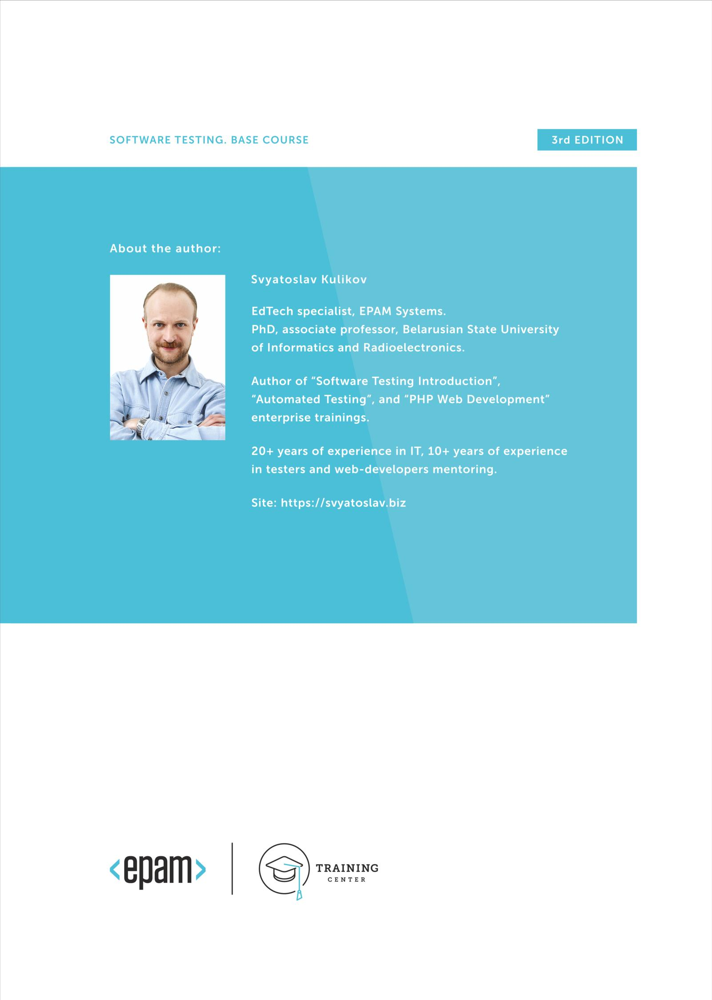

