# Лавріщева К.М. Програмна інженерія 2008.pdf

К.М. Лавріщева

# ПРОГРАМНА ІНЖЕНЕРІЯ

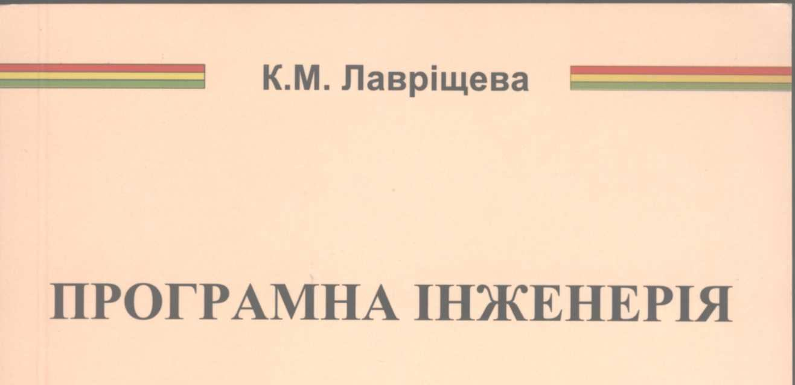

К.М. Лавріщева

# ПРОГРАМНА ІНЖЕНЕРІЯ

## Підручник


Київ, 2008

УДК 681.3.06

**Лавріщева К.М.**  
**ПРОГРАМНА ІНЖЕНЕРІЯ.–К.– 2008.–319 с.**  
ISBN 978–966–02–5052–9  

У підручнику наведено визначення програмної інженерії, її дисциплін та областей ядра знань – SWEBOK, створеного Міжнародним комітетом фахівців у галузі інформатики. Обґрунтовано їхній зміст, базові поняття та складові елементи. З урахуванням Міжнародної програми Computing Curricula – 2004 викладено основні теми навчання: аналіз предметної області, формулювання вимог, проектування, верифікація і тестування, оцінювання якості та керування проектом. Визначено основні положення життєвого циклу, якості та керування згідно з головними стандартами програмної інженерії. Викладено методи інтеграції різномовнох програм та підходів до їхніх змін для нових середовищ. Подано інженерію виробництва прикладних систем та їх сімейств з готових компонентів. Наведено інструментально-технологічні засоби колективного виробництва програмних продуктів у сучасних середовищах та основи їхнього менеджменту і якості.  

Для викладачів, аспірантів та студентів, що вивчають дисципліни програмної інженерії у вищих навчальних закладах, а також тих, хто бере участь у виготовленні програмних продуктів на індустріальній основі.  

**Відповідальний редактор академік НАН України П.І.Андон**  

**Рецензенти:**  
*О.Л.Перевозчикова*, доктор фізико-математичних наук, професор, член-кореспондент НАН України, завідувачка відділу Інституту кібернетики імені В.М.Глушкова НАН України.  
*М.С.Нікітченко*, доктор фізико-математичних наук, професор, завідувач кафедри «Теорія і технологія програмування» Київського Національного університету імені Тараса Шевченка.  
*С.Ф.Теленик*, доктор технічних наук, професор, завідувач кафедри автоматики та управління в технічних системах Національного технічного університету України «Київський політехнічний інститут».  

Рекомендовано Міністерством освіти і науки України як підручник для вищих навчальних закладів (лист №1.4/18–Г–1080 від 14.05.08)  

Затверджено до друку вченою радою Інституту програмних систем НАН України  

ISBN 978–966–02–5052–9  
© К.М.Лавріщева, 2008

# ЗМІСТ

ПЕРЕДМОВА ......................................................................................................... 8  
ВСТУП ................................................................................................................... 11  
Розділ 1. ДИСЦИПЛІНИ ПРОГРАМНОЇ ІНЖЕНЕРІЇ І ОБЛАСТІ ЯДРА ЗНАНЬ – SWEBOK ..................................................................................................... 14  
1.1. Загальне визначення дисциплін програмної інженерії .......................................... 14  
&nbsp;&nbsp;&nbsp;&nbsp;1.1.1. Програмна інженерія як наукова дисципліна ............................................... 17  
&nbsp;&nbsp;&nbsp;&nbsp;1.1.2. Програмна інженерія як інженерна дисципліна ........................................... 19  
&nbsp;&nbsp;&nbsp;&nbsp;1.1.3. Програмна інженерія як виробнича дисципліна .......................................... 24  
&nbsp;&nbsp;&nbsp;&nbsp;1.1.4. Дисципліна керування ................................................................................. 25  
&nbsp;&nbsp;&nbsp;&nbsp;1.1.5. Економічна дисципліна ............................................................................... 26  
1.2. Характеристика областей знань з інженерії програмного забезпечення – SWEBOK .... 27  
&nbsp;&nbsp;&nbsp;&nbsp;1.2.1. Інженерія вимог ............................................................................................ 28  
&nbsp;&nbsp;&nbsp;&nbsp;1.2.2. Проектування програмного забезпечення ..................................................... 30  
&nbsp;&nbsp;&nbsp;&nbsp;1.2.3. Конструювання програмного забезпечення .................................................. 32  
&nbsp;&nbsp;&nbsp;&nbsp;1.2.4. Тестування програмного забезпечення ....................................................... 34  
&nbsp;&nbsp;&nbsp;&nbsp;1.2.5. Супровід програмного забезпечення ........................................................... 36  
&nbsp;&nbsp;&nbsp;&nbsp;1.2.6. Керування конфігурацією ............................................................................ 37  
&nbsp;&nbsp;&nbsp;&nbsp;1.2.7. Керування інженерією програмного забезпечення ...................................... 39  
&nbsp;&nbsp;&nbsp;&nbsp;1.2.8. Базовий процес программної інженерії ....................................................... 41  
&nbsp;&nbsp;&nbsp;&nbsp;1.2.9. Методи і інструменти програмної інженерії ................................................ 42  
&nbsp;&nbsp;&nbsp;&nbsp;1.2.10. Якість програмного забезпечення ............................................................... 45  
Контрольні питання і завдання ....................................................................................... 48  
Список літератури до розділу 1 ...................................................................................... 49  
Розділ 2. СТАНДАРТ І МОДЕЛІ ЖИТТЄВОГО ЦИКЛУ .............................................. 50  
2.1 Характеристика життєвого циклу стандарта ISO/IEC 12207 ...................................... 50  
2.2. Формування прикладних моделей життєвого циклу ............................................... 53  
2.3. Типи моделей життєвого циклу ............................................................................... 58  
&nbsp;&nbsp;&nbsp;&nbsp;2.3.1. Каскадна модель ........................................................................................... 58  
&nbsp;&nbsp;&nbsp;&nbsp;2.3.2. Інкрементна модель ....................................................................................... 59  
&nbsp;&nbsp;&nbsp;&nbsp;2.3.3. Спіральна модель .......................................................................................... 60  
&nbsp;&nbsp;&nbsp;&nbsp;2.3.4. Еволюційна модель ....................................................................................... 62  
Контрольні питання і завдання ....................................................................................... 63  
Список літератури до розділу 2 ...................................................................................... 64  
Розділ 3. ВИЗНАЧЕННЯ ВИМОГ ДО ПРОГРАМНИХ СИСТЕМ ................................. 65  
3.1. Загальні підходи до визначення вимог .................................................................... 65  
&nbsp;&nbsp;&nbsp;&nbsp;3.1.1. Класифікація вимог ....................................................................................... 66  
&nbsp;&nbsp;&nbsp;&nbsp;3.1.2. Аналіз і збирання вимог ................................................................................ 68  
&nbsp;&nbsp;&nbsp;&nbsp;3.1.3. Інженерія вимог ............................................................................................ 70  
&nbsp;&nbsp;&nbsp;&nbsp;3.1.4. Фіксація вимог .............................................................................................. 71  
&nbsp;&nbsp;&nbsp;&nbsp;3.1.5. Трасування вимог ........................................................................................ 73  
3.2. Об'єктно-орієнтована інженерія вимог ................................................................... 74  
&nbsp;&nbsp;&nbsp;&nbsp;3.2.1. Візуальний підхід .......................................................................................... 74  
&nbsp;&nbsp;&nbsp;&nbsp;3.2.2. Текстовий підхід .......................................................................................... 78  
Контрольні питання і завдання ....................................................................................... 79  
Список літератури до розділу 3 ...................................................................................... 79  
Розділ 4. МЕТОДИ ОБ'ЄКТНОГО АНАЛІЗУ І МОДЕЛЮВАННЯ .............................. 80  
4.1. Огляд об'єктно-орієнтованих методів аналізу і побудови моделей .......................... 80  
&nbsp;&nbsp;&nbsp;&nbsp;4.1.1. Основні поняття об'єктно-орієнтованих методів аналізу ............................... 80

4.1.2. Метод побудови об'єктної моделі предметної області ........................................................... 82
4.2. Проєктування архітектури програмних систем ............................................................................ 90
4.2.1. Загальні підходи до проєктування програмних систем ........................................................... 90
4.2.2. Проєктування різних видів архітектур програмних систем ................................................. 92
Контрольні питання і завдання ................................................................................................................... 96
Список літератури до розділу 4 ................................................................................................................... 96
Розділ 5. ПРИКЛАДНІ Й ТЕОРЕТИЧНІ МЕТОДИ ПРОГРАМУВАННЯ ....................................... 98
5.1. Прикладне (систематичне) програмування ..................................................................................... 98
5.1.1. Структурне програмування ..................................................................................................... 99
5.1.2. Об'єктно-орієнтоване програмування ................................................................................... 105
5.1.3. UML-метод моделювання ..................................................................................................... 107
5.1.4. Компонентне програмування ................................................................................................. 111
5.1.5. Аспектно-орієнтоване програмування ................................................................................. 116
5.1.6. Генерувальне (породжувальне) програмування .................................................................. 121
5.1.7. Сервісно-орієнтоване програмування ................................................................................. 127
5.1.8. Агентне програмування ......................................................................................................... 130
5.2. Теоретичне програмування ............................................................................................................... 133
5.2.1. Алгебраїчне та інсерційне програмування ........................................................................... 133
5.2.2. Експлікативне, номінативне програмування ....................................................................... 136
5.2.3. Алгоритмічні алгебри ............................................................................................................ 138
Контрольні питання і завдання ................................................................................................................... 142
Список літератури до розділу 5 ................................................................................................................... 142
Розділ 6. МЕТОДИ ДОВЕДЕННЯ, ВЕРИФІКАЦІЇ І ТЕСТУВАННЯ ПРОГРАМ ...................... 145
6.1. Мови специфікації програм і їхня класифікація ............................................................................. 146
6.1.1. Мова формальної специфікацій – VDM ............................................................................... 148
6.1.2. Мова формальної специфікації – RAISE .............................................................................. 150
6.1.3. Концепторна мова специфікації ........................................................................................... 152
6.1.4. Звичайна мова специфікації Spec# ....................................................................................... 153
6.2. Методи доведення правильності програм ......................................................................................... 155
6.2.1. Базові методи доведення ........................................................................................................ 155
6.2.2. Модель доведення програми за твердженнями .................................................................... 156
6.3. Верифікація і валідація програм ......................................................................................................... 159
6.3.1. Підхід до валідації сценарію вимог ....................................................................................... 161
6.3.2. Верифікація об'єктних моделей ............................................................................................. 162
6.3.3. Підхід до верифікації композиції компонентів .................................................................... 163
6.3.4. Загальні перспективи верифікації програм ........................................................................... 164
6.4. Тестування програмних систем ......................................................................................................... 165
6.4.1. Статичні методи тестування ................................................................................................. 165
6.4.2. Динамічні методи тестування ............................................................................................... 166
6.4.3. Функціональне тестування .................................................................................................... 168
6.5. Інфраструктура перевірки правильності програмних систем .......................................................... 169
6.5.1. Класифікація помилок і методи їхнього пошуку ................................................................. 170
6.5.2. Процес тестування за життєвим циклом .............................................................................. 173
6.5.3. Інженерія керування тестуванням ....................................................................................... 178
Контрольні питання і завдання ................................................................................................................... 181
Список літератури до розділу 6 ................................................................................................................... 181
Розділ 7. ІНТЕРФЕЙСИ, ВЗАЄМОДІЯ, ЕВОЛЮЦІЯ ПРОГРАМ І ДАНИХ ............................ 184
7.1. Визначення інтерфейсу у програмуванні ......................................................................................... 184
7.1.1. Інтерфейси в сучасних середовищах .................................................................................... 185
7.1.2. Інтерфейс між клієнтом і сервером ...................................................................................... 187

7.2. Інтерфейс мов програмування ......................................................................... 189
7.2.1. Інтерфейс і взаємозв'язок мов програмування ............................................... 189
7.2.2. Взаємодія різноможних програм ................................................................. 191
7.2.3. Стандарт ISO/IEC 11404–96 з незалежних від мов типів даних ..................... 194
7.3. Перетворення даних за інтерфейсом ................................................................. 196
7.3.1. Перетворення форматів даних ...................................................................... 196
7.3.2. Перетворення даних з баз даних ................................................................... 198
7.4. Методи еволюційного змінювання компонентів і систем ................................. 201
7.4.1. Реінженерія програмних систем .................................................................. 203
7.4.2. Рефакторинг компонентів ............................................................................. 204
7.4.3. Реверсна інженерія ....................................................................................... 205
Контрольні питання і завдання ................................................................................. 206
Список літератури до глави 7 ..................................................................................... 206
Розділ 8. ІНЖЕНЕРІЯ ВИРОБНИЦТВА ПРОГРАМНИХ ПРОДУКТІВ ...... 209
8.1. Інженерія компонентів повторного використання ............................................ 210
8.1.1. Специфікація КПВ ........................................................................................ 213
8.1.2. Репозитарій компонентів ............................................................................. 216
8.1.3. Мова опису інтерфейсу компонентів .......................................................... 219
8.2. Прикладна інженерія та інженерія предметної області ..................................... 220
8.2.1. Прикладна інженерія .................................................................................... 221
8.2.2. Інженерія сімейства систем домена ............................................................. 222
8.2.3. Стандартизація процесів інженерії домену ................................................ 228
8.3. Інженерія індустріального виробництва програмних продуктів ........................ 229
8.3.1. Структура лінії виробництва програмних продуктів ................................. 230
8.3.2. Технологічне виготовлення систем у середовищі Microsoft ........................ 231
8.3.3. Загальна характеристика інструментів Rational Rose ................................. 235
8.3.4. Засоби підтримки процесу RUP ................................................................... 238
8.3.5. Середовище розроблення систем – CORBA ............................................... 241
8.3.6. JAVA-технологія ........................................................................................... 246
8.4. Оцінювання вартості системи з компонентів .................................................... 248
Контрольні питання і завдання ................................................................................. 250
Список літератури до розділу 8 ................................................................................. 250
Розділ 9. МОДЕПІ ЯКОСТІ ТА НАДІЙНОСТІ ПРОГРАМНИХ СИСТЕМ 252
9.1. Модель якості програмних систем ...................................................................... 252
9.1.1. Стандартні показники якості ....................................................................... 255
9.1.2. Метрики якості .............................................................................................. 258
9.1.3. Стандартна оцінка показників якості .......................................................... 260
9.1.4. Керування якістю програмних систем ........................................................ 262
9.2. Моделі оцінки надійності програмних систем ................................................... 265
9.2.1. Ґрунтовні проблемитики надійності ........................................................... 266
9.2.2. Класифікація моделей надійності ................................................................ 269
9.2.3. Марковські та пуассонівські моделі надійності .......................................... 271
9.2.4. Процеси оцінки надійності ........................................................................... 275
9.3. Сертифікація програмного продукту ................................................................. 279
Контрольні питання й завдання ................................................................................. 280
Список літератури до розділу 9 ................................................................................. 280
Розділ 10. МЕТОДИ КЕРУВАННЯ ПРОГРАМНИМ ПРОЕКТОМ ................... 282
10.1. Менеджмент проекту ........................................................................................ 282
10.1.1. Основні поняття та задачі ............................................................................ 282
10.1.2. Головні цілі менеджменту проекту ............................................................ 283
10.1.3. Процес менеджменту проекту ..................................................................... 284
10.1.4. Модель процесу керування проектом ........................................................ 285

10.1.5. Інфраструктура програмного проекту ............................................................. 287
10.2. Методи керування і планування проектом ........................................................... 289
10.2.1. Метод критичного шляху – СРМ .............................................................. 291
10.2.2. Метод аналізу й оцінки проекту – PERT ................................................. 292
10.2.3. Планування і контроль проекту ................................................................ 294
10.2.4. Оцінювання вартості проекту .................................................................. 297
10.3. Методи керування ризиками у проекті ................................................................. 298
10.4. Керування конфігурацією системи ....................................................................... 301
10.4.1. Формування версій й контроль конфігурації .......................................... 304
10.4.2. Облік статусу й аудит конфігурації ......................................................... 306
Контрольні запитання і завдання ................................................................................... 307
Список літератури до розділу 10 ................................................................................... 308
ПІСЛЯМОВА ................................................................................................................. 309
СПИСОК ПОЗНАЧЕНЬ І СКОРОЧЕНЬ ....................................................................... 311
ДОДАТОК 1. Термінологічний словник ................................................................. 313
ДОДАТОК 2. Перелік стандартів програмної інженерії ......................................... 319

## ПЕРЕДМОВА

Сьогодні у багатьох навчальних закладах введено як спеціальність програмну інженерію (*Software Engineering*). Це наука побудови комп'ютерних програмних систем (ПС), що містить у собі теоретичні концепції, методи і засоби програмування, технологію програмування, системи та інструменти їхньої підтримки, сучасні стандарти, зокрема, процеси життєвого циклу (ЖЦ), вимірювання і оцінювання якості розробки ПС. Головне призначення програмної інженерії — побудова ПС, починаючи з аналізу предметної області (ПрО) і закінчуючи виготовленням вихідного коду для виконання на комп'ютері. Фундаментальну основу побудови ПС становлять: теорія алгоритмів, математична логіка, теорія обчислень, теорія керування й ін.

Колективне розроблення великих проектів ПС обумовило розвиток інженерних, технологічних методів і засобів регламентованого проектування ПС з урахуванням організаційних процесів ЖЦ: інженерія вимог, керування ризиком і якістю, планування і регулювання ресурсів, оцінювання процесів ЖЦ та показників якості, вартості і строків виготовлення програмного продукту. Інакше кажучи, в програмній інженерії склалися засади для індустріального виробництва сучасних програмних продуктів подібно до промисловості: засоби й інструменти, загальні інструментальні системи і середовища підтримки процесу програмування, інженерні методи керування діяльністю виробників ПС та системи оцінки продуктів і процесів з економічної та технологічної точок зору.

Ціль даного підручника — представити методи і засоби програмної інженерії в структурованому і систематизованому вигляді для теоретичного й практичного навчання процесам проектування, тестування і оцінювання якості ПС. У підручнику відображено зміст програмної інженерії з урахуванням базового ядра знань SWEBOK (http://www.swebok.org) та програми навчання Computing Curricula — 2001, 2004, що застосовується на факультетах інформатики в міжнародних навчальних закладах понад 20 років. Навчання програмній інженерії є запорукою успішного освоєння накопичених міжнародною спільнотою знань з інженерії побудови програмних продуктів.

Студенти отримають теоретичні й інженерні знання з процесів розробки ПС, практики подання програм для їхнього опрацювання у середовищі сучасних інструментальних систем провідних фірм: Microsoft, IBM, Rational тощо. Крім того, вони навчаться методам верифікації, валідації та тестування програм, метричного аналізу, виміру, оцінки показників якості та продуктивності продукту, а також перенесення його на інші платформи.

Програму навчання програмній інженерії в Україні затверджено Кабінетом Міністрів (13 грудня 2006 р. №1719) для отримання освітньо-кваліфікаційного рівня бакалавра. Проте в Україні практично відсутні підручники з програмної інженерії для викладання цього курсу у вищих навчальних закладах на факультетах інформатики, тому даний підручник буде вчасним.

У підручнику подано структуру і викладено зміст програмної інженерії, сучасні методи програмування, базові положення стандартів ЖЦ і якості розробки ПС. Виконано системний розгляд методів доведення, верифікації і тестування програм, а також методів інтеграції і взаємодії різномовнових програм, перетворення

їхніх типів даних для різних середовищ і платформ. Викладено сутність базових методів керування програмним проектом за графіками робіт, спостереження за ризиками і оцінювання якості продукту. Розглянуто різні лінії виробництва ПС із застосуванням готових компонентів повторного використання, що накопичені у сучасних бібліотеках (репозитаріях) і скорочують час створення нових програмних проектів.

Матеріал підручника пройшов апробацію при читанні лекцій у Київському національному університеті імені Тараса Шевченка (1985–1997 рр. і 2007–2008 рр.), філії Московського фізико-технічного інституту при Інституті кібернетики НАН України (2000–2008 рр.), а також обговорений у колективі наукового відділу ІПС НАНУ, на Всеукраїнській конференції «Програмна інженерія – напрями навчання» Національного авіаційного університету (3–5 грудня 2007 р.), на УкрПроГ –2004, 2006, 2008 рр., а також на Міжнародній конференції TAAPSD–2008, його багаторазово обговорювали у колективі наукового відділу Інституту програмних систем НАН України.

Даний підручник орієнтований на студентів, які навчаються за спеціальностями «Комп'ютерні науки», «Комп'ютерна інженерія», «Прикладна математика» у галузі знань «Інформатика і обчислювальна техніка» та «Автоматизовані системи управління». Він також може використовуватися викладачами як зразок при практичній підготовці курсу лекцій з навчання студентів за вказаними спеціальностями.

Автор виносить велику подяку викладачам університету В.М.Антонову, В.П.Шевченко, редакторам Н.М.Міщенко, М.К.Пуніної, науковим співробітникам інституту Г.І. Коваль, Т.М.Коротун, О.О.Слабоспицькій за змістовне обговорення і критику щодо нової структуризації програмної інженерії, а також за величезну допомогу в формуванні матеріалу, оформленні багатьох рисунків та таблиць і за вичитку кінцевого матеріалу підручника.

Підручник складається з 10 розділів. Наприкінці кожного розділу наведено контрольні питання і завдання, а також список використовуваної літератури.

**Розділ 1. Дисципліни програмної інженерії і області ядра знань – SWEBOK.** Наведено визначення програмної інженерії та її дисциплін, охарактеризовано зміст та основні складові цих дисциплін, а також викладено загальний зміст областей ядра знань – SWEBOK.

**Розділ 2. Стандарти і моделі життєвого циклу.** Наведено характеристики базових моделей ЖЦ, що використовуються на практиці. Викладено основні положення стандарту ISO/IEC 12207 і підходи до формування на його основі робочих моделей ЖЦ.

**Розділ 3. Аналіз та визначення вимог до програмних систем.** Розглянуто загальні підходи, методи аналізу предметної області та формування вимог до ПС.

**Розділ 4. Методи об'єктного аналізу і моделювання.** Проведено огляд методів об'єктного аналізу, побудови моделей предметних областей та проектування архітектури системи.

**Розділ 5. Прикладні і теоретичні методи програмування.** Проаналізовано і охарактеризовано прикладні, теоретичні і формальні методи програмування, а також наведено короткий огляд їхніх засобів щодо подання та розробки ПС.

**Розділ 6. Методи доведення, верифікації і тестування програм.** Визначено формальний апарат специфікації, доведення, верифікації і тестування програм.

Наведено класифікацію помилок, що виявляються при перевірці правильності програм. Розглянуто інженерію тестування різних програмних об'єктів.

**Розділ 7. Інтерфейс, взаємодія, еволюція програм та даних.** Визначено методи інтеграції, розглянуто проблеми взаємодії різномовнових програм і даних у сучасних середовищах, а також методи еволюційної зміни компонентів і систем. Наведено характеристику стандарту ISO/IEC 11404–96 з опису даних, незалежних від мов програмування.

**Розділ 8. Інженерія виробництва програмних продуктів.** Наведено змістовні характеристики інженерії виробництва компонентів, предметної області із готових компонентів та лінії виробництва програмних продуктів, а також особливості сучасних середовищ для колективного виробництва ПС.

**Розділ 9. Моделі якості та надійності програмних систем.** Визначено модель якості, метрики і методи виміру показників якості ПС. Наведено класифікацію математичних моделей надійності та підходи до оцінки надійності програмного продукту за деякими моделями.

**Розділ 10. Методи керування програмним проєктом.** Проведено аналіз сучасного менеджменту програмних проектів і дано опис інженерних методів планування, керування роботами, ризиками та конфігурацією проекту. Розглянуто методи оцінки вартості та строків.

**Післямова.**
**Список скорочень і позначень.**
**Додаток 1. Термінологічний словник.**
**Додаток 2. Перелік стандартів програмної інженерії.**

## ВСТУП

*Програмна інженерія* — це наука побудови комп'ютерних програмних систем на інженерній основі за методами, засобами і інструментами програмування, сучасними стандартами процесів ЖЦ, менеджменту та керування якістю. Особливістю виробництва нових систем є технологія їх проектування від аналізу предметної області до утворення коду для виконання на комп'ютерах. Основа інженерії проектування — теорія алгоритмів і програмування, теорія обчислень і розподіленої обробки, теорія обчислювальних мереж та ін.

Програмна інженерія (ПІ) містить у собі методи і засоби керування програмними проектами (планування робіт і регулювання ресурсів), експертне оцінювання проміжних результатів розроблення під час процесів ЖЦ, оцінювання ризику побудови програмної системи і досягнутої для неї якості. Ця дисципліна використовує стандарти (наприклад, ISO/IEC 12207, ДСТУ 9126), що регламентують процеси ЖЦ, інженерію вимог, тестування і забезпечення якості шляхом перевірки показників на процесах ЖЦ і кінцевого продукту для їхнього оцінювання. Інакше кажучи, в програмної інженерії подані питання теоретичної і практичної побудови різних програмних систем для виконання задач з оброблення інформації на комп'ютерах з метою отримання корисних даних.

Проектування у ПІ — це конструювання комп'ютерних систем методами та засобами програмування за такими загальними кроками:
- опис вимог;
- опис специфікацій системи;
- розроблення системи;
- тестування, оцінка надійності і якості системи.

Проектування за цими кроками містить у собі експертні методи оцінки прийняття рішень, змінювання програм і систем, валідацію нових гіпотез, теорію абстрагування, методи трансляції та керування ресурсами виготовлення, розподілення обчислень тощо. Інженерія проектування програмних систем починає діяти, починаючи з формулювання вимог до них, розроблення і супроводу до зняття з експлуатації. До інженерії належать методи оцінки продукту, а саме, розрахунки трудовитрат, обсягу, вартості та якості.

Інженерна діяльність у програмуванні на теперішній час за своєю сутністю дуже близька до інженерної конвеєрної діяльності в промисловості, тільки тут готовими «деталями» виступають поки ще не достатньо при промисловому використанні багаторазових програм і систем. На сучасному етапі розвитку базисом інженерії проектування програмних систем стали компоненти повторного використання (reuse), яких достатньо створено у різних областях, і вони подібні до готових деталей в промисловості. Це є фундаментальним для становлення конвеєрного виробництва програмних продуктів, як продуктів промислово-технічного призначення.

Характерною ознакою виробництва програмних продуктів стала поява нових категорій фахівців, крім програмістів, а саме, менеджерів, керівників команди розробників, інженерів служби ведення бібліотек, технологів, тестувальників і різного роду контролерів проміжних результатів проектування на процесах ЖЦ.

Програмна інженерія відрізняється від традиційної промислової інженерії природою свого продукту, який не відчувається і не матеріалізується в наочний

фізичний предмет, а постійно змінюється під час супроводження та при стрімких темпах розвитку комп’ютерних платформ і середовищ.

І тому залучення нових категорій спеціалістів зробить представлення віртуальної архітектури програмної системи у кібернетичному вимірі більш якісним і продуктивним. Продуктами виробництва можуть бути: системи обробки даних, системи підтримки прийняття рішень, АСУ, інформаційні системи й ін.

Значну роль у становленні програмної інженерії відіграла систематизація накопичених знань у програмуванні, виконана комітетом спеціалістів у галузі інформатики під егідою відомих комп’ютерних організацій IEEE Computer Society і ACM (Association for Computer Machinery). Цей комітет створив (1999 р.– перший варіант, 2001 р. – другий) ядро знань SWEBOK, де наведено визначення предмету програмної інженерії і її тематичних областей (knowledge areas). Одночасно були розроблені стандарти з програмної інженерії, головні серед яких ISO/IEC 12207 – життєвий цикл ПЗ і ДСТУ 9126 – якість програмного продукту тощо.

Ядро знань SWEBOK і регламентовані процеси стандарту ISO/IEC 12207 узгоджені між собою. Вони утворюють практичний базис інженерії виробництва програмного продукту. Питання керування програмним проектом розглянуті в іншому ядрі знань – PMBOK та відповідному стандарті IEEE Std.1490 «IEEE A Guide to the Project Management Body of Knowledge». Стандарти визначають порядок діяльності в сфері технології розробки, а знання, те що необхідно фахівцям для виконання всіх видів діяльності з проектування і реалізації задач проекту, визначені в ядрі знань SWEBOK.

Виходячи з базових положень стандартів, програмний продукт проектується більш цілеспрямовано і регламентовано з використанням на кожному з процесів необхідних методів та засобів ядра знань SWEBOK. Програмна інженерія та її стандарти орієнтують колективи виконавців до менеджменту проекту та якісний вимір його показників, а також до прийняття рішень про компоненти повторного використання, оцінювання проміжного і кінцевого результату на задоволення вимог замовника тощо.

Таким чином, між ядрами знань SWEBOK, PMBOK і основними стандартами існує зв'язок і взаємоплив один на одного, тим більш, що в їхній розробці одночасно беруть участь висококваліфіковані фахівці в галузі програмування й інформатики. Загальні ідеї, методи та інструменти програмування, що склалися в 90-х роках минулого сторіччя, проникли в усі напрями і вплинули на стандартизацію процесів і їхній склад. У ядрі знань SWEBOK викладено концептуальні знання й інженерні підходи до керування проектування програмного продукту, а в стандартах — загальні правила і регламентовані процеси послідовного його розроблення. Але індустріальне виробництво різних видів програмних систем і сімейств систем потребує структуризації програмної інженерії, пов'язаної не тільки з процесами ЖЦ і відповідними змістовними методами проектування з SWEBOK, а й з теоретичними і прикладними методами забезпечення виробництва.

____________________
1.К.М.Лавріщева. Перспективні дисципліни програмної інженерії // Вісник НАН України.– 2008.–№9.–С.12–18.

Отже головною особливістю даного підручника є нова структуризація і систематизація змісту програмної інженерії за дисциплінами$^1$, які обговорені за доповідями автора на міжнародних конференціях УКРПроГ–2008, TAAPSD'2008 та різних семінарах і лекціях. Сутність кожної з дисциплін така:

– наукова дисципліна визначена як сукупність формальних методів специфікації, доведення та верифікації програмних об'єктів, методів їх об'єднання, теоретичних і прикладних методів програмування та теоретичних моделей надійності програм та методів їхнього застосування;

– інженерна дисципліна сформульована як сукупність технологічних засобів і методів проектування ПС за фундаментальними моделями ЖЦ, положеннями сучасного стандарту із процесів ЖЦ, техніки аналізу предметної області, формулювання вимог з розробленням за ними відповідного вихідного коду, його супроводу та внесення до нього різного роду змін, включаючи ті, що забезпечують перенесення програмного продукту на інші комп'ютерні платформи;

– дисципліна керування базується на теорії управління, як підґрунті для визначення сутності базових методів керування програмним проектом за графіками робіт, спостереження за виконанням планів, керуванням ризиками та формуванням версій (конфігурацій) виготовленого програмного продукту та передачі його користувачам;

– економічна дисципліна сформульована як сукупність методів експертного, якісного і кількісного оцінювання проміжних об’єктів ЖЦ, а також економічних методів розрахунків часу, обсягу і вартості виготовлення програмних продуктів, що поставляються на ринок;

– виробнича дисципліна – це сучасні промислові технологічні прийоми виробництва прикладних систем, сімейств систем з застосуванням готових програмних ресурсів, включаючи компоненти повторного використання, накопичених у сучасних інформаційних сховищах, одиночні готові програми розв'язку деяких задач, сервісні, агентні артефакти тощо. Для забезпечення їх правильності виконуються методи верифікації, тестування і оцінки за отриманими на них показниками якості програмного продукту.

Нова структуризація програмної інженерії, виконана автором з орієнтацією на основні функціонально–технологічні задачі виробництва програмних продуктів, включаючи керування різними ресурсами, інженерію проектування, економічні оцінки витрат, часу, вартості тощо. Зміст структурованих дисциплін програмної інженерії подано в короткому обґрунтованому викладі у розділі 1. Детальніше різні аспекти цих дисциплін висвітлені в розділах підручника: наукова дисципліна – 4, 5, 6, інженерна дисципліна – 2, 3, 7, економічна і виробнича дисципліни – 8, 9 та дисципліна керування – 10.

Надалі буде проведено більш системний розгляд усіх областей SWEBOK з точки зору використання таких наук, як теорія керування, економіка, мережі, безпека з метою створення відповідної структури і змісту кожної з дисциплін. Навчання майбутніх спеціалістів в вищих навчальних закладах за такими дисциплінами забезпечить їх знаннями, необхідними для участі у індустріальному виробництві програмних продуктів.

# Розділ 1. ДИСЦИПЛІНИ ПРОГРАМНОЇ ІНЖЕНЕРІЇ І ОБЛАСТІ ЯДРА ЗНАНЬ – SWEBOK

У першому розділі формально визначено запропоновані дисципліни програмної інженерії. Наведено структуру, зміст та їхнє призначення. Подано дефініцію програмної інженерії у вузькому розумінні, запропонованому у ядрі знань SWEBOK, і широкому – продиктованому прикладними досягненнями щодо сформульованих видів програмного забезпечення, так званих цільових об'єктів (програмних проєктів, доменів, сімейств програм і систем). Визначені теоретичні і прикладні ознаки, атрибути і об'єкти програмної інженерії. Наведена класифікація її базових понять і цільових об'єктів, а також методів і засобів їх побудови з використанням сучасної теорії програмування і новітніх інструментальних засобів. Вперше подано зміст і набір головних елементів інженерії програмування, а саме, базового процесу, ядра знань PMBOK, стандартів життєвого циклу та якості програмного продукту і визначено призначення кожного окремого елементу та ядра знань SWEBOK, яке містить у собі 10 областей, що умовно поділені на головні області (вимоги, проєктування, конструювання, тестування), та організаційні (керування конфігурацією, проєктом, якістю та базовим процесом). Опису цих областей і присвячено другий підрозділ даного розділу.

## 1.1. Загальне визначення дисциплін програмної інженерії

Термін *програмна інженерія* вперше було використано у 1968 р. З того часу протягом 40 років зміст цього поняття поступово змінювався, що обумовлене постійним розвитком програмування, спочатку як мистецтва одинаків, потім як теоретичної та прикладної науки, і, з часом, як інженерної діяльності.

Завдяки багаторічній праці всесвітнього програмістського загалу накопичилася велика кількість знань та досвід побудови різноманітних комп'ютерних програм. Вони знайшли відображення у конкретних програмних продуктах широкого застосування та у множині теоретичних і прикладних методів і засобів, принципів і правил, а також цілісних процесів виробництва комп'ютерних систем колективами програмістів і інженерів (включаючи інженерів-оцінювачів програмних продуктів і процесів, тестувальників тощо).

У рамках багатогранної діяльності теоретиків та практиків у галузі програмування сформувалися формальні методи доведення, верифікації і тестування програм, математичні моделі надійності, методи оцінювання показників якості програмних продуктів тощо. Все це обумовило необхідність систематизувати набуті знання і визначити їх у вигляді самостійної дисципліни (предмету) з метою формування загального бачення проблеми тими, хто займається комп'ютерною діяльністю, або фахівцями-теоретиками у даній галузі.

Спеціально створений комітет фахівців з інформатики при ACM i IEEE Computer Society сформував базове ядро знань SWEBOK (Software Engineering body of Knowledge – 2001р.), у якому в концентрованому вигляді подав концептуальний зміст десятьох базових областей (knowledge areas) та дефініції програмної інженерії (ПІ), зокрема [1-3]. У ядрі знань SWEBOK наведене таке визначення програмної інженерії (воно відповідає глосарію IEEE):

Розділ 1

**Визначення 1.1.** *Програмна інженерія (SE)* – це  
1) застосування систематичного, дисциплінованого та вимірюваного підходу до розроблення, експлуатації і супроводження програмного забезпечення (ПЗ) із застосуванням інженерних методів до розроблення ПЗ,  
2) навчальна дисципліна, що вивчає вказані вище підходи.

Ця дефініція обмежує суть не лише поняття предмета ПІ, а й об’єкта, розглядаючи як такий лише програмне забезпечення, а не програмні проєкти, процеси та методи розробки програмних продуктів тощо. Тому необхідно визначити ПІ і її об’єкти у більш широкому розумінні, доповнюючи аспектами, що характеризують ПІ як наукову й інженерну дисципліни.

Відомо, що будь-яка наука – це система перевірених практикою знань, які відображають загальні питання, поняття і закономірності їх розвитку. Вона встановлює зв’язки з іншими науками і впливає на їх розвиток. Так, програмна інженерія інтегрує в собі принципи математики та головні положення фундаментальних наук, а саме, теорії алгоритмів, математичної логіки, теорії керування, теорії множин, доведення тощо (рис.1.1).


Рис. 1.1. Теоретичний фундамент програмної інженерії

Ці науки створюють теоретичний базис програмної інженерії, необхідний для побудови абстракцій програм за їх базовими поняттями та принципами, що перелічені нижче за кожною з фундаментальних наук базису:
– у теорії алгоритмів – нормальні алгоритми, обчислювальні функції, машина Тюрінга, алгоритмічні алгебри, граф-схеми, моделі алгоритмів і програм тощо;
– у математичній логіці – логічні числення і логіко-алгебраїчний апарат специфікації програм;
– у теорії керування – принципи, методи та загальні закони планування і керування процесами отримання й оброблення інформації в кібернетичних і управлінських системах;
– у теорії доведення – математичне доведення за аксіомами і твердженнями програм, вивід теорем, обґрунтування суперечності й алгоритмічно невирішених проблем, а також теорія верифікації програм, теорія надійності ПЗ;

– у теорії множин – квантори загальності, існування, операції над множинами, що застосовуються для формального подання різних сукупностей програмних об’єктів і аксіом.

Крім цих засад, система знань програмної інженерії містить у собі [4–9]:
– формальні методи програмування – специфікація програм, їхній доказ, верифікація і тестування, а також математичні моделі надійності, ризику тощо;
– прикладні методи, а саме, прийоми, принципи, правила, окремі дії й цілісні процеси життєвого циклу (ЖЦ) виробництва комп’ютерних систем, які є інструментами колективної розробки, що застосовуються виконавцями великих програмних проєктів;
– методи керування колективами, а саме, планування за мережними графіками, контролювання робіт у процесах ЖЦ, вимірювання і оцінювання якості проміжних результатів виробництва, прогнозування і регулювання строків і вартості виготовлення продукту, а також його сертифікації.

Інакше кажучи, програмна інженерія як спадкоємиця науки програмування використовує для свого розвитку всі теоретичні і прикладні досягнення, набуті за період її існування. Таким чином, вона складалася, як науково-інженерна дисципліна, яка входить до складу комп’ютерної науки (Computer science).

Отже, наведемо нове визначення програмної інженерії як наукової і інженерної дисципліни у більш широкому сенсі.

**Визначення 1.2.** *Програмна інженерія* – розділ комп’ютерної науки, який вивчає методи і засоби побудови комп’ютерних програм; відображає закономірності розвитку та узагальнює накопичений досвід програмування; оперує об’єктами (модулями, компонентами, програмними аспектами тощо) та визначає автоматизовані операції щодо їх виробництва; виробляє правила і порядок інженерної діяльності і керування технологічним процесом побудови з простих об’єктів нових, більш складних, об’єктів (програмного забезпечення, програмних систем (ПС), сімейств систем, програмних проєктів тощо), а також методи виміру й оцінки готового продукту.

У цьому визначенні береться до уваги теорія програмування та інженерія виробництва програмних продуктів, що сформувалася шляхом адаптації загальних методів керування (наприклад, методу критичного шляху, PERT, за операціями), яким властивий розподіл робіт між різними виконавцями проекту та оцінка трудомісткості праці, вартості виготовлення продукту та його якості.

Таким чином, програмна інженерія – це наукова і інженерна дисципліни виробництва програмних продуктів (рис.1.2).


Рис.1.2. Наукова і інженерна дисципліни програмної інженерії

На перетині областей визначення ПІ (овалів на рис.1.2) — теорія та практика побудови складних програмних об'єктів. *Теорія побудови* — це теорія їхнього програмування за абстрактними специфікаціями (графовими і структурними схемами, функціями і композиціями, дескрипторами і номінативними даними, сценаріями (use case діаграми), а також формальна перевірка відповідності об'єктів специфікаціям за методами доведення, верифікації, інспекції тощо. *Практика побудови* — це застосування теоретичних і практичних методів інженерії програмування за допомогою використання засобів перевірки (верифікації, валідації, тестування) специфікацій об'єктів, інструментів їх послідовного трансформування до результуючого коду та інженерія оцінки і сертифікації різних показників якості (надійності, продуктивності, ефективності тощо) виготовленого програмного продукту.

### 1.1.1. Програмна інженерія як наукова дисципліна

На відміну від математичної або інших фундаментальних наук, метою яких є отримання нових знань для розв'язання відповідних задач, метою програмної інженерії є застосування знань для розроблення складних програмних об'єктів, де знання — це уособлення загальної теорії побудови програм для комп'ютерів, орієнтованої на виготовлення продукту, впровадження якого буде корисним для споживача.

*Програмна інженерія як наукова дисципліна* охоплює теоретичні, формальні методи та відповідні засоби побудови складних програмних об'єктів. *Побудова* має на меті аналіз предметної області, що автоматизується, і продукування результуючого коду для виконання на комп'ютері. Інтегровані в програмну інженерію фундаментальні науки, згадані вище (на рис.1.1), а також наука програмування, становлять її загальну теоретичну основу, яка надає базові поняття, об'єкти і формальні механізми, необхідні для надання програмним продуктам загальних властивостей та специфічних рис відповідно до встановлених до них вимог. ПІ як наука містить у собі:
1) основні поняття і об'єкти;
2) теорію програмування і методи керування виготовленням продукту;
3) засоби і інструменти процесів розроблення продукту.

**1. Основні поняття** програмної інженерії — це дані і їх структури (прості і складні), функції і композиції, базові об'єкти (модуль, компонент, каркас, контейнер, компонент повторного використання (КПВ) тощо) і цільові об'єкти (програмне забезпечення, програмна система, сімейство систем, програмний проєкт, складні програмні застосування тощо).

Розроблення простих об'єктів — це елементарні дії з їх формального опису, а розроблення цільових об'єктів — застосування інженерних методів, включаючи керування строками і вартістю виробництва.

Надамо загальне визначення цільових об'єктів у ПІ.

**Визначення 1.3.** **Програмна (прикладна) система** (Application) — комплекс інтегрованих програм і засобів, що реалізують набір взаємопов'язаних функцій деякої предметної області в заданому середовищі. У комплекс можуть входити: прикладні системи (наприклад, програми розрахунку зарплати, обліку матеріалів на складі тощо), загальносистемні програмні засоби (наприклад, транслятор, редактор, СКБД тощо), спеціалізовані програмні засоби для реалізації функцій захисту

інформації, забезпечення безпеки функціонування та ін. *Спосіб виготовлення* – інженерія ПЗ (або application engineering), що містить у собі процеси ЖЦ, методи розробки і процедури керування, а також методи і засоби оцінки продуктів і процесів з метою їх удосконалення.

**Визначення 1.4.** *Програмне забезпечення* – сукупність програмних засобів, які реалізують функції комп'ютерної системи (або функції технічної апаратно-програмної системи), включаючи загальносистемні засоби (наприклад, ОС, СКБД, вбудовані підсистеми контролю показників технологічних процесів, оброблення сигналів тощо) та прикладні програмні системи. Так, функціями деякої ОС є керування задачами, програмами, даними і т.п. *Спосіб виготовлення* – інженерія розробки цільових програм для задач з ПЗ.

**Визначення 1.5.** *Сімейство систем* (Systems family) – сукупність програмних систем із загальним (незмінним для всіх членів сімейства) і керованим (змінним) набором характеристик, що задовольняють визначені потреби прикладної області (домену). *Спосіб виготовлення* – інженерія домену (Domain Engineering) або конвеєрне виробництво однотипних ПП за єдиною схемою на основі спеціально розроблених базових членів сімейства й інших готових програмних ресурсів (assets) за допомогою базового процесу або автоматизованої лінійки продукту (Product line).

**Визначення 1.6.** *Програмний проєкт* – унікальний і інтегрований комплекс взаємозалежних заходів, орієнтованих на досягнення цілей і задач об'єкта розробки за визначеними вимогами до строків, бюджету та характеристик очікуваних результатів діяльності від нього. *Спосіб виготовлення* – інженерія процесу розроблення і менеджменту проєкту.

**Визначення 1.7.** *Складні програмні об'єкти* – сукупність взаємопов'язаних цільових об'єктів різних типів, які виконують необхідні функції в складній системі, подані як самостійно розроблені прості та цільові об'єкти або вибрані з репозитарію готових ресурсів.

**2. Теорія програмування** – сукупність методів, мов і засобів опису та проєктування цільових об'єктів, а також методів їхнього доведення, верифікації і тестування [6–8]. Разом об'єкти теорії програмування в програмній інженерії використовують формальні методи керування проєктом (персоналом, матеріальними та фінансовими ресурсами) і його окремими характеристиками. Відповідно до проведеної нами класифікації методів теорії програмування у програмній інженерії застосовуються такі (рис.1.3):

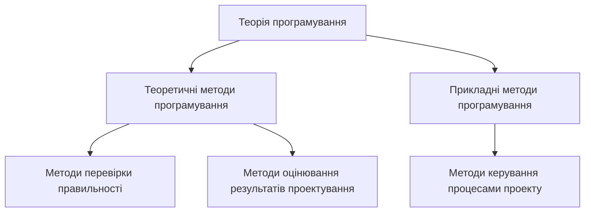

Рис.1.3. Сукупність методів програмної інженерії

*- методи програмування: теоретичні (алгебраїчний, алгоритмічний, експлікативний, алгоритмічний, концепторний, VDM, RAISE тощо) і прикладні (об'єктний, компонентний, аспектний, генерувальний тощо), призначені для проектування різних типів цільових об'єктів;

- методи перевірки правильності за формальними процедурами (твердження, вивід, доказ);
- методи оцінки результатів послідовного проектування (проміжних робочих продуктів) і кінцевого продукту відносно встановлених показників (надійність, якість, точність, продуктивність тощо);
- методи керування (менеджменту) і контролю розробки проміжних результатів під час виконання процесів проекту, а також допоміжні розрахункові методи (трудомісткість праці кожного розробника, вартості робіт тощо).

### 1.1.2. Програмна інженерія як інженерна дисципліна

Програмна інженерія як інженерна дисципліна (або власне інженерія) – це сукупність прийомів виконання діяльності, пов'язаної з виготовленням програмного продукту для різних видів цільових об'єктів із застосуванням методів, засобів і інструментів наукової складової програмної інженерії [8–10]. Основу інженерії становлять наступні базові елементи процесу виготовлення програмного продукту (рис. 1.4):

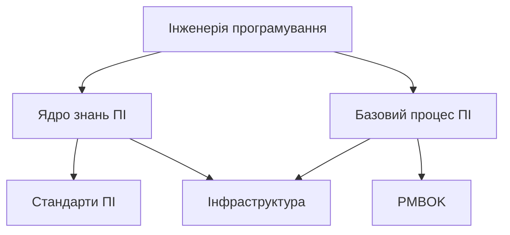

Рис. 1.4. Базові складові інженерної дисципліни

1) ядро знань SWEBOK, як набір теоретичних концепцій і формальних визначень методів і засобів розробки та керування програмними проектами, які можуть застосовуватися в інженерії програмування;
2) базовий процес ПІ, як стрижень процесної діяльності в організації-розробнику програмного продукту;
3) стандарти, як набір регламентованих правил конструювання проміжних артефактів у процесах ЖЦ;
4) інфраструктура – умови середовища та методичне забезпечення базового процесу ПІ і підтримка дій його виконавців, що займаються виробництвом програмного продукту;
5) менеджмент проекту (PMBOK) – ядро знань з керування промисловими проектами – набір стандартних процесів, а також принципів і методів планування і контролювання роботами у проекті [11];
6) засоби та інструменти розробки програмних продуктів.

З інженерної точки зору в програмній інженерії розв'язуються задачі виготовлення ПІ, подані як технологічні процеси формування вимог, проектування

організаційної структури колективу розробників та методології оцінки, вимірювання, керування змінами та вдосконалення самого процесу. В цілому базовий процес складається з множини логічно пов'язаних видів інженерної діяльності організації-розробника та набору засобів і інструментів щодо виготовлення програмного продукту.

3. **Інфраструктура** — це набір технічних, технологічних, програмних (методичних) та людських ресурсів організації-розробника, необхідних для виконання підпроцесів базового процесу програмної інженерії, орієнтованого на виконання договору з замовником програмного проекту. До технічних ресурсів належать: комп'ютери, пристрої (принтери, сканери тощо), сервери і т.п., до програмних — загальносистемне ПЗ середовища розробки, напрацювання колективу, оформлені у вигляді компонентів повторного використання, та інформаційне забезпечення. Технологічні та методичні ресурси складають методики, процедури, правила, рекомендації стандартів з процесу і керування персоналом разом з комплектом документів, що встановлює регламент виконання і регулювання процесів ЖЦ, застосовуваних для розв'язання конкретних задач проекту. Людські ресурси — це групи розробників і служб керування проектом, планами, якістю, ризиком, конфігурацією, а також перевірки правильності виконання проекту розробниками [9–11].

Засоби, проміжній результати розробки за процесами ЖЦ, а також методики керування різними ресурсами, виконання БП і застосування методів програмування, зберігаються у базі знань проекту (рис.1.5).

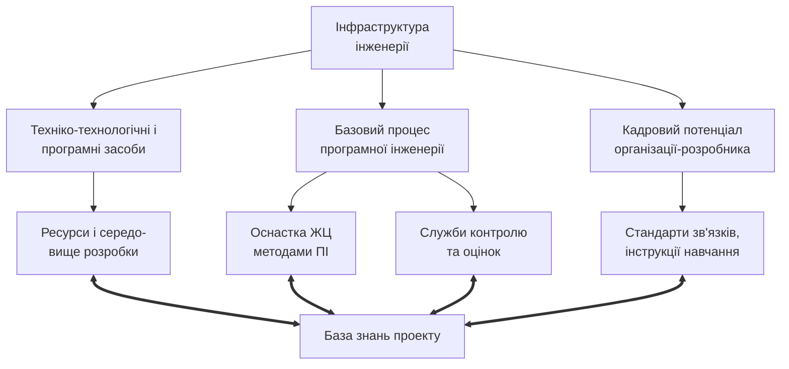

Рис.1.5. Загальна інфраструктура проекту

Після виконання проекту і отримання досвіду побудови конкретного продукту, базовий процес і його окремі елементи, подані на рис. 1.5, можуть удосконалюватися (доопрацюванням або зміною прийомів, доробкою, змінюванням, додаванням нових засобів) відповідно до вимог стандарту ДСТУ ISO/IEC 15504-7 («Оцінювання процесів ЖЦ ПЗ. Настанови з удосконалення процесу») з метою підвищення рівня можливостей і оцінки потужності процесу.

Готовність всіх видів забезпечення організації-розробника, досконалість виконуваних процесів і якість створеного в ній продукту надають підстави для оцінки зрілості організації або сертифікації процесів виробництва ПЗ. Для оцінювання зрілості може застосовуватися модель зрілості СММ (Capability

Maturity Models) [11], запропонована Інститутом програмної інженерії SEI США, або інша модель, наприклад, Bootstrap, Trillium тощо. Модель СММ встановлює рівні зрілості організації щодо створення програмних продуктів. Рівень зрілості визначається наявністю в організації базового процесу усіх необхідних видів ресурсів (у тому числі і фінансових), відповідних стандартів і методик, а також професійних здібностей (зрілості) членів колективу організації, здатних виготовляти програмні продукти в заданий строк і встановленої вартості.

**4. Стандарти ПІ** встановлюють технологічно відпрацьований набір процесів зі строго визначеним і регламентованим порядком проведення різних видів робіт з програмної інженерії, зв'язаних з розробленням програмного продукту і оцінюванням його якості, ризику тощо. Стандарти у галузі програмної інженерії регламентують різні напрями діяльності щодо проектування програмних продуктів. Вони стандартизують термінологію і поняття, життєвий цикл, якість, вимірювання, оцінювання продуктів і процесів. Найбільш важливими серед них є стандарт ISO/IEC 12207 «Процеси життєвого циклу програмного забезпечення» (та його дещо застарілий вітчизняний еквівалент ДСТУ 3918–99), серія стандартів ДСТУ ISO/IEC 14598 «Оцінювання програмного продукту», стандарт ДСТУ ISO 15939 «Процес вимірювання», серія стандартів ISO/IEC 15504 «Оцінювання процесів ЖЦ ПЗ», базові стандарти з якості – ISO 9001 «Системи керування якістю. Вимоги», ДСТУ 2844–94, ДСТУ 2850–94, що регламентують різні аспекти забезпечення якості ПП. Серед стандартів, що безпосередньо пов'язані з якістю ПЗ, слід також назвати проект нової серії стандартів ISO/IEC TR 9126 «Програмна інженерія. Якість продукту». У цих стандартах узагальнені знання спеціалістів з технології проектування і інженерних методів керування розробкою, починаючи від встановлення вимог і закінчуючи оцінкою якості продукту і можливою його подальшою сертифікацією.

Процеси ЖЦ в стандарті ISO/IEC 12207 подають загальні положення, задачі і регламентовані дії з проектування, а також рекомендації щодо застосування цих процесів для розроблення і контролю проміжних результатів. У стандарті містяться також описи організаційних процесів – планування, керування і супроводження. *Процес планування* призначений для складання планів, графіків робіт з виконання проекту і розподілу робіт між різними категоріями фахівців, а також для контролю планів і виконаних робіт. *Процес керування проектом* визначає задачі і дії з керування роботами фахівців проекту, які володіють теорією керування, а також відстеження планових строків, що встановлені замовником проекту. *Процес супроводження* містить у собі дії з виявлення й усунення знайдених недоліків і внесення нових або видалення деяких функцій у продукті.

Ядро знань SWEBOK і стандарти з ЖЦ мають взаємопов'язані складові. Процесам ЖЦ зіставляються необхідні методи ядра і тим самим визначається базовий процес створення проекту, що доповнюється методиками і обмеженнями щодо вироблення продукту. Діючі фундаментальні моделі ЖЦ (каскадна, спіральна тощо), що широко використовуються на практиці, пропонують привнесення в них стилю проектування і реалізації деяких видів продуктів.

**5. Менеджмент проекту** – це керування виконанням проекту з використанням теорії керування та процесів ядра знань PMBOK (Project Management body of knowledge) [12]. У серії настанов до PMBOK, розроблених

американським Інститутом керування проектами (www.pmi.org), подано положення і правила керування часовим виробничим циклом побудови унікального продукту в рамках проекту, спочатку без урахування рівня комп'ютеризації промисловості (1987р.), а потом і з його врахуванням (2000р.). Ядро знань РМВОК містить у собі опис лексики, структури процесів і областей знань, відображаючи сучасну практику керування проектами в різних областях промисловості. У ньому визначені процеси ЖЦ проекту і головні області знань, згруповані за задачами: ініціація, планування, використання, моніторинг і керування, завершення. Крім того, область знань «інтеграція» визначає прийняття рішень про використання ресурсів у кожний момент виконання проекту і керування загальними задачами проекту.

У РМВОК визначено три головні області знань. Область знань *керування змістом проекту* містить у собі процеси, які необхідні для виконання робіт за проектом, а також для його планування з розподілом робіт на простіші для спрощення процесу керування. Область *керування якістю* містить у собі процеси й операції досягнення цілей проекту щодо якості, правила і процедури для полегшення процесу досягнення цілей і забезпечення якості відповідно до заданих вимог, а також контролю результату на відповідність стандартам якості. Область *керування людськими ресурсами* організації і розподілу робіт між виконавцями відповідно до їх кваліфікації і професіоналізму містить у собі процедури регламентування виконання робіт з розроблення програмного продукту. Сфера менеджменту проекту охоплює виконавців, усі види забезпечення (інформаційне, програмне, технічне тощо), і, що головне, роботи, розподілені між виконавцями. Кожній роботі відповідає завдання і вхідні дані, які задаються менеджером проекту для виконання робіт.

На теперішній час настанови до PMBOK та SWEBOK введені в статус стандартів, а саме: ISO/IEC TR 19759 («Guide to the Software Engineering Body of Knowledge (SWEBOK)») та IEEE Std. 1490 «IEEE Guide adoption of PMI Standard. A Guide to the Project Management Body of Knowledge» та [15].

**6. Засоби та інструменти ПІ.** Проектування об'єктів виконується за допомогою сучасних візуальних мов, наприклад UML, мов програмування (C++, Java, Object Pascal тощо) з використанням відповідних інструментальних середовищ, що містять у собі необхідні мовні перетворювачі і інструменти підтримки різних артефактів ПІ, що розробляються. Як засоби їх проектування застосовують діаграми використання, потоків даних, класів, поведінки, а також шаблони, каркаси тощо.

Перевірка правильності цих об'єктів здійснюється за допомогою вказаних методів і відповідних інструментів, пристосованих для розроблення різних задач проекту у середовищі проектування. Готовий продукт перевіряється щодо відповідності реалізованих функцій заданим вимогам, тестується за спеціальними методиками, а також піддається вимірюванню та оцінюванню щодо отримання показників якості, точності, відмовостійкості, захищеності тощо.

У середовищі проектування цільових об'єктів застосовуються сучасні технології і відповідні інструментально-технологічні пакети інструментів (наприклад, технології RUP, MSF та інструменти Rational Rose, Microsoft Visual Studio тощо). Вони містять не тільки інструменти проектування різних типів цільових об'єктів проектів, а й засоби і інструменти керування проектом, зокрема персоналом, планами та якістю продуктів.

Засоби і інструменти забезпечують автоматизовану підтримку базового процесу виготовлення програмного продукту в організації-розробнику.

Класифікацію загальних інструментів, рекомендованих для застосування до всіх видів об'єктів у процесах ЖЦ, подано в ядрі знань SWEBOK.

### 1.1.3. Програмна інженерія як виробнича дисципліна

Загальне призначення програмної інженерії — практичне виготовлення комп'ютерних програм, систем і інструментів із застосуванням теоретичних і інженерних методів ПІ.

Головна особливість практики у майбутньому — це використання розроблених готових програм і інформаційних ресурсів Інтернету. Доступ до них може здійснити будь-який користувач і одержувати безкоштовно або на комерційній основі готовий програмний ресурс як сервіс. Він може бути одноразово використаний для розв'язання відповідної задачі, або як окрема програма постійного і багаторазового застосування в деякому домені. Сьогодні сформувалися три інженерні підходи до застосування таких готових ресурсів: *reusing engineering*, *application engineering*, *domain engineering*. Вони використовують як готові ресурси повторно використовувані компоненти, засоби і системи. Застосування готових ресурсів, як багаторазово використаного готового продукту, дає значну економію при виробництві з них нових програмних систем і сімейств систем. Усі види компонентів, а саме, КПВ зберігаються в сховищах проекту — репозитарії [8, 9].

**Інженерія КПВ** — це систематична і цілеспрямована діяльність з вибору реалізованих і поданих у репозитарії КПВ. Система проектується знизу вгору. Спочатку створюється загальна структура — каркас продукту, далі дається його опис і за цим описом готові компоненти і КПВ інтегруються в систему.

**Інженерія застосувань** також базується на багаторазовому використанні КПВ і готових програм. Проектування одиночних, тобто унікальних програмних застосувань — це інженерія програмування з готових КПВ. Процес побудови починається з аналізу предметної області, визначення концептуальної моделі, розроблення проектних рішень і проведення композиції компонентів з використанням шаблонів або каркасів.

**Інженерія ПрО** — набір засобів, інструментів, готових ресурсів і базового процесу побудови з них систем сімейства (домену) на основі моделі, що містить у собі загальні і змінювані характеристики представників сімейства. Вибрані КПВ або одиночні для застосування вбудовуються в модель домену. Технологія розробки сімейства планується для створення як моделі цього домену, так і членів сімейства. Вона містить у собі процеси аналізу, проектування і вбудовування КПВ в окремі члени сімейства. За своїм характером ця інженерія наближена до конвеєрного виробництва продуктів з готових ресурсів. Керування нею складається з планування і розподілу робіт за кожним учасником процесу створення домену і контролю їх виконання в заданий строк і з встановленим рівнем якості.

**Лінійки продуктів.** Технологічні прийоми виробництва програмних продуктів з готових компонентів і програмних систем втілені в так звані *лінійки продуктів*, що відповідають конвеєрному виробництву програмних продуктів на ринковій основі. Практичні інструменти цього виробництва — SWEBOK, PMBOK і

стандарти, а також сучасні інструментально-технологічні системи і середовища з набором необхідних інструментів та засобів.

**Автоматизація виробництва ПП.** Прикладом такого середовища і реалізації в ній інженерного і виробничого підходів до виготовлення програмних продуктів є система *Visual Studio Teams Systems* фірми Microsoft. У ній реалізована технологія проектування, кодування, тестування та впровадження програмних проектів. У середовищі системи підтримується *технологія* підбору, розподілу і виконання робіт різними групами спеціалістів. Вони природно мають різні рівні знань і поділяються на чотири категорії. Кожний спеціаліст отримує роботу відповідно до своїх здібностей, починаючи з підготовчої категорії. Перехід в іншу, вищу, кваліфікаційну категорію залежить від якості виконання попереднього завдання з програмування і отриманого досвіду. Спеціалісти, що входять до четвертої категорії, несуть відповідальність за правильність розроблення продукту в цілому в даному середовищі.

Фірма Microsoft впровадила цю систему в ряді університетів України, тому студенти мають змогу брати участь у розробленні пілотних або конкретних проектів і тим самим отримувати практичний досвід застосування базових положень програмної інженерії щодо колективного виготовлення програмних продуктів.

### 1.1.4. Дисципліна керування

Базисом цієї дисципліни є класична теорія керування складними системами, сучасний менеджмент проекту та відповідний стандарт IEEE Std.1490 – настанова до ядра знань PMBOK (Project Management Body of Knowledge). Теорія керування, а саме теорія організаційного керування, розроблена академіком В.М. Глушковим. Вона перевірена практикою побудови технологічних процесів у металургійній, суднобудівельній і хімічній промисловостях, а також знайшла впровадження у масове виробництво (зокрема, в АСУ «Львів»).

Теорія керування складними системами мала розвиток і за кордоном, особливо у теорії планування виробництвом. Так, на фірмі «Dupon» з метою планування й складання планів-графіків великих комплексів робіт для модернізації її заводів було розроблено метод CRM (Critical Path Method), базисом якого є графічне представлення робіт і різних видів операцій із зазначенням часу їхнього виконання. Інший метод мережного планування PERT (Program Evaluation and Review Technique) було випробувано при реалізації проекту розроблення ракетної системи «Polaris», що поєднувала близько 3800 підрядників із кількістю операцій понад 60 тис. Застосування цього методу було настільки успішним, що проект було завершено на два роки раніше запланованого терміну. Кожний з цих методів виник у надрах промислового виробництва, адаптований до середовища програмування і став базовим в індустрії програмних продуктів.

Теорія керування і планування відображена в стандарті PMBOK. У ньому визначені процеси ЖЦ проекту і головні області знань, згруповані за задачами: ініціація, планування, використання, моніторинг і керування, завершення. Головна область знань цього ядра – «інтеграція», визначає концепцію керування організаційною діяльністю колективу виконавців проекту, груповану на методах прийняття рішень про ресурси, загальні задачі, служби контролю правильності проекту та вкладання в задану замовником вартість [3, 4, 6].

Ці базові напрацьовані теорії керування та планування, стандартні положення PMBOK, серії стандартів ISO-9001 з якості та відповідне методичне забезпечення повинні стати основою дисципліни керування в ПІ. Розроблений з цих питань курс навчання буде готувати у ВНЗ майбутніх висококваліфікованих менеджерів проєктів та інших фахівців з організаційного керування випуском ПІ.

### 1.1.5. Економічна дисципліна

Економіка ПІ є самостійною дисципліною зі своєю теорією і практикою оцінювання вартісних, часових і експертних показників щодо складання контрактів на створення ПІ, прийняття проєктних рішень, подання вимог, розроблення архітектури тощо, визначення ризиків проєктування за заданими ресурсами, проведення розрахунків за роботи виконавців та отриману якість ПІ. Ця дисципліна є найбільш розвинутою з точки зору методів економічних розрахунків у ПІ, а саме, наявних методологій прогнозування розміру ПП (FPA – Function Points Analyses, Feature Points, Mark-H Function Points, 3D Function Points тощо), оцінювання витрат на розроблення ПП за допомогою сімейства моделей СОСОМО або інших математичних моделей (Angel, Slim, Seer тощо) [4].

При формуванні цієї дисципліни необхідно використати фундаментальні економічні методи, пов'язані з принципами розподілу робіт у складних системах, методи розрахунків вартості окремих частин систем залежно від розміру і системи у цілому, існуючі стандарти з оцінювання ПП тощо. Систематизований і науково обґрунтований курс економічної дисципліни ПІ компенсує відсутність відповідних посібників і підручників для навчання спеціалістів, зайнятих у виробництві ПП.

**Таким чином**, наукові, інженерні, виробничні напрями ПІ, дисципліни керування і економіки, а також SWEBOK, СТАНДАРТИ, PMBOK є головними складовими програмної інженерії. Вони зв'язані між собою процесами ЖЦ, методами проєктування і керування розробленням програмних проєктів. Ключові моменти з питань вироблення програмних продуктів на процесній і інженерній основі відображено змістовним багатогранником фундаменту ПІ (рис.1.6).


Рис.1.6. Базові «кити» програмної інженерії

**Висновки.** Проведено системний розгляд програмної інженерії з точки зору науки, інженерії, економіки та керування виробництвом ПП. Надано необхідні аргументи і обґрунтування визначень як цільових об'єктів проєктування, так і програмної інженерії. Охарактеризовано основні риси наведених дисциплін ПІ,

орієнтованих на індустріальне розроблення програмних систем, сімейств систем та доменів (див. детальніше розділ 8).

До базису програмної інженерії віднесені стандарти ЖЦ, якості програмних продуктів та менеджменту проектів, які висвітлені відповідно у розділах 2, 9, 10.

**1.2. Характеристика областей знань з інженерії програмного забезпечення – SWEBOK**

У підрозділі розглядається теоретичний і інтелектуальний базис проектування – методи, принципи, засоби і методології, представлені областями в ядрі знань програмної інженерії SWEBOK.

Ядро знань SWEBOK – основний науково-технічний документ, що відображає знання та досвід багатьох іноземних і вітчизняних фахівців з програмної інженерії [1–10] і узгоджується з регламентованими процесами ЖЦ стандарту ISO/IEC 12207.

Документ містить у собі опис 10 областей, кожна з яких представлена відповідно до прийнятої всіма учасниками формування ядра SWEBOK загальної схеми опису, що містить у собі визначення понятійного апарату, методів і засобів, а також інструментів підтримки інженерної діяльності. Стосовно кожної області визначено коло знань, які повинні практично використовуватися при виконанні процесів життєвого циклу.

Для подання понятійного апарату областей знань SWEBOK проведемо умовне розділення областей на *головні* (п'ять областей для розроблення ПС, рис. 1.7) і допоміжні *організаційні області* (п'ять областей, що забезпечують інженерію керування розробкою ПС, рис. 1.8).

У кожній області наведені ключові поняття, підходи і методи проектування різних типів ПС. Розподіл областей на основні і допоміжні відповідає структурі розподілу процесів стандарту ISO/IEC 12207 (див. розділ 2), виконання яких визначається методами і засобами, запропонованими в ядрі знань SWEBOK.

Далі подається огляд кожної області цього ядра, визначається її роль у проектуванні і реалізації програмних продуктів. У деяких підрозділах показаний зв'язок з положеннями відповідних стандартів, що регламентують і регулюють виконання процесів проектування програмних систем.

```mermaid
graph TD
    Root["Програмна інженерія.\nГоловні області"] --> Area1["1. Інженерія вимог"]
    Root --> Area2["2. Проектування ПЗ"]
    Root --> Area3["3. Будівництво ПЗ"]
    Root --> Area4["4. Тестування ПЗ"]
    Root --> Area5["5. Супровід ПЗ"]

    subclass Area1
    subclass Area2
    subclass Area3
    subclass Area4
    subclass Area5

    Area1 --> B1_1["інженерія вимог"]
    Area1 --> B1_2["виявлення вимог"]
    Area1 --> B1_3["аналіз вимог"]
    Area1 --> B1_4["специфікація\nвимог"]
    Area1 --> B1_5["перевірка вимог"]
    Area1 --> B1_6["керування\nвимогами"]

    Area2 --> B2_1["базові концепції"]
    Area2 --> B2_2["ключові питання"]
    Area2 --> B2_3["архітектура ПЗ"]
    Area2 --> B2_4["аналіз якості"]
    Area2 --> B2_5["нотації"]
    Area2 --> B2_6["стратегія і методи\nпроектування"]

    Area3 --> B3_1["зниження\nскладності"]
    Area3 --> B3_2["відхилення від\nстилю"]
    Area3 --> B3_3["перевірки"]
    Area3 --> B3_4["використання\nзовнішніх\nстандартів"]

    Area4 --> B4_1["концепції"]
    Area4 --> B4_2["рівні тестування"]
    Area4 --> B4_3["техніки"]
    Area4 --> B4_4["метрики"]
    Area4 --> B4_5["керування\nтестуванням"]

    Area5 --> B5_1["концепції"]
    Area5 --> B5_2["супровід\nключові питання"]
    Area5 --> B5_3["специфікація\nвимог"]
    Area5 --> B5_4["процес\nсупроводу"]
```

Рис.1.7. Головні області знань SWEBOK

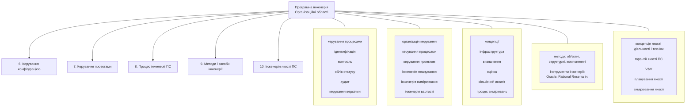

Рис.1.8. Організаційні області знань SWEBOK

### 1.2.1. Інженерія вимог

*Вимоги до ПЗ* – сукупність властивостей, які повинно мати ПЗ. Призначені для адекватного визначення функцій, умов і обмежень виконання ПЗ, а також обсягів даних, технічного забезпечення і середовища його виконання.

Вимоги відбивають потреби людей (замовників, користувачів, розробників), зацікавлених у створенні ПЗ. Замовник і розробник спільно виявляють вимоги, аналізують, переглядають, визначають необхідні обмеження і умови, а також описують їх. Розрізняють вимоги до продукту і до процесу, а також функціональні, не функціональні і системні вимоги. Вимоги до продукту і до процесу визначають умови виконання і режими роботи ПЗ в операційному середовищі, обмеження на структуру і пам'ять комп'ютерів та принципи взаємодії програм.

Функціональні вимоги визначають призначення і функції системи, а не функціональні – умови стосовно виконання ПЗ, його переносності і доступу до даних. Системні вимоги описують вимоги до програмної системи, яка складається з взаємозалежних програмних і апаратних підсистем і різних застосувань. Вимоги можуть бути кількісні (наприклад, кількість оброблених запитів на секунду, середній показник помилок і т.п.). Значна частина вимог стосується атрибутів якості: безвідмовність, надійність і ін., а також захисту і безпеки як ПЗ, так і даних.

Область знань «Вимоги до ПЗ (Software Requirements)» складається з таких розділів:
- інженерія вимог (Requirement Engineering),
- виявлення вимог (Requirement Elicitation),
- аналіз вимог (Requirement Analysis),
- специфікація вимог (Requirement Specification),
- валідація вимог (Requirement validation).

– керування вимогами (Requirement Management).

**Інженерія вимог до ПЗ** – це дисципліна аналізу і документування вимог до ПЗ, що полягає в перетворенні запропонованих замовником вимог до системи на опис вимог до ПЗ і їх валідації. Інженерія базується на моделі процесу визначення вимог і діяльності осіб, що забезпечують керування і формування вимог, а також на методах досягнення показників якості.

*Модель процесу визначення вимог* – це схема процесів ЖЦ, що виконуються від початку проекту і доти, поки не будуть визначені і погоджені вимоги. Таким процесом може бути маркетинг і перевірка виконання вимог у даному проекті.

*Керування вимогами до ПЗ* полягає в контролі за виконанням вимог і плануванні використання ресурсів (людських, програмних, технічних, часових, вартісних) у процесі розроблення проміжних робочих продуктів на процесах ЖЦ і продукту в цілому.

*Якість і процес поліпшення вимог* – це процес формулювання характеристик і атрибутів якості (надійність, реактивність і ін.), які повинно мати ПЗ, методи їх досягнення на процесах ЖЦ і оцінювання отриманих результатів.

**Виявлення вимог** – це процес витягування інформації з різних джерел (договорів, матеріалів аналітиків з декомпозиції задач і функцій системи й ін.), проведення технічних заходів (співбесід, збирання пропозицій і ін.) для формування окремих вимог до продукту і до процесу розроблення. Вимоги погоджуються із замовником.

**Аналіз вимог** – процес вивчення потреб і цілей користувачів, класифікація і перетворення їх на вимоги до системи, апаратури і ПЗ, встановлення і вирішення конфліктів між вимогами, визначення пріоритетів, меж системи і принципів взаємодії із середовищем функціонування.

**Специфікація вимог до ПЗ** – процес формалізованого опису функціональних і нефункціональних вимог, вимог до характеристик якості відповідно до стандарту якості ISO/IEC 9126, які будуть відпрацьовуватися на процесах ЖЦ ПЗ. У специфікації вимог відбивається структура ПЗ, вимоги до функцій, якості і документації, а також задається архітектура системи і ПЗ, алгоритми, логіка керування і структура даних. Специфікуються також системні вимоги, нефункціональні вимоги і вимоги до взаємодії з іншими компонентами і платформами (БД, СКБД, маршаллінг даних, мережа й ін.).

**Валідація вимог** – це перевірка викладених у специфікації вимог, що виконується для того, щоб шляхом відстеження джерел вимог переконатися, що вони визначають саме дану систему. Замовник і розробник ПЗ проводять експертизу сформованого варіанта вимог для того, щоб розробник міг далі продовжувати проектування ПЗ. Один з методів валідації – прототипування, тобто швидке відпрацьовування окремих вимог на конкретному інструменті і дослідження масштабів зміни вимог, вимірювання обсягу функціональності і вартості, а також створення моделей оцінки зрілості вимог.

**Верифікація вимог** – це процес перевірки правильності специфікацій вимог щодо їх відповідності потребам, несуперечності, повноти і можливості реалізації, а також узгодженості зі стандартами. Як результат перевірки вимог складається погоджений вихідний документ, що встановлює повноту і коректність вимог до ПЗ, а також можливість продовження його проектування.


<!-- ВІДНОВЛЕНО ЛОКАЛЬНО (Стор. 30) -->
30                                                                                                                                        Розділ 1 

**Керування вимогами** – це керування процесами формування вимог на всіх процесах ЖЦ, а також змінами й атрибутами вимог, проведення моніторингу – відновлення джерела вимог. Керування змінами виникає після того,  як ПЗ починає працювати в заданому середовищі і виявляє помилки щодо трактування вимог, невиконання деякої окремої вимоги тощо. Невід'ємною складовою процесу керування є _трасування вимог_ для відстеження правильності встановлення і реалізації вимог до системи і ПЗ на процесах ЖЦ, а також зворотний процес відстеження в отриманому продукті реалізованих вимог. Для уточнення деяких вимог або додавання нової вимоги складається план зміни вимог, що погоджується з замовником. Внесені зміни спричиняють і зміни в створеному продукті або в окремих його компонентах. 

# **1.2.2. Проектування програмного забезпечення** 

**Проектування ПЗ** – це процес визначення архітектури, набору компонентів, їх інтерфейсів, інших характеристик системи і кінцевого складу програмного продукту. 

Область знань «Проектування ПЗ (Software Design)» складається з таких розділів: 

– базові концепції проектування ПЗ (Software Design Basic Concepts), 

- ключові питання проектування ПЗ (Key Issue in Software Design), 

- структура й архітектура ПЗ (Software Structure and Architecture), 

– аналіз і оцінка якості проектування ПЗ (Software Design Quality Analysis and Evaluation), 

– нотації проектування ПЗ (Software Design Notations), 

– стратегія і методи проектування ПЗ (Software Design Strategies and Methods). 

**Базова концепція проектування ПЗ** – це методологія проектування архітектури за допомогою різних методів (об'єктного, компонентного й ін.), процеси ЖЦ (стандарт ISO/IEC 12207) і техніки – декомпозиція, абстракція, інкапсуляція й ін. На початкових стадіях проектування предметна область декомпозується на окремі об'єкти (при об’єктно-орієнтованому проектуванні) або на компоненти (при компонентному проектуванні). Для подання архітектури програмного забезпечення вибираються відповідні артефакти (нотації, діаграми, блок-схеми і методи). 

**Ключові питання проектування –** це декомпозиція програм на функціональні компоненти для незалежного і одночасного їхнього виконання, розподіл компонентів у середовищі функціонування і їх взаємодія між собою, забезпечення якості і живучості системи й ін. 

**Проектування архітектури ПЗ** проводиться архітектурним стилем, заснованим на визначенні основних елементів структури – підсистем, компонентів, об'єктів і зв'язків між ними. 

_Архітектура проекту_ – високорівневе подання структури системи і специфікація її компонентів. Архітектура визначає логіку системи через окремі компоненти системи настільки детально, наскільки це необхідно для написання коду, а також визначає зв'язки між компонентами. Існують і інші види подання структур, засновані на проектуванні зразків, шаблонів, сімейств програм і каркасів програм.
<!-- КІНЕЦЬ ВІДНОВЛЕННЯ -->


Один з інструментів проектування архітектури — *патерн* (шаблон). Це типовий конструктивний елемент ПЗ, що задає взаємодію об'єктів (компонентів) проектованої системи, а також ролі і відповідальності виконавців. Основна мова опису — UML. Патерн може бути *структурним*, що містить у собі структуру типової композиції з об'єктів і класів, об'єктів, зв'язків і ін.; *поведінковим*, що визначає схеми взаємодії класів об'єктів і їх поведінку, задається діаграмами діяльності, взаємодії, потоків керування й ін.; *погоджувальним*, що відображає типові схеми розподілу ролей екземплярів об'єктів і способи динамічної генерації структур об'єктів і класів.

**Аналіз і оцінка якості проектування ПЗ** — це заходи щодо аналізу сформульованих у вимогах атрибутів якості, функцій, структури ПЗ, з перевірки якості результатів проектування за допомогою метрик (функціональних, структурних і ін.) і методів моделювання і прототипування.

**Нотації проектування** дозволяють представити опис об'єкта (елемента) ПЗ і його структуру, а також поведінку системи за цим об'єктом. Існує два типи нотацій: структурна, поведінкова, та множина їх різних представлень.

*Структурні нотації* — це структурне, блок-схемне або текстове подання аспектів проектування структури ПЗ з об'єктів, компонентів, їх інтерфейсів і взаємозв'язків. До нотацій відносять формальні мови специфікацій і проектування: ADL (Architecture Description Language), UML (Unified Modeling Language), ERD (Entity–Relation Diagrams), IDL (Interface Description Language) тощо. Нотації містять у собі мовний опис архітектури й інтерфейсу, діаграм класів і об'єктів, діаграм сутність–зв'язок, конфігурації компонентів, схем розгортання, а також структурні діаграми, що задають у наочному вигляді оператори циклу, розгалуження, вибору і послідовності.

*Поведінкові нотації* відбивають динамічний аспект роботи системи та її компонентів. Ними можуть бути діаграми потоків даних (Data Flow), діяльності (Activity), кооперації (Colloboration), послідовності (Sequence), таблиці прийняття рішень (Decision Tables), передумови і постумови (Pre-Post Conditions), формальні мови специфікації (Z, VDM, RAISE) і проектування.

**Стратегія і методи проектування ПЗ.** До стратегій відносять: проектування вгору, вниз, абстрагування, використання каркасів і ін. Методи є функціонально-орієнтовані, структурні, які базуються на структурному аналізі, структурних картах, діаграмах потоків даних й ін. Вони орієнтовані на ідентифікацію функцій і їх уточнення знизу-вгору, після цього уточнюються діаграми потоків даних і проводиться опис процесів.

В об'єктно-орієнтованому проектуванні ключову роль відіграє спадкування, поліморфізм й інкапсуляція, а також абстрактні структури даних і відображення об'єктів. Підходи, орієнтовані на структури даних, базуються на методі Джексона і використовуються для подання вхідних і вихідних даних структурними діаграмами. Метод UML призначений для опису сценаріїв роботи проекту у наочному діаграмному вигляді. Компонентне проектування грунтується на використанні готових компонентів (reuse) з визначеними інтерфейсами і їх інтеграції в конфігурацію, як основи розгортання компонентної системи для її функціонування в операційному середовищі.

Формальні методи опису програм грунтуються на специфікаціях, аксіомах, описах деяких попередніх умов, твердженнях і постумовах, що визначають

заключну умову одержання програмою правильного результату. Специфікація функцій і даних, якими ці функції оперують, а також умови і твердження — основа доведення правильності програми.

### 1.2.3. Конструювання програмного забезпечення

*Конструювання ПЗ* — створення ПЗ з конструкцій (блоків, операторів, функцій) і його перевірка методами верифікації і тестування. До інструментів конструювання ПЗ віднесені мови конструювання, програмні методи й інструментальні системи (комппілятори, СКБД, генератори звітів, системи керування версіями, конфігурацією, тестуванням й ін.). До формальних засобів опису процесу конструювання ПЗ, взаємозв'язків між людиною і комп'ютером з урахуванням середовища оточення віднесені структурні діаграми Джексона.

Область знань «Конструювання ПЗ (Software Construction)» містить у собі такі розділи:
- зниження складності (Reduction in Complexity),
- попередження відхилень від стилю (Anticipation of Diversity),
- структуризація перевірок (Structuring for Validation),
- використання стандартів (Use of External Standards).

**Зниження складності** — це мінімізація, зменшення і локалізація складності конструювання.

*Мінімізація складності* — це обмеження на обробку складних структур і великих обсягів інформації протягом тривалого періоду часу. Вона досягається, зокрема, використанням у процесі конструювання простих елементів, а також рекомендацій стандартів.

Зменшення складності в конструюванні ПЗ досягається шляхом створення простого коду, що легко читається і спрощує тестування, підвищує продуктивність і впливає на досягнення інших характеристик і обмежень проекту. Зменшення складності спрощує процеси верифікації і тестування результатів конструювання елементів ПС.

*Локалізація складності* — це спосіб конструювання з застосуванням об'єктно-орієнтованого підходу, що лімітує інтерфейс об'єктів, спрощує їхню взаємодію, перевірку правильності самих об'єктів і зв'язків між ними. Локалізація призначена для внесення змін, пов'язаних з виявленими помилками в коді, або коли джерелом помилок є середовище, у якому виконується код.

**Попередження відхилень від стилю**. Для розв'язання різних задач конструювання застосовуються різні стилі конструювання (лінгвістичний, формальний, візуальний).

*Лінгвістичний стиль* заснований на використанні словесних інструкцій і виразів для подання окремих елементів (конструкцій) програм. Він призначений для конструювання нескладних конструкцій і приводиться до вигляду традиційних функцій і процедур або реалізується методами логічного і функціонального програмування й ін.

*Формальний стиль* використовується для точного й однозначного визначення компонентів системи, мінімальної кількості помилок, що можуть виникнути в зв'язку з неоднозначністю визначень або невдалих узагальнень об'єктів конструювання ПЗ.

*Візуальний стиль* – найбільш універсальний для конструювання прикладного ПЗ. Він дозволяє представляти елемент конструювання у наочному вигляді. Візуальна мова проектування UML надає розробнику набір діаграм для подання статичної і динамічної структур ПЗ. При його застосуванні створюється текстовий і діаграмний опис конструктивних елементів ПЗ, який виводиться на екран дисплея для перегляду і коригування.

**Структуризація перевірок** припускає, що побудова ПС структурована таким чином, що спрощується пошук помилок, дефектів і різних збоїв у процесі перевірок як на стадії незалежного тестування, так і в процесі експлуатації. Структуризації перевірок сприяють огляд, інспектування, спільний перегляд, модульне тестування із застосуванням автоматизованих засобів тестування й ін.

**Використання зовнішніх стандартів**. Конструювання ПЗ залежить від застосовних зовнішніх стандартів, пов'язаних з мовами програмування, інструментальними засобами й інтерфейсами. При конструюванні має бути визначений достатній набір стандартів для керування і забезпечення координації між визначеними видами діяльності і групами операцій, мінімізації складності, внесення змін, аналізу ризиків тощо.

До таких стандартів відносять: мови програмування (Java, Ада 95, С++ і ін.), інтерфейси мов програмування (МП) і прикладні інтерфейси платформ Windows (COM, DCOM), CORBA і ін. При конструюванні використовують стандарти мов опису даних (XML, SQL і ін.), засобів комунікації (COM, CORBA і ін.), інтерфейсних мов (POSIX, IDL, APL), UML і ін.

Перелічені вище розділи області знань «Конструювання ПЗ» у ядрі знань SWEBOK об'єднуються в групу «Основи конструювання». Крім того, розглядаються групи розділів «Керування конструюванням» та «Практичні міркування». Опишемо першу з них детальніше.

**Керування конструюванням** – це керування процесом конструювання ПЗ, планування, оцінка виконання плану і розробка заходів щодо внесення змін.

*Моделі конструювання* містять у собі набір операцій, послідовність дій і результатів. Види моделей визначаються стандартом ЖЦ, методологіями і практиками. Деякі стандарти ЖЦ за своєю природою орієнтовані на конструювання засобами екстремального програмування і раціонального уніфікованого процесу – RUP (Rational Unified Process) [13].

*Планування* – це визначення порядку операцій, термінів і рівня виконання заданих умов у процесі конструкторської діяльності за моделлю ЖЦ, що містить у собі задачі і дії зі створення, перевірки й оцінки показників якості. Виконавці розподіляються за процесами і виконують відповідні задачі з реалізації проміжного і кінцевого продукту. Остаточний результат вимірюється за обсягом коду, ступенем повторного використання, кількістю помилок і дефектів, а також оцінюванням показників якості ПЗ.

*Внесення змін* пов'язане з помилками, виявленими при перевірці і тестуванні, проводиться з метою збереження функціональної цілісності системи. У випадку виявлення помилок на процесі супроводження приймається рішення про внесення змін або заміну коду у цілому.

### 1.2.4. Тестування програмного забезпечення

*Тестування ПЗ* – це процес перевірки готової програми в статиці (перегляди, інспекції, налагодження вихідного коду) і в динаміці (прогін на наборі тестових даних) з метою перевірки різних шляхів виконання програми і порівняння отриманих результатів із заздалегідь заданими.

Існує дві форми перевірки коду – модульна й інтеграційна. Спочатку використовують стандарти (IEEE 829:1996 і IEEE 1008:1987) з перевірки і тестування модулів. Потім проводиться інтеграційне тестування модулів системи і їх інтерфейсів у динаміці виконання. Під час різних видів перевірок збираються дані про помилки, дефекти, відмови тощо і оформляється відповідна документація (таблиці типів помилок, частоти і часу виявлення відмов і ін.). Зібрані дані використовуються при оцінюванні характеристик якості готового ПЗ, наприклад, надійності.

Область знань «Тестування ПЗ (Software Testing)» містить у собі такі розділи:
- основні концепції і визначення тестування (Testing Basic Concepts and definitions),
- рівні тестування (Test Levels),
- техніки тестування (Test Techniques),
- метрики тестування (Test Related Measures),
- керування процесом тестування (Managing the Test Process).

Дана область знань SWEBOK визначає методи перевірки правильності ПЗ: верифікація, валідація, тестування. Наводяться типи, рівні і техніки тестування ПЗ, методи планування процесу тестування, розроблення тестових наборів даних для прогону ПЗ в режимі випробування модулів або системи в цілому і наступною оцінкою результатів тестування.

**Основна концепція тестування** – це базові терміни, ключові проблеми і їхній зв'язок з іншими областями знань. Тестування визначається як процес перевірки правильності програми в динаміці її виконання за тестовими даними. При тестуванні виявляються недоліки: відмови (faults) і дефекти (defects) як причини порушення роботи програми, збої (failures) як небажані ситуації, помилки (errors) як наслідки збоїв і ін. Базове поняття тестування – тест, що виконується в заданих умовах і за наборами даних. Тестування вважається успішним, якщо знайдено дефект або помилка, і вони відразу усуваються. Ступінь тестованості визначається критерієм покриття системи тестами, перевірки всіх можливих шляхів виконання програм і ймовірності припущення стосовно того, що може з'явитися збій або помилкова ситуація в системі.

**Рівні тестування:**
- *тестування окремих елементів* – це перевірка окремих, ізольованих і незалежних одна від одної частин ПЗ;
- *інтеграційне тестування* орієнтоване на перевірку зв'язків і взаємодії компонентів (інтерфейсів), що можуть розміщуватися на різних архітектурних платформах розподіленого середовища;
- *тестування системи* – це перевірка правильності функціонування системи, пошук і виявлення відмов і дефектів у системі і їхнє усунення. При цьому контролюється виконання сформульованих не функціональних вимог (безпека,

надійність і ін.) у системі, правильність подання і здійснення зовнішніх інтерфейсів системи з зовнішнім середовищем.

На всіх рівнях тестування застосовуються методи:
- _функціонального тестування_, які забезпечують перевірку реалізації функцій, що визначені у вимогах, а також правильності їх виконання;
- _регресійного тестування_, що орієнтоване на повторне вибіркове тестування системи або її компонентів після внесення в них змін на тих самих тестах, що і до модифікації;
- _тестування ефективності_ — це перевірка продуктивності, пропускної здатності, максимального обсягу даних і системних обмежень відповідно до вимог;
- _стрес-тестування_ — це перевірка поведінки системи при максимально припустимому навантаженні або в разі його перевищення;
- _альфа- і бета-тестування_ — це тестування системи (альфа) групою тестувальників організації-розробника і тестування системи «зовнішніми» користувачами (бета);
- _конфігураційного тестування_ — перевірка структури й ідентифікації системи, а також роботи системи на різних конфігураціях апаратури й устаткування.

Тестуванню підлягають також перевірка реалізації вимог і забезпечення параметрів настроювання і розміщення компонентів ПЗ на заданій кількості і типах комп'ютерів і середовища.

**Техніки тестування** базуються на певних теоретичних і практичних положеннях щодо проектування (компонентного, об'єктно-орієнтованого, сервісного і т.п.), а також на таких даних:
- інформація про структуру ПЗ або системи в документації («біла скринька»);
- підбір тестових наборів даних для перевірки правильності роботи компонентів і системи в цілому без знання їх структури («чорна скринька»);
- аналіз граничних значень, таблиць прийняття рішень, потоків даних, статистики відмов і ін.;
- блок-схеми побудови програм і складання наборів тестів для покриття системи цими тестами;
- виявлені і зафіксовані в таблицях системи дефекти, перед- і постумови виконання, структурні характеристики системи (кількість модулів, обсяг даних тощо).

**Метрики тестування.** Для вимірювання результатів тестування ПЗ й оцінки якості використовуються метрики. Вимір як частина планування і розробки тестів базується на розмірі програм, їх структурі і кількості виявлених помилок і дефектів. Метрики тестування — це вимірювання процесу планування, проектування і тестування, а також результатів тестування на основі таксономії відмов і дефектів, покриття границь тестування, перевірки потоків даних і ін.

Процес тестування документується і, відповідно до стандарту IEEE 829:1995, містить у собі опис тестових документів, їх зв'язку між собою і з задачами тестування. Без документації на процес тестування неможливо провести сертифікацію продукту за моделями зрілості, зокрема, моделлю CMM [11]. Після завершення тестування оцінюється вартість і ризики ПЗ, викликані збоями або недостатньо надійною роботою системи. Вартість тестування — одне з обмежень, на основі якого приймається рішення про його припинення або продовження.

**Керування тестуванням:**
– планування процесу тестування (складання планів, тестів, наборів даних) і оцінювання показників якості готового продукту;
– проведення тестування компонентів повторного використання і патернів як основних об'єктів складання ПЗ;
– генерація необхідних тестових сценаріїв, що відповідають середовищу виконання ПЗ;
– верифікація правильності реалізації системи і валідація реалізації вимог до ПЗ;
– збирання даних про відмови, помилки і виявлені непередбачені ситуації при виконанні програмного продукту;
– підготовка звітів за результатами тестування й оцінка характеристик системи.

Відповідно до стандарту ISO/IEC 12207 тестування ПЗ розглядається як невід'ємна частина ЖЦ.

### 1.2.5. Супровід програмного забезпечення

*Супровід ПЗ* – сукупність дій із забезпечення його роботи, внесення змін при виявленні помилок, адаптації ПЗ до нового середовища функціонування, а також підвищення продуктивності або поліпшення деяких характеристик ПЗ. У зв'язку з вирішенням так званої проблеми 2000 року (пов'язаної з кодуванням дат у новому тисячолітті, зокрема, у двохсимвольному форматі) супроводження почав розглядатися, як більш важливий процес, що здійснюють розробники. Після змін система має вирішувати ті самі задачі, а також мати план перенесення інформації в інші БД. Супровід відповідно до стандартів ISO/IEC 12207 і ISO/IEC 14764 проводиться з метою виконання і модифікації програмного продукту в процесі експлуатації за умови збереження його цілісності.

Область знань «Супровід ПЗ (Software Maintenance)» складається з таких розділів:
– основні концепції (Basic Concepts),
– процес супроводження (Process Maintenance),
– ключові питання супроводу ПЗ (key Issue in Software Maintenance),
– техніки супроводу (Techniques for Maintenance).

Супровід розглядається з точки зору задоволення вимог споживача у готовому ПЗ, коректності його виконання, процесів навчання й оперативного обліку його процесу.

**Основні концепції** – це базові визначення і термінологія, підходи до еволюції і супроводу ПЗ, до оцінки вартості супроводу тощо. До основних концепцій можна віднести ЖЦ ПЗ (стандарт ISO/IEC 12207) і складання документації. Головне призначення цієї області знань полягає у виконанні готової програмної системи, фіксації помилок, що виникають при виконанні, дослідженні їх причин, аналізі необхідності модифікації системи з метою усунення помилок, оцінці вартості робіт із проведення змін функцій і системи в цілому. Розглядаються проблеми, пов'язані з ускладненістю продукту при великій кількості змін, і методи її подолання.

**Процес супроводження** містить у собі моделі процесу супроводу і планування діяльності людей, що проводять запуск ПЗ, перевірку правильності

його виконання і внесення в нього змін. Цей процес згідно з стандартом ISO/IEC 14764 проводиться шляхом:
- коригування, тобто зміни продукту для усування виявлених помилок або нереалізованих задач;
- адаптації, тобто настроювання продукту в умовах експлуатації, що змінилися, або в новому середовищі виконання;
- поліпшення, тобто еволюційної зміни продукту для підвищення продуктивності або рівня супроводу;
- перевірки ПЗ, пошуку і виправлення помилок при експлуатації системи.

**Ключові питання супроводу ПЗ** — це управлінські, вимірювальні і вартісні. Суть управлінських питань — контроль ПЗ при модифікації й удосконалюванні функцій і недопущення зниження продуктивності системи. Питання вимірювання пов'язане з оцінкою характеристик системи після її модифікації, а також повторного тестування для оцінки показників якості. Вартісні питання пов'язані з оцінкою витрат на суповід залежно від його типу, кваліфікації персоналу, платформи й ін.

**Техніка супроводу** (цей розділ називають також еволюцією ПЗ). Відомий фахівець в області ПЗ Дж. Леман (1970 р.) запропонував розглядати суповід як еволюційну розробку програмних систем, оскільки здана в експлуатацію система не завжди цілком завершена, її треба змінювати протягом терміну експлуатації. Внаслідок змін система стає більш складною і погано керованою. У зв'язку з цим виникає проблема зменшення її складності. До технологій еволюції ПЗ відносять реінженерію, реверсну інженерію і рефакторинг.

*Реінженерія* — це удосконалення застарілого ПЗ шляхом його реорганізації або реструктуризації, а також перепрограмування окремих елементів або настроювання параметрів на іншу платформу, середовище виконання зі збереженням зручності його супроводу.

*Реверсна інженерія* полягає у відновленні специфікації (графів викликів, потоків даних і ін.) за отриманим кодом системи для її аналізу на більш високому рівні. Відновлюється ідентифікація компонентів і зв'язків між ними для забезпечення перепрограмування системи на нову платформу. Найчастіше реверсна інженерія застосовується після того, як у код ПЗ було внесено багато змін і воно стало некерованим або змінилася платформа комп'ютера.

*Рефакторинг* — це реорганізація коду для поліпшення характеристик і показників якості об'єктно-орієнтованих і компонентних програм без зміни їх поведінки. Цей процес реалізується шляхом поступової зміни окремих операцій над текстами, інтерфейсами, середовищем програмування і виконання ПЗ, а також настроювання або внесення змін в інструментальні засоби підтримки ПЗ. Якщо при зміні зберігається формат існуючої системи, то рефакторинг — один з варіантів реверсної інженерії.

### 1.2.6. Керування конфігурацією

Керування конфігурацією — це ідентифікація компонентів системи, визначення функціональних, фізичних характеристик системи, апаратного і програмного забезпечення для контролю виконання, внесення змін і трасування конфігурації. Процес керування визначено як один з допоміжних процесів ЖЦ (ISO/IEC 12207), виконуваний технічним і адміністративним менеджментом

проєкту. При цьому складаються звіти про зміни, внесені у конфігурацію, і ступінь їхньої реалізації, а також проводиться перевірка відповідності внесених змін заданим вимогам.

*Конфігурація системи* — це склад функцій, програмного і технічного забезпечення системи, можливі їх комбінації залежно від наявності устаткування, загальносистемних засобів і вимог до продукту.

*Конфігурація ПЗ* складається з набору функціональних і технічних характеристик ПЗ, заданих у технічній документації і реалізованих у готовому продукті. Це сполучення різних елементів продукту з заданими процедурами збирання компонентів і настроювання на середовище. Вхідними елементами конфігурації є графік розробки, проєктна документація, вихідний виконуваний код, бібліотека компонентів, інструкції з установки і розгортання системи.

Область знань «Керування конфігурацією ПЗ (Software Configuration Management — SCM)» складається з таких розділів:
- керування процесом конфігурації (Management of SMC Process),
- ідентифікація конфігурації ПЗ (Software Configuration Identification),
- контроль конфігурації ПЗ (Software Configuration Control),
- облік статусу (поведінка або стани) конфігурації ПЗ (Software Configuration Status Accounting),
- аудит конфігурації ПЗ (Software Configuration Auditing),
- керування версіями ПЗ і доставкою (Software Release Management and Delivery).

**Керування процесом конфігурації.** Це діяльність з контролю еволюції і цілісності продукту при ідентифікації, змінах і забезпеченні звітною інформацією, що стосується конфігурації. Вона містить у собі:
- систематичне відстеження внесених змін в окремі складові частини конфігурації, виконання аудита змін і автоматизованого контролю за внесенням змін у конфігурацію системи або в ПЗ;
- підтримку цілісності конфігурації, її аудит і забезпечення внесення змін в елементи конфігурації;
- ревізію конфігурації з метою перевірки наявності розроблених програмних або апаратних засобів і узгодження версії конфігурації з заданими вимогами;
- трасування змін у конфігурації на процесах супроводу й експлуатації ПЗ.

**Ідентифікація конфігурації ПЗ** полягає в документуванні функціональних і фізичних характеристик елементів конфігурації, а також в оформленні технічної документація на елементи конфігурації.

**Контроль конфігурації ПЗ** — це роботи з координації, затвердження або відкидання реалізованих змін в елементах конфігурації після ідентифікації, а також з аналізу вхідних компонентів конфігурації.

**Облік статусу або стану конфігурації ПЗ** — комплекс заходів для визначення ступеня зміни конфігурації, а також правильності внесених змін у систему при супроводі. Інформація і кількісні показники накопичуються у відповідній БД і використовуються при складанні звітності, оцінюванні якості і виконанні процесів ЖЦ.

**Аудит конфігурації** — це діяльність, що виконується для оцінки відповідності продукту і процесів стандартам, інструкціям, планам і процедурам. Аудит визначає

ступінь задоволення конфігурації функціональним і фізичним (апаратним) характеристикам системи.

**Керування версіями ПЗ** — це відстеження наявної версії компонентів конфігурації; складання компонентів; створення нових версій системи на основі існуючих шляхом внесення змін у конфігурацію; узгодження версії продукту з вимогами і проведеними змінами на процесах ЖЦ; забезпечення оперативного доступу до інформації про елементи конфігурації і системи, до яких вони належать. Дане керування містить у собі такі основні поняття.

*Базис (baseline)* — формально позначений набір елементів ПЗ, зафіксований на процесах ЖЦ.

*Бібліотека ПЗ* — колекція об'єктів ПЗ і документації, призначена для полегшення процесу розроблення, використання і супроводження.

*Складання ПЗ* — об'єднання коректних елементів і конфігураційних даних у єдину виконувану програму.

### 1.2.7. Керування інженерією програмного забезпечення

Керування інженерією ПЗ (Software Engineering Management) — керування роботами команди розробників ПЗ у процесі виконання плану проекту, визначення критеріїв ефективності роботи цієї команди й оцінка процесів і продуктів проекту з використанням загальних методів планування і контролю робіт.

Як будь-яке керування, воно полягає у плануванні, координації, контролі, вимірі й обліку виконаних робіт у процесі розроблення програмного проекту. Координацію людських, фінансових і технічних ресурсів виконує менеджер проекту аналогічно до того, як це робиться в технічних проектах. У його обов'язки входить дотримання запланованих бюджетних і часових характеристик і обмежень, стандартів і сформульованих вимог.

Загальні питання керування проектом містяться в ядрі знань PMBOK [12], а також у стандарті ISO/IEC 12207 — Software life cycle processes, де керування проектом розглядається як організаційний процес ЖЦ.

Область знань «Керування інженерією ПЗ (Software Engineering Management)» складається з таких розділів:
- організаційне керування (Organizational Management),
- керування процесом/проектом (Process/Project Management),
- інженерія вимірювання ПЗ (Software Engineering Measurement).

**Організаційне керування** — це планування і складання графіка робіт, підбір і керування персоналом, контроль виконання й оцінка вартості робіт згідно з прийнятими стандартами і договорами з замовником. Головним об'єктом організаційного керування проектом є персонал (навчання, мотивація й ін.), комунікації між співробітниками (зустрічі, презентації й ін.), а також попередження й усунення ризику невиконання проекту. Для керування проектом створюється спеціальна структура колективу. Фахівці розподіляються за видами робіт і розв'язують задачі проекту під керуванням менеджера з урахуванням заданої вартості і термінів розробки. Для реалізації задач проекту підбираються необхідні програмні, інструментальні й апаратні засоби.

**Керування проектом/процесом** — це складання плану проекту, побудова графіків робіт (мережних або часових діаграм) з урахуванням наявних ресурсів, розподіл персоналу за видами робіт у проекті, виходячи з заданих термінів і

вартості їх виконання. Для ефективного керування проектом проводиться аналіз фінансової, технічної, операційної і соціальної політики організації-розробника для вибору правильної стратегії виконання робіт і контролю плану, а також проміжних продуктів (проектних рішень, діаграм UML, алгоритмів і ін.).

У задачі керування проектом входять також уточнення вимог, перевірка їх відповідності заданим специфікаціям характеристик якості, а також верифікація функцій проекту. Процес керування базується на планових термінах, що відображені мережними діаграмами PERT (Program Evaluation and Review Technique), CPM (Critical Path Method). У них указуються роботи, зв'язки між ними і час виконання.

На сьогоднішній день найбільш поширена мережна діаграма PERT – граф, у вершинах якого розміщуються роботи, а дуги задають взаємні зв'язки між цими роботами. Інший тип мережної діаграми – CPM – є становним. У його вершинах указують події, а роботи задають лініями між двома вузлами-подіями. Очікуваний час виконання робіт за допомогою мережних діаграм оцінюється середнім ваговим значенням трьох оцінок: оптимістичної, песимістичної й очікуваної, тобто імовірнісної. Ці оцінки надають експерти, що враховують обсяги виконаної роботи і відведений на неї час.

Коректно складений план забезпечує виконання вимог і цілей проекту. Контроль здійснюється при виконанні і внесенні змін у проект з урахуванням ризиків і прийнятих рішень щодо їх мінімізації.

Під *ризиком* розуміють імовірність виникнення несприятливих обставин, що можуть негативно вплинути на керування розробкою (наприклад, звільнення співробітника і відсутність заміни для продовження робіт і ін.). При складанні плану проекту проводиться ідентифікація й аналіз ризику, планування непередбачених ситуацій щодо ризиків. Запобігання ризику полягає у виконанні дій, що знімають ризик (наприклад, збільшення часу розробки й ін.). Причиною появи ризику може бути реорганізація проекту, БД або транзакцій, а також помилки при виконанні ПЗ.

**Інженерія вимірювання ПЗ** проводиться з метою визначення окремих характеристик продуктів і процесів (наприклад, кількість рядків у продукті, помилок у специфікаціях і т.п.). Попередньо проводяться роботи з вибору метрик процесів і продуктів з урахуванням обставин, що впливають на вимірювання характеристик програмного продукту.

Інженерії вимірювання – удосконалювання процесів керування проектом; оцінювання часових витрат і вартості ПЗ, їх регулювання; визначення категорій ризиків і відстеження чинників для регулярного розрахунку ймовірностей їх виникнення; перевірка заданих у вимогах показників якості окремих продуктів і проекту в цілому [9].

Проведення різного роду вимірювань – важливий принцип будь-якої інженерної діяльності. У програмному проекті результати вимірювань необхідні замовнику і споживачу для встановлення правильності реалізації проекта. Без вимірювань в інженерії ПЗ процес керування стає неефективним і перетворюється в самоціль.

### 1.2.8. Базовий процес програмної інженерії

Процес інженерії — є метарівнем, що визначає основні поняття, способи реалізації, оцінювання, вимірювання, дії з керування змінами й удосконалення самого процесу. Як уже згадувалася в п. 1.1.2., для оцінювання й удосконалення процесу програмної інженерії застосовується модель зрілості CMM [11], яку розроблено Інститутом програмної інженерії SEI (Software Engineering Institute) США. Ця модель встановлює рівні готовності організації-розробника ПЗ створювати задовільно, середньо, добре і дуже добре програмну продукцію. Поняття рівня готовності визначається наявністю в організації необхідних ресурсів (людських, програмних, технічних і фінансових), стандартів і методик, а також здатністю колективу створювати програмні продукти. Модель СММ має п'ять рівнів. Перший і другий рівні фіксують недостатню готовність виконувати розробку продукту. Третій — п'ятий рівні характеризують певний ступінь готовності, зрілості і здатності фахівців (а, значить, і організації) виготовляти, відповідно, середній, гарний і відмінний продукт. Чим вище рівень зрілості, тим більше вимог ставиться до процесу програмної інженерії, придатного для виконання цілей і задач утворення продукту, що задовольняєє користувача.

Існують різновиди цієї моделі: CMM – SW (Software) для оцінки зрілості ПЗ, CMMI (CMM Integrated) — для обліку потреб великих державних структур в ПЗ (США), а також інші моделі, наприклад, Bootstrap — для оцінки зрілості малих і середніх комерційних компаній, стандарт ISO 15504 (Software Process Improvement and Capability) — для удосконалення процесу (наприклад, удосконалювати процес на другому рівні, щоб одержати сертифікат на третій рівень зрілості).

Концепція зрілості процесу програмної інженерії ґрунтується на процесі ПЗ (software process), широті його можливостей (software process capability), результативності (software process performance) і зрілості (software process maturity). Процес ПЗ у моделі СММ — це множина діяльностей (activities), методів (methods), практичних прийомів (practices), що використовують при розробці ПЗ шляхом планування робіт і оцінювання проміжних результатів, які приводять до кінцевого продукту високої якості.

Область знань «Процес програмної інженерії (Software Engineering Process)» складається з таких розділів:
- концепції процесу інженерії ПЗ (Software Engineering Process Concepts),
- інфраструктура процесу (Process Infrastructure),
- визначення процесу (Process Definition),
- оцінки процесу (Process Assessments),
- якісний аналіз процесу (Qualitative Process Analysis),
- виконання і змінювання процесу (Process Implementation and Change).

**Концепції процесу інженерії ПЗ** — задачі і дії, що зв'язані з керуванням, реалізацією, оцінкою, змінами й удосконаленням процесу і/або ПЗ. Ціль керування процесом — це створення інфраструктури процесу, виділення необхідних ресурсів, планування реалізації і зміни процесу з метою впровадження його у практику і, нарешті, оцінка переваг від його впровадження у практику проектування ПЗ.

**Інфраструктура процесу** містить у собі ресурси (людські, технічні, інформаційні і програмні), стандарти, методики керування якістю, проектом і структуру колективу розробників ПЗ типу: команда, бригада, експериментальна фабрика (Experimental Factory), каркас виробництва на лінії продуктів (Framework

for Product Line Practice) і ін. До основних задач інфраструктури належать керування і комунікації в колективі, інженерні методи виробництва програмного продукту й удосконалення процесу з накопиченим досвідом розробки ПЗ.

**Визначення процесу** ґрунтується на: типах процесів і моделей (каскадна, спіральна, ітераційна й ін.); моделях ЖЦ процесів і засобів, стандартах ЖЦ ПЗ ISO/IEC 12207 і ISO/IEC 15504, IEEE std. 1074 і IEEE std. 1219; методах і нотаціях подання процесів і автоматизованих засобів їх підтримки. Основною метою процесу є підвищення якості одержуваного продукту, поліпшення різних аспектів програмної інженерії, автоматизація і удосконалення процесів.

**Оцінка процесу** проводиться з використанням відповідних моделей і методів оцінки. Наприклад, оцінка потенційної здатності фахівця до розробки і виконання відповідного процесу, а також оцінювання зрілості процесу, згідно за яким проводиться розроблення ПЗ.

Оцінки стосуються також технічних робіт у сфері програмної інженерії, керування персоналом і якості ПЗ. Для цього проводяться експериментальні дослідження середовища, збирання інформації, моделювання, класифікація отриманих помилок і дефектів, а також статичний аналіз недоліків процесу порівняно з існуючими стандартами (наприклад, ISO/IEC 12207) і потенційних аспектів необхідності вдосконалювати процес.

**Якісний аналіз процесу** полягає в ідентифікації і пошуку «слабких місць» у процесі створення ПЗ на початку його функціонування і після експлуатації. Розглядається такі техніки аналізу: огляд даних і порівняння процесу з основними положеннями стандарту ISO/IEC 12207, збирання даних про якість процесів; аналіз головних причин відмов у функціюванні ПЗ, відкіт назад від точки виникнення відхилення до точки правильної роботи системи для з'ясування причин зміни процесу. На якість результатів проекту і процесу впливають застосовувані інструменти і досвід фахівців.

**Виконання і зміна процесу.** Існує ряд фундаментальних аспектів вимірювань в програмній інженерії, що покладені в основу детальних вимірювань процесу. Оцінка вдосконалення процесу проводиться шляхом встановлення кількісних характеристик процесу і продуктів. Після процесу розгортання ПЗ виконуються обчислення функцій і аналіз отриманих результатів, які можуть застосовуватися при оцінюванні якості, продуктивності, трудовитрат та ін. Якщо результати не задовольняють користувача ПЗ, проводять обговорення і приймають рішення щодо необхідності виправлення ситуації шляхом або внесення зміни у процес, або вдосконалення процесу, а також організаційну структуру і деякі інструменти керування змінами.

### 1.2.9. Методи і інструменти програмної інженерії

Методи забезпечують проектування, реалізацію і виконання ПЗ. Вони накладають деякі обмеження на інженерію ПЗ у зв'язку з особливостями застосування їхніх нотацій і процедур, а також забезпечують оцінку і перевірку процесів і продуктів. Інструменти забезпечують програмну підтримку окремих методів інженерії ПЗ для автоматизованого виконання задач процесів ЖЦ.

Область знань «Методи та інструменти інженерії ПЗ (Software Engineering Tools and Methods)» складається з розділів:
- інструменти інженерії ПЗ (Software Engineering Tools),

– методи інженерії ПЗ (Software Engineering Methods).

**Методи інженерії ПЗ** – це евристичні методи (heuristic methods), формальні методи (formal methods) і методи прототипування (prototyping methods).

Евристичні методи містять у собі: структурні методи, засновані на функціональній парадигмі; методи, орієнтовані на структури даних, якими маніпулює ПЗ; об'єктно-орієнтовані методи, що розглядають предметну область як колекцію об'єктів; методи, орієнтовані на конкретну область застосування, наприклад, на системи реального часу, безпеки та ін.

Формальні методи засновані на формальних специфікаціях, аналізі, доведенні і верифікації програм. Специфікація записується мовою, синтаксис і семантика якої визначені формально і засновані на математичних концепціях (алгебрі, теорії множин, логіці). Розрізняються наступні категорії формальних методів:

– мови і нотації специфікації (specification languages and notations), орієнтовані на модель, властивості й поведінку;

– уточнення специфікації (refinement specification) шляхом трансформації в кінцевий результат, близький до кінцевого програмного продукту, що виконується;

– методи верифікації/доведення (verification/proving properties), що використовують твердження (теореми), перед- і постумови, формально описуються і застосовуються для встановлення правильності специфікації програм.

Методи доведення застосовувалися в основному в теоретичних експериментах. Понад 25 років їх застосування було обмежено через трудомісткість і економічну невигідність. У 2005 р. проблема верифікації знову набула актуальності у запропонованому новому міжнародному проекті «Цілісний автоматизований набір інструментів для перевірки коректності ПС» (Т. Хоар, «Открытые системы», 2006, № 6), який поставив наступні перспективні задачі:

– розробка єдиної теорії побудови й аналізу програм;

– побудова багатостороннього інтегрованого набору інструментів верифікації на усіх виробничих процесах – розроблення формальних специфікацій, їх доведення і перевірка правильності, генерація програм і тестових прикладів, уточнення, аналіз і оцінка;

– створення репозитарію формальних специфікацій, верифікованих програмних об'єктів різних типів і видів.

Формальні методи верифікації будуть охоплювати всі аспекти створення і перевірки правильності програм. Це приведе до створення потужної верифікованої виробничої основи і сприятиме значному зменшенню помилок у ПЗ (стосовно доведення і верифікації див. розділ 6).

*Методи прототипування (Prototyping Methods)* засновані на використанні прототипу ПЗ для моделювання на ньому завдань нової системи і базуються на:

– стилях прототипування, що уособлюють тривалість використання прототипів, наприклад, стиль створення тимчасово використовуваних прототипів (throw away),

– моделях еволюційного прототипування – перетворення прототипу в кінцевий продукт і розроблення специфікацій, відповідно до якої він виконується;

– техніках оцінки/дослідження (evaluation) результатів прототипування.

**Інструменти інженерії ПЗ** забезпечують автоматизовану підтримку процесів розробки ПЗ і містять у собі множину інструментів, що охоплюють усі процеси ЖЦ.

*Інструменти роботи з вимогами (Software Requirements Tools)* — це:
- інструменти розробки (Requirement Development) і керування вимогами (Requirement Management), орієнтовані на аналіз, збирання, специфікування і перевірку вимог;
- інструменти трасування вимог (Requirement traceability tools) є невід'ємною частиною роботи з вимогами, їх функціональний зміст залежить від складності проєктів і рівня зрілості процесів.

*Інструменти проєктування (Software Design Tools)* — це інструменти для створення ПЗ із застосуванням базових нотацій (структурної SADT/IDEF, моделювання UML і т.п.).

*Інструменти конструювання ПЗ (Software Construction Tools)* — це інструменти для трансляції і об'єднання програм. До них належать:
- редактори програм (program editors) і програми редагування загального призначення;
- компілятори і генератори коду (compilers and code generators) як самостійні засоби об'єднання програмних компонентів в інтегрованому середовищі для одержання вихідного продукту з використанням препроцесорів, складальників, завантажників і ін.;
- інтерпретатори (interpreters), які забезпечують контрольоване виконання програм за їх описом. Намітилася тенденція злиття інтерпретаторів і компіляторів (наприклад, Java, в .NET);
- відлагоджувачі (debuggers), призначені для перевірки правильності опису вихідних програм і усунення помилок;
- інтегроване середовище розробки (IDE — integrated development environment) та бібліотеки компонентів (libraries components), що є утворюють середовище виконання процесу розробки ПС;
- програмні платформи (Java, J2EE і Microsoft .NET) і платформи для розподілених обчислень (CORBA і WebServices, тощо).

*Інструменти тестування (Software Testing Tools)* — це:
- генератори тестів (test generators), що допомагають у розробці сценаріїв тестування;
- засоби виконання тестів (test execution frameworks), які забезпечують виконання тестових сценаріїв і відслідковують поведінку об'єктів тестування;
- інструменти оцінки тестів (test evaluation tools), які підтримують оцінювання результатів виконання тестів і ступеня відповідності поведінки тестованого об'єкта очікуваній поведінці;
- засоби керування тестами (test management tools), які забезпечують інженерне керування процесом тестування ПЗ;
- інструменти аналізу продуктивності (performance analysis tools), кількісної її оцінки та оцінки поводження програм у процесі виконання.

*Інструменти супроводу (Software Maintenance Tools)* містять у собі:
- інструменти полегшення розуміння (comprehension tools) програм, наприклад, різні засоби візуалізації;

– інструменти реінженерії (reengineering tools) підтримують діяльність з перетворення програм і зворотної інженерії (reverse engineering) для відновлення (артефактів, специфікації, архітектури) застарілого ПЗ або генерації нового продукту.

*Інструменти конфігураційного керування (Software Configuration Management Tools)* – це:
– інструменти відстеження (tracking) дефектів;
– інструменти керування версіями;
– інструменти керування складанням, випуском версії (конфігурації) продукту та його інсталяції.

*Інструменти керування інженерною діяльністю (Software Engineering Management Tools)* підрозділяються на:
– інструменти планування і відстеження ходу проєктів, кількісної оцінки зусиль і вартості робіт у проєкті (наприклад, Microsoft Project 2003);
– інструменти керування ризиками, які використовуються для ідентифікації, моніторингу ризиків і оцінки нанесеного ушкодження;
– інструменти кількісної оцінки властивостей ПЗ шляхом вимірювань і розрахунків остаточного значення надійності і якості.

*Інструменти підтримки процесів (Software Engineering Process Tools)* розділені на:
– інструменти моделювання та опису моделей ПЗ (наприклад, UML і його інструменти);
– інструменти керування програмними проектами (наприклад, Microsoft Project);
– інструменти керування конфігурацією для підтримки версій і всіх артефактів проекту.

*Інструменти забезпечення якості (Software Quality Tools)* діляться на дві категорії:
– інструменти інспектування для підтримки перегляду (review) і аудиту;
– інструменти статичного аналізу артефактів, даних, потоків робіт і перевірки їх властивостей на відповідність показникам.

*Додаткові аспекти інструментального забезпечення (Miscellaneous Tool Issues)* стосуються:
– техніки інтеграції інструментів (платформ, представлень, процесів, даних) для їх природного сполучення в інтегрованому середовищі;
– метаінструментів для генерації інших інструментів для ПЗ;
– оцінки інструментів при їх еволюції.

### 1.2.10. Якість програмного забезпечення

*Якість ПЗ* – набір властивостей продукту (сервісу або програм), що характеризують його здатність задовольнити встановлені або передбачувані потреби замовника. Поняття якості має різні інтерпретації залежно від конкретної програмної системи і вимог до неї. Крім того, у різних джерелах таксономія (класифікація) характеристик у моделі якості розрізняється.

Моделі мають різну кількість рівнів і повністю або частково збігаються щодо набору характеристик якості. Наприклад, модель якості МакКолла на найвищому рівні має три характеристики: функціональність, модифікованість і переносність, а

на нижчих рівнях моделі — 11 підхарактеристик якості і 18 критеріїв (атрибутів) якості.

Стандарт ISO 9126:2001 регламентує *зовнішні і внутрішні характеристики якості*. Перші відображають вимоги до функціонування програмного продукту. Для кількісного встановлення критеріїв якості, за якими буде здійснюватися перевірка і підтвердження відповідності ПЗ заданим вимогам, визначаються відповідні зовнішні вимірювані властивості (зовнішні атрибути) ПЗ, метрики (наприклад, час виконання окремих компонентів), діапазони зміни значень і моделі їх оцінки. Метрики використовуються на стадії тестування або функціонування і називаються *зовнішніми метриками*. Вони являють собою моделі оцінки атрибутів.

*Внутрішні характеристики якості і внутрішні атрибути ПЗ* використовуються для складання плану досягнення необхідних зовнішніх характеристик якості продукту. Для квантифікації внутрішніх характеристик якості застосовують внутрішні метрики, як інструмент перевірки відповідності проміжних продуктів внутрішнім вимогам до якості, які формулюються на процесах, що передують тестуванню.

Зовнішні і внутрішні характеристики якості відображають властивості самого ПЗ (працюючого або не працюючого), а також погляд замовника і розробника на таке ПЗ. Безпосереднього кінцевого користувача ПЗ цікавить експлуатаційна якість ПЗ — сукупний ефект від досягнення характеристик якості, що вимірюється строком результату, а не властивістю самого ПЗ. Це поняття ширше, ніж будь-яка окрема характеристика (наприклад, зручність використання або надійність).

Остаточна оцінка якості проводиться відповідно до стандарту ISO/IEC 14598. Якість може підвищуватися за рахунок постійного поліпшення використовуваного продукту виявленням, усуненням дефектів у ПЗ і їх запобіганням.

Область знань «Якість ПЗ (Software Quality)» складається з наступних розділів:
– концепції якості ПЗ (Software Quality Concepts);
– визначення і планування якості (Definition & Planning for Quality);
– техніки й види діяльності, що забезпечують гарантію якості, валідацію і верифікацію (Activities and Techniques for Software Quality Assurance, Validation & Verification – V&V);
– вимірювання при аналізі якості ПЗ (Measurement in Software Quality Analysis).

**Концепції якості ПЗ** – це зовнішні і внутрішні характеристики якості, їхні метрики, а також моделі якості, визначені на множині цих характеристик, що наведені в стандартах з якості і в [8, 9] – це шість характеристик і кожна з них має кілька атрибутів. До характеристик якості належать:
– функціональність (functionality);
– надійність (realibility);
– зручність застосування (usability);
– ефективність (efficiency);
– супровід (maitainnability);
– переносність (portability).

Базова модель якості містить у собі ці характеристики і вони притаманні будь-якому типу програмних продуктів. При розробці вимог замовник формулює

такі вимоги до якості, які найбільшою мірою підходять для програмного продукту, який замовляється.

**Визначення і планування якості ПЗ** ґрунтується на положеннях стандартів у цій області, складанні планів і графіків робіт, процедурах перевірки і ін. План забезпечення якості містить у собі набір дій для перевірки процесів забезпечення якості (верифікація, валідація і ін.) і формування документа з керування якістю.

Планування якості призначено для підтримки керування процесами досягнення якості продуктів проекту (зокрема проміжних робочих) і ресурсів програмних, технічних, виконавських і ін. Воно також передбачає керування вимогами до процесів і продуктів і полягає в наступному:
- визначення продукту термінами заданими характеристиками якості;
- планування процесів для гарантії одержання необхідної якості;
- вибір методів оцінки запланованих характеристик якості і встановлення відповідності продукту сформульованим вимогам.

У стандарті ISO/IEC 12207 визначені спеціальні процеси забезпечення якості — верифікація, валідація (атестація), спільний аналіз і аудит.

**Види діяльності і техніки гарантії якості** містять у собі, зокрема: інспекцію, верифікацію та валідацію ПЗ.

*Інспекція ПЗ* — аналіз і перевірка різних видів подання системи і ПЗ (специфікації, архітектурної схеми, діаграм, початкового коду тощо). Виконується на всіх процесах ЖЦ розробки ПЗ.

*Верифікація ПЗ* — процес забезпечення правильної реалізації ПЗ відповідно до специфікацій, виконується протягом усього життєвого циклу. Верифікація дає відповідь на питання, чи правильно створюється система.

*Валідація* — процес перевірки відповідності ПЗ функціональним і нефункціональним вимог і очікуваним потребам замовника.

Верифікація і валідація (V&V) можуть виконуватися, починаючи з ранніх стадій ЖЦ. Вони орієнтовані на отримання правильних функцій ПЗ, плануються і забезпечуються визначеними ресурсами з чітким розподілом ролей. Перевірка ґрунтується на використанні відповідних технік тестування для виявлення тих або інших дефектів і збирання статистики. Після зібрання даних оцінюється правильність реалізації вимог і роботи ПЗ у заданих умовах.

**Вимірювання при аналізі якості ПЗ** ґрунтується на метриках продукту і даних, зібраних у процесі створення продукту при заданих ресурсах: оцінок процесів, ПЗ і його моделей, і передбачає документування вимірів. Оцінювання якості продукту полягає у вимірюванні і оцінюванні якісних показників за допомогою даних про різні типи помилок і відмов під час тестування ПЗ і виконання коду на тестових даних. Ці дані аналізуються, перевіряються і використовуються при якісній і кількісній оцінки ПЗ.

Для імітації роботи системи в режимі тестування розробляються тести з реальними вхідними даними для перевірки правильності роботи ПЗ на різних фрагментах програми і шляхах проходження в них операторів. У процесі тестування ПЗ виявляються різного роду помилки (відмови, дефекти, помилки тощо), кількість яких значною мірою може вплинути на одержання правильного і якісного результату.

З урахуванням типів виявлених помилок можна встановити наявність (або відсутність) відповідності реалізованих і нереалізованих функцій, заданих у


<!-- ВІДНОВЛЕНО ЛОКАЛЬНО (Стор. 48) -->
48                                                                                                                                        Розділ 1 

вимогах до системи, а також оцінити способи реалізації нефункціональних вимог (продуктивності, надійності та ін.). Оцінюються процеси керування планами, інспекціями, прогонами і т.п. За цими оцінками приймаються рішення про завершення розробки продукту проекту і передачі його замовнику в експлуатацію, під час якої можуть бути  внесені зміни щодо усунення помилок, визначення адекватності планів і вимог, оцінки ризиків перероблення ПЗ тощо. 

Мета інспекцій – виявлення різних аномальних станів у ПЗ незалежними фахівцями команди експертів із залученням авторів проміжного або кінцевого продукту. Експерти інспектують виконання вимог, інтерфейси, вхідні дані і т.п., а потім документують виявлені відхилення в проекті. 

Призначення аудита – незалежна оцінка продуктів і процесів на відповідність регулюючим і регламентуючим документам (планам, стандартам і ін.), формулювання звіту про випадки невідповідності і пропозицій для їх коригування. Таким чином, розгляд розділів SWEBOK свідчить по те, що це ядро містить весь необхідний набір знань з програмної інженерії, який повинні мати фахівці різних профілів (аналітики, інженери, програмісти, оцінювачі, контролери тощо), що виробляють програмний продукт. 

Зазначимо, що ядро знань SWEBOK не позбавлено недоліків тактичного характеру. Так, між областями знань у цьому ядрі існують перетини за методами, концепціями і стратегіями, а деякі важливі напрями програмної інженерії  взагалі не відбиті у ньому наявними областями знань. Це стосується, наприклад, методів доведення правильності програм, еволюції програм, розподілених і неоднорідних середовищ, взаємодії систем, таких методів програмування, як аспектне, агентне, сервісне й інші, а також аспектів захисту, безпеки тощо. 

**Висновки.** Запропоновано нове тлумачення програмної інженерії з точки зору науки, інженерії, економіки і керування виробництвом ПП. Наведено дефініцію програмної інженерії як спадкоємиці програмування і комп’ютерної науки, розглянуто її головний аспект – керування роботами і колективом. Обґрунтовано  теоретичні і прикладні ознаки та атрибути програмної інженерії і її дисциплін. Визначено їхню структуру, зміст та концепції, а також їхні базові елементи. Встановлено зв’язки основних елементів ПІ через SWEBOK, стандарт ISO/IEC 12207 і PMBOK. Разом вони забезпечують дисципліни вироблення програмних продуктів на процесах розроблення, керування і регулювання діяльності розробників програмних продуктів. 

# **Контрольні питання і завдання** 

1. Назвіть мету і задачі програмної інженерії. 

2. Назвіть основні складові наукової дисципліни. 

3. Назвіть області знань SWEBOK інженерії розроблення ПЗ. 

4. Назвіть основні задачі області інженерії вимог. 

5. Назвіть основні задачі області знань «Проектування ПЗ» 

6. Визначте мету і задачі області знань «Методи і інструменти» 

7. Наведіть  базові поняття області знань «Тестування ПЗ». 

8. Визначте мету і задачі області знань «Керування проектом». 

9. Наведить приклади інструментів програмної інженерії. 

10. Визначте мету і задачі області знань «Інженерія якості ПЗ». 

11. Вкажіть, який зв'язок існує між ядром знань SWEBOK і стандартом ЖЦ.
<!-- КІНЕЦЬ ВІДНОВЛЕННЯ -->


12. Охарактеризуйте інфраструктуру програмної інженерії.

**Список літератури до розділу 1**

1. *Рекомендации по преподаванию программной инженерии и информатики в университетах.–Computing Curricula-2001: Computer Science.–Пер. с англ. – Интернет– Ун. информац. технологий, М.: 2007.–462с.*
2. *Бабенко Л.П., Лавріщева К.М. Основи програмної інженерії.– Навч. посібник.–К.: Знання, 2001. –269 с.*
3. *Лаврищева Е.М., Грищенко В.Н. Области знаний программной инженерии – SWEBOK и подход к обучению этой дисциплине// Управляющие системы и машины.–2005. – №1.– С.38–54.*
4. *Pfleger S.L. Software Engineering. Theory and practice. – Printice Hall: Upper Saddenle River, New Jersey, 1998. – 576 p.*
5. *Jacobson I. Object-Oriented Software Engineering. A use Case Driven Approach, Revised Printing. – New York: Addison-Wesley Publ. Co., 1994. – 529 p.*
6. *Иан Соммервил. Инженерия программного обеспечения. 6-е издание. – М.; СПб. – Киев, 2002. – 623 с.*
7. *Лавріщева К.М. Основні напрямки досліджень в програмній інженерії і шляхи їхнього розвитку // Проблеми програмування. – 2003. – № 3–4. – С. 44–58.*
8. *Лаврищева Е.М. Методы программирования. Теория, инженерия, практика. – К.: Наук. думка, 2006.–450с.*
9. *Основы инженерии качества программных систем / Ф.И.Андон, Г.И.Коваль, Т.М. Коротун, Е.М.Лаврищева, В.Ю. Суслов – К.: Академпериодика.– 2007. – 678 с.*
10. *Лаврищева Е.М., Коваль Г.И., Коротун Т.М. Подход к управлению качеством программных систем обработки данных // Кибернетика и системный анализ.– 2006.–№ 5.–С.174–185.*
11. *Capability Maturity Model for Software, Version 1.1 / M.Paulk, B.Curtis et al. // CMU–SEI–TR–024, Soft. Engin. Institute, Pittsburg PA 15213, Feb. – Pittsburg, 1993. – 82 p.*
12. *Thayer R.H., ed. Software Engineering Project Management, 2 nd. ed., IEEE CS Press, Los Alamitos, Calif., 1997. – 391 p., http://petukhov.zaklad.ru/rmbok2004_rus.pdf*
13. *Кендалл С. Унифицированный процесс. Основные концепции.–М.;–СПб.– Киев.–2002.– 157с.*

Розділ 2. СТАНДАРТ І МОДЕЛІ ЖИТТЄВОГО ЦИКЛУ

За десятки років розробки програмного забезпечення і програмних систем створено низку типових схем упорядкування виконання робіт з проектування і розроблення. Такі схеми одержали назву життєвого циклу і узагальнені в стандарті ISO/IEC 12207 і основоположних моделях ЖЦ, що застосовуються на практиці.

## 2.1 Характеристика життєвого циклу стандарта ISO/IEC 12207

Стандарт ISO/IEC 12207:2002 визначає загальну структуру і зміст ЖЦ ПС, починаючи з розробки концепції до утилізації системи. Структурно він складається з опису багатьох процесів, взаємозв'язків між ними, а також сформульованих дій і задач, виконуваних у цих процесах. Іншими словами, стандартний життєвий цикл визначає лише схему робіт за процесами розробки ПС, а не те, як саме виконувати ті або інші процеси (табл.2.1).

Таблиця 2.1. Процеси життєвого циклу в стандарті ISO/IEC 12207

| № п/п | Процес (підпроцес) |
| :--- | :--- |
| \multicolumn{2}{|c|}{**1. Категорія «Основні процеси»**} |
| 1.1 | Замовлення (договір) |
| &nbsp;&nbsp;&nbsp;&nbsp; 1.1.1 | Підготовка замовлення, вибір постачальника |
| &nbsp;&nbsp;&nbsp;&nbsp; 1.1.2 | Моніторинг діяльності постачальника, приймання споживачем |
| 1.2 | Постачання (придбання) |
| 1.3 | Розроблення |
| &nbsp;&nbsp;&nbsp;&nbsp; 1.3.1 | Виявлення вимог |
| &nbsp;&nbsp;&nbsp;&nbsp; 1.3.2 | Аналіз вимог до системи |
| &nbsp;&nbsp;&nbsp;&nbsp; 1.3.3 | Проектування архітектури системи |
| &nbsp;&nbsp;&nbsp;&nbsp; 1.3.4 | Аналіз вимог до ПЗ системи |
| &nbsp;&nbsp;&nbsp;&nbsp; 1.3.5 | Проектування ПЗ |
| &nbsp;&nbsp;&nbsp;&nbsp; 1.3.6 | Конструювання (кодування) ПЗ |
| &nbsp;&nbsp;&nbsp;&nbsp; 1.3.7 | Інтеграція ПЗ |
| &nbsp;&nbsp;&nbsp;&nbsp; 1.3.8 | Тестування ПЗ |
| &nbsp;&nbsp;&nbsp;&nbsp; 1.3.9 | Системна інтеграція |
| &nbsp;&nbsp;&nbsp;&nbsp; 1.3.10 | Системне тестування |
| &nbsp;&nbsp;&nbsp;&nbsp; 1.3.11 | Інсталяція ПЗ |
| 1.4 | Експлуатація |
| &nbsp;&nbsp;&nbsp;&nbsp; 1.4.1 | Функціональне використання |
| &nbsp;&nbsp;&nbsp;&nbsp; 1.4.2 | Підтримка споживача |
| 1.5 | Супроводження |
| \multicolumn{2}{|c|}{**2. Категорія «Процеси підтримки»**} |
| 2.1 | Документування |
| 2.2 | Керування конфігурацією |
| 2.3 | Забезпечення гарантії якості |
| 2.4 | Верифікація |
| 2.5 | Валідація |
| 2.6 | Загальний огляд |
| 2.7 | Аудит |
| 2.8 | Вирішення проблем |
| 2.9 | Забезпечення застосовності продукту |

| № п/п | Процес (підпроцес) |
| :--- | :--- |
| 2.10 | Оцінювання продукту |
| | **3. Категорія «Організаційні процеси»** |
| 3.1 | Керування |
| | 3.1.1 | Керування на рівні організації |
| | 3.1.2 | Керування проєктом |
| | 3.1.3 | Керування якістю |
| | 3.1.4 | Керування ризиком |
| | 3.1.5 | Організаційне забезпечення |
| | 3.1.6 | Вимірювання |
| | 3.1.7 | Керування знаннями |
| 3.2 | Удосконалення |
| | 3.2.1 | Упровадження процесів |
| | 3.2.2 | Оцінювання процесів |
| | 3.2.3 | Удосконалення процесів |

Стандарт не зобов'язує використовувати всі процеси ЖЦ одночасно і не ставить особливих вимог до формату і змісту розроблених документів. Тому організація-користувач стандарту під час розроблення конкретного програмного продукту може створити стандарти підприємства, методики і процедури, що деталізуватимуть вибрані для конкретних потреб процеси ЖЦ. Міжнародна організація зі стандартизації ISO (International Organization for Standardization) випускає також посібники і настанови, що доповнюють стандарт ISO/IEC 12207.

Як видно з табл. 2.1, усі процеси в даному стандарті поділяються на три категорії:
- основні процеси;
- процеси підтримки;
- організаційні процеси.

Для кожного з процесів визначені види діяльності (дії — activity), задачі, сукупність результатів (виходів) діяльності і розв'язання задач, а також деякі специфічні вимоги. У стандарті наведено перелік робіт для основних, організаційних процесів і процесів підтримки, але не спосіб їх виконання і не форма подання результатів.

В стандарті до основних процесів належать:
- *процес придбання*, який ініціює ЖЦ ПС і визначає дії організації-покупця (або замовника), що отримує автоматизовану систему, програмний продукт або сервіс. Цей процес містить у собі такі види діяльності: ініціювання і підготовка запиту, оформлення контракту і його актуалізація; моніторинг користувачів, приймання і завершення;
- *процес постачання*, який визначає дії з передачі покупцю програмного продукту або сервісу і містить у собі такі види діяльності: підготовку пропозицій (відповідей на запити); оформлення контракту; планування, виконання і контроль продукту, що постачається; аналіз і оцінку продукту; постачання і завершення робіт з постачання. Процес постачання починається тоді, коли встановлені договірні відношення між замовником і постачальником. Залежно від умов договору процес постачання може містити у собі процес розроблення ПЗ, процес експлуатації і супроводження для виправлення і поліпшення ПС;

- процес розроблення, який визначає дії підприємства-розробника програмного продукту: аналіз вимог до системи; проектування архітектури системи, детальне проектування компонентів ПС, кодування і тестування ПС, інтеграцію системи, кваліфікаційне тестування, установку ПС і забезпечення приймання ПС (рис.2.1);

```mermaid
graph TD
    A["Основні процеси ЖЦ ПС"] --> B["Розробка"]
    A --> C["Експлуатація"]
    A --> D["Супровід"]
    
    B --> B1["Розробка вимог"]
    B --> B2["Проектування ПС"]
    B --> B3["Кодування ПС"]
    B --> B4["Інтеграція"]
    B --> B5["Тестування"]
    B --> B6["Системне тестування"]
    B --> B7["Інсталяція"]
    
    C --> C1["Впровадження процесу"]
    C --> C2["Підтримка споживача"]
    C --> C3["Функціональне тестування"]
    C --> C4["Використання функцій"]
    C --> C5["Експлуатація системи"]
    
    D --> D1["Впровадження процесу"]
    D --> D2["Аналіз проблем і модифікацій"]
    D --> D3["Реалізація модифікацій"]
    D --> D4["Аналіз супроводу"]
    D --> D5["Переміщення"]
    D --> D6["Видалення"]
```

Рис. 2.1. Схема основних процесів ЖЦ ПС

- процес експлуатації, який визначає дії підприємства-оператора, що забезпечує обслуговування системи в ході її експлуатації користувачами (консультування користувачів, вивчення потреб операторів, задоволеності споживачів системою тощо). Цей процес регламентує задачі і дії з функціонального тестування, перевірки правильності експлуатації системи; дотримання інструкцій і настанов з її запуску;
- процес супроводження, який визначає дії організації, що виконує супровід програмного продукту (керування модифікаціями, підтримку поточного стану і функціональної придатності, інсталяцію програмного продукту на обчислювальній системі користувача та її вилучення при списанні). Даний процес містить у собі завдання і дії щодо аналізу питань супроводу і модифікації, розробки планів і реалізації модифікацій системи, аналізу результатів супроводу після змін системи, міграції ПС в інше середовище або її виведення з експлуатації.

До категорії основних процесів належать також «первинні» процеси, що визначають порядок підготовки договору на розробку ПС, моніторинг діяльності постачальників ПС тощо (див. табл.2.1).

Стандарт містить у собі опис допоміжних процесів, що регламентують додаткові дії з перевірки продукту, керування проектом та його якістю (рис.2.2).

До процесів підтримки розроблення ПС належать: документування, керування версіями, верифікація і валідація, перегляди, аудити, оцінювання продукту та ін. Процес керування версіями за змістом відповідає керуванню конфігурацією системи, що так само, як і продукти процесів, повинні перевірятися на правильність реалізації цілей проекту і відповідність вимогам замовника. Завдання з перевірки рекомендується виконувати спеціальним контролерам, які знаходяться на методах і процесах проектування ПС.

До організаційних процесів належать: керування проектом (менеджмент розробки), якістю, ризиками тощо.


<!-- ВІДНОВЛЕНО ЛОКАЛЬНО (Стор. 53) -->
Розділ 2                                                                                                                                           53 


Рис. 2.2. Схема допоміжних процесів ЖЦ ПС 

Ці процеси виконуються спеціальними службами, що здійснюють планування робіт у проекті, контроль процесів, визначення метрик для вимірювання продуктів, перевірку показників якості, дотримання стандартних положень та ін. 

Процеси, дії і задачі наведені в стандарті в найбільш загальній природній послідовності. Залежно від цілей конкретного проекту головний розробник і менеджер вибирають процеси, дії і задачі, вибудовують визначену схему ЖЦ для застосування в цьому проекті. 

Процеси керування в стандарті структуровані за рівнями і напрямами, вони жодним чином не зв’язані з існуючими методами і засобами програмної інженерії з розроблення ПС. Це дає можливість при їх виборі для застосування у ЖЦ зіставляти з ними звичні парадигми і методи розроблення (об'єктні, компонентні, сервісні й ін.) та засоби ядра знань SWEBOK. 

Таким чином, між стандартом ISO/IEC 12207 і ядром знань SWEBOK існує зв'язок: вони взаємодоповнюють та збагачують один одного, більше у розробці відповідних документів брали участь одні ті самі висококваліфіковані фахівці в галузі програмування й інформатики. Інженерна дисципліна проектування ПС використовує теоретичні, прикладні методи і засоби розробки ПС і стандарти (ISO/IEC 12207, ISO/IEC 15404, ISO/IEC 9126 та ін.), а також рекомендації і методики керування розробкою, до яких відносять методи оцінки на процесах ЖЦ, якості ПС, витрачених ресурсів і вартості виконаних робіт. При цьому ядро знань SWEBOK, а також численні монографії і статті рекомендують до застосування методи і засоби програмної інженерії, а стандарт дає настанови до побудови процесів на стандартизованій інженерній основі. 

Природно, що в невеликих програмних проектах завжди можна буде застосовувати творчі і неформальні підходи, запропоновані фахівцями для створення різного роду унікальних продуктів, процес розроблення яких не завжди відповідає загальному стандарту. 

# **2.2. Формування прикладних моделей життєвого циклу** 

Кожна ПС протягом свого існування проходить визначену послідовність _процесів_ (процесів), починаючи від постановки задачі до її втілення в готову
<!-- КІНЕЦЬ ВІДНОВЛЕННЯ -->


програму, наступної експлуатації і остаточного виведення з експлуатації та списання. Така послідовність процесів називається *життєвим циклом розробки ПС*. На кожному процесі ЖЦ виконується визначена сукупність процесів і/або підпроцесів, кожний з яких породжує відповідний проміжний продукт, використовуючи при цьому результати попереднього процесу і доробок.

*Модель життєвого циклу* – це схема виконання робіт і задач у рамках процесів, що забезпечують розробку, експлуатацію і супровід програмного продукту. Ця схема відображає еволюцію ПС, починаючи від формулювання вимог і закінчуючи припиненням користування нею [1–6].

Історично така схема робіт містить у собі:
– розробку вимог або технічного завдання;
– розробку ескізного або технічного проєкту;
– програмування або робоче проєктування;
– пробну експлуатацію;
– супровід і поліпшення;
– зняття з експлуатації.

Основне призначення моделей ЖЦ є таким:
– планування і розподіл робіт і ресурсів між розробниками, а також керування програмним проєктом;
– забезпечення взаємодії між розробниками проєкту і замовником;
– спостереження і контроль робіт, оцінка проміжних продуктів ЖЦ на дотримання специфікацій вимог, правильне їх виконання, оцінка продукту і реальних витрат, у тому числі і щодо застосовуваних програмних засобів і інструментів;
– узгодження проміжних результатів із замовником;
– перевірка правильності кінцевого продукту шляхом його тестування на запланованих і погоджених із замовником наборах тестів;
– оцінка відповідності характеристик якості отриманого продукту заданим вимогам;
– обговорення використовуваних процесів ЖЦ з метою оцінки їх потенційних можливостей і недоліків, що виявлялися при їх застосуванні, а також визначення напрямів удосконалення або модернізації ЖЦ.

Отже, для побудови конкретної моделі ЖЦ ПС, що задовольняє концептуальній ідеї проєктуваної системи з урахуванням її складності і масштабу робіт, необхідно зробити правильний вибір процесів, їх завдань і дій відповідно до стандарту. На сьогодні основою формування нової моделі ЖЦ для конкретної прикладної системи є стандарт ISO/IEC 12207, що задає повний набір процесів (більш 40), охоплює всі можливі види робіт і завдань, пов'язаних з побудовою ПС, починаючи з аналізу предметної області і закінчуючи виготовленням відповідного продукту. Стандарт ISO/IEC 12207 надає загальний опис процесів на найвищому рівні, проте він не покликаний деталізувати виконання дій або задач, з яких складаються процеси. Він також не ставить вимоги до формату і змісту документів, що випускаються на різних процесах.

Процеси, дії і задачі наведені в стандарті в найбільш загальній природній послідовності, але це не означає, що в такій самій послідовності вони повинні бути застосовані в конкретній моделі ЖЦ ПС. Залежно від проєкту процеси, дії і задачі стандарту вибираються, упорядковуються і включаються в модель ЖЦ. При

застосуванні вони можуть перекривати, переривати один одного, виконуватися ітераційне або рекурсивно. Це визначає «динамічний» характер стандарту і дозволяє реалізувати з його допомогою довільну модель ЖЦ ПС.

Тому організаціям, що будуть застосовувати стандарт у своїй роботі, знадобляться додаткові внутрішні стандарти або процедури, які визначатимуть різні деталі застосування вибраних елементів ЖЦ залежно від типу ПС. Крім цього, існують міжнародні стандарти з керування конфігурацією ПЗ, супроводу, документування, оцінювання якості, верифікації і валідації, тестування тощо.

Зі стандарту ISO/IEC 12207 можна вибирати тільки ті процеси, що найбільше підходять для реалізації конкретної ПС. Обов'язковими є основні процеси, що є у всіх відомих моделях ЖЦ. Залежно від цілей і задач предметної області вони можуть бути поповнені процесами з категорії організаційних процесів даного стандарту. Розробник приймає рішення щодо необхідності вміщення в нову модель ЖЦ засобів забезпечення якості компонентів, системи керування проектом або визначення набору процедур перевірки для забезпечення правильності продукту і відповідності його заданим вимогам.

Процеси, що включені в модель ЖЦ, призначені для реалізації стандартних задач процесів ЖЦ, вони можуть залучати інші процеси, що пов'язані із забезпеченням захисту даних. Інтерфейси (входи і виходи) будь-яких двох процесів ЖЦ повинні бути мінімальними і кожний з них повинен відповідати таким правилам:
- якщо процес А викликається процесом В і тільки процесом В, то А належить В;
- якщо функція викликається більше ніж одним процесом, то вона стає окремим процесом;
- перевірка будь-якої функції в ЖЦ є обов'язковою.

Іншими словами, якщо вирішення певної задачі потребує більше ніж один процес, то вона може сама набути статусу процесу, що використовується одно- або багаторазово протягом ЖЦ конкретної системи. Кожен процес повинен мати внутрішню структуру, встановлену відповідно до особливостей його виконання.

Процеси конкретної моделі ЖЦ орієнтовані безпосередньо на розробника даної системи. Розробник може виконувати один або кілька процесів і процес, у свою чергу, може бути виконаний одним або кількома розробниками. При цьому один з розробників має відповідати за один процес або за всі процеси моделі, навіть якщо окремі роботи виконує інший розробник.

Створювана модель ЖЦ узгоджується з конкретними методиками розробки систем і відповідними стандартами в області програмної інженерії, які існують або розробляються самостійно для проекту з урахуванням можливостей і особливостей ПС. Іншими словами, кожен процес ЖЦ підкріплюється вибраними для реалізації ПС засобами і методами програмування, а також методикою їх застосування і виконання.

При формуванні моделі ЖЦ важливу роль відіграють організаційні аспекти:
- структура колективу і зв'язків між ними;
- планування послідовності робіт і термінів їх виконання;
- підбір і підготовка ресурсів (людських, програмних і технічних) для виконання робіт;
- оцінка можливостей реалізації проекту в заданий термін, вартість і ресурси.

Впровадження моделі ЖЦ у практичну діяльність зі створення програмного продукту дозволить впорядкувати взаємини між суб'єктами процесу розроблення ПС і враховувати динамічні модифікації вимог до проекту і до системи.

**Приклад.** ЖЦ розробки ПС із задачами і діями процесу тестування.

Головне призначення процесу тестування ЖЦ – виконання задач процесу на основі входів (вхідні дані для виконання задач процесу) і виходів при завершенні задач, а також ролей і дій виконавців цих задач.

Відповідно до стандарту ISO/IEC 12207 задачі тестування розглянуті і розподілені за процесами ЖЦ ПС. Як результат, отримано єдиний безперервний процес тестування різних продуктів ПС, задачами якого є *підготовка, проведення й оцінювання* результатів тестування. Ці задачі розподілилися між 20 діями (кроками) процесу розроблення [7, 8]. Даний підхід до поглибленого тестування ПС доцільно застосовувати, наприклад, для систем реального часу.

На кроці *підготовки* здійснюється аналіз робочих продуктів процесу розроблення ПС (вхідних для даного кроку процесу тестування) для визначення цілей, об'єктів, сценаріїв і ресурсів тестування, адекватних кроку тестування. Результати виконання кроків підготовки тестування повинні фіксуватися в планах тестування (рис. 2.3).


Рис. 2.3. ЖЦ з конкретними задачами на підпроцесах тестування ПС

На кроці *виконання* здійснюється фіксація результатів виконання тестів, їх порівняння з очікуваними результатами, визначення поточного стану робочого продукту ПС і прийняття рішення про достатність тестування.

Кожен крок процесу *розроблення* складається з набору розв'язуваних задач, їх розподілу за процесами і підпроцесами ЖЦ. Кроки процесу й окремих задач можуть виконуватися циклічно для різних об'єктів ПС при їх тестуванні.

Опис семантики задач і кроків процесу тестування наведено в табл. 2.2.

Таблиця 2.2. Зміст задач процесу тестування

| Крок процесу | Задачі процесу тестування |
| :--- | :--- |
| 1. Створення групи тестування | 1.1. Визначення учасників процесу тестування |
| | Розподіл обов'язків у групі і формування плану тестування |
| 2. Аналіз ризику | 2.1. Ідентифікація ризиків |
| | 2.2. Упорядкування ризиків |
| | 2.3. Розподіл ресурсів |
| 3. Визначення цілей тестування | 3.1. Ідентифікація цілей тестування |
| | 3.2. Визначення критеріїв проходження тестів |
| | 3.3. Упорядкування цілей тестування за оцінками ризику |
| 4. Розроблення планів тестування | 4.1. Розроблення плану тестування ПС |
| | 4.2. Розроблення плану інтеграційного тестування |
| | 4.3. Розроблення плану автономного тестування |
| | 4.4. Розроблення плану комплексного тестування |
| 5. Розроблення тестів | 5.1. Проектування і розроблення тестів |
| | 5.2. Підготовка тестових даних |
| | 5.3. Перевірка тестових документів |
| 6. Автономне й інтеграційне тестування | 6.1. Автономне тестування модулів і аналіз результатів |
| | 6.2. Інтеграційне тестування |
| | 6.3. Повторне тестування після усунення дефектів |
| | 6.4. Аналіз результатів інтеграційного тестування |
| 7. Тестування ПС | 7.1. Затвердження середовища і ресурсів тестування |
| | 7.2. Тестування ПС |
| | 7.3. Повторне тестування ПС після усунення дефектів |
| | 7.4. Аналіз результатів завершення тестування ПС |
| | 7.5. Тестування інсталяції ПС |
| 8. Складання документа за тестуванням ПС і підготовка звіту | 8.1. Збирання і аналіз даних про результати тестування |
| | 8.2. Підготовка розв'язків і рекомендацій з використання ПС |
| | 8.3. Підготовка кінцевого документа про результати тестування |
| | 8.4. Перевірка рішень і підготовка документа звіту |

Для підключення задач тестування до всіх процесів ЖЦ проводиться:
– розподіл обов'язків між учасниками процесу з урахуванням вимог щодо їх професійної підготовки;
– визначення стандартів на подання остаточних документів, метрик процесу, критеріїв початку і завершення задач і переходу до наступного кроку процесу;
– підбір методів тестування для вибраного класу ПС і перевірки правильності виконання задач тестування;
– розроблення спеціальних шаблонів для документування процесу тестування щодо кожного його кроку.

При завершенні тестування ПС з метою визначення часу тестування та вартості робіт враховуються результати і дані процесу розроблення, а також оформляється звітний документ на виготовлення ПС. Оцінювання ризику відмов проводиться на процесі підготовки тестування і на кроках аналізу, а оцінювання якості виконується після завершення тестування.

### 2.3. Типи моделей життєвого циклу

Розглянуті підходи щодо побудови різних видів моделей ЖЦ базуються на процесному підході до виконання програмних проєктів. Вони використовувалися на практиці під час створення різних типів моделей ЖЦ, до яких належать такі моделі: каскадна, спіральна, інкрементна, еволюційна та ін.

#### 2.3.1. Каскадна модель

Однією з перших почала застосовуватися *каскадна модель*, де кожна робота виконується один раз і в такому порядку, який подано на рис. 2.4.

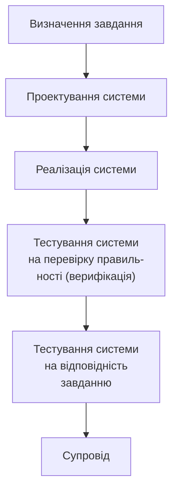

Рис. 2.4. Каскадна модель ЖЦ програмних систем

Тобто вважається, що кожна робота має бути виконана настільки ретельно, що після її закінчення і переходу до наступного етапу, повертатися до попереднього не буде потреби. Розробник перевіряє проміжний результат відомими методами верифікації і фіксує його як готовий еталон для наступного процесу.

Згідно з даною моделлю роботи і завдання процесу розроблення зазвичай виконуються послідовно, як це наведено у схемі.

Проте допоміжні і організаційні процеси (контроль вимог, керування якістю і ін.), як правило, виконуються разом з процесами розробки ПЗ. У даній моделі повернення до початкового процесу передбачається після супроводження і виправлення помилок.

Особливість такої моделі полягає у фіксації послідовних процесів розроблення програмного продукту. В її основу покладена модель фабрики, де продукт проходить стадії від задуму до виробництва, потім його передають замовнику у вигляді готового виробу, де заміна не передбачена, хоча можна подати інший подібний виріб. Недоліки цієї моделі такі:
* процес створення ПС не завжди вкладається в таку жорстку форму і послідовність дій;
* не враховуються змінювані потреби користувачів, нестабільні умови зовнішнього середовища, які впливають на зміни вимог до ПС під час її розроблення;
* значний розрив між часом внесення помилки (наприклад, на процесі проектування) і часом її виявлення (при супроводі), що призводить до суттєвої переробки ПС.

При застосуванні каскадної моделі можуть спостерігатися такі чинники ризику:
- вимоги до ПС недостатньо чітко сформульовані, або не враховують перспективи розвитку ОС, середовищ і т.п.;
- громіздка система, що не допускає компонентної декомпозиції, може викликати проблеми щодо розміщення її в пам'яті або на платформах, не передбачених у вимогах;
- внесення швидких змін до технології і у вимоги може погіршити процес розроблення окремих частин системи або системи в цілому;
- обмеження на ресурси (людські, програмні, технічні і ін.) в ході розробки можуть звузити окремі можливості реалізації системи;
- отриманий продукт може виявитися недатним для застосування внаслідок нерозуміння розробниками вимог або функцій системи або недостатньо проведеного тестування.

Переваги реалізації системи за допомогою каскадної моделі такі:
- всі завдання підсистем і системи реалізуються одночасно, завдяки чому не можна забути жодного завдання, а це сприяє встановленню стабільних зв'язків між ними;
- повністю розроблену систему з документацією на неї легше супроводжувати, тестувати, фіксувати помилки і вносити зміни не хаотично, а цілеспрямовано, починаючи з вимог, наприклад, додавати або замінювати деякі функції і повторювати процес.

Каскадну модель можна розглядати як модель ЖЦ, придатну для створення першої версії ПЗ з метою перевірки реалізованих в ній функцій. При супроводі і експлуатації можуть бути виявлені різного роду помилки, виправлення яких спричинить повторне виконання всіх процесів, починаючи з уточнення вимог.

### 2.3.2. Інкрементна модель

Цю модель (incremental) ще називають моделлю з нарощуванням або з приростом. Її суть полягає в розробці продукту ітераціями, і кожна ітерація закінчується випуском працездатної версії. У кожній новій версії додаються деякі функціональні можливості. Розробка системи починається з визначення набору всіх вимог до ПС і ділення процесу розробки на ітерації. Кожна ітерація реалізується послідовно з використанням процесів ЖЦ і фіксації робочої версії системи, системи, що поступово наближається до остаточної версії (рис. 2.5).


Рис. 2.5. Інкрементна модель ЖЦ

Перша проміжна версія системи, що створюється (випуск 1), реалізує частину вимог, у подальшу версію (випуск 2) додають додаткові вимоги до тих пір, поки не будуть остаточно виконані всі вимоги і розв'язані задачі розробки системи.

Для кожної проміжної версії на процесах ЖЦ виконуються необхідні процеси, роботи і завдання, зокрема, аналіз вимог і створення нової архітектури, які можуть бути виконані одночасно.

Процеси розроблення технічного проекту програмної системи, її програмування і тестування, збирання і кваліфікаційні випробування ПС виконуються при створенні кожної подальшої версії.

Відповідно до даної моделі ЖЦ, процеси якої практично такі самі, як і в каскадній моделі, наголос робиться на побудову деякої закінченої проміжної версії, а завдання процесу розроблення виконуються послідовно або частково паралельно для ряду окремих проміжних структур версії.

Роботи і завдання процесу розроблення наступної версії системи з додатковими вимогами або функціями можуть виконуватися неодноразово в одній тій же послідовності для всіх проміжних версій системи. Процеси супроводження і експлуатації можуть бути реалізовані разом з процесом розроблення версії шляхом перевірки частково реалізованих вимог в кожній проміжній версії і так до отримання кінцевого варіанта системи. Допоміжні і організаційні процеси ЖЦ зазвичай виконуються разом з процесом розроблення версії і до кінця розробки збираються дані, на підставі яких можна встановити рівень завершеності і якості виготовленої системи.

При застосуванні даної моделі необхідно враховувати такі чинники ризику:
- вимоги складені з урахуванням можливості їх зміни при реалізації продукту;
- всі можливості системи потрібно реалізувати одразу;
- швидка зміна технології і вимог до системи може призвести до порушення отриманої структури системи;
- обмеження в ресурсному забезпеченні (виконавці, фінанси) можуть призвести до несвоєчасного введення системи в експлуатацію.

Дану модель ЖЦ доцільно використовувати, у випадках, коли:
- бажано реалізувати деякі можливості системи швидко за рахунок створення проміжної версії продукту;
- система декомпозується на окремі складові частини, які можна реалізовувати як деякі самостійні проміжні або готові продукти;
- можливе збільшення фінансування на розробку окремих частин системи.

### 2.3.3. Спіральна модель

Виходячи з можливості внесення змін, як в процес, так і в проміжний продукт було створено спіральну модель ЖЦ (рис.2.6) [6].

Внесення змін орієнтоване на задоволення потреби користувачів одразу, як тільки буде встановлено, що створені артефакти або елементи документації не відповідають дійсному стану розробки.

Дана модель ЖЦ допускає аналіз продукту на витку розробки, його перевірку, оцінку правильності та прийняття рішення про перехід на наступний виток або повернення на попередній виток для доопрацювання на ньому проміжного продукту.

Відмінність цієї моделі від каскадної полягає в можливості багато разів повертатися до процесу формулювання вимог і до повторної розробки версії системи з будь-якого процесу моделі.


Рис.2.6. Спіральна модель ЖЦ розробки програмних систем

Для програмного продукту така модель не дуже підходить з декількох причин. По-перше, висловлення вимог замовником носить суб'єктивний характер, вимоги можуть багаторазово уточнюватися протягом розробки ПС і навіть після завершення та випробовування, і часом може з'ясуватися, що замовник «хотів зовсім інше». По-друге, змінюються обставини та умови використання системи, тому загальновизнаним законом програмної інженерії є закон еволюції, який сформулюємо так: кожна діюча ПС з часом потребує внесення змін або виводиться з експлуатації.

При необхідності внесення змін до системи на кожному витку з метою отримання нової версії системи обов'язково вносяться зміни в заздалегідь зафіксовані вимоги, після чого повертаються на попередній виток спіралі для продовження реалізації нової версії системи з урахуванням усіх змін.

### 2.3.4. Еволюційна модель

У разі еволюційної моделі система послідовно розробляється з блоків конструкцій. На відміну від інкрементної моделі в еволюційній моделі вимоги встановлюються частково і уточнюються в кожному наступному проміжному блоці структури системи.

Використання еволюційної моделі припускає проведення дослідження предметної області для вивчення потреб її замовника і аналізу можливості застосування цієї моделі для реалізації. Модель використовується для розробки нескладних і некритичних систем, де головною вимогою є реалізація функцій системи. При цьому вимоги не можуть бути визначені відразу і повністю. Тому розробка системи здійснюється ітераційним шляхом її еволюційного розвитку з отриманням деякого варіанта системи–прототипу, на якому перевіряється реалізація вимог. Іншими словами, такий процес за своєю суттю є ітераційним, з етапами розробки, що повторюються, починаючи від змінених вимог і закінчуючи отриманням готового продукту. В деякому розумінні до цього типу моделі можна віднести спіральну модель.

Розвитком цієї моделі є модель еволюційного прототипування в рамках усього ЖЦ розробки ПС (рис.2.7).

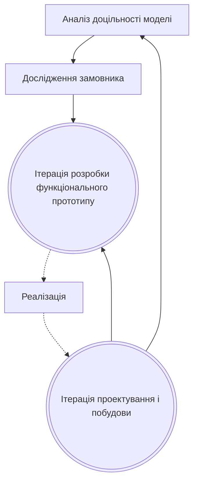

Рис.2.7. Модель еволюційного прототипування

У літературі вона часто називається моделлю швидкої розробки програм RAD (Rapid Application Development).

У даній моделі наведені дії, які пов'язані з аналізом її застосовності для конкретного виду системи, а також обстеженням замовника для визначення потреб користувача при розробці плану створення прототипу.

У моделі є дві головні ітерації розробки функціонального прототипу, проектування і реалізації системи з метою перевірки, чи задовольняє вона всі функціональні і нефункціональні вимоги. Основною ідеєю цієї моделі є моделювання окремих функцій системи в прототипі і поступове еволюційне його доопрацювання до виконання всіх заданих функціональних вимог.

Ітерацій з отримання проміжних варіантів прототипу може бути декілька, в кожній з яких додається функція і повторно моделюється робота прототипу. І так до тих пір, поки не будуть промодельовані всі функції, задані у вимогах до системи. Після цього виконується ще одна ітерація — остаточне програмування для отримання готової системи.

Ця модель застосовується для систем, в яких найбільш важливими є функціональні можливості, і які необхідно швидко продемонструвати на CASE-засобах.

Оскільки проміжні прототипи системи відповідають реалізації деяких функціональних вимог, їх можна перевіряти і під час супроводу і експлуатації, тобто разом з процесом розробки чергових прототипів системи. При цьому допоміжні і організаційні процеси можуть виконуватися разом з процесом розроблення і накопичувати відомості за даними кількісних і якісних оцінок на процесах розроблення.

При цьому враховуються такі чинники ризику:
- реалізація всіх функцій системи одночасно може призвести до громіздкості;
- обмежені людські ресурси зайняті розробкою протягом тривалого часу.

Переваги застосування даної моделі ЖЦ такі:
- швидка реалізація деяких функціональних можливостей системи і їх апробація;
- використання проміжного продукту в наступному прототипі;
- виділення окремих функціональних частин для реалізації їх у вигляді прототипу;
- можливість збільшення фінансування системи;
- зворотний зв'язок із замовником для уточнення функціональних вимог;
- спрощення внесення змін у зв'язку із заміною окремих функцій.

Модель розвивається у напряму додавання нефункціональних вимог до системи, пов'язаних із захистом і безпекою даних, несанкціонованим доступом до них і ін.

**Висновки.** Розглянуто стандарти ЖЦ, основоположні моделі ЖЦ і запропоновано шлях створення нової моделі ЖЦ, прийнятної для певної предметної області, використовуючи стандарт ISO/IEC 12207, який містить у собі описи процесів проектування, тестування, керування проектом, ризиками, якістю тощо.

### Контрольні питання і завдання

1. Назвіть три основні групи процесів життєвого циклу.
2. Назвіть організаційні процеси ЖЦ і перерахуйте їх.
3. Охарактеризуйте процес керування якістю ЖЦ.
4. Який стандарт визначає перелік і зміст процесів ЖЦ ПЗ?
5. Чи всі процеси стандарту повинні бути застосовані в розробці ПЗ?
6. Охарактеризуйте суть моделі ЖЦ і основні види моделей.
7. Опишіть каскадну і спіральну моделі ЖЦ.
8. Охарактеризуйте еволюційну модель ЖЦ.
9. Назвіть інші види моделей ЖЦ.

**Список літератури до розділу 2**

1. *ISO/IEC 12207: 1995–0801:* Informational Technology – Software life cycle processes. // ГОСТ Р ИСО/МЭК 12207–99. Информационная технология. Процессы жизненного цикла программных средств.
2. *Лаврищева Е.М., Грищенко В.Н.* Области знаний программной инженерии – SWEBOK и подход к обучению этой дисциплины // Управляющие системы и машины.–2005. – №1.– С.38–54.
3. *Васютович В., Самотохин С., Никифоров Г.* Регламентация жизненного цикла программных средств // ifrsmov@gost.ru
4. *Вендеров А.М.* Проектирование программного обеспечения экономических информационных систем. – М.: Финансы и статистика, 2000. – 347 с.
5. *Орлов С.А.* Технологии разработки программного обеспечения. – Спб.: Питер, 2002. – 463 с.
6. *Соммервил И.* Инженерия программного обеспечения. 6-е издание. – М.–Спб.–Киев,– 2002. –623 с.
7. *Лаврищева Е.М., Коротун Т.М.* Построение процесса тестирования программных систем // Проблемы программирования. – 2002. – № 1–2. – С. 272–281.
8. *Андон Ф.И., Коваль Г.И., Коротун Т.М., Лаврищева Е.М., Суслов В.Ю.* Основы инженерии качества программных систем. – Киев: Академпериодика, 2007.– 680 с.

## Розділ 3. ВИЗНАЧЕННЯ ВИМОГ ДО ПРОГРАМНИХ СИСТЕМ

Кожна програмна система – це перетворювач, функцією якого є визначене оброблення даних і вивід отриманих результатів. З метою побудови програмної системи до неї, насамперед, формулюються вимоги до умов виконання функції і обробки даних. Ці вимоги є предметом практичного контракту між замовником і розробником системи [1].

У загальному випадку під *вимогами до ПС* розуміють властивості, які повинна мати система для виконання запропонованих замовником функцій. Прикладами таких функцій можуть бути бізнес-функції, документообіг, керування даними і структурою інформації, що необхідна для прийняття системних рішень, та ін. У ядрі знань SWEBOK викладено основні концепції й особливості інженерії вимог, які подано на рис. 3.1.

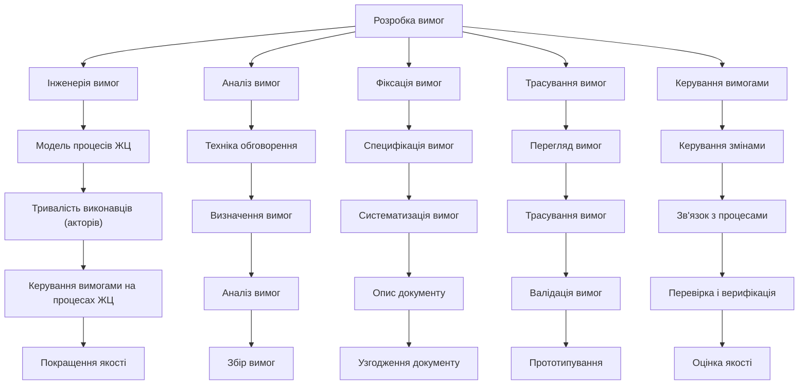

Рис. 3.1. Основні розділи розробки вимог

Найпоширеніший інструмент інженерії вимог – це UML, у якому вимоги визначаються й уточнюються через подання можливих варіантів використання ПС (use case), що трансформуються у проєктні рішення і архітектуру системи.

Розглянемо загальні й спеціалізовані (зокрема, об'єктно-орієнтовані) підходи до розробки вимог до системи у контексті розділів, поданих на рис. 3.1.

### 3.1. Загальні підходи до визначення вимог

Визначення вимог є нетривіальною задачею і проводиться, як правило, шляхом обговорення поглядів замовника на систему з майбутніми її розробниками. Замовник висловлює свої потреби і представляє погляди щодо автоматизації

функцій і задач системи, які далі набувають формулювання у вигляді різнопланових вимог до ПС, класифікація яких подається нижче.

### 3.1.1. Класифікація вимог

Дотепер ще відсутні загальноприйняті терміни, якими користуються спеціалісти для опису вимог замовника до ПС, а саме, функціональних, системних, технологічних. У різних тематичних джерелах наведені різні визначення поняття вимог, виходячи з особистих поглядів замовників на програмний продукт, який потрібно побудувати.

У ряді публікацій формування вимог до ПС розглядається як певна ділова гра, під час якої виявляються інтереси зацікавлених у розробці ПС осіб, правила реалізації цих інтересів у конкретному продукті. При цьому висловлюються різного роду претензії й обмеження на властивості і способи забезпечення вимог для отримання кінцевого програмного продукту. Отже, зрозуміло що нема формалізованих методів збирання й опису вимог, а також відсутнє загальноприйнятне визначення самого поняття вимога. Наведемо тлумачення цього слова з джерел [1–3].

*Вимоги* – це твердження про функції й обмеження системи.  
*Вимоги* – це властивості, які повинен мати продукт, щоб являти бути собою цінним для свого користувачів.  
*Вимоги* – це специфікація того, що і як повинно бути реалізовано.  

Відповідно до міжнародного глосарію з термінології комп’ютерної науки вимога містить у собі опис:

1) умов або можливостей, необхідних користувачеві для вирішення поставлених проблем або для досягнення цілей;  
2) функцій і обмежень, які повинна мати система або системні компоненти, щоб виконати контракт замовника на розробку;  
3) положень і регламенту, встановлених використаними стандартами і відображених у специфікаціях або інших формальних документах на систему;  
4) умов, можливостей і обмежень середовища, необхідних для проектування і виконання системи.  

Розглянемо основні типи вимог.

*Вимоги до продукту* охоплюють умови користувачів щодо зовнішнього поводження системи і погляди розробників на деякі параметри системи. Термін користувач стосується осіб, зацікавлених у створенні системи.

*Вимоги до ПЗ є такі: системні, функціональні і нефункціональні вимоги.*

*Вимоги користувачів (user requirements)* задаються умовами досягнення цілей і задач, віддзеркалюють вимоги споживачів до спектра розв'язуваних майбутньою системою задач. Вони подаються як текстовий опис або сценарії, прецеденти, таблиці «подія-відгук» тощо.

*Системні вимоги (system requirements)* визначають зовнішні умови виконання системних функцій і обмежень на створення продукту, а також вимоги до опису програмно-апаратних підсистем. Системні вимоги накладають обмеження на архітектуру системи, засоби її візуального подання і функціонування. Для опису системних вимог використовують спеціальні шаблони і форми, що допомагають уявити вхідні і вихідні дані й автоматизувати ці вимоги.

*Вимоги до атрибутів якості* (quality attributes) — це деякі обмеження на властивості функцій або системи, важливі для користувачів або розробників. Наприклад, переносність, цілісність, стійкість системи до збоїв.

*Функціональні вимоги* — це перелік функцій або сервісів, які повинна надавати система, а також обмежень на дані і поводження системи при їхньому виконанні. Специфікація функціональних вимог (software requirements specification) — опис функцій та їхніх властивостей, які не містять у собі протиріч і виключень.

*Нефункціональні вимоги* визначають умови виконання функцій (наприклад, захист інформації у БД, аутентифікація доступу до ПС тощо) у середовищі, що безпосередньо не пов'язані з функціями, а відбивають потреби користувачів щодо їх виконання. Ці вимоги характеризують принципи взаємодії із середовищами або іншими системами, а також визначають показники часу роботи, захисту даних і досягнення якості з урахуванням рекомендацій використовуваного стандарту. Вони можуть встановлюватися як числові значення (наприклад, час чекання відповіді, кількість клієнтів, що обслуговуються і ін.) у різних одиницях виміру, включаючи, наприклад, ймовірність (значення ймовірності безвідмовної роботи системи — показника її надійності). Для більшості сучасних ПС вимоги складаються з умов й обмежень типу:
- конфіденційність, безпека і захист даних;
- відмовостійкість;
- одночасність доступу користувачів до системи;
- час чекання відповіді при звертанні до системи (продуктивність);
- склад виконуваних функцій системи (запуск, швидкість реакції й ін.);
- положення стандартів з виконання сформульованих вимог.

Дані вимоги визначаються і формалізуються аналітиками на процесі аналізу і проектування структури системи. Так, у випадку вимог з безпеки функціонування системи, в системі виділяються категорії користувачів, що мають право доступу до тих або інших функцій (програмних компонентів) або даних, та передбачаються додаткові функції системи з перевірки доступу (санкціонований доступ до них чи ні). Якщо потрібно обмежити доступ до конкретних даних (наприклад, до окремих записів, полів у таблиці), то в системі може передбачатися, наприклад, мандатний захист. Для захисту всієї системи від несанкціонованого доступу користувачі реєструються і проходять аутентифікацію для роботи із системою.

Для відновлення і збереження резервних копій БД, архівів баз даних аналізуються можливості СУБД і способи забезпечення необхідного рівня безперебійної роботи системи, правил доступу авторизованих користувачів і заходів боротьби з різними загрозами, що надходять ззовні від користувачів, які не мають прав доступу до деяких або до всіх даних системи.

До вихідного продукту пред'являються нефункціональні вимоги до:
- застосування (якість інтерфейсу, продукту й ін.);
- продуктивності (пропускна здатність, час реакції й ін.);
- надійності виконання (без помилок і відмов);
- зовнішніх інтерфейсів, за якими виконується взаємодія з іншими компонентами або підсистемами.

Опис усіх видів вимог проводиться з урахуванням стандартів, наприклад, стандарту з якості ISO/IEC ДСТУ 9126 і стандартизованого понятійного і термінологічного довідника, що містить у собі загальноприйняті терміни щодо

структури ПрО і призначення функцій системи. Специфікація вимог відображає принципи взаємодії проектованої системи з іншими середовищами, платформами і загальносистемним забезпеченням (БД, СКБД, мережі та ін.).

Формування документа зі специфікаціями вимог завершується на процесі проектування архітектури, після чого він узгоджується з замовником системи і використовується як керування дій при виконанні задач розробки програмного продукту на процесах ЖЦ і отриманні готового продукту. При виявленні на них неузгоджених вимог, проводиться їхнє уточнення і, відповідно, вносяться зміни у деякі задачі процесу розробки системи або характеристики продукту.

### 3.1.2. Аналіз і збирання вимог

У сучасних технологіях процес ЖЦ, у якому фіксуються вимоги до розробки системи, є визначальним для задання функцій, термінів і вартості робіт, а також показників якості, які необхідно досягти в процесі розробки. Виявлення вимог проводиться під час обговорення проекту, аналізу особливостей предметної області і визначення підходів до її проектування на процесах ЖЦ.

Вимоги відбивають потреби людей (замовників, користувачів, розробників), зацікавлених у створенні ПС. Замовник і розробник спільно обговорюють проблеми проекту, збирають вимоги, проводять їхній аналіз, перегляд і визначають необхідні обмеження.

**Обговорення проекту системи** відбувається з метою вивчення думки і вироблення перших висновків щодо доцільності виконання проекту і прогнозування реальності його виконання в заданий термін і за кошти, що дає замовник. Природно, особа, яка замовила проект системи, бажає отримати від розробника набір необхідних послуг, за якими будуть звертатися різні категорії користувачів: оператори, менеджери, фахівці у ПрО.

Розробники системи можуть оцінити можливість реалізації послуг у проекті системи, що замовляється, у заданий термін і бюджет. Серед розробників призначаються головний аналітик, відповідальний за вимоги до системи, і головний програміст, відповідальний за їхню реалізацію. Вони узгоджують вимоги і визначають сферу дії проекту на спільних переговорах із замовником з метою уточнення наступних питань:
- спектра проблем ПрО, при вирішенні яких будуть визначатися послуги системи;
- функціонального змісту послуг;
- регламенту операційного обслуговування системи тощо.

В обговоренні вимог до системи беруть участь:
- представники замовника з декількох професійних груп;
- оператори, що обслуговують систему;
- аналітики і розробники майбутньої системи.

Погоджена сфера дій у проекті дає можливість оцінити необхідні інвестиції в проект, заздалегідь визначити можливі ризики і здатності розробників щодо виконання проекту. Підсумком обговорення проекту може бути рішення про розгортання реалізаційних робіт на проекті або відмови від нього.

**Аналіз вимог** починається після обговорення проблематики проекту. Серед обговорюваних вимог можуть виявитися:

– неочевидні або не однаково важливі, які були взяті з застарілих джерел і документів замовника;
– різні типи умов, що відповідають різним рівням деталізації проекту і потребують застосування методів керування ними;
– постійно змінювані або уточнювані, залежно від унікальних властивостей або значень;
– складні за формою і змістом, тяжкі для узгодження їх із замовником.

Розробники вимог повинні мати відповідні знання в даній предметній області і вміти здійснювати:
– аналіз проблем, задач предметної області, а також потреб замовника і користувачів системи,
– виявлення функцій системи, що мають бути реалізовані в проекті,
– внесення змін в окремі елементи вимог у процесі їх виконання.

У вимогах до ПС, крім проблем системи, формулюються реальні потреби замовника щодо функціональних, операційних і сервісних можливостей майбутньої системи. Результати дії дослідження й аналізу предметної області фіксуються в документі з опису вимог і в договорі між замовником і виконавцем проекту.

Помилки через нечіткі або неоднозначні формулювання вимог можуть призвести до того, що виготовлена система не буде задовольняти замовника. Тому на процесах розробки вимоги повинні постійно уточнюватися і знову затверджуватися замовником. В окремих випадках внесені зміни у вимоги можуть обумовити необхідність перепроектування окремих частини або всієї системи в цілому. Відповідно до статистики, частка помилок у постановці вимог і у визначенні задач системи перевищує частку помилок, що допускається під час кодування системи. Це обумовлюється суб'єктивним характером процесу формулювання вимог і відсутністю способів їхньої формалізації. У США, наприклад, щорічно витрачається до 82 млрд.дол. на проекти, визнані після реалізації такими, що не відповідають вимогам замовників.

Існуючі стандарти (ДСТУ 34.601–90 і ДСТУ 34.201–89) з розробки вимог до автоматизованої системи (АС) і відповідної документації фіксують результати створення програмного, технічного, організаційного та інших видів забезпечення автоматизованих систем на процесах ЖЦ.

**Збирання вимог.** Джерелами відомостей для збирання вимог є:
– мета і задачі проекту, що формулює замовник майбутньої системи, і які повинні осмислюватися розробниками;
– колектив, який виконує реалізацію функцій системи.

Вивчення і фіксація реалізованих функціональних можливостей у діючій системі є підґрунтям для накопичення досвіду для формулювання нових вимог до неї. При цьому необхідно відокремлювати нові вимоги до системи від старих вимог, щоб не повторити невдалі розв'язки щодо старої системи в новому її виконанні.

Вимоги до системи формулюються замовником у термінах понять його предметної області з урахуванням відомих словників, стандартів, існуючих умов середовища функціонування майбутньої системи, а також трудових і фінансових ресурсів, виділених на розробку системи.

Методи збирання вимог такі:
– інтерв'ю з виразниками інтересів замовника системи;

– вивчення прикладів можливих варіантів виконання функцій, ролей відповідальних осіб, які пропонують ці варіанти, або тих, що взаємодіють із системою при її функціонуванні;
– спостереження за роботою діючої системи для відокремлення властивостей, що обумовлені кадровими аспектами.

Зовнішні і внутрішні аспекти вимог пов'язують з характеристиками якості і відносяться до властивостей створюваного продукту, а саме, функцій системи, її призначення і виконання в заданому середовищі. На прикінці користувач очікує досягнення максимального ефекту від застосування вихідного продукту та орієнтується на його кінцеву експлуатаційну якість.

Отримання зовнішніх і внутрішніх характеристик якості досягається спеціально розробленими методами з виконання процесів ЖЦ. Внутрішні характеристики, які досягаються в ході ЖЦ, позначаються на зовнішніх показниках і використовуються при оцінюванні робочих та кінцевих продуктів ПЗ.

Остаточно сформульовані вимоги — основа для підпису контракту між замовником і розробником системи.

### 3.1.3 Інженерія вимог

Інженерна дисципліна аналізу і документування вимог передбачає планування і перетворення запропонованих замовником вимог до системи на опис вимог до ПЗ, їх специфікацію і валідацію. Вона базується на *моделях процесів розроблення вимог*, діях акторів і керуванні поступовим перетворенням вимог до проєктних рішень і опису компонентів у мові програмування.

*Модель процесу визначення вимог* — це схема процесів ЖЦ, що виконуються від початку проєкту і доти, поки не будуть визначені і погоджені вимоги.

*Керування вимогами до ПЗ* полягає в плануванні і контролі формування вимог, заданих на основі проєктних рішень, у перетворенні їх на специфікації компонентів системи.

*Якість і процес поліпшення вимог* — це методи досягнення і перевірки характеристик і атрибутів якості (надійність, реактивність та ін.), які повинна мати система і ПЗ, у процесах ЖЦ і під час закінчення розробки продукту.

*Керування вимогами до системи* — це планування і керування формуванням вимог на всіх процесах ЖЦ, а саме, керування змінами вимог, відновлення їхнього джерела й уточнення вимог. Невід'ємна складова процесу керування — трасування вимог, що полягає у відстеженні правильності завдання і реалізації вимог до системи і ПЗ на процесах ЖЦ і зворотного процесу звіряння ПЗ із заданими вимогами.

Основні задачі керування вимогами це:
– розроблення атрибутів вимог,
– керування варіантами вимог,
– керування ризиками, що виникають при неточному визначенні вимог;
– контроль статусу вимог, вимірювання зусиль при формуванні вимог;
– реалізація вимог на процесах ЖЦ.

Розроблення і керування вимогами зв'язана з іншими областями знань (рис. 3.2).

Розділ 3


Рис. 3.2. Керування вимогами і зв'язок із задачами SWEBOK

Планування робіт на проєкті стосується питань організації інтеграції компонентів, керування ризиками, версіями системи, на які впливають задані вимоги та їхні зміни.

### 3.1.4. Фіксація вимог

Початковий процес розроблення ПС – збирання вимог, який завершується формуванням списку вимог до системи, що називається у вітчизняній практиці технічним завданням. Фіксація вимог (Requirement Capturing) у технічному завданні обумовлена потребою замовника зафіксувати і одержати задані ним властивості у реалізованій системі. При цьому передбачається специфікація, верифікація і валідація вимог на правильність, відповідність і повноту.

*Специфікація вимог до ПЗ* – це формалізований опис функціональних, нефункціональних і технічних вимог, вимог до характеристик якості, до структури ПЗ і принципів взаємодії з його компонентами.

**Приклад.** Скласти вимоги до облікової і статистичної функцій ПЗ системи обробки даних.

Згідно з стандартом ДСТУ 34.601–92 («Розробка АС») функціональні вимоги до ПЗ даної системи можливо представити так:
– система повинна мати 12 функцій, з них 8 облікових та 4 статистичних;
– кожна функція повинна бути ретельно реалізована, бути коректною і повинна давати точні результати;
– дані для функцій подаються в табличному вигляді і зберігаються в БД СКБД Oracle, їхній обсяг – 10000 записів на рік;
– дані повинні контролюватися і бути захищені від несанкціонованого доступу до БД тощо.

Дані вимоги відносять до характеристик функціональності системи. Після її реалізації повинні бути перевірені функції на відповідність установленим вимогам, діючим нормам і стандартам. Оцінка функцій виконується після їхньої валідації, верифікації та реалізації. Як оцінки використовують метрики (коректність, точність, повнота тощо) для перевірки різних аспектів реалізації функцій. Ці метрики наведені у першій, а їхні формули – у другій колонках табл.3.1. У ці формули підставлені значення, яким надано кількісний опис у специфікації вимог. На основі отриманих метрик розв'язується задача правильної реалізації вимог до ПЗ або до всієї програмної системи.

Таблиця 3.1. Перевірка реалізації функцій системи

| Назва метрики | Опис результату перевірки |
| :--- | :--- |
| Повнота<br>реалізації функції | $\Psi = 1 - N/M$<br>$N$ – число нереалізованих (пропущених) функцій<br>$M$ – число функцій в описі вимог |
| Коректність<br>реалізації функції | $\varphi = 1 - N/M$<br>$N$ – число некоректно розроблених функції<br>$M$ – число функцій в описі вимог |
| Точність<br>реалізації функції | $\delta = N/T$<br>$N$ – число відхилених результатів виконання функцій<br>$T$ – час використання компонентів функції |
| Ретельність<br>реалізації функції | $\nu = N/M$<br>$N$ – число функцій, для яких специфікації вимог були точно<br>реалізовані,<br>$M$ – число функцій, для яких вимоги до точності були<br>встановлені в специфікації вимог |
| Здатність до<br>обміну даних | $\mu = N/R$<br>$N$ – число даних, що беруть участь в обміні даних із БД,<br>$R$ – загальне число форматів даних, що беруть участь в обміні<br>із БД |
| Контроль доступу<br>до даних у БД | $k = N/M$<br>$N$ – число несанкціонованих операцій,<br>$M$ – число нелегальних операцій, наведених в описі вимог |
| Точність<br>обчислення даних | $k = N/M$<br>$N$ – число елементів даних, для яких забезпечений рівень<br>точності обчислень,<br>$M$ – число елементів даних, для яких у специфікації<br>встановлений рівень точності обчислень |
| Ступінь контролю<br>доступу | $k = N/M$<br>$N$ – число вимог до контролю доступу стосовно специфікації<br>вимог,<br>$M$ – число вимог до контролю доступу, встановлених у<br>специфікаціях вимог |
| Функціональна<br>відповідність | $\varphi = N/M$<br>$N$ – число коректно розроблених компонентів, до яких<br>пред'являються функціональна відповідність,<br>$M$ – загальне число компонентів, до яких установлені<br>норми і правила відповідності |

*Валідація вимог* – це перевірка вимог для переконання, що вони визначають саме дану систему. Замовник проводить експертизу зафіксованого варіанта вимог для того, щоб розробник міг далі виконувати його проектування. Один з методів валідації – прототипування, тобто швидке відпрацювання окремих вимог на конкретному інструменті, аналіз масштабу виконання і зміни вимог, вимірювання функціональності і вартості системи, а також визначення зрілості процесів визначення вимог.

*Верифікація вимог* – це процес перевірки правильності специфікації вимог на їхню відповідність стандартам і функціям системи. Внаслідок перевірки вимог створюється остаточний і погоджений документ, що встановлює повноту і коректність вимог до ПЗ, а також можливість продовжити його проектування.

### 3.1.5. Трасування вимог

Одна з головних проблем збирання вимог — їхня зміна. Вимоги створюються ітераційно шляхом постійного спілкування представників замовників з аналітиками і розробниками майбутньої системи з метою виявлення необхідних потреб. Вимоги змінюються в міру уточнення функцій і задач, умов їхнього визначення на процесі укладання договору на створення системи і, зрештою, відповідають поглядам замовника на систему [4].

Одним з інструментів установлення залежності між сформульованими вимогами та їхніми змінами є *трасування*, тобто розвиток і обробка вимог із простежуванням ідентифікованих зв'язків, що повинні бути зафіксовані за двома напрямками — від потреб до робочих продуктів, і навпаки (рис. 3.3.). На процесі розроблення вплив змін у вимогах поширюється в першому напрямку, від потреб до робочих продуктів, а на процесі експлуатації — у зворотному напрямку. Під час цього виявляють причини виникнення різних неточностей, а потім виносять рішення про трасування в одному з наведених напрямків.

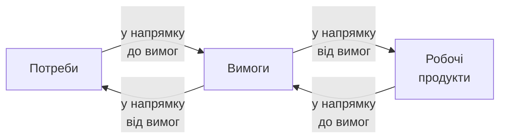

Рис. 3.3. Схема трасування вимог

Якщо після розроблення деякого робочого продукту виникає потреба в зміні окремих вимог або необхідність простежити за проходженням внесених вимог в одному з напрямків даної схеми трасування, то уточнюють зв'язки між окремими вимогами й елементами робочих продуктів. У випадку трасування вимог від продукту здійснюється рух у зворотному напрямку, тобто рух до вимог шляхом з'ясування правильності написання рядків коду продукту і відповідності їх окремим атрибутам вимог. Трасування в обох напрямках допомагає знайти незаплановані, але реалізовані, деякі функції або фрагменти програм, які не відповідають вимогам, і, навпаки, виявити нереалізовані вимоги до функціональності. Взаємозв'язки і залежності між окремими вимогами можуть зберігатися в таблиці трасування і видалятися або модифікуватися за різних змін.

Трасування базується на специфікаціях усіх зв'язків між елементами вимог або обмежується описами функцій, ситуацій, контексту і можливих рішень. Трасуванню піддаються:
- вимоги, що змінюються при їхньому формуванні;
- деякі деталі виконання функцій у робочому продукті системи, що не передбачалися, але з'явилися в зв'язку з практичною ситуацією, що виникла;
- зв'язки між різними моделями процесу проектування системи на ЖЦ і прийняті рішення про необхідність зміни вимог через виявлені недоліки в проміжному або робочому продукті;
- інформація про узгодження атрибутів вимог на різних рівнях даної схеми трасування та її матриць;
- системні вимоги, наприклад, до повторного використання готових компонентів;

– результати тестування, за якими можна визначити найбільш ймовірні частини коду, що вимагають зміни для виправлення виявлених дефектів.

У матриці вимог у рядках указані вимоги користувача, а у стовпцях — функціональні вимоги, елемент проектування, варіант версії й ін. У цих стовпцях заповнюються дані про ступінь виконання системних вимог на кожному об'єкті створюваного продукту. Механізм посилань у таблиці дозволяє перевіряти зв'язки між об'єктами системи. Процедура трасування передбачає:
– вибору елемента вимог з матриці, за яким буде відбуватися простежування на процесах ЖЦ;
– складання списку питань, за якими на кожному процесі ЖЦ перевіряються зв'язки при реалізації вимог, і, якщо змінюється будь яка ланка в ланцюжку вимог (рис.3.3), то може модифікуватися процедура розроблення цього елемента на наступному процесі ЖЦ;
– проведення моніторингу кожної вимоги на відповідність прийнятому плану;
– уточнення ресурсів проекту при зміні вимоги або елемента проекту.

Умова прийняття рішення про можливі модифікації вимог і результатів проміжного проектування — оновлена інформація про зв'язки між різними частинами системи і первісно заданими вимогами до них. Трасування забезпечує:
– введення складних зв'язків замість простих;
– використання різних шляхів трасування (між моделями або ієрархічними зв'язками);
– трасування об'єктів і зв'язків між ними.

Трасування може бути вибірковим для окремих об'єктів або зв'язаним з іншими об'єктами, а також з можливими переходами від однієї моделі проектування до іншої.

## 3.2. Об'єктно-орієнтована інженерія вимог

В об'єктно-орієнтованих підходах і методах розробки програмних систем головним є об'єкт. Для нього задаються вимоги за допомогою варіантів використання (use case), сценаріїв або прецедентів.

Наведені сценаріями або прецедентами вимоги до системи в UML послідовно трансформуються до інших сценаріїв, що наближають до логічної і виконуваної структури системи. Головні їх елементи — сценарії і актори, що задають дії щодо виконання сценаріїв системи.

### 3.2.1. Візуальний підхід

Один з методів побудови моделі системи, логічної і фізичної моделей — це use case, що використовується для візуального зображення вимог у моделі системи, яка уточнюється і доповнюється новими сценаріями для одержання остаточних логічної і фізичної моделей системи. Термін сценарій позначає деякий варіант подання моделі виконання системи [1, 5, 6].

При застосуванні сценарного підходу загальна метасистеми декомпозується на окремі підцілі, для яких визначаються функціональні або нефункціональні вимоги і проектні рішення. Мета як джерело вимог до системи дає змогу виявити протиріччя й обмеження на функції й встановити залежності між ними, усунути конфлікти між цільовими функціями, а також об'єднати деякі з них між собою [11].

Після виявлення цілей визначаються носії інтересів, яким відповідає кожна мета, і можливі варіанти задоволення складених цілей у вигляді сценаріїв роботи системи, що допомагають користувачу одержати уявлення про призначення і виконання функції системи. Це відповідає першій ітерації визначення вимог до системи.

Далі виробляється послідовна декомпозиція складної проблеми до вигляду сукупності цілей, кожна з яких трансформується в сукупність можливих сценаріїв використання системи, а потім у сукупність взаємодіючих об'єктів. Тобто, маємо ланцюжок трансформацій:

$$\text{проблема} \to \text{ціль} \to \text{сценарій} \to \text{об'єкт},$$

що характеризує ступінь концептуалізації аналізованої проблеми та її декомпозицію на сценарії з варіантів використання. Трансформація даного ланцюга виражається в термінах базових понять предметної області й активно використовується для подання і розвитку моделей системи.

Кожен сценарій ініціює актор, що виступає в ролі користувача визначеної роботи в системі, що зображена цим сценарієм. Фіксацію ролей акторів можна розглядати як визначений крок при виявленні цілей системи і постановки задач, а також рішення, що буде виконувати система.

Актор – це зовнішній чинник і його дії мають недетермінований характер. У його ролі може виступати і програмна система, якщо вона ініціює виконання деяких робіт, що задовольняють поставлені цілі системи. Ним може бути абстракція зовнішнього об'єкта, людина або зовнішня система. У моделі системи актор може бути поданий класом, а користувач – екземпляром класу, хоча це і не обов'язково. Якщо актор – це система, то він репрезентує її інтереси. При цьому одна особа може бути екземпляром декількох акторів.

Якщо актор знаходиться поза системою, то він взаємодіє з нею через зовнішній сценарій, що ініціює послідовність операцій для виконання системи. Коли користувач як екземпляр актора ініціює певну подію для старту відповідного сценарію, то це приводить до виконання ряду дій у системі, що завершуються тоді, коли екземпляр сценарію перебуває в стані очікування чергової події або завершення сценарію.

Екземпляр сценарію існує, поки він виконується і його можна вважати екземпляром класу, він має свій стан і у нього своє поводження. Взаємодія між актором і системою породжує новий сценарій або об'єкт, що змінює внутрішній стан системи. Якщо кілька сценаріїв системи мають однакове поводження, вони створюють клас сценаріїв.

При внесенні змін відбувається повторне моделювання дій акторів і сценаріїв, які запускаються ними в дію. Сценарій ініціюється актором і кожний з них обслуговує відповідну сукупність сценаріїв.

Для задання моделі сценаріїв використовується графічна нотація UML з такими правилами:
- актор позначається зображенням – іконка людини і можливо з назвою;
- сценарій подається овалом, у середині якого назва зображення іконки;


<!-- ВІДНОВЛЕНО ЧЕРЕЗ GEMINI (Стор. 76) -->
– актор зв'язується лінійкою з кожним овалом сценарію, що запускається ним в дію.
Приклад діаграми сценаріїв для читача бібліотеки в ролі актора подано на рис. 3.4.

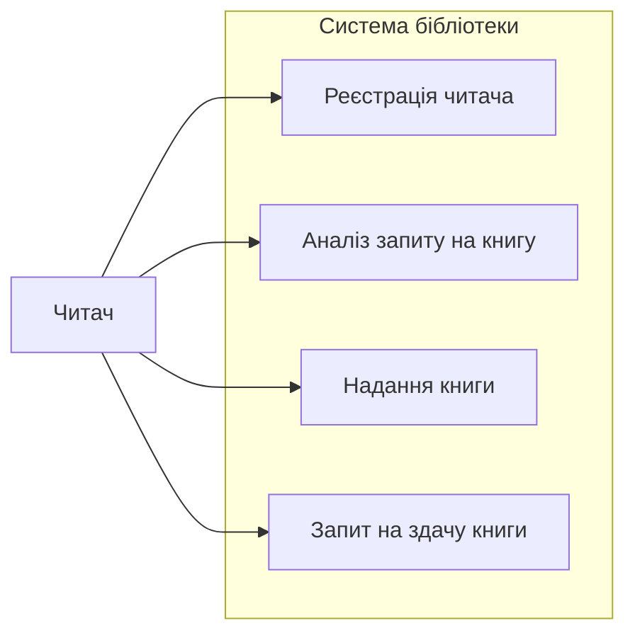

Рис. 3.4. Приклад діаграми сценаріїв для читача

Актор починає заданий сценарій при звертанні до автоматизованої системи обслуговування бібліотеки. Усі сценарії, що містяться у системі, обведені рамкою, яка визначає межі системи, а актор знаходиться поза рамкою як зовнішній чинник системи.

**Відношення між сценаріями.** Між сценаріями відношення задаються стрілками з указівкою назви типу відносин.

Для сценаріїв можна задавати два типи відношення:
1) відношення «розширюю» означають, що функція одного сценарію є доповненням до функції іншого і використовується при наявності декількох варіантів одного й того самого сценарію (рис. 3.5).

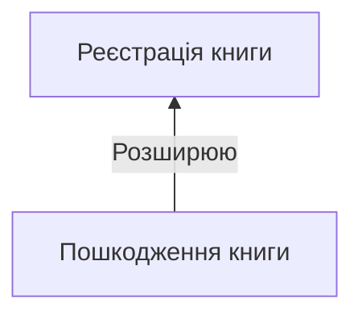

Рис. 3.5. Приклад відношення «розширюю»

Інваріантна частина сценарію зображується у вигляді головного сценарію, а окремі варіанти — як розширення. При цьому головний сценарій є стійким, не змінюється при розширенні варіантів функцій і не залежить від них;
<!-- КІНЕЦЬ ВІДНОВЛЕННЯ -->


2) відношення «використовує» означають, що деякий сценарій використовується як розширення інших сценаріїв (рис. 3.6).

На рис. 3.6 показано сценарій «ведення репозитарію», що зв'язаний відносинами «використовує» з декількома сценаріями – розроблення інтерфейсу, опис компонента, створення схеми розгортання.


Рис. 3.6. Приклад відносин «використовує»

Інженерія вимог завершується побудовою моделі вимог, що містить у собі:
1) опис вимог і основних понять ПрО;
2) модель сценаріїв;
3) інтерфейси сценаріїв.

Модель сценаріїв – це неформальний опис кожної зі діаграм сценарію, що входять у нього і описується послідовністю таких елементів:
– назва сценарію на діаграмі моделі вимог у вигляді посилання до іншого сценарію;
– короткий зміст сценарію в неформальному зображенні;
– список акторів, що будуть запускати в дію сценарії;
– параметри взаємодії системи з акторами, їх заборонені дії і можливі наслідки;
– передумови, що визначають початковий стан сценарію на момент його запуску і умови успішного виконання;
– функції, що реалізуються при виконанні сценарію;
– нестандартні ситуації, що можуть з'явитися при виконанні сценарію (наприклад, помилка в діях актора або системи).

На наступних процесах ЖЦ сценарій актора в моделі вимог трансформується в сценарій поводження системи, до елементів моделі можуть додаватися нефункціональні вимоги, що забезпечують запуск сценарію, введення даних і відпрацювання нестандартних ситуацій.

У процесі проектування виконується трансформація сценарію в опис функціональних компонентів системи і перевірка їх за допомогою верифікації.

Вимоги користувачів до системи відбивають в описі інтерфейсів компонентів, що розміщаються в репозиторії. За допомогою сценаріїв можна побудувати прототип системи для моделювання дій акторів у процесі їхнього виконання і відпрацювання різних їхніх деталей.

### 3.2.2. Текстовий підхід

Альтернативним терміном для сценарію є прецедент. Як і у випадку сценаріїв, задача опису вимог прецедентами зводиться до аналізу дерева цілей системи і до опису реакції системи у випадку недосяжності тієї або іншої поставленої мети щодо проектованої системи. Головною умовою завдання вимог прецедентами є повнота системних вимог до інтерфейсу користувача, до протоколів і форматів ведення [2, 5].

Прецедент – це деякий випадок у системі, що міститься у делькох екземплярах. Екземпляр – це послідовність дій виконання системою, що може бути ініційована конкретним екземпляром актора. Опис прецеденту містить у собі назву і те, що відбудеться в системі, коли прецедент буде виконаний. Набір прецедентів установлює всі можливі шляхи використання системи.

При визначенні вимог створюється модель прецедентів, що моделює те, що повинно робити система з погляду потреб користувачів. На рівні реалізації проекту в цю модель додаються технічні вимоги, що зображаються в термінах класів.

Змістовна сторона системних вимог – опис функцій, даних і умов функціонування. Методологія формування вимог за допомогою прецедентів реалізована в середовищі Rational Rose (www.rational.com.uml) і передбачає побудову ряду моделей на їхній основі. Прецеденти відіграють визначену їм роль у кожному з основних процесів проектування: розроблення вимог, аналіз і проектування, виконання й випробування системи. Екземпляр прецеденту у реалізації відображає послідовність дій, виконуваних системою, і спостережень за одержанням результату.

У керованому прецедентами проекті розробляються два зображення системи – зовнішнє і внутрішнє. Зовнішнє зображення ПрО визначає, що повинно відбуватися в системі, щоб забезпечити замовнику необхідні результати. Після подання цілей системи прецедентами розробляються принципи взаємодії системи і її суб'єктів.

Внутрішнє зображення – це принципи організації роботи системи для досягнення запланованих результатів. Воно містить у собі сутності, що беруть участь у виконанні прецеденту, і зв'язки між ними. При цьому кожний із прецедентів виконує визначену дію для досягнення цілі і необхідних результатів у системі.

У процесі аналізу проблеми і формування вимог створюється модель прецедентів з відображенням мети системи. Вона складається з:
- використовуваних термінів (глосарія) предметної області;
- головних діючих осіб і їхніх цілей;
- використовуваних технологій і принципів взаємодії з іншими системами;
- вимог до форматів і протоколів взаємодії;
- вимог до тестування і до процедури розгортання системи у замовника;
- організації керування процесом розробки системи.

На процесі аналізу і проектування модель прецедентів реалізується в моделі проекту в термінах взаємодіючих об'єктів, тобто дається опис того, як прецедент буде виконуватися в системі.

Із синтаксичної точки зору ця модель має такий вигляд.

<Модель прецеденту ::= <ім'я прецеденту/діючої особи>, <ім'я ролі / короткий опис ролі діючої особи>, <опис меж системи>, <список усіх зацікавлених осіб при аналізі ключових цілей системи>, <вихідні умови>, <результат успішного занічення визначення цілей системи>, <кроки сценарію для формування шаблону досягнення цілей проекту>, <опис інформації, необхідної розробнику для реалізації системи>.

Даний підхід до зображення системи за допомогою прецедентів можна задавати у формі шаблонів [5], які застосовуються в офіційній сфері, де діловий прецедент відбиває зображення цієї сфери з зовнішньої сторони, щоб забезпечити суб'єкта необхідними результатами. При виконанні ділового прецеденту визначається взаємодія ділової сфери і суб'єкта. Сукупність ділових прецедентів установлює межі системи.

Внутрішнє зображення ділового прецеденту — це реалізація, що охоплює функції ділових працівників і, відповідно, бере участь у їхньому виконанні, а також зв'язки між ними. Таке завдання системи розробляється для того, щоб вирішити, як повинна бути організована робота системи за допомогою ділового прецеденту.

**Висновки.** Проаналізовано підходи і методи формування вимог до системи і ПЗ, що створюється. Розглянуто функціональні і нефункціональні вимоги. Значна увага приділена об'єктно-орієнтованим методам інженерії вимог, що використані для побудови моделей предметних областей і на їхній основі проектування програмної системи. Наведені приклади проектування вимог за сценаріями і прецедентами.

### Контрольні питання і завдання

1. Наведіть класифікацію вимог.
2. Визначте призначення функціональних і нефункціональних вимог.
3. Назвіть джерела для завдання вимог.
4. Наведіть задачі обстеження, аналізу і збирання вимог.
5. Визначте інженерію вимог і задачі трасування вимог.
6. Визначте суть об'єктно-орієнтованої інженерії вимог.
7. Назвіть види відношень об'єктів у моделі.
8. Охарактеризуйте сценарний підхід і підхід за прецедентами.

### Список літератури до розділу 3

1. *Вигерс К.И.* Розробка вимог до ПЗ. — М.: Російська редакція Microsoft, 2004. — 575 с.
2. *Леонов И.В.* Введення в методологію розробки програмного забезпечення за допомогою Rational Rose // Ескейп, 2004. — 301 с.
3. *Zave P., Jackson M.* Four Dark Corners of Requirements Engineering // ACM Transactions on Software Engineering, January 1997.— № 1.
4. *Pinheiro Francisco A. C., Goguen Joseph A..* An Object-Oriented tool for Tracing Requirements // Software.– Mach 1996.– № 3.
5. *Guckkenheimer S., Peter J.* Software Engineering With Microsoft Visual Studio. Team System. – Adison Wesley, 2006. – 273 p.

Розділ 4. МЕТОДИ ОБ'ЄКТНОГО АНАЛІЗУ І МОДЕЛЮВАННЯ

Головна мета об'єктно-орієнтованого аналізу — представити предметну область як множину об'єктів з властивостями і характеристиками, що достатні для їх ідентифікації, а також для завдання поведінки об'єктів у рамках вибраної системи понять і абстракцій. На довільному кроці об'єктного аналізу всі поняття (сутності) ПрО — суть об'єкти. Кожен об'єкт — це унікальний елемент, який має принаймні одну властивість або характеристику й ідентифікується в множині об'єктів.

Предметна область сама є самостійним об'єктом або може бути об'єктом у складі іншої предметної області.

Аналіз ПрО проводиться за допомогою об'єктно-орієнтованих методів і відповідних стандартів. Кінцева мета аналізу ПрО — визначення *об'єктної моделі* (ОМ), що містить у собі об'єкти та зв'язки (відношення) між ними.

При побудові ОМ виявляються функціональні задачі, формулюються вимоги до їх проектування і подання структури системи. Об'єктна модель, вимоги і задачі — необхідні умови побудови архітектури майбутньої системи [1-13].

### 4.1. Огляд об'єктно-орієнтованих методів аналізу і побудови моделей

На даний час створено понад 50 об'єктно-орієнтованих методів, які застосовуються практично як механізми розроблення об'єктних моделей і побудови на їхній основі програмних систем. Головним поняттям цих методів є об'єкт, а також інші означення елементів предметної області, яка створюється.

#### 4.1.1. Основні поняття об'єктно-орієнтованих методів аналізу

До основних понять методів об'єктно-орієнтованого аналізу предметної області – ПрО належать наступні [1–6].

*Об'єкт* — це абстрактний елемент, що має поведінку, обумовлену його характеристиками і відношеннями з іншими об'єктами предметної області.

Відповідно до теорії Фреге [14] специфікацію об'єкта можна трактувати як трійку:

$$\langle\text{ім'я об'єкта}\rangle \cdot \langle\text{денотат}\rangle \cdot \langle\text{концепт}\rangle,$$

де $\langle\text{ім'я об'єкта}\rangle$ – ідентифікатор, рядок з літер і чисел;

$\langle\text{денотат}\rangle$ – сутність реальної ПрО, що позначається цим ідентифікатором;

$\langle\text{концепт}\rangle$ – семантика (зміст) денотата ПрО.

Схематично це можна подати за допомогою трикутника Фреге (рис. 4.1). В ньому містяться елементи реального світу, які мають такі властивості і характеристики:

**знак** – ідентифікатор, який позначає денотат;

**денотат** – сутність знаку, позначеного цим ідентифікатором;

**концепт** – семантика денотата.

Вони визначаються на рівнях об'єктного аналізу із залученням математичних формалізмів їхнього опису та уточнення відрізняючих один об'єкт від іншого.


Рис. 4.1. Подання об'єктів ПрО за трикутником Фреге

Тобто, об'єкт є іменована частина дійсної реальності з певним рівнем абстракції за наведеними характеристиками відносно вибраної ПрО. Як понятійна структура об'єкт відображає зміст концепту за об'єктним моделюванням предметної області. Одному об'єкту можуть відповідати кілька концептів залежно від вибраного рівня абстракції.

Об'єкт має зовнішню відмінності (наприклад, коричневий або білий стіл), що відрізняє його від інших об'єктів. Внутрішня особливість об'єкта (його структура, внутрішні характеристики) не впливає на зовнішню відмінність і для об'єктного моделювання не має значення.

*Сутність* – це семантично важливий об'єкт або значення об'єкта, що існує в ПрО і є абстрактним поняттям, інформацію про яке необхідно знати і/або зберігати [10–13]. Ім'я сутності повинно бути унікальним в межах ПрО і може зображати тип або клас об'єктів. Сутність може мати синініми (наприклад, аеропорт/аеродром).

*Концепт* – значення деякої сутності ПрО, позначається унікальним ім'ям. Головний, так званий батьківський концепт ПрО, визначається деяким набором загальних атрибутів. Концепт зображається графічно в ОМ або текстом.

*Атрибут* – це сутність концепту, що позначається ім'ям, унікальним у межах опису цього концепту.

*Відношення* – це абстракція зв'язків, що існують між різними видами об'єктів ПрО. Кожен зв'язок має унікальний ідентифікатор. Для формалізації зв'язків між концептами додаються допоміжні атрибути. Деякі зв'язки утворюються як наслідок існування інших зв'язків.

*Клас* – це множина об'єктів, що мають однакові властивості, зв'язки і методи.

*Предметна область* – це те, що аналізується з метою виділення специфічної множини понять (сутностей, об'єктів) і зв'язків між ними. На множині цих понять визначається простір проблем (problem space) і простір рішень (solution space) [13].

*Простір проблем* – це абстрактні сутності, концепти та поняття ПрО, а *простір рішень* – це множина програмних реалізацій задач предметної області за поняттями предметної області, а саме, відповідні функціональні компоненти, що забезпечують розв'язок задач у цьому просторі. Об'єкт ПрО, як абстракція реального світу і понятійна структура, має поведінку, обумовлену властивостями даного об'єкта і його зв'язками з іншими об'єктами.

*Модель ПрО* – це сукупність понять, концептів, об'єктів і їхніх характеристик (атрибутів), а також множин синонімів і класифікованих зв'язків між об'єктами, що мають місці у просторі проблем предметної області і використовуються при проектування системи.

*Концептуальна модель* – це модель ПрО з концептів і понять без орієнтації на те, як вони подаються в конкретній системі.

Використовуючи наведені базові поняття методів об'єктно-орієнтованого аналізу ПрО, далі будемо розглядати загальний, об'єктний метод аналізу ПрО і побудови моделей, а також проектування архітектури програмних систем на основі моделей і положень стандартів.

### 4.1.2. Метод побудови об'єктної моделі предметної області

Найбільше поширення серед методів аналізу ПрО одержав метод OOAS Шлєєра і Меллора [1], призначений для подання ПрО за допомогою таких моделей:
- інформаційна модель системи;
- модель станів об'єктів, що може будуватися для будь-якого з об'єктів інформаційної моделі;
- модель процесів, що відображає процеси і дії, які відбуваються в системі при проходженні моделей станів через життєві цикли – одержання, породження і завершення подій у системі.

Згідно з цим методом ПрО аналізується в три етапи: інформаційне моделювання, моделювання станів, моделювання процесів. Як результат виконання цих процесів створюються, відповідно, вище зазначені три моделі.

Зв'язки об'єктів визначаються на процесі інформаційного моделювання, а поведінка – на процесі моделювання станів. Модель станів відображає динамічні стани об'єктів системи і їхню поведінку. На третьому процесі визначаються дії і процеси, що породжують події. Дії мають функціональну природу. Ціль моделювання процесів полягає в тому, щоб розділити процеси на дії, які разом визначають функціональний зміст системи. Охарактеризуємо кожну модель докладніше.

Під **інформаційною моделлю** розуміється сукупність об'єктів (сутностей) ПрО, їхніх характеристик (атрибутів) і зв'язків між ними. Вона створюється за реляційним принципом: подання зв'язків між об'єктами і їхніми атрибутами у вигляді відношень.

Аналіз ПрО полягає у виявленні об'єктів, наданні їм унікальних імен, що відповідають важливим поняттям цієї предметної області. Об'єктами можуть бути:
- абстракції реально існуючих об'єктів ПрО;
- ролі як абстракції цілей або призначення людини в системі;
- взаємодії об'єктів, одержувані шляхом установлення зв'язків між ними і частинами системи;
- специфікації для подання правил, критеріїв і обмежень на застосування об'єктів у системі.

Таким чином, елементами інформаційної моделі можуть бути об'єкти, їхні атрибути й ідентифікатори, а також зв'язки між об'єктами.

Для об'єктів ПрО визначаються їхні характерні ознаки або властивості, що називають атрибутами. Кожен атрибут – це абстракція певної характеристики

об’єкта, властива всім представникам класу об’єктів, яка одержує унікальне ім’я. Розрізняються описові, додаткові атрибути та атрибути-посилання.

*Описовий атрибут* установлює реальну характеристику, що може визначатися одним з таких можливих способів:
- завданням числового діапазону;
- перерахуванням можливих значень, що може набувати атрибут;
- посиланням на документ, що визначає можливі значення;
- встановленням правил генерації припустимих значень.

*Додатковий атрибут* може набувати значень не в усіх об'єктах класу. Наприклад, для об’єктів класу «персональний комп’ютер» атрибут «тип монітора» є обов’язковим, а «тип принтера» — додатковим.

*Атрибут-посилання* визначає призначення або посилання на інший об’єкт. Наприклад, наукова стаття може містити у собі посилання на інші статті, книги тощо.

В об’єктах є один або кілька атрибутів, значення яких дозволяють однозначно виділити екземпляр об’єкта в даному класі (наприклад, табельний номер співробітника, номер паспорта й ін.).

В інформаційній моделі, а також в багатьох мовах програмування посилання на атрибут можуть уточнюватися ім’ям класу, яке записується зліва від імені атрибута і відділяється від нього крапкою, а атрибути — зв’язками, що визначаються за такими правилами:
- кожен об’єкт — екземпляр одного класу або більш ніж одного класу, характеризується набором значень своїх атрибутів,
- ідентифікатор об’єкта може складатися з кількох імен атрибутів, розділених крапками. Наприклад, *викладач.стаж-роботи.заробітна-плата*.

Між об’єктами предметної області можуть існувати *семантичні зв’язки*. Наприклад, у певному розумінні студент зв’язаний з професором, який викладає в його групі. *Зв'язок* — це абстракція певної змістовної залежності між об’єктами. Як правило, зв’язки встановлюються між об’єктами одного або різних класів і характеризуються кількістю екземплярів об’єктів, що одночасно можуть брати участь у цих зв’язках.

Зв’язки між об’єктами класифікуються за множинністю. Відповідно до цієї класифікації виділяють три різновиди зв’язків:
- **один до одного (1:1)** існує тоді, коли у зв’язку беруть участь по одному екземпляру від цих об’єктів (наприклад, проєкт ведеться менеджером, менеджер веде один проєкт);
- **один до багатьох (1:N)**, існує тоді, коли один екземпляр об'єкта деякого класу може бути зв’язаний одночасно більш ніж з одним екземпляром іншого або того самого класу (наприклад, проєкт має виконавців, виконавці зайняті у проєкті);
- **багато до багатьох (M:N)** існує тоді, коли у зв’язку можуть брати участь декілька екземплярів об’єктів з кожного класу, тобто один або більше екземплярів одного класу зв’язані з одним або декількома екземплярами іншого або того самого класу (наприклад, проєкт має виконавців, виконавці зайняті одночасно у кількох проєктах).

Ці зв’язки можуть бути статичними (постійними) — такі, що не змінюються або змінюються рідко, і динамічними, що можуть змінюватися під час функціонування системи. Зв’язки між об’єктами з часом можуть еволюціонувати й

істотно впливати на хід розв'язання задачі. Для таких випадків зв'язку будується асоціативний об'єкт і визначається модель станів цього об'єкта шляхом додавання атрибута, що фіксує поточний стан.

Серед дій, що супроводжують переходи об'єктів у інші стани, повинні бути дії зі створення нового екземпляра асоціативного об'єкта, якщо нова пара екземплярів вступає в зв'язок, або зі знищення, якщо об'єкт або зв'язок перестають існувати.

Крім зв'язків розглянутих типів, між класами об'єктів ПрО може існувати відношення *успадкування*, що дозволяє визначити їх спільності та розбіжності. Коли клас В містить у собі усі атрибути й операції класу А і, можливо, має ще додаткові атрибути або операції, він (клас В) називається *підкласом* або *нащадком*, а клас А — *суперкласом*, або *предком*. Класи можуть утворювати ієрархію успадкування довільної глибини, в яких кожний відповідає певному рівню абстракції і є узагальненням класу–нащадка та конкретизацію класу–предка. Наприклад, клас «число» має підкласи: цілі, дійсні, комплексні числа. Ці підкласи успадковують операції суперкласу, а саме, операції додавання, віднімання тощо. Але кожний підклас має свої особливості виконання цих операцій.

На діаграмі, що зображує ОМ, можуть бути показані не тільки класи, а й окремі їх екземпляри. Наприклад, на рис. 4.2, зображено клас дійсних чисел (x, y), а на рис. 4.2, б — його екземпляр зі значенням атрибутів х, у.

```mermaid
classDiagram
    class ТОЧКА {
        +x: дійсне
        +y: дійсне
        +Повернути(кут: дійсне)
        +Масштабувати(коефіцієнт: дійсне)
    }
    
    class "P1: Точка" {
        +x = 3.14
        +y = 2.78
    }

    ТОCHKA <|-- "P1: Точка" : екземпляр
```

Рис. 4.2. Зображення класу дійсних чисел (а) та його екземплярів (б)

Між об'єктами може існувати також відношення *частина до цілого*, яке ділиться на два різновиди: *композиція* (час існування об'єкта-частини не виходить за межі часу існування об'єкта-цілого) та *агрегація* (для якої вказана вище умова щодо часу існування не є обов'язковою). Крім того, може бути взаємна залежність (асоціація) між об'єктами різних класів, кожен з яких є рівноправним членом такого зв'язку.

Існують різні види залежностей між класами. Зокрема деякий клас-клієнт може використовувати певний сервіс (операцію) іншого класу; наприклад, клас об'єктів аналізу перетворюється у клас об'єктів проекту, а потім у клас компонентів реалізації.

На діаграмі, де наведено інформаційну модель, зв'язки між об'єктами зображуються стрілками. Зв'язок 1:1 позначається двонаправленою стрілкою, що має по одному «наконечнику» з кожного боку; зв'язок 1:$N$ показується стрілкою, що має один «наконечник» з боку об'єкта, який має зв'язок з декількома об'єктами, і два «наконечники» з боку іншого об'єкта; і, нарешті, по два «наконечники» з

кожної сторони має стрілка, що характеризує зв'язок $N:M$. Над стрілкою вказується ім'я зв'язку.

Зв'язки можуть бути умовними. Коли окремі екземпляри певного класу об'єктів можуть не брати участь у зв'язку, то відповідний кінець стрілки позначається літерою $\text{y}$. За звичайну назву зв'язку використовують літеру R, за якою міститься номер елемента.

Приклад інформаційної моделі з діаграмним відображенням зв'язків наведено на рис. 4.3. У ньому зв'язок R3 є логічним наслідком зв'язків R1 і R2.


Рис. 4.3. Приклад діаграми інформаційної моделі

Побудована інформаційна модель супроводжується неформальним описом всіх об'єктів, їхніх атрибутів і зв'язків. На наступних процесах проектування програмної системи інформаційна модель може відображатися на структури баз даних.

**Модель станів** призначена для відображення динамічної поведінки, зміни станів об'єктів інформаційної моделі і життєвого циклу поведінки об'єктів. Стан моделі залежить від ситуації, обумовленої правилами і лінією поведінки об'єкта. Подія — це інцидент, що змушує об'єкт переходити з одного стану в інший. Усі екземпляри одного класу мають однакову поведінку, яка визначається:
- станом, залежним від поточних значень окремих його атрибутів;
- станом, що змінюється внаслідок виконаних над об'єктами дій;
- станом $\text{PrO}$, залежним від сукупності станів її об'єктів;
- деякими процесами і діями, що змінюють стан об'єкта протягом його життєвого циклу.

Побудова моделі станів починається з виділення в інформаційній моделі об'єктів, що мають динамічну поведінку (наприклад, зміна стану з часом), визначення часу створення екземпляра об'єкта або його видалення (наприклад, електрична лампочка перегоріла, закінчився її ЖЦ).

У даному методі передбачені дві нотації для подання динамічних аспектів поведінки об'єктів: *діаграма переходу станів* і *таблиця переходу в стани*.

При побудові моделі станів для кожного об'єкта інформаційної моделі визначається:
1) множина станів, у яких об'єкт може перебувати;
2) множина інцидентів або подій, що примушують екземпляри класу змінювати свій стан;

3) правила переходу об’єкта з зафіксованого стану в новий стан за умови, що відбудеться деяка подія з множини подій;
4) дія, що виконується при переході об’єкта в новий стан.
Ця інформація подана на діаграмі переходу станів таким чином:
– кожний стан для класу об’єктів одержує назву, номер та унікальний ідентифікатор (ID);
– стан позначається рамкою, що містить у собі номер і назву;
– початковий стан позначається стрілкою у напрямку до об’єкта, який змінює стан;
– перехід від стану до стану зображується дугою, позначеною міткою і назвою події, пов’язаною з цим переходом;
– заключний стан позначається штриховою лінією;
Приклад моделі станів, що зображує процес обслуговування клієнтів, наведено на рис. 4.4.


Рис. 4.4. Модель станів для обслуговування клієнтів

Зміна стану об’єкта відбувається при виконанні таких дій:
– обробка інформації, переданої в систему, що може вплинути на подію;
– визначення атрибута або зміна поведінки атрибута;
– виконання деякої операції для екземплярів або подій, повідомлення про які передається зовнішньому об’єкту;
– взаємодія з таймером, настання певного моменту часу, за якого відбувається деяка подія.
Для деякого екземпляра об’єкта може бути встановлений таймер для оцінки значення, відповідального за зміну стану.

Альтернативою графічної діаграми переходу станів є таблична нотація, приклад якої наведено для моделі станів в таблиці.

Переходи станів, що відповідають рис 4.3.

| Номер події | Стан події A1 | Стан події A2 | Стан події A3 |
| :--- | :---: | :---: | :---: |
| 1. Чекання клієнта | 2 | Подія ігнорується | Не може відбутися |
| 2. Чекання вільного клерка | Подія ігнорується | 3 | Не може відбутися |
| 3. Визначення клерком клієнта | Подія ігнорується | Подія ігнорується | 1 |

У цієї таблиці кожен стан подано рядком, а кожна подія, що впливає на об'єкт, стовпцем. Клітинка таблиці переходу станів — це стан об'єкта, якщо у відповідному стовпчику подія відбудеться (2, 3, 1), коли об'єкт знаходився в стані, що відповідає рядку.

При цьому допускається, що деякі комбінації подія/стан не приведуть до зміни стану екземпляра об'єкта, тобто буде отримана вказівку — «подія ігнорується».

При виборі форми подання – діаграма або таблиця переходу станів – діаграмі перевагу слід віддавати, якщо важливі наочність і визначеність дій, тоді як таблична форма служить для фіксації всіх можливих комбінацій стан/подія. Цим забезпечується повнота і несуперечність заданих вимог до системи.

Важливий принцип об'єднання об'єктів і компонентів у систему – наявність у них спільних подій, один з об'єктів породжує подію, а інші реагують на неї. Взаємодії (зовнішні і внутрішні) об'єктів розглядаються через обмін повідомленнями. Зовнішній об'єкт посилає повідомлення, що приводить до запуску системи й утворення зовнішньої події. Цьому об'єкту направляється повідомлення про настання або відсутність події.

Поведінка окремого об'єкта наведена в моделі діаграмою станів, а поведінка системи – у вигляді схеми взаємодії окремих діаграм, кожна з яких одержує назву, у відповідному овалі (рис.4.5).


Рис. 4.5. Схема взаємодії моделей поведінки об'єктів

Овали, що відображають окремі діаграми станів, зв'язані між собою стрілками з повідомленнями про подію (наприклад, C1, C2, ..., C8), а їхній

напрямок відповідає напрямкові передачі повідомлення. Зовнішні об'єкти позначаються прямокутниками з назвами (наприклад, оператор системи).

Події на стрілках схеми ініціюють діяльність згідно з моделями станів 1–5 шляхом надсилання відповідних повідомлень.

**Модель процесів** базується на вимогах до поведінки майбутньої системи. Поведінка визначається діями процесів, які пов'язані зі змінами у моделі станів. Дія — це реакція на подію, що ініціює виконання певних функцій системи. Кожна дія входить до складу процесу і визначається в термінах цього процесу і архівних даних об'єктів. Тобто в даній моделі процес — це сукупність дій (операцій), а архів даних — це атрибути об'єктів інформаційної моделі. Для кожної дії, вказаної на моделі станів, утворюється діаграма процесу, на якій відображається виникнення подій при виконанні функцій системи.

Як джерела даних процесів можуть бути:
- атрибути об'єктів, що продовжують існувати після завершення роботи системи;
- системний годинник;
- таймер;
- дані про події, що відбуваються;
- повідомлення від зовнішніх об'єктів.

Послідовність виконуваних процесів утворює потік керування, а кожен процес утворює потік даних. Потоки даних зображаються діаграмами дій за такими правилами:
- кожній діаграмі переходу станів може відповідати тільки одна діаграма дій;
- процес подається овалом із указівкою змісту або назви процесу;
- потоки даних процесів зображуються стрілками, на яких вказуються імена даних, переданих процесу;
- стрілка в напрямку до овалу процесу вказує на його вхідні дані, а від овалу — на вихідні дані;
- джерела даних зображуються прямокутниками;
- архівним даним відповідають потоки з назвами атрибутів об'єктів, що передаються цими потоками;
- деякі потоки даних відмічаються таймером або системним годинником (година, хвилина);
- подія, повідомлення про яку одержує процес, зображується стрілкою з назвами архівних даних.

У даній моделі розрізняються процеси загального призначення, а саме:
- доступ до архівів;
- підготовка і верифікація об'єктів ПрО;
- обробка потоків даних і генерація подій;
- накопичення об'єктів і їхніх атрибутів в архіві системи;
- організація визначення функцій системи тощо.

Потоки позначаються штриховими стрілками. Якщо процес виконує перевірку деякої умови з метою передачі керування і вхідних даних іншому процесу, то потік зображується лінією з рисочкою. На рис. 4.6 наведено фрагмент діаграми, що відображає створення репозитарію для накопичення різних програмних компонентів та їхніх інтерфейсів.

До діаграм дій потоків даних додається неформальний опис функцій процесів, що входять у їхній склад. Для опису подробиць дій процесів нотація не регламентується.

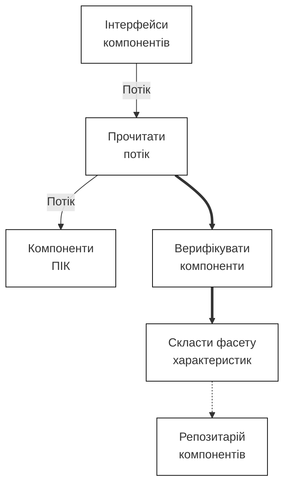

Рис. 4.6. Приклад діаграми процесу створення репозитарію

Опис діаграми дій потоків даних для всіх об’єктів системи завершується загальною таблицею процесів із таких стовпчиків:
– ідентифікатор процесу;
– тип та назва процесу;
– назва стану, для якого визначений процес;
– назва дії процесу.
Таблиця процесів дає можливість перевірити:
– несуперечність назв і ідентифікаторів процесів;
– повноту визначених подій і відповідних процесів;
– генерацію події або її обробку відповідним процесом.

Результат моделювання процесів — це модель доступу до даних, діаграма потоків даних дій, таблиця процесів і їхній опис з упорядкуванням по ID. Модель доступу відображає взаємодію об'єктів через зв'язок з моделлю станів під час виконання певних дій процесів системи. Цей вид взаємодії вважається *синхронним*. Якщо подія одержана після того, як дія процесу завершилася, ця взаємодія є *асинхронною*.

**Визначення архітектури ПрО в методі Шлєєра.** Після побудови трьох моделей виконується проектування програмної системи шляхом поділу ПрО на частини, яким відповідають підсистеми з визначенням їхніх функцій і принципів їхнього виконання. У кожну підсистему включаються побудовані моделі або їхні фрагменти і, відповідно, виділені об'єкти з усіма характеристиками. Між підсистемами встановлюються сполучні зв'язки, на яких вказуються імена переданих даних або об'єктів, що беруть в них участь. Таким чином, створюється графічне зображення архітектури системи, елементи якої можуть описуватися конкретною мовою програмування.

Даний об'єктний метод має багато спільного з методом Буча. Він реалізований у ряді інструментів (наприклад, EaseCASE Plus 4.0) і застосовується в різних областях (банківські операції, керування літальними апаратами, оформлення кредитних карток тощо) у США, Європі і Японії.

## 4.2. Проєктування архітектури програмних систем

Проєктування архітектури ПЗ — це процес розробки, що виконується після етапу аналізу і формування вимог. Задача такого проєктування — перетворення вимог до системи у вимоги до ПЗ і побудова на їхній основі архітектури системи [13, 16].

*Архітектура системи* — це структурна схема компонентів системи, взаємодіючих між собою через інтерфейси. Компоненти можуть складатися з послідовності більш дрібних компонентів та інтерфейсів. Розроблення архітектури ґрунтується на загальних довідниках, класифікаторах та ін. У ній ідентифікуються загальні частини системи, у тому числі готові програмні продукти і заново розроблені компоненти, а також багаторазово використовувані в інших застосуваннях.

Побудова архітектури системи здійснюється шляхом визначення цілей системи, її вхідних і вихідних даних, декомпозиції системи на підсистеми, компоненти або модулі та розроблення її загальної структури.

Основні розв'язки щодо структури системи приймаються групою архітекторів і аналітиків. Вони передають окремі частини системи для реалізації невеликим групам розробників.

Архітектуру системи визначають також як множину представлень, кожне з яких відбиває деякий аспект, що цікавить групу учасників проєкту — аналітиків, проєктувальників, кінцевих користувачів та ін. Представлення фіксують проєктні рішення щодо структури і поділу ПС на окремі компоненти та визначення зв'язків між ними. На ці рішення впливають вимоги до функцій і середовища.

Проєктування архітектури системи може проводитися різними методами (стандартизованим, об'єктно-орієнтованим, компонентним і ін.), кожний з яких пропонує свій шлях побудови архітектури, а саме, визначення концептуальної, об'єктної й інших моделей за допомогою відповідних конструктивних елементів (блок-схем, графів, структурних діаграм тощо).

При застосуванні об'єктно-орієнтованого підходу компонентами є окремі об'єкти, а процес конструювання об'єктної структури перетворюється в процес виявлення наявних у ПрО об'єктів і визначення сценарію їхнього виконання і взаємодії. Стандартизований і об'єктно-орієнтований підходи до проєктування використовують відповідні сформовані технології проєктування програмних систем.

### 4.2.1. Загальні підходи до проєктування програмних систем

**Стандартизований підхід.** Тривалий час в Україні та СРСР розроблення програмних систем (що називалися також автоматизованими системами — АС) виконувалась на основі стандарту ГОСТ 34.601—90, що регламентує стадії й етапи процесу розробки АС. Підставою для розроблення АС є договір між розробником системи та її замовником.

Згідно з даним стандартом процес розроблення поділяється на такі етапи: формування вимог, розроблення концепції системи, ескізного, технічного і

робочого проекту. В ескізному і технічному проектах згідно з формулюваними вимогами і концепціями визначаються конкретні задачі системи, будується її структура, а також визначаються алгоритми реалізації підсистем. Ці етапи завершуються створенням і затвердженням звіту про науково-дослідну роботу, у якому дається оцінка необхідних для реалізації АС ресурсів і методичних процедур досягнення якості системи.

На процесі розроблення ескізного проекту використовуються проектні рішення щодо всієї системи або до її частин, визначається перелік задач, концепція інформаційної бази, функції і параметри компонентів системи, а також алгоритми обробки інформації.

Етап технічного проектування передбачає розробку проектних рішень, що стосуються системи та її частин, документації, а також способів реалізації технічних вимог до системи, алгоритмів розв'язків задач, їхнього розподілу за суміжними частинами проекту й обміну даними між ними. Проектні рішення визначають організаційну структуру, функції користувачів АС, набір необхідних технічних засобів, мови і системи програмування, СКБД, систему класифікації і кодування підсистем, довідники, а також підходи до ведення інформаційної бази системи.

Даний стандарт регламентує:
— *концептуальне проектування*, тобто побудову концептуальної моделі, уточнення рішень і узгодження вимог;
— *архітектурне проектування* — визначення головних структурних компонентів і особливостей системи;
— *технічне проектування* — відображення вимог, визначення задач і принципів їхньої реалізації в заданому середовищі функціонування системи;
— *детальне робоче проектування* — специфікація алгоритмів розв'язків задач МП, побудова БД і ПЗ системи.

Розглянемо ці види проектування більш докладно.
При концептуальному проектуванні визначаються:
— джерела надходження даних від замовника, що несе відповідальність за їхню достовірність;
— об'єкти системи та їхні атрибути;
— способи подання зв'язків між об'єктами і види організації даних;
— цілі і функції системи й інтерфейси з її користувачами;
— методи взаємодії користувачів із системою.

Організація інтерфейсів зв'язана з конкретними формами екранів і форматами обміну даними, а також з визначенням:
1) термінів і понять, що мають значення для користувача і самої системи;
2) моделі системи, що відбиває функції і ролі, подання даних і форми видачі результатів;
3) візуальних прийомів відображення на екрані результатів роботи у наочній і звичній для користувачів формах;
4) методів взаємодії підсистем.

Технічне проектування складається з відображення архітектури системи окремими програмами для заданого середовища їхнього функціонування з прив'язкою елементів системи до особливостей платформи реалізації: СКБД, ОС, устаткування й ін. Перенесення виготовленої ПС на іншу платформу вимагає зміни

параметрів, настроювання сервісів на нові умови середовища й адаптації використовуваних БД.

**Особливості об'єктного підходу.** Проектування системи може здійснюватися на основі об'єктно-орієнтованого моделювання ПрО методом *UML*, який дозволяє враховувати аспекти, властиві діючим особам (акторам) системи, створювати сценарії виконання системи тощо [17].

Об'єктний стиль проектування — це декомпозиція майбутньої системи на окремі підсистеми (пакети), визначення функціональних і нефункціональних вимог і об'єктної моделі предметної області. Носіями інтересів, можливостей і дій в системі (або пакеті) є діючі особи — актори. Пакет може складатися з об'єктної моделі, варіантів використання, що визначають сценарії поведінки системи, склад об'єктів і методів їхньої взаємодії.

Поведінка об'єктів відображується діаграмами, що задають послідовність взаємодії об'єктів (діаграми послідовностей, взаємодії), правилами переходу від стану до стану (діаграми станів), а також діаграмами кооперації, в яких діючі особи зображуються графічно. Об'єкти і відповідні їм діаграми варіантів використання задають загальну архітектурну схему системи, у рамках якої здійснюється реалізація структури і специфіки поведінки компонентів.

Загальна концепція об'єктного проектування — це побудова всіх сценаріїв, екранних діаграм для керування ними і їх випробування в різних варіантах використання. На вибір варіантів використання впливають нефункціональні вимоги (наприклад, забезпечення конфіденційності, швидкодії й ін.).

На основі моделі опису вимог і понять проводиться уточнення складу і змісту функцій системи, методів їхньої реалізації у вигляді сценаріїв і діаграм потоків даних, у яких відображається взаємодія об'єктів як обмін повідомленнями між елементами системи для передачі даних і одержання відповіді після виконання операцій.

Моделі вимог визначають призначення і місце вимог у таких системах. Цьому сприяють розроблені національні, корпоративні і відомчі стандарти. Вони фіксують правила формування нефункціональних вимог, у яких відображаються відомості про взаємодію і захист даних у системі.

При цьому поведінка об'єктів представляється діаграмами UML, вони можуть уточнюватися при перегляді моделей вимог і складу об'єктів системи. Перегляд починається з вимог і пошуку місць локалізації для внесення необхідних змін у модель. Зміни можуть стосуватися функціональних і нефункціональних вимог у зв'язку з уточненням замовником обмежень на структуру системи, використовувані ресурси й умови середовища її функціонування.

### 4.2.2. Проектування різних видів архітектур програмних систем

Один зі шляхів архітектурного проектування — традиційний неформальний підхід до визначення архітектури системи, її компонентів, способів їхнього подання й об'єднання в систему, який можна назвати загальносистемним. Фактично архітектура, що створюється згідно з таким підходом, є чотирирівневою і містить у собі:

**Перший рівень** — системні компоненти. Вони здійснюють взаємодію з периферійними пристроями комп'ютерів (принтери, клавіатура, сканери, маніпулятори і т.п.), використовуються при побудові операційних систем.

**Другий рівень** — загальносистемні компоненти. Вони забезпечують взаємодію з універсальними сервісними системами середовища роботи прикладної системи, такими як операційні системи, СКБД, системи баз знань, системи керування мережами і т.п.

**Третій рівень** — специфічні компоненти певної прикладної області, що входять до складу компонентів програмної системи і призначені для розв'язання задач в межах означеної області (наприклад, бізнес-задачі).

**Четвертий рівень** — прикладні програмні системи, що призначені для виконання завдань з обробки інформації, які постають перед окремими групами споживачів інформації з різних предметних областей (офісні системи, системи бухгалтерського обліку й ін.) і можуть використовувати компоненти нижчих рівнів.

Компоненти кожного з виділених рівнів використовуються, як правило, на своєму або вищому рівні. Кожен рівень відбиває відповідний набір знань, умінь і навичок фахівців, що створюють або використовують компоненти. Цей набір визначає відповідний розподіл фахівців програмної інженерії на аналітиків, системщиків, прикладників, програмістів й ін.

При проектуванні архітектури програмна система розглядається як композиція компонентів третього рівня з доступом до компонентів першого і другого рівнів. Тобто архітектурне проектування — це розроблення компонентів третього рівня, визначення вхідних і вихідних даних рівнів ієрархії компонентів і їхніх зв'язків.

Результат проектування — архітектура й інфраструктура, що містять у собі набір об'єктів, з яких можна формувати деякий конкретний вид архітектурної схеми для конкретного середовища виконання системи, а також набір елементів керування і контролю. Проектування архітектури системи завершується створенням опису, в якому відображені зафіксовані проєктні рішення, логічна і фізична структура системи, а також способи взаємодії об'єктів.

Архітектурна схема може бути: розподілена, клієнт-серверна і багаторівнева.

*Розподілена схема* реалізує взаємодію компонентів системи, розташованих на різних комп'ютерах через стандартні протоколи виклику віддалених методів RPC (Remote Procedure Calls), RMI (Remote Method Invocation), що представлені в проміжних середовищах (COM/DCOM, CORBA) [15, 16]. Взаємодіючі компоненти можуть бути неоднорідними, створеними на різних мовах програмування (С, С++, Паскаль, Java, Basic, Smalltalk і ін.), що допускається в проміжному середовищі, наприклад, CORBA (рис. 4.7).


Рис. 4.7. Зв'язок між мовами $L1, L2, ..., Ln$ через інтерфейси CORBA

Для кожної пари мов взаємодіючих компонентів створюються інтерфейси ($L_i$, $L_n$) за кількістю пар мов програмування, що взаємодіють між собою.

Інтерфейси між мовами $L_i$, $L_n$ містять у собі опис:
- зв'язків двох об'єктів у цих мовах, що здійснюються через stub (стаб, заглушку) і skeleton (каркас) у мові IDL;
- атрибутів викликів в stub і skeleton, що відображаються в операції, а операції — в методи.

Зв'язок мов програмування здійснюється через *спільний кореневий об'єкт* розподіленої системи, який надає механізм надсилання даних об'єктам для клієнтів і серверів.

Клієнт передає stub серверу, що реалізує функції з заданими типами даних і передає відповідному об'єкту сервера результат, який після його обробки перетворюється в типи даних об'єкта клієнта.

Клієнтські і серверні «заглушки» виступають у ролі класів, об'єкти яких використовуються реалізаціями методів клієнта і сервера. Спільний кореневий об'єкт виконує метод об'єкта-сервера (функцію, сервіс, операцію) за умови, якщо інший об'єкт, який виступає в ролі клієнта для нього, посилає йому виклик для виконання цього методу. Виконання однієї функції або сервісу може здійснюватися одним методом або декількома з різних класів. Дана специфіка виконання методів визначає типові правила взаємодії об'єктів у розподіленому середовищі, що відображені в ряді об'єктних моделей типу клієнт—сервер.

Головне завдання схеми клієнт—сервер — забезпечення доступу до ресурсів (апаратури, ПЗ і даних) і їхнього розподілу. При реалізації архітектури клієнт-сервер компонент сервер керує ресурсами і доступом до них, а клієнт їх використовує.

Ця архітектура заснована на концепції розподілених об'єктів, які інкапсулюють ресурс і надають послуги іншим об'єктам. Об'єкти, що надають послуги, можуть самі користуватися послугами інших об'єктів, і як результат створюється *багаторівнева архітектура*.

Функцію взаємодії об'єктів виконує брокер об'єктних запитів (ORB) через інтерфейс клієнт—сервер, він також надає загальносистемний сервіс, послуги і різні ресурси. Процес розроблення розподілених об'єктів починається з формування вимог, проектування об'єктів серверів, що можуть надавати послуги об'єктам клієнта.

Як метод проектування архітектури об'єктно-орієнтованих програмних систем застосовується UML [17, 18]. Зв'язки між об'єктами сервера і клієнта задаються діаграмами взаємодії або послідовності. Схема процесу розроблення в UML з використанням stub i skeleton, семантику яких розглянуто вище, наведена на рис. 4.8.

Діаграми станів задають обмеження на операції об'єктів сервера, визначаючи способи виклику операцій і повединку об'єктів. Сутність стилю проектування в рамках уніфікованого процесу RUP [19] полягає в описі усіх видів діяльності, виконуваних на моделях (аналізу, проектування, розробки і тестування) процесу ЖЦ.

Моделі охоплюють всі аспекти побудови структури і відображення поведінки об'єктів системи. До складу архітектури входять статичні і динамічні об'єкти, їхні

зв'язки й інтерфейси між ними. У ній відображаються структура виділених підсистем, довідників, словників, а також результати всіх процесів.

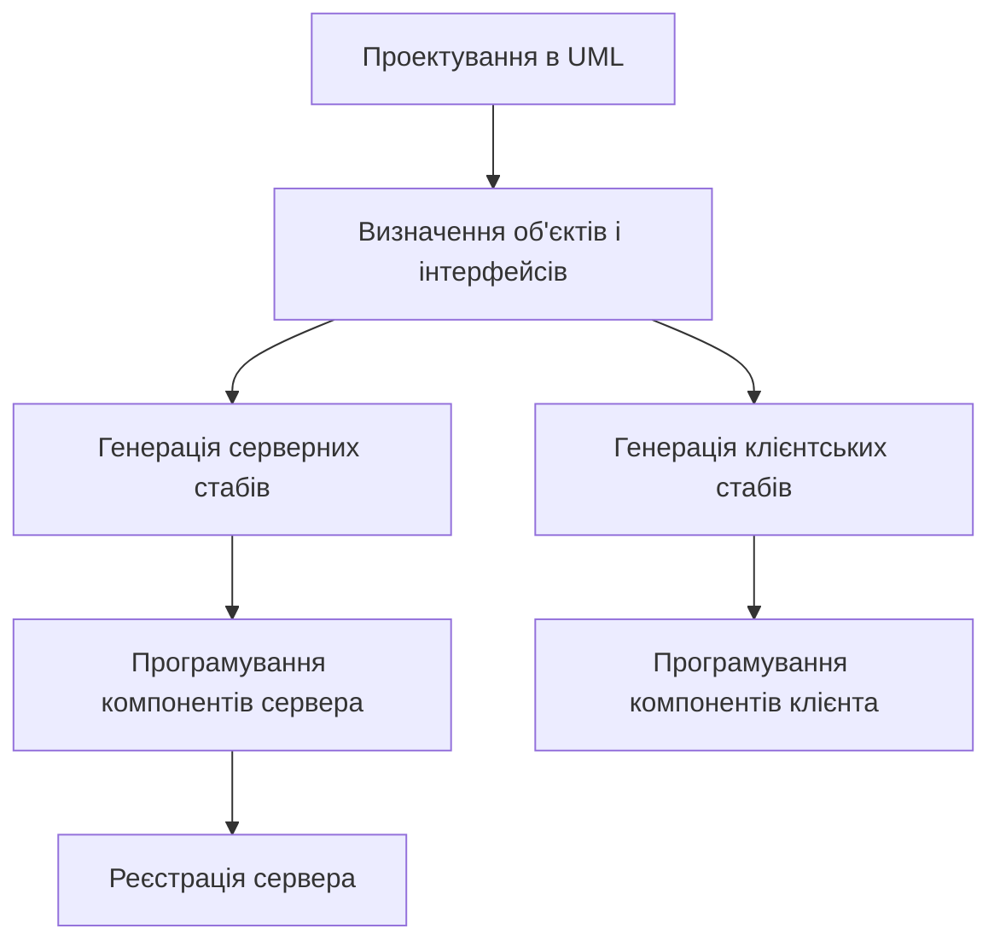

Рис. 4.8. Процес розроблення інтерфейсних об'єктів з UML

Логічна структура проектованої системи — це композиція об'єктів і готових програмних продуктів, що виконують відповідні функції системи. Композиція грунтується на таких положеннях:

1) кожна підсистема повинна відображати вимоги і спосіб їхньої реалізації (сценарій або прецедент);
2) змінювані функції виділяються в підсистемі так, щоб для них прогнозувалися зміни вимог і окремі об'єкти, зв'язані з актором;
3) зв'язок об'єктів здійснюється через інтерфейс;
4) кожна підсистема повинна надавати мінімум послуг або функцій і мати набір параметрів інтерфейсу, які визначають типи даних.

Результати архітектурного проектування — це нотації у вигляді діаграм (сутність–зв'язок, переходи станів, потоки даних і дій і т.п.). Об'єкти діаграм деталізують задані функціональні вимоги до самої системи і відображають процес розв'язання задач проекту.

Виділені в моделі аналізу об'єкти поєднуються в систему шляхом:
– логічного об'єднання і збирання об'єктів;
– комунікативного об'єднання об'єктів через загальне джерело даних;
– процедурного об'єднання за допомогою операторів виклику;
– функціонального об'єднання об'єктів.

Якщо в заново створеній системі використана успадкована система, то вона знімає проблему дублювання і скорочує обсяг робіт при проектуванні архітектури системи.

У складних програмних системах кількість об'єктів може нараховувати сотні, їх композиції не будуть мати виразного вигляду, навіть з урахуванням того, що об'єкти різних сценаріїв можуть збігатися, тому в такому випадку потрібен додатковий аналіз для їхнього ототожнення.

При реалізації системи визначаються об'єкти, що взаємодіють зі службами, які декларують переносність. Будь-який визначений у такий спосіб об'єкт

замінюється об’єктом, що не взаємодіє безпосередньо зі службою, а з деяким абстрактним об’єктом-посередником, що здійснює трансформацію абстрактного інтерфейсу в інтерфейс конкретної служби системи. Для реалізації інтерфейсу між службою та системою кожного разу створюється новий об’єкт.

Разом з тим перехід на нову платформу може вимагати побудови допоміжних інтерфейсних або керуючих об'єктів і коригування існуючих. Крім того, може виникнути необхідність у використанні готових підсистем, структура яких відрізняється від тих підсистем, що були визначені на основі аналізу вимог до системи. У цьому випадку вносяться відповідні зміни в модель вимог і в архітектуру системи.

**Висновки.** Проведено аналіз різних методів проектування моделей предметних областей. Значна увага приділена методу Шлєєра і Мелора, в якому визначено три види моделей і підхід до побудови на їхній основі архітектури програмних систем. Розглянуто методи проектування систем з використанням об'єктних і стандартних структур програмних систем.

### Контрольні питання і завдання

1. Визначте задачі аналізу предметної області.
2. Назвіть задачі концептуального проектування моделей ПрО.
3. Назвіть продукти аналізу ПрО в методі Шлєєра і Мелора.
4. Назвіть моделі методу Шлєєра і Мелора і опишіть їхню сутність.
5. Які ще види моделей ПрО існують?
6. Перелічіть ключові чинники, що впливають на проектування архітектури.
7. Назвіть приклади нефункціональних вимог, що потрібно враховувати при проектуванні архітектури системи.
8. Які рівні виділяються в архітектурі системи?
9. Назвіть прийоми проектування у середовищі RUP.

### Список літератури до розділу 4

1. *Шлеер С.*, *Меллор С.* Объектно-ориентированный анализ: моделирование мира в состояниях. – Киев: Диалектика, 1993. – 240 с.
2. *Coad P., Yourdan E.* Object-oriented analysis.–Second Edition.–Prentice Hall, 1991. – 296 p.
3. *Yourdan E.* Modern Structured Analysis. – New York: Yourdan Press / Prentice Hall, 1988. – 297 p.
4. *DeMarko D.A., McGovan R.L.* SADT: Structured Analysis and Design Technique. New York: Mcgray Hill, 1988. – 378 p.
5. *Yourdan E., Constantine L.* Structured Design. Yourdan Press. Englewood Cliffs – N.J. – 1983.
6. *Martin J., Odell J.J.* Object-oriented analysis and design.–Prentice Hall, 1992. – 367p.
7. *Barker R.* CASE-method. Entity Relationship Modelling. – Copyright ORACLE Corporation UK Limited–New York: Publ., 1990. – 312 p.
8. *Schardt J.A.* Assentials of Distributed Object Design M.S.E. Advanced Concepts Center, 1994. – P. 225 –234.

9. *Rumbaugh J., Blaha V., Premerlani W.* Object-Oriented Modelling and Design, Englewood Cliffs.– NJ: Prentice Hall, 1991. – 451 p.

10. *Гради Буч.* Объектно-ориентированное проектирование. – 3-е издание. – М.: Бином, 1998. – 560 с.

11. *Jacobson I.* Object-Oriented Software Engineering. A use Case Driven Approach, Revised Printing. – New York: Addison-Wesley Publ.Co. – 1994. – 529 p.

12. *Андон Ф.И., Яшунин А.Е., Резниченко В.А.* Логические модели интеллектуальных информационных систем.– Киев: Наук. думка, 1999. – 396 с.

13. *Чернецки К., Айзенекер У.* Порождающее программирование. Методы, инструменты, применение. –Издательский дом «Питер». – М.: СПб. – Харьков – Минск, – 2005. – 730 с.

14. *Фреге Г.* Логика и логическая семантика. – М.: Аспект-пресс, 2000. – 512 с.

15. *Орфали Р., Харки Д. Эдвардс Дж.* Основы CORBA.– Из.-во «Малип», М.: 1999. –317с.

16. *Эммерих В.* Конструирование распределенных объектов. Методы и средства программирования интероперабельных объектов в архитектурах OMG/CORBA, Microsoft COM и Java RMI. – М.: Мир, 2002. –510 с.

17. *Рамбо Дж., Джекобсон А, Буч Г.* UML: специальный справочник. – СПб.: Питер. – 2002. – 656 с.

18. *Боггс У., Боггс М.* UML Rational Rose. Бестселлер #, Лори.– Москва, 2000.- 580 с.

19. *Кендалл Скотт.* Унифицированный процесс. Основные концепции. – М.: СПб. – Киев. – 2002. – 157 с.

Розділ 5. ПРИКЛАДНІ Й ТЕОРЕТИЧНІ МЕТОДИ ПРОГРАМУВАННЯ

Ядро SWEBOK містить у собі два близьких за змістом розділи, які пов'язані з побудовою ПЗ: проектування ПЗ і конструювання ПЗ. Розділ, що стосується програмування, в цьому ядрі відсутній, проте він є необхідний, оскільки в сучасній практиці проектування і розроблення ПП широко використовуються багато різних парадигм програмування (модульне, об'єктно-орієнтоване, компонентне, аспектне тощо), які мають бути певним чином систематизовані.

Кожна парадигма програмування характеризується наявністю в ній метода і зв'язком з моделлю ЖЦ. Головне, що об'єднує різні парадигми програмування, — це загальні положення з проектування ПП. Користувач може вибирати ту чи іншу парадигму програмування з позицій зручності застосування для задач у ПрО і виготовлення конкретного ПП.

Розрізняють прикладні і теоретичні методи, які з'явилися у різний час від моменту появи програмної інженерії і мають свою специфіку й сферу застосування. Наприклад, структурний метод виник багато років тому, він добре відпрацьований і вдосконалений для індустріального виготовлення ПП і навіть став держстандартом у Великобританії. Широкого застосування набули методи модульного і компонентного програмування. Вони базуються на концепції повторного використання компонентів. Саме ці види програмування започаткували індустрію виготовлення ПП з готових компонентів, аналогічно до того, як в промисловості здійснювалося виготовлення виробів з готових деталей.

Поява нових методів стимулюється досягненнями загальнонаукових дисциплін (математики, логіки, теорії алгоритмів тощо) і практичними задачами. Теоретичні методи програмування дозволяють створювати програмні системи в абстрактному вигляді, включаючи концептуальні, інформаційні, структурні моделі без урахування особливостей середовищ, в яких вони реалізуються. Ці моделі доводяться до стану кінцевого продукту шляхом використання відповідних мов програмування та їх перетворення.

Знаходять застосування формальні й теоретичні методи програмування (алгебраїчний, алгебро-алгоритмічний, композиційний й ін.), які ґрунтуються на математичних і логіко-алгоритмічних підходах до абстрактного створення ПП.

У цьому розділі описані базові поняття й особливості методів прикладного, або систематичного програмування, а також окремих методів теоретичного програмування з метою ознайомлення студентів із сучасною теорією і практикою розробки програм і систем.

### 5.1. Прикладне (систематичне) програмування

До методів систематичного програмування відносять такі методи:
– структурний;
– об'єктно-орієнтований;
– UML-метод;
– компонентний;
– аспектно-орієнтований;

– генерувальний;
– сервісний;
– агентний й ін.

Кожен з цих методів має свою множину понять й операцій для проведення процесу розроблення окремих компонентів, сервісів або ПС. Метод генеруючого програмування використовує можливості об'єктно-орієнтованого, компонентного, аспектно-орієнтованого методів й ін.

### 5.1.1 Структурне програмування

Сутність структурного підходу до розробки ПС полягає в декомпозиції (розподілі) системи на функції, що підлягають автоматизації, які у свою чергу, діляться на підфункції й задачі. Процес декомпозиції триває до визначення конкретних процедур. При цьому система, що автоматизується, зберігає цілісне подання, у якому всі складові компоненти взаємозалежні [1].

Основу структурного програмування становлять:
– розподіл системи на множину незалежних задач, доступних для розуміння і розв'язання;
– впорядкування й організація складових частин проблеми в ієрархічні деревоподібні структури з додаванням нових деталей на кожному рівні.

До головних принципів належать:
– абстрагування, тобто відокремлення істотних аспектів системи й нехтування несуттєвими;
– формалізація, тобто загальне методологічне вирішення проблеми;
– обґрунтування й узгодження елементів системи і перевірка їх на несуперечність;
– утворення ієрархічної структури даних.

При структурному аналізі застосовуються три найпоширеніші моделі структурного проектування ПС:
- • **SADT (Structured Analysis and Design Technique)** — метод структурного аналізу й техніка проектування моделі системи за допомогою функціональних діаграм [1];
- • **SSADM (Structured Systems Analysis and Design Method)** — метод структурного аналізу й проектування систем [2];
- • **IDEF (Integrated Definition Functions)** — метод визначення функціональної моделі, IDEF1 — інформаційної моделі, IDEF2 — динамічної моделі й ін. [3].

Розглянемо ці методи детальніше.

**Метод функціонального моделювання SADT.** Цей метод запропоновано Д.Россом і покладено в основу методології IDEF0 (Icam DEFinition), що є головною частиною програми ICAM (Інтеграція комп'ютерних і промислових технологій), проведеної з ініціативи ВПС США.

На стадії проектування моделі системи зображаються у вигляді діаграм або екранних форм і відображають структуру або архітектуру системи, а також схеми програм.

SADT — це сукупність правил і процедур, призначених для побудови функціональної моделі предметної області, яка відображає функціональну структуру, функції і дії, а також зв'язки між ними.

Метод SADT базується на наступних концепціях:

– графічне зображення структури з поданням функцій блоками, а інтерфейсів дугами, що, відповідно, входять у блок і виходять з нього (рис.5.1);


Рис. 5.1. Структура моделі

– блоків може бути від 3 до 6 на кожному рівні декомпозиції;
– взаємодія блоків описується обмеженнями, які визначають умови керування й виконання функцій;
– унікальність позначок і найменувань;
– незалежність функціональної моделі від організаційної структури колективу розробників.

Метод SADT застосовується при моделюванні широкого кола систем, для яких визначаються вимоги й функції, а потім проводиться їхня реалізація. Засоби SADT можуть застосовуватися при аналізі функцій у діючій ПС, а також при визначенні способів їхньої реалізації.

Результат проектування в методі SADT – модель, що складається з діаграм, фрагментів текстів і глосарію з посиланнями один на одного. Всі функції й інтерфейси зображаються діаграмами у вигляді блоків і дуг. Місце з'єднання дуги з блоком визначає тип інтерфейсу. Керуюча інформація позначається дугою, яка входить у блок зверху, у той час як інформація, що піддається обробці, вказується з лівої сторони блоку, а результати виходу – з правої сторони. Механізм, що здійснює операцію (людина або автоматизована система), задається дугою, що входить у блок знизу.

Одна з найбільш важливих переваг методу SADT – поступова деталізація моделі системи в міру додавання функцій і діаграм, що уточнюють цю модель.

**Метод SSADM** базується на таких структурах: послідовність, вибір й ітерація. Об'єкт моделювання задається відповідними структурними діаграмами, які відображають послідовність операторів, вибір елементів із групи й циклічне виконання операторів за цими елементами.

Загальна діаграма системи згідно з цим методом має ієрархічну структуру і містить у собі: список компонентів модельованого об'єкта; ідентифіковані групи вибраних і повторюваних компонентів; послідовність використовуваних компонентів.

Таке програмування передбачає наявність моделі ЖЦ із послідовними процесами розроблення програмного проекту, починаючи з аналізу і формування вимог для ПрО (рис. 5.2).

До процесів ЖЦ належать:
– стратегічне проектування та вивчення можливості виконання проекту;
– детальне дослідження предметної області, що містить у собі аналіз і специфікацію вимог;

– логічне проектування та специфікація компонентів системи;
– фізичне проектування структур даних відповідно до вибраної структури БД (реляційної, об'єктно-орієнтованої й ін.) та конструювання окремих компонентів, їх тестування і тестування системи в цілому;
– виготовлення продукту і документації з нього для замовника.

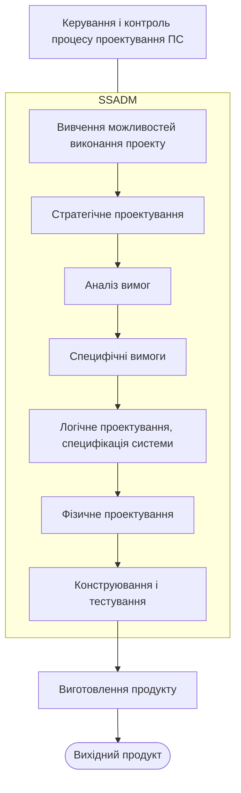

Рис.5.2. Життєвий цикл SSADM

Детальне дослідження предметної області проводиться для того, щоб вивчити її особливості, розглянути потреби й пропозиції замовника, провести аналіз вимог з різних документів, специфікувати їх і погодити із замовником.

Мета стратегічного проектування – визначення сфери дії проекту, аналіз інформаційних потоків, формування загальної архітектури системи, визначення витрат на розробку і підтвердження можливості подальшої реалізації проекту. Результат – це специфікація вимог, що застосовується при розроблені логічної структури системи.

Логічне проектування – це визначення функцій, діалогу, методу побудови і відновлення БД. У логічній моделі відображаються вхідні й вихідні дані, проходження запитів і встановлення взаємозв'язків між сутностями та подіями.

Фізичне проектування – це визначення типу СКБД і подання даних у ній з урахуванням специфікації логічної моделі даних, обмежень на пам'ять і час обробки, а також визначення механізмів доступу, розміру логічної БД, зв'язків між елементами системи.

Фізична специфікація містить у собі:
– специфікацію функцій і схеми реалізації компонентів функцій,
– опис процедурних і непроцедурних компонентів й інтерфейсів,
– визначення логічних і фізичних груп даних з урахуванням обмежень устаткування на розробку й стандарти розробки,
– визначення груп подій, які обробляються як єдине ціле з видачею повідомлень про завершення обробки й ін.

Процеси, які виконуються у SSADM, пов'язані з роботами, що керують потоками інформації трьох типів: потік робіт; санкціоновані потоки за контролем або керуванням; звіти про хід розробки.

Конструювання — це побудова конструкцій і елементів системи, їхнє тестування на наборах даних, які підбираються на ранніх процесах ЖЦ розробки системи.

Життєвий цикл містить у собі процес керування і контролю, який базується на сітковому графіку, що враховує роботи з розробки системи, витрати і строки. Спостереження і контроль виконання плану проводить організаційний відділ. У графіку містяться роботи й взаємозв'язки між ними і їхніми виконавцями, а також проєктні документи, які розроблюються виконавцями. Результати кожного з процесів ЖЦ контролюються і передаються на наступний етап у вигляді, зручному для подальшої реалізації іншими виконавцями.

Згідно з методом SADM створюється структурна модель системи і модель потоків даних. У діаграмах структурної моделі впорядкування процесів наведено зліва направо і віддзеркалює розвиток у часі, а не інтервали часу.

*Модель потоків даних (Data Flow Model – DFM)* використовується для опису процесів обробки даних у системі й містить у собі:
– ієрархічний набір діаграм потоків даних (Data Flow Diagram – DFD);
– опис елементарних процесів, потоків даних, сховищ даних і зовнішніх сутностей.

Кожна DFD відбиває проходження даних через систему залежно від рівня та призначення діаграми. DFD перетворює вхідні потоки даних (входи) у вихідні потоки даних (виходи). Як правило, процеси, які виконують такі перетворення, створюють і використовують дані зі сховища даних.

До об'єктів моделювання системи в SSADM належать:
1. *Функції*, які створюються на основі DFM і моделювання взаємозв'язків подій і сутностей для дослідження обробки даних у системі;
2. *Події* — деякі прикладні дії, які ініціюють процеси для занесення й відновлення даних системи. Подія приводить до виклику процесу і досліджується за допомогою моделювання її впливу на сутності;
3. *Дані* зображаються спочатку логічною моделлю, потім фізичною, яка відображається у реляційну або об'єктно-орієнтовану БД, залежно від вибраної для проєкту СКБД.

Найпоширеніші засоби моделювання даних — діаграми «сутність–зв'язок» (ER-діаграми), запропоновані Баркером, як застосування класичної ER-моделі Чена. В ER-діаграмах визначаються сутності (множини однотипних об'єктів) ПрО, їхні властивості (атрибути) і залежності (зв'язки). Сутність (Entity) — реальний або уявлюваний об'єкт, що має істотне значення для області. Кожна сутність й її екземпляр мають унікальні імена. Сутність має такі властивості:

– один або кілька атрибутів, які або належать сутності, або успадковуються через зв'язок (Relationship);
– довільну кількість зв'язків з іншими сутностями моделі.

*Зв'язок* – це асоціація між двома сутностями ПрО. У загальному випадку кожен екземпляр сутності-батька асоційований з довільною кількістю екземплярів успадкованої сутності (нащадка), а кожен екземпляр сутності-нащадка асоційований з одним екземпляром сутності-батька. Таким чином, екземпляр сутності-нащадка може існувати тільки при наявності сутності-батька. Для зв'язків можуть встановлюватися обмеження на кількість екземплярів сутності, що беруть участь у зв'язку. Наприклад, одному екземпляру однієї сутності може відповідати не більше ніж один екземпляр іншої.

**Метод IDEF1** базується на концепції ER-моделювання і призначений для побудови інформаційної моделі подібно до реляційної моделі. Даний метод постійно розвивається й удосконалюється (наприклад, методологія IDEF1X-проектування, орієнтована на автоматизацію – ERwin, Design/IDEF). Основна особливість полягає в тому, що кожен екземпляр сутності може бути однозначно ідентифікований без визначення відношення з іншими сутностями. Якщо ідентифікація екземпляра сутності залежить від його відношення до іншої сутності, то сутність є залежною. Кожній сутності присвоюється унікальне ім'я і номер, які розділяють косою рискою «/» і розміщують над блоком, який позначає сутність. Обмеження на множинність зв'язку можуть означати, що для кожного екземпляра сутності-батька існує:
– нуль, один або більше пов'язаних з ним екземплярів сутності-нащадка;
– не менше ніж один або не більше ніж один пов'язаний з ним екземпляр сутності-нащадка;
– зв'язок з деяким фіксованим числом екземплярів сутності-нащадка.

Якщо екземпляр сутності-нащадка однозначно визначається своїм зв'язком із сутністю-батьком, то зв'язок є ідентифікований, інакше – неідентифікований. Сутність-батько в ідентифікованому зв'язку може бути як незалежною, так і залежною від зв'язків з іншими сутностями. Сутність-нащадок у неідентифікованому зв'язку буде незалежною, якщо вона не є також сутністю-нащадком у якомунебудь ідентифікованому зв'язку.

Атрибути зображуються у вигляді списку імен усередині блока сутності, первинний ключ розміщується нагорі списку і відокремлюється від інших атрибутів горизонтальною рискою. Сутності можуть мати також зовнішні ключі, як частина або ціле первинного ключа чи неключового атрибуту.

Засобами IDEF1 проводиться збирання і вивчення різних сфер діяльності підприємства, визначення потреб в інформаційному менеджменті, а також:
– інформації й структури потоків, що властиві діяльності підприємства;
– правил і законів руху інформаційних потоків і принципів керування ними;
– взаємозв'язків між існуючими інформаційними потоками на підприємстві;
– проблем, що виникають при неякісному інформаційному менеджменті і потребують усунення.

Одна з особливостей даної методології – забезпечення структурованого процесу аналізу інформаційних потоків підприємства і можливості зміни неповної й неточної структури інформації на процесі моделювання інформаційної структури підприємства.

**Інструментальна підтримка SSADM**. Головний інструмент структурного проектування відповідно до процесів ЖЦ – комплекс програмних, методичних й організаційних засобів системи SSADM. Ця система прийнята державними органами Великобританії як основний системний засіб і використовується багатьма державними організаціями і в межах, і за межами країни. SSADM містить у собі п'ять головних модулів підтримки, як процесів ЖЦ з проектування ПП [2]:
1) вивчення можливості виконання проекту (Feasibility Study Module);
2) аналіз вимог (Requirements Analysis Module);
3) специфікація вимог (Requirements Specification Module);
4) логічна специфікація системи (Logical System Specification Module);
5) фізичне проектування (Physical Design Module).

Проектування за допомогою системи SSADM передбачає сукупність заходів з розробки набору проектних документів в умовах використання відповідних ресурсів при заданих обмеженнях на вартість розробки. Для керування ходом розробки проекту розглядаються проектні роботи і документи, організація і плани розробки, заходи щодо керування проектом та забезпечення якості. Розрізняються два типи проектних робіт:
– забезпечення вимог користувача до якості системи;
– керування розробкою проекту.

Структурна модель охоплює всі модулі й стадії технології SSADM, забезпечує одержання одних документів на підставі інших шляхом логічних перетворень. Іншими словами, одна сукупність документів перетворюється на іншу. Для встановлення послідовності робіт і заходів з забезпечення якості розробляється сітковий графік робіт.

Забезпечення якості реалізується групою якості, що відповідає за підтримку цілісності проекту. В ній працюють фахівці, відповідальні за функціонування організації (плановики, економісти), користувачі системи й розробники, які беруть участь у проекті від початку до кінця. Плановики й економісти слідкують за своєчасним виконанням і фінансуванням робіт, користувачі – висувають вимоги та пропозиції, а розробники виражають їхні потреби в рамках своєї компетенції.

Для керування проектом створюється служба підтримки проекту, що виконує ряд адміністративних функцій або спеціальних робіт. Вона здійснює експертизу при оцінюванні, плануванні і керуванні проектом, а також проводить заходи з керування конфігурацією, сутність яких полягає у відстеженні проектних документів і забезпеченні інформації про їхній стан у процесі розроблення.

Проблема якості стосується двох основних аспектів:
1) сукупності функцій, що повинні задовольняти задані вимоги до функцій, надійності й продуктивності;
2) способу реалізації системи.

Якість забезпечується шляхом перевірки зазначених у вимогах показників якості (економічність, гнучкість, здатність до зміни, модульність, правильність, надійність, переносність, ефективність).

Контроль якості продукту – це перевірка відповідності заданим стандартам і вимогам. Він містить у собі дії, які дозволяють перевірити і виміряти показники якості. Висока якість продукту означає, що система конструювалася відповідно до встановлених стандартів, які полегшують процес її розроблення, супроводження та

модифікації при зміні вимог або внесенні виправлень у систему з мінімумом витрат.

Ідеологія структурного проектування втілена в ряді CASE-засобів (SilverRun, Oracle Disigner, ErWin й ін.), що активно використовується на практиці.

### 5.1.2. Об'єктно-орієнтоване програмування

У розділі 4 були розглянуті основні методи об'єктно-орієнтованого аналізу і проектування, а саме, поняття об'єкта, об'єктної та інших моделей (наприклад, інформаційної моделі, моделі станів тощо), які були запропоновані різними авторами в період бурхливого розвитку об'єктно-орієнтованої парадигми. Далі розглядаються аспекти об'єктно-орієнтованого програмування систем, а саме, операції над об'єктами та процеси ЖЦ для побудови прикладних об'єктно-орієнтованих ПС [4, 5].

*Об'єктно-орієнтований* метод програмування визначає стратегію побудови об'єктної системи, згідно з якою розробники системи мають мислити в термінах об'єктів, а не функцій. Об'єкт – це певна сутність, що перебуває в різних станах і має певний набір операцій. Операції, що пов'язані з об'єктом, надають іншим об'єктам послуги (сервіси) для виконання певних функцій, а їх стан залежить від значень атрибутів. Об'єкти створюються відповідно до визначення класу об'єктів, в якому описуються всі їхні атрибути й операції.

Модель об'єктно-орієнтованої програмної системи можна розглядати як набір взаємодіючих об'єктів, що мають власний стан і набір операцій, які впливають на стан інших об'єктів. Об'єкти приховують інформацію про значення станів, операцій і обмежують доступ до них.

**Операції над об'єктами.** Це такі операції:
- введення, збереження, видалення об'єктів тощо, тобто це операції життєвого циклу об'єктів;
- операції взаємодії об'єктів шляхом викликів методів об'єктів, визначених на множині вхідних і вихідних інтерфейсів.

Інтерфейс називається вхідним, якщо об'єкт за його допомогою одержує певний сервіс, і вихідним, якщо об'єкт через нього надає цей сервіс.

Кожна операція має ім'я, список вхідних параметрів і вихідних результатів, якщо вони є.

Загальна форма опису операції має вигляд
```text
operation_name (param₁, ..., paramn)
returns (res₁, ..., resm)
param¡ ::= parameter_name : parameter_type
res¡ ::= result_name : result_type
```

Іншими словами, операція являє собою структуру даних, в якій вказується набір вхідних параметрів і вихідних результатів.

$$w: (x_1:s_1, x_2:s_2, ..., x_n:s_n) \to (y_1:r_1, y_2:r_2, ..., y_m:r_m),$$

де $w$ – ім'я операції;
$x_1, x_2, ..., x_n$ – вхідні параметри, а $x_1$ – керуючий оператор;
$s_1, s_2, ..., s_n$ – типи вхідних параметрів;
$y_1, y_2, ..., y_m$ – вихідні параметри;
$r_1, r_2, ..., r_m$ – типи вихідних параметрів.

Основною операцією об'єкта є операція запиту, де визначені дія і список параметрів, заданих клієнтом для звернення до обслуговуючого об'єкта і отримання від нього результату. Запит виконується, якщо типи параметрів або результатів операції з ім'ям $w$ відповідають множині вхідних і вихідних інтерфейсів. Під час виконання операції аргументи зв'язуються з формальними параметрами операції.

На основі виконання операцій об'єкт здатний перебувати в різних станах. Кожний стан визначається набором атрибутів об'єкта, що задаються, і операцій, особливістю яких є поліморфізм. Операції об'єкта дозволяють одержати сервіс у об'єкта шляхом виконання певних обчислень, а потім отриманий результат надати іншим об'єктам.

Зміна реалізації якого-небудь об'єкта або додавання йому нових функцій не впливає на інші об'єкти системи. Чітка відповідність між реальними об'єктами (наприклад, апаратними засобами) і керуючими об'єктами ПС полегшує розуміння і реалізацію системи за її моделлю і об'єктами.

Об'єктно-орієнтована модель програмної системи створюється на таких процесах ЖЦ (рис. 5.3):

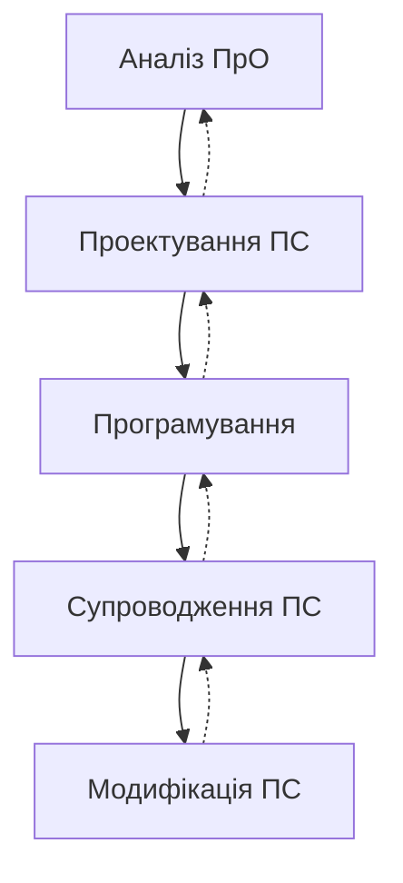

Рис. 5.3. ЖЦ розробки моделі системи у середовищі ООП

Етапам відповідають такі процеси:
– *аналіз* — створення ОМ ПрО, у якій об'єкти відбивають її реальні сутності і операції над ними;
– *проектування* — уточнення ОМ з урахуванням опису вимог для реалізації конкретних задач системи;
– *програмування* — реалізація ОМ засобами мов програмування C++, Java та ін.;
– *супроводження* — використання й розвиток системи шляхом внесення змін у об'єкти або в методи;
– *модифікація ПС* — в процесі її супроводження шляхом додавання нових функціональних можливостей, інтерфейсів і операцій.

Наведені процеси можуть виконуватися ітераційно один за одним і з поверненням до попереднього процесу. На кожному процесі може застосовуватися та сама система нотацій.


<!-- ВІДНОВЛЕНО ЛОКАЛЬНО (Стор. 107) -->
Розділ 5                                                                                                                                          107 

Перехід до наступного процесу зумовлює вдосконалення результатів попереднього процесу шляхом більш детальної розробки раніше визначених класів об'єктів і додавання нових класів. 

Результат процесу аналізу ЖЦ – модель ПрО й набір інших моделей (модель архітектури, модель оточення й використання). Моделі відображають зв'язки між об'єктами, їхні стани та набір операцій для динамічної зміни стану інших об'єктів, а також їх відношення із навколишнім середовищем. 

Існує два типи моделей системної архітектури: 

– _статична модель_ для опису статичної структури системи в термінах класів об'єктів і відношень між ними (узагальнення, розширення, використання, успадкування); – _динамічна модель_ для опису динамічної структури системи і взаємодії між об'єктами (але не класами об’єктів) під час роботи системи. 

Об'єкти інкапсулюють інформацію про свій стан і обмежують доступ до своїх атрибутів. Моделі оточення й використання системи – це дві моделі, що взаємно доповнюючи одна одну описують зв'язок системи із середовищем. 

Модель оточення системи – статична модель, що описує інші підсистеми із простору розроблюваної ПС, а модель використання системи – динамічна модель, що визначає взаємодію системи зі своїм середовищем. Ця взаємодія задається послідовністю запитів до сервісів об'єктів і одержанням відповідних реакцій системи після їхнього виконання. Дані, отримані при розробці системи і визначення взаємодій з об'єктами та оточенням, використовуються при розробленні архітектури системи з об'єктів, у тому числі зі створених у попередніх підсистемах або проектах. 

Результат проектування у середовищі ООП – це ПС, у якій всі необхідні об'єкти створюються статично або динамічно за допомогою класів і відповідних операцій над об'єктами. Отримана об’єктно-орієнтована система перевіряється на показники якості за допомогою результатів тестування й збирання даних про помилки й відмови системи. Змінення методу створення об'єкта або додавання до нього нових операцій не впливає на інші об'єкти системи, які можуть бути повторно використані. 

# **5.1.3. UML-метод моделювання** 

Загальна характеристика UML (Unified Modeling Language), як підход до проектування різних систем, була дана у п. 4.2.1. Тут UML розглядається детальніше, як мова візуального моделювання систем, шляхом подання у вигляді діаграм їхніх статичних і динамічних моделей на всіх процесах ЖЦ [6, 7]. 

В основу методу покладено парадигму об'єктного підходу, при якій концептуальне моделювання проблеми полягає у побудові: 

– онтології домену, яка визначає склад та ієрархію класів об'єктів домену, їх атрибутів і взаємозв’язків, а також операцій, які можуть виконувати об'єкти класів; 

– моделі поведінки, яка задає можливі стани об'єктів, інцидентів, що ініціюють переходи з одного стану до іншого, а також повідомлення, якими обмінюються об'єкти; 

– моделі процесів, що визначає дії, які виконуються при проектуванні об'єктів як компонентів.
<!-- КІНЕЦЬ ВІДНОВЛЕННЯ -->


<!-- ВІДНОВЛЕНО ЛОКАЛЬНО (Стор. 108) -->
108                                                                                                                                        Розділ 5 

Проектування в UML починається з побудови сукупності діаграм, які візуалізують основні елементи структури системи. 

Мова моделювання UML підтримує статичні і динамічні моделі, зокрема модель послідовностей – одну з найкорисніших і наочних моделей, в кожному вузлі якої є взаємодіючі об'єкти. Всі моделі зображаються діаграмами, коротка характеристика яких дається нижче. 

**Діаграма класів** (Class diagram) відображає онтологію домену, за змістом еквівалентна структурі інформаційної моделі методу С.Шлєєра і С.Мелора, визначає склад класів об'єктів і їх зв’язків. Діаграма задається зображенням, на якому класи позначаються поділеними на три частини прямокутниками, а зв’язки — лініями, що з’єднують прямокутники. Це відповідає візуальному зображенню понять і зв'язків між ними. Верхня частина прямокутника — обов'язкова, в ній записується ім'я класу. Друга і третя частини прямокутника визначають відповідно список операцій і атрибутів класу, що можуть мати такі специфікатори доступу: 

– рublic (загальний) позначає операцію або атрибут, доступ до яких здійснюється з будь-якої частини програми будь-яким об'єктом системи; 

– protected (захищений) позначає операцію або атрибут, доступ до яких здійснюється об'єктами того класу, в якому вони оголошені, або об’єктами класівнащадків, 

– private (приватний) позначає операцію або атрибут, доступ до яких здійснюється тільки об’єктами того класу, в якому вони визначені. 

Користувач може визначати специфічні для нього атрибути. Під операцією розуміють сервіс, який екземпляр класу може виконувати, якщо до нього буде направлено відповідний виклик. Операція має назву і список аргументів. Для неї може також задаватися тип значення, яке вона повертає. 

Класи можна перебудувати в наступних відношеннях або зв'язках. 

_Асоціація_ – взаємна залежність між об'єктами різних класів, кожний з яких це рівноправний її член. Вона може позначати кількість екземплярів об'єктів кожного класу, які беруть участь у зв'язку (0 – якщо жодного, 1 – якщо один, N – якщо багато). 

_Залежність_ – відношення між класами, при якому клас-клієнт може використовувати певну операцію або сервіс  іншого класу; класи можуть бути зв'язані відношеннями трасування, якщо один клас трансформується в іншій внаслідок виконання певного процесу ЖЦ. 

_Екземпляризація_ – залежність між параметризованим абстрактним класомшаблоном (template) і реальним класом, який ініціює параметри шаблону (наприклад, контейнерні класи мови С++). 

**Моделювання поведінки системи.** Поведінка системи визначається множиною об'єктів, що обмінюються повідомленнями, і задається діаграмами типу: послідовність, співпраця, діяльність, стан тощо. 

_Діаграма послідовності_ застосовується для опису взаємодії об'єктів за допомогою сценаріїв, що відображають події, пов'язані з їх створенням і видаленням. Взаємодія об'єктів контролюється подіями, які відбуваються в сценарії і ініціюються повідомленнями до інших об'єктів. 

_Діаграма співпраці_ задає поведінку сукупності об'єктів, функції яких орієнтовані на досягнення цілей системи, а також взаємозв'язку тих ролей, які
<!-- КІНЕЦЬ ВІДНОВЛЕННЯ -->


забезпечують співпрацю. Зазначимо, що діаграми послідовності та співпраці відображають одне й те саме, хоча й різними способами.

_Діаграма діяльності_ задає поведінку системи у вигляді певних робіт, які може виконувати система або актор і ці роботи можуть залежати або від заданих умов, або від обмежень. Ця діаграма відображає функціональну структуру системи і принципи поведінки її окремих елементів під час виконання відповідної діяльності. Приклад використання діаграми діяльності UML наведено у структурі програми «Сплата послуг» (рис. 5.4).

```mermaid
graph TD
    Start(( )) --> GetFin[Отримати дані<br>про фінансове<br>станчище]
    GetFin --> GetPlan[Отримати<br>тарифний план]
    GetPlan --> Calc[Розрахувати вартість<br>виконаних послуг]
    Calc --> CheckDebt{Боргу немає}
    
    CheckDebt --> Fork1([ ])
    CheckDebt -- Борг є --> GetPay1[Отримати сплату]
    
    Fork1 --> ShowMsg[Показати<br>повідомлення про<br>сплату]
    ShowMsg --> GetPay2[Отримати сплату]
    
    GetPay2 --> Join1([ ])
    GetPay1 --> Join1
    
    Join1 --> CheckPay{Сплата не отримана}
    
    CheckPay -- Сплата отримана --> End(( ))
    CheckPay -- Сплата не отримана --> Disconnect[Відключити<br>послугу]
    Disconnect --> End
    
    style Start fill:#000,stroke:#000,stroke-width:2px,width:20px,height:20px
    style End fill:#000,stroke:#000,stroke-width:2px,width:20px,height:20px
    style Fork1 fill:#000,stroke:#000,stroke-width:2px,width:80px,height:6px
    style Join1 fill:#000,stroke:#000,stroke-width:2px,width:80px,height:6px
```

Рис. 5.4. Діаграма програми розрахунку і оплати послуг

У діаграмі виконано ряд послідовних дій з розрахунку вартості послуг. Залежно від наявності боргу відбувається перехід у кінцевий стан або розділення потоків на два паралельних. У лівій гілці виконується дія «послати повідомлення про сплату» і «отримати сплату», а в правій — лише «отримати сплату».

Паралельно користувач виконує роботу з виплати послуги, не чекаючи повідомлення. Паралельні потоки зливаються в один, потім знову відбувається розгалуження алгоритму — умова «сплата не отримана», «відключити послугу» і перехід в кінцевий стан.

Діаграма станів базується на розширеній моделі кінцевого автомата і визначає умови переходів, дії на вході й виході зі стану, а також вкладені і паралельні стани. Перехід за даними із списку ініціює деяку подію.

Діаграма реалізації – це діаграма компонентів і розміщення. Діаграма компонентів слугує відображенню структури системи як композиції компонентів і зв'язків між ними.

Діаграма розміщення задає склад ресурсів системи, на яких розміщуються компоненти, і відношення між ними.

Побудова ПС методом UML здійснюється у наступні етапи ЖЦ (рис 5. 5.).

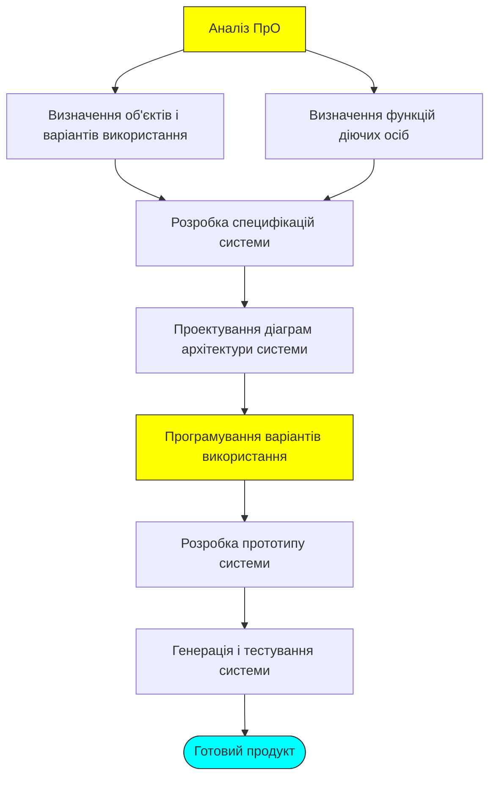

Рис.5.5. Схема моделювання і проектування ПС в UML

У UML передбачено загальний механізм організації деяких елементів системи (об'єктів, класів, підсистем і т.п.) у групи. Групування можливе починаючи від системи, далі до підсистем різного рівня деталізації і аж до класів. Результат групування називається *пакетом*. Пакет містить у собі назву простору імен, що займають елементи, які є його складовими, і спосіб посилання на цей простір. Це важливо для великих систем, що нараховують сотні, а іноді і тисячі елементів, і тому вимагають ієрархічного структурування.

При цьому підсистема розглядається як випадок пакета, що має самостійну функцію. Пакет може складатися з інших пакетів, класів, підсистем і т.п.

Об'єднання елементів у пакети може відбуватися за різними принципами, наприклад, якщо вони використовуються спільно або створені одним автором, або стосуються визначеного аспекту розгляду (наприклад, інтерфейс із користувачем,

пристрій вводу/виводу і т.п.). На стадії реалізації до одного пакета можуть бути віднесені всі підсистеми, що у діаграмі розміщення зв'язані з одним вузлом.

### 5.1.4. Компонентне програмування

За оцінками експертів в інформаційному світі 75 % напрацювань із програмування дублюються (наприклад, програми складського обліку, нарахування зарплати, розрахунку витрат на виробництво продукції і т.п.). Більшість із програм типові, але кожного разу знаходяться особливості ПрО, що призводять до їх повторної розробки.

Компонентне програмування дозволяє уникнути цих проблем. Воно є подальшим розвитком ООП, заснованим на повторному використанні, специфікації компонентів і їхніх інтерфейсів, композиції та конфігурації компонентів. Зв'язки між компонентами містять у собі підтипи й еквівалентність, а об'єктні зв'язки — класи і суперкласи. Сформульовано багато визначень поняття «компонент». Наведемо одне з них.

Під *компонентом* розуміють самостійний продукт, що підтримує об'єктну парадигму, реалізує окрему предметну область і може взаємодіяти з іншими компонентами через інтерфейси.

Об'єкти розглядаються на логічному рівні проектування ПС, а компоненти — це безпосередня фізична, тобто програмна реалізація об'єктів. Співвідношення між об'єктами і компонентами неоднозначне. Один компонент може бути реалізацією декількох об'єктів або навіть деякої частини системи, отриманої при проектуванні. Зворотне співвідношення, тобто компонент — об'єкт, як правило, не виконується [8–13].

Перехід до компонентів відбувався еволюційно (табл. 5.1.): від підпрограм, модулів і функцій.

При цьому удосконалилися елементи, методи їхньої композиції і накопичення для подальшого використання.

Компоненти конструюються самостійно, як деяка абстракція, що містить у собі інформаційну частину й артефакт (специфікація, код, каркас і ін.).

В інформаційній частині задаються відомості: призначення, дата виготовлення, умови застосування (ОС, середовище, платформа і т.п.).

*Артефакт* — це реалізація (implementation), інтерфейс (interface) і схема розгортання (deployment) компонента.

*Реалізація* — це код, що буде виконуватися при зверненні до операцій, визначених в інтерфейсах компонента. Компонент може мати кілька реалізацій залежно від операційного середовища, моделі даних, СКБД і ін.

Для опису компонентів, як правило, застосовуються мови об'єктно-орієнтованого програмування, зокрема Java, у якій поняття інтерфейсу і класу — базові, використовуються в моделях Javabeans і Enterprise Javabeans і в об'єктній моделі CORBA [14].

Таблиця 5.1. Схема еволюції повторних елементів компонентного типу

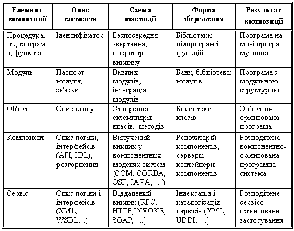

*Інтерфейс* відображає операції звертання до реалізації компонента, описується в мовах IDL або APL, містить у собі опис типів і операції передачі аргументів і результатів для взаємодії компонентів. Компонент, як фізична сутність, може мати множину інтерфейсів.

*Розгортання* — це виконання фізичного файлу відповідно до конфігурації (версії), з урахуванням параметрів запуску системи.

Компоненти зберігаються у вигляді класів компонентів і використовуються в компонентній моделі, композиції й у каркасі інтегрованого середовища. Керування компонентами проводиться на архітектурному або інтерфейсному рівні, між ними існує взаємний зв'язок.

Компонент описується мовою програмування, не залежить від операційного середовища (наприклад, від середовища віртуальної машини Java) і від реальної платформи (наприклад, від платформ у моделі CORBA), де він буде функціонувати.

**Типи компонентних структур.** Розширенням поняття компонента є *шаблон* (паттерн) — абстракція, що містить у собі опис взаємодії сукупності об'єктів у загальній кооперативній діяльності, для якої визначені ролі учасників і їхня відповідальність. Шаблон є повторюваною частиною програмного елемента або схемою вирішення проблеми.

*Компонентна модель* — відбиває проєктні рішення щодо композиції компонентів, визначає типи шаблонів компонент і припустимі взаємодії між ними, а також джерело формування файлу розгортання ПС у середовищі функціонування.

*Каркас* являє собою високорівневу абстракцію проєкту ПС, у якій функції компонентів відділені від задач керування ними. Каркас поєднує множину взаємодіючих між собою об'єктів у деяке інтегроване середовище для досягнення

певної кінцевої мети. Залежно від спеціалізації каркас називають «білою скринькою» або «чорною скринькою».

Каркас типу «біла скринька» містить у собі абстрактні класи для зображення об'єктів і їх інтерфейсів. При реалізації ці класи трансформуються в конкретні класи з указівкою відповідних методів реалізації. Використання такого типу каркаса є характерним для ООП.

Для каркаса типу «чорна скринька» у його видиму частину виносять точки, що дозволяють змінювати входи і виходи.

*Компонентне середовище* — розширення класичної моделі клієнт–сервер з урахуванням специфіки побудови і функціонування програмних компонентів, а також результатів практичних реалізацій і їхньої апробації. Основа компонентного середовища — множина серверів компонентів (часто їх називають сервери застосувань — application servers). Усередині сервера розгортаються компоненти-контейнери. Для кожного сервера може існувати довільна кількість контейнерів.

*Контейнер* — це оболонка, усередині якої реалізується функціональність компонента. Взаємодія контейнера із сервером строго регламентована і здійснюється через стандартизовані інтерфейси. Контейнер керує породжуваними компонентами і їхніми екземплярами з відповідною функціональністю. У загальному випадку усередині нього може існувати довільна кількість екземплярів-реалізацій, кожна з яких має унікальний ідентифікатор.

**Інтерфейс компонентів.** З компонентами у складі контейнера зв'язані два типи інтерфейсів: один для взаємодії з іншими компонентами, а другий – інтерфейс системних сервісів, необхідних для функціонування самого контейнера і реалізації спеціальних функцій, наприклад, підтримка розподілених транзакцій, у яких беруть участь кілька компонентів.

Перший тип інтерфейсу — домашній (Home interface) забезпечує керування екземплярами компонента з обов'язковими реалізаціями методів пошуку, створення і видалення окремих екземплярів.

До другого типу належать функціональні інтерфейси (fuction interface), що забезпечують доступ до реалізації компонента. Фактично з кожним екземпляром зв'язаний свій функціональний інтерфейс.

Екземпляри компонентів контейнера можуть взаємодіяти за допомогою системних сервісів, розміщених в інших компонентах. Самі компоненти можуть розміщатися як усередині одного сервера, так і в різних серверах для різних платформ. Така взаємодія забезпечується унікальними іменами компонентів і екземплярів, а також регламентована інтерфейсами і системними функціями. Інтерфейс відображає перелік сервісів, вхідні та вихідні параметри сервісів та їхні типи, переду- і постумови функціонування компонента, а також перелік інших компонентів, сервіси яких потрібні для здійснення своїх сервісів.

Архітектура компонентного середовища може складатися з наступних типів об'єктів:
- сервери компонентів;
- контейнери компонентів;
- реалізації функцій, подані як екземпляри усередині контейнерів;
- реалізація компонентних моделей, об'єктів, що задовольняють установку і конфігурування окремих компонентів для деякої комп'ютерної платформи;

— клієнтські компоненти і інтерфейси, що забезпечують кінцевого користувача, реалізовані у вигляді різних типів клієнтів (веб-клієнти, повноцінні реалізації графічного інтерфейсу і т.д.);
— компонентне застосування, як сукупність компонентів.

Кожний з типів об'єктів може реалізовуватися окремо, оскільки для кожного з них існують свої специфікації і вимоги, а також правила взаємодії з іншими елементами середовища компонентного програмування. Всі елементи разом узяті утворюють ланцюжок, що визначає порядок реалізації компонентної ПС. Кожен тип елементів може реалізовуватися окремим розробником і відповідно до цього визначається його роль у процесі створення компонентної системи.

Згідно до розподілені об'єктів на типи і з огляду на визначене місце кожного з них у процесі створення компонентної програми, варто зробити висновок, що ЖЦ компонентної системи значно складніше, ніж ЖЦ в інших підходах до програмування. Фактично мова йде про декілька окремих ЖЦ для кожного типу компонентів.

Композиція (інтеграція) компонентів і розгортання не залежать від ЖЦ розробки компонентів, заміна будь-якого компонента на новий компонент не повинна призвести до перекомпіляції або перенастроювання зв'язків у ПС.

Інтерфейс компонента може бути визначений у вигляді специфікації точок доступу до компонента, що обумовлюють його варіантність, і використовуючи які клієнт одержує сервіс у клієнт-серверному середовищі. Виходячи з того, що інтерфейс не надає реалізацію операцій, можна змінювати реалізацію без зміни інтерфейсу і, таким чином, покращувати функціональні властивості компонента без перебудови ПС у цілому, а також додавати нові інтерфейси (і реалізацію) без зміни існуючої реалізації усієї ПС.

Семантика інтерфейсу компонента може бути представлена за допомогою *контрактів*, що визначають зовнішні обмеження і підтримують інваріант, який містить у собі правила встановлення взаємозв'язків властивостей компонента або умови його життєздатності. Крім того, для кожної операції компонента контракт може визначати обмеження, що повинні бути враховані клієнтом перед викликом операції (передумова), і постумови перевірки правильності функціонування компонента після завершення операції. Перед- і постумова визначають специфікацію поведінки компонента і залежать від стану компонента, а також інтерфейсу і зв'язаним з ним набором інваріантів. Контракти й інтерфейс зв'язані між собою, але їхні сутності різні. Інтерфейс являє собою колекцію операцій або функціональних властивостей специфікації сервісів, що підтримує компонент. Контракт задає опис поведінки компонента, націлений на взаємодію з іншими компонентами і відбиває семантику функціональних властивостей компонентта.

Таким чином, модель специфікації семантики компонента визначає його інтерфейс і обмеження. Кожен інтерфейс складається з набору операцій (сервісів, що він пропонує або потребує). З кожною операцією зв'язаний набір перед- і пост-умов.

**Структури з компонентів.** Композиція компонентів може бути таких типів: компонент з компонентом зв'язані через інтерфейс на рівні застосування; каркас з компонентом зв'язані через інтерфейси на системному рівні; компонент з каркасом взаємодіють через інтерфейси на сервісному рівні; каркас з каркасом взаємодіють через інтерфейси на мережному рівні.

Компоненти запам'ятовуються в репозиторії компонентів, а їхні інтерфейси – в репозиторії інтерфейсів. Компоненти і їхні композиції, як правило, запам'ятовуються в репозиторії компонентів, а їхні інтерфейси також у репозиторії інтерфейсів.

*Повторне використання в компонентному програмуванні* — це застосування готових порцій формалізованих знань, здобутих під час попередніх реалізацій ПС, у нових розробках систем [13–15].

*Компоненти повторного використання (КПВ)* — це готові компоненти, елементи оформлених знань (проектні рішення, функції, шаблони й ін.), що використовуються у ході розроблення не тільки самими розробниками, а й іншими користувачами шляхом адаптації їх до нової ПС, що спрощує і скорочує терміни її розробки. В Інтернеті у даний момент є багато різних бібліотек, репозиторіїв, що містять у собі КПВ, які можна використовувати в нових проектах.

При створенні компонентів, орієнтованих на повторне використання, їхні інтерфейси повинні містити операції, що забезпечують різні способи застосування компонентів. КПВ повинні відповідати визначеним вимогам, мати характерні властивості і структуру, а також механізми звертання до них.

Головною перевагою створення ПС із компонентів є зменшення витрат на розробку за рахунок вибору готових компонентів з подібними функціями, придатними для практичного використання, і пристосування їх до нових умов, на що витрачається менше зусиль, ніж на аналогічну розробку нових компонентів.

Пошук готових компонентів грунтується на методах класифікації і каталогізації. Методи класифікації призначені для подання інформації про компоненти з метою швидкого пошуку і добору. Методи каталогізації – для їхнього фізичного розміщення в репозиторіях із забезпеченням доступу до них у процесі інтеграції в компонентну систему.

**Методологія компонентної розробки ПС.** Створення компонентної системи починається з аналізу ПрО і побудови концептуальної моделі, на основі якої створюється компонентна модель (рис. 5.6).

Вона містить у собі проектні рішення щодо композиції компонентів, використання різних типів шаблонів, зв'язків між ними й операцій розгортання ПС у середовищі функціонування.

Готові компоненти беруться, наприклад, з репозиторіїв у Інтернеті і використовуються при створенні програмних систем, технологія побудови яких описується наступними етапами ЖЦ.

1. *Пошук, вибір КПВ і розроблення нових компонентів*, виходячи із системи класифікації компонентів і їхньої каталогізації, формалізоване визначення специфікацій інтерфейсів, поводження і функціональності компонентів, а також їхнього анотування і розміщення в репозиторії системи або в Інтернеті.

2. *Розроблення вимог (Requirements) до ПС* – це формування й опис функціональних, нефункціональних і інших властивостей ПС.

3. *Аналіз поведінки (Behavioral Analysis) ПС* полягає у визначенні функцій системи, деталей проектування і методів їхнього виконання.


Рис. 5.6. Схема побудови ПС із компонентів, взятих з Інтернету

4. *Специфікація інтерфейсів і взаємодій компонентів* (Interface and Interaction Specification) віддзеркалює розподіл ролей компонентів, інтерфейсів, їхню ідентифікацію і взаємодію компонентів через потоки дій або робіт (workflow).
5. *Інтеграція набору компонентів і КПВ* (Application Assembly and Component Reuse) у єдине середовище ґрунтується на підборі й адаптації КПВ, визначенні сукупності правил, умов інтеграції і побудові конфігурації каркаса системи.
6. *Тестування компонентів і середовища* (Component Testing) ґрунтується на методах верифікації і тестування для перевірки правильності як окремих компонентів і КПВ, так і інтегрованої з компонентів програмної системи.
7. *Розгортання* (System Deployment) містить у собі оптимізацію плану компонентної конфігурації з урахуванням середовища, розгортання окремих компонентів і створення цільової компонентної конфігурації для функціонування ПС.
8. *Супровід ПС* (System Support and Maintenance) складається з аналізу помилок і відмов при функціонуванні ПС, пошуку і виправлення помилок, повторного її тестування й адаптації нових компонентів до вимог і умов інтегрованого середовища.

**Таким чином**, компонентне програмування є основою економії витрат на програмування нових програм за рахунок використання готових КПВ, які можуть зберігатися у різних сховищах (бібліотеках, репозиторіях, базах знань тощо).

### 5.1.5. Аспектно-орієнтоване програмування

Аспектно-орієнтоване програмування (АОП) [15–17] — це парадигма побудови гнучких до змін ПС шляхом додавання нових аспектів (функцій), що забезпечують, наприклад, безпеку, взаємодію компонентів з іншим середовищем, а

також синхронізацію одночасного доступу частин ПС до даних і виклик нових компонентів із загальносистемних середовищ.

Аспектом може бути компонент повторного використання, фрагмент програми, що реалізує концепцію взаємодії компонентів у середовищі, захисту даних тощо. Програмна система, яка створюється з КПВ, об'єктів, невеликих методів та аспектів, доповнюється необхідними засобами взаємодії, синхронізації та захисту. Отже, вбудовані фрагменти наповнюють компоненти новим змістовним аспектом.

Практична реалізація аспектів, розміщених у різних частинах елементів ПС, забезпечується механізмом перетинних посилань і точками з'єднання, через які відбувається зв'язок з аспектним фрагментом для отримання визначеної додаткової функції.

В основі АОП лежить метод, подібний до методу розбиття задач ПрО на ряд функціональних компонентів, визначення необхідності використання різного роду додаткових аспектів і встановлення точок розташування аспектів в окремих компонентах, де це потрібно. Ці роботи виконуються на процесі ЖЦ процесу розробки, доповнюють реалізацію ПС засобами забезпечення взаємодії компонентів або їх синхронізації. Подібний підхід застосовується під час налагодження програм, коли додаткові фрагменти коду вбудовуються в певні точки початкової програми для видачі результатів перевірки. Якщооли налагодження закінчується позитивно, ці фрагменти вилучаються. У випадку аспектів — їхні програмні фрагменти залишаються в основній програмі.

Створення кінцевої ПС в АОП виконується за технологією, що відповідає розробці компонентних систем, з тією різницею, що використані аспекти визначають особливі умови виконання компонентів у середовищі взаємодії. Аспекти можна асоціювати з виконанням різних ролей взаємодіючими особами, що наближає аспект до ролі програмного агента, який виконує додаткові функції при визначенні архітектури системи та якості компонентів.

В АОП при виробленні проєктних рішень використовується механізм фільтрації вхідних повідомлень, за допомогою яких проводиться зміна параметрів і імен текстів аспектів у конкретно заданому компоненті системи. Код компонента стає «нечистим», коли його перетинають аспекти, і при композиції з іншими компонентами загальні засоби (виклик процедур, RPC, RMI, IDL і ін.) стають недостатніми. Оскільки аспекти вимагають декларативного зчеплення описів, особливо коли їх фрагменти беруться з одних об'єктів для інших.

Один з механізмів композиції компонентів і аспектів — *фільтр композиції*, що оновлює аспекти без зміни їх функціональних можливостей. Фактично фільтрація стосується вхідних і вихідних параметрів повідомлень, які перевизначають відповідні імена об'єктів. Іншими словами, фільтри делегують внутрішнім частинам компонентів параметри, переадресовуючи раніше встановлені посилання, перевіряють і розміщують у буфері повідомлення, локалізують обмеження і готують відповідний компонент для виконання.

В ОО-системах можуть використовуватися методи, призначені для виконання деяких розрахунків при звертанні до інших зовнішніх методів. У [17] сформульовано закон, відповідно до якого не повинні створюватися довгі послідовності дрібних методів, тому що в вихідному коді з'являться операції, які не пов'язані з іменами класів компонентів.

З погляду моделювання, аспекти можна розглядати як каркаси декомпозиції системи, в яких окремі аспекти перетинають КПВ, як схематично показано на рис. 5.7 для програм $\mathrm{P}_1$, $\mathrm{P}_2$ і $\mathrm{P}_3$, тобто в певних точках різних КПВ може бути звернення до одного аспекту.

На наведеному рисунку, наприклад, програма $\mathrm{P}_1$ містить у собі аспект, що здійснює звернення до деякої точки програми $\mathrm{P}_2$, яка після отримання інформації записує її у захищену БД, а потім аспект програми $\mathrm{P}_2$ забезпечує взаємодію з програмою $\mathrm{P}_3$ для передавання відомостей про запис необхідної інформації у БД.

Різним аспектам проектованої системи можуть відповідати й різні парадигми програмування: об'єктно-орієнтовані, структурні й ін. Утворюється мультипарадигменна концепція розробки спроектованої системи.

```mermaid
graph TD
    subgraph P1 ["P₁"]
        A1[ ] --> A2[ ]
        A2 --> A3[ ]
    end

    subgraph P2 ["P₂"]
        B1[ ] --> B2[ ]
        B2 --> B3[ ]
    end

    subgraph P3 ["P₃"]
        C1[ ] --> C2[ ]
        C2 --> C3[ ]
    end

    A2 --- B1
    A3 --- C2
    B2 --- C1
```

Рис. 5.7. Приклад розташування аспектів у програмах $\mathrm{P}_1$, $\mathrm{P}_2$ і $\mathrm{P}_3$

Через аспектні механізми встановлюються зв'язки з іншими предметними областями в сімействі програм або систем ПрО. Мова АОП дозволяє описувати аспекти для різних систем сімейства. Після компіляції описів перетинних аспектів, вони генеруються [16], поєднуються, оптимізуються і орієнтуються на виконання в динаміці. При цьому кожний аспект може стати модулем-посередником, що реалізує шаблон взаємодії окремих програм або систем.

Інакше кажучи, на процесах розробки виявляється, що аспекти надто щільно «переплетені» з компонентами й тому потрібна мінімізація зчеплень між аспектами й компонентами через посилання до варіантів використання, зіставлення із шаблоном або блоком коду, у якому встановлені перетинні посилання. Природно, що вказані перетини можуть спричинити зниження ефективності виконання програм або систем, де вони розташовані.

Аналіз ПрО закінчується побудовою характерної моделі та встановленням статичних або динамічних зв'язків з додатковими аспектами моделі. Різним аспектам ПС, як правило, відповідають різні парадигми програмування, які вимагають їхнього вдосконалення й узагальнення при розробленні ПЗ для нової ПрО.

В АОП використовується модель модульних розширень у рамках метамодельного програмування, що забезпечує оперативне використання нових механізмів композиції окремих частин ПС або їхніх сімейств із урахуванням предметно-орієнтованих можливостей мов (наприклад, SQL) і каркасів, які підтримують аспекти.

Технологія розробки ПС методами АОП містить у собі ряд загальних процесів (рис.5.8), описаних далі.

1. Декомпозиція функціональних задач із умовою багаторазового застосування модулів і виділених аспектів виконання (паралельно, синхронно тощо).
2. Аналіз мов специфікації аспектів для опису виділених аспектів й інших задач ПрО.
3. Визначення точок вбудовування аспектів у компоненти й формування посилань і зв'язків з іншими елементами ПрО.
4. Розроблення фільтрів для їх подання на боці сервера в цілях керування відповідно заданими аспектами.

```mermaid
graph TD
    A["Декомпозиція ПрО на задачі і компоненти"] --> B["Завдання аспектів для задачі ПрО"]
    B --> C["Опис зв'язків аспектів і компонентів"]
    C --> D["Розробка фільтрів повідомлень"]
    D --> E["Компіляція компонентів і аспектів"]
    E --> F["Готовий продукт"]
```

Рис.5.8. Технологічна схема проектування ПС засобами АОП

5. Визначення механізмів композиції (викликів процедур, методів, зчеплень) функціональних модулів, КПВ й аспектів у точках їхнього з'єднання, як фрагментів керування виконанням або звертання із цих точок до інших модулів.
6. Створення об'єктної або компонентної моделі, доповнення її вхідними й вихідними фільтрами повідомлень, що посилають об'єктам повідомлення з завданням виконання методів або аспектів.
7. Компіляція, спільне налагодження модулів і аспектів, після чого композиція їх у готовий програмний продукт.

Для ефективної реалізації аспектів розроблені системи Aspect, $\text{IP}^1$-бібліотека розширень, активні бібліотеки, а також проведене розширення МП Smalltalk засобами опису аспектів (Aspect++, Aspect, AspectC#, JAC).

*Систему Aspect розробив дослідницький центр Xerох PARC в цілях підтримки АОП на базі мови Java [15, 16].

___________________
$^1$ Абревіатура IP позначає Intensional Programming — інтенсивне програмування як розширення середовище для метапрограмування на основі активного висхідного коду.

Мова цієї системи є розширенням мови Java засобами АОП, тобто будь-яка програма на Java буде виконуватися в системі Aspect. Система має компілятор, налагоджувач і генератор документації.

Компілятор видає байт-код, сумісний з віртуальною машиною Java. Розширення мови Java стосуються способів опису правил інтеграції аспектів і Java-об'єктів і базуються на таких ключових поняттях:

- точка під'єднання JoinPoint у програмі, асоційована з контекстом виконання (викликак методу, конструктора, доступ до поля класу й ін.);
- набір точок зрізу Pointcut для точок JoinPoint, що задовольняє певні умови;
- набір інструкцій Advice у мові Java, виконуваних до, після або замість кожної із точок JoinPoint, що входять у заданий зріз;
- завдання аспекту Introduction для змінювання структури Java-класу шляхом додавання нових полів, методів і ієрархії.

Точка зрізу (точка у програмі, в яку вставляються певні інструкції, що були виконані до або будуть виконуватися замість цієї точки) й набір інструкцій визначають правила інтеграції й разом формують відповідний модуль системи.

Загальними принципами розробки ПС із використанням засобів АОП системи Aspect є:

- побудова моделі ПС за компонентами і аспектами;
- виділення в окремі модулі наскрізної функціональності шляхом аспектної декомпозиції;
- реалізація кожної вимоги окремо;
- інтеграція аспектів у програмний код.

Інтеграція аспектів відбувається в момент компіляції. Модель побудови готової ПС із компонентів, аспектів та фрагментів готового коду подано на рис 5.9 [15].

```mermaid
graph LR
    subgraph Input [" "]
        direction TB
        A["Початковий код компонентів і аспектів"]
        B["Байт код компонентів і аспектів"]
    end
    
    C["Конфі-гурація"] --> D
    Input --> D["Готова система"]
```

Рис.5.9. Інтеграція аспектів і компонентів

Після компіляції одержується готова система з функціональністю, інтегрованою за правилами, описаними в аспектних модулях.

Існують інші реалізації АОП: AspectC++, AspectC, AspectC#, розширення мов С++, С, С# аспектами; JAC — система, написана мовою Java, для створення розподілених ПС; Weave.NET — проект реалізації механізму підтримки АОП без прив'язки до конкретної МП усередині компонентної моделі .NET Framework і ін.

У процесі створення ПС із застосуванням аспектів можуть використовуватися: IP-бібліотека розширень, що містить у собі їх коди, а також активні бібліотеки, мова програмування SmallTalk, розширені засоби опису аспектів [17].

В IP-бібліотеці розміщені деякі функції компіляторів, методів, засобів оптимізації, редагування, відображення тощо. Наприклад, бібліотека матриць, за допомогою якої обчислюються вирази з масивами, забезпечує швидкість виконання, надання пам'яті й т.п.

Використання таких бібліотек у розширених середовищах програмування називають *родовим програмуванням*, а вирішення проблем економії, перебудови компіляторів під кожне нове мовне розширення, використання шаблонів і результатів попередньої обробки відносять до області *ментального програмування* [17]. Бібліотека IP містить у собі: окремі функції компіляторів, засоби оптимізації, редагування, відображення понять, перебудови окремих компонентів компіляторів під нове мовне розширення, а також засоби програмування на основі шаблонів і т.п. Бібліотеки з такими можливостями одержали назву *бібліотек генерації*.

Інший вид бібліотек АОП — *активні бібліотеки*, які містять у собі не тільки базовий код реалізації понять ПрО, а й цільовий код забезпечення оптимізації, адаптації, візуалізації й редагування. Активні бібліотеки поповнюються засобами й інструментами інтелектуалізації агентів, за допомогою яких забезпечується розроблення спеціалізованих агентів для реалізації конкретних задач ПрО.

### 5.1.6. Генерувальне (породжувальне) програмування

Генерувальне програмування (generative programming) — це методи і засоби генерації сімейств систем і застосувань з окремих компонентів, аспектів, КПВ, каркасів і ін. Базис цього програмування — ООП, доповнене механізмами генерації багаторазових елементів і КПВ, а також властивостями їхньої змінюваності, взаємодії й ін. [17]. Це програмування є новим видом програмування, в ньому використовуються різні методи *інженерії складних ПрО* для розроблення сімейств ПС з різних виготовлених раніше програмних продуктів, згенерованих програмних застосувань і систем, сімейств систем, члени яких задовольняють певні показники якості.

Головний продукт інженерії ПрО — це сімейство ПС, яке генерується на основі загальної генерувальної моделі домену GDM (Generative Domain Model), що містить у собі засоби визначення окремих членів (представників) сімейства, до яких відносять предметно-орієнтовану мову DSL (Domain Specific Language), методи генерації окремих членів і їх збирання у сімейство, а також базу конфігурації для розгортання сімейства або його членів у середовищі.

Кожен член сімейства створюється з окремих компонентів. Це створення планується, контролюється й оцінюється після інтеграційного тестування на якість, а також обліку витрат на використання КПВ, у тому числі готових, узятих, наприклад, з активної бібліотеки [17].

Елементи цієї бібліотеки — цільовий код засобів забезпечення компіляції, налагодження, візуалізації й ін. Фактично компоненти бібліотеки — це інтелектуальні агенти, що генерують нові агенти в розширюваному середовищі програмування для розв'язання конкретних задач ПрО. У ньому містяться спеціальні метапрограми, тобто програми, що генерують інші програми, і

компоненти бібліотеки для здійснення збирання згенерованих компонентів і поповнення ними цього середовища для майбутнього створення нових членів сімейства з компонентів багаторазового використання.

Задачі простору проблем предметної області або окремих членів сімейства, як правило, визначаються різними предметно-орієнтованими мовами. В даному випадку термін «мова» використовується в загальному розумінні. Тобто така мова може бути подана як засіб опису специфічних понять ПрО, різних аспектів функціонування задач за допомогою операції взаємодії членів сімейства або їх складових і т.п. Поняття ПрО можуть бути поданні також процедурами, функціями, методами, як в ООП. Вони, як відомо, зберігаються в бібліотеках або вбудовуються в універсальну мову програмування (наприклад у C++, C# тощо). Коли в таку мову додаються різного типу абстракції опису різних задач ПрО, її називають модульною предметно-орієнтованою мовою.

Задачі можуть бути функціонального (наприклад, бухгалтерські, кадрові тощо) та системного (наприклад, захист даних, безпека, взаємодія тощо) типів. Специфікація задач домену може виконуватися декількома предметно-орієнтованими мовами, кожній з них притаманна своя специфічна мова.

До предметно-орієнтованих мов відносять такі:
- мова опису специфіки домену;
- мова опису функціональних задач домену;
- мова опису аспектів взаємодії, синхронізації компонентів у середовищі;
- мова опису захисту даних та безпеки виконання сімейства систем;
- мова інтерфейсів (PDL, IDL тощо).

**Предметно-орієнтована мова – DSL.** Вона вналежить до класу мов опису специфіки ПрО або домену, властивої саме цьому домену. Опис кожного члена сімейства може містити мову опису специфіки задач домену і генеруючої моделі домену GDM (Generative Domain Model), яка відображає склад домену із членів сімейства, специфікованих також у предметно-орієнтованих мовах.

Мова DSL не є новим винаходом, оскільки загальні абстракції програмування були визначені й вбудовані в мови загального призначення. І хоча мова DSL створюється багато років і для кожної ПрО є свій варіант мови, її застосування для специфікації особливостей ПрО не забезпечує формування повного уявлення про предметну область, оскільки вона дає лише засоби визначення загальних рис ПрО.

Відомо, що будь-яка мова має визначену область застосування, проте мова DSL є більш спеціалізованою, ніж інші мови програмування (Паскаль, Кобол), що створювалися для розв'язання конкретних типів задач (обчислювальних, економічних). Порівняно з ними, DSL близька до описових мов, таких як HTML, XML. Вона має специфічні особливості порівняно з мовами загального призначення, а саме:
- абстракції DSL забезпечують визначення концепцій і абстрактних понять у предметній області;
- синтаксис мови DSL може надавати засоби природного опису понять домену і запобігати синтаксичній неузгодженості, що буває при використанні мови загального призначення;
- перевірка опису в DSL вимагає статичних аналізаторів, що можуть знайти більше помилок, ніж аналізатори загального призначення, і дати повідомлення про них цією ж мовою, що є більш зрозумілим для фахівців у предметній області;


<!-- ВІДНОВЛЕНО ЛОКАЛЬНО (Стор. 123) -->
Розділ 5                                                                                                                                          123 

– оптимізація коду за описом в DSL базується на знаннях, що не є доступними компілятору з мови загального призначення; 

- інструменти підтримки DSL потребують відповідного оточення, наприклад, 

- середовища, редактора, контролера версій тощо. 

Специфікована в DSL модель ПрО є загальною  моделлю GDM (рис.5.10). 

- **Простір проблеми Знання про конфігурації Простір рішень** 

- - предметні поняття ПрО - зв’язки характеристик - прості компоненти - поняття системи - залежності - їхнє сполучення - характеристики об’єктів - правила конструювання - взаємодія - готові компоненти - варіанти оптимізації - адаптація 

Рис.5.10. Структура генерувальної моделі GDM 

# Модель відображає: 

- поняття, характеристики ПрО і членів сімейства в просторі проблем; 

- – набір членів сімейства і їхніх специфікацій у мовах типу DSL, RAISE 

- (Rigorous Approach to Industrial Software Engineering), RSL (RAISE Specification Language) і ін.; 

– задачі ПрО в просторі задач для їхньої реалізації компонентами і з наступним їхнім збиранням в конфігурацію визначених членів сімейства; 

– знання про конфігурацію (Configuration knowledge), що відображають характеристики членів сімейства, і їхнє поєднання в конфігурації; 

– модель характеристик (feature models) відображає загальні, змінювані і незмінні характеристики членів сімейства і правила конструювання систем сімейства з урахуванням їхньої залежності один від одного і від компонентів типу КПВ; 

- архітектуру (каркас) сімейства систем; 

- реалізацію компонентів архітектури у мовах програмування. 

Генерувальне програмування чітко поділяється на дві частини дослідження і проектування продукту ПрО – формування опису простору проблеми і простору розв’язків задач ПрО [5]. Перша частина призначена для проведення аналізу ПрО, виявлення її задач, які потрібно реалізувати, а друга – для розроблення засобів реалізації цих задач. Ці частини об’єднує конфігураційна і трансформаційна база знань про конфігурацію, тим самим утворюючи структуру моделі генерації у ПрО (або GDM) розроблюваних ПС (див. вищі рис.5.10). 

_Простір проблеми_ (problem space) містить у собі поняття ПрО та майбутньої системи, що будується за допомогою компонентів та КПВ, об'єкти та їхні характеристики тощо. Основою простору проблем є модель функціональних характеристик, властивості компонентів і об’єктів, змінювані параметри різних членів сімейства, а також проектні рішення, обумовлені  особливостями взаємодії членів сімейства між собою і з середовищем. 

_У базисі конфігурації_ відображені знання про конфігурацію системи подані звязками, правилами конструювання і характеристиками загального і спеціального призначення, а також елементів з активної бібліотеки багаторазового використання. Крім того, у ньому зберігаються технологічні знання про виготовлення
<!-- КІНЕЦЬ ВІДНОВЛЕННЯ -->


<!-- ВІДНОВЛЕНО ЛОКАЛЬНО (Стор. 124) -->
124                                                                                                                                        Розділ 5 

компонентів, засоби їхнього тестування, планування, налагодження і вимірювання. В базисі конфігурації визначаються задачі ПрО і дається їх опис у відповідній мовній парадигмі. 

_Простір рішень_ (solution space) – це компоненти, каркаси, шаблони проектування ПрО, а також засоби їхнього з'єднання або вбудування в ПС і оцінки повноти. Елементи цього простору реалізують розв’язання задач ПрО. Каркас системи або сімейства систем оснащений механізмом зміни параметрів, що вимагають фрагментації множини дрібних методів і класів. Він забезпечує створення багаторазових і використовуваних розв’язків у різних типах ПС, а також використання аспектів синхронізації, взаємодії і захисту даних за допомогою технології JavaBeans та нових механізмів композиції і генерації у деякому середовищі, наприклад,  Eclipsе. 

Простір проблем відбивається у простір задач за допомогою GDM моделі. Простір проблем містить у собі групу абстракцій, залежних від особливостей ПрО, які специфікуються так, щоб виразити поняття ПрО мовою, найбільш близькою до конкретного домену, і які можуть використовуватися для уточнення сутності того або іншого члена сімейства. Абстракції простору впливають на реалізацію компонентів мовою програмування в просторі, де розв’язуються задачі. Вони можуть бути змінені, якщо залежали від специфіки мови опису домену або від змінюваних особливостей області. 

Перетворення простору проблем у простір задач проводиться конфігураційним або трансформаційним способом. При конфігураційному способі використовують конструкторські правила й оптимізатори для додавання характерних рис до специфікації домену з урахуванням концепції домену, а також для перевірки комбінацій особливостей і залежностей в моделі GDM. Як результат утворюється конфігурація компонентів системи. Опис специфіки домену трансформується в опис мови реалізації компонентів простору розв’язання задач. Тобто перетворення опису ПрО у мову програмування відбувається шляхом генерації з використанням теорії мов і мовних перетворень. 

Іншим способом перетворення (відображення) між просторами є трансформація DSL-специфікації у реалізацію на мові програмування. Простір проблеми може бути не суцільним, а розділеним за окремими аспектами проблем. Залежно від аспекту проблеми трансформація може відбуватися не лише безпосередньо у мову реалізації, а й у іншу DSL-мову. 

Оскільки при конфігураційному способі простір проблеми (загальні та особливі характеристики і обмеження) фактично визначає проблемно-орієнтовану мову, а множина компонентів у просторі рішень у  мовах  програмування можуть розглядатися як елементи реалізації. Конфігураційний спосіб можна інтерпретувати як окремий випадок трансформаційного способу. 

У генерувальному програмуванні головним об’єктом є КПВ. Він використовується при створенні членів сімейства за двома інженерними напрямами [11–14]: 

1) **прикладна інженерія** (Application Engineering) – процес розроблення конкретних систем, так званих одиночних програм, із КПВ, а також  із застосуванням раніше створених незалежних ПС у різних середовищах; 

2) **інженерія ПрО** (Domain Engineering) – побудова архітектури членів сімейства або самого сімейства систем шляхом використання КПВ, які зафіксовані
<!-- КІНЕЦЬ ВІДНОВЛЕННЯ -->


у сховищах, а також частин і членів сімейства систем конкретної ПрО, отриманих за моделлю GDM (більш докладно див. розділ 9).

У цих напрямах інженерії моделювання архітектури здійснюється за модельно-орієнтованим підходом і завершується побудовою архітектури MDA (Model Driven Architecture). Моделювання MDA-архітектури відбувається на двох рівнях — платформо незалежному (за допомогою моделі PIM, Platform Independent Model) і платформо залежному (за допомогою моделей PSM, Platform Specific Models). Таке моделювання підтримує концепцію відображення простору у простір задач. Тобто в моделі сімейства ПС члени сімейства можуть мати спільні функції, але вони розрізняються платформами реалізації.

Вибір альтернативних платформ — є «точкою варіантності» у сімействі. Ця точка знаходиться над моделлю ПС, тобто вона невидима на її рівні. Керування «точкою варіантності» платформ відбувається через трансформацію PIM $\rightarrow$ PSM без участі розробника.

Члени сімейства ПрО розрізняються не тільки на рівні платформи реалізації, а й на рівні функцій ПС, вимог до якості та інфраструктури, тобто застосовних ресурсів, які реалізують альтернативні концепції. Вибір різних концепцій зумовлює появу різних прикладних моделей (моделей ПС), які автоматично трансформуються в традиційну модель MDA.

Головними ресурсами вказаних двох напрямів інженерії є не тільки КПВ, а й різні елементи (активи) сімейства систем, наприклад, описи спільних і різних характеристик представників сімейства в моделі характеристик. Вибрані КПВ вбудовуються в нові члени сімейства ПС зі сховищ домену, а саме, з репозитарію. Технологія розробки сімейства програм для ПрО містить у собі три види базових процесів:
- розробка ПрО й одиночних програм;
- повторне використання ресурсів;
- менеджмент домену.

*Розробка ПрО з КПВ* є конвеєрною. Для ПрО плануються базові ресурси, якими можуть бути КПВ, програми, генератори, DSL-описи, моделі аналізу, документація й ін. Проектування в ПрО одиночних програм у прикладній інженерії базується на програмуванні з повторним використанням, де конкретні програми містять у собі різні готові ресурси (assets), які можуть бути і КПВ. Розробка ПрО є більш складним виробничим процесом, який містить у собі загальні етапи: аналіз, проектування і впровадження.

*Аналіз ПрО* зводиться до подання сімейства як множини програмних систем, які треба побудувати, з урахуванням загальних і різних рис, а також структурних і поведінкових специфікацій окремих членів сімейства. Цей аналіз починається з формулювання і специфікації вимог до ПС- членів сімейства і сімейства загалом. Специфікація вимог — це вхідна інформація для ручного або автоматичного створення домену з готових ресурсів. Після специфікації будується архітектура системи, в яку вміщуються запрограмовані члени сімейства та готові прикладні системи.

*Повторне використання ресурсів* стосується різних ресурсів для ПрО і методів їх використання. Ресурси можуть бути повторними і відображатися в загальній архітектурі (моделі) сімейства, а також у всіх членах сімейства ПрО. Сукупність цих ресурсів може бути частково або цілком автоматизована за


<!-- ВІДНОВЛЕНО ЛОКАЛЬНО (Стор. 126) -->
126                                                                                                                                        Розділ 5 

допомогою генераторів або конфігураторів готових ресурсів. Згенеровані продукти сімейства можуть містити у собі і методичні артефакти, наприклад, інструкції з користування DSL і компонентами домену. 

_Менеджмент домену_ – це керування конвеєрним розробленням з повторним використанням ресурсів. Він передбачає планування і контроль підбору типових для ПрО ресурсів, їхню оцінку і перевірку на задоволення вимог. У задачу менеджменту входить також перевірка застосовності готових ресурсів для реалізації специфіки ПрО і організація програмування компонентів простору задач відповідно до потреб клієнтів домену. 

Таким чином, інженерія ПрО охоплює: 

   - аналіз ПрО і виявлення об'єктів і відношень між ними; 

   - визначення області дій об'єктів ПрО; 

- визначення загальних функціональних і змінюваних характеристик, 

- побудова моделі характеристик; 

- створення базису для інженерії виробництва конкретних прикладних членів 

- сімейства з механізмами змінюваності незалежно від засобів їхньої реалізації; 

– підбір і підготовка компонентів багаторазового застосування для задач 

ПрО; 

– генерація окремих членів сімейства або домену в цілому. 

Етапи цієї схеми забезпечують формування моделі ПрО і моделі характеристик, як елементів простору проблем. Вони трансформуються в архітектуру системи й опис її компонентів, які об’єднуються у окремі системи для забезпечення розв’язання задач ПрО у просторі рішень. 

Як готові ресурси в інженерії ПрО можуть використовуватися відомі горизонтальні і вертикальні типи компонентів загального призначення, що реалізовані зокрема в моделі CORBA [14]. Горизонтальні типи компонентів – це загальні системні засоби, що потрібні різним членам сімейства, а саме, графічні інтерфейси користувача, СКБД, бібліотеки розрахунку матриць, контейнери, каркаси і т.п. 

До вертикальних типів компонентів належать прикладні системи (медичні, біологічні, наукові і т.д.), а також компоненти горизонтального типу з обслуговування архітектури багаторазового застосування компонентів і їхніх інтерфейсів. 

Приклад системи підтримки інженерії ПрО і застосування горизонтальних методів – система DEMRAL [14, 17], призначена для розробки бібліотек: чисельного аналізу, графових обчислень і т.д. Основні види елементів цієї бібліотеки – абстрактні типи даних (abstract data types) і алгоритми. DEMRAL підтримує інженерію домену за допомогою бібліотек чисельного аналізу, обробки зображень тощо. Крім цього, ця система дозволяє моделювати характеристики ПрО і зображати їх у характеристичній моделі, а також в предметно-орієнтованих мовах опису членів ПС конфігурації. 

Система конструювання RSEB призначена для використання вертикальних методів, а також КПВ і сценаріїв, як інструментів діаграмного проектування архітектури системи. Методи вертикального типу можуть викликати різні горизонтальні методи, що входять до різних прикладних підсистем. При роботі над окремою частиною сімейства можуть застосовуватися аспекти взаємодії, потоків
<!-- КІНЕЦЬ ВІДНОВЛЕННЯ -->


<!-- ВІДНОВЛЕНО ЧЕРЕЗ GEMINI (Стор. 127) -->
даних і ін. Важливу роль при цьому виконує графічний інтерфейс користувача і метод забезпечення взаємодії компонентів у розподілених середовищах.

### 5.1.7. Сервісно-орієнтоване програмування

Ця парадигма програмування з'явилася як наслідок розгляду програмних компонентів як готових сервісів, визначення для них інтерфейсів взаємодії в рамках нових архітектур ПЗ, зв'язаних із сервісами, у середовищі розподілених систем (CORBA, DCOM і EJB) і веб-сервісів у середовищі Інтернету. Такі архітектури отримали назву сервісно-орієнтованих архітектур — SOA (Service-Oriented Architecture) і зараз активно розвиваються разом із відповідними засобами їхньої підтримки й опису (XML, SOAP, WSDL і ін.) та механізмами взаємодії звичайних сервісів розподілених застосувань і веб-сервісів Інтернету [18].

Тобто у мережному середовищі поняття компонента було розвинуто до форми сервісу. *Сервіс* визначається як відкритий компонент, що може бути елементом швидкої та дешевої композиції у прикладні застосування. Сервіси пропонуються так званими провайдерами (постачальниками) — організаціями, які реалізують сервіси, надають їхні описи та іншу технічну або комерційну підтримку, якої потребують потенційні користувачі. Описи сервісів містять у собі інформацію про їхні можливості, інтерфейси, поведінку та якісні характеристики. Завдяки такому опису користувач може знайти сервіси, вибрати потрібні йому що і інтегрувати їх у свою композиційну структуру як готовий ресурс. Наведемо й інше визначення сервісу.

**Сервіс (service)** — це ресурс, що реалізує деяку функцію (у тому числі бізнес-функцію), є повторно використовуваним компонентом і містить у собі технологічно незалежний інтерфейс з іншими ресурсами. Наприклад, сервіси транзакцій, іменування, безпеки в моделі CORBA. Вони утворюють службу сервісів для створення ПС.

Архітектура SOA має форму піраміди, що складається з кількох шарів [18].

1. Підґрунтям піраміди є базові сервіси і базові операції, а саме, публікація, виявлення, вибір і зв'язування, які націлені на створення і використання описів сервісів.

2. Шар композиції — це консолідація багатьох функціональних сервісів у єдиний складений сервіс, а саме, контроль виконання сервісів і керування потоками даних між ними; публікація подій вищого рівня шляхом фільтрації, підсумовування, кореляції подій компонентів; забезпечення цілісності сервісу та накладання обмежень на його компоненти; досягнення якості композиції сервісів, включаючи показники виконання, секретності, контролю доступу тощо.

3. Шар менеджменту сервісу, а саме, керування платформою сервісу, розгортання, ведення статистики виконання, підвищення ефективності, забезпечення прозорості ходу виконання транзакцій, відстеження стану ходу виконання тощо.

Переважна форма реалізації сервісів — це *веб-сервіси*, які зберігаються та ідентифікуються за URL-адресами і взаємодіють між собою за допомогою мережі Інтернетту шляхом віддалених викликів (Remote Procedure Call). Стрімке поширення Інтернету призвело до того, що традиційне єдине інтегроване підприємство минулих поколінь все частіше заміняється мережею бізнесів, які спільно виконують певні функції при тому, що і власність, і менеджмент
<!-- КІНЕЦЬ ВІДНОВЛЕННЯ -->


розподілені між партнерами. Саме інформаційні потреби розподілених бізнесів викликали до життя веб-сервіси як адекватну форму компонентів типа КПВ.

**Веб-сервіс** має URL-адресу, інтерфейс і механізм взаємодії з іншим сервісом через протоколи Інтернету або зв'язки з іншими програмами, БД і діловими бізнес-операціями. Обмін даними між веб-сервісом і програмою здійснюється за допомогою XML-документів, оформлених у вигляді повідомлень. Веб-сервіси забезпечують розв'язання задачі інтеграції застосувань різної природи, будучи інструментом побудови розподілених систем. Веб-сервіс надається провайдером мережі Інтернету, який має стандартний спосіб взаємодії з розподіленими (.NET, J2EE, CORBA і ін.) і прикладними системами з отримання деякої послуги.

Основні засоби опису веб-сервісів:
- мова XML для опису і побудови SOA-архітектури;
- мова WSDL (Web Services Description Language) для опису веб-сервісів і їхніх інтерфейсів на XML, що стосується типів даних і повідомлень, а також моделей взаємодії і протоколів зв'язування сервісів між собою;
- SOAP (Simple Object Access Protocol) для визначення форматів запитів до веб-сервісів;
- UDDI (Universal Description, Discovery and Integration) для універсального опису, виявлення й інтеграції сервісів, забезпечення їхнього збереження, упорядкування ділової сервісної інформації в спеціальному реєстрі з покажчиками на конкретні інтерфейси веб-сервісів.

**Сервісно-орієнтована архітектура** – це сукупність взаємодіючих між собою сервісів і веб-сервісів і їхніх інтерфейсів. Будь-який з компонент SOA створюється за допомогою сервісів безвідносно до конкретних технологій, за які можна брати готові застосування типу «чорна скринька». Інтеграція компонентів і сервісів в архітектуру SOA містить у собі наступні види:
- користувацьку інтеграцію (user integration) для взаємодії інформаційної системи з конкретним користувачем;
- зв'язування застосувань (application connectivity) для забезпечення їхньої взаємодії;
- інтеграцію процесів (process integration) для об'єднання бізнес-процесів;
- інформаційну інтеграцію (information integration) для забезпечення доступу до інтегрованої інформації і даних.

При цьому до створюваної архітектури SOA висуваються наступні вимоги:
- наявність існуючих інформаційних систем і поява нових;
- поетапне впровадження нових і міграція існуючих інформаційних систем;
- стандартизація технології і реалізація інструментів для підтримки сервісних архітектур з повторним використанням застосувань і компонентів;
- використання різних моделей і систем (портали, grid-системи й ін.).

Якщо об'єктом сервісно-орієнтованої архітектури є веб-сервіс, то застосовується дві технології, що забезпечує функціональність (Functions) і якість сервісів (Quality of service). Ці технології винесені на рівень IT-стандартів комітету W3C і мають наступні рівні.

*Технологія забезпечення функціональності веб-сервісів має:*
- транспортний рівень (transport layer) для обміну даними;
- комунікаційний рівень (service communication layer) для визначення протоколів;


<!-- ВІДНОВЛЕНО ЛОКАЛЬНО (Стор. 129) -->
Розділ 5                                                                                                                                          129 

– рівень опису сервісу (service description layer) і зв'язаних з ним інтерфейсів; 

– рівень бізнес-процесів (business process layer) для реалізації бізнес-процесів і потоків робіт через механізми веб-сервісів; 

– рівень реєстру сервісів (service registry layer), який забезпечує організацію бібліотек веб-сервісів для їхньої публікації, пошуку і виклику за їхніми WSDLописами інтерфейсів. 

_Технологія забезпечення якості_ веб-сервісів має наступні рівні: 

–  політики (policy layer) для опису правил і умов застосування веб-сервісів; 

– безпеки (security layer) для опису питань безпеки веб-сервісів і функціонування (авторизація, аутентифікація і розподіл доступу); 

– транзакцій (transaction layer) для встановлення параметрів звертання до вебсервісів і забезпечення надійності їхнього функціонування; 

- керування (management layer)  веб-сервісами. 

Технологічний фундамент веб-сервісів становлять: XML, SOAP, UDDI, WSDL. З їхньою допомогою здійснюється реалізація базових властивостей вебсервісу і механізму взаємодії між собою веб-сервісів у середовищі SOA, що вміщують компоненти, наведені на  рис. 5.11. 


Рис. 5.11. Компоненти веб-сервісів і взаємодія з  різними системами 

Як видно з рисунку до головних компонентів належать: 

_– провайдер сервісу,_ що здійснює реалізацію сервісу у вигляді веб-сервісу, прийом і виконання запитів користувачів сервісу, а також публікацію сервісу, відзначеного в реєстрі сервісів; 

_– реєстр сервісів,_ якій містить у собі бібліотеку сервісів для користувачів сервісу і засоби пошуку і виклику необхідного сервісу за запитами, що надійшли від провайдерів сервісів на надання сервісів; 

– _користувач сервісу_ (застосування, програмний модуль або сервіс), який здійснює пошук і виклик необхідного сервісу з реєстру сервісів за його описом, а також використовує сервіс, наданий провайдером відповідно до його інтерфейсу. 

Зв'язок між діючими системами, наведений на рисунку, здійснюється через ХМL-повідомлення мережного середовища, що використовують інтерфейси веб-
<!-- КІНЕЦЬ ВІДНОВЛЕННЯ -->


<!-- ВІДНОВЛЕНО ЛОКАЛЬНО (Стор. 130) -->
130                                                                                                                                        Розділ 5 

сервісів. Посередником між загальносистемними службами розподілених систем і застосувань є _провайдер_ , що звертається до них за сервісом, а інтегратор SOA, що створюються із сервісів і веб-сервісів, називається _брокером_ . 

Для отримання сервісу в архітектурі  SOA виконуються наступні операції: 

**1. Публікація сервісу WSDL** з метою забезпечення доступності (через виклик) користувачеві сервісу і його інтерфейсу; 

**2. Пошук за протоколом SOAP** здійснює користувач сервісу в реєстрі сервісів за заданими критеріями; 

**3. Зв'язування UDDI** через опис користувачем необхідного сервісу, який може надаватися в таких моделях як COM, CORBA, DBMS, .JNET тощо. 

При цьому передбачається, що в реєстрі архітектури SOA міститься опис сервісу з форматом запитів користувача до провайдера, який містить у собі перелік описів сервісів, що можуть бути викликані відповідно до опублікованого інтерфейсу сервісу. 

# **5.1.8. Агентне програмування** 

Поняття інтелектуального і програмного агента з'явилося понад 20 років тому, їхня роль у програмній інженерії увесь час зростає [19–23]. Так, Джекобсон [23] зазначив перспективу використання агентів як менеджерів проектів, розробників архітектури за діаграмами use case і ін. 

Основний теоретичний базис даного програмування – темпоральна, модальна і мультимодельна логіки, дедуктивні методи доведення правильності властивостей агентів і ін. 

З погляду програмної інженерії агент — це самодостатня програма, здатна керувати своїми діями в інформаційному середовищі функціонування для одержання результатів виконання поставленої задачі і зміни поточного стану середовища [19]. Агент має такі властивості: 

– автономність – це здатність діяти без зовнішнього впливу; 

– реактивність – це здатність реагувати на зміни даних, середовища і сприймати їх; 

– активність – це здатність ставити мету і виконувати задані дії для досягнення цієї мети; 

– здатність до взаємодії з іншими агентами (або людьми). 

З інтелектуальним агентом зв'язані знання, що відображають переконання, намір, зобов'язання і т.п. Ці поняття входять у концептуальну модель і зв'язуються між собою операційними планами реалізації цілей агента. Для досягнення цілей інтелектуальні агенти взаємодіють один з одним, установлюють зв'язок між собою через повідомлення або запити і виконують задані дії або операції відповідно до наявних знань. Агенти можуть бути локальними і розподіленими (рис.5.12). 

Локальні агенти виконують задані функції у певних серверах і клієнтських комп’ютерах мережі і впливають на загальний стан середовища функціонування. Розподілені агенти розміщуються в різних вузлах мережі, виконують автономно (паралельно, синхронно, асинхронно) притаманні їм функції і можуть впливати на загальний стан розподіленого середовища.
<!-- КІНЕЦЬ ВІДНОВЛЕННЯ -->


```mermaid
graph TD
    subgraph "Вузол мережі 1"
        AB1["Агент B"] --> AC1["Агент B"]
        AB1 --> AD1["Агент D передає<br>повідомлення агенту E"]
    end
    subgraph "Вузол мережі 2"
        AC2["Агент C"] --> AE2["Агент E передає<br>обов'язки агенту C"]
    end
    AB1 -.-> AC2
```

Рис. 5.12. Приклад взаємодії агентів у різних середовищах

Характер взаємодії між агентами залежить від сумісності цілей, компетентності і т.п. [21].

Основою агентного програмування є:
- формальна мова опису ментального стану агентів;
- мова специфікації інформаційних, часових, мотиваційних і функціональних дій агента в середовищі функціонування;
- засоби інтерпретації специфікацій агента;
- інструменти конвертування будь-яких програм у відповідні агентні програми.

Агенти взаємодіють між собою за допомогою таких механізмів, як координація, комунікація, кооперація або коаліція.

Під координацією агентів розуміють процес забезпечення функціонування агентів при погодженості їхньої поведінки і без взаємних конфліктів. Координація агентів визначається:
- взаємозалежністю цілей інших агентів-членів коаліції, а також від можливого впливу агентів один на одного;
- обмеженнями, що приймаються для групи агентів коаліції в рамках загального їхнього функціонування;
- компетенцією — знаннями умов середовища і ступенем їхнього використання.

Головний засіб комунікації агентів — транспортний протокол TCP/IP або протокол агентів ACL (Agent Communication Languages). Керування агентами (Agent Management) виконується за допомогою сервісів: передача повідомлень між агентами, доступ агента до сервера і т.п. Комунікація агентів — це взаємодія між різними агентами через подання загальних протоколів Інтернету, а також опис повідомлень мовою HTML і декларативними або процедурними (Java, Telescript, ACL і т.п.) мовами. Кооперація агентів — це спільне виконання деяких завдань користувачів.

Прикладом активної і скоординованої діяльності агентів з пошуку необхідної інформації є середовище Інтернету. У ньому агенти забезпечують доступ до інформаційних ресурсів, а також виконують аналіз інформації, інтеграцію, фільтрацію і передачу результату запиту користувачеві (рис. 5.13).

Кожен агент залежно від свого статусу (агент архіву, агент користувача, агент-диспетчер, інформаційний агент і ін.) виконує визначену функцію, передає один одному завдання на наступну дію з доступу до інформаційного ресурсу для витягу необхідної інформації і передачі її на обробку наступним агентам. Вибрану інформацію агенти обробляють, аналізують, фільтрують і передають результат

клієнтові. Модель середовища взаємодії агентів складається з бази знань і бази даних, моделі інформаційних ресурсів, їхніх властивостей, правил роботи з ними і типів повідомлень. Як результат виконання запиту агенти створюють середовище і в будь-який момент часу вони змінюють свій стан за виконанням різних дій і з урахуванням виникнення нерегулярних станів (тупиків, нестачі ресурсу й ін.). Виходячи з отриманого індексу документу з репозиторію мережний робот-агент встановлює зв'язок з іншими агентами, що мають доступ до інформаційних ресурсів Інтернет, з метою формування відповіді користувачу на його запит.

У загальному випадку середовище, у якому діє агент, має визначену поведінку, що може бути відома цілком або частково. Головна особливість пошуку — бути проміжним середовищем, що виконує функції пошуку інформації за допомогою інформаційного агента, брокера, агента-користувача, агента-постачальника й ін.


Рис. 5.13. Схема обробки запитів агентами у середовищі Інтернету

Стан середовища залежить від інформації, що є у агента, а також від таких його властивостей: дискретності стану, детермінованості (чи ні) дій, динамічності або статичності середовища, синхронної або асинхронної зміни стану і т.п.

Для організації пошуку інформації за допомогою агентів створені мультиагентні пошукові системи (МАПС), що обробляють складні багаторазові запити, зв'язані з професійною діяльністю користувачів з пошуку в Інтернеті різного роду семантичної інформації. У цьому пошуку агенти забезпечують більш швидке і точне подання релевантної інформації на запит користувача мережі. МАПС реалізує ефективний обмін інформацією між інформаційним ресурсом і користувачем.

У даній структурі МАПС агент архіву забезпечує зіставлення добутої в Інтернеті інформації, заданої в запиті, і при її актуальності система видає відповідь на запит користувача.

Якщо інформація не знайдена, агент архіву передає запит агенту-диспетчеру для продовження пошуку. Він аналізує параметри і дані, запитує агента сервера інформаційних ресурсів про необхідну інформацію, що оцінюється на релевантність, і результат передає іншим агентам для подальшого обслуговування.

Агент-інтегратор поєднує відповіді на запити різних агентів інформаційних ресурсів у єдиний список для передачі його агентові, що фільтрує цей список, а потім передає його агенту-користувачу.

Однією із систем побудови агентів, заснованою на обміні повідомленнями, є система JATLite, що за допомогою Java-класів створює нових агентів, які обчислюють визначені функції в розподіленому середовищі. Система Agent Builder – це система конструювання програмних агентів, які описуються мовою Java і можуть взаємодіяти між собою, мовою KQML (Knowledge Query and Manipulation Language) [19–23].

Побудовані агенти виконують функції: менеджера проєкту й онтологій, візуалізації, налагодження й ін. Реалізацію механізмів взаємодій агентів забезпечує система JAFMAS, ряд інших мультиагентних систем [19].

## 5.2. Теоретичне програмування

Разом з парадигмами прикладного програмування ПС продовжують розвиватися і теоретичне програмування, основано на фундаментальних дослідженнях, математичних теоріях і дисциплінах (логіка, алгебра, комбінаторика). Завдяки цьому забезпечується математичний аналіз й осмислення деяких завдань програмування, а також їх опису з використанням математичної символіки, відсутньої в прикладних МП. Правильність математичного аналізу треба доводити автоматизованими засобами, які розпізнають символи і забезпечують зіставлення з символікою базової мови для одержання необхідних результатів на комп'ютері.

Авторами української теоретичної школи програмування, створеної В.М. Глушковим, запропоновані нові парадигми, а саме:
- алгебраїчне та інсерційне програмування (А.А.Летичевський і ін.) [24–26];
- експлікативне та номінативне програмування (В.Н.Редько, М.С.Нікітченко), які використовують логічний і математичний апарат для абстрактного конструювання програм [27-29];
- алгебро-алгоритмічне програмування (Г.О. Цейтлін), що поєднує алгебраїчний апарат і теорію алгоритмів [30–31].

Розглянемо ці напрями детальніше.

### 5.2.1 Алгебраїчне та інсерційне програмування

Парадигма *алгебраїчного програмування – АП* [24, 25] ґрунтується на теорії переписування термів. У цій парадигмі *терми* представляють дані, а *системи переписуючих правил*, що подаються за допомогою системи рівностей, — алгоритми обчислень. Елементарний крок обчислення містить у собі включає зіставлення із зразком, перевірку умов і підстановку. Порядок вибору переписуючих правил і підтермів даного терму для зіставлення з лівими частинами рівності визначається *стратегією переписування*. По суті, стратегія визначає результат обчислень

терм з точністю до еквівалентності початковому терму. Власне стратегія переписування може бути описана в парадигмі більш низького рівня, наприклад, процедурній або функціональній, що зумовлює інтеграцію парадигм. На теперішній час ідея інтеграції парадигм (процедурної, функціональної, алгебраїчної і логічної) знайшла втілення в системі алгебраїчного програмування (APS) [25], в якій використовуються спеціалізовані структури даних — *графові терми* — для представлення даних і знань про предметні області.

Основою АП є математична модель, що вміщує такі поняття:
- агент як транзитивна система, наділена поведінкою;
- поведінка агентів задається мовою AL (Action Language) за допомогою операцій, констант, граничних умов і рекурсій;
- середовище, яке складається з множини агентів і функцій занурення в нього, що позначається $env$ і має параметром стан середовища й агентні вирази;
- правила розгортання функціональних виразів у прості агентні вирази;
- транзитивна система, як композиція середовища й системи взаємодіючих агентів, занурених у це середовище.

Мова дій AL, як і будь-яка інша мова, має синтаксис і семантику. Синтаксис мови задає правила опису дій, семантика — функцій, які визначаються засобами й виразами мови й ставлять у відповідність заданим виразам значення в деякій семантичній області. Різні семантичні функції можуть давати рівні абстракції й властивості програм. Семантика може бути обчислювальна й інтерактивна. Кожна алгебра дій — це гоморфний образ алгебри примітивних дій, коли всі складові різні, а їхнє подання однозначне з точністю до асоціативності й комутативності при детермінованому виборі.

Розширення поняття транзитивної системи — це множина заключних станів, що відповідають успішному завершенню функціонування системи і відсутності невизначених станів. Головний інваріант стану транзитивної системи — поведінка системи, що задається виразами алгебри поведінки $F(A)$ на множині операцій алгебри дій — префікси $a \cdot u$, недетермінований вибір $u + v$ з $u$ і $v$ поведінкою та властивостями асоціативності й комутативності. Скінченна поведінка системи задається константами $\Delta, \bot, 0$, які позначають відповідно: стан успішного завершення, невизначеного й тупикового. Алгебра поведінки містить у собі відношення $\le$, елемент $\bot$ як найменший, і операції поведінки, які монотонні.

Усяка транзитивна система має історію функціонування, яка зберігає зокрема один з таких станів: успішне завершення обчислень у середовищі транзитивної системи; «тупиковий» стан, коли кожна з паралельно виконаних частин системи перебуває у стані очікування; та невизначений стан, що виникає при виконанні алгоритму з нескінченними циклами.

Алгебраїчне програмування зосереджує увагу на проблемах інтелектуалізації і поведінки агентів у розподіленому середовищі, куди вони занурюються. Це програмування поступово перейшло в *інсерційне програмування* шляхом вставки, занурення агентів у різноманіття середовищ для перетворення поведінок агентів на основі відповідної моделі, що відповідає розміщеній транзитивній системі й бісимуляційній еквівалентності [25]. Дане програмування узагальнює алгебраїчне перетворення множини станів інформаційного середовища на поведінку об'єктів.

Отож, інсерційне програмування узагальнює погляд на програму, як на алгебраїчно визначене *перетворення* множини станів інформаційного середовища,

проте замість пасивного середовища (пам'яті) розглядається *активне інформаційне середовище*, що має спостережувану поведінку [26]. Зміна поведінки цього середовища відбувається внаслідок дії на його об'єкти взаємодіючих *агентів*. В основі інерційного програмування — модель поведінки агентів в середовищах, що базується на поняттях транзиційної системи (основного стандарту в поведінковій теорії взаємодіючих процесів) і відношення бісимуляційної еквівалентності агентів щодо до середовища (стан агента ототожнюється з його поведінкою). На відміну від агентного програмування, що концентрує увагу, більшою мірою, на проблемах інтелектуалізації агентів, інерційне програмування охоплює поведінкові аспекти агентів.

Термін «інерційне програмування» походить від англійського *insert* — вставляти, поміщати, занурювати. Програма в цій парадигмі розглядається як агент, наділений поведінкою, що, *занурюючись в середовище, змінює його* (середовища) поведінку і має зовнішнього спостерігача, а також інших агентів, що занурюються у це середовище надалі. Написати інерційну програму — означає визначити функцію занурення (закон функціонування середовища із зануреними в нього агентами), а також початковий стан середовища і агента, зануреного в це середовище. Як базова система програмування для подання станів агентів і середовищ у вигляді структур даних, а також для програмування функції занурення використовується система алгебраїчного програмування APS. Інерційна програма записується мовою AL за наступними рівнями [26]:

1) опис поведінки ініціалізованого багаторівневого середовища із зануреними в нього агентами;
2) задання функції, яка визначає відношення переходів агентів;
3) опис ядра функції занурення (функції розгортання занурень).

Інерційними програмами моделюються реальні системи з недетермінованою поведінкою агентів і середовищ. Реалізація систем інерційного програмування вимагає застосування *програм-симуляторів*, а не інтерпретаторів, а також постановки *цілей* для отримання конкретних результатів.

Перший рівень виражається через паралельну композицію агентів з однією областю дій і відповідною комбінацією дій. Інші рівні виражаються через функцію занурення агента в деяке середовище, результат трансформації — нове середовище.

Головна діюча особа інерційного програмування — агент, що наділений поведінкою, і занурюючись у середовище, змінює його. Характерною рисою є недетермінована поведінка агентів і середовищ, як це відбувається в реальних системах. При цьому програма агента вимагає не інтерпретації, а моделювання, оскільки вона зображаютсяся транзитивною системою у вигляді композиції середовища й системи взаємодіючих агентів, занурених у це середовище. Схема створення агентних програм наведена на рис.5.14.

У схемі подані операції розробки об'єктів та середовища і опису функцій занурення. Програма — набір параметрів і початкових агентних виразів. Параметри можуть бути фіксовані й змінні, що змінюються при переході від одного середовища до іншого. Особливо це стосується параметрів розгортання.

Множина всіх переходів, заключних і «тупикових» станів — перелічувана, навіть якщо функція розгортання має нескінченну множину нетривіальних ітерацій.

```mermaid
graph TD
    A["Розробка агента та його поведінки"] --> B["Розробка середовища об'єктів та агентів"]
    B --> C["Модель системи"]
    C --> D["Розробка програми агента"]
    D --> E["Опис агента в AL"]
    D --> F["Опис функцій занурення агента"]
    E --> G["Моделювання AL-програми"]
    F --> G
    G --> H["Згенерована програма"]
    G --> I["Згенерована траса"]
    H --> J["Верифікація програми агента"]
    I --> J
```

Рис. 5.14. Технологічна схема в АП

Станом транзитивної системи є обмежені вирази, обумовлені операцією вибору $+$, співвідношенням $x + 0 = a$ і відношенням переходу з одного стану в інший за правилом $u \to U(u)$.

Функція розгортання занурень задається на об'єктах середовища й агентів, тобто на агентних виразах. Для коректності функції занурення необхідно, щоб вона залежала тільки від поведінки агента й середовища і була неперервною функцією. Наступним кроком розроблення програм є її реалізація в МП, наприклад у С++, коли уточнюються типи даних і параметри. Потім проводиться верифікація отриманої програми для перевірки правильності її поведінки в заданій моделі.

Більш докладна інформація про інсерційне програмування й засоби його автоматизації міститься в [25].

### 5.2.2. Експлікативне, номінативне програмування

Разом з новими парадигмами програмування розробляється загальна теорія програмування, *програмологія*, яка об'єднує ідеї логіки, конструктивної математики і інформатики, *уточнює поняття програми*, самого програмування і на єдиній концептуальній основі надає загальний формальний апарат для конструювання програм [27-29].

Серед найважливіших програмних понять і принципів виділяються поняття *композиції* і *принцип композиційності*, який тлумачить програми як функції, що будуються з інших функцій за допомогою спеціальних операцій, названих

композиціями. Принцип композиційності став основним в *композиційному програмуванні*.

З урахуванням композиційної експлікації (від explication-уточнення, роз'яснення) поняття програмування було розвинуто логіко-математичною композиційною системою побудови програм, що отримала надалі назву *експлікативного програмування*. Це програмування інтегрує в собі всі найбільш суттєві парадигми (стилі) програмування (структурне, функціональне, об'єктно-орієнтоване і ін.) в рамках концептуально єдиної експлікативної платформи, основу якої становлять три основні типи об'єктів: власне об'єкти, засоби побудови з одних об'єктів інших (функції) і програмологічні засоби застосування методів побудови (композиції).

Експлікативне програмування містить у собі теорію дескриптивних і декларативних програмних формалізмів для розробки моделей структур даних, функцій і засобів конструювання з них програм [27-29]. Для цих структур вирішені проблеми існування, зєднання і ефективності. Теоретичну основу ЕП становлять логіка, конструктивна математика, інформатика, композиційне програмування і класична теорії алгоритмів. Для зображення алгоритмів програм використовуються алгоритмічні мови і методи програмування: функціональне, логічне, структурне, денотаційне і ін.

Принципами експлікативного програмування є:
- розвиток поняття програми в абстрактному розумінні і поступова його конкретизація за допомогою експлікацій;
- дотримання принципу прагматичності або корисності визначення поняття програми введенням поняття *проблеми*, що ставиться для вирішення задач користувача;
- принцип адекватності орієнтований на абстрактну побудову програм і реалізацію проблеми з урахуванням інформативності даних і їх аплікативності. Програма розглядається як функція, що виробляє вихідні дані на основі вхідних даних. Функція – це об'єкт, якому зіставляється денотат імені функції за допомогою відношення іменування (номінації); принцип дескриптивності дозволяє трактувати програму як складні дескрипції, побудовані з простих функцій і композицій відображення вхідних даних в результати на основі принципу обчислюваності.

Розвиток поняття функції здійснюється за допомогою принципу композиційності, тобто складання програм (функцій) з простіших програм для створення нових програмних об'єктів зі складними дескрипціями функцій. Програми містять у собі номінативні (іменовані) дані, мовні вирази, терми і формули.

Процес розвитку програми здійснюється у вигляді ланцюжка понять: *дані – функція – ім'я функції – композиція – дескрипція*. Тріада *дані – функція – композиція* задає семантичний аспект програми, а *дані – ім'я функції – дескрипція* — синтаксичний аспект. В експлікативному програмуванні головними є семантичний аспект, система композицій і номінативність, що орієнтована на системний опис номінативних відносин при побудові даних, функцій, композицій і дескрипцій [28].

На вищих рівнях подання абстракції програми використовуються композиційно-номінативні системи (КНС), що містять у собі трійку простих систем – композиційну, дескриптивну та денотаційну. *Композиційна система* визначає

способи побудови функцій за деякою множиною даних. Дескриптивна система задає дескрипції (вирази, терми, формули), що застосовують для подання функцій. *Денотаційна система* задає денотати (значення, зміст) дескрипцій.

У цілому КНС забезпечують уточнення абстракції поняття програми шляхом використання спеціальних мовних систем опису різноманітних класів функцій, які називаються композиційно-номінативними мовами функцій. Такі системи тісно пов'язані з алгеброю функцій і даних і побудовані в семантико-синтаксичному стилі. Вони відрізняються від традиційних систем (моделей програм) теоретико-функціональним підходом, використанням класів однозначних $n$-арних функцій, номінативними відображеннями і структурами даних.

Для побудови математично простих і адекватних моделей програм параметричного типу використовується КНС і методи універсальної алгебри, математичної логіки і теорії алгоритмів. Дані в КНС розглядаються на трьох рівнях: абстрактному, булевому і номінативному.

Клас номінативних даних забезпечує побудову іменованих даних, багатозначних номінативних даних або мультиіменованих даних, що задаються рекурсивно. У рамках даного програмування розроблені нові засоби для визначення систем даних, функцій і композицій номінативного типу, імена аргументів яких належать деякій множині імен $Z$. Композиція визначається на $Z$-номінативних наборах іменних функцій [29].

Номінативні дані дозволяють задавати структури даних, яким властиві неоднозначність іменування компонентів, типи множини, мультимножини, реляції і т.п. Функції мають властивість аплікативності, їх абстракції задають, відповідно, класи слабких і сильних аплікативних функцій. Слабкі функції дозволяють задавати обчислення значень на множині вхідних даних, а сильні — забезпечують обчислення функцій на заданих даних.

Композиції класифікуються рівнями даних і функцій, а також типами аргументів. Експлікація композицій відповідає абстрактному розгляду функцій як слабоаплікативних функцій, а їх уточнення будується на основі поняття детермінанта композиції як відображення спеціального типу. Клас аплікативних композицій призначений для конструювання широкого класу програм.

### 5.2.3. Алгоритмічні алгебри

Під час конструювання алгоритмів програмісти керуються в основному інтуїтивним підходом, не замислюючись над тим, чи утворюють певну систему виконувані ними операції, проте така система є, вона формально описана і називається *алгоритмічною алгеброю*. Наразі розроблено кілька алгоритмічних алгебр, найвідомішими з яких є алгебра Дейкстри, алгебра схем Янова та алгоритміка програм, досліджена у працях В.М. Глушкова і Г.О. Цейтліна.

Дослідження і побудова алгебри алгоритмів або алгоритмічної алгебри почалося з проектування логічних структур ЕОМ під керівництвом академіка В.М.Глушкова. Як результат була створена теорія *систем алгоритмічних алгебр* (САА), що потім Г.О.Цейтліним була покладена в основу узагальненої теорії структурованих схем алгоритмів і програм, названою ним *алгоритмікою* [30].

Алгоритміка програм призначена для побудови послідовних і паралельних програм зі структурних схем з використанням апарату формальних алгебраїчних перетворень і канонічних форм опису логічних і операторних виразів. Її основу

становлять САА, розширені формалізмами для зображення логічних умов виконання паралельних програм, а також методами символьної мультиобробки [30, 31].

Основними поняттями алгебри алгоритмів є:
- операції над множинами, булеві операції, предикати, функції й оператори;
- бінарні і $n$-арні відношення, еквівалентність, частково і цілком упорядковані множини;
- графи-схеми й операції над графовими структурами;
- операції сигнатури САА, аксіоми і правила визначення властивостей програм на основі стратегії згортання, розгортання і їх комбінацій;
- методи синтаксичного аналізу структурних програм і символьна обробка.

Об'єкти алгоритміки – моделі алгоритмів і програм, що подаються у вигляді схем. Алгоритміка базується на комп'ютерній алгебрі, лозіці і використовується для формального опису алгоритмів в МП. Схема реалізації програм засобами алгоритміки наведено на рис. 5.15.

```mermaid
graph TD
    A["Розробка логіко-функціональної моделі"] --> B["Побудова граф-схем алгоритмів"]
    B --> C((("Специфікація об'єктів САА-схем")))
    C --> D["Трансформація специфікації в UML"]
    D --> E["Верифікація в Rational Rose"]
    E --> F(("Помилки"))
    F -.-> A
    E --> G((("Готовий продукт")))
```

Рис. 5.15. Схема проектування програм в алгебрі алгоритміки

У рамках алгоритміки розроблено спеціальні інструментальні засоби реалізації алгоритмів програм, що використовують сучасні об'єктно-орієнтовані засоби і метод моделювання UML. Цим забезпечується практичне застосування розробленої теорії алгоритміки у реалізації прикладних задач, починаючи з їхньої постановки, формування вимог і розробки алгоритмів і закінчуючи одержанням програм, що розв'язують ці задачі.

**Алгебра алгоритмів.** Алгебра алгоритмів $AA = \{A, \Omega\}$, як і будь-яка алгебра, — це основа $A$ і сигнатура $\Omega$ операцій з елементами цієї основи. За допомогою операції сигнатури можна додати довільний елемент $q \in AA$. Це називається системою утворювальної алгебри.

Якщо з цієї системи не може бути виключений жоден елемент без порушення властивостей, то така система утворювальних алгебр називається *базисом алгебри*.

Операції алгебри задовольняють наступні аксіоматичні закони: асоціативності, комутативності, ідемпотентності, закони виключення третього і суперечності. Алгебру, яку задовольняють перераховані операції, називають булевою.

В алгебрі алгоритмів використовується алгебра множин, тобто елементи множини й операції над ними (об'єднання, перетину, доповнення і ін.). Вводиться також поняття універсуму — множини операцій постановки і розв'язання деякої задачі [30].

Основні об'єкти алгебри алгоритмів — схеми алгоритмів і їх суперпозиції, тобто підстановки одних схем в інші. З підстановкою зв'язані розгортання, що відповідає спадному процесу проектування алгоритмів, і згортання, тобто перехід до більш високого рівня специфікації алгоритму. Схеми алгоритмів відповідають конструкціям структурного програмування.

Послідовне виконання операторів $A$ і $B$ записується у вигляді композиції $A * Y$; альтернативне виконання операторів $A$ і $B$ ($u(A, Y)$ означає, якщо $u$ — істинне, то виконується $A$, інакше $B$; цикл ($u(A, Y)$ виконується, поки не стане істинною умова $u$ ($u$ — логічна змінна).

За допомогою цих елементарних конструкцій будується більш складна схема $\Pi$ алгоритму:

$$\begin{aligned}
\Pi &::=\{[u_1] A_1\}, \\
A_1 &::=\{[u_2] A_2 * D\}, \\
A_2 &::= A_3 * C, \\
A_3 &::=\{[u] A, B\}, \\
u &::= u_2 \land u_1.
\end{aligned}$$

Здійснивши суперпозицію шляхом згортання даної схеми алгоритму $\Pi$, одержуємо таку схему:

$$\Pi::=\{[u_1] \{[u_2] ([u_2 \land u_1] A, Y) * 3 \} * D\}.$$

Важливим показником можливостей алгоритміки є проведений порівняльний аналіз алгебри алгоритміки з відомими алгебрами. Дамо короткі пояснення алгебри Дейкстри, Янова та ін.

**Алгебра Дейкстри** $AD = \{ACC, L(2), \text{СИГН}\}$ — двохосновна алгебра, елементами якої є множина САА операторів, зображених структурними блок-схемами, множина $L(2)$ булевих функцій у сигнатурі СИГН, в яку входять операції диз'юнкції, кон'юнкції і суперечності, що набувають значення з $L(2)$. За допомогою спеціально розроблених механізмів перетворення $AD$ на алгебру алгоритміки встановлено зв'язок між альтернативою і циклом за формулою $\{[u] A\} = ([u] E, A * \{[u] A\})$, що входить у СИГН. В $AD$ використовуються похідні операції, які можуть бути отримані в наслідок суперпозиції основних операцій і констант.

Операція фільтрації $\Phi(u) = \{[u] E, N\}$ у $AD$ зображена суперпозицією тотожного $E$ для невизначених $N$ операторів і альтернативи в алгебрі алгоритміки, де $N$ — фільтр дозволу виконання операцій обчислень.

Оператор циклу $\text{while do}$ також представлений суперпозицією операції композиції і циклу в алгебрі алгоритміки.

**Алгебра схем Янова** $A\mathcal{R} = <\{AHC, L(2)\}; \text{СИГН}>$, де $AHC$ — сукупність неструктурних схем, $L(2)$ — сукупність різних булевих функцій, $\text{СИГН}$ — сигнатура з композиції $A * B$ і операція неструктурного переходу $\Pi(u, F)$, а також операції

диз'юнкції, кон'юнкції і суперечності. АЯ містить у собі операції побудови неструктурних логічних схем програм.

Схема Янова складається з предикатних символів множини $P(p_1, p_2, ...)$, операторних символів множини $A \{a_1, a_2, ...\}$ і графа переходів. Оператор у даній алгебрі — це пари $A \{p\}$, що складається із символів множини $A$ і предикатних символів $p$. Граф переходу — це орієнтований граф, у вершинах якого розміщуються перетворювачі, розпізнавачі й один оператор зупинки. Дуги графа задаються стрілками і позначаються знаками $+$ і $-$. Дуги, що виходять з розпізнавача, розрізняються і називаються відповідно плюс-стрілка і мінус-стрілка. Перетворювач має одного нащадка, розпізнавач — двох. Одна вершина в графі переходу зветься вхідною і помічається вхідною стрілкою. Також є вершина зупинки, яка не має нащадків. Кожен розпізнавач містить у собі умови виконання схеми. Перетворювач обробляє оператори, що вміщають логічні змінні, що належать множині $(p_1, p_2, ...)$ [31].

Кожна схема АЯ відзначається великою складністю, вимагає серйозного перетворення при переході до задання програми послідовністю дій, умов переходу і безумовного переходу. У праці [30] розроблена теорія інтерпретації схем Янова і доведено еквівалентність цих схем і операторних схем алгебри алгоритміки.

Для зображення схеми Янова апаратом алгебри алгоритміки сигнатура операцій АЯ вводяться композиції $A^* B$ і операція умовного переходу, що залежно від умови $u$ виконує перехід до наступних операторів або до оператора, позначеного міткою (типу goto). Умовний перехід трактується як бінарна операція $\Pi(u, F)$, що залежить від умови $u$ і розміток схеми $F$. Крім того, виконується заміна альтернативи і циклу типу while do. Внаслідок виконання бінарних операцій отримується нова схема $F'$, у якій встановлені бінарні операції $\Pi(u)$ замість мітки і булевих операцій кон'юнкції і суперечності. Еквівалентність операцій перетворення доводить правильність переходу до неструктурного подання програм.

Система алгебр Глушкова $\text{АГ} = \{\text{ОП, УМ, СИГН}\}$, де ОП — множина операторів, що входять у сигнатуру СИГН, і УМ — множина логічних умов, визначених на інформаційній множині ІМ.

Сигнатура $\text{СИГН} = \{\text{СИГНад} \cup \text{Прогн.}\}$, де $\text{СИГНад}$ — сигнатура операції Дейкстри, $\text{Прогн.}$ — операція прогнозування. Сигнатура САА містить у собі операції алгебри АД, узагальнену тризначну булеву операцію і операцію прогнозування (ліве множення умови на оператор $u = (A^* u')$ з породженням предиката $u = \text{УС}$ такого, що $u(m) = u'(m'), m' = A(m), A \in \text{ОП})$. $\text{ІМ}$ — множина оброблюваних даних за операціями з множин ОП і УС. Сутність операції прогнозування полягає в перевірці умови $u$ у стані $m$ оператора $A$ і визначення умови $u'$, обчисленої в стані $m'$ після виконання оператора $A$. Дана алгебра орієнтована на аналітичну форму подання алгоритмів і оптимізацію алгоритмів за вибраними критеріями.

**Алгебра алгоритміки і прикладні підалгебри.** Алгебру алгоритміки розширено Г.О. Цейліним дворівневою алгебраїчною системою і механізмами абстрактного опису даних (класами алгоритмів). Під багатоосновною алгоритмічною системою (БАС) розуміють систему $\text{S} = \{\{D_i \mid i \in I\}; \text{СИГН}_0, \text{СИГН}_n\}$, де $D_i$ — основи або сорти, $\text{СИГН}_0$, $\text{СИГН}_n$ — сукупності операцій і предикатів, визначених на $D_i$. Якщо вони порожні, то визначаються багатоосновні моделі — алгебри. Якщо сорти інтерпретуються як множина оброблюваних даних, то БАС є


<!-- ВІДНОВЛЕНО ЛОКАЛЬНО (Стор. 142) -->
142                                                                                                                                        Розділ 5 

концепцію АТД у вигляді підалгебри, що широко використовується в об'єктному програмуванні. Тим самим установлено зв'язок із сучасними тенденціями розвитку програмування. 

Таким чином, можна зробити висновок, що проведене зіставлення механізмів алгебри Дейкстри, алгебри схем Янова та логічних операторів Глушкова проведено засобами алгоритміки Цейтліна. Це вказує на їх однакову алгоритмічну потужність при різних засобах подання алгоритмів програм **.** 

Практичним результатом досліджень алгебри алгоритміки є побудова оригінальних інструментальних систем проектування програм на основі сучасних засобів підтримки ООП (Rational Rose). Докладніше дана тема розглядається в [32]. **Висновки.** Проведений аналіз методів систематичного і теоретичного програмування свідчить про їх розвиток, удосконалювання, поповнення новими можливостям для застосування. Класичним прикладом є UML, завдяки якому ООП набув нових візуальних можливостей для проектування ПС. Теоретичні методи увібрали в себе не тільки можливості логічного, функціонального і процедурного програмування, а й алгебро-алгоритмічного апарата для абстрактного і формального представлення програм. Визначено сучасні тенденції розвитку мов опису DSL, інженерії ПС і предметних областей. Об’єднуючим ланцюгом у програмуванні є генерувальне програмування, що забезпечує генерацію членів сімейства предметної області з компонентів і ресурсів багаторазового використання, розроблених у різних середовищах за різними методами програмування (об’єктним, аспектним, компонентним і ін.). Дано загальну характеристику різних формальних теорій програмування, орієнтованих на абстрактне подання програм. 

# **Контрольні питання і завдання** 

   1. Охарактеризуйте структурний метод програмування. 

2. Наведіть основні особливості і можливості об’єктно-орієнтованого 

програмування. 

   3. Які діаграми є в мові UML для візуального проектування програм? 

   4. Наведіть основні типи компонентів і шляхи їхнього використання. 

   5. Назвіть базові поняття в компонентному програмуванні. 

6. Визначте основні поняття й етапи життєвого циклу у компонентному 

програмуванні. 

   7. Визначте основні елементи аспектно-орієнтованого програмування. 

   8. Визначте основні елементи агентного програмування. 

   9. Визначте об'єкти генерувального програмування і наведить призначення. 

   10. Що таке простір проблем і простір рішень? 

   11. Наведіть теоретичні методи програмування. 

   12. Охарактеризуйте алгебраїчне програмування. 

   13. Що таке алгоритміка і її алгебра? 

   14. Покажіть сутність переходу до інших алгебр. 

# **Список літератури до розділу 5** 

1. _Demark D.A., McGowan R.L._ SADT: Structured Analysis and Design Technique. New York: McCray Hill, 1988 .– 378 c.
<!-- КІНЕЦЬ ВІДНОВЛЕННЯ -->


2. *Skidmore S., Mills G. Farmer R.* SSADM: Models and Mehtods. – Prentice–Hall, Englewood Cliffs, 1996.–581c.
3. *Марка Д.А., МакГруэн К.* Методология структурного анализа и проектирования. – М.: МетаТехнология, 1997.– 346 с.
4. *Буч Г.* Объектно-ориентированный анализ и проектирование с примерами приложений на С++, 2-е изд. – М.: Изд-во Бином, 1998. – 560 с.
5. *Гамма Э., Хелм Р., Джонсон Р., Влиссидес Дж.* Приемы объектно-ориентированного проектирования. Паттерны проектирования. – СПб: Питер, 2001. – 368 с.
6. *The Unified Modeling Language (UML) Specification.* – 1.3. UML Specification, revised by the OMG. – July 1999. – 620 p.
7. *Рамбо Дж., Джекобсон А , Буч Г.* UML. Специальный справочник.– СПб.: Питер .- 2002. – 656 с.
8. *Crnkovik I, Larsson S., Stafford J.* Component-Based Software Engineering: building systems from Components at $9^{\text{th}}$ Conference and Workshops on Engineering of Computer-Based Systems.– Software Engineering Notes. – 2002.– 27.– N 3.– P. 47–50.
9. *Gamma E., Helm R., Johnson R., and Vlissides J.* Design Patterns, Elements of Reusable Object–oriented Software, – N.-Y.: Addison–Wesley, 1995. – 345 p.
10. *Грищенко В.Н., Лаврищева Е.М.* Методы и средства компонентного программирования // Кибернетика и системный анализ, 2003. – №1. – С. 39–55.
11. *Лаврищева Е.М.* Методы программирования. Теория, инженерия, практика. Киев: Наукова думка, 2006.–451с.
12. *Weide B., Ogden W., Sweden S.* Reusable Software Components / Advances in Computers, 33. – Academic Press, 1991. – P. 1–65.
13. *Jacobson I., Griss M., Johnson P.* Software Reuse: Architecture, Process and organization for Business Success – Addison Wesley, Reading , MA, May 1997. – 501 p.
14. *Эммерих В.* Конструирование распределенных объектов. Методы и средства программирования интероперабельных объектов в архитектурах OMG/CORBA, Microsoft COM и Java RMI. – М.: Мир, 2002. – 510 с.
15. *Kiselev. I.* Aspect–Oriented Programming with AspectJ. Indianapolis, IN, USA: SAMS Publishing, 2002. – 164 p.
16. *Павлов В.* Аспектно-ориентированное программирование //Технология клиент-сервер, № 3–4. – С. 3–45.
17. *Чернецки К., Айзенекер У.* Порождающее программирование. Методы, инструменты, применение.– Издательский дом Питер. – М.: СПб. – Харьков. – Минск, 2005. – 730 с.
18. *Yang J.* Web Services Componentization//Ibid.–P.35–40.
19. *Плескач В.Л., Рогушина Ю.В.* Агентные технологии.–К.: КНТЕУ, 2005.–337с.
20. *Shoham. Y.* Agent–oriented programming. – Artif.Intell. – 1993–60, №1. – P. 51–92.
21. *Трахтенгерц Э.А.* Взаимодействие агентов в многоагентных средах // Автоматика и телемеханика. – М.: Наука. – 1998. – 8. – С. 3–52.

22. Дрейган Р. Будущее программных агентов. – PC Magazine March 25, – 1997. – 190 с.
23. Якобсон А. Мечты о будущем программирования. Открытые системы. – М.: – 2005. – № 12. – С. 59–63.
24. Летичевский А.А, Маринченко В.Г. Объекты в системе алгебраического программирования // Кибернетика и системный анализ. – 1997 .– № 2. – С. 160–180.
25. Летичевский А.А., Капитонова Ю.В., Волков В.А., Вышемирский В.В., Летичевский А.А. (мл.). Инсерционное программирование // Там же. – 2003. – № 1.– С. 12–32.
26. Инсерционное программирование / Летичевский А.А., Капитонова Ю.В., Волков В.А., Вышемирский В.В., Летичевский А.А. (мл.) // Кибернетика и системный анализ.– 2003, №1.– С.19-32.
27. Редько В.Н. Экспликативное программирование: ретроспективы и перспективы // Проблемы программирования. – 1998. – № 2. – С. 22–41.
28. Редько В.Н. Основания программологии // Там же. – 2000.– № 1. – С. 35–57.
29. Никитченко Н.С. Композиционно–номинативный подход к уточнению понятия программы // Там же. – 1999. – № 1. – С. 16–31.
30. Цейтлин Г.Е. Введение в алгоритмику. – Изд.–во Фара, 1999. – 310 с.
31. Глушков В.М., Цейтлин Г.Е., Ющенко Е.Л. Алгебра. Языки. Программирование. – Наук. Думка, 1974, 1989.–331с.
32. Ершов А.П. Введение в теоретическое программирование.–М.: Наука, 1959.–263с.
33. Дорошенко А.Ю., Фінін Г.С., Цейтлін Г.О. Алгеброалгоритмічні основи програмування.–К.:Наук.думка, 2004.–457с.

Розділ 6. МЕТОДИ ДОВЕДЕННЯ, ВЕРИФІКАЦІЇ І ТЕСТУВАННЯ ПРОГРАМ

Сучасні напрями перевірки правильності програм — це формальні специфікації, методи доведення, верифікація і тестування. Наведемо їхній зміст.

1. **Формальні специфікації** з'явилися у програмуванні в 70-х роках минулого сторіччя. Вони подібні МП і надають засоби, що полегшують опис міркування про властивості і особливості програм у математичній нотації. Під *специфікацією* розуміють формальний опис функцій і даних програм, якими ці функції оперують. На формальних специфікаціях базуються методи доведення програм, які були започатковані працями з теорії алгоритмів А.А. Маркова [1], А.А. Ляпунова [2], схемами Ю.І.Янова [3] та формальними нотаціями опису взаємодіючих процесів К.А. Хоара [4] і ін. Для перевірки формальної специфікації програми застосовують математичний апарат для опису правильного розв'язку деякої задачі, для якої вона розроблена. Разом з специфікацією розробляються додаткові аксіоми [5–10], твердження про опис операторів і умов, так звані попередні умови або передумови, і постумови, що визначають заключні правила одержання правильного результату.

2. **Доведення програм** проводиться за допомогою тверджень, що складаються у формальній мові і слугують для перевірки правильності програми в заданих її точках. Набір тверджень, перед- і постумов використовується для перевірки отриманого результату у деякій точці програми. Якщо твердження відповідає скінченому оператору програми, то за допомогою постумови робиться остаточний висновок про часткову або повну правильність роботи програм.

3. **Верифікація і валідація** — це методи забезпечення перевірки й аналізу правильності виконання заданих функцій програми відповідно до заданих вимог замовника до них і системи у цілому.

4. **Тестування** — це метод виявлення помилок у ПС шляхом виконання вихідного коду на тестових даних, збирання робочих характеристик у динаміці виконання в конкретному операційному середовищі, виявлення різних помилок, дефектів, відмов і збоїв, викликаних нерегулярними, аномальними ситуаціями або аварійним припиненням роботи системи.

Теоретичні засоби реалізуються як процеси програмування і перевірки правильності програмного продукту. На даний час процеси верифікації, валідації і тестування ПС регламентовані стандартом ISO/IEC–12207 [7] з життєвого циклу ПС. У деякій зарубіжній літературі процеси верифікації і тестування на практиці ототожнюються, вони орієнтовані на досягнення правильності програми.

Наведені методи доведення, верифікації і тестування при перевірці правильності програм кваліфікуються такими загальними поняттями і діями.

*Доведення та верифікація коректності* (правильності) виконуються за формальною специфікацією програми та за допомогою тверджень, передумов (обмежень вхідних параметрів програми) і постумов (обмежень вихідних параметрів програми), які утворюють незалежну від програми частину механізму її доведення. Ця частина специфікується, як правило, на тій же мові, що і програма. У ній застосовуються математичні операції (диз'юнкції, кон'юнкції, імплікації тощо), квантори існування і загальності та інші.

*Передумова* – це обмеження на сукупність вхідних параметрів і постумови як обмеження на вихідні параметри. Передумова і постумова задаються предикатами, результатом яких є булева величина (true/false). Передумова істинна тоді, коли вхідні параметри входять в область припустимих значень даної функції. Постумова істинна тоді, коли сукупність значень задовольняє вимоги, щодо формального визначення критерію правильності одержання результату.

*Твердження* формуються на формальній математичній мові у вигляді додаткової доказової частини, що перевіряє правильність виконання програми в початковій, проміжній або кінцевій точках.

*Постумова* – це обмеження з умов про кінцевий результат програми, відповідно до якого формулюється висновок про правильне завершення цієї програми.

Під *доведенням часткової правильності* розуміють перевірку виконання програми за допомогою тверджень, які описують те, що повинна одержати ця програма, коли закінчиться її виконання відповідно до умов заключного твердження. Повністю правильною програмою щодо її опису і заданих тверджень буде така програма, яка частково правильна і її виконання завершується при *всіх* даних, що відповідають їй.

*Перевірка правильності методом тестування* базується на функціональних тестах або наборах тестів, які створюються шляхом опису функцій і проєктної інформації на процесах ЖЦ з урахуванням вимог, сформульованих на процесі аналізу предметної області.

**5. Організаційна інфраструктура якісного проєктування** – це різні служби і діяльність груп фахівців, що планують процеси досягнення правильності програм (доказ, верифікація, тестування) з використанням описів тверджень, різних умов, а також тестових даних для спостереження за процесом доведення правильності програм, зокрема тестування, і збирання даних про відмови і помилки програм для їхнього використання при оцінюванні показників якості.

Далі зазначені напрями досягнення правильності програм розглядаються більш детально.

### 6.1. Мови специфікації програм і їхня класифікація

Мови формальної специфікації, які використовуються для формального опису властивостей виконання програм шляхом завдання тверджень та перед- і постумов, є мовами вищого рівня щодо мов алгоритмічного програмування, які можуть використовуватися для опису програми, для якої створюється доказ.

У загальному випадку *формальна специфікація програми* – це однозначний специфікований опис програми за допомогою математичних понять, термінів, правил синтаксису і семантики формальної мови.

Опис деякої задачі являє собою сукупність її формальної специфікації та необхідних для доведення аксіом, тверджень, перед- і постумов та інших формалізмів. Всі ці описи при реалізації вимагають не систему програмування з МП, а спеціальний програмно реалізований математично орієнтований апарат доведення програм, зокрема інтерпретатори або метасистеми.

Існують різні підходи до класифікації мов специфікації, що наведені на рис.6.1.


Рис.6.1. Категорії формальних мов специфікації

Нижче розглянуто основні мови специфікації, класифіковані за сферою застосування.

*Універсальні мови специфікації* – VDM, Z, RAISE, Spec# мають загально математичну основу з такими засобами:
1) логіки першого порядку, включаючи квантори;
2) арифметичні операції;
3) множини і операції над множинами;
4) описи послідовностей (кортежів, списків) і операції над ними;
5) описи функцій і операцій над ними;
6) описи деревоподібних структур;
7) засоби побудови моделей областей;
8) процедурні засоби мов програмування (оператори присвоювання, циклу, вибору, виходу);
9) операції композиції, аргументами і результатами яких можуть бути функції, вирази, оператори;
10) механізм конструювання нових структур даних.

*Мови специфікації предметних областей (доменів) у програмуванні:*
1) специфікації доменів;
2) описи взаємодій і паралельного виконання;
3) специфікації мов програмування і трансляторів;
4) специфікації баз даних і знань;
5) специфікації пакетів прикладних програм тощо.

*Мови специфікації специфіки доменів* DSL (Domain Specific Language) призначені для формалізованого опису задач в термінах предметної області, що підлягає моделюванню. Ці мови можна підрозділити на зовнішні і внутрішні. Зовнішні мови (типу UML, OWL і ін.) за рівнем вищі мов програмування і відповідають, наприклад, предметно-орієнтованій мові DSL, яка використовується для подання абстрактних понять і задач ПрО. Їхній опис трансформується до понять деякої внутрішньої мови або мови програмування спеціальними генераторами або текстовими редакторами. Внутрішні мови – мови опису специфічних задач обмеженим синтаксисом і семантикою потребують препроцесорів для перебудови цього опису до базової мови програмування.

Специфікації опису взаємодій і паралельного виконання окремих процесів систем ПрО також добре подаються мовами DSL, наприклад, подібно — діаграм UML.

*Мови програмування предметної області*, доповнені засобами і механізмами технологій. Метапрограмування є ефективним засобом автоматизації специфікацій розроблених програм і в даний час знаходять широке застосування у галузі інформаційних технологій.

Формальні мови специфікації мов програмування спочатку застосовувалися при розробленні трансляторів. Так звичайний синтаксис мови програмування описувався КС-граматиками у формі Бекуса–Наура. Такого типу мови є метамовами. Для специфікації семантики мов програмування використовуються формалізми рівностей. Техніка опису мов програмування базується на атрибутних граматиках і абстрактних типах даних з використанням денотаційних, алгебраїчних і атрибутних підходів. Як мови специфікації трансляторів, а також систем реального часу, де правильність і точність виконання програм є головними, використовують мови Z, VDM, RAISE.

*Мови специфікації з орієнтацією на засоби програмування* базуються на рівностях і підстановках з операційною семантикою (Лісп, Рефал); логічні мови; мови операцій (APL) над послідовностями і матрицями; табличні мови; мережі, графи та ін. Мова логіки предикатів використовується для запису передумов і постумов, інваріантів і процесу верифікації (наприклад, Пролог).

Для визначення семантики рівності застосовують денотаційний, операційний і аксіоматичний опис. Операційна семантика пов'язана з підстановками (заміна, продукція) і визначається в термінах операцій, що призводять до обчислень алгоритмів. При цьому фіксується порядок і динаміка виконання операцій програми.

У денотаційному підході до семантики надається перевага статичному опису об'єктів у термінах математичних властивостей, а у аксіоматичному — специфікації властивості об'єктів у рамках деякої логічної системи, що містить у собі правила виведення формул та/або інтерпретацій.

Окрім наведеної класифікації мов специфікацій, існують інші. Наприклад, можлива класифікація специфікацій за *способом виконання*:
- виконувана (executable),
- алгебраїчна (algebraic),
- сценарна (use case or scenarios),
- в обмеженнях (constraints).

*Виконувані специфікації* припускають розроблення прототипів систем для досягнення встановленої мети (VDM, SDL, RSL).

Алгебраїчні специфікації та мови SDL, RSL містять у собі механізми опису аксіом і тверджень, які призначені для доведення специфікованих програм.

*Сценарні специфікації* (UML) дозволяють описувати різні способи можливого застосування системи.

Програмування в обмеженнях використовують перед- і постумови для опису даних, операцій, інваріантів даних програм, що доводяться.

### 6.1.1. Мова формальної специфікації – VDM

Мова специфікації VDM (Vienna Development Method) була розроблена у віденській лабораторії компанії IBM і призначалася для опису мов типу ПЛ/1,

трансляторів і систем із складними структурами даних. У мові специфікується правильна програма і набір тверджень для її доведення [7, 8].

Мова містить у собі такі типи даних:
* $X$ – натуральні числа з нулем;
* $N$ – натуральні числа без нуля;
* $Int$ – цілі числа;
* $Bool$ – булеві;
* $Qout$ – рядки символів;
* $Token$ – знаки і спеціальні позначення операцій.

Функція специфікує властивості структур даних і операцій над ними — аплікативно (функціонально) або імперативно (алгоритмічно). Наприклад, функції $min$ у мові VDM описують двома способами:

$$min\ N1\ N2 \rightarrow N3,$$
$$min\ (N1\ N2) = \text{if}\ N1 < N2\ \text{then}\ N3.$$

*Об'єкти мови VDM:* множини, дерева, послідовності, відображення, сконструйовані складні структури.

*Множина:* $X\text{-set}$ і операції $\in, \subseteq, \cup, \cap$ і ін. Правило: $x \in A$ буде коректним тільки тоді, коли $A$ є підмножиною множини, якій належить $x$. Дистрибутивне об'єднання підмножин покажемо на прикладі:

$$union\ \{(1, 2), (0, 2), (3, 1)\} = (0, 1, 2, 3).$$

*Списки (послідовності):* $X$ – операція, $len$ – довжина списку, $inds$ – номери елемента в списку. Наприклад, $inds\ lst = (i \in X [f \le i \le len])$.

Узяття першого (голови) елемента списку – $hd$ і залишку (хвоста) після видалення першого елемента із списку – $tl$. Наприклад, $hd\ (a, b, c, d) = (a)$, $tl\ (a, b, c, d) = (b, c, d)$.

*Дерево:* $mk$ об'єднує послідовності, множини і відображення. Елементи дерев можуть конструюватися. Наприклад, час $10.30$ – конструкція $let\ mk$, час $(h, m) = t$, $tin$ визначає значення $h = 10$, а $m = 30$.

*Відображення:* $map$ – таблиця з ключів і значень. Операція $dom$ будує множину ключів, $rng$ – множину його значень.

Специфікація програми у VDM – це опис інваріантних властивостей, наприклад, $inv$ – функція, аргументи і опис її операцій. Перевірки специфікації – це і перед- і постумови, твердження, які специфікуються засобами VDM, і мають таку семантику тлумачення у ньому.

*Передумова* – це предикат з операцією, до якої звертається інваріант програми після отримання початкового стану для визначення правильності виконання або фіксації помилкової ситуації. *Твердження* – це опис операцій перевірки правильності інваріанта програми в різних її точках. *Постумова* – це предикат, який є істинним після виконання передумови, завершення поточних операцій в заданих точках при виконанні інваріантних властивостей програми.

Нижче наведено покрокову деталізацію специфікації програм мовою VDM:
1. Визначення термінів, якими буде специфікуватися програма.
2. Опис понять і об'єктів, для позначення яких використовується денотат, що ідентифікується за допомогою деякого імені (або фрази).
3. Опис інваріантних властивостей програми.
4. Визначення операцій над структурами програми (наприклад, ввести об'єкт, видалити і ін.), що змінюють її стан і збереження інваріантних властивостей.

5. Розроблення формальних умов виконання інваріанта програми та специфікація передумов, постумов, а також тверджень щодо виконання інваріанта програми.
6. Статичний огляд інваріанту програми щодо специфікованого формалізму доведення цього інваріанта.
7. Використання діючих CASE-засобів, що забезпечують виконання процесу верифікації програм.

**Приклад програми.** Алгоритм реєстрації компонента (ком) в репозитарії (repoz). Опис даних на мові «Паскаль» з використанням мовних конструкцій VDM при опису роботи зі списком компонентів (list_ptr).

```pascal
post-Add_rd (r): Rn $\rightarrow$ bool
r $\notin$ elems l1.rds
li'.rds =li.rds <mk-R.card(r, <>)>& li'.ctlg = li.ctlgli'ril = li.ril= type
    list = record
        next: pointer
        value: pointer
    list_ptr = list;
    R_card = record
        r.name: string;
        ком: list_ptr
    end;
    repoz = record
        rdrs: list_ptr;
        ctlg: list_ptr;
        ril: list_ptr
    end;
var
    L: repoz;
procedure Add_rd(r=string);
    rcrd:R_card;
    LL : list_ptr;
begin
    if find _rds, r) then
    begin
        writeln (‘компонент зареєстрований)
    end;
    new (Rcrd);
    Rcrd.r_name := r;
    Rcd.ком:=nil;
    new (LL);
    LL.next:=L.rds;
    LL.value:=ltcrd;
    L.rds:=LI end.
```

### 6.1.2. Мова формальної специфікації – RAISE

Мова RAISE і RSL-специфікація (RAISE Specification Language) були розроблені в 80-роках XX ст. як результат попереднього дослідження формальних методів верифікації програм і поповнення їх новими можливостями щодо

доведення. Метод містить у собі нотації, техніку і інструменти для формального опису ( RSL, C++ і Паскаль) програм і доведення їх правильності [9, 10].

До складу мови RSL входять абстрактні параметричні типи даних (специфікації, алгебри) і конкретні типи даних (модельно-орієнтовані), підтипи, операції для задавання послідовних і паралельних програм. Тобто ця мова надає аплікативний і імперативний стиль специфікації абстрактних програм, а також формальне конструювання окремих програм в інших мовах програмування і апарат доведення їх правильності. Синтаксис цієї мови близький до синтаксису мов C++ і Паскаль.

У мові RSL є абстрактні типи даних і конструктори складних типів даних, такі як добуток (*product*), множини (*sets*), списки (*list*), відображення (*map*), записи (*record*) і т.п.

*Добуток типів* – це впорядкована скінченна послідовність типів $T_1, T_2 \dots, T_n$ добутку (*product*) $T_1 \times T_2, \dots, \times T_n$.

Кількість компонентів добутку $d$ – це $size (d) = id \nabla (null (couter \; inc (counter)))$.

Конструктор добутку $d_1$ і $d_2$ будує добуток $d_1 \times d_2$ і значення типу *product* ($T1 \times T, \times Tn$), тобто

$make \; product \; (value \; 1 \dots, value \; n) = (value \; i \implies 1) \ \nabla \ \nabla (value \; n \; n)$,

де значення $value$ і має тип $T_i$, а результуюче значення – тип добутку $T_1 \times T_2 \times, \dots, \times T_n$ має значення $\nabla (value \implies n)$.

*Списки типів* – це послідовність значень одного типу $list \; T$ – можуть бути скінченним списком типів $Tk$ і нескінченним списком типів $Tn$. За структуру даних типу списків можна взято бінарне дерево, в якому є голова (*head*), син (*tail*), який слідує за ним у списку, і хвіст. До операцій списку належить операція $hd$ – узяття першого елемента списку, тобто голови, і операція $tl$ – узяття хвоста – решти елементів (як у мові VDM).

Функція $Caddr \; (l) = L \implies tail \implies tail \implies Head$ вибирає із списку $l$ елемент та індекс голови елемента, кількість елементів у списку і ін.

*Відображення* – це структура (*map*), яка ставить у відповідність значенням одного типу значення іншого типу. Разом з тим відображення – це бінарне відношення декартових добутків двох множин як сукупності двокомпонентних пар, в яких перший компонент $arg$, що містить у собі елементи аргументів відображення, а другий компонент – $res$ – відповідні елементи значень цього відображення.

Операції над відображеннями такі: накладання, об'єднання, композиція, зріз, композиція відображень ($m_1, m_2$).

*Запис* – це сукупність іменованих полів даних. Цей тип відповідає типу *record* у мові Паскаль і *struct* у мові C++. У мові RAISE для запису визначено два конструктори – *record, shurt record*.

*Об'єднання* – це конструктор *union*, що забезпечує об'єднання типів, наприклад,

$type \; id = id_1, \; id_2, \dots, idn$ і $тип \; id$ , який одержує одне із значень у списку елементів.

*Конструктор типу* – це тип виду $type \; id = id\_from\_id1$ ($id\_to\_id1: id1$.

Таким чином, мови VDM і RAISE слугують для математичного опису програм і конструювання структур даних як специфікацій, що використовуються при доведенні програм.

6.1.3. Концепторна мова специфікацій

Для постановки складних математичних задач (підсумовування нескінченних рядів, теоретико-множинних операцій з нескінченними множинами тощо) і задач штучного інтелекту (ігри, розпізнавання образів тощо) з метою їх формального опису запропонована загально математична процедурна мова, а саме, *концепторна мова (КМ)* [16]. У цій мові процес опису складного завдання проводиться шляхом обґрунтування розв'язку задачі з математичної точки зору, потім формального опису постановок задач і, нарешті, переходу до алгоритмічного опису.

**Специфікація складних завдань.** *Концепторна мова* містить у собі декларативні й імперативні засоби теорії множин Цермело–Френкеля. Ядро цієї мови містить набір елементів (типи, вирази, оператори) і засоби визначення нових типів, виразів і операторів.

*Декларативні засоби КМ* – це типизована логіко-математична мова для опису виразів і структуризації множин значень (денотат). Вирази складаються з термів і формул, терми позначають об'єкти ПрО, а формули – твердження про об'єкти і відношення між ними.

**Базові елементи мови** – конструктори складених типів і формул, а саме функтори, предикати, конектори і субнектори.
*Функтор* – це конструктор, що перетворює терми на терми.
*Предикати* перетворюють терми на формули.
*Конектори* вміщують логічні зв'язки і квантори для перетворення однієї формули в іншу.
*Субнектор (дескриптор)* – це конструктор побудови термінів з виразів і формул.

*Імперативні засоби КМ* – це оператори і процедури для опису об'єктів ПрО за допомогою концепторів. Опис процедури має такий загальний вигляд:
```
концептор К (< список параметрів >)
< список імпортних параметрів>
< визначення констант, типів, предикатів>
< опис глобальних змінних>
< визначення процедури>
початок К
< тіло концептора>
кінець К.
```

*Денотаційний підхід* полягає у визначенні *семантики* і підстановці в кожний вираз опису елемента з множини денотатів функції $\varphi$ символів з сигнатури мови. Кожній константі $c \in C$, функціональному символу $f \in F$ і предикатному символу $p \in P$ зіставляється об'єкт з множини денотат. Цей спосіб інтерпретації семантики виразів і операторів мови аналогічний денотаційній семантиці мов програмування.

*Аксіоматичний опис КМ* – це аксіоми і твердження щодо концепторного опису і проведення дедуктивного доведення і верифікації цього опису.

**Логіко-алгебраїчні специфікації КМ** призначені для специфікації ПрО, що задаються у вигляді алгебраїчної системи, за допомогою відповідних носіїв, сигнатури і трьох принципів. *Перший принцип* – логіко-алгебраїчна специфікація ПрО і уточнення понять ПрО, *другий принцип* – опис властивостей ПрО у вигляді

аксіом, які формулюються мовою предикатів першого порядку і хорновських агомарних формул, і, нарешті, третій принцип — це визначення термальних моделей з основних термів специфікації.

Засоби КМ використовуються при формальній специфікації поведінки дискретних систем. Для опису властивостей апаратно-програмних засобів динамічних систем застосовуються логіко-алгебраїчні специфікації. Техніка опису таких систем складається з двох процесів.

На першому процесі дискретна система $S$ розглядається як «чорна скринька» з скінченним набором входів, виходів і станів. Області значень входів і виходів — довільні, а функціонування системи $S$ — це набір часткових відображень і операцій алгебраїчної системи. Вони утворюють часткову алгебру, формальний опис якої виконується за допомогою алгебраїчних специфікацій, і це є програмою моделювання станів дискретної системи.

На другому процесі система $S$ деталізується у вигляді сукупності взаємозалежних підсистем $S_1, ..., S_n$, кожна з яких описується алгебраїчною специфікацією. Внаслідок цього одержують специфікацію системи $S$ із функцій переходів і виходів, для яких необхідно доводити коректність. Процес деталізації виконується на рівні елементної бази або елементарних програм і супроводжується доведенням їх коректності. Отже, маємо, що система $S$ еквівалентна початковій абстрактній специфікації.

Приклади доведення. Нехай треба побудувати специфікацію натуральних чисел з множини цих чисел і сигнатури операцій $\Sigma = (+, \times, \le)$. При побудові використовується число $0$ і функція проходження $s: N \to N'$. Специфікація складається з таких аксіом:

$$x + 0 = x$$
$$x + s(y) = s (x + y)$$
$$x \times 0 = 0$$
$$x + s(y) = s (x \times y) + x$$
$$0 \le x$$
$$x \le_6 \supset s (x) \le s (y)$$
$$s (x) \le s (y) \supset x \le 6$$

Алгебраїчні специфікації називають мовами логіко-алгебраїчних специфікацій, їх операційна семантика заснована на переписуванні термів, а утворена алгебраїчна специфікація одержує логічну семантику, використовувану при доведенні теорем.

### 6.1.4. Звичайна мова специфікації Spec#

Сучасна мова специфікація Spec# є розширенням об'єктно-орієнтованої мови C# засобами, що забезпечують верифікацію програм для платформи .Net [27]. Ці засоби подаються до програми в C# невеликими додатковими описами, а саме:
- ненульових посилань до параметрів викликів CALL;
- контрактів між викликами і реалізаціями;
- обробки виникаючих виключних ситуацій програми для інформування розробника;
- змінювання полів даних об'єктів тощо.

Ненульові типи даних помічаються типом T! і відповідають деяким змінним програми, які можуть використовуватися при специфікації полів даних,

формальних параметрів і з обернених цьому типу значень, локальних змінних програми. Цей тип не належить до елементів масиву. Головне призначення ненульових типів — забезпечити посилання до інших елементів, опис патернів, перевірку умов виходу з виразів і циклів, обумовлених контрактом.

Контракт ставиться між тим, хто робить виклик, і хто — реалізацію. У передумові додається опис стану параметрів при виклику, в постумові визначається умова отримання результату об'єкта, що викликався, і передача цього результату протилежна. Spec# надає підтримку більш дисциплінованому використанню виключення, щоб забезпечити ясність і підтримку життєздатності програми. У програмі можуть бути відмови і помилки. У даному випадку у методі використовується аналіз забороненої умови, коли передумова була не задоволена. Більшість відмов у програмі — це, коли порушена умова контракту. Наприклад, отримання виходу з циклу при перевищенні значення параметра циклу, що не було визначено у передумові.

Обробка виключних ситуацій виконується при роботі з масивами, коли елемент не відповідає типу. Якщо в передумові специфікується індекс, що знаходиться всередині меж масиву, а при виконанні цього не відбувається, то компілятор відповідає клієнту про невиконання передумови в реальному часі.

Змінювання полів даних задається фреймовими умовами, що вміщується у контракт, і починаютьсяться modifies, за яким слідкує оператор частини програми методу реалізації, що дозволяє зміну.

**Приклад.**
```csharp
Class C {
Int x, y;
Void M () modifies x: {...}.
}.
```

Тут метод M дозволяє зміну $x$ при умові, що на виході з цього методу $y$ має те саме значення, що на вході. У випадку масиву такий оператор змінює не елементи масиву, а посилання — на цей масив.

Фреймові умови для сервера використовуються під час виконання програми. При цьому modifies перевіряє на вході усі передумови і постумови виконання операторів програми в C#, на яких базуються описи специфікацій в Spec# і рахуються коректними.

Успадкування специфікацій. Контрактний метод успадковується звичайним методом, який під час виконання звертається до нього. Специфікація в Spec# подає код виконання в більш наглядній формі і більш зручній для перевірки заданих постумов. Метод може додавати до опису специфікації додаткові постумови і різні реакції на виключні ситуації. Метод має об'яву в інтерфейсі, подібно до об'яви в класі. Коли клас виконує метод інтерфейса, то його опис містить у собі фреймові умови, котрі є суперкласом виконуваного методу. Для виконання фреймових умов використовується оператор **expose**. Він, як правило, визначає об'єкт, інваріантний модифікації. Специфікація в Spec# являє собою блок операторів, який явно вказує на те, коли об'єктний інваріант можуть явно використовувати оператори, що вказані після **expose**. При цьому можуть модифікуватися усі поля в структурі об'єкта.

**Підхід до реалізації специфікації.** Опис специфікації в Spec# є самостійною програмою, що містить у собі перед- і постумови, а також різні дії над фреймовими структурами щодо програми, яка перевіряється мовою C#. Ця специфікація

подається в мово-незалежному форматі і перебудовується в мову C# за допомогою спеціального транслятора, що працює на платформі .Net. Цей транслятор має аналізатор і версифікатор для перевірки правильності опису специфікації. Транслятор виконує переклад у вигляді частини програми, для якої створювалася специфікація. Верифікація специфікації є статичною, вона орієнтована на перевірку правильності опису, а саме, меж масивів, явних значень змінних тощо. Прувер транслятора виконує перевірку деяких умов і операторів, а також значень змінних. Специфікації в Spec# накопичуються у репозиторії, і при застосуванні звертаються до Base Class Library, де накопичуються об'єкти, їхні інваріанти та контракти.

Контракти і аналогічні механізми верифікації програм з мов програмування реалізовані також в системах Java, Eiffel i Spark. У мові Java контракти вміщуються в опис програми як стилізовані коментарі. Середовище Java має такі засоби: перевірку контрактів у динаміці, виконання, виклики та об'єктні інваріанти. В об'єктно-орієнтованій системі Eiffel є бібліотека констрейнів, котрі вставляються у опис об'єкта і виконують верифікацію в динаміці виконання. Однак механізми модифікації не дозволяють для callbacks об'єктних інваріантів і тому вони не вміщуються в модульні об'єкти. Система Spark підтримує підмножину мови Ада при вставці теорем для прувера, помічених як коментарі, але компілятор цієї мови їх не використовує. Засоби верифікації в Spark орієнтовані на окремий опис умов виконання Ада-програм для верифікації, аналогічно до методології Spec#. Вони окремо транслюються у вихідний код Ада-програми і виконуються разом з нею в режимі верифікації.

## 6.2. Методи доведення правильності програм

Формальні методи тісно пов'язані з математичною специфікацією, верифікацією і доведенням правильності програм. Cі методи містять у собі математичну символіку, формальну нотацію і апарат виведення. Правила доведення є громіздкими і тому на практиці рідко використовуються рядовими програмістами. Проте з теоретичної точки зору вони слугують розвитку логіки застосування математичного методу індукції в процесі перевірки правильності програм [4, 5, 17, 18].

### 6.2.1. Базові методи доведення

Відомо багато методів доведення специфікацій програм, деяким з них дамо коротке визначення.

*Метод Флойда* заснований на знаходженні умов для вхідних і вихідних даних і полягає у виборі контрольних точок у програмі, яка доводиться, таким чином, щоб шлях проходження перетинав хоча б одну контрольну точку. Для цих точок формулюються твердження про стан і значення змінних у них (для циклів ці твердження повинні бути істинними при кожному проходженні циклу – інваріанта).

Кожна точка розглядається для індуктивного твердження того, що формула залишається істинною при поверненні програми в цю точку, і залежить не тільки від вхідних і вихідних даних, а й від значень проміжних змінних. На основі індуктивних тверджень і умов на аргументи програми створюються твердження з умовами перевірки правильності цієї програми в окремих її точках. Для кожного шляху програми між двома точками встановлюється перевірка на відповідність

умов правильності і визначається істинність цих умов при успішному завершенні програми на даних, що задовольняють вхідні умови.

_Метод Хоара_ — це вдосконалений метод Флойда, заснований на аксіоматичному описі семантики мови програмування початкових програм. Кожна аксіома описує зміну значень змінних за допомогою операторів цієї мови. Формалізація операторів переходу і викликів процедур забезпечується за допомогою правил виводу, що містять у собі індуктивні вислови для кожної точки і функції початкової програми.

_Метод Маккарті_ полягає у структурній перевірці функцій, що працюють над структурними типами даних, структур даних і шляхів переходу під час символьного виконання програм. Ця техніка складається з моделювання виконання коду з використанням символів для змінних даних. Тестова програма має вхідний стан, дані і умови її виконання.

Виконувана програма розглядається як серія змін станів. Саме останній стан програми вважається вихідним станом і, якщо його одержали, то програма вважається правильною. Даний метод забезпечує високу якість початкового коду.

_Метод Дейкстри_ пропонує два підходи до доведення правильності програм. Перший підхід заснований на моделі обчислень, що оперує історіями результатів обчислень програми, аналізом шляхів проходження і правил оброблення великого об'єму інформації. Другий підхід базується на формальному дослідженні тексту програми за допомогою предикатів першого порядку. У процесі виконання програма одержує деякий стан, який запам'ятовується для подальших порівнянь.

Основу методу становить математична індукція, абстрактний опис програми і її обчислення. За допомогою цього методу можна довести істинність деякого припущення $P(n)$ залежно від параметра $n$ для всіх $n \ge n_0$, і тим самим довести випадок $P(n_0)$. Виходячи з істинності $P(n)$ для будь-якого значення $n$, доводимо $P(n+1)$, що достатньо для доведення істинності $P(n)$ для всіх $n \ge n_0$.

### 6.2.2. Модель доведення програми за твердженнями

Розглядається формальне доведення програми, заданої структурною логічною схемою і сукупністю тверджень, що описуються логічними операторами, комбінаціями змінних (true/false), операціями (кон'юнкція, диз'юнкція й ін.) і кванторами загальності й існування (табл.6.1).

Таблиця 6.1. Список логічних операцій

| Логічна операція | | |
| :--- | :--- | :--- |
| **Назва** | **Приклад** | **Значення** |
| Кон'юнкція | $x \ \& \ y$ | $x$ і $y$ |
| Диз'юнкція | $x \ * \ y$ | $x$ або $y$ |
| Суперечність | $\neg x$ | ні $x$ |
| Імлікація | $x \rightarrow y$ | якщо $x$ то $y$ |
| Еквівалентність | $x \equiv y$ | $X$ рівнозначно $y$ |
| Квантор загальності | $\forall x \, P(x)$ | для всіх $x$, умова істинно |
| Квантор існування | $\exists x \, P(x)$ | Існує $x$, для якого $P(x)$ істина |

Мета алгоритму програми – побудова для масиву цілих чисел $T$ довжини $N$ (array $T[1:N]$) еквівалентного масиву $T'$ тієї ж довжини $N$, що і масив $T$. Елементи в масиві $T'$ повинні розташовуватися в порядку зростання їхніх значень.

Даний алгоритм реалізується сортуванням елементів вихідного масиву $T$ за їхнім зростанням.

Доведення правильності алгоритму сортування елементів масиву $T$ (рис. 6.2) проводиться з використанням ряду тверджень про елементи цього алгоритму, які описуються пунктами П1– П6.

```mermaid
graph TD
    Abeg((A beg)) --> T1["T = T'<br>M = true"]
    T1 --> O((0))
    T1 --> I0["I = 0"]
    I0 --> Cond1{"¬ M = true"}
    Cond1 -- "Ні" --> Aend((A end))
    Cond1 --> Mtrue["M = true"]
    Mtrue --> Iplus["I = I + 1"]
    Iplus --> Cond2{"I < N"}
    Cond2 -- "Hi" --> Loop1((**))
    Cond2 --> Cond3{"T'(i) > T'(i+1)"}
    Cond3 -- "Ні" --> Loop1
    Cond3 --> Swap["Змінити<br>T'(i+1) на T'(i)"]
    Swap --> Mtrue2((*))
    Loop1 --> Cond1
    Mtrue2 --> Mtrue3["M = true"]
    Mtrue3 --> Loop1
```

Рис.6.2. Схема сортування елементів масиву $T'$

**П1.** Вхідна умова алгоритму задається у вигляді початкового твердження:
$A_{beg}$: ($T[1:N]$ – масив цілих) & ($T'[1:N]$ – масив цілих).
Вихідне твердження $A_{end}$ – це кон'юнкція таких умов:
(а) ($T$– масив цілих) & ($T'$– масив цілих)
(б) ($\forall i$, якщо $i \le N$, то $\exists j$ ($T'(i) \le T'(j)$)),
(в) ($\forall i$, якщо $i < N$, то ($T'(i) \le T'(i+1)$)),
Тобто $A_{end}$ – це:
($T$ – масив цілих ) & ($T'$ – масив цілих)
& $\forall i$, якщо $i \le N$, то $\exists j$ ($T'(i) \le T'(j)$),
& $\forall i$, якщо $i < N$, то ($T'(i) \le T'(i+1)$).

Розташування елементів масиву $T$ в порядку зростання їхніх величин у масиві $T'$ здійснюється алгоритмом бульбашкового сортування, суть якого полягає в попередньому копіюванні масиву $T$ з масиву $T'$, а потім проводиться сортування елементів згідно з умовою їхнього зростання.

У кружках також дано: початковий стан – 0, стан після перестановки місцями двох сусідніх елементів у масиві $T'$ – одна зірочка, стан після зміни місцями всіх пар за один прохід усього масиву $T'$ – дві зірочки.

Крім уже відомих змінних $T, T'$ і $N$, в алгоритмі використані ще дві змінні: $i$ – типу ціла і $M$ – булева змінна, значенням якої є логічні константи $\text{true}$ і $\text{false}$.

**П2.** Для доведення того, що алгоритм дійсно забезпечує виконання вихідних умов, розглянемо динаміку їхнього виконання послідовно у визначених точках алгоритму.

Зазначимо, що точки поділяють алгоритм на відповідні частини, правильність кожної з них визначається окремо.

Так, оператор присвоєння означає, що для всіх $i$ ($i \le N$ \& $i > 0$) виконується ($T'[i] := T[i]$).

Результат виконання алгоритму в точці з нулем може бути виражений твердженням

$$(T[1: N] - \text{масив цілих}) \, \& \, (T'[1: N] - \text{масив цілих})$$
$$\& \, (\forall i \text{ якщо } i \le N, \text{ то } (T'[i] = T[i]) ).$$

Доведення очевидно, оскільки за семантикою оператора присвоювання (по елементне пересилання чисел з $T$ в $T'$) самі елементи при цьому не змінюються, до того ж у даній точці їхній порядок у $T$ і $T'$ однаковий. Отже, одержали, що виконується умова «б» вихідного твердження.

Зазначимо, що перший рядок доведеного твердження збігається з умовою «а» вихідного твердження $A_{end}$ і залишається справедливим до кінця роботи алгоритму, тому в наступних твердженнях наводитися не буде.

У точці з одною зірочкою виконаний оператор

$(i < N) \, (T'(i) > T'(i + 1) \to (T'(i) \text{ і } T'(i + 1) \text{ міняє місцями елементи}).$

Як результат роботи оператора буде справедливе таке твердження:

$\exists \, i$, якщо $i < N$, то $(T'(i) < T'(i + 1))$,

яке є частиною умови «в» твердження $A_{end}$ (для однієї конкретної пари суміжних елементів масиву $T'$). Очевидно також, що семантика оператора зміни місцями не порушує умову «б» вихідного твердження $A_{end}$.

У точці з двома зірочками виконані всі можливі перестановки місцями пари суміжних елементів масиву $T'$ за один прохід через $T'$, тобто оператор зміни працював раз або більше. Однак бульбашкове сортування не дає гарантії, що досягнуто упорядкування за один прохід по масиву $T'$, оскільки після чергової зміни індекс $i$ збільшується на одиницю незалежно від того, як співвідноситься новий елемент $T'(i)$ з елементом $T'(i - 1)$.

У цій точці також справедливе твердження

$\exists i$, якщо $i < N$, то $T'(i) < T' (i + 1)$.

Частина алгоритму, позначена точкою з двома зірочками, виконується доти, поки не буде упорядкований весь масив, тобто не буде виконуватися умова «а» твердження $A_{end}$ для всіх елементів масиву $T'$:

$\forall i$, якщо $i < N$, то $T'(i) \le T'(i + 1)$.

Отже, виконання вихідних умов забезпечене порядком і відповідною семантикою операторів перестановки масиву.

Доведено, що виконання алгоритму програми завершено успішно, це означає її правильність.

**П3.** Цей алгоритм можна подати у вигляді серії теорем, що доводяться. Починаючи з першого твердження і переходячи від одного перетворення до іншого, визначаємо індуктивний шлях висновку. Якщо одне твердження є правильним, то істинним є й інше. Іншими словами, якщо дано перше твердження $A_1$ і перша точка перетворення $A_2$, то перша теорема – $A_1 \rightarrow A_2$. Якщо $A_3$ – наступна точка перетворення, то другою теоремою буде $A_2 \rightarrow A_3$.

Інакше кажучи, формулюється загальна теорема $A_i \rightarrow A_j$, де $A_i$ й $A_j$ – суміжні точки перетворення. Ця теорема формулюється так: якщо умова істинна в останній точці, то і вихідне твердження $A_k \rightarrow A_{end}$ є істинним.

Тобто, можна повернутися до точки перетворення $A_{end}$ і до попередньої точки перетворення. Якщо доведемо, що $A_k \rightarrow A_{end}$ справджується, то виходить, що справджується й $A_j \rightarrow A_{j+1}$, і так далі, поки не одержимо, що $A_1 \rightarrow A_0$.

**П4.** Далі специфікується твердження типу *if – then*.

**П5.** Щоб довести, що програма коректна, необхідно послідовно розташувати усі твердження, починаючи з $A_1$ і закінчуючи $A_{end}$, цим буде підтверджено істинність вхідної і вихідної умов.

**П6.** Доведення алгоритму програми завершено.

## 6.3. Верифікація і валідація програм

Верифікація і валідація — це методи аналізу, перевірки специфікацій і правильності виконання програм відповідно до заданих вимог і формального опису програми [18–21].

Метод верифікації допомагає зробити висновок про коректність створеної програмної системи при її проектуванні і після завершення її розроблення. Валідація дозволяє встановити здійсненність заданих вимог шляхом їх перегляду, інспекції і оцінки результатів проектування на процесах ЖЦ для підтвердження того, що здійснюється коректна реалізація вимог, дотримання заданих умов і обмежень до системи. Верифікація і валідація забезпечують перевірку повноти, несуперечності і однозначності специфікації і правильності виконання функцій системи.

Верифікації і валідації піддаються:
- компоненти системи, їх інтерфейси (програмні, технічні і інформаційні) і взаємодія об'єктів (протоколи, повідомлення) у розподілених середовищах;
- описи доступу до баз даних, засоби захисту від несанкціонованого доступу до даних різних користувачів;
- документація до системи;
- тести, тестові процедури і вхідні набори даних.

Верифікація і валідація як методи перевірки правильності виконання заданих функцій і відповідності їх вимогам замовника подані в стандарті [7–9] у вигляді самостійних процесів ЖЦ і використовуються, починаючи від етапу аналізу вимог і закінчуючи перевіркою правильності функціонування програмного коду на заключному процесі, а саме, під час тестування.

Для цих процесів визначені цілі, задачі і дії з перевірки правильності створюваного проміжного продукту на процесах ЖЦ. Розглянемо їхнє стандартне подання.

**Процес верифікації.** Мета процесу — переконатися, що кожен програмний продукт (і/або сервіс) проекту відбиває погоджені вимоги до їхньої реалізації. Цей процес ґрунтується:
- на стратегії і критеріях верифікації всіх робочих програмних продуктів на ЖЦ;
- на виконанні дій з верифікації відповідно до стандарту;
- на усуненні недоліків, виявлених у програмних (робочих, проміжних і кінцевих) продуктах;
- на узгодженні результатів верифікації з замовником.

Процес верифікації може проводитися виконавцем програми або іншим співробітником тієї ж організації, або співробітником іншої організації, наприклад представником замовника. Цей процес містить у собі дії з його впровадження і виконання.

Впровадження процесу полягає у визначенні критичних елементів (процесів і програмних продуктів), що повинні піддаватися верифікації, у виборі виконавця верифікації, інструментальних засобів підтримки процесу верифікації, у складанні плану верифікації і його затвердження. У процесі верифікації виконуються задачі перевірки умов: контракту, процесу, вимог, інтеграції, коду і документації.

Відповідно до плану і вимог замовника перевіряється правильність виконання функцій системи, інтерфейсів і взаємозв'язків компонентів, а також доступ до даних і до засобів захисту.

**Процес валідації.** Мета процесу — переконатися, що специфічні вимоги для програмного продукту виконано, і здійснюється це за допомогою:
- розробленої стратегії і критеріїв перевірки всіх робочих продуктів;
- обговорених дій з проведення валідації;
- демонстрації відповідності розроблених програмних продуктів вимогам замовника і правилам їхнього використання;
- узгодження із замовником отриманих результатів валідації продукту.

Процес валідації може проводитися самим виконавцем або іншою особою, наприклад, замовником, що здійснює дії з впровадженню і проведенню цього процесу за планом, у якому відбиті елементи і задачі перевірки. При цьому використовуються методи, інструментальні засоби і процедури виконання задач процесу для встановлення відповідності тестових вимог і особливостей використання програмних продуктів проекту на правильність реалізації вимог.

На інших процесах ЖЦ виконуються додаткові дії:
- перевірка і контроль проектних рішень за допомогою методик і процедур перегляду ходу розроблення;
- звернення до CASE-систем [10], що містять у собі процедури перевірки вимог до продукту;
- перегляди й інспекції проміжних результатів на відповідність вимогам для підтвердження того, що ПС має коректну реалізацію вимог і задовольняє умови виконання системи.

Таким чином, основні задачі процесів верифікації і валідації полягають у тому, щоб *перевірити і підтвердити*, що кінцевий програмний продукт відповідає призначенню і задовольняє вимогам замовника. Ці процеси взаємозалежні і визначаються, як правило, одним загальним терміном «верифікація і валідація» або «Verification and Validation» (V&V) [19].

V&V засновані на плануванні їх як процесів, так і перевірки для найбільш критичних елементів проекту: компонентів, інтерфейсів (програмних, технічних і інформаційних), взаємодій об'єктів (протоколів і повідомлень), передачі даних між компонентами і їхнього захисту, а також створення тестів і тестових процедур.

Після перевірки окремих компонентів системи проводяться їхня інтеграція, повторна верифікація і валідація інтегрованої системи, створюється комплект документації, що відображає правильність виконання вимог за результатами інспекцій і тестування.

### 6.3.1. Підхід до валідації сценарію вимог

До процесу створення програм належить опис вимог мовою UML за допомогою сценаріїв і діючих виконавців – акторів як зовнішніх сутностей щодо системи [22]. Вимоги потрібно перевіряти до їхньої перебудови у програмні елементи. Сценарій після трансформації – це послідовність взаємодій між одним або декількома акторами і системою, у якій актор виконує мету сценарію при взаємодії з нею. У моделі вимог сценарій задає кілька альтернативних подій, заданих мовою діаграм UML. Вони розділяються на функціональні (системні) і внутрішні, як визначальне поводження системи. На основі опису сценарію вимоги перевіряються шляхом валідації для виявлення помилок у поданні сценарних вимог. Ця перевірка відбувається ітераційно і складається з наступних кроків:
1. Формалізований опис вимог у вигляді сценаріїв;
2. Створення моделі вимог;
3. Створення спеціальних сценаріїв для валідації вимог;
4. Застосування валідаційних сценаріїв у моделі вимог;
5. Оцінювання результатів поводження моделі вимог;
6. Перевірка умов завершення процесу валідації і при виявленні яких-небудь неточностей повторення кроків, починаючи з п. 2.

При виконанні сценаріїв можуть виникнути помилкові ситуації, за яких поведінки системи стає не детермінованим. За цих цілей проводиться контроль покриття сценаріїв у моделі вимог валідаційними сценаріями з метою виявлення помилок або ризиків (рис. 6.3).

Створюється модель помилок, що покриває модель вимог системи з типовими помилками, що використовуються при доведенні сценаріїв.


Рис. 6.3. Валідація сценаріїв вимог до системи

Складова частина валідації вимог за сценаріями – визначення класів еквівалентності вхідних і вихідних даних для валідації і синтезу сценаріїв. Вхідна інформація для синтезу сценаріїв – сценарна модель, що задається мовою взаємодії.

Інформація використовується при генерації додаткових сценаріїв з метою поліпшення процесу валідації, автоматичного синтезу сценаріїв моделі й отримання моделі поведінки системи під керуванням актора.

Модель перевіряється за допомогою тестів і моделі помилок, що в цілому дозволяє знайти неповноту вихідних вимог або суперечності у вимогах.

Автоматичний синтез програми заснований на наступних процедурах:
– валідація вимог шляхом виконання валідаційних сценаріїв;
– додавання перевірених сценаріїв до набору валідаційних сценаріїв і їхнє використання як вхідних даних для синтезу;
– пошук помилок у сценаріях і перевірка різних композиції сценаріїв.

Синтез специфікацій сценаріїв вимог, трансформованих до діаграм взаємодії, може проводитися в середовищі системи Rational Rose.

### 6.3.2. Верифікація об'єктних моделей

*Верифікація об'єктної моделі* (ОМ) ґрунтується на специфікації:
– базових (простих) об'єктів ОМ, атрибутами яких є дані та операції об'єкта – функції над цими даними;
– об'єктів, які вважаються перевіреними, якщо їх операції використовуються як теореми, що застосовуються над підоб'єктами і не виводять їх з множини станів цих об'єктів.

Доведення правильності побудови ОМ передбачає:
– введення додаткових і (або) видалення зайвих атрибутів об'єкта і його інтерфейсів в ОМ, доведення правильності об'єкта ОМ на основі специфікації інтерфейсів і взаємодій з іншими об'єктами;
– доведення правильності завдання типів для атрибутів об'єкта, тобто правильності того, що вибраний тип реалізує операцію, а множина його значень визначається множиною станів об'єкта.

Це доведення є завершальним при перевірці правильності ОМ.

*Верифікація інтерфейсів об'єктів ОМ* зводиться до доведення правильності передачі типів і кількості даних в параметрах повідомлень про їхні специфікації в мові IDL. Інтерфейс складається з операцій звернення до об'єкта, який посилає дані іншому об'єкту через повідомлення. Для доведення правильності специфікації повідомлення створюється набір тверджень, який доводить, що для будь-якої пари елементів повідомлення, наприклад, $A$ і $B$, перехід від $A$ до $B$ відбувається за один крок. Дія, що виконується в проміжку між $A$ і $B$, приводить до $B$. При цьому частина тверджень перевіряє вхідний параметр і його надходження на вхід іншого об'єкта з метою підтвердження його на виході. Якщо доведено, що об'єкт, ініційований повідомленням, формує правильний вихідний результат у вихідному параметрі, то повідомлення вважається правильним.

*Верифікація моделі розподіленого застосування* виконується на основі специфікації SDL (Specification Description Language), моделі перевірки (Model Checking), індуктивних тверджень, запропонованих Новосибірською школою програмування [13].

Метод перевірки полягає в редукції системи з нескінченним числом станів до системи із скінченного числа станів, а також у доведенні коректності розподіленого

застосування за допомогою індуктивних міркувань і системи переходів скінченного автомата.

Основні підходи до верифікації — аксіоматичний і семантичний шлях Model Checking.

*Аксіоматичний* (за методом Hoare) підхід міститься в описі програми набором аксіом для завдання станів з використанням теорія логіки.

*Семантичний* підхід ґрунтується на теорії темпоральної логіки Манна для завдання специфікації програм. Аксіоми використовуються для керування семантикою мови специфікації.

Основними типами даних специфікації в SDL є наперед визначені і сконструйовані типи даних (масив, послідовність і т.д.). У мові описуються формули за допомогою предикатів, булевих операцій, кванторів, змінних і модальностей. Семантика їх визначення залежить від можливих послідовностей дій (поведінки), що виконуються специфікацією процесу, а також моменту часу його виконання.

*Схема специфікації процесу* — це опис умов виконання і діаграм процесів. Вона ініціюється посиланням повідомлення із зовнішнього середовища для виконання. Діаграма процесу складається з описів переходів, станів, набору операцій процесу і переходу до наступного стану.

Кожна операція визначає поведінку процесу і спричиняє деяку подію. Логічна формула задає модальність поведінки специфікації і моменти часу. Процес, наданий формальною специфікацією, виконується не детерміновано. Обмін із зовнішнім середовищем відбувається через вхідні і вихідні параметри повідомлень.

*Подія.* У кожний момент часу виконання процес має деякий стан, який може бути поданий у вигляді знімка, що характеризує деяку подію, яка містить у собі значення змінних, яким відповідають параметри і характеристики станів процесу.

Таким чином, модель перевірки, набір аксіом мовою логіки і твердження про виконання розподілених програм забезпечують процес їхньої верифікації.

### 6.3.3. Підхід до верифікації композиції компонентів

Метод верифікації композиції компонентів базується на специфікації функцій і часових (temporal) властивостей готових перевірених компонентів (типу reuse) і виконується за допомогою абстракцій моделі перевірки Model Checking [20].

*Загальна компонентна модель (ЗКМ)* — це сукупності перевірених специфікацій компонентів, часових властивостей і умов функціонування для асинхронної передачі повідомлень (АПП).

Модель перевірки забезпечує верифікацію програм на надійність шляхом розв'язання наступних задач:
- специфікація компонентів мовою xUML [26] діалекту UML з описом часових властивостей;
- опис функцій reuse компоненти, специфікації інтерфейсу і часових властивостей;
- перевірка властивостей складних компонентів композиційним апаратом.

Компоненти моделі можуть бути примітивними і складними.

Властивості примітиву перевіряються за допомогою моделі перевірки, а властивість складного компонента — на абстракції компонентів, зібраних з примітивів і перевірених їхніх властивостей в інтегрованому середовищі.

Даний підхід може використовуватися у розподілених програмних системах, що функціонують на платформах типу CORBA, DCOM і EJB.

*Модель компонента в ЗКМ моделі має вигляд:*
$$C = (E, I, V, P),$$
де $E$ – початковий опис компонента; $I$ – інтерфейс цього компонента; $V$ – множина змінних, визначених в множині $E$ і пов'язаних з властивостями з множини $P$; $P$ – часові властивості середовища компонента.

Властивість компонента $C$ включається в $P$ тоді, коли вона перевірена у середовищі і представлена парою $(p, A(p))$ на множині $E$, де $p$ – властивість компонента $C$ в $E$, $A(p)$ – множина часових формул з властивостей, визначених на множинах $I$ і $V$.

*Композиція компонентів* – це сукупність простіших компонентів: $(E_0, I_0, V_0, P_0), ..., (E_{-i}, I_{-i}, V_{-i}, P_{-i})$, визначених на моделі компонента $C$.

*Модель обчислень АПП* – це обчислювальна модель системи, задана на скінченній множині взаємодіючих процесів, представлених кортежами:
$$P = (X, Q, V),$$
де $X$ – множина змінних, кожна з яких має тип; $\Sigma$ – розширена модель стану; $Q$ – черга повідомлень у порядку надходження; $V$ – множина початкових значень для кожної змінної з $X$, $E$ і порожнє для $Q$.

*Модель стану ПС* $(\Phi, M, T)$, де $\Phi$ – множина станів; $M$ – множина типів повідомлень; $T$ – набір переходів, визначених на множині $\Phi$ і $M$.

Асинхронна передача повідомлень АПП викликає чергування переходів станів і дій процесів. Для двох процесів $P1$ і $P2$ передача повідомлення від $P1$ до $P2$ містить у собі: тип повідомлення $m$ з множини $M$ для $P2$ і відповідні параметри. Коли оператор дії виконується, повідомлення $m$ з параметрами ставиться у чергу до процесу $P2$.

### 6.3.4. Загальні перспективи верифікації програм

Методи формальної верифікації використовувалися для перевірки правильності моделей ПрО, функцій в мові API, безпеки і цілісності БД – у проекті SDV фірми Microsoft і у міжнародному проекті з формальної верифікації ПС.

Ідея створення цього проекту належить Т.Хоару і обговорювалася на симпозіумі з верифікованого ПС у лютому 2005р. у Каліфорнії. Потім у жовтні того ж року на конференції IFIP в Цюриху був прийнятий міжнародний строком на 15 років з розроблення цілісного автоматизованого набору інструментів для перевірки коректності ПС [14, 15]. У проекті сформульовані такі основні задачі:
- розроблення єдиної теорії створення і аналізу програм;
- побудова всеосяжного інтегрованого набору інструментів верифікації для всіх процесів, включаючи розроблення специфікацій і їх перевірку, генерацію тестових прикладів, уточнення, аналіз і верифікацію програм;
- створення репозитарію формальних специфікацій і верифікованих програмних об'єктів різних видів і типів.

*Репозитарій* – це сховище правильних програм, специфікацій і інструментів.
*Функції репозитарю:*
- накопичення верифікованих специфікацій, методів доведення, програмних об'єктів і реалізацій кодів для різних програмних застосувань;

- накопичення всіляких методів верифікації, їх оформлення у вигляді, придатному для пошуку і відбору реалізованої теоретичної концепції для подальшого застосування;
- розроблення стандартних форм для завдання і обміну формальними специфікаціями різних об'єктів, інструментів і готових систем;
- розроблення механізмів взаємодії для перенесення готових верифікованих продуктів з репозитарію в нові розподілені і мережні середовища для їхнього використання в нових ПС.

Даний проект передбачається розвивати протягом 50 років. Відомо, що більш ранні проекти ставили подібні цілі: поліпшення якості ПС, формалізації сервісних моделей, зниження складності за рахунок використання КПВ, створення налагоджувального інструментарію для візуальної діагностики помилок і їх усунення тощо. Проте корінної зміни в програмуванні поки не відбулося. Залучення техніки формальної специфікації програм ще не означає, що в програмі будуть відсутні помилки, оскільки помилки в програмних проектах, в інтерпретації специфікацій МП, у документації поки не можна розпізнати. Реалізація міжнародного проекту з верифікації ПС допоможе вирішити багато з цих питань.

### 6.4. Тестування програмних систем

**Тестування** — це метод виявлення помилок у ПС шляхом виконання вихідного коду на тестових даних, збирання робочих характеристик у динаміці виконання в конкретному операційному середовищі, виявлення різних помилок, дефектів, відмовлень і збоїв, викликаних нерегулярними, аномальними ситуаціями або аварійним припиненням роботи системи. Його можна розглядати, як процес семантичного налагодження (перевірки) програми, що полягає у виконанні послідовності різних наборів контрольних тестів, для яких заздалегідь відомий результат. Тобто тестування припускає виконання програми й одержання конкретних результатів виконання тестів [24–26].

Тести підбираються так, щоб вони охоплювали якнайбільше типів ситуацій алгоритму програми. Менш тверда вимога — виконання хоча б один раз кожної гілки програми.

Історично першим видом тестування було налагодження.

*Налагодження* — це перевірка опису програмного об'єкта на МП з метою виявлення в ньому помилок і подальшого їхнього усунення. Помилки виявляються компіляторами при їхньому синтаксичному контролі. Після цього проводиться верифікація з перевірки правильності функцій коду і валідація з перевірки відповідності продукту заданим вимогам.

Мета тестування — перевірка виконання реалізованих функцій відповідно до їхньої специфікації. На основі зовнішніх специфікацій функцій і проектної інформації на процесах ЖЦ створюються функціональні тести, за допомогою яких проводиться тестування з урахуванням вимог, сформульованих на процесі аналізу предметної області. Методи функціонального тестування підрозділяються на статичні і динамічні.

#### 6.4.1. Статичні методи тестування

*Статичні методи* використовуються при проведенні інспекцій і розгляді специфікацій компонентів без їхнього виконання.

Техніка статичного аналізу полягає в методичному перегляді (або огляді) і аналізі структури програм, а також у доведенні їхньої правильності вручну за столом. Статичний аналіз направлений на аналіз документів, розроблених на всіх процесах ЖЦ і полягає в інспекції вхідного коду і наскрізного контролю програми.

Інспекція ПС — це статична перевірка відповідності програми заданим специфікаціями, проводиться шляхом аналізу різних представлень результатів проектування (документації, вимог, специфікацій, схем або коду програм) на процесах ЖЦ. Перегляди й інспекції результатів проектування і відповідності їх вимогам замовника забезпечують більш високу якість створюваних ПС.

При інспекції програм розглядаються документи робочого проектування на процесах ЖЦ разом з незалежними експертами й учасниками розробки ПС. На початковому процесі проектування інспекція припускає перевірку повноти, цілісності, однозначності, несуперечності і сумісності документів з вимогами до програмної системи. На процесі реалізації системи під *інспекцією* розуміють аналіз текстів програм на дотримання вимог стандартів і прийнятих керівних документів технології програмування.

Ефективність такої перевірки полягає в тому, що залучені експерти намагаються подивитися на проблему «з боку» і піддають її всебічному критичному аналізу.

Ці прийоми дозволяють на більш ранніх процесах проектування знайти помилки або недоробки шляхом багаторазового перегляду вхідного опису програми. Симольне тестування застосовується для перевірки окремих ділянок програми на вхідних символьних значеннях.

Крім того, розробляється безліч нових засобів автоматизації символьного виконання програм. Наприклад, автоматизований засіб статичного контролю для мовно-орієнтованої розробки, інструменти автоматизації доведення коректності й автоматизований апарат мереж Петрі.

### 6.4.2. Динамічні методи тестування

*Динамічні методи тестування* використовуються в процесі виконання програм. Вони базуються на графовій структурі, що пов'язує причини помилок з очікуваними реакціями на них. У процесі тестування накопичується інформація про помилки, що використовується при оцінці показників надійності і якості ПС.

Динамічне тестування орієнтоване на перевірку коректності ПС на множині тестів, що проганяються по ПС, з урахуванням зібраних даних на процесах ЖЦ, проведення виміру окремих показників (число відмов, збоїв) тестування для оцінки характеристик якості, зазначених у вимогах, шляхом виконання системи на ЕОМ. Тестування ґрунтується на систематичних, статистичних, (імовірнісних) і імітаційних методах. Охарактеризуємо їх

Систематичні методи тестування поділяються на методи, у яких програма розглядається як «чорна скринька» (використовується інформація про розв'язувану задачу), і методи, у яких програма розглядається як «біла скринька» з використанням структури програми. Цей вид називають тестуванням з керуванням за даними або керуванням на вході-виході. Ціль – з'ясування обставин, за яких поводження програми не відповідає її специфікації. При цьому кількість виявлених помилок у програмі є критерієм якості тестування.

Ціль динамічного тестування програм за принципом «чорної скриньки» — виявлення одним тестом максимального числа помилок з використанням невеликої підмножини можливих вхідних даних.

Методи «чорної скриньки» забезпечують:
- еквівалентне розбиття;
- аналіз граничних значень;
- застосування функціональних діаграм, що в поєднанні з реверсивним аналізом дають досить повну інформацію про функціонування тестованої програми.

Еквівалентна розбивка складається з розділу вхідної області даних програми на скінченне число класів еквівалентності так, щоб кожен тест, що є представником деякого класу, був еквівалентний будь-якому тесту цього класу.

Класи еквівалентності виділяються шляхом перебору вхідних умов і розбивки їх на дві групи або більше. При цьому розрізняють два типи класів еквівалентності: правильні, що задають вхідні дані для програми, і неправильні, засновані на завданні помилкових вхідних значень.

Розроблення тестів методом еквівалентного розбиття здійснюється в два етапи: виділення класів еквівалентності і побудова тестів. При побудові тестів, заснованих на виборі вхідних даних, проводиться символьне виконання програми.

Отже, методи тестування за принципом «чорної скриньки» використовуються для тестування функцій, реалізованих у програмі, шляхом перевірки невідповідності між реальною поведінкою функцій і очікуваною поведінкою з урахуванням специфікацій вимог. Під час підготовки до цього тестування будуються таблиці умов, причинно-наслідкового графа й області розбиття. Крім того, готуються тестові набори, що враховують параметри й умови середовища, які впливають на поведінку функцій. Для кожної умови визначається множина значень і обмежень предикатів, за якими тестується програма.

Метод «білої скриньки» дозволяє досліджувати внутрішню структуру програми, при чому виявлення всіх помилок у програмі є критерієм вичерпного тестування маршрутів потоків (графа) передач керування, серед яких розглядають:

a) критерій покриття операторів — набір тестів у сукупності повинен забезпечити проходження кожного оператора не менше ніж один раз;

б) критерій тестування областей (відомий як покриття рішень або переходів) — набір тестів у сукупності повинен забезпечити проходження кожної гілки і виходу, принаймні, один раз.

Критерій «б» відповідає простому структурному тесту і найбільш розповсюджений на практиці. Для задоволення цього критерію необхідно побудувати систему шляхів, що містить у собі усі області програми. Перебування такого оптимального покриття в деяких випадках здійснюється просто, а в інших є більш складною задачею.

Тестування за принципом «білої скриньки» орієнтовано на перевірку проходження всіх віток програм за допомогою застосування шляхового й імітаційного тестування.

Шляхове тестування застосовується на рівні модулів і графової моделі програми з вибором тестових ситуацій, підготовки даних і містить у собі тестування наступних елементів:

– операторів, що повинні бути виконані хоча б один раз, без обліку помилок, що можуть залишитися в програмі через велику кількість логічних шляхів і необхідності проходження підмножин цих шляхів;
– шляхів по заданому графу потоків керування для виявлення різних маршрутів передачі керування за допомогою шляхових предикатів, для обчислення якого створюється набір тестових даних, що гарантують проходження всіх шляхів. Проте усі шляхи протестувати неможливо, тому залишаються не виявлені помилки, що можуть виявитися в процесі експлуатації;
– блоків, що розділяють програми на окремі дрібні блоки, які виконуються хоча б один раз або багаторазово при проходженні через шляхи програми, що вміщують сукупність операторів реалізації однієї функції, або на вхідній множині даних, що буде використовуватися при виконанні зазначеного шляху.

«Біла скринька» базується на структурі програми, у випадку ж «чорної скриньки» про структуру програми нічого невідомо. Для виконання тестування за допомогою цих «скриньок» відомими вважаються виконувані функції, входи (вхідні дані) і виходи (вихідні дані), а також логіка обробки програми і опису документації.

### 6.4.3. Функціональне тестування

Мета функціонального тестування — виявлення невідповідностей між реальною поведінкою реалізованих функцій і очікуваною поведінкою відповідно до специфікації і вимог. Функціональні тести повинні охоплювати всі реалізовані функції з урахуванням найбільш ймовірних типів помилок. Тестові сценарії, що поєднують окремі тести, орієнтовані на перевірку якості розв'язку функціональних задач.

Функціональні тести створюються за зовнішніми специфікаціями функцій, проєктної інформації і за текстом на МП, що стосуються його функціональних характеристик і застосовуються на процесі комплексного тестування й іспитів для визначення повноти реалізації функціональних задач і їхньої відповідності вхідним вимогам.

До задач функціонального тестування належать:
– ідентифікація множини функціональних вимог;
– ідентифікація зовнішніх функцій і побудова послідовностей функцій відповідно до їхнього використання в ПС;
– ідентифікація множини вхідних даних кожної функції і визначення областей їхньої зміни;
– побудова тестових наборів і сценаріїв тестування функцій;
– виявлення і подання усіх функціональних вимог за допомогою тестових наборів і проведення тестування помилок у програмі і при взаємодії із середовищем.

Тести, створювані за проєктною інформацією, пов'язані зі структурами даних, алгоритмами, інтерфейсами між окремими компонентами і застосовуються для тестування компонентів і їхніх інтерфейсів. Основна мета — забезпечення повноти і погодженості реалізованих функцій і інтерфейсів між ними.

В основу комбінованого методу «чорної скриньки» і «білої скриньки» покладено розбивку вхідної області функції на підобласті виявлення помилок. Підобласть містить у собі однорідні елементи, які обробляються коректно або

некоректно. Для тестування підобласті застосовується виконання програми на одному з елементів цієї області.

Передумови функціонального тестування:
– коректне оформлення вимог і обмежень до якості ПС;
– коректний опис моделі функціонування ПС у середовищі експлуатації замовника;
– адекватність моделі ПС заданому класу.

### 6.5. Інфраструктура перевірки правильності програмних систем

Під *інфраструктурою перевірки правильності (доведення, верифікації і тестування)* програмних систем розуміють інтегрований набір загальнодоступних технічних, технологічних і методологічних ресурсів, що знаходяться у розпорядженні команди розробників, верифікаторів і тестувальників, які виконують роботи з розроблення правильної системи за договорами із організаціями-замовниками.

Команда виконує дії з підготовки і проведення таких задач:
– виділення об'єктів перевірки на процесах ЖЦ та на завершальному процесі тестування;
– аналіз і класифікація помилок для розглянутого класу програм, що перевіряються;
– підготовка даних для верифікації правильності виконання функцій;
– підготовка даних і тестів для їхнього виконання і пошуку різного роду помилок і відмовлень у компонентах і в системі в цілому;
– розроблення завдань підгрупами команди з проведення і керування процесом досягнення правильної програми;
– підготовка до перевірки виконання вимог до ПС і до системи;
– аналіз результатів верифікації і тестування системи, отриманих підгрупами.

Об'єкти процесу – компоненти, групи компонентів, підсистеми і система. Для кожного з них формується стратегія проведення верифікації і тестування. Якщо об'єкт готовий і належить до «білої скриньки» або до «чорної скриньки», склад компонентів якого невідомий, то верифікація функцій проводиться зі спеціально підготовленими даними перевірки функцій і вхідних тестових даних для тестування й отримання вихідних даних. Головна мета верифікації перевірити правильність виконання функцій.

Стратегічна мета тестування – переконатися, що кожен розглянутий вхідний набір даних відповідає очікуваним вихідним даним. Проектувальник тестів повинен заглянути усередину «чорної скриньки» і дослідити деталі процесів обробки даних, питання забезпечення захисту і відновлення даних, а також інтерфейси з іншими програмами і системами. Це сприяє підготовці тестових даних для проведення тестування. Для деяких типів об'єктів група інженерії тестування не може згенерувати представницьку безліч тестових наборів, що демонстрували б функціональну правильність роботи компонентів при всіх можливих наборах тестів.

Тому кращим є метод «білої скриньки», при якому можна використовувати логічну структуру об'єкта для організації перевірки програми в різних її областях. Наприклад, можна виконати верифікацію функцій і підготувати тестові набори, що

проходять через всі оператори або всі контрольні точки компонента для того, щоб переконатися в отриманні правильних результатів.

### 6.5.1. Класифікація помилок і методи їхнього пошуку

Міжнародний стандарт ANSI/IEEE–729–83 розділяє всі помилки в розробці програм на такі типи.

*Помилка (error)* — стан програми, при якому видаються неправильні результати, причиною яких є недоліки (flaw) в операторах програми або в технологічному процесі її розроблення, що приводить до неправильної інтерпретації вихідної інформації, отже, і до невірного розв'язку.

*Дефект (fault)* у програмі — наслідок помилок розробника на кожному з процесів проектування, що може утримуватися у вхідних або проектних специфікаціях, текстах кодів програм, експлуатаційній документації тощо. У процесі виконання програми можуть бути виявлені дефект або збій.

*Відмова (failure)* — це відхилення програми від функціонування або неможливість програми виконувати функції, визначені вимогами й обмеженнями, що розглядається як подія, яка сприяє переходу програми в непрацездатний стан через помилки, приховані у ній дефекти або збої у середовищі функціонування [6, 11]. Відмова може бути за таких причин:
* помилкова специфікація або пропущена вимога, яка означає, що специфікація точно не відбиває того, що припускав користувач;
* специфікація може містити у собі вимогу, яку неможливо виконати на даній апаратурі і програмному забезпеченні;
* проект програми може містити у собі помилки (наприклад, база даних спроектована без засобів захисту від несанкціонованого доступу користувача, а потрібен захист);
* програма може бути неправильною, тобто вона виконує невластивий алгоритм або він реалізований не цілком.

Таким чином, відмова, як правило, є результатами однієї помилки або більше у програмі, а також наявності різного роду дефектів.

**Загальні класи помилок.** Усі помилки, що виникають у програмах, розподіляють на такі класи [14, 26]:
* логічні і функціональні помилки;
* помилки обчислень і часу виконання;
* помилки вводу-виводу і маніпулювання даними;
* помилки інтерфейсів;
* помилки обсягу даних і ін.

*Логічні помилки* — наслідок порушення логіки алгоритму, внутрішньої непогодженості змінних і операторів, а також мовних правил програмування. *Функціональні помилки* — наслідок неправильно визначених функцій, порушення порядку їхнього застосування або відсутності повноти їхньої реалізації і т.д.

*Помилки обчислень* виникають через неточність вхідних даних і реалізованих формул, похибок методів, неправильного застосування операцій обчислень. *Помилки часу виконання* зв'язані з відсутністю необхідної швидкості обробки запитів, або часу виконання або відновлення програми.

*Помилки вводу-виводу і маніпулювання даними* є наслідком неякісної підготовки даних для виконання програми, збоїв при занесенні їх у базу даних або при вибірці з неї.

Помилки інтерфейсу належать до помилок взаємозв'язку окремих елементів одного з одним, що виявляється при передачі даних між ними, а також при взаємодії із середовищем функціонування.

    Помилки обсягу належать до даних і є наслідком того, що реалізовані методи доступу і розміри баз даних не задовольняють реальні обсяги інформації системи або інтенсивності їхньої обробки.

    Наведені основні класи помилок властиві різним типам компонентів ПС і виявляються вони в програмах по-різному. Так, при роботі з БД виникають помилки подання і маніпулювання даними, логічні помилки в завданні прикладних процедур обробки даних та ін. У програмах обчислювального характеру переважають помилки обчислень, а в програмах керування й обробки — логічні і функціональні помилки. У ПС, що складається з багатьох різномоновних програм, які реалізують різні функції, можуть міститися помилки різних типів. Помилки інтерфейсів і порушення обсягу характерні для будь-якого типу ПС.

    Аналіз типів помилок у програмах є необхідною умовою створення планів і методів тестування для забезпечення правильності ПС.

    На сучасному процесі розвитку засобів підтримки розробки ПС (CASE–технології, інструменти) при проектуванні ПС захищається від найбільш типових помилок і запобігається поява дефектів.

    Фірма IBM розробила підхід до класифікації помилок, названий ортогональною класифікацією дефектів [21]. При такому підході розподіл помилок за категоріями робить відповідальний розробник. Класифікація не залежить від продукту, організації розробки, вона може застосуються до всіх процесів розроблення ПС різного призначення. Відповідно до даної класифікації в табл. 6.2 наведено список помилок.

Таблиця 6.2. Ортогональна класифікація дефектів IBM

| Контекст помилки | Класифікація дефектів |
| :--- | :--- |
| Функція | Помилки інтерфейсів кінцевих користувачів ПС, викликані апаратурою або зв'язані з зовнішніми структурами даних |
| Інтерфейс | Помилки у взаємодії з іншими компонентами, у викликах, макросах, що керують блоками або в списку параметрів |
| Логіка | Помилки в програмній логіці, неохопленій валідацією, а також у використанні значень змінних |
| Присвоювання | Помилки в структурі даних або в ініціалізації змінних окремих частин програми |
| Зациклення | Помилки, викликані ресурсом часу, реальним часом або розподілом часу |
| Середовище | Помилки в репозитарії, у керуванні змінами або в контрольованих версіях проекту |
| Алгоритм | Помилки, пов'язані з забезпеченням ефективності, коректності алгоритмів або структур дані системи |
| Документація | Помилки в записах документів супроводу або в публікаціях |

    Передбачено ситуації, коли знайдена неініційована змінна або ініційованій змінній привласнене неправильне значення.

Ортогональність схеми класифікації полягає в тому, будь-який її термін належить тільки до однієї категорії. Іншими словами, помилка, що простежується в системі, повинна знаходитися в одному з класів, що дає можливість різним розробникам класифікувати помилки однаковим способом.

Фірма *Hewlett-Packard* використовувала класифікацію Буча, встановивши відсоткове співвідношення помилок, що виявляються в ПС на різних стадіях розробки (рис. 6.4.).

Це співвідношення, типове для багатьох фірм, що роблять ПС, має деякі відхилення від інших.

Згідно з даними [32] вартість аналізу і формування вимог, внесення до них змін становить приблизно 10%, аналогічно оцінюється вартість специфікації продукту. Вартість кодування оцінюється більше ніж 20%, а вартість тестування продукту дорівнює більше ніж 45% його загальної вартості. Значну частину вартості становить супровід готового продукту і виправлення виявлених у ньому помилок.

Дослідження фірм IBM показали, чим пізніше виявляється помилка в програмі, тим дорожче коштує її виправлення, ця залежність близька до експонентної. Так, військово-повітряні сили США оцінили вартість розробки однієї інструкції в 75 доларів, а вартість супроводу дорівнює близько 4000 доларів.


Рис. 6.4. Відсоткове співвідношення помилок при розробці ПС

**Зв'язок помилки з відмовою.** Наявність помилки в програмі, як правило, приводить до відмови ПС при його функціонуванні. Для аналізу причинно-наслідкових зв'язків «помилка-відмова» виконуються такі дії:
- ідентифікація помилок у технологіях проектування і програмування;
- взаємозв'язок помилок процесу проектування і помилок, що допускаються людиною;
- класифікація відмов, помилок і можливих помилок, а також дефектів на кожному процесі розробки;
- зіставлення помилок людини, що допускаються на визначеному процесі розробки, і дефектів в об'єкті, як наслідків помилок специфікації проекту, моделей програм;

— перевірка і захист від помилок на всіх процесах ЖЦ, а також виявлення дефектів на кожному процесі розробки;
— зіставлення дефектів і відмовлень у ПС для розробки системи взаємозв'язків і методики локалізації, збирання й аналізу інформації про відмови і дефекти;
— розробка підходів до процесів документування й супроводження ПС.

Кінцева мета причинно-наслідкових зв'язків «помилка-відмова» полягає у визначенні методів і засобів тестування і виявлення помилок визначених класів, а також критеріїв завершення тестування на множині наборів даних; у визначенні шляхів удосконалення організації процесу розробки, тестування і супроводу ПС.

Наведемо таку класифікацію типів відмов:
— апаратна, при якому загальносистемне ПС є працездатне;
— інформаційна, викликана помилками у вхідних даних і передачі даних по каналах зв'язку, а також при збоях пристроїв вводу, як наслідок апаратних відмов;
— програмна, при наявності помилок у компонентах системи;
— ергономічна, викликана помилками оператора при його взаємодії з комп'ютером (це відмовлення — вторинна відмова, може привести до інформаційної або функціональної відмови).

Деякі помилки можуть бути, з одного боку, наслідком недоробок при визначенні вимог, проекту, генерації вихідного коду або документації, з іншого боку, вони виникають в процесі розробки програми або інтерфейсів окремих елементів програми (порушення порядку параметрів і т.п.).

### 6.5.2. Процес тестування за життєвим циклом

Наведені типи помилок розподіляються за процесами ЖЦ і їм відповідають такі джерела їхнього виникнення [23, 24]:
— ненавмисне відхилення розробників від робочих стандартів або планів реалізації;
— специфікації функціональних і інтерфейсних вимог виконані без дотримання стандартів розробки, що призводить до порушення функціонування програм;
— організації процесу розробки — недосконале або недостатнє управління керівником проекту ресурсами (людськими, технічними, програмними і т.д.) і питаннями тестування й інтеграції елементів проекту.

Розглянемо процес тестування, виходячи з рекомендацій стандарту ISO/IEC-12207, і наведемо типи помилок, що виявляються під час кожного процесу ЖЦ.

*Процес розробки вимог.* При визначенні вихідної концепції системи і вихідних вимог до системи виникають помилки аналітиків при специфікації вищого рівня системи і побудові концептуальної моделі предметної області.

Характерними помилками цього процесу є:
— неадекватність специфікації вимогам кінцевих користувачів;
— некоректність специфікації взаємодії ПС із середовищем функціонування або з користувачами;
— невідповідність вимог замовника окремим і загальним властивостям ПС;
— некоректність опису функціональних характеристик;
— незабезпеченість інструментальними засобами всіх аспектів реалізації вимог замовника й ін.

*Процес проектування*. Помилки при проектуванні компонентів можуть бути наслідком недоліків в описі алгоритмів, логіки керування, структур даних, інтерфейсів, логіки моделювання потоків даних, форматів вводу-виводу та ін. В основі цих помилок лежать дефекти специфікацій заданих аналітиками і недоробки проектувальників. До них належать помилки, пов'язані з:
- погодженістю інтерфейсу користувача із середовищем;
- описом функцій (неадекватність цілей і задач компонентів, що виявляються при перевірці комплексу компонентів);
- визначенням процесу обробки інформації і взаємодії між процесами (результат некоректного визначення взаємозв'язків компонентів і процесів);
- некоректним завданням даних і їхніх структур при описі окремих компонентів і ПС у цілому;
- некоректним описом алгоритмів модулів;
- визначенням умов виникнення можливих помилок у програмі;
- порушенням прийнятих для проекту стандартів і технологій.

*Процес кодування*. На даному процесі виникають помилки, що є результатом дефектів проектування, помилок програмістів і менеджерів у процесі розроблення і налагодження системи. Причиною помилок є:
- безконтрольність значень вхідних параметрів, індексів масивів, параметрів циклів, вихідних результатів та ін.;
- неправильна обробка нерегулярних ситуацій при аналізі кодів повернення від викликуваних підпрограм, функцій і ін.;
- порушення стандартів кодування (погані коментарі, нераціональне виділення модулів і компонентів та ін.);
- використання одного імені для позначення різних об'єктів або різних імен одного об'єкта, погана мнемоніка імен;
- непогоджене внесення змін у програму різними розробниками та ін.

*Процес тестування*. На цьому процесі помилки допускаються програмістами і тестувальниками при виконанні технології збирання і тестування, вибору тестових наборів і сценаріїв тестування та ін. Відмови в програмному забезпеченні, викликані такого роду помилками, повинні виявлятися, усуватися і не впливають на статистику помилок компонентів і на програмне забезпечення в цілому.

*Процес супроводу*. На процесі супроводу виявляються помилки, причиною яких є недоробки і дефекти експлуатаційної документації, недостатні показники кодифікованості й легкості читання, а також некомпетентність осіб, відповідальних за супровід і/або удосконалення ПС. Залежно від сутності внесених змін на цьому процесі можуть виникати практично будь-які помилки, аналогічні раніше перерахованим помилкам на попередніх процесах.

**Джерела помилок**. Помилки можуть бути виникнути в процесі розроблення проекту, компонентів, коду і документації. Як правило, вони виявляються при виконанні або супроводі програмного забезпечення в найбільш несподіваних і різних її точках.

Причиною появи помилок є — нерозуміння вимог замовника; неточна специфікація вимог у документах проекту та ін. Це приводить до того, що реалізуються деякі функції системи, що будуть працювати не так, як пропонує замовник. У зв'язку з цим проводиться спільне обговорення замовником і розробником деяких деталей вимог для їхнього уточнення.


<!-- ВІДНОВЛЕНО ЧЕРЕЗ GEMINI (Стор. 175) -->
Команда розробників системи може також змінити мову опису системи. Деякі помилки можуть бути не виявлені (наприклад, неправильно задані індекси або значення змінних цих операторів).

**Визначення тесту.** Для перевірки правильності програм спеціально розробляються тести і тестові дані. Під *тестом* розуміється деяка програма, призначена для перевірки працездатності іншої програми і виявлення в ній помилкових ситуацій. Тестову перевірку можна провести також шляхом введення в програму, які перевіряється, операторів, які будуть сигналізувати про хід її виконання й отримання результатів.

*Тестові дані* слугують для перевірки роботи системи і складаються різними способами: генератором тестових даних, проектною групою на основі документів або наявних файлів, користувачем з специфікаціях вимог та ін. Дуже часто розробляються спеціальні форми вхідних документів, у яких відображається процес виконання програми за допомогою тестових даних [23–25, 31].

Створюються тести, що перевіряють:
- повноту функцій;
- погодженість інтерфейсів;
- коректність виконання функцій і правильність функціонування системи в заданих умовах;
- надійність виконання системи;
- захист від збоїв апаратури і не виявлених помилок та ін.

Тестові дані готуються як для перевірки окремих програмних елементів, так і для груп програм або комплексів на різних стадіях процесу розроблення.

Багато типів тестів готуються замовником для перевірки роботи програмної системи. Структура і зміст тестів залежать від виду елемента тестування, яким може бути модуль, компонент, група компонентів, підсистема або система. Деякі тести залежать від мети і необхідності знати: чи працює система відповідно до її проекту, чи задоволені вимоги і чи бере участь замовник у перевірці роботи тестів тощо.

Залежно від задач, що ставляться перед тестуванням програм, складаються тести перевірки проміжних результатів проектування елементів на процесах ЖЦ, а також створюються тести іспитів остаточного коду системи.

**Тестування інтегрованої системи.** Тести для перевірки окремих елементів системи і тести інтегрованої системи мають загальні і відмінні риси. Як приклад розглянемо схему інтеграції компонентів.

На першому рівні схеми знаходяться, наприклад, компоненти A, B, D, на другому рівні – E, C, G. Вони пов'язані між собою інтерфейсом (рис.6.5).

Кожен компонент схеми тестується окремо від інших компонентів тестами, що містять у собі набори даних і сценаріїв, складені відповідно до їхніх типів і функцій, специфікованих у вимогах до системи. Тестування проводиться в контрольному операційному середовищі на заданій безлічі тестових даних і операцій, розроблених з ними.
<!-- КІНЕЦЬ ВІДНОВЛЕННЯ -->


Рис. 6.5. Схема тестування інтегрованих компонентів

Тести перевіряють внутрішню структуру, логіку і граничні умови виконання кожного компонента. Спочатку тестуються компоненти $A, B, D$ незалежно один від одного і кожний з окремим тестом. Після їхньої перевірки виконується перевірка інтерфейсів для зв'язку компонентів другого рівня: $A \rightarrow E, B \rightarrow C, D \rightarrow G$, а потім вже компоненти $E, C, G$.

Компоненти й інтерфейси інтегруються і утворюють компонент $F$, він перевіряється на правильність інтеграції і функцій.

При тестуванні можуть виникати помилки. Вони, зазвичай, — результат неправильного завдання параметрів в операторах виклику або помилок в алгоритмі обчислення процедур або функцій. Помилки, що виникають у в зв'язках, усуваються, а потім повторно перевіряється зв'язок з компонентом $F$ у вигляді трійки: компонент–інтерфейс–компонент.

Наступний крок тестування комплексної системи — перевірка функціонування системи за допомогою тестів перевірки функцій і вимог до них. Після цього перевіряється комплекс на виконавчих і іспитових тестах відповідно до вимог до ПС, апаратури і виконуваних функцій. Іспит системи проводиться в реальному середовищі, у якому система буде функціонувати надалі.

**Приклад.** Оцінювання часу тестування та ризиків відмов модулів.

Нехай ми маємо приклад деякої системи інформаційно-аналітичної підтримки прийняття управлінських рішень із модулів [ 31, 33] (табл. 6.3.).

Вони функціонують у розподіленому середовищі Oracle RunTime та MS Office (Word, Excel).

Таблиця 6.3. Склад програмних комплексів ПС

| Шифр ПК | Призначення |
| :--- | :--- |
| ПК1 | Підготовка вхідних даних |
| ПК2 | Ведення діловодства і контролю виконавської діяльності |
| ПК3 | Контроль і введення регламентованої інформації до БД |
| ПК4 | Надання довільних та регламентованих довідок |
| ПК5 | Формування звітної доповіді |
| ПК6 | Діагностична експертиза |
| ПК7 | Моніторинг стану діяльності ЗСУ |

Найбільший внесок у ризик відмов робить ПК3 контролю і введення даних до БД Oracle, який функціонує на 10 робочих місцях. Його головне призначення — контроль даних у формах, підготовлених за допомогою ПК1 та їх експорт до БД.

ПКЗ виконує запис у більш як 90 таблиць БД, використовує понад 50 нормативно-довідкових таблиць та класифікаторів.

На процесі проектування для цього ПК був виконаний аналіз можливих сценаріїв функціонування (рис. 6.4) за декількома способами використання.

Таблиця 6.4. Функції модулів, що надають найбільший внесок у відмови ПС

| Модуль | Функції |
| :--- | :--- |
| М1. Реєстрація та імпорт | Реєстрація документів, їх форм і даних про стан комплексу. Перехід у середовище Excel для опрацювання форм |
| М2. Контроль стану | Контроль опрацювання форм. Визначення ступеню повноти завантаження даних з форм за кожним надісланим документом (повністю, не повністю, не виконане) |
| М3. Експорт | Завантаження даних з форми до БД (підключення до сервера БД, параметризація збережених процедур, завантаження) |
| М4. Контроль | Контроль правильності наданих форм у Excel. Синтаксичний контроль форми (типи та формати даних, коди класифікаторів тощо) та семантичний контроль (непротирічність даних, відповідність обмеженням) |
| М5. Запити до БД | Запити до БД з метою виключення можливого дублювання інформації, яка надходить у формах з різних джерел |

Функції кожного з модулів M1-M5 дійсно є критичними для ПС, оскільки від їх безвідмовної роботи залежить цілісність системи.

Для реєстрації часу виконання $t$ та моментів відмов у модулі M1-M5 на час тестування були вбудовані відповідні фрагменти коду, що мали моменти початку та завершення (нормального або аварійного) роботи модуля та їх реєстрація у журналі подій і відмов.

Очікуваний час $t_0$ використання кожного модуля при експлуатації ПС та їхні внески $C_M$ визначалися тижнево, місячно, а також — частоти звернення до модулів у кожному сеансі роботи ПКЗ. Отримані дані про відмови та оцінені параметри моделі надійності наведені в табл. 6.5.

Вартість тестування і усунення відмов розраховувалася за такими чинниками:
- вартості часу роботи фахівців (тестувальників та розробників);
- визначеного реального часу виконання кожного модуля під час тестування та часу, витраченого на усунення дефектів.

Таблиця 6.5. Оцінки параметрів моделі надійності для п'яти модулів ПКЗ

| Модуль | Кількість дефектів | Коефіцієнт пропорційності |
| :--- | :---: | :---: |
| М1. Реєстрація та імпорт | 42.8 | 0.000082 |
| М2. Контроль стану | 43.1 | 0.000322 |
| М3. Експорт | 56.7 | 0.000076 |
| М4. Контроль | 46.6 | 0.00083 |
| М5. Запити до БД | 39.7 | 0.00017 |

Для модулів були встановлені значення різних даних з процесу тестування (табл. 6.6.), а саме,
– вартість одиниці часу тестування $c_1 = 0.8$ грн.
– вартість усунення дефекту $c_2 = 60$ грн.
У цієї таблиці наведені отримані оцінки з часу функціонування модулів та даних про ризик та оптимальний час тестування.

Таблиця 6.6. Оцінки часу використання, внесків, ризику та оптимального часу тестування модулів ПКЗ

| Модуль | Час використання $t_0$ | Внесок (грн) $Cm(t_0)$ | Очікувана кількість відмов $\mu(t_e)$ | Ризик модуля $R(t_0)$ | Оцінка $t^*$ |
| :--- | :---: | :---: | :---: | :---: | :---: |
| М1. Реєстрація та імпорт | 160 | 25000 | 0.58625 | 14656.14 | 1699.54 |
| М2. Контроль стану | 100 | 5000 | 1.367 | 6835.33 | 1668.99 |
| М3. Експорт | 160 | 29000 | 0.685296 | 19872.61 | 4341.8 |
| М4. Контроль | 160 | 10000 | 1.14874 | 11487.4 | 3381.91 |
| М5. Запити до БД | 100 | 16000 | 0.74306 | 7440.63 | 488.246 |

Наведені таблиці з тестування групи програмних компонентів (ПК1–ПК7) демонструють послідовний процес аналізу і обробки інформації при їхньому тестуванні і оцінюванні результатів.

### 6.5.3. Інженерія керування тестуванням

За функціональні і системні тести несуть відповідальність розробник і замовник, останній більше впливає на складання тестів для випробувань системи [26, 28, 32].

Цей процес реалізує група тестувальників, що не залежать від групи розробників ПС. Її охоплює керівник групи, який повинен мати:
– досвід в області тестування;
– здатність бути лідером і керувати групою тестувальників;
– знання з задач предметної області ( і програмного продукту);
– знання з інфраструктури (апаратного і системного програмного забезпечення).

Рядовий тестувальник повинен знати:
– галузь виробництва продуктів/технологій створення ПС;
– елементи інфраструктури розроблення ПС;
– вимоги до системи і стандарти тестування;
– підходи до використання робочих продуктів процесу тестування;
– інструменти і стратегії тестування;
– вміти аналізувати результати і підбирати нові тестові дані або додавати дані для оцінювання процесу тестування.

Деякі члени цієї групи — досвідчені фахівці або навіть професіонали в цій галузі. До них також належать аналітики, програмісти, що працюють в галузі розроблення систем від її початку. Вони мають справу не тільки зі специфікаціями, а й з методами і засобами проектування, тестування, організують створення і

виконання тестів. Із самого початку тестувальники складають плани тестування, тестові дані, сценарії, а також графіки виконання тестів.

Професійні тестувальники працюють разом із групою керування конфігурацією, щоб забезпечити їх документацією й іншими механізмами для зв'язку між собою тестів і вимог проекту, конфігурації і коду. Вони розробляють методи і процедури тестування. У цю команду включаються додаткові фахівці, що ознайомлені з вимогами системи або з підходами до її розробки. Аналітики входять до складу команди, тому що вони розуміють проблеми визначення специфікацій замовників.

Багато фахівців порівнюють тестування системи зі створенням нової системи, у якій аналітики визначають потреби і цілі замовника, працюючи разом із проектуальниками і намагаючись реалізувати ідеї і принципи роботи системи.

Проектувальники системи повідомляють групі тестувальників проектні цілі, щоб вони знали декомпозицію системи на підсистеми і її функції, а також принципи роботи. Після проектування тестів група тестувальників проводить аналіз можливостей системи.

Оскільки тести і тестові сценарії є прямим відображенням вимог до проекту в цілому, перспективи керування конфігурацією системи визначаються саме цією групою. Зміни, що виявляються в програмі, помилки в системі відбивають у документації, вимогах, проекті, а також в описах вхідних і вихідних даних або в інших розроблюваних артефактах. Внесені зміни в процесі розробки призводять до модифікації тестових сценаріїв або більшою мірою до зміни планів тестування. Фахівці з керування конфігурацією враховують ці зміни і координують складання тестів з її урахуванням.

До групи тестувальників входять також користувачі. Вони оцінюють отримувані результати, зручність використання, а також висловлюють свою думку про принципи роботи системи.

Уповноважені замовника планують роботи доти, поки використовується і супроводжується система. При цьому вони можуть привнести деякі зміни в проект через неповноту заданих вимог і сформулювати системні вимоги для проведення верифікації системи і прийняття рішень про її готовність і корисність.

**Планування тестування.** Для проведення тестування розробляється план (Test Plan), у якому описуються стратегії, ресурси і графік тестування окремих компонентів і системи в цілому. У плані визначаються роботи для різних членів команди, що виконують свої ролі в цьому процесі. План містить у собі також визначення ролі тестів у кожнім процесі, ступінь покриття програми тестами і відсоток тестів, що виконуються зі спеціальними даними.

Тестові інженери створюють тестові сценарії (Test Cases), кожний з яких перевіряє результат взаємодії між актором і системою на основі перед- і постумов використання таких сценаріїв. Сценарії в основному належать до тестування за типом «білої скриньки» і орієнтовані на перевірку структури й операцій інтеграції компонентів системи.

Для проведення тестування тестові інженери пропонують процедури тестування (Test Procedures), що вміщують валідацію об'єктів і верифікацію тестових сценаріїв відповідно до плану графіку. Оцінка тестів (Test Evaluation) полягає в оцінці результатів тестування, ступеня покриття програм сценаріями і

статусу отриманих помилок. На рис. 6.6. наведено коло обов'язків інженера-тестувальника.

Тестувальник інтегрованої системи перевіряє інтерфейси і дає оцінку виконання відповідних системних тестів, а потім аналізує результати тестування.


Рис. 6.6. Схема відповідності інженера-тестувальника

При виконанні цих тестів, як правило, знаходяться дефекти з причини глибоко захованих недоліків у програмах, що виявляються при тривалому тестуванні системи на тестових даних.

**Керування тестуванням.** Усі засоби тестування ПС об'єднуються базою даних, де містяться результати тестування системи, а також компоненти, тестові контрольні дані й інформацію про документування процесу тестування.

База даних проекту підтримується спеціальними інструментальними CASE-засобами, що забезпечують ведення аналізу ПрО, збирання даних про їхні об'єкти, потоки даних тощо. База даних проекту зберігає також початкові й еталонні дані, що використовуються для зіставлення даних, накопичених у базі, з даними, що отримані в процесі тестування системи.

При тестуванні виконуються різні види обчислень характеристик цього процесу за методами планування і керування.

1. Розрахунок тривалості виконання функцій шляхом збирання середніх показників швидкості виконання операторів без виконання програми на машині. Виявляються компоненти, що вимагають тривалого часу виконання в реальному середовищі.

2. Керування виконанням тестування шляхом підбору тестів перевірки, їхнього виконання, селекції результатів тестування і зіставлення їх з еталонними значеннями. Результати даного процесу відображаються на дисплеї, наприклад, гілки виконання у графічній формі, дані про відмови і помилки або конкретні значення вихідних параметрів програми. Ці дані аналізуються розробниками для формулювання висновків про напрями подальшої перевірки правильності програми або їхньому завершенні.

3. Планування тестування призначене для розподілу термінів робіт з тестування, розподілу тестувальник за окремими видами робіт і складання ними тестів перевірки системи. Визначається стратегія і шляхи тестування. У діалозі запитуються дані про реальні значення процесу виконання системи, структури розгалуження вершин графа і параметрах циклів. Перевірені цикли, як правило, вилучаються зі шляхів виконання програми. При плануванні шляхів виконання створюються відповідні тести, критерії і вхідні значення.

4. Результати тестування документуються відповідно до діючого стандарту ANSI/IEEE 829 і містять у собі:
– опис задач, призначення і зміст ПС, а також перелік функцій відповідно до вимог замовника;

– технологію розробки системи;
– плани тестування різних об'єктів, що відповідають технологічним прийомам проведення тестування;
– тести, контрольні приклади, критерії і обмеження, методику оцінки результатів виконання програмного продукту на процесі тестування;
– облік процесу тестування, складання звітів про аномальні події, відмови і дефекти в підсумковому документі системи.

**Висновки.** Були розглянуті формальні специфікації програм, методи доведення програм за ними, а також сучасні методи і процеси верифікації та тестування ПС, засновані на понятті програм – «біла скринька» і «чорна скринька». Визначено критерії тестування, типи помилок, що виявляються в програмах, а також відмови і помилки на процесах ЖЦ. Сформульовано методи забезпечення процесів отримання правильних програм за допомогою спеціальних груп фахівців, зокрема тестувальників.

### Контрольні питання і завдання

1. Назвіть формальні методи перевірки правильності програм.
2. Визначте формальну специфікацію.
3. Визначте основні поняття формальної специфікації VDM і RAISE.
4. Визначте мету і структуру концепторної мови.
5. Визначте поняття передумов і постумов, аксіом і тверджень.
6. Опишіть, як проходить процес доведення специфікованої програми і назвіть проблеми проведення доведення.
7. Які процеси перевірки зафіксовані в стандарті?
8. Назвіть задачі процесів верифікації та валідації програм.
9. Опишіть міжнародний проект з верифікації.
10. Визначте процес тестування та методи тестування.
11. Поясніть значення термінів «чорна скринька» та «біла скринька».
12. Назвіть об'єкти тестування і підходи до їхнього тестування.
13. Яка існує класифікація типів помилок і тестів перевірки програм.
14. Назвіть сутність інфраструктури організації робіт з тестування?

### Список літератури до розділу 6

1. *Марков А.А.* Теория алгоритмов // Москва, АН СССР. – 1954. – 231 с.
2. *Ляпунов А.А.* О логических схемах программ// Проблемы кибернетики.– вып.1. – М.: 1958.
3. *Янов Ю.И.* О логических схемах алгоритмов// Проблемы кибернетики.– вып.1. – М.: 1958.
4. *Hoare C.A.R.* Prof of correctness of data representation // Acta Informatica, 1(4).– 271– 287. – 1972. – P. 214–224.
5. *Андерсон Р.* Доказательство правильности программ. – М.: Мир, 1982. – 165 с.
6. *Abrial I.R., Meyer B.* Spesification Language Z. – Boston: Massachusetts Computer Associates Inc., 1979. – 378 p.
7. *Biorner D., Jones C.B.* The Vienna Development Methods (VDM): The Meta – Language. – Vol. 61 of Lecture Notes in Computer Science. – Springer Verlag, Heiderberg, Germany, 1978. – 215 p.

8. Петренко А.К. Венский метод разработки программ // Программирование.– 2001. – № 1. – С. 3–23.
9. *The RAISE Language Group*. The RAISE Spesification Language. BCS Practitioner Series. – Prentice Hall, 1982. – 397 p.
10. *The RAISE Methods Group*. The RAISE Development Methods. BCS Practitioner Series. – Prentice Hall, 1985. – 493p.
11. Агафонов В.Н. Спецификации программ: понятийные средства и их организация.– Новосибирск: Наука, 1987. – 240 с.
12. *Непомнящий В.А., Сулимов А.А.* Об одном подходе к спецификации и верификации трансляторов. М.: Программирование.– 1983.– № 4. – С. 51–58.
13. *Непомнящий В.А., Шилов Н.В., Бодин Е.В.* Спецификация и верификация распределенных систем средствами языка Elementary-real// М.: Программирование.– 1999. – № 4. – С. 54–67.
14. *Вудкок Д.* Первые шаги к решению проблемы верификации программ// Открытые системы.– 2006.–№8.– С. 36-43.
15. *Hoare T., Misra J.* Verified software: Theories, Tools, Experiments. Vision of Grant Challenge project.–Microsoft Research Ltd and the University of Texas at Austin, 2005.– 1–43c.
16. Коваль В.Н. Концепторные языки. Доказательное проектирование.– Киев.– Наук. думка, 2001.– 182с.
17. *Хоар Ч., Лауер П.Е.* Непротиворечивые взаимодополняющие теории семантики языков программирования// М.: Мир, 1980.–С.186–221.
18. *Dolores R. Wallase M. Ippolito, Cuthill B.* Reference Information for the Software Verification and Validation Process // NIST Special Publication. – 1996 . – 80p.
19. *Herhart S.L.* Program Verification in the 90's.// Proc. Conf. on Computing in the 1980's, 1978.– P.80–89.
20. *Fei Xie* and James C. Browne. Verified Systems by Composition from Verified Components {feixie, browne}@cs.utexas.edu.
21. Майерс Г. Искусство тестирования программ. – Пер.с англ. М.: Финансы и статистика. – 1982. – 176 с.
22. Иванников В.П., Дышлевый КВ., Мажелей С.Г., Садовская Д.Б., Шебуняев А.Б. Распределенные объектно-ориентированные среды // М.: Труды ИСП РАН, 2000.–с.84–100
23. Липаев В.В. Тестирование программ. – М.: Радио и связь, 1986. – 295 с.
24. Канер С., Фолк Д., Нгуен Е.К. Тестирование программного обеспечения: Пер с англ. – Киев: DiaSoft. – 2000. – 544 с.
25. Weyuker E.J., Ostrand T.J. Theories of program testing and the application of revealing subdomains // IEEE Trans.Soft.Eng. – 1980. – 6. – №. 3, – P. 236– 246.
26. Андон Ф.И., Коваль Г.И., Лаврищева Е.М., Коротун Т.М., Суслов В.Ю. Основы инженерии качества программных систем. – Киев: Академпериодика.–Второе изд.– 2007. – 680с.
27. http://research.microsoft.com/specsharp/
28. ISO/IEC 12207: 2002. Information technology – Software life cycle processes). Информационные технологи. – Процессы жизненного цикла программного обеспечения.

29. *Соммервил И.* Инженерия программного обеспечения.–6 издание.– Москва–Санкт-Петербург–Киев, 2002.–623 с.
30. *CASE–93.* Proceeding Sixth Intern. // Workshop on Computer Aided Software Engineering. – Singapure. – 1993. – July 19–23. – 418 p.
31. *Лаврищева Е.М., Коротун Т.М.* Построение процесса тестирования программных систем // Проблемы программирования.–2002.–№1–2.– С.272–281.
32. *Бабенко Л.П., Лавріщева К.М.* Основи програмної інженерії. – Киев: Знання, 2001. – 269 с.
33. *Коротун Т.М.* Модели и методы инженерии тестирования программных систем в условиях ограниченных ресурсов. – Автореф. дис. ... канд.-физ.-мат. наук. – Киев: Ин-т кибернетики им. В.М. Глушкова НАН Украины, 2005. – 21 с.

Розділ 7. ІНТЕРФЕЙСИ, ВЗАЄМОДІЯ, ЕВОЛЮЦІЯ ПРОГРАМ І ДАНИХ

У цьому розділі розглядаються базові поняття з програмної інженерії, які необхідні для виробництва ПС. До них відносять: інтерфейси, засоби їхнього подання; взаємодія різномовноих програм за інтерфейсом; перетворення і змінювання програм і даних. Описано різні види інтерфейсів, методи перетворення нееквівалентних типів даних взаємодіючих різномовноих програм. Визначено задачі неоднорідності МП, платформ і середовищ, що впливають на зв'язки різномовних програм, сформульовано шляхи їхнього розв'язання. Розглянуто стандарт ISO/IEC 11404 –1996 про незалежні від сучасних МП типів даних і забезпечення універсальним апаратом їхнього перетворення і форматів даних, а також еволюційне змінювання програм.

### 7.1. Визначення інтерфейсу у програмуванні

*Інтерфейс* – це зв'язок двох окремих сутностей. Види інтерфейсів: мовні, програмні, апаратні, призначені для користувача, цифрові і т.п. Програмний (API) і/або апаратний інтерфейс (port) – це способи перетворення вхідних/вихідних даних під час об'єднання комп'ютера з периферійним обладнанням. У МП – це програма або частина програми, в якій визначаються константи, змінні, параметри і структури даних для передачі іншим.

У програмуванні термін інтерфейс містить в собі набір операцій, що забезпечують визначення видів послуг і способів їхнього отримання від програмного об'єкта, що надає ці послуги. На початковому процесі програмування в ролі інтерфейсу виступають оператори звернення до його процедур і функцій програм через формальні параметри. Програми, процедури і функції записувалися в одній МП. Оператори звернення вміщували імена об'єктів (процедур і функцій), що викликаються, список фактичних параметрів з завданням їх значень і параметрів, що одержують результати. Послідовність і число формальних параметрів відповідало фактичним параметрам. Виконання функції в середовищі програми на одній МП не викликало проблем, оскільки типи даних параметрів збігалися.

У разі, коли один з елементів (програма, процедура або функція) записаний на різних МП і, крім того, якщо всі ці елементи розташовуються на різних комп'ютерах, то виникають проблеми неоднорідності типів даних в цих МП, структурах пам'яті платформ комп'ютерів і операційних середовищ, де вони виконуються. Поняття інтерфейсу як самостійного об'єкта сформувалося у зв'язку із складанням або об'єднанням різномовних програм і модулів в монолітну систему на великих ЕОМ (mainframes) [1, 2].

Інтерфейс відігравав роль посередника між модулями, що викликаються і викликають. У ньому задавали опис формальних і фактичних параметрів, проводили перевірку відповідності параметрів, що передаються (кількість і порядок розташування), а також їхніх типів даних. Якщо типи даних параметрів виявлялися нерелевантними (наприклад, передається ціле, а результат функції – дійсне або навпаки), то проводилося їхнє пряме і обернене перетворення з урахуванням

структури пам'яті комп'ютерів. На рис. 7.1 наведено схему програми C, в якій міститься два виклики – Call A() і Call B() з параметрами, що через інтерфейсні модулі-посередники A' і B' здійснюють перетворення даних і їх передачу модулям A і B.


Рис. 7.1. Схема зв'язків модулів А і В із С через інтерфейси А' і В'

Після виконання модулів A і B їхні результати передаються тим же модулями-посередникам, які перетворюють отримані дані до типів даних програми C.

### 7.1.1. Інтерфейси в сучасних середовищах

**Інтерфейс об'єктів.** В об'єктно-орієнтованому програмуванні головним елементом є клас, що містить у собі безліч об'єктів з однаковими властивостями, операціями і відношеннями. Він має внутрішнє (реалізацію) і зовнішнє подання, а саме, інтерфейсні операції (рис. 7.2.).


Рис. 7.2. Структура представлення класу

Інтерфейсні операції описують поведінку класу. Клас може підтримувати декілька інтерфейсів, кожний з яких має операції і сигнали, які використовуються для завдання послуг класу або програмного компонента. Інтерфейс іменує множину операцій або визначає їхню сигнатуру і результуючі дії. Якщо інтерфейс реалізується за допомогою класу, то він успадковує всі його операції. Одні і ті ж операції можуть з'являтися в різних інтерфейсах. Якщо їхні сигнатури збігаються, то вони задають одну і ту ж операцію, відповідну поведінці системи. Клас може реалізувати інший клас через інтерфейс.

Операції сигнатури можуть бути зв'язані відношеннями узагальнення. Інтерфейс-нащадок містить у собі всі операції і сигнали своїх батьків і може додавати власні шляхом успадкування всіх операцій прямого предка, тобто його реалізацію можна розглядати як спадковість поведінки.

Нове тлумачення інтерфейсу об'єктів наведено в праці П. Вегнера [3], який сформулював парадигму переходу від алгоритмів обчислень до *взаємодії об'єктів*. Суть цієї парадигми полягала в тому, що обчислення і взаємодія об'єктів розглядалися як дві ортогональні концепції. Взаємодія — це деяка дія (action), але не обчислення, а повідомлення — не алгоритм, а дія, відповідь на яку залежить від послідовності операцій ($\text{Op}$), що впливають на стан розподіленої (shared state) пам'яті локальної програми (рис. 7.3). Операції інтерфейсу ($\text{Op}_1$ і $\text{Op}_2$) належать до класу неалгоритмічних і забезпечують взаємодію об'єктів через повідомлення.


Рис. 7.3. Інтерфейс взаємодії через операції інтерфейсу (за Вегнером)

Вегнер розглядає модель взаємодії як узагальнення машини Т'юрінга — розподіленої інтерактивної моделі взаємодії об'єктів з вхідними ($\text{input}$) і вихідними ($\text{output}$) діями і можливістю просування в ній потенційно нескінченного вхідного потоку (запитів, пакетів) в заданому інтервалі часу.

Подальшим розвитком ідеї взаємодії, ґрунтованого на діях, є мова $\text{AL}$ ($\text{Action}$ $\text{language}$), яка забезпечує виклики процедур (локальних або розподілених) з розгорткою кожного виклику в програму [4], що складається з операторів дій. Програма з викликів процедур розглядається в $\text{AL}$ як обмежена множина скінченних програм, що взаємодіють з середовищем, в якому вони працюють.

**Інтерфейс в сучасних середовищах і мережах.** Поява різних комп'ютерів і їхнє об'єднання в локальні і глобальні мережі привела до уточнення поняття інтерфейсу як віддаленого виклику (повідомлення) програм, які розташовані в різних вузлах мережі або середовища і отримують вхідні дані з повідомлень.

Мережі будуються на основі стандартної семирівневої моделі відкритих систем OSI (Open Systems Interconnection) [5]. Об'єкти рівнів у цій моделі зв'язуються між собою по горизонталі і вертикалі. Запити від застосувань надходять на рівень представлення даних для їхнього кодування (перекодування) до виду платформи, що використовується в застосуванні. Відкриті системи надають будь-яким застосуванням різного роду послуги: керування віддаленими об'єктами, обслуговування черг і запитів, обробка інтерфейсів і т.п.

Доступ до послуг здійснюється за допомогою різних механізмів:
- виклику віддалених процедур RPC (Remote Procedure Call) в системах ONC SUN, OSF DSE [5, 6];
- скріплення розподілених об'єктів і документів в системі DCOM [7];
- мови опису інтерфейсу IDL (Interface Definition Language) з підтримкою його брокером – ORB (Object Request Broker) в системі CORBA [8];
- виклику RMI (Remote Methods Invocation) в системі JAVA [9, 10] і ін.

RPC-виклик задає інтерфейс віддаленим програмам у мовах високого або низького рівня. Мова високого рівня слугує для подання в RPC-виклику параметрів віддаленої процедури, які передаються їй через мережне повідомлення. Мова низького рівня дозволяє надавати докладнішу інформацію віддаленій процедурі: тип протоколу, розмір буфера даних і т.п.

Взаємозв'язок процесу з віддалено розташованим від нього іншим процесом (наприклад, сервером) на іншому комп'ютері виконує протокол UDP або TCP/IP, який передає параметри в stub-інтерфейсі клієнта stub-серверу для виконання віддаленої процедури.

*Механізм посилання запиту* в системі CORBA базується на описі запиту в мові IDL для доступу до віддаленого методу/функції через протокол IIOP або GIOP. Брокер ORB передає запит генератору, потім посилає stub/skeleton серверу, що реалізує інтерфейс засобами об'єктного сервісу (Common Object Services) або загальними засобами (Common Facilities). Оскільки брокер реалізовано в різних розподілених системах: CORBA, COM, SOM, Nextstep і ін.[11], то він забезпечує взаємодію об'єктів в різних мережних середовищах.

*Виклик методу RMI* в системі JAVA виконує віртуальна машина (virtual machine), яка інтерпретує byte-коди програми, що викликаються, створені різними системами програмування МП (JAVA, Pascal, C++) на різних комп'ютерах і середовищах. Функції RMI аналогічні брокеру ORB.

### 7.1.2. Інтерфейс між клієнтом і сервером

У розподіленому середовищі реалізується два способи зв'язування: на рівні МП через інтерфейси прикладного програмування і компілятори IDL, що генерують клієнтські і серверні Stab. Інтерфейси визначаються в мові IDL або APL, динамічний інтерфейс від об'єкта-клієнта до об'єкта-сервера і назад виконує брокер ORB. Інтерфейси мають окрему реалізацію на МП і доступні різномовнотним програмам. Компілятори з IDL як частина проміжного рівня самі реалізують зв'язування з МП через інтерфейс клієнта і сервера, заданого в тому ж МП [8, 11-14].

Інтерфейс в IDL або в API вміщує опис формальних і фактичних параметрів програм, їхніх типів і порядку завдання операцій передачі параметрів і результатів при їхній взаємодії. Цей опис є не що інше, як специфікація інтерфейсного посередника двох різномоwnих програм (аналогічно до рис. 7.1), які взаємодіють один з одним через механізм виклику інтерфейсних функцій або посередників двох типів програм (клієнт і сервер), що виконуються на різних процесах.

До функції інтерфейсного посередника клієнта належать:
- підготовка зовнішніх параметрів клієнта для звернення до сервісу сервера,
- посилання параметрів сервера і його запуск в цілях отримання результатів або відомостей про помилку.

Загальні функції інтерфейсного посередника сервера забезпечують:
- отримання повідомлення від клієнта, запуск віддаленої процедури, обчислення результату і підготовка (кодування або перекодування) даних у форматі клієнта;
- повернення результату клієнту через параметри повідомлення і знищення віддаленої процедури і ін.

Опис інтерфейсного посередника не залежить від МП взаємодіючих об'єктів і в цілому однаковий для всіх об'єктів, що викликають або викликаються. Посередник описується в мові специфікації інтерфейсу IDL.

Інтерфейсні посередники задають зв'язок між клієнтом і сервером (*stub* для клієнта і *skeleton* для сервера). Їхні описи відображаються в тих МП, в яких представлено відповідні їм об'єкти або компоненти. Ці інтерфейси використовуються в системах CORBA, DCOM, JAVA та ін. Вони надають різні сервіси розробки і виконання застосувань в розподіленому середовищі. Системні сервіси підключаються до застосування за допомогою брокера. Брокер забезпечує інтероперабельність компонентів і об'єктів при переході з одного середовища в інше.

Під *інтероперабельністю* розуміють здатність сумісної, узгодженої взаємодії різнорідних компонентів системи для вирішення певної задачі.

До засобів забезпечення інтероперабельності і передачі даних між різними середовищами і платформами належить, наприклад, стандартний механізм зв'язку між JAVA і С/С++ компонентами, що ґрунтується на застосуванні концепції Java Native Interface (JNI), реалізованої як засіб звернення до функцій з JAVA–класів і бібліотек, розроблених на інших мовах.

Ці засоби вміщують аналіз JAVA-класів для пошуку прототипів звернень до функцій, реалізованих в мовах С/С++, і генерацію заголовних файлів для використання їх при компіляції С/С++ програм. Відомо, що у засобі JAVA-класу міститься звернення не до JAVA-методу (він називається native), а для завантаження необхідних С/С++ бібліотек за викликом, що реалізує необхідний зв'язок. Така схема діє в одному напрямі – від JAVA до С/С++ тільки для такої комбінації МП.

Варіант реалізації аналогічної задачі пропонує технологія Bridge2Java, яка забезпечує звернення з JAVA-класів до СОМ-компонентів. Для цього генерується оболонка для СОМ-компонента, яка містить у собі проксі-клас і забезпечує необхідне перетворення даних засобами стандартної бібліотеки перетворень типів. Ця схема не вимагає змін в початковому Java-класі, СОМ-компоненти можуть бути описані різними мовами.

Механізм інтероперабельності реалізовано також на платформі .Net за допомогою проміжної мови CLR (Common Language Runtime). У цю мову транслюються коди, написані в різних МП (C#, Visual Basic, C++, J#). CLR дозволяє не тільки інтегрувати компоненти, розроблені в різних МП, а й використовувати бібліотеку стандартних класів незалежно від мови реалізації.

Такий підхід дозволяє реалізовувати доступ до компонентів, які були розроблені раніше без орієнтації на платформу .Net, наприклад, до СОМ-компонентів. Для цього використовуються стандартні засоби генерації оболонки для СОМ-компонента, за допомогою якої він представляється як .Net-компонент.

При такій схемі реалізуються всі види зв'язків і для будь-яких МП даного середовища.

## 7.2. Інтерфейс мов програмування

### 7.2.1. Інтерфейс і взаємозв'язок мов програмування

Основні МП, що використовуються для опису компонентів в сучасних середовищах, це C++, Паскаль, JAVA та ін. [11–14].

Різномовні програми, написані в цих мовах, звертаються одна до одної через віддалений виклик, який припускає взаємно однозначну відповідність між фактичними параметрами $V = \{v_1, v_2, ..., v_k\}$ програми, що викликає, і формальними параметрами $F = \{f_1, f_i, ..., f_{k1}\}$ програми, що викликається. При неоднорідності одного з параметрів із множин формальних або фактичних параметрів різномовної програм необхідно здійснити відображення (mapping) нееквівалентного типу даних параметра в одній МП у відповідний тип даних в іншій МП.

Аналогічно розв'язується задача перетворення нееквівалентних типів даних в МП. Подамо це перетворення такими етапами.

**Етап 1.** Побудова операцій перетворення типів даних $T_\alpha = \{T^t_\alpha\}$ для множини мов програмування $L = \{l_\alpha\}_{\alpha = 1, n}$.

**Етап 2.** Побудова відображення простих типів даних для кожної пари взаємодіючих компонентів в $l_{\alpha 1}$ і $l_{\alpha 2}$, а також застосування операцій селектора $S$ і конструктора $C$ для відображення складних структур даних в цих мовах.

Один із способів формалізованого перетворення типів даних – створення алгебраїчних систем для кожного типу даних $T^t_\alpha$:
$$G^t_\alpha = <X^t_\alpha, \Omega^t_\alpha>$$
де $t$ – тип даних, $X^t_\alpha$ – множина значень, які можуть набути змінні цього типу даних, $\Omega^t_\alpha$ – множина операцій над цими типами даних.

Як прості типи даних сучасних МП можуть бути $t = b$ *(bool)*, $c$ *(char)*, $i$ *(int)*, $r$ *(real)*. Складні типи даних $t = a$ *(array)*, $z$ *(record)*, $u$ *(union)*, $e$ *(enum)* – комбінація простих типів даних. Цим типам даних відповідають такі класи алгебраїчних систем:
$$\Sigma_1 = \{G^b_\alpha, G^c_\alpha, G^i_\alpha, G^r_\alpha\},$$
$$\Sigma_2 = \{G^a_\alpha, G^z_\alpha, G^u_\alpha, G^e_\alpha\}. \tag{7.1}$$

Кожний елемент класу простих і складних типів даних визначається на множині значень цих типів даних і операцій над ними:
$$Gt_\alpha = <X^t_\alpha, \Omega^t_\alpha>, \tag{7.2}$$
де $t = b, c, i, r, a, z, u, e$.

Операціям перетворення кожного $t$ типу даних відповідає ізоморфне відображення двох алгебраїчних систем з сумісними типами даних двох різних мов. У класі систем (7.1) перетворення типів даних $t, q$ для пари мов $l^t_\alpha$ і $l^q_\beta$ має такі властивості відображень:

1) системи $G^t_\alpha$ і $G^q_\beta$ для мов $l^t_\alpha$ і $l^q_\beta$ – ізоморфні, якщо їхні типи даних $q$, $t$ визначені на одній і тій же множині простих або складних типів даних;

2) між значеннями $X^t_\alpha$ і $X^q_\beta$ типів даних $t, q$ існує ізоморфізм, якщо множина операцій $\Omega^t_\alpha$ і $\Omega^q_\beta$, які використовуються для перебудови цих типів даних, різні. Якщо ця множина $\Omega^t_\alpha$ і $\Omega^q_\beta$ не пуста, то маємо ізоморфізм двох систем $G^t_\alpha = <X^t_\alpha$,

$\Omega_\alpha^t >$ і $G_\beta^t = \langle X_\beta^t, \Omega_\beta^q \rangle$. Якщо тип даних $t$ є рядковий, а тип $q$ – дійсне, то між множиною $X_\alpha^t$ і $X_\beta^q$ не існує ізоморфної відповідності;

3) алгебраїчні системи $/G_\alpha^t/ = /G_\beta^q/$ за потужністю повинні бути рівні, оскільки вони представлені на безлічі типів даних мов $l^t_\alpha$ і $l^q_\beta$.

Відображення $1$, $2$ зберігають лінійний порядок елементів, оскільки алгебраїчні системи є лінійно впорядкованими.

**Загальна схема зв'язку МП у розподіленому середовищі.** Характерна особливість МП, що використовуються розподілених середовищах, — їхня неоднорідність як в сенсі представлення типів даних в них, так і платформ комп'ютерів, де реалізовані відповідні системи програмування. Причина неоднорідності — це різні способи передачі параметрів між об'єктами в різних середовищах, наявність різних типів об'єктних моделей і форматів даних для подання параметрів, різні види операторів віддаленого виклику і отримання результатів виконання запитів та ін.

Системи програмування з МП мають такі особливості компіляції програм:
- різні двійкові представлення результатів компіляторів для однієї й тієї ж МП, реалізованих на різних комп'ютерах;
- двонаправленість зв'язків між МП і їхня залежність від середовища і платформи;
- параметри виклику об'єктів відображаються в операції методів;
- зв'язок з різними МП реалізується посиланнями на відповідні точки в компіляторах;
- зв'язок МП здійснюється через інтерфейси кожної пари з множини мов ($L_1$, ..., $L_n$) проміжного середовища.

Зв'язок між різними мовами $\mathrm{L}_1$, ..., $\mathrm{L}_n$ здійснюється через інтерфейс пари мов $L_i, ..., L_n$, що взаємодіють між собою в середовищі, яке генерує відповідні конструкції Li в операції опису інтерфейсу і навпаки.

**Взаємодія МП в середовищі CORBA.** Принцип взаємодії об'єктів в середовищі CORBA полягає в тому, будь-який об'єкт виконує метод (функцію, сервіс, операцію) за умови, коли інший об'єкт, який виступає в ролі клієнта для нього, посилає йому запит для виконання цього методу. Об'єкт виконує метод через інтерфейс.

Взаємодія МП в системі CORBA полягає у відображенні типів об'єктів в типи клієнтських і серверних stub шляхом:
- відображення опису запиту клієнта в МП в операції IDL;
- перетворення операцій IDL в конструкції МП і передачу їх серверу засобами брокера ORB, що реалізовує stub в типи даних клієнта.

Оскільки МП системи CORBA можна реалізовувати на різних платформах і в різних середовищах, то їхнє двійкове представлення залежить від конкретної апаратної платформи [7, 8, 11, 13, 14]. Для всіх МП системи CORBA (C++, JAVA, Smalltalk, Visual C++, COBOL Ada-95) передбачено загальний механізм зв'язку і розташування параметрів методів об'єктів в проміжному рівні. Зв'язок між об'єктними моделями кожної МП системи COM і JAVA виконує брокер ORB (рис. 7.4). Якщо в загальну об'єктну модель CORBA входить об'єктна модель COM, то в ній типи даних визначаються статично, а конструювання складних типів даних здійснюється тільки для масивів і записів.

```mermaid
graph TD
    subgraph ORB ["Брокер ORB"]
        ZOM["Загальна об'єктна<br/>модель"]
    end

    Java["JAVA"] <--> ORB
    SysJava["Система JAVA"] <--> ORB
    COBOL["COBOL"] <--> ORB
    Cpp["C++"] <--> ORB
    Smalltalk["Smalltalk"] <--> ORB
    VisCpp["Visial C ++"] <--> ORB
    SysCOM["Система<br/>COM"] <--> ORB
    Ada95["Ada-95"] <--> ORB
```

Рис. 7.4. Інтегроване середовище системи CORBA

Методи об'єктів використовуються в двійковому коді і допускається двійкова сумісність машинного коду об'єкта, створеного в одному середовищі розробки, коду іншого середовища, а також сумісність різних МП за рахунок властивості відділення інтерфейсів об'єктів від реалізацій.

У разі входження до складу моделі CORBA об'єктної моделі JAVA/RMI виклик віддаленого методу об'єкта здійснюється посиланнями на об'єкти, що задаються показником адреси пам'яті.

Інтерфейс як об'єктний тип реалізується класами і надає серверу віддалений доступ до нього. Компілятор JAVA створює код байта, який інтерпретується віртуальною машиною, що забезпечує переносність байтових кодів і однорідність представлення даних на всіх платформах середовища CORBA.

### 7.2.2. Взаємодія різномовноих програм

Проблемі взаємодії різномовноих програм на множині сучасних мов (C/C++, Visual C++, Visual Basic, Matlab, Smalltalk, Lava, LabView, Perl) присвячена праця [15]. У ній представлено різні варіанти і конкретні приклади зв'язків кожної пари МП з цієї множини за допомогою практично реалізованих і наведених функцій перетворення, методів звернення до них з програм в одній мові до програми в іншій мові. У табл. 7.1. подано варіанти взаємозв'язку різних МП.

У ній відбито особливості їхньої взаємодії через різні види інтерфейсів, наведено більше ніж 25 видів пар сучасних МП і, відповідно, прямої та оберненої взаємодії різномовноих програм. Для цих пар МП викладено принципи запуску різних програм і всі технічні питання передачі даних і перетворення параметрів.

Матеріал цього навчального посібника містить у собі численні приклади інтерфейсних програм, які розроблені вказаним автором для перетворення різнотипних параметрів з урахуванням особливостей їхньої реалізації різними системами програмування.

На відміну від розглянутої раніше загальної схеми взаємодії програм з двома модулями тут описано високотехнологічні засоби забезпечення процесу перетвореннярізних елементів, а саме: панелей, сценаріїв, іконок і зразків інтерфейсних програм для кожного конкретного випадку взаємодії програм.

Далі коротко описано шість схем засобів опису різномовних програм, що взаємодіють з мовами, наведеними в другому стовпці цієї таблиці.

Інтерфейс між *Visual Basic* і *іншими МП* здійснюється за допомогою оператора звернення, параметрами якого можуть бути текстові рядки, значення, масиви та інші типи даних. Їхня обробка виконується функціями Windows API, API DLL і операціями перетворення типів даних. Як приклад наведено схему обробки Інтернет-застосувань, що задаються HTML-сторінками Basic Visual, які розміщуються у веб-браузері і базах даних.

*Matlab* містить у собі засоби для розв'язання задач лінійної і нелінійної алгебри, операцій над матрицями і забезпечує математичні обчислення за допомогою Matlab Compiler, Matlab C++, Matlab Libriary, Matlab Graphic Library.

Таблиця 7.1 Інтерфейс сучасних мов і засобів програмування
| Засіб опису програм | Мова взаємодії | Вид інтерфейсу |
| :--- | :--- | :--- |
| Visual Basic | – ANCI C<br>– C C++<br>– Windows API<br>– DLL<br>– VisualBasic 6.0<br>– Win 32<br>–API Viewer | Платформо-орієнтовані функції<br>Програмний інтерфейс<br>Динамічна бібліотека функцій<br>Інтерфейс між Visual Basic<br>Функції обробки подій<br>Інтерфейс в API |
| Matlab | – C C++<br>– Matlab Engine<br>– Matlab в JNI<br>– Visual Basic 6.0<br>– Java | Виклик застосування з середовища<br>Вбудовування функцій в VC++<br>Використання інтерфейсу JNI<br>Функції з Matlab<br>Функції в Java |
| Smalltalk | – C++<br>– Matlab<br>– Start V1 | Модель додатку в Visual Works<br>Функції графічної бібліотеки<br>Бібліотеки С, C++ і процедури Visual Works |
| Lab View | – ANCI C<br>– Visual C++<br>– Visual Basic 6.0<br>– C C++ | Інтерфейс VI і API<br>Зв'язок Visual C, DLL, Obj<br>Lib C C++<br>Інтерфейсні функції драйвера |
| Java | – C, C++<br>– Visual C++<br>– Matlab | Платформо-орієнтовані функції<br>Бібліотеки функцій в С++, C<br>Функції в JNI |
| Perl | – C, C++<br>– API<br>– Visual C++ | Платформо-орієнтовані функції<br>Програмний інтерфейс<br>Інтерфейсні функції в С++ |

Наведено схему незалежного застосування у середовищі Matlab, яке містить у собі інтерфейс між VC і Matlab, що створюється MatlabCompiler шляхом перетворення програми у форматі Matlab (М-файли або М-функції) у формат мови С. Сформований файл викликається з програми в C++ і перетворюється до виду архітектури комп'ютера, куди відсилається результат.

Базові засоби *Smalltalk* забезпечують створення застосувань у середовищі VisualWorks і вміщують модель застосувань, методи об'єктів, повідомлення для передачі значень зовнішнім об'єктам і призначений для користувача інтерфейс (рис.

7.5). Модель застосування містить у собі функції DLL з класу зовнішнього інтерфейсу, які взаємодіють з функціями бібліотеки С++.


Рис. 7.5. Схема взаємодії моделі застосування у Smalltalk

*Система LabView* призначається для автоматизації виробничих процесів, збирання даних, проведення вимірювань і керування створенням програм, що взаємодіють з апаратурою платформи. До її складу входять прикладні засоби, тестування програм і драйвери взаємодії з апаратурою, що запускаються з пульту.

Система взаємодії з ANS C, Visual Basic, Visual C++ Lab Windows/CV. Ці засоби розширюють можливості створення систем реального часу, які дозволяють виконувати за допомогою функцій зв'язку вимірювати апаратури типу термометрів, перемикачів тощо. Результати вимірювань можуть передаватися через мережу.

*Середовище Java* містить у собі інструменти взаємодії зі всіма мовами, наведеними в другому стовпці таблиці. Загальна схема зв'язку мов JAVA, C і C++ програм наведена на рис. 7.6.


Рис. 7.6. Схема взаємодії програм в мовах Java, C, C++ в системі Java

*Мова Perl* з'явилася в 80-х роках минулого сторіччя як мова опису сценаріїв для взаємодії з Інтернетом, керування завданнями і створення CGI-сценаріїв на сервері в системі Unix. Ця мова має інтерфейс із C, C++, Visual Basic і Java. Інтерпретатор з мови Perl написано на мові С, і кожний інтерфейс з іншою мовою

розглядається як розширення, що представляється процедурами динамічної бібліотеки.

Оператор виклику програми в С або C++, забезпечує перетворення її у спеціальний код, який розміщується в бібліотеці інтерпретатора Perl. Сам інтерпретатор може бути вміщені у Win32 для програм на C/C++.

Таким чином, в праці [15] ретельно досліджені найсучасніші засоби і інструменти представлення різномовнок програм і принципи їхній взаємодії з широко використовуваними МП. Подано рекомендації щодо конкретного застосування кожного засобу з урахуванням умов середовища і правил прямої і оберненої передачі параметрів програми в МП з класу розглянутих МП. Наведено численні приклади, які перевірено експериментально, ними можна користуватися на практиці або використовувати як зразки.

### 7.2.3. Стандарт ISO/IEC 11404–96 з незалежних від мов типів даних

Мета даного стандарту [16] та гармонізованого ГОСТ 30664-99 полягає в тому, щоб забезпечити не тільки опис типів даних в стандартній мові LI (Language Independent) і їхню генерацію, а й перетворення типів даних МП у LI-мову, і навпаки. Стандарт пропонує спеціальні правила і характеристичні операції генерації примітивних типів даних і об'єднань LI-мови в простіші структури даних МП, а також визначення параметрів інтерфейсу засобами мов IDL, RPC i API.

Незалежні від МП типи даних стандарту розділено на примітивні, агрегатні і такі, що згенеровані (рис. 7.7.).

```mermaid
graph TD
    A["Стандартні типи даних"] --> B["Примітивні типи даних"]
    A --> C["Агрегатні типи даних"]
    A --> D["Згенеровані типи даних"]

    subgraph Primitives [ ]
        direction TB
        B1["Типи:
        Логічний
        Перелічуваний
        Символьний
        Цілий
        Раціональний
        Дійсний
        Комплексний
        порядковий
        Масштабний"]
        B2["Властивості:
        Рівність
        Впорядкованість
        Обмеженість
        Точність
        Надійність
        Чисельність"]
    end

    subgraph Aggregates [ ]
        direction TB
        C1["Типи:
        Запис
        Набір
        Портфель
        Масив
        Таблиця
        Послідовність"]
        C2["Властивості:
        Однорідність
        Розмірність
        Унікальність
        Впорядкованість
        Доступність
        Рекурсивність
        Чисельність"]
    end

    subgraph Generated [ ]
        direction TB
        D1["Типи:
        Вибір
        Покажчик
        Процедура"]
    end

    B --- Primitives
    C --- Aggregates
    D --- Generated

    style A fill:#ffd700,stroke:#333,stroke-width:1px
    style B fill:#ffff99,stroke:#333,stroke-width:1px
    style C fill:#ffff99,stroke:#333,stroke-width:1px
    style D fill:#ffff99,stroke:#333,stroke-width:1px
    style B1 fill:#e0ffff,stroke:#333,stroke-width:1px
    style B2 fill:#e0ffff,stroke:#333,stroke-width:1px
    style C1 fill:#e0ffff,stroke:#333,stroke-width:1px
    style C2 fill:#e0ffff,stroke:#333,stroke-width:1px
    style D1 fill:#e0ffff,stroke:#333,stroke-width:1px
```

Рис. 7.7. Незалежні від МП типи даних стандарту ISO/IEC 11404–1996

У цю мову також вміщено генератор типів даних. Типи даних в стандарті описуються в LI-мові, яка є більш загальною мовою, на відміну від конкретних засобів опису типів даних МП.

Він містить у собі всі існуючі типи МП і загальні типи даних, орієнтовані на генерацію інших типів даних. Стандарт складається з розділів (рис. 7.8): об'ява (declaration) типів даних, об'явлені типи даних; об'явлені генератори.

```mermaid
graph TD
    A["Об'ява типів
даних"] --> B["Об'ява типів
даних"]
    A --> C["Об'явлені типи
даних"]
    A --> D["Об'явлені
генератори"]

    B --> E["Перейменовані
типи даних,
нові типи даних,
нові генератори
значень"]
    C --> F["Натуральний,
модульно-цілий
бітовий рядок,
символьний рядок,
октет,
рядок октету,
приватний,
ідентифікатор"]
    D --> G["Стек,
дерево,
циклічно-
перелічуваний,
необов'язковий"]

    style A fill:#ffcc00,stroke:#333,stroke-width:1px
    style B fill:#ffffcc,stroke:#333,stroke-width:1px
    style C fill:#ffffcc,stroke:#333,stroke-width:1px
    style D fill:#ffffcc,stroke:#333,stroke-width:1px
    style E fill:#ccffff,stroke:#333,stroke-width:1px
    style F fill:#ccffff,stroke:#333,stroke-width:1px
    style G fill:#ccffff,stroke:#333,stroke-width:1px
```

Рис. 7.8. Об'ява типів даних у стандарті ISO/IEC 11404–1996

У стандарті є розділ об'явлення типів даних, перейменування тих, що існують; об'явлення нових генераторів, значень і результатів. Кожен тип даних має шаблон, що містить у собі опис і специфікатор типу даних, значення в просторі значень, синтаксичний опис і операції над типами даних.

Для об'явленого типу даних задається шаблон, що вміщує синтаксичний опис, специфікатор типу даних, значення в просторі значень і операції над цим типом даних.

Засобами мови LI описуються параметри виклику як елементи інтерфейсу, необхідні при зверненні до стандартних сервісів і готових програмних компонентів.

LI-мова стандарту рекомендує такі види перетворення даних:
– зовнішнє перетворення типів даних МП в LI-типи даних;
– внутрішнє перетворення з LI-типу даних в тип даних МП;
– зворотне внутрішнє перетворення.

**Зовнішнє перетворення** типів даних і генераторів типів даних полягає в такому:
a) перетворення кожного примітивного типу з зовнішнього типу даних зв'язується з одним LI-типом даних;
в) перетворення кожного внутрішнього типу даних перетворення визначає зв'язок між припустимим значенням внутрішнього типу даних і еквівалентним значенням відповідного LI-типу даних;
с) для кожного значення LI-типу даних, що бере участь в перетворенні, визначається існуванням значення будь-якого внутрішнього типу даних, що перетворюється в LI-тип даних з узяттям цього значення.

Зовнішнє перетворення документує аномалії з ідентифікації внутрішніх типів і дає гарантію того, що інтерфейс між програмними компонентами адекватно задається сервісним засобом з ігноруванням умов середовища МП.

**Внутрішнє перетворення** зв'язує примітивний тип даних або те, що згенеровано, в LI-тип даних з конкретним внутрішнім типом даних МП. Представники окремого сімейства LI-типу даних можуть перетворюватися в різні внутрішні типи даних МП. Це перетворення має такі особливості:

а) для кожного LI-типу даних (примітивного або згенерованого) перетворення визначає наявність цього типу даних в МП або відношення між допустимим значенням цього типа і еквівалентним значенням відповідного внутрішнього типу МП;

в) для кожного значення внутрішнього типу даних перетворенняпоказує, чи є це значення образом (після перетворення) якогось значення LI-типу даних або його способом перетворення.

**Зворотне внутрішнє перетворення** для LI-типу даних полягає в перетворенні значень внутрішнього типу даних у відповідне значення LI-типу за наявності відповідності і відсутності двозначності. Це перетворення для МП є колекцією зворотних внутрішніх перетворень LI-типу даних.

У даному стандарті є набір додатків.

У додатку 1 наведено перелік діючих стандартів (близько 40), що визначають набори символів. Для забезпечення сумісності типів даних, що використовуються і реалізуються, в додатку 2 містяться рекомендації щодо ідентифікації типів даних і опису анотацій для атрибутів, параметрів тощо.

У додатку 3 подано рекомендації щодо відповідних внутрішніх типах даних, які повинні перетворюватися в LI-типи даних. У додатку D показано, що синтаксис LI-мови є підмножиною стандарту IDM (Interface Definition Notation), призначеного для опису інтерфейсу в LI-мові. Наведено варіант внутрішнього перетворення LI-типів даних в типи даних МП Паскаль (ISO/IEC 7185–90). У ньому розглянуто приклади перетворення примітивних типів даних LI-мови (логічний, перерахований, символьний, цілий раціональний і ін.) в типи даних мови Паскаль.

Запропоновані в стандарті рекомендації, а також засоби опису типів даних і методів їхнього перетворення є універсальними. Потрібна програмна підтримки цього стандарту для масового застосування.

### 7.3. Перетворення даних за інтерфейсом

#### 7.3.1. Перетворення форматів даних

Програми, розташовані на різних типах комп'ютерів, передають один одному дані через протоколи, їхні формати перетворюються до формату даних приймаючої серверної платформи (так званий маршаллинг даних) з урахуванням порядку і стратегії вирівнювання, прийнятої на цій платформі. Демаршаллинг даних — це зворотне перетворення даних (тобто отриманого результату) до виду клієнтської передавальної програми. Якщо серед переданих параметрів оператора виклику містяться нерелевантні типи або структури даних, які не відповідають параметрам викликаного об'єкта, то проводиться пряме і зворотне їхнє перетворення засобами стандарту або МП [8, 11, 12].

До засобів перетворення даних і їхніх форматів належать:
– стандарти кодування даних (XDR – EXternal Data Representation, CDR –

Common Representation Data [8]), NDR – Net Data Representation) і методи їхнього перетворення;
- МП і механізми звернення компонентів один до одного;
- мови опису інтерфейсів компонентів – RPC, IDL і RMI для передачі даних між різними компонентами.

На кожній платформі комп'ютера використовуються угоди про кодування символів (наприклад, ASCII), про формати цілих чисел і чисел з плаваючою точкою (наприклад, IEEE, VAX і ін.). Для представлення цілих типів, як правило, використовується додатковий код, а для типів float і double – стандарт ANSI/IEEE та ін.

Порядок розташування байтів залежить від структури платформи (Big Endian або Little Endian) від старшого до молодшого байта і від молодшого до старшого байта. Процесори UltraSPARC і PowerPC підтримують обидві можливості. При передачі даних з однієї платформи на іншу враховується можливий незбіг порядку байтів. Маршаллинг даних підтримується декількома стандартами, деякі з них розглянемо нижче.

**XDR-стандарт** містить у собі мову опису структур даних довільної складності і засоби перетворення даних, що передаються на платформи (Sun, VAX, IBM і ін.). Програми в МП можуть використовувати дані в XDR-форматі, не зважаючи на те, що компілятори вирівнюють їх в пам'яті машини по-різному.

У XDR-стандарті цілі числа з порядком «від молодшого» зводяться до порядку байтів «від старшого» і назад. Перетворення даних – це кодування (code) або декодування (decode) XDR-процедурами форматування простих і складних типів даних. Кодування – це перетворення з локального уявлення в XDR-уявлення і запис в XDR-блок. Декодування – це читання даних з XDR-блоку і перетворення в локальне уявлення заданої платформи.

Вирівнювання даних – це розміщення значень базових типів з адреси, кратної дійсному розміру в байтах (2, 4, 8, 16). Межі даних вирівнюються за найбільшою довжиною (наприклад, 16). Системні процедури оптимізують розташування полів пам'яті під складні структури даних і перетворюють їх до формату приймальної платформи. Оброблені дані декодуються назад до виду формату передавальної платформи.

**CDR-стандарт** середовища CORBA забезпечує перетворення даних у формати платформи, що їх передає або приймає. Маршаллинг даних виконує інтерпретатор TypeCode і брокер ORB. Процедури перетворення складних типів вміщують:
- додаткові коди для представлення цілих чисел і чисел з плаваючою точкою (стандарт ANSI/IEEE);
- схему вирівнювання значень базових типів в середовищі компілятора;
- базові типи (signed і unsigned) в IDL, а також плаваючому типі подвійної точності та ін.

Перетворення даних виконуються процедурами `encoder ( )` і `decoder ( )` інтерпретатора TypeCode, який використовує базові примітиви при вирівнюванні інформації і розміщенні її в буфері. Для складного типу визначається розмір і межі вирівнювання, а також їхнє розміщення в таблиці з індексами значень TCKind, які використовуються при ініціалізації брокера ORB.

**XML-стандарт** забезпечує усунення неоднорідності у взаємозв'язках

компонентів у різних МП за допомогою XML-формату даних, який враховує різні платформ і середовища. Проміжні середовища (CORBA, DCOM, JAVA та ін.) мають у своєму складі спеціальні функції, аналогічні XML – альтернатива сервісам CORBA в плані забезпечення взаємозв'язків різномовної програм.

XML має різну системну підтримку: браузер Internet Explorer для візуалізації XML-документів, об'єктна модель DOM (Document Object Model) для відображення XML-документів і інтерфейс IDL в системі CORBA.

Тексти в XML-стандарті описуються у форматі ASCII, що дає можливість ефективніше застосовувати їх при обміні даними. XML використовується для кодування типів даних за допомогою файлових форматів. При необхідності переходу програмної системи до XML-стандарту проводиться переформатування даних у формат XML, і навпаки.

Таким чином, XML-мова дозволяє представляти об'єкти для різних моделей на єдиній концептуальній, синтаксичній і семантичній основі. Він не залежить від платформи і середовища моделі взаємодії компонентів прикладного рівня. XML спрощує обробку документів, роботу з БД за допомогою стандартних методів і засобів (XML-парсеры, DOM-інтерфейси, XSL-відображення XML в HTML та ін.).

### 7.3.2. Перетворення даних з баз даних

Перетворення даних БД пов'язане з різницею логічних структур даних, а також з такими проблемами:

1) багатомодельність представлення даних (ієрархічні, мережні, реляційні) в різних БД і СКБД;

2) різниця в логічних структурах даних, в довідниках, класифікаторах і в системах кодування інформації;

3) використання різних мов для представлення текстової інформації;

4) різні типи СКБД і постійний розвиток даних БД в процесі експлуатації.

*Проблема 1* розв'язується шляхом переходу до реляційної моделі даних і СКБД, яка є потужним математичним апаратом, який ґрунтується на теорії множин і математичній логіці. Ця модель складається із структурної, маніпуляційної і цілісної частин. У цих частинах, відповідно, фіксується структура даних, опис програм в SQL-мові і вимоги до цілісності. Ієрархічні або мережні моделі даних загалом не підтримують цілісність, тому при переході від них до реляційних БД виникає порушення цілісності даних.

*Проблема 2* викликана тим, що логічна структура даних або концептуальна схема БД припускають проектування нової структури БД при зміні наочної області або при переході до нового типу СКБД. При цьому зіставляються дані старої і нової БД і змінюється довідкова інформація і класифікатори.

*Проблема 3* визначається різномовноми текстовими представленнями інформації в БД. У старих БД використовувалася, як правило, одна мова, а в нових їх може бути декілька, тому для зберігання даних з простим доступом до текстових даних встановлюється відповідність текстових даних, записаних в різних мовах.

*Проблему 4* можна сформулювати як метод зберігання і обробки різних даних, викликаних специфікою СКБД ієрархічного, мережного і реляційного типів. Наявність явної несумісності типів і структур цих моделей даних, різні мови маніпулювання даними призводять до того, що не можна згенерувати мовою

старої СКБД скрипти для перенесення даних і подальшого запуску БД в середовище іншої СКБД. Кожна СКБД забезпечує внесення змін в БД, які певною мірою змінюють і концептуальну модель даних, якщо до неї вносять нові об'єкти. Внесені зміни повинні відображатися в довідниках і класифікаторах, що забезпечує перенесення даних із старої БД до нової з урахуванням поточних змін [19, 20].

**Перетворення даних.** Враховуючи наведені проблеми, розглянемо шляхи їхнього вирішення. При тривалій промисловій експлуатація систем, що працюють з БД, можуть змінюватися прикладні програми і дані, якщо в систему введена нова БД, а частина раніше визначених даних перенесена до нової БД.

Це спричиняє необхідність доопрацювання прикладних програм доступу, щоб пристосувати їх до зміненої структури нової БД або до старої БД. Для перенесення даних із старої БД до нової створюються скрипти або DBF-файли, які розміщуються в транзитній БД для перенесення до нової БД. Якщо виявиться, що процес зведення структури транзитної БД до нової виявився недоцільним, то розроблення нової БД проводиться «з нуля». При цьому довідники і класифікатори доповнюються новими даними, що з'явилися.

Проблеми перетворення даних при використанні різних СКБД виникають також через те, що дані мають різні способи зберігання, серед яких можуть опинитися несумісні типи даних або доступ до даних здійснюється різними мовами маніпулювання.

Перетворення даних може проводитися кілька разів шляхом створення спеціальних скриптів і файлів з урахуванням раніше введених даних, без їхнього дублювання і коректного зведення несумісних типів даних. Можуть виникнути помилки, пов'язані із зміною форматів даних, доповненням старих довідників новими даними і т.п.

*Процеси перетворення даних базуються на використанні:*

*методу 1*, що переносить дані із старої БД до транзитних файлів, а потім заносить ці файли до транзитної БД;

*методу 2* для обробки даних в транзитній базі при зміні кодування даних, приведенні відповідності між структурами старої і нової БД, а також кодів довідників і класифікаторів;

*методу 3* для системного перенесення даних з транзитної бази до основної БД з перевіркою перетворення даних.

**Перший метод** — найбільш безболісний для користувачів і розробників. Другий метод є створенням нового проекту системи із заданою моделлю даних. При третьому методі — система створюється заново, до нової БД можуть заноситися успадковані дані із старої БД. Оскільки структури БД можуть виявитися різними, то, як правило, створюються тимчасові застосування, в яких здійснюються необхідні перетворення даних при перенесенні до нової БД.

При застосуванні першого і другого методів структура старої БД зберігається і ніякого перетворення даних, відповідності довідників і класифікаторів не вимагається, оскільки вони використовують єдиний формат зберігання даних.

**Файли передачі даних між різними БД.** Проблема перетворення і перенесення даних між різними СКБД розв'язується через:

1) спеціальний драйвер (дві СКБД з'єднуються один з одним і безпосередньо передають дані, використовуючи інтерфейс);

2) транзитні файли, в які копіюються дані із старої БД для перенесення їх у нову БД.

Перетворення і перенесення даних з різних БД до нових БД наведено на рис. 7.9.

```mermaid
graph TD
    OldDB["Старі БД"] --> DB1[".БД<sub>1</sub>."]
    OldDB --> DB2[".БД<sub>2</sub>."]
    OldDB --> DB3[".БД<sub>3</sub>."]
    
    DB1 --> SQL["SQL-скрипти"]
    DB2 --> Trans["Транзитні файли"]
    DB3 --> DBF["DBF-файли"]
    
    SQL --> TransDB["Транзитна база даних"]
    Trans --> TransDB
    DBF --> TransDB
    
    TransDB --> Transform["Перетворення даних, приведення у відповідність з довідниками"]
    TransDB --> Dictionaries["Старі й нові довідники"]
    
    Transform <--> Dictionaries
    
    Transform --> NewDB["Основна нова база даних"]
    Dictionaries --> NewDB
```

Рис. 7.9. Процес перетворення і формування нової БД із старих БД

У разі використання драйвера дві СКБД взаємодіють безпосередньо і передають дані, використовуючи певний інтерфейс і спеціальні програми взаємодії двох СКБД, при яких друга СКБД розуміє результати виконання запитів на мові маніпулювання даними першої СКБД, і навпаки. Дані на виході першої СКБД є даними на вході другої СКБД в мові маніпулювання даними другої СКБД, такі дані можуть бути внесені до транзитної БД.

Такий метод складний в реалізації і вимагає постачання програм перенесення даних з інших СКБД, які прив'язано до старої і нової СКБД. Тому другий метод перенесення даних між різними СКБД більш прийнятний.

У другому випадку дані із старої БД переносяться до транзитних файлів, SGL-скриптів, DBF-файлів з наперед заданими форматами даних, які пересилаються до нової транзитної БД через мережу за допомогою спеціальних утиліт або засобів нової СКБД.

Якщо друга СКБД реляційного типу, то дані в транзитних файлах перетворяться до табличного вигляду. Якщо перша СКБД не реляційна, то дані повинні бути приведені до табличного вигляду і першої нормальної форми.

Подальша нормалізація даних і введення їх до структури нової БД здійснюється в транзитній БД з використанням 3- або 4- нормальної форми для подання структур даних. Кожна вища форма нормалізації містить у собі як підмножину нижчу форму, наприклад, першу нормальну форму у вигляді скалярних значень.

Іншими словами, відношення знаходяться в першій нормальній формі, якщо вони зберігаються в табличному вигляді (всі чарунки в рядку таблиці розташовані в строго певній послідовності) і кожний елемент таблиці містить у собі тільки атомарні значення (елемент не є множиною).

Відношення знаходиться в *третій нормальній формі* тоді і тільки тоді, коли кожний кортеж складається із значення первинного ключа, що ідентифікує деяку суть, і набору пустих значень або значень незалежних атрибутів цієї суті. Тобто відношення знаходиться в третій нормальній формі, коли неключові атрибути взаємно незалежні, але залежать від первинного ключа.

Два або декілька атрибутів — взаємно незалежні, якщо жодний з них не залежить функціонально від комбінації решти атрибутів. Подібна незалежність припускає, що кожен атрибут можна оновлювати незалежно від інших.

Процес нормалізації відношень дозволяє позбавитися проблем, які можуть виникнути при оновленні, внесенні або видаленні даних, а також при забезпеченні цілісності даних. Структури старих БД не завжди можна привести до третьої нормальної форми, тому потрібно, щоб дані, що знаходяться в транзитних файлах, існували хоч би в першій нормальній формі і належали до реляційної моделі.

Як уніфікований формат транзитних файлів використовують формат DBF-файлів, оскільки багато СКБД, такі, як DB2, FoxPro і деякі інші, зберігають дані в таких файлах, тим самим немає потреби у початковому перенесенні даних із старої СКБД до транзитних файлів. Більшість СКБД, формат зберігання даних яких відрізняється від формату DBF-файлів, забезпечується утилітами або драйверами, що дозволяють перенести дані в такий формат.

### 7.4. Методи еволюційного змінювання компонентів і систем

Готові ПС активно використовують при створенні і супроводі нових систем. При цьому виникають різного роду помилки, які вимагають внесення змін у систему після того, як помилка виявлена або виникла необхідність у зміні або покращенні певних характеристик системи [17–24].

На відміну від технічного забезпечення, яке з часом вимагає ремонту, програмне забезпечення не «зношується», і тому процес супроводу націлено насамперед на еволюцію системи, тобто не тільки на виправлення помилок, а й на заміну її окремих функцій і можливостей.

Типові причини внесення змін це:
- виявлення дефектів в системі під час експлуатації, які не були виявлені на процесі тестування;
- з'ясування невідповідності або невиконання деяких вимог замовника, через що система не виконує окремі функції;

– зміна умов замовником, які пов'язані з коригуванням раніше поставлених їм вимог.

Як стверджують експерти, процес внесення змін в експлуатовану систему досить дорогий, його вартість досягає від 60 до 80 % загальної вартості розробки системи.

До видів супроводу належать:
– коригування – внесення змін в діючу ПС для усунення помилок, які були виявлені після передачі системи до експлуатації;
– адаптація продукту до змінених умов (апаратури, ОС) використання системи після її передачі в експлуатацію;
– попереджувальне супроводження – діяльність, орієнтована на забезпечення адаптації системи до нових технічних можливостей.

Одна з проблем, що впливає на процес внесення змін, – це ступінь підготовки персоналу, здатного вносити необхідні зміни при виникненні нерегулярних умов.

У зв'язку з тим, що майже кожні 8–10 років відбувається зміна архітектури комп'ютерів, МП і операційних середовищ, виникають проблеми супроводу готових ПС і їхніх компонентів в новому середовищі або архітектурі, вирішення яких призводить до зміни або оновлення окремих елементів системи або системи повністю.

В цілому процес зміни (еволюції) ПС проводиться шляхом:
– аналізу початкового коду для внесення в нього змін;
– настроювання компонентів і системи на нові платформи;
– кодування і декодування даних при переході з однієї платформи на іншу;
– зміни функцій системи або додавання нових;
– розширення можливостей (сервісу, мобільності та ін.) компонентів;
– перетворення структури системи або окремих її компонентів.

Мета внесення змін в один компонент або в їхню сукупність – додавання старій ПС нового призначення в нових умовах застосування. Методи зміни ПС є засобом продовження життя успадкованих і застарілих програм. З теоретичної точки зору ці методи вивчені недостатньо, а на практиці багато програмістів розв'язують задачі внесення змін в ПС постійно.

Наприклад, широкого кола фахівців торкнулася проблема зміни формату дати в 2000 році. Для систематичного перероблення функціонуючих програм з новими можливостями ОС, мов і платформ сучасних комп'ютерів і т.п. використовується сучасний офсорсинг програмування (Індія, Росія, Україна та ін.).

Внесення змін до ПС можна розглядати як еволюційний шлях його розвитку. Еволюція ПО здійснюється такими зовнішніми методами обробки компонентів в розподіленому середовищі і внутрішніми методами, як зміна компонентів (Com), інтерфейсів (Int) і/або систем. До внутрішніх методів еволюції належать методи реінженерії, рефакторинга і реверсної інженерії (рис. 7.10).

```mermaid
flowchart TD
    A["Методи еволюції ПС"] --> B["Внутрішні методи"]
    A --> C["Зовнішні методи"]
    B --> D["Рефакторинг<br>компонентів"]
    B --> E["Реінженерія<br>компонентів"]
    B --> F["Реверсна<br>інженерія"]
    C --> G["Оброблення<br>компонентів"]
```

Рис. 7.10. Схема методів еволюційної зміни компонентів ПС

Ці методи забезпечують різнопланову зміну програм або систем.
До них належить коригування специфікацій, документації і програмного коду відповідно до вимог на зміни [15–20].

Суть цих методів полягає в такому:
– реінженерія забезпечує перепрограмування окремих компонентів на нові МП, платформи і середовища, а також розширення можливостей ПС;
– рефакторинг забезпечує внесення змін в компоненти або інтерфейси (додавання, розширення і т.д.), додавання екземплярів компонентів, нових функцій або системних сервісів;
– реверсна інженерія означає повну переробку компонентів, а іноді і перепрограмування всієї системи.

### 7.4.1. Реінженерія програмних систем

Реінженерія (reengineering) – це еволюція програми (системи) шляхом її зміни з метою підвищення зручності її експлуатації, супроводу або зміни її функцій. Вона містить у собі процеси реорганізації і реструктуризації системи, переведення окремих компонентів системи в іншу, сучаснішу МП, а також процеси модифікації або модернізації структури і системи даних. При цьому архітектура системи може залишатися незмінною [18].

*Метод реінженерії* – цільовий засіб отримання нового компонента шляхом виконання послідовності операцій внесення змін, модернізації або модифікації, а також перепрограмування окремих компонентів ПС. Реалізується сукупністю моделей, методів і процесів, що змінюють структуру і можливості компонентів з метою отримання компонента з новими можливостями. Нові компоненти ідентифікуються іменами, які використовуються при створенні компонентних конфігурацій і каркасів системи.

З технічної точки зору реінженерія – це вирішення проблеми еволюції системи шляхом зміни її компонентів, архітектури в середовищі, в якому компоненти розміщуються на різних комп'ютерах. Причиною еволюції може бути зміна МП системи, наприклад, Fortran, Cobol і ін. з переходом на сучасні об'єктно-орієнтовані мови, такі як Java або C++.

Проте з комерційної точки зору реінженерію часто вважають єдиним способом збереження успадкованих систем в експлуатації. Повна еволюція системи є дорогою або ризикованою процедурою продовження часу існування системи.

Порівнянну з радикальнішими підходами до вдосконалення систем реінженерія має такі переваги:

1. Зниження ризику при повторній розробці ПС. В той же час існує ризик отримання незадовільного результату при видаленні помилок в специфікації або при зміні функціональності деяких програм. Понизити виникаючі ризики можна за рахунок видалення помилок і покращення якості роботи змінених програм.

2. Зниження витрат за рахунок використання компонентів повторного використання при розробці нової ПС. Згідно з даними різних комерційних структур повторне використання в чотири рази дешежше, ніж нове розроблення системи.

Реінженерія застосовується для зміни ділових процесів, зниження кількості зайвих видів діяльності в них і підвищення ефективності окремих ділових процесів за рахунок впровадження нових програм або модифікації існуючих. Якщо бізнес-процес залежить від успадкованої системи, то зміни в ній повинні плануватися.

Головна відмінність між реінженерією і новою розробкою системи полягає в тому, що опис системної специфікації починається не з «нуля», а з розгляду можливостей старої успадкованої системи.

До основних процесів процесу реінженерії належать:
- переклад початкового коду в старій МП на сучасну версію цієї мови або в інший МП;
- аналіз програм згідно з документованою структурою і функціональними можливостями системи;
- модифікація структури програм для нарощування нових властивостей і можливостей;
- розбиття системи на модулі для їхнього групування і усунення надмірності;
- зміна даних, з якими працює програма.

Причинами, що вимагають перетворення початкового коду програм в іншу мову, можуть бути:
- оновлення платформи апаратних засобів, на якій може не виконуватися компілятор МП;
- недолік кваліфікованого персоналу для програм, написаних в МП, що вже не застосовують;
- зміна структури програми у зв'язку з переходом на нову стандартну МП.

До операцій реінженерії належать:
- іменування змінних компонентів і їхня ідентифікація;
- розширення функцій існуючої реалізації компонентів;
- переклад мови компонента в нову сучасну МП;
- реструктуризація компонента;
- модифікація опису компонента і його даних.

### 7.4.2. Рефакторинг компонентів

Рефакторинг розвивається в об'єктно-орієнтованому програмуванні у зв'язку з широким застосуванням інтерфейсів, шаблонів проектування і методів покращання коду [5, 17]. Розроблено бібліотеки типових трансформацій пошукових об'єктів (класів), які покращують ті або інші характеристики ПС.

*Метод рефакторинга компонента* — це цільовий спосіб отримання нового компонента на базі існуючого, який містить у собі операції модифікації (зміна, заміщення, розширення) компонентів і інтерфейсів. Мета методу — перетворення складу компонентів ПС або зміна окремого компонента системи для додання йому нових функціональних і структурних характеристик, що задовольняють вимоги конфігурації. Метод містить у собі сукупність моделей, методів і процесів, що застосовуються до певних класів об'єктів і компонентів для отримання нових або змінених об'єктів-компонентів з метою підвищення якісних характеристик ПС або додання нових можливостей.

Процес рефакторингу орієнтується на отримання нових компонентів, які містять у собі такі операції з організації проведення змін:
- додавання нової реалізації для існуючого і нового інтерфейсу;
- заміна існуючої реалізації нової з еквівалентною функціональністю;
- додавання нового інтерфейсу (за наявності відповідної реалізації);
- розширення існуючого інтерфейсу для нових системних сервісів у компонентному середовищі.

Кожна операція рефакторингу — базова, атомарна функція перетворення, що зберігає цілісність компонента, тобто правила, обмеження і залежності між складовими елементами компонента, що дозволяють розглядати компонент як єдину і цілісну структуру з своїми властивостями і характеристиками.

Після виконання операцій рефакторингу компоненти повинні бути ідентичні функціям початкового компонента. У разі докорінної зміни групи компонентів системи шляхом внесення нових функцій система набуває нової функціональності.

Операції над компонентами задовольняють умови:
- об'єкт, одержаний внаслідок рефакторингу, — це компонент з відповідними властивостями, характеристиками і типовою структурою;
- операція не змінює функціональність компонента, і новий компонент може застосовуватися в раніше побудованих компонентних системах;
- перебудова компонентів, а іноді і перепрограмування проводиться в процесі реверсної інженерії [15, 18].

### 7.4.3. Реверсна інженерія

*Методи реверсної інженерії*, які розроблено в середовищі об'єктно-орієнтованого програмування, ґрунтуються на виконанні базових операцій візуалізації (visual) і вимірювання метрик (metric) ПС в рамках моделі, яка пропонує такі цілі:
- забезпечення високої якості системи і перезасвідчення її розміру, складності і структури;
- пошук ієрархії класів і атрибутів програмних об'єктів з метою успадкування їх в ядрі системи;
- ідентифікація класів об'єктів з визначенням розміру і/або складності всіх класів системи;
- пошук патернів, їхня ідентифікація, а також фіксація їхнього місця і ролі в структурі системи.

Цей підхід орієнтується на індустріальні системи в мільйон рядків коду з використанням метричних оцінок характеристик системи. Він вирішує генерацію

тестів для перевірки кодів, а також проведення метричного аналізу системи для отримання фактичних значень внутрішніх і зовнішніх характеристик системи [21].

Після аналізу системи будується модель, яка містить у собі список класів і патернів системи, які можуть модифікуватися і перепроектуватися, і тим самим забезпечувати процес еволюції системи. Якщо деякий клас погано спроектовано (наприклад, багато методів, пусті коди) або система не виконує необхідну роботу, то проводиться збирання інформації для зміни цієї моделі.

У даному підході дії з візуалізації системи висвітлюють на екрані у вигляді ієрархічного дерева, вузли якого відображають об'єкти і їхні властивості, а відношення задаються контурами команд фрагментів програм. При цьому застосовується таблиця метрик, в якій знаходяться відомості про метрики класів об'єктів (число класів, атрибутів, підкласів і рядків коду), метрик методів об'єктів (кількість параметрів виклику, повідомлень і т.п.), метрик атрибутів об'єктів (час доступу, кількість доступів в класі і т.п.).

У процесі візуалізації збираються метричні дані про систему. Якщо реально визначено всі дані в різних фактичних метриках ПС, то виконується оцінка якості і розробляється план перебудови застарілої системи на нову систему з отриманням тих же можливостей або ще і додаткових.

**Висновки.** Розглянуто базові поняття інтерфейсу, підходи до забезпечення інтерфейсу, мов програмування і взаємодії різномовнових програм і даних. Визначено загальні проблеми неоднорідності МП, платформ комп'ютерів і середовищ, що впливають на виконання зв'язків між різномовновими програмами, сформульовано шляхи їхнього вирішення. Викладено стандартні рішення ISO/IEC 11404–1996 з забезпечення незалежних від МП типів даних, стандарти з перетворення форматів даних і еволюційного змінювання програмних систем.

### Контрольні питання і завдання

1. Визначте цілі і завдання інтерфейсу в програмній інженерії.
2. Назвіть системи, які ґрунтуються на інтерфейсах і забезпечують перетворення даних.
3. Охарактеризуйте стисло сучасні розподілені системи (наприклад, CORBA).
4. Назвіть методи виклику компонентів в розподілених середовищах.
5. Визначте формальну схему взаємодії програм.
6. Визначте основні завдання інтерфейсу МП.
7. Назвіть сучасні підходи до взаємодії різномовнових програм.
8. Визначте проблеми перетворення форматів даних.
9. Які методи перетворення даних БД існують?
10. Визначте цілі і завдання зміни ПС при супроводі
11. Охарактеризуйте проблеми, що виникають при супроводі системи.
12. Визначте основні завдання реінженерії ПС.
13. Чим відрізняється рефакторинг компонентів від реінженерії?
14. Визначте основні операції реверсної інженерії ПС.

### Список літератури до глави 7

1. Англо-український тлумачний словник з обчислювальної техніки, Інтернету, програмування. – К.: СофтПрес, 2006. – 823 с.
2. Лаврищева Е.М. Интерфейс в программировании // Проблеми програму-

вания. – 2007. – № 2. – С. 126 – 139.
3. *Wegner P.* Interaction Foundation of Object–oriented Programming ECOOP – 97 th Europian Conference on OOP Finland, June 9–12, 1997.–C.123–139.
4. *Летичевский А.А, Маринченко В.Г.* Объекты в системе алгебраического программирования // Кибернетика и системный анализ. – 1997 .– № 2. – С. 160–180.
5. *Open Software Foundation*. Introduce to Open Software Foundation. Distributed Computed Environments. – Englewood Cliffs: Prentice Hall, 1993. – 437 p.
6. *Corbin J.* The art of Distributed Application. Programming Techn. For Remote Procedure Calls. – Berlin: Springer Verlag, 1992. – 305 p.
7. *Роджерсон Д.* Основы СОМ. Руск.пер .- Microsoft Press, 1996. – 361 с.
8. *CORBA*. The Common Object Request Broker: Architecture and Specification. Revision 2.0. Copyright 1991, 1992, 1995 by Sun Microsystems, Inc. – 1995. – 621 p.
9. *Монсон–Хейфел Р.* Enterprise JavaBeans. – СПб: Символ–Плюс, 2002. – 672 с.
10. *Барлет Н., Лесли А., Симкин С.* Программирование на JAVA. Путеводитель. – Киев, 1996. – 736 с.
11. *Эммерих В.* Конструирование распределенных объектов. Методы и средства программирования интероперабельных объектов в архитектурах OMG/CORBA, Microsoft COM и Java RMI. – М.: Мир, 2002. – 510 с.
12. *Иванников В.П., Дышлевый К.В., Мажелей С.Г., Содовская Д.Б., Шебуняев А.Б.* Распределенные объектно-ориентированные среды. // М.: РАН. ИСП. Труды ИСП, 2000. – С. 84–100.
13. *Лаврищева Е.М., Грищенко В.М.* Сборочное программирование. – Киев: – Наук.думка, 1991. –213 с.
14. *Лаврищева Е.М.* Методы программирования. Теория, инженерия, практика. Киев: Наук. думка, 2006.–451с.
15. *Бей И.* Взаимодействие разноязыковых программ. Руководство программиста. – М.: Издательский дом «Вильямс», М.– СПб .- Киев, 2005. – 880 с.
16. *ИСО/МЭК 11404:1996*. Информационные технологии. Языки программирования, их среда и системный интерфейс. Независимые от языков типы данных / Межгосударственный стандарт. – Межгосударственный совет по стандартизации, метрологии и сертификации, 2000. – 112 с.
17. *Фаулер М.* Рефакторинг: улучшение соответствующего кода. – СПб.: Символ–Плюс, 2003 .– 432 с.
18. *Пантелеймонов А.А.* Аспекты реинженерии приложений с графическим интерфейсом пользователя // Проблемы программирования. – 2001. – № 1–2. – С. 53–62.
19. *Бабенко Л.П., Лаврищева Е.М.* Основы программной инженерии.–Киев: Знание. – 2001. – 269 с.
20. *Джордан Д.* Обработка объектных бах данных в C++. Программирование по стандарту ODMG: Пер.с англ. – М.: Издательский дом «Вильямс», 2001. – 384 с.

21. Дунаев С.Б. Доступ к базам данных и техника работы в сети. – М.: Диалог-Мифи, 1999. – 416 с.
22. *Lanza M., Ducasse S.* Polimetric Views – A lightweight Visual Approach to Reverse Engineering // IEEE Transaction on Software Engineering. – 2003 .– Sept., № 3 (ISSN 0098–5589). – P. 782–796.
23. *Соммервилл И.* Инженерия программного обеспечения. – М.: Изд. Дом «Вильямс».
24. *Гласс Г., Нуазо Р.* Сопровождение программного обеспечения. Пер. с англ. // Под ред. Ю.А.Чернышова. – М.: Мир .- 1983. – 256 с.

Розділ 8. ІНЖЕНЕРІЯ ВИРОБНИЦТВА ПРОГРАМНИХ ПРОДУКТІВ

Одна з характерних рис інженерної діяльності в промисловості — використання готових рішень і деталей. У програмуванні промислове використання готових рішень і програмних продуктів ще не ввійшло у повсякденну практику, але сформувалися ознаки цієї інженерної діяльності. Головна ідея компонентів, КПВ, що повторно використовуються, полягає у накопиченні досвіду програмування, отриманого під час розробок різних ПС, і подання його у вигляді, придатному для використання при побудові майбутніх систем за конвеєрною технологією. Зараз накопичено велику кількість КПВ; це привело до формування таких напрямів їхнього практичного застосування у інженерній діяльності виробництва програмних продуктів [1–4]:

1) *інженерія КПВ* — систематична і цілеспрямована діяльність з визначення можливостей готового компонента або повторно застосовуваного в ПС, або об'єднуваного у цільову їхню сукупність для виконання більш загальних напрямів роботи;

2) *інженерія застосувань* (application engineering), або прикладних систем — процес виробництва конкретних нових систем, застосувань із КПВ (модулів, програм, підпрограм та ін.), раніше створених як самостійні програмні продукти або як окремі елементи багаторазового використання в інженерії іншої предметної області;

3) *інженерія ПрО* або інженерія домену (domain engineering) містить у собі методи розробки, пошуку, класифікації, адаптації, збирання КПВ, а також одиночних програмних застосувань і створення з них або з готових частин прикладних систем сімейств систем. Системи сімейства зберігають напрацьований досвід з реалізації однієї прикладної проблеми предметної області для застосування його в даному або іншому, більшому сімействі. Необхідна умова цієї інженерії — системні інструментальні засоби підтримки методів накопичення КПВ і впровадження їх у системи нового сімейства.

4) *інженерія виробництва ПС* технологічними засобами та інструментами середовищ сучасних систем автоматизації.

У програмній інженерії під *доменом* розуміють предметну (проблемну) область, яка трактується як *сімейство систем*, призначених для розв'язання різних задач (проблем) цього домену відповідними користувачами. Це визначення з'явилися у мовно-орієнтованому і генерувальному програмуванні [3, 4, 5]. Воно є новим щодо класичного визначення ПрО, яке сформоване раніше під впливом розвитку об'єктного підходу і наведене у розділі 4. Домен визначається набором понять, які однаково розуміються усіма системами сімейства та користувачами. Предметні області можна поділити на:

– спеціалізовані, що відбивають специфічні і виробничі інтереси груп фахівців у рамках деякої людської спільноти (наприклад, на підприємстві відображення інтересів бухгалтерів, плановиків, керівника кадрами тощо), певної галузі науки, фірми тощо;

– загальні, що відбивають процеси ЖЦ (визначення вимог, проектування, тестування, оцінювання показників якості тощо) або виробництво програмних систем за типом конвеєрній технології;
– універсальні, що відображають загальні функції, необхідні для використання у спеціалізованих і загальних ПрО (наприклад, системи БД, захисту, ліцензування, редагування тощо).

У межах деякої ПрО розв'язуються задачі, які відображають спільні і варіантні аспекти її проблем, а також правила маніпулювання ними. Задачі представляються у моделі ПрО шляхом моделювання проблем області у просторі понять цієї предметної області або на перехресті декількох областей і входять до складу спільної мови між розробниками, користувачами і замовником системи.

Іншими словами, кожний домен (область) має систему знань, знайому відповідним професіоналам, з притаманними йому характерними властивостями (атрибутами), відношеннями та правилами поведінки. Посередником між професіоналами і розробниками різних систем, що містяться у домені (наприклад, бухгалтерська, кадрова системи тощо) є специфікована модель ПрО, яка повинна забезпечувати точність та однозначність трактування встановлених понять цієї області як фахівцям ПрО, так і різними категоріями її користувачів. Ця модель застосовується при комунікації між людьми і системами, анотуванні окремих її елементів щодо КПВ, а також при її трансформації у вихідну систему.

Перший і другій напрями інженерії фактично характеризують створення унікальних, одиночних ПС з різного роду КПВ, а третій ставить завдання створення програмних систем і їхніх сукупностей з виділенням окремих частин ПС, що мають загальні властивості і характеристики, які можна багаторазово використовувати в інших системах сімейства. В основному вказані проблеми інженерії ПрО, висвітлені у параграфі 5.6 при описі генерувального програмування.

Четвертий напрям – це засоби і інструменти автоматизації виробництва програмних продуктів, які подаються для застосування сучасними закордонними фірмами (Microsoft, IBM, Rational Rose тощо).

Далі розглядаються названі напрями інженерії побудови програмних продуктів детальніше.

## 8.1. Інженерія компонентів повторного використання

Інженерія КПВ – це систематична і цілеспрямована діяльність з підбору реалізованих і представлених у вигляді КПВ програмних артефактів, аналізу їхніх функцій для додавання їх у проектовану систему як готових компонентів та інтеграції з іншими компонентами. Згідно з стандартом ISO/IEC-12207 ця діяльність класифікується як організаційна і планована інженерна діяльність, що полягає у виявленні загальних і специфічних рис компонентів для прийняття рішень про їх використання при розробці нових ПС [1–4, 7, 8].

При цьому передбачається, що є каталог сховища, за допомогою якого можна зрозуміти, які КПВ є готовими «деталями» і як їх можна поєднати в більш складну програмну конструкцію. Саме ця сторона характеризує повторне використання як систематичну і цілеспрямовану діяльність із створення і використання каталогу КПВ зі сховища або репозитарію.

Систематичне повторне використання — це капіталомісткий підхід, який передбачає наявність двох процесів ЖЦ при розробці ПС.

*Перший процес* — це побудова КПВ шляхом:
– вивчення спектра розв'язуваних задач ПрО, виявлення серед них загальних властивостей і функцій;
– опис компонентів, реалізуючих виявлені функції у вигляді звичайних компонентів або КПВ;
– зберігання виготовлених компонентів у каталозі і організація пошуку необхідних компонентів з запитів користувачів.

Для успішної реалізації такого процесу необхідно мати певний досвід з розв'язку декількох подібних між собою задач, що дозволить визначити загальні риси і відмінності для знаходження розв'язку зіхньої реалізації, а також розробити прийоми настроювання на характерні для кожного завдання особливості.

*Другий процес* — конструювання нових систем з готових компонентів шляхом:
– визначення цілей майбутній системи і вимог, що висуваються до неї;
– пошуку в каталозі готових компонентів, які можуть відповідати вимогам до нової системи;
– зіставлення окремих цілей нової розробки з можливостями знайдених КПВ і прийняття рішень про доцільність і місце їхнього застосування в системі;
– інтеграція КПВ у нову розробку із забезпеченням інтерфейсу з підсистемами та іншими компонентами.

Перший процес вимагає вкладення капіталу, другий — дає прибуток за рахунок заощадження трудовитрат від застосування готових КПВ. Інвестиції в повторне використання вимагають оцінки ефективності вкладення капіталу, прогнозування термінів і обсягів повернення цього вкладення, оцінки ризиків та ін. Бізнес повторного використання, як будь-який бізнес, вимагає спеціальних умов щодо менеджменту всієї інженерної діяльності в межах інженерії систем із КПВ. Критерії успіху такого бізнесу визначаються такими передумовами:

1) повторне використання готових компонентів вимагає менших трудовитрат, ніж їхня нова розробка;
2) пошук придатних для використання компонентів вимагає менших зусиль, ніж реалізація необхідних функцій у проектованій системі;
3) розгортання компонентів в нових умовах середовища, потребує менших трудовитрат, ніж знов виконаної розробки.

Основна парадигма КПВ — «писати один раз, виконувати багато разів, де завгодно». Архітектура, в яку вбудовується готовий КПВ, підтримує стандартні механізми для роботи з компонентами як із будівельними блоками. Щоб забезпечити високу ефективність повторного використання, вони повинні мати такі властивості, як функціональність, зручність використання і якість реалізації.

**Різновиди КПВ.** За КПВ можуть використовуватися формалізовані артефакти діяльності розробників ПС, які відображають певну функціональність для застосування в нових розробках. Під *артефактом* розуміється реальна порція інформації, яка може створюватися, змінюватися і використовуватися при виконанні діяльності, пов'язаної з розробкою ПС різного призначення.

Артефактами можуть бути:
– моделі ПрО в термінах понять і лексики деякої предметної області;
– готові компоненти ПС, КПВ або окремі частини системи;

– проміжні продукти процесу розроблення ПС (вимоги, постановки завдань, архітектура та ін.);
– описи процесу проектування ПС (специфікація, модель, каркас і т.п.)
– діаграми, патерни і т.п.

До компонентів КПВ висуваються такі вимоги, як незалежність від конкретної платформи, наявність стандартного інтерфейсу і параметрів настроювання на нове середовище, можливість їхньої взаємодії з іншими компонентами системи без внесення в них змін.

Розробці ПС за допомогою КПВ відповідає модель ЖЦ з такими загальними процесами:
– аналіз об'єктів і зв'язків у ПрО, яка реалізується, для виявлення КПВ, що мають загальні властивості, притаманні групам об'єктів цієї області;
– адаптація наявних в базі репозитарію КПВ, розроблення нових функціональних компонентів, не представлених у цій базі, і доведення їх до рівня повторного використання;
– розроблення інтерфейсів компонентів і розміщення їх в репозиторії інтерфейсів системи;
– інтеграція КПВ з їхніми інтерфейсами та іншими елементами створюваної системи і формування конфігурації цієї системи.

КПВ можуть бути прикладними і загальносистемними. *Прикладні компоненти* виконують окремі задачі і функції прикладної області (домени бізнесу, комерції, економіки і т.п.), які можуть використовуватися надалі як прикладні системи в інших доменах з аналогічними функціями.

До загальносистемних компонентів належать компоненти загального і універсального призначення, а також загальносистемні сервісні засоби, які забезпечують системне обслуговування і надають різні види сервісу для багатьох створюваних програмних систем різного призначення. До компонентів загального призначення належать: транслятори, редактори текстів, системи генерації, інтеграції, завантажувачі та ін. Вони використовуються всіма прикладними системами в процесі проектування і виконання. Універсальні системні компоненти забезпечують функціонування будь-яких (у тому числі і прикладних) компонентів, обмін даними і передачу повідомлень між усіма видами систем і компонентів, розміщених в різних операційних середовищах. До них належать ОС, СКБД, мережне забезпечення, електронна пошта та ін.

Зв'язок між прикладними і загальносистемними засобами здійснюється через стандартні інтерфейси, що забезпечують взаємодію різних типів компонентів через механізми передачі даних і повідомлень.

На сучасному ринку програмних продуктів циркулюють такі види готових компонентів:
– процедури і функції на МП високого рівня;
– алгоритми, програми;
– класи об'єктів і абстрактні класи;
– структури даних і часто використовувана інформація (наприклад, інформаційні ресурси Інтернету);
– API, IDL-модулі в бібліотеках (наприклад, GUI, графіка і ін.);
– веб-ресурси і сервіси;

– засоби розгортання систем і компонентів в операційному середовищі (наприклад, CORBA, COM, .NET) [17-19];
– готові розв'язки у вигляді абстракцій – патерни, фрейми та ін.

Уся різноманітність видів і типів готових компонентів вимагає від розробників нових систем пошуку і вивчення їх для використання в цих системах. Процес розробки нових ПС за допомогою різних видів КПВ є капіталомісткий, у ньому як капітал виступають готові КПВ, на застосування яких витрачається менше зусиль і ресурсів, ніж на їхню повторну розробку.

### 8.1.1. Специфікація КПВ

Як КПВ можуть бути класи, створені в рамках об'єктно-орієнтованого програмування (наприклад, величезна бібліотека класів в C++) разом із реалізацією їхніх методів. У компонентному програмуванні успадковується реалізація компонента і його інтерфейси. Компонент може змінюватися і поповнюватися новими функціональними можливостями і інтерфейсами. Один компонент може вміщати реалізацію декількох різних інтерфейсів, а один інтерфейс, у свою чергу, може бути реалізований в різних компонентах. Заміна одного компонента іншим не призводить до перекомпіляції ПС або перенастроювання зв'язків у ній.

Приклад КПВ – контейнерні класи, які зберігають структури даних з правилами їхнього запам'ятовування або видачі чергового елемента, що входить в контейнер. Механізм контейнерів реалізовано в C++ у вигляді так званих шаблонів (templates) і їхніх бібліотек.

Кожний компонент має такі властивості:
– зв'язок через інтерфейси із зовнішніми компонентами в процесі розробки системи;
– інкапсуляція компонента як «чорна скринька» без можливості втручання у вихідний код;
– успадкування інтерфейсів, їхня зміна і настроювання на застосування;
– повторне використання вихідного коду.

Із загальної точки зору компонент визначається по-різному залежно від середовища і функцій. Наведемо деякі визначення [1, 2, 7].

**Визначення 1.** *КПВ* – це деяка функція з певними атрибутами, що забезпечують взаємодію з середовищем і поведінку.

**Визначення 2.** *Готовий КПВ* – це сукупність методів із визначеною сигнатурою і типами даних, які передаються і повертаються після виконання відповідного методу.

**Визначення 3.** *Компонент типу КПВ* – це самостійний програмний елемент, який задовольняє певні функціональні вимоги, вимоги архітектури, структури і організації взаємодії в заданому середовищі, має специфікацію, що допомагає користувачу використовувати і об'єднувати його з іншими компонентами в інтегровану систему.

**Визначення 4.** *Програмний компонент* – це незалежний від мови програмування, самостійно реалізований об'єкт, який забезпечує виконання певної сукупності прикладних сервісів, доступ до яких можливий тільки за допомогою інтерфейсів, що вказують функції і порядок операцій звернення до компонента.

Ці та інші визначення наведено в [1, 2, 6–11] і вони відображають різні аспекти визначення або використання компонента. Далі наведено проблематику

інженерії компонентів з використанням різних складових елементів двох останніх визначень.

Модель специфікації компонента має такий вигляд:
$$\text{КПВ} = (T, I, F, R, S),$$
де $T$ — тип компонента; $I$ — множина інтерфейсів компонента; $F$ — функціональність компонента; $R$ — реалізація, прихована частина — програмний код; $S$ — сервіс для взаємодії з середовищем або набір правил розгортки.

Кожний з елементів специфікації компонента являє собою видиму або приховану від користувача частину його абстракції.

Залежно від складності КПВ їх можна поділити на такі групи:
- прості компоненти (функція, модуль, клас та ін.);
- компонент як об'єкт, що має інтерфейс, функцію і реалізацію, а також можливість доповнювати свою специфікацію шаблоном розгортки й інтеграції;
- готові до використання КПВ (наприклад, beans компоненти в Java, AWT-компоненти тощо);
- складні КПВ типу каркасів, патернів з елементами групування декількох простих КПВ в структуру, де вони взаємодіють, забезпечуючи розв'язки певної задачі в межах системи.

Наявність великої кількості готових компонентів вимагає від розробників і користувачів визначення метаінформації про те, які класи сумісні з семантичними обмеженнями, явно визначеними в специфікації КПВ. Метаінформація містить у собі інформацію щодо:
- інтерфейсів, які реалізують компоненти;
- механізмів повторного використання;
- середовища розгортки компонента;
- сервісу, підтримуваного компонентом;
- ролей, які виконують компоненти в системі;
- формалізованих мов опису КПВ.

Сучасна технологія застосування КПВ базується на таких особливостях:
- відображення здатності КПВ аналізувати самих себе і надавати свої можливості динамічно під час виконання, а не під час компіляції, тобто керувати більшістю властивостей, подій і методів, вбудованих в компонент;
- стандартизований опис компонента для зручного аналізу і розуміння його сторонньою особою, а не самим розробником;
- здатність компонента до трансформації зі збереженням функцій, але з можливою зміною структури і початкового коду;
- збереження параметрів конфігурації (шаблонів налагодження) у постійній пам'яті для повторного використання;
- реєстрація повідомлень про події, одержані від інших об'єктів через посилання (наприклад, ЕЈВ-компоненти в JAVA),
- групування компонентів у архіви (наприклад, JAR-файли) для подальшого повторного використання як сукупності;
- використання компоненту в різних мовних середовищах;
- адаптація КПВ до різних контекстів використання, виділення властивостей, які заважають повторному використанню та модифікація.

Компоненти, на відміну від об'єктів ООП, можуть змінюватися і поповнюватися новими функціями і інтерфейсами. Вони конструюються у вигляді

деякої програмної абстракції, що складається з трьох частин: інформаційної, зовнішньої і внутрішньої.

*Інформаційна частина* містить у собі такі відомості: призначення, дата виготовлення, умови застосування (ОС, платформа і т.п.), можливості КПВ, тип середовища оточення та ін.

*Зовнішня частина* — це інтерфейс, який визначає взаємодію компонента із зовнішнім середовищем і з платформою, на якій він виконуватиметься, і має такі характеристики:
– інтероперабельність — здатність взаємодіяти з компонентами інших середовищ;
– переносність — здатність компонента виконуватися на різних комп'ютерних платформах;
– інтеграційність — об'єднання компонентів за допомогою інтерфейсів у більш складні структури ПС;
– нефункціональні вимоги, а саме, вимоги до безпеки, надійності і захисту компонентів і даних.

*Внутрішня частина компонента* — це програмний код, системна або абстрактна структура (табл. 8.1). Ця частина компонента складається з:
– інтерфейсу (interfaces);
– реалізації (implementation);
– схеми розгортки (deployment).

Таблиця 8.1. Характеристики частин компонента
| Частини структури компонента | | |
| :--- | :--- | :--- |
| **Інтерфейс** | **Реалізація** | **Схеми розгортки** |
| Один або декілька | Одна або декілька | Типовість процедури розгортки |
| Унікальність | Орієнтація на платформу і середовище | Конфігурація |
| іменування | | Керованість |
| Клієнтський або серверний | Вибір конкретної реалізації | Настроювання на операційне середовище |
| Сигнатура операцій | Підтримка інтерфейсів компонента | Модифікація |
| Методи взаємодії | | |

*Інтерфейс* компонента містить у собі звернення до інших компонентів через описані параметри засобами мов IDL або APL. У ньому вказуються типи даних і операції передачі параметрів для взаємодії компонентів один з одним. Кожен компонент може реалізовувати цілу сукупність інтерфейсів. Інтерфейс — видима незмінна і обов'язкова частина специфікації компонента. Наприклад, система Inspector Components змінює деякі параметри інтерфейсу компонента без втручання в його код.

Параметри інтерфейсу визначаються типом КПВ і відповідають специфікації, де зазначаються типи і імена компонентів, їхні вхідні і вихідні параметри, методи компонентів та ін. У мові JAVA, наприклад, типами компонентів можуть бути: проекти, форми (AWT-компоненти), beans-компоненти, компоненти Enterprise Java Beans, CORBA-компоненти, RMI-компоненти, стандартні класи-оболонки, JSP-компоненти, сервлети, XML-документи, DTD-документи і т.п.

*Реалізація* — це код, який використовується при зверненні до операцій, визначених в інтерфейсах компонента. Компонент може мати декілька реалізацій, наприклад, залежно від операційного середовища або від моделі даних і відповідної системи керування базами даних, яка необхідна для функціонування компонента.

*Розгортка* — це фізичний файл або архів, готовий до виконання, який передається користувачеві і містить у собі всі необхідні операції та інструкції для створення, настроювання і функціонування компонента.

Опис компонентів не залежить від операційного середовища і від реальної платформи, де він має функціонувати (наприклад, XML, DSL-опис).

Розширенням поняття компонента є *каркас* та *патерн*.

Каркас являє собою абстракцію високого рівня в ПС. Суть цього поняття полягає у відділенні функціональності компонентів від задач керування ними. Іншими словами, функціональність компонентів — це бізнес-логіка, каркас не відповідає за правильну і надійну взаємодію компонентів, а також за забезпечення безпеки, вимог й т.п. Фактично каркас поєднує множину взаємодіючих між собою компонентів, що розгортаються у деякому інтегрованому середовищі для виконання кінцевої мети ПрО.

Патерн є абстракція, що містить у собі опис взаємодії сукупності об'єктів або компонентів у спільній кооперативній діяльності, для якої визначені ролі учасників і розподілена їхня відповідальність. Патерн можна подати повторюваною частиною програмного елемента у вигляді схеми чи взаємозв'язків контекстного опису вирішення проблем ПрО. Він фіксує узагальнене розв'язання для спілкування з замовником, а також забезпечує повторне використання досвіду про відомі проблеми, які раніше передавалися моделлю ПрО. Крім того, КПВ можуть бути і моделі ПрО.

### 8.1.2. Репозитарій компонентів

КПВ та інші компоненти багаторазового застосування розміщуються в різних сховищах. Ними можуть бути бібліотеки, репозитарії компонентів і ресурсів в Інтернеті (наприклад, GreedStone, Matlab, бібліотека класів С++ і ін.).

Компонентами цих сховищ можуть користуватися багато разів усі бажаючі для реалізації своїх цілей, зокрема, при побудові програмних систем різного призначення. Репозитарії типу бібліотеки GreenStone і Matlab надають величезну кількість готових програм наукового, зокрема математичного, типу, тобто вони орієнтовані на математиків, фізиків і інших фахівців предметних областей.

У загальному випадку репозитарій — це система засобів для зберігання, поповнення напрацьованих КПВ, що містить у собі інфраструктуру розробки ПС з компонентів, організацію доступу до КПВ, які розташовані в ньому, для подальшого їхнього застосування в нових проектах.

З функціональної точки зору репозитарій працює за принципом інформаційно-пошукової системи, об'єктами зберігання якої є різні типи документів, текстів та ін. Система ставить запит користувача відповідно до ключових понять, слів, правил доступу, що містяться в колекції документів. Загальна структура репозитарія для деякої предметної області зображена на рис. 8.1.


Рис. 8.1. Структура репозитарію для ПрО

Розділи репозитарію, що орієнтовані на використання в інженерії КПВ та інженерії ПрО, пропонуються такі:
– компоненти КПВ;
– засоби безпеки, захисту та змінювання для КПВ;
– аспекти опису специфіки представників сімейства систем;
– засоби підтримки взаємодії, синхронізації компонентів;
– нові елементи сімейства ПрО;
– сервіси для членів сімейства тощо.

На відміну від систем пошуку інформації в репозитарії компонентів, окрім КПВ, розміщується семантична інформація у вигляді пошукового образу, створеного на основі опису інформаційної моделі кожного компонента. Ця модель – засіб побудови пошукового образу для каталогу КПВ, орієнтованого на осмислення людиною функцій КПВ і можливості їхнього зіставлення з власними потребами.

Пошуковий образ готових компонентів в репозитарії може містити у собі:
– список ключових слів, що найчастіше згадуються в тексті КПВ;
– посилання на заздалегідь побудовану онтологію домену проблемної області, до якої цей КПВ належить.

Інформаційну потребу щодо КПВ формулює користувач у вигляді *пошукового запиту*, який зіставляється зі описом *пошукового образу* КПВ, що зберігається у репозитарію. Пошук КПВ відповідно до заданого запиту виконується доти поки не буде знайдено потрібний КПВ або користувач не одержить велику кількість релевантних запиту компонентів для відбору потрібних. Їхньому розгляду допомагає онтологічна, понятійна база репозитарію, яка містить у собі інформаційну модель кожного КПВ з узгодженою і уніфікованою термінологією, з вказівками на відношення між поняттями і їх інтерпретаціями, а також ключовими словами тощо.

Інформаційна модель КПВ забезпечує систему зберігання, пошуку і зіставлення КПВ у репозитарію, якій поділено на розділи відповідно до окремих ПрО, перелік яких є класифікатором першого рівня. Класифікаторами наступних рівнів можуть бути окремі поняття ПрО. Цей образ може містити у собі паспортні дані компонента (ім'я і адресу розробника, спосіб придбання, ціну і т.п.), відомості про середовище реалізації (ОС, МП, СКБД і т.п.), опис апаратних ресурсів, імена ПрО в системі класифікації, а також опис нефункціональних вимог до системи (безпека, конфіденційність, показники якості системи та ін.).

Розділи репозитарію заповнюються відповідно до класифікації КПВ щодо різних предметних областей. Сутність будь-якої класифікації полягає у розбитті множини елементів на кілька класів еквівалентності згідно з класифікаційними характеристиками і ознаками. Класи еквівалентності не перетинаються і усі елементи конкретного класу мають відповідні ознаки.

Для однієї і тієї ж множини може існувати декілька систем класифікації, кожна з них залежить від вибраних базових ознак і способів групування їх у класифікаційні характеристики (наприклад, програмна інженерія як наука якісного виробництва). Основою такої системи є інформація, що супроводжує компоненти, та правила впорядкування відповідно певним ознакам — функціональність, системне середовище, ресурс тощо. Система класифікації компонентів не існує, тому її побудова для компонентів ґрунтується на загальних знаннях про компоненти та їх застосування. Ці знання розподіляються серед таких груп загальних властивостей компонентів, як структурні ознаки, функціональні можливості, характеристики поведінки.

Класифікація компонентів уніфікує подання інформації про компоненти для подальшого пошуку і відбору їх з середовища репозитарію. Вона відбувається з урахуванням таких ознак:
- приналежність до ПрО;
- тип компонента (модуль, клас та ін.);
- наявність інтерфейсу в КПВ;
- готовність КПВ до застосування;
- складність КПВ (каркас, патерн, контейнер тощо).

Фізичне розміщення кодів КПВ в репозитарії виконується в каталозі, де розміщуються імена і посилання на місце розміщення самого коду. Вибрані компоненти з репозитарію настроюються на умови середовища функціонування майбутньої системи.

Інформаційна модель пошукового образу спрощує пошук необхідних КПВ і скорочує терміни розроблення ПС за рахунок:
- відображення базових функцій і понять компонента;
- приховування представлення даних, операцій оновлення і отримання доступу до цих даних;
- обробки виняткових ситуацій, що відбувається в процесі виконання та ін.

Розробка нових ПС може здійснюватися за технологією з використанням розроблених звичайних компонентів ($\text{КОМ}_1$, ..., $\text{КОМ}_k$) та КПВ (рис. 8.2).

Наведені шляхи розробки, накопичення, вибору та інтеграції КПВ визначають типову технологію розробки ПС з компонентів та КПВ, коли вони подані у різних МП.

Якщо компоненти написано на різних МП, то в процесі створення деякої унікальної системи для сімейства ПрО формуються спеціальні інтерфейсні модулі ($\text{Int}_1$, ..., $\text{Int}_k$), які виконують функції перетворення нерелевантних (невідповідних значенням) типів даних для значень, що передаються між компонентами системи, які взаємодіють [2].

Шляхи технології інтеграції компонентів такі:
1. Розроблення компонентів ($\text{КОМ}$) на мові.
2. Відбір готових компонентів – КПВ.
3. Розроблення інтерфейсів – $\text{Int}$ для $\text{КОМ}$.

```mermaid
graph TD
    subgraph "Середовище інтеграції компонентів"
        KOM1["KOM₁"]
        Int1(("Int₁"))
        KOM2["KOM₂"]
        KOM3["KOM₃"]
        Int2(("Int₂"))
        Int3(("Int₃"))
        KOM4["KOM₄"]
        KOM5["KOM₅"]
        Dots["..."]
        Intk(("Intₖ"))
        KOMi["KOMᵢ"]
        KOMj["KOMⱼ"]

        Int1 --> KOM1
        Int1 --> KOM2
        Int1 --> KOM3
        KOM2 --> Int2
        KOM3 --> Int3
        Int2 --> KOM4
        Int3 --> KOM5
        KOM4 --> Intk
        KOM5 --> Intk
        Intk --> KOMi
        Intk --> KOMj
    end
```

Рис.8.2. Інтеграція компонентів на різних МП у середовищі

4. Генерація інтерфейсів пари КОМ на МП.
5. Розроблення середовища та репозитарію КОМ.
6. Типізація компонентів.
7. Тестування КОМ, інтерфейсів, КОМ-систем.
8. Інтеграція компонентів.
9. Розгортання КОМ-системи у середовищі.
10. Супровід компонентної системи.

Дані шляхи охоплюють процеси розроблення систем із різних компонентів, їх накопичення, тестування та інтеграція у компонентну структуру зі створенням в ній додаткових інтерфейсних модулів *int* для кожної пари різномовних компонентів.

### 8.1.3. Мова опису інтерфейсу компонентів

Для об'єднання компонентів у ПС необхідною умовою є наявність для них формально визначених інтерфейсів у сучасних мовах IDL або APL, а також механізмів динамічного контролю зв'язків між компонентами.

Специфікація інтерфейсу в API і IDL містить у собі опис функціональних властивостей компонентів, їхніх типів і порядку завдання операцій передачі аргументів і результатів для взаємодії компонентів. Описом інтерфейсу може бути інтерфейсний модуль між двома компонентами.

Інтерфейси ПС, що побудована з компонентів і призначена для функціонування в розподіленому середовищі, мають деякі особливості. Така система складається з двох частин, кожна з яких може виконуватися в різних процесах і взаємодіяти одна з одною через виклик інтерфейсних функцій. Перша частина – серверна програма, а друга – клієнтська (далі просто сервер і клієнт).

У функції інтерфейсного модуля клієнта входять:

– підготовка зовнішніх даних (параметрів) для клієнта ;
– набір викликів цих процедур або звернень до сервісу сервера;
– обробка різних помилок, повернення даних від сервера до клієнта.
Загальні функції інтерфейсного модуля сервера містять у собі:
– очікування повідомлень клієнта і їхню обробку;
– запуск віддаленої процедури і передачу їй параметрів клієнта;
– повернення результатів процедури клієнту, знищення віддаленої процедури та ін.

Структура інтерфейсного модуля не залежить від МП взаємодіючих об'єктів і в цілому однакова для всіх. Це пов'язано із стандартизованою його структурою і спільною мовою специфікації інтерфейсу, синтаксис якого подано нижче у формі Бекуса–Наура:

$$\begin{aligned}
&\text{<інтерфейс об'єкта>} ::= \textbf{ object } <\text{ім'я\_Об'єкта}> : \{<\text{множина початкових}\\
&\text{інтерфейсів}>\} ; \{<\text{множина вхідних інтерфейсів}>\} \textbf{ end}; \\
&\text{<множина вхідних інтерфейсів>} ::= <\text{множина інтерфейсів}>; \\
&\text{<множина вихідних інтерфейсів>} ::= <\text{множина інтерфейсів}>; \\
&<\text{множина інтерфейсів} > ::= \varnothing \mid <\text{інтерфейс}>; <\text{множина інтерфейсів}>; \\
&\text{<інтерфейс>} ::= \textbf{ interface } <\text{ім'я\_інтерфейса}> : \{<\text{множина функцій}>\} \textbf{ end}; \\
&\text{<множина функцій} > ::= \varnothing \mid <\text{функція}>; <\text{множина функцій}>; \\
&\text{<функція>} ::= \textbf{ function } <\text{ім'я\_функції}>: <\text{множина параметрів}> \textbf{ end}; \\
&\text{<множина параметрів>} ::= <\text{параметр}> \mid <\text{параметр}>, <\text{множина параметрів}>; \\
&\text{<параметр>} ::= <\text{тип}> (<\text{вид параметра}>); \\
&\text{<вид параметра}> ::= \textbf{ in } \mid \textbf{ out } \mid \textbf{ inout } (\text{вхідний, вихідний, разом вхідний і вихідний}).
\end{aligned}$$

Тип даних описується засобами мов програмування (C++, Pascal і т.п.) і забезпечує взаємодію між процесами, а параметри $<\text{вид параметра}>$ можуть бути: **in** – вхідний параметр, **out** – вихідний параметр, **inout** – параметр, через який передаються та повертаються дані.

Приклад фрагменту мови опису інтерфейсу наближений до опису в мові IDL для середовища CORBA.
```idl
Interface VIst (
  status add_item (
    in identifier item_name
    in type code item_type
    in long value_len
  );
  statrs free_memory ( );
  statrs get_count (
    out long count ); );
```

## 8.2. Прикладна інженерія та інженерія предметної області

Інженерія програмування заснована на інженерії КПВ, що розглянуто вище, містить у собі ще прикладну інженерію і інженерію ПрО. Вони використовують готові КПВ, унікальні програми після інженерії КПВ, а також окремі частини сімейства систем з компонентів багаторазового застосування та прикладні системи із сімейства. [2–5, 13]. Як уже зазначалося, *прикладна інженерія, або інженерія застосувань* – це інженерія побудови прикладної системи (Application) на основі її

моделі, вибраних готових КПВ та заново розроблених компонентів, що реалізують окремі задачі цієї системи, а інженерія ПрО орієнтована на створення архітектури ПрО — каркаса (framework), що містить у соб КПВ, компоненти багаторазового застосування з сімейства програм різних доменів і інтерфейси компонентів, а також готові застосування, розроблені методами прикладної інженерії, як готові члени сімейства.

Кожний член сімейства повинен мати відображення своєї специфіки на мові високого рівня — DSL (Domain Specific Language), яка зараз широко використовується розробниками ПрО. На загальному рівні ця мова складається з трьох частин:

- метамодель, що відображає абстрактно синтаксис при визначенні специфіки ПрО і правила опису специфіки ПрО, необхідної для розробки моделі генерації GMD (Generative Model Development);
- конкретного синтаксису МП для опису нотацій моделі GMD та інших моделей ПрО;
- семантичного опису змісту всіх моделей.

Моделі ПрО, описані за допомогою однієї DSL, можуть бути трансформовані в моделі, що описані за допомогою іншої DSL. Це дозволяє інтегрувати між собою різні частини системи, написані на різних DSL. ПрО може бути описана на одному рівні абстракції, а потім перетворитися на більш низькі рівні абстракції, що дозволяє доповнювати модель GMD на різних процесах розробки системи. Мова DSL дає можливість автоматизувати реструктуризацію, інтеграцію і розгортання системи на основі опису специфіки моделі домену, набудованої на деяку МП. Ця модель може містити у собі інформацію про збирання артефактів, використаних у ній, а також установлювати залежності між артефактами, включаючи конфігурацію програм, що виконуються, обсяги апаратних і програмних ресурсів, необхідних цим програмам.

### 8.2.1. Прикладна інженерія

Інженерія застосувань (applications), або прикладна інженерія, входить до інженерії ПрО, як складова її частина. Сутність цієї інженерії полягає у виробництві окремих членів сімейства або нових КПВ, багаторазово використовуваних проєктних рішень при генерації окремих членів сімейства систем.

Ця інженерія компонентних застосувань містить у собі процеси створення прикладної системи і їхній менеджмент. Процес створення починається з аналізу предметної області, задачі якої автоматизуються, побудови концептуальної моделі, на основі якої створюється компонентна модель, що вміщує проєктні рішення з пошуку і збирання компонентів, використання різних типів шаблонів, зв'язків між ними й операцій розгортки ПС у середовищі функціонування.

Будь-яка інженерія, як колективна діяльність, потребує менеджмент. Менеджмент — це керування створенням прикладної системи, яке складається з розподілу робіт між кожним учасником, створення графіка цих робіт для контролю їхнього виконання відповідно до заданих термінів і оцінювання якості як окремого компонента, так і сукупності компонентів, що взаємодіють.

Перелічимо етапи інженерного процесу створення ПС з компонентів, враховуючи, що компоненти розміщуються в репозиторії.

1. Пошук, вибір КПВ і розроблення нових компонентів, виходячи із системи класифікації компонентів і їхньої каталогізації, формалізоване визначення специфікацій інтерфейсів, поведінки і функціональності компонентів, а також їхнього анотування і розміщення в репозитарії системи або в Інтернеті.

2. Розроблення вимог (Requirements) до ПС, тобто – це формування й опис функціональних, нефункціональних та інших властивостей ПС.

3. Аналіз поведінки (Behavioral Analysis) ПС – визначення функцій системи, деталей проєктування і методів реалізації функції, кожний з яких має відповідну поведінку.

4. Специфікація інтерфейсів і взаємодій компонентів (Interface and Interaction Specification) відбиває розподіл ролей компонентів, інтерфейсів, їхню ідентифікацію і взаємодію через робочі потоки (workflow).

5. Збирання застосувань і повторне використання компонентів (Application Assembly and Component Reuse) ґрунтується на підборі й адаптації КПВ, визначенні сукупності правил, умов інтеграції і побудові конфігурації каркаса системи.

6. Тестування компонентів і середовища (Component Testing) ґрунтується на методах верифікації і тестування для перевірки правильності як окремих компонентів і КПВ, так і інтегрованої з компонентів ПС.

7. Розгортка (System Deployment) містить у собі оптимізацію плану компонентної конфігурації з урахуванням середовища, розгортання окремих компонентів і створення цільової компонентної конфігурації для функціонування ПС.

8. Супровід ПС (System Support and Maintenance) складається з аналізу помилок і відмов при функціонуванні ПС, пошуку і виправленні помилок, повторного його тестування й адаптації нових компонентів до вимог і умов інтегрованого середовища.

Цей процес є ітераційним. У ньому можна повертатися на попередні етапи у випадку невиконання деякого правила або вимоги.

На кожному з названих процесів проводиться менеджмент, тобто перевіряється правильність його виконання і відповідність вимогам, що сформульовані для системи. Виявлення помилок на останньому процесі може призвести до повторення деяких перелічених пунктів, коли або з'являються нові обставини у замовника, або усуваються деякі помилки.

### 8.2.2. Інженерія сімейства систем домена

Інженерія домену або ПрО призначена для побудови сімейства систем з урахуванням задач домену, загальних і змінюваних характеристик представників сімейства в моделі характеристик. Вибрані КПВ або одиночні програмні застосування знаходять в репозитарії і вбудовують у нові члени сімейства ПС.

Інженерія ПрО базується на різних видах мови опису специфіки предметної області в мові DSL [4, 6, 13].

Мова DSL має виразну особливість, спрямовану на відображення специфіки предметної області. Тоді як мови загального призначення (Java, C++ і ін.) створювалися для задоволення будь-якого типу програм. Мова DSL не є новим винаходом, оскільки в неї були вбудовані загальні абстракції програмування. І хоча мова DSL створюється багато років для кожних нових ПрО, систематичне її

застосування для специфікації особливостей ПрО ще не є загальноприйнятою практикою.

Будь-яка мова має свою визначену область застосування, мова DSL є більш спеціалізованою, ніж інші мови програмування (Паскаль або Кобол), які створювалися з визначеною метою. Порівнянно з ними DSL близька до спеціалізованих мов, таких як HTML, XML.

**Характеристика мови DSL для опису специфіки ПрО.** Прівнянно з мовами загального призначення ця мова має [6]:

– абстракції, які забезпечують визначення концепцій і абстрактних понять із предметної області;

– синтаксис, призначений для природного представлення понять домену і запобігання синтаксичній неузгодженості понять ПрО;

– опис в DSL вимагає наявності спеціалізованих статичних аналізаторів для перевірки синтаксису, щоб знайти помилки в описі специфікації моделі, і подати з них відомості цією мовою;

– оптимізація коду за описом в DSL базується на знаннях про цю область і це не доступно компіляторам МП загального призначення;

– інструменти підтримки DSL вимагають оточення, наприклад, середовища, редактора, засобу контролю версій і т.п.;

– предметні абстракції в мовах програмування базуються на використанні бібліотек програм і КПВ, визначених користувачем функцій, класів і структур даних.

Специфікована в DSL модель ПрО є загальною моделлю генерації домену GDM, що відбиває:

– поняття, характеристики ПрО і членів сімейства в просторі проблем;

– набір членів сімейства і їхніх специфікацій у мовах типу DSL, RSL, CSP і ін.;

– задачі ПрО в просторі задач для їхньої реалізації компонентами і з наступним збиранням їх у конфігурацію визначених членів сімейства;

– знання про конфігурацію (Configuration knowledge) відбивають характеристики членів сімейства і їхнє об'єднання в конфігурації;

– модель характеристик (feature models) відображає загальні, змінювані і незмінні характеристики членів сімейства, а також правила конструювання систем сімейства з урахуванням їхніх взаємозв'язків і залежності від КПВ;

– архітектуру (каркас) сімейства систем;

– реалізацію компонентів архітектури у мовах програмування.

При проектуванні каркаса або моделі ПрО у вигляді моделі GDM можуть задаватися механізми змінювання, синхронізації, безпеки з використанням аспектного програмування.

Головною частиною моделі ПрО є моделі характеристик, що призначені для подання вимог до сімейств ПС, різних характеристик систем, що входять до складу ПрО та застосування КПВ. Ці моделі поділені на дві категорії [6]:

– моделі характеристик FODA (Feature-oriented Development Architecture), FORM (Feature-oriented Reuse Method), RSEB (Reuse-Driven Software Engineering Business), FeatureRSEB (з інтеграцією у RSEB–діаграм характеристик з FODAcom) тощо [13],

– моделі варіантів сценаріїв використання (Use Case Variants) [14].

У першу категорію потрапляють традиційні методології моделювання, використовувані при побудові ПС, у другу — методології, засновані на аналізі сценаріїв діяльності потенційних користувачів ПС у ПрО, що будуються за допомогою UML (Sequence diagrams та Activity diagrams).

**Про трансформацію DSL опису моделей ПрО.** Як було сказано раніше, модель предметної області $\text{M}_{\text{про}}$ є загальною моделлю GDM домену, який складається з декількох моделей окремих прикладних систем $\text{M}_{\text{про1}}, \text{M}_{\text{про2}}, ..., \text{M}_{\text{проN}}$.

Кожна з цих моделей відображає поняття і специфіку відповідної системи із сімейства систем домену. На їхньому перетині існують загальні поняття, характеристики і обмеження, які відображаються у моделі характеристик ПрО. Опис кожної моделі $\text{M}_{\text{проі}}$ виконується відповідною проблемно-орієнтованою $\text{DSL}_i$ мовою. Цей опис трансформується безпосередньо у відповідну $\text{МП}_i$, тобто мову реалізації (рис. 8.3), або у іншу $\text{DSL}_j$ мову, яка потім трансформується у МП.

```mermaid
graph TD
    subgraph System 1
        A1["Опис моделі ПрО1<br/>в DSL1"] --> B1["Правила<br/>трансфор-<br/>мації в<br/>МП1"]
        B1 --> C1["Опис моделі ПрО1<br/>в МП1"]
    end

    Dots["..."]

    subgraph System N
        AN["Опис моделі ПрОN<br/>в DSLN"] --> BN["Правила<br/>трансфор-<br/>мації в<br/>МПN"]
        BN --> CN["Опис моделі ПрОN<br/>в МПN"]
    end

    style Dots fill:none,stroke:none
```

Рис. 8.3. Схема трансформація моделей прикладних систем

Після трансформації опис моделей $\text{M}_{\text{про1}}, \text{M}_{\text{про2}}, ..., \text{M}_{\text{проN}}$, що отриманий у МП, транслюється до вихідного коду того середовища, де цей код буде функціонувати. Крім того, вибрані КПВ і знову розроблені компоненти для окремих функцій простору проблем також описуються відповідними МП, і отже, можуть розглядатися як елементи реалізації завдань у просторі задач. Перебудова до вихідного коду залежить також від платформи, коцепція якої буде розглянута нижче.

Даний підхід подання моделей ПрО відповідає відомій модельно-керованій розробці MDD (Model Driven Development). Відповідно до цієї моделі архітектури системи моделюються на двох рівнях — платформа незалежного рівня за моделлю PIM (Platform Independent Model) і платформа залежного рівня за моделлю PSM (Platform Specific Models). Концепції дворівневого моделювання архітектури MDA (Model Driven Architecture) і відображення $\text{PIM}\rightarrow\text{PSM}$ безпосередньо відповідають наведеній ідеології побудови сімейства ПрО, які базуються на відображенні опису $\text{M}_{\text{проі}}$ моделей прикладних систем (Application model) у $\text{DSL}$-мовах у МП (рис. 8.4).

Відповідно до підходу MDD моделі прикладних систем у моделі сімейства Пс відображають члени сімейства. Вони мають спільні функції, але розрізняються платформами реалізації.

```mermaid
flowchart TD
    PIM["Незалежна від<br>платформи модель<br>прикладної системи<br>(PIM)"] -->|"Трансформація"| PSM["Специфічна для<br>платформи модель<br>прикладної системи<br>(PSM)"]
    PSM -->|"Трансформація"| AppA["Прикладна<br>система для<br>платформи<br>A"]
    PSM -->|"Трансформація"| AppB["Прикладна<br>система для<br>платформи<br>B"]
```

Рис. 8.4. Схема трансформації прикладної моделі до платформи

Вибору альтернативної платформи відповідає точка варіантності у сімействі систем. Ця точка невидима на рівні конкретної ПС і при керуванні варіантами платформ з неї починається автоматично виконання шляхом трансформації $\text{PIM}\to\text{PSM}$, розробник не бере участі в цьому.

Зазначимо, що члени сімейства розрізняються не лише на рівні платформи реалізації, а й на рівні функцій ПС, вимог до якості, які реалізують альтернативні концепції. У такому випадку до *моделі ПрО* додається точка, де можуть бути подані необхідні альтернативні концепції.

**Моделювання архітектури сімейства за характеристиками.** Моделювання архітектури сімейства виконується за підходом, орієнтованим на характеристики (feature-oriented approach) її членів. Архітектура сімейства систем містить у собі окремі члени і «успадковує» еталонну архітектуру у просторі рішень (реалізації) генерувального програмування. Ця архітектура формується у просторі проблем таким чином, щоб різні комбінації характеристик цієї архітектури могли бути застосовані як компоненти реалізації простору рішень та і у кінцевому програмному продукті сімейства. Архітектура може бути подана у вигляді генерувальної предметно-орієнтованої мови зразка, яка визначає архітектурний стиль ПС сімейства за інваріантами систем, механізмами мінливості та еволюційного її розвитку через подання комбінацій відповідних шаблонів проектування цієї архітектури.

При цьому доменна модель ПС сімейства розширюється шляхом залучення до неї інваріантних понять та характеристик членів системи відповідно до певних їх критеріїв та предметно-орієнтованого опису цієї моделі засобами відповідного DSL для опису проблем або задач, що створюють область перспектив.

При аналізі завдань домену досліджуються інформаційні джерела простору проблем, будується модель характеристик (feature model), що відображає загальні і змінні характеристики членів систем в сімействі, їх властивості і сполучення, а також опис проблем кожного члена мовою DSL (рис. 8.5). Ця модель використовується для подання архітектури системи і визначення компонентів для деяких задач домену.

```mermaid
graph TD
    A["Інформаційні джерела домену"] -->|"Аналіз домену"| B["Модель характеристик"]
    B -->|"Область задач"| C["Архітектура і компоненти ПрО"]
    B -->|"Область проблем"| D["Мови DSL для опису проблем"]
```

Рис.8.5. Схема побудови моделі характеристик ПрО

Характеристика — це властивість членів сімейства, яка доступна користувачу системи і можуть бути обов'язковою, необов'язковою або альтернативною. До них відносять інтерфейсні, проєктні, продуктивні та реалізаційні характеристики. Вони відображаються у моделі характеристик відповідними діаграмами орієнтованого графа домену. Ця модель відбуває область дії сімейства систем і здатність до змінювання архітектури і її компонентів. В ній містяться знання щодо конфігурації системи, яка застосовується при автоматизованому виробництві членів сімейства.

Доменна модель може розглядатись як метамодель предметно-орієнтованих описів моделей сімейства DSL з механізмами підвищення рівня абстракцій подання сімейства ПС для запровадження цих механізмів до реалізації окремих членів сімейства. При цьому інструментальні засоби повинні забезпечувати відображення характеристик членів сімейства з простору проблемних задач у простір рішень з трасуванням таких відображень.

Розроблення архітектури домену виконується у просторі проблем і є їхньою проєкцією на модель характеристик. Цей простір конкретизується на прикладних і аспектних характеристиках, які виконуються у компонентах простору рішень. У моделі характеристик прикладними можуть бути архітектурні шаблони, які слугують реалізації архітектури сімейства систем.

**Методологія розробки домену.** На основі мови DSL створено методологію розробки домену MDD, що базується на генеративної моделі домену GDM (Generative Domain Model), яка специфікується [7]. Методологія містить у собі:
- *модельно-керовану архітектуру* MDA, що використовує мову моделювання UML для подання архітектури системи і її конкретні профілі для різних платформ;
- *модельно-інтегровану обробку* MIC (Model-Integrated Computing) для реалізації елементів системи і їхніх зв'язків за допомогою засобів предметно-орієнтованої мови моделювання DSML (Domain-Specific Modeling Language) і перетворення цього опису у платформонезалежні артефакти.

Архітектура MIC поєднує:
- предметно-орієнтовані мови моделювання DSML, за допомогою яких формалізується структура, поведінка і вимоги до застосувань усередині ПрО, а також визначаються зв'язки між її поняттями, семантика й обмеження щодо використовування поняття;

– трансформаційні процесори і генератори, що аналізують задані аспекти моделей і синтезують вихідний код у XML-опис, включаючи схеми розгортки, позгодження між реалізаціями і зафіксованими у моделі вимогами до функцій системи з відповідною якістю.

При проектуванні каркаса або моделі ПрО у вигляді моделі GDM можуть задаватися механізми змінювання, синхронізації, безпеки з використанням аспектного програмування.

Технологія розробки сімейства програм вміщує три види базових процесів:
– розробка ПрО з унікальних, одиночних програм і інших компонентів;
– інженерія повторного використання програмних ресурсів;
– менеджмент домену.

*Розробка ПрО належить до конвеєрної з повторним використанням компонентів. Для ПрО планується створення базових ресурсів, що можуть повторно використовуватися: компоненти, генератори, DSL-описи, моделі аналізу, КПВ, документація й ін. Розробка предметної області – це більш складний виробничий процес, що містить у собі такі загальні етапи: аналіз, проектування і впровадження в ПрО одиночних програм або КПВ.*

Аналіз області містить у собі аналіз усього сімейства, яке треба побудувати, визначаючи в ньому загальні і різні риси, створюючи структурні і поведінкові специфікації сімейства. Аналіз ПрО починається з вибору вимог і їхньої специфікації для системи як членів сімейства. Специфікація вимог – це вхідні дані для ручного або автоматичного створення домену з готових ресурсів.

*Інженерія повторного використання* – це пошук і аналіз КПВ для їхнього повторного використання під час розв'язання задач ПрО. Вони відображаються в загальній архітектурі сімейства і в архітектурі всіх членів (тобто прикладних систем) сімейства цієї ПрО. Такими членами можуть бути одиночні прикладні системи, що вироблені методами прикладної інженерії, або готові КПВ.

*Впровадження або реалізація ресурсів* – це повторне використання в ПрО готових компонентів, одиночних програм, генераторів, DSL-описів й ін. Об'єднання цих ресурсів у зв'язану сукупність виконується за допомогою генераторів або конфігураторів готових ресурсів. Згенеровані продукти сімейства можуть мати не програмні артефакти, наприклад, інструкції з користування DSL та задач домену й ін.

*Менеджмент домену* – це керування технологією конвеєрної розробки з повторним використанням різних програмних ресурсів. Вона містить у собі планування і контроль підбору типових для ПрО ресурсів, їхню оцінку і перевіркy відповідності вимогам. У задачу менеджменту входить також перевірка можливості застосування тих чи інших готових ресурсів для реалізації специфіки ПрО і програмування компонентu простору задач відповідно до потреб клієнтів домену.

Таким чином, інженерія ПрО складається з таких процесів:
– аналіз ПрО, виявлення об'єктів і зв'язків між ними;
– визначення області дій об'єктів ПрО;
– визначення загальних функціональних і змінюваних характеристик для побудова моделі характеристик з встановленими залежностями між різними членами сімейства;

— створення базису для інженерії виробництва конкретних прикладних членів сімейства з механізмами змінювання незалежно від засобів їхньої реалізації;
— підбір і підготовка компонентів багаторазового застосування для різних задач ПрО;
— генерація окремих членів сімейства або домену в цілому.

Процеси в цій схемі забезпечують формування моделі ПрО і моделі характеристики, як елементів простору проблем. Вони трансформуються в архітектуру системи й опис її компонентів. При цьому проводиться підбір готових компонентів і їхня генерація для одержання програм, що розв'язують задачі ПрО у просторі задач. Таким чином, дана схема приводить до генерації доменної моделі GMD для сімейства ПС і породженню готових підсистем або окремих членів сімейства [4].

Для забезпечення гнучкості і змінюваності деяких членів сімейства технологічна схема інженерії ПрО може мати додаткові етапи:
— коректування процесів виробництва в зв'язку з включенням у систему нових проєктних рішень або при зміні складу КПВ;
— моделювання змінності і залежностей між компонентами шляхом зміни елементів доменної моделі GMD, інших моделей (об'єктної, взаємодії й ін.), додавання нових вимог і понять, а також фіксації їх у моделі характеристик і в конфігурації системи;
— розроблення інфраструктури КПВ — опис, збереження, пошук, оцінювання й об'єднання готових КПВ, що розміщаються в репозитарію системи;
— фіксація залежностей між характеристиками моделі, яка позбавляє розробників від деяких конфігураційних операцій, що виконуються, як правило, вручну;
— створення репозитарію КПВ і компонентів багаторазового використання в класі завдань ПрО;
— забезпечення безпеки, захисту даних, змін тощо;
— забезпечення синхронізації і взаємодії КПВ.

Таким чином, при генерації моделі ПрО для сімейства ПС використовується модель характеристик і набір компонентів для реалізації завдань ПрО. Використовуючи дану модель, знання про конфігурацію і специфікацію домену в мові DSL і компонентів в МП, що беруть участь у цьому процесі, можна автоматизовано згенерувати окремий член сімейства, а також ПС для систем сімейства ПрО.

### 8.2.3. Стандартизація процесів інженерії домену

У стандарті ISO/IEC 12207: 2002 подано опис процесу доменної інженерії домену (Domain engineering process) як нового процесу в моделі процесів ЖЦ. Згідно з цим стандартом процес інженерії домену охоплює ряд видів діяльності: аналіз і проєктування домену, а також технологію інженерії домену.

*Аналіз домену* полягає у:
— визначенні меж домену і зв'язків з іншими доменами;
— виявленні, формальному описі спільних і різних особливостей усередині домену (постійних і змінних вимог) і включенні у модель домену;
— формуванні словників для опису основних понять у домені і взаємозв'язків між активами в домені;

– класифікації і документуванні моделей;
– оцінці моделей і словників домену з урахуванням вибраної методології моделювання.

    *Проєктування домену* (Domain design) – це визначення архітектури домену за допомогою програмних компонентів, специфічних ресурсів, або активів (Assets).

    Крім цього стандарту, відмітимо проєкт стандарту комітету OMG (http:\\www.omg.org) з повторних компонентів RAS (Reusing Assets Specifications). У ньому пропонується формат опису інформації щодо повторно використовуваних ресурсів при розробці ПС, що є узагальненням поняття активу (asset) як програмного розв’язання деякої задачі в заданому контексті, яка належать до проблеми розробки ПС, а контекст визначає процес розробки або виконання програмного продукту. *Актив* — це компонент або КПВ, тобто робочий продукт або засіб розробника, який може бути використаний в інших програмних розробках. Поняття активу можливо розуміти більш широко, воно відповідає поняттю *готовий ресурс* у програмній інженерії.

    *Архітектура домену* — каркас з КПВ, активів і формально визначених інтерфейсів і вона повинна узгоджуватися з моделлю домену, стандартами організації і оцінюватися на відповідність вибраній методології архітектурного проєктування.

    *Технологія інженерії домену*, що базується на новому процесі в моделі ЖЦ (ISO/IEC 12207) і понятті ресурсу (*asset*), містить у собі наступні стандартизовані підпроцеси:
– формування ресурсів (asset provision), тобто розроблення або придбання ресурсів, які можуть використовуватися при компонуванні нових програмних систем або підсистем;
– розроблення бази ресурсів (asset-based development), основою якої є концепція повторного використання (software reuse) — КПВ, що забезпечує компоновку програмних продуктів домена;
– супровід ресурсів (Asset maintenance) — модифікація і еволюція моделі, архітектури і продуктів домену за рахунок готових ресурсів типу КПВ.

    Ця технологія припускає розробку методик і інструментів для ефективного виконання процесів ЖЦ а також для генерації системи із КПВ і компонентів багаторазового застосування відповідно до специфікацій вимог до системи та опису специфіки ПрО засобами спеціалізованих мов DSL.

    Застосування технології інженерії домену в організації, що створює ПС, не дає можливості підтримки і розвитку *архітектурного базису* з множини ресурсів типу КПВ, що зберігаються в репозиторії, враховують загальні і специфічні особливості різних сторін діяльності в технології інженерії ПрО.

    Основна мета інженерії ПрО — забезпечення багаторазового застосування використовуваних рішень для сімейства ПС, а в інженерії застосувань — серійне виробництво одиночних систем з використанням лінії виробництва конкретної ПС або деякого ринкового продукту, що базується на КПВ і вимогах до неї.

### 8.3. Інженерія індустріального виробництва програмних продуктів

    На даний час багатьма фірмами, що займаються випуском програмної продукції, створені технологічні і інструментальні умови для автоматизованого виробництва програмних продуктів. До умов відносять засоби і інструменти,

процеси та технологічні лінії виготовлення продуктів. Фірми-виготовники проводять моніторинг для визначення запиту на деякий вид програмного продукту.

Вони підготовляють команду розробників, будують технологічний базовий процес і здійснюють настройку інформаційного, технологічного і технічного станів середовища, що використовується для вироблення в ньому продукту. Об'єктами виробництва можуть бути прості і складні за своєю природою продукти ПП. В основному вони складаються з різного роду КПВ. До об'єктів виробництва формулюються загальні вимоги, в яких відображаються властивості всіх КПВ, а також властивості, специфічні для окремих представників компонентів системи.

Більш точно, розглядаються обов'язкові, необов'язкові і альтернативні властивості КПВ. До обов'язкових властивостей належать такі, які обов'язково присутні в кожному з представників сімейства систем, хоча їхня реалізація може дещо розрізнятися. До альтернативних властивостей відносять властивості, які відображають особливості вибору представника сімейства, який використовується багато разів. Необов'язкові властивості відображають певні специфічні особливості або можуть бути відсутні.

Створення програмних продуктів у середовищі на визначеній платформі залежить від її архітектурних особливостей, що можуть впливати на генерацію компонентів та програм.

Відомими середовищами для виготовлення програмних продуктів є лінії виробництва (Product Line Practice), система Microsoft Visual Studio Teams Systems, Microsoft MSF, Eclips тощо. Розглянемо їх детальніше.

### 8.3.1. Структура лінії виробництва програмних продуктів

Технологічні прийоми виробництва програмних продуктів з готових компонентів і програмних систем втілені у, так звані лінії продуктів, що відповідають конвеєрному виробництву програмних продуктів на ринковій основі. Виробництво систем виконується з множини компонентів КПВ, програм і ПС, які задовольняють специфічні потреби деякого ринку програмної продукції і показники якості.

Концепцію лінії виробництва продуктів або лінії сімейства продуктів запропонував Американський інститут програмної інженерії SEI. Головна мета такої лінії – це виробництво нових систем з готових КПВ і ПС, які задовольняють певний сегмент ринку програмної продукції. Вона є підтримкою інженерії ПрО, у завдання якої входить застосування підходів і методів для автоматизованої технологічної побудови різних видів окремих програмних продуктів.

При цьому в межах домену досліджуються ринок і потреби покупців, будується виробничий план, процеси і визначається організація їхньої взаємодії. Відповідно до потреб ринку будується технологічна лінія продукту, в яку включаються процеси, необхідні методи розробки, тестування і оцінки продуктів та процесів цієї лінії. Основу лінії становить інфраструктура, в яку входять групи розробників, різні методи і засоби інженерії ПрО, необхідні для побудови і експлуатації лінії виробництва продуктів (рис. 8.6) [10–12], а також відповідні керівні матеріали і методики.

Побудова конкретної лінії виробництва програмного продукту для певного представника сімейства визначається:
– обмеженнями, властивими майбутнім продуктам лінії;

– зразками і каркасами, які можуть використовуватися на лінії виробництва;
– виробничими обмеженнями, стратегіями і методами;
– набором засобів і інструментів автоматизації процесів виробництва продуктів на лінії.

```mermaid
graph LR
    A["Розробка окремих компонентів"] <--> B["Інженерія ПрО"]
    B <--> C["Розробка лінії продукту"]
    C <--> D["Інженерія продукту"]
    D <--> E["Розробка продукту застосування"]
```

Рис. 8.6. Інфраструктура лінії програмного продукту

На основі цих даних визначаються область дії лінії виробництва і набір базових засобів автоматизації, будується план створення продукту на ній, що враховує терміни, вартість і вимоги до керування виробництвом продукту шляхом:
– контролю плану робіт і відстеження ходу вироблення продукту;
– виявлення ризиків і керування ними в процесі проектування сімейства;
– прогнозування вартісних і технічних ресурсів проекту;
– застосування технології керування конфігурацією;
– вимірювання і оцінки якості продукту.

На лінії може видаватися декількох програмних систем за умови, коли вони:
– поділяють спільний і керований набір якостей,
– задовольняють специфічні потреби певного сегмента ринку,
– розроблені з використанням спільного набору готових ресурсів.

Ця множина програм є фактично сімейством, якщо для її членів визначені їхні спільні властивості, а також індивідуальні властивості окремих членів сімейства програмних продуктів.

Напрям інженерії ПрО, а саме, лінія виробництва програмного продукту, розвивається за рахунок використання готових компонентів, що накопичуються в репозитаріях доменів з метою вибору готових функцій, компонентів КПВ для використання на виробничому процесі цієї лінії.

### 8.3.2. Технологічне виготовлення систем у середовищі Microsoft

В зв'язку з відсутністю в Україні власно створених програмних середовищ для підтримки технологічних процесів розробки ПП, в даному підрозділі дано опис засобів і інструментів фірми Microsoft (рис. 8.7), призначених для керування проектом підприємства EPM (Enterprise Project Management).

До їхнього складу входять такі:
– пакет інструментів VSTS-2005 (Visual Studio Teams Systems), орієнтований на розробку великих проектів за участю різних спеціалістів (аналітиків, менеджерів, тестувальників, програмістів, кодувальників і ін.), що можуть бути розташовані в різних географічних точках;
– методологія MSF (Microsoft Solution Arhitecture), що призначена для побудови виробничої архітектури підприємства за допомогою ЖЦ розробки ПС (Software Development Life Cycle), стандарту PMBOK, моделей перспектив та процесів;
– системи Professional Studio та Foundation Server для підтримки процесів проектування, кодування, тестування, формування версій ПП тощо;

– системи CMMI Process Impovement для регулюванням строків розробки за інструментами технології Agile.


Рис. 8.7. Архітектура середовища EPM Microsoft

Пакет VSTS є сімейством продуктів, призначених для проектування ПС, взаємодії різних членів команди, а також для підбору, розподілу і виконання робіт щодо програмного проекту. Виконавці проектів поділені за чотирма категоріями з урахуванням їх рівня знань і навиків програмування систем (рис.8.8).

Рис. 8.8. Категорії розробників в пакеті VSTS

Кожний член отримає роботу відповідно до здібностей і виконує її за відповідними для категорії засобами. Перехід з першої категорії на вищу категорію можливий за допомогою якісного виконання завдання або додаткового навчання. Спеціалісти четвертої групи це кваліфіковані і відповідальні за функціональну правильність розробки ПС.

Засобом підтримки процесу розроблення елементів ПС є IDE (Integrated Development Environment), а перевірка вимог, відстеження процесів і результатів розроблення з оцінюванням ступеня їхньої готовності виконує Microsoft Office Project й Microsoft Office Excel. Тестування елементів ПС здійснюється додатковими засобами, що інтегруються з Visual Studio. У середовищі VSTS є також такі засоби:

- *Microsoft SQL Server 2005*, що забезпечує збереження усіх робочих результатів, вихідного коду й даних інтеграції зусиллями Team команди. Підтримка різних типів звітів членів команди і роботи порталу забезпечується інструментами *Analysis i Reporting Services* та *SharePoint Portal Services*;
- *Microsoft Project 2003* – альтернативний засіб для керівників проекту;
- *Microsoft Excel 2003* – альтернативний засіб для керування проектуванням ПС тощо.

До основних елементів продукування ПП у середовищі VSTS відносять наступні.

*Вимоги до якості* (quality of service), які визначають характеристики системи, а саме: продуктивність (performance), навантажувальна здатність (loadability), стійкість до перевантажень (stressability), наявність і доступність функцій (availability, accessibility), зручність експлуатації (serviceability) і простота обслуговування (maintainability).

*Завдання* – це task, що визначає певні дії (приклад, опис вимог, підготовка й виконання тестів тощо).

*Ризики*, тобто визначення ймовірних подій або умов, що можуть негативно позначитися в майбутньому ПП, а також дії по їхню мінімізацію і зменшенню.

*Помилка* – інформація про наявність у системі потенційної проблеми та шляхи її виправлення.

Таким чином, середовище VSTS є прикладом колективного вироблення ПП. Для цього є багатий набір інструментів для керованої підтримки процесу ЖЦ проекту за графіком, а також його відслідкування, оцінювання результатів на якість, відповідну вартість та строки виконання проекту.

**Засоби й інструменти методології MSF**. Ця методологія – система стратегій, принципів і керування проектом побудови виробничої архітектури підприємства з урахуванням [15]: обсягів робіт у проекті, часу і вартості, кількості персоналу, комунікацій, закупівель і контрактів, ризиків.

Модель архітектури підприємства розробляється за такими аспектами: бізнес, застосування, інформація, технологія. Для розроблення ПП створюється скоординований технологічний план, що відповідає пріоритетові архітектури й одержанню максимального ефекту при мінімумі витрат. При цьому дотримується баланс між цілями і вимогами ПС, головними проектними рішеннями, людськими і фінансовими ресурсами організації.

Метод MSF базується на аналізі і розробці вимог до ПС, проектуванні проектних рішень, що враховують базові концепції підприємства і пріоритетності архітектури. Цей метод містить у собі набір моделей:
- виробничої архітектури;
- проектної групи;
- процесу розроблення ПС;
- керування ризиками;

- процессу проектування;
- застосування.

*Модель виробничої архітектури* — це набір принципів для створення версії виробничої архітектури підприємства за чотирма перспективами: бізнес, область застосування, інформацію і технологію (рис. 8.9).

Основна задача цієї моделі — пристосування виробничої архітектури до бізнес-цілей організації поетапний випуск серії послідовних версій, орієнтованих на зазначені пріоритети та їхнє послідовне коректування для одержання цільової виробничої архітектури.

```mermaid
graph TD
    A["Області застосування"] --> B["Бізнес"]
    B --> A
    A --> C["Інформація"]
    C --> A
    C --> D["Технологія"]
    D --> C
```

Рис. 8.9. Перспективи виробничої архітектури

*Бізнес-перспектива* вміщує стратегії і плани переходу до поліпшеного стану підприємства, коли визначені глобальні цілі і задачі організації; види продуктів і послуг; бізнес-процеси реалізації основних функцій і зв'язків між ними.

*Інформаційна перспектива* ґрунтується на можливостях організації автоматизувати бізнес-завдання на персональних комп'ютерах з використанням загальносистемних засобів, мереж, документів і таблиць БД, створених у процесі роботи організації.

*Технологічна перспектива* призначена для регламентації дій розробників з створення архітектури шляхом опису інфраструктури і системних компонентів, необхідних для підтримки прикладної і інформаційної перспектив з використанням відповідних технологічних стандартів і сервісів.

*Модель проектної групи* визначає ролі, обов'язки кожного учасника проекту і розподіл між ними відповідальності з урахуванням змісту проекту, розміру групи і кваліфікації учасників. Члени проектної групи аналізують плани робіт, виявляють взаємозв'язки і перевіряють роботи на функціональність.

*Модель процесу розробки ПС* — це набір процесів, їх процесів, видів діяльності і результатів процесу розробки ПС. Між цією моделлю і моделлю проектної групи встановлюється тісний зв'язок. Це дає можливість проводити контроль ходу розробки проекту, мінімізацію ризиків, підвищення якості і скорочення термінів виконання проекту.

Члени проектної групи на процесі розробки створюють: код системи, конфігурацію, функціональну специфікацію і сценарії тестування. Вони також створюють інфраструктуру і документ на конфігурацію. До основних задач інфраструктури відносять:

- залучення клієнтів до створення системи;

– установлення зв'язків з корпоративною мережею;
– збереження даних, створюваних на різних комп'ютерах і розташованих на окремих територіях підприємства;
– видача інформації про властивості продукту комп'ютерною мережею і т.п.
Виконання цих задач базується на:
– узгоджені інформаційних технологій з цілями бізнесу;
– обґрунтовані змін і відповідних витрат з урахуванням майбутніх інвестицій;
– удосконалені внутрішніх і зовнішніх зв'язків між підрозділами підприємства, а також між замовником, постачальником і т.п.;
– керуванні ризиками проекту шляхом їх аналізу і виявлення найбільш істотних моментів ризику, реалізації стратегії їхнього усунення, планування і моніторингу ризиків.

Модель процесу проектування визначає мету і задачі процесу розроблення виробничої архітектури за трьома фазами розробки, а саме, концептуальної, логічної і фізичної. На цих фазах виконується систематичний перехід від абстрактних концепцій до конкретних технічних рішень.

*Модель застосування* – це трирівнева структура, створена сценарним методом проектування і розробки системи. Її мета – забезпечити наочність, рівнобіжне виконання робіт і різні зручності при експлуатації і розгортанні компонентів системи на комп'ютерах і в різних серверах.

Таким чином, методологія MSF дає можливість проектувати програмне і інформаційне забезпечення підприємства за допомогою розглянутих принципів, моделей і методів вирішення задач цього підприємства.

Скоротити час розробки ПС, домогтися максимальної відповідності процесів вартісним і часовим вимогам, а також підвищити якість програмних продуктів виконується з використанням моделі *MSF for CMMI Process Improvement*. У ній міститься набір формальних методик для оцінки бізнес-процесів і можливості компаній, що займаються розробкою ПС. Вона має засоби для зниження ризиків у великих проектах та одержання в майбутньому сертифікатів різних рівнів.

### 8.3.3. Загальна характеристика інструментів Rational Rose

CASE-система Rational Rose [16] підтримує застосування мови моделювання UML для представлення архітектури ПС з об'єктів. Засоби проектування і моделювання загальної (або абстрактної) архітектури та моделі системи поступово уточнюються до конкретної (фізичної) моделі класів об'єктів щодо створюваної ПС. Результат моделювання – візуальна (діаграмна) логічна модель системи.

Об'єктно-орієнтовані програмні і інформаційні системи представляються у вигляді файлів логічної моделі за мовою UML. На її основі проводиться кодування її елементів засобами МП (C++, Ada, Java, Basic, XML, Oracle). Для зв'язування програмного коду ПС з БД може застосовуватися система Delphi. Допускається зворотне проектування, тобто перетворення готової інформаційної системи (наприклад, на C++) або база даних (Oracle) у візуальну модель ПС.

Мова UML отримала автоматизовану підтримку в системі Rational Rose, а деякі аспекти проектування з метою досягнення якості знайшли відображення у ряді інструментальних засобів, короткий опис яких додається нижче.

**Керування вимогами** – *RequisitePro*. Цей інструмент дозволяє виявляти, формувати і структурувати набори вимог у наочній формі. Для кожної вимоги

зберігається історія створення, що дозволяє відслідковувати внесені зміни у попередні вимоги. Усі документи і дані, що пов'язані з вимогами, зберігаються у централізованій базі проекту. Там же зберігаються сценарії, функціональні і нефункціональні специфікації вимог, плани їхнього трасування та тестування.

**Керування проектом і версіями** — *ClearCase*. Це система керування програмним проектом. Вона зберігає всі проектні рішення, структури й інші артефакти у репозиторії. В ньому зберігаються вихідні тексти об'єктних і програмних модулів, а також усі зміни, що були внесені в проект та в сформовані версії. Ця система дозволяє виводити характеристики змінених файлів у графічній формі і надавати всі зміни у вигляді дерева версій.

Дана система забезпечує контроль робіт команди розробників, а також обмін даними між різними розробниками проекту, що географічно розташовані на відстані один від одного. При одержанні останньої версії ПС проводиться їхній контроль, керування робочим простором за допомогою унікального інваріантного підходу. Є можливість прискорити цикли розробки ПС і створити нові, надійні в експлуатації продукти ПС, а також допрацьовувати і підтримувати раніше реалізовані продукти без зміни середовища, інструментів і методу розробки.

Кожен учасник проекту може мати доступ, як до усіх файлів проекту, так і до тільки що визначеної його частини з використанням системи фільтрів, яка заховує непотрібну інформацію. Розробник може виходити з загального складу розробки проекту, а також після усіх внесених змін повернутися знову у проект. *ClearCase* здійснює автоматичне злиття версій, контроль конфігурацій і версій на основі збереження всієї історії і кожного файлу проекту, включаючи міграцію файлів між незалежними проектами.

**Змінювання систем** — *ClearQuest*. Її мета — архівування всіх змін та створення БД засобами SQL, MS Access, Sybase SQL Anywhere або Oracle. SQL-запити можуть додаватися до вже готової БД. Тобто *ClearQuest* забезпечує:
- керування змінами об'єктів у ході процесу розроблення ПС;
- оптимізацію шляху проходження запитів і зв'язаних з ними форм і процедур;
- зв'язок об'єктів, розділених територіально через World Wide Web;
- упровадження надійного і перевіреного процесу або зміну вже існуючого процесу для задоволення специфічним вимогам;
- візуальний аналіз проекту з графічним поданням інформації і звітів;
- інтеграцію з засобами *ClearCase* з метою створювання зв'язку між запитами та розвитком коду;
- зв'язок з Sybase, Oracle, Microsoft;
- інтеграцію з засобами тестування (TeamTest, VisualTest, Purify, PureCoverage, Quantify і Robot);
- створення звітів за допомогою Crystal Reports;
- інтеграцію COM з MS Word і MS Excel.

**Інструменти вимірювання продукту** — *Rational Quantify*. Цей інструмент призначений для ідентифікації «вузьких місць» у ПС, що розробляється, виявлення частин застосування, що сповільнюють швидкість його виконання, та обліку продуктивності. Він може генерувати список усіх викликуваних у процесі роботи функцій ПС в табличній формі, указуючи тимчасові характеристики та статистику за усіма викликах (зовнішнім і внутрішнім). Це створюється за допомогою

технології OCI (Object Code Insertion) шляхом підрахунку циклів, вставки лічильників у код тестованої програми для фіксації виконаних циклів. Накопичена статистична інформація щодо викликів може бути використана для побудови графіків і зведених таблиць у середовищі Microsoft Excel. Інакше кажучи, даний інструмент може надавати точну інформацію про продуктивність створеної ПС та вузькі місця виконаних функцій, викликів, бібліотек тощо.

Для підвищення продуктивності ПС до складу інструменту входять наступні засоби:

- Call Graph призначений для графічного подання даних, що використовуються у критичних функціях і вимагають найбільшого часу їхнього виконання;
- Function List і Function Detail забезпечують видачу візуальних даних у табличній формі у вікнах, в які можна безпосередньо вносити зміни до коду і построкове переглядати дані в анотованих копіях цих вікон;
- можливій вихід у середовище DCE, систему Solaris і бібліотеки SunOS IBM;
- збирання даних про продуктивність в усіх використовуваних інструментах;
- використання мов (C, C++, Fortran, Ada і Java).

**Тестування ПС** — *Visual Test*. Цей інструмент забезпечує функціональне тестування незалежно від мови реалізації компонентів ПС для Windows, а також компонентів Active, DLL, сервера автоматизації OLE (OLE Automation server). Він має інтерфейс із Microsoft Visual Studio, в якому можливо створювати, розширювати можливості компонентів та КПВ, а також пристосовувати їх з інших проєктів. Інший засіб *Rational Robot* дозволяє тестування графічного інтерфейсу більше ніж у GUI, а також тестувати сотні і тисячі властивостей всіх об'єктів ПС в цілому і кожний окремо. Він працює в двох режимах: в автоматичному і ручному. У ручному режимі користувач сам задає сценарій тестування у спеціальної мові, а в автоматичному режимі генерують необхідні скріпти для подальшого повторного тестування ПС.

*LoadTest* — засіб автоматизованого тестування характеристик розподілених мережних застосувань для платформ Windows і Unix. При тестуванні продуктивності допускається завантаження сервера для великої кількості віртуальних користувачів. Наприклад, можна установити таймер для одного користувача, щоб визначити час виконання запиту при його посилці на той же самий сервер або в той же самий час їх множину. Для перевірки продуктивності ПС можуть створюватися навантажувальні, стресові, конкуруючі і конфігураційні тести. Якщо клієнт/серверна система має розподілену архітектуру, то навантажувальне тестування може бути використане для перевірки правильності вибраних методів з метою конструювання системи. Крім того вимірюється час виклику серверної частини. Графічний інтерфейс дає вимір часу відзиву системи в конкретному клієнтському застосуванні.

*Pure Coverage* призначений для виявлення ділянок коду, пропущених для тестування застосування у Windows NT та компонентів, опис яких подано у мовах Visual Basic, Visual C++ або Java. Цей інструмент збирає статистику про ті ділянки програми, що під час тестування не були пройдені, виявляє рядки, що не виповнюються, й аналізує причини їхнього невиконання.

**Керування якістю.** Для поліпшення якості ПС використовується набір інструментальних засобів: Visual Test, Rational Quantify, Purify, Pure Coverage.

Інструмент Visual Test використовується для тестування компонентів і їхніх інтерфейсів на рівні опису МП, а інструменти Rational Robot і LoadTest підтримують тестування завантажених застосувань у клієнт-серверному середовищі. Вони збирають дані для оцінювання деяких показників якості, наприклад, надійності.

**Засоби інженерії і реінженерії.** Інструмент *Rational Rose Professional* призначений для прямого і зворотного проектування ПС з урахуванням обраної МП. Результат проектування — шаблон інформаційної системи, який необхідно запрограмувати на підходящій МП. Інструмент *Rose Enterprise* призначений для проектування архітектури підприємства з використанням багатьох перерахованих вище інструментів.

*Rose DataModeler* призначений для проектування ПС і БД без кодогенерації. *Rose RealTime* — спеціалізована версія для проведення повної кодогенерації і реінженерії ПС на мовах С і С++ з використанням діаграм UML.

**Інструменти аналізу стану середовища** — *Purify*. Це інструмент призначений для збирання даних про будь-які втрати пам'яті (наприклад, неповернення з блоку), зупинки виконання програм за станом середовища, пов'язаним з помилкою типу run-time. Розробник ПС має можливість не тільки знати стан її виконання (попередження, помилки), а й переходити до відповідних внутрішніх викликів інших компонентів.

**Інструмент документування** — *SoDa*. Призначений для автоматизації документів і підготовки звітів по заздалегідь установленому шаблону, по якому компілюється документація з текстовими і графічними даними, а також з використанням стандартних шаблонів, створених за допомогою Wizard і меню Word.

### 8.3.4. Засоби підтримки процесу RUP

RUP (Rational Unified Process) — це уніфікований процес побудови моделей і з них ПС. Функціональні можливості системи, що створюється, визначаються *прецедентами*, кожний з яких відображає спосіб використання ПС. Опис прецеденту визначає те, що відбудеться у системі, коли він буде виконаний. Прецедент — це набір екземплярів, а кожний екземпляр — це послідовність дій з виконання задачі системи і отримання відповідного результату, який чекає деякий суб'єкт або користувач. Як претендент може бути будь-яка інша система, взаємодіюча з даною ПС [17].

**Модель** — це структура предметної області, її елементи, що виділяються на ранніх процесах її проектування. Коли обговорюються система і вимоги до неї, наприклад, з кінцевим користувачем або замовником, модель повинна описувати те, що система повинна робити, абстрагуючись від різних подробиць на рівні, що вище рівень МП, з метою задоволення потреб проектувальників. Формалізація моделей у RUP забезпечується засобами UML і дає можливість строго описувати вимоги, що перетворюються до готового продукту.

Головною моделлю є модель варіантів використання, на основі якої розробляються моделі аналізу, проектування, реалізації системи тощо (рис.8.10).

Кожна модель відповідає моделі варіантів використання, в які входять вхідні дані для пошуку і специфікації класів, для підбора і специфікації тестів, а також планування ітерацій розробки й інтеграції ПС. Модель аналізу забезпечує

специфікацію вимог до системи й опис варіантів використання як кооперації між концептуальними класифікаторами.

Модель проектування забезпечує створення статичної структури й інтерфейсів системи, а також реалізацію варіантів використання у вигляді набору кооперацій між підсистемами, класами й інтерфейсами. Модель реалізації містить у собі компоненти системи у вхідно МП. Інші моделі – модель тестування і модель розміщення компонентів призначені для їхнього виконання в операційному середовищі комп'ютерів.


Рис. 8.10. Зв'язок моделей у системі RUP

Артефакти однієї моделі зв'язані між собою і повинні бути сумісні один з одним. Відношення між моделями є не цілком формальними, оскільки частини моделей специфіковані мовою метамоделі, а інші описані неформально, природною мовою. Специфікації діаграм UML – формальні.

Моделі задаються відповідними діаграмами use case. Вони взаємозалежні, семантично перетинаються і визначають систему як єдине ціле. Варіант використання може мати відношення залежності до кооперації в моделі проектування, що задає реалізацію. Моделі, визначені на кожній ітерації процесу RUP, уточнюються або розширюють моделі попередніх ітерацій процесу. Варіанти використання специфікують тип відношень між діючою особою (актором), користувачем і системою. На високому рівні абстракції вони представляються упорядкованою послідовністю дій або альтернатив. Крім цього, варіант використання – це різновид класифікатора, операції якого – повідомлення, одержувані екземплярами конкретного варіанта використання. Методи задають реалізацію операцій у термінах послідовностей дій, виконуваних екземплярами прецеденту або варіанта використання.

**Приклад.**

Нехай *uc* – варіант використання (*uc* – use case), операція якого виконується над обліковим записом і має наступне визначення:
*uc.operations* = $<op1>$,
*op1.name* = запит і відновлення облікового запису,

$op1.method.body = \{<$ перевірка ідентифікації користувача, наявності сервісу, запиту про борги, відновлення облікового запису $>$,
$< перевірка ідентифікації користувача на відхилення облікового запису $>$,
$< перевірка ідентифікації користувача на наявність сервісу і відхилення облікового запису $>$,
$< перевірка ідентифікації користувача і перевірка наявності сервісу або запиту про борги, на оплату, відновлення облікового запису $>\}$$.

Тіло методу — процедура реалізації операцій у вигляді послідовності дій $op.method.body$. Між іменами дій варіанта використання й іменами дій у кооперації установлюється відображення, що забезпечує гнучкість у процесі розроблення і модифікації імен дій. Між кооперацією і варіантом використання створюється відношення реалізації.

Варіант використання, що реалізується кооперацією, забезпечує взаємодію і поведінку. Якщо кооперація має більш складне поводження, ніж задане варіантом використання, то цей варіант використання — часткова специфікація поведінки кооперації. Варіанти використання специфікують дії, видимі за межами системи, але не специфікують внутрішніх дій (створення і видалення екземплярів класифікаторів, взаємодія між екземплярами класифікаторів і т.д.).

З практичної точки зору RUP представляється упорядкованим набором процесів: формування вимог, аналіз, проектування, реалізація й іспит кроків і процесів ЖЦ, що виконуються ітеративно. Кожен етап процесу має завершення, що називається черговою ітерацією. Остання ітерація — це випуск продукту. На кожній ітерації цикл робіт може повторюватися, починаючи зі збирання й уточнення вимог.

*Етап формування вимоги*. На цьому процесі проводиться збирання функціональних, технічних і прикладних вимог до проекту. На основі вимог замовника і користувачів система описується так, щоб досягти розуміння між користувачами і проектною групою. Інформація збирається з урахуванням особливостей існуючих систем і документів, підготовлених замовником, і містить у собі:
- модель ПрО;
- модель схем використання з описом функціональних і загальних вимог у формі результатів опитування, наборів діаграм і детального опису кожної схеми;
- дизайн і прототип інтерфейсу користувача для кожного актора;
- список вимог, що не відносяться до конкретних схем використання.

*Етап аналізу*. Сформульовані вимоги уточнюються і відображаються в моделі сценаріїв використання. Крім того, створюється аналітична модель системи, що містить у собі формалізми для аналізу внутрішньої структури системи, визначення класів і перетворення цієї моделі на проектні концепції і схеми їхньої реалізації. Основу моделі аналізу становлять діаграми класів, взаємодії, що задають можливі сценарії варіантів використання системи в термінах взаємодії об'єктів на процесі аналізу.

*Етап проектування* слугує для уточнення класів і опису їхніх чотирьох рівнів: користувальницького інтерфейсу, бізнес-рішень, рівня доступу і рівня даних. Створювана проектна модель системи складається зі структури підсистем, їхнього розподілу між рівнями, інтерфейсів класів і об'єктів, зв'язків класів з вузлами розгортання (модель розгортання).

*На процесі реалізації* виконується побудова прототипу з компонентів; створення тестів за схемами використання; тестування й інтеграція компонентів; перевірка архітектури; перехід до наступної ітерації.

При кожній ітерації тестова модель уточнюється шляхом виключення неактуальних тестів, створення схеми регресійного тестування і додавання тестів для компонентів, що збираються. Кожен тест створюється за допомогою варіантів використання і реалізує конкретний метод перевірки функцій системи на вхідних даних.

### 8.3.5. Середовище розроблення систем – CORBA

Система CORBA підтримує об'єктно-орієнтовану парадигму програмування. Її основу становить ОМА-архітектура, як базис побудови конкретних прикладних розподілених систем. Цей базис містить у собі сервіси і послуги, компоненти яких мають стандартний інтерфейс для взаємодії один з одним і визначаються як компоненти верхнього і проміжного рівнів [18, 19].

Компоненти верхнього рівня — сервісні, надають сервіс для об'єктів і доступ до них різних зовнішніх застосувань. Наприклад, компонент-система керування складними документами надає розробнику або користувачу стандартний спосіб доступу до документів цієї системи для маніпулювання ними.

Компоненти проміжного рівня надають сервіс застосуванням для доступу до розподілених системних засобів комунікації, інтеграції, маркетингу й ін.

Еталонна модель надає механізм інтеграції різних компонентів системи в профілі, що повинні узгоджуватися зі стандартною архітектурою і складати деяку готову конфігурацію готової програмної системи.

До складу еталонної моделі входять набори компонентів по кожним її системам і засобам, а саме:
- брокер об'єктних запитів (*Object Request Broker* — ORB), що забезпечує взаємодію об'єктів;
- загальні об'єктні сервіси (*Common Object Services*), що забезпечують сервіс всім об'єктам, а також в керуванні змінами, реалізаціями, контролем, транзакціями т.п.;
- загальні засоби обслуговування (*Common Facilities*) або загальні послуги, що надають ряд загальних прикладних функцій, що можуть поєднуватися в різні конфігурації в залежності від заданих вимог (наприклад, засобу печатки, БД і електронна пошта);
- об'єктні застосування (*Application Objects*), до яких відносяться і їхні компоненти, що реалізують задачі й об'єкти користувача для функціонування в об'єктно-орієнтованому середовищі, і над якими можуть вироблятися операції типу — відкрити, перемістити і помістити.

Три компоненти (загальні об'єктні сервіси, загальні засоби обслуговування й об'єктні застосування) відповідають розбивці ПС на функції — базові для більшості застосувань або досить загальні для широкого класу ПС. Ці компоненти взаємодіють між собою через брокер ORB.

Об'єктні застосування і загальні засоби обслуговування забезпечують функції і сервіси за допомогою об'єктних інтерфейсів, а також дозволяють адаптуватися до нових поколінь мереж, мов і середовищ.

У загальному випадку об'єкти можуть видавати, обробляти запити і надавати сервіси для інших об'єктних застосувань або для загальних засобів, що підтримують механізм повторного використання класів і об'єктів. Для зв'язку об'єктно-орієнтованого застосування із сервісними або загальними засобами обслуговування використовуються адаптери інтерфейсів або посередники.

Еталонна модель не накладає яких-небудь обмежень на структуру і реалізацію об'єктних ПС або загальних засобів. Об'єкти можуть забезпечувати подання інформації, взаємодію з користувачем, виконання прикладних функцій, постійне збереження даних або різні комбінації перерахованих можливостей.

При реалізації сервісів більш низького рівня використовуються сервіси, що підтримуються операційними системами і середовищами, а також базовими сервісами, наданими мережними обчислювальними системами.

Технологія обробки запитів брокером ORB дозволяє прикладній програмі запитувати сервіси в іншої програми, викликаючи методи вилучених об'єктів. Для реалізації взаємодії об'єктів і програм (клієнта і сервіса) використовується мова інтерфейсу IDL для сторони сервера або клієнта або для обох. З боку клієнта потрібна специфічна IOR форма (Interoperable Object Reference), що підтримує іменування сервера. Браузер CORBA переглядає імена сервісів і генерує код для вставки його у файл класу клієнта. Для сторони сервера він доповнює код, що зв'язує екземпляри сервентів з именами сервісів і вставити його у файл класу сервера. IDL файл компілюється, отримана програма запускається для виконання [2, 18].

Інтеграція компонентів в системі CORBA виконується за такими засобами:
- Client class викликає метод, що буде виконаний сервером;
- Stub class забезпечує конвертування даних методом, що ініціює роботу клієнта в Wire форматі, використовуваному при зв'язуванні на стороні клієнта мережі;
- ORB class керує методами передачі даних і викликами методів між процесами, а також зв'язками з сервером та адаптером (рис.8.11);
- Server class створює сервент і посилання ORB, що він записує в стандартний вихідний файл;
- Implementation class містить у собі ділову логіку сервера, екземпляр класу сервент, що реєструється в ORB для запуску іншого процесу клієнтом;
- Skeleton class конвертує ініціюючий метод з Wire форматом у формат, що може прочитати екземпляр сервента.
- адаптер POA (Portable Object Adapter) для породження порожнього сервера (Empty), основного сервера (ServerMain), простого Simple та клієнта (ClientMain).

Для ініціалізації компонентів використовується три параметри (value, title, type), кожний з яких задається змінною рядкового типу:
```xml
<server-binding name = 'Proprietary Binder'
template-tag = 'SERVER_BINDING'>
<wizard requires-value =
/*FFJ_COBRA_TODO_SERVER_NAME*/>
title = 'Server name:' type = 'string'/>
```

```mermaid
graph TD
    subgraph top [" "]
        direction LR
        Trans["Транслятори з мов<br>програмування"] <--> Adapter["Об'єктний<br>адаптер"]
        Adapter <--> Lib[("Бібліотека<br>об'єктів")]
    end

    subgraph left [" "]
        direction TB
        RepoObj[("Опис<br>об'єктів")] <--> ClientProg["Програми<br>клієнта"]
        RepoInt[("Репозитарій<br>інтерфейсів")] <--> ClientStub["Клієнт-<br>stub"]
    end

    subgraph right [" "]
        direction TB
        ServerReal["Сервер<br>реалізацій"]
        Methods["Методи і<br>схеми"]
        RepoReal[("Репозитарій<br>реалізацій")]
        ServerReal --- Methods
        Methods <--> RepoReal
    end

    Core["Ядро<br>брокера<br>ORB"]
    Ad[("Розділ<br>реклами")]

    ClientProg --- Core
    ClientStub --- Core
    Core <--> ServerReal
    Core --- Ad
    
    Adapter --> Core
    Adapter --> ServerReal
    
    RepoReal --> Trans
    Lib --> ClientStub
    Lib --> ServerReal
```

Рис. 8.11. Головні функції брокера ORB в OMA-архітектурі

Процедури реалізації об'єктів

Інтерфейси об'єктів у IDL-мові запам'ятовуються в репозитарії інтерфейсів (Interface Repository), а реалізації об'єктів — у репозитарії реалізацій (Implementation Repository). Незалежність інтерфейсів від реалізацій об'єктів дозволяє них використовувати статично і динамічно різними застосуваннями [2, 18, 19].

Об'єкт-клієнт і об'єкт-сервер обмінюються між собою за допомогою запитів, кожний з яких виповнюється брокером ORB.

*Інтерфейс клієнта (Client Interface)* забезпечує взаємодію з об'єктом-сервером через ORB і складається з трьох інтерфейсів:

— *stub-інтерфейсу*, що містить у собі опис зовні видимих параметрів і операцій об'єкта в IDL-мові, утворють статичну частину програми клієнта і зберігається в репозитарю інтерфейсів;

— *інтерфейсу динамічного виклику DII (Dynamic Invocation Interface)* об'єкта, обумовленого під час виконання програми клієнта, використовуючи опис інтерфейсу з репозитарії інтерфейсів;

— *інтерфейсу сервісів SI (Services Interface)*, що містить у собі набір сервісних функцій, які клієнт запитує у сервера через брокера.

*Stub-інтерфейс* — клієнтський інтерфейс, забезпечує взаємозв'язок клієнта з ORB. Прикладна програма клієнта через посередника stub, як статичної частини програми клієнта, посилає в запиті параметри, яким зіставляються відповідні описи інтерфейсу з репозитарієм інтерфейсів.

*Інтерфейс DII* забезпечує доступ до об'єктів і їхніх інтерфейсів під час виконання. Цей інтерфейс стає відомим під час виконання і доступний при обробленні викликів ORB. У кожнім виклику вказується тип об'єкта, тип запиту і параметри. Таку інформацію посилає прикладна програма або вона витягається з репозитарію інтерфейсів.

Інтерфейс *SI* підтримується об'єктним адаптером (Object-Adapter) в часті забезпечення такого сервісу: генерація й інтерпретація посилань, виклик методів, захист, активізація (пошук і виконання об'єкта), відображення посилань і їхню реєстрацію. Існує кілька видів адаптерів:
- базовий адаптер (*Basic Object Adapter*) може забезпечити виконання об'єктів незалежно від брокера;
- бібліотечний адаптер (*Library Adapter*) забезпечує виконання об'єктів з бібліотеки об'єктів або із прикладної програми клієнта;
- адаптер БД (*Database Adapter*) забезпечує доступ до об'єктно-орієнтованої БД.

Загальні об'єктні сервіси забезпечують базові операції для моделювання і збереження об'єктів, визначають сукупність кореневих операцій, що можуть реалізовувати або успадковувати всі класи.

Сервіси специфікують COSS (Common Object Services Specification) і забезпечують набір об'єктів, що виконують операції з визначенням подій, іменуванням, взаємодією і керуванням рівнобіжними обчисленнями й ін. Ці операції стають доступними застосуваннями через ORB або інші інтерфейси. Інакше кажучи, об'єктні сервіси не припускають єдиного інтерфейсу або реалізації. Вони є операціями, що служать як «цеглинка» при розширенні або додаванні функцій, наданих загальними засобами системи CORBA. Наприклад, об'єктні сервіси можуть виконувати керування трансакціями, зв'язками об'єктів. До операцій загального об'єктного сервісу відносять:
- керування екземплярами і класами об'єктів;
- збереження об'єктів, їхніх станів і методів;
- забезпечення безпеки і захисту об'єктів як усередині одного об'єкта, так і серед об'єктів класу;
- забезпечення безпеки і захисту об'єктів і даних;
- реалізацію запитів і рівнобіжне їхнє виконання;
- забезпечення життєвого циклу об'єктів (утворення, знищення, переміщення, копіювання);
- обслуговування черг запитів і ін.

Даний сервіс підтримує роботу з об'єктами, їхнє існування і незалежність від систем, що до них звертаються.

Загальні засоби обслуговування призначені для багатьох прикладних доменів, вони полегшують побудову застосувань, що функціонують під керуванням ORB. Для кінцевих користувачів ці засоби забезпечують уніфіковану семантику загальних компонентів і взаємодію з іншими об'єктами через брокера ORB і об'єктний інтерфейс. Вони підрозділені на такі компоненти:
1) інтерфейс користувача (*User Interface*);
2) керування інформацією (*Information Managment*);
3) керування системами (*Systems Managment*);
4) керування завданнями (*Task Managment*).

Дамо загальну характеристику цим засобам.
1. *Інтерфейс користувача* підтримує архітектуру структур документів для застосування в різних областях, а саме:
- менеджер вікон (*Windows manager*) і емулятор програм (*Emulator program*);

— система керування роботами (A work managment system) для керування розділами і візуалізацією дисків;
— автоматизація завдань і процесів (Task and process automatisation) та видання електронних таблиць (spreadsheep) і макросів діалогу.

Ці компоненти утворять проміжна ланка між системою і сервісом відображення результатів на дисплей.

2. *Керування інформацією* відповідає відомим засобам керування інформацією в інформаційних системах і містить у собі:
— обмін даними;
— доступ до даних (читання, запис, збереження й ін.);
— кодування і представлення даних;
— посилка транзакцій і облік часу обробки;
— моделювання інформації й ін.

До засобів керування відносять також: утилізацію, контроль доступу, підтримка конфігурацій і метаданих і т.п.

3. *Керування системами обслуговування* (CORBA-facilities), що входять до складу функцій адміністратора розподіленими системами. Основа засобу — це адміністрування застосуваннями при звертанні до загальних засобів обслуговування і до засобів сервісу CORBA. Фактично це керування виконує адміністратор розподілених систем.

4. *Керування завданнями* складається з засобів виконання завдань, зв'язаних з об'єктами, інтерфейсами, що мають опис у IDL системи CORBA, і доступ до об'єктів через scripts і макроси.

**Об'єктні застосування** розробляють незалежні розробники ПС за об'єктним підходом і ті, хто забезпечує розширення функцій існуючих систем. Це зв'язані набори прикладних функцій (наприклад, підготовка текстів і відображення витраченого часу й ін.). Вони не стандартизовані, утворять компоненти середовища CORBA і можуть мати доступ до сервісу і послуг системи через стандартний інтерфейс.

Класи об'єктів у цих застосуваннях знаходяться на тому ж семантичному рівні, що і класи в загальних засобах обслуговування.

Різниця лише в тому, що класи загальних засобів обслуговування — це дуже загальні функції, а класи об'єктних застосувань і більш спеціалізовані і надають специфічні для прикладного домену інтерфейси. Програми, що входять у складі об'єктних застосувань, можуть використовувати:
— загальні прикладні засоби (підготовка текстів, електронні таблиці, електронна пошта й ін.);
— системи автоматизації застосувань (CA, ECAD, MCAD);
— системи автоматизованого проектування архітектури;
— інструментальні засоби підтримки розробки програм, проектування БД і ін.;
— системні програми керування мережею;
— засоби доступу до інформації й одержання довідок з довідкових систем і з БД інформаційних систем і т.д.).

Окремі класи в об'єктних застосуваннях можуть «мігрувати» у загальні засоби обслуговування, якщо є спільність реалізованої задачі й інтерфейсів для класів об'єктів у різних застосуваннях.

Таким чином, CORBA надає розробникам загальну архітектуру створюваної системи, що адаптується до конкретних умов прикладної області, і на її основі реалізуються специфічні задачі системи за об'єктами, методами і їхніми інтерфейсами. Об'єктів повторного використання мають тільки інтерфейси.

### 8.3.6. JAVA-технологія

**JAVA-технологія** базується на стандартній моделі EJB (Enterprise Java Beans), призначеній для забезпечення взаємодії різних компонентів за допомогою виклику методу RMI (Remote Method Invocation) мови Java. Відповідно до цієї моделі програмні компоненти групуються в прикладну програму для роботи в будь-якому середовищі на віртуальній машині JVM (Java Virtual Machine). Beans-компонент розробляють як КПВ для різних середовищ. Механізм розгортання beans-компонентів на сервері базується на програмах, записаних мовою Java. Існує спеціальна утиліта побудови застосування для його конфігурування, об'єднання і включення до них нових компонентів [20].

Для визначення функціональних властивостей компонентів, орієнтованих на КПВ, використовують проєктні шаблони властивостей і подій. До властивостей beans-компонентів відносять підмножину станів, значення яких визначають поведінку і зовнішній вигляд компонента. Bean-компоненти генерують події або посилають їх іншим об'єктам, а проєктні шаблони забезпечують ідентифікацію цих подій.

Компоненти beans підрозділяють на три категорії:
1. Компоненти сеансів, що підтримують правила бізнесу-логіки, орієнтовані на стани і можуть бути пов'язані з конкретним клієнтським сеансом.
2. Компоненти сутностей, що виконують зв'язок з БД безпосередньо і надають дані в об'єктній формі.
3. Компоненти керування подіями, що функціонують за одержанням повідомлень, а також отримують від системи повідомлення JMS (Java Messaging System).

При створенні beans-компонентів використовуються інтерфейси: home – для керування ЖЦ компонента; інтерфейс Remote для виклику і реалізації компонента в середовищі віртуальної машини JVM. Кожен компонент beans має свій контейнер, що викликає і регулює всі процеси ЖЦ і інтерфейс.

Основна особливість beans компонентів у JAVA – це відображення здатності аналізувати самого себе і реалізовувати свої можливості динамічно під час виконання, а не під час компіляції. З цією метою використовується пакет Java.lang.reflect, що входить у ядро API, він підтримує відображення різних компонентів і містить у собі інтерфейс (member), що визначає методи одержання інформації про поля і структуру класів.

Для завдання властивостей, подій і методів beans компонентів є два способи. Перший спосіб – використання погоджених імен, другий – створення додаткового класу для надання необхідної інформації.

Beans компонент можна розглядати як підмножину станів, що визначають його поведінку і зовнішній вигляд. Ці властивості підрозділяються на прості, булеві, індексовані і зв'язані. *Прості* властивості мають одиночні значення, можуть бути ідентифіковані проєктними шаблонами (наприклад, властивості для read/write, read-only, write-only). *Булеві* властивості приймають значення true або false і

ідентифікуються проєктними шаблонами. *Індексовані властивості* складаються з множини індексованих значень, що задаються проєктним шаблоном. *Зв'язані властивості* відбивають події без зміни функціональності компонента. Інформаційні масиви властивостей (PropertyDescriptor), подій (EventSetDescriptor) і методів (MethodDescriptor) утримуються безпосередньо в стандартному шаблоні BeanInfo. При реалізації цих властивостей посередник може задовольнити вимоги користувача. *Обмежена властивість* відбиває подію, значення властивості якої змінюється, і відсилає подію об'єктам, що можуть відхилити змінені властивості або підтримати їх залежно від середовища виконання. За допомогою меню (File, Save) інструмента BDK компоненти зберігаються в JAR-архіві у послідовності дій:
– створити каталог для нового beans компонента;
– створити один або трохи вихідних JAVA файлів, що реалізують компонент, і скомпілювати них;
– створити файл опису властивостей компонента;
– згенерувати JAR файл;
– запустити інструментарій BDK для збереження компонента;
– протестувати компонент.

Взаємодія різних компонентів здійснюється за допомогою механізму виклику вилученого методу RMI, що доповнює мова JAVA стандартною моделлюю EJB (Enterprise Java Beans) компанії Sun. До неї підключені класи мови JAVA, їхні атрибути, параметри середовища і властивості групування компонентів у прикладну програму для виконання на віртуальній машині JVM. Механізм розгортання JAVA-компонентів типу beans на сервері описується в програмах вхідною мовою, а сервер створює для них оптимальне середовище для виконання задач EJB.

Для реалізації і повторного використання КПВ типу beans маються такі шаблони в Java for Forte:
– Beans для створення нового компонента, формування каркаса компонента з простими властивостями і можливістю автоматичної їхньої зміни;
– BeanInfo для інтеграції beans компонентів і забезпечення взаємодії;
– Customizer для створення панелі, на якій розміщаються елементи, використовувані для керування конфігурацією beans компонентів;
– Property Editor для створення класу, що використовується під час проєктування і редагування властивостей beans компонентів.

Beans компоненти можуть застсовуватися в інтегрованої архітектурі системі Microsoft Active, контейнери яких підтримують Internet Explorer, Microsoft Office і Visual Basic. Крім того, на сайті **java.sun.com** можна завантажити інструментальну систему Bridge for Active для застосування Java Beans компонентів у контейнерах Active, а також завантажити інструментарій Java Beans Migration Assistant for Active з метою аналізу елементів керування Active і генерації каркаса JavaBean компонентів.

При інтеграції компоненти використовує *інтерфейс*, опис якого задається парою – ім'я параметра і значення параметра. Вони можуть змінюватися автоматично без втручання в код компонента. Цей опис та змінювання необхідних параметрів інтерфейсу перевіряє Inspector Components.

Таким чином, мова JAVA підтримує стандартні механізми для роботи з компонентами як з будівельними блоками, що мають такі особливості:

– властивості, події і методи керування;
– параметри часу розробки шляхом реінженерії компонента;
– збереження і використання параметрів налагодження конфігурації в заданий час;
– реєстрація повідомлень про події або їхня генерація beans компонентами;
– збереження КПВ в архіві системи JAVA за допомогою шаблона JAR Contents самостійно або у вигляді групи;
– опис компонентів різними МП.

Forte for Java пропонує шаблони інтеграції всіх класів компонентів у програмну структуру в [21].

**Інтеграція компонентів.** До основних типів компонентів у мові JAVA відносяться: проєкти, форми (AWT компоненти), beans компоненти, CORBA компоненти, RMI компоненти, стандартні класи-оболонки, бази даних, JSP компоненти, сервлети, XML документи, DTD документи, файли різних типів і їхніх груп. Тип компонента має функціональність і підтримується стандартним набором методів JAVA для запуску, функціонування і знищення компонента. Для опису й ініціалізації різних типів компонентів і інтеграції їх у новий проєкт використовують спеціалізовані шаблони.

**Таким чином**, розглянуті сучасні засоби, інструменти та середовища значно спрощують процес створення нових типів компонентів, в том числі і КПВ. Саме вони забезпечують виробництво ПС на автоматизованої основі.

### 8.4. Оцінювання вартості системи з компонентів

Інженерія ПС з компонентів, які повторно розробляються або беруться готові, базується на КПВ. Вона вміщує оцінку вартості нової розробки з метою обчислення витрат на створення продукту з сукупності взаємозв'язаних компонентів, що реалізують функції ПрО.

Загальну вартість створення компонентної системи вважаємо такою, що складається з таких складових елементів:
$$C = C_1 + C_2 + C_3 + C_4,$$
де $C_1$ – вартості аналізу функцій ПрО;
$C_2$ – вартість підбору КПВ з репозитарію або сучасних бібліотек методів з урахуванням знов розроблених компонентів;
$C_3$ – вартість інтеграції всіх компонентів в систему;
$C_4$ – вартість визначення і обробки даних ПС.

Розглянемо окремо кожну складову вартості ПС.
Вартість аналізу функцій ПрО має вигляд
$$C_1 = \sum_{i=1}^{M} b_i^1 C_i^f F_i(D_i),$$
де $D_i$ – дані $i$-функції, $M$ – кількість функцій $F$ в системі,

$$b_i^1 = \begin{cases} 1, \text{ коли функція реалізована компонентом,} \\ 0, \text{ інакше.} \end{cases}$$

Вартість пошуку і дослідження можливостей застосування КПВ з репозитарію для реалізації деякої визначеної функції ПрО визначається за допомогою виразу

$$C_2 = \sum_{j=1}^{N} \sum_{i=1}^{M} a_{ji}^2 C_2(F_{ji}) + C_2(PF_{ji}),$$

де $C_2(F_{ji})$ – вартість пошуку КПВ для функції $F_i$, сформульованої на процесі аналізу ПрО, $N$ – кількість нових компонентів і КПВ, $C_2(PF_{ji})$ – вартість розробки деяких типових програмних компонентів,

$$a_{ji}^2 = \begin{cases} 1, \text{ коли } j\text{-компонент використовується функцією } F_i, \\ 0, \text{ інакше.} \end{cases}$$

Вартість композиції компонентів визначається так:

$$C_3 = \sum_{j=1}^{N} \sum_{i=1}^{M} \sum_{r=1}^{R} d_{jir}^2 C_3(I_{jr}),$$

де $C_3(I_{jr})$ – вартість створення інтерфейсних модулів пари компонентів $K_i$ і $K_r$,

$$d_{jir}^2 = \begin{cases} 1, \text{ коли } r \in \text{R відповідає кількості параметрів } \\ X = (X_1 .., X_r) – \text{для } j\text{-компонента і } r\text{-функції } (r = 1, ..., R), \\ 0, \text{ інакше.} \end{cases}$$

Таким чином, кінцевий результат оцінювання вартості ПС має вигляд (розрахунок $C_4$ громіздкий, тому не приводиться):

$$C = \begin{cases} \sum_{i=1}^{M} b_i^1 C_i F_i (D_i) + \sum_{j=1}^{N} \sum_{i=1}^{M} a_{ji}^2 C_2(F_{ji}) + C_2(PF_{ji}) + \\ \sum_{j=1}^{N} \sum_{i=1}^{M} \sum_{r=1}^{R} d_{jir}^2 C_3(I_{jr}) + C_4. \end{cases}$$

Головне обмеження цього виразу – це необхідність реалізації заданих функцій в ПС, наявність засобів інтеграції пар компонентів $Ki$ і $Kr$, які можна представити в будь-яких сучасних МП в певному середовищі функціонування, віповідність кількості компонентів $R$ заданим функціям для розв'язання задач ПрО.

Розрахунок вартості для компонентних систем є трудомістким процесом. Загальна вартість зменшується, якщо опис компонентів виконано на одній МП, за рахунок відсутності інтерфейсних модулів перетворення даних в системі.

**Висновки.** Програмна інженерія характеризується ступенем використання накопиченої програмної продукції у вигляді КПВ і компонентів ПрО багаторазового використання. Розглянуті три напрямки інженерії КПВ, застосувань та ПрО. Інженерія припускає не тільки їхній підбір для застосування в нових розробках ПС, але відповідні інженерні методи планування відбору та оцінювання їхніх показників якості, вартості і ризику придбання КПВ. Наведено загальний опис підходу до опису специфіки ПрО з використанням мови DSL. Визначено процедуру оцінювання вартості розробленої компонентної системи.

Контрольні питання і завдання

1. Визначте базис інженерії різних застосувань.
2. Охарактеризуйте інженерію КПВ.
3. Визначте базис інженерії предметної області.
4. Наведіть модель специфікації КПВ.
5. Назвіть функції репозитарія.
6. Визначте інтерфейс компонентів і інженерію КПВ.
7. Охарактеризуйте особливості прикладної інженерії.
8. У чому суть інженерії домену?
9. Охарактеризуйте мови опису специфіки домену.
10. Які є засоби розроблення доменів?
11. Наведіть призначення лінії виробництва програм.
12. Визначте суть технології виготовлення програмних систем.
13. Назвіть головні цілі VSTS і MSF.
14. Охарактеризуйте технологічні засоби RUP і Corba.
15. Як оцінюється вартість системи з компонентів і інтерфейсів.

Список літератури до розділу 8

1. Бабенко Л.П., Лаврищева Е.М. Основи програмної інженерії. – Киев.: Знання. – 2001.– 269 с.
2. Лаврищева Е.М. Методы программирования. Теория, инженерия, практика. Киев: Наукова думка, 2006.–451с.
3. Crarnetcki K. Owerview of Generative Software Development// Canada, www.crarnetcki.fcm.org
4. Чернецки К., Айзенекер У. Порождающее программирование. Методы, инструменты, применение. – Издательский дом «Питер». – М.: СПб.– Харьков – Минск .– 2005 – 730 с.
5. Fowler M. Language Workbenches and Model Driven Architecture. http://martinfowler.com/articles/mdaLanguageWorkbench.html
6. Mernik Marjan, Anthony M. Domain-Specific Languages for Software Engineering. Sloane. Proceedings of the 36th Hawaii International Conference on System Sciences.
7. Meyer B. On to Components. Computer. – vol. 32, N 1, January 1999. – pp.139–140.
8. Lowy J. COM and NET Component Services. – O'Reilly, 2001. – 384 p.
9. Batory D., O'Malley S. The Design and Implementation of Hierarchical Software Systems with Reusable Components / ACM Transactions on Software Engineering and Methodology. – № 4, vol. 1, October 1992. – P. 355–398.
10. Weide B., Ogden W., Sweden S. Reusable Software Components/ Advances in Computers, vol. 33. – Academic Press, 1991. – P. 1–65.
11. Jacobson I., Griss M., Johnson P. Software Reuse: Architecture, Process and organization for Business Success – Addison Wesley, Reading , MA, May 1997 .– 501 p.
12. Northrop L.M. SEI's Software Product Line Tenets // IEEE Software .– 2002 .– v.–19 .– № 4.– P.32–39.

13. *K. C. Kang, S. G. Cohen, J. A. Hess, W. E. Novak, and A. S. Peterson*. Feature-oriented domain analysis (FODA) feasibility study. Technical Report CMU/SEI-90-TR-21, Software Engineering Institute, Carnegie Mellon University, 1990.
14. *Mezini, M., Ostermann, K.*: Variability management with feature-oriented programming and aspects. In: Foundations of Software Engineering (FSE-12), ACM SIGSOFT (2004)
15. *Wilson C., Maples B., Londgrave T.* Принципы проектирования и разработки программного обеспечения .-Учебный курс.-Пер.с англ.-М.: Русская редакция, 2000.–559с.
16. *Буч Г., Рамбо Д., Джекобсон А.* Язык UML. Руководство пользователя: Пер. с англ. – М.: ДМК, 2000, - 432 с.
17. *Кендалл Скотт*. Унифицированный процесс. Основные концепции.– Москва–С-Петербург–Киев, 2002.– 157с.
18. CORBA. The Common Object Request Broker: Architecture and Specification. Revision 2.0. Copyright 1991, 1992, 1995 by Sun Microsystems, Inc. – 1995. – 621 p.
19. *Эммерих В.* Конструирование распределенных объектов. Методы и средства программирования интероперабельных объектов в архитектурах OMG/CORBA, Microsoft COM и Java RMI. – М.: Мир, 2002. – 510 с.
20. *Барлет Н., Лесли А., Симкин С.* Программирование на JAVA. Путеводитель. – Киев. – 1996. – 736 с.
21. *Гамма Э., Хелм Р., Джонсон Р., Влиссидес Дж.* Приемы объектно-ориентированного проектирования. Паттерны проектирования. – СПб: Питер, 2001. – 368 с.

Розділ 9. МОДЕЛІ ЯКОСТІ ТА НАДІЙНОСТІ ПРОГРАМНИХ СИСТЕМ

Розроблення ПС досягло такого рівня розвитку, що виникла необхідність використання інженерних методів оцінювання результатів проектування на процесах ЖЦ, ризику й ступеня використання готових компонентів для зниження вартості розробки нового проекту та метричного аналізу й контролю досягнутих показників якості. Основою інженерних методів у програмуванні є підвищення якості. Для досягнення цього були сформульовані методи визначення вимог до якості, підходи до вибору й удосконалення моделей метричного аналізу показників якості, методи кількісного виміру ризиків на процесах ЖЦ.

Головна складова якості – *надійність*, якій приділяється велика увага у сфері надійності технічних засобів і тих критичних систем (реальний час, радарні системи, системи безпеки й ін.), для яких надійність є головною цільовою функцією оцінки їхньої реалізації. Як наслідок у проблематиці надійності розроблено понад сотні математичних моделей надійності, що є функціями помилок, які залишилися в ПС, інтенсивності відмов або частоти виникнення дефектів у ПС. На їхній основі здійснюється оцінка надійності ПС.

Якість ПС – предмет стандартизації. У стандарті ДСТУ 2844–94 наведено визначення якості ПС як сукупності властивостей (показників якості) ПС, що забезпечують його здатність задовольняти потреби замовника відповідно до призначення. Цей стандарт регламентує базову модель якості й показники, головним серед яких є надійність. Стандарт ISO/IEC 12207 визначає не тільки основні процеси ЖЦ розробки ПС, а й організаційні та додаткові процеси, які регламентують інженерію, планування й керування якістю ПС.

Відповідно до стандарту на процесах ЖЦ повинен здійснюватися контроль якості ПС:
– перевірка відповідності вимог до проектованого продукту та критеріїв їхнього досягнення;
– верифікація й атестація (валідація) проміжних результатів ПС на процесах ЖЦ і вимірювання ступеня відповідно до певних показників, які досягаються;
– тестування готової ПС, збирання даних про відмови, дефекти й інші помилки, які виявлено у системі;
– підбір моделей надійності для оцінювання надійності за отриманими результатами тестування (дефекти, відмови й ін.);
– оцінка показників якості, заданих у вимогах до розроблення ПС.

Моделі якості й надійності, а також способи їхнього застосування при розробленні систем, будуть розглядатися нижче.

### 9.1. Модель якості програмних систем

Якість ПС – це відносне поняття, що має сенс тільки з урахуванням реальних умов його застосування, тому вимоги до якості висуваються відповідно до умов та конкретної сфери їхнього використання. Якість характеризується трьома аспектами: якість програмного продукту, якість процесів ЖЦ й якість супроводу або впровадження (рис. 9.1).

```mermaid
graph LR
    subgraph Якість процесу
        A[Процеси ЖЦ]
    subgraph Якість продукту
        B[Програмний <br/> продукт]
    subgraph Якість супроводу
        C[Ефект від <br/> впровадження]
    end
    end
    
    A --> B
    B --> C
```

Рис. 9.1. Основні аспекти якості ПС

Аспект, пов'язаний із процесами ЖЦ, визначає ступінь формалізації, вірогідності процесів ЖЦ з розроблення ПС, а також верифікацію й валідацію проміжних і кінцевих результатів на цих процесах. Пошук й усування помилок у готовому ПС проводиться за допомогою методів тестування, які зменшують кількість помилок і підвищують якість цього продукту.

Якість продукту досягається процедурами контролю проміжних продуктів під час процесів ЖЦ, перевіркою їх на досягнення необхідної якості, а також методами супроводу продукту. Ефект від впровадження ПС великою мірою залежить від знань обслуговуючого персоналу функцій продукту й правил їхнього виконання.

Модель якості програмного забезпечення (рис. 9.2) має чотири рівні подання.

***Перший рівень*** подання відповідає визначенню характеристик (показників) якості ПС, кожна з яких відображає окреме уявлення користувача про якість.

Відповідно до стандарту [1–4] у модель якості входить шість характеристик або шість показників якості:

1) функціональність (functionality);
2) надійність (realibility);
3) зручність (usability);
4) ефективність (efficiency);
5) супровід (maitainnability);
6) мобільність (portability).

***Другому рівню*** подання відповідають атрибути для кожної характеристики якості, які деталізують різні аспекти конкретної характеристики. Набір атрибутів характеристик якості використовується для оцінки якості.

***Третій рівень*** подання призначено для виміру якості за допомогою метрик, кожна з яких відповідно до стандарту [1] визначається як комбінація методу виміру атрибута й шкали виміру значень атрибутів. Для оцінки атрибутів якості на процесах ЖЦ (при перегляді документації, програм і результатів тестування програм) використовуються метрики із заданою цінною вагою для нівелювання результатів метричного аналізу сукупних атрибутів конкретного показника і якості в цілому. Атрибут якості визначається за допомогою однієї або декількох методик оцінки на процесах ЖЦ і на завершальному процесі розроблення ПС.

***Четвертий рівень*** подання — це оцінний елемент метрики (вага), що використовується для оцінки кількісного або якісного значення окремого атрибута показника ПС. Залежно від призначення, особливостей та умов супроводу вибираються найважливіші характеристики якості та їхні атрибути.

Покажчики-характеристики | Атрибути
--- | ---


Рис. 9.2. Модель характеристик якості

Вибрані атрибути та їхні пріоритети відображаються у вимогах на розробку систем або використовуються відповідні пріоритети еталона класу ПС, до якого це ПС належить.

### 9.1.1. Стандартні показники якості

Короткий опис семантики характеристик моделі якості наведено в табл. 9.1, а їхній змістовний опис — нижче.

\*

Таблиця 9.1 — Коротка характеристика показників якості

| Показник | Опис властивостей показника |
| :--- | :--- |
| Функціональність | Група властивостей ПС, що обумовлює його здатність виконувати певний перелік функцій, які задовольняють потреби відповідно до призначення |
| Надійність | Група властивостей, що обумовлює здатність ПС зберігати працездатність і перетворювати вихідні дані на результат за встановлений період часу, характер відмов якого є наслідком внутрішніх дефектів й умов його застосування |
| Зручність застосування | Сукупність властивостей ПС для передбачуваного кола користувачів й освоєння, що характеризують його простоту і адаптації до умов, що змінюються, експлуатації, стабільність роботи й підготовки даних, зрозумілість результатів, зручності внесення змін у програмну документацію й програми |
| Супровід | Група властивостей, що визначає зусилля, необхідні для виконання, пристосовність до діагностики відмов і наслідків внесення змін, модифікації й атестації ПС, що модифікується |
| Раціональність | Група властивостей, що характеризується ступенем відповідності використовуваних ресурсів середовища до функціонування рівня якості (надійності), функціонування ПС за заданих умов застосування |
| Переносність | Група властивостей ПС, що забезпечує його пристосовність для перенесення з одного середовища функціонування в інші, зусилля для перенесення й адаптації ПС до нового середовища функціонування |

1. **Функціональність** — сукупність властивостей, що визначають здатність ПС виконувати перелік функцій у певному середовищі відповідно до вимог щодо обробки й загальносистемних засобів.

*Функція* розглядається як певна впорядкована послідовність дій для задоволення споживацьких нахилів. Функції бувають цільові (основні) і допоміжні.

До атрибутів функціональності належать:
– **функціональна повнота** — властивість компонента, що визначає ступінь достатності основних функцій для розв'язання задач відповідно до призначення ПС;
– **правильність (точність)** — атрибут, що визначає ступінь досягнення правильних результатів;
– **інтероперабельність** — атрибут, що визначає можливість впливати на ПС спеціальними системами й середовищами (ОС, мережа);

– захищеність — атрибут, що вказує на здатність ПС запобігати несанкціонованому доступу (випадковий або навмисний) до програм і даних.

**2. Надійність** — сукупність атрибутів, які визначають здатність ПС перетворювати вихідні дані на результати за умов, що залежать від періоду часу життя (зношування і старіння не враховуються). Зниження надійності ПС відбувається через помилки у вимогах, проектуванні й виконанні. Відмови й помилки в програмах з'являються на визначеному проміжку часу [5–10].

До атрибутів надійності ПС належать:
– безвідмовність — атрибут, що визначає здатність ПС функціонувати без відмов (як програми, так й обладнання);
– стійкість до помилок — атрибут, що вказує на здатність ПС виконувати функції за аномальних умов (збій апаратур, помилки в даних й інтерфейсах, порушення в діях оператора й ін.);
– відновлюваність — атрибут, що вказує на здатність програми до перезапуску для повторного виконання й відновлення даних після відмов.

До певних типів систем (реального часу, радарних, систем безпеки, комунікація й ін.) висуваються вимоги щодо забезпечення високої надійності (неприпустимість помилок, точність, вірогідність, зручність застосування й ін.). Таким чином, надійність ПС значною мірою залежить від кількості не усунутих помилок у процесі розроблення продукта на процесах ЖЦ. Під час експлуатації помилки виявляються й усуваються.

Якщо при виправленні помилок не вносяться нові або, принаймні, нових помилок вноситься менше, ніж усувається, то і в процесі експлуатації надійність ПС зростає. Чим інтенсивніший процес експлуатації, тим інтенсивніше виявляються помилки й швидше зростає надійність ПС.

До чинників, що впливають на надійність ПС, належать:
– сукупність загроз, що призводять до несприятливих наслідків і збитків системи або середовища її функціонування;
– загроза як виявлення порушення безпеки системи;
– цілісність як здатність системи зберігати стійкість роботи без ризику.

Виявлені помилки можуть бути результатом загрози ззовні або відмов, вони підвищують ризик і зменшують деякі властивості надійності системи.

Надійність — одна з ключових проблем сучасних програмних систем, і її роль буде постійно зростати, оскільки постійно підвищуються вимоги до якості комп'ютерних систем. Новий напрямок — інженерія програмної надійності (Software reliability engineering) — орієнтується на кількісне вивчення операційної поведінки компонентів системи відносно користувача, який очікує надійну роботу системи [7]. Він складається з:
– вимірювання надійності, тобто проведення її кількісної оцінки за допомогою передбачень, збирання даних про поведінку системи в процесі експлуатації й сучасних моделей надійності;
– стратегії й метрики конструювання й вибору готових компонентів, процес розробки компонентної системи, а також середовище функціонування, що впливає на надійність роботи системи;
– застосування сучасних методів інспектування, верифікації, валідації й тестування під час розроблення систем та їх експлуатації.


<!-- ВІДНОВЛЕНО ЧЕРЕЗ GEMINI (Стор. 257) -->
Верифікація застосовується для встановлення відповідності готового ПС до визначених специфікацій, а валідація – для встановлення відповідності системи до вимог користувача, висунутих замовником.

Із сказаного слідує, що оцінка надійності ПС – це трудомісткий процес, що вимагає створення сталої роботи системи щодо помилок ПС, тобто ймовірності того, що система відновиться довільно в певній точці після виникнення і внесення змін через відмови і інші ситуації.

3. **Зручність застосування** характеризується множиною атрибутів, які вказують на необхідні й достатні умови використання (діалогове або не діалогове) ПС певним колом користувачів для отримання відповідних результатів. У стандарті [3] визначено зручність застосування як специфічну множину атрибутів програмного продукту, що характеризують його ергономічність.

До атрибутів зручності застосування належать:
* зрозумілість – атрибут, що визначає зусилля, витрачені на розпізнавання логічних концепцій та умов застосування ПС;
* легкість вивчення – атрибут, що визначає зусилля користувачів, спрямовані на визначення застосування ПС шляхом використання операційного контролю, діагностики, а також процедур, правил і документації;
* оперативність – атрибут, що вказує на реакцію системи під час виконання операцій й операційного контролю;
* погодженість – атрибут, що визначає відповідність розроблення вимогам стандартів, угод, правил, законів і розпоряджень.

4. **Ефективність** – множина атрибутів, які визначають взаємозв'язок рівнів виконання ПС, використання ресурсів (засоби, апаратура, матеріали – папір для друкувального пристрою та ін.) і послуг, що виконуються штатним обслуговуючим персоналом та ін.

До характеристик ефективності ПС належать:
* реактивність – атрибут, що вказує на час відклику, обробки й виконання функцій;
* ефективність ресурсів – атрибут, що визначає кількість і тривалість використовуваних ресурсів при виконанні функцій ПС;
* погодженість – атрибут, що вказує на відповідність даного атрибута заданим стандартам, правилам та приписам.

5. **Супровід** – множина властивостей, які вказують на зусилля, що треба витратити для здійснення модифікацій, що містить у собі корегування, удосконалення й адаптацію ПС при зміні середовища, вимог або функціональних специфікацій.

Супровід містить у собі такі атрибути:
* простота аналізу – атрибут, що визначає необхідні зусилля для діагностики відмов або ідентифікації частин, які будуть модифікуватися;
* змінюваність – атрибут, що визначає видалення помилок у ПС або внесення змін для їхнього усунення, а також введення нових можливостей до ПС або до середовища функціонування;
* стабільність – атрибут, що вказує на сталість структури й ризик її модифікації.
<!-- КІНЕЦЬ ВІДНОВЛЕННЯ -->


- простота тестування — атрибут, що вказує на зусилля при проведенні валідації й верифікації з метою виявлення невідповідностей вимогам, а також на необхідність проведення модифікації ПС й сертифікації;
- погодженість — атрибут, що показує відповідність даного атрибута угодам, правилам і приписам стандарту.

**6. Переносність** — множина показників, що вказують на здатність ПС адаптуватися до роботи в нових умовах середовища виконання. Середовище може бути організаційне, апаратне й програмне. Тому перенесення ПС в нове середовище виконання може бути пов'язано з сукупністю дій, спрямованих на забезпечення його функціонування в середовищі, відмінному від того середовища, у якому воно створювалося з урахуванням нових програмних, організаційних і технічних можливостей.

Переносність містить у собі такі атрибути:
- адаптивність визначає зусилля, що витрачаються на адаптацію до різних середовищ;
- простота налагодження визначає необхідні зусилля для запуску певного ПС в спеціальному середовищі;
- співіснування визначає можливість використання спеціального ПС в середовищі діючої системи;
- замінність забезпечує можливість інтероперабельності при спільній роботі з іншими програмами з необхідною інсталяцією або адаптацією ПС;
- узгодженість — це відповідність стандартам або угодами про забезпечення перенесення ПС в інше середовище.

### 9.1.2. Метрики якості

На сьогодні у програмній інженерії ще не сформувалася остаточно система метрик. Діють різні підходи до визначення їхнього набору й методів вимірювання [11–15]. Система вимірювання містить у собі метрики й моделі вимірювань, які використовуються для кількісної оцінки якості ПС. При визначенні вимог до ПС задаються відповідні ним зовнішні характеристики і їхні атрибути (характеристики), що визначають різні аспекти керування продуктом у певному середовищі. Для набору характеристик якості ПС, наведених у вимогах, визначаються відповідні метрики, моделі їхньої оцінки й діапазон значень мір для вимірювання окремих атрибутів якості.

Відповідно до стандарту [1] метрики визначаються за моделями виміру атрибутів ПС на всіх процесах ЖЦ (проміжна, внутрішня метрика) і особливо на процесі тестування або функціонування (зовнішні метрики) продукту. Наведемо класифікацію метрик ПС, правил для проведення метричного аналізу й процесу їхнього виміру.

**Типи метрик.** Існує три типи метрик:
- метрики програмного продукту, які використовуються для вимірювання його характеристик — властивостей;
- метрики процесу, які використовуються для вимірювання властивостей процесу ЖЦ створення продукту;
- метрики використання.

**Метрики програмного продукту** містять у собі:


<!-- ВІДНОВЛЕНО ЛОКАЛЬНО (Стор. 259) -->
Розділ 9                                                                                                                                       259 

 зовнішні метрики, що визначають властивості продукту, видимі 

користувачеві; 

 внутрішні метрики, що визначають властивості, видимі тільки команді розробників. 

_Зовнішні метрики_ продукту – це метрики: 

   - надійності продукту, які використовують для визначення числа дефектів; 

- функціональності, за допомогою яких визначають наявність і правильність 

- реалізації функцій у продукті; 

- супроводу, за допомогою яких вимірюють ресурси продукту (швидкість, 

- пам'ять, середовище); 

- застосування продукту, які сприяють визначенню ступеня доступності для 

- вивчення й використання; 

 вартості створеного продукту. 

_Внутрішні метрики_ продукту вміщують: 

- метрики розміру, необхідні для вимірювання продукту за допомогою його 

- внутрішніх характеристик; 

   - метрики складності, необхідні для визначення складності продукту; 

- метрики стилю, які використовуються для визначення підходів і технологій 

- створення окремих компонентів продукту і його документів. 

Внутрішні метрики дозволяють визначити продуктивність продукту і є релевантними відносно зовнішніх метрик. 

Зовнішні й внутрішні метрики задають на процесі формування вимог до ПС і є предметом планування й керування досягненням якості кінцевого програмного продукту. 

Метрики продукту часто описуються комплексом моделей для встановлення різних властивостей, значень моделі якості або прогнозування. Вимірювання виконують, як правило, після калібрування метрик на ранніх процесах проекту. Загальна міра – ступінь трасування, що визначають числом трас, які простежуються за моделями сценаріїв типу UML й оцінкою кількості: 

- вимог; 

- сценаріїв і дійових осіб; 

- об'єктів, вміщених у сценарій, і локалізація вимог до кожного сценарію; 

- параметрів й операцій об'єкта й ін. 

Стандарт ISO/IEC 9126–2 визначає такі типи мір: 

- міра розміру ПС в різних одиницях вимірювання (число функцій, рядків у 

- програмі, розмір дискової пам'яті й ін.); 

   - міра часу (функціонування системи, виконання компонента й ін.); 

   - міра зусиль (продуктивність праці, трудомісткість й ін.); 

   - міра обліку (кількість помилок, число відмов, відповідей системи та ін.). 

Спеціальною мірою може бути рівень використання повторних компонентів, 

яку вимірюють як відношення розміру продукту, виготовленого з готових компонентів, до розміру системи в цілому. Така міра використовується також при визначенні вартості і якості ПС. Приклади метрик: 

- загальне число об'єктів і число повторно використовуваних; 

- загальне число операцій, повторно використовуваних і нових операцій; 

- число класів, що успадковують специфічні операції; 

- число класів, від яких залежить певний клас;
<!-- КІНЕЦЬ ВІДНОВЛЕННЯ -->


– число користувачів класу або операцій та ін.

При оцінці загальної кількості певних величин часто використовують середньостатистичні метрики (середнє число операцій у класі, класу нащадків або операцій класу й ін.).

Як правило, міри є суб'єктивними й залежать від знань експертів, що виконують кількісні оцінки атрибутів компонентів програмного продукту.

Прикладом широко використовуваних зовнішніх метрик програм є метрики Холстеда – це характеристики програм, виявлених на основі статичної структури програми конкретною мовою програмування: число входжень операндів й операторів, що найчастіше зустрічаються; довжина опису програми як сума числа входжень всіх операндів й операторів та ін.

На основі цих атрибутів можна обчислити час програмування, рівень програми (структурованість та якість) і мови програмування (абстракції засобів мови й орієнтація на проблему) та ін.

Як метрику процесу можна використовувати час розробки, число помилок, знайдених на процесі тестування та ін. Частіше застосовують такі метрики процесу:
– загальний час розробки й час окремо для кожної стадії;
– час модифікації моделей;
– час виконання робіт на процесі;
– число знайдених помилок при інспектуванні;
– вартість перевірки якості;
– вартість процесу розробки.

**Метрики використання** призначено для вимірювання ступеня задоволення потреб користувача для розв'язання задач. Вони допомагають оцінити не властивості самої програми, а результати її експлуатації – експлуатаційну якість. Як приклад – точність і повнота реалізації завдань користувача, а також витрачені ресурси (трудовитрати, продуктивність та ін.) на ефективне розв'язання задач користувача. Оцінка вимог користувача виконується за допомогою зовнішніх метрик.

### 9.1.3. Стандартна оцінка показників якості

Оцінка якості ПС згідно з чотирирівневою моделлю якості починається з нижнього рівня ієрархії, тобто з найелементарнішої властивості оцінюваного атрибута показника якості згідно з встановленими мірами. При проектуванні системи визначають значення оцінних елементів з кожного атрибута показника аналізованого ПС, що відображений у вимогах.

За визначенням стандарту ISO/IES 9126-2 метрика якості ПС являє собою «модель вимірювання атрибута, що зв'язує його з показником якості». При вимірюванні показників якості даний стандарт дає змогу визначати такі типи мір:
– міри розміру в різних одиницях вимірювання (кількість функцій, розмір програми, обсяг ресурсів й ін.);
– міри часу – періоди реального, процесорного або календарного часу (час функціонування системи, час виконання компонента, час використання й ін.);
– міри зусиль – продуктивний час, витрачений на реалізацію проекту (продуктивність праці окремих учасників проекту, колективна трудомісткість та ін.);
– міри інтервалів між подіями, наприклад, час між послідовними відмовами;

– міри лічби — лічильники для визначення кількості виявлених помилок, структурної складності програми, числа несумісних елементів, числа змін (наприклад, число виявлених помилок та ін.).

Метрики якості, що використовують для оцінки ступеня простоти тестування за допомогою даних (безвідмовна робота, виконуваність функцій, зручність застосування інтерфейсів користувачів, БД і т.п.) після проведення випробувань ПС на множині тестів.

Напрацювання на відмову як атрибут надійності — це середній час між появою загроз, що порушують безпеку, складова вимірюваної оцінки збитку, завданого відповідними загрозами.

Дуже часто оцінка програми здійснюється за кількістю рядків. При зіставленні двох програм, що реалізують одне застосування, перевага надається короткій програмі, оскільки її створює більш кваліфікований персонал, в ній менше прихованих помилок, її легше модифікувати. За вартістю вона дорожче, хоча часу на налагодження й модифікацію витрачають більше. Отже, довжину програми можна використати як допоміжну властивість для порівняння програм з урахуванням однакової кваліфікації розробників, єдиного стилю розробки й спільного середовища.

Якщо у вимогах до ПС було зазначено отримання кількох показників, то обчислений після збирання даних показник множиться на відповідний ваговий коефіцієнт, а потім підсумовуються всі показники для отримання комплексної оцінки рівня якості ПС.

На основі вимірювання кількісних характеристик і проведення експертизи якісних показників із застосуванням вагових коефіцієнтів, що нівелюють різні показники, визначається підсумкова оцінка якості продукту шляхом підсумовування результатів за окремими показниками й порівняння їх з еталонними показниками ПС (вартість, час, ресурси й ін.).

Іншими словами, при проведенні оцінки окремого показника за допомогою оцінних елементів визначають ваговий коефіцієнт $k$-метрики, $j$-показника, $i$-атрибута. Наприклад, як $j$-показник візьмемо переносність. Цей показник буде обчислюватися за п'ятьма атрибутами ($i = 1, \ldots, 5$), причому кожний з них буде множитися на відповідний коефіцієнт $k_i$.

Всі метрики $j$-атрибута підсумовують й утворюють $i$-показник якості. Коли всі атрибути оцінено за кожним з показників якості, виробляється сумарна оцінка окремого показника, а потім й інтегральна оцінка якості з урахуванням вагових коефіцієнтів всіх показників ПС.

В остаточному підсумку результат оцінки якості є критерієм ефективності й доцільності застосування методів проектування, інструментальних засобів і методик оцінювання результатів створення програмного продукту на процесах ЖЦ.

Для викладу оцінки значень показників якості використовують стандарт [4], у якому представлено такі методи: вимірювальний, реєстраційний, обчислювальний та експертний (а також комбінації цих методів).

*Вимірювальний метод* базується на використанні вимірювальних і спеціальних програмних засобів для отримання інформації про характеристики ПС, наприклад, визначення обсягу, числа рядків коду, операторів, кількості гілок у програмі, число точок входу (виходу), реактивність та ін.

Реєстраційний метод використовують для підрахунку часу, числа збоїв або відмов, початку й кінця роботи системи у процесі його виконання.

Розрахунковий метод базується на статистичних даних, зібраних при проведенні випробувань, експлуатації й супроводі ПС. Розрахунковими методами оцінюються показники надійності, точності, стійкості, реактивності й ін.

Експертний метод здійснюється групою експертів — фахівців, компетентних у розв'язку певної задачі або типу ПС. Їхня оцінка базується на досвіді й інтуїції, а не на безпосередніх результатах розрахунків або експериментів. Цей метод здійснюється шляхом перегляду програм, кодів, супровідних документів і сприяє якісному оцінюванню створеного продукту. Для цього встановлюють контрольовані ознаки, які корелюють з одним або декількома показниками якості й вміщені в карти попиту експертів. Метод використовується для оцінювання таких показників, як простота аналізу, документованість, структурованість ПС та ін.

Для оцінювання значень показників якості залежно від особливостей використаних ними властивостей, призначення, способів їхнього визначення застосовуються:
— шкала метрична ($1.1$ — абсолютна, $1.2$ — відносна, $1.3$ — інтегральна);
— шкала порядкова (рангова), що дозволяє визначати ранг характеристики шляхом порівняння з опорними;
— класифікаційна шкала, що характеризує наявність або відсутність розглянутої властивості в оцінюваному програмному забезпеченні.

Показники, які обчислюються за допомогою метричних шкал, називають кількісними, а визначені за допомогою порядкових і класифікаційних шкал — якісними.

Атрибути програмної системи, що характеризують її якість, вимірюють з використанням метрик якості. Метрика визначає міру атрибута, тобто змінну, якій привласнюється значення, отримане внаслідок вимірювання.

Для правильного використання результатів вимірювань кожна міра ідентифікується відповідною шкалою.

Стандарт ISO/IES 9126-2 рекомендує застосовувати п'ять видів шкал вимірювання значень, які впорядковано від менш строγοї до більш строгої:
— номінальна шкала відображає категорії властивостей оцінюваного об'єкта без їхнього впорядкування;
— порядкова шкала впорядковує характеристики за зростанням або спаданням шляхом порівняння їх з базовими значеннями;
— інтервальна шкала задає істотні властивості об'єкта (наприклад, календарна дата);
— відносна шкала задає певне значення за вибраною одиницею;
— абсолютна шкала вказує на фактичне значення величини (наприклад, число помилок у програмі дорівнює 10).

### 9.1.4. Керування якістю програмних систем

Під *керуванням якості* розуміють сукупність організаційної структури й відповідальних осіб, а також процедур, процесів і ресурсів для планування й керування досягненням якості ПС. Керування якістю — SQM (Software Quality Management) базується на застосуванні стандартних положень щодо гарантії якості — SQA (Software Quality Assurance) [4, 14].

Мета процесу SQA полягає в гарантуванні того, що продукти й процеси узгоджуються з вимогами, відповідають планам і складаються з таких видів діяльності:
– впровадження стандартів і відповідних процедур розроблення ПС на процесах ЖЦ;
– оцінка дотримання положень цих стандартів і процедур.

Гарантія якості полягає в наступному:
– перевірка несуперечності й виконуваності планів;
– узгодження проміжних робочих продуктів із плановими показниками;
– перевірка виготовлених продуктів певним вимогам;
– аналіз застосовуваних процесів на відповідність договору й планам;
– узгодження із замовником середовища й методів розробки продукту;
– перевірка вибраних метрик продуктів, процесів і засобів їхнього вимірювання відповідно до затвердженого стандарту й процедур вимірювання.

Мета процесу керування SQM – моніторинг (систематичний контроль) якості для гарантії того, що продукт буде задовольняти споживача, і передбачає:
– визначення кількісних властивостей якості, ґрунтованих на виявлених і передбачених потребах користувачів;
– керування реалізацією поставлених цілей для досягнення якості.

Процес SQM ґрунтується на гарантії того, що:
– цілі досягнення необхідної якості встановлено для всіх робочих продуктів у контрольних точках продукту;
– визначено стратегію досягнення якості, метрики, критерії, засоби, вимоги до процесу вимірювання та ін.;
– визначено й виконано дії, пов'язані з наданням продуктам властивостей якості;
– проведено контроль якості (SQA, верифікація й валідація) і цілей;
– виконані процеси вимірювання й оцінювання кінцевого продукту на досягнення необхідної якості.

Основні стандартні положення [1–4, 14] щодо створення якісного продукту й оцінки досягнутого ним рівня дозволяють виділяти два процеси забезпечення якості на процесах ЖЦ:
– гарантія (підтвердження) якості ПС як результат певної діяльності на кожному процесі ЖЦ із перевіркою відповідності системи стандартам і процедурам, орієнтованим на досягненні якості;
– інженерія якості як процес надання продуктам ПС властивостей функціональності, надійності, супроводу й інших характеристик якості.

Процеси досягнення якості призначено для:
– керування, розробки й забезпечення гарантій відповідно до зазначених стандартів і процедур;
– керування конфігурацією (ідентифікація, урахування стану й дій з аутентифікації), ризиком і проєктом відповідно з стандартів й процедур;
– контроль базової версії ПС і реалізованих у ній характеристик якості.

Виконання зазначених процесів складається з таких дій:
– оцінка стандартів і процедур, які виконуються при розробленні програм;
– ревізія керування, розроблення й забезпечення гарантії якості ПС, а також проєктної документації (звіти, графіки розроблення, повідомлення й ін.);

– контроль проведення формальних інспекцій і переглядів;
– аналіз і контроль проведення приймального тестування (випробування) ПС.

Для організації, що займається розробленням ПС, у тому числі з компонентів, інженерія якості ПС повинна підтримуватися системою керування якістю (планування, облік і контроль).

*Інженерія якості* складається з набору методів і заходів, за допомогою яких програмні продукти перевіряють на виконання вимог до якості й забезпечуються характеристиками, передбаченими у вимогах на ПС.

*Система якості* (Quality systems – QS) [14] – це набір організаційних структур, методик, заходів, процесів і ресурсів для здійснення керування якістю. Для забезпечення необхідного рівня якості ПС застосовуються два підходи. Один з них орієнтується на кінцевий програмний продукт, а другий – на процес створення продукту.

При підході, орієнтованому на продукт, оцінка якості проводиться після випробування ПС. Цей підхід базується на припущенні, що чим більше виявлено й усунуто помилок у продукті під час проведення випробувань, тим вищою є його якість.

При другому підході передбачають й приймають заходи щодо запобігання, оперативного виявлення й усунення помилок, починаючи з початкових процесів ЖЦ відповідно до плану й процедур забезпечення якості ПС, що розроблюється. Цей підхід представлено у серії стандартів ISO 9000 й 9000-1,2,3, що дає рекомендації організаціям-розробникам створювати систему якості згідно з схемою, наведеною на рис. 9.3.

Важливе місце в інженерії якості приділяється процесу вимірювання характеристик процесів ЖЦ, його ресурсів і створюваних на них робочих продуктах. Цей процес реалізується групою якості, верифікації й тестування. У її функції входить планування, оперативне керування й забезпечення якості.

```mermaid
graph LR
    System["Система якості"] -->|"контроль"| Manager["Керівник від<br/>Виконавця"]
    Customer["Відповідальний від<br/>Замовника"] -->|"сумісна робота"| Manager

    subclass["Елементи системи якості"]
    System --> Policy["Загальна політика"]
    Policy --> Responsibility["Відповідальність і<br/>повноваження"]
    Responsibility --> Controls["Засоби контролю"]
    Controls --> Plan["План досягнення<br/>якості ПС"]
```

Рис. 9.3. Вимоги стандарту до організації системи якості

*Планування якості* являє собою діяльність, спрямовану на визначення цілей і вимог до якості. Воно охоплює ідентифікацію, встановлення цілей, вимог до якості,

класифікацію й оцінку якості. Складають календарний план-графік для проведення аналізу стану розробки й послідовного вимірювання спланованих показників і критеріїв на процесах ЖЦ.

_Оперативне керування_ складається з методів й видів діяльності оперативного характеру для поточного керування процесом проектування й усунення причин незадовільного функціонування ПС.

_Забезпечення якості_ полягає у виконанні й перевірці того, що об'єкт розроблення виконує зазначені вимоги до якості. Цілі забезпечення якості можуть бути внутрішні й зовнішні. Внутрішні цілі — створення впевненості у керівника проекту, що якість забезпечено. Зовнішні цілі — це запевнення користувача, що необхідну якість досягнуто й отримано якісне програмне забезпечення.

Як показує досвід, ряд фірм, що випускають програмну продукцію, мають системи якості, що забезпечує ними виробництво конкурентоспроможної продукції. Система якості — це моніторинг попиту на новий вид продукції, що випускається, контроль усіх ланок її виробництва, включаючи підбір і постачання готових компонентів для системи.

При відсутності відповідних служб якості розробники ПС повинні використовувати власні нормативні й методичні документи, що регламентують процес керування якістю ПС для всіх категорій розробників і користувачів програмної продукції.

## 9.2. Моделі оцінки надійності програмних систем

З усіх напрямів програмної інженерії надійність ПС є найбільш дослідженим. Їй передувала розробка теорії надійності технічних засобів, що вплинула на розвиток надійності ПС. Питаннями надійності ПС займалися розробники ПС, намагаючись різними системними засобами забезпечити надійність, що задовольняє замовника, а також теоретики, які, вивчаючи природу функціонування ПС, створили математичні моделі надійності, що враховують різні аспекти роботи ПС (виникнення помилок, збоїв, відмов та ін.) і дозволяють оцінити реальну надійність. Отже надійність ПС сформувалася як самостійна теоретична й прикладна наука [5–10, 16–24].

Надійність складних ПС істотно відрізняється від надійності апаратур. Носії даних (файли, сервер і т.п.) мають високу надійність, записи на них можуть зберігатися тривалий час без руйнування, оскільки фізичному руйнуванню вони практично не підлягають.

З погляду прикладної науки _надійність_ — це здатність ПС зберігати свої властивості (безвідмовність, стійкість та ін.), перетворювати вихідні дані на результати протягом певного проміжку часу за певних умов експлуатації. Зниження надійності ПС відбувається через помилки у вимогах, проектуванні й виконанні. Відмови й помилки залежать від способу виробництва продукту й з'являються в програмах при їхньому виконанні на деякому проміжку часу.

Для багатьох систем (реального часу, радарні системи, системи безпеки, медичне устаткування з вбудованими програмами та ін.) надійність — головна цільова функція їх реалізації. Для таких типів систем висувають високі вимоги до надійності, такі, як відсутність помилок, вірогідність, безпека та ін.

Таким чином, оцінка надійності ПС залежить від числа помилок, що залишилися не усунутими у програмах. У процесі експлуатації ПС помилки

виявляють й усувають. Якщо при виправленні помилок не вносяться нові або, принаймні, нових помилок вноситься менше, ніж усувається, то в процесі експлуатації надійність ПС безперервно зростає. Чим інтенсивніше здійснюється експлуатація, тим інтенсивніше виявляються помилки й швидше зростає надійність системи й відповідно її якість.

Надійність є функцією помилок, що залишилися в ПС після введення його до експлуатації. ПС без помилок є абсолютно надійним. Але для більшості програм абсолютна надійність практично недосяжна. Помилки, що залишилися невнайденими, виявляють себе час від часу за певних умов (наприклад, при певній сукупності вихідних даних) супроводу й експлуатації системи.

Для оцінки надійності ПС використовуються такі статистичні показники, як ймовірність і час безвідмовної роботи, можливість відмови й частота (інтенсивність) відмов. Оскільки за причини відмов розглядаються тільки помилки в програмі, які не можуть самоусуватися, то ПС варто відносити до класу систем, що не оновлюють.

При кожному вияві нової помилки, як правило, здійснюється її локалізація й виправлення. При цьому накопичена до цього статистика про відмови втрачає своє значення, оскільки після внесення змін програма, власне кажучи, є новою програмою на відміну від тієї, яка до цього випробовувалася.

У зв'язку з виправленням помилок у ПС надійність, тобто її окремі атрибути, будуть увесь час змінюватися, як правило, у бік покращання. Отже, їхня оцінка буде мати тимчасовий і наближений характер. Тому виникає необхідність у використанні нових властивостей, адекватних реальному процесу вимірювання надійності, таких, як залежність інтенсивності виявлених помилок від числа прогонів програми й залежність відмов від часу функціонування ПС тощо.

### 9.2.1. Ґрунтовні поняття проблематики надійності

**Формальне визначення моделей надійності ПС.** З теоретичної точки зору під *надійністю ПС* розуміють здатність системи зберігати свої властивості (безвідмовність, відновлюваність) на певному рівні протягом фіксованого проміжку часу за певних умов експлуатації. Інакше кажучи, є ймовірність того, що функціонуюча ПС у заданому середовищі не дасть відмов у інтервалі часу $(t, \ t+k)$ за умови, що остання відмова ПС й усунення відповідної помилки відбулися до моменту часу $t$. Чим більше часу працює система без відмов, тим вона надійніше.

Дослідження надійності проводиться за допомогою методів теорії ймовірностей, математичної статистики, відновлення систем й ін. Формально надійність можна визначити як таку ймовірність:
$P(i) = P$, якщо немає відмов у $i$ прогонах програми на тестах,
$P(t) = P$, якщо немає відмов у інтервалі часу $(0, \ t)$ виконання програми.

Якщо при відмові працездатність системи підлягає відновленню в процесі експлуатації, то така система називається відновлюваною. Головними показниками такої системи є час безвідмовної роботи ПС і час її відновлення після відмови. Якщо ці часи розподілені за степеневим законом, то для розрахунку надійності можна використати однорідні марковські процеси, але якщо вони розподілені за довільним законом, то розрахунок надійності ускладнюється й виконується за наближеними формулами. Ймовірність безвідмовної роботи системи визначається

приблизно за формулою: $P(t) \approx \exp (-t / T)$ [1]. Ймовірність того, що в системі не відбудуться відмови протягом фіксованого часу, означає зростання надійності ПС.

Якщо спостерігається потік відмов, то робота системи підпорядковується пуассонівському закону, а ймовірність її безвідмовної роботи визначається за формулою: $P(t) = K_r \exp (-t / T)$, де $K_r = T (T + T_n)^{-1}$ і означає, що потік відмов постійний на заданому інтервалі часу роботи системи.

Дослідження надійності ПС з різних точок зору її теорії привели до розроблення великої кількості моделей надійності ПС, які орієнтовані на математичну оцінку надійності ПС. Багато моделей надійності дають наближені оцінки й виходять із того, що помилка, яка виникла, або відмова негайно усуваються, і нові помилки при цьому не вносяться. Такі моделі надійності визначаються математичною залежністю між часом виконання програми й загальним числом виявлених помилок.

**Базові поняття моделей надійності ПС.** Формально моделі оцінки надійності ПС ґрунтуються на теорії надійності й математичному апараті з припущенням деяких обмежень, що впливають на цю оцінку. Головним джерелом інформації, що використовується в моделях надійності, є процес тестування, експлуатації ПС і різного виду ситуації, що виникають у них. Ситуації, які виникають через помилки у ПС, вимагають усунення помилок, а потім продовження тестування. До базових понять, які використовують в моделях надійності ПС, належать такі [5–9].

*Відмова ПС (failure)* — це перехід ПС із робочого стану в неробочий, або ситуація, коли отримані результати не відповідають певним припустимим значенням. Відмова спричиняється зовнішніми чинниками (змінами елементів середовища експлуатації) і внутрішніми — дефектами безпосередньо в ПС.

*Дефект (fault) у ПС* — це наслідок виконання елемента програми, що призводить до деякої події, наприклад, при неправильній інтерпретації цього елемента комп'ютером або людиною. Дефект є наслідком помилок розробника на кожному з процесів розробки — в описі специфікацій вимог, початкових або проєктних специфікаціях, експлуатаційній документації тощо. Дефекти в програмі, які не виявлено під час перевірок, є джерелом потенційних помилок і відмов ПС. Виявлення дефекту у вигляді відмови залежить від того, який шлях буде використано, щоб знайти помилку в коді або у вхідних даних. Однак не кожний дефект ПС може викликати відмову або певна відмова може викликати аномалію внаслідок виявлення зовнішніх помилок і дефектів.

*Помилка (error)* може бути наслідком недоліку в одному із процесів розробки ПС, що призводить до неправильної інтерпретації проміжної інформації, поданої розробником, або при прийнятті ним неправильних рішень.

*Інтенсивність відмов* — це частота появи відмов або дефектів у ПС при її тестуванні або експлуатації.

При виявленні відхилення результатів від очікуваних під час тестування або супроводу здійснюється пошук і з'ясовуються причини цих відхилень для виправлення пов'язаних із цим помилок.

Як вхідні параметри моделі оцінки надійності ПС використовують дані про помилки, відмови, їхню інтенсивність, зібрані у процесі тестування й експлуатації.

**Випадковий характер виникнення помилок у ПС.** Процес виникнення помилок і відмов у ПС є випадковим й в цілому визначається часом їхнього

виникнення або частотою, їхньою кількістю та інтенсивністю появи в ПС. У зв'язку із цим всі моделі надійності ґрунтуються саме на знаходженні випадкової величини, що отримує значення за певним законом розподілу. Наприклад, межі ПС, тривалість роботи програми до першої відмови, кількість дефектів і т.п. [10].

Якщо випадкова величина дискретна, тобто отримує скінченне число значень у вигляді послідовності $x_1$, $x_2$, ..., $x_n$ ..., то закон розподілу $\xi$ описується ймовірністю $P\ (\xi = x_i)$ і у загальному випадку $F(x) = P\ (\xi < x_i)$ називається функцією розподілу випадкової величини [5, 10–13].

Ця функція визначає ймовірність знаходження випадкової величини в певному інтервалі відрізка часу на прямій лінії системи координат, при цьому $t \in T$ — це момент часу. Випадкова величина визначається сталим значенням $t$, і їй відповідає випадкова функція. Областю визначення процесу на множині $T$ є послідовність значень часу $t_k < t_{k+1}$, тому випадковий процес є процесом дискретним у часі. Випадковий процес із безперервним часом, що описується числом однорідних подій, називається пуассонівським процесом.

Якщо характеристика випадкової функції є невипадковою величиною, то визначається математичне очікування або дисперсія, як середнє відхилення від середньої реалізації випадкової функції.

Пошук випадкових величин здійснюється стохастичними методами, тому процес, відповідно, є стохастичним, ймовірним.

Якщо на множині $T$ визначається випадковий процес, то для всіх його точок визначається випадкова величина $\xi\ (t)$, що і називається її значенням.

Згідно з теорією випадкових процесів процес виникнення помилок і відмов у ПС є стохастичним, і моделі надійності також є стохастичними.

До категорії випадкових процесів належить марковський процес, основною властивістю якого є те, що його поведінка після моменту часу $t$ залежить тільки від його значення, і не залежить від поведінки процесу до моменту $t$.

Оскільки тестування є динамічним процесом, що забезпечує пошук дефектів і відмов, які виникають випадково в ПС, то його можна пояснити за допомогою функції $p(t, x, s)$ для $t < s$ й $x \in X$, тобто точки, визначеної в момент часу $s$, якщо її положення було $x$. Ця функція задовольняє співвідношення $p(t, x, u) = p\ (s, p\ (t, x, s)\ ,\ u)$ за умови $t < s < u$ й означає, що в момент часу $t$ у точці $x$ система, що перебуває в стані $p(t, x, u)$, переходить у стан $p(t, x, s)$.

При цьому область $T$ марковського процесу може бути послідовністю моментів часу, тоді процес буде дискретним, а $T$ – скінченним або нескінченним. Якщо $x$ – скінченна множина, то процес є процесом із скінченним числом станів. Марковський процес із дискретним часом і скінченним числом станів називається марковським ланцюгом.

У загальному випадку ймовірність визначається функцією $p_{ij}(t, x, s)$ за умови, що система в момент $t$ переходить із $i$-стану в $j$-стан моменту $s$, і ця функція визначається шляхом розв’язанням системи рівнянь, розробленої Колмогоровим:
$$d/ds = p_{ij}(t, s) = \sum P_{ij}(t, s)\ a_{kj}(s).$$

Іншим способом дослідження надійності на основі відмов у ПС є класична теорія ймовірностей, відповідно до якої відмови в ПС (на відміну від відмов технічних засобів) вважаються випадковими й залежать від дефектів, внесених при розробленні ПС. Розгляд їх як випадкових величин ґрунтується на таких припущеннях:

– кількість дефектів у ПС невідоме;
– час виявлення й місцезнаходження кожного дефекту є непередбачуваним.

Залежність кількості відмов від часу виконання пов'язана з тим, що чим довше використовується ПС, тим більша ймовірність проходження фрагментом коду, що має дефект.

Всі моделі оцінки надійності ґрунтуються на статистиці відмов та розподілі інтенсивності виявлених відмов у ПС.

У більшості моделей надійності виходять із припущення, що знайдені дефекти усуваються негайно (або часом їхнього усунення можна нехтувати) і при цьому нові дефекти не вносяться. Внаслідок цього кількість дефектів у ПС зменшується, а надійність зростає, такі моделі отримали назву *моделей зростання надійності*.

### 9.2.2. Класифікація моделей надійності

Як відомо, на сьогодні розроблено велику кількість моделей надійності ПС та їхніх модифікацій. Кожна із цих моделей визначає функцію надійності, яку можна визначити при наданні їй відповідних даних, зібраних під час функціонування ПС. Основними параметрами є відмова й час, інші додаткові параметри пов'язано з типом ПС, умовами середовища й даних.

Через велику розмаїтість моделей надійності розроблено кілька підходів до класифікації цих моделей. Такі підходи в цілому ґрунтуються на історії помилок у ПС, що перевіряється й тестується на процесах ЖЦ. Однією з класифікацій моделей надійності ПС є класифікація Хетча [10], за якою моделі розділяються на прогнозні, вимірювальні й оцінні (рис. 9.4).

*Прогнозні моделі* надійності ґрунтуються на вимірюванні технічних характеристик створюваної програми: довжина, складність, число циклів і ступінь їхньої складності, кількість помилок на сторінку операторів програми та ін. Наприклад, модель Мотлі–Брукса ґрунтується на довжині й складності структури програми (кількість областей, циклів, складність циклів), кількості й типах змінних, а також інтерфейсів. У цих моделях довжина програми є основою прогнозування кількості помилок, наприклад, для 100 операторів програми можна змоделювати інтенсивність відмов.

```mermaid
graph TD
    A["Моделі надійності ПС"] --> B["Прогнозні"]
    A --> C["Вимірювальні"]
    A --> D["Оцінні"]
    
    B --> E["Модель Холстеда"]
    B --> F["Модель Мотлі -- Брукса"]
    
    C --> G["Моделі без підрахунку помилок"]
    C --> H["Моделі з підрахунком помилок"]
    
    D --> I["Моделі Муси, вибору області даних"]
    D --> J["Моделі підсіву помилок"]

    style A fill:#dcdcdc,stroke:#333,stroke-width:1px
    style B fill:#fff,stroke:#333,stroke-width:1px
    style C fill:#fff,stroke:#333,stroke-width:1px
    style D fill:#fff,stroke:#333,stroke-width:1px
    style E fill:#fff,stroke:#333,stroke-width:1px
    style F fill:#fff,stroke:#333,stroke-width:1px
    style G fill:#fff,stroke:#333,stroke-width:1px
    style H fill:#fff,stroke:#333,stroke-width:1px
    style I fill:#fff,stroke:#333,stroke-width:1px
    style J fill:#fff,stroke:#333,stroke-width:1px
```

Рис. 9.4. Класифікація моделей надійності

Модель Холстеда прогнозує кількість помилок у програмі залежно від її обсягу й таких даних, як число операцій ($n_1$) і операндів ($n_2$), а також їхнє загальне число ($N_1, N_2$).

Час проектування деякої програми пропонується визначити за такою формулою:
$$T = (n_1 N_2 (n_1 \log_2 n_1 + n_2 \log_2 n_2) \log_2 n_{1/2} n_2\ S,$$
де $S$ — число Страуда (Холстед визначив рівним 18 — число розумових операцій в одиницю часу).

Обсяг визначається за формулою: $V = (2 + n_2^*) \log_2 ((2 + n_2^*)$,
де $n_2^*$ — максимальне число різних операцій.

Вимірювальні моделі призначені для визначення надійності програмного забезпечення, що працює із певним зовнішнім середовищем. Вони мають такі обмеження:
– програмне забезпечення не модифікується під час періоду вимірювання властивостей надійності;
– виявлені помилки не виправляються;
– вимірювання надійності здійснюється для зафіксованої конфігурації програмного забезпечення.

Типовим прикладом таких моделей є моделі Нельсона й Рамамурти–Бастани та ін.

Модель оцінки надійності Нельсона ґрунтується на виконанні $k$-прогонів програми при тестуванні й дозволяє визначити надійність
$$R (k) = \exp [-\sum V t_j \lambda (t)],$$
де $t_j$ — час виконання $j$-прогону, $\lambda (t) = - [ln\ (1- q_i)\ \nabla j]$ і при $q_i \le 1$ вона інтерпретується як інтенсивність відмов.

У процесі випробувань програми на тестових $n_l$ — прогонах оцінка надійності визначається за формулою $R (l) = 1 - n_l / k$, де $k$ — число прогонів програми.

Таким чином, ця модель розглядає отримані кількісні дані про проведені прогони.

Оцінні моделі ґрунтуються на серії тестових прогонів і здійснюються на процесах тестування ПС. У тестовому середовищі визначається ймовірність відмови програми при її виконанні або тестуванні.

Ці типи моделей можуть застосовуватися на процесах ЖЦ. Крім того, результати прогнозних моделей можуть використовуватися як вхідні дані для оцінної моделі. Існують моделі (наприклад, модель Муси), які можна розглядати і як оцінні, й як вимірювальні моделі [16, 17].

Інший вид класифікації моделей запропонував Гоєл [18, 19], відповідно до якої моделі надійності базуються на відмовах і розділяються на чотири класи:
– без підрахунку помилок;
– з підрахунком відмов;
– з підсівом помилок;
– моделі з вибором областей вхідних значень.

Моделі без підрахунку помилок базуються на вимірюванні інтервалу часу між відмовами й дозволяють спрогнозувати кількість помилок, що залишилися в програмі. Після кожної відмови оцінюється надійність і визначається середній час до наступної відмови. До таких моделей належать моделі Джелінски й Моранді, Шику Вулвертона й Литвуда–Вералла [20, 21].

Моделі з підрахунком відмов базуються на кількості помилок, виявлених на заданих інтервалах часу. Виникнення відмов залежно від часу є стохастичним процесом з безперервною інтенсивністю, а кількість відмов є випадковою величиною. Виявлені помилки, як правило, усуваються й тому кількість помилок в одиницю часу зменшується. До цього класу моделей належать моделі Шумана, Шика–Вулвертона, пуассонівська модель та ін. [21-24].

Моделі з підсівом помилок базуються на кількості усунутих помилок і підсіви внесених у програму штучних помилок, тип і кількість яких заздалегідь є відомими. Потім визначається співвідношення кількості прогнозованих помилок, що залишилися, до кількості штучних помилок, що порівнюється зі співвідношенням кількості виявлених дійсних помилок до кількості виявлених штучних помилок. Результат порівняння використовується для оцінки надійності і якості програми. При внесенні змін у програму здійснюється повторне тестування й оцінка надійності. Цей підхід до організації тестування громіздкий і рідко використовується через додатковий обсяг робіт, пов'язаних з підбором, виконанням й усуненням штучних помилок.

Моделі з вибором області вхідних значень ґрунтуються на генерації множини тестових вибірок із вхідного розподілу, і оцінка надійності здійснюється, виходячи з отриманих відмов на основі тестових вибірок із вхідної області. До цього типу моделей належить модель Нельсона та ін.

Таким чином, класифікація моделей зростання надійності щодо процесу виявлення відмов, фактично поділяється на дві групи:
– моделі, які розглядають кількість відмов як марковський процес;
– моделі, які розглядають інтенсивність відмов як пуассонівський процес.

Чинник розподілу інтенсивності відмов розподіляє моделі на експонентні, логарифмічні, геометричні, байєсівські та ін.

### 9.2.3. Марковські та пуассонівські моделі надійності

**Марковський процес** характеризується дискретним часом і скінченною множиною станів. Часовий параметр пробігає ненегативні числові значення, а процес (ланцюгом) визначається набором ймовірностей переходу $p_{ij}\ (n)$, тобто ймовірністю перейти за $n$-кроці зі стану $i$ у стан $j$. Процес називається однорідним, якщо він не залежить від $n$.

У моделях, що базуються на процесі Маркова, передбачається, що кількість дефектів, виявлених у ПС, у певний момент часу залежить від поведінки системи й подається у вигляді стаціонарного ланцюга Маркова [5, 7, 10]. При цьому кількість дефектів скінченна, але є невідомою величиною, що задається для моделі у вигляді сталої. Інтенсивність відмов у ПС або швидкість проходу ланцюгом залежить *лише від кількості дефектів*, які залишилися в ПС. До цієї групи належать моделі: Джелинскі–Моранді [20], Шика–Вулвертона, Шантикумера [21] та ін.

Далі буде розглянуто деякі моделі надійності, які забезпечують зростання надійності ПС [7, 10], що знаходять широке застосування при тестуванні й описують процес виявлення відмов за умови таких припущень:
– всі помилки у ПС не залежать одна від одної з погляду локалізації відмов;
– інтенсивність відмов пропорційна поточному числу помилок у ПС (убуває при тестуванні програмного забезпечення);
– ймовірність локалізації відмов залишається сталою;

– локалізовані помилки усуваються до того, як буде продовжено тестування;
– при усуненні помилок нові помилки не вносяться.

Наведемо основні позначення величин для опису моделей зростання надійності:

$m$ – число виявлених відмов ПС за час тестування;
$X_i$ – інтервали часу між відмовами $i-1$ й $i$, при $i = 1, ..., m$;
$S_i$ – моменти часу відмов (тривалість тестування до $i$-відмови), $S_i = X_k$ при $i = 1, ..., m$;
$T$ – тривалість тестування ПС (час, для якого визначається надійність);
$N$ – оцінка числа помилок у ПС на початку тестування;
$M$ – оцінка числа прогнозованих помилок;
$MT$ – оцінка середнього часу до наступної відмови;
$E \left( T_p \right)$ – оцінка середнього часу до завершення тестування;
$Var \left( T_p \right)$ – оцінка дисперсії;
$R \left( t \right)$ – функція надійності ПС;
$Zi \left( t \right)$ – функція ризику в момент часу $t$ між $i-1$ й $i$-відмовами;
$c$ – коефіцієнт пропорційності;
$b$ – частота виявлення помилок.

Далі розглядаються кілька моделей зростання надійності, що базуються на цих припущеннях і використанні результатів тестування програм у частині відмов, часу між ними та ін.

**Модель Джелинського–Моранді.** У цій моделі використовуються вихідні дані, наведені вище, а також:
$m$ – число виявлених відмов за час тестування,
$X_i$ – інтервали часу між відмовами,
$T$ – тривалість тестування.

Функція ризику $Z_i \left( t \right)$ у момент часу $t$ знаходиться між $i-1$ й $i$ має вигляд:
$$Z_i \left( t \right) = c \left( N - n_{i-1} \right),$$
де $i = 1, ..., m$; $T_{i-1} < t < T_i$.

Ця функція вважається степеневою кусково-сталою функцією зі сталим коефіцієнтом пропорційності й значенням ступеня – $c$. Оцінка параметрів $c$ й $N$ здійснюється за допомогою системи рівнянь

$$\sum_{i=1}^{m} 1 / \left( N - n_{i-1} \right) - \sum_{i=1}^{m} c X_i = 0,$$

$$n / c - NT - \sum_{i=1}^{m} X_i n_{i-1} = 0.$$

Сумарний час тестування визначається так: $T = \sum_{i=1}^{m} X_i$.

Вихідні показники для оцінки надійності щодо зазначеного часу $T$ такі:
– число помилок, що залишилися, $M_T = N - m$;
– середній час до поточної відмови $MT_T = 1 / \left( N - m \right) c$;
– середній час до завершення тестування і його дисперсія:

$$E \left( T_p \right) = \sum_{i=1}^{N-n} \left( 1 / ic \right),$$

$$Var(T_p) = \sum_{i=1}^{N-n} 1/(i c)^2$$

При цьому функція надійності визначається за формулою:
$$R_T(t) = \exp (-(N-m) ct),$$
при $t > 0$ і числі помилок, знайдених і виправлених на кожному інтервалі тестування, що дорівнює одиниці.

**Модель Шика–Вулвертона.** Модель використовується тоді, коли інтенсивність відмов пропорційна не тільки поточному числу помилок, а й часу, що минув з моменту останньої відмови. Вихідні дані для цієї моделі аналогічні розглянутій вище моделі Джелинські–Моранді:
$m$ – число виявлених відмов за час тестування,
$X_i$ – інтервали часу між відмовами,
$T$ – тривалість тестування.

Функції ризику $Z_i(t)$ у момент часу між $i-1$ й $i$ – відмовами визначаються у такий спосіб:
$$Z_i(t) = c \, (N - n_{i-1}), \text{ де } i = 1, ..., m; \, T_{i-1} < t < T_i,$$
$$T = \sum_{i=1}^m X_i.$$

Ця функція є лінійною усередині кожного інтервалу часу між відмовами, зростає з меншим кутом нахилу.

Оцінка $c$ і $N$ визначається із системи рівнянь
$$\sum_{i=1}^m 1 / (N - n_{i-1}) - \sum_{i=1}^m X_i^{2/2} = 0,$$

$$n/c - \sum_{i=1}^m (N - n_{i-1}\,) \, X_i^{2/2} = 0.$$

До вихідних показників надійності щодо тривалості $T$ належать:
– число помилок, що залишилися, $M_T = N - m$;
– середній час до наступної відмови $MT_T = (p \, / (2(N-m) \, c))^{1/2}$;
– середній час до завершення тестування і його дисперсія:
$$E \, (T_p) = \sum_{i=1}^{N-m} (\pi \, / (2 \, i \, c))^{1/2},$$

$$Var \, (T_p) = \sum_{i=1}^{N-m} (\, 2 - \pi / 2) / i \, c \,).$$

Функція надійності визначається за формулою:
$$R_T(t) = \exp (-(N-m) \, ct^{2/2}), \, t \ge 0.$$

**Моделі пуассонівського типу** базуються на виявленні відмов і моделюютьсяся неоднорідним процесом, що задає $\{M(t), \, t \ge 0\}$ – неоднорідний пуассонівський процес із функцією інтенсивності $\lambda(t)$, що відповідає загальній кількості відмов за час використання ПС – $t$.

**Модель Гоело–Окумото.** Основою цієї моделі є опис процесу виявлення помилок за допомогою неоднорідного пуассонівського процесу, її можна

розглядати як модель експоненційного зростання. У цій моделі інтенсивність відмов також залежить від часу. Крім того, у ній кількість виявлених помилок трактується як випадкова величина, значення якої залежить від тесту й інших умовних чинників.

Вихідні дані цієї моделі:
$m$ — число виявлених відмов за час тестування,
$X_i$ — інтервали часу між відмовами,
$T$ — тривалість тестування.

Функція середнього числа відмов, виявлених до моменту $t$, має вигляд $m\left(t\right)=N\left(1-e^{-bt}\right)$, де $b$ — інтенсивність виявлення відмов і показник зростання надійності $q\left(t\right)=b$.

Функція інтенсивності $\lambda\left(t\right)$ залежно від часу роботи до відмови така:
$$\lambda\left(t\right)=Nb^{-bt},\ t\ge0.$$

Оцінка $b$ й $N$ випливає із розв'язку рівнянь:
$$m/N-1+\exp\left(-bT\right)=0,$$
$$m/b-\sum_{i=1}^{m}t_i-N_m\exp\left(-bT\right)=0.$$

Вихідні показники надійності щодо часу $T$ визначають так:
1) середнє число помилок, які були виявлені на інтервалі $[0, T]$, за формулою $E\left(N_T\right)=N\exp\left(-b\right)$,
2) функцію надійності $R_T\left(t\right)=\exp\left(-N\left(e^{-bt}-e^{-bt\left(t+m\right)}\right)\right)$, $t\ge0$.

У цій моделі виявлення помилки трактується як випадкова величина, значення якої залежить від тесту й операційного середовища.

В інших моделях кількість виявлених помилок розглядається як стала.

У моделях зростання надійності вихідною інформацією для розрахунку надійності є інтервали часу між відмовами програми, що тестується, число відмов і час, для якого визначається надійність програми при відмові. Згідно з цією інформацією за допомогою моделей визначаються таки показники надійності:
- ймовірність безвідмовної роботи;
- середній час до наступної відмови;
- число невиявлених відмов (помилок);
- середній час додаткового тестування програми.

У моделі аналізу результатів прогону тестів використовується при розрахунках загальне число експериментів тестування й число відмов. Ця модель визначає тільки ймовірність безвідмовної роботи програми й вибирається для випадків, коли попередні моделі не можна використати (мало даних, некоректність обчислень). Формула визначення ймовірності безвідмовної роботи із числа проведених експериментів має вигляд $P=1-N_{ex}/N$, де $N_{ex}$ — число помилкових експериментів, $N$ — число проведених експериментів для перевірки роботи ПС.

Таким чином, можна зробити висновок, що моделі надійності ПС ґрунтується на часі функціонування й/або кількості відмов (помилок), отриманих у програмах у процесі їхнього тестування або експлуатації. Моделі надійності враховують випадковий марковський і пуассонівський характер відповідно до процесів виявлення помилок у програмах, а також їх кількість та інтенсивність відмов.

### 9.2.4. Процеси оцінки надійності

Деякі типи систем реального часу, забезпечення безпеки та інші вимагають високої надійності (неприпустимість помилок, точність, вірогідність й ін.), що значною мірою залежить від кількості, яка залишилися, і не усунутих помилок у процесі її розроблення на процесах ЖЦ. У процесі експлуатації помилки також можуть виявлятися й усуватися. Якщо при їхньому виправленні не вносяться нові помилки або їх вноситься менше, ніж усувається, то в ході експлуатації надійність системи безперервно зростає. Чим інтенсивніше здійснюється експлуатація, тим інтенсивніше виявляються помилки й швидше зростає надійність.

На надійність ПС впливають, з одного боку, загрози, що призводять до несприятливих наслідків, ризику порушення безпеки системи, а з іншого –, здатність сукупності компонентів системи зберігати стійкість у процесі її експлуатації. Ризик зменшує властивості надійності, особливо, якщо виявлені помилки можуть бути результатом виявлення прояву загрози ззовні.

Методи й моделі постійно розвиваються, оскільки надійність є однією з ключових проблем сучасних ПС. З'явився новий напрямок – інженерія надійності ПС (Software reliability engineering – SRE), що орієнтується на кількісне вивчення операційної поведінки компонентів ПС відносно користувача, який очікує надійну роботу системи [14], і містить у собі:

1) вимірювання надійності, тобто проведення кількісної оцінки методами передбачення, збирання даних про поведінку системи в процесі тестування й експлуатації ПС;

2) оцінку стратегії й метрик конструювання й вибору готових компонентів у процесі розроблення системи, а також середовища функціонування, що впливає на надійність роботи системи;

3) сучасні методи інспектування, верифікації, валідації та тестування при розробленні окремих компонентів і системи в цілому.

В інженерії надійності визначено новий термін *dependability*, що означає залежність, тобто надійність у широкому сенсі [10], тобто порівняння з терміном *reliability* [23] новий термін визначає здатність системи мати властивості, бажані для користувача й такі, що дають йому впевненість у якісному виконанні функцій, наданих у вимогах до системи. *Dependability* додає додаткові атрибути, які повинна володіти ПС, а саме:
- готовність до використання (availability);
- готовністю до безперервного функціонування (reliability);
- безпека для навколишнього середовища, тобто здатність системи не викликати катастрофічних наслідків у випадку відмови (safety);
- таємність і схоронність інформації (confidential);
- здатність до збереження системи й стійкості до довільної її зміни (integrity);
- здатність до експлуатації ПС, простота виконання операцій обслуговування, а також усунення помилок, відновлення системи після їхнього усунення й т.п.(maintainability);
- готовність і схоронність інформації (security) і ін.

Досягнення необхідної надійності системи забезпечується шляхом запобігання відмов (fault prevention), їх усунення (removal fault), можливого виконання системи при їх наявності й оцінки можливості появи нових відмов і

засобів боротьби з ними. Відмови мають випадковий характер, аналіз яких ґрунтується на методах теорії ймовірностей і випадкових процесів. З урахуванням цього й розроблено велику кількість моделей надійності, найважливіші з яких наведено вище.

Кожний програмний компонент, його команди й дані обробляються в дискретні моменти часу $t_1, t_2, ..., t_n$ , і це може бути здійснено або вдало, або ні. Нехай за час $T$ після першого невдало обробленого компонента системи з'явилася відмова й $q_b$ — ймовірність цієї невдачі, тоді $P \{T > t_n\} = (1 - q \ t_n)^n$ , а середній час очікування $T = t / q \ t_n$.

Припустимо, що $t$ убуває так, час $T$ залишається фіксованим, тоді маємо $P \{T > t\} = (1 - t / T)^{t \ t} \approx e^{-t/T}$, тобто час до відмови ПС у цьому випадку є безперервною величиною $c, ..., l$, розподіленою експоненційно з параметром $T, ..., 1/T$...

Для отримання високої надійності ПС потрібно спостерігати за значенням цього показника якості на всіх процесах ЖЦ, про що свідчать рекомендації стандарту ISO/IEC 12207. У ньому керування якістю (а це означає і керування основним показником якості – надійністю) визначено як новий обов'язковий процес ЖЦ в організації виконання основних процесів реалізації ПС. У зв'язку із цим розглянемо мету й завдання забезпечення надійності, що полягають у можливості передбачити виникнення відмов і помилок у ПС, і зібрати статистику їхньої появи й виправлення на основних процесах ЖЦ:
– специфікація вимог,
– проектування,
– реалізація,
– тестування,
– випробування,
– супровід.

З організаційного характеру процесу керування якістю випливає, що забезпечення надійності припускає складання плану-графіка, у якому відображаються такі види дій:
– виділення керованих і некерованих чинників процесу розроблення, що впливають на надійність (керовані чинники – розв'язки інспекції, обсяги всіх видів ресурсів при тестуванні, некеровані чинники – параметри середовища функціонування, досвід обслуговуючого персоналу, об'єм продукту, можливість зміни вихідних вимог до ПС та ін.);
– вибір необхідних значень керованих чинників для оцінки досягнення цільових вимог до інтенсивності відмов і прийняття необхідних обмежень;
– аналіз чинників, що впливають на інтенсивність відмов;
– розроблення планів тестування й випробування продукту для оцінки надійності ПС, у тому числі при специфікації вимог, відповідності їхнім вимогам стандарту й проведення робіт з перевірки й атестації готового продукту [7, 14].

**Забезпечення надійності на процесах ЖЦ.** Розглянемо роботи, які виконуються на процесах ЖЦ для досягнення надійності.

На процесі специфікації вимог визначаються завдання й зовнішні специфікації основних (цільових) вимог до системи й ПС із поданням кількісних метрик для оцінки надійності у термінах інтенсивності відмов або ймовірності безвідмовного його функціонування.

Визначення цих подань проводиться шляхом інтерв'ю розробника з користувачем для формування:
– пріоритетів функцій за критерієм важливості їхньої реалізації в ПС;
– сценаріїв виконання функцій;
– параметрів середовища й інтенсивності використання функцій програм та їхніх відмов;
– характеристик моделі (вхідні й вихідні дані) і вхідного простору для кожної функції;
– категорій відмов та їхньої інтенсивності при виконанні функції в заданому сценарії із числом відмов у одиницю календарного часу.

Результатом роботи з користувачем над аналізом проекту є:
– класифікація відмов програмного забезпечення (за ступенем серйозності);
– обґрунтування вимог до інтенсивності відмов на основі компромісу між надійністю, вартістю й зусиллями, затрачуваними на випуск продукту;
– визначення ставлення замовника до відмов різного ступеня серйозності і його готовності сплачувати за зниження інтенсивності відмов за кожним категорією серйозності;
– побудова функціональної конфігурації програмного забезпечення із зазначенням частоти використання кожної функції;
– розбивка вхідного простору кожної функції на категорії даних для наступного функціонального тестування програм на процесі випробувань;
– оцінка календарного часу роботи із процесором ПС.

*На процесі проектування* визначаються:
– розміри, тобто інформаційна й алгоритмічна складність всіх типів проектованих компонентів;
– категорії дефектів, властиві всім типам компонентів ПС;
– стратегії функціонального тестування компонент за принципом «чорної скриньки» за допомогою тестів для тестування й виявлення дефектів у класі категорії даних.

Для компонентів ПС, що виконують різні функції, здійснюється:
– класифікація можливих дефектів і ступеня їхнього поширення в ПС;
– визначення середовища й інтенсивності використання компонента;
– оцінка ризику використання певного компонента в заданому контексті системи;
– оцінка впливів відмов компонента на стійкість всієї системи та ін.

Для досягнення надійного продукту аналізуються:
– варіанти архітектури ПС на відповідність поставленим вимогам до надійності;
– види технологій аналізу ризику, режимів відмов, дерев помилок і перелік критичних компонентів для забезпечення властивостей відмовостійкості та відновлюваності ПС;
– прогнозування показників розміру ПС, чутливості до помилок, ступеня простоти тестування, оцінки ризику й складності системи.

В разі необхідності для покращання надійності ПС здійснюється перерозподіл певних задач між виконавцями для перепроектування, підбору нових повторно використовуваних компонентів та ін.

*На процесі реалізації ПС* проєктні специфікації переводяться в тексти МП і підготовлюються набори тестів для автономного й комплексного його тестування.

При проведенні автономного тестування забезпечення надійності полягає в попередженні появи дефектів в окремих компонентах і створенні ефективних методів захисту від них. Всі наступні етапи розроблення не можуть забезпечити надійність ПС, а лише сприяють підвищенню рівня надійності за рахунок виявлення помилок, що залишилися, за допомогою тестів різних категорій.

Забезпечення надійності на цьому процесі досягається за рахунок:
- застосовуваної методології збирання й аналізу інформації про аномалії, дефекти й відмови;
- методології виявлення й локалізації дефектів різних категорій;
- формування критеріїв завершення тестування, визначення строків завершення тестування й вартості ресурсів тестування.

*На процесі випробувань* створюється план випробувань ПС, за яким проводиться тестування на відповідність зовнішнім специфікаціям функцій і цілям проєкту.

Випробування програмного продукту повинно здійснюватися групою фахівців або користувачів у навколишньому середовищі функціонування або на іспитовому стенді для імітації функцій компонентів відповідно до планів випробувань. При підготовці до випробувань вивчається історія тестування на стадіях ЖЦ з метою безпосереднього використання раніше розроблених тестів, а також складання спеціальних тестів випробувань.

При випробуванні відповідно з плану здійснюють:
- оцінку надійності за результатами системного тестування й польових випробувань за відповідними моделями надійності;
- керування зростанням надійності шляхом кількаразового виправлення й регресійного тестування ПС;
- прийняття рішення про ступінь готовності ПС і можливості його передачі в експлуатацію.

*На процесі супроводу* оцінка надійності ПС здійснюється за моделями надійності, що відповідають типу ПС. Якщо виявлено помилки й внесені необхідні зміни в ПС, здійснюють такі заходи:
- протоколювання відмов у ході функціонування ПС і вимірювання надійності функціонування, а також використання результатів вимірювань при визначенні втрат надійності в період часу експлуатації;
- аналіз частоти й серйозності відмов для визначення порядку усунення відповідних помилок;
- оцінка впливу функціонування ПС на надійність в умовах удосконалення технології або використання нових інструментів розробки ПС.

**Таким чином**, у розділі доведено, що надійність, як одна з головних характеристик ПС визначається на моделях, які ґрунтуються на часі функціонування й/або кількості відмов (помилок), отриманих у програмах у процесі їхнього тестування або експлуатації. Деякі моделі надійності дозволяють прогнозувати число помилок у процесі тестування, інші оцінювати надійність за допомогою функцій надійності й за даними, зібраними при випробуванні. Охарактеризовано методи досягнення надійності ПС на процесах ЖЦ.

### 9.3. Сертифікація програмного продукту

Під *сертифікацією програмного продукту* розуміють процес, що здійснюється третьою стороною для засвідчення його спеціальним знаком або посвідченням ідентифікованої програмної продукції (процесу або послуги) на відповідність конкретному стандарту, технічним умовам або вимогам.

Сертифікат на програмну продукцію свідчить про відповідність перевірених показників якості цієї продукції певним вимогам. В умовах ринкових відносин наявність такого сертифікату підвищує конкурентоспроможність, є засобом завоювання ринку й захисту споживачів від недоброякісної продукції.

Спеціальним декретом Кабінету Міністрів України «Про стандартизацію й сертифікацію» передбачається два види сертифікації створюваної продукції: обов'язкова й добровільна.

Обов'язкова сертифікація продукту орієнтується на проведення в Державній системі сертифікації Укрсеппро перевірок відповідності реальних властивостей сертифікованої продукції вимогам, певним державним нормативним документам. До обов'язкової сертифікації віднесено потенційно небезпечні й шкідливі продукти, вироби, процеси. У цьому переліку не зазначено програмну продукцію, хоча помилки в ній можуть призвести до небезпечних наслідків як для безпеки людей, так і для економіки. Прикладом небезпечних наслідків можуть служити аварії при запуску космічних кораблів «Челленджер» (США, 1995) і «Зеніт-2» (СНД, 1998), причиною яких стали помилки в програмах керування польотом.

У зв'язку із цим ясно, що сертифікація програмної продукції як механізму керування якістю, забезпечення її безпеки й конкурентоспроможності вітчизняних програмних продуктів, захисту користувачів від недоброякісної продукції, необхідна. Проте багато організацій, що створюють програмні продукти, не вживають заходів з забезпечення їхньої якості й сертифікації. Це пояснюється низкою причин:
- небажанням піддавати програмні продукти сертифікації, тому що це вимагає додаткових ресурсів;
- нерозумінням замовника ПС переваг сертифікованого продукту;
- відсутністю в організаціях систем забезпечення якості та ін.;
- відсутністю ринку вітчизняної програмної продукції.

Системи забезпечення якості ПС, нормативно-методичні документи, що визначають найраціональніші й ефективні процеси й процедури його реалізації, а також системи сертифікації програмних продуктів, спрямовано на розв'язання таких завдань:

1) створення нормативної бази інженерії якості ПС, що відповідає вимогам міжнародних і державних стандартів;
2) розроблення типових елементів систем забезпечення якості в організаціях, що розробляють програмні продукти;
3) опанування й удосконалювання методів оцінки якості продуктів і процесів їхнього виробництва;
4) створення нормативно-методичної й інструментальної бази системи сертифікації програмних продуктів.

До цих завдань додаються подання оцінки відповідно до моделі СММ [38] зрілості організації й процесів виробництва програмних продуктів.

**Висновок.** Представлено результати досліджень проблематики якості ПС, що містить у собі методи інженерії якості, метрики, оцінки атрибутів показників якості і якості в цілому. Зазначається, що на оцінку якості ПС впливають методи інженерії вимог до ПС і методи, що гарантують досягнення заданих характеристик на ранніх процесах ЖЦ. Розглянуто моделі надійності, подано їхню класифікацію, наведено моделі марковського й пуассонівського типів, основані на кількості помилок й інтенсивності відмов при тестування ПС.

### Контрольні питання й завдання

1. Визначте поняття якість ПС і рівні моделі якості ПС.
2. Визначте характеристики якості ПС і їхнє призначення.
3. Які методи визначають показники якості?
4. Визначте метрики програмного продукту і їхні складові.
5. Які існують стандарти з якості ПС?
6. Назвіть основні цілі й завдання системи керування якістю.
7. Визначте типи моделей надійності і їхній базис.
8. У чому різниця марковських і пуассонівських моделей надійності?
9. Сформулюйте параметри й припущення моделі Джелинського.
10. Визначте процеси досягнення надійності на ЖЦ.
11. Що таке сертифікація програмного продукту?

### Список літератури до розділу 9

1. *ISO/IEC 9126*. Infofmation Technology. – Software Quality Characteristics and metrics. – 1997.
2. *ДСТУ 2844–1994*. Программные средства ЭВМ. Обеспечение качества. Термины и определения.
3. *ДСТУ 2850–1994*. Программные средства ЭВМ. Обеспечение качества. Показатели и методы оценки качества программного обеспечения.
4. *ДСТУ 3230–1995*. Управление качеством и обеспечение качества. Термины и определения.
5. *Барлоу Р., Прошан Ф.* Математическая теория надежности. Пер. с англ. М.: 1969. – 483 с.
6. *Липаев В.В.* Надежность программного обеспечения АСУ. – М.: Сов.радио, 1977. – 400 с.
7. *Лаврищева Е.М.* Методы программирования. Теория, инженерия, практика.–Киев: Наук. думка, 2006.–451 с.
8. *Гласс Г.* Руководство по надежному программированию. – М.: Финансы и Статистика, 1982. – 256 с.
9. *Тейер Т., Липов Р., Нельсон Э.* Надежность программного обеспечения. – М.: Мир, 1981. – 325 с.
10. *Мороз Г.Б., Лаврищева Е.М.* Модели роста надежности программного обеспечения. – Киев: ИК АН УССР.–Препр. 92–38, 1992. – 23 с.
11. *Meyer B.* The role of Object–Oriented Metrics.–Computer, 1998.–№11.–Р. 23–125.
12. *Кулаков А.Ю.* Оценка качества программ ЭВМ. – Киев: Техніка. – 1984. – 167 с.

13. *Липаев В.В.* Методы обеспечения качества крупномасштабных программных систем. – М.: СИНТЕГ. – 2003. – 510 с.
14. *Андон Ф.И., Коваль Г.И., Коротун Т.М., Лаврищева Е.М., Суслов В.Ю.* Основы качества программных систем. – Киев: Академпериодика. – Второе изд.– 2007. – 669 с.
15. *NASA – STD–2201 / Software Assurance Standart*, 1993.
16. *John D. Musa, Anthony Iannino, and Kazuhira Okumoto.* Software Reliability: Measurement, Prediction, Application. Whippany, NJ: McGraw–Hill, 1987.
17. *Musa J.D. Okumoto K.A.* Logarithmic Poisson Time Model for Software Reliability Measurement // Proc. Sevent International Conference on Software Engineering. – Orlando, Florida. – 1984. – P. 230–238.
18. *Goel A.L.* Software reliability models& Assumptions, Limitations and Applicability// IEEE Trans. – N2. – P. 1411–1423.
19. *Sukert A.N., Goel A.L.* A guidebook for software reliability assessment / Proc. Annual Reliability and Maintainability Symp. – Tokio (Japan). – 1980. – P. 186–190.
20. *Jelinski Z., Moranda P.* Software reliability research /Statistical computer performance evaluation W.–Freiberger, Ed. Academic Press. – 1972. – P. 465–484.
21. *Shick G.J., Wolverton R.W.* An analysis of computing software reliability models / IEEE Tras. Software Eng. – V.– SE–4. – № 2. – 1978. – P. 104–120.
22. *Yamada S., Ohba M., Osaki S.* S–shaped software reliability grows modeling for software error detection // IEEE Trans. Reliability. – 1983. – R–32. – № 5. – P. 475–478.
23. *Schneidewind N.F.* Software Reliability Model with Optimal Selection of Failure Data // IEEE Trans. on Software Eng. – 1993. – № 11. – P. 1095–1104.

Розділ 10. МЕТОДИ КЕРУВАННЯ ПРОГРАМНИМ ПРОЕКТОМ

**10.1. Менеджмент проекту**

Термін «проект» (від лат. Projectus — кинутий вперед) вперше було застосовано Юлієм Цезарем в Записках про Галльську війну.

У наш час, коли для суспільства характерні високі темпи зростання будівництва та машинобудування, проект визначається як сукупність документів, необхідних для зведення споруд, виготовлення машин тощо. Наразі побутує визначення проекту як плану, задуму організації, влаштування, заснування будь-чого. Часто проект визначають як тимчасову справу, що призначена для створення унікальних продуктів, послуг чи результатів [1].

Проект слід відрізняти від операційної діяльності, оскільки операційна діяльність — це тривалий у часі і повторюваний процес, в той час, як проекти вважаються тимчасовими й унікальними. Кінцеві цілі проекту і операційної діяльності розрізняються. Завдання проекту — досягнення визначеної цілі, після чого проект завершується. Операційна діяльність, навпаки, забезпечує нормальну роботу бізнесу. Проект відрізняється від неї тим, що він завершується після розроблення визначених цілей.

**10.1.1. Основні поняття та задачі**

З загальної точці зору **проект** (Project) — це унікальний комплекс взаємозалежних заходів, направлених на досягнення конкретної цілі з його створення за визначених вимог до строків, бюджету та характеристик очікуваних результатів від нього [2].

Кожний проект має такі особливості:
- конкретні цілі, заради яких він здійснюється (підвищення фахового рівня, отримання додаткового прибутку, підвищення ефективності процесу тощо);
- унікальність поставлених цілей, персоналу, умов реалізації продукту. Це позначає, що його можна виміряти як кінцеву ланку виробничого ланцюга, так і окремим елементом;
- послідовність розробки від задуму та початку розроблення проекту до закінчення та утилізації всіх його компонентів. Таку послідовність називають ЖЦ проекту [2-6] і означає поступове виконання робіт проекту.

Наприклад, зміст проекту формулюється в загальних рисах на ранніх процесах проекту, потім зміст деталізується і конкретизується у міру того, як команда проекту отримує повне розуміння цілей і результатів проекту;
- тимчасовість, тобто будь-який проект має чіткий початок і чітке завершення, коли досягнуто цілі проекту чи стає зрозумілим, що цілі будуть, або не можуть бути досягнуті. Термін «тимчасовий» не обов'язково означає коротку тривалість проекту, він може викоатися декілька років, але в будь-якому разі його обмежують часом робіт;
- конкретні ресурси, які в реальному житті є обмеженими: за кількістю, термінами, протягом яких вони можуть використовуватися, за якістю результату,

зокрема за рівнем підготовки виконавців. Певною мірою обмеженим ресурсом є і час, який відводиться на реалізацію проекту.

Саме обмеженість ресурсів та часу, який є у розпорядженні для його виконання, примушують зацікавлену сторону вживати спеціальні заходи, щоб використати їх найкращим чином з метою досягнення поставленої перед проектом мети. От ці заходи і є суттю управління проектом.

*Керування проектом* (Project Management) або *менеджмент проекту* — це керування роботами команди виконавців проекту для реалізації програмного продукту з використанням загальних методів менеджменту, планування й контролю робіт (включаючи стартові операції, моніторинг і звітність), керування ризиками і конфігурацією за ефективною організацією команди виконавців.

З менеджментом проекту пов'язано поняття — масштаб проекту або «зміст і межі проекту». Іншими словами, *масштаб проекту* (Project Scope) — це сукупність мети проекту та запланованих витрат часу і засобів. Тобто це своєрідний тривимірний простір (мета–час–гроші), у якому живуть учасники та виконавці проекту та і сам проект.

Менеджери проектів часто кажуть, що існує «трійне обмеження» — змісту проекту, терміну і вартості, яке необхідно враховувати під час узгодження різноманітних вимог до проекту. Якість виконання проекту залежить від рівноваги цих трьох чинників, за координацію й реалізацію яких відповідає менеджер проекту. За ідейну і функціональну сторони проекту відповідає головний фахівець (у програмному проекті — головний програміст).

Проекти з високою якістю організації дають необхідний продукт, послугу чи результат, що відповідає змісту проекту, своєчасно і в межах бюджету. Взаємовідношення між цими чинниками є такими: якщо один із них зміниться, то з великою імовірністю буде змінено, як мінімум, ще один чинник.

### 10.1.2. Головні цілі менеджменту проекту

План реалізації проекту в найпростішому випадку містить у собі список задач з зазначенням дати їхнього початку і закінчення. Керівник проекту повинен бути готовим до того, що на певному процесі між вхідним планом і реальним станом виникне деяка розбіжність. Тому однією з основних задач керування проектами є своєчасна *корекція* початкового плану, причому з найменшими накладними витратами.

У процесі керування проектом розв'язуються такі задачі:
- дотримання директивних строків завершення проекту;
- раціональний розподіл матеріальних ресурсів та виконавців між задачами, а також між процесами проекту;
- своєчасна корекція вихідного плану згідно з реальним станом речей.

Ці три задачі тісно пов'язані між собою, і недостатня увага до однієї з них неминуче призведе до проблем за двома іншими. Наприклад, невдалий розподіл ресурсів неодмінно викличе відхилення від запланованих термінів виконання задач проекту, а невміння відкоригувати вхідний план може звести нанівець усю виконану роботу.

Щоб проект виявився успішним, під час його реалізації застосовується спеціальна технологія з трьох процесів:
1. Формування плану його виконання.

2. Контроль (відстеження, спостереження, тренінг) за реалізацією плану та керуванням проектом.
3. Завершення проекту.
Чим якісніше будуть реалізовані ці процеси, тим вище вірогідність успішного виконання проекту.

В інституті керування проектами США накопичений досвід з створення різних технічних проектів систематизовано у вигляді ядра знань – PMBOK (Project Management Body of Knowledge, www.pmi.org/publication/download/2000welcome.

У цьому ядрі малими проектами вважаються ті, що містять у собі 100 робіт і 15 виконавців, середніми – 500 робіт і 50 виконавців і великими – 1000 робіт і 100 виконавців.

У ядрі PMBOK визначені основні задачі розробки проектів:
– методи керування, планування і контролю робіт на проекті;
– ефективна організація проектної групи (команди);
– застосування інструментарію менеджера проекту (наприклад, системи Project Management фірми Microsoft та Microsoft Visual Studio Team System 2005).

Ці задачі є загальними, вони притаманні усім проектам.

### 10.1.3. Процес менеджменту проекту

Особливість програмного проекту випливає з його домінуючої компоненти, а саме ПС, яке відображає функціональність системи і вимоги до технічного забезпечення. Успішне виконання проекту ПС залежить від рівня застосування методів керування проектом і врахування таких особливостей програмного проекту:
– не матеріальність створюваного продукту, його не можна побачити в процесі конструювання (як це має місце при будівництві будинку) і вплинути на його реалізацію більш оперативно;
– стандарти ЖЦ не орієнтовані на потрібний вид програмного продукту, як це має місце в технічних дисциплінах (автомобільній, авіаційній тощо), вони потребують розроблення додаткової методики для адаптації до виду й типу проекту;
– програмні продукти створюють протягом тривалого часу на комп'ютерній техніці, яка швидко старіє і постійно відновлюються її елементна бази і мови програмування.

Процес проектування проекту вміщує як головні, складові процеси його розроблення, що в сукупності забезпечують шлях від усвідомлення потреб замовника до передачі йому готового продукту. На цьому шляху виконуються наступні роботи.

*Визначення вимог.* Збирання та аналіз вимог до ПС замовником і виконавцем, представлення їх у мовної нотації, яка є зрозумілою їм обом.

*Проектування.* Перетворення вимог у послідовність проектних рішень щодо способів їхньої реалізації: формування загальної архітектури ПС та принципів її прив'язки до конкретного середовища функціонування; визначення детального складу її архітектурних компонентів.

*Реалізація.* Перетворення проектних рішень щодо реалізовані компонентів системи з визначеним їх складом.

*Тестування.* Перевірка кожного з модулів, компонентів, їхньої інтеграції; тестування окремо та в цілому, верифікація відповідності функцій системи вимогам

до неї, поставленим замовником, і визначення сертифікату продукту (валідація) для проекту.

_Експлуатація та супроводження готової ПС для проекту._

У розробленні проекту є специфіка зо визначення вимог, в якій беруть участь розробники і замовник, який уявляє функції ПС в дуже загальному, а іноді абстрактному вигляді. Для ПС формулюються початкові вимоги з реалізації базових функцій, сервісів і застосувань, що в процесі функціонування уточнюються і доповнюються. Після виготовлення першої версії ПС запускається ядро системи і замовник може видавати різні пропозиції щодо її завершення і випробування.

На основі випробування в систему додаються нові функції або виконуються необхідні зміни при виявленні помилок або неточного виконання деяких вимог. Взагалі кінцевий програмний код системи будується шляхом системної інтеграції готових програмних компонентів, включаючи системні та мережні компоненти (СКБД, ОС, протоколи тощо), та розроблених, що становить не більше 20% загального обсягу ПС проекту. Таким чином, використовується ітеративний підхід до їх відбору, випробування та прийняття рішень про готові компоненти різного типу. Вирішення цих задач проектування виконується за допомогою методів проектного менеджменту, які розглянемо нижче.

### 10.1.4. Модель процесу керування проектом

Процес керування проектом є новим процесом ЖЦ стандарту ISO/IEC 12207–2002, який був відсутній в стандарті ДСТУ 3918–99 і внесений також у нову версію ДСТУ ISO 15504 (частини 1–9) 2002 року.

Згідно з цим стандартів «призначення процесу керування проектом — це ідентифікація, впровадження, координація та моніторинг дій, задач та ресурсів для вироблення продукту та/або послуг відповідно до вимог [7]. Цей процес містить у собі:

- визначення обсягу робіт за проектом;
- оцінювання можливості досягнення цілей проекту за наявних ресурсів та обмежень;
- оцінювання об'ємів та вартості задач та ресурсів, необхідних для виконання проекту;
- встановлення інтерфейсів між елементами проекту, а також з організаційними підрозділами;
- розроблення та впровадження планів виконання проекту під наглядом відповідних виконавців;
- перевірка показників проекту і при їхній невідповідності вживання заходів з коригування відхилень від плану та запобігання повторенню проблем.

Як результат зазначених дій визначається структурований опис процесу керування проектом у вигляді профілю проекту, який наведено на рис. 10.1.

Наведемо трактування складових цього загального процесу.

Вимоги до професійної кваліфікації виконавців визначають необхідний рівень їх компетентності. При цьому стандарти робочих продуктів даного процесу визначають структуру і зміст вхідних і вихідних документів процесу розроблення.

Метрики процесу — це сукупність методів і шкал для вимірювання розміру і складності об'єктів діяльності, а також вартості, трудомісткості і тривалості процесу.

```mermaid
graph LR
    subgraph " "
        A1["Вимоги до професійної кваліфікації виконавців процесу"] --> B1["Суб'єкти процесу"]
        A2["Стандарти для робочих продуктів процесу"] --> B2["Об'єкти процесу"]
        A3["Базове та адаптоване визначення процесу"] --> B3["Архітектура процесу (операційні потоки)"]
        A4["План виконання процесу"] --> B3
        A5["Метрики процесу"] --> B4["Ресурси та обмеження (умови середовища)"]
        A6["Міжнародні, національні, галузеві стандарти (вимоги до виконання процесу)"] --> B4
        A7["Вимоги, пов'язані з особливостями класу ПЗ (обмеження щодо безпеки, цілісності)"] --> B4
        A8["Методи та засоби виконання процесу"] --> B4
    end
```

Рис. 10.1. Профіль процесу керування проектом

Міжнародні і вітчизняні стандарти, що стосуються планів процесу, а також методів і засобів виконання – профіль стандартів.

Методи і засоби виконання процесу – це методична і інструментально-технологічна підтримка його виконання.

Основним об'єктом процесу керування є *програмний проект*, для якого визначається його модель, що відображає елементи проекту, зв'язки та їхнє виконання у часі.

Головним, центральним поняттям моделі є робота, яка пов'язана з розробленням програмного проекту.

Визначення складу робіт, їхніх зв'язків, планів їх виконання (упорядкування у часі та умов виконання), розподілу ресурсів проекту та контролю виконання з урахуванням вимог та угод замовника – сутність керування проектом.

Контроль, обмеження та керування динамікою здійснюється шляхом впровадження версій проекту замовника та керування кінцевою конфігурацією проекту після випробування версії проекту.

При цьому знаходяться деякі порушення у вимогах та сутності функцій. Це є основою прогнозування змін в ПС проекту щодо його функцій і можливості додавання або скорочення робіт, правил і ресурсів, пов'язаних з різними змінами.

### 10.1.5. Інфраструктура програмного проекту

Інфраструктура проекту в організації – це інтегрований набір загальнодоступних технічних, технологічних і методологічних ресурсів, використання яких робить можливим процес виконання проекту колективом, що створюються за договором з замовником.

Складовими ресурсами цієї інфраструктури є такі [7]:
- техніка та комунікації (комп'ютери, файли і сервери; локальні та глобальні мережі; електронна пошта (e-mail); техніка налагодження; офісна техніка тощо).
- загальносистемне ПС та інструменти (клієнт/серверні технології; ОС; системи документообігу; утиліти; засоби захисту інформації, CASE-інструменти, системи програмування, графічні інструменти, СКБД тощо);
- інформаційні ресурси та методології, що визначають процеси розроблення проекту з використанням інструментів керування проектами та засобів Internet (веб-ресурси, веб-семантика тощо);
- стандарти програмної інженерії з ЖЦ, визначення інтерфейсів, між проектної взаємодії, якості, вимірювання тощо;
- кадрові питання відображають усе, що пов'язано з підготовкою персоналу для виконання різнопланових робіт у проекті, а також з вивченням сучасних систем знань (ядро знань SWEBOK, PMBOK, засоби Інтернету тощо) для досягнення необхідного рівня реалізації проекту [8, 10].

*Організаційне забезпечення* в інфраструктурі проекту вміщує велику кількість груп персоналу, в обов'язки яких входять ведення, планування, контроль і оцінювання процесу ЖЦ розроблення ПС. До них відносять такі групи:
- техніко-технологічної підтримки (вивчення ринку, придбання Case, ПС, консультації співробітникам, тощо);
- захисту інформації (забезпечення засобами захисту і перевірки інформації в проекті);
- технологічної служби (супроводження процесу проекту, нормативно-методична підтримка ЖЦ, побудова графіків робіт, контроль тощо);
- якості (SQA-група), у функції якої входить планування і виконання дій ЖЦ, дотримання дисципліни створення проекту, перевірки робіт у контрольних точках проекту, контроль якості робочих продуктів і документів з ПС тощо;
- верифікації і валідації, які проводять кваліфікаційне тестування компонентів ПС або продукту на правильність;
- координування планів робіт з менеджером проекту з вимог до ПС, перевірку виконання вимог (валідація) та тестового середовища;
- керівника проекту, яка відповідає за фінансові і технічні ресурси проекту, виконання проектних угод замовника та визначеного середовища для розроблення складових проекту;
- менеджера проекту, відповідального за розроблення проекту на основі вимог, проектних рішень і планів робіт на проекті і їхньої реалізації;
- проектувальників і програмістів, які відповідають за розроблення проектних рішень і їхню реалізацію у вигляді програм, документів і інших вихідних результатів;
- керівника конфігурацією, який реєструє версії проекту, зберігає тверді копії й версії на магнітних носіях і розмежовує доступ до них.

Серед цих груп найголовнішим є менеджер проекту, він несе відповідальність перед виконавцями проекту і замовником за успішне розроблення проекту. У його функції входять:
– розроблення моделі ЖЦ і погодження її з керівником проекту системи;
– підключення до проекту фахівців розлянутих груп;
– координація всіх груп програмного проекту між собою;
– визначення стратегії дій в різних точках процесу ЖЦ з продовження роботи або її закінчення;
– розроблення основних документів проекту і керування верифікацією функцій на процесах ЖЦ і валідацією продукту на відповідність вимог замовника.

Відповідальний програміст працює в тісній взаємодії з проектувальником для погодження з ним постановок задач і прийняття основних проектних рішень з реалізації функцій проекту. Крім того, він розподіляє роботу між програмістами, контролює дотримання ними порядку розроблення з моделі ЖЦ і стандартів зовнішнього інтерфейс та оброблення помилок тощо.

**Розподіл робіт і ролей у проекті.** Найчастіше визначення ролей виконавців проекту відповідає моделі ЖЦ. Склад і кількість співробітників, що входять у групи проекту, залежить від масштабу робіт і досвіду співробітників, які повинні бути настільки кваліфікованими, щоб при розробленні виявляти помилки й неточності в проекті, починаючі з ранніх процесів ЖЦ. З організаційної точці зору менеджер проекту оцінює здібності того чи іншого співробітника під час виконання відповідної роботи з проектування або з тестування системи. Розподіл певного обсягу робіт на частини відповідає розподілу ролей і їхній відповідальності в проекті.

Менеджер підбирає для вдалої організації ведення проекту підбирає стиль ведення проекту, наприклад, стиль фірми IBM, який склався при розробленні проекту всесвітньо відомої ОС IBM-370. У ньому проектування ОС і розроблення її продукту виконував головний програміст і група програмістів [8–10].

Важлива роль виконував бібліотекар, який зберігав усі проміжні результати роботи команди (документи, тести, модулі, їхні версії тощо) в бібліотеці проекту. Це надавало можливість усім членам команди сконцентруватися на їхній безпосередній роботі створювати необхідні дані для їхнього зберігання у архіві системи.

Кожен член групи тестувальників спілкувався безпосередньо зі всією командою для підготовки відповідних тестових даних щодо тестування модулів і системи у цілому, а головний програміст сам переглядав частини основного проекту й програм.

Альтернативна структура ведення проекту описана Вейнбергом (Weinberg) [10], так зване знеособлене програмування, коли всі несуть однакову відповідальність за якість продукту. У проекті не концентруються на персоналіях, критиці піддається програмний продукт, а не члени групи. Така структура підходить для маленьких груп програмістів.

Сьогодні в екстремальному програмуванні пропонується відповідальність кожного учасника процесу розроблення проекту за виконання своєї роботи.

**Моделювання робіт у проекті.** У військових відомствах розроблено загальну структуру команди для створення інтегрованого продукту (Integrated

Product Development Team) [10]. Модель відповідальності команди наведено на рис. 10.2.

```mermaid
graph TD
    A["Розподіл обов'язків"] --> B["Відповідальність за<br>- планування<br>- виконання плану<br>- кінцевий результат"]
    
    C((Команда)) <-->|"- Вплив на проект:<br> - інспекція елементів/збірка<br> - сприяння<br> - керівництво<br> - поповнення"| D((Замовник))
```

Рис. 10.2. Модель відповідальності осіб в проекті

В цьому проекті менеджер керував розподілом обов'язків і встановлював строки для виконання трьох однакових за розміром завдань проекту, що пов'язані з моделюванням робіт у процесах проектування, аналізу й тестування.

Учасники проекту працювали за матричною організацією, за якої кожен інженер входив до складу певного типу робіт (проектування або тестування) в одному або більше частинах проекту. Суть такої організації робіт — у загальних законах дисципліни і робіт для всіх типів груп.

Під час розроблення проекту обов'язки і ролі співробітників постійно змінюються. Це зручно для проекту, у якому часто змінюються плани, для них встановлюються строки в межах тижня або навіть годин. Показником того, якою мірою виконано завдання, є діаграма запланованих і реально виконаних робіт. Часто ця модель обов'язків поєднується з моделлю «з рук у руки» (hand-off). Вона припускає передачу результатів робіт однієї групи для роботи іншій групі.

### 10.2. Методи керування і плануванням проектом

Відповідно до світової статистики не всі реалізовані програмні проекти завершуються успішно, 33% з них є провальними з таких причин:
- вимоги замовника не виконуються,
- проект не вклався у вартість,
- проект не вклався в заданий термін,
- етапи робіт виявилися неузгодженими один з одним,
- менеджер не орієнтує розробників на застосування новітніх методів і засобів програмування, планування й дотримання стандартних угод на застосування моделі ЖЦ.

Основні положення керування проектом, завдання й методи якого відпрацьовувалися на технічних проектах (наприклад, перший проект розробки лайнера для перевезення пасажирів з Європи в Америку), призвели до того, що Генрі Гант уперше запропонував діаграмну схему обліку часу виконання проекту. Сьогодні ці завдання сформульовано в такий спосіб [8–11]:
- планування проекту й складання графіків робіт виконання проекту,
- керування проектними роботами і командою виконавців,
- керування ризиками,
- оцінювання продукту й використовуваних процесів з метою вдосконалення тощо.

На практиці процес керування проектом містить у собі:
1) визначення обсягу робіт в рамках задач проекту з урахуванням наявних ресурсів та обмежень;
2) розроблення стратегії реалізації цілей проекту з урахуванням ризиків та сприятливих можливостей;
3) вибір та обґрунтування моделі ЖЦ, адекватної розміру, складності та цілям проекту;
4) визначення обсягів ресурсів та вартості вирішення задач проекту шляхом оцінювання існуючих варіантів досягнення цілей проекту та з огляду на існуючі ризики та умови;
5) розроблення схеми розподілу робіт та стратегію керування ними;
6) підбір інструментальних і людських ресурсів, необхідних для виконання проекту;
7) складання плану-графіка проекту, що ґрунтується на проведеному розподілі робіт, оцінках технічної та організаційної інфраструктури системи;
8) визначення певних осіб та груп для виконання проекту в цілому;
9) введення в дію планів проекту, надання гарантій виконавцям, що вони забезпечені правилами і нормами процесу ЖЦ та відстеження просування робіт відносно до цих планів і строків;
10) аналіз вимог і усунення відхилень від плану їх виконання та запобігання несподіваних проблем, виявлених у проекті.

Мережні методи планування і керування. Це методи призначені для керування роботами проекту за планами, орієнтованими на зменшення строків і раціональне використання ресурсів на ньому. Вони базуються на відповідних моделях, які сприяють побудові раціональних і оптимальних за деякими критеріями плану реалізації проекту і забезпечують чітке виконання цього плану з елементами прогнозування і пошуку найкращого рішення до нього. У СРСР такі методи знайшли застосування при будівництві великих споруджень (атомних станцій, заводів тощо), ремонтних роботах, проектно-конструкторських роботах та ін.

У загальному випадку мережна модель відображає часткову упорядкованість робіт і може містити у собі такі характеристики, як вартість, час, ресурси тощо, які відносять до окремих робіт і до проекту в цілому проекту. Мережу проекту можливо розглядати як орієнтований скінчений граф без контурів і відображає відношення передування між роботами, які можливо поставить у відповідні дузі або вершині графа.

Формою подання мережної моделі є графова, таблична, діаграмна тощо. Головній сутності усіх моделей — состав робіт і порядок їх виконання у часі. У таких моделях роботи характеризують процеси їх виконання у часі. Їм відповідають вершини, а дугам відношенням між роботами. В якості вершин можуть бути також події, що позначають номерами або іменами. Цим подіям відповідає завершення однієї або декількох робіт, які попереджують (вхідні) до неї події і що створюють умови для початку наступних (вихідних) робіт. Подія, що не має вхідних робіт, зветься початковою, а подія, що не має вихідних робіт — кінцевою або завершеною. Перша подія є ціллю проекту і відповідає досягненню окремих підцілей проекту.

Різновидом таких моделей є імовірнісна, в якої параметрам робіт відповідає випадкова величина (наприклад аварія, неотримання потрібних ресурсів, фінансовий кризи тощо).

Головне призначення мережних моделей — оцінка фактичного і майбутнього стану проекту і вироблення керуючих дій, а також оцінка ефективності від цих дій та вибору кращих з них.

Відомими методами керування проектами є метод критичного шляху CPM (Critical Path Method) та PERT (Program Evaluation and Review Technique). Останній метод відомий у СРСР як ПЕРТ, що був створений у 1958р. групою керування спеціальними проектами. Розглянемо їх.

### 10.2.1. Метод критичного шляху — CPM

Цей метод було створено при дослідженні можливості ефективного використання обчислювальної машини Univac на фірмі Dupon для планування й складання планів-графіків великих комплексів робіт для модернізації заводів цієї фірми. Як результат було розроблено раціональний і простий метод (Уолкера - Келлі) керування проектом з використанням ЕОМ, що було названо методом критичного шляху СРМ.

*Критичний шлях* — послідовність робіт, з'єднаних початковою і кінцевою роботами, відображаючи найдовший повний шлях у мережі. Наприклад, на , критичний путь (рис.10.3) це:

Початок робіт, А1, АЗ, А6, кінець робіт.

Роботи, що лежать на цьому шляху, називають критичними. Саме тривалість критичного шляху визначає найменшу загальну тривалість робіт у проекті в цілому. Час виконання всього проекту в цілому може бути скорочено за рахунок скорочення часу виконання задач на критичному шляху. Роботам на критичному шляху приділяють особливу увагу, оскільки будь-яка затримка виконання задач на критичному шляху призводить до збільшення часу виконання проекту і строків закінчення усього комплексу робіт в плані невиконання проекту своєчасно. Тому менеджер проекту повинен забезпечувати концентрацію уваги, саме, на критичних роботах.

```mermaid
graph LR
    Start(["початок<br>робіт"]) --> A1["A1"]
    Start --> A2["A2"]
    
    A1 -- "1 тиждень" --> A3["A3"]
    A1 -- "2 тижні" --> A4["A4"]
    
    A3 -- "3 тижні" --> A6["A6"]
    
    A2 -- "4 тижні" --> A4
    A2 -- "2 тижні" --> A5["A5"]
    
    A6 -- "1 тиждень" --> End(["кінець<br>робіт"])
    A4 -- "2 тижні" --> End
    A5 -- "3 тижні" --> End
```

Рис. 10.3. Граф завдання строків виконання робіт

Іншими словами, основною особливістю методу критичного шляху є можливість керування загальними строками проекту за спостереженням тривалістю окремих робіт важливих завдань, які знаходяться на критичному шляху. Цей метод дозволяє розрахувати можливі календарні графіки виконання комплексу робіт на основі поданої логічної структури мережі й необхідності оцінок часу виконання кожної роботи окремо [8, 11].

Метод базується на графічному представленні робіт і видів дій у проекті із зазначенням орієнтовного часу їхнього виконання. При такому представленні у вершинах розташовуються роботи, а час виконання кожної з робіт під вершинами або на дугах графа, як це показано на рис 10.3.

Граф доцільно будувати тоді, коли роботи й час їхнього виконання є заданими (визначеними).

Критичний шлях у графі вказує максимальну тривалість робіт на графіі (від початкової роботи до кінцевої). У ході реалізації проекту вибираються й виконуються роботи за часом, які не впливають на строки виконання інших (незалежних) робіт проекту або на їхню тривалість.

Роботи на критичному шляху можуть скорочуватися за рахунок зміни часу виконання. Подання в такому вигляді робіт граф називають ще *мережевою діаграмою*, яка у наглядному вигляді відображає роботи, їхні взаємозв'язки, послідовності і час виконання. Цей граф є найпоширенішим схематичним представленням мережі на сьогоднішній день.

### 10.2.2. Метод аналізу й оцінки проекту – PERT

Паралельно з розробкою CPM, у військово-морських силах США було створено (фірма «Буз, Аллен & Гамільтон») метод аналізу й оцінки програм PERT для реалізації проекту розробки ракетної системи «Polaris», що поєднує близько 3800 підрядників із числом операцій більш як 60 тис. [11].

Застосування методу PERT дає змогу керівникам даної програми точно знати, що потрібно робити в кожний момент часу і який виконавець це робить, а також визначати ймовірність своєчасного завершення окремих операцій. Керування

програмою створення ракетної системи виявилося настільки успішним, що проект було завершено на два роки раніше запланованого строку.

Метод PERT представляється мережевими діаграмами з вершинами–подіями, а робота – у вигляді лінії між двома подіями з наступними призначеннями (рис. 10.4):

*початкова точка* – подія або набір подій, які відбулися до початку виконання даного відповідного процесу за набором умов її початку;

*кінцева точка процесу* – контрольна точка, подія, у якій замовник перевіряє якість отриманих результатів процесу;

*тривалість* – інтервал часу, за який успішно повинно завершитися проміжна подія;

*строк* – дата, до якої процес повністю або частково завершує своє виконання.

```mermaid
graph TD
    Start(( )) --> N1_2["1.2"]
    Start --> N1_1["1.1"]
    
    N1_1 -- "13" --> N1_3["1.3"]
    N1_3 -- "12" --> N2_1["2.1"]
    
    N2_1 -- "11" --> N3_1["3.1"]
    N2_1 -- "11" --> N2_2["2.2"]
    
    N2_2 -- "10" --> N2_3["2.3"]
    N2_3 -- "5" --> N2_4["2.4"]
    
    N3_1 -- "15" --> N3_2["3.2"]
    
    N2_4 -- "0" --> End(( ))
    N3_2 -- "0" --> End
    
    %% Стилізація для відповідності схемі
    style Start fill:#ddd,stroke:#333
    style End fill:#ddd,stroke:#333
    style N1_1 fill:#fff,stroke:#333
    style N1_2 fill:#fff,stroke:#333
    style N1_3 fill:#fff,stroke:#333
    style N2_1 fill:#fff,stroke:#333
    style N2_2 fill:#fff,stroke:#333
    style N2_3 fill:#fff,stroke:#333
    style N2_4 fill:#fff,stroke:#333
    style N3_1 fill:#fff,stroke:#333
    style N3_2 fill:#fff,stroke:#333
```

Рис. 10.4. Вид графа робіт і строків (на дугах) для проекту

Дузі, що виходить з початкової вершини й входить у кінцеву вершину, відповідає часова позначка 0, а на інших дугах – час виконання.

У графі можуть відображатися циклічні шляхи. За графом проводять аналіз шляхів, тобто даних про тривалість кожного з них.

Значна частина сучасних засобів відображення таких мережних графів є візуальною, вершини, а також лінії виділяються кольорами, що з'єднують ці вершини між собою.

Розбіжності між цими розглянутими двома методами мережевого графового подання методами CPM і PERT незначні. Однак метод PERT, на відміну від CPM, ураховує виникаючі невизначеності в часі виконання кожної операції.

Представлення складніших зв'язків між роботами для завдання вузлів графа у вигляді вершина–подія є більш складним, і тому цей метод рідше використовується на практиці.

У цьому методі можливий час виконання операцій оцінюється за допомогою трьох оцінок:
- оптимістичної (ПРО),
- песимістичної (Р),
- імовірнісної (В).

Цей час визначають за формулою: $(\text{ПРО} + 4\text{В} + \text{Р})/6$ із зазначенням його на мережевому графіку.

### 10.2.3. Планування і контроль проекту

**Планування** – це процес розподілу й призначення ресурсів (матеріальних і людських) з урахуванням вартості й часу виконання проекту. Неадекватне планування може спричинити зрив проекту або отримання в середовищі проекту неадекватних результатів.

Планування й перепланування – найємнісна в часі частина керування проектом, починаючи з ранніх процесів проекту. У минулому проекти в галузі ПС не мали планів і оцінок їхньої реалізації і виконання. Сучасні методики пропонують засоби для виправлення цієї ситуації, надаючи в розпорядження менеджерів проектів інструменти й методи, які дозволяють планувати реальні роботи і досягати їхнього виконання.

**Види планів організації проекту.** Планування робіт проекту є першим кроком, на якому створюють плани-графіки, проводять їхній облік, контроль та регулювання. Результатом планування є різні види планів, які відповідають усім видам організаційної діяльності в процесі виконання проекту. Взагалі складаються такі плани:
- керування проектом за методами критичного шляху CPM, PERT або іншими;
- план-графік робіт з проектування і строків їх виконання за відповідними методами керування і планування;
- розподіл робіт між розробниками відповідно плану;
- план досягнення якості, а також плани верифікації, валідації й тестування для отримання результатів проектування;
- поставки і регулювання технічних, CASE і людських ресурсів на проекті;
- супроводження, змінювання деяких вимог і усунення різних недоліків.

Керування проектом охоплює всі вказані плани і може мати в своєму складі додаткові плани, пов’язані з деякими особливостями або вказівками замовника проекту.

При формуванні планів проекту встановлюють взаємозв'язок наведених планів з різних сторін розроблення та керування проектом. Процес планування починається на початку проекту, під час аналізу предметної області і визначення вимог до неї.

Тобто аналіз проекту виконується за методами CPM, PERT, системного аналізу, аналізу витрат тощо. Цілі проекту розробляються таким чином, щоб оцінки продукту, були документованими задля подальшого їхнього моніторингу, види діяльності були затвердженими, а групи та розробники виконували підписані плани робіт з проекту.

Обґрунтування планів базується на реалістичних (якісних експертних) оцінках щодо робіт та їхнього затвердження керівником і замовником проекту. В

плані проекту збалансовується сукупність інструментів, джерел даних, методологій, процесів і процедур, які забезпечують відповідні трудовитрати на запланованих роботах. У ньому враховуються зовнішнє середовище — інфраструктура організації, інструменти, людські ресурси, політика щодо до персоналу, ситуації на ринку тощо.

План проекту містить у собі календарний план, перелік документів та плану розроблений план проекту поновлюється протягом ЖЦ для проведення змін за календарним планом і результатами перевірок проекту в контрольних точок.

На базі плану розроблення проекту можуть складатися індивідуальні плани робіт кожного члена колективу проекту, які можуть переглядатися і уточнюватися щомісячно за результатами перевірки робіт у проекті.

```mermaid
graph LR
    A["Визначення<br>етапів"] --> B["Зв'язок<br>між<br>етапами"]
    B --> C["Оцінка<br>ресурсів<br>для<br>етапу"]
    C --> D["Розподіл<br>персоналу<br>за етапами"]
    D --> E["Визначення<br>графіка"]
    
    V["Вимоги<br>до проекту"] --> A
    E --> G["Графік"]

    style A fill:#fff,stroke:#333,stroke-width:1px
    style B fill:#fff,stroke:#333,stroke-width:1px
    style C fill:#fff,stroke:#333,stroke-width:1px
    style D fill:#fff,stroke:#333,stroke-width:1px
    style E fill:#fff,stroke:#333,stroke-width:1px
```

Рис. 10.5. Кроки складання графіка робіт на проекті

При плануванні за методом PERT подія або дата в плані є певною віхою здійснення окремих робіт у проекті. Віха слугує відображенню і оцінки стану завершення тих або інших робіт. У проекті менеджери використовують віхи для того, щоб позначити важливі проміжні результати, яких треба буде досягти в процесі реалізації проекту. Послідовність віх, визначених менеджером, часто називається *планом за віхами або за подіями*. Визначення плану досягнення відповідних віх утворює календарний план.

Планування за методом CPM або діаграми Ганта [11–13], які допомагають:
- структуризації робіт на основні компоненти й підкомпоненти;
- визначенню напрямів діяльності для досягнення комплексу цілей;
- розподілу відповідальних за виконання окремих робіт у проекті;
- отриманню звітності й узагальнення інформації про всякі дії проект.

План можна представляти етапами, станами і діяльностями (рис.10.6). У плані відображаються зв'язки між процесами, визначається інтервал часу для виконання кожної діяльності, час початку й завершення, а також опис різних видів демонстрацій функцій, надійності, захисту для замовника. До документів плану

належать: комплект опису виконання заданого набору робіт і операцій та різних видів комунікації.

```mermaid
graph TD
    Проєкт --> Етап1
    Проєкт --> етап2
    Проєкт --> етапn

    Етап1 --> Процес1["Процес 1"]
    Етап1 --> Процес2["Процес 2"]

    Процес1 --> Діяльність11["Діяльність 1.1"]
    Процес1 --> Діяльність12["діяльність 1.2"]
    Процес2 --> Діяльність21["Діяльність 2.1"]
    Процес2 --> Діяльність32["діяльність 3.2"]

    етап2 --> Процес1_2["Процес 1"]
    етап2 --> процес2_2["процес 2"]

    етапn --> Процес1_n["Процес 1"]
    етапn --> процес2_n["процес 2"]
```

Рис 10.6. Операційний граф плану проекту

Крім того, є діаграма Ганта — це горизонтальна лінійна діаграма, на якій завдання проекту представляються строками у вигляді відрізків часу і мають дати початку й закінчення, можливо із затримками й іншими часовими параметрами.

**Моніторинг проекту.** Моніторинг (облік та контроль) забезпечує відстеження «факту відповідно плану» шляхом перегляду надбань та результатів у ході виконання проекту, і вироблення належних заходів з коригування. Ці заходи можуть вміщати виправлення плану розроблення ПС, щоб відобразити у ньому фактичний стан справ щодо надбань та результатів, перепланувати залишкову роботу та/або передбачити в плані дії з вдосконалення виконання роботи.

Моніторинг проводять для того, щоб фактичні результати було простежено за планами проекту з метою повернення проекту в планові рамки. При моніторингу аналізуються такі дані:
- строки (факт/план);
- витрати (матеріальні, трудові) (факт/план або % плану);
- виконана робота (% запланованої);
- об'єм документів (сторінок);
- об'єм програм за кількістю функцій кожного компонента (факт/план або % плану);
- об'єм тестування компонентів проекту (виконано/заплановано або % плану);
- безвідмовність (кількість збійних тестів/проведених або % проведених);
- досягнута коректність (кількість ототожнених та виправлених дефектів розробником/кількість помилок, визначена тестувальником).

Менеджер проекту використовує дані, отримані під час моніторингу, а також дані з верифікації та тестування для оцінки проекту в цілому.

### 10.2.4. Оцінювання вартості проекту

Однією з робіт на проекті є оцінка їх вартості. Загальна вартість проекту визначається виходячи з вартості окремих частин, умов виконання робіт, наявного штату виконавців, застосованих методів і інструментів. У вартість проекту входить все, що створює імідж проекту: комп'ютери, ПС, обладнання, кімнати, меблі, телефони, модеми, канцелярські товари тощо. Іноді необхідно створити додаткові умови (наприклад, безпека).

*Додаткові витрати* — це вартість засобів і інструментів тестування, кодування або інші CASE системи. Основна оцінка в проекті визначає витрати на розроблення проекту, тобто людино-дні робіт виконавців проекту. Вона виконується на початку проекту й складання його плану. Оцінювання здійснюють «знизу» або «вгору». При наявності застарілої системи вартість екстраполюється на нову з деякими корегуваннями або проводиться песимістична, оптимістична і реальна оцінка шляхом опитування всіх членів робочої групи з виведенням найбільш ймовірної.

Головними чинниками визначення вартості проекту є тип і кількість ресурсів, а також період часу, необхідний ресурсам для виконання робіт з проекту. Ресурси планових операцій і їхня тривалість використовуються як ключові входи цього процесу, а як ресурси виступають людські ресурси, їхні тарифні ставки.

До ресурсів відносять, зокрема, робочу силу, матеріали, обладнання, послуги, приміщення, інформаційні технології, а також особливі статті витрат, наприклад, врахування рівня інфляції або витрати на непередбачені обставини.

Вартісна оцінка ресурсів планових операцій може даватися параметрично, наприклад, через кількість рядків у коді програми або годин робочого часу, витрачених на них.

Для оцінки вартості проектів широко застосовується програмне забезпечення з управління проектами з такими засобами: крупноформатні електронні таблиці, а також інструментальні засоби з моделювання і обробки статистичної інформації. Це сприяє швидкому розгляду різноманітних альтернативних варіантів.

Оцінка вартості операцій — це кількісна оцінка приблизної вартості ресурсів, необхідних для виконання планових операцій.

Розроблення бюджету витрат — це об'єднання оцінок вартості окремих планових операцій або пакетів робіт з метою створення загального базового плану з вартості для визначення ефективності виконання проекту з детальним описом бюджетних запитів, необхідних для вартісної оцінки планових операцій.

**Алгоритмічні методи оцінки.** До них належить модель, у якій відображаються зв'язки між витратами в проекті й чинниками, що на них впливають. Модель — це рівняння, у якому витрати — залежна, а чинники — незалежні змінні.

Наприклад, вартість проекту визначається за формулою: $E = (a + bS^c) m (X)$, де $S$ — розмір системи, $a, b, c$ — емпіричні константи, $X$ — вектор чинників вартості розмірністю $n$, $m$ — регулюючий множник за витратами чинників.

У [10] пропонується модель у вигляді співвідношення, отриманого експериментальним шляхом: $E = 5.25 S^{0.91}$. Ця модель застосовувалася для оцінки проекту, у якому програмні системи мали розмір від 4000 до 467000 рядків коду, 28 різними мовами програмування високого рівня для 66 комп'ютерів, і на які витрачено від 12 до 11758 людино-місяців.

Крім того, пропонується техніка моделювання, що використовується в рівнянні витрат організації-розробника:
$$E = 5.5 + 0.73 S^{1.16}$$

У більшості моделей оцінка залежить від розміру системи в рядках коду. Модель COCOMO Боєма увібрала в себе три техніки вимірів проекту. У перших моделях застосовувалися показники ціни, враховувався персонал, властивості проекту, продукту й середовища. Модель містить у собі оцінку трьох процесів ведення проекту. На першому будується прототип для завдань підвищеного ризику (інтерфейс користувача, ПС, система взаємодії, реалізації та ін.) і проводиться оцінка витрат (наприклад, число таблиць у БД, екрани й звітні форми тощо).

На другому процесі ведуть оцінку витрат з проектування й реалізації робіт у функціональних точках проекту, що наведені у вимогах до проекту. На третьому процесі оцінка належить до завершеного проектування, коли розмір системи визначається у термінах готових рядків програми й інших чинниках.

Базовою моделлю оцінки слугує таке рівняння: $E = b S^c m(X)$, де первинна оцінка $b S^c$ коригується за допомогою вектора вартості $m (X)$. Ця модель розвивається з урахуванням аналізу об'єктів (число старих і нових об'єктів). Параметр $c$ у рівнянні змінюється від 0 до 1.0 для першої стадії й від 1.01 до 1.26 для інших.

### 10.3. Методи керування ризиками у проекті

Причиною виникнення ризиків у проекті є деякі невизначеності в плані обсягу робіт на кожного працюючого та ін. Ризики можуть бути «відомі», які визначені і оцінені, їх планують, а також планують і ризики «невідомі», які можуть з'явитися [3, 4, 11].

Ризик — це небажана подія, що може мати непередбачені негативні наслідки. Якщо в проекті ідентифіковано безліч можливих подій ризику, які можуть викликати негативні наслідки, то такий проект схильний до ризику.

Багато компаній приділяють увагу розробці й застосуванню корпоративних методів керування ризиками з урахуванням специфіки проектів і корпоративних методи керування.

Американський Інститут PMI менеджменту розробив стандарти з керування проектами й останнім часом переробив розділи, що регламентують процедури з ризиків. У новій версії стандарту PMBOK є шість наступних процедур.

1. Планування робіт з керування ризиків шляхом вибору підходів і методів діяльності з їх находження.
2. Ідентифікація ризиків як визначення тих, які здатні вплинуть на реалізацію проекту і його документацію.
3. Якісна оцінка ризиків, як аналіз ризиків і умов їхнього виникнення з метою визначення їхнього впливу на успіх проекту.
4. Кількісна оцінка, як кількісний аналіз імовірності виникнення й впливу наслідків ризиків на проект.
5. Планування реагування ризиків, як визначення процедур і методів зменшення негативних наслідків ризикових подій і використання можливих переваг.
6. Моніторинг і контроль ризиків, як визначення ризиків, що залишаються, виконання плану керування ризиками проекту й оцінка дій з мінімізації ризиків.

Всі ці процедури взаємодіють одна з одною, а також з іншими процедурами. Кожна процедура виконується, принаймні, один раз у кожному проекті. Незважаючи на те, що ці процедури розглядаються як дискретні елементи із чітко визначеними характеристиками, на практиці вони можуть частково збігатися й взаємодіяти.

**Планування керування ризиками** — це процес прийняття рішень з застосування й планування керування ризиками для конкретного проекту. Цей процес може містити в собі рішення про організацію, кадрове забезпечення, вибір кращої методології, джерел даних для ідентифікації ризику та аналізу ситуації. Сплановані роботи з керування ризиками є адекватними як рівню й типу ризику, так і важливості проекту для організації.

**Ідентифікацію ризиків** проводять менеджери проекту, замовники, користувачі й незалежні фахівці шляхом опису ризиків, які здатні вплинути на проект. Ця процедура виконується як ітераційний процес і не буде ефективною, якщо проводиться нерегулярно протягом реалізації проекту. Ідентифіковані менеджерами проектів ризики переглядають аналітики проекту. Практично роботу з цими ідентифікованими ризиками виконують розробники проекту. Для формування об'єктивної оцінки стану проекту відносно наявності ризиків чи їх відсутності залучаються незалежні фахівці на завершальному процесі.

**Якісна оцінка ризиків** — це процес проведення якісного аналізу ідентифікації ризиків, з метою швидкого реагування на них. Така оцінка визначає ступінь важливості ризику й вибір способу реагування. Доступність супровідної інформації допомагає легше розставити пріоритети для різних категорій ризиків. Якісна оцінка ризиків — це оцінка умов виникнення ризиків і визначення їхнього впливу на проект за допомогою стандартних методів і засобів. Вони допомагають частково уникнути невизначеностей, які часто зустрічаються в проекті. Постійна переоцінка ризиків відбувається протягом ЖЦ проекту.

**Кількісна оцінка ризиків** — це визначення ймовірності виникнення ризиків і впливів їх наслідків на проект, а прийняття правильних рішень. Ця оцінка визначає наступне:
- ймовірність досягнення кінцевої мети проекту;
- ступінь впливу ризику на проект й обсяги непередбачених витрат і матеріалів, які можуть знадобитися;
- ризики, що вимагають якнайшвидшого реагування й більшої уваги, а також впливу їх наслідків на проект;
- фактичні витрати й передбачувані строки закінчення робіт в проекті.

Кількісна і якісна оцінки ризиків базується на ідентифікації ризиків і проводять їх окремо або разом, залежно від часу й бюджету.

**Планування і реагування ризиків** — це розроблення методів і технологій з зниженню негативного впливу ризиків на проект. Ці методи призначені для ефективного захисту проекту від впливу на нього ризиків. Планування як ідентифікація і розподіл кожного ризику за категоріями потребує їхнього реагування і визначення наслідків впливу ризиків (позитивно або негативно) на проект.

Ця стратегія повинна відповідати типам ризиків, рентабельності ресурсів і часових параметрів. Ризики, що обговорюються під час зустрічей, повинні бути адекватними завданням на кожному процесі проекту й погоджені з усіма членами

групи виконавців з менеджером проекту. Може бути кілька варіантів стратегій реагування на ризики.

**Моніторинг і контроль** — це процедури спостереження за ідентифікацією ризиків, забезпечення виконання плану ризиків і оцінки його ефективності з урахуванням зниження ризику. Показники ризиків, пов'язані зі здійсненням умов виконання плану, фіксуються. Моніторинг і контроль супроводжує процес впровадження проекту в життя.

Якісний контроль виконання проекту надає інформацію для прийняття ефективних рішень для запобігання виникнення ризиків. Для надання повної інформації про ризики у проекту необхідна взаємодія між усіма менеджерами проекту і розробниками.

Ціль моніторингу й контролю полягає в з'ясуванні таких ситуацій:
- реакцію на ризики впроваджено відповідно до плану й необхідності змін;
- зміна ризиків у порівнянні з попередніми значеннями;
- визначення впливу ризиків і вживання необхідних заходів;
- реакція на ризики відповідно плану.

Контроль може викликати вибір альтернативних стратегій, прийняття коректив, перепланування проекту для досягнення базового плану. Між менеджерами проекту й групою ризику повинна бути постійна взаємодія й фіксація всіх змін і явищ. Звіти про виконання проекту й системи ризиків регулярно формуються.

**Керування ризиками** ґрунтується на двох основних типів ризику: загальний ризик і специфічний.

До загального типу ризику належить ризик, що виникає, коли наявне недостатнє розуміння вимог, брак професіоналів або недостача часу на тестування. Ризик другого типу виражається недоліками проекту (незавершеність проекту за обіцяний строк та ін.).

Для кожного можливого ризику визначається показник ступеню його ймовірності й показник витрат, пов'язаних з ризиком. Під час проведення регресивного тестування здійснюється пошук критичних помилок. Залежно від того, наскільки ця помилка критична й від того, які показники ризику діють, обчислюються збитки ризику. Діяльність керування ризиком пов'язана з виконанням таких завдань: зменшення ризику, планування ризику, резолюцію на виявлений ризик. Зменшення ризику можна досягти, якщо уникати ризику при зміні вимог, перерозподіляти ризик, відслідковувати ризик й керувати ним.

Систему керування ризиком можна представити у вигляді відношення:

$$\frac{\text{збиток до мінімізації} - \text{збиток після мінімізації}}{\text{ціна мінімізації ризику}}.$$

Мінімізації ризику можна досягти прототипуванням. Боєм [10] ідентифікував 10 найпоширеніших причин ризику в проекті:
1. Скорочення штату або набір некваліфікованих співробітників.
2. Нереалістичні плани й бюджети в проекті.
3. Розроблення функціонально неправильних програмних елементів.
4. Розроблення невдалиго інтерфейсу користувача.
5. Невдала постановка вимог.
6. Постійна зміна вимог.

7. Недоліки у внутрішній організації робіт.
8. Недоліки взаємозв'язку із замовником.
9. Невміння працювати в реальному часі.
10. Обмежені комп'ютерні ресурси.

На кожному проекті з наведених причин можуть бути присутні деякі, а не усі разом ризики. Але їх треба враховувати менеджерам, що розробляють нові проекти, щоб ризиків було як менше. Тоді проект не буде провальним.

**10.4. Керування конфігурацією системи**

*Конфігурація системи* визначає конкретну версія ПС для різних ОС, комп'ютерів і містить у собі функції, об'єднані між собою процедурами зв'язку (або розгортання) і параметрами, які задають режими функціонування системи в операційному середовищі [3, 4, 11]. Випуск версії різних варіантів системи здійснюється з метою постачання замовникові. Процес отримання конкретної версії системи можна представити схемою (рис.10.7).

```mermaid
graph TD
    subgraph Процесори
        A["Компонувальник"] --> B["Система керування версіями"] --> C["Компілятор"] --> D["Редактор зв'язків"] --> E["Тестувальник"]
    end

    F["Елементи зборки"] -.-> A
    A -.-> F

    G["Версія вихідного коду"] -.-> B
    B -.-> G

    H["Об'єктний код"] -.-> C
    C -.-> H

    I["Версія системи"] -.-> D
    D -.-> I

    J["Перевірена версія"] -.-> E
    E -.-> J

    F & G & H & I & J === K[("База даних конфігурацій")]
    K === F & G & H & I & J
```

Рис.10.7. Схема формування версії ПС

Елементами конфігурації є:
– одиниця конфігурації (Configuration Item) — елемент, виділений для цілей керування й обробки на процесорах комп'ютера системи;
– базис конфігурації (Configuration Baseline) — набір формально розглянутої й затвердженої основи системи із складу елементів і документації, що встановлює можливість подальшого розвитку системи;
– програмні компоненти системи.

Конфігурація складається з наведених елементів і спеціалізованих процедур їхнього об'єднання в єдине ціле для функціонування й виконання компонентів у заданій послідовності. Чим більше в системі компонентів, тим більша ймовірність того, що окремі з них можуть змінюватися у зв'язку з виявленими помилками, уточненнями або доповненнями як нових функцій, так і устаткування. В ній

іменуються всі елементи, що базуються на структуризації, схемі класифікації й кодування елементів, а також на методах представлення й ведення версій конфігурації з використанням вхідних елементів.

Метою керування конфігурацією є забезпечення цілісності системи з спостереженням за змінами, структурою й елементами конфігурації. Керування конфігурацією — дисципліна забезпечення ідентифікації елементів конфігурації системи при її створенні для проведення систематичного контролю, обліку й аудиту внесених змін, а також підтримки цілісності й працездатності системи.

До елементів керування конфігурацією також належать фізичні й функціональні характеристики, схема й версія конфігурації.

Згідно з діючим стандартом IEEE Std.610–90 керування конфігурацією містить у собі такі основні завдання:

1. Ідентифікація конфігурації (Configuration Identification).
2. Контроль конфігурації (Configuration Control).
3. Облік статусу конфігурації (Configuration Status Accounting).
4. Аудит конфігурації (Configuration Audit).

Керування конфігурацією великих систем здійснюють методами і засобами забезпечення ідентифікації її елементів, контроль внесених змін і можливість визначення фактичного стану системи для подання в експлуатацію в будь-який момент часу її готовності. Це керування базується на точній і достовірній інформації про стан системи й плани проведення змін.

З формальної точки зору керування конфігурацією полягає в дисциплінованому застосуванні технічних, адміністративних методів спостереження за функціональними і фізичними характеристиками окремих пунктів конфігурації й елементів системи, а також їх змін і підготовці звітів про внесені зміни і перевірки правильності версії системи за висунутими вимогами.

Керування конфігурацією, як правило, виконує спеціальна служба, яка визначає можливі обмеження на функціонування системи в заданих умовах операційного середовища, порядок внесення змін, перевірку різних частин системи, збирання даних і облік внесених змін у систему й в документ про конфігурацію. До діяльності цієї служби належить також питання керування проєктом, контролю якості й цілісності побудови конфігурації системи, здатної для її супроводу.

Структура служби залежить від складності системи, кількості виконавців та підтримуючих процесів розвитку проєкту системи за вимогами замовника. Від її діяльності залежить ефективність побудови конфігурації системи (рис. 10.8.).

Результатом керування конфігурацією є звіт з проведення змін проміжних версії системи, документації, носія системи та документа передачі версії замовнику і користувачеві.

Задачі керування конфігурацією планують й виконують з урахуванням виникаючих обмежень ОС і наявності відповідного устаткування у замовника. Планування виконують менеджери вказаної служби. Вони пропонують пропозиції щодо зміни компонентів системи, проведення аналізу й визначення доцільності їх внесення у версію системи і у конфігурацію, а також оцінювання вартості цих робіт. Все це подають у вигляді переліку змін для їхньої реалізації.

```mermaid
flowchart TD
    subgraph vertical [""]
        direction TB
        P["Керування і планування процесом"]
    end

    subgraph top_row [""]
        direction LR
        A["Координація і контроль вимірів"] --> B["Керування проектом та якістю версії"] --> C["Підтримка системи групою супроводу"] --> D["Перевірка функціональної цілісності системи"]
    end

    subgraph middle_row [""]
        direction LR
        E["Контроль керування групою розробників"] --> F["Статус звітності"] --> G["Обробка версій"] --> H["Перевірка (аудит)"]
    end

    A --> E
    B --> F
    C --> G
    D --> H

    subgraph bottom_row [""]
        direction TB
        I["Ідентифікація конфігурації системи"]
    end

    E --> I
    F --> I
    G --> I
    H --> I
```

Рис. 10.8. Види діяльності керування конфігурацією

Цей перелік містить у собі типи змін, строки і організацію їхнього проведення, а також дані про допуск відхилень і відмов з урахуванням вимог до проекту системи.

Результатом внесення змін є нова версія системи, опис документу про проведення на ній випробувань і інструкцій для користувача.

Замовник оцінює пропозиції з внесення змін і дає дозвіл на проведення найважливіших змін, що впливають на її технічні характеристики або вартість. Аналіз і контроль проведення змін конфігурації системи проводить спеціальна група служби керування. Вона також виконує систематичний облік внесених змін на всіх процесах ЖЦ.

План змін конфігурації системи затверджується формальними процедурами, розрахунками оцінок впливу змін на вартість, прийняттям рішень про зміни або відмову від них. Запити на внесення змін виконуються за цими процедурами на процесах розроблення ПП і супроводу системи. Необхідні зміни можуть проводитися одночасно з розробкою, трасуванням і при побудові нових версій системи. Кожна проведена проходить детальний аудит.

Після внесення змін проводять контроль поточної версії системи з використанням вихідних кодів систем, що у репозиторію, інструментів контролю які є у фірмах Rational's ClearCase й SourceSafe of Microsoft, а також формується версія системи. Після завершення змін і випробування системи проводять тиражування версії системи з її конфігурацією та документації для передачі замовникові.

У конфігурацію системи входять відомості про апаратні і програмні елементи системи. В них задають обмеження з урахуванням вимог контрактів із замовником на систему, також тих, що пов'язані з аудитом, інформацією з різних джерел (специфікації вимог, описів програм в МП, звітів тощо), інструментальних засобів й рекомендацій державних або міжвідомчих стандартів.

**Планування конфігурації** залежить від типу проекту, організаційних заходів, обмежень і загальних рекомендацій з керівництва конфігурацією. До видів цього планування належать: ідентифікація, визначення статусу й аудиту конфігурації, зміни конфігурації.


<!-- ВІДНОВЛЕНО ЧЕРЕЗ GEMINI (Стор. 304) -->
До засобів планування належать:
- система керування кодами компонент, їхнім перекладом й об'єднанням у конфігурацію системи;
- базові бібліотеки й ресурси;
- спеціальні групи контролю системи і її конфігурацій;
- СКБД для ведення проекту й зберігання змін у системі.

Основними завданнями цього планування є:
- фіксація різних завдань на зміни й вибір інструментарію для їхнього виконання;
- визначення людино-годин й інструментальних ресурсів, стандартів, витрат для внесення змін та ін.;
- встановлення зв'язків із замовником з проведення контролю системи і її конфігурації, а також оцінки системи;
- визначення послідовності робіт керування конфігурацією.

Результати планування відображають в плані керування конфігурацією проекту, а також у документі внесення змін у версію, конфігурацію або в саму систему.

**Ідентифікація елементів конфігурації.** Її виконують методами структуризації, класифікації й іменування елементів системи і її версій. С ідентифікацією зв'язано:
- визначення стратегії ідентифікації для отримання врахованої версії системи;
- іменування елементів системи і всієї її конфігурації;
- встановлення співвідношення між кількістю виконуваних завдань і кількістю пунктів конфігурації;
- ведення версії системи (або її частин) і документування;
- вибір елементів базису конфігурації і його формальне позначення.

До засобів підтримки ідентифікації відносять бібліотеку елементів, версій і змін системи. Основу ідентифікації становить конфігураційний базис — набір формально розглянутої й затвердженої конфігураційної документації, як основи для подальшого розвитку або розроблення системи.

Виділення в продукті контрольованих одиниць конфігурації є складним завданням. Воно, як правило, належить до процесу високого рівня або архітектурного проектування й виконується системними архітекторами. Побудова адекватної схеми класифікації й ідентифікації об'єктів конфігураційного керування виконується одночасно зі структуризацією продукту й полягає у визначенні правил унікальної ідентифікації (кодування, маркування):
- конфігурації продукту і її версій;
- контрольованих одиниць конфігурації і їхніх версій;
- всіх складових конфігураційного базису і їхніх редакцій.

Результатом створення і застосування схеми ідентифікації є можливість швидко й гарантовано відрізняти: різні продукти один від одного, версії одного продукту між собою, одиниці конфігурації продукту і їхньої версії.

### 10.4.1. Формування версій й контроль конфігурації

Версія системи містить у собі елементи конфігурації й варіант версії системи для передачі замовнику [8, 13]. Керування версіями полягає у виконанні дій:
<!-- КІНЕЦЬ ВІДНОВЛЕННЯ -->


– інтеграція або композиція коректної й остаточної версії системи з елементів конфігурації, які реалізовані на процесах ЖЦ. Функціонування коду системи залежить від апаратних засобів й інструментів, за допомогою яких будувалася система;

– вибору інструментарію побудови версії, оцінки можливостей середовища й засобів автоматизації процесу побудови окремих версій з коректною конфігурацією ПС і даних;

– керування варіантами версій із сукупності готових ідентифікованих елементів системи, що задовольняють заданим вимогам замовника.

При формуванні версій системи враховуються обмеження на розробку системи під час виконання процесів ЖЦ, які, як правило, породжують ряд відхилень від вимог на розробку елементів конфігурації системи. Наприклад, приймається рішення про зміну конфігурації і вони не погоджені із замовником. Коли нову версію системи отримано, замовнику передають остаточну версію, /конфігураційною, документацію й інструменти керування версіями для самостійного супроводу системи і внесення змін у її елементи.

Яскравим прикладом формування 21 версії на ОС 360 (1965–1980р.) є фірма IBM. В ОС постійно й поетапно додавалися нові функціональні можливості й вносилися зміни до попередньої версії при її експлуатації [9]. Над розвитком додаткових можливостей даної ОС і внесенням змін у попередню версію постійно працював колектив фірми. Трудомісткість розробки чергової версії ОС вважалася пропорційною інтервалу часу між реєстраціями чергових версій і приймалася за одиницю виміру складності створення нової версії [8].

Як міру трудомісткості супроводу й створення чергової версії було використано число модулів (обмежених розмірів зі стандартизованим описом), що піддаються змінам і доповненням. Крім того, оцінювалася інтенсивність робіт над створенням версій, що вимірювалася числом змінених модулів в одиницю часу. Після 12 років постійних змін в ОС 21 версія працювала стабільніше, до неї майже не вносилося змін, оскільки претензій з боку користувачів в основному не надходило.

Метричний аналіз процесу розвитку ОС 360 дозволив встановити, що обсяг середнього приросту системи на кожну версію відповідав приблизно 200 модулям. При цьому загальний обсяг збільшився від 1 тис. модулів у перших версіях до 5 тис. модулів в останніх версіях. Коли рівень приросту складності був великим, для усунення помилок або додаткових коректувань іноді створювалися проміжні версії з меншим числом змін.

Як результат з'явилося поняття «критичної маси» або критичної складності системи, що модифікується. Якщо при модернізації й випуску чергової версії системи обсяг доробок перевищує «критичний», то зростає ймовірність погіршення характеристик або необхідність введення проміжної версії із внесенням деяких змін. «Критичний» обсяг доробок ОС–360 близько 200 модулів залишався постійним, незважаючи на підвищення кваліфікації колективу, удосконалення технічних і програмних засобів тощо. У перших версіях обсяг доробок становив 20% модулів, а в останніх версіях знизився до 5%.

**Контроль конфігурації** – це перевірка її правильності і випробування розгортки конфігурації в процесі експлуатації системи. Він містить у собі безперервні коректування, які стосуються вже погодженого й/або затвердженого конфігураційного базису. Це обумовлює такі об'єкти контролю:

– зміни в затвердженому базисі і пов'язані з ними коректування елементів конфігурації;
– дефекти й відхилення в конфігурації продукту з затвердженого базису.

Для їхнього опису використовують формальні процедури ініціалізації, аналізу, прийняття й контролю виконання управлінських рішень з приводу запропонованих змін, виявлених дефектів і відхилень у конфігурації й/або елементів конфігурації продукту.

Формальна обробка запитів на зміну базису. Після досягнення взаєморозуміння з приводу вимог, архітектури та інших технічних рішень, відповідні проєктні документи вважаються затвердженими й не можуть довільно модифікуватися. Тобто будь-яка потреба в зміні, що виходить від будь-якого учасника проєкту, повинна пройти формальну процедуру з таких кроків:

1. Реєстрація пропозиції /запиту на зміну.
2. Аналіз впливу запропонованої зміни на наявний заділ, обсяг, трудомісткість, графік і вартість робіт з проєкту.
3. Прийняття рішення з виконання цього запиту (наприклад, задовольнити, відмовити або відкласти).
4. Реалізація затвердженої зміни і її верифікація.

Керування дефектами й відхиленнями від затвердженого базису. Другою важливою складовою контролю конфігурації є керування невідповідностями між конфігурацією або елементами конфігурації продукту й конфігураційним базисом. З погляду керування всі невідповідності поділяються на дефекти й відхилення. До дефектів відносять ті невідповідності, які безпосереднє стосуються цільового використання продукту за його призначенням. Усе інше належить до відхилень. Якщо дефекти програмного продукту є негативними, то вони підлягають усуненню за такою схемою:

– реєстрація інформації про отриманий дефект /відхилення;
– аналіз та діагностика місця й причини дефекту /відхилення, оцінка обсягу, трудомісткості, строків і вартості переробок;
– прийняття рішення з усунення дефекту/відхилення, реалізація й верифікація цих недоліків.

Такого роду рішення є керованими, їх приймають керівники відповідного рівня або їхні повноважні представники. Як правило, рівень прийняття рішення про зміну програмного продукту повинен бути прийнятий на рівні узгодження або затвердження документів відповідного конфігураційного базису.

Найзручнішою формою реалізації такого рішення є рада керівників з контролю конфігурації CCB (Configuration Control Board), як родоначальника теорії й практики керування конфігурацією.

### 10.4.2. Облік статусу й аудит конфігурації

Зміст цього обліку полягає в реєстрації й наданні інформації з ефективного контролю конфігурації. Предметом обліку є інформація про поточний статус ідентифікованих об'єктів конфігурації, запропоновані і виконанні зміни, а також виявлені дефекти й відхилення від затвердженого конфігураційного базису.

Звітність про статус конфігурації є ключовим чинником прийняття проєктних рішень до системи або проєкту. Більше того, дані обліку статусу конфігурації, що оперативно реєструються та регулярно оновлюються, є вихідним матеріалом для

формування кількісних оцінок, а саме, метрик продуктивності і якості робіт на проекті. Застосування цих метрик дозволяє приймати не тільки правильні, а й ефективні проектні рішення з створення програмного проекту.

У системі обліку статусу конфігурації накопичують зведені звіти про кількість виявлених і виправлених дефектів, що надійшли, й реалізованих запитів на зміни, динаміку внесення змін у конфігурацію в часі та ін. Цю звітність використають практично всі учасники проекту: замовники, аналітики, розробники, тестувальники, служби впровадження та якості й керівництво проекту. На її основі проводять кількісну оцінка продуктивності і якості проекту.

**Аудит конфігурації** — це ревізія або перевірка випуску чергової версії ПС або перездачі системи замовнику. В обох випадках аудиторська робота здебільшого пов'язана з розглядом й оцінкою документації, даних, звітів і результатів іспитовій версії системи.

Аудит конфігурації проводять безпосередньо перед виходом нової версії продукту, його частини, тобто практично завжди виходять із відповідальності моменту з тих або інших зобов'язань перед замовником.

Конфігураційний аудит — це:
- функціональний аудит конфігурації для підтвердження відповідності фактичних характеристик конфігурації/одиниць програмного продукту висунутим вимогам до системи;
- фізичний аудит конфігурації, як підтвердження взаємної відповідності документації з фактично створеної конфігурації готового продукту системи.

Функціональний аудит — не є верифікацією або валідацією програмного продукту, а є перевірка того, що тестування проведено у встановленому обсязі, результати документовані й підтверджують відповідність характеристик продукту висунутим до нього вимогам. При цьому всі зміни реалізовано, критичні дефекти усунуто, а всі виявлені відхилення від конфігураційного базису прийнято адекватні проектне рішення. Цей аудит полягає у звіренні готового продукту з документами конфігураційного базису, а також перевірки того, що цю конфігурацію побудовано відповідно до встановлених процедур і з коректних версій відповідних компонентів. Конфігураційний аудит проводять незалежними експертами, наприклад, представниками служби якості.

**Висновки.** У даному розділі подані всі питання менеджменту програмними проектами, а саме, методи СРМ і PERT, завдяки яким формуються план графік роботами, строками і виконавцями. Розглянуті різні види планів і шляхи їх застосування ][ в керуванні проектом, оцінки вартості і витрат на кожну роботу. [бґрунтовані задачі виявлення ризиків, що виникають при розробленні елементів проекту, як з точки зору браку ресурсів, так і стану виконавців (хвороби, звільнення тощо). Виготовлений програмний проект отримує протестовану версію ПС, її різні варіанти конфігурації залежно від операційного середовища, що є у замовника і користувачів. Висвітлені процедури контролю і аудиту варіантів конфігурації та якості отриманого продукту проекту.

### Контрольні запитання і завдання

1. Як вирішуються завдання менеджменту програмного проекту?
2. Визначте процес планування менеджменту проекту.
3. Визначте поняття керування ризиком.

4. Поясніть стратегію оцінки вартості продукту за Боємом.
5. Як вирішуються завдання менеджменту програмного проекту?
6. Визначте процес планування менеджменту проекту.
7. Визначте поняття керування ризиком.
8. Поясніть стратегію оцінки вартості продукту за Боємом.
9. Що розуміється під процесом керування конфігурацією ПО?
10. Наведіть основні завдання керування конфігурацією.
11. Які дії виконуються в процесі керування версіями ПО?
12. Сформулюйте основні завдання обліку й аудиту.

**Список літератури до розділу 10**

1. Англо-український тлумачний словник з обчислювальної техніки, Інтернету, програмування. – К.: СофтПрес, 2006. – 823 с.
2. *Первое знакомство с Microsoft Office project Professional 2003.* – Microsoft, 2003. – 34 с.
3. *Черников А.* Теория и практика управления проектами // Компьютерное обозрение. – 2003. – №10 – С. 24–39.
4. *Гультяев А.К.* MS PROJECT 2003. Управление проектами. Русская версия; Практическое пособие. – СПб.: КОРОНА, 2003. – 592 с.
5. *Джалота П.* Управление программными проектами на практике. – Лори, 2005. – 265 с.
6. *Первое знакомство с Microsoft Office Project Professional 2003.* – Microsoft, 2003. – 34 с.
7. *Андон Ф.И., Коваль Г.И., Коротун Т.М., Лаврищева Е.М., Суслов В.Ю.* Основы инженерии качества программных систем. – К.: Академпериодика, 2002. – 502 с.
8. *Бабенко Л.П., Лаврищева Е.М.* Основи програмної інженерії. Посібник. – К.: Знання, 2001. – 269 с.
9. *Брукс Ф.П.* Мифический человеко-месяц или как создаются программные системы. Пер. с англ. – СПб.: Символ–Плюс, 2005. – 304 с.
10. *Боэм Б.У.* Инженерное проектирование программного обеспечения. – М.: Радио и связь, 1985. – 511 с.
11. *Лаврищева Е.М.* Методы программирования. Теория, инженерия, практика.– К.: Наук. думка, 2006. – 451 с.
12. *Круковський М.Ю., Цурін О.П., Петренко А.І.* (24 червня 2007). Керування проектами засобами MS Project [WWW документ]. URL http://www.itcomp.edu-ua.net/datas/upload/643646190.ppt (9 липня 2007).
13. *R.H. Thayer, ed.*, Software Engineering Project Managment, 2nd.ed., IEEE CS Press, Los Alamitos, Calif. 1997.–391p.

## ПІСЛЯМОВА

Підручник призначений для навчання предмету „Програмна інженерія” в вищих навчальних закладах України. Його мета — навчити теорії, інженерії і практиці розроблення комп'ютерних програм в сучасних інструментальних середовищах. За поглядом автора, у майбутньому програмна інженерія отримає розвиток нових дисциплін, орієнтованих на індустріальне виробництво ПП, пов'язаних з керуванням колективною розробкою складних програмних об'єктів (доменів, сімейств систем, проектів тощо) та оцінюванням економічних і вартісних працевтрат, а також їх продуктивності і якості

Запропоновані дисципліни ПІ, опис яких у загальному вигляді подані у розділі 1, на думку автора, отримають розвиток. Є надія, що вони будуть розглянуті робочим комітетом Curricula–2010 і деякі з них увійдуть у робочу програму цього комітету, як дисципліни навчання на факультетах інформатики, кому'ютених наук, АСУ тощо. Викладання цих дисциплін надасть студентам знання про різні функціональні, економічні та технологічні види діяльності, що необхідні при участі у індустріальному виробництві програмних продуктів.

На даний час цей підручник відображає робочу міжнародну програму Computing Curricula–2004 для навчання студентів, починаючі с першого курсу з спеціальності «Програмна інженерія» і закінчуючи загальним курсом навчання цього предмета на факультетах інформатики. У даному підручнику матеріал навчання програмної інженерії відповідає програмі SE201 Curricula–2004, яку рекомендовано як типовий факультативний тематичний план навчання, що містить у собі наступні теми:

1. Проєктування ПС.
2. Інтерфейси застосувань.
3. Програмні засоби й оточення.
4. Процеси розроблення ПС
5. Вимоги до ПС.
6. Перевірка відповідності ПС.
7. Методи еволюції ПС.
8. Керування програмними проектами.
9. Компонентно-орієнтована розробка.
10. Формальні методи.
11. Надійність і якість ПС.
12. Підходи до розробки спеціалізованих систем (не обов'язкова).

Усі наведені теми навчання, окрім останній, наведено в даному підручнику, і вони можуть використовуватися також викладачами як зразок при практичній підготовці курсу лекцій студентам вищих навчальних закладів, які навчаються за напрямами «Комп'ютерні науки», «Комп'ютерна інженерія», «Прикладна математика» у галузі знань «Інформатика та обчислювальна техніка».

Як наука, програмна інженерія набуває подальшого розвитку у багатьох з наведених дисциплін та розділах ядра знань SWEBOK, найперспективнішими у наступному десятиріччі будуть такі напрями:

- 15 річний міжнародний проект (з 2006р.) — теорія і практика верифікації усіх видів продуктів та їхнє накопичення у Інтернет-бібліотеках;

– розвиток і вдосконалення сформульованих дисциплін програмної інженерії, обґрунтоване подання їхнього змісту з обговоренням у широкому загалі фахівців з програмної інженерії та подання напрацьованих знань з цих дисциплін у відповідних посібниках або підручниках для навчання студентів за відповідними спеціальностями на факультетах інформатики і комп'ютерних наук;

– узагальнення технологічних та інструментальних засобів розроблення програмних проектів силами фахівців передових міжнародних фірм з програмної інженерії у напряму підвищення теоретичного і автоматизованого рівнів індустрії виробництва різних видів програмних продуктів, орієнтованих на користувачів, фахівців прикладних доменів та ринок;

– розвиток теоретичного і прикладного підґрунтя майбутнього предметно, мовно-орієнтованого програмування забезпечуючого формальний опис специфіки доменів і членів сімейства систем, а також інструментальну підтримку усіх сторін їхнього виробництва;

– комп'ютеризація математичних, логіко-алгебраїчних та обчислювальних знань тощо.

**СПИСОК ПОЗНАЧЕНЬ І СКОРОЧЕНЬ**

ACM – Association for Computing Machinery  
API – Application Program Interface  
AE – Application Engineering (інженерія додатку, застосування)  
АОП – аспектно-орієнтоване програмування  
АП – алгебраїчне програмування  
АГ – алгебра Глушкова  
АЯ – алгебра Янова  
БД – база даних  
ER – Entity-Relationship  
ЕП – експлікативне програмування  
DE – Domain Engineering (інженерія домену)  
DSL – Domain-Specific Language  
DSML – Domain-Specific Modeling Language  
ЗКМ – загальна компонентна модель  
IEC – International Electro technical Commission  
ISO – International System Organization  
IDL – Interface Definition Language  
ISO – International Standard Organization  
КМ – концепторна мова  
JVM – Java Virtual Machine  
MDL – Method Definition Language  
MDD – Metodology Domain Development  
MDA– Model-Driven Architecture  
MIC – Model-Integrated Computing  
МП – мова програмування  
OM – об’єктна модель  
ООП – об’єктно-орієнтований підхід  
OMA – Object Management Architecture  
ООМ – об’єктно-орієнтована методологія  
СОД – система обробки даних  
CMM – Capability Maturity Model  
ОС – операційна система  
ORB – Object Request Broker  
КПВ – компонент повторного використання  
ПІ – програмна інженерія  
ПС – програмне забезпечення  
ПС – програмна система  
ПрО – предметна область  
COM – Component Object Model  
CORBA – Common Object Request Broker Architecture  
COP – Component-Oriented Programming  
СОД – система обробки даних  
СРР – структура разбивки работ в проекте  
CPM – Critical Path Method (метод критичного шляху)  
PERT – Program Evaluation and Review Technique

Список позначень і скорочень

PMBOK – Project Management Body of Knowledge  
RMI – Remote Method Invocation  
RPC – Remote Procedure Call  
РЗ – розподілене застосування  
RSL – Raise Specification Language  
VDM – Vena Development Method  
SE – інженерія програмного забезпечення, програмна інженерія  
SQA – Software Quality Assurance (гарантия качества)  
SWEBOK – Software engineering of body Knowledge  
V&V – Verification and Validation (верифікація і валідація)  
ЖЦ – життєвий цикл  
UML – Unified Modelling Language

**ДОДАТОК 1. Термінологічний словник**

**Абстракція** — здатність відокремити істотні риси предмета (об'єкта) від другорядних, бачити ідею, що буде реалізована.

**Абстрактна архітектура** — декомпозована структура предметної області на задачі підсистем, для яких фіксуються параметри й обмеження, необхідні для їх взаємодії.

**Агрегація** — об'єднання ряду понять у нове поняття (відношення типу «частина–ціле»), загальні ознаки якого можуть бути сумою ознак інших або бути новою ознакою.

**Аналіз вимог** — виявлення і відображення обмежень на функції і систему у цілому.

**Артефакт** — будь-який продукт діяльності фахівців з розробки програмного забезпечення.

**Архітектура системи** — структура (каркас) системи і підсистем або компонентів і інтерфейсів між ними.

**Асоціація** — найбільш загальне й істотне відношення, що встановлює наявність зв'язків між поняттями без уточнення їхнього змісту і розмірів.

**Білої скриньки метод** — забезпечення виявлення помилок на всіх зазначених її шляхах і потоках передач керування у внутрішній структурі програми.

**Валідація** — перевірка відповідності розробленої ПС вимогам замовника.

**Верифікація** — перевірка правильності реалізації функцій ПС з урахуванням вимог.

**Взаємодія об'єктів** — зв'язок між об'єктами через механізми повідомлень.

**Відмовлення** — перехід програми з працюючого стану в непрацюючого стан у зв'язку з виявленими помилками або дефектами в ній.

**Вимога** — угода або договір між замовником і виконавцем системи щодо властивостей її функцій, умов роботи в заданому середовищі.

**Водоспадна (каскадна) модель** — схема послідовності робіт, у якій кожна з них виконується один раз і в порядку, що зазначений у моделі життєвого циклу.

**Гарантія якості програмного забезпечення** — дії на кожнім процесі життєвого циклу з перевірки і підтвердження досягнення деяких показників якості відповідно до стандарту.

**Дефект** — це помилкова подія в роботі системи, що виникає внаслідок невірного опису специфікації вимог, проєктних рішень, програм і т.п.

**Діаграма** — графічне подання сценаріїв роботи системи за допомогою класів, станів, подій і т.п.

**Динамічне тестування** — виконання програми для виявлення помилок у програмі, визначення їхньої причини й усунення.

**Домен або предметна область** — спектр задач, що подаються програмними системами або їх сімействами, що мають схожі прийоми їхнього рішення.

**Експлуатація** – дії з виконання готової програмної системи.

**Життєвий цикл** – схема виконання робіт із проектування системи, починаючи з моменту прийняття рішення про необхідність її побудови і закінчуючи моментом її повного вилучення з експлуатації.

**Задача системи** – завдання системи і спосіб (технологія) його досягнення у програмному середовищі.

**Зв'язок (Relationship)** – пойменована асоціація між двома сутностями, що має значення для розглянутих відношень у предметної області.

**Заховання інформації** – прийняття рішення про те, що варто повідомити усім про особливості програми, а що залишити при собі – не показувати їм.

**Менеджмент** – професійне керування програмним проектом і колективом фахівців, утворюючих програмний продукт проекту.

**Інженерія** – планування і дисципліна керування програмуванням задач з метою одержання користі від властивостей та способів виконання продуктів.

**Інженерія якості** – процес керування наданням програмному забезпеченню властивостей якості (надійності, відмовостійкості і т.п.).

**Інженерія вимог** – збирання, аналіз, оформлення умов і обмежень на розробку системи, погоджених як замовником, так і виконавцем.

**Інтенсивність відмовлень** – це частота появи відмовлень або дефектів у програмній системі при її тестуванні або експлуатації.

**Інспекція коду** – формальна перевірка опису програми, її типів і структур даних на їхню правильність відповідно до вимог.

**Інформаційна модель** – модель системи, у якій відображається структура даних і зв'язків з об'єктами, що їй користуються.

**Інформаційна система** – система, що виконує збирання, обробку, збереження і виробництво інформації з використанням автоматизованих процесів і людей.

**Інформаційне забезпечення** – набір засобів для надання інформації користувачам про зміст і умови її застосування.

**Інтерфейсний об'єкт** – стикувальний посередницький елемент між двома об'єктами, що містить у собі опис даних, оператори їх передачі один одному через повідомлення.

**Інцидент** – абстрактна подія, що впливає на стан об'єкта.

**Каркас (патерн)** – різновид абстрактної архітектури для визначення окремих компонентів або сукупності системи.

**Компонент** – тип, клас, проектне рішення, програма, документація або інший продукт програмної інженерії, пристосований для практичного використання.

**Компонентна розробка** – конструювання програмної системи шляхом композиції знов створених і готових компонентів, що зберігаються в різних сховищах.

**Конкретизація** – додавання істотних ознак для розширення змісту деякого поняття і звуження обсягу поняття.

**Кінцеві користувачі системи** — професійні особи, що замовляють комп'ютерну систему і користуються нею.

**Компонент повторного використання (КПВ)** — фрагмент знань про минулий досвід розроблення елементів системи, представлених так, що їх можливо використовувати не тільки розробником, а і користувачами після адаптації до нового середовища.

**Конфігурація** — варіант (версія) виготовленої програмної системи з ідентифікованих компонентів і підсистем.

**Концептуальне моделювання** — процес побудови моделі предметної області, орієнтованої на розуміння її людиною.

**Критерії** — кількісна або якісна характеристика системи, що дозволяє оцінити ступінь досягнення мети і сформулювати правила вибору необхідних засобів і технологій.

**Критерій ефективності** — критерій, що дозволяє оцінити ступінь досягнення мети з урахуванням зроблених витрат різних ресурсів.

**Керування якістю** — комплекс способів і системної діяльності з планування досягнення показників якості робочого і кінцевого програмного продукту.

**Метрика** — кількісна міра і шкала виміру характеристик програми або продукту.

**Модель ЖЦ** — типова схема послідовності робіт у процесах розроблення деякого типу програмного продукту.

**Модель процесу** — визначена послідовність дій, що супроводжує зміну стану програмного об'єкта.

**Модель станів** — відображення динаміки зміни стану об'єкта класу, що змінює його поведінку.

**Модель зрілості СММ** (Capability Maturity Models) рівні готовності організації-розробника ПС і її можливості створювати зріло (задовільно, середньо, добре і дуже добре) визначений вид програмної продукції.

**Модель якості** — чотирирівнева структура, що відображає характеристики, атрибути, метрики й оцінні елементи показників якості програмної системи.

**Мова UML** — діаграмний спосіб специфікації, візуалізації, конструювання і документування продуктів у процесах ЖЦ.

**Надійність програмної системи** — це здатність системи зберігати свої властивості (безвідмовність, стійкість і ін.) у процесі перетворення вихідних даних у результаті протягом визначеного проміжку часу за певних умов експлуатації.

**Налагодження** — перевірка програми на наявність у її описі помилок і їхнє усунення без внесення нових.

**Нефункціональні вимоги** — вимоги, що характеризують організаційні, виконавські, операційні аспекти роботи програмної системи в середовищі виконання.

**Об'єкти керування** — це функції перетворення об'єктів інтерфейсу в об'єкти сутності, аналогічно до відображення алгоритму обробки даних у системі.

**Об'єкт-сутність** — довго живучі об'єкти, що відповідають реальним предметам світу предметної області і зберігають свій стан після виконання сценарію роботи.

**Об'єктно-орієнтована модель** — структура із сукупності об'єктів, що взаємодіють між собою, мають властивості і поведінку.

**Онтологія** — сукупність елементарних понять, термінології і парадигми їхньої інтерпретації в середовищі проблеми, що потрібно розробити.

**Оцінний елемент метрики** — кількісна або якісна міра оцінки відповідного показника з урахуванням його ваги в системі оцінки якості.

**Оцінювання якості** — дії, спрямовані на визначення ступеня задоволення програмного забезпечення якісним вимогам, що відповідають його призначенню.

**Пакет** — програмна структура з загальним механізмом організації елементів у групи підсистем різного рівня деталізації.

**Переносність системи** — можливість змінювати сервіс системи (ОС, зв'язки, мережні комунікації і т.п.) шляхом настроювання на нові умови середовища або платформи.

**План тестування** — опис стратегії, ресурсів і графіка тестування окремих компонентів і системи в цілому.

**Помилка** — недоліки в операторах програми або в технологічному процесі її розробки, що приводять до неправильної інтерпретації вхідної інформації і до неправильного рішення.

**Подія** — явище, що провокує зміну визначеного стану і перехід до іншого станової в системі.

**Програмна система** — це комплекс прикладних програм і засобів, що реалізують функції (задачі) предметної області в заданому середовищі.

**Програмне забезпечення** — це деяка конкретна функція системи (ОС, система керування БД тощо), що входить до складу ПС або сама ПС.

**Прецедент (клас)** визначає набір екземплярів класу, який становить послідовність дій, виконуваних системою, і видає результат, коштовний для конкретного суб'єкта.

**Принципи** — базові концепції, що лежать в основі всієї області програмування.

**Програмна інженерія** — розділ Computer Science, включає систему методів, засобів і дисципліни планування, розробки, експлуатації і супроводу ПС, здатних до масового відтворення.

**Процес придбання** — дії, що ініціюють визначений цикл аналізу для визначення покупцем програмної системи або сервісу.

**Процес розробки** — дії розробника з інженерії вимог, проектування, кодування і тестування програмного продукту.

**Процес здачі** — дії з передачі розробленого ПП покупцеві.

**Процес експлуатації** — дії по обслуговуванню ПС користувачем.

**Процес супроводу** — дії за рішенням задач системи, підтримка системи в актуальному стані для виконання функцій системи, керуванню модифікаціями або вилученню системи з уживання.

**Проєктування** — перетворення вимог у послідовність проєктних рішень в архітектуру системи, а її в вихідний код.

**Проєктування концептуальне** — уточнення розуміння й узгодження деталей вимог до системи.

**Проєктування архітектурне** — визначення структурних особливостей споруджуваної системи.

**Проєктування технічне** — відображення вимог з функціонування і розробки системи шляхом визначення всіх конструктивних елементів і їхніх композицій.

**Проєктування детальне** — визначення подробиць реалізації функцій для заданого середовища і зв'язків між відповідними компонентами системи.

**Реалізація програмної системи** — перетворення проєктних рішень у працюючу систему (синоніми: кодування, конструювання).

**Сертифікація програмного продукту** — процес для установлення відповідності програмної продукції (процесу або послуг) конкретному стандартові або технічним умовам зі спеціальним знаком або свідченням.

**Сімейство систем** — множина прикладних систем із різними загальнофункціональними властивостями і окремим внутрішнім керуванням та з загальною взаємодією між собою.

**Спадкування** — конкретизація в підкласі окремих властивостей, якими можуть користуватися інші об'єкти суперкласу.

**Специфікація** — опис алгоритму, правил, обмежень дій об'єктів з урахуванням стандартів, критеріїв якості й ін.

**Спіральна модель ЖЦ** — модель процесів розроблення системи, з можливістю повертатися до будь-якого попереднього процесу з метою переробки елементів робочого продукту.

**Стан** (системи, об'єкта і т.п.) — фіксація визначених властивостей на заданий момент або інтервал часу.

**Статичне тестування** — аналіз і розгляд специфікацій компонентів на правильність подання без їхнього виконання на комп'ютері.

**Супровід** — виконання реалізованих у системі задач і робот з внесення в неї змін після того, як вона передана користувачам для експлуатації.

**Суб'єкт** — хтось або щось поза системою, що взаємодіє із розробленою системою.

**Сутність (Entity)** — реальний або уявлюваний об'єкт, що має істотне значення для розглянутої предметної області, інформація про яке підлягає збереженню.

**Сценарій** — конкретна послідовність дій, що ілюструє його виконання під керівництвом зовнішнього елемента або виконавця.

**Тест** — деяка програма, призначена для перевірки правильності роботи системи і виявлення в ній помилкових ситуацій.

**Тестові дані** – набір даних, що готуються на основі специфікації програм для перевірки роботи програмної системи.

**Тестування** – спосіб семантичного налагодження (перевірки) програми, що складається у виконанні послідовності різних наборів тестів і звірення отриманих результатів з відомими заздалегідь.

**Узагальнення** – звуження щирих ознак поняття для розширення властивостей, охоплених цим поняттям об'єктів.

**Успадкована система** – існуюча діюча система, створена за допомогою будь-яких методів і технологій для підтримки деяких задач користувача.

**Функція** – зміст дій, виконання яких покладається на відповідний елемент системи при заданих вимогах, умовах і обмеженнях.

**Функціональні вимоги** – це умови й обмеження на виконання мети і задач відповідно до заданих потреб замовника системи.

**Функціональна повнота** – атрибут, що показує ступінь достатності реалізованих функцій для рішення спеціальних задач відповідно до вимог до програмного забезпечення.

**Функціональна структура** – структура, елементами якої є функції, а відношеннями – зв'язки, що забезпечують передачу предметів праці.

**Характеристики якості** (стандартні) – це функціональність (functionality), надійність (realibility), зручність (usability), ефективність (efficiency), супроводженість (maitainnability), переносність (portability).

**Чорної скриньки метод** – тестування реалізованих функцій шляхом перевірки відповідності реального поводження функцій ПС з очікуваними результатами, виходячи зі специфікацій вимог.

**Якість програмного забезпечення** – сукупність властивостей продукту, що визначають його придатність задовольнити вимоги замовника щодо призначення ПС.

ДОДАТОК 2. Перелік стандартів програмної інженерії

1. ISO 9000 Системи керування якістю — Основні положення і словник.
2. ISO 9000-1 Стандарти з керування якістю та забезпечення якості. Ч.1. Настанови щодо вибору та застосування.
3. ISO 9000-2 Стандарти з керування якістю та забезпечення якості. Ч.2. Настанови щодо застосування ISO 9001, ISO 9002, ISO 9003.
4. ISO 9000-3 Стандарти з керування якістю та забезпечення якості — Ч.3. Настанови щодо застосування ISO 9001 під час розроблення, постачання та супроводження програмного забезпечення.
5. ISO 9000-4 Стандарти з керування якістю та забезпечення якості — Ч.4. Настанови щодо керування програмою надійності.
6. ISO 9001-2001 Системи керування якістю. Вимоги.
7. ISO 9003 Система якості. Модель забезпечення якості в процесі контролю готової продукції та її випробуваннях.
8. ISO/IEC 9126-1:2001 Програмна інженерія. Якість продукту.Ч.1. Модель якості.
9. ISO/IEC TR 9126-2:2003 Програмна інженерія. Якість продукту.Ч.2. Зовнішні метрики
10. ISO/IEC TR 9126-3:2003 Програмна інженерія. Якість продукту.Ч.3. Внутрішні метрики.
11. ISO/IEC TR 9126-4:2004 Програмна інженерія. Якість продукту.Ч.4. Метрики якості при використанні.
12. ISO/IEC 14598-2:2000 Програмна інженерія. Оцінювання програмного продукту. Ч.2. Планування та керування.
13. ISO/IEC 14598-3:2000 Програмна інженерія. Оцінювання програмного продукту. Ч.3. Процес для розробників.
14. ISO/IEC 14598-4:1999 Програмна інженерія. Оцінювання продукту. Ч.4. Процес для замовників.
15. ISO/IEC 14598-6:2001 Програмна інженерія. — Оцінка продукту — Ч.6. Документація модулів оцінювання.
16. ISO/IEC 19761:2003 Програмна інженерія. COSMIC-FFP. Метод вимірювання об'єму функціональних можливостей.
17. ISO/IEC 25000:2005 Програмна інженерія. Оцінювання і вимоги до якості програмного продукту(SQuaRE). Настанова щодо оцінювання і вимоги до якості програмного продукту.
18. ISO/IEC 25001:2007 Програмна інженерія. Оцінювання і вимоги до якості програмного продукту(SQuaRE). Планування та керування.
19. ISO/IEC 25020:2007 Програмна інженерія. Оцінювання і вимоги до якості програмного продукту(SQuaRE). Настанова та еталонна модель вимірювання.
20. ISO/IEC TR 25021:2007 Програмна інженерія. Оцінювання і вимоги до якості програмного продукту(ОВЯПП - SQuaRE). Елементи вимірювання якості.

21. ISO/IEC 25030:2007 Програмна інженерія. Оцінювання і вимоги до якості програмного продукту(SQuaRE). Вимоги якості.
22. ISO/IEC 25051:2006 Програмна інженерія. Оцінювання і вимоги до якості програмного продукту(SQuaRE). Вимоги до якості готових комерційних продуктів програмних засобів та інструкції по тестуванню.
23. ISO/IEC 25062:2006 Програмна інженерія. Оцінювання і вимоги до якості програмного продукту(SQuaRE). Загальний промисловий формат, який використовується при тестуванні звітів.
24. ДСТУ ISO/IEC TR 9126-2 Програмна інженерія. Якість продукту.Ч.2 Зовнішні метрики.
25. ДСТУ ISO/IEC TR 9126-3 Програмна інженерія. Якість продукту.Ч.3 Внутрішні метрики.
26. ДСТУ ISO/IEC TR 9126-4 Програмна інженерія. Якість продукту.Ч.4 Метрики якості при використанні.
27. ДСТУ ISO/IEC 14598-1 Інформаційні технології. Оцінювання програмного продукту. Ч.1 Загальний огляд.
28. ДСТУ ISO/IEC 14598-2 Програмна інженерія. Оцінювання програмного продукту. Ч.2. Планування та керування.
29. ДСТУ ISO/IEC 14598-3 Програмна інженерія. Оцінювання програмного продукту. Ч.3. Процес для розробників.
30. ДСТУ ISO/IEC 14598-4 Програмна інженерія. Оцінювання продукту. Частина 4. Процес для замовників.
31. ДСТУ ISO/IEC 14598-6 Програмна інженерія. — Оцінка продукту — Частина 6. Документація модулів оцінювання.
32. ДСТУ ISO/IEC 15939 Інженерія систем і програмних засобів. Процес вимірювання.

Навчальне видання

**Лавріщева Катерина Михайлівна**

**ПРОГРАМНА ІНЖЕНЕРІЯ**
**Підручник**

Редактор М.К.Пуніна

Підп. до друку 16.12.2008 р. Формат $70 \times 100\ 1/16$
Папір офс. №1. Друк різограф. Обл.–вид.арк. 30,72
Умв. друк.арк. 26. Тираж 300 прим. Замовл. № 2282

Друкарня «Видавничого дому «Академперіодика» НАН України
01004, Київ–4, вул. Терещенківська, 4
Свідоцтво про внесення до Державного реєстру суб'єкта
Видавничий справи серії ДК №544 від 27.01.2001.


**ЛАВРІЩЕВА КАТЕРИНА МИХАЙЛІВНА**

Завідувачка наукового відділу Інституту програмних систем НАН України, доктор фізико-математичних наук, професор кафедри теорії і технології програмування Київського Національного університету імені Тараса Шевченка та кафедри теоретичної кібернетики и методов оптимального управления філії Московського фізико-технічного інституту при Інституті кібернетики імені В.М.Глушкова.

Спеціаліст у галузі інформатики, математичного та програмного забезпечення ЕОМ, комп'ютерних наук та програмної інженерії. Автор понад 100 наукових публікацій, в том числі, монографія «Методы программирования. Теория, инженерия, практика» (Киев: Наук. думка, 2006) та монографії у співавторстві «Связь разноязыковых модулей в ОС ЕС», «Сборочное программирование» (Москва: Финансы и статистики, 1982; 1991); «Методы инженерии распределенных компьютерных приложений» (Киев: Наук. думка, 1997), посібники «Основи програмної інженерії» (Київ: Знання, 2001), підручник «Методы и средства инженерии программного обеспечения» (Москва: МФТИ РАН, 2007).

Зам. головного редактора наукового журналу «Проблеми програмування», Державної премії в області науки і техніки України (1991, 2003), керівник десятьох кандидатів та одного доктора наук.


