# 2023_Інженерія програмного забезпечення_Метод вказ._денна форма.pdf

Міністерство освіти і науки України  
Центральноукраїнський національний технічний університет  
Механіко-технологічний факультет  
Кафедра кібербезпеки та програмного забезпечення  

<br>

**Інженерія програмного забезпечення**  
*Методичні рекомендації до виконання лабораторних робіт для студентів  
денної форми навчання галузі 12 Інформаційні технології*

<br><br><br><br><br>

ЗАТВЕРДЖЕНО  
на засіданні кафедри кібербезпеки та  
програмного забезпечення, протокол № 1  
від 15.08.2022  

<br><br><br><br><br><br>

Кропивницький  
2023

Інженерія програмного забезпечення: Методичні рекомендації до виконання лабораторних робіт для студентів денної форми навчання галузі 12 Інформаційні технології. / уклад. Смірнов О.А., Буравченко К.О., Смірнова Т.В., Конопліцька-Слободенюк О.К., Смірнов С.А., Книшук А.В. / М-во освіти і науки України, Центральноукр. нац. техн. ун-т; – Кропивницький: ЦНТУ – 2023. – 132 с.

Укладачі: Смірнов О.А., Буравченко К.О., Смірнова Т.В., Конопліцька-Слободенюк О.К., Смірнов С.А., Книшук А.В.

Рецензенти: Коваленко О.В., докт. техн. наук, доцент;
Улічев О.С., канд. техн. наук.

© Центральноукраїнський національний технічний університет, 2023

**ЗМІСТ**

**ВСТУП**………………………………………………………………………………………5

**Лабораторна робота №1 (семестр 3).** Знайомство з MS-Project. Реалізації графіку виконання проекту……………………………………………………………………….11

**Лабораторна робота №2 (семестр 3).** Використання ресурсів у проекті…………………………………………………………………………………………..39

**Лабораторна робота №3 (семестр 3).** Написання специфікації на програму, що розробляється…………………………………………………………………………………..50

**Лабораторна робота №4 (семестр 3).** Моделювання інформаційних систем з використанням CASE засобів…………………………………………………………………..63

**Лабораторна робота №5 (семестр 3).** Розробка програми відповідно специфікації………………………………………………………………………………….74

**Лабораторна робота №6 (семестр 3).** Створення файлу допомоги до розробленої програми………………………………………………………………………………….76

**Лабораторна робота №7 (семестр 3).** Організація тестування розробленої програми-додатку………………………………………………………………………………..79

**Лабораторна робота №8 (семестр 4).** Створення інсталяційного пакету розробленої …………………………………………………………………………………………90

**Лабораторна робота № 9 (семестр 4).** Створення власного пакета інсталяції програмного забезпечення…………………………………………………………………...102

**Лабораторна робота №10 (семестр 4).** Створення власного пакета деінсталяції програмного забезпечення…………………………………………………………………...106

**Лабораторна робота №11 (семестр 4).** Використання програм моніторингу жорсткого диску й системного реєстру для перевірки інсталяційних пакетів і програм…………………………………………………………………………………………109

Лабораторна робота №12 (семестр 4). Використання файлів конфігурації ОС Windows...........................................................................114

Лабораторна робота №13 (семестр 4). Створення програми меню для носія інформації................................................................................116

Лабораторна робота №14 (семестр 4). Створення власного формату файлу...............................................................................................118

Список використаної літератури............................................................121

**ВСТУП**

Курс «Інженерія програмного забезпечення» призначений для набуття теоретичних знань та практичних навичок з питань інженерії програмного забезпечення. Включає в себе набуття наступних теоретичних знань: менеджмент програмних проєктів; програмне забезпечення та вимоги до нього; програмна документація та специфікація; керівництва та документація; керівництво програміста; керівництво системного адміністратора (системного програміста); керівництво з експлуатації (технічного обслуговування); керівництво адміністратора; керівництво оператора; керівництво користувача; моделювання інформаційних систем; організація тестування програм (стандарти ДСТУ ISO/IEC 25010, ДСТУ ISO/IEC/IEEE 29119); інсталяція програмного забезпечення; системи автозапуску програмного забезпечення; життєвий цикл програмного забезпечення (стандарти ДСТУ ISO/IEC/IEEE 12207, ДСТУ ISO/IEC/IEEE 15288); методології розробки програмного забезпечення; технологія управління ліцензіями SAM; архітектура програмного забезпечення та фреймворки; шаблон проектування програмного забезпечення; інтерфейс користувача; інтегроване середовище розробки та інструменти автоматизації збірки проектів. Та набуття наступних практичних навичок й вмінь, які полягають у можливості програмно реалізовувати наступні проекти: Працювати в MS-Project; Реалізація графіку виконання проекту; Використання ресурсів у проекті; Написання специфікації на програму, що розробляється; Моделювання інформаційних систем з використанням CASE засобів; Розробка програми відповідно специфікації; Створення файлу допомоги до розробленої програми; Організація тестування розробленої програми-додатку; Створення інсталяційного пакету розробленої програми; Створення власного пакета інсталяції програмного забезпечення; Створення власного пакета деінсталяції програмного забезпечення; Використання програм моніторингу жорсткого диска й системного реєстру для перевірки інсталяційних пакетів і програм; Використання файлів конфігурації ОС Windows; Створення програми меню для

носія інформації; Створення власного формату файлу. Відповідно означене є предметом навчальної дисципліни «Інженерія програмного забезпечення» як освітньої компоненти ОП «Комп’ютерна інженерія» першого (бакалаврського) рівня вищої освіти.

**Метою викладання дисципліни «Інженерія програмного забезпечення»** є формування у здобувачів вищої освіти ґрунтовних теоретичних знань, практичних умінь та навичок, необхідних для застосування в професійній діяльності у сфері інженерії програмного забезпечення.

Основними **завданнями** вивчення дисципліни є формування наступних компетенцій бакалавра з комп’ютерної інженерії:

– Z8. Здатність працювати в команді.

– Р1. Здатність застосовувати законодавчу та нормативно-правову базу, а також державні та міжнародні вимоги, практики і стандарти з метою здійснення професійної діяльності в галузі комп’ютерної інженерії.

– Р2. Здатність використовувати сучасні методи і мови програмування для розроблення алгоритмічного та програмного забезпечення.

– Р3. Здатність створювати системне та прикладне програмне забезпечення комп’ютерних систем та мереж.

– Р14. Здатність проектувати системи та їхні компоненти з урахуванням усіх аспектів їх життєвого циклу та поставленої задачі, включаючи створення, налаштування, експлуатацію, технічне обслуговування та утилізацію.

**У результаті вивчення дисципліни студент повинен забезпечити наступні програмні результати навчання:**

**Знати:**

– N1. Знати і розуміти наукові положення, що лежать в основі функціонування комп’ютерних засобів, систем та мереж.

– N2. Мати навички проведення експериментів, збирання даних та моделювання в комп’ютерних системах.

– N5. Мати знання основ економіки та управління проектами.

**Вміти:**

– N6. Вміти застосовувати знання для ідентифікації, формулювання і розв'язування технічних задач спеціальності, використовуючи методи, що є найбільш придатними для досягнення поставлених цілей.

– N7. Вміти розв'язувати задачі аналізу та синтезу засобів, характерних для спеціальності.

– N10. Вміти розробляти програмне забезпечення для вбудованих і розподілених застосувань, мобільних і гібридних систем, розраховувати, експлуатувати, типове для спеціальності обладнання.

– N11. Вміти здійснювати пошук інформації в різних джерелах для розв'язання задач комп'ютерної інженерії.

– N12. Вміти ефективно працювати як індивідуально, так і у складі команди.

– N16. Вміти оцінювати отримані результати та аргументовано захищати прийняті рішення.

**Набути навичок комунікації:**

– N17. Спілкуватись усно та письмово з професійних питань українською мовою та однією з іноземних мов (англійською, німецькою, італійською, французькою, іспанською).

– N18. Використовувати інформаційні технології та для ефективного спілкування на професійному та соціальному рівнях

Набути навичок автономії і відповідальності:

– N20. Усвідомлювати необхідність навчання впродовж усього життя з метою поглиблення набутих та здобуття нових фахових знань, удосконалення креативного мислення.

– N21. Якісно виконувати роботу та досягати поставленої мети з дотриманням вимог професійної етики.

**Пререквізити**

Враховуючи послідовність накопичення знань та інформації, дисципліна вивчається після викладання наступних дисциплін: «Базові методології та технології програмування», «Основи комп'ютерних технологій».

**Контроль знань**

Критерії оцінки іспиту:

**оцінку «відмінно» (90-100 балів, А)** – заслуговує студент, який:
– всебічно, систематично і глибоко володіє навчально-програмовим матеріалом;
– вміє самостійно виконувати завдання, передбачені програмою, використовує набуті знання і вміння у нестандартних ситуаціях;
– засвоїв основну і ознайомлений з додатковою літературою, яка рекомендована програмою;
– засвоїв взаємозв'язок основних понять дисципліни та усвідомлює їх значення для професії, яку він набуває;
– вільно висловлює власні думки, самостійно оцінює різноманітні життєві явища і факти, виявляючи особистісну позицію;
– самостійно визначає окремі цілі власної навчальної діяльності, виявив творчі здібності і використовує їх при вивченні навчально-програмного матеріалу, проявив нахил до наукової роботи.

**оцінку «добре» (82-89 балів, В)** – заслуговує студент, який:
– повністю опанував і вільно (самостійно) володіє навчально-програмовим матеріалом, в тому числі застосовує його на практиці, має системні знання в достатньому обсязі відповідно до навчально-програмного матеріалу, аргументовано використовує їх у різних ситуаціях;
– має здатність до самостійного пошуку інформації, а також до аналізу, постановки і розв'язування проблем професійного спрямування;
– під час відповіді допустив деякі неточності, які самостійно виправляє, добирає переконливі аргументи на підтвердження вивченого матеріалу;

оцінку **«добре» (74-81 бал, C)** заслуговує студент, який:

– в загальному роботу виконав, але відповідає на екзамені з певною кількістю помилок;

– вміє порівнювати, узагальнювати, систематизувати інформацію під керівництвом викладача, в цілому самостійно застосовувати на практиці, контролювати власну діяльність;

– опанував навчально-програмовий матеріал, успішно виконав завдання, передбачені програмою, засвоїв основну літературу, яка рекомендована програмою;

оцінку **«задовільно» (64-73 бали, D)** – заслуговує студент, який:

– знає основний навчально-програмовий матеріал в обсязі, необхідному для подальшого навчання і використання його у майбутній професії;

– виконує завдання, але при рішенні допускає значну кількість помилок;

– ознайомлений з основною літературою, яка рекомендована програмою;

– допускає на заняттях чи екзамені помилки при виконанні завдань, але під керівництвом викладача знаходить шляхи їх усунення.

оцінку **«задовільно» (60-63 бали, E)** – заслуговує студент, який:

– володіє основним навчально-програмовим матеріалом в обсязі, необхідному для подальшого навчання і використання його у майбутній професії, а виконання завдань задовольняє мінімальні критерії. Знання мають репродуктивний характер.

оцінку **«незадовільно» (35-59 балів, FX)** – виставляється студенту, який:

– виявив суттєві прогалини в знаннях основного програмного матеріалу, допустив принципові помилки у виконанні передбачених програмою завдань.

оцінку **«незадовільно» (35 балів, F)** – виставляється студенту, який:

– володіє навчальним матеріалом тільки на рівні елементарного розпізнавання і відтворення окремих фактів або не володіє зовсім;

– допускає грубі помилки при виконанні завдань, передбачених програмою;

– не може продовжувати навчання і не готовий до професійної діяльності після закінчення університету без повторного вивчення даної дисципліни.

**При виставленні оцінки враховуються результати навчальної роботи студента протягом семестру**

Критерії оцінки заліку:
– «зараховано» – студент має стійкі знання про основні поняття дисципліни, може сформулювати взаємозв'язки між поняттями.
– «незараховано» – студент має значні пропуски в знаннях, не може сформулювати взаємозв'язку між поняттями, що вивчаються в курсі, не має уявлення про більшість основних понять дисципліни, що вивчається.

**Шкала оцінювання: національна та ЄКТС**

| Сума балів за всі види навчальної діяльності | Оцінка ЄКТС | Оцінка за національною шкалою |
| :---: | :---: | :---: | :---: |
| для екзамену, курсового проекту (роботи), практики | для заліку |
| 90-100 | A | відмінно | зараховано |
| 82-89 | B | добре |
| 74-81 | C |
| 64-73 | D | задовільно |
| 60-63 | E |
| 35-59 | FX | незадовільно з можливістю повторного складання | не зараховано з можливістю повторного складання |
| 1-34 | F | незадовільно з обов'язковим повторним вивченням дисципліни | не зараховано з обов'язковим повторним вивченням дисципліни |

Лабораторна робота №1 (семестр 3)

**ТЕМА:** Знайомство з MS-Project. Реалізації графіку виконання проекту.

**МЕТА:** Отримати практичні навички в розробці плану проекту реалізації програмного продукту, чітко ставити цілі перед розробкою програми

**ЗНАТИ:** Середовище MS-Project

**ВМІТИ:** Інсталювати та налаштувати MS-Project

### ТЕОРЕТИЧНІ ВІДОМОСТІ

Теоретичні відомості з менеджменту проектів та створення проектних груп приведені у лекції № 1.

На перший погляд Microsoft Project здається ще одним додатком сімейства Microsoft Office з панеллю інструментів, як в Word, таблицями й графіками, як в Excel. Але чим глибше ви будете освоювати Microsoft Project, тим більше відмінностей ви побачите.

Одна із ключових відмінностей полягає у вузькій області застосування програми. Якщо інші додатки сімейства Microsoft Office орієнтовані на широку область застосування й містять самі різні функції, то програма MS Project призначена винятково для управління проектами.

Інша важлива відмінність полягає в тому, що з MS Project неможливо працювати, не маючи теоретичні знання в області управління проектами й не знаючи особливостей цієї програми. Будь-який користувач може відкрити Word і підготувати документ, не читаючи попередньо книгу. Звичайно, цей користувач не буде застосовувати команди стильового оформлення, можливо, він не зуміє вставити в документ номера сторінок і т.п., але документ буде готовий до друку і їм можна буде скористатися. Якщо ж ви відкриєте MS Project і спробуєте

творити план проекту, то без спеціальних знань ви не зможете одержати план, придатний для реалізації проекту.

Таким чином, якщо ви хочете управляти проектами за допомогою MS Project, то без вивчення теорії управління проектами й функціональними можливостями програми вам не обійтися.

Стандартна й професійна редакції MS Project призначені для створення плану проекту, що потім можна опублікувати на сервері MS Project Server для організації спільної роботи над проектом. За допомогою сервера MS Project Server члени проектної команди одержують від керівника завдання, повідомляють про хід їхнього виконання, передоручають їхній один одному. Керівник проекту, відповідно до даних, що надходять від співробітників, відслідковує хід виконання робіт, а керівництво організації аналізує завантаження співробітників і стан всіх проектів, виконуваних в організації.

У якості СУБД, використовуваної MS Project Central, попередником MS Project Server, могли виступати й Oralce, і MS SQL Server. MS Project Server може використовувати в якості СУБД тільки MS SQL Server версій 7 і вище.

Для спільної роботи над проектними документами призначений пакет Share-Point Team Services, що входить у дистрибутив MS Project Server. Цей пакет використовує в якості СУБД MS SQL Server, і його можливості доступні й у стандартної, і в професійній редакції MS Project.

**Відмінності стандартної редакції від професійної**

Якщо у вашій організації не використовується сервер MS Project Server, то відмінності між стандартною й професійною редакцією не будуть помітні, оскільки вони пов'язані з можливостями використання сервера MS Project Server.

Комбінація MS Project 2019 стандартної редакції й сервера MS Project Server призначена для спільної роботи невеликих груп над проектами. Комбінація ж професійної редакції MS Project 2019 і сервера призначена для роботи над проектами у великій організації. Тому при використанні професійної редакції сервер дозволяє здійснювати операції, необхідні на великому підприємстві, такі як централізоване зберігання шаблонів проектів і списку

співробітників підприємства. Крім того, у професійній версії доступні засоби автоматизованого підбора співробітників у проєкт на основі їхніх навичок, а також можливе прогнозування завантаження підприємства з урахуванням певних сценаріїв розвитку подій.

Сервер MS Project Server випускається в одній редакції й може використовуватися й зі стандартної, і із професійною редакцією MS Project 2019, і навіть із MS Project 2010. Виконання професійних операцій на сервері можливо тільки при використанні MS Project 2019 Professional.

### Як вибрати редакцію й що потрібно буде встановлювати

Якщо ви плануєте працювати з MS Project без використання засобів спільної роботи, то вам потрібно встановити програму в стандартній редакції. Якщо ви плануєте спільну роботу над проєктами в рамках невеликої групи, то вам підійде стандартна редакція настільного додатка в сполученні із сервером MS Project Server. При цьому вам не буде потрібно встановлювати СУБД MS SQL Server, тому що в поставку MS Project Server входить його скорочена версія, призначена для використання зі стандартною редакцією.

І нарешті, якщо вам потрібно використовувати корпоративні можливості пакета, то встановлюйте професійну редакцію настільного додатка й сервер MS Project Server. При цьому вам буде потрібно встановити MS SQL Server версії 7 або вище. Для аналітичних операцій, використовуваних у професійній редакції, СУБД повинна підтримувати OLAP, тобто на сервері MS SQL Server повинен бути встановлений пакет Analysis Services.

**Далі у першій частині** ви познайомитеся з інтерфейсом програми, щоб довідатися можливості інструмента, з яким вам надалі прийдеться працювати. При цьому не потрібно теоретичних знань в області управління проєктами: ви будете освоювати принципи роботи з таблицями й діаграмами, учитися вводити, редагувати, сортувати, групувати й фільтрувати дані.

**У другій частині** ми перейдемо до створення проєктного плану. Ви будете створювати власний план проєкту й одночасно із практикою планування будете вивчати теорію управління проєктами. Ви довідаєтеся про те, як визначати склад

робіт, як розподіляти ресурси, планувати витрати й ризики, як поширювати файл на твердження й порівнювати версії проєктів.

### Основні терміни

**Проєкт** складається із завдань, тобто активностей, спрямованих на досягнення певного результату. Щоб завдання могло бути виконане, на нього виділяються ресурси – матеріальні (устаткування) і робітники (співробітники). Виділення ресурсу на завдання називається призначенням, і в завдання може бути необмежене число призначень.

**Завдання** можуть поєднуватися в групи (або фази), і завдання, що поєднує інші, називається сумарним. Завершальні завдання, тобто завдання, виконання яких приводить до досягнення важливого проєктного результату або завершує фазу, називаються віхами.

Завдання має тривалість, тобто час, необхідний на її виконання. Крім того, завдання характеризується обсягом працевитрат (обсягом робіт) і витратами (або вартістю), необхідними для її виконання.

У **плані проєкту** завдання пов'язані з допомогою залежностей, що визначають порядок виконання завдань відносно один одного. Тривалість проєкту складається із проміжків часу від початку самого раннього завдання до закінчення найбільш пізньої з урахуванням залежностей між завданнями. Якщо при збільшенні тривалості завдання збільшується тривалість усього проєкту, завдання називається критичним.

**Управління проєктами** полягає в складанні плану й відстеженні виконання робіт з нього. Відповідно, чим краще план проєкту, тим більш акуратно він складений, тим легше потім виконувати проєктні роботи й вдало завершити проєкт.

Щоб добре планувати, потрібно, у першу чергу, добре уявляти собі, що таке проєкт і з яких елементів складається його план.

Діяльність будь-якої організації складається з виконання операцій і проєктів. І ті й інші мають багато загального, наприклад виконуються людьми й на їхнє виконання виділяються обмежені ресурси.

**Головна відмінність операцій від проєктів** полягає в тому, що операції йдуть постійно й повторюються, тоді як проєкти часові й унікальні. Виходячи із цього, проєкт визначається як часове зусилля, почате для створення унікального продукту або послуги. «Часове» означає, що кожний проєкт має точно певні дати початку й закінчення. Говорячи про унікальність продукту або послуги, ми маємо на увазі, що вони мають помітні відмінності від всіх аналогічних продуктів або послуг.

Проєкти вживають на будь-яких рівнях організації, і в них можуть бути залучені як кілька людей, так і кілька тисяч. Проєкти можуть бути різної тривалості: деякі тривають менш ста годин, інші — більше мільйона. Проєкт може утягувати один відділ організації, а може й виходити за її межі, як у випадках спільних підприємств і партнерства. Проєкти можуть здійснюватися в будь-якій області діяльності. Так, проєктами можуть бути й проєктування транспортного засобу, і розробка інформаційної системи, і проведення передвиборної кампанії, і будівля будинку, і підготовка номера журналу.

### Проєкт як часове явище

У кожного проєкту є чітко визначені початок і кінець. Кінець проєкту наступає разом з досягненням всіх його цілей або коли стає ясно, що ці цілі не будуть або не можуть бути досягнуті й проєкт обривається. Часовість не означає короткостроковість проєкту — багато проєктів можуть тривати кілька років. У кожному разі, проєкт кінцевий і не може складатися з постійно триваючих дій.

Дуже багато підприємств часові в тому розумінні, що в якийсь момент робота на них зупиниться. Наприклад, зрозуміло, що конвеєр по виробництву певної моделі автомобілів колись зупиниться, тому що машина буде знята з виробництва. Однак такий рід часовості не робить конвеєр проєктом, оскільки робота зі складання машин є типовою рутинною операційною діяльністю. Фундаментальна відмінність проєкту полягає в тому, що проєкт кінчається, коли поставлені цілі досягнуті, тоді як при непроєктній діяльності перед виконавцями ставляться нові цілі й робота триває.

Часова природа проектів позначається й на інших аспектах проектної діяльності.

Наприклад, проекти звичайно мають дуже обмежені часові рамки для створення продукту або послуги, оскільки сприятлива для них ситуація на ринку складається на обмежений час. Крім того, проектна команда, як правило, по його закінченні розпадається, а її члени переходять в інші проекти.

На відміну від конвеєра по складанню автомобілів, гарним прикладом проекту може бути розробка нового автомобіля. Розробка здійснюється в обмежені часові строки й для досягнення певного результату – прототипу нового автомобіля. Коли результат досягнут, автомобіль відправляється у виробництво, а проектна команда – конструктори, дизайнери, інженери та ін. можуть бути залучені в новий проект, хоча й не обов'язково в тому же складі.

**Проект дуже часто плутають із програмою**, тобто координованим управлінням групою проектів усередині однієї організації. Управління відразу декількома проектами скоординоване для того, щоб одержати вигоду, яку не можна одержати від окремого управління кожним з них. Програми звичайно сполучають елементи проектів і операцій. Наприклад, **розробка веб-сайту є проектом**, тоді як **підтримка його протягом тривалого часу – це операційна діяльність**.

Програми можуть також включати повторювані або циклічні роботи, наприклад видання журналу: періодичне видання саме по собі є безперервним процесом, тоді як підготовка окремого номера – це проект.

Проект вживається для досягнення певного результату в певний термін і за певні гроші. План проекту складається для того, щоб визначити, за допомогою яких робіт буде досягатися результат проекту, які люди й устаткування потрібні для виконання цих робіт і в який час ці люди й устаткування будуть зайняті роботою із проекту. Тому проектний план містить три основних елементи: завдання (Task), ресурси (Resource) і призначення (Assignment). Розглянемо докладніше кожний з них.

**Завдання**

Завданням називається робота, здійснювана в рамках проекту для досягнення певного результату. Наприклад, у проекті видання номера журналу завданням буде Проведення редколегії. Оскільки звичайно проект містить багато завдань, то для зручності відстеження плану їх поєднують у групи, або фази. Сукупність фаз проекту називається його життєвим циклом.

**Фази**

Фаза проекту складається з одного або декількох завдань, у результаті виконання яких досягається один або кілька основних результатів проекту. Таким чином, результати, досягнуті завдяки виконанню кожної із завдань, що входять у фазу, формують її результат.

Якщо для досягнення результатів завдання потрібно виконати тільки його, то для досягнення результату фази потрібно виконати групу інших завдань. І в цьому полягає **відмінність фази від завдання**: її результат підсумує результати інших завдань. Саме тому в MS Project фази називаються Summary task (Сумарне завдання).

Наприклад, результатом фази Підготовка матеріалів будуть матеріали номера журналу, які можна передати на переддрукову підготовку. Оскільки номер складається з обкладинки й статей, то для одержання результату фази потрібно здійснити як мінімум два завдання: Підготовка обкладинки, результатом якого буде обкладинка журналу з фотографією фотомоделі й заголовками статей, і Підготовка статей, результатом якої будуть всі тексти статей журналу.

Фази можуть складатися як із завдань, так і з інших фаз. Наприклад, Підготовка обкладинки теж є фазою, оскільки може бути розділена на три завдання: Відбір моделі, результатом якого буде прізвище моделі для фотозйомки, Фотозйомка моделі, що закінчується одержанням фотографії відібраної моделі, і Верстка обкладинки. По завершенні останнього завдання зроблена фотографія буде розміщена на обкладинці й обкладинка буде підготовлена до публікації. Проект розбивається на фази й для зручності

контролювання ходу роботи. По завершенні проєктної фази звичайно здійснюється аналіз як отриманих результатів, щоб з мінімальними витратами визначити й виправити помилки, так і загального ходу проекту, щоб визначити, чи варто переходити до виконання наступної фази проекту.

Використання перетинання фаз при плануванні називається швидким шляхом (fast tracking).

Розбивка проекту на фази дозволяє представити його у вигляді списку основних результатів і дат, до яких вони повинні бути отримані. Керівник проекту здійснює безпосередній контроль виконання кожного завдання усередині проекту, повідомляючи вищестоящого менеджера тільки про досягнення фазових результатів. Цьому менеджерові, у свою чергу, для контролю виконання проекту цілком достатньо таких даних.

### Завершальні завдання

Кожний проект вживається для досягнення певної мети, і звичайно досягти її не можна, не досягши декількох проміжних цілей. Наприклад, не можна побудувати будинок, не заклавши фундамент. Закладка фундаменту буде проміжною метою при будівлі будинку.

Завдання, у результаті виконання яких досягаються проміжні цілі, називаються завершальними завданнями. В MS Project вони називаються віхами (Milestone). Звичайно результатом фази є досягнення проміжної мети, тому віхою в плані проекту прийнято позначати останнє завдання фази, у результаті якої досягається її результат.

Іноді, якщо такого завдання немає, а фазовий результат досягається, наприклад одночасним завершенням декількох завдань, то створюється фіктивне завершальне завдання. Тривалість такого завдання встановлюється в 0 днів, і на неї не виділяються виконавці. Вона присутня в плані винятково для позначення моменту завершення фази, що полегшує відстеження плану проекту.

### Тривалість і працевитрати

Тривалість завдання – це період робочого часу, що необхідний для того, щоб виконати його.

УВАГА. При підрахунку тривалості завдання MS Project не враховує неробочий час (наприклад перерви у виконанні завдання).

### Залежності й зв'язки

Завдання в плані проекту взаємозалежне, наприклад, часто одне завдання не може початися, поки не закінчене інше (зведення стін не може початися раніше закладки фундаменту). В MS Project залежності називаються терміном Dependencies.

На плані проекту залежності позначаються за допомогою зв'язків (Link), і обоє ці терміна – залежність і зв'язок – використовуються з тим самим змістом, позначаючи логіку, що визначає послідовність робіт у плані проекту.

### Ролі й ресурси

Під ресурсами в MS Project розуміються співробітники й устаткування, необхідні для виконання проектних завдань. Наприклад, для виконання завдання Збір пропозицій від авторів у проекті повинен бути задіяний відповідальний секретар журналу.

Кожний співробітник, що бере участь у проекті, одержує певну роль у відповідності зі своєю кваліфікацією, вимогами проекту й регламентами, що діють в організації. Наприклад, в одному проекті співробітник може виступати в ролі архітектора додатків, а в іншому, де гостро потрібен програміст, той же співробітник може бути задіяний у ролі програміста.

При складанні списку ресурсів часто використовується рольове планування. Наприклад, спочатку визначається, що для виконання робіт потрібні три програмісти й один менеджер, а потім, коли план проекту затверджений, вибираються конкретні співробітники для участі в цих ролях.

### Вартість ресурсів

Важлива властивість ресурсів – вартість (Cost (Витрати)) їхнього використання в проекті. В MS Project є два типи вартості ресурсів: звичайна (погодинна) ставка й вартість за використання. Погодинна ставка (Rate) виражається у вартості використання ресурсу в одиницю часу, наприклад 100 грн. у годину або 1000 грн. у день. У такому випадку вартість участі ресурсу в

проєкті складе час, протягом якого він працює в проєкті, помножене на погодинну ставку. Звичайно погодинна ставка використовується для обліку вартості нематеріальних ресурсів.

Величина **Cost Per Use (Витрати на використання)** позначає вартість використання встаткування або співробітника в завданні, що не залежить від того, скільки часу задіяне в завданні співробітник або матеріальний ресурс. Загальні витрати на використання ресурсу визначаються шляхом множення вартості використання на число завдань, у яких він задіяний.

У ресурсу може бути зазначена вартість як одного із двох типів, так і обох. При визначенні загальних витрат на використання ресурсу в проєкті MS Project визначає погодинні витрати й витрати на використання й підсумує їх.

### Призначення

Призначення — це зв'язок певного завдання й ресурсів, необхідних для його виконання. При цьому на одне завдання можуть бути призначені кілька ресурсів, як матеріальних, так і нематеріальних.

Призначення поєднують у плані ресурси й завдання, роблячи план цілісним. Завдяки призначенням вирішується цілий ряд завдань планування. По-перше, визначаються відповідальні за виконання завдань. По-друге, коли визначені завдання, за які відповідає ресурс, можна розрахувати загальний обсяг часу, затрачуваний їм на проєкт, а виходить, його вартість для проєкту. По-третє, визначивши вартість участі всіх ресурсів у проєкті, можна підрахувати його загальну вартість. Нарешті, призначаючи ресурси на завдання, можна скорочувати строк виконання робіт, виділяючи на них більше ресурсів і тим самим скорочуючи загальну тривалість проєкту.

Складання плану проєкту в загальному виді полягає в описі завдань проєкту, доступних ресурсів і визначенні взаємозв'язків між ними за допомогою призначень. Але при складанні плану проєкту в MS Project кількість операцій трохи збільшується.

Планування починається з визначення проєкту, тобто опису його ключових характеристик. Потім складається список фаз і завдань і список

необхідних для їхнього виконання ресурсів. Після цього в план вноситься додаткова інформація про завдання й ресурси, що буде використовуватися при визначенні призначень і надалі при проведенні робіт із плану (відстеженні плану). Нарешті, здійснюються призначення, після чого проект оптимізується, якщо тривалість або бюджет виявляються більше очікуваних.

### **ХІД ВИКОНАННЯ ЛАБОРАТОРНОЇ РОБОТИ**

1. <u>Встановити та налаштувати середовище MS-Project</u>.

Для цього виконуємо наступні дії.

- Встановлюємо з інсталяційного пакету MS-Project.
- Запускаємо встановлений MS-Project.

На екрані бачимо наступний вигляд інтерфейсу програми (рисунок 1):

Зліва зверху знаходиться випадаючий список (рисунок 2), який містить у собі наступні подання:

- Аркуш ресурсів.
- Використання ресурсів.
- Календар.
- Мережева схема.
- Аркуш завдань.
- Використання завдань.
- Графік ресурсів.
- Діаграма Ганта.
- Діаграма Ганта з відстеженням.
- Форма завдань.
- Форма ресурсів.
- Часова шкала.

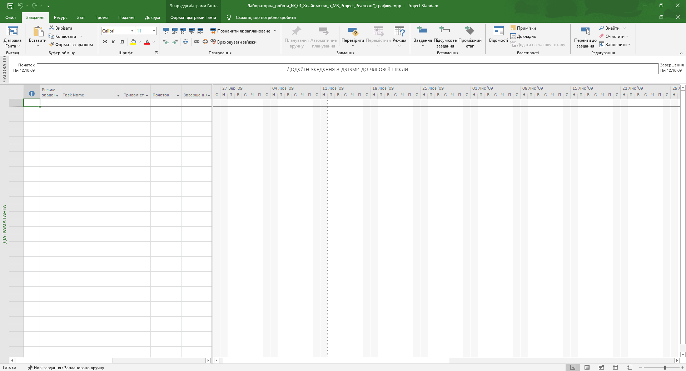

Рисунок 1 – Інтерфейс MS Project

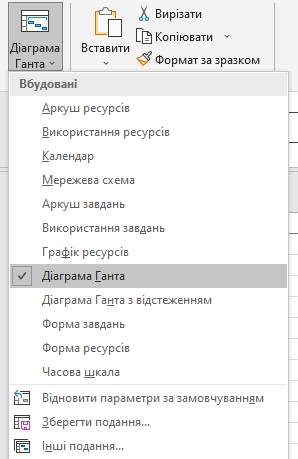

Рисунок 2 – Вбудовані подання MS Project

На рис. 1 діаграма Ганта зображена у правій половині. Це є графічне відображення календарного виконання проекту.

У лівій частині рисунка знаходиться поле у якому задаються завдання, при цьому є можливість задати наступні параметри:

- Назву завдання.
- Тривалість.
- Початок.
- Закінчення.
- Попередники.
- Назву ресурсів.

2. Починаємо реалізовувати план проекту.

Наведемо на прикладі.

Необхідно реалізувати проект з написання програмного продукту.

Він складається з наступних задач:

- Отримання завдання на реалізацію програмного продукту.
- Розробка плану та концепції реалізації програмного продукту.
- Написання програми.
- Тестування.
- Впровадження.
- Підтримка програмного продукту.

Кожна з задач має свої підзадачі, й тоді проект буде складатися наступним виглядом:

- Отримання завдання на реалізацію програмного продукту:
  - Зустріч з замовником.
  - Підписання договору.
  - Отримання завдання.
- Розробка концепції та плану реалізації програмного продукту.
  - Розробка концепції програмного продукту.
  - Затвердження концепції.
  - Розробка специфікації.

- Розробка календарного плану.
- Узгодження з замовником та затвердження специфікації й календарного плану.

  - Написання програми.
    - Вибір мови програмування.
    - Написання програмного продукту.
  - Тестування.
    - Вибір методів та систем тестування.
    - Тестування програмного продукту.
    - Обробка результатів тестування.
    - Усунення помилок.
  - Впровадження.
    - Написання файлу допомоги.
    - Встановлення програмного продукту.
    - Навчання персоналу користуванню програмний продуктом.
  - Підтримка програмного продукту.
    - Реалізація техпідтримки.
    - Випуск оновлень
    - Випуск нових версій продукту.

Розглянемо реалізацію цього проекту.

У поле назва завдань, впишемо назву проекту та назви усіх завдань.

**У це поле вписуються тільки назви завдань, тобто те, що треба зробити, а не те, хто це буде робити!!!!! Ті, хто будуть це робити – це ресурси!!!**

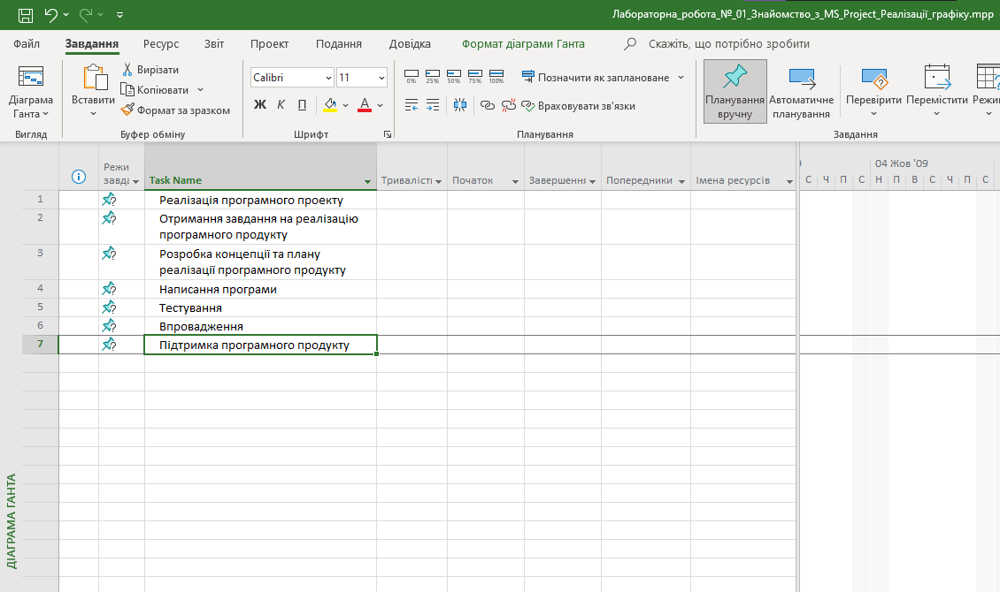

Рисунок 3 – Задачі реалізації проекту з написання програмного продукту

Усі задачі, які знаходяться нижче назви проекту, є для нього підзадачами, тому робимо їх підзадачами.

Для цього, лівою кнопкою миші, виділяємо усі задачі, крім назви проекту, як показано на рис. 4.

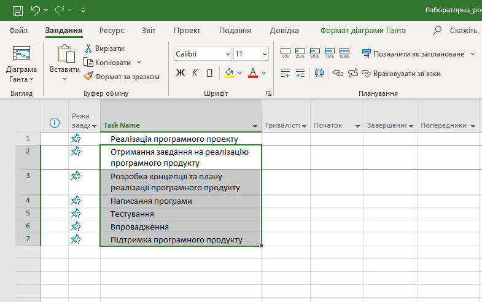

Рисунок 4 – Задачі, які потрібно зробити підзадачами

І використовуючи кнопку  на панелі кнопок швидкого доступу до функцій MS-Project, робимо наші основні задачі, підзадачами проекту.

Далі до виділених підзадач застосовуємо автоматичне планування 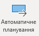 для автоматичного обчислення значень початку ,завершення та тривалості завдання (за замовчуванням датою початку та завершення задачі обирається поточна дата, а тривалість – 1 день)

Після виконання дій, описаних вище, отримуємо наступний вигляд проекту як показано на рис. 5:

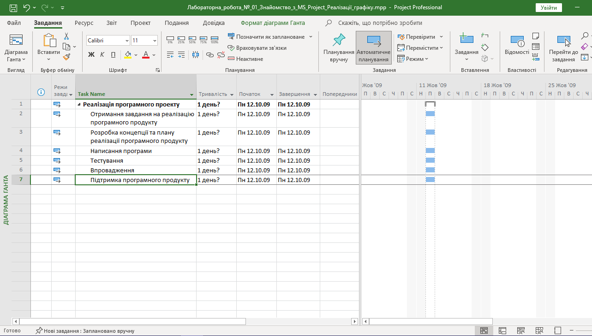

a)

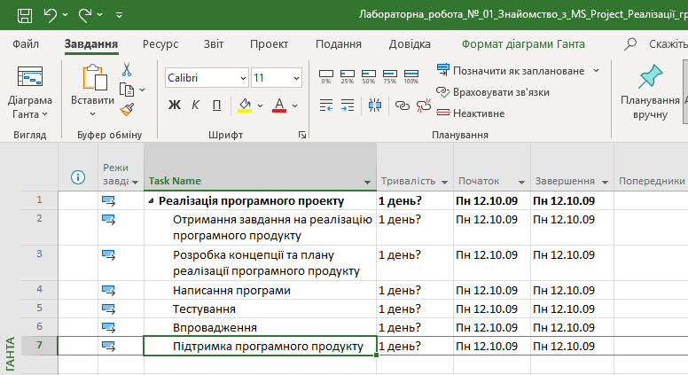

б)

Рисунок 5 – Вигляд діаграми Ганта із графіком (a), та автоматично спланованим списком завдань (б)

Наступним кроком додаємо підзадачі для кожного з завдань.

Для цього наведемо курсор на задачу, яка знаходиться нижче й натиснемо на кнопку «Завдання» 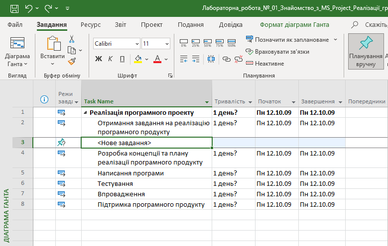, яка знаходиться на панелі швидкого доступу. Після виконання цієї дії поле прийме вигляд, зображений на рис. 6.

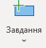

Рисунок 6 – Додане нове завдання

У нашому випадку, для першої задачі існує 3 підзадачі, тому створюємо 3 нові задачі, за таким же принципом, який описаний вище. У ці 3 поля вписуємо підзадачі для першої задачі, застосовуємо автоматичне плануванні та отримаємо вигляд, як зображено на рис. 7.

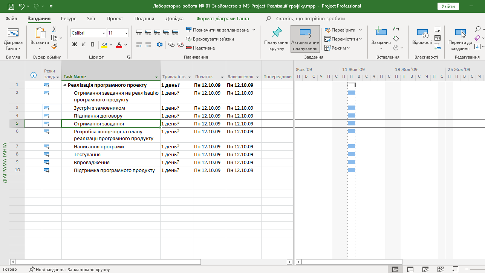

Рисунок 7 – Створені підзадачі для першої задачі

Й за алгоритмом наведеним вище, за допомогою кнопки , переводимо їх у стан підзадач. Отримуємо вигляд, як зображено на рис. 8.

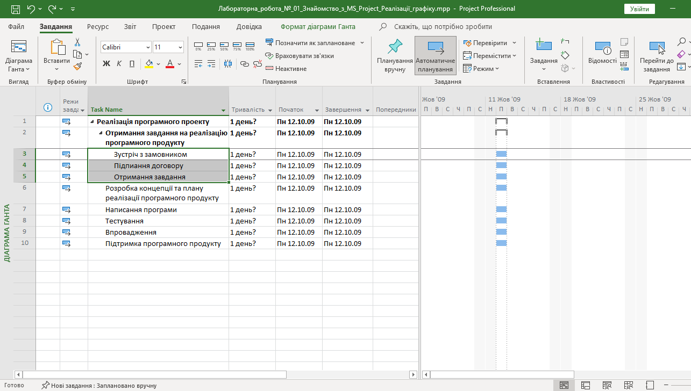

Рисунок 8 – Програмно створені підзадачі

Виконуємо ці дії для усіх задач та підзадач проекту. Після виконання усіх потрібних дій, отримуємо вигляд проекту, зображений на рис. 9.

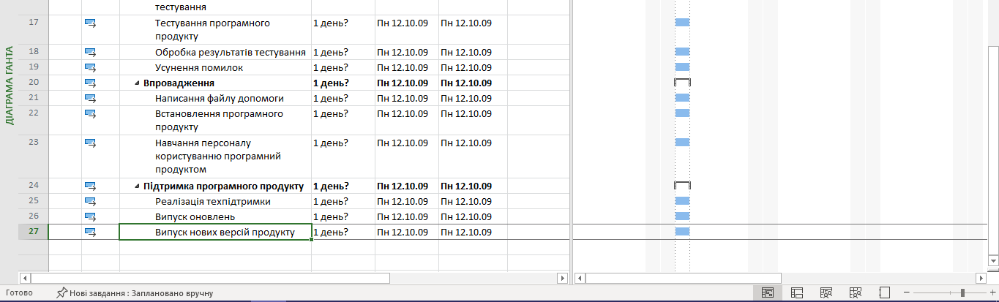

Рисунок 9 – Створені підзадачі для усіх задач проекту

У полі «Тривалість» виставимо кількість днів для кожної підзадачі (тривалість задачі обрахується автоматично) і отримуємо вигляд, як зображено на рис. 10.

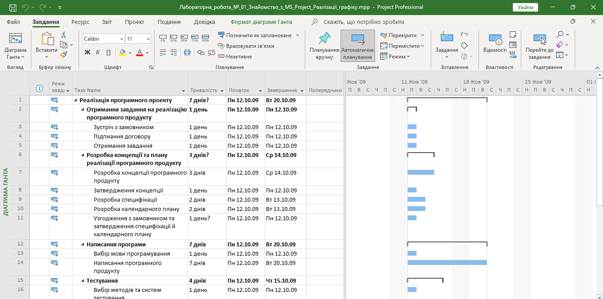

Рисунок 10 – Налаштована тривалість для усіх задач та підзадач

Наступним кроком є зв'язування завдань та задач одне за одним.

Для цього виконаємо наступні дії. У полі «Попередники» обираємо задачу, або завдання, яке було попереднім поточному.

Для цього на поточній задачі, або підзадачі на полі «Попередники» клікаємо два рази лівою кнопкою миші. Вискакує вікно, зображене на рис. 11.

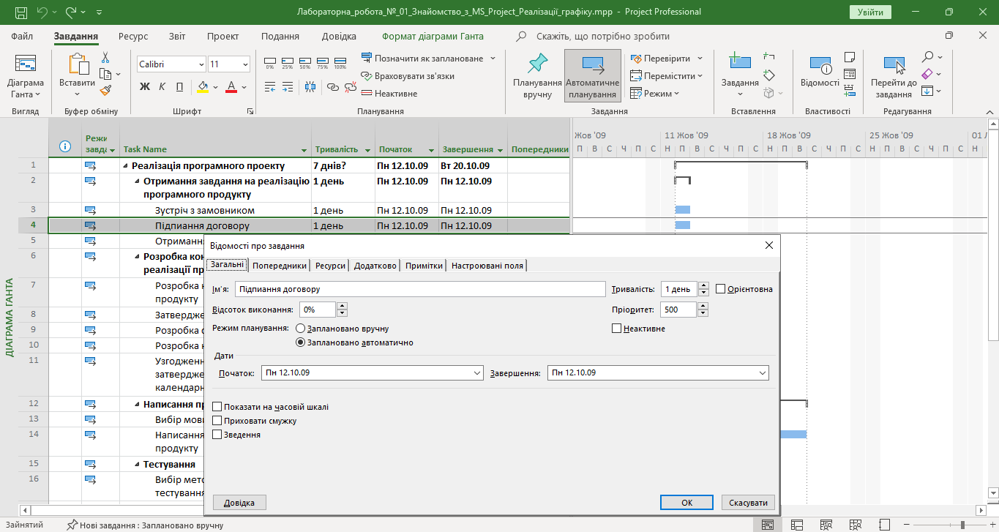

Рисунок 11 – Вікно дозволяє редагувати усі параметри, які відносяться до поточної задачі, або підзадачі

Це вікно дозволяє редагувати усі параметри, які відносяться до поточної задачі, або підзадачі.

У цьому вікні заходимо у закладку «Попередники», й обираємо ту задачу, яка є попередньою поточній (рис.12).

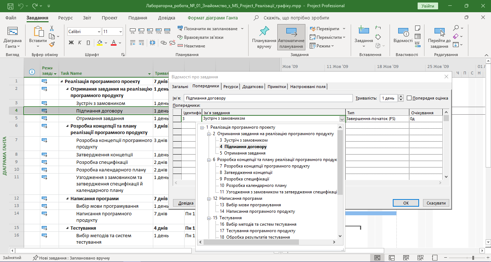

Рисунок 12 – Вибір попередника у закладці «Попередники»

Обираємо попередню задачу, й на діаграмі Гранта у правій половині вікна, поточна задача зв'язується з попередньою (рис. 13).

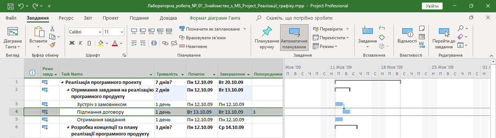

Рисунок 13 – Створений зв'язок між двома підзадачами

Виконуємо цю дію, для усіх задач, та підзадач і отримуємо вигляд проекту зображений на рис.14 і рис. 15.

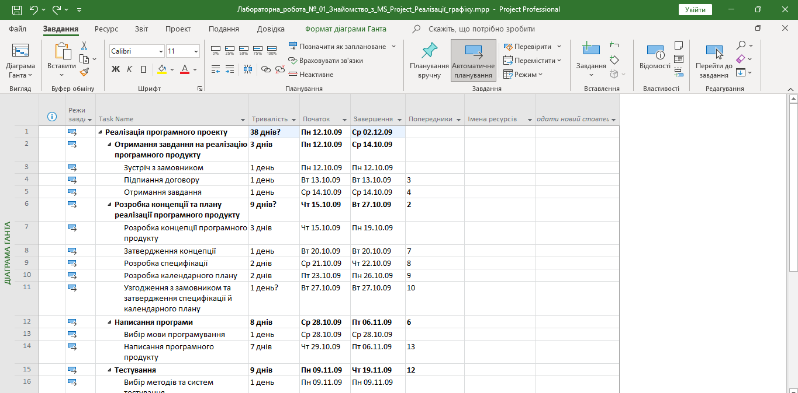

Рисунок 14 – Список усіх зв'язаних задач та підзадач

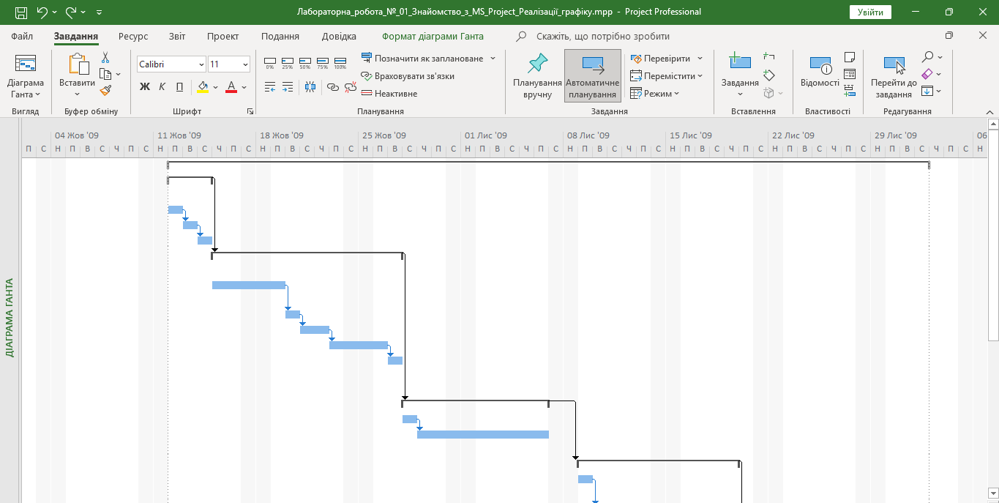

Рисунок 15 – Зв'язані задачі та підзадачі на діаграмі Ганта

На цьому Лабораторна робота № 1 вважається виконаною.

**ЗАВДАННЯ**

Вибрати тему проекту, що розробляється, та побудувати, за допомогою MS-Project план виконання проекту. Повинно бути не менш ніж 6-9 завдань, у кожному з них 3-4 підзадачі.

**Звіт з лабораторної роботи повинен містити наступні елементи:**

- Оформлена титульна сторінка.
- Завдання.
- Назва проекту, короткий його опис.
- Перелік задач та підзадач.
- Реалізований календарний план у MS-Project.
- Скріншот реалізованого календарного плану.

**Лабораторна робота вважається зарахованою при виконанні наступних умов:**

- Наявність звіту, оформленого згідно наведених вище вимог.
- Наявність реалізованого у MS-Project календарного плану виконання проекту.
- Співбесіда з викладачем, який приймає лабораторну роботу на наявність знань з даної тематики. (Або відповідь на контрольні питання наведені нижче.)

**КОНТРОЛЬНІ ЗАПИТАННЯ:**

1. Моделі розробки додатків?
2. Модель водоспаду?
3. Спіральна модель?
4. Універсальний процес?
5. Етапи (Універсальний процес)?
6. Фази (Універсальний процес)

7. Ітерації (Універсальний процес)
8. Компромісний трикутник
9. Принципи моделі процесу розробки
10. Версії продукту
11. Склад проєктної команди
12. Модель проєктної групи
13. Менеджер продукту
14. Менеджер програми
15. Розробник
16. Тестер
17. Інструктор
18. Логістик
19. Які завдання треба вирішити, щоб проєкт був вдалим
20. Ролі членів групи в моделі процесу розробки

**Лабораторна робота № 2 (семестр 3)**

**ТЕМА: Використання ресурсів у проекті.**

**МЕТА:** Отримати практичні навички в розробці плану проекту реалізації програмного продукту, чітко ставити цілі перед розробкою програми

**ЗНАТИ: Середовище MS-Project**

**ВМІТИ: Інсталювати й налаштувати середовище MS-Project. Мати навички роботи з MS-Project.**

**ТЕОРЕТИЧНІ ВІДОМОСТІ**

Наведені у опису лабораторної роботи № 1.

Теоретичні відомості з менеджменту проектів та створення проектних груп приведені у лекції № 1.

# ХІД ВИКОНАННЯ ЛАБОРАТОРНОЇ РОБОТИ

Завантажити проект, який почали виконувати на лабораторній роботі № 1.

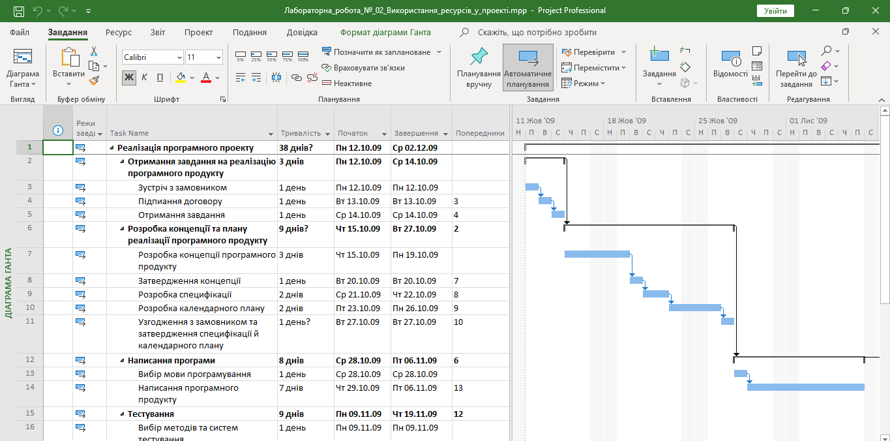

Рисунок 1 – Проект з лабораторної роботи № 1

У випадаючому списку, який знаходиться у верхній лівій частині інтерфейсу заходимо у панель «Аркуш ресурсів» (рис. 2).

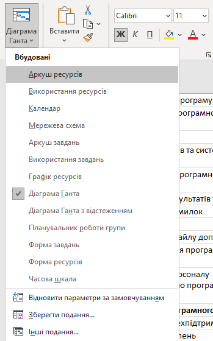

Рисунок 2 – Панель «Аркуш ресурсів» у випадаючому списку

У цьому полі заносимо усі види ресурсів, які нам будуть потрібні. Також виставимо зарплатню та витрати на одиницю ресурсу у полі «Звичайна ставка». Маємо отримати результат як на рис. 3.

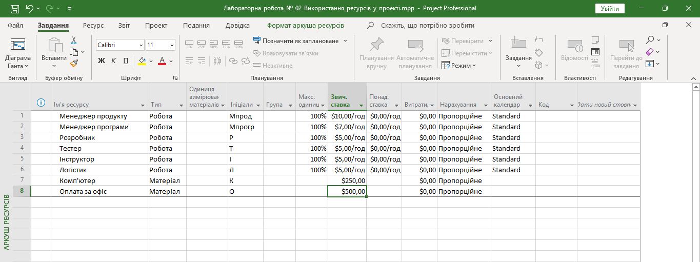

Рисунок 3 – Заповнені усі необхідні ресурси та їх вартість

Ресурси підрозділяються на 2 великі класи:

– трудовий – до цих ресурсів відносяться усі працівники та люди, які задіяні у процесі виконання проекту. Оплата цих ресурсів задається погодинно. (У нашому випадку це члени проектної групи)

– матеріальні – до цих ресурсів відносяться усі засоби виробництва, та інші витрати, які не пов'язані з трудовими ресурсами. (У нашому випадку це комп'ютери та витрати на утримання офісу)

Також є можливість встановити інші параметри ресурсів відповідно до потреб.

Після того, як встановили ресурси, є необхідність прив'язати ресурси до відповідних задач.

Для цього переходимо на діаграму Ганта, наводимо вказівник миші на кожну задачу та підзадачу, й двічі клікаємо лівою кнопкою миші. Вискакує вікно «Відомості по завдання». У цьому вікні заходимо у закладку «Ресурси» (рис. 4).

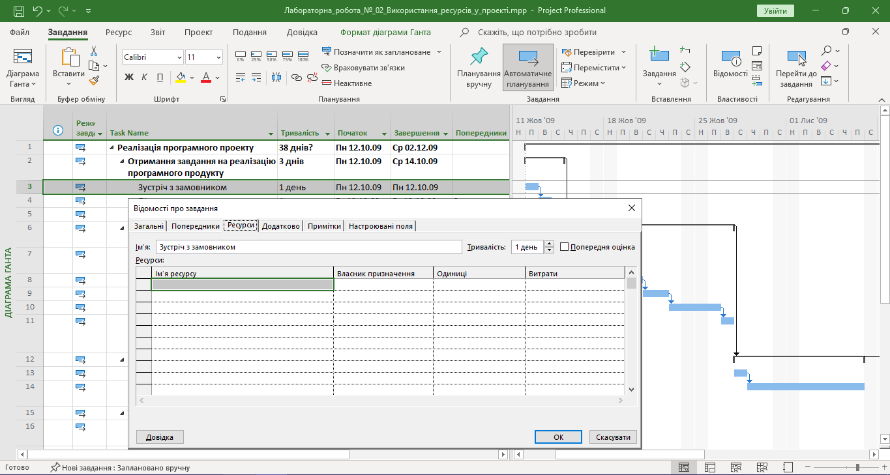

Рисунок 4 – Вкладка «Ресурси» у вікні «Відомості про завдання»

З випадаючого меню обираємо який ресурс нам потрібен, й скільки саме одиниць його нам потрібно (рис. 5).

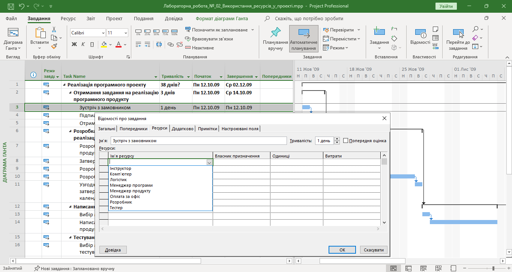

а)

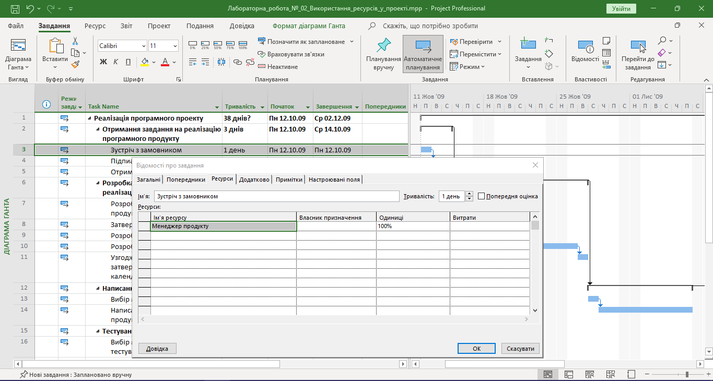

б)

Рисунок 5 – Випадаючий список для вибору ресурсу (а); обраний ресурс та його кількість (б)

Для трудових ресурсів 1 людина дорівнює 100%. Для матеріальних ресурсів одна одиниця техніки (наприклад) теж дорівнює 100%.

На діаграмі Ганта відображається ресурси, яки ми виділили на вирішення задачі (рис. 6).

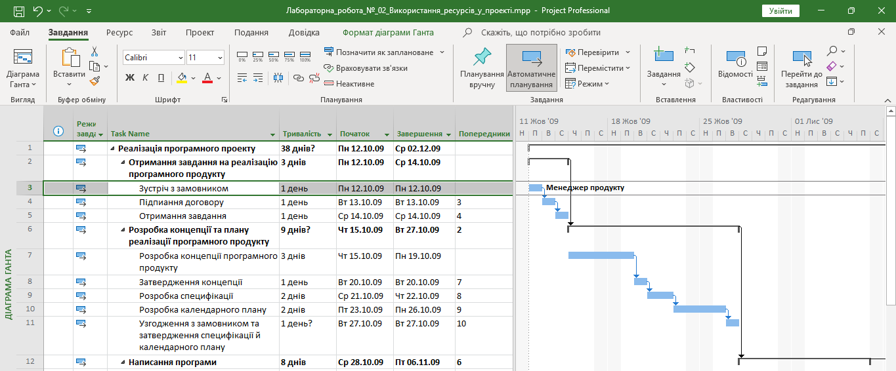

Рисунок 6 – Відображення обраного ресурсу на діаграмі Ганта

Щоб визначити скільки грошей потрібно для виконання задачі, наводимо мишу на відрізок на діаграмі Ганта й двічі клікаємо мишкою (рис. 7).

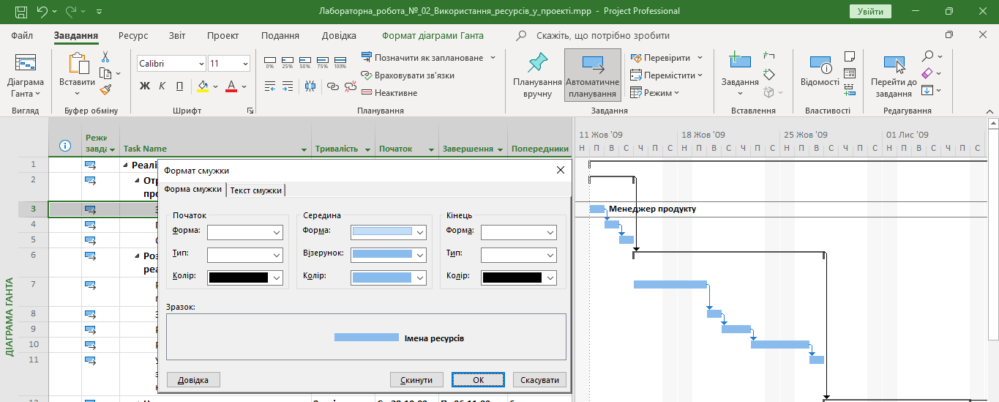

Рисунок 7 – Вікно «Формат смужки» для налаштування смужки діаграми

Переходимо у закладку «Текст смужки» (рис. 8).

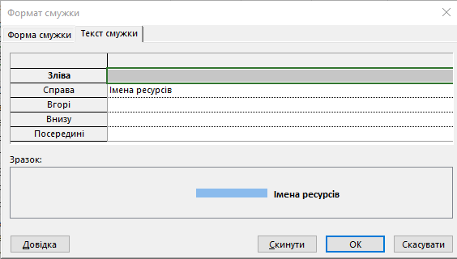

Рисунок 8 – Вкладка «Текст смужки» у вікні «Формат смужки»

Й обираємо з якої сторони будемо показувати затрати на використання ресурсу у даній задачі (у нашому прикладі оберемо знизу, рис. 9).

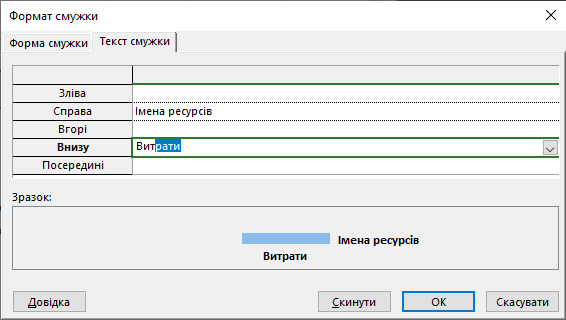

Рисунок 9 – Обрано показ витрат у полі «Внизу»

MS-Project сам автоматично підрахує затрати (рис. 10).

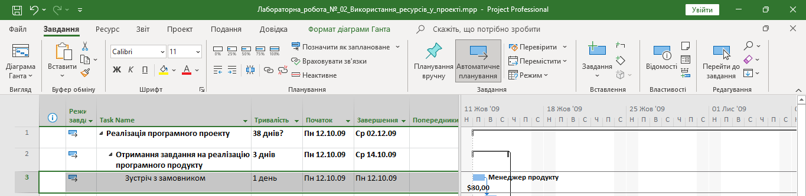

Рисунок 10 – Автоматично підраховані витрати на діаграмі Ганта

Далі у лабораторній роботі для усіх завдань виставляємо ресурси та розрахунок затрат. Таким чином реалізований проект повинен мати вигляд, зображений на рис. 11.

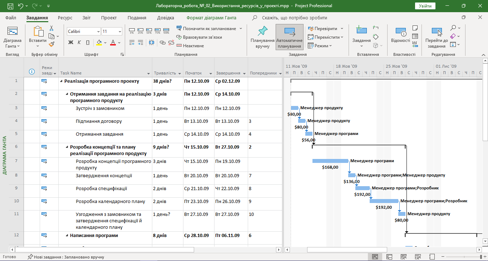

Рисунок 11 – Фінальний вигляд проекту

На цьому Лабораторна робота № 2 вважається виконаною.

**ЗАВДАННЯ**

Реалізувати календарний план з використання ресурсів у MS-Project.
Оцінити правдоподібність результатів

**Звіт з лабораторної роботи повинен містити наступні елементи:**
- Оформлена титульна сторінка.
- Завдання.
- Назва проекту, короткий його опис.
- Перелік задач та підзадач.
- Реалізований календарний план з використання ресурсів у MS-Project.
Оцінка правдоподібності результатів
- Скріншот реалізованого календарного плану з використання ресурсів.

**Лабораторна робота вважається зарахованою при виконанні наступних умов:**
- Написана на позитивну оцінку летуча контрольна робота.
- Наявність звіту, оформленого згідно наведених вище вимог.
- Наявність реалізованого у MS-Project календарного плану виконання проекту.
- Співбесіда з викладачем, який приймає лабораторну роботу на наявність знань з даної тематики. (Або відповідь на контрольні питання наведені нижче.

**КОНТРОЛЬНІ ЗАПИТАННЯ:**
1. Моделі розробки додатків?
2. Модель водоспаду?
3. Спіральна модель?
4. Універсальний процес?

5. Етапи (Універсальний процес)?
6. Фази (Універсальний процес)?
7. Ітерації (Універсальний процес)?
8. Компромісний трикутник?
9. Принципи моделі процесу розробки?
10. Версії продукту?
11. Склад проєктної команди?
12. Модель проєктної групи?
13. Менеджер продукту?
14. Менеджер програми?
15. Розробник?
16. Тестер?
17. Інструктор?
18. Логістик?
19. Які завдання треба вирішити, щоб проєкт був вдалим?
20. Ролі членів групи в моделі процесу розробки?

Лабораторна робота №3 (семестр 3)

**ТЕМА:** Написання специфікації на програму, що розробляється

**МЕТА:** Отримати практичні навички в розробці специфікацій програм, чітко ставити цілі перед розробкою програми

**ЗНАТИ:** Будь яку мову програмування

**ВМІТИ:** Інсталювати IDE (інтегроване середовище розробки) у якій буде розроблюватися програма. Знати основи розробки програм під ОС Windows. Уміти користуватися текстовим редактором.

### ТЕОРЕТИЧНІ ВІДОМОСТІ

Теоретичні відомості наведені у лекції № 2.

У зв'язку з великим об'ємом інформації використовувати електронну документацію (погоджувати з лектором).

### ЗАВДАННЯ

1. Вибрати тему програми, що розробляється, з напрямів: системні утиліти; мультимедія; ігрова програма; графіка; Інтернет; офіс.

**Примітка.** Можливий вибір теми вже розробленої програми для її подальшої модифікації в наступних випадках:
– Коли програма була реалізована студентом як курсовий проєкт, курсова робота або самостійна робота на кафедрі;
– Коли студент брав участь в розробці програми або зацікавлений в модифікації чужої програми. Якщо ліцензія поширення програми (Freeware) дозволяють її використання.

2. У текстовому виді розробити специфікацію програми (див. приклад порядку виконання роботи).

**ПРИКЛАД ПОРЯДКУ ВИКОНАННЯ РОБОТИ.**

Специфікація програми повинна відповідати наступному змісту.

1. Загальний опис
   1.1 Вхідні дані
   1.2 Вихідні дані
   1.3 Опис файлів, що входять в пакет
2. Опис архітектури
3. Функціональні вимоги

**ЯК ПРИКЛАД РОЗГЛЯНЕМО СПЕЦИФІКАЦІЮ ПРОГРАМИ «КАЛЬКУЛЯТОР».**

**1. Загальний опис**

Калькулятор складається з трьох модулів – «Графічний інтерфейс», «Модуль, що аналізує і обчислює введений вираз» (AnalaizerClass.dll) і «Модуль, що реалізовує математичні функції» (CalcClass.dll). Після того, як користувач введе обчислюване вираження одним з двох вищеописаних способів, управління передається аналізуючому модулю, який форматує вираз, виділяючи числа і оператори, перевіряє коректність дужкової структури, а також виявляє невірні з точки зору математики конструкції (наприклад, $3*+3$), переводить вираз в зворотний польський запис, після чого обчислює вирази, використовуючи математичні функції з модуля CalcClass. Користувач також може користуватися довідковою системою для уточнення тонкощів роботи програми.

**2. Опис інтерфейсу**

**2.1. Вхідні дані**

**2.1.1. Параметри виклику (формат командного рядка)**

`calc.exe [expression]`

expression – математичний вираз, що задовольняє вимозі 3.2

**2.1.2. Стан інформаційного оточення**

У папці з програмою також знаходяться файли CalcClass.dll, AnalaizerClass.dll

2.2.Вихідні дані

### 2.2.1. Коди повернення програми

Число і 0 на новому рядку – результат обчислення виразу.

Error: <повідомлення про помилку> і код помилки на новому рядку – повідомлення про помилку у разі невідповідності вхідного виразу вимогам 3.2

### 2.2.2. Стан інформаційного оточення після завершення програми

У папці з програмою також знаходяться файли CalcClass.dll, AnalaizerClass.dll

### 2.2.3. Повідомлення про помилки, що видаються програмою (коди помилок)

Error 01 at <i> – неправильна дужкова структура, помилка на <i> символі
Error 02 at <i> – невідомий оператор на <i> символі.
Error 03 – невірна синтаксична конструкція вхідного виразу
Error 04 at <i> – Два підряд оператора на <i> символі.
Error 05 – Незавершений вираз.
Error 06 – Занадто мале або занадто велике значення числа для int.
Числа мають бути в межах від $-2147483648$ до $2147483647$
Error 07 – Занадто довгий вираз. Максмальная довжина – 65536 символів.
Error 08 – Сумарна кількість чисел і операторів перевищує 30
Error 09 – Помилка ділення на 0.

### 2.3.Опис файлів, що входять в пакеті калькулятора

CalcClass.dll – бібліотека, в якій реалізовані усі необхідні математичні функції.

AnalaizerClass.dll – модуль, в якому реалізований синтаксичний розбір виразу, а також його обчислення.

calc.exe – графічна оболонка, головний модуль.

Calc.hlp – довідкова система програми

## 3. Опис архітектури

Як вже відзначалося вище, в архітектурі системи виділено 3 модулі. Кожен з модулів займається певним завданням. Відповідно, Система — це взаємодія цих 3-х модулів. Розглянемо їх детальніше.

1. Модуль математичних операцій (CalcClass.dll)

Модуль містить усі математичні функції, використовувані в програмі.

```csharp
/// <summary>
/// Функція складання числа a i b
/// </summary>
/// <param name="a">доданок</param>
/// <param name="b">доданок</param>
/// <returns>сума</returns>
public static int Add(long a, long b)

/// <summary>
/// функція віднімання чисел a i b
/// </summary>
/// <param name="a">зменшуване</param>
/// <param name="b">від'ємник</param>
/// <returns>різниця</returns>
public static int Sub(long a, long b)

/// <summary>
/// функція множення чисел a i b
/// </summary>
/// <param name="a">множник</param>
/// <param name="b">множник</param>
/// <returns>добуток</returns>
public static int Mult(long a, long b)

/// <summary>
/// функція знаходження частки
/// </summary>
/// <summary>
```

```csharp
/// <param name="a">ділиме</param>
/// <param name="b">дільник</param>
/// <returns>частка</returns>
public static int Div(long a, long b)

/// <summary>
/// функція ділення по модулю
/// </summary>
/// <param name="a">ділиме</param>
/// <param name="b">дільник</param>
/// <returns>залишок</returns>
public static int Mod(long a, long b)

/// <summary>
/// унарний плюс
/// </summary>
/// <param name="a"></param>
/// <returns></returns>
public static int ABS(long a)

/// <summary>
/// унарний мінус
/// </summary>
/// <param name="a"></param>
/// <returns></returns>
public static int IABS(long a)
```

Використовується також глобальна змінна:

```csharp
/// <summary>
/// Останнє повідомлення про помилку.
/// Поле і властивість для нього
/// </summary>
private static string _lastError = "";
public static string lastError
```

2. Модуль аналізу і обчислення виразів

Складається з наступних методів і властивостей :

```csharp
/// <summary>
/// позиція виразу, на якій найдена
/// синтаксична помилка (у разі знаходження на етапі
/// виконання – не визначається)
/// </summary>
private static int erposition = 0;

/// <summary>
/// Вхідний вираз
/// </summary>
public static string expression = ««;

/// <summary>
/// Показує, чи є необхідність у виведенні
/// повідомлень про помилки. У разі консольного запуску
/// програми це значення – false.
/// </summary>
public static bool ShowMessage = true;

/// <summary>
/// Перевірка коректності дужкової структури вхідного
/// виразу
/// </summary>
/// <returns>true – якщо усе нормально, false – якщо є
///помилка</returns>
/// метод біжить по вхідному виразу, символ за
/// символом аналізуючи його і рахуючи кількість
/// дужок. У разі виникнення помилки повертає false
/// а в erposition записує позицію, на якій виникла
/// помилка.
public static bool CheckCurrency()

/// <summary>
```

```csharp
/// Форматує вхідний вираз, виставляючи між
/// операторами пропуски і видаляючи зайві, а також
/// відловлює нерозпізнані оператори, стежить за кінцем
/// рядка а також відловлює помилки на кінці рядка
/// </summary>
/// <returns>кінцевий рядок або повідомлення про
/// помилку, що починаються із спец. символу &
/// </returns>
public static string Format()
/// <summary>
/// Створює масив, в якому розташовуються оператори і
/// символи, представлені в зворотному польському записі
/// /// (бездужковий)
/// На цьому ж етапі відловлюються майже усі інші
/// помилки (див. код). По суті – це компіляція.
/// </summary>
/// <returns>масив зворотного польського
/// запису</returns>
public static System.Collections.ArrayList CreateStack()
/// <summary>
/// Обчислення зворотного польського запису
/// </summary>
/// <returns>результат обчислень або повідомлення про
/// помилку</returns>
public static string RunEstimate()
/// <summary>
/// Метод, організуючий обчислення. По черзі запускає
/// CheckCorrncy, Format, CreateStack і RunEstimate
/// </summary>
/// <returns></returns>
public static string Estimate()
```

3.  <u>Модуль графічного інтерфейсу</u> – забезпечує управління системи в графічній формі. Основні функції цього модуля – введення і виведення даних.

Взаємодія модулів, у вигляді структурної схеми, показана на рисунку:

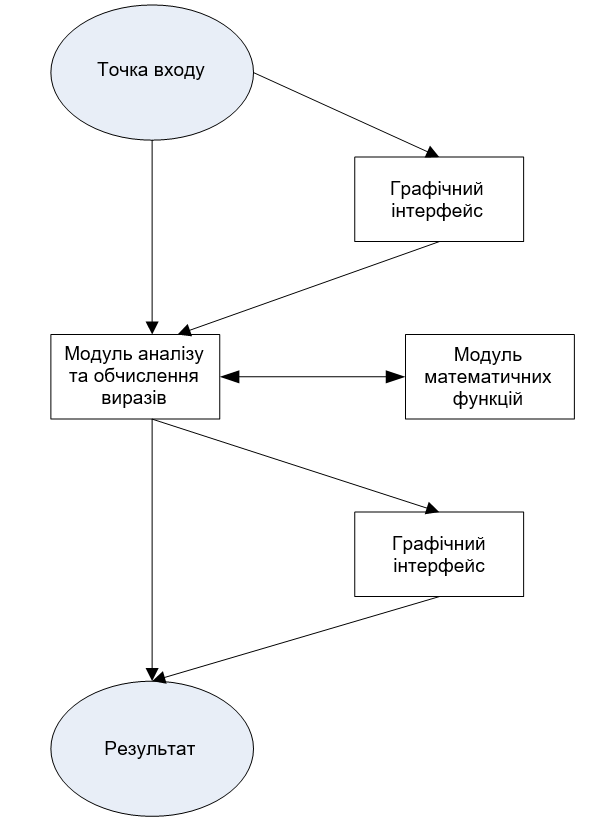

4. **Функціональні вимоги**

4.1. **Вимоги до програми**

4.1.1. Калькулятор повинен виконувати наступні арифметичні операції: складання, віднімання, множення, знаходження частки, знаходження залишку. Специфікацію на них см 3.2.

4.1.2. Калькулятор повинен підтримувати роботу з цілими числами в межах від $-2147483648$ до $2147483647$ (надалі $\text{MININT}$ і $\text{MAXINT}$). У разі виходу за ці межі повинне видаватися повідомлення про помилку $\text{Error } 06$.

4.1.3. Калькулятор повинен мати пам'ять на одне ціле число, а також можливість виводити це число на екран, скидати його значення на $0$ і додавати до нього будь-яке інше число, введене в поле введення.

4.1.3.1. При натисненні на клавішу $\text{M+}$ до числа, записаного в пам'ять, додається число, записане в полі «Результат». При цьому на складання накладаються обмеження з 3.2.1.

4.1.3.2. Якщо в полі «Результат» записаний код помилки, то при натисненні на клавішу $\text{M+}$ повинне видаватися повідомлення «Неможливо перетворити до числа».

4.1.3.3. При натисненні на кнопку $\text{MC}$ число в пам'яті обнуляється.

4.1.3.4. При натисненні на кнопку $\text{MR}$ число з пам'яті приписується в кінець виразув рядку «Вираз».

4.1.4. Калькулятор повинен надавати можливість користувачеві працювати з операціями унарного плюса і унарного мінуса.

4.1.4.1. Якщо між натисненнями на кнопку $\langle+/-\rangle$ проходить менше $3$ секунд, то введений оператор міняється на протилежного.

4.1.4.2. Якщо між натисненнями на кнопку $\langle+/-\rangle$ проходить більше $3$ секунд, то до вираження дописується знак «-».

4.1.5. Калькулятор повинен мати графічний інтерфейс, що містить кнопки з цифрами і арифметичними операціями, кнопкою рівності, кнопками роботи з пам'яттю, кнопками редагування дужок і кнопками скидання, перемикачем

унарного мінуса/унарного плюса, текстовими полями для введення виразу і виведення результату.

**4.1.6.** При натисненні на клавішу <Enter> калькулятор повинен проводити обчислення виразу.

**4.1.7.** При натисненні на клавішу <ESC> програма повинна припиняти свою роботу.

**4.1.8.** У разі невірно побудованого обчислюваного виразу або невідповідності його вимогам 3.2 в текстове вікно результат повинно виводитися відповідні повідомлення (см 2.2.3)

## 4.2. Арифметичні операції

### 4.2.1. Складання

**4.2.1.1.** Для чисел, кожне з яких менше або рівне MAXINT і більше або рівне MININT, функція підсумовування повинна повертати правильну суму з точки зору математики.

**4.2.1.2.** Для чисел, сума яких більше ніж MAXINT і менше ніж MININT, а також у разі, якщо будь-який з доданків більше ніж MAXINT або менше ніж MININT, програма повинна видавати помилку Error 06(см 2.2.3).

### 4.2.2. Віднімання

**4.2.2.1.** Для чисел, кожне з яких менше або рівне MAXINT і більше або рівне MININT, функція віднімання повинна повертати правильну різницю з точки зору математики.

**4.2.2.2.** Для чисел, різниця яких більше ніж MAXINT і менше ніж MININT, а також у разі, якщо будь-яке з чисел більше ніж MAXINT або менше ніж MININT, програма повинна видавати помилку Error 06(см 2.2.3).

### 4.2.3. Множення

**4.2.3.1.** Для чисел, добуток яких менше або рівне MAXINT і більше або рівне MININT, функція множення повинна повертати правильний добуток з точки зору математики.

**4.2.3.2.** Для чисел, добуток яких більше ніж MAXINT і менше ніж MININT, а також у разі, якщо будь-який з множників більше ніж MAXINT або менше ніж MININT, програма повинна видавати помилку Error 06(см 2.2.3).

**4.2.4.** Знаходження частки

**4.2.4.1.** Для чисел, менших або рівних MAXINT і великих або рівних MININT, частка яких менше або рівне MAXINT і більше або рівне MININT і дільник не рівний 0, функція ділення повинна повертати правильну частку з точки зору математики.

**4.2.4.2.** Для чисел, частка яких більше ніж MAXINT і менше ніж MININT, а також у разі, якщо будь-яке з чисел більше ніж MAXINT або менше ніж MININT, і для дільника, не рівного 0, програма повинна видавати помилку Error 06(см 2.2.3).

**4.2.4.3.** Якщо дільник дорівнює 0, програма повинна видавати помилку Error 09.

**4.2.5.** Ділення із залишком

**4.2.5.1.** Для чисел, менших або рівних MAXINT і більших або рівних MININT, залишок яких менше або рівний MAXINT і більше або рівний MININT і дільник не рівний 0, функція ділення повинна повертати правильний залишок з точки зору математики.

**4.2.5.2.** Для чисел, залишок яких більше ніж MAXINT і менше ніж MININT, а також у разі, якщо будь-яке з чисел більше ніж MAXINT або менше ніж MININT, і для дільника, не рівного 0, програма повинна видавати помилку Error 06(см 2.2.3).

**4.2.5.3.** Якщо дільник дорівнює 0, програма повинна видавати помилку Error 09.

**4.2.6.** Унарний плюс \ мінус

**4.2.6.1.** Для чисел, менших або рівних MAXINT і великих або рівних MININT, операція унарного плюса / мінуса повинна повертати число відповідного знаку.

**4.2.6.2.** Для чисел, великих MAXINT або менших MININT, функція повинна видавати помилку Error 06 (см 2.2.3).

**4.3. Додаткові вимоги до вхідного вираження**

**4.3.1.** Максимальне сумарне число операторів і чисел — 30.

**4.3.2.** Максимальна глибина вкладеності дужкової структури — 3.

**4.3.3.** Як унарний мінус використовується символ «m», як унарний плюс — «p».

**4.3.4.** Для операції знаходження частки — «/», для знаходження залишку — «mod».

**4.3.5.** Між операторами дужками і числами може бути будь-яка кількість пропусків.

**4.3.6.** Дозволяється використовувати лише дужки виду «(» та «)».

**4.3.7.** Максимальна довжина виразу — 65535 символів.

**Звіт з лабораторної роботи повинен містити наступні елементи:**
- Оформлена титульна сторінка.
- Завдання.
- Назва проекту, короткий його опис.
- Реалізована специфікація.

**Лабораторна робота вважається зарахованою при виконанні наступних умов:**
- Написана на позитивну оцінку летуча контрольна робота.
- Наявність звіту, оформленого згідно наведених вище вимог.
- Наявність реалізованої специфікації.
- Співбесіда з викладачем, який приймає лабораторну роботу на наявність знань з даної тематики. (Або відповідь на контрольні питання наведені нижче).

**КОНТРОЛЬНІ ЗАПИТАННЯ:**

1. Програмне забезпечення.
2. Види програмного забезпечення
3. Розробка програмного забезпечення
4. Класи програмного забезпечення
5. Розробка вимог до програмної системи
6. Види вимог до програмного забезпечення за рівнями
7. Види вимог до програмного забезпечення за характером
8. Джерела вимог до програмного забезпечення
9. Методи знаходження вимог до програмного забезпечення
10. Документування вимог до програмного забезпечення
11. Програмна документація
12. Види програмних документів
13. Специфікація вимог до програмного забезпечення
14. Прецеденти
15. Загальний план специфікації вимог до ПЗ
16. Вимоги до зовнішніх інтерфейсів у специфікації
17. Атрибути програмного продукту

Лабораторна робота №4 (семестр 3)

**ТЕМА:** Моделювання інформаційних систем з використанням CASE засобів.

**МЕТА:** Знайомство з уніфікованою мовою моделювання (UML), знайомство з пакетом візуального моделювання MS-Visio і отримання навичок моделювання конкретної інформаційної системи в CASE системі.

**ЗНАТИ:** Будь яку мову програмування.

**ВМІТИ:** Основи роботи з Microsoft MS-Visio.

**ТЕОРЕТИЧНІ ВІДОМОСТІ**

Теоретичні відомості наведені у лекції № 4.

У зв'язку з великим обсягом інформації використовувати електронну документацію (погоджувати з лектором).

**ЗАВДАННЯ**

**На основі розробленої специфікації в ЛР № 3:**
1. **Створити графік розробки і запуску продукту**
2. **Описати структуру проекту розробленого у ході виконання лабораторних робіт № 1-2**

1. **Створення графіку розробки і запуску продукту.**

Проект необхідно реалізовувати той, який був зроблений у ході виконання лабораторних робіт № 1-2.

Для цього необхідно створити проект Microsoft Visio. При запуску проекту з'явиться вікно, зображене на рис. 1.

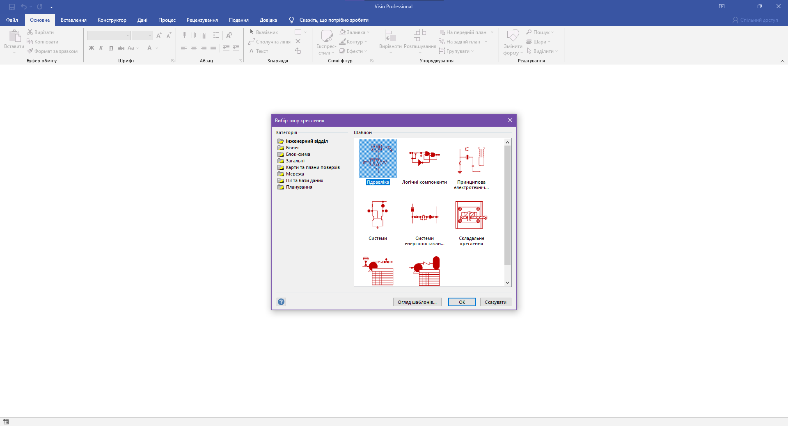

Рисунок 1 – Стартове вікно Microsoft Visio

У цьому вікні обираємо **Планування > Часова шкала** (рис. 2).

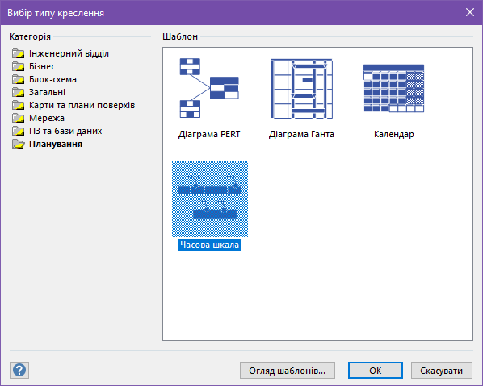

Рисунок 2 – Створення часової шкали у стартовому вікні

Далі натискаємо кнопку «ОК» і маємо вигляд інтерфейсу, зображений на рис. 3.

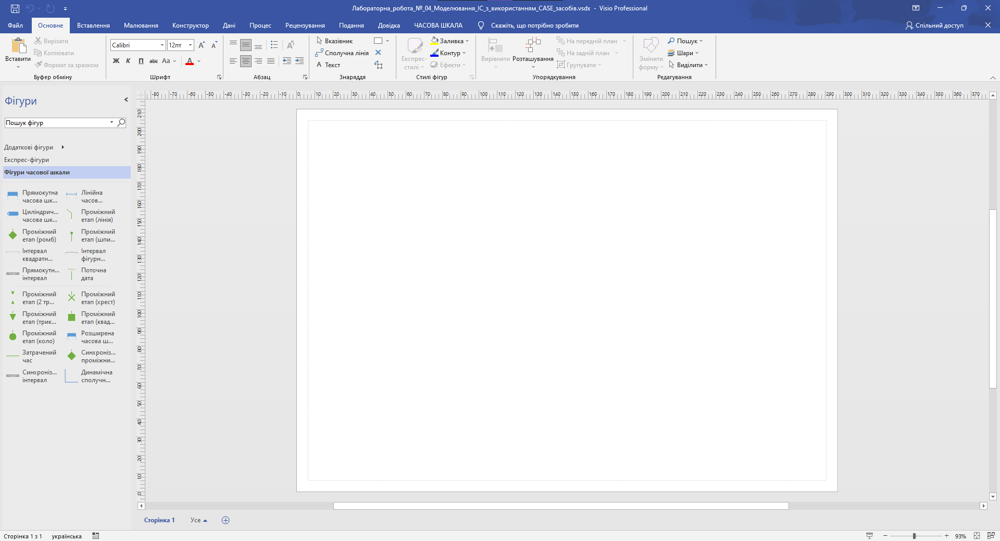

Рисунок 3 – Початковий інтерфейс для створення часової шкали

Далі переходимо на вкладку «Часова шкала», яка знаходиться зверху і обираємо «Імпорт даних» (рис. 4)


Рисунок 4 – Функція «Імпорт даних» у вкладці «Часова шкала»

Після натискання маємо вікно Майстра імпорту часової шкали (рис. 5), у якому маємо вибрати файл Microsoft Project, із якого імпортувати дані (у нашому випадку – проєкт із лабораторної роботи №2). Натискаємо кнопку «Огляд…», шукаємо і обираємо файл проєкту, натискаємо «Далі >»

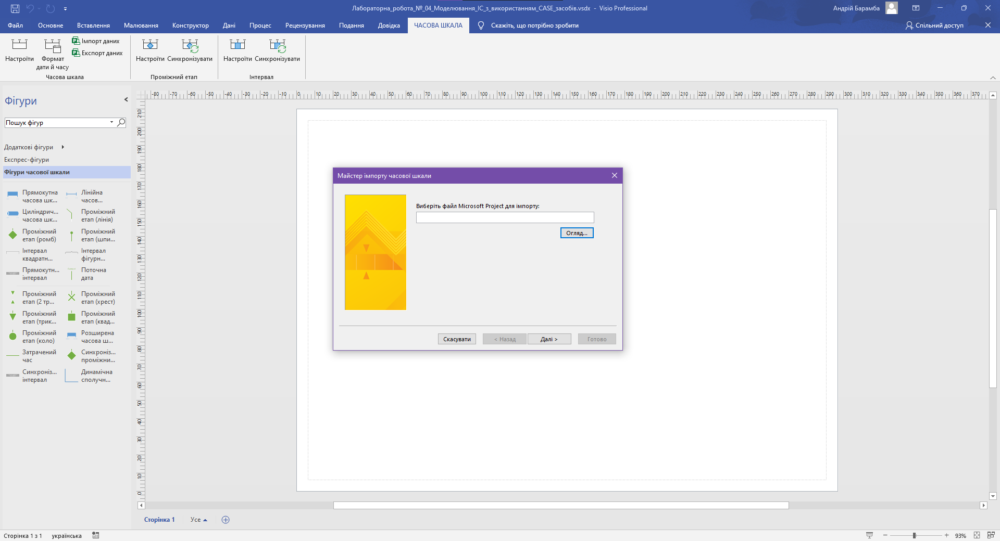

Рисунок 5 – Вікно Майстра імпорту часової шкали

У наступному вікні, що зображено на рис. 6, обираємо варіант «Лише підсумкові завдання», натискаємо «Далі >».

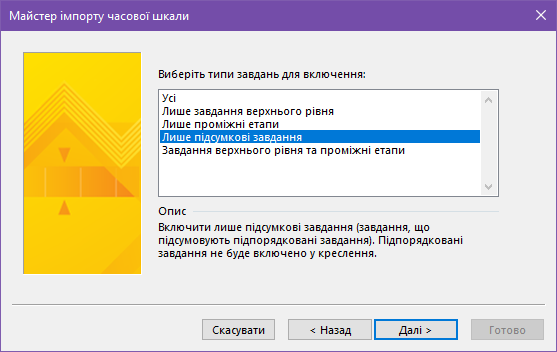

Рисунок 6 – Вибір типів завдань для включення

66

На всіх наступних вікнах не змінюємо нічого, на останньому вікні натискаємо «Готово» і маємо вигляд часової шкали, зображений на рис. 7.

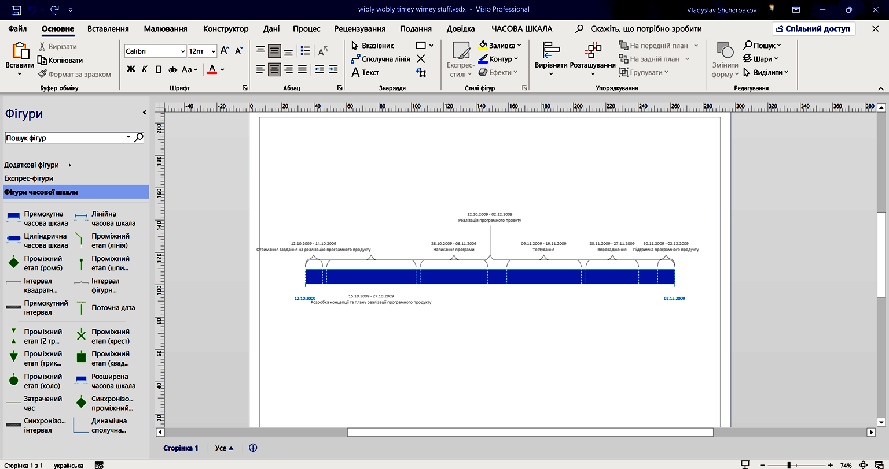

Рисунок 7 – Автоматично створена часова шкала

Далі трохи редагуємо часову шкалу і маємо вигляд, зображений на рис. 8.

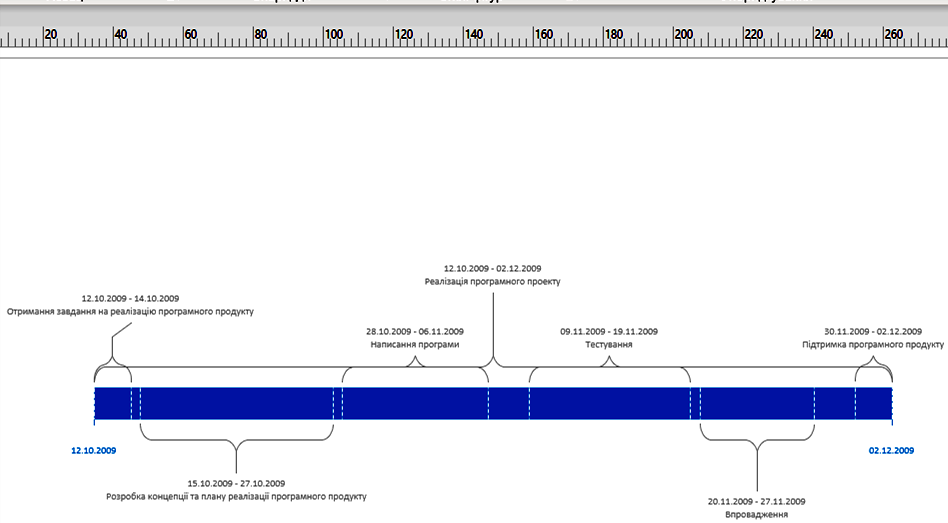

Рисунок 8 – Відредагована часова шкала

2. Опис структури проекту розробленого у ході виконання лабораторних робіт № 1-2.

Для виконання цього завдання потрібно **зробити блок-схему та UML-діаграму**.

**Блок-схему** можна створити двома способами:

1. Створити новий проект Microsoft Visio і у стартовому вікні обираємо **Блок-схема > Проста блок-схема** (рис. 9).

2. Створити проект виконуючи наступні дії: **Файл > Створити > Проста блок-схема** (рис. 10).

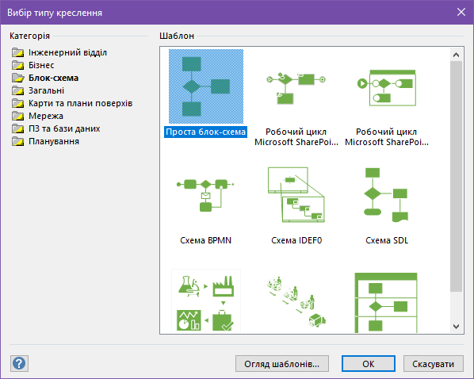

Рисунок 9 – Створення блок-схеми через стартове вікно нового проекту

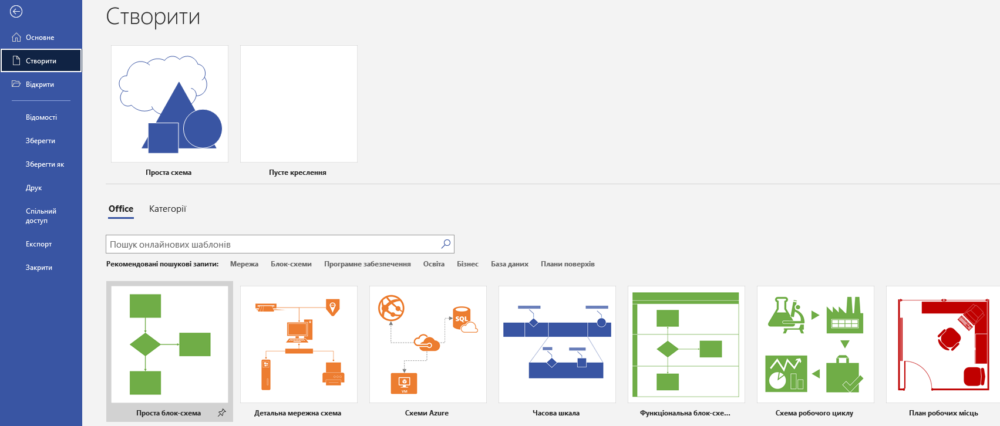

Рисунок 10 – Створення блок-схеми на вкладці «Файл»

Після створення проекту тим чи іншим способом, маємо інтерфейс, зображений на рис. 11

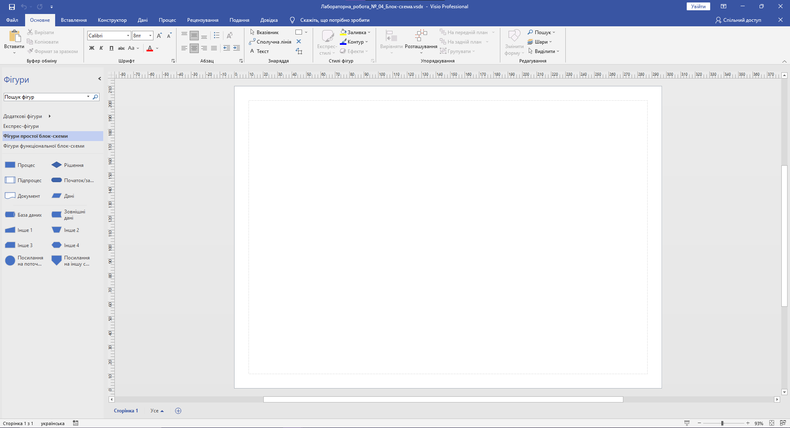

Рисунок 11 – Початковий інтерфейс для створення блок-схеми

69

Після цього перетягуючи відповідні фігури на полотно створити блок-схему виконання проекту, який був описаний у Лабораторній роботі №1-2.

**UML-діаграму** також можна створити двома способами:

1. Створити новий проект Microsoft Visio і у стартовому вікні обираємо **ПЗ та бази даних > Клас UML** (рис. 12).
2. Створити проект виконуючи наступні дії: **Файл > Створити > Клас UML**.

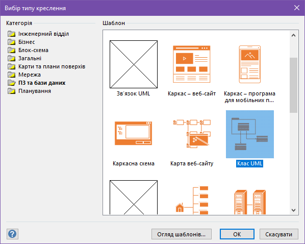

Рисунок 12 – Створення UML-діаграми через стартове вікно нового проекту

Після створення проекту тим чи іншим способом, маємо інтерфейс, зображений на рис. 13

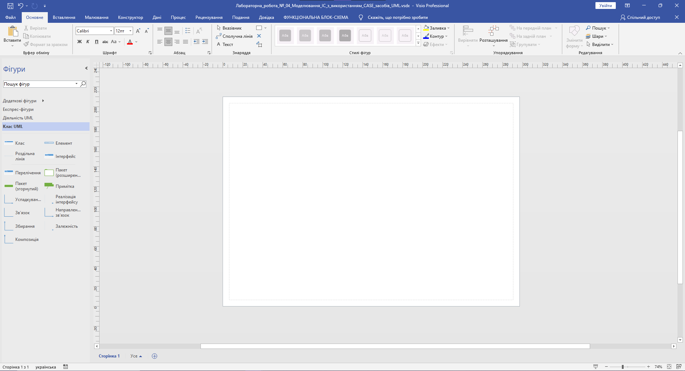

Рисунок 13 – Початковий інтерфейс для створення UML-діаграми

Зліва маємо меню з елементами діаграми. Перетаскуємо елемент «Клас» на діаграму, даємо йому назву першого етапу розробки ПЗ (Отримання завдання на реалізацію програмного продукту) і у поля під назвою записуємо перші два підпункти етапу (Зустріч з замовником, Підписання договору) (рис. 14).

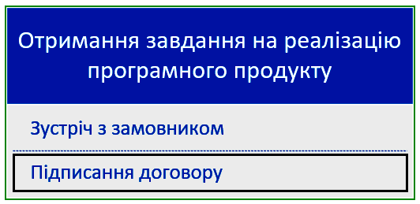

Рисунок 14 – Перший етап розробки і перші два підпункти розробки

Щоб додати нове поле для третього пункту, із меню до класу знизу додаємо елемент «Елемент» та розділяємо його із попереднім за допомогою елементу «Роздільна лінія» (рис. 15).

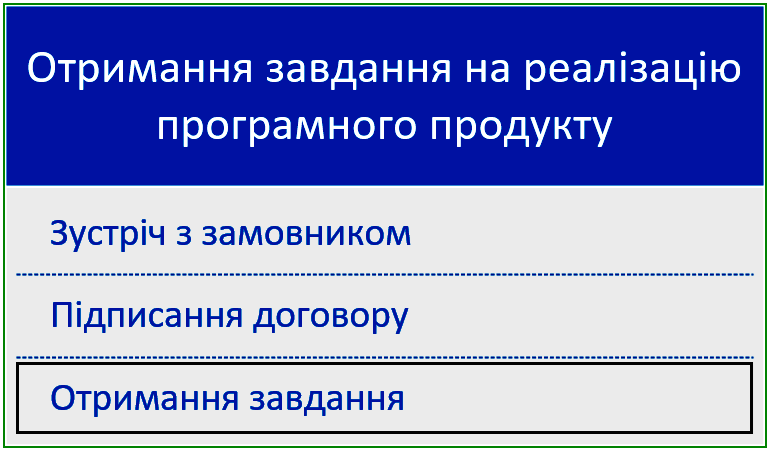

Рисунок 15 – Повністю описаний перший етап розробки ПЗ

Аналогічно створюємо блоки для наступних етапів і по закінченню з'єднуємо їх стрілками (рис. 16)

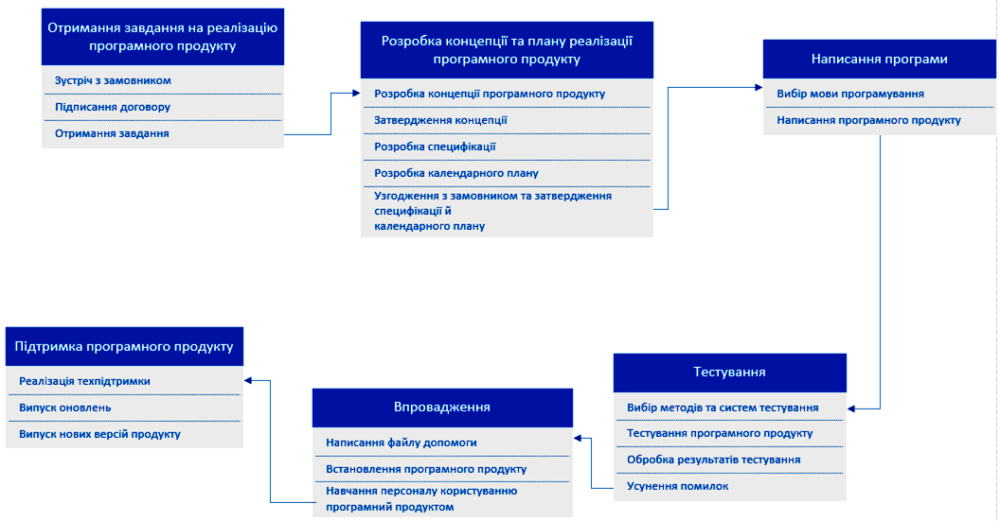

Рисунок 16 – Готова UML-діаграма проекту

**3. Завдання: Створити блок схему та UML-діаграму програмного забезпечення, специфікація якого наведена у лабораторній роботі №3.**

Дії аналогічно пункту 2.

**Звіт з лабораторної роботи повинен містити наступні елементи:**
- Оформлена титульна сторінка.
- Завдання.
- Назва проекту, короткий його опис.
- Перелік задач та підзадач.
- Реалізоване завдання з використанням MS-Visio.
- Скріншоти реалізованих завдань.

**Лабораторна робота вважається зарахованою при виконанні наступних умов:**
- Написана на позитивну оцінку летуча контрольна робота.
- Наявність звіту, оформленого згідно наведених вище вимог.
- Наявність реалізованих у MS-Visio завдань.
- Співбесіда з викладачем, який приймає лабораторну роботу на наявність знань з даної тематики. (Або відповідь на контрольні питання наведені нижче.

**КОНТРОЛЬНІ ЗАПИТАННЯ:**
1. Навіщо потрібен UML?
2. Що таке CASE система?
3. Що таке MS-Visio?
4. У яких випадках UML буде заважати розробці, а в яких допомагати?
5. Що таке системи реального часу?

**Лабораторна робота №5 (семестр 3)**

**ТЕМА:** Розробка програми відповідно специфікації.

**МЕТА:** Навчитися розробляти програми відповідно до заданих вимог.

**ЗНАТИ:** Будь яку мову програмування.

**ВМІТИ:** Користуватися IDE (інтегроване середовище розробки).

**ТЕОРЕТИЧНІ ВІДОМОСТІ**

У зв'язку з великим обсягом інформації використовувати електронну документацію (погоджувати з лектором).

**ЗАВДАННЯ**

На основі ЛР № 3 і доробок у ЛР № 4 – розробити програму, яка ПОВНІСТЮ! відповідала розробленій специфікації.

**Звіт з лабораторної роботи повинен містити наступні елементи**

- Оформлена титульна сторінка.
- Завдання.
- Назва проекту, короткий його опис.
- Перелік задач та підзадач.
- Приведена специфікація.
- Скріншот реалізованого програмного продукту, який повністю відповідає розробленій специфікації

**Лабораторна робота вважається зарахованою при виконанні наступних умов:**

- Написана на позитивну оцінку летуча контрольна робота.
- Наявність звіту, оформленого згідно наведених вище вимог.

- Наявність реалізованого програмного продукту, який повністю відповідає розробленій специфікації.
- Співбесіда з викладачем, який приймає лабораторну роботу на наявність знань з даної тематики. (Або відповідь на контрольні питання наведені нижче.

**КОНТРОЛЬНІ ЗАПИТАННЯ:**

1. Які можуть виникнути труднощі при роботі зі специфікаціями замовника?
2. У яких випадках можна відходити від вимог специфікації?
3. Які існують стандарти для документування і супроводу програми?
4. Що таке сертифікація?
5. Як на вашу думку, реалізувати сертифікацію в розробленій програмі?

Лабораторна робота №6 (семестр 3)

**ТЕМА:** Створення файлу допомоги до розробленої програми.

**МЕТА:** Навчиться складати технічні документи і керівництво для користувача відповідно до ДСТУ ISO/IEC 26514:2015 або ISO/IEC/IEEE 26514:2022 (Інженерія систем і програмного забезпечення. Вимоги до дизайнерів і розробників документації користувача). Отримати навички подання керівництва для користувача в електронному форматі MS HTML Help Workshop (.chm).

**ЗНАТИ:** Мову гіпертекстової розмітки HTML.

**ВМІТИ:** Інсталювати IDE (інтегроване середовище розробки). Знати основи розробки програм під ОС Windows.

**ТЕОРЕТИЧНІ ВІДОМОСТІ**

[https://www.youtube.com/watch?v=nSEpUT0avgc](https://www.youtube.com/watch?v=nSEpUT0avgc)

Також, у зв'язку з великим обсягом інформації використовувати додаткову електронну документацію (погоджувати з лектором).

**ЗАВДАННЯ**

Скласти керівництво для користувача програми розробленої в ЛР №5 відповідно до ДСТУ ISO/IEC 26514:2015 Інженерія систем і програмного забезпечення. Вимоги до дизайнерів і розробників документації користувача (ISO/IEC 26514:2008, IDT) або більш новий міжнародний стандарт: ISO/IEC/IEEE 26514:2022. Systems and software engineering – Design and development of information for users, й зробити електронну версію цього посібника у форматі довідкової системи MS HTML Help Workshop. Можливе використання іншого компілятора за узгодженням у лектора.

**ПРИКЛАД ПОРЯДКУ ВИКОНАННЯ РОБОТИ**

Для роботи в MS HTML Help Workshop потрібно використовувати мову гіпертекстової розмітки HTML (також для покращення зовнішнього вигляду можна використовувати мову стилю сторінок CSS). Щоб уникнути конфлікту при кодуванні при використанні кириличних символів у файлі допомоги, рекомендовано писати HTML код у інших програмах (Visual Studio, Visual Studio Code тощо).

Для сумісності MS HTML Help Workshop з українською мовою рекомендовано використати наступний блок коду:

```html
<!DOCTYPE HTML PUBLIC "-//IETF//DTD HTML//EN">
<html>

<head lang="ua">
    <meta charset="UTF-8">
    <meta http-equiv="X-UA-Compatible" content="IE=edge">
    <meta name="GENERATOR" content="Microsoft&reg; HTML Help Workshop
4.1">
        <title>Головна сторінка</title>
</head>
<body>
</body>
</html>
```

Більш детальну інформацію можна знайти за посиланням в розділі ТЕОРЕТИЧНІ ВІДОМОСТІ

**Звіт з лабораторної роботи повинен містити наступні елементи:**
- Оформлена титульна сторінка.
- Завдання.
- Назва проекту, короткий його опис.
- Наявність керівництва для користувача програми розробленої в ЛР №5 відповідно до ДСТУ ISO/IEC 26514:2015 або ISO/IEC/IEEE 26514:2022

– Наявність скріншота реалізованого керівництва користувача у форматі довідкової системи MS HTML Help Workshop (*. chm).

**Лабораторна робота вважається зарахованою при виконанні наступних умов:**
- Написана на позитивну оцінку летуча контрольна робота.
- Наявність звіту, оформленого згідно наведених вище вимог.
- Наявність керівництва для користувача програми розробленої в ЛР №5 відповідно до ДСТУ ISO/IEC 26514:2015 або ISO/IEC/IEEE 26514:2022
- Наявність реалізованого керівництва користувача у форматі довідкової системи MS HTML Help Workshop (*. chm).
- Співбесіда з викладачем, який приймає лабораторну роботу на наявність знань з даної тематики. (Або відповідь на контрольні питання наведені нижче.

**КОНТРОЛЬНІ ЗАПИТАННЯ:**
1. Навіщо необхідна довідкова система в програмі?
2. Які відомості потрібні в довідковій системі, а які ні?
3. На Вашу думку, який оптимальний розмір довідкової системи (обгрунтувати відповідь)?
4. Які існують формати довідкової системи?

Лабораторна робота №7 (семестр 3)

**ТЕМА:** Організація тестування розробленої програми-додатку.

**МЕТА:** Отримати практичні навики в тестуванні програмного забезпечення.

**ЗНАТИ:** Будь яку мову програмування.

**ВМІТИ:** Інсталювати IDE (інтегроване середовище розробки). Знати основи розробки програм під ОС Windows.

### ТЕОРЕТИЧНІ ВІДОМОСТІ

Теоретичні відомості наведені у лекції № 5.

Тестуванням називається процес виконання програми з метою виявлення помилки. Ніяке тестування не може довести відсутність помилок в програмі. Тест – це сукупність вхідних та вихідних даних, отриманих до виконання програми.

Вихідними даними для етапу тестування є технічне завдання, специфікація та розроблені на попередніх етапах структурна і функціональна схеми програмного продукту. Під час тестування рекомендується дотримуватися таких основних принципів:

1. Передбачувані результати повинні бути відомі до тестування.
2. Необхідно досконально вивчати результати кожного тесту.
3. Необхідно перевіряти дії програми на невірних даних.
4. Необхідно перевіряти програму на несподівані побічні ефекти.

Вдалим вважається тест, який виявляє хоча б одну ще не виявлену помилку.

Імовірність наявності помилки в частині програми пропорційна кількості помилок, вже виявлених в цій частині.

Процес розробки ПЗ передбачає **три стадії тестування**:

- Автономне тестування компонентів ПЗ;
- Комплексне тестування розробленого ПЗ;
- Системне або оцінкове тестування.

Існує **два підходи до формування тестів**:

- Структурний; Тестування за принципом "білого ящика";
- Функціональний; Тестування за принципом «чорної ящика».

### Тестування за принципом "білого ящика"

Стратегія тестування за принципом "білого ящика", або стратегія тестування, керована логікою програми (з урахуванням алгоритму), дозволяє перевірити внутрішню структуру програми. У цьому випадку тестує отримує тестові дані шляхом аналізу логіки програми.

#### Тестування на основі потоку управління

Стратегія «білого ящика» включає в себе наступні критерії структурного тестування:

- $\text{C}0$ – критерій покриття операторів;
- $\text{C}1$ – критерій покриття рішень;
- $\text{C}2$ – критерій покриття усіх шляхів у керуючому графі програми.

#### Тестування на основі потоку даних

Стратегія «білого ящика» включає в себе наступні критерії структурного тестування:

- $\text{CP}$ – покриття пар досяжних дуг у керуючому графі програми.

**Оформлення результатів тестування**

Результати тестування за принципом "білого ящика" можна оформити у вигляді таблиці:

| Номер тесту | Критерій тестування | Призначення тесту | Значення вихідних даних | Очікуваний результат | Отриманий результат |
| :--- | :--- | :--- | :--- | :--- | :--- |
| | | | | | |

**Тестування за принципом «чорного ящика»**

Одним із способів перевірки програм є стратегія тестування, звана стратегією "чорного ящика" або тестуванням з керуванням за даними. У цьому випадку програма розглядається як "чорний ящик" і таке тестування має на меті з'ясування обставин, в яких поведінка програми не відповідає специфікації.

Стратегія "чорного ящика" включає в себе такі методи формування тестових наборів:
- еквівалентне розбиття;
- аналіз граничних значень;
- аналіз причинно-наслідкових зв'язків;
- припущення про помилку.

**Виділення класів еквівалентності**

Класи еквівалентності виділяються шляхом вибору кожної вхідної умови (зазвичай це пропозиція або фраза з специфікації) та розбивкою його на дві або більше груп. Для цього використовується таблиця наступного вигляду:

| Вхідна умова | Правильні класи еквівалентності | Неправильні класи еквівалентності |
| :--- | :--- | :--- |
| | | |

Правильні класи включають правильні дані, неправильні класи — неправильні дані.

Виділення класів еквівалентності є евристичним процесом, проте при цьому існує ряд правил:

Якщо вхідні умови описують *область* значень (наприклад «ціле може приймати значення від 1 до 20»), то виділяють один правильний клас і два неправильних $X < 1$ і $X > 20$.

2. Якщо вхідна умова описує ситуацію "повинно бути" (наприклад, «першим символом ідентифікатора повинна бути буква»), то визначається один правильний клас еквівалентності (перший символ – буква) і один неправильний (перший символ – не буква).

3. Якщо є будь-яка підстава вважати, що різні елементи класу еквівалентності трактуються програмою неоднаково, то даний клас розбивається на менші класи еквівалентності.

### Побудова тестів

Цей крок полягає у використанні класів еквівалентності для побудови тестів. Цей процес включає в себе:

– призначення кожному класу еквівалентності унікального номера.

– проєктування нових тестів, кожен з яких покриває як можна більше число непокритих класів еквівалентності, до тих пір, поки всі правильні класи не будуть покриті (тільки не загальними) тестами.

– запис тестів, кожен з яких покриває один і тільки один з непокритих неправильних класів еквівалентності, до тих пір, поки всі неправильні класи не будуть покриті тестами.

– розробка індивідуальних тестів для неправильних класів еквівалентності обумовлено тим, що певні перевірки з помилковими входами приховують або замінюють інші перевірки з помилковими входами.

Недоліком методу еквівалентного разбиття є те, що він не досліджує комбінації вхідних умов.

**Аналіз граничних значень**

*Граничні умови* – це ситуації, що виникають на, вище або нижче меж вхідних класів еквівалентності. Аналіз граничних значень відрізняється від еквівалентного розроблення наступним:

Вибір будь-якого елемента в класі еквівалентності в якості представницького при аналізі граничних умов здійснюється таким чином, щоб перевірити тестом кожну границю цього класу.

При розробці тестів розглядаються не тільки вхідні умови (*простір входів*), але і *простір результатів*.

Застосування методу аналізу граничних умов вимагає певної міри творчості і спеціалізації в розглядаємій проблемі. Тим не менш, існує кілька загальних правил цього методу:

1. Побудувати тести для границь області та тести з неправильними вхідними даними для ситуацій незначного виходу за межі області, якщо вхідна умова описує область значень (наприклад, для області вхідних значень від -1.0 до +1.0 необхідно написати тести для ситуацій -1.0, +1.0, -1.001 і +1.001).

2. Побудувати тести для мінімального і максимального значень умов і тести, більше і менше цих двох значень. Якщо вхідна умова задовольняє дискретного ряду значень, наприклад, якщо вхідний файл може містити від 1 до 255 записів, то перевірити 0,1,255 і 256 записів.

3. Якщо вхід або вихід програми є впорядкована множина (наприклад, послідовний файл, лінійний список, таблиця), то зосередити увагу на першому і останньому елементах цієї множини.

**Припущення про помилку**

Часто програміст з великим досвідом вишукує помилки "без всяких методів". При цьому він підсвідомо використовує метод "припущення про помилку". Процедура методу припущення про помилку в значній мірі заснована на інтуїції. Основна ідея методу полягає в тому, щоб перерахувати в деякому списку можливі помилки або ситуації, в яких вони можуть з'явитися, а потім на

основі цього списку скласти тести. Іншими словами, потрібно перерахувати ті спеціальні випадки, які можуть бути не враховані при проектуванні.

### Оформлення результатів тестування

Результати тестування за принципом «чорного ящика» можна оформити у вигляді таблиці:

| Номер тесту | Призначення тесту | Значення вихідних даних | Очікуваний результат | Реакція програми | Висновки |
| :---: | :---: | :---: | :---: | :---: | :---: |
| | | | | | |

### Тестування для користувацького інтерфейсу

При розробці набору тестів для аналізу користувацького інтерфейсу необхідно оцінити наступні характеристики інтерфейсу програми:

1. Функціональність:
   - правильне виконання базових функцій;
   - наявність пропущених функцій;
   - робота в реальному часі;
   - надмірність або недостатність вихідної інформації;
   - способи її збереження і представлення.
2. Організація екрану:
   - естетичне оформлення екрана;
   - наявність меню;
   - організація діалогових вікон;
   - можливість управляти надлишковою інформацією на екрані.
3. Організація меню:
   - складність ієрархії меню;
   - правила переходу по меню (вверх, вниз, швидкий вибір);
   - однозначна відповідність команд і пунктів меню;
   - наявність контекстного меню.

4. Довідкова система:
- складність і повнота викладу;
- багатослівність і емоційність;
- помилки викладу.
5. Обробка помилок користувача:
- за вхідними даними;
- виконання функцій в неправильному контексті.

### Оціночне тестування

Оціночне тестування включає такі види:
- тестування зручність використання;
- тестування на граничних обсягах;
- тестування на граничних навантаженнях;
- тестування захисту та надійності;
- тестування продуктивності при різній апаратурі;
- тестування зручності установки і обслуговування, сумісності;

### Ручне тестування

Ручне тестування полягає у виконанні документування процедури, де описана методика виконання тестів, що задає порядок тестів і для кожного тесту список значень параметрів, які подаються на вхід і список результатів, очікуваних на виході. Контроль відповідності результатів очікуваних (тестів) виконує людина.

### Автоматизоване тестування

Автоматизоване тестування передбачає створення тестового драйвера, де описана методика виконання тестів, що задає порядок тестів і для кожного тесту список значень параметрів, який подається на вхід і список результатів, очікуваних на виході. Контроль відповідності результатів очікуваних (тестів)

повинен виконуватися автоматично (порівняти вміст двох файлів) і видати повідомлення Так / Ні і який тест не пройшов у разі Ні.

**Особливості тестування для об'єктно-орієнтованих програм**

Основними методами тестування для об'єктно-орієнтованих програм є:
– модульне тестування;
– інтеграційне тестування;
– системне тестування.

**Модульне тестування** – це тестування класів (за принципом білого ящика), використовуючи написання тестових драйверів для перевірки функціональності, що входять в клас методів.

**Інтеграційне тестування** – тестування за принципом білого ящика правильності взаємодії класів, що входять у різні модулі. Взаємодія об'єктів являє собою просто запит одного об'єкта на виконання іншим об'єктом однієї з операцій одержувача і всіх видів обробки, необхідних для завершення цього запиту. Способи взаємодії класів:
– загальнодоступна операція має параметри об'єктного типу;
– загальнодоступна операція повертає значення об'єктного типу;
– метод одного класу створює екземпляр іншого класу як частина соєю реалізації;
– метод одного класу посилається на глобальний екземпляр іншого класу.

**Системне тестування** – тестування за принципом чорної ящика правильності функціонування системи в цілому.

**ПРИКЛАД ПРОТОКОЛУ ЗА РЕЗУЛЬТАТАМИ ТЕСТУВАННЯ**

**Звіт про виявлену невідповідність при тестуванні**  
**Програма** Калькулятор **Випуск 2 Дата XX.XX.XX**

**Група розробки: Інтерфейс**

**Тип помилки**

1. **Серйозна** 
   Невірне число відображається у правому нижньому куті

   **Незначна** 
   Не можу зробити ширину стовпця рівної 17

**Група розробки: Обчислення**

1. **Фатальна** 
   Збій програми, якщо результат обчислення виявляється довше п'яти цифр.

   **Фатальна** 
   Нескінченний цикл по таблицях в яких більше 10 рядків.

**Таблиця проведених тестів**

| Номер тесту | Призначення тесту | Значення вихідних даних | Очікуваний результат | Реакція програми | Висновок |
| :---: | :---: | :---: | :---: | :---: | :---: |
| 1 | | | | | |
| 2 | | | | | |
| 3 | | | | | |
| 4 | | | | | |
| ... | ... | ... | ... | ... | ... |
| N | | | | | |

**Тестування проводив: П.І.Б.**

**ВИСНОВКИ ЗА РЕЗУЛЬТАТАМИ ТЕСТУВАННЯ**

Програма вимагає подальшої доробки для усунення виявлених при тестуванні помилок.

Можливе використання програми, але в наступних версіях потрібно усунути, виявлені при тестуванні помилки.

**ЗАВДАННЯ**

Скласти набір тестів для перевірки розробленої програми в ЛР № 6, виконати тести і проаналізувати отримані результати. Ступінь складності та кількість тестів визначається, виходячи з написаних процедур і функцій.

**Звіт з лабораторної роботи повинен містити наступні елементи:**
- Оформлена титульна сторінка.
- Завдання.
- Назва проекту, короткий його опис.
- Складені тести, результат тестування, супутній графічний матеріал.

**Лабораторна робота вважається зарахованою при виконанні наступних умов:**
- Написана на позитивну оцінку летуча контрольна робота.
- Наявність звіту, оформленого згідно наведених вище вимог.
- Скласти тести.
- Виконати тестування, заповнити протокол результатів тестування.
- Співбесіда з викладачем, який приймає лабораторну роботу на наявність знань з даної тематики. (Або відповідь на контрольні питання наведені нижче.

**КОНТРОЛЬНІ ЗАПИТАННЯ:**
1. Що таке тестування?
2. Навіщо тестування необхідно?

3. У яких випадках можна обійтися без тестування?
4. Що таке модульне тестування?
5. Що таке інтеграційне тестування?

**Лабораторна робота №8 (семестр 4)**

**ТЕМА:** Створення інсталяційного пакету розробленої програми.

**МЕТА:** Знайомство із засобом для створення інсталяційного пакета (дистрибутива) розробленої програми.

**ЗНАТИ:** Будь яку мову програмування.

**ВМІТИ:** Працювати в ОС Windows.

**ТЕОРЕТИЧНІ ВІДОМОСТІ**

Теоретичні відомості наведені у лекції № 6.

У зв'язку з великим обсягом інформації використовувати електронну документацію (погоджувати з лектором).

**ЗАВДАННЯ**

Як остаточний результат виконання ЛР № 3 – ЛР № 7.

1. Вибрати ліцензію поширення розробленої програми.
2. Створити інсталяційний пакет розробленої програми.

**ХІД ВИКОНАННЯ РОБОТИ**

1. Запускаємо Inno Setup Compiler.

При запуску вискакує вікно, у якому обираємо створення нового скрипту інсталяційного пакету («Create a new script file using the Script Wizard»).

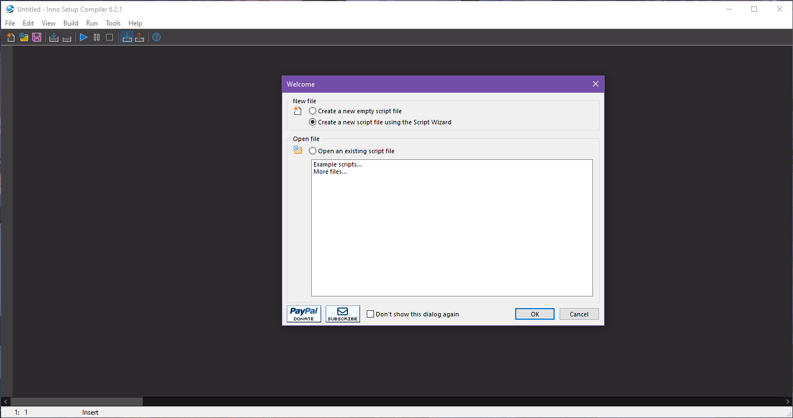

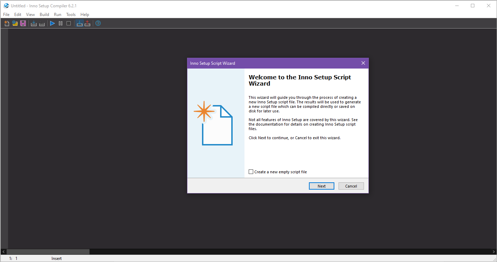

2. Вводимо інформацію про проект для інсталятора

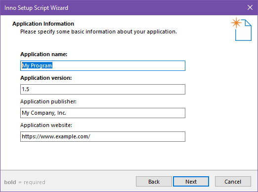

3. Обираємо шлях куди автоматично буде встановлюватися розроблене студентом програмне забезпечення.

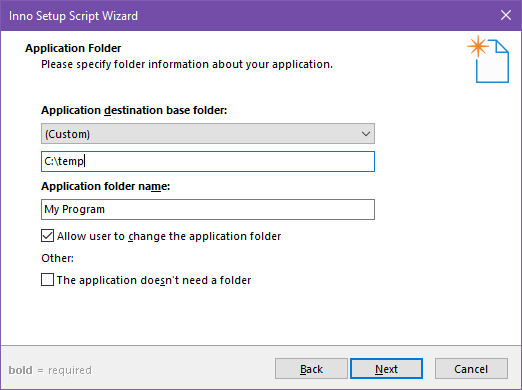

4. Обираємо шлях де знаходиться розроблене студентом програмне забезпечення, яке буде інсталюватися.

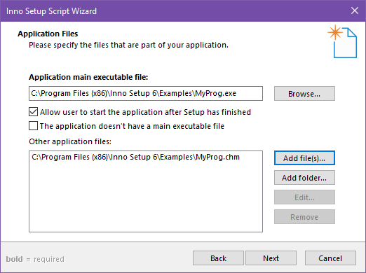

5. Вказуємо асоціацію файлів для програмного забезпечення

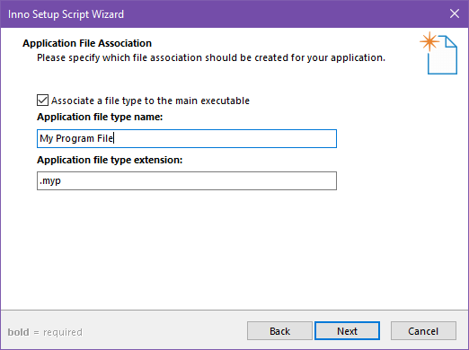

6. Вводимо назву проекту, яка буде відображатися у Пуск $\to$ Програми $\to$ ...

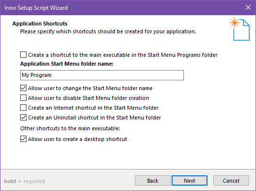

При цьому вказуємо чи створювати одночасно й деінсталятор у цьому меню.

7. Встановлюємо шляхи до наступних файлів:
– файлу ліцензії;
– файлу у якому міститься інформація до інсталяції;
– файлу у якому міститься інформація після інсталяції.

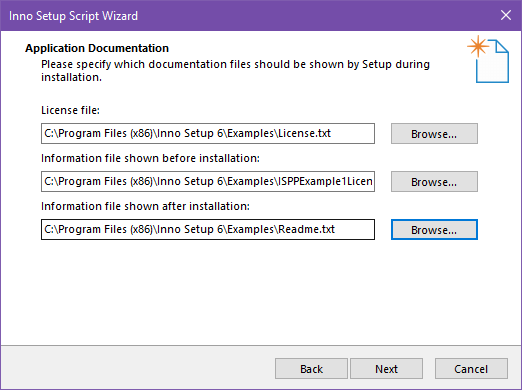

8. Вказуємо режим встановлення

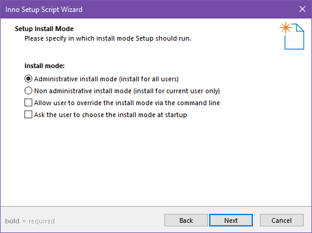

9. Обираємо мову інсталяції

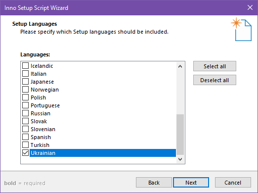

10. Встановлюємо наступні параметри:
– Шлях до папки у якій буде зберігатися скомпільований файл інсталятора.
– Ім’я інсталяційного файлу.
– Іконка інсталяційного файлу.
– Пароль доступу до інсталяційного файлу.

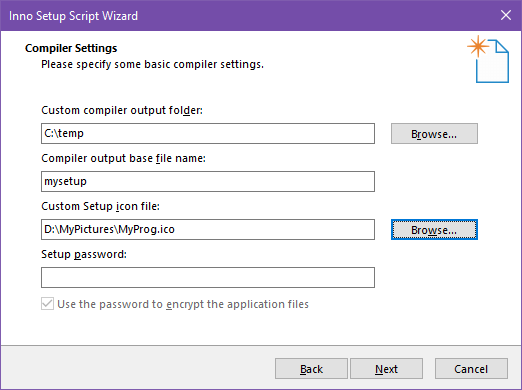

11. Обираємо програмний процесор Inno Setup

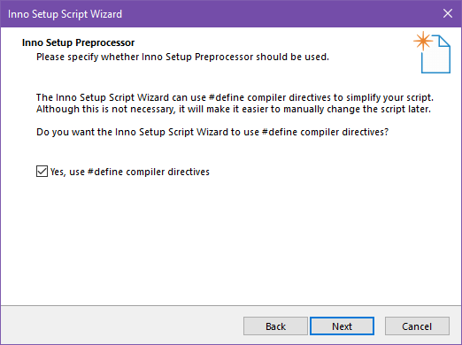

12. Закінчуємо роботу з Inno Setup Script Wizard.

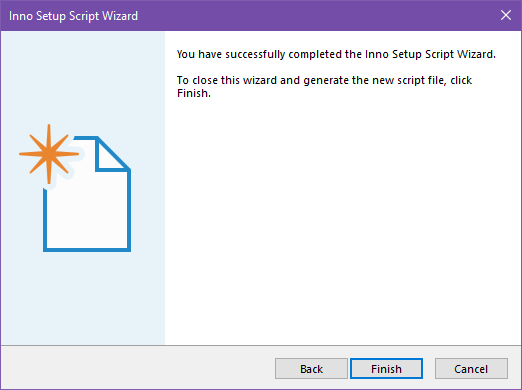

13. Виводиться вікно, у якому знаходиться автоматично згенерований скрипт інсталяційного пакету, та віконце запиту на компіляцію.

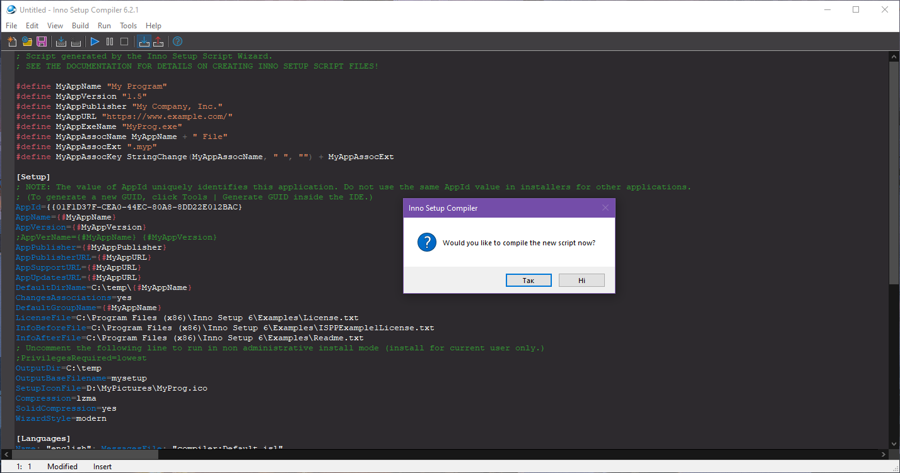

14. Виводиться вікно з результатами створення інсталяційного пакету.

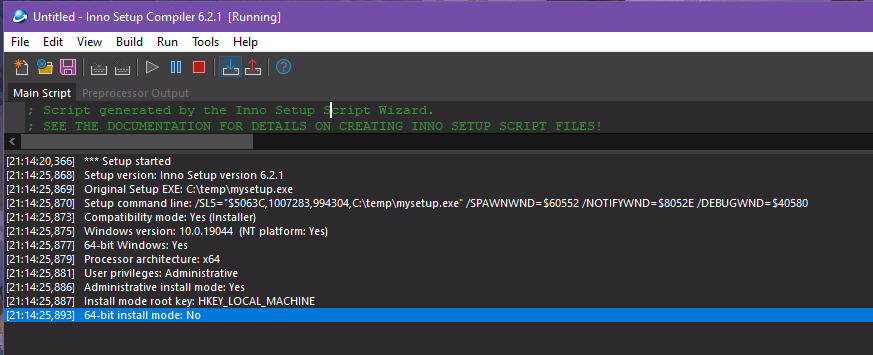

15. У заданій при формуванні інсталяційного пакету папці знаходиться файл інсталяції програмного продукту розробленого студентом.

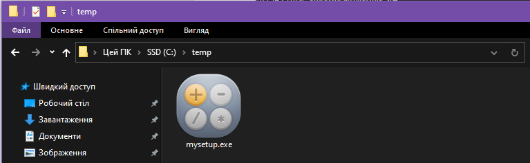

**На цьому робота вважається виконаною.**

**Звіт з лабораторної роботи повинен містити наступні елементи:**
- Оформлена титульна сторінка.
- Завдання.
- Назва проекту, короткий його опис.
- Текст інсталяційного скрипту.
- Скріншот реалізованих завдань.

**Лабораторна робота вважається зарахованою при виконанні наступних умов:**

- Написана на позитивну оцінку летуча контрольна робота.
- Наявність звіту, оформленого згідно наведених вище вимог.
- Наявність реалізованих поставлених завдань.
- Співбесіда з викладачем, який приймає лабораторну роботу на наявність знань з даної тематики. (Або відповідь на контрольні питання наведені нижче.

**КОНТРОЛЬНІ ЗАПИТАННЯ:**

1. Які існують ліцензії розповсюдження програм?
2. Що таке інсталяційний пакет (дистрибутив)?
3. Навіщо потрібен інсталяційний пакет?
4. У яких випадках інсталяційний пакет потрібен?

**Лабораторна робота № 9 (семестр 4)**

**ТЕМА:** **Створення власного пакета інсталяції програмного забезпечення**

**ЦІЛЬ:** **Розширене вивчення процесу інсталяції програмного забезпечення.**

**ЗНАТИ:** **Будь яку мову програмування відповідно до обраного IDE (інтегроване середовище розробки). Основи адміністрування ОС Windows.**

**ТЕОРЕТИЧНІ ВІДОМОСТІ**

Теоретичні відомості наведені у лекції № 6.

**ЗАВДАННЯ**

Необхідно створити власний інсталяційний пакет. Специфікація інсталяційного пакета наступна.

Створювати інсталяційний пакет необхідно для програми, яка була розроблена у ході виконання ЛР № 3-7.

Інсталяційний пакет створюється **НЕ АВТОМАТИЧНО** як у ЛР №8, а у вигляді самостійно написаного студентом відповідного програмного забезпечення.

Інсталяційний пакет може бути представлений як один файл (**Setup.exe**) та папкою з файлами, яка знаходиться окремо від Setup.exe.

Тобто після запуску інсталяційного файлу (Setup.exe), який вже написаний студентом (**усі необхідні файли для інсталяції знаходяться у відповідній папці, не в тій де знаходиться Setup.exe**), виконується установка ПЗ.

**ХІД ВИКОНАННЯ РОБОТИ**

Студентом самостійно створюється програма (**Setup.exe**), в якій реалізовано ряд вікон, перехід з одного до іншого відбувається за натисканням кнопки «Далі», як у класичних програмах інсталяції. Кожне вікно (а їх 7) представляє з себе форму, у якій знаходяться наступні дані:

**1 форма:** Вітання; Назва програми; Версія програми; Назва розробника; Дата інсталяційної зборки.

Перевірити чи відбувалася інсталяція даного пакета на ПК (перевірити ключ реєстру див. форма 3, якщо ключ вже прописаний то програма установлювалася, якщо не прописаний, то програма встановлюється вперше), якщо так вивести на екран відповідне повідомлення з можливістю зупинити інсталяцію програми.

**2 форма:** Спосіб поширення програми (на вибір студента одна з платних ліцензій).

**3 форма:** Уведення серійного номера програми (XXXX-XXXX-XXXX). При правильному введенні S/N продовжити роботу інсталятора.

**Дія 1** Створити гілку реєстру (за допомогою команд мови програмування, на якій пишеться інсталяційний пакет)

```text
HKEY_LOCAL_MACHINE\SOFTWARE\KNTU\NAME\
```

Створити ключі реєстру

* Installtime – Час встановлення ПЗ (XX:XX:XX формат 24 часовий
* Installdate – Дата встановлення ПЗ (XX:XX:20XX)
* Installsn – Серійний номер ПЗ

**Дія 2** Створити текстовий файл Hidekey.dat. Шлях до файлу “C:\Temp\Hidekey.dat”

**Дія 3** Скритна перевірка з'єднання з Інтернетом (за допомогою команд мови програмування, на якій пишеться інсталяційний пакет) і при його наявності відправити електронний лист по заданій адресі (на вибір студента) з інформацією про встановлення ПЗ.

**4 форма:** Вибір каталогу встановлення програми.

**5 форма**: Налаштування програми ( при необхідності).

**6 форма**: Інсталяція програми (створюється відповідний каталог, куди копіюється з заданого каталогу, виконавчий файл програми, й необхідні файли: допомоги й т.і.).

**7 форма**: Вікно завершення роботи інсталятора.

**Після закінчення роботи інсталятора повинні бути виконані наступні пункти:**

- Прописаний дані у реєстрі.
- Створений каталог, де знаходиться виконавчий файл.

**Звіт з лабораторної роботи повинен містити наступні елементи:**

- Оформлена титульна сторінка.
- Завдання.
- Назва проекту, короткий його опис.
- Скріншот реалізованих завдань.

**Лабораторна робота вважається зарахованою при виконанні наступних умов:**

- Наявність звіту, оформленого згідно наведених вище вимог.
- Наявність реалізованих поставлених завдань.
- Співбесіда з викладачем, який приймає лабораторну роботу на наявність знань з даної тематики. (Або відповідь на контрольні питання наведені нижче.

**КОНТРОЛЬНІ ПИТАННЯ:**

1. Що таке подвійне, потрійне й мульти ліцензування?
2. Що таке й навіщо необхідний реєстр?
3. Що таке гілка, ключ реєстру?
4. Що таке Proprietary software?

5. Обмежування на комерційне використання (пропрієтарного ПЗ)?
6. Обмежування на поширення (пропрієтарного ПЗ)?
7. Обмежування на модифікацію (пропрієтарного ПЗ)?
8. Що таке Free Software Foundation (скорочено FSF)?

Лабораторна робота №10 (семестр 4)

**ТЕМА:** Створення власного пакета деінсталяції програмного забезпечення

**ЦІЛЬ:** Розширене вивчення процесу деінсталяції програмного забезпечення.

**ЗНАТИ:** Будь яку мову програмування відповідно до обраного IDE (інтегроване середовище розробки) . Основи адміністрування ОС Windows.

**ТЕОРЕТИЧНІ ВІДОМОСТІ**
Теоретичні відомості наведені у лекції № 6.

**ЗАВДАННЯ**
Створити програмно файл деінсталяції (**Uninstall.exe**), який деінсталює програму, встановлену у результаті виконання ЛР № 9 (семестр 4):
- Видаляються усі виконавчі файли та папки, де вони були записані.
- Залишаються ключі реєстру, вилучається файл “C:\Temp\Hidekey.dat”.

**ХІД ВИКОНАННЯ РОБОТИ**
Специфікація деінсталяційного пакета.
1) Програма - відповідно до ЛР №9 (семестр 4).
2) Послідовність деінсталяції.
Програма деінсталяції складається з покрокового виконання наступних форм.

**1 Форма**: Вітання.
Перевірити встановлені компоненти програми та при їхній наявності продовжити програму.

При натисканні кнопки «Далі», вивести вікно попередження про наслідки видалення інформації із ПК користувача, з можливістю скасування дії.

**2 форма:** Проведення деінсталяції програми з покроковим виведенням дій на форму програми.

Залишити ключі реєстру, вилучити файл “C:\Temp\Hidekey.dat”.

Потай перевірити з'єднання з Інтернетом і за його наявності відправити електронний лист за заданою адресою (на вибір студента) з інформацією про видалення ПЗ.

**3 форма:** Вікно завершення роботи деінсталяційного пакета.

**Звіт з лабораторної роботи повинен містити наступні елементи:**
- Оформлена титульна сторінка.
- Завдання.
- Назва проекту, короткий його опис.
- Скріншот реалізованих завдань.

**Лабораторна робота вважатися зарахованою при виконанні наступних умов:**
- Написана на позитивну оцінку летуча контрольна робота.
- Наявність звіту, оформленого згідно наведених вище вимог.
- Наявність реалізованих поставлених завдань.
- Співбесіда з викладачем, який приймає лабораторну роботу на наявність знань з даної тематики. (Або відповідь на контрольні питання наведені нижче.

**КОНТРОЛЬНІ ПИТАННЯ**

1. Що таке система керування пакетами (у різних ОС)?
2. Що таке репозиторій, приведіть приклади (у різних ОС)?
3. Що таке Installshield?
4. Що таке InstallAnywhere?
5. Що таке Inno Setup?

6. Що таке NSIS?
7. Що таке Master Packager?
8. Що таке EMCO MSI Package Builder?
9. Що таке IExpress?
10. Що таке Visual Installer?
11. Що таке Orca (Part of Windows SDK) ?
12. Що таке WiX?
13. Що таке Remote Install Mac OS X?
14. Для чого потрібні файли формату *.iss?
15. Для чого потрібні файли формату *.msi?
16. Фізична структура пакета *.msi?

Лабораторна робота №11 (семестр 4)

**ТЕМА:** Використання програм моніторингу жорсткого диска й системного реєстру для перевірки інсталяційних пакетів і програм

**ЦІЛЬ:** Вивчення основ моніторингу ОС Windows.

**ЗНАТИ:** Будь яку мову програмування відповідно до обраного IDE (інтегроване середовище розробки) . Основи адміністрування ОС Windows.

**ТЕОРЕТИЧНІ ВІДОМОСТІ**
1. [http://winsoft.com.ua/windows/sistema/sistemni-utiliti/process-monitor](http://winsoft.com.ua/windows/sistema/sistemni-utiliti/process-monitor)

**ЗАВДАННЯ**
На базі програми ЛР №9 провести моніторинг інсталяції програми за допомогою системних утиліт (на вибір студента).
З'ясувати які дії проводить програма інсталяції. Продемонструвати результат моніторингу викладачу.

**ХІД ВИКОНАННЯ РОБОТИ**
**Проведемо моніторинг інсталяції програми за допомогою Procmon (Process Monitor).**
Для цього виконаємо наступні дії:
1. Запустимо Procmon.

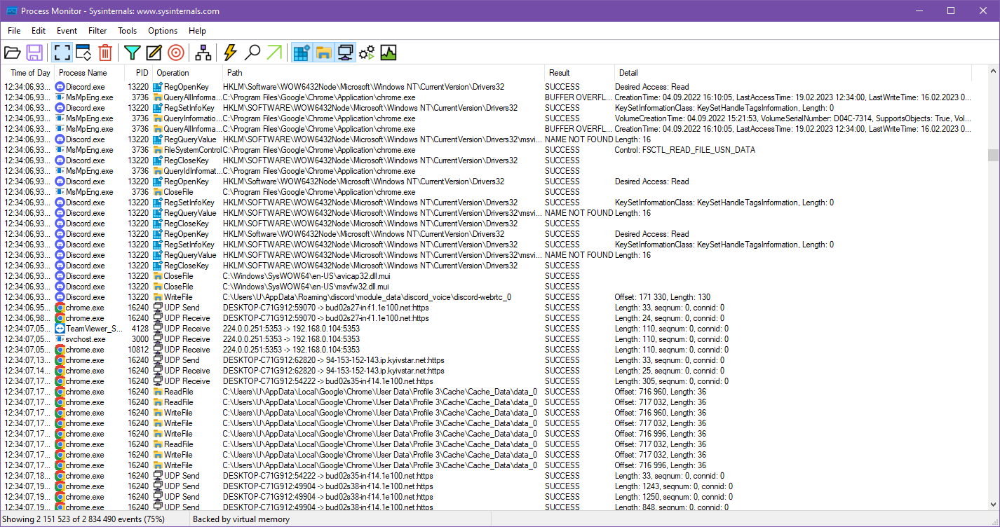

2. На верхній панелі обираємо дії тільки над реєстром та папками


3. Натискаємо кнопку фільтру , з'являється наступний інтерфейс:

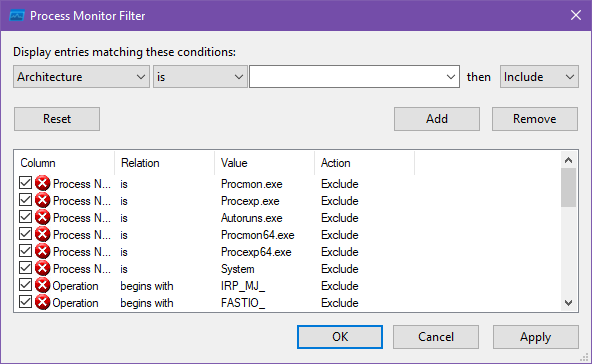

4. Оскільки нам потрібно відстежити процеси програми інсталяції, створеної у Лабораторній роботі №9 (setup.exe), ми маємо додати фільтр на її відстеження. У першому випадаючому меню обираємо “Process Name”, у другому “is”, у полі вводимо назву процесу (setup.exe). Натискаємо “Add” і фільтр додається до списку фільтрів.

5. Для знаходження дій над ліцензійним ключем програми (Hidekey.dat), за аналогічним принципом описаним у попередньому пункті, додаємо фільтр “Path”, “contains”, “C:\Temp”

6. Для знаходження дій над ліцензійним ключем програми (реєстр HKEY_LOCAL_MACHINE\SOFTWARE\KNTU\NAME), за аналогічним принципом описаним у попередньому пункті, додаємо фільтр “Path”, “contains”, “HKLM\SOFTWARE\KNTU\NAME”, маємо наступний вигляд фільтру:

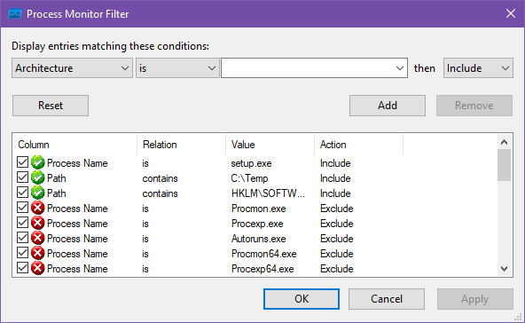

7. Натискаємо на “OK”, фільтри стають активними

8. Запускаємо програму Setup.exe, й дивимося які дії відбуваються під час її виконання.

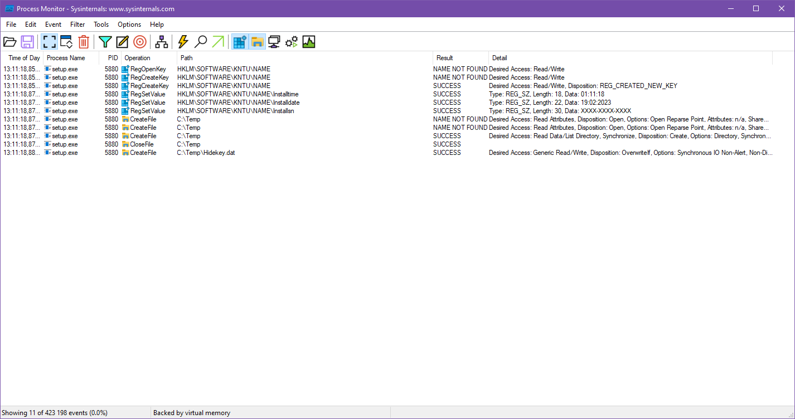

Звіт з лабораторної роботи повинен містити наступні елементи:

- Оформлена титульна сторінка.
- Завдання.
- Назва проекту, короткий його опис.
- Скріншот реалізованого завдання у Procmon.
- Опис дій над файлом `Hidekey.dat` та реєстром `HKEY_LOCAL_MACHINE\SOFTWARE\KNTU\NAME\`

Лабораторна робота вважається зарахованою при виконанні наступних умов:

- Написана на позитивну оцінку летуча контрольна робота.
- Наявність звіту, оформленого згідно наведених вище вимог.
- Наявність реалізованих поставлених завдань.

– Співбесіда з викладачем, який приймає лабораторну роботу на наявність знань з даної тематики. (Або відповідь на контрольні питання наведені нижче.

**КОНТРОЛЬНІ ПИТАННЯ:**
1. Що таке моніторинг ОС?
2. Що таке Procmon, Process Explorer?
3. Що таке система повідомлень ОС Windows?
4. Що таке файлова система Microsoft Windows?
5. Приведіть приклади й історію програмного забезпечення фірми Sysinternals?

Лабораторна робота №12 (семестр 4)

**ТЕМА: Використання файлів конфігурації ОС Windows.**

**ЦІЛЬ: Вивчення можливостей файлів конфігурації.**

**ЗНАТИ: Будь яку мову програмування відповідно до обраного IDE (інтегроване середовище розробки) . Основи адміністрування ОС Windows.**

### ЗАВДАННЯ

Специфікація програми взаємодії з файлом конфігурації.

На формі програми, яку пише студент, розташовані компоненти з довільним текстом (на вибір студента): Checkbox (5 шт.); Radiobutton (5 шт.); Edit (5 шт.).

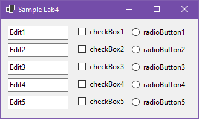

Забезпечити збереження поточного статусу (Checkbox), положення (Radiobutton) і тексту (Edit) у файлі конфігурації програми Project.ini. Таким чином, щоб при закритті програми, та повторному відкритті ці результати відображалися у програмі. Крім цього програма повинна зберігати поточну позицію щодо робочого стола ОС.

**Звіт з лабораторної роботи повинен містити наступні елементи:**
- Оформлена титульна сторінка.
- Завдання.
- Назва проекту, короткий його опис.
- Скріншот реалізованих завдань та файлу конфігурації програми Project.ini.

**Лабораторна робота вважається зарахованою при виконанні наступних умов:**
- Написана на позитивну оцінку летуча контрольна робота.
- Наявність звіту, оформленого згідно наведених вище вимог.
- Наявність реалізованих поставлених завдань.
- Співбесіда з викладачем, який приймає лабораторну роботу на наявність знань з даної тематики. (Або відповідь на контрольні питання наведені нижче.

**КОНТРОЛЬНІ ПИТАННЯ**

1. Що таке й навіщо необхідний файл конфігурації?
2. У яких випадках застосовують файли конфігурації?
3. Як файл конфігурації може пошкодити програму?
4. Приведіть приклади відомих форматів файлів конфігурації (у різних ОС)?
5. Який формат файлів конфігурації щонайкраще підійде для складної ієрархічної структури?
6. Що таке секції, параметри й значення у файлах конфігурації?

Лабораторна робота №13 (семестр 4)

**ТЕМА:** Створення програми меню для носія інформації

**ЦІЛЬ:** Вивчення можливостей створення програм меню.

**ЗНАТИ:** Будь яку мову програмування відповідно до обраного IDE (інтегроване середовище розробки) .

**ТЕОРЕТИЧНІ ВІДОМОСТІ**

Теоретичні відомості наведені у лекції № 7 (3 семестр)

У зв'язку з великим обсягом інформації використовувати електронну документацію (погоджувати з лектором).

1. https://uk.wikipedia.org/wiki/Autorun.inf

**ЗАВДАННЯ**

1. Створити файл autorun.inf для забезпечення автоматичного запуску програм з носіїв інформації (USB флеш накопичувач). Установити параметри action, icon, Defaulticon, label, open, Useautoplay, shellexecute, shell файлу autorun.inf по необхідності.

2. Створити програму для носія інформації. Яка буде автоматично виконуватись при підключенні носія до ОС.

Функціональні можливості:
– запуск програми (на вибір) з носія інформації;
– запуск мультимедія файлів;
– виклик провідника Windows з заданою директорією на носії.

**Звіт з лабораторної роботи повинен містити наступні елементи:**
- Оформлена титульна сторінка.
- Завдання.
- Назва проекту, короткий його опис.
- Скріншот реалізованих завдань.

**Лабораторна робота вважається зарахованою при виконанні наступних умов:**
- Написана на позитивну оцінку летуча контрольна робота.
- Наявність звіту, оформленого згідно наведених вище вимог.
- Наявність реалізованих поставлених завдань.
- Співбесіда з викладачем, який приймає лабораторну роботу на наявність знань з даної тематики. (Або відповідь на контрольні питання наведені нижче.

**КОНТРОЛЬНІ ПИТАННЯ:**
1. Як саме працює автоматичний запуск програм з носіїв інформації?
2. Як відключити автозапуск програм з носіїв інформації?
3. Де повинен перебувати файл Autorun.inf для автозапуску?
4. Формат файлу (структурні блоки) Autorun.inf?
5. Що таке параметр action, блоку autorun?
6. Що таке параметр icon, блоку autorun?
7. Що таке параметр Defaulticon, блоку autorun?
8. Що таке параметр label, блоку autorun?
9. Що таке параметр open, блоку autorun?
10. Що таке параметр Useautoplay, блоку autorun?
11. Що таке параметр shellexecute, блоку autorun?

Лабораторна робота №14 (семестр 4)

**ТЕМА:** Створення власного формату файлу

**ЦІЛЬ:** Вивчення можливостей створення й зберігання власних типів даних.

**ЗНАТИ:** Будь яку мову програмування відповідно до обраного IDE (інтегроване середовище розробки) .


**ТЕОРЕТИЧНІ ВІДОМОСТІ**

У зв'язку з великим обсягом інформації використовувати електронну документацію (погоджувати з лектором).

1. [https://uk.wikipedia.org/wiki/Тип_даних](https://uk.wikipedia.org/wiki/Тип_даних)
2. [https://support.microsoft.com/uk-ua/office/загальні-відомості-про-типи-даних-і-властивості-поля-30ad644f-946c-442e-8bd2-be067361987c](https://support.microsoft.com/uk-ua/office/загальні-відомості-про-типи-даних-і-властивості-поля-30ad644f-946c-442e-8bd2-be067361987c)

**ЗАВДАННЯ**

1. Створити власний формат файлу для зберігання різних даних (написати свою базу даних зі своїм форматом даних), використовуючи структури обраної мови програмування.

**Використання баз даних заборонене! У тому числі й вбудованих у мови програмування.**

Формат файлу видається викладачем індивідуально.

2. Створити програму, яка зможе обробляти створений формат.

Приклад завдання.

Створити формат файлу «Книга контактів» для збереження наступної інформації:

– Index: Ціле число (від $1\dots N$), номер запису контакту;
– FIO: Текстове поле (15 символів), ПІБ контакту;
– Home phone 1: Текстове поле (10 символів), домашня адреса 1;
– Home phone 2: Текстове поле (10 символів), домашня адреса 2;
– Business phone 1: Текстове поле (10 символів), діловий телефон 1;
– Business phone 2: Текстове поле (10 символів), діловий телефон 2;
– Home adress: Текстове поле (100 символів), домашня адреса;
– Notes: Текстове поле (Динамічне, необмежене), замітки. Розширення файлу \*.nts.

**Звіт з лабораторної роботи повинен містити наступні елементи:**
– Оформлена титульна сторінка.
– Завдання.
– Назва проекту, короткий його опис.
– Скріншот реалізованих завдань.

**Лабораторна робота вважається зарахованою при виконанні наступних умов:**
– Написана на позитивну оцінку летуча контрольна робота.
– Наявність звіту, оформленого згідно наведених вище вимог.
– Наявність реалізованих поставлених завдань.
– Співбесіда з викладачем, який приймає лабораторну роботу на наявність знань з даної тематики. (Або відповідь на контрольні питання наведені нижче.

**КОНТРОЛЬНІ ПИТАННЯ:**

1. Що таке тип даних?
2. Що таке користувацький(власний) тип даних?
3. Приведіть класифікацію типів даних?
4. Що таке динамічна ідентифікація типу даних?
5. Що таке статична типізація?

6. Що таке динамічна типізація?
7. Що таке сувора типізація?
8. Що таке слабка типізація?
9. Що таке приведення типів даних?
10. Бувають мови без типів даних?

**Список використаної літератури**

**Базова**

1. Смірнов О.А., Коваленко О.В., Мелешко Є.В., Константинова Л.В., Кожанова А.С. Інженерія програмного забезпечення. Навчальний посібник для студентів вищих навчальних закладів напрямів підготовки 8.050102 «Комп'ютерна інженерія». За ред. О.А. Смірнова Гриф “Навчальний посібник” надано у відповідності з листом Міністерства освіти і науки України від 18.03.2013 року № 1/11-5584. – Кіровоград: КНТУ 2013. – 409с.

2. Технології програмування та створення програмних продуктів конспект лекцій для студ. напряму підготовки 6.050101 "Комп'ютерні науки" усіх форм навчання / О. В. Алексенко. – Суми : СумДУ, 2013. – 133 с.

3. Проектування та моделювання програмного забезпечення сучасних інформаційних систем / Г. В. Табунщик, Т.І. Каплієнко, О.А. Петрова – Запоріжжя : Дике Поле, 2016. – 250 с

4. Петрик М.Р. Моделювання програмного забезпечення : науково-методичний посібник / М.Р. Петрик, О.Ю. Петрик – Тернопіль : Вид-во ТНТУ імені Івана Пулюя, 2015. – 200 с.

5. Авраменко А.С., Авраменко В.С., Косенюк Г.В. Тестування програмного забезпечення. Навчальний посібник. – Черкаси: ЧНУ імені Богдана Хмельницького, 2017. – 284 с.

6. Вакалюк Т.А. Технології тестування програм. Навчально-методичний посібник для студентів напряму 6.040302 Інформатика\*. – Житомир: Вид-во ЖДУ, 2013. – 96 с.

7. Смірнов О.А., Коваленко О.В., Кожанова А.С., Левошко О.Л., Константинова Л.В. Основи системного програмування. Навчальний посібник для студентів вищих навчальних закладів напрямів підготовки 8.050102 «Комп'ютерна інженерія». За ред. Коваленка О.В., Гриф “Навчальний посібник” надано у відповідності з листом Міністерства освіти і науки України від 26.02.2013 року № 1/11-4368. – Кіровоград: КНТУ 2013. – 257с.

8. Adam Freeman. Pro Go The Complete Guide to Programming Reliable and Efficient Software Using Golang. Apress Media. 2022. 1078 p.

9. Fernando Doglio. Skills of a Successful Software Engineer. Manning. 2022. 182 с.

10. M. Holmes He. Creating Apps with React Native. Apress Media. 2022. 445 p.

11. Maurício Aniche. Effective Software Testing. Manning Publications. 2021. 372 p

12. Priscila Heller. Automating Workflows with GitHub Actions. Packt Publishing. 2021. 216 p.

13. JJ Geewax. API Design Patterns. Manning Publications Co. 2021. 481 p.

14. Prateek Prasad. App Design Apprentice. Razeware LLC. 2020. 272 p.

15. Dawn Griffiths, David Griffiths. Head First Android Development. O'Reilly Media, Inc. 2021. 1414 p.

16. Nathan Metzler. Kotlin Programming for Beginners. Independently published. 2021. 158 p.

17. Aaron Torres. Go Programming Cookbook Second Edition. Packt Publishing Ltd. 2019. 427 p.

**Допоміжна**

18. Smirnov O., Kovalenko O., Kovalenko A., Kavun S. «Quantitative Risk Assessment Method Development in the Context of the SDLC-model». 2021 IEEE 8th International Conference on Problems of Infocommunications, Science and Technology (PIC S&T), 2021, pp. 203-208, doi: 10.1109/PICST54195.2021.9772143 (Scopus). Режим доступу: https://www.scopus.com/record/display.uri?eid=2-s2.0-85130889995&origin=resultslist&plf-f&featureToggles=FEATURE_NEW_DOC_DETAILS_EXPORT:1.

19. O. Smirnov, O. Kovalenko, A. Kovalenko, S. Smirnov, V. Vialkova. The mathematical model of the testing technology for DOM XSS vulnerabilities. Scientific & practical cyber security journal (SPCSJ) Vol 2 Issue 1, 22-28 pp. [Електронний журнал]. Georgia. Tbilisi: SCSA – 2018. Режим доступу: https://journal.scsa.ge/papers/the-mathematical-model-of-the-testing-technology-for-dom-xss-vulnerabilities/.

20. Oleksii Smirnov, Oleksandr Kovalenko, Jamil Al-Azzeh, Anna Kovalenko, Serhii Smirnov. Qualitative risk analysis of software development. Asian Journal of Information Technology. – Volume 17(3). – Medwell Journals. – 2018. – P. 218-230.. Режим доступу: http://medwelljournals.com/abstract/?doi=ajit.2018.218.230

21. Смірнов О.А., Смірнов С.А., Коваленко О.В., Коваленко А.С. Технологія тестування DOM XSS вразливості. Науково-практичний журнал кібербезпеки (SPCSJ) № 1.[Електронний журнал]. Грузія. Тбилиси: SCSA – 2017. Режим доступу: https://journal.scsa.ge/ru/papers/tehnologija-testirovanija-dom-xss-ujazvimosti/

22. Смірнов О.А., Лисенко І.А. Інформаційна технологія проектування тестових наборів на основі вимог до програмного забезпечення. Системи управління, навігації та зв'язку. – Випуск 4 (44). – Полтава: ПолтНТУ. – 2017. – С. 112-115. Режим доступу: http://nbuv.gov.ua/UJRN/suntz_2017_4_23

23. Смірнов О.А., Коваленко О.В. Використання псевдобулевих методів бівалентного програмування для управління ризиками розробки програмного забезпечення. Системи управління, навігації та зв'язку. – Випуск 1 (37). – Полтава: ПолтНТУ. – 2016. – С. 98-103. Режим доступу: http://nbuv.gov.ua/UJRN/suntz_2016_1_27

24. Смірнов О.А., Лисенко І.А. Формалізація процесу проектування тестових наборів. Збірник наукових праць Харківського університету Повітряних Сил. Випуск 3 (48). – Харків: ХУПС. – 2016. – С.96-100. Режим доступу: http://nbuv.gov.ua/UJRN/ZKhUPS_2016_3_23

25. Смірнов О.А., Лисенко І.А. Удосконалення методу перевірки коректності таблиць рішень для формального подання тестових наборів. Збірник наукових праць "Системи обробки інформації". – Випуск 8(145). – Х.: ХУПС – 2016. – С. 77-80. Режим доступу: http://www.hups.mil.gov.ua/periodic-app/article/16970 (Фахове видання)

26. Смірнов О.А., Лисенко І.А. Розробка впорядкованих каскадних таблиць рішень з використанням матриць слідування. Збірник наукових праць "Системи обробки інформації". – Випуск 6(143). – Х.: ХУПС – 2016. – С. 216-

220. Режим доступу: http://www.hups.mil.gov.ua/periodic-app/article/16755 (Фахове видання).

27. Смірнов О.А., Коваленко О.В., Якименко Н.М., Доренський О.П. Метод кількісної оцінки ризиків розробки програмного забезпечення. Збірник наукових праць Харківського університету Повітряних Сил. Випуск 2 (47). – Харків: ХУПС. – 2016. – С. 128-133. Режим доступу: http://nbuv.gov.ua/UJRN/ZKkUPS_2016_2_33 (Фахове видання)

28. Смірнов О.А., Коваленко О.В., Якименко Н.М., Доренський О.П. Метод якісного аналізу ризиків розробки програмного забезпечення. Наука і техніка Повітряних Сил Збройних Сил України. – Випуск 2(23). – Харків: ХУПС. – 2016. – С. 150-158. Режим доступу: http://nbuv.gov.ua/UJRN/Nitps_2016_2_41

29. Смірнов О.А., Коваленко О.В. Методи якісного аналізу та кількісної оцінки ризиків розробки програмного забезпечення. Збірник наукових праць "Системи обробки інформації". – Випуск 5(142). – Х.: ХУПС – 2016. – С. 153-157.. Режим доступу: http://www.hups.mil.gov.ua/periodic-app/article/16626 (Фахове видання)

30. Smirnov A.A., Kovalenko A.V. Kovalenko A.S. Dorensky A.P. Information model and its element for displaying information on technical condition of objects of integrated information system. International Journal of Computational Engineering Research (IJCER). – Volume 6, Issue 1. – India. Delhi. – 2016. – P. 21-27. Режим доступу: http://www.ijceronline.com/papers/Vol6_issue1/C061021027.pdf

31. Смірнов О.А., Лисенко І.А. Дослідження алгоритму виявлення виду неврахованих тестових випадків у процесі проектування тестових наборів. Науково-виробничий журнал “Зв'язок” – Випуск 5(117). – Київ: ДУТ. – 2015. – С.54-56. Режим доступу: http://dspace.kntu.kr.ua/jspui/handle/123456789/6862 (Фахове видання).

32. Смірнов О.А., Лисенко І.А., Поліщук Л.І. Дослідження процесу розробки програмного забезпечення інфотелекомунікаційних систем. Системи озброєння і військова техніка. – Випуск 4(40) – Х.: ХУПС – 2014. – С. 103-106. Режим доступу: http://www.hups.mil.gov.ua/periodic-app/article/2465

33. Смірнов О.А., Лисенко І.А., Мелешко Є.В. Дослідження рівнів тестування програмного забезпечення інфотелекомунікаційних систем. Наука і техніка Повітряних Сил Збройних Сил України. – Випуск 4(17). – Харків: ХУПС. – 2014. – С.79-81. Режим доступу: http://www.hups.mil.gov.ua/periodic-app/article/722 (Фахове видання)

34. Smirnov A.A., Dorensky O.P. Development of the theoretical bases of logical domain modeling of a complex software system. International Journal of Computational Engineering Research (IJCER). – Volume 4, Issue 4. – India. Delhi. – 2014. – P. 19-23. Режим доступу: http://www.ijceronline.com/papers/Vol4_issue04/Version-2/C04402019023.pdf

35. ДСТУ ISO/IEC/IEEE 12207:2018 (ISO/IEC/IEEE 12207:2017, IDT) Інженерія систем і програмних засобів. Процеси життєвого циклу програмних засобів.; ISO/IEC/IEEE 12207:2017. Systems and software engineering – Software life cycle processes.

36. ДСТУ ISO/IEC/IEEE 15288:2016 Інженерія систем і програмного забезпечення. Процеси життєвого циклу систем (ISO/IEC/IEEE 15288:2015, IDT).; ISO/IEC/IEEE 15288:2015. Systems and software engineering – System life cycle processes.

37. ISO/IEC 5055:2021. Information technology – Software measurement – Software quality measurement – Automated source code quality measures.

38. ДСТУ ISO/IEC 15026-1:2017 Інженерія систем і програмних засобів. Гарантії стосовно систем і програмних засобів. Частина 1. Поняття та основні терміни (ISO/IEC 15026-1:2013, IDT).; ДСТУ ISO/IEC 15026-2:2018 Інженерія систем і програмних засобів. Гарантії стосовно систем і програмних засобів. Частина 2. Сценарій гарантування (ISO/IEC 15026-2:2011, IDT).; ДСТУ ISO/IEC 15026-3:2018 Інженерія систем і програмних засобів. Гарантії стосовно систем і програмних засобів. Частина 3. Рівні цілісності системи (ISO/IEC 15026-3:2015, IDT).; ДСТУ ISO/IEC 15026-4:2018 Інженерія систем і програмних засобів. Гарантії стосовно систем і програмних засобів. Частина 4. Гарантування в життєвому циклі (ISO/IEC 15026-4:2012, IDT).; ISO/IEC/IEEE 15026-1:2019. Systems and software engineering – Systems and software assurance – Part 1:

Concepts and vocabulary.; ISO/IEC/IEEE 15026-2:2022. Systems and software engineering – Systems and software assurance – Part 2: Assurance case.; ISO/IEC 15026-3:2015. Systems and software engineering – Systems and software assurance – Part 3: System integrity levels.; ISO/IEC/IEEE 15026-4:2021. Systems and software engineering – Systems and software assurance – Part 4: Assurance in the life cycle.

39. ISO/IEC/IEEE 15288:2015. Systems and software engineering – System life cycle processes.

40. ДСТУ ISO/IEC 16085:2016 Інженерія систем і програмних засобів. Процеси життєвого циклу. Керування ризиками (ISO/IEC 16085:2006, IDT). SO/IEC/IEEE 16085:2021. Systems and software engineering – Life cycle processes – Risk management.

41. ISO/IEC 20741:2017. Systems and software engineering – Guideline for the evaluation and selection of software engineering tools.

42. ISO/IEC/IEEE 21840:2019. Systems and software engineering – Guidelines for the utilization of ISO/IEC/IEEE 15288 in the context of system of systems (SoS).

43. ISO/IEC/IEEE FDIS 24641. Systems and Software engineering – Methods and tools for model-based systems and software engineering.

44. ДСТУ ISO/IEC TS 24748-1:2018 Інженерія систем і програмних засобів. Керування життєвим циклом. Частина 1. Настанови щодо керування життєвим циклом (ISO/IEC TS 24748-1:2016, IDT).; ДСТУ ISO/IEC TR 24748-2:2015 Розроблення систем і програмного забезпечення. Управління життєвим циклом. Частина 2. Настанова щодо застосування ISO/IEC 15288 (Процеси життєвого циклу системи) (ISO/IEC TR 24748-2:2011, IDT).; ДСТУ ISO/IEC TR 24748-3:2016 Інженерія систем і програмного забезпечення. Керування життєвим циклом. Частина 3. Настанова щодо застосування ISO/IEC 12207 (Процеси життєвого циклу програмного забезпечення) (ISO/IEC TR 24748-3:2011, IDT).; ДСТУ ISO/IEC/IEEE 24748-4:2018 Інженерія систем і програмних засобів. Керування життєвим циклом. Частина 4. Інженерне проектування систем (ISO/IEC/IEEE 24748-4:2016, IDT).; ДСТУ ISO/IEC/IEEE 24748-5:2018 Інженерія систем та програмних засобів. Управління життєвим циклом. Частина

5. Планування розробки програмних засобів (ISO/IEC/IEEE 24748-5:2017, IDT).; ДСТУ ISO/IEC TS 24748-6:2018 Інженерія систем і програмних засобів. Керування життєвим циклом. Частина 6. Розроблення системної інтеграції (ISO/IEC TS 24748-6:2016, IDT).; ISO/IEC/IEEE 24748-1:2018. Systems and software engineering – Life cycle management – Part 1: Guidelines for life cycle management.; ISO/IEC/IEEE 24748-2:2018. Systems and software engineering – Life cycle management – Part 2: Guidelines for the application of ISO/IEC/IEEE 15288 (System life cycle processes).; ISO/IEC TR 24748-3:2011. Systems and software engineering – Life cycle management – Part 3: Guide to the application of ISO/IEC 12207 (Software life cycle processes).; ISO/IEC/IEEE 24748-4:2016. Systems and software engineering – Life cycle management – Part 4: Systems engineering planning.; ISO/IEC/IEEE 24748-5:2017. Systems and software engineering – Life cycle management – Part 5: Software development planning.; ISO/IEC TS 24748-6:2016. Systems and software engineering – Life cycle management – Part 6: System integration engineering.; ISO/IEC/IEEE 24748-7:2019. Systems and software engineering – Life cycle management – Part 7: Application of systems engineering on defense programs.; ISO/IEC/IEEE 24748-8:2019. Systems and software engineering – Life cycle management – Part 8: Technical reviews and audits on defense programs.

45. ДСТУ ISO/IEC 25000:2016 Інженерія систем і програмних засобів. Вимоги до якості систем і програмних засобів та її оцінювання (SQuaRE). Настанова до SQuaRE (ISO/IEC 25000:2014, IDT).; ISO/IEC 25000:2014. Systems and software engineering – Systems and software Quality Requirements and Evaluation (SQuaRE) – Guide to SQuaRE.

46. ДСТУ ISO/IEC 25010:2016 Інженерія систем і програмних засобів. Вимоги до якості систем і програмних засобів та її оцінювання (SQuaRE). Моделі якості системи та програмних засобів (ISO/IEC 25010:2011, IDT).; ISO/IEC 25010:2011. Systems and software engineering – Systems and software Quality Requirements and Evaluation (SQuaRE) – System and software quality models.

47. ДСТУ ISO/IEC 25012:2016 Інженерія систем і програмних засобів. Вимоги до якості систем і програмних засобів та її оцінювання (SQuaRE). Модель якості даних (ISO/IEC 25012:2008, IDT).; ISO/IEC 25012:2008. Software

engineering – Software product Quality Requirements and Evaluation (SQuaRE) – Data quality model.

48. ДСТУ ISO/IEC 25020:2016 Інженерія систем і програмних засобів. Вимоги до якості систем і програмних засобів та її оцінювання (SQuaRE). Рамкова модель і настанова щодо вимірювання (ISO/IEC 25020:2007, IDT). SO/IEC 25020:2019. Systems and software engineering – Systems and software Quality Requirements and Evaluation (SQuaRE) – Quality measurement framework.

49. ДСТУ ISO/IEC 25021:2016 Інженерія систем і програмних засобів. Вимоги до якості систем і програмних засобів та її оцінювання (SQuaRE). Елементи показника якості (ISO/IEC 25021:2012, IDT).; ISO/IEC 25021:2012. Systems and software engineering – Systems and software Quality Requirements and Evaluation (SQuaRE) – Quality measure elements.

50. ISO/IEC 25023:2016. Systems and software engineering – Systems and software Quality Requirements and Evaluation (SQuaRE) – Measurement of system and software product quality.

51. ISO/IEC 25024:2015. Systems and software engineering – Systems and software Quality Requirements and Evaluation (SQuaRE) – Measurement of data quality.

52. ДСТУ ISO/IEC 25030:2016 Інженерія систем і програмних засобів. Вимоги до якості систем і програмних засобів та її оцінювання (SQuaRE). Вимоги до якості (ISO/IEC 25030:2007, IDT).; ISO/IEC 25030:2019. Systems and software engineering – Systems and software quality requirements and evaluation (SQuaRE) – Quality requirements framework.

53. ДСТУ ISO/IEC 25040:2016 Інженерія систем і програмних засобів. Вимоги до якості систем і програмних засобів та її оцінювання (SQuaRE). Процес оцінювання (ISO/IEC 25040:2011, IDT).; ISO/IEC 25040:2011. Systems and software engineering – Systems and software Quality Requirements and Evaluation (SQuaRE) – Evaluation process.

54. ДСТУ ISO/IEC 25041:2016 Інженерія систем і програмних засобів. Вимоги до якості систем і програмних засобів та її оцінювання (SQuaRE). Настанова з оцінювання для розробників, придбавачів і незалежних оцінювачів (ISO/IEC 25041:2012, IDT).; ISO/IEC 25041:2012. Systems and software

engineering – Systems and software Quality Requirements and Evaluation (SQuaRE) – Evaluation guide for developers, acquirers and independent evaluators.

55. ДСТУ ISO/IEC 25045:2016 Інженерія систем і програмних засобів. Вимоги до якості систем і програмних засобів та її оцінювання (SQuaRE). Модуль оцінювання відновності (ISO/IEC 25045:2010, IDT).; ISO/IEC 25045:2010. Systems and software engineering – Systems and software Quality Requirements and Evaluation (SQuaRE) – Evaluation module for recoverability.

56. ДСТУ ISO/IEC 25060:2016 Інженерія систем і програмних засобів. Вимоги до якості систем і програмних засобів та її оцінювання (SQuaRE). Спільний промисловий формат (CIF) для зручності застосування. Загальна структура інформації щодо зручності застосування (ISO/IEC 25060:2010, IDT).; ISO/IEC TR 25060:2010. Systems and software engineering – Systems and software product Quality Requirements and Evaluation (SQuaRE) – Common Industry Format (CIF) for usability: General framework for usability-related information.

57. ISO 25065:2019. Systems and software engineering – Software product Quality Requirements and Evaluation (SQuaRE) – Common Industry Format (CIF) for Usability: User requirements specification.

58. ДСТУ ISO/IEC IEEE 26512:2018 Інженерія систем та програмних засобів. Вимоги до придбавачів і постачальників інформації для користувачів (ISO/IEC IEEE 26512:2018, IDT).; ISO/IEC/IEEE 26512:2018. Systems and software engineering – Requirements for acquirers and suppliers of information for users.

59. ДСТУ ISO/IEC 26514:2015 Інженерія систем і програмного забезпечення. Вимоги до дизайнерів і розробників документації користувача (ISO/IEC 26514:2008, IDT). ISO/IEC/IEEE 26514:2022. Systems and software engineering – Design and development of information for users.

60. ISO/IEC 26580:2021. Software and systems engineering – Methods and tools for the feature-based approach to software and systems product line engineering.

61. ДСТУ ISO/IEC 26551:2018 Інженерія систем і програмних засобів. Інструменти та методи проектування вимог до лінійки виробів (ISO/IEC 26551:2016, IDT).; ISO/IEC 26551:2016. Software and systems engineering – Tools and methods for product line requirements engineering.

62. ДСТУ ISO/IEC 26555:2018 Інженерія систем і програмних засобів. Інструменти та методи технічного менеджменту лінійки виробів (ISO/IEC 26555:2015, IDT).; ISO/IEC 26555:2015. Software and systems engineering – Tools and methods for product line technical management.

63. ДСТУ ISO/IEC 26557:2018 Інженерія систем і програмних засобів. Методи та інструменти для механізмів мінливості в лінійці програмних засобів і систем (ISO/IEC 26557:2016, IDT).; ISO/IEC 26557:2016. Software and systems engineering – Methods and tools for variability mechanisms in software and systems product line.

64. ДСТУ ISO/IEC 26558:2018 Інженерія систем і програмних засобів. Методи та інструменти для моделювання мінливості в лінійці програмних засобів і систем (ISO/IEC 26558:2017, IDT).; ISO/IEC 26558:2017. Software and systems engineering – Methods and tools for variability modelling in software and systems product line.

65. ДСТУ ISO/IEC 26559:2018 Інженерія систем і програмних засобів. Методи та інструменти для відстежування мінливості в лінійці програмних засобів і систем (ISO/IEC 26559:2017, IDT).; ISO/IEC 26559:2017. Software and systems engineering – Methods and tools for variability traceability in software and systems product line.

66. ДСТУ ISO/IEC/IEEE 29119:2017 Інженерія систем і програмних засобів. Тестування програмних засобів (ISO/IEC/IEEE 29119:2013, IDT).; ISO/IEC/IEEE 29119:2022. Software and systems engineering – Software testing.

67. ДСТУ ISO/IEC 29155:2018 Інженерія систем і програмних засобів. Структура порівняльного аналізу ефективності проектів інформаційних технологій.; ISO/IEC 29155:2017. Systems and software engineering – Information technology project performance benchmarking framework.

68. ДСТУ ISO/IEC 90003:2006 Програмна інженерія. Настанови щодо застосування ISO 9001:2000 до програмного забезпечення (ISO/IEC 90003:2004, IDT). ISO/IEC/IEEE 90003:2018. Software engineering – Guidelines for the application of ISO 9001:2015 to computer software.

69. Єдина система програмної документації. Комплекс стандартів: ДСТ 19.001-77. ЄСПД. Загальні положення. ДСТ 19.003-80. ЄСПД. Схеми алгоритмів

та програм. Позначення умовні графічні.; ДСТ 19.005-85. ЄСПД. Р-схеми алгоритмів та програм. Позначення умовні графічні та правила виконання.; ДСТ 19.101-77. ЄСПД. Види програм та програмних документів.; ДСТ 19.102-77. ЄСПД. Стадії розроблення.; ДСТ 19.103-77. ЄСПД. Позначення програм та програмних документів.; ДСТ 19.104-78. ЄСПД. Основні написи.; ДСТ 19.105-78. ЄСПД. Загальні вимоги до програмних документів.; ДСТ 19106-78. ЄСПД. Вимоги до програмних документів, виконаних у друкований спосіб.; ДСТ 19.201-78. ЄСПД. Технічне завдання. Вимоги до змісту та оформлення.; ДСТ 19.202-78. ЄСПД. Специфікація. Вимоги до змісту та оформлення.; ДСТ 19.301-79. ЄСПД. Програма та методика випробувань. Вимоги до змісту та оформлення.; ДСТ 19.401-78. ЄСПД. Текст програми. Вимоги до змісту та оформлення.; ДСТ 19.402-78. ЄСПД. Опис програми.; ДСТ 19.403-79. ЄСПД. Відомість власників оригіналів.; ДСТ 19.404-79. ЄСПД. Пояснювальна записка. Вимоги щодо змісту та оформлення.; ДСТ 19.501-78. ЄСПД. Формуляр. Вимоги до змісту та оформлення.; ДСТ 19.502-78. ЄСПД. Опис застосування. Вимоги щодо змісту та оформлення.; ДСТ 19.503-79. ЄСПД. Керівництво системного програміста. Вимоги щодо змісту та оформлення.; ДСТ 19.504-79. ЄСПД. Керівництво програміста. Вимоги щодо змісту та оформлення.; ДСТ 19.505-79. ЄСПД. Керівництво оператора. Вимоги щодо змісту та оформлення.; ДСТ 19.506-79. ЄСПД. Опис мови. Вимоги щодо змісту та оформлення.; ДСТ 19.507-79. ЄСПД. Відомість експлуатаційних документів.; ДСТ 19508-79. ЄСПД. Посібник з технічного обслуговування. Вимоги щодо змісту та оформлення.; ДСТ 19.601-78. ЄСПД. Загальні правила дублювання, обліку та зберігання.; ДСТ 19.602-78. ЄСПД. Правила дублювання, обліку та зберігання програмних документів, виконаних у друкований спосіб.; ДСТ 19.603-78. ЄСПД. Загальні правила внесення змін.; ДСТ 19604-78. ЄСПД. Правила внесення змін до програмних документів, виконаних друкованим способом.; ДСТ 19.701-90 (ISO 5807-85). ЄСПД. Схеми алгоритмів, програм, даних та систем. Умовні позначення та правила виконання.; IEEE Standard Software Engineering Terminology, Глосарій. IEEE Std 610.12-1990. – (Галузевий стандарт).

**Методичне забезпечення**

70. Смірнов О.А., Конопліцька-Слободянюк О.К., Смірнов Т.В., Буравченко К.О., Смірнов С.А. «Інженерія програмного забезпечення». Методичні вказівки до виконання лабораторних робіт для студентів денної форми навчання галузі 12 Інформаційні технології. – Кропивницький: ЦНТУ – 2023. – 115 с.

71. Смірнов О.А., Конопліцька-Слободянюк О.К., Смірнов Т.В., Буравченко К.О., Смірнов С.А. «Інженерія програмного забезпечення» Методичні вказівки до виконання контрольних робіт для студентів заочної форми навчання галузі 12 Інформаційні технології. – Кропивницький: ЦНТУ – 2023. – 115 с

**Інформаційні ресурси**

72. Курс «Інженерія програмного забезпечення» на сервері дистанційної освіта ЦНТУ. – URL: https://moodle.kntu.kr.ua/course/view.php?id=1025
73. Онлайн-курси Prometheus. – URL: https://prometheus.org.ua/
74. Онлайн-курси Coursera. – URL: https://www.coursera.org
75. Академія Cisco. – URL: https://www.netacad.com
76. Он-лайн ресурс з інформаційних технологій. – URL:https://habr.com
77. Он-лайн ресурс з інформаційних технологій. – URL:https://dou.ua/
78. Пошукова система. – URL: https://www.google.com/
79. Он-лайн ресурс перегляду відеоуроків.– URL:https://www.youtube.com
80. Веб-сервіс для хостингу IT-проєктів і їх сумісної розробки.– URL https://github.com/

