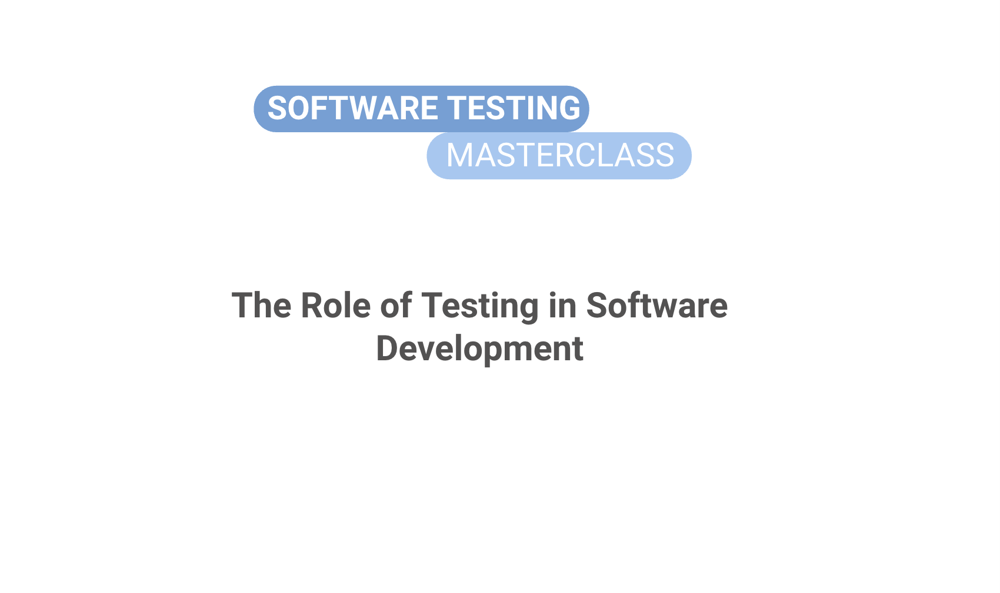
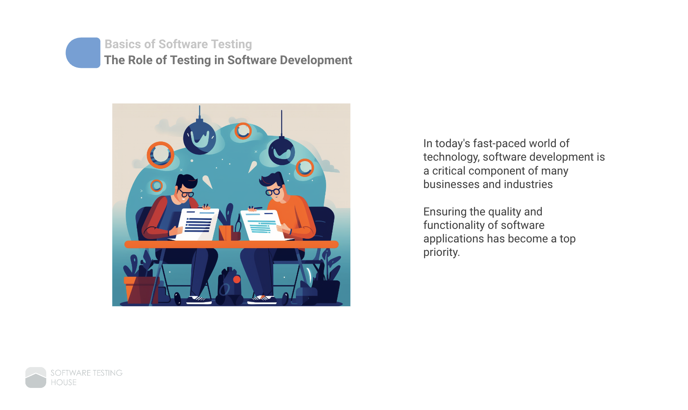
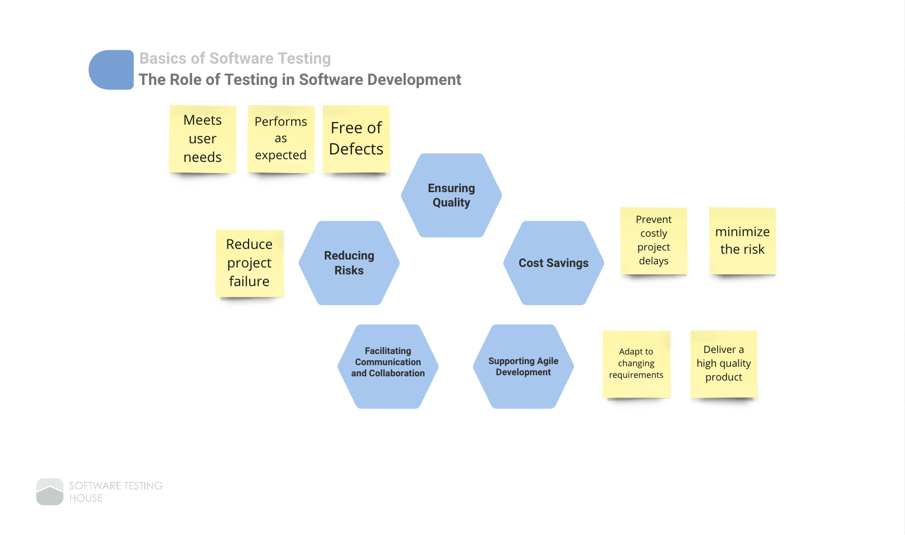

# 1-+The+Role+of+Testing+in+Software+Development.pdf

# The Role of Testing in Software Development

# Basics of Software Testing
## The Role of Testing in Software Development

In today's fast-paced world of technology, software development is a critical component of many businesses and industries

Ensuring the quality and functionality of software applications has become a top priority.

Basics of Software Testing

The Role of Testing in Software Development

