# Золотухіна Якість та тестування інформаційних систем ДУТ 2020.pdf


МІНІСТЕРСТВО ОСВІТИ І НАУКИ УКРАЇНИ

ДЕРЖАВНИЙ УНІВЕРСИТЕТ ТЕЛЕКОМУНІКАЦІЙ

НАВЧАЛЬНО-НАУКОВИЙ ІНСТИТУТ ІНФОРМАЦІЙНИХ ТЕХНОЛОГІЙ

Золотухіна О.А., Негоденко О.В.,  
Резник С.Ю., Разіна С.Я.

НАВЧАЛЬНИЙ ПОСІБНИК

# ЯКІСТЬ ТА ТЕСТУВАННЯ ІНФОРМАЦІЙНИХ СИСТЕМ

Київ – 2020


<!-- ВІДНОВЛЕНО ЛОКАЛЬНО (Стор. 2) -->
УДК 004.05 

Гриф надано Навчально- науковим інститутом інформаційних технологій Державного університету телекомунікацій (протокол №2 від 04.09. 2020 р.) 

**Рецензенти:** 

Шушура О.М.,доктор технічних наук, професор, професор кафедри Автоматизації проектування енергетичних процесів та систем Київського політехнічного інституту імені І. Сікорського. 

**Автори: Золотухіна О.А.,Негоденко О.В., Резник С.Ю., Разіна С.Я.** 

**Якість та тестування інформаційних систем** . Навчальний посібник підготовлено до друку для самостійної роботи студентів вищих навчальних закладів. Київ: ННІІТ ДУТ, 2020. –128 с. 

Навчальний посібник призначено для вивчення дисципліни «Якість та тестування інформаційних систем». Читачам надається опис дисципліни та навчальний матеріал за ключовими темами, які присвячені різним видам та методам тестування, а також особливостям визначення та оцінки показників якості інформаційних систем із використанням різноманітних стандартів та метрик. Текст посібника та додатки містять шаблони ключових артефактів, які використовуються в процесі валідації та верифікації інформаційних систем, а також завдання для виконання практичних робіт. 

Навчальний посібник може бути використаний студентами галузь знань –"Інформаційні технології"освітньо-кваліфікаційного рівня «бакалавр» для підготовки до лекційних, практичних і лабораторних занять з дисципліни, а також всіма, хто цікавиться питаннями тестування та якості інформаційних систем. 

2
<!-- КІНЕЦЬ ВІДНОВЛЕННЯ -->


ЗМІСТ

1. Опис навчальної дисципліни ................................................................. 5
2. Поняття та види тестування ................................................................. 8
    2.1 Поняття та мети тестування ......................................................... 8
    2.2 Класифікація за об'єктом тестування: ........................................... 9
    2.3 Класифікація за рівнем знання про систему ................................ 11
    2.4 Класифікація за ступенем автоматизації .................................... 15
    2.5 Класифікація за ступенем ізольованості компонентів: ................ 17
    2.6 Класифікація за часом проведення тестування: .......................... 18
    2.7 Класифікація за ознакою позитивності сценарію ....................... 22
    2.8 Класифікація за ступенем підготовленості до тестування ............ 23
    2.9 Артефакти тестування .................................................................. 25
    2.9.1 План тестування ................................................................... 25
    2.9.2 Тест-кейс ............................................................................... 27
    2.9.3 Чек-лист ................................................................................ 30
    2.9.4 Баг Репорт .............................................................................. 34
Практичні завдання ..................................................................................... 38
3. Методи тестування ............................................................................... 44
    3.1 Тест дизайн .................................................................................... 44
    3.2 Класи еквівалентності .................................................................. 46
    3.3 Метод кордонних (граничних) умов ............................................ 47
    3.4 Таблиця Прийняття Рішень (Decision Table Testing) .................. 48
    3.5 Тестування Станів і Переходів (State-Transition Testing) .............. 51
    3.6 Тестування сценаріїв використання (Use Case Testing) ................ 52
    3.7 Передбачення помилки (Error Guessing - EG) ............................. 52
    3.8 Вичерпне тестування (Exhaustive Testing - ET) .......................... 52
    3.9.Способи скорочення кількості тестових випадків ......................... 53
    3.9.1 Метод Парного Тестування (Pairwise testing) ........................... 53
    3.9.2 Доменний аналіз (Domain Analysis Testing) .............................. 53

3.9.3 Input-Output Analysis........................................................................... 55

Практичні завдання......................................................................................56

4. Забезпечення якості інформаційних систем............................................... 61

4.1 Причини виникнення дефектів інформаційних систем ............................ 61

4.2 Поняття якості інформаційної системи. Характеристики якості..... 64

4.3 Стандарти якості інформаційних систем ................................................ 70

4.4 Метрики якості .......................................................................................... 74

4.4.1 Метрики за тестовими випадками.................................................... 74

4.4.2 Метрики за багами/дефектами.......................................................... 75

4.4.3 Метрики за задачами ........................................................................ 76

4.4.4 Юзабіліті-метрики ........................................................................... 76

4.4.5 Метрики Kanban ............................................................................... 78

4.4.6 Метрики SCRUM ............................................................................... 78

4.5 Валідація і верифікація............................................................................. 81

Практичні завдання.......................................................................................83

Список літератури......................................................................................... 86

Додаток 1 Тест план IEEE 829 ....................................................................... 88

Додаток 2 Тест план RUP .............................................................................. 96

Додаток 3 Приклад шаблону тест-кейсу....................................................... 117

Додаток 4 Приклад шаблону баг-репорту ................................................... 118

Додаток 5 Індивідуальні варіанти завдань.................................................. 120

## 1. ОПИС НАВЧАЛЬНОЇ ДИСЦИПЛІНИ

Навчальна дисципліна «Якість інформаційних систем та тестування» вивчається студентами освітньо-кваліфікаційного рівня «бакалавр» галузь знань 12, «Інформаційні технології».

**Мета** дисципліни «Якість та тестування інформаційних систем» - навчити студентів процесу якісної розробки інформаційних систем з використанням міжнародних стандартів, проводити інспекцію та інтеграцію програмного коду інформаційної системи, вивчити процес тестування характеристик інформаційних систем.

**Завдання**: отримання студентом компетенцій для того, щоб розробляти якісні інформаційні системи із забезпеченням необхідної документації процесу розробки, а також отримання студентом навичок тестування інформаційних систем.

В результаті вивчення даного курсу студент повинен

**знати**:

- загальні відомості про найпопулярніші стандарти якості в сфері розробки інформаційних систем (IC);
- критерії тестування та вимоги до ідеального критерію;
- основи написання тест кейсів та загальну термінологію тестувальників;
- методи інспектування специфікацій та основні недоліки специфікацій;
- основні методи тестування характеристик якості IC;
- інструменти для тестування основних характеристик IC;
- шаблони проектування тестів при автоматизованому тестування;
- основні розділи та методики написання тестових планів.

**вміти**:

- виконувати ефективні та кваліфіковані інспекції;

– проектувати та реалізувати плани по комплексному тестуванню інформаційних систем;

– ефективно та кваліфіковано застосовувати методи тестування;

– розраховувати покриття та результативність тестування на основі багатьох критеріїв;

– використовувати статистичні методи для оцінки щільності дефектів та вірогідності відмов;

– інспектувати процес розробки інформаційних систем з метою оцінки ефективності контролю якості.

Посібник включає матеріали за наступними темами змістовних модулів:

– «Поняття та види тестування»;

– «Методи тестування»;

– «Забезпечення якості інформаційних систем».

Навчальний процес організовується шляхом читання лекцій, проведення практичних та лабораторних занять. На лекціях закладаються основи розуміння студентами базових методів тестування та оцінки якості інформаційних систем, на практичних та лабораторних заняттях студенти набувають навички з вибору та використання методів та технологій тестування та оцінки і забезпечення якості урахуванням особливостей задач конкретної інформаційної системи. Для самостійної роботи студентам разом з рекомендованою літературою пропонується користуватися електронними версіями підручників, посібників, документів, що представлені в електронній бібліотеці на сайті університету, а також можливостями мережі Інтернет.

Поточний контроль здійснюється під час проведення практичних та лабораторних занять і має на меті перевірку рівня підготовленості студента до виконання конкретної роботи. Тестовий контроль проводиться на лекційних заняттях. Семестровий контроль проводиться у формі заліку в

обсязі навчального матеріалу, визначеного навчальною програмою, і в терміни, встановлені навчальним планом.

Залікова оцінка з дисципліни «Якість та тестування інформаційних систем» виставляється як сума балів, отриманих за виконання лабораторних та практичних робіт, а також балів, які студент отримав за поточні теоретичні опитування.

Розподіл балів, які отримують студенти, наведено в таблиці 1.1. T1, T2 ... T6 – теми змістових модулів.

Таблиця 1.1 – Розподіл балів, які отримують студенти

| Поточне тестування та самостійна робота | Сума |
| :---: | :---: |

| Змістовний модуль 1 | Змістовний модуль 2 | Змістовний модуль 3 |
| :---: | :---: | :---: |

| T1 | T2 | T3 | T4 | T5 | T6 | |
| :---: | :---: | :---: | :---: | :---: | :---: | :---: |
| 25 | 15 | 15 | 15 | 15 | 15 | 100 |

При самостійній роботі студенти набувають навички самостійного освоєння інструментарію тестування, які не використані в навчальному процесі та поглиблюються свої знання щодо технологій автоматизованого тестування.


<!-- ВІДНОВЛЕНО ЛОКАЛЬНО (Стор. 8) -->
# **2.ПОНЯТТЯ ТА ВИДИ ТЕСТУВАННЯ** 

# **2.1 Поняття та мети тестування** 

Існує декілька визначень понять, пов’язаних із тестуванням. З одного боку, тестування –це процес дослідження та випробування програмного продукту. Призначення тестування полягає в демонстрації розробникам і замовникам того, що програма відповідає вимогам, а також виявлення ситуацій, в яких поведінка програми є неправильною, небажаною або не відповідає специфікації. З іншого боку, тестування – це перевірка відповідності між реальною і очікуваною поведінкою програми. Воно здійснюється на кінцевому наборі тестів, обраному певним чином. Тестування в широкому сенсі – це одна з технік контролю якості, що включає в себе активності: 

- з планування робіт (TestManagement); 

- з проектування тестів (TestDesign); 

- з виконання тестування (TestExecution); 

- з аналізу отриманих результатів (TestAnalysis). 

Мети тестування полягають у наступному: 

- підвищити ймовірність того, що інформаційна система, призначена 

- для тестування, буде працювати правильно при будь-яких обставинах; 

− підвищити ймовірність того, що інформаційна система, призначена для тестування, буде відповідати всім описаним вимогам; 

- надати актуальну інформацію про стан продукту (інформаційної 

- системи) на даний момент. 

Існують різні способи класифікації тестування за метою, рівнем, призначенням, позитивністю, об’єктом та багатьма іншими характеристиками (Рис.1). Далі буде розглянуто найбільш використані способи класифікації видів тестування. 

8
<!-- КІНЕЦЬ ВІДНОВЛЕННЯ -->


Рис.2.1 Класифікація тестування

## 2.2 Класифікація за об'єктом тестування

**За об'єктом тестування** виділяють наступні види тестування:

- функціональне тестування;
- тестування продуктивності;
  - тестування навантаження;
  - стрес-тестування;
  - тестування стабільності;
- конфігураційне тестування;
- юзабіліті-тестування;
- тестування інтерфейсу користувача;
- тестування безпеки;
- тестування локалізації;
- тестування сумісності.

*Функціональне тестування* розглядає заздалегідь вказане поведінку і ґрунтується на аналізі специфікацій функціональності компонента або системи в цілому


<!-- ВІДНОВЛЕНО ЛОКАЛЬНО (Стор. 10) -->
**_Тестування навантаження_** - це автоматизоване тестування, що імітує роботу певної кількості бізнес користувачів на якомусь загальному ресурсі. 

**_Стресове тестування_** (StressTesting) дозволяє перевірити наскільки додаток і система в цілому працездатні в умовах стресу і також оцінити здатність системи до регенерації, тобто до повернення до нормального стану після припинення впливу стресу. Стресом в даному контексті може бути підвищення інтенсивності виконання операцій до дуже високих значень або аварійне зміна конфігурації сервера. Також одним із завдань при стресовому тестуванні може бути оцінка деградації продуктивності, таким чином цілі стресового тестування можуть перетинатися з цілями тестування продуктивності. 

**_Тестування стабільності або надійності_** (Stability / ReliabilityTesting). Завданням тестування стабільності (надійності) є перевірка працездатності програми при тривалому (багатогодинному) тестуванні із середнім рівнем навантаження. 

**_Конфігураційне тестування_** (ConfigurationTesting) - спеціальний вид тестування, спрямований на перевірку роботи програмного забезпечення при різних конфігураціях системи (заявлених платформах, підтримуваних драйвери, при різних конфігураціях комп'ютерів і т.д.) 

**_Тестування зручності користування_** (юзабіліті) - це метод тестування, спрямований на встановлення ступеня зручності використання, навченості, зрозумілості і привабливості для користувачів продукту, що розробляється в контексті заданих умов. Сюди також входить тестування для користувача інтерфейсу (англ. UI Testing) - це вид тестування дослідження, виконуваного з метою визначення, чи зручний деякий штучний об'єкт (такий як вебсторінка, призначений для користувача інтерфейс або пристрій) для його передбачуваного застосування. UsereXperience (UX) - відчуття, яке відчувається користувачем під час використання цифрового продукту, в той 

10
<!-- КІНЕЦЬ ВІДНОВЛЕННЯ -->


<!-- ВІДНОВЛЕНО ЛОКАЛЬНО (Стор. 11) -->
час як Userinterface - це інструмент, що дозволяє здійснювати інтеракцію «користувач - програмний ресурс». 

**_Тестування безпеки_** - це стратегія тестування, яка використовується для перевірки безпеки системи, а також для аналізу ризиків, пов'язаних із забезпеченням цілісного підходу до захисту додатки, атак хакерів, вірусів, несанкціонованого доступу до конфіденційних даних. 

**_Тестування взаємодії_** (InteroperabilityTesting) - це функціональне тестування, що перевіряє здатність додатку взаємодіяти з одним і більше компонентами або системами і включає в себе тестування сумісності (compatibilitytesting) і інтеграційне тестування. 

# **2.3 Класифікація за рівнемзнання про систему** 

**За рівнем знання про систему виділяють наступні види тестування:** 

- чорний ящик(BlackBox); 

- білий ящик (WhiteBox); 

- сірий ящик (GreyBox). 

# **_BlackBox._** 

Summary: Ми не знаємо, як влаштована тестована система. 


Рис. 2.2 Вид тестування BlackBox 

11
<!-- КІНЕЦЬ ВІДНОВЛЕННЯ -->


Тестування методом «чорного ящика» (Рис.2), також відоме як тестування, засноване на специфікації або тестування поведінки - техніка тестування, заснована на роботі виключно з зовнішніми інтерфейсами тестової системи. Тестування чорного ящика - це:

- тестування, як функціональне, так і не функціональне, яке не передбачає знання внутрішнього устрою компонента або системи;
- тест-дизайн, заснований на техніці чорного ящика - процедура написання або вибору тест-кейсів на основі аналізу функціональної або не функціональної специфікації компонента або системи без знання її внутрішнього устрою.

Чому саме «чорний ящик»? Тестова програма для тестувальника - як чорний непрозорий ящик, змісту якого він не бачить. Метою цієї техніки є пошук помилок в таких категоріях:

- неправильно реалізовані або відсутні функції;
- помилки інтерфейсу;
- помилки в структурах даних або організації доступу до зовнішніх баз даних;
- помилки поведінки або недостатня продуктивність системи.

Таким чином, ми не маємо уявлення про структуру та внутрішній устрій системи. Потрібно концентруватися на тому, що програма робить, а не на тому, як вона це робить.

Тестування чорного ящика може бути як функціональним, так і не функціональним. Функціональне тестування передбачає перевірку роботи функцій системи, а не функціональне - відповідно, загальні характеристики нашої програми.

Техніка чорного ящика може бути застосована на всіх рівнях тестування (від модульного до приймального), для яких існує специфікація. Наприклад, при здійсненні системного або інтеграційного тестування,


<!-- ВІДНОВЛЕНО ЛОКАЛЬНО (Стор. 13) -->
вимоги або функціональна специфікація будуть основою для написання тесткейсів. 

Переваги: 

− тестування проводиться з позиції кінцевого користувача і може допомогти виявити неточності і протиріччя в специфікації; 

− тестувальнику немає необхідності знати мови програмування і заглиблюватися в особливості реалізації програми; 

− тестування може проводитися фахівцями, незалежними від відділу розробки, що допомагає уникнути упередженого ставлення; 

− можна починати писати тест-кейси, як тільки готова специфікація. Недоліки: 

− тестується тільки дуже обмежена кількість шляхів виконання програми; 

− без чіткої специфікації(а це швидше за реальність на багатьох проектах) досить важко скласти ефективні тест-кейси; 

− деякі тести можуть виявитися надмірними, якщо вони вже були проведені розробником на рівні модульного тестування. **_WhiteBox._** 

Summary: Нам відомі всі деталі реалізації програми, що тестується. 


Рис.2.3 Вид тестування WhiteBox 

Тестування методом білого ящика (також: прозорого, відкритого, скляного ящика; засноване на коді або структурний тестування) - метод 

13
<!-- КІНЕЦЬ ВІДНОВЛЕННЯ -->


тестування програмного забезпечення, який передбачає, що внутрішня структура / пристрій / реалізація системи відомі тестувальникам(Рис.3). Ми вибираємо вхідні значення, ґрунтуючись на знанні коду, який буде їх обробляти. Точно так само ми знаємо, яким повинен бути результат цієї обробки. Знання всіх особливостей програми, що тестується і її реалізації - обов'язкові для цієї техніки. Тестування білого ящика - поглиблення під внутрішній устрій системи, за межі її зовнішніх інтерфейсів.

Тестування білого ящика - це:
- тестування, засноване на аналізі внутрішньої структури компонента або системи.
- тест-дизайн, заснований на техніці білого ящика - процедура написання або вибору тест-кейсів на основі аналізу внутрішнього устрою системи або компонента.

Техніка білого ящика може бути застосована на різних рівнях тестування - від модульного до системного, але головним чином застосовується саме для реалізації модульного тестування компонента його автором.

Переваги:
- тестування може проводитися на ранніх етапах: немає необхідності чекати створення призначеного для користувача інтерфейсу;
- можна провести більш ретельне тестування, з покриттям великої кількості шляхів виконання програми.

Недоліки:
- для виконання тестування білого ящика необхідна велика кількість спеціальних знань
- при використанні автоматизації тестування на цьому рівні, підтримка тестових скриптів може виявитися досить накладної, якщо програма часто змінюється.

Чому «білий ящик»? Тестова програма для тестувальника - прозорий ящик, вміст якого він прекрасно бачить.

*GreyBox.*

Summary: Нам відомі тільки деякі особливості реалізації тестованої системи.

Тестування методом сірого ящика - метод тестування програмного забезпечення, який передбачає, комбінацію WhiteBox і BlackBox підходів. Тобто, внутрішній устрій програми нам відомо лише частково. Передбачається, наприклад, доступ до внутрішньої структури та алгоритмам роботи програмного забезпечення для написання максимально ефективних тест-кейсів, але саме тестування проводиться за допомогою техніки чорного ящика, тобто, з позиції користувача. Цю техніку тестування також називають методом напівпрозорого ящика: щось ми бачимо, а що - ні. Техніка сірого ящика може бути застосована на різних рівнях тестування - від модульного до системного, але головним чином застосовується на інтеграційному рівні для перевірки взаємодії різних модулів програми.

## 2.4 Класифікація за ступенемавтоматизації

За ступенемавтоматизаціївиділяють наступні види тестування:

- ручне;
- автоматизоване;
- напів-автоматизоване.

При ***ручному тестуванні*** (manualtesting) тестувальники вручну виконують тести, не використовуючи ніяких засобів автоматизації. Ручне тестування - самий низькорівневий і простий тип тестування, які не потребують великої кількості додаткових знань.

Проте, перед тим як автоматизувати тестування будь-якої програми, необхідно спочатку виконати серію тестів вручну. Мануальне тестування


<!-- ВІДНОВЛЕНО ЛОКАЛЬНО (Стор. 16) -->
вимагає значних зусиль, але без нього ми не зможемо переконатися в тому, чи можлива автоматизація в принципі. Один з фундаментальних принципів тестування говорить: 100% автоматизація неможлива. Тому, ручне тестування - необхідність. 

**_Автоматизоване тестування_** передбачає використання спеціального програмного забезпечення (крім тестового) для контролю виконання тестів і порівняння очікуваного фактичного результату роботи програми. Цей тип тестування допомагає автоматизувати часто повторювані, але необхідні для максимізації тестового покриття завдання. 

Деякі завдання тестування, такі як низькорівневий регресійне тестування, можуть бути трудомісткою і вимагають багато часу якщо виконувати їх вручну. Крім того, мануальне тестування може недостатньо ефективно знаходити деякі класи помилок. У таких випадках автоматизація може допомогти заощадити час і зусилля проектної команди. 

Після створення автоматизованих тестів, їх можна в будь-який момент запустити знову, причому запускаються і виконуються вони швидко і точно. Таким чином, якщо є необхідність частого повторного прогону тестів, значення автоматизації для спрощення супроводу проекту і зниження його вартості важко переоцінити. Адже навіть мінімальні патчі і зміни коду можуть стати причиною появи нових багів. 

Існує кілька основних видів автоматизованого тестування: 

− автоматизація тестування коду (Code-driventesting) - тестування на рівні програмних модулів, класів і бібліотек (фактично, автоматичні юніттести); 

− автоматизація тестування графічного інтерфейсу користувача (Graphicaluserinterfacetesting) - спеціальна програма (фреймворк автоматизації тестування) дозволяє генерувати користувальницькі події - натискання клавіш, кліки мишкою, і відслідковувати реакцію програми на ці дії - чи відповідає вона специфікації. 

16
<!-- КІНЕЦЬ ВІДНОВЛЕННЯ -->


– автоматизація тестування API (Application Programming Interface) - програмного інтерфейсу програми. Тестуються інтерфейси, призначені для взаємодії, наприклад, з іншими програмами або з користувачем. Тут знову ж таки, як правило, використовуються спеціальні фреймворки.

Для складання автоматизованих тестів, QA-фахівець повинен вміти програмувати. Автоматичні тести - це повноцінні програми, просто призначені для тестування.

Коли, що і як автоматизувати і чи автоматизувати взагалі - дуже важливі питання, відповіді на які повинна дати команда розробки. Вибір правильних елементів програми для автоматизації в великій мірі буде визначати успіх автоматизації тестування в принципі. Потрібно уникати автоматизації тестування ділянок коду, які можуть часто змінюватися.

На реальних проектах часто використовується комбінація ручного і автоматизованого тестування, причому рівень автоматизації буде залежати як від типу проекту, так і від особливостей постановки виробничих процесів в компанії.

### 2.5 Класифікація за ступенем ізольованості компонентів

За ступенем ізольованості компонентів виділяють наступні види тестування:
- модульне тестування;
- інтеграційне тестування;
- системне тестування.

***Модульне тестування*** (Unit Testing). Компонентне (модульне) тестування перевіряє функціональність і шукає дефекти в частинах додатка, які доступні і можуть бути протестовані по-окремо (модулі програм, об'єкти, класи, функції і т.д.).


<!-- ВІДНОВЛЕНО ЛОКАЛЬНО (Стор. 18) -->
**_Інтеграційний тестування_** (IntegrationTesting). Перевіряється взаємодія між компонентами системи після проведення компонентного тестування. 

**_Системне тестування_** (SystemTesting). Основним завданням системного тестування є перевірка як функціональних, так і не функціональних вимог в системі в цілому. При цьому виявляються дефекти, такі як неправильне використання ресурсів системи, непередбачені комбінації даних користувача рівня, несумісність з оточенням, непередбачені сценарії використання, відсутня або неправильна функціональність, незручність використання і т.д. 

# **2.6 Класифікація за часом проведення тестування** 

За часом проведення тестування виділяють наступні види тестування: − альфа-тестування: 

   - димове тестування; 

   - тестування нової функції; 

   - підтверджуюче тестування; 

   - регресійне тестування; 

   - приймальне тестування; 

- бета-тестування. 

**_Альфа-тестування_** (alphatesting) - це вид приймального тестування, яке зазвичай проводиться на пізній стадії розробки продукту і включає імітацію реального використання продукту штатними розробниками або командою тестувальників. Зазвичай альфа тестування полягає в систематичній перевірці всіх функцій програми з використанням технік тестування «білого ящика» і «чорного ящика». 

Переваги альфа-тестування: 

18
<!-- КІНЕЦЬ ВІДНОВЛЕННЯ -->


<!-- ВІДНОВЛЕНО ЛОКАЛЬНО (Стор. 19) -->
− забезпечує краще уявлення про надійність програмного 

забезпечення на ранній стадії; 

− допомагає моделювати поведінку користувача і навколишнє середовище в режимі реального часу; 

− виявляє багато серйозних помилок; 

− дає можливість раннього виявлення помилок щодо дизайну і функціональності. 

Недоліки альфа-тестування: 

− функціональність не може бути перевірена на всю глибину, оскільки програмне забезпечення все ще знаходиться на стадії розробки; 

− іноді розробники і тестувальники незадоволені результатами альфатестування. 

**_Бета-тестування_** (betatesting) - інтенсивне використання майже готової версії продукту з метою виявлення максимального числа помилок в його роботі для їх подальшого усунення перед остаточним виходом (релізом) продукту на ринок, до масового споживача. Бета-тестування є реально працюючу версію програми з повним функціоналом. І завдання бета-тестів - оцінити можливості і стабільність роботи програми з точки зору її майбутніх користувачів. 

На відміну від альфа-тестування, проведеного силами штатних розробників або тестувальників, бета-тестування передбачає залучення добровольців з числа звичайних майбутніх користувачів продукту, яким доступна згадана попередня версія продукту (так звана бета-версія). 

Такими добровольцями (їх називають бета-тестерами) часто рухає цікавість до нового продукту - цікавість, заради задоволення якого вони цілком згодні миритися з можливістю випробувати наслідки ще не знайдених (а тому і не виправлених) помилок. Крім цікавості, мотивація може бути обумовлена бажанням вплинути на процес розробки і в підсумку отримувати більш задовольняє їхні потреби продукт і багатьом іншим. Дуже добре, якщо 

19
<!-- КІНЕЦЬ ВІДНОВЛЕННЯ -->


це люди, які вже мають досвід роботи з програмами такого типу, а ще краще - з попередньою версією цієї ж програми. Зазвичай у компаній вже є певне коло осіб, з якими вони постійно співпрацюють.

Бета-тестування може бути:
- *закритим*: програма тестується в невеликій групі користувачів за запрошеннями;
- *відкритим*: цей варіант дозволяє протестувати додаток в більшій групі і отримати великий обсяг зворотного зв'язку; будь-який користувач зможе приєднатися до відкритого бета-тестування і відправити особистий відгук.

Переваги бета-тестування:
- знижує ризик виходу продукту з ладу за допомогою валідації клієнта;
- бета-тестування дозволяє компанії тестувати інфраструктуру після запуску;
- підвищує якість продукції завдяки зворотного зв'язку з клієнтами;
- є економічним методом збору даних в порівнянні з аналогічними методами;
- створює доброзичливість з клієнтами і підвищує задоволеність клієнтів.

Недоліки бета-тестування:
- управління тестуванням – проблема; у порівнянні з іншими типами тестування, які зазвичай виконуються всередині компанії в контрольованому середовищі, бета-тестування виконується в реальному світі, де у компанії рідко є контроль;
- пошук правильних користувачів бета-версії і підтримання їх участі може викликати труднощі.

Фази тестування:

1. Пре-альфа: програмне забезпечення є прототипом. Інтерфейс завершений, але не всі функції завершені. На цьому етапі програмне забезпечення не публікується.

2. Альфа: розробка програмного забезпечення підійшла до кінця і програмне забезпечення внутрішньо перевірено на наявність помилок і проблем.

3. Бета: програмне забезпечення стабільно і випущено обмеженому числу користувачів. Мета полягає в тому, щоб отримати відгуки клієнтів про продукт і внести відповідні зміни в програмне забезпечення.

4. Реліз-кандидат: на основі відгуків бета-тесту вносяться зміни в програмне забезпечення і перевіряються виправлення помилок. На цьому етапі функціональність радикально не змінюється. Реліз-кандидат також виставляється громадськості.

5. Випуск (реліз): все працює, програмне забезпечення випущено для загального користування.

_Димове (Smoke) тестування_ розглядається як короткий цикл тестів, що виконується для підтвердження того, що після складання коду (нового або відредагованого) встановлюється додаток, стартує і виконує основні функції.

_Тестування збірки_ або BuildVerificationTest - тестування спрямоване на визначення відповідності, випущеної версії, критеріям якості для початку тестування. За своїми цілями є аналогом димових Тестування, спрямованого на приймання нової версії в подальше тестування або експлуатацію. Вглибно воно може проникати далі, в залежності від вимог до якості випущеної версії.

_Регресійне тестування_ - це вид тестування спрямований на перевірку змін, зроблених в додатку або навколишньому середовищу (лагодження дефекту, злиття коду, міграція на іншу операційну систему, базу даних, веб сервер або сервер додатки), для підтвердження того факту, що існуюча

раніше функціональність працює як і раніше. Регресійний можуть бути як функціональні, так і не функціональні тести.

*Повторне тестування* - тестування, під час якого виконуються тестові сценарії, які виявили помилки під час останнього запуску, для підтвердження успішності виправлення цих помилок. У чому різниця між regressiontesting і re-testing? Re-testing - перевіряється виправлення багів. Regressiontesting - перевіряється те, що виправлення багів не вплинуло на інші модулі системи і не викликало нових багів.

*Приймальне тестування* (AcceptanceTesting). Формальний процес тестування, який перевіряє відповідність системи вимогам і проводиться з метою:

- визначення чи задовольняє система приймальним критеріям;
- винесення рішення замовником або іншою уповноваженою особою приймається додаток чи ні.

### 2.7 Класифікація за ознакою позитивності сценарію

За ознакою позитивності сценарію виділяють наступні види тестування:

- позитивне тестування;
- негативне тестування.

*Позитивне тестування* - це тестування з застосуванням сценаріїв, які відповідають нормальному (штатним, очікуваному) поведінки системи. З його допомогою ми можемо визначити, що система робить те, для чого і була створена.

Негативним називають тестування, в рамках якого застосовуються сценарії, що відповідає позаштатному поведінки тестованої системи. Це можуть бути наприклад, виняткові ситуації або невірні дані.

*Негативне тестування* направлено на перевірку стійкості системи до різних впливів, валідації невірних даних, обробки виняткових ситуацій.

Сценарії позитивного тестування, в свою чергу, спрямовані на перевірку роботи системи з тими типами даних, для яких вона розроблялася.

Створення позитивних сценаріїв (тест-кейсів), як правило, передує створенню негативних тест-кейсів. Спочатку ми перевіряємо роботу системи, коли наш умовний користувач працює з системою "правильно", а потім приступаємо до перевірки відгуку системи на користувача, що допускає різні помилки (введення невірних даних наприклад). І система повинна бути готова відповісти на невірний запит. Це і є мета негативного тестування.

## 2.8 Класифікація за ступенем підготовленості до тестування

За ступенем підготовленості до тестування виділяють наступні види тестування:

- тестування на підставі документації;
- інтуїтивне тестування.

***Інтуїтивне тестування* (ad-hoctesting)** - вид тестування, який виконується без підготовки до тестів, без визначення очікуваних результатів, проектування тестових сценаріїв. Це неформальне, імпровізаційне тестування. Воно не вимагає ніякої документації, планування, процесів яких слід дотримуватися у виконанні. Також на даний вид тестування не пишуться тест-кейсu, що в свою чергу може викликати певні труднощі в спробах відтворити дефект в системі. Такий вид найчастіше може дати відразу більше результату ніж тестування за заздалегідь визначеними сценаріями. Це обумовлено тим, що тестувальник на перших кроках приступає до тестування основного функціоналу і виконує нестандартні перевірки, точніше деякі з його перевірок будуть нестандартними.

Часто інтуїтивне тестування плутають з дослідним. Якщо говорити про ad-hoctesting і дослідне тестування, то ad -hoctesting - це більш інтуїтивне і безладне тестування, коли тестувальник просто йде і перевіряє, що йому

хочеться. У нього немає певної мети, структури тестів в голові, якоїсь системи. У свою чергу дослідне тестування більш структуроване. Зазвичай тестувальник знає, що йому потрібно перевірити, у нього в голові є мета і якась система проведення тестів. Хоч тести в цьому випадку не обов'язково повинні бути оформлені у вигляді тест кейсів.

Ad-hoc тестування виконується, коли мало часу на точне і послідовне тестування. При цьому тестувальник покладається на своє загальне уявлення про програму і здоровий глузд. Тестування ad-hoc має сенс тільки в разі якщо тестувальник володіє загальною інформацією про продукт. Якщо людина зовсім не знатиме продукт, то витратить час на його вивчення, особливо якщо проєкт дуже складний і великий. Тому потрібно гарне уявлення про цілі проєкту, його призначенням і основним функціям і можливостям. А далі вже можна приступати до ad-hoctesting.

Види інтуїтивного тестування:

- buddytesting (спільне тестування) - коли 2 людини, як правило розробник + тестувальник, працюють паралельно і знаходять дефекти в одному і тому ж модулі. Такий вид тестування допомагає тестувальника виконувати необхідні перевірки, а програмісту - фіксувати баги на ранніх етапах.

- pairtesting (парне тестування) - коли 2 тестувальника перевіряють один модуль і допомагають один одному. Наприклад один може шукати дефекти, а другий їх документувати. Таким чином у одного тестера буде функція, того, хто знаходить, в іншого — того, хто описує.

- monkeytesting - довільне тестування програми з метою її зламати.

Основні переваги ad-hoctesting:

- немає необхідності витрачати час для підготовки документації;
- найважливіші дефекти виявляються на ранніх етапах;


<!-- ВІДНОВЛЕНО ЛОКАЛЬНО (Стор. 25) -->
− часто застосовується коли беруть нового співробітника: методом ad-hoc людина схоплює за 3 дні те, що по тест кейсам розбирала б тиждень - це називається форсоване навчання нових співробітників; 

− можливість знайти хитрі дефекти, які не можна було б знайти при використанні стандартних сценаріїв перевірок. 

# **2.9 Артефакти тестування** 

У відповідності до процесів та методологій розробки інформаційних систем, під час проведення тестування створюється і використовується певна кількість тестових артефактів (документи, моделі і т.д.). Найбільш поширеними тестовими артефактами є: 

− План тестування (TestPlan) - це документ, який описує весь обсяг робіт з тестування, починаючи з опису об'єкта, стратегії, розкладу, критеріїв початку і закінчення тестування, до необхідного в процесі роботи обладнання, спеціальних знань, а також оцінки ризиків з варіантами їх вирішення. 

− Набір тест кейсів і тестів (TestCase&Testsuite) - це послідовність дій, по якій можна перевірити чи відповідає тестована функція встановленим вимогам. 

− Чек-лист (Checklist - контрольний список) - список, що містить ряд необхідних перевірок. 

− Дефекти /Баг репорти (BugReports / Defects) - це документи, що описують ситуацію або послідовність дій, яка призвела до некоректної роботи об'єкта тестування, із зазначенням причин і очікуваного результату. 

# **2.9.1 План тестування** 

Кожна методологія або процес намагаються нав'язати свої формати оформлення планів тестування. Хороший тест план повинен як мінімум описувати наступне: 

25
<!-- КІНЕЦЬ ВІДНОВЛЕННЯ -->


<!-- ВІДНОВЛЕНО ЛОКАЛЬНО (Стор. 26) -->
_Що треба тестувати?_ 

- опис об'єкта тестування: системи, додатки, обладнання. 

_Що буде тестуватися?_ 

- список функцій і опис тестової системи і її компонент окремо. 

_Як буде проводитися тестування?_ 

- стратегія тестування, а саме: види тестування і їх застосування по 

- відношенню до об'єкта тестування . 

_Коли буде проводитися тестування?_ 

− послідовність проведення робіт: підготовка (TestPreparation), тестування (Testing), аналіз результатів (TestResultAnalisys) в розрізі запланованих фаз розробки. 

_Критерії початку тестування:_ 

- готовність тестової платформи (тестового стенда); 

- закінченість розробки необхідного функціоналу; 

- наявність всієї необхідної документації; 

- тощо. 

_Критерії закінчення тестування:_ 

- результати тестування задовольняють критеріям якості продукту; 

- вимоги до кількості відкритих багів виконані; 

− витримка певного періоду без зміни вихідного коду програми CodeFreeze (CF); 

− витримка певного періоду без відкриття нових багів 

ZeroBugBounce (ZBB) 

− інші критерії. 

_Оточення тестованої системи (опис програмно-апаратних засобів)._ 

_Необхідна для тестування обладнання та програмні засоби (тестовий стенд і його конфігурація, програми для автоматизованого тестування і т.д.)._ 

26
<!-- КІНЕЦЬ ВІДНОВЛЕННЯ -->


<!-- ВІДНОВЛЕНО ЛОКАЛЬНО (Стор. 27) -->
_Ризики та шляхи їх вирішення._ 

**_Види тест планів._** 

Найчастіше на практиці доводиться стикатися з такими видами тест планів: 

- Майстер Тест План (MasterPlanor MasterTestPlan); 

− Тест План (TestPlan), детальний тест план; 

− План приймальних випробувань (ProductAcceptancePlan) - документ, що описує набір дій, пов'язаних з приймальним тестуванням (стратегія, дата проведення, відповідальні працівники і т.д.). 

Явна відміна Майстер Тест Плану від просто Тест Плану в тому, що Майстер Тест План є більш статичним в силу того, що містить у собі високорівневу (HighLevel) інформацію, яка не схильна до частої зміни в процесі тестування і перегляду вимог. Сам же детальний тест план, який містить більш конкретну інформацію по стратегії, видам тестуванні, розкладом виконання робіт, є "живим" документом, який постійно зазнає змін, що відображають реальний стан справ на проекті. У повсякденному житті на проекті може бути один Майстер Тест План і кілька детальних тест планів, що описують окремі модулі однієї програми. Додатки 1 та 2 містять приклади шаблонів Тест Планів. 

# **2.9.2 Тест-кейс** 

Тестовий випадок (TestCase) - це артефакт, що описує сукупність кроків, конкретних умов і параметрів, необхідних для перевірки реалізації тестової функції або її частини. 

Безпосередньо сам тестовий випадок складається з 3 частин: 

− PreConditions (Передумови) - або список кроків, які призводять перевіряти систему в стан, придатний для тестування, або список перевірок умов того, що система вже знаходитися в необхідному стані; 

27
<!-- КІНЕЦЬ ВІДНОВЛЕННЯ -->


<!-- ВІДНОВЛЕНО ЛОКАЛЬНО (Стор. 28) -->
− TestCaseDescription (Опис тестового випадку) - список дій, за допомогою яких здійснюється основна перевірка функціоналу (після якої і звіряється фактичний результат з очікуваним); 

− PostConditions (Після умови) - список дій, які повертають систему в початковий стан. 

Під описом тест кейсу розуміється структура виду: 

Action>ExpectedResult>TestResult 

РезультатиТест-кейсу: 

− **позитивний результат,** якщо фактичний результат дорівнює очікуваному результату; 

− **негативний результат,** якщо фактичний результат не дорівнює очікуваному результату. В цьому випадку, знайдена помилка; 

− **виконання тесту блоковано** , якщо після одного з кроків продовження тесту неможливо. У цьому випадку так само, знайдена помилка. 

Тест- кейсом перевіряється **<u>одна конкретна річ,</u>** <u>і для цієї речі повинен</u> 

бути **<u>тільки один очікуваний результат.</u>** 

Деталізація Тест Кейсів (TestCaseSpecification) - це рівень деталізації опису тестових кроків і необхідного результату, при якому забезпечується розумне співвідношення часу проходження до тестового покриття. 

Приклад тестового випадку: 


28
<!-- КІНЕЦЬ ВІДНОВЛЕННЯ -->


<!-- ВІДНОВЛЕНО ЛОКАЛЬНО (Стор. 29) -->
Спосіб опису тест кейсів і їх структура може в кожній компанії або команді бути різним: мати різні глибини опису необхідних дій і результатів, мати різні структурні складові. Але, хороша структурованість і висока зручність шаблонів тестових випадків, може досить скоротити час рутинних заповнень форм і підвищити ефективність команди в цілому. 

Чого не повинно бути в Тест-кейсі: 

- залежності від інших тест- кейсів; 

- нечітких формулювань кроків або очікуваного результату; 

- відсутності необхідної для проходження тест- кейса інформації; 

- зайвої деталізації. 

Тест-кейси повинні не повторювати вимоги,а перевіряти їх! 

Приклад невдалого тест-кейсу наведено на рисунку 2.1. 


Рис. 2.4 – Невдалий тест-кейс 

Приклад тест-кейсу, який відповідає необхідним вимогам наведено на рисунку 2.5. 

29
<!-- КІНЕЦЬ ВІДНОВЛЕННЯ -->


Рисунок 2.5 – Приклад коректного тест-кейсу

Тестовий набір (TestSuite) - набір тест кейсів, які об'єднані тим, що відносяться до одного модулю, функціональності, пріоритету або одного типу тестування (рис.2.6).

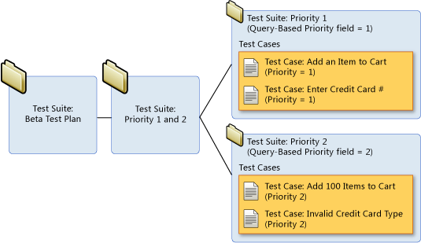

Рис. 2.6 – Тестовий набір

## 2.9.3 Чек-лист

***Чек-лист*** - це список, який містить ряд необхідних перевірок під час тестування програмного продукту. Відзначаючи пункти списку, команда або


<!-- ВІДНОВЛЕНО ЛОКАЛЬНО (Стор. 31) -->
один тестувальник можуть дізнатися про поточний стан виконаної роботи і про якість продукту. Працюючи над проектом по чек-листу, виключена ймовірність повторної перевірки за тими ж кейсам, а також підвищується якість тестування, так як ймовірність залишити без уваги якийсь функціонал суттєво знижується. Тому дуже важливо знати з яких елементів складається чек-лист і вміти ним ефективно користуватися. Як правило, чек-листи роблять в Google-таблиці для забезпечення загального доступу всім QAфахівцям. 

Будь-який з чек-листів містить перелік блоків, секцій, сторінок, інших елементів, які слід протестувати. Пункти можуть містити як лінійну структуру, так і деревоподібну, з розділами / підрозділами або без них. Вони повинні бути максимально короткі і в той же час зрозумілі тестувальнику, який ще не знайомий з додатком. Пункти повинні бути однозначними, щоб їх не можна було зрозуміти якось інакше. Всі пункти повинні бути оформлені однією мовою: російською чи англійською. Як правило, кожен чек-лист має кілька стовпців. Кожен стовпець призначений для тестування на окремій платформі. Слід завжди вказувати назву пристрою, браузера і його версії. 

Таким чином, чек-лист містить: 

1. Список перевірок (з необхідним ступенем деталізації). 

2. Оточення перевірки: 

   - збірка, на якій проводилося тестування; 

   - тестове оточення (якщо є); 

   - інформація про тестувальників. 

3. Результат перевірки. 

Тестувати додаток може декілька людей одночасно. У цьому випадку кожен тестувальник бере по одній-дві платформи і тестує тільки на них. При цьому слід навпроти кожної платформи вказати тестувальника, який виконує зазначений обсяг робіт. 

31
<!-- КІНЕЦЬ ВІДНОВЛЕННЯ -->


<!-- ВІДНОВЛЕНО ЛОКАЛЬНО (Стор. 32) -->
При проходженні чек-листів тестувальник зазначає статус навпроти 

кожного тестованого пункту. Можливі такі варіанти статусів: 

   4. «Passed» - перевірка пройдена успішно, багів, не знайдено; 

   5. «Failed» - знайдений один або більше багів; 

6. «Blocked» - неможливо перевірити, тому що один з багів блокує 

поточну перевірку; 

   7. «InProgress» - поточний пункт, над яким працює тестувальник; 

   8. «Notrun» - ще не перевірено; 

9. «Skipped» - перевірятися не буде з будь-якої причини. Наприклад, 

поточний функціонал ще не реалізований. 

Для більшої наочності, як правило, кожен з статусів має свій колір (рисунок 2.7). 


Рис. 2.7 – Приклад маркування статусів чек-листа 

Після завершення тестування не повинно бути осередків, позначених 

«Notrun». 

Всі заведені по чек-листу баг-репорти повинні бути додані в примітки до кожної комірки зі статусом «Failed» (рисунок 2.8). 


Рис. 2.8 – Приклад чек-листа 

32
<!-- КІНЕЦЬ ВІДНОВЛЕННЯ -->


<!-- ВІДНОВЛЕНО ЛОКАЛЬНО (Стор. 33) -->
Цілком допустимо додавати примітки та до деяких комірок з іншими статусами, якщо це необхідно. 

Для комірок зі статусом «Blocked» примітки з посиланнями на багрепорти також обов'язкові. Однак, як правило, примітка в комірці зі статусом «Blocked» посилається на раніше заведений баг- репорт, який в одному з попередніх пунктів вже відзначений як «Failed». Іншими словами: пункт, одного разу зазначений як «Failed» може бути блокером для декількох або всіх наступних пунктів чек-листа. 

Відзначимо кілька основних моментів, які варто враховувати при роботі з чек-листами: 

− по завершенні проходження чек-листа не повинно залишитися осередків зі статусом «Notrun»; 

− всі комірки зі статусом «Failed» і «Blocked» обов'язково повинні мати примітки з посиланнями на баг- репорти; 

− статус «Passed» встановлюється тільки для пунктів, які перевірені і не містять помилок. 

Для складання ефективного чек-листа існує кілька правил: 

1. Один пункт - одна операція. 

Пункти чек-листа - це однозначні атомарні і повні операції. Наприклад, додавання товару в корзину сайту і оплата замовлення - дві різні завдання. У списку перевірок подібні операції оформлені окремими пунктами: доданий товар в корзину, оплата відправлена. 

2. Пункти починаються з іменника. 

Мета чек-листа - врахувати всі дії для найбільш повного покриття тестами ПО, тому складаючи пункти слід дотримуватися уніфікованої форми. Для зрозумілого і однозначного уявлення пункти краще починати з іменника - «Перевірка», «Додавання», «Відправлення» або дієслова невизначеної форми - «Перевірити», «Додати», «Відправити». 

3. Складання чек-листа за рівнями деталізації. 

33
<!-- КІНЕЦЬ ВІДНОВЛЕННЯ -->


<!-- ВІДНОВЛЕНО ЛОКАЛЬНО (Стор. 34) -->
Для зручності проходження чек-листа найкраще складати тести в тому вигляді, який буде послідовним виходячи з логіки використання функціоналу. Наприклад, в рамках розділу «Реєстрація та Особистий профіль»: реєстрація на сайті, редагування профілю; розділ «Форма зворотного зв'язку»: валідація полів, відправка листа, доставка листи. 

Переваги використання чек-листів: 

1. Використання чек-листів сприяє структуруванню інформації у співробітника. 

2. При правильній записи необхідних дій у співробітника з'являється однозначне розуміння завдань. Це сприяє підвищенню швидкості навчання нових співробітників. 

3. Чек-листи допомагають уникнути невизначеності та помилок пов'язаних з людським фактором. Збільшується покриття тестами програмного продукту. 

4. Підвищується ступінь взаємозамінності співробітників. 

5. Економія робочого часу. Написавши чек-лист одного разу його можна використовувати повторно, з огляду на актуальність інформації. 

6. Підвищення бас фактора. В області розробки програмного забезпечення бас фактор ( «busfactor» - фактор автобуса) проекту - це міра зосередження інформації серед окремих членів проекту. 

Хороший чек-лист - це документ, що описує, що має бути про тестовано. При цьому чек-лист може бути абсолютно різного рівня деталізації. На скільки детальним буде чек-лист, залежить від вимог до звітності, рівня знання продукту співробітниками і складності продукту. 

# **2.9.4 Баг Репорт** 

9 вересня 1947 року вчені Гарвардського університету, які тестували обчислювальну машину Mark знайшли застряглого метелика між контактами 

34
<!-- КІНЕЦЬ ВІДНОВЛЕННЯ -->


<!-- ВІДНОВЛЕНО ЛОКАЛЬНО (Стор. 35) -->
електромеханічного реле, який справив до зупинки машини. Баг в перекладі з англійської - це метелик, жук, комаха. З тих пір будь-які неполадки в обчислювальній техніці називають багом. 

Багом можна назвати: 

- невідповідність вимогам або специфікації; 

- збій програми, що приводить до її завершення; 

- зависання програми (програмою неможливо користуватися); 

- видача будь-яких програмних і системних помилок; 

- помилки дизайну, програмного інтерфейсу, який заважає 

нормальній роботі; 

- дрібні неточності і текстові помилки. 

В якості синоніма до поняття баг використовують слово дефект. Дефект (баг) - це помилка в програмі, що викликає її неправильну і (або) непередбачувану роботу, також дефектом називають відмінність між фактичним і очікуваним результатом. Через дефекти, допущені ще під час написання коду, програма може не виконувати закладених функцій, працювати не так, як зазначено в специфікації, або виконувати дії, які не передбачені. Такі випадки називаються збоями програми. 

Баги є у всіх програмах і вони залишаються в них навіть після релізу. Це відбувається через те, що провести вичерпне тестування неможливо. Причиною тому є недолік часу, ресурсів, а також величезна кількість вхідних значень і сценаріїв перевірки. У реліз зазвичай випускається програмне забезпечення, яке містить незначні баги, а знайдені серйозні і критичні баги виправлені. 

Баг або дефект репорт - це документ, що описує ситуацію або послідовність дій, щ призвела до некоректної роботи об'єкта тестування, із зазначенням причин і очікуваного результату. 

35
<!-- КІНЕЦЬ ВІДНОВЛЕННЯ -->


<!-- ВІДНОВЛЕНО ЛОКАЛЬНО (Стор. 36) -->
Різні системи менеджменту дефектами, пропонують нам різні поля для заповнення і різні структури опису дефектів. В Додатку 4 наведено приклад шаблону для формування баг- репорту. 

Баг- репорт - це технічний документ і в зв'язку з цим, мова опису проблеми повинна бути технічною. Повинна використовуватися правильна термінологія при використанні назви елементів, призначеного для користувача інтерфейсу (editbox, listbox, combobox, link, textarea, button, menu, popupmenu, titlebar, systemtray і т.д.), дій користувача (clicklink, pressthebutton , selectmenuitem і т.д.) і отриманих результатах (windowisopened, errormessageisdisplayed, systemcrashed і т.д.). 

Обов'язковими полями баг репорту є: 

- короткий опис (BugSummary), 

- серйозність (Severity), 

- кроки до відтворення (Stepstoreproduce), 

- результат (ActualResult), 

- очікуваний результат (ExpectedResult). 

Короткий опис (BugSummary) містить одне речення, в якому треба вмістити сенс всього баг- репорту, а саме: коротко і ясно, використовуючи правильну термінологію сказати що і де не працює. 

Короткий опис рекомендується складати за принципом «Де? Що? Коли?», який полягає у складенні речення, в якому факти дефекту викладені в наступній послідовності: 

**Де?:** У якому місці інтерфейсу користувача або архітектури програмного продукту знаходиться проблема. Речення бажано починати з іменника. 

**Що?:** Що відбувається або не відбувається згідно специфікації або вашому уявленню про нормальну роботу програмного продукту. При цьому вказуйте на наявність або відсутність об'єкта проблеми, а не на його зміст (його вказують в описі). Якщо зміст проблеми варіюється, всі відомі варіанти 

36
<!-- КІНЕЦЬ ВІДНОВЛЕННЯ -->


<!-- ВІДНОВЛЕНО ЛОКАЛЬНО (Стор. 37) -->
вказуються в описі.«Що?» - це НЕ іменник, це те, що сталося, свого роду ДІЄСЛОВО-уточнення («Що виконується?» Або «Що НЕ виконується?»). 

**Коли?** : У який момент роботи програмного продукту, по настанню якої події або за яких умов проявляється проблема. 

Чому послідовність повинна бути саме такою? У такому вигляді незнайомі дефекти зручніше сортувати по summary як показує практика (адже, швидше за все, саме серед дефектів інших інженерів буде проводитись пошук дублікатів). 

Можна використовувати послідовність «Що? Де? Коли?». Головне, щоб всі описи багів відповідали єдиному шаблону. 

Бувають випадки, коли немає можливості помістити всю необхідну для опису бага інформацію в поле «Summary». Причиною може стати встановлене обмеження на кількість символів в поле, або щоб уникнути накопичення великої кількості тексту в полі. У таких випадках рекомендується сформулювати опис бага таким чином, щоб в мінімальній кількості тексту максимально зрозуміло була описана суть заведеного багу, а вже в поле «Description» помістити більш детальний варіант опису багу. 

Основні помилки при написанні багів репортів: 

1. Недостатність наданих даних. 

Не завжди одна і таж проблема проявляється при всіх впроваджуються значеннях і під будь-яким увійшов в систему користувачем, тому настійно рекомендується вносити всі необхідні дані в баг репорт 

2. Визначення серйозності. 

Дуже часто відбувається або завищення, або заниження серйозності дефекту, що може привести до неправильної черговості при вирішенні проблеми. 

3. Мова опису. 

37
<!-- КІНЕЦЬ ВІДНОВЛЕННЯ -->


<!-- ВІДНОВЛЕНО ЛОКАЛЬНО (Стор. 38) -->
Часто при описі проблеми використовуються неправильна термінологія або складні мовні звороти, які можуть ввести в оману людину, відповідальну за вирішення проблеми. 

4. Відсутність очікуваного результату. 

У випадках, якщо не вказано, що має бути необхідним поведінкою системи, витрачається час розробника на пошук цієї інформації, тим самим уповільнюється виправлення дефекту. Необхідно вказати пункт у вимогах, написаний тест кейс або ж особисту думку тестувальника, якщо ця ситуація не була документована. 

# **ПРАКТИЧНІ ЗАВДАННЯ** 

# **Завдання 1. «Тестування документації та вимог»** 

Проаналізуйте набір вимог, знайдіть і про класифікуйте дефекти, задайте питання замовнику. 

# **Вимоги до «FileSearcher»** 

1. Додаток «FileSearcher» (далі FS) призначене для автоматичного пошуку файлів за заданим шаблоном. 

1. Додаток має бути написано на Delphi 7 і працювати підWin XP і Win 7. 

3. Для пошуку вказується початковий каталог або набір каталогів. FS автоматично сканує каталоги на необмежену глибину вкладеності і відображає всі знайдені файли в правій панелі (див. Скріншот 1). 

4. Для пошуку є три типи файлів (вибір виробляє вручну або за допомогою комбо- боксу «Що шукати»): 

   - a. Аудіо файли (mp3, ogg, wav, mid). 

   - b. Відео файли (avi, mpg, mpeg). 

   - c. Офісні файли (doc, docx, xls, xlsx). 

5. За всіх знайдених файлів відображається: 

   - a. Ім'я. 

38
<!-- КІНЕЦЬ ВІДНОВЛЕННЯ -->


b. Повний шлях.
c. Розмір.
d. Дата-час створення файлу.
e. Скріншот з першим кадром.

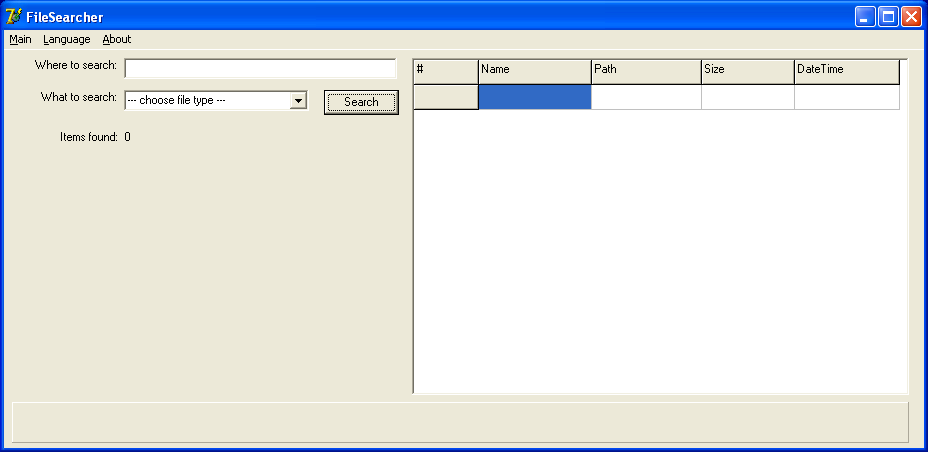

Рис. 2.9 Скріншот 1.

6. Продуктивність
   a. FS має шукати не менше 500 файлів у секунду за умови, що швидкість читання / запису на диск перевищує 50 Мб в секунду.
   b. У разі, якщо загальний час операції перевищує 1 годину, додаток не повинно починати роботу.
7. Підтримка мов
   a. Додаток має підтримувати російську і англійську мови за замовчуванням.
   b. Повинна бути можливість додавати нові мови.
8. Логування.
   a. FRS має вести лог своєї роботи.
   b. Якщо розмір логу перевищує 1 Мб, ведення логу припиняється.
   c. Поточний аналізований каталог повинен відображатися в панелі «Зараз перевіряється» внизу екрану.

9. Підтримка файлових систем:
    a. Повинні підтримуватися всі файлові системи Windows і UNIX.
    b. У разі виявлення не підтримуваної FS, FS має аварійно завершувати роботу.
10. Повинна бути підтримка мережі.

**Завдання 2. «MindMap, як інструмент тестування»**

Суть MindMap полягає у декомпозиції основної концепції або кінцевої цілі з метою її кращого розуміння і її покрокового досягнення відповідно. Це свого роду засіб організації інформації з урахуванням взаємозв'язків, який допомагає створити цілісну й систематизовану картину проблеми. А виглядає він деревовидною схемою, на якій в центрі розташовується основна система, а всі відгалуження є її підсистемами.

Інтелект-карта — целогічна схема, з чого випливає, що всі її компоненти мають бути пов'язані між собою. По центру знаходиться ключова концепція (мета, ідея, проблема, система). Це нульовий рівень. Наступні підсистеми будуть елементами першого рівня, відгалуження цих підсистем – третього і т. д.

Основна ідея полягає в декомпозиції і виокремленні найменших частин продукту (окремі форми, поля, чек- бокси тощо) так як іде потік свідомості, а не так як нас вчили зі школи чітко структуровано по стовпчику вниз.

**Для того, щоб такий поділ був ефективним, варто притримуватись наступних правил:**

1) Система розподіляється на всіх рівнях по єдиному принципу. Тобто всі підсистеми мають відповідати на одне і теж питання по відношенню до «материнської» категорії. Якщо це зробити складно, що часто буває у випадку тестування програмного забезпечення, то доцільно застосовувати це правило для елементів, які знаходяться на одному рівні.

2) Підсистеми мають взаємно виключати одна одну, а разом створювати цілісний продукт. Підсистеми мають взаємодіяти між собою. Якщо якісь елементи складно згрупувати, допускається їх виокремлення в категорію «Інше».

3) На кожному рівні доцільно виділяти 5-7 підсистем. У такому разі інформація представлена в максимально наочному вигляді. При цьому не виникає плутанини і перенасичення схеми.


Рис. 2.10 Складові Mind Map

4) Глибина декомпозиції визначається рівнем кваліфікації і досвідченості кожного конкретного спеціаліста. Якщо з таким проектом тестувальник працює не вперше, то рівні в інтелект-карти буде значно менше. Якщо ж це зовсім нова система для працівника, то ступінь деталізації повинна бути максимальною до виокремлення найменших елементів.

5) Взаємопов'язані завдання доцільно групувати задопомогою виділення одним кольором або обведенням їх у блоки.

Завдання

1. Вибрати будь-який програмний продукт (калькулятор, сайт і т.д.)
2. Створити MindMap функціональних модулів (не забувати 5 правил ефективної карти візуалізації)
3. Зберегти в окремий файл, який підписати ПІП група

![Приклад детальної карти розуміння (Mind Map) тестування олівця, яка містить розгалужену структуру тестів для об'єкта «Карандаш»: Beta Testing, Automated Testing, Validation, Verification, Security Testing, Negative Testing, Stress Testing, Documentation Testing, UI Testing, Entry Point Testing, Black Box Testing, Functional Testing, Usability Testing, Compatibility Testing, Performance Testing, Component Testing, Integration Testing та безліч підкатегорій з питаннями для перевірки властивостей і сценаріїв використання олівця](images/Zolotykhina_2020_Information_Systems_Quality_and_Testing/page_42_img_1.jpeg)

Рис. 2.11. Mind Мар тестування олівця

**Завдання 3. «Розробка тестів та тестових сценаріїв»**

1. Вибрати додаток для тестування;
2. Створити тестовий сценарій;
3. Написати максимальне число позитивних та негативних тестів використовуючи Excel файл (Додаток 3).

**Завдання 4. «AD-HOC ТЕСТУВАННЯ»**

**Основні переваги ad- hoctesting:**

* Немає необхідності витрачати час на підготовку документації.
* Найважливіші дефекти найчастіше виявляються на ранніх етапах.
* Часто застосовується, коли беруть нового співробітника. За допомогою цього методу, людина засвоює за 3 дні те, що, розбираючись з

тестовими випадками, розбирав б тиждень - це називається форсоване навчання нових співробітників.
* Можливість знайти тяжко відтворювані і важко вловимі дефекти, які неможливо було б знайти, використовуючи стандартні сценарії перевірок.

ЗАВДАННЯ
1. Провести ad-hoc тестування сайту [http://prestashop.qatestlab.com.ua/ru/](http://prestashop.qatestlab.com.ua/ru/) методом Monkeytesting.
2. Знайти 3 баги різних за категоріями (**Category**) та важливістю (**Severity**) та оформити по ним баг-репорти за наведеним шаблоном (Додаток 4).


<!-- ВІДНОВЛЕНО ЛОКАЛЬНО (Стор. 44) -->
# **3. МЕТОДИ ТЕСТУВАННЯ** 

# **3.1 Тест дизайн** 

Тест дизайн - один з початкових етапів тестування програмного забезпечення, етап планування і проектування тестів. Тест дизайн являє собою продумування і написання тестових випадків (testcase), відповідно до вимог проекту, згідно з критеріями якості майбутнього продукту і фінальними цілями тестування. 

Цілі тест дизайну - забезпечити покриття функціоналу додатка тестами: 

- тести повинні покривати весь функціонал; 

- тестів має бути мінімально достатньо. 

- Тест дизайн завдання: 

- проаналізувати вимоги до продукту; 

- оцінити ризики можливі при використанні продукту; 

- написати достатню мінімальну кількість тестів; 

- розмежувати тести на приймальні, критичні та інші. 

Техніки тест дизайну це рекомендації, поради та правила за якими стоїть розробляти тест для проведення тестування програми. Це не зразки тестів, а тільки рекомендації до застосування. Зокрема різні інженери можуть працюючи під одним і тим же проектом створити різний набір тестів. Правильним буде вважатися той набір тестів, який за меншу кількість перевірок забезпечить більш повне покриття тестами. 

Тест-дизайнер - це співробітник, в чиї обов'язки входить створення набору тестових випадків, що забезпечують оптимальне тестове покриття додатки .Тест-дизайнер повинен вибудувати процес тестування всіх найважливіших частин програмного продукту, використовуючи мінімально можливу кількість перевірок. У невеликих командах робота тест-дизайнера часто лягає на плечі пересічного тестувальника, в великих же компаніях 

44
<!-- КІНЕЦЬ ВІДНОВЛЕННЯ -->


<!-- ВІДНОВЛЕНО ЛОКАЛЬНО (Стор. 45) -->
функції тестування і тест-дизайну, як правило, чітко розділені між фахівцями. 

В результаті ланцюжок тестування виглядає так: 

− тест-аналітик виконує аналіз продукту, розбиває його на складові частини, розставляє пріоритети тестування і становить логічну карту додатки; 

- тест-дизайнер на підставі інформації, отриманої від аналітика, 

- приступає до розробки тестів; 

- тестувальник проводить безпосередньо тестування з уже готовим 

- тест-кейсів. 

- Лі Копланд (LeeCopeland) виділяє наступні техніки, що 

- використовуються в тест-дизайні: 

- Тестування Класами Еквівалентності (EquivalenceClassTesting). 

- − Тестування Граничних (кордонних) Значень 

- (BoundaryValueTesting). 

   - Таблиця Прийняття Рішень (DecisionTableTesting). 

   - Тестування Станів і Переходів (State-TransitionTesting). 

   - Метод Парного Тестування (Pairwisetesting). 

   - Доменний аналіз (DomainAnalysisTesting). 

   - Тестування сценаріїв використання (UseCaseTesting). 

Ресурс Про-Тестинг пропонує наступний перелік популярних технік тест-дизайну: 

- Еквівалентний Поділ (EquivalencePartitioning - EP). 

- Аналіз Граничних Значень (BoundaryValueAnalysis - BVA). 

- Причина / Наслідок (Cause / Effect - CE). 

- Передбачення помилки (ErrorGuessing - EG). 

- Вичерпне тестування (ExhaustiveTesting - ET) 

45
<!-- КІНЕЦЬ ВІДНОВЛЕННЯ -->


<!-- ВІДНОВЛЕНО ЛОКАЛЬНО (Стор. 46) -->
# **3.2 Класи еквівалентності** 

Клас еквівалентності (equivalenceclass) - одне або кілька значень введення, до яких програмне забезпечення застосовує однакову логіку. 

Техніка аналізу класів еквівалентності - це техніка, при якій ми поділяємо функціонал (часто діапазон можливих значень, що вводяться) на групи еквівалентних за своїм впливом на систему значень. Такий поділ допомагає переконатися в правильному функціонуванні цілої системи - одного класу еквівалентності, перевіривши тільки один елемент цієї групи. Ця техніка полягає в розбитті всього набору тестів на класи еквівалентності з подальшим скороченням числа тестів. 

Техніка рекомендує проведення тестів для всіх класів еквівалентності, хоча б по одному тесту для кожного класу. Техніка аналізу класів еквівалентності прагне не тільки скорочувати кількість тестів, але і зберігати прийнятне тестове покриття. 

Ознаки еквівалентності тестів: 

   - спрямовані на пошук однієї і тієї ж помилки; 

- якщо один з тестів виявляє помилку, інші швидше за все, теж її 

- виявлять; 

− якщо один з тестів не виявляє помилку, інші, швидше за все, теж її не виявлять; 

   - тести використовують схожі набори вхідних даних; 

   - для виконання тестів ми здійснюємо одні і ті ж операції; 

- тести генерують однакові вихідні дані або призводять додаток в 

- один і той же стан; 

   - всі тести призводять до спрацьовування одного і того ж блоку 

обробки помилок; 

- жоден з тестів не призводить до спрацьовування блоку обробки 

- помилок. 

46
<!-- КІНЕЦЬ ВІДНОВЛЕННЯ -->


<!-- ВІДНОВЛЕНО ЛОКАЛЬНО (Стор. 47) -->
Алгоритм використання техніки аналізу класів еквівалентності: 

1. Визначити класи еквівалентності. 

Це головний крок техніки, тому що багато в чому від нього залежить ефективність її застосування. 

2. Вибрати одного представника від кожного класу еквівалентності. 

- На цьому етапі слід вибрати один тест з еквівалентного набору тестів. 3. Виконання тестів. 

На цьому кроці слід виконати тести від кожного класу еквівалентності. 

Якщо є час, можна протестувати ще кілька представників від кожного класу еквівалентності. Слід мати на увазі, при правильному визначенні класів еквівалентності додаткові тести швидше за все будуть надмірними і дадуть такий же результат. 

На практиці класи еквівалентності обов'язкові при тестуванні всіляких форм і полів введення. 

До плюсів техніки можна віднести відсіювання величезної кількості значень введення, використання яких просто безглуздо. До мінусів можна віднести неправильне використання техніки, через що є ризик втратити баги. Таким чином, техніка аналізу класів еквівалентності хоча і значно скорочує кількість тестів необхідних для перевірки функціоналу і час, з іншого боку в недосвідчений руках може стати інструментом який не тільки не допоможе знайти дефекти, але і складе хибне уявлення про покриття додатку тестами. 

# **3.3 Метод кордонних (граничних) умов.** 

Ця техніка заснована на тому факті, що одним з найслабших місць будь-якого програмного продукту є область граничних значень. 

Фактично, граничні значення - це ті місця, в яких один клас еквівалентності переходить в інший. Граничне тестування також може включати тести, що перевіряють поведінку системи на вхідних даних, що 

47
<!-- КІНЕЦЬ ВІДНОВЛЕННЯ -->


<!-- ВІДНОВЛЕНО ЛОКАЛЬНО (Стор. 48) -->
виходять за допустимий діапазон значень. При цьому система повинна певним (заздалегідь обумовленим) способом обробляти такі ситуації. Наприклад, за допомогою виняткової ситуації або повідомлення про помилку. 

На кожен з кордонів створюється 3 тест-кейса: 

- перший перевіряє значення кордону, 

- другий - значення нижче кордону, 

- третій - значення вище кордону. 

Алгоритм використання техніки граничних значень: 

1. Виділити класи еквівалентності. 

Як і в попередній техніці, цей крок є дуже важливим і від того, наскільки правильним буде розбиття на класи еквівалентності, залежить ефективність тестів граничних значень. 

   2. Визначити граничні значення цих класів. 

   3. Визначити, до якого класу буде відноситися кожен кордон. 

4. Провести тести по перевірці значення до кордону, на кордоні і 

відразу після кордону. 

Кількість тестів для перевірки граничних значень буде дорівнювати кількості кордонів, помноженої на 3. Рекомендується перевіряти значення впритул до кордону. Наприклад, є діапазон цілих чисел, кордон знаходиться в числі 100. Таким чином, будемо проводити тести з числом 99 (до кордону), 100 (сам кордон), 101 (після кордону). 

# **3.4 Таблиця Прийняття Рішень (DecisionTableTesting).** 

Таблиці рішень - це зручний інструмент для фіксування вимог і опису функціональності додатку. Таблицями дуже зручно описувати бізнес-логіку програми, і вони можуть служити відмінною основою для створення тесткейсів. Таблиці рішень описують логіку додатка, ґрунтуючись на умовах 

48
<!-- КІНЕЦЬ ВІДНОВЛЕННЯ -->


<!-- ВІДНОВЛЕНО ЛОКАЛЬНО (Стор. 49) -->
системи, що характеризують її стану. Кожна таблиця повинна описувати один стан системи. 

Таблиця рішень - спосіб компактного представлення моделі зі складною логікою; інструмент для упорядкування складних бізнес вимог, які повинні бути реалізовані в продукті. Це взаємозв'язок між множиною умов і дій. У таблицях рішень представлений набір умов, одночасне виконання яких повинно привести до певного дії. 

Таблиця прийняття рішень, як правило, поділяється на 4 квадранта: 

Умови Варіанти виконання дій Дії Необхідність дій 

Умови - список можливих умов. 

Варіанти виконання дій - комбінація з виконання і/або невиконання 

умов цього списку. 

Дії - список можливих дій. 

Необхідність дій - вказівка треба чи не треба виконувати відповідну дію для кожної з комбінацій умов. 

Шаблон таблиці рішень має вигляд: 

||**Правило 1**|**Правило 2**|**…**|**Правило k**|
|---|---|---|---|---|
|**Умови**|||||
|Умова 1|||||
|Умова 2|||||
|…|||||
|Умова m|||||
|**Дії**|||||
|Дія 1|||||
|дія 2|||||
|…|||||
|Дія n|||||


Кожне правило містить набір умов, для яких виконуються певні дії. Матриця заповнюється можливими комбінаціями вхідних умов. При цьому кожна клітинка може мати одне з трьох значень: 

49
<!-- КІНЕЦЬ ВІДНОВЛЕННЯ -->


<!-- ВІДНОВЛЕНО ЛОКАЛЬНО (Стор. 50) -->
− так, 

− ні, 

− неважливо (може бути позначено текстурною заливкою). 

Використання значення "неважливо" допомагає скоротити кількість описуваних випадків, при цьому забезпечити той же рівень покриття, що і при описі всіх допустимих комбінацій умов. 

Значення таблиці рішень можна отримати із використанням методу Причина/Наслідок (Cause / Effect - CE). Метод був розроблений фірмою IВМ і являє собою оцінку причинно-наслідкових зв’язків, де вхідними даними є причини, а вихідними - наслідки. Метод функціональних діаграм є формальний, мову, на якому транслюються специфікації, написані на природній мові. Побудова тестів здійснюється в кілька етапів для зменшення громіздкості і трудомісткості, специфікація розробляється на робочій ділянці в кожній робочій ділянці, визначається причини, які характеризують окрема вхідна умова або визначають деякі залишкові дії програми. Кожній причини і наслідку присвоюється окремий номер. Причинно-наслідкові зв'язки відображаються у вигляді булевого відношення або графа з двома вузлами і дугою, де під дугою розуміються логічні умови «і», «або», «не». Отриманий граф і отримає назву функціональної діаграми. Обмежені і синтаксично неможливі комбінації причин і наслідки оформляються окремо, як додаток до функціональної діаграми і розглядаються самостійно. Алгоритм методу полягає в наступному: 

   1. Факторизація специфікації (розбиття її на окремі «робочі» ділянки). 

   2. Визначення причин та наслідків: 

- причина – окрема вхідна умова або клас еквівалентності даних 

- умов; 

   - наслідок – вихідна умова або перетворення системи; 

   3. Побудова булевого графа, який зв'язує причини і наслідки. 

50
<!-- КІНЕЦЬ ВІДНОВЛЕННЯ -->


<!-- ВІДНОВЛЕНО ЛОКАЛЬНО (Стор. 51) -->
4. Встановлення обмежень на комбінації причин і наслідків 

(коментарі до діаграми). 

   5. Побудова таблиці істинності (таблиці рішень). 

6. Перетворення кожного стовпця таблиці в тест – формування 

таблиці рішень. 

Кількість отриманих шляхів відповідає кількості тест-кейсів. 

# **3.5 Тестування Станів і Переходів (State-TransitionTesting).** 

Система переходить в той чи інший стан в залежності від того, які операції над нею виконуються. 

**_Стан_** (state, представлене у вигляді кола на діаграмі) - це стан додатку, в якому воно очікує одну або більше подій. Стан пам'ятає вхідні дані, отримані до цього, і показує, як додаток буде реагувати на отримані події. Події можуть викликати зміну стану і / або ініціювати дії. 

**_Перехід_** (transition, представлено у вигляді стрілки на діаграмі) - це перетворення одного стану в інший, що відбувається за подією. 

**_Подія_** (event, представлене ярликом над стрілкою) - це щось, що змушує додаток поміняти свій стан. Події можуть надходити ззовні додатку, через інтерфейс самого додатка. Сам додаток також може генерувати події (наприклад, подія «закінчився таймер»). Коли відбувається подія, додаток може поміняти (або не міняти) стан і виконати (або не виконати) дію. Події можуть мати параметри (наприклад, подія «Оплата» може мати параметри «Готівка», «Чек», «Прибуткова карта» або «Кредитна картка»). 

**_Дія_** (action, представлено після «/» в ярлику над переходом) ініціюється зміною стану ( «надрукувати квиток», «показати на екрані» і ін.). Зазвичай дії створюють щось, що є вихідними даними системи. Дії виникають при переходах, самі по собі стани пасивні. 

Точка входу позначається чорним кружком. 

51
<!-- КІНЕЦЬ ВІДНОВЛЕННЯ -->


<!-- ВІДНОВЛЕНО ЛОКАЛЬНО (Стор. 52) -->
Точка виходу показується на діаграмі у вигляді мішені. 

# **3.6 Тестування сценаріїввикористання (UseCaseTesting).** 

UseCase описує сценарій взаємодії двох і більше учасників (як правило - користувача і системи). Користувачем може виступати як людина, так і інша система. Для тестувальників UseCase є чудовою базою для формування тестових сценаріїв (тест-кейсів), так як вони описують, в якому контексті повинно проводитися кожну дію користувача. UseCase, за замовчуванням, є тестовими вимогами, так як в них завжди зазначена мета, якої потрібно досягти, і кроки, які треба для цього відтворити. 

# **3.7 Передбачення помилки (ErrorGuessing - EG).** 

Це коли тест аналітик використовує свої знання системи і здатність до інтерпретації специфікації на предмет того, щоб "вгадати" за яких вхідних умовах система може видати помилку. Наприклад, специфікація каже: "користувач повинен ввести код". Тест аналітик, буде думати: "Що, якщо я не введу код?", "Що, якщо я введу неправильний код?", і так далі. Це і є передбачення помилки. 

# **3.8 Вичерпне тестування (ExhaustiveTesting – ET** .) 

Вичерпне тестування (ExhaustiveTesting - ET) - це крайній випадок. В межах цієї техніки необхідно перевірити всі можливі комбінації вхідних значень, і в принципі, це повинно знайти всі проблеми. На практиці застосування цього методу не представляється можливим, через величезну кількість вхідних значень. 

52
<!-- КІНЕЦЬ ВІДНОВЛЕННЯ -->


<!-- ВІДНОВЛЕНО ЛОКАЛЬНО (Стор. 53) -->
# **3.9.Способи скорочення кількості тестових випадків.** 

# **3.9.1 Метод Парного Тестування (Pairwisetesting).** 

Метод парного тестування заснований на наступній ідеї: переважна більшість багів виявляється тестом, яким перевіряють один параметр або поєднання двох. Помилки, причиною яких стали комбінації трьох і більше параметрів, як правило, значно менш критичні. 

Припустимо, що ми маємо систему, яка залежить від декількох вхідних параметрів. Так, ми можемо перевірити всі можливі варіанти поєднання цих параметрів. Але навіть для випадку, коли кожен з 10 параметрів має всього два значення (On/Off), ми отримуємо 2<sup>10</sup> = 1024 комбінацій! Використовуючи метод парного тестування, ми не тестуємо всі можливі поєднання вхідних параметрів, а складаємо тестові набори так, щоб кожне значення параметра хоча б один раз поєднувалося з кожним значенням інших тестових параметрі. Таким чином, метод істотно скорочує кількість тестів, а значить, і час тестування. 

Але родзинка методу не в тому, щоб перебрати всі можливі пари параметрів, а в тім, щоб підібрати пари, що забезпечують максимально ефективну перевірку при мінімальній кількості виконуваних тестів. З цим завданням допомагають впоратися математичні методи, звані ортогональними таблицями. Також існує ряд інструментів, які допомагають автоматизувати цей процес (наприклад, AllPairs). 

# **3.9.2 Доменний аналіз (DomainAnalysisTesting).** 

Це техніка заснована на розбитті діапазону можливих значень змінної (або змінних) на під діапазони (або домени), з подальшим вибором одного або декількох значень з кожного домену для тестування. Багато в чому доменне тестування перетинається з відомими техніками розбиття на класи 

53
<!-- КІНЕЦЬ ВІДНОВЛЕННЯ -->


<!-- ВІДНОВЛЕНО ЛОКАЛЬНО (Стор. 54) -->
еквівалентності і аналізу граничних значень. Але доменне тестування не обмежується перерахованими техніками. Воно включає в себе як аналіз залежностей між змінними, так і пошук тих значень змінних, які несуть в собі великий ризик (не тільки на кордонах). 

Стратегія доменного тестування включає відповіді на питання: 

1. Який домен ми тестуємо? 

Будь-який домен, який ми тестуємо, має деяку функціональність введення і функціональність виведення. Будуть введені деякі вхідні змінні, і відповідний вихід повинен бути перевірений (рисунок 3.1). 


Рис. 3.1 – Вхідні-вихідні дані домену 

2. Як згрупувати значення в класи? 

Поділ деяких значень означає розбиття їх на непересічні підмножини. 

3. Які значення класів повинні бути перевірені? 

Як мінімум перевіряються значення на кордонах класів. Способи значень всередині класів будуть розглянуті додатково. 

4. Як визначити результат? 

Досягнення функціональності залежить не тільки від результатів сформованих сценаріїв. Задані дані і очікуваний результат дадуть нам результати, і це вимагає знання предметної області. 

Інструкція доменного тестування може бути описана наступним чином: 1. Визначте потенційно цікаві змінні. 

54
<!-- КІНЕЦЬ ВІДНОВЛЕННЯ -->


<!-- ВІДНОВЛЕНО ЛОКАЛЬНО (Стор. 55) -->
2. Визначте змінні, які ви можете проаналізувати зараз, і впорядкуйте їх (від найменшого до найбільшого і навпаки). 

3. Створіть і визначте граничні значення і значення класу еквівалентності. 

4. Визначте вторинні вимірювання і проаналізуйте кожне класичним 

способом. 

5. Визначте і перевірте змінні, які містять результати (вихідні 

змінні). 

6. Оцініть, як програма використовує значення цієї змінної. 

7. Визначте додаткові потенційно пов'язані змінні для комбінованого 

тестування. 

8. Уявіть собі ризики, які не обов'язково відповідають очевидному 

виміру. 

9. Визначте і перерахуйте непроаналізовані змінні. Зберіть 

інформацію для подальшого аналізу. 

10. Підведіть підсумок вашого аналізу з таблицею 

ризику/еквівалентності. 

# **3.9.3 Input-OutputAnalysis** 

Метод Input-OutputAnalysis передбачає аналіз вмісту чорного ящика. Вхідні дані поділяються на класи відповідно до впливу на виходи. Припустимо P(A, B, C) - вхідними даними є А, В, С, але кожне з них впливає на різні вихідні дані (рисунок 3.2). 


Рис. 3.2 – Результати аналізу взаємовпливу вхідних та вихідних даних 

55
<!-- КІНЕЦЬ ВІДНОВЛЕННЯ -->


Якщо дані представлені наступними значеннями $A=\{a1, a2, a3\}$, $B=\{b1, b2, b3, b4\}$, $C=\{c1, c2\}$ то Input-OutputAnalysis дозволить сформувати набори тестів, наведені на рисунку 3.3.

Для Y потрібні значення


Для Z потрібні значення

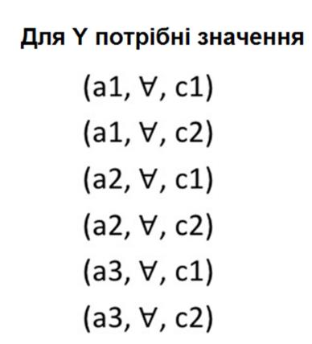

**Результат склеювання наборів тестів**


Рис. 3.3 – Приклад застосування методу Input-Output Analysis

### **ПРАКТИЧНІ ЗАВДАННЯ**

**ЗАВДАННЯ 5. «Доменне тестування як техніка ефективних перевірок».**

Визначити стратегію тестування, визначити набори тестових даних і скласти список тестів для поля, що описано у Вимога.

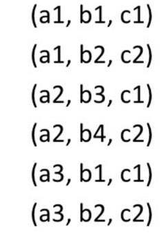

**Вимога.** В поле вводиться ім'я користувача англійською мовою. Ім'я може містити від 3 до 30 символів включно. Ім'я може закінчуватися цифрою і містити знак @. Знак @ не може бути спочатку і в кінці імені, і всередині імені не повинно бути два знака @ поспіль.


<!-- ВІДНОВЛЕНО ЛОКАЛЬНО (Стор. 57) -->
**ЗАВДАННЯ 6.  «Методи чорного ящика».** 

1. Для кожного поля вказаної форми введення застосувати евристики виділення класів еквівалентності та кордонних значень. Сформувати описи правильних та неправильних класів еквівалентності (для зручності використання класи рекомендується нумерувати). 

2. Застосувати техніку тест-дизайну та набори даних для кожного поля. Набори повинні містити конкретні дані для позитивних та негативних текстів. 

3. Розробити шаблон тест-кейсу для заповнення форми. 

4. Розробити один позитивний та один негативний тест-кейс із використанням створеного шаблону тест-кейсу та таблиць даних. 

5. Використовувати індивідуальні варіанти завдань (Додаток 5). 

6. По кожному полю заповнити наступне: 

|**Назва по**<br>**Тип дан**<br>**Довжина**<br>**полів):**_______<br>**Опис кл**<br>**Класи**<br>**коректних даних**|**ля**:___________________<br>**их**:____________________<br> <br>**поля/діапазон**<br>**зна**<br>______<br>**асів:**<br>**Класи**<br>**некоректних даних**|___<br>___<br>**чень**<br>**спе**|**(для**<br>**числових**<br>**Кордонні та**<br>**ціальні значення**|
|---|---|---|---|
|**Набори**|**даних:**|||
|**Значенн**|**Ком**|**ентар**||
|**я**||||
|**_Тип тесту: ОК_**||||


57
<!-- КІНЕЦЬ ВІДНОВЛЕННЯ -->


| | |
| --- | --- |
| | |
| | |
| | |
| **Тип тесту: NOK** | |
| | |
| | |

**ЗАВДАННЯ 7. «Метод парного тестування»**

1. Вивчити особливості методу парного тестування. Провести аналіз інструментів, які використовуються для складання тест-кейсів методом парного тестування.
2. Використовуючи таблиці даних (Додаток 5), сформувати набори вхідних тестових даних із застосуванням інструментів парного тестування.
3. Провести оцінку і аналіз отриманих результатів. Оцінити якість отриманих тестів і порівняти кількість сформованих наборів з варіантом повного перебору.

<u>**Інструментальні засоби для формування наборів даних методом парного тестування**</u>

Список програмних рішень для парного тестування наведено на сайті [http://www.pairwise.org/tools.asp](http://www.pairwise.org/tools.asp)

Нижче наведено посилання на деякі безкоштовні ресурси, які можна використовувати в лабораторній роботі.

[http://download.microsoft.com/download/f/5/5/f55484df-8494-48fa-8dbd-8c6f76cc014b/pict33.msi](http://download.microsoft.com/download/f/5/5/f55484df-8494-48fa-8dbd-8c6f76cc014b/pict33.msi) - PICT- вільний інструмент, розроблений Microsoft, для PairwiseTesting'a. має широкі можливості. Запускається PICT з командного рядка. На вхід програма приймає простий текстовий файл з параметрами і їх

значеннями, званий моделлю, а на вихід видає з генеровані тестові сценарії.
Ключові можливості:

* Можна вказувати порядок угрупування значень. За замовчуванням використовується порядок 2 і створюються комбінації пар значень (що і складає попарне тестування). Але можна вказати до прикладу 3 і тоді будуть використовуватися триплети, а не пари. Максимальний порядок для простої моделі дорівнює кількості параметрів, що створює набір всіляких варіантів.
* Можна групувати параметри в під моделі і вказувати їм окремий порядок для комбінацій. Це необхідно, якщо комбінації певних параметрів повинні бути протестовані більш ретельно або повинні бути об'єднані окремо від інших параметрів.
* Можна створювати умови і обмеження. Наприклад, можна вказати, що один з параметрів буде приймати певне значення тільки тоді, коли кілька інших параметрів приймуть потрібні значення. Це дозволяє відсікти створення непотрібних перевірок.
* Можна позначати не валідність значення параметрів при створенні комбінацій для негативних тест-кейсів.
* Використовуючи вагові коефіцієнти можна вказати програмі віддавати переваги певним значенням при генерації комбінацій.
* Можна використовувати опцію мінімізації (запускати програму кілька разів використовуючи кожен раз вже скорочена кількість тест-кейсів), щоб отримати мінімальну кількість тест-кейсів.

[https://www.satisfice.com/download/allpairs](https://www.satisfice.com/download/allpairs) - Allpairs - виконуваний файл командного рядка, заснований на сценарії Perl. Дозволяє значно скоротити кількість варіантів даних: наприклад, щоб спробувати все комбінації з 10 змінних з десятьма значеннями в кожній, буде потрібно 10 000 000 000 тестових випадків. Allpairs вимагає тільки 177 випадків.

В якості вхідних даних для програми використовується .txt файл з таблицею параметрів, стовпці якої розділені табуляцією. Для створення такого файлу найзручніше використовувати MS Excel - там є можливість зберігати "текстові файли з роздільниками табуляції (*.txt)".

Маючи вихідний файл, необхідно запустити консоль і набрати там рядок виду:

```cmd
C: \ allpairs.exe C: \ so.txt &gt; C: \ re.txt
```

де:

* C: \ allpairs.exe - повний шлях до програми allpairs.exe
* C: \ so.txt - шлях до вихідного файлу з таблицею параметрів
* C: \ re.txt - шлях і ім'я файлу, який буде створений в результаті роботи програми

[https://pairwise.teremokgames.com/](https://pairwise.teremokgames.com/) - онлайн ресурс, має обмежений набір можливостей, однак дозволяє окрім наборів, що генеровані методом парного тестування, також отримати список всіх можливих комбінацій.

4. ЗАБЕЗПЕЧЕННЯ ЯКОСТІ ІНФОРМАЦІЙНИХ СИСТЕМ

4.1 Причини виникнення дефектів інформаційних систем

Дефекти можуть виникнути на різних етапах розробки і можуть бути виявлені на різних рівнях тестування. Якість системи буде залежати від того, чи будуть виправлені знайдені баги, а вартість виправлення помилок - від того, на якому етапі розробки знайдені помилки.

Найбільш поширені причини появи помилок:

1. Проблеми в комунікаціях між членами команди.

Бізнес-вимоги можуть бути не донесені до всіх учасників процесу розробки або донесені в спотвореному, неповному або суперечливому вигляді, через що вимоги будуть неправильно інтерпретовані членами команди розробників. Виходячи з цього, вимоги повинні бути описані зрозуміло, вичерпно, однозначно і без невідповідності між різними пунктами специфікації.

2. Складність програмного забезпечення.

Програмне забезпечення створюють з безлічі компонентів, компоненти об'єднуються в програмні системи. У вимогах і описі програми закладають велику кількість функціоналу різного ступеня складності. Таке програмне забезпечення важко розробляти і підтримувати, програмісти роблять більше помилок і, з огляду на складність розроблюваного ПЗ, помилки робляться більш серйозні, а кількість їх зростає.

3. Зміна вимог.

Зі зростанням конкуренції в сфері розробки ПЗ виникла необхідність вносити правки на різних стадіях розробки, з'явилися гнучкі моделі розробки і з ними нові складності і проблеми. Зміни вимог тягнуть за собою зміни коду, і чим пізніше вирішено внести зміну в вимоги, тим більший обсяг робіт доведеться виконати для внесення змін в систему. Навіть якщо ця зміна


<!-- ВІДНОВЛЕНО ЧЕРЕЗ GEMINI (Стор. 62) -->
незначна, воно може спричинити за собою виникнення нових дефектів або повернення вже виправлених.

4. Неякісне документування коду і тимчасові рамки.

Розробники повинні писати код за певними правилами і документувати його, проте в реальності їм важливо не тільки отримати якісний продукт, а й отримати його швидко. Найчастіше, брак часу змушує програмістів писати код швидко, спрацьовує фактор неуважності і забудкуватості, що несприятливо впливає на якість програми.

5. Помилки програмістів.

Людський фактор проявляється у всьому. Програмісти теж страждають від неуважності, забудкуватості, випадкових натискань на клавіші або брак досвіду і умінь. А позитивний настрій розробника разом з його рівнем вміння програмувати безпосередньо пов'язаний з якістю написаного ним коду.

6. Баги в інструментах для розробки програмного забезпечення

У допоміжних засобах для розробки програм також є проблеми в роботі, що може вплинути на якість продукту. Такі баги можуть привести як до дрібних помилок, так і до блокування роботи розробника. Якщо порушена якась логіка в інструменті для розробки, то очевидно, що код, написаний за допомогою нього, також може містити помилки.

7. Помилки тестувальників.

Помилки тестувальників можуть бути однією з причин того, чому баги в системі залишаються після релізу, а не з'являються спочатку. Тестувальники можуть не помітити присутні помилки через брак досвіду, упустити проблемні моменти в роботі програмного забезпечення через його складності і неможливості вичерпного тестування.

8. Неякісний контроль версій коду.

Версії коду програми - це сукупність виправлень в рамках однієї програми за певний період часу. Версії контролюються при релізах, оновлення додатків. Повинна бути присутнім підтримка сумісності версій
<!-- КІНЕЦЬ ВІДНОВЛЕННЯ -->


можливість підтримки новими версіями програми старих версій, гарантії виконання коду програми, написаного на старій версії.

Недостатній контроль версій може призвести до появи великої кількості багів. Така ситуація трапляється, коли версії не збігаються через неякісний контроль мови програмування, на якому пишеться додаток, бібліотек, які використовуються в додатку, а також неякісний контроль версій модуля, з яких складається програма. Нові версії можуть не підтримувати старі версії і навпаки, і через це виникають помилки.

9. Архітектура програмного забезпечення.

Непродуманий вибір структурних елементів і інтерфейсів системи, їх поведінки в рамках співпраці з іншими структурними елементами, з'єднання обраних елементів і в цілому архітектури всіх елементів ведуть до проблем у функціонуванні ПО. Елементи можуть взаємодіяти не так, як очікує замовник, перебувати не там, де очікує користувач, порушуючи бізнес-логіку програми.

10. Брак фінансування.

Програмний продукт буде протестований рівно настільки, наскільки було надано фінансів на процес тестування. Виділеного бюджету може не вистачити на достатню тестування системи і, коли бюджет буде вичерпано, тестування зупиниться незалежно від результату тестування.

Таким чином, основними причинами появи помилок в програмному забезпеченні є : людський фактор, тимчасові і фінансові обмеження, баги в інструментах для розробки, а також неможливість проведення вичерпного тестування, через що в програмному забезпеченні завжди залишаються помилки. Навіть, якщо здається, що помилок в інформаційній системі немає - вони там є. Тому, грамотне планування тестування, визначення пріоритетів для тестування і виправлення знайдених помилок - важливі основоположні якісного тестування проекту в установлені терміни.

**4.2 Поняття якості інформаційної системи. Характеристики якості.**

Поняття «якість інформаційної системи» тісно пов'язано із поняттям «якості програмного забезпечення», яке в контексті міжнародних стандартів визначається наступним чином:

[1061-1998 Методологія визначення метрик якості програмного забезпечення IEEE] - якість програмного забезпечення - це ступінь, в якій програмне забезпечення володіє необхідною комбінацією властивостей.

[ISO 8402: 1994 Qualitymanagementandqualityassurance] - якість програмного забезпечення - це сукупність характеристик програмного забезпечення, що відносяться до його здатності задовольняти встановлені і передбачувані потреби.

Для забезпечення якості інформаційної системи потрібно, як мінімум, виконати чотири умови. По-перше, розробити пакет нормативно-методичних документів відповідно до вимог та рекомендацій міжнародних, національних і галузевих стандартів. По-друге, побудувати базову модель якості інформаційної системи на базі міжнародних стандартів серії ISO / IEC 9126, які регламентують характеристики і метрики якості програмного забезпечення. По-третє, у вимогах на програмне забезпечення чітко ISSN 1028-9763. Математичні машини і системи, 2009, № 4 211 задекларувати відомості про поняттях і необхідних значеннях характеристик якості ПЗ. По-четверте, реалізувати систему контролю якості на всіх або найважливіших етапах розробки програмного забезпечення.

Характеристики якості програмного забезпечення інформаційної системи визначаються наступним переліком.

Функціональність (Functionality) - визначається здатністю системи вирішувати завдання, які відповідають зафіксованим і очікуваним потребам користувача, при заданих умовах використання системи. Тобто ця характеристика відповідає за те, що система працює правильно і точно,

функціонально сумісно, відповідає стандартам галузі і захищена від несанкціонованого доступу.

Надійність (Reliability) - здатність програмного забезпечення виконувати необхідні завдання в позначених умовах протягом заданого проміжку часу або вказану кількість операцій. Атрибути даної характеристики - це завершеність і цілісність всієї системи, здатність самостійно і коректно відновлюватися після збоїв в роботі, відмово стійкість.

Зручність використання (Usability) - можливість легкого розуміння, вивчення, використання і привабливості програмного забезпечення для користувача.

Ефективність (Efficiency) - здатність програмного забезпечення забезпечувати необхідний рівень продуктивності у відповідність з виділеними ресурсами, часом і іншими позначеними умовами.

Зручність супроводу (Maintainability) - легкість, з якою програмне забезпечення може аналізуватися, тестуватися, змінюватися для виправлення дефектів, для реалізації нових вимог, для полегшення подальшого обслуговування та адаптуватися до наявного оточенню.

Портативність (Portability) - характеризує програмне забезпечення з точки зору легкості його перенесення з одного оточення (software / hardware) в інше.

Шляхи забезпечення якості:
- створення і використання шаблонів;
- створення інструкцій;
- використання стандартів і процесів;
- аналіз минулих проектів;
- використання інформації про дефекти.

*Створення і використання шаблонів.*

Загальні шаблони надають всім членам команди важливу основу для співпраці. Коли кожна людина виконує завдання своїм способом, про

співпрацю можна забути. Часто розробник боїться попросити допомоги іншої людини, тому що він може не погодитися з його підходом. А коли співробітництва немає, такі відмінності в підходах можуть перешкоджати спільного розуміння і накопичення знань і досвіду.

Види діяльності по Контролю Якості (аналіз, рецензії та тестування) принесуть більше користі і будуть більш продуктивні, якщо продукт був зроблений, використовуючи загальну модель. Без їх використання рецензенти і фахівці з тестування просто будуть намагатися виловити проблеми всюди, де торкалася рука розробника. Такий безсистемний підхід до Контролю Якості вимагає більше зусиль і призводить до поганого покриття і слабкого виявлення дефектів.

Загальні шаблони сприяють поліпшенню технічної роботи. Розробник, який виконує завдання своїм власним способом, може з легкістю пропустити важливі деталі або інформацію. Коли робота стандартизована, не виникає питань, що пророблена робота повинна в себе включати.

Стандарти повинні застосовуватися при написанні тест планів, специфікацій, призначених для користувача інтерфейсів, документації, тренінгові матеріали та інших продуктів, тому що спільне бачення того, як проект повинен бути зроблений, може допомогти забезпечити його якість. Але поряд зі стандартами, необхідно визначити ситуації їх використання та розробити посібник з адаптації стандартів під потреби організації, якщо це необхідно.

*Створення інструкцій або визначення послідовності дій.*

Створення інструкцій не обов'язково передбачає застосування стандартів або процесів. Якщо в компанії є будь-які напрацьовані процедури, необхідно відповісти на запитання:

- Чи відповідають вони існуючим потребам?
- Чи часто вони використовуються у відповідних ситуаціях?

Перше питання звертає увагу безпосередньо на якість самих процесів. Досягають вони своєї мети? Залежно від мети ви можете задати таке питання: забезпечують і стимулюють вони необхідний рівень співпраці? Чи сприяють вони достатньому взаємодії між командою розробників і замовниками? Чи підтримують вони кращі напрацювання технічних стандартів? Чи допомагають вони досягти цілей за якістю?

Друге питання звертає увагу на якість проходження встановленим процесам. Якщо завдання виконуються неналежним чином і непослідовно, ігноруючи домовленості, то ніякої користі навіть від хороших процесів не отримає. Що означає послідовне використання процесів Забезпечення Якості? Це коли кожна людина чітко вміє їх дотримуватися, знає, коли і як це робити і строго їх дотримується. Звичайно, що така поведінка очікується від всієї команди.

*Використання стандартів і процесів.*

Щоб отримати користь від використання впроваджених стандартів і процесів, необхідно постійно контролювати, що все робиться відповідно до встановленої домовленості, і отримується саме той результат, який планувався. Все що регулярно не використовується, рано чи пізно перестає існувати.

Інтегрована модель зрілості процесів програмного забезпечення (CMMI - CapabilityMaturityModelIntegration) реалізує це за допомогою аудитів (CMMI визначає аудит, як вид діяльності по Забезпеченню Якості, тому що дана модель тестує процеси, а не продукт). При використанні гнучких (Agile) методик, наприклад, ExtremeProgramming або SCRUM, для цієї мети наймають инструктора.

Коли прийнятий стандарт або процес ігнорується, то необхідно з'ясувати, чому так відбувається, тому що причини можуть бути абсолютно різні. наприклад:

— людина просто забула використати будь-якої стандарт або процес, треба нагадати про використання;

— людина просто не знала про існування стандарту або процесу або не знала, як саме його використовувати — треба поліпшити комунікації в команді або проведіть тренінг;

— стандарт або процес не підходить для даного завдання - треба або адаптувати сам процес, або спробувати знайти альтернативний спосіб;

— стандарт або процес був неефективним або занадто «громіздким» для даної ситуації — треба спростити його так, щоб він відповідав потребам проекту.

Кожне порушення стандарту або процесу - це можливість його вивчити і поліпшити, щоб він відповідав потребам команди.

*Аналіз минулих проєктів.*

Вивчені уроки (Lessons Learned) або пост програми (Post Programs or Post Project Analysis) - це один з найпотужніших інструментів попереджувального поліпшення якості вашої роботи. Ретроспектива - це окремо виділяється відрізок часу, з метою звернути свій погляд на виконану роботу, вивчити отриманий досвід і задати собі наступні питання: "Що було добре і як зробити так само в майбутньому?" і "Що було не так і як цього можна уникнути?".

Незважаючи на те, що ретроспективи відносять до найкращих практик (Best Practices), використовуються вони достатньо рідко в класичних методологіях. Дві основні причини цього: «Складно зібрати всю команду на семінар по ретроспективі» і «Ми колись це робили, але це не приносило ніякої користі».

Перша причина виникає через те, що семінари по ретроспективі відбуваються в кінці розробки проєктів. Більшість членів команди вже працюють на інших проєктах, а ті, хто залишилися, зайняті релізом проєкту або його підтримкою. *Гнучкі методики* вирішують цю проблему дуже

просто: не варто робити лише одну ретроспективу в кінці проекту, необхідно робити ретроспективи на всій його довжині. переваги:

- члени проекту завжди доступні, тому що вони все ще закріплені за проектом;
- щомісячний семінар за підсумками, наприклад, однієї фази проекту набагато легше запланувати і він займе всього близько години (замість цілого дня);
- весь отриманий досвід і напрацювання все ще свіжі в пам'яті, і навряд чи щось буде упущено;
- і найважливіше - отримані уроки можна застосувати до решти проекту.

Друга причина непопулярності ретроспектив в класичних технологіях - дуже часто вдається зібрати багато цікавої і корисної інформації, але немає ніякої можливості використовувати отримані дані на практиці в майбутніх проектах.

***Використання інформації про дефекти.**В*

Інформація за дефектами - це записи про прорахунки в якості, а значить - список можливостей для поліпшення якості на ваших майбутніх проектах. Інформація про дефекти, яка може бути корисна для поліпшення якості, включає наступні питання:

Що було не так? Вирішувати потрібно саму проблему, а не її симптоми. Наприклад, зациклення - це симптом, а зміна індексу циклу - це проблема.

Коли була створена ця проблема? Яке саме дію при розробці стало її джерелом? Це була проблема у вимогах? Проектуванні системи? Коді? Тестуванні?

Коли проблема була виявлена? Може вона і не була відразу ж усунена, але що нас цікавить, скільки вона існувала до того як ми її виявили

Яким чином була знайдена ця проблема? Спосіб виявлення можна впровадити в постійно використовувану практику.

Чи можна було виявити її раніше? Чи є який-небудь процес нашої роботи у, який міг би її виявити, будь він ефективніше?

Скільки коштувало усунення цієї проблеми? Цей момент дуже легко недооцінити. Переконайтеся, що ви врахували процес діагностики проблеми і всю роботу по її усуненню, яку вам довелося зробити, включаючи ре-дизайн, переписування коду, ре-комппіляцію, переробку тестів, повторне тестування, повторний реліз, випуск латки, формування звіту по дефекту, звіт за статусом проекту і т.д. ( в тому числі, можливі витрати на виправлення зіпсованою репутації на ринку інформаційних систем).

Якого роду була ця проблема? Коли у вас величезна кількість дефектів, їх категоризація полегшує аналіз і навчання.

При аналізі інформацію про дефекти, треба шукати ті дефекти, які виявляються регулярно, і ті, витрати на усунення яких високі. Саме таких дефектів і потрібно уникати в майбутньому (або принаймні усувати їх на більш ранній стадії розробки), саме така тактика гарантовано буде сприяти поліпшенню якості.

### 4.3 Стандарти якості інформаційних систем.

Оцінка якості інформаційної системи за допомогою міжнародних стандартів 1SO9000 дає можливість виконувати роботи, в яких головним критерієм є можливість управління якістю продукту. Варто зазначити, що такі стандарти для інформаційної системи доповнюють 1SO14000, де відображуються екологічні вимоги до безпосереднього виробництва продукції.

Але важливість таких критеріїв полягає не тільки ідеї управління якістю, а й його контроль. Стандартно контроль інформаційних систем ґрунтується на вимірюванні показників за допомогою таких інструментів, як методи контролю якості інформаційної системи. Це операції технологічного

напрямку і вибракування виробів, які не відповідають заявленим стандартам. Варто відзначити, що контроль інформаційного середовища є більш дієвим методом, так як проводить контроль процесу технологічного виробництва, що дозволяє в подальшому знизити ймовірність появи вибракуваної продукції.

Такі методи дають можливість поліпшити ефективність проведених заходів завдяки меншим витратам. Немає необхідності проводити постійний контроль якості продукції. При цьому попереджається поява шлюбу, що знижує виробничі витрати. Саме такий контроль є стандарти 1SO9000. He варто думати, що вони морально застаріли, оскільки були прийняті ще в 1987 році. Такі стандарти проходять поновлення кожні п'ять років.

Дані стандарти дають можливість регламентувати і визначити всі питання, які стосуються створення, функціонування, експлуатації системи якості в промисловій сфері. У них представлена форма вимог в самій структурі якості, щоб постачальник міг продемонструвати свої можливості, а учасники зовнішнього середовища змогли оцінити показники якості ІС.

Американське суспільство, яке відстежує контроль якості, визначило основні цілі 1SO9000. До них можна віднести допомогу розвитку міжнародного обміну послуг і продукції. При цьому враховуються сфери наукового, інтелектуального, ділового, технічного характеру.

Стандарти оцінки ІС - це сукупність всіх властивостей, в яких обумовлена можливість її застосування для задоволення потреб відповідно до її призначення. Саме кількісні характеристики кожного такого властивості визначають основні види показників.

Що стосується моделі якості програмного забезпечення, то на сьогоднішній день найбільшого поширення набула багаторівнева модель. Вона представлена стандартом ISO 9126. Спочатку вона виділяє шість основних характеристик якостей програмного забезпечення, а далі їх

атрибути, які включають в себе відповідні метрики для подальшої оцінки всієї IC.

Основні види показників, при яких можлива оцінка якості інформаційного середовища, критерії IC - це безпека, достовірність і надійність.

Якщо говорити про безпеку, то інформаційна інфраструктура контролю це властивість визначає у вигляді здатності системи забезпечити максимальну конфіденційність, а також цілісність всієї наявної інформації. Тобто, відбувається захист інформації від будь-якого несанкціонованого доступу.

До достовірності функціонування потрібно віднести такий набір властивостей, який визначає безпомилковість перетворень інформації. Достовірність функціонування визначається достовірністю вихідної інформації.

До надійності відносять набір властивостей, які зберігали час всіх параметрів, які необхідні для виконання певних функцій у відповідних умовах і заданих режимах.

Так як основними показниками якості інформаційних систем є надійність, достовірність, безпека, то такі моменти потрібно розглянути більшкладно. Також потрібно відзначити, що якість і ефективність інформаційних систем йдуть поруч, тому окремо розглядати характеристики даних показників неможливо. Вони являють собою модульність і спільність, які дуже важливі, якщо застосовуються різні методи контролю якості інформаційних систем.

Ефективність являє собою такий набір властивостей структури інформації, який дає можливість виконувати поставлену мету в певних умовах з конкретним якістю. Для показників ефективності важлива ступінь пристосованості системи до здійснення поставлених цілей. При цьому вони мають на увазі модульність показників для оптимального функціонування ІС.

Найбільш важливим з показників можна вважати економічну ефективність системи. Саме вона дає можливість показати доцільність виконаних витрат на створення і весь процес функціонування і експлуатації системи.

Такі показники якості інформаційних систем, як надійність, настільки важливі для характеристики системи, що в даний час розроблена навіть спеціальна теорія надійності. Надійність можна віднести до комплексу властивостей, так як цей показник якості є набором простіших за структурою властивостей. До них відносяться: безвідмовність, можливість проводити ремонтні роботи, довговічність. Якщо говорити про безвідмовність, то контроль інформаційних систем дає можливість зрозуміти, наскільки система може зберігати своє працездатний стан протягом певного періоду або процесу напрацювання.

До ремонтопридатності відносять пристосованість системи до того, щоб попереджати і виявляти причини прояви відмови або пошкодження. Також сюди входить можливість технічного обслуговування і виконання ремонтів.

Довговічність - одна з властивостей системи, завдяки якому при наявності відповідного технічного обслуговування вона зберігає належний стан максимально довго. Тобто, має настати такий момент, коли у системи не залишається ресурсів для подальшого виконання роботи і функціонування.

Показники якості інформаційних систем також включають в себе достовірність. Це такі властивості інформації, які відображають реальні об'єкти з певною точністю. Інформаційні системи контролю якості в якості достовірності припускають наявність такого комплексу показників: одиничні, кореговані і комплексні. Природно, для забезпечення достовірності інформації необхідний контроль.

Також до цих якостей можна віднести портативність, зручність використання і зручність супроводу. Завдяки яким ПЗ, а в подальшому і всю

ІС можна аналізувати, оцінювати, переносити і змінювати при виникненні дефектів.

### 4.4 Метрики якості.

Метрика - це кількісний масштаб і метод, який може використовуватися для вимірювання.

Введення і використання метрик необхідно для поліпшення контролю над процесом розробки, а зокрема над процесом тестування.

Мета контролю тестування полягає в отриманні зворотного зв'язку і візуалізації процесу тестування. Необхідну для контролю інформацію збирають (як в ручну, так і автоматично) і використовують для оцінки стану і прийняття рішень, таких як покриття (наприклад, покриття вимог або коду тестами) або критерії виходу (наприклад, критерії закінчення тестування). Метрики, також можуть бути використані для оцінки прогресу виконання запланованих робіт і освоєння бюджету.

#### 4.4.1 Метрики за тестовими випадками.

Passed / FailedTestCases.

Метрика показує результати проходження тест кейсів, а саме відношення кількості вдало пройдених до завершився з помилками. В ідеалі, до кінця проекту, кількість провальних тестів прагнути до нуля.

NotRunTestCases.

Метрика показує кількість тест кейсів, які ще необхідно виконати в даній фазі тестування. Маючи цю інформацію, ми можемо проаналізувати і виявити причини, за якими тест не були проведені.

**4.4.2 Метрики за багами/дефектами.**

Open / ClosedBugs.

Метрика показує відношення кількості відкритих багів до закритих (виправлені і перевірені).

Reopened / ClosedBugs.

Метрика показує відношення кількості пере відкриття багів до закритих (виправлені і перевірені).

Rejected / OpenedBugs.

Метрика показує відношення кількості відхилених багів до відкритих.

BugsbySeverity.

Кількість багів по серйозності.

BugsbyPriority.

Кількість багів за пріоритетом.

Метрики "Open / ClosedBugs", "BugsbySeverity" і "BugsbyPriority" добре візуалізують ступінь наближення продукту до досягнення критеріїв якості по Багам. Маючи вимоги до кількості відкритих багів, після кожної ітерації тестування ми порівнюємо їх з реальними даними, тим самим бачачи місця, де нам потрібно додати, для якнайшвидшого досягнення мети.

Метрики "Reopened / ClosedBugs" і "Rejected / OpenedBugs" спрямовані на відстеження роботи окремих учасників груп розробки і тестування.

Приклад 1: припустимо, ми маємо ситуацію, коли кількість пере відкритих після лагодження багів не зменшується або навіть зростає. Це є сигналом до того, що необхідно провести аналіз причин, тому що подібна ситуація може показати, що:

- вимоги до функції можна трактувати по різному;
- тестувальник неточно описав проблему;
- неякісне поверхневе вирішення проблеми (фікс бага).

Приклад 2: демонструє, для чого необхідна метрика "Rejected / OpenedBugs":

Ми спостерігаємо, що відсоток відхилених (Rejected) багів дуже великий. Це може означати:

- вимоги до функції можна трактувати по різному;
- тестувальник неточно описав проблему;
- розробник не бажає виправляти допущену їм помилку чи не вважає, що це насправді помилка (ця проблема є прямим наслідком другої, що виникла через неточний опис).

### 4.4.3 Метрики за задачами.

Deploymenttasks.

Метрика показує кількість і результати установок програми. Процедура установки програми була описана в статті Процедура проведення установки нової версії програмного забезпечення (DeploymentWorkFlow). У разі, якщо кількість відхилених командою тестування версій буде критично високим, рекомендується терміново проаналізувати і виявити причини, а також в найкоротші терміни вирішити наявну проблему.

StillOpenedTasks.

Метрика показує кількість все ще відкритих завдань. До закінчення проекту всі завдання повинні бути закриті. Під завданнями розуміємо такі види робіт: написання документації (архітектура, вимоги, плани), імплементація нових модулів або зміна існуючих за запитами на зміни, роботи з налаштування стендів, різні дослідження і багато іншого.

### 4.4.4 Юзабіліті - метрики.

В даний час юзабіліті - метрики містяться в декількох стандартах ISO:

ISO 9126-4: Розробка програмного забезпечення, Якість програмного забезпечення, що частина 4: Якість в використовуваних метриках;

ISO 9241-11: Ергономічні вимоги до офісній роботі з візуальними дисплейними терміналами (VDTs), частина 11: Керівництво по юзабіліті.

У цих стандартах юзабіліті-метрики розділені на кілька груп - чотири в ISO 9126-4 і три в ISO 9241-11 (таблиця 4.1).

Таблиця 4.1 – Групи юзабіліті-метрик по ISO

| Групи метрик по ISO 9126-4 | Групи метрик по ISO 9241-11 |
| :--- | :--- |
| Ефективність (effectiveness): оцінює результати виконання завдань користувачем | Ефективність (effectiveness): точність і повнота, з якою користувачі досягають поставлених цілей |
| Продуктивність (productivity): оцінює витрати користувачів при одержуваної ефективності | Економічність (efficiency): відношення витрачених ресурсів до точності і повноти, з якою користувачі досягають поставлених цілей |
| Безпека (safety): оцінює рівень ризику, шкоди людям, бізнесу, програмного забезпечення, власності або навколишньому середовищу | Група відсутня |
| Задоволеність (satisfaction): оцінює ставлення користувача до роботи з програмним продуктом. | Задоволеність (satisfaction): комфорт і прийнятність використання. Її можна оцінювати як відношення до використання продукту, так і сприйняття користувачем таких показників, як економічність, корисність або легкість у вивченні. |

**4.4.5 Метрики Kanban.**

Увага приділяється кожній задачі. Метрики знімаються з усього потоку завдань, який проходить через команду розробки. Ось короткий список метрик:

* **CycleTime** - час, яке завдання перебувала в розробці від моменту, коли їй почали займатися, до моменту, коли вона пройшла фазу кінцевої поставки.
* **WIP** - кількість завдань одночасно знаходяться в роботі. Розділяється за різними стадіями роботи над завданням.
* **LeadTime** - час від появи завдання до її кінцевої поставки. Включає CycleTime і час очікування в черзі на реалізацію.
* **WastedTime** - час, яке завдання проводить в різних чергах, а не безпосередньо в роботі.
* **Effectiveness** - відсоток часу, який витрачається безпосередньо на роботу з завданням, а не на очікування в різних чергах.
* **Throughput** - кількість завдань, яке може виконувати команда в одиницю часу (день, тиждень, місяць).

**4.4.6 Метрики SCRUM.**

*Акуратність оцінки завдання.*

Формула для розрахунку метрики:

$$\text{Акуратність оцінки} = \frac{\text{Сума 'початкових оцінок' всіх завдань}}{(\text{Сума 'завершеного часу' для всіх завдань}) + (\text{Сума 'часу, що залишився' для всіх завдань})}$$

Коли генерується ця метрика? - В кінці спринту і в кінці проекту (але її можна робити і щодня).

Про що ця метрика говорить нам? - Наскільки добре команда оцінює більш детальні фрагменти роботи. Якщо значення = 1, оцінки точні, а якщо >1 говорить про те, фрагменти переоцінені.

Як впливати на це? - Оцінки ніколи не будуть гарантією, однак ми повинні намагатися скоротити розрив між оцінкою і реальністю. З цієї метрикою ми можемо простежити, де команда пере / недооцінила. Тоді наступного разу, коли ми будемо робити оцінки, можна буде внести корективи, і, таким чином, прийняти ці виявлені фактори до уваги.

Рисунок 4.1 демонструє в графічному вигляді вказану метрику.

![Графік під назвою "Task Estimation Accuracy", де по осі X відкладено Sprints (від 1 до 6), а по осі Y — Estimation Accuracy (від 0.2 до 1.8). Червона лінія з точками показує значення метрики по спринтах: спринт 1 — 0.5 (зона Under-estimation), спринт 2 — 0.75 (зона Under-estimation), спринт 3 — 0.8 (зона Under-estimation), спринт 4 — 1.07 (між зонами), спринт 5 — 1.45 (зона Over-estimation), спринт 6 — 1.11 (зона Over-estimation). Зони переоцінки (Over-estimation) та недооцінки (Under-estimation) виділені світло-рожевим кольором.](images/Zolotykhina_2020_Information_Systems_Quality_and_Testing/page_79_img_1.jpeg)

Рис. 4.1 – Демонстрація метрики акуратності оцінки завдання

У першому спринті команда недооцінила свою роботу, але потрапила в ціль в спринтах 2, 3 і 4. Вони переоцінили в спринті 5, але все виправилося в спринті 6.

***Вплив труднощів.**Дя*

Формула для розрахунку метрики:

$$\text{(Сума 'часу витраченого' на всі труднощі протягом спринту)} \times \text{(Погодинна оплата члена команди в середньому)}$$

Коли генерується метрика? - В кінці кожного спринту.

Про що вона говорить нам? - Загрози для проекту і можливі причини затримок.

Як нам впливати на неї? - Коли є чітке уявлення про те, скільки часу у проекту займають труднощі, легше підрахувати реальні витрати / вплив.

***Час вигоряння - burnou ttime.***

Формула для розрахунку метрики:

$$(\text{Загальний час на всі завдання завершення протягом спринту}) +$$
$$(\text{Загальний час на все труднощі}) - (\text{Загальний час оцінок за завданнями спринту})$$

Коли генерувати? - В кінці спринту

Про що ця метрика говорить нам? - Ваша burndown діаграма може виглядати ідеально, але це не означає, що у вас немає труднощів, і що команда все відмінно оцінила. Навпаки, це може означати, що команда працює до ночі і перейшла на понаднормові. Можливо є ефект маскування вашої проблеми, це призводить до вигоряння команди і неоптимальною роботі. Якщо результат $> 0$, то команда витрачає більше часу, ніж очікувалося. Це нормально, якщо трапляється іноді, тобто ближче до кінця проекту. Але якщо час вигоряння завжди великий, то гарантовано є проблеми з організацією роботи в команді.

Як можна впливати на це? - Досягнення цілей шляхом овер таймів - це симптом неакуратних оцінок, або занадто великої кількості ускладнень або змінити список робіт. Треба простежити за допомогою цієї метрики, яка проблема привела до надурочних, і працювати з причинами, а не з симптомами.

***Середня швидкість.***

Формула для розрахунку метрики:

$$\frac{\text{Сума всіх 'швидкостей спринтів'}}{\text{'Кількість спринтів'}}$$

Коли вона генерується - Наприкінці спринту.

Про що вона говорить нам - Розмір і кількість призначених для користувача історій (і / або інших пунктів бак лог продукту), які команда робить в середньому в типовому спринті.

Як впливати на це? - Це основні вхідні дані для метрики Проектної ETD'.

*Проєктне ETD (estimatedtimeofdelivery - оцінений час поставки).*

Формула для розрахунку метрики:

$$\text{ETD} = \frac{\text{Загальна кількість storypoint-ів в баклог продукту}}{\text{'Середня швидкість'}}$$

Коли вона генерується -В кінці кожного спринту.

Про що вона говорить нам - Вона дає нам грубу оцінку (не гарантію) того, коли буде зроблений весь бак лог (або частина його), базуючись на середній швидкості команди.

Як ми можемо впливати на це? Використовується поняття залізний трикутник "(або прямокутник) управління проектами, що складається з змінних - час / якість / рамки проекту / ресурси ($). Ця метрика дає нам значення змінної часу, так що якщо потрібно, ми зможемо скоригувати одну або кілька додаткових змінних. Оскільки ми не повинні міняти визначення зробленого (якість) і ресурси (щоб зберегти стабільність команди), то в реальності ця метрика говорить нам, чи потрібно / коли потрібно звузити або розширити рамки проекту.

## 4.5 Валідація і верифікація.

Як верифікація так і валідація дуже важливі в розробці і тестуванні програмного забезпечення, так як відмінно працюючий додаток може виявитися зовсім не тим, що очікував замовник. Або навпаки замовник

повністю задоволений в своїх очікуваннях про програму, але в якихось ситуаціях функціонал працює не правильно. Існує багато визначень валідації та верифікації (рисунок 4.2).

![Діаграма Венна, що ілюструє різницю та перетин понять верифікації (Verification) та валідації (Validation). У колі верифікації містяться: style checkers, static analysis, proofs of correctness, robustness analysis, consistency checking, unit test, integration test, automated testing. У колі валідації: prototyping, modeling, formal methods, goal analysis, model/specification inspection, customer acceptance test, usability test, model checking. У зоні перетину знаходяться: testing, regression test, system test, beta test, code inspection.](images/Zolotykhina_2020_Information_Systems_Quality_and_Testing/page_82_img_1.jpeg)

Рис. 4.2 – Складові валідації та верифікації

Верифікація:
– відповідає на питання чи правильно ми робимо продукт і чи відповідає до поставлених вимог;
– у процесі верифікації переконуємося що функціонал нашого продукту працює правильно;
– верифікація включає в себе такі речі як перевірка відповідності вимогам, технічної документації та коректності виконання коду на кожному етапі циклу розробки і тестування програмного забезпечення.

Валідація:
– відповідає на питання чи ми робимо продукт правильно з точки зору очікування потреби користувачів або замовника від нашого продукту;
– в процесі валідації переконуємося що функціонал нашого застосування відповідає поведінці яке очікує і має на увазі від такого функціоналу користувач або замовник;

– валідація більшою мірою включає в себе оцінку продукту «в загальному» і може включати в себе суб'єктивну оцінку наскільки добре працює програма або додаток.

**ПРАКТИЧНІ ЗАВДАННЯ**

**ЗАВДАННЯ 8. «Автоматизація процесу тестування»**

1. Запустити Wampserver, додаток addressbook, перевірити наявність плагінів SeleniaID та firebug.
2. Записати за допомогою Selenia ID дії по створенню нової групи, зберегти програмний код на мові Java(JUnit).
3. У середовищі Eclipse створити новий проект.
4. Створити клас в пакеті org.example.test - для зберігання тестів.
5. Вставити в створений клас програмний код, що був згенерований за допомогою Selenia ID
6. До проекту підключити бібліотеки Selenium_java_control_Driver, testng-gdk-15, junit4
7. Помістити процедуру запуску браузера в блок `@beforeclass`.
8. Процедуру тесту помістити в блок `@test` (testng)
9. Помістити процедуру закриття браузера в блок `@afterclass`
10. Запустити у командному рядку Seleniaserver. (Наприклад java -jar selenia.jar)
11. Створити два допоміжних класи AppManager – для методів управління додатком та GroupData – для зберігання параметрів.
12. За допомогою функції Randomвнести елемент випадковості в дані якими заповнюється форма створення груп.
13. В тестах коментарями помітити (Preparestdata, preparestate, testaction, TODO:verification (програмний код написати пізніше))
14. Приклад кінцевого тесту:

```java
public void testGroupCreation() throws Exception {
```

```java
//Preparestdata
```

```java
GroupDatagroup = new GroupData();

group.name="a"+rnd.nextInt();

group.header="header"+rnd.nextInt();

group.footer="footer"+rnd.nextInt();

//preparestate

goToHomePage();

goToGroupPage();

//testaction

initGroupCreation();

fillForm(group);

submitGroupCreation();

returnToGroupList();

//TODO:verification

}
```

15. Запустити тести на виконання. Перевірити результати виконання.

16. Написати тести модифікації групи, створення контакту та модифікації контакту.

**ЗАВДАННЯ 9. «Баг- трекінгова система для аналізу якості програмного забезпечення».**

1. Перейти на сайт JIRA (https://www.atlassian.com/software/jira).

2. Вибрати варіант «Завантажити JIRA безкоштовно» («tryitfree»).

3. Зареєструватися на реальний email з яким-небудь доменом.

4. Підтвердити за допомогою email свій акаунт.


<!-- ВІДНОВЛЕНО ЛОКАЛЬНО (Стор. 85) -->
5. Вибрати опцію створення нового проекту та вибрати тип проекту 

(Scrum), натиснути «Ок». 

6. Задати ім’я наприклад, Test Project (абревіатура проекту створюється 

автоматом). Проект буде додано до списку наявних проектів, тепер до нього можна додавати завдання і т. д. 

7. Створити в цьому проекті декілька задач (issue): 

- вибрати проект, тип задачі; 

- сформулювати sammary (короткий опис) та опис (description), при цьому 

можна форматувати текст за необхідності та додавати додатки (можна 

прикріпити скрін, відео і т. д.); 

- дати опис середовища (оточення, environment) – ті умови, за яких 

відтворюється цей баг, наприклад; 

- натиснути Create (створити). При цьому задача додається до проекту та її можна переглянути, редагувати, видалити і т. д. 

8. Створити спринт, указавши дату його завершення та додавши до нього 

задачі, створені в попередньому пункті (для цього послідовно необхідно 

натиснути CreateBoard –>CreateSprint –>StartSpring і виконати необхідні 

налаштування). 


85
<!-- КІНЕЦЬ ВІДНОВЛЕННЯ -->


**СПИСОК ВИКОРИСТАНИХ ДЖЕРЕЛ**

1. Браткевич В.В., Бутов М.В. Быстрое тестирование. Вильямс 2002.– 384 с.
2. Рекс Блэк. Ключевые процессы тестирования. Планирование, подготовка, проведение, совершенствование. Лори, 2006.– 544 с.
3. Роман Савин .Тестирование Дот Ком, или Пособие по жестокому обращению с багами в интернет-стартапах. Дело, 2007 г.– 312 с.
4. Сэм Канер, Джек Фолк, ЕнгКек Нгуен. Тестирование программного обеспечения. Фундаментальные концепции менеджмента бизнес-приложений ДиаСофт, 2001 г.– 544 с.
5. И. Винниченко. Автоматизация процессов тестирования. — СПб: «Питер», 2005. – 203 с.
6. К. Бек. Экстремальное программирование. – СПб: «Питер», 2002.
7. К. Ауэр, Р. Миллер. Экстремальное программирование. – СПб: «Питер», 2003. – 368 с.
8. А. Якобсон, Г. Буч, Д. Рамбо. Унифицированный процесс разработки программного обеспечения. – СПб: «Питер», 2002. – 496 с.
9. Г. Майерс. Искусство тестирования программ. – М.: «Финансы и статистика», 1982. – 176 с.
10. С. Макконнелл. Совершенный код. – СПб: «Питер», 2005. – 896 с.
11. Б. Бейзер. Тестирование черного ящика. – СПб: «Питер», 2005. – 318 с.
12. Э. Брауде. Технология разработки программного обеспечения. – СПб: «Питер», 2004. – 655 с.
13. Л. Тамре. Введение в тестирование программного обеспечения – М.: «Вильямс», 2003. – 368 с.
14. Калбертсон Роберт, Браун Крис, КоббГэри. Быстрое тестирование. – М.: «Вильямс», 2002. – 374 с.
15. КанерКем, Фолк Джек, НгуенЕнг Кек. Тестирование программного обеспечения. Фундаментальные концепции менеджмента бизнес приложений. – Киев: Диа-Софт, 2001. – 544 с.
16. Коваль Г.И., Коротун Т.М., Остапенко А.П. Превентивное тестирование и оценка надежности программного обеспечения как форма 49 управления риском проекта. // Сб. Программная инженерия. – Киев., 1993. – С. 19-26.
17. Коул Д., Горэм Т., МакДональд М., Спарджеон Р.. Принципы тестирования ПО // Открытыесистемы. – №2. – 1998. – С. 60-63.
18. Коротун Т.М. Моделі і методи інженерії тестування програмних систем в умовах обмежених ресурсів. Дис... канд. фіз.-мат. наук: 01.05.03 – К., 2005. – 127с.
19. Лавріщева К. М. Проблеми програмування. Спецвипуск. – 2008, – № 2-3. –С.191-204.
20. Лавріщева К. М. Програмна інженерія. Підручник. – К.:

Академперіодика, 2008. – 319 с.

21. Лавріщева К. М. Методы программирования. Теория, практика,
22. Инженерия. – К.: Наукова думка. 2006. – 471 с.
23. Лаврищева Е.М., Коротун Т.М. Построение процесса тестирования программных систем // Проблемы программирования. –2002. – № 1-2. – С. 272-281.
24. Лаврищева Е. М., Петрухин В. А. Методы и средства инженерии Программного обеспечения. – Москва: МФТИ. –2007.– 415 с.
25. Леффингуэлл, Д. Принципы работы с требованиями к программному обеспечению. Унифицированный подход : Пер.сангл. / Леффингуэлл, Д Уидриг. – Москва : Вильямс, 2002. – 448 с.
26. Майерс Г. Искусство тестирования программ / Пер. с англ. под ред. Б. А. Позина. – М.: Финансы и статистика, 1982. – 176 с. // Електронний ресурс. Режим доступу: http:// http://computersbooks.net/index
27. МакгрегорДж, Сайкс Д. Тестирование объектноориентированного программногообеспечения. – К: Диасофт, 2002. – 432 с.
28. ОрловС. А. Технологии разработки программного обеспечения : Учебник для вузов. Доп. Мин. обр. РФ / С.А.Орлов. – Санкт–Петербург: Питер, 2002. – 464 с.
29. Основы тестирования программного обеспечения: Учебное пособие / В.П. Котляров, Т.В. Коликова. – М.: БИНОМ. ЛЗ, ИНТУИТ.РУ, 2006г. //Електронний ресурс. Режим доступу: http://window.edu.ru/resource/713/41713/files/MSTesting.pdf
30. Плескач В.Л., Затонацька Т.Г. Інформаційні системи і технології на підприємствах: Підручник. – К.: Знання, 2011. // Електронний ресурс. Режим доступу: http://pidruchniki.com/1059110247701/informatika.
31. Роберт Дж. ОбергТехнология СОМ+. Основы и программирование = UnderstandingandProgramming СОМ+: A PracticalGuideto Windows 2000 FirstEdition. – М.:«Вильямс», 2000. – 480с.
32. Семакин И.Г., Вараксин Г.С. Структурированный конспект базового Курса информатики. – М.: Лаборатория Базовых Знаний, 2000. – 167 с.
33. Соммервилл И. Инженерия программного обеспечения: 6 издание. Москва: Вильямс, 2002. – 624 с.
34. Синицын С. В., Налютин Н. Ю. Верификация программного обеспечения. – М.: БИНОМ, 2008. – 368 с.
35. Струбицький П.Р., Бондар О.В. Програмна інженерія – Навчальний посібник – Тернопіль: ТАНГ, 2004 – 76 с.
36. Тимошенко Ю.О., Дідковська М.В., Кобринський С.Ю. Розробка методу функціональної сегментації для тестування програмного забезпечення // Наукові вісті, №5(37), – Київ, 2004. – С. 48-56.
37. Управление риском проектов программного обеспечения / Андон Ф.И. Суслов В.Ю. Коротун Т.М., Коваль Г.И. Слабоспицкая О.А. // Проблемы программирования. – 1999. - № 1. – С. 53-62.

ДОДАТОК 1  
ТЕСТ ПЛАН IEEE 829

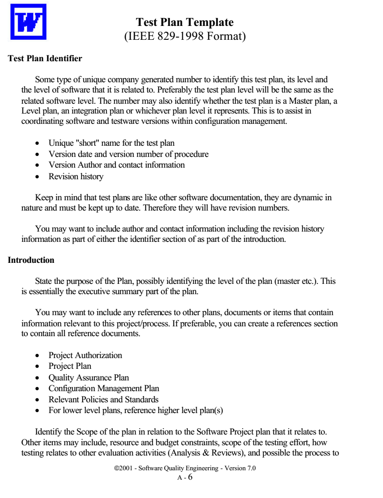

**Test Plan Template**  
(IEEE 829-1998 Format)

**Test Plan Identifier**

Some type of unique company generated number to identify this test plan, its level and the level of software that it is related to. Preferably the test plan level will be the same as the related software level. The number may also identify whether the test plan is a Master plan, a Level plan, an integration plan or whichever plan level it represents. This is to assist in coordinating software and testware versions within configuration management.

* Unique "short" name for the test plan
* Version date and version number of procedure
* Version Author and contact information
* Revision history

Keep in mind that test plans are like other software documentation, they are dynamic in nature and must be kept up to date. Therefore they will have revision numbers.

You may want to include author and contact information including the revision history information as part of either the identifier section of as part of the introduction.

**Introduction**

State the purpose of the Plan, possibly identifying the level of the plan (master etc.). This is essentially the executive summary part of the plan.

You may want to include any references to other plans, documents or items that contain information relevant to this project/process. If preferable, you can create a references section to contain all reference documents.

* Project Authorization
* Project Plan
* Quality Assurance Plan
* Configuration Management Plan
* Relevant Policies and Standards
* For lower level plans, reference higher level plan(s)

Identify the Scope of the plan in relation to the Software Project plan that it relates to. Other items may include, resource and budget constraints, scope of the testing effort, how testing relates to other evaluation activities (Analysis & Reviews), and possible the process to

be used for change control and communication and coordination of key activities.

As this is the “Executive Summary” keep information brief and to the point.

**Test Items**

These are things you intend to test within the scope of this test plan. Essentially a list of what is to be tested. This can be developed from the software application test objectives inventories as well as other sources of documentation and information such as:

* Requirements Specifications
* Design Specifications
* Users Guides
* Operations Manuals or Guides
* Installation Manuals or Procedures

This can be controlled and defined by your local Configuration Management (CM) process if you have one. This information includes version numbers, configuration requirements where needed, (especially if multiple versions of the product are supported). It may also include key delivery schedule issues for critical elements.

Identify any critical steps required before testing can begin as well, such as how to obtain the required item.

This section can be oriented to the level of the test plan. For higher levels it may be by application or functional area, for lower levels it may be by program, unit, module or build.

References to existing incident reports or enhancement requests should also be included.

This section can also indicate items that will be excluded from testing

**Features To Be Tested**

This is a listing of what is to be tested from the **USERS** viewpoint of what the system does. This is not a technical description of the software but a USERS view of the functions. It is recommended to identify the test design specification associated with each feature or set of features.

Set the level of risk for each feature. Use a simple rating scale such as (H, M, L); High, Medium and Low. These types of levels are understandable to a User. You should be prepared to discuss why a particular level was chosen.

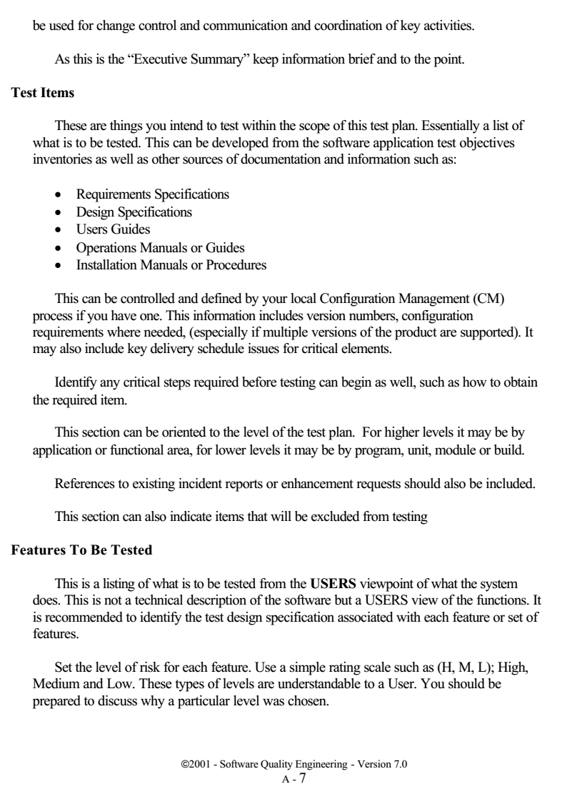

This is another place where the test objectives inventories can to used to help identify the sets of objectives to be tested together, (this takes advantage of the hierarchy of test objectives). Depending on the level of test plan, specific attributes (objectives) of a feature or set of features may be identified.

### Features Not To Be Tested

This is a listing of what is NOT to be tested from both the Users viewpoint of what the system does and a configuration management/version control view. This is not a technical description of the software but a USERS view of the functions.

* Identify WHY the feature is not to be tested, there can be any number of reasons.
  * Not to be included in this release of the Software.
  * Low risk, has been used before and is considered stable.
  * Will be released but not tested or documented as a functional part of the release of this version of the software.

### Approach

This is your overall test strategy for this test plan; it should be appropriate to the level of the plan (master, acceptance, etc.) and should be in agreement with all higher and lower levels of plans. Overall rules and processes should be identified.

* Are any special tools to be used and what are they?
  * Will the tool require special training?
* What metrics will be collected?
  * Which level is each metric to be collected at?
* How is Configuration Management to be handled?
* How many different configurations will be tested
  * Hardware
  * Software
  * Combinations of HW, SW and other vendor packages
* What are the regression test rules? How much will be done and how much at each test level.
  * Will regression testing be based on severity of defects detected?
* How will elements in the requirements and design that do not make sense or are untestable be processed?
* If this is a master test plan the overall project testing approach and coverage requirements must also be identified.
* Specify if there are special requirements for the testing.
* Only the full component will be tested.
  * A specified segment of grouping of features/components must be tested together.

* Other information that may be useful in setting the approach are:
* MTBF, Mean Time Between Failures - if this is a valid measurement for the test involved and if the data is available.
* SRE, Software Reliability Engineering - if this methodology is in use and if the information is available.
* How will meetings and other organizational processes be handled.
* Are there any significant constraints to testing.
    * Resource availability
    * Deadlines
* Are there any recommended testing techniques that should be used, if so why?

**Item Pass/Fail Criteria**

What are the Completion criteria for this plan? This is a critical aspect of any test plan and should be appropriate to the level of the plan. The goal is to identify whether or not a test item has passed the test process.

* At the Unit test level this could be items such as:
    * All test cases completed.
        * A specified percentage of cases completed with a percentage containing some number of minor defects.
        * Code coverage tool indicates all code covered.
    * At the Master test plan level this could be items such as:
        * All lower level plans completed.
        * A specified number of plans completed without errors and a percentage with minor defects.
* This could be an individual test case level criterion or a unit level plan or it can be general functional requirements for higher level plans.
* What is the number and severity of defects located?
* Is it possible to compare this to the total number of defects? This may be impossible, as some defects are never detected.
* A defect is something that **may** cause a failure, and may be acceptable to leave in the application.
    * A failure is the result of a defect as seen by the User, the system crashes, etc.

**Suspension Criteria and Resumption Requirements**

Know when to pause in a series of tests or possibly terminate a set of tests. Once testing is suspended how is it resumed and what are the potential impacts, (i.e. regression tests).

If the number or type of defects reaches a point where the follow on testing has no value, it makes no sense to continue the test; you are just wasting resources.

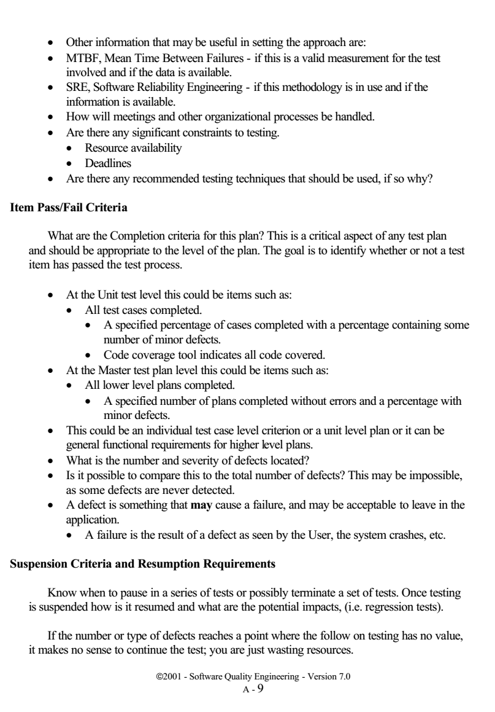

* Specify what constitutes stoppage for a test or series of tests and what is the acceptable level of defects that will allow the testing to proceed past the defects.
* Testing after a truly fatal error will generate conditions that may be identified as defects but are in fact ghost errors caused by the earlier defects that were ignored.

**Test Deliverables**

What is to be delivered as part of this plan?

* Test plan
* Test design specifications
* Test case specifications
* Test procedure specifications
* Test item transmittal reports
* Test logs
* Test Incident Reports
* Test Summary reports
* Test Incident reports

Test data can also be considered a deliverable as well as possible test tools to aid in the testing process

One thing that is not a test deliverable is the software; that is listed under test items and is delivered by development.

These items need to be identified in the overall project plan as deliverables (milestones) and should have the appropriate resources assigned to them in the project tracking system. This will ensure that the test process has visibility within the overall project tracking process and that the test tasks to create these deliverables are started at the appropriate time. Any dependencies between these deliverables and their related software deliverable should be identified. If the predecessor document is incomplete or unstable the test products will suffer as well.

**Test Tasks**

There should be tasks identified for each test deliverable. Include all inter-task dependencies, skill levels, etc. These tasks should also have corresponding tasks and milestones in the overall project tracking process (tool).

If this is a multi-phase process or if the application is to be released in increments there may be parts of the application that this plan does not address. These areas need to be identified to avoid any confusion should defects be reported back on those future functions.

This will also allow the users and testers to avoid incomplete functions and prevent waste of resources chasing Non-defects.

If the project is being developed as a multi-party process this plan may only cover a portion of the total functions/features. This needs to be identified so that those other areas have plans developed for them and to avoid wasting resources tracking defects that do not relate to this plan.

When a third party is developing the software this section may contain descriptions of those test tasks belonging to both the internal groups and the external groups.

**Environmental Needs**

Are there any special requirements for this test plan, such as:

* Special hardware such as simulators, static generators etc.
* How will test data be provided. Are there special collection requirements or specific ranges of data that must be provided?
* How much testing will be done on each component of a multi-part feature?
* Special power requirements.
* Specific versions of other supporting software.
* Restricted use of the system during testing.
* Tools (both purchased and created).
* Communications
  * Web
  * Client/Server
  * Network
    * Topology
    * External
    * Internal
    * Bridges/Routers
* Security

**Responsibilities**

Who is in charge? There should be a responsible person for each aspect of the testing and the test process. Each test task identified should also have a responsible person assigned.

This includes all areas of the plan, here are some examples.

* Setting risks.
* Selecting features to be tested and not tested.

* Setting overall strategy for this level of plan.
* Ensuring all required elements are in place for testing.
* Providing for resolution of scheduling conflicts, especially if testing is done on the production system.
* Who provides the required training?
* Who makes the critical go/no go decisions for items not covered in the test plans?
* Who delivers each item in the test items section?

**Staffing and Training Needs**

Identify all critical training requirements and concerns.

* Training on the product.
* Training for any test tools to be used.

**Schedule**

Should be based on realistic and validated estimates. If the estimates for the development of the application are inaccurate the entire project plan will slip and the testing is part of the overall project plan.

As we all know the first area of a project plan to get cut when it comes to crunch time at the end of a project is the testing. It usually comes down to the decision, 'Let's put something out even if it does not really work all that well'. And as we all know this is usually the worst possible decision.

* How slippage in the schedule will to be handled should also be addressed here.

* If the users know in advance that a slippage in the development will cause a slippage in the test and the overall delivery of the system they just may be a little more tolerant if they know it's in their interest to get a better tested application.

* By spelling out the effects here you have a change to discuss them in advance of their actual occurrence. You may even get the users to agree to a few defects in advance if the schedule slips.

* At this point all relevant milestones should be identified with their relationship to the development process identified. This will also help in identifying and tracking potential slippage in the schedule caused by the test process.

* It is always best to tie all test dates directly to their related development activity dates. This prevents the test team from being perceived as the cause of a delay. For example: if system testing is to begin after delivery of the final build then system testing begins the day after delivery. If the delivery is late system testing starts from the day of delivery, not on a specific date.

There are many elements to be considered for estimating the effort required for testing. It is critical that as much information as possible goes into the estimate as soon as possible in order to allow for accurate test planning. For a generalized list of considerations refer to the estimation document in Appendix C.

**Risks and Contingencies**

What are the overall risks to the project with an emphasis on the testing process?

* Lack of personnel resources when testing is to begin.
* Lack of availability of required hardware, software, data or tools.
* Late delivery of the software, hardware or tools.
* Delays in training on the application and/or tools.

* Changes to the original requirements or designs.
* Specify what will be done for various events, for example:
    * Requirements definition will be complete by January 1, 19XX, and if the requirements change after that date the following actions will be taken.
    * The test schedule and development schedule will move out an appropriate number of days. This rarely occurs, as most projects tend to have fixed delivery dates.
    * The number of test performed will be reduced.
    * The number of acceptable defects will be increased.
        * These two items could lower the overall quality of the delivered product.
    * Resources will be added to the test team.
    * The test team will work overtime.
        * This could affect team morale.
    * The scope of the plan may be changed.
    * There may be some optimization of resources. This should be avoided if possible for obvious reasons.
    * You could just QUIT. A rather extreme option to say the least.

Management is usually reluctant to accept scenarios such as the one above even though they have seen it happen in the past. The important thing to remember is that if you do nothing at all, the usual result is that testing is cut back or omitted completely, neither of which should be an acceptable option

**Approvals**

Who can approve the process as complete and allow the project to proceed to the next level (depending on the level of the plan).

* At the master test plan level this may be all involved parties.
* When determining the approval process keep in mind who the audience is.
    * The audience for a unit test level plan is different than that of an integration, system or master level plan.
* The levels and type of knowledge at the various levels will be different as well.
    * Programmers are very technical but may not have a clear understanding of the overall business process driving the project.
    * Users may have varying levels of business acumen and very little technical skills.

ДОДАТОК 2

# Тест план RUP

<CompanyName>

# <Project Name> Test Plan

**Version <1.0>**

*[Note: The following template is provided for use with the Rational Unified Process™*. Text enclosed in square brackets and displayed in blue italics (style=InfoBlue) is included to provide guidance to the author and should be deleted before publishing the document. A paragraph entered following this style will automatically be set to normal (style=Body Text).]

*[To customize automatic fields in Microsoft Word (which display a gray background when selected), select File>Properties and replace the Title, Subject and Company fields with the appropriate information for this document. After closing the dialog, automatic fields may be updated throughout the document by selecting Edit>Select All (or Ctrl-A) and pressing F9, or simply click on the field and press F9. This must be done separately for Headers and Footers. Alt-F9 will toggle between displaying the field names and the field contents. See Word help for more information on working with fields.]*

| Version: | <1.0> |
| :--- | :--- |
| | Date: <dd/mm/yy> |
| <document identifier> | |

# Revision History

| Date | Version | Description | Author |
| :--- | :--- | :--- | :--- |
| <dd/mm/yy> | <x.x> | <details> | <name> |
| | | | |
| | | | |
| | | | |

1. 1. Introduction ............................................................................................................. 98
    1.1 Purpose ............................................................................................................. 98
    1.2 Background ....................................................................................................... 98
    1.3 Scope ................................................................................................................. 98
    1.4 Project Identification ........................................................................................ 99

2. 2. Requirements for Test ............................................................................................. 99

3. 3. Test Strategy ........................................................................................................... 99
    3.1 Testing Types .................................................................................................... 99
        3.1.1 Data and Database Integrity Testing ......................................................... 99
        3.1.2 Function Testing ...................................................................................... 100
        3.1.3 Business Cycle Testing ............................................................................ 101
        3.1.4 User Interface Testing ............................................................................. 102
        3.1.5 Performance Profiling .............................................................................. 103
        3.1.6 Load Testing ........................................................................................... 104
        3.1.7 Stress Testing .......................................................................................... 105
        3.1.8 Volume Testing ....................................................................................... 106
        3.1.9 Security and Access Control Testing ....................................................... 107
        3.1.10 Failover and Recovery Testing .............................................................. 108
        3.1.11 Configuration Testing ............................................................................ 110
        3.1.12 Installation Testing ............................................................................... 111
    3.2 Tools ............................................................................................................... 112

4. 4. Resources .............................................................................................................. 113
    4.1 Roles ............................................................................................................... 113
    4.2 System ............................................................................................................ 114

5. 5. Project Milestones ................................................................................................ 115

6. 6. Deliverables .......................................................................................................... 115
    6.1 Test Model ...................................................................................................... 115
    6.2 Test Logs ........................................................................................................ 115
    6.3 Defect Reports ................................................................................................ 115

7. Appendix A Project Tasks ......................................................................................... 116

| Version: <1.0> |
| --- |
| Date: <dd/mm/yy> |
| <document identifier> |

# Test Plan

## Introduction

### Purpose

This Test Plan document for the <Project Name> supports the following objectives:

* *[Identify existing project information and the software components that should be tested.]*
* *[List the recommended Requirements for Test (high level).]*
* *[Recommend and describe the testing strategies to be employed.]*
* *[Identify the required resources and provide an estimate of the test efforts.]*
* *[List the deliverable elements of the test project.]*

### Background

*[Enter a brief description of the target-of-test (components, application, system, and so on) and its goals. Include information such as major functions and features, its architecture, and a brief history of the project. This section should only be about three to five paragraphs.]*

### Scope

*[Describe the stages of testing—for example, Unit, Integration, or System—and the types of testing that will be addressed by this plan, such as Function or Performance.]*

*Provide a brief list of the target-of-test's features and functions that will or will not be tested.*

*List any assumptions made during the development of this document that may impact the design, development or implementation of testing.*

*List any risks or contingencies that may affect the design, development or implementation of testing.*

*[List any constraints that may affect the design, development or implementation of testing]*

| | Version: <1.0> |
| :--- | :--- |
| | Date: <dd/mm/yy> |
| <document identifier> | |

**7.1 Project Identification**

The table below identifies the documentation and availability used for developing the *test plan*:

*[Note: Delete or add items as appropriate.]*

| Document<br>(and version / date) | Created or<br>Available | Received or<br>Reviewed | Author or<br>Resource | Notes |
| :--- | :--- | :--- | :--- | :--- |
| Requirements Specification | ☐ Yes ☐ No | ☐ Yes ☐ No | | |
| Functional Specification | ☐ Yes ☐ No | ☐ Yes ☐ No | | |
| Use-Case Reports | ☐ Yes ☐ No | ☐ Yes ☐ No | | |
| Project Plan | ☐ Yes ☐ No | ☐ Yes ☐ No | | |
| Design Specifications | ☐ Yes ☐ No | ☐ Yes ☐ No | | |
| Prototype | ☐ Yes ☐ No | ☐ Yes ☐ No | | |
| User's Manuals | ☐ Yes ☐ No | ☐ Yes ☐ No | | |
| Business Model or Flow | ☐ Yes ☐ No | ☐ Yes ☐ No | | |
| Data Model or Flow | ☐ Yes ☐ No | ☐ Yes ☐ No | | |
| Business Functions and Rules | ☐ Yes ☐ No | ☐ Yes ☐ No | | |
| Project or Business Risk Assessment | ☐ Yes ☐ No | ☐ Yes ☐ No | | |

## 8. Requirements for Test

The listing below identifies those items—use cases, functional requirements, and non-functional requirements—that have been identified as targets for testing. This list represents what will be tested.

*[Enter a high level list of the major test requirements.]*

### Test Strategy

*[The Test Strategy presents the recommended approach to the testing of the target-of-test. The previous section, Requirements for Test, described what will be tested—this describes how the target-of-test will be tested.]*

*For each type of test, provide a description of the test and why it is being implemented and executed.*

*If a type of test will not be implemented and executed, indicate this in a sentence stating the test will not be implemented and executed and stating the justification, such as “This test will not be implemented or executed. This test is not appropriate.”*

*The main considerations for the test strategy are the techniques to be used and the criterion for knowing when the testing is completed.*

*In addition to the considerations provided for each test below, testing should only be executed using known, controlled databases in secured environments.*

### 8.1 Testing Types

#### i. Data and Database Integrity Testing

*[The databases and the database processes should be tested as a subsystem within the <Project Name>. These subsystems should be tested without the target-of-test's User Interface as the interface to the data. Additional research into the DataBase Management System (DBMS) needs to be performed to identify the tools and techniques that may exist to support the testing identified below.]*

| | Version: &lt;1.0&gt; |
| --- | --- |
| | Date: &lt;dd/mmm/yy&gt; |
| &lt;document identifier&gt; | |

| Test Objective: | *[Ensure database access methods and processes function properly and without data corruption.]* |
| :--- | :--- |
| Technique: | * *[Invoke each database access method and process, seeding each with valid and invalid data or requests for data.]*<br>* *[Inspect the database to ensure the data has been populated as intended, all database events occurred properly, or review the returned data to ensure that the correct data was retrieved for the correct reasons]* |
| Completion Criteria: | *[All database access methods and processes function as designed and without any data corruption.]* |
| Special Considerations: | * *[Testing may require a DBMS development environment or drivers to enter or modify data directly in the databases.]*<br>* *[Processes should be invoked manually.]*<br>* *[Small or minimally sized databases (limited number of records) should be used to increase the visibility of any non-acceptable events.]* |

8.1.1 *Function Testing*

*[Function testing of the target-of-test should focus on any requirements for test that can be traced directly to use cases or business functions and business rules. The goals of these tests are to verify proper data acceptance, processing, and retrieval, and the appropriate implementation of the business rules. This type of testing is based upon black box techniques; that is verifying the application and its internal processes by interacting with the application via the Graphical User Interface (GUI) and analyzing the output or results. Identified below is an outline of the testing recommended for each application:]*

| Test Objective: | *[Ensure proper target-of-test functionality, including navigation, data entry, processing, and retrieval.]* |
| :--- | :--- |
| Technique: | *[Execute each use case, use-case flow, or function, using valid and invalid data, to verify the following:]*<br>* *[The expected results occur when valid data is used.]*<br>* *[The appropriate error or warning messages are displayed when invalid data is used.]*<br>* *[Each business rule is properly applied.]* |
| Completion Criteria: | * *[All planned tests have been executed.]*<br>* *[All identified defects have been addressed.]* |
| Special Considerations: | *[Identify or describe those items or issues (internal or external) that impact the implementation and execution of function test]* |

8.1.2 Business Cycle Testing

*[Business Cycle Testing should emulate the activities performed on the <Project Name> over time. A period should be identified, such as one year, and transactions and activities that would occur during a year's period should be executed. This includes all daily, weekly, and monthly cycles and, events that are date-sensitive, such as ticklers.]*

| Test Objective | *[Ensure proper target-of-test and background processes function according to required business models and schedules.]* |
| :--- | :--- |
| Technique: | *[Testing will simulate several business cycles by performing the following:*<br><br>- *The tests used for target-of-test's function testing will be modified or enhanced to increase the number of times each function is executed to simulate several different users over a specified period.*<br>- *All time or date-sensitive functions will be executed using valid and invalid dates or time periods.*<br>- *All functions that occur on a periodic schedule will be executed or launched at the appropriate time.*<br>- *Testing will include using valid and invalid data to verify the following:*<br>  - *The expected results occur when valid data is used.*<br>  - *The appropriate error or warning messages are displayed when invalid data is used.*<br>- *Each business rule is properly applied.]* |
| Completion Criteria: | - *[All planned tests have been executed.]*<br>- *[All identified defects have been addressed.]* |
| Special Considerations: | - *[System dates and events may require special support activities]*<br>- *[Business model is required to identify appropriate test requirements and procedures.]* |

| | Version: <1.0> |
| :--- | :--- |
| | Date: <dd/mmm/yy> |
| <document identifier> | |

*ii. User Interface Testing*

> *[User Interface (UI) testing verifies a user's interaction with the software. The goal of UI testing is to ensure that the User Interface provides the user with the appropriate access and navigation through the functions of the target-of-test. In addition, UI testing ensures that the objects within the UI function as expected and conform to corporate or industry standards.]*

| Test Objective: | *[Verify the following:*<br>* * Navigation through the target-of-test properly reflects business functions and requirements, including window-to-window, field-to-field, and use of access methods (tab keys, mouse movements, accelerator keys)*<br>* * Window objects and characteristics, such as menus, size, position, state, and focus conform to standards.]* |
| :--- | :--- |
| Technique: | *[Create or modify tests for each window to verify proper navigation and object states for each application window and objects.]* |
| Completion Criteria: | *[Each window successfully verified to remain consistent with benchmark version or within acceptable standard]* |
| Special Considerations: | *[Not all properties for custom and third party objects can be accessed.]* |

*iii. Performance Profiling*

> *[Performance profiling is a performance test in which response times, transaction rates, and other time-sensitive requirements are measured and evaluated. The goal of Performance Profiling is to verify performance requirements have been achieved. Performance profiling is implemented and executed to profile and tune a target-of-test's performance behaviors as a function of conditions such as workload or hardware configurations.*
> 
> *Note: Transactions below refer to “logical business transactions”. These transactions are defined as specific use cases that an actor of the system is expected to perform using the target-of-test, such as add or modify a given contract.]*

| | |
| :--- | :--- |
| Test Objective: | *[Verify performance behaviors for designated transactions or business functions under the following conditions:*<br><br><ul><li>*normal anticipated workload*</li><li>*anticipated worst case workload]*</li></ul> |
| Technique: | <ul><li>*[Use Test Procedures developed for Function or Business Cycle Testing.*</li><li>*Modify data files to increase the number of transactions or the scripts to increase the number of iterations each transaction occurs.*</li><li>*Scripts should be run on one machine (best case to benchmark single user, single transaction) and be repeated with multiple clients (virtual or actual, see Special Considerations below).]*</li></ul> |
| Completion Criteria: | <ul><li>*[Single Transaction or single user: Successful completion of the test scripts without any failures and within the expected or required time allocation per transaction.]*</li><li>*[Multiple transactions or multiple users: Successful completion of the test scripts without any failures and within acceptable time allocation.]*</li></ul> |
| Special Considerations: | *[Comprehensive performance testing includes having a background workload on the server.*<br><br>*There are several methods that can be used to perform this, including:*<br><ul><li>*“Drive transactions” directly to the server, usually in the form of Structured Query Language (SQL) calls.*</li><li>*Create “virtual” user load to simulate many clients, usually several hundred. Remote Terminal Emulation tools are used to accomplish this load. This technique can also be used to load the network with “traffic”.*</li><li>*Use multiple physical clients, each running test scripts to place a load on the system.*</li></ul><br>*Performance testing should be performed on a dedicated machine or at a dedicated time. This permits full control and accurate measurement.*<br><br>*The databases used for Performance Testing should be either actual size or scaled equally.]* |

*iv. Load Testing*

> *[Load testing is a performance test which subjects the target-of-test to varying workloads to measure and evaluate the performance behaviors and ability of the target-of-test to continue to function properly under these different workloads. The goal of load testing is to determine and ensure that the system functions properly beyond the expected maximum workload. Additionally, load testing evaluates the performance characteristics, such as response times, transaction rates, and other time sensitive issues.]*

> *[Note: Transactions below refer to “logical business transactions”. These transactions are defined as specific functions that an end user of the system is expected to perform using the application, such as add or modify a given contract.]*

| | |
| :--- | :--- |
| Test Objective: | *[Verify performance behavior time for designated transactions or business cases under varying workload conditions.]* |
| Technique: | • *[Use tests developed for Function or Business Cycle Testing.]*<br>• *[Modify data files to increase the number of transactions or the tests to increase the number of times each transaction occurs.]* |
| Completion Criteria: | *[Multiple transactions or multiple users: Successful completion of the tests without any failures and within acceptable time allocation.]* |
| Special Considerations: | • *[Load testing should be performed on a dedicated machine or at a dedicated time. This permits full control and accurate measurement.]*<br>• *[The databases used for load testing should be either actual size or scaled equally.]* |

v. Stress Testing

> *[Stress testing is a type of performance test implemented and executed to find errors due to low resources or competition for resources. Low memory or disk space may reveal defects in the target-of-test that aren't apparent under normal conditions. Other defects might result from competition for shared resources like database locks or network bandwidth. Stress testing can also be used to identify the peak workload the target-of-test can handle.]*
>
> *[Note: References to transactions below refer to logical business transactions.]*

| | |
| :--- | :--- |
| Test Objective: | *[Verify that the target-of-test functions properly and without error under the following stress conditions:*<br><br><ul><li>*little or no memory available on the server (RAM and DASD)*</li><li>*maximum actual or physically capable number of clients connected or simulated*</li><li>*multiple users performing the same transactions against the same data or accounts*</li><li>*worst case transaction volume or mix (see Performance Testing above).*</li></ul><br>*Notes: The goal of Stress Testing might also be stated as identify and document the conditions under which the system FAILS to continue functioning properly.*<br><br>*Stress Testing of the client is described under section 3.1.11, Configuration Testing.]* |
| Technique: | <ul><li>*[Use tests developed for Performance Profiling or Load Testing.]*</li><li>*[To test limited resources, tests should be run on a single machine, and RAM and DASD on server should be reduced or limited.]*</li><li>*[For remaining stress tests, multiple clients should be used, either running the same tests or complementary tests to produce the worst-case transaction volume or mix.]*</li></ul> |
| Completion Criteria: | *[All planned tests are executed and specified system limits are reached or exceeded without the software failing or conditions under which system failure occurs is outside of the specified conditions.]* |
| Special Considerations: | <ul><li>*[Stressing the network may require network tools to load the network with messages or packets.]*</li><li>*[The DASD used for the system should temporarily be reduced to restrict the available space for the database to grow.]*</li><li>*[Synchronization of the simultaneous clients accessing of the same records or data accounts.]*</li></ul> |

*vi. Volume Testing*

> *[Volume Testing subjects the target-of-test to large amounts of data to determine if limits are reached that cause the software to fail. Volume Testing also identifies the continuous maximum load or volume the target-of-test can handle for a given period. For example, if the target-of-test is processing a set of database records to generate a report, a Volume Test would use a large test database and check that the software behaved normally and produced the correct report.]*

| | |
| :--- | :--- |
| Test Objective: | *[Verify that the target-of-test successfully functions under the following high volume scenarios: <br>• Maximum (actual or physically- capable) number of clients connected, or simulated, all performing the same, worst case (performance) business function for an extended period. <br>• Maximum database size has been reached (actual or scaled) and multiple queries or report transactions are executed simultaneously.]* |
| Technique: | *[• Use tests developed for Performance Profiling or Load Testing. <br>• Multiple clients should be used, either running the same tests or complementary tests to produce the worst-case transaction volume or mix (see Stress Testing above) for an extended period. <br>• Maximum database size is created (actual, scaled, or filled with representative data) and multiple clients used to run queries and report transactions simultaneously for extended periods.]* |
| Completion Criteria: | *[All planned tests have been executed and specified system limits are reached or exceeded without the software or software failing.]* |
| Special Considerations: | *[What period of time would be considered an acceptable time for high volume conditions, as noted above?]* |

*vii. Security and Access Control Testing*

>[Security and Access Control Testing focus on two key areas of security:
> * Application-level security, including access to the Data or Business Functions
> * System-level Security, including logging into or remote access to the system.
> 
> Application-level security ensures that, based upon the desired security, actors are restricted to specific functions or use cases, or are limited in the data that is available to them. For example, everyone may be permitted to enter data and create new accounts, but only managers can delete them. If there is security at the data level, testing ensures that" user type one" can see all customer information, including financial data, however," user two" only sees the demographic data for the same client.
> 
> System-level security ensures that only those users granted access to the system are capable of accessing the applications and only through the appropriate gateways.]

| | |
| :--- | :--- |
| Test Objective: | • Application-level Security: *[Verify that an actor can access only those functions or data for which their user type is provided permissions.]*<br>• System-level Security: *Verify that only those actors with access to the system and applications are permitted to access them.* |
| Technique: | • Application-level Security: *[Identify and list each user type and the functions or data each type has permissions for.]*<br>&nbsp;&nbsp;&nbsp;&nbsp;• *[Create tests for each user type and verify each permission by creating transactions specific to each user type.]*<br>&nbsp;&nbsp;&nbsp;&nbsp;• *Modify user type and re-run tests for same users. In each case, verify those additional functions or data are correctly available or denied.*<br>• System-level Access: *[See Special Considerations below]* |
| Completion Criteria: | *[For each known actor type the appropriate function or data are available, and all transactions function as expected and run in prior Application Function tests.]* |
| Special Considerations: | *[Access to the system must be reviewed or discussed with the appropriate network or systems administrator. This testing may not be required as it may be a function of network or systems administration.]* |

*viii. Failover and Recovery Testing*

*[Failover and Recovery Testing ensures that the target-of-test can successfully failover and recover from a variety of hardware, software or network malfunctions with undue loss of data or data integrity.*

*Failover testing ensures that, for those systems that must be kept running, when a failover condition occurs, the alternate or backup systems properly "take over" for the failed system without loss of data or transactions.*

*Recovery testing is an antagonistic test process in which the application or system is exposed to extreme conditions, or simulated conditions, to cause a failure, such as device Input/Output failures or invalid database pointers and keys. Recovery processes are invoked and the application or system is monitored and inspected to verify proper application, or system, and data recovery has been achieved.]*

| Test Objective: | *[Verify that recovery processes (manual or automated) properly restore the database, applications, and system to a desired, known, state. The following types of conditions are to be included in the testing:*<br><br><ul><li>*power interruption to the client*</li><li>*power interruption to the server*</li><li>*communication interruption via network servers*</li><li>*interruption, communication, or power loss to DASD and or DASD controllers*</li><li>*incomplete cycles (data filter processes interrupted, data synchronization processes interrupted).*</li><li>*invalid database pointer or keys*</li><li>*invalid or corrupted data element in database]*</li></ul> |
|---|---|

| | Version: <1.0> |
| --- | --- |
| | Date: <dd/mm/yy> |
| <document identifier> | |

| Technique: | *[Tests created for Function and Business Cycle testing should be used to create a series of transactions. Once the desired starting test point is reached, the following actions should be performed, or simulated, individually:*<br><br>* *Power interruption to the client: power the PC down.*<br>* *Power interruption to the server: simulate or initiate power down procedures for the server.*<br>* *Interruption via network servers: simulate or initiate communication loss with the network (physically disconnect communication wires or power down network servers or routers.*<br>* *Interruption, communication, or power loss to DASD and DASD controllers: simulate or physically eliminate communication with one or more DASD controllers or devices.*<br><br>*Once the above conditions or simulated conditions are achieved, additional transactions should be executed and upon reaching this second test point state, recovery procedures should be invoked.*<br><br>*Testing for incomplete cycles utilizes the same technique as described above except that the database processes themselves should be aborted or prematurely terminated.*<br><br>*Testing for the following conditions requires that a known database state be achieved. Several database fields, pointers, and keys should be corrupted manually and directly within the database (via database tools). Additional transactions should be executed using the tests from Application Function and Business Cycle Testing and full cycles executed.]* |
| --- | --- |
| Completion Criteria: | *[In all cases above, the application, database, and system should, upon completion of recovery procedures, return to a known, desirable state. This state includes data corruption limited to the known corrupted fields, pointers or keys, and reports indicating the processes or transactions that were not completed due to interruptions.]* |
| Special Considerations: | * *[Recovery testing is highly intrusive. Procedures to disconnect cabling (simulating power or communication loss) may not be desirable or feasible. Alternative methods, such as diagnostic software tools may be required.*<br>* *Resources from the Systems (or Computer Operations), Database, and Networking groups are required.*<br>* *These tests should be run after hours or on an isolated machine.]* |

| | Version: &lt;1.0&gt; |
| --- | --- |
| | Date: &lt;dd/mm/yy&gt; |
| &lt;document identifier&gt; | |

ix. Configuration Testing

> *[Configuration testing verifies the operation of the target-of-test on different software and hardware configurations. In most production environments, the particular hardware specifications for the client workstations, network connections and database servers vary. Client workstations may have different software loaded—for example, applications, drivers, and so on—and at any one time, many different combinations may be active using different resources.]*

| Test Objective: | *[Verify that the target-of-test functions properly on the required hardware and software configurations.]* |
| :--- | :--- |
| Technique: | * *[Use Function Test scripts.]*<br>* *[Open and close various non-target-of-test related software, such as the Microsoft applications, Excel and Word, either as part of the test or prior to the start of the test.]*<br>* *[Execute selected transactions to simulate actor's interacting with the target-of-test and the non-target-of-test software.]*<br>* *[Repeat the above process, minimizing the available conventional memory on the client workstation.]* |
| Completion Criteria: | *[For each combination of the target-of-test and non-target-of-test software, all transactions are successfully completed without failure.]* |
| Special Considerations: | * *[What non-target-of-test software is needed, is available, and is accessible on the desktop?]*<br>* *[What applications are typically used?]*<br>* *[What data are the applications running; for example, a large spreadsheet opened in Excel or a 100-page document in Word?]*<br>* *[The entire systems, netware, network servers, databases, and so on also needs to be documented as part of this test.]* |

x. Installation Testing

> *[Installation testing has two purposes. The first is to insure that the software can be installed under different conditions—such as a new installation, an upgrade, and a complete or custom installation—under normal and abnormal conditions. Abnormal conditions include insufficient disk space, lack of privilege to create directories, and so on. The second purpose is to verify that, once installed, the software operates correctly. This usually means running a number of the tests that were developed for Function Testing.]*

| | |
| :--- | :--- |
| Test Objective: | Verify that the target-of-test properly installs onto each required hardware configuration under the following conditions:<ul><li>*new installation, a new machine, never installed previously with `<Project Name>`*</li><li>*update, machine previously installed `<Project Name>`, same version*</li><li>*update, machine previously installed `<Project Name>`, older version*</li></ul> |
| Technique: | <ul><li>*[Manually or develop automated scripts, to validate the condition of the target machine—new - `<Project Name>` never installed; `<Project Name>` same version or older version already installed].*</li><li>*Launch or perform installation.*</li><li>*Using a predetermined sub-set of function test scripts, run the transactions.]*</li></ul> |
| Completion Criteria: | *`<Project Name>` transactions execute successfully without failure.* |
| Special Considerations: | *[What `<Project Name>` transactions should be selected to comprise a confidence test that `<Project Name>` application has been successfully installed and no major software components are missing?]* |

| | Version: <1.0> |
|---|---|
| | Date: <dd/mm/yy> |
| <document identifier> | |

**Tools**

The following tools will be employed for this project:

*[Note: Delete or add items as appropriate.]*

| | Tool | Vendor/In-house | Version |
| :--- | :--- | :--- | :--- |
| Test Management | | | |
| Defect Tracking | | | |
| ASQ Tool for functional testing | | | |
| ASQ Tool for performance testing | | | |
| Test Coverage Monitor or Profiler | | | |
| Project Management | | | |
| DBMS tools | | | |

| | Version: <1.0> |
| | Date: <dd/mm/yy> |
| <document identifier> | |

## Resources

*[This section presents the recommended resources for the <Project Name> project, their main responsibilities, and their knowledge or skill set.]*

### Roles

This table shows the staffing assumptions for the project.

*[NOTE: Delete or add items as appropriate.]*

| Human Resources |
| :--- | :--- | :--- |
| **Worker** | **Minimum Resources Recommended**<br><br>*(number of full-time roles allocated)* | **Specific Responsibilities or Comments** |
| Test Manager,<br><br>Test Project Manager | | Provides management oversight.<br><br>Responsibilities:<br><br>• provide technical direction<br>• acquire appropriate resources<br>• provide management reporting |
| Test Designer | | Identifies, prioritizes, and implements test cases.<br><br>Responsibilities:<br><br>• generate test plan<br>• generate test model<br>• evaluate effectiveness of test effort |
| Tester | | Executes the tests.<br><br>Responsibilities:<br><br>• execute tests<br>• log results<br>• recover from errors<br>• document change requests |
| Test System Administrator | | Ensures test environment and assets are managed and maintained.<br><br>Responsibilities:<br><br>• administer test management system<br>• install and manage access to test systems |
| Database Administrator,<br>Database Manager | | Ensures test data (database) environment and assets are managed and maintained.<br><br>Responsibilities:<br><br>• administer test data (database) |

| | Version: <1.0> |
|---|---|
| | Date: <dd/mm/yy> |
| <document identifier> | |

| Designer | | Identifies and defines the operations, attributes, and associations of the test classes.<br><br>Responsibilities:<br>• identifies and defines the test classes<br>• identifies and defines the test packages |
| Implementer | | Implements and unit tests the test classes and test packages.<br><br>Responsibilities:<br>• creates the test classes and packages implemented in the test model |

**System**

The following table sets forth the system resources for the testing project.

*[The specific elements of the test system are not fully known at this time. It is recommended that the system simulate the production environment, scaling down the accesses and database sizes if and where appropriate.]*

*[Note: Delete or add items as appropriate.]*

| System Resources |
| :--- | :--- |
| **Resource** | **Name / Type** |
| Database Server | |
| Network or Subnet | TBD |
| Server Name | TBD |
| Database Name | TBD |
| Client Test PC's | |
| Include special configuration requirements | TBD |
| Test Repository | |
| Network or Subnet | TBD |
| Server Name | TBD |
| Test Development PC's | TBD |

| Version: <1.0> |
| --- | --- |
| Date: <dd/mm/yy> |
| <document identifier> |

## Project Milestones

*[Testing of <Project Name> should incorporate test activities for each of the test efforts identified in the previous sections. Separate project milestones should be identified to communicate project status accomplishments.]*

| Milestone Task | Effort | Start Date | End Date |
| :--- | :--- | :--- | :--- |
| Plan Test | | | |
| Design Test | | | |
| Implement Test | | | |
| Execute Test | | | |
| Evaluate Test | | | |

## Deliverables

*[In this section, list the various documents, tools, and reports that will be created, by whom, delivered to who, and when delivered.]*

### Test Model

*[This section identifies the reports that will be created and distributed from the test model. These artifacts in the test model need to be created or referenced in the ASQ tools.]*

### 8.2 Test Logs

*[Describe the method and tools used to record and report on the test results and testing status.]*

### 8.3 Defect Reports

*[In this section, identify the method and tools used to record, track, and report on test incidents and their status.]*

## Appendix A Project Tasks

Below are the test-related tasks:

*   Plan Test
    *   identify requirements for test
    *   assess risk
    *   develop test strategy
    *   identify test resources
    *   create schedule
    *   generate Test Plan
*   Design Test
    *   prepare workload analysis
    *   identify and describe test cases
    *   identify and structure test procedures
    *   review and assess test coverage
*   Implement Test
    *   record or program test scripts
    *   identify test-specific functionality in the Design and Implementation Model
    *   establish external data sets
*   Execute Test
    *   execute Test procedures
    *   evaluate execution of Test
    *   recover from halted Test
    *   verify the results
    *   investigate unexpected results
    *   log defects
*   Evaluate Test
    *   evaluate Test-case coverage
    *   evaluate code coverage
    *   analyze defects
    *   determine if Test Completion Criteria and Success Criteria have been achieved

ДОДАТОК 3

ПРИКЛАД ШАБЛОНУ ТЕСТ-КЕЙСУ

| Назва: | |
| :--- | :--- |
| **Функція:** | |
| **Дія** | **Очікуваний результат** | **Результат тесту:**<br>• пройдено<br>• провалено<br>• заблоковано |
| **Передумова:** | |
| | |
| | |
| **Кроки тесту:** | |
| | |
| | |
| | |
| **Постумови:** | |
| | |
| | |

ДОДАТОК 4

ПРИКЛАД ШАБЛОНУ БАГ-РЕПОРТУ

| Шапка | |
| :--- | :--- |
| Короткий опис (Summary) | Короткий опис проблеми, явно вказує на причину і тип помилкової ситуації. |
| Проєкт (Project) | Назва тестованого проєкту |
| Компонент додатка (Component) | Назва частини або функції тестованого продукту |
| Номер версії (Version) | Версія, на якій була знайдена помилка |
| Серйозність (Severity) | Найбільш поширена п'ятирівнева система градації серйозності дефекту:<br>5. S1 Блокуючий (Blocker)<br>6. S2 Критичний (Critical)<br>7. S3 Значний (Major)<br>8. S4 Незначний (Minor)<br>9. S5 Тривіальний (Trivial) |
| Пріоритет (Priority) | Пріоритет дефекту:<br><br>* P1 Високий (High)<br>* P2 Середній (Medium)<br>* P3 Низький (Low)<br><br>(подробнеесмотритениже в<br>разделе [Приоритетдефекта](#) |
| Статус (Status) | Статус бага. Залежить від процедури і життєвого циклу бага (bugworkflowandlifecycle) |
| Автор (Author) | Автор баг репорту |
| Призначено на (AssignedTo) | Ім'я співробітника, призначеного на вирішення проблеми |
| **Оточення** | |
| ОС / Сервис Пак и т.д. / Браузер + версія / ... | Інформація про оточення, на якому був знайдений баг: операційна система, сервіс пак, для WEB тестування - ім'я і версія браузера і т.д. |
| ... | |

| Опис | |
| --- | --- |
| Кроки відтворення (StepsToReproduce) | Кроки, за якими можна легко відтворити ситуацію, яка призвела до помилки. |
| Фактичний результат (Result) | Результат, отриманий після проходження кроків до відтворення |
| Очікуваний результат (ExpectedResult) | Очікуваний правильний результат |
| **Доповнення** | |
| Прикріплений файл (Attachment) | Файл з логами, скріншот або будь-який інший документ, який може допомогти прояснити причину помилки або вказати на спосіб вирішення проблеми |

ДОДАТОК 5

ІНДИВІДУАЛЬНІ ВАРІАНТИ ЗАВДАНЬ

1. 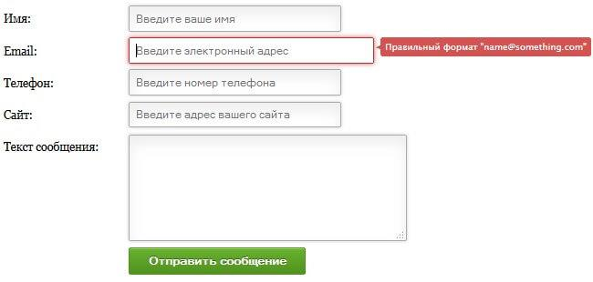

2. 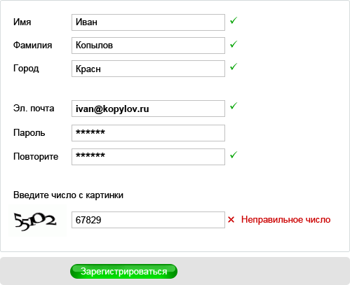

3. 

4. 

5. 

6. 

7. 

8. 

9. 

10. 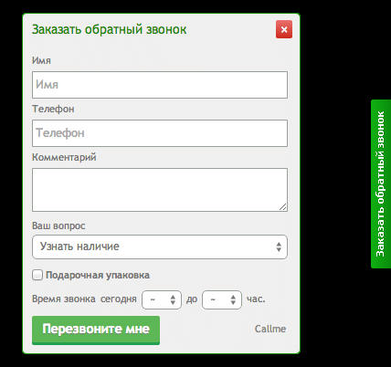

11. 

12. 

13. 

14. Редактирование профиля

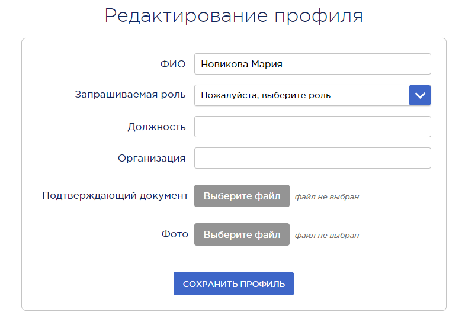

15. 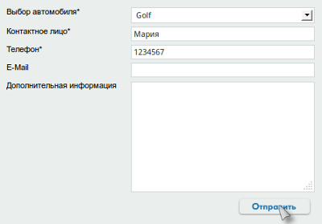

16. 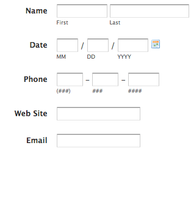

17. 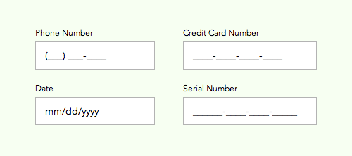

18. 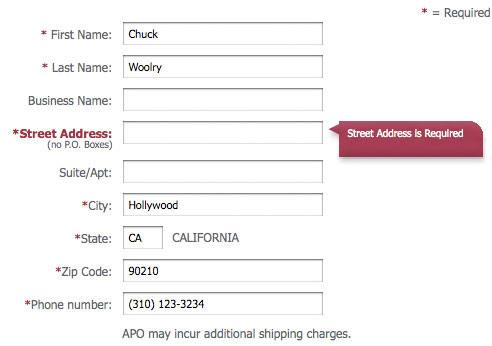

19. 

20. 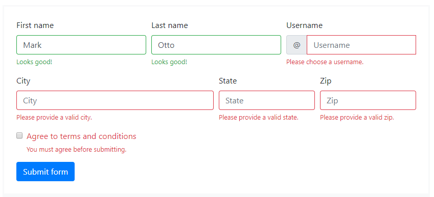

21. 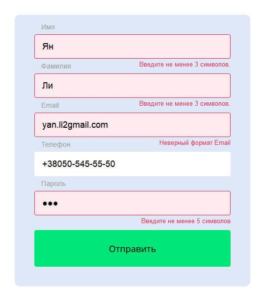

22. 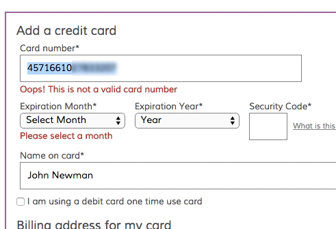

