# Бейзер Тестирование черного ящика. Технологии функционального тестирования программного обеспечения и систем 2004

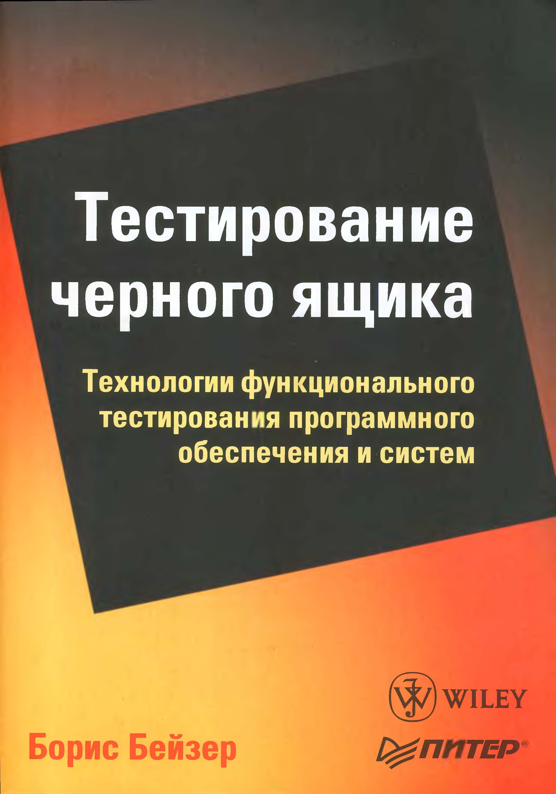

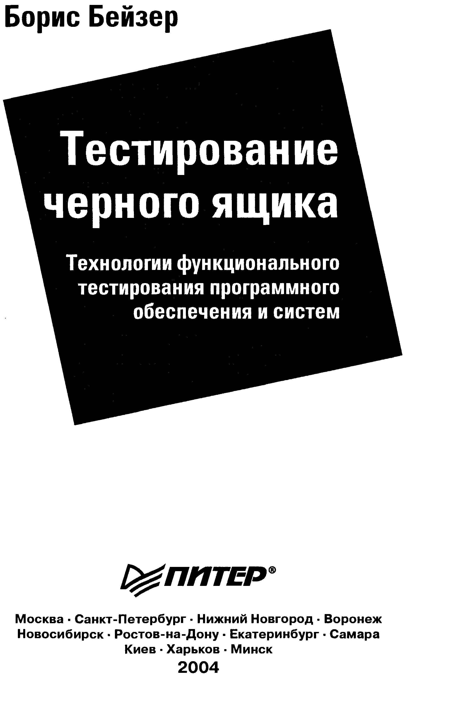

ББК 32.973-018-07  
УДК 681.3.06  
Б 41  

**Бейзер Б.**  
Б 41 Тестирование черного ящика. Технологии функционального тестирования программного обеспечения и систем. — СПб.: Питер, 2004. — 318 с.: ил.  

ISBN 5-94723-698-2  

Книга доктора Бейзера «Тестирование черного ящика» давно была признана классическим трудом в области поведенческого тестирования разнообразных систем. В ней глубоко рассматриваются основные вопросы тестирования программного обеспечения, позволяющие отыскать максимум ошибок при минимуме временных затрат. Чрезвычайно подробно излагаются основные методики тестирования, покрывающие все спектры аспектов разработки программных систем. Методичность и широта изложения делают эту книгу незаменимым помощником при проверке правильности функционирования программных решений.  

Книга предназначена для тестировщиков программного обеспечения и программистов, стремящихся повысить качество своей работы.  

ББК 32.973-018-07  
УДК 681.3.06  

---

Права на издание получены по соглашению с издательством Wiley.  
Все права защищены. Никакая часть данной книги не может быть воспроизведена в какой бы то ни было форме без письменного разрешения владельцев авторских прав.  

Информация, содержащаяся в данной книге, получена из источников, рассматриваемых издательством как надежные. Тем не менее, имея в виду возможные человеческие или технические ошибки, издательство не может гарантировать абсолютную точность и полноту приводимых сведений и не несет ответственности за возможные ошибки связанные с использованием книги.  

ISBN 0-471-12094-4 (англ.) © by John Wiley & Sons, Inc  
ISBN 5-94723-698-2 © Перевод на русский язык, ЗАО Издательский дом «Питер», 2004  
© Издание на русском языке. оформление ЗАО Издательский дом «Питер», 2004

---

# Содержание

Введение .......................................................................................................... 12

Пропущенные модели ....................................................................................... 14  
1. Общие положения ................................................................................... 14  
2. Маерс. «Искусство тестирования программ» ............................................. 14  
3. Логические модели .................................................................................. 16  
4. Языковые модели .................................................................................... 16  

README.DOC ................................................................................................... 18  
Зачем нужен Readme.doc? .......................................................................... 18  
План книги .................................................................................................. 18  
Структура главы .......................................................................................... 20  
Бланки налоговой декларации и ссылки на них ............................................. 22  
Что должен знать читатель ......................................................................... 22  
Не только программное обеспечение .......................................................... 23  
Использование алфавитного указателя ....................................................... 23  
Ссылки ....................................................................................................... 23  
Контроль качества ....................................................................................... 24  
Благодарности ........................................................................................... 24  
Отказ от ответственности ........................................................................... 25  
От издательства .......................................................................................... 25  

Глава 1 • Введение ........................................................................................... 26  
1.1. Обзор .................................................................................................... 26  
1.2. Основные термины ............................................................................... 26  
1.3. О тестировании .................................................................................... 31  
1.3.1. Тестировщик и программист ........................................................ 31  
1.3.2. Почему мы тестируем программное обеспечение? .......................... 31  
1.3.3. Стратегия тестирования ................................................................. 33  
1.3.4. Парадокс пестицида ....................................................................... 34  
1.3.5. Природа и причины ошибок ........................................................... 34

1.3.6. Когда надо остановиться ................................... 36  
1.3.7. Тестирование черного ящика — это еще не все ................... 36  
1.3.8. Тестирование — это еще не все ............................... 37  
1.4. Процесс разработки программного обеспечения .................... 39  
1.4.1. То, что на самом деле важно ................................. 39  
1.4.2. Десять (16) и одна заповедь управления процессом ................ 40  
1.5. Вопросы для самопроверки ................................... 43  

Глава 2 • Графы и отношения ..................................... 44  
2.1. Обзор ...................................................... 44  
2.2. Основные термины ........................................... 44  
2.3. Примеры графов, используемых в тестировании .................... 50  
2.3.1. Обзор .................................................. 50  
2.3.2. Модель потока транзакций (Глава 6) ......................... 51  
2.3.3. Модель меню с конечным числом состояний (Глава 9) ........... 51  
2.3.4. Модель потока данных (Глава 5) ............................ 51  
2.3.5. Модель времени выполнения ................................ 52  
2.4. Отношения .................................................. 52  
2.4.1. Обзор .................................................. 52  
2.4.2. Транзитивные и нетранзитивные отношения ................... 52  
2.4.3. Симметричные и несимметричные отношения ................. 53  
2.4.4. Рефлексивные и нерефлексивные отношения ................... 54  
2.4.5. Классы эквивалентности и разбиения ........................ 55  
2.4.6. Альтернатива графам ..................................... 55  
2.5. Основополагающие принципы тестирования ........................ 57  
2.5.1. Обзор .................................................. 57  
2.5.2. Построение графа ........................................ 58  
2.5.3. Определение отношений ................................... 58  
2.5.4. Проверка узлов .......................................... 59  
2.5.5. Проверка связей .......................................... 59  
2.5.6. Тестирование весов ....................................... 60  
2.5.7. Тестирование циклов ..................................... 60  
2.6. Резюме ..................................................... 61  
2.7. Вопросы для самопроверки ................................... 62  

Глава 3 • Тестирование потока управления ............................ 63  
3.1. Обзор ...................................................... 63  
3.2. Основные термины ........................................... 63  
3.3. Отношения и модель ......................................... 65  
3.3.1. Основы ................................................. 65  
3.3.2. Моделирование составных предикатов ........................ 69  
3.4. Методика ................................................... 71  
3.4.1. Основы ................................................. 71  
3.4.2. Построение модели ....................................... 72  

3.4.3. Выбор путей тестирования ................................. 77  
3.4.4. Активизация .............................................. 83  
3.4.5. Предсказание итогов ...................................... 88  
3.4.6. Проверка соответствия пути ................................ 90  
3.5. Рассмотрение приложения .................................... 91  
3.5.1. Индикаторы приложений ................................... 91  
3.5.2. Предположения об ошибках ................................ 91  
3.5.3. Ограничения и предостережения ........................... 92  
3.5.4. Автоматизация и инструментальные средства ................. 92  
3.6. Резюме ..................................................... 93  
3.7. Вопросы для самопроверки ................................... 94  

Глава 4 • Тестирование циклов ..................................... 97  
4.1. Обзор ...................................................... 97  
4.2. Основные термины ........................................... 97  
4.3. Отношения и модель ......................................... 99  
4.3.1. Основы ................................................. 99  
4.3.2. Детерминированные циклы ................................. 100  
4.3.3. Недетерминированные циклы ............................... 101  
4.3.4. Вложенные циклы ........................................ 103  
4.3.5. Неструктурированные (ужасные) циклы ....................... 103  
4.4. Методы ................................................... 104  
4.4.1. Критические тестовые значения ........................... 104  
4.4.2. Детерминированные циклы ................................. 106  
4.4.3. Недетерминированные циклы ............................... 107  
4.4.4. Вложенные циклы ........................................ 109  
4.5. Рассмотрение приложения .................................... 110  
4.5.1. Индикаторы приложений .................................  110  
4.5.2. Предположения об ошибках ................................ 110  
4.5.3. Ограничения и предостережения ........................... 110  
4.5.4. Автоматизация и инструментальные средства ................. 110  
4.6. Резюме .................................................... 111  
4.7. Вопросы для самопроверки ................................... 111  

Глава 5 • Тестирование потоков данных ............................. 113  
5.1. Обзор .................................................... 113  
5.2. Основные термины .......................................... 113  
5.3. Отношения и модель ........................................ 118  
5.3.1. Основы ................................................ 118  
5.3.2. Аналогии с графами потока данных .......................... 119  
5.3.3. Короткие замечания и упрощенные методы .................... 125  
5.3.4. Упорядочение, совмещение потока управления  
и потока данных, циклы .................................... 127  
5.4. Методы .................................................... 131  

5.4.1. Основы ................................................ 131  
5.4.2. Иерархия покрытия ...................................... 133  
5.4.3. Построение модели ....................................... 136  
5.4.4. Выбор основного порожденного подграфа ..................... 138  
5.4.5. Итоговый пример ........................................ 143  
5.4.6. Активизация ............................................. 145  
5.4.7. Предсказание итогов ...................................... 147  
5.4.8. Проверка соответствия пути ................................ 147  
5.5. Анализ приложений ........................................... 148  
5.5.1. Виды приложений ........................................ 148  
5.5.2. Предположения об ошибках ................................ 148  
5.5.3. Ограничения и предостережения ........................... 149  
5.5.4. Автоматизация и инструментальные средства ................. 149  
5.6. Резюме .................................................... 150  
5.7. Вопросы для самопроверки ................................... 150  

Глава 6 • Тестирование потоков транзакций .......................... 152  
6.1. Обзор .................................................... 152  
6.2. Основные термины .......................................... 152  
6.3. Отношения и модель ........................................ 155  
6.3.1. Основы ................................................ 155  
6.3.2. Маркировки .............................................. 156  
6.3.3. Очереди ................................................ 157  
6.3.4. Слияние и поглощение .................................... 158  
6.3.5. Циклы ................................................. 159  
6.3.6. Фокус и иерархические модели ............................. 159  
6.4. Методика ................................................... 160  
6.4.1. Основы ................................................ 160  
6.4.2. Иерархия покрытия ...................................... 163  
6.4.3. Построение модели ....................................... 164  
6.4.4. Выбор путей и/или порожденных подграфов тестирования ..... 165  
6.4.5. Тестирование синхронизации .............................. 168  
6.4.6. Тестирование очереди .................................... 169  
6.4.7. Активизация ............................................. 171  
6.4.8. Предсказание итогов ...................................... 172  
6.4.9. Проверка соответствия пути ................................ 173  
6.5. Рассмотрение приложений .................................... 174  
6.5.1. Индикаторы приложений .................................  174  
6.5.2. Предположения об ошибках .................               174  
6.5.3. Ограничения и предостережения .................          174  
6.5.4. Автоматизация и инструментальные средства ................. 175  
6.6. Резюме .................................................... 176  
6.7. Вопросы для самопроверки .................................  176  

Глава 7 • Тестирование доменов .................................... 179  
7.1. Обзор .................................................... 179  
7.2. Основные термины .......................................... 179  
7.3. Отношения и модель ........................................ 184  
7.3.1. Обоснование ............................................ 184  
7.3.2. Основы ................................................ 186  
7.3.3. Анализ неопределенностей и противоречий .................. 191  
7.3.4. Нелинейные домены ...................................... 193  
7.4. Методы .................................................... 194  
7.4.1. Основы ................................................ 194  
7.4.2. Недостатки комбинирования экстремальных точек ............. 195  
7.4.3. Слабая стратегия 1×1, одномерное пространство .............. 197  
7.4.4. Слабая стратегия 1×1, пространство с размерностью  
два и выше ................................................ 199  
7.4.5. Вырожденный случай ..................................... 201  
7.4.6. Стратегии более высокого порядка для пространства  
с размерностью два и более ................................ 201  
7.4.7. Сильное тестирование доменов ............................. 206  
7.5. Рассмотрение приложений .................................   207  
7.5.1. Индикаторы приложений .................................  207  
7.5.2. Предположения об ошибках .................               208  
7.5.3. Ограничения и предостережения .................          208  
7.5.4. Автоматизация и инструментальные средства ................. 209  
7.6. Резюме .................................................... 209  
7.7. Вопросы для самопроверки .................................  209  

Глава 8 • Синтаксическое тестирование .............................. 211  
8.1. Обзор .................................................... 211  
8.2. Основные термины .................................         211  
8.3. Отношения и модель .................................       216  
8.3.1. Основы ................................................ 216  
8.3.2. Комментарий о трудозатратах ............................. 219  
8.4. Методы .................................................   219  
8.4.1. Основы .................................               219  
8.4.2. Иерархия покрытия .................................     221  
8.4.3. Чистое синтаксическое тестирование ....................... 221  
8.4.4. Грязное синтаксическое тестирование ....................... 223  
8.4.5. Предсказание итога ...................................... 228  
8.4.6. Хорошие и плохие разновидности тестирования ............... 228  
8.5. Рассмотрение приложений .................................   230  
8.5.1. Индикаторы приложений .................................  230  
8.5.2. Предположения об ошибках .................               232  
8.5.3. Ограничения и предостережения .................          233  
8.5.4. Автоматизация и инструментальные средства ................. 234  

8.6. Резюме .................................................... 234  
8.7. Вопросы для самопроверки .................................  234  

Глава 9 • Тестирование систем с конечным числом состояний ........... 237  
9.1. Обзор .................................................   237  
9.2. Основные термины .................................         237  
9.3. Отношения и модель .................................       242  
9.3.1. Основы .................................               242  
9.3.2. Модели Мили и модели Мура .............................. 245  
9.3.3. Таблицы переходов ....................................... 246  
9.3.4. Вложенные автоматы .................................... 248  
9.3.5. Улучшаем модель ........................................ 249  
9.4. Методы .................................................   250  
9.4.1. Основы .................................               250  
9.4.2. Что необходимо проверить ............................... 252  
9.4.3. Проверка лишних состояний .............................. 254  
9.4.4. Иерархия покрытия .................................     256  
9.4.5. Активизация и предсказание итога ......................... 258  
9.4.6. Подсчет состояний ....................................... 258  
9.4.7. Средства поддержки и тестируемость ....................... 259  
9.5. Рассмотрение приложений .................................   260  
9.5.1. Индикаторы приложений .................................  260  
9.5.2. Предположения об ошибках .................               261  
9.5.3. Ограничения и предостережения .................          262  
9.5.4. Автоматизация и инструментальные средства ................. 263  
9.6. Резюме .................................................   264  
9.7. Вопросы для самопроверки .................................  264  

Глава 10 • Инструментальные средства и автоматизация ................. 268  
10.1. Обзор .................................................... 268  
10.2. Основные термины ......................................... 268  
10.3. Обязательная автоматизация ............................... 269  
10.4. Базовый пакет инструментов ................................ 272  
10.4.1. Основы ............................................... 272  
10.4.2. Инструменты для покрытия .............................. 273  
10.4.3. Автоматизация проведения тестирования ................... 275  
10.4.4. Автоматизация проектирования тестов ..................... 277  
10.4.5. Рекомендации по выбору производителя инструментов  
тестирования ......................................... 278  
10.4.6. Не обманывайте сами себя ............................... 279  
10.5. Будущее тестирования ...................................... 279  
10.5.1. Основы ............................................... 279  
10.5.2. Зачем и почему я не верю в тестирование .................. 279

10.5.3. Зачем и почему я не верю в независимое тестирование . . . . . 280
10.5.4. Будущее тестирования . . . . . . . . . . . . . . . . . . . . . . . . . . 281
10.6. Вопросы для самопроверки. . . . . . . . . . . . . . . . . . . . . . . . . 282

Приложение А. . . . . . . . . . . . . . . . . . . . . . . . . . . . . . . . . . . . . . . . 283

Список литературы . . . . . . . . . . . . . . . . . . . . . . . . . . . . . . . . . . . . . 299

Алфавитный указатель . . . . . . . . . . . . . . . . . . . . . . . . . . . . . . . . . . . 314

---

# Введение

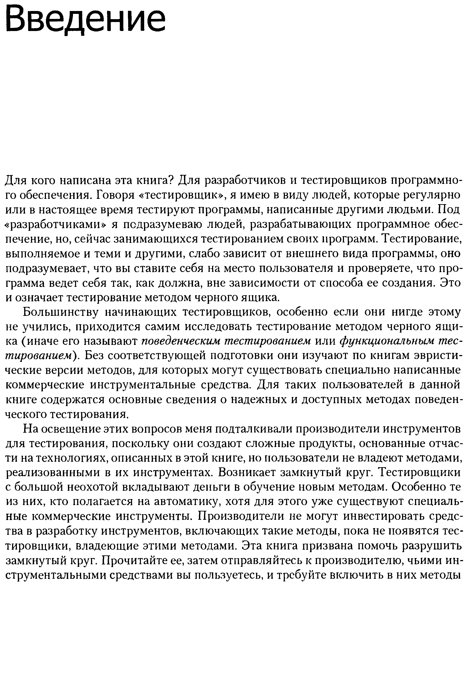

Для кого написана эта книга? Для разработчиков и тестировщиков программного обеспечения. Говоря «тестировщик», я имею в виду людей, которые регулярно или в настоящее время тестируют программы, написанные другими людьми. Под «разработчиками» я подразумеваю людей, разрабатывающих программное обеспечение, но, сейчас занимающихся тестированием своих программ. Тестирование, выполняемое и теми и другими, слабо зависит от внешнего вида программы, оно подразумевает, что вы ставите себя на место пользователя и проверяете, что программа ведет себя так, как должна, вне зависимости от способа ее создания. Это и означает тестирование методом черного ящика.

Большинству начинающих тестировщиков, особенно если они нигде этому не учились, приходится самим исследовать тестирование методом черного ящика (иначе его называют *поведенческим тестированием* или *функциональным тестированием*). Без соответствующей подготовки они изучают по книгам эвристические версии методов, для которых могут существовать специально написанные коммерческие инструментальные средства. Для таких пользователей в данной книге содержатся основные сведения о надежных и доступных методах поведенческого тестирования.

На освещение этих вопросов меня подталкивали производители инструментов для тестирования, поскольку они создают сложные продукты, основанные отчасти на технологиях, описанных в этой книге, но пользователи не владеют методами, реализованными в их инструментах. Возникает замкнутый круг. Тестировщики с большой неохотой вкладывают деньги в обучение новым методам. Особенно те из них, кто полагается на автоматику, хотя для этого уже существуют специальные коммерческие инструменты. Производители не могут инвестировать средства в разработку инструментов, включающих такие методы, пока не появятся тестировщики, владеющие этими методами. Эта книга призвана помочь разрушить замкнутый круг. Прочитайте ее, затем отправляйтесь к производителю, чьими инструментальными средствами вы пользуетесь, и требуйте включить в них методы

---

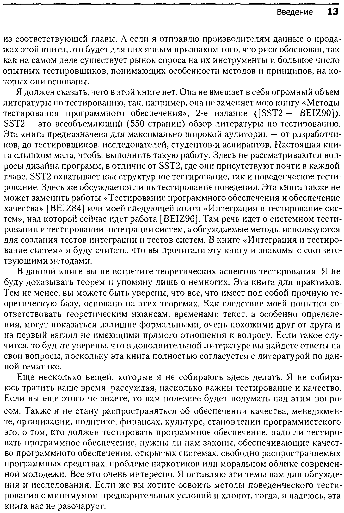

из соответствующей главы. А если я отправлю производителям данные о продажах этой книги, это будет для них явным признаком того, что риск обоснован, так как на самом деле существует рынок спроса на их инструменты и большое число опытных тестировщиков, понимающих особенности методов и принципов, на которых они основаны.

Я должен сказать, чего в этой книге нет. Она не вмещает в себя огромный объем литературы по тестированию, так, например, она не заменяет мою книгу «Методы тестирования программного обеспечения», 2-е издание ([SST2 – BEIZ90]). SST2 – это всеобъемлющий (550 страниц) обзор литературы по тестированию. Эта книга предназначена для максимально широкой аудитории – от разработчиков, до тестировщиков, исследователей, студентов и аспирантов. Настоящая книга слишком мала, чтобы выполнить такую работу. Здесь не рассматриваются вопросы дизайна программ, в отличие от SST2, где они присутствуют почти в каждой главе. SST2 охватывает как структурное тестирование, так и поведенческое тестирование. Здесь же обсуждается лишь тестирование поведения. Эта книга также не может заменить работы «Тестирование программного обеспечения и обеспечение качества» [BEIZ84] или моей следующей книги «Интеграция и тестирование систем», над которой сейчас идет работа [BEIZ96]. Там речь идет о системном тестировании и тестировании интеграции систем, а обсуждаемые методы используются для создания тестов интеграции и тестов систем. В книге «Интеграция и тестирование систем» я буду считать, что вы прочитали эту книгу и знакомы с соответствующими методами.

В данной книге вы не встретите теоретических аспектов тестирования. Я не буду доказывать теорем и упомяну лишь о немногих. Эта книга для практиков. Тем не менее, вы можете быть уверены, что все, что имеет под собой прочную теоретическую базу, основано на этих теоремах. Как следствие моей попытки соответствовать теоретическим нюансам, временами текст, а особенно определения, могут показаться излишне формальными, очень похожими друг от друга и на первый взгляд не имеющими прямого отношения к вопросу. Если такое случится, то будьте уверены, что в дополнительной литературе вы найдете ответы на свои вопросы, поскольку эта книга полностью согласуется с литературой по данной тематике.

Еще несколько вещней, которые я не собираюсь здесь делать. Я не собираюсь тратить ваше время, рассуждая, насколько важны тестирование и качество. Если вы еще этого не знаете, то вам полезнее будет подумать над этим вопросом. Также я не стану распространяться об обеспечении качества, менеджменте, организации, политике, финансах, культуре, становлении программистского, о том, кто должен тестировать программное обеспечение, надо ли тестировать программное обеспечение, нужны ли нам законы, обеспечивающие качество программного обеспечения, открытых системах, свободно распространяемых программных средствах, проблеме наркотиков или моральном облике современной молодежи. Все это очень интересно. Я оставляю эти темы вам для обсуждения и исследования. Если же вы хотите освоить методы поведенческого тестирования с минимумом предварительных условий и хлопот, тогда, я надеюсь, эта книга вас не разочарует.

---

# Пропущенные модели

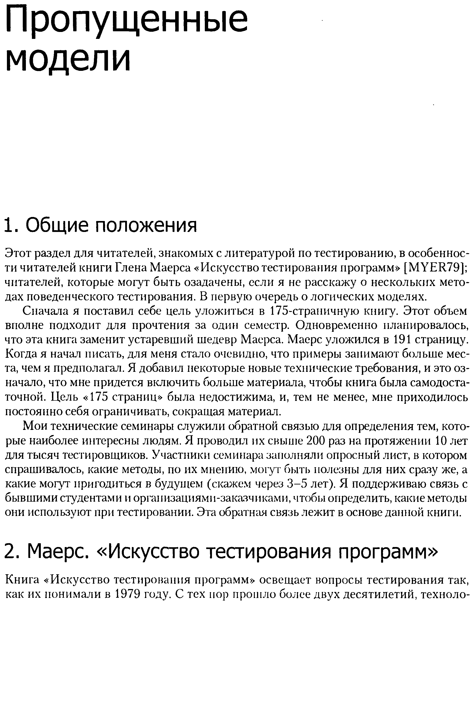

## 1. Общие положения

Этот раздел для читателей, знакомых с литературой по тестированию, в особенности читателей книги Глена Маерса «Искусство тестирования программ» [MYER79]; читателей, которые могут быть озадачены, если я не расскажу о нескольких методах поведенческого тестирования. В первую очередь о логических моделях.

Сначала я поставил себе цель уложиться в 175-страничную книгу. Этот объем вполне подходит для прочтения за один семестр. Одновременно планировалось, что эта книга заменит устаревший шедевр Маерса. Маерс уложился в 191 страницу. Когда я начал писать, для меня стало очевидно, что примеры занимают больше места, чем я предполагал. Я добавил некоторые новые технические требования, и это означало, что мне придется включить больше материала, чтобы книга была самодостаточной. Цель «175 страниц» была недостижима, и, тем не менее, мне приходилось постоянно себя ограничивать, сокращая материал.

Мои технические семинары служили обратной связью для определения тем, которые наиболее интересны людям. Я проводил их свыше 200 раз на протяжении 10 лет для тысяч тестировщиков. Участники семинара заполняли опросный лист, в котором спрашивалось, какие методы, по их мнению, могут быть полезны для них сразу же, а какие могут пригодиться в будущем (скажем через 3–5 лет). Я поддерживаю связь с бывшими студентами и организациями-заказчиками, чтобы определить, какие методы они используют при тестировании. Эта обратная связь лежит в основе данной книги.

## 2. Маерс. «Искусство тестирования программ»

Книга «Искусство тестирования программ» освещает вопросы тестирования так, как их понимали в 1979 году. С тех пор прошло более двух десятилетий, техноло-

---

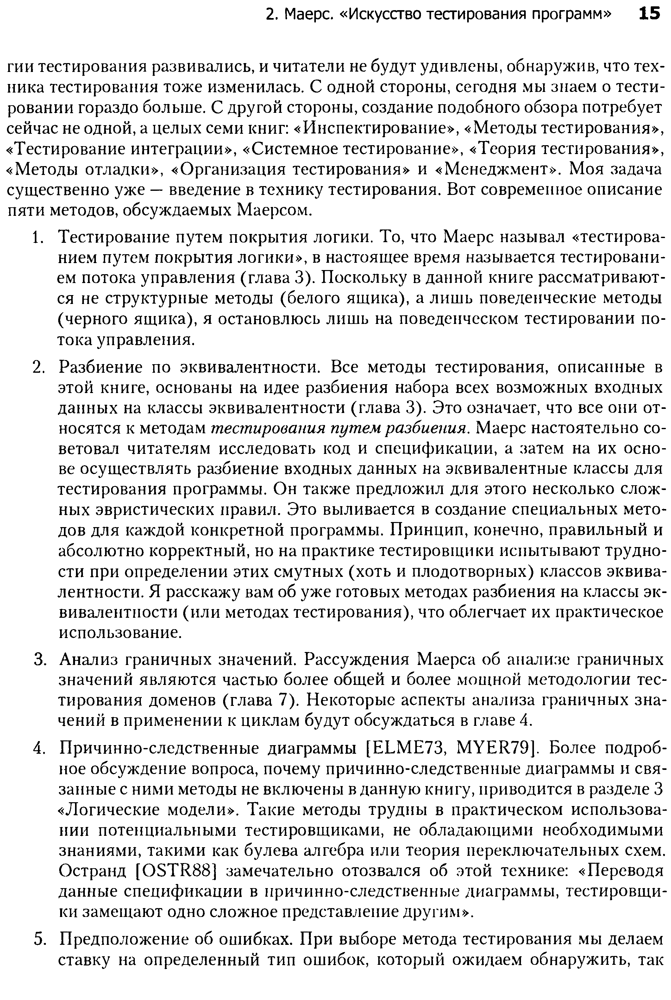

гии тестирования развивались, и читатели не будут удивлены, обнаружив, что техника тестирования тоже изменилась. С одной стороны, сегодня мы знаем о тестировании гораздо больше. С другой стороны, создание подобного обзора потребует сейчас не одной, а целых семи книг: «Инспектирование», «Методы тестирования», «Тестирование интеграции», «Системное тестирование», «Теория тестирования», «Методы отладки», «Организация тестирования» и «Менеджмент». Моя задача существенно уже — введение в технику тестирования. Вот современное описание пяти методов, обсуждаемых Маерсом.

1. **Тестирование путем покрытия логики.** То, что Маерс называл «тестированием путем покрытия логики», в настоящее время называется тестированием потока управления (глава 3). Поскольку в данной книге рассматриваются не структурные методы (белого ящика), а лишь поведенческие методы (черного ящика), я остановлюсь лишь на поведенческом тестировании потока управления.
2. **Разбиение по эквивалентности.** Все методы тестирования, описанные в данной книге, основаны на идее разбиения набора всех возможных входных данных на классы эквивалентности (глава 3). Это означает, что все они относятся к методам *тестирования путем разбиения*. Маерс настоятельно советовал читателям исследовать код и спецификации, а затем на их основе осуществлять разбиение входных данных на эквивалентные классы для тестирования программы. Он также предложил для этого несколько сложных эвристических правил. Это выливается в создание специальных методов для каждой конкретной программы. Принцип, конечно, правильный и абсолютно корректный, но на практике тестировщики испытывают трудности при определении этих смутных (хоть и плодотворных) классов эквивалентности. Я расскажу вам об уже готовых методах разбиения на классы эквивалентности (или методах тестирования), что облегчает их практическое использование.
3. **Анализ граничных значений.** Рассуждения Маерса об анализе граничных значений являются частью более общей и более мощной методологии тестирования доменов (глава 7). Некоторые аспекты анализа граничных значений в применении к циклам будут обсуждаться в главе 4.
4. **Причинно-следственные диаграммы** [ELME73, MYER79]. Более подробное обсуждение вопроса, почему причинно-следственные диаграммы и связанные с ними методы не включены в данную книгу, приводится в разделе 3 «Логические модели». Такие методы трудны в практическом использовании потенциальными тестировщиками, не обладающими необходимыми знаниями, такими как булева алгебра или теория переключательных схем. Остранд [OSTR88] замечательно отозвался об этой технике: «Переводя данные спецификации в причинно-следственные диаграммы, тестировщики замещают одно сложное представление другим».
5. **Предположение об ошибках.** При выборе метода тестирования мы делаем ставку на определенный тип ошибок, который ожидаем обнаружить, так

как предположение о типе ошибок присутствует в любом методе. Поэтому предположение об ошибках — это не какой то метод тестирования, но атрибут любого из методов. Предположение об ошибках, основанное на статистике ошибок программистов, — вполне здравая идея (посмотрите, однако, «Парадокс пестицида» в главе 1). Сегодня мы имеем подобные статистики и, опираясь на них, выбираем определенный метод тестирования. Существует также и формальная теория тестирования, основанного на ошибках, но она не вошла в эту книгу [HOWD89, MORE90].

## 3. Логические модели

Логические модели включают в себя причинно-следственные диаграммы [ELME73, MYER79], модели таблиц решений [BEIZ90, GOOD75] и множество других вариантов, использующихся в качестве частей различных методологий дизайна [BEND85, WEYU94B]. Это замечательные методы, однако для их разбора потребуется слишком много места. К примеру, логические модели занимают в книге «Методы тестирования программного обеспечения» 42 страницы. В данной книге из-за более современных предпосылок и примеров черновик состоял из 75 страниц. Это еще две дополнительные большие (даже слишком большие) главы, что сделает курс слишком большим для одного семестра.

Мне трудно объяснить логические модели без привлечения булевой алгебры, а ее нет смысла учить, если вы не владеете диаграммами Карно–Вейча [BEIZ90], поскольку булева алгебра почти не используется без этого важного инструмента. Я обратил внимание, что слушатели разделяются на две категории. Те, кто знаком с булевой алгеброй и картами Карно, способны овладеть этими методами самостоятельно, например, с помощью STT2. Те же, у кого нет таких знаний, не могут изучить их за четыре часа, которые я посвящаю этой теме. В итоге тестирование на основе логики всегда находится на последних местах в списке предпочтений моих студентов и спонсоров. И частенько вообще выбрасываю эту тему из моих семинаров.

Было бы неплохо, чтобы курс по тестированию был не единственным. Вспомогательный курс, для начальных или старших курсов, когда студенты уже владеют необходимыми знаниями, мог бы включать в себя логические модели и другие модели, здесь не представленные.

## 4. Языковые модели

Существует большое число моделей на основе специальных языков для разработки тестов и связанных с ними инструментальных средств. Хорошим примером может служить метод разбиения по категориям Остранда [LAYC92, OSTR88] и «Т» Постона [POST94]. Другие методы того же типа изложены в [BALC89, BELF76, DAVI88, KEMM85, RICH89]. Все эти методы основаны на языке определения теста. Языки отличаются степенью формальности и выразительной силой, простираясь от самых элементарных до строгих полнофункциональных языков. При помощи таких языков тестировщики определяют требуемое поведение программ. Языковый процессор проверяет это определение на неоднозначности и противоречия. Другой процессор автоматически генерирует тестовые варианты (положительные и отрицательные), соответствующие данному определению при помощи большого числа формальных и эвристических методов тестирования.

Что же плохого в таком способе? Ничего. Я люблю его. Я верю, что рано или поздно тесты будут преимущественно создаваться такими вот инструментами. Однако подобные средства сложны, и их нельзя понять по-настоящему без понимания методов тестирования, на которых строятся генераторы тестов. Прочтя эту книгу, вы узнаете об этих методах.

Другая проблема является фундаментальной для любого языка программирования. Один из наиболее важных выводов, которые я сделал, наблюдая почти четыре десятилетия за развитием программного обеспечения, заключается в том, что нельзя ставить все на какой-то язык программирования, пока он популярен. Да и после потери популярности не стоит зацикливаться на нем. Люди предрекали кончину языка COBOL десятилетиями, но он, подобно бессмертному вампиру, все еще с нами. Кто мог предположить, что С вытеснит языки ассемблера, почти полностью FORTRAN и даже COBOL? Что случилось с языками PL/1 и Algol? Достоинства языков программирования слабо связаны с их популярностью. Будущее языков тестирования еще в большей степени непредсказуемо из-за относительно небольшого круга пользователей. Я надеюсь, что со временем один или два таких языка и связанные с ними генераторы тестов станут общепризнанными средствами тестирования. Тогда и наступит время написать о них, может быть, в рамках дополнительного курса.

# Readme.doc

## Зачем нужен Readme.doc?

Смогу ли я добиться большего успеха, чем производители фирменного программного обеспечения, попытавшись убедить вас прочесть этот раздел, прежде чем вы перейдете к следующим главам? Данный раздел — это инструкция по пользованию данной книгой. Я ничем не отличаюсь от вас. Когда мне в руки попадает новый пакет программ, я запускаю то, что мне интересно, начинаю с ним манипулировать и неизбежно захожу в тупик. Тогда я возвращаюсь назад и читаю Readme.doc, для того чтобы узнать, что же я сделал не так. Поэтому, если вы читаете этот раздел, это значит, что вы попытались прочесть главу о методах, которые, на ваш взгляд, подходят для вашей задачи, но безуспешно. Итак, давайте прочтем это прямо сейчас.

## План книги

Эта книга имеет свою генеральную линию. В главе 1 подготавливается почва для дальнейшего изложения и говорится о моем видении вашей ситуации, или, иными словами, обстоятельств, в которых происходит ваше тестирование. Для некоторых из вас эти обстоятельства могут показаться идеалистическими, но на самом деле они реальны и в той или иной форме присутствуют во множестве организаций-разработчиков программного обеспечения, и это то, к чему вам надо стремиться. Сравнивая вашу ситуацию с главой 1, вы поймете, где вы находитесь и в каком направлении вам надо двигаться. Для тех, кто ориентируется в терминах, мои стандарты — пятый уровень зрелости SEI (по шкале Института программного обеспечения) и, кроме того, немного из [SCAC94].

Глава 2 необходима для понимания глав 3, 4, 5, 6, 8 и 9, глава 4 — для глав 5, 6 и 8. Вы — в большинстве своем тестировщики-практики, и я не буду осуждать вас, если вы пропустите главу, которая покажется вам чересчур абстрактной или не имеющей отношения к вашей конкретной задаче. Прошу за это прощения. Глава 2 очень важна. Если вы не разберетесь в ней, то последующие главы могут быть непонятки. В лучшем случае вы не сможете извлечь из них столько пользы, как если бы вы прочитали эту главу.

Глава 2 подобна подпрограмме с нужной информацией. Вместо того чтобы снова и снова повторять основные принципы в различных контекстах для каждой главы, я опишу идеи тестирования один раз в абстрактной форме и буду ссылаться на них в дальнейшем. Если вы разберетесь в абстрактных понятиях главы 2, то в последующих главах объяснение методов будет занимать всего несколько страниц. Это сделает книгу короче и дешевле, а КПД усвоения выше.

В главах с 3 по 9 описываются конкретные методы. В каждой главе — один метод и его производные. Я постарался сделать эти главы как можно более независимыми друг от друга. Переварив главу 2, вы сможете читать остальные главы практически в любом порядке.

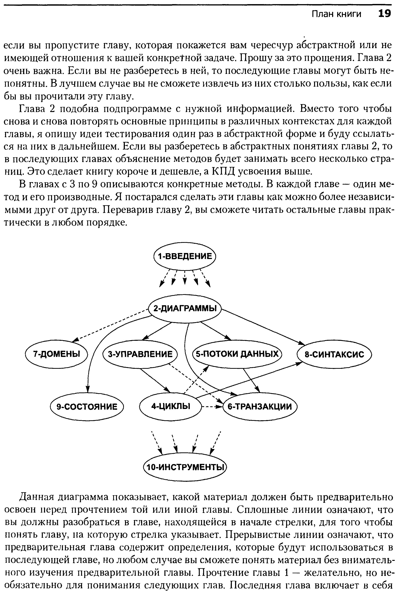

Данная диаграмма показывает, какой материал должен быть предварительно освоен перед прочтением той или иной главы. Сплошные линии означают, что вы должны разобраться в главе, находящейся в начале стрелки, для того чтобы понять главу, на которую стрелка указывает. Прерывистые линии означают, что предварительная глава содержит определения, которые будут использоваться в последующей главе, но любом случае вы сможете понять материал без внимательного изучения предварительной главы. Прочтение главы 1 — желательно, но необязательно для понимания следующих глав. Последняя глава включает в себя определения из остальных глав, и поэтому требование к предваряющим главам нежесткое.

В последней главе рассказывается об инструментальных средствах и автоматизации. И хотя методы, описываемые в этой книге, могут использоваться и безо всякой автоматизации, такое их использование будет крайне неэффективно. Я надеюсь, что вы простите мне, что я не вдаюсь в подробности при обсуждении инструментальных средств. Я не собирался делать здесь полный обзор последних коммерческих инструментов. Такую информацию можно найти в [DAIC93], [GRAH93], [SQET94] и других подобных периодических изданиях. Ситуация меняется слишком быстро, для того чтобы имело смысл печатать подобную информацию в книге.

## Структура главы

Главы с 3 по 9, составляющие ядро данной книги, имеют сходную структуру, хотя порядок может меняться от главы к главе.

*Обзор.* Содержание главы в общих словах без использования терминов, вводимых в данной главе.

*Словарь внешних терминов.* Технические термины, определение которых отсутствует в данной книге, но которые вы должны знать. Англоговорящего читателя может удивить, что сюда включено так много основных компьютерных терминов. Около половины содержимого словаря внешних терминов хорошо знакомо не только профессионалу в области программного обеспечения, но и студенту. Включая сюда основные термины, я преследовал цель помочь моим многочисленным читателям, для которых английский язык не является родным. Я также надеюсь, что эти термины ощутимо облегчат перевод книги. Некоторые из внешних терминов не принципиальны для понимания книги, поскольку используются лишь в одной из нескольких иллюстраций идеи или в несущественном комментарии. Не слишком расстраивайтесь, если вы не понимаете термины, используемые в иллюстрациях, поскольку они играют вспомогательную роль в освоении методов тестирования. Все такие термины есть в алфавитном указателе, и вы можете посмотреть их применение в контексте изложения, чтобы понять, действительно ли они вам нужны для понимания темы.

*Словарь внутренних терминов.* Термины, определяемые в предыдущей главе.

*Словарь новых определений.* Определения, используемые в главе. Новые определения выделяются курсивом. Определение будет выделено курсивом еще раз, если оно дополняется или уточняется. Опоределения приводятся в логической последовательности, где каждое следующее определение зависит от предыдущего; их надо читать в предложенном порядке. Внимательно читайте новые определения и не двигайтесь дальше, пока их не поняли.

*Конфликт словарей.* Иногда вы будете находить один и тот же термин во внешнем и внутреннем словарях, а также в словаре новых определений. Когда термин появляется одновременно во внешнем и внутреннем словарях, это значит, что если вы знали его и раньше, то у вас не будет проблем с пониманием главы, одна-

ко в данном контексте определение будет более строгим, чем то, которое вы знали. Аналогично, если термин возникает во внутреннем словаре и в словаре новых определений, то в данной главе он либо уточняется, либо дополняется (переопределяется).

Термины могут выделяться в тексте курсивом (это значит, что вы, скорее всего, с ними не знакомы), при этом их определение может отсутствовать, и они не будут включены в словарь новых определений. Это означает, что этот термин ссылается на что-то, что будет определено позже. Я старался избегать таких ссылок и использовал их, только если чувствовал, что это принесет пользу. Вы, возможно, захотите заглянуть в соответствующую главу и просмотреть определение, но в любом случае можете не беспокоиться: на изучение данной главы никак не влияет понимание подобных ссылок.

*Модель.* Модель, на которой основан метод. Она включает то, что мы принимаем во внимание в поведении программы, что игнорируем и как мы представляем себе это поведение.

*Предположение об ошибках.* Любой метод тестирования основан на предположении относительно программного продукта, дизайна, пользователя, типа ошибок и возможных проявлений этих ошибок. Этот раздел поможет вам определить эффективность метода в вашем случае.

*Тип приложений.* Обсуждение, для каких приложений данный метод, скорее всего, будет эффективен.

*Метод.* Метод, что он собой представляет, как он работает и почему он работает.

*Примеры.* Примеры и решения технических задач — от необходимых требований до готовых тестов. Там, где это было возможно, я использовал в качестве примеров декларацию о доходах внутренней налоговой службы США. Я выбрал бланки декларации на подоходный налог, поскольку они едины для всех, содержат большое количество нетривиальной логики; они подходят для иллюстраций большинства методов черного ящика; несмотря на то, что мы затрачиваем огромные усилия, чтобы заполнить бланк декларации и разобраться в этих непостижимых формах, они, тем не менее, представляют собой вполне законченные спецификации и свободны от ошибок; и, наконец, их должен знать каждый.

*Предостережения и ограничения.* Что данный метод может, чего не может и ошибки какого типа он пропустит.

*Автоматизация и инструментальные средства.* Комментарии по поводу автоматической генерации совокупности тестовых данных и инструментальных средств, построенных на этом методе.

*Резюме.* Краткое содержание главы с использованием новой терминологии. При сравнении обзора и резюме становиться понятно, какие новые концепции были рассмотрены в этой главе.

*Тест и упражнения.* Упражнения и вопросы по итогам главы. Не прилагая усилий, вы станете хорошо тестировать. Также вам надо знать терминологию, введенную в этой главе, если она встречается в последующих главах. Станьте сами себе ОТК. Проверьте себя. Бланки налоговой декларации являются подходящими объектами для тестирования. Проверьте сделанное, протестировав готовый пакет налоговых документов. Можете считать, что все правила налоговой службы в нем

соблюдены. В том числе они проверяют, чтобы все обязательные для заполнения графы были заполнены. Если вы вводите некое значение, очевидно выходящее за указанные рамки, программа должна определить это и предупредить вас. Я должен извиниться за то, что использовал налоговые декларации за 1994 год, но если они изменятся (а это неизбежно случится), вы приобретете полезный навык в обновлении средств тестирования.

Если вы в данный момент не являетесь студентом, то с помощью этого упражнения вы дополнительно попрактикуетесь в заполнении налоговой декларации. Если же вы студент и никогда не заполняли декларацию, самое время научиться этому. Не осуждайте меня за сложность формы, обратитесь лучше с этим вопросом к своим сенаторам и конгрессменам. Кроме того, реальные проблемы, с которыми вам придется столкнуться при тестировании программ, будут гораздо более трудными.

## Бланки налоговой декларации и ссылки на них

Там, где это было возможно, я иллюстрировал методы на примере формы 1040 декларации о доходах внутренней налоговой службы США и дополнений к ней за 1994 год. Копии форм, использующихся в этой книге, содержатся в приложении А. Эти формы определяют структуры, которые мы и будем тестировать. Я рассчитываю, что каждый раз, разбирая пример, вы будете сверяться с соответствующей копией формы.

Я ссылаюсь на различные строки в бланке декларации как «1040 строка 23». Если отдельно не оговаривается, отсутствие названия формы (например, бланк С) означает, что ссылка относится к форме 1040. Также для создания полезных примеров мы можем добавлять отсутствующие в настоящей форме «строки» в нашу модель. Так, например, вместо одной строки 34 могут возникнуть строки 34.1, 34.2 и т. д.

## Что должен знать читатель

Эта книга для людей, обладающих определенными знаниями и опытом. Одного из нижеследующего будет вполне достаточно: один год (или больше) обучения по университетской программе в области компьютерных наук или программной инженерии, два года среднего специального образования в области компьютерных наук или разработки программного обеспечения, интенсивный годовой курс обучения в сертифицированном коммерческом центре обработки данных или, равнозначно, полный курс обучения по направлению «Программное обеспечение» в системе военного образования США, три или больше лет работы программистом. Занимаетесь ли вы программированием на данный момент — неважно. Важно, чтобы вы знали основные принципы программирования и обладали практическим навыком. Читателям с опытом прикладного тестирования, но без опыта программирования будет сложнее. Им придется потрудиться, чтобы понять и научиться применять главу 2. В словаре внешних терминов для каждой главы приводится лексика, которую вам надо знать для освоения метода. Большинство людей склонно недооценивать собственные знания. Если вы понимаете терминологию главы, этого достаточно для ее изучения.

## Не только программное обеспечение

Исходя из вышесказанного, может показаться, что эта книга адресована только разработчикам программного обеспечения и тестировщикам. Это не так. Требования к читателю достаточно скромны и являются общими при обучении науке, бизнесу, инженерному делу или бухгалтерии. «Тестирование методом черного ящика» означает, что нас не интересует, чтó выступает в роли программно-подобного процесса. Кроме, разумеется, программ, это могут быть химические реакции, физика электромеханических систем, таинственный ход мыслей юриста, когда он пишет налоговые законы. Все эти системы надо тестировать. Все методы, представленные в данной книге, можно применить для тестирования процессов, далеких от программирования. Если вы биохимик и хотите оптимизировать тестирование реакций, которые используете в анализе крови, эта книга будет вам полезна, поскольку маловероятно, что существует книга о тестировании химических реакций в крови. Или представьте, что наши законодатели и Конгресс захотят применить формальный анализ и методы тестирования к абсурдным налоговым законам (особенно касающимся укрывания налогов), которые они разрабатывают. Тогда они смогут использовать эту книгу, хотя вряд ли это произойдет.

## Использование алфавитного указателя

Алфавитный указатель предоставляет всю информацию о термине, а также содержит раздел ссылок. Если в ссылке приводятся номера страниц, то это значит, что в данной работе на указанных страницах содержится информация по соответствующей теме. Вам это будет ясно из названия издания или из комментария, следующего за названием.

## Ссылки

Исследователи вряд ли найдут в ссылках что-нибудь интересное для себя. Ссылки здесь приводятся для того, чтобы читатель мог узнать больше о теме, иногда ознакомиться с противоположной точкой зрения или удачными примерами приложений, которые он мог бы использовать как средство борьбы за внедрение данного метода в свою организацию. Я ограничил библиографию работ, которые, хотя и содержат дополнительную информацию, но не являются существенными. Также я не стал включать в список ссылок множество прекрасных работ, особенно теоретических исследований, не относящихся к теме данной книги.

Ссылки обозначаются согласно требованиям АСМ (ассоциация вычислительной техники). Первые четыре символа из имени автора, затем год публикации, и в конце заглавная буква, начиная с «А», если это не единственная работа автора за тот год. Так, например, [BEIZ90] — книга Бейзера, опубликованная в 1990 году, а [BEIZ91C] — третья его книга в 1991 году. Часто приводится резюме или короткий обзор, если тема не понятна из названия.

## Контроль качества

Контроль качества — это *ваша задача*. Я ожидаю ваших комментариев, а также ваших замечаний об ошибках и недочетах, чтобы исправить их в следующих изданиях. Технологии позволяют сделать это очень просто. Пришлите мне факс или e-mail по адресам, приведенным ниже. Пожалуйста, сообщите следующую информацию о себе:

* Ваше имя, место работы (компания, университет, государственное учреждение)
* Ваша должность
* Почтовый адрес
* Номер телефона, факса, e-mail
* Название книги, издание
* Номер страницы и комментарии или исправления

Если вы используете факс, вы можете сделать копию страницы и написать комментарий прямо на ней.

В публикациях используются номера, эквивалентные номеру версии и релиза. «Номер версии» — это то же самое, что и «номер издания», это всегда указывается в заголовке. Например, «Методы тестирования программ», издание 2-е.

Пожалуйста, посылайте ваши замечания:
Борису Бейзеру
Факс: 215-886-0144, три параллельных факса, отвечают на первый звонок
E-mail: BBEIZER@MCIMAIL.COM

## Благодарности

Я написал эту книгу по настоянию Боба Постена из Programming Environments Inc при поддержке Джинджера Хостона-Ладлэма из Frontier Technologies, Эдварда Миллера из Software Research Associates, Билла Перри из Quality Assurance Institute, Ричарда Бендера из Bender Associates и еще такого огромного числа коллег по академии, что перечислить их не представляется возможным. В написании этой книги есть вклад и других людей: коллега по цеху, моих читателей, моих студентов, клиентов, приходящих на консультации, однако уже трудно сказать, кто из них и что предлагал. Вряд ли кто-нибудь из этих людей догадываются, что они являются соавторами этой книги, поскольку их участие в ее написании было по большей части неосознанным. Мотивация, сознательная или нет — тоже ценный вклад. Я также хочу поблагодарить тех, кто откликнулся на мою просьбу по Интернету о помощи в выборе темы. И, наконец, я благодарен Ли Уайту за полезную и обоснованную критику главы 7.

## Отказ от ответственности

Там, где было возможно в этой книге, я использовал в качестве примеров декларации о доходах внутренней налоговой службы США. Они использовались для иллюстрации проблем тестирования и не годятся для предоставления реальной информации, например как заполнять налоговую декларацию или как интерпретировать код внутренней налоговой службы США. Я по своему усмотрению сокращал или изменял формы, если это надо в педагогических целях. Не используйте формы из этой книги для каких-либо реальных целей, связанных с налогами. Не представляйте эти формы, их копии или материал в них в налоговую службу. Я не несу ответственности за любое их использование, кроме как в качестве учебных пособий.

Несмотря на вышесказанное, бланки декларации, их запутанность и инструкции к ним совпадают с формами внутренней налоговой службы США. Мои коллеги-неамериканцы говорят мне, что налоговые законы сложны во всем мире. Я за это не отвечаю. Законы и формы на самом деле дают нам нечто, за что можно быть благодарным. Если вы в состоянии заполнить налоговую декларацию в своей стране, то вы можете решить любую задачу тестирования, например тестирование программы контроля ядерного реактора.

## От издательства

Ваши замечания, предложения и вопросы отправляйте по адресу электронной почты comp@piter.com (издательство «Питер», компьютерная редакция).
Мы будем рады узнать ваше мнение!
Подробную информацию о наших книгах вы найдете на веб-сайте издательства http://www.piter.com.

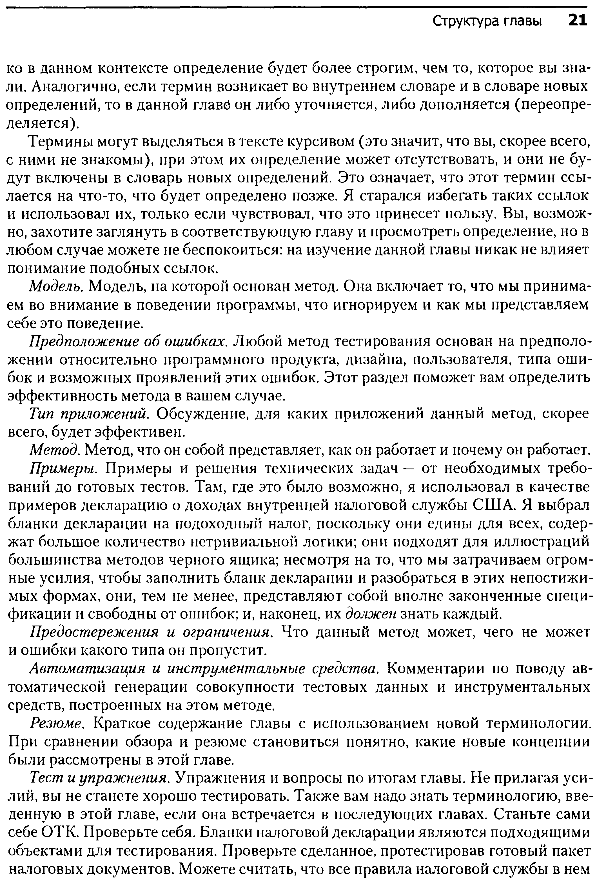

> [!ERROR] Помилка генерації розділу: Не вдалося згенерувати контент після 5 спроб. Остання помилка: None

> [!ERROR] Помилка генерації розділу: Не вдалося згенерувати контент після 5 спроб. Остання помилка: None

> [!ERROR] Помилка генерації розділу: Не вдалося згенерувати контент після 5 спроб. Остання помилка: None

> [!ERROR] Помилка генерації розділу: Не вдалося згенерувати контент після 5 спроб. Остання помилка: None

> [!ERROR] Помилка генерації розділу: Не вдалося згенерувати контент після 5 спроб. Остання помилка: None

> [!ERROR] Помилка генерації розділу: Не вдалося згенерувати контент після 5 спроб. Остання помилка: None

> [!ERROR] Помилка генерації розділу: Не вдалося згенерувати контент після 5 спроб. Остання помилка: None

> [!ERROR] Помилка генерації розділу: Не вдалося згенерувати контент після 5 спроб. Остання помилка: None

> [!ERROR] Помилка генерації розділу: Не вдалося згенерувати контент після 5 спроб. Остання помилка: None

> [!ERROR] Помилка генерації розділу: Не вдалося згенерувати контент після 5 спроб. Остання помилка: None

34.12 34.13 Пустой узел для большей ясности
34.13 34.14 Стандартные льготы больше детализированных льгот?
34.15 Стандартные льготы НЕ больше детализированных льгот?
34.14 35 Использовать стандартный список
34.15 35 Использовать детализированный список
35 36 Вычесть строку 34 из строки 32
36 36.1 Строка 32 $\leqslant \$83.850$
36.2 Строка 32 $>$ $\$83.850$
36.1 37 $\$2.450$ exemptions (освобождения)
36.2 37 Согласно инструкции
37 38 Max(0, строка_35 - строка 36)

*Обозначает еще один предикат, но скрывает сегмент пути. Давайте делать правильно.*

37 37.1 Строка_35 - строка_36
37.1 38 Больше нуля
37.2 Меньше или равен нулю
37.2 38 Введите ноль в строке 37
38 38.1 tax table (таблица налогов)

*Выглядит привлекательно. На первый взгляд это выглядит так, как будто есть пять взаимоисключающих возможностей: (a) таблица налогов, (b) налоговая тарифная сетка, (c) бланк D, (d) форма 8615 или (e) форма 8814. Однако, изучая формы 8615 и 8814, я замечаю, что они могли бы представлять собой две дополнительные позиции для каждой из первых трех опций. Я пытался получить объяснения в ВПС, но не получил. Я позвонил моему бухгалтеру, и он спросил, будет ли это «специальной консультацией», но я ответил: «Не беспокойся, Чарли». Такого рода исследования вы можете проводить при создании практической модели, но в этом примере я буду рассматривать пять различных вариантов.*

38 38.2 tax rate schedule (налоговая тарифная сетка)
38.3 Бланк C
38.4 Форма 8615
38.5 Форма(ы) 8814

*Заметим, что может быть несколько форм 8814, но мы не говорим о том, чтобы суммировать эти формы. Такие особенности должны быть исследованы. Здесь нам следует взять вместе все формы 8814, так как они должны быть заполнены на каждого ребенка, чей интерес и дивиденды вы представляете при заполнении налоговой декларации.*

38.1 39 налог в соответствии с tax table (таблицей налогов)
38.2 39 налог в соответствии с tax rate schedule (налоговой тарифной сеткой)
38.3 39 налог в соответствии с бланком C
38.4 39 налоги в соответствии с формой 8615
38.5 39 налоги в соответствии с формой (формами) 8814
39 39.1 дополнительные налоги в соответствии с формой 4970
39.2 НЕТ дополнительных налогов по форме 4970
39.1 39.3 заполните налоговую форму 4970
39.2 39.3 поставьте ноль для дополнительных налогов в строке 39
39.3 39.4 дополнительные налоги по форме 4972
39.5 НЕТ дополнительных налогов по форме 4972
39.4 40 Добавьте налоги из формы 4972 в строку 39

---

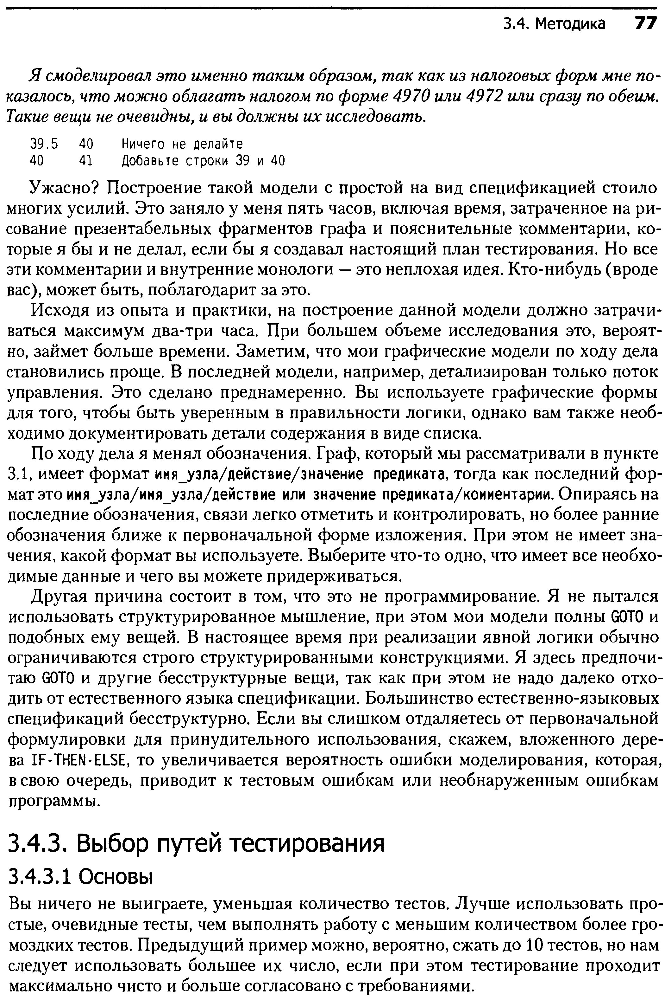

Я смоделировал это именно таким образом, так как из налоговых форм мне показалось, что можно облагать налогом по форме 4970 или 4972 или сразу по обеим. Такие вещи не очевидны, и вы должны их исследовать.

39.5 40 Ничего не делайте
40 41 Добавьте строки 39 и 40

*Ужасно? Построение такой модели с простой на вид спецификацией стоило многих усилий. Это заняло у меня пять часов, включая время, затраченное на рисование презентабельных фрагментов графа и пояснительные комментарии, которые я бы и не делал, если бы я создавал настоящий план тестирования. Но все эти комментарии и внутренние монологи — это неплохая идея. Кто-нибудь (вроде вас), может быть, поблагодарит за это.*

Исходя из опыта и практики, на построение данной модели должно затрачиваться максимум два-три часа. При большем объеме исследования это, вероятно, займет больше времени. Заметим, что мои графические модели по ходу дела становились проще. В последней модели, например, детализирован только поток управления. Это сделано преднамеренно. Вы используете графические формы для того, чтобы быть уверенным в правильности логики, однако вам также необходимо документировать детали содержания в виде списка.

По ходу дела я менял обозначения. Граф, который мы рассматривали в пункте 3.1, имеет формат `имя_узла/действие/значение предиката`, тогда как последний формат это `имя_узла/имя_узла/действие` или `значение предиката/комментарии`. Опираясь на последние обозначения, связи легко отметить и контролировать, но более ранние обозначения ближе к первоначальной форме изложения. При этом не имеет значения, какой формат вы используете. Выберите что-то одно, что имеет все необходимые данные и чего вы можете придерживаться.

Другая причина состоит в том, что это не программирование. Я не пытался использовать структурированное мышление, при этом мои модели полны GOTO и подобных ему вещей. В настоящее время при реализации явной логики обычно ограничиваются строго структурированными конструкциями. Я здесь предпочитаю GOTO и другие бесструктурные вещи, так как при этом не надо далеко отходить от естественного языка спецификации. Большинство естественно-языковых спецификаций бесструктурно. Если вы слишком отдаляетесь от первоначальной формулировки для принудительного использования, скажем, вложенного дерева IF-THEN-ELSE, то увеличивается вероятность ошибки моделирования, которая, в свою очередь, приводит к тестовым ошибкам или необнаруженным ошибкам программы.

## 3.4.3. Выбор путей тестирования

### 3.4.3.1 Основы

Вы ничего не выигрываете, уменьшая количество тестов. Лучше использовать простые, очевидные тесты, чем выполнять работу с меньшим количеством более громоздких тестов. Предыдущий пример можно, вероятно, сжать до 10 тестов, но нам следует использовать большее их число, если при этом тестирование проходит максимально чисто и больше согласовано с требованиями.

---

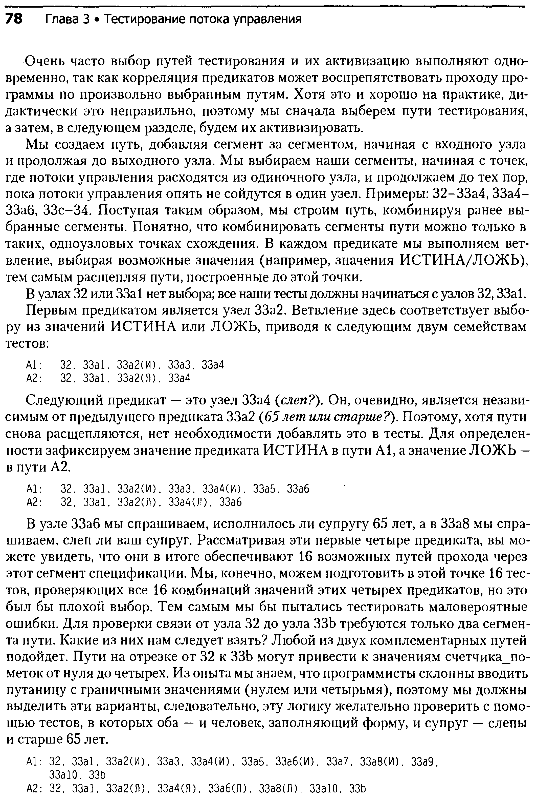

Очень часто выбор путей тестирования и их активизацию выполняют одновременно, так как корреляция предикатов может воспрепятствовать проходу программы по произвольно выбранным путям. Хотя это и хорошо на практике, дидактически это неправильно, поэтому мы сначала выберем пути тестирования, а затем, в следующем разделе, будем их активизировать.

Мы создаем путь, добавляя сегмент за сегментом, начиная с входного узла и продолжая до выходного узла. Мы выбираем наши сегменты, начиная с точек, где потоки управления расходятся от одиночного узла, и продолжаем до тех пор, пока потоки управления опять не сойдутся в один узел. Примеры: 32–33а4, 33а4–33а6, 33с–34. Поступая таким образом, мы строим путь, комбинируя ранее выбранные сегменты. Понятно, что комбинировать сегменты пути можно только в таких, одноузловых точках схождения. В каждом предикате мы выполняем ветвление, выбирая возможные значения (например, значения ИСТИНА/ЛОЖЬ), тем самым расщепляя пути, построенные до этой точки.

В узлах 32 или 33а1 нет выбора; все наши тесты должны начинаться с узлов 32, 33а1.

Первым предикатом является узел 33а2. Ветвление здесь соответствует выбору из значений ИСТИНА или ЛОЖЬ, приводя к следующим двум семействам тестов:

* A1: `32. 33а1. 33а2(И). 33а3. 33а4`
* A2: `32. 33а1. 33а2(Л). 33а4`

Следующий предикат — это узел 33а4 (слеп?). Он, очевидно, является независимым от предыдущего предиката 33а2 (65 лет или старше?). Поэтому, хотя пути снова расщепляются, нет необходимости добавлять это в тесты. Для определенности зафиксируем значение предиката ИСТИНА в пути А1, а значение ЛОЖЬ — в пути А2.

* A1: `32. 33а1. 33а2(И). 33а3. 33а4(И). 33а5. 33а6`
* A2: `32. 33а1. 33а2(Л). 33а4(Л). 33а6`

В узле 33а6 мы спрашиваем, исполнилось ли супругу 65 лет, а в 33а8 мы спрашиваем, слеп ли ваш супруг. Рассматривая эти первые четыре предиката, вы можете увидеть, что они в итоге обеспечивают 16 возможных путей прохода через этот сегмент спецификации. Мы, конечно, можем подготовить в этой точке 16 тестов, проверяющих все 16 комбинаций значений этих четырех предикатов, но это был бы плохой выбор. Тем самым мы бы пытались тестировать маловероятные ошибки. Для проверки связи от узла 32 до узла 33b требуются только два сегмента пути. Какие из них нам следует взять? Любой из двух комплементарных путей подойдет. Пути на отрезке от 32 к 33b могут привести к значениям счетчика_пометок от нуля до четырех. Из опыта мы знаем, что программисты склонны вводить путаницу с граничными значениями (нулем или четырьмя), поэтому мы должны выделить эти варианты, следовательно, эту логику желательно проверить с помощью тестов, в которых оба — и человек, заполняющий форму, и супруг — слепы и старше 65 лет.

* A1: `32. 33а1. 33а2(И). 33а3. 33а4(И). 33а5. 33а6(И). 33а7. 33а8(И). 33а9. 33а10. 33b`
* A2: `32. 33а1. 33а2(Л). 33а4(Л). 33а6(Л). 33а8(Л). 33а10. 33b`

---

Следующий предикат — это узел 33b. Вначале я допустил ошибку и в результате получил проблемы с активизацией. Я не забегаю вперед, чтобы увидеть, может ли этот предикат заблокировать дальнейшие пути, завершаемые в сегменте 34–35. Вот два варианта для этого сегмента: B1: 33b(И), 33b1, 33c и B2: 33b(Л), 33c.

Я не знаю, какие комбинации блокируются позже, поэтому в этой точке создаю четыре варианта, комбинируя наборы А и В. Позднее мы исключим тесты, которые не выполняются. Получаем следующее семейство тестов.

* B1A1: `32. 33а1. 33а2(И). 33а3. 33а4(И). 33а5. 33а6(И). 33а7. 33а8(И). 33а9. 33а10. 33b(И). 33b1. 33c`
* B2A1: `32. 33а1. 33а2(И). 33а3. 33а4(И). 33а5. 33а6(И). 33а7. 33а8(И). 33а9. 33а10. 33b(Л). 33c`
* B1A2: `32. 33а1. 33а2(Л). 33а4(Л). 33а6(Л). 33а8(Л). 33а10. 33b(И). 33b1. 33c`
* B2A2: `32. 33а1. 33а2(Л). 33а4(Л). 33а6(Л). 33а8(Л). 33а10. 33b(Л). 33c`

Следующий сегмент — это 33с–34. Существует пять возможных путей через этот сегмент, и все пять необходимы для покрытия связей. Пять сегментов:

* C1: `33с(Л). 33с2(И). 33с3. 34`
* C2: `33с(И). 33с1(И). 33с3. 34`
* C3: `33с(И). 33с1(Л). 33с4(И). 33с3. 34`
* C4: `33с(Л). 33с2(Л). 34`
* C5: `33с(И). 33с1(Л). 33с4(Л). 34`

Здесь целесообразна быстрая проверка. Я просмотрел четыре предиката (33с, 33с1, 33с2 и 33с4) в предыдущем списке, чтобы быть уверенным, что каждый предикат принимает оба значения (ИСТИНА и ЛОЖЬ) в каком-нибудь сегменте теста.

* C1B1A1: `32. 33а1. 33а2(И). 33а3. 33а4(И). 33а5. 33а6(И). 33а7. 33а8(И). 33а9. 33а10. 33b(И). 33b1. 33с(Л). 33с2(И). 33с3. 34`
* C2B1A1: `32. 33а1. 33а2(И). 33а3. 33а4(И). 33а5. 33а6(И). 33а7. 33а8(И). 33а9. 33а10. 33b(И). 33b1. 33с(И). 33с1(И). 33с3. 34`
* C3B1A1: `32. 33а1. 33а2(И). 33а3. 33а4(И). 33а5. 33а6(И). 33а7. 33а8(И). 33а9. 33а10. 33b(И). 33b1. 33с(И). 33с1(Л). 33с4(И). 33с3. 34`
* C4B1A1: `32. 33а1. 33а2(И). 33а3. 33а4(И). 33а5. 33а6(И). 33а7. 33а8(И). 33а9. 33а10. 33b(И). 33b1. 33с(Л). 33с2(Л). 34`
* C5B1A1: `32. 33а1. 33а2(И). 33а3. 33а4(И). 33а5. 33а6(И). 33а7. 33а8(И). 33а9. 33а10. 33b(И). 33b1. 33с(И). 33с1(Л). 33с4(Л). 34`
* C1B2A1: `32. 33а1. 33а2(И). 33а3. 33а4(И). 33а5. 33а6(И). 33а7. 33а8(И). 33а9. 33а10. 33b(Л). 33с(Л). 33с2(И). 33с3. 34`
* C2B2A1: `32. 33а1. 33а2(И). 33а3. 33а4(И). 33а5. 33а6(И). 33а7. 33а8(И). 33а9. 33а10. 33b(Л). 33с(И). 33с1(И). 33с3. 34`
* C3B2A1: `32. 33а1. 33а2(И). 33а3. 33а4(И). 33а5. 33а6(И). 33а7. 33а8(И). 33а9. 33а10. 33b(Л). 33с(И). 33с1(Л). 33с4(И). 33с3. 34`
* C4B2A1: `32. 33а1. 33а2(И). 33а3. 33а4(И). 33а5. 33а6(И). 33а7. 33а8(И). 33а9. 33а10. 33b(Л). 33с(Л). 33с2(Л). 34`
* C5B2A1: `32. 33а1. 33а2(И). 33а3. 33а4(И). 33а5. 33а6(И). 33а7. 33а8(И). 33а9. 33а10. 33b(Л). 33с(И). 33с1(Л). 33с4(Л). 34`
* C1B1A2: `32. 33а1. 33а2(Л). 33а4(Л). 33а6(Л). 33а8(Л). 33а10. 33b(И). 33b1. 33с(Л). 33с2(И). 33с3. 34`
* C2B1A2: `32. 33а1. 33а2(Л). 33а4(Л). 33а6(Л). 33а8(Л). 33а10. 33b(И). 33b1. 33с(И). 33с1(И). 33с3. 34`
* C3B1A2: `32. 33а1. 33а2(Л). 33а4(Л). 33а6(Л). 33а8(Л). 33а10. 33b(И). 33b1. 33с(И). 33с1(Л). 33с4(И). 33с3. 34`
* C4B1A2: `32. 33а1. 33а2(Л). 33а4(Л). 33а6(Л). 33а8(Л). 33а10. 33b(И). 33b1.`

---

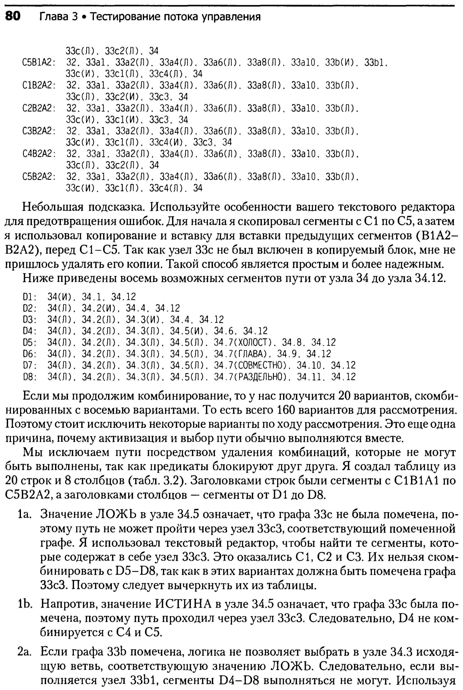

`33с(Л). 33с2(Л). 34`
* C5B1A2: `32. 33а1. 33а2(Л). 33а4(Л). 33а6(Л). 33а8(Л). 33а10. 33b(И). 33b1. 33с(И). 33с1(Л). 33с4(Л). 34`
* C1B2A2: `32. 33а1. 33а2(Л). 33а4(Л). 33а6(Л). 33а8(Л). 33а10. 33b(Л). 33с(Л). 33с2(И). 33с3. 34`
* C2B2A2: `32. 33а1. 33а2(Л). 33а4(Л). 33а6(Л). 33а8(Л). 33а10. 33b(Л). 33с(И). 33с1(И). 33с3. 34`
* C3B2A2: `32. 33а1. 33а2(Л). 33а4(Л). 33а6(Л). 33а8(Л). 33а10. 33b(Л). 33с(И). 33с1(Л). 33с4(И). 33с3. 34`
* C4B2A2: `32. 33а1. 33а2(Л). 33а4(Л). 33а6(Л). 33а8(Л). 33а10. 33b(Л). 33с(Л). 33с2(Л). 34`
* C5B2A2: `32. 33а1. 33а2(Л). 33а4(Л). 33а6(Л). 33а8(Л). 33а10. 33b(Л). 33с(И). 33с1(Л). 33с4(Л). 34`

Небольшая подсказка. Используйте особенности вашего текстового редактора для предотвращения ошибок. Для начала я скопировал сегменты с С1 по С5, а затем я использовал копирование и вставку для вставки предыдущих сегментов (B1A2–B2A2), перед C1–C5. Так как узел 33с не был включен в копируемый блок, мне не пришлось удалять его копии. Такой способ является простым и более надежным.

Ниже приведены восемь возможных сегментов пути от узла 34 до узла 34.12.

* D1: `34(И). 34.1. 34.12`
* D2: `34(Л). 34.2(И). 34.4. 34.12`
* D3: `34(Л). 34.2(Л). 34.3(И). 34.4. 34.12`
* D4: `34(Л). 34.2(Л). 34.3(Л). 34.5(И). 34.6. 34.12`
* D5: `34(Л). 34.2(Л). 34.3(Л). 34.5(Л). 34.7(ХОЛОСТ). 34.8. 34.12`
* D6: `34(Л). 34.2(Л). 34.3(Л). 34.5(Л). 34.7(ГЛАВА). 34.9. 34.12`
* D7: `34(Л). 34.2(Л). 34.3(Л). 34.5(Л). 34.7(СОВМЕСТНО). 34.10. 34.12`
* D8: `34(Л). 34.2(Л). 34.3(Л). 34.5(Л). 34.7(РАЗДЕЛЬНО). 34.11. 34.12`

Если мы продолжим комбинирование, то у нас получится 20 вариантов, скомбинированных с восемью вариантами. То есть всего 160 вариантов для рассмотрения. Поэтому стоит исключить некоторые варианты по ходу рассмотрения. Это еще одна причина, почему активизация и выбор пути обычно выполняются вместе.

Мы исключаем пути посредством удаления комбинаций, которые не могут быть выполнены, так как предикаты блокируют друг друга. Я создал таблицу из 20 строк и 8 столбцов (табл. 3.2). Заголовками строк были сегменты с C1B1A1 по C5B2A2, а заголовками столбцов — сегменты от D1 до D8.

1a. Значение ЛОЖЬ в узле 34.5 означает, что графа 33с не была помечена, поэтому путь не может пройти через узел 33с3, соответствующий помеченной графе. Я использовал текстовый редактор, чтобы найти те сегменты, которые содержат в себе узел 33с3. Это оказались C1, C2 и C3. Их нельзя скомбинировать с D5–D8, так как в этих вариантах должна быть помечена графа 33с3. Поэтому следует вычеркнуть их из таблицы.
1b. Напротив, значение ИСТИНА в узле 34.5 означает, что графа 33с была помечена, поэтому путь проходил через узел 33с3. Следовательно, D4 не комбинируется с C4 и C5.
2a. Если графа 33b помечена, логика не позволяет выбрать в узле 34.3 исходящую ветвь, соответствующую значению ЛОЖЬ. Следовательно, если выполняется узел 33b1, сегменты D4–D8 выполняться не могут. Используя

> [!ERROR] Помилка генерації розділу: Не вдалося згенерувати контент після 5 спроб. Остання помилка: None

> [!ERROR] Помилка генерації розділу: Не вдалося згенерувати контент після 5 спроб. Остання помилка: None

> [!ERROR] Помилка генерації розділу: Не вдалося згенерувати контент після 5 спроб. Остання помилка: None

> [!ERROR] Помилка генерації розділу: Не вдалося згенерувати контент після 5 спроб. Остання помилка: None

> [!ERROR] Помилка генерації розділу: Не вдалося згенерувати контент після 5 спроб. Остання помилка: None

> [!ERROR] Помилка генерації розділу: Не вдалося згенерувати контент після 5 спроб. Остання помилка: None

> [!ERROR] Помилка генерації розділу: Не вдалося згенерувати контент після 5 спроб. Остання помилка: None

> [!ERROR] Помилка генерації розділу: Не вдалося згенерувати контент після 5 спроб. Остання помилка: None

> [!ERROR] Помилка генерації розділу: Не вдалося згенерувати контент після 5 спроб. Остання помилка: None

> [!ERROR] Помилка генерації розділу: Не вдалося згенерувати контент після 5 спроб. Остання помилка: None

> [!ERROR] Помилка генерації розділу: Не вдалося згенерувати контент після 5 спроб. Остання помилка: None

> [!ERROR] Помилка генерації розділу: Не вдалося згенерувати контент після 5 спроб. Остання помилка: None

> [!ERROR] Помилка генерації розділу: Не вдалося згенерувати контент після 5 спроб. Остання помилка: None

> [!ERROR] Помилка генерації розділу: Не вдалося згенерувати контент після 5 спроб. Остання помилка: None

> [!ERROR] Помилка генерації розділу: Не вдалося згенерувати контент після 5 спроб. Остання помилка: None

> [!ERROR] Помилка генерації розділу: Не вдалося згенерувати контент після 5 спроб. Остання помилка: None

> [!ERROR] Помилка генерації розділу: Не вдалося згенерувати контент після 5 спроб. Остання помилка: None

> [!ERROR] Помилка генерації розділу: Не вдалося згенерувати контент після 5 спроб. Остання помилка: None

> [!ERROR] Помилка генерації розділу: Не вдалося згенерувати контент після 5 спроб. Остання помилка: None

> [!ERROR] Помилка генерації розділу: Не вдалося згенерувати контент після 5 спроб. Остання помилка: None

> [!ERROR] Помилка генерації розділу: Не вдалося згенерувати контент після 5 спроб. Остання помилка: None

> [!ERROR] Помилка генерації розділу: Не вдалося згенерувати контент після 5 спроб. Остання помилка: None

> [!ERROR] Помилка генерації розділу: Не вдалося згенерувати контент після 5 спроб. Остання помилка: None

> [!ERROR] Помилка генерації розділу: Не вдалося згенерувати контент після 5 спроб. Остання помилка: None

> [!ERROR] Помилка генерації розділу: Не вдалося згенерувати контент після 5 спроб. Остання помилка: None

> [!ERROR] Помилка генерації розділу: Не вдалося згенерувати контент після 5 спроб. Остання помилка: None

> [!ERROR] Помилка генерації розділу: Не вдалося згенерувати контент після 5 спроб. Остання помилка: None

> [!ERROR] Помилка генерації розділу: Не вдалося згенерувати контент після 5 спроб. Остання помилка: None

> [!ERROR] Помилка генерації розділу: Не вдалося згенерувати контент після 5 спроб. Остання помилка: None

> [!ERROR] Помилка генерації розділу: Не вдалося згенерувати контент після 5 спроб. Остання помилка: None

> [!ERROR] Помилка генерації розділу: Не вдалося згенерувати контент після 5 спроб. Остання помилка: None

> [!ERROR] Помилка генерації розділу: Не вдалося згенерувати контент після 5 спроб. Остання помилка: None

> [!ERROR] Помилка генерації розділу: Не вдалося згенерувати контент після 5 спроб. Остання помилка: None

> [!ERROR] Помилка генерації розділу: Не вдалося згенерувати контент після 5 спроб. Остання помилка: None

> [!ERROR] Помилка генерації розділу: Не вдалося згенерувати контент після 5 спроб. Остання помилка: None

> [!ERROR] Помилка генерації розділу: Не вдалося згенерувати контент після 5 спроб. Остання помилка: None

> [!ERROR] Помилка генерації розділу: Не вдалося згенерувати контент після 5 спроб. Остання помилка: None

> [!ERROR] Помилка генерації розділу: Не вдалося згенерувати контент після 5 спроб. Остання помилка: None

> [!ERROR] Помилка генерації розділу: Не вдалося згенерувати контент після 5 спроб. Остання помилка: None

> [!ERROR] Помилка генерації розділу: Не вдалося згенерувати контент після 5 спроб. Остання помилка: None

> [!ERROR] Помилка генерації розділу: Не вдалося згенерувати контент після 5 спроб. Остання помилка: None

Форма 2106 стр.1

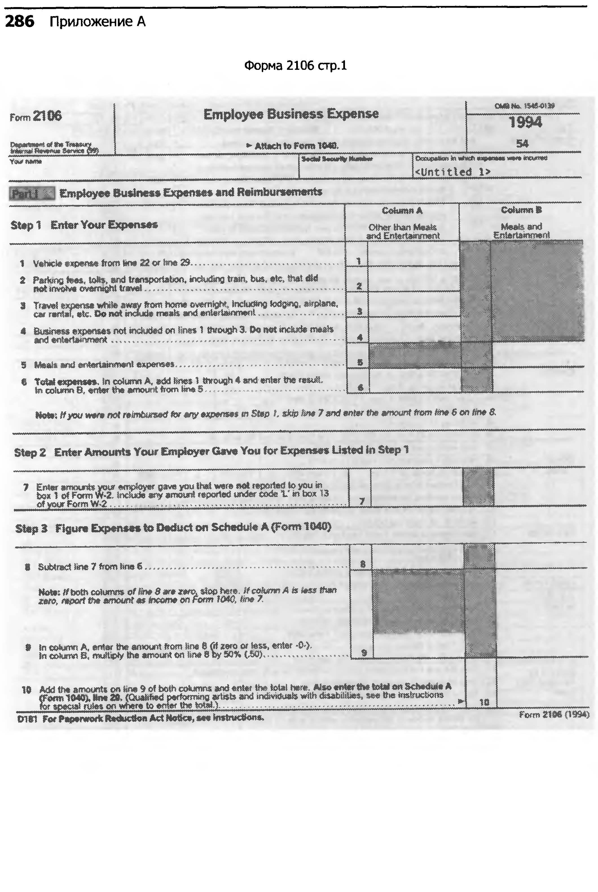

---

Форма 2106 стр.2

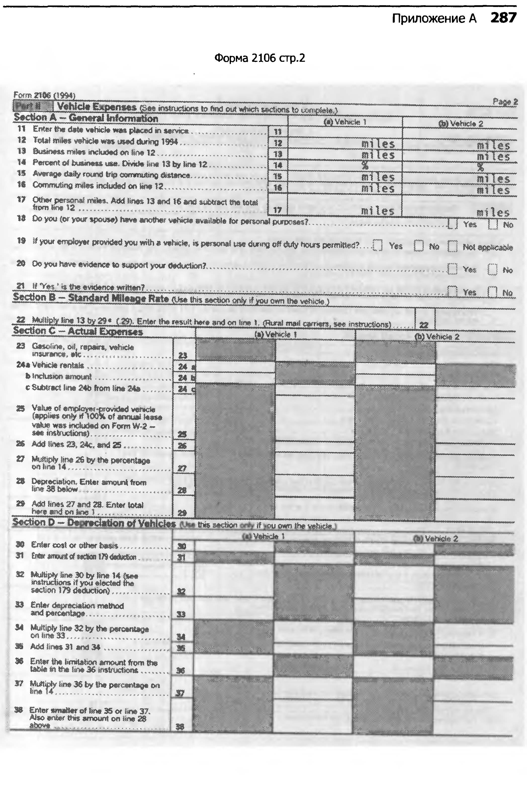

---

Форма 2210 стр.1

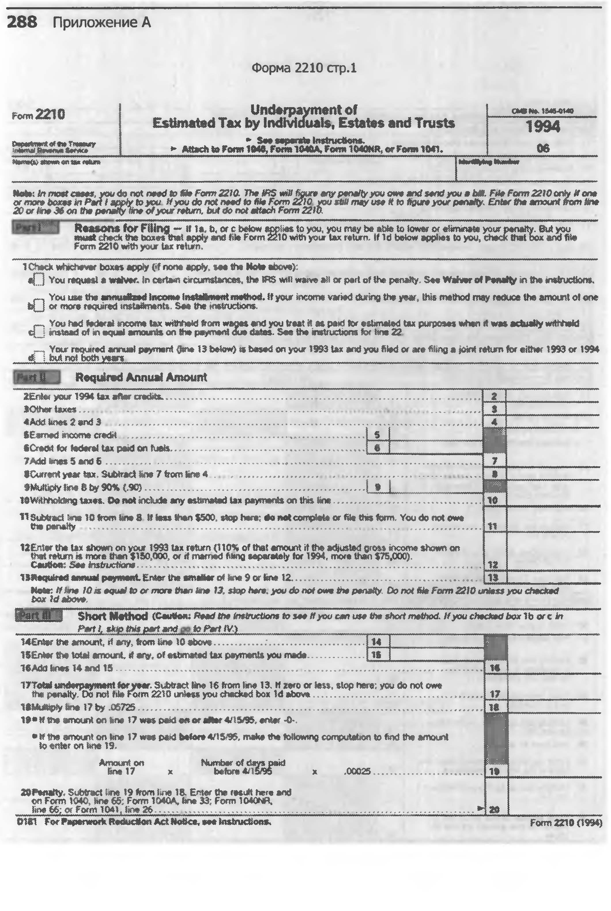

---

Форма 2210 стр.2

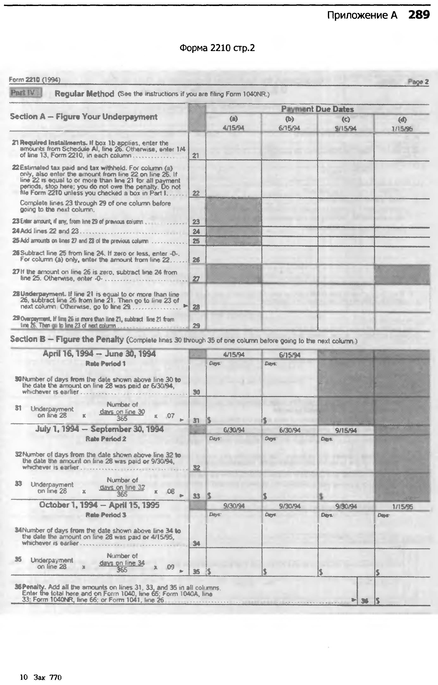

---

Форма 2688

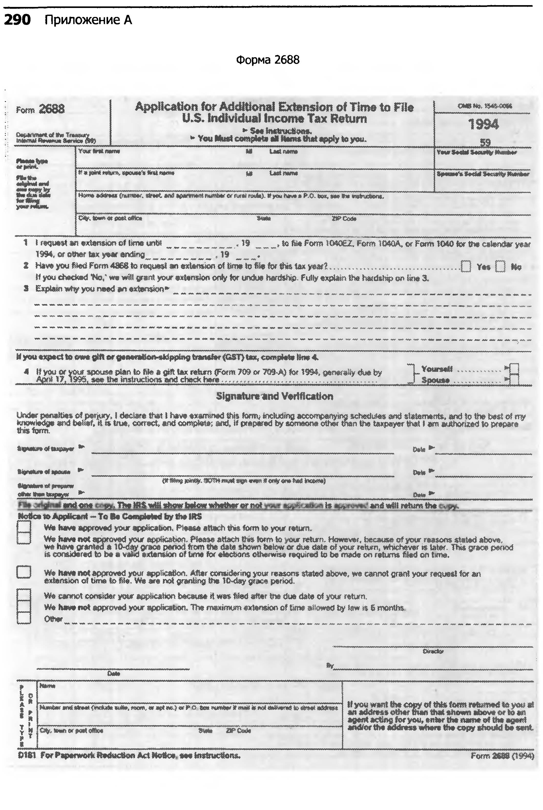

> [!ERROR] Помилка генерації розділу: Не вдалося згенерувати контент після 5 спроб. Остання помилка: None

> [!ERROR] Помилка генерації розділу: Не вдалося згенерувати контент після 5 спроб. Остання помилка: None

Poughkeepsie Laboratory, TR–00.2108, October 9, 1970. Earliest known description of data-flow testing.

BEND85 | Bender, R. A., and Becker, P. “Code Analysis”. Larkspur, CA: Bender and Associates, P.O. Box 849, 94939. Proprietary software development and test methodology that features use of data flow testing techniques.
---|---
BERA94 | Berard, Edward V. “Object Oriented Design.” In MARC94, pp. 721–729.
BERL94 | Berlack, H. Ronald. “Configuration Management.” In MARC94, pp. 180–206. Detailed overview of software configuration control and management practices.
BISW87 | Biswas, S., and Rajaraman, V. “An Algorithm to Decide Feasibility of Linear Integer Constraints Occurring in Decision Tables.” IEEE Transactions on Software Engineering SE–13, #12 (December 1987), pp. 1340–1347.
BOEH81 | Boehm, Barry W. “Software Engineering Economics”. Englewood Cliffs, NJ: Prentice-Hall, 1981. Source book for all aspects of software economics.
BOEH86 | Boehm, Barry W. “A Spiral Model of Software Development and Enhancements.” ACM Software Engineering Notes 11, (4), (1986), pp. 22–42.
BOWD77 | Bowditch, N. “American Practical Navigator”, 70th ed. Washington, DC: Defense Mapping Agency Hydrographic Center, 1977. The oldest book in continuous publication except for the Bible. What our discipline should strive to be when it grows up.
BRIT85 | Britcher, R. H., and Gafmey, J. E. “Reliable Size Estimates for Software Systems Decomposed as State Machines.” Ninth International Computer Software and Applications Conference, Chicago, IL, October 9–11, 1985. Representation of program as finite-state machine relates state-machine size to program size.
BRZ062 | Brzozowski, J. A. “A Survey of Regular Expressions and Their Application.” IRE Transactions on Electronic Computers 11 (1962), pp. 324–335. Survey of regular expression theory and relation to finite-state machines.
BRZ063 | Brzozowski, J. A., and McCluskey, E. J., Jr. “Signal Flow Graph Techniques for Sequential Circuit State Diagrams.” IEEE Transactions on Electronic Computers 12 (1963), pp. 67–76. Basicpaper that applies flow graphs to regular expressions and state-graphs of finite-state automata.
BURK88 | Burke, R. @Black-Box Regression Testing – An Automated Approach.” Fifth International Conference on Testing Computer Software, Washington, DC, June 13–16, 1988.
BUTL89 | Butler, R. W., Mejia, J. D., Brooks, P. A., and Hewson, J. E. “Automated Testing for Real-Time Systems.” Sixth International

Conference on Testing Computer Software, Washington, DC, May 22–25, 1989.

CHEN78 | Chen, W. T, Ho, J. P., and Wen, C. H. “Dynamic Validation of Programs Using Assertion Checking Facilities.” Second Computer Software and Applications Conference, Chicago, IL, November 1978.
---|---
CHOW78 | Chow, T. S. “Testing Software Design Modeled by Finite State Machines.” IEEE Transactions on Software Engineering 4 (1978), pp. 78–186. Testing software modeled by state graphs with examples from telephony. Categorizes types of state-graph errors and shows relation between type of coverage and the kind of errors that can and can’t be caught.
CHOW88 | Chow, C. H., and Lam, S. S. “Prospec: An Interactive Programming Environment for Designing and Verifying Communication Protocols.” IEEE Transactions on Software Engineering 14 (1988), pp. 327–338.
CLAR76 | Clarke, Lori A. “A System to Generate Test Data and Symbolically Execute Programs.” IEEE Transactions on Software Engineering 2 (1976), pp. 215–222. Although aimed at structural testing, the method and tools could be applied just as easily to behavioral control flow and data flow models.
CLAR82 | Clarke, Lori A., Hassel, J., and Richardson, D. J. “A Close Look at Domain Testing.” IEEE Transactions on Software Engineering 8 (1982), pp. 380–390. Good survey and critique; exposition of error types and what does and doesn’t work to catch them and why.
CLAR89 | Clarke, Lori A., Podgurski, Andy, Richardson, Debra J., and Zeil, Steven J. “A Formal Evaluation of Data Flow Path Selection Criteria.” IEEE Transactions on Software Engineering 15 (1989), pp. 1318–1332.
COHE78 | Cohen, E. I. “A Finite Domain-Testing Strategy for Computer Program Testing.” Ph. D. diss., Ohio State University, June 1978.
CONK89 | Conklin, J. “Automated Repetitive Testing.” Sixth International Conference on Testing Computer Software, Washington, DC, May 22–25, 1989.
COOPS1 | Cooper, Robert B. “Introduction to Queuing Theory”. New York: Elsevier North Holland, 1981.
CROS92 | “CrossTalk Communications.” CASL Programmer Guide. Rosswell, GA: Digital Communications Associates, 1992.
DAIC93 | Daich, Greg, and Price, Gordon. “Test Preparation Execution, in Evaluation Software Technologies Report”. Software Technology Support Center, Hill AFB, Ogden, UT. Customer Service 801–777–7703. Free periodical guide to test tools and technology approved for use in U. S. government. Also, Reengineering Tools Report, Source Code Static Analysis Technologies Report, vols. 1 and 2.

DAVI88 | Davis, A. M. “A Comparison of Techniques for the Specification of External System Behavior.” Communications of the ACM 31, #9 (1988), pp. 1098–1115. Survey of state graphs, state tables, decision tables, decision trees, program design languages, Petri nets, requirement languages, and specification languages in developing requirements and tests from them.
---|---
DEON74 | Deo, N. “Graph Theory with Applications to Engineering and Computer Science”. Englewood Cliffs, NJ: Prentice-Hall, 1974.
EBER94 | Ebert, Jurgen and Engels, Gregor. “Design Representations.” In MARC94, pp. 382–394. Survey of popular design models and representations, all of which can be used as a basis for test design.
ELME73 | Elmendorf, W. R. “Cause-Effect Graphs in Functional Testing”. TR–00.2487, IBM Systems Development Division, Poughkeepsie, NY, 1973.
FAGA76 | Fagan, M. E. “Design and Code Inspections to Reduce Errors in Program Development”. IBM Systems Journal 3 (1976) pp: 182–211. Still one of the best expositions on inspections ever written.
FENT91 | Fenton, Norman E. “Software Metrics: A Rigorous Approach”. London: Chapman and Hall, 1991. A rigorous but very accessible book on software metrics, suitable for a first course.
FRAN85 | Franki, P. S., Weiss, S. N. and Weyuker, E.J. “Asset – A System to Select and Evaluate Tests.” Proceedings of the IEEE Conference on Software Tools (April 1985), pp. 72–79.
FRAN88 | Franki, P. G., and Weyuker, E. J. “An Applicable Family of Data Flow Testing Criteria.” IEEE Transactions on Software Engineering 14, #10 (1988), pp. 1483–1498.
FREE88 | Freeman, P. A., and Hunt, H. S. “Software Quality Improvement Through Automated Testing.” Fifth International Conference on Testing Computer Software, Washington, DC, June 13–16, 1988.
FSTC83 | Federal Software Testing Center. “Software Tools Survey”. Office of Software Development report #OSD/FSTC–83/015, 1983. Survey of 100 software development tools, language, source.
FUJI94 | Fujii, Roger U. “Independent Verification and Validation.” In MARC94, pp. 568–572. What an independent test group is all about.
FURG89 | Furgerson, Donald F., Coutu, John P., Reinemann, Jeffrey K., and Novakovich, Michael R. “Automated Testing of a Real-Time Microprocessor Operating System.” Sixth International Conference on Testing Computer Software, Washington, DC, May 23–25, 1989. Description of application of CrossTalk CASL scripting language to test script design and to construction of a testing environment.
GERH88 | Gerhart, Susan L. “A Broad Spectrum Toolset for Upstream Testing, Verification, and Analysis.” Second Workshop on

Software Testing, Verification, and Analysis, Banff, Canada, July 19–21, 1988.

GIBB94 | Gibbs, Wayt. “Software's Chronic Crisis.” Scientific American, 71, #3 (1994), pp. 86–95.
---|---
GILB93 | Gilb, Tom, and Graham, Dorothy. “Software Inspections”. Menio Park, CA: Addison-Wesley, 1993. As good and as readable text on inspections as you’re likely to find.
GOOD75 | Goodenough, J. B., and Gerhart, S. A. “Toward a Theory of Test Data Selection.” IEEE Transactions on Software Engineering 1 (1975), pp. 156–173. The beginning of testing theory; historical interest.
GRAD87 | Grady, Robert B., and Caswell, D. L. “Software Metrics: Establishing a Company-Wide Program”. Englewood Cliffs, NJ: Prentice-Hall, 1987. A practical guide to implementing a total metrics program based on experience in a supportive, sophisticated, software development organization.
GRAD92 | Grady, Robert B. “Practical Software Metrics for Project Management and Process Improvement”. Englewood Cliffs, NJ: Prentice-Hall, 1992. Yet another practical guide to metrics in an industrial setting, courtesy of Hewlett-Packard.
GRAH91 | Graham, Dorothy R. “Software Testing Tools: A New Classification Scheme.” Journal of Software Testing, Verification, and Reliability 1, #3 (October-December 1991) pp. 17–34. An overview and rational taxonomy for test tools.
GRAH93 | Graham, Dorothy R., and Herzlich, Paul. “CAST Report: Computer Aided Software Testing”. London: Cambridge Market Intelligence, 1993. Periodical report on test tools for mostly European platforms.
GRAH94 | Graham, Dorothy R. “Testing” In MARC94, pp. 1330–1353. Testing with a software development process perspective.
HAML88 | Hamlet, R., and Taylor, R. “Partition Testing Does Not Inspire Confidence.” Second Workshop on Software Testing, Verification, and Analysis, Banff, Canada, July 19–21, 1988. Shows that partition testing methods cannot be used to obtain statistically meaningful software reliability measures.
HAML94 | Hamlet, Richard. “Random Testing.” In MARC94, pp. 970–978.
HANF70 | Hanford, K. V. “Automatic Generation of Test Cases.” IBM System Journal 9 (1979), pp. 242–257. Use of BNF to generate syntactically valid test cases for testing a PL/I compiler.
HANT76 | Hantler, S. A., and King, J. C. “An Introduction to Proving the Correctness of Programs.” ACM Computing Surveys 8, 3 (1976), pp. 331–353.
HARR89 | Harrold, M. J., and Soffa, M. L. “An Incremental Data Flow Testing Tool.” Sixth International Conference on Testing Computer Software, Washington, DC, May 22–25, 1989.

HEND89 | Henderson, B. M. “Big Brother – Automated Test Controller.” Sixth International Conference on Testing Computer Software, Washington, DC, May 22–25, 1989.
---|---
HERA88 | Herath, J., Yamaguchi, Y, Saito, N., and Yuba, T. “Dataflow Computing Models, Languages, and Machines for Intelligence Computations.” IEEE Transactions on Software Engineering 14, 12 (1988), pp. 1805–1828. Although the paper is aimed at intelligence processing, the overview and tutorial is one of the best around.
HERM76 | Herman, P. M. “A Data Flow Analysis Approach to Program Testing.” Australian Computer Journal (November 1976), pp. 92–96. Earliest known published discussion of heuristic data flow testing.
HOLT87 | Holt, D. “A General Purpose Driver for UNIX.” Fourth International Conference on Testing Computer Software, Bethesda, MD, June 15–18, 1987.
HOLZ87 | Holzman, G. J. “Automated Protocol Validation in Argos: Assertion Proving and Scatter Searching.” IEEE Transactions on Software Engineering 13 (1987), pp. 683–696. Experience in automatically generated state machine-based testing cases as applied to protocol verification. Application and strategies for systems with on the order of 1024 states.
HORG92 | Horgan, J. R., and London, S. A. “A Dataflow Coverage Testing Tool for C.” Proceedings Symposium on Assesment of Quality Software Developement Tools. Los Alamitos, CA: IEEE CS Press, 1992, pp. 2–10. Description of the ATAC public domain C dataflow test tool.
HORG94 | Horgan, J. R., London, S. A., and Lyu, M. R. “Achieving Software Quality with Testing Coverage Measures.” IEEE Computer 7, #9 (Sept. 1994), pp. 60–70.
HOWD76 | Howden, W. E. “Reliability of the Path Analysis Testing Strategy.” IEEE Transactions on Software Engineering 2 (1976), pp. 208–215. Proof that the automatic generation of a finite test set that is sufficient to test a routine is not a computable problem. Formal definition of computation error, path error, and other kinds of errors.
HOWD80 | Howden, W. E. “An Evaluation of the Effectiveness of Symbolic Testing.” IEEE Transactions on Software Engineering 6 (1980), pp. 162–169.
HOWD86 | Howden, William E. “A Functional Approach to Program Testing and Analysis.” IEEE Transactions on Software Engineering 12 (1986), pp. 997–1005.
HOWD87 | Howden, William E. “Functional Program Testing and Analysis”. New York: McGraw-Hill, 1987.
HOWD89 | Howden, William E. “Validating Programs Without Specifications.” Proceedings of the ACM SIGSOFT ‘89, Third

> [!ERROR] Помилка генерації розділу: Не вдалося згенерувати контент після 5 спроб. Остання помилка: None

> [!ERROR] Помилка генерації розділу: Не вдалося згенерувати контент після 5 спроб. Остання помилка: None

> [!ERROR] Помилка генерації розділу: Не вдалося згенерувати контент після 5 спроб. Остання помилка: None

> [!ERROR] Помилка генерації розділу: Не вдалося згенерувати контент після 5 спроб. Остання помилка: None

