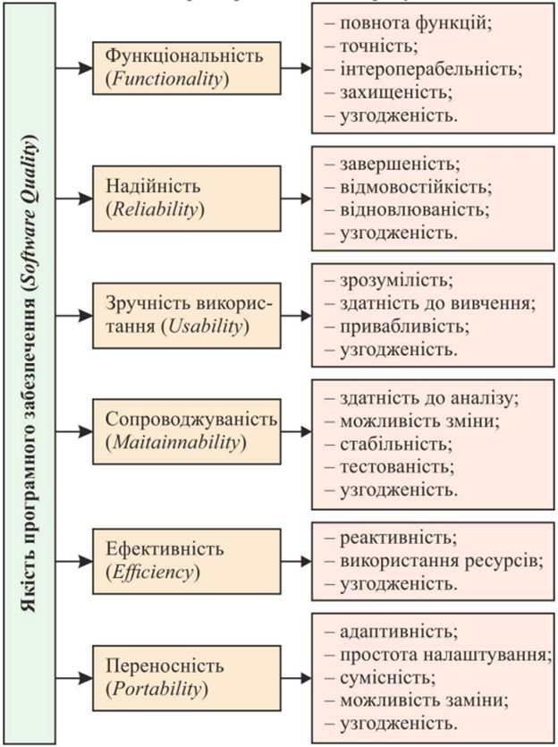
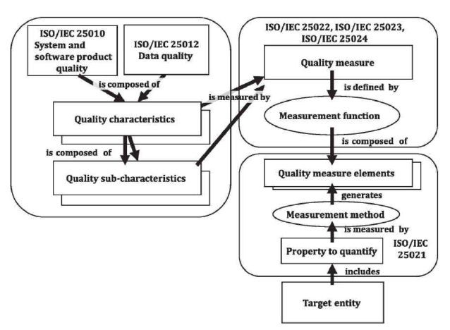
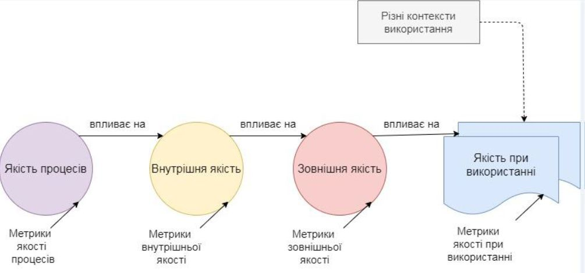

# ГЗ 1.4 Метрики ТТПЗ

Тема 1: Якість програмного забезпечення інформаційних систем.

1: Метрики та їх типи

## Модель якості програмного забезпечення

Модель якості програмного забезпечення, визначена стандартом ISO/IEC 25010:2011, передбачає чотирирівневу структуру подання.

На першому рівні здійснюється формалізація характеристик (показників) якості ПЗ, кожна з яких репрезентує окремий аспект сприйняття та оцінки якості з позиції користувача.

У межах моделі виділяють шість основних характеристик якості, що можуть бути виміряні за допомогою відповідних метрик.

На другому рівні визначають атрибути якості ПЗ для кожної конкретної його характеристики, які деталізують різні її особливості. Набір цих атрибутів потім використовують в метричному аналізі якості ПЗ.

Третій рівень призначений для вимірювання якості за допомогою МЕТРИК, кожну з яких, згідно зі стандартом ISO/IEC, визначають як комбінацію методів вимірювання атрибута і шкали встановлення його значень.

Для оцінювання атрибутів якості ПЗ на всіх етапах його розроблення (при перегляді документації та продуктів проекту, а також за результатами їхнього тестування) використовують метрики з заданою їх вагомістю для нівелювання результатів метричного аналізу сукупних атрибутів конкретного критерію чи показника якості ПЗ.

На четвертому рівні для оцінювання кількісного або якісного значення окремих атрибутів якості ПЗ використовують оцінний елемент метрики – її пріоритет. Залежно від призначення, особливостей експлуатації та умов супроводу ПЗ вибирають найбільш важливі характеристики і атрибути його якості. Вибрані атрибути і їх пріоритети відображають у вимогах до процесу розроблення ПЗ, або використовують відповідні пріоритети еталона класу ПЗ, до якого воно має належати.

Згідно з даними стандарту ISO 25010:2011, характеристика – це набір властивостей ПЗ, за допомогою яких можна описати та оцінити його якість.

Під характеристика якості ПЗ виражається середньозваженим арифметичним показником з урахуванням значень атрибутів, що оцінюють цю під характеристику, та коефіцієнтів їхньої вагомості.

Оцінювання ж якості ПЗ на підставі використання результатів метричного аналізу відбувається в такий спосіб: на підставі показників якості ПЗ розраховують значення метрик якості, які водночас, надають комплексну оцінку якості ПЗ.

## Визначення

Метрика – модель вимірювання атрибута, пов'язаного з характеристикою якості ПЗ. Це комбінація конкретного методу вимірювання (способу отримання значень) атрибута сутності й шкали вимірювання (ISO/IEC 9126-2).

Метрика – міра ступеня володіння властивістю, яка має числове значення (ISO 24765:2010).

Загалом, метрика ПЗ – це міра, яка дає змогу отримати числове значення деякої властивості ПЗ як середньозважене арифметичне з урахуванням значень показників, що оцінюють цю метрику, та коефіцієнтів їхньої вагомості.

Метрика – це кількісний масштаб і метод, який може використовуватися для вимірювання.

## Проблеми впровадження метрик якості

### Проблеми впровадження метрик якості

1. Відсутні єдині стандарти на метрики (створено більше тисячі метрик), тому кожен постачальник вимірювальної системи пропонує власні методи оцінювання якості ПЗ і відповідні метрики.

2. Складне завдання інтерпретації значень метрик – для більшості користувачів як метрики, так і їх значення не зовсім є зрозумілими та інформативними.

3. За статистичними даними тільки 1,5 % програмних компаній намагаються оцінити якість процесів і готового продукту кількісно за допомогою метрик, і тільки 0,5 % цих компаній намагаються покращити роботу, керуючись кількісними критеріями якості ПЗ з метою виготовлення бездефектних продуктів.

4. Сучасні технології вимірювання якості ПЗ ще не досягли своєї "зрілості", оскільки тільки 0,5 % програмних компаній працюють за так званою моделлю зрілості здібностей CММ (англ. Capability Maturity Model)

### Впровадження метрик якості

1. Введення і використання метрик необхідно для поліпшення контролю над процесом розробки, а зокрема над процесом тестування.

2. Мета контролю тестування полягає в отриманні зворотного зв'язку і візуалізації процесу тестування.

3. Необхідну для контролю інформацію збирають (як в ручну, так і автоматично) і використовують для оцінки стану і прийняття рішень, таких як покриття (наприклад, покриття вимог або коду тестами) або критерії виходу (наприклад, критерії закінчення тестування).

4. Метрики, також можуть бути використані для оцінки прогресу виконання запланованих робіт і освоєння бюджету.

### Результати впровадження метрик якості

1. прогнозування кількості помилок у ПЗ від початку проектування;
2. Прогнозування рівня складності ПЗ та його супроводу на підставі аналізу результатів проектування;
3. прогнозування рівня складності процесів тестування та кількості невиявлених помилок на підставі аналізу коду програми;
4. прогнозування остаточного розміру коду програми на підставі аналізу оцінок складності проектування архітектури ПЗ;
5. визначення впливу окремих характеристик програмного коду на якість готового ПЗ;
6. контроль етапів реалізації програмного проекту;
7. аналіз явних і прихованих дефектів у готовому ПЗ;
8. виявлення кращих методів і технологій розроблення ПЗ на підставі їх порівняння.

## Життєвий цикл якості

## Типи Метрик

За видом (станом) об'єкта вимірювання (робоча версія програми або сукупність документів і програмного коду) метрики умовно поділяються на зовнішні, внутрішні й експлуатаційні.

Внутрішні метрики призначені для оцінювання внутрішньої якості ПЗ, тобто реальним потребам замовників при його використанні в певних умовах безпосередніми користувачами. Вони також надають можливість цим користувачам, менеджерам і безпосереднім розробникам ПЗ оцінювати якість проміжних і остаточних продуктів програмного проекту безпосередньо за їх властивостями без потреби виконання їх на комп'ютері.

Зовнішні метрики використовують виміри робочого ПЗ на комп'ютері, отримані внаслідок вимірювання його поведінки в ході виконання роботи. Вони призначені для оцінювання зовнішньої якості ПЗ, тобто його рівня, якому воно відповідає згідно з встановленими (заявленими) і передбачуваними вимогами під час його використання у певних умовах.

За видом отриманого значення (при застосуванні на ранніх етапах розробки ПЗ) метрики умовно поділяють на ті які мають точне або прогнозоване значення

Метрики експлуатаційної якості (якості при використанні) дають змогу виміряти рівень якості ПЗ, встановлене в замовника й використовується у певному середовищі експлуатації за безпосереднім призначенням, задовольняє потреби користувачів стосовно ефективного, продуктивного та безпечного вирішення завдань, покладених на нього, а також справляє загальне позитивне враження на його безпосередній користувачів. Ці метрики допомагають оцінити не властивості самого ПЗ, а видимі результати його експлуатації, тобто експлуатаційну якість ПЗ

## Метрики які мають точне значення

1. Метрика Чепіна — аналізує характер використання змінних з переліку введеної та оброблюваної інформації;
2. Метрика зв'язності (cohesion) – внутрішня характеристика програмного модуля, яка залежить від типу модуля або проекту;
3. Метрика Джилба (складова метрики) – модульна складність програми, за допомогою якої на етапі проектування можна підрахувати кількість міжмодульних зв'язків;
4. метрика Мак-Клура – спрямована на оцінювання архітектури ПЗ;
5. Метрика зчеплення (coupling) – зовнішня характеристика модуля, яку бажано і варто зменшувати – міра взаємозалежності модулів за даними;
6. Метрика Кафура – ґрунтується на врахуванні потоків даних;
7. метрика звертання до глобальних змінних – характеризується парою (p,r), де p – модуль, який має доступ до глобальної змінної r;
8. тривалість модифікації моделей – метрика процесу розроблення ПЗ;
9. Метрика густоти помилок – кількість знайдених помилок при інспектуванні моделей і прототипів підсистем, модулів, функцій та вимог.

## Метрики які мають прогнозоване значення

1. очікувана LOC оцінка (експертна)
2. метрика Холстеда – обчислюється на підставі аналізу кількості рядків і синтаксичних елементів вихідного коду програми;
3. метрика Маккейба – цикломатична складність, оцінки складності програми шляхом обчислення кількості лінійно незалежних шляхів у її алгоритмі.
4. прогнозована кількість операторів програми;
5. прогнозована оцінка складності інтерфейсів компонент ПЗ;
6. прогнозована загальна тривалість процесу розроблення ПЗ – метрика процесу розроблення ПЗ;
7. очікувана вартість процесу розроблення ПЗ;
8. прогнозована вартість перевірки якості – метрика процесу розроблення ПЗ;
9. прогнозована продуктивність процесу розроблення ПЗ;
10. прогнозовані витрати на реалізацію коду – метрика процесу розроблення ПЗ;
11. прогнозований функціональний розмір FP – вимірює суть можливостей майбутньої програми;
12. тривалість виконання робіт етапу проектування ПЗ – метрика процесу розроблення ПЗ;
13. прогнозована оцінка трудовитрат і тривалості реалізації програмного проекту – за моделлю Боема.

## Метрики за тестовими випадками

### Passed / Failed Test Cases

Метрика показує результати проходження тест кейсів, а саме відношення кількості вдало пройдених до завершився з помилками. В ідеалі, до кінця проекту, кількість провальних тестів прагнути до нуля.

### Not Run Test Cases

Метрика показує кількість тест кейсів, які ще необхідно виконати в даній фазі тестування. Маючи цю інформацію, ми можемо проаналізувати і виявити причини, за якими тест не були проведені.

## Метрики за задачами

1. **Deployment tasks**
   Метрика показує кількість і результати установок програми. У разі, якщо кількість відхилених командою тестування версій буде критично високим, рекомендується терміново проаналізувати і виявити причини, а також в найкоротші терміни вирішити наявну проблему.

2. **Still Opened Tasks**
   Метрика показує кількість все ще відкритих завдань. До закінчення проекту всі завдання повинні бути закриті. Під завданнями розуміємо такі види робіт: написання документації (архітектура, вимоги, плани), імплементація нових модулів або зміна існуючих за запитами на зміни, роботи з налаштування стендів, різні дослідження і багато іншого.

## Метрики за дефектами

1. Open / ClosedBugs – метрика показує відношення кількості відкритих багів до закритих (виправлені і перевірені).
2. Reopened / ClosedBugs – метрика показує відношення кількості перевідкритих багів до закритих (виправлені і перевірені).
3. Rejected / OpenedBugs – метрика показує відношення кількості відхилених багів до відкритих.
4. Bugs by Severity – кількість багів за критичністю.
5. Bugs by Priority – кількість багів за пріоритетом.

## Модель якості в користуванні (Quality in use)

Ефективність (Effectiveness) Наскільки користувач може досягти своїх цілей за допомогою продукту.

Ефективність витрат (Efficiency) Витрати часу та ресурсів для досягнення цілей.

Задоволеність (Satisfaction) Враження та рівень задоволення користувача від взаємодії.

Захищеність (Freedom from risk) Рівень безпеки, мінімізація ризиків для користувача.

Контекст покриття (Context coverage) Спосіб і можливість використання продукту в різних ситуаціях і умовах.

## Висновки!

1. Особливістю використання метричного аналізу для визначення якості ПЗ, є відсутність єдиних стандартів на метрики, тому кожен постачальник вимірювальної системи пропонує власні методи оцінювання якості ПЗ і відповідні метрики.
2. Складним є завдання інтерпретації значень метрик, позаяк для більшості користувачів як метрики, так і їх значення не зовсім є зрозумілими та інформативними.
3. Основними параметрами при виборі варіанту реалізації ПЗ є його вартість та тривалість процесу розроблення й репутація фірми-проєктанта, але рішення, прийняті на підставі цих параметрів, не завжди гарантують належну якість ПЗ.

