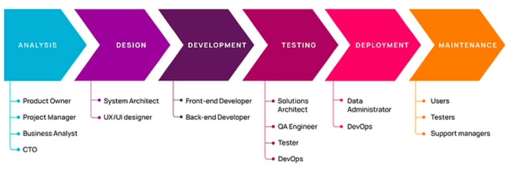
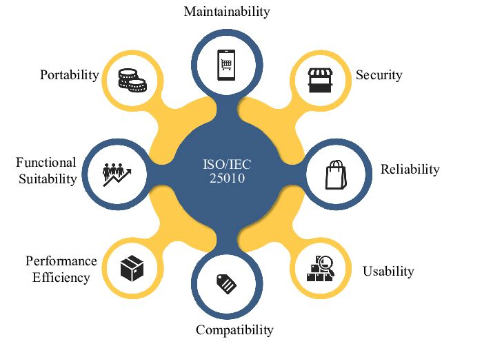
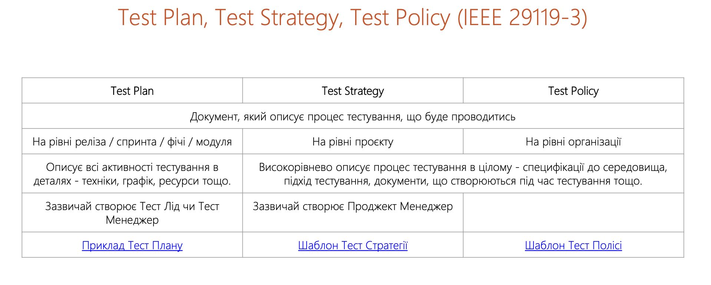
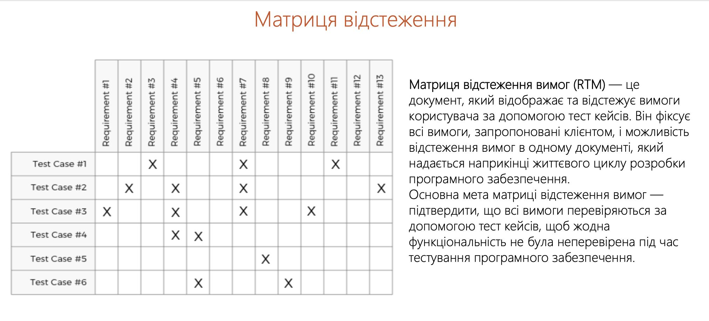

# Лекція 1.1 ТТПЗ

## Тема 1: Якість програмного забезпечення інформаційних систем.

1. Основні поняття тестування програмного забезпечення
2. Забезпечення якості програмного забезпечення – основні поняття та визначення
3. Характеристики якості

## Узагальнена схема SDLC

1. Планування (Planning) — збір та аналіз вимог замовника виконавцем та подання їх у нотації, що зрозуміла як замовнику, так і виконавцю.
2. Проектування (Design) — перетворення вимог до розроблення у послідовність проектних рішень щодо способів реалізації вимог: формування загальної архітектури програмної системи та принципів її прив’язки до конкретного середовища функціонування; визначення детального складу модулів кожної з архітектурних компонент.
3. Розробка (Development) — перетворення проектних рішень у програмну систему, безпосереднє програмування, створення програмних модулів відповідно до проєктної документації.
4. Тестування (Testing) — перевірка відповідності програмного забезпечення вимогам, виявлення та усунення помилок, оцінка якості продукту. Тестування програмного продукту в цілому (так звана верифікація); тестування відповідності функцій працюючої програмної системи вимогам, що були до неї поставлені замовником (так звана валідація).
5. Впровадження (Deployment) — установлення програмного забезпечення в робоче середовище, підготовка користувачів, введення системи в експлуатацію.
6. Супровід і підтримка (Maintenance) — усунення дефектів, оновлення, оптимізація та адаптація ПЗ до змін зовнішніх умов або вимог користувачів.

## Життєвий цикл SDLC та його учасники

## Якість ПЗ за ISO 25010:2011

Мета тестів — перевірити, чи продукт відповідає вимогам, виявити помилки, оцінити надійність і знизити ризики перед використанням.

Мета стандартів — встановити єдині вимоги до якості й безпеки, забезпечити сумісність, довіру та розвиток продуктів і процесів.

Ціль тестів – перевірити відповідність продукту чи системи вимогам, виявити дефекти до використання в реальних умовах, оцінити надійність і стабільність роботи та зменшити ризики відмов, аварій чи фінансових втрат, забезпечуючи безпечне й правильне виконання функцій. 

Ціль стандартів – уніфікувати вимоги до продукції, процесів і послуг, гарантувати якість, безпеку, сумісність між системами, підвищити довіру споживачів і партнерів та встановити прозорі правила взаємодії, задаючи орієнтири для вдосконалення й відповідності міжнародним вимогам. Таким чином, стандарти визначають, яким має бути продукт, а тести перевіряють його практичну відповідність.

## Основне про стандарт ДСТУ ISO/IEC 25010:2016 (ISO/IEC 25010:2011)

Моделі якості, які застосовуються для:
- Моделі якості розробки вимог до програмного забезпечення
- Моделі якості продукту (Product Quality Model)
- Моделі якості в користуванні (Quality in use)
- Моделі оцінювання якості готових продуктів
- Моделі якості проведення аудитів і сертифікацій

## Test Plan, Test Strategy, Test Policy (IEEE 29119-3)

## Матриця відстеження

Матриця відстеження вимог (RTM) — це документ, який відображає та відстежує вимоги користувача за допомогою тест кейсів. Він фіксує всі вимоги, запропоновані клієнтом, і можливість відстеження вимог в одному документі, який надається наприкінці життєвого циклу розробки програмного забезпечення.

Основна мета матриці відстеження вимог — підтвердити, що всі вимоги перевіряються за допомогою тест кейсів, щоб жодна функціональність не була неперевірена під час тестування програмного забезпечення.

