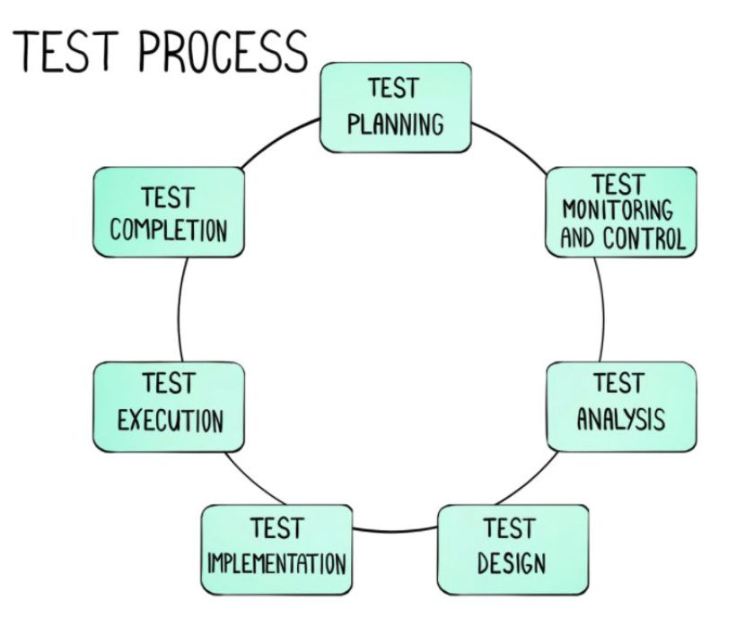
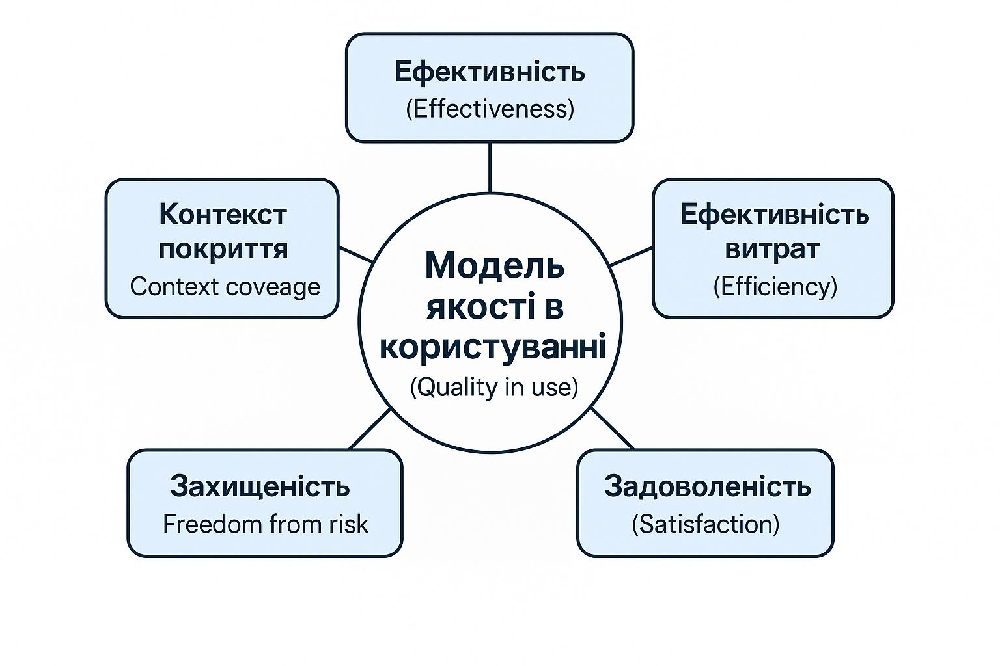
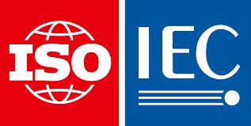

# Лекція 1.2 ТТПЗ

Тема 1: Якість програмного забезпечення інформаційних систем.

Лекція 1/2: Забезпечення якості програмного забезпечення

## Якість ПЗ за ISO 25010:2011

Мета тестів — перевірити, чи продукт відповідає вимогам, виявити помилки, оцінити надійність і знизити ризики перед використанням.

Мета стандартів — встановити єдині вимоги до якості й безпеки, забезпечити сумісність, довіру та розвиток продуктів і процесів.

Ціль тестів – перевірити відповідність продукту чи системи вимогам, виявити дефекти до використання в реальних умовах, оцінити надійність і стабільність роботи та зменшити ризики відмов, аварій чи фінансових втрат, забезпечуючи безпечне й правильне виконання функцій.

Ціль стандартів – уніфікувати вимоги до продукції, процесів і послуг, гарантувати якість, безпеку, сумісність між системами, підвищити довіру споживачів і партнерів та встановити прозорі правила взаємодії, задаючи орієнтири для вдосконалення й відповідності міжнародним вимогам. Таким чином, стандарти визначають, яким має бути продукт, а тести перевіряють його практичну відповідність.

## Основне про стандарт ДСТУ ISO/IEC 25010:2016 (ISO/IEC 25010:2011)

Моделі якості, які застосовуються для:

- Моделі якості розробки вимог до програмного забезпечення
- Моделі якості проведення аудитів і сертифікацій
- Моделі оцінювання якості готових продуктів
- Модель якості продукту (Product Quality Model)
- Модель якості в користуванні (Quality in use)

## Модель якості продукту
(Product Quality Model)

* Функціональна придатність (Functional suitability)
  * Функціональна повнота (Functional completeness)
  * Функціональна коректність (Functional correctness)
  * Функціональна взаємозамінність (Functional interchangeability)

* Надійність (Realiability)
  * Збірність (Maturity)
  * Відновлюваність (Recoverability)
  * Витривалість (Fault tolerance)

* Виконавча ефективність (Performance)
  * Відгук (Response time)
  * Пропускна здатність (Throughput)
  * Ресурсна ефективність (Resource efficiency)

* Сумісність (Compatibility)
  * Співіснування (Coexistence)
  * Замінність (Substitutability)

* Безпека (Security)
  * Конфіденційність (Confidentiality)
  * Цілісність (Integrity)
  * Відмовостійкість (Availability)
  * Відповідальність (Accountability)

* Використовність (Usability)
  * Відповідність впізнаваності
  * Навчання
  * Керованість
  * Захист від помилок користувача
  * Естетика користувацького інтерфейсу
  * Доступність

* Супроводжуваність (Maintainability)
  * Аналізованість (Analyzability)
  * Змінюваність (Modifiability)
  * Стабільність (Stability)
  * Тестованість (Testability)

* Переносимість (Portability)
  * Адаптивність (Adaptability)
  * Встановлюваність (Installability)
  * Замінність середовища (Environment replaceability)
  * Сумісність зі стандартами (Standards conformance)

## Модель якості в користуванні (Quality in use)

## Електронний кабінет військовослужбовця

Ефективність (Effectiveness)
Наскільки користувач може досягти своїх цілей за допомогою продукту.

Ефективність витрат (Efficiency)
Витрати часу та ресурсів для досягнення цілей.

Задоволеність (Satisfaction)
Враження та рівень задоволеності користувача від взаємодії.

Захищеність (Freedom from risk)
Рівень безпеки, мінімізація ризиків для користувача.

Контекст покриття (Context coverage)
Спосіб і можливість використання продукту в різних ситуаціях і умовах.

## Основні стандарти серії ISO 9000:

1. ISO 9000 — описує основні принципи та терміни у сфері менеджменту якості.
2. ISO 9001 — найпоширеніший стандарт; визначає вимоги до системи управління якістю, за якими проводиться сертифікація.
3. ISO 9004 — дає рекомендації для довгострокового підвищення ефективності організації та її результативності.
4. ISO 19011 — методичні вказівки щодо проведення аудитів систем управління якістю й екологічного менеджменту.

## Ролі користувачів в системі

Основні принципи ISO 9000:

1. Орієнтація на клієнта
2. Лідерство керівництва
3. Залучення персоналу
4. Процесний підхід
5. Системний підхід до управління
6. Постійне вдосконалення
7. Прийняття рішень на основі фактів
8. Взаємовигідні відносини з постачальниками

## ДСТУ ISO/IEC 25010:2016 (ISO/IEC 25010:2011)

Це українська національна версія міжнародного стандарту, що належить до серії SQuaRE (Software product Quality Requirements and Evaluation).

Він замінив застарілий ISO/IEC 9126-1:2001 і встановлює модель якості програмних продуктів та систем.

