# Лекція 2.1 ТТПЗ

## Тема 2: Основи тестування програмного забезпечення

1. Принципи та роль тестування програмного забезпечення
2. Життєвий цикл програмного забезпечення
3. Життєвий цикл дефекту

## Узагальнена схема SDLC

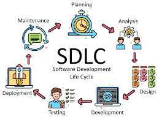

1. Планування (Planning) - збір та аналіз вимог замовника виконавцем та подання їх у нотації, що зрозуміла як замовнику, так і виконавцю;
2. Проектування (Design) - перетворення вимог до розроблення у послідовність проектних рішень щодо способів реалізації вимог: формування загальної архітектури програмної системи та принципів її прив’язки до конкретного середовища функціонування; визначення детального складу модулів кожної з архітектурних компонент;
3. Розробка (Development) - перетворення проектних рішень у програмну систему, безпосереднє програмування, створення програмних модулів відповідно до проєктної документації.
4. Тестування (Testing) - Перевірка відповідності програмного забезпечення вимогам, виявлення та усунення помилок, оцінка якості продукту. Тестування програмного продукту в цілому (так звана верифікація); тестування відповідності функцій працюючої програмної системи вимогам, що були до неї поставлені замовником (так звана валідація);
5. Впровадження (Deployment) - Установлення програмного забезпечення в робоче середовище, підготовка користувачів, введення системи в експлуатацію.
6. Супровід і підтримка (Maintenance) - Усунення дефектів, оновлення, оптимізація та адаптація ПЗ до змін зовнішніх умов або вимог користувачів.

## Життєвий цикл SDLC та його учасники

## Основи тестування

Тестування програмного забезпечення (ПЗ) — це процес перевірки, оцінки та підтвердження якості програми, щоб упевнитися, що вона працює правильно, відповідає вимогам і не містить критичних помилок. За якість відповідають усі учасники процесу!

### Основні цілі тестування ПЗ

1. Виявлення помилок (багів) — знаходження дефектів у коді до запуску для користувачів.
2. Перевірка відповідності вимогам — чи виконує програма функції, передбачені технічним завданням.
3. Оцінка якості — надійність, продуктивність, безпека, зручність використання.

### Основні види тестування

- Функціональне: перевірка, чи працює ПЗ за вимогами.
- Нефункціональне: оцінка продуктивності, безпеки, юзабіліті.
- Ручне тестування: тестувальник перевіряє систему вручну.
- Автоматизоване тестування: тести виконуються програмами або скриптами.

## Software engineer

Software engineers — це фахівці з програмної інженерії, також відомі як девелопери, кодери, програмісти, відповідальні за проєктування, розробку та підтримку системного і прикладного програмного забезпечення.

Вони займаються створенням операційних систем, систем управління базами даних, вбудованих систем та розподілених платформ, володіючи ґрунтовними знаннями як у сфері програмного забезпечення, так і апаратного забезпечення.

Діяльність інженерів включає аналіз бізнес-вимог, проєктування архітектури систем, програмування, тестування, інтеграцію та підтримку програмних рішень, а також взаємодію з клієнтами, колегами та зацікавленими сторонами для оцінки вимог і визначення оптимальних технічних рішень.

Software engineers також відповідають за забезпечення якості ПЗ, дотримання стандартів кодування, безпеки та продуктивності, беруть участь у процесах автоматизації, DevOps та управління життєвим циклом програмного забезпечення.

Їхня роль включає як технічну експертизу, так і координацію між різними командами, що дозволяє створювати складні, надійні та ефективні програмні системи.

## Business analysts (BA)

Business Analyst (BA) — це фахівець, який забезпечує зв’язок між бізнесом та технічними спеціалістами. Він не обов’язково повинен розуміти всі нюансти технічної реалізації, але повинен вникати у всі технологічні процеси і вміє перекласти їх на вимоги для розробників.

Основні функції BA:

1. Аналіз бізнес-процесів — знаходить слабкі місця, визначає потреби організації.
2. Документування вимог — створює технічні та функціональні специфікації для команди розробників.
3. Комунікація — виступає посередником між замовником, менеджментом і технічними спеціалістами.
4. Планування рішень — допомагає розробляти проєктні плани і пропонувати оптимальні IT-рішення.

💡 Простими словами: BA — це «міст» між бізнесом та розробниками, який гарантує, що створене ПЗ реально вирішує проблему.

## Product owner (PO)

Product Owner (PO) — це ключовий фахівець у гнучких (Agile) командах розробки ПЗ, який відповідає за продукт і його цінність для бізнесу та користувачів. Product Owner зазвичай є користувачем системи або спеціалістом із маркетингу, управління продуктом чи будь-яким іншим фахівцем, який добре розуміє потреби користувачів, ринок, конкуренцію та майбутні тенденції.

Вони надають цінні інсайти для процесу розробки, забезпечуючи відповідність продукту потребам клієнтів та вимогам ринку.

Основні функції Product Owner:

- Формування бачення продукту — визначає цілі, стратегічні пріоритети та ключові функції.
- Управління беклогом продукту (Product Backlog) — пріоритезує завдання та визначає, що важливо зробити в першу чергу.
- Комунікація з командою та стейкхолдерами — забезпечує розробників чіткими вимогами і пояснює бізнес-логіку.
- Оцінка цінності продукту — слідкує, щоб продукт приносив користь користувачам і бізнесу.

У деяких компаніях роль Product Owner поєднується з роллю Business Analyst, а в інших — PO виступає єдиним представником бізнесу, тісно співпрацюючи з ІТ-командою для визначення вимог.

Простими словами: PO — це «голос користувача та бізнесу» у команді, який визначає, що і коли потрібно розробляти, щоб продукт був успішним.

## Project Manager (PM)

Project Manager (PM) — це фахівець, відповідальний за планування, координацію та контроль виконання проєкту від його початку до завершення. PM забезпечує, щоб проєкт досягав поставлених цілей у визначені строки та в межах бюджету.

Основні функції Project Manager:
- Планування проєкту — визначення цілей, обсягу робіт, ресурсів та строків.
- Координація команди — організація роботи розробників, тестувальників, аналітиків та інших учасників.
- Управління ризиками — виявлення потенційних проблем та мінімізація їх впливу на проєкт.
- Контроль виконання — моніторинг прогресу, дотримання бюджету та строків.
- Комунікація зі стейкхолдерами — інформування замовників та керівництва про статус проєкту, досягнення та проблеми.

Project Managers відіграють ключову роль у координації людей, часу та ресурсів, забезпечуючи успішне завершення ІТ-проєктів. Вони мають глибокий досвід у технологіях та розвинені софт-скіли, що дозволяє ефективно співпрацювати як із командами розробників, так і з керівниками бізнесу.

Простими словами: PM — це керівник проєкту, який гарантує злагоджену роботу команди та успішне завершення проєкту в межах бюджету, строків і потрібної якості.

## Software testers and QA

Software Testers — це фахівці, відповідальні за перевірку якості програмного забезпечення, виявлення багів та забезпечення відповідності продукту вимогам користувачів і бізнесу. Вони працюють у тісній співпраці з командою розробників, аналітиками та Project Manager, щоб гарантувати надійність і стабільність продукту.

QA (Quality Assurance) — це ширша дисципліна, що включає процеси, стандарти та методи забезпечення якості ПЗ на всіх етапах розробки. Мета QA — не лише виявляти помилки, а й запобігати їх виникненню, забезпечуючи відповідність продукту вимогам та очікуванням користувачів.

Основні функції Software Testers:
- Тестування програмного забезпечення — перевірка функціональності, продуктивності, безпеки та юзабіліті.
- Виявлення багів — пошук помилок у коді та повідомлення про них команді розробників.
- Підготовка тестової документації — створення тест-кейсів, сценаріїв та звітів про результати тестування.
- Автоматизація тестів — розробка автоматизованих скриптів для повторюваних перевірок.
- Співпраця з командою розробки та аналітиками — допомога у забезпеченні якості продукту і відповідності вимогам.

Тестувальники також можуть бути залучені на ранніх етапах проєкту, щоб передбачити потенційні проблеми ще до початку розробки.

Простими словами: Software Testers і QA — це «охоронці якості» ПЗ, які забезпечують, що продукт працює правильно, стабільно і відповідає очікуванням користувачів.

## Принципи тестування та їх роль

Тестування програмного забезпечення – креативна та інтелектуальна робота. Розробка правильних та ефективних тестів – досить непросте заняття. Принципи тестування, приведені нижче, були розроблені в останні 40 років та є загальною інструкцією для тестування в цілому.

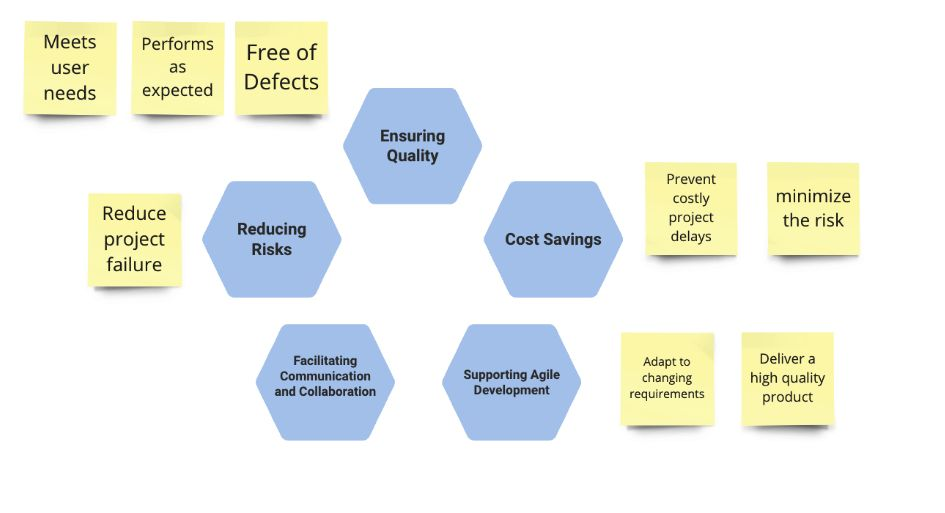

2025 — Google Cloud (масштабний збій Google Workspace)

- Суть помилки: У продакшн було випущено нову функцію “quota policy checks” без достатнього тестування; некоректна обробка порожніх даних призвела до збою.
- Наслідки: Глобальний збій сервісів Gmail, Drive, Meet; мільйони користувачів втратили доступ протягом кількох годин.
- Вартість: десятки мільйонів доларів — прямі втрати клієнтів, SLA-компенсації, втрачена продуктивність компаній, а також репутаційні збитки для Google.

2018 — Авіація (Boeing, 737 MAX MCAS)

- Суть помилки: Система автоматичної стабілізації MCAS покладалася лише на один датчик кута атаки. В тестах не було змодельовано відмову сенсора та його вплив на систему.
- Наслідки: Дві авіакатастрофи (Lion Air 2018, Ethiopian Airlines 2019), загинуло 346 людей. Літаки 737 MAX були глобально відсторонені від польотів майже на 2 роки.
- Вартість: понад $20 млрд — включаючи компенсації сім’ям загиблих, компенсації авіакомпаніям, витрати на доопрацювання, штрафи та падіння ринкової капіталізації Boeing.

## Принципи тестування

1. **Тестування показує наявність дефектів:**
Тестування може показати наявність дефектів в програмі, але не довести їх відсутність. Тим не менш, важливо складати тест-кейси, які будуть знаходити якомога більше багів. Таким чином, при належному тестовому покритті, тестування дозволяє знизити вірогідність наявності дефектів в програмному забезпеченні. В той же час, навіть якщо дефекти не були знайдені в процесі тестування, не можна стверджувати, що їх немає.

2. **Вичерпне тестування неможливе:**
Неможливо провести вичерпне тестування, яке би покривало всі комбінації користувацького вводу та станів системи, за виключенням найбільш примітивних випадків. Замість цього необхідно використовувати аналіз ризиків та розташування пріоритетів, що дозволить більш ефективно розподілити зусилля по забезпеченню якості ПЗ.

3. **Раннє тестування:**
Тестування повинне починатися якомога раніше в життєвому циклі розробки програмного забезпечення, і його зусилля повинні бути сконцентровані на визначених цілях.

4. **Скупчення дефектів:**
Різні модулі системи можуть містити різну кількість дефектів – тобто, щільність скупчення дефектів в різних елементах програми може відрізнятися. Зусилля по тестуванню повинні розподілятися пропорційно фактичної щільності дефектів. В основному, більшу частину дефектів знаходять в обмеженій кількості модулів. Це прояв принципу Парето: 80% проблем містяться в 20% модулів.

5. **Парадокс пестициду:**
Проганяючи одні й ті ж тести знову та знову, Ви зіткнетеся з тим, що вони знаходять все менше нових помилок. Оскільки система еволюціонує, багато із раніше знайдених дефектів виправляють і старі тест-кейси більше не спрацьовують.

6. **Тестування залежить від контенту:**
Вибір методології, техніки та типу тестування буде напряму залежати від природи самої програми. Наприклад, програмне забезпечення для медичних цілей потребує більш строгої та ретельної перевірки, ніж, скажімо, комп’ютерна гра. З тих же міркувань, сайт із великою відвідуваністю повинен пройти через серйозне тестування продуктивності, щоб показати можливості роботи в умовах великого навантаження.

7. **Міф про відсутність помилок:**
Той факт, що тестування не виявило дефектів, ще не значить, що програма готова до релізу. Знаходження та виправлення дефектів будуть не важливі, якщо система виявиться незручною у використанні, та не буде задовольняти очікуванням та вимогам користувача.

8. **Роботу повинні виконувати професіонали:**
- залучайте кращих професіоналів;
- тестуйте як позитивні, так і негативні сценарії;
- не допускайте змін в програмі в процесі тестування;
- вказуйте очікуваний результат виконання тестів.

## Життєвий цикл

Життєвий цикл системи чи програмного продукту можна змоделювати за допомогою моделі життєвого циклу, що складається з декількох етапів. 

Моделі можна використати для отримання всього життєвого циклу від формулювання концепції до припинення застосування чи подати частину життєвого циклу, що відповідає поточному проєкту. 

У цьому стандарті діяльності, які можна виконувати протягом усього життєвого циклу програмної системи, зорганізовано у сім груп процесів. Кожний з процесів життєвого циклу всередині цих груп описано з погляду його цілей і бажаних результатів, а також списків діяльностей і завдань, які треба виконувати для досягнення цих результатів.

Згідно стандартом ISO/IEC/IEEE 12207:

* **Життєвий цикл (life cycle)** — еволюція системи, продукту, послуги, проєкту або іншого, зробленого людиною, об’єкта від формулювання концепції до припинення застосування.
* **Модель життєвого циклу (life cycle model)** — структура процесів і діяльностей, пов’язаних з життєвим циклом, які можна організувати у вигляді етапів, що також виступають як загальний термін у спілкуванні та розумінні сторін.

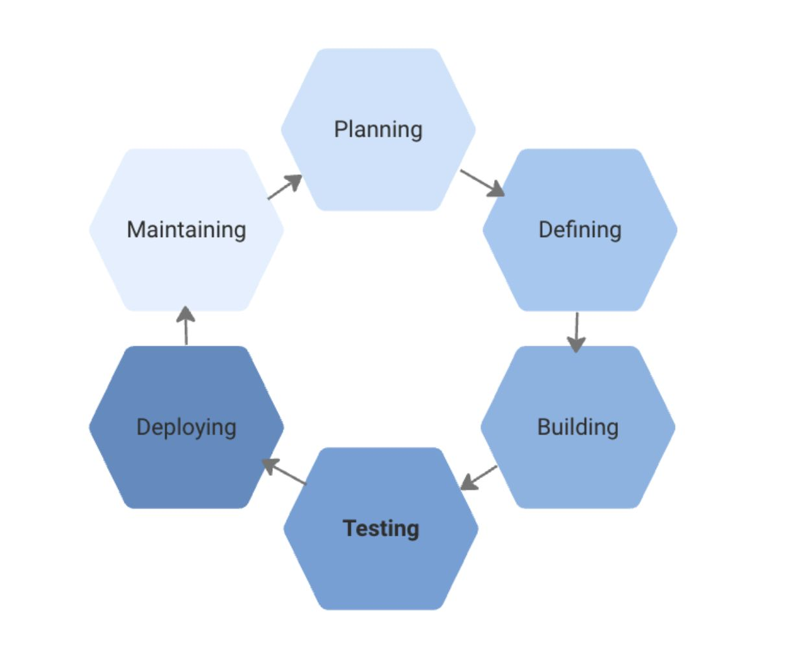

## Каскадна модель (waterfall model)

На початку епохи програмування програмісти самостійно створювали прості функції для обчислень і автоматизації рутинних задач. Сьогодні розробка програмних систем потребує командної роботи програмістів, аналітиків, адміністраторів, тестувальників та користувачів. Сучасні програми містять мільйони рядків коду.

Однією з найстаріших моделей організації процесу розробки є каскадна (водоспадна). У ній кожен етап життєвого циклу ПЗ виконується послідовно після завершення попереднього. Модель проста й зрозуміла, але в умовах змінних вимог може стати гальмом. Нині її застосовують здебільшого великі компанії для масштабних проектів, де потрібен жорсткий контроль ризиків.

Незважаючи на те, що каскадна модель все ще використовується, вона вже втратила колишні позиції. Сьогодні їй на зміну приходять більш просунуті моделі та методології розробки програмного забезпечення.

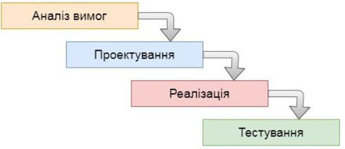

Коли варто використовувати каскадну модель:
- У проектах з чітко визначеними вимогами, для яких не передбачається зміна цих вимог в процесі розробки;
- Для проектів, які мігрують з однієї платформи на іншу. Тобто, вимоги залишаються ті ж, міняється лише системне оточення та/або мова програмування;
- Коли від компанії-розробника не потрібно проводити тестування – наприклад, його забезпеченням займеться сам замовник або стороння фірма.

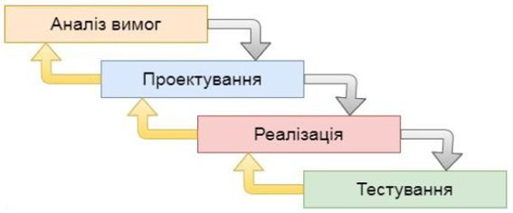

- Перевага: Повне документування кожного етапу;
- Перевага: Чітке планування термінів і витрат;
- Перевага: Прозорість процесів для замовника;
- Недоліки: Необхідність затвердження повного обсягу вимог до системи ще на першому етапі;
- Недоліки: У разі необхідності внесення змін до вимог пізніше – повернення до першої стадії та переробка заново всієї виконаної роботи;
- Недоліки: Збільшення витрат коштів та часу в разі потреби змінити вимоги.

## V подібна модель (v-model)

V подібна модель – це покращена версія класичної каскадної моделі. Тут на кожному етапі відбувається контроль поточного процесу, для того, щоб переконатися в можливості переходу на наступний рівень. У цій моделі тестування починається ще зі стадії написання вимог, причому для кожного наступного етапу передбачений свій рівень тестового покриття.

Для кожного рівня тестування розробляється окремий тест-план, тобто під час тестування поточного рівня, ми також займаємося розробкою стратегії тестування наступного. Створюючи тест-плани, ми також визначаємо очікувані результати тестування і вказуємо критерії входу і виходу для кожного етапу.

У V-моделі кожному етапу проектування і розробки системи відповідає окремий рівень тестування. Тут процес розробки представлений низхідною послідовністю в лівій частині умовної літери V, а стадії тестування – на її правому ребрі. Відповідність етапів розробки і тестування показано горизонтальними лініями.

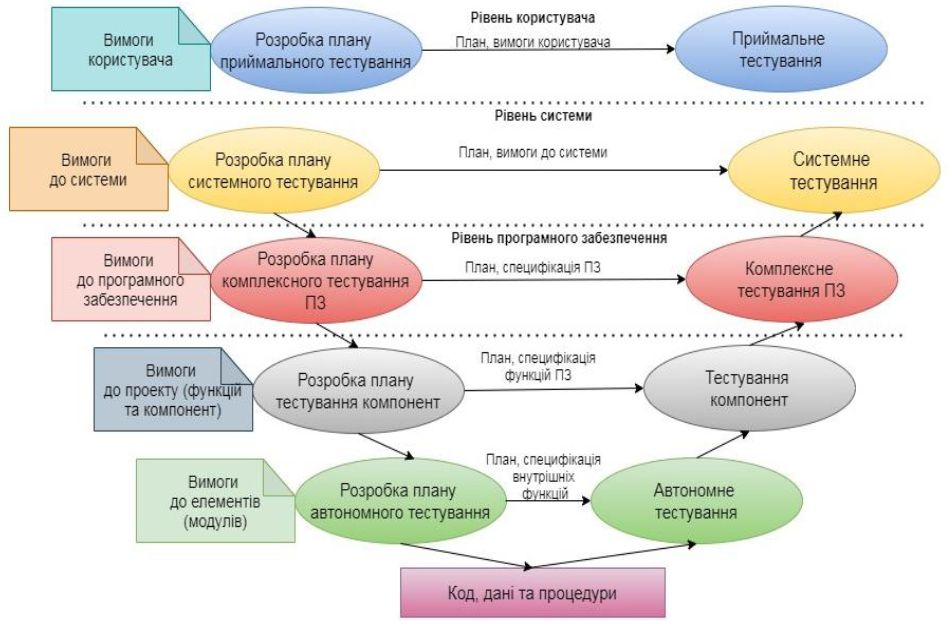

Коли варто використовувати V подібну модель:

- У проєктах, в яких існують часові та фінансові обмеження;
- Для завдань, які передбачають більш широке, порівняно з каскадною моделлю, тестове покриття;
- В проєктах, де каскадна модель не ефективна, але команда розуміє всі процеси каскадних моделей.

Переваги:
- Сувора етапність;
- Планування тестування і верифікація системи виробляються на ранніх етапах;
- Покращений, в порівнянні з каскадною моделлю, тайм-менеджмент;
- Проміжне тестування.

Недоліки:
- Недостатня гнучкість моделі;
- Власне створення програми відбувається на етапі написання коду, тобто вже в середині процесу розробки;
- Недостатній аналіз ризиків;
- Немає роботи з паралельними подіями і можливості динамічного внесення змін.

## Ітеративна модель (iterative model)

Не всі моделі життєвого циклу послідовні. Існують також ітеративні (або інкрементальні) моделі, в яких використовується інший підхід. Замість однієї тривалої послідовності дій тут весь життєвий цикл продукту розбитий на ряд окремих міні-циклів. Причому кожен з них складається із все тих же базових стадій моделі життєвого циклу. Ці міні-цикли називаються ітераціями. У кожній з ітерацій відбувається розробка окремого компонента системи, після чого цей компонент додається до вже раніше розробленого функціоналу.

Ітеративна модель не передбачає повного обсягу вимог для початку робіт над продуктом. Розробка програми може починатися з вимог до частини функціоналу, які можуть згодом доповнюватися і змінюватися. Процес повторюється, забезпечуючи створення нової версії продукту для кожного циклу.

Ітеративна модель є ключовим елементом так званих «гнучких» (Agile) підходів до розробки програмного забезпечення, основні з яких ми розглянемо в наступних розділах.

Коли варто використовувати ітеративну модель:
- для великих проектів;
- коли відомі, принаймні, ключові вимоги;
- коли вимоги до проекту можуть мінятися в процесі розробки.

У дещо спрощеному вигляді, ітеративна модель складається з чотирьох основних стадій, які повторюються у кожній з ітерацій (plan-do-check-act):
- Планування ітерації та тестування;
- визначення та аналіз вимог;
- дизайн та проектування – згідно вимогами. Причому дизайн може як розроблятися окремо для даної функціональності, так і доповнювати вже існуючий;
- розробка і тестування – кодування, інтеграція і тестування нового компонента;
- фаза розгортання та рев’ю – оцінка, перегляд поточних вимог та пропозиції щодо доповнення цих вимог. За результатами кожної ітерації приймається рішення – чи будуть використані її результати для доповнення існуючої функціональності в якості вхідної точки для початку наступної ітерації (т.зв. інкрементальне прототипування). 
- Зрештою, досягається точка, в якій всі вимоги були втілені в продукт – відбувається реліз та підтримка.

У математичних термінах, ітеративна модель являє реалізацію методики послідовної апроксимації – тобто, поступове наближення до образу готового продукту:

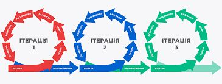

Ключ до успішного використання цієї моделі – сувора верифікація вимог і ретельна валідація розроблюваної функціональності в кожній з ітерацій. Основні стадії процесу розробки в ітеративній моделі фактично повторюють модель водоспаду. У кожній ітерації створюється програмне забезпечення, що вимагає тестування на всіх рівнях.

## Каскадна модель (waterfall model)

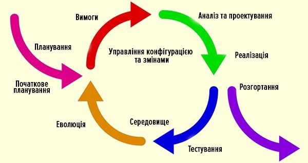

- Перевага: раннє створення працюючого ПЗ;
- Перевага: гнучкість – готовність до зміни вимог на будь-якому етапі розробки;
- Перевага: кожна ітерація – маленький етап, для якого тестування та аналіз ризиків забезпечити простіше, ніж для всього життєвого циклу продукту.
- Недоліки: кожна фаза – самостійна, окремі ітерації не накладаються одна на одну;
- Недоліки: можуть виникнути проблеми з реалізацією загальної архітектури системи, оскільки не всі вимоги відомі до початку проектування.

## Спіральна модель (spiral model)

Спіральна модель є шаблоном процесу розробки ПЗ, який поєднує в собі ідеї ітеративної та каскадної моделей. Суть її в тому, що весь процес створення кінцевого продукту представлений у вигляді умовної площини, розбитої на 4 сектори, кожен з яких представляє окремі етапи його розробки: визначення цілей, оцінка ризиків, розробка і тестування, планування нової ітерації.

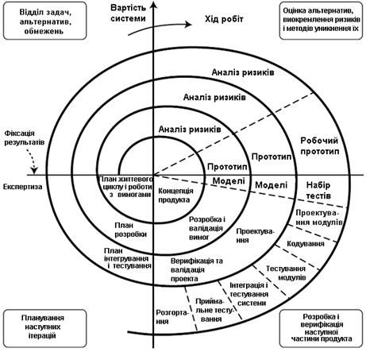

У спіральної моделі життєвий шлях розроблювального продукту зображується у вигляді спіралі, яка, розпочавшись на етапі планування, розкручується з проходженням кожного наступного кроку. Таким чином, на виході з чергового витка ми повинні отримати готовий протестований прототип, який доповнює існуючий білд. Прототип, що задовольняє всім вимогам – готовий до релізу.

Головна особливість спіральної моделі – концентрація на можливі ризики. Для їх оцінки навіть виділена відповідна стадія. 

Основні типи ризиків, які можуть виникнути в процесі розробки ПЗ:
- часта зміна вимог;
- надмірна оптимізація;
- низька продуктивність системи;
- невідповідність рівня кваліфікації фахівців різних відділів.

Коли варто використовувати спіральну модель:
- коли важливий аналіз ризиків і витрат;
- великі довгострокові проекти з відсутністю чітких вимог або ймовірністю їх динамічної зміни;
- при розробці нової лінійки продуктів.

Переваги та недоліки спіральної моделі:

**Переваги:**
- покращений аналіз ризиків;
- хороша документація процесу розробки;
- гнучкість – можливість внесення змін і додавання нової функціональності навіть на відносно пізніх етапах;
- раннє створення робочих прототипів.

**Недоліки:**
- може бути досить дорога у використанні;
- управління ризиками вимагає залучення висококласних фахівців;
- успіх процесу у великій мірі залежить від стадії аналізу ризиків;
- не підходить для невеликих проектів.

## Життєвий цикл дефекту “bugs”

Життєвий цикл багу (Bug Life Cycle) — це послідовність станів, через які проходить дефект (баг, помилка) від моменту його виявлення до повного закриття.

Він описує, як команда тестування, розробники та менеджери працюють із помилкою.

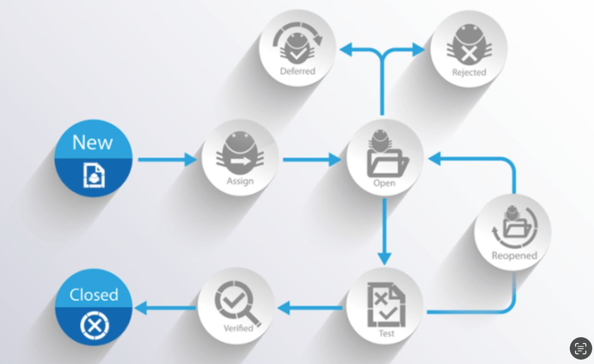

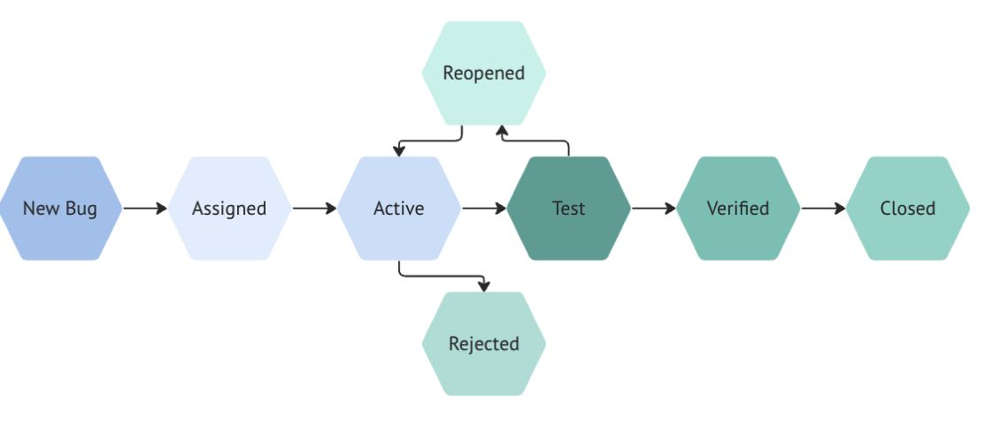

## Bug Reporting board

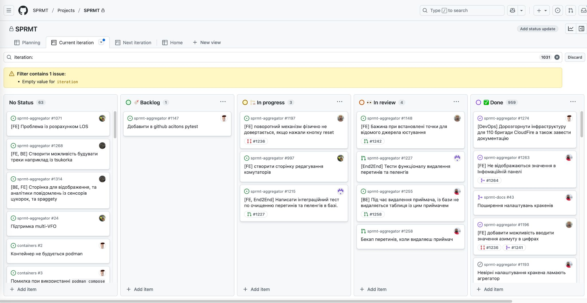

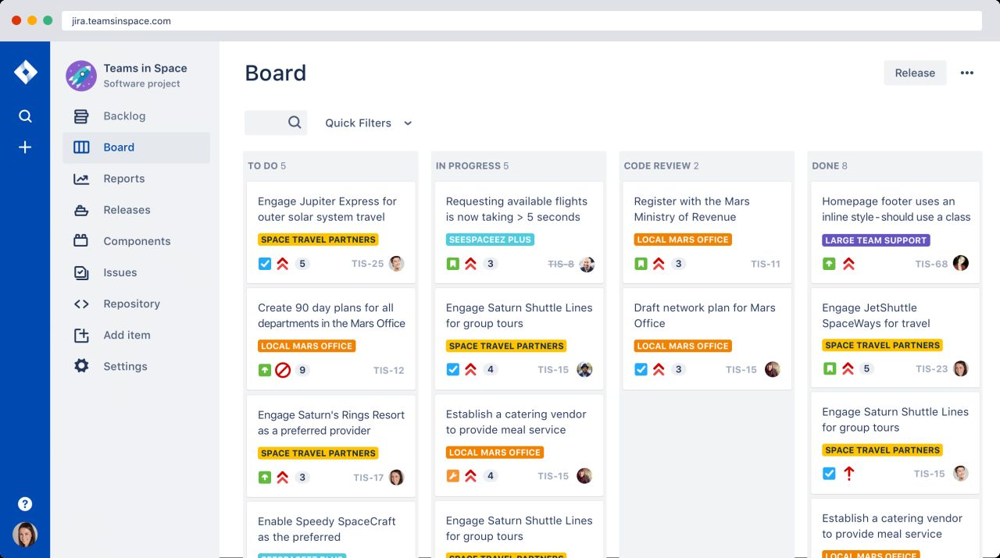

## Приклад реального баг-репорту з комерційного проєкту

ID: Bug #7424
Статус: New (Новий)
Пріоритет: High (Високий)
Заголовок: Rental Invoice Issue - Initial capital repayment
Призначено: Vladimirs Racinskis
Додано: Eben Williams, понад рік тому

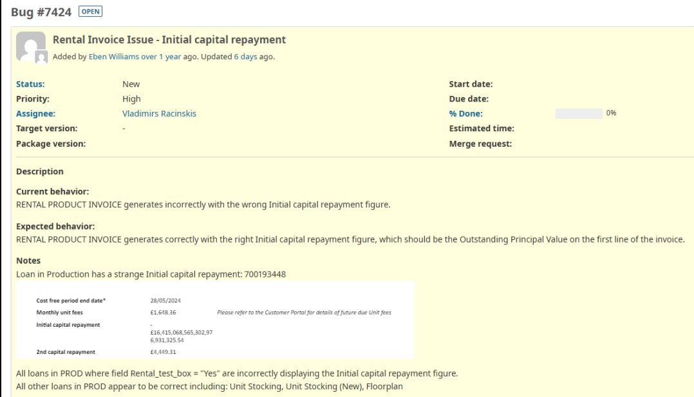

### Що відсутнє

Кроки відтворення (Steps to Reproduce)
Наприклад:
1. Увійти в систему як Administrator
2. Перейти до Loans → Rental Products
3. Відкрити loan ID 700193448
4. Натиснути "Generate Invoice"
5. Перевірити поле "Initial capital repayment"

Інформація про оточення (Environment)
Наприклад:
- Браузер: Chrome 123.0
- ОС: Windows 11
- Версія системи: 2.5.3
- База даних: Production

Серйозність (Severity)
Наприклад:
- Critical / Major / Minor?
- Блокує роботу користувачів?
- Фінансові наслідки?

Фактичний vs Очікуваний результат
Наприклад:
Actual Result: £16,415,068,565,302.97
Expected Result: £6,931,325.54

Дедлайни
Наприклад:
- Start date: порожнє
- Due date: порожнє
- Target version: порожнє

