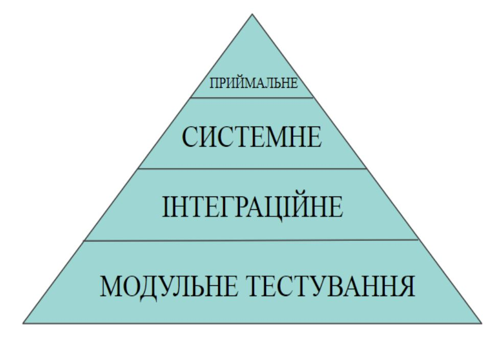
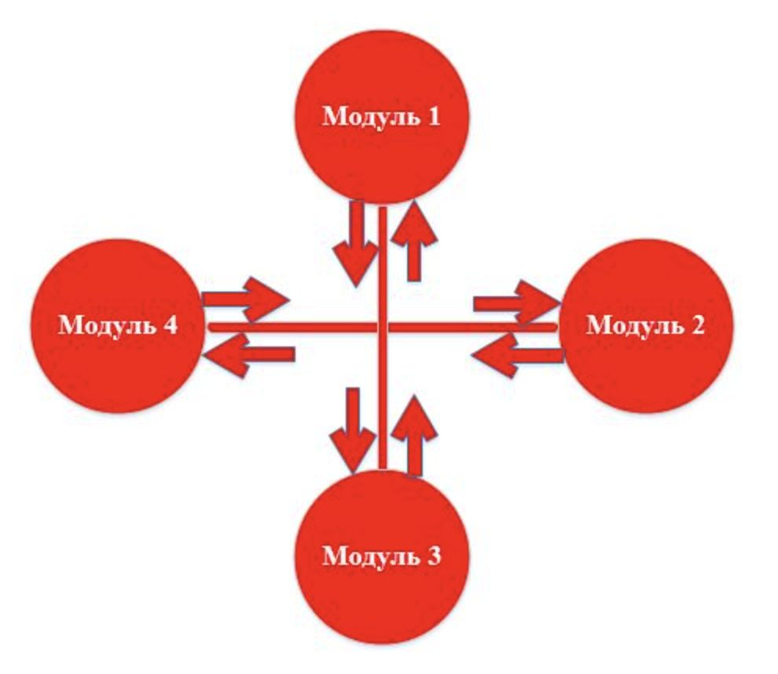
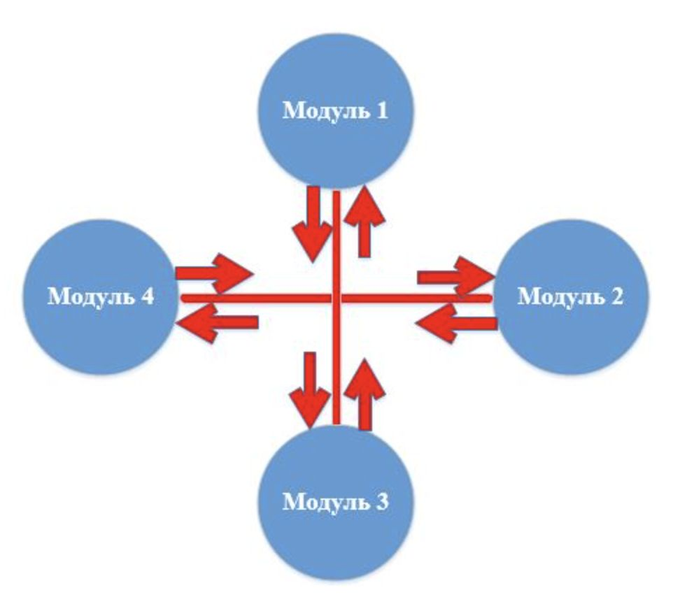
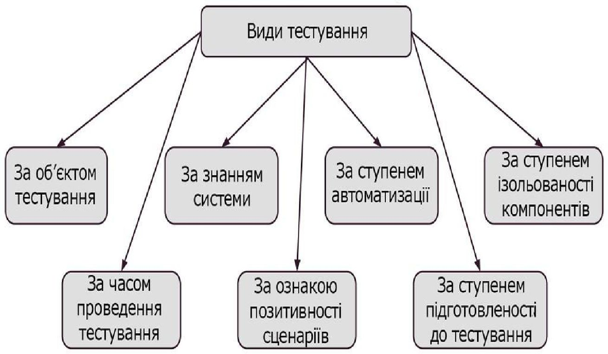
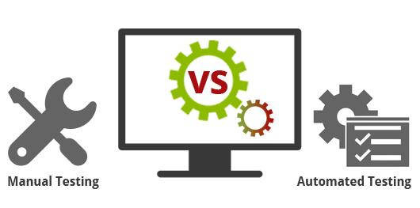
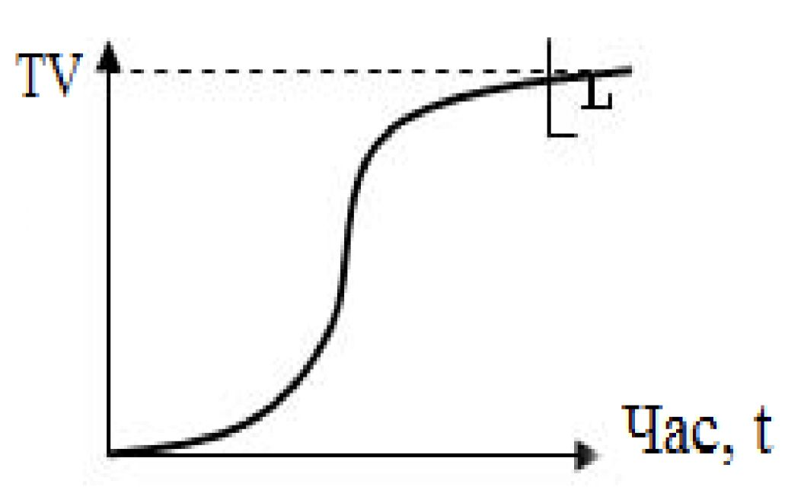
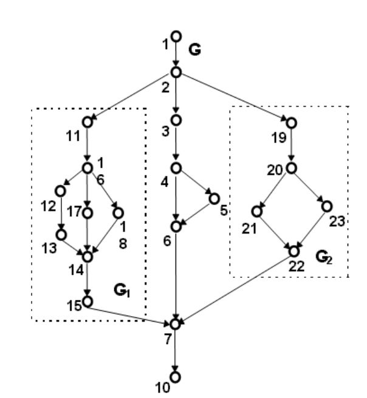
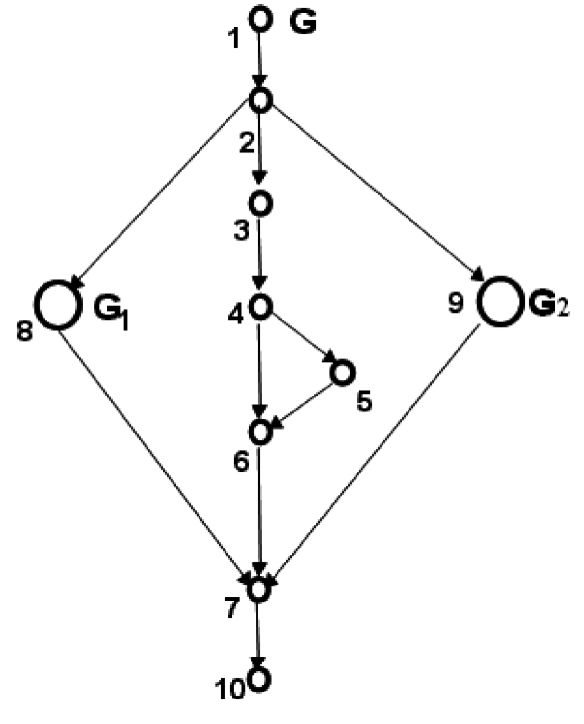
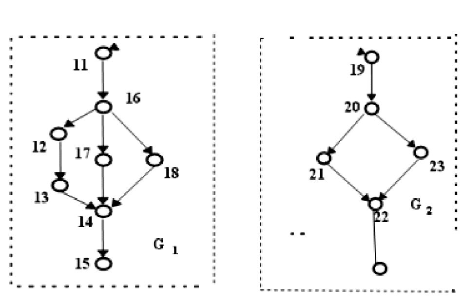

# Лекція 2.4 ТТПЗ

## Тема 2: Основи тестування програмного забезпечення

1. Рівні тестування
2. Класифікація тестування
3. Оцінка відтестованості проекту: метрики та методики інтегральної оцінки

## Рівні тестування (піраміда тестування)

1. Приймальне тестування (acceptance) — відповідність до вимог
2. Системне тестування (system) — система в цілому (БД, додатки, UI, End2End)
3. Інтеграційне тестування (integration) — комбінація та взаємодія окремих модулів програми
4. Модульне тестування (unit testing) — найменші частини коду (класи, методи)

Тестування на різних рівнях проводиться протягом усього життєвого циклу розробки і супроводу ПЗ. Рівень тестування визначає те, над чим виробляються тести: над окремим модулем, групою модулів або системою в цілому. Проведення тестування на всіх рівнях системи – це запорука успішної реалізації та здачі проекту.

## Приймальне тестування

Вид тестування, що проводиться на етапі здачі готового продукту (або готової частини продукту) замовнику.

Проводиться з метою: визначення чи задовольняє система приймальні критерії та винесення рішення замовником або іншою уповноваженою особою приймається програма чи ні.

Приймальне тестування виконується відповідно до Плану приймальних робіт.

Рішення про проведення приймального тестування приймається, коли: продукт досяг необхідного рівня якості та замовник ознайомлений з Планом приймальних робіт (Product Acceptance Plan) або іншим документом, де описаний набір дій, пов’язаних з проведенням приймального тестування, дата проведення, відповідальні і т.д.

Методи приймального тестування:

- Тестування замовником самостійно. Це ризиковано в тому плані репутаційних втрат.
- Тестування (аудит) третьою стороною. Наймається спеціалізована компанія на тестування.
- Спільне тестування за сценаріями із замовником. Постачальник допомагає готувати пакет матеріалів для приймального тестування, готує команду замовника до методичного приймального тестування, контролює хід приймального тестування і терміни його виконання.

## Системне тестування

Основним завданням є перевірка як функціональних, так і нефункціональних вимог у системі в цілому.

Виконуючи системне тестування, можна виявити наступні типи дефектів:
- Неправильне використання системних ресурсів.
- Непередбачені комбінації даних користувача.
- Проблеми з сумісністю оточення.
- Непередбачені сценарії використання.
- Невідповідність функціональним вимогам.
- Погана зручність використання.

Системне тестування виконується методом «Чорного ящика», тому як все те, що перевіряється, є «зовнішніми» сутностями, які не вимагають взаємодії з внутрішнім складом програми. Також виконувати його рекомендується в оточенні, максимально наближеному до оточення кінцевого користувача.

Можна виділити 2 підходи до системного тестування:
- На базі вимог. Тестування проводиться відповідно до функціональних або нефункціональних вимог, для кожного з яких пишеться test case (тестові прецеденти).
- На базі випадків використання. Тестування відбувається відповідно до варіантів використання продукту, на основі яких створюються user cases (користувальницькі прецеденти). Для кожного з даних користувальницьких прецедентів створюються свої тестові прецеденти.

Також до системного тестування можна віднести альфа-тестування і бета-тестування, суть яких ми розглянемо в наступних статтях.

## Інтеграційне тестування

Основним завданням є перевірка коректної взаємодії модулів між собою, а також інтеграція підсистем в одну загальну систему. Для інтеграційного тестування використовуються компоненти, вже перевірені за допомогою модульного тестування. Так як модулі поєднуються між собою за допомогою передбачених реалізацією інтерфейсів і в процесі тестування у нас немає потреби розглядати внутрішню структуру компонентів, можна стверджувати, що інтеграційне тестування виконується методом «чорного ящику».

Існує декілька підходів до інтеграційного тестування:
- Знизу вгору. Спочатку збираються і тестуються модулі найнижчих рівнів, а потім по зростанню до вершини ієрархії. Даний підхід вимагає готовності усіх зібраних модулів на всіх рівнях системи.
- Зверху вниз. Даний підхід передбачає рух з модулів високого рівня вниз. При цьому використовуються заглушки для тих модулів, які знаходяться нижче за рівнем, але включення яких до тесту ще не відбулося.
- Великий вибух. Всі модулі всіх рівнів збираються разом, а потім тестується. Даний метод економить час, але вимагає ретельного опрацювання тест кейсів.

При автоматизації тестування використовується Система безперервної інтеграції. Принцип її дії в наступному:
1. Система безперервної інтеграції проводить моніторинг системи контролю версій.
2. При зміні джерела коду в репозиторії проводиться оновлення локального сховища.
3. Виконуються необхідні перевірки і модульні тести.
4. Вихідні коди компілюються в готові виконувані модулі.
5. Виконуються тести інтеграційного рівня.
6. Генерується звіт про тестування.

Це дозволяє тестувати систему відразу після внесення змін, що істотно скорочує час виявлення та виправлення помилок.

## Модульне тестування

Основна ціль — пошук дефектів на рівні функцій, класів, модулів, бібліотек і можуть бути протестовані окремо. Всі знайдені дефекти, як правило, виправляються в коді без формального їх опису в системі багів (Bug Tracking System).

Один з найбільш ефективних підходів до компонентного (модульного) тестування — це підготовка автоматизованих тестів до початку основного кодування ПЗ. Це називається розробка від тестування (test driven development) або підхід тестування спочатку (behavior driven development). При цьому підході створюються і інтегруються невеликі шматки коду, навпроти яких запускаються тести, написані до початку кодування. Розробка ведеться до тих пір, поки всі тести не будуть успішними.

Що ж стосується безпосередньо переваг:

- модульне тестування мотивує програмістів писати код максимально оптимізованим, проводити рефакторинг (спрощення коду програми, не зачіпаючи її функціональність), так як за допомогою юніт-тестування можна легко перевірити працездатність розглянутого компонента.
- необхідність відділення реалізації від інтерфейсу (зважаючи на особливості модульного тестування), що дозволяє мінімізувати залежності в системі.
- документація юніт-тестів може служити прикладом «живого документа» для кожного класу, що тестується даним способом. Модульне тестування допомагає краще зрозуміти роль кожного класу на тлі всієї програмної системи.
- також, при «розробці через тестування», яка активно використовується в екстремальному програмуванні, модульне тестування є одним з основних інструментів, що дозволяє розробляти продукт відповідно до вимог до даного модулю.

## Класифікація тестування

## Класифікація тестування за критерієм запуску програми

### Статичне тестування

тестування, яке припускає, що програмний код під час тестування не буде виконуватися. При цьому саме тестування може бути як ручним, так і автоматизованим.

Статичне тестування починається на ранніх етапах життєвого циклу ПЗ і є, відповідно, частиною процесу верифікації. Для цього типу тестування в деяких випадках навіть не потрібен комп’ютер, – наприклад, при перевірці вимог.

Більшість статичних технік можуть бути використані для «тестування» будь-яких форм документації, включаючи вичитування коду, інспекцію проектної документації, функціональної специфікації та вимог.

Статичне тестування також може бути автоматизоване – наприклад, можна використовувати автоматичні засоби перевірки синтаксису програмного коду.

Види статичного тестування:
- вичитування вихідного коду програми;
- перевірка вхідних вихідних вимог;
- критеріїв входу та виходу із тестування.

### Динамічне тестування

тестування, яке передбачає запуск програмного коду. Таким чином, аналізується поведінка програми під час її роботи.

Для виконання динамічного тестування необхідно, щоб програмний код, що тестується, був написаний, скомпільований та запущений. При цьому, може виконуватися перевірка зовнішніх параметрів роботи програми: завантаження процесора, використання пам’яті, час відповіді та т.д. – тобто, її продуктивність.

Динамічне тестування є частиною процесу валідації програмного забезпечення.

Окрім того динамічне тестування може включати різні підвиди, кожен з яких залежить від:
- доступу до коду (тестування методом чорного, білого та сірого ящика);
- рівня тестування (модульне, інтеграційне, системне та прийомочне тестування);
- сфери використання програми (функціональне, навантажувальне, тестування безпеки та ін.).

## Класифікація тестування за ступенем автоматизації

### Ручне тестування (людина)

При ручному тестуванні (manual testing) тестувальники вручну виконують тести, не використовуючи ніяких засобів автоматизації. Ручне тестування – самий низькорівневий та простий тип тестування, що не вимагає великої кількості додаткових знань.

Тим не менш, перед тим як автоматизувати тестування будь-якого додатку, необхідно спочатку виконати серію тестів вручну. Мануальне тестування вимагає більших зусиль, але без нього ми не зможемо переконатися в тому, чи можлива автоматизація взагалі. Один із фундаментальних принципів тестування свідчить: 100% автоматизація неможлива. Тому, ручне тестування – це необхідність.

Міфи про ручне тестування:
- Хто завгодно може провести ручне тестування. Ні, виконання будь-якого виду тестування вимагає спеціальних знань та професійної підготовки.
- Автоматизоване тестування краще, ніж ручне. Повна автоматизація неможлива. Необхідно використовувати також і ручне тестування.
- Ручне тестування – це просто. Тестування може бути дуже непростим заняттям. Проведення тестування для перевірки максимально можливої кількості шляхів виконання програми із використанням мінімального числа тест-кейсів вимагає серйозних аналітичних навичок.

### Автоматичне тестування (Скрипт/інструмент)

Це повноцінні програми, просто призначені для тестування.

Коли, що і як автоматизувати і чи автоматизувати взагалі – дуже важливі питання, відповіді на які повинна дати розробки. Автоматизоване тестування припускає використання спеціального програмного забезпечення (окрім того, що тестується) для контролю виконання тестів та порівняння очікуваного і фактичного результату роботи програми.

Існує кілька основних видів автоматизованого тестування:
- Автоматизація тестування коду – тестування на рівні програмних модулів, класів та бібліотек модулів;
- Автоматизація сценаріїв (End2End) – спеціальна програма (фреймворк автоматизації тестування) дозволяє генерувати користувальницькі дії – натиснення кнопок, кліки мишкою, та відслідковувати реакцію програми на ці дії – чи відповідає вона специфікації.;
- Автоматизація тестування графічного інтерфейсу користувача (Graphical user interface testing);
- Автоматизація тестування API (Application Programming Interface) – програмного інтерфейсу програми. Тестуються інтерфейси, призначені для взаємодії, наприклад, з іншими програмами або з користувачем. Тут, знову ж таки, як правило, використовуються спеціальні фреймворки для складання автоматизованих тестів.

## Порівняння ручного та автоматизованого тестування

Як ручне, так і автоматизоване тестування можуть використовуватися на різних рівнях тестування, а також бути частиною інших типів і видів тестування.

Автоматизація зберігає час, сили та гроші. Одного разу автоматизований тест можна запускати знову і знову, докладаючи мінімум зусиль.

Вручну можна протестувати практично будь-який додаток, в той час як автоматизувати варто тільки стабільні системи. Автоматизоване тестування використовується головним чином для регресії. Крім того, деякі види тестування, наприклад, ad-hoc або дослідницьке тестування можуть бути виконані тільки вручну.

Мануальне тестування може бути повторюваним та нудним. У той же час, автоматизація може допомогти цього уникнути – за вас все зробить комп’ютер.

Таким чином, на реальних проектах найчастіше використовується комбінація ручного і автоматизованого тестування, причому рівень автоматизації буде залежати як від типу проекту, так і від особливостей постановки виробничих процесів в компанії.

## Порівняння ручного та автоматизованого тестування

| Критерій | Ручне тестування  | Автоматизоване тестування  |
| :--- | :--- | :--- |
| Виконання | Людиною | Скриптами / інструментами |
| Швидкість | Повільніше | Відносно швидко |
| Гнучкість | Висока (імпровізація) | Низька (лише запрограмовані сценарії) |
| Початкові витрати | Низькі | Високі (налаштування, скрипти) |
| Підтримка | Дорожче при великому обсязі | Дешевше у довгостроковій перспективі |
| Найкраще підходить для | UX, exploratory, нові фічі | Регресія, CI/CD, performance |
| Приклади | Чеклісти, ручні кейси | Selenium, Cypress, JUnit |

## Оцінка відтестованості проекту

$TV(P, C, T)$ – це степінь тестованості (Test Coverage) програми $P$ за критерієм $C$ та множиною тестів $T$.

$L$ – рівень відтестованості, який встановлений у вимогах до ПЗ (наприклад, 80% покриття операторів або гілок).

- $P$ – Програма або модуль, що тестується
- $C$ – Критерій тестування (структурний, функціональний, мутаційний тощо)
- $T$ – Множина тестів, які були виконані

Критерій закінчення тестування формулюється як:
$$TV(P, C, T) \ge L$$

- $L$ – цільовий рівень відтестованості, заданий у вимогах.
- Якщо $TV$ досяг або перевищує $L$ → тестування можна завершити.

## Приклад оцінки

Набір трас, необхідних для покриття плоскої моделі КГП компонента G:

$$P_1(G) = 1-2-3-4-5-6-7-10$$
$$P_2(G) = 1-2-3-4-6-7-10$$
$$P_3(G) = 1-2-11-16-18-14-15-7-10$$
$$P_4(G) = 1-2-11-16-17-14-15-7-10$$
$$P_5(G) = 1-2-11-16-12-13-14-15-7-10$$
$$P_6(G) = 1-2-19-20-23-22-7-10$$
$$P_7(G) = 1-2-19-20-21-22-7-10$$

Формула для $TV(G, C)$:

$$TV(G,C) = \frac{V - DV}{V} = \frac{\text{кількість прогнаних трас}}{\text{загальна кількість трас}}$$

* $V$ – загальна кількість трас для покриття компонента $G$ (у нашому прикладі $V = 7$).
* $DV$ – кількість трас, які не були прогнані (не протестовані, наприклад $2$).

$$TV(G,C) = \frac{7 - 2}{7} \approx 0.71$$

Отже, ступінь тестованості плоскої моделі КГП для компонента $G$ дорівнює $0.71$ ($71\%$).

## Ієрархічна та плоска модель оцінки

Для вичерпного тестування ієрархічної моделі компоненти G у відповідності з критерієм шляхів потрібно буде прогнати повний набір трас $G_1$ та $G_2$.

Оцінка ступеня тестованості плоскої моделі КГП визначається часткою прогнаних трас з набору, необхідних для покриття за критерієм С.

Наведений набір трас достатній за умови, що компоненти $G_1$ та $G_2$ у свою чергу вичерпно протестовані.

Щоб забезпечити виконання цієї вимоги стосовно критеріїв шляхів, потрібно прогнати всі траси.

### Ієрархічна модель КГП компоненти G

### Плоска модель КГП компоненти G

### Ієрархічна модель КГП компоненти $G_1$ та $G_2$

