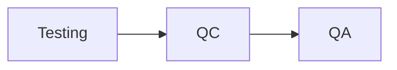

# 04_Ролі. Звання. QC QA

# Ролі, звання, QA:

* Ролі: які є професії в IT
* Програмісти: які є види
* Впевненість в якості та контроль якості
* Звання: кар'єрний шлях в IT

## Ролі: які є професії в IT?

* Девелопери / пограмісти / розробники ПЗ
* Тестувальники / інженери з контролю якості / QC
* Test Automation інженери / автоматизатори
* Project Manager / ПМ
* Бізнес-аналітики / BA
* DevOps інженери
* Stakeholders

# Програмісти: які є види програмістів

* Бек-енд розробники
* Фронт-енд розробники / UI-щики
* Фулл стек розробники (фронт + бек)
* Програмісти баз даних
* Верстальники

## Які є види тестувальників?

* **Тестувальники / Testing**
  * Тестують програму в фазі тестування
  * Шукають дефекти

* **QC / Quality Control**
  * Інженери з контролю якості
  * Тестують програму в фазах розробки та тестування
  * Займаються продуктом (додатком, сайтом)

* **QA / Quality Assurance**
  * Інженери з забезпечення якості
  * Тестують програму у всіх фазах життєвого циклу ПЗ
  * Займаються процесами (мітинги, перевірка вимог та документів) і продуктом

# Кар'єрний шлях в IT

