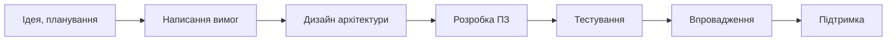
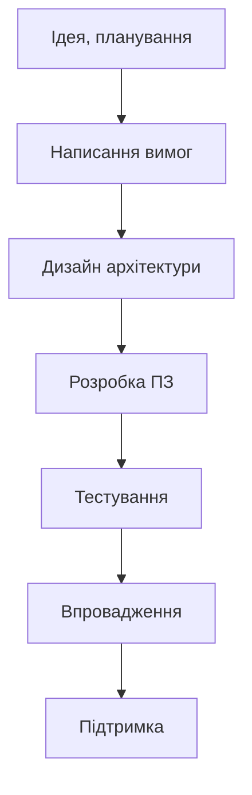

# 06_Методології розробки

# Методології розробки:

* Послідовна - Waterfall
* Ітеративна / спіральна - Agile
* V-модель
* Extreme programming
* Test Driven Development

## Методології

* Методологія - це порядок, за яким працює проєкт. Мітинги, завдання, пріоритети, оцінювання і т.п.
* Методології тісно пов'язані з життєвим циклом ПЗ і засновані на різних фазах циклу ПЗ.
* В залежності від методології порядок і час виконання фаз змінюється.

# Waterfall

* Всі фази йдуть послідовно і не мають права повертатись чи повторюватись
* Водоспад - устарівша методологія, використовується дуже рідко
* Характеристики: стабільність вимог, чітка послідовність всіх фаз, контроль менеджменту
* Недоліки: неможливо повернути фазу, на розробку йдуть роки, клієнт не може побачити програму наперед
* Водоспад - послідовна методологія, адже всі фази йдуть послідовно

# Agile

* Agile - гнучка ітеративна методологія. Всі фази повторюються по декілька разів, кожне повторення називають ітерацією або спринтом.
* В результаті кожної ітерації повинен виходити готовий продукт або його частина.
* Клієнт має доступ до продукту в будь-який час розробки.

## Agile

Також цю методологію можна зобразити у вигляді спіралі, тому її називають спіральною.

# Agile

* Scrum та Kanban - основні методології, що виникли з Agile.
* Їх основні характеристики:
  * Спринти
  * Дошка з завданнями
  * Мітинги (зустрічі)
  * Ролі
  * Пріоритети
  * Оцінювання задач (естімейт)

# V-model

# Extreme programming

* Методологія, яка змушує людей створювати програму якнайшвидше
* Кодування
* Тестування - юніт тести від програмістів
* Слухання - замість вимог
* Проектування

## Test driven development

1. Додайте тест (перевірити що є кнопка Ввійти)
2. Запустіть тест і переконайтесь, що він не пройшов
3. Напишіть код (прийшла пора створити кнопку Ввійти)
4. Повторіть тест (і він мусить пройти)
5. Виправте код, щоб він відповідав стандартам
6. Повторіть тест. Якщо тест пройшов, переходимо до нової функції і кроку 1

