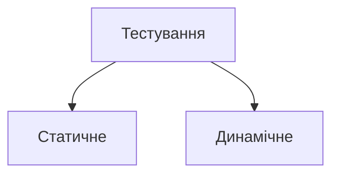

# 115_1.1 Основи тестування

# ISTQB Частина 1

## Основи тестування

## Що таке тестування?

* Загальне упередження, що тестування обмежене виконанням тестів
* Активності тестування є і до, і після виконання тестів
* Інші активності протягом циклу розробки ПЗ
* Перевірки та рецензування

## Тестування - це:

* Пошук дефектів
* Впевненість в якості продукту
* Надання інформації
* Запобігання дефектам
* Оцінка робочого продукту
* Перевірка, чи всі вимоги дотримані
* Зменшення ризиків
* Перевірка, що програма відповідає юридичним, договірним та нормативним вимогам та стандартам

# Класифікація тестування

* **Статичне** (Review / перевірка / статичний аналіз):
  1. Неформальна перевірка
  2. Покроковий розбір
  3. Технічне рецензування
  4. Інспекція

* **Динамічне** (Рівні тестування):
  1. Модульне
  2. Інтеграційне
  3. Системне
  4. Приймальне
  5. Нефункціональне

## Тестування та “налагодження” (дебаггінг)

* Тестування - це пошук дефектів. Проводиться тестувальниками.
* Дебаггінг - це аналіз дефектів, пошук їх причини та усунення багів. Проводиться програмістами.

# Чому тестування необхідне?

# Внесок тестування в успіх

* Використання певних технік тестування з відповідним рівнем досвіду, на відповідних рівнях тестування та відповідних етапах життєвого циклу розробки програмного забезпечення.
* Наявність тестувальників, які беруть участь у перевірці вимог або уточненні історій користувача, може виявити дефекти в робочих продуктах.
* Наявність тісної співпраці тестувальників із проектувальниками системи під час проектування системи може підвищити розуміння архітектури системи та способів тестування кожною стороною.
* Наявність тісної взаємодії тестувальників із програмістами під час розробки коду може покращити розуміння коду та способів його тестування кожною стороною.
* Наявність тестувальників для валідації та верифікації програмного забезпечення до релізу може виявити збої, які інакше могли бути пропущені, і підтримати дебаггінг - процес усунення дефектів.

# Забезпечення якості і тестування

Люди часто використовують фразу “забезпечення якості”, коли говорять про тестування, але тестування та забезпечення якості це не одне й те саме.

Забезпечення якості зосереджено на дотриманні відповідних процесів для забезпечення впевненості, що досягнуто відповідних рівнів якості. Якщо процеси здійснюються належним чином, робочі продукти, створені цими процесами, як правило, вищої якості, що сприяє запобіганню дефектам.

Контроль якості включає різну діяльність, у тому числі роботи з тестування, що підтримують досягнення відповідного рівня якості. Роботи з тестування є частиною загального процесу розробки та супроводження програмного забезпечення.

# Помилки, дефекти та відмови

* **Помилка (error, mistake)** – дії людини, які призводять до неправильного результату
* **Дефект або баг (fault, defect, bug)** - відмінність актуального результату від очікуваного, може призвести до відмови
* **Відмова (failure)** - відхилення програмного забезпечення від очікуваної поведінки

# Причини дефектів в ПЗ

* Брак часу
* Людина може помилятися
* Недосвідчені чи недостатньо кваліфіковані учасники проекту
* Нерозуміння між учасниками проекту, включаючи нерозуміння вимог та проектування
* Складність коду, проектування, архітектури, основної проблеми, яку треба вирішити, та/або використовуваних технологій
* Нерозуміння внутрішньосистемних та міжсистемних інтерфейсів, особливо коли таких внутрішньосистемних та міжсистемних взаємодій багато
* Нові, незнайомі технології

# 7 принципів тестування

# Принципи тестування

1. Тестування показує наявність багів, але не гарантує їх відсутність
2. Вичерпне тестування неможливе
3. Раннє тестування
4. Накопичення дефектів
5. Парадокс пестицидів
6. Тестування залежить від контексту
7. Відсутність помилок оманлива

# Психологія тестування

# Психологія людини та тестування

Елемент людської психології, названий упередженістю, може ускладнити прийняття інформації, яка збігається з поточними переконаннями. Наприклад, оскільки розробники очікують, що їхній код буде правильним, у них є упередженість, яка ускладнює сприйняття того, що код неправильний.

Крім того, загальноприйнятою людською рисою є те, що винен носій поганих новин, а інформація, одержана в результаті тестування, часто містить погані новини.

Внаслідок цих психологічних чинників деякі люди можуть сприймати тестування як руйнівну діяльність, навіть якщо вона значною мірою сприяє розвитку проекту та якості продукту.

Напруженість між тестувальниками та аналітиками, власниками продуктів, дизайнерами та розробниками можна зменшити. Це стосується як статичного, так і динамічного тестування.

# Психологія тестування

Тестувальники та менеджери повинні мати гарні комунікаційні навички, щоб мати можливість ефективно повідомляти про дефекти, відмови, результати тестування, хід тестування, та ризики, а також будувати позитивні відносини з колегами. Наступні приклади добре передають способи спілкування:

* Почніть із співпраці, а не битви. Нагадайте кожному про спільну мету покращення якості системи.
* Нагадайте всім про спільну мету у покращенні якості системи.
* Повідомляйте результати тестування та інші висновки нейтральним, заснованим на фактах способом без критики автора.
* Спробуйте зрозуміти, що інші люди відчувають, і причини їхньої негативної реакції на інформацію.
* Переконайтеся, що інша людина зрозуміла, що ви сказали.

# Мислення тестувальника та розробника

* Розробники та тестувальники часто думають по-різному. У них різні цілі, які потребують різного способу мислення.
* Спосіб мислення відображає припущення людини і кращі методи як для прийняття рішень, так і для вирішення проблем. Спосіб мислення тестувальника повинен включати цікавість, професійний песимізм, критичний погляд, увагу до деталей та мотивацію хороших та позитивних комунікацій та стосунків.
* Спосіб мислення розробника може включати деякі елементи способу мислення тестувальника, але успішні розробники частіше зацікавлені в розробці і створенні рішень, ніж у розгляді того, що може бути неправильно в цих рішеннях. Крім того, підтвердження упередженості ускладнює пошук помилок у власній роботі.
* При правильному мисленні розробники можуть протестувати свій власний код.
* Виконання деяких дій незалежними тестувальниками підвищує ефективність виявлення дефектів, що є особливо важливим для великих, складних або критично важливих для безпеки систем.

# ISTQB Частина 1

## Основи тестування

# Процес тестування

# Процес тестування в контексті

Контекстні фактори, що впливають на процес тестування, включають:

* Модель ЖЦ розробки ПЗ та проєктні методології
* Рівні та типи тестування
* Продуктові та проєктні ризики
* Предметну область (Бізнес-домен)
* Обмеження (Бюджети та ресурси, Терміни, Складність, Договірні та нормативні вимоги)
* Організаційні політики та практики
* Необхідні внутрішні та зовнішні стандарти

Процес тестування складається з таких активностей:

* Планування тестування
* Моніторинг та контроль тестування
* Аналіз тестування
* Проектування тестів
* Реалізація тестів
* Виконання тестів
* Завершення тестування

Планування тестування складається з таких активностей:

* Визначення масштабу роботи, ризиків та цілей тестування
* Визначення підходу до тестування загалом
* Планування тестових заходів, виділення ресурсів до роботи.
* Визначення кількості документації, деталей та шаблонів для документації.
* Вибір метрик для Моніторингу та Контролю
* Критерії входу та виходу з тестування
* Ухвалення рішення про автоматизацію

# Моніторинг та контроль тестування

* Моніторинг — це процес виміру прогресу на проекті.
* Тестові метрики - це різні формули, які вимірюють різні параметри в тестуванні (тести, дефекти, покриття і т.д.)

> *Швидкість виконання тестів = Кількість виконаних тестів / кількість запланованих тестів х 100%*

* Контроль тестування включає у собі дій, щоб слідувати тест плану.

Аналіз тестування складається з таких активностей:

* Аналіз тестового базису
* Визначення набору функцій, що підлягають тестуванню, що можна тестувати, що неможливо протестувати
* Визначення умов тестування, ґрунтуючись на аналізі базису тестування
* Врахувати функціональні, нефункціональні та структурні характеристики, інші технічні фактори, рівні та ризики

Проєктування тестування складається з таких активностей:

* Проєктування та пріоритизація Тест Кейсів
* Визначення потрібних Тестових Даних для підтримки Тестових Умов та Тест Кейсів
* Проєктування тестового середовища та визначення потрібних програм
* Створення матриці відстеження між тест базисом та тест кейсами

Реалізація тестування складається з таких активностей:

* Розробка та пріоритизація тестових процедур.
* Створення наборів тестів. А також якщо ви вирішили автоматизувати тестовий сценарій, то він буде підготовлений на цьому етапі.
* Організація розкладу виконання наборів тестів.
* Побудова environment та перевірка налаштування всього необхідного.
* Підготовка тестових даних та правильне завантаження їх у environment.
* Перевірка та оновлення трасування між базисом тестування, тестовими умовами, тестовими сценаріями, процедурами тестування та наборами тестів.

Виконання тестування складається з таких активностей:

* Запис ID та версій об'єктів тестування та програм для тестування
* Виконання тестів мануально або за допомогою спеціальних програм
* Порівняння актуальних та очікуваних результатів
* Аналіз проблем з метою вирішити їхню причину
* Репортинг дефектів, ґрунтуючись на тестах, що впали
* Логування результату виконання тестів

Закриття тестування складається з таких активностей:

* Перевірка закриття всіх звітів про дефекти, запитів на зміни, списку завдань, які залишилися не реалізованими наприкінці виконання тестування.
* Створення зведеного звіту із тестування для передачі зацікавленим особам.
* Завершення та архівування тестового оточення, тестових даних, інфраструктури тестування та іншого тестового забезпечення для подальшого використання.
* Передача тестового забезпечення команді супроводу, іншим проектним командам та/або іншим зацікавленим особам, які можуть отримати вигоду з його використання.
* Аналіз отриманих уроків для визначення змін, необхідних для майбутніх ітерацій, релізів та проектів.
* Використання зібраної інформації для підвищення зрілості процесу тестування.

# Робочі продукти Планування тестування

Робочі продукти планування тестування – це один чи кілька планів тестування.

План тестування містить інформацію про базис тестування, з яким інші робочі продукти тестування будуть пов'язані через матрицю відстежуваності, а також критерії виходу, які використовуватимуться під час моніторингу та контролю тестування.

# Робочі продукти Моніторингу та контролю тестування

Робочі продукти моніторингу та контролю тестування – це зазвичай різні типи звітів про тестування, включаючи звіти про хід тестування та зведені звіти про тестування.

Робочі продукти моніторингу та контролю тестування також повинні враховувати інтереси управління проектами, такі як завершення завдань, розподіл та використання ресурсів та трудовитрат.

## Робочі продукти Аналізу тестування

Робочі продукти аналізу тестування складаються з певних пріоритезованих тестових умов, кожна з яких в ідеалі двонаправлено простежується до конкретного елемента базису тестування, який вони покривають.

Для дослідницького тестування аналіз тестування може містити створення концепцій тестування.

# Робочі продукти Проектування тестування

Результатом проектування тестів є тест кейси та набори тест кейсів для виконання тестових умов, визначених в аналізі тестування.

Проектування тестів також призводить до розробки та/або встановлення необхідних тестових даних, проектування тестового оточення та визначення інфраструктури та інструментів, хоча обсяг документування цих результатів може суттєво різнитися.

## Робочі продукти Реалізації тестування

Робочі продукти реалізації тестів включають:

* Процедури тестування та послідовності цих процедур тестування
* Набори тестів
* Розклад виконання тестів

Реалізація тестів також може призвести до створення та перевірки тестових даних та тестового оточення.

# Робочі продукти Виконання тестування

Робочі продукти виконання тестів включають:

* Документацію про стан окремих тестових сценаріїв або процедур тестування (наприклад, готовий до запуску, пройдено, не пройдено, заблоковано, пропуск тощо)
* Звіти про дефекти
* Документацію про те, які елементи тесту, об'єкти тестування, інструменти тестування, та тестове забезпечення були задіяні в тестуванні

## Робочі продукти Завершення тестування

Робочі продукти завершення тестування складаються зі зведених звітів тестування, заходів щодо покращення наступних проєктів або ітерацій (наприклад, ретроспектива після проєкту з гнучкою методологією), запитів на зміну або набору завдань продукту та остаточного тестового забезпечення.

