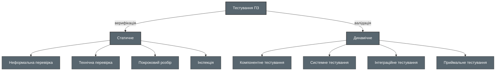

# 117_2. Тестування в життєвому циклі розробки ПЗ

# ISTQB Частина 2

## Тестування в ЖЦ розробки ПЗ

# Моделі життєвого циклу розробки ПЗ

# V-модель (послідовна модель)

# Тестування у розробці програмного забезпечення

Для будь-якої моделі життєвого циклу розробки є кілька показників якісного тестування:

* Для кожної активності розробки є відповідна активність тестування.
* У кожного рівня тестування є цілі, характерні для цього рівня.
* Аналіз та проєктування тестів для певного рівня тестування розпочинаються на стадії відповідних активностей розробки.
* Тестувальники повинні брати участь в обговореннях для визначення та уточнення вимог та дизайну, а також залучатися до рецензування робочих продуктів, як тільки будуть доступні перші їх чорнові версії.

## Модель розробки ПЗ

*Послідовна модель* розробки описує процес розробки програмного забезпечення як лінійний, послідовний потік активностей. Це означає, що будь-яку фазу процесу розробки слід починати після завершення попередньої фази.

*Інкрементальна розробка* передбачає визначення вимог, дизайн, складання та тестування системи частинами. Це призводить до того, що функціональність програмного забезпечення зростає поступово. Розмір таких функціональних збільшень відрізняється у більшу чи меншу сторону залежно від вибраних методів роботи.

*Ітеративна розробка* використовується у випадку, коли функціонал, що розробляється, повинен бути визначений, спроектований, побудований та протестований протягом кількох етапів, найчастіше з фіксованою тривалістю кожного з них. Ітерації можуть включати в себе як набір змін функціоналу, реалізованого в попередніх ітераціях, так і зміни всього продукту, що розробляється в цілому.

* Rational Unified Process
* Scrum
* Kanban
* Spiral

## Вибір моделі життєвого циклу розробки залежно від ситуації

Моделі життєвого циклу розробки програмного забезпечення повинні обиратися та бути адаптовані до контексту характеристик проекту та продукту. Модель повинна бути обрана та адаптована на основі мети проекту, типу продукту, що розробляється, бізнес-пріоритетів (наприклад, термін виведення продукту на ринок), та виявлених ризиків продукту та проекту.

Крім цього, самі моделі життєвого циклу розробки можуть *поєднуватися* одна з одною. Наприклад, V-модель може бути використана для розробки та тестування систем серверного рівня та їх інтеграції, тоді як методологія гнучкої розробки може бути використана для розробки та тестування інтерфейсу користувача і функціональності.

Системи із загальною назвою «Інтернет речей», які складаються з багатьох різних об'єктів, таких як пристрої, продукти та сервіси, часто розробляються із застосуванням різних моделей життєвого циклу розробки для кожного об'єкта. Це веде до певної складності розробки версій таких систем.

# Рівні тестування

## Компонентне тестування

Компонентне тестування перевіряє функціонал модулів програмного забезпечення, програм, об'єктів, класів, що тестуються окремо.

Компонентне тестування також відоме як модульне, юніт-тестування, програмне, структурне тестування коду.

Зазвичай проводиться з доступом до коду у формі тестування Білої скриньки.

  

Тест базис компонентного тестування:
* Детальний дизайн
* Код
* Модель даних
* Специфікації компонента

  

  

Об'єкти тестування:
* Компоненти, модулі
* Код та структури даних
* Класи
* Модулі БД

  

# Інтеграційне тестування

* Інтеграційне тестування перевіряє взаємодію між компонентами чи системами
* Є 2 рівні інтеграційного тестування:
    * Компонентне інтеграційне тестування
    * Системне інтеграційне тестування
* Системне інтеграційне тестування буває 3-х видів (TDA, BDA, BBA)
* Чим більший обсяг інтеграції, тим складніше стає визначити дефекти

Тест базис інтеграційного тестування:
* Дизайн продукту та системи
* Діаграми послідовності
* Специфікації інтерфейсу та протоколу зв'язку
* Сценарії використання системи
* Архітектура на рівні компонентів чи системи
* Робочі процеси
* Специфікації, що описують зовнішні інтерфейси

Об'єкти тестування:
* Підсистеми
* Бази даних
* Інфраструктура
* Інтерфейси
* Програмні інтерфейси програми (API)
* Мікросервіси

# Системне тестування

* Системне тестування перевіряє поведінку всієї системи/продукту
* У системному тестуванні, середа має бути такою ж, як продакшн, щоб мінімізувати ризики проблем із середовищем
* Системне тестування включає тести, що базуються на ризиках
* Тестувальники також мають справу з не документованими вимогами
* Системне інтеграційне тестування може бути виконане після системного тестування

Тест базис системного тестування:
* Системні вимоги та вимоги до продукту (функціональні та нефункціональні)
* Звіти про аналіз ризиків
* Сценарії використання
* Бізнес-потреби та користувацькі історії
* Моделі поведінки системи
* Діаграми станів
* Системні та користувацькі посібники

Об'єкти тестування:
* Програми
* Апаратні / програмні системи
* Тестована система
* Операційні системи
* Конфігурація системи та конфігурація даних

# Приймальне тестування

* Приймальне тестування необхідно, щоб переконатися в якості системи
* Типові форми приймального тестування включають:
  * Користувацьке приймальне тестування
  * Експлуатаційне приймальне тестування
  * Контрактне та нормативне приймальне тестування
* Рівні приймального тестування
  * Альфа-тестування
  * Бета-тестування

Тест базис приймального тестування:
* Бізнес процеси
* Користувацькі та бізнес-вимоги
* Нормативи, юридичні контракти та стандарти
* Сценарії використання системи
* Системні вимоги
* Системна або користувацька документація
* Процедури встановлення програмного забезпечення
* Звіти аналізу ризику

Об'єкти тестування:
* Тестована система
* Конфігурація системи та конфігураційні дані
* Бізнес-процеси для повністю інтегрованої системи
* Операційні та експлуатаційні процеси
* Форми
* Звіти
* Існуючі та перетворені виробничі дані

# Типи тестування

# Класифікація тестування

# Функціональне тестування

* Функціональне тестування перевіряє роботу основних функцій програми
* Функції це "ЩО" робить система
* Основні рівні, які перевіряються у функціональному тестуванні - Компонентне, Інтеграційне, Системне, Приймальне тестування

# Нефункціональне тестування

* Нефункціональне тестування перевіряє характеристики якості системи
* Нефункціональне — це “ЯК” система працює
* Нефункціональне тестування включає (але не обмежується) тестуванням навантаження, стрес-тестуванням, тестуванням зручності використання, тестуванням надійності та портативності

# Тестування ящиків

Є 2 різних підходи у динамічному тестуванні:

## Тестування білого ящика

* Проводиться розробниками із знанням коду
* Проводиться шляхом виконання програми
* Також відомо як
  * Структурне тестування
  * Скляна скринька
  * Відкрита скринька
  * Прозора скринька

## Тестування чорного ящика

* Проводиться тестувальниками без знань коду
* Проводиться шляхом введення даних в інтерфейс користувача (UI)
* Також відомо як
  * Закрита скринька
  * Непрозора скринька

## Тестування, пов'язане із змінами

* Після виправлення дефекту, він повинен бути перевірений ще раз, щоб переконатися, що фікс успішний. Цей процес називається ре-тестинг чи підтверджувальне тестування.
* Регресійне тестування - повторне тестування раніше перевіреної програми після змін, щоб переконатися, що у старий функціонал не з'явилися нові баги
* Регресійне тестування – хороший кандидат на автоматизацію
* Регресійне тестування також проводять у таких сценаріях:
  * Зміна середовища, що тестується
  * Додавання нового функціоналу до існуючої програми

# Тестування в період супроводження

Після релізу система працює роками. Протягом цього часу програма, її конфігурації чи система може бути змінена чи розширена.

Модифікації включають заплановані покращення, коригування, термінові зміни та зміну системи.

Залежно від цих змін, тестування під час супроводу (регресійне тестування) може бути проведено на всіх рівнях та типах тестування.

Ми класифікуємо умови для тестування у період супроводу наступним чином:

* Модифікації, такі як заплановані поліпшення (наприклад, що базуються на графіку випуску оновлень), коригувальні та аварійні зміни, зміни середовища експлуатації (наприклад, заплановані оновлення операційної системи або бази даних), оновлення готового комерційного програмного забезпечення та виправлення дефектів і вразливостей
* Міграція, наприклад, з однієї платформи на іншу, яка може вимагати проведення експлуатаційних тестів нового середовища, а також зміненого програмного забезпечення або тестів перетворення даних, коли дані будуть перенесені до системи, що підтримується, з іншої програми
* Зняття з експлуатації, наприклад, коли закінчується життєвий цикл програми

## Аналіз впливу

* Аналіз впливу може бути виконаний до внесення змін, щоб вирішити, чи слід вносити зміни, зважаючи на можливі наслідки в інших областях системи.
* Аналіз впливу може бути утруднений якщо:
  * Специфікації (наприклад, бізнес-вимоги, історії користувачів, архітектура) застаріли чи відсутні
  * Тестові сценарії не задокументовані чи застаріли
  * Двонаправлена простежуваність між тестами та базисом тестування не підтримувалася
  * Інструментарій підтримки застарів чи зовсім відсутній
  * Учасники процесу не мають основних знань про систему
  * Під час розробки приділялося недостатньо уваги супроводжуваності програмного забезпечення

