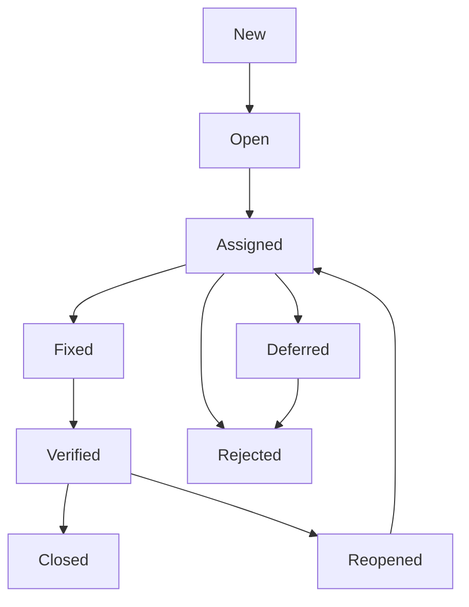

# 120_5. Управління тестуванням. ISTQB Foundation

# ISTQB Частина 5

## Управління тестуванням

# Організація тестування

# Організація тестування та незалежність

Конкретний рівень незалежності часто робить тестувальника більш ефективним у пошуку дефектів через психологічні відмінності розробника та тестувальника. Рівні незалежності тестування включають такі (від низького рівня до високого рівня незалежності):

* Немає незалежних тестувальників; розробники тестують власний код, інших форм тестування немає
* Незалежні розробники або тестувальники у команді розробки або у команді проекту; це можуть бути розробники, які тестують продукти своїх колег
* Незалежна команда або група тестування всередині організації, що звітує перед керівництвом проекту або керівництвом організації
* Незалежні тестувальники з організації замовника або спільноти користувачів. Можуть спеціалізуватися на окремих типах тестування, таких як тестування практичності, тестування безпеки, тестування продуктивності, тестування на відповідність нормативним документам або тестування переносимості
* Незалежні тестувальники, зовнішні стосовно організації, що працюють або на території компанії (інсорсинг), або поза нею (аутсорсинг)

# Організація тестування та незалежність

До потенційних переваг незалежного тестування можна віднести:

* Ефективне розпізнавання різних видів відмов у порівнянні з розробниками через різницю підходів, технічних перспектив та упереджень
* Можливість незалежного тестувальника перевіряти, заперечувати чи спростовувати припущення, зроблені зацікавленими сторонами під час проектування та впровадження системи

До потенційних недоліків незалежного тестування належать:

* Ізоляція від команди розробників, що призводить до відсутності співробітництва, затримкам з наданням зворотного зв'язку команді розробників або суперництву з командою розробників
* Втрата розробниками почуття відповідальності за якість
* Сприйняття незалежних тестувальників як «недоліку» та звинувачення у затримках релізу
* Недостатність у незалежних тестувальників будь-якої важливої інформації

## Задачі тест менеджера включають:

* Розробку або рецензування Test Policy та Test Strategy для організації
* Планування тестування, з урахуванням контексту та розуміння цілей та ризиків тестування.
* Складання та оновлення планів тестування
* Узгодження планів тестування з керівниками проєктів, product owners та іншими учасниками
* Ініціювання аналізу, розробки, реалізації та виконання тестів, відстеження прогресу та результатів тестування, контроль виконання критеріїв виходу (або критеріїв готовності)
* Підготовку та надання test progress report та test summary report на основі зібраної інформації
* Адаптацію планів залежно від прогресу та результатів тестування (і виконання дій, необхідних для контролю тестування)
* Підтримка налаштування системи керування дефектами та конфігурацією тестового забезпечення
* Вибір відповідних метрик для вимірювання результатів тестування та оцінки якості процесу тестування та продукту
* Рішення про створення тестового середовища/середовищ
* Демонстрацію цінності тестувальників, групи тестування та професії тестувальника в організації
* Розвиток навичок та кар'єри тестувальників (наприклад, за допомогою планів навчання, performance evaluations, коучингу тощо)

До типових задач тестувальника належать:

* Рецензування та розробка планів тестування
* Аналіз, рецензування та оцінка вимог, user stories та acceptance criteria, специфікацій та моделей (базису тестування) на предмет тестування
* Визначення та документування тестових умов, встановлення зв'язків між тестовими сценаріями, тестовими умовами та базисом тестування
* Проектування, налаштування та перевірка тестового середовища/середовищ, часто разом із системним адмініструванням та управлінням мережею
* Проектування та розробка тестових сценаріїв та процедур тестування
* Підготовка та отримання тестових даних
* Створення детального розкладу виконання тестів
* Виконання тестування, оцінка результатів та документування відхилень від очікуваних результатів
* Використання відповідних інструментів підтримки процесу тестування
* Автоматизація процесу тестування в міру необхідності
* Оцінка нефункціональних характеристик, таких як продуктивність, надійність, практичність, безпека, сумісність та переносимість
* Рецензування тестів, розроблених іншими тестувальниками

# Планування та оцінка тестування

## Активності планування тестування включають:

* Визначення обсягу, цілей та ризиків тестування
* Визначення загального підходу до тестування
* Координацію робіт із тестування та їх поєднання з іншими роботами в рамках ЖЦ програмного забезпечення
* Прийняття рішень про те, що тестувати, хто виконуватиме тестування та як повинні виконуватись роботи з тестування
* Вибір метрик для моніторингу та контролю тестування
* Визначення структури та рівня деталізації тестової документації (наприклад, надання шаблонів або прикладів документів)

Зміст планів тестування відрізняється і може виходити за межі зазначених тем.

Приклади планів тестування можна знайти у стандарті ISO (ISO/IEC/IEEE 29119-3).

# Test Strategy, Test Approach (підходи)

Стратегія тестування містить поверхній опис процесу тестування, як правило, на рівні продукту чи організації. До поширених типів стратегій тестування належать:

* Аналітичний (заснований на ризиках)
* Заснований на моделі
* Методичний
* Заснований на процесі (або стандарті)
* Направлений (консультативний)
* Заснований на мінімізації регресу
* Реактивний

# Критерій входу (Entry criteria)

Типові критерії входу включають:

* Доступність тестованих вимог, історій користувача та/або моделей (наприклад, при використанні стратегії тестування на основі моделей)
* Наявність елементів тестування, які відповідають критеріям виходу для попередніх рівнів тестування
* Доступність тестового середовища
* Наявність необхідних інструментів тестування
* Наявність тестових даних та інших необхідних ресурсів

# Критерії виходу (exit criteria)

Типові критерії виходу включають:

* Виконання запланованих тестів
* Досягнення певного рівня покриття (наприклад, вимог, історій користувача, acceptance criteria, ризиків, коду)
* Кількість відкритих дефектів нижче за обумовлене порогове значення
* Низька оцінка кількості ще не виявлених дефектів
* Відповідність необхідним значенням оцінок надійності, продуктивності, практичності, безпеки та інших характеристик якості

# Методи оцінки тестування

Існує декілька методів, які використовуються для оцінки витрат на адекватне тестування. Найбільш популярні методи – це:

* **Метод, заснований на метриках** – оцінка витрат, що використовує метрики раніше виконаних проектів або типові значення
* **Метод експертної оцінки** – оцінка витрат на основі досвіду власників завдань тестування чи експертів

Зусилля на тестування залежать від наступних факторів:

* Характеристики продукту
* Характеристики процесу розробки
* Характеристики людей
* Результати тестування

# Графік виконання тестування

* Після того, як тестові сценарії та процедури (в тому числі автоматизовані) розроблені, їх поєднують у набори тестів. Ці набори розташовуються відповідно до розкладу тестування, який задає послідовність їх виконання.
* Розклад має враховувати такі фактори як: пріоритет, залежність між тестами та/або тестованими функціями, необхідність виконання підтверджуючих тестів та регресійних тестів та найбільш ефективну послідовність виконання тестів.
* В ідеальному випадку тестові сценарії впорядковуються на основі пріоритетів, при цьому спочатку виконуються тестові сценарії із найвищим пріоритетом.
* Однак ця практика може не працювати, якщо тести або функції, що тестуються, мають залежності.
* Якщо тестовий сценарій з більш високим пріоритетом залежить від тестового сценарію з нижчим пріоритетом, спочатку виконується тестовий сценарій з нижчим пріоритетом.

# Моніторинг та контроль

# Моніторинг тестування

Мета моніторингу тестування полягає у збиранні інформації та забезпеченні зворотного зв'язку про стан тестування.

Необхідна інформація може збиратися вручну або автоматично та використовуватись для відстеження прогресу тестування, оцінки виконання критеріїв виходу або критеріїв готовності (у разі гнучкої розробки), таких як забезпечення необхідного покриття ризиків продукту, вимог або acceptance criteria.

## Типові метрики тестування:

* Відсоток виконаних робіт з підготовки тестових сценаріїв (або відсоток розроблених тестових сценаріїв)
* Відсоток виконаних робіт з підготовки тестового середовища
* Метрики виконання тестів: кількість виконаних/невиконаних тестових сценаріїв, кількість тестових умов або сценаріїв, виконаних успішно/неуспішно
* Інформацію про дефекти: щільність дефектів, кількість виявлених та виправлених дефектів, частоту відмов та результати підтверджуючих тестів
* Покриття тестами вимог, історій користувача, acceptance criteria, ризиків або коду
* Інформацію про виконання завдань, розподіл та використання ресурсів, трудовитрати
* Вартість тестування, включаючи порівняння вартості з вигодою від знаходження наступного дефекту або виконання наступного тесту

# Контроль тестування

Контроль тестування являє собою будь-які коригувальні дії, вжиті на підставі отриманої інформації чи метрик. Дії можуть охоплювати будь-яку активність тестування та впливати на будь-яку активність ЖЦ програмного забезпечення.

Приклади дій щодо контролю тестування:

* Повторна пріоритизація тестів під час реалізації ризику (наприклад, порушення термінів постачання програмного забезпечення)
* Зміна графіка тестування через доступність або недоступність тестового середовища або інших ресурсів
* Повторна перевірка виконання критеріїв входу або виходу для test item, який допрацьовувався

# Test Reports

Зазвичай test progress reports та test summary reports включають:

* Результат проведеного тестування
* Інформацію про те, що сталося під час тестування
* Інформацію про відхилення від плану, включаючи відхилення в розкладі, тривалість виконання або витрати
* Інформацію про якість тестування та якість продукту з погляду критеріїв виходу або критеріїв завершення
* Інформацію про фактори, які блокували або продовжують блокувати тестування
* Метрики дефектів, тестових сценаріїв, покриття, прогресу тестування та використання ресурсів
* Інформацію про залишкові ризики
* Перелік тестових артефактів, які можна повторно використати

Стандарт ISO (ISO/IEC/IEEE 29119-3) описує два типи звітів про тестування: test progress reports та test summary reports та містить структуру та приклади оформлення звітів кожного типу.

# Управління конфігурацією

# Configuration Management

Метою управління конфігурацією є забезпечення та підтримка цілісності компонента або системи, тестового забезпечення та їх взаємозв'язків між собою протягом життєвого циклу проекту та продукту.

Для підтримки тестування керування конфігурацією може вимагати виконання таких умов:

* Всі елементи тестування однозначно ідентифіковані, пов'язані між собою, знаходяться під версійним контролем, всі зміни в них відстежуються
* Всі елементи тестового забезпечення однозначно ідентифіковані, пов'язані між собою та з версіями елементів тестування, знаходяться під версійним контролем, всі зміни відстежуються, забезпечуючи трасування протягом усього процесу тестування
* Усі документи та програмні елементи ідентифіковані та однозначно вказані у тестовій документації

Інфраструктура та процедури управління конфігурацією мають бути підготовлені та виконані на етапі планування тестування.

# Ризики і тестування

# Ризик

Ризик передбачає настання деякої негативної події у майбутньому. Рівень ризику можна визначити через **ймовірність події** та **серйозність наслідків**.

В рамках підходу, що базується на ризиках, результати аналізу ризиків продукту можуть бути використані для:
* Вибору методів тестування
* Вибору рівнів та типів тестування, які необхідно виконати (наприклад, тестування безпеки, тестування доступності)
* Визначення обсягу тестування
* Пріоритизації тестування з метою знайти критичні дефекти якомога раніше
* Виявлення будь-яких додаткових заходів, крім тестування, які можуть знизити ризики (наприклад, навчання менш досвідчених проектувальників)

# Проєктні ризики

Ризики проєкту пов'язані з подіями, що перешкоджають досягненню цілей проєкту. Приклади ризиків проєкту:

* Проєктні проблеми:
  * Затримки поставки, виконання завдань, виконання критеріїв виходу чи критеріїв готовності
  * Неточні оцінки, перерозподіл коштів на проєкти з вищим пріоритетом або загальні скорочення витрат по всій організації можуть призвести до неадекватного фінансування
  * Пізні зміни можуть призвести до суттєвих доробок
* Організаційні проблеми:
  * Нестача навичок, навчання чи чисельності персоналу
  * Проблеми з персоналом можуть викликати конфлікти та серйозні труднощі
  * Користувачі, бізнес-користувачі або експерти предметної галузі можуть бути зайняті іншими роботами

# Проєктні ризики

* Політичні проблеми:
    * Тестувальники не можуть адекватно повідомляти про свої потреби та/або результати тестування
    * Розробники та/або тестувальники не можуть відстежувати інформацію, отриману при тестуванні та рецензуванні (не прагнучи покращити методи розробки та тестування)
    * Може бути неправильне ставлення або очікування від тестування (недооцінюється важливість виявлення дефектів під час тестування тощо)
* Технічні проблеми:
    * Вимоги можуть бути визначені недостатньо добре
    * Вимоги можуть бути нездійсненними в поточних умовах
    * Тестове середовище може бути не готове вчасно
    * Перетворення даних, планування міграції та їх інструментальна підтримка можуть бути не готові вчасно
    * Слабкі сторони процесу розробки можуть впливати на узгодженість або якість артефактів проекту, таких як дизайн, код, конфігурація, тестові дані та тестові сценарії
    * Проблеми управління дефектами можуть призвести до накопичення дефектів та зростання технічного боргу
* Проблеми з постачальниками:
    * Третя сторона може не надати необхідний продукт чи послугу, або збанкрутувати
    * Контрактні проблеми можуть викликати серйозні труднощі для проекту

# Продуктові ризики

Ризик продукту — це можлива невідповідність деякого артефакту (специфікації, компонента, системи чи тесту тощо) потребам користувачів та зацікавлених сторін. Коли ризики продукту пов'язані з конкретними характеристиками якості (функціональною придатністю, надійністю, продуктивністю, практичністю, безпекою, сумісністю, супроводжуваністю та переносимістю), їх також називають ризиками якості.

Приклади ризиків продукту:

* Програмне забезпечення не виконує функції, зазначені у специфікації
* Програмне забезпечення не виконує функції, очікувані користувачами, клієнтами та/або зацікавленими сторонами
* Системна архітектура не підтримує нефункціональних вимог
* Обчислення виконуються невірно у якихось ситуаціях
* Неправильна реалізація у коді структури управління циклом
* Неадекватний час відгуку високонавантаженої системи
* Відгуки користувачів про продукт показують, що їхні очікування не виправдалися

# Управління дефектами

## Цілі написання баг-репортів:

* Надавати розробникам та іншим сторонам інформацію про негативні події, що відбулися, щоб вони могли визначити побічні ефекти, ізолювати проблему з мінімальними витратами на відтворення та виправити потенційні дефекти в міру необхідності, або вирішувати проблеми іншими способами.
* Забезпечити керівників тестування інструментами відстеження якості продукту та впливу на тестування (наприклад, якщо повідомляється про велику кількість дефектів, то тестувальники будуть змушені витрачати багато часу на звітність за знайденими дефектами замість того, щоб запускати тести; отже потрібно більше підтверджуючого тестування)
* Надати ідеї для вдосконалення процесів тестування та розробки

## Баг-репорт складається з:

1. Ідентифікатор дефекту
2. Заголовок та короткий опис знайденого дефекту
3. Дату повідомлення про дефект, інформацію про автора повідомлення
4. Ідентифікацію елемента тестування (перевіреного елемента конфігурації) та середовища
5. Фазу життєвого циклу розробки, у якій виявлено дефект
6. Опис дефекту, кроки для відтворення, включаючи системні логи, скріншоти, записи бази даних (якщо вони створені під час виконання тесту)
7. Очікувані та фактичні результати
8. Область чи ступінь впливу дефекту на інтереси зацікавленої сторони (критичність)
9. Терміновість/пріоритет для виправлення
10. Статус дефекту (наприклад, відкритий, відкладений, дублікат, чекає на виправлення, чекає перевірки, повторно відкритий, закритий)
11. Висновки, рекомендації та погодження
12. Глобальні проблеми, наприклад області, які будуть порушені виправленням дефекту
13. Історія змін, наприклад, послідовність дій членів команди проекту, щоб ізолювати дефект, виправити та підтвердити виправлення дефекту
14. Посилання, включаючи посилання на тестовий сценарій, який виявив дефект

