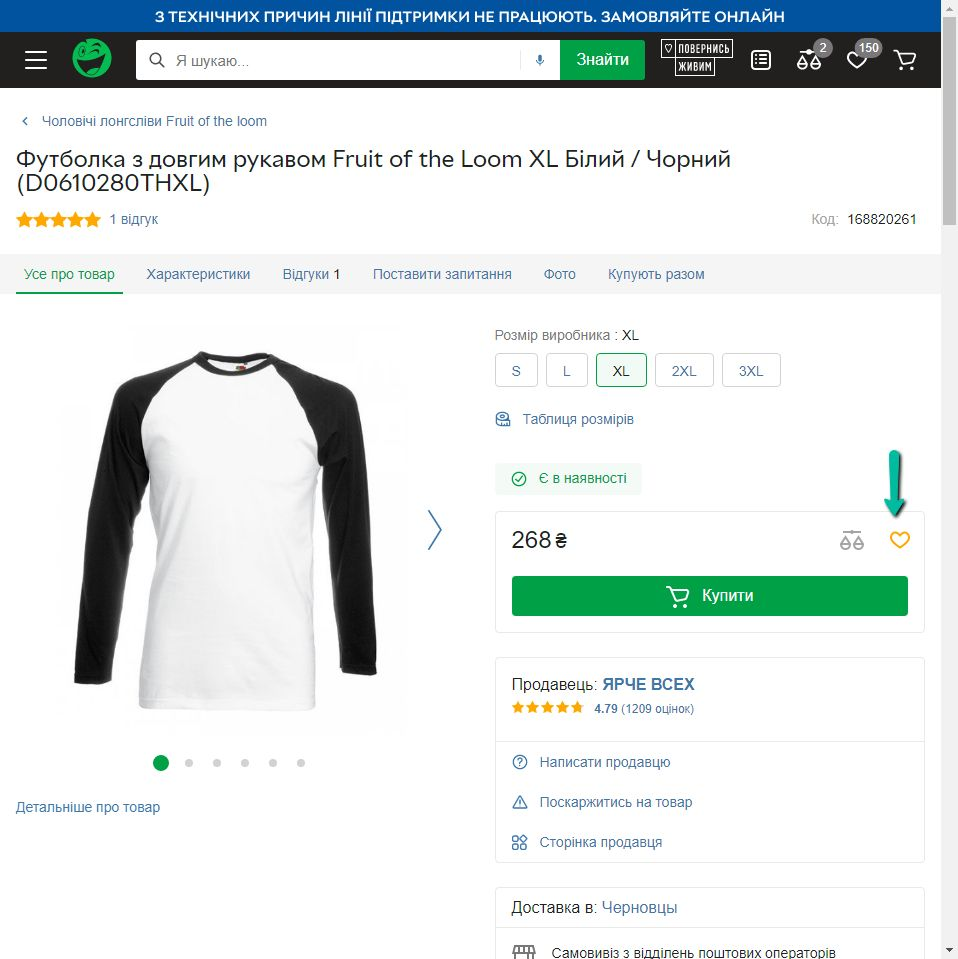
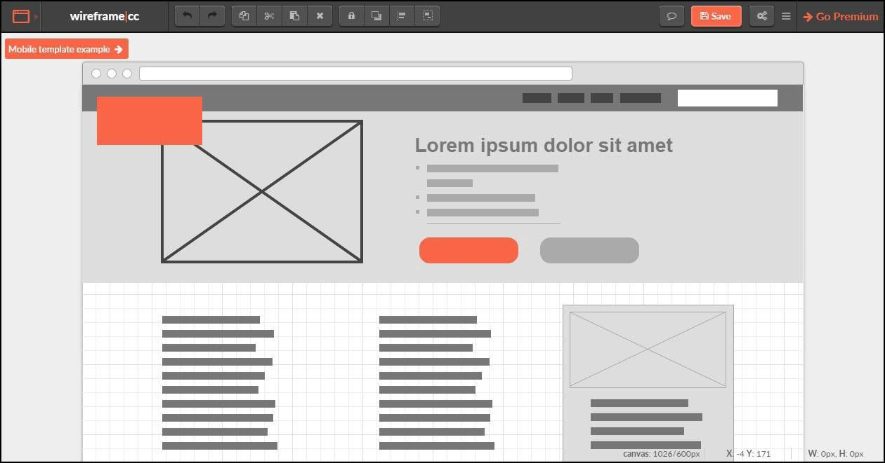
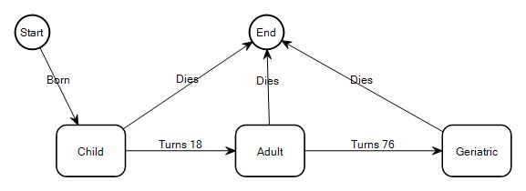
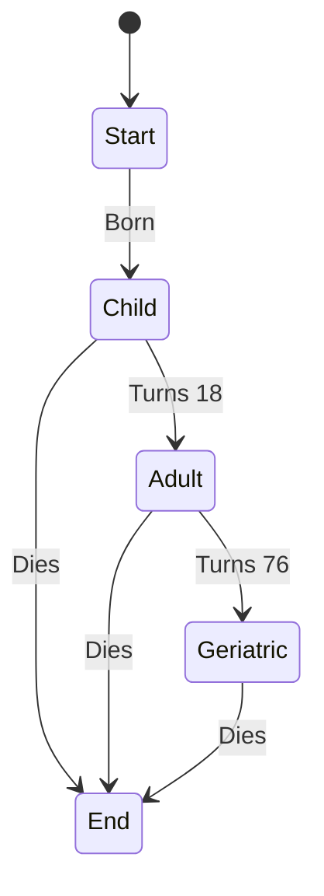

# 19_Вимоги

# Вимоги

* User Stories
* Requirements
* Acceptance Criteria
* Traceability matrix

# Що таке Вимоги?

* Вимоги — це опис того, що робить або має робити конкретне програмне забезпечення. Вони використовуються під час розробки, щоб повідомити, як функціонує програмне забезпечення або як воно призначене для роботи.
* Вони пришвидшують розробку, адже розробники точно знають, що має бути реалізовано
* Зменшують шанс виникнення багів
* Чим якісніше вимога - тим легше її протестувати
* Допомагають замовнику і команді розробки мати одне бачення продукту
* Вимоги - головний аргумент, коли клієнту щось не подобається

3 amigos: developer, tester and business analyst

# User Stories

* Як *користувач* я хочу *функціонал* для того, щоб *результат*
* One-liners - короткі і лаконічні
* Допомагають розбивати функціонал проєкту на маленькі кроки
* Спрощують оцінку складності роботи

* Як Адміністратор, я хочу додавати людей в бан, щоб уникнути образ та спаму.
* Як Продавець, я хочу змінювати ціну товару, щоб показати акційний товар.
* Як Клієнт, я хочу додавати товар в Обране, щоб мати швидкий доступ до товару.
* Як Незареєстрований користувач, я хочу реєструватись, щоб увійти в систему.

> **As a user, I want to** ... **so that** ...

# Software Requirement Specification #1

> Як Клієнт, я хочу додавати товар в Обране, щоб мати швидкий доступ до товару.

Клієнт повинен мати можливість додавати товар в Обране.

**Process flow:** Коли клієнт знаходиться на сторінці будь-якого товару з наявних, він може бачити кнопку “Додати до обраного” у вигляді жовтого незамальованого серця. Коли користувач натискає на цю кнопку, товар додається до обраного, а серце стає заповненим жовтим кольором. Щоб перевірити, що товар додано до Обраного, користувач повинен натиснути на біле серце в правому куті шапки веб-сайту. Користувача перекине на сторінку [https://rozetka.com.ua/ua/cabinet/wishlist/](https://rozetka.com.ua/ua/cabinet/wishlist/), де він зможе знайти обраний товар.

# SRS #2

На сторінці Обране:

1. Шапка профілю залишається незмінною
2. Всі товари згруповані за списками бажань. Список за замовчуванням – "Мій список бажань"
3. На сторінці зі списком бажань є кнопка "Додати список", що створює новий список бажань.
4. Кожен товар представляє картку, що складається з зображення товару, назви товару, відгуку, ціни, кнопки “Порівняння” та чек-боксу для виділення товару
5. В кожному списку бажань є кнопка “виділити все”, яка виділяє всі товари зі списку.
6. Виділені товари можна перемістити до іншого списку кнопкою “Перемістити”
7. Виділені товари можна видалити зі списку кнопкою “Видалити”
8. Кожен список товарів можна сортувати, вибравши відповідну опцію в випадаючому списку справа вгорі
    * За датою додавання
    * Від дешевих до дорогих
    * Від дорогих до дешевих
    * Акційні
    * Із суперціною

## Рівні вимог

* Бізнес-вимоги
  * Навіщо створюється продукт?
  * Яка користь з продукту?
  * Як отримати прибуток з продукту?
* Користувацькі вимоги
  * Що користувач може робити з допомогою продукту?
* Продуктові вимоги
  * Функціональні: Що система повинна робити?
  * Нефункціональні: Як система має це робити?
    * Продуктивність
    * Документація
    * Системне середовище

# Тестування вимог: перевірка документації

Цей метод дозволяє перевірити вимоги на:

* **Повноту.** Вимоги повинні в повній мірі описати функцію, яку необхідно реалізувати.
* **Необхідність.** Вимоги повинні описувати дійсно необхідний функціонал.
* **Реальність виконання.** Вимоги повинні описувати, наскільки можливо реалізувати функціонал.
* **Відсутність протиріч.** Різні документи або тексти в одному документі не повинні конфліктувати один з одним.
* **Однозначність.** Потрібно уникати розбіжностей у вимогах і не використовувати “плаваючі” слова.
* **Грамотність.** Потрібно уникати граматичних і логічних помилок у вимогах.

## Чек-ліст ХОРОШИХ ВИМОГ

1. Перевірити наявність слів “і так далі”, “та\або”, “може”, “і не тільки”, “коли потрібно”
2. Перевірити на двозначність
3. Перевірити наявність слів “я, ти, ми, ви, цей, ці”
4. Перевірити наявність слів, що неможливо перевірити: “швидкий, зручний, легкий, простий, адекватний, сильний, якісний, гнучкий” і подібних
5. Перевірити на вимірюваність
6. Перевірити на необхідність (без вимоги можна обійтись?)
7. Перевірити опис реалізації (вимоги описують що повинно працювати, а не як це має бути реалізовано)

## Тестування вимог: прототипування

* Це створення майбутньої моделі системи (візуальна схема).
* Прототипування проводиться для перевірки вимог на зручність використання користувацького інтерфейсу.

# Тестування вимог: аналіз поведінки системи

* Вимоги формуються у форматі “подія” - “результат”.
* Це допомагає визначити порядок виконання дій і знайти пропущені місця в вимогах.
* Найпопулярніший спосіб аналізу поведінки системи - Use case diagrams.

## Acceptance criteria

* `Given ... when ... then ...` — мова Gherkin в програмі Cucumber.
* **Приклад 1:** `Given` Обрані товари `When` користувач натискає “Додати в Обране” `Then` товар додається до обраного.
* **Приклад 2:** `Given` Вік реєстрації `When` користувач молодше 18 років `Then` реєстрація завершується повідомленням про помилку.

## Acceptance test

* **Тест 1:** `Given` сторінка реєстрації `When` користувач вводить вік 17 `Then` реєстрація завершується повідомленням про помилку.
* **Тест 2:** `Given` сторінка реєстрації `When` користувач вводить вік 60 `Then` реєстрація завершується успішно.

# Traceability matrix

Traceability matrix - таблиця, що співставляє два базових документа.

1. Може перевірити, чи покриваються вимоги тест кейсами
2. Може перевіряти вимоги на протиріччя
3. Може перевіряти, що баги покриті тест кейсами

| | Тест кейс 1 | Тест кейс 2 | Тест кейс 3 | Тест кейс 4 |
|---|---|---|---|---|
| Вимога 1 | | | | + |
| Вимога 2 | | | + | |
| Вимога 3 | | | | |
| Вимога 4 | + | + | | |

