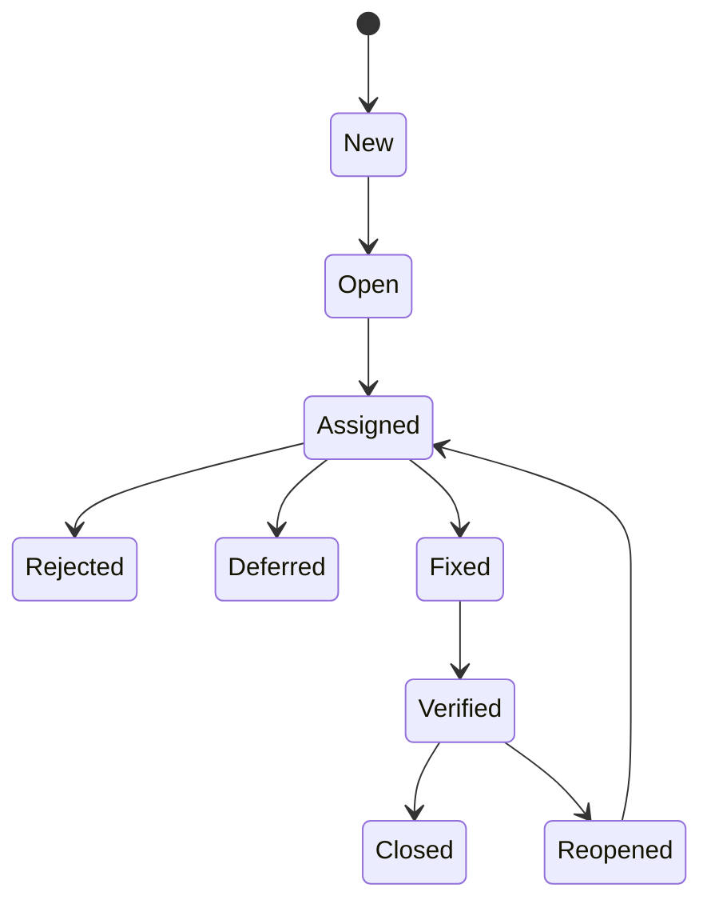

# 21_Дефекти теорія

# Дефекти:

- Що таке дефект?
- З чого складається баг репорт?
- Як називати баг репорти?
- Типи дефектів
- Пріоритет та Severity
- Цикл життя баг-репорту / Статус багу

## Що таке дефект?

* **Дефект** - це несправність програми, знайдена під час або після тестування
* Коли функціонал працює не так, як сказано в вимогах
* Коли актуальний результат (той, що є) відрізняється від очікуваного (той, що мав би бути)
* Коли не завантажується сторінка (або завантажується супер довго)
* Коли не провантажилась картинка або стилі сторінки

# Баг-репорт

* Це документ, який описує дефект
* Можна побачити, хто і коли знайшов баг і хто і коли його виправив
* Найголовніша (і найзанудніша) задача тестувальника

## Баг-репорт складається з:

1. ID
2. Назва
3. Передумови, кроки, післяумови
4. Актуальний та очікуваний результати
5. Пріоритет та ступінь впливу
6. Тип дефекту
7. Вкладення (скріншоти, логи, відео)
8. Система, на якій знайдено баг
9. На кого назначений баг-репорт і його статус

## Як назвати баг звіт?

* Відповісти на питання “Що? Де? Як?” одним реченням
* Актуальний результат - на якій сторінці - за яких умов
* Нема повідомлення про помилку при реєстрації коли не введено пароль
* Не видно відповідь на домашнє на сторінці завдання якщо у завдання більше 1 коментаря
* Сторінка не завантажується і повертає пустий екран коли користувач натискає на кнопку “Контакти” з основної сторінки

## Баг-репорт складається з:

1. ID
2. Назва
3. Передумови, кроки, післяумови
4. Актуальний та очікуваний результати
5. Пріоритет та ступінь впливу
6. Тип дефекту
7. Вкладення (скріншоти, логи, відео)
8. Система, на якій знайдено баг
9. На кого назначений баг-репорт і його статус

## Priority & Severity

* Пріоритет
    * Як швидко треба виправити баг
    * Впливає на репутацію клієнта
    * Виставляє менеджер / продакт
    * Високий: помилка в лого компанії
    * Низький: граматична помилка
* Ступінь впливу
    * Наскільки баг “зламав” функціональність
    * Чи зможуть користувачі працювати з продуктом далі
    * Виставляє тестувальник
    * Блокер: Не працює реєстрація. Не завантажується основна сторінка
    * Косметичний: Не перекладено текст.

* Priority
    * Critical
    * High
    * Medium
    * Low
* Severity
    * Blocker
    * Critical
    * High (Major)
    * Medium
    * Low (Minor)
    * Cosmetic

## Priority & Severity

## Баг-репорт складається з:

1. ID
2. Назва
3. Передумови, кроки, післяумови
4. Актуальний та очікуваний результати
5. Пріоритет та ступінь впливу
6. **Тип дефекту**
7. Вкладення (скріншоти, логи, відео)
8. Система, на якій знайдено баг
9. На кого назначений баг-репорт і його статус

## Типи дефектів

* Functional
* Logical
* Security
* Usability
* User Interface
    * Alignment
* Localization
* Spelling
* Performance
* Помилка тестових даних - іноді це не дефект

## Баг-репорт складається з:

1. ID
2. Назва
3. Передумови, кроки, післяумови
4. Актуальний та очікуваний результати
5. Пріоритет та ступінь впливу
6. Тип дефекту
7. Вкладення (скріншоти, логи, відео)
8. Система, на якій знайдено баг
9. На кого назначений баг-репорт і його статус

## Система / Environment

1. Операційна система + версія
2. Версія продукту
3. Версія браузера (якщо це веб-сайт)
4. Версія бази даних
5. Dev / Test / Perf / Prod environment

## Баг-репорт складається з:

1. ID
2. Назва
3. Передумови, кроки, післяумови
4. Актуальний та очікуваний результати
5. Пріоритет та ступінь впливу
6. Тип дефекту
7. Вкладення (скріншоти, логи, відео)
8. Система, на якій знайдено баг
9. На кого назначений баг-репорт і його **статус**

