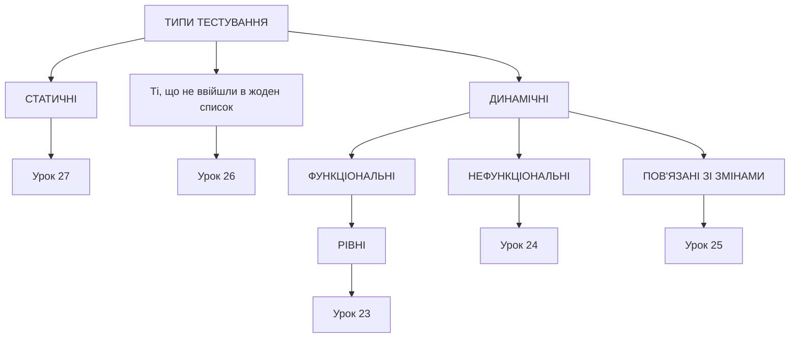

# 28_Типи тестування. Introduction

# Типи тестування

## Types of testing

* **Static**
  * Informal review
  * Walkthrough
  * Technical review
  * Inspection

* **Dynamic**
  * Unit
  * Integration
  * System
  * Acceptance
  * non-functional

# Types of testing

* **Functional Testing**
  * Unit Testing
  * Integration
  * Smoke
  * Acceptance
  * Localization
  * Globalization
  * Interoperability

* **Non-Functional**
  * Performance
  * Endurance
  * Load
  * Volume
  * Scalability
  * Usability

* **Maintenance**
  * Regression
  * Maintenance

- **Functional**
  - Security
  - Interoperability
  - Functional :)
- **Changes related**
  - Regression
  - Re-testing
  - Smoke
  - Sanity

- **Non-functional**
  - Performance
    - Load
    - Stress
    - Volume
  - Usability
  - Configuration
  - UI / GUI
  - Localization
  - Internationalization

## Коротше...

# Функціональні типи або Рівні тестування

# Unit, юніт, модульне, компонентне тестування

* Це маленькі тести, які тестують найменшу одиницю функціоналу: 2+2=4
* Ці тести пишуть програмісти кодом, щоб перевірити свою роботу
    * Написали функцію додавання
    * Якщо 2+2 рівне 4, то тест пройшов
    * Якщо 2+2 не рівне 5, то тест пройшов

# Інтеграційне тестування

* Проводять також програмісти
* Перевіряють взаємодію 2 (і більше) модулів

# Системне тестування

* Проводять тестувальники
* Системне тестування спрямоване на перевірку всього додатку як єдиного цілого, зібраного з частин, перевірених на двох попередніх стадіях. Тут не тільки виявляються дефекти «на стиках» компонентів, але і з'являється можливість повноцінно взаємодіяти з додатком з погляду кінцевого користувача, застосовуючи безліч інших видів тестування, перерахованих у цьому розділі.

# Вам здавалось що все легко, ага?

## Acceptance тестування (приймальне, прийомки та інші звірі)

* Проводять тестувальники
* Тестують на відповідність Acceptance Criteria
* Якщо Acceptance тестування не пройшло, реліз заборонений

# Alpha, Beta, Gamma testing

* **Альфа-тестування** виконується всередині організації з можливим частковим залученням кінцевих користувачів. Може бути формою внутрішнього приймального тестування. У деяких джерелах зазначається, що це тестування має проводитися без залучення команди розробників, але інші джерела не висувають такої вимоги. Суть цього виду коротко: продукт уже можна періодично показувати зовнішнім користувачам, але він ще досить «сирий», тому основне тестування виконується організацією-розробником.

* **Бета-тестування** виконується поза організацією розробників з активним залученням кінцевих користувачів/замовників. Може бути формою зовнішнього приймального тестування. Суть цього виду коротко: продукт вже можна відкрито показувати зовнішнім користувачам, він вже досить стабільний, але проблеми все ще можуть бути, і для їх виявлення потрібний зворотний зв'язок від реальних користувачів.

* **Гамма-тестування** – фінальна стадія тестування перед випуском продукту, спрямовану на виправлення незначних дефектів, виявлених у бета-тестуванні. Як правило, також виконують з максимальним залученням кінцевих користувачів/замовників. Може бути формою зовнішнього приймального тестування. Суть цього виду коротко: продукт вже майже готовий, і зараз зворотний зв'язок від реальних користувачів використовується для усунення останніх недоробок.

# Рівні тестування

# Нефункціональні типи тестування

## Performance - робота при навантаженні

* **Load** - перевірка поведінки системи при навантаженні
* **Stress** - навантаження до відключення системи
* **Recovery** - здатність до відновлення
* **Volume** - перевірка швидкості програми при зміні розмірів бази даних
* **Scalability** - можливість збільшити навантаження, к-ть юзерів, розмір БД
* **Endurance = Soak** - як с-ма поводиться за постійного використання (протягом довгого періоду часу)

* UI - User Interface
* UX - User eXperience
* Usability
  * Learnability
  * Memorability
  * Satisfaction
  * Errors

## Пов'язані з системою

* Configuration = Compatibility - як програма працює на різних системах
* Portability - простота зміни системи, наприклад, ОС

## Пов’язані з локалізацією

* **Localization or L10N** — перевірка коректності та якості перекладу та адаптації до національних особливостей.
* **Internationalization or I18N** — перевірка на готовність продукту працювати з національними особливостями. Як поведе себе програма, якщо...?
* **Globalization or G11N** = I18N, але не по конкретній націоналі, а по всіх.

# Пов'язані зі змінами типи тестування

## Типи тестування, пов'язані зі змінами

* Re-testing або Confirmation testing - пере-перевіряємо виправлений баг
* Smoke testing - перевірка найважливішої функціональності, непрацездатність якої робить беззмістовною саму ідею використання програми.
* Regression testing - перевірка того, що в раніше працездатній функціональності не з'явилися помилки, викликані змінами в програмі.
* Sanity testing - по ISTQB те саме, що і Smoke. В інших теоріях це тестування функції вглиб, детально, на відповідність вимогам, після змін в програмі.

* Регресія - це процес активного тестування ПЗ перед релізом (2-4 тижні).
* У розробників code freeze - вони не можуть писати нові фічі, лиш фіксять баги

* Спершу тестувальники проводять Smoke test. Якщо там є баги — продовжувати нема сенсу.
* Якщо Smoke tests пройшли, переходимо до регресії.
* Всі тести перевірити не вдасться, тоді тести пріоритизуються і малюються Impact Analysis.

* Під час регресії шукаємо і документуємо баги, а коли їх виправлять - робимо re-testing.
* Потім регресія закінчується, всіх хвалять, дякують, і починається наступний реліз.

# Типи тестування, які не ввійшли в попередні уроки

# Install / Uninstall testing

* Installation / Uninstallation Робота, зосереджена на тому, ЩО потрібно буде зробити клієнтам, щоб успішно встановити та налаштувати нове програмне забезпечення. Цей тип тестування може включати процеси встановлення/видалення програми з нуля або оновлень.
* Зазвичай виконується інженером з тестування програмного забезпечення разом із менеджером конфігурації.
* Також цей процес може включати створення гайдів з встановлення ПЗ.

## Security testing

* **Security** — тестування, спрямоване на перевірку здатності програми протистояти зловмисним спробам отримання доступу до даних або функцій, права на доступ до яких у зловмисника немає.

## Accessibility testing

* Accessibility Testing: тип тестування, що перевіряє зручність користування програмою для людей з обмеженими можливостями (з обмеженням зору, слуху, ментальними хворобами тощо).

## Ad-hoc testing

Ad-hoc Testing: тестування проводиться без планування і документації, тестувальник намагається “зламати” систему під час використання її функціональності.

Fuzz testing, Random testing, Monkey testing.

## End-to-end testing

End-to-end тестування — це метод тестування програмного забезпечення, який перевіряє все програмне забезпечення від початку до кінця разом із його інтеграцією із зовнішніми інтерфейсами. Метою end-to-end тестування є перевірка всього програмного забезпечення на наявність залежностей, цілісності даних і зв'язку з іншими системами, інтерфейсами та базами даних для виконання повного робочого сценарію.

