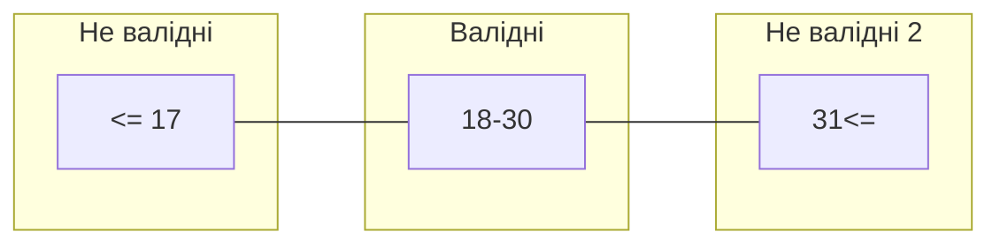

# 38_Граничні значення

# Boundary Values

# Граничні значення

# Еквівалентне розділення

* Аналіз граничних значень перевіряє межі числового діапазону
* Значення з валідного діапазону називаються валідні граничні значення, та якщо з невалідного діапазону - невалідні значення
* Граничні значення визначаються як ЛГ, ЛГ-1, ПГ, ПГ+1, де ЛГ та ПГ - це нижня та верхня межі у сценарії

# Пояснювальна бригада

- $-\infty - 17$ — не валідні (ЛГ-1: 17)
- $18 - 60$ — валідні (ЛГ: 18, ПГ: 60)
- $61 - \infty$ — не валідні (ПГ+1: 61)

## Питання з ISTQB #1

Текстове поле в програмі приймає введення віку користувача. Значення від 18 до 30, включаючи 18 і 30, будуть прийняті системою. Використовуючи техніку Граничних значень, яка мінімальна кількість тестів кейсів потрібна для максимального покриття?

## Питання з ISTQB #2

Текстове поле в програмі приймає введення віку користувача. Значення від 18 до 30, включаючи 18 і 30, будуть прийняті системою.  
Використовуючи техніку межових значень, який варіант відповіді містить валідну колекцію граничних значень?

1. 16, 17, 19, 30
2. 17, 18, 19, 31
3. **17, 18, 30, 31**
4. 18, 19, 20, 31

| Не валідні `<= 17` | Валідні `18-30` | Не валідні `31<=` |
| :---: | :---: | :---: |
| ● ● | | ● ● |

## Питання з ISTQB #3

Текстове поле в програмі приймає введення віку користувача. Значення від 18 до 30, включаючи 18 і 30, будуть прийняті системою. Використовуючи техніку Граничних значень та Еквівалентного поділу, який варіант відповіді містить валідні граничні значення та валідне еквівалентне значення?

1. 17, 18, 20
2. **18, 30, 25**
3. 18, 30, 31
4. 19, 20, 31

## Де можна використовувати цю техніку?

Всюди, де є числові обмеження:

* вік
* довжина паролю
* номер телефону

### Навіщо потрібна ця техніка?

Для того, щоб люди не тестували 10 символів у паролі, які нікому не потрібні, тому що вони знаходяться на проміжку між 6 і 16. Для того, щоб не тестувати вік 20, 30, 40, тому що всі ці значення знаходяться між 18 і 60. **Тому що всі ці перевірки будуть безглузді, адже ми вже протестували граничні значення.**

