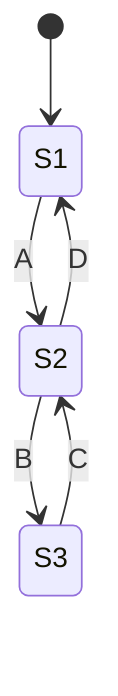
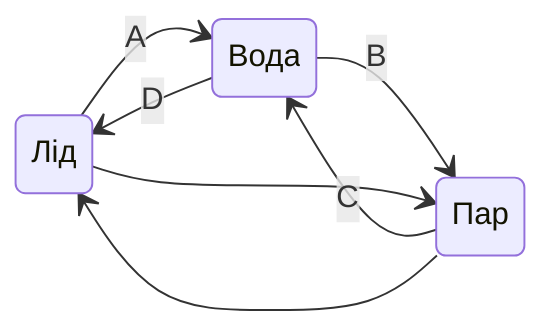
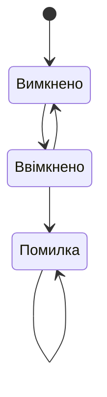
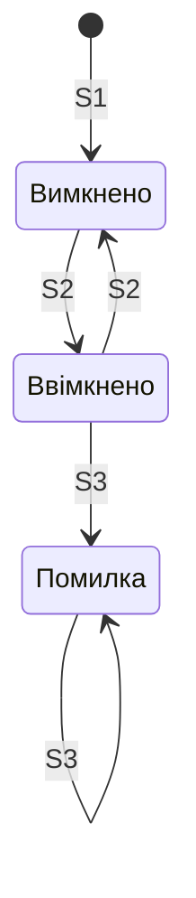
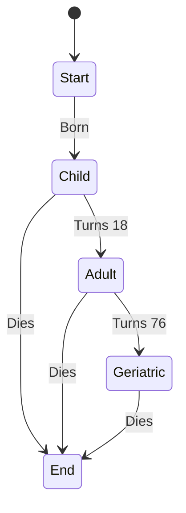
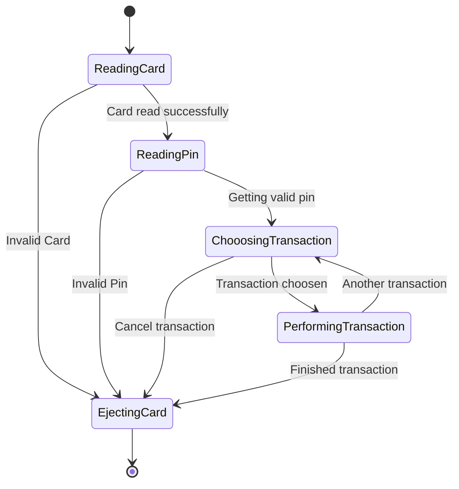
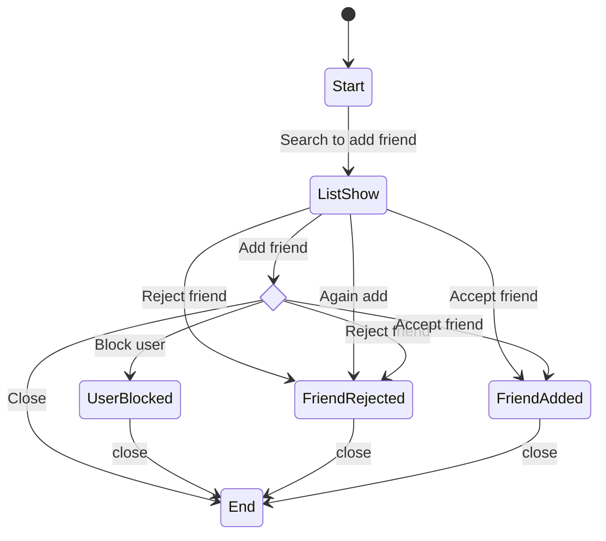

# 42_State transition diagram

# State transition diagram

## Діаграма переходу станів

* Діаграма переходу станів показує початковий і кінцевий стан системи, а також описує переходи між станами.
* Діаграма переходу станів показує лише валідні переходи.
* Діаграма складається з пар переходів між двома станами.
* Якщо переходу між двома станами немає, то перехід вважається НЕвалідним.

## Діаграма переходу станів

| Test Case ID | TC01 | TC02 | TC03 | TC04 |
| :--- | :--- | :--- | :--- | :--- |
| Початковий стан | Лід | Вода | Вода | Пар |
| Перехід | A | D | B | C |
| Фінальний стан | Вода | Лід | Пар | Вода |

Ґрунтуючись на діаграмі переходу станів вмикача, який тест невалідний?

* Вимкнено-> ввімкнено
* Ввімкнено -> вимкнено
* Помилка -> ввімкнено
* Ввімкнено -> помилка

Грунтуючись на діаграмі переходу станів вмикача, який тест невалідний?

* Вимкнено -> ввімкнено
* Ввімкнено -> вимкнено
* **Помилка -> ввімкнено**
* Ввімкнено -> помилка

Грунтуючись на діаграмі переходу станів вмикача, який тест невалідний?

* Вимкнено-> ввімкнено
* Ввімкнено -> вимкнено
* **Помилка -> ввімкнено**
* Ввімкнено -> помилка

## Приклад з відкритого доступу #1

## Приклад з відкритого доступу #2

## Приклад з відкритого доступу #3

[https://app.diagrams.net/](https://app.diagrams.net/)

