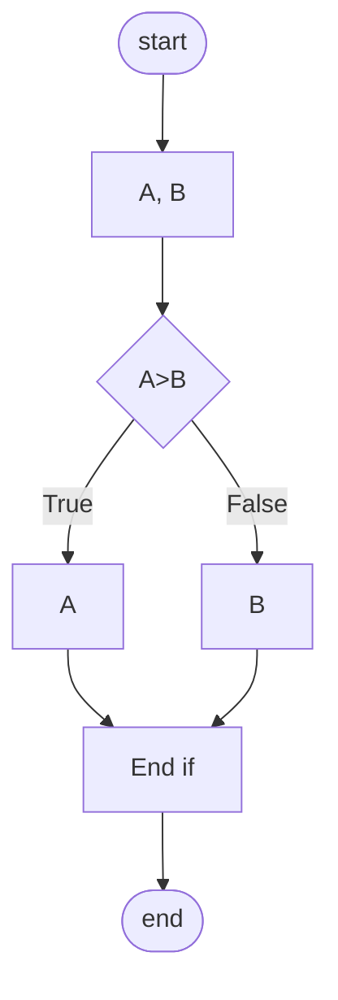
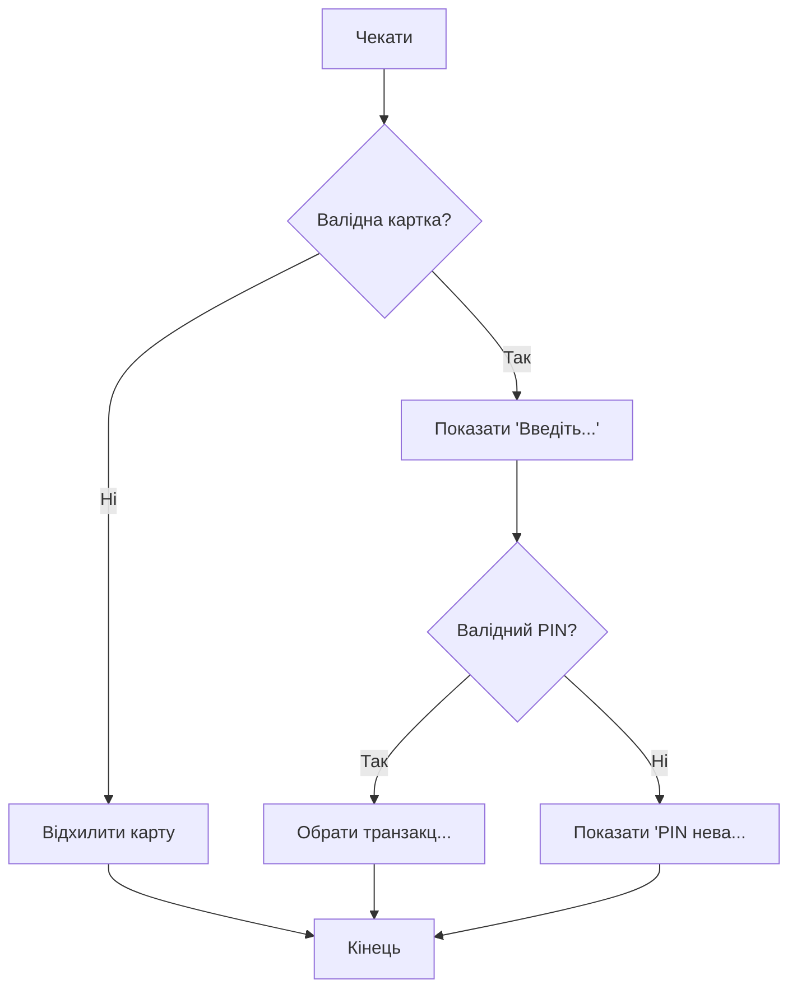
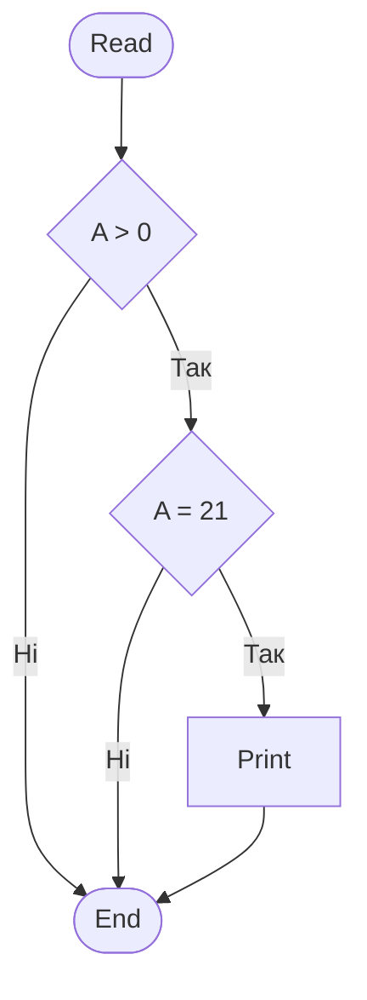
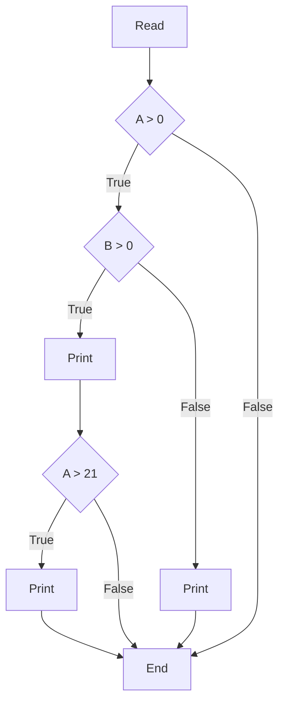
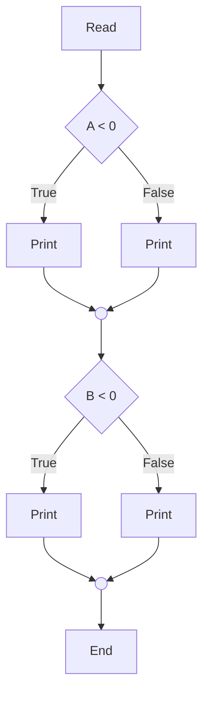
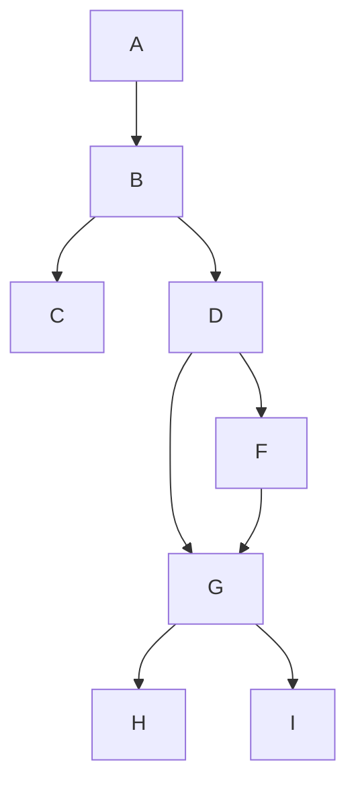

# 44_Statement coverage

# Statement coverage

## Покриття операторів

# Вступ до технік білого ящика

* Statement testing (тестування операторів) тестує оператори в даному фрагменті коду
* Decision testing (тестування умов) тестує умови в даному фрагменті коду
* Тестування умов ще відоме як Branch testing
* Тестування умов сильніше, ніж тестування операторів.
* 100% покриття умов гарантує 100% покриття операторів, але не навпаки.

# Пояснювальна бригада - блок-схеми

```text
Read A
Read B
If A>B then
    Print “А більше”
Else
    Print “В більше”
End if
```

Шлях - це проходження по коду, починаючи з точки старт і закінчуючи точкою кінець.


## Пояснювальна бригада - блок-схеми

```text
Read A
Read B
If A>B then
    Print “А більше”
Else
    Print “В більше”
End if
```

Скільки потрібно створити мінімум тест кейсів на 100% statement покриття?



* **Statement coverage** = мін. к-ть шляхів, потрібна для покриття всіх statements
* **Statement coverage** = 2

## Приклад #1

> **TIP:** Statement coverage = 1 + к-ть ELSE

* Чекати, щоб вставили картку
* IF карта валідна THEN
  * показати “Введіть PIN-код”
  * IF PIN валідний THEN
    * вибрати транзакцію
  * ELSE
    * показати “PIN невалідний”
* ELSE
  * відхилити карту

**Statement coverage = 3**



## Приклад #2

```text
Read A

IF A > 0 THEN
    IF A = 21 THEN
        Print “Key”
    ENDIF
ENDIF

Statement coverage = 1
```



# Приклад #3

Statement coverage = 2

Read A
Read B
IF A > 0 THEN
    IF B = 0 THEN
        Print “No values”
    ELSE
        Print B
        IF A > 21 THEN
            Print A
        ENDIF
    ENDIF
ENDIF



## Приклад #4

Statement coverage = 2

```text
Read A
Read B

IF A < 0 THEN
    Print "A negative"
ELSE
    Print "A positive"
ENDIF

IF B < 0 THEN
    Print "B negative"
ELSE
    Print "B positive"
ENDIF
```



* **TIP: Якщо є ELSE Statement покриття = 2**
* **Якщо немає ELSE Statement покриття = 1**

## Приклад #5

Для цього фрагмента коду було проведено такі шляхи/тести. Яке statement покриття досягнуто?

* Тест 1 - A, B, C
* Тест 2 - A, B, D, G, H

1. 50%
2. 75%
3. 90%
4. 100%

Statement покриття = кількість тверджень виконано / загальна кількість тверджень

6 із 8 тверджень перевірено



