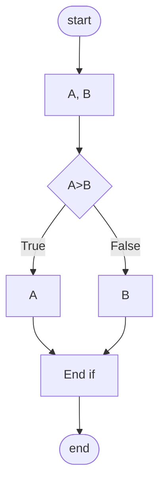
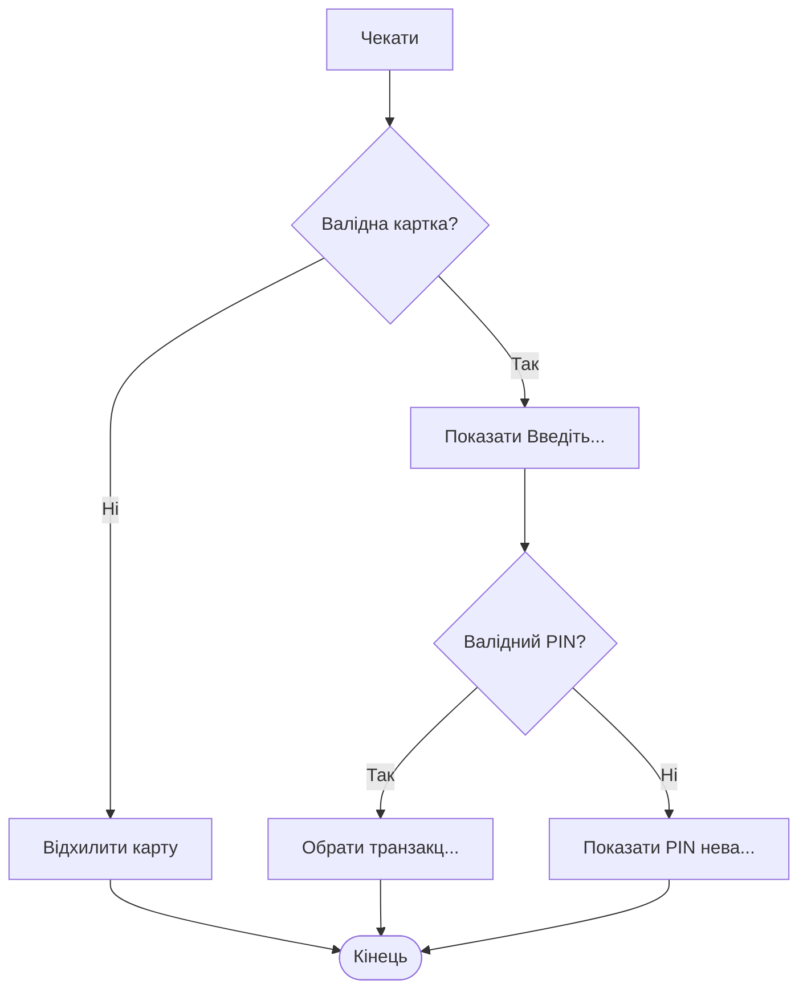
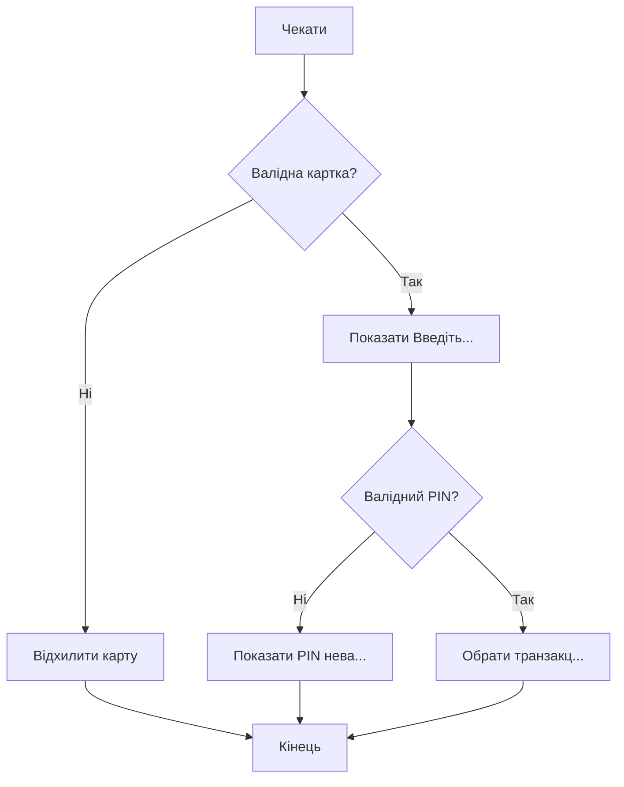
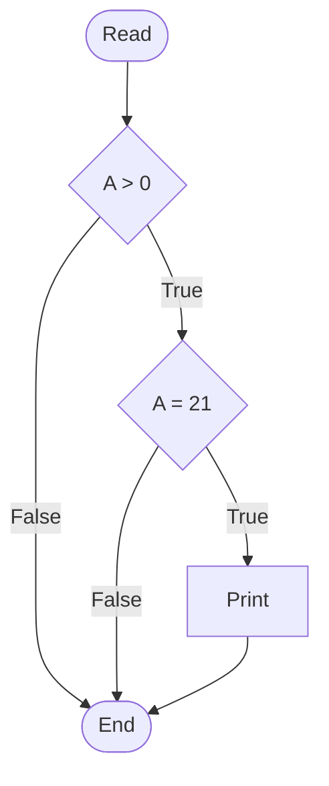
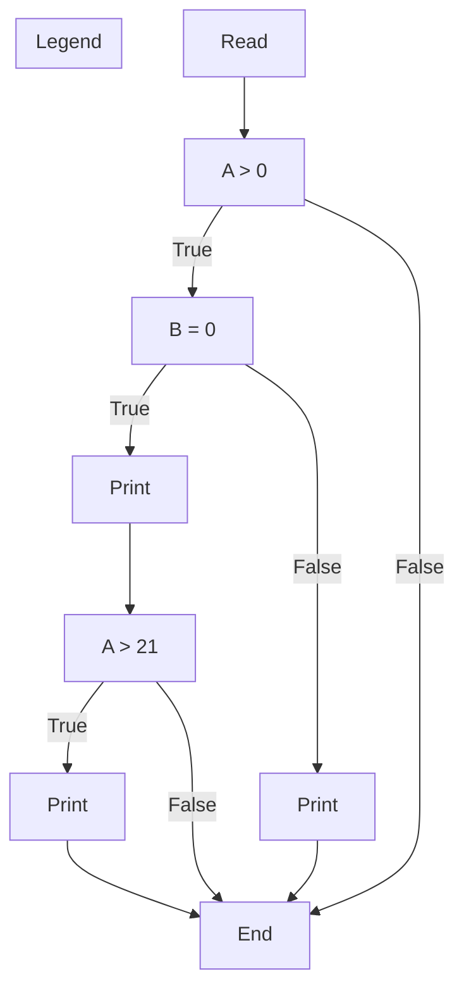
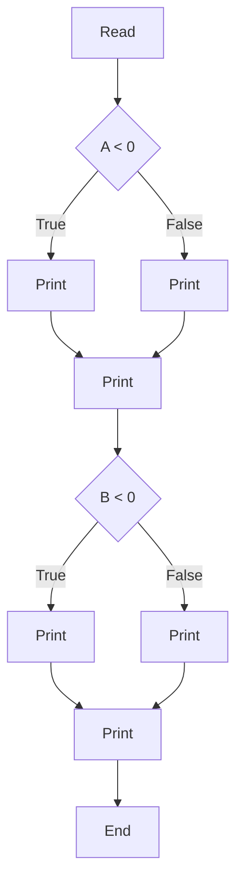
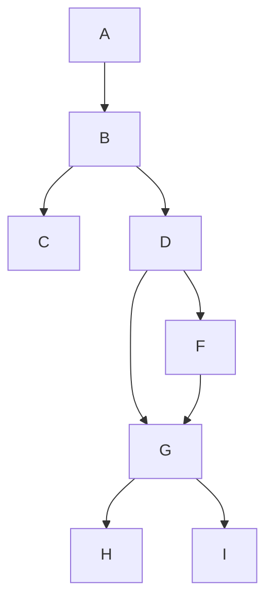

# 45_Decision coverage

# Decision coverage

## Покриття умов

# Вступ до технік білого ящика

* Statement testing (тестування операторів) тестує оператори в даному фрагменті коду
* Decision testing (тестування умов) тестує умови в даному фрагменті коду
* Тестування умов ще відоме як Branch testing
* Тестування умов сильніше, ніж тестування операторів.
* 100% покриття умов гарантує 100% покриття операторів, але не навпаки.

# Пояснювальна бригада - блок-схеми

```text
Read A
Read B
If A>B then
    Print “А більше”
Else
    Print “В більше”
End if
```

Шлях - це проходження по коду, починаючи з точки старт і закінчуючи точкою кінець.



# Пояснювальна бригада - блок-схеми

```text
Read A
Read B
If A>B then
    Print “А більше”
Else
    Print “В більше”
End if
```

Скільки потрібно створити мінімум тест кейсів на 100% decision покриття?


* **Decision coverage** = мін. к-ть шляхів, потрібна для покриття всіх branches
* **Decision coverage** = 2

## Приклад #1

Чекати, щоб вставили картку

IF карта валідна THEN
  показати "Введіть PIN-код"
  IF PIN валідний THEN
    вибрати транзакцію
  ELSE
    показати "PIN невалідний"
ELSE
  відхилити карту



## Приклад #1

**TIP: Decision coverage = 1 + к-ть IF (у statement - else)**

Чекати, щоб вставили картку
- IF карта валідна THEN
    - показати “Введіть PIN-код”
    - IF PIN валідний THEN
        - вибрати транзакцію
    - ELSE
        - показати “PIN невалідний”
- ELSE
    - відхилити карту

**Decision coverage = 3**



## Приклад #2

```text
Read A

IF A > 0 THEN
    IF A = 21 THEN
        Print “Key”
    ENDIF
ENDIF
```

**Decision coverage = 3**



# Приклад #3

Decision coverage = 4

Read A
Read B
IF A > 0 THEN
    IF B = 0 THEN
        Print “No values”
    ELSE
        Print B
    IF A > 21 THEN
        Print A
    ENDIF
    ENDIF
ENDIF



## Приклад #4

Decision coverage = 2

```text
Read A
Read B
IF A < 0 THEN
    Print “A negative”
ELSE
    Print “A positive”
ENDIF
IF B < 0 THEN
    Print “B negative”
ELSE
Print “B positive”
ENDIF
```



> **TIP:** Завжди, незалежно від ELSE або IF Decision покриття = 2

## Приклад #5

Для цього фрагмента коду було проведено такі шляхи/тести. Яке decision покриття досягнуто?

* Тест 1 - A, B, C
* Тест 2 - A, B, D, G, H

Decision покриття = кількість branches виконано / загальна кількість branches

1. 50%
2. **62%** (5 із 8 branches перевірено)
3. 75%
4. 100%



