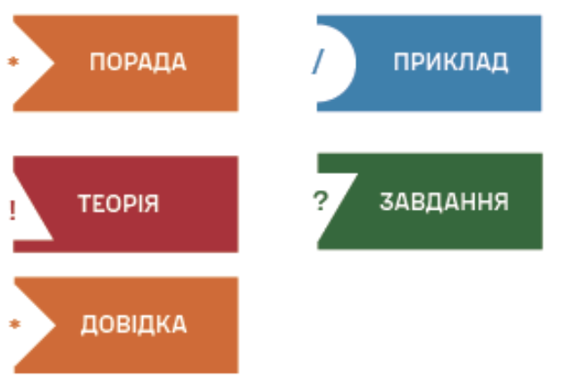

## Вступ

Тестування програмного забезпечення — невідємна частина створення будь який інформаційних систем: без нього жоден продукт не може вважатися по-справжньому готовим до реального світу. Однак сьогодні, в еру стрімкого розвитку LLM-моделей, ця, здавалося б, усталена дисципліна переживає справжню трансформацію — перед нами постають нові виклики, яких не існувало ще кілька років тому, і водночас відкриваються нові підходи, здатні докорінно змінити те, як ми розуміємо якість програмного забезпечення. Цей посібник — про те, як переконатися, що програмне забеспечення справді працює. Він присвячений фундаментальним основам тестування програмного забезпечення: ми пройдемо шлях від базових принципів і рівнів тестування до тонкощів оцінювання якості, роботи з метриками та управління тестовими процесами.

Читач крок за кроком зануриться в те, як влаштовані життєві цикли розроблення та тестування ПЗ — SDLC і STLC, познайомиться з сучасними методологіями розроблення та зрозуміє, яку роль тестування відіграє на кожному етапі — від задуму до релізу. Ми розглянемо основні техніки тест-дизайну, навчимося аналізувати вимоги та ризики, а також розберемося, як грамотно планувати й організовувати тестовий процес, щоб він не перетворювався на хаос.

Окреме місце в книзі посідають моделі та стандарти якості ISO/IEC — ті самі «правила гри», за якими оцінюють програмні продукти в усьому світі. Ми поговоримо про внутрішні та зовнішні властивості програмного забезпечення, про якість у використанні, а також про програмні метрики — інструменти, які дають змогу перетворити суб'єктивне враження «здається, працює добре» на об'єктивні, вимірювані показники.

Завершують посібник теми, без яких сьогодні неможливо уявити індустрію: управління тестуванням, аналіз результатів, автоматизація тестових процесів, а також сучасні практики DevOps і забезпечення якості — ті підходи, що дозволяють командам випускати надійний продукт швидко й без зайвого ризику.

### Перший розділ

Перший розділ посібника знайомить здобувача з фундаментальними основами тестування програмного забезпечення, його еволюцією та роллю в сучасному життєвому циклі розробки. Ознайомлює з ключовими поняттями забезпечення якості (QA), контролю якості (QC) та безпосередньо тестування, розкриваючи їх взаємозв'язок і відмінності. Надає практичні рекомендації щодо організації фундаментального процесу тестування, побудови матриць відстежуваності вимог та критеріїв початку й завершення перевірок. Особлива увага приділяється 7 базовим принципам тестування, психології взаємодії всередині команди та етиці комунікації між інженерами та розробниками. Розділ завершується виконанням першого практичного завдання з дизайну тест-кейсів для реального застосунку, що дасть змогу застосувати отримані теоретичні знання на практиці.

### Другий розділ

Дургий роздлі посібника знайомить здобувача з базовою теорією тестування, детально розкриваючи чотири класичні рівні перевірки програмного забезпечення від модульного до приймального. Ознайомлює з різноманітними видами тестування, включаючи функціональні, структурні та нефункціональні аспекти, з особливим акцентом на сучасні стандарти безпеки OWASP 2025 та оцінку продуктивності систем. Надає практичні рекомендації щодо застосування формальних технік тест-дизайну для методів «чорної», «білої» та «сірої» скриньок, зокрема еквівалентного розділення, аналізу граничних значень та дослідницького тестування. Особлива увага приділяється життєвому циклу дефектів, правилам класифікації багів за рівнем важкості й пріоритету, а також архітектурі побудови якісних звітів про помилки (Bug Reports). Розділ завершується практичним завданням із розробки тестового покриття та документування знайдених дефектів у системі управління проектами, що дасть змогу закріпити навички тест-аналізу на практиці.

### Трерій розділ

Третій розділ посібника знайомить здобувача з методологіями управління, організації та комплексного оцінювання якості програмного забезпечення на інженерному та управлінському рівнях. Ознайомлює з особливостями побудови процесів тестування у гнучких методологіях Agile (Scrum, Lean) та сучасних DevOps-середовищах, де якість є спільною відповідальністю всієї команди. Надає практичні рекомендації щодо стратегічного планування, ідентифікації та мінімізації ризиків, а також розробки ключових тест-артефактів — від тестової стратегії до підсумкових звітів. Особлива увага приділяється міжнародним стандартам якості ISO/IEC 25010:2023 та ISO/IEC 25019:2023, впровадженню метрик надійності коду й процесу перевірки, а також розгортанню систем наскрізного моніторингу (Synthetic Monitoring & Observability). Розділ завершується практичним завданням із налаштування ELK-стеку та використання MCP-серверів для ШІ-аналізу логів та пошуку першопричин аномалій (Root Cause Analysis), що дозволить опанувати інструменти контролю якості на рівні сучасних вимог індустрії.

## Від Авторів
Цей посібник створено командою фахівців, волонтерів та військовослужбовців, яких об’єднує спільне прагнення розвивати сучасну освіту, технології та професійні компетентності, необхідні для зміцнення Сил оборони України та розвитку суспільства.

Наш практичний досвід охоплює дослідження і розроблення технологій (R&D), MilTech, управління проєктами, розроблення програмного забезпечення та роботу з реальними технологічними й організаційними викликами. Цей досвід дав нам можливість побачити, наскільки важливо поєднувати фундаментальні знання з практикою та формувати у майбутніх фахівців не лише теоретичне розуміння, а й здатність застосовувати набуті знання для розв’язання реальних задач.

Саме тому цей посібник є не лише систематизованим викладом навчального матеріалу, а й спробою поєднати академічну підготовку з практичним досвідом сучасної ІТ-галузі та технологічного середовища Сил оборони України.

Окрему подяку висловлюємо курсантам Військового інституту телекомунікацій та інформатизації імені Героїв Крут. Саме їхня допитливість, прагнення до знань і готовність долати труднощі є для нас важливим стимулом у створенні цього посібника. Ми прагнули не лише передати знання, а й запалити вогонь цікавості до навчання — бажання ставити запитання, шукати відповіді, досліджувати нове та невпинно розширювати межі власних можливостей.

Навчання не завжди є легким шляхом: воно потребує наполегливості, терпіння та готовності долати перешкоди. Проте саме цей шлях, де кожен подоланий бар’єр відкриває нові горизонти, веде до професійного зростання.

Ми переконані, що освіта є одним із стовпів існування держави. Саме тому прагнемо зробити цей посібник практичним інструментом, який допоможе майбутнім фахівцям сформувати міцну основу знань, розвинути системне мислення та бути готовими до вирішення складних професійних завдань.

## Як читати цю книгу

Створюючи цей посібник, ми свідомо спиралися на досвід і методологічні напрацювання Digital Handbook від , Development & Implementation Department, що є структурним підрозділом Центру масштабування технологічних рішень Міністерства оборони України. Саме цей досвід став для нас орієнтиром у тому, як можна поєднати системність викладу з практичною цінністю матеріалу.

Водночас ми не обмежувалися лише вітчизняними напрацюваннями, ми уважно стежили за тими тенденціями, які сьогодні формують і задають сучасні розвинені LLM-моделі — від способів структурування знань до нових форматів подачі складного технічного матеріалу. Це дозволило нам поєднати перевірену часом методичну майстерність з, сучасними інстументами.

Головна мета, яку ми ставили перед собою, — пояснювати складні речі просто, зрозуміло й водночас без спрощення суті. Ми прагнули, щоб кожен розділ був не просто викладом теорії, а живим діалогом із читачем: щоб складні концепції розкривалися поступово, крок за кроком, через приклади, аналогії та практичні ілюстрації. Окрім цього, для нас було принципово важливо дати читачеві змогу максимально інтерактивно взаємодіяти з текстом — саме тому ми інтегрували в посібник QR-коди, які ведуть до додаткових матеріалів, відеоресурсів, першоджерел та практичних завдань. Таким чином, книга перестає бути лише паперовим (чи цифровим) текстом і перетворюється на своєрідний портал до ширшого освітнього середовища.

Щоб виклад не був сухим, монотонним і одноманітним, — ми доклали чимало зусиль до того, аби урізноманітнити текст різного роду графічними елементами: схемами, діаграмами, інфографікою, таблицями порівнянь. Кожен такий елемент дібраний не випадково, а залежно від рівня важливості інформації, яку він покликаний передати, та від її типу — чи йдеться про концептуальну модель, практичний алгоритм, історичну довідку або порівняльний аналіз підходів.

І, нарешті, оскільки перед вами саме повноцінний посібник, а не стислий конспект чи шпаргалка, нам було принципово важливо максимально насичити його зовнішніми посиланнями на першоджерела, наукові праці та професійні матеріали. Це зроблено не заради формальності, а з цілком конкретною метою — показати читачеві тяглість розвитку інформаційних технологій, продемонструвати його тісний і часто неочевидний зв'язок з іншими доменами знань, а також віддати належне ролі конкретних людей — дослідників, інженерів, практиків — у розвитку технологій тестування та комп'ютерних наук загалом. Адже жодна технологія не з'являється в вакуумі: за кожною концепцією, стандартом чи методологією стоїть історія людських пошуків, помилок і відкриттів, і ми хотіли, щоб ця історія залишалася видимою для читача.
