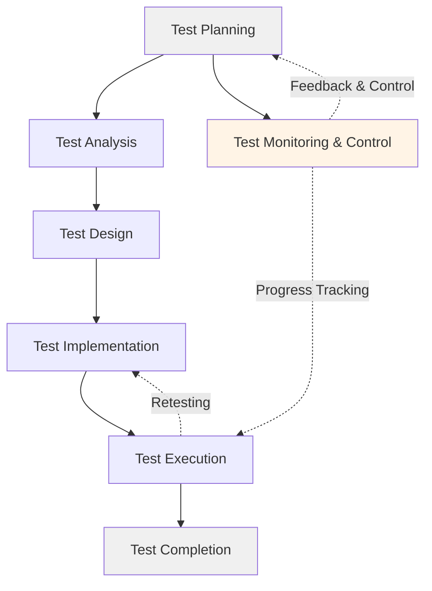
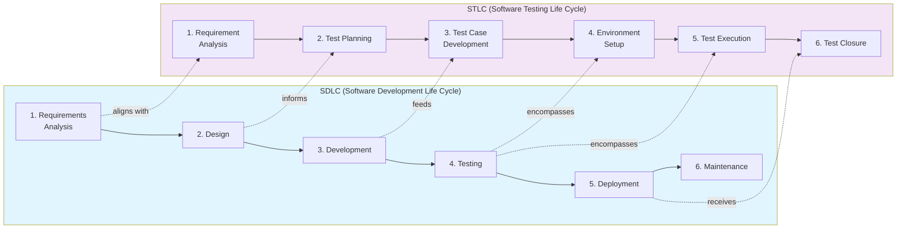

# Глава 3: Процеси та цикли тестування

**Мета глави:** Ознайомити читача з фундаментальними процесами тестування програмного забезпечення, циклом розробки тестування (STLC), критеріями входу та виходу, а також основними матрицями, що використовуються для контролю якості. Глава надає практичні знання про те, як організувати та керувати тестуванням на кожному етапі розробки ПЗ.

---

# 

## 3.1. Фундаментальний процес тестування

Фундаментальний процес тестування визначає структуровану послідовність дій, які необхідно виконати для забезпечення якості програмного продукту. Згідно з міжнародним стандартом **ISTQB Certified Tester Foundation Level (CTFL) v4.0** (2023–2026 рр.), процес тестування охоплює **7 основних активностей** (activities), кожна з яких має власні цілі, завдання та артефакти.

### Сім активностей фундаментального процесу тестування (ISTQB v4.0)

Процес тестування — це не хаотичне виконання тест-кейсів, а систематична діяльність, що охоплює всі етапи життєвого циклу розробки програмного забезпечення. На відміну від попередніх версій ISTQB, версія 4.0 виокремлює Аналіз та Проєктування як окремі активності та додає Моніторинг та контроль як критичну активність. Розглянемо кожну з семи активностей детально.


#### 1) Test Planning (Планування тестування)

**Мета:** Визначити стратегію тестування, оцінити ресурси, час і ризики.

**Основні завдання:**
- Визначення обсягу тестування (scope)
- Оцінка трудомісткості та часу (effort estimation)
- Розподіл ролей та відповідальності
- Ідентифікація та аналіз ризиків
- Вибір підходу до тестування (мануальне, автоматизоване, змішане)
- Визначення середовища тестування (test environment)
- Встановлення критеріїв входу та виходу (Entry/Exit Criteria)

**Артефакти:**
- Стратегія тестування (Test Strategy)
- План тестування (Test Plan)
- Оцінка витрат ресурсів (Effort Estimate)
- Матриця ризиків (Risk Assessment)

**Приклад:** На етапі планування для веб-додатку e-commerce команда визначає, що необхідно протестувати функціональність кошика, оплату, авторизацію користувачів. Оцінюється, що на тестування знадобиться 3 тестувальники протягом 2 тижнів. Ідентифікується ризик: інтеграція з платіжним шлюзом може затриматися.

#### 2) Test Analysis (Аналіз тестування)

**Мета:** Зрозуміти **що** тестувати на основі тестової основи (test basis).

**Основні завдання:**
- Аналіз тестової основи (test basis): вимоги, специфікації, user stories
- Визначення тестових умов (test conditions)
- Ідентифікація тестувальних вимог (testable requirements)
- Уточнення меж тестування (scope)
- Взаємодія з аналітиками та розробниками для уточнення деталей

**Артефакти:**
- Тестові умови (Test Conditions)
- Матриця відстежуваності вимог (RTM — Requirements Traceability Matrix, чорновик)
- Виявлені дефекти в документації (Identified Defects)

**Приклад:** Для функції "Додати товар до кошика" аналізуються такі тестові умови:
- Користувач автентифікований
- Товар є в наявності
- Кількість товару > 0
- Товар вже є в кошику (перевірка оновлення кількості)

#### 3) Test Design (Проєктування тестування)

**Мета:** Визначити **як** тестувати, розроблюючи конкретні тест-кейси та сценарії.

**Основні завдання:**
- Вибір технік тестування (еквівалентні класи, граничні значення, таблиці рішень тощо)
- Проєктування тестових сценаріїв (test scenarios)
- Проєктування тестових сценаріїв на основі аналітичних моделей
- Проєктування тестових даних (test data design)
- Визначення можливості автоматизації

**Артефакти:**
- Детальні тест-кейси (Test Cases)
- Тестові сценарії (Test Scenarios)
- Схема тестових даних (Test Data Design)

**Приклад тест-кейсу:**

```
ID: TC_CART_001
Назва: Додати один товар до порожнього кошика
Пріоритет: High
Тип: Positive Testing
Передумови: Користувач автентифікований, кошик порожній

Кроки:
1. Перейти на сторінку товару
2. Натиснути кнопку "Додати до кошика"
3. Перейти до кошика

Очікуваний результат: Товар з'являється в кошику, кількість = 1
Пов'язана умова тестування: TC_2 (користувач автентифікований)
```

#### 4) Test Implementation (Реалізація тестування)

**Мета:** Підготувати конкретні артефакти та середовище для виконання тестування.

**Основні завдання:**
- Написання детальних тест-кейсів на основі проєктування
- Підготовка тестових даних у необхідному форматі
- Налаштування тестового середовища
- Створення тестових скриптів для автоматизації
- Підготовка чек-листів та інших допоміжних артефактів
- Визначення пріоритетів виконання тест-кейсів
- Перевірка готовності середовища (Entry Criteria)

**Артефакти:**
- Остаточні тест-кейси (Finalized Test Cases)
- Підготовлені тестові дані (Test Data)
- Автоматизовані скрипти (Test Scripts)
- Чек-листи тестування (Test Checklists)
- Підтвердження готовності середовища (Test Environment Ready)

**Приклад:** Підготовка тестового середовища для e-commerce:
- Розгортання Build v1.2.0 на test.example.com
- Завантаження тестових даних (1000 товарів, 100 користувачів)
- Налаштування тестового платіжного шлюзу
- Перевірка зв'язку (connectivity) з усіма системами

#### 5) Test Execution (Виконання тестування)

**Мета:** Виконати тест-кейси та зафіксувати результати, виявляючи дефекти.

**Основні завдання:**
- Виконання тест-кейсів (мануальне або автоматизоване)
- Порівняння фактичних результатів з очікуваними
- Реєстрація дефектів (bug reporting)
- Повторне тестування (retesting) після виправлення дефектів
- Регресійне тестування (regression testing)
- Відстеження статусу виконання тестів
- Оновлення тестової документації

**Артефакти:**
- Звіт про виконання тестів (Test Execution Report)
- Звіти про дефекти (Bug Reports)
- Логи виконання (Test Logs)

**Приклад:** Тестувальник виконує TC_CART_001, виявляє, що після додавання товару кількість відображається як "undefined". Створюється баг-репорт:

```
Bug ID: BUG-1234
Severity: High
Priority: High
Опис: Кількість товару відображається як "undefined" після додавання до кошика
Кроки відтворення: [детальні кроки]
Фактичний результат: Кількість = "undefined"
Очікуваний результат: Кількість = 1
Середовище: Chrome 120, Windows 11
```

#### 6) Test Monitoring and Control (Моніторинг та контроль тестування)

**Мета:** Безперервно відстежувати прогрес тестування та контролювати дотримання критеріїв та планів.

**Основні завдання:**
- Моніторинг прогресу виконання тест-кейсів
- Аналіз покриття тестами відносно вимог
- Оцінка дотримання графіку та бюджету
- Аналіз та звітування про метрики тестування
- Ідентифікація та управління ризиками
- Прийняття рішень про коригування плану тестування
- Оцінка якості знайдених дефектів
- Управління статусом дефектів та блокуючих проблем

**Артефакти:**
- Звіти про прогрес (Test Progress Reports)
- Дашборд метрик (Metrics Dashboard)
- Оновлені оцінки ризиків (Risk Assessment Updates)
- Статус-репорти для стейкхолдерів (Status Reports for Stakeholders)

**Приклад моніторингу:**
День 5 тестування:
- Виконано: 50 тест-кейсів з 150 (33.3%)
- Passed: 47 (94%)
- Failed: 3 (6%)
- Requirements Coverage: 60% (90 вимог з 150)
- Critical дефектів виявлено: 2 (блокують подальше тестування)

**Рішення:** Розширити тестування критичних шляхів, затримати тестування низькопріоритетних функцій до виправлення Critical дефектів.

#### 7) Test Completion (Завершення тестування)

**Мета:** Формалізувати завершення циклу тестування та збереження знань для майбутніх проєктів.

**Основні завдання:**
- Архівування тестових артефактів (тест-кейсів, даних, скриптів, логів)
- Фінальна оцінка EXIT Criteria
- Аналіз уроків, винесених з проєкту (lessons learned)
- Документування передового досвіду (best practices)
- Оцінка ефективності та якості процесу тестування
- Підготовка фінального звіту для стейкхолдерів
- Передача знань та оновлена документація команді
- Оновлення тестової документації та test suites для наступних релізів

**Артефакти:**
- Звіт про завершення тестування (Test Completion Report)
- Остаточний звіт про тестування (Final Test Summary Report)
- Документ уроків (Lessons Learned Document)
- Оновлені тест-кейси та автоматизація (Updated Test Suite)
- Підсумкові метрики якості (Test Metrics Summary)

**Приклад уроків, винесених з проєкту:**
- Раннє залучення тестувальників до обговорення вимог зменшило кількість дефектів на 30%
- Автоматизація регресійних тестів заощадила 20 годин на кожному спринті
- Інтеграція з платіжним шлюзом потребує додаткового тестового середовища
- Необхідно розширити тестування на мобільних пристроях у наступних релізах

### Взаємозв'язок активностей

Активності процесу тестування не завжди виконуються строго послідовно. В agile-методологіях вони можуть перекриватися або виконуватися ітеративно. Наприклад, Test Analysis & Design можуть відбуватися одночасно з Implementation, а Test Execution та Test Monitoring and Control можуть тривати паралельно. Test Monitoring and Control виконується як постійний процес впродовж усього циклу.



### Таблиця: Сім активностей, завдання та артефакти

| Активність | Ключові завдання | Основні артефакти |
|-----------|-----------------|-------------------|
| **1. Test Planning** | Визначення стратегії, оцінка ресурсів, аналіз ризиків | План тестування (Test Plan), Стратегія тестування (Test Strategy), Матриця ризиків (Risk Matrix) |
| **2. Test Monitoring & Control** | Стеження за прогресом, контроль метрик, коригування плану | Звіти про прогрес (Test Progress Reports), Дашборд метрик (Metrics Dashboard), Статус-репорти (Status Reports) |
| **3. Test Analysis** | Аналіз вимог, визначення тестових умов | Тестові умови (Test Conditions), МВВ (RTM, чорновик), Виявлені дефекти (Identified Defects) |
| **4. Test Design** | Проєктування тест-кейсів, вибір технік, дизайн даних | Тест-кейси (Test Cases), Тестові сценарії (Test Scenarios), Схема даних (Test Data Design) |
| **5. Test Implementation** | Написання тест-кейсів, підготовка середовища, створення скриптів | Остаточні тест-кейси (Finalized Test Cases), Тестові дані (Test Data), Скрипти (Test Scripts) |
| **6. Test Execution** | Виконання тестів, реєстрація дефектів, ретестинг | Звіт виконання (Test Execution Report), Баг-репорти (Bug Reports), Логи (Test Logs) |
| **7. Test Completion** | Архівування артефактів, аналіз уроків, фінальний звіт | Звіт завершення (Test Completion Report), Документ уроків (Lessons Learned), Оновлена Test Suite |

---

## 3.2. STLC: Цикл розвитку тестування

**Software Testing Life Cycle (STLC)** — це послідовність етапів, які проходить процес тестування від початку проєкту до його завершення. Цей життєвий цикл тісно пов'язаний з **Software Development Life Cycle (SDLC)** і визначає, які дії виконують тестувальники на кожному етапі розробки програмного забезпечення.


### Взаємозв'язок STLC та SDLC

STLC не існує ізольовано — він інтегрований у SDLC. Кожна фаза SDLC має відповідну фазу в STLC. Це забезпечує раннє виявлення дефектів (принцип Shift-Left) та економить ресурси. Важливо, що **Test Monitoring and Control** виконується паралельно з усіма етапами STLC впродовж усього циклу, а не тільки на одному етапі.



### Шість етапів STLC

#### Етап 1: Requirement Analysis (Аналіз вимог)

**Мета:** Зрозуміти вимоги з точки зору тестування та визначити тестовні вимоги.

**Діяльність тестувальників:**
- Вивчення функціональних та нефункціональних вимог
- Ідентифікація тестовних вимог (testable requirements)
- Аналіз можливості автоматизації
- Виявлення неоднозначностей у вимогах
- Участь у перегляді вимог

**Вхідні дані:**
- Документація вимог (SRS — Software Requirements Specification)
- User Stories
- Use Cases

**Вихідні дані:**
- RTM (Requirements Traceability Matrix)
- Automation Feasibility Report (звіт про можливість автоматизації)

**Критерії виходу:**
- Всі вимоги проаналізовані
- Неоднозначності вирішені
- RTM створена

#### Етап 2: Test Planning (Планування тестування)

**Мета:** Визначити стратегію та підхід до тестування.

**Діяльність тестувальників:**
- Оцінка зусиль (effort estimation)
- Вибір інструментів тестування
- Розподіл ролей та відповідальності
- Визначення типів тестування (функціональне, регресійне, продуктивності тощо)
- Планування ризиків

**Вхідні дані:**
- Вимоги
- RTM
- Automation Feasibility Report

**Вихідні дані:**
- Test Plan
- Test Strategy
- Effort Estimation Document

**Критерії виходу:**
- Test Plan затверджений
- Ресурси виділені
- Інструменти обрані

#### Етап 3: Test Case Development (Розробка тест-кейсів та сценаріїв)

**Мета:** Створити детальні тест-кейси та тестові дані.

**Діяльність тестувальників:**
- Написання тест-кейсів
- Розробка тестових сценаріїв
- Створення тестових даних
- Розробка скриптів автоматизації
- Перегляд тест-кейсів

**Вхідні дані:**
- RTM
- Test Plan
- Вимоги

**Вихідні дані:**
- Test Cases
- Test Data
- Test Scripts (для автоматизації)

**Критерії виходу:**
- Тест-кейси покривають усі вимоги
- Тест-кейси пройшли перегляд
- Тестові дані підготовлені

#### Етап 4: Test Environment Setup (Налаштування тестового середовища та даних)

**Мета:** Підготувати середовище для виконання тестів.

**Діяльність тестувальників:**
- Підготовка тестових серверів
- Налаштування баз даних
- Встановлення необхідного ПЗ
- Підготовка тестових пристроїв (для мобільного тестування)
- Перевірка доступності середовища
- Підготовка інструментів моніторингу

**Вхідні дані:**
- Test Plan
- Smoke Test Cases

**Вихідні дані:**
- Готове тестове середовище
- Environment Setup Report

**Критерії виходу:**
- Середовище налаштоване
- Smoke тести пройшли успішно
- Доступ до середовища наданий команді

#### Етап 5: Test Execution (Виконання тестів та реєстрація результатів)

**Мета:** Виконати тест-кейси та зареєструвати результати.

**Діяльність тестувальників:**
- Виконання тест-кейсів
- Порівняння фактичних та очікуваних результатів
- Реєстрація дефектів
- Відстеження статусу дефектів
- Ретестинг після виправлення
- Регресійне тестування
- Оновлення тест-кейсів (якщо потрібно)

**Вхідні дані:**
- Test Cases
- Test Data
- Готове тестове середовище

**Вихідні дані:**
- Test Execution Report
- Bug Reports
- Updated Test Cases

**Критерії виходу:**
- Усі тест-кейси виконані
- Критичні дефекти виправлені
- Exit Criteria досягнуті

#### Етап 6: Test Cycle Closure (Завершення циклу та аналіз результатів)

**Мета:** Оцінити результати тестування та підготувати звіти.

**Діяльність тестувальників:**
- Аналіз покриття тестами
- Підготовка метрик (Test Metrics)
- Оцінка якості продукту
- Документування уроків
- Підготовка фінального звіту
- Архівування тестових артефактів

**Вхідні дані:**
- Test Execution Report
- Bug Reports
- Test Coverage Data

**Вихідні дані:**
- Test Closure Report
- Test Metrics Report
- Lessons Learned Document

**Критерії виходу:**
- Всі звіти підготовлені
- Уроки задокументовані
- Артефакти заархівовані

### Таблиця: Етапи STLC, діяльність та артефакти

| Етап STLC | Основна діяльність | Вхідні дані | Вихідні дані | Критерії виходу |
|-----------|-------------------|-------------|--------------|-----------------|
| **Requirement Analysis** | Аналіз вимог, виявлення неоднозначностей | SRS, User Stories | RTM, Automation Feasibility Report | Всі вимоги проаналізовані |
| **Test Planning** | Розробка стратегії, оцінка зусиль | Вимоги, RTM | Test Plan, Test Strategy | Test Plan затверджений |
| **Test Case Development** | Написання тест-кейсів та даних | RTM, Test Plan | Test Cases, Test Data | Тест-кейси покривають вимоги |
| **Environment Setup** | Налаштування тестового середовища | Test Plan, Smoke Tests | Готове середовище | Smoke тести пройшли |
| **Test Execution** | Виконання тестів, реєстрація дефектів | Test Cases, Середовище | Test Execution Report, Bug Reports | Всі тест-кейси виконані |
| **Test Cycle Closure** | Аналіз результатів, підготовка звітів | Execution Report, Bug Reports | Test Closure Report, Metrics | Звіти підготовлені |

### Різниця між Waterfall STLC та Agile STLC

У традиційній моделі **Waterfall** етапи STLC виконуються послідовно, кожен етап завершується перед початком наступного. У **Agile** STLC виконується ітеративно в кожному спринті, етапи можуть перекриватися.

**Приклад Agile STLC в спринті:**
- День 1-2: Requirement Analysis для нових user stories
- День 2-3: Test Planning та Case Development
- День 4-10: Continuous Test Execution
- День 11-12: Regression Testing
- День 13-14: Test Closure для спринту

---

### ISTQB v4.0 vs STLC: Чому активності процесу тестування відрізняються від STLC етапів?

Початківці в QA часто стикаються з питанням: міжнародний стандарт **ISTQB v4.0** визначає **7 активностей** процесу тестування, а класична модель **STLC** (Software Testing Life Cycle) показує **6 етапів**, але вони дещо відрізняються. Це логічно, оскільки ISTQB — це універсальний фреймворк, а STLC — практична інженерна модель.

**Відповідь:** Помилки немає. Це два погляди на один і той самий процес. ISTQB v4.0 — це високорівнева теорія, яка чітко розділяє активності та додає **Test Monitoring and Control** як постійний процес. STLC — це більш деталізована, лінійна модель, яка застосовується в реальних проєктах.

---

### Головна різниця в підходах

*   **ISTQB v4.0 (Основний процес):** Це універсальний фреймворк із **7 активностями**. Його завдання — дати фундаментальну логіку, яка працюватиме в будь-якій методології (від традиційного Waterfall до гнучких Agile чи DevOps). Важливо, що **Test Monitoring and Control** виконується як **постійний паралельний процес**, а не просто послідовна фаза.
*   **STLC (Життєвий цикл тестування):** Це більш детальна модель із **6 етапів**. Вона фокусується на конкретних кроках, які виконує QA-команда на реальних проєктах. У STLC кожен етап більш обмежений часово. (Супровід продукту — Maintenance — це частина SDLC, не STLC).

---

### Мапінг: як ISTQB активності пов'язані зі STLC етапами

Вони не виключають, а доповнюють одна одну. Якщо накласти STLC на фундаментальні активності ISTQB v4.0, все стає на свої місця:

| ISTQB v4.0 Активність | STLC Етап | Що насправді відбувається? |
| :--- | :--- | :--- |
| **1. Test Planning** | **1. Requirement Analysis**<br>**2. Test Planning** | На початку аналізуємо вимоги та планування стратегію тестування, оцінюємо ресурси та ризики. |
| **2. Test Monitoring & Control** | *Паралельно до всіх етапів* | Безперервно стежимо за прогресом, контролюємо метрики, коригуємо план при необхідності. Виконується протягом усього циклу. |
| **3. Test Analysis** | **1. Requirement Analysis** (деталізація) | З'ясовуємо, **що** саме тестувати, аналізуємо вимоги, визначаємо тестові умови. |
| **4. Test Design** | **3. Test Case Development** (фаза дизайну) | Придумуємо, **як** це робити: проєктуємо тест-кейси, вибираємо техніки, дизайнимо тестові дані. |
| **5. Test Implementation** | **3. Test Case Development** (фаза реалізації)<br>**4. Test Environment Setup** | Готуємо «зброю»: пишемо детальні тест-кейси, створюємо скрипти автоматизації, налаштовуємо тестове середовище. |
| **6. Test Execution** | **5. Test Execution** | Запускаємо тести, шукаємо баги, порівнюємо очікуваний результат з реальним, виконуємо ретестинг та регресію. |
| **7. Test Completion** | **6. Test Cycle Closure** | Архівуємо артефакти, аналізуємо уроки на ретроспективі, готуємо фінальний звіт, оновлюємо документацію для наступних релізів. |

---

### Чому в STLC аналіз вимог іде першим, а в ISTQB — планування?

Це головна точка плутанини.

1. В **STLC** логіка життєва: поки ми не прочитаємо вимоги клієнта, ми навіть приблизно не знаємо, скільки часу займе тестування. Тому аналіз вимог стоїть на 1-му місці.
2. В **ISTQB** логіка загальноуправлінська: планування — це безперервний процес. Ми спочатку плануємо загальні межі проєкту, а вже в рамках цього плану починаємо аналізувати детальні вимоги.


## 3.3. Критерії входу та виходу (Entry & Exit Criteria)

Критерії входу та виходу — це умови, які визначають, коли можна розпочати тестування (Entry Criteria) і коли можна вважати тестування завершеним (Exit Criteria). Ці критерії забезпечують чіткість процесу та допомагають прийняти обґрунтовані рішення про готовність продукту.


### Entry Criteria (Критерії входу)

**Визначення:** Набір умов, які повинні бути виконані перед початком тестування на певному етапі.

**Мета:**
- Забезпечити готовність продукту до тестування
- Уникнути марної витрати ресурсів на тестування неготового продукту
- Мінімізувати кількість блокуючих проблем під час тестування

**Типові Entry Criteria для різних етапів:**

#### Entry Criteria для початку тестування (System Testing)

- **Функціональність:**
  - Код розроблений та пройшов code review
  - Модульні тести (unit tests) виконані та пройшли успішно
  - Компоненти проінтегровані
  - Build успішно створений та розгорнутий

- **Документація:**
  - Вимоги чітко визначені та затверджені
  - Технічна документація доступна
  - Test Plan затверджений
  - Тест-кейси написані та пройшли перегляд

- **Середовище:**
  - Тестове середовище налаштоване
  - Тестові дані підготовлені
  - Доступ до середовища наданий команді
  - Smoke тести пройшли успішно

- **Ресурси:**
  - Тестувальники призначені
  - Інструменти тестування встановлені
  - Система управління дефектами готова

**Приклад Entry Criteria для e-commerce додатку:**
```
✓ Функція "Кошик" розроблена та інтегрована з API
✓ Unit тести для функції кошика: 95% coverage
✓ Build v1.2.0 розгорнутий на test.example.com
✓ 50 тест-кейсів для кошика пройшли перегляд
✓ База даних з 1000 тестових продуктів готова
✓ Smoke тест "Додати товар до кошика" пройшов успішно
```

#### Entry Criteria для Regression Testing

- Всі нові функції розроблені
- Дефекти з попереднього циклу виправлені
- Regression test suite актуалізований
- Тестове середовище стабільне

#### Entry Criteria для Performance Testing

- Функціональне тестування завершене
- Продуктивне середовище налаштоване
- Performance test scripts готові
- Baseline метрики визначені

### Exit Criteria (Критерії виходу)

**Визначення:** Набір умов, які визначають, коли тестування можна вважати завершеним і продукт готовий до наступного етапу (або до релізу).

**Мета:**
- Визначити, чи досягнуто достатній рівень якості
- Прийняти обґрунтоване рішення про готовність до релізу
- Мінімізувати ризик виходу критичних дефектів у production

**Типові Exit Criteria:**

#### Exit Criteria для завершення тестування (System Testing)

- **Виконання тестів:**
  - 100% запланованих тест-кейсів виконано
  - Щонайменше 95% тест-кейсів завершилися успішно
  - Всі високопріоритетні тест-кейси завершилися успішно

- **Дефекти:**
  - Всі Critical та High дефекти виправлені та закриті
  - Medium дефекти: не більше 5% відкритих
  - Low дефекти задокументовані для наступного релізу
  - Жоден Blocker дефект не залишився відкритим

- **Покриття:**
  - Requirements coverage: мінімум 95%
  - Code coverage (для автоматизації): мінімум 80%
  - Всі критичні бізнес-сценарії покриті тестами

- **Метрики:**
  - Defect Density < 10 дефектів на 1000 рядків коду
  - Test Pass Rate > 95%
  - Regression Test Pass Rate = 100%

- **Документація:**
  - Test Summary Report підготовлений
  - Всі дефекти задокументовані в Bug Tracking System
  - RTM оновлена

**Приклад Exit Criteria для e-commerce додатку:**
```
✓ Виконано 150 з 150 тест-кейсів (100%)
✓ Пройшло успішно: 145 (96.7%)
✓ Critical дефектів: 0
✓ High дефектів: 1 (відкладений до v1.3.0, погоджено з Product Owner)
✓ Medium дефектів: 3 (відкритих)
✓ Requirements coverage: 98% (147/150 вимог покрито)
✓ Regression тести: 100% passed
✓ Test Summary Report підготовлений та затверджений
```

#### Exit Criteria для різних рівнів тестування

**Unit Testing:**
- Code coverage > 80%
- Всі unit тести пройшли
- Критичні шляхи покриті

**Integration Testing:**
- Всі інтеграційні точки протестовані
- API тести пройшли успішно
- Дефекти інтеграції виправлені

**User Acceptance Testing (UAT):**
- Всі user stories підтверджені замовником
- Приймальні критерії виконані
- Підписаний акт здачі-приймання

### Чому Entry та Exit Criteria важливі?

1. **Економія ресурсів:** Раннє виявлення неготовності продукту до тестування економить час тестувальників.

2. **Чіткість процесу:** Команда має чітке розуміння, коли починати та закінчувати тестування.

3. **Обґрунтовані рішення:** Критерії виходу дозволяють об'єктивно оцінити готовність до релізу.

4. **Мінімізація ризиків:** Виконання Exit Criteria зменшує ймовірність критичних дефектів у production.

**Приклад проблеми без Entry Criteria:**
Тестувальники почали тестувати функцію оплати, але виявили, що інтеграція з платіжним шлюзом ще не завершена. Результат: 2 дні марного тестування, 20+ дефектів типу "Cannot connect to payment gateway". Якби були Entry Criteria ("інтеграція з платіжним шлюзом завершена"), цієї проблеми можна було б уникнути.

### Таблиця: Entry та Exit Criteria для різних етапів

| Етап тестування | Entry Criteria (приклади) | Exit Criteria (приклади) |
|-----------------|---------------------------|--------------------------|
| **Unit Testing** | Код написаний, code review пройдено | Code coverage > 80%, всі тести пройшли |
| **Integration Testing** | Компоненти проінтегровані, unit тести пройшли | Всі інтеграційні точки протестовані, дефекти виправлені |
| **System Testing** | Build розгорнутий, smoke тести пройшли, тест-кейси готові | 100% тест-кейсів виконано, Critical/High дефектів немає |
| **Regression Testing** | Нові функції розроблені, regression suite оновлено | 100% regression тестів пройшло |
| **UAT** | System testing завершено, продукт передано замовнику | Всі user stories підтверджені, акт підписаний |
| **Performance Testing** | Функціональне тестування завершено, performance середовище готове | Метрики продуктивності в межах SLA |

---

## 3.4. Матриці в тестуванні

Матриці — це структуровані таблиці, які допомагають тестувальникам відстежувати зв'язки між вимогами, тест-кейсами, виконанням тестів та дефектами. Основні матриці, що використовуються в тестуванні: **Requirements Traceability Matrix (RTM)**, **Coverage Matrix** та **Test Execution Matrix**.

### Requirements Traceability Matrix (RTM)

**Визначення:** RTM (Матриця трасування вимог) — це документ (найчастіше таблиця), який відстежує життєвий цикл кожної вимоги від її появи до фінальної реалізації та перевірки, встановлюючи зв'язок між бізнес-вимогами, архітектурою, кодом, тест-кейсами та дефектами. Він забезпечує двонаправлену трасованість: як від вимог до тестів (forward traceability), щоб переконатися у повній покритті проєкту тестами, так і від тестів та багів назад до вимог (backward traceability), для контролю відповідності розробки початковим завданням замовника.


**Мета RTM:**
- Переконатися, що всі вимоги покриті тестами
- Відстежувати, які тест-кейси перевіряють кожну вимогу
- Ідентифікувати вимоги, які не мають тест-кейсів
- Аналізувати вплив зміни вимог на тест-кейси
- Надати стейкхолдерам прозорість щодо покриття вимог

**Структура RTM:**

| Requirement ID | Requirement Description | Test Case ID | Test Case Description | Status | Defect ID | Priority |
|----------------|------------------------|--------------|----------------------|--------|-----------|----------|
| REQ-001 | Користувач може додати товар до кошика | TC_CART_001, TC_CART_002 | Додати товар до порожнього кошика; Додати товар до кошика з товарами | Passed | - | High |
| REQ-002 | Система відображає кількість товарів у кошику | TC_CART_003 | Перевірка кількості товарів у кошику | Failed | BUG-1234 | High |
| REQ-003 | Користувач може видалити товар з кошика | TC_CART_004 | Видалити товар з кошика | Passed | - | Medium |
| REQ-004 | Система обчислює загальну вартість товарів | TC_CART_005 | Перевірка розрахунку вартості | Passed | - | High |
| REQ-005 | Система застосовує знижку промокоду | TC_CART_006, TC_CART_007 | Застосування дійсного промокоду; Застосування недійсного промокоду | In Progress | - | Medium |

**Переваги RTM:**
- ✓ 100% покриття вимог тестами
- ✓ Швидка ідентифікація непокритих вимог
- ✓ Аналіз впливу змін (impact analysis)
- ✓ Прозорість для стейкхолдерів
- ✓ Документація зв'язку вимоги → тест → дефект


### Все про трасованість вимог (Requirements Traceability) в IT та QA

**RT (Requirements Traceability)** — відстежує вимоги від її появи до фінальної реалізації та перевірки, встановлюючи зв'язок між бізнес-вимогами, архітектурою, кодом, тест-кейсами та дефектами.
Він забезпечує двонаправлену взаємодію: як від вимог до тестів (**forward traceability**), щоб переконатися у повному покритті проєкту тестами, так і від тестів та багів назад до вимог (**backward traceability**), для контролю відповідності розробки початковим завданням замовника.

---

### Три типи трасованості (Детальний опис)

#### Пряма трасованість (Forward Traceability)
Пряма трасованість, або Forward Traceability, є інструментом, який забезпечує рух від абстрактної ідеї до її фізичного втілення в готовому продукті. Цей процес починається з фіксації високорівневих бізнес-вимог замовника, які згодом деталізуються до рівня системних і функціональних специфікацій. Далі цей ланцюжок тягнеться до архітектурних рішень, конкретних модулів програмного коду і, нарешті, до тест-кейсів, створених для перевірки цієї логіки.

Головне завдання прямої трасованості полягає в тому, щоб гарантувати стовідсоткове покриття кожної вимоги розробкою та тестуванням. Коли менеджер проєкту дивиться на матрицю зліва направо, він може чітко простежити шлях кожної фічі та переконатися, що жодна деталь не була втрачена чи забута командою під час хаотичного процесу розробки. Це дозволяє уникнути неприємних ситуацій на релізі, коли з'ясовується, що важливу функцію просто випадково пропустили.

#### Зворотна трасованість (Backward Traceability)
Зворотна трасованість, відома як Backward Traceability, є інструментом аудиту та контролю, що працює у зворотному напрямку — від кінцевих артефактів (коду, тест-кейсів, дефектів) назад до першоджерела вимог. Вона бере за точку відліку будь-який рядок коду, створений тест-кейс або знайдений у системі дефект і шукає для них офіційне бізнес-обґрунтування.

Цей підхід є критично важливим для раціонального використання бюджету та часу команди, оскільки він захищає проєкт від неконтрольованого розростання меж, коли розробники починають створювати надлишкові функції, про які замовник не просив і які не несуть бізнес-цінності. Крім того, у повсякденній роботі QA-команди зворотна трасованість допомагає миттєво оцінити реальний вплив знайденого багу на бізнес. Бачачи, до якої саме вимоги прив'язаний дефектний тест-кейс, команда може точно визначити пріоритет виправлення помилки та зрозуміти, чи блокує вона критичний процес користувача.

#### Двонаправлена трасованість (Bi-directional Traceability)
Двонаправлена трасованість, або Bi-directional Traceability, є поєднанням прямого та зворотного підходів у єдину динамічну екосистему, де зв'язки працюють у хрестоподібному режимі. У такій системі будь-яка подія на одному кінці ланцюжка миттєво відбивається на іншому.

Найбільшу цінність цей тип трасованості демонструє в умовах постійних змін, що є нормою для сучасних ІТ-проєктів. Коли замовник оновлює або змінює початкову вимогу, двонаправлені зв'язки діють як радар, який миттєво підсвічує всі елементи системи, що потребують уваги. Команда одразу бачить, які технічні документи треба переписати, який саме шматок коду розробникам потрібно модифікувати та які саме тест-кейси тестувальникам необхідно актуалізувати або перезапустити. Це мінімізує ризик появи прихованих дефектів та дозволяє підтримувати високу якість продукту навіть за умов стрімкої зміни пріоритетів у межах усього проєкту.

---

### Що робити, якщо зворотна трасованість виявила додаткові функції?

Явище, коли в коді з'являються незаплановані функції, у менеджменті називається **Gold Plating** (надлишкова якість) або **Scope Creep** (неконтрольоване розростання меж проєкту). У такому випадку команда діє за чітким алгоритмом:

1. **Дії QA-інженера (тестувальника):**
    * Не створювати звичайний баг-репорт (адже технічно функція може працювати ідеально).
    * Зафіксувати розбіжність (Inconsistency) у вигляді запитання до бізнес-аналітика (BA) чи PM.
    * Призупинити активне тестування цієї незапланованої фічі, щоб не витрачати робочий час.
2. **Дії менеджменту (PM / BA):**
   Оцінити знахідку та прийняти одне з трьох рішень щодо додаткового коду:
    * **Легалізувати:** Оновити вимоги та узгодити зміни із замовником (якщо функція корисна).
    * **Видалити (Rollback):** Наказати розробникам вирізати цей код, якщо він несе ризики, баги або юридичні загрози (наприклад, порушення GDPR).
    * **Законсервувати (Backlog):** Приховати функцію в коді за допомогою Feature Flag та відкласти її до майбутніх релізів, коли клієнт погодиться за неї заплатити.

---

#### Короткий підсумок для самоперевірки

* **Пряма (Forward):** Від вимог до тестів. Відповідає на питання: *"Чи все, що просив клієнт, ми зробили й перевірили?"*. **Мета:** 100% покриття.
* **Зворотна (Backward):** Від тестів/багів до вимог. Відповідає на питання: *"Навіщо цей код/тест існує і чи є на нього запит?"*. **Мета:** Захист бюджету від зайвої роботи.
* **Двонаправлена (Bi-directional):** В обидва боки одночасно. Відповідає на питання: *"Як зміна однієї деталі вплине на весь проєкт?"*. **Мета:** Керування змінами та ризиками.


**Приклад використання RTM:**
Product Owner додає нову вимогу REQ-006: "Система відображає повідомлення про безкоштовну доставку при замовленні > 500 грн". Тестувальник переглядає RTM, бачить, що вимога не має тест-кейсів, створює TC_CART_008 та додає запис до RTM. Після виконання тесту виявлено дефект BUG-1235, який також фіксується в RTM.

### Coverage Matrix (Матриця покриття)

**Визначення:** Coverage Matrix показує, які частини продукту покриті тестами та який тип тестування застосовується до кожної функціональності.

**Мета Coverage Matrix:**
- Візуалізувати повноту тестування
- Ідентифікувати прогалини в покритті (gaps)
- Визначити, які типи тестування застосовані
- Планувати додаткові тести


**Структура Coverage Matrix:**

| Функціональність | Unit Testing | Integration Testing | System Testing | Regression Testing | Performance Testing | Security Testing |
|------------------|--------------|---------------------|----------------|-------------------|---------------------|------------------|
| Авторизація користувача | ✓ | ✓ | ✓ | ✓ | ✓ | ✓ |
| Додати товар до кошика | ✓ | ✓ | ✓ | ✓ | - | - |
| Видалити товар з кошика | ✓ | ✓ | ✓ | ✓ | - | - |
| Оплата замовлення | ✓ | ✓ | ✓ | ✓ | ✓ | ✓ |
| Застосування промокоду | ✓ | ✓ | ✓ | - | - | - |
| Пошук товарів | ✓ | - | ✓ | ✓ | ✓ | - |

**Аналіз Coverage Matrix:**
- Функція "Застосування промокоду" не має regression тестів → потрібно додати
- Функція "Пошук товарів" не має integration тестів → можливо, це standalone функція, але варто перевірити
- Security Testing застосовується тільки до критичних функцій (Авторизація, Оплата) — це нормально

**Типи покриття:**
- **Requirements Coverage:** Скільки вимог покриті тестами
- **Code Coverage:** Скільки рядків коду виконується під час тестів (для автоматизації)
- **Feature Coverage:** Скільки функцій продукту протестовано
- **Test Case Coverage:** Скільки тест-кейсів виконано з запланованих

**Формула покриття вимог:**
```
Requirements Coverage (%) = (Кількість покритих вимог / Загальна кількість вимог) × 100
```

**Приклад:**
- Загальна кількість вимог: 50
- Покрито тестами: 47
- Requirements Coverage = (47 / 50) × 100 = 94%

### Test Execution Matrix (Матриця виконання тестів)

**Визначення:** Test Execution Matrix відстежує статус виконання тест-кейсів у реальному часі.

**Мета:**
- Моніторити прогрес тестування
- Ідентифікувати блокуючі проблеми
- Надавати статус-репорти стейкхолдерам
- Приймати рішення про готовність до релізу

**Структура Test Execution Matrix:**

| Test Case ID | Test Case Description | Assigned To | Execution Date | Status | Build Version | Defect ID | Comments |
|--------------|-----------------------|-------------|----------------|--------|---------------|-----------|----------|
| TC_CART_001 | Додати товар до порожнього кошика | Іван Петренко | 2026-08-20 | Passed | v1.2.0 | - | - |
| TC_CART_002 | Додати товар до кошика з товарами | Олена Коваль | 2026-08-20 | Passed | v1.2.0 | - | - |
| TC_CART_003 | Перевірка кількості товарів | Іван Петренко | 2026-08-20 | Failed | v1.2.0 | BUG-1234 | Кількість = "undefined" |
| TC_CART_004 | Видалити товар з кошика | Олена Коваль | 2026-08-21 | Passed | v1.2.0 | - | - |
| TC_CART_005 | Перевірка розрахунку вартості | Марія Шевченко | 2026-08-21 | Passed | v1.2.0 | - | - |
| TC_CART_006 | Застосування дійсного промокоду | Марія Шевченко | 2026-08-21 | In Progress | v1.2.0 | - | - |
| TC_CART_007 | Застосування недійсного промокоду | - | - | Not Executed | - | - | Очікує виправлення BUG-1234 |

**Статуси тест-кейсів:**
- **Not Executed:** Тест ще не виконувався
- **In Progress:** Тест виконується наразі
- **Passed:** Тест пройшов успішно
- **Failed:** Тест не пройшов, знайдено дефект
- **Blocked:** Тест не може бути виконаний через блокуючу проблему
- **Skipped:** Тест пропущений через пріоритетність

**Метрики з Test Execution Matrix:**
- **Test Execution Rate:** Скільки тестів виконано з запланованих
- **Test Pass Rate:** Скільки тестів пройшли успішно з виконаних (НЕ з усіх запланованих!)
- **Defect Detection Rate:** Скільки дефектів виявлено на 100 виконаних тестів

**Формули для ключових метрик:**

**Test Execution Rate (%):**
```
Test Execution Rate (%) = (Кількість виконаних тестів / Загальна кількість запланованих тестів) × 100
```

**Test Pass Rate (%)** — **Важливо!** Розраховується тільки від виконаних тестів, НЕ від всіх запланованих:
```
Test Pass Rate (%) = (Кількість тестів зі статусом Passed / Загальна кількість виконаних тестів) × 100
```

**Приклад метрик:**
```
Всього запланованих тест-кейсів: 150
Виконано: 140 (93.3% від запланованих)
  ├─ Passed: 130 (92.9% від виконаних)
  ├─ Failed: 8 (5.7% від виконаних)
  └─ Blocked: 2 (1.4% від виконаних)
Not Executed: 10 (6.7% від запланованих)

Розрахунки:
• Test Execution Rate = (140 / 150) × 100 = 93.3%
• Test Pass Rate = (130 / 140) × 100 = 92.9%
• Defect Detection Rate = (8 / 140) × 100 = 5.7 дефектів на 100 виконаних тестів
```

**❗ Часта помилка:**
- ❌ **Неправильно:** Test Pass Rate = (130 / 150) × 100 = 86.7% (рахували від всіх запланованих)
- ✅ **Правильно:** Test Pass Rate = (130 / 140) × 100 = 92.9% (рахували від виконаних)

### Як складати та використовувати матриці

#### Крок 1: Створення RTM

1. Експортувати всі вимоги з системи управління вимогами (Jira, Azure DevOps тощо)
2. Створити таблицю з колонками: Requirement ID, Description, Test Case ID, Status, Defect ID
3. Для кожної вимоги додати відповідні тест-кейси
4. Регулярно оновлювати статус виконання та дефекти

**Інструменти для RTM:**
- Excel/Google Sheets (для невеликих проєктів)
- Jira + Zephyr (інтеграція вимог та тестів)
- TestRail (спеціалізований інструмент)
- Azure DevOps Test Plans

#### Крок 2: Створення Coverage Matrix

1. Визначити всі функціональності продукту
2. Визначити типи тестування, що застосовуються
3. Відмітити, які функції покриті якими типами тестів
4. Ідентифікувати прогалини

#### Крок 3: Використання Test Execution Matrix

1. Експортувати всі тест-кейси з Test Management System
2. Призначити тести тестувальникам
3. Під час виконання оновлювати статуси
4. Щоденно аналізувати прогрес
5. Генерувати звіти для стейкхолдерів

### Таблиця: Порівняння матриць

| Матриця | Мета | Основні колонки | Коли використовувати |
|---------|------|----------------|---------------------|
| **RTM** | Трасованість вимог до тестів | Requirement ID, Test Case ID, Status, Defect ID | Протягом усього проєкту, особливо при зміні вимог |
| **Coverage Matrix** | Візуалізація повноти покриття | Функціональність, Типи тестування | На етапі планування та аналізу |
| **Test Execution Matrix** | Моніторинг прогресу тестування | Test Case ID, Status, Execution Date, Defect ID | Під час активного виконання тестів |

---

## 3.5. Практичне завдання: Ручне тестування та проєктування тестів

Теорія тестування набуває сенсу тільки тоді, коли застосовується на практиці. Цей розділ пропонує практичне завдання для закріплення знань про процеси тестування, STLC, критерії входу/виходу та матриці.

### Завдання: Протестувати реальний вебдодаток

### Що необхідно зробити

* Відкрити [Testing-bug-bounty](https://softwaretestingmasterclass.com) у браузері.
* Проаналізувати вебдодаток.
* Створити тестові сценарії (Test Scenarios).
* Створити та виконати тест-кейси (Test Cases).
* Виконати позитивне та негативне тестування.
* Знайти та задокументувати дефекти й баги.
* Створити баг-репорти (Bug Reports) із зазначенням **серйозності (Severity)** та **пріоритету (Priority)**.
* Зареєструвати тест-кейси та баги в **Trello** або **Worksection**.
* Відібрати тест-кейси для регресійного тестування (Regression Testing).
* Виконати простий аналіз першопричин (RCA — Root Cause Analysis) для одного багу.

### Критерії приймання (Acceptance criteria)

* Розуміти базові концепції ручного тестування.
* Створити тестові сценарії для реального додатка.
* Створити щонайменше **10 тест-кейсів**.
* Використовувати структуру тест-кейсу: **ID, Title, Prerequisites, Steps, Expected Result**.
* Виконати позитивне та негативне тестування.
* Виконати тест-кейси та задокументувати результати.
* Створити баг-репорти, які містять: **Steps to Reproduce, Expected Result, Actual Result, Severity, Priority**.
* Застосувати базові техніки тест-дизайну.
* Відібрати тест-кейси для регресійного тестування.
* Виконати RCA (аналіз першопричин) щонайменше для одного дефекту.
* Задокументувати тест-кейси та баги в **Trello**, **GitHub** або **Worksection**.

## Джерела

### Стандарти та специфікації

1. **ISTQB Foundation Level Syllabus v4.0** — офіційний стандарт процесів тестування
   - [ISTQB Official Website](https://www.istqb.org/)

2. **stt-manual-testing** — практичний проєкт для навчання
   - [GitHub Repository](https://github.com/STT-VITI-22/stt-manual-testing)

   

3. **Test Case Design Techniques** — техніки проєктування тест-кейсів
    - [QA_Bible: Test Design Techniques](https://github.com/STT-VITI-22/stt-handbook/blob/main/dataset/articles/QA_Bible/test-dizain/test-dizain-i-tekhniki-test-dizaina-test-design-and-software-testing-techniques.md)


### Словники та абревіатури
4. **TERMINOLOGY.md** — словник термінів тестування
    - [Terminology File](https://github.com/STT-VITI-22/stt-handbook/blob/main/TERMINOLOGY.md)
5. **ABBREVIATIONS.md** — перелік скорочень
    - [Abbreviations File](https://github.com/STT-VITI-22/stt-handbook/blob/main/ABBREVIATIONS.md)

---
