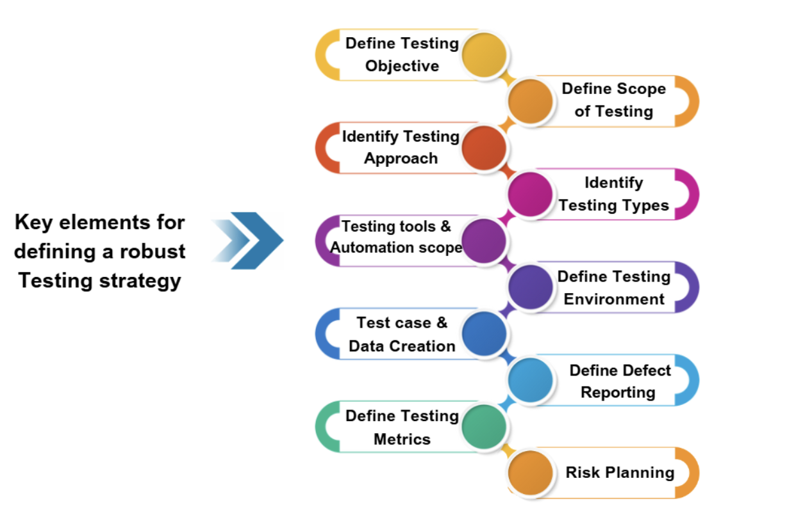

# Глава 10: Управління тестуванням та планування

**Мета розділу:** Розуміння управління тестовим процесом на організаційному рівні

---

Тестування програмного забезпечення є не лише виконанням тестів та пошуком дефектів. У реальному програмному проєкті необхідно визначити, що саме тестувати, у якому обсязі, коли розпочинати та завершувати тестування, які ресурси залучати, які інструменти використовувати та які ризики враховувати.

Саме ці питання належать до сфери управління тестуванням (Test Management).

Ефективне управління тестуванням забезпечує організованість тестового процесу та дозволяє пов'язати тестові активності з цілями проєкту. Воно передбачає планування, оцінювання, розподіл ресурсів, контроль виконання тестів, аналіз результатів і прийняття рішень на основі отриманих даних.

У спрощеному вигляді процес можна представити як послідовність:
```
Тестова стратегія
↓
Тестовий план
↓
Оцінювання ресурсів і трудовитрат
↓
Підготовка тестової документації
↓
Виконання тестування
↓
Збір та аналіз метрик
↓
Управління ризиками
↓
Звітність і прийняття рішень

```

Важливо розуміти, що ці елементи не існують ізольовано. Наприклад, результати аналізу ризиків можуть впливати на тестову стратегію, метрики — на рішення щодо продовження або завершення тестування, а зміни в проєкті — на тестовий план.

Метою управління тестуванням є не максимальна кількість виконаних тестів, а отримання достатньої інформації про якість програмного продукту для прийняття обґрунтованих рішень.

## 10.1 Тестова стратегія

### Визначення та ієрархія документів

> **Тестова стратегія** — це високорівневий опис того, як саме буде проводитися тестування для досягнення цілей тестування за заданих умов. Вона визначає загальний обсяг, підхід та ресурси для тестування системи або продукту.


Сучасні стандарти (**ISO/IEC** та **ISTQB v4.0**) пропонують чітку ієрархію документів управління тестуванням:

**Тестова політика** → **Тестова стратегія** → **Тестовий план**


**Тестова стратегія** визначає загальний підхід до організації та проведення тестування програмного забезпечення. Вона встановлює, **що саме необхідно тестувати, якими методами та інструментами це робити, які ресурси залучати, а також як оцінювати результати тестування та керувати пов’язаними ризиками**.





До основних складових тестової стратегії належать:

- **Визначення цілей та завдань тестування.**
- **Визначення обсягу тестування та функціональності, що підлягає перевірці.**
- **Визначення загального підходу до тестування**, зокрема співвідношення ручного та автоматизованого тестування.
- **Визначення рівнів та видів тестування**, які необхідно застосувати.
- **Визначення інструментів тестування та обсягу автоматизації.**
- **Визначення необхідних тестових середовищ та їх конфігурації.**
- **Визначення підходів до створення, підготовки, використання та захисту тестових даних.**
- **Визначення процесу реєстрації, аналізу, пріоритизації та усунення дефектів.**
- **Визначення метрик та критеріїв оцінювання ефективності й результативності тестування.**
- **Визначення ризиків тестування та критерії виходу із тестування.**

Таким чином, тестова стратегія формує **цілісну модель організації тестування** — від визначення його цілей і меж до вибору методів, інструментів, метрик та заходів управління ризиками.


Тестова стратегія має більш загальний характер, ніж тестовий план. Якщо стратегія визначає загальний підхід, то тестовий план конкретизує, що, хто, коли і в якому обсязі буде робити.

#### Наприклад:

> Стратегія: критичні функції системи повинні перевірятися автоматизованими регресійними тестами, а функції з високим бізнес-ризиком — додатково дослідницьким тестуванням.

> План: до кінця другого спринту автоматизувати 80 % критичних сценаріїв модуля авторизації та провести дослідницьке тестування функцій відновлення пароля.


---

## 10.2 Тестовий план

>**Тестовий план (Test Plan)** — це документ, який описує цілі, обсяг, ресурси, розклад та бюджет тестування, який описує конкретний підхід до організації та виконання тестування в межах певного проєкту, релізу або етапу.

>Якщо тестова стратегія відповідає на питання:

>«Як ми загалом будемо тестувати?»
то тестовий план відповідає:
«Що саме ми будемо робити в цьому проєкті, хто це робитиме, коли і якими ресурсами?»

### 10 компонентів тест-плану

1. **Identification** — назва, версія, автори
2. **Test Overview** — короткий опис
3. **Test Objects** — компоненти, версія ПЗ
4. **Entry Criteria** — умови початку
5. **Exit Criteria** — умови завершення
6. **Schedule** — розклад по фазах
7. **Resource Requirements** — люди, інструменти, оточення
8. **Test Deliverables** — артефакти (тест-кейси, звіти)
9. **Risks & Mitigation** — ризики та мітігація
10. **Budget** — кошторис

### Порівняння зі стратегією

| Аспект | Стратегія | План |
|--------|-----------|------|
| Масштаб | Організація | Проєкт |
| Період | 1-2+ років | 1-3 місяці |
| Деталізація | Висока | Дуже висока |


#### Обсяг тестування

Одним із найважливіших елементів плану є визначення обсягу (Scope).

**Необхідно визначити**:

 - які функції тестуються;
 - які модулі включені;
 - які платформи підтримуються;
 - які типи тестування виконуються;
 - які компоненти виключені.

```
Наприклад:

У межах релізу тестуються реєстрація користувача, автентифікація, керування профілем та відновлення пароля. Інтеграція з платіжною системою не входить до обсягу поточного релізу.

Чітке визначення обсягу дозволяє уникнути ситуації, коли команда вважає, що тестування повинно охоплювати різні компоненти продукту.

```

#### Критерії входу та виходу

> Критерії входу (Entry Criteria) — умови, які повинні бути виконані для початку певного етапу тестування.

```
Наприклад:

доступне тестове середовище;
встановлена тестова версія;
вимоги погоджені;
підготовлені тестові дані;
критичні блокери відсутні.

```

> Критерії виходу (Exit Criteria) — умови, за яких тестування може бути завершене.

```
Наприклад:

виконано 100 % запланованих критичних тестів;
відсутні відкриті дефекти критичного рівня;
досягнуто визначеного рівня покриття;
результати тестування передані зацікавленим сторонам.

Критерії виходу не означають, що продукт абсолютно не містить дефектів. Вони визначають прийнятний рівень залишкового ризику.
```

## 10.3 Оцінка та планування тестування

> Оцінювання тестування (Test Estimation) — це визначення необхідних трудовитрат, часу та ресурсів для виконання запланованих тестових активностей.

Оцінювання необхідне для:

 - планування строків;
 - формування бюджету;
 - розподілу ресурсів;
 - визначення реалістичного обсягу робіт;
 - виявлення потенційних проблем.

Оцінка не є точною передбачуваною величиною. Вона є обґрунтованим прогнозом, який може уточнюватися в процесі роботи.

### Методи оцінювання тестових робіт

Оцінювання тестування — це визначення необхідних **часу, трудових ресурсів і обсягу робіт**, потрібних для виконання тестування програмного продукту. Воно є важливою частиною **планування тестування**, оскільки дає змогу визначити строки, необхідну кількість тестувальників та ресурси для забезпечення заданого рівня якості.

На практиці для оцінювання можуть застосовуватися такі методи:

1. **Expert Judgment** — оцінка на основі досвіду тестувальників або експертів.
2. **Analogy** — оцінювання шляхом порівняння з подібними проєктами або попередніми релізами.
3. **Function Point Analysis** — оцінювання обсягу робіт залежно від функціонального розміру системи.
4. **Test Case-Based Estimation** — оцінювання на основі кількості тест-кейсів, їх складності та часу виконання.
5. **Three-Point Estimation** — врахування трьох сценаріїв оцінки:
    - **O (Optimistic)** — оптимістична оцінка;
    - **ML (Most Likely)** — найбільш імовірна оцінка;
    - **P (Pessimistic)** — песимістична оцінка.

Для Three-Point Estimation часто використовується формула:

**E = (O + 4 × ML + P) / 6**

Наприклад:

- O = 10 днів;
- ML = 18 днів;
- P = 30 днів.

Тоді:

**E = (10 + 4 × 18 + 30) / 6 = 18,7 дня.**

### Практичне значення оцінювання

У тестуванні оцінювання використовується для:

- визначення тривалості тестування;
- планування кількості тестувальників;
- визначення необхідного тестового середовища та інструментів;
- планування регресійного та повторного тестування;
- формування графіка тестових робіт;
- оцінювання впливу змін вимог;
- визначення необхідних ресурсів для автоматизації;
- планування релізу.

Наприклад, якщо команда має виконати **500 тест-кейсів**, а середній час виконання одного тест-кейсу становить **10 хвилин**, базова оцінка становитиме приблизно **83 людино-години**. Далі до неї можуть додаватися час на підготовку середовища, аналіз результатів, повторне тестування дефектів та регресійне тестування.

Таким чином, оцінювання є зв'язком між **теорією тестування та практикою управління тестовими роботами**. Воно допомагає перетворити абстрактний обсяг тестування на конкретні ресурси, строки та завдання.

### Когнітивні упередження під час оцінювання

Оцінювання тестових робіт значною мірою залежить від людського судження, тому на нього можуть впливати **когнітивні упередження** — систематичні помилки мислення, які призводять до неточних оцінок.

Одним із відомих прикладів є **ілюзія знання та передбачуваності**, описана Даніелем Канеманом у дослідженнях когнітивних упереджень. Людина схильна переоцінювати власне розуміння ситуації та здатність точно передбачити майбутні події.

У тестуванні це може проявлятися так:

- тестувальник недооцінює час, необхідний для тестування;
- команда вважає, що вимоги достатньо зрозумілі, хоча містять невизначеність;
- не враховуються повторне тестування та регресія;
- недооцінюється кількість можливих дефектів;
- складність інтеграцій із зовнішніми системами виявляється лише під час виконання робіт;
- команда надмірно покладається на досвід попереднього проєкту.

Особливо характерним є **planning fallacy (помилка планування)** — схильність недооцінювати необхідний час і ресурси, навіть маючи досвід виконання подібних завдань у минулому.

### Як зменшити вплив когнітивних упереджень

На практиці для підвищення точності оцінювання доцільно:

1. **Використовувати дані попередніх проєктів**, а не лише інтуїтивну оцінку.
2. **Розбивати великі тестові завдання** на менші та оцінювати їх окремо.
3. **Застосовувати кілька незалежних оцінок** від різних членів команди.
4. **Використовувати Three-Point Estimation**, враховуючи оптимістичний і песимістичний сценарії.
5. **Враховувати ризики та невизначеність** окремо від базової оцінки.
6. **Порівнювати прогноз із фактичними результатами** після завершення тестування.

Таким чином, професійне оцінювання тестування — це не просто визначення кількості годин. Це процес прийняття рішень в умовах **невизначеності, ризику та обмеженої інформації**. Під загрозою [когнітивних упереджень](https://uk.wikipedia.org/wiki/%D0%9A%D0%BE%D0%B3%D0%BD%D1%96%D1%82%D0%B8%D0%B2%D0%BD%D0%B5_%D1%83%D0%BF%D0%B5%D1%80%D0%B5%D0%B4%D0%B6%D0%B5%D0%BD%D0%BD%D1%8F)

Саме тому досвід тестувальника важливий, але його недостатньо: якісна оцінка має спиратися на **історичні дані, декомпозицію робіт, експертні оцінки, аналіз ризиків і формалізовані методи оцінювання**.

## 10.4 Тестова документація

**Тестова документація** — це сукупність артефактів, які описують підхід до тестування, умови та порядок виконання тестів, результати перевірок і виявлені дефекти. Вона забезпечує **відтворюваність тестування, контроль його результатів та простежуваність між вимогами, тестами й дефектами**.

Документація може створюватися як у традиційній формі окремих документів, так і безпосередньо в системах керування тестуванням та розробкою: Jira, TestRail, Zephyr, Azure DevOps тощо.

### 6 основних артефактів тестування

1. **Test Case (тест-кейс)** — опис конкретної перевірки, який визначає передумови, тестові дані, кроки виконання та очікуваний результат.
   **Приклад:** перевірка входу користувача з правильним логіном і паролем.

2. **Test Suite (тестовий набір)** — логічно об'єднана група тест-кейсів, сформована за певною функціональністю, модулем, вимогою або типом тестування.
   **Приклад:** набір `Authentication`, що містить тести входу, виходу, відновлення пароля та блокування облікового запису.

3. **Test Procedure (тестова процедура)** — детальний опис послідовності дій, необхідних для виконання певної перевірки або групи перевірок. На відміну від тест-кейсу, процедура може описувати не окрему перевірку, а **процес виконання тестування**.
   **Приклад:** процедура підготовки середовища та запуску регресійного тестування.

4. **Execution Record (запис виконання)** — інформація про фактичне виконання тесту: хто, коли та в якому середовищі виконував тест, який отримано результат (`Passed`, `Failed`, `Blocked` тощо), а також посилання на докази або дефекти.

5. **Defect Report (звіт про дефект)** — структурований опис виявленої невідповідності очікуваної та фактичної поведінки системи. Зазвичай містить кроки відтворення, фактичний і очікуваний результат, середовище, серйозність та пріоритет дефекту.

6. **Summary Report (підсумковий звіт)** — узагальнення результатів тестування за певний період, реліз або тестовий цикл. Може містити кількість виконаних і невиконаних тестів, знайдені дефекти, рівень покриття, основні ризики та висновок щодо готовності продукту.

### Взаємозв'язок артефактів

Артефакти тестування не існують ізольовано. Вони утворюють **ланцюжок простежуваності**:

```text
Вимога
   ↓
Test Case
   ↓
Test Suite
   ↓
Execution Record
   ↓
Defect Report
   ↓
Summary Report
```

Наприклад, бізнес-вимога *«Користувач повинен мати можливість відновити пароль»* може бути пов'язана з кількома тест-кейсами. Після їх виконання результати фіксуються в записах виконання. Якщо тест виявив проблему, створюється звіт про дефект. Після завершення тестового циклу результати узагальнюються у підсумковому звіті.

Такий підхід дозволяє відповісти на важливі питання:

* яку вимогу перевіряє конкретний тест;
* які тести були виконані;
* які результати отримано;
* які дефекти пов'язані з невдалими тестами;
* чи залишилися неперевірені або проблемні вимоги.

### 6 критеріїв якості тестової документації

Якісна тестова документація повинна бути не просто детальною, а **корисною для команди та придатною до повторного використання**.

* **Clarity (зрозумілість)** — інформація сформульована однозначно та легко читається різними членами команди.
* **Completeness (повнота)** — містить усі дані, необхідні для виконання та аналізу тесту.
* **Accessibility (доступність)** — потрібний документ або запис можна швидко знайти та отримати до нього доступ.
* **Relevance (актуальність)** — документація відповідає поточній версії системи, вимогам та тестового середовища.
* **Consistency (узгодженість)** — використовується єдиний стиль, структура, термінологія та правила оформлення.
* **Traceability (простежуваність)** — існує можливість встановити зв'язок між вимогою, тестом, результатом виконання та дефектом.

### Практичний баланс документації

Надмірна кількість документації також може бути проблемою. Якщо тест-кейси містять зайві деталі, їх складно підтримувати після зміни програмного забезпечення.

Тому в сучасних **Agile/DevOps-середовищах** документація повинна бути достатньою для забезпечення:

* відтворюваності тестування;
* передачі знань між членами команди;
* аналізу результатів;
* контролю якості;
* простежуваності вимог;
* підтримки автоматизованих тестів.

Отже, **мета тестової документації — не створити якомога більше документів, а забезпечити необхідну інформацію для ефективного планування, виконання, аналізу та контролю тестування**.


---

## 10.5 Метрики тестування

> Метрика тестування (Test Metric) — кількісна характеристика, яка використовується для оцінювання певного аспекту тестового процесу або якості продукту. У тестуванні програмного забезпечення використовується поняття покриття (Coverage), яке характеризує, наскільки повно тестування охоплює певний об'єкт перевірки. При цьому об'єктом покриття можуть бути не лише програмні оператори, а й вимоги, функції, тестові сценарії, гілки виконання, логічні умови та інші елементи програмної системи.

>Тому Coverage — це не одна конкретна метрика, а ціла група показників, кожен з яких відповідає на своє запитання.

Наприклад:

  - **Requirements Coverage** — чи маємо ми тести для всіх вимог?
  - **Test Execution Coverage** — яку частину запланованих тестів уже виконано?
  - **Function/Method Coverage** — чи були перевірені функції та методи програми?
  - **Statement Coverage** — які програмні оператори були виконані під час тестування?
  - **Branch Coverage** — чи були перевірені всі результати розгалужень?
  - **Condition Coverage** — чи перевірялися окремі логічні умови в різних станах?
  -  **Path Coverage** — які шляхи виконання програми були пройдені тестами?
  - **Defect metrics** -  оцінювання кількості, частоти виявлення, критичності та швидкості усунення дефектів

Таким чином, різні метрики покриття розглядають програмне забезпечення на різних рівнях абстракції — від вимог і тестової документації до внутрішньої структури програмного коду.

Важливо також розуміти, що високе покриття не означає автоматично високу якість тестування. Наприклад, тест може виконати певний рядок коду, але не перевірити правильність отриманого результату. Саме тому метрики покриття використовують не ізольовано, а в поєднанні з іншими показниками якості тестування.

Метрики допомагають відповісти на питання:

- наскільки виконаний запланований обсяг;
- скільки дефектів виявлено;
- де концентруються проблеми;
- наскільки швидко команда виконує тестування;
- чи наближається продукт до критеріїв завершення.


### Покриття вимог (Requirements Coverage)

**Requirements Coverage** — Показує, яка частка вимог до програмного забезпечення має хоча б один відповідний тест.

$$ \text{Requirements Coverage} = \frac{\text{Requirements with Tests}}{\text{Total Requirements}} \times 100\% $$

```
Наприклад:

Всього вимог:             120
Вимог із тестами:          108

Requirements Coverage = 108 / 120 × 100 % = 90 %

```

Але 90 % покриття вимог не означає, що 90 % вимог гарантовано працюють правильно. Метрика показує наявність тестів, а не їхню якість або успішність виконання.

### Покриття функцій і методів (Function/Method Coverage)

**Function/Method Coverage** — Показує, яка частка функцій або методів програми була викликана під час виконання тестів.

$$ \text{Function Coverage} = \frac{\text{Executed Functions/Methods}}{\text{Total Functions/Methods}} \times 100\% $$

```
Наприклад:

Всього функцій:            200
Викликано під час тестів:  180

Function Coverage = 180 / 200 × 100 % = 90 %

```

90 % покриття означає, що тести викликали 90 % функцій або методів. Однак це не означає, що ці функції перевірені в усіх можливих сценаріях.

### Покриття операторів (Statement Coverage)

**Statement Coverage** — Показує, яка частка виконуваних програмних операторів була виконана хоча б один раз під час тестування.

$$ \text{Statement Coverage} = \frac{\text{Executed Statements}}{\text{Total Statements}} \times 100\% $$

```
Наприклад:

Всього операторів:        1000
Виконано під час тестів:   920

Statement Coverage = 920 / 1000 × 100 % = 92 %

```

92 % Statement Coverage означає, що 92 % операторів програми були виконані тестами хоча б один раз. Але виконання оператора не гарантує перевірки всіх можливих результатів його роботи.

### Покриття розгалужень (Branch Coverage)

**Покриття розгалужень (Branch Coverage)** — Показує, яка частка можливих результатів розгалужень була виконана під час тестування. Наприклад, для if/else перевіряються як істинна, так і хибна гілки.

$$ \text{Branch Coverage} = \frac{\text{Executed Branches}}{\text{Total Branches}} \times 100\% $$

```
Наприклад:

Всього гілок:             80
Виконано гілок:           68

Branch Coverage = 68 / 80 × 100 % = 85 %

```

85 % Branch Coverage означає, що тести пройшли 85 % можливих гілок виконання. При цьому невиконані гілки можуть містити важливі помилки, тому їх наявність потребує додаткового аналізу.

### Покриття умов (Condition Coverage)

**Покриття умов (Condition Coverage)** — Показує, яка частка окремих логічних умов була перевірена в обох можливих станах — True та False.

$$ \text{Condition Coverage} = \frac{\text{Conditions Tested as True and False}} {\text{Total Conditions} \times 2} \times 100\% $$
```
Наприклад:

Всього логічних умов:      20
Можливих перевірок:        40
Перевірено:                34

Condition Coverage = 34 / 40 × 100 % = 85 %

```

85 % Condition Coverage означає, що більшість окремих логічних умов були перевірені в обох станах. Однак ця метрика сама по собі не гарантує перевірки всіх комбінацій умов.

### Метрики виконання тестів (Test Execution Metrics)

Однією з базових метрик є частка виконаних тестів:

$$
\text{Test Execution Rate} =
\frac{\text{Executed Tests}}{\text{Planned Tests}} \times 100\%
$$

```
Наприклад:

Заплановано: 500 тестів
Виконано:    425 тестів

Execution Rate = 425 / 500 × 100 % = 85 %

```

Але 85 % виконаних тестів не означає 85 % якості продукту.

### Метрики успішно виконаних тестів (Pass Rate)

Частка успішно виконаних тестів:

$$ Pass\ Rate = \frac{Passed\ Tests}{Executed\ Tests} \times 100\% $$

```
Наприклад:

Виконано: 400
Пройдено: 380

Pass Rate = 380 / 400 × 100 % = 95 %
```

Однак навіть 95 % Pass Rate не гарантує високої якості. Якщо 20 невдалих тестів стосуються критичної функції, ситуація може бути неприйнятною.

### Метрики покриття коду (Code Coverage)

характеризує ступінь охоплення тестами певного об'єкта.

$$
\text{Покриття вимог} =
\frac{\text{Перевірені вимоги}}{\text{Загальна кількість вимог}} \times 100\%
$$

Coverage корисний як індикатор, але не є прямим вимірюванням якості. Можна мати Coverage = 90 %, але баги все одно будуть проявлятися, і як результат низька ефективність


### Метрики дефектів (Defect metrics)

> Метрики дефектів — це показники, які використовуються для оцінювання кількості, частоти виявлення, критичності та швидкості усунення дефектів у програмному продукті.

До найпоширеніших належать:

- Кількість дефектів (Defect Count) — загальна кількість виявлених дефектів або дефектів за певний період.
- Defect Density — кількість дефектів на одиницю розміру програмного забезпечення, наприклад на 1000 рядків коду (KLOC) або функціональну одиницю.
- Defect Arrival Rate — швидкість появи або виявлення нових дефектів за певний проміжок часу.
- Defect Detection Rate — інтенсивність виявлення дефектів у процесі тестування.
- Defect Escape Rate — частка дефектів, які не були виявлені до релізу та були знайдені після потрапляння продукту у production.
- Кількість відкритих/закритих дефектів — характеризує поточний стан дефектів та динаміку їх усунення.
- Кількість критичних дефектів — показує кількість дефектів із високим впливом на функціональність, безпеку або працездатність системи.
- Defect Resolution Time — середній час від реєстрації дефекту до його виправлення та закриття.

Defect Density може визначатися як:

$$ Defect\ Density = \frac{Number\ of\ Defects}{Size\ of\ Software} $$

Розмір може вимірюватися, наприклад, у тисячах рядків коду або функціональних одиницях.

### Взаємозв'язок метрик

Метрики оцінюють покриття на різних рівнях, тому високий показник однієї метрики не обов'язково означає високі показники інших. Наприклад, можна отримати 100 % Statement Coverage, але при цьому не перевірити всі можливі гілки або комбінації логічних умов.

Таким чином, метрики  дозволяють оцінювати не лише кількість помилок, а й динаміку їх появи, якість тестування, серйозність проблем та ефективність процесу їх усунення. На практиці зазвичай використовують не одну метрику, а їх сукупність, оскільки окремий показник не дає повної картини якості програмного продукту.

---

## 10.6 Управління ризиками в тестуванні

### 4 етапи управління ризиками

1. **Risk Identification** — виявлення можливих ризиків
2. **Risk Analysis** — розрахунок ймовірності та впливу
3. **Risk Mitigation** — розробка стратегії зменшення ризиків
4. **Risk Monitoring** — постійний моніторинг

### Методи ідентифікації ризиків

- Brainstorming (мозковий штурм)
- Checklists (контрольні списки)
- Interviews (інтерв'ю)
- Requirements Analysis (аналіз вимог)
- Project History (історія проекту)

### Матриця ризиків 5×5

| Вплив | L=1 | L=2 | L=3 | L=4 | L=5 |
|--------|-----|-----|-----|-----|-----|
| I=5 | M | H | H | C | C |
| I=4 | L | M | H | H | C |
| I=3 | L | L | M | H | H |
| I=2 | L | L | M | M | H |
| I=1 | L | L | L | L | M |

**Класифікація:**
- Critical (15-25) — негайна дія
- High (10-14) — приділити ресурси
- Medium (5-9) — обговорити та спланувати
- Low (1-4) — моніторити

### Risk Register

Документування всіх ризиків та їх статусу з ID, Ймовірністю, Впливом, Score, Статусом та Мітігацією.

---

## Питання для самоперевірки

**1. Яка ієрархія документів за ISO/IEC?**
A) Plan → Strategy → Policy
B) Policy → Strategy → Plan ✓

**2. Що таке Risk-Based Testing?**
A) Розподіл ресурсів на базі матриці Likelihood × Impact ✓

**3. Формула Three-Point Estimation?**
A) (O + 4×ML + P) / 6 ✓

**4. Різниця між C0, C1, C2?**
A) C0 — операції, C1 — гілки, C2 — шляхи ✓

**5. Дефекти в production?**
A) Defect Escape Rate ✓

---

## Практичні завдання

### Завдання 1: Розробка тестової стратегії

Розробляється мобільний додаток для управління проектами.

**Завдання:**
1. Ідентифікуйте 5-7 ризиків
2. Заповніть матрицю ризиків 3×3
3. Напишіть компоненти стратегії
4. Розподіліть 30 днів бюджету

### Завдання 2: Складання тест-плану

На основі завдання 1 розробіть детальний тест-план з усіма 10 компонентами.

### Завдання 3: Оцінка обсягу

У проекті 45 функцій. Попередній проект з 30 функціями займав 20 днів.

1. Оцініть за методом Analogy
2. Оцініть за Three-Point Estimation
3. Обговоріть різниці

---

## Джерела та ресурси

[ISTQB| Exam Structure](https://istqb.org/certifications/certified-tester-foundation-level-ctfl-v4-0/)

[ISTQB 4.0 | Процес тестування, Тестові артефакти та Ролі в QA](https://www.youtube.com/watch?v=zoWuQu32VT0)

[QALight: Тестова стратегія](https://github.com/STT-VITI-22/stt-handbook/blob/main/dataset/articles/qalight/parsed/testovi-artefakti/testova-strategiia.md)

[ISO/IEC/IEEE 29119 Standard](https://en.wikipedia.org/wiki/ISO/IEC/IEEE_29119)

[Let’s Build an Ideal Test Strategy for you!](https://www.webomates.com/blog/what-should-be-your-ideal-test-strategy-for-2025/)

[Components of Test Strategy](https://www.geeksforgeeks.org/software-testing/software-testing-test-strategy/)

---

**Дата створення:** 14 вересня 2026
**Версія:** 1.0
**Статус:** Готово до публікації
