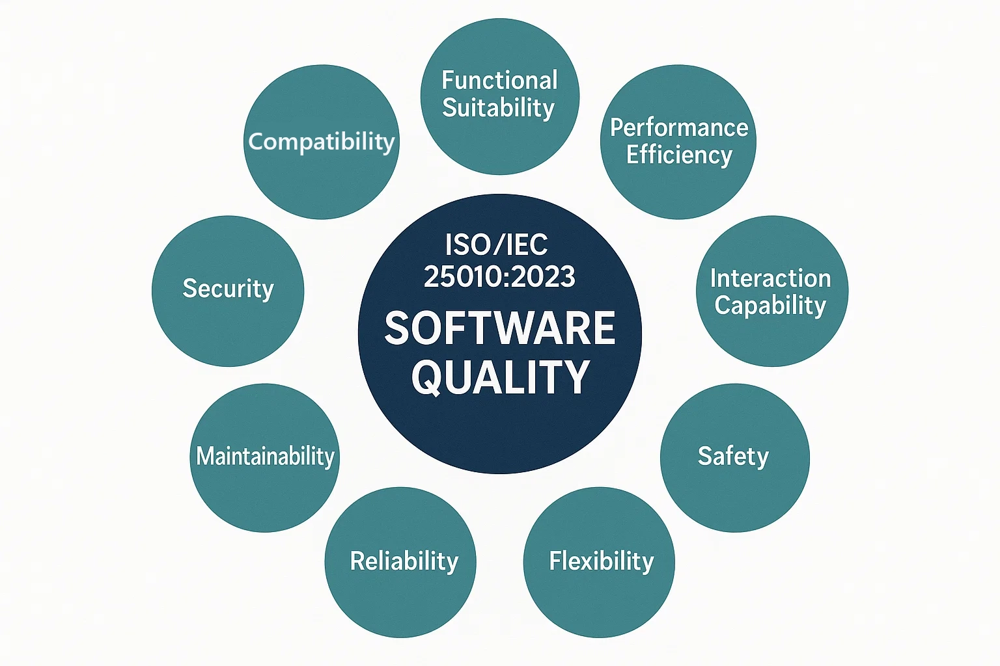
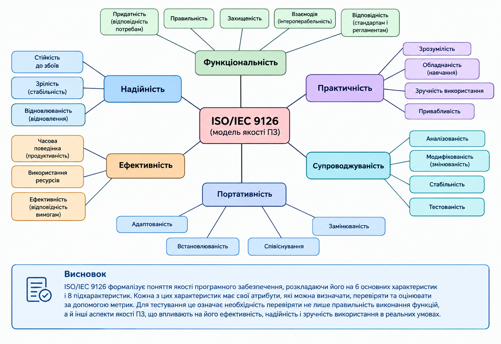
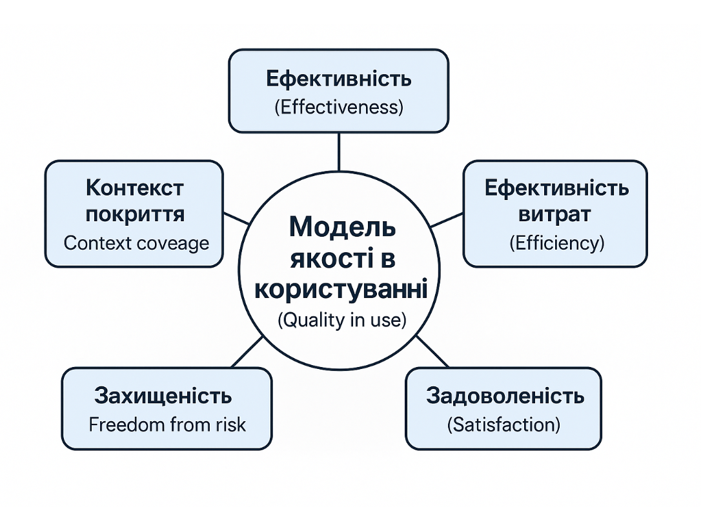

# Глава 11: Метрики та оцінювання якості

## 11.1 ISO/IEC 25010:2023 — Стандарт якості програмного забезпечення

**Мета роздіду** - Розуміти систематичний підхід до визначення та вимірювання якості ПЗ через міжнародний стандарт. Навчитися розпізнавати, які аспекти якості найважливіші для різних типів систем, і як кожна характеристика якості повинна оцінюватися в процесі розробки та тестування.

>[Філіп Кросбі](https://en.wikipedia.org/wiki/Philip_B._Crosby) визначає якість як відповідність вимогам («Вимоги сумісності», 1979). За Кросбі якість або є, або її немає. Немає такого явища, як різні рівні якості.

---

### Що таке ISO/IEC 25010?

**ISO/IEC 25010:2023** — це міжнародний стандарт, який визначає якість програмного забезпечення як набір **восьми взаємопов'язаних характеристик**. Цей стандарт замінив попередній ISO/IEC 9126 і став основою для сучасного розуміння якості ПЗ у всьому світі.

**Чому саме стандарт?** Тому що без стандарту кожна організація визначає якість по-своєму. Результат: хаос, непорозуміння та неможливість порівняти якість різних продуктів. Стандарт створює **спільну мову** для всіх учасників процесу розробки, тестування та управління проектами.

---

Якість програмного продукту (Product Quality) характеризується сукупністю його властивостей, які можуть оцінюватися на різних рівнях. Залежно від способу та умов оцінювання розрізняють внутрішні властивості (Internal properties), що характеризують структуру, реалізацію та інші статичні характеристики програмного продукту, і зовнішні властивості (External properties), які проявляються через поведінку продукту під час його виконання.

Таким чином, оцінювання Product Quality може здійснюватися на основі як внутрішніх, так і зовнішніх властивостей програмного продукту.

```
                 ЯКІСТЬ ПРОДУКТУ
                        │
                        │
              ISO/IEC 25010:2023
                        │
        ┌───────────────┴───────────────┐
        │                               │
        ▼                               ▼
 ВНУТРІШНІ ВЛАСТИВОСТІ             ЗОВНІШНІ ВЛАСТИВОСТІ
 (Internal properties)             (External properties)
        │                               │
        │                               │
        ▼                               ▼
 Internal measures                External measures
        │                               │
        └───────────────┬───────────────┘
                        │
                        ▼
               9 характеристик
               Product Quality

```

### Внутрішня властивості (Internal properties)

**Для кого:** Розробники, архітектори, інженери якості

**Що вимірюється:** Якість самого коду та архітектури, незалежно від того, як система працює в реальному світі.

**Метрики:**
- Цикломатична складність
- Дублювання коду
- Порушення стилю кодування
- Залежності між модулями

**Інструменти:** SonarQube, Checkstyle, ESLint

### Зовнішня властивості (External properties)

**Для кого:** QA інженери, тестувальники, менеджери проектів

**Що вимірюється:** Функціональна корректність та поведінка системи без користувача — як система працює в контрольованому середовищі.

**Метрики:**
- Code Coverage
- Кількість дефектів
- Pass Rate тестів
- Performance при стандартному навантаженні

**Інструменти:** Test frameworks, bug-trackers, performance tools

### 9 характеристик якості ISO/IEC 25010:2023

> Якість не є одновимірною. Це не можна звести до одного числа. Замість цього якість складається з **восьми характеристик**, кожна з яких важлива для певного типу системи та певного набору користувачів.




### Функціональна відповідність (Functional Suitability)

**Питання:** Робить система те, що від неї очікується? Чи задовольняє вона поставлені вимоги?

**Визначення:** Здатність продукту надавати функції, які задовольняють явно та неявно сформульовані потреби, коли продукт використовується в узгоджених умовах.


**Три атрибути:**

| Атрибут | Питання | Приклад метрики |
|---------|---------|-----------------|
| **Функціональна повнота** | Чи реалізовані всі необхідні функції? | Кількість реалізованих вимог / загальна кількість вимог (%) |
| **Функціональна коректність** | Чи функції дають правильні результати? | Кількість дефектів функціональності / кількість тестів |
| **Функціональна відповідність** | Чи функції відповідають поведінці, описаній у вимогах? | Відсоток вимог, перевірених тестами |

**Приклад з реального світу:**
- Банківський додаток повинен мати функцію переказу грошей → це вимога
- Функція повинна коректно розраховувати комісію → це коректність
- Функція повинна блокувати переказ, якщо недостатньо коштів → це відповідність вимогам

**Типове тестування:** Функціональне тестування, перевірка на граничні значення, позитивні та негативні тести.

---

### Продуктивність (Performance Efficiency)

**Питання:** Чи система швидка? Чи вона витрачає занадто багато ресурсів?

**Визначення:** Відносне значення кількості ресурсів, використовуваних для досягнення поставленої мети.


**Три атрибути:**

| Атрибут | Питання | Приклад метрики |
|---------|---------|-----------------|
| **Часова поведінка** | Наскільки швидко система реагує? | Час відповіді на запит (мс) |
| **Використання ресурсів** | Наскільки ефективно система використовує CPU, пам'ять? | Обсяг пам'яті при обробці 1000 запитів |
| **Пропускна спроможність** | Скільки операцій система може обробити? | Кількість запитів за секунду (RPS — requests per second) |

**Приклад з реального світу:**
- Мобільний додаток повинен завантажувати сторінку за < 2 сек на 3G мережі
- Backend API повинен обробляти > 1000 RPS
- Настільний додаток повинен займати < 500 MB оперативної пам'яті

**Типове тестування:** Performance testing, load testing, stress testing, profiling коду.

---

### Сумісність (Compatibility)

**Питання:** Чи система працює з іншим ПЗ та платформами? Чи дані можна обмінювати?

**Визначення:** Ступінь, у якому продукт може обмінюватися інформацією з іншими продуктами, системами або компонентами і виконувати свої функції при користуванні спільними ресурсами.


**Два атрибути:**

| Атрибут | Питання | Приклад метрики |
|---------|---------|-----------------|
| **Сумісність при обміні даними** | Чи система може читати та писати у форматах, що розуміють інші системи? | Підтримка JSON, XML, CSV форматів |
| **Сумісність при взаємодії** | Чи система може взаємодіяти з іншим ПЗ через API або мережу? | Наявність REST API, WebSocket підтримки |

**Приклад з реального світу:**
- CRM система повинна синхронізуватися з Email клієнтом
- Мобільний додаток повинен працювати на iOS, Android та Web
- База даних повинна експортуватися в Excel або CSV

**Типове тестування:** Інтеграційне тестування, API тестування, тестування на різних платформах.

---

### Здатність до взаємодії (Interaction capability)

**Питання:** Чи легко користувачам використовувати систему? Чи вона інтуїтивна?

**Визначення:** Ступінь, у якому продукт може бути використаний зазначеними користувачами для досягнення зазначених цілей з ефективністю, результативністю та задоволенням в установленому контексті використання.


**Чотири атрибути:**

| Атрибут | Питання | Приклад метрики |
|---------|---------|-----------------|
| **Розпізнаваність придатності** | Чи користувач розуміє, як користуватися системою? | % користувачів, які виконали задачу без помощи |
| **Навчаємість** | Чи легко користувачу навчитися користуватися системою? | Кількість помилок при першому використанні |
| **Операбельність** | Чи просто користувачу використовувати систему? | Час на виконання типової задачі |
| **Привабливість** | Чи користувач задоволений інтерфейсом? | NPS (Net Promoter Score) опитування |

**Приклад з реального світу:**
- Мобільний додаток: користувач повинен зареєструватися за < 3 кроки
- Веб-сайт: поле пошуку повинне бути видимим на першій сторінці
- Настільна програма: основні функції повинні бути в головному меню

**Типове тестування:** Usability testing, user interviews, heuristic evaluation, A/B testing.

---

### Надійність (Reliability)

**Питання:** Чи система стабільна під час роботи? Як часто вона падає або видає помилковий результат?

**Визначення:** Здатність системи підтримувати певний рівень виконання своїх функцій за установлених умов протягом установленого періоду часу.


**Три атрибути:**

| Атрибут | Питання | Приклад метрики |
|---------|---------|-----------------|
| **Зрілість (Maturity)** | Чи система часто падає? | Середній час між відмовами (MTBF) — Medium Time Between Failures |
| **Доступність (Availability)** | Чи система доступна, коли її потребують? | Час безперебійної роботи / загальний час (%) |
| **Толерантність до збоїв** | Чи система продовжує працювати при помилках? | Кількість тестів обробки помилок, що пройшли |
| **Відновлюваність (Recoverability)** | Чи система може відновитися після збою? | Час відновлення після критичної помилки |

**Приклад з реального світу:**
- E-commerce сайт під час чорної п'ятниці: MTBF повинен бути > 100 годин, доступність > 99.9%
- Медична система: відновлюваність повинна бути < 5 хвилин

**Типове тестування:** Стрес-тестування, load testing, тестування в граничних умовах, повторювані тести.

---

### Безпека (Security)

**Питання:** Чи система захищена від атак? Чи захищені дані користувачів?

**Визначення:** Ступінь захисту даних та інформації системою так, щоб особи або інші продукти мали відповідний ступінь доступу до даних відповідно до своїх типів та рівнів авторизації.


**Три атрибути:**

| Атрибут | Питання | Приклад метрики |
|---------|---------|-----------------|
| **Конфіденційність** | Чи можуть сторонні особи прочитати конфіденційні дані? | Вплив уявної витоку даних |
| **Цілісність** | Чи можуть сторонні особи змінити дані? | Наявність контрольних сум, підписів |
| **Неспростовність** | Чи користувач може заперечити свої дії? | Логування всіх дій користувача |
| **Підзвітність** | Чи система записує, хто що робив? | Наявність audit log |
| **Автентичність** | Чи система перевіряє, що користувач це справді він? | Чи система вимагає двофакторної автентифікації? |

**Приклад з реального світу:**
- Банківський додаток: всі передачі даних повинні бути зашифровані (TLS/SSL)
- Медична система (HIPAA): доступ до медичних даних повинен логуватися
- E-commerce: пароль повинен зберігатися хешованим, не в чистому вигляді

**Типове тестування:** Security testing, penetration testing, threat modeling, fuzzing.

---

### Обслуговуваність (Maintainability)

**Питання:** Чи легко розробникам змінювати та виправляти код? Чи архітектура добре спроектована?

**Визначення:** Ступінь ефективності та економічності, з якою продукт може бути змінений для виправлення, удосконалення або адаптації до зміни вимог або навколишнього середовища.


**Чотири атрибути:**

| Атрибут | Питання | Приклад метрики |
|---------|---------|-----------------|
| **Модульність** | Чи код розбитий на незалежні модулі? | Кількість залежностей між модулями |
| **Переіспользуваність (Reusability)** | Чи компоненти можуть бути використані в інших проектах? | Кількість повторно використаних компонентів |
| **Аналізованість** | Чи легко розробнику зрозуміти код та знайти дефекти? | Циклічна складність функцій (макс. 10) |
| **Модифікованість** | Чи легко змінити код без запровадження нових помилок? | Кількість регресійних дефектів при змінах |

**Приклад з реального світу:**
- Код повинен мати документацію на кожну функцію
- Функції повинні мати циклічну складність < 10
- Кожна змінена функція повинна мати unit тести

**Типове тестування:** Code review, unit testing, статичний аналіз коду (SonarQube), регресійне тестування.

---

### Гнучкість (Flexibility)

**Питання:** Чи система легко переноситься на інші платформи? Чи легко її розгорнути на різних серверах?

**Визначення:** Ступінь ефективності та економічності, з якою система може бути передана з одного апаратного, програмного чи іншого операційного середовища в інше.


**Три атрибути:**

| Атрибут              | Питання | Приклад метрики |
|----------------------|---------|-----------------|
| **Адаптивність**     | Чи легко код адаптується для нових платформ? | Кількість змін коду для підтримки нової ОС |
| **Встановлюваність** | Чи легко встановити систему на новій платформі? | Наявність автоматичного installer, Docker контейнера |
| **Взаємозаміність**   | Чи легко замінити одну версію на іншу без розриву? | Підтримка semantic versioning, миграційні скрипти |

**Приклад з реального світу:**
- Веб-додаток повинен працювати на Linux, macOS, Windows
- Мобільний додаток повинен працювати на iOS і Android (часто з тим же кодом, React Native)
- Система повинна бути готова до міграції на нову БД без втрати даних

**Типове тестування:** Тестування на різних платформах, тестування інсталяції, тестування міграції.

---

### Безпека функціонування (Safety)

**Питання:** Чи система працює без створення небезпечних ситуацій? Чи здатна вона запобігати або правильно реагувати на небезпечні події та відмови?

**Визначення:** Ступінь, до якого система обмежує ризики для життя, здоров’я людей, майна або навколишнього середовища під час її функціонування.


**Чотири атрибути:**

| Атрибут                       | Питання | Приклад метрики |
|-------------------------------|---|---|
| **Ідентифікація ризиків**     | Чи виявляє система потенційно небезпечні ситуації? | Кількість виявлених небезпечних сценаріїв |
| **Безпечний стан**            | Чи переходить система у безпечний стан у разі відмови? | Частка відмов із коректним переходом у safe state |
| **Попередження про небезпеку** | Чи своєчасно система повідомляє про небезпечну ситуацію? | Час від виникнення небезпеки до попередження |
| **Безпечне відновлення**      | Чи може система відновити роботу без створення додаткового ризику? | Частка успішних безпечних відновлень |

**Приклад з реального світу:**

- Автоматична система повинна перейти у безпечний режим при відмові датчика.
- Медичне ПЗ не повинно передавати помилкові параметри обладнанню, яке впливає на стан пацієнта.
- Система керування дроном повинна мати безпечний сценарій при втраті зв’язку.
- Промислова система повинна зупинити небезпечний процес при виявленні критичної помилки.

**Типове тестування:** Тестування відмов, fault injection, перевірка аварійних сценаріїв, тестування переходу в безпечний стан, перевірка попереджень та безпечного відновлення.

> **Важливо:** *Safety* і *Security* — не одне й те саме. **Security** захищає систему та дані від несанкціонованого доступу, атак і зловмисних дій, тоді як **Safety** зосереджена на запобіганні небезпечним наслідкам роботи або відмови системи.


### ISO/IEC 9126 — коротко як історичний контекст

> У 1991 році стандарт ISO/IEC 9126 запропонував формалізувати якість ПЗ через 6 основних характеристик: функціональність, надійність, зручність використання, ефективність, супроводжуваність і переносимість. Кожна з них деталізувалася на підхарактеристики та вимірювані атрибути. Розвитком ISO/IEC 9126 стала серія стандартів ISO/IEC 14598, яка визначила підходи до оцінювання якості програмного забезпечення. Надалі ці положення були розвинені в серії ISO/IEC 25000 **SQuaRE** (Software Quality Requirements and Evaluation). Моделювання якості ґрунтується на ієрархічній декомпозиції: від загальних характеристик якості до конкретніших підхарактеристик та атрибутів, які можуть бути виміряні й оцінені. ISO/IEC 9126 є класичним прикладом такого підходу.



З розвитком програмних систем виникла потреба врахувати нові аспекти якості, зокрема сумісність і безпеку. Тому ISO/IEC 9126 був розвинений у ISO/IEC 25010, де модель якості продукту містить уже 8 характеристик.

```
Моделі якості ПЗ 
│
├── ISO/IEC 9126 — історична основа
│       └── 6 характеристик
│
└── ISO/IEC 25010:2011— сучасний розвиток
        ├── 8 характеристик якості продукту (Product Quality)
        └── 5 характеристик якості при використанні (Quality in Use)
        
```
Але відповідно до нової редакції 2023 року, відбувся поділ Product Quality та Quality in Use на два окремі стандарти ISO/IEC 25010:2023 та  ISO/IEC 25019:2023

```
ISO/IEC 25010:2011
        │
        ├── Product Quality
        │      └── 8 характеристик
        │
        └── Quality in Use
               └── 5 характеристик
                       │
                       ▼
                 перегляд моделі
                       │
          ┌────────────┴────────────┐
          ▼                         ▼                
 ISO/IEC 25010:2023        ISO/IEC 25019:2023
   Product Quality          Quality in Use
   9 характеристик         окрема модель 
```
#### Навіщо звертатися до історичного розвитку моделей якості?

Звернення до історії розвитку моделей якості програмного забезпечення є необхідною передумовою для адекватного розуміння сучасної структури стандартів **ISO/IEC 25010** та **ISO/IEC 25019**. Це зумовлено тим, що в навчальній і професійній літературі й досі широко використовуються матеріали, розроблені на основі стандарту **ISO/IEC 9126**, а тим більше — на основі **ISO/IEC 25010:2011**, у якому модель якості продукту та модель якості при використанні (*quality in use*) були об'єднані в межах єдиного документа. Розбіжність між застарілою та актуальною структурою стандартів створює підґрунтя для термінологічної плутанини та методологічних непорозумінь, особливо в частині співвіднесення характеристик і підхарактеристик якості з відповідними метриками їх оцінювання.

##### SQuaRE як методологічна основа

**SQuaRE (Systems and software Quality Requirements and Evaluation)** становить серію стандартів **ISO/IEC 25000**, призначену для системного визначення вимог до якості програмних систем та їх подальшого оцінювання. Стандарт **ISO/IEC 25010:2023** є складовою частиною цієї серії й визначає модель якості продукту (*product quality model*), тоді як модель якості при використанні винесена до окремого документа — **ISO/IEC 25019:2023**.

#### Альтернативні моделі якості програмного забезпечення

Варто зазначити, що модель SQuaRE не є єдиною спробою формалізації поняття якості програмного забезпечення. У різні періоди розвитку інженерії програмного забезпечення дослідниками й організаціями пропонувалися й інші моделі якості, зокрема:

- модель **Маккола** (McCall) — одна з найперших ієрархічних моделей якості, орієнтована на потреби розробників, менеджерів та користувачів;
- модель **Боема** (Boehm) — розвиток підходу Маккола з акцентом на супроводжуваність та переносимість програмного забезпечення;
- модель **FURPS** (*Functionality, Usability, Reliability, Performance, Supportability*), запропонована компанією Hewlett-Packard;
- модель **Гецці** (Ghezzi) та співавторів;
- модель **SATC** (*Software Assurance Technology Center*, NASA);
- модель **Дромі** (Dromey), орієнтована на властивості компонентів програмного продукту;
- модель **QMOOD** (*Quality Model for Object-Oriented Design*), розроблена спеціально для оцінювання якості об'єктно-орієнтованих проєктних рішень;
- та власне серія **SQuaRE**, яка на сьогодні є найбільш комплексною та широко визнаною на міжнародному рівні.

## Проміжний Висновок

Порівняльний аналіз цих моделей дозволяє простежити еволюцію уявлень про якість програмного забезпечення — від переважно технічно орієнтованих критеріїв до багатовимірних моделей, що враховують контекст використання, безпечність, доступність та інші аспекти, релевантні для сучасних інформаційно-комунікаційних технологій.


### 5 характеристик якості при використанні (Quality in use) ISO/IEC 25019:2023

> **Визначення:** Якість при використанні характеризує якість програмного продукту з позиції його реального використання користувачем у певному контексті. На відміну від моделі якості продукту, яка описує властивості самого ПЗ, Quality in Use оцінює результат взаємодії користувача із системою: досягнення цілей, витрати ресурсів, задоволеність, ризики та придатність системи до різних умов використання.

Quality in Use описують п’ятьма основними характеристиками: результативність, ефективність, задоволеність, відсутність ризиків та охоплення контексту використання.



| Характеристика        | Українською                                          | Що оцінює                                                                                                             |
| --------------------- | ---------------------------------------------------- | --------------------------------------------------------------------------------------------------------------------- |
| **Effectiveness**     | **Результативність / ефективність досягнення цілей** | Чи може користувач досягти поставленої мети правильно й повністю                                                      |
| **Efficiency**        | **Ефективність використання**                        | Скільки ресурсів витрачається для досягнення потрібного результату                                                    |
| **Satisfaction**      | **Задоволеність**                                    | Наскільки використання системи відповідає очікуванням, потребам і сприйняттю користувача                              |
| **Freedom from risk** | **Відсутність ризиків**                              | Наскільки використання системи не створює неприйнятних ризиків для користувача, майна, даних, організації чи довкілля |
| **Context coverage**  | **Охоплення контекстів використання**                | Наскільки система зберігає необхідну якість у визначених та змінених умовах використання                              |

### Effectiveness — Результативність

**Питання:**
Чи може користувач досягти поставленої мети за допомогою системи?


Ця характеристика стосується **точності та повноти досягнення визначених цілей** у конкретному контексті використання.


Наприклад, для системи тестування:

> Чи може тестувальник правильно виконати тест, знайти дефект і зафіксувати результат?

Тобто оцінюється не просто наявність функції, а **фактичний результат її використання**.

---

### Efficiency — Ефективність

**Питання:**
Скільки часу, зусиль та інших ресурсів потрібно користувачу для досягнення результату?

 

Наприклад:

> Скільки часу потрібно тестувальнику для виконання 100 тестів?

Якщо дві системи дозволяють досягнути однакового результату, але одна потребує менше часу або зусиль, це відображається в **Efficiency**.

Важливо розрізняти:

* **Effectiveness** — *чи досягнуто мети?*
* **Efficiency** — *якою ціною ресурсів її досягнуто?*

---

### Satisfaction — Задоволеність

**Питання:**
Наскільки користувач задоволений результатом та самим процесом використання системи?

 

Це вже не лише об'єктивний результат, а й **сприйняття системи користувачем**.

Можуть оцінюватися, наприклад:

* комфорт використання;
* відповідність очікуванням;
* довіра до системи;
* прийнятність системи для користувача;
* готовність використовувати систему надалі.

Тому система може бути ефективною, але мати низьку **Satisfaction**, якщо для досягнення результату вона незручна або не відповідає очікуванням користувачів.

---

### Freedom from Risk — Відсутність ризиків

**Питання:**
Чи можна використовувати систему без створення неприйнятних ризиків?


Ця характеристика значно ширша за інформаційну безпеку.

Вона може охоплювати ризики:

* для здоров'я та безпеки людей;
* для майна;
* для даних та інформації;
* для бізнесу й організації;
* для довкілля;
* пов'язані з небажаними наслідками використання системи.

Наприклад, для медичного ПЗ важливо не лише те, що система правильно обробляє дані, а й те, **чи не призводить її використання до небезпечних рішень**.

---

### Context Coverage — Охоплення контекстів використання

Тут є важливий нюанс із термінологією.

У попередній моделі **ISO/IEC 25010:2011** використовувався термін **Context Coverage**. У сучасному підході якість при використанні розглядається щодо **визначеного контексту використання**. Тому перед оцінюванням необхідно визначити умови, у яких продукт має використовуватися.

**Питання:**
Наскільки система здатна забезпечувати необхідну якість у різних передбачених умовах використання?


Наприклад, для мобільного застосунку можна розглядати:

* різні пристрої;
* різні версії ОС;
* різну якість мережі;
* різний рівень досвіду користувача;
* різні умови експлуатації.

Тобто:

> **Context Coverage = наскільки широкий спектр визначених контекстів використання система може підтримувати із необхідною якістю.**

## Як вибрати, які характеристики найважливіші?

Не всі характеристики якості однаково важливі для всіх систем. Вибір залежить від **типу системи** та **домену**:

| Тип системи | Найважливіші характеристики | Приклад |
|---|---|---|
| **Критичні системи (medical, avionics)** | Надійність, Безпека | Система моніторингу пацієнта повинна бути на 99.99% надійною |
| **E-commerce сайт** | Продуктивність, Функціональність, Сумісність | Сайт повинен витримати 10000 одночасних користувачів |
| **Мобільний додаток** | Використовуваність, Продуктивність, Портативність | Додаток повинен завантажуватися < 2 сек і працювати на iPhone та Android |
| **Банківська система** | Безпека, Надійність, Обслуговуваність | Система не повинна мати витоків даних та повинна легко оновлюватися |
| **CMS система** | Обслуговуваність, Портативність, Функціональність | Система повинна працювати на будь-якому хостингу |

**Практичний підхід:** На початку проекту команда повинна вирішити:
1. Яких 3–4 характеристики найважливіші для нашого продукту?
2. Які метрики ми будемо вимірювати для кожної?
3. Які цільові значення ми встановлюємо?

---


## Зв'язок ISO 25010 з попередніми главами

- **Глава 3–5 (Тестування):** Визначають, як ми **знаходимо** дефекти
- **Глава 6–8 (Техніки тестування):** Визначають, **які** тесты писати
- **Глава 9–10 (Управління):** Визначають, **як организувати** процес
- **Глава 11 (ISO 25010):** Визначає, **ЯК ВИМІРЮВАТИ** якість

### Модель якості: від характеристик до метрик

ISO/IEC 25010 визначає **чотирьохрівневу ієрархію**:

```
Рівень 1: Характеристики якості (9 основних)
           ↓
Рівень 2: Атрибути (20-30 деталізованих)
           ↓
Рівень 3: Метрики (50+)
           ↓
Рівень 4: Вимірювання (конкретні числові значення)
```

**Приклад:**

```
Характеристика: Надійність
    ↓
Атрибут: Зрілість (як часто система падає?)
    ↓
Метрика: MTBF (Mean Time Between Failures)
    ↓
Вимірювання: MTBF = 720 годин (система падає в середньому один раз за місяць)
```


## Від теорії якості до її практичного забезпечення

Розглянуті моделі та стандарти визначають, **що саме розуміється під якістю програмного продукту та за якими характеристиками її можна оцінювати**. Однак сама модель якості не забезпечує автоматичного отримання якісного продукту. Для цього необхідно організувати процеси розроблення таким чином, щоб вимоги до якості враховувалися на всіх етапах життєвого циклу програмного забезпечення.

Отже, після визначення характеристик якості виникає практичне питання:

> **Як перетворити вимоги та моделі якості на конкретні процеси, правила, перевірки та вимірювання?**

Це завдання належить до сфери **забезпечення якості програмного забезпечення (Software Quality Assurance, SQA)**.

Практичне забезпечення якості доцільно розглядати як **циклічний процес**:

**визначення вимог до якості → стандартизація процесів → виконання та контроль → вимірювання результатів → аналіз дефектів → отримання уроків → вдосконалення процесів.**

#### З чого розпочати забезпечення якості?

Побудова системного підходу до забезпечення якості не обов'язково починається зі складних інструментів або формальних процедур. Насамперед необхідно створити **передбачуваний і повторюваний процес розроблення**, у якому команда розуміє, що, коли і яким чином необхідно робити.

До базових практик належать:

* використання **узгоджених шаблонів і правил**;
* визначення **послідовності виконання типових процесів**;
* контроль фактичного використання встановлених стандартів і процесів;
* аналіз результатів завершених робіт та проєктів;
* систематичний аналіз даних про дефекти;
* використання отриманих результатів для **постійного вдосконалення процесів**.

Ці практики формують основу організаційної культури якості. Важливо, що якість у такому підході не обмежується фінальним тестуванням готового продукту. Вона формується **протягом усього процесу розроблення**.

---

#### Стандартизація роботи: шаблони та правила

Одним із перших кроків до керованого процесу є встановлення **узгоджених шаблонів, форматів і правил виконання типових робіт**.

Шаблон не визначає зміст роботи повністю, але задає її мінімально необхідну структуру. Наприклад, для звіту про дефект можна стандартизувати набір обов'язкових полів: опис проблеми, кроки відтворення, очікуваний і фактичний результат, середовище, серйозність та пріоритет.

Застосування спільних шаблонів забезпечує:

* однакове розуміння результату роботи;
* зменшення кількості пропущених даних;
* спрощення взаємодії між членами команди;
* підвищення відтворюваності процесів;
* можливість порівнювати результати різних робіт.

Таким чином, стандартизація створює **спільну основу для аналізу, рецензування та тестування**.

Водночас стандартизація не повинна перетворюватися на формальність. Шаблон або інструкція мають використовуватися лише тоді, коли вони дійсно допомагають отримувати передбачуваний результат і підтримують цілі процесу.

---

#### Визначення процесів і послідовності дій

Наступним кроком є формалізація типових процесів: необхідно визначити, **які дії виконуються, у якій послідовності, ким і за яких умов**.

Для кожного важливого процесу доцільно відповісти щонайменше на два запитання:

1. **Чи відповідає визначений процес потребам організації та конкретного проєкту?**
2. **Чи виконується цей процес належним чином у відповідних ситуаціях?**

Перше питання стосується **якості самого процесу**. Добре визначений процес повинен бути зрозумілим, практичним і достатньо гнучким для застосування в різних проєктах.

Друге питання стосується **дотримання процесу**. Навіть добре спроєктований процес не забезпечує результату, якщо команда не знає, коли його застосовувати, або систематично ігнорує визначені правила.

Тому якість процесу має дві взаємопов'язані складові:

> **якісний процес + його послідовне застосування.**

Водночас послідовність не означає механічне виконання кожного кроку. У сучасній розробці процеси повинні дозволяти адаптацію до контексту проєкту, зберігаючи при цьому визначені цілі та критерії якості.

---

#### Контроль застосування стандартів і процесів

Після визначення процесів необхідно переконатися, що вони **дійсно використовуються на практиці**.

Для цього можуть застосовуватися:

* внутрішні аудити;
* peer review та інспекції;
* контрольні списки;
* аналіз артефактів розроблення;
* автоматизовані перевірки;
* code review;
* CI/CD-перевірки;
* метрики процесу та якості.

У різних моделях управління якістю та зрілості процесів механізми контролю можуть відрізнятися. Наприклад, у CMMI оцінювання зрілості передбачає систематичне аналізування процесів, тоді як у Agile-підходах значна частина контролю здійснюється через регулярні review, retrospectives, автоматизоване тестування та інші вбудовані механізми зворотного зв'язку.

Отже, незалежно від конкретної методології, принцип залишається однаковим:

> **процес повинен бути не лише визначений, а й перевірятися за фактом його виконання.**

---

### Аналіз завершених робіт і проєктів

Наступним джерелом інформації для вдосконалення якості є **аналіз отриманого досвіду**.

Одним із найпоширеніших інструментів є **ретроспектива (retrospective)** — структурований аналіз виконаної роботи, під час якого команда визначає:

* що було виконано успішно;
* які проблеми виникали;
* які рішення виявилися ефективними;
* які рішення не дали очікуваного результату;
* що необхідно змінити в наступному циклі роботи.

Ретроспектива важлива тим, що перетворює досвід окремого проєкту на **знання, яке може бути використане в подальшій роботі**.

Наприклад, якщо аналіз показує, що значна частина дефектів виникає через нечіткі вимоги, організація може змінити процес їх формування та перевірки. Таким чином, замість постійного виправлення однакових дефектів змінюється сам процес, який їх породжує.

---

### Аналіз даних про дефекти

Дефекти є не лише помилками, які необхідно виправити. Вони також є **джерелом інформації про недоліки процесу розроблення**.

Для системного аналізу дефекту доцільно встановлювати:

* **Що сталося?** — у чому полягає фактична проблема?
* **Де виникла проблема?** — у вимогах, проєктуванні, коді, конфігурації чи іншому артефакті?
* **Коли була внесена помилка?**
* **Коли її було виявлено?**
* **Яким способом її виявили?**
* **Чи можна було виявити її раніше?**
* **Скільки ресурсів було витрачено на її виправлення?**
* **До якої категорії належить дефект?**

Особливо важливо відрізняти **симптом** від **першопричини**.

Наприклад, нескінченний цикл під час виконання програми є проявом проблеми. Першопричиною може бути неправильна зміна індексу циклу або помилка в умові його завершення. Саме пошук першопричини, а не лише усунення прояву дефекту, створює можливість запобігти повторенню аналогічної проблеми.

Для цього можуть застосовуватися методи **Root Cause Analysis (RCA)**, зокрема аналіз «5 Why», причинно-наслідкові діаграми та аналіз категорій дефектів.

---

### Від виправлення дефектів до вдосконалення процесу

Якщо організація лише реєструє та виправляє дефекти, вона переважно **реагує на вже виниклі проблеми**.

Системний підхід до забезпечення якості передбачає наступний крок: результати аналізу дефектів, ретроспектив і вимірювань повинні використовуватися для **зміни процесів розроблення**.

Наприклад:

**дефект → аналіз першопричини → визначення недоліку процесу → зміна процесу → перевірка результату.**

Так формується замкнений цикл **постійного вдосконалення якості**.

У цьому контексті моделі якості, стандарти, процеси, тестування, метрики та аналіз дефектів не є окремими елементами. Вони утворюють єдину систему, у якій **модель якості визначає, що оцінювати, процес визначає, як цього досягати, а вимірювання та аналіз показують, наскільки процес є ефективним**.

Саме на цьому етапі теоретична модель якості переходить у практичну інженерну діяльність.


---

## 11.2 Метрики тестування

> Метрика тестування (Test Metric) — кількісна характеристика, яка використовується для оцінювання певного аспекту тестового процесу або якості продукту. У тестуванні програмного забезпечення використовується поняття покриття (Coverage), яке характеризує, наскільки повно тестування охоплює певний об'єкт перевірки. При цьому об'єктом покриття можуть бути не лише програмні оператори, а й вимоги, функції, тестові сценарії, гілки виконання, логічні умови та інші елементи програмної системи.

>Тому Coverage — це не одна конкретна метрика, а ціла група показників, кожен з яких відповідає на своє запитання.

Наприклад:

- **Requirements Coverage** — чи маємо ми тести для всіх вимог?
- **Test Execution Coverage** — яку частину запланованих тестів уже виконано?
- **Function/Method Coverage** — чи були перевірені функції та методи програми?
- **Statement Coverage** — які програмні оператори були виконані під час тестування?
- **Branch Coverage** — чи були перевірені всі результати розгалужень?
- **Condition Coverage** — чи перевірялися окремі логічні умови в різних станах?
-  **Path Coverage** — які шляхи виконання програми були пройдені тестами?
- **Defect metrics** -  оцінювання кількості, частоти виявлення, критичності та швидкості усунення дефектів

Таким чином, різні метрики покриття розглядають програмне забезпечення на різних рівнях абстракції — від вимог і тестової документації до внутрішньої структури програмного коду.

Важливо також розуміти, що високе покриття не означає автоматично високу якість тестування. Наприклад, тест може виконати певний рядок коду, але не перевірити правильність отриманого результату. Саме тому метрики покриття використовують не ізольовано, а в поєднанні з іншими показниками якості тестування.

Метрики допомагають відповісти на питання:

- наскільки виконаний запланований обсяг;
- скільки дефектів виявлено;
- де концентруються проблеми;
- наскільки швидко команда виконує тестування;
- чи наближається продукт до критеріїв завершення.


### Покриття вимог (Requirements Coverage)

**Requirements Coverage** — Показує, яка частка вимог до програмного забезпечення має хоча б один відповідний тест.

$$ \text{Requirements Coverage} = \frac{\text{Requirements with Tests}}{\text{Total Requirements}} \times 100\% $$

```
Наприклад:

Всього вимог:             120
Вимог із тестами:          108

Requirements Coverage = 108 / 120 × 100 % = 90 %

```

Але 90 % покриття вимог не означає, що 90 % вимог гарантовано працюють правильно. Метрика показує наявність тестів, а не їхню якість або успішність виконання.

### Покриття функцій і методів (Function/Method Coverage)

**Function/Method Coverage** — Показує, яка частка функцій або методів програми була викликана під час виконання тестів.

$$ \text{Function Coverage} = \frac{\text{Executed Functions/Methods}}{\text{Total Functions/Methods}} \times 100\% $$

```
Наприклад:

Всього функцій:            200
Викликано під час тестів:  180

Function Coverage = 180 / 200 × 100 % = 90 %

```

90 % покриття означає, що тести викликали 90 % функцій або методів. Однак це не означає, що ці функції перевірені в усіх можливих сценаріях.

### Покриття операторів (Statement Coverage)

**Statement Coverage** — Показує, яка частка виконуваних програмних операторів була виконана хоча б один раз під час тестування.

$$ \text{Statement Coverage} = \frac{\text{Executed Statements}}{\text{Total Statements}} \times 100\% $$

```
Наприклад:

Всього операторів:        1000
Виконано під час тестів:   920

Statement Coverage = 920 / 1000 × 100 % = 92 %

```

92 % Statement Coverage означає, що 92 % операторів програми були виконані тестами хоча б один раз. Але виконання оператора не гарантує перевірки всіх можливих результатів його роботи.

### Покриття розгалужень (Branch Coverage)

**Покриття розгалужень (Branch Coverage)** — Показує, яка частка можливих результатів розгалужень була виконана під час тестування. Наприклад, для if/else перевіряються як істинна, так і хибна гілки.

$$ \text{Branch Coverage} = \frac{\text{Executed Branches}}{\text{Total Branches}} \times 100\% $$

```
Наприклад:

Всього гілок:             80
Виконано гілок:           68

Branch Coverage = 68 / 80 × 100 % = 85 %

```

85 % Branch Coverage означає, що тести пройшли 85 % можливих гілок виконання. При цьому невиконані гілки можуть містити важливі помилки, тому їх наявність потребує додаткового аналізу.

### Покриття умов (Condition Coverage)

**Покриття умов (Condition Coverage)** — Показує, яка частка окремих логічних умов була перевірена в обох можливих станах — True та False.

$$ \text{Condition Coverage} = \frac{\text{Conditions Tested as True and False}} {\text{Total Conditions} \times 2} \times 100\% $$
```
Наприклад:

Всього логічних умов:      20
Можливих перевірок:        40
Перевірено:                34

Condition Coverage = 34 / 40 × 100 % = 85 %

```

85 % Condition Coverage означає, що більшість окремих логічних умов були перевірені в обох станах. Однак ця метрика сама по собі не гарантує перевірки всіх комбінацій умов.

### Метрики виконання тестів (Test Execution Metrics)

Однією з базових метрик є частка виконаних тестів:

$$
\text{Test Execution Rate} =
\frac{\text{Executed Tests}}{\text{Planned Tests}} \times 100\%
$$

```
Наприклад:

Заплановано: 500 тестів
Виконано:    425 тестів

Execution Rate = 425 / 500 × 100 % = 85 %

```

Але 85 % виконаних тестів не означає 85 % якості продукту.

### Метрики успішно виконаних тестів (Pass Rate)

Частка успішно виконаних тестів:

$$ Pass\ Rate = \frac{Passed\ Tests}{Executed\ Tests} \times 100\% $$

```
Наприклад:

Виконано: 400
Пройдено: 380

Pass Rate = 380 / 400 × 100 % = 95 %
```

Однак навіть 95 % Pass Rate не гарантує високої якості. Якщо 20 невдалих тестів стосуються критичної функції, ситуація може бути неприйнятною.

### Метрики покриття коду (Code Coverage)

**Code Coverage** характеризує ступінь охоплення тестами вихідного коду програми. Існує кілька рівнів покриття коду, які вимірюються з різною деталізацією:

**C0: Statement Coverage (Покриття операторів)**

Вимірює відсоток рядків коду (операторів), виконаних під час тестування:

$$
\text{C0} = \frac{\text{Виконані оператори}}{\text{Усі оператори}} \times 100\%
$$

**C1: Branch Coverage (Покриття гілок)**

Вимірює відсоток всіх гілок коду (true/false умови), виконаних під час тестування:

$$
\text{C1} = \frac{\text{Виконані гілки}}{\text{Усі гілки}} \times 100\%
$$

**C2: Path Coverage (Покриття шляхів)**

Вимірює відсоток всіх можливих комбінацій гілок (всіх можливих шляхів) у коді:

$$
\text{C2} = \frac{\text{Виконані шляхи}}{\text{Усі можливі шляхи}} \times 100\%
$$

Coverage корисний як індикатор, але не є прямим вимірюванням якості. Можна мати C0 = 90 %, але баги все одно будуть проявлятися, оскільки покриття операторів не гарантує перевірку всіх логічних гілок та комбінацій умов.

### Покриття вимог (Requirements Coverage)

Окремо від покриття коду вимірюється також покриття вимог:

$$
\text{Requirements Coverage} =
\frac{\text{Перевірені вимоги}}{\text{Загальна кількість вимог}} \times 100\%
$$

Це показує, яка частина функціональних та нефункціональних вимог була перевірена тестами.

---


## 11.3 Метрики дефектів (Defect Metrics)

> **Метрики дефектів** — це показники, які використовуються для оцінювання кількості, частоти виявлення, критичності та швидкості усунення дефектів у програмному продукті. Вони показують динаміку якості протягом життєвого циклу тестування та дозволяють прогнозувати готовність продукту до релізу.

### Основні дефект-метрики

Розглянемо кожну метрику дефектів детально:

#### Кількість дефектів (Defect Count)

**Визначення:** Загальна кількість виявлених дефектів за період або накопичена кількість дефектів від початку тестування.

**Формула:**
$$\text{Defect Count (DC)} = \text{Сума всіх виявлених дефектів за період}$$

**Приклад:**

```
Тиждень 1: 12 дефектів
Тиждень 2: 18 дефектів
Тиждень 3: 15 дефектів
Тиждень 4: 8 дефектів

Накопичено за місяць: 12 + 18 + 15 + 8 = 53 дефекти
```

**Інтерпретація:**
- Низька кількість (0–5 на мільйон рядків коду) → висока якість
- Середня кількість (5–15 на мільйон) → прийнятна якість
- Висока кількість (>15 на мільйон) → потребує додаткового тестування

**Коли використовувати:** Для моніторингу прогресу тестування та оцінки динаміки виявлення дефектів.

---

#### Щільність дефектів (Defect Density)

**Визначення:** Кількість дефектів на одиницю розміру програмного забезпечення. Це нормалізована метрика, яка дозволяє порівнювати якість різних модулів чи версій продукту.

**Формула:**
$$\text{Defect Density} = \frac{\text{Кількість дефектів}}{\text{Розмір коду (KLOC або LOC)}} \times 1000$$

де **KLOC** = тисячі рядків коду, **LOC** = рядки коду

**Приклад:**

```
Модуль А:
  - Розмір: 5000 рядків коду (KLOC = 5)
  - Знайдено дефектів: 15

Defect Density = 15 / 5 × 1000 = 3 дефекти на KLOC

Модуль Б:
  - Розмір: 10000 рядків коду (KLOC = 10)
  - Знайдено дефектів: 25

Defect Density = 25 / 10 × 1000 = 2.5 дефектів на KLOC
```

**Висновок:** Модуль А має вищу щільність дефектів (3 vs 2.5), що означає нижчу якість коду, незважаючи на те, що абсолютна кількість дефектів у Модулі Б вища.

**Стандартні значення (за ISTQB & IEEE):**
- **< 1 дефект на KLOC** → Виключна якість (space programs, medical devices)
- **1–3 дефекти на KLOC** → Висока якість (banking, e-commerce)
- **3–5 дефектів на KLOC** → Середня якість (типові бізнес-додатки)
- **> 5 дефектів на KLOC** → Низька якість (потребує переробки)

**Коли використовувати:** Для порівняння якості модулів, визначення проблемних площин кодо (hotspots) та прогнозування готовності до релізу.

---

#### Швидкість виявлення дефектів (Defect Detection Rate)

**Визначення:** Кількість дефектів, виявлених за одиницю часу (зазвичай за день або тиждень) під час тестування.

**Формула:**
$$\text{Defect Detection Rate} = \frac{\text{Дефекти виявлені за період}}{\text{Кількість днів/годин тестування}}$$

**Приклад:**

```
Активні тестування: 20 днів
Виявлено дефектів: 60

Defect Detection Rate = 60 / 20 = 3 дефекти на день
```

**Інтерпретація:**
- **Зростаючий тренд** (день 1: 2, день 2: 4, день 3: 5) → Свідчить про інтенсивне тестування та виявлення нових дефектів
- **Спадаючий тренд** (день 1: 10, день 2: 6, день 3: 2) → Позитивно: дефекти закінчуються, продукт стабілізується
- **Плаский тренд** (день 1: 3, день 2: 3, день 3: 3) → Рівномірне тестування

**Коли використовувати:** Для оцінки динаміки тестування та визначення моменту, коли дефекти практично вичерпані.

---

#### Витік дефектів (Defect Escape Rate)

**Визначення:** Відсоток дефектів, які не були виявлені під час тестування, але були знайдені після запуску в production (або у користувачів).

**Формула:**
$$\text{Defect Escape Rate} = \frac{\text{Дефекти знайдені у production}}{\text{Дефекти знайдені у production + дефекти знайдені під час тестування}} \times 100\%$$

**Приклад:**

```
Під час тестування знайдено: 150 дефектів
Користувачам (у production) вибухло: 10 дефектів (не знайдено під час тестування)

Escape Rate = 10 / (10 + 150) × 100% = 6.25%

Це означає, що 6.25% дефектів "вибухло" до користувачів.
```

**Стандартні цілі (за промисловістю):**
- **Banking, Medical:** < 1% (виключні системи)
- **E-commerce, SaaS:** 1–3% (прийнятно)
- **Ігри, розваги:** 3–5% (нормально для швидкого розвитку)
- **> 5%** → Вимагає підвищення якості тестування

**Чому це критично?** Дефекти у production коштують 10–100 разів дорожче, ніж виявлені під час тестування.

**Коли використовувати:** Для оцінки ефективності тестування та планування покращення процесу на наступний цикл.

---

#### Середній час між відмовами (Mean Time Between Failures — MTBF)

**Визначення:** Середній час роботи системи без критичних дефектів. Це ключова метрика надійності для систем з високими вимогами до стабільності.

**Формула:**
$$\text{MTBF} = \frac{\text{Загальний час роботи системи}}{\text{Кількість критичних відмов}}$$

**Приклад:**

```
Система тестувалася 720 годин (1 місяць)
Критичні відмови (crash/hang): 3

MTBF = 720 / 3 = 240 годин

Це означає, що система в середньому падає один раз кожні 240 годин (10 днів).
```

**Стандартні цільові значення:**
- **Мобільні додатки:** MTBF > 100 годин
- **E-commerce:** MTBF > 500 годин
- **Критичні системи (медицина, авіація):** MTBF > 10,000 годин
- **Телекомунікаційні системи:** MTBF > 50,000 годин

**Зв'язок з ISO 25010:** MTBF прямо вимірює характеристику **Надійність** (Reliability) → атрибут **Зрілість** (Maturity).

**Коли використовувати:** Для оцінки стабільності системи та встановлення реалістичних SLA (Service Level Agreement).

---

#### Розподіл дефектів за серійністю (Defect Distribution by Severity)

**Визначення:** Класифікація виявлених дефектів за рівнем впливу на систему.

**Категорії серійності (за ISTQB):**

| Рівень | Назва | Характеристика | Приклад |
|--------|-------|---|---|
| **1** | **Critical (Критичні)** | Система не працює, або основна функція неможлива | Не можна запустити додаток; втрачаються дані |
| **2** | **Major (Серйозні)** | Основна функція працює неправильно, але система не впадає | Помилка розрахунку вартості; неправильне сортування |
| **3** | **Medium (Середні)** | Другорядна функція працює неправильно; впливає на UX | Невидимий елемент; повільна загрузка сторінки |
| **4** | **Low (Низькі)** | Незначна проблема; не впливає на функціональність | Опечатка; неправильне вирівнювання тексту |

**Формула розподілу:**

$$\text{Critical \%} = \frac{\text{Критичні дефекти}}{\text{Всього дефектів}} \times 100\%$$

**Приклад:**

```
Знайдено 50 дефектів:
- Критичні: 5 (10%)
- Серйозні: 15 (30%)
- Середні: 20 (40%)
- Низькі: 10 (20%)

Графік розподілу показує, що 40% дефектів критичні або серйозні —
це занадто багато. Продукт НЕ готовий до релізу.
```

**Цільовий розподіл для релізу:**
- **Critical:** < 1–2%
- **Major:** 5–10%
- **Medium:** 30–50%
- **Low:** 40–60%

**Коли використовувати:** Для прийняття рішення про готовність до релізу та пріоритизації виправлень.

---

#### Час закриття дефекту (Defect Resolution Time)

**Визначення:** Середній час від реєстрації дефекту до його виправлення та закриття в системі управління дефектами.

**Формула:**
$$\text{Avg Resolution Time} = \frac{\sum(\text{Час закриття} - \text{Час реєстрації})}{\text{Кількість закритих дефектів}}$$

**Приклад:**

```
Дефект 1: Відкритий 1 січня → Закритий 5 січня = 4 дні
Дефект 2: Відкритий 2 січня → Закритий 8 січня = 6 днів
Дефект 3: Відкритий 3 січня → Закритий 10 січня = 7 днів

Avg Resolution Time = (4 + 6 + 7) / 3 = 5.67 днів (близько 6 днів)
```

**Інтерпретація:**
- **< 1 дня** → Критичні дефекти (закриваються найшвидше)
- **1–3 дні** → Серйозні дефекти (потребують виправлення)
- **3–7 днів** → Середні дефекти (розглядаються регулярно)
- **> 7 днів** → Низькі або відкладені дефекти

**Коли використовувати:** Для оцінки ефективності розробки та виявлення "вісячих" дефектів, які ігноруються.

---

#### Ефективність видалення дефектів (Defect Removal Efficiency — DRE)

**Визначення:** Відсоток дефектів, виявлених і виправлених під час розробки та тестування, до їх потрапляння в production.

**Формула:**
$$\text{DRE} = \frac{\text{Дефекти виявлені в розробці + тестуванні}}{\text{Дефекти виявлені в розробці + тестуванні + Escape Rate}} \times 100\%$$

**Приклад:**

```
Дефекти виявлені під час розробки/тестування: 150
Дефекти, що вибухли в production: 10

DRE = 150 / (150 + 10) × 100% = 93.75%

Це означає, що команда виявила 93.75% дефектів до користувачів.
```

**Стандартні цілі (за CMMI):**
- **Level 3–4:** 90–95% DRE
- **Level 5:** > 95% DRE

**Коли використовувати:** Для оцінки загальної ефективності процесу контролю якості та визначення областей для поліпшення.

---

### Аналіз трендів дефектів

Окрім абсолютних значень, дуже важливо аналізувати **динаміку** дефектів у часі:

**Тренд 1: Експоненціальне зростання → Спад**
```
День 1–5: 2, 4, 6, 8, 10 дефектів (зростання)
День 6–10: 8, 6, 4, 2, 1 дефект (спад)

✓ ПОЗИТИВНО: Типовий цикл — дефекти виявляються, потім закриваються
```

**Тренд 2: Плаский на високому рівні**
```
День 1–10: 10, 10, 11, 9, 10, 10, 11, 10, 10 дефектів (константа)

✗ НЕГАТИВНО: Дефекти не закриваються або виявляються нові
Потрібна гарячка виправлення або розширення тестування
```

**Тренд 3: Лінійне зростання**
```
День 1–10: 1, 2, 3, 4, 5, 6, 7, 8, 9, 10 дефектів

? ВАРІЮЄ: Залежить від контексту
- Позитивно, якщо це раннє тестування (очікується виявлення)
- Негативно, якщо це стадія підготовки релізу (дефекти накопичуються)
```

---

### Практичний приклад: Аналіз якості веб-додатка

**Сценарій:** E-commerce платформа перед релізом

```
Статистика тестування:
- Тривалість тестування: 30 днів
- Розмір кодової бази: 50 KLOC
- Виявлено дефектів: 125
- Критичних: 3
- Серйозних: 20
- Середніх: 60
- Низьких: 42
- Дефекти вибухли в beta: 4
- Середній MTBF: 180 годин
```

**Розрахунки:**

1. **Defect Density:** 125 / 50 = 2.5 дефектів на KLOC ✓ (прийнятно для e-commerce)

2. **Escape Rate:** 4 / (125 + 4) × 100% = 3.1% ✓ (під контролем)

3. **DRE:** 125 / (125 + 4) × 100% = 96.9% ✓ (відмінно)

4. **Розподіл серйозності:**
   - Critical: 3 / 125 = 2.4% ✓ (добре)
   - Major: 20 / 125 = 16% ✓ (прийнятно)
   - Medium + Low: 102 / 125 = 81.6% ✓ (переважають низькі)

5. **MTBF:** 180 годин = 7.5 днів ✓ (добре для новго додатка)

**Висновок:** Продукт **ГОТОВИЙ ДО РЕЛІЗУ** ✅

---

### Контрольні запитання

1. Поясніть різницю між Defect Density та абсолютною кількістю дефектів. Чому нормалізація важлива?

2. Розглянемо два модулі:
   - Модуль А: 1000 LOC, 8 дефектів
   - Модуль Б: 5000 LOC, 20 дефектів

   Який модуль має вищу якість? Розрахуйте Defect Density для кожного.

3. Що означає Defect Escape Rate 5%? Чи це хороше чи погане значення для банківської системи?

4. MTBF вашої системи 100 годин. Як це впливає на SLA вашого сервісу?

5. Розподіл дефектів:
   - Critical: 10%
   - Major: 25%
   - Medium: 40%
   - Low: 25%

   Чи готовий продукт до релізу? Поясніть.

---

### Резюме 11.3

- **Defect Count** — абсолютна кількість виявлених дефектів
- **Defect Density** — нормалізована метрика (дефекти на KLOC) для порівняння модулів
- **Detection Rate** — дефекти за одиницю часу; аналізується тренд
- **Escape Rate** — дефекти, що вибухли у production (менше — краще)
- **MTBF** — стабільність системи (частота критичних відмов)
- **Розподіл за серйозністю** — якість розподіляється, не концентрується в Critical
- **Resolution Time** — швидкість закриття дефектів (менше — краще)
- **DRE** — ефективність усього процесу якості

**Ключове правило:** Метрики дефектів мають працювати **як сукупність**, а не окремо. Наприклад, низька Defect Density + низька Escape Rate + висока DRE = висока впевненість у готовності до релізу.


---

## 11.4 Метрики процесу тестування (Process Testing Metrics)

> **Метрики процесу тестування** — це показники, які характеризують ефективність, продуктивність та вартість процесу тестування. На відміну від продукт-метрик (дефекти, покриття), вони вимірюють **як** тестування виконується, а не **що** при цьому виявляється.

### Три категорії процес-метрик

#### Категорія 1: Метрики часу та планування

##### Час виконання тестування (Test Execution Time)

**Визначення:** Загальний час, витрачений на виконання всіх запланованих тестів.

**Формула:**
$$\text{Test Execution Time} = \sum(\text{Час на кожний тест}) = \sum(T_1, T_2, ..., T_n)$$

**Приклад:**

```
Набір із 50 тестів:
- Функціональні тесты: 150 хвилин (50 тестів × 3 хв)
- Регресійні тесты: 120 хвилин (40 тестів × 3 хв)
- Smoke тесты: 15 хвилин (5 тестів × 3 хв)

Всього: 150 + 120 + 15 = 285 хвилин = 4.75 годин
```

**Інтерпретація:**
- Якщо Execution Time > Planned Time → затримка, потребується оптимізація
- Якщо Execution Time < Planned Time → можна розширити набір тестів або прискорити цикл

**Коли використовувати:** Для прогнозування часу завершення тестування та планування ресурсів.

---

##### Витримка розкладу (Schedule Performance Index — SPI)

**Визначення:** Метрика, яка показує, чи тестування відбувається відповідно до плану.

**Формула:**
$$\text{SPI} = \frac{\text{Фактична кількість тестів виконано}}{\text{Запланована кількість тестів на цей день}}$$

**Приклад:**

```
День 1: Заплановано 20 тестів, виконано 20 → SPI = 1.0 ✓
День 2: Заплановано 20 тестів, виконано 15 → SPI = 0.75 ✗
День 3: Заплановано 20 тестів, виконано 25 → SPI = 1.25 ✓

Середній SPI за 3 дні = (1.0 + 0.75 + 1.25) / 3 = 1.0
```

**Інтерпретація:**
- **SPI = 1.0** → На розписанні
- **SPI < 1.0** → Затримка в графіку (потребується прискорення)
- **SPI > 1.0** → Випереджає розклад (дозволяє розширити обсяг)

**Коли використовувати:** Для щоденного моніторингу прогресу тестування та раннього виявлення затримок.

---

#### Категорія 2: Метрики продуктивності та ресурсів

##### Продуктивність тестування (Test Productivity)

**Визначення:** Кількість тестів, спроектованих або виконаних на одиницю часу (зазвичай на людино-день).

**Формула:**
$$\text{Test Productivity} = \frac{\text{Кількість тестів виконано}}{\text{Кількість людино-днів, витрачено}}$$

**Приклад:**

```
Проект А:
- Тестів виконано: 500
- Людино-днів витрачено: 20
- Продуктивність: 500 / 20 = 25 тестів на людино-день

Проект Б:
- Тестів виконано: 800
- Людино-днів витрачено: 25
- Продуктивність: 800 / 25 = 32 тесты на людино-день

Проект Б більш продуктивний.
```

**Стандартні значення (варіюються за типом тестування):**
- **Функціональне тестування:** 15–30 тестів на людино-день
- **Регресійне тестування:** 30–50 тестів на людино-день
- **Дослідницьке тестування:** 5–15 тестів на людино-день

**Коли використовувати:** Для оцінки ефективності команди, планування проектів та бюджетування.

---

##### Витрати на один тест-кейс (Cost per Test Case)

**Визначення:** Середня вартість розробки, виконання та обслуговування одного тест-кейса.

**Формула:**
$$\text{Cost per Test Case} = \frac{\text{Загальні витрати на тестування}}{\text{Кількість тест-кейсів}}$$

**Приклад:**

```
Проект тестування:
- Заробітна плата (3 QA, 1 місяць): $15,000
- Інструменти та ліцензії: $2,000
- Інтеграція та підтримка: $3,000
- Всього витрат: $20,000

Кількість тест-кейсів: 1000

Cost per Test Case = $20,000 / 1000 = $20 за один тест
```

**Інтерпретація:**
- Низька вартість → Можна дозволити більше тестів (але якість може страждати)
- Висока вартість → Необхідно оптимізувати процес або розглянути автоматизацію

**Коли використовувати:** Для ROI аналізу, порівняння ручного vs автоматизованого тестування та контролю бюджету.

---

#### Категорія 3: Метрики якості процесу (Agile/SCRUM контекст)

##### Метрики Kanban

**а) Cycle Time (Час циклу)**

**Визначення:** Середній час від початку роботи над тестом до його завершення.

**Формула:**
$$\text{Cycle Time} = \frac{\sum(\text{Час завершення} - \text{Час початку})}{\text{Кількість завершених тестів}}$$

**Приклад:**

```
Тест 1: Почав 8:00, завершив 10:00 → 2 години
Тест 2: Почав 10:00, завершив 11:30 → 1.5 години
Тест 3: Почав 11:30, завершив 14:00 → 2.5 години

Avg Cycle Time = (2 + 1.5 + 2.5) / 3 = 2 години за один тест
```

**Інтерпретація:**
- Менший Cycle Time → Швидше виявляння дефектів
- Більший Cycle Time → Потребує оптимізації (паралелізація, простіші тесты)

---

**б) Lead Time (Час від замовлення)**

**Визначення:** Час від того, як вимога потрапила в систему до того, як тест почав виконуватися.

**Формула:**
$$\text{Lead Time} = \text{Цикл час} + \text{Час в черзі}$$

**Приклад:**

```
Вимога потрапила в бекліог: 1 січня
Тестування почалось: 5 січня
Lead Time = 4 дні (часу очікування) + Cycle Time
```

---

**в) WIP (Work In Progress — Робота у процесі)**

**Визначення:** Кількість тестів, які одночасно знаходяться в процесі виконання.

**Оптимальна WIP:**
$$\text{WIP} = \text{Cycle Time} \times \text{Throughput}$$

**Приклад:**

```
Cycle Time: 2 години
Throughput: 3 тесты на день (24 / 2 = 12 тестів на день → 3 паралельно)

Оптимальна WIP = 2 години × 3 тесты/час = 6 тестів одночасно
Якщо WIP > 6, вузькі місця забудовуються
```

---

##### Метрики SCRUM

**а) Velocity (Швидкість спринту)**

**Визначення:** Кількість тест-кейсів (або story points), виконаних за один спринт.

**Приклад:**

```
Спринт 1: Виконано 40 тест-кейсів
Спринт 2: Виконано 42 тест-кейсів
Спринт 3: Виконано 38 тест-кейсів

Середня Velocity = (40 + 42 + 38) / 3 = 40 тест-кейсів за спринт
```

**Використання:** Для планування наступних спринтів, визначення обсягу роботи на спринт.

---

**б) Burndown Chart (Графік спалювання)**

**Визначення:** Графік, який показує залишок роботи протягом спринту.

**Приклад:**

```
Плановий Burndown:
День 1: 100 % роботи
День 3: 60 % роботи
День 5: 30 % роботи
День 7: 0 % роботи (спринт закінчено)

Фактичний Burndown:
День 1: 100 %
День 3: 70 % (відставання)
День 5: 50 % (відставання)
День 7: 15 % (не всі завдання закінчено)
```

**Інтерпретація:**
- Фактична крива нижче планової → На розписанні ✓
- Фактична крива вище планової → Відставання, потребується дія ✗
- Пласка крива → Немає прогресу (вимагає аналізу причин)

---

### Практичний приклад: Комплексний аналіз процес-метрик

**Сценарій:** Мобільний додаток, спринт з 2 тижнів, 3 QA інженери

```
Спринт метрики:
- Запланованих тестів: 120
- Виконаних тестів: 110 (91.7%)
- Людино-днів витрачено: 15
- Виявлено дефектів: 85
- Середній Cycle Time: 2.5 години
- Average Execution Time на тест: 1.8 хвилин
- Витрати на один тест: $45

Розрахунки:
1. Completion Rate = 110 / 120 = 91.7% ✓
2. Productivity = 110 / 15 = 7.3 тестів на людино-день
3. Total Execution Time = 110 × 1.8 хвилин = 198 хвилин ≈ 3.3 години
4. Defect Detection Rate = 85 / 3.3 години ≈ 25.8 дефектів на годину

Висновок:
- Процес на 91.7% відповідає плану
- Продуктивність прийнятна для ручного тестування мобільного додатка
- High Defect Detection Rate вказує на інтенсивне тестування
- Якість процесу контролюється, готово до наступного спринту
```

---

### Контрольні запитання

1. Поясніть різницю між Test Execution Time та Cycle Time. Коли кожна з них важлива?

2. Вашої команді потрібно протестувати 500 тестів за 10 днів. Скільки тестів на день потрібно виконувати? Як це пов'язано з SPI?

3. Середня вартість одного тесту $50. Всього 1000 тестів. Якщо взяти на автоматизацію, що економить 70% часу, чи варто інвестувати в автоматизацію (вартість $15000)?

4. Розглянемо Kanban дошку:
   - Cycle Time: 3 години
   - Throughput: 2 тесты на годину

   Яка оптимальна WIP?

5. Ваш Burndown Chart показує, що на день 5 вже виконано 90% робіт, а залишилось 4 дні. Це добре чи погано?

---

### Резюме 11.4

- **Schedule Performance Index (SPI)** — дотримання розкладу (SPI = 1.0 — на плані)
- **Test Productivity** — тесты на людино-день (залежить від типу тестування)
- **Cost per Test Case** — вартість розробки й виконання одного тесту
- **Cycle Time** — час на виконання одного тесту (важливо для Kanban)
- **Velocity** — кількість тестів за спринт (прогнозує майбутні спринти)
- **Burndown Chart** — візуальна динаміка завершення роботи (інструмент моніторингу)

**Ключове правило:** Процес-метрики мають працювати на **управління та оптимізацію**, а не на контроль. Їх мета — допомогти команді працювати більш ефективно, не придушуючи якість.

---

## 11.7 Практичне завдання: Monitoring & Observability 


# Практичне заняття [Monitoring & Observability ](https://github.com/STT-VITI-22/stt-elk-mcp-logging)

## Мета заняття

Навчитися використовувати засоби **моніторингу та спостережуваності (Monitoring and Observability)** для виявлення, локалізації та аналізу проблем у програмному забезпеченні.

Здобувач має навчитися використовувати:

* **логи** — для аналізу помилок і подій;
* **метрики** — для оцінювання стану та продуктивності системи;
* **трасування** — для визначення місця виникнення проблеми;
* **покриття коду** — для виявлення недостатньо протестованих модулів;
* **дашборди та сповіщення** — для оперативного контролю стану системи.

Основним результатом є виконання **Root Cause Analysis (RCA)** — визначення першопричини виявленої проблеми на основі технічних доказів.

## Завдання

Розгорнути тестову систему в Docker, що складається з:

* Web — Frontend;
* WebAPI — Backend;
* MQTT Broker.

Налаштувати систему моніторингу та спостережуваності, використовуючи один із відповідних стеків:

* **Zabbix** або **Prometheus + Grafana** — моніторинг і метрики;
* **ELK** або **Grafana Loki** — централізований збір та аналіз логів;
* **Jaeger** або **Grafana Tempo** — розподілене трасування;
* відповідний інструмент — для аналізу покриття коду.

Передбачити **alerting** при зупиненні або недоступності сервісу та створити дашборд із відображенням його поточного стану.

## Дослідження системи

Здобувач повинен:

1. **Проаналізувати логи** та визначити помилки, попередження, невдалі запити й сервіс, у якому виникла проблема.
2. **Проаналізувати метрики**: час відповіді, кількість запитів, частку помилок і доступність сервісів.
3. **Проаналізувати трасування** та визначити повільні операції, проблемний сервіс і запит, який спричинив помилку.
4. **Отримати звіт про покриття коду** та визначити модулі з недостатнім покриттям.
5. **Дослідити контрольований інцидент**, наприклад HTTP 500, збільшення


---

## Джерела та ресурси

- [ISO/IEC 25010:2023 (офіційний стандарт)](https://www.iso.org/standard/78176.html) — Systems and software engineering — Systems and software Quality
- [ISO 9000:2015 — Системи управління якістю](https://github.com/STT-VITI-22/stt-handbook/blob/main/dataset/books_pdf/parsed/ISO_2015_DSTU-ISO-9000.md) — загальні принципи управління якістю
- [Крепич 2020, розділ 16 — Метрики тестування](https://github.com/STT-VITI-22/stt-handbook/blob/main/dataset/books_pdf/parsed/Krepich_2020_Software_Quality_And_Testing.md) — детальна класифікація тестових метрик
- [Золотухіна 2020 — Метрики в Agile](https://github.com/STT-VITI-22/stt-handbook/blob/main/dataset/books_pdf/parsed/Zolotykhina_2020_Information_Systems_Quality_and_Testing.md) — практичні метрики для SCRUM/Kanban
- [Habr статья про код метрики](https://github.com/STT-VITI-22/stt-handbook/blob/main/dataset/articles/habr/habr_code_metrics.md) — класифікація метрик коду (Halstead, Cyclomatic)
