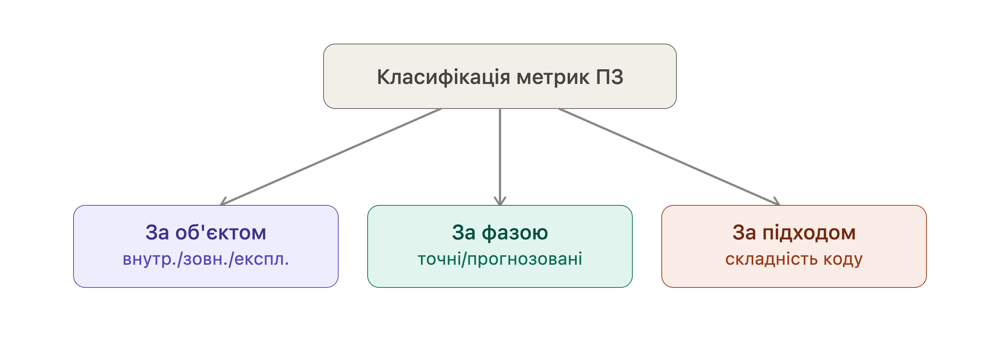

# Глава 12: Метрики та оцінювання якості

## Від моделі якості до метричного аналізу

Модель якості визначає **що саме необхідно оцінювати** у програмному продукті. Вона структурує поняття якості у вигляді характеристик та підхарактеристик, таких як функціональна придатність, продуктивність, сумісність, надійність, безпека, супроводжуваність тощо.

Однак сама модель якості ще не дає відповіді на питання:

> **Наскільки якісним є конкретний програмний продукт?**

Для цього необхідно перейти від якісного опису властивостей до їх **кількісного або формалізованого оцінювання**.

Наприклад, характеристика **продуктивність** визначає важливу властивість програмної системи, але саме слово «продуктивність» не дозволяє безпосередньо порівняти два програмні продукти або визначити, чи відповідає система встановленим критеріям. Для цього необхідно виміряти конкретні властивості: час відгуку, пропускну здатність, використання процесора, споживання пам'яті тощо.

Тому між моделлю якості та фактичним оцінюванням програмного забезпечення вводиться поняття **метрики**.

> **Метрика програмного забезпечення** — це формалізована міра певної властивості або атрибута програмного забезпечення, що за визначеним методом вимірювання перетворює результати спостереження або розрахунку на числове значення за певною шкалою. Метрики дають змогу кількісно характеризувати програмний продукт, процес його розроблення або результати його використання та використовувати отримані значення для аналізу, порівняння й оцінювання.

## Проблеми впровадження метрик якості

- Відсутні єдині стандарти на метрики (створено більше тисячі метрик), тому кожен постачальник вимірювальної системи пропонує власні методи оцінювання якості ПЗ і відповідні метрики.
- Складне завдання інтерпретації значень метрик – для більшості користувачів як метрики, так і їх значення не зовсім є зрозумілими та інформативними.
- За статистичними даними тільки 1,5 % програмних компаній намагаються оцінити якість процесів і готового продукту кількісно за допомогою метрик, і тільки 0,5 % цих компаній намагаються покращити роботу, керуючись кількісними критеріями якості ПЗ з метою виготовлення бездефектних продуктів.
- Сучасні технології вимірювання якості ПЗ ще не досягли своєї "зрілості", оскільки тільки 0,5 % програмних компаній працюють за так званою моделлю зрілості здібностей CММ (англ. Capability Maturity Model)

## Результати впровадження метрик якості


- Прогнозування кількості помилок у ПЗ від початку проектування;
- Прогнозування рівня складності ПЗ та його супроводу на підставі аналізу результатів проектування;
- Прогнозування рівня складності процесів тестування та кількості невиявлених помилок на підставі аналізу коду програми;
- Прогнозування остаточного розміру коду програми на підставі аналізу оцінок складності проектування архітектури ПЗ;
- Визначення впливу окремих характеристик програмного коду на якість готового ПЗ;
- Контроль етапів реалізації програмного проекту;
аналіз явних і прихованих дефектів у готовому ПЗ;
- Виявлення кращих методів і технологій розроблення ПЗ на підставі їх порівняння.


### Метричний аналіз якості

**Метричний аналіз якості програмного забезпечення** — це застосування визначених метрик, методів вимірювання та критеріїв оцінювання для отримання об'єктивних або відтворюваних даних про властивості програмного продукту та визначення ступеня їх відповідності встановленим критеріям.

Загальна послідовність такого підходу може бути представлена так:

**Модель якості**
↓
**Характеристика якості**
↓
**Підхарактеристика / атрибут**
↓
**Метрика**
↓
**Вимірювання**
↓
**Отримане значення**
↓
**Порівняння з критерієм**
↓
**Оцінювання якості**

Наприклад:

> **Продуктивність → часові характеристики → час відгуку → середній час відповіді API → 180 мс → порівняння з допустимим значенням 200 мс.**

У цьому випадку модель якості визначає, що **продуктивність** є важливою властивістю програмного продукту, а метричний аналіз дозволяє перейти від загального поняття до конкретного вимірюваного показника.

Таким чином, **модель якості визначає структуру того, що потрібно оцінювати, а метричний аналіз забезпечує засоби для вимірювання та оцінювання цих властивостей**.

Водночас важливо розуміти, що **одна метрика не може повністю описати складну характеристику якості**. Для її оцінювання зазвичай використовують сукупність показників, а отримані результати інтерпретують відповідно до визначених критеріїв, контексту використання та цілей оцінювання.

Саме тому наступним кроком після розгляду моделей якості є вивчення **метрик програмного забезпечення, методів їх отримання та правил інтерпретації результатів вимірювання**.

---

## 12.1 Класифікація метрик програмного забезпечення

Перш ніж переходити до розгляду конкретних метрик, важливо розуміти, що **однієї універсальної класифікації метрик не існує**. Одна й та сама метрика може одночасно належати до кількох класифікаційних груп залежно від того, за якою ознакою її розглядають. У програмній інженерії прийнято виділяти щонайменше **три незалежні осі класифікації**:

1. **за об'єктом вимірювання** — що саме вимірюється (продукт, його поведінка чи результат використання);
2. **за фазою (моментом) вимірювання** — коли отримано значення метрики (на ранньому етапі як прогноз чи як фактичний вимір готового продукту);
3. **за підходом до вимірювання складності коду** — яким технічним методом обчислюється показник.



Ці осі не суперечать одна одній, а доповнюють — одна й та ж метрика Холстеда, наприклад, є одночасно *внутрішньою* (вимірює код без запуску), *прогнозованою* (можлива вже на етапі проєктування) і належить до класу *кількісних метрик* (за підходом до вимірювання складності коду).

### Класифікація за об'єктом (видом стану) вимірювання

За тим, який об'єкт вимірюється — робоча версія програми чи сукупність документів і коду — метрики умовно поділяють на **зовнішні**, **внутрішні** та **експлуатаційні** (метрики якості у використанні). Окремо виділяють **метрики якості процесів**, які характеризують не сам продукт, а процес його розробки.

| Тип метрик | Що вимірюють | Особливості |
|---|---|---|
| **Внутрішні (Internal metrics)** | Внутрішні властивості ПЗ (код, документація, моделі, архітектура) | Оцінюються безпосередньо за властивостями артефакту, **без необхідності виконання програми на комп'ютері**; доступні розробникам, менеджерам і користувачам ще на етапі проєктування чи кодування |
| **Зовнішні (External metrics)** | Поведінку ПЗ у ході його реального виконання (запуску) на комп'ютері | Отримуються шляхом вимірювання поведінки програми під час роботи; оцінюють, наскільки ПЗ відповідає встановленим і передбачуваним вимогам під час використання у певних умовах |
| **Експлуатаційні (Quality in use)** | Не властивості самого ПЗ, а видимі результати його експлуатації користувачем | Вимірюються після впровадження ПЗ у замовника, у реальному середовищі; оцінюють, наскільки ефективно, продуктивно та безпечно користувач вирішує свої завдання, а також загальне враження від використання |
| **Якості процесів (Process quality metrics)** | Сам процес розроблення ПЗ (тривалість, вартість, продуктивність команди) | Характеризують **як** виконується розробка/тестування, а не **що** отримано в результаті |

**Приклади:**
- *Внутрішні:* метрики Холстеда, Маккейба, Джилба, Чепіна, Мак-Клура, Кафура, зв'язність/зчеплення, LOC, FP
- *Зовнішні:* MTBF, Defect Density, Defect Escape Rate, покриття коду (Statement/Branch/Path Coverage), Pass Rate
- *Експлуатаційні:* задоволеність користувача, продуктивність праці користувача, безпека під час використання
- *Процесу:* SPI, Velocity, Cycle Time, Lead Time, WIP, Burndown Chart, Test Productivity, Cost per Test Case

### Класифікація за фазою (моментом) отримання значення

За тим, на якому етапі життєвого циклу ПЗ отримано значення метрики, розрізняють:

| Тип значення | Опис | Приклад |
|---|---|---|
| **Точне (фактичне)** | Отримане шляхом безпосереднього вимірювання вже готового артефакту чи процесу | Виміряний Defect Density = 2,5 дефекти/KLOC; фактичний Cycle Time |
| **Прогнозоване (оціночне)** | Отримане на ранніх етапах розробки методом експертної оцінки, моделювання або розрахунку | Очікувана LOC-оцінка; прогнозована вартість, тривалість чи продуктивність процесу розроблення; оцінка трудовитрат за моделлю Боема (COCOMO); прогнозований функціональний розмір FP |

Ця класифікація тісно пов'язана з попередньою: **прогнозовані** метрики зазвичай є **внутрішніми** (бо застосовуються до моделей і специфікацій, ще без запуску програми), тоді як **точні** значення частіше отримують за допомогою **зовнішніх** метрик (після виконання чи тестування ПЗ).

### Класифікація за підходом до вимірювання складності коду

Ця класифікація деталізує саме **внутрішні метрики складності** й поділяє їх на 7 класів за технічним підходом до аналізу коду:

| № | Клас | Суть підходу | Представники |
|---|---|---|---|
| 1 | **Кількісні метрики** | Прямий підрахунок елементів коду (рядків, символів, операторів) | SLOC, кількість коментарів, метрики **Холстеда**, метрики **Джилба** |
| 2 | **Метрики складності потоку керування** | Аналіз керуючого графа програми (вершини — ділянки коду, дуги — переходи) | Цикломатична складність **Маккейба**, метод **Хансена**, міра **Чена**, метрики **Харрісона-Меджела**, метрика **Пивоварського**, міра **Вудворда**, метрика **Шнейдевінда** |
| 3 | **Метрики складності потоку даних** | Аналіз характеру використання й переміщення даних (змінних) у програмі | Метрика **Чепіна**, метрика спена, метрика звертання до глобальних змінних (пара p, r), міра **Кафура**, міра **Овієдо** |
| 4 | **Метрики складності потоку керування і даних** | Комбінований підхід — і кількісні підрахунки, і аналіз керуючих структур | Тестуюча М-міра, зв'язаність (coupling) модулів, міра **Колофелло**, метрика **Мак-Клура**, міра **Берлінгера** |
| 5 | **Об'єктно-орієнтовані метрики** | Аналіз класів, методів, дерева наслідування (специфічно для ООП) | Набір метрик **Мартіна** (Ca, Ce, I, A), набір метрик **Чідамбера-Кемерера** (WMC, DIT, NOC, CBO, RFC, LCOM) |
| 6 | **Метрики надійності** | Кількість помилок і дефектів, виявлених на різних етапах | Кількість структурних змін з моменту минулої перевірки, кількість помилок при перегляді коду, кількість помилок при тестуванні, густота дефектів на KLOC |
| 7 | **Гібридні метрики** | Зважена сума кількох простіших метрик | Метрика **Кокола**, метрика **Зольновського-Симмонса-Тейєра** |

**Важливо:** автор класифікації прямо зазначає, що класи 2 і 4 частково перетинаються (обидва по суті є топологічними метриками), а поділ зроблено лише для наочності викладу. Крім того, жодна окрема метрика складності не є універсальною — на практиці рекомендується використовувати їх у сукупності та інтерпретувати з урахуванням мови й стилю програмування.

### Як три класифікації співвідносяться між собою

Наведені три осі класифікації — незалежні, тобто одну метрику можна одночасно описати за кожною з них:

```
Метрика Холстеда:
  за об'єктом      → внутрішня (аналізує код без запуску)
  за фазою         → може бути і прогнозованою (за оцінкою обсягу коду), і точною (після написання коду)
  за підходом      → кількісна метрика (клас 1)

Метрика MTBF:
  за об'єктом      → зовнішня (вимірюється під час роботи системи)
  за фазою         → точна (фактичне значення)
  за підходом      → метрика надійності (клас 6)

Задоволеність користувача:
  за об'єктом      → якість у використанні (експлуатаційна)
  за фазою         → точна (вимірюється лише після впровадження)
  за підходом      → не входить до класифікації складності коду, оскільки не є метрикою коду

Cycle Time / SPI / Velocity:
  за об'єктом      → метрики якості процесу
  за фазою         → точні (фіксуються за фактом виконання роботи)
  за підходом      → не належать до класифікації складності коду
```

Розуміння цих трьох осей дозволяє правильно інтерпретувати будь-яку метрику: **що** вона вимірює (об'єкт), **коли** отримано значення (фаза) і **яким методом** обчислено показник (підхід до складності), а також усвідомлювати, чому жодна окрема метрика — сама по собі — не дає повної картини якості програмного продукту.

### Практична класифікація за 10 типами (повний каталог із 79 метрик)

Три теоретичні осі, розглянуті вище, пояснюють **природу** метрики, але для практичного вивчення й довідкового використання зручніше мати єдиний **робочий каталог**, що об'єднує всі розглянуті в цій главі показники в обмежену кількість тематичних груп. Такий каталог є практичним "перетином" трьох осей: перші три групи походять з осі "за об'єктом" (продукт-метрики тестування), групи 4-7 деталізують внутрішні метрики складності коду (вісь 3), а групи 8-10 відповідають експлуатаційній та процесній осям.



У межах цієї глави прийнято наступний поділ **79 метрик на 10 типів**, кожному з яких відповідає окремий підрозділ:

| № | Тип метрик | К-сть | Розділ | Вісь класифікації |
|---|---|---|---|---|
| 1 | Метрики тестування | 9 | 12.1 | зовнішні / точні |
| 2 | Метрики дефектів | 8 | 12.2 | зовнішні / точні |
| 3 | Метрики процесу тестування | 9 | 12.3 | якості процесів / точні |
| 4 | Метрики розміру ПЗ | 3 | 12.4 | внутрішні / прогнозовані |
| 5 | Метрики складності ПЗ | 23 | 12.5 | внутрішні / кількісні + потік керування + потік даних + комбіновані |
| 6 | Об'єктно-орієнтовані метрики | 11 | 12.6 | внутрішні / підхід складності, клас 5 |
| 7 | Гібридні метрики | 2 | 12.7 | внутрішні / підхід складності, клас 7 |
| 8 | Метрики процесу розроблення ПЗ | 8 | 12.8 | якості процесів / переважно прогнозовані |
| 9 | Метрики якості моделей і прототипів | 2 | 12.9 | внутрішні / точні (за результатом інспекції) |
| 10 | Метрики якості у використанні | 4 | 12.10 | експлуатаційні / точні |
| | **Всього** | **79** | | |

Ця практична класифікація на 10 типів і є структурою, за якою побудована решта глави: кожен наступний підрозділ (12.2–12.11) детально розкриває один тип із таблиці, аж до формул і прикладів розрахунку для кожної з 79 метрик.

---


## 12.2 Метрики тестування

> Метрика тестування (Test Metric) — кількісна характеристика, яка використовується для оцінювання певного аспекту тестового процесу або якості продукту. У тестуванні програмного забезпечення використовується поняття покриття (Coverage), яке характеризує, наскільки повно тестування охоплює певний об'єкт перевірки. При цьому об'єктом покриття можуть бути не лише програмні оператори, а й вимоги, функції, тестові сценарії, гілки виконання, логічні умови та інші елементи програмної системи.

>Тому Coverage — це не одна конкретна метрика, а ціла група показників, кожен з яких відповідає на своє запитання.

Наприклад:

- **Requirements Coverage** — чи маємо ми тести для всіх вимог?
- **Test Execution Coverage** — яку частину запланованих тестів уже виконано?
- **Function/Method Coverage** — чи були перевірені функції та методи програми?
- **Statement Coverage** — які програмні оператори були виконані під час тестування?
- **Branch Coverage** — чи були перевірені всі результати розгалужень?
- **Condition Coverage** — чи перевірялися окремі логічні умови в різних станах?
-  **Path Coverage** — які шляхи виконання програми були пройдені тестами?
- **Defect metrics** -  оцінювання кількості, частоти виявлення, критичності та швидкості усунення дефектів

Таким чином, різні метрики покриття розглядають програмне забезпечення на різних рівнях абстракції — від вимог і тестової документації до внутрішньої структури програмного коду.

Важливо також розуміти, що високе покриття не означає автоматично високу якість тестування. Наприклад, тест може виконати певний рядок коду, але не перевірити правильність отриманого результату. Саме тому метрики покриття використовують не ізольовано, а в поєднанні з іншими показниками якості тестування.

Метрики допомагають відповісти на питання:

- наскільки виконаний запланований обсяг;
- скільки дефектів виявлено;
- де концентруються проблеми;
- наскільки швидко команда виконує тестування;
- чи наближається продукт до критеріїв завершення.


### Покриття вимог (Requirements Coverage)

**Requirements Coverage** — Показує, яка частка вимог до програмного забезпечення має хоча б один відповідний тест.

$$ \text{Requirements Coverage} = \frac{\text{Requirements with Tests}}{\text{Total Requirements}} \times 100\% $$

```
Наприклад:

Всього вимог:             120
Вимог із тестами:          108

Requirements Coverage = 108 / 120 × 100 % = 90 %

```

Але 90 % покриття вимог не означає, що 90 % вимог гарантовано працюють правильно. Метрика показує наявність тестів, а не їхню якість або успішність виконання.

### Покриття функцій і методів (Function/Method Coverage)

**Function/Method Coverage** — Показує, яка частка функцій або методів програми була викликана під час виконання тестів.

$$ \text{Function Coverage} = \frac{\text{Executed Functions/Methods}}{\text{Total Functions/Methods}} \times 100\% $$

```
Наприклад:

Всього функцій:            200
Викликано під час тестів:  180

Function Coverage = 180 / 200 × 100 % = 90 %

```

90 % покриття означає, що тести викликали 90 % функцій або методів. Однак це не означає, що ці функції перевірені в усіх можливих сценаріях.

### Покриття операторів (Statement Coverage)

**Statement Coverage** — Показує, яка частка виконуваних програмних операторів була виконана хоча б один раз під час тестування.

$$ \text{Statement Coverage} = \frac{\text{Executed Statements}}{\text{Total Statements}} \times 100\% $$

```
Наприклад:

Всього операторів:        1000
Виконано під час тестів:   920

Statement Coverage = 920 / 1000 × 100 % = 92 %

```

92 % Statement Coverage означає, що 92 % операторів програми були виконані тестами хоча б один раз. Але виконання оператора не гарантує перевірки всіх можливих результатів його роботи.

### Покриття розгалужень (Branch Coverage)

**Покриття розгалужень (Branch Coverage)** — Показує, яка частка можливих результатів розгалужень була виконана під час тестування. Наприклад, для if/else перевіряються як істинна, так і хибна гілки.

$$ \text{Branch Coverage} = \frac{\text{Executed Branches}}{\text{Total Branches}} \times 100\% $$

```
Наприклад:

Всього гілок:             80
Виконано гілок:           68

Branch Coverage = 68 / 80 × 100 % = 85 %

```

85 % Branch Coverage означає, що тести пройшли 85 % можливих гілок виконання. При цьому невиконані гілки можуть містити важливі помилки, тому їх наявність потребує додаткового аналізу.

### Покриття умов (Condition Coverage)

**Покриття умов (Condition Coverage)** — Показує, яка частка окремих логічних умов була перевірена в обох можливих станах — True та False.

$$ \text{Condition Coverage} = \frac{\text{Conditions Tested as True and False}} {\text{Total Conditions} \times 2} \times 100\% $$
```
Наприклад:

Всього логічних умов:      20
Можливих перевірок:        40
Перевірено:                34

Condition Coverage = 34 / 40 × 100 % = 85 %

```

85 % Condition Coverage означає, що більшість окремих логічних умов були перевірені в обох станах. Однак ця метрика сама по собі не гарантує перевірки всіх комбінацій умов.

### Метрики виконання тестів (Test Execution Metrics)

Однією з базових метрик є частка виконаних тестів:

$$
\text{Test Execution Rate} =
\frac{\text{Executed Tests}}{\text{Planned Tests}} \times 100\%
$$

```
Наприклад:

Заплановано: 500 тестів
Виконано:    425 тестів

Execution Rate = 425 / 500 × 100 % = 85 %

```

Але 85 % виконаних тестів не означає 85 % якості продукту.

### Метрики успішно виконаних тестів (Pass Rate)

Частка успішно виконаних тестів:

$$ Pass\ Rate = \frac{Passed\ Tests}{Executed\ Tests} \times 100\% $$

```
Наприклад:

Виконано: 400
Пройдено: 380

Pass Rate = 380 / 400 × 100 % = 95 %
```

Однак навіть 95 % Pass Rate не гарантує високої якості. Якщо 20 невдалих тестів стосуються критичної функції, ситуація може бути неприйнятною.

### Метрики покриття коду (Code Coverage)

**Code Coverage** характеризує ступінь охоплення тестами вихідного коду програми. Існує кілька рівнів покриття коду, які вимірюються з різною деталізацією:

**C0: Statement Coverage (Покриття операторів)**

Вимірює відсоток рядків коду (операторів), виконаних під час тестування:

$$
\text{C0} = \frac{\text{Виконані оператори}}{\text{Усі оператори}} \times 100\%
$$

**C1: Branch Coverage (Покриття гілок)**

Вимірює відсоток всіх гілок коду (true/false умови), виконаних під час тестування:

$$
\text{C1} = \frac{\text{Виконані гілки}}{\text{Усі гілки}} \times 100\%
$$

**C2: Path Coverage (Покриття шляхів)**

Вимірює відсоток всіх можливих комбінацій гілок (всіх можливих шляхів) у коді:

$$
\text{C2} = \frac{\text{Виконані шляхи}}{\text{Усі можливі шляхи}} \times 100\%
$$

Coverage корисний як індикатор, але не є прямим вимірюванням якості. Можна мати C0 = 90 %, але баги все одно будуть проявлятися, оскільки покриття операторів не гарантує перевірку всіх логічних гілок та комбінацій умов.

### Покриття вимог (Requirements Coverage)

Окремо від покриття коду вимірюється також покриття вимог:

$$
\text{Requirements Coverage} =
\frac{\text{Перевірені вимоги}}{\text{Загальна кількість вимог}} \times 100\%
$$

Це показує, яка частина функціональних та нефункціональних вимог була перевірена тестами.

---


## 12.2 Метрики дефектів (Defect Metrics)

> **Метрики дефектів** — це показники, які використовуються для оцінювання кількості, частоти виявлення, критичності та швидкості усунення дефектів у програмному продукті. Вони показують динаміку якості протягом життєвого циклу тестування та дозволяють прогнозувати готовність продукту до релізу.

### Основні дефект-метрики

Розглянемо кожну метрику дефектів детально:

#### Кількість дефектів (Defect Count)

**Визначення:** Загальна кількість виявлених дефектів за період або накопичена кількість дефектів від початку тестування.

**Формула:**
$$\text{Defect Count (DC)} = \text{Сума всіх виявлених дефектів за період}$$

**Приклад:**

```
Тиждень 1: 12 дефектів
Тиждень 2: 18 дефектів
Тиждень 3: 15 дефектів
Тиждень 4: 8 дефектів

Накопичено за місяць: 12 + 18 + 15 + 8 = 53 дефекти
```

**Інтерпретація:**
- Низька кількість (0–5 на мільйон рядків коду) → висока якість
- Середня кількість (5–15 на мільйон) → прийнятна якість
- Висока кількість (>15 на мільйон) → потребує додаткового тестування

**Коли використовувати:** Для моніторингу прогресу тестування та оцінки динаміки виявлення дефектів.

---

#### Щільність дефектів (Defect Density)

**Визначення:** Кількість дефектів на одиницю розміру програмного забезпечення. Це нормалізована метрика, яка дозволяє порівнювати якість різних модулів чи версій продукту.

**Формула:**
$$\text{Defect Density} = \frac{\text{Кількість дефектів}}{\text{Розмір коду (KLOC або LOC)}} \times 1000$$

де **KLOC** = тисячі рядків коду, **LOC** = рядки коду

**Приклад:**

```
Модуль А:
  - Розмір: 5000 рядків коду (KLOC = 5)
  - Знайдено дефектів: 15

Defect Density = 15 / 5 × 1000 = 3 дефекти на KLOC

Модуль Б:
  - Розмір: 10000 рядків коду (KLOC = 10)
  - Знайдено дефектів: 25

Defect Density = 25 / 10 × 1000 = 2.5 дефектів на KLOC
```

**Висновок:** Модуль А має вищу щільність дефектів (3 vs 2.5), що означає нижчу якість коду, незважаючи на те, що абсолютна кількість дефектів у Модулі Б вища.

**Стандартні значення (за ISTQB & IEEE):**
- **< 1 дефект на KLOC** → Виключна якість (space programs, medical devices)
- **1–3 дефекти на KLOC** → Висока якість (banking, e-commerce)
- **3–5 дефектів на KLOC** → Середня якість (типові бізнес-додатки)
- **> 5 дефектів на KLOC** → Низька якість (потребує переробки)

**Коли використовувати:** Для порівняння якості модулів, визначення проблемних площин кодо (hotspots) та прогнозування готовності до релізу.

---

#### Швидкість виявлення дефектів (Defect Detection Rate)

**Визначення:** Кількість дефектів, виявлених за одиницю часу (зазвичай за день або тиждень) під час тестування.

**Формула:**
$$\text{Defect Detection Rate} = \frac{\text{Дефекти виявлені за період}}{\text{Кількість днів/годин тестування}}$$

**Приклад:**

```
Активні тестування: 20 днів
Виявлено дефектів: 60

Defect Detection Rate = 60 / 20 = 3 дефекти на день
```

**Інтерпретація:**
- **Зростаючий тренд** (день 1: 2, день 2: 4, день 3: 5) → Свідчить про інтенсивне тестування та виявлення нових дефектів
- **Спадаючий тренд** (день 1: 10, день 2: 6, день 3: 2) → Позитивно: дефекти закінчуються, продукт стабілізується
- **Плаский тренд** (день 1: 3, день 2: 3, день 3: 3) → Рівномірне тестування

**Коли використовувати:** Для оцінки динаміки тестування та визначення моменту, коли дефекти практично вичерпані.

---

#### Витік дефектів (Defect Escape Rate)

**Визначення:** Відсоток дефектів, які не були виявлені під час тестування, але були знайдені після запуску в production (або у користувачів).

**Формула:**
$$\text{Defect Escape Rate} = \frac{\text{Дефекти знайдені у production}}{\text{Дефекти знайдені у production + дефекти знайдені під час тестування}} \times 100\%$$

**Приклад:**

```
Під час тестування знайдено: 150 дефектів
Користувачам (у production) вибухло: 10 дефектів (не знайдено під час тестування)

Escape Rate = 10 / (10 + 150) × 100% = 6.25%

Це означає, що 6.25% дефектів "вибухло" до користувачів.
```

**Стандартні цілі (за промисловістю):**
- **Banking, Medical:** < 1% (виключні системи)
- **E-commerce, SaaS:** 1–3% (прийнятно)
- **Ігри, розваги:** 3–5% (нормально для швидкого розвитку)
- **> 5%** → Вимагає підвищення якості тестування

**Чому це критично?** Дефекти у production коштують 10–100 разів дорожче, ніж виявлені під час тестування.

**Коли використовувати:** Для оцінки ефективності тестування та планування покращення процесу на наступний цикл.

---

#### Середній час між відмовами (Mean Time Between Failures — MTBF)

**Визначення:** Середній час роботи системи без критичних дефектів. Це ключова метрика надійності для систем з високими вимогами до стабільності.

**Формула:**
$$\text{MTBF} = \frac{\text{Загальний час роботи системи}}{\text{Кількість критичних відмов}}$$

**Приклад:**

```
Система тестувалася 720 годин (1 місяць)
Критичні відмови (crash/hang): 3

MTBF = 720 / 3 = 240 годин

Це означає, що система в середньому падає один раз кожні 240 годин (10 днів).
```

**Стандартні цільові значення:**
- **Мобільні додатки:** MTBF > 100 годин
- **E-commerce:** MTBF > 500 годин
- **Критичні системи (медицина, авіація):** MTBF > 10,000 годин
- **Телекомунікаційні системи:** MTBF > 50,000 годин

**Зв'язок з ISO 25010:** MTBF прямо вимірює характеристику **Надійність** (Reliability) → атрибут **Зрілість** (Maturity).

**Коли використовувати:** Для оцінки стабільності системи та встановлення реалістичних SLA (Service Level Agreement).

---

#### Розподіл дефектів за серійністю (Defect Distribution by Severity)

**Визначення:** Класифікація виявлених дефектів за рівнем впливу на систему.

**Категорії серійності (за ISTQB):**

| Рівень | Назва | Характеристика | Приклад |
|--------|-------|---|---|
| **1** | **Critical (Критичні)** | Система не працює, або основна функція неможлива | Не можна запустити додаток; втрачаються дані |
| **2** | **Major (Серйозні)** | Основна функція працює неправильно, але система не впадає | Помилка розрахунку вартості; неправильне сортування |
| **3** | **Medium (Середні)** | Другорядна функція працює неправильно; впливає на UX | Невидимий елемент; повільна загрузка сторінки |
| **4** | **Low (Низькі)** | Незначна проблема; не впливає на функціональність | Опечатка; неправильне вирівнювання тексту |

**Формула розподілу:**

$$\text{Critical \%} = \frac{\text{Критичні дефекти}}{\text{Всього дефектів}} \times 100\%$$

**Приклад:**

```
Знайдено 50 дефектів:
- Критичні: 5 (10%)
- Серйозні: 15 (30%)
- Середні: 20 (40%)
- Низькі: 10 (20%)

Графік розподілу показує, що 40% дефектів критичні або серйозні —
це занадто багато. Продукт НЕ готовий до релізу.
```

**Цільовий розподіл для релізу:**
- **Critical:** < 1–2%
- **Major:** 5–10%
- **Medium:** 30–50%
- **Low:** 40–60%

**Коли використовувати:** Для прийняття рішення про готовність до релізу та пріоритизації виправлень.

---

#### Час закриття дефекту (Defect Resolution Time)

**Визначення:** Середній час від реєстрації дефекту до його виправлення та закриття в системі управління дефектами.

**Формула:**
$$\text{Avg Resolution Time} = \frac{\sum(\text{Час закриття} - \text{Час реєстрації})}{\text{Кількість закритих дефектів}}$$

**Приклад:**

```
Дефект 1: Відкритий 1 січня → Закритий 5 січня = 4 дні
Дефект 2: Відкритий 2 січня → Закритий 8 січня = 6 днів
Дефект 3: Відкритий 3 січня → Закритий 10 січня = 7 днів

Avg Resolution Time = (4 + 6 + 7) / 3 = 5.67 днів (близько 6 днів)
```

**Інтерпретація:**
- **< 1 дня** → Критичні дефекти (закриваються найшвидше)
- **1–3 дні** → Серйозні дефекти (потребують виправлення)
- **3–7 днів** → Середні дефекти (розглядаються регулярно)
- **> 7 днів** → Низькі або відкладені дефекти

**Коли використовувати:** Для оцінки ефективності розробки та виявлення "вісячих" дефектів, які ігноруються.

---

#### Ефективність видалення дефектів (Defect Removal Efficiency — DRE)

**Визначення:** Відсоток дефектів, виявлених і виправлених під час розробки та тестування, до їх потрапляння в production.

**Формула:**
$$\text{DRE} = \frac{\text{Дефекти виявлені в розробці + тестуванні}}{\text{Дефекти виявлені в розробці + тестуванні + Escape Rate}} \times 100\%$$

**Приклад:**

```
Дефекти виявлені під час розробки/тестування: 150
Дефекти, що вибухли в production: 10

DRE = 150 / (150 + 10) × 100% = 93.75%

Це означає, що команда виявила 93.75% дефектів до користувачів.
```

**Стандартні цілі (за CMMI):**
- **Level 3–4:** 90–95% DRE
- **Level 5:** > 95% DRE

**Коли використовувати:** Для оцінки загальної ефективності процесу контролю якості та визначення областей для поліпшення.

---

### Аналіз трендів дефектів

Окрім абсолютних значень, дуже важливо аналізувати **динаміку** дефектів у часі:

**Тренд 1: Експоненціальне зростання → Спад**
```
День 1–5: 2, 4, 6, 8, 10 дефектів (зростання)
День 6–10: 8, 6, 4, 2, 1 дефект (спад)

✓ ПОЗИТИВНО: Типовий цикл — дефекти виявляються, потім закриваються
```

**Тренд 2: Плаский на високому рівні**
```
День 1–10: 10, 10, 11, 9, 10, 10, 11, 10, 10 дефектів (константа)

✗ НЕГАТИВНО: Дефекти не закриваються або виявляються нові
Потрібна гарячка виправлення або розширення тестування
```

**Тренд 3: Лінійне зростання**
```
День 1–10: 1, 2, 3, 4, 5, 6, 7, 8, 9, 10 дефектів

? ВАРІЮЄ: Залежить від контексту
- Позитивно, якщо це раннє тестування (очікується виявлення)
- Негативно, якщо це стадія підготовки релізу (дефекти накопичуються)
```

---

### Практичний приклад: Аналіз якості веб-додатка

**Сценарій:** E-commerce платформа перед релізом

```
Статистика тестування:
- Тривалість тестування: 30 днів
- Розмір кодової бази: 50 KLOC
- Виявлено дефектів: 125
- Критичних: 3
- Серйозних: 20
- Середніх: 60
- Низьких: 42
- Дефекти вибухли в beta: 4
- Середній MTBF: 180 годин
```

**Розрахунки:**

1. **Defect Density:** 125 / 50 = 2.5 дефектів на KLOC ✓ (прийнятно для e-commerce)

2. **Escape Rate:** 4 / (125 + 4) × 100% = 3.1% ✓ (під контролем)

3. **DRE:** 125 / (125 + 4) × 100% = 96.9% ✓ (відмінно)

4. **Розподіл серйозності:**
   - Critical: 3 / 125 = 2.4% ✓ (добре)
   - Major: 20 / 125 = 16% ✓ (прийнятно)
   - Medium + Low: 102 / 125 = 81.6% ✓ (переважають низькі)

5. **MTBF:** 180 годин = 7.5 днів ✓ (добре для новго додатка)

**Висновок:** Продукт **ГОТОВИЙ ДО РЕЛІЗУ** ✅

---

### Контрольні запитання

1. Поясніть різницю між Defect Density та абсолютною кількістю дефектів. Чому нормалізація важлива?

2. Розглянемо два модулі:
   - Модуль А: 1000 LOC, 8 дефектів
   - Модуль Б: 5000 LOC, 20 дефектів

   Який модуль має вищу якість? Розрахуйте Defect Density для кожного.

3. Що означає Defect Escape Rate 5%? Чи це хороше чи погане значення для банківської системи?

4. MTBF вашої системи 100 годин. Як це впливає на SLA вашого сервісу?

5. Розподіл дефектів:
   - Critical: 10%
   - Major: 25%
   - Medium: 40%
   - Low: 25%

   Чи готовий продукт до релізу? Поясніть.

---

### Резюме 12.2

- **Defect Count** — абсолютна кількість виявлених дефектів
- **Defect Density** — нормалізована метрика (дефекти на KLOC) для порівняння модулів
- **Detection Rate** — дефекти за одиницю часу; аналізується тренд
- **Escape Rate** — дефекти, що вибухли у production (менше — краще)
- **MTBF** — стабільність системи (частота критичних відмов)
- **Розподіл за серйозністю** — якість розподіляється, не концентрується в Critical
- **Resolution Time** — швидкість закриття дефектів (менше — краще)
- **DRE** — ефективність усього процесу якості

**Ключове правило:** Метрики дефектів мають працювати **як сукупність**, а не окремо. Наприклад, низька Defect Density + низька Escape Rate + висока DRE = висока впевненість у готовності до релізу.

---

## 12.3 Метрики процесу тестування (Process Testing Metrics)

> **Метрики процесу тестування** — це показники, які характеризують ефективність, продуктивність та вартість процесу тестування. На відміну від продукт-метрик (дефекти, покриття), вони вимірюють **як** тестування виконується, а не **що** при цьому виявляється.

### Три категорії процес-метрик

#### Категорія 1: Метрики часу та планування

##### Час виконання тестування (Test Execution Time)

**Визначення:** Загальний час, витрачений на виконання всіх запланованих тестів.

**Формула:**
$$\text{Test Execution Time} = \sum(\text{Час на кожний тест}) = \sum(T_1, T_2, ..., T_n)$$

**Приклад:**

```
Набір із 50 тестів:
- Функціональні тесты: 150 хвилин (50 тестів × 3 хв)
- Регресійні тесты: 120 хвилин (40 тестів × 3 хв)
- Smoke тесты: 15 хвилин (5 тестів × 3 хв)

Всього: 150 + 120 + 15 = 285 хвилин = 4.75 годин
```

**Інтерпретація:**
- Якщо Execution Time > Planned Time → затримка, потребується оптимізація
- Якщо Execution Time < Planned Time → можна розширити набір тестів або прискорити цикл

**Коли використовувати:** Для прогнозування часу завершення тестування та планування ресурсів.

---

##### Витримка розкладу (Schedule Performance Index — SPI)

**Визначення:** Метрика, яка показує, чи тестування відбувається відповідно до плану.

**Формула:**
$$\text{SPI} = \frac{\text{Фактична кількість тестів виконано}}{\text{Запланована кількість тестів на цей день}}$$

**Приклад:**

```
День 1: Заплановано 20 тестів, виконано 20 → SPI = 1.0 ✓
День 2: Заплановано 20 тестів, виконано 15 → SPI = 0.75 ✗
День 3: Заплановано 20 тестів, виконано 25 → SPI = 1.25 ✓

Середній SPI за 3 дні = (1.0 + 0.75 + 1.25) / 3 = 1.0
```

**Інтерпретація:**
- **SPI = 1.0** → На розписанні
- **SPI < 1.0** → Затримка в графіку (потребується прискорення)
- **SPI > 1.0** → Випереджає розклад (дозволяє розширити обсяг)

**Коли використовувати:** Для щоденного моніторингу прогресу тестування та раннього виявлення затримок.

---

#### Категорія 2: Метрики продуктивності та ресурсів

##### Продуктивність тестування (Test Productivity)

**Визначення:** Кількість тестів, спроектованих або виконаних на одиницю часу (зазвичай на людино-день).

**Формула:**
$$\text{Test Productivity} = \frac{\text{Кількість тестів виконано}}{\text{Кількість людино-днів, витрачено}}$$

**Приклад:**

```
Проект А:
- Тестів виконано: 500
- Людино-днів витрачено: 20
- Продуктивність: 500 / 20 = 25 тестів на людино-день

Проект Б:
- Тестів виконано: 800
- Людино-днів витрачено: 25
- Продуктивність: 800 / 25 = 32 тесты на людино-день

Проект Б більш продуктивний.
```

**Стандартні значення (варіюються за типом тестування):**
- **Функціональне тестування:** 15–30 тестів на людино-день
- **Регресійне тестування:** 30–50 тестів на людино-день
- **Дослідницьке тестування:** 5–15 тестів на людино-день

**Коли використовувати:** Для оцінки ефективності команди, планування проектів та бюджетування.

---

##### Витрати на один тест-кейс (Cost per Test Case)

**Визначення:** Середня вартість розробки, виконання та обслуговування одного тест-кейса.

**Формула:**
$$\text{Cost per Test Case} = \frac{\text{Загальні витрати на тестування}}{\text{Кількість тест-кейсів}}$$

**Приклад:**

```
Проект тестування:
- Заробітна плата (3 QA, 1 місяць): $15,000
- Інструменти та ліцензії: $2,000
- Інтеграція та підтримка: $3,000
- Всього витрат: $20,000

Кількість тест-кейсів: 1000

Cost per Test Case = $20,000 / 1000 = $20 за один тест
```

**Інтерпретація:**
- Низька вартість → Можна дозволити більше тестів (але якість може страждати)
- Висока вартість → Необхідно оптимізувати процес або розглянути автоматизацію

**Коли використовувати:** Для ROI аналізу, порівняння ручного vs автоматизованого тестування та контролю бюджету.

---

#### Категорія 3: Метрики якості процесу (Agile/SCRUM контекст)

##### Метрики Kanban

**а) Cycle Time (Час циклу)**

**Визначення:** Середній час від початку роботи над тестом до його завершення.

**Формула:**
$$\text{Cycle Time} = \frac{\sum(\text{Час завершення} - \text{Час початку})}{\text{Кількість завершених тестів}}$$

**Приклад:**

```
Тест 1: Почав 8:00, завершив 10:00 → 2 години
Тест 2: Почав 10:00, завершив 11:30 → 1.5 години
Тест 3: Почав 11:30, завершив 14:00 → 2.5 години

Avg Cycle Time = (2 + 1.5 + 2.5) / 3 = 2 години за один тест
```

**Інтерпретація:**
- Менший Cycle Time → Швидше виявляння дефектів
- Більший Cycle Time → Потребує оптимізації (паралелізація, простіші тесты)

---

**б) Lead Time (Час від замовлення)**

**Визначення:** Час від того, як вимога потрапила в систему до того, як тест почав виконуватися.

**Формула:**
$$\text{Lead Time} = \text{Цикл час} + \text{Час в черзі}$$

**Приклад:**

```
Вимога потрапила в бекліог: 1 січня
Тестування почалось: 5 січня
Lead Time = 4 дні (часу очікування) + Cycle Time
```

---

**в) WIP (Work In Progress — Робота у процесі)**

**Визначення:** Кількість тестів, які одночасно знаходяться в процесі виконання.

**Оптимальна WIP:**
$$\text{WIP} = \text{Cycle Time} \times \text{Throughput}$$

**Приклад:**

```
Cycle Time: 2 години
Throughput: 3 тесты на день (24 / 2 = 12 тестів на день → 3 паралельно)

Оптимальна WIP = 2 години × 3 тесты/час = 6 тестів одночасно
Якщо WIP > 6, вузькі місця забудовуються
```

---

##### Метрики SCRUM

**а) Velocity (Швидкість спринту)**

**Визначення:** Кількість тест-кейсів (або story points), виконаних за один спринт.

**Приклад:**

```
Спринт 1: Виконано 40 тест-кейсів
Спринт 2: Виконано 42 тест-кейсів
Спринт 3: Виконано 38 тест-кейсів

Середня Velocity = (40 + 42 + 38) / 3 = 40 тест-кейсів за спринт
```

**Використання:** Для планування наступних спринтів, визначення обсягу роботи на спринт.

---

**б) Burndown Chart (Графік спалювання)**

**Визначення:** Графік, який показує залишок роботи протягом спринту.

**Приклад:**

```
Плановий Burndown:
День 1: 100 % роботи
День 3: 60 % роботи
День 5: 30 % роботи
День 7: 0 % роботи (спринт закінчено)

Фактичний Burndown:
День 1: 100 %
День 3: 70 % (відставання)
День 5: 50 % (відставання)
День 7: 15 % (не всі завдання закінчено)
```

**Інтерпретація:**
- Фактична крива нижче планової → На розписанні ✓
- Фактична крива вище планової → Відставання, потребується дія ✗
- Пласка крива → Немає прогресу (вимагає аналізу причин)

---

### Практичний приклад: Комплексний аналіз процес-метрик

**Сценарій:** Мобільний додаток, спринт з 2 тижнів, 3 QA інженери

```
Спринт метрики:
- Запланованих тестів: 120
- Виконаних тестів: 110 (91.7%)
- Людино-днів витрачено: 15
- Виявлено дефектів: 85
- Середній Cycle Time: 2.5 години
- Average Execution Time на тест: 1.8 хвилин
- Витрати на один тест: $45

Розрахунки:
1. Completion Rate = 110 / 120 = 91.7% ✓
2. Productivity = 110 / 15 = 7.3 тестів на людино-день
3. Total Execution Time = 110 × 1.8 хвилин = 198 хвилин ≈ 3.3 години
4. Defect Detection Rate = 85 / 3.3 години ≈ 25.8 дефектів на годину

Висновок:
- Процес на 91.7% відповідає плану
- Продуктивність прийнятна для ручного тестування мобільного додатка
- High Defect Detection Rate вказує на інтенсивне тестування
- Якість процесу контролюється, готово до наступного спринту
```

---

### Контрольні запитання

1. Поясніть різницю між Test Execution Time та Cycle Time. Коли кожна з них важлива?

2. Вашої команді потрібно протестувати 500 тестів за 10 днів. Скільки тестів на день потрібно виконувати? Як це пов'язано з SPI?

3. Середня вартість одного тесту $50. Всього 1000 тестів. Якщо взяти на автоматизацію, що економить 70% часу, чи варто інвестувати в автоматизацію (вартість $15000)?

4. Розглянемо Kanban дошку:
   - Cycle Time: 3 години
   - Throughput: 2 тесты на годину

   Яка оптимальна WIP?

5. Ваш Burndown Chart показує, що на день 5 вже виконано 90% робіт, а залишилось 4 дні. Це добре чи погано?

---

### Резюме 12.3 

- **Schedule Performance Index (SPI)** — дотримання розкладу (SPI = 1.0 — на плані)
- **Test Productivity** — тесты на людино-день (залежить від типу тестування)
- **Cost per Test Case** — вартість розробки й виконання одного тесту
- **Cycle Time** — час на виконання одного тесту (важливо для Kanban)
- **Velocity** — кількість тестів за спринт (прогнозує майбутні спринти)
- **Burndown Chart** — візуальна динаміка завершення роботи (інструмент моніторингу)

**Ключове правило:** Процес-метрики мають працювати на **управління та оптимізацію**, а не на контроль. Їх мета — допомогти команді працювати більш ефективно, не придушуючи якість.

---

## 12.4 Метрики розміру ПЗ

> **Метрики розміру** — це показники, що оцінюють обсяг програмного продукту (майбутнього або вже реалізованого). На відміну від метрик складності, вони не аналізують структуру коду, а лише вимірюють його "кількість".

Ці метрики зазвичай є **прогнозованими** (застосовуються ще на етапі оцінки проєкту) і належать до **внутрішніх** метрик.

### Очікувана LOC-оцінка (експертна)

**Визначення:** Орієнтовна кількість рядків коду (Lines of Code), яку, за експертною оцінкою, потребуватиме реалізація функціональності, ще до початку розробки.

**Коли використовується:** На етапі планування проєкту, для попереднього визначення обсягу робіт і трудовитрат (як вхідні дані для моделі Боема).

**Обмеження:** Оцінка суб'єктивна й сильно залежить від досвіду експерта, а також від мови програмування та стилю кодування.

### Прогнозована кількість операторів програми

**Визначення:** Очікувана кількість виконуваних операторів (statements), яку міститиме програма після реалізації.

**Коли використовується:** Як допоміжний показник для подальшого розрахунку метрик складності (наприклад, Statement Coverage у розділі 12.1 вимірюється саме відносно цієї величини).

### Прогнозований функціональний розмір (Function Points, FP)

**Визначення:** Показник розміру програми, що вимірює не рядки коду, а **функціональні можливості**, які повинна реалізувати система (кількість вхідних/вихідних форм, файлів даних, запитів, інтерфейсів), незалежно від мови програмування.

**Чому це важливо:** На відміну від LOC, FP дозволяє порівнювати обсяг проєктів, написаних різними мовами програмування, оскільки не залежить від "багатослівності" мови.

**Коли використовується:** Для оцінки трудовитрат на ранніх етапах (до написання коду) та для нормалізації інших метрик (наприклад, Defect Density можна рахувати не лише на KLOC, а й на FP).

---

## 12.5 Метрики складності ПЗ

> **Метрики складності** — найчисленніший клас метрик (23 показники в цьому каталозі), що оцінює складність внутрішньої структури програми: керуючих конструкцій, потоків даних або їх поєднання. Це переважно **внутрішні** метрики, які можна обчислити ще до запуску програми.

Відповідно до підходу, розглянутого в цьому розділі, метрики складності програмного забезпечення поділяються на чотири основні підгрупи: кількісні (текстово-обчислювальні) метрики, метрики складності потоку керування, метрики складності потоку даних та комбіновані метрики, що враховують характеристики як потоку керування, так і потоку даних.

Для коректного розуміння принципів побудови та застосування зазначених метрик необхідно спочатку розглянути моделі, які використовуються для формального представлення програмного забезпечення та його структури. Зокрема, важливими є поняття графових моделей програмного забезпечення, а також **плоских** та **ієрархічних** моделей його представлення. Такі моделі дають змогу формалізувати структуру програмної системи, взаємозв’язки між її компонентами, послідовність виконання операцій і залежності між даними.

Після визначення зазначених понять можна перейти до розгляду окремих груп метрик складності та принципів їх обчислення. Зокрема, для аналізу складності потоку керування використовується **граф потоку керування (Control Flow Graph, CFG)**, на основі якого, зокрема, визначається **цикломатична складність (Cyclomatic Complexity)**. Ці поняття є основою для подальшого розгляду метрик, що характеризують структурну складність програмного коду. 

#### Граф потоку керування (Control Flow Graph, CFG)

**Граф потоку керування (Control Flow Graph, CFG)** — це формалізоване графове представлення структури програмного коду, яке відображає послідовність виконання його операторів, можливі переходи між ними, а також розгалуження та цикли.

Граф потоку керування задається орієнтованим графом:

$$
G = (V, E)
$$

де:

* \(V\) — множина **вершин (вузлів)** графа, що відповідають окремим операторам, групам операторів або точкам прийняття рішень;
* \(E\) — множина **дуг (ребер)**, що відображають можливі переходи керування.

Граф, як правило, містить:

* **вхідну вершину** — початок виконання програми або функції;
* **проміжні вершини** — оператори, послідовності операторів або точки розгалуження;
* **вихідну вершину** — завершення виконання програми або функції.

##### Приклад

Розглянемо функцію:

```typescript
function getStatus(age: number): string {
    if (age < 0) {
        return "Некоректний вік";
    }

    if (age >= 18) {
        return "Повнолітня особа";
    }

    return "Неповнолітня особа";
}
```

Її граф потоку керування можна представити спрощено так:

```text
        ┌──────────────┐
        │    Початок   │
        └──────┬───────┘
               │
               ▼
        ┌──────────────┐
        │   age < 0?   │
        └───┬──────┬───┘
          так│      │ні
             │      │
             ▼      ▼
     ┌──────────┐  ┌──────────────┐
     │ Некорект-│  │   age >= 18? │
     │ ний вік  │  └───┬──────┬───┘
     └─────┬────┘    так│      │ні
           │             │      │
           │             ▼      ▼
           │      ┌──────────┐ ┌──────────────┐
           │      │Повнолітня│ │Неповнолітня  │
           │      │  особа   │ │    особа     │
           │      └────┬─────┘ └──────┬───────┘
           │           │              │
           └───────────┴──────────────┘
                       │
                       ▼
                 ┌──────────┐
                 │   Кінець │
                 └──────────┘
```

##### Цикломатична складність Маккейба

Граф потоку керування дає змогу визначити **цикломатичну складність Маккейба** (McCabe's Cyclomatic Complexity), яка характеризує структурну складність потоку керування програми та кількість лінійно незалежних шляхів у графі.

Для зв'язного графа вона визначається за формулою:

$$
M = E - V + 2
$$

де:

* \(M\) — цикломатична складність;
* \(E\) — кількість дуг графа;
* \(V\) — кількість вершин графа.

Для практичного аналізу програмного коду часто використовується еквівалентна формула:

$$
M = D + 1
$$

де \(D\) — кількість **точок прийняття рішень**.

У наведеній функції є дві точки прийняття рішень:

1. `if (age < 0)`;
2. `if (age >= 18)`.

Отже:

$$
D = 2
$$

і:

$$
M = D + 1 = 2 + 1 = 3
$$

Таким чином, **цикломатична складність функції дорівнює 3**.

Це означає, що граф містить **три лінійно незалежні шляхи виконання**:

1. `age < 0` → `"Некоректний вік"`;
2. `age >= 0` → `age >= 18` → `"Повнолітня особа"`;
3. `age >= 0` → `age < 18` → `"Неповнолітня особа"`.

Для структурного тестування ці шляхи можуть бути представлені такими тестовими значеннями:

| Тест    | Значення `age` | Шлях виконання           | Результат            |
| ------- | -------------: | ------------------------ | -------------------- |
| \(T_1\) |           `-1` | `age < 0` → вихід        | `Некоректний вік`    |
| \(T_2\) |           `20` | `age >= 0` → `age >= 18` | `Повнолітня особа`   |
| \(T_3\) |           `15` | `age >= 0` → `age < 18`  | `Неповнолітня особа` |

Таким чином, для цього прикладу **\(M=3\)** задає мінімальну кількість тестів, необхідних для покриття трьох лінійно незалежних шляхів за критерієм базових шляхів. Водночас це **не означає**, що трьома тестами вичерпуються всі можливі значення вхідного параметра або всі потенційні дефекти.

##### Основні елементи графа

| Елемент       | Призначення                                                        |
| ------------- | ------------------------------------------------------------------ |
| Вершина \(V\) | Представляє оператор, групу операторів або точку прийняття рішення |
| Дуга \(E\)    | Представляє можливий перехід керування                             |
| Вхід          | Початкова точка виконання                                          |
| Вихід         | Завершальна точка виконання                                        |
| Розгалуження  | Вершина, з якої виконання може перейти різними шляхами             |
| Цикл          | Набір вершин і дуг, який допускає повторне виконання               |



##### Граф потоку керування та тестування

CFG є важливим інструментом **структурного тестування**, оскільки дає змогу формально описати можливі шляхи виконання програми.

На основі графа потоку керування можна:

* визначати точки розгалуження та цикли;
* аналізувати можливі шляхи виконання;
* формувати тести для покриття операторів і переходів;
* визначати структурне покриття коду;
* оцінювати складність потоку керування;
* виявляти фрагменти програми, які потребують більшої кількості тестів;
* визначати кількість лінійно незалежних шляхів;
* обчислювати цикломатичну складність Маккейба.

> **Важливо.** Цикломатична складність характеризує **структурну складність потоку керування**, а не якість програмного забезпечення безпосередньо. Високе значення \(M\) свідчить про збільшення кількості незалежних шляхів, які доцільно враховувати під час структурного тестування, але саме по собі не доводить наявність дефектів.

##### Граф потоку керування та блок-схема

Граф потоку керування схожий на блок-схему алгоритму, однак має інше призначення.

**Блок-схема** переважно використовується для наочного опису алгоритму та пояснення його логіки.

**Граф потоку керування** є формалізованою моделлю, яку можна використовувати для математичного аналізу програми, зокрема для визначення цикломатичної складності, побудови наборів структурних тестів і оцінювання покриття.

Тому CFG є важливим проміжним рівнем між **аналізом програмного коду** та **метричним аналізом його складності й тестованості**.

### Метрика відтестованості програмного забезпечення

Тестування програмного забезпечення за певним критерієм покриття полягає у визначенні та покритті множини компонентів програми, що відповідають цьому критерію. Такими компонентами можуть бути, зокрема, оператори, вершини або ребра керуючого графа, умови, переходи чи незалежні шляхи виконання.

Нехай програму \(P\) подано у вигляді керуючого графа, а \(C\) — заданий критерій тестування. Позначимо множину елементів, які необхідно покрити відповідно до цього критерію, як

$$
M(P,C)=\{m_1,m_2,\ldots,m_k\}.
$$

Нехай

$$
T=\{t_1,t_2,\ldots,t_n\}
$$

— упорядкований набір тестів, виконання яких забезпечує покриття елементів множини \(M(P,C)\).

Тест \(t_i\) будемо вважати **ненадлишковим**, якщо в результаті його виконання покривається принаймні один елемент \(m_j\in M(P,C)\), який не був покритий жодним із попередніх тестів

$$
t_1,t_2,\ldots,t_{i-1}.
$$

Таким чином, кожен ненадлишковий тест додає до вже отриманого покриття принаймні один новий елемент.

#### Приклад

Розглянемо функцію:

```typescript
function getAvailableRights(age: number): string[] {
    if (age < 0) {
        return ["Некоректний вік"];
    }

    const rights: string[] = [];

    if (age >= 16) {
        rights.push("Окремі права неповнолітньої особи");
    }

    if (age >= 18) {
        rights.push("Повна цивільна дієздатність");
        rights.push("Право голосу");
    }

    if (age >= 21) {
        rights.push("Додаткові вікові права");
    }

    if (age >= 35) {
        rights.push("Відповідність віковому критерію");
    }

    if (age >= 60) {
        rights.push("Право на пенсійні виплати");
    }

    return rights;
}
```

У цій функції є шість точок прийняття рішень. Тому цикломатична складність дорівнює

$$
M = D+1=6+1=7.
$$



Це означає, що керуючий граф має сім лінійно незалежних шляхів. Відповідно, за критерієм покриття незалежних шляхів для базового структурного тестування необхідно сформувати набір тестів, який забезпечує проходження цих шляхів.

Наприклад, тест із значенням `age = -1` перевіряє гілку некоректного віку, тоді як тести зі значеннями `15`, `16`, `18`, `21`, `35` та `60` дають змогу послідовно перевірити різні гілки керуючого потоку та зміну доступних можливостей.

Водночас важливо розрізняти **кількість тестових даних** та **кількість незалежних шляхів**. Одне тестове значення може покривати декілька умов одночасно. Наприклад, для `age = 40` будуть виконані умови `age >= 16`, `age >= 18`, `age >= 21` та `age >= 35`. Тому кількість тестів, необхідних для досягнення певного рівня покриття, не обов'язково дорівнює цикломатичній складності програми.

---

### Складність тестування та ступінь відтестованості

Для кількісної оцінки процесу тестування введемо величину

$$
V(P,C),
$$

яка характеризує **складність тестування програми \(P\) за критерієм \(C\)**. Вона визначається максимальною кількістю ненадлишкових тестів, необхідних для покриття всіх елементів множини \(M(P,C)\).

Іншими словами,

$$
V(P,C)=\max |T|,
$$

де \(T\) — набір ненадлишкових тестів, здатний забезпечити повне покриття множини \(M(P,C)\).

Для критерію незалежних шляхів ця величина може бути пов'язана з цикломатичною складністю керуючого графа. Зокрема, для зв'язного графа

$$
M=E-V+2,
$$

де \(E\) — кількість ребер, а \(V\) — кількість вершин графа.

Наприклад, для наведеної вище функції `getAvailableRights()` кількість точок прийняття рішень становить шість, тому цикломатична складність дорівнює \(7\). Це означає, що для формування базового набору лінійно незалежних шляхів необхідно розглянути сім незалежних шляхів керуючого графа.

Для іншого прикладу — алгоритму сортування бульбашкою:

```typescript
function bubbleSort(arr: number[]): number[] {
    for (let i = 0; i < arr.length - 1; i++) {
        for (let j = 0; j < arr.length - 1 - i; j++) {
            if (arr[j] > arr[j + 1]) {
                const temp = arr[j];
                arr[j] = arr[j + 1];
                arr[j + 1] = temp;
            }
        }
    }

    return arr;
}
```


керуючий граф містить три основні точки прийняття рішень: зовнішній цикл `for`, внутрішній цикл `for` та умову `if`. Тому:

$$
M=3+1=4.
$$

Отже, базовий набір незалежних шляхів для структурного аналізу цієї реалізації містить чотири шляхи. При цьому фактична кількість виконань циклів залежить від розміру та вмісту вхідного масиву і не змінює значення цикломатичної складності самої програмної структури.

---

Після виконання частини тестів деякі елементи множини \(M(P,C)\) можуть залишатися непокритими. Для характеристики залишкової складності тестування введемо величину

$$
DV(P,C,T),
$$

яка визначає **залишкову складність тестування** програми \(P\) за критерієм \(C\) після виконання набору тестів \(T\).

Вона характеризує кількість ненадлишкових тестів, необхідних для покриття тих елементів множини \(M(P,C)\), які залишилися непокритими після виконання \(T\).

У процесі тестування величина \(DV(P,C,T)\) має зменшуватися від початкового значення \(V(P,C)\) до нуля:

$$
V(P,C)\geq DV(P,C,T)\geq0.
$$

При повному покритті:

$$
DV(P,C,T)=0.
$$

На основі цих величин можна визначити **ступінь відтестованості** програми:

$$
TV(P,C,T)=\frac{V(P,C)-DV(P,C,T)}{V(P,C)}.
$$

У відсотковому поданні:

$$
TV_{\%}(P,C,T)=
\frac{V(P,C)-DV(P,C,T)}
{V(P,C)}\times100\%.
$$

Наприклад, якщо для певного критерію

$$
V(P,C)=10,
$$

а після виконання набору тестів залишилося покрити елементи, для яких потрібно ще чотири ненадлишкові тести:

$$
DV(P,C,T)=4,
$$

то ступінь відтестованості становить

$$
TV=\frac{10-4}{10}=0.6,
$$

або

$$
TV_{\%}=60\%.
$$

Таким чином, виконаний набір тестів забезпечив **60 % від заданого обсягу структурного тестування** за відповідним критерієм.

Критерій завершення тестування можна визначити через заданий рівень відтестованості \(L\):

$$
TV(P,C,T)\geq L,
$$

де

$$
0\leq L\leq1.
$$

Наприклад, якщо вимогами до програмного продукту встановлено

$$
L=0.9,
$$

тестування за цим критерієм може вважатися достатнім після досягнення рівня

$$
TV(P,C,T)\geq0.9,
$$

тобто 90 %.

При цьому доцільно розглядати відтестованість не як абсолютну характеристику якості програмного забезпечення, а як **ступінь покриття програми конкретним критерієм тестування**. Високе структурне покриття не гарантує відсутності дефектів, оскільки тести можуть не перевіряти коректність результатів, граничні значення, нефункціональні характеристики або відповідність системи реальним потребам користувача.

---

### Плоска та ієрархічна моделі програмного забезпечення

Під час оцінювання відтестованості складних програмних систем доцільно враховувати їхню структурну організацію. Залежно від способу подання системи можна розглядати **плоску** та **ієрархічну** моделі.

У плоскій моделі програмна система розглядається як єдиний керуючий граф. Внутрішня структура окремих компонентів не виділяється, а всі оператори та переходи подаються безпосередньо у загальному графі.

Розглянемо програмний компонент \(G\), який складається з двох підкомпонентів \(G_1\) та \(G_2\). Кожен із них має власний керуючий граф.

У разі використання плоскої моделі керуючий граф компонента \(G\) формується шляхом **розкриття внутрішньої структури** \(G_1\) та \(G_2\) та включення їхніх вершин і ребер до загального графа.

Схематично це можна подати так:

```text
                    G
        ┌─────────────────────────┐
        │                         │
        │    ┌───────┐            │
Вхід ───┼───►│  G1   │────────┐   │
        │    └───────┘        │   │
        │                     ▼   │
        │    ┌───────┐      ┌───┐ │
        └───►│  G2   │─────►│Вихід│
             └───────┘      └───┘
```

У цьому випадку тестування компонента \(G\) за критерієм шляхів потребує розгляду шляхів, які проходять через внутрішню структуру \(G_1\) та \(G_2\).

Наприклад, якщо \(G_1\) містить умовний оператор, а \(G_2\) — два вкладені цикли, то після розкриття компонентів у плоскій моделі всі відповідні точки розгалуження стають частиною єдиного керуючого графа \(G\). Його цикломатична складність визначається вже структурою всієї розкритої системи.

В ієрархічній моделі, навпаки, система розглядається на декількох рівнях абстракції:

```text
             G
            / \
          G1   G2
         / \    \
       G11 G12  G21
```

На верхньому рівні аналізується взаємодія компонентів \(G_1\) та \(G_2\), а на нижчих рівнях — внутрішня структура кожного компонента.

Такий підхід дає змогу розділити оцінювання відтестованості складної системи на окремі рівні. Наприклад, спочатку можна перевірити, чи забезпечено необхідне покриття переходів між компонентами, а потім окремо оцінити покриття керуючих шляхів усередині кожного компонента.

Таким чином, **плоска модель** зручна для безпосереднього аналізу повного керуючого графа, тоді як **ієрархічна модель** дає змогу зменшити складність аналізу шляхом декомпозиції системи на компоненти.

Для великих програмних систем такий поділ є особливо важливим, оскільки кількість можливих шляхів керування може швидко зростати зі збільшенням кількості розгалужень, циклів та взаємозв'язків між компонентами.

Розглянувши основні поняття, можна перейти до вивчення метрик складності та принципів їх обчислення. Це створює необхідну основу для подальшого поглиблення матеріалу та розуміння практичного застосування метрик.

### Кількісні (текстово-обчислювальні) метрики складності

**Метрика Холстеда**

**Визначення:** Група показників, обчислених на основі підрахунку унікальних операторів (n1) та операндів (n2), а також загальної кількості операторів (N1) і операндів (N2) у тексті програми.

**Основні похідні показники:**
- Словник програми: n = n1 + n2
- Довжина програми: N = N1 + N2
- Об'єм програми: V = N × log₂n
- Рівень якості програмування: L' = (2·n2) / (n1·N2)
- Оцінка необхідних інтелектуальних зусиль: E = N' × log₂(n/L)

**Коли використовується:** Для оцінки трудомісткості написання й розуміння коду; частково компенсує недолік LOC, оскільки враховує, що одну функціональність можна записати різною кількістю рядків.

**Метрика Джилба (відносна логічна складність)**

**Визначення:** Оцінює складність програми на основі насиченості умовними операторами (if, switch) та операторами циклу; додатково враховує максимальний рівень вкладеності таких конструкцій.

**Коли використовується:** Як швидкий і простий індикатор складності розуміння коду без побудови керуючого графа.

### Метрики складності потоку керування

Ця підгрупа аналізує **керуючий граф програми** — орієнтований граф, вершини якого відповідають ділянкам послідовного коду, а дуги — переходам між ними.

| Метрика | Суть | Формула / підхід |
|---|---|---|
| **Маккейба (цикломатична складність)** | Найпоширеніша оцінка складності керуючого графа | V(G) = e − n + 2p (для коректної програми p=1: V(G) = e − n + 2) |
| **Майєрса (інтервальна оцінка)** | Модифікація Маккейба, що враховує складність предикатів | Інтервал [V(G), V(G)+h], де h залежить від кількості умов у предикаті |
| **Хансена** | Пара показників замість одного числа | (цикломатична складність; кількість операторів) |
| **Чена (топологічна міра)** | Складність через число перетинів меж областей графа | Верхня межа m+1, нижня межа 2 (m — число логічних операторів) |
| **Харрісона-Меджела** | Враховує глибину вкладеності й протяжність програми | SCOPE (сума приведених складностей вершин), SCORT (відношення числа вершин до SCOPE) |
| **Пивоварського** | Розрізняє структуровані й неструктуровані програми | N(G) = v*(G) + Σ Pi, де Pi — глибина вкладеності i-ї предикатної вершини |
| **Вудворда** | Кількість перетинів дуг керуючого графа | Застосовна переважно до слабо структурованих мов (Асемблер) |
| **Методу граничних значень** | Відносна гранична складність програми | S₀ = 1 − (v−1)/Sa, де Sa — абсолютна гранична складність |
| **Шнейдевінда** | Складність через кількість можливих шляхів у графі | Пропорційна числу шляхів виконання |

**Коли використовуються:** Для оцінки складності алгоритмічної логіки модуля, планування обсягу тестування (наприклад, цикломатична складність підказує мінімальну кількість тестів для Path Coverage, розділ 12.1).

### Метрики складності потоку даних

Ця підгрупа оцінює складність через **характер використання й переміщення змінних**, а не через структуру керування.

**Метрика Чепіна**

**Визначення:** Оцінює інформаційну "міцність" модуля через аналіз списку введення-виведення, розбитого на 4 функціональні групи змінних: P (введені для розрахунків), M (модифіковані), C (керуючі), T (непотрібні, "паразитні").

**Формула:** Q = P + 2M + 3C + 0.5T (вагові коефіцієнти відображають різний вплив кожної групи на складність)

**Метрика спена**

**Визначення:** Число тверджень програми між першою та останньою появою ідентифікатора в тексті. Ідентифікатор, що з'являється n разів, має спен n−1.

**Коли важливо:** Великий спен ускладнює тестування й налагодження, бо змінна "живе" в широкому діапазоні коду.

**Метрика звертання до глобальних змінних**

**Визначення:** Пара «модуль-глобальна змінна» позначається як (p, r), де p — модуль, що має доступ до глобальної змінної r. Розраховується відношення фактичних звернень до можливих: R = A/P.

**Чому важливо:** Чим вища ця ймовірність, тим вищий ризик "несанкціонованої" зміни змінної, що ускладнює модифікацію програми.

**Міра Кафура**

**Визначення:** Оцінює **інформаційну складність** процедури на основі локальних і глобальних потоків даних між модулями.

**Формула:** I = length × (fan_in × fan_out)², де fan_in — кількість вхідних потоків/структур даних, fan_out — кількість вихідних.

**Міра Овієдо**

**Визначення:** Розбиває програму на лінійні непересічні ділянки ("промені" операторів) і оцінює складність кожного променя через кількість визначальних входжень змінних.

### Комбіновані метрики (потік керування і даних)

**Тестуюча М-міра** — сімʼя мір складності, що зростає з глибиною вкладеності та протяжністю програми; близька до неї міра на основі регулярних вкладень (підрахунок символів у мінімальному регулярному вираженні, що описує граф програми).

**Зв'язність (cohesion)** — внутрішня характеристика модуля: наскільки логічно пов'язані елементи всередині одного модуля. Вищий рівень зв'язності — краще.

**Зчеплення / зв'язаність (coupling)** — зовнішня характеристика: ступінь взаємозалежності модулів. Виділяють кілька видів: за даними (найкращий тип), за структурою даних, за управлінням, за загальною областю (небажаний), за змістом (недопустимий), зовнішня, за повідомленнями (найвільніший тип), підклассова, за часом. Коуплінг бажано мінімізувати.

**Міра Колофелло** — стабільність модуля через кількість змін, які потрібно внести в інші модулі через зміну проверяємого модуля.

**Метрика Мак-Клура** — трирівнева оцінка складності: (1) складність кожної керуючої змінної C(i) = (D(i)×J(i))/n; (2) складність кожного модуля M(P) = fp×X(P) + gp×Y(P); (3) загальна складність ієрархічної схеми MP = Σ M(P). Орієнтована на добре структуровані програми з ієрархічним розбиттям на модулі.

**Міра Берлінгера** — інформаційна міра складності: M = Σ fi × log₂pi, де fi — частота появи i-го символу, pi — ймовірність його появи.

**Прогнозована оцінка складності інтерфейсів компонент ПЗ** — ранній (прогнозований) показник, що оцінює складність взаємодії між компонентами ще на етапі проєктування архітектури, до написання коду.

---

## 12.6 Об'єктно-орієнтовані метрики

> **Об'єктно-орієнтовані (ОО) метрики** — клас метрик, що виник із поширенням ООП-мов програмування (Java, C#, C++). Традиційні метрики складності (LOC, Маккейб) погано відображають специфіку класів, наслідування та поліморфізму, тому для ООП розроблено окремі набори показників.

### Набір метрик Мартіна (для категорій класів)

Категорія класів — це група тісно пов'язаних класів, які практично неможливо повторно використати окремо один від одного.

| Метрика | Позначення | Формула / діапазон | Суть |
|---|---|---|---|
| Центростремительне зчеплення | Ca | ціле число | Кількість класів поза категорією, залежних від класів усередині неї |
| Центробіжне зчеплення | Ce | ціле число | Кількість класів усередині категорії, залежних від класів поза нею |
| Нестабільність | I | I = Ce/(Ca+Ce), [0,1] | 0 — максимально стабільна категорія, 1 — максимально нестабільна |
| Абстрактність | A | A = nA/nAll, [0,1] | 0 — категорія повністю конкретна, 1 — повністю абстрактна |
| Відстань до головної послідовності | D, Dn | D = \|(A+I−1)/√2\| | Чим ближче до 0, тим кращий баланс абстрактності й стабільності |

### Набір метрик Чідамбера-Кемерера (CK-метрики, для окремих класів)

| Метрика | Розшифрування | Суть |
|---|---|---|
| **WMC** | Weighted Methods per Class | Сумарна складність усіх методів класу |
| **DIT** | Depth of Inheritance Tree | Глибина дерева наслідування до класу-предка |
| **NOC** | Number of Children | Кількість безпосередніх нащадків класу |
| **CBO** | Coupling Between Objects | Кількість класів, з якими зв'язаний даний клас |
| **RFC** | Response For a Class | Кількість методів, потенційно викликаних у відповідь на повідомлення об'єкту |
| **LCOM** | Lack of Cohesion in Methods | Недостача зв'язності методів; сигналізує, що клас варто розбити |

**Навіщо потрібні:** ОО метрики допомагають виявити погано спроєктовані класи (низька LCOM, високий WMC), надмірну залежність між класами (високий CBO) та проблеми з ієрархією наслідування (занадто велика DIT — складно розуміти код; занадто мала NOC — погана повторна використовуваність).

---

## 12.7 Гібридні метрики

> **Гібридні метрики** — клас метрик, що не вимірює складність програми напряму, а обчислюється як **зважена сума** кількох простіших метрик (наприклад, Холстеда, Маккейба, LOC), скоригована коефіцієнтами.

### Метрика Кокола

**Формула:**
$$H\_M = \frac{M + R_1 \cdot M(M_1) + \ldots + R_n \cdot M(M_n)}{1 + R_1 + \ldots + R_n}$$

де M — базова метрика, Mᵢ — інші показники, Rᵢ — коефіцієнти, підібрані методом регресійного аналізу для конкретної програми. Автор виділив три моделі ("найкраща", "випадкова", "лінійна") з мірою Холстеда як базовою.

### Метрика Зольновського-Симмонса-Тейєра

**Визначення:** Зважена сума кількох індикаторів складності. Існує два варіанти набору індикаторів:
- (структура, взаємодія, об'єм, дані)
- (складність інтерфейсу, обчислювальна складність, складність вводу/виводу, читабельність)

Конкретні метрики й коефіцієнти обираються залежно від задачі, для якої проводиться оцінка.

**Коли використовуються гібридні метрики:** Коли жодна проста метрика самостійно не дає достатньо надійної оцінки, і потрібно врахувати кілька аспектів складності одночасно. Недолік — залежність від якісного підбору коефіцієнтів для конкретного проєкту.

---

## 12.8 Метрики процесу розроблення ПЗ

> На відміну від метрик процесу **тестування** (розділ 12.3), ці метрики стосуються процесу **розроблення** ПЗ у цілому і переважно є **прогнозованими** — застосовуються ще до чи під час реалізації проєкту.

| Метрика | Визначення |
|---|---|
| **Тривалість модифікації моделей** | Час, витрачений на зміну проєктних моделей (діаграм, специфікацій) під час розробки |
| **Прогнозована загальна тривалість процесу розроблення ПЗ** | Оцінка часу від старту проєкту до релізу |
| **Тривалість виконання робіт етапу проєктування ПЗ** | Оцінка часу, необхідного саме для фази проєктування (до кодування) |
| **Очікувана вартість процесу розроблення ПЗ** | Прогнозований бюджет усього проєкту розробки |
| **Прогнозована вартість перевірки якості** | Частина бюджету, що відводиться на тестування й QA |
| **Прогнозована продуктивність процесу розроблення ПЗ** | Очікувана кількість функціональності (наприклад, FP чи LOC), яку команда реалізує за одиницю часу |
| **Прогнозовані витрати на реалізацію коду** | Оцінка вартості безпосередньо етапу кодування |
| **Прогнозована оцінка трудовитрат і тривалості реалізації програмного проекту (модель Боема, COCOMO)** | Формалізована модель, що на основі оціненого розміру коду (LOC, розділ 12.4) прогнозує трудовитрати (людино-місяці) і тривалість проєкту |

**Коли використовуються:** На етапі планування та бюджетування проєкту, до чи на початку розробки; фактичні (точні) значення цих же показників порівнюються із прогнозом уже під час виконання проєкту для контролю відхилень (аналогічно SPI з розділу 12.3).

---

## 12.9 Метрики якості моделей і прототипів

> Ці метрики оцінюють якість ПЗ ще до того, як воно перетворюється на повноцінний працюючий код — на рівні **моделей, прототипів і вимог**, отриманих під час інспектування (рев'ю).

### Кількість знайдених помилок при інспектуванні моделей і прототипів

**Визначення:** Число дефектів, виявлених під час формальної або неформальної перевірки (інспекції, рев'ю) моделей, прототипів підсистем, модулів, функцій чи текстів вимог — ще до написання чи виконання коду.

**Відмінність від метрик дефектів (розділ 12.2):** там дефекти виявляються під час **тестування виконуваного коду**, тут — під час **інспекції артефактів**, які ще не виконуються (діаграми, специфікації, макети).

### Густота помилок

**Визначення:** Аналог Defect Density (розділ 12.2), але застосований до ранніх артефактів — кількість помилок, знайдених при інспектуванні, нормалізована на обсяг перевіреного матеріалу (наприклад, на кількість сторінок специфікації чи елементів моделі).

**Коли використовуються:** Для оцінки якості вимог і проєктних рішень ще до того, як помилки в них стануть значно дорожчими для виправлення на етапі кодування чи тестування.

---

## 12.10 Метрики якості у використанні

> **Метрики якості у використанні (Quality in Use)** — єдиний тип метрик у цьому каталозі, що вимірює не властивості самого продукту, а **видимі результати** його експлуатації реальним користувачем у реальному середовищі (відповідає осі "експлуатаційні метрики").

| Метрика | Що показує |
|---|---|
| **Задоволеність користувача** | Суб'єктивна оцінка користувачем зручності й корисності ПЗ (опитування, NPS, оцінки в магазинах застосунків) |
| **Продуктивність праці користувача** | Наскільки швидко й ефективно користувач вирішує свої завдання за допомогою ПЗ |
| **Безпека під час використання** | Рівень захищеності користувача та його даних під час реальної експлуатації системи |
| **Загальне враження від використання (User Experience)** | Комплексне суб'єктивне враження від взаємодії з продуктом, що включає естетику, зручність і емоційний відгук |

**Ключова відмінність від усіх інших 9 типів:** ці метрики неможливо отримати аналізом коду чи навіть тестуванням у лабораторних умовах — вони вимірюються **лише після впровадження** ПЗ у замовника, у справжньому середовищі експлуатації.

---

## 12.11 Практичне завдання: Monitoring & Observability


# Практичне заняття [Monitoring & Observability ](https://github.com/STT-VITI-22/stt-elk-mcp-logging)

## Мета заняття

Навчитися використовувати засоби **моніторингу та спостережуваності (Monitoring and Observability)** для виявлення, локалізації та аналізу проблем у програмному забезпеченні.

Здобувач має навчитися використовувати:

* **логи** — для аналізу помилок і подій;
* **метрики** — для оцінювання стану та продуктивності системи;
* **трасування** — для визначення місця виникнення проблеми;
* **покриття коду** — для виявлення недостатньо протестованих модулів;
* **дашборди та сповіщення** — для оперативного контролю стану системи.

Основним результатом є виконання **Root Cause Analysis (RCA)** — визначення першопричини виявленої проблеми на основі технічних доказів.

## Завдання

Розгорнути тестову систему в Docker, що складається з:

* Web — Frontend;
* WebAPI — Backend;
* MQTT Broker.

Налаштувати систему моніторингу та спостережуваності, використовуючи один із відповідних стеків:

* **Zabbix** або **Prometheus + Grafana** — моніторинг і метрики;
* **ELK** або **Grafana Loki** — централізований збір та аналіз логів;
* **Jaeger** або **Grafana Tempo** — розподілене трасування;
* відповідний інструмент — для аналізу покриття коду.

Передбачити **alerting** при зупиненні або недоступності сервісу та створити дашборд із відображенням його поточного стану.

## Дослідження системи

Здобувач повинен:

1. **Проаналізувати логи** та визначити помилки, попередження, невдалі запити й сервіс, у якому виникла проблема.
2. **Проаналізувати метрики**: час відповіді, кількість запитів, частку помилок і доступність сервісів.
3. **Проаналізувати трасування** та визначити повільні операції, проблемний сервіс і запит, який спричинив помилку.
4. **Отримати звіт про покриття коду** та визначити модулі з недостатнім покриттям.
5. **Дослідити контрольований інцидент**, наприклад HTTP 500, збільшення


---

## Джерела та ресурси

### Основні стандарти


[ISO/IEC 25010:2023 — Systems and software engineering — Systems and software Quality](https://www.iso.org/standard/78176.html)


[ISO 9000:2015 — Системи управління якістю](https://github.com/STT-VITI-22/stt-handbook/blob/main/dataset/books_pdf/parsed/ISO_2015_DSTU-ISO-9000.md)

### Посібники та дослідження


[Крепич 2020: Метрики тестування](https://github.com/STT-VITI-22/stt-handbook/blob/main/dataset/books_pdf/parsed/Krepich_2020_Software_Quality_And_Testing.md)


[Золотухіна 2020 — Метрики в Agile контексті](https://github.com/STT-VITI-22/stt-handbook/blob/main/dataset/books_pdf/parsed/Zolotykhina_2020_Information_Systems_Quality_and_Testing.md)


[Habr — Метрики коду — Класифікація метрик (Halstead, Cyclomatic)](https://github.com/STT-VITI-22/stt-handbook/blob/main/dataset/articles/habr/habr_code_metrics.md)


[ЗАСІБ ДЛЯ ВИЗНАЧЕННЯ ЯКОСТІ ПРОГРАМНОГО ЗАБЕЗПЕЧЕННЯ МЕТОДАМИ МЕТРИЧНОГО АНАЛІЗУ: Ю. І. Грицюк, О. Т. Андрущакевич](https://github.com/STT-VITI-22/stt-handbook/blob/main/dataset/books_pdf/parsed/Hrytsiuk_2018_SoftwareQualityMetrics.md)


