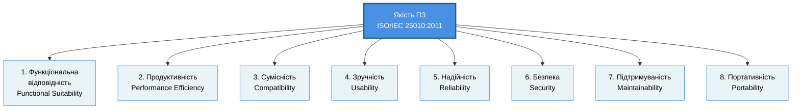
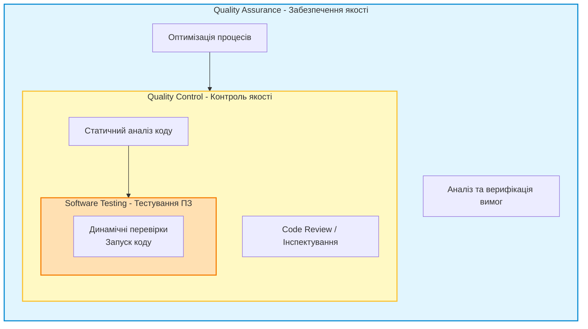
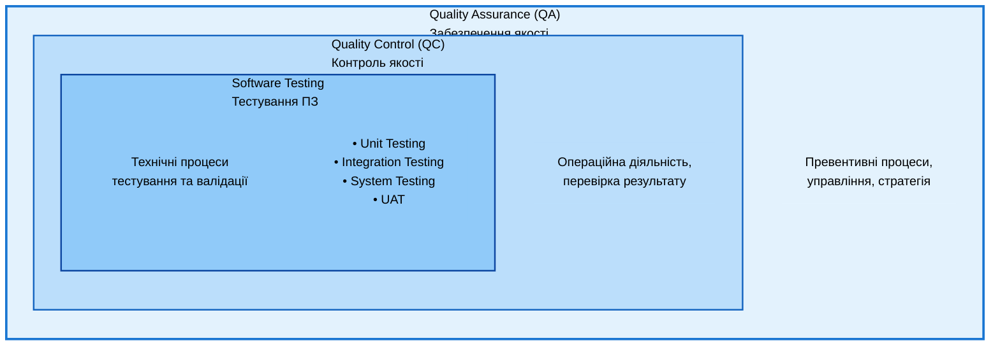
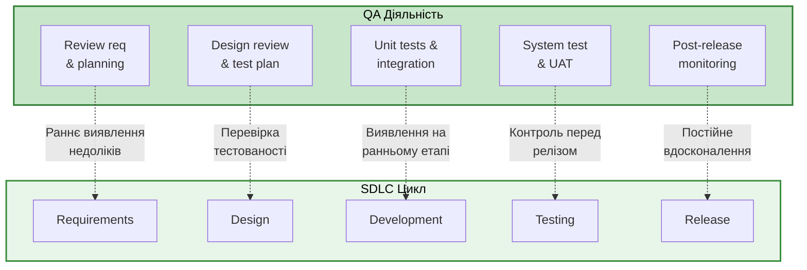
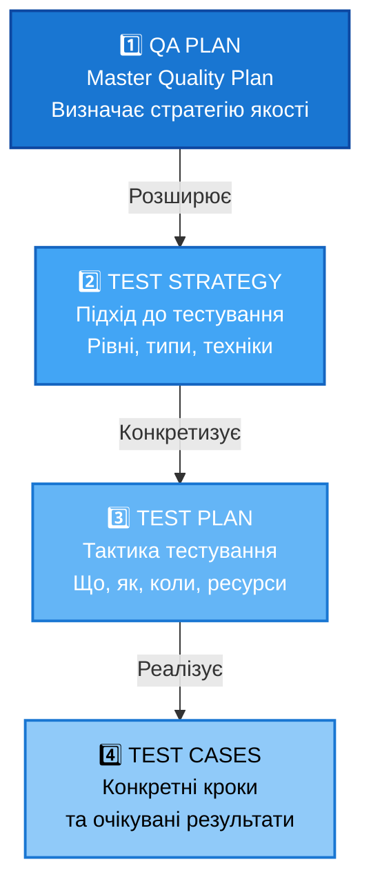
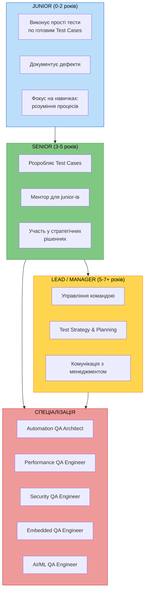

# Глава 2: Основи контролю якості

**Мета глави:** Розуміння фундаментальних концепцій Quality Assurance (QA), Quality Control (QC), Verification, Validation та їх взаємозв'язку в процесі розробки програмного продукту.

---

## 2.1. Якість програмного забезпечення

### 2.1.1. Визначення якості ПЗ

**Якість програмного забезпечення** (Software Quality) — це вимірна інженерна категорія, що відображає ступінь відповідності продукту встановленим вимогам функціональності, надійності, продуктивності, безпеки та інших характеристик.


На відміну від побутового розуміння якості як суб'єктивного враження, в інженерії якість ПЗ є:

- **Вимірною** — визначається через метрики (кількість дефектів на 1000 рядків коду, час відновлення, розмір пам'яті тощо)
- **Об'єктивною** — залежить від фактичної відповідності продукту стандартам та вимогам
- **Комплексною** — охоплює множину характеристик, не лише відсутність помилок

**Ключова думка:** Програма без критичних помилок, але з повільною роботою, складним інтерфейсом та важкою підтримкою — не матиме високої якості. Якість ПЗ — це комплекс інженерних характеристик (функціональність, продуктивність, безпека, юзабіліті, архітектура, документація), які разом забезпечують цінність продукту для користувачів і бізнесу.

---

### 2.1.2. Модель якості ISO/IEC 25010:2011


Міжнародний стандарт **ISO/IEC 25010:2011** визначає компактну модель якості програмського продукту, яка складається з **8 фундаментальних характеристик**:




#### Детальна таблиця характеристик

| № | Характеристика | Англійська | Визначення | Приклад |
|---|---|---|---|---|
| **1** | **Функціональна відповідність** | Functional Suitability | Ступінь, до якого продукт забезпечує функції, які задовольняють встановлені та передбачені потреби | Електронна каса має правильно розраховувати суму, застосовувати знижки та друкувати чек |
| **2** | **Продуктивність** | Performance Efficiency | Кількість ресурсів (час обробки, пам'ять, мережевий трафік), необхідних для виконання функцій | Завантаження списку з 10,000 записів не повинно займати більше 2 секунд |
| **3** | **Сумісність** | Compatibility | Можливість продукту обмінюватися даними з іншими системами і виконувати свої функції у спільному середовищі | API має відповідати REST-стандартам; база даних повинна читати формати інших систем |
| **4** | **Зручність** | Usability | Ступінь, до якого продукт може бути використаний визначеною категорією користувачів для досягнення цілей з ефективністю та задоволенням | Новий користувач повинен створити акаунт не більше ніж за 3 клікання; інтерфейс інтуїтивний |
| **5** | **Надійність** | Reliability | Ступінь, до якого продукт виконує встановлені функції за встановлених умов протягом встановленого періоду часу | Сервіс має бути доступний 99.9% часу (не більше 8 годин простою на рік) |
| **6** | **Безпека** | Security | Ступінь захисту продукту від несанкціонованого доступу, модифікації та розкриття даних | Паролі зберігаються в зашифрованому вигляді; передача даних через HTTPS; функції обмежені за ролями |
| **7** | **Підтримуваність** | Maintainability | Ступінь ефективності, з якою продукт можна модифікувати, включаючи виправлення дефектів, покращення та адаптацію | Код має низьку цикломатичну складність (<10); документація актуальна; структура модульна |
| **8** | **Портативність** | Portability | Ступінь ефективності, з якою продукт можна перенести з одного середовища на інше | Програма працює на Windows, macOS та Linux; Docker дозволяє розгортати у будь-якому хмарному провайдері |

#### Взаємозв'язок характеристик

Ці 8 характеристик не існують ізольовано:

- **Безпека** може вплинути на **Продуктивність** (шифрування потребує додаткового часу обробки)
- **Зручність** може потребувати більше **Підтримуваності** (інтуїтивна логіка часто складніша для розробки)
- **Сумісність** часто вимагає **Портативності** (стандартні формати дозволяють розгортати на різних платформах)

Завдання QA — знайти оптимальний баланс між цими характеристиками для конкретного продукту.

---

### 2.1.3. Вимірювання якості ПЗ

Якість ПЗ вимірюється за допомогою двох основних категорій метрик:

**1. Метрики відповідності вимогам:**
- Відсоток функцій, реалізованих у межах ітерації
- Відсоток тестових сценаріїв, що пройшли успішно
- Відсоток вимог, що задовольнені

**2. Метрики дефектів:**
- **Щільність дефектів** (defect density) — кількість дефектів на 1000 рядків коду (KLOC)
- **Ймовірність вилучення дефекту** (defect removal efficiency) — відсоток дефектів, виявлених на кожному етапі
- **Середній час відновлення** (MTTR — mean time to repair) — час, потрібний для виправлення дефекту

**Приклад:** Якщо продукт містить 100,000 рядків коду та протягом тестування виявлено 45 дефектів, щільність дефектів становить 0.45 дефектів на KLOC. Залежно від критичності продукту встановлюється прийнятна межа (наприклад, 0.1-0.5 для критичних систем; 1-2 для комерційного ПЗ).

---

## 2.2. QA vs QC vs Testing

### 2.2.1. Ієрархічна модель управління якістю

У сучасній інженерії програмного забезпечення якість не є абстрактним або суб'єктивним поняттям. Це чітка, вимірна категорія, яка закладається на кожному етапі життєвого циклу проєкту (SDLC). Управління якістю (Quality Management) будується як вкладена структура, де кожна наступна ланка є практичним інструментом реалізації попередньої:



Ця модель (концепція «матрьошки») чітко демонструє, що:
- **Quality Assurance (QA)** покриває весь життєвий цикл розробки та фокусується на процесах і запобіганні дефектам.
- **Quality Control (QC)** є частиною QA і фокусується на оцінюванні відповідності готового продукту або його проміжних артефактів установленим вимогам.
- **Software Testing (Тестування ПЗ)** є головним технічним інструментом у складі QC, який полягає в безпосередньому запуску коду для виявлення відмов.

### 2.2.1.1. Метричний підхід та інженерні методи оцінювання

Для того, щоб забезпечити перехід від пасивного пошуку багів до керованого процесу забезпечення якості, сучасні команди використовують **метричний аналіз**. Інженерні методи оцінювання базуються на кількісному вимірюванні характеристик коду, архітектури та процесів на всіх етапах реалізації проєкту.

Технології оцінювання якості ПЗ фундаментально поділяються на два вектори:
1. **Статичні технології (орієнтовані на QA/QC):** Перевірка вимог, інспектування моделей, аналіз архітектурних схем та статичний аналіз вихідного коду без його безпосереднього запуску на комп'ютері.
2. **Динамічні технології (орієнтовані на Testing):** Безпосереднє виконання програми з метою виявлення збоїв, збирання даних про відмови та аналізу операційної поведінки системи.


**Важливий інженерний висновок:** Дослідження показують, що помилки, допущені на ранніх етапах (формулювання вимог та проєктування архітектури), становлять від **25% до 55%** від усіх можливих дефектів у проєкті. При цьому спостерігається закономірність: чим більший обсяг програмної системи, тим вища частка саме концептуальних помилок у вимогах.

Саме тому інтеграція процесів QA починається задовго до написання коду. Аналіз та інспектування специфікацій вимог незалежними експертами на етапі проєктування архітектури дозволяє виявити та усунути **до 55% усіх дефектів** майбутнього програмного продукту, що експоненціально знижує загальну вартість розробки.

**Джерела і перехресні посилання:**
- https://github.com/STT-VITI-22/stt-handbook/blob/main/dataset/articles/qalight/parsed/osnovi/qa-qc-i-testuvannia.md — Повний аналіз моделей розрізнення процесів QA, QC та Тестування
- https://github.com/STT-VITI-22/stt-handbook/blob/main/dataset/books_pdf/parsed/Didkovska_2010_SoftwareTesting.md — Аналіз вимог ПЗ та вартості дефектів на ранніх етапах
- https://github.com/STT-VITI-22/stt-handbook/blob/main/dataset/books_pdf/parsed/Hrytsiuk_2018_SoftwareQualityMetrics.md — Метрики якості та методи оцінювання

---

### 2.2.2. Ієрархічна модель управління якістю (деталізована діаграма)

Управління якістю ПЗ будується як вкладена структура, подібна до матрьошки:



**Ієрархія:**
- **QA включає в себе QC** — контроль якості є інструментом забезпечення якості
- **QC включає в себе Testing** — тестування є одним із методів контролю якості
- Але між ними існують чіткі межи ролі та відповідальності

---

### 2.2.3. Quality Assurance (QA)

**Quality Assurance (Забезпечення якості)** — це **превентивна, процесно-орієнтована** діяльність, спрямована на **запобігання появі дефектів** через встановлення та контроль якості процесів розробки.

| Аспект | Деталь |
|--------|--------|
| **Мета** | Запобігти дефектам через вдосконалення процесів розробки |
| **Коли** | Протягом **всього SDLC** — від планування до розгортання та обслуговування |
| **Фокус** | На **процесах** розробки, а не на готовому продукті |
| **Хто** | QA Engineer, QA Manager, Process Improvement Engineer |
| **Інструменти** | Стандарти, шаблони, керівництва, аудити, код-ревю, процесна документація |
| **Результат** | Попереджувальні рекомендації та вдосконалені процеси |

**Приклади діяльності QA:**
- Розроблення та впровадження стандартів розробки (наприклад, "всі функції мають мати unit-тести")
- Аудит процесів розробки та планування
- Налаштування інструментів для статичного аналізу та код-ревю
- Розроблення шаблонів документації
- Тренування команди з найкращих практик

---

### 2.2.4. Quality Control (QC)

**Quality Control (Контроль якості)** — це **операційна, продукт-орієнтована** діяльність, спрямована на **виявлення та документування дефектів** у готовому продукті або проміжних артефактах.

| Аспект | Деталь |
|--------|--------|
| **Мета** | Виявити дефекти та переконатися, що продукт відповідає вимогам |
| **Коли** | На **специфічних етапах SDLC** — як правило, після розробки функції або перед релізом |
| **Фокус** | На **продукті** та його властивостях, результатах |
| **Хто** | QA Engineer (Manual), Test Analyst, Test Automation Engineer |
| **Інструменти** | Test Cases, Test Suites, Bug Reports, Test Execution Reports, Automation Frameworks |
| **Результат** | Bug Reports з детальним описом дефектів, метрики покриття, акт прийманості |

**Приклади діяльності QC:**
- Виконання функціональних тестів на основі Test Cases
- Запуск автоматизованих тестів через CI/CD pipeline
- Перевірка відповідності дизайну та технічній специфікації
- Виявлення та документування дефектів
- Звіт про готовність продукту до релізу

---

### 2.2.5. Software Testing (Тестування)

**Software Testing (Тестування ПЗ)** — це **технічний, локальний** процес **виконання програми з метою виявити відмови** та перевірити відповідність вимогам.

Тестування є **одним з основних інструментів QC**, але не єдиним.

**Техніки тестування, що входять до Software Testing:**
- Unit Testing (модульне тестування розробником)
- Integration Testing (тестування інтеграції компонентів)
- System Testing (комплексне функціональне тестування)
- User Acceptance Testing (приймальне тестування користувачем)
- Non-Functional Testing (тестування продуктивності, безпеки, юзабіліті)

**Інші методи контролю якості (QC), але не тестування:**
- Code Review (перегляд коду іншим розробником)
- Static Analysis (статичний аналіз коду без виконання)
- Inspection (формальна перевірка документації та дизайну)

---

### 2.2.6. Порівняльна таблиця QA vs QC vs Testing

| Критерій | QA | QC | Testing |
|----------|----|----|---------|
| **Визначення** | Запобігання дефектам | Виявлення дефектів | Виконання програми для пошуку дефектів |
| **Фокус** | Процеси розробки | Продукт/результати | Виконавець тестування |
| **Коли** | Протягом всього SDLC | На специфічних етапах | На етапі готовності до випуску |
| **Як реалізується** | Управління, стандарти, процеси | Перевірки, контроль, аудит | Виконання тестів, виявлення дефектів |
| **Хто виконує** | QA Manager, Process Owner | QA Engineer, Test Analyst | QA Engineer (Manual), Automation Engineer |
| **Інструмент** | Стандарти, guidelines, шаблони | Тест-плани, тест-кейси, звіти | Test Cases, Test Suites, Bug Tracking |
| **Результат** | Вдосконалені процеси | Список дефектів, метрики | Виконаний тест, Bug Report, Metrics |
| **Проактивна чи реактивна** | Проактивна (запобігання) | Реактивна (виявлення) | Реактивна (виявлення) |

**Аналогія для розуміння:**
- **QA** — інспектор на фабриці, що розробляє процеси для запобігання браку
- **QC** — контроль якості на конвеєрі, що вловлює брак
- **Testing** — конкретна техніка контролю (наприклад, вимірювання розмірів готового товару)

---

## 2.3. Verification vs Validation

### 2.3.1. Фундаментальна різниця

**Verification (Верифікація)** та **Validation (Валідація)** — це два фундаментальні поняття, що відповідають на різні запитання:

| Поняття | Запитання | Назва на укр. | Визначення |
|---------|-----------|---------------|-----------|
| **Verification** | **"Чи будуємо ми продукт правильно?"** | Верифікація | Перевірка відповідності продукту заздалегідь встановленим вимогам, технічним специфікаціям та архітектурі. Це **внутрішня перевірка** на відповідність ТЗ. |
| **Validation** | **"Чи правильний продукт ми побудували?"** | Валідація | Перевірка того, що продукт дійсно задовольняє реальні потреби та очікування кінцевого користувача, бізнесу та ринку. Це **зовнішня перевірка** на корисність. |

**Ключова різниця у фокусі:**
- **Verification** = "Чи це відповідає ТЗ?" (Specification compliance)
- **Validation** = "Чи це те, що потрібно користувачеві?" (User needs fulfillment)

---

### 2.3.2. Практичні приклади розрізнення

#### Приклад 1: Банківська система

Розробляється мобільний додаток для переказу коштів між рахунками.

**Верифікація (Verification):**
- ✓ При переказі 100 UAH та комісії 1 UAH рахунок зменшується на 101 UAH? (відповідно ТЗ — Так)
- ✓ Валютний обмін відбувається за курсом, встановленим у параметрах системи? (Так)
- ✓ Логи запису до БД створюються автоматично? (Так)

**Валідація (Validation):**
- ❌ Але середньостатистичний користувач (пенсіонер) може зрозуміти, як клікнути на кнопку "Перевести"? (НІ — інтерфейс неінтуїтивний, занадто багато полів)
- ❌ Чи бізнес отримує користь від цього додатку, якщо його завантажило лише 10 людей за місяць? (НІ — продукт не потрібен ринку в його поточній формі)
- ❌ Чи користувач при відключенні інтернету отримує зрозуміле повідомлення? (НІ — додаток падає з незрозумілою помилкою)

**Висновок:** Додаток **верифікований** (технічно правильний), але **не валідований** (несумісний з реальністю та потребами користувачів).

#### Приклад 2: E-commerce платформа

**Верифікація:**
- Кошик правильно розраховує суму товарів? ✓ Так
- Кожен товар в БД має ID? ✓ Так
- Сторінка завантажується за 2 секунди? ✓ Так

**Валідація:**
- Новий користувач розбирається, як здійснити покупку без пояснення? ❌ НІ (потребує 10 кроків замість 3-5)
- Бізнес отримує добрий ROI (повернення на інвестиції) від цієї платформи? ❌ НІ (нікому вона не цікава, конкуренти кращі)
- Користувачі готові платити за доставку, яка пропонується? ❌ НІ (очевидно, вона дорога)

---

### 2.3.3. Зв'язок Verification та Validation з SDLC

**На якому етапі SDLC відбуваються Verification та Validation?**

```mermaid
graph LR
    REQ["📋 Requirements"]
    DES["🎨 Design"]
    DEV["💻 Development"]
    TST["🧪 Testing"]
    DEP["🚀 Deployment"]

    REQ -->|Verification: Вимоги<br/>прорецензовано?| DES
    DES -->|Verification: Дизайн<br/>відповідає вимогам?| DEV
    DEV -->|Verification: Code review,<br/>Unit Tests| TST
    TST -->|Verification: System Test<br/>відповідає ТЗ?| DEP

    REQ -->|Validation: Користувачі<br/>затверджують вимоги?| DES
    DES -->|Validation: UX-аналітики<br/>перевіряють юзабіліті?| DEV
    DEV -->|Validation: Бета-тестувальники<br/>дають feedback| TST
    TST -->|Validation: UAT -<br/>користувачі тестують| DEP

    style REQ fill:#FFECB3,stroke:#FBC02D,color:#000
    style DES fill:#FFECB3,stroke:#FBC02D,color:#000
    style DEV fill:#FFECB3,stroke:#FBC02D,color:#000
    style TST fill:#FFECB3,stroke:#FBC02D,color:#000
    style DEP fill:#FFECB3,stroke:#FBC02D,color:#000
```



**Важливо:** Validation не закінчується на релізі — це **постійний процес**. Після розгортання коректується через feedback користувачів.

---

## 2.4. Концепція тестування в SDLC

### 2.4.1. Роль тестування як невіддільної частини SDLC

Життєвий цикл розробки програмного забезпечення (Software Development Life Cycle — SDLC) є комплексним інженерним процесом, успішна реалізація якого вимагає скоординованої взаємодії багатьох учасників (стейкхолдерів, архітекторів, аналітиків, розробників та інженерів із якості) на різних етапах створення продукту.

Сучасні інженерні практики переконують, що тестування не є ізольованою фазою, яка запускається виключно після завершення написання коду. Воно має бути безперервним процесом, інтегрованим у кожну стадію SDLC.


### 2.4.1. Роль тестування та принцип Shift-Left

**Тестування** не є ізольованою фазою в кінці розробки — це інтегрована діяльність, яка повинна відбуватися на кожному етапі SDLC.

Впровадження концепції **раннього тестування (Shift-Left)** — тобто верифікація та інспектування артефактів проєкту, починаючи з етапу аналізу вимог та проєктування архітектури — дозволяє виявляти концептуальні та логічні помилки до моменту їхнього програмного втілення. Такий підхід забезпечує експоненціальну економію часових та фінансових ресурсів, запобігає накопиченню технологічного боргу та суттєво скорочує загальний час виходу стабільного продукту на ринок (Time to Market).

#### Традиційна (неправильна) модель — "Big Bang Testing"

```
Requirements ➜ Design ➜ Development ➜ Testing ➜ Release
                                      ↑
                            "Послідовне тестування"
                        (Знаходимо всі баги в кінці)
```

**Проблеми:**
- Мало часу для фінального тестування перед релізом
- Великі вікна часу між розробкою та виявленням дефектів
- Дорого виправляти дефекти, виявлені в кінці

#### Сучасна (правильна) модель — "Shift-Left Testing"



**Принцип Shift-Left:** Тестування повинно починатися якомога раніше в процесі розробки.

#### Економіка дефектів — Boehm's Curve

2025 — Google Cloud (масштабний збій Google Workspace)

Суть помилки: У продакшн було випущено нову функцію “quota policy checks” без достатнього тестування; некоректна обробка порожніх даних призвела до збою.
Наслідки: Глобальний збій сервісів Gmail, Drive, Meet; мільйони користувачів втратили доступ протягом кількох годин.
Вартість: десятки мільйонів доларів — прямі втрати клієнтів, SLA-компенсації, втрачена продуктивність компаній, а також репутаційні збитки для Google.
2018 — Авіація (Boeing, 737 MAX MCAS)

Суть помилки: Система автоматичної стабілізації MCAS покладалася лише на один датчик кута атаки. В тестах не було змодельовано відмову сенсора та його вплив на систему.
Наслідки: Дві авіакатастрофи (Lion Air 2018, Ethiopian Airlines 2019), загинуло 346 людей. Літаки 737 MAX були глобально відсторонені від польотів майже на 2 роки.
Вартість: понад $20 млрд — включаючи компенсації сім’ям загиблих, компенсації авіакомпаніям, витрати на доопрацювання, штрафи та падіння ринкової капіталізації Boeing.

Вартість виправлення дефекту експоненціально зростає на кожному етапі:

| Етап | Вартість |
|------|----------|
| **Requirements** | ~$100 |
| **Design** | ~$500 |
| **Development** | ~$1,000 |
| **Testing** | ~$10,000 |
| **Production** | ~$100,000+ |

**Приклад:** Дефект, виявлений на етапі Requirements (неточна вимога про розрахунок комісії), коштує $100. Якщо цей самий дефект знайти у production, коли вже використовується 100,000 користувачів, це може коштувати $100,000+ (включаючи репутаційну шкоду).

**Висновок:** Залучення QA на ранніх етапах економить гроші в масштабі проекту.

---

### 2.4.2. Вплив моделей розробки на тестування

Тестування програмного забезпечення – креативна та інтелектуальна робота. Розробка правильних та ефективних тестів – досить непросте заняття. Принципи тестування, приведені нижче, були розроблені в останні 40 років та є загальною інструкцією для тестування в цілому.


#### Каскадна модель (Waterfall model)

На початку епохи програмування програмісти самостійно створювали прості функції для обчислень і автоматизації рутинних задач. Сьогодні розробка програмних систем потребує командної роботи програмістів, аналітиків, адміністраторів, тестувальників та користувачів. Сучасні програми містять мільйони рядків коду.

Однією з найстаріших моделей організації процесу розробки є каскадна (водоспадна). У ній кожен етап життєвого циклу ПЗ виконується послідовно після завершення попереднього. Модель проста й зрозуміла, але в умовах змінних вимог може стати гальмом. Нині її застосовують здебільшого великі компанії для масштабних проектів, де потрібен жорсткий контроль ризиків.

Незважаючи на те, що каскадна модель все ще використовується, вона вже втратила колишні позиції. Сьогодні їй на зміну приходять більш просунуті моделі та методології розробки програмного забезпечення.


**Коли варто використовувати каскадну модель:**
- У проектах з чітко визначеними вимогами, для яких не передбачається зміна цих вимог в процесі розробки;
- Для проектів, які мігрують з однієї платформи на іншу. Тобто, вимоги залишаються ті ж, міняється лише системне оточення та/або мова програмування;
- Коли від компанії-розробника не потрібно проводити тестування – наприклад, його забезпеченням займеться сам замовник або стороння фірма.


**Переваги:**
- Повне документування кожного етапу;
- Чітке планування термінів і витрат;
- Прозорість процесів для замовника.

**Недоліки:**
- Необхідність затвердження повного обсягу вимог до системи ще на першому етапі;
- У разі необхідності внесення змін до вимог пізніше – повернення до першої стадії та переробка заново всієї виконаної роботи;
- Збільшення витрат коштів та часу в разі потреби змінити вимоги.

---

#### V подібна модель (V-model)

V подібна модель – це покращена версія класичної каскадної моделі. Тут на кожному етапі відбувається контроль поточного процесу, для того, щоб переконатися в можливості переходу на наступний рівень. У цій моделі тестування починається ще зі стадії написання вимог, причому для кожного наступного етапу передбачений свій рівень тестового покриття.

Для кожного рівня тестування розробляється окремий тест-план, тобто під час тестування поточного рівня, ми також займаємося розробкою стратегії тестування наступного. Створюючи тест-плани, ми також визначаємо очікувані результати тестування і вказуємо критерії входу і виходу для кожного етапу.

У V-моделі кожному етапу проектування і розробки системи відповідає окремий рівень тестування. Тут процес розробки представлений низхідною послідовністю в лівій частині умовної літери V, а стадії тестування – на її правому ребрі. Відповідність етапів розробки і тестування показано горизонтальними лініями.


**Коли варто використовувати V подібну модель:**
- У проєктах, в яких існують часові та фінансові обмеження;
- Для завдань, які передбачають більш широке, порівняно з каскадною моделлю, тестове покриття;
- В проєктах, де каскадна модель не ефективна, але команда розуміє всі процеси каскадних моделей.

**Переваги:**
- Сувора етапність;
- Планування тестування і верифікація системи виробляються на ранніх етапах;
- Покращений, в порівнянні з каскадною моделлю, тайм-менеджмент;
- Проміжне тестування.

**Недоліки:**
- Недостатня гнучкість моделі;
- Власне створення програми відбувається на етапі написання коду, тобто вже в середині процесу розробки;
- Недостатній аналіз ризиків;
- Немає роботи з паралельними подіями і можливості динамічного внесення змін.

---

#### Ітеративна модель (Iterative model)

Не всі моделі життєвого циклу послідовні. Існують також ітеративні (або інкрементальні) моделі, в яких використовується інший підхід. Замість однієї тривалої послідовності дій тут весь життєвий цикл продукту розбитий на ряд окремих міні-циклів. Причому кожен з них складається із все тих же базових стадій моделі життєвого циклу. Ці міні-цикли називаються ітераціями. У кожній з ітерацій відбувається розробка окремого компонента системи, після чого цей компонент додається до вже раніше розробленого функціоналу.

Ітеративна модель не передбачає повного обсягу вимог для початку робіт над продуктом. Розробка програми може починатися з вимог до частини функціоналу, які можуть згодом доповнюватися і змінюватися. Процес повторюється, забезпечуючи створення нової версії продукту для кожного циклу.

Ітеративна модель є ключовим елементом так званих «гнучких» (Agile) підходів до розробки програмного забезпечення.

**Коли варто використовувати ітеративну модель:**
- для великих проектів;
- коли відомі, принаймні, ключові вимоги;
- коли вимоги до проекту можуть мінятися в процесі розробки.

У дещо спрощеному вигляді, ітеративна модель складається з чотирьох основних стадій, які повторюються у кожній з ітерацій (plan-do-check-act):
- Планування ітерації та тестування;
- визначення та аналіз вимог;
- дизайн та проектування – згідно вимогами. Причому дизайн може як розроблятися окремо для даної функціональності, так і доповнювати вже існуючий;
- розробка і тестування – кодування, інтеграція і тестування нового компонента;
- фаза розгортання та рев'ю – оцінка, перегляд поточних вимог та пропозиції щодо доповнення цих вимог. За результатами кожної ітерації приймається рішення – чи будуть використані її результати для доповнення існуючої функціональності в якості вхідної точки для початку наступної ітерації (т.зв. інкрементальне прототипування).

Зрештою, досягається точка, в якій всі вимоги були втілені в продукт – відбувається реліз та підтримка.

У математичних термінах, ітеративна модель являє реалізацію методики послідовної апроксимації – тобто, поступове наближення до образу готового продукту:


Ключ до успішного використання цієї моделі – сувора верифікація вимог і ретельна валідація розроблюваної функціональності в кожній з ітерацій. Основні стадії процесу розробки в ітеративній моделі фактично повторюють модель водоспаду. У кожній ітерації створюється програмне забезпечення, що вимагає тестування на всіх рівнях.


**Переваги:**
- раннє створення працюючого ПЗ;
- гнучкість – готовність до зміни вимог на будь-якому етапі розробки;
- кожна ітерація – маленький етап, для якого тестування та аналіз ризиків забезпечити простіше, ніж для всього життєвого циклу продукту.

**Недоліки:**
- кожна фаза – самостійна, окремі ітерації не накладаються одна на одну;
- можуть виникнути проблеми з реалізацією загальної архітектури системи, оскільки не всі вимоги відомі до початку проектування.

---

#### Спіральна модель (Spiral model)

Спіральна модель є шаблоном процесу розробки ПЗ, який поєднує в собі ідеї ітеративної та каскадної моделей. Суть її в тому, що весь процес створення кінцевого продукту представлений у вигляді умовної площини, розбитої на 4 сектори, кожен з яких представляє окремі етапи його розробки: визначення цілей, оцінка ризиків, розробка і тестування, планування нової ітерації.


У спіральної моделі життєвий шлях розроблювального продукту зображується у вигляді спіралі, яка, розпочавшись на етапі планування, розкручується з проходженням кожного наступного кроку. Таким чином, на виході з чергового витка ми повинні отримати готовий протестований прототип, який доповнює існуючий білд. Прототип, що задовольняє всім вимогам – готовий до релізу.

Головна особливість спіральної моделі – концентрація на можливі ризики. Для їх оцінки навіть виділена відповідна стадія.

**Основні типи ризиків, які можуть виникнути в процесі розробки ПЗ:**
- часта зміна вимог;
- надмірна оптимізація;
- низька продуктивність системи;
- невідповідність рівня кваліфікації фахівців різних відділів.

**Коли варто використовувати спіральну модель:**
- коли важливий аналіз ризиків і витрат;
- великі довгострокові проекти з відсутністю чітких вимог або ймовірністю їх динамічної зміни;
- при розробці нової лінійки продуктів.

**Переваги спіральної моделі:**
- покращений аналіз ризиків;
- хороша документація процесу розробки;
- гнучкість – можливість внесення змін і додавання нової функціональності навіть на відносно пізніх етапах;
- раннє створення робочих прототипів.

**Недоліки спіральної моделі:**
- може бути досить дорога у використанні;
- управління ризиками вимагає залучення висококласних фахівців;
- успіх процесу у великій мірі залежить від стадії аналізу ризиків;
- не підходить для невеликих проектів.

---

#### Agile (Гнучка розробка)

**Характеристики:**
- Ітеративна, циклічна модель (спринти по 1-4 тижні)
- Частий реліз усередині спринту
- Постійна взаємодія з користувачем

**Роль тестування в Agile:**
- QA інженер працює з розробниками на однакові дні
- Test Cases пишуться водночас з Feature Development
- Автоматизовані тести запускаються в CI/CD pipeline після кожного коміту
- Дефекти виявляються й виправляються в межах спринту (не накопичуються)

**Переваги для тестування:**
- Ранне виявлення дефектів = дешевші виправлення
- Постійне інтегрування коду = менше конфліктів
- Faster feedback loop = швидший розвиток

---

### 2.4.3. Ієрархія тестової документації

Управління тестуванням в SDLC здійснюється через ієрархічну структуру документів:



#### 1. QA PLAN (Загальний план забезпечення якості)

**Мета:** Встановити загальну стратегію управління якістю на весь проект.

**Включає:**
- Цілі якості проекту (наприклад: "Досягти щільності дефектів < 0.5 на 1000 рядків коду")
- Стандарти та procedures
- Ролі й обов'язки QA команди
- Інструменти й інфраструктуру для забезпечення якості
- План для управління ризиками якості
- Метрики та критерії успіху

#### 2. TEST STRATEGY (Стратегія тестування)

**Мета:** Описати загальний підхід до тестування проекту.

**Включає:**
- Рівні тестування (Unit, Integration, System, UAT)
- Види тестування (Functional, Performance, Security, Usability)
- Техніки тестування для кожного типу
- Критерії входження та виходження на кожному рівні
- Розподіл часу та ресурсів між рівнями
- Інструменти для тестування й автоматизації

#### 3. TEST PLAN (План тестування)

**Мета:** Деталізувати конкретну тактику для одного циклу тестування або спринту.

**Включає:**
- Обсяг тестування (які функції тестуватимемо, які ні)
- Тестові дані й оточення
- Розклад виконання тестів
- Розподіл людських ресурсів
- Критерії готовності (Entry Criteria)
- Критерії завершення (Exit Criteria)
- План управління ризиками

#### 4. TEST CASES (Тестові сценарії)

**Мета:** Визначити конкретні кроки для перевірки функції.

**Приклад Test Case:**

```
TC_LOGIN_001: Successful Login with Valid Credentials

Prerequisites:
- Application is launched and on Login page
- Test user "user@example.com" exists in system
- Password is "TestPass123"

Steps:
1. Enter email "user@example.com"
2. Enter password "TestPass123"
3. Click "Login" button

Expected Results:
- User is redirected to Dashboard
- User's name appears in top-right corner
- No error messages displayed
```

---

## 2.5. Ролі у тестуванні

### 2.5.1. Основні ролі в сучасній команді тестування


#### QA Engineer (Manual Testing Specialist)

**Основні обов'язки:**
- Розроблення та виконання тестових сценаріїв (вручну)
- Виявлення, документування та відстеження дефектів
- Участь у код-ревю та планування спринту

**Вимоги й компетенції:**
- Розуміння SDLC та методологій (Waterfall, Agile)
- Добре знання SQL для перевірки БД
- Уважність до деталей та терпіння
- Навички комунікації та співпраці з розробниками

**Типова кар'єра:**
Junior QA Engineer → QA Engineer → Senior QA Engineer → QA Lead

#### Test Analyst (Test Designer / Quality Analyst)


**Основні обов'язки:**
- Аналіз вимог та створення тестової стратегії
- Розроблення тестових case, плани та сценарії
- Визначення тестових даних та оточення

**Вимоги й компетенції:**
- Глибоке розуміння SDLC та Agile
- Навички аналізу вимог та документів
- Знання техніки тест-дизайну (BVA, ECP, Decision Tables)
- Комунікаційні навички

**Типова кар'єра:**
Junior Test Analyst → Test Analyst → Senior Test Analyst → QA Manager

#### Test Automation Engineer (Automation QA / AQA)

**Основні обов'язки:**
- Розроблення й утримання автоматизованих тестів
- Налаштування CI/CD pipeline та інструментів автоматизації
- Розроблення тестових framework та utility функцій

**Вимоги й компетенції:**
- Сильні навички програмування (Python, Java, JavaScript)
- Знання фреймворків: Selenium, Cypress, Appium
- Розуміння CI/CD (Jenkins, GitHub Actions, GitLab CI)
- Знання Git та системи контролю версій

**Типова кар'єра:**
Junior Automation Engineer → Automation Engineer → Senior Automation Engineer → QA Architect

#### Test Lead / QA Manager


**Основні обов'язки:**
- Управління тестовою командою та розподіл завдань
- Розроблення Test Strategy та Test Plan
- Комунікація з іншими departments
- Звітування про якість та вирішення проблем

**Вимоги й компетенції:**
- 5+ років досвіду у тестуванні
- Лідерські навички
- Глибокі знання всіх видів тестування
- Комунікаційні й переговірні навички

---

### 2.5.2. Hard & Soft Skills для сучасного QA Engineer

#### Hard Skills (Технічні навички)

**Обов'язкові:**
- Manual тестування та документування дефектів
- Розуміння SDLC та STLC
- Знання тест-дизайну техніки (BVA, ECP)
- Основи SQL (SELECT, WHERE, JOIN)
- Основи Linux/Command Line

**Бажані (в залежності від спеціалізації):**
- Програмування (Python, Java) — для Automation QA
- Фреймворки автоматизації (Selenium, Cypress) — для Automation QA
- API тестування (Postman, REST Assured) — для API QA
- Performance тестування (JMeter, k6) — для Performance QA

#### Soft Skills (М'які навички)

**Критичні:**
- **Комунікація** — складання зрозумілих Bug Report, обговорення з розробниками
- **Увага до деталей** — перехоплення edge cases та неочевидних помилок
- **Критичне мислення** — аналіз вимог, пошук двозначностей
- **Проактивність** — запропонування поліпшень процесів тестування
- **Стресостійкість** — робота у дедлайни, спілкування з розробниками при розбіжностях

**Важливі:**
- **Адаптивність** — робота з новими інструментами й платформами
- **Співпраця** — робота в команді, синхронізація з розробниками
- **Організованість** — управління багатьма тестами й дефектами одночасно

---

### 2.5.3. Професійна траєкторія розвитку



---

## 2.6. Практичний case study: Мобільний банківський додаток

### 2.6.1. Кейс: Banking App — Верифікація vs Валідація

**Контекст:** Розробляється мобільний додаток для онлайн-банкінгу для приватного банку. Команда: 15 розробників, 3 QA інженери, 1 QA Manager. Бюджет: $500,000.

#### Етап 1: Requirements

QA Manager пропускає фазу review вимог, фокусуючись лише на later-stage тестування.

**Проблема:**
- Business Analyst написав: "Система має використовувати поточний курс при конвертації валют"
- Але **не зазначив**: Яка точність курсу? Де беруться дані? Як часто оновлюється?
- QA не зробив Requirement Review — цих питання ніхто не піднімав

**Вартість помилки на цьому етапі:** ~$500

#### Етап 2: Development

Розробник реалізує конвертацію, припускаючи:
- "Курс оновлюється щогодини з European Central Bank"
- "Якщо курс недоступний, система замерзає"

**Unit Tests проходять 100%:** Розробник мокує курси, і все працює.

**Вартість помилки на цьому етапі:** ~$5,000 (якщо виявити тепер)

#### Етап 3: Testing (2 тижні до релізу)

QA тестує конвертацію:
- EUR → USD — працює ✓
- GBP → EUR — працює ✓
- USD → JPY — працює ✓

**Здається, все готово!**

**Вартість помилки на цьому етапі:** ~$20,000

#### Етап 4: UAT (User Acceptance Testing)

**Користувач 1 (Business User):**
- "Я конвертую 1000 EUR → JPY. Система показує 150.2345 JPY/EUR"
- "Але мій онлайн-брокер показує 150.2244 JPY/EUR"
- **Проблема:** Точність курсу не була визначена!

**Користувач 2 (In Bad Network):**
- "Мій інтернет слабкий, курс недоступний"
- "Додаток повністю замерзає. Не можу навіть закрити його"
- **Проблема:** Немає обробки виняткових ситуацій!

**Користувач 3 (Technical Manager):**
- "Ви коли-небудь перевіряли, чи ECB так часто оновлюється?"
- "Їх API інколи падає на 10-15 хвилин. Ваша система не готова до цього."
- **Проблема:** Немає fallback механізму!

**Вартість помилки на цьому етапі:** ~$100,000+ (реліз затримується на 3 тижні)

#### Висновок

| Етап | Якщо виявити | Вартість |
|------|---|---|
| Requirements | $500 |
| Design | $3,000 |
| Development | $5,000 |
| Testing | $20,000 |
| Production | $100,000+ |

**Урок:** Принцип Shift-Left (залучення QA на ранніх етапах) економить гроші в масштабі проекту.

---

## 2.7. Міні-тест: Закріплення матеріалу

### Питання 1

Ви розробляєте нову функцію "Automatic Bill Payment" для банківського додатку. На якому етапі SDLC повинна бути залучена QA команда для максимальної ефективності?

**A)** Лише на етапі Testing, коли функція готова до тестування
**B)** На етапі Requirements Review, щоб переконатись, що вимоги ясні та повні
**C)** На етапі UAT, коли користувачі починають тестувати
**D)** На етапі Deployment, щоб забезпечити smooth rollout

**✅ Правильна відповідь: B**

**Обґрунтування:**
Принцип Shift-Left передбачає залучення QA якомога раніше. На етапі Requirements Review QA може:
- Перевірити, чи вимоги ясні й повні
- Задати уточнюючі запитання (наприклад, "Що якщо користувач скасує платіж за 2 секунди до обробки?")
- Запропонувати критерії готовності та тестування
- Уникнути дорогих виправлень пізніше

Це **запобігання дефектам (QA)**, а не контроль якості (QC).

---

### Питання 2

Який з наведених нижче описів найточніше розрізняє Verification та Validation?

**A)** Verification розробниками, Validation тестувальниками
**B)** Verification = "Чи будуємо ми продукт правильно?", Validation = "Чи правильний продукт ми побудували?"
**C)** Verification для функціональних тестів, Validation для нефункціональних
**D)** Verification проводиться на ранніх етапах, Validation на пізніх

**✅ Правильна відповідь: B**

**Обґрунтування:**
- **Verification** = тестування на відповідність **специфікації** та **архітектурі** — "Чи це робить те, що писалось у ТЗ?"
- **Validation** = тестування на відповідність **реальним потребам** та **очікуванням користувачів** — "Чи це те, що насправді потрібно людям?"

Варіант А неправильний, тому що Verification можуть проводити й розробники (code review, unit-тести), і QA.

---

### Питання 3

На якому рівні була порушена система управління якістю: QA, QC чи Testing?

**Опис:** "Система не генерує логи для критичних операцій, як передбачено в архітектурі. Дефект не був виявлений під час системного тестування. Користувачі не скаржилися на наслідки."

**A)** QA — процес розробки не гарантував реалізацію логування
**B)** QC — дефект не був виявлений перед релізом
**C)** Testing — функціональне тестування не перевірило логування
**D)** Всі три рівні

**✅ Правильна відповідь: D (всі три)**

**Обґрунтування:**
- **QA порушена:** На етапі планування не було визначено, що логування — критичний компонент, який мав би бути перевірений на код-ревю
- **QC порушена:** На етапі контролю якості не було процесу перевірки відповідності архітектурі
- **Testing порушена:** Тестування не включало перевірку логування як частини тестових сценаріїв

Це **комплексна відмова** всієї системи управління якістю.

---

### Питання 4

В якому з цих сценаріїв продукт **верифікований**, але **не валідований**?

**A)** Додаток зберігає паролі у plain text. Це порушує архітектурну специфікацію.

**B)** Система розраховує податки правильно за алгоритмом у ТЗ. Але реальна практика показує, що алгоритм неправильний для деяких категорій громадян.

**C)** Мобільна гра запускається без помилок на всіх тестованих пристроях. Але середній час завантаження 45 секунд замість очікуваних 5.

**D)** Функція пошуку повертає результати за менше ніж 100ms. Але користувачі не знаходять потрібні їм результати з першого пошуку.

**✅ Правильна відповідь: B**

**Обґрунтування:**

Верифікація = відповідність ТЗ. Валідація = відповідність реальним потребам.

- **A:** Не верифіковано (порушує специфікацію) і не валідовано (небезпечно для користувачів)
- **B:** ✓ Верифіковано (алгоритм реалізований як у ТЗ), ✗ Але не валідовано (алгоритм у ТЗ виявився неправильним для реальності)
- **C:** Верифіковано, але не валідовано (performance не задовільна)
- **D:** Верифіковано, але не валідовано (функціональність не задовільна для користувача)

**B — найтиповіший приклад,** тому що явно показує розбіжність ТЗ з реальністю.

---

## Резюме Глави 2

| Концепція | Ключова ідея |
|-----------|-------------|
| **Якість ПЗ** | Вимірна інженерна категорія, що охоплює 8 характеристик за ISO/IEC 25010 |
| **QA** | Превентивна, процесно-орієнтована діяльність (запобігання дефектам) |
| **QC** | Операційна, продукт-орієнтована діяльність (виявлення дефектів) |
| **Testing** | Технічний інструмент QC (виконання програми для пошуку дефектів) |
| **Verification** | "Чи будуємо ми продукт правильно?" (відповідність ТЗ) |
| **Validation** | "Чи правильний продукт ми побудували?" (відповідність потребам) |
| **Shift-Left** | Залучення QA якомога раніше в SDLC для економії на виправленнях |
| **Ієрархія** | QA Plan → Test Strategy → Test Plan → Test Cases |

---

## Джерела

### Стандарти та нормативні документи

- **ISO/IEC 25010:2011** — Systems and software engineering — Systems and software Quality Requirements and Evaluation (SQuaRE). International Organization for Standardization.

- **ISTQB Foundation Level Syllabus v4.0** — International Software Testing Qualifications Board.

### Dataset посилання на GitHub

**QALight osnovi (якість та основи):**
- https://github.com/STT-VITI-22/stt-handbook/blob/main/dataset/articles/qalight/parsed/osnovi/iakist-programnogo-zabezpechennia-za-iso-iec-25010-2011.md — Якість ПЗ за ISO/IEC 25010
- https://github.com/STT-VITI-22/stt-handbook/blob/main/dataset/articles/qalight/parsed/osnovi/qa-qc-i-testuvannia.md — Розрізнення QA/QC/Testing
- https://github.com/STT-VITI-22/stt-handbook/blob/main/dataset/articles/qalight/parsed/osnovi/verifikatsiia-ta-validatsiia.md — Verification vs Validation
- https://github.com/STT-VITI-22/stt-handbook/blob/main/dataset/articles/qalight/parsed/osnovi/rol-testuvannia-v-protsesi-rozrobki-pz.md — Роль тестування в SDLC

**QA_Bible (типи та методи тестування):**
- https://github.com/STT-VITI-22/stt-handbook/blob/main/dataset/QA_Bible/vidy-metody-urovni-testirovaniya/ — Типи, методи та рівні тестування

**Books PDF (фахові видання):**
- https://github.com/STT-VITI-22/stt-handbook/blob/main/dataset/books_pdf/parsed/Didkovska_2010_SoftwareTesting.md — Дідковська Ю., Основи контролю якості та тестування ПЗ
- https://github.com/STT-VITI-22/stt-handbook/blob/main/dataset/books_pdf/parsed/Hrytsiuk_2018_SoftwareQualityMetrics.md — Гриців В., Метрики якості та дефектів

**PPTX документація (лекції):**
- https://github.com/STT-VITI-22/stt-handbook/blob/main/dataset/pptx_doc/lectures_pz_hz_rpnd/parsed/lecture_1_2_ttpz.md — Лекція 1-2: Теорія та практика тестування, ISO/IEC 25010 діаграми

---

**Версія:** 2.0
**Статус:** Повна переробка, готова до інтеграції
**Мовна узгодженість:** ✓ (українська, без російських лакун)
**GitHub URLs:** ✓ (абсолютні посилання на датасет)
**Mermaid діаграми:** ✓ (включено)
**Дата оновлення:** 19 серпня 2026
