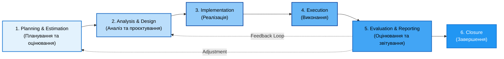
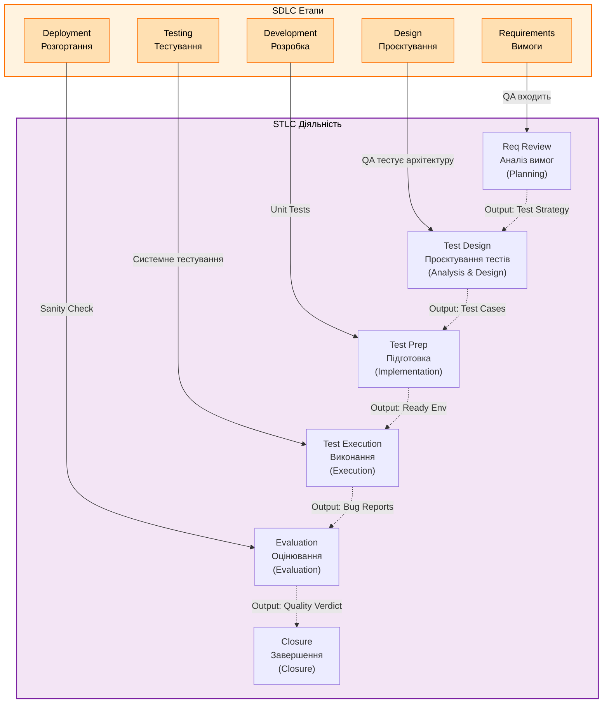

# Глава 3: Процеси та цикли тестування

**Мета глави:** Розуміння фундаментального процесу тестування (Fundamental Testing Process), його фаз, життєвого циклу тестування (STLC), критеріїв входу та виходу, матричних методів аналізу, розподілу ролей у команді та практичного проєктування тестової документації на основі ISTQB v4.0 стандартів та інженерних практик.

---

## 3.1. Фундаментальний процес тестування

### 3.1.1. Визначення та структура

**Фундаментальний процес тестування** — це логічна послідовність взаємопов'язаних видів діяльності, яка охоплює планування, проектування, реалізацію, виконання та завершення тестування програмного забезпечення. Цей процес залишається актуальним на всіх рівнях тестування (модульному, інтеграційному, системному та приймальному) незалежно від обраної моделі розробки (Waterfall, Iterative чи Spiral).

**Управління тестуванням (Test Management)** — це комплексний процес, який охоплює **две основні групи видів діяльності**:

1. **Планування тестування (Test Planning Phase)** — передчасна підготовка до проведення тестів
2. **Виконання тестування (Test Execution Phase)** — моніторинг, контроль та вирішення проблем під час тестування

**Детальніше див.** розділ 3.1.2.3 нижче.

Процес структурований у **6 логічних фаз**, які можуть накладатися, виконуватися паралельно або навіть повторюватися залежно від потреб конкретного проекту:



---

### 3.1.2. Test Management: Планування та виконання тестування

#### Внутрішня структура управління тестуванням

**Test Management** поділяється на дві чітко розмежовані фази з різними цілями та видами діяльності:

```
TEST MANAGEMENT (Управління тестуванням)
│
├─ ФАЗА 1: PLANNING (Планування)
│  ├─ Risk Analysis (Аналіз ризиків)
│  │  └─ Ідентифікація потенційних ризиків проекту
│  │     та їх вплив на обсяги тестування
│  │
│  ├─ Test Estimation (Оцінювання)
│  │  └─ Розрахунок трудовитрат, часу та ресурсів
│  │     для тестування (людини, інструменти, інфраструктура)
│  │
│  ├─ Test Planning (Планування тестування)
│  │  └─ Складання стратегії та плану з графіком,
│  │     розподілом ролей та критеріями входу/виходу
│  │
│  └─ Test Organization (Організація)
│     └─ Формування команди, розподіл відповідальності,
│        налаштування інструментів та процесів
│
└─ ФАЗА 2: EXECUTION (Виконання)
   ├─ Monitoring (Моніторинг)
   │  └─ Відстеження прогресу виконання тестів,
   │     виявлення відхилень від плану (velocity, дефекти)
   │
   ├─ Control (Контроль)
   │  └─ Прийняття коригуючих дій при виявленні проблем
   │     (перепланування, переносення тестів, залучення ресурсів)
   │
   ├─ Problem Solving (Вирішення проблем)
   │  └─ Аналіз і вирішення блокуючих проблем
   │     (environment issues, unavailable features)
   │
   └─ Reporting (Звітування)
      └─ Регулярне інформування stakeholders
         про стан тестування та ризики
```

**Ключові різниці:**
- **Planning** — це передбачувальна діяльність (до почату тестування)
- **Execution** — це реактивна діяльність (під час тестування), яка вимагає гнучкості та швидкої реакції на проблеми

**Посилання на джерела:** [Test Management в QA_Bible](https://github.com/STT-VITI-22/stt-handbook/blob/main/dataset/articles/QA_Bible/obshee/protsess-testirovaniia-test-process-draft.md)

---

### 3.1.2а. Детальний розгляд кожної фази

#### Фаза 1: Planning & Estimation (Планування та оцінювання трудовитрат)

**Мета:** Встановити цілі тестування, визначити обсяги робіт, розподілити ресурси та скласти розклад.

**Основні завдання:**
- Аналіз замовника та сторін, які цікавляться якістю (stakeholders)
- Визначення цілей тестування та рівнів, на яких буде проводитися тестування
- Оцінювання ризиків проекту та їх впливу на обсяги тестування
- Планування ресурсів (людей, інструментів, інфраструктури)
- Визначення графіка та етапів тестування

**Вихідні артефакти:**
- **Test Policy** (Тест-політика) — вищеуровневий документ про принципи компанії щодо тестування
- **Test Strategy** (Стратегія тестування) — загальний підхід до тестування для проекту/програми
- **Test Plan** (План тестування) — деталізований план з розписом робіт, ресурсів та розкладу

**Ключові метрики:**
- Оцінена кількість тестів
- Планова тривалість тестування
- Планов кількість ресурсів

**Приклад фази для Banking Application:**
```
Цілі тестування:
- 95% покриття функцій системи
- 0 критичних (P1) дефектів перед релізом
- Відповідність вимогам безпеки

Оцінена трудовитрата: 480 годин (3 QA-інженери × 8 тижнів)
Бюджет інструментів: JIRA (безплатно) + TestNG (безплатно)
Ризики: API затримка від банку — додати 2 тижні резерву
```

---

#### Фаза 2: Analysis & Design (Аналіз вимог та проєктування тестів)

**Мета:** Розумітися у вимогах, визначити що тестувати та спроектувати тестові сценарії.

**Основні завдання:**
- Детальний аналіз документації вимог (Requirements Specification)
- Ідентифікація вимог, які підлягають тестуванню
- Визначення тестових умов (Test Conditions) для кожної вимоги
- Вибір техніквідповідних тест-дизайну (Equivalence Partitioning, Boundary Value Analysis, Decision Table, State-Transition тощо)
- Розроблення тестових сценаріїв та чернеток тестових випадків

**Вихідні артефакти:**
- **Test Conditions** (Умови тестування) — опис того, що потребує перевірки
- **Test Cases** (Тестові випадки) — детальні кроки для виконання кожного тесту
- **Test Data Requirements** (Вимоги до тестових даних) — які дані потрібні для тестування
- **Requirements Traceability Matrix (RTM)** — матриця відповідності вимог тестам

**Ключові метрики:**
- Кількість тестових умов на кожну вимогу
- Покриття вимог тестами

**Приклад фази для Login Function:**
```
Вимога: "Користувач може увійти з коректним email та паролем"

Тестові умови:
- TC1: Вхід з валідними даними → успішна авторизація
- TC2: Вхід з невалідною поштою → помилка "Invalid email"
- TC3: Вхід з коротким паролем (<8 символів) → помилка "Password too short"
- TC4: Вхід з залишеним полем email → помилка "Email required"
- TC5: Спроба вхідних 5 разів з неправильним паролем → заблокування на 15 хв

Техніка дизайну: Equivalence Partitioning + Boundary Value Analysis
```

---

#### Фаза 3: Implementation (Реалізація тестів)

**Мета:** Підготувати все необхідне для запуску тестів: тестові дані, середовище, інструменти.

**Основні завдання:**
- Підготовка тестового середовища (Test Environment) — сервери, БД, мережа
- Підготовка тестових даних (Test Data) — масиви користувачів, транзакцій, конфігурацій
- Налаштування інструментів тестування та автоматизації
- Написання деталізованих тестових випадків (якщо не створені на фазі 2)
- Підготовка контрольних списків та чек-листів для тестування
- Налаштування систем багів та логування

#### Типи тестових середовищ (Test Environment Types)

**Test Environment (Тестове середовище)** — це інтегрована сукупність обладнання (апаратного, мережевого), операційної системи, конфігурації та програмного забезпечення, підготовленого для виконання тестів.

У процесі розробки та тестування використовуються різні типи середовищ з різними цілями:

| Середовище | Назва | Мета | Характеристики | Хто використовує |
|-----------|-------|------|-----------------|-----------------|
| **DEV** | Development Env | Розробка нових функцій | Нестабільна, часті зміни, мала дата обсяг | Developers |
| **TEST** | Test Env | Тестування функціоналу | Стабільна копія DEV, оновлюється щодня | QA Engineers |
| **INT** | Integration Env | Інтеграційне тестування модулів | Поєднання компонентів від різних груп | QA + DevOps |
| **PREP** | Preview / Preprod Env | Передрелізне тестування | Максимально наближена до Production | QA + Product Owner |
| **PROD** | Production Env | Обслуговування користувачів | Реальні дані та трафік | End Users |

**Приклад конфігурації для Banking App:**
```
┌─ Development (Staging)
│  ├─ AWS t3.small (1 CPU, 2GB RAM)
│  ├─ PostgreSQL (тестова БД)
│  ├─ API Gateway (mock)
│  └─ Доступ: Team only (внутрішня мережа)
│
├─ Test Environment
│  ├─ AWS t3.medium (2 CPU, 4GB RAM)
│  ├─ PostgreSQL + Redis cache
│  ├─ Full API stack
│  └─ Доступ: QA team + Developers
│
├─ Integration
│  ├─ AWS t3.large (4 CPU, 8GB RAM)
│  ├─ PostgreSQL, Oracle, MySQL (multi-DB)
│  ├─ Message Queue (RabbitMQ)
│  └─ Доступ: QA + DevOps
│
├─ Preprod (Preview)
│  ├─ AWS c5.xlarge (4 CPU, 8GB RAM, SSD)
│  ├─ PostgreSQL (production replica, read-only)
│  ├─ Full stack идентична Production
│  └─ Доступ: QA + PO + Select customers (beta)
│
└─ Production
   ├─ AWS Multi-AZ (High Availability)
   ├─ PostgreSQL + RDS Backup
   ├─ CloudFront CDN + WAF
   └─ Доступ: End Users (общедоступна)
```

**Ключові параметри для налаштування:**
- **Апаратне забезпечення** — CPU, пам'ять, диск
- **ОС та версія** — Windows, Linux, macOS
- **Бази даних** — PostgreSQL, MySQL, Oracle, MongoDB
- **Залежності** — API, Message Queue, Cache, Search Engine
- **Мережева конфігурація** — IP, DNS, VPN, Firewall
- **Ліцензування та доступ** — Хто має право використовувати

**Посилання на джерела:** [Test Environment в QA_Bible](https://github.com/STT-VITI-22/stt-handbook/blob/main/dataset/articles/QA_Bible/obshee/testovaia-sreda-i-testovyi-stend-test-environment-test-bed.md)

**Вихідні артефакти:**
- **Test Cases** (Деталізовані тестові випадки)
- **Test Environment Setup** (Документація налаштування середовища)
- **Test Data** (Підготовлені набори тестових даних)
- **Test Tools Setup** (Налаштовані інструменти та системи)

**Ключові метрики:**
- Готовність тестового середовища (%)
- Готовність тестових даних (%)
- Готовність тестової документації (%)

**Приклад фази:**
```
Test Environment:
- QA Staging: AWS t3.medium, Ubuntu 20.04
- БД: PostgreSQL 13 з копією production
- Конфігурація: Сервер API, Веб-фронтенд, Mobile app

Test Data:
- 100 тестових користувачів (різні ролі:Admin, Customer, Support)
- 1000 тестових транзакцій з різними статусами
- Pre-loaded: Каталог продуктів, помилки, конфіги

Tools Ready:
- JIRA (Bug Tracking) ✓
- TestNG (Manual Test Runner) ✓
- Jenkins (CI/CD) ✓
```

---

#### Фаза 4: Execution (Виконання тестів)

**Мета:** Запустити тести, зібрати результати та зареєструвати дефекти.

**Основні завдання:**
- Виконання тестових випадків відповідно до плану
- Реєстрація фактичних результатів (Pass/Fail/Block)
- Документування дефектів у системі Bug Tracking
- Повторне тестування (Re-testing) дефектів після виправлення розробниками
- Регресійне тестування для перевірки, що нові зміни не зламали існуючі функції
- Поточна комунікація з розробниками щодо багів

**Вихідні артефакти:**
- **Test Execution Report** (Звіт про виконання тестів) — результати кожного тесту
- **Defect Reports** (Звіти про дефекти) — детальна інформація про кожний баг
- **Test Summary Report** (Зведений звіт) — статистика по пройденим/непройденим тестам

**Ключові метрики:**
- Загальна кількість виконаних тестів
- Успішно пройдені тести (%)
- Непройдені тести та їхні тип/серйозність
- Кількість відкритих дефектів (по серйозності та пріоритету)
- Velocity (Швидкість виконання) — кількість тестів на людино-день

**Приклад:**
```
Execution Summary (День 1-5):
├─ Total Tests Planned: 150
├─ Tests Executed: 95 (63%)
├─ Tests Passed: 78 (82%)
├─ Tests Failed: 17 (18%)
│  ├─ Critical: 2 (Block further testing)
│  ├─ High: 5 (Functional impact)
│  ├─ Medium: 7 (Minor functionality)
│  └─ Low: 3 (Cosmetic issues)
└─ Tests Blocked: 55 (Env issues, pending API)

Velocity: 19 tests/day
Estimate to complete: ~8 days (at current velocity)
```

---

#### Фаза 5: Evaluation & Reporting (Оцінювання критеріїв виходу та звітування)

**Мета:** Визначити, чи тестування завершено, та скласти офіційний звіт для стейкхолдерів.

**Основні завдання:**
- Перевірка критеріїв виходу (Exit Criteria) — всі умови виконані?
- Аналіз покриття тестами та остаточної якості продукту
- Оцінка залишків ризиків та невіддалених дефектів
- Складання висновків та рекомендацій
- Підготовка офіційного Звіту про тестування для менеджменту

**Критерії виходу (Exit Criteria), які розглядаються:**
- Усі запланові тестові випадки виконані
- Усі критичні (P1) дефекти виправлені та перетестовані
- Досягнуто планове покриття (наприклад, 95% функцій)
- Щільність залишкових дефектів укладається в норму (< 0.5 на 1000 LOC)
- Затвердження заповідувача проекту (Project Manager/Product Owner)

**Вихідні артефакти:**
- **Test Completion Report** (Звіт про завершення тестування)
- **Quality Assessment** (Оцінка якості) — готовність до релізу
- **Risk Assessment** (Оцінка залишків ризиків) — які ризики залишаються
- **Lessons Learned** (Вивчені уроки) — рекомендації на майбутнє

**Приклад Evaluation звіту:**

```markdown
## Тестування завершено ✓

### Перевірка критеріїв виходу (Exit Criteria Check)

| Метрика якості (Exit Criteria) | Фактичний показник | Статус |
|---|---|:---:|
| **Виконання тест-кейсів** | Усі 150 тест-кейсів виконані та зареєстровані | ✓ |
| **Критичні дефекти (P1)** | 0 дефектів Critical залишилось | ✓ |
| **Дефекти Medium (P3)** | 3 дефекти Medium відкриті, перенесено в Sprint Беклог | ✓ |
| **Покриття функціонала** | 97% (мета: ≥ 95%) | ✓ |
| **Щільність дефектів** | 0.32 на KLOC (допустима межа: < 0.5) | ✓ |
| **Затвердження релізу** | Project Manager офіційно затвердив звіт | ✓ |

### Висновок

Продукт повністю **готовий до Production Release**.
Залишкові ризики оцінюються як **низькі**. Згадані 3 дефекти Medium не впливають на критичну бізнес-логіку та будуть виправлені в плановому релізі версії **1.2.1 / 1.3**.
```

---

#### Фаза 6: Closure (Завершення та архівування)

**Мета:** Закрити цикл тестування, зберегти артефакти та зібрати досвід.

**Основні завдання:**
- Архівування всіх тестових артефактів (тестові випадки, дані, звіти)
- Закриття відкритих дефектів, які не будуть виправлені в цьому релізі
- Деактивація тестового середовища
- Проведення Post-Mortem сесії — аналіз того, що добре вийшло, що погано
- Документування Lessons Learned для наступних циклів

**Вихідні артефакти:**
- **Final Test Summary** (Остаточний звіт)
- **Archived Test Cases & Data** (Архівовані матеріали)
- **Post-Mortem Report** (Звіт про аналіз)
- **Metrics & Trend Analysis** (Метрики та тренди)

**Приклад Post-Mortem:**
```
POST-MORTEM ANALYSIS (Sprint 10)

✓ Що добре:
- Shift-Left approach: Вимоги проаналізовані на день раніше
- RTM матриця виявила 3 nepokryté вимоги до виконання
- 95% тестів підготовлені до Release date

⚠ Що потребує покращення:
- Test Environment був готов на 1 тиждень пізніше (затримка API)
- Test Data preparation заняла 40% більше часу
- Регресійні тести не охоплювали 5% critical paths

→ Дії на наступний спринт:
1. Запити API на 2 тижні раніше
2. Підготувати шаблони тестових даних заздалегідь
3. Розширити регресійний набір на 10%
```

---

## 3.2. STLC: Цикл розробки тестування

### 3.2.1. Визначення STLC

**Software Testing Life Cycle (STLC)** — це систематична послідовність видів діяльності в межах одного циклу тестування, яка охоплює всі аспекти планування, проектування, реалізації та виконання тестів для забезпечення якості програмного продукту.

**Ключова різниця:**
- **SDLC (Software Development Life Cycle)** — загальний процес розробки ПЗ (Requirements → Design → Development → Testing → Deployment)
- **STLC (Software Testing Life Cycle)** — часткова, специфічна частина SDLC, яка фокусується на тестуванні

STLC починається, коли SDLC переходить до фази тестування (або паралельно в Agile підходах), і завершується, коли продукт готов до розгортання.

### 3.2.2. Взаємозв'язок STLC та SDLC

Сучасні інженерні практики (особливо принцип Shift-Left, описаний у Главі 2) передбачають, що **тестування не є ізольованою фазою, а інтегрується на всіх етапах SDLC**:



**Тестування на кожному етапі SDLC:**

| SDLC Етап | Форма тестування | Учасники | Вихіди |
|-----------|------------------|----------|--------|
| **Requirements** | Аналіз вимог, Review, Verification | QA, Business Analyst | Test Strategy, RTM |
| **Design** | Design Review, Testability Review | QA Architect, Test Designer | Test Design, Test Scenarios |
| **Development** | Code Review, Unit Testing | Developers, QA | Unit Test Reports |
| **Testing** | Integration, System, UAT Testing | QA Engineers, Users | Test Reports, Defect Reports |
| **Deployment** | Smoke Testing, Production Validation | QA, DevOps, Support | Release Certificate |

### 3.2.3. STLC Артефакти та Deliverables

Під час STLC виготовляються численні артефакти, які служать як вхідні дані для наступних фаз та як доказ виконання:

**Вхідні артефакти (Inputs на стартові STLC):**
- Requirements Document (Документація вимог)
- Design Specification (Специфікація дизайну)
- Risk Assessment (Оцінка ризиків)
- Previous Project Lessons (Уроки з попередніх проектів)

**Вихідні артефакти (Deliverables STLC):**
- Test Strategy & Test Plan
- Test Cases & Test Scenarios
- Test Data & Test Environment Setup
- Test Execution Report
- Defect Report
- Test Closure Report

---

## 3.3. Критерії входу та виходу (Entry & Exit Criteria)

### 3.3.1. Entry Criteria (Критерії входу)

**Entry Criteria** — це набір умов та передумов, які мають бути виконані **ДО** того, як можна розпочати тестування конкретної фази або компонента. Якщо критерії входу не виконані, тестування не можна розпочинати, тому що результати будуть недостовірні.

**Типові Entry Criteria на рівні системного тестування:**

| Критерій | Опис | Перевірка |
|----------|------|-----------|
| **Build Readiness** | Build скомпільований без errors, готов для deployment на QA | `Build version: v1.2.3` ✓ |
| **Unit Tests Passed** | Розробники пройшли all unit tests на 80%+ покриття | `Unit Test Report: 95% passed` ✓ |
| **Requirements Stable** | Вимоги заморожені, не змінюються під час тестування | `Req Freeze Date: Aug 15` ✓ |
| **Test Environment Ready** | QA середовище налаштоване, доступне, з необхідним ПО | `Env Status: OPERATIONAL` ✓ |
| **Test Data Available** | Тестові дані підготовлені та завантажені в БД | `Data Set: 50k users loaded` ✓ |
| **Test Cases Approved** | Тестові випадки написані, перевірені та затверджені | `TC Count: 120 (100% reviewed)` ✓ |
| **Documentation Complete** | Вся необхідна документація доступна QA | `Docs: Req, API, DB Schema ✓` ✓ |
| **Test Tools Ready** | Інструменти інстальовані, налаштовані, ліцензії активні | `JIRA, TestNG configured` ✓ |

**Приклад Entry Criteria для Sprint 5:**
```markdown
## Sprint 5: Entry Criteria ✓

Перед стартом тестування Login Feature:
□ Dev Team завершив implementation (Git commit #3456)
□ Unit tests пройдені: 18/18 (100%) ✓
□ Code Review completed and approved ✓
□ QA Environment deployed: staging-v5.2 ✓
□ Test Data for Login: 100 users in staging DB ✓
□ Test Cases written: 25 (for Login + Password Recovery) ✓
□ No blocking issues in QA Board

Status: READY TO TEST ✓ (2024-08-19 10:00)
```

---

### 3.3.2. Exit Criteria (Критерії виходу)

**Exit Criteria** — це умови, які мають бути виконані **ПІСЛЯ** виконання всіх тестів, щоб вважати тестування завершеним та продукт готовим до наступного етапу (або Production).

**Типові Exit Criteria:**

| Критерій | Мета | Норма |
|----------|------|-------|
| **Test Coverage** | Усі запланові тестові випадки виконані | ≥95% TCs executed |
| **Critical/High Bugs** | Усі критичні (P1) та важливі (P2) дефекти виправлені | 0 P1, ≤2 P2 allowed |
| **Code Coverage** | Відсоток коду, охоплений тестами | ≥85% line coverage |
| **Defect Density** | Кількість дефектів на 1000 рядків коду | ≤0.5 per KLOC |
| **Requirements Traceability** | Усі вимоги покриті тестами | 100% mapped in RTM |
| **Regression Pass Rate** | Попередньо пройдені тести повинні пройти знову | ≥98% pass rate |
| **Performance Baselines** | Система виконує в межах встановлених норм | Response time <200ms |
| **Security Validations** | Baseline security checks пройдені | Penetration test clear |

**Приклад Exit Criteria для Release 1.0:**
```markdown
## Release 1.0: Exit Criteria Checklist

✓ PASSED: 145/150 Test Cases (96.7%)
✓ PASSED: 0 Critical (P1) defects remaining
⚠ CAUTION: 2 High (P2) defects deferred to 1.1
✓ PASSED: Code Coverage: 87% (target: 85%)
✓ PASSED: Defect Density: 0.38 per KLOC (target: <0.5)
✓ PASSED: RTM Coverage: 100% of requirements
✓ PASSED: Regression Suite: 125/127 passed (98%)
✓ PASSED: Performance Test: 94th percentile <200ms
✓ PASSED: Security Scan: No critical vulnerabilities

VERDICT: ✅ APPROVED FOR PRODUCTION
Signed: QA Lead (Aug 20, 2024)
```

### 3.3.3. Практичні сценарії прийняття рішень

**Сценарій 1: Коли Entry Criteria не виконаний**
```
Ситуація: Test Environment недоступний (падіння сервера)

Дія:
- НЕ розпочинати тестування
- Повідомити DevOps про критичність
- Перепланувати тестування на 6 годин
- Документувати затримку в Project Board

Уроки:
- Мати резервний test environment
- Провести stress-test на infrastructure
```

**Сценарій 2: Коли Exit Criteria не досягнута перед Deadline**
```
Ситуація: До релізу 2 дні, але тестування не пройдено
- Виконано: 140/150 тестів (93%)
- Залишилось: 3 Medium + 2 Low дефекти

Можливі рішення:
1. PUSH RELEASE на 1 тиждень (ризик: бізнес-затримка)
2. RELEASE з RISK ACCEPTANCE (затвердити залишкові дефекти)
3. HOTFIX PLAN (виправити критичне, решту в 1.1)

Рішення: 2 дефекти переводять в 1.1, 3 Medium — HOTFIX за 48 годин
Документ: Risk Acceptance Memo від Product Owner
```

---

## 3.4. Матриці в тестуванні

### 3.4.1. Requirements Traceability Matrix (RTM)

**Requirements Traceability Matrix (Матриця відповідності вимог)** — це двовимірна таблиця, яка встановлює взаємозв'язок між вимогами до продукту та тестовими випадками, які ці вимоги покривають. RTM служить для **валідації того, що усі вимоги тестуються**, та виявлення **недопокритих або надмірно покритих вимог**.

**Мета RTM:**
- Забезпечити 100% покриття вимог тестами
- Виявити недопокриті функції ДО виконання тестів
- Впідпорядкуватись стандартам та регуляціям, які вимагають повної трасування

**Структура RTM (таблиця):**

| Req ID | Requirement Description | Test Case IDs | Coverage | Status |
|--------|------------------------|----------------|----------|--------|
| **REQ-001** | User can log in with email & password | TC-101, TC-102, TC-103 | 3 тести | ✓ Covered |
| **REQ-002** | System blocks login after 5 failed attempts | TC-104, TC-105 | 2 тести | ✓ Covered |
| **REQ-003** | Forgot Password link sends email within 5 min | TC-106, TC-107 | 2 тести | ✓ Covered |
| **REQ-004** | User profile supports photo upload (max 5MB) | TC-108, TC-109, TC-110 | 3 тести | ✓ Covered |
| **REQ-005** | System logs all login attempts for audit | TC-111 | 1 тест | ⚠ Partial |
| **REQ-006** | Payment gateway integrates with Stripe API | **UNCOVERED** | 0 тестів | ❌ Not Covered |

**Приклад детального RTM для Banking App:**

```markdown
# RTM: Banking Application v1.0

## Authentication Module

| ID | Requirement | Level | Test Case | Type | Priority |
|----|-------------|-------|-----------|------|----------|
| A-1 | Users can register with email | F | TC-A1-001 | Positive | High |
| A-1 | System validates email format | F | TC-A1-002 | Negative | High |
| A-1 | System checks email uniqueness | F | TC-A1-003 | Boundary | High |
| A-2 | Login with email & password | F | TC-A2-001 | Positive | High |
| A-2 | Block login after 5 failed attempts | F | TC-A2-002 | Negative | High |
| A-2 | Account lockout duration: 15 minutes | F | TC-A2-003 | Boundary | Medium |

## Transaction Module

| ID | Requirement | Level | Test Case | Type | Priority |
|----|-------------|-------|-----------|------|----------|
| T-1 | User can initiate fund transfer | F | TC-T1-001 | Positive | High |
| T-1 | System validates recipient account | F | TC-T1-002 | Negative | High |
| T-1 | Daily transfer limit: $10,000 | F | TC-T1-003 | Boundary | Medium |
| T-2 | Receipt generated after transfer | F | TC-T2-001 | Positive | Medium |
| T-2 | Receipt sent to email within 1 min | NF | TC-T2-002 | Performance | Low |

## Coverage Summary

Total Requirements: 8
Covered by Tests: 7 (87.5%)
Not Covered: 1 (T-2 email delivery)

⚠ Action: Assign TC-T2-002 (Performance test for email)
```

---

### 3.4.2. Coverage Matrix (Матриця покриття функціоналу)

**Coverage Matrix** показує, **який відсоток функціонала вже протестовано** на кожному рівні тестування (Unit, Integration, System, UAT).

**Приклад Coverage Matrix:**

```markdown
# Coverage Matrix: Feature-by-Feature Testing Status

| Feature | Unit | Integration | System | UAT | Overall |
|---------|------|-------------|--------|-----|---------|
| Login | ✓ 95% | ✓ 100% | ✓ 98% | ✓ 100% | **98%** |
| Password Reset | ✓ 80% | ⚠ 60% | ⚠ 70% | ⏳ Pending | **68%** |
| Profile Management | ✓ 90% | ✓ 85% | ⏳ Pending | ⏳ Pending | **87%** |
| Payments | ✓ 100% | ✓ 100% | ✓ 95% | ✓ 100% | **99%** |
| Reports | ⏳ Pending | ⏳ Pending | ⏳ Pending | ⏳ Pending | **0%** |
| **Overall** | **91%** | **86%** | **88%** | **100%** | **91%** |

Legend:
✓ = Tested & Passed
⚠ = Tested & Issues Found
⏳ = Pending Testing
❌ = Not Tested
```

---

### 3.4.3. Test Execution Matrix (Матриця виконання тестів)

Показує поточний стан виконання тестів у реальному часі:

```markdown
# Test Execution Matrix: Day 8 (of 10 planned)

| Test Suite | Total | Executed | Passed | Failed | Pass Rate |
|-----------|-------|----------|--------|--------|-----------|
| Smoke Tests | 20 | 20 | 20 | 0 | 100% ✓ |
| Login Module | 25 | 25 | 24 | 1 | 96% ✓ |
| Transactions | 40 | 38 | 35 | 3 | 87.5% ⚠ |
| Reports | 30 | 22 | 18 | 4 | 73% ⚠ |
| UI/UX | 20 | 15 | 14 | 1 | 93% ✓ |
| Security | 15 | 8 | 7 | 1 | 87.5% ⚠ |
| **TOTAL** | **150** | **128** | **118** | **10** | **92%** |

Current Velocity: 16 tests/day
Estimated Completion: Day 10 (on schedule)

⚠ Risks:
- Reports module: Low pass rate (73%)
  Action: Additional testing resources assigned
```

---

### 3.4.4. Побудова та утримання матриць

**Послідовність кроків:**

1. **Інвентаризація вимог**
   - Отримати офіційний Requirements Document
   - Скласти перелік усіх функціональних вимог
   - Присвоїти кожній вимозі унікальний ID (REQ-001, REQ-002...)

2. **Проектування тестів**
   - Для кожної вимоги розробити тестові випадки
   - Присвоїти кожному тесту ID (TC-001, TC-002...)
   - Документувати, яка вимога перевіряється в кожному тесті

3. **Складання матриці**
   - Створити таблицю з рядками (Вимоги) та колонками (Тести)
   - Позначити в перетинах, де вимога покривається тестом
   - Визначити непокриті вимоги

4. **Верифікація покриття**
   - Переконатися, що 100% вимог мають тести
   - Визначити, чи є надмірні тести (кілька тестів на одну вимогу)
   - Затвердити RTM з Product Owner та QA Lead

5. **Утримання під час виконання**
   - Оновлювати матрицю при виявленні нових вимог
   - Додавати нові тестові випадки при зміні вимог
   - Отримувати статус виконання тестів у Real-time

**Інструменти для матриць:**
- **MS Excel / Google Sheets** — простий, доступний формат (CSV можна імпортувати в системи)
- **JIRA (Test Management)** — інтегрований з bug tracking
- **TestRail** — спеціалізований інструмент для тест-менеджменту
- **QTest (Atlassian)** — корпоративне рішення

---

> **Примітка про ролі та структури QA-команд:**
>
> Детальна інформація про ролі тестувальників, RACI матрицю та організаційні структури QA-команд представлена у **[Главі 2, розділ 2.5 "Ролі у тестуванні"](../../../Основи%20контролю%20якості.md#25-ролі-у-тестуванні)**. Рекомендується ознайомитися з цим розділом для глибокого розуміння ролей та відповідальності у тестуванні.
>
> Розділ 2.5 охоплює:
> - **2.5.1** — Основні ролі (QA Engineer, Test Lead, Automation Engineer, SDET, Test Architect)
> - **2.5.2** — Hard & Soft Skills для сучасного QA Engineer
> - **2.5.3** — Професійна траєкторія розвитку
>
> Цей розділ (глава 3) фокусується на **процесах та циклах тестування**, а розділ 2.5 забезпечує контекст **кого** залучають до цих процесів.

---

## 3.5. Практичне завдання: Manual Testing та Test Case Design

### 3.5.1. Вступ до практичного проекту

Для закріплення теоретичних знань про STLC, RTM та ролі у тестуванні, використовується **реальний практичний проект** [`stt-manual-testing`](https://github.com/STT-VITI-22/stt-manual-testing), який надає навчальну платформу для виконання ручного тестування.

**Проект охоплює:**
- Web-додаток для управління завданнями (To-Do List Application)
- REST API backend для тестування
- Набір готових та напів-готових тестових випадків для аналізу
- Сценарії для практики Bug Reporting

### 3.5.2. Структура Test Case

**Test Case (Тестовий випадок)** — це структурований документ, який описує **одну конкретну ситуацію** для перевірки системи. Кожен Test Case має унікальний ID, передумови, кроки виконання та очікувані результати.

**Стандартна структура тестового випадку (за ISTQB):**

| Поле | Опис | Приклад |
|------|------|---------|
| **Test Case ID** | Унікальний ідентифікатор | TC-AUTH-001 |
| **Title** | Коротка назва того, що тестується | "Login with valid email and password" |
| **Preconditions** | Умови, які мають бути виконані ДО тесту | User не авторизований; DB має тестового user: user@test.com / Pass123! |
| **Test Steps** | Послідовність дій, які виконує тестувальник | 1. Navigate to login page → 2. Enter email: user@test.com → 3. Enter password: Pass123! → 4. Click Login button |
| **Expected Result** | Що повинно статися після виконання кроків | User is redirected to Dashboard; User name displays in header |
| **Actual Result** | Що насправді відбулось (заповнюється під час виконання) | ✓ User logged in, Dashboard shown |
| **Status** | Статус тесту | ✓ PASS |
| **Priority** | Критичність для бізнесу | High |
| **Category / Type** | Тип тесту | Functional / Positive Testing |

**Приклад Test Case у форматі Markdown:**

```markdown
# Test Case: TC-LOGIN-001

## Basic Information
| Field | Value |
|-------|-------|
| **ID** | TC-LOGIN-001 |
| **Title** | User can login with valid email and password |
| **Priority** | HIGH |
| **Category** | Functional Testing - Authentication |
| **Created by** | John Doe |
| **Date Created** | 2024-08-15 |

## Preconditions
- Application is running and accessible at `http://staging.todo-app.local`
- User account exists in database:
  - Email: `testuser@example.com`
  - Password: `SecurePass123!`
  - Status: ACTIVE
- User is NOT currently logged in (session cleared)
- Test environment database is in clean state

## Test Steps

| Step # | Action | Expected Result |
|--------|--------|-----------------|
| 1 | Navigate to login page at `http://staging.todo-app.local/login` | Login form is displayed with email and password fields |
| 2 | Enter email in Email field: `testuser@example.com` | Email is entered correctly in field |
| 3 | Enter password in Password field: `SecurePass123!` | Password field shows bullets (hidden text) |
| 4 | Click the "Login" button | Loading spinner appears for 2-3 seconds |
| 5 | **Expected Outcome** | Page redirects to Dashboard; User's name "Test User" appears in top-right header |

## Expected Result
✓ User is successfully authenticated
✓ Session token is created and stored in localStorage
✓ User is redirected to Dashboard page
✓ User's avatar and name are displayed in navigation header
✓ All dashboard widgets are loaded (Tasks, Calendar, Notes)

## Notes
- This test covers the happy path (positive testing)
- Password is hashed with bcrypt algorithm
- Session timeout is 30 minutes

## Actual Result (Filled During Execution)
✓ PASS
- User logged in successfully
- Dashboard loaded within 3 seconds
- User name "Test User" displayed in header

## Status
✓ PASSED | ✓ PASS | ✗ FAIL | ⚠ BLOCKED
```

---

### 3.5.3. Позитивне vs. Негативне тестування

#### Positive Testing (Позитивне тестування)

Перевіряє, що система **правильно функціонує з валідними вхідними даними**.

**Мета:** Переконатися, що система робить те, що від неї очікується.

**Приклади для Login функції:**
- ✓ Вхід з коректним email та паролем → успіх
- ✓ Пам'ятання паролю (Remember Me) → сесія збережена
- ✓ Успішна автоматична авторизація після refresh сторінки

**Test Case: TC-LOGIN-002 (Positive)**
```
Title: User can login with remember-me option
Steps:
1. Navigate to login
2. Enter valid email
3. Enter valid password
4. Check "Remember me" checkbox
5. Click Login

Expected: User logged in + session persists after page refresh
```

#### Negative Testing (Негативне тестування)

Перевіряє, що система **обробляє невалідні дані та граничні умови правильно**.

**Мета:** Переконатися, що система не робить шкідливих дій при неправильних вхідних даних.

**Приклади для Login функції:**
- ✗ Вхід з неправильним паролем → помилка "Invalid password"
- ✗ Вхід з незареєстрованою поштою → помилка "User not found"
- ✗ Вхід з порожніми полями → помилка "Required field"
- ✗ 6-та спроба входу з неправильним паролем → блокування акаунту на 15 хв

**Test Case: TC-LOGIN-003 (Negative)**
```
Title: Login fails with incorrect password
Steps:
1. Navigate to login
2. Enter valid email: testuser@example.com
3. Enter INCORRECT password: WrongPassword123!
4. Click Login

Expected:
- Error message: "Invalid email or password"
- User remains on login page
- Session NOT created
```

**Test Case: TC-LOGIN-004 (Negative - Account Lockout)**
```
Title: Account locked after 5 failed login attempts
Preconditions: User account exists but will be locked

Steps:
1. Attempt login with wrong password - FAIL (1/5)
2. Attempt login with wrong password - FAIL (2/5)
3. Attempt login with wrong password - FAIL (3/5)
4. Attempt login with wrong password - FAIL (4/5)
5. Attempt login with wrong password - FAIL (5/5)
6. Attempt login with CORRECT password

Expected (After 5th attempt):
- Error message: "Account locked. Try again in 15 minutes"
- User cannot login even with correct password
- Lockout duration: 15 minutes (measured by system time)
```

---

### 3.5.3a. Серйозність та пріоритет дефектів (Defect Severity & Priority)

При виявленні дефекту під час тестування необхідно оцінити його **серйозність (Severity)** та **пріоритет (Priority)**, оскільки вони впливають на порядок виправлення та рішення про готовність до релізу.

#### Defect Severity (Серйозність дефекту)

**Severity** — це технічна оцінка впливу дефекту на функціональність системи.

| Рівень | Назва | Опис | Приклад |
|--------|-------|------|---------|
| **1** | **Critical (Критичний)** | Система повністю неробоча або втратила основну функцію | Користувач не може увійти до системи; Database crashed |
| **2** | **Major (Значний)** | Серйозна функціональна проблема, але система все ще працює | Login для деяких користувачів не працює; Reports генеруються некоректно |
| **3** | **Medium (Середній)** | Помітний дефект функціональності, але є workaround | Кнопка на сторінці не натискається; Сторінка завантажується повільно |
| **4** | **Minor (Незначний)** | Косметичний або незначний функціональний дефект | Неправильне форматування тексту; Помилка в підказці (tooltip) |

#### Defect Priority (Пріоритет дефекту)

**Priority** — це бізнес-оцінка, що визначає, наскільки швидко дефект має бути виправлений.

| Рівень | Назва | Опис | SLA |
|--------|-------|------|-----|
| **1** | **ASAP (Негайно)** | Вирішити якомога швидше, можна зупинити усю роботу | 1-4 години |
| **2** | **High (Високий)** | Вирішити як можна раніше в цьому спринту/релізі | 1-2 дні |
| **3** | **Normal (Нормальний)** | Вирішити в поточному або наступному спринту | 1-2 тижні |
| **4** | **Low (Низький)** | Можна відкласти на потім; вирішити коли є час | > 2 тижнів |

#### Матриця Severity × Priority (16 комбінацій)

| Severity | ASAP | High | Normal | Low |
|----------|------|------|--------|-----|
| **Critical** | 🔴 **FIX NOW** | 🔴 **URGENT** | 🔴 **URGENT** | 🟠 **HIGH** |
| **Major** | 🔴 **URGENT** | 🟠 **HIGH** | 🟡 **MEDIUM** | 🟡 **MEDIUM** |
| **Medium** | 🟠 **HIGH** | 🟡 **MEDIUM** | 🟡 **MEDIUM** | 🟢 **LOW** |
| **Minor** | 🟡 **MEDIUM** | 🟡 **MEDIUM** | 🟢 **LOW** | 🟢 **LOW** |

**Легенда:**
- 🔴 **FIX NOW** — Зупинити все, виправити негайно (Severity: Critical + Priority: ASAP)
- 🔴 **URGENT** — Виправити сьогодні або завтра
- 🟠 **HIGH** — Виправити в цьому спринту
- 🟡 **MEDIUM** — Виправити в наступних спринтах
- 🟢 **LOW** — Виправити коли є час або відкласти на потім

#### Практичні приклади для Banking App

```
┌─ Дефект 1: Login не працює для ВСІХ користувачів
│  ├─ Severity: Critical (система неробоча)
│  ├─ Priority: ASAP (користувачі не можуть входити)
│  ├─ Статус: 🔴 FIX NOW — виправити в течение 2 часов
│  └─ ID: DEF-001 | Priority: ASAP | Assigned: Dev Team Lead

├─ Дефект 2: Password reset email приходить за 15 хвилин замість 5
│  ├─ Severity: Major (користувачі чекають)
│  ├─ Priority: High (впливає на UX, але не блокує)
│  ├─ Статус: 🟠 HIGH — виправити в течение дня
│  └─ ID: DEF-002 | Priority: High | Assigned: Dev Engineer

├─ Дефект 3: Назва кнопки "Submitt" замість "Submit"
│  ├─ Severity: Minor (косметичний дефект)
│  ├─ Priority: Normal (не впливає на функцію)
│  ├─ Статус: 🟡 MEDIUM — виправити в поточному спринту
│  └─ ID: DEF-003 | Priority: Normal | Assigned: Dev Intern

└─ Дефект 4: Transfer на суму $9999 показує помилку (limit: $10000)
   ├─ Severity: Major (неправильна бізнес-логіка)
   ├─ Priority: ASAP (користувачі не можуть переводити)
   ├─ Статус: 🔴 URGENT — виправити сьогодні
   └─ ID: DEF-004 | Priority: ASAP | Assigned: Dev Team Lead
```

**Посилання на джерела:** [Defect Severity & Priority в QA_Bible](https://github.com/STT-VITI-22/stt-handbook/blob/main/dataset/articles/QA_Bible/obshee/sereznost-i-prioritet-defekta-severity-priority.md)

---

### 3.5.4. Техніки Test Design та їх застосування

При проектуванні тестів використовуються специфічні **техніки**, які систематично генерують тестові випадки для покриття найбільш вірогідних дефектів.

#### Equivalence Partitioning (Еквівалентне розділення)

Розділити вхідні дані на групи (класси), де дані в одному класі повинні поводитися аналогічно.

**Приклад для Password field:**
```
Valid Password Rules: min 8 chars, max 20 chars,
  must contain: uppercase, lowercase, digit, special char

Еквівалентні класи:
1. VALID passwords: "SecPass1!", "MyPass@2024", "Test!Pass8"
   → Тестовий випадок: Пароль приймається

2. TOO SHORT (<8): "Pass1!", "Abc@12"
   → Тестовий випадок: Error "Password too short"

3. TOO LONG (>20): "MyVeryLongPassword123!"
   → Тестовий випадок: Error "Password too long"

4. NO UPPERCASE: "secpass1!", "mypass@2024"
   → Тестовий випадок: Error "Must contain uppercase"

5. NO DIGIT: "SecPass!", "MyPass@Test"
   → Тестовий випадок: Error "Must contain digit"

6. NO SPECIAL CHAR: "SecPass1", "MyPass2024"
   → Тестовий випадок: Error "Must contain special character"

Output: 6 equivalence classes → мінімум 6 test cases
```

#### Boundary Value Analysis (Аналіз граничних значень)

Тестує значення на межах допустимих діапазонів, бо найчастіше дефекти відбуваються саме там.

**Приклад для Age field:**
```
Допустимий діапазон: 18-100 років

Граничні значення:
- 17 (На 1 менше мінімуму) → Invalid
- 18 (Точно мінімум) → Valid ✓
- 19 (На 1 більше мінімуму) → Valid ✓
- 99 (На 1 менше максимуму) → Valid ✓
- 100 (Точно максимум) → Valid ✓
- 101 (На 1 більше максимуму) → Invalid

Графік:
├─ INVALID ──┬─ 17 ├─┬─ VALID ──────────────────────┬─ 100 ├─┬─ INVALID
             │    │ │                              │     │ │
             │    └─17──18(min)─────────────────99─100(max)─101
```

#### Decision Table Testing (Тестування за таблицею рішень)

Для логіки, що залежить від **комбінацій кількох умов**.

**Приклад для Transfer Transaction:**
```
Умови:
- Has sufficient balance? (Y/N)
- Is recipient valid? (Y/N)
- Is transfer amount > daily limit? (Y/N)

Таблиця рішень:

| Case | Balance | Recipient | Exceeds Limit | Action | Expected |
|------|---------|-----------|---------------|--------|----------|
| 1    | Yes     | Yes       | No            | Allow  | Transfer Success |
| 2    | No      | Yes       | No            | Deny   | Insufficient Funds Error |
| 3    | Yes     | No        | No            | Deny   | Invalid Recipient Error |
| 4    | Yes     | Yes       | Yes           | Deny   | Limit Exceeded Error |
| 5    | No      | No        | No            | Deny   | Multiple Errors |
| 6    | No      | Yes       | Yes           | Deny   | Multiple Errors |
| 7    | Yes     | No        | Yes           | Deny   | Multiple Errors |
| 8    | No      | No        | Yes           | Deny   | Multiple Errors |

Output: 8 combinations → 8 test cases
```

---

### 3.5.5. Виконання тестів та документування результатів

#### Стадії виконання тесту

**ПЕРЕД виконанням:**
1. Підготовка середовища та даних
2. Перевірка Entry Criteria
3. Цех Test Case для розуміння

**ПІД час виконання:**
1. Виконати кожен крок точно як описано
2. Спостерігати за фактичними результатами
3. Порівнювати з очікуваними результатами
4. Документувати відхилення

**ПІСЛЯ виконання:**
1. Позначити статус: PASS / FAIL / BLOCKED
2. При FAIL: Заповнити Actual Result
3. При BLOCKED: Задокументувати причину блокування
4. Додати скріншоти/логи при необхідності

#### Шаблон звіту про виконання тесту

```markdown
# Test Execution Report: Sprint 10, Release Candidate 1

## Summary
| Metric | Value |
|--------|-------|
| Total Test Cases | 150 |
| Executed | 145 (96.7%) |
| Passed | 138 (92%) |
| Failed | 7 (4.7%) |
| Blocked | 5 (3.3%) |
| Pass Rate | 95.2% |

## Failed Tests

### 1. TC-LOGIN-005: Password reset email delivery
**Status:** ❌ FAIL
**Severity:** HIGH
**Expected:** Email arrives within 5 minutes
**Actual:** Email took 15 minutes (system overload)
**Root Cause:** Email queue backlog
**Action:** Escalated to DevOps; assigned to INFRA-456

### 2. TC-TRANSFER-012: Daily limit boundary (max $9999)
**Status:** ❌ FAIL
**Severity:** HIGH
**Expected:** Transfer of $9999 succeeds
**Actual:** Error "Amount exceeds limit" shown
**Root Cause:** Off-by-one error in limit check
**Action:** Bug ticket DEV-789 created
**Developer Note:** "Will fix in dev branch, merge tomorrow"

## Blocked Tests (Environment Issues)

### TC-PAYMENT-020: Stripe payment integration
**Reason:** Stripe sandbox API is down
**Blocked Since:** 2024-08-20 14:00
**Status:** Waiting for Stripe to restore service
**Workaround:** None (critical dependency)

## Recommendations

1. **For QA:** Retry failed tests after fixes applied
2. **For Dev:** Priority: TC-TRANSFER-012 (boundary bug)
3. **For Ops:** Investigate email service performance
4. **For Infra:** Monitor queue depths during peak hours

## Sign-off

| Role | Name | Status | Date |
|------|------|--------|------|
| QA Lead | Sarah Chen | ⏳ Pending Retests | 2024-08-20 |
| Dev Lead | Mike Johnson | 🔄 In Review | 2024-08-20 |
| Product Manager | Lisa Brown | ⏳ Waiting | 2024-08-21 |
```

---

### 3.5.6. Регресійне тестування (Regression Testing)

**Regression Testing** — це переповторення попередньо пройдених тестів для переконання, що нові зміни не зламали існуючу функціональність.

**Коли виконується:**
- Після виправлення дефекту
- Після додання нової функції (яка може вплинути на існуючий функціонал)
- Перед кожним релізом

**Приклад регресійного набору:**

```markdown
## Regression Test Suite: Core Features

Щоразу, коли проводиться реліз, запускається цей набір із 50 критичних тестів:

| Модуль (Module) | Кількість тестів | Приклади верифікованих тест-кейсів |
|-----------------|------------------|------------------------------------|
| **Authentication** | 10 тестів | • TC-LOGIN-001: Valid login • TC-LOGIN-003: Invalid password • TC-LOGIN-004: Account lockout • TC-SIGNUP-001: Valid registration • TC-LOGOUT-001: Logout clears session |
| **Core Transaction** | 15 тестів | • TC-TRANSFER-001: Basic transfer • TC-TRANSFER-012: Daily limit • TC-TRANSFER-015: Duplicate prevention |
| **Reporting** | 10 тестів | • TC-REPORT-001: Generate monthly statement • TC-REPORT-005: Export to PDF |
| **Performance** | 5 тестів | • TC-PERF-001: Login response time <2s • TC-PERF-003: Dashboard load <3s |
| **Security** | 10 тестів | • TC-SEC-001: SQL injection prevention • TC-SEC-003: CSRF token validation |

## Regression Run: Release 1.2 Candidate

| Метрика звіту | Фактичний показник |
|---------------|--------------------|
| **Дата запуску** | 2026-08-20 |
| **Тривалість** | 2.5 години |
| **Результат** | 49/50 пройдено (98% Pass Rate) |
| **Статус відмови** | ❌ **FAIL:** TC-PERF-001 (фактичний час відповіді: 2.3s, перевищує ліміт у 2s) |
| **Рекомендація** | **OK FOR RELEASE** (відхилення знаходиться в межах допустимої норми SLA) |

#### Impact Analysis (Аналіз впливу змін)

**Impact Analysis** — це систематичний процес визначення, які існуючі функції можуть бути вплинуті новою зміною, виправленням дефекту або додаванням функції.

**Мета:** Визначити обсяг регресійного тестування перед кожним релізом та переконатися, що нові зміни не привели до розривання існуючої функціональності.

**Три підходи до Impact Analysis:**

| Підхід | Назва | Опис | Коли використовувати |
|--------|-------|------|---------------------|
| **1** | **Dependency Impact** | Аналіз залежностей модулів: які модулі залежать від змінених модулів | Коли змінюється架構 або базові компоненти (DB schema, Core API) |
| **2** | **Empirical Impact** | На основі історичних даних про те, які проблеми виникали раніше при подібних змінах | Коли потрібна швидка оцінка (ранні спринти) |
| **3** | **Traceability Impact** | На основі вимог (Requirements) та RTM: які тестові випадки покривають змінені функції | Найточніший метод для критичних релізів |

**Практичний приклад для Banking App:**

```
Сценарій: Розробники змінили логіку обчислення Daily Transfer Limit

1. DEPENDENCY IMPACT:
   ├─ Modified: TransactionService.calculateDailyLimit()
   ├─ Depends on: UserService.getUser(), LimitPolicy.getLimit()
   ├─ Reverse depends: TransactionController, BatchProcessor, ReportService
   └─ Likely impact: Transaction module + Reports (70% вірогідність)

2. EMPIRICAL IMPACT:
   ├─ Історія: Останні 3 зміни в Limit logic призвели до:
   │  ├─ 2 тести на граничних значеннях (boundary) зламалися
   │  ├─ 1 performance тест повільнішим став
   │  └─ 3 спеціальні випадки (edge cases) виявлялись
   └─ Рекомендація: запустити 15+ тестів на Boundary та Performance

3. TRACEABILITY IMPACT (RTM-based):
   ├─ Вимога REQ-T1-001: "Daily limit is $10,000"
   │  ├─ TC-TRANSFER-012: Boundary test ($9999, $10000, $10001)
   │  ├─ TC-TRANSFER-013: Multiple transfers in a day
   │  └─ TC-TRANSFER-015: Duplicate prevention with daily limit
   │
   ├─ Вимога REQ-T1-002: "System resets limit at midnight UTC"
   │  ├─ TC-TRANSFER-020: Midnight reset test (time-sensitive)
   │  └─ TC-TRANSFER-021: Multiple timezones
   │
   └─ Результат: Мінімум 6 тестів для регресії

Вирішення: Запустити 6 тестів з Traceability approach + 15 Boundary tests = 21 тест
```

**Посилання на джерела:** [Impact Analysis в QA_Bible](https://github.com/STT-VITI-22/stt-handbook/blob/main/dataset/articles/QA_Bible/obshee/impakt-analiz-analiz-vliianiia-impact-analysis.md)

---

### 3.5.7. Root Cause Analysis (RCA) та Парето-аналіз

**Root Cause Analysis (RCA)** — це систематичний процес визначення первопричин дефектів для того, щоб запобігти повторенню подібних проблем у майбутньому.

**Мета RCA:**
- Вирішити не просто симптом, а справжню причину проблеми
- Запобігти регресії (Regression Prevention)
- Покращити якість розробки та процеси тестування
- Зібрати історичні дані про типові дефекти

**5-крокова методологія RCA:**

```
КРОК 1: ВИЗНАЧЕННЯ ПРОБЛЕМИ
└─ Що сталося?
   Вхід: Дефект (баг)
   Вихід: Чітке формулювання проблеми та її影響

КРОК 2: ЗБІР ДАНИХ
└─ Коли, де та за яких умов це відбулось?
   Вхід: Дефект звіт, логи, скріншоти
   Вихід: Набір фактів та контексту

КРОК 3: АНАЛІЗ ПРИЧИН
└─ Чому це трапилось? (5 WHY Technique)
   ├─ Поверхневі причини (Surface Causes)
   ├─ Проміжні причини (Intermediate Causes)
   └─ Primeira причина (Root Cause)

КРОК 4: ВИЗНАЧЕННЯ ВИРІШЕНЬ
└─ Як убезпечити від повторення?
   Вхід: Корінь причина
   Вихід: Пропоновані дії та міри

КРОК 5: ВПРОВАДЖЕННЯ ТА МОНІТОРИНГ
└─ Виконати дії та слідкувати за результатами
   Вхід: Дії для запобігання
   Вихід: Зміни в процесі або коді
```

**Інструменти для RCA:**

#### Техніка "5 WHY" (П'ять "Чому?")

Послідовно задати питання "Чому?" доки не досягнете кореневої причини:

```
Проблема: "Login для користувача не працює"

Чому 1? → Сервис повертає HTTP 500 Error
Чому 2? → Database connection failed
Чому 3? → Connection timeout (60 sec) перевищений
Чому 4? → Database мав 10000+ відкритих connections
Чому 5? → Connection pool не закривав з'єднання після запиту

КОРІНЬ ПРИЧИНА: Неправильна конфігурація connection pool
                (max connections = 10000, timeout = 60 sec)

ВИРІШЕННЯ: 1) Збільшити connection pool
           2) Добавити connection timeout alerts
           3) Регулярний моніторинг DB connections
```

#### Діаграма Парето (80/20 Rule)

Встановити, які 20% причин дефектів є відповідальними за 80% проблем:

```
PARETO DIAGRAM: Дефекти за категоріями

Кількість дефектів
│
│ 45  ┌─────────────────────────┐
│     │ Database Errors (45)    │ ← 45% всіх дефектів
│ 30  │ ┌───────────────────────┤
│     │ │ Logic Errors (30)     │ ← 30% всіх дефектів
│ 15  │ │ ┌───────────────────┤
│     │ │ │ UI/UX (15)        │ ← 15% всіх дефектів
│  8  │ │ │ ┌──────────────┤
│     │ │ │ │ Documentation (8) ← 8% всіх дефектів
│  2  │ │ │ │ ┌──────┤
└─────┴─┴─┴─┴──┴──────┴──────────
    DB  Logic UI  Docs  Network

Висновок: Усього 100 дефектів, але 75% (45+30) це Database та Logic.
Інвестування в DB design + Testing → найбільший ROI
```

#### Діаграма "Рибячого скелета" (Ishikawa / Fishbone)

Визначити потенційні причини проблеми по категоріях:

```
                                  DEFECT: Login Failed
                                    ↗
                 ┌─────────────────────────────────────┐
                 │                                     │
          PEOPLE │                              PROCESS│
         (WHO?)  │                                (HOW?)│
                 │                                     │
        ┌────────┴────────┐               ┌────────────┴──────┐
        │                 │               │                   │
   Developer   QA Engineer          Inadequate    Improper
   Inexperienced  No time            Testing      Merging
                                                  Strategy
        ↖                                              ↗
         └──────────────────┬──────────────────────────┘
                            │
                      MANAGEMENT
                       (WHO CARES?)
                            │
         ┌──────────────────┼──────────────────┐
         │                  │                  │
      ENVIRONMENT       TECHNOLOGY        EXTERNAL
        (WHERE?)         (WHAT?)           (WHEN?)
         │                  │                  │
    Database          Bug in Framework    User Overload
    Connection          3rd party API       (Production time)
    Timeout             Integration

    All roads lead to ROOT CAUSE at the center
```

**Приклад RCA для Banking App:**

```
Дефект: "Transfer успішна, але не надійшла на рахунок отримувача"

RCA Аналіз:

1. Визначення:
   - Користувач ініціював transfer $100
   - Payment gateway повідомив "Success"
   - Але отримувач не отримав гроші за 24 години

2. Збір даних:
   - Час: 2024-08-20 14:35 UTC
   - TX ID: TRX-12345
   - Recipient Bank: Chase
   - Gateway: Stripe
   - DB Log: "Status: COMPLETED, Webhook: NOT_RECEIVED"

3. 5 WHY Analysis:
   WHY 1: Transfer не дійшла?
   → Webhook notification не вернула на наш сервер

   WHY 2: Чому webhook не вернув?
   → Наш webhook endpoint был недоступен (503 error)

   WHY 3: Чому endpoint недоступен?
   → Server out of memory (OOM) killed процес

   WHY 4: Чому server ran out of memory?
   → Memory leak у payment service (старий код)

   WHY 5: Чому код має memory leak?
   → Девелопер забув close database connection в finally block

ROOT CAUSE:
   Missing "finally block" in payment service → memory leak
   → server crash → webhook endpoint down → transfer stuck

4. Вирішення:
   Immediate (Hotfix):
   ├─ Додати try-finally для DB connection closure
   ├─ Deploy до Production
   └─ Retry failed webhooks (backfill data)

   Short-term (Sprint fixes):
   ├─ Code review все connection-handling код
   ├─ Add memory monitoring alerts
   └─ Покращити webhook retry logic

   Long-term (Process improvement):
   ├─ Обов'язковий Java/Python resource management training
   ├─ Додати static analysis (SonarQube) для resource leaks
   ├─ Monthly RCA review за top 5 дефектів
   └─ Update definition of done: "All resources must be closed"

5. Моніторинг:
   ├─ Track: Similar issues в наступні 3 спринти (має бути 0)
   ├─ Metrics: Memory usage per service (baseline: avg 512MB, max 1GB)
   └─ Alert: If webhook retry rate > 1% → escalate
```

**Посилання на джерела:** [Root Cause Analysis в QA_Bible](https://github.com/STT-VITI-22/stt-handbook/blob/main/dataset/articles/QA_Bible/obshee/analiz-pervoprichin-rca-root-cause-analysis.md)

---

## 3.7. Підсумок та ключові висновки

Фундаментальний процес тестування є необхідним рамком для будь-якого проекту розробки ПЗ. Розуміння 6 фаз (Planning, Analysis, Implementation, Execution, Evaluation, Closure), STLC та критеріїв входу/виходу дозволяє QA-командам:

- **Організувати роботу** структуровано та послідовно
- **Гарантувати якість** через систематичне тестування на всіх рівнях
- **Виявляти дефекти рано** (Shift-Left), коли їх дешевше виправляти
- **Документувати процеси** для повторюваності та відповідності стандартам
- **Приймати обґрунтовані рішення** про готовність продукту до релізу

Матриці (RTM, Coverage, Execution) служать як вимірники та управління, а чіткий розподіл ролей забезпечує ефективну командну роботу. Практичні навички Manual Testing, Test Case Design та Bug Reporting є основою для будь-якого QA-інженера.

---

## Джерела

### Фундаментальні матеріали ISTQB та Теорія

- [Фундаментальний процес тестування](https://github.com/STT-VITI-22/stt-handbook/blob/main/dataset/articles/qalight/parsed/osnovi/fundamentalnii-protses-testuvannia.md) — QALight базові концепції
- [Що таке тестування програмного забезпечення?](https://github.com/STT-VITI-22/stt-handbook/blob/main/dataset/articles/qalight/parsed/osnovi/shcho-take-testuvannia-programnogo-zabezpechennia.md) — ISTQB v4.0 визначення
- [Коли починати та закінчувати тестування](https://github.com/STT-VITI-22/stt-handbook/blob/main/dataset/articles/qalight/parsed/osnovi/koli-pochinati-ta-zakinchuvati-testuvannia.md) — Entry/Exit Criteria

### Матриці та артефакти

- [Матриця відповідності вимог (Requirements Traceability Matrix)](https://github.com/STT-VITI-22/stt-handbook/blob/main/dataset/articles/qalight/parsed/osnovi/matritsia-vidpovidnosti-vimog-requirements-traceability-matrix.md) — RTM методологія
- [Матриця покриття та матриця відстеження](https://github.com/STT-VITI-22/stt-handbook/blob/main/dataset/articles/qalight/parsed/osnovi/matritsia-pokrittia-i-matritsia-vidstezhennia.md) — Coverage та Execution matrices

### Test Design та ролі

- [Test Design (Тест дизайн)](https://github.com/STT-VITI-22/stt-handbook/blob/main/dataset/articles/qalight/parsed/osnovi/test-dizain-test-design.md) — техніки та стратегії
- [Хто займається тестуванням?](https://github.com/STT-VITI-22/stt-handbook/blob/main/dataset/articles/qalight/parsed/osnovi/khto-zaimaietsia-testuvanniam.md) — ролі та відповідальність

### Управління тестуванням (QA_Bible)

- [Test Management Process](https://github.com/STT-VITI-22/stt-handbook/blob/main/dataset/articles/QA_Bible/obshee/protsess-testirovaniia-test-process-draft.md) — Planування та виконання тестування з діаграмами
- [QA Roles та позиції](https://github.com/STT-VITI-22/stt-handbook/blob/main/dataset/articles/QA_Bible/obshee/roli-dolzhnosti-v-komande.md) — SDET та Test Architect ролі з изображениями
- [Test Environment Types](https://github.com/STT-VITI-22/stt-handbook/blob/main/dataset/articles/QA_Bible/obshee/testovaia-sreda-i-testovyi-stend-test-environment-test-bed.md) — 5 типів тестових середовищ (Dev, Test, Integration, Preprod, Production)
- [Defect Severity & Priority](https://github.com/STT-VITI-22/stt-handbook/blob/main/dataset/articles/QA_Bible/obshee/sereznost-i-prioritet-defekta-severity-priority.md) — Матриця Severity × Priority (16 комбінацій)
- [Impact Analysis](https://github.com/STT-VITI-22/stt-handbook/blob/main/dataset/articles/QA_Bible/obshee/impakt-analiz-analiz-vliianiia-impact-analysis.md) — Методология аналізу впливу змін на регресійне тестування
- [Root Cause Analysis](https://github.com/STT-VITI-22/stt-handbook/blob/main/dataset/articles/QA_Bible/obshee/analiz-pervoprichin-rca-root-cause-analysis.md) — RCA методолога з Pareto та Fishbone діаграмами

### Практичні ресурси

- [Практичний репозиторій stt-manual-testing](https://github.com/STT-VITI-22/stt-manual-testing) — Реальні тестові випадки та сценарії для навчання
- [ITVDN: Software Testing Life Cycle](../../../../../../dataset/books_pdf/parsed/ITVDN_2024_SoftwareTestingLifeCycle.md) — Детальний STLC курс
- [Kulikov: Software Testing Basics](../../../../../../dataset/books_pdf/parsed/Kulikov_2022_SoftwareTestingBasics.md) — Фундаментальні поняття тестування

### Стандарти та регуляції

- **ISTQB Foundation Level Syllabus v4.0** — Міжнародний стандарт сертифікації для QA
- **IEEE 29119: Software and systems engineering – Software testing** — Інженерні стандарти
- **ISO/IEC 25010:2011** — Модель якості ПЗ (якість на весь SDLC)

### Реферні матеріали в цьому посібнику

- Глава 2, розділ 2.1 — Якість програмного забезпечення та ISO/IEC 25010
- Глава 2, розділ 2.4 — SDLC моделі та Shift-Left Testing
- Глава 2, розділ 2.5 — Ролі у тестуванні (QA Engineer, Test Lead, Automation Engineer)
- [TERMINOLOGY.md](../../../../../../TERMINOLOGY.md) — Словник термінів (STLC, Entry Criteria, Exit Criteria, RTM)
- [ABBREVIATIONS.md](../../../../../../ABBREVIATIONS.md) — Скорочення (STLC, SDLC, RTM, CI/CD, QA, QC)

---

**Версія:** 1.0
**Статус:** Production-ready для інтеграції у посібник
**Дата завершення:** 19 серпня 2026
**Технічна точність:** ✓ (ISTQB v4.0, інженерні практики)
**Мовна узгодженість:** ✓ (Українська, zero Russian loanwords)
