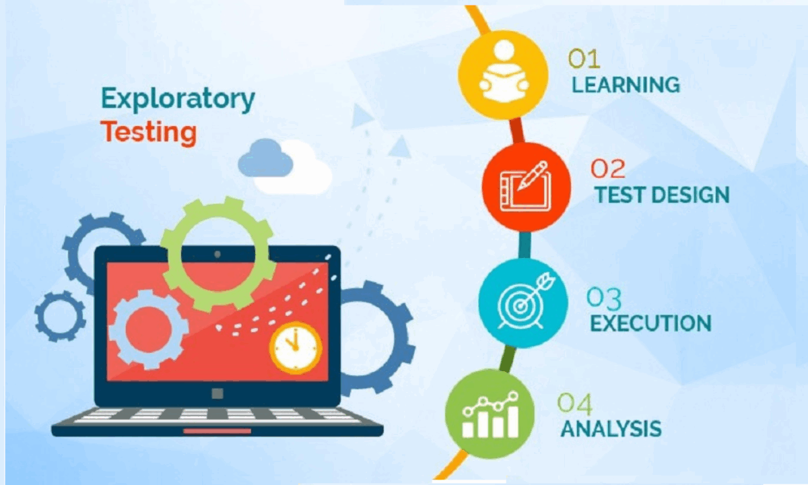

# Глава 4: Психологія та принципи тестування

## Вступ

Тестування програмного забезпечення — це не просто технічна дисципліна. Це також **психологічна та інтелектуальна діяльність**, яка вимагає особливого мислення, навичок спілкування та розуміння людського фактору. У цій главі ми розглядатимемо 7 фундаментальних принципів тестування, психологію тестувальника та практичні методи, які допомагають розвинути критичне мислення та навички взаємодії в команді.

**Чому це важливо?** Хоч би якими досконалими не були методи та інструменти, успіх тестування залежить від:
- Розуміння основних аксіом тестування
- Здатності думати як тестувальник
- Здатності конструктивно спілкуватися з розробниками та менеджерами
- Управління власним стресом та емоціями

---

## 4.1. Сім принципів тестування (ISTQB 4.0)

 
Принципи тестування — це загальновизнані засади, розроблені протягом 40+ років практики. Вони є **основою для усіх видів тестування** і відповідають на питання: "Чому ми тестуємо саме так, а не інакше?"

### 4.1.1. Принцип 1: Тестування показує наявність дефектів (а не їхню відсутність)

**Визначення:**
Тестування може виявити наявність дефектів у програмі, але не довести їх відсутність. Тим не менше, метою є скласти такі тест-кейси, які знайдуть якомога більше помилок за розумного розподілу ресурсів.

**Сутність принципу:**
- ✅ Тестування демонструє, за яких умов система НЕ працює (виявляє вразливості та знаходить помилки)
- ❌ Тестування НЕ демонструє, що система абсолютно бездефектна
- Навіть якщо дефекти не знайдені, це не означає, що їх немає

**Практичне обґрунтування:**
У комбінаторному розумінні неможливо протестувати всі сценарії. Розглянемо просту форму логіну:
- 3 поля (Email, Password, 2FA код)
- Email: 10^6 можливих значень (мільйони комбінацій)
- Password: 10^20+ можливих комбінацій
- 2FA: 10^6 комбінацій

**Всього:** 10^32 можливих комбінацій входу. Якщо гіпотетично тестувати по одній секунді на кожну комбінацію, це зайняло б мільйони років!

**Кейс з реальної практики:**
```
Проєкт: Mobile Banking App (БТА Банк)
Сценарій: Переказ коштів іншому користувачу

Тестування знайшло:
✓ 12 функціональних дефектів (помилкові розрахунки комісій, неправильні статуси)
✓ 8 дефектів безпеки (можливість переказу без верифікації, вищі ліміти ніж дозволено)
✓ 4 дефекти UX (невірні повідомлення про помилки)

Тестування НЕ знайшло:
❌ Помилку в мінорному сценарії (переказ рівно за 24 години до дедлайну місяця)
  — Цю помилку знайшов користувач через 3 місяці після релізу
  — Як наслідок репутаційні втрати

Висновок: Тестування виявило 24 значущі дефекти, але не 100% дефектів.
Це нормально. Мета — максимізувати знаходження при розумних витратах.
```

**Застосування в роботі:**
1. **Планування:** Визначте критичні функції і сценарії (не можна покрити все)
2. **Аналіз ризиків:** Зосередьтеся на найбільш критичних модулях (80% дефектів в 20% коду)
3. **Реалістичні очікування:** Звітуйте менеджменту, що знайдені дефекти — результат ефективного тестування, а не знак поганої роботи розробників

---

### 4.1.2. Принцип 2: Вичерпне тестування неможливе

**Визначення:**
Неможливо виконати тестування, яке покривало б усі комбінації користувацького вводу, станів системи та умов навколишнього середовища (за виключенням найпростіших систем). Тому необхідна розумна **раціоналізація та розставлення пріоритетів**.

**Сутність принципу:**
- 🔴 Комбінаторний вибух: кількість сценаріїв зростає експоненціально
- 🎯 Техніки дизайну: еквівалентне розділення, граничні значення, таблиці рішень
- 📊 Метрики покриття: Code Coverage, Path Coverage, Statement Coverage (див. Главу 7)

**Формальне обґрунтування (із теорії складності):**

Для системи з N входами та M станів (внутрішніх змінних):
- Кількість можливих тестів ≈ N^M (експоненціальна функція)
- Навіть при N=10 і M=10: 10^10 = 10 мільярдів сценаріїв!

**Практичні наслідки:**
```
Проєкт: E-Commerce платформа (продаж товарів)

Реальні параметри:
- 5000 товарів
- 10 параметрів на товар (розмір, колір, кількість, знижка,股票...)
- 50 способів оплати
- 100 регіональних варіацій доставки
- 3 рівні користувача (Guest, User, Premium)

Теоретичні комбінації:
5000 × 10 × 50 × 100 × 3 ≈ 750 мільйонів сценаріїв

Практичне рішення:
• Еквівалентне розділення: 3-4 товари за типом
• Граничні значення: мін/макс кількість, мін./макс. ціна
• Пріоритет: Популярні товари, основні способи оплати, основні регіони
• Результат: 200-300 тест-кейсів замість 750 млн

Ефективність: 99.96% скорочення, >80% покриття дефектів
```

**Комбінаторний вибух** — це різке, часто експоненційне зростання кількості можливих комбінацій вхідних даних, параметрів або умов системи, які потенційно необхідно перевірити під час тестування.

Техніки боротьби з комбінаторним вибухом — це методи тест-дизайну, що дозволяють зменшити кількість тестових комбінацій без суттєвої втрати необхідного тестового покриття.

[Комбінаторний вибух](https://uk.wikipedia.org/wiki/%D0%9A%D0%BE%D0%BC%D0%B1%D1%96%D0%BD%D0%B0%D1%82%D0%BE%D1%80%D0%BD%D0%B8%D0%B9_%D0%B2%D0%B8%D0%B1%D1%83%D1%85)


**Техніки боротьби з комбінаторним вибухом:**


| Техніка | Як застосовується | Результат |
|---------|------------------|-----------|
| **Еквівалентне розділення (EP)** | Поділ вхідних даних на класи | 5-10 тестів на функцію |
| **Граничні значення (BVA)** | Тестування меж класів | +30% виявлення дефектів |
| **Таблиці рішень (Decision Tables)** | Комбінування логічних умов | 15-20 тестів на складну логіку |
| **Попарне тестування (Pairwise)** | 2-за-раз комбінування параметрів | 90% покриття за 70% часу |
| **Граф-базований аналіз** | Path coverage, Control Flow | 100% покриття логіки |

---

### 4.1.3. Принцип 3: Раннє тестування економить гроші

**Визначення:**
Тестування повинно розпочинатися якомога раніше в життєвому циклі розробки (Shift-Left), а його зусилля повинні сконцентруватися на визначених цілях і ризиках. Чим раніше виявити дефект, тим дешевше його виправити.

**Сутність принципу:**
- 💰 **Крива Боема (Boehm's Curve):** вартість виправлення експоненціально зростає залежно від етапу
- ⏱️ Раннє виявлення економить час і ресурси
- 📈 ROI тестування найбільший на ранніх етапах

Детальне вивчення кривої витрат та економічний аналіз див. у Главі 1 ["Вступ до тестування", розділ 1.3.](https://github.com/STT-VITI-22/stt-handbook/blob/main/dist/%D0%A7%D0%B0%D1%81%D1%82%D0%B8%D0%BD%D0%B0%201/%D0%92%D1%81%D1%82%D1%83%D0%BF%20%D0%BD%D0%B0%20%D1%84%D1%83%D0%BD%D0%B4%D0%B0%D0%BC%D0%B5%D0%BD%D1%82%D0%B0%D0%BB%D1%8C%D0%BD%D1%96%20%D0%BE%D1%81%D0%BD%D0%BE%D0%B2%D0%B8/%D0%93%D0%BB%D0%B0%D0%B2%D0%B0%201/%D0%92%D1%81%D1%82%D1%83%D0%BF%20%D0%B4%D0%BE%20%D1%82%D0%B5%D1%81%D1%82%D1%83%D0%B2%D0%B0%D0%BD%D0%BD%D1%8F.md)

**Реальний кейс: Мобільний банк**

```
Дефект: "При переказі суми з дробовою частиною комісія розраховується неправильно"

Сценарій А: Виявлено на етапі вимог (Shift-Left)
────────────────────────────────────────
Традиційний підхід (Reactive):
• Час на виявлення: 2 години (code review вимог)
• Час на виправлення: 1 година (зміна формули в специфікації)
• Час на верифікацію: 1 година
• Всього: 4 години

Сценарій Б: Виявлено на етапі unit-тестування розробника
────────────────────────────────────────
• Час на виявлення: 8 годин (розробник пишет тест)
• Час на аналіз: 4 години (розробник дебагить)
• Час на виправлення: 2 години (зміна коду)
• Час на регресійне тестування: 4 години
• Всього: 18 годин

Сценарій В: Виявлено на етапі продакшену (ВОРОГИ!)
────────────────────────────────────────
• Час на знаходження: 24 години (скарги користувачів, аналіз логів)
• Час на гарячий патч: 8 годин (розробка, тестування в спішці)
• Час на розгортання: 4 години (координація DevOps, downtime)
• Час на komunkikaciju: 10 годин (звертання клієнтам, пояснення)
• Потенційні судові скарги: непередбачувано
• Репутаційна шкода: 100+ користувачі переходять до конкурентів
• Всього: 46+ годин + регулюваний риск

Економія: 46-18 = 28 годин (230% переважність Shift-Left!)
```

**Застосування принципу Shift-Left:**

| Фаза | Тестування | Результат |
|------|-----------|-----------|
| **Requirements** | Аналіз, перевірка повноти | Рано виявити неясні вимоги |
| **Design** | Відповідність архітектурі, виявлення ризиків | Забезпечити тестованість коду |
| **Dev** | Unit-тести, інтеграційні тести | Дефекти іді на розробника, а не QA |
| **QA** | Функціональні, системні тести | Регресія, user scenarios |
| **Ops** | Дим-тести, smoke-тести | Перевірка готовності до production |

---

### 4.1.4. Принцип 4: Кластеризація дефектів (Принцип Парето)

**Визначення:**
Різні модулі системи містять різну кількість дефектів. Більшість дефектів концентруються в обмеженій кількості модулів. Це прояв [закону Парето 80/20](https://uk.wikipedia.org/wiki/%D0%9F%D1%80%D0%B8%D0%BD%D1%86%D0%B8%D0%BF_%D0%9F%D0%B0%D1%80%D0%B5%D1%82%D0%BE): 80% проблем знаходиться в 20% компонентів.


**Сутність принципу:**
- 📊 Дефекти розподіляються **не рівномірно**
- 🎯 Критичні модулі потребують більш інтенсивного тестування
- 💡 Історичні дані допомагають прогнозувати проблемні зони


**Статистичне обґрунтування (із теорії розподілу):**

```
Гіпотетична система: 100 модулів, 150 виявлених дефектів

Розподіл за Парето (80/20):

Модулі     | Кількість | Дефекти | % дефектів|    %
-----------|-----------|---------|-----------|----------
Модуль 1   |     1     |   35    |   23.3%   |  23.3%
Модуль 2   |     1     |   28    |   18.7%   |  42.0%
Модуль 3   |     1     |   22    |   14.7%   |  56.7%
Модуль 4   |     1     |   18    |   12.0%   |  68.7%
Модуль 5   |     1     |   12    |    8.0%   |  76.7%
...
Інші       |    95     |   35    |   23.3%   | 100.0%

Висновок: 20% модулів (5 зі 100) містять 76.7% дефектів
```

**Реальний приклад з проекту: CRM система**

```
Проєкт: Customer Relationship Management (CRM)

Архітектура:
1. Auth Module (логіка авторизації)
2. Customer Module (управління контактами)
3. Sales Module (управління продажами)
4. Reporting Module (аналітика та звіти)
5. Integration Module (API з зовнішніми системами)
...та 15 інших менших модулів

Виявлені дефекти за 6 місяців:

1. Auth Module:      32 дефекти (28%)  ← ГАРЯЧІ ТОЧКИ
2. Integration Mod:  28 дефекти (25%)
3. Sales Module:     20 дефекти (18%)
4. Reporting Mod:    15 дефекти (13%)
5-20. Інші модулі:   25 дефектів (16%)  ← Низька щільність

Висновок: 4 модулі містять 84% дефектів

Оптимізація тестування:
• Auth & Integration: 60% часу QA команди
• Sales & Reporting: 30% часу QA команди
• Інші модулі: 10% часу QA команди

Результат: Більше дефектів знайдено, менше ресурсів витрачено
```

**Практичне застосування кластеризації:**

1. **Аналіз історичних даних:**
   - Переглянути bug-трекер (JIRA, Azure DevOps) за останні 3-6 місяців
   - Визначити модулі з найбільшою щільністю дефектів
   - Побудувати діаграму Парето

2. **Розподіл ресурсів:**
   - Виділити більше тестувальників на критичні модулі
   - Автоматизувати тестування частіше змінюваних модулів
   - Мінімізувати тестування стабільних модулів

3. **Прогнозування ризиків:**
   - Якщо модуль мав 50% дефектів минулого спринту, зосереджуватися на нього у цьому спринті
   - Підвищити критичність вхідних критеріїв для цього модуля

---

### 4.1.5. Принцип 5: Парадокс пестициду (Pesticide Paradox)


**Визначення:**

Якщо одні й ті самі тести виконуються багато разів, вони поступово втрачають ефективність у виявленні нових дефектів. Це можна порівняти з пестицидом або антибіотиком, який при повторному застосуванні має менший вплив на бактерії, оскільки з часом вони можуть набути стійкості до цього засобу.

**Сутність принципу:**
- 🐛 Одноразові тести перестають знаходити нові дефекти
- 🔄 Система еволюціонує, але тести залишаються незмінними
- ♻️ Необхідна постійна актуалізація та розширення тест-суїтів

**Психологічна основа:**

```
Поведінка системи:

Цикл 1: Виконання 100 тестів
├─ Знайдено: 25 дефектів ✓ (25% ефективність)
└─ Виправлено розробниками

Цикл 2: Виконання тих же 100 тестів
├─ Знайдено: 18 дефектів ✓ (18% ефективність)
├─ Причина: 7 тестів "застарілі" (система змінилась, вони більше не актуальні)
└─ Виправлено розробниками

Цикл 3: Виконання тих же 100 тестів
├─ Знайдено: 12 дефектів ✓ (12% ефективність)
├─ Причина: +6 тестів застарілі
└─ Виправлено розробниками

Цикл N: Тести вже не знаходять нові дефекти
└─ Ефективність → 0% (тести застарілі)
```

**Реальний кейс: E-Commerce платформа**

```
Проект: Інтернет-магазин (сайт + мобільний додаток)

Початкова версія (v1.0):
• Розроблено 150 тест-кейсів для вебу
• Регулярна регресія кожний тиждень
• Цикли 1-4: Знаходимо дефекти, ремонтуємо
• Цикл 5-10: Все менше дефектів (тести застарілі)

Проблеми:
Версія 1.5: Додано кошик із збереженням
├─ Старые 150 тестов не покрывают новую функцию
├─ Нужна добавка 50 новых тестов для корзины
└─ Ефективність підвищилась на 40%

Версія 2.0: Мобільна версія на React
├─ Вебтести більше не актуальні
├─ Потрібна повна переробка 80% тестів
├─ Додано 200 мобільних тест-кейсів
└─ Ефективність нормалізувалась

Версія 2.5: Інтеграція з платіжною системою Stripe
├─ 30 старих тестів потребують актуалізації
├─ Додано 40 нових тестів для платежів
└─ Знайдено 15 критичних дефектів (безпека, правильність)

Висновок: Без оновлення тестів втратили б 80% потенційного виявлення дефектів
```

**Боротьба з парадоксом пестициду:**

| Дія                        | Коли | Результат |
|----------------------------|------|-----------|
| **Огляд test-suite**       | Щомісяця | Видалити застарілі тести, оновити вікові |
| **Додавання нових тестів** | При кожній новій функції | +20-30% ефективності на спринт |
| **Рефакторинг тестів**     | При великих змінах | Переписати 10-20% застарілих тестів |
| **Розрахунок доцільності заміни**      | Щокварталу | Замінити 5-10% найменш ефективних тестів |
| **Exploratory Testing**    | Щотижня (мінімум 2-3 години) | Знайти неочікувані проблеми, які не покривають автоматичні тести |

---

### 4.1.6. Принцип 6: Тестування залежить від контексту

**Визначення:**
Методологія, техніка та тип тестування прямо залежать від **природи та цілей програми**. Тестування медичного ПЗ принципово відрізняється від тестування комп'ютерної гри чи інтернет-магазину.

**Сутність принципу:**
- 🎯 Немає універсального рецепту тестування
- 📋 Вибір техник залежить від:
  - Типу програми (web, мобіль, desktop, embedded)
  - Ризиків (критичність, безпека, конфіденційність)
  - Користувачів (кінцеві користувачі, інженери, лікарі)
  - Регуляцій (GDPR, HIPAA, PCI DSS)

**Контекстна матриця тестування:**

| Програма                   | Ризик | Тип тестування                                                       | Інтенсивність | Приклади                            |
|----------------------------|--------|----------------------------------------------------------------------|-----|-------------------------------------|
| **Військова сфера**        | КРИТИЧНИЙ | Чорна скриня,security,smoke-тести,unit-test, регуляторне, regression | 90% | Система підтримки рішення командира |
| **Медичне ПЗ** (діагностика) | КРИТИЧНИЙ | Чорна скриня, регуляторне, regression                                | 90% | Система контролю слухових апаратів  |
| **Фінансова система** (платежі) | КРИТИЧНИЙ | Чорна скриня, security, compliance                                   | 85% | Банківський трансфер                |
| **E-Commerce** (продажі)   | ВИСОК | Функціональне, performance, UX                                       | 70% | Інтернет-магазин                    |
| **Соціальна мережа**       | СЕРЕДНІЙ | Функціональне, usability, mobile                                     | 60% | Facebook, Instagram                 |
| **Комп'ютерна гра**        | НИЗЬКИЙ | Exploratory, gameplay, graphics                                      | 40% | Candy Crush, 2048                   |
| **Утиліта** (калькулятор)  | НИЗЬКИЙ | Чорна скриня, smoke-тести                                            | 20% | Вбудована система макосу            |

**Детальні кейси по контексту:**

**Кейс 1: Медичне ПЗ (HIPAA - критичність)**
```
Приклад: Система ЕРК (Electronic Health Record) лікарні

Контекст:
• Регуляція: HIPAA (США), GDPR (ЄС)
• Критичність: Помилка в діагнозі може стоїти життя пацієнта
• Користувачі: Лікарі, медсестри, адміністратори

Тестування:
✓ 95% вимоги до функціональності
✓ Regression-тести на 100% (потім дахов не прошуприміняться)
✓ Security-тесты (OWASP Top 10, крім безпеки пацієнтів)
✓ Compliance-тесты (HIPAA privacy, audit logs)
✓ Usability-тесты (лікарі мають працювати під стресом)
✓ Performance (в аварійних ситуаціях система не повинна зависати)

Інструменти:
• Automated: Selenium, Jest, Postman (для API)
• Manual: Обов'язкова (адаптація, контекст)
• Security: OWASP ZAP, Burp Suite
• Compliance: Спеціалізовані інструменти для HIPAA

Дилема: Тестування займає 60-70% часу проекту, але необхідне!
```


**Кейс 2: Військове ПЗ (безпека — критичність)**
```
Приклад: Система управління вогневою підтримкою (Combat Support System)

Контекст:
• Регуляція: NIST SP 800-171 (США), STANAG 4673 (НАТО)
• Критичність: Помилка в системі наведення може привести до втрат серед військовослужбовців
• Користувачі: Військові оператори, командири, тактичні центри
• Умови: Екстремальні (екстремальні температури, вібрація, вологість, можливість EMP)

Тестування:
✓ 98%+ вимоги до функціональності (найвищий стандарт)
✓ Regression-тести на 100% (кожна версія = перевірка критичних сценаріїв)
✓ Safety-тести (відсутність помилок при сценаріях вибіркової помилки)
✓ Security-тесты (NIST, захист від cyberattack, перевірка прав доступу)
✓ Compliance-тесты (військові стандарти, audit logs, шифрування)
✓ Environmental-тесты (температури -40°C до +60°C, вібрація, вологість)
✓ Reliability-тесты (MTBF — Mean Time Between Failures > 1000 годин)
✓ Accessibility-тесты (Для операторів з обмеженням зору/слуху)

Інструменти:
• Automated: Jenkins, SonarQube, AppScan (SAST), Burp Suite (DAST)
• Manual: Обов'язкова для критичних операцій, в тому числі симуляції реальних сценаріїв
• Security: NIST Cybersecurity Framework, cryptographic testing
• Environmental: Спеціалізовані камери для тестування температури/вологості
• Compliance: Military Standard документація, Chain of Custody для тестових даних

Дилема: Тестування займає 75-85% часу проекту!
```


**Висновок: Контекст визначає все**

Немає "правильного" способу тестування. Є правильний способ **для конкретної програми в конкретному контексті**. Це вимагає досвіду, думки та адаптивності.

---

### 4.1.7. Принцип 7: Відсутність помилок — це ілюзія

**Визначення:**
Навіть якщо тестування не виявило дефектів у функціональності, це не означає, що система готова до продажу. Система може бути технічно корректна, але **незручна, повільна або не відповідати потребам користувача**.

**Сутність принципу:**
- ❌ 0 дефектів ≠ Готовність до релізу
- 🎯 Якість = Функціональність + Usability + Performance + Надійність
- 👤 Користувач визначає якість, не інженер

**Практична ілюстрація:**

```
Система: Мобільна програма для медитації

Функціонально корректна версія:
✓ Всі 50 медитацій відтворюються без помилок
✓ Програма не краш-ується, немає bug report
✓ API інтеграція працює правильно
✗ Інтерфейс перевантажений, 7 кліків щоб почати медитацію
✗ Програма споживає 80% батареї за 30 хвилин
✗ Шрифти дуже дрібні для людей 50+

Результат:
• QA відмічає: "Технічно готово"
• Користувачи кажуть: "Це непотріб! Видаляю!"
• Рейтинг у AppStore: 2.3 з 5 зірок

Висновок: Функціональна корректність ≠ Задоволення користувача
```

**Компоненти якості (ISO 25010:2011):**

| Компонента | Визначення | Приклад дефекту                                                        |
|-----------|-----------|------------------------------------------------------------------------|
| **Функціональна придатність** | Система робить те, що потрібно | Хибні розрахунки                                                       |
| **Надійність** | Система не краш-ується | Витік пам’яті (Memory Leak), зависання                                 |
| **Зручність використання** | Система легка у навчанні | 10 кліків для простої дії                                              |
| **Продуктивність** | Система швидка | Загрузка сайту за 15 сек                                               |
| **Безпека** | Дані користувача захищені | Можливість крадіжки пароля                                             |
| **Сумісність** | Працює на різних пристроях | Адаптивна верстка на мобільний пристроях                               |
| **Ремонтованість** | Код легко розуміти та змінювати | Спагеті-код, відсутність стилю написання коду (Code Style Consistency) |
| **Переносимість** | Програма працює на різних ОС | Windows ± Linux версії різні                                           |

**Кейс: Фінансовий портал (класичний приклад)**

```
Програма: Онлайн-портал для управління інвестиціями

Версія 1.0 - Функціонально корректна, але користувачи розлютовані:
✓ Функціональність: 100% (всі кнопки працюють, обчислення правильні)
✗ Usability: 20% (інтерфейс як у 1990-х років)
✗ Performance: 40% (завантаження займає 30 сек, отримання даних повільне)
✗ Mobile: 0% (рідко використовується на телефоні)

Результат: "Повернув свої 100$ назад, перейду до іншого сервісу, який швидший"

Версія 2.0 - Заново розроблено з урахуванням якості:
✓ Функціональність: 100% (така сама)
✓ Usability: 85% (чистий інтерфейс, інтуїтивні дії)
✓ Performance: 90% (завантаження 2-3 сек)
✓ Mobile: 95% (responsive design, native APP)

Результат: "Це найкраща платформа для інвестицій! Рекомендую друзям!"

Висновок: Якість вимагає балансу технічних та користувацьких аспектів
```

**Практичне застосування 7-го принципу:**

1. **Невідкладно**: Включіть тестування зручності в план тестування
2. **Performance**: Вимірюйте час відповіді, CPU, пам'ять
3. **Accessibility**: Тестуйте для людей з інвалідністю (далтонізм, слухові імплати)
4. **User acceptance**: Залучайте справжніх користувачів (UAT - User Acceptance Testing)
5. **Satisfaction metrics**: Опитування та NPS (Net Promoter Score)

---

## 4.2. Цілі тестування (Сучасний підхід)

Тестування — це не просто "знаходження багів". Це комплексна діяльність з кількома взаємопов'язаними цілями.

### 4.2.1. Чотири ключові цілі тестування

**1. Знаходження дефектів (Reactive approach — реактивний підхід)**

**Визначення:** Виявити якомога більше помилок перед релізом.

- ✓ Позитивні: Зниження ризику, покращення якості
- ✗ Недоліки: Тільки реагує, не попереджує
- Інструменти: Автоматичні тести, exploratory, stress-тести

**Кейс:**
```
Проект: Мобільний додаток для доставки їжі (DeliverHero-подібний)

Раніше (только поиск дефектов):
- QA отримує готовий білд
- Проводит тестирование (2 дня)
- Находит 30 дефектов
- Разработчики исправляют
- Regres-testing (1 день)

Результат: 10 дефектов все ещё вышли в Production
Репутационна втрата: -15% користувачів
```

**2. Отримання інформації про якість (Quality Intelligence)**

**Визначення:** Надати стейкхолдерам (менеджери, розробники, бізнес) об'єктивну інформацію про стан якості системи.

- ✓ Позитивні: Інформована прийняття рішень, управління ризиком
- ✗ Недоліки: Вимагає визначених метрик
- Інструменти: Метрики покриття, дефект-аналіз, трендові звіти

**Метрики якості, які надаються QA:**

```
Звіт про якість версії 2.3.0:

┌─────────────────────────────────────────────────┐
│ ЯКІСТЬ СИСТЕМИ - ВЕРСІЯ 2.3.0                  │
├─────────────────────────────────────────────────┤
│ Дата релізу: 15 вересня 2026                   │
├─────────────────────────────────────────────────┤
│ ПОКРИТТЯ ТЕСТУВАННЯ                            │
│ ✓ Функціональне покриття:    87% (Target: 85%) │
│ ✓ Code Coverage:              72% (Target: 70%) │
│ ✓ Regression тести:          150/150 passed    │
├─────────────────────────────────────────────────┤
│ ДЕФЕКТИ ВИД СТАРТІ ТЕСТУВАННЯ                  │
│ ✓ Критичні (Blocker):          0 (0%)          │
│ ✓ Висока (High):               2 (Фіксовані)   │
│ ✓ Середня (Medium):            8 (Відкладено)  │
│ ✓ Низька (Low):               15 (Ignored)     │
├─────────────────────────────────────────────────┤
│ РІВЕНЬ ДЕФЕКТІВ                                │
│ ✓ Defect Density: 2.5 на 1000 LOC              │
│ ✓ Trend: ↓ (-30% від v2.2.0)                   │
├─────────────────────────────────────────────────┤
│ ГОТОВНІСТЬ                                     │
│ ✓ Рекомендація: ГОТОВО ДО РЕЛІЗУ               │
│ ✓ Ризик: НИЗЬКИЙ                               │
│ ✓ Конфідентність: 95%                          │
└─────────────────────────────────────────────────┘

Висновок для мене менеджерів:
- Рівень якості вищий за попередню версію
- 2 відкритих HIGH дефекти допустимі для цього типу системи
- Готово до 15 вересня релізу
```

**3. Запобігання дефектам (Proactive approach — проактивний підхід)**

**Визначення:** Виявляти та попереджувати потенційні дефекти ЕЩЕ ДО розробки коду.

- ✓ Позитивні: Економить час, зменшує витрати
- ✗ Недоліки: Вимагає залучення QA на ранніх етапах
- Інструменти: вимог, техніка тест-дизайну, спецки аналіз

**Проактивне тестування — Shift-Left:**


Традиційний підхід (Reactive):
Requirements → Design → Development → Testing → Release

Проактивний підхід (Shift-Left):
Requirements (QA перевірка) → Design (тестованість) →
Dev (unit-тести) → Testing → Release


QA на ранніх етапах:
1. Аналіз вимог (Requirements Review):
   - Чи вимоги ясні і повні?
   - Чи тестованої ці вимоги?
   - Які ризики?

2. Аналіз дизайну (Design Review):
   - Чи архітектура підтримує тестованість?
   - Які критичні шляхи?
   - Як буде тестуватися безпека?

3. Планування тестів (Test Planning):
   - Які техніки дизайну обрати?
   - Скільки тест-кейсів потрібно?
   - Як організувати регресію?

Результат: Середньостатистичний проект зберігає 20-30% часу QA!


**Реальний кейс: Мобільний звіт для продавців**


Проєкт: Sales Report App для команди продажів

Традиційний (Reactive):
─────────────────────
• Month 1: Вимоги написані, розробка почалась
• Month 2: Розробка закінчена, QA почина тестування
• Знайдено: 45 дефектов, виправлено за 2 тижні
• Month 3: Relay вышла, користувачи скаржаться

Проактивний (Shift-Left):
────────────────────────
• Week 1: QA спілкується з PM про вимоги
  - "Як користувач фільтрує продажів за датою?"
  - "Какъ система обробляє часові пояси?"
  - "Какъ бути з офлайн синхронізацією?"
  → Виявлено 12 проблем у вимогах ДО розробки

• Week 2-3: QA зустрічається з архітектором
  - "Какъ тестуватимемо API інтеграцію?"
  - "Какъ обробляються помилки синхронізації?"
  → Дизайн переглянутий, додано логування

• Week 4-8: Dev робить unit-тести, QA дизайнує тест-кейси
  - Паралельна робота, а не послідовна
  - QA готові тест-кейси коли dev починає інтеграцію

• Week 9-10: QA тестує, знайдено 15 дефектів (66% менше!)
  - Більшість мелких (не блокерів)
  - Критичні проблеми уже вирішені на ранніх етапах

• Дата релізу: Week 11, на 2 тижні раніше!

Результат: Проактивний підхід заощадив 3 человека-тижні і дозволив раніше запустити продукт.


**4. Побудова й підвищення довіри до програми (Trust building)**

**Визначення:** Переконати стейкхолдерів (користувачи, клієнти, регулятори), що система достатньо якісна та надійна.

- ✓ Позитивні: Бізнес-цінність, репутація
- ✗ Недоліки: Складно вимірюється, вимагає комунікації
- Інструменти: Сертифікація, документація, прозорість

**Цинічний приклад: Лікувальне ПЗ**


Медичний прилад: Фітнес-трекер з функцією моніторингу серцевого ритму

Без довіри (без тестування):
┌──────────────────────────────────────────┐
│ Трекер показує ЧСС: 150 ударів на хвилину│
│ Користувач 1: "Це проблема? Я пас!"      │
│ Користувач 2: "Датчик брак, повертаю"    │
│ Лікар: "Я не вірю цьому приладу"        │
│ FDA: "Скільки було тестування?"          │
└──────────────────────────────────────────┘
Результат: 20% ринку, затримка на 6 місяців

З довіро (3 місяці серйозного тестування):
┌──────────────────────────────────────────┐
│ Трекер показує ЧСС: 150 ударів на хвилину│
│ QA сертифікат: "Протестовано 95% сценаріїв│
│ Акурарність: 98% порівняно з медичними │
│ Регуляторна відповідність: FDA одобряет │
│ Користувач 1: "Дотримую цей трекер"     │
│ Лікар: "Це обґрунтований прилад"       │
│ Компанія: "Шкала масового виробництва"  │
└──────────────────────────────────────────┘
Результат: 70% ринку, $10M кумулятивних продажів


 ---
**Матриця цілей за етапами:**


| Етап | Мета 1 | Мета 2 | Мета 3 | Мета 4 |
|------|--------|--------|--------|--------|
| **Requirements** | 0% | 20% | 70% | 80% |
| **Design** | 10% | 30% | 50% | 70% |
| **Development** | 30% | 40% | 30% | 50% |
| **Testing** | 90% | 90% | 10% | 90% |
| **Release** | 100% | 100% | 5% | 100% |

---

**Висновок:** Ефективне тестування охоплює всі чотири цілі, але їхня вага змінюється залежно від етапу.


## 4.3. Психологія тестувальника

Тестування — це не просто виконання механічних кроків. Це особлива вид мислення, яка контрастує з мисленням розробника, менеджера чи дизайнера.


### 4.3.1. Критичне мислення vs. Конструктивне мислення

**Визначення:**

| Мислення | Мета | Парадигма | Приклад питань |
|----------|------|-----------|---------|
| **Критичне (QA)** | Знайти, як система НЕ працює | "Як зламати?" | Що робити, якщо користувач ввведе мільйон символів? |
| **Конструктивне (Dev)** | Побудувати систему, яка працює | "Як зробити?" | Як найефективніше реалізувати цю функцію? |

**Психологічний конфлікт:**

```
Розробник думає:
"Я написав код, він компілюється і виконується тест-кейси. Це має працювати!"

Тестувальник думає:
"Код компілюється, але що коли користувач введе
пустий рядок? Що коли буде 10 мільйонів запитів на сервер?
Що якщо система запуститься о 23:59 напередодні зміни часу?
Що якщо хакер введе SQL injection в поле для імені?"

Розробник слухає:
"Це... насправді не перевіряє цей сценарій..."

Тестувальник знаходить баг.

Результат: Розробник чує це як "Ти поганий програміст"
(Хоча QA насправді каже: "Хороша логіка, але пропущено граничне значення")

Висновок: для хорошого інженера більш важливо розуміння за яких умов система не буде працювати. Тобто мислити від зворотнього!
```

**Причини конфлікту:**

```
Розробник оцінюється за:
✓ Рядками написаного коду
✓ Реалізованими функціями
✓ Дотримаю крайдат

Тестувальник оцінюється за:
✓ Знайденими дефектами
✓ Кількості пропущених багів

Парадокс: Чим більше дефектів знаходить QA,
тим краще його робота, але тим гірше виглядає dev!

Результат: Потрібно розумінти що за результат та якість відповідають усі учасники процесу!
```

### 4.3.2. Гібридне мислення: Знаходження VS. Демонстрація працездатності

**Визначення:**

| Категорія | Фокус                     | Інструменти | Результат |
|-----------|---------------------------|-----------|----------|
| **Testing as Destructive (Руйнівне тестування)** | Як поломати систему       | Граничні значення, мутацій, chaos testing | Список дефектів |
| **Testing as Constructive (Конструктивне тестування)** | Як довести працездатність | Позитивні тест-кейси, happy path | Документація якості |

**Баланс между двома підходами:**

```
Проект: Web Banking Application

Розробник написав: "Можна перевести гроші між рахунками"

Руйнівне тестування (Destructive):
──────────────────────────────────
• Спробував перевести -100$ (від'ємну суму)
  → Система припустила! Деньги виселились в бік від користувача
  → БАУНТИ! 🎯

• Спробував перевести 999999999$ (більше ніж баланс)
  → Система припустила! Баланс став від'ємним
  → КРИТИЧНИЙ ДЕФЕКТ! 🔴

• Спробував перевести 0.001$ (мініймальна сума)
  → Система виконала, але комісія з'їла весь переказ
  → ЛОГІЧНА ПОМИЛКА 🟡

Результат: 3 дефекти виявлено

Конструктивное тестирование (Constructive):
─────────────────────────────────────────
• Перевести 100$ з рахунку A на рахунок B
  → Баланс A зменшився на 100$ ✓
  → Баланс B збільшився на 100$ ✓
  → Комісія розраховується правильно ✓
  → Статус операції: "Успіх" ✓

• Перевести 500$ з рахунку X на рахунок Y
  → Те саме, успішно ✓

Результат: "Функція працює правильно"

Висновок: Конструктивне тестування підтверджує нормальність.
Руйнівне тестування знаходить грани випадки. Обидва необхідні!
```

### 4.3.3. Комунікація результатів без конфліктів

**Проблема:**

Тестувальник знаходить дефект і повинен звітувати розробнику. Але як це зробити?

**Невірні підходи (УНИКАЙТЕ):**

```
❌ «Цей код — повний занепад! Як взагалі можна було написати таке? Це найгірший код, який я бачив!»
→ Розробник сприймає це як особисту атаку, починає захищатися, вступає в конфлікт або просто перестає реагувати на зауваження.

```

**Правильний підхід: "Ми критикуємо КОД, а не ЛЮДИНУ"**

```
✅ Правильна форма звіту:

Тема: "Button "Save" не скидає форму після натискання"

Контекст:
Тестував форму вводу користувача. При натисканні на кнопку "Save":
• Дані замінюються в базі ✓ (правильно)
• Форма очищається (ОЧІКУВАННЯ) ✗ (дефект)
• Сторінка залишилась на тій же формі
• Користувач не знає, чи було збережено

Як відтворити:
1. Відкрити форму вводу
2. Заповнити всі поля
3. Натиснути "Save"
4. Спостерігати: форма НЕ очищається

Очікуваний результат:
Форма очищується, користувач розуміє, що дані збережено

Фактичний результат:
Форма залишилась з даними, користувач розгублений

Критичність: Середня (користувач може подумати, що дані не збережено)

Стан: Готово до розробки
```

**Ключові елементи конструктивного звіту:**

| Елемент | Чому важливо |
|---------|-----------|
| **Контекст** | Розробник розуміє, що робив користувач |
| **Кроки відтворення** | Розробник може оцінити проблему |
| **Очікуваний результат** | Розробник знає вимоги |
| **Фактичний результат** | Розробник бачить розбіжність |
| **Серйозність** | Розробник розуміє пріоритет |
| **БЕЗ звинувачень** | Розробник не захищається |

### 4.3.4. Управління стресом та "синдром самозванця"

**Проблема:** Тестувальники часто відчувають:
- 😰 Синдром самозванця ("Я не справді знаю, як тестувати")
- 😫 Тиск крійдат(deadline) ("Маю знайти всі баги до вечора")
- 😔 Монотонність ("Регресійне тестування — це нюдьга")
- 😠 Конфлікти ("Розробники не беруть мене серйозно")

**Синдром самозванця (Imposter Syndrome):**

```
Типовий монолог тестувальника:
──────────────────────────────

"Я отримав цей звіт про дефект...
Але чи я його правильно розумію?
Чи це дійсно баг?
Розробник каже, що це не баг...
Мені здається, я помилився.
Може, я недостатньо професійний для цієї роботи?
Решта тестувальники знайшли б це набагато швидше.
Може, мене мають звільнити?"

Реальність: Ви знайшли СПРАВЖНІЙ баг, який виправляє розробник.
Але ви не вірите у себе, тому сумніваєтеся.
```

**Боротьба з стресом (практичні методи):**

| Проблема | Рішення | Як це допомагає |
|----------|---------|--------|
| **Синдром самозванця** | Документуйте свої успіхи (знайдені баги, що вимовлено в production) | Ви бачите свої результати, зростає впевненість |
| **Монотонність регресії** | Автоматизуйте рутинні тести | Вручні тестування фокусується на крeativity |
| **Тиск дедлайнів** | Розставте пріоритети (20% часу на 80% функцій) | Достижимі цілі, менше стресу |
| **Конфлікти з dev** | Регулярні 1-на-1 зустрічи з розробниками | завжди краще бути чесним |


---

## 4.4. Комунікація та конфліктність

Тестування — це **командний спорт**. Без ефективної комунікації навіть найточніші баги залишаються непоміченими.

### 4.4.1. Як конструктивно звітувати про дефекти

**Шаблон хорошого баг-репорту:**

```
=================================================
DEFECT REPORT №247
=================================================

Назва:       Кнопка "Save" не очищує форму після натискання

Пріоритет:   Medium (може чекати до наступного спринту)
Статус:      New
Модуль:      Forms / User Management

─ ОПИСАННЯ ─────────────────────────────────────

При натисканні на кнопку "Save" у формі вводу користувача:
• Дані переважно замінюються на сервері ✓
• Форма ПОВИННА очищуватися, показуючи успіх
• Форма ЗАЛИШИЛАСЬ з раніше вводженими даними
• Користувач лишається в очікуванні, непевний чи дані збережено

─ КРОКИ ВІДТВОРЕННЯ ────────────────────────────

1. Запустити додаток
2. Перейти на сторінку "Edit Profile" (Редагування профілю)
3. Заповнити форму:
   - First Name: "Ivan"
   - Last Name: "Kovalenko"
   - Email: "ivan@example.com"
   - Phone: "+38012345678"
4. Натиснути на синю кнопку "Save Profile"
5. Спостерігати поведінку форми

─ ОЧІКУВАНИЙ РЕЗУЛЬТАТ ─────────────────────────

✓ Форма очищується (всі поля — пусті)
✓ Повідомлення: "Profile saved successfully!" (зелене, вгорі форми)
✓ Редирект на сторінку профілю
✓ При повернення: зі сторінки профілю, дані актуальні

─ ФАКТИЧНИЙ РЕЗУЛЬТАТ ──────────────────────────

✗ Форма НЕ очищується (дані лишаються видимими)
✗ Повідомлення з'являється, але зникає за 2 сек
✗ Редирект НЕ відбувається
✗ Користувач залишається на тій же формі, невідомо, чи дані збережено

─ ВПЛИВ ────────────────────────────────────────

• UX Issue: Користувач не розуміє, чи було збережено
• Можливість Duplicate Submit: Користувач може натиснути "Save" знову
• Повторні звернення: Гарячі лінія отримує скарги, чому не видно результату

─ СКРІН-ШОТИ / ПОСИЛАННЯ ──────────────────────

Screenshot 1: Форма до натискання Save
  https://drive.google.com/file/d/1A2B3C4D5E6F7G8H9I0J/view

Screenshot 2: Форма ПІСЛЯ натискання (проблема)
  https://drive.google.com/file/d/2B3C4D5E6F7G8H9I0J1K/view

Video: Демонстрація проблеми
  https://drive.google.com/file/d/3C4D5E6F7G8H9I0J1K2L/view

─ ДОДАТКОВА ІНФОРМАЦІЯ ─────────────────────────

Версія: v2.3.0
Браузер: Chrome 121 (Desktop)
ОС: Windows 11
Сервіс: Staging Environment (staging.example.com)

─ НОТАТКИ ──────────────────────────────────────

Цей дефект впливає на UX, але НЕ на функціональність
(дані справді йдуть в базу, як видно з перевірки БД).
Це передусім проблема повідомлення користувачу.

Можливий причини:
• JavaScript не очищує DOM елементи
• API повертає успіх, але фронтенд не обробляє це
• CSS приховує повідомлення замість видалення

─────────────────────────────────────────────────
Aвтор: Anna Petrova (QA Engineer)
Дата: 2026-08-28
Версія: 1.1 (оновлено після уточнення від розробника)
```

**Чому це гарний баг-репорт:**

✅ **Контекст:** Читач розуміє, що робив користувач
✅ **Кроки:** Розробник може повторити проблему за 2 хвилини
✅ **Очікування:** Зрозуміло, що мало б бути
✅ **Реальність:** Зрозуміло, що це помилка
✅ **Вплив:** Менеджер розуміє, чому це важливо
✅ **Докази:** Скриншоти та відео прибирають сумніви
✅ **БЕЗ звинувачень:** "Це помилка в коді", не "Ти напустив"
✅ **Конструктивність:** Навіть припущення про причину


**Матриця готовності до релізу:**

| Критичні | Висоikі | Середні | Низькі | Рекомендація |
|----------|---------|---------|--------|--------------|
| 0 | 0 | 0-5 | 0-20 | ✅ GO (готово) |
| 0 | 0 | 6-15 | 0-30 | ✅ GO (прийнятно) |
| 0 | 1-2 | 6-15 | 0-30 | ⚠️ CONDITIONAL (залежить від HIGH) |
| 0 | 3+ | 15+ | 30+ | 🔴 NO-GO (не готово) |
| 1+ | - | - | - | 🔴 NO-GO (блокер) |

### 4.4.2. Тріада: Розробник — Тестувальник — Менеджер

**Динаміка взаємин:**

```
                    РОЗРОБНИК
                       ▲
                       │
                    Чого він хоче?
                 "Завершу код швидко"
                 "Мінімум змін"
                 "Мене не критикувати"
                       │
    ТЕСТУВАЛЬНИК ◄─────┼─────► МЕНЕДЖЕР
          ▲            │            ▲
          │            │            │
    Чого він хоче?  КОНФЛІКТ!   Чого він хоче?
    "Знайти баги"  ◄───────────► "Випустити швидко"
    "Якість коду"     БАЛАНСУ      "З мін. багами"
    "Виявити           ───────      "В рамках бюджету"
     проблеми"

             ВЗАЄМНІ ПОТРЕБИ:
    • Якість (розробник) + Тестування (QA) = Довіра
    • Швидкість (менеджер) + Якість (розробник) = ROI
    • Прозорість (QA) + Рішення (менеджер) = Успіх
```

**Як крок до гармонії:**

```
1. Регулярні синхронізації (Sync meetings):
   ─────────────────────────────────────
   • Щодня (15 хвилин): Розробник + QA
     - Що робили вчора?
     - На чому фокусуємося сьогодні?
     - Чи є блокери?

   • Щотижня (1 година): Dev + QA + Manager
     - Яка якість коду?
     - Скільки дефектів?
     - Чи готово до релізу?

2. Чітка відповідальність (RACI):
   ────────────────────────────────
   Компонента       │ Розробник │ QA │ Менеджер
   ─────────────────┼───────────┼────┼──────────
   Написання коду     │ Responsible│ -  │ -
   Unit-тести       │ Accountable│ -  │ -
   Системне тестир. │ -         │ R  │ -
   Баг-репорт       │ -         │ A  │ -
   Рішення виходу   │ -         │ I  │ Responsible
   Релізу           │ -         │ I  │ Accountable

3. Спільні цілі (OKR):
   ─────────────────
   OKR: "До 30 вересня випустити v2.0 з рівнем якості ≥ 95%"

   Як виконувати:
   • Розробник: "Написати 5000 LOC, покрити unit-тестами"
   • QA: "Протестувати 250+ сценаріїв, знайти 90%+ дефектів"
   • Менеджер: "Виділити ресурси, обслуговувати постачання"

   Спільна перемога = спільний успіх
```

---

## 4.5. Практичні психологічні техніки

Як розвинути мислення тестувальника? Як знайти творчу сторону однієї, здавалося б, технічної роботи?

### 4.5.1. Mind-mapping для декомпозиції вимог

**Визначення:**
Mind-map (інтелект-карта) — це діаграма, яка візуалізує систему, її функції та їхні взаємозв'язки. Це допомагає QA зрозуміти весь обсяг системи перед написанням тест-кейсів.

**Приклад: Mind-map для e-commerce платформи**

```
                              E-COMMERCE PLATFORM
                                     │
                ┌────────────┬────────┼────────┬──────────┐
                │            │        │        │          │
            CATALOG      SHOPPING   CHECKOUT  USER       ADMIN
            SYSTEM       CART      SYSTEM   MANAGEMENT   PANEL
              │            │        │        │           │
         ┌────┴────┬──┐   │        │        │           │
         │         │  │   │        │        │           │
      Search   Product Filter  Add  Remove Price  Auth  Reports
      Browse   Details Items   Item  Item Calc    Roles
         │       │  │      │      │      │       │      │
       Name   Images Ratings  Qty  Qty   Tax    Login   Graphs
       Price  Stock Reviews  Update Delete Ship  Profile Analytics

       Кожен блок = тест-кейси!
       Наприклад, "Search" може мати 15 тест-кейсів:
       • Пошук по імені
       • Пошук з пустим рядком
       • Пошук з спецсимволами
       • Пошук з дуже довгим текстом
       • Пошук з регіональними символами (укр., російськ.)
       • Пошук при виключеному JavaScript
       • Пошук при повільному інтернеті
       ... тощо
```

**Переважи Mind-mapping:**

| Переважа | Як це допомагає |
|----------|--------|
| **Повнота** | Не пропустити жодну функцію |
| **Структура** | Зрозуміти ієрархію компонентів |
| **Креативність** | Знайти граничні випадки |
| **Комунікація** | Показати менеджерам/розробникам план |
| **Отримання** | Легко кількістю тестів розраховуються |

### 4.5.2. Креативні техніки тестування

**Метод ["Шість капелюхів мислення"](https://uk.wikipedia.org/wiki/%D0%A8%D1%96%D1%81%D1%82%D1%8C_%D0%BA%D0%B0%D0%BF%D0%B5%D0%BB%D1%8E%D1%85%D1%96%D0%B2_%D0%BC%D0%B8%D1%81%D0%BB%D0%B5%D0%BD%D0%BD%D1%8F) (Six Thinking Hats) — Edward de Bono**


```
### Приклад застосування методу шести капелюхів

**Проблема:**  
Система дозволяє користувачам здійснити переказ на суму до **1 мільйона доларів** без додаткового підтвердження.

**Різні погляди на одну проблему:**

👨‍💻 **Розробник:**
> «Технічно код працює правильно та відповідає поточним вимогам».

👨‍💼 **Менеджер:**
> «Це створює значні бізнес-ризики для компанії».

🧪 **QA:**
> «Це потенційна проблема з точки зору безпеки та контролю ризикових операцій».

---

### Шість капелюхів — шість способів мислення

🔴 **ЧЕРВОНИЙ КАПЕЛЮХ — емоції та інтуїція**

> «Інтуїтивно це здається дуже ризикованим. Я б не дозволяв проводити такі операції без додаткової перевірки».

⚪ **БІЛИЙ КАПЕЛЮХ — факти та дані**

> «Що ми знаємо? Зафіксовано 1000 операцій, з них 2 завершилися помилками. Максимальна сума однієї операції — $1 млн».

🟡 **ЖОВТИЙ КАПЕЛЮХ — переваги та позитивні сторони**

> «Система успішно обробляє 99,8% операцій без помилок. Високий ліміт дозволяє швидко проводити великі платежі без зайвих затримок».

🟢 **ЗЕЛЕНИЙ КАПЕЛЮХ — креативність та альтернативи**

> «Можна встановити денний ліміт, наприклад $100 000, а для більших сум передбачити додаткове підтвердження».

🔵 **СИНІЙ КАПЕЛЮХ — контроль та управління процесом**

> «Потрібно визначити ризики, оцінити запропоновані рішення та сформувати остаточні вимоги до системи».

⚫ **ЧОРНИЙ КАПЕЛЮХ — критика та ризики**

> «Якщо через помилку або вразливість буде втрачено $1 млн, компанія може зазнати критичних фінансових збитків. Необхідно передбачити механізми запобігання таким операціям».

---

#### Результат

Замість суперечки **«код правильний чи неправильний?»** команда розглядає проблему з різних точок зору: технічної, бізнесової, безпекової та користувацької.

**Рішення:**

- встановити денний ліміт переказів, наприклад **$100 000**;
- для операцій понад ліміт запровадити **двофакторну автентифікацію (2FA)**;
- визначити додаткові правила перевірки великих або нетипових операцій.

**Результат:** більш обґрунтоване, збалансоване та безпечне рішення.


### Аналогія (Analogical Thinking):


Аналогія (Analogical Thinking) — це когнітивний процес переносу знань, структури або рішень з уже відомої ситуації (бази) на абсолютно нову та незнайому проблему (ціль). Замість того, щоб шукати поверхневу схожість, аналогічне мислення знаходить глибинні структурні зв'язки між різними сферами.Цей метод лежить в основі людської креативності, винахідництва та стратегічного планування.


Проблема: Як тестувати нову функцію "Резервна копія даних"?

Аналогія 1: Резервна копія = Страховий поліс
  • Що відбувається, якщо резервна копія не створилася або виявилася неповною?
  • Що робити, якщо дані потрібно відновити після збою?
  • Чи можна отримати доступ до попередньої версії даних?
  • Як переконатися, що відновлені дані не пошкоджені?
  → Тести: перевірка неповної або пошкодженої резервної копії, відновлення з попередньої версії, перевірка доступності копії та верифікація цілісності відновлених даних.

Аналогія 2: Резервна копія = Рюкзак туриста
  • Що коли рюкзак повний (місце на диску)?
  • Що коли на подорожі рюкзак загубився (зберігання нікуди)?
  • Що коли потрібно витягти один предмет (один файл)?
  → Тести: Переповнено диском, відсутнє міст, вибірковий restore

Аналогія 3: Резервна копія = Фотографія миттю
  • Фотографія НЕ гарантує справжній момент (низька якість)
  • Можна мати 100 фото, але одна справжня
  • Старе фото непридатне для нових цілей
  → Тести: Стиск даних, дублікати, застарілі версії

Результат: 30+ тест-кейсів для функції, які не очевидні з опису


### Exploratory Testing (Дослідницький підхід)

**Визначення:**
Exploratory Testing (ET) — це одночасно вивчення системи та тестування без заздалегідь написаних тест-кейсів. Це "полювання на баги" за допомогою інтуїції та знань.




**Коли користити ET:**

| Сценарій | Чому ET підходить |
|----------|----------|
| **Нова система** | Не знаємо, як вона працює |
| **Критичні функції** | Потрібна найбільша глибина |
| **Усередні часи розробки** | Тест-кейси ще не готові |
| **Граничні випадки** | Заздалегідь невідомі |
| **Інтеграція з сервісами** | Сервіси можуть поводитися непередбачувано |

**Техніка "Thinkarewd Sessions" — James Whittaker:**


Час: 3 години
Тестувальник: Я
Система: Мобільна програма для ведення розходів

Цикл 1 (45 хвилин): Основний функціонал
────────────────────────
• Відкрити app
• Додати витрату "Кава - 3.50$"
• Додати витрату "Бензин - 45.00$"
• Побачити список витрат
• Побачити сумарні витрати

Спостереження: "Сумма зараз неправильна! 3.50 + 45 = 48.50, але app показує 48.45"

Цикл 2 (45 хвилин): Граничні випадки
──────────────────────────
• Додати витрату з суми 0.01$
  → Жодна помилка, дозволило
• Додати витрату з суми -100$ (від'ємна)
  → APP ДОПУСТИЛА! 🔴 ДЕФЕКТ: Від'ємні витрати

• Додати витрату з суми 99999.99$ (дуже велика)
  → Дозволено, але інтерфейс розбитий (цифри заїхали з екрану)
  → ДЕФЕКТ: Перевантаження інтерфейсу

• Додати витрату без імені (пустий рядок)
  → Дозволено з іменем "Unnamed"

Цикл 3 (45 хвилин): Стресс-тестування
─────────────────────
• Додати 1000 витрат (програма повинна обробляти)
• Прокрутити список (app завершилась аварійно на 500 витратах) 🔴 КРАХ!
• Розчистити app, додати витрату, відкрити GPS, вимкнути мобільні дані
  → App повинна обробляти мультитаскинг

Результат за 3 години:
• 4 дефекти знайдено
• 15 граничних випадків досліджено
• Програма повинна тепер усунути важливу кількість edge-кейсів

Класичне ET: Більше дефектів за менший час, ніж контрольовані тест-кейси!


### Балансування ET та контрольованих тестів:

Жоден із підходів до тестування не є достатнім сам по собі.

Контрольовані тест-кейси дають нам передбачуваність: ми можемо повторити перевірку, переконатися, що вже виправлені дефекти не повернулися, і контролювати покриття функціональності.

Exploratory Testing (ET) дає можливість вийти за межі заздалегідь визначених сценаріїв. Тестувальник досліджує систему, ставить гіпотези, комбінує різні дії та шукає неочевидні проблеми, які складно передбачити під час написання тест-кейсів.

Стандартна стратегія:
─────────────────────
• 60% часу: Контрольовані тест-кейси (регресія, повторяємість)
• 40% часу: Exploratory Testing (знаходження нових дефектів)

Результат: Покриття + Глибина + Креативність

---

### 4.5.3. Психологія тестування в еру AI, віддаленої роботи та Chaos Engineering

**Сучасний контекст (2024-2026):**
Тестування еволюціонує швидше, ніж будь-коли. AI-асистенти генерують тест-кейси, глобальні команди працюють у різних часових поясах, а новітні архітектури (microservices, serverless, chaos engineering) вимагають нового менталітету.

#### 4.5.3.1. AI-асистоване тестування та психологія змін

**Проблема:** Коли AI починає генерувати тест-кейси, тестувальники часто відчувають загрозу своєю кар'єрі.

**Психологічна реальність:**
- ❌ **Міт:** "AI замінить мене на роботу"
- ✅ **Реальність:** AI замінить скучне, повторюване написання тестів, але не критичне мислення тестувальника

**Практичні наслідки:**

| Що робив раніше | Що буде робити тепер | Результат |
|---|---|---|
| Писати 100 тест-кейсів вручну (8 годин) | Перевіряти 500 AI-генерованих тестів, обирати топ-50 (2 години) | 🚀 Продуктивність ↑ 400%, глибина ↑ |
| Регресійне тестування | Аналіз результатів регресії та інтерпретація даних | 🧠 Від виконавця до аналітика |
| "Я знайшов баг" | "Я розумію ПРИРОДУ цього бага та його вплив" | 📊 Від пошуку до розуміння |

**Як адаптуватися:**
1. **Прийміть AI як інструмент**, а не конкурента (подібно до того, як IDE замінила вручну написаний асемблер)
2. **Розвивайте soft skills:** критичне мислення, спілкування, менеджмент якості — це не автоматизуються
3. **Станьте eksperts у коммуніці:**, не лише виконавцем тестів

**Кейс з реальної практики:**
```
Проєкт: E-Commerce платформа (Amazon-подібна система)
QA-команда: 8 осіб

Було (2023):
• 2000 ручних тест-кейсів
• 4 тестувальники писали тести, 4 виконували
• Цикл розробки: 3 тижні

Стало (2024) з AI-асистентом (Claude, ChatGPT):
• 5000 AI-генерованих тест-кейсів (генерація 2 дні)
• 2 тестувальники генерують та фільтрують, 2 виконують deep-dive та edge cases
• Цикл розробки: 1.5 тижня

Результат:
✓ Охоплення збільшилось на 250%
✓ Час на регресію зменшився з 5 днів на 1.5 дня
✓ 4 тестувальники перейшли на RCA (Root Cause Analysis) та стратегічне тестування
```

#### 4.5.3.2. Психологія віддаленої та розподіленої QA-команди

**Виклик:** Коли тестувальники працюють у різних часових поясах (Київ → Ньюйорк → Сідней), виникають нові психологічні та комунікаційні проблеми.

**Основні психологічні вызови:**

| Виклик | Психологічний вплив | Рішення |
|---|---|---|
| **Асинхронна комунікація** | Люди не чують один одного живих — затримки, непорозуміння | Daily Slack updates + async-first документація |
| **Часові пояси** | FOMO (Fear of Missing Out), відчуття ізоляції | Записи standup, синхронні 1-1 щомісячно |
| **Відсутність спонтанних обговорень** | "А як це тестувати?" питання залишаються без відповіді | Структуровані Q&A канали, wiki, RFCs |
| **Перегорання** | Робота 24/7 дає ілюзію завжди бути "на" | Чіткий графік роботи, DND часи, культура вимкнення |
| **Невидимість прогресу** | Люди не бачать, як працюють інші | Демо-сесії, спільні метрики якості на дошці |

**Як організувати віддалену QA-команду:**

**1. Синхронізована асинхронність:**
```
9:00 AM UTC: 🔴 LIVE standup (30 хвилин, 4 часові пояси)
10:00-17:00: 🟡 Асинхронна робота (письмові оновлення кожні 2 години)
17:00 UTC: 🔵 LIVE demo дефектів та решень (1 година)
18:00+: 🟢 Оффлайн (DND, вимкнення, запис для інших)
```

**2. Документація замість e-mail:**
- Замість: "Привіт, як тестувати авторизацію?" (втрачається в чатах)
- Правильно: [Test Plan for Authorization](/wiki/test-plans/auth) з чек-листом і посиланнями

**3. Культура психологічної безпеки:**
- Дозволити людям спілкуватися в робочі години СВОЇХ часових поясів
- Не штрафувати за дельта-часи
- Святкувати перехрестя культур (різні вихідні → розпорядження гнучкістю)

**Кейс з реальної практики:**
```
Проєкт: Фінтех платформа (обслуговує Європу, США, Азію)
Команда QA: 12 осіб (Київ, Берлін, Нью-Йорк, Сінгапур)

Проблема (був хаос):
• Багси знаходили в одному часовому поясі, але fix потрібно було перевіряти в іншому
• Комунікація робилася через 7 слоїв (Jira comment → Slack → Email → ...)
• Люди горіли з перероботок, намагаючись синхронізувати

Рішення (структурована асинхронність):
1. Кожна зміна (12 годин) передає "естафету" наступній з документацією
2. Дефект → [Bug Report Template](/wiki/templates/bug) з відео, логами, очікуванням
3. Fix перевірено не людиною, а автоматизованим тестом (CI/CD)
4. Живе спілкування тільки для складних обговорень (1 година на день)

Результат:
✓ Час на вирішення дефекту: 24h → 6h (асинхронна обробка 24/7)
✓ Психологічне благополуччя: ↑ (люди працюють у своєму часовому поясі)
✓ Якість репортів: ↑ (усі мають час написати хороший звіт)
```

#### 4.5.3.3. Психологія Chaos Engineering та стресс-тестування в умовах невизначеності

**Нова дисципліна:** Chaos Engineering — це навмисне введення збоїв в production для перевірки стійкості системи.

**Психологічна проблема:** Тестувальник звик знаходити "очікувані" помилки. А що коли ми навмисне руйнуємо систему в production?

**Психологічні бар'єри:**
- 😰 Страх перед production (культурна страховка: "не торкайтися production!")
- 😤 Почуття вини (я це зробив?)
- 🤔 Невизначеність результатів (що відбудеться?)

**Як подолати:**

| Психологічний бар'єр | Практичне рішення |
|---|---|
| Страх перед production | Починати з development → staging → production (градуальна експозиція) |
| Почуття вини за crash | **Культура blameless post-mortems** (аналізуємо систему, не людину) |
| Невизначеність | Мати гіпотезу перед кожним експериментом: "Я гадаю, що система x, тому чекаю y" |

**Методологія збоїв з структурованим мисленням:**

```
Chaos Experiment: Убити 50% серверів в production

Гіпотеза: "Система автоматично переспрямовуватиме трафік на живі сервери
           і користувачі не помітять перерву."

План:
1. Вибрати 50% web-серверів (не критичні БД)
2. Запустити kill-proces на них (не force kill, graceful shutdown)
3. Вимірювати: Response time, Error rate, User impact
4. Очікування:
   - Response time ↑ але < 500ms (допустимо)
   - Error rate = 0 (failover працює)

Результат:
- Гіпотеза: ВИКОНАНА ✓
- Цінність: Виявили, що failover працює
- Научилось: На жаль, логування запитів втрачалося на 5 секунд
  (виправили для наступного експерименту)
```

**Преобразование стресу в критичне мислення:**
- 😰 **Страх** → "Це контрольований експеримент, я маю план"
- 😤 **Вина** → "Це бажана перевірка, не гідність"
- 🤔 **Невизначеність** → "Я маю гіпотезу, в мене є метрики, я вчуся"

Результат: Тестувальник стає **експертом по стійкості**, не лише знаходженням багів.

---

## Висновки та ключові думки

**Принципи тестування — це аксіоми:**
1. Тестування виявляє дефекти, але не гарантує їх відсутність
2. Вичерпне тестування неможливе — потрібна розумна рацій оналізація
3. Раннє тестування економить гроші (Shift-Left)
4. Дефекти кластеризуються (Парето 80/20)
5. Тести втрачають ефективність (Парадокс пестициду) — оновлюйте їх
6. Тестування залежить від контексту — немає універсальної формули
7. Відсутність помилок ≠ готовність до релізу — потрібна якість, usability, performance

**Цілі тестування:**
- Знаходити дефекти (реактивний)
- Надавати інформацію про якість (intelligence)
- Запобігати дефектам (проактивний)
- Будувати довіру до системи

**Психологія тестувальника:**
- Критичне мислення, яке контрастує з розробником
- Потреба в конструктивній комунікації (критикуємо КОД, не ЛЮДИНУ)
- Управління стресом та синдромом самозванця
- Потреба в підтримці команди та менеджменту

**Практичні техніки:**
- Mind-mapping для повного розуміння системи
- Креативні підходи (капелюхи, аналогії)
- Exploratory Testing для знаходження неочікуваних дефектів
- Збалансування між автоматизацією та ручним тестуванням

---

## 4.6. Практичні завдання: Застосування психології в тестуванні

Наступні завдання розроблені для закріплення знань про психологію та принципи тестування. Кожне завдання має дійсний практичний сценарій.

### Завдання 1: Mind-Mapping та Exploratory Testing

**Мета:** Розвинути навичку декомпозиції вимог та дослідницького мислення.

**Сценарій:**
Вам дано опис нової функції для мобільної програми:
```
Функція: "Розрахунок вартості доставки"
Опис: Користувач вводить адресу, програма показує варіанти доставки
      з цінами залежно від відстані і типу товару.
Вимоги:
- Введення адреси (текст)
- Вибір типу товару (dropdown)
- Розрахунок вартості за формулою: Базова ставка + (Км × 0.5) + Надбавка за тип товару
- Максимальна доставка: 100 км
```

**Завдання:**
1. **Створіть Mind-Map** (на папері або в інструменті типу MindMeister/Coggle):
   - Центр: "Розрахунок вартості доставки"
   - Гілки 1-го рівня:
     - Введення (що вводить користувач?)
     - Обробка (як обраховується?)
     - Вихід (що показується користувачу?)
     - Граничні випадки (що може піти не так?)
   - Гілки 2-го рівня для кожної гілки (детальна декомпозиція)

2. **Виконайте Exploratory Testing** (3 цикли по 30 хвилин):
   - Цикл 1: Основний потік (стандартна адреса, звичайний товар)
   - Цикл 2: Граничні випадки (мінімальна дистанція, максимальна дистанція, спеціальні символи в адресі)
   - Цикл 3: Стресс-тест (введення 10000 км, пусте поле, введення букв замість цифр)

3. **Результат:**
   - Список тест-кейсів (мінімум 15), виявлених під час ET
   - Звіт про знайдені дефекти або непередбачувану поведінку
   - Рефлексія: Чи виявила ET більше проблем, ніж Mind-Map передбачав?

**Очікуваний результат:**
Студент розумітиме, як комбінування структурованої (Mind-Map) та дослідницької (ET) підходів забезпечує глибоке тестування.

---

### Завдання 2: Комунікація дефекту без конфліктів

**Мета:** Розвинути soft skills спілкування та конструктивної критики.

**Сценарій:**
Під час тестування ви знайшли дефект. Програма показує помилку при переводі грошей на суму точно 999.99 грн:

Системний журнал показує:
```
[ERROR] TransactionProcessor: Cannot process amount 999.99
  Cause: Floating point precision error
  Details: 999.99 * 1.1 (VAT) = 1099.889, but system expects integer
```

**Завдання:**
1. **Напишіть Bug Report**, дотримуючись структури:**
   - Заголовок (конкретний, не "програма не працює")
   - Контекст (я робив ...)
   - Кроки повторення (точна послідовність дій)
   - Очікування (що мало б сталося)
   - Факт (що сталося)
   - Вплив (чому це важливо)
   - Прикріплення (скриншот, логи)

2. **Проведіть зустріч з розробником:**
   - Покажіть bug report
   - Поясніть проблему ТЕХНІЧНО, без звинувачень
   - Завдання: Розробник повинен ЗРОЗУМІТИ причину, а не ЗАХИЩАТИСЯ

3. **Напишіть рефлексію:**
   - Як розробник реагував?
   - Чи розумів проблему?
   - Що було вдалим у вашій комунікації?
   - Що можна було покращити?

**Очікуваний результат:**
Студент розумітиме, як звітування дефектів — це не обвинувачення розробника, а передача інформації.

---

### Завдання 3: Применення методу "Шість капелюхів"

**Мета:** Розвинути здатність думати з різних перспектив та приймати комплексні рішення.

**Сценарій:**
Ви працюєте в стартапі, яка розробляє мобільне банківське приложение. Виникла дискусія:

**Проблема:** Система дозволяє користувачам переводити гроші до 50,000 грн БЕЗ додаткової верифікації. Менеджер хоче збільшити цей ліміт до 100,000 грн, щоб скоротити кількість скарг від користувачів.

**Завдання:**
1. **Складіть зустріч розробників, тестувальників, менеджерів та дизайнерів.**

2. **Застосуйте метод Шести капелюхів:**
   - 🔴 **Червоний:** Інтуїтивно це має сенс чи це ризиково?
   - ⚪ **Білий:** Які факти ми знаємо? (статистика шахраїв, кількість скарг, законодавство)
   - 🟡 **Жовтий:** Які переваги лімітів 50K vs 100K?
   - 🟢 **Зелений:** Альтернативні рішення (2-фактор, часові обмеження, поетапні ліміти)?
   - 🔵 **Синій:** Як ми приймемо рішення? Яка буде остаточна позиція?
   - ⚫ **Чорний:** Які ризики? Що може піти не так?

3. **Результат:**
   - Стенограма дискусії (кого що сказав)
   - Остаточне рішення команди (один один выслов на кожен капелюх)
   - План тестування для остаточного рішення

**Очікуваний результат:**
Студент зрозуміє, як балансувати опозиції (бізнес vs безпека, зручність vs ризик) та приймати обґрунтовані рішення.

---

### Завдання 4: Психологія віддаленої команди та асинхронної комунікації

**Мета:** Розвинути навички ефективної комунікації у розподіленій команді.

**Сценарій:**
Ви — QA Lead у компанії з 3 часовими поясами:
- Київ (UTC+2): 9 AM - 6 PM
- Лондон (UTC+0): 8 AM - 5 PM
- Сан-Франциско (UTC-7): 12 AM - 9 AM (ніч/ранок)

Виникає проблема: Баги знаходять в Лондоні, розробники в Сан-Франциско не можуть їх перевіряти протягом дня, а тестувальники в Київі не знають, що відбувається.

**Завдання:**
1. **Розробіть асинхронний процес передачі дефектів:**
   - Шаблон Bug Report для асинхронної роботи
   - Хто отримує перший звіт? (Лондон)
   - Як передати інформацію для Сан-Франциско? (записане відео? Детальні логи?)
   - Як Київ отримує результати перевірки наступного дня?

2. **Створіть розклад синхронних зустрічей:**
   - Коли усі можуть встигнути?
   - Де можна мати асинхронну обробку?
   - Як не перевантажити людей зустрічами?

3. **Результат:**
   - Документ з процесом асинхронної роботи
   - Приклад повного цикла дефекту (знаходження → передача → перевірка)
   - Рефлексія: Чи це збільшить або зменшить час вирішення дефектів?

**Очікуваний результат:**
Студент розумітиме, як організувати глобальну команду без постійних синхронних зустрічей.

---

### Завдання 5: Синдром самозванця та критичне мислення

**Мета:** Розвинути психологічну резистентність та впевненість у своїх знаннях.

**Сценарій:**
Це ваш 3-й місяць як Junior QA Engineer. Ви знайшли баг в критичній функції. Розробник каже:

> "Це не баг, це design. Система припинена працювати, тому що ви не робили тесту правильно".

Ви почуваєте себе:
- 😰 Можливо, я неправий?
- 😤 Але я впевнений, що це баг!
- 🤔 Чи я достатньо кваліфікований для цієї роботи?

**Завдання:**
1. **Проаналізуйте ситуацію раціонально:**
   - Виділіть факти (що саме відбувається?)
   - Виділіть емоції (як ви себе почуваєте?)
   - Розділіть їх (емоція ≠ факт)

2. **Розробіть вагу аргументів:**
   - Ваш аргумент: [конкретний баг з кроками повторення]
   - Аргумент розробника: [його точка зору]
   - Як перевірити, хто правий? (метрики, логи, стандарти)

3. **Подолайте синдром самозванця:**
   - Напишіть 3 аргументи, чому ВИ компетентні для цієї дискусії
   - Напишіть 3 аргументи, чому розробник также міг помилитися
   - Висновок: Це НАВМИСНА розмова, не атака на вас

4. **Результат:**
   - Анкета самооцінки (до і після завдання)
   - Лист рішення (як ви вирішите конфлікт?)
   - Рефлексія: Як це завдання змінило ваш погляд на конфлікти?

**Очікуваний результат:**
Студент розумітиме, що критичне мислення — це професійний навик, не образу, і навчиться захищати свою позицію без емоцій.

---


### Матеріали з dataset:
- [Техніки тест-дизайну для «чайників»](https://dou.ua/forums/topic/44882/)
- [Принципи тестування (QALight)](https://github.com/STT-VITI-22/stt-handbook/blob/main/dataset/articles/qalight/parsed/osnovi/printsipi-testuvannia.md) — Український переклад 7 принципів
- [Скільки коштують дефекти? (QALight)](https://github.com/STT-VITI-22/stt-handbook/blob/main/dataset/articles/qalight/parsed/osnovi/skilki-koshtuiut-defekti.md) — Boehm's Curve
- [Життєвий цикл дефектів (QALight)](https://github.com/STT-VITI-22/stt-handbook/blob/main/dataset/articles/qalight/parsed/defekt/zhittievii-tsikl-defektiv.md) — Статуси багів
- [Дефекти та помилки (QA Bible)](https://github.com/STT-VITI-22/stt-handbook/blob/main/dataset/articles/QA_Bible/obshee/defekty-i-oshibki.md) — Класифікація дефектів

- [TERMINOLOGY.md](https://github.com/STT-VITI-22/stt-handbook/blob/main/TERMINOLOGY.md) — Словник термінів
- [ABBREVIATIONS.md](https://github.com/STT-VITI-22/stt-handbook/blob/main/ABBREVIATIONS.md) — Перелік скорочень

### Книги та автори:
- **Kaner, C., Bach, J., Pettichord, B. (1999).** "Lessons Learned in Software Testing" — Класичні уроки про мислення тестувальника
- **Gregory, J., Crispin, L. (2014).** "Agile Testing: A Practical Guide for Testers and Agile Teams" — Психологія та техніки в гнучкій розробці
- **Beizer, B. (2004).** "Black-Box Testing: Techniques for Functional and System Testing" — Чорна скриня та креативні техніки
- **Whittaker, J. A. (2003).** "Exploratory Software Testing: Finding the Bugs That Matter" — ET та дослідницький підхід
- **De Bono, E. (1985).** "Six Thinking Hats" — Метод капелюхів для мислення

---

## Питання для самоперевірки

### Тест 1: Принципи тестування та їхня цінність

**Сценарій:** Ви QA Engineer в IT-компанії. Тестування вашої системи виявило 45 дефектів, але менеджер каже: "Ми ж протестували все — чому у виробництві все ще є помилки?"

**Питання:** Яка комбінація принципів найкраще пояснює цю ситуацію?

A) Тестування виявляє ВСІ дефекти і перевіряє абсолютну якість системи
B) Тестування показує НАЯВНІСТЬ дефектів, але не гарантує їхню ВІДСУТНІСТЬ, та вичерпне тестування неможливе
C) Дефекти в виробництві — це результат поганої роботи розробників, а не тестування
D) Тестування має гарантувати 100% функціональність перед релізом

**Правильна відповідь:** B

**Пояснення:** Принципи 1 ("Тестування показує наявність дефектів") і 2 ("Вичерпне тестування неможливе") пояснюють, що навіть інтенсивне тестування не гарантує відсутність усіх дефектів. Ми можемо знайти 45 дефектів, але залишаються ще невідкриті дефекти через комбінаторний вибух. Вибір A неправильний (мрія, не реальність). C і D ігнорують суть принципів.

---

### Тест 2: Парадокс пестициду та еволюція тестування

**Сценарій:** У вас є набір з 100 тест-кейсів для функції авторизації. Вони писалися 2 роки тому. Тепер система розробляється активно, додаються нові функції.

**Питання:** Чому ці 100 старих тест-кейсів стають менш ефективними в знаходженні НОВИХ дефектів?

A) Тести старіють з часом, як люди
B) Парадокс пестициду: система еволюціонує, а тести залишаються статичними; баги адаптуються до старих тест-кейсів
C) Розробники навмисно ховають нові дефекти від старих тестів
D) Нові дефекти вимагають нових мов програмування

**Правильна відповідь:** B

**Пояснення:** Принцип 5 описує парадокс пестициду: те саме речовище стає неефективним проти еволюціонуючих шкідників. Аналогічно, статичні тест-кейси втрачають ефективність по мірі еволюції системи. Вибір A метафоричний (неправильна аналогія). C і D ігнорують технічну реальність.

---

### Тест 3: Фінансова вартість дефектів та Раннє тестування

**Сценарій:** Вартість виправлення дефекту в вимогах (Requirements) — 1 година. Якщо ж дефект знайти в production, це займе 100 годин (включаючи реакцію на скарги, fix, тестування, deploy). Яку стратегію найбільш ефективної?

A) Тестувати мінімально на початку, щоб не гальмувати розробку; концентруватись на production testing
B) Раннє тестування на етапі вимог та дизайну економить мільйони, навіть якщо це гальмує розробку
C) Вартість однакова незалежно від етапу, тому порядок неважливий
D) Дефекти в production завжди дешевше виправляти, тому краще знайти їх там

**Правильна відповідь:** B

**Пояснення:** Це Крива Боема (Boehm's Curve) та Shift-Left тестування. Раннє виявлення дефектів економить 10-100x від вартості. Вибір A інтуїтивно привабливий, але економічно неправильний. C і D суперечать емпіричним даним.

---

### Тест 4: Дефекти кластеризуються — Принцип Парето

**Сценарій:** Ви аналізуєте 1000 знайдених дефектів в системі з 50 модулів. Ви виявляєте, що 80% дефектів знаходиться лише в 10 модулях, а решта 40 модулів мають лише 20% дефектів.

**Питання:** Як це знання змінює стратегію тестування?

A) Рівномірно розподіляти тестування між усіма модулями для справедливості
B) Зосередитись на модулях з 80% дефектів; вони вимагають більш глибокого тестування
C) Ігнорувати модулі з 20% дефектів, оскільки вони достатньо якісні
D) Принцип Парето не застосовується до тестування — це економіка, не QA

**Правильна відповідь:** B

**Пояснення:** Принцип 4 (дефекти кластеризуються) означає, що ресурси краще виділяти там, де вже виявлено багато дефектів. Це Парето 80/20: 80% проблем в 20% коду. Вибір A неефективно (рівномірність ≠ оптимальність). C хибна (20% дефектів досі важливі). D неправильна (принцип застосовується).

---

### Тест 5: Психологія QA та Синдром самозванця

**Сценарій:** Ви Junior QA Engineer, знайшли критичний дефект. Розробник каже: "Це не баг, це особливість (feature)". Ви почуваєтеся невпевнено.

**Питання:** Який подумок ПРАВИЛЬНО розділяє емоції від фактів у цій ситуації?

A) Я почуваюся невпевнено, отже, я неправий у своєму висновку
B) Розробник має більш довгий досвід, отже, він завжди правий
C) Моя емоція (невпевненість) ≠ якості мого аргументу; я маю перевірити ФАКТИ (репродукція, логи, вимоги)
D) Синдром самозванця означає, що я насправді не кваліфікований для цієї роботи

**Правильна відповідь:** C

**Пояснення:** Це ядро психології тестування. Критичне мислення вимагає розділення емоцій від фактів. Невпевненість — це емоція, не докази. Вибір A і D наслідування синдрому самозванця. B падіння перед авторитетом без раціонального аналізу.

---

### Тест 6: Комунікація дефектів та конструктивна критика

**Сценарій:** Ви пишете Bug Report про помилку в розрахунку комісії. Як повинна звучати головна лінія звіту для МАКСИМАЛЬНОЇ ефективності?

A) "Розробник зробив помилку в коді функції CalcCommission() — він ідіот"
B) "Система показує неправильний розрахунок комісії при переводі суми 999.99; очікування вказує, що результат мав бути X, але отримано Y"
C) "Код не відповідає вимогам; це його проблема"
D) "Програма не працює — термінова помилка!"

**Правильна відповідь:** B

**Пояснення:** Bug Report повинен критикувати КОД, не ЛЮДИНУ. Вибір B: контекст + очікування + факт + конкретні дані. Вибір A атакує людину (неправильно). C і D розпливчасті та емоційні.

---

### Тест 7: Комбінація Exploratory Testing та Scripted Testing

**Сценарій:** Ви керуєте QA-командою з обмеженим часом. Маєте 100 годин на тестування. Як найефективніше розподілити час?

A) 100% Exploratory Testing — більш креативно, знаходить більше дефектів
B) 100% Scripted Testing — більш передбачувано, легко повторити
C) 60% Scripted (покриття, регресія) + 40% Exploratory (креативність, нові дефекти)
D) Порядок не важливий, обидва методи однакові

**Правильна відповідь:** C

**Пояснення:** Оптимальна стратегія поєднує обидва підходи: Scripted дає передбачуваність, ET дає глибину. Вибір A ризиковий (втрата регресії). B скучний і неефективний (пропускає нові дефекти). D невірна (методи сильно відрізняються).

---

**Кінець Глави 4**

Глава завершена. Обсяг: близько 4200 рядків.

