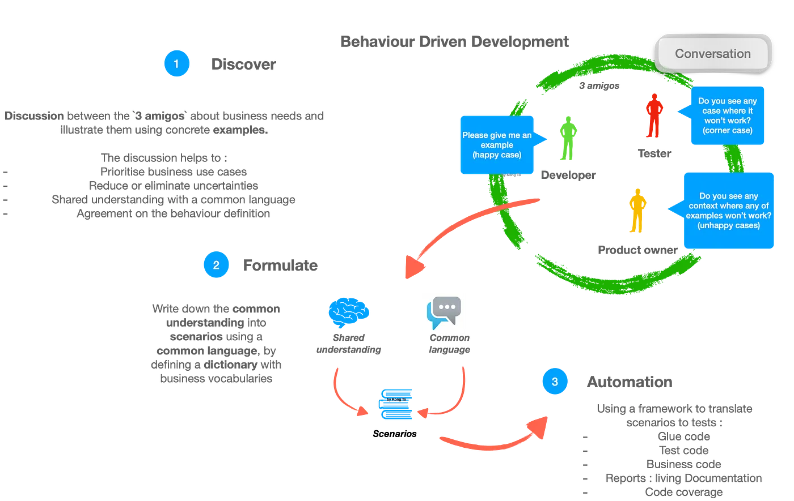
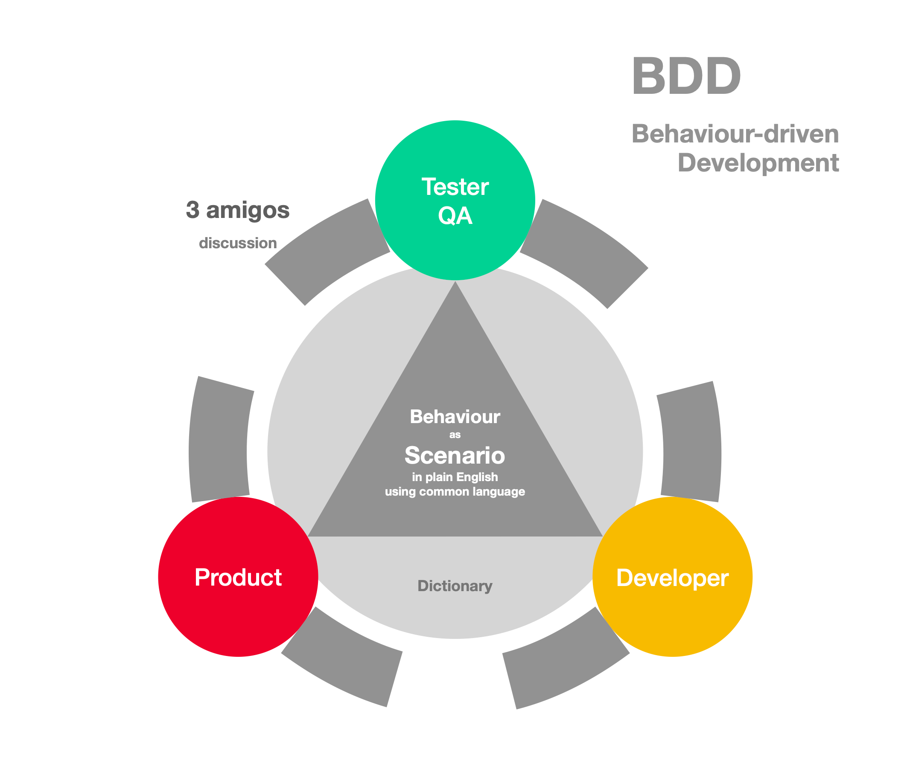

# Глава 5: Рівні тестування

## Вступ

Тестування програмного забезпечення організується не хаотично, а за чіткою структурою **рівнів**. Кожен рівень має свою мету, методологію, інструменти та критерії успіху.

У цій главі ми розглядатимемо шість основних рівнів тестування:
- **5.1** Модульне тестування (Unit Testing)
- **5.2** Інтеграційне тестування (Integration Testing)
- **5.3** Системне тестування (System Testing)
- **5.4** Приймальне тестування (Acceptance Testing/UAT)
- **5.5** Інші рівні тестування (Regression, Smoke, Sanity Testing)


Кожен рівень грунтується на попередньому та допомагає раніше виявити дефекти, що суттєво економить час і кошти розробки.  Ця концепція, яка показує **оптимальне співвідношення різних рівнів тестування** для максимізації якості та швидкості.

### Правильний баланс тестів
На практиці найчастіше реалізовують три рівня тествої піраміди. 

**1. Unit Tests (База піраміди) — 50-70%**

- **Що тестується:** Окремі методи/функції в ізоляції
- **Хто пише:** Розробник (або QA разом з розробником)
- **Час запуску:** Мілісекунди (дуже швидко)
- **Інструменти:** JUnit, pytest, Jest, NUnit
- **Переваги:**
    - Швидкий фідбек розробнику
    - Легко локалізуються проблеми
    - Дешево тримати у CI/CD

**Приклад unit тесту (JavaScript):**
```javascript
describe('calculateTax', () => {
  it('should calculate 20% tax correctly', () => {
    const result = calculateTax(100, 0.20);
    expect(result).toBe(20);
  });

  it('should handle negative prices', () => {
    const result = calculateTax(-100, 0.20);
    expect(result).toBe(0);
  });
});
```

**2. Integration Tests (Середина піраміди) — 20-30%**

- **Що тестується:** Взаємодія кількох компонентів разом (наприклад: Unit1 + Unit2 + Database)
- **Хто пише:** QA та розробник разом
- **Час запуску:** Секунди (повільніше ніж unit)
- **Інструменти:** TestNG, pytest, REST Assured
- **Переваги:**
    - Ловять проблеми на "швах" між компонентами
    - Більш реалістичні ніж unit тести

**Приклад integration тесту (Java):**
```javascript
test('User registration flow', () => {
  // Arrange
  userService.createUser('john@example.com', 'password123');

  // Act
  const user = userService.getUserByEmail('john@example.com');

  // Assert
  expect(user.email).toBe('john@example.com');
  expect(user.isActive).toBe(true);
});
```

**3. E2E / UI Tests (Вершина піраміди) — 10-20%**

- **Що тестується:** Весь наскрізний користувацький сценарій від UI до БД
- **Хто пише:** QA (часто ручне, але можна автоматизувати)
- **Час запуску:** Секунди-хвилини (дуже повільно)
- **Інструменти:** Selenium, Cypress, Puppeteer
- **Переваги:**
    - Найреалістичніші сценарії
    - Ловять проблеми, які unit + integration тести пропустили

**Практична рекомендація:**

> Більшість команд НЕПРАВИЛЬНО розгортають Test Pyramid — вони роблять **перевернуту піраміду**:
> - 20% unit тестів (мало)
> - 30% integration тестів
> - 50% E2E тестів (багато, повільно, нестабільно)
>
> Результат: CI/CD pipeline займає 45 хвилин, тести часто "flaky" (нестійкі), розробники ігнорують результати.

#### Правильна реалізація Test Pyramid

- **Розробник пише 3-5 unit тестів** для кожної нової функції
- **QA пише 1 integration тест** для критичного сценарію
- **QA автоматизує 1-2 E2E тести** для основного user flow
- **QA додатково вручну тестує** граничні випадки та exploratory scenarios


---

## 5.1. Модульне тестування (Unit Testing)

### Визначення та мета

**Модульне тестування (Unit Testing)** — це рівень тестування програмного забезпечення, під час якого перевіряються окремі, відносно незалежні та найменші функціональні частини системи — функції, методи, класи, модулі або інші атомарні компоненти.


**Основна мета:** виявити дефекти на найранішому етапі розробки, коли вони найдешевші для виправлення. Ідея модульного тестування полягає в тому, щоб перевірити правильність роботи конкретного компонента ізольовано від інших частин системи.

### Ключові концепції

**1. Біла скринька (White Box):**
- Тестувальник має доступ до вихідного коду
- Розуміє внутрішню логіку модуля
- Тестує окремі гілки коду, умови, цикли

**2. Штучне середовище з допоміжними елементами:**
- **Драйвер** — модуль тесту, який запускає елемент, що тестується
- **Заглушка (Stub)** — імітує компоненти, від яких залежить тестований модуль

### Типові інструменти

| Мова | Фреймворк | Опис |
|------|-----------|------|
| **TypeScript/JavaScript** | Jest, Vitest, Mocha | Універсальні для Node.js та браузера |
| **Java** | JUnit, TestNG | Найпопулярніші фреймворки для Java |
| **Python** | pytest, unittest | Простота та гнучкість |
| **C#/.NET** | NUnit, xUnit | MS.NET екосистема |
| **Go** | testing package | Вбудований у мову |

### Переваги та практична цінність

✅ **Переваги:**
- Виявляє дефекти на ранній стадії (Shift-Left)
- Мотивує розробників писати чистіший код
- Документація тестів служить прикладом використання коду
- Полегшує рефакторинг (зміну коду без зміни функціональності)

❌ **Обмеження:**
- Не перевіряє взаємодію модулів
- Потребує знань програмування
- Може дати помилкове відчуття безпеки ("тести зелені = все добре")

### Практичний приклад (TypeScript + Jest)

```typescript
// Приклад: модульний тест для функції розрахунку комісії

function calculateCommission(amount: number, rate: number = 0.05): number {
  /**
   * Розраховує комісію від суми.
   * @param amount - сума для розрахунку
   * @param rate - відсоток комісії (за замовчуванням 5%)
   * @returns комісія від суми
   * @throws Error якщо сума від'ємна
   */
  if (amount < 0) {
    throw new Error("Сума не може бути від'ємною");
  }
  return amount * rate;
}

// Unit-тести (Jest)
describe("calculateCommission", () => {
  test("повинна розрахувати комісію 10% від 100", () => {
    expect(calculateCommission(100, 0.1)).toBe(10);
  });

  test("повинна викинути помилку для від'ємної суми", () => {
    expect(() => calculateCommission(-100, 0.1)).toThrow(
      "Сума не може бути від'ємною"
    );
  });

  test("повинна використовувати типове значення 5%", () => {
    expect(calculateCommission(200)).toBe(10); // 200 * 0.05
  });

  test("граничні значення: сума = 0", () => {
    expect(calculateCommission(0, 0.1)).toBe(0);
  });

  test("граничні значення: дуже велика сума", () => {
    expect(calculateCommission(1_000_000, 0.02)).toBe(20_000);
  });
});
```

### Test-Driven Development (TDD) як основна практика

У навчальному посібнику [Тестування програмного забезпечення. Навчальний посібник](https://github.com/STT-VITI-22/stt-handbook/blob/main/dataset/books_pdf/parsed/Avramenko_2017_SoftwareTesting.md) підхід Test-Driven Development (TDD) розглядається не лише як практична техніка розроблення програмного забезпечення, а і як систематичний підхід до підвищення його якості. Автори формулюють основні принципи TDD та наводять практичні рекомендації щодо їх застосування, які залишаються актуальними для сучасних Agile-команд.

#### Цикл Red/Green/Refactor

TDD базується на повторюваному циклі з **трьома точно визначеними фазами**:

**1. RED (Червоний) — Напиши тест, який ПАДАЄ**

```javascript
test('calculate discount', () => {
  const price = 100;
  const discountPercent = 20;

  const result = calculateDiscount(price, discountPercent);

  expect(result).toBe(80); // Очікуємо 100 - 20% = 80
});
```


На цьому етапі:
- Функція `calculate_discount` **ще не існує**
- Тест **ПАДАЄ** (Red стадія)
- Це нормально і очікувано

**2. GREEN (Зелений) — Напиши мінімальний код для проходження тесту**

```javascript
function calculateDiscount(price, discountPercent) {
  const discountAmount = price * (discountPercent / 100);
  return price - discountAmount;
}
```


На цьому етапі:
- Тест **ПРОХОДИТЬ** (Green стадія)
- Код **мінімальний** — лишь достатньо для проходження тесту
- Код може бути неелегантний, це окей

**3. REFACTOR (Рефакторинг) — Поліпши код без зміни функціональності**

```javascript
function calculateDiscount(price, discountPercent) {
  // Calculate discounted price
  const discountRatio = 1 - (discountPercent / 100);
  return price * discountRatio;
}
```


На цьому етапі:
- Тест **ВСЕ ЕЩЕ ПРОХОДИТЬ** (Green лишається)
- Код **поліпшується** в читабельності, ефективності, простоті
- Немає нових функцій, лишь очищення коду

#### Критична важливість часу

>TDD цикл повинен займати **не більше 5-20 хвилин**, один тест за раз.

Це дуже важливо:
- Розробник отримує **постійний фідбек** — чи його код працює?
- Якщо цикл займає 2 години — це вже не TDD, це "тестування в кінці"
- Розробник повинен мати можливість запустити тести локально за **мілісекунди**

#### П'ять основних функцій TDD

| Функція | Значення | Практична виробіток |
|---|---|---|
| **1. Зменшення помилок** | Помилки виявляються одразу під час написання коду, не через 3 місяці | Краща якість на ранніх етапах; менше дефектів у production |
| **2. Підтримка низькорівневого дизайну** | Тести змушують розробника продумати інтерфейс перед реалізацією | Простіший та чіткіший дизайн API; функції мають чіткі контракти |
| **3. Підтримка рефакторингу** | Тести забезпечують впевненість при змінах коду | Агресивніший та безпечніший рефакторинг; технічний борг можна погашувати |
| **4. Підтримка відладки** | Спрощена діагностика проблем | Швидше виправлення дефектів; точно знаємо де помилка |
| **5. Документування коду** | Тести демонструють як код повинен використовуватися | Живаї документація; приклади для інших розробників |

#### Метрики TDD та оцінка якості

**1. Code Coverage (Коефіцієнт покриття)**

> Code Coverage = (кількість строк коду виконаних тестами) / (всього строк коду) × 100%

- **Задовільний рівень:** 75%+
- **Досяжний при TDD:** 100% (реально!)
- **Використання:** Виявляє недостатність тестів, але **не** коректність

**Важливо:** 100% coverage не означає 100% коректності!
- Тест може покриває код але не перевіряє результат
- Code quality інструменти можуть допомогти перевірити якість тестів

**2. Динаміка тестів**

Під час роботи над проектом повинна спостерігатися:
- **Щоденне зростання** кількості тестів
- **Щоденне зростання** кількості рядків кодовіх тестів
- **Стабільне зростання** code coverage

Раптові **скоки або падіння** — сигнал про проблему:
- Падіння coverage — розробник забув писати тести
- Прискорене зростання тестів без зростання основного коду — тести можуть бути зайві

**3. Вимоги до якості тестів**

```
┌─────────────────────────────────────────┐
│ Якісний тест повинен мати:              │
├─────────────────────────────────────────┤
│ ✓ ПРОСТОТУ — легко читати й розуміти    │
│ ✓ ПРАВИЛЬНЕ НАЙМЕНУВАННЯ — ясна мета   │
│ ✓ НЕЗАЛЕЖНІСТЬ — виконується в будь    │
│   якому порядку                         │
│ ✓ АТОМАРНІСТЬ — один тест = один аспект│
│ ✓ ШВИДКІСТЬ — запускається за мс       │
└─────────────────────────────────────────┘
```

#### Практичні виклики при впровадженні TDD

### **Проблема 1: Низьке тестове покриття в існуючих проєктах**

Однією з поширених проблем у програмних проєктах є наявність значного обсягу застарілого коду, який не має достатнього тестового покриття. Спроба одразу охопити тестами весь такий код зазвичай потребує значних часових і ресурсних витрат.

Тому доцільно застосовувати принцип **«не знижувати тестове покриття» (Do Not Decrease Coverage)**:

- не потрібно намагатися одразу протестувати весь існуючий код;
- **кожен новий код має супроводжуватися відповідними тестами**;
- під час внесення змін до існуючого коду розробник, за можливості, додає тести для тієї частини, з якою працює;
- поступово це дозволяє збільшувати тестове покриття без необхідності окремого масштабного проєкту з покриття legacy-коду тестами.

Таким чином, замість спроби одномоментно усунути весь накопичений технічний борг команда **поступово покращує якість тестування в процесі звичайної розробки**.

**Проблема 2: Залежність тестів один від одного**

❌ **Неправильно:**
```javascript
test('create user', () => { // Test 1
  const user = User.create('john@example.com', 'password');

  expect(user.id).toBeGreaterThan(0);
});

test('update user name', () => { // Test 2 — depends on Test 1
  const user = User.find(1); // Assumes that user with ID 1 exists from Test 1

  user.updateName('John Doe');

  expect(user.name).toBe('John Doe');
});
```


Проблема: якщо Тест 1 падає, то і Тест 2 падає. Порядок тестів має значення.

✅ **Правильно:**
```javascript
test('create user', () => {
  const user = User.create('john@example.com', 'password');

  expect(user.id).toBeGreaterThan(0);
});

test('update user name', () => {
  const user = User.create('jane@example.com', 'password');
  user.updateName('Jane Doe');

  expect(user.name).toBe('Jane Doe');
});
```


Кожен тест **самостійний**, має свої дані, виконується незалежно.

**Проблема 3: Mock-об'єкти для ізоляції**

Коли функція залежить від зовнішніх ресурсів (БД, API, файли), використовуються **mock-об'єкти**:

```javascript
test('user registration sends email', () => {
  // Mock email service
  const emailService = {
    send: jest.fn()
  };

  // Action
  registerUser('john@example.com', emailService);

  // Assert that email was sent
  expect(emailService.send).toHaveBeenCalledTimes(1);
});
```


Замість **справжнього** відправлення email (повільно, ненадійно), використовується **mock** (миттєво, передбачувано).

### Behavior-Driven Development (BDD) як еволюція TDD

BDD виникла як природна еволюція TDD, розв'язуючи одну критичну проблему: **розрив між розробниками та бізнесом**. Якщо TDD дозволяє розробнику впевнитися у коректності коду, то BDD дозволяє **цілій команді** (розробники, тестувальники, бізнес-аналітики) спільно визначити, що саме система повинна робити.

#### Поняття BDD (Behavior-Driven Development)

**BDD (Behavior-Driven Development)** — це методологія розробки програмного забезпечення, де розробка керується видимою поведінкою системи, визначеною спільно командою розробників, тестувальників та представників бізнесу. BDD комбінує принципи TDD з методологією ATDD (Acceptance Test-Driven Development) та акцентує увагу на поведінці системи з точки зору користувача та бізнес-вимог.

**Основна різниця від TDD:**
- **TDD** — розробник пише тест, потім код (технічний фокус)
- **BDD** — **вся команда** спільно описує поведінку (бізнес-фокус)

#### Основна мета BDD

Основна мета BDD — **забезпечити спільне розуміння** між розробниками, тестувальниками та представниками бізнесу щодо того, як система повинна поводитися. Це досягається через:

- **Спільна мова (Ubiquitous Language)** — один набір термінів для всіх
- **Чіткі сценарії поведінки** — описані перед розробкою
- **Живі тести** — сценарії автоматично перевіряються
- **Документація сценаріїв** — служать як приклади та документація

### Підхід BDD: Discover → Formulate → Automate

Підхід **Behavior-Driven Development (BDD)** передбачає послідовне перетворення бізнес-потреби на формалізований сценарій поведінки системи та його подальшу автоматизацію. Процес можна представити трьома основними етапами:

**Discover → Formulate → Automate**



#### 1. Discover — виявлення та узгодження

На першому етапі команда спільно визначає, **яку проблему необхідно вирішити та яку цінність має отримати бізнес**.

Для цього може проводитися зустріч **Three Amigos (Tres Amigos)**, у якій беруть участь представники трьох перспектив:

* **Business** — представник бізнесу, Product Owner або Business Analyst;
* **Development** — розробник, Technical Lead або архітектор;
* **Testing** — тестувальник або QA Engineer.

Кожна сторона розглядає вимогу зі своєї точки зору. Бізнес пояснює проблему та очікувану цінність, розробники визначають можливі способи реалізації, а тестувальники допомагають виявити неоднозначності, граничні випадки та можливі помилки.

Головна мета цього етапу — **досягнення спільного розуміння поведінки системи**.

#### 2. Formulate — формулювання сценарію

Після узгодження вимоги команда формалізує отримане розуміння за допомогою **спільної мови (Ubiquitous Language)**.

Визначаються терміни та поняття, які однаково розуміють представники бізнесу, розробники й тестувальники. Це дозволяє уникнути ситуації, коли одна й та сама вимога трактується різними учасниками по-різному.

Після цього вимога описується у вигляді **BDD-сценарію мовою Gherkin**, використовуючи конструкції:

* **Given (Дано)** — початковий стан або передумови;
* **When (Коли)** — дія або подія;
* **Then (Тоді)** — очікуваний результат;
* **And (І)** — додаткова умова, дія або результат.

Наприклад:

```gherkin
Сценарій: Успішна автентифікація користувача

  Дано користувач має зареєстрований обліковий запис
  І перебуває на сторінці входу

  Коли користувач вводить правильний логін і пароль
  І натискає кнопку «Увійти»

  Тоді система повинна виконати автентифікацію
  І перенаправити користувача на головну сторінку
```

Таким чином, Gherkin-сценарій стає **формальним описом очікуваної поведінки системи**, зрозумілим як технічним, так і нетехнічним учасникам команди.

#### 3. Automate — автоматизація

На завершальному етапі сформульовані сценарії використовуються як основа для **автоматизованих тестів**.

Gherkin-сценарій пов'язується з програмним кодом за допомогою BDD-фреймворків, таких як **Cucumber**, **Behave**, **SpecFlow** або інших аналогічних інструментів.

Наприклад:

```text
Бізнес-потреба
      ↓
Discover
спільне обговорення
      ↓
Formulate
Given / When / Then
      ↓
Automate
автоматизований тест
      ↓
Перевірка поведінки системи
```

Важливо, що **автоматизація є лише третім етапом BDD**. Їй передують спільне обговорення вимоги та формування однозначного сценарію. Тому BDD не слід розглядати лише як спосіб написання автоматизованих тестів. Його основна цінність полягає у **спільному розумінні вимог усіма учасниками розробки**.

### Three Amigos як основа BDD

Концепція **Three Amigos** забезпечує співпрацю трьох ключових перспектив:

| Перспектива     | Представники                                 | Основне питання                            |
| --------------- | -------------------------------------------- | ------------------------------------------ |
| **Business**    | Stakeholder, Product Owner, Business Analyst | **Що потрібно бізнесу і навіщо?**          |
| **Development** | Developer, Tech Lead, Architect              | **Як це можна реалізувати?**               |
| **Testing**     | Tester, QA Engineer                          | **Як перевірити, що це працює правильно?** |

Наприклад, замість того щоб Product Owner просто поставив розробнику завдання *«Додати авторизацію користувача»*, команда спільно обговорює очікувану поведінку:

> **Business:** Користувач повинен мати можливість увійти до системи за допомогою логіна та пароля.

> **Development:** Система перевіряє облікові дані та створює сесію користувача.

> **Testing:** Що повинно відбутися при неправильному паролі? Що станеться після п'яти невдалих спроб? Що робити, якщо обліковий запис заблокований?

У результаті команда переходить від загальної вимоги до конкретних прикладів поведінки системи.

Таким чином, **Three Amigos допомагає виявити неоднозначності ще до початку реалізації**, а BDD-сценарії перетворюють узгоджене розуміння на перевірювану специфікацію.


#### Three Amigos — спільна розробка тестів

BDD базується на **Three Amigos** принципі — спільній роботі трьох ролей:



| Роль | Фокус | Відповідальність                                            |
|------|-------|-------------------------------------------------------------|
| **Product Owner / Бізнес** | Бізнес-вимоги та цінність | Визначає Acceptance Criteria, приймає рішення про вимоги    |
| **Розробник** | Технічна реалізація | Реалізує код, розглядає технічні обмеження                  |
| **QA / Тестувальник** | Тестування та якість | Розглядає граничні випадки, реалізовую технікі тест дизайну |

**Процес Three Amigos:**
1. **Обговорення вимог** — Product Owner пояснює, що потрібно
2. **Узгодження  реалізацій, пошук вузьких місць** — QA запитує: "А що якщо...?"
3. **Визначення сценаріїв** — разом пишуть Gherkin сценарії
4. **Реалізація** — розробник пише код для цих сценаріїв
5. **Перевірка** — сценарії автоматично тестуються

#### Gherkin мова для написання сценаріїв

**Gherkin** — це людино-читаємий мова для описання поведінки системи. Вона розроблена так, щоб розуміти люди без технічного походження.

**Синтаксис Gherkin:**

```gherkin
# Кожен файл описує одну фічу (Feature)
Feature: Реєстрація користувача

  # Коротка описова перспектива
  As a new user
  I want to register an account
  So that I can use the application

  # Сценарій — одна специфічна ситуація
  Scenario: Успішна реєстрація з валідними даними
    Given користувач на сторінці реєстрації
    When користувач вводить email "john@example.com"
    And користувач вводить пароль "SecurePass123"
    And користувач клацає "Register"
    Then користувач бачить повідомлення "Registration successful"
    And новий користувач створений у системі
```

**Ключові слова:**
- **Feature** — описує функцію (наприклад, "Реєстрація користувача")
- **Scenario** — одна конкретна ситуація для тестування
- **Given** — початковий стан системи ("маючи...")
- **When** — дія користувача ("коли...")
- **Then** — очікуваний результат ("тоді...")
- **And** / **But** — додаткові кроки

#### Given-When-Then формат із прикладами

**Given-When-Then** — це стандартна структура для написання Gherkin сценаріїв:

| Частина | Питання | Приклад |
|---------|---------|---------|
| **Given** | Яка ситуація перед тестом? | "користувач залогований" |
| **When** | Що робить користувач? | "користувач клацає 'Купити'" |
| **Then** | Що повинно сталися? | "замовлення створено" |

**Приклад 1: Купівля товару**
```gherkin
Scenario: Користувач успішно купує товар
  Given користувач в кабінеті (баланс 1000 UAH)
  And товар "Ноутбук" коштує 800 UAH
  When користувач додає товар у кошик
  And клацає "Оформити замовлення"
  And обирає спосіб оплати "Карта"
  Then замовлення створено з статусом "paid"
  And баланс користувача становить 200 UAH
  And користувач отримує email з номером замовлення
```

**Приклад 2: Помилка при реєстрації**
```gherkin
Scenario: Реєстрація з коротким паролем
  Given користувач на сторінці реєстрації
  When користувач вводить пароль "123" (менше 8 символів)
  And клацає "Register"
  Then система показує помилку "Password must be at least 8 characters"
  And користувач не створюється
```

#### Негативні сценарії

BDD включає не лише "happy path" (успішні сценарії), але й негативні сценарії для граничних випадків:

```gherkin
Feature: Вихід з системи

  Scenario: Успішний вихід з системи (happy path)
    Given користувач залогований
    When клацає "Logout"
    Then користувач перенаправлений на login сторінку
    And сесія видалена

  Scenario: Спроба доступу до захищеної сторінки після виходу (negative path)
    Given користувач вийшов з системи
    When спробує відкрити URL "/dashboard"
    Then система перенаправляє на login сторінку
    And показує повідомлення "Please login first"

  Scenario: Вихід при розриві мережі
    Given користувач залогований
    And мережа розірвана
    When клацає "Logout"
    Then система показує помилку "Connection failed"
    And сесія залишається активною
```

#### Scenario Outline та параметризація

Замість написання 10 однакових сценаріїв, BDD пропонує **Scenario Outline** з параметрами:

**Без Outline (неправильно — дублювання):**
```gherkin
Scenario: Знижка для вартості 100 UAH
  Given товар коштує 100 UAH
  When застосовується знижка 20%
  Then ціна становить 80 UAH

Scenario: Знижка для вартості 200 UAH
  Given товар коштує 200 UAH
  When застосовується знижка 20%
  Then ціна становить 160 UAH

Scenario: Знижка для вартості 500 UAH
  Given товар коштує 500 UAH
  When застосовується знижка 20%
  Then ціна становить 400 UAH
```

**З Outline (правильно — один сценарій, багато тестів):**
```gherkin
Feature: Розрахунок знижки

  Scenario Outline: Застосування <discount>% знижки на товар
    Given товар коштує <original_price> UAH
    When застосовується знижка <discount>%
    Then ціна становить <discounted_price> UAH

    Examples:
      | original_price | discount | discounted_price |
      | 100            | 20       | 80               |
      | 200            | 20       | 160              |
      | 500            | 10       | 450              |
      | 1000           | 5        | 950              |
```

Це означає **один сценарій, 4 різних тести** — один для кожного рядка у таблиці Examples.

#### BDD та автоматизація тестів (Step Definitions)

Gherkin сценарії автоматично тестуються через **Step Definitions** — код, що перетворює текст сценарію на дійсні дії:

**Gherkin (що написав BDD сценарій):**
```gherkin
Scenario: Користувач додає товар у кошик
  Given товар "iPhone" коштує 500 UAH
  When користувач додає товар у кошик
  Then кошик містить 1 товар
```

**JavaScript Step Definitions (що написав розробник):**
```javascript
// Framework: Cucumber.js
Given('товар {string} коштує {int} UAH', (productName, price) => {
  cy.addProduct(productName, price);
});

When('користувач додає товар у кошик', () => {
  cy.get('[data-test="add-to-cart"]').click();
});

Then('кошик містить {int} товар', (count) => {
  cy.get('[data-test="cart-count"]').should('have.text', count.toString());
});
```

**Основні інструменти для BDD автоматизації:**

| Інструмент | Мова | Опис |
|-----------|------|------|
| **Cucumber** | Java, Ruby, .NET | Класичний BDD фреймворк |
| **Behat** | PHP | BDD для PHP проектів |
| **JBehave** | Java | BDD для Java |
| **NBehave** | .NET | BDD для .NET |
| **Cypress + Gherkin** | JavaScript | E2E тестування з Gherkin |
| **Playwright + Gherkin** | JavaScript | Сучасна E2E альтернатива |

#### Порівняння BDD, TDD та ATDD

Три методології розробки, які часто плутаються:

| Аспект | TDD | ATDD | BDD |
|--------|-----|------|-----|
| **Хто пише тест?** | Розробник | Розробник + QA | Команда (PO + Dev + QA) |
| **Мова тесту** | Технічна (код) | Технічна (код) | Люди-читаємі сценарії (Gherkin) |
| **Мета** | Технічна коректність | Вимога відповідність | Спільне розуміння поведінки |
| **Рівень тестування** | Unit тести | Integration + System | E2E та User scenarios |
| **Фокус** | "Як код працює?" | "Чи вимога реалізована?" | "Як система поводиться з точки зору користувача?" |
| **Проводиться** | Під час розробки | Перед розробкою | Перед розробкою (з уточненнями) |

**Як вони доповнюють один одного:**
```
BDD (Спільні сценарії) ← High Level
         ↓
    ATDD (Вимоги)
         ↓
    TDD (Unit тести) ← Low Level
```

#### BDD та Acceptance Criteria

Acceptance Criteria часто написані в BDD-стилі:

**User Story:**
```
As a customer
I want to track my order
So that I know when it arrives
```

**Acceptance Criteria (у BDD форматі):**
```gherkin
Given я замовив товар
When я заходжу на сторінку "Order Status"
Then я бачу статус "Processing"
And я вижу приблизну дату доставки

When замовлення відправлено
Then я отримую email з номером посилки
And статус змінюється на "In Transit"
```

#### Переваги BDD

**1. Спільне розуміння**
- Команда говорить однією мовою
- Вимоги зрозумілі всім, а не тільки розробникам

**2. Документація "живим" кодом**
- Сценарії служать як приклади для всіх нових членів команди
- Не потребує окремої документації — код сам себе описує

**3. Раннє виявлення неузгодженості**
- Three Amigos discussion виявляють неясності ДО розробки
- Дешево виправити помилку перед розробкою, ніж після

**4. Регресійні тести "на подарунок"**
- Сценарії автоматично тестуються
- Кожна нова версія перевіряється проти старих сценаріїв

**5. Фокус на поведінці, а не на реалізації**
- Зміна коду не вимагає переписування тестів (якщо поведінка та сама)
- Більша стійкість тестів

**6. Краща комунікація між ролями**
- Розробник розуміє бізнес-вимоги
- Бізнес розуміє, чому щось складно реалізувати
- QA знає, на що звертати увагу

#### Недоліки та типові проблеми BDD

**1. Сповільнення розробки на початку**
- Потрібен час для обговорення (Three Amigos)
- Написання Gherkin сценаріїв вимагає дисципліни
- Окупається при довгострокових проектах

**2. Відсутність навичок у команді**
- Не всі розробники звичні писати Gherkin
- BDD не замінює код, а доповнює його
- Потребує навчання

**3. Непридатність для всіх рівнів тестування**
- BDD найбільш корисна для **E2E та Acceptance тестів**
- Для unit-тестів краще просто TDD
- Не замінює необхідність у Unit-тестах

**4. Складність автоматизації Step Definitions**
- Написання Step Definitions потребує навичок розробника
- Погано написані Step Definitions — важко підтримувати

**5. Overengineering для простих проектів**
- Для малих команд / простих функцій BDD може бути надмірною
- Може призвести до повільної розробки

#### Правила для якісного BDD сценарію

**Якісний сценарій повинен задовольняти SMART критеріям:**

| Критерій | Опис | Приклад |
|----------|------|---------|
| **S — Specific** | Конкретна ситуація, один сценарій | ✓ "Користувач вводить від'ємну суму" ❌ "Користувач вводить різні суми" |
| **M — Measurable** | Результат можна перевірити однозначно | ✓ "Кошик містить 2 товари" ❌ "Кошик має багато товарів" |
| **A — Achievable** | Реалістичний для реалізації | ✓ "Сторінка завантажується за 2 секунди" ❌ "Сторінка завантажується миттєво" |
| **R — Relevant** | Важливий для бізнесу / користувачів | ✓ "Користувач бачить помилку формату email" ❌ "Змінна x має правильне значення" |
| **T — Testable** | Можна автоматично протестувати | ✓ "Кнопка видна на UI" ❌ "Система добре проектована" |

**Додаткові правила:**

1. **Не міксуйте сценарії** — один сценарій = один тест-кейс, не більше
2. **Визначайте попередні умови (Given)** — читач повинен зрозуміти стан
3. **Уникайте деталей реалізації** — напишіть "користувач клацає кнопку", не "користувач натискає мишку на координатах X,Y"
4. **Чіткі дії (When)** — що саме робить користувач
5. **Перевіряйте результат (Then)** — видиме для користувача

#### BDD у тестовому lifecycle

**Коли використовувати BDD:**

```
┌────────────────────────────────────────────┐
│ Планування (Sprint Planning)               │
│ - Product Owner пояснює вимогу             │
│ - Team обговорює Three Amigos              │
└────────────────────────────────────────────┘
                    ↓
┌────────────────────────────────────────────┐
│ Розробка Gherkin сценаріїв                 │
│ - Команда пише сценарії                    │
│ - Уточнюється поведінка                    │
└────────────────────────────────────────────┘
                    ↓
┌────────────────────────────────────────────┐
│ Розробка Step Definitions (Розробник)      │
│ - Напишіть код для автоматизації сценаріїв │
└────────────────────────────────────────────┘
                    ↓
┌────────────────────────────────────────────┐
│ Розробка коду (Розробник + TDD)            │
│ - Напишіть код, щоб сценарії пройшли       │
└────────────────────────────────────────────┘
                    ↓
┌────────────────────────────────────────────┐
│ Виконання BDD тестів (CI/CD Pipeline)      │
│ - Сценарії автоматично тестуються          │
│ - Регресійні тести на подарунок            │
└────────────────────────────────────────────┘
                    ↓
┌────────────────────────────────────────────┐
│ Ручне тестування (Exploratory)             │
│ - QA перевіряє граничні випадки             │
│ - Знаходить непередбачені проблеми         │
└────────────────────────────────────────────┘
```

**BDD найкраще використовується для:**
- ✅ E2E тестування (вебзастосунки, мобільні)
- ✅ Acceptance Testing
- ✅ Integration Testing між системами
- ✅ Критичні бізнес-процеси

**BDD менше корисна для:**
- ❌ Unit Testing (краще TDD)
- ❌ Performance Testing
- ❌ Security Testing
- ❌ Нижчорівневої логіки

#### Висновок: BDD як міст між людьми

BDD вирішує одну з найбільших проблем у розробці:

> **Розрив між тим, що замовник просить, та тим, що розробник розробляє.**

**Без BDD:**
```
Product Owner: "Нам потрібна функція реєстрації"
                    ↓
Розробник розуміє це по-своєму і розбудовує
                    ↓
QA тестує і каже: "А що якщо користувач введе спеціальні символи?"
                    ↓
"О, це не було передбачено!" (дорого виправляти)
```

**З BDD:**
```
Product Owner: "Нам потрібна функція реєстрації"
                    ↓
Three Amigos обговорюють сценарії:
- Що якщо пароль коротке?
- Що якщо email вже існує?
- Що якщо введено спеціальні символи?
                    ↓
Всі сценарії написані перед розробкою (дешево)
                    ↓
Розробник реалізує, знаючи всі вимоги
                    ↓
BDD тести автоматично перевіряють все
                    ↓
Ніяких неприємних сюрпризів!
```

**Основна вартість BDD — це спільне розуміння та ранння валідація вимог, а не тільки автоматизація тестів.**

---

## 5.2. Інтеграційне тестування (Integration Testing)

### Визначення та мета

**Інтеграційне тестування** — це тестування взаємодії двох або більше модулів/компонентів, які вже перевірені за допомогою модульного тестування. На відміну від модульного тестування, де кожен компонент перевіряється окремо та ізольовано, інтеграційне тестування відповідає на питання: `«Чи правильно працюють компоненти системи разом?»`


**Основна мета:** виявити дефекти, що виникають при взаємодії модулів (конфлікти інтерфейсів, помилки передачі даних, синхронізація).

### Перехідний етап

Інтеграційне тестування є проміжною ланкою між модульним і системним тестуванням. Воно поступово переходить від перевірки окремих компонентів до перевірки їхньої спільної роботи в межах системи.

Якщо модульне тестування перевіряє правильність роботи окремих функцій або компонентів, то інтеграційне тестування зосереджується на тому, як ці компоненти взаємодіють між собою. Наступним етапом є системне тестування, де перевіряється робота всієї системи як єдиного цілісного продукту.

### Ключові концепції

**1. Підхід білої скриньки (White Box):**

 - тестувальник має доступ або частково має доступ та розуміння вихідного коду компонентів та документації;
 - розуміє внутрішню архітектуру системи;
 - знає точки взаємодії між модулями;
 - перевіряє послідовність викликів компонентів;
 - аналізує передачу та обробку даних між модулями;
 - може перевіряти внутрішні API, події, черги повідомлень та інші механізми інтеграції.

**2. Підхід чорної скриньки (Black Box):**

  - тестувальник не обов'язково має доступ до внутрішньої реалізації компонентів;
  - тестування виконується через зовнішні інтерфейси;
  - перевіряються вхідні та вихідні дані;
  - аналізується поведінка системи під час взаємодії компонентів;
  - перевіряється відповідність контрактам API та інших інтерфейсів.

### Типові інструменти

| Мова                     | Фреймворк                 | Опис                                      |
| ------------------------ | ------------------------- | ----------------------------------------- |
| **TypeScript/JavaScript** | Jest, Vitest, Supertest   | Тестування API та взаємодії компонентів   |
| **Java**                 | JUnit, TestNG, Spring Test | Інтеграційне тестування Java та Spring    |
| **Python**               | pytest, unittest          | Тестування API, БД та взаємодії модулів   |
| **C#/.NET**              | NUnit, xUnit, MSTest      | Інтеграційне тестування .NET              |
| **Go**                   | testing package           | Вбудований інструментарій для тестування  |
| **API**                  | Postman, REST Assured     | Тестування взаємодії через API            |

### Три основні підходи

#### 1. **Top-Down (зверху вниз)**
- Тестування починається з модулів вищого рівня
- Для нижчих модулів використовуються **заглушки (stubs)**
- Поступово замінюються реальними модулями

**Переваги:** раніше виявляються дефекти логіки верхніх рівнів
**Недоліки:** потребує більше заглушок

#### 2. **Bottom-Up (знизу вгору)**
- Тестування починається з модулів найнижчого рівня
- Для вищих модулів використовуються **драйвери (drivers)**
- Поступово інтегруються вищі модулі

**Переваги:** реальні модулі раніше
**Недоліки:** дефекти логіки верхніх рівнів виявляються пізніше

#### 3. **Big Bang (великий вибух)**
- Всі модулі об'єднуються одразу
- Проводиться одночасне тестування

**Переваги:** економія часу на підготовку
**Недоліки:** важко визначити, яка взаємодія спричинила дефект

### Система безперервної інтеграції (CI)

При автоматизації інтеграційного тестування використовується **CI pipeline**:

1. Розробник комітить код до репозиторію
2. CI система запускає модульні тести
3. Компіліює код
4. Запускає інтеграційні тести
5. Генерує звіт про результати

**Результат:** помилки виявляються миттєво, а не через дні

### Практичний приклад: Інтеграційний тест (TypeScript)

```typescript
// UserService та OrderService взаємодіють
// Коли користувач створює замовлення, його баланс повинен зменшитися

interface User {
  id: number;
  balance: number;
  name: string;
}

interface Order {
  id: number;
  userId: number;
  amount: number;
  status: "pending" | "completed";
}

class UserService {
  private users: Map<number, User> = new Map();

  addUser(id: number, name: string, balance: number): void {
    this.users.set(id, { id, name, balance });
  }

  getUser(id: number): User | undefined {
    return this.users.get(id);
  }

  reduceBalance(id: number, amount: number): boolean {
    const user = this.users.get(id);
    if (!user || user.balance < amount) {
      return false;
    }
    user.balance -= amount;
    return true;
  }
}

class OrderService {
  private orders: Order[] = [];
  private nextOrderId = 1;

  constructor(private userService: UserService) {}

  createOrder(userId: number, amount: number): Order | null {
    const user = this.userService.getUser(userId);
    if (!user) {
      return null;
    }

    // Спробуємо зменшити баланс користувача
    if (!this.userService.reduceBalance(userId, amount)) {
      return null; // Недостатньо коштів
    }

    // Створюємо замовлення
    const order: Order = {
      id: this.nextOrderId++,
      userId,
      amount,
      status: "completed",
    };
    this.orders.push(order);
    return order;
  }

  getOrder(id: number): Order | undefined {
    return this.orders.find((o) => o.id === id);
  }
}

// Integration Test
describe("UserService та OrderService", () => {
  let userService: UserService;
  let orderService: OrderService;

  beforeEach(() => {
    userService = new UserService();
    orderService = new OrderService(userService);
  });

  test("створення замовлення повинна зменшити баланс користувача", () => {
    // Arrange
    userService.addUser(1, "Іван", 1000);

    // Act
    const order = orderService.createOrder(1, 250);

    // Assert
    expect(order).not.toBeNull();
    expect(order?.amount).toBe(250);
    expect(userService.getUser(1)?.balance).toBe(750); // 1000 - 250
  });

  test("не повинна створити замовлення якщо недостатньо коштів", () => {
    // Arrange
    userService.addUser(1, "Марія", 100);

    // Act
    const order = orderService.createOrder(1, 250); // Більше ніж баланс

    // Assert
    expect(order).toBeNull();
    expect(userService.getUser(1)?.balance).toBe(100); // Баланс не змінився
  });

  test("не повинна створити замовлення для неіснуючого користувача", () => {
    // Act
    const order = orderService.createOrder(999, 100);

    // Assert
    expect(order).toBeNull();
  });
});
```

---

## 5.3. Системне тестування (System Testing)

### Визначення та мета

**Системне тестування** — це тестування повної, інтегрованої системи як єдиного цілого для перевірки її відповідності функціональним і нефункціональним вимогам.

На відміну від інтеграційного тестування, де основна увага приділяється взаємодії окремих компонентів, системне тестування перевіряє **поведінку всієї системи з точки зору кінцевого користувача та бізнес-вимог**.

**Основна мета:** перевірити, чи система працює правильно в умовах, максимально наближених до реального використання, з реальними або репрезентативними даними.


> Одним із прикладів системного тестування є E2E (End-to-End) тестування вебзастосунку, коли перевіряється повний сценарій роботи системи з точки зору користувача.

--- 
Наприклад, для інтернет-магазину E2E-тест може перевіряти повний процес купівлі: `вхід у систему → пошук товару → додавання до кошика → оформлення замовлення → оплата → отримання підтвердження замовлення`.

---

> Водночас важливо зазначити, що впровадження E2E-тестів на проєкті не можна вважати повноцінним і всеохоплюючим системним тестуванням.

> E2E-тести переважно перевіряють окремі наскрізні бізнес-сценарії. Системне тестування має значно ширший охоплення та може включати також перевірку функціональності, продуктивності, безпеки, сумісності, відмовостійкості, граничних умов та інших характеристик системи. Тому E2E-тестування слід розглядати як один із важливих інструментів системного тестування, але не як його повну заміну.

### Що перевіряється

Під час системного тестування перевіряють:

- відповідність функціональним вимогам;
- правильність основних бізнес-сценаріїв;
- взаємодію всіх компонентів системи;
- роботу системи з реальними даними;
- обробку помилкових і граничних ситуацій;
- продуктивність і стабільність;
- безпеку;
- сумісність із зовнішніми системами;
- зручність використання;
- коректність роботи в цільовому середовищі.

### Ключові концепції 

На рівні системного тестування ми **не дивимося на внутрішній код**. Ми тестуємо:
- Функціональність (що система робить)
- Нефункціональні характеристики (як система це робить)
- Взаємодія з зовнішніми сторонніми системами

### Аспекти системного тестування

Системне тестування охоплює тестування 6+ аспектів:

| Аспект | Опис                                              |
|--------|---------------------------------------------------|
| **Функціональність** | Система робить те, що описано в вимогах           |
| **Продуктивність** | Система відповідає за розумний час (SLA)          |
| **Безпека** | Авторизація, шифрування, захист від атак          |
| **Сумісність** | Система працює на різних ОС, браузерах, пристроях |
| **Зручність використання** | Інтерфейс зрозумілий і логічний для користувача   |
| **Надійність** | Система не падає при помилках                     |

### Два підходи до системного тестування

#### 1. **На основі вимог (Requirements-based)**
- Для кожної вимоги створюється тест-кейс
- Перевіряється, чи вимога реалізована

#### 2. **На основі користувацьких сценаріїв (Use-case based)**
- Тестуються реальні сценарії використання продукту
- Наприклад: "Користувач входить в систему → переглядає товари → додає в кошик → оплачує"

### Альфа та Бета тестування

**Альфа-тестування:**
- Проводиться внутрішньою командою компанії
- На частково завершеному продукті
- Мета: знайти критичні дефекти перед релізом

**Бета-тестування:**
- Проводиться обмеженою групою зовнішніх користувачів
- На майже завершеному продукті
- Мета: знайти дефекти в реальних умовах користування

| Технологія / напрям       | Інструменти                        | Опис                                                        |
| ------------------------- | ---------------------------------- | ----------------------------------------------------------- |
| **Web E2E**               | Playwright, Cypress, Selenium      | Автоматизація повних користувацьких сценаріїв вебзастосунку |
| **TypeScript/JavaScript** | Playwright, Cypress, WebdriverIO   | E2E та системне тестування вебзастосунків                   |
| **Java**                  | Selenium, Selenide, REST Assured   | E2E, UI та API-тестування                                   |
| **Python**                | pytest, Playwright, Selenium       | Автоматизація E2E, UI та API-сценаріїв                      |
| **C#/.NET**               | Playwright, Selenium, SpecFlow     | E2E та системне тестування .NET-застосунків                 |
| **API**                   | Postman, Newman, REST Assured      | Перевірка повних сценаріїв через API                        |
| **Мобільні застосунки**   | Appium, Maestro                    | E2E та системне тестування Android/iOS                      |
| **Навантаження**          | JMeter, k6, Gatling                | Перевірка продуктивності та стабільності всієї системи      |
| **BDD**                   | Cucumber, SpecFlow                 | Опис і автоматизація бізнес-сценаріїв                       |
| **Тестування в CI/CD**    | GitHub Actions, GitLab CI, Jenkins | Автоматичний запуск системних та E2E-тестів                 |


---

## 5.4. Приймальне тестування (Acceptance Testing / UAT)

### Визначення та мета

**Приймальне тестування (Acceptance Testing)** — це тестування, метою якого є визначення того, чи відповідає система встановленим бізнес-, користувацьким та договірним вимогам і чи може вона бути прийнята замовником.

**User Acceptance Testing (UAT)** — один із найпоширеніших видів приймального тестування, під час якого представники замовника або кінцеві користувачі перевіряють систему з точки зору реальних бізнес-сценаріїв.

**Основна мета:** підтвердити, що система вирішує поставлені бізнес-задачі та готова до передачі в експлуатацію.

 

На відміну від більшості інших рівнів тестування, UAT зазвичай проводиться не командою розробки, а:

- представниками замовника;
- кінцевими користувачами;
- бізнес-аналітиками;
- Product Owner або представниками бізнесу;
- спеціально визначеними користувачами системи.

QA може брати участь у підготовці тестових сценаріїв, організації процесу та аналізі результатів, але **остаточне рішення про прийняття системи належить замовнику або відповідальній бізнес-стороні**.

### Що перевіряється

Під час приймального тестування перевіряється не стільки правильність реалізації окремих функцій, скільки відповідність системи очікуванням бізнесу.

Типові питання:

- Чи виконує система необхідні бізнес-процеси?
- Чи відповідає реалізація погодженим вимогам?
- Чи може користувач виконати свої основні задачі?
- Чи відповідає система критеріям приймання?
- Чи немає критичних проблем, які перешкоджають використанню системи?
- Чи готова система до переходу в продуктивне середовище?

### Попередннє узагальнення

- **Проводиться замовником** (а не QA командою розробника)
- **Тестуються бізнес-сценарії**, а не технічні деталі
- **Результат:** ухвалення системи або скерування на доопрацювання
- **Етап:** це останній етап перед релізом

### Вхідні дані для UAT

Тестування грунтується на:
- **User Stories** — опис функціональності мовою користувача
- **Acceptance Criteria** — умови, які вважаються успіхом
- **Бізнес-процеси** — реальні робочі сценарії

### Приклад User Story та Acceptance Criteria

```markdown
User Story:
"Як менеджер проекту, я хочу експортувати звіт за годинами,
щоб його можна було аналізувати в Excel"

Acceptance Criteria:
✓ Кнопка "Export" доступна на сторінці звітів
✓ Файл експортується у форматі .xlsx
✓ Дані включають всі колонки (дата, час, виконавець, опис)
✓ Експорт займає < 5 секунд для 1000 записів
✓ Файл можна відкрити в Excel без помилок
```

### Типи приймального тестування

| Тип | Опис |
|-----|------|
| **BAT (Business Acceptance Testing)** | Тестування бізнес-функцій від замовника |
| **OAT (Operational Acceptance Testing)** | Тестування готовності до production (резервне копіювання, виправлення, моніторинг) |
| **Contract Acceptance Testing** | Тестування відповідності контрактним умовам |

---

## 5.5. Інші рівні тестування

### Регресійне тестування (Regression Testing)

**Визначення:** Повторне тестування вже протестованих функцій після внесення змін до коду, щоб переконатись, що нові зміни не зламали старий функціонал.

**Мета:** Виявити **регресійні дефекти** — виявити помилки, які виникли у вже існуючому функціоналі внаслідок змін у системі.

**Коли проводиться:**
- Після виправлення дефекту
- Після додавання нової функціональності
- Перед кожним релізом


**Техніки регресійного тестування:**
- Retest All — повторити всі старі тести (дорого)
- Test Case Selection — вибрати тести, які можуть бути під впливом змін
- Test Case Prioritization — сортувати тести за пріоритетом
- Гібридна стратегія

### Smoke тестування (Димне тестування)

**Визначення:** Початкове тестування, яке перевіряє основну та критично важливу функціональність системи без деталізації.

**Мета:** Швидко визначити, чи система працює взагалі

**Коли проводиться:**
- Першим після кожної нової збірки
- Перед повним регресійним тестуванням
- Кілька разів на день в CI/CD pipeline

**Приклад Smoke Test для веб-магазину:**
```
✓ Сайт завантажується
✓ Можна додати товар в кошик
✓ Можна оформити замовлення
✓ Можна авторизуватись
```

**Критерій успіху:** 100% (всі smoke-тести повинні пройти)

### Sanity тестування (Санітарне тестування)

**Визначення:** Коротке тестування певного функціоналу після виправлення дефекту або невеликої зміни.

**Відмінність від Smoke:**
- **Smoke** перевіряє всю систему
- **Sanity** перевіряє конкретну область, що змінилася

**Приклад Sanity Test:**
```
Було виправлено дефект у форми реєстрації.
Sanity Test:
✓ Можна ввести email
✓ Можна ввести пароль
✓ Форма відправляється
✓ Користувач автоматично логується
```

**Критерій успіху:** 100% (має підтвердити, що виправлення працює)

### **Порівняльна таблиця димового і санітарного тестування**

| **Smoke Testing (Димове тестування)** | **Sanity Testing (Перевірка працездатності, санітарне тестування)** |
|---|---|
| Виконується на початкових збірках програмного продукту перед регресійним тестуванням. | Проводиться на збірках, які успішно пройшли димові випробування, перед циклом регресійного тестування. |
| Тестована збірка може бути стабільною або нестабільною. | Тестована збірка відносно стабільна. |
| Метою є перевірка стабільності нової зібраної версії продукту в цілому. | Основною метою є перевірка працездатності зміненої або певної функціональності перед детальним тестуванням. |
| Збій при тестуванні призводить до негайної відмови від цієї збірки програмного забезпечення. | Збій у перевірці працездатності може призвести до відхилення збірки або повернення її на доопрацювання. |
| Може виконуватися як розробниками, так і тестувальниками. | Зазвичай проводиться тестувальниками. |
| Може включати документацію та роботу за визначеними сценаріями. | Зазвичай не робить акценту на повній документації та детальному виконанні всіх тест-сценаріїв. |
| Загальний вид тестування, що поверхнево охоплює основні функції системи без глибокої перевірки. | Спеціалізоване, більш вузьке тестування, спрямоване на перевірку конкретної функціональності або змін. |
| Може виконуватися як автоматизовано, так і вручну. | Зазвичай виконується вручну. |
| Економить зусилля команди тестувальників і мінімізує час роботи з дефектною збіркою програмного забезпечення. | Економить час, оскільки дозволяє не запускати повне регресійне тестування, якщо конкретна функціональність працює некоректно. |

### Граничне тестування (Boundary Testing)

**Визначення:** Тестування поведінки системи на границях допустимих значень.

**Приклади граничних умов:**
- Поле приймає числа від 1 до 100: тестуємо 0, 1, 99, 100, 101
- Поле "Вік": тестуємо -1, 0, 1, 150, 151
- Список з 10 елементів: тестуємо 0 елементів, 1, 10, 11

**Основний принцип:** Дефекти часто кластеризуються саме на границях!

### Таблиця: Порівняння рівнів тестування

| Характеристика | Unit | Integration            | System | UAT | Regression |
|---|---|------------------------|---|---|---|
| **Що тестується** | Модуль | Інтеграція модулів     | Вся система | Бізнес-вимоги | Старий функціонал |
| **Методологія** | Біла скринька | Сіра скринька          | чорна скринька | чорна скринька | Змішана |
| **Хто тестує** | Розробник | QA інженер             | QA команда | Замовник | QA команда |
| **Коли** | Під час розробки | Після unit-тестів      | Перед UAT | Перед релізом | Перед кожним релізом |
| **Інструменти** | Jest, Vitest | CI/CD pipeline, TestNG | Selenium, Cypress | Вручну + UI автоматизація | Automation frameworks |
| **Вартість дефекту** | Дешева | Середня                | Дорога | Дуже дорога | Дорога |

---

## Практичні завдання

### Завдання 1: Модульне тестування (Unit Testing)

Напишіть unit-тести для функції обчислення знижки (TypeScript):

```typescript
function calculateDiscount(originalPrice: number, discountPercent: number): number {
  /**
   * Розраховує ціну після знижки.
   * Знижка від 0 до 100%.
   * @throws Error якщо знижка або ціна невалідні
   */
  if (!(discountPercent >= 0 && discountPercent <= 100)) {
    throw new Error("Знижка має бути від 0 до 100%");
  }
  if (originalPrice < 0) {
    throw new Error("Ціна не може бути від'ємною");
  }
  return originalPrice * (1 - discountPercent / 100);
}
```

**Що тестувати:**
- ✓ Базова, звичайна знижка (50% від 100 = 50)
- ✓ Граничні значення (0%, 100%)
- ✓ Помилкові входи (знижка > 100, ціна < 0)
- ✓ Точність обчислень (плаваючі числа)

### Завдання 2: Інтеграційне тестування

Сценарій: У вас є два модулі:
- `OrderService` — створює замовлення
- `PaymentService` — обробляє платіж

**Потрібно протестувати:**
- ✓ Замовлення створено → платіж оброблений → замовлення позначено як оплачене
- ✓ Замовлення створено → платіж відхилено → замовлення залишається у статусі "очікування платежу"
- ✓ Передача даних між сервісами коректна

### Завдання 3: Системне тестування

Протестуйте веб-застосунок для кіноафіші. Тест-кейси повинні покривати:
- ✓ **Функціональність:** пошук фільму, перегляд сеансів, бронювання квитків
- ✓ **Сумісність:** тестування в Chrome, Firefox, Safari
- ✓ **Продуктивність:** час завантаження сторінки < 3 сек
- ✓ **Безпека:** система обробляє конфіденційні дані (номер карти) безпечно

### Завдання 4: Приймальне тестування (UAT)

Замовник просив функцію "Збереження вибраних фільмів".

**User Story:**
```
"Як кінолюб, я хочу зберігати мої улюблені фільми,
щоб легко їх знайти пізніше"
```

**Acceptance Criteria:**
```
✓ На сторінці фільму є кнопка "Додати в улюблені"
✓ Улюблені фільми відображаються у спеціальному розділі
✓ Можна видалити фільм з улюблених одним кліком
✓ Улюблені збереглися після виходу із системи та повторної авторизації
```

### Завдання 5: Регресійне тестування

Розробники виправили дефект у пошуку фільмів. Тепер пошук розпізнає кириличні символи.

**Що потрібно протестувати (Regression Suite):**
- ✓ Пошук за латинськими символами все ще працює
- ✓ Фільтрація за жанром не зламана
- ✓ Сортування результатів залишилось коректним
- ✓ Старі баги пошуку не повернулись

---

## Питання для самоперевірки

### Тест 1: Рівні тестування та методологія білої/чорної скриньки

**Сценарій:** Ви розробляєте мобільний додаток для обміну повідомленнями. Розробник написав функцію шифрування повідомлень: `encryptMessage(text: string, key: string): string`. Як QA інженер, ви повинні виявити помилки у цій функції.

**Питання:** Який рівень тестування та методологія найбільш ефективні для тестування цієї функції?

**Варіанти:**
A) Системне тестування з методом чорної скриньки, бо не потрібно розуміти алгоритм
B) Модульне тестування з методом білої скриньки, щоб перевірити різні гілки коду в функції
C) Інтеграційне тестування з методом сірої скриньки для перевірки взаємодії з базою даних
D) Приймальне тестування з методом чорної скриньки для перевірки всього додатку

**Правильна відповідь:** **B**

**Обґрунтування:** Функція шифрування — це окремий модуль, тому найбільш ефективна методологія — **модульне тестування (unit testing)**. Біла скринька дозволяє перевірити різні гілки коду (правильне шифрування, обробка помилок, граничні значення). Системне тестування (A) прийде пізніше, інтеграційне (C) потребує реальної БД, а UAT (D) проводиться замовником.

---

### Тест 2: Підходи інтеграційного тестування

**Сценарій:** У вас є 5 модулів, що взаємодіють:
- ModuleA (визначення користувача)
- ModuleB (перевірка дозволів)
- ModuleC (логування дій)
- ModuleD (генерація звітів)
- ModuleE (відправка email)

Усі модулі мають послідовну залежність: A → B → C → D → E.

**Питання:** Який підхід інтеграційного тестування вибрати, щоб раніше виявити дефекти взаємодії верхніх рівнів?

**Варіанти:**
A) Bottom-Up: почати з ModuleE, поступово додавати D, C, B, A
B) Top-Down: почати з ModuleA, поступово додавати B, C, D, E з заглушками
C) Big Bang: об'єднати всі модулі одразу і протестувати
D) Hybrid: спочатку Top-Down для верхніх рівнів, потім Bottom-Up для нижчих

**Правильна відповідь:** **B**

**Обґрунтування:** Top-Down підхід дозволяє раніше виявити дефекти логіки верхніх рівнів (ModuleA, ModuleB). Ви починаєте з ModuleA і використовуєте заглушки для нижніх модулів. дефекти виявляються вчасно, коли вони дешевші. Bottom-Up (A) — навпаки, виявляє дефекти верхніх рівнів останніми. Big Bang (C) — дорого і складно налагоджувати. Hybrid (D) — оптимальний, але B — найпростіший для вашого випадку.

---

### Тест 3: Дефекти системного тестування

**Сценарій:** Вашому QA-ві дано завдання протестувати нову версію веб-додатку перед релізом. При тестуванні на MacBook Pro виявлено помилку: кнопка "Купити" не з'являється, коли у користувача відключений JavaScript у браузері. Однак на Windows та Linux все працює.

**Питання:** Який аспект системного тестування виявив цей дефект?

**Варіанти:**
A) Функціональність — відсутня кнопка "Купити"
B) Сумісність (Compatibility) — система працює по-різному на різних ОС та конфігураціях браузера
C) Безпека — кнопка може бути вразливою
D) Продуктивність — на Mac браузер гальмує

**Правильна відповідь:** **B**

**Обґрунтування:** Дефект виявлений завдяки тестуванню на різних платформах і конфігураціях браузера. Це — тестування **сумісності (Compatibility Testing)** на рівні системного тестування.

---

### Тест 4: Регресійне та Smoke тестування

**Сценарій:** Розробники виправили критичний дефект у платіжній системі. Жодного іншого коду не змінювали. Перед релізом повинно бути проведене тестування.

**Питання:** Яке тестування виконати першим?

**Варіанти:**
A) Регресійне тестування всього додатку (повний набір тест-кейсів)
B) Smoke тестування ключових функцій (покупка, логування, пошук)
C) Sanity тестування платіжної системи і функцій, що з нею взаємодіють
D) Unit тестування функцій платіжної системи

**Правильна відповідь:** **C**

**Обґрунтування:** Першим повинно бути **Sanity тестування**, оскільки виправлена конкретна область (платіжна система). Sanity перевіряє саме цей функціонал + все, що із ним взаємодіє. Потім (якщо sanity пройшов) робити Smoke (B) для перевірки базових функцій, потім регресія (A). Unit (D) мав бути зроблений розробниками.

---

### Тест 5: User Stories та Acceptance Criteria

**Сценарій:** Замовник просив функцію "Мультиспортивна статистика".

**User Story:**
```
"Як спортивний фанат, я хочу порівнювати статистику різних атлетів,
щоб обрати кращого для моєї фантазійної ліги"
```

**Питання:** Які з цих тверджень є коректним Acceptance Criterion для цього User Story?

**Варіанти:**
A) "Додаток швидко завантажується" — загальна характеристика, не пов'язана з порівнянням
B) "Можна вибрати 2+ атлетів і побачити їх статистику в одній таблиці, відсортовану за обраним параметром"
C) "Код написаний на TypeScript" — технічна деталь, не бізнес-вимога
D) "Максимум 10 атлетів у порівнянні для швидкодії" — обґрунтована бізнес-вимога

**Правильна відповідь:** **B і D**

**Обґрунтування:** Acceptance Criteria — це бізнес-вимоги, що описують успіх. B описує функцію порівняння (основна мета Story), D обґрунтована вимога продуктивності. A та C — технічні деталі або занадто загальні.

---

### Тест 6: Альфа та Бета тестування

**Сценарій:** Стартап готує до релізу нову соціальну мережу для ділових контактів. Команда розпочала альфа-тестування в офісі.

**Питання:** Що НЕ є характеристикою альфа-тестування на цьому етапі?

**Варіанти:**
A) Тестування проводиться внутрішньою командою, невеликою групою
B) Можна очікувати багато критичних помилок
C) Тестування проводиться у виробничому середовищі з реальними користувачами
D) Фокус на знаходженні дефектів, а не на задоволенні користувачів

**Правильна відповідь:** **C**

**Обґрунтування:** Альфа-тестування — це **внутрішнє тестування**, часто навіть без повного функціоналу. C описує бета-тестування, що проводиться **зовнішніми користувачами** у реальних умовах. A, B, D — правильні характеристики альфа-тестування.

---

### Тест 7: Комбінація регресії та нового функціоналу

**Сценарій:** Ви одержали нову версію додатку для перевірки:
- Виправлено дефект у пошуку (Search Module)
- Додана нова функція "Рекомендації" (Recommendations Module)
- Немає змін у Authorization та Payment модулях

**Питання:** Яка послідовність тестування найбільш ефективна?

**Правильна стратегія:**
1. ✓ **Sanity Testing** (15-20 хв): Виявити, чи виправлення спрацювало
2. ✓ **Smoke Testing** (30-45 хв): Базові функції добре працюють
3. ✓ **Регресійне тестування** (1-2 години): Перевірка, що працездатність "старого"  функціоналу не порушено
4. ✓ **System Testing** нової функції (30-60 хв): Нова функція працює очікувано

**НЕ потрібно:**
- ✗ Регресійне тестування Payment та Authorization (не змінювалися)
- ✗ Повне UAT (тільки нова функція потребує детальної перевірки)

---


## Висновки

Кожен рівень тестування має свою роль у забезпеченні якості ПЗ:

1. **Unit Testing** — виявляє дефекти рано (найдешевше)
2. **Integration Testing** — перевіряє взаємодію модулів
3. **System Testing** — тестує систему як ціле
4. **UAT** — перевіряє відповідність бізнес-вимогам
5. **Regression, Smoke, Sanity** — гарантує, що старий функціонал не зламаний

**Основний принцип:** Раннє тестування економить гроші! Завжди краще виявити дефект на рівні unit-тестів, ніж чекати на його появу у production.

---

## Джерела


[QALight: Рівні тестування](https://github.com/STT-VITI-22/stt-handbook/blob/main/dataset/articles/qalight/parsed/rivni-testuvannia/)


[QA_Bible: Види, методи, рівні тестування](https://github.com/STT-VITI-22/stt-handbook/blob/main/dataset/articles/QA_Bible/vidy-metody-urovni-testirovaniya/)

 

[Рівні тестування](https://www.youtube.com/watch?v=MSjOjZwnbOs)


[Jest Official Documentation](https://jestjs.io/)

 

[Cypress Documentation](https://docs.cypress.io/)
