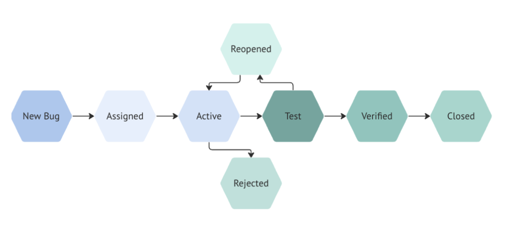

# Глава 8: Управління дефектами

## Вступ

Управління дефектами — це організований процес виявлення, документування, класифікації, пріоритизації та відстеження помилок у програмному забезпеченні протягом їхнього життєвого циклу. Це не просто «знайшли баг — розповіли розробнику», а чітка система комунікації, аналітики та контролю якості продукту.

У цій главі ми розглядатимемо всі аспекти управління дефектами:

- **8.1** Терміни та розрізнення: Error, Defect, Failure, Bug
- **8.2** Класифікація дефектів за серйозністю та пріоритетом
- **8.3** Життєвий цикл дефекту (10 статусів)
- **8.4** Bug Report — структура, поля, приклади
- **8.5** Інструменти управління дефектами
- **8.6** Практичне завдання: Bug Report та Defect Management

Разом ці компоненти утворюють фундамент якісного управління проектом та його продукту.

---

## 8.1. Терміни та розрізнення: Error, Defect, Failure, Bug

### Вступ до термінів

У тестуванні програмного забезпечення існують чотири терміни, які часто плутають, але мають різне значення. Розуміння різниці між ними — ключ до професійної комунікації в QA.

### Error (Помилка розробника)

**Визначення:**
> Помилка в рішенні або дії розробника, яка створює дефект. Це людська помилка, яка миттєво вносить дефект у продукт.

**Характеристики:**
- Створюється розробником свідомо або несвідомо
- Статична (існує в коді, але може не проявитися)
- Можна виявити через code review або статичний аналіз
- Це **причина** проблеми

**Приклади помилок розробника:**
- Забув ініціалізувати змінну
- Неправильно реалізував алгоритм
- Скопіював код з Stack Overflow або згенерований AI агентом без адаптації
- Не перевірив граничні випадки
- Забув обробити виключення

**Типові контексти:**
```
Помилка розробника:
├─ Логічна помилка (неправильна умова в if)
├─ Типова помилка (неправильний тип даних)
├─ Помилка в API (неправильний вибір методу)
└─ Помилка в синтаксисі (незабезпечена змінна)
```

---

### Defect / Bug (Дефект / Баг)

**Визначення:**
> Об'єктивна властивість програмного коду — відхилення від вимог, яке існує незалежно від того, знаю про нього чи ні. Дефект — це результат помилки розробника, що вбудована у код.

**Характеристики:**
- Об'єктивна властивість коду (існує в коді)
- Динамічна (може проявитися при певних умовах)
- Можна виявити тестуванням або спостеріженням
- Одна помилка може створити один дефект, а може й кілька
- Синоніми: баг, помилка (технічна)
- Це **проблема**, яка існує у коді

**Приклад дефекту:**
Функція перевірки паролю допускає пароль з менше ніж 8 символів (дефект):
```
// ЦЕ ДЕФЕКТ - неправильна перевірка
function isValidPassword(pwd) {
  return pwd.length >= 8;  // Забув перевірити спеціальні символи
}


### Failure (Збій / Відмова)

**Визначення:**
> Динамічна подія — неспроможність системи виконувати свою функцію. Це момент, коли програма перестає робити те, що повинна робити.

**Характеристики:**
- Динамічна (спостерігається під час виконання)
- Виконується користувачем або тестувальником
- Свідчить про присутність дефекту
- Один дефект може спричинити  відмову
- Одна відмова може бути результатом декількох дефектів
- Це **прояв** дефекту

**Приклад збою:**
```
Користувач намагається:
1. Ввести пароль "qwerty123!" (9 символів з спец. символом)
2. Система приймає його незважаючи на помилку валідації
3. ❌ Збій спостерігається — система дозволила неправильний пароль
```

**Результат:** На екрані пароль збережений, але система повинна була його відхилити.

---

### Bug (Баг)

**Визначення:**
> Розмовний термін, найчастіше синонім дефекту. Використовується в повсякденній мові більше, ніж офіційні терміни.

**Контекст:** "На продакшені знайшли баг" = "На продакшені знайшли дефект"

---

### Ланцюжок: Error → Defect → Failure

Всі три терміни утворюють послідовність подій:

```
┌─────────────────────────────────────────────────────────────┐
│                    ЛАНЦЮЖОК ДЕФЕКТІВ                        │
└─────────────────────────────────────────────────────────────┘

STAGE 1: ERROR (ПОМИЛКА РОЗРОБНИКА)
┌─────────────────────────────────────────────────────┐
│ Розробник допускає помилку під час написання коду  │
│ Приклад: забув перевірити спеціальні символи      │
│ Час: під час розробки                             │
│ Видимість: приховано від користувача              │
└─────────────────────────────────────────────────────┘
                        ↓
STAGE 2: DEFECT (ДЕФЕКТ У КОДІ)
┌─────────────────────────────────────────────────────┐
│ У коді існує помилка (відхилення від вимог)       │
│ Приклад: функція дозволяє неправильний пароль    │
│ Час: постійно присутній у коді                    │
│ Видимість: приховано (неактивний дефект)         │
└─────────────────────────────────────────────────────┘
                        ↓
STAGE 3: FAILURE (ЗБІЙ ПІД ЧАС ВИКОНАННЯ)
┌─────────────────────────────────────────────────────┐
│ Система виявляє невідповідність (збій)           │
│ Приклад: користувач вводить баг пароль, система  │
│          дозволяє йому (видимий результат)       │
│ Час: під час виконання (коли дефект активується) │
│ Видимість: видимо для користувача або тестувальника
└─────────────────────────────────────────────────────┘
```

**Практичний приклад:**

```
1. ERROR (помилка розробника):
   └─ Розробник написав функцію:
      function validateEmail(email) {
        return email.includes("@");  // ПОМИЛКА! Недостатня перевірка
      }

2. DEFECT (дефект у коді):
   └─ У коді існує помилка (функція дозволяє невалідні еmail'и)

3. FAILURE (користувач спостерігає):
   └─ Користувач вводить email "test@" (без домену)
   └─ Система приймає його (відмова системи)
   └─ Email не отримує письма (прояв проблеми)


### Таблиця розрізнення термінів

| Аспект | Error            | Defect | Failure |
|--------|------------------|--------|---------|
| **Що це?** | Дія розробника   | Проблема в коді | Видимий результат |
| **Коли виникає?** | Під час розробки | Постійно у коді | Під час виконання |
| **Хто бачить?** | Рецензент коду   | Тестувальник (при тестуванні) | Користувач |
| **Статус** | Причина          | Проблема | Наслідок |
| **Приклад** | Забув перевірку  | Функція дозволяє недійсні дані | Користувач вводить недійсні дані, система приймає |
| **Виправляється?** | Так              | Так | Автоматично (коли виправлено defect) |

## 8.2. Класифікація дефектів

>**Класифікація дефектів** — це категорії, за якими дефекти програмного забезпечення класифікують залежно від етапу життєвого циклу, на якому вони виникли, а також від характеру помилки. Така класифікація дає змогу систематизувати процес виявлення, аналізу та усунення дефектів.

У практиці тестування програмного забезпечення можуть застосовуватися різні підходи до класифікації дефектів. Важливо розуміти, що класифікація дефектів за етапом їх виникнення та класифікація дефектів за їхньою природою є різними підходами, які описують дефект з різних точок зору.

Класифікація за етапом виникнення визначає, де під час життєвого циклу розроблення виникла помилка. До основних категорій належать дефекти вимог і специфікацій, проєктування, коду та тестування.

Класифікація за природою визначає, який аспект програмного забезпечення порушено. Наприклад, дефект може бути функціональним, логічним, інтерфейсним, API, продуктивності, безпеки, даних або інтеграційним.

Ці підходи доповнюють один одного. Етап виникнення показує, де була допущена помилка, а природа дефекту — що саме працює неправильно. Тому один дефект може одночасно мати класифікацію за обома ознака

### Класифікація дефектів за природою:
> Класифікація за природою дефекту відповідає на інше запитання: «Який саме аспект або властивість програмного забезпечення порушено?». У цьому випадку не має принципового значення, на якому етапі виникла помилка. Основна увага приділяється характеру неправильного функціонування системи. Наприклад, дефект може бути функціональним, логічним, пов'язаним із користувацьким інтерфейсом, API, продуктивністю, безпекою, даними або інтеграцією.

- **Functional (функціональні)** — функція не працює відповідно до очікуваної поведінки або вимог.
- **Logic (логічні)** — помилки в логіці роботи програми або реалізації бізнес-правил.
- **UI/UX (інтерфейсні)** — проблеми з користувацьким інтерфейсом або зручністю взаємодії.
- **API** — неправильна взаємодія з програмним інтерфейсом або некоректна відповідь API.
- **Performance (продуктивності)** — система працює повільніше, ніж очікується, або не забезпечує необхідну продуктивність.
- **Security (безпеки)** — уразливості або порушення вимог інформаційної безпеки.
- **Data (даних)** — проблеми зі зберіганням, передаванням або обробленням даних.
- **Integration (інтеграційні)** — проблеми під час взаємодії між системами, сервісами або програмними компонентами.


### Класифікація за етапом виникнення:

> Класифікація за етапом виникнення відповідає на запитання: «На якому етапі життєвого циклу програмного забезпечення виник дефект?». У цьому випадку увага зосереджується на процесі розроблення та визначенні місця, де була допущена помилка. Відповідно до такого підходу виділяють дефекти вимог і специфікацій, дефекти проєктування, дефекти коду та дефекти тестування. Наприклад, якщо вимога була сформульована неоднозначно, це є дефектом вимог; якщо на основі правильної вимоги було створено неправильну архітектуру або алгоритм — дефектом проєктування; якщо правильне проєктне рішення було неправильно реалізоване у програмному коді — дефектом коду.

- **Requirements and Specifications (вимог і специфікацій)** — помилки або неточності у вимогах, специфікаціях та описах очікуваної поведінки системи.
- **Design (проєктування)** — помилки в архітектурі, алгоритмах, структурах даних або проєктних рішеннях системи.
- **Code (коду)** — помилки, допущені під час реалізації програмного забезпечення у вихідному коді.
- **Testing (тестування)** — помилки у тестових планах, тестових випадках, тестових даних, процедурах або тестових засобах.

### Дефекти вимог і специфікацій

**Дефекти вимог і специфікацій (Requirements and Specifications Defects)** виникають на ранніх етапах життєвого циклу програмного забезпечення. Якість вимог є критично важливою, оскільки дефекти, внесені на ранніх етапах розроблення, зазвичай складніше та дорожче усувати на наступних етапах.

Оскільки вимоги часто формулюються природною мовою, вони можуть бути:

- двозначними;
- суперечливими;
- незрозумілими;
- надлишковими;
- неточними.

До основних видів дефектів вимог і специфікацій належать:

- **Дефекти функціонального опису** — неправильний, неоднозначний або неповний опис загального призначення програмного продукту, його функцій, входів, виходів та очікуваної поведінки.
- **Дефекти опису функцій** — відсутність, неправильний, неповний або надлишковий опис функціональних можливостей програмного компонента чи системи.
- **Дефекти взаємодії функцій** — неправильний або неповний опис способу взаємодії окремих функцій між собою.
- **Дефекти опису інтерфейсів** — помилки в описі взаємодії програмного забезпечення із зовнішніми програмними системами, апаратними засобами або користувачами.

### Дефекти проєктування

**Дефекти проєктування (Design Defects)** виникають унаслідок неправильного проєктування програмної системи, її компонентів або взаємодії між ними.

Такі дефекти можуть стосуватися:

- архітектури та компонентів системи;
- взаємодії між компонентами системи;
- взаємодії програмних компонентів із зовнішнім програмним та апаратним забезпеченням;
- взаємодії системи з користувачем;
- алгоритмів і логіки оброблення даних;
- структур даних;
- внутрішніх і зовнішніх інтерфейсів.

До основних видів дефектів проєктування належать:

- **Алгоритмічні дефекти та дефекти оброблення** — виникають у разі неправильного визначення етапів оброблення даних або операцій алгоритму, описаного, наприклад, за допомогою псевдокоду.
- **Дефекти керування, логіки та послідовності** — виникають у разі неправильного визначення логічного потоку виконання операцій у системі.
- **Дефекти даних** — пов'язані з неправильним проєктуванням структур даних.
- **Дефекти опису інтерфейсів модулів** — виникають унаслідок неправильного або непослідовного визначення типів параметрів, їх кількості чи порядку передавання.
- **Дефекти функціонального опису** — включають неправильні, відсутні або нечітко визначені елементи проєктного рішення.
- **Дефекти опису зовнішніх інтерфейсів** — виникають через неправильний опис взаємодії програмних компонентів із готовими комерційними компонентами (COTS), зовнішніми програмними системами, базами даних та апаратними пристроями.

### Дефекти коду

**Дефекти коду (Coding Defects)** виникають під час безпосередньої реалізації програмного забезпечення та пов'язані з помилками у вихідному коді.

Класи дефектів коду значною мірою відповідають класам дефектів проєктування. Їх причинами можуть бути неправильне розуміння конструкцій мови програмування, помилки під час реалізації проєктних рішень, недостатня комунікація між розробниками, неуважність або недостатнє розуміння середовища виконання програми.

До основних видів дефектів коду належать:

- **Алгоритмічні дефекти та дефекти оброблення**, зокрема:
    - відсутність перевірки умов переповнення та втрати розрядності;
    - порівняння несумісних типів даних;
    - некоректне перетворення одного типу даних в інший;
    - неправильний порядок виконання арифметичних операцій;
    - неправильне використання або пропуск круглих дужок;
    - втрата точності обчислень;
    - неправильне використання знаків чисел або операторів.
- **Дефекти керування, логіки та послідовності** — включають неправильне формування умов операторів вибору (`case`), некоректне повторення циклів, а також пропущені шляхи виконання програми.
- **Синтаксичні та типографічні дефекти** — пов'язані переважно із синтаксичними помилками, наприклад неправильним написанням імен змінних. Такі дефекти зазвичай виявляються компілятором, під час самоперевірки коду або його перевірки іншими розробниками.
- **Дефекти ініціалізації** — виникають у разі пропуску необхідних операторів ініціалізації або їх неправильного використання. Причинами можуть бути недостатня комунікація між розробниками та проєктувальниками, неуважність або неправильне розуміння особливостей середовища програмування.
- **Дефекти потоку даних** — виникають у разі, коли реалізований код не відповідає встановленим умовам або правилам проходження даних через програму.
- **Дефекти даних** — пов'язані з неправильною реалізацією структур даних.
- **Дефекти інтерфейсів модулів** — виникають унаслідок використання неправильних або несумісних типів параметрів, неправильної кількості параметрів або неправильного порядку їх передавання.
- **Дефекти документації коду** — виникають, коли документація не відповідає фактичній поведінці програми, є неповною, неточною або неоднозначною.
- **Дефекти зовнішніх апаратних і програмних інтерфейсів** — пов'язані з некоректною реалізацією взаємодії із системними викликами, базами даних, пристроями введення та виведення, пам'яттю, системними ресурсами, механізмами оброблення переривань і винятків, апаратними пристроями, мережевими протоколами та форматами даних. До цієї категорії також належать помилки у файлових інтерфейсах і часових послідовностях взаємодії компонентів.

### Дефекти тестування

**Дефекти тестування (Testing Defects)** можуть виникати не лише в програмному продукті, а й у процесі його тестування. Вони можуть міститися у планах тестування, тестових наборах, тестових засобах, тестових сценаріях і процедурах.

Виявлення дефектів у планах та іншій тестовій документації доцільно здійснювати за допомогою **перевірки (review)**.

До основних видів дефектів тестування належать:

- **Дефекти тестового середовища (Test Harness Defects)** — виникають у допоміжному програмному коді, який використовується для тестування програмного забезпечення на рівні модулів та під час інтеграційного тестування. Такий код називають **тестовою обв'язкою (Test Harness)** або **допоміжним кодом (Scaffolding Code)**. Тестова обв'язка повинна бути належним чином спроєктована, реалізована та протестована, оскільки вона є окремим робочим продуктом і може повторно використовуватися під час розроблення наступних версій програмного забезпечення.
- **Дефекти проєктування тестових випадків і тестових процедур** — включають неправильні, неповні, відсутні або невідповідні тестові випадки та процедури тестування. Такі дефекти можуть призводити до недостатнього тестового покриття та пропуску дефектів програмного забезпечення.

### Розуміння серйозності vs пріоритету

Це найчастіша плутанина в QA. **Серйозність (Severity)** та **пріоритет (Priority)** — це різні виміри одного дефекту.

| Аспект             | Severity (Серйозність) | Priority (Пріоритет)                                       |
|--------------------|------------------------|------------------------------------------------------------|
| **Визначає**       | Як сильно дефект впливає на функціональність | Коли його виправити (послідовність роботи)                 |
| **Хто визначає**   | Тестувальник (технічна оцінка) | Менеджер проекту (бізнес-оцінка)                           |
| **Грунтується на** | Впливі на користувача та систему | Дедлайнах, кількості користувачів, ROI                     |
| **Розраховується** | Об'єктивно | Суб'єктивно                                                |
| **Приклад**        | Bug в рядку коду: серйозність = Critical | Це критичний баг, але deadline за 2 місяці: Priority = Low |

---

### Рівні серйозності (Severity Levels) — Як серйозна помилка?

#### **1. Blocker (Блокуючий)** — ~5% дефектів

- ❌ **Програма повністю неробоча**
- ❌ Основна функціональність недоступна
- ❌ Система повертає 500-помилку при запуску
- ❌ Неможливо запустити програму взагалі
- ❌ Критичні системні компоненти збій

**Вплив:** Усім користувачам, усім функціям, усім сценаріям

**Приклади Blocker:**
- Веб-сайт повертає 500 помилку на головній сторінці
- Мобільний застосунок падає при запуску
- Платіжна система повністю неробоча
- База даних недоступна

**Приклад баг-репорту:**
```
ID: PROJ-1001
Title: Login page returns HTTP 500 on all requests
Severity: Blocker
Reason: Користувачі не можуть увійти в систему взагалі — 
        сервіс абсолютно неробочий
Impact: 100% користувачів
```

---

#### **2. Critical (Критичний)** 

- 🔴 **Ключова функція не працює**
- 🔴 Користувач не може виконати основну дію
- 🔴 Є логічна помилка у бізнес-процесі
- 🔴 Збій під час обробки платежів, входу, збереження даних
- 🔴 Втрата або пошкодження даних користувача

**Вплив:** Основні функції, велика група користувачів (можливо все)

**Приклади Critical:**
- Logout button не працює на мобільній версії (користувачі не можуть вийти)
- Платіж обробляється, але гроші не переходять на рахунок
- При завантаженні документа, документ не зберігається
- Форма реєстрації збиває дані тільки користувачів з певного браузера

---

#### **3. Major (Серйозний)** 

- 🟠 **Функція працює, але не правильно**
- 🟠 Часткова втрата функціональності
- 🟠 Розрахунки видають неправильні результати
- 🟠 Користувацький досвід істотно погіршений
- 🟠 Але користувач може обійти проблему

**Вплив:** Окремі функції, завдає великого роздратування користувачам

**Приклади Major:**
- Таблиця сортується неправильно (1, 10, 2 замість 1, 2, 10)
- Пошук видає результати але не в правильному порядку
- Фільтр на сторінці працює частково (деякі фільтри не застосовуються)
- Звіт генерується але його можна надрукувати неправильно

---

#### **4. Minor (Незначний)** 

- 🟡 **Функція має невеликі дефекти**
- 🟡 Незначне порушення логіки
- 🟡 Косметичні проблеми дизайну
- 🟡 Повідомлення про помилку видається не в правильному місці
- 🟡 Але функціональність не впливає суттєво

**Вплив:** Окремі користувачі, не впливає на функціональність

**Приклади Minor:**
- Текст кнопки вислизає за межі екрану, на мобільних пристроях або маленьких моніторах
- Валідаційне повідомлення показується під полем замість в полі
- Шрифт в діалоговому вікні занадто малий
- Іконка завантаження видається непотрібно довго

---

#### **5. Trivial (Мізерний)** 

- ⚪ **Косметичні помилки**
- ⚪ Помилки в тексті, орфографія, граматика
- ⚪ Неправильна капіталізація
- ⚪ Невеликі затримки в анімації
- ⚪ Практично не впливає на користувача

**Приклад баг-репорту:**
```
ID: PROJ-1005
Title: Typo in help text: "administator" instead of "administrator"
Severity: Trivial
Reason: Помилка в слові на сторінці допомоги
Impact: Незначна, тільки читаючі користувачі допомоги
```

---

### Рівні пріоритету (Priority Levels) — Коли це виправити?

#### **High (Високий)** — Виправити НЕГАЙНО

- 🔴 Дефект блокує випуск нової версії
- 🔴 Перед випуском нової версії
- 🔴 Впливає на критичних користувачів або велику групу
- 🔴 Дефект у платіжних системах або безпеці

**Часова шкала:** Години або дні

**Коли мати High Priority:**
- Blocker або Critical дефект у production
- Безпека вразливості
- Втрата даних
- Платіжна система неробоча

---

#### **Medium (Середній)** — Виправити СКОРО

- 🟡 Виправити у наступному спринті або версії
- 🟡 Може чекати, але не довго
- 🟡 Впливає на зручність використання
- 🟡 Користувачі можуть обійти проблему

**Часова шкала:** Тижні

**Типовий Medium Priority:**
- Major дефект в основній функції
- Проблема з UI/UX
- Баг, який визначає на декілька користувачів

---

#### **Low (Низький)** — Виправити КОЛИ БУДЕ ЧАС

- ⚪ Можна відкласти на невизначений час
- ⚪ Не впливає на основну функціональність
- ⚪ Косметичні помилки
- ⚪ Користувачі взагалі можуть це не помітити

**Часова шкала:** Місяці або взагалі

---

### Матриця Severity × Priority (25 комбінацій)

```
┌─────────────────────────────────────────────────────────────┐
│    SEVERITY × PRIORITY МАТРИЦЯ (Кількість дефектів)        │
├──────────────────┬──────────────┬──────────────┬────────────┤
│                  │ HIGH         │ MEDIUM       │ LOW        │
├──────────────────┼──────────────┼──────────────┼────────────┤
│ BLOCKER (~5%)    │ 🔴 Critical  │ 🟠 High      │ 🟡 Rare    │
│                  │ (~5%)        │ (~2%)        │ (<1%)      │
│                  │ Fix ASAP     │ Fix soon     │ Unusual    │
├──────────────────┼──────────────┼──────────────┼────────────┤
│ CRITICAL (~20%)  │ 🔴 Critical  │ 🟠 High      │ 🟡 OK      │
│                  │ (~20%)       │ (~10%)       │ (~2%)      │
│                  │ Emergency    │ Next sprint  │ Rare       │
├──────────────────┼──────────────┼──────────────┼────────────┤
│ MAJOR (~40%)     │ 🟠 High      │ 🟡 Medium    │ ⚪ Low     │
│                  │ (~40%)       │ (~25%)       │ (~8%)      │
│                  │ High priority│ Normal       │ Backlog    │
├──────────────────┼──────────────┼──────────────┼────────────┤
│ MINOR (~25%)     │ 🟡 Medium    │ ⚪ Low       │ ⚪ Low     │
│                  │ (~25%)       │ (~35%)       │ (~35%)     │
│                  │ Next sprint  │ Can wait     │ Backlog    │
├──────────────────┼──────────────┼──────────────┼────────────┤
│ TRIVIAL (~10%)   │ ⚪ Low       │ ⚪ Low       │ ⚪ Low     │
│                  │ (~10%)       │ (~28%)       │ (~54%)     │
│                  │ Backlog      │ Nice to fix  │ Nice to fix│
└──────────────────┴──────────────┴──────────────┴────────────┘

Типові комбінації:
✅ Blocker + High = Критична ситуація (виправити негайно)
✅ Critical + Medium = Важлива, але можна почекати тиждень
✅ Major + Low = Невелика робота, виправити коли вільно
⚠️  Blocker + Low = Незвичайно, треба обговорити з менеджером
✅ Trivial + High = Редко, але можливо (орфографія у критичному місці)
```

**Практичний приклад взаємозв'язку:**

```
Дефект: Кнопка "Checkout" не реагує на мобільній версії в Safari

Severity оцінка (тестувальник):
├─ Впливає на основну функцію (checkout = критично)
├─ Блокує користувачів (не можуть купити)
├─ Safari = 15% користувачів мобільних
└─ → SEVERITY = CRITICAL (Дійсно серйозно)

Priority оцінка (менеджер проекту):
├─ Deadline випуску: через 2 місяці
├─ Вплинута група користувачів: 15% × 5% = ~0.75% всіх
├─ Користувачі можуть використовувати на Android або ПК
└─ → PRIORITY = MEDIUM (Важлива, але є час)

Рішення:
- Severity: Critical (технічно серйозно)
- Priority: Medium (виправити в наступному спринті)
```

#### Проміжний висновок

Таким чином, класифікація дефектів дає змогу систематизувати помилки та краще визначати їхні характеристики. Класифікація за природою показує, який аспект програмного забезпечення порушено, а класифікація за етапом виникнення — на якому етапі життєвого циклу була допущена помилка. Використання обох підходів допомагає точніше описувати дефекти, визначати їхні першопричини та обирати відповідні методи їх виявлення й усунення.

---

## 8.3. Життєвий цикл дефекта
>Життєвий цикл багу (Bug Life Cycle) — це послідовність станів, через які проходить дефект (баг, помилка) від моменту його виявлення до повного закриття.
Він описує, як команда тестування, розробники та менеджери працюють із помилкою.

### Діаграма життєвого циклу

Кожний дефект проходить через послідовність статусів від виявлення до закриття:



```
                    ЖИТТЄВИЙ ЦИКЛ ДЕФЕКТУ

         ┌──────────────┐
         │  ВИЯВЛЕНО    │  ← Тестувальник знайшов баг
         │ (Submitted)  │     (проміжний статус)
         └──────┬───────┘
                │
         ┌──────▼───────┐
         │    НОВИЙ     │  ← Дефект занесений в систему
         │   (New)      │     Менеджер ще не розглянув
         └──────┬───────┘
                │
       ┌────────┴──────────────┐
       │                       │
   ┌───▼────────┐      ┌──────▼───────┐
   │ ВІДХИЛЕНО  │      │ ВІДКЛАДЕНИЙ  │
   │  (Declined)│      │ (Deferred)   │
   │ НЕ дефект  │      │ Виправимо    │
   │            │      │ пізніше      │
   └────────────┘      └───────┬──────┘
                               │
         ┌─────────────────────┘
         │
   ┌─────▼────────┐
   │  ВІДКРИТО    │  ← Визнано, потребує виправлення
   │  (Opened)    │     Менеджер прийняв рішення
   └─────┬────────┘
         │
   ┌─────▼────────┐
   │ ПРИЗНАЧЕНО   │  ← Розробнику призначено виправити
   │ (Assigned)   │     Розробник отримав завдання
   └─────┬────────┘     Іде розробка виправлення
         │
   ┌─────▼────────┐
   │  ВИПРАВЛЕНО  │  ← Розробник стверджує, що виправив
   │   (Fixed)    │     Виправлення внесено в коді
   └─────┬────────┘     Код передається у тестування
         │              ⚠️ Це НЕ гарантія!
         │
   ┌─────▼────────┐
   │ ПЕРЕВІРЕНО   │  ← Тестувальник перевірив
   │ УСПІШНО      │     Дефект дійсно виправлено!
   │(Verified)    │     Можна закривати
   └─────┬────────┘
         │
   ┌─────▼────────┐
   │   ЗАКРИТИЙ   │  ← Остаточно вирішено
   │  (Closed)    │     Не потребує уваги
   └──────────────┘     Залишається в архіві

ВАЖЛИВО: Можливе повернення до REOPENED (Повторно відкрито)
         коли тестувальник знаходить, що дефект ВСЕ ЩЕ НЕ ВИПРАВЛЕНИЙ
```

---

### Детальна таблиця всіх статусів

| № | Статус | Англійська | Опис                                                         | Хто діє | Наступний статус |
|---|--------|-----------|--------------------------------------------------------------|---------|-----------------|
| 1 | Виявлено | Submitted | Тестувальник знайшов баг, але ще не заніс в систему          | Тестувальник | New |
| 2 | Новий | New | Дефект успішно занесений у баг-трекінг                       | Система | Declined/Deferred/Opened |
| 3 | Відхилено | Declined | Менеджер визнав, що це **не дефект** (user error, već fixed) | Менеджер | Closed |
| 4 | Відкладений | Deferred | Менеджер визнав дефект, але **не вирішуватиме його зараз**   | Менеджер | Opened (coли вирішено переважити) |
| 5 | Відкрито | Opened | Менеджер визнав і прийняв рішення **виправити**              | Менеджер | Assigned |
| 6 | Призначено | Assigned | Дефект **призначено конкретному розробнику**                 | Менеджер/Лід | Fixed |
| 7 | Виправлено | Fixed | Розробник стверджує, що **виправив дефект**                  | Розробник | Reopened/Verified |
| 8 | Повторно відкрито | Reopened | Тестувальник перевірив — дефект **ВСЕ ЩЕ НЕ ВИПРАВЛЕНИЙ**    | Тестувальник | Fixed (розробник виправляє ще раз) |
| 9 | Перевірено | Verified | Тестувальник **підтвердив, що дефект дійсно виправлений**    | Тестувальник | Closed |
| 10 | Закритий | Closed | Дефект **остаточно вирішений**                               | Менеджер | — (можливо Reopened якщо регресія) |


### Реентри та цикли (Повторне відкриття)

**Типичні сценарії, коли дефект повертається до Reopened:**

| Причина | Процент | Приклад | Як уникнути |
|---------|---------|---------|------------|
| **Неповне виправлення** | ~45% | Виправив для Chrome, але не для Safari | Потрібне комплексне тестування |
| **Помилка у виправленні** | ~30% | Виправив один баг, але створив новий | Потребує regression testing |
| **Неправильне розуміння** | ~15% | Розробник зрозумів баг інакше | Треба кращої комунікації з bug report |
| **Регресія** | ~10% | Баг повернувся після оновлення кода | Потребує повного регресійного тестування |

**Статистика:** В середньому дефект проходить **1.5-2 цикли** Assigned → Fixed → Reopened перед закриттям.

---

## 8.4. Bug Report — Структура та приклади

### Що таке Bug Report?

**Bug Report** — це технічний документ, який переводить абстрактне спостереження тестувальника у формалізовану задачу для розробника.

**Цільова авдиторія:**
1. **Розробник** — має зрозуміти та відтворити проблему
2. **Менеджер проекту** — має пріоритизувати роботу
3. **QA Lead** — має переглянути якість звіту
4. **Архів проекту** — служить історичним документом

---

### 15 Обов'язкових полів Bug Report

#### **1. ID (Ідентифікатор)**
Унікальний номер: `PROJ-1025`, `BR-0457`, `BUG-2024-001`

#### **2. Title / Summary (Заголовок)**
Короткий опис (до 80 символів):
- ❌ "Система не працює"
- ✅ "Login button doesn't respond on iOS Safari 14.x"

#### **3. Description (Опис)**
Детальний контекст (200-500 символів):
```
При натисканні на кнопку 'Logout' на мобільному пристрої (Android/iOS),
користувач залишається на тій же сторінці. Кнопка не реагує на клік,
немає жодного видимого ефекту (затемнення, анімація). Користувач
досі залишається авторизованим (бачить власні дані в профілі).
```

#### **4. Steps to Reproduce (Кроки для відтворення)**
Чітка послідовність дій (кожен крок на новому рядку):

```
1. Відкрити https://example.com на мобільному браузері
2. Авторизуватися: demo@test.com / password123
3. Натиснути іконку меню (☰) у верхньому правому кутку
4. Натиснути кнопку "Logout"
5. Спостерігати результат
```

#### **5. Expected Result (Очікуваний результат)**
Що **повинно** було сталося:

```
1. Користувач негайно перенаправляється на сторінку входу
2. Повідомлення: "Ви вийшли з системи. До побачення!"
3. Профіль користувача більше не видимий
4. При перезавантаженні: user повертається на login page
```

#### **6. Actual Result (Фактичний результат)**
Що **насправді** трапилось:

```
1. Кнопка не реагує на клік
2. Користувач залишається на тій же сторінці
3. Профіль залишається видимим
4. Користувач досі авторизований
5. У браузерній консолі помилка:
   "TypeError: Cannot read property 'logout' of undefined (line 245)"
```

#### **7. Environment (Середовище виконання)**
Детальна інформація про систему:

```
- ОС: iOS 14.5
- Браузер: Safari 14.0
- Пристрій: iPhone 12 Pro Max
- Версія застосунку: v3.1.2 (build 45)
- Мова: Українська
- Екран: 390×844px (portrait)
- Мережа: WiFi (стабільне з'єднання)
```

#### **8. Severity (Критичність)**
Рівень критичності: Blocker/Critical/Major/Minor/Trivial

#### **9. Priority (Пріоритет)**
Коли виправити: High/Medium/Low

#### **10. Component / Area (Компонент)**
Частина системи: Navigation Menu, Payment Module, User Profile

#### **11. Version / Build (Версія)**
В якій версії знайдено: v3.1.2, build #45

#### **12. Attachments (Вкладення)**
Скріншоти, відео, логи:
- 📸 `logout_button_unresponsive.png`
- 🎥 `logout_bug_demo.mp4` (15 sec, 5.2 MB)
- 📄 `console_errors_20260909.txt`

#### **13. Reporter / Author (Репортер)**
Хто знайшов: tester_ivan або qa.petro@company.com

#### **14. Assignee (Призначено)**
Кому виправляти: dev_nikita або frontend-team

#### **15. Status (Статус)**
Поточний стан: New, Assigned, Fixed, Verified, Closed

---

### Приклад повного Bug Report

```
╔════════════════════════════════════════════════════════════════════════╗
║                    BUG REPORT — РЕАЛЬНИЙ ПРИКЛАД                      ║
╚════════════════════════════════════════════════════════════════════════╝

ID:              BANKAPP-2047
Title:           Logout button unresponsive on mobile devices
Component:       Navigation > User Menu
Project:         MobileBankApp v3.1
Version:         3.1.2 (build 45)
Status:          New
Date Created:    2026-09-09 14:35 UTC
Reporter:        tester_elena@company.com
Assignee:        (не призначено)

SEVERITY:        Critical
PRIORITY:        High

ENVIRONMENT:
  - ОС:          iOS 14.5
  - Браузер:     Safari 14.0
  - Пристрій:    iPhone 12 Pro Max
  - Версія App:  3.1.2 (build 45)
  - Локаль:      uk-UA (Ukrainian)

═════════════════════════════════════════════════════════════════════════

DESCRIPTION:
Користувач не може вийти з системи на мобільній версії. Кнопка "Logout"
у меню навігації не реагує на клік. Це критично блокує користувача, який
хоче завершити сеанс на спільному пристрої.

═════════════════════════════════════════════════════════════════════════

STEPS TO REPRODUCE:
1. Відкрити https://app.example.com на iOS Safari
2. Авторизуватися: demo@test.com / password123
3. Натиснути іконку меню (☰) у верхньому правому кутку
4. Натиснути кнопку "Logout"
5. Спостерігати результат

═════════════════════════════════════════════════════════════════════════

EXPECTED RESULT:
1. Після натиску на "Logout", користувач повинен негайно перенаправитися
   на сторінку входу (https://app.example.com/login)
2. На сторінці входу повинна з'явитися система повідомлення:
   "Ви вийшли з системи. До побачення!"
3. Профіль користувача / приватні дані повинні більше не бути видимими
4. При перезавантаженні користувач повинен залишитися на login page

═════════════════════════════════════════════════════════════════════════

ACTUAL RESULT:
1. Після натиску на "Logout" НІЧОГО не відбувається
2. Користувач залишається на тій же сторінці
3. Вміст профілю залишається видимим
4. При перезавантаженні сторінки користувач досі авторизований
5. У браузерній консолі помилка:
   "TypeError: Cannot read property 'logout' of undefined (line 245)"
   Stack trace:
   at NavigationMenu.handleLogout (Navigation.jsx:245:18)
   at HTMLButton.onclick (Navigation.jsx:156:8)

═════════════════════════════════════════════════════════════════════════

ATTACHMENTS:
  📸 Screenshot: logout_button_unresponsive.png (825 KB)
  🎥 Screen recording: logout_bug_demo.mp4 (15 sec, 5.2 MB)
  📄 Browser console log: console_errors_20260909.txt (12 KB)
  📄 Network logs: network_logs_20260909.har (450 KB)

═════════════════════════════════════════════════════════════════════════

ADDITIONAL INFORMATION:
- Дефект **НЕ** виявлено на Android Chrome (працює нормально)
- Дефект виявлено на iOS Safari І iOS Chrome (обидва мають проблему)
- Користувачам дозволяє завершити сеанс через очистку cookies браузера,
  але це не рекомендується для тестування
- Масштабування браузера з 100% → 125% **розв'язує проблему!**
  (можливо, це задача CSS селектор або media query)
- Проблема також спостерігається на iPad з iOS 14.5

═════════════════════════════════════════════════════════════════════════

RELATED BUGS:
- BANKAPP-2041: Logout doesn't work on iPad (аналогічна проблема)
- BANKAPP-1999: Menu not responsive on old iOS versions (близька проблема)
- BANKAPP-2034: iOS rendering issues in Safari (потенціально пов'язаний)

═════════════════════════════════════════════════════════════════════════

SUGGESTED ROOT CAUSE (за RCA аналізом):
1. Проблема виникає тільки на iOS Safari
2. Масштабування на 125% розв'язує проблему
3. Це вказує на CSS media query або JavaScript координат-залежну помилку
4. Можливо: `window.innerWidth` бере неправильне значення на Safari

═════════════════════════════════════════════════════════════════════════
```

---

### Рекомендації для якісного Bug Report

| ✅ ДОБРЕ | ❌ ПОГАНО |
|---------|---------|
| "Submit button shows spinner for 30s then disappears" | "Submit doesn't work" |
| Скріншот з проблемою або логами | "Спроба, щоб ви сам перевірили" |
| Точна послідовність кроків (3-5 кроків) | "Зробіть щось з формою" |
| "Очікується: результат X; Отримано: результат Y" | "Це не так" |
| Вказано ОС, браузер, версія, пристрій | "На комп'ютері" |
| Один дефект на звіт | 5 дефектів в одному звіті |
| "Дефект з'являється в 80% спроб" | "Іноді не працює" |
| Attachments з логами та скріншотами | Без вкладень |
| Код дійсно дублікату в Related bugs | Непов'язані баги |

---

## Аналіз першопричини (RCA) — Root Cause Analysis

### Що таке RCA?

**RCA (Root Cause Analysis)** — це систематичний процес дослідження дефекту, збою або проблеми з метою виявлення **первинної (кореневої) причини** його виникнення, а не лише симптому.

**Простими словами:** Не просто "знайти, що зламалось", але зрозуміти **ЧОМУ** це зламалося.

---

### Структура RCA дослідження

```
RCA СТРУКТУРА:

┌─────────────────────────────────────────────────────────┐
│                   1. SYMPTOM (Симптом)                  │
│                   Видимий прояв проблеми               │
│  Приклад: "Користувачі не можуть вийти з системи"     │
└──────────────────────┬──────────────────────────────────┘
                       ↓
┌─────────────────────────────────────────────────────────┐
│            2. PROBLEM (Виявлена проблема)               │
│           Що саме сломалось або не так                 │
│  Приклад: "Logout button не виконує функцію на iOS"    │
└──────────────────────┬──────────────────────────────────┘
                       ↓
┌─────────────────────────────────────────────────────────┐
│       3. CONTRIBUTING FACTORS (Сприяючі фактори)        │
│       Опосередковані причини які вплинули              │
│  Приклад: "iOS Safari має інші viewport значення"      │
│           "CSS media queries не перевіряли на iPhone"   │
└──────────────────────┬──────────────────────────────────┘
                       ↓
┌─────────────────────────────────────────────────────────┐
│      4. ROOT CAUSE (Коренева причина — найголовніше)    │
│      Первинна причина, якби цього не було — проблеми б │
│                      не було                            │
│  Приклад: "window.innerWidth повертає неправильне      │
│            значення для Safari на 125% zoom"            │
└──────────────────────┬──────────────────────────────────┘
                       ↓
┌─────────────────────────────────────────────────────────┐
│    5. CORRECTIVE ACTIONS (Коригуючі дії для вирішення)  │
│    Як запобігти цьому у майбутньому                     │
│  Приклад: "Завжди тестувати на реальних пристроях"     │
│           "Обов'язково перевіряти на iOS Safari"        │
│           "Використовувати отримання значень через     │
│            getBoundingClientRect() замість innerWidth"  │
└─────────────────────────────────────────────────────────┘
```

---

### Метод 1: 5 Why (П'ять Чому)

Послідовне запитування "Чому?" 5 разів для знаходження кореневої причини.

**Приклад RCA на 5 Why:**

```
Проблема: Logout button не працює на iOS Safari

✓ Чому 1: Logout button не реагує на клік?
  → Тому що JavaScript функція handleLogout() не викликається

✓ Чому 2: Чому handleLogout() не викликається?
  → Тому що event listener не прикріплений до кнопки на iOS

✓ Чому 3: Чому event listener не прикріплена?
  → Тому що CSS селектор не знаходить кнопку на iOS Safari

✓ Чому 4: Чому CSS селектор не знаходить кнопку?
  → Тому що window.innerWidth повертає неправильне значення
      при 125% zoom на Safari

✓ Чому 5: Чому window.innerWidth неправильне?
  → Тому що розробник не тестував на реальних пристроях
      і не використав getBoundingClientRect()
      
🎯 ROOT CAUSE ЗНАЙДЕНА: Неправильна метода отримання розмірів на Safari
```

---

### Метод 2: Fishbone Diagram (Діаграма Ішікави)

Структурований аналіз по категоріях для знаходження причин.

```
                            ↓
                    LOGOUT BUTTON
                    НЕ ПРАЦЮЄ
                            ↑
           ┌────────────────┼────────────────┐
           │                │                │
    ┌──────▼──────┐  ┌─────▼────┐   ┌─────▼──────┐
    │   ЛЮДИ      │  │ ПРОЦЕСИ  │   │ ТЕХНОЛОГІЯ │
    │ (People)    │  │(Process) │   │ (Technology)
    ├─────────────┤  ├──────────┤   ├────────────┤
    │ • Розробник │  │ • Немає  │   │ • Safari  │
    │   не тестував│ │   тестів │   │   viewport│
    │   на iOS     │  │   на iOS │   │   проблема│
    │ • Без QA     │  │ • Не пе- │   │ • CSS не │
    │   перевірки  │  │   ревір- │   │   роблять │
    │ • Забув про  │  │   чув на │   │ • Event  │
    │   Safari     │  │   реальн │   │   listener│
    │            │  │   пристр │   │   на iOS │
    └─────────────┘  └──────────┘   └────────────┘
           │                │                │
           └────────────────┼────────────────┘
                            │
                     ┌──────▼──────┐
                     │  СЕРЕДОВИЩЕ │
                     │(Environment)│
                     ├─────────────┤
                     │ • iOS 14.5  │
                     │ • 125% zoom │
                     │ • iPhone 12 │
                     │ • Safari 14 │
                     │ • WiFi сеть │
                     └─────────────┘
```

---

### Метод 3: Fault Tree Analysis (FTA)

Побудова дерева відмов від симптому до причин.

```
                        ┌──────────────────┐
                        │ LOGOUT НЕ ПРАЦЮЄ │
                        └────────┬─────────┘
                                 │
                 ┌───────────────┼───────────────┐
                 │               │               │
            ┌────▼─────┐    ┌────▼─────┐   ┌────▼─────┐
            │ НЕМА КЛІК │    │ BUTTON   │   │ EVENT    │
            │ ОБРОБКИ   │    │ НЕВИДИМА │   │ НЕ СПРАЦЮ │
            └────┬─────┘    └────┬─────┘   └────┬─────┘
                 │               │              │
        ┌────────┴────────┐      │              │
        │                 │      │              │
    ┌───▼───┐        ┌────▼──┐  │          ┌────▼──┐
    │ JS    │        │ CSS   │  │          │ Event │
    │ ERROR │        │ ISSUE │  │          │ BIND  │
    │ 245   │        │       │  │          │ FAIL  │
    └───┬───┘        └───┬───┘  │          └───┬───┘
        │                │      │              │
        └────────────────┼──────┼──────────────┘
                         │      │
                  innerWidth  Safari
                  неправильно  viewport
                  на Safari    на 125%
```

---

## 8.5. Інструменти управління дефектами

### 1. JIRA (Atlassian) — Стандарт індустрії

**Статус:** Лідер ринку (~60% компаній)
**Вартість:** $10/користувач/месяц (cloud) або $1,000+/рік (self-hosted)

**Особливості:**
- ✅ Гнучка конфігурація workflow
- ✅ Інтеграція з Git, Bitbucket, GitHub, Slack
- ✅ Звітність та метрики (Burndown, Velocity)
- ✅ Agile & Scrum доски
- ✅ Екосистема додатків (Zephyr, TestRail інтеграція)
- ✅ Custom fields та automations

**Для дефектів:**
```
Issue Type:      Bug
Severity:        Blocker, Critical, Major, Minor, Trivial
Priority:        High, Medium, Low
Status:          New → In Progress → In Review → Done
Custom Fields:   Environment, Browser, Device
Automations:     Автоматично перейти на "Fixed" коли комітити код
```

---

### 2. Azure DevOps (Microsoft)

**Статус:** Потужна альтернатива для .NET команд
**Вартість:** Вільна для до 5 користувачів, потім за абонементом

**Особливості:**
- ✅ Повна CI/CD pipeline вбудована
- ✅ Git + Pull Request управління
- ✅ Test Plans та Test Cases вбудовані
- ✅ Tight інтеграція з Visual Studio та Azure
- ✅ Work Items для гнучкого управління

---

### 3. Bugzilla (Open Source)

**Статус:** Легка альтернатива, вільна
**Вартість:** Вільна, open-source

**Особливості:**
- ✅ Простий інтерфейс
- ✅ Мала витрата ресурсів
- ✅ Email notifications
- ✅ Версійний контроль

---

### 4. YouTrack (JetBrains)

**Статус:** Сучасна альтернатива для IDE користувачів
**Вартість:** Вільна для open-source, $120-$250/месяц

**Особливості:**
- ✅ NLP Search (природна мова)
- ✅ IDE інтеграція (IntelliJ, WebStorm, PyCharm)
- ✅ Custom workflows
- ✅ Gat Google Forms інтеграція

---

### 5. Trello (Atlassian)

**Статус:** Простий Kanban для малих команд
**Вартість:** Вільна базова, $12.50+/месяц plus

**Особливості:**
- ✅ Simple drag-and-drop
- ✅ Power-Ups для розширення
- ✅ Списки та картки (To Do, In Progress, Done)

---

### 6. Worksection (Українське рішення)

**Статус:** Українське рішення для управління проектами
**Вартість:** $99-$249/місяць

**Особливості:**
- ✅ Українська мова
- ✅ Time-tracking
- ✅ Командна комунікація
- ✅ Прості дефекти як завдання

---
### 8.6 Практичне завдання: Bug Report та Defect Management

> Мета: Набути практичних навичок виявлення, документування та оформлення звітів про дефекти програмного забезпечення під час роботи з реальним застосунком.

У межах проєкту **stt-bug-reporting** студент:

### Критерії прийому 

* протестувати реальний застосунок із використанням базових **технік тест-дизайну**;
* виявити та задокументувати щонайменше **5 дефектів**;
* задокументувати результати тестування;
* створити Bug Report із визначеними **Severity** та **Priority**;
* виконати **RCA** щонайменше для одного дефекту;
* вести тест-кейси та дефекти в **Trello**, **GitHub** або **Worksection**.

### Очікуваний результат

Після виконання практичного заняття студент повинен мати:

* щонайменше **5 оформлених Bug Report**;
* набір виконаних **тест-кейсів**;
* перелік **регресійних тест-кейсів**;
* щонайменше **один RCA**;
* упорядкований набір тестових артефактів у вибраному інструменті.


<br>[stt-bug-reporting](https://github.com/STT-VITI-22/stt-bug-reporting)

## Висновки та ключові моменти

1. **Розрізняйте терміни:** Error ≠ Defect ≠ Failure
2. **Класифікуйте правильно:** Severity vs Priority (різні виміри)
3. **Документуйте якісно:** Good Bug Report = швидше виправлення
4. **Розумійте вартість:** Раннє виявлення = експоненціально дешевше
5. **Керуйте процесом:** 10 статусів, чіткий life cycle

---

## Джерела та ресурси

- **Класифікація:** [github.com/dataset/klasifikatsiia-defektiv.md](https://github.com/STT-VITI-22/stt-handbook/blob/main/dataset/articles/qalight/parsed/defekt/klasifikatsiia-defektiv.md)


- **Life Cycle:** [github.com/dataset/zhittievii-tsikl-defektiv.md](https://github.com/STT-VITI-22/stt-handbook/blob/main/dataset/articles/qalight/parsed/defekt/zhittievii-tsikl-defektiv.md)


- **Bug Report:** [github.com/dataset/bug-report-zvit-pro-pomilku.md](https://github.com/STT-VITI-22/stt-handbook/blob/main/dataset/articles/qalight/parsed/testovi-artefakti/bug-report-zvit-pro-pomilku.md)


- **RCA:** [github.com/dataset/analiz-pervoprichin-rca.md](https://github.com/STT-VITI-22/stt-handbook/blob/main/dataset/articles/QA_Bible/obshee/analiz-pervoprichin-rca-root-cause-analysis.md) 


- **Вартість:** [github.com/dataset/skilki-koshtuiut-defekti.md](https://github.com/STT-VITI-22/stt-handbook/blob/main/dataset/articles/qalight/parsed/osnovi/skilki-koshtuiut-defekti.md) 


- [Дефекти та помилки](https://github.com/STT-VITI-22/stt-handbook/blob/main/dataset/articles/QA_Bible/obshee/defekty-i-oshibki.md)


---


