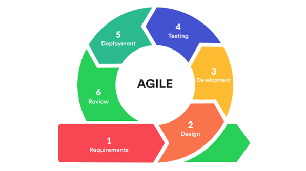
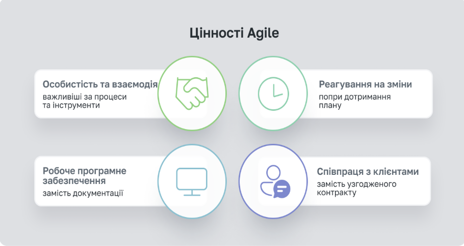
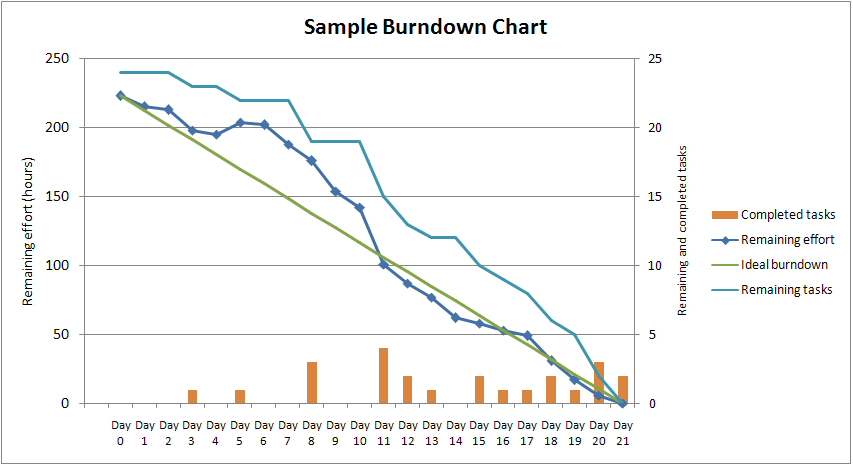
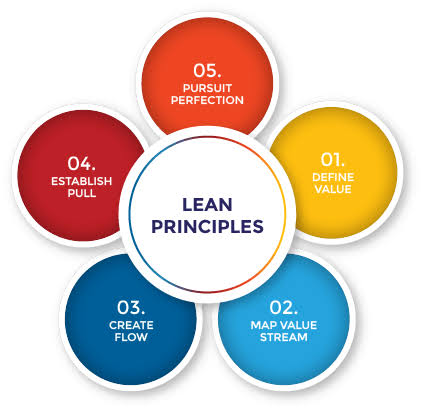
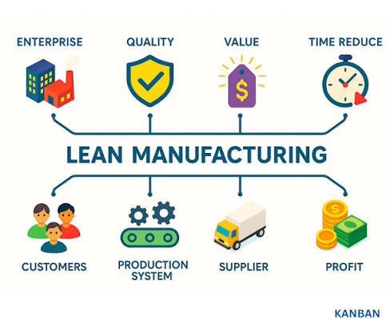
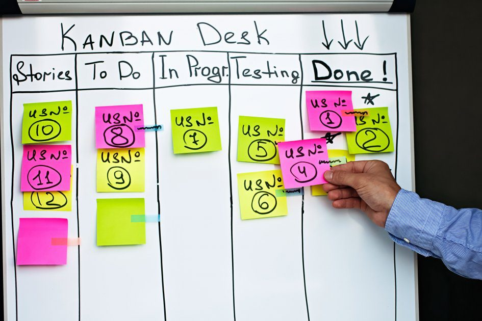
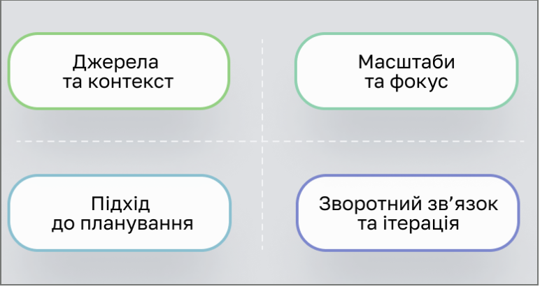
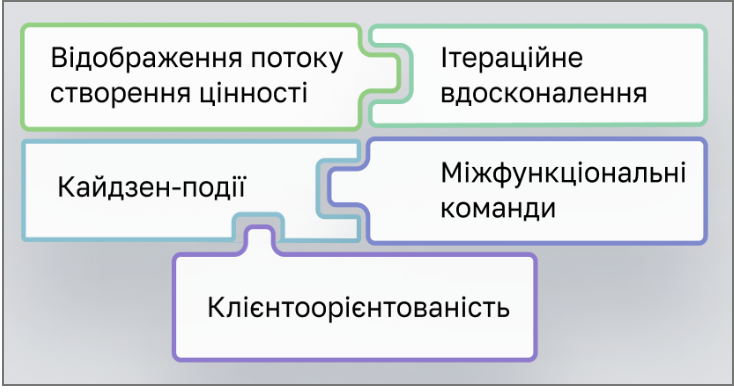
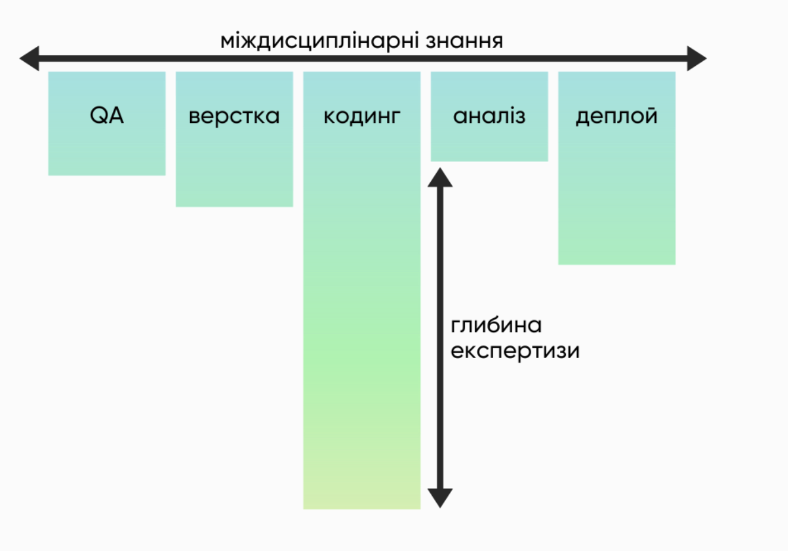

# Глава 9: Тестування у Agile/DevOps середовищах

>**Мета розділу:** Глибоке розуміння особливостей тестування в гнучких методологіях розробки та практиках безперервної доставки. Адаптація тестових підходів до динамічних умов Agile та DevOps. Критичний аналіз викликів впровадження та практичні рекомендації на основі власного досвіду та академічної літератури.

---

## 9.1 Теоретичні основи Agile: Від ітеративних моделей до практичної реалізації

### Ітеративно-інкрементні моделі розробки

**Фундаментальна проблема каскадної розробки:**

Традиційна каскадна (водоспадна) модель передбачає послідовне виконання етапів: аналіз вимог → дизайн → розробка → тестування → випуск. Ця модель мала критичні недоліки:

- **Довгий цикл**: від 6 місяців до 2+ років перед першим тестуванням
- **Запізніле виявлення проблем**: дефекти виявляються в кінці циклу, коли їх виправлення найдорожче
- **Неадаптивність**: зміни вимог після аналізу коштують експоненціально
- **Ризик відміни проекту**: клієнт не бачить робочий продукт до випуску

 **ітеративні (інкрементні) моделі** розробки розв'язують цю проблему через розбиття системи на послідовні кроки з повним циклом розробки на кожному кроці.

#### Визначення ітеративної моделі

>**Ітеративна модель** Велика частина або повний цикл робіт проходить на кожній ітерації. На кожній ітерації можна аналізувати проміжні результати та вносити коригуючі зміни на наступних ітераціях. Кожна ітерація містить повний набір видів діяльності: від аналізу вимог до введення в експлуатацію чергової функціональності.

#### Основні характеристики ітеративного підходу

| Характеристика | Каскадна модель        | Ітеративна модель |
|---|------------------------|---|
| **Цикл розробки** | 6-24+ місяці один цикл | 1-4 тижні, багато циклів |
| **Фідбек** | В кінці проекту        | Кожні 1-4 тижні |
| **Виправлення вимог** | Дуже дорого            | Дешево, до наступної ітерації |
| **Робочий продукт** | Під кінець проекту     | Після кожної ітерації |
| **Ризик проекту** | Висок до випуску       | Розподілений протягом проекту |
| **Тестування** | Централізоване в кінці | Паралельне з розробкою |

#### Переваги ітеративного підходу

1. **Ранній та постійний фідбек користувачів**
   - Користувачі бачать робочу версію кожні 1-4 тижні
   - Зміни вимог виявляються рано, коли їх легше вносити
   - Між ітераціями можна корегувати напрямок розробки

2. **Економія витрат на виправлення дефектів**
   - Дефекти, виявлені на ранній ітерації, коштують 1-10 одиниць витрат
   - Дефекти, виявлені у виробництві, коштують 100-1000 одиниць
   - **Правило 1:10:100** показує експоненціальне зростання вартості

3. **Гнучкість при змінах**
   - Архітектура розроблена з урахуванням змін
   - Нові вимоги можуть бути додані без перепроектування
   - Пріоритети можуть коригуватися як завгодно часто

4. **Постійне отримання робочого ПЗ**
   - Замість чекання 12 місяців, клієнт отримує версії кожен місяць
   - Можливість розпочати використання на ранніх етапах
   - Реальна цінність доставляється постійно, не разово

### Agile як практична реалізація ітеративної моделі

>**Agile:** Комплексна методика організації процесу розробки програмного забезпечення, що включає сім'ю окремих підходів (фреймворків): Scrum, Kanban, XP, FDD та інші. Agile — це не просто набір практик, а **культурна трансформація**, яка змінює як людей взаємодіють, як розподіляються обов'язки, як приймаються рішення.



#### Agile Manifesto: 4 основні цінності

Опубліковано у 2001 році групою 17 програмістів (Мартін Фаулер, Кент Бек, Роберт Мартін та інші):
[Agile-маніфест розробки програмного забезпечення
](https://agilemanifesto.org/iso/uk/manifesto.html)

| # | Цінність | Що це означає | Практичне значення для QA |
|---|---|---|---|
| 1 | **Люди та їхня взаємодія** важливіше за процеси та інструменти | Фокус на комунікацію та спілкування членів команди, а не на жорсткі процеси | QA повинен спілкуватися з розробниками щодня, питати уточнення, обговорювати рішення. Не «приховувати» себе за документами |
| 2 | **Працюючий продукт** важливіший за вичерпну документацію | Мінімальна документація; основна цінність — робочий код, який може використовуватися | Тестування спрямоване на робочий продукт, а не на 200-сторінковіSpecifications |
| 3 | **Позитивна співпраця** важливіша за обговорення умов контракту | Розробка як партнерство між замовником та командою, не як контрактна угода | QA часто інтегрований в Agile команду як рівноправний член, не «контролер» |
| 4 | **Готовність до змін** важливіша за дотримання плану | План буде змінюватися; важливо мати гнучкість, а не дотримуватися застарілого плану | Тестові стратегії постійно переглядаються та адаптуються до змін |



#### 12 принципів Agile Manifesto (розширена версія)

[Якість програмного забезпечення та тестування: базовий курс](https://github.com/STT-VITI-22/stt-handbook/blob/main/dataset/books_pdf/parsed/Krepich_2020_Software_Quality_And_Testing.md) наголошують на кожному принципі з практичної точки зору:

1. **Задоволення клієнта через ранню та безперервну розробку**
   - Клієнт має бачити прогрес регулярно
   - QA повинна демонструвати протестовані функції, не деталі тестування

2. **Позитивність до змін вимог навіть на пізніх стадіях**
   - Не говорити "це вже занадто пізно"
   - QA повинна розуміти нові вимоги та адаптувати тестування

3. **Часта доставка робочого ПЗ** (кожні кілька тижнів)
   - Sprint-цикл обмежений часом (1-4 тижні)
   - Наприкінці спринту маємо дійсно робочий продукт, навіть якщо не всі функції реалізовані

4. **Щоденна співпраця замовника та розробників**
   - Product Owner або замовник повинен бути доступний кожен день
   - QA може напряму уточнювати вимоги у замовника

5. **Збирайте команди навколо вмотивованих людей**
   - Необхідно створити умови та надати підтримку, якої вони потребують, і довірити їм виконання роботи.
   - Мікроменеджмент суперечить ідеї самоорганізованої команди.
   - Agile-команда повинна отримувати: чіткі цілі, необхідні ресурси, довіру з боку керівництва

6. **Особисте спілкування це найпрактичніший спосіб передачі інформації**
   - Розмовляти тет-а-тет (або по відео-дзвінку у remote команді)
   
7. **Працюючий продукт — головний показник прогресу**
   - Не кількість часу витраченого, не завершені тест-кейси
   - А саме: **"чи працює це?"**

8. **Інвестори, розробники та користувачі повинні мати можливість підтримувати постійний ритм як завгодно довго**
   - Agile дозволяє **сталий темп розробки** без burnout
   - QA не повинна працювати 80-годинні тижні в кінці спринту

9. **Постійна увага до технічної досконалості та якості проєктування підвищує гнучкість**
   - Хороший код легше тестувати
   - QA повинна працювати з розробниками над архітектурою

10. **Простота — мистецтво максимізації кількості невиконаної роботи — вкрай необхідна**
    - Не робити зайвих тестів "на всяк випадок"
    - Фокусуватися на найважливіших сценаріях

11. **Найкращі вимоги, архітектурні та технічні рішення виникають у самоорганізованих команд**
    - Не диктувати рішення "зверху"
    - QA може запропонувати рішення на Daily Standup

12. **Команда регулярно рефлексує над тим, як стати ще ефективнішою, та коригує поведінку відповідно**
    - Sprint Retrospective: обговорення що пішло добре, що можна поліпшити
    - Постійне поліпшення (kaizen), а не одноразові "оптимізації"

### Тестування в Agile: Кардинальна зміна підходу

Тестування в Agile середовищі **принципово відрізняється** від традиційного підходу:

#### Порівняння традиційного та Agile тестування

| Аспект | Традиційне (Водоспад) | Agile |
|---|---|---|
| **Часова шкала** | На кінці проекту (2-4 місяці на тестування) | Під час кожного спринту (паралельно з розробкою) |
| **Кількість документації** | Вичерпні тест-плани, тест-кейси (100-500 сторінок) | Мінімальна, фокус на автоматизацію та чек-листи |
| **Фокус QA** | Перевірити відповідність вимогам на папері | Перевірити критерії приймання на РОБОЧОМУ коді |
| **Тип тестування** | 70% ручне, 30% автоматизоване (якщо взагалі) | 30% ручне (дослідницьке), 70% автоматизоване |
| **Розроб та QA** | Розділені, інколи конфліктні ролі | Тісна позитивна співпраця, спільна відповідальність |
| **Регресійні тести** | Ручні (дуже повільно, дорого) | Автоматизовані (швидко, надійно, часто) |
| **Дефекти** | Виявляються пізно, коштують дорого | Виявляються рано, коштують дешево |

#### Маніфест для Agile тестування

На основі Agile Manifesto, у спільноті розробників виник окремий **Маніфест Agile тестування (2011)**:

- **Постійне тестування**, а не лише наприкінці спринту
- **Попередження дефектів** важливіше за їх пошук
- **Розуміння продукту** важливіше за механічну перевірку функцій
- **Побудова якості разом з командою** важливіше за пошук способів "зламати" систему
- **Вся команда відповідає за якість**, а не тільки тестувальник

---

## 9.2 Agile фреймворк Scrum

> **Scrum** — це конкретна реалізація Agile принципів, розроблена в 1995 році Кеном Шваб та Джеффом Сазерлендом. Термін запозичений з регбі, де "scrum" означає командне зіткнення навколо м'яча.

#### Основні компоненти Scrum

##### Три ролі Scrum

| Роль | Завдання                                                                                            | Взаємодія з QA |
|---|-----------------------------------------------------------------------------------------------------|---|
| **Product Owner (PO)** | Управління Product Backlog, пріоритизація вимог, комунікація з клієнтом                             | QA спільно з PO уточнює критерії приймання User Stories; PO забезпечує QA всією необхідною інформацією про вимоги |
| **Scrum Master (SM)** | "Cитуативний лідер" (servant-leader); стеження за дотриманням процесу, мотивація команди | SM забезпечує, що QA повністю інтегрована в спринт; видаляє блокери для тестування |
| **Development Team (DT)** | Розробка, тестування, доставка інкременту продукту                                                  | QA є повноцінним членом DT, не зовнішнім контролером |

**Рекомендований розмір команди:** 7 ± 2 людини (5-9)

Згідно Scrum Guide, команда **повинна бути**:
- **Самоорганізована** — ніхто не диктує як розробляти
- **Багатофункціональна** — мати всі необхідні навички (розробники, QA, дизайнери)
- **Колективно відповідальна** — команда відповідає за результат, не індивідуальні члени

##### Артефакти Scrum

| Артефакт | Опис | Роль QA |
|---|---|---|
| **Product Backlog** | Упорядкований список усіх вимог, функцій, дефектів; живий документ | QA читає, розуміє, може запитати уточнення у PO |
| **Sprint Backlog** | Підмножина Product Backlog для поточного спринту; задачи для виконання | QA бачить, що в спринті, планує тестування за цими завданнями |
| **Increment (потенційно шип продукт)** | Готовий до використання результат спринту; додається до попередніх інкрементів | QA гарантує, що INCREMENT справді готовий до використання (протестований, приймається) |

##### Спринт: Базова одиниця Scrum

**Спринт** — це фіксована часова коробка (timebox) 1-4 тижні, протягом якої команда розробляє функціональність.

**Основна ідея:** Спринт має чітке завдання (Sprint Goal), надає передбачуваність та дозволяє командам планувати.

#### Scrum події (заходи) та роль QA

| Подія | Тривалість | Учасники | Роль QA |
|---|---|---|---|
| **Sprint Planning** | 4-8 годин (для 2-тижневого спринту) | PO, SM, DT | QA уточнює критерії приймання (Acceptance Criteria) для User Stories; оцінює обсяг тестування; визначає автоматизацію, яка потрібна |
| **Daily Standup** | 15 хвилин | DT | QA повідомляє: що протестована вчора, що планує тестувати сьогодні, які блокери; інші члени знають про статус |
| **Sprint Review** | 2-4 години | PO, SM, DT, Stakeholders | QA демонструє протестовані функції, розповідає про знайдені та вирішені проблеми; збирає фідбек від stakeholders |
| **Sprint Retrospective** | 1-3 години | SM, DT (без PO звичайно) | QA обговорює: як пройшло тестування, які були вузькі місця, як покращити процес; пропонує інвестиції в автоматизацію |

#### Діаграма згорання (Burndown Chart)

Burndown Chart показує **прогрес спринту** — скільки роботи залишилося порівняно з ідеальним графіком:



### Критика Scrum: Три глобальні проблеми впровадження 

>За авторами Scrum (Шваб, Сазерленд), емпіричний досвід є головним джерелом достовірної інформації. Необхідність **повного та точного** виконання Scrum вказана в The Scrum Guide і обумовлена нетиповою організацією процесу, відсутністю формального лідера і керівника.

**Проблема:** Багато компаній запроваджують "light" версії Scrum, що втрачають вихідну цінність:

- **"Адаптовані" Scrum** (Semi-Scrum):
  - Беруть спринти, але забувають про Product Backlog управління
  - Мають "Daily Standup", але не мають Sprint Retrospective
  - Запроваджують Story Points, але не обов'язково слідкують за Velocity

- **Практичні наслідки:**
  - Неправильне застосування часто продукує **гірші результати, ніж каскадна модель**
  - Команда вважає "Scrum не працює" замість того, щоб виправити реалізацію
  - Потребує глибокого розуміння та дисципліни від **всієї команди**, не тільки Sсrum Masters

#### Проблема 2: Недооцінена важливість мотивації та самоорганізації

Існують соціологічні дослідження, які часто ігнорують Agile проопагандисти:

>Одним з основних принципів Scrum є самоорганізовані, багатофункціональні команди. Відповідно до  дослідженнями [State of the Global Workplace](https://www.gallup.com/file/workplace/707798/state-of-the-global-workplace-2026-download.pdf), чисельність **самовмотивованих співробітників, здатних на самоорганізацію, не перевищує 15% від працездатного населення**.

**Критичний висновок:**

- Лише **мала частина (15%)** співробітників здатна ефективно працювати в Scrum без істотних змін
- Це суперечить ідеології Scrum та потенційно призводить до невірного застосування
- Потребує **значних інвестицій в навчання, мотивацію та координацію**, що часто недооцінюють

**Практичні симптоми недостатної мотивації:**
- Члени команди приховують проблеми на Daily Standup
- Люди переживають, що SM каратиме за проблеми, замість видаляти перешкоди
- Команда фокусується на "завершенні спринту", а не на якості

#### Проблема 3: Невідповідність Scrum з Fixed-Cost/Fixed-Time проектами

Scrum вітає зміни вимог в будь-який момент (Product Backlog може змінюватися щоденно). Це ускладнює використання Scrum у проектах з **жорсткими обмеженнями**:

**Типові сценарії, де Scrum буває неприйнятний:**

1. **Державні контракти**
   - Вимоги наперед визначені та фіксовані законодавством
   - Зміни потребують офіційних процедур, що тривають місяці
   - Бюджет та часовий графік заморожені

2. **Проекти з регіональною юрисдикцією**
   - Вимоги до документації, сертифікації фіксовані
   - Наприклад: медичне ПЗ, банківське ПЗ, авіація

3. **Fixed-Price контракти**
   - Клієнт платить за точно визначений обсяг роботи
   - Зміни вимог означають, що кто-то платить додатково

## 9.3 LEAN методологія

**Lean** (ощадливе управління або ощадливе виробництво) — це підхід до організації роботи, спрямований на **максимізацію цінності для замовника та мінімізацію втрат** у процесах.

Основна ідея Lean полягає не просто у скороченні витрат, а у створенні такого процесу, у якому кожна операція має зрозумілу цінність, а зайві дії, очікування та ресурси систематично усуваються.

Lean має свої витоки у **виробничій системі Toyota (Toyota Production System, TPS)**. Основи TPS формувалися після Другої світової війни в умовах обмежених ресурсів, нестабільного попиту та необхідності підвищення якості й продуктивності виробництва.

У 1990-х роках принципи TPS були систематизовані та популяризовані у західному світі під назвою **Lean Manufacturing** завдяки дослідженням Джеймса Вомака, Деніела Джонса та Деніела Руса, зокрема книзі *The Machine That Changed the World* («Машина, яка змінила світ»).

Lean почали розглядати не лише як набір виробничих методів, а як **цілісну систему управління процесами та постійного вдосконалення**.

### П'ять принципів Lean

>Класичний підхід Lean можна описати через п'ять взаємопов'язаних принципів:



1. **Визначення цінності (Value)**
   Необхідно визначити, що саме створює цінність для замовника. Операція вважається цінною, якщо вона безпосередньо наближає продукт або послугу до результату, за який готовий платити клієнт.

2. **Визначення потоку створення цінності (Value Stream)**
   Аналізується весь процес створення продукту — від отримання вимоги до передачі готового результату замовнику. Виявляються операції, які створюють цінність, не створюють цінності або є необхідними з організаційних чи нормативних причин.

3. **Забезпечення безперервного потоку (Flow)**
   Робота повинна переміщуватися між етапами без зайвих затримок, накопичення та повторного виконання.

4. **Використання принципу витягування (Pull)**
   Робота повинна виконуватися відповідно до реальної потреби наступного етапу або замовника, а не створюватися наперед у надлишковій кількості.

5. **Безперервне вдосконалення (Perfection / Kaizen)**
   Процес постійно аналізується та покращується. Навіть добре організований процес не вважається остаточно завершеним.

Таким чином, Lean можна представити як цикл:

**Цінність → Потік створення цінності → Потік → Pull → Постійне вдосконалення.**

---

### Muda, Mura та Muri

Одним із центральних понять Lean є **втрати**. У японській термінології для опису проблем процесу використовують три поняття: **Muda, Mura та Muri**.



#### Muda — втрати

**Muda (無駄)** — діяльність, яка споживає ресурси, але не створює цінності для замовника.

До типових видів втрат відносять:

* **надвиробництво** — виготовлення раніше або в більшій кількості, ніж потрібно;
* **очікування** — простої працівників, обладнання або матеріалів;
* **зайве транспортування** — непотрібне переміщення матеріалів або продукції;
* **зайва обробка** — виконання операцій, які не додають цінності;
* **запаси** — надлишок матеріалів, напівфабрикатів або готової продукції;
* **зайві рухи** — непотрібні переміщення працівників;
* **дефекти** — помилки, брак і необхідність переробки;
* **невикористаний потенціал людей** — незастосування знань, навичок та ідей працівників.

Для розробки програмного забезпечення прикладами Muda можуть бути **зайва документація, очікування погодження, незавершені задачі, повторна робота через помилки у вимогах або виправлення дефектів на пізніх етапах**.

#### Mura — нерівномірність

**Mura (斑)** — нерівномірність або нестабільність навантаження та процесів.

Наприклад, команда може протягом декількох днів мати недостатнє навантаження, після чого отримати велику кількість термінових задач.

Така нерівномірність створює черги, простої, перевантаження та збільшує кількість помилок.

#### Muri — перевантаження

**Muri (無理)** — перевантаження людей, обладнання або процесу понад нормальну можливість його стабільної роботи.

Наприклад, якщо одному розробнику або тестувальнику одночасно передати надмірну кількість задач, це може призвести до зниження якості, збільшення кількості дефектів і затримки виконання робіт.

Muda, Mura та Muri пов'язані між собою:

> **Mura → Muri → Muda**

Нерівномірність процесу (**Mura**) може призводити до перевантаження (**Muri**), яке, своєю чергою, породжує втрати (**Muda**).

---

### Continuous Improvement та Kaizen

**Kaizen (改善)** — концепція безперервного поступового вдосконалення процесів.

На відміну від підходу, коли покращення очікується лише після великого проєкту трансформації, Kaizen передбачає **постійні невеликі зміни**, які поступово покращують процес.

Наприклад, команда тестування виявила, що значна частина часу витрачається на ручне створення тестових даних.

Замість масштабної перебудови процесу команда може:

1. визначити проблему;
2. знайти її причину;
3. автоматизувати підготовку частини даних;
4. виміряти результат;
5. зафіксувати новий процес;
6. перейти до наступного покращення.

Таким чином формується цикл:

**Виявити проблему → Проаналізувати → Покращити → Перевірити результат → Стандартизувати → Повторити.**

Для Lean важливо, що **покращення є відповідальністю не лише менеджменту**. Працівники, які безпосередньо виконують процес, часто першими бачать його проблеми та можуть запропонувати найбільш практичні зміни.

---

### Lean у розробці програмного забезпечення

Хоча Lean виник у виробництві, його принципи добре застосовуються до розробки програмного забезпечення.

| Lean      | У розробці ПЗ                                          |
| --------- | ------------------------------------------------------ |
| Muda      | Зайва робота, непотрібні функції, переробка            |
| Mura      | Нерівномірне завантаження команди                      |
| Muri      | Перевантаження розробників або тестувальників          |
| WIP Limit | Обмеження кількості задач у роботі                     |
| Pull      | Нова задача береться після звільнення ресурсу          |
| Kaizen    | Постійне покращення процесу розробки                   |
| Value     | Функціональність, яка створює цінність для користувача |

Особливо важливо розуміти, що **Lean не означає «працювати швидше»**.

Його мета — створити такий процес, у якому:

* менше непотрібної роботи;
* менше очікування;
* менше дефектів;
* менше перевантаження;
* менше незавершеної роботи;
* швидше створюється та доставляється цінність для користувача.


### Kanban: Практичний фреймворк без спринтів 

>**Kanban** — це альтернативний (або комплементарний) фреймворк до Scrum, запозичений з японської системи Тойота (ощадливе виробництво/Lean Manufacturing).

#### Походження та філософія

Термін **Kanban** (看板) буквально означає:
- **"看"** (кан) — видимий, візуальний
- **"板"** (бан) — картка або дошка

На заводах Тойота в 1950-х роках картки Kanban використовувалися для оптимізації виробництва:

**Традиційна виробнича система:**
- Робочі заздалегідь виробляють запчастини
- Склади накопичуються матеріалом
- Виробництво непередбачуване, неефективне

**Система Kanban у Тойоті:**
- Замість "push" (виробництво за планом), використовується "pull" (виробництво за попитом)
- Коли дверей залишається 5 штук, видається Kanban карточка на виробництво 10 нових дверей
- Дверей виробляються **рівно стільки, скільки потрібно**

Це привело до революції у виробництві: **нульові запаси, максимальна ефективність**.

#### Три основні правила Kanban

**Правило 1: Візуалізуйте виробництво**
- Розділіть роботу на завдання
- Кожне завдання напишіть на картці
- Помістіть картки на дошку або стіну
- Використовуйте названі стовпці для показу стану (To Do, In Progress, Testing, Done)

**Правило 2: Обмежуйте WIP (Work In Progress)**
- На кожному етапі виробництва встановіть максимальну кількість завдань
- Наприклад: "Розробка: max 4 завдання", "Тестування: max 3 завдання"
- Коли стовпець заповнений, нові завдання не переміщуються туди доки одне не завершено

**Правило 3: Виміряйте тривалість циклу та оптимізуйте його**
- Позначайте для кожного завдання: дату входу в чергу, дату початку роботи, дату завершення
- Розраховуйте **cycle time** (середній час від старту до завершення)
- Постійно поліпшуйте процес, щоб зменшити цей час

#### Структура Kanban дошки

Типова Kanban дошка має наступні стовпці (але вони налаштовуються для кожної команди):



```
┌─────────────────────────────────────────────────────────────────┐
│ Kanban Board | Backend Team                                      │
├─────────────────────────────────────────────────────────────────┤
│ Project      │ Backlog │ Analysis │ Development │ Testing │ Done│
│ Goals        │ (5)     │ (3)      │ (4)         │ (3)     │     │
├─────────────────────────────────────────────────────────────────┤
│ Improve API  │ • API   │ • Auth   │ • Payment   │ • Order │ ✓   │
│ Response     │   v2    │   flow   │   module    │   status│ ...│
│ Time 20%     │ • Cache │ • Email  │ • Database  │         │     │
│              │   layer │   int.   │   optim.    │         │     │
│              │ • Docs  │          │ • Caching   │         │     │
└─────────────────────────────────────────────────────────────────┘
```

#### Kanban vs Scrum: Практичне порівняння

| Аспект | Scrum | Kanban |
|---|---|---|
| **Часові обмеження (Timeboxing)** | Фіксовані спринти (1-4 тижні) | Немає таймбоксів; неперервний потік |
| **Розмір завдань** | Малі, однорідні (story points) | Можуть бути більшими, різнорідними |
| **Оцінка часу** | Обов'язкова (для Story Points) | Опціональна чи відсутня |
| **Метрика швидкості** | Velocity (story points за спринт) | Cycle Time (середній час на задачу) |
| **Орієнтація** | На спринти та мету спринту | На завдання та потік роботи |
| **Деплоймент** | В кінці спринту | Коли готово (continuous) |
| **Планування** | На Sprint Planning | Just-in-time планування |
| **Зміни** | Можливі, але на наступний спринт | Прямо в Backlog, щоразу переоцінюється |

#### Переваги Kanban

**1. Зменшення часу виконання завдання**

>Зменшення числа паралельно виконуваних завдань сильно зменшує час виконання кожної окремої задачи. Немає потреби перемикати контекст між завданнями, відстежувати різні сутності, планувати їх і т.д.

- Якщо розробник має 5 завдань одночасно, то переключення контексту коштує 30% часу
- Якщо розробник має 2 завдання, то переключення коштує 10% часу
- Fокус = більша продуктивність

**2. Одразу видно вузькі місця (Bottleneck Detection)**

>Коли тестери не не дають ради з тестуванням, то вони дуже скоро заповнять весь свій стовпець і програмісти, які закінчили нову задачу, вже не зможуть перемістити її в стовпець тестування, тому що він заповнений.

- Якщо "Testing" стовпець завжди повний, то це сигнал: тестування є вузьким місцем
- Розробники можуть допомогти тестерам закінчити завдання
- Це активує **командну роботу та синергію**

**3. Можливість розраховувати метрики**

- Позначити дату входу задачи в чергу
- Позначити дату початку роботи
- Позначити дату завершення
- Розраховувати: waiting time, processing time, cycle time
- **Метрики дозволяють даних-керовані рішення** про поліпшення

### Kanban та WIP(Work in Progress) Limit

Одним із практичних інструментів Lean є **Kanban**.

**Kanban** — це система візуального управління потоком роботи, яка дозволяє бачити стан задач, контролювати їх кількість та виявляти проблеми у процесі.

Типова Kanban-дошка може мати такі стани:

```text
┌────────────┐   ┌────────────┐   ┌────────────┐   ┌────────────┐
│   Backlog  │ → │ In Progress│ → │  Testing   │ → │    Done    │
└────────────┘   └────────────┘   └────────────┘   └────────────┘
                       │                 │
                       └── WIP Limit ───┘
```

Важливим поняттям Kanban є **WIP (Work in Progress)** — кількість роботи, яка одночасно перебуває у процесі виконання.

**WIP Limit** — це встановлене обмеження максимальної кількості задач на певному етапі.

Наприклад:

> **Testing — WIP Limit = 3**

Це означає, що одночасно на тестуванні може перебувати не більше трьох задач.

Якщо всі три позиції зайняті, команда не повинна просто передавати туди четверту задачу. Натомість необхідно допомогти завершити одну з уже наявних задач.

Це змінює логіку роботи:

> **Не «почати ще одну задачу», а «завершити вже розпочату».**

WIP Limit допомагає:

* зменшити кількість незавершеної роботи;
* скоротити час проходження задачі через процес;
* виявляти вузькі місця;
* зменшувати перемикання між задачами;
* підвищувати передбачуваність процесу.

---


### Фундаментальні відмінності Lean та Agile



1. Джерела та контекст: Lean виник у виробництві, зокрема з виробничої системи Toyota, зосереджуючись на усуненні відходів та оптимізації процесів. Натомість Agile з’явився в галузі розробки програмного забезпечення, надаючи пріоритет гнучкості, адаптивності та співпраці з клієнтами.

2. Масштаби та фокус: Lean переважно зосереджується на оптимізації процесів і зменшенні відходів у всьому потоці створення цінностей, прагнучи до ефективності та постійного вдосконалення в усіх аспектах організації. З іншого боку, Agile зосереджується на ітераційній розробці та наданні додаткових функцій, з основним акцентом на задоволенні потреб клієнтів і реагуванні на зміни.

3. Підхід до планування: Lean зазвичай дотримується більш структурованого та довгострокового підходу до планування, спрямованого на стабільні та передбачувані процеси для мінімізації варіацій та відходів. Однак Agile враховує зміни та невизначеність, віддаючи перевагу короткостроковому плануванню через ітераційні цикли розробки та адаптації до мінливих вимог.

4. Зворотний зв’язок та ітерація: хоча і мислення, і принципи Lean та Agile будуються на зворотному зв’язку та ітерації, вони відрізняються періодичністю та часом. Lean має тенденцію включати зворотний зв’язок на різних етапах потоку створення цінності для стимулювання постійного вдосконалення, тоді як Agile робить сильний акцент на частих циклах зворотного зв’язку в коротких ітераціях розробки для поступового вдосконалення продукту чи послуги.


### Синергія Lean та Agile 



1. Відображення потоку створення цінності: використовуйте техніку потоку створення цінності Lean, щоб визначити потенційні відходи та слабкі ланки в процесах. Це може допомогти командам Agile визначити пріоритети вдосконалень і оптимізувати робочі процеси.

2. Ітераційне вдосконалення: застосуйте ітераційний підхід Agile до безперервного вдосконалення процесів Lean. Розбиваючи ініціативи щодо вдосконалення на менші, керовані ітерації, команди можуть тестувати та впроваджувати зміни швидше, що призводить до поступового підвищення ефективності та якості.

3. Кайдзен-події: Включіть Agile-принципи в кайдзен-події Lean, тобто цілеспрямовані семінари з удосконалення. Застосовуючи такі гнучкі практики, як щоденні доповіді, планування спринту та ретроспективи, команди можуть покращити співпрацю, спілкування та розв’язання проблем під час практик Кайдзен.

4. Міжфункціональні команди: створюйте міжфункціональні команди, які поєднують досвід практиків Lean та спеціалістів Agile. Це дозволить використовувати цілісний підхід до вдосконалення процесів, охоплюючи як ефективність, так і адаптивність.

5. Клієнтоорієнтованість: підкресліть орієнтованість на клієнта, поєднавши фокус Lean на доставленні цінності зі співпрацею з клієнтами та циклами зворотного зв’язку Agile. Це гарантує, що зусилля щодо вдосконалення узгоджуються з потребами та пріоритетами клієнтів.

### Поточні тенденції Lean та Agile

1. **Масштабовані Agile Frameworks (SAFe):** організації все частіше застосовують масштабовані Agile-фреймворки, зокрема SAFe, для втілення принципів Agile на рівні підприємства. SAFe забезпечує структурований підхід до координації гнучких команд у великих організаціях, забезпечуючи узгодження, співпрацю та швидшу доставку цінностей.

2. **Ощадливе управління портфелем (LPM):** LPM набирає популярності як спосіб застосування принципів Lean до управління портфелем, узгодження інвестиційних рішень зі стратегічними цілями та максимізації доставки вартості. Оптимізуючи потік цінностей через портфель, організації можуть визначати пріоритети ініціатив, мінімізувати відходи та покращити загальну продуктивність.

3. **Гнучкість у середовищах без програмного забезпечення:** гнучкість методології виходить за межі розробки програмного забезпечення в інші галузі, зокрема маркетинг, HR та фінанси. Ця тенденція відображає зростання визнання Agile у різноманітних контекстах і її потенціал для стимулювання інновацій та адаптивності в різних бізнес-функціях.

3. **Інтеграція DevOps:** інтеграція практик DevOps із методологіями Agile та Lean стає все більш поширеною, оскільки організації прагнуть оптимізувати життєвий цикл розробки програмного забезпечення та покращити співпрацю між командами розробки та управління. DevOps доповнює Agile та Lean через автоматизацію процесів, прискорення доставлення та підвищення загальної ефективності та якості.


### Інші фреймворки

- **Extreme Programming (XP)** — інженерні практики: парне програмування, TDD, continuous integration, simple design
- **Feature-Driven Development (FDD)** — розробка орієнтована на функції, кожна 2-3 тижні з демонстрацією

### Issue Tracking Systems (Bug Tracker Tools) 

**Issue Tracking System (ITS)** — це невід'ємний компонент  методологій розробки. На відміну від простих баг-трекерів, ITS управляє не тільки дефектами, а й **всіма завданнями проекту**. Більш ретельно ми розглядали Issue Tracking System в Главі 8 [Управління дефектами](https://github.com/STT-VITI-22/stt-handbook/blob/main/dist/%D0%A7%D0%B0%D1%81%D1%82%D0%B8%D0%BD%D0%B0%202/%D0%91%D0%B0%D0%B7%D0%BE%D0%B2%D0%B0%20%D1%82%D0%B5%D0%BE%D1%80%D1%96%D1%8F%20%D1%82%D0%B5%D1%81%D1%82%D1%83%D0%B2%D0%B0%D0%BD%D0%BD%D1%8F/%D0%93%D0%BB%D0%B0%D0%B2%D0%B0%208/%D0%A3%D0%BF%D1%80%D0%B0%D0%B2%D0%BB%D1%96%D0%BD%D0%BD%D1%8F%20%D0%B4%D0%B5%D1%84%D0%B5%D0%BA%D1%82%D0%B0%D0%BC%D0%B8.md)


>**Важливе розрізнення :** Не плутайте **Issue** з **Bug**!
>- **Bug** — конкретний дефект у коді, помилка функціональності
>- **Issue** — будь-яка задача, пов'язана з проектом: bug, feature request, задача розробки, покращення, документація, дослідження, тощо.

   [What is the difference between a bug and an issue?](https://www.geeksforgeeks.org/software-testing/software-testing-bug-vs-defect-vs-error-vs-fault-vs-failure/)

   


## 9.4 DevOps та безперервне розгортання з новою роллю QA

### DevOps як розширення Agile 

**DevOps** — це не лишень набір інструментів (Docker, Kubernetes, Jenkins), а **культурна та організаційна трансформація**, яка об'єднує розробку (Dev), операції (Ops) та якість (QA) у єдину команду для прискорення та надійності поставки.

#### Історичний контекст

Термін "DevOps" став популярним у 2010-х роках, але концепція взаємозв'язку між розробниками та операціями існувала завжди.

**Традиційна розділена структура:**
- Розробники (Dev) писали код
- Системні адміністратори (Ops) розгортали та управляли сервером
- QA стояли осторонь, перевіряли на кінець

**Проблеми:**
- Розробники писали код для "моєї машини", не думали про production
- Ops не розумів особливостей кодової бази, лише запускав інструкції
- Конфлікти: Ops каже "не можемо розгорнути, у вас не опитсальний код", Dev каже "не можемо змінити, ви нічого не розумієте у своїй роботі"

**DevOps філософія:**
- Розробник розуміє як його код запускається у production
- Ops інженер розуміє архітектуру коду
- QA **інтегрована з самого початку**, не на кінець
- Вся команда **спільно відповідає** за success продукту

#### Три ключові практики DevOps

**1. Continuous Integration (CI)**
- Розробники розгортають продукт кілька разів на день
- Кожна інтеграція автоматично:
  - Компілюється
  - Запускаються unit тести
  - Запускаються інтеграційні тести
  - Перевіряється code quality

**2. Continuous Delivery (CD)**
- Код після CI автоматично розгортається на **staging** (production-подібне) середовище
- E2E тести автоматично запускаються на staging
- Якщо все добре, можна одним кліком розгорнути в production

**3. Continuous Deployment** (розширення CD)
- автоматично розгортається в **production** без людського втручання
- Більш ризиковано, вимагає гарної автоматизації та моніторингу
- Якщо виникла проблема — автоматичний rollback

### Розширені технічні навички QA в контексті DevOps

На противагу традиційній моделі, де QA лишень запускає тести, в **DevOps середовищі QA повинна мати глибинні технічні знання**.

#### Чотири критичні технічні навички

**1. Контроль версій та Continuous Integration**

- **Git та GitHub/GitLab:**
  - QA повинна розуміти branching стратегії
  - Merge requests та conflict resolution
  - Коли код готовий до merge, коли ні

- **CI системи (Jenkins, GitHub Actions, GitLab CI):**
  - Розуміння pipeline конфігурацій
  - Як налаштувати тести в CI

**2. Розгортання та контейнеризація**

- **Docker:**
  - Базові команди: pull, run, build
  - Dockerfile синтаксис
  - Docker Compose для локального розгортання

- **Container Orchestration (Kubernetes базово):**
  - Розуміння як контейнери розгортаються та масштабуються
  - Поняття про pods, services, deployments

- **Infrastructure as Code (IaC):**
  - Читання та розуміння Terraform, Ansible конфігурацій
  - Як змінюється інфраструктура через код

**Практична рекомендація:**
> QA повинна вміти локально розгорнути систему за допомогою `docker-compose` перед тестуванням, замість чекання на IT департамент


**3. Моніторинг, логування, трасування та аналітика**

> Формування розуміння принципів та призначення Observability System (системи спостережуваності)

- **Логи:**
  - Читання та інтерпретація логів (ELK stack, Splunk, CloudWatch)
  - Знання де шукати помилки
  - Розуміння log levels (DEBUG, INFO, ERROR)

- **Моніторинг:**
  - Розуміння метрик системи (CPU, memory, disk I/O, network)
  - Інструменти: Prometheus, Grafana, DataDog, New Relic

- **APM (Application Performance Monitoring):**
  - Використання інструментів для виявлення performance проблем
  - Трасування запитів через систему

- **Synthetic Monitoring:**
  - Написання синтетичних тестів, які постійно моніторять систему в production
  - Оповіщення коли щось не так

**Практична цінність:**
> Завчасна діагностика проблем без чекання на скарги користувачів

**4. Системне розуміння та архітектура**

- **Мікросервіси або Event-Driven Architecture (подієво-орієнтована архітектура)**
  - Розуміння як окремі сервіси взаємодіють
  - Асинхронна комунікація (message queues, events)

- **API та інтеграції:**
  - Детальне розуміння REST, GraphQL, SOAP
  - Тестування API (інструменти: Postman, REST Assured)

- **Бази даних:**
  - Вміння писати SQL запити
  - Розуміння індексів, репліки, шардування
  - Як перевірити дані в БД

- **Кеширування:**
  - Redis, memcached
  - Як це впливає на систему та тестування

---

## 9.5 Практичні рекомендації та виклики Agile/DevOps тестування

> Agile та DevOps суттєво змінили підходи до забезпечення якості програмного забезпечення. Тестування перестало бути окремим етапом після завершення розроблення та стало безперервним процесом, інтегрованим у життєвий цикл продукту. Разом із цим змінилася і роль QA-фахівця: від пошуку дефектів у готовому продукті — до активної участі в забезпеченні якості на всіх етапах розроблення. Це створює нові вимоги до компетентностей, процесів та інструментів тестування.
У цьому підрозділі розглянуто еволюцію ролі QA, практичні рекомендації та основні виклики тестування в Agile/DevOps-середовищах. 

### Історична еволюція ролі QA

[Gregory та Crispin](https://github.com/STT-VITI-22/stt-handbook/blob/main/dataset/books_pdf/parsed/Gregory_2014_AgileTesting(SPOILED_by_img_REMOVING).md) у своїй праці "Agile Testing: Learning Journeys for the Whole Team" надають важливий **історичний контекст** еволюції ролі QA в Agile. Цей контекст часто опускають, але він критичний для розуміння сучасної ролі.

#### Період 1: Extreme Programming (XP, 1999-2005) — QA взагалі немає

На початку розвитку Agile, у методології **Extreme Programming (XP)**, розробленої Кентом Беком у 1999 році, взагалі не було окремої ролі для тестувальників.

**Модель XP:**
- Програміст + Замовник працюють разом
- Замовник пише тести на вимоги (acceptance tests)
- Програміст пише unit тести (за TDD)
- Програміст також вибирає дизайн архітектури

**Проблема цієї моделі:**
- Замовник часто не може писати технічні тести
- Програміст сфокусований на коді, пропускає user experience perspective
- Тестування дефектів (edge cases) ігнорується
- Агалі нема спеціаліста по якості

#### Період 2: Виявлення ролі QA в Agile (2005-2010)

На практиці виявилося, що **Agile команди, які інтегрували спеціалістів із QA, досягали суттєво вищої якості**.

**Три критичні внески QA у Agile:**

1. **Розширення мислення про якість**
   - QA не дозволяє розробникам писати тести лишень для "happy path"
   - QA заставляє думати про граничні випадки, помилки, неттипові сценарії
   - Наприклад: "Що якщо користувач введе SQL-injection?" — це QA питання

2. **Дослідницьке тестування (Exploratory Testing)**
   - Тести, написані розробниками та замовниками, покривають передбачені сценарії
   - Але що про **непередбачені** сценарії?
   - QA досліджує систему творчо, знаходить те, що **не передбачалося** тестами

3. **Спілкування та координація**
   - QA часто видит перебіги в комунікації
   - Наприклад: розробник не правильно зрозумів вимогу, QA це виявляє через завдання

#### Період 3: Сучасна парадигма QA (2010-2026)

**QA — це не контролер якості на виході, а архітектор якості, інтегрований в команду з першого дня спринту.**

Характеристики сучасної ролі:
- QA присутня на Sprint Planning, уточнює критерії приймання
- QA обговорює дизайн рішення ще до написання коду
- QA пише або допомагає розробникам писати автотести
- QA розуміє архітектуру системи, не лишень тестує з користувача perspective
- QA бере участь у всіх Agile подіях, не окремо від команди

### Компетенції  QA: Т-подібний профіль

В сучасній літературі вводят концепцію **"Т-подібного" профілю компетенцій** для успішного Agile QA спеціаліста:



```
              Верхня частина "Т" (ШИРОКІ ЗНАННЯ)
     ┌─────────────────────────────────────────────────┐
     │  • Бізнес-домен та користувацькі потреби        │
     │  • Основи розробки (код, git, IDE)              │
     │  • DevOps та операції                           │
     │  • Коммуніцація та аналітика                    │
     │  • Agile та управління проектами                │
     └─────────────────────────────────────────────────┘
                      │
                      │ ФОКУС
                      ▼
            Ніжка "Т" (ГЛИБОКІ ЗНАННЯ)
                 ТЕСТУВАННЯ
              ┌───────────────┐
              │ Автоматизація │
              │  Тестування   │
              ├───────────────┤
              │  Тестові      │
              │  Стратегії    │
              ├───────────────┤
              │  Дослідницьке │
              │  Тестування   │
              └───────────────┘
```

#### Детальні компетенції QA

**Верхня частина "Т" (широкі знання):**

1. **Розуміння бізнес-домену та користувацьких потреб**
   - Знання індустрії (наприклад: banking, e-commerce, healthcare)
   - Розуміння користувацьких потреб, не просто вимоги
   - Здатність бачити систему з точки зору користувача

2. **Основи розробки**
   - Читання та розуміння коду (навіть якщо не пишете)
   - Git та контроль версій
   - Базові знання SQL для запитів до БД
   - Розуміння архітектури системи

3. **Знання DevOps та операцій**
   - Docker, контейнери
   - Linux команди
   - CI/CD pipeline
   - Як система розгортається і запускається

4. **Комунікаційні та аналітичні навички**
   - Уміння слухати та запитувати правильні питання
   - Презентація результатів тестування
   - Документування проблем чітко

5. **Розуміння Agile та управління проектами**
   - Sprint цикли, планування
   - User Stories та Acceptance Criteria
   - Метрики та KPIs

**Ніжка "Т" (глибокі знання в тестуванні):**

1. **Автоматизація тестування**
   - Мови програмування: Python, Java, JavaScript
   - Фреймворки: Selenium, Cypress, Jest, pytest
   - Page Object Model для структурованих тестів
   - CI/CD інтеграція автотестів

2. **Тестові стратегії та техніки**
   - Еквівалентне розподілення
   - Аналіз граничних значень
   - Таблиці рішень
   - Тестування переходів стану
   - Use Case тестування
   - Комбінаторні техніки

3. **Дослідницьке тестування**
   - Session-Based ET (структуроване дослідницьке тестування)
   - Тури Вітакера (14 типів дослідницьких сеансів)
   - Креативне мислення про як "зламати" систему

### Обов'язки QA у Agile спринті (детальний поділ)

| Фаза спринту | Тривалість | Специфічні обов'язки QA                                                                                                                                                                | Взаємодія з командою |
|---|---|----------------------------------------------------------------------------------------------------------------------------------------------------------------------------------------|---|
| **Sprint Planning** | 1-2 дні | Уточнити критерії приймання для кожної User Story; оцінити тестовий обсяг (вручне, автоматизація, регресія); визначити які автотести потрібно написати; визначити ризикові області     | Співпраця з Product Owner (вимоги), розробниками (архітектура) |
| **Daily Development (6-7 днів)** | Щодня | Тестування нових feature; виявлення та реєстрація дефектів; написання автотестів; регресійне тестування; синхронізація на Daily Standup про статус                                     | Щоденна комунікація з розробниками; спеціалісти, які закінчили код, передають QA |
| **Sprint Review** | 2-4 години | Демонстрація протестованих функцій для stakeholders; пояснення знайдених та вирішених проблем; демонстрація автотестів як доказ якості                                                 | Presentation skills; комунікація з stakeholders |
| **Sprint Retrospective** | 1-3 години | Обговорення ефективності тестування: що пішло добре, що можна поліпшити, які вузлькі місця  (bottlenecks) можна покращити; планування інвестицій в автоматизацію; пропозиції по удосконаленню процесу | Відкритий діалог з командою; критичне мислення |

### QA та розробник — партнерство без конфліктів

[Gregory та Crispin](https://github.com/STT-VITI-22/stt-handbook/blob/main/dataset/books_pdf/parsed/Gregory_2014_AgileTesting(SPOILED_by_img_REMOVING).md) наголошують, що **успішне Agile розроблення цілком залежить від того, як розробники та QA працюють разом**.

На противагу традиційному конфліктному моделі "розробник пише код → QA знаходит баги", **Agile використовує модель спільної власності за якість**.

#### Чотири принципи партнерства
> В [Главі 4: Психологія та принципи тестування](https://github.com/STT-VITI-22/stt-handbook/blob/main/dist/%D0%A7%D0%B0%D1%81%D1%82%D0%B8%D0%BD%D0%B0%201/%D0%92%D1%81%D1%82%D1%83%D0%BF%20%D0%BD%D0%B0%20%D1%84%D1%83%D0%BD%D0%B4%D0%B0%D0%BC%D0%B5%D0%BD%D1%82%D0%B0%D0%BB%D1%8C%D0%BD%D1%96%20%D0%BE%D1%81%D0%BD%D0%BE%D0%B2%D0%B8/%D0%93%D0%BB%D0%B0%D0%B2%D0%B0%204/%D0%9F%D1%81%D0%B8%D1%85%D0%BE%D0%BB%D0%BE%D0%B3%D1%96%D1%8F%20%D1%82%D0%B0%20%D0%BF%D1%80%D0%B8%D0%BD%D1%86%D0%B8%D0%BF%D0%B8%20%D1%82%D0%B5%D1%81%D1%82%D1%83%D0%B2%D0%B0%D0%BD%D0%BD%D1%8F.md).  ми розглядали психологічні, інтелектуальні та комунікаційні аспекти тестування, а також його фундаментальним засади. Зазначали , що успіх в забезпеченні якості (QA) залежить не лише від технічних інструментів, а й від особливого типу мислення та вміння конструктивно взаємодіяти в команді. Тому принципи роботи в команді є ключовим фактором до успіху

**1. Спільна відповідальність за якість**

- Не існує розділення "мій код" vs "твій баг"
- Обидва члени команди несуть **однакову відповідальність** за якість випущеного інкременту
- Дефект — це не "вина" розробника, а **сигнал про необхідність поліпшення процесу**

**Практика:**
- На Daily Standup розробник каже не "я написав код", а "я написав Feature A та його протестував разом з QA"
- Дефект розглядається як **спільна проблема**, а не звинувачення

**2. Раннє залучення QA до дизайну**

- QA не чекає на готовий код
- QA **бере участь у дискусіях про дизайн рішення** ще до написання коду
- QA **перевіряє рішення на тестовість** (testability): "Як ми будемо тестувати це?"
- QA обговорює **граничні випадки** та **сценарії помилок** під час дизайну

**Приклад:**
- Розробник: "Я думаю, робити Feature X так: користувач обирає дату, потім натискає кнопку, потім отримує результат"
- QA: "Гарно. А що якщо користувач введе невалідну дату? Що якщо дата в минулому? Що якщо дата 100 років у майбутньому?"
- Розробник: "Гарні питання, давай додамо валідацію в UI"
- Результат: дизайн робить більш надійним через QA input

**3. Парне програмування з тестуванням**

- Розробник + QA працюють у **парах** над критичною функціональністю
- Розробник пише unit тести та основний код
- QA готує integration тести та дослідницьке тестування
- Обговорення та навчання через спільну роботу

**Це працює особливо добре для:**
- Критичних функцій (платежі, сертифікація користувачів)
- Складних бізнес-логик
- Функцій, де вирішення тестів складне

**4. Культура "Blameless" (без звинувачень)**

Це **найважливіше** для успішного партнерства.

- Дефект розглядається як **можливість вдосконалити процес**, а не як поразка
- Фокус **НЕ на тому, хто допустив помилку**, а на **як це не допустити в майбутньому**
- Регулярна ретроспектива для **системного аналізу** та поліпшення

**Приклад Blameless культури:**

❌ **Неправильно (з звинуваченням):**
- QA: "Розробник не протестував код перед відправкою pull request"
- Розробник: "QA не знайшов цей баг при тестуванні"

✅ **Правильно (Blameless):**
- На Retrospective: "Баг X проскочив через наш процес. Причина: немає интеграційних тестів для цього сценарію. Рішення: додамо інтеграційний тест до CI/CD"
- Результат: система поліпшується, люди не звинувачуються

---

### Типові виклики та як їх вирішити

**Виклик 1: Недостатній час на тестування в спринті**

*Проблема:* У спринті 10 днів, розробка займе 7 днів, на тестування залишилось 3 дні. Мало часу для якісного тестування.

*Вирішення за [Gregory та Crispin](https://github.com/STT-VITI-22/stt-handbook/blob/main/dataset/books_pdf/parsed/Gregory_2014_AgileTesting(SPOILED_by_img_REMOVING).md):*
- **Паралельне тестування** — QA починає тестувати як тільки код готов, не чекаючи кінця спринту
- **Автоматизація першого дня** — QA пише автотести на Day 1 спринту, не на Day 9
- **TDD від розробників** — якщо розробник пишет TDD, то 70% тестів вже готові

**Виклик 2: Flaky тести (нестійкі, часто падають)**

*Проблема:* E2E тест падає один раз з п'яти запусків, хоча код не змінився. Це "false positive" знижує довіру до тестів.

*Вирішення:*
- Знаходитися причина нестійкості (затримка в мережі, синхронізація БД, timing)
- Переписати тест більш стійко (очікування замість фіксованих затримок)
- Розглянути чи E2E тест дійсно потрібен, чи замінити на integration тест

**Виклик 3: Технічний борг в автоматизації**

*Проблема:* Набір автотестів зростав багато років, тепер займає 4 години запуску. Розробники ігнорять результати.

*Вирішення за [Gregory та Crispin](https://github.com/STT-VITI-22/stt-handbook/blob/main/dataset/books_pdf/parsed/Gregory_2014_AgileTesting(SPOILED_by_img_REMOVING).md):*
- **Рефакторинг тестів** — оновити старі тести, видалити дублікати
- **Паралельне виконання** — запускати тести на різних машинах одночасно
- **Test Pyramid балансування** — замінити деякі E2E на integration тести (швидше)

---


### Питання для самоперевірки

1. **Порівняйте каскадну та ітеративну моделі розробки. Які переваги ітеративної моделі для тестування?**

2. **Які три критичні внески QA у Agile команди?**

3. **Визначте три глобальні проблеми при впровадженні Scrum. Як їх можна вирішити?**

4. **Поясніть три основних правила Kanban. Яка найбільша перевага Kanban над Scrum?**

5. **Т-подібний профіль компетенцій Agile QA: що означає верхня частина "Т" та ніжка "Т"?**

6. **Red/Green/Refactor цикл у TDD: опишіть кожну фазу та чому час циклу важливий (5-20 хвилин)?**

7. **Test Pyramid: скільки відсотків тестів повинна припадати на Unit, Integration та E2E тести?**

8. **Exploratory Testing: чому це необхідно в Agile, навіть якщо є автотести?**

9. **Назвіть чотири принципи партнерства між QA та розробником.**

10. **Які чотири технічні навички QA критичні для DevOps?**

## Висновки та рекомендації

Agile та DevOps кардинально змінили роль QA з "контролера на виході" на "архітектора якості, інтегрованого в команду". Ця трансформація вимагає:

1. **Розширених навичок** — технічні знання (тестування, автоматизація, DevOps), не лишь ручне тестування

2. **Психологічної готовності** — від "звинувачення" до "спільної відповідальності", від "контролю" до "партнерства"

3. **Постійного навчання** — Agile, DevOps, нові інструменти розвиваються швидко

4. **Культури без звинувачень** — фокус на поліпшення системи, не на винагородження людей

Крім того, вибір правильного фреймворку (Scrum vs Kanban), правильної стратегії тестування (Test Pyramid, TDD, ET) та правильних інструментів (JIRA, Redmine, YouTrack) суттєво впливають на успіх Agile трансформації.

**Найголовніше:** Agile та DevOps — це не о інструментах та процесах, а про **людей, їх мисленні та культурі спілкування**.

## Висновки та ключові моменти
Перехід від традиційної **каскадної моделі** до ітеративно-інкрементного підходу кардинально змінив роль QA, перетворивши тестувальника з пасивного контролера на виході в активного архітектора якості, інтегрованого в команду з першого дня. Замість створення багатосторінкової документації та ручної перевірки застарілих вимог, сучасне тестування фокусується на швидкій перевірці критеріїв приймання безпосередньо на  робочому продукті, де автоматизація займає до 70% процесу, а ручне тестування стає переважно дослідницьким. 

У межах Scrum-фреймворку QA-фахівець виступає повноцінним членом крос-функціональної команди, беручи участь у плануванні, щоденних стендапах, демонстраціях та ретроспективах, тоді як у Kanban-системах він допомагає оптимізувати безперервний потік роботи за допомогою обмежень на кількість одночасних задач (WIP Limits), які миттєво підсвічують вузькі місця. 

Ефективна робота в гнучких методологіях базується на концепції **спільної відповідальності за якість** та культурі Blameless (без звинувачень), де дефекти сприймаються не як провина розробника, а як можливість покращити загальний процес через раннє залучення QA до дизайну архітектури та парне програмування. 

Для успішної адаптації до таких умов сучасний тестувальник повинен володіти Т-подібним профілем компетенцій, що поєднує глибокі експертні знання з автоматизації та тест-дизайну із широким розумінням бізнес-домену, логіки коду та процесів DevOps. 

Зрештою, успіх тестування в Agile/DevOps середовищах визначається не стільки вибором інструментарію, скільки глибинною трансформацією мислення, постійним навчанням (Kaizen) та побудовою прозорої, партнерської взаємодії всередині самоорганізованої команди.

## Джерела та ресурси

- [Agile-тестування. Навчальний курс для всієї команди. Gregory та Crispin](https://github.com/STT-VITI-22/stt-handbook/blob/main/dataset/books_pdf/parsed/Gregory_2014_AgileTesting(SPOILED_by_img_REMOVING).md)

.md&margin=10)

- [Тестування програмного забезпечення. Навчальний посібник. Авраменко А.С., Авраменко В.С., Косенюк Г.В.](https://github.com/STT-VITI-22/stt-handbook/blob/main/dataset/books_pdf/parsed/Avramenko_2017_SoftwareTesting.md)


