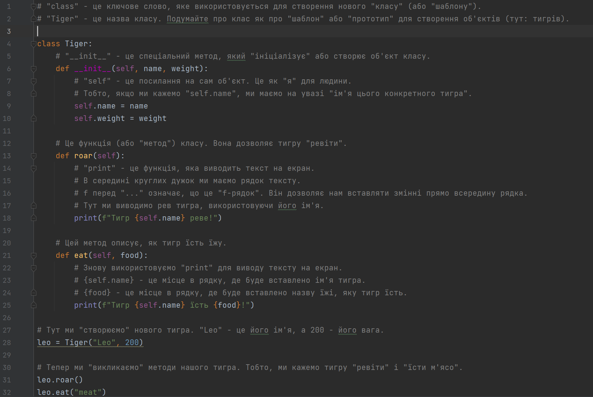

# Парадигми програмування
**Translated Slug:** programming-paradigms
**Source:** [https://qalight.ua/baza-znaniy/paradygmy-programuvannya/](https://qalight.ua/baza-znaniy/paradygmy-programuvannya/)

---

Парадигми програмування – “ООП”

**Об’єктно-орієнтоване програмування (ООП)**

Уявіть, що ви хочете створити віртуальний зоопарк на своєму комп’ютері. В цьому зоопарку буде багато різних тварин.

**ООП** пропонує подивитися на цю задачу так: давайте визначимо “класи” для кожного виду тварин, а потім створимо “екземпляри” цих класів.

**Клас**: Це як загальний “зразок” або “шаблон” для створення об’єктів. Наприклад, у нас може бути клас “Тигр”. Всі тигри мають загальні характеристики: колір шерсті, кількість лап тощо. Але кожен конкретний тигр може відрізнятися (один великий, інший маленький, один грається, інший спить).

**Об’єкт** (екземпляр): Це конкретний представник класу. Якщо “Тигр” – це клас, то конкретний тигр, якого звати “Лео”, який важить 200 кг – це об’єкт або екземпляр цього класу.

**Властивості** (атрибути): Це характеристики, які належать об’єкту. Для тигра це може бути його вага, колір шерсті та ім’я.

**Методи**: Це дії, які об’єкт може виконувати. Наприклад, тигр може ревіти або бігти. Так, у класі “Тигр” може бути метод “ревіти”, який, коли його викликати для конкретного тигра, змусить того тигра “ревіти” у нашому віртуальному зоопарку.

**Наслідування**: Це коли ми створюємо новий клас, базуючись на вже існуючому. Наприклад, можна створити клас “Білий тигр”, який буде мати всі властивості і методи класу “Тигр”, але з додатковими особливостями.

Таким чином, ООП допомагає нам структурувати код так, щоб він був організований навколо “об’єктів” і їх взаємодій, що робить програму більш зрозумілою і легкою для розширення.

**Приклад на Python:**

## Інструкція зі встановлення Python:

1. **Завантаження Python**
   * Перейдіть на офіційний сайт Python за адресою <https://www.python.org/>.
   * Клацніть на кнопку **“Downloads”** та виберіть потрібну версію Python для вашої операційної системи (рекомендовано завантажити останню стабільну версію).
2. **Встановлення Python**
   * Відкрийте завантажений файл інсталятора.
   * Переконайтеся, що опція **“Add Python to PATH”** вибрана. Це дозволить вам запускати Python з командного рядка.
   * Натисніть **“Install Now”** і дочекайтеся завершення встановлення.

**Ось** **покрокова** **інструкція** **для** **PyCharm:**

**Що таке PyCharm**?

**PyCharm** – це інтегроване середовище розробки (IDE) від компанії JetBrains, яке спеціалізується на мові програмування Python. Воно надає зручні інструменти для написання, тестування та відлагодження коду на Python.

## Інструкція зі встановлення PyCharm:

1. **Завантаження PyCharm**
   * Перейдіть на офіційний сайт PyCharm за адресою <https://www.jetbrains.com/pycharm/>.
   * Клацніть на кнопку “Download” для вашої операційної системи.
   * Ви можете вибрати між Professional (платна версія) і Community (безкоштовна версія) версіями. Для навчання та невеликих проектів Community версія буде достатньою.
2. **Встановлення PyCharm**
   * Відкрийте завантажений файл інсталятора.
   * Дотримуйтеся інструкцій на екрані, щоб завершити встановлення.

**Пригода** **з** **тигром** **у** **PyCharm!**

## Інструкція зі створення та запуску програми в PyCharm:

1. **Запустіть PyCharm.**
   * Відкрийте ваше середовище програмування PyCharm на вашому комп’ютері.
2. **Створення нового проекту (якщо потрібно).**
   * Натисніть на кнопку `New Project`.
   * Виберіть директорію для зберігання проекту та введіть назву проекту, наприклад, `"TigerAdventure"`.
   * Натисніть `Create`.
3. **Створення нового файлу Python у проекті.**
   * В області проекту (зліва) клацніть правою кнопкою миші на ім’я вашого проекту.
   * Виберіть `New -> Python File`.
   * Введіть назву файлу, наприклад, `"my_tiger"` і натисніть `Enter`.
4. **Копіювання коду тигра.**
   * Скопіюйте весь код для тигра, який ми розглядали раніше.
   * Вставте цей код у файл `"my_tiger.py"`, який ви щойно створили.
5. **Запуск програми.**
   * Клацніть правою кнопкою миші на відкритому файлі `"my_tiger.py"`.
   * Виберіть `Run 'my_tiger'`.
   * Спостерігайте за діями вашого тигра!

Тепер внизу у PyCharm, у вікні Run, ви побачите повідомлення від вашого тигра, як він реве та їсть!

Сподіваюся, вам сподобається ваша пригода з тигром у PyCharm! Насолоджуйтесь кодуванням і весело проведіть час!
