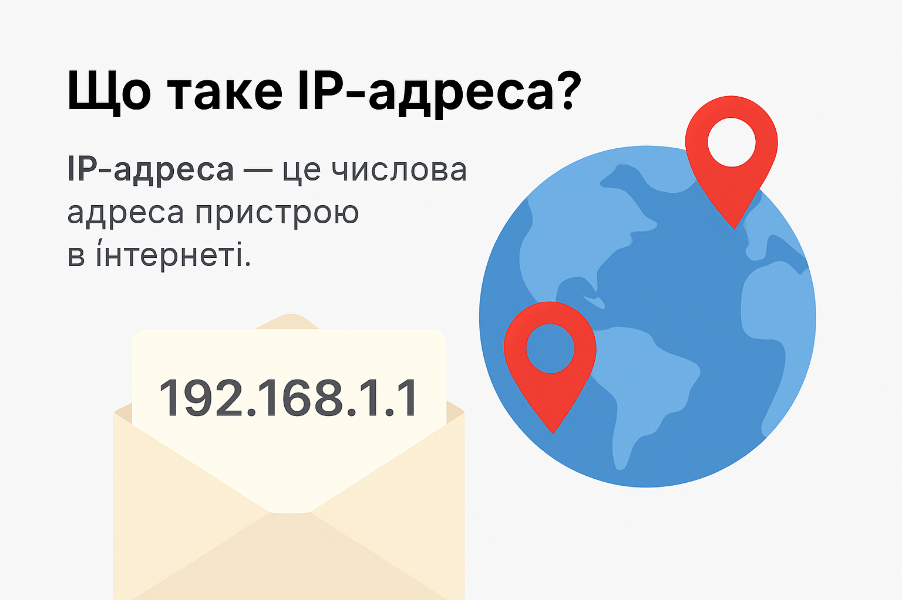

# Що таке IP
**Translated Slug:** what-is-ip
**Source:** [https://qalight.ua/baza-znaniy/shho-take-ip-adresa/](https://qalight.ua/baza-znaniy/shho-take-ip-adresa/)

---

Що таке IP-адреса?

**IP-адреса** — це унікальний числовий ідентифікатор, який отримує кожен пристрій, підключений до інтернету. Вона дозволяє комп’ютерам, смартфонам, серверам та іншим пристроям знаходити один одного та обмінюватися даними.

*Простіше кажучи*, IP-адреса — це як поштова адреса в інтернеті. Якщо ви хочете надіслати листа другу, вам потрібна його адреса. Так само, якщо ваш комп’ютер хоче отримати дані з іншого сервера — йому потрібна його IP-адреса.

## Види IP-адрес:

* **IPv4** — найпоширеніший формат, виглядає як 192.168.0.1
* **IPv6** — новіший формат, виглядає як 2001:0db8:85a3::8a2e:0370:7334
* **Статична IP** — не змінюється з часом
* **Динамічна IP** — призначається автоматично і може змінюватись

## Для чого потрібна IP-адреса?

* Щоб підключити ваш пристрій до інтернету.
* Щоб сайти знали, куди надсилати відповіді.
* Для безпеки та фільтрації трафіку.
* Для геолокації — визначення країни, міста, провайдера.

## Аналогія

Уявіть, що у вас є квартира. Якщо хтось хоче вам надіслати листа — він використовує вашу адресу. *IP-адреса — це адреса вашого пристрою в цифровому світі*. Без неї дані просто не знатимуть, куди йти.

## Висновок

**IP-адреса — це основа інтернет-зв’язку**. Вона дозволяє пристроям знаходити одне одного, обмінюватися інформацією та залишатись на зв’язку. Без IP-адрес не існувало б інтернету в тому вигляді, як ми його знаємо.
